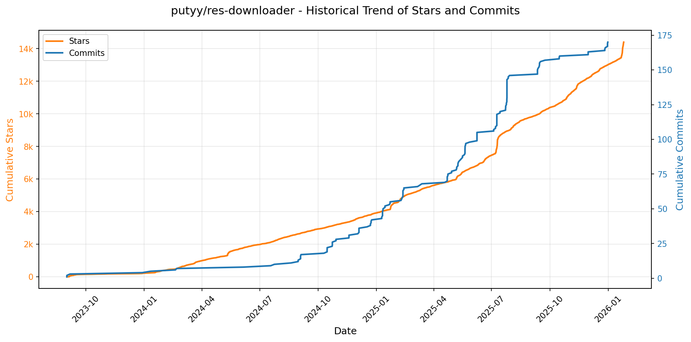

# 🌟 GitHub Trending 概览

> 数据更新于：2026-01-25。

---

## 🔍 项目详情

### 1. [anomalyco/opencode](https://github.com/anomalyco/opencode)
- 📅 **创建日期**：2025-04-30  
- 🔄 **最近更新**：2026-01-25  
- ⭐ **Stars**：86,874（日 +985｜周 +11465｜月 +44777）  
- 📝 **描述**：The open source coding agent.  

<b>📈 Star 与 Commit 历史趋势</b>

> *蓝色：累计 Stars｜橙色：累计 Commits（次 Y 轴）*

<b>📄 README 摘要</b>

1. **项目功能**  
OpenCode 是一个开源的 AI 编程智能体（AI coding agent），旨在为开发者提供终端优先（TUI-first）、本地优先、模型无关的智能编程协作体验。它可在命令行中直接运行，支持代码理解、编辑、调试、重构、文档生成、多步任务规划等开发全流程操作；同时具备客户端/服务器架构，允许远程控制（如通过移动端驱动本地运行的 OpenCode 实例），并原生集成语言服务器协议（LSP），实现深度 IDE 级语义支持。

2. **核心特性**  
- **双模式智能代理系统**：内置 `build`（默认，全权限开发代理）和 `plan`（只读分析代理，禁用文件修改、需显式授权执行命令）两种主代理，按 Tab 键快速切换；另含 `@general` 子代理处理复杂搜索与多步骤推理任务。  
- **跨平台全栈安装支持**：提供一键脚本（curl）、主流包管理器（npm/bun/pnpm/yarn、Homebrew、Scoop、Chocolatey、Paru、Mise、Nix）及独立桌面应用（macOS/Windows/Linux，BETA 版）。  
- **高度可定制安装路径**：遵循 XDG Base Directory 规范，支持环境变量（`OPENCODE_INSTALL_DIR` / `XDG_BIN_DIR`）优先级配置。  
- **完全开源与厂商中立**：不绑定任何大模型供应商，兼容 Claude、OpenAI、Google Gemini 及本地模型（如 Ollama、LM Studio），推荐搭配其自有模型分发平台 OpenCode Zen 使用。  
- **终端极致优化**：由 Neovim 用户及 terminal.shop 团队打造，专注提升 TUI 交互能力与性能边界。  

3. **技术栈**  
- **前端/客户端**：基于终端 UI（TUI）构建，桌面端使用 Electron 或类似框架（未明示但符合 `.dmg`/`.exe`/`.deb` 发布形态）；Web 控制台（`packages/console/app/`）采用现代前端技术（含 SVG 主题化 logo，支持暗色/亮色模式）。  
- **核心运行时**：CLI 工具链以 Node.js 为主（npm 包 `opencode-ai`），同时深度适配多种运行时（Bun/Pnpm/Yarn）、包管理器（Scoop/Choco/Homebrew/Paru/Mise/Nix）。  
- **架构设计**：采用**客户端-服务器分离架构**（client/server），支持本地执行 + 远程驱动，为多端协同（如手机 App 控制终端 Agent）提供基础。  
- **协议与集成**：原生支持 **LSP（Language Server Protocol）**，实现语法高亮、跳转、补全、诊断等标准语言功能；底层通信与模型调用抽象层确保多模型后端无缝切换。

---

### 2. [browser-use/browser-use](https://github.com/browser-use/browser-use)
- 📅 **创建日期**：2024-10-31  
- 🔄 **最近更新**：2026-01-25  
- ⭐ **Stars**：76,828（日 +412｜周 +1233｜月 +2857）  
- 📝 **描述**：🌐 Make websites accessible for AI agents. Automate tasks online with ease.  

<b>📈 Star 与 Commit 历史趋势</b>

> *蓝色：累计 Stars｜橙色：累计 Commits（次 Y 轴）*

<b>📄 README 摘要</b>

1. **项目功能**  
Browser-Use 是一个面向浏览器自动化的 AI 代理（AI Browser Agent）框架，旨在让大语言模型（LLM）能够像人类一样真实操作网页：理解页面内容、识别可点击元素、填写表单、执行导航、截图、处理登录与会话状态等。它支持“指令即执行”范式——用户仅需用自然语言描述任务（如“为我申请这份工作”“在 Instacart 中添加购物清单”），系统即可自主完成端到端的浏览器交互。同时提供云服务（Browser Use Cloud），集成反检测能力（stealth browsing）、代理轮换、持久化 Cookie/Profile 和高并发执行能力，适用于生产级自动化场景。

2. **核心特性**  
- ✅ **零配置快速启动**：支持 `uvx browser-use init` 一键生成模板（default/advanced/tools），内置 CLI 工具实现命令行式交互（`open`/`click`/`type`/`screenshot` 等）。  
- ✅ **多环境部署支持**：本地运行（Chromium + Python）、沙箱隔离部署（`@sandbox` 装饰器）、云端无头 stealth 浏览器（Cloud API，规避 CAPTCHA 和指纹检测）。  
- ✅ **深度 LLM 协同**：内置优化模型 `ChatBrowserUse()`（专为浏览器任务微调，速度提升 3–5×），兼容 OpenAI、Google、Ollama 等主流 LLM；支持 MCP（Model Control Protocol）与自定义工具扩展（`@tools.action`）。  
- ✅ **企业级可靠性功能**：支持复用真实 Chrome 用户配置文件（含已登录账号）、AgentMail 邮箱集成、API Key 管理、环境变量驱动配置（`.env`）、自动 Chromium 安装与版本管理。  
- ✅ **开箱即用的典型用例**：提供完整示例覆盖求职申请、在线购菜、硬件比价（PCPartPicker）、新闻爬取等真实场景，并全部开源可复现。

3. **技术栈**  
- **语言与运行时**：Python 3.11+，依赖 `uv`（Astral 开发的超快 Python 包管理器）进行环境初始化与依赖管理。  
- **浏览器引擎**：基于 Chromium（通过 `playwright` 或原生 `chromium` 二进制驱动），支持本地安装与云托管 stealth 浏览器实例。  
- **核心框架**：异步 Python（`asyncio`），模块化设计（`Agent`/`Browser`/`ChatBrowserUse`/`Tools`），轻量抽象层屏蔽底层浏览器细节。  
- **云基础设施**：Browser Use Cloud 基于高性能容器化架构，集成代理池、动态指纹模拟、内存优化调度与 HTTPS 加密通信。  
- **生态集成**：原生支持 Claude Code 技能插件、Discord 社区协作、GitHub Actions CI 示例、文档站点（Docusaurus）、指标看板（下载量/Star 数实时徽章）。

---

### 3. [twitter/the-algorithm](https://github.com/twitter/the-algorithm)
- 📅 **创建日期**：2023-03-27  
- 🔄 **最近更新**：2026-01-25  
- ⭐ **Stars**：72,132（日 +91｜周 +1688｜月 +3396）  
- 📝 **描述**：Source code for the X Recommendation Algorithm  

<b>📈 Star 与 Commit 历史趋势</b>

> *蓝色：累计 Stars｜橙色：累计 Commits（次 Y 轴）*

<b>📄 README 摘要</b>

1. **该项目的功能**  
该项目是 X（原 Twitter）开源的推荐算法核心实现，旨在为 X 全平台（如“为你推荐”时间线、搜索、探索、通知等）提供个性化内容流（尤其是帖子）的生成与排序服务。其核心任务包括：从海量数据中检索候选内容（Candidate Sourcing）、对候选内容进行多层级排序（Ranking）、融合不同来源结果并施加合规性与质量过滤（Post Mixing & Filtering），最终构建用户可见的动态信息流。当前已开源的部分主要支撑两大场景：“为你推荐”时间线（For You Timeline）和“推荐通知”（Recommended Notifications）。

2. **关键特性**  
- **分层推荐架构**：采用典型的两阶段（或三阶段）推荐范式——先通过多种候选源（如搜索索引、图遍历、关注推荐、用户行为图 UTEG 等）高效召回千级候选帖；再经轻量级模型（Light Ranker）初筛，最后由深度神经网络（Heavy Ranker）精细排序。  
- **多模态信号融合**：统一接入显式（点赞、转发）与隐式（点击、停留、主页访问）用户行为（via `unified-user-actions` 和 `user-signal-service`），并结合图结构（`real-graph`, `tweepcred`, `graph-feature-service`）、语义嵌入（`SimClusters`, `TwHIN`）、话题识别（`topic-social-proof`）及可信安全模型（`trust-and-safety-models`）等多维特征。  
- **高可用工程框架支撑**：内置面向生产的工业级框架，如 Rust 编写的高性能模型服务 `navi`、可配置化信息流构建框架 `product-mixer`、实时/批量聚合特征框架 `timelines-aggregation-framework`、嵌入向量统一管理服务 `representation-manager`，以及强管控的内容可见性过滤系统 `visibility-filters`（支持法律合规、反滥用、用户体验优化）。  

3. **技术栈**  
- **编程语言**：以 **Scala**（批处理作业、图计算、服务逻辑）、**Python**（深度学习模型训练与推理，如 `light-ranker`/`heavy-ranker`）、**Java**（搜索索引集成）和 **Rust**（高性能在线服务 `navi`）为主；部分组件含 Go/C++ 依赖。  
- **机器学习框架**：主流使用 **TensorFlow**（通过遗留框架 `twml`）；新模型逐步转向更灵活的 PyTorch 或自研训练流水线（`the-algorithm-ml` 仓库协同）；`navi` 支持 ONNX 模型部署。  
- **大数据与图计算**：基于 **Apache Spark**（批处理）、**Kafka**（实时用户行为流）、**GraphJet**（内存图引擎，支撑 UTEG 等图遍历服务）；自研图特征服务 `graph-feature-service` 和知识图谱嵌入 `TwHIN`。  
- **基础设施与构建**：采用 **Bazel** 作为构建工具（各模块含独立 BUILD 文件）；服务部署依赖微服务架构，强调可观测性、AB 测试与灰度发布能力（文档虽未详述，但属 X 生产级标配）。

---

### 4. [anthropics/claude-code](https://github.com/anthropics/claude-code)
- 📅 **创建日期**：2025-02-22  
- 🔄 **最近更新**：2026-01-25  
- ⭐ **Stars**：60,557（日 +344｜周 +2805｜月 +12019）  
- 📝 **描述**：Claude Code is an agentic coding tool that lives in your terminal, understands your codebase, and helps you code faster by executing routine tasks, explaining complex code, and handling git workflows - all through natural language commands.  

<b>📈 Star 与 Commit 历史趋势</b>

> *蓝色：累计 Stars｜橙色：累计 Commits（次 Y 轴）*

<b>📄 README 摘要</b>

1. **该项目的功能**  
Claude Code 是一款终端原生的智能编程代理工具，能够深度理解用户本地代码库，通过自然语言指令协助开发者加速编码工作。其核心能力包括：自动执行重复性开发任务（如生成文件、编写测试、重构代码等）、解释复杂代码逻辑、自动化处理 Git 工作流（如提交、分支管理、冲突分析），并支持在终端、IDE 或 GitHub 中（通过 `@claude` 提及）直接调用。

2. **关键特性**  
- **上下文感知的代码理解**：基于项目目录结构与文件内容构建本地知识图谱，实现精准的代码语义理解；  
- **多环境集成**：原生支持终端命令行（`claude` 命令）、主流 IDE 插件扩展及 GitHub 评论区交互；  
- **可扩展插件架构**：内置插件系统，允许开发者通过自定义命令和专用 Agent 扩展功能（如数据库操作、API 测试、CI/CD 集成等）；  
- **一键式跨平台安装**：提供针对 macOS/Linux（Shell 脚本 + Homebrew）和 Windows（PowerShell 脚本 + WinGet）的标准化安装方案，npm 全局安装已弃用；  
- **隐私优先设计**：默认不上传源码，仅收集匿名化使用反馈（如代码采纳率、对话摘要、`/bug` 提交内容），明确禁止将用户数据用于模型训练，并实施敏感数据限时保留与最小权限访问控制。

3. **技术栈**  
- **运行时环境**：Node.js 18+（作为基础运行时，支撑 CLI 和插件系统）；  
- **客户端架构**：终端原生 CLI 工具（非 Web 应用），采用 Shell（macOS/Linux）和 PowerShell（Windows）脚本实现轻量级安装与启动；  
- **后端服务**：依赖 Anthropic 官方托管的 Claude 模型 API（未开源服务端，由 `code.claude.com` 提供 SaaS 后端能力）；  
- **扩展机制**：基于 JavaScript/TypeScript 编写的插件系统（位于 `plugins/` 目录），支持模块化命令注册与 Agent 生命周期管理；  
- **基础设施**：GitHub Actions（CI/CD）、Discord（社区支持）、npm（历史包分发，现已弃用）。

---

### 5. [usememos/memos](https://github.com/usememos/memos)
- 📅 **创建日期**：2021-12-08  
- 🔄 **最近更新**：2026-01-25  
- ⭐ **Stars**：55,675（日 +109｜周 +991｜月 +8291）  
- 📝 **描述**：An open-source, self-hosted note-taking service. Your thoughts, your data, your control — no tracking, no ads, no subscription fees.  

<b>📈 Star 与 Commit 历史趋势</b>

> *蓝色：累计 Stars｜橙色：累计 Commits（次 Y 轴）*

<b>📄 README 摘要</b>

1. **项目功能**  
Memos 是一个开源、可自托管的笔记与知识管理服务，面向个人笔记、团队 Wiki 和结构化知识库场景。它允许用户完全掌控自己的数据——所有内容存储于用户自选的基础设施（本地服务器、云主机或容器环境）中，不依赖第三方云服务，无数据上传、无用户行为追踪、无广告、无订阅费用。

2. **核心特性**  
- **隐私优先架构**：零遥测（zero telemetry）、无后台数据收集，支持完整数据导出与迁移；  
- **原生 Markdown 支持**：富文本编辑基于标准 Markdown，所有笔记以纯文本格式存储，确保长期可读性与可移植性；  
- **高性能体验**：后端采用 Go 实现高并发低延迟，前端基于 React 构建响应式界面，加载迅速，支持暗色模式与移动端适配；  
- **极简部署**：提供一键 Docker 命令启动，同时兼容 SQLite（默认）、MySQL 和 PostgreSQL 作为数据库后端；  
- **开发者友好**：开放完整的 REST API 与 gRPC API，便于集成至现有工作流、自动化工具或第三方应用；  
- **多环境支持**：除 Docker 外，还提供预编译二进制包（Linux/macOS/Windows）、Docker Compose 模板、Kubernetes Helm Chart 及源码构建选项。

3. **技术栈**  
- **后端**：Go（Golang），使用 Gin 或类似轻量框架，支持多种关系型数据库（SQLite / MySQL / PostgreSQL）；  
- **前端**：React（TypeScript），基于现代 Web 标准构建，支持 PWA 特性、响应式布局与国际化（i18n）；  
- **部署与运维**：深度集成 Docker 生态，提供官方镜像（`neosmemo/memos`）；支持 Docker Compose、Kubernetes（含 Helm）、Vercel（用于文档站）等主流编排与托管平台；  
- **许可证与合规**：MIT 开源许可证，符合隐私优先设计原则，无闭源依赖。

---

### 6. [anthropics/skills](https://github.com/anthropics/skills)
- 📅 **创建日期**：2025-09-22  
- 🔄 **最近更新**：2026-01-25  
- ⭐ **Stars**：52,143（日 +973｜周 +8201｜月 +25024）  
- 📝 **描述**：Public repository for Agent Skills  

<b>📈 Star 与 Commit 历史趋势</b>

> *蓝色：累计 Stars｜橙色：累计 Commits（次 Y 轴）*

<b>📄 README 摘要</b>

1. **该项目的功能**  
该项目是 Anthropic 官方维护的 Claude 技能（Skills）开源实现仓库，旨在展示和提供可复用、可扩展的“技能”范例。这些技能是结构化、自包含的功能模块（以文件夹形式组织），通过动态加载方式赋予 Claude 在特定任务上的专业化能力，例如：按企业品牌规范生成文档、基于组织特有流程分析数据、自动化个人事务等。它不提供独立运行的软件或服务，而是为开发者和企业构建、测试、部署定制化 AI 能力提供参考实现与工程样板。

2. **核心特性**  
- **模块化技能架构**：每个技能均为独立文件夹，含标准化 `SKILL.md`（含 YAML 元数据 + Markdown 指令），支持即插即用与版本管理；  
- **多场景覆盖**：涵盖创意设计（艺术/音乐/UI）、技术开发（Web 应用测试、MCP 服务器生成）、企业协作（通信模板、品牌合规）及文档处理（DOCX/PDF/PPTX/XLSX 创建与解析）四大类技能；  
- **生产级参考实现**：公开了支撑 Claude 实际文档功能的源可用（source-available）技能代码（如 `skills/docx` 等子目录），虽非开源许可（Apache 2.0 仅适用于部分示例技能），但具极高工程参考价值；  
- **跨平台集成支持**：原生适配 Claude Code（插件市场安装）、Claude.ai（付费用户开箱即用）及 Claude API（支持上传自定义技能），实现技能在 IDE、网页端与后端服务中的统一调用；  
- **标准化规范与模板**：内置 [Agent Skills 规范](./spec) 和 [技能模板](./template)，降低开发门槛，确保兼容性与可维护性。

3. **技术栈**  
- **核心格式**：纯文本驱动，基于 Markdown（`SKILL.md`）定义技能行为，YAML 前置元数据声明技能标识与描述；  
- **无运行时依赖**：技能本身不包含可执行代码（如 Python/JS），而是面向 Claude 模型的指令集，其执行依赖 Anthropic 的底层模型推理与技能调度系统；  
- **基础设施层**：依托 Anthropic 自研的 Agent Skills 标准（见 agentskills.io）与 Claude 平台能力（包括 Skills API、插件机制、上下文感知激活等），非传统前后端技术栈；  
- **辅助工具链**：提供 CLI 插件注册命令（如 `/plugin marketplace add`）、结构化模板及文档链接生态，强调开发者体验与标准化协作。

---

### 7. [obra/superpowers](https://github.com/obra/superpowers)
- 📅 **创建日期**：2025-10-09  
- 🔄 **最近更新**：2026-01-25  
- ⭐ **Stars**：35,423（日 +692｜周 +7904｜月 +23905）  
- 📝 **描述**：An agentic skills framework & software development methodology that works.  

<b>📈 Star 与 Commit 历史趋势</b>

> *蓝色：累计 Stars｜橙色：累计 Commits（次 Y 轴）*

<b>📄 README 摘要</b>

1. **项目功能**  
Superpowers 是一个面向编程智能体（coding agents）的完整软件开发工作流框架，旨在将原本零散、随意的代码生成行为系统化、工程化。它不直接生成代码，而是通过一系列自动触发的“技能”（skills），引导智能体严格遵循专业软件工程实践：从与用户协作明确需求规格（spec）、分块确认设计、制定可执行的详细实施计划，到以子智能体驱动的方式逐项完成任务（每项任务均强制要求先写测试、再写最小可行代码、再重构），并贯穿自动化代码审查、Git 工作树隔离、分支收尾决策等全流程。其核心目标是让 AI 编程行为具备人类高级工程师的纪律性、可验证性和可协作性。

2. **关键特性**  
- **全自动技能触发机制**：所有技能（如 brainstorming、writing-plans、subagent-driven-development 等）基于上下文自动激活，无需用户手动调用命令，形成强制性、不可绕过的工程流水线；  
- **深度 TDD 强制执行**：严格实施 RED-GREEN-REFACTOR 三阶段循环，禁止任何未经测试的代码提交，并自动删除测试前编写的代码；  
- **结构化协作式设计**：通过 Socratic 提问引导用户细化需求，以可读分块形式呈现设计方案，支持人工逐段签核；  
- **子智能体驱动开发（Subagent-Driven Development）**：为每个 2–5 分钟粒度的任务分配独立子智能体，执行两阶段审查（是否符合规格 → 是否符合代码质量标准），支持数小时无人干预的自主推进；  
- **全生命周期 Git 工作流集成**：自动创建隔离的 git worktree、校验干净测试基线、执行任务后自动验证、最终提供合并/PR/丢弃等标准化收尾选项；  
- **内建工程哲学约束**：原生贯彻 YAGNI（你不会需要它）、DRY（不要重复自己）、证据优先（verify before declare）、复杂度最小化等原则，并通过技能本身实现落地。

3. **技术栈**  
- **运行平台**：专为 AI 编程代理环境设计，原生支持 Claude Code（通过插件市场）、Codex 和 OpenCode 三类主流 AI IDE；  
- **架构模式**：基于“可组合技能（composable skills）”的插件化架构，每个技能为独立、自描述、可测试的 Markdown+指令模块（如 `skills/test-driven-development/SKILL.md`）；  
- **集成机制**：Claude Code 使用 `/plugin` 命令体系管理；Codex 和 OpenCode 通过远程拉取安装说明（`.codex/INSTALL.md` 或 `.opencode/INSTALL.md`）实现配置；  
- **底层依赖**：无独立后端或运行时，完全依托宿主 AI 环境的指令执行能力与上下文理解能力，技能逻辑通过自然语言提示工程（prompt engineering）与结构化工作流控制实现；  
- **扩展生态**：支持用户贡献新技能，内置 `writing-skills` 技能提供标准化技能开发范式与测试方法论，整个系统以 MIT 协议开源，技能库即代码（skills-as-code）。

---

### 8. [Lissy93/web-check](https://github.com/Lissy93/web-check)
- 📅 **创建日期**：2023-06-25  
- 🔄 **最近更新**：2026-01-25  
- ⭐ **Stars**：30,942（日 +88｜周 +793｜月 +3891）  
- 📝 **描述**：🕵️‍♂️ All-in-one OSINT tool for analysing any website  

<b>📈 Star 与 Commit 历史趋势</b>

> *蓝色：累计 Stars｜橙色：累计 Commits（次 Y 轴）*

---

### 9. [remotion-dev/remotion](https://github.com/remotion-dev/remotion)
- 📅 **创建日期**：2020-06-23  
- 🔄 **最近更新**：2026-01-25  
- ⭐ **Stars**：29,643（日 +1098｜周 +4300｜月 +4634）  
- 📝 **描述**：🎥      Make videos programmatically with React  

<b>📈 Star 与 Commit 历史趋势</b>

> *蓝色：累计 Stars｜橙色：累计 Commits（次 Y 轴）*

<b>📄 README 摘要</b>

1. **项目功能**  
Remotion 是一个基于 React 的视频生成框架，允许开发者使用 React 组件和 JavaScript 代码**以编程方式（programmatically）创建视频**。它将视频视为“可渲染的时序内容”，支持在浏览器中实时预览、导出为 MP4/WebM 等格式，并可集成到 Node.js 服务中批量生成个性化视频（如年度回顾、数据可视化视频、动态广告等）。

2. **核心特性**  
- ✅ **React 驱动的视频合成**：用 JSX 编写视频帧，支持组件复用、props、hooks、状态管理与上下文；  
- ✅ **时间轴控制**：通过 `useCurrentFrame()` 和 `interpolate()` 等 API 精确控制每一帧的动画与逻辑；  
- ✅ **全栈 Web 技术支持**：原生兼容 CSS 动画、SVG、Canvas、WebGL（含 Three.js）、Web Audio 等；  
- ✅ **开发体验优化**：支持 Fast Refresh（热更新）、Chrome DevTools 调试、帧级时间旅行调试；  
- ✅ **多环境输出**：本地浏览器预览 + CLI 批量渲染（Node.js）+ Serverless 部署（如 Vercel、AWS Lambda）；  
- ✅ **动态与个性化能力**：可接入外部 API、JSON 数据、用户输入，生成千人千面的定制化视频（如 GitHub Unwrapped）。

3. **技术栈**  
- **核心框架**：React（v18+），基于 React Concurrent Rendering 模型实现帧同步渲染；  
- **构建与打包**：Vite（默认模板）、Webpack（兼容支持）；  
- **渲染引擎**：基于 Chromium 的 Headless 浏览器（Puppeteer / Playwright）进行帧捕获与编码；  
- **视频编码**：FFmpeg（CLI 集成），支持 H.264/H.265/VP9 编码；  
- **语言与工具链**：TypeScript（官方强类型支持）、ES Modules、Node.js（≥18.x）；  
- **部署生态**：深度适配 Vercel、Netlify、Cloudflare Workers 及 AWS（Lambda + S3）等无服务器平台。

---

### 10. [block/goose](https://github.com/block/goose)
- 📅 **创建日期**：2024-08-23  
- 🔄 **最近更新**：2026-01-25  
- ⭐ **Stars**：28,417（日 +786｜周 +2373｜月 +3445）  
- 📝 **描述**：an open source, extensible AI agent that goes beyond code suggestions - install, execute, edit, and test with any LLM  

<b>📈 Star 与 Commit 历史趋势</b>

> *蓝色：累计 Stars｜橙色：累计 Commits（次 Y 轴）*

<b>📄 README 摘要</b>

1. **项目功能**  
goose 是一个运行在本地的、可扩展的开源 AI 代理工具，专为自动化软件工程任务而设计。它不仅能提供代码补全或建议，更能端到端自主完成复杂开发工作：从零构建完整项目、编写并执行代码、自动调试失败、编排多步骤工程工作流（如测试、部署、文档生成），以及安全调用外部 API。其核心定位是作为开发者“本机运行”的智能协作者，支持从原型验证、代码重构到大规模工程流水线管理的全场景自动化。

2. **关键特性**  
- **完全本地化与隐私优先**：所有模型推理和任务执行默认在用户设备上完成，敏感代码与数据不出本地；  
- **LLM 无关性与多模型协同**：原生支持任意大语言模型（本地或远程），允许按任务类型配置不同模型（如用轻量模型做代码审查、强模型做架构设计），实现性能与成本最优平衡；  
- **MCP（Model Context Protocol）原生集成**：无缝对接符合 MCP 标准的服务器，增强上下文感知与工具调用能力；  
- **双形态交付**：同时提供图形化桌面应用（macOS/Windows/Linux）和命令行工具（CLI），适配不同开发习惯；  
- **高度可扩展架构**：通过插件系统支持自定义工具、环境集成（如 Git、Docker、CI/CD）、领域特定工作流；  
- **负责任的 AI 实践**：内置人工审核环节、操作可追溯日志、明确的权限控制，并配套《负责任 AI 辅助编程指南》（HOWTOAI.md）。

3. **技术栈**  
- **前端/桌面端**：基于 Tauri 框架（Rust + Web 技术栈），实现轻量、安全、高性能的跨平台桌面应用；  
- **核心引擎**：Rust 编写，保障高并发任务调度、低延迟响应与系统资源高效利用；  
- **CLI 工具**：Rust 实现，与桌面端共享核心逻辑，确保行为一致；  
- **协议层**：深度集成 MCP（Model Context Protocol）标准，支持标准化模型上下文交互；  
- **构建与运维**：GitHub Actions CI/CD 流水线，Apache 2.0 开源许可证，文档托管于 GitHub Pages。

---

### 11. [simstudioai/sim](https://github.com/simstudioai/sim)
- 📅 **创建日期**：2025-01-05  
- 🔄 **最近更新**：2026-01-25  
- ⭐ **Stars**：26,245（日 +112｜周 +435｜月 +1863）  
- 📝 **描述**：Open-source platform to build and deploy AI agent workflows.  

<b>📈 Star 与 Commit 历史趋势</b>

> *蓝色：累计 Stars｜橙色：累计 Commits（次 Y 轴）*

<b>📄 README 摘要</b>

1. **项目功能**  
Sim 是一个用于快速构建与部署 AI 智能体（Agent）工作流的平台。它支持用户通过可视化画布拖拽式编排 Agent、工具（Tools）和逻辑模块（Blocks），实现端到端 AI 工作流的即时运行；同时提供本地化部署能力，允许用户完全离线运行 AI 模型（如通过 Ollama 或 vLLM），无需依赖外部 API，适用于私有知识库问答、自动化任务编排、RAG 应用开发等场景。

2. **核心特性**  
- **可视化工作流编排**：基于 ReactFlow 构建的交互式画布，支持节点连接、实时调试与一键执行；  
- **自然语言驱动的 Copilot 辅助**：集成 Sim 自研 Copilot 服务，可通过自然语言生成节点、修复流程错误、优化工作流逻辑；  
- **向量知识库集成**：支持文档上传、自动嵌入与向量化存储（基于 pgvector），使 Agent 能够基于专属知识进行精准问答与推理；  
- **全栈本地化 AI 支持**：原生兼容 Ollama（含 GPU/CPU 优化配置）、vLLM 等主流本地大模型推理框架，支持模型热切换与多模型协同；  
- **一体化自托管方案**：提供 Docker Compose（生产/OLLAMA/vLLM 多配置）、NPM 快捷启动（`npx simstudio`）、Dev Container 及手动开发部署四种模式，覆盖从试用到企业级部署的全生命周期需求。

3. **技术栈**  
- **前端框架**：Next.js（App Router） + Bun（运行时与包管理）；  
- **UI 组件库**：Shadcn/ui + Tailwind CSS；  
- **状态管理**：Zustand；  
- **流程编辑器**：ReactFlow；  
- **后端与数据层**：PostgreSQL（启用 pgvector 扩展） + Drizzle ORM（TypeScript 原生迁移与查询）；  
- **认证授权**：Better Auth；  
- **实时通信**：Socket.io（用于工作流执行状态、Copilot 流式响应等）；  
- **异步任务与后台作业**：Trigger.dev；  
- **安全沙箱执行**：E2B（用于安全运行用户代码块）；  
- **工程体系**：Turborepo（Monorepo 管理）、Fumadocs（文档站点）。

---

### 12. [ComposioHQ/awesome-claude-skills](https://github.com/ComposioHQ/awesome-claude-skills)
- 📅 **创建日期**：2025-10-17  
- 🔄 **最近更新**：2026-01-25  
- ⭐ **Stars**：25,319（日 +443｜周 +4545｜月 +14494）  
- 📝 **描述**：A curated list of awesome Claude Skills, resources, and tools for customizing Claude AI workflows  

<b>📈 Star 与 Commit 历史趋势</b>

> *蓝色：累计 Stars｜橙色：累计 Commits（次 Y 轴）*

<b>📄 README 摘要</b>

1. **项目功能**  
该项目是一个面向 Anthropic Claude 系列模型（包括 Claude.ai、Claude Code 和 Claude API）的**开源技能（Skills）聚合库与实践指南**，旨在将 Claude 从纯文本生成模型升级为可执行真实业务操作的智能代理。其核心能力是通过结构化、可复用的“技能”扩展 Claude 的功能边界，使其能直接对接外部系统（如 Gmail、Slack、GitHub、Notion、PostgreSQL 等），完成发送邮件、创建工单、发布消息、查询数据库、自动化测试、文档处理、数据分析、市场调研、代码审查、安全检测等具体任务，实现端到端的工作流自动化。

2. **关键特性**  
- **跨平台统一技能支持**：所有技能均兼容 Claude.ai（网页端）、Claude Code（本地 IDE 插件）及 Claude API（程序调用），确保一致的行为与体验。  
- **开箱即用的连接能力**：内置 `connect-apps` 插件，基于 Composio 框架，支持一键连接 500+ 应用（覆盖 1000+ API），自动处理 OAuth 授权、凭证管理与协议适配。  
- **高度结构化技能体系**：按领域精细分类（共 9 大类），涵盖文档处理（DOCX/PDF/PPTX/XLSX/EPUB）、开发工具（Playwright、AWS、Git、MCP、LangSmith）、数据与分析（CSV、PostgreSQL、深度研究）、商业营销（竞品广告提取、域名生成）、通信写作（会议分析、NotebookLM 集成）、创意媒体（图像生成/增强、Slack GIF、视频下载）、生产力（发票整理、简历定制、知识图谱）、协作管理（Google Workspace、Outline、Git 自动化）及安全系统（数字取证、Sigma 威胁狩猎）。  
- **低门槛技能开发框架**：提供标准化技能结构（含 `SKILL.md` YAML 元数据）、模板、最佳实践与 CLI 工具（如 `Skill Creator`、`Skill Seekers`），支持用户快速创建、测试和共享自定义技能。  
- **社区驱动与开放生态**：采用 Apache-2.0 许可证，鼓励 PR 贡献；集成多个第三方开发者技能（标注作者与源仓库），形成活跃的技能共建社区。

3. **技术栈**  
- **核心运行时**：Anthropic Claude 模型（特别是 Claude 3.5 Sonnet 及后续版本），依赖其 Skills API 与插件机制。  
- **集成中间件**：Composio（作为底层连接层，提供 1000+ 应用的标准化适配器与认证管理）。  
- **开发与部署工具**：CLI 工具链（`claude` 命令行客户端）、YAML + Markdown 技能描述格式、Python（用于部分技能脚本及 API 调用示例）、TypeScript/Python（MCP 服务器构建）、React/Tailwind CSS（Web Artifact 生成）。  
- **外部服务依赖**：Google Gemini（Deep Research、Imagen 图像生成）、n8n（工作流编排）、NotebookLM（文档问答）、FFUF（Web 模糊测试）、Playwright（浏览器自动化）、D3.js（数据可视化）、PICT（组合测试用例生成）等第三方工具与 API。  
- **基础设施**：GitHub 托管（版本控制与协作）、Discord 社区支持、X（Twitter）与 LinkedIn 官方渠道运营。

---

### 13. [bytedance/UI-TARS-desktop](https://github.com/bytedance/UI-TARS-desktop)
- 📅 **创建日期**：2025-01-19  
- 🔄 **最近更新**：2026-01-25  
- ⭐ **Stars**：24,774（日 +57｜周 +648｜月 +4709）  
- 📝 **描述**：The Open-Source Multimodal AI Agent Stack: Connecting Cutting-Edge AI Models and Agent Infra  

<b>📈 Star 与 Commit 历史趋势</b>

> *蓝色：累计 Stars｜橙色：累计 Commits（次 Y 轴）*

<b>📄 README 摘要</b>

1. **项目功能**  
TARS 是一个面向实际任务的多模态 AI 智能体（Agent）技术栈，核心目标是实现类人化、端到端的任务完成能力。它通过融合视觉（Vision）、图形用户界面（GUI）理解与操作、自然语言指令理解等多模态能力，使 AI 能够直接在终端、本地计算机、浏览器乃至产品环境中执行真实世界任务（如订机票、订酒店、操控 VS Code、浏览 GitHub 问题、生成图表等）。项目包含两个协同演进的子系统：**Agent TARS**（通用多模态 Agent 运行时框架，提供 CLI 与 Web UI）和 **UI-TARS Desktop**（原生桌面 GUI Agent 应用，支持本地与远程计算机/浏览器的视觉驱动自动化控制）。

2. **关键特性**  
- **多模态任务执行能力**：支持基于屏幕截图的视觉定位（Visual Grounding）、DOM 解析与混合策略的浏览器自动化；可调用真实工具链（如 Shell 命令、Booking.com、Priceline 等），依托 MCP（Model Control Protocol）标准实现工具即插即用。  
- **灵活部署形态**：Agent TARS 提供开箱即用的 CLI（支持 headless 服务模式）与交互式 Web UI；UI-TARS Desktop 提供跨平台（Windows/macOS）原生桌面应用，支持零配置的本地操作与一键远程控制（Remote Computer/Browser Operator）。  
- **可观测性与工程化支持**：内置事件流（Event Stream）协议，支持上下文工程（Context Engineering）、数据流追踪、调试（Event Stream Viewer）及运行时性能统计（工具调用耗时、深度思考耗时等）；独家集成 AIO Agent Sandbox，提供隔离、安全的全功能工具执行环境。  
- **隐私与本地化优先**：UI-TARS Desktop 默认全程本地运行（含模型推理），保障数据私密性；同时支持远程操作模式，兼顾灵活性与安全性。  

3. **技术栈**  
- **模型层**：基于自研多模态大模型 UI-TARS 系列（如 UI-TARS-1.5-7B、Seed-1.5-VL/1.6），支持视觉-语言联合理解与 GUI 操作规划；兼容主流第三方多模态模型（如 VolcEngine 的 Doubao-1.5-Thinking-Vision-Pro、Anthropic 的 Claude 3.7 Sonnet）。  
- **协议与架构**：以 MCP（Model Control Protocol）为底层通信标准，实现 Agent 内核与外部工具服务器（MCP Servers）的解耦集成；采用事件流（Event Stream）驱动的响应式架构，支撑动态上下文管理与 UI 同步。  
- **工程实现**：Agent TARS CLI 基于 Node.js（要求 v22+），通过 npm 分发（`@agent-tars/cli`）；UI-TARS Desktop 为原生桌面应用（Electron 或类似跨平台框架，结合 Rust/Python 后端进行高性能图像处理与系统级操作）；配套 SDK（UI TARS SDK）支持跨平台 GUI 自动化开发；部署支持 ModelScope、Hugging Face 等平台。

---

### 14. [microsoft/VibeVoice](https://github.com/microsoft/VibeVoice)
- 📅 **创建日期**：2025-08-25  
- 🔄 **最近更新**：2026-01-25  
- ⭐ **Stars**：21,717（日 +377｜周 +1340｜月 +2705）  
- 📝 **描述**：Open-Source Frontier Voice AI  

<b>📈 Star 与 Commit 历史趋势</b>

> *蓝色：累计 Stars｜橙色：累计 Commits（次 Y 轴）*

<b>📄 README 摘要</b>

1. **项目功能**  
VibeVoice 是一个开源的前沿语音人工智能模型家族，专注于长时程、高保真、结构化语音处理任务，涵盖语音识别（ASR）与文本转语音（TTS）两大方向。其核心目标是突破传统语音模型在**长音频单次处理能力、多说话人建模、实时流式合成及结构化输出**等方面的瓶颈：  
- **VibeVoice-ASR** 可一次性处理长达 **60 分钟**的连续语音，同步完成语音识别、说话人分离（Diarization）和精准时间戳对齐，输出包含 *Who（谁说的）、When（何时说）、What（说什么）* 的结构化转录结果，并支持用户自定义热词（Hotwords）提升领域适配性；  
- **VibeVoice-TTS**（已下线代码，但模型仍公开）曾支持生成最长 **90 分钟**的连贯语音，兼容最多 **4 个不同说话人**的自然对话，具备跨语言（英/中等）、情感表达与即兴歌唱能力；  
- **VibeVoice-Realtime-0.5B** 是轻量级实时TTS模型，支持**流式文本输入**与低延迟（~300ms首音延迟）语音合成，适用于交互式场景，可持续生成约 **10 分钟**高质量语音。

2. **关键特性**  
- ✅ **超长上下文建模**：ASR 支持 60 分钟单次推理（64K token 长度），TTS 支持 90 分钟单次生成，避免分段导致的语义断裂与说话人混淆；  
- ✅ **结构化语音理解与生成**：ASR 原生联合建模说话人身份、时间轴与文本内容；TTS 支持多角色自然轮换与长期一致性保持；  
- ✅ **高效低帧率声学表征**：采用 **7.5 Hz 超低帧率连续语音 tokenizer**（Acoustic & Semantic），兼顾高保真度与计算效率；  
- ✅ **LLM+Diffusion 混合架构**：以大语言模型（如 Qwen2.5）建模语言/对话逻辑，结合扩散模型（next-token diffusion）精细生成声学细节；  
- ✅ **开箱即用的工程支持**：提供 vLLM 加速推理（ASR）、Gradio/Colab 交互式 Playground、完整微调代码（ASR finetuning）、多语言实验语音库（9种外语 + 11种英语风格）；  
- ✅ **强定制与可控性**：支持热词注入（ASR）、用户上下文引导、多语言混合输入/输出、流式/非流式双模式 TTS。

3. **技术栈**  
- **基础模型架构**：LLM（Qwen2.5-1.5B 系列） + 扩散模型（next-token diffusion）；  
- **语音表征**：自研连续声学 tokenizer 与语义 tokenizer（7.5 Hz 超低帧率）；  
- **推理加速**：vLLM（ASR 推理优化）、ONNX Runtime（部分部署路径）、Hugging Face Transformers 生态；  
- **训练与微调**：PyTorch、DeepSpeed、FlashAttention；ASR 微调代码已开源；  
- **部署与交互**：Gradio（ASR Playground）、Google Colab（TTS 实时演示）、Hugging Face Spaces / Model Hub；  
- **评估与指标**：采用 DER（Diarization Error Rate）、cpWER（contextualized WER）、tcpWER（timestamp-aware cpWER）等专业语音评估标准；  
- **语言支持**：ASR 原生支持 **100+ 语言**；TTS/Realtime 当前覆盖英语、中文及德、法、意、日、韩、荷、波、葡、西共 **10 种语言**。

---

### 15. [BloopAI/vibe-kanban](https://github.com/BloopAI/vibe-kanban)
- 📅 **创建日期**：2025-06-14  
- 🔄 **最近更新**：2026-01-25  
- ⭐ **Stars**：18,944（日 +157｜周 +2039｜月 +12233）  
- 📝 **描述**：Get 10X more out of Claude Code, Codex or any coding agent  

<b>📈 Star 与 Commit 历史趋势</b>

> *蓝色：累计 Stars｜橙色：累计 Commits（次 Y 轴）*

<b>📄 README 摘要</b>

1. **项目功能**  
Vibe Kanban 是一个面向 AI 编程代理（如 Claude Code、Gemini CLI、Codex、Amp 等）的**任务编排与协作工作台**。它不直接生成代码，而是解决工程师在 AI 编程时代面临的核心工作流痛点：即人类开发者日益聚焦于任务规划、多代理协同、结果审查与工程环境管控。该项目将分散的 AI 编程代理调用统一为可视化看板（Kanban），支持任务状态跟踪、并行/串行执行调度、一键启动开发服务器、远程 SSH 项目打开，以及集中化管理各代理所需的 MCP（Model Communication Protocol）配置。

2. **核心特性**  
- ✅ **多 AI 代理动态切换与统一接入**：支持 Claude Code、Gemini CLI、Codex、Amp 等主流编码代理，通过标准化 MCP 接口集成；  
- ✅ **可视化任务编排看板**：以 Kanban 看板形式展示任务生命周期（待处理、运行中、已完成、失败等），实时追踪各代理执行状态；  
- ✅ **灵活执行模式**：支持任务在多个代理间**并行执行**（加速探索）或**按依赖顺序串行执行**（保障逻辑严谨性）；  
- ✅ **一体化开发体验**：一键审查 AI 生成的代码变更、自动拉起本地/远程 dev server、直接从看板“Open in VSCode”（含远程 SSH 支持）；  
- ✅ **集中式 MCP 配置管理**：统一维护不同代理所需的模型参数、工具集、上下文策略等配置，避免重复设置；  
- ✅ **远程服务器原生支持**：可部署在远程机器（如云服务器、NAS），通过隧道/反向代理访问 Web UI，并无缝集成 VS Code Remote-SSH 进行远程开发；  
- ✅ **生产就绪部署能力**：提供环境变量精细控制（如 `VK_ALLOWED_ORIGINS` 支持反向代理/Caddy/Nginx 场景）、PostHog 分析开关、端口与主机自定义等。

3. **技术栈**  
- **后端**：使用 **Rust** 构建高性能、高可靠的服务端（含 MCP 服务器、API 服务、任务调度引擎、数据库层）；依赖 **SQLx**（异步 SQL ORM）、**Axum**（Web 框架）、**SeaORM**（可选 ORM）；  
- **前端**：基于 **React**（TypeScript）构建响应式 Web UI，使用 **Vite** 作为构建工具，UI 组件库未明示但具备现代化看板交互（拖拽、状态流转、实时更新）；  
- **全栈工程化**：采用 **pnpm** 作为包管理器，**Cargo** 管理 Rust 依赖；开发流程集成 `cargo-watch`、`sqlx-cli`；  
- **部署与集成**：支持本地 CLI 启动（`npx vibe-kanban`），也适配 systemd/Docker/云平台；深度集成 **VS Code Remote-SSH** 协议；支持通过 **Cloudflare Tunnel / ngrok** 实现安全内网穿透；  
- **可观测性与运维**：内置可选的 **PostHog** 行为分析（编译时注入），并通过标准环境变量（`PORT`、`HOST`、`MCP_HOST/PORT` 等）实现灵活的运行时配置。

---

### 16. [davila7/claude-code-templates](https://github.com/davila7/claude-code-templates)
- 📅 **创建日期**：2025-07-04  
- 🔄 **最近更新**：2026-01-25  
- ⭐ **Stars**：18,306（日 +94｜周 +1446｜月 +4576）  
- 📝 **描述**：CLI tool for configuring and monitoring Claude Code  

<b>📈 Star 与 Commit 历史趋势</b>

> *蓝色：累计 Stars｜橙色：累计 Commits（次 Y 轴）*

<b>📄 README 摘要</b>

1. **项目功能**  
该项目为 Anthropic 公司推出的 AI 编程工具 **Claude Code** 提供一套开箱即用、模块化、可组合的增强型配置体系。它不替代 Claude Code，而是通过预构建的标准化组件（如 AI 智能体、自定义命令、MCP 外部服务集成、配置项、Git 钩子等），显著扩展其能力边界与工程实用性，帮助开发者快速搭建面向生产环境的 AI 辅助开发工作流。

2. **核心特性**  
- **六大可插拔组件类型**：  
  - 🤖 **AI 智能体（Agents）**：领域专用角色（如安全审计员、React 性能优化师、数据库架构师）；  
  - ⚡ **自定义命令（Commands）**：以 `/` 开头的快捷指令（如 `/generate-tests`、`/optimize-bundle`）；  
  - 🔌 **MCP（Model Context Protocol）集成**：原生支持 GitHub、PostgreSQL、Stripe、AWS、OpenAI 等十余种外部服务；  
  - ⚙️ **配置模板（Settings）**：精细化控制超时、内存、输出格式等 Claude Code 运行参数；  
  - 🪝 **钩子（Hooks）**：自动化触发点（如 `pre-commit-validation`、`post-completion`）；  
  - 🎨 **技能（Skills）**：具备渐进式披露能力的可复用功能模块（如 PDF 解析、Excel 自动化）。  
- **配套开发工具链**：  
  - 实时会话分析（Analytics）、移动端友好的对话监控（Chats + Cloudflare Tunnel 远程访问）、系统健康检查（Health Check）、插件统一管理面板（Plugins Dashboard）。  
- **交互式生态平台**：提供 [aitmpl.com](https://aitmpl.com) 网站，支持在线浏览、搜索、预览并一键安装 100+ 组件。  
- **多源合规聚合**：整合来自 Anthropic 官方、K-Dense-AI、obra、Alireza Rezvani、wshobson 等社区及商业项目的数百个 MIT/Apache/CC0 许可技能与智能体，并严格保留原始许可与署名。

3. **技术栈**  
- **运行时**：基于 Node.js 的 CLI 工具（`npx` 可直接调用），无须全局安装；  
- **前端界面**：配套网站 [aitmpl.com](https://aitmpl.com) 和文档站 [docs.aitmpl.com](https://docs.aitmpl.com) 使用现代 Web 技术栈（推测为 Next.js/Vercel 部署，获 Vercel OSS 计划认证）；  
- **协议与标准**：深度适配 Anthropic 的 **Claude Code** 架构及 **MCP（Model Context Protocol）** 规范；  
- **部署与运维支持**：集成 Cloudflare Tunnel 实现安全远程调试；  
- **许可证**：主项目采用 **MIT License**，所集成第三方组件均保留其原始许可证（MIT/Apache 2.0/CC0 等）。

---

### 17. [shareAI-lab/learn-claude-code](https://github.com/shareAI-lab/learn-claude-code)
- 📅 **创建日期**：2025-06-29  
- 🔄 **最近更新**：2026-01-25  
- ⭐ **Stars**：15,218（日 +110｜周 +736｜月 +3501）  
- 📝 **描述**：Bash is all you need！write a claude code with only 16 line code   

<b>📈 Star 与 Commit 历史趋势</b>

> *蓝色：累计 Stars｜橙色：累计 Commits（次 Y 轴）*

<b>📄 README 摘要</b>

1. **项目功能**  
该项目是一个面向教育的开源实践教程，旨在通过从零构建一系列渐进式AI编程智能体（AI coding agents），帮助开发者深入理解现代AI代理系统的核心原理与工程实现。它不模拟或复现Claude Code，而是以“模型即智能体（Model as Agent）”为哲学基础，引导学习者亲手实现具备真实工具调用、任务规划、上下文隔离和领域知识按需加载能力的轻量级智能体系统，并支持与Kode CLI、Claude Code、Cursor等主流Agent IDE无缝集成。

2. **核心特性**  
- **五阶渐进式学习路径**：从仅50行代码的纯Bash工具调用代理（v0）起步，逐步演进至支持显式任务规划（v2）、子智能体隔离（v3）和可插拔领域技能（v4）的完整架构；  
- **极简但完备的Agent Loop**：统一采用`model → tool_use → execute → append → loop`循环范式，突出“模型自主决策+工具执行”的本质；  
- **显式结构化规划机制**：通过TodoManager等专用工具强制模型输出结构化计划，利用约束提升行为可预测性与可控性；  
- **子智能体上下文隔离**：在v3中引入Task工具与智能体注册表，实现任务级沙箱隔离，避免上下文污染，显著提升复杂任务成功率；  
- **技能（Skills）即插即用系统**：v4实现基于`SkillLoader`的动态知识注入机制，支持PDF处理、代码评审、MCP服务开发等预置技能，并提供`agent-builder`脚手架一键生成新智能体项目；  
- **跨平台兼容性**：完全遵循[Agent Skills Spec](https://github.com/anthropics/agent-skills)，可直接对接Kode、Claude Code、Cursor等支持该规范的Agent环境。

3. **技术栈**  
- **语言与运行时**：Python 3.10+（核心逻辑全部用原生Python实现，无框架依赖）；  
- **AI模型接口**：基于Anthropic官方API（`ANTHROPIC_API_KEY`），默认适配Claude系列模型（如`claude-sonnet-4-5-20250929`），支持自定义`ANTHROPIC_BASE_URL`用于代理或私有部署；  
- **核心机制实现**：纯Bash命令执行（v0）、文件读写/编辑工具（v1）、JSON Schema驱动的Todo规划（v2）、递归子智能体调度（v3）、YAML/Python技能包加载与热插拔（v4）；  
- **工程支撑**：使用`.env`管理配置、`pip`依赖管理、GitHub Actions自动化测试、MIT许可证；  
- **配套生态**：深度集成[shareAI-skills](https://github.com/shareAI-lab/shareAI-skills)技能仓库与[Kode CLI](https://github.com/shareAI-lab/Kode)生产级Agent运行时。

---

### 18. [putyy/res-downloader](https://github.com/putyy/res-downloader)
- 📅 **创建日期**：2023-09-01  
- 🔄 **最近更新**：2026-01-25  
- ⭐ **Stars**：14,397（日 +237｜周 +1025｜月 +1488）  
- 📝 **描述**：视频号、小程序、抖音、快手、小红书、直播流、m3u8、酷狗、QQ音乐等常见网络资源下载!  

<b>📈 Star 与 Commit 历史趋势</b>

> *蓝色：累计 Stars｜橙色：累计 Commits（次 Y 轴）*

<b>📄 README 摘要</b>

1. **项目功能**  
该工具是一款基于代理抓包技术的跨平台资源下载器，核心作用是自动嗅探并提取用户在浏览器或移动端（如微信视频号、小程序、抖音、快手、小红书、酷狗/QQ音乐等）访问时产生的音视频、图片及流媒体（m3u8、直播流）资源，支持一键下载与本地解密（如视频号加密视频），显著降低普通用户使用网络抓包技术的门槛。

2. **关键特性**  
- ✅ 跨平台原生支持：Windows / macOS / Linux 三端统一构建与运行；  
- ✅ 多类型资源识别与下载：覆盖 MP4/MP3/JPG/PNG 等静态资源，以及 m3u8 分段流、HLS 直播流等动态内容；  
- ✅ 广泛平台兼容：深度适配国内主流平台（含小程序、视频号等 WebView 场景）；  
- ✅ 内置轻量代理服务器：默认监听 `127.0.0.1:8899`，支持 HTTPS 抓包（需安装根证书），可穿透受限网络环境；  
- ✅ 友好交互体验：图形化界面简洁直观，资源自动归类、预览与批量操作（如“视频解密”专用功能）；  
- ✅ 零配置快速上手：启动代理后无需手动设置浏览器，系统级代理自动生效（需用户授权证书与网络权限）。

3. **技术栈**  
- **主语言**：Go（用于实现高性能代理服务、资源解析、下载管理及加密解密逻辑）；  
- **桌面框架**：[Wails](https://wails.io/)（将 Go 后端与 Web 前端（HTML/CSS/JS）深度融合，生成原生跨平台桌面应用，替代传统 Electron，体积更小、性能更高）；  
- **前端技术**：标准 Web 技术栈（HTML5 + CSS3 + JavaScript），UI 组件轻量化，无重型框架依赖；  
- **附加能力**：HTTPS 中间人（MITM）代理实现（基于 Go 的 `goproxy` 或自研 TLS 拦截）、m3u8 解析与合并、视频号 AES-128 解密模块。

---

### 19. [steveyegge/beads](https://github.com/steveyegge/beads)
- 📅 **创建日期**：2025-10-12  
- 🔄 **最近更新**：2026-01-25  
- ⭐ **Stars**：12,675（日 +219｜周 +1806｜月 +6398）  
- 📝 **描述**：Beads - A memory upgrade for your coding agent  

<b>📈 Star 与 Commit 历史趋势</b>

> *蓝色：累计 Stars｜橙色：累计 Commits（次 Y 轴）*

<b>📄 README 摘要</b>

1. **项目功能**  
该项目（`bd - Beads`）是一个**分布式、Git 背书的图结构化问题追踪系统**，专为 AI 编程智能体（coding agents）设计。其核心目标是替代传统易失、非结构化的 Markdown 计划文档，提供一种**持久化、可版本控制、具备依赖关系感知能力的结构化记忆层**，使 AI 代理能在长周期、多步骤的复杂编码任务中保持上下文连贯性、避免信息丢失，并支持协同与回溯。

2. **关键特性**  
- **Git 原生存储**：所有任务（issues）以 JSONL 格式存于 `.beads/` 目录下，天然支持 Git 分支、合并、历史追溯与权限管理；  
- **AI 代理友好设计**：输出为机器可读 JSON；内置任务依赖建模（`bd dep add`）、自动识别就绪任务（`bd ready`）、层级 ID 支持（如 `bd-a3f8.1.1` 表达史诗→任务→子任务）；  
- **无冲突协作机制**：采用哈希生成的唯一 ID（如 `bd-a1b2`），彻底规避多代理/多分支并发写入导致的 ID 冲突；  
- **隐形基础设施优化**：本地 SQLite 缓存加速查询，后台守护进程自动同步 Git 状态，对用户透明；  
- **语义化记忆压缩（Compaction）**：自动对已关闭旧任务进行语义摘要，缩减上下文窗口占用，提升 LLM 推理效率；  
- **灵活部署模式**：支持“隐身模式”（`--stealth`，本地使用不提交）、贡献者模式（`--contributor`，规划隔离至独立仓库）和维护者模式（自动识别写权限，启用完整协作流）。

3. **技术栈**  
- **主实现语言**：Go（核心 CLI 工具 `bd` 用 Go 编写，支持跨平台编译）；  
- **前端/集成生态**：提供 npm 包（`@beads/bd`）和 PyPI 包（`beads-mcp`），支持 JavaScript/TypeScript 与 Python 生态集成；  
- **存储与同步层**：Git（作为分布式数据库与版本引擎） + 本地 SQLite（高性能缓存）；  
- **数据格式**：JSONL（行式 JSON，便于流式处理与 Git 友好）；  
- **平台支持**：原生兼容 Linux、macOS、FreeBSD 和 Windows；  
- **扩展生态**：开放社区工具链（含终端 UI、Web 界面、VS Code 插件等），通过标准化协议（如 MCP）实现互操作。

---

### 20. [microsoft/agent-lightning](https://github.com/microsoft/agent-lightning)
- 📅 **创建日期**：2025-06-18  
- 🔄 **最近更新**：2026-01-25  
- ⭐ **Stars**：11,677（日 +55｜周 +1354｜月 +1857）  
- 📝 **描述**：The absolute trainer to light up AI agents.  

<b>📈 Star 与 Commit 历史趋势</b>

> *蓝色：累计 Stars｜橙色：累计 Commits（次 Y 轴）*

<b>📄 README 摘要</b>

1. **项目功能**  
Agent Lightning 是一个面向 AI 智能体（AI agents）的轻量级、框架无关的训练基础设施，核心目标是**无需修改原有代理代码（几乎零代码改动）即可对任意 AI 智能体进行高效训练与优化**。它不替代用户现有的智能体实现，而是以“非侵入式”方式注入训练能力，支持在生产环境持续运行的同时动态提升智能体性能（如通过强化学习、提示词自动优化、监督微调等算法）。特别适用于多智能体系统中对单个或多个智能体进行选择性、细粒度的迭代优化。

2. **关键特性**  
- ✅ **零代码/极小代码改动接入**：仅需添加轻量级 `agl.emit_xxx()` 辅助调用，或启用自动追踪器（tracer），即可捕获 prompt、tool call、reward 等事件，无需重构智能体逻辑；  
- ✅ **完全框架无关**：原生兼容 LangChain、OpenAI Agent SDK、AutoGen、CrewAI、Microsoft Agent Framework 等主流框架，也支持裸 Python + OpenAI API 等无框架场景；  
- ✅ **多智能体选择性优化**：可在复杂多智能体协作系统中精准定位并优化特定智能体（如 planner、verifier），不影响其余组件；  
- ✅ **算法开放可插拔**：内置支持强化学习（RL）、自动提示优化（APO）、监督微调（SFT）等多种算法，并允许用户自定义算法模块；  
- ✅ **统一可观测训练流水线**：通过结构化 span 事件流汇聚至中央 `LightningStore`，由 `Trainer` 协调数据流、资源更新与推理引擎热加载，实现“训练-部署”闭环；  
- ✅ **工业级可扩展性验证**：已在 Youtu-Agent 等社区项目中实测支持 128 GPU 规模的稳定 RL 训练，覆盖数学、代码、搜索等复杂任务。

3. **技术栈**  
- **核心语言**：Python（3.9+）；  
- **依赖管理**：PyPI 分发（`pip install agentlightning`），支持 Test PyPI 夜间构建；  
- **架构设计**：基于事件驱动（event-driven）与松耦合组件（Tracer / LightningStore / Algorithm / Trainer）；  
- **可观测性基础**：采用结构化 span（类 OpenTelemetry 风格）建模智能体执行轨迹；  
- **算法集成层**：抽象出标准化接口，兼容主流 RL 库（如 vLLM 兼容 API）、Hugging Face Transformers、PromptFlow 等生态工具；  
- **测试与工程保障**：全链路 CI/CD（CPU/Full/UI/Examples/Dependency/Legacy 六维度流水线），GitHub Pages 文档站，MIT 开源许可证。

---

### 21. [eigent-ai/eigent](https://github.com/eigent-ai/eigent)
- 📅 **创建日期**：2025-07-29  
- 🔄 **最近更新**：2026-01-25  
- ⭐ **Stars**：11,300（日 +226｜周 +2570｜月 +8684）  
- 📝 **描述**：Eigent: The Open Source Cowork Desktop to Unlock Your Exceptional Productivity.  

<b>📈 Star 与 Commit 历史趋势</b>

> *蓝色：累计 Stars｜橙色：累计 Commits（次 Y 轴）*

<b>📄 README 摘要</b>

1. **项目功能**  
Eigent 是一个开源的“协同办公桌面应用”（Cowork Desktop），核心目标是帮助用户构建、管理和部署**自定义的多智能体（Multi-Agent）AI 工作队列**，将复杂人工工作流自动化。它并非单个 AI 助手，而是模拟人类协作团队——通过多个专业化 AI 智能体（如开发者代理、浏览器代理、文档代理、多模态代理）并行协同，动态拆解任务、调用工具、执行代码、浏览网页、处理文件与多媒体，并在必要时主动请求人工介入（Human-in-the-Loop），从而完成端到端的复杂任务（例如生成带图表的财务报告、规划跨国旅行行程、撰写市场可行性分析、SEO 审计、PDF 签名等）。

2. **关键特性**  
- **动态多智能体工作队列（Workforce）**：预置多种角色代理，支持任务自动分解与并行执行；  
- **全面本地模型支持**：兼容 vLLM、Ollama、LM Studio 等本地大模型运行时，保障数据隐私与离线可用；  
- **深度 MCP（Model Context Protocol）工具集成**：内置丰富工具（Web 浏览、代码执行、Notion/Google/Slack 连接等），并支持用户自主开发和安装私有工具（含内部 API 与定制函数）；  
- **人机协同闭环（Human-in-the-Loop）**：当任务受阻或存在不确定性时，自动暂停并请求用户确认或输入，确保结果可控可信；  
- **100% 开源 + 本地化部署**：全栈代码开放（Apache 2.0 许可），支持零云依赖的完全本地运行，无数据外泄风险；  
- **企业级能力**：提供 SSO 单点登录、细粒度访问控制（Access Control）、可扩展的企业部署方案及 SLA 支持；  
- **MCP 协议原生支持**：深度集成 Model Context Protocol 标准，实现跨工具、跨模型的上下文感知与能力编排。

3. **技术栈**  
- **后端**：基于 Python 构建，采用 **FastAPI** 作为 Web 框架，**Uvicorn** 异步服务器，**uv** 作为高性能包管理器；认证体系为 **OAuth 2.0 + Passlib**；多智能体核心框架深度集成开源项目 **CAMEL-AI**；  
- **前端 & 桌面层**：使用 **React + TypeScript** 开发 UI，通过 **Electron** 封装为跨平台桌面应用；UI 组件库采用 **Radix UI** 与 **Lucide React**，动效由 **Framer Motion** 驱动，样式基于 **Tailwind CSS**；状态管理使用 **Zustand**；流程可视化编辑器基于 **React Flow**。

---

### 22. [iOfficeAI/AionUi](https://github.com/iOfficeAI/AionUi)
- 📅 **创建日期**：2025-08-07  
- 🔄 **最近更新**：2026-01-25  
- ⭐ **Stars**：10,286（日 +457｜周 +5341｜月 +7104）  
- 📝 **描述**：Free, local, open-source Cowork for Gemini CLI, Claude Code, Codex, Opencode, Qwen Code, Goose Cli, Auggie, and more | 🌟 Star if you like it!  

<b>📈 Star 与 Commit 历史趋势</b>

> *蓝色：累计 Stars｜橙色：累计 Commits（次 Y 轴）*

---

### 23. [virattt/dexter](https://github.com/virattt/dexter)
- 📅 **创建日期**：2025-10-14  
- 🔄 **最近更新**：2026-01-25  
- ⭐ **Stars**：8,856（日 +85｜周 +1627｜月 +4602）  
- 📝 **描述**：An autonomous agent for deep financial research  

<b>📈 Star 与 Commit 历史趋势</b>

> *蓝色：累计 Stars｜橙色：累计 Commits（次 Y 轴）*

<b>📄 README 摘要</b>

1. **项目功能**  
Dexter 是一个面向金融研究领域的自主式AI代理（Autonomous Financial Research Agent），能够对复杂金融问题进行端到端的自主分析：接收用户提问 → 拆解为多步研究计划 → 调用实时金融数据源与网络搜索工具执行任务 → 自我验证结果 → 迭代优化直至生成可信、数据支撑的结论。其核心目标是实现“思考—规划—执行—反思—学习”的闭环，专为财务尽调、公司基本面分析、行业研究等专业场景设计。

2. **关键特性**  
- **智能任务规划（Intelligent Task Planning）**：自动将模糊或复杂的金融问题（如“对比苹果与微软过去三年的资本配置效率”）解析为结构化、可执行的研究步骤（如“获取两家公司近三年现金流量表→计算自由现金流/营收比率→横向比较”）。  
- **自主执行与工具编排（Autonomous Execution）**：动态选择并调用适配工具链（如Financial Datasets API获取财报、Exa/Tavily执行深度网络检索），无需人工干预流程控制。  
- **自我验证与迭代优化（Self-Validation & Iteration）**：内置检查机制，对中间结果进行逻辑一致性校验、数据时效性验证及结论合理性评估，并支持自动重试或调整策略直至满足置信阈值。  
- **实时权威金融数据接入**：原生集成 Financial Datasets API，可实时拉取上市公司标准化的利润表、资产负债表、现金流量表等核心财报数据。  
- **安全运行保障**：内置循环检测（loop detection）与最大步数限制（step limits），防止无限推理或失控执行，确保代理行为可控、可终止。

3. **技术栈**  
- **运行时**：Bun（v1.0+）—— 作为高性能 JavaScript/TypeScript 运行时，替代 Node.js，提供极速依赖安装与启动。  
- **大模型后端**：支持多LLM提供商，包括 OpenAI（主力）、Anthropic、Google、xAI；本地可选 Ollama（通过 `OLLAMA_BASE_URL` 集成）。  
- **数据服务**：  
  - 主力财务数据源：Financial Datasets API（必需）；  
  - 网络搜索增强：Exa API（首选）、Tavily API（备用）；  
- **开发与部署**：纯 TypeScript 编写，依赖 Bun 原生生态（`bun install` / `bun start` / `bun dev`），无构建步骤，开箱即用；环境配置通过 `.env` 文件管理。

---

### 24. [VectifyAI/PageIndex](https://github.com/VectifyAI/PageIndex)
- 📅 **创建日期**：2025-04-01  
- 🔄 **最近更新**：2026-01-25  
- ⭐ **Stars**：8,449（日 +1051｜周 +2968｜月 +4067）  
- 📝 **描述**：📑 PageIndex: Document Index for Vectorless, Reasoning-based RAG  

<b>📈 Star 与 Commit 历史趋势</b>

> *蓝色：累计 Stars｜橙色：累计 Commits（次 Y 轴）*

<b>📄 README 摘要</b>

1. **项目功能**  
PageIndex 是一个面向长文档（如财报、法律文书、技术手册等）的**向量库无关、无分块（chunking-free）的推理型检索增强生成（RAG）系统**。它不依赖传统向量相似度搜索，而是通过构建文档的**语义层级树索引（Tree Index）**，并利用大语言模型（LLM）在该索引上进行**多步推理式树搜索（reasoning-based tree search）**，实现类人专家式的精准、可追溯、可解释的知识检索与上下文提取。

2. **核心特性**  
- ✅ **无需向量数据库（No Vector DB）**：摒弃基于嵌入向量的近似相似性匹配，完全避免“vibe retrieval”（直觉式模糊检索）；  
- ✅ **无需人工分块（No Chunking）**：尊重文档天然结构（章节、小节、页码），按语义逻辑自动划分节点，保留上下文完整性；  
- ✅ **类人检索能力（Human-like Retrieval）**：模拟人类专家“先看目录→定位章节→逐层下钻→交叉验证”的阅读推理过程，支持多跳、跨页、上下文感知的精准定位；  
- ✅ **高可解释性与可追溯性**：每次检索结果附带明确的节点ID、页码范围（`start_index`/`end_index`）、摘要及推理路径，支持审计与调试；  
- ✅ **原生支持视觉输入（Vision-native）**：提供OCR-Free方案，可直接对PDF页面图像进行推理式RAG，绕过传统OCR误差链；  
- ✅ **开箱即用的端到端能力**：支持PDF/Markdown输入 → 自动生成结构化JSON树索引 → 集成至聊天平台（chat.pageindex.ai）、MCP协议或API调用。

3. **技术栈**  
- **核心范式**：Agentic RAG、In-context Tree Indexing、LLM-driven Tree Search；  
- **模型依赖**：以OpenAI GPT系列（如 `gpt-4o-2024-11-20`）为主要推理引擎，支持其他兼容LLM（通过API配置）；  
- **文档解析**：PDF文本提取（基于`pymupdf`等库），Markdown层级解析（基于`#`标题标记）；  
- **索引结构**：自定义JSON格式的嵌套树（TreeNode），含`title`、`node_id`、`start_index`、`end_index`、`summary`及子节点`nodes`数组；  
- **部署形态**：Python CLI工具（`run_pageindex.py`）、Colab交互式Notebook、云服务（Chat平台/MCP/API）、企业级私有化部署；  
- **辅助技术**：`.env`环境变量管理、CLI参数化配置（模型、页数限制、token截断、ID/摘要开关等）。

---

### 25. [danielmiessler/Personal_AI_Infrastructure](https://github.com/danielmiessler/Personal_AI_Infrastructure)
- 📅 **创建日期**：2025-09-08  
- 🔄 **最近更新**：2026-01-25  
- ⭐ **Stars**：5,764（日 +70｜周 +754｜月 +3687）  
- 📝 **描述**：Agentic AI Infrastructure for magnifying HUMAN capabilities.  

<b>📈 Star 与 Commit 历史趋势</b>

> *蓝色：累计 Stars｜橙色：累计 Commits（次 Y 轴）*

<b>📄 README 摘要</b>

1. **该项目做什么？**  
PAI（Personal AI Infrastructure，个人AI基础设施）是一个开源的、以用户为中心的AI平台，旨在将通用大模型转化为真正属于个体的、持续进化的“数字助手”（Digital Assistant, DA）。它不满足于单次问答或工具调用，而是构建一个能长期理解用户目标、偏好、历史与身份，并通过闭环学习不断优化自身能力的AI系统。其核心使命是：**激活人类的创造性潜能**——帮助普通人清晰定义自我（使命、目标、信念等），并借助AI放大其认知与行动能力；同时**打破AI技术壁垒**，让顶级AI基础设施不再仅服务于技术精英或资本持有者，而是对所有人开放、可安装、可定制、可演进。

2. **关键特性**  
- **深度目标导向（TELOS）**：通过10个结构化文档（如`MISSION.md`、`GOALS.md`、`BELIEFS.md`等）固化用户身份与长期意图，使AI始终围绕人的根本目标展开工作。  
- **闭环自主学习机制**：执行“观察→思考→规划→执行→验证→学习→改进”全周期，自动捕获评分、情感、修正行为等信号，实现个性化能力进化。  
- **模块化可组合架构（Primitives）**：包含Hook系统（事件驱动响应）、Skill系统（代码优先、确定性输出）、Memory系统（热/温/冷三级记忆+相位学习）、Security系统（默认安全策略、命令预检）、Voice系统（ElevenLabs语音播报）、Notification系统（ntfy/Discord通知）、Terminal UI（富状态行终端界面）等10+核心原语。  
- **用户/系统分离设计**：`USER/`目录存放所有个性化配置，`SYSTEM/`目录承载框架代码，确保升级安全、身份可迁移。  
- **AI驱动安装与定制**：AI助手可自主解析Packs、适配本地环境、完成安装与验证，支持一键全量部署（Release）、骨架+手动组装（Bundle）、按需选取单个功能包（Pack）三种灵活路径。  
- **严格工程化原则**：遵循16条PAI原则，强调CLI优先、UNIX哲学、Spec/Test/Evals先行、确定性基础设施、权限失败许可等，将AI系统视为生产级软件而非实验性玩具。

3. **技术栈**  
- **核心语言与运行时**：TypeScript（强类型保障系统可靠性）、Bun（高性能JavaScript运行时，用于脚本执行与CLI开发）；  
- **AI基础设施依赖**：深度集成Claude（官方声明“Built with Claude”），面向Claude Code等本地AI编码环境设计，兼容其插件与配置体系（`.claude/`目录）；  
- **关键第三方服务**：ElevenLabs（TTS语音合成）、ntfy.sh（跨平台推送通知）、Discord（社区与团队通知集成）；  
- **系统级实践**：采用Git版本控制、CLI作为主交互界面、bash/zsh环境变量自动化配置、文本流处理（UNIX哲学）、安全钩子预检（防危险命令执行）；  
- **发布与分发机制**：基于GitHub Releases管理正式版本（如v2.4），能力以自包含的“Packs”（含代码、工作流、测试）形式组织，支持AI辅助安装与验证。

---

### 26. [AI4Finance-Foundation/FinRobot](https://github.com/AI4Finance-Foundation/FinRobot)
- 📅 **创建日期**：2024-02-27  
- 🔄 **最近更新**：2026-01-25  
- ⭐ **Stars**：5,247（日 +234｜周 +331｜月 +430）  
- 📝 **描述**：FinRobot: An Open-Source AI Agent Platform for Financial Analysis using LLMs 🚀 🚀 🚀   

<b>📈 Star 与 Commit 历史趋势</b>

> *蓝色：累计 Stars｜橙色：累计 Commits（次 Y 轴）*

<b>📄 README 摘要</b>

1. **该项目的功能**  
FinRobot 是一个面向金融分析领域的开源 AI 智能体（AI Agent）平台，旨在构建专业级、可落地的自动化金融研究与决策支持系统。它超越了传统大语言模型（LLM）应用范畴，将 LLM 作为“大脑”，结合多源实时金融数据、专业工具链与领域知识，实现端到端的智能金融任务执行——包括股票走势预测、上市公司年报深度解析、股权研究报告自动生成、估值建模、风险评估、交易策略推演等。其核心目标是为分析师、投资者和开发者提供一套模块化、可扩展、生产就绪的 AI Agent 基础设施，支撑从数据感知→推理分析→行动执行→结果交付的完整闭环。

2. **关键特性**  
- **分层智能体架构**：采用四层设计（金融AI智能体层 → 金融LLM算法层 → LLMOps/DataOps层 → 多源基础大模型层），支持任务驱动的智能体动态编排与模型选型；  
- **金融链式思维（Financial Chain-of-Thought, CoT）**：在市场预测、财报分析、策略生成等任务中显式分解推理步骤，提升分析逻辑性、可解释性与准确性；  
- **多智能体协同工作流**：包含 Market Forecaster（市场预测）、Financial Analyst（财报与报告生成）、Trade Strategist（交易策略）等专用智能体，并支持多模态输入（文本、结构化财报、K线图表等）；  
- **智能调度中枢（Smart Scheduler）**：含 Director Agent（任务分发）、Agent Registration（智能体注册管理）、Agent Adaptor（功能适配）、Task Manager（多版本/多任务LLM智能体库），实现模型能力与任务需求的精准匹配；  
- **开箱即用的金融工具集成**：原生对接 Finnhub、FMP、SEC EDGAR、Yahoo Finance 等主流金融数据源，并内置财报解析、量化指标计算、图表可视化、PDF报告生成（ReportLab）、代码执行（Python沙箱）等 functional 工具模块；  
- **全流程开源可复现**：提供完整文件结构、配置模板（OAI_CONFIG_LIST、config_api_keys）、入门与进阶 Jupyter 教程（含 Annual Report、Forecaster、SMACross策略等实战案例），支持本地快速部署与二次开发。

3. **技术栈**  
- **核心框架**：基于 Microsoft AutoGen 构建多智能体协作系统，利用其消息驱动、可插拔角色、人机交互与工具调用机制；  
- **大模型层**：兼容 OpenAI GPT 系列（如 gpt-4-0125-preview）、及其他开源/商用 LLM（通过配置灵活切换），强调“多源基础模型 + 领域微调”双轨策略；  
- **数据与工具层**：Python 生态主导，集成 `yfinance`、`finnhub-python`、`financialmodelingprep`、`sec-api` 等 SDK；功能模块涵盖 `pandas`/`numpy`（定量分析）、`mplfinance`/`plotly`（图表）、`reportlab`（PDF生成）、`langchain` 风格工具封装；  
- **工程与运维**：采用标准 Python 包结构（`setup.py` + `requirements.txt`），支持 Conda 虚拟环境隔离；LLMOps 实践体现于模型配置管理、API密钥安全加载、缓存控制（`use_cache=True`）、超参可调（`temperature`, `max_turns`）；  
- **部署与生态**：支持 PyPI 直接安装（`pip install finrobot`），代码遵循 Apache-2.0 开源协议；与 LangChain、MetaGPT、CrewAI、Dify 等主流 Agent 框架保持技术理念对齐，但聚焦垂直金融场景深度优化。

---

### 27. [Blaizzy/mlx-audio](https://github.com/Blaizzy/mlx-audio)
- 📅 **创建日期**：2024-11-27  
- 🔄 **最近更新**：2026-01-25  
- ⭐ **Stars**：3,539（日 +176｜周 +286｜月 +417）  
- 📝 **描述**：A text-to-speech (TTS), speech-to-text (STT) and speech-to-speech (STS) library built on Apple's MLX framework, providing efficient speech analysis on Apple Silicon.  

<b>📈 Star 与 Commit 历史趋势</b>

> *蓝色：累计 Stars｜橙色：累计 Commits（次 Y 轴）*

<b>📄 README 摘要</b>

1. **项目功能**  
MLX-Audio 是一个专为 Apple Silicon（M 系列芯片）优化的高性能音频处理库，基于苹果官方 MLX 框架构建。它统一支持三大核心语音任务：文本转语音（TTS）、语音转文本（STT）和语音转语音（STS），涵盖生成、识别、增强、分离、克隆、对话建模等端到端能力，并提供本地化部署、低延迟推理与设备端实时处理能力。

2. **关键特性**  
- ✅ **Apple Silicon 原生加速**：深度适配 M1/M2/M3/M4 芯片，实现毫秒级低延迟推理；  
- ✅ **全栈语音能力**：支持 TTS（含 8+ 多语言/多风格模型，如 Kokoro、Qwen3-TTS、Chatterbox）、STT（Whisper、VibeVoice-ASR 等，支持说话人日志、时间戳、长音频 60 分钟+、流式转录）、STS（SAM-Audio 声源分离、MossFormer2 语音增强、CSM 语音克隆）；  
- ✅ **高级语音控制**：细粒度语音选择（54+ 预设音色）、语速调节、多语言代码（a/b/j/z/e/f 等）、情感/语音设计（Qwen3-TTS）、参考音频驱动克隆（CSM）；  
- ✅ **生产就绪接口**：内置 OpenAI 兼容 REST API（`/v1/audio/speech`, `/v1/audio/transcriptions`）、交互式 Web UI（含 3D 音频可视化）、命令行工具与 Python SDK；  
- ✅ **极致轻量化与部署友好**：支持 3/4/6/8-bit 量化、bfloat16/float16 混合精度转换、模型体积压缩与推理加速；提供 Swift Package（iOS/macOS 原生集成）及 `uv` 工具链精简安装；  
- ✅ **开箱即用工作流**：支持音频即时播放（`--play`）、自定义输出路径、上下文热词增强（`--context`）、结构化 JSON 输出（含 speaker ID、start/end 时间戳）。

3. **技术栈**  
- **核心框架**：Apple MLX（专为 Apple Silicon 设计的轻量级机器学习框架）；  
- **后端服务**：FastAPI + Uvicorn（API 服务器）、Python 3.10+；  
- **前端界面**：基于现代 Web 技术（未明确说明但依赖 `npm run dev`，推测为 Vite/React 或类似栈）；  
- **音频处理依赖**：`ffmpeg`（MP3/FLAC 编码必需，WAV 无需）；  
- **模型生态**：与 Hugging Face 深度集成，所有模型托管于 `mlx-community` 组织下，支持从 HF 直接加载；  
- **扩展支持**：Swift/iOS 原生支持通过独立仓库 [`mlx-audio-swift`](https://github.com/Blaizzy/mlx-audio-swift) 提供。

---

### 28. [OpenBMB/UltraRAG](https://github.com/OpenBMB/UltraRAG)
- 📅 **创建日期**：2025-01-16  
- 🔄 **最近更新**：2026-01-25  
- ⭐ **Stars**：3,479（日 +475｜周 +1049｜月 +1111）  
- 📝 **描述**：UltraRAG v3: A Low-Code MCP Framework for Building Complex and Innovative RAG Pipelines  

<b>📈 Star 与 Commit 历史趋势</b>

> *蓝色：累计 Stars｜橙色：累计 Commits（次 Y 轴）*

<b>📄 README 摘要</b>

1. **该项目的功能**  
UltraRAG 是一个轻量级、面向研究与工业原型开发的检索增强生成（RAG）框架，旨在显著降低 RAG 系统构建门槛。它不依赖“黑盒式”封装，而是通过标准化、解耦化的模块设计，使开发者能以极简方式（数十行 YAML 配置）构建、调试、评估和部署高性能 RAG 流程。其核心目标是将 RAG 开发从繁琐的工程实现中解放出来，让研究人员聚焦于算法创新与逻辑设计，同时支持从实验验证到交互式应用的一站式闭环——涵盖知识库管理、可视化流程编排、自动 UI 生成、多模态扩展及本地化深度研究（如万字级自动调研报告生成）。

2. **关键特性**  
- **低代码复杂工作流编排**：基于 Model Context Protocol（MCP）架构，以 YAML 声明式定义含顺序、循环、条件分支等控制逻辑的 RAG 推理流程，无需编写 Python 控制代码；  
- **模块化可扩展性与高复用性**：所有核心组件（Retriever、Generator 等）均作为独立的 MCP Server 实现，新功能只需注册为标准 Tool 即可无缝接入现有流程；  
- **统一评估与基准测试体系**：内置标准化评测流水线、主流公开 RAG 数据集（如 UltraRAG_Benchmark）及基线模型，支持指标集中管理与跨方法公平对比，大幅提升实验可复现性与科研效率；  
- **极速交互式原型交付**：Pipeline 逻辑可一键转换为具备完整对话能力的 Web UI（UltraRAG UI），集成可视化画布编辑、实时双向代码同步、AI 辅助调参/提示词生成、知识库管理及全流程中间结果追踪（Case Study）；  
- **开箱即用的深度研究能力**：原生支持 DeepResearch Pipeline，结合开源端侧 8B 模型 AgentCPM-Report，实现本地化多轮检索—整合—长文本生成的全自动调研报告系统。

3. **技术栈**  
- **核心协议与架构**：Model Context Protocol（MCP）——作为标准化通信协议与服务抽象层，驱动 Server/Client 解耦协作；  
- **前端与交互层**：UltraRAG UI —— 基于 Web 技术构建的可视化 RAG IDE，支持 Canvas 画布与 YAML 代码双向同步、AI 辅助开发、实时调试与一键发布；  
- **后端与运行时**：Python（≥3.10），依赖 `uv`（高速包管理器）进行环境与依赖管理；采用模块化设计，各功能（retriever/generation/dataset/eval）按需安装（extras）；  
- **部署方案**：支持本地源码安装（推荐 `uv sync`）与 Docker 容器化部署（提供 CPU/GPU 基础镜像及全功能 GPU 镜像）；  
- **生态集成**：兼容主流向量数据库（如 Milvus）、大语言模型（LLM）及开源模型（如 AgentCPM-Report），并对接 Hugging Face、ModelScope 等模型/数据平台。

---

### 29. [tobi/try](https://github.com/tobi/try)
- 📅 **创建日期**：2025-08-19  
- 🔄 **最近更新**：2026-01-25  
- ⭐ **Stars**：3,289（日 +29｜周 +691｜月 +850）  
- 📝 **描述**：fresh directories for every vibe  

<b>📈 Star 与 Commit 历史趋势</b>

> *蓝色：累计 Stars｜橙色：累计 Commits（次 Y 轴）*

<b>📄 README 摘要</b>

1. **项目功能**  
该工具 `try` 是一个轻量级命令行实验目录管理器，专为频繁创建临时项目（如学习新框架、调试代码、验证想法）的开发者设计。它自动将所有实验性项目集中存放在统一路径（默认 `~/src/tries`），并支持通过模糊搜索**瞬时跳转**到任意已有实验目录；若未匹配到，可一键创建以当前日期为前缀的新实验目录（如 `2025-08-17-redis-experiment`）。同时支持克隆 Git 仓库、基于当前 Git 仓库创建带工作树（worktree）的实验目录，以及安全删除目录等核心操作，彻底解决实验文件散落各处、命名随意、难以找回的问题。

2. **关键特性**  
- **智能模糊搜索**：支持缩写匹配（如 `rds` → `redis-server`）、语义感知排序（近期使用项优先、名称更短者同分时靠前）；实时高亮匹配片段并显示评分，透明化排序逻辑。  
- **时间感知能力**：自动记录并显示各目录“最后访问时间”（如 `2h, 18.5` 表示 2 小时前访问，得分为 18.5），确保高频/近期项目始终置顶，便于快速回溯。  
- **结构化混沌管理**：强制采用 `YYYY-MM-DD-描述` 命名规范，避免命名冲突；支持跳过日期输入直接命名；兼容 Git 工作树（detached HEAD）与普通目录创建；提供 `Ctrl-D` 安全删除、`ESC` 取消等快捷键。  
- **零配置开箱即用**：单文件 Ruby 脚本，无外部依赖；支持 Bash/Zsh/Fish 全平台 Shell 集成；可通过环境变量 `TRY_PATH` 灵活指定根目录。  
- **Git 原生集成**：一行命令克隆远程仓库（支持 HTTPS/SSH 多源协议），自动剥离 `.git` 后缀生成合理目录名；支持自定义名称或使用 URL 派生名。

3. **技术栈**  
- **主语言**：Ruby（单文件 `try.rb` 实现，利用其跨平台性、内置支持及极低运行时开销）；  
- **交互界面**：纯终端 TUI（Text-based User Interface），无 GUI 依赖，适配暗色主题，默认高亮；  
- **Shell 集成**：通过动态生成 shell 函数注入命令（Bash/Zsh 使用 `eval "$(try init)"`；Fish 使用 `eval (try init | string collect)`）；  
- **扩展分发方式**：提供 RubyGems、Homebrew（macOS/Linux）、Nix（原生及 Home Manager 模块）三套安装方案，覆盖主流开发环境；  
- **底层能力**：深度调用系统命令（`cd`, `mkdir`, `git worktree add`, `git clone` 等），不引入额外抽象层，保障性能与可靠性。

---

