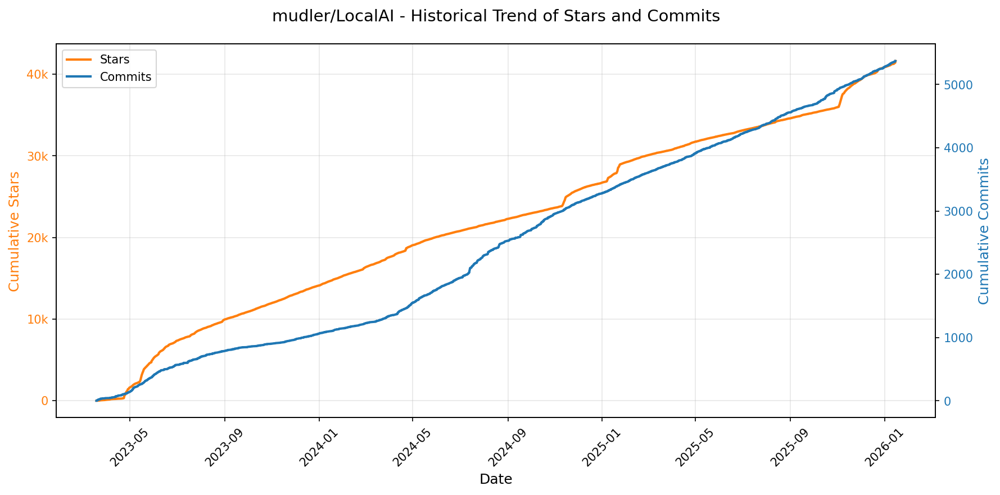
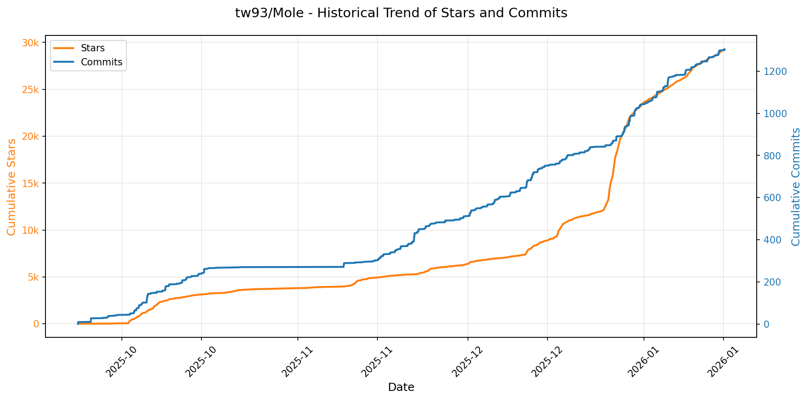
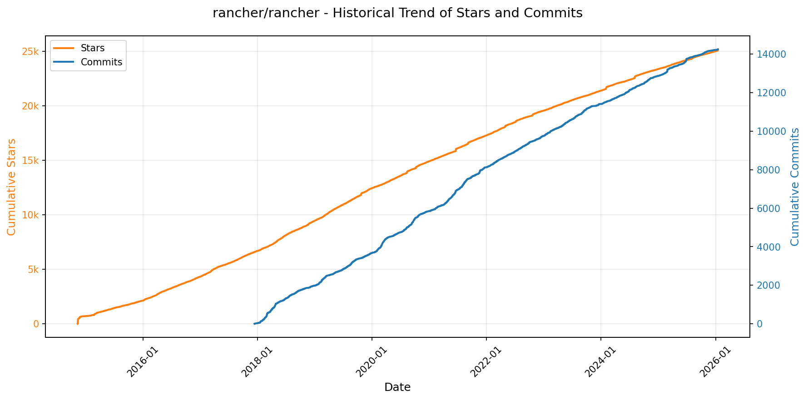
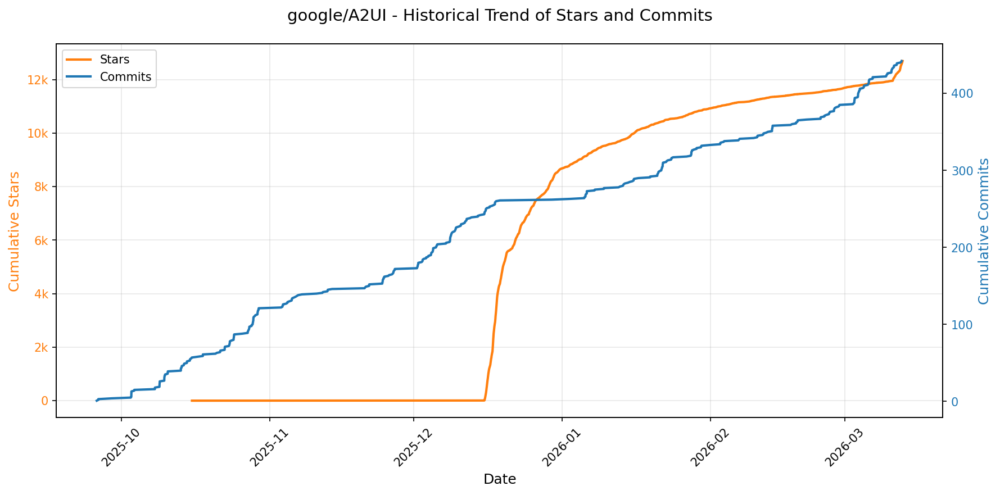
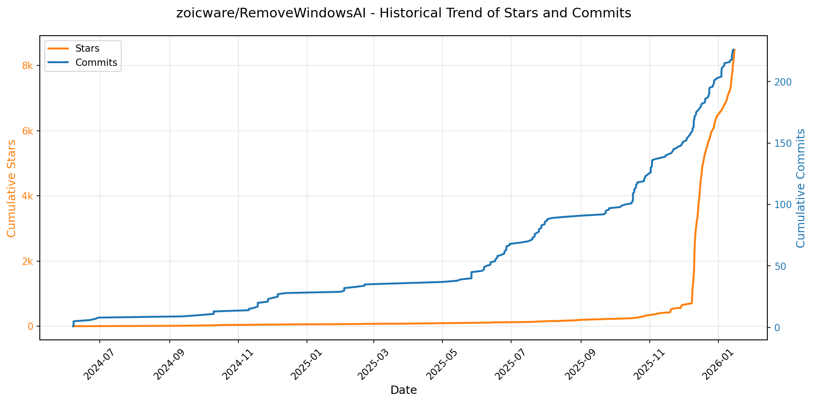
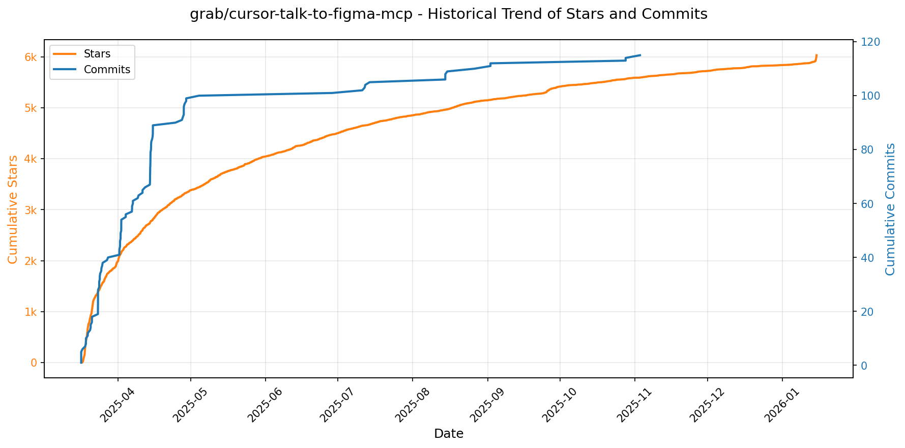
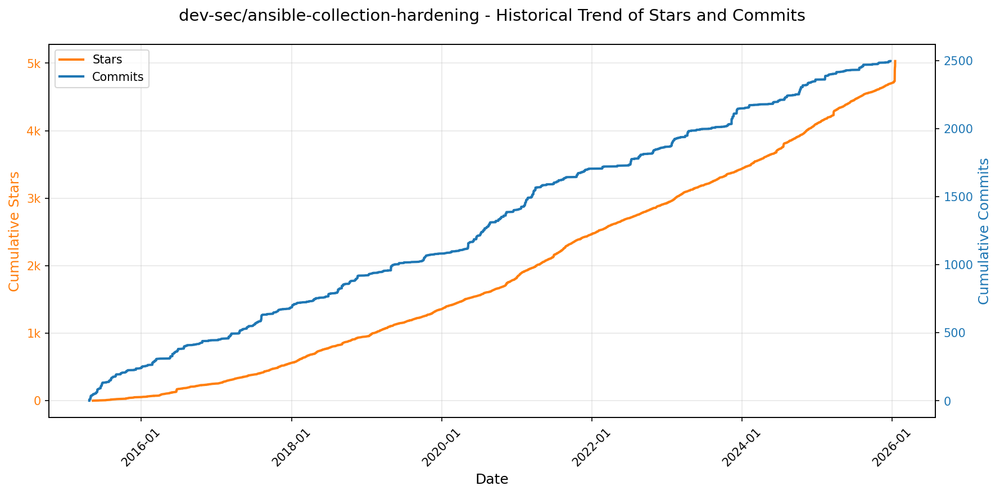
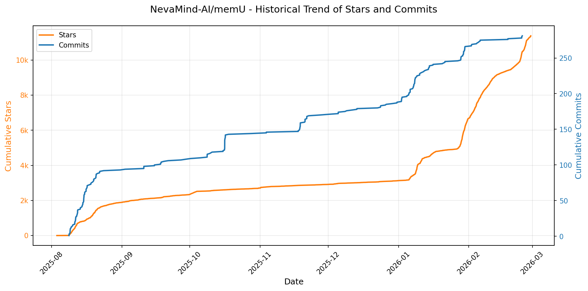
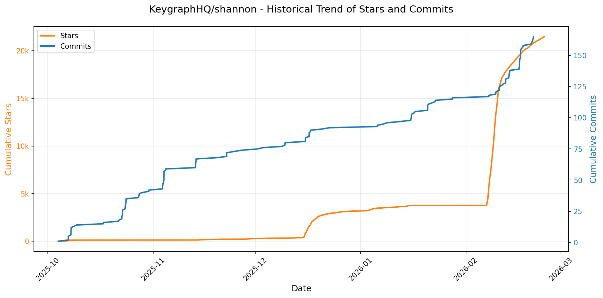

# 🌟 GitHub Trending 概览

> 数据更新于：2026-01-15。

---

## 🔍 项目详情

### 1. [hacksider/Deep-Live-Cam](https://github.com/hacksider/Deep-Live-Cam)
- 📅 **创建日期**：2023-09-24  
- 🔄 **最近更新**：2026-01-15  
- ⭐ **Stars**：77,847（日 +85｜周 +1052｜月 +1729）  
- 📝 **描述**：real time face swap and one-click video deepfake with only a single image  

<b>📈 Star 与 Commit 历史趋势</b>

> *蓝色：累计 Stars｜橙色：累计 Commits（次 Y 轴）*

<b>📄 README 摘要</b>

1. 该项目能够实现基于单张图像的实时人脸替换和视频深度伪造，支持一键操作。用户可以选择源人脸图像，并在实时摄像头、视频文件或电影播放中将其应用到目标人物脸上，生成实时的深伪内容。它适用于直播、娱乐、创意制作等场景，同时内置了对不当内容（如裸露、敏感画面）的检测与限制机制以促进负责任的使用。

2. 关键功能包括：  
   - **实时人脸交换**：可在摄像头直播或视频播放过程中实时进行人脸替换。  
   - **口部遮罩（Mouth Mask）**：保留原始嘴部动作，提升表情自然度。  
   - **多脸映射（Face Mapping）**：在同一画面中为多个对象同时应用不同的人脸。  
   - **电影换脸**：观看影片时将任意人脸实时代入角色。  
   - **直播表演支持**：可用于虚拟演出、直播互动等场景。  
   - **梗图/ meme 制作**：轻松创建病毒式传播的趣味内容。  
   - **Omegle 恶搞**：在随机视频聊天平台中伪装成他人。  
   - **硬件加速支持**：兼容 NVIDIA CUDA、Apple Silicon CoreML、Intel OpenVINO 等多种执行后端，提升处理速度。  

3. 技术栈包括：  
   - **Python 3.11**（macOS 使用 Python 3.10）作为主要编程语言。  
   - 核心依赖库：**ONNX Runtime**（支持多种推理后端如 cuda、coreml、directml）、**PyTorch**（用于深度学习模型加载与运行）。  
   - 使用 **InsightFace** 的人脸分析与对齐技术，采用 **inswapper_128_fp16.onnx** 模型进行高效人脸交换。  
   - 图像增强模块集成 **GFPGAN**（用于人脸修复）和 **BasicSR**（超分辨率支持）。  
   - GUI 基于 **tkinter** 构建，提供简单易用的操作界面。  
   - 视频处理依赖 **ffmpeg**，并支持通过命令行参数自定义编码器、质量、音频保留等选项。  
   - 支持跨平台部署，涵盖 Windows（CPU/GPU）、macOS（Apple Silicon 及传统 Intel 版本）、Linux 系统。

---

### 2. [twitter/the-algorithm](https://github.com/twitter/the-algorithm)
- 📅 **创建日期**：2023-03-27  
- 🔄 **最近更新**：2026-01-15  
- ⭐ **Stars**：69,950（日 +352｜周 +747｜月 +2082）  
- 📝 **描述**：Source code for the X Recommendation Algorithm  

<b>📈 Star 与 Commit 历史趋势</b>

> *蓝色：累计 Stars｜橙色：累计 Commits（次 Y 轴）*

<b>📄 README 摘要</b>

1. 该项目实现了X平台（如“为你推荐”时间线、搜索、发现、通知等）内容推荐的核心算法系统，负责生成和提供个性化的内容信息流。它通过整合用户行为数据、社交关系、内容特征及机器学习模型，为用户推荐可能感兴趣的帖子和其他内容。

2. 关键功能包括：  
   - 提供核心数据服务，如帖子读写（tweetypie）、实时用户行为流（unified-user-actions）和用户信号收集（user-signal-service）。  
   - 集成多种机器学习模型，用于社区发现（SimClusters）、知识图谱嵌入（TwHIN）、用户互动预测（real-graph）、用户声誉计算（tweepcred）、内容安全过滤（trust-and-safety-models）以及主题识别（topic-social-proof）。  
   - 支持候选内容的生成与检索，例如基于图结构的推荐（UTEG）、关注推荐（FRS）和站内搜索索引（search-index）。  
   - 实现多阶段排序机制，包括轻量级预排序（light-ranker）和深度神经网络重排序（heavy-ranker）。  
   - 构建可扩展的信息流框架（如home-mixer、product-mixer），实现内容混合、过滤与最终排序，并支持法律合规和内容质量控制（visibility-filters）。  
   - 提供高性能模型服务框架（navi）和嵌入表示管理服务（representation-manager），支持实时推荐场景如推送通知（pushservice）。

3. 技术栈主要包括：  
   - 编程语言：Scala、Python、Java、Rust（用于高性能服务如navi）。  
   - 机器学习框架：自研的twml（基于TensorFlow v1）、支持多任务学习的深度模型。  
   - 数据与图处理：GraphJet图数据库框架、实时流处理、批处理聚合框架（timelines-aggregation-framework）。  
   - 推荐系统架构：基于Bazel构建系统（部分支持）、微服务架构，使用product-mixer作为通用信息流生成框架。  
   - 模型部署与服务：使用Rust编写的高性能模型服务框架navi，以及representation-manager进行嵌入向量管理。  
   - 基础设施依赖：分布式数据存储、实时事件流管道、大规模图计算与特征服务（graph-feature-service）。

---

### 3. [anomalyco/opencode](https://github.com/anomalyco/opencode)
- 📅 **创建日期**：2025-04-30  
- 🔄 **最近更新**：2026-01-15  
- ⭐ **Stars**：69,768（日 +2084｜周 +16025｜月 +30953）  
- 📝 **描述**：The open source coding agent.  

<b>📈 Star 与 Commit 历史趋势</b>

> *蓝色：累计 Stars｜橙色：累计 Commits（次 Y 轴）*

<b>📄 README 摘要</b>

1. 该项目是一个开源的AI编程代理工具，旨在帮助开发者在终端或桌面环境中通过自然语言进行代码编写、分析和探索。它能够在本地运行，支持多种大语言模型（包括Claude、OpenAI、Google及本地模型），提供代码生成、编辑建议、代码库分析等功能，并允许用户在不离开终端的情况下完成开发任务。

2. 关键特性包括：  
   - 支持多智能体系统，内置“build”（默认开发模式）和“plan”（只读分析模式）两种代理，可通过Tab键切换；另有用于复杂搜索的“general”子代理。  
   - 完全开源且不绑定特定模型提供商，支持自定义集成各类大模型。  
   - 原生支持LSP（语言服务器协议），实现与代码编辑器类似的智能补全与导航功能。  
   - 提供基于终端的TUI界面和图形化桌面应用（Beta版），适用于多种操作系统（macOS、Windows、Linux）。  
   - 采用客户端/服务器架构，支持远程控制，例如可在本地运行服务并通过移动设备驱动操作。  
   - 提供一键安装脚本和多种包管理器安装方式（如Homebrew、npm、scoop、choco等），安装灵活便捷。  

3. 技术栈包括：  
   - 核心使用TypeScript开发，支持跨平台运行。  
   - 前端包含基于Web的桌面应用（packages/web）和终端用户界面（TUI）。  
   - 后端为可独立运行的服务进程，实现客户端与AI逻辑的解耦。  
   - 集成LSP（Language Server Protocol）以实现代码智能感知能力。  
   - 支持多种模型后端，兼容Anthropic Claude、OpenAI、Google Gemini以及本地部署的大模型。  
   - 构建与分发使用现代工具链：npm/pnpm/yarn、bun、mise、nix、Homebrew、Scoop、Chocolatey 等。  
   - 桌面客户端打包为原生格式（DMG、EXE、AppImage、deb、rpm等）。

---

### 4. [anthropics/claude-code](https://github.com/anthropics/claude-code)
- 📅 **创建日期**：2025-02-22  
- 🔄 **最近更新**：2026-01-15  
- ⭐ **Stars**：56,688（日 +381｜周 +3893｜月 +10783）  
- 📝 **描述**：Claude Code is an agentic coding tool that lives in your terminal, understands your codebase, and helps you code faster by executing routine tasks, explaining complex code, and handling git workflows - all through natural language commands.  

<b>📈 Star 与 Commit 历史趋势</b>

> *蓝色：累计 Stars｜橙色：累计 Commits（次 Y 轴）*

<b>📄 README 摘要</b>

1. 该项目是一个驻留在终端中的代理式编程工具，能够理解用户的代码库，并通过自然语言指令帮助用户更快地编写代码。它可以执行常规编码任务、解释复杂代码逻辑以及管理 Git 工作流，支持在终端、IDE 中使用，也可通过在 GitHub 上标记 @claude 来调用。

2. 主要功能包括：通过自然语言命令与代码库交互；自动化完成常见编码任务；解释项目中的复杂代码；协助处理 Git 版本控制操作；支持多种安装方式（如脚本、Homebrew、WinGet 等）；可通过插件系统扩展功能；内置反馈和错误报告机制（如 `/bug` 命令）；支持与社区通过 Discord 互动交流。

3. 技术栈主要包括：基于 Node.js（要求 18 及以上版本）开发；提供命令行接口（CLI）；使用 Shell 脚本（bash）和 PowerShell 实现跨平台安装；通过 npm 发布包（已弃用）；支持与 GitHub 集成；后端服务由 Anthropic 提供，涉及数据收集与隐私保护机制。

---

### 5. [usememos/memos](https://github.com/usememos/memos)
- 📅 **创建日期**：2021-12-08  
- 🔄 **最近更新**：2026-01-15  
- ⭐ **Stars**：54,237（日 +236｜周 +1773｜月 +7164）  
- 📝 **描述**：An open-source, self-hosted note-taking service. Your thoughts, your data, your control — no tracking, no ads, no subscription fees.  

<b>📈 Star 与 Commit 历史趋势</b>

> *蓝色：累计 Stars｜橙色：累计 Commits（次 Y 轴）*

<b>📄 README 摘要</b>

1. 该项目是一个开源、可自托管的笔记服务，旨在让用户完全掌控自己的数据。它支持个人记事、团队知识库和知识管理，强调隐私保护，无追踪、无广告、无订阅费用，所有内容均存储在用户自己的基础设施上。

2. 主要功能包括：  
   - 隐私优先架构：完全自托管，零遥测，数据自主可控，支持完整导出，避免厂商锁定。  
   - 原生支持 Markdown：使用纯文本存储笔记，兼容性强，便于迁移和备份。  
   - 极致性能：基于 Go 和 React 构建，加载迅速，响应灵敏。  
   - 简单部署：支持一键 Docker 部署，兼容 SQLite、MySQL 和 PostgreSQL 数据库。  
   - 开发者友好：提供完整的 REST 和 gRPC API，便于与其他系统集成。  
   - 美观界面：采用简洁现代的设计风格，支持暗黑模式和移动端自适应布局。

3. 技术栈：  
   - 后端：Go（Golang）  
   - 前端：React  
   - 支持的数据库：SQLite、MySQL、PostgreSQL  
   - 部署方式：Docker、Docker Compose、Kubernetes（Helm）、预编译二进制文件、源码构建

---

### 6. [mudler/LocalAI](https://github.com/mudler/LocalAI)
- 📅 **创建日期**：2023-03-18  
- 🔄 **最近更新**：2026-01-15  
- ⭐ **Stars**：41,610（日 +230｜周 +525｜月 +1576）  
- 📝 **描述**：:robot: The free, Open Source alternative to OpenAI, Claude and others. Self-hosted and local-first. Drop-in replacement for OpenAI,  running on consumer-grade hardware. No GPU required. Runs gguf, transformers, diffusers and many more. Features: Generate Text, MCP, Audio, Video, Images, Voice Cloning, Distributed, P2P and decentralized inference  

<b>📈 Star 与 Commit 历史趋势</b>

> *蓝色：累计 Stars｜橙色：累计 Commits（次 Y 轴）*

<b>📄 README 摘要</b>

1. 该项目做什么？
LocalAI 是一个免费、开源的 OpenAI 替代方案，旨在作为与 OpenAI（以及 Elevenlabs、Anthropic 等）API 规范兼容的 REST API 落地式替代品。它允许用户在本地或内部部署环境中，使用消费级硬件运行大型语言模型（LLM）、生成图像和音频等多种 AI 推理任务，且不要求必须配备 GPU。

2. 关键特性。
- **多模型支持**：支持运行多种模型家族的 LLM、TTS（文本转语音）、ASR（语音转文本）、文生图等模型。
- **OpenAI API 兼容**：提供与 OpenAI API 高度兼容的接口，可作为其直接替代品。
- **硬件加速**：支持广泛的硬件加速技术，包括 NVIDIA CUDA (12/13)、AMD ROCm、Intel oneAPI、Apple Metal 和 Vulkan。
- **后端动态管理**：支持按需安装和移除后端（如 llama.cpp, whisper.cpp, diffusers 等），并通过 OCI 镜像实现。
- **P2P 分布式推理**：支持点对点（Peer-to-Peer）的联邦模式和 AI 智能体集群（Swarms），实现分布式计算。
- **集成 WebUI**：提供内置的网页用户界面，用于模型管理、聊天、音频和图像生成等操作。
- **高级功能**：支持函数调用（Function Calling）、嵌入向量（Embeddings）、重排序（Reranker）、物体检测、受限语法生成、语音活动检测（VAD）以及 Model Context Protocol (MCP) 等。
- **便捷的模型加载**：可以从 Hugging Face、Ollama、OCI 仓库或 URL 直接下载并运行模型。
- **自动后端检测**：能自动检测系统 GPU 并下载匹配的加速后端。

3. 技术栈。
- **核心语言**：Go (Golang)
- **主要后端**：
    - 文本生成：`llama.cpp`, `vLLM`, `transformers` (HuggingFace), `exllama2`, `MLX` (Apple Silicon)
    - 语音处理：`whisper.cpp`, `faster-whisper`, `bark`, `coqui TTS`, `piper`
    - 图像生成：`stablediffusion.cpp`, `diffusers` (HuggingFace)
    - 其他：`rfdetr` (物体检测), `rerankers`
- **容器化**：Docker, Podman
- **分发与包管理**：OCI (Open Container Initiative) 镜像
- **硬件加速**：NVIDIA CUDA, AMD ROCm, Intel oneAPI (SYCL), Apple Metal, Vulkan
- **前端**：WebUI (React)

---

### 7. [anthropics/skills](https://github.com/anthropics/skills)
- 📅 **创建日期**：2025-09-22  
- 🔄 **最近更新**：2026-01-15  
- ⭐ **Stars**：40,908（日 +1144｜周 +5625｜月 +19797）  
- 📝 **描述**：Public repository for Agent Skills  

<b>📈 Star 与 Commit 历史趋势</b>

> *蓝色：累计 Stars｜橙色：累计 Commits（次 Y 轴）*

<b>📄 README 摘要</b>

1. 该项目是 Anthropic 提供的 Claude 技能（Skills）实现示例库。技能是一组包含指令、脚本和资源的文件夹，Claude 可以动态加载这些技能以提升在特定任务上的表现。该项目通过提供一系列现成的技能示例，展示如何让 Claude 学习并重复执行特定任务，例如根据公司品牌指南创建文档、使用组织特定的工作流分析数据或自动化个人任务。

2. 关键特性包括：提供涵盖创意设计、技术开发、企业通信及文档处理等多个领域的技能示例；每个技能均自包含于独立文件夹中，并通过 `SKILL.md` 文件定义其名称、描述及详细操作指令；支持用户将整个仓库注册为 Claude Code 的插件市场，从而方便地安装和使用文档类或示例类技能；已为开发者提供技能模板（template），便于快速创建自定义技能；部分核心文档处理技能（如 docx, pdf, pptx, xlsx）作为源码可用参考公开，帮助理解复杂生产级技能的构建方式；同时支持在 Claude.ai 界面和 Claude API 中使用预建技能或上传自定义技能。

3. 技术栈主要包括：基于纯文本的 YAML 元数据与 Markdown 指令组合构成技能定义；无需传统编程语言运行时，而是依赖 Anthropic 的 AI 平台（Claude Code、Claude.ai 和 Claude API）来解析和执行技能逻辑；技能本身可集成外部工具或软件（如 Notion）并通过自然语言指令进行调用；整体架构遵循 Agent Skills 标准（在 `/spec` 目录中定义），强调模块化、可复用性和声明式配置。

---

### 8. [exo-explore/exo](https://github.com/exo-explore/exo)
- 📅 **创建日期**：2024-06-24  
- 🔄 **最近更新**：2026-01-15  
- ⭐ **Stars**：40,034（日 +66｜周 +408｜月 +7287）  
- 📝 **描述**：Run your own AI cluster at home with everyday devices 📱💻 🖥️⌚  

<b>📈 Star 与 Commit 历史趋势</b>

> *蓝色：累计 Stars｜橙色：累计 Commits（次 Y 轴）*

<b>📄 README 摘要</b>

1. **这个项目是做什么的？**  
   exo 是一个允许用户将日常设备（如 Mac）连接成个人 AI 集群的开源项目。它使用户能够在多台设备上运行超出单个设备容量的大型语言模型，并通过低延迟通信技术提升整体推理性能。系统支持自动发现设备、智能分配模型负载，从而实现高效分布式推理，特别适用于在本地环境部署超大规模 AI 模型。

2. **关键特性**  
   - **自动设备发现**：运行 exo 的设备可自动相互发现，无需手动配置网络或拓扑信息。  
   - **Thunderbolt 上的 RDMA 支持**：原生支持 macOS 15.2 及以上版本中的 Thunderbolt 5 RDMA 技术，设备间通信延迟降低高达 99%。  
   - **拓扑感知的自动并行化**：根据实时设备资源和网络连接状况（带宽、延迟），自动选择最优的模型切分策略（如张量并行）。  
   - **张量并行支持**：支持跨设备对模型进行分片处理，在 2 台设备上最高可达 1.8 倍加速，4 台设备上达 3.2 倍加速。  
   - **基于 MLX 的推理后端**：使用 Apple 开发的 MLX 框架作为核心推理引擎，并集成其分布式通信能力（MLX distributed）以实现高效的设备间协同。

3. **技术栈**  
   - **编程语言**：Rust（用于构建高性能绑定）、Python（主控逻辑与 API 实现）、JavaScript/Node.js（仪表盘前端）  
   - **依赖工具**：uv（Python 包管理器）、npm（前端构建）、rust nightly（编译 Rust 组件）  
   - **核心框架**：MLX 和 MLX distributed（Apple 推出的机器学习框架，专为 Apple Silicon 优化）  
   - **操作系统支持**：macOS（完整 GPU 加速支持，需 macOS 15.2+ 及 Thunderbolt 5 设备）；Linux（当前仅支持 CPU 运行，GPU 支持开发中）  
   - **通信协议**：RDMA over Thunderbolt 实现超低延迟设备间通信  
   - **附加组件**：macmon（Apple Silicon 硬件监控，仅 macOS）、自定义 Network Profile 与 LaunchDaemon（macOS 后台服务管理）

---

### 9. [Lissy93/web-check](https://github.com/Lissy93/web-check)
- 📅 **创建日期**：2023-06-25  
- 🔄 **最近更新**：2026-01-15  
- ⭐ **Stars**：29,866（日 +167｜周 +1275｜月 +2879）  
- 📝 **描述**：🕵️‍♂️ All-in-one OSINT tool for analysing any website  

<b>📈 Star 与 Commit 历史趋势</b>

> *蓝色：累计 Stars｜橙色：累计 Commits（次 Y 轴）*

---

### 10. [tw93/Mole](https://github.com/tw93/Mole)
- 📅 **创建日期**：2025-09-23  
- 🔄 **最近更新**：2026-01-15  
- ⭐ **Stars**：29,263（日 +431｜周 +2994｜月 +20080）  
- 📝 **描述**：🐹 Deep clean and optimize your Mac.  

<b>📈 Star 与 Commit 历史趋势</b>

> *蓝色：累计 Stars｜橙色：累计 Commits（次 Y 轴）*

<b>📄 README 摘要</b>

1. **这个项目是做什么的？**  
Mole 是一款专为 macOS 设计的系统清理与优化工具，旨在帮助用户深度清理磁盘空间、卸载应用程序残留、分析磁盘使用情况、实时监控系统状态，并提升 Mac 性能。它集成了多种常用工具（如 CleanMyMac、AppCleaner、DaisyDisk、iStat Menus）的功能于单一命令行程序中，提供高效、安全、可预览的一体化系统维护解决方案。

2. **主要功能**  
- **深度清理**：扫描并清除用户缓存、浏览器数据、开发工具残留（如 Xcode、Node.js）、系统日志、临时文件和废纸篓内容，可释放数十 GB 空间。  
- **智能应用卸载**：彻底删除指定应用及其关联文件（包括偏好设置、插件、启动项、扩展等），避免残留。  
- **系统优化**：重建系统数据库、刷新 Spotlight 索引、重置网络服务、清理诊断日志、重启动态分页器等，提升系统响应速度。  
- **磁盘分析器**：可视化展示目录占用情况，支持交互式浏览、打开、删除大文件，快速定位空间占用源。  
- **实时状态监控**：提供 CPU、内存、磁盘、网络、电源等硬件资源的实时性能仪表盘，并计算系统健康评分。  
- **项目构建物清理**：识别并清除项目中的 `node_modules`、`target`、`build`、`dist`、`venv` 等构建产物，支持自定义扫描路径。  
- **安装包清理**：查找并移除分散在 Downloads、Homebrew 缓存等位置的大体积安装文件（如 .dmg、.pkg）。  
- **安全预览模式**：所有清理操作均支持 `--dry-run` 预览，结合 `--debug` 可查看详细风险等级和文件信息。  
- **便捷配置**：支持 Touch ID 提权、Shell 命令补全、白名单管理、快捷启动器（Raycast/Alfred）集成。

3. **技术栈**  
- **开发语言**：Rust（确保高性能与内存安全）  
- **运行环境**：macOS 原生支持（实验性 Windows 版本基于独立分支）  
- **安装方式**：通过 Homebrew 包管理器或 Shell 脚本安装  
- **交互界面**：终端内 TUI（文本用户界面），支持键盘导航（箭头键 / Vim 快捷键）  
- **依赖管理**：无外部运行时依赖，静态编译为单个二进制文件（single binary）  
- **扩展集成**：支持 Raycast 和 Alfred 快捷启动脚本  
- **配置存储**：本地配置文件（如 `~/.config/mole/purge_paths`）  
- **开源协议**：MIT License

---

### 11. [OpenBMB/ChatDev](https://github.com/OpenBMB/ChatDev)
- 📅 **创建日期**：2023-08-28  
- 🔄 **最近更新**：2026-01-15  
- ⭐ **Stars**：28,647（日 +76｜周 +612｜月 +815）  
- 📝 **描述**：ChatDev 2.0: Dev All through LLM-powered Multi-Agent Collaboration  

<b>📈 Star 与 Commit 历史趋势</b>

> *蓝色：累计 Stars｜橙色：累计 Commits（次 Y 轴）*

<b>📄 README 摘要</b>

1. 该项目是一个零代码多智能体平台（DevAll），旨在通过简单的配置快速构建和执行定制化的多智能体系统，用于“开发一切”（Developing Everything）。它支持用户无需编程即可定义智能体、工作流和任务，以协调复杂场景，如数据可视化、3D生成、深度研究、游戏开发和教学视频制作等。其前身ChatDev 1.0则专注于模拟虚拟软件公司，自动化完成软件开发的全生命周期。

2. 关键特性包括：提供零代码的Web控制台，支持通过拖拽方式在可视化画布上设计多智能体工作流；内置多种开箱即用的模板（如数据分析、3D建模、游戏开发）；支持人类介入的交互模式；可通过Python SDK进行程序化调用和批量处理；支持环境变量和YAML配置文件进行灵活配置；具备可扩展性，允许开发者添加自定义节点、工具和模型提供商；集成了强化学习驱动的动态编排器（puppeteer-style paradigm）以优化协作效率。

3. 技术栈包括：后端使用Python（3.12+）和FastAPI框架，依赖管理工具为uv；前端基于Vue 3和Vite构建；采用YAML文件定义工作流和配置；支持与多种大语言模型（LLM）API集成；使用Node.js（18+）运行前端服务；项目结构模块化，包含核心系统、工作流引擎、前端界面和自定义函数扩展等功能组件。

---

### 12. [rancher/rancher](https://github.com/rancher/rancher)
- 📅 **创建日期**：2014-11-07  
- 🔄 **最近更新**：2026-01-15  
- ⭐ **Stars**：25,175（日 +112｜周 +136｜月 +227）  
- 📝 **描述**：Complete container management platform  

<b>📈 Star 与 Commit 历史趋势</b>

> *蓝色：累计 Stars｜橙色：累计 Commits（次 Y 轴）*

<b>📄 README 摘要</b>

1. 该项目是做什么的？  
Rancher 是一个为在生产环境中部署容器的组织构建的开源容器管理平台。它使用户能够轻松地在任何地方运行 Kubernetes，满足 IT 要求，并赋能 DevOps 团队进行高效的容器化应用管理和运维。

2. 主要特性  
- 支持跨环境（本地、云端等）统一管理 Kubernetes 集群；  
- 提供稳定的版本发布体系（如 v2.13.1、v2.12.3 等），并可通过 Docker 快速部署；  
- 支持通过浏览器访问 Web UI 进行可视化操作（默认访问 https://localhost）；  
- 提供完整的安装、升级和配置文档支持；  
- 具备论坛和 Slack 社区支持，便于用户获取帮助和技术交流；  
- 支持安全漏洞报告机制，包括专用邮箱和 GPG 加密通信选项。

3. 技术栈  
- 使用 Go 语言开发，项目代码以 Go 模块（go.mod）方式管理依赖；  
- 基于 Docker 容器化部署，核心镜像为 `rancher/rancher`；  
- 采用微服务架构，整合多个开源库和项目模块；  
- 支持主流操作系统（具体版本参考官方支持矩阵）；  
- Web 界面通过 HTTPS 提供服务，底层依赖 Linux 特权容器（--privileged）运行。

---

### 13. [bytedance/UI-TARS-desktop](https://github.com/bytedance/UI-TARS-desktop)
- 📅 **创建日期**：2025-01-19  
- 🔄 **最近更新**：2026-01-15  
- ⭐ **Stars**：23,678（日 +166｜周 +3256｜月 +3823）  
- 📝 **描述**：The Open-Source Multimodal AI Agent Stack: Connecting Cutting-Edge AI Models and Agent Infra  

<b>📈 Star 与 Commit 历史趋势</b>

> *蓝色：累计 Stars｜橙色：累计 Commits（次 Y 轴）*

<b>📄 README 摘要</b>

1. 该项目做什么？  
本项目是一个多模态AI智能体技术栈，包含两个核心组件：Agent TARS 和 UI-TARS Desktop。Agent TARS 是一个通用的多模态AI代理，能够在终端、计算机、浏览器和产品中实现类人任务处理，支持通过自然语言指令完成复杂操作（如预订航班、酒店、生成图表等），并集成多种现实世界工具。UI-TARS Desktop 是一个桌面应用，提供基于视觉语言模型的原生图形用户界面（GUI）代理，可直接通过自然语言控制本地或远程计算机及浏览器，实现自动化操作。

2. 关键功能  
- 支持一键启动的命令行（CLI）与Web UI双模式运行；  
- 混合浏览器代理能力，结合GUI视觉定位、DOM分析或混合策略控制网页；  
- 基于事件流协议的上下文工程与代理交互界面，便于调试与数据追踪；  
- 支持MCP（Model-Controller-Proxy）架构，可接入各类真实工具服务；  
- 提供本地与远程计算机/浏览器操作器，无需配置即可点击控制；  
- 全面支持多模态大模型输入，包括图像识别与视觉理解；  
- 跨平台支持（Windows、macOS、浏览器）；  
- 支持流式输出、运行时统计、沙箱环境执行等高级特性。

3. 技术栈  
- 核心基于Node.js开发，CLI工具依赖Node.js >= 22；  
- 使用npm进行包管理，通过npx快速运行；  
- 集成多模态大语言模型（如Doubao-1.5、Claude 3.7 Sonnet等）；  
- 构建在MCP（Model-Controller-Proxy）架构之上，支持扩展MCP服务器；  
- 利用视觉语言模型（如Seed-1.5-VL/1.6系列、UI-TARS模型）实现GUI自动化；  
- 前端使用Web UI技术栈，支持浏览器内运行；  
- 支持与ModelScope、Hugging Face等平台部署集成；  
- 提供SDK用于构建跨平台GUI自动化代理应用。

---

### 14. [obra/superpowers](https://github.com/obra/superpowers)
- 📅 **创建日期**：2025-10-09  
- 🔄 **最近更新**：2026-01-15  
- ⭐ **Stars**：22,583（日 +1844｜周 +8146｜月 +12713）  
- 📝 **描述**：Claude Code superpowers: core skills library  

<b>📈 Star 与 Commit 历史趋势</b>

> *蓝色：累计 Stars｜橙色：累计 Commits（次 Y 轴）*

<b>📄 README 摘要</b>

1. 该项目为编程代理（coding agents）提供一套完整的软件开发工作流，通过一组可组合的“技能”和初始指令来增强代理能力。它使代理在开始编码前先与用户沟通明确需求，生成可读的设计文档并获得确认，随后制定清晰的实现计划，并采用子代理驱动开发（subagent-driven-development）模式分步执行任务，全程遵循测试驱动开发（TDD）、YAGNI 和 DRY 等原则，确保开发过程系统化、自动化且不偏离计划。

2. 关键功能包括：自动激活的头脑风暴（brainstorming）用于设计细化；基于 git worktrees 的隔离开发环境管理；将项目拆解为细粒度任务的详细计划编写；由多个子代理并发执行任务并进行两阶段审查（符合规范与代码质量）；严格执行红-绿-重构的测试驱动开发流程；任务间自动代码预审以识别阻塞性问题；任务完成后自动清理或提交分支；以及支持技能扩展和自我更新机制。所有技能均为强制性流程而非建议，确保一致性与可靠性。

3. 技术栈基于 AI 编程代理平台（如 Claude Code、Codex、OpenCode），利用其插件系统集成。核心架构由一系列 Markdown 格式的可组合“技能”模块构成，通过特定命令触发自动化工作流。依赖 git 进行分支和工作树管理，强调自动化测试与验证，并通过远程仓库实现技能库的集中维护与动态更新。支持通过插件市场安装和升级，适用于不同 AI 开发环境。

---

### 15. [resemble-ai/chatterbox](https://github.com/resemble-ai/chatterbox)
- 📅 **创建日期**：2025-04-23  
- 🔄 **最近更新**：2026-01-15  
- ⭐ **Stars**：21,495（日 +68｜周 +560｜月 +6434）  
- 📝 **描述**：SoTA open-source TTS  

<b>📈 Star 与 Commit 历史趋势</b>

> *蓝色：累计 Stars｜橙色：累计 Commits（次 Y 轴）*

<b>📄 README 摘要</b>

1. **这个项目是做什么的？**  
Chatterbox 是由 Resemble AI 开发的一系列开源文本转语音（TTS）模型，旨在提供高质量、低延迟的语音合成能力。其中最核心的是 **Chatterbox-Turbo** 模型，专为高效推理设计，适用于零样本语音克隆和实时语音代理场景。它支持使用拟声标签（如 [laugh]、[cough]）增强语音表现力，并内置不可见的神经水印技术以促进负责任的人工智能使用。该项目还包含支持23种以上语言的多语言版本以及基础英文版模型，可用于语音助手、叙述生成和创意内容制作等应用。

2. **关键特性**  
- **Chatterbox-Turbo 高效架构**：仅 350M 参数量，计算与显存需求更低，解码速度从10步压缩至**单步生成**，显著提升推理效率。  
- **原生支持副语言标签**：可直接在文本中插入 `[laugh]`、`[chuckle]`、`[cough]` 等标签，实现更自然、富有表现力的语音输出。  
- **零样本语音克隆**：通过提供10秒参考音频即可克隆声音，无需额外训练。  
- **多语言支持**：Chatterbox-Multilingual 支持包括中文、法语、西班牙语在内的23+种语言。  
- **内置 PerTh 水印技术**：所有生成音频均嵌入抗压缩、抗编辑的隐形水印，用于检测AI生成内容，保障内容可追溯性。  
- **灵活控制参数**：支持调节 `cfg_weight` 和 `exaggeration` 参数以优化语速、情感表达和口音一致性。  

3. **技术栈**  
- **编程语言与框架**：Python（推荐3.11），基于 PyTorch 实现。  
- **核心依赖库**：`torchaudio`, `librosa`, `transformers` 等；依赖版本锁定在 `pyproject.toml` 中确保一致性。  
- **模型架构**：采用流式token到梅尔谱图解码结构，对解码器进行知识蒸馏优化，实现快速高保真语音生成。  
- **部署与演示平台**：Hugging Face Spaces 提供在线Demo，支持快速体验；本地可通过 pip 或源码安装运行。  
- **水印技术**：集成自研的 [Perth](https://github.com/resemble-ai/perth) 隐式水印系统，实现鲁棒的内容标识。  
- **开发环境**：主要在 Debian 11 + CUDA 环境下开发测试，支持 GPU 加速（如 `device="cuda"`）。

---

### 16. [ChromeDevTools/chrome-devtools-mcp](https://github.com/ChromeDevTools/chrome-devtools-mcp)
- 📅 **创建日期**：2025-09-11  
- 🔄 **最近更新**：2026-01-15  
- ⭐ **Stars**：20,999（日 +150｜周 +1958｜月 +4226）  
- 📝 **描述**：Chrome DevTools for coding agents  

<b>📈 Star 与 Commit 历史趋势</b>

> *蓝色：累计 Stars｜橙色：累计 Commits（次 Y 轴）*

<b>📄 README 摘要</b>

1. **项目功能**  
该项目名为 `chrome-devtools-mcp`，是一个 Model-Context-Protocol (MCP) 服务器，使 AI 编程助手（如 Gemini、Claude、Cursor、Copilot 等）能够控制和检查正在运行的 Chrome 浏览器实例。通过集成 Chrome DevTools 的能力，它允许 AI 助手执行浏览器自动化、性能分析、网络请求调试、页面截图、控制台日志读取等操作，从而实现对网页应用的深度交互与诊断。

2. **关键特性**  
- **性能洞察**：可记录性能追踪（trace），提供详细的前端性能分析结果。  
- **高级调试能力**：支持查看网络请求、获取控制台消息、执行脚本、截屏和 DOM 快照。  
- **可靠自动化**：基于 Puppeteer 实现浏览器操作自动化，并自动等待操作完成。  
- 提供丰富的工具集，涵盖输入模拟（点击、拖拽、表单填写）、页面导航、设备模拟、网络监控、性能评测等功能。  
- 支持连接本地或远程运行的 Chrome 实例，包括通过 WebSocket 带认证头的安全连接。  
- 可配置是否使用隔离用户数据目录、自定义启动参数、代理设置、视口大小等。  
- 兼容多种 MCP 客户端（如 VS Code Copilot、Cursor、Claude Code、Gemini CLI 等），开箱即用。

3. **技术栈**  
- **核心协议**：Model-Context-Protocol (MCP)  
- **浏览器控制**：基于 [Puppeteer](https://github.com/puppeteer/puppeteer) 控制 Chrome 浏览器  
- **前端调试能力来源**：Chrome DevTools（通过 Chromium 的远程调试协议）  
- **运行环境**：Node.js（要求 v20.19 或更高版本的 LTS 版本）  
- **包管理**：npm  
- **浏览器依赖**：Google Chrome 最新稳定版或更高版本  
- **通信方式**：HTTP/WebSocket 远程调试接口，支持自定义头部认证  
- **配置格式**：JSON 配置 + 命令行参数（通过 npx 启动）

---

### 17. [BloopAI/vibe-kanban](https://github.com/BloopAI/vibe-kanban)
- 📅 **创建日期**：2025-06-14  
- 🔄 **最近更新**：2026-01-15  
- ⭐ **Stars**：16,128（日 +353｜周 +2240｜月 +9617）  
- 📝 **描述**：Get 10X more out of Claude Code, Codex or any coding agent  

<b>📈 Star 与 Commit 历史趋势</b>

> *蓝色：累计 Stars｜橙色：累计 Commits（次 Y 轴）*

<b>📄 README 摘要</b>

1. 该项目旨在优化人类工程师与AI编程代理（如Claude Code、Gemini CLI、Codex等）协作的开发流程。它作为一个任务管理与协调平台，帮助用户规划、组织、监控多个AI编码代理的工作，支持并行或串行执行任务，快速审查代码、启动开发服务器，并集中管理代理配置，尤其适合在远程服务器上运行并通过SSH从本地编辑器（如VSCode）访问项目。

2. 主要功能包括：支持多种主流AI编程代理的集成与切换；可编排多个AI代理的任务执行流程（串行/并行）；提供可视化看板以跟踪任务状态；内置开发服务器启动与工作成果审查功能；集中管理AI代理的MCP配置；支持远程部署并在本地通过SSH连接远程服务器上的项目（如配合VSCode Remote-SSH）；提供分析功能（可通过环境变量控制）；适用于本地及云环境部署。

3. 技术栈包括：前端使用Node.js（>=18）与pnpm（>=8）构建，采用现代Web技术栈（具体框架未明示但可能为React/Vue类）；后端使用Rust（最新稳定版）开发，确保高性能与安全性；数据库操作通过sqlx-cli管理；开发工具链包含cargo-watch用于文件监听；构建与运行依赖pnpm脚本；支持PostHog进行行为分析；通过环境变量实现灵活的构建时与运行时配置；支持Docker、systemctl及云平台部署，并可结合Cloudflare Tunnel、ngrok等工具实现安全远程访问。

---

### 18. [shareAI-lab/learn-claude-code](https://github.com/shareAI-lab/learn-claude-code)
- 📅 **创建日期**：2025-06-29  
- 🔄 **最近更新**：2026-01-15  
- ⭐ **Stars**：14,249（日 +93｜周 +866｜月 +2660）  
- 📝 **描述**：How can we build a true AI agent? Like Claude Code.  

<b>📈 Star 与 Commit 历史趋势</b>

> *蓝色：累计 Stars｜橙色：累计 Commits（次 Y 轴）*

<b>📄 README 摘要</b>

1. 该项目是一个渐进式教程，旨在通过从零构建五个逐步复杂的AI编码代理版本（v0至v4），帮助学习者理解现代AI代理（如Claude Code、Cursor Agent）的核心工作原理。它系统地拆解并演示了从单一工具调用到具备子代理和技能扩展能力的完整代理系统，核心目标是教育用户掌握AI代理的基本模式与关键设计概念。

2. 关键特性包括：一个极简的核心循环模式（模型调用工具直至任务完成）；五个递增难度的教学版本，分别引入“仅Bash工具”、“四大核心工具”、“显式待办事项规划”、“子代理机制”和“按需技能加载”等核心概念；提供可直接运行的Python脚本和详细的中英文深度解析文档；内置一个“代理构建器”元技能，可用于快速生成新的代理项目模板；支持与Kode CLI、Claude Code等主流代理工具及Agent Skills Spec规范集成使用。

3. 技术栈主要包括：Python作为主要实现语言；Anthropic的API（如Claude模型）作为智能体的核心推理引擎；通过`pip`安装的`anthropic`和`python-dotenv`库进行API调用和环境变量管理；采用基于文本的配置文件（如`.env`）存储密钥；其架构设计围绕工具调用（tool use）的交互模式，并涉及动态加载外部技能（SKILL.md文件）的机制。

---

### 19. [thedotmack/claude-mem](https://github.com/thedotmack/claude-mem)
- 📅 **创建日期**：2025-08-31  
- 🔄 **最近更新**：2026-01-15  
- ⭐ **Stars**：13,877（日 +211｜周 +1872｜月 +7046）  
- 📝 **描述**：A Claude Code plugin that automatically captures everything Claude does during your coding sessions, compresses it with AI (using Claude's agent-sdk), and injects relevant context back into future sessions.  

<b>📈 Star 与 Commit 历史趋势</b>

> *蓝色：累计 Stars｜橙色：累计 Commits（次 Y 轴）*

<b>📄 README 摘要</b>

1. 该项目是一个为Claude Code构建的持久化记忆压缩系统，能够在会话之间自动保存上下文。它通过捕获工具使用情况、生成语义摘要，并在新会话中提供这些信息，使Claude能够持续掌握项目知识，即使会话结束或重新连接后也能保持上下文连贯性。

2. 关键功能包括：跨会话的持久记忆；带有令牌成本可见性的渐进式信息披露；基于技能的自然语言搜索（mem-search）；实时内存流的Web查看器界面（http://localhost:37777）；可在Claude桌面对话中搜索记忆的功能；通过`<private>`标签控制隐私内容存储；对注入上下文的细粒度配置；完全自动化运行无需手动干预；支持引用过往观察结果的引用ID；以及可通过版本切换试用实验性功能（如无尽模式）的测试频道。

3. 技术栈主要包括：Node.js（>=18.0.0）、Bun（作为JavaScript运行时和进程管理器）、SQLite 3（用于持久化存储并集成FTS5全文搜索）、Chroma向量数据库（实现混合语义与关键词搜索）、TypeScript（主要开发语言），并通过Claude Agent SDK与Claude Code集成。系统还使用uv作为Python包管理器以支持向量搜索功能。

---

### 20. [memvid/memvid](https://github.com/memvid/memvid)
- 📅 **创建日期**：2025-05-27  
- 🔄 **最近更新**：2026-01-15  
- ⭐ **Stars**：12,319（日 +47｜周 +871｜月 +1864）  
- 📝 **描述**：Memory layer for AI Agents. Replace complex RAG pipelines with a serverless, single-file memory layer. Give your agents instant retrieval and long-term memory.  

<b>📈 Star 与 Commit 历史趋势</b>

> *蓝色：累计 Stars｜橙色：累计 Commits（次 Y 轴）*

<b>📄 README 摘要</b>

1. 该项目做什么？  
Memvid 是一个为 AI 智能体设计的单文件内存系统，提供持久化、可版本控制且可移植的长期记忆能力，无需依赖数据库。它将数据、嵌入向量（embeddings）、搜索结构和元数据整合到一个单一文件中，支持快速本地检索和模型无关的记忆存储。其核心机制基于“智能帧”（Smart Frames）的追加写入模式，实现类似视频编码的高效序列化存储，使 AI 系统具备可回溯、可调试的记忆时间线功能，并支持完全离线运行。

2. 关键特性  
- **单文件封装**：所有数据、索引和元信息打包在 `.mv2` 单一文件中，无外部依赖或辅助文件。  
- **智能帧架构**：采用不可变的“智能帧”追加写入，保证数据安全、支持时间旅行式调试与历史状态查询。  
- **极速检索**：本地内存访问延迟低于 5ms，支持全文搜索（BM25）、向量相似性搜索（HNSW）和多模态检索。  
- **时间旅行调试**：可回滚、重放或分支任意记忆状态，便于审计和调试 AI 行为。  
- **自适应压缩**：利用源自视频编码的压缩技术，自动优化存储效率。  
- **多模态支持**：通过功能标志支持文本、PDF、图像（CLIP）、音频（Whisper）等多种数据类型的处理。  
- **加密胶囊**：支持密码保护的加密记忆文件（`.mv2e`），保障数据隐私。  
- **跨平台 SDK**：提供 Rust、Python、Node.js 及 CLI 工具，便于集成至不同应用环境。  

3. 技术栈  
- **核心语言**：Rust（确保高性能与内存安全）  
- **构建工具**：Cargo（Rust 包管理器）  
- **全文检索引擎**：Tantivy（用于 BM25 排名的 `lex` 功能）  
- **向量索引**：HNSW（高效近似最近邻搜索）  
- **嵌入模型**：ONNX 运行时支持本地文本嵌入（如 BGE、Nomic、GTE 等模型）  
- **多媒体处理**：  
  - CLIP 模型用于图像视觉嵌入  
  - Whisper 模型用于音频转录  
  - 纯 Rust 实现的 PDF 文本提取  
- **自然语言解析**：`temporal_track` 功能支持自然语言日期理解（如“上周二”）  
- **并发处理**：多线程段落并行摄入（`parallel_segments`）  
- **客户端支持**：Node.js、Python SDK 及 NPM CLI 工具  
- **文件格式**：自定义二进制 `.mv2` 格式，包含头部、WAL 日志、数据段、多种索引（全文、向量、时间）及尾部目录表（TOC）

---

### 21. [steveyegge/beads](https://github.com/steveyegge/beads)
- 📅 **创建日期**：2025-10-12  
- 🔄 **最近更新**：2026-01-15  
- ⭐ **Stars**：10,257（日 +199｜周 +1355｜月 +4953）  
- 📝 **描述**：Beads - A memory upgrade for your coding agent  

<b>📈 Star 与 Commit 历史趋势</b>

> *蓝色：累计 Stars｜橙色：累计 Commits（次 Y 轴）*

<b>📄 README 摘要</b>

1. 该项目是一个为AI代理设计的分布式、基于Git的图状问题跟踪器，旨在为编码代理提供持久化、结构化的记忆系统。它用依赖感知的图结构替代零散的Markdown计划，使代理能够处理长周期任务而不丢失上下文。

2. 主要特性包括：以Git作为数据库，将问题以JSONL格式存储在`.beads/`目录中，支持版本控制、分支和合并；专为代理优化，输出JSON格式数据，支持依赖关系追踪和自动识别就绪任务；采用哈希ID（如`bd-a1b2`）避免多代理或多分支工作流中的合并冲突；具备本地SQLite缓存和后台守护进程实现快速响应与自动同步；支持“语义压缩”机制，对旧的已关闭任务进行总结归档，减少上下文占用。

3. 技术栈包括Go语言（主程序实现）、Git（用于数据存储与版本管理）、SQLite（本地缓存加速）、npm（JavaScript包发布）、PyPI（Python包发布），支持跨平台运行（Linux、FreeBSD、macOS、Windows），并通过命令行工具与代理或用户交互。

---

### 22. [google/A2UI](https://github.com/google/A2UI)
- 📅 **创建日期**：2025-09-24  
- 🔄 **最近更新**：2026-01-15  
- ⭐ **Stars**：9,885（日 +98｜周 +497｜月 +9526）  
- 📝 **描述**：暂无描述  

<b>📈 Star 与 Commit 历史趋势</b>

> *蓝色：累计 Stars｜橙色：累计 Commits（次 Y 轴）*

<b>📄 README 摘要</b>

1. **这个项目是做什么的？**  
A2UI（Agent-to-User Interface）是一个开源项目，旨在让AI代理（Agent）能够生成或填充丰富的用户界面。它提供了一种声明式的JSON格式，用于描述由代理生成的可更新UI的结构和意图。客户端应用程序使用该格式，在本地将其渲染为原生UI组件。此方法使远程或跨信任边界的代理可以安全地向用户呈现动态、交互式界面，同时确保安全性与平台无关性。

2. **关键特性**  
- **安全性优先**：采用声明式数据格式而非可执行代码，防止LLM生成恶意脚本；客户端维护受信任的组件目录，仅允许渲染预注册的组件。  
- **支持增量更新**：UI以带ID的扁平化组件列表表示，便于LLM逐步生成和修改，实现渐进式渲染和流畅的用户体验。  
- **框架无关与跨平台**：同一份A2UI JSON可在不同技术栈（如Web、Flutter、React、SwiftUI等）的客户端上渲染，实现高度可移植性。  
- **灵活扩展机制**：通过“智能包装器”（Smart Wrapper）开放注册机制，开发者可将自定义或遗留UI组件（包括沙箱化的iframe）接入A2UI的数据绑定与事件系统，自主控制安全策略。  
- **适用于复杂场景**：支持动态表单生成、远程子代理返回UI、自适应工作流仪表板和实时数据可视化等用例。

3. **技术栈**  
- **核心格式**：基于JSON的声明式UI描述语言。  
- **前端框架支持**：目前已支持Web端（如Lit组件）、Flutter，并计划扩展至React、Jetpack Compose、SwiftUI等。  
- **传输协议**：兼容A2A协议和AG UI，未来将支持REST等更多方式。  
- **后端/代理侧**：可用任意能输出JSON的LLM（如Gemini）生成A2UI响应，示例中使用Python + Gemini API。  
- **构建与运行依赖**：Node.js（前端）、Python（代理端）、Gemini API密钥（演示需要）。  
- **生态系统集成**：与GenUI SDK（Flutter）、CopilotKit A2UI Widget Builder、Genkit、LangGraph等工具协同设计。

---

### 23. [zoicware/RemoveWindowsAI](https://github.com/zoicware/RemoveWindowsAI)
- 📅 **创建日期**：2024-06-07  
- 🔄 **最近更新**：2026-01-15  
- ⭐ **Stars**：8,483（日 +366｜周 +1549｜月 +4054）  
- 📝 **描述**：Force Remove Copilot, Recall and More in Windows 11  

<b>📈 Star 与 Commit 历史趋势</b>

> *蓝色：累计 Stars｜橙色：累计 Commits（次 Y 轴）*

<b>📄 README 摘要</b>

1. 该项目做什么？  
此项目旨在彻底移除 Windows 11（特别是25H2及未来版本）中集成的各类人工智能（AI）功能和组件。通过运行 PowerShell 脚本，它可系统性地禁用、删除或隐藏与 AI 相关的服务、应用、注册表项、计划任务和系统功能，以提升用户的隐私保护、系统安全性和使用体验。同时提供恢复更改和备份选项，并支持将现代 AI 化的应用程序替换为经典版本。

2. 主要特性  
- 禁用多项 AI 相关注册表项：包括 Copilot、Recall、输入洞察数据收集、Edge 浏览器中的 Copilot、Paint 中的图像生成与 AI 功能、AI Fabric 服务、AI Actions、语音访问、AI 语音效果、设置搜索中的 AI 及记事本中的重写功能。  
- 防止 AI 组件重新安装：通过自定义 Windows 更新包阻止 CBS（基于组件的服务）存储中 AI 包的重装。  
- 删除 AI 应用包：移除所有 Appx 格式的 AI 应用，包括标记为“不可删除”的包和 WindowsWorkload。  
- 移除 CBS 中的 AI 包：清理隐藏且受保护的系统级 AI 组件。  
- 全面系统清理：删除残留的 AI 安装文件、注册表项和配置文件。  
- 隐藏 AI 设置界面：在系统设置中隐藏“AI 组件”页面。  
- 移除 Recall 计划任务：强制删除所有与 Recall 功能相关的定时任务。  
- 替换为经典应用程序：可选将新版 Paint、记事本、截图工具、照片查看器等替换为传统经典版本。  
- 支持命令行非交互式运行：提供多种参数组合实现自动化操作，如全量移除、部分功能禁用、安装经典应用等。  
- 支持备份与还原：启用备份模式后可完全回滚所有更改。  
- 提供图形化用户界面（UI）运行方式及详细文档指引，并鼓励用户报告新发现的 AI 功能以便持续更新。

3. 技术栈  
- 主要技术：Windows PowerShell（仅支持 5.1 版本，不支持 PowerShell 7）  
- 脚本语言：PowerShell 脚本（.ps1）  
- 系统级操作技术：注册表修改、Appx 包管理（Remove-AppxPackage）、CBS（Component-Based Servicing）组件服务操作、计划任务管理、JSON 策略文件修改（如 IntegratedServicesRegionPolicySet.json）  
- 远程执行机制：通过 `Invoke-RestMethod (irm)` 从 GitHub 或短链接加载并执行远程脚本块  
- 辅助工具：使用开源链接缩短服务（kutt.it）简化命令  
- 兼容性处理：针对防病毒软件误报问题建议添加白名单或临时关闭 AV，推荐在虚拟机中测试  
- 用户交互：支持控制台 UI 模式和纯命令行非交互模式，适配高级用户自动化需求

---

### 24. [grab/cursor-talk-to-figma-mcp](https://github.com/grab/cursor-talk-to-figma-mcp)
- 📅 **创建日期**：2025-03-16  
- 🔄 **最近更新**：2026-01-15  
- ⭐ **Stars**：6,031（日 +127｜周 +171｜月 +248）  
- 📝 **描述**：TalkToFigma: MCP integration between Cursor and Figma, allowing Cursor Agentic AI to communicate with Figma for reading designs and modifying them programmatically.  

<b>📈 Star 与 Commit 历史趋势</b>

> *蓝色：累计 Stars｜橙色：累计 Commits（次 Y 轴）*

---

### 25. [dev-sec/ansible-collection-hardening](https://github.com/dev-sec/ansible-collection-hardening)
- 📅 **创建日期**：2015-05-04  
- 🔄 **最近更新**：2026-01-15  
- ⭐ **Stars**：5,031（日 +88｜周 +311｜月 +339）  
- 📝 **描述**：This Ansible collection provides battle tested hardening for Linux, SSH, nginx, MySQL  

<b>📈 Star 与 Commit 历史趋势</b>

> *蓝色：累计 Stars｜橙色：累计 Commits（次 Y 轴）*

<b>📄 README 摘要</b>

1. 该项目做什么？  
该 Ansible 集合（collection）提供经过实战验证的安全加固功能，用于提升操作系统、数据库和网络服务的安全性。它主要针对 Linux 系统、MySQL/MariaDB、Nginx 和 OpenSSH 进行安全配置，确保其符合 Inspec DevSec 安全基线标准，从而帮助用户降低系统被攻击的风险。

2. 关键特性  
- 支持多种主流 Linux 发行版，包括 CentOS Stream、AlmaLinux、Rocky Linux、Debian、Ubuntu、Amazon Linux、Arch Linux、Fedora 和 SUSE Tumbleweed。  
- 提供对 MySQL 和 MariaDB 数据库的安全加固，支持多个版本。  
- 支持 Nginx 和 OpenSSH 的安全配置，涵盖较新及部分旧版本。  
- 加固策略基于权威的 DevSec 安全基线（如 linux-baseline、ssh-baseline 等），具备高可信度。  
- 模块化设计，包含独立的角色（roles）：os_hardening、mysql_hardening、nginx_hardening 和 ssh_hardening，便于按需使用。  
- 持续集成测试完善，通过 GitHub Actions 对各类环境进行自动化测试验证。  
- 兼容 Ansible 2.16 及以上版本，并遵循 Ansible 集合规范。  

3. 技术栈  
- 配置管理工具：Ansible（>= 2.16）  
- 语言与格式：YAML（用于编写 playbook 和角色）、Shell/Python（用于模块执行）  
- 测试框架：InSpec（作为安全合规基准参考）  
- 持续集成：GitHub Actions  
- 软件分发：Ansible Galaxy（通过 `ansible-galaxy collection install` 安装）  
- 许可协议：Apache License 2.0

---

### 26. [MiroMindAI/MiroThinker](https://github.com/MiroMindAI/MiroThinker)
- 📅 **创建日期**：2025-08-07  
- 🔄 **最近更新**：2026-01-15  
- ⭐ **Stars**：4,900（日 +109｜周 +2161｜月 +3598）  
- 📝 **描述**：MiroThinker is an open-source search agent model, built for tool-augmented reasoning and real-world information seeking, aiming to match the deep research experience of OpenAI Deep Research and Gemini Deep Research.  

<b>📈 Star 与 Commit 历史趋势</b>

> *蓝色：累计 Stars｜橙色：累计 Commits（次 Y 轴）*

<b>📄 README 摘要</b>

1. **这个项目是做什么的？**  
MiroThinker 是 MiroMind 推出的旗舰级开源研究型智能体模型，旨在提升工具增强推理和信息检索能力，支持复杂的真实世界研究工作流。它能够通过调用外部工具进行多步推理、长期规划和深度分析，完成如网页浏览、数据检索、逻辑推理等复杂任务。项目涵盖模型（MiroThinker）、训练数据（MiroVerse）、训练框架（MiroTrain / MiroRL）和代理框架（MiroFlow），形成完整的开源研究代理生态系统，适用于多种语言和跨领域挑战。

2. **关键特性**  
- 支持 **256K 超长上下文窗口**，实现长周期、多步骤的深度推理。  
- 提供 **高频率工具调用能力**：v1.0 支持最多 600 次工具调用，v1.5 提升至 400 次（优化效率），显著高于其他开源代理。  
- 引入“**交互式扩展（interactive scaling）**”概念，将模型与环境的交互深度作为性能提升的第三维度（除模型规模和上下文长度外）。  
- 多参数规模发布：覆盖 8B 到 235B 不同尺寸的模型，适配不同计算资源需求。  
- 全面开源：包括模型、训练代码、数据集和评估框架，支持可复现的 SOTA 性能。  
- 强大的基准测试表现：在 HLE、GAIA、BrowseComp、XBench-DeepSearch 等多个权威基准上达到或超越现有开源模型，部分指标接近甚至超过商业模型。  
- 支持中英文双语任务，在 BrowseComp-ZH 等中文基准上表现领先。

3. **技术栈**  
- **基础模型架构**：基于 Qwen3 和 Qwen2.5 系列大语言模型进行微调和强化学习优化。  
- **训练方法**：采用监督微调（SFT）和直接偏好优化（DPO）进行统一训练，提升决策一致性和响应质量。  
- **训练基础设施**：依托 MiroTrain 和 MiroRL 框架，支持大规模、高效且稳定的分布式训练流程。  
- **数据集**：使用自研高质量开源数据集 MiroVerse-v0.1（含 147k 样本），覆盖多轮工具交互、跨语言研究任务。  
- **部署与评测工具**：集成 Gradio 实现快速演示；支持 Trace 日志记录、耗时统计及 SFT/DPO 数据回流；提供完整的 Benchmark 评估套件（如 GAIA、HLE、BrowseComp 等）。  
- **工具集成**：支持与外部 API 和工具链无缝对接，实现网页浏览、搜索、计算等功能调用。  
- **发布平台**：模型托管于 Hugging Face，配套文档、Demo 和 Discord/微信社区支持。

---

### 27. [danielmiessler/Personal_AI_Infrastructure](https://github.com/danielmiessler/Personal_AI_Infrastructure)
- 📅 **创建日期**：2025-09-08  
- 🔄 **最近更新**：2026-01-15  
- ⭐ **Stars**：4,632（日 +86｜周 +734｜月 +3258）  
- 📝 **描述**：Personal AI Infrastructure for upgrading humans.  

<b>📈 Star 与 Commit 历史趋势</b>

> *蓝色：累计 Stars｜橙色：累计 Commits（次 Y 轴）*

<b>📄 README 摘要</b>

1. **这个项目是做什么的？**  
PAI（Personal AI Infrastructure，个人AI基础设施）是一个开源、免费的自学习AI系统，旨在让每个人都能拥有持续进化的个性化AI助手。它不同于普通聊天机器人每次对话都从零开始，PAI通过记录每一次交互中的反馈信号（如评分、情绪、行为模式、验证结果），自动优化自身算法和工作流程，从而越来越擅长帮助用户完成任务。其核心目标是实现“愉悦的惊喜”——不仅完成任务，而且以超出预期的方式提供细致、深入且高效的结果。PAI适用于开发者、高级用户、团队和个人实验者，用于构建具备记忆、上下文理解和持续进化能力的个人AI系统。

2. **关键特性**  
- **自学习与持续升级**：系统基于用户反馈自动改进，包括显式评分、隐式情绪分析、任务中断或重试等行为信号，所有数据均用于优化核心算法。
- **核心算法驱动**：采用“当前状态 → 理想状态”的通用七步算法（观察→思考→计划→构建→执行→验证→学习），强调可验证性，确保每一步都有明确的成功标准。
- **多层级记忆系统**：采用热/温/冷三级架构，分别管理实时任务、阶段化学习成果和历史归档，支持长期知识积累与复用。
- **事件钩子系统（Hook System）**：8种事件类型触发自动化响应，如会话开始/结束、工具调用前后、用户输入提交等，实现对系统行为的精细控制与监控。
- **安全性设计**：通过命令校验、仓库隔离、注入防御等机制保护学习过程的完整性。
- **模块化技能管理**：支持创建和组合可复用的功能包（Packs）与能力集（Bundles），便于定制和扩展。
- **深度目标捕捉（TELOS）**：通过10个文件记录用户的使命、信念、策略等深层目标，使AI更理解用户意图。
- **CLI优先设计**：强调命令行接口的高效性、脚本化能力和稳定性，符合工程化运维原则。
- **遵循UNIX哲学与SRE实践**：工具职责单一、可组合，系统具备版本控制、自动化、可观测性等生产级软件特征。

3. **技术栈**  
- **编程语言**：TypeScript  
- **运行时环境**：Bun（高性能JavaScript/TypeScript运行时）  
- **AI模型支持**：兼容Claude等主流大模型，但强调“架构优于模型”  
- **开发与部署工具**：Git、CLI工具链、本地文件系统结构化存储  
- **信号处理与分析**：JSONL日志文件记录反馈信号，结合目录分类进行模式识别与算法迭代  
- **前端交互支持**：可通过AI助手解析本README进行引导式安装，文档同时面向人类与AI设计  
- **社区协作平台**：GitHub（代码托管、版本发布、贡献者管理）、Discord（UL Community）

---

### 28. [NevaMind-AI/memU](https://github.com/NevaMind-AI/memU)
- 📅 **创建日期**：2025-07-29  
- 🔄 **最近更新**：2026-01-15  
- ⭐ **Stars**：4,588（日 +81｜周 +1087｜月 +1557）  
- 📝 **描述**：Memory infrastructure for LLMs and AI agents  

<b>📈 Star 与 Commit 历史趋势</b>

> *蓝色：累计 Stars｜橙色：累计 Commits（次 Y 轴）*

<b>📄 README 摘要</b>

1. 该项目做什么？  
MemU 是一个面向未来的智能体记忆系统框架，专为大语言模型（LLM）和 AI 智能体后端设计。它能够接收多模态输入（如对话、文档、图像、音频、视频），从中提取结构化记忆，并将其组织成三层层级文件系统。该系统支持两种检索方式：基于嵌入的检索（RAG，用于快速搜索）和基于大模型的非嵌入检索（用于深度语义理解），实现从原始数据到抽象记忆的可追溯存储与高效查询。

2. 主要功能  
- **三层层级文件系统**：采用“资源 → 项目 → 类别”的架构，实现从原始数据到结构化记忆再到摘要的逐层抽象，确保完整可追溯性。  
- **双模式检索机制**：支持 RAG（基于向量相似度的快速检索）和 LLM（基于大模型推理的深度语义检索），兼顾效率与理解深度。  
- **多模态支持**：可处理文本、JSON 对话、图像、视频、音频等多种输入形式，并统一转化为结构化记忆。  
- **自进化记忆**：记忆结构能根据使用模式动态调整和优化，支持渐进式总结和跨模态信息关联。  
- **上下文感知与查询重写**：在检索过程中自动解析代词、重写查询，并通过分层搜索（类别→项目→资源）提升准确性。  
- **灵活部署**：提供云端 API 和本地部署选项，支持 PostgreSQL（含 pgvector）等数据库后端。  

3. 技术栈  
- **编程语言**：Python 3.13+  
- **核心依赖**：OpenAI API（默认 LLM 与嵌入模型），支持替换为其他提供商（如通义千问、Voyage AI 等）  
- **数据库**：支持内存存储、PostgreSQL + pgvector（用于向量检索）  
- **开发工具**：uv（包管理器）、Ruff（代码检查）、Black（格式化）、mypy（类型检查）、deptry（依赖分析）  
- **部署方式**：Docker（用于 PostgreSQL 容器化部署）  
- **API 协议**：HTTP RESTful 接口，支持 Bearer Token 认证  
- **扩展集成**：兼容 Milvus、Ten Framework、OpenAgents 等开源项目，构建完整 AI 生态

---

### 29. [KeygraphHQ/shannon](https://github.com/KeygraphHQ/shannon)
- 📅 **创建日期**：2025-09-27  
- 🔄 **最近更新**：2026-01-15  
- ⭐ **Stars**：3,777（日 +89｜周 +233｜月 +2701）  
- 📝 **描述**：Fully autonomous AI hacker to find actual exploits in your web apps. Shannon has achieved a 96.15% success rate on the hint-free, source-aware XBOW Benchmark.  

<b>📈 Star 与 Commit 历史趋势</b>

> *蓝色：累计 Stars｜橙色：累计 Commits（次 Y 轴）*

<b>📄 README 摘要</b>

1. **项目是做什么的？**  
Shannon 是一个完全自主的 AI 渗透测试工具，旨在在攻击者之前主动发现并利用 Web 应用中的真实安全漏洞。它不仅扫描潜在问题，还能通过内置浏览器和命令行工具执行实际攻击（如注入、XSS、SSRF、认证绕过等），验证漏洞的可利用性，并生成带有可复现 PoC（概念验证）的安全报告。其核心目标是填补现代高频开发模式与传统年度渗透测试之间的安全空白，为开发团队提供按需、白盒、自动化的深度安全检测能力。

2. **关键功能**  
- **全自动渗透测试**：仅需一条命令即可启动，AI 自动完成登录（支持 2FA/TOTP 和 Google 登录）、页面导航、漏洞探测到报告生成的全过程，无需人工干预。  
- **真实漏洞验证**：采用“无利用即无报告”原则，只上报成功执行攻击并证明危害的漏洞，杜绝误报。  
- **高质量可复现报告**：输出专业级渗透测试报告，包含一键复制的 PoC 脚本，便于开发人员快速复现和修复。  
- **代码感知动态测试**：结合源码分析与运行时动态测试，智能引导攻击路径，提升检测准确性和深度。  
- **覆盖主流 OWASP 漏洞**：当前支持 Injection、XSS、SSRF 和 Broken Authentication/Authorization 等高危漏洞类型，持续扩展中。  
- **集成安全工具链**：整合 Nmap、Subfinder、WhatWeb、Schemathesis 等工具进行环境侦察和深度分析。  
- **并行化处理加速**：多类漏洞分析与利用并行执行，显著缩短测试时间。  
- **支持复杂认证流程**：可配置登录流程、凭证和 TOTP 密钥，自动化测试需登录的应用场景。

3. **技术栈**  
- **核心 AI 引擎**：基于 Anthropic 的 Claude Agent SDK 构建，使用 Claude 大模型进行推理与决策。  
- **部署方式**：Docker 容器化部署，依赖 Docker 运行环境。  
- **网络能力**：通过 `--cap-add=NET_RAW` 和 `--cap-add=NET_ADMIN` 权限支持高级端口扫描和网络操作。  
- **外部工具集成**：集成 Nmap（端口扫描）、Subfinder（子域名发现）、WhatWeb（指纹识别）、Schemathesis（API 测试）等开源安全工具。  
- **浏览器自动化**：使用内置浏览器进行真实用户行为模拟和前端交互测试。  
- **架构设计**：采用多智能体（multi-agent）架构，分阶段执行侦察、漏洞分析、利用和报告，由协调器统一管理。  
- **输入依赖**：需要访问目标应用的源代码目录结构（支持单体或聚合多仓库），并配置目标 URL 和认证信息。  
- **运行依赖**：必须提供 Anthropic API Key 或 Claude Console OAuth Token 以调用大模型服务。

---

### 30. [frankbria/ralph-claude-code](https://github.com/frankbria/ralph-claude-code)
- 📅 **创建日期**：2025-08-27  
- 🔄 **最近更新**：2026-01-15  
- ⭐ **Stars**：2,931（日 +277｜周 +2281｜月 +2891）  
- 📝 **描述**：Autonomous AI development loop for Claude Code with intelligent exit detection  

<b>📈 Star 与 Commit 历史趋势</b>

> *蓝色：累计 Stars｜橙色：累计 Commits（次 Y 轴）*

<b>📄 README 摘要</b>

1. 该项目实现了一个名为“Ralph”的自动化AI开发循环系统，专为Claude Code设计。它能启动一个持续的自主开发流程，让Claude Code根据项目需求（如PRD文档）迭代式地改进代码，直至项目完成。其核心是通过智能的退出检测机制（需同时满足完成指标和显式退出信号）来防止无限循环，并内置了速率限制、熔断器等安全措施以避免API滥用。

2. 关键特性包括：支持一次性全局安装并可在任意目录使用；具备双重条件的智能退出检测门控（completion_indicators ≥ 2 且 EXIT_SIGNAL: true）；会话连续性与可配置的会话过期机制（默认24小时）；内置速率限制（默认每小时100次调用）和高级熔断器；支持现代CLI命令，如`--output-format json`、`--continue`和`--allowed-tools`；提供PRD导入功能，可将多种格式（Markdown, PDF, DOCX等）的需求文档转换为结构化项目；支持tmux实时监控；拥有全面的日志记录和308个通过测试的CI/CD流水线；并提供专用的卸载脚本以实现干净移除。

3. 技术栈主要基于Bash脚本（版本4.0+），依赖Claude Code CLI（通过npm全局安装）、tmux（用于终端多路复用和监控）、jq（用于JSON处理）以及Git等标准Unix工具（如grep, date）。测试框架采用BATS（Bash Automated Testing System）及其配套库（bats-support, bats-assert），并通过GitHub Actions实现CI/CD集成和kcov进行代码覆盖率报告。

---

