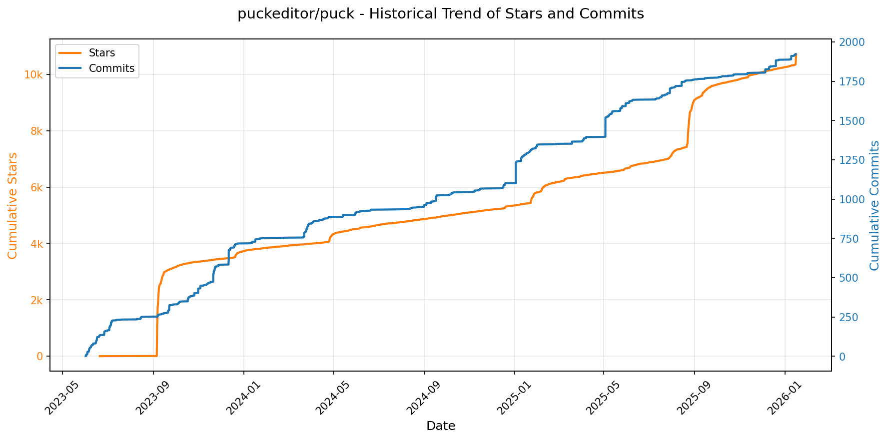
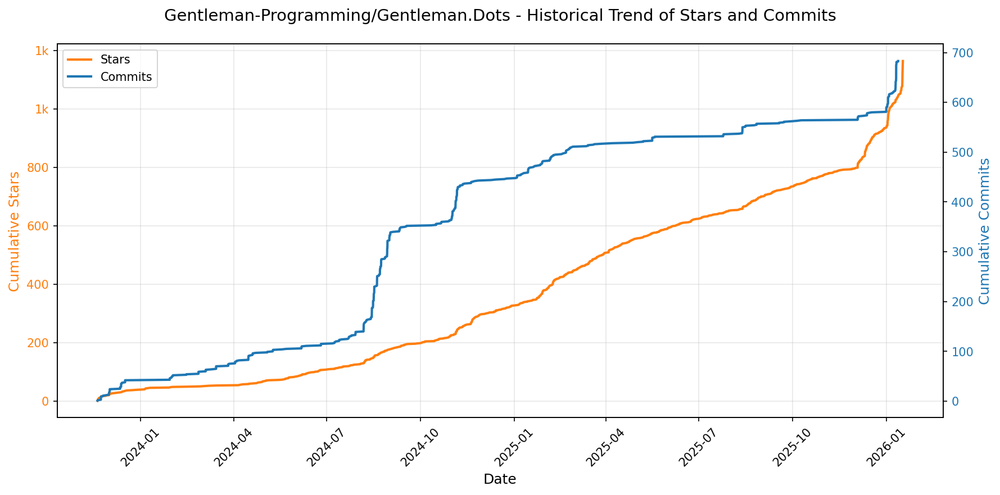

# 🌟 GitHub Trending 概览

> 数据更新于：2026-01-17。

---

## 🔍 项目详情

### 1. [hacksider/Deep-Live-Cam](https://github.com/hacksider/Deep-Live-Cam)
- 📅 **创建日期**：2023-09-24  
- 🔄 **最近更新**：2026-01-17  
- ⭐ **Stars**：78,109（日 +144｜周 +1147｜月 +1959）  
- 📝 **描述**：real time face swap and one-click video deepfake with only a single image  

<b>📈 Star 与 Commit 历史趋势</b>

> *蓝色：累计 Stars｜橙色：累计 Commits（次 Y 轴）*

<b>📄 README 摘要</b>

1. 该项目是一个实时人脸替换和视频深度伪造工具，仅需单张图像即可一键完成。它能够将用户选择的面部实时映射到摄像头画面、视频或直播中，支持多种应用场景如电影换脸、虚拟直播、制作表情包以及在Omegle等平台上使用。

2. 关键功能包括：实时面部交换（支持单脸或多脸同时处理）、保留原始嘴部动作的“嘴部遮罩”功能、可将不同人脸映射到多个对象上的“面部映射”、支持观看电影时实时换脸、可用于直播表演和内容创作、创建病毒式 meme 内容，并可在无GPU的情况下通过CPU运行（速度较慢）。此外还提供命令行参数以自定义输出质量、帧率、音频保留等选项。

3. 技术栈基于Python（推荐3.11版本），使用了ONNX Runtime作为推理引擎，支持多种执行后端加速，包括CUDA（NVIDIA GPU）、CoreML（Apple Silicon M系列芯片）、DirectML（Windows平台）、OpenVINO（Intel处理器）和CPU。依赖的关键模型来自InsightFace（inswapper_128_fp16.onnx）和GFPGAN用于人脸增强，同时集成了ffmpeg进行视频处理，Tkinter构建图形界面，并通过PyTorch生态支持GPU运算。项目也利用Git进行版本控制并从Hugging Face下载预训练模型。

---

### 2. [anomalyco/opencode](https://github.com/anomalyco/opencode)
- 📅 **创建日期**：2025-04-30  
- 🔄 **最近更新**：2026-01-17  
- ⭐ **Stars**：73,843（日 +1757｜周 +16241｜月 +34201）  
- 📝 **描述**：The open source coding agent.  

<b>📈 Star 与 Commit 历史趋势</b>

> *蓝色：累计 Stars｜橙色：累计 Commits（次 Y 轴）*

<b>📄 README 摘要</b>

1. 该项目是一个开源的AI编程代理工具，旨在帮助开发者在终端中通过自然语言与代码库进行交互，实现代码理解、编辑、规划和复杂任务执行。它支持本地或远程运行，可作为命令行工具或桌面应用使用，能够连接多种大语言模型（包括Claude、OpenAI、Google及本地模型），并提供基于TUI（文本用户界面）的高效开发体验。

2. 关键功能包括：  
   - 内置两种主要智能体（Agent）：“build”用于全权限开发工作（如代码修改），“plan”为只读模式，适合分析和探索代码库，防止误修改；  
   - 支持“@general”子智能体处理复杂的多步骤任务和深度搜索；  
   - 原生支持LSP（语言服务器协议），实现精准的代码理解与操作；  
   - 提供客户端/服务器架构，允许核心服务在本地运行，前端可通过终端、桌面应用甚至移动端远程控制；  
   - 多平台安装支持（macOS、Windows、Linux），兼容多种包管理器（如brew、npm、scoop、choco等）；  
   - 可切换主题的终端UI界面，注重终端用户体验优化；  
   - 开源且不绑定任何模型提供商，具备高度灵活性和隐私保障。

3. 技术栈包括：  
   - 核心以Rust编写，确保高性能与内存安全；  
   - 前端采用TUI（文本用户界面）框架构建，专注于终端环境下的交互体验；  
   - 使用LSP（Language Server Protocol）实现对代码项目的深度解析与智能操作；  
   - 支持多种LLM后端，包括Anthropic Claude、OpenAI、Google Gemini以及本地部署的大模型；  
   - 构建系统集成GitHub Actions，发布流程自动化；  
   - 包管理支持npm、bun、pnpm、yarn、Homebrew、Scoop、Chocolatey、Mise、Nix、Paru等多种工具；  
   - 桌面版基于独立打包技术（如DMG、EXE、AppImage等格式），并与Cask等包管理器集成。

---

### 3. [twitter/the-algorithm](https://github.com/twitter/the-algorithm)
- 📅 **创建日期**：2023-03-27  
- 🔄 **最近更新**：2026-01-17  
- ⭐ **Stars**：70,406（日 +139｜周 +1189｜月 +2530）  
- 📝 **描述**：Source code for the X Recommendation Algorithm  

<b>📈 Star 与 Commit 历史趋势</b>

> *蓝色：累计 Stars｜橙色：累计 Commits（次 Y 轴）*

<b>📄 README 摘要</b>

1. 该项目实现了X平台（如“为你推荐”时间线、搜索、探索、通知等）内容信息流的推荐算法系统。它通过整合用户行为数据、社交图谱、机器学习模型和高效的服务框架，为用户提供个性化的帖子和内容推荐。

2. 关键功能包括：  
   - 提供核心数据服务，如推文读写（tweetypie）、实时用户行为流（unified-user-actions）和用户信号收集（user-signal-service）。  
   - 集成多种机器学习模型，用于社区发现（SimClusters）、知识图谱嵌入（TwHIN）、用户互动预测（real-graph）、用户声誉计算（tweepcred）以及内容安全过滤（trust-and-safety-models）。  
   - 支持多阶段推荐流程：候选内容生成（如基于图的UTEG、搜索索引、关注推荐）、排序（轻量与重量级排序模型）、内容混合与过滤（如home-mixer、visibility-filters）。  
   - 提供高性能模型服务框架（navi）和通用信息流构建框架（product-mixer），支持实时与批量特征聚合。  
   - 实现个性化通知推荐系统（pushservice），包含专用的轻重排序模型以提升通知打开率和互动率。

3. 技术栈包括：  
   - 编程语言：主要使用 Scala 和 Python，部分高性能组件采用 Rust（如 navi），也有 Java 组件。  
   - 机器学习框架：主流使用自研的 navi 进行模型服务，遗留系统使用基于 TensorFlow v1 的 twml 框架。  
   - 数据与图处理：基于 GraphJet 构建用户-内容交互图，使用实时流处理技术处理用户行为数据。  
   - 构建工具：采用 Bazel 进行项目构建与测试（尚无顶层配置）。  
   - 核心架构组件：包括 tweet-mixer 候选协调层、heavy-ranker 神经网络排序器、home-mixer 信息流服务框架等。

---

### 4. [anthropics/claude-code](https://github.com/anthropics/claude-code)
- 📅 **创建日期**：2025-02-22  
- 🔄 **最近更新**：2026-01-17  
- ⭐ **Stars**：57,441（日 +353｜周 +3193｜月 +11190）  
- 📝 **描述**：Claude Code is an agentic coding tool that lives in your terminal, understands your codebase, and helps you code faster by executing routine tasks, explaining complex code, and handling git workflows - all through natural language commands.  

<b>📈 Star 与 Commit 历史趋势</b>

> *蓝色：累计 Stars｜橙色：累计 Commits（次 Y 轴）*

<b>📄 README 摘要</b>

1. 该项目是一个驻留在终端中的智能代理编程工具，能够理解用户的代码库，并通过自然语言指令帮助开发者更快地编写代码。它可执行常规编码任务、解释复杂代码逻辑、管理 Git 工作流，并支持在终端、IDE 或 GitHub 上通过 @claude 标记使用。

2. 主要功能包括：通过自然语言命令与代码库交互；自动化处理重复性开发任务；解释项目中的复杂代码；集成 Git 工作流操作；支持多种安装方式（如脚本、Homebrew、WinGet 等）；提供插件系统以扩展自定义命令和智能代理功能；内置反馈和错误报告机制（如 `/bug` 命令）；支持跨平台（macOS、Linux、Windows）运行。

3. 技术栈基于 Node.js（要求 18+ 版本），核心通过 Bash 和 PowerShell 脚本实现跨平台安装与部署，前端交互运行于终端环境，后端服务由 Anthropic 提供 AI 支持，同时集成了 GitHub 协作功能，并使用 NPM 进行部分包管理（已弃用全局 npm 安装方式）。

---

### 5. [usememos/memos](https://github.com/usememos/memos)
- 📅 **创建日期**：2021-12-08  
- 🔄 **最近更新**：2026-01-17  
- ⭐ **Stars**：54,577（日 +153｜周 +1791｜月 +7445）  
- 📝 **描述**：An open-source, self-hosted note-taking service. Your thoughts, your data, your control — no tracking, no ads, no subscription fees.  

<b>📈 Star 与 Commit 历史趋势</b>

> *蓝色：累计 Stars｜橙色：累计 Commits（次 Y 轴）*

<b>📄 README 摘要</b>

1. 该项目是一个开源、可自托管的笔记记录服务，旨在让用户完全掌控自己的数据。它支持个人笔记、团队知识库和知识管理，强调隐私保护，无追踪、无广告、无订阅费用，所有内容均存储在用户自己的基础设施上。

2. 主要功能包括：以隐私为先的架构（自托管、零遥测、完全数据导出）；原生支持 Markdown 编辑与纯文本存储；基于 Go 和 React 实现的高性能体验；提供一键式 Docker 部署，支持 SQLite、MySQL 和 PostgreSQL 数据库；开放完整的 REST 和 gRPC API 接口便于集成；具备简洁美观的用户界面，支持暗黑模式和移动端响应式布局。

3. 技术栈主要包括后端使用 Go 语言开发，前端采用 React 框架，支持多种部署方式如 Docker、Docker Compose、Kubernetes（含 Helm 图表）、预编译二进制文件以及源码构建，数据存储兼容 SQLite、MySQL 和 PostgreSQL。

---

### 6. [ultralytics/ultralytics](https://github.com/ultralytics/ultralytics)
- 📅 **创建日期**：2022-09-11  
- 🔄 **最近更新**：2026-01-17  
- ⭐ **Stars**：51,792（日 +316｜周 +892｜月 +1851）  
- 📝 **描述**：Ultralytics YOLO 🚀  

<b>📈 Star 与 Commit 历史趋势</b>

> *蓝色：累计 Stars｜橙色：累计 Commits（次 Y 轴）*

<b>📄 README 摘要</b>

1. 什么是这个项目？  
该项目是 Ultralytics 开发的 YOLO（You Only Look Once）系列模型的官方实现，专注于提供先进的计算机视觉解决方案。它支持多种核心任务，包括目标检测、实例分割、姿态估计、图像分类和对象追踪。用户可以通过简单的命令行（CLI）或 Python API 快速进行模型训练、验证、预测和导出部署，适用于研究和生产环境。

2. 关键特性  
- 支持多种视觉任务：涵盖目标检测、实例分割、姿态估计、图像分类和多对象追踪。  
- 多种预训练模型：提供不同规模的 YOLO 模型（如 YOLO26n、YOLO26s 到 YOLO26x），在精度与速度之间提供灵活选择。  
- 高性能与易用性：模型速度快、准确率高，支持一键训练、验证和推理。  
- 跨平台部署：支持将模型导出为 ONNX、TensorRT 等格式，便于在 CPU、GPU 或边缘设备上部署。  
- 多语言文档支持：提供包括中文在内的十余种语言的完整技术文档。  
- 多种安装方式：支持 pip、Conda、Docker 和源码安装，兼容主流深度学习环境。  
- 可扩展性强：允许用户自定义数据集、训练参数和模型结构，适用于各类定制化需求。

3. 技术栈  
- 编程语言：Python（要求 >=3.8）  
- 深度学习框架：PyTorch（要求 >=1.8）  
- 模型导出与推理：ONNX、TensorRT  
- 包管理：pip、Conda  
- 容器化：Docker  
- 开发工具：GitHub Actions（CI/CD）、Jupyter Notebook（支持 Colab、Kaggle、Binder 等在线运行环境）

---

### 7. [anthropics/skills](https://github.com/anthropics/skills)
- 📅 **创建日期**：2025-09-22  
- 🔄 **最近更新**：2026-01-17  
- ⭐ **Stars**：43,183（日 +1050｜周 +6582｜月 +21606）  
- 📝 **描述**：Public repository for Agent Skills  

<b>📈 Star 与 Commit 历史趋势</b>

> *蓝色：累计 Stars｜橙色：累计 Commits（次 Y 轴）*

<b>📄 README 摘要</b>

1. 该项目提供了 Anthropic 官方实现的“技能”（Skills），用于扩展 Claude 的能力。每个技能是一个包含指令、脚本和资源的文件夹，Claude 可动态加载这些技能以提升在特定任务上的表现。这些任务涵盖文档生成（符合公司品牌）、数据分析、自动化个人事务、技术开发（如 Web 应用测试）以及创意设计等。该仓库主要用于展示技能系统的可能性，为开发者提供参考和灵感。

2. 关键特性包括：  
   - **模块化与自包含**：每个技能独立存放于单独文件夹中，核心是 `SKILL.md` 文件，内含 YAML 元数据和详细操作指南。  
   - **多样化示例**：提供涵盖创意设计、技术开发、企业通信及文档处理（docx/pdf/pptx/xlsx）等多种场景的技能实例。  
   - **生产级参考**：公开了支撑 Claude 文档功能的实际技能源码（仅限查看，非开源），作为复杂技能的实践范本。  
   - **多平台支持**：可在 Claude Code、Claude.ai 和 Claude API 中使用；支持通过插件市场注册和安装技能集。  
   - **易于创建**：提供标准模板（template-skill），只需定义名称和描述，并编写 Markdown 指令即可快速构建新技能。  
   - **生态合作**：支持第三方集成，例如 Notion 提供了专为 Claude 设计的技能包。

3. 技术栈主要包括：  
   - **纯文本与标记语言**：使用 Markdown 编写技能说明，YAML 格式存储元信息（如 name, description）。  
   - **文件系统结构**：以文件夹组织技能，依赖清晰的目录布局实现模块化管理。  
   - **API 与插件机制**：通过 Claude API 支持技能上传与调用；在 Claude Code 中以插件形式集成（基于 GitHub 仓库地址添加）。  
   - **无运行时代码执行环境**：技能本身不包含可执行程序，而是由 Claude 解析并遵循其中的指令逻辑来完成任务。  
   - **开放规范**：包含 Agent Skills 规范文档（位于 `/spec`），推动标准化发展。

---

### 8. [exo-explore/exo](https://github.com/exo-explore/exo)
- 📅 **创建日期**：2024-06-24  
- 🔄 **最近更新**：2026-01-17  
- ⭐ **Stars**：40,150（日 +61｜周 +411｜月 +7389）  
- 📝 **描述**：Run your own AI cluster at home with everyday devices 📱💻 🖥️⌚  

<b>📈 Star 与 Commit 历史趋势</b>

> *蓝色：累计 Stars｜橙色：累计 Commits（次 Y 轴）*

<b>📄 README 摘要</b>

1. 该项目做什么？  
exo 是一个允许用户将日常设备（如 Mac）连接起来，构建个人本地 AI 集群的开源项目。它能够将大型语言模型分布到多个设备上运行，突破单个设备的硬件限制，并通过高效的设备间通信（如 RDMA over Thunderbolt）显著提升推理速度和效率。用户可以在家庭或本地网络中聚合多台设备的计算资源（如 GPU、内存），实现高性能 AI 推理。

2. 关键特性：  
- **自动设备发现**：运行 exo 的设备可自动相互发现，无需手动配置网络或集群参数。  
- **Thunderbolt 上的 RDMA 支持**：原生支持 macOS 15.2+ 的 RDMA over Thunderbolt 5 技术，设备间通信延迟降低高达 99%。  
- **拓扑感知的自动并行**：根据实时设备拓扑（包括算力、内存、网络带宽与延迟）智能决定模型切分策略，优化性能。  
- **张量并行（Tensor Parallelism）**：支持将模型进行张量级分片，在 2 台设备上最高实现 1.8 倍加速，4 台设备上达 3.2 倍加速。  
- **MLX 后端支持**：使用 Apple 的 MLX 框架作为推理引擎，并集成 MLX distributed 实现高效分布式通信。  
- **可视化仪表盘与 API**：提供本地 Web 仪表盘（http://localhost:52415）和兼容 OpenAI 格式的 API，便于监控和交互。  
- **跨平台支持**：支持在 macOS 和 Linux 上运行（当前 Linux 仅支持 CPU，GPU 正在开发中）。  

3. 技术栈：  
- **核心语言**：Rust（用于构建高性能系统组件和绑定）、Python（主控逻辑与 API 层）  
- **前端框架**：Node.js + npm（用于构建和打包仪表盘前端）  
- **推理后端**：MLX（Apple 开源的机器学习框架）及其分布式模块 MLX distributed  
- **依赖管理**：uv（Python 依赖工具）、brew（macOS/Linux 包管理）  
- **系统工具**：macmon（Apple Silicon 硬件监控，仅 macOS）  
- **通信技术**：RDMA over Thunderbolt 5（低延迟高速设备间通信）  
- **部署方式**：支持从源码运行（macOS/Linux）及 macOS 原生应用安装  
- **API 协议**：提供 RESTful API 并兼容 OpenAI API 格式，支持流式响应

---

### 9. [Lissy93/web-check](https://github.com/Lissy93/web-check)
- 📅 **创建日期**：2023-06-25  
- 🔄 **最近更新**：2026-01-17  
- ⭐ **Stars**：30,066（日 +86｜周 +863｜月 +3068）  
- 📝 **描述**：🕵️‍♂️ All-in-one OSINT tool for analysing any website  

<b>📈 Star 与 Commit 历史趋势</b>

> *蓝色：累计 Stars｜橙色：累计 Commits（次 Y 轴）*

---

### 10. [obra/superpowers](https://github.com/obra/superpowers)
- 📅 **创建日期**：2025-10-09  
- 🔄 **最近更新**：2026-01-17  
- ⭐ **Stars**：26,246（日 +1622｜周 +10817｜月 +16160）  
- 📝 **描述**：An agentic skills framework & software development methodology that works.  

<b>📈 Star 与 Commit 历史趋势</b>

> *蓝色：累计 Stars｜橙色：累计 Commits（次 Y 轴）*

<b>📄 README 摘要</b>

1. **这个项目是做什么的？**  
   Superpowers 是一个为编程智能体（coding agents）设计的完整软件开发工作流系统。它通过一组可组合的“技能”和初始指令，使编码智能体在开发过程中遵循严谨、系统化的工程实践。项目核心在于引导智能体在写代码前先与用户沟通明确需求，生成可读的设计文档，并在获得确认后制定详细实施计划。随后采用子智能体驱动开发（subagent-driven-development）模式，按任务分批执行，每步都进行自动化审查与验证，确保开发过程符合测试驱动开发（TDD）、YAGNI 和 DRY 等原则，从而实现长时间自主、不偏离计划的高效编码。

2. **关键特性**  
   - **自动触发的工作流技能库**：包含从需求梳理到代码提交的全流程技能，如 brainstorming（设计探讨）、writing-plans（编写计划）、executing-plans（执行计划）、subagent-driven-development（子智能体协作开发）等。
   - **严格遵循工程规范**：强制实施 TDD（红-绿-重构）、系统性调试、复杂度控制和证据验证机制。
   - **多阶段审查机制**：每个任务由独立子智能体完成，并经过两轮审查——是否符合规格说明、代码质量是否达标。
   - **并行开发支持**：利用 git worktrees 创建隔离分支，支持安全并行开发与环境隔离。
   - **人机协同节点**：在关键决策点（如计划批准、合并请求）引入人工确认，确保控制权。
   - **自适应平台安装**：针对 Claude Code、Codex、OpenCode 等不同 AI 编码平台提供定制化安装方式。
   - **技能可扩展性**：开放技能库结构，允许开发者贡献新技能并遵循统一标准创建和测试。

3. **技术栈**  
   - **核心平台**：基于 AI 驱动的编程助手系统（如 Claude Code、Codex、OpenCode）运行。
   - **插件架构**：Claude Code 通过内置插件市场机制加载（`/plugin install`），其他平台需手动拉取配置文件初始化。
   - **版本控制集成**：深度集成 Git，使用 worktrees 实现分支隔离与安全开发。
   - **技能定义格式**：技能以 Markdown 文档（`.md`）形式组织，遵循 `SKILL.md` 规范，存放在仓库中直接管理。
   - **自动化更新机制**：通过 `/plugin update` 命令实现技能库的动态更新。
   - **命令行交互接口**：提供 `/help` 和 `/superpowers:*` 系列命令用于查看功能和触发技能。
   - **无特定语言依赖**：作为流程框架适用于多种编程语言项目，重点在于开发方法论而非具体技术实现。

---

### 11. [bytedance/UI-TARS-desktop](https://github.com/bytedance/UI-TARS-desktop)
- 📅 **创建日期**：2025-01-19  
- 🔄 **最近更新**：2026-01-17  
- ⭐ **Stars**：23,971（日 +139｜周 +2100｜月 +4066）  
- 📝 **描述**：The Open-Source Multimodal AI Agent Stack: Connecting Cutting-Edge AI Models and Agent Infra  

<b>📈 Star 与 Commit 历史趋势</b>

> *蓝色：累计 Stars｜橙色：累计 Commits（次 Y 轴）*

<b>📄 README 摘要</b>

1. 该项目是一个多模态AI智能体技术栈，包含两个核心项目：Agent TARS 和 UI-TARS-desktop。Agent TARS 能够将图形用户界面（GUI）智能体和视觉能力引入终端、计算机、浏览器及各类产品中，支持通过自然语言指令完成复杂任务，如自动预订航班、酒店以及生成图表等。它提供命令行接口（CLI）和网页用户界面（Web UI），旨在利用先进的多模态大语言模型和现实世界工具的无缝集成，实现更接近人类操作方式的任务执行流程。UI-TARS-desktop 是一个桌面应用程序，基于 UI-TARS 模型提供本地化的 GUI 智能体功能，可直接通过自然语言控制用户的本地或远程计算机及浏览器，实现自动化操作。

2. 核心功能包括：一键即用的 CLI 工具，同时支持带图形界面的 Web UI 和无头模式的服务器运行；混合浏览器代理，能够结合视觉定位（GUI Agent）、DOM 分析或混合策略来控制浏览器；基于事件流协议的上下文工程与智能体界面，便于构建应用并追踪数据流；深度集成 MCP（Model Context Protocol）架构，支持接入多种真实世界的工具服务。此外，UI-TARS-desktop 具备由视觉-语言模型驱动的自然语言控制、屏幕截图与视觉识别、精准的鼠标键盘操控、跨平台支持（Windows/MacOS/浏览器）、实时反馈显示以及完全本地化处理保障隐私安全等特点，并新增远程计算机和浏览器操作功能，无需配置即可点击连接远程设备。

3. 技术栈主要包括：Node.js（要求版本 >= 22）作为运行环境，前端使用 Electron 构建跨平台桌面应用，后端采用 TypeScript 编写 CLI 工具；模型层面依赖于多模态大语言模型（如 doubao-1-5-thinking-vision-pro、claude-3-7-sonnet 等），并基于 Vision-Language 模型（如 Seed-1.5-VL/1.6 系列）实现视觉理解与交互；通信协议上采用 MCP（Model Context Protocol）实现与外部工具的集成；部署方面支持在本地运行，也兼容云端平台如 ModelScope 进行模型部署；开发工具链涵盖 npm 包管理、Git 版本控制，并提供 SDK 支持第三方开发者构建 GUI 自动化代理应用。

---

### 12. [resemble-ai/chatterbox](https://github.com/resemble-ai/chatterbox)
- 📅 **创建日期**：2025-04-23  
- 🔄 **最近更新**：2026-01-17  
- ⭐ **Stars**：21,622（日 +63｜周 +519｜月 +5835）  
- 📝 **描述**：SoTA open-source TTS  

<b>📈 Star 与 Commit 历史趋势</b>

> *蓝色：累计 Stars｜橙色：累计 Commits（次 Y 轴）*

<b>📄 README 摘要</b>

1. **这个项目是做什么的？**  
Chatterbox 是由 Resemble AI 开发的一系列先进的开源文本转语音（TTS）模型，旨在提供高质量、低延迟的语音合成能力。其中最新型号 Chatterbox-Turbo 专为高效推理设计，适用于零样例语音克隆、多语言支持和自然对话场景。它特别适合用于语音代理、交互式应用和创意内容生成，并内置神经水印技术以促进负责任的人工智能使用。

2. **关键特性**  
- **Chatterbox-Turbo 模型**：仅 350M 参数，计算和显存需求低，生成速度从传统 10 步压缩至 **单步解码**，显著提升推理效率。  
- **内建副语言标签支持**：原生支持 `[cough]`、`[laugh]`、`[chuckle]` 等标签，增强语音自然度与真实感。  
- **零样例语音克隆**：通过提供参考音频片段（约 10 秒），可快速克隆任意声音并生成对应语音。  
- **多语言支持**：Chatterbox-Multilingual 支持超过 23 种语言，包括中文、法语、西班牙语、阿拉伯语等，满足全球化应用场景。  
- **可控语音表达**：支持调节 `cfg_weight` 和 `exaggeration` 参数，实现对语调、节奏和情感强度的精细控制。  
- **嵌入式神经水印（PerTh）**：所有生成音频自动嵌入不可感知的水印，可抵御压缩与编辑，确保内容可追溯，提升 AI 伦理安全性。  

3. **技术栈**  
- **编程语言与框架**：Python + PyTorch  
- **依赖库**：torchaudio、librosa、Hugging Face Transformers 风格接口  
- **模型架构**：基于流匹配（flow-matching）或类似扩散机制的声码器，结合 S3Tokenizer 进行语音标记化处理；采用 HiFT-GAN 或改进 GAN 结构进行高质量梅尔谱图到波形的转换  
- **部署与分发**：通过 pip 安装 (`chatterbox-tts`)，支持本地源码安装与自定义修改  
- **水印技术**：集成 Resemble 自研的 PerTh（Perceptual Threshold）隐式水印系统  
- **开发环境**：基于 Python 3.11，Debian 11 测试，依赖版本锁定在 `pyproject.toml` 中保证一致性  
- **外部依赖参考**：借鉴 CosyVoice、Real-Time-Voice-Cloning、Llama 3 架构思想及 S3Tokenizer 技术

---

### 13. [google/langextract](https://github.com/google/langextract)
- 📅 **创建日期**：2025-07-08  
- 🔄 **最近更新**：2026-01-17  
- ⭐ **Stars**：21,212（日 +358｜周 +755｜月 +3825）  
- 📝 **描述**：A Python library for extracting structured information from unstructured text using LLMs with precise source grounding and interactive visualization.  

<b>📈 Star 与 Commit 历史趋势</b>

> *蓝色：累计 Stars｜橙色：累计 Commits（次 Y 轴）*

<b>📄 README 摘要</b>

1. **这个项目是做什么的？**  
LangExtract 是一个基于大语言模型（LLM）的 Python 库，用于从非结构化文本（如临床记录、报告或文学作品）中提取结构化信息。用户通过定义提示（prompt）和提供少量示例来指定提取任务，系统据此识别并组织关键实体及其属性，并精确标注每个提取结果在原文中的位置。它特别适用于长文档处理，支持可视化审查提取结果，并确保输出符合预设的结构化格式。

2. **主要功能**  
- **精准溯源定位**：将每个提取结果精确映射到源文本中的具体位置，支持高亮显示以便验证。  
- **结构化输出保障**：基于提供的示例强制生成一致的结构化数据，利用受控生成技术确保输出稳定可靠。  
- **优化长文本处理**：采用分块、多轮扫描和并行处理策略，提升在大型文档中查找信息的召回率。  
- **交互式可视化**：自动生成独立的 HTML 文件，以动画和交互方式展示提取结果及其上下文，便于大规模数据审查。  
- **灵活支持多种 LLM**：兼容云端模型（如 Google Gemini、OpenAI GPT 系列）和本地开源模型（通过 Ollama 接口运行）。  
- **可扩展的插件架构**：支持用户添加自定义模型提供商，无需修改核心代码即可集成新模型。  
- **零样本/少样本适配**：无需微调模型，仅通过提示和示例即可快速适应任意领域（如医疗、金融、文学分析）的提取任务。  

3. **技术栈**  
- **编程语言**：Python  
- **核心依赖**：Pydantic（数据建模）、Requests（HTTP 请求）、Jinja2（模板渲染）  
- **LLM 集成方式**：  
  - 云模型 API：Google Gemini、OpenAI（需安装额外依赖 `langextract[openai]`）  
  - 本地模型支持：Ollama（支持如 Gemma2 等本地运行的开源模型）  
  - 可扩展插件系统：基于入口点（entry points）机制注册自定义模型提供者  
- **开发与部署工具**：  
  - 包管理：`pip` + `pyproject.toml`  
  - 虚拟环境：venv  
  - 容器化：Docker  
  - 测试框架：pytest、tox（多环境测试）  
  - 代码质量：pre-commit、pylint、isort、pyink（Black 分支）  
- **可视化输出**：生成自包含的 HTML 页面用于结果审查  
- **异步与并发**：使用多线程（`max_workers` 参数控制）实现并行处理，提升大文档处理效率

---

### 14. [BloopAI/vibe-kanban](https://github.com/BloopAI/vibe-kanban)
- 📅 **创建日期**：2025-06-14  
- 🔄 **最近更新**：2026-01-17  
- ⭐ **Stars**：16,722（日 +280｜周 +2285｜月 +10176）  
- 📝 **描述**：Get 10X more out of Claude Code, Codex or any coding agent  

<b>📈 Star 与 Commit 历史趋势</b>

> *蓝色：累计 Stars｜橙色：累计 Commits（次 Y 轴）*

<b>📄 README 摘要</b>

1. 该项目旨在优化人类工程师与AI编程代理（如Claude Code、Gemini CLI等）协作的开发流程。它提供一个看板式界面，帮助用户管理由AI代理执行的编码任务，支持在不同代理间切换、并行或串行编排多个代理任务、快速审查代码成果、启动开发服务器、跟踪任务状态，并集中配置代理的MCP设置。当部署在远程服务器上时，还支持通过SSH从本地编辑器（如VSCode）直接打开项目。

2. 关键功能包括：支持多种主流AI编程代理；以看板形式可视化和管理AI生成的任务；能够编排多个AI代理协同工作；内置开发服务器启动功能以便即时预览；集中化管理AI代理的配置（MCP configs）；提供分析功能（可选）；支持远程部署并通过SSH实现本地编辑器无缝连接；在开发模式下自动分配端口并支持详细环境变量配置；可通过npx一键运行。

3. 技术栈包含：前端使用Node.js（>=18）和pnpm（>=8）构建，后端采用Rust（最新稳定版）开发；利用`cargo-watch`和`sqlx-cli`等Rust工具进行开发监控和数据库操作；前端包管理与构建依赖pnpm；项目包含独立的CLI（npx-cli），可通过`npx vibe-kanban`直接执行；使用PostHog进行可选的用户行为分析；通过环境变量区分构建时和运行时配置；支持Docker、systemctl或云服务等远程部署方式，并依赖SSH和VSCode Remote-SSH扩展实现远程开发集成。

---

### 15. [agentsmd/agents.md](https://github.com/agentsmd/agents.md)
- 📅 **创建日期**：2025-08-19  
- 🔄 **最近更新**：2026-01-17  
- ⭐ **Stars**：15,419（日 +222｜周 +632｜月 +3100）  
- 📝 **描述**：AGENTS.md — a simple, open format for guiding coding agents  

<b>📈 Star 与 Commit 历史趋势</b>

> *蓝色：累计 Stars｜橙色：累计 Commits（次 Y 轴）*

<b>📄 README 摘要</b>

1. 这个项目做什么？  
AGENTS.md 是一个简单、开放的格式，用于指导 AI 编码代理（coding agents）在项目中更高效地工作。它相当于为 AI 代理提供的一份 README 文件，集中存放上下文信息和操作指令，帮助 AI 理解项目的开发环境、测试流程和提交规范等，从而更准确地执行代码修改、调试和协作任务。

2. 关键特性  
- 提供标准化的文档结构（AGENTS.md 文件），使 AI 代理能够一致地获取项目指引。  
- 包含开发环境提示，如包管理命令、项目跳转方式和初始化模板。  
- 明确测试流程，包括如何运行测试、聚焦特定用例以及确保类型和 lint 检查通过。  
- 定义 PR（Pull Request）提交规范，如标题格式和提交前必须执行的检查步骤。  
- 支持过滤到具体项目模块，适用于多包（monorepo）项目结构。  
- 项目附带一个简单的网站（https://agents.md），用于介绍 AGENTS.md 的理念并展示示例。

3. 技术栈  
- 使用 Markdown 作为 AGENTS.md 文件的格式。  
- 网站基于 Next.js 构建，前端框架使用 React 和 TypeScript。  
- 包管理工具为 pnpm，支持 Turborepo 进行任务调度（如 `turbo run test`）。  
- 测试相关工具包括 Vitest（测试框架）、ESLint（代码检查）和 TypeScript（类型检查）。  
- GitHub Actions 用于 CI 流程，配置文件位于 `.github/workflows` 目录。

---

### 16. [shareAI-lab/learn-claude-code](https://github.com/shareAI-lab/learn-claude-code)
- 📅 **创建日期**：2025-06-29  
- 🔄 **最近更新**：2026-01-17  
- ⭐ **Stars**：14,429（日 +82｜周 +787｜月 +2806）  
- 📝 **描述**：How can we build a true AI agent? Like Claude Code.  

<b>📈 Star 与 Commit 历史趋势</b>

> *蓝色：累计 Stars｜橙色：累计 Commits（次 Y 轴）*

<b>📄 README 摘要</b>

1. 这个项目是做什么的？  
该项目是一个渐进式教程，旨在通过从零构建AI编程代理来帮助学习现代AI代理（如Claude Code、Kode、Cursor Agent）的工作原理。它提供五个逐步进阶的版本（共约1100行代码），每个版本引入一个核心概念，系统性地揭示AI编码代理的设计思想与实现机制。项目强调“模型即代理”的核心理念，展示如何通过极简代码实现强大功能，并可用于教学、研究或作为开发自定义AI代理的起点。

2. 关键特性  
- **渐进式学习结构**：包含v0到v4五个版本，依次引入基础工具调用、显式规划（Todo管理）、子代理机制、技能（Skills）扩展等关键概念。  
- **极简核心循环**：所有代理基于同一个简洁的主循环——模型调用工具直至任务完成，突出“模型驱动”本质。  
- **可组合的技能系统**：支持通过SKILL.md文件按需加载领域知识，实现模块化能力扩展。  
- **元技能支持**：内置“代理构建者”技能，可自动生成新代理项目脚手架（支持不同复杂度级别）。  
- **多平台兼容**：适配Kode CLI、Claude Code、Cursor等主流AI代理环境，遵循[Agent Skills Spec]标准。  
- **教育导向设计**：提供中英文深度技术解析文档和社交风格文章，便于理解底层原理。  

3. 技术栈  
- 编程语言：Python  
- 核心依赖：`anthropic`（调用Claude模型）、`python-dotenv`（环境变量管理）  
- 架构模式：基于工具调用（tool use）的循环代理架构，结合消息历史维护上下文  
- 工具体系：Bash命令执行、文件读写/编辑、待办事项管理、子代理调度、技能动态加载  
- 技能规范：遵循Anthropic提出的[Agent Skills Spec]标准，支持外部插件集成  
- 开发配套：可通过Kode CLI等命令行工具安装生产级技能包（如shareAI-skills）

---

### 17. [cjpais/Handy](https://github.com/cjpais/Handy)
- 📅 **创建日期**：2025-02-13  
- 🔄 **最近更新**：2026-01-17  
- ⭐ **Stars**：11,867（日 +381｜周 +1445｜月 +3253）  
- 📝 **描述**：A free, open source, and extensible speech-to-text application that works completely offline.  

<b>📈 Star 与 Commit 历史趋势</b>

> *蓝色：累计 Stars｜橙色：累计 Commits（次 Y 轴）*

<b>📄 README 摘要</b>

1. 该项目是一个免费、开源、可扩展的离线语音转文字桌面应用。它允许用户通过自定义快捷键启动录音，说出内容后，系统会在本地完成语音识别，并将转换出的文字直接输入到当前使用的任何文本框中，全程无需联网，保障用户隐私。

2. 主要功能包括：完全离线运行，确保语音数据不上传云端；支持多种语音识别模型（如Whisper系列和Parakeet V3），可根据硬件选择合适模型；具备语音活动检测（VAD）功能，自动过滤静音片段；跨平台支持Windows、macOS和Linux；提供可配置的全局快捷键，支持推式通话（push-to-talk）模式；内置调试模式便于开发和问题排查；支持手动安装模型文件，适用于网络受限环境；并可通过信号（如SIGUSR2）与其他系统工具集成控制录制。

3. 技术栈基于Tauri框架，结合Rust与React/TypeScript构建。前端使用React + TypeScript配合Tailwind CSS实现设置界面；后端使用Rust处理系统级操作，包括音频采集、语音识别推理和全局快捷键管理；核心依赖库包括whisper-rs（用于Whisper模型本地推理）、transcription-rs（用于Parakeet模型CPU优化识别）、cpal（跨平台音频输入输出）、vad-rs（语音活动检测）、rdev（全局键盘监听）以及rubato（音频重采样）。

---

### 18. [puckeditor/puck](https://github.com/puckeditor/puck)
- 📅 **创建日期**：2023-06-02  
- 🔄 **最近更新**：2026-01-17  
- ⭐ **Stars**：11,083（日 +386｜周 +772｜月 +905）  
- 📝 **描述**：The visual editor for React  

<b>📈 Star 与 Commit 历史趋势</b>

> *蓝色：累计 Stars｜橙色：累计 Commits（次 Y 轴）*

<b>📄 README 摘要</b>

1. 这个项目是做什么的？  
Puck 是一个模块化、开源的 React 可视化编辑器，允许开发者使用自己的 React 组件构建自定义的拖拽式页面编辑体验。它本身是一个 React 组件，可集成到任何 React 环境（如 Next.js）中，用于可视化地创建和编辑页面内容。用户完全掌控数据，无厂商锁定风险，适用于内部系统和商业应用。

2. 主要特性  
- 支持拖拽式可视化编辑页面  
- 可与任意 React 组件集成，高度可定制  
- 数据完全由用户控制，无 vendor lock-in  
- 支持多种框架开箱即用（如 Next.js、Remix、React Router）  
- 提供 `create-puck-app` 快速初始化项目  
- 内置示例模板（recipes），支持快速搭建不同技术栈的应用  
- 开源且采用 MIT 许可证，可用于商业项目  
- 支持将编辑内容序列化并保存至数据库，并通过 `<Render>` 组件渲染为最终页面  

3. 技术栈  
- 核心语言/框架：React.js  
- 支持环境：Next.js、Remix、React Router 等主流 React 框架  
- 包管理：npm / npx  
- 样式：CSS（提供默认 puck.css）  
- 部署示例支持静态生成（SSG）和动态路由  
- 开发工具链基于现代前端生态（Node.js + 构建工具兼容）

---

### 19. [steveyegge/beads](https://github.com/steveyegge/beads)
- 📅 **创建日期**：2025-10-12  
- 🔄 **最近更新**：2026-01-17  
- ⭐ **Stars**：10,702（日 +219｜周 +1331｜月 +5119）  
- 📝 **描述**：Beads - A memory upgrade for your coding agent  

<b>📈 Star 与 Commit 历史趋势</b>

> *蓝色：累计 Stars｜橙色：累计 Commits（次 Y 轴）*

<b>📄 README 摘要</b>

1. 该项目是一个为AI代理设计的分布式、基于Git的图状问题跟踪器，旨在为编码代理提供持久化、结构化的记忆系统。它用具备依赖关系感知能力的图结构替代了杂乱的Markdown计划文件，使代理能够处理长期任务而不丢失上下文。

2. 主要特性包括：以Git作为数据库，将问题以JSONL格式存储在`.beads/`目录中，支持版本控制、分支和合并；专为代理优化，输出JSON格式数据，支持依赖关系追踪和自动识别可执行任务；采用基于哈希的ID（如`bd-a1b2`）避免多代理或多分支工作流中的合并冲突；具备隐形基础设施，使用SQLite本地缓存提升速度，并通过后台守护进程实现自动同步；支持“语义压缩”功能，对旧的已关闭任务进行总结以模拟记忆衰减，节省上下文窗口空间。

3. 技术栈主要包括Go语言（主程序实现）、Git（用于数据存储与版本管理）、SQLite（本地高速缓存），并通过npm（JavaScript/Node.js生态）和PyPI（Python生态）提供跨平台工具集成支持。支持在Linux、FreeBSD、macOS和Windows系统上运行，安装方式涵盖shell脚本、npm、Homebrew及Go工具链。

---

### 20. [google/A2UI](https://github.com/google/A2UI)
- 📅 **创建日期**：2025-09-24  
- 🔄 **最近更新**：2026-01-17  
- ⭐ **Stars**：10,135（日 +118｜周 +589｜月 +6918）  
- 📝 **描述**：暂无描述  

<b>📈 Star 与 Commit 历史趋势</b>

> *蓝色：累计 Stars｜橙色：累计 Commits（次 Y 轴）*

<b>📄 README 摘要</b>

1. **这个项目是做什么的？**  
A2UI（Agent-to-User Interface）是一个开源项目，旨在让AI代理（agent）能够生成或填充丰富的用户界面。它提供了一种专为可更新的代理生成UI优化的数据格式（基于JSON），并通过客户端渲染器将该格式转换为实际的用户界面。代理只需发送描述UI意图的声明式数据，由客户端安全地渲染成原生UI组件。这种方式使得远程或跨信任边界的代理也能动态构建交互式界面，实现“代理说UI”的能力。

2. **关键特性**  
- **安全性优先**：采用声明式数据格式而非可执行代码，防止LLM生成恶意脚本；客户端维护受信组件目录，仅允许渲染预注册的组件。  
- **支持增量更新**：UI以带ID的扁平化组件列表表示，便于LLM逐步生成和修改，实现渐进式渲染与流畅用户体验。  
- **框架无关性与可移植性**：同一份A2UI JSON可在不同平台（如Web、Flutter、React、SwiftUI等）上通过本地组件库渲染，实现跨平台兼容。  
- **高度灵活的扩展机制**：支持开放注册模式，开发者可通过“智能包装器”将自定义UI组件（包括沙箱化的iframe）接入A2UI的数据绑定和事件系统，自主控制安全策略。  
- **适用于多种场景**：如动态表单生成、远程子代理返回UI、自适应工作流仪表盘、实时数据可视化等。

3. **技术栈**  
- **核心格式**：基于JSON的声明式UI描述语言。  
- **传输协议**：兼容A2A协议和AG UI，未来计划支持REST等更多方式。  
- **LLM支持**：任何能输出JSON的模型均可生成A2UI内容（示例中使用Gemini）。  
- **客户端框架**：当前支持Web（如Lit、React）和Flutter；渲染器已实现Lit版本，Flutter通过GenUI SDK集成；未来将拓展至Jetpack Compose、SwiftUI等。  
- **开发依赖**：Node.js（前端）、Python（后端示例）、Gemini API密钥（用于示例运行）。  
- **许可证**：Apache 2.0。

---

### 21. [home-assistant/home-assistant.io](https://github.com/home-assistant/home-assistant.io)
- 📅 **创建日期**：2014-12-21  
- 🔄 **最近更新**：2026-01-17  
- ⭐ **Stars**：8,518（日 +34｜周 +751｜月 +856）  
- 📝 **描述**：:blue_book: Home Assistant User documentation  

<b>📈 Star 与 Commit 历史趋势</b>

> *蓝色：累计 Stars｜橙色：累计 Commits（次 Y 轴）*

<b>📄 README 摘要</b>

1. 该项目是 [Home-Assistant.io](https://home-assistant.io) 官方网站的源代码，用于展示和维护 Home Assistant 智能家居平台的文档、博客文章（如更新日志）和其他公开信息。

2. 关键特性包括：支持多环境部署（生产环境、测试版、开发版），为每个拉取请求（pull request）提供 Netlify 预览链接；提供本地预览功能，便于贡献者查看修改效果；包含加速网站生成的工具（可临时隔离大量变更日志以提升构建速度）；遵循 CC BY-NC-SA 4.0 许可证，鼓励社区参与文档贡献。

3. 技术栈主要包括：使用 Ruby 的 Bundler 管理依赖，基于 Rake 构建任务（如 `rake preview` 启动本地服务、`rake isolate`/`integrate` 优化构建流程），结合 Jekyll 静态站点生成器（虽未明说但由 Rake 任务推断得出），托管在 Netlify 平台并实现自动化部署。

---

### 22. [eigent-ai/eigent](https://github.com/eigent-ai/eigent)
- 📅 **创建日期**：2025-07-29  
- 🔄 **最近更新**：2026-01-17  
- ⭐ **Stars**：7,610（日 +1294｜周 +4876｜月 +5042）  
- 📝 **描述**：Eigent: The Open Source Cowork Desktop to Unlock Your Exceptional Productivity.  

<b>📈 Star 与 Commit 历史趋势</b>

> *蓝色：累计 Stars｜橙色：累计 Commits（次 Y 轴）*

<b>📄 README 摘要</b>

1. 该项目做什么？  
Eigent 是一个开源的协作式桌面应用，旨在通过构建、管理和部署自定义的AI工作团队，将复杂的业务流程自动化。它基于 CAMEL-AI 的多智能体框架，支持在本地运行，无需技术配置即可实现并行任务处理，适用于个人和企业用户提升生产力。系统能够动态拆分任务并激活多个AI代理协同工作，同时支持人机协作，在遇到不确定性时请求人工介入。

2. 关键功能  
- **多智能体协作（Workforce）**：内置开发者、浏览器、文档、多模态等专业AI代理，可并行执行代码编写、网页搜索、文档处理、图像音频分析等任务。  
- **全面的模型支持**：支持本地集成多种大模型（如 vLLM、Ollama、LM Studio 等），保障数据隐私与自主控制。  
- **MCP 工具集成**：内置丰富的模型上下文协议（MCP）工具，支持网页浏览、代码执行、Notion、Google 套件、Slack 等，并允许用户安装自定义工具或接入内部API。  
- **人机协同机制**：当任务受阻或存在不确定时，自动暂停并请求人工输入，确保任务准确完成。  
- **100% 开源与本地部署**：完全开放源代码，支持离线独立运行，无外部依赖，保障数据安全与透明性。  
- **企业级功能**：支持单点登录（SSO）、访问控制、可扩展部署及定制化开发，满足企业安全与管理需求。

3. 技术栈  
- **后端**：使用 FastAPI 框架，uv 作为包管理器，Uvicorn 作为异步服务器，采用 OAuth 2.0 和 Passlib 实现认证，底层基于 CAMEL 多智能体框架。  
- **前端**：基于 React 和 TypeScript 构建，使用 Electron 打包为桌面应用，UI 采用 Tailwind CSS、Radix UI 和 Lucide React，状态管理使用 Zustand，流程编排依赖 React Flow。

---

### 23. [MiroMindAI/MiroThinker](https://github.com/MiroMindAI/MiroThinker)
- 📅 **创建日期**：2025-08-07  
- 🔄 **最近更新**：2026-01-17  
- ⭐ **Stars**：5,127（日 +114｜周 +1154｜月 +3805）  
- 📝 **描述**：MiroThinker is an open source deep research agent optimized for research and prediction. It achieves a 60.2% Avg@8 score on the challenging GAIA benchmark.  

<b>📈 Star 与 Commit 历史趋势</b>

> *蓝色：累计 Stars｜橙色：累计 Commits（次 Y 轴）*

<b>📄 README 摘要</b>

1. **这个项目是做什么的？**  
MiroThinker 是一个开源的深度研究智能体（deep research agent），专注于复杂的研究任务和预测任务。它通过增强工具调用、长上下文推理和多步分析能力，优化了在真实世界环境中的自主决策与问题解决能力。该项目包含三个核心组件：MiroThinker（研究智能体本身）、MiroFlow（支持高可复现性评分的代理框架）和 MiroVerse（包含14.7万样本的高质量开源训练数据集，用于训练研究型智能体）。其目标是推动开放源码智能体在搜索、推理和交互式任务中的前沿性能。

2. **关键特性**  
- **交互式扩展（Interactive Scaling）**：作为除模型规模和上下文长度外的第三维性能提升手段，系统性地训练智能体处理更深、更频繁的环境交互。  
- **超长上下文支持**：最高支持 256K 上下文窗口，实现长视野推理和深度多步分析。  
- **高强度工具调用能力**：最多支持每任务 600 次工具调用（v1.0）或 400 次（v1.5），显著高于以往开源研究智能体。  
- **多参数规模发布**：提供从 8B 到 235B 不同参数量级的模型版本，适配不同计算资源场景。  
- **全面开源透明**：框架、智能体、训练流程全部开源，并支持 SFT 和 DPO 训练。  
- **丰富的基准测试覆盖**：在 GAIA、HLE、BrowseComp（中英文）、XBench-DeepSearch、FutureX 等多个权威基准上进行评估，确保广泛适用性和高性能。  
- **完整轨迹记录与分析**：支持详细的交互日志记录，包括耗时和预计完成时间，便于后续训练与调试。  

3. **技术栈**  
- **基础模型**：基于通义千问系列（Qwen3/Qwen2.5）大语言模型进行微调，涵盖 Qwen3-8B、Qwen3-30B、Qwen2.5-72B-Instruct、Qwen3-235B 等变体。  
- **训练方法**：采用监督微调（SFT）和直接偏好优化（DPO），并引入统一的偏好数据集进行训练。  
- **部署与评测平台**：模型发布于 Hugging Face；使用 Gradio 提供交互式演示；集成多种外部工具与 API 实现网页浏览、搜索等操作。  
- **数据来源**：训练数据来自英文和中文多源信息，构建为 MiroVerse 开源数据集（147k 样本）。  
- **评估体系**：支持 GAIA、HLE、BrowseComp-ZH/EN、Frames、XBench-DeepSearch、FutureX、SEAL-0、AIME2025 等多种公开基准测试。  
- **开发与协作平台**：GitHub 进行代码托管，Discord 提供社区支持，网站与博客发布技术动态和技术报告（如 arXiv 论文）。

---

### 24. [danielmiessler/Personal_AI_Infrastructure](https://github.com/danielmiessler/Personal_AI_Infrastructure)
- 📅 **创建日期**：2025-09-08  
- 🔄 **最近更新**：2026-01-17  
- ⭐ **Stars**：4,787（日 +70｜周 +628｜月 +3362）  
- 📝 **描述**：Personal AI Infrastructure for upgrading humans.  

<b>📈 Star 与 Commit 历史趋势</b>

> *蓝色：累计 Stars｜橙色：累计 Commits（次 Y 轴）*

<b>📄 README 摘要</b>

1. 该项目做什么？  
PAI（Personal AI Infrastructure）是一个个性化的AI平台，旨在通过持续学习和深度定制来放大个人能力。它不仅仅是一个执行任务的工具，而是一个以用户为中心、能理解用户目标、偏好和历史背景的智能助手系统。其核心是“当前状态 → 理想状态”的可验证迭代算法，通过不断收集反馈信号（如评分、情感、成功/失败结果），实现自我升级，追求每次输出都能带来“愉悦的惊喜”（Euphoric Surprise）。PAI适用于从普通用户到开发者、创意人士、企业管理者乃至团队的各种人群，致力于让每个人都能平等地获得顶级AI带来的优势。

2. 关键特性  
- **目标导向**：系统围绕用户的长期目标设计，而非仅完成孤立任务。  
- **持续学习与自我进化**：通过记忆系统捕获每一次交互信号，并用于优化核心算法和技能，使AI越用越聪明。  
- **定制化优先**：深度个性化配置，包括身份、目标（TELOS）、偏好等，确保AI真正“了解你”。  
- **AI驱动的安装与管理**：由AI助手自动读取并安装功能包（Packs）和套件（Bundles），无需手动配置。  
- **终端优先的用户体验**：基于CLI的富文本界面，支持动态状态栏、标签管理、通知系统和语音反馈（集成ElevenLabs TTS）。  
- **安全机制内置**：默认提供命令验证、权限控制和注入防御，保障执行安全。  
- **钩子系统（Hook System）**：响应会话开始、工具调用、任务完成等生命周期事件，实现自动化上下文加载、安全检查和可观测性。  
- **模块化技能体系**：采用“代码 → CLI工具 → 提示词 → 技能”的确定性结构，提升结果一致性。  
- **多通道通知系统**：支持ntfy推送、Discord集成和时长感知的通知路由，不阻塞工作流。  
- **统一的核心算法框架**：七阶段任务处理流程（观察→思考→计划→构建→执行→验证→学习），强调可验证性和闭环反馈。

3. 技术栈  
- **编程语言**：TypeScript  
- **运行时环境**：Bun（高性能JavaScript/TypeScript运行时）  
- **AI模型与开发辅助**：Claude（由Anthropic提供，用于系统构建和文档生成）  
- **前端/UI**：基于终端的用户界面（Terminal-Based UI），无传统图形界面  
- **语音合成**：ElevenLabs TTS  
- **通知服务**：ntfy（用于移动推送）、Discord（团队协作）  
- **版本控制与协作**：Git + GitHub  
- **社区与沟通**：Discord（UL Community）  
- **架构理念**：遵循UNIX哲学、SRE/ENG工程原则、CLI优先、可组合性与确定性基础设施设计

---

### 25. [NevaMind-AI/memU](https://github.com/NevaMind-AI/memU)
- 📅 **创建日期**：2025-07-29  
- 🔄 **最近更新**：2026-01-17  
- ⭐ **Stars**：4,780（日 +81｜周 +673｜月 +1739）  
- 📝 **描述**：Memory infrastructure for LLMs and AI agents  

<b>📈 Star 与 Commit 历史趋势</b>

> *蓝色：累计 Stars｜橙色：累计 Commits（次 Y 轴）*

<b>📄 README 摘要</b>

1. 该项目做什么？  
MemU 是一个面向未来的智能体记忆系统，专为大语言模型（LLM）和 AI 智能体后端设计。它接收多模态输入（如对话、文档、图像、音频、视频），从中提取结构化记忆，并以三层层级文件系统（资源 → 条目 → 类别）进行组织。该系统支持两种检索方式：基于嵌入的 RAG 检索（快速）和基于 LLM 的语义检索（深度理解），实现高效且精准的记忆存储与查询，适用于个人助理、知识管理、智能客服等场景。

2. 关键功能  
- **层级文件系统**：采用“资源→条目→类别”三层架构，支持从原始数据到抽象总结的逐层组织，确保完整可追溯性与渐进式摘要。  
- **双模式检索机制**：支持 RAG（向量相似度）快速检索与 LLM（语义推理）深度检索，兼顾效率与理解深度，并具备自动查询重写和充分性判断能力。  
- **多模态支持**：统一处理文本、JSON 对话、文档、图像、音视频等多种输入类型，提取结构化记忆并实现跨模态检索。  
- **自进化记忆**：记忆结构可根据使用模式动态调整和优化，支持增量学习与持续演化。  
- **灵活部署与集成**：提供云端 API 和本地部署选项，支持 OpenAI、阿里云通义千问、OpenRouter 等多种 LLM 与嵌入模型提供商。  

3. 技术栈  
- **编程语言**：Python 3.13+  
- **核心依赖**：支持通过 `pip` 安装，使用 `uv` 作为包管理器  
- **数据库支持**：支持内存存储（inmemory）和 PostgreSQL（配合 pgvector 扩展）用于向量存储  
- **LLM 集成**：兼容 OpenAI、阿里云 DashScope、OpenRouter 等平台，支持自定义 base_url 和模型配置  
- **嵌入模型**：支持 Voyage AI、OpenAI 等嵌入服务，可通过配置分离 LLM 与嵌入模型  
- **开发工具**：使用 Ruff 和 Black 进行代码格式化与检查，mypy 做类型验证，deptry 分析依赖，pre-commit 管理钩子  
- **部署方式**：提供 Docker 部署 PostgreSQL 示例，支持云 API（memu.so）与本地 SDK 两种使用模式

---

### 26. [iOfficeAI/AionUi](https://github.com/iOfficeAI/AionUi)
- 📅 **创建日期**：2025-08-07  
- 🔄 **最近更新**：2026-01-17  
- ⭐ **Stars**：4,336（日 +433｜周 +925｜月 +1255）  
- 📝 **描述**：Free, local, open-source Cowork for Gemini CLI, Claude Code, Codex, Opencode, Qwen Code, Goose Cli, Auggie, and more | 🌟 Star if you like it!  

<b>📈 Star 与 Commit 历史趋势</b>

> *蓝色：累计 Stars｜橙色：累计 Commits（次 Y 轴）*

---

### 27. [frankbria/ralph-claude-code](https://github.com/frankbria/ralph-claude-code)
- 📅 **创建日期**：2025-08-27  
- 🔄 **最近更新**：2026-01-17  
- ⭐ **Stars**：3,358（日 +190｜周 +2419｜月 +3318）  
- 📝 **描述**：Autonomous AI development loop for Claude Code with intelligent exit detection  

<b>📈 Star 与 Commit 历史趋势</b>

> *蓝色：累计 Stars｜橙色：累计 Commits（次 Y 轴）*

<b>📄 README 摘要</b>

1. 该项目做什么？
   Ralph 是一个为 Claude Code 设计的自动化 AI 开发循环工具。它通过迭代式地调用 Claude Code 来自主改进项目，直至完成，并内置了智能退出检测和速率限制等安全机制，以防止无限循环和 API 滥用。安装后，Ralph 成为一个全局命令，可在任何目录下使用。

2. 关键特性
   - **自主开发循环**：基于项目需求持续执行 Claude Code 进行迭代开发。
   - **智能退出检测**：采用双重条件检查机制，必须同时满足“完成指标”（completion_indicators >= 2）和 Claude 明确的 `EXIT_SIGNAL: true` 信号才会退出，避免过早终止。
   - **会话连续性**：通过 `--continue` 标志保留跨循环的上下文，支持会话超时（默认24小时）和手动重置。
   - **速率限制与熔断器**：内置每小时API调用次数限制（默认100次），并配有高级熔断器，能通过多行错误匹配和两阶段过滤准确检测卡死循环。
   - **JSON 输出支持**：支持 Claude Code CLI 的 JSON 输出格式，并能自动回退到文本解析，确保兼容性。
   - **实时监控**：提供 tmux 集成的实时仪表盘，用于监控循环状态、进度和日志。
   - **PRD 导入功能**：可将现有的产品需求文档（如 Markdown, PDF, DOCX 等）转换为 Ralph 可执行的标准化项目结构。
   - **5 小时限流处理**：当达到 Claude 的5小时使用上限时，能自动检测并提示用户选择等待或退出。
   - **完善的测试与 CI/CD**：拥有308个通过率100%的测试用例，并通过 GitHub Actions 实现了自动化测试流水线。
   - **干净卸载**：提供专用的 `uninstall.sh` 脚本，可彻底移除所有组件。

3. 技术栈
   - **核心语言**：Bash (4.0+)，整个项目由一系列 Bash 脚本构成。
   - **AI 引擎**：Claude Code CLI (`@anthropic-ai/claude-code`)，作为底层的 AI 编码模型接口。
   - **依赖工具**：
     - `tmux`：用于实现集成化的实时监控终端。
     - `jq`：用于处理和解析 JSON 格式的响应数据。
     - `git`：用于项目版本控制，新项目会自动初始化为 Git 仓库。
     - 标准 Unix 工具：如 `grep`, `date` 等，用于脚本中的文本处理和时间操作。
   - **测试框架**：BATS (Bash Automated Testing System)，配合 bats-support 和 bats-assert 库进行单元和集成测试。
   - **CI/CD**：GitHub Actions，用于自动化运行测试套件。

---

### 28. [Gentleman-Programming/Gentleman.Dots](https://github.com/Gentleman-Programming/Gentleman.Dots)
- 📅 **创建日期**：2023-11-19  
- 🔄 **最近更新**：2026-01-17  
- ⭐ **Stars**：1,164（日 +88｜周 +133｜月 +263）  
- 📝 **描述**：My personal configuration for LazyVim !  

<b>📈 Star 与 Commit 历史趋势</b>

> *蓝色：累计 Stars｜橙色：累计 Commits（次 Y 轴）*

<b>📄 README 摘要</b>

1. 该项目是一个完整的开发环境配置方案，旨在通过一个交互式TUI（文本用户界面）安装器，自动化地为开发者部署一套高度集成且现代化的工具链。它不仅配置了核心开发工具如Neovim、多种Shell和终端复用器，还集成了AI编程助手，并包含一个用于学习Vim操作的互动式游戏化训练器。

2. 关键特性包括：
    *   **一体化TUI安装器**：提供直观的交互式菜单，引导用户选择并自动配置所有开发工具，支持备份和恢复现有配置。
    *   **强大的AI集成**：原生支持Claude Code、OpenCode、Gemini等多种AI编程助手，并可通过插件使用Claude Max/Pro订阅，将AI能力深度融入Neovim编辑流程。
    *   **游戏化Vim训练**：内置名为“Vim Mastery Trainer”的RPG风格互动教程，通过模块化课程、练习模式、Boss战和经验值系统，帮助用户循序渐进地掌握Vim。
    *   **多平台与多工具支持**：支持macOS、Linux、Windows (WSL) 和 Android (Termux)，并允许用户在同类工具中自由选择（如Fish/Zsh/Nushell, Tmux/Zellij, Ghostty/Kitty/WezTerm等）。
    *   **现代化工具栈**：基于LazyVim构建Neovim配置，集成LSP、智能补全；使用Starship作为跨Shell的统一提示符。
    *   **模块化项目结构**：代码库结构清晰，各工具配置独立存放，便于维护和扩展。

3. 技术栈主要包括：
    *   **核心语言与工具**：Go（用于编写TUI安装器）、Bash/Curl（用于脚本下载和执行）。
    *   **编辑器**：Neovim（基于LazyVim框架），集成LSP（语言服务器协议）和AI插件。
    *   **Shell**：Fish、Zsh（搭配Oh My Zsh和Powerlevel10k主题）、Nushell。
    *   **终端复用器**：Tmux、Zellij。
    *   **终端模拟器**：Ghostty、Kitty、WezTerm、Alacritty。
    *   **其他组件**：Starship（跨平台Shell提示符）。
    *   **AI服务**：Anthropic Claude、Google Gemini、GitHub Copilot、OpenCode等。

---

