# 🌟 GitHub Trending 概览

> 数据更新于：2026-02-11

---

## 🔍 项目详情

### 1. [anomalyco/opencode](https://github.com/anomalyco/opencode)
- 📅 **创建日期**：2025-04-30  
- 🔄 **最近更新**：2026-02-11  
- ⭐ **Stars**：179,743（日 +758｜周 +5376｜月 +55879）  
- 📝 **描述**：The open source coding agent.  

<b>📈 Star 与 Commit 历史趋势</b>

> *蓝色：累计 Stars｜橙色：累计 Commits（次 Y 轴）*

<b>📄 README 摘要</b>

1. **该项目的功能**  
OpenCode 是一个开源的 AI 编程智能体（AI coding agent），旨在为开发者提供终端原生（TUI）、轻量高效、可扩展的 AI 辅助编程体验。它支持在本地终端中直接与 AI 协作完成代码编写、调试、重构、文档生成、代码库分析等任务，同时具备远程驱动能力（如通过移动客户端控制本地运行的 OpenCode 服务），并原生集成语言服务器协议（LSP），实现深度 IDE 级语义理解。

2. **核心特性**  
- **双模式智能体切换**：内置 `build`（全权限开发代理，支持文件编辑与命令执行）和 `plan`（只读分析代理，禁用自动修改、需显式授权才执行 Bash 命令），按 Tab 键即时切换；另含 `@general` 子代理，专用于复杂多步推理与跨文件搜索。  
- **完全开源与厂商中立**：不绑定任何大模型供应商，原生兼容 Claude、OpenAI、Google Gemini 及本地部署模型（如 Ollama、Llama.cpp），推荐但不强制使用其自有模型服务 OpenCode Zen。  
- **终端优先（TUI-first）架构**：深度优化终端交互体验，由 Neovim 用户及 terminal.shop 团队主导开发，强调键盘流、低延迟与沉浸式 CLI 工作流。  
- **灵活部署形态**：支持命令行工具（CLI）、桌面应用（macOS/Windows/Linux 多平台打包）、多种包管理器安装（Homebrew/Scoop/Chocolatey/Nix/Mise 等），并提供可配置的安装路径策略（支持 `$OPENCODE_INSTALL_DIR` 等环境变量）。  
- **客户端-服务器分离设计**：核心逻辑运行于本地服务端，前端（TUI、未来可能的移动端/Web UI）作为独立客户端连接，支持远程操控与多前端协同。

3. **技术栈**  
- **主语言与运行时**：TypeScript（主要开发语言），基于 Node.js 运行时；CLI 工具链兼容 `npm`/`bun`/`pnpm`/`yarn`；桌面端采用现代跨平台框架（未明示但根据构建方式推测为 Tauri 或 Electron 衍生方案）。  
- **构建与分发**：CI/CD 使用 GitHub Actions；多平台打包支持 `.dmg`（macOS）、`.exe`（Windows）、`.deb`/`.rpm`/AppImage（Linux）；包管理深度集成 Homebrew（官方 tap）、Scoop、Chocolatey、Nix、Mise 等。  
- **协议与扩展能力**：原生支持 LSP（Language Server Protocol），可对接现有语言服务器；模块化架构支持插件与自定义代理扩展。  
- **基础设施**：依赖 XDG Base Directory 规范（Linux）、系统级二进制路径约定（`$HOME/bin`, `$HOME/.local/bin`）；安装脚本为 Shell（Bash/Zsh 兼容）。

---

### 2. [anthropics/skills](https://github.com/anthropics/skills)
- 📅 **创建日期**：2025-09-22  
- 🔄 **最近更新**：2026-02-11  
- ⭐ **Stars**：107,525（日 +750｜周 +5288｜月 +32187）  
- 📝 **描述**：Public repository for Agent Skills  

<b>📈 Star 与 Commit 历史趋势</b>

> *蓝色：累计 Stars｜橙色：累计 Commits（次 Y 轴）*

<b>📄 README 摘要</b>

1. **该项目做什么？**  
该项目是 Anthropic 官方维护的 Claude 技能（Skills）开源示例仓库，旨在展示如何通过结构化、可复用的“技能包”扩展 Claude 的专业化能力。每个技能是一个独立文件夹，内含 `SKILL.md`（含 YAML 元数据和执行指令），使 Claude 能动态加载并可靠执行特定任务，例如：按企业品牌规范生成文档、基于组织特有流程分析数据、自动化个人事务等。它不提供运行时服务或独立应用，而是为开发者和企业用户提供可参考、可复用、可定制的技能实现范例与规范依据。

2. **关键特性**  
- **模块化与自包含设计**：每个技能独立成目录，含标准化 `SKILL.md`（含 name/description 元数据 + 指令/示例/指南），开箱即用、易于复刻；  
- **覆盖多场景能力**：涵盖创意设计（艺术/音乐/UI）、技术开发（Web 应用测试、MCP 服务器生成）、企业协作（品牌传播、内部沟通）及核心文档处理（DOCX/PDF/PPTX/XLSX 创建与编辑）；  
- **生产级参考实现**：`skills/docx` 等子目录公开了支撑 Claude 官方文档功能的真实源码（source-available，非开源），为构建高复杂度生产技能提供权威样板；  
- **跨平台集成支持**：支持在 Claude Code（插件市场注册与安装）、Claude.ai（付费用户开箱可用）、Claude API（上传自定义技能）三端直接调用；  
- **开放规范与模板**：同步发布 [Agent Skills 规范](http://agentskills.io)（`./spec`）及官方技能模板（`./template`），降低开发门槛，推动生态标准化。

3. **技术栈**  
- **核心格式**：纯文本 Markdown（`SKILL.md`）+ YAML 前置元数据，零依赖、高可读、易版本控制；  
- **协议标准**：遵循 [Agent Skills 开放规范](http://agentskills.io)，定义技能发现、加载、元数据、执行上下文等抽象接口；  
- **部署载体**：依托 Anthropic 官方基础设施——Claude Code 插件系统、Claude.ai 前端技能中心、Claude API 的 Skills 接口；  
- **许可模型**：混合授权——多数示例技能采用 Apache 2.0 开源协议；文档类核心技能为 source-available（可查看/学习，但不可修改分发）；  
- **无运行时代码**：仓库本身不含 Python/JS 等执行逻辑或后端服务，技能行为完全由 Claude 模型根据 Markdown 指令自主解析与执行。

---

### 3. [Shubhamsaboo/awesome-llm-apps](https://github.com/Shubhamsaboo/awesome-llm-apps)
- 📅 **创建日期**：2024-04-29  
- 🔄 **最近更新**：2026-02-11  
- ⭐ **Stars**：93,829（日 +476｜周 +1730｜月 +6293）  
- 📝 **描述**：Collection of awesome LLM apps with AI Agents and RAG using OpenAI, Anthropic, Gemini and opensource models.  

<b>📈 Star 与 Commit 历史趋势</b>

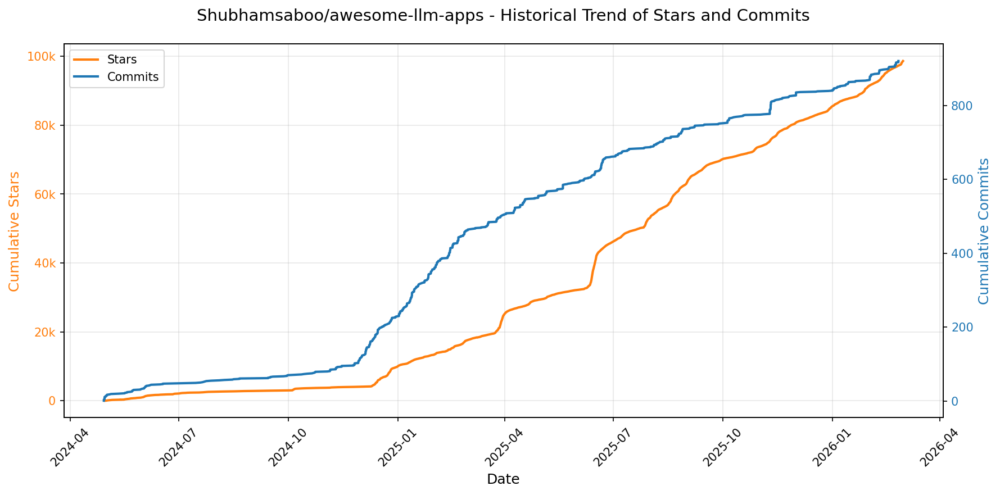

> *蓝色：累计 Stars｜橙色：累计 Commits（次 Y 轴）*

<b>📄 README 摘要</b>

1. **该项目做什么？**  
该项目是一个**精选的大型语言模型（LLM）应用集合库**，聚焦于**可实际运行、开箱即用的前沿AI应用案例**。它不提供底层模型训练或框架开发，而是系统性地整理和归档已构建完成的、基于现代AI范式的端到端应用项目，涵盖AI智能体（Agents）、多智能体协作团队（Multi-agent Teams）、检索增强生成（RAG）、模型上下文协议（MCP）集成、语音交互AI、自主游戏代理、记忆增强型LLM应用、跨平台文档/数据源对话（如GitHub、Gmail、PDF、YouTube等），以及LLM优化与微调教程。其核心目标是为开发者、研究者和AI从业者提供**高质量、可复现、有文档支撑的实践参考项目**，加速LLM应用落地与学习。

2. **关键特性**  
- **全栈式AI应用覆盖**：包含从入门级（Starter）到高阶（Advanced）的AI智能体，支持单智能体任务执行、多智能体协同分工（如VC尽调、法律咨询、招聘、教学等垂直场景）、自主游戏博弈（国际象棋、3D游戏）等复杂范式；  
- **深度技术融合能力**：突出RAG（含Corrective RAG、Vision RAG、Hybrid Search等16+变体）、MCP（浏览器/GitHub/Notion/旅行规划等真实工具链集成）、语音交互（语音RAG、客服语音代理、开源语音听写）、记忆机制（状态化聊天、个性化记忆、多LLM共享内存）；  
- **多模型与多平台兼容**：无缝支持OpenAI、Anthropic（Claude）、Google Gemini、xAI Grok及主流开源模型（Llama 3.1/3.2、Qwen、Gemma、DeepSeek），并明确标注各项目是否支持**本地运行**（Local）或需云服务；  
- **强工程实践导向**：每个子项目均提供独立目录结构与`requirements.txt`，配套详细`README.md`，支持一键克隆→安装→运行；  
- **体系化学习路径**：内置AI Agent框架速成课（Google ADK / OpenAI Agents SDK）、LLM优化工具（Toonify Token压缩、Headroom上下文优化，降本50–90%）、微调教程（Gemma 3 / Llama 3.2）及“Chat with X”系列集成模板（PDF/ArXiv/YouTube/Substack等）。

3. **技术栈**  
- **核心AI框架与协议**：Google ADK（Agent Development Kit）、OpenAI Agents SDK、CrewAI、MCP（Model Context Protocol）标准；  
- **大模型生态**：OpenAI GPT系列、Anthropic Claude、Google Gemini（含Multimodal）、xAI Grok、Meta Llama 3.1/3.2、Alibaba Qwen、Google Gemma 3、DeepSeek；  
- **RAG与向量技术**：Embedding模型（Gemma）、Hybrid Search、Cohere RAG、数据库路由、Vision RAG（多模态检索）；  
- **语音与多媒体**：Speechmatics语音技术栈、开源语音助手（如Jarvis AI）、音频导览与客服语音代理；  
- **基础设施与工具**：Python（主语言）、Pydantic（结构化输出）、LangChain/LangGraph（可选编排）、本地向量数据库（隐含于RAG教程）、浏览器自动化（Playwright/Selenium）、GitHub API/Notion API/Google Workspace API等第三方服务集成；  
- **部署与优化**：强调本地化运行能力（CPU/GPU兼容）、Token级成本优化工具（TOON格式、Headroom压缩）、RAG-as-a-Service架构。

---

### 4. [obra/superpowers](https://github.com/obra/superpowers)
- 📅 **创建日期**：2025-10-09  
- 🔄 **最近更新**：2026-02-11  
- ⭐ **Stars**：78,163（日 +715｜周 +5793｜月 +44129）  
- 📝 **描述**：An agentic skills framework & software development methodology that works.  

<b>📈 Star 与 Commit 历史趋势</b>

> *蓝色：累计 Stars｜橙色：累计 Commits（次 Y 轴）*

<b>📄 README 摘要</b>

1. **该项目的功能**  
Superpowers 是一个面向编程智能体（coding agents）的完整软件开发工作流增强系统。它不直接替代或编写代码，而是通过自动触发一系列预定义、可组合的“技能”（skills），在开发全流程中为智能体提供结构化、工程化的行为规范与决策框架。其核心作用是：在智能体启动后主动暂停编码行为，转而引导用户明确需求、协同产出可验证的设计文档；随后自动生成严格遵循 TDD/YAGNI/DRY 原则的细粒度实施计划；并驱动子智能体（subagents）以双阶段审查（规范符合性 + 代码质量）方式逐项执行任务，全程强制执行测试先行、分支隔离、自动验证与人工确认节点，最终完成分支收尾与交付决策。整个流程无需用户手动调用，技能按上下文自动激活，将非结构化的 AI 编程行为转化为可控、可审计、符合工程实践的标准化开发流水线。

2. **关键特性**  
- **全周期自动化工作流**：覆盖从需求澄清（brainstorming）、设计分段确认、Git 工作树隔离（using-git-worktrees）、原子级任务拆解（writing-plans）、子智能体驱动开发（subagent-driven-development）、强制红-绿-重构式 TDD（test-driven-development）、多层级代码审查（requesting/receiving-code-review）到分支终结决策（finishing-a-development-branch）的完整闭环。  
- **强约束性工程纪律**：所有技能为**强制执行**（mandatory workflows, not suggestions），例如：禁止先写代码后补测试、禁止未经验证的设计变更、关键缺陷必须阻断流程、所有实现必须附带精确文件路径与可执行验证步骤。  
- **分层审查与自治能力**：采用“双阶段子智能体审查”机制——每个任务由独立子智能体执行，先检查是否100%符合原始计划（spec compliance），再评估代码质量（code quality），显著提升可靠性与可追溯性；支持数小时级无人干预连续执行。  
- **开箱即用的技能库与可扩展架构**：内置20+经过验证的模块化技能（涵盖测试、调试、协作、元能力），全部开源可读；提供 `writing-skills` 技能作为官方 SDK，支持用户遵循统一范式贡献新技能。  
- **跨平台兼容性与零配置集成**：原生支持 Claude Code（插件市场一键安装）、Codex 与 OpenCode（通过远程指令加载），安装后自动感知上下文并触发对应技能，无需用户记忆命令或切换模式。

3. **技术栈**  
- **运行时环境**：依赖外部大语言模型智能体平台（Claude Code / Codex / OpenCode），本身不包含模型或推理引擎，属于纯提示工程（prompt engineering）与工作流编排层。  
- **核心范式**：基于**技能（Skill）驱动的声明式工作流**，每个技能为独立 Markdown 文档（如 `skills/test-driven-development/SKILL.md`），内含角色设定、触发条件、执行协议、检查清单与反模式警示。  
- **基础设施**：使用 GitHub 作为技能源码仓库与分发中心；通过 `.codex/INSTALL.md` 和 `.opencode/INSTALL.md` 等平台特定入口文件实现动态配置加载；插件更新通过 `plugin update` 命令完成，支持热更新。  
- **工程方法论支撑**：深度整合经典软件工程实践，包括但不限于：测试驱动开发（TDD）、You Aren’t Gonna Need It（YAGNI）、Don’t Repeat Yourself（DRY）、防御性编程、根因追踪（root-cause-tracing）、条件等待（condition-based-waiting）及 Socratic 式协作设计。

---

### 5. [openclaw/openclaw](https://github.com/openclaw/openclaw)
- 📅 **创建日期**：2025-11-24  
- 🔄 **最近更新**：2026-02-11  
- ⭐ **Stars**：67,895（日 +3234｜周 +25597｜月 +67895）  
- 📝 **描述**：Your own personal AI assistant. Any OS. Any Platform. The lobster way. 🦞   

<b>📈 Star 与 Commit 历史趋势</b>

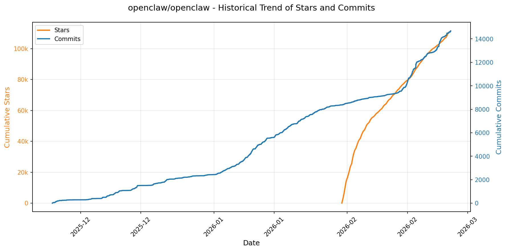

> *蓝色：累计 Stars｜橙色：累计 Commits（次 Y 轴）*

<b>📄 README 摘要</b>

1. **项目功能**  
OpenClaw 是一个完全本地化、单用户部署的个人 AI 助手系统，核心目标是让用户在自有设备上运行一个“感觉像本地、响应快、永远在线”的 AI 助手。它不依赖中心化云服务，而是通过自托管的 **Gateway（网关）控制平面**统一管理多通道通信、AI 代理执行、工具调用与设备能力。助手可接入并响应主流通讯平台（WhatsApp、Telegram、Slack、Discord、Google Chat、Signal、iMessage、Microsoft Teams）、扩展通道（BlueBubbles、Matrix、Zalo、Zalo Personal、WebChat），并在 macOS/iOS/Android 上实现语音唤醒（Voice Wake）、实时对话（Talk Mode）及交互式可视化工作区（Live Canvas）。其本质是将 AI 能力深度嵌入用户日常数字环境——从消息收发、语音交互、浏览器自动化、屏幕录制、位置获取，到跨设备协同与会话状态持久化。

2. **关键特性**  
- **本地优先网关架构**：单一 WebSocket 控制平面（`ws://127.0.0.1:18789`），集中管理会话、通道、工具、定时任务（cron）、Webhook 和远程调试；支持 Tailscale Serve/Funnel 或 SSH 隧道实现安全远程访问。  
- **全栈多通道支持**：原生集成 13+ 通讯协议（含 Baileys、grammY、discord.js 等底层 SDK），支持群组智能路由（提及触发、回复标签、分块处理）、DM 安全配对机制（默认仅允许已验证联系人）。  
- **多代理路由与隔离工作区**：支持按通道、账号或联系人路由至独立 agent 实例，每个 workspace 拥有专属会话模型、提示词（`SOUL.md`/`AGENTS.md`）、技能集（Skills）和上下文生命周期管理。  
- **全平台语音与视觉交互**：macOS/iOS/Android 原生支持 ElevenLabs 语音合成与唤醒，搭配「Talk Mode」实现连续对话；「Live Canvas」提供 A2UI 驱动的动态可视化界面，支持脚本化渲染、快照与评估。  
- **设备级节点（Nodes）能力**：iOS/Android/macOS 可作为边缘节点，安全执行摄像头抓拍、屏幕录制、定位、系统通知、Shell 命令（需显式权限授权）等敏感操作，通过 `node.invoke` 协议受 Gateway 统一调度。  
- **企业级自动化与安全治理**：内置浏览器自动化（专用 Chromium + CDP）、Gmail Pub/Sub 集成、Webhook 触发器、技能市场（ClawHub）、模型故障转移（failover）、会话剪枝、详细用量追踪及细粒度 DM 访问策略（`pairing`/`open` 模式 + allowlist）。  
- **开箱即用的运维体验**：终端向导（`openclaw onboard`）一键完成网关安装（launchd/systemd 服务）、通道配对、模型配置与技能初始化；`openclaw doctor` 提供配置健康检查与风险告警。

3. **技术栈**  
- **运行时**：Node.js ≥22（主运行环境），支持 npm/pnpm/bun；TypeScript 为主开发语言，使用 `tsx` 直接运行源码。  
- **核心框架**：WebSocket 驱动的 RPC 架构（Pi agent 运行时）、自研 Gateway 控制平面；CLI 工具链（`openclaw gateway`/`agent`/`message`/`doctor` 等）高度集成。  
- **前端与 UI**：基于 Web 技术的 Control UI 与 WebChat 内置于 Gateway；macOS 应用采用原生菜单栏 + WebView；Canvas 使用 A2UI（声明式 UI 协议）。  
- **AI 与模型层**：抽象化模型接口，原生支持 Anthropic（Claude Opus 4.6 推荐）、OpenAI（GPT/Codex）等，通过 OAuth 或 API Key 认证，支持多模型轮询与自动降级。  
- **基础设施**：支持 Nix（声明式配置）、Docker 容器化部署；远程场景依赖 Tailscale（Serve/Funnel）或 SSH 隧道；日志、监控、升级通道（stable/beta/dev）完备。  
- **安全机制**：基于 macOS TCC / Android 权限模型的细粒度设备能力控制；所有入站 DM 默认视为不可信输入；Gateway 强制 loopback 绑定 + 密码/Tailscale 身份认证；完整审计日志与会话隔离设计。

---

### 6. [bytedance/UI-TARS-desktop](https://github.com/bytedance/UI-TARS-desktop)
- 📅 **创建日期**：2025-01-19  
- 🔄 **最近更新**：2026-02-11  
- ⭐ **Stars**：52,031（日 +111｜周 +2326｜月 +6487）  
- 📝 **描述**：The Open-Source Multimodal AI Agent Stack: Connecting Cutting-Edge AI Models and Agent Infra  

<b>📈 Star 与 Commit 历史趋势</b>

> *蓝色：累计 Stars｜橙色：累计 Commits（次 Y 轴）*

<b>📄 README 摘要</b>

1. **项目功能**  
TARS 是一个通用多模态 AI 智能体（Agent）技术栈，核心目标是实现类人化、端到端的任务执行能力。它通过融合视觉（Vision）、图形用户界面（GUI）感知与控制、自然语言理解与生成等多模态能力，使 AI 能够直接操作真实世界中的终端、桌面系统、浏览器及各类软件产品。项目当前包含两大交付形态：  
- **Agent TARS**：面向开发者和高级用户的命令行（CLI）与网页版（Web UI）智能体框架，支持在本地/服务器环境运行，可对接多种大模型（如 Claude、Doubao-Vision 等）及现实工具（通过 MCP 协议）；  
- **UI-TARS Desktop**：面向终端用户的原生桌面应用，基于 UI-TARS 系列视觉语言模型（如 UI-TARS-1.5/1.6），提供免配置的本地与远程计算机/浏览器 GUI 自动化控制能力（如修改 VS Code 设置、浏览 GitHub 问题等）。

2. **关键特性**  
- ✅ **多模态任务闭环**：支持图文理解、屏幕截图识别、视觉定位（Visual Grounding）、DOM 解析与混合浏览器控制策略；  
- ✅ **灵活执行模式**：CLI 支持 headless（服务端）与 headful（带 Web UI）双模式；UI-TARS Desktop 提供一键式本地 GUI 操作 + 零配置远程计算机/浏览器控制；  
- ✅ **事件流驱动架构**：采用协议化 Event Stream 实现细粒度上下文工程、数据流追踪、调试可视化（Event Stream Viewer）及低延迟响应；  
- ✅ **MCP 工具生态集成**：以内置 MCP（Model Control Protocol）为内核，支持动态挂载 MCP Server，无缝连接 Shell、文件系统、API、图表生成等真实世界工具；  
- ✅ **安全与隐私优先**：UI-TARS Desktop 默认全本地处理，无数据上传；Agent TARS CLI 支持私有模型部署与沙箱环境（如 AIO Agent Sandbox）；  
- ✅ **跨平台与易用性**：覆盖 Windows/macOS/Linux，CLI 可通过 `npx` 快速启动，桌面端提供原生图标与交互体验。

3. **技术栈**  
- **核心模型层**：基于 UI-TARS 系列开源视觉语言模型（如 UI-TARS-1.5-7B、Seed-1.5-VL/1.6），兼容主流多模态大模型（Anthropic Claude 3.7 Sonnet、VolcEngine Doubao-1.5-Thinking-Vision-Pro 等）；  
- **协议与标准**：深度采用 MCP（Model Control Protocol）作为智能体与工具间的标准化通信协议；  
- **前端与界面**：Web UI 基于现代 Web 技术栈（未明示但推断含 React/Vue 类框架）；UI-TARS Desktop 使用 Electron 或 Tauri 等跨平台桌面框架（结合其资源图标与多平台支持描述）；  
- **运行时与部署**：CLI 基于 Node.js（要求 ≥ v22），支持 npm 全局安装与 npx 即时运行；云部署支持 ModelScope 平台；本地推理依赖模型加载与视觉预处理能力；  
- **基础设施**：集成 AIO Agent Sandbox 实现隔离化工具执行；支持 Discord、飞书、DeepWiki 等社区协作与知识库；文档体系基于 GitBook / LarkOffice 构建。

---

### 7. [google/langextract](https://github.com/google/langextract)
- 📅 **创建日期**：2025-07-08  
- 🔄 **最近更新**：2026-02-11  
- ⭐ **Stars**：50,700（日 +2418｜周 +4538｜月 +9734）  
- 📝 **描述**：A Python library for extracting structured information from unstructured text using LLMs with precise source grounding and interactive visualization.  

<b>📈 Star 与 Commit 历史趋势</b>

> *蓝色：累计 Stars｜橙色：累计 Commits（次 Y 轴）*

<b>📄 README 摘要</b>

1. **项目功能**  
LangExtract 是一个基于大语言模型（LLM）的 Python 库，专注于从**非结构化文本**（如临床病历、放射报告、文学作品等）中**高精度提取结构化信息**。其核心能力是依据用户提供的自然语言指令和少量示例（few-shot examples），自动识别并组织关键实体（如人物、情绪、药物名称、剂量、关系等），同时严格保证所有提取结果均**可追溯至原文中的精确位置**（source grounding），支持端到端的验证与审计。

2. **关键特性**  
- ✅ **精准溯源定位**：为每个提取结果标注在源文本中的起止字符位置，支持可视化高亮与人工核查；  
- ✅ **强结构化输出保障**：通过受控生成（如 Gemini 的 schema 强约束）和示例驱动，确保输出严格符合用户定义的 JSON Schema（含 extraction_class、extraction_text、attributes 等字段）；  
- ✅ **长文档优化处理**：采用多轮抽取（extraction_passes）、动态分块（chunking）、并行处理（max_workers）及上下文缓冲控制（max_char_buffer），显著提升万字级文档的召回率与准确性；  
- ✅ **交互式可视化审查**：一键生成自包含、可搜索、带动画效果的 HTML 文件，支持千级实体在原始语境中实时浏览与筛选；  
- ✅ **多模态模型即插即用**：原生支持 Google Gemini（默认推荐）、OpenAI（需额外安装）、本地 Ollama 模型（如 gemma2:2b），且提供标准化插件接口扩展第三方模型；  
- ✅ **零微调领域适配**：仅需 1–3 个高质量示例 + 清晰提示词，即可快速适配医疗、法律、文学等任意垂直领域，无需模型训练或微调；  
- ✅ **生产就绪能力**：支持 Vertex AI 批处理降本、Docker 容器化部署、环境变量/API Key 安全管理、.env 文件配置及服务账号认证（Vertex AI）。

3. **技术栈**  
- **编程语言**：Python 3.10+（核心实现）；  
- **核心依赖**：`google-generativeai`（Gemini）、`openai`（OpenAI）、`ollama`（本地模型）、`pydantic`（Schema 验证）、`rich`（CLI 输出）、`jinja2`（HTML 可视化模板）；  
- **架构设计**：模块化插件系统（Provider Registry），基于 `entry_points` 实现模型提供商解耦；支持 `pyproject.toml` 标准化包管理；  
- **开发运维**：CI/CD 基于 GitHub Actions（含单元测试、linting、Ollama 集成测试）；测试框架为 `pytest` + `tox`（多 Python 版本）；代码格式化使用 `isort` + `pyink`；预提交钩子（pre-commit）保障风格统一；  
- **部署方式**：PyPI 包（`pip install langextract`）、源码安装（`pip install -e .`）、Docker 容器镜像。

---

### 8. [drawdb-io/drawdb](https://github.com/drawdb-io/drawdb)
- 📅 **创建日期**：2023-07-16  
- 🔄 **最近更新**：2026-02-11  
- ⭐ **Stars**：36,318（日 +310｜周 +530｜月 +927）  
- 📝 **描述**：Free, simple, and intuitive online database diagram editor and SQL generator.  

<b>📈 Star 与 Commit 历史趋势</b>

> *蓝色：累计 Stars｜橙色：累计 Commits（次 Y 轴）*

<b>📄 README 摘要</b>

1. **该项目的功能**  
drawDB 是一个免费、轻量、开箱即用的浏览器端数据库关系图（ERD）编辑器，支持零账户注册即可直接使用。用户可通过直观拖拽方式快速创建和编辑数据库实体（表）、字段、主键、外键及关系连线，实时生成符合主流数据库（如 PostgreSQL、MySQL、SQLite 等）语法的标准 SQL 建表脚本，并支持导出为 SQL 文件或复制到剪贴板。

2. **核心功能**  
- ✅ 完全离线运行：无需登录、不依赖后端服务，所有操作在浏览器中完成；  
- ✅ 可视化 ER 图编辑：支持表格增删、字段定义（类型、约束、注释）、一对一/一对多关系绘制与自动布局优化；  
- ✅ 多数据库 SQL 生成：一键导出适配 PostgreSQL、MySQL、SQLite、SQL Server、Oracle 等语法的 DDL 脚本；  
- ✅ 高度可定制：支持主题切换（深色/浅色）、缩放、网格对齐、快捷键操作、键盘导航等；  
- ✅ 本地持久化：通过浏览器 localStorage 自动保存草稿，关闭页面后可恢复；  
- ✅ 可选协作分享：集成 drawdb-server 后可启用链接共享、版本协作与团队项目管理（非必需，属高级扩展能力）。

3. **技术栈**  
- **前端框架**：基于 React（v18+）构建，采用 TypeScript 强类型开发；  
- **UI 组件库**：自研轻量级 UI 组件 + Tailwind CSS 实现响应式样式与主题系统；  
- **图形渲染**：使用 SVG 进行关系图绘制，结合自定义布局算法实现节点自动对齐与连线优化；  
- **状态管理**：Zustand（轻量级 React 状态库）管理全局编辑状态与配置；  
- **构建工具**：Vite（作为开发服务器与打包工具），支持 HMR 热更新；  
- **部署与容器化**：提供 Dockerfile 支持容器化部署（Nginx 静态服务），亦可直接托管于 Vercel/Netlify 等静态站点平台；  
- **后端（可选）**：独立的 [drawdb-server](https://github.com/drawdb-io/drawdb-server)（Node.js + Express + PostgreSQL）用于启用分享、用户账户及 API 功能。

---

### 9. [remotion-dev/remotion](https://github.com/remotion-dev/remotion)
- 📅 **创建日期**：2020-06-23  
- 🔄 **最近更新**：2026-02-11  
- ⭐ **Stars**：36,082（日 +198｜周 +1303｜月 +10900）  
- 📝 **描述**：🎥      Make videos programmatically with React  

<b>📈 Star 与 Commit 历史趋势</b>

> *蓝色：累计 Stars｜橙色：累计 Commits（次 Y 轴）*

<b>📄 README 摘要</b>

1. **项目功能**  
Remotion 是一个基于 React 的视频生成框架，允许开发者使用 React 组件、JavaScript 逻辑和 Web 技术（如 CSS、SVG、Canvas、WebGL）**以编程方式动态创建高质量视频**。它将视频视为“可渲染的 React 应用”，支持时间轴控制、帧精确渲染、动态内容生成（如数据驱动动画、个性化视频），并可导出为 MP4、GIF 或 ProRes 等格式，适用于营销视频、数据可视化、年度回顾（如 GitHub Unwrapped）、教程动画等场景。

2. **核心特性**  
- ✅ **React 原生开发体验**：复用 React 组件、Hooks、状态管理、Context 和第三方库；支持 Fast Refresh 实时预览动画变化。  
- ✅ **时间轴与帧控制**：提供 `useCurrentFrame`、`interpolate`、`Sequence`、`Composition` 等 API，实现基于时间的精准动画逻辑与分段编排。  
- ✅ **多目标输出**：一键导出为 MP4（H.264/AV1）、GIF、ProRes、PNG 序列，并支持自定义编码参数与分辨率。  
- ✅ **服务端渲染支持**：可通过 Node.js（无头 Chromium）批量渲染视频，适配 CI/CD 与 Serverless（如 Vercel、AWS Lambda）。  
- ✅ **开发友好工具链**：内置本地预览服务器（带时间轴拖拽、播放控制）、CLI 工具（`npx create-video`）、TypeScript 全面支持、详细的错误提示与调试面板。  
- ✅ **生产就绪能力**：支持字体加载、音频合成、远程资源处理、环境变量注入及 SSR 兼容性优化。

3. **技术栈**  
- **核心框架**：React（v18+，支持 Concurrent Features）、TypeScript  
- **渲染引擎**：基于 Chromium（Puppeteer / Playwright）进行 Headless 浏览器渲染，利用 Canvas/WebGL/SVG/CSS 动画能力  
- **构建与打包**：Vite（默认模板）、Webpack（可选配置）、ESBuild（快速编译）  
- **视频处理**：FFmpeg（后端导出阶段用于编码封装）、WebCodecs（实验性浏览器内编码）  
- **基础设施**：Node.js 运行时、npm/pnpm 包管理、GitHub Actions CI 集成  
- **配套生态**：兼容主流 React 生态（e.g., Framer Motion、D3、Three.js）、提供专用 Hook（如 `useVideoConfig`、`useAudioData`）及 Remotion 官方 UI 组件库

---

### 10. [asgeirtj/system_prompts_leaks](https://github.com/asgeirtj/system_prompts_leaks)
- 📅 **创建日期**：2025-05-03  
- 🔄 **最近更新**：2026-02-11  
- ⭐ **Stars**：30,945（日 +134｜周 +1043｜月 +6035）  
- 📝 **描述**：Collection of extracted System Prompts from popular chatbots like ChatGPT, Claude & Gemini  

<b>📈 Star 与 Commit 历史趋势</b>

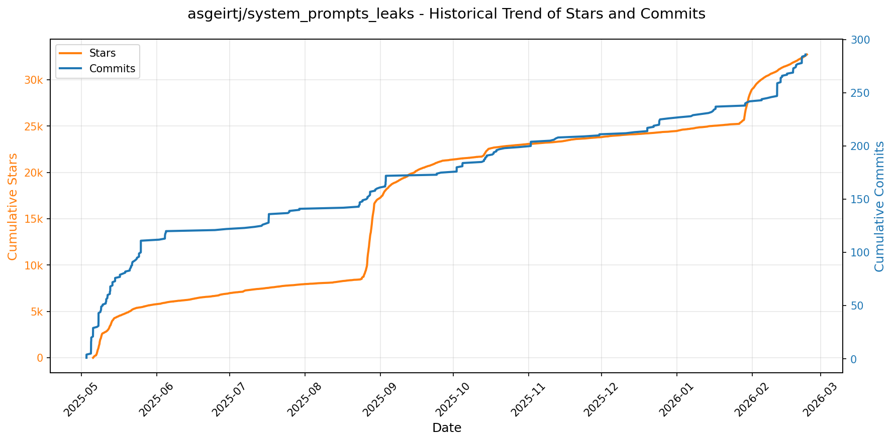

> *蓝色：累计 Stars｜橙色：累计 Commits（次 Y 轴）*

---

### 11. [OpenBMB/ChatDev](https://github.com/OpenBMB/ChatDev)
- 📅 **创建日期**：2023-08-28  
- 🔄 **最近更新**：2026-02-11  
- ⭐ **Stars**：30,831（日 +105｜周 +1008｜月 +2645）  
- 📝 **描述**：ChatDev 2.0: Dev All through LLM-powered Multi-Agent Collaboration  

<b>📈 Star 与 Commit 历史趋势</b>

> *蓝色：累计 Stars｜橙色：累计 Commits（次 Y 轴）*

<b>📄 README 摘要</b>

1. **项目功能**  
ChatDev 2.0（品牌名 DevAll）是一个**零代码多智能体协同平台**，旨在支持“开发一切”（Developing Everything）。它不再局限于传统软件开发流程，而是提供通用型多智能体编排能力：用户无需编写代码，仅通过可视化配置（YAML 工作流 + Web 界面）即可定义智能体角色、任务流程、数据流向与协作逻辑，快速构建并执行面向多样化场景的自主代理系统，例如数据可视化、3D 内容生成、深度研究分析、教学视频制作、游戏开发等。

2. **核心特性**  
- ✅ **零代码低门槛编排**：基于 YAML 配置与拖拽式工作流画布，支持非技术人员自定义多智能体系统；  
- ✅ **开箱即用的垂直场景模板**：内置涵盖数据可视化（`data_visualization_*.yaml`）、3D 建模（Blender 集成）、游戏开发（`GameDev_v1.yaml`）、深度学术研究（`deep_research_v1.yaml`）、AI 教学视频生成（`teach_video.yaml`）等高质量可运行工作流；  
- ✅ **混合执行模式支持**：兼容全自动执行、人机协同（Human-in-the-loop）、增量开发、Git 版本控制、艺术内容生成（Designer Agent）、交互式评审等多样化协作范式；  
- ✅ **模块化可扩展架构**：支持通过 `functions/` 目录添加自定义 Python 工具，通过 `entity/` 和 `workflow/` 扩展智能体类型与编排逻辑；  
- ✅ **全栈开发体验**：提供 Web 控制台（Vue 3）、Python SDK（`runtime.sdk.run_workflow`）及 Docker Compose 一键部署方案，兼顾易用性与工程可控性；  
- ✅ **前沿多智能体技术集成**：融合 MacNet（千级智能体 DAG 协作）、Puppeteer（强化学习驱动的动态调度中枢）、Experiential Co-Learning（经验共学习）、IER（迭代经验精炼）等创新范式，提升协作效率与推理质量。

3. **技术栈**  
- **后端**：Python 3.12+，FastAPI 框架，uv 包管理器，依赖大语言模型（LLM）API（支持自定义 `BASE_URL` 与 `API_KEY`）；  
- **前端**：Vue 3 + Vite 构建，TypeScript 支持，响应式 Web 控制台（含工作流画布、实时日志、附件上传、人机反馈等模块）；  
- **基础设施**：Docker Compose 容器化部署，支持跨平台（macOS/Linux/WSL/Windows）；  
- **核心协议与格式**：YAML 驱动的工作流定义（`yaml_instance/` 目录），环境变量注入（`${VAR}` 语法），结构化配置驱动智能体行为；  
- **扩展生态**：深度集成 Blender（3D 生成）、Manim（数学动画）、Git（版本管理）等外部工具链，并预留插件化接口（如 `functions/` 自定义工具目录）。

---

### 12. [code-yeongyu/oh-my-opencode](https://github.com/code-yeongyu/oh-my-opencode)
- 📅 **创建日期**：2025-12-03  
- 🔄 **最近更新**：2026-02-11  
- ⭐ **Stars**：30,326（日 +357｜周 +2573｜月 +16281）  
- 📝 **描述**：the best agent harness  

<b>📈 Star 与 Commit 历史趋势</b>

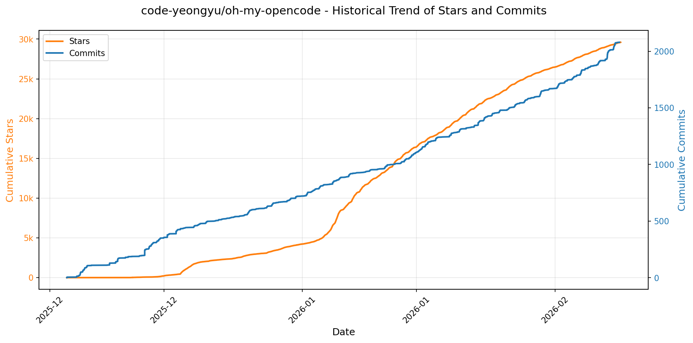

> *蓝色：累计 Stars｜橙色：累计 Commits（次 Y 轴）*

<b>📄 README 摘要</b>

1. **项目功能**  
Oh My OpenCode 是一个面向开源代码编辑器 OpenCode 的高性能、可扩展插件，核心目标是将 LLM（大语言模型）转化为具备工程化能力的“AI 开发团队”。它不替代开发者，而是通过多智能体协同架构（如 Sisyphus 主协调员、Hephaestus 深度执行者、Oracle 架构师、Librarian 文档专家等），实现端到端、无人值守的软件开发任务闭环。用户只需输入含 `ultrawork`（或 `ulw`）关键词的自然语言指令，系统即可自动调度异构模型（Claude、GPT、Gemini 等）、调用 LSP/AST 工具、并行探索代码库、检索官方文档与 GitHub 实现、执行重构与测试验证，直至任务 100% 完成——真正实现“提交提示 → 咖啡时间 → 成果就绪”。

2. **关键特性**  
- **多智能体协同编排**：预置角色化智能体（Sisyphus 主控、Hephaestus 自主攻坚、Oracle 调试设计、Frontend Engineer 专精 UI、Librarian/Explore 快速知识检索），支持按任务类型（`visual`/`business-logic`）动态路由；  
- **全自动上下文管理与负载分担**：后台并行启动轻量模型进行代码扫描、文档解析和上下文构建，大幅降低主模型上下文压力；  
- **工业级代码工具链深度集成**：原生支持 LSP（语义重命名、诊断）、AST-Grep（结构化搜索/替换）、内置 Todo 续写强制器（防中断）、注释净化器（消除 AI 冗余注释）；  
- **Claude Code 兼容层**：完整复刻其命令系统、技能（Skills）、MCP（Model Control Protocol）、钩子（Hooks）机制（含 PreToolUse/PostToolUse 等 25+ 可配置钩子）；  
- **开箱即用的生产级 MCPs**：集成 Exa（实时网络搜索）、Context7（官方文档索引）、grep.app（GitHub 代码级搜索）；  
- **鲁棒性保障机制**：任务失败自动重试、会话历史分析、Ralph Loop 迭代优化、Think Mode 深度推理；  
- **零配置体验**：全部功能默认启用，“电池已装好”，支持 JSONC 配置、项目级/用户级双配置层级。

3. **技术栈**  
- **运行平台**：深度适配 [OpenCode](https://github.com/sst/opencode)（基于 VS Code 衍生的开源 IDE），非独立应用；  
- **模型调度层**：多模型异构协同（Claude Sonnet/Haiku/Opus、GPT-4.5/5.2 Codex、Gemini 3 Pro），支持按角色、成本、能力动态选型；  
- **核心工具链**：LSP 协议实现（用于语义分析与重构）、AST-Grep（语法树精准匹配）、Tmux 终端集成（交互式会话管理）；  
- **基础设施**：基于 Node.js 生态构建，通过 npm 发布（`oh-my-opencode@latest`），配置文件采用 JSONC 格式；  
- **协议与标准**：严格遵循 OpenCode 插件规范，兼容其 MCP 协议与 Hook 生命周期，无自研 OAuth 或闭源认证模块（明确声明不实现 Claude OAuth 绕过）。

---

### 13. [thedotmack/claude-mem](https://github.com/thedotmack/claude-mem)
- 📅 **创建日期**：2025-08-31  
- 🔄 **最近更新**：2026-02-11  
- ⭐ **Stars**：27,099（日 +647｜周 +6614｜月 +13846）  
- 📝 **描述**：A Claude Code plugin that automatically captures everything Claude does during your coding sessions, compresses it with AI (using Claude's agent-sdk), and injects relevant context back into future sessions.  

<b>📈 Star 与 Commit 历史趋势</b>

> *蓝色：累计 Stars｜橙色：累计 Commits（次 Y 轴）*

<b>📄 README 摘要</b>

1. **项目功能**  
Claude-Mem 是一个专为 **Claude Code（Anthropic 推出的 AI 编程助手）** 设计的**持久化记忆压缩系统**。它在用户每次会话结束后自动捕获工具调用行为、代码操作、错误修复等上下文观测数据，生成语义化摘要，并持久化存储；当新会话启动时，自动将相关历史记忆注入上下文，使 Claude 能够跨会话保持对项目知识的连续性理解，实现真正“有记忆”的 AI 编程协作。

2. **核心特性**  
- ✅ **持久化记忆（Persistent Memory）**：会话间上下文自动延续，无需手动重述项目背景  
- ✅ **渐进式披露（Progressive Disclosure）**：分三层按需加载记忆（索引 → 时间线 → 详情），实时显示 token 消耗，显著优化成本  
- ✅ **技能化智能搜索（Skill-Based Search）**：内置 `mem-search` 技能与 5 个 MCP 工具（`search`/`timeline`/`get_observations`/`save_memory`/`__IMPORTANT`），支持自然语言查询项目历史  
- ✅ **本地 Web 可视化界面（Web Viewer UI）**：运行于 `http://localhost:37777`，实时流式展示记忆、观测记录、引用 ID 及 API 接口（如 `/api/observation/{id}`）  
- ✅ **Claude Desktop 集成**：可在桌面版对话中直接调用记忆搜索技能  
- ✅ **隐私保护机制**：支持 `<private>` 标签自动过滤敏感内容，不存入数据库  
- ✅ **细粒度上下文配置**：可精确控制哪些类型、项目、时间范围的记忆被注入当前会话  
- ✅ **全自动运行**：零手动干预，依赖生命周期钩子（SessionStart/PostToolUse/SessionEnd 等）静默工作  
- ✅ **引用与溯源**：每条观测分配唯一 ID，支持链接直达和批量检索，强化可审计性  
- ✅ **Beta 实验通道**：提供 Endless Mode（仿生长时记忆架构）等前沿功能，可通过 Web UI 切换版本  

3. **技术栈**  
- **运行时与服务层**：`Bun`（作为 HTTP Worker 服务管理器与轻量级 JS 运行时）、`Node.js ≥18.0.0`（插件基础环境）  
- **数据库**：`SQLite3`（嵌入式持久化存储，含 FTS5 全文搜索支持） + `Chroma`（向量数据库，实现语义+关键词混合搜索）  
- **AI 与搜索架构**：基于 `MCP（Model Context Protocol）` 协议构建搜索工具链；采用 `Hybrid Search`（向量相似度 + SQLite FTS5 关键词匹配）提升检索精度  
- **开发与部署**：`TypeScript`（主语言）、`uv`（Python 包管理器，用于向量搜索依赖）、`AGPL-3.0` 开源许可证（主体） + `PolyForm Noncommercial License`（`ragtime/` 子模块）  
- **前端与体验**：静态 Web Viewer（HTML/CSS/JS）、GIF 动态预览、多语言国际化（支持 30+ 种语言文档）

---

### 14. [virattt/dexter](https://github.com/virattt/dexter)
- 📅 **创建日期**：2025-10-14  
- 🔄 **最近更新**：2026-02-11  
- ⭐ **Stars**：21,567（日 +592｜周 +4094｜月 +7821）  
- 📝 **描述**：An autonomous agent for deep financial research  

<b>📈 Star 与 Commit 历史趋势</b>

> *蓝色：累计 Stars｜橙色：累计 Commits（次 Y 轴）*

<b>📄 README 摘要</b>

1. **项目功能**  
Dexter 是一个面向金融研究的自主式AI代理系统，能够对复杂金融问题进行端到端的自动化分析。它不依赖人工干预，而是通过“思考—规划—执行—验证—迭代”的闭环流程完成任务：接收用户提出的金融问题（如公司财务健康度评估、跨行业盈利对比等），自动拆解为多步研究计划；调用实时金融市场数据接口获取财报（利润表、资产负债表、现金流量表）等权威信息；执行工具调用并自我校验结果合理性；在未达置信阈值时主动反思、修正路径，直至生成数据支撑充分、逻辑清晰、可追溯的最终结论。

2. **核心特性**  
- **智能任务规划能力**：基于LLM的推理能力，将模糊/复杂的自然语言金融问题（如“哪家半导体公司在高资本开支下仍保持自由现金流为正？”）自动分解为结构化子任务序列（如筛选行业、提取资本开支与经营性现金流数据、交叉验证等）。  
- **全自主执行与自验证机制**：支持动态选择并调用适配工具（如财报API、网络搜索），内置循环检测与最大步数限制，确保安全可控；每次工具调用后触发自我评估（self-reflection），判断结果是否满足任务目标，不满足则重新规划或重试。  
- **实时权威金融数据集成**：原生对接 Financial Datasets API，直接获取上市公司经审计的标准化财务报表数据（含年度/季度维度），覆盖AAPL、NVDA、MSFT等主流标的，保障分析基础的真实性与时效性。  
- **可追溯、可调试的执行过程**：所有推理链、工具调用参数、原始返回数据及LLM生成的摘要均以JSONL格式持久化至本地`.dexter/scratchpad/`目录，支持完整复现与人工审计。  
- **多模型与多数据源兼容架构**：支持OpenAI、Anthropic、Google、xAI、OpenRouter等主流LLM后端；可选Exa或Tavily实现专业财经网络搜索；本地Ollama部署亦被兼容。

3. **技术栈**  
- **运行时**：Bun（v1.0+）——作为高性能JavaScript/TypeScript运行时，替代Node.js，提供极速依赖安装与脚本执行。  
- **核心语言**：TypeScript —— 保障大型Agent系统类型安全与可维护性。  
- **AI基础设施**：  
  - 大语言模型层：支持OpenAI GPT系列、Anthropic Claude、Google Gemini、xAI Grok、OpenRouter聚合模型等；本地可接入Ollama托管模型。  
  - 评估框架：LangSmith（用于追踪、可视化Agent执行轨迹） + LLM-as-Judge（由大模型自动评分答案正确性）。  
- **数据服务**：  
  - 主要金融数据源：Financial Datasets API（提供标准化、机构级财报数据）；  
  - 补充网络数据源：Exa API（首选）、Tavily API（备用）——用于实时财经新闻、研报、事件检索。  
- **开发与运维**：  
  - 环境管理：`.env`驱动的多环境配置；  
  - 调试支持：结构化JSONL日志（含`init`/`tool_result`/`thinking`三类事件）；  
  - 工程规范：MIT许可证，模块化设计，鼓励小粒度PR贡献。

---

### 15. [iOfficeAI/AionUi](https://github.com/iOfficeAI/AionUi)
- 📅 **创建日期**：2025-08-07  
- 🔄 **最近更新**：2026-02-11  
- ⭐ **Stars**：20,392（日 +630｜周 +2288｜月 +13547）  
- 📝 **描述**：Free, local, open-source 24/7 Cowork and OpenClaw for Gemini CLI, Claude Code, Codex, OpenCode, Qwen Code, Goose CLI, Auggie, and more | 🌟 Star if you like it!  

<b>📈 Star 与 Commit 历史趋势</b>

> *蓝色：累计 Stars｜橙色：累计 Commits（次 Y 轴）*

---

### 16. [VectifyAI/PageIndex](https://github.com/VectifyAI/PageIndex)
- 📅 **创建日期**：2025-04-01  
- 🔄 **最近更新**：2026-02-11  
- ⭐ **Stars**：19,440（日 +179｜周 +1747｜月 +9513）  
- 📝 **描述**：📑 PageIndex: Document Index for Vectorless, Reasoning-based RAG  

<b>📈 Star 与 Commit 历史趋势</b>

> *蓝色：累计 Stars｜橙色：累计 Commits（次 Y 轴）*

<b>📄 README 摘要</b>

1. **该项目做什么？**  
PageIndex 是一个面向长文档（如财报、法律文书、技术手册等）的新型检索增强生成（RAG）系统，其核心目标是**替代传统基于向量数据库（Vector DB）和文本分块（Chunking）的语义相似性检索范式**。它不依赖向量嵌入与近似最近邻搜索，而是通过构建文档的**语义层级树索引（Tree Index）**，并驱动大语言模型（LLM）在该索引上进行**多步推理式导航与检索**，从而实现更精准、可解释、类人专家式的知识定位与提取。

2. **关键特性**  
- **无向量数据库（Vectorless）**：完全摒弃向量嵌入、相似度计算与向量库存储，避免“vibe retrieval”（直觉式模糊匹配）带来的不可靠性；  
- **无需人工分块（No Chunking）**：基于文档原始结构（如标题层级、段落逻辑）自动生成自然语义节点，保留上下文完整性与领域逻辑；  
- **推理驱动的检索（Reasoning-based Retrieval）**：将检索建模为树搜索问题，LLM 通过递归推理（如“该问题应在哪一章节？→ 该章节下哪一子节最相关？”）逐步缩小范围，模拟人类专家阅读路径；  
- **高可解释性与可追溯性**：每次检索结果均附带明确的页面号、章节路径及推理链，支持审计与调试；  
- **原生支持视觉输入（Vision-native）**：提供 OCR-Free 的视觉 RAG 方案，可直接对 PDF 页面图像进行推理索引，绕过传统 OCR 的误差累积与结构丢失问题；  
- **已在专业领域验证领先性能**：驱动的金融分析系统 Mafin 2.5 在 FinanceBench 基准测试中达到 **98.7% 准确率**，显著超越主流向量 RAG 方案。

3. **技术栈**  
- **核心模型层**：依赖 OpenAI 等闭源大语言模型（默认 `gpt-4o-2024-11-20`）执行树索引构建与推理式检索；  
- **文档解析层**：支持 PDF（基于 PyPDF2 / pdfplumber 等库）与 Markdown（按 `#` 层级解析）输入；提供专用 **PageIndex OCR**（未开源但已商用）用于复杂 PDF 的结构保真解析；  
- **索引结构**：纯 JSON 格式的递归树形数据结构（含 `title`、`node_id`、`start_index`/`end_index`、`summary` 及嵌套 `nodes`），专为 LLM 上下文内推理优化；  
- **部署与集成**：支持本地自托管（Python CLI 工具 `run_pageindex.py`）、云服务（[chat.pageindex.ai](https://chat.pageindex.ai)）、MCP 协议（兼容 Claude/Cursor 等智能体）、RESTful API 及 Colab Notebook 快速体验；  
- **开发环境**：Python 3.x，依赖 `openai`、`pypdf`、`python-dotenv` 等标准库，通过 `.env` 管理 API 密钥。

---

### 17. [gitbutlerapp/gitbutler](https://github.com/gitbutlerapp/gitbutler)
- 📅 **创建日期**：2023-01-31  
- 🔄 **最近更新**：2026-02-11  
- ⭐ **Stars**：19,051（日 +386｜周 +1477｜月 +1646）  
- 📝 **描述**：The GitButler version control client, backed by Git, powered by Tauri/Rust/Svelte  

<b>📈 Star 与 Commit 历史趋势</b>

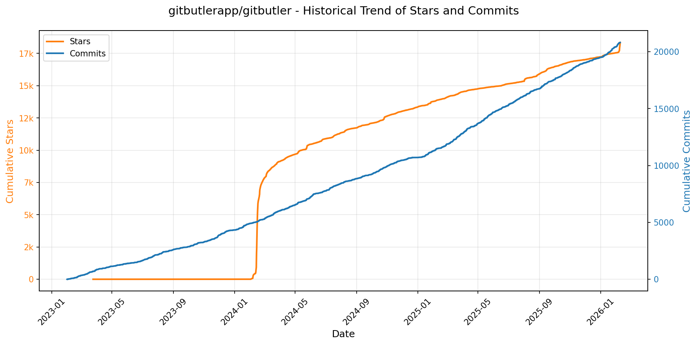

> *蓝色：累计 Stars｜橙色：累计 Commits（次 Y 轴）*

<b>📄 README 摘要</b>

1. **项目功能**  
GitButler 是一个面向现代 AI 原生工作流的 Git 版本控制系统增强工具，提供 GUI（桌面应用）和 CLI（`but` 命令行工具）双界面。它无需迁移仓库，可直接在任意现有 Git 仓库中作为“更友好、更强大”的 Git 用户界面替代方案使用，同时深度支持人类开发者与 AI 代理（agents）协同操作。

2. **核心特性**  
- **堆叠分支（Stacked Branches）**：支持在其他分支之上创建新分支，并自动处理提交变更后的重堆叠（restacking），简化长期演进式开发；  
- **并行分支（Parallel Branches）**：允许多个虚拟分支并行存在与编辑，避免频繁切换物理分支，提升多任务开发效率；  
- **可视化提交管理**：通过拖拽或简洁 CLI 命令完成撤回、重写、修改、移动、拆分、压缩等操作，彻底取代复杂交互式变基（`rebase -i`）；  
- **操作时间线与无限撤销（Undo Timeline）**：完整记录所有 Git 操作，支持任意粒度的回退与还原；  
- **一等公民冲突处理（First Class Conflicts）**：保证 rebase 总能成功；冲突可被标记为“待解决”，并允许按任意顺序、在任意时间点异步处理；  
- ** Forge 集成（GitHub/GitLab）**：原生认证与交互，直接创建/更新 PR、同步 CI 状态、浏览远程分支等，无需额外工具；  
- **AI 工具链支持**：内置 AI 处理器，自动生成提交信息、分支名、PR 描述；支持为各类 AI 代理系统安装 Git 相关 Hook 或技能（skills），赋能智能体自主版本控制能力。

3. **技术栈**  
- **桌面端（GUI）**：基于 [Tauri](https://tauri.app/) 构建，前端采用 [Svelte](https://svelte.dev/) + [TypeScript](https://www.typescriptlang.org/)，后端核心逻辑由 [Rust](https://www.rust-lang.org/) 编写；  
- **命令行工具（`but` CLI）**：复用同一套 Rust 后端引擎，CLI 界面亦完全使用 Rust 实现，确保跨平台性能与一致性；  
- 整体架构强调安全性、轻量性与原生性能，依托 Rust 的内存安全与并发能力支撑复杂 Git 操作与 AI 集成需求。

---

### 18. [hsliuping/TradingAgents-CN](https://github.com/hsliuping/TradingAgents-CN)
- 📅 **创建日期**：2025-06-26  
- 🔄 **最近更新**：2026-02-11  
- ⭐ **Stars**：16,681（日 +438｜周 +1148｜月 +2076）  
- 📝 **描述**：基于多智能体LLM的中文金融交易框架 - TradingAgents中文增强版  

<b>📈 Star 与 Commit 历史趋势</b>

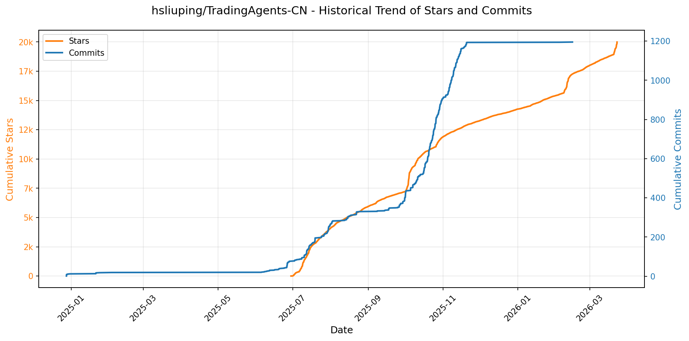

> *蓝色：累计 Stars｜橙色：累计 Commits（次 Y 轴）*

<b>📄 README 摘要</b>

1. **项目功能**  
本项目是一个面向中文用户的**多智能体与大模型股票分析学习平台**，基于开源框架 `TradingAgents` 进行深度中文增强开发。其核心定位为**非实盘、纯研究与教育用途**：通过多智能体协同架构调用大语言模型（LLM），对 A 股、港股、美股等市场进行合规的股票基本面、技术面、新闻舆情等维度的自动化分析与策略模拟；提供虚拟交易环境验证策略逻辑，但**不生成或执行任何实盘交易指令**，旨在系统化培养用户在 AI 金融领域的分析能力与工程实践素养。

2. **关键特性**  
- **全栈中文本地化**：完整中文化界面、文档、教程及 A 股专属数据支持（Tushare/AkShare/BaoStock）；  
- **企业级多智能体分析能力**：支持动态 LLM 供应商管理（OpenAI/Gemini/DeepSeek/通义千问等）、智能任务驱动的模型自动选型、多模型协同分析（如新闻分析师+技术分析师+基本面分析师）；  
- **专业级交互与管理功能**：可视化配置中心（大模型/数据源/系统参数）、自选股分组管理、批量股票分析、智能筛选排序、个股全周期分析记录；  
- **高可用工程架构**：FastAPI + Vue 3 全新前后端分离架构；MongoDB + Redis 双缓存数据库；SSE + WebSocket 实时进度推送；Docker 多架构（amd64/arm64）一键部署；  
- **生产就绪工具链**：用户权限与操作审计、多级缓存策略、Markdown/Word/PDF 专业报告导出、统一日志管理、Web 端配置与监控；  
- **安全与合规强化**：明确区分开源（Apache 2.0）与专有模块（`app/` 和 `frontend/` 需商业授权），严格声明禁止未授权商业使用，并主动维权反盗版。

3. **技术栈**  
- **后端**：Python 3.10+，FastAPI + Uvicorn（替代原 Streamlit），MongoDB（主存储）+ Redis（高速缓存/会话/消息队列）；  
- **前端**：Vue 3 + Vite + Element Plus（现代化 SPA），支持响应式与中文 UI；  
- **AI 集成层**：原生 OpenAI API、Google AI Studio（Gemini）、阿里百炼、通义千问、DeepSeek 等多 LLM 提供商 SDK；  
- **数据生态**：Tushare、AkShare、BaoStock 等中文金融数据接口统一适配；  
- **部署与运维**：Docker Compose 多容器编排、GitHub Actions 自动化构建发布、跨平台（Windows/macOS/Linux/ARM64）支持；  
- **许可证体系**：混合授权——基础代码（除 `app/` 和 `frontend/` 外）采用 Apache 2.0 开源协议；核心后端（FastAPI）与前端（Vue）为专有组件，商用需单独授权。

---

### 19. [KeygraphHQ/shannon](https://github.com/KeygraphHQ/shannon)
- 📅 **创建日期**：2025-09-27  
- 🔄 **最近更新**：2026-02-11  
- ⭐ **Stars**：16,501（日 +2366｜周 +12742｜月 +12885）  
- 📝 **描述**：Fully autonomous AI hacker to find actual exploits in your web apps. Shannon has achieved a 96.15% success rate on the hint-free, source-aware XBOW Benchmark.  

<b>📈 Star 与 Commit 历史趋势</b>

> *蓝色：累计 Stars｜橙色：累计 Commits（次 Y 轴）*

<b>📄 README 摘要</b>

1. **该项目做什么？**  
Shannon 是一个面向源代码的全自动人工智能渗透测试工具（AI pentester），核心目标是**在真实攻击者之前主动攻破用户的 Web 应用**。它不只静态扫描或生成告警，而是结合白盒（访问源代码）与黑盒（动态浏览器交互）能力，自主完成从侦察、漏洞分析、实际利用（如 SQL 注入、XSS、SSRF、认证绕过等）到生成可复现证明（PoC）的完整红队流程。其本质是将传统年度人工渗透测试转化为按需、持续、集成化的自动化安全验证，专为填补“代码高频交付”与“安全检测低频滞后”之间的巨大风险缺口而设计。

2. **关键特性**  
- **端到端自治性**：支持自动处理复杂登录（含 2FA/TOTP、Google 登录）、智能浏览器导航与多步骤交互，全程无需人工干预；  
- **实证型报告**：仅报告**已成功利用**的漏洞，附带一键可复现的 PoC 脚本/步骤，彻底消除误报；  
- **深度代码感知动态测试**：通过分析源码指导攻击策略，并在运行中的应用上执行真实浏览器/命令行级 exploit，验证现实危害；  
- **专业级工具链集成**：内置 Nmap、Subfinder、WhatWeb、Schemathesis 等主流安全工具增强侦察与测试深度；  
- **并行化高效执行**：对不同漏洞类型（注入、XSS 等）的分析与利用阶段完全并行处理，显著缩短测试耗时；  
- **白盒优先架构**：严格依赖目标应用的源代码（支持单体库、Monorepo 及多仓库架构），实现精准数据流追踪与上下文感知攻击。

3. **技术栈**  
- **核心推理引擎**：基于 Anthropic Claude Agent SDK（主推 Anthropic API，实验性支持 OpenAI/Gemini 通过 Router 模式）；  
- **运行时环境**：全容器化架构，依赖 Docker 实现跨平台部署与环境隔离；  
- **工作流编排**：采用 Temporal（提供 Web UI 监控）管理多阶段、长周期、高容错的渗透测试任务流；  
- **安全工具集成**：Nmap（网络测绘）、Subfinder（子域名发现）、WhatWeb（指纹识别）、Schemathesis（API 模糊测试）；  
- **前端交互层**：基于浏览器自动化（如 Playwright/Puppeteer 类机制）执行动态 exploit；  
- **许可协议**：Shannon Lite 开源版采用 AGPL-3.0 许可证，强调源代码可用性与衍生作品开源义务。

---

### 20. [Canner/WrenAI](https://github.com/Canner/WrenAI)
- 📅 **创建日期**：2024-03-13  
- 🔄 **最近更新**：2026-02-11  
- ⭐ **Stars**：14,341（日 +73｜周 +557｜月 +930）  
- 📝 **描述**：⚡️ GenBI (Generative BI) queries any database in natural language, generates accurate SQL (Text-to-SQL), charts (Text-to-Chart), and AI-powered business intelligence in seconds.  

<b>📈 Star 与 Commit 历史趋势</b>

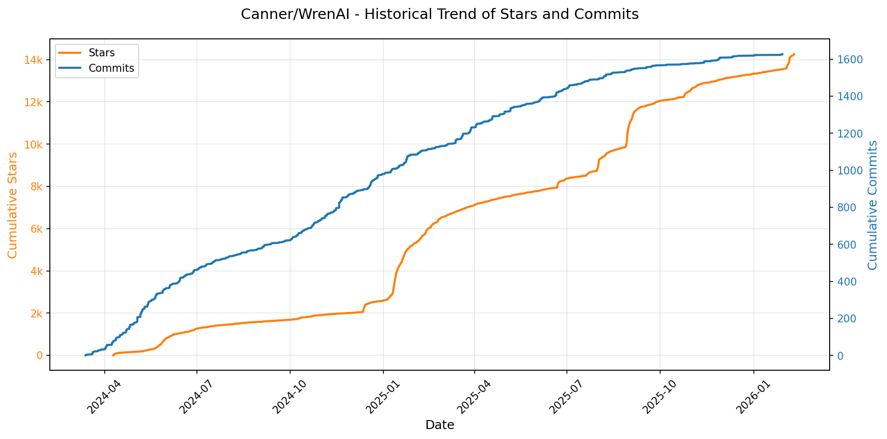

> *蓝色：累计 Stars｜橙色：累计 Commits（次 Y 轴）*

<b>📄 README 摘要</b>

1. **项目功能**  
Wren AI 是一个开源的生成式商业智能（GenBI）代理，旨在让用户以自然语言直接查询任意数据库，秒级生成准确的 SQL 语句（Text-to-SQL）、可视化图表（Text-to-Chart）及 AI 驱动的业务洞察报告。它通过构建语义层（Semantic Layer）对数据模型进行结构化建模（如指标、维度、关联关系），确保大语言模型（LLM）输出的 SQL 和分析结果具备准确性、可解释性与企业级治理能力，从而降低数据分析门槛，赋能非技术人员自助获取数据价值。

2. **核心特性**  
- **自然语言交互式数据分析**：支持多语言提问，自动生成精准 SQL 并返回执行结果，大幅降低 SQL 使用门槛；  
- **GenBI 智能洞察**：自动输出 AI 撰写的业务摘要、交互式图表和结构化报告，实现“一问即得”的决策就绪型分析；  
- **可配置语义层（MDL）**：基于声明式模型定义语言（Model Definition Language, MDL）建模数据语义，统一管理表结构、度量、计算逻辑与跨表关联，保障 LLM 输出的可靠性与合规性；  
- **开放 API 与嵌入能力**：提供标准化 RESTful API，支持将自然语言查询、SQL 生成、图表渲染等功能无缝集成至自有应用、SaaS 产品或 AI 聊天机器人中（含 Streamlit 实时演示示例）。

3. **技术栈**  
- **后端服务**：以 `wren-ai-service` 为核心，采用 Python（FastAPI）构建高并发 API 服务；  
- **语义引擎**：自研语义层解析与编排引擎，基于 MDL 模型驱动 LLM 的提示工程与 SQL 校验；  
- **LLM 接入层**：高度可插拔，原生支持 OpenAI、Azure OpenAI、Gemini（Google AI Studio / Vertex AI）、Claude（Anthropic / Bedrock）、DeepSeek、Groq、Ollama、Databricks 等主流大模型平台；  
- **数据连接器**：内置对 Snowflake、BigQuery、Redshift、PostgreSQL、MySQL、DuckDB、Trino/Athena、Databricks、ClickHouse、SQL Server、Oracle 等十余种 OLAP/OLTP 数据源的原生适配；  
- **前端与部署**：提供 Web UI（React/Vite），支持本地 Docker 快速部署或托管于 Wren AI Cloud；整体架构分层清晰（接入层、语义层、LLM 编排层、数据连接层），强调可扩展性与企业级可观测性。

---

### 21. [frankbria/ralph-claude-code](https://github.com/frankbria/ralph-claude-code)
- 📅 **创建日期**：2025-08-27  
- 🔄 **最近更新**：2026-02-11  
- ⭐ **Stars**：10,523（日 +103｜周 +456｜月 +7328）  
- 📝 **描述**：Autonomous AI development loop for Claude Code with intelligent exit detection  

<b>📈 Star 与 Commit 历史趋势</b>

> *蓝色：累计 Stars｜橙色：累计 Commits（次 Y 轴）*

<b>📄 README 摘要</b>

1. **项目功能**  
Ralph for Claude Code 是一个面向 Claude Code 的自主式 AI 软件开发闭环工具，旨在实现“无人值守的持续迭代开发”：它基于用户提供的需求（如 PRD、GitHub Issues 或交互式向导生成的任务清单），驱动 Claude Code 自动执行代码编写、修改、测试、构建等操作，并持续循环直至项目完成。其核心价值在于将大模型编程从单次调用升级为具备状态管理、进度感知与智能终止能力的完整工程化流程，同时内置多重安全机制防止失控运行。

2. **关键特性**  
- **双条件智能退出机制**：必须同时满足「完成指标 ≥2」（基于语义模式识别）和「Claude 显式输出 `EXIT_SIGNAL: true`」才终止循环，避免误判导致提前退出；  
- **全生命周期会话管理**：支持 `--resume <session_id>` 断点续跑、可配置会话超时（默认 24 小时）、自动重置与防会话劫持；  
- **鲁棒性保障体系**：  
  - 分级限流：每小时 API 调用上限（默认 100 次，可配）+ 5 小时 Claude 总用量检测（自动提示等待或退出）；  
  - 智能熔断器：两级错误过滤、多行错误匹配、无进展/重复错误阈值触发（如 3 轮无提交、5 轮同错），支持半开态自恢复（默认 30 分钟冷却）；  
  - 响应分析器：对 Claude 输出进行语义理解与结构化解析，JSON 格式优先解析 + 文本 fallback；  
- **现代化 CLI 体验**：支持 `--live` 实时流式输出、`--output-format`、`--allowed-tools` 细粒度权限控制、`--no-continue` 强制单步执行等；  
- **项目集成友好**：  
  - `ralph-enable` 交互式向导（自动识别 TypeScript/Python/Rust/Go 等项目类型及 Next.js/FastAPI 等框架）；  
  - 多源任务导入（beads、GitHub Issues、PRD/Word/PDF/JSON/Markdown 等格式）；  
  - 清洁的 `.ralph/` 子目录隔离（不污染项目根目录），含 `.ralphrc` 配置文件、`PROMPT.md`、`fix_plan.md`、`AGENT.md` 及 `specs/` 规范目录；  
- **可观测性增强**：tmux 集成实时监控面板、详细日志、进度追踪、Git 提交自动识别为有效进展；  
- **工程化支撑**：CI/CD（GitHub Actions）、回归测试（484 个 100% 通过率测试）、一键迁移（`ralph-migrate`）、干净卸载（`uninstall.sh`）。

3. **技术栈**  
- **核心语言**：Bash（主体逻辑，高度可移植，兼容 macOS/Linux）；  
- **依赖工具链**：  
  - `jq`（JSON 解析与校验）；  
  - `git`（进度检测、版本控制集成）；  
  - `tmux`（可选，用于实时监控面板）；  
  - `coreutils`（跨平台日期处理，macOS 需 Homebrew 安装）；  
- **外部服务集成**：Claude Code CLI（作为核心推理引擎）；  
- **配置与数据格式**：Markdown（主提示/PROMPT.md、任务计划/fix_plan.md）、JSON（API 响应解析、结构化配置）、纯文本（日志、流式输出）；  
- **基础设施**：GitHub Actions（CI/CD 流水线）、Shields.io（状态徽章）、MIT 开源许可证。

---

### 22. [badlogic/pi-mono](https://github.com/badlogic/pi-mono)
- 📅 **创建日期**：2025-08-09  
- 🔄 **最近更新**：2026-02-11  
- ⭐ **Stars**：10,133（日 +1227｜周 +3908｜月 +8619）  
- 📝 **描述**：AI agent toolkit: coding agent CLI, unified LLM API, TUI & web UI libraries, Slack bot, vLLM pods  

<b>📈 Star 与 Commit 历史趋势</b>

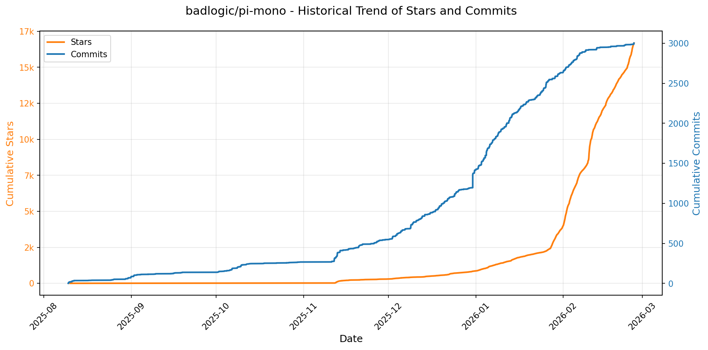

> *蓝色：累计 Stars｜橙色：累计 Commits（次 Y 轴）*

<b>📄 README 摘要</b>

1. **项目功能**  
该项目是一个面向 AI 代理（AI Agent）开发与大语言模型（LLM）部署管理的开源单体仓库（monorepo），核心目标是提供一套模块化、可组合的工具链，用于构建、运行和集成各类 AI 代理系统（尤其是编程类智能体），支持从终端交互（CLI）、Web 界面到 Slack 机器人等多场景落地。

2. **关键特性**  
- **统一多厂商 LLM 接口**：`@mariozechner/pi-ai` 封装 OpenAI、Anthropic、Google 等主流 LLM 提供商 API，实现 provider 无关的调用抽象；  
- **轻量级代理运行时**：`@mariozechner/pi-agent-core` 提供工具调用（tool calling）、会话状态管理、执行生命周期控制等核心能力；  
- **交互式编程智能体**：`@mariozechner/pi-coding-agent` 是开箱即用的命令行编码助手，支持自然语言驱动代码生成与修改；  
- **多端 UI 支持**：包含专为 AI 对话优化的终端 UI 库（`pi-tui`，支持差分渲染）和 Web 组件库（`pi-web-ui`）；  
- **生产级部署工具**：`pi-pods` CLI 用于在 GPU 节点上快速部署和管理 vLLM 推理服务；  
- **企业协作集成**：`pi-mom` 作为 Slack 机器人，可将用户消息自动路由至 coding-agent 执行，实现办公场景 AI 自动化。

3. **技术栈**  
- **语言与运行时**：TypeScript（全栈主语言），Node.js（后端/CLI 运行环境）；  
- **构建与包管理**：npm（单体仓库管理），支持 `tsc` 类型检查与 `.d.ts` 声明文件依赖；  
- **前端 UI 框架**：`pi-tui` 基于原生终端控制（无外部 UI 框架），`pi-web-ui` 提供 Web Components（非 React/Vue 等重型框架）；  
- **LLM 推理后端**：深度集成 vLLM（用于 `pi-pods` 高性能推理部署）；  
- **基础设施与协作**：GitHub Actions（CI/CD）、Discord（社区支持）、MIT 开源协议。

---

### 23. [bytedance/UI-TARS](https://github.com/bytedance/UI-TARS)
- 📅 **创建日期**：2025-01-19  
- 🔄 **最近更新**：2026-02-11  
- ⭐ **Stars**：9,486（日 +36｜周 +331｜月 +623）  
- 📝 **描述**：Pioneering Automated GUI Interaction with Native Agents  

<b>📈 Star 与 Commit 历史趋势</b>

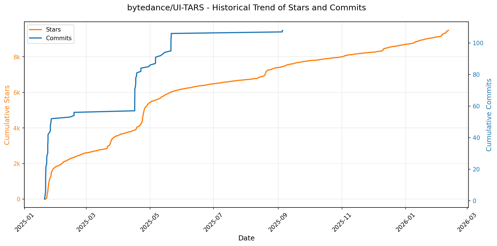

> *蓝色：累计 Stars｜橙色：累计 Commits（次 Y 轴）*

<b>📄 README 摘要</b>

1. **项目功能**  
UI-TARS 是一个开源的多模态智能体（Multimodal Agent），专为**自动化图形用户界面（GUI）交互**而设计。它能直接理解屏幕图像与自然语言指令，无需依赖网页DOM或移动应用API，即可在真实操作系统环境（Windows/Linux/macOS/Android）中执行端到端操作：包括鼠标点击、拖拽、键盘输入、滚动、应用启动、返回/主页键触发等。支持三大场景：**桌面GUI任务**（如办公软件、文件管理）、**浏览器自动化**（如WebVoyager类任务）、**移动设备交互**（通过模拟器或真机）。其最新版本 UI-TARS-2 进一步扩展至游戏控制、代码执行与工具调用，成为“一体化”原生代理模型（All-in-One Native Agent）。

2. **核心特性**  
- ✅ **跨平台原生交互能力**：统一架构适配桌面、浏览器、移动端（含`MOBILE_USE`专用指令集如`long_press`/`open_app`）；  
- ✅ **强化学习增强的推理链（Chain-of-Thought）**：支持“Thought + Action”双阶段输出，先逻辑推理再精准执行，显著提升复杂任务成功率；  
- ✅ **高精度视觉定位与坐标解析**：基于Qwen2.5VL等VLM实现像素级目标 grounding，提供坐标归一化/反归一化工具（`parse_action_to_structure_output`）及PyAutoGUI代码自动生成；  
- ✅ **多模板Prompt工程**：预置`COMPUTER_USE`（桌面）、`MOBILE_USE`（移动）、`GROUNDING`（纯动作输出）三类提示模板，按场景灵活切换；  
- ✅ **SOTA性能表现**：在OSWorld（42.5%）、Android World（64.2%）、ScreenSpot-V2（94.2%）等权威基准上全面超越OpenAI CUA、Claude 3.7及前代SOTA；Poki游戏任务15项全部达成100%成功率；  
- ✅ **开箱即用生态**：提供轻量Python包（`pip install ui-tars`）、Hugging Face模型仓库、桌面客户端（UI-TARS-desktop）、浏览器自动化配套方案（Midscene.js）及详细部署/坐标处理文档。

3. **技术栈**  
- **基础模型**：以Qwen2.5VL等先进视觉语言模型（VLM）为骨干，结合监督微调（SFT）与强化学习（DPO/RLHF）优化；  
- **推理框架**：支持Hugging Face Transformers推理，兼容本地部署与云服务（如HF Endpoint）；  
- **动作执行层**：深度集成PyAutoGUI（桌面）、ADB（Android）、Playwright/Puppeteer（浏览器），实现跨平台底层操作；  
- **开发语言与工具**：Python为主，配套`uv`包管理器；使用Markdown+Jupyter式文档（含视频演示）、ArXiv论文、Discord社区协作；  
- **评估体系**：覆盖OSWorld、WebVoyager、Android World、ScreenSpot系列、Poki游戏、Minecraft等多样化基准，兼顾任务完成率与视觉定位精度。

---

### 24. [NevaMind-AI/memU](https://github.com/NevaMind-AI/memU)
- 📅 **创建日期**：2025-07-29  
- 🔄 **最近更新**：2026-02-11  
- ⭐ **Stars**：8,862（日 +207｜周 +1502｜月 +4458）  
- 📝 **描述**：Memory for 24/7 proactive agents like openclaw (moltbot, clawdbot).  

<b>📈 Star 与 Commit 历史趋势</b>

> *蓝色：累计 Stars｜橙色：累计 Commits（次 Y 轴）*

<b>📄 README 摘要</b>

1. **该项目的功能**  
memU 是一个专为 **7×24 小时持续运行的主动式 AI 代理（proactive agents）** 设计的记忆框架。其核心功能是实现**无需用户显式指令即可持续感知、理解并预测用户意图**，并在后台自动执行记忆构建、知识提取与前瞻性任务（如内容推荐、邮件处理、交易预警等）。它通过结构化、分层的记忆管理机制，显著降低长期运行中对大语言模型（LLM）的 token 消耗，使真正“永在线、自进化”的生产级 AI 代理成为可行。

2. **关键特性**  
- **全天候主动智能**：支持常驻后台运行，持续监控用户交互（对话、邮件、文档、图像等），自动触发记忆更新与预测行为；  
- **意图驱动的记忆建模**：自动从多模态输入中提取偏好、技能、关系、目标等结构化记忆项（Memory Items），并按主题自动归类（Categories），支持跨记忆关联（Symlinks）；  
- **类文件系统记忆架构**：将记忆组织为 `memory/` 目录树（含 `preferences/`、`relationships/`、`knowledge/`、`context/` 等层级），支持挂载（Mount）、导航、导出与备份，实现记忆的可检索、可追溯、可迁移；  
- **双模态智能检索**：提供 `rag`（毫秒级向量检索，用于实时上下文加载）和 `llm`（深度推理模式，用于意图预测与查询演化）两种 `retrieve()` 方法，兼顾效率与认知深度；  
- **成本优化机制**：通过缓存语义洞察、避免重复 LLM 调用、优先使用轻量嵌入计算等方式，大幅削减长期运行的 token 开销；  
- **多源异构支持**：原生兼容文本、对话、文档、图像、音视频等多种模态输入，并支持 OpenAI、阿里云 Qwen、Voyage AI、OpenRouter 等多厂商 LLM 与嵌入模型灵活切换。

3. **技术栈**  
- **编程语言**：Python 3.13+（核心实现）；  
- **后端存储**：支持内存（in-memory）、PostgreSQL + pgvector（向量扩展）、以及可插拔元数据存储；  
- **AI 模型集成**：  
  - LLM 接口：OpenAI、DashScope（Qwen）、OpenRouter（统一接入 Anthropic、Google、Cohere 等数十家模型）；  
  - 嵌入模型：OpenAI、Voyage AI、OpenRouter 托管的 embedding 模型；  
  - 多模态支持：通过 OpenRouter 集成 GPT-4o 等视觉模型；  
- **架构模式**：主代理（Main Agent）与 memU Bot 分离协同，通过持续同步循环（Continuous Sync Loop）实现双向通信；  
- **部署方式**：提供云端托管服务（memu.so）、本地 Docker 快速启动（PostgreSQL + pgvector）、及完整 Python 包（`pip install -e .`）自托管方案。

---

### 25. [cheahjs/free-llm-api-resources](https://github.com/cheahjs/free-llm-api-resources)
- 📅 **创建日期**：2024-07-04  
- 🔄 **最近更新**：2026-02-11  
- ⭐ **Stars**：8,692（日 +283｜周 +546｜月 +961）  
- 📝 **描述**：A list of free LLM inference resources accessible via API.  

<b>📈 Star 与 Commit 历史趋势</b>

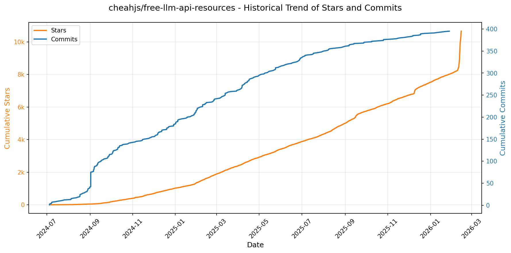

> *蓝色：累计 Stars｜橙色：累计 Commits（次 Y 轴）*

<b>📄 README 摘要</b>

1. **该项目的作用**  
该项目是一个持续维护的、开源的免费大语言模型（LLM）API资源汇总清单，旨在为开发者、研究人员和AI爱好者提供当前可免费或通过试用额度调用的主流LLM云服务列表。它不提供代码库、SDK或运行时工具，而是一个结构化、可检索的参考文档，聚焦于「哪些平台提供真实、合法、无需付费即可立即使用的LLM API接入能力」，并明确标注各服务商的访问限制、模型覆盖范围、地域/合规要求（如数据训练政策）、验证门槛（如手机号验证）及潜在风险提示（如禁止滥用、排除逆向工程类服务）。

2. **核心功能特性**  
- **双层分类体系**：清晰划分「完全免费提供商」（Free Providers）与「提供试用额度的提供商」（Providers with trial credits），便于用户按使用强度快速决策；  
- **精细化限额披露**：对每家服务商均详列关键速率限制（RPS/QPM/QPD）、令牌配额（tokens/minute/day）、请求总量上限及特殊约束（如上下文窗口限制、需同意数据训练、强制手机验证等）；  
- **大规模模型覆盖**：收录超150+个具体可用模型实例，涵盖主流开源模型（Llama 3.x / Gemma 3 / Qwen3 / Mistral / DeepSeek-R1/V3 / GLM / Phi-4等）及部分闭源能力（如GPT-OSS系列、Gemini 3 Flash、Solar Pro、Kimi-K2），并附官方模型链接；  
- **合规性与可信度筛选**：明确排除非正规渠道（如逆向工程聊天机器人），强调仅收录“合法、官方提供、面向开发者的API服务”，并在首屏置顶警示“请勿滥用，否则可能导致资源失效”；  
- **自动化维护机制**：README文件声明由`src/pull_available_models.py`脚本自动生成，暗示项目具备可持续更新能力，降低人工维护偏差风险。

3. **技术栈**  
该项目本身为纯静态文档型仓库，无运行时依赖，其“技术栈”体现在内容组织与维护方式上：  
- **内容生成层**：Python（通过`src/pull_available_models.py`脚本实现模型数据抓取/聚合/格式化，表明底层依赖HTTP客户端、HTML/XML解析及Markdown生成能力）；  
- **呈现层**：标准GitHub Flavored Markdown（GFM），含表格、锚点链接、警告/注意提示块（`> [!NOTE]`）、内联超链接及语义化标题结构；  
- **托管与协作层**：基于GitHub平台，利用其原生README渲染、目录跳转、版本控制及社区贡献流程；  
- **无前端/后端/数据库组件**：不涉及Web框架（如React/Vue）、服务器（如Node.js/Flask）、数据库或API代理逻辑——本质是面向人类阅读的权威信息索引，而非软件产品。

---

### 26. [EveryInc/compound-engineering-plugin](https://github.com/EveryInc/compound-engineering-plugin)
- 📅 **创建日期**：2025-10-09  
- 🔄 **最近更新**：2026-02-11  
- ⭐ **Stars**：8,190（日 +306｜周 +1101｜月 +3738）  
- 📝 **描述**：Official Claude Code compound engineering plugin  

<b>📈 Star 与 Commit 历史趋势</b>

> *蓝色：累计 Stars｜橙色：累计 Commits（次 Y 轴）*

<b>📄 README 摘要</b>

1. **项目功能**  
该项目是一个面向 AI 编程助手（特别是 Claude Code）的插件市场，核心是 **Compound Engineering Plugin** —— 一套旨在实现“工程工作复利效应”的自动化工具集。它通过结构化工作流（计划→执行→评审→沉淀）将每次工程实践转化为可复用的知识资产，使后续开发更简单、更高效。同时提供跨平台兼容能力，支持将 Claude Code 插件一键转换为 OpenCode 和 Codex 两种新兴 AI 编程环境的原生格式，并同步用户本地配置（技能、MCP 服务器等），实现多平台无缝迁移与协同。

2. **关键特性**  
- **四阶复利工作流命令**：内置 `/workflows:plan`（生成详细实现方案）、`/workflows:work`（基于工作树与任务跟踪执行）、`/workflows:review`（多智能体预合并代码评审）、`/workflows:compound`（自动归档经验模式，形成可复用文档/技能）；  
- **跨平台插件转换器**：支持将 Claude Code 插件实时转译为 OpenCode（输出至 `~/.config/opencode`）和 Codex（输出至 `~/.codex/prompts` 与 `~/.codex/skills`）格式，含自动 prompt-skill 映射与描述截断（适配 Codex 1024 字符限制）；  
- **个人配置双向同步**：可将本地 Claude Code 的技能（`~/.claude/skills/`）以**符号链接方式**同步至 OpenCode/Codex，确保修改实时生效；同时同步 MCP 服务器配置（来自 `~/.claude/settings.json`）；  
- **CLI 驱动与本地开发支持**：基于 Bun + TypeScript 构建轻量 CLI 工具，支持离线转换、本地插件调试及快速集成。

3. **技术栈**  
- **运行时**：Bun（作为默认 JavaScript 运行时，替代 Node.js，兼顾性能与包管理）；  
- **语言**：TypeScript（强类型保障插件逻辑与格式转换的可靠性）；  
- **目标平台协议**：Claude Code（原生插件生态）、OpenCode（开源 AI 编程协议）、Codex（GitHub 官方 AI 编程框架）；  
- **配置与集成机制**：符号链接（symlinks）实现技能热更新、JSON 配置驱动（`opencode.json`, `settings.json`）、MCP（Model Control Protocol）服务器集成；  
- **发布与分发**：npm 包 `@every-env/compound-plugin`，CI/CD 由 GitHub Actions 托管。

---

### 27. [NoeFabris/opencode-antigravity-auth](https://github.com/NoeFabris/opencode-antigravity-auth)
- 📅 **创建日期**：2025-12-09  
- 🔄 **最近更新**：2026-02-11  
- ⭐ **Stars**：8,078（日 +108｜周 +683｜月 +6138）  
- 📝 **描述**：Enable Opencode to authenticate against Antigravity (Google's IDE) via OAuth so you can use Antigravity rate limits and access models like gemini-3-pro and claude-opus-4-5-thinking with your Google credentials.  

<b>📈 Star 与 Commit 历史趋势</b>

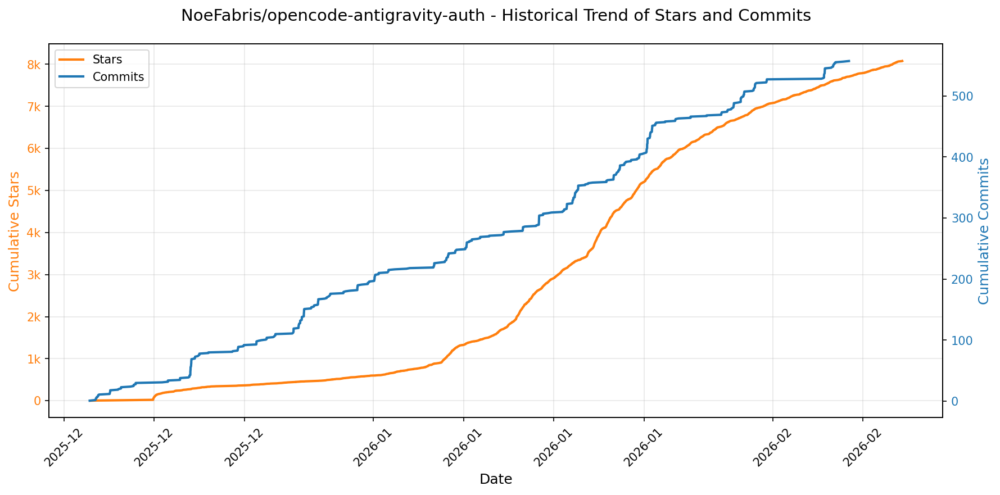

> *蓝色：累计 Stars｜橙色：累计 Commits（次 Y 轴）*

<b>📄 README 摘要</b>

1. **该项目的作用**  
该插件为 OpenCode CLI 提供对 Google Antigravity（Google 官方 IDE）和 Gemini CLI 的 OAuth 认证支持，使用户能通过个人 Google 账户调用受限制的高性能大模型（如 `gemini-3-pro`、`claude-opus-4-5-thinking` 等），绕过 OpenCode 原生限流机制。其核心功能是将 OpenCode 的模型请求“代理”至 Google 的两个独立配额体系（Antigravity 与 Gemini CLI），实现统一认证、跨服务模型路由与多账户协同调度。

2. **关键特性**  
- ✅ **双配额池支持**：同时接入 Antigravity（主渠道，支持 Claude + Gemini）与 Gemini CLI（备用/可选渠道），支持自动 fallback 与配额溢出调度；  
- ✅ **多 Google 账户管理**：支持添加/启用/禁用多个账号，自动轮询（round-robin）、混合策略（hybrid）或粘性选择（sticky），应对单账户速率限制；  
- ✅ **增强型思考模型（Thinking Models）**：为 Claude Sonnet/Opus 及 Gemini 3 系列提供可配置的「扩展思考预算」（如 `--variant=max` 对应 32768 token 思考深度）；  
- ✅ **Google 搜索增强**：为 Gemini 模型启用 Web 搜索能力（auto 或 always-on 模式）；  
- ✅ **全自动容错恢复**：自动处理会话中断、工具调用失败、OAuth 过期、403 权限错误等异常，并支持 `/undo` 和 `continue` 交互式恢复；  
- ✅ **深度插件兼容性**：与 `oh-my-opencode`、`opencode-dcp` 等主流插件共存（需正确声明加载顺序），并屏蔽冲突的内置 Google 认证；  
- ✅ **细粒度配额保护机制**：支持软阈值限流（如 `soft_quota_threshold_percent: 90`）、动态配额刷新、缓存 TTL 控制，降低账号被封风险；  
- ✅ **全平台一致配置路径**：统一使用 `~/.config/opencode/`（Windows 下自动映射至用户目录），避免传统 `%APPDATA%` 兼容问题。

3. **技术栈**  
- **运行时环境**：Node.js（基于 npm 包管理，支持 `@latest` 与 `@beta` 版本通道）；  
- **认证协议**：标准 OAuth 2.0（Google Identity Services），本地启动 `http://localhost:51121` 回调服务器完成授权流；  
- **底层 SDK**：依赖 `@ai-sdk/google`（官方 Google AI SDK）适配 Gemini API，同时逆向兼容 Antigravity 内部接口；  
- **配置体系**：JSON Schema 驱动（`antigravity.schema.json`），支持 `opencode.json` 主配置 + `antigravity.json` 插件专属配置 + `antigravity-accounts.json` 加密账户凭证存储；  
- **调试与可观测性**：结构化日志输出至 `~/.config/opencode/antigravity-logs/`，支持手动诊断与自动化重置（如删除 accounts 文件后重新登录）；  
- **跨平台适配层**：原生支持 macOS/Linux/Windows（含 WSL2、Docker、SSH 远程场景），提供端口冲突排查、Safari HTTPS-only 模式绕过等专项解决方案。

---

### 28. [openai/skills](https://github.com/openai/skills)
- 📅 **创建日期**：2025-11-25  
- 🔄 **最近更新**：2026-02-11  
- ⭐ **Stars**：7,847（日 +289｜周 +4804｜月 +6412）  
- 📝 **描述**：Skills Catalog for Codex  

<b>📈 Star 与 Commit 历史趋势</b>

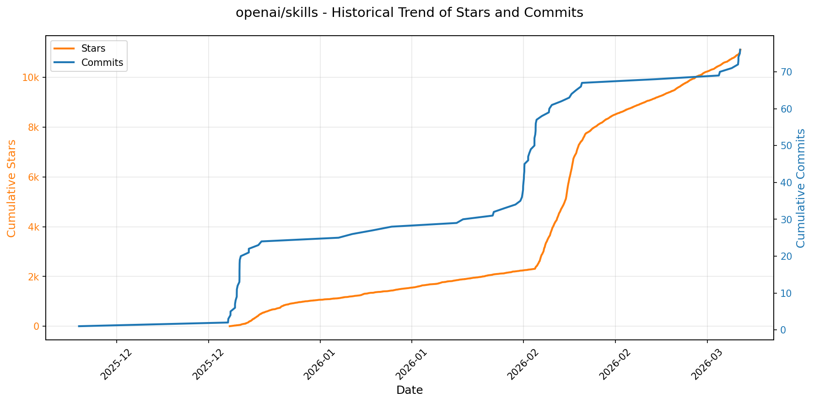

> *蓝色：累计 Stars｜橙色：累计 Commits（次 Y 轴）*

<b>📄 README 摘要</b>

1. **该项目的作用**：  
该项目是一个面向 AI 代理（AI agents）的“技能”（Skills）标准化仓库，提供结构化的指令集、脚本与资源集合，使 AI 代理能够自主发现、加载并复用这些技能以完成特定任务。其核心目标是实现能力的“一次编写、处处调用”，支持在 Codex 平台中统一打包、分发和复用团队或个人开发的可重用功能模块。

2. **关键特性**：  
- **标准化技能目录结构**：技能按类型划分为 `.system`（系统内置）、`.curated`（经审核推荐）和 `.experimental`（实验性）三类，便于分类管理与版本控制；  
- **自动化集成机制**：`.system` 下的技能在最新版 Codex 中自动安装；其余技能可通过内置命令 `$skill-installer` 按名称、本地路径或 GitHub URL 灵活安装；  
- **即插即用与热更新支持**：安装后仅需重启 Codex 即可生效，降低使用门槛；  
- **开放标准兼容性**：遵循 [Agent Skills 开放标准](https://agentskills.io)，确保跨平台互操作性与生态可扩展性；  
- **细粒度授权管理**：每个技能独立携带 `LICENSE.txt` 文件，明确其使用许可，支持合规分发与协作。

3. **技术栈**：  
- **核心平台**：深度集成 OpenAI Codex（AI 编程与代理运行时环境）；  
- **分发协议**：基于 GitHub 仓库托管，依赖 Git 版本控制与标准 Web URL（如 `github.com/.../tree/main/...`）进行技能定位与拉取；  
- **执行层**：通过 Codex 内置 CLI 命令 `$skill-installer` 实现技能解析、下载、校验与注册；  
- **格式规范**：采用纯文本/脚本文件（如指令文档、Shell/Python 脚本等）组织技能内容，不强制依赖特定编程语言或框架，强调轻量性与可读性。

---

### 29. [tobi/qmd](https://github.com/tobi/qmd)
- 📅 **创建日期**：2025-12-08  
- 🔄 **最近更新**：2026-02-11  
- ⭐ **Stars**：7,804（日 +211｜周 +1784｜月 +6535）  
- 📝 **描述**：mini cli search engine for your docs, knowledge bases, meeting notes, whatever. Tracking current sota approaches while being all local  

<b>📈 Star 与 Commit 历史趋势</b>

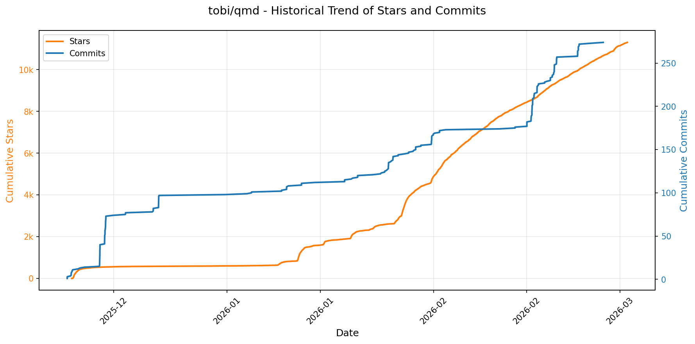

> *蓝色：累计 Stars｜橙色：累计 Commits（次 Y 轴）*

<b>📄 README 摘要</b>

1. **项目功能**  
QMD 是一个**纯本地运行的设备端搜索引擎**，专为个人知识管理与 AI 代理（agentic）工作流设计。它可对用户本地的 Markdown 笔记、会议记录、技术文档、知识库等非结构化文本内容进行统一索引与跨源检索。支持三种搜索模式：基于关键词的快速全文检索（BM25）、基于语义相似度的向量搜索，以及融合查询扩展、多路并行检索与大语言模型（LLM）重排序的高精度混合搜索。所有处理（索引、嵌入、重排、推理）均在用户设备上离线完成，无需联网或依赖云端服务。

2. **核心特性**  
- ✅ **三重混合检索架构**：同时调用 SQLite FTS5（BM25）、sqlite-vec（向量搜索）与本地 GGUF 模型（查询扩展 + 重排序），通过改进的**位置感知加权融合策略**（Reciprocal Rank Fusion + Top-rank bonus + 分段权重 blend）提升结果相关性与鲁棒性；  
- ✅ **端到端本地化**：全部模型（EmbeddingGemma-300M、Qwen3-Reranker-0.6B、QMD定制Query Expansion-1.7B）以 GGUF 格式通过 `node-llama-cpp` 原生加载，支持 Apple Silicon（Metal）与 NVIDIA GPU（CUDA）加速，零数据上传；  
- ✅ **面向 AI 代理的深度集成**：提供标准化 MCP（Model Context Protocol）服务器（支持 stdio / HTTP 两种传输），暴露 `qmd_search`/`qmd_vector_search`/`qmd_deep_search` 等 6 个工具接口，原生兼容 Claude Desktop、Claude Code 及其他 MCP 客户端；  
- ✅ **灵活的知识组织体系**：支持多集合（collection）管理、路径级上下文描述（`qmd context add`）、虚拟路径命名空间（`qmd://`）、细粒度文件过滤（glob 模式）、多格式输出（JSON/CSV/Markdown/XML/CLI）及批量文档获取（`multi-get`）；  
- ✅ **生产就绪的索引与运维能力**：自动分块（800 tokens + 15% 重叠）、标题提取、内容哈希生成 docid、SQLite 健康状态监控（`qmd status`）、增量更新（`qmd update`）、缓存清理（`qmd cleanup`）及 HTTP 长连接守护进程（避免重复加载大模型）。

3. **技术栈**  
- **运行时**：Bun（v1+，作为包管理器与执行环境）；  
- **核心引擎**：SQLite（FTS5 全文索引）、sqlite-vec（向量索引扩展）；  
- **AI 推理层**：`node-llama-cpp`（TypeScript 绑定），加载并运行本地 GGUF 模型；  
- **模型**：  
  - `embeddinggemma-300M-Q8_0`（嵌入生成，~300MB）；  
  - `qwen3-reranker-0.6b-q8_0`（交叉编码器重排序，~640MB）；  
  - `qmd-query-expansion-1.7B-q4_k_m`（微调版查询扩展模型，~1.1GB）；  
- **协议与集成**：MCP（Model Context Protocol）标准、HTTP API（`/mcp`, `/health`）、CLI 工具链；  
- **存储**：全量索引持久化于 `~/.cache/qmd/index.sqlite`，含 collections、documents、FTS5、content_vectors、vectors_vec、llm_cache 等结构化表；  
- **平台支持**：macOS（需 Homebrew SQLite）、Linux（兼容）、Windows（未明确声明但 Bun + node-llama-cpp 理论支持）。

---

### 30. [pydantic/monty](https://github.com/pydantic/monty)
- 📅 **创建日期**：2023-05-28  
- 🔄 **最近更新**：2026-02-11  
- ⭐ **Stars**：4,551（日 +576｜周 +4466｜月 +4550）  
- 📝 **描述**：A minimal, secure Python interpreter written in Rust for use by AI  

<b>📈 Star 与 Commit 历史趋势</b>

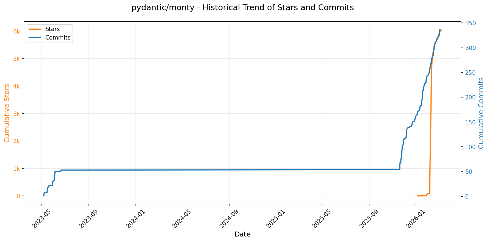

> *蓝色：累计 Stars｜橙色：累计 Commits（次 Y 轴）*

<b>📄 README 摘要</b>

1. **项目功能**  
Monty 是一个专为 AI 代理（LLM）设计的极简、安全的 Python 子集解释器，完全用 Rust 实现。其核心目标是**安全、高效地执行由大语言模型生成的 Python 代码**，替代传统容器沙箱（如 Docker）或不安全的 `exec()` 方案。它不追求 Python 兼容性，而是聚焦于“AI 编程”这一单一场景：让 LLM 通过编写受限但实用的 Python 脚本调用开发者授权的函数（如 `call_llm`、`get_weather`），从而实现更可靠、低成本、低延迟的工具调用（即“Code Mode”）。Monty 在毫秒级甚至微秒级内启动，可完全隔离宿主机环境（无文件系统、网络、环境变量访问），所有外部交互均需显式声明并由宿主程序控制。

2. **关键特性**  
- ✅ **极致安全性**：默认禁用全部宿主访问（FS/NET/ENV），仅允许显式注册的外部函数调用；支持内存、栈深度、执行时间、分配次数等多维资源限制与强制中断。  
- ✅ **超低延迟启动**：冷启动耗时 < 1 微秒（μs），远优于 Docker（~195ms）、Pyodide（~2800ms）等方案。  
- ✅ **类型安全支持**：内置 [ty](https://docs.astral.sh/ty/) 类型检查器，支持完整现代 Python 类型提示（PEP 484/563），可在运行前验证代码合法性。  
- ✅ **状态快照与恢复**：支持将解释器中间状态（`MontySnapshot`）序列化为字节流，持久化至文件或数据库，并在任意时刻/进程/语言中恢复执行（`dump()`/`load()`）。  
- ✅ **多语言绑定**：原生提供 Python、Rust、JavaScript/TypeScript API，无 CPython 依赖，可嵌入任意 Rust 生态项目（如 Pydantic AI）。  
- ✅ **异步/同步混合执行**：支持 `async def` 代码，并能无缝桥接宿主端的异步或同步外部函数。  
- ✅ **标准输出捕获**：自动收集 `stdout`/`stderr` 并返回给调用方。  
- ❌ **明确限制**：不支持标准库大部分模块（仅 `sys`/`typing`/`asyncio` 等少数）、无第三方包（如 Pydantic）、暂不支持 `class`/`match` 语法（计划支持）。

3. **技术栈**  
- **核心语言**：Rust（高性能、内存安全、无 GC，适合构建嵌入式解释器）  
- **Python 兼容层**：自研 AST 解析与字节码执行引擎（非基于 CPython 或 PyPy）  
- **类型检查**：集成 [ty](https://docs.astral.sh/ty/)（Rust 编写的高性能 Python 类型检查器）  
- **序列化**：Rust 的 `bincode` 或类似零拷贝二进制格式（用于 `dump()`/`load()`）  
- **绑定接口**：  
  - Python：通过 `pyo3` 构建的原生扩展模块（`pydantic-monty`）  
  - JavaScript/TypeScript：通过 `wasm-bindgen` 编译为 WebAssembly（`@pydantic/monty`）  
  - Rust：直接 crate（`monty`）  
- **构建与分发**：CI 使用 GitHub Actions，性能监控集成 Codspeed，覆盖率由 Codecov 提供，发布至 PyPI / npm / crates.io。

---

### 31. [ThePrimeagen/99](https://github.com/ThePrimeagen/99)
- 📅 **创建日期**：2025-11-22  
- 🔄 **最近更新**：2026-02-11  
- ⭐ **Stars**：3,649（日 +47｜周 +483｜月 +2654）  
- 📝 **描述**：Neovim AI agent done right  

<b>📈 Star 与 Commit 历史趋势</b>

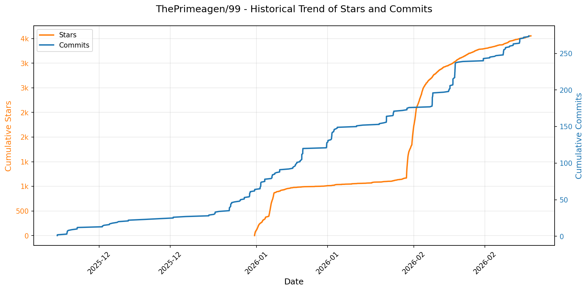

> *蓝色：累计 Stars｜橙色：累计 Commits（次 Y 轴）*

<b>📄 README 摘要</b>

1. **项目功能**  
该项目（`99`）是一个专为 Neovim 设计的轻量级、面向开发者的 AI 编程助手客户端，核心目标是**在不破坏编码流的前提下，将 AI 能力精准嵌入到受限、高价值的编程场景中**。它不追求通用问答，而是聚焦于三类明确任务：视觉选区增强（`visual`）、上下文感知代码补全与重构（通过 `#规则` 和 `@文件` 引用注入知识）、以及未来扩展的搜索与调试支持。其哲学是“为懂代码的人服务”——假设用户具备扎实的工程能力，AI 仅作为高效协作者，处理重复性、上下文密集型任务（如基于项目规则/文档的代码生成、基于当前文件结构的精准修改），而非替代基础编程判断。

2. **关键特性**  
- **语义化上下文注入**：支持 `#规则名` 自动补全并加载本地 `SKILL.md` 规则文件（如 `vim/SKILL.md`），以及 `@文件名` 模糊搜索并注入项目内任意文件内容至 AI 上下文；  
- **多 AI 后端无缝切换**：原生支持 `opencode`（默认）、`claude` 和 `cursor-agent` 三大 CLI 工具，通过配置 `provider` 即可切换，自动适配各工具默认模型及参数；  
- **Neovim 原生深度集成**：提供 `visual()` API 实现视觉选区智能处理（如重写、解释、优化），绑定 `<leader>9v` 快捷键；支持实时中断所有请求（`stop_all_requests`）；  
- **项目感知式提示工程**：自动沿目录树向上查找 `AGENT.md` 等元配置文件，动态注入项目专属指令与约束，实现“所处即上下文”；  
- **可调试性优先设计**：内置分级日志系统（DEBUG 级别文件日志 + `view_logs()` / `prev_request_logs()` 等 API），强制要求问题报告附带完整日志，确保可复现性；  
- **Alpha 阶段务实约束**：明确声明 API 不稳定、提示词待优化、仅支持 TS/Lua 语言解析，且禁止 Feature Request，强调通过 Twitch 公开讨论统一规划。

3. **技术栈**  
- **核心语言**：Lua（Neovim 插件主体，高度依赖 Neovim 0.9+ Lua API）；  
- **前端交互**：Neovim 内置 LSP/CMP 补全框架（强制依赖 `cmp` 作为补全引擎以支持 `#`/`@` 语义补全）；  
- **AI 后端协议**：通过标准 CLI 调用对接外部 AI 工具（`opencode`/`claude`/`cursor-agent`），不自建模型或 API 服务；  
- **语法分析**：利用 Neovim 内置 Tree-sitter 进行代码结构识别（当前存在选区范围不精准等已知问题）；  
- **配置与扩展**：纯 Lua 配置（Lazy.nvim 兼容），支持自定义日志路径、文件过滤规则（`exclude`）、规则目录（`custom_rules`）、MD 元文件发现策略（`md_files`）等。

---

### 32. [disler/claude-code-hooks-mastery](https://github.com/disler/claude-code-hooks-mastery)
- 📅 **创建日期**：2025-07-05  
- 🔄 **最近更新**：2026-02-11  
- ⭐ **Stars**：2,894（日 +105｜周 +635｜月 +850）  
- 📝 **描述**：Master Claude Code Hooks  

<b>📈 Star 与 Commit 历史趋势</b>

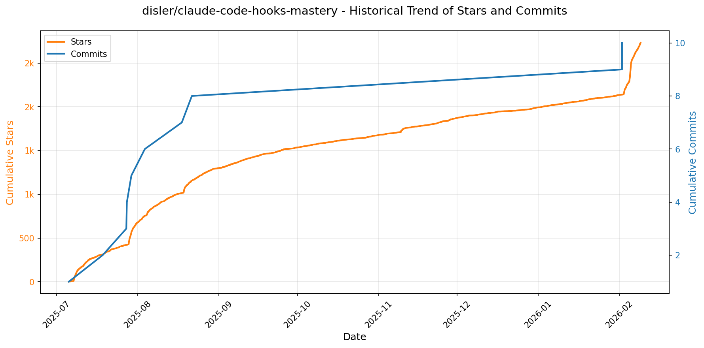

> *蓝色：累计 Stars｜橙色：累计 Commits（次 Y 轴）*

<b>📄 README 摘要</b>

1. **项目功能**  
该项目是一个面向 Anthropic Claude Code 的钩子（Hooks）深度实践与教学框架，旨在通过完整、可运行的示例，帮助开发者掌握如何利用 Claude Code 提供的 13 类生命周期钩子，对 AI 编程会话实施**确定性行为控制**。它不依赖大模型推理做决策，而是通过预设逻辑（如安全拦截、上下文注入、日志审计、TTS 反馈等）在关键节点（如用户提交提示、工具调用前/后、子智能体启停、会话启停等）精确干预 Claude Code 的执行流程。同时，项目系统性演示了 Claude Code 的高级能力：子智能体（Sub-Agents）、元智能体（Meta-Agent）、基于团队的构建-验证工作流（Team-Based Validation），以及动态终端状态行、多风格输出模板和自定义 Slash 命令等。

2. **核心特性**  
- **全生命周期钩子覆盖**：完整实现并验证全部 13 个 Claude Code 钩子（含 `UserPromptSubmit`、`PreToolUse`、`PostToolUse`、`SubagentStart/Stop`、`SessionStart/End` 等），支持日志记录、安全拦截、上下文增强与流程阻断；  
- **多层安全防护**：在 `PreToolUse` 等钩子中实时检测并阻止危险命令（如 `rm -rf`、`sudo rm`、写入 `/etc/`、访问 `.env` 文件等），支持正则模式匹配与细粒度权限审计；  
- **智能语音反馈（TTS）系统**：集成 ElevenLabs、OpenAI 和本地 pyttsx3，按优先级自动选择 TTS 引擎，支持通知播报（如“需人工输入”）、任务完成提醒及 LLM 生成的总结语音；  
- **结构化日志与会话管理**：所有钩子事件以 JSON 格式自动落盘至 `logs/` 目录；支持会话启动时加载 Git 状态/问题上下文，结束时自动清理临时文件与日志；  
- **团队化验证工作流**：内置 `builder.md`（全工具权限）与 `validator.md`（只读验证）双智能体配置，结合 Ruff/Ty 检查器实现代码质量自动化校验；  
- **动态终端状态行（Status Lines）**：提供从基础 Git 信息到高级 Token 使用率、缓存命中率、会话耗时、成本估算等共 9 个版本的状态行脚本；  
- **多样化输出样式与自定义命令**：支持 HTML、Markdown 表格、YAML、极简文本等 8 种响应格式；预置 `plan_w_team`、`crypto_research`、`cook` 等领域化 Slash 命令；  
- **UV 单文件脚本架构**：所有钩子均以独立 `.py` 文件存放于 `.claude/hooks/`，内嵌依赖声明，由 Astral UV 自动解析与执行，实现零虚拟环境、高隔离性、强可移植性。

3. **技术栈**  
- **核心平台**：Anthropic Claude Code CLI（主运行时与钩子宿主）；  
- **包管理与脚本引擎**：Astral UV（用于单文件 Python 脚本的依赖解析、安装与快速执行）；  
- **编程语言**：Python 3.x（所有钩子脚本、工具函数、TTS/LLM 封装均基于 Python）；  
- **语言模型后端**：OpenAI（GPT 系列）、Anthropic（Claude 系列）、Ollama（本地 LLM，如 llama3、phi3）；  
- **语音合成（TTS）**：ElevenLabs（首选）、OpenAI TTS API、pyttsx3（离线备用）；  
- **外部 MCP 服务集成**：ElevenLabs MCP Server（TTS）、Firecrawl MCP Server（网页爬取）、自定义工具协议；  
- **代码质量工具**：Ruff（Python 代码检查）、Pyright / mypy（类型检查，通过 `ty.toml` 配置）；  
- **日志与数据格式**：JSON / JSONL（钩子日志、对话转录）、Markdown（文档与输出模板）、YAML（配置）；  
- **可视化与架构图**：Mermaid（生命周期流程图）。

---

### 33. [github/gh-aw](https://github.com/github/gh-aw)
- 📅 **创建日期**：2025-08-12  
- 🔄 **最近更新**：2026-02-11  
- ⭐ **Stars**：1,350（日 +424｜周 +1004｜月 +1058）  
- 📝 **描述**：GitHub Agentic Workflows  

<b>📈 Star 与 Commit 历史趋势</b>

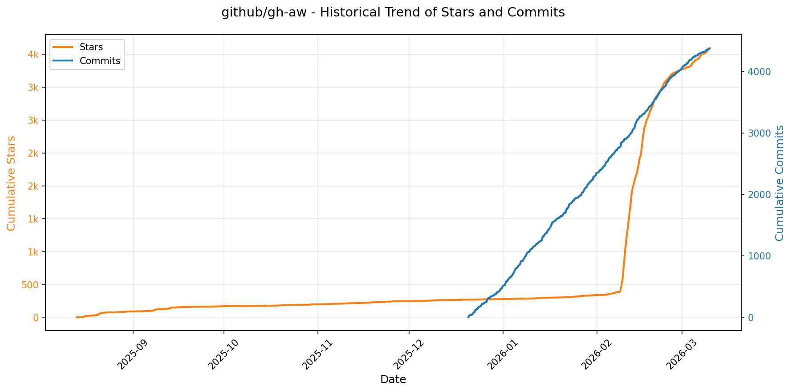

> *蓝色：累计 Stars｜橙色：累计 Commits（次 Y 轴）*

<b>📄 README 摘要</b>

1. **项目功能**  
该项目（GitHub Agentic Workflows）允许用户使用自然语言编写的 Markdown 文件定义“智能体式工作流”（agentic workflows），并直接在 GitHub Actions 环境中安全执行。其核心目标是将 AI 代理（AI agent）能力深度集成进 GitHub 自动化体系，使开发者能以声明式、接近人类语言的方式描述复杂、自主决策的任务流程（如代码审查、问题分类、PR 总结、依赖分析等），由 AI 驱动执行，同时严格限定其操作边界与权限。

2. **关键特性**  
- ✅ **自然语言驱动**：工作流以易读的 Markdown 编写，降低 AI 工作流开发门槛；  
- ✅ **默认只读 + 安全输出机制**：所有工作流默认仅具备仓库只读权限，任何写操作（如提交、评论、合并）必须通过显式声明、经静态验证的 `safe-outputs` 触发；  
- ✅ **多层安全防护体系**：包含沙箱化执行环境、输入内容清洗、网络完全隔离（无默认外网访问）、供应链安全（所有依赖 SHA256 固定哈希校验）、工具白名单控制、编译时静态验证；  
- ✅ **细粒度访问控制**：支持基于团队成员的身份授权，关键操作可配置人工审批门禁（human approval gates）；  
- ✅ **配套安全基础设施**：与 Agent Workflow Firewall（AWF，提供域名级网络出口管控与日志审计）和 MCP Gateway（统一代理 Model Context Protocol 调用，实现集中鉴权与路由）深度协同；  
- ✅ **生产就绪型护栏设计**：强调威胁建模与安全架构先行，明确要求人工监督，并警示“使用风险自担”。

3. **技术栈**  
- **运行平台**：原生构建于 GitHub Actions 基础设施之上，复用其 runner、事件触发、secret 管理与权限模型；  
- **AI 运行时**：基于 Model Context Protocol（MCP）标准与外部大模型（LLM）交互，通过 MCP Gateway 实现协议抽象与安全网关；  
- **安全组件**：  
  - 自研 Agent Workflow Firewall（Rust/Go？——依据仓库名推断为高性能网络代理）；  
  - 静态分析与验证工具链（用于 `safe-outputs` 编译时校验、工具调用白名单检查等）；  
- **前端/体验层**：GitHub 扩展（VS Code 插件或 GitHub UI 集成）、Markdown 渲染与交互式文档站点（托管于 github.github.com）；  
- **协作生态**：深度依赖 GitHub 原生能力（Teams、Permissions、Environments、Approvals），并与 GitHub Next 实验性项目（如 Peli's Agent Factory）联动演进。

---

### 34. [carlvellotti/claude-code-pm-course](https://github.com/carlvellotti/claude-code-pm-course)
- 📅 **创建日期**：2025-10-17  
- 🔄 **最近更新**：2026-02-11  
- ⭐ **Stars**：813（日 +156｜周 +400｜月 +500）  
- 📝 **描述**：Interactive course teaching Product Managers how to use Claude Code effectively  

<b>📈 Star 与 Commit 历史趋势</b>

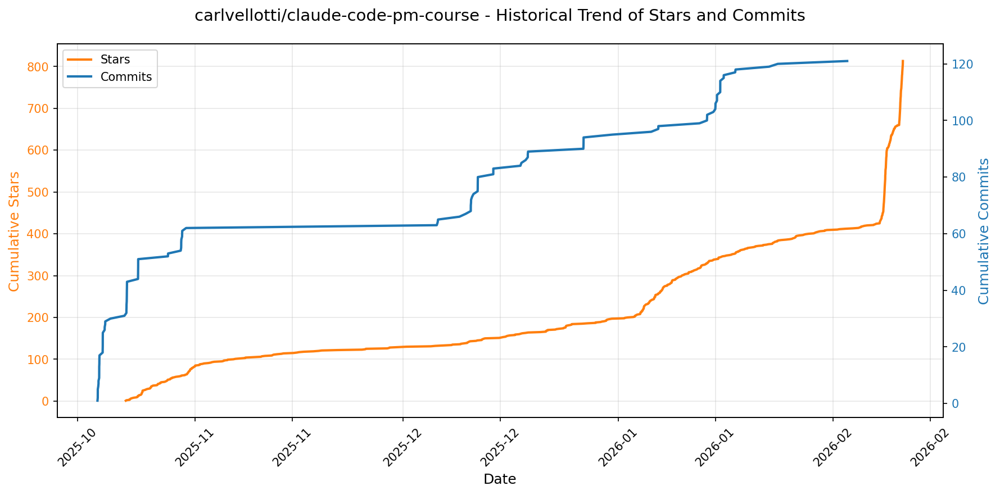

> *蓝色：累计 Stars｜橙色：累计 Commits（次 Y 轴）*

<b>📄 README 摘要</b>

1. **该项目做什么？**  
本项目是一个面向产品经理（PM）的交互式实战课程，旨在系统性地教授如何将 Anthropic 推出的 AI 编程与协作工具 **Claude Code** 深度融入日常产品工作流。它不侧重于代码开发，而是聚焦于 PM 的核心任务——如撰写 PRD、分析用户研究与数据、制定产品策略、处理会议纪要、多视角评审等——通过 Claude Code 实现更高效、高质量、可复用的智能协同。课程以“边学边做”为设计原则，所有内容均在 Claude Code 环境中实时交互执行，强调“思考伙伴”（thinking partner）而非简单自动化。

2. **关键功能特性**  
- ✅ **模块化渐进式学习路径**：涵盖入门（安装/启动）、基础能力（文件可视化、任务执行、Agent 并行调度）到高阶 PM 场景（PRD 撰写、数据分析、战略推演）的完整闭环；  
- ✅ **深度集成 Claude Code 原生能力**：包括 `@-mentions` 上下文注入、自定义子 Agent（如工程师/UX/高管角色模拟）、基于 `CLAUDE.md` 的项目级记忆与行为定制；  
- ✅ **双轨学习模式**：提供「交互式轨道」（需本地克隆 + 运行 `/start-1-1` 启动引导式实操）和「参考轨道」（各模块独立 `REFERENCE_GUIDE.md`，支持按需速查）；  
- ✅ **严格受控的环境引导机制**：明确禁止未经提示的 `npm install` 或构建操作，确保用户始终在课程预设逻辑下安全、专注地完成每一步训练；  
- ✅ **真实 PM 工作流映射**：所有练习均源自典型产品场景（如从会议笔记生成需求洞察、用图像辅助用户反馈分析、多 Agent 协同评审 PRD），强调可迁移的生产力提升。

3. **技术栈**  
- **核心平台**：Claude Code（Anthropic 官方推出的本地运行 AI 开发环境，支持自然语言驱动的代码/文档/任务协同）；  
- **前端/文档层**：Markdown（课程全部内容以 `.md` 文件组织，含结构化指令与交互提示）；  
- **运行环境**：跨平台 CLI 支持（macOS / Windows / Linux），依赖基础命令行操作能力；  
- **可视化扩展支持**：兼容 Nimbalyst、Obsidian、VS Code 等第三方工具用于文件关系可视化（非必需，属增强体验）；  
- **无传统 Web 技术栈依赖**：课程本身不含前端框架（如 React/Vue）、后端服务或数据库——完全依托 Claude Code 的本地沙箱执行，零构建、零部署。

---

### 35. [Jeffallan/claude-skills](https://github.com/Jeffallan/claude-skills)
- 📅 **创建日期**：2025-10-20  
- 🔄 **最近更新**：2026-02-11  
- ⭐ **Stars**：774（日 +306｜周 +532｜月 +749）  
- 📝 **描述**：65 Specialized Skills for Full-Stack Developers. Transform Claude Code into your expert pair programmer.  

<b>📈 Star 与 Commit 历史趋势</b>

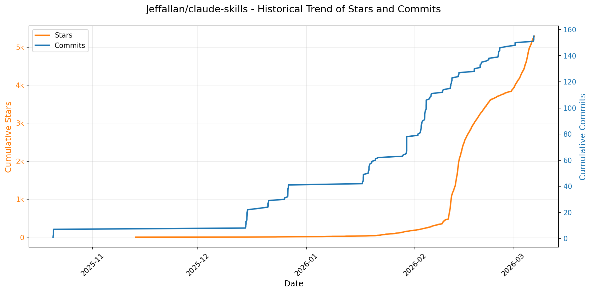

> *蓝色：累计 Stars｜橙色：累计 Commits（次 Y 轴）*

<b>📄 README 摘要</b>

1. **项目功能**  
该项目是一个专为 Anthropic Claude Code（Claude 编程插件）设计的高性能技能扩展框架，旨在将 Claude 转变为面向全栈开发者的智能工程协作者。它不提供独立运行的工具或服务，而是通过「技能（Skills）」和「工作流（Workflows）」机制，在 Claude Code 环境中实现上下文感知的自动化技术决策与协作执行。核心作用是：根据用户自然语言指令（如“为 NestJS API 实现 JWT 认证”），自动识别技术栈、激活对应专家技能、加载精准参考文档，并串联多个技能完成端到端任务（如特性开发、缺陷排查、安全加固等），显著提升 AI 编程助手的专业性、准确性和工程落地能力。

2. **关键特性**  
- **66 项专业化技能**：覆盖 12 大技术领域（含 TypeScript/Python/Go、React/NestJS/Django、Kubernetes/Terraform、REST/GraphQL、Jest/Cypress、CI/CD、OWASP 安全、LLM 工程等），每项技能绑定专属知识库（`references/*.md`）；  
- **9 个端到端项目工作流**：深度集成 Jira 和 Confluence，支持从需求发现、架构设计、开发交付、测试验证、部署运维到复盘回顾的完整研发生命周期管理；  
- **上下文感知激活（Context-Aware Activation）**：无需手动调用，系统基于用户提问自动匹配最相关技能并加载上下文文档（如提及 “Server Components” 即激活 React Expert 并载入 `server-components.md`）；  
- **多技能协同工作流（Multi-Skill Workflows）**：支持复杂任务的技能链式编排（例如“特性开发”自动触发 Feature Forge → Architecture Designer → Fullstack Guardian → Test Master → DevOps Engineer）；  
- **上下文工程（Context Engineering）**：提供 `/common-ground` 命令显式揭示并校准 Claude 对项目隐含假设（如技术选型、架构约束、团队规范），增强推理可靠性；  
- **渐进式披露（Progressive Disclosure）**：按需加载深度技术细节，避免信息过载，兼顾初学者引导与专家级参考需求；  
- **企业级可扩展架构**：支持本地技能开发、Atlassian MCP 服务器集成、模块化文档体系（各技能独立 `SKILL.md` 与 `references/` 目录），便于团队定制与贡献。

3. **技术栈**  
- **运行平台**：Anthropic Claude Code（官方编程插件环境），依赖其插件市场（Plugin Marketplace）机制安装与执行；  
- **后端集成**：Atlassian MCP（Model Control Protocol）服务器（用于 Jira/Confluence 工作流驱动）；  
- **知识表示**：纯文本 Markdown 技术文档（`skills/*/SKILL.md` + `skills/*/references/`），共 365+ 参考文件，结构化组织技术规范、最佳实践与代码示例；  
- **工程基础设施**：GitHub Actions CI/CD（`ci.yml`）、MIT 开源许可证、标准化文档体系（Quick Start / Skills Guide / Common Ground / Workflow Commands 等专用指南）；  
- **开发与协作**：基于 GitHub 生态（Issues、Discussions、Star History、Contributing 指南），支持社区共建技能与参考内容。

---

### 36. [microsoft/RD-Agent](https://github.com/microsoft/RD-Agent)
- 📅 **创建日期**：2024-04-03  
- 🔄 **最近更新**：2026-02-11  
- ⭐ **Stars**：0（日 +0｜周 +0｜月 +0）  
- 📝 **描述**：Research and development (R&D) is crucial for the enhancement of industrial productivity, especially in the AI era, where the core aspects of R&D are mainly focused on data and models. We are committed to automating these high-value generic R&D processes through R&D-Agent, which lets AI drive data-driven AI. 🔗https://aka.ms/RD-Agent-Tech-Report  

<b>📄 README 摘要</b>

1. **该项目做什么？**  
R&D-Agent（简称 RD-Agent）是一个面向工业级研发（R&D）流程自动化的开源多智能体框架，聚焦于**数据驱动的研发场景**，核心目标是自动化机器学习工程、量化金融研究与数据科学任务的全栈闭环。它通过协同演化的“研究（R）”与“开发（D）”双智能体，实现从问题理解、新方法/因子/模型构想、代码实现、实验验证到迭代优化的端到端自主执行。典型应用场景包括：  
- 在量化金融领域，自动完成**因子挖掘、模型构建与联合优化**（RD-Agent(Q)），支持基于财报文本提取因子、Qlib 框架下的因子-模型协同进化；  
- 在机器学习工程领域，作为**顶级 MLE-Bench 基准上的最强 ML 工程智能体**，可自动完成 Kaggle 竞赛级的数据科学任务（特征工程、模型调优、Pipeline 构建）；  
- 在科研辅助领域，充当**研究协作者（Research Copilot）**，解析论文/财报等非结构化文档，自动生成可运行的模型代码或数据集；  
- 支持轻量级、可扩展的**Kaggle 专用智能体**及**医疗预测等垂直领域模型演化**。

2. **关键特性**  
- ✅ **双模态 R&D 协同架构**：分离“Research Agent”（提出创新假设、算法/因子/模型设计）与“Development Agent”（生成鲁棒代码、运行实验、验证结果），形成闭环迭代；  
- ✅ **场景全覆盖的多智能体支持**：原生支持量化金融（fin_quant / fin_factor / fin_model / fin_factor_report）、通用数据科学（data_science）、Kaggle 竞赛（KaggleScen）、学术论文复现（general_model）、财报分析、医疗预测等多样化场景；  
- ✅ **工业级可靠性与可复现性**：在 MLE-Bench 上取得 SOTA 性能（All 类别 30.22% 准确率），支持多随机种子评估、详细运行日志与结果可视化；  
- ✅ **灵活可插拔的 LLM 后端**：默认集成 LiteLLM，统一抽象对接 OpenAI、Azure OpenAI、DeepSeek、SiliconFlow 等十余家大模型服务商，支持 ChatCompletion、Embedding、JSON 模式等关键能力；  
- ✅ **开箱即用的生产就绪体验**：提供 Docker 容器化部署、Conda 环境管理、健康检查（`rdagent health_check`）、环境变量驱动配置（`.env`）、Web UI 实时监控（Live Demo）；  
- ✅ **强工程实践规范**：CI/CD 全流程覆盖（GitHub Actions）、静态类型检查（mypy）、代码风格统一（Ruff + pre-commit）、文档自动化（Read the Docs）、许可证合规（MIT）；  
- ✅ **中文友好生态**：官方支持微信交流群，并提供中文文档、中文场景示例（如财报因子提取）和本地化配置指南。

3. **技术栈**  
- **编程语言**：Python（主语言，严格限定 3.10–3.11 版本）；  
- **核心框架**：基于多智能体（Multi-Agent）范式，采用模块化设计（`rdagent.core`、`rdagent.scenarios`、`rdagent.others`）；  
- **大模型接口层**：默认依赖 **LiteLLM**（v1.50+）作为统一 LLM 抽象层，支持推理、嵌入、流式响应、模型路由与 fallback；  
- **依赖生态**：  
  - 量化金融：深度集成 **Qlib**（微软开源量化平台）；  
  - 数据科学：兼容 Kaggle API、Chromedriver（网页抓取）、Pandas/NumPy/Scikit-learn；  
  - 文档处理：PDF 解析（PyPDF2 / pypdf）、HTML 提取（BeautifulSoup）；  
  - 向量检索：支持 BGE 系列嵌入模型（如 `bge-m3`, `bge-large-en-v1.5`）；  
- **基础设施**：  
  - 构建与分发：PyPI（`pip install rdagent`）、Docker 容器化；  
  - 开发工具链：Makefile（`make dev`）、pre-commit、mypy、Ruff、pytest；  
  - 文档系统：Sphinx + Read the Docs；  
  - 持续集成：GitHub Actions（CI、CodeQL、Dependabot、Release、ReadTheDocs 预览）；  
- **部署与交互**：提供 Web UI（Flask/FastAPI 风格后端 + 前端展示）、CLI 命令行接口（`rdagent <scenario>`）、Discord/WeChat 社区支持。

---

