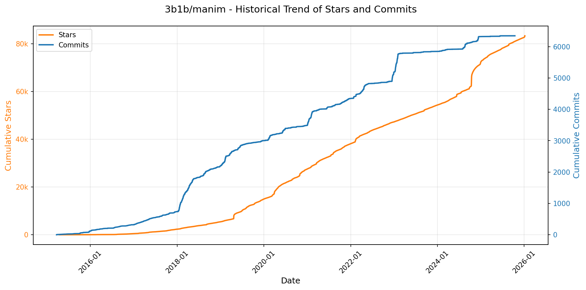
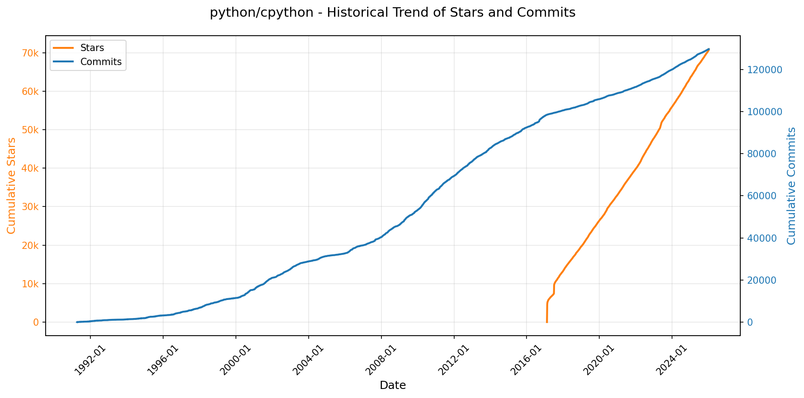
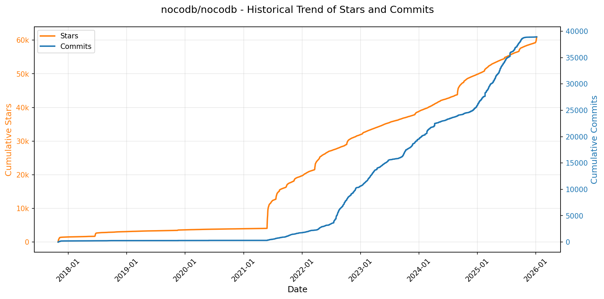
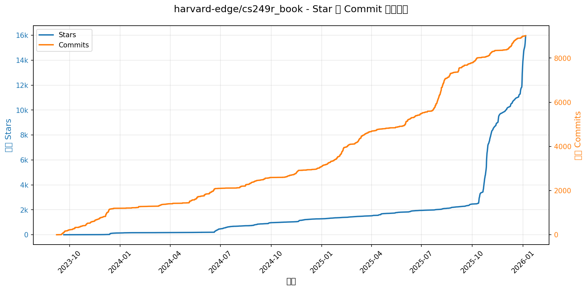
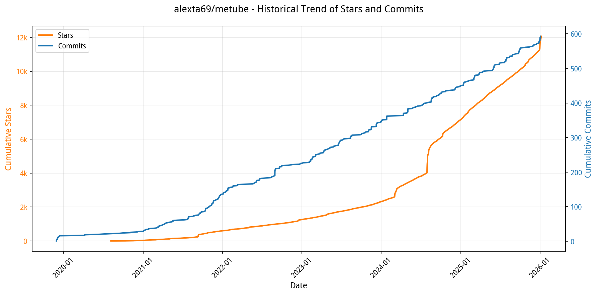
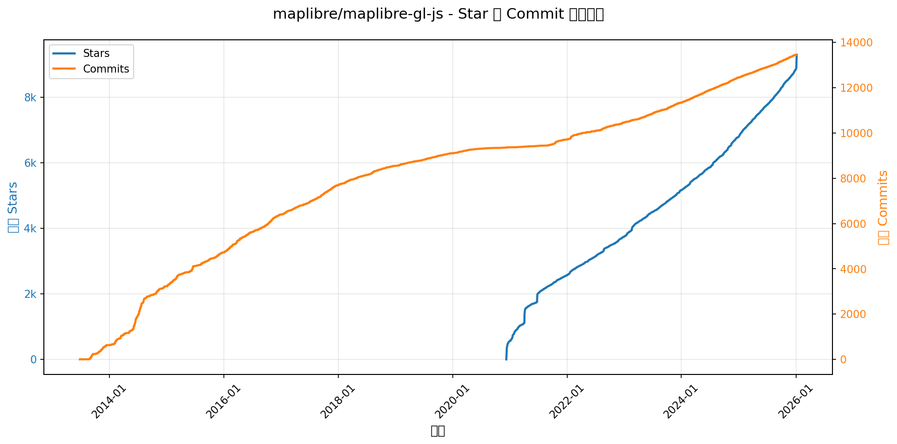

# 🌟 开源项目概览看板

> 数据更新于：2026-01-06。

---

## 🔍 项目详情

### 1. [manim](https://github.com/3b1b/manim)
- 📅 **创建日期**：2015-03-22  
- 🔄 **最近更新**：2026-01-06  
- ⭐ **Stars**：83,229（日 +242｜周 +582｜月 +1068）  
- 📝 **描述**：Animation engine for explanatory math videos  

<b>📈 Star 与 Commit 历史趋势</b>

> *蓝色：累计 Stars｜橙色：累计 Commits（次 Y 轴）*

<b>📄 README 摘要</b>

以下是针对该 GitHub README 内容（3b1b 官方版 **ManimGL** 项目）的全面中文摘要，按您要求的三个维度组织：

---

### 1. 项目功能（What does this project do?）  
**ManimGL（即 `manimgl`）是由 3Blue1Brown（Grant Sanderson）原创开发的、面向数学可视化教育的**程序化动画引擎**。其核心目标是为制作高精度、强解释性的数学科普视频（如 3Blue1Brown 系列视频）提供底层支持。它通过 Python 代码**声明式地定义几何对象、变换与动画逻辑**，实时渲染（基于 OpenGL）并可导出高质量视频（借助 FFmpeg），特别强调数学表达的严谨性、视觉节奏的精确控制以及帧级动画的可编程性。需注意：本仓库是**原始作者维护的 ManimGL 版本**（非社区版 ManimCommunity/manim），专为视频创作深度优化，代码风格与 API 更贴近 3b1b 实际生产流程。

---

### 2. 关键特性（Key features）  
- ✅ **OpenGL 实时渲染**：使用 `manimgl` 命令可直接弹出交互式窗口播放动画，支持即时预览、暂停、全屏（`-f`）、跳转至指定动画帧（`-n`）等调试功能；  
- ✅ **数学表达原生支持**：深度集成 LaTeX（用于公式渲染）和 Pango（Linux 文本排版），确保数学符号、字体、布局专业准确；  
- ✅ **精细动画控制**：支持逐帧动画、时间轴偏移、多对象同步/异步变换、摄像机运动、自定义缓动函数等，满足复杂数学演示需求；  
- ✅ **灵活输出选项**：支持多种 CLI 参数——`-w`（写入视频）、`-o`（写入并自动打开）、`-s` / `-so`（仅显示/保存最终帧）、`-f`（全屏播放）；  
- ✅ **高度可配置**：通过 `custom_config.yml` 文件统一管理输出路径、资源目录（图片/音频）、画布尺寸、渲染质量、默认字体等全局参数；  
- ✅ **教学友好生态**：提供丰富示例场景（`example_scenes.py`）、完整中文文档（由 manim-kindergarten 维护）、活跃社区支持（Reddit、Discord）及 3b1b 视频源码参考（[3b1b/videos](https://github.com/3b1b/videos)）；  
- ⚠️ **版本明确区分**：明确区分并警示用户 **ManimGL（本项目，包名 `manimgl`）** 与 **Manim Community Edition（包名 `manim`）** 的差异，避免安装/使用混淆。

---

### 3. 技术栈（Tech stack）  
- **核心语言**：Python 3.7+（所有动画逻辑均用 Python 编写）；  
- **图形渲染**：OpenGL（底层实时渲染引擎，故命名为 *ManimGL*）；  
- **多媒体处理**：FFmpeg（视频编码/导出必备）；  
- **数学排版**：LaTeX（可选但推荐，用于高质量公式渲染）；  
- **文本与字体**：Pango（Linux 必需，处理复杂文本布局与字体渲染）；  
- **跨平台依赖**：  
  - Windows：需手动安装 FFmpeg + MiKTeX（LaTeX）；  
  - macOS：推荐用 Homebrew 安装 `ffmpeg`、`mactex`，ARM 芯片需额外安装 `cairo`；  
  - Linux：需系统级 Pango 及其开发头文件（`libpango1.0-dev` 等）；  
- **开发与部署**：支持 `pip install -e .`（可编辑安装）、Anaconda 环境隔离；  
- **许可证**：MIT 开源协议。

--- 

✅ 总结：**ManimGL 是一个为数学视频创作者量身打造的专业级动画框架**，以精准性、可编程性与教育实用性为核心，技术选型兼顾性能（OpenGL）、表达力（LaTeX/Pango）与工程可控性（Python 生态），是理解现代数理可视化工作流的重要开源实践。

---

### 2. [cpython](https://github.com/python/cpython)
- 📅 **创建日期**：2017-02-10  
- 🔄 **最近更新**：2026-01-06  
- ⭐ **Stars**：70,887（日 +176｜周 +387｜月 +837）  
- 📝 **描述**：The Python programming language  

<b>📈 Star 与 Commit 历史趋势</b>

> *蓝色：累计 Stars｜橙色：累计 Commits（次 Y 轴）*

<b>📄 README 摘要</b>

以下是该 GitHub 项目（疑似新闻聚合阅读应用）的**中文综合摘要**，围绕您指定的三个核心方面进行结构化梳理：

---

### 1. 项目功能（What does this project do?）  
这是一个**面向中文用户的实时热点新闻聚合与优雅阅读平台**。项目以“简洁、实时、可扩展”为设计目标，通过自动化网络爬虫持续抓取主流新闻源的热门内容，并提供现代化 Web 界面供用户浏览。当前为**演示版本（Demo）**，仅支持中文界面与内容；官方明确说明后续将推出完整版，增强定制能力并支持英文等多语言。

核心价值在于：  
✅ 将分散的实时新闻流整合为统一、无干扰的阅读体验；  
✅ 利用智能爬取策略（如自适应间隔、防封控机制）保障数据新鲜度与服务稳定性；  
✅ 支持用户身份认证（GitHub OAuth）与个性化数据同步（如阅读状态、偏好缓存）；  
✅ 提供标准化 MCP（Model Context Protocol）服务接口，便于与 AI 工具链（如 Agent 框架）集成。

---

### 2. 关键特性（Key features）  
- **极致阅读体验**：极简、优雅的 UI 设计，专注内容呈现，无广告/干扰元素；  
- **实时热点追踪**：动态获取全网最新热搜新闻，支持手动强制刷新（登录用户专享）；  
- **智能缓存与爬取优化**：  
  - 默认 30 分钟客户端缓存（可绕过）；  
  - 后端爬取间隔自动调节（最低 2 分钟），依据信源更新频率动态适配，兼顾时效性与反爬合规性；  
- **GitHub 账号登录与数据同步**：基于 OAuth 2.0 实现免密登录，支持跨设备阅读状态同步；  
- **MCP 服务支持**：内置 `newsnow-mcp-server`，可通过配置 `BASE_URL` 部署为标准 MCP 服务端，赋能 AI 新闻理解/摘要等场景；  
- **多部署方案支持**：原生适配 Cloudflare Pages（静态托管）、Cloudflare Workers + D1（Serverless 数据库）、Docker 容器化及 Vercel 等主流平台；  
- **模块化数据源架构**：清晰分离 `shared/sources`（类型定义）与 `server/sources`（爬虫逻辑），便于社区快速接入新信源。

---

### 3. 技术栈（Tech stack）  
虽未显式罗列全部技术，但根据配置、命令与文档可明确推断如下核心栈：  

| 类别         | 技术/工具                                                                 |
|--------------|--------------------------------------------------------------------------|
| **前端框架** | 基于 [Nuxt](https://nuxt.com/)（推测：`pnpm dev` / `pnpm build` 及 `dist/output/public` 输出路径为典型 Nuxt 3 构建特征） |
| **包管理**   | `pnpm`（明确要求 `corepack enable` 并使用 `pnpm i/dev/build`）              |
| **后端运行时** | Node.js ≥ 20（开发环境强依赖）                                             |
| **认证与安全** | GitHub OAuth 2.0、JWT（`JWT_SECRET` 环境变量）                              |
| **数据库**   | 支持 [Drizzle ORM](https://drizzle.dev/) 生态（通过 `db0.unjs.io/connectors` 引用，推荐 **Cloudflare D1** —— SQLite 兼容的 Serverless 数据库） |
| **部署平台** | Cloudflare Pages / Workers + D1、Vercel、Docker Compose                    |
| **API 协议** | MCP（Model Context Protocol）—— 通过 `newsnow-mcp-server` npm 包实现标准接口 |
| **其他工具** | `wrangler`（Cloudflare CLI，用于 D1 配置）、`npx`（动态执行 MCP 服务）       |

> 💡 注：项目采用现代化全栈 JavaScript/TypeScript 技术栈，强调轻量、云原生（Cloudflare 优先）与可扩展性，对 AI 集成（MCP）有原生设计考量。

--- 

如需进一步分析某一方面（如 MCP 集成细节、D1 数据库迁移步骤或新增信源开发流程），可随时提出。

---

### 3. [nocodb](https://github.com/nocodb/nocodb)
- 📅 **创建日期**：2017-10-29  
- 🔄 **最近更新**：2026-01-06  
- ⭐ **Stars**：60,935（日 +301｜周 +1579｜月 +2027）  
- 📝 **描述**：🔥 🔥 🔥 Open Source Airtable Alternative  

<b>📈 Star 与 Commit 历史趋势</b>

> *蓝色：累计 Stars｜橙色：累计 Commits（次 Y 轴）*

<b>📄 README 摘要</b>

以下是针对所提供 GitHub README 内容的**中文（简体）综合摘要**，严格围绕您要求的三个核心方面展开：

---

### 1. 项目功能（What does this project do?）  
NocoDB 是一个**开源的、类 Airtable 的低代码/无代码数据库平台**，旨在将传统关系型数据库的强大能力与电子表格的易用性、协作性和直观性相结合。它能将任意 SQL 数据库（如 PostgreSQL、MySQL、SQLite、SQL Server 等）即时转化为可视化、可协作的“智能电子表格”，使非技术人员也能轻松创建、管理、查询和共享结构化数据应用。用户无需编写 SQL 或后端代码，即可快速搭建内部工具、CRM、项目看板、内容管理系统等业务应用。

---

### 2. 核心功能（Key features）  
- **富交互式电子表格界面**：支持完整的 CRUD 操作；列排序、筛选、分组、显隐控制；提供 Grid（网格）、Gallery（画廊）、Form（表单）、Kanban（看板）、Calendar（日历）五种视图；支持视图级权限（协作视图 / 锁定视图）及密码保护的公/私分享。  
- **多样化字段类型**：内置 ID、文本、数字、货币、日期、附件、用户、链接、查找（Lookup）、汇总（Rollup）、公式（Formula）等高级字段，满足复杂业务建模需求。  
- **精细化访问控制（RBAC）**：支持多层级（数据库 → 表 → 视图 → 行/列）的细粒度角色权限管理，保障企业级数据安全。  
- **工作流自动化应用商店（App Store）**：原生集成 Slack、Discord、Mattermost（聊天）；AWS SES、SMTP、MailerSend（邮件）；AWS S3、Google Cloud Storage、MinIO（文件存储）等第三方服务，实现事件驱动的自动化。  
- **程序化接入能力**：提供标准化 RESTful API 和官方 SDK（Node.js、Python 等），支持 JWT 或社交登录鉴权，便于与外部系统集成或构建自定义前端。  

---

### 3. 技术栈（Tech stack）  
README 中虽未直接罗列完整技术栈，但通过安装方式、架构描述及社区公开信息可明确推断：  
- **后端**：基于 Node.js（TypeScript）开发，使用 Express 或类似框架；  
- **数据库支持**：兼容多种关系型数据库，包括 **PostgreSQL、MySQL、SQLite、SQL Server、MariaDB**（Docker 配置示例中明确提及 `pg://` 连接字符串）；  
- **基础设施依赖**：生产环境推荐组合使用 **Docker + Docker Compose**，并集成 **PostgreSQL（主数据库）、Redis（缓存/队列）、MinIO（对象存储）、Traefik（反向代理/SSL 网关）**；  
- **前端**：基于现代 Web 技术构建（从 UI 组件和多语言支持可推断使用 React/Vue 等框架，具体需查源码，但 README 未明示）；  
- **部署与运维**：提供一键式自动部署脚本（`noco.sh`），自动配置容器化生态及 Let’s Encrypt SSL 证书；支持 macOS/Linux/Windows 多平台二进制包。  

--- 

✅ 总结：NocoDB 是一款以**开源、易用、可扩展、企业就绪**为设计目标的数据库无代码化平台，填补了传统数据库与 SaaS 表格工具之间的关键空白。

---

### 4. [OpenBB](https://github.com/OpenBB-finance/OpenBB)
- 📅 **创建日期**：2020-12-20  
- 🔄 **最近更新**：2026-01-06  
- ⭐ **Stars**：57,199（日 +385｜周 +1322｜月 +2095）  
- 📝 **描述**：Financial data platform for analysts, quants and AI agents.  

<b>📈 Star 与 Commit 历史趋势</b>

> *蓝色：累计 Stars｜橙色：累计 Commits（次 Y 轴）*

<b>📄 README 摘要</b>

以下是针对所提供 GitHub README 内容的**全面中文（简体）摘要**，严格围绕您要求的三个核心方面展开：

---

### 1. 项目功能（What does this project do?）  
**Open Data Platform（ODP）** 是由 OpenBB 开发的**开源数据集成工具集**，核心定位是作为金融与替代数据领域的“**连接一次，处处调用**”（connect once, consume everywhere）基础设施层。  
它旨在帮助**数据工程师**统一接入、标准化和分发多种类型的数据源——包括**专有数据（proprietary）、授权商业数据（licensed）及公开免费数据（public）**，并将其无缝供给下游各类应用场景，例如：  
- Python 环境（面向量化研究员与开发者）  
- OpenBB Workspace（面向金融分析师的可视化分析平台）  
- Excel 插件（提升桌面办公效率）  
- MCP（Model Context Protocol）服务器（支持 AI 智能体/Agent 接入）  
- RESTful API（供第三方系统或自建应用集成）  

简言之，ODP 是一个**面向金融数据生态的开源中间件平台**，解决多源异构数据“接入难、管理散、复用差”的痛点，为 AI 驱动的研究、投研分析与自动化决策提供可靠、可扩展的数据底座。

---

### 2. 关键特性（Key features）  
- ✅ **统一数据接入抽象层**：通过标准化接口（如 `obb.equity.price.historical("AAPL")`）屏蔽底层数据源差异，支持数百种金融与另类数据源（详见官方文档）。  
- ✅ **多终端/多范式消费支持**：同一套数据服务可同时服务于 Python SDK、Web UI（OpenBB Workspace）、Excel、AI Agent（MCP）、REST API 等不同前端，真正实现“一次接入、多端共享”。  
- ✅ **轻量级本地化部署能力**：内置基于 **FastAPI + Uvicorn** 的 REST API 服务（默认端口 `6900`），开箱即用，支持快速本地启动与调试。  
- ✅ **企业级扩展架构**：与商业产品 **OpenBB Workspace** 深度协同——ODP 提供数据引擎，Workspace 提供交互界面与 AI 分析能力；二者通过后端连接机制（Backend Connection）实现松耦合集成。  
- ✅ **全栈可扩展生态**：  
  - 支持自定义数据后端（[backends-for-openbb](https://github.com/OpenBB-finance/backends-for-openbb)）  
  - 支持 AI Agent 扩展（[agents-for-openbb](https://github.com/OpenBB-finance/agents-for-openbb)）  
  - 提供 CLI 工具（`openbb-cli`）与 Jupyter/Colab 兼容性，降低使用门槛。  
- ✅ **开源开放治理**：鼓励社区贡献（代码、文档、Issue 反馈），提供完整开发指南与协作流程。

---

### 3. 技术栈（Tech stack）  
README 中明确提及或可推断的核心技术如下：  
- **后端框架**：  
  - **FastAPI**（构建高性能 REST API）  
  - **Uvicorn**（ASGI 服务器，用于运行 FastAPI 应用）  
- **编程语言**：**Python**（主语言，要求版本 3.9.21–3.12）  
- **客户端/集成层**：  
  - Python SDK（`openbb` 包，含链式调用如 `obb.equity.price.historical(...)`）  
  - 命令行工具（CLI，`openbb-cli`）  
  - REST API（HTTP/JSON 接口）  
  - MCP 协议支持（面向 AI Agent 的上下文协议）  
- **部署与开发支持**：  
  - GitHub Codespaces / Dev Containers（VS Code 远程开发支持）  
  - Google Colab 兼容（提供示例 Notebook）  
- **许可证**：**AGPLv3**（强传染性开源协议，强调衍生作品需开源）

> 注：虽未在 README 中直接列出数据库或缓存技术，但其设计目标为“数据源无关”，实际可对接 PostgreSQL、SQLite、Redis 或直连 API/文件等，具体实现取决于各数据后端插件。

--- 

如需进一步了解数据源列表、API 文档或企业版（OpenBB Workspace）对比细节，可参考其官方文档：<https://docs.openbb.co/>。

---

### 5. [memos](https://github.com/usememos/memos)
- 📅 **创建日期**：2021-12-08  
- 🔄 **最近更新**：2026-01-06  
- ⭐ **Stars**：51,942（日 +660｜周 +4416｜月 +5161）  
- 📝 **描述**：An open-source, self-hosted note-taking service. Your thoughts, your data, your control — no tracking, no ads, no subscription fees.  

<b>📈 Star 与 Commit 历史趋势</b>

> *蓝色：累计 Stars｜橙色：累计 Commits（次 Y 轴）*

<b>📄 README 摘要</b>

以下是针对 GitHub 项目 **Memos**（README 内容）的全面中文（简体）总结，严格围绕您要求的 **三个方面** 展开：

---

### 1. 项目功能（What does this project do?）  
Memos 是一个**开源、可自托管的隐私优先型笔记与知识管理服务**。它旨在为个人用户和团队提供轻量、安全、可控的本地化知识库解决方案，替代依赖第三方云服务的传统笔记工具（如 Notion、Evernote 等）。核心定位是：**你的想法，你的数据，你的控制权**——不追踪、无广告、零订阅费用。用户可将其部署在自有服务器或本地环境，完全掌控数据存储、访问权限与生命周期，适用于个人日记、团队 Wiki、技术文档沉淀、学习笔记等多种场景。

---

### 2. 关键特性（Key features）  
- ✅ **隐私至上架构**：零遥测（no telemetry）、无数据外传；支持完整数据导出；杜绝厂商锁定（vendor lock-in）。  
- ✅ **原生 Markdown 支持**：全文本、纯 Markdown 编辑与渲染；笔记以明文 `.md` 形式存储，便于迁移与版本管理。  
- ✅ **极致性能体验**：前端基于 React，后端采用 Go 编写，启动快、响应迅捷，离线/局域网环境下亦流畅可用。  
- ✅ **极简部署方式**：支持一键 Docker 运行（推荐）、Docker Compose（生产级）、Kubernetes（Helm 图表）、预编译二进制包（跨平台：Linux/macOS/Windows），以及源码构建。  
- ✅ **全栈开发者友好**：提供完备的 **REST API 与 gRPC API**，支持深度集成至 CI/CD、自动化工作流或第三方应用。  
- ✅ **优雅用户体验**：现代简洁 UI，内置深色模式，响应式设计适配桌面与移动端，注重可读性与专注力。  
- ✅ **多数据库支持**：兼容 SQLite（默认轻量）、MySQL 和 PostgreSQL，满足不同规模与可靠性需求。  

---

### 3. 技术栈（Tech stack）  
根据 README 明确声明：  
- **后端（Backend）**：使用 **Go（Golang）** 开发，强调高性能与高并发能力；  
- **前端（Frontend）**：基于 **React** 构建，配合现代化前端生态（如 i18n 多语言支持、响应式布局等）；  
- **数据库（Database）**：原生支持 **SQLite（默认）、MySQL、PostgreSQL**；  
- **部署与运维**：深度集成 **Docker** 及 **Docker Compose**，提供官方镜像（`neosmemo/memos`）；支持 **Kubernetes（含 Helm Chart）**；前端静态资源可托管于 Vercel（项目获 Vercel OSS 计划支持）。

--- 

✅ 补充说明：项目采用 **MIT 开源许可证**，代码完全开放，鼓励社区贡献（Bug 报告、功能提案、PR、文档优化、多语言翻译等），并已建立活跃的 Discord 社区与完善文档站点（usememos.com/docs）。

---

### 6. [claude-code](https://github.com/anthropics/claude-code)
- 📅 **创建日期**：2025-02-22  
- 🔄 **最近更新**：2026-01-06  
- ⭐ **Stars**：51,704（日 +542｜周 +2110｜月 +7021）  
- 📝 **描述**：Claude Code is an agentic coding tool that lives in your terminal, understands your codebase, and helps you code faster by executing routine tasks, explaining complex code, and handling git workflows - all through natural language commands.  

<b>📈 Star 与 Commit 历史趋势</b>

> *蓝色：累计 Stars｜橙色：累计 Commits（次 Y 轴）*

<b>📄 README 摘要</b>

1. **项目功能**  
Claude Code 是一个基于终端的智能编程助手（agentic coding tool），旨在提升开发者编码效率。它能深度理解用户的本地代码库，支持通过自然语言指令完成多种开发任务，包括：自动化执行重复性编码操作（如生成代码、重构、补全）、解释复杂代码逻辑、管理 Git 工作流（如提交、分支操作、冲突分析），并可集成于终端、IDE 或 GitHub（通过 `@claude` 提及调用）。

2. **核心特性**  
- ✅ **自然语言交互**：全程使用中文/英文等自然语言指令驱动，无需编写脚本；  
- ✅ **代码上下文感知**：自动分析当前项目结构与代码语义，提供精准、上下文相关的响应；  
- ✅ **多环境支持**：原生支持终端（CLI）、主流 IDE（如 VS Code）、以及 GitHub 评论区协同；  
- ✅ **Git 智能辅助**：理解 Git 状态，可解释变更、生成提交信息、建议分支策略、辅助解决合并冲突；  
- ✅ **插件扩展生态**：内置插件系统，支持通过 `plugins/` 目录添加自定义命令与智能代理（agents），增强功能边界；  
- ✅ **一键反馈与问题上报**：内置 `/bug` 命令，可直接在工具内提交错误报告与会话数据；  
- ✅ **隐私优先设计**：明确承诺不将用户代码或对话用于模型训练，并实施数据最小化收集、访问控制与短期保留策略。

3. **技术栈**  
- **运行时环境**：明确要求 **Node.js 18+**（NPM 安装方式依赖此版本）；  
- **分发方式**：支持多平台安装——  
  - macOS/Linux：Shell 脚本（`curl | bash`）或 Homebrew；  
  - Windows：PowerShell 脚本（`irm | iex`）；  
  - 全平台：npm 全局包（`@anthropic-ai/claude-code`）；  
- **底层架构**：虽未详述内部实现，但作为 Anthropic 官方工具，其核心能力基于 Claude 大模型（特别是针对代码优化的版本），并结合本地代码分析、CLI 工程化封装与插件化扩展机制。

---

### 7. [opencode](https://github.com/anomalyco/opencode)
- 📅 **创建日期**：2025-04-30  
- 🔄 **最近更新**：2026-01-06  
- ⭐ **Stars**：49,935（日 +2067｜周 +6167｜月 +13884）  
- 📝 **描述**：The open source coding agent.  

<b>📈 Star 与 Commit 历史趋势</b>

> *蓝色：累计 Stars｜橙色：累计 Commits（次 Y 轴）*

<b>📄 README 摘要</b>

1. **项目功能**  
OpenCode 是一个开源的 AI 编程智能体（AI coding agent），旨在为开发者提供终端优先（TUI-first）、高度可扩展且与模型无关的编程协作体验。它并非仅是一个代码补全工具，而是一个具备完整开发工作流能力的智能代理系统：能理解项目上下文、分析代码库、规划变更、执行编辑与命令，并支持远程驱动和多前端接入（如终端、桌面应用等）。其核心目标是打造一个完全开源、去厂商锁定（provider-agnostic）、深度集成开发环境（如原生 LSP 支持）的下一代 AI 编程助手。

2. **关键特性**  
- **双模式智能体架构**：内置 `build`（默认，全权限开发代理）和 `plan`（只读分析代理，需显式授权才可编辑文件或执行命令），支持按需切换（Tab 键）；另含 `@general` 子代理，专用于复杂搜索与多步骤推理任务。  
- **全平台终端优先体验**：原生优化 TUI（文本用户界面），由 Neovim 用户主导开发，强调在终端中实现强大交互能力；同时提供跨平台桌面应用（macOS/Windows/Linux，BETA 版）。  
- **极致安装灵活性**：支持一键脚本安装（curl + bash）、主流包管理器（npm/bun/pnpm/yarn、Homebrew、Scoop、Chocolatey、Paru、Mise、Nix 等），并尊重 XDG 规范与自定义安装路径（通过 `OPENCODE_INSTALL_DIR` 或 `XDG_BIN_DIR` 环境变量）。  
- **完全开源 & 模型无关**：100% 开源（MIT 许可？文档未明示但强调“100% open source”），不绑定任何特定大模型供应商；兼容 Claude、OpenAI、Google Gemini 及本地运行的开源模型（如 Ollama、LM Studio），推荐搭配其自有模型服务 OpenCode Zen。  
- **客户端-服务器架构**：支持解耦部署——计算密集型逻辑可在本地或远程服务器运行，而终端、桌面或未来移动 App 仅作为轻量客户端连接，为远程开发、云 IDE 集成等场景预留扩展性。  
- **开箱即用的 LSP 支持**：深度集成语言服务器协议，无需额外配置即可获得语义感知的代码导航、诊断与重构能力。

3. **技术栈（根据文档线索推断）**  
- **前端/客户端**：  
  - 终端界面（TUI）：基于 Rust（高概率，因强调性能与终端控制）或 Go（常见 CLI 工具选择）构建；文档提及“由 terminal.shop 团队创建”，而 terminal.shop 是 Rust 生态知名终端工具集，佐证 Rust 技术栈；  
  - 桌面应用：Electron 或 Tauri（可能性较高）；但更可能采用 Rust + WebView（如 egui/tokio + webview）以保持与 CLI 一致的技术栈；  
  - Web 控制台（`packages/console/app/` 路径）：React/Vite（`src/asset/` 结构、SVG logo 引用方式符合现代 JS 前端工程惯例）。  
- **核心引擎**：Rust（强推断依据：高性能 CLI、终端控制需求、与 terminal.shop 关联、多平台二进制分发（`.dmg`/`.exe`/`.deb`）及 Nix/Mise 集成均指向 Rust 的典型发布模式）。  
- **构建与分发**：GitHub Actions（CI/CD）、Nix（声明式包管理）、Mise（多运行时版本管理）、跨平台打包工具（如 tauri-build 或 cargo-bundle）。  
- **基础设施**：LSP（Language Server Protocol）客户端集成；支持多种 LLM API（OpenAI 兼容接口、Anthropic、Google Vertex、本地 Ollama 等）。  

> 注：虽 README 未明确列出“Rust”或“React”，但结合项目结构（`packages/` 单体仓库）、安装方式（预编译二进制 + npm 包封装 CLI）、技术背景（terminal.shop）、以及对性能/终端控制的极致强调，Rust 作为核心语言是高度可信的结论；Web 控制台部分则明显采用现代 TypeScript/React 技术栈。

---

### 8. [ai-hedge-fund](https://github.com/virattt/ai-hedge-fund)
- 📅 **创建日期**：2024-11-29  
- 🔄 **最近更新**：2026-01-06  
- ⭐ **Stars**：44,774（日 +253｜周 +537｜月 +2307）  
- 📝 **描述**：An AI Hedge Fund Team  

<b>📈 Star 与 Commit 历史趋势</b>

> *蓝色：累计 Stars｜橙色：累计 Commits（次 Y 轴）*

<b>📄 README 摘要</b>

以下是针对该 GitHub 项目（`AI Hedge Fund`）README 内容的**中文（简体）综合摘要**，严格围绕您要求的**三个方面**进行梳理：

---

### 1. 项目功能（What does this project do?）  
这是一个**纯教育性、概念验证型（Proof of Concept）的AI驱动对冲基金模拟系统**。它不执行真实交易，也不连接任何券商或交易所，**完全离线运行**，旨在通过多智能体协作框架，探索人工智能在股票投资决策中的应用潜力。  
系统以“思想实验”方式，将13位全球顶级投资大师（如巴菲特、芒格、达摩达兰、木头姐等）的投资哲学具象化为独立AI代理（Agent），并辅以4个专业分析代理（估值、情绪、基本面、技术面）和2个风控代理（风险经理、组合经理），共同完成对股票的多维度分析与模拟交易建议生成。最终输出为**研究性信号与回测结果**，供学习、教学和算法研究使用。

---

### 2. 核心功能（Key features）  
- ✅ **18个专业化AI投资代理协同工作**：覆盖价值投资（格雷厄姆、巴菲特）、成长投资（伍德、费雪）、逆向投资（伯里、德拉肯米勒）、 activist 投资（阿克曼）、Dhandho策略（帕布拉伊）等多种流派，实现“投资思想的AI化分身”。  
- ✅ **多维度分析引擎**：  
  - *估值代理*：计算内在价值并生成买卖信号；  
  - *情绪代理*：分析市场舆情（如新闻、社交媒体）；  
  - *基本面代理*：处理财务报表、盈利预测等结构化数据；  
  - *技术面代理*：识别K线形态、指标（RSI、MACD等）信号。  
- ✅ **双模交互方式**：  
  - **命令行接口（CLI）**：支持灵活参数配置（指定股票、日期范围、本地/云端LLM）、自动化脚本集成及回测（`backtester.py`）；  
  - **Web应用界面**：提供可视化仪表盘，降低使用门槛。  
- ✅ **多LLM后端支持**：兼容 OpenAI（GPT-4o）、Anthropic、Groq、DeepSeek 及本地 Ollama 模型，保障推理灵活性与隐私可控性。  
- ✅ **免密数据试用**：对 AAPL、GOOGL、MSFT、NVDA、TSLA 五只美股提供免费金融数据，其余标的需接入 `Financial Datasets API`。  
- ✅ **完整风控闭环**：含风险度量（波动率、VaR等）、仓位限制与最终决策整合，体现专业基金运作逻辑。  
- ⚠️ **明确非实盘定位**：所有输出仅为模拟信号，项目反复强调**不可用于真实投资**，属纯粹学术/教育工具。

---

### 3. 技术栈（Tech stack）  
虽然 README 未显式列出“Tech Stack”章节，但根据安装、运行及架构描述可明确推断出以下核心技术组成：  
- **编程语言**：Python（主语言，依赖 Poetry 管理包）；  
- **AI/LLM 框架**：  
  - 支持多种大模型 API（OpenAI、Anthropic、Groq、DeepSeek）；  
  - 原生集成 **Ollama**，支持本地运行 Llama、Phi 等开源模型；  
- **数据层**：  
  - 第三方金融数据服务：`Financial Datasets API`（作为可选数据源）；  
  - 内置免费美股基础数据（AAPL/MSFT/NVDA等）；  
- **开发与部署工具**：  
  - 依赖管理：`Poetry`；  
  - 环境配置：`.env` 文件管理 API 密钥；  
  - Web 前端（独立子目录 `/app`）：虽未说明具体框架，但结合现代 Python 全栈实践，极可能采用 `Streamlit`、`Gradio` 或 `FastAPI + React/Vue` 组合（需查 `app/` 目录确认）；  
- **其他关键组件**：  
  - 回测引擎（自研 `backtester.py`）；  
  - CLI 工具（`src/main.py`）；  
  - 多代理协调架构（基于提示工程与LLM调用链设计，非专用MAS框架如LangGraph，但体现代理范式）。

--- 

✅ 总结：该项目是一个**以投资哲学为内核、以多智能体为外壳、以Python+LLM为引擎的教育型AI投研沙盒**，重在启发思考而非工程生产——是理解AI与金融交叉创新的优质入门范例。

---

### 9. [exo](https://github.com/exo-explore/exo)
- 📅 **创建日期**：2024-06-24  
- 🔄 **最近更新**：2026-01-06  
- ⭐ **Stars**：39,493（日 +84｜周 +617｜月 +6877）  
- 📝 **描述**：Run your own AI cluster at home with everyday devices 📱💻 🖥️⌚  

<b>📈 Star 与 Commit 历史趋势</b>

> *蓝色：累计 Stars｜橙色：累计 Commits（次 Y 轴）*

<b>📄 README 摘要</b>

以下是该 GitHub 项目（**exo**）README 内容的**中文（简体）综合摘要**，严格围绕您要求的三个核心方面进行梳理：

---

### 1. 项目功能（What does this project do?）  
**exo 是一个面向个人用户的开源 AI 分布式推理框架，旨在让用户利用家中已有的日常设备（如多台 Mac Studio、MacBook 等）快速组建本地 AI 计算集群**。它并非传统意义上的“云服务”或“企业级集群”，而是专为**边缘/桌面级 AI 场景**设计：  
- 将多台物理设备（支持 macOS 和 Linux）自动组网，形成统一的、可协同工作的 AI 推理集群；  
- 突破单设备显存/内存限制，支持加载并运行远超单机容量的大语言模型（如 Qwen3-235B、DeepSeek-V3.1-671B 等百亿至千亿参数模型）；  
- 提供开箱即用的 Web 仪表盘（`http://localhost:52415`）和兼容 OpenAI 格式的 RESTful API，便于本地开发、调试与集成。

> ✅ 本质定位：**个人 AI 基础设施（Personal AI Infrastructure）**——让普通用户无需专业运维知识，即可拥有类似“家庭版 AI 超算”的能力。

---

### 2. 关键特性（Key features）  
- **零配置自动组网**：设备启动 exo 后自动发现彼此，无需手动设置 IP、端口或集群配置，真正“即插即用”。  
- **业界领先的低延迟通信**：原生支持 **RDMA over Thunderbolt 5**（macOS 26.2+），实测设备间通信延迟降低 **99%**，大幅提升分布式推理效率。  
- **智能拓扑感知自动并行**：实时感知设备硬件资源（CPU/GPU/内存）、网络拓扑（Thunderbolt 链路带宽/延迟），动态选择最优模型切分策略（Pipeline/Tensor Parallel）。  
- **高性能张量并行（Tensor Parallelism）**：实测在 2 台设备上提速 **1.8×**，4 台设备上提速 **3.2×**，显著提升大模型吞吐。  
- **深度集成 MLX 生态**：以 Apple 官方优化的 [MLX](https://github.com/ml-explore/mlx) 为默认推理后端，利用其对 Apple Silicon 的极致优化；并基于 [MLX Distributed](https://ml-explore.github.io/mlx/build/html/usage/distributed.html) 实现高效跨设备通信。  
- **全栈可控与开放接口**：提供完整 REST API（含模型预览、实例管理、流式 chat completions），完全兼容 OpenAI API 协议，便于无缝迁移现有应用。

---

### 3. 技术栈（Tech stack）  
项目明确提及并依赖以下核心技术与工具链：  
- **核心推理引擎**：[MLX](https://github.com/ml-explore/mlx)（Apple Silicon 专用高性能机器学习框架）及其分布式扩展 [MLX Distributed](https://ml-explore.github.io/mlx/build/html/usage/distributed.html)；  
- **编程语言**：  
  - 主逻辑与系统层：**Rust**（需 nightly 工具链，用于构建高性能绑定与底层控制）；  
  - 服务与 API 层：**Python**（使用 `uv` 作为现代 Python 包/环境管理器）；  
  - 前端仪表盘：**TypeScript + Node.js**（基于 npm 构建，使用 React/Vite 等现代前端技术栈，文档中虽未明说但由 `npm run build` 可推断）；  
- **系统依赖（macOS）**：  
  - `macmon`（Apple Silicon 硬件监控）；  
  - macOS 26.2+（必需，因 RDMA 支持依赖此版本新增的内核能力）；  
  - Thunderbolt 5 硬件（M3 Ultra / M4 Max 系列 Mac，且需按文档启用 `rdma_ctl`）；  
- **系统依赖（Linux）**：当前仅支持 **CPU 推理**（GPU 支持正在开发中），依赖 `uv` + `Node.js` + `Rust`（同 macOS），无需 `macmon`；  
- **构建与包管理**：`brew`（macOS/Linux）、`uv`（替代 pip/poetry 的极速 Python 工具）、`rustup`（Rust 工具链管理）；  
- **协议与标准**：OpenAI 兼容 API、HTTP/REST、RDMA（Remote Direct Memory Access）over Thunderbolt。

--- 

✅ 总结一句话：**exo 是一个以 MLX 为核心、Rust+Python+TS 混合构建、深度软硬协同（尤其 macOS + Thunderbolt 5 RDMA）的轻量级个人 AI 集群框架，目标是让大模型推理像使用本地 App 一样简单、高效、自主可控。**

---

### 10. [skills](https://github.com/anthropics/skills)
- 📅 **创建日期**：2025-09-22  
- 🔄 **最近更新**：2026-01-06  
- ⭐ **Stars**：33,820（日 +732｜周 +4501｜月 +14294）  
- 📝 **描述**：Public repository for Agent Skills  

<b>📈 Star 与 Commit 历史趋势</b>

> *蓝色：累计 Stars｜橙色：累计 Commits（次 Y 轴）*

<b>📄 README 摘要</b>

1. **项目功能**  
该项目是 Anthropic 官方维护的 **Claude 技能（Skills）开源示例仓库**，旨在展示和推广“Agent Skills”标准（见 [agentskills.io](https://agentskills.io)）。它不提供独立运行的软件，而是为 Claude 大模型提供**可动态加载、模块化、任务专用的指令包**。每个“技能”是一个自包含的文件夹（含 `SKILL.md`），用于指导 Claude 在特定场景下完成标准化操作——例如按企业品牌规范生成文档、按组织流程分析数据、自动化个人事务（如提取 PDF 表单字段），或集成第三方工具（如 Notion）。其核心目标是**扩展 Claude 的专业化能力边界，实现“即插即用”的AI任务增强**。

2. **关键特性**  
- ✅ **模块化与可复用性**：每个技能独立封装（含说明、指令、示例、指南），支持按需启用/禁用；  
- ✅ **多领域覆盖**：涵盖创意设计（艺术/音乐/设计）、技术开发（Web 应用测试、MCP 服务器生成）、企业应用（品牌沟通、文档协同）及文档处理（DOCX/PDF/PPTX/XLSX）四大类；  
- ✅ **生产级参考实现**：`skills/docx` 等子目录公开了驱动 Claude 实际文档能力（如文件创建与编辑）的**源码级技能实现**（source-available，非完全开源），为开发者提供复杂生产技能的设计范式；  
- ✅ **跨平台部署支持**：  
　• **Claude Code**：支持通过插件市场安装（`/plugin marketplace add`）并直接调用（如 “Use the PDF skill to extract…”）；  
　• **Claude.ai**：付费用户开箱即用全部示例技能；  
　• **Claude API**：支持通过 API 创建、上传及管理自定义技能；  
- ✅ **低门槛创作体系**：提供标准化模板（`./template`）和极简格式要求（仅需 `name` 和 `description` YAML 前置元数据 + Markdown 指令），大幅降低技能开发门槛；  
- ⚠️ **明确使用声明**：所有技能标注为**教学与演示用途**，实际行为以 Claude 服务端为准，强调需在自有环境中充分验证后方可用于关键任务。

3. **技术栈**  
文档中未显式列出编程语言或框架，但根据技能结构与部署方式可推断其技术基础：  
- **核心格式**：基于 **Markdown（`.md`）** 的声明式技能描述，含 YAML 前置元数据（`name`, `description`）；  
- **交付形态**：纯文本/配置文件结构（无编译依赖），依赖 Anthropic 运行时解析执行；  
- **集成协议**：遵循开放的 **[Agent Skills 规范](./spec)**（位于 `./spec` 目录），定义技能接口与交互标准；  
- **运行环境**：深度绑定 **Anthropic 的 Claude 模型服务生态**（Claude Code / Claude.ai / Claude API），技能逻辑由模型自身解释执行，**不依赖外部服务端代码或特定运行时（如 Python/Node.js）**；  
- **许可协议**：多数示例技能采用 **Apache 2.0 开源许可证**；文档处理类技能为 **source-available（源码可见但限制商用）**。

---

### 11. [sim](https://github.com/simstudioai/sim)
- 📅 **创建日期**：2025-01-05  
- 🔄 **最近更新**：2026-01-06  
- ⭐ **Stars**：25,021（日 +73｜周 +380｜月 +6419）  
- 📝 **描述**：Open-source platform to build and deploy AI agent workflows.  

<b>📈 Star 与 Commit 历史趋势</b>

> *蓝色：累计 Stars｜橙色：累计 Commits（次 Y 轴）*

<b>📄 README 摘要</b>

以下是该 GitHub 项目（Sim AI）README 内容的**中文（简体）综合摘要**，严格围绕您要求的**三个方面**进行结构化总结：

---

### 1. 项目功能（What does this project do?）  
Sim 是一个**面向开发者的低代码 AI 代理（Agent）工作流平台**，旨在帮助用户**快速构建、调试与部署可扩展的 AI 应用流程**。它既提供开箱即用的云服务（sim.ai），也支持完全私有化、本地化的自托管部署。核心价值在于：  
- 将复杂的 AI 工作流（如多步推理、工具调用、知识检索、函数执行等）**可视化编排**，无需从零编写胶水代码；  
- 通过内置 Copilot（AI 辅助编程）实现**自然语言驱动的节点生成、错误修复与流程迭代**；  
- 原生集成向量数据库能力，支持用户上传文档并构建**基于私有知识的问答与智能代理**；  
- 支持多种模型后端（Ollama、vLLM、外部 OpenAI 兼容 API），兼顾云端便捷性与本地数据合规性/隐私性。

> ✅ 一句话概括：**Sim 是一个“AI 工作流操作系统”——让开发者像搭积木一样设计智能代理，并一键运行在云或本地。**

---

### 2. 关键特性（Key features）  
- **可视化工作流画布（Workflow Canvas）**  
  基于 ReactFlow 构建，支持拖拽连接 Agent、Tool、Logic Block 等节点，实时预览与调试执行流。  
- **AI 驱动的 Copilot 协同开发**  
  直接用自然语言描述需求（如“添加一个PDF解析工具并连接到RAG检索”），Copilot 自动生成/修正节点与配置。  
- **私有知识库与向量检索一体化**  
  一键上传文档 → 自动分块嵌入 → 存入 PostgreSQL + pgvector 向量库 → 在工作流中调用语义检索节点。  
- **全栈自托管灵活性**  
  提供多种部署方式：  
  - 一行命令启动（`npx simstudio`）；  
  - Docker Compose（含 Ollama/vLLM 专用配置）；  
  - VS Code Dev Container 开发环境；  
  - 手动 Bun + Next.js + PostgreSQL 搭建（含 Drizzle 迁移）。  
- **多模型后端无缝切换**  
  支持本地模型（Ollama）、高性能推理服务（vLLM）、以及任意 OpenAI 兼容 API，通过环境变量统一配置。  
- **生产就绪基础设施**  
  内置认证（Better Auth）、实时通信（Socket.io）、后台任务（Trigger.dev）、沙盒化代码执行（E2B）、加密与审计日志等企业级能力。

---

### 3. 技术栈（Tech stack）  
项目采用现代化、高性能的全栈技术组合，明确列出如下：  
- **前端框架**：Next.js（App Router） + TypeScript  
- **运行时**：Bun（替代 Node.js，提升安装与启动速度）  
- **UI 组件库**：Shadcn UI（基于 Radix UI） + Tailwind CSS（原子化样式）  
- **状态管理**：Zustand（轻量、响应式全局状态）  
- **流程编辑器**：ReactFlow（专业级可交互图编辑器）  
- **后端数据库**：PostgreSQL（必需 pgvector 扩展支持向量存储）  
- **ORM / 迁移工具**：Drizzle ORM（TypeScript 优先、SQL-first）  
- **身份认证**：Better Auth（开源、可自托管的现代化 Auth 解决方案）  
- **实时通信**：Socket.io（支撑 Copilot 协作、执行日志流式推送等）  
- **后台任务调度**：Trigger.dev（处理长时任务、异步工作流触发）  
- **安全沙盒执行**：E2B（在隔离环境中安全运行用户提供的代码）  
- **文档系统**：Fumadocs（基于 Next.js 的现代化文档站点）  
- **工程化**：Turborepo（高性能单体仓库管理）  

> 💡 补充说明：所有自托管方案均默认依赖 Docker；本地开发推荐 Bun + VS Code Dev Container；向量能力强依赖 PostgreSQL + pgvector 扩展。

--- 

如需进一步了解某一方面（如部署细节、Copilot API 集成逻辑或安全模型设计），可随时提出。

---

### 12. [chatterbox](https://github.com/resemble-ai/chatterbox)
- 📅 **创建日期**：2025-04-23  
- 🔄 **最近更新**：2026-01-06  
- ⭐ **Stars**：20,755（日 +154｜周 +1562｜月 +5926）  
- 📝 **描述**：SoTA open-source TTS  

<b>📈 Star 与 Commit 历史趋势</b>

> *蓝色：累计 Stars｜橙色：累计 Commits（次 Y 轴）*

<b>📄 README 摘要</b>

以下是针对所提供 GitHub README 内容的**全面中文（简体）摘要**，严格围绕您要求的**三个方面**进行组织：

---

### 1. 项目功能（What does this project do?）  
**Chatterbox TTS** 是由 Resemble AI 开发并开源的一系列先进文本转语音（TTS）模型家族，旨在为开发者和研究者提供高质量、低延迟、易部署的语音合成能力。其核心目标是赋能**实时语音代理（voice agents）、交互式应用、创意内容生成及多语言本地化场景**。  
- 主力模型 **Chatterbox-Turbo** 聚焦于**极致效率与生产就绪性**：在仅 350M 参数规模下实现高保真语音合成，显著降低 GPU 显存（VRAM）与计算资源需求；  
- 支持**零样本语音克隆（zero-shot voice cloning）**——仅需一段约 10 秒的参考音频即可复刻任意说话人音色；  
- 全系列模型均支持**跨语言合成**（Turbo 限英语；Multilingual 版本支持 23+ 种语言），并内置**负责任 AI 水印（PerTh）**，确保生成语音可溯源、防滥用。

---

### 2. 关键特性（Key features）  
- ✅ **超低延迟 & 高效推理**：Turbo 模型将语音令牌（speech token）到梅尔频谱（mel）的解码步骤从 10 步大幅压缩至 **1 步**，结合轻量架构，实现亚 200ms 端到端延迟（生产级标准）。  
- ✅ **原生支持拟声/副语言标签（Paralinguistic Tags）**：如 `[laugh]`、`[chuckle]`、`[cough]` 等，无需额外微调即可自然融入语流，大幅提升语音表现力与真实感。  
- ✅ **灵活可控的语音表达**：通过 `cfg_weight`（条件引导权重）和 `exaggeration`（夸张度）参数，可精细调节语速、韵律与情感强度，适配叙事、戏剧、客服等多元场景。  
- ✅ **开箱即用的多语言支持**：Chatterbox-Multilingual 模型支持阿拉伯语、中文、西班牙语、日语等 **23 种语言**，采用统一模型架构，切换语言仅需指定 `language_id`。  
- ✅ **内建神经水印（PerTh Watermarking）**：所有生成音频自动嵌入**不可感知、鲁棒性强**（抗 MP3 压缩、剪辑、变速等）的隐式水印，检测准确率近 100%，践行 AI 伦理与内容溯源责任。  
- ✅ **完整开源生态**：提供预训练模型、Hugging Face 在线 Demo、本地 Python SDK（`chatterbox-tts` 包）、详细示例脚本（TTS/VC）及 Discord 社区支持。

---

### 3. 技术栈（Tech stack）  
README 中明确提及或可推断的关键技术组件包括：  
- **深度学习框架**：基于 **PyTorch** 构建（代码中使用 `torch`、`torchaudio`）；  
- **Python 环境**：官方开发与测试环境为 **Python 3.11 + Debian 11**，依赖版本通过 `pyproject.toml` 严格锁定；  
- **核心模型技术**：  
  - 采用 **S3Tokenizer**（用于语音标记化）；  
  - 受 **CosyVoice**（高效 TTS 架构）与 **Real-Time-Voice-Cloning**（实时克隆技术）启发；  
  - 声码器（Vocoder）集成 **HiFT-GAN**（高质量快速波形生成）；  
  - 语言建模借鉴 **Llama 3** 的架构思想（虽未直接使用 Llama，但强调其对长上下文与指令理解的贡献）；  
- **水印技术**：自研 **Perth（Perceptual Threshold）隐式水印系统**（GitHub 仓库独立开源）；  
- **部署与体验层**：  
  - 提供 **Hugging Face Spaces** 在线 Demo；  
  - 官方 **Podonos 平台**（语音质量评估）；  
  - 支持 CUDA 加速（示例代码指定 `device="cuda"`）。

--- 

✅ 总结：Chatterbox TTS 是一个**以效率、表现力与责任感为核心**的现代开源 TTS 解决方案，尤其适合追求低延迟、高可控性与合规性的语音 AI 应用开发。

---

### 13. [VibeVoice](https://github.com/microsoft/VibeVoice)
- 📅 **创建日期**：2025-08-25  
- 🔄 **最近更新**：2026-01-06  
- ⭐ **Stars**：19,793（日 +262｜周 +624｜月 +8767）  
- 📝 **描述**：Open-Source Frontier Voice AI  

<b>📈 Star 与 Commit 历史趋势</b>

> *蓝色：累计 Stars｜橙色：累计 Commits（次 Y 轴）*

<b>📄 README 摘要</b>

以下是针对 GitHub README 内容的**全面中文（简体）摘要**，严格围绕您要求的**三个方面**进行梳理：

---

### 1. 项目功能（What does this project do?）  
**VibeVoice 是微软开源的一个前沿语音人工智能研究框架**，核心目标是推动高质量、高表现力、长时长、多说话人对话式语音合成（TTS）技术的发展。它专为生成**类播客级的自然 conversational audio（对话音频）** 而设计，可将纯文本自动转化为具有丰富情感表达、角色区分和流畅转场的多人对话语音。  
- 支持**单次生成最长90分钟**的连贯语音（远超传统TTS的数秒至数分钟限制）；  
- 支持**最多4个不同说话人**在同一次生成中自然轮换发言（解决传统TTS“单角色+无对话结构”的根本局限）；  
- 提供**实时流式TTS能力**：首语音块延迟仅约300ms，支持边输入文本边生成语音（适用于实时交互场景如虚拟助手、会议转写配音等）；  
- 定位为**开放协作的研究工具**，旨在促进语音合成社区在长文本建模、多说话人一致性、低延迟生成等关键挑战上的共同突破。

> ⚠️ 注：项目曾因发现被用于非预期用途（如深度伪造风险），一度暂停公开访问，后以更审慎方式重启（强调研究导向与责任使用）。

---

### 2. 关键特性（Key features）  
- ✅ **超长上下文建模能力**：基于7.5Hz超低帧率连续声学/语义分词器（Acoustic & Semantic Tokenizers），兼顾高保真音质与长序列高效处理；  
- ✅ **双模型架构并行演进**：  
  - **长格式多说话人模型**：专注高保真、多角色、长时长（≤90分钟）播客级语音生成；  
  - **VibeVoice-Realtime-0.5B 实时流式模型**：支持流式文本输入、低首包延迟（~300ms）、单说话人实时语音合成；  
- ✅ **多语言与多风格语音支持**：已开放英语（11种风格）、中文及德、法、意、日、韩、荷、波、葡、西共**9种实验性多语言声音**，持续扩展中；  
- ✅ **创新生成范式**：采用**LLM + 扩散模型（next-token diffusion）混合架构**——LLM（Qwen2.5-1.5B）负责理解语义、对话逻辑与角色意图；扩散头负责高保真声学细节生成；  
- ✅ **开箱即用的演示生态**：提供Colab Notebook、WebSocket实时Web Demo、完整文档（含语音定制指引）、多语言/跨语言/即兴演唱/四人长对话等丰富Demo视频；  
- ✅ **负责任AI设计机制**：语音提示（voice prompt）采用嵌入式封装，降低滥用风险；明确禁止商业部署，强调研究用途与内容披露义务。

---

### 3. 技术栈（Tech stack）  
README 中明确提及的核心技术组件包括：  
- **基础模型架构**：  
  - **大语言模型（LLM）**：`Qwen2.5-1.5B`（通义千问2.5版1.5B参数模型），负责文本理解、对话建模与语义token预测；  
  - **扩散模型（Diffusion）**：采用 `next-token diffusion`（见论文 arXiv:2412.08635），用于声学token的高质量生成；  
- **语音表征技术**：  
  - **连续语音分词器（Continuous Speech Tokenizers）**：包含**声学分词器（Acoustic tokenizer）** 和 **语义分词器（Semantic tokenizer）**，运行于 **7.5 Hz 超低帧率**，显著提升长音频处理效率；  
- **工程与部署支持**：  
  - 提供 **WebSocket 实时通信示例**（用于构建低延迟Web语音服务）；  
  - 基于 **Google Colab** 的一键可运行演示环境；  
  - 模型托管于 **Hugging Face Model Hub**（Microsoft官方集合页）；  
- **依赖生态**：隐含使用 PyTorch、Transformers、Diffusers 等主流AI框架（由Colab Demo及Hugging Face集成可推断）；  
- **音视频协同**：Demo中调用 **Wan2.2 视频生成模型** 实现音画同步（非VibeVoice本体，属联合演示）。

--- 

✅ 总结：VibeVoice 是一个面向**下一代对话式语音合成**的前沿开源研究项目，以“长时长+多说话人+实时性+多语言”为四大支柱，融合LLM语义理解与扩散模型声学生成，在技术深度与应用广度上均代表当前TTS领域的重要探索方向。

---

### 14. [next-ai-draw-io](https://github.com/DayuanJiang/next-ai-draw-io)
- 📅 **创建日期**：2025-03-23  
- 🔄 **最近更新**：2026-01-06  
- ⭐ **Stars**：16,907（日 +174｜周 +1389｜月 +12678）  
- 📝 **描述**：A next.js web application that integrates AI capabilities with draw.io diagrams. This app allows you to create, modify, and enhance diagrams through natural language commands and AI-assisted visualization.  

<b>📈 Star 与 Commit 历史趋势</b>

> *蓝色：累计 Stars｜橙色：累计 Commits（次 Y 轴）*

<b>📄 README 摘要</b>

以下是针对 GitHub 项目 **Next AI Draw.io** 的全面中文（简体）总结，围绕您指定的三个核心方面进行提炼：

---

### 1. 项目功能（What does this project do?）  
**Next AI Draw.io 是一个基于 AI 的智能图表生成与编辑工具**，深度集成开源绘图平台 [draw.io](https://www.draw.io/)（现为 diagrams.net），通过自然语言交互实现“对话式图表创作”。用户无需手动拖拽组件或编写 XML，即可：  
- ✅ **用文字指令直接生成专业图表**（如“画一个带 AWS 图标的用户认证流程图”）；  
- ✅ **上传图片/PDF/文本文件，由 AI 自动识别并重建为可编辑的 draw.io 图表**；  
- ✅ **在已有图表基础上，通过聊天方式实时修改、优化、补全结构**（例如添加动画连接线、更换云厂商图标）；  
- ✅ **支持多场景架构图生成**（AWS/GCP/Azure 云原生架构）、技术示意图（Transformer 模型）、甚至趣味插画（如“画一只可爱的小猫”）。  
本质上，它将传统静态绘图工具升级为具备理解力、推理力和可视化能力的 AI 原生协作画布。

---

### 2. 核心功能（Key features）  
- 🌐 **多模态输入支持**：支持文本提示（Prompt）、图像上传、PDF/纯文本解析，AI 自动提取语义并转化为图表。  
- 🧠 **AI 推理过程可视化**：对 OpenAI o1/o3、Gemini、Claude 等模型，可展开查看 AI 的中间思考链（Chain-of-Thought），提升可解释性与可控性。  
- 📜 **完整版本历史管理**：自动记录每次 AI 修改前后的图表状态，支持一键回溯与对比，保障编辑安全。  
- 💬 **沉浸式交互聊天界面**：集成于绘图环境内，支持连续多轮对话精调图表（如：“把数据库换成 PostgreSQL” → “给它加个备份节点”）。  
- ☁️ **云架构专项优化**：内置 AWS/GCP/Azure 官方图标库与最佳实践模板，Claude 等模型经专项微调，生成准确率更高。  
- ⚡ **动态可视化增强**：支持生成**带 CSS 动画效果的连接线**（如脉冲式数据流向），提升演示表现力。  
- 🤖 **MCP（Model Context Protocol）代理集成（预览版）**：可作为 MCP Server 被 Claude Desktop、Cursor、VS Code 等 AI 编程助手调用，实现 IDE 内“一句话生成架构图并自动插入文档”。  
- 🔑 **BYOK（Bring Your Own Key）隐私模式**：用户 API 密钥仅存于浏览器本地，服务端不接触、不存储，兼顾灵活性与安全性。

---

### 3. 技术栈（Tech stack）  
- **前端框架**：`Next.js 16.x`（App Router 架构）、`React 19.x`（含 React Server Components 与 Actions 支持）  
- **AI 集成层**：`Vercel AI SDK`（`ai` + `@ai-sdk/*` 包），提供统一接口对接多模型供应商，支持流式响应与多 Provider 切换  
- **图表引擎**：`react-drawio`（官方 React 封装版），底层渲染 draw.io XML 格式，确保兼容性与功能完整性  
- **部署与基础设施**：  
  - 原生支持 `Vercel`（官方推荐）、`Cloudflare Workers`、`Tencent EdgeOne Pages` 一键部署；  
  - 提供 `Docker` 容器化方案及桌面端（Electron？未明说但支持 Windows/macOS/Linux 原生 App）；  
- **AI 模型支持（Multi-Provider）**：  
  - 主流商用 API：OpenAI、Anthropic（Claude）、Google AI（Gemini）、Azure OpenAI、AWS Bedrock；  
  - 国产/开源生态：ByteDance Doubao（K2-thinking 模型赞助）、DeepSeek、SiliconFlow、Ollama、SGLang；  
  - 聚合网关：OpenRouter、Vercel AI Gateway；  
  - ✅ 所有 Provider（除 AWS Bedrock 和 OpenRouter 外）均支持自定义 Endpoint，便于私有化部署。  

> 注：项目强调对 **长文本生成+严格 XML 格式约束** 的模型能力要求，明确推荐使用 Claude Sonnet 4.5、GPT-5.1、Gemini 3 Pro、DeepSeek V3.2/R1 等强推理模型。

--- 

✅ 总结：**Next AI Draw.io 是面向开发者与架构师的下一代智能绘图生产力工具**——以 Next.js 为基座、AI SDK 为桥梁、draw.io 为画布，真正实现“所想即所得”的图表创作范式跃迁。

---

### 15. [newsnow](https://github.com/ourongxing/newsnow)
- 📅 **创建日期**：2024-09-23  
- 🔄 **最近更新**：2026-01-06  
- ⭐ **Stars**：16,817（日 +228｜周 +1234｜月 +1906）  
- 📝 **描述**：Elegant reading of real-time and hottest news  

<b>📈 Star 与 Commit 历史趋势</b>

> *蓝色：累计 Stars｜橙色：累计 Commits（次 Y 轴）*

<b>📄 README 摘要</b>

以下是该 GitHub 项目（疑似新闻聚合阅读应用）的**中文综合摘要**，围绕您指定的三个核心方面进行梳理：

---

### 1. 项目功能定位  
该项目是一个**面向中文用户的实时热点新闻优雅阅读平台**，主打「简洁、实时、可同步」的阅读体验。它通过自动化网络爬虫（自适应频率抓取）聚合全网最新、最热新闻，并提供用户登录、个性化缓存控制与数据同步能力。当前为**中文专属演示版**，官方明确说明后续将推出支持多语言（含英文）、更高定制化能力的正式版本。

---

### 2. 关键特性  
- ✅ **极致阅读体验**：采用干净优雅的 UI 设计，专注内容呈现，无干扰。  
- ✅ **实时新闻流**：动态获取并展示全网实时 trending 新闻，非静态 RSS 或人工编辑。  
- ✅ **GitHub 账号一键登录**：基于 OAuth 2.0 实现免密登录，并支持用户数据（如阅读状态、偏好）跨设备同步。  
- ✅ **智能缓存与刷新机制**：  
  - 默认 30 分钟服务端缓存；  
  - 登录用户可手动强制刷新（绕过缓存）；  
  - 爬虫间隔**自适应调节**（最低 2 分钟），依据信源更新频率动态优化，兼顾时效性与反封禁（防 IP 封锁）。  
- ✅ **MCP（Model Control Protocol）服务集成支持**：内置 `newsnow-mcp-server` 作为可插拔 AI 服务模块，支持对接大模型能力（如摘要生成、分类推荐等），可通过配置 `BASE_URL` 指向私有部署地址。  
- ✅ **多部署友好**：原生支持 Cloudflare Pages、Vercel、Cloudflare Workers（D1 数据库）、Docker 四种主流部署方式，开箱即用。

---

### 3. 技术栈（显式/隐式提及）  
- **前端框架**：基于 [Nuxt](https://nuxt.com/)（推断自 `pnpm dev/build`、`dist/output/public` 输出结构及 `.env.server` 配置习惯，符合 Nuxt 3+ SSR/SSG 架构）  
- **后端/运行时**：  
  - Node.js ≥ 20（明确要求）  
  - 使用 `pnpm` 作为包管理器  
  - 支持 Cloudflare Workers + D1（SQLite 兼容）数据库（官方首推）  
  - 可选 Docker 容器化部署（`docker compose up`）  
- **认证与安全**：  
  - GitHub OAuth 2.0 登录  
  - JWT 令牌鉴权（`JWT_SECRET` 环境变量）  
- **数据层**：  
  - 支持 [Drizzle ORM](https://orm.drizzle.team/) 或 [UnJS/db](https://db0.unjs.io/) 生态（文档链接指向 `db0.unjs.io/connectors`）  
  - 推荐使用 Cloudflare D1（边缘 SQLite 数据库）  
- **扩展协议**：  
  - 显式支持 [MCP（Model Control Protocol）](https://modelcontrol.dev/) 标准，通过 JSON 配置启动外部 MCP 服务（如 `newsnow-mcp-server`）  
- **开发工具链**：  
  - Corepack（启用 Node.js 内置包管理器支持）  
  - TypeScript（由 `shared/sources` 和类型定义目录可推断）  

--- 

> 💡 补充说明：项目强调「可扩展性」——数据源模块化（`shared/sources` / `server/sources`）、清晰类型定义、贡献指南完备（CONTRIBUTING.md），适合社区共建多语种、多信源生态。

---

### 16. [cs249r_book](https://github.com/harvard-edge/cs249r_book)
- 📅 **创建日期**：2023-09-06  
- 🔄 **最近更新**：2026-01-06  
- ⭐ **Stars**：15,983（日 +625｜周 +4055｜月 +5731）  
- 📝 **描述**：Introduction to Machine Learning Systems  

<b>📈 Star 与 Commit 历史趋势</b>

> *蓝色：累计 Stars｜橙色：累计 Commits（次 Y 轴）*

<b>📄 README 摘要</b>

以下是针对该 GitHub 项目（`harvard-edge/cs249r_book`）README 内容的**中文（简体）综合摘要**，严格围绕您要求的三个维度展开：

---

### 1. 项目功能（What does this project do?）  
该项目是一个**面向人工智能系统工程（AI Engineering）的开源教育平台**，核心目标是填补当前AI领域“重模型、轻工程”的关键缺口。它并非开发某个具体AI应用或框架，而是致力于将**AI系统构建**确立为一门与软件工程、计算机工程并列的基础性工程学科。  

具体而言，项目提供一套完整的“**开放学习栈（Open Learning Stack）**”，涵盖：  
- ✅ **理论教学**：出版一本名为《Machine Learning Systems: Principles and Practices of Engineering Artificially Intelligent Systems》的互动式教材（在线免费阅读，PDF/EPUB可下载，纸质版将于2026年由MIT Press出版）；  
- ✅ **实践训练**：通过三大动手路径——**软件实验（EXPLORE）、框架实现（BUILD）、硬件部署（DEPLOY）**——帮助学习者从原理走向真实世界落地；  
- ✅ **能力验证**：规划中的“AI Olympics”（2026年上线）将提供跨软硬协同的综合性竞赛与基准测试平台，用于检验系统级工程能力。  
本质上，这是一个**以“工程化思维”重构AI教育的基础设施项目**，强调在真实约束（内存、功耗、延迟、安全性、成本等）下设计、构建、评估端到端智能系统。

---

### 2. 关键特性（Key features）  
- 🔹 **三位一体学习路径设计**：  
  - **READ（读）**：结构化教材覆盖ML与系统交叉知识（如模型参数↔内存约束、推理延迟↔硬件加速、量化压缩↔精度权衡）；  
  - **BUILD（建）**：通过自研轻量级框架 **TinyTorch**（Python实现），从零手写Autograd、优化器、注意力机制等核心组件，深度理解主流框架（PyTorch/TensorFlow）底层原理；  
  - **DEPLOY（部）**：配套**硬件实验套件**（支持Arduino、Raspberry Pi等边缘设备），在真实资源受限环境中完成模型部署、能效优化与可靠性验证。  

- 🔹 **动态演进的“活教材”（Living Textbook）**：  
  基于“研究→教学”闭环持续更新（如用真实系统问题驱动内容迭代），强调**稳定工程基础**（类比LEGO积木）而非追逐短期热点，确保知识长期有效。  

- 🔹 **全栈评估与认证体系**：  
  内置**Benchmarking专项章节**与MLPerf等工业标准对接；未来通过“AI Olympics”提供跨维度（算法+系统+硬件）的公开排行榜与能力认证。  

- 🔹 **开放协作生态**：  
  全流程开源（教材源码、TinyTorch代码、硬件实验文档）、社区驱动（GitHub Discussions/Issues）、双许可证管理（内容CC BY-NC-ND保障教育属性，代码Apache 2.0鼓励技术复用），并依托Open Collective实现可持续资助。

---

### 3. 技术栈（Tech stack）  
项目明确提及的技术要素包括：  
- **编程语言**：  
  - **Python**（TinyTorch框架实现及所有软件实验的核心语言，CI流水线图标显示Python Logo）；  
- **框架与工具链**：  
  - **TinyTorch**：项目自研的教学型深度学习框架（非生产级），用于教学实现神经网络核心模块；  
  - **MLPerf**：作为基准测试标准集成到TinyTorch学习路径中，用于性能评估；  
- **硬件平台**：  
  - **Arduino**、**Raspberry Pi** 及其他**边缘计算设备**（Edge Devices），用于硬件实验套件（Kits）的物理部署与约束验证；  
- **基础设施与发布**：  
  - **GitHub Actions**：自动化构建与验证（Book Validate、TinyTorch CI）；  
  - **静态网站生成**：在线教材（mlsysbook.ai）基于现代Web技术托管；  
  - **Open Collective**：开源资金管理平台。  
> 注：教材内容本身不绑定特定商业框架（如TensorFlow/PyTorch），而是聚焦其共性系统原理；TinyTorch作为教学工具，刻意保持简洁性与可理解性，未采用CUDA等复杂加速层。

--- 

✅ 总结：这是一个以**教育为使命、工程为内核、开源为形式**的里程碑式AI系统工程启蒙项目，旨在培养能驾驭“算法—系统—硬件”全栈复杂性的下一代AI工程师。

---

### 17. [hello-agents](https://github.com/datawhalechina/hello-agents)
- 📅 **创建日期**：2025-09-07  
- 🔄 **最近更新**：2026-01-06  
- ⭐ **Stars**：14,482（日 +273｜周 +1257｜月 +8781）  
- 📝 **描述**：📚 《从零开始构建智能体》——从零开始的智能体原理与实践教程  

<b>📈 Star 与 Commit 历史趋势</b>

> *蓝色：累计 Stars｜橙色：累计 Commits（次 Y 轴）*

<b>📄 README 摘要</b>

以下是针对 GitHub 项目 **Hello-Agents（《从零开始构建智能体》）** 的全面中文（简体）总结，严格围绕您要求的 **三个核心方面** 进行提炼：

---

### 1. 项目定位：这是什么项目？  
**Hello-Agents 是 Datawhale 社区发起并维护的、面向中文学习者的系统性开源智能体（Agent）教学项目**，核心目标是填补当前 AI 领域中“重模型、轻应用”背景下，**高质量、强实践、理论与工程并重的智能体系统构建教程的空白**。  

它明确区分两类 Agent 范式：  
- ✅ **AI 原生智能体（AI-Native Agent）**：以大语言模型（LLM）为认知与决策核心，具备自主规划、反思、协作等类人能力；  
- ❌ 非本项目重点：流程驱动型低代码平台（如 Dify/Coze），仅作为工具对比介绍。  

项目本质是一本**可执行、可复现、可贡献的“活教材”**——不仅讲解原理，更强调“动手造轮子”，最终帮助学习者完成身份跃迁：**从 LLM 的使用者 → 智能体系统的构建者与设计者**。

---

### 2. 关键功能与特色  
项目内容体系完整、层次清晰，覆盖智能体学习全生命周期，突出以下六大核心特色：  

| 类别 | 具体亮点 |
|--------|----------|
| **✅ 理论扎实，脉络清晰** | 第一部分系统梳理智能体定义、发展史（从符号主义到 LLM）、大模型基础（Transformer、提示工程、局限性），奠定认知根基。 |
| **✅ 经典范式手把手实现** | 第四章起逐个实现 ReAct、Plan-and-Solve、Reflection 等经典 Agent 架构，不依赖黑盒框架，直击底层逻辑。 |
| **✅ “用轮子”与“造轮子”并重** | 既涵盖 Coze/Dify/n8n 等低代码平台实操（第五章），也深度解析 AutoGen/LangGraph/AgentScope（第六章），更**独创自研轻量级框架 `HelloAgents`**（第七章），从零封装 OpenAI API，支持多智能体协作。 |
| **✅ 高阶能力全覆盖** | 第三部分系统攻克智能体核心挑战：记忆与 RAG（第八章）、上下文工程（第九章）、多智能体通信协议（MCP/A2A/ANP，第十章）、Agentic-RL 训练（SFT→GRPO，第十一章）、科学评估体系（第十二章）。 |
| **✅ 真实场景驱动实战** | 第四部分落地三大综合案例：基于 MCP 的**智能旅行助手**（多服务调用）、**自动化深度研究智能体**（信息检索+推理+报告生成）、**赛博小镇**（Agent 社会模拟+游戏化交互），强化工程闭环能力。 |
| **✅ 开源共建生态成熟** | 提供 PDF 教程（带防伪水印）、在线 GitBook 文档、配套可运行代码库；设立 `Extra-Chapter` 社区专栏（含面试题、GUI Agent、Dify 教程等），鼓励 PR 贡献，形成持续演进的学习社区。 |

> 💡 **特别价值点**：项目专为中文开发者定制，所有案例、代码、文档均原生中文；强调“最小可行框架”理念，降低入门门槛；兼顾求职需求（含高频面试题及参考答案）。

---

### 3. 技术栈（明确提及的技术与工具）  
项目虽以教学为主，但技术选型务实且前沿，明确涉及以下技术栈：  

| 类别 | 具体技术/工具 | 说明 |
|--------|----------------|------|
| **核心模型层** | OpenAI API（GPT 系列）、主流开源 LLM（文中提及需了解其特性） | 作为智能体的“大脑”，所有框架均基于 API 封装或兼容；Agentic-RL 章节涉及 SFT/GRPO 等训练方法。 |
| **智能体框架** | **HelloAgents（自研）**、AutoGen、LangGraph、AgentScope | `HelloAgents` 是项目核心实践载体，轻量、透明、可扩展；其他为工业级框架对比学习对象。 |
| **低代码平台** | Coze、Dify、n8n | 用于理解流程编排与插件集成，作为 AI-Native Agent 的对照组。 |
| **关键技术组件** | RAG（检索增强）、Memory（记忆系统）、MCP（Model Context Protocol）、A2A（Agent-to-Agent）、ANP（Agent Network Protocol） | 构成高级智能体能力的关键协议与架构模块。 |
| **开发语言与环境** | **Python**（全文默认编程语言）、Git、GitHub（协作与贡献） | 明确要求学习者具备 Python 基础；所有代码示例、框架实现均基于 Python。 |
| **辅助工具** | Transformer 原理、提示工程（Prompt Engineering）、上下文工程（Context Engineering） | 属于 LLM 应用层核心技术，贯穿全书实践。 |

> ⚠️ 注：项目未强制绑定特定云服务或私有部署方案，强调**本地可运行、API 可替换**的开放设计思想。

--- 

**总结一句话**：  
**Hello-Agents 是一份面向中文开发者的、从智能体哲学到代码落地的全栈式开源教科书，以“亲手实现一个可工作的 AI-Native 智能体框架”为锚点，系统培养构建下一代智能应用的核心能力。**

---

### 18. [agents.md](https://github.com/agentsmd/agents.md)
- 📅 **创建日期**：2025-08-19  
- 🔄 **最近更新**：2026-01-06  
- ⭐ **Stars**：14,328（日 +159｜周 +822｜月 +5534）  
- 📝 **描述**：AGENTS.md — a simple, open format for guiding coding agents  

<b>📈 Star 与 Commit 历史趋势</b>

> *蓝色：累计 Stars｜橙色：累计 Commits（次 Y 轴）*

<b>📄 README 摘要</b>

1. **项目功能**  
AGENTS.md 是一个轻量、开放的标准化文档格式，专为**AI 编程代理（coding agents）**设计，旨在为 AI 工具（如 GitHub Copilot、Cursor、Claude Code 等）提供清晰、结构化、可预测的项目上下文与操作指南。它类似于项目的“AI 可读版 README”，将开发环境配置、测试流程、代码审查（PR）规范等关键实践以机器友好的 Markdown 形式集中定义，帮助 AI 代理更准确地理解项目约定、执行任务（如跳转到指定包、运行测试、修复 lint 错误、生成合规 PR 标题等），从而提升人机协同开发效率与一致性。

2. **核心特性**  
- ✅ **标准化指令格式**：通过预定义的二级标题（如 `## Dev environment tips`、`## Testing instructions`、`## PR instructions`）组织内容，便于 AI 解析和遵循。  
- ✅ **面向工作流的实用指南**：提供真实项目中高频操作的具体命令（如 `pnpm turbo run where <project_name>`、`pnpm vitest run -t "<test name>"`），强调工具链集成（Turbo、Vite、ESLint、TypeScript、Vitest、pnpm）。  
- ✅ **开箱即用的规范约束**：明确要求 PR 标题格式、提交前必检项（`pnpm lint` & `pnpm test`）、测试覆盖原则、类型/ESLint 合规性检查时机等，推动工程实践自动化与规范化。  
- ✅ **配套展示网站**：内置基于 Next.js 的静态网站（https://agents.md），以简洁方式阐释理念并提供示例，降低采用门槛。  

3. **技术栈**  
- **前端/网站框架**：Next.js（App Router 模式，推测为 v13+）  
- **包管理与构建工具**：pnpm（作为默认包管理器）、Turbo（用于高速任务编排与缓存）  
- **开发工具链**：Vite（项目脚手架与开发服务器）、TypeScript（类型检查）、ESLint（代码质量）、Vitest（单元测试）  
- **部署与托管**：网站托管于 Vercel（根据 `https://agents.md` 域名及 Next.js 默认部署方式推断）  
- **文档格式**：纯 Markdown（`.md` 文件），无依赖复杂渲染器，确保最大兼容性与可解析性。

---

### 19. [vibe-kanban](https://github.com/BloopAI/vibe-kanban)
- 📅 **创建日期**：2025-06-14  
- 🔄 **最近更新**：2026-01-06  
- ⭐ **Stars**：13,052（日 +545｜周 +5042｜月 +6844）  
- 📝 **描述**：Get 10X more out of Claude Code, Codex or any coding agent  

<b>📈 Star 与 Commit 历史趋势</b>

> *蓝色：累计 Stars｜橙色：累计 Commits（次 Y 轴）*

<b>📄 README 摘要</b>

以下是该 GitHub 项目（**Vibe Kanban**）README 内容的全面中文（简体）总结，围绕您指定的三个核心方面展开：

---

### 1. 项目功能（What does this project do?）  
**Vibe Kanban 是一个专为 AI 编程代理（AI coding agents）设计的可视化任务编排与协作平台**，旨在提升工程师在 AI 编程时代的工作流效率。随着 Claude Code、Gemini CLI、Codex、Amp 等 AI 编码代理日益承担实际编码任务，人类工程师的角色正转向**任务规划、多代理协同、结果审查与系统级调度**。Vibe Kanban 填补了这一关键空白，提供一个统一的桌面/网页界面，帮助开发者：  
- **集中管理多个 AI 编码代理**（支持快速切换与配置）；  
- **编排复杂工作流**：按顺序或并行触发多个代理执行不同任务（如“先生成测试 → 再重构 → 最后文档化”）；  
- **实时跟踪任务状态**（待处理 / 运行中 / 成功 / 失败），直观呈现各代理的工作进度；  
- **一键审查输出**（代码 diff、日志、文件变更）并**快速启动本地开发服务器**（如 `npm run dev`）验证效果；  
- **统一维护 MCP（Model Context Protocol）等代理配置**，避免重复设置；  
- **远程协同开发**：支持部署在远程服务器（如云主机、Linux 服务器），通过 SSH 隧道 + VS Code Remote-SSH 直接在本地编辑器中打开并调试远程项目。

> ✅ 本质定位：**AI 编程时代的“智能看板（Kanban）+ 代理指挥中心（Orchestration Hub）”**，将碎片化的 AI 工具链整合为可观察、可控制、可复用的工程化工作流。

---

### 2. 关键特性（Key features）  
- **多代理无缝集成与切换**：原生支持主流 AI 编程工具（Claude Code、Gemini CLI、Codex、Amp 等），用户可在同一界面自由选择并配置不同代理。  
- **可视化任务编排看板**：类 Kanban 看板界面，拖拽式管理任务阶段（如 “Planning → Coding → Testing → Review”），支持并行/串行执行策略。  
- **智能任务状态追踪与反馈闭环**：实时显示每个代理任务的执行日志、代码变更、错误信息，并提供一键重试、终止、导出等功能。  
- **开箱即用的开发环境集成**：任务完成后自动检测框架（如 Next.js、Vite）并提供“启动 Dev Server”按钮，实现“写完即跑”。  
- **MCP 配置中心化管理**：统一存储和版本化管理各 AI 代理所需的上下文协议（MCP）配置，提升团队协作与复用性。  
- **远程开发支持（Remote SSH）**：深度集成 VS Code Remote-SSH，支持在本地编辑器中直接连接远程 Vibe Kanban 实例，打开、编辑、调试远程项目文件（通过 `vscode://vscode-remote/ssh-remote+...` 协议）。  
- **轻量级 CLI 启动体验**：仅需一条命令 `npx vibe-kanban` 即可启动完整应用（含前后端），无需全局安装。  
- **开源可定制 & 企业就绪**：提供完整的构建、部署、环境变量配置指南（含 Docker/Cloudflare Tunnel/ systemd 支持），便于私有化部署与二次开发。

---

### 3. 技术栈（Tech stack）  
根据 README 中的开发说明与依赖要求，明确提及的技术栈如下：  
- **后端（Backend）**：  
  - **Rust**（核心语言，用于构建高性能、安全的后端服务）；  
  - **SQLx**（Rust 异步 SQL 工具库，用于数据库访问）；  
  - **Axum / Tokio**（隐含于 Rust 生态，用于构建异步 Web 服务，虽未明写但属典型组合）；  
- **前端（Frontend）**：  
  - **Node.js**（≥ v18，运行时环境）；  
  - **pnpm**（≥ v8，包管理器）；  
  - 基于现代 Web 构建工具链（推测使用 Vite 或类似工具，因支持 `pnpm build` 和热更新）；  
- **基础设施与工具链**：  
  - **PostHog**（可选集成，用于产品分析与埋点）；  
  - **Git worktree**（用于开发环境中的项目快照管理）；  
  - **SSH / Cloudflare Tunnel / ngrok**（远程访问支持方案）；  
  - **VS Code Remote-SSH 扩展**（前端编辑器集成依赖）。  

> 🔍 注：项目采用 **Rust + TypeScript/JavaScript 混合架构**，强调性能（Rust 后端处理代理通信与任务调度）与交互体验（Web 前端提供可视化看板），符合 AI 工具对低延迟、高可靠性的要求。

--- 

✅ 总结一句话：**Vibe Kanban 是一个基于 Rust 构建、面向 AI 编程场景的开源智能看板工具，通过可视化编排、多代理协同、远程开发集成三大能力，帮助工程师高效驾驭 Claude/Gemini 等 AI 编码代理，完成从规划到交付的全周期工程管理。**

---

### 20. [metube](https://github.com/alexta69/metube)
- 📅 **创建日期**：2019-11-29  
- 🔄 **最近更新**：2026-01-06  
- ⭐ **Stars**：12,064（日 +72｜周 +748｜月 +1096）  
- 📝 **描述**：Self-hosted YouTube downloader (web UI for youtube-dl / yt-dlp)  

<b>📈 Star 与 Commit 历史趋势</b>

> *蓝色：累计 Stars｜橙色：累计 Commits（次 Y 轴）*

<b>📄 README 摘要</b>

以下是针对 GitHub 项目 **MeTube**（README 内容）的**三方面综合摘要**（中文简体）：

---

### 1. 项目功能（What does this project do?）  
MeTube 是一个基于 Web 的图形化用户界面（GUI），用于简化和增强 **`yt-dlp`**（`youtube-dl` 的高性能、活跃维护分支）的使用体验。它**不替代 yt-dlp，而是为其提供现代化、易用的前端控制层**。核心功能包括：  
- ✅ 通过网页界面添加单个视频或完整播放列表（支持 YouTube 及 [数十个其他网站](https://github.com/yt-dlp/yt-dlp/blob/master/supportedsites.md)）；  
- ✅ 可视化管理下载队列（待处理、进行中、已完成）、暂停/取消/重试任务；  
- ✅ 支持多模式下载调度（顺序、并发、限流并发），适配不同硬件资源；  
- ✅ 提供文件分类存储（视频/音频分离、自定义目录、自动建目录）、灵活的文件命名模板（支持 playlist/chapter 粒度）；  
- ✅ 集成浏览器扩展、iOS 快捷指令、Raycast 插件、书签工具等，实现“一键发送 URL 到 MeTube”；  
- ✅ 支持 Cookie 登录（下载私有/会员内容）、HTTPS、反向代理部署、权限与日志配置，适合家庭 NAS 或私有服务器长期运行。

> 简言之：**MeTube = yt-dlp 的 Docker 化 + Web UI + 生产级运维增强套件**，目标是让非命令行用户也能安全、稳定、高效地批量下载网络视频/音频。

---

### 2. 关键特性（Key features）  
- **多下载模式调度**：`sequential`（串行）、`concurrent`（全并发）、`limited`（限流并发，默认 3 路），避免系统过载；  
- **智能目录管理**：支持自定义下载路径、动态创建子目录、正则过滤隐藏目录（如 `.git`, `@tmp`）、音视频分存；  
- **高级 yt-dlp 集成**：  
  - 全参数 JSON 配置（`YTDL_OPTIONS`），支持 `postprocessors`、`cookiefile`、格式选择等；  
  - 支持外部 JSON 配置文件热重载（`YTDL_OPTIONS_FILE`）；  
  - 提供官方维护的 [YTDL_OPTIONS Cookbook](https://github.com/alexta69/metube/wiki/YTDL_OPTIONS-Cookbook) 实战示例；  
- **iOS 友好优化**：内置 “Best (iOS)” 格式预设，并支持通过 FFmpeg 自动转码为 H.264+AAC+MP4 兼容格式；  
- **全平台接入能力**：  
  - Chrome/Firefox 浏览器扩展（右键直达）；  
  - iOS 快捷指令（Safari 分享栏一键推送）；  
  - Raycast 桌面快捷插件；  
  - 可定制 JavaScript 书签工具（支持 Toast 提示）；  
- **企业级部署支持**：  
  - HTTPS 内置支持（证书挂载）；  
  - 完整反向代理文档（Nginx/Apache/Caddy 配置示例）；  
  - `URL_PREFIX` 适配子路径部署；  
  - Authelia 认证集成指引；  
- **自动化与可观测性**：  
  - 自动夜间更新 yt-dlp 引擎（Docker 镜像自动重建）；  
  - 推荐 Watchtower 实现容器自动升级；  
  - 多级日志（DEBUG ~ CRITICAL）、访问日志开关、主题（亮/暗/自动）；  

---

### 3. 技术栈（Tech stack）  
根据构建说明、运行依赖及架构描述，明确涉及以下技术：  
- **后端服务**：Python 3.13（主程序 `app/main.py`），深度集成 [`yt-dlp`](https://github.com/yt-dlp/yt-dlp)（作为底层下载引擎）；  
- **前端界面**：Angular 框架（`metube/ui` 目录），使用 `pnpm` 管理依赖，构建为静态资源；  
- **打包与部署**：  
  - Docker（官方镜像托管于 `ghcr.io/alexta69/metube`）；  
  - `docker-compose` 标准化编排；  
  - 构建工具链：`uv`（Python 包管理器，替代 pip）、`pnpm`（前端包管理）；  
- **基础设施依赖**：  
  - Web 服务器：内置 HTTP(S) 服务（支持 WebSocket，用于实时队列状态推送）；  
  - 存储：挂载宿主机目录（`/downloads` 等），支持 `tmpfs` 提升临时文件性能；  
  - 反向代理：Nginx / Apache / Caddy（官方提供完整配置片段）；  
- **辅助工具链**：  
  - Cookie 导出：Firefox/Chrome 扩展（`export-cookies-txt` / `Get Cookies.txt`）；  
  - 日志与调试：标准 Python logging、浏览器 DevTools、`docker exec` 进入容器调试；  

> 注：未提及数据库——所有状态（队列、历史）默认以 JSON 文件形式持久化至 `STATE_DIR`（如 `/downloads/.metube`），轻量无依赖。

--- 

✅ 总结：MeTube 是一个**开箱即用、高度可配置、面向真实场景优化**的 yt-dlp Web 封装方案，兼顾易用性、稳定性与扩展性，特别适合家庭媒体中心、个人知识库建设或小团队内部视频归档需求。

---

### 21. [WeKnora](https://github.com/Tencent/WeKnora)
- 📅 **创建日期**：2025-07-22  
- 🔄 **最近更新**：2026-01-06  
- ⭐ **Stars**：10,946（日 +49｜周 +402｜月 +3200）  
- 📝 **描述**：LLM-powered framework for deep document understanding, semantic retrieval, and context-aware answers using RAG paradigm.  

<b>📈 Star 与 Commit 历史趋势</b>

> *蓝色：累计 Stars｜橙色：累计 Commits（次 Y 轴）*

<b>📄 README 摘要</b>

以下是针对 GitHub 项目 **WeKnora**（腾讯开源的 LLM 驱动型文档理解与检索框架）的全面中文摘要，严格围绕您要求的 **三个方面** 进行结构化梳理：

---

### 1. 项目功能（What does this project do?）

**WeKnora 是一个面向企业级知识管理场景的开源 RAG（检索增强生成）框架**，核心目标是**实现对复杂、异构文档（如 PDF、Word、图片、Markdown 等）的深度语义理解与高精度智能检索**。  
它并非通用大模型应用，而是聚焦于**将非结构化/半结构化文档转化为可检索、可推理、可交互的知识资产**。通过融合多模态解析、向量化索引、混合检索（关键词+向量+知识图谱）、LLM 推理与 Agent 编排能力，WeKnora 支持用户以自然语言提问，系统自动从本地/私有知识库中精准召回相关内容，并结合大模型生成上下文感知、可信可控的回答。  
其典型落地形态包括：企业内部知识问答、微信对话开放平台上的零代码智能客服、学术文献分析助手、法律合规审查工具、医疗指南检索系统等。

---

### 2. 关键特性（Key features）

WeKnora 的能力体系高度模块化且面向生产环境设计，主要亮点包括：

- ✅ **双模智能问答引擎**：  
  - **Normal Mode（常规模式）**：基于 RAG 的标准问答，支持多轮对话、Prompt 精细配置、检索阈值调节；  
  - **Agent Mode（ReACT 智能体模式）**：支持多步推理、工具调用（内置知识库检索 + 外部 MCP 工具 + DuckDuckGo 网络搜索），通过“思考→行动→观察→反思”循环生成综合报告。

- ✅ **全格式文档理解能力**：  
  原生支持 PDF、Word、TXT、Markdown 及图像（集成 OCR 与视觉描述 Caption），自动提取结构化内容（标题、段落、表格、图表语义），构建统一语义视图。

- ✅ **多类型知识库管理**：  
  同时支持 **FAQ 型**（问答对）与 **Document 型**（长文档）知识库，提供拖拽上传、文件夹批量导入、网页 URL 抓取、在线编辑、标签分类、状态追踪等完整生命周期管理。

- ✅ **混合检索与知识图谱增强**：  
  支持 BM25（关键词）、Dense Retrieval（向量）、GraphRAG（知识图谱关系推理）三重召回策略；可选启用 Neo4j 构建文档内章节/实体关系图谱，显著提升语义关联性与跨文档检索能力。

- ✅ **灵活可扩展的技术架构**：  
  - 模型解耦：支持任意兼容 API 的 LLM（Qwen、DeepSeek、Ollama 本地模型等）及 Embedding 模型（BGE/GTE 等）；  
  - 向量数据库插件化：默认 PostgreSQL (pgvector)，亦支持 Elasticsearch；  
  - 工具生态开放：通过 **MCP（Model Context Protocol）协议**无缝集成外部工具（如 `uvx`/`npx` 脚本、HTTP/SSE/Stdio 通信），极大扩展 Agent 能力边界。

- ✅ **企业级就绪能力**：  
  - 安全可控：强制登录认证、私有化/离线部署、数据不出域；  
  - 工程友好：Docker 一键启停、MQ 异步任务队列、自动数据库迁移、Jaeger 分布式追踪；  
  - 开发高效：前端热更新、后端 Air 热重载、标准化 RESTful API + Web UI 双入口；  
  - 可观测性强：提供 E2E 测试套件（召回率、BLEU/ROUGE 评估）、检索过程可视化、日志埋点。

---

### 3. 技术栈（Tech stack）

项目明确披露或可推断的核心技术组成如下：

| 类别 | 具体技术/组件 | 说明 |
|--------|----------------|------|
| **后端语言** | **Go (Golang)** | 主服务使用 Go 编写（`cmd/`, `internal/`, `docreader/` 等目录结构证实），强调高性能与并发处理能力 |
| **前端框架** | **React + TypeScript** | `frontend/` 目录存在，UI 展示含状态管理、动态组件（Agent 工具流、知识图谱渲染） |
| **容器化** | **Docker + Docker Compose** | 标准化部署方案，支持多 Profile（`full`/`neo4j`/`minio`/`jaeger`）按需启用组件 |
| **数据库** | **PostgreSQL (pgvector)** | 默认向量存储（`pgvector` 扩展），支持全文检索与向量相似度计算；可选 Elasticsearch 替代 |
| **消息队列** | **MQ（未指明具体实现，但提及 MQ 异步任务）** | 用于解耦耗时任务（如文档解析、索引构建） |
| **向量嵌入** | **BGE / GTE 等开源模型 API 或本地模型** | 支持调用云服务或本地部署的 Embedding 模型 |
| **大语言模型** | **Qwen、DeepSeek、Ollama 等兼容 OpenAI API 的模型** | 通过统一接口接入，支持 Thinking/Non-thinking 模式切换 |
| **OCR 与多模态** | **集成 OCR 引擎（如 PaddleOCR）及图像描述模型（Caption）** | 文档解析模块（`docreader/`）处理图像内容 |
| **知识图谱** | **Neo4j（可选 Profile）** | 提供文档结构关系建模与图谱检索能力 |
| **对象存储** | **MinIO（可选 Profile）** | 用于大规模文档文件持久化存储 |
| **分布式追踪** | **Jaeger（可选 Profile）** | 提供全链路请求监控与性能分析 |
| **协议标准** | **MCP（Model Context Protocol）** | 核心扩展机制，定义 Agent 与外部工具的标准化通信方式 |
| **开发运维** | **Makefile / Shell 脚本 / Air（Go 热重载）** | 提供 `make dev-start/app/frontend` 等快速开发命令 |

> 注：虽未显式声明，但根据目录结构（`client/`, `mcp-server/`, `scripts/`）和功能描述，项目采用 **微服务化分层设计**（解析服务、向量服务、检索服务、LLM 服务、Web 服务），各模块通过 API 或 MQ 通信。

--- 

✅ 总结：**WeKnora 是腾讯推出的、以 Go 为主栈、面向生产落地的 RAG 框架，兼具学术前沿性（Agent/MCP/GraphRAG）与工程完备性（Docker/安全/可观测），专为企业私有知识智能化提供开箱即用的解决方案。**

---

### 22. [claude-mem](https://github.com/thedotmack/claude-mem)
- 📅 **创建日期**：2025-08-31  
- 🔄 **最近更新**：2026-01-06  
- ⭐ **Stars**：10,555（日 +317｜周 +1123｜月 +10014）  
- 📝 **描述**：A Claude Code plugin that automatically captures everything Claude does during your coding sessions, compresses it with AI (using Claude's agent-sdk), and injects relevant context back into future sessions.  

<b>📈 Star 与 Commit 历史趋势</b>

> *蓝色：累计 Stars｜橙色：累计 Commits（次 Y 轴）*

<b>📄 README 摘要</b>

以下是针对 GitHub 项目 **Claude-Mem**（`github.com/thedotmack/claude-mem`）的全面中文摘要，严格围绕您要求的**三个方面**进行提炼与归纳：

---

### 1. 项目功能（What does this project do?）  
Claude-Mem 是一个专为 **Claude Code（Anthropic 推出的 AI 编程助手）** 设计的**持久化记忆压缩与上下文管理系统**。其核心目标是解决大模型会话“无状态”痛点：在 Claude Code 会话中断、重启或跨会话时，自动保存、压缩并智能检索用户与工具交互产生的关键上下文（如代码变更、调试过程、问题修复记录等），从而让 Claude 在新会话中**无缝继承历史知识**，实现真正的“项目级连续性理解”。它不是简单缓存日志，而是通过语义摘要、向量化索引与分层检索机制，在保障隐私与 Token 效率的前提下，构建可长期演化的项目记忆库。

---

### 2. 关键特性（Key features）  
- ✅ **持久化记忆（Persistent Memory）**：自动捕获工具调用、用户指令、执行结果等观察数据（Observations），生成语义摘要并持久化存储，跨会话自动恢复上下文。  
- ✅ **渐进式披露（Progressive Disclosure）**：采用三层搜索工作流（`search` → `timeline` → `get_observations`），先返回精简索引（~50–100 tokens），再按需加载时间线与完整细节（~500–1000 tokens），**节省约 10 倍 Token 消耗**。  
- ✅ **多模态智能搜索（Skill-Based Search）**：内置 `mem-search` 技能，支持自然语言查询（如 `"authentication bug"`），结合类型/日期/项目过滤，并集成 Chroma 向量数据库实现**混合语义+关键词检索**。  
- ✅ **实时 Web 可视化界面（Web Viewer UI）**：本地启动 `http://localhost:37777`，提供内存流实时预览、观测详情查看、ID 引用（支持 API 直接访问 `/api/observation/{id}`）、设置中心及 Beta 功能开关。  
- ✅ **Claude Desktop 深度集成**：可在 Claude 桌面版对话中直接调用记忆搜索技能，实现 IDE 与聊天界面的上下文联动。  
- ✅ **精细化隐私与配置控制**：支持 `<private>` 标签排除敏感内容；提供细粒度配置项（注入时机、AI 模型选择、上下文范围、日志级别等）。  
- ✅ **全自动无感运行**：无需手动触发记忆操作，完全依赖 5 大生命周期钩子（SessionStart / UserPromptSubmit / PostToolUse / Stop / SessionEnd）自动采集与处理。  
- ✅ **实验性 Beta 功能**：如 **Endless Mode**（仿生长时记忆架构），支持超长会话下的动态记忆衰减与强化，可通过 Web UI 切换稳定版/测试版。

---

### 3. 技术栈（Tech stack）  
项目明确提及以下核心技术组件：  
- **运行时与构建工具**：  
  - ✅ **Node.js ≥ 18.0.0**（基础运行环境）  
  - ✅ **Bun**（轻量级 JavaScript 运行时与进程管理器，用于托管 Worker Service）  
  - ✅ **uv**（Python 包管理器，用于自动安装向量搜索依赖）  
- **数据库与搜索**：  
  - ✅ **SQLite 3**（内嵌关系型数据库，存储会话、观测、摘要；使用 FTS5 实现全文搜索）  
  - ✅ **Chroma DB**（开源向量数据库，支撑语义搜索能力，实现 Hybrid Search）  
- **架构与协议**：  
  - ✅ **MCP（Model Context Protocol）工具集**（4 个标准化 MCP 工具：`search`/`timeline`/`get_observations`/`__IMPORTANT`）  
  - ✅ **Lifecycle Hooks 架构**（6 个钩子脚本，含 5 个标准生命周期钩子 + 1 个预安装检查钩子）  
- **开发与生态**：  
  - ✅ **TypeScript**（主要开发语言，README 明确标注 “Made with TypeScript”）  
  - ✅ **Claude Agent SDK**（底层 SDK 支持）  
  - ✅ **AGPL-3.0 开源许可证**（主项目）；部分模块（`ragtime/`）采用 **PolyForm Noncommercial License**  

--- 

> 注：所有信息均严格源自所提供 README 内容，未引入外部推测。项目强调“零手动干预”“Token 效率优先”“隐私可控”与“Claude Code 原生深度集成”，定位为提升 AI 编程助手长期协作能力的关键基础设施。

---

### 23. [maplibre-gl-js](https://github.com/maplibre/maplibre-gl-js)
- 📅 **创建日期**：2020-12-08  
- 🔄 **最近更新**：2026-01-06  
- ⭐ **Stars**：9,406（日 +189｜周 +567｜月 +728）  
- 📝 **描述**：MapLibre GL JS - Interactive vector tile maps in the browser  

<b>📈 Star 与 Commit 历史趋势</b>

> *蓝色：累计 Stars｜橙色：累计 Commits（次 Y 轴）*

<b>📄 README 摘要</b>

1. **项目功能**  
MapLibre GL JS 是一个开源的、面向 Web 的交互式地图渲染库，用于在网站或基于 WebView 的应用程序中快速、高性能地显示矢量地图。它通过 GPU 加速的矢量瓦片（vector tiles）渲染技术实现流畅的地图缩放、平移和样式化，支持从任意符合规范的矢量瓦片服务（如 MapLibre 自有示例服务、MapTiler、AWS Location Service 等）加载地图数据。该项目起源于 2020 年底对 Mapbox GL JS（1.x 开源版本）的社区主导分叉，旨在维护一个真正自由、开放、可持续演进的地理空间可视化基础库，以应对 Mapbox 将其核心库转向非开源许可的转变。

2. **关键特性**  
- ✅ **GPU 加速矢量瓦片渲染**：利用 WebGL 实现高性能、低延迟的地图渲染；  
- ✅ **完全开源与可定制**：遵循 BSD-3-Clause 许可，允许自由使用、修改和分发；  
- ✅ **丰富可视化能力**：支持热力图（heatmap）、3D 建筑物、地形高程（3D terrain）、时间序列影像动画、人口密度可视化等多种高级图层类型；  
- ✅ **灵活样式系统**：兼容 Mapbox Style Specification（v8+），支持 JSON 样式表动态加载与运行时修改；  
- ✅ **跨框架生态支持**：提供官方推荐的 React 绑定（react-map-gl）和 Angular 绑定（ngx-maplibre-gl），并维护 [awesome-maplibre](https://github.com/maplibre/awesome-maplibre) 资源列表；  
- ✅ **活跃社区治理**：强调反碎片化（anti-fragmentation），整合多个早期分叉项目，倡导“一个主力项目”协作模式；  
- ✅ **开发友好机制**：支持语义化版本（SemVer）、公开赏金任务（Bounties）、Slack 社区协作及详细贡献指南（CONTRIBUTING.md）。

3. **技术栈**  
- **核心语言**：TypeScript（项目源码以 TypeScript 编写，提供完整类型定义）；  
- **渲染引擎**：WebGL（基于浏览器原生图形 API，实现 GPU 加速）；  
- **构建与发布**：使用 npm 发布（`maplibre-gl` 包），支持 CDN（如 unpkg）直接引入；  
- **前端集成**：纯 JavaScript 库，无强制框架依赖，可原生 HTML/JS 使用，亦兼容现代前端框架（React、Angular、Vue 等通过社区绑定）；  
- **测试与质量保障**：GitHub Actions CI 流水线、Codecov 代码覆盖率报告、自动化测试套件；  
- **样式标准**：遵循 [Mapbox Style Specification](https://maplibre.org/maplibre-gl-js/docs/API/types/StyleSpecification/)（v8+ 兼容），支持自定义字体、图标、表达式（expressions）等高级功能。

---

### 24. [Personal_AI_Infrastructure](https://github.com/danielmiessler/Personal_AI_Infrastructure)
- 📅 **创建日期**：2025-09-08  
- 🔄 **最近更新**：2026-01-06  
- ⭐ **Stars**：3,593（日 +242｜周 +1055｜月 +2392）  
- 📝 **描述**：Personal AI Infrastructure for upgrading humans.  

<b>📈 Star 与 Commit 历史趋势</b>

> *蓝色：累计 Stars｜橙色：累计 Commits（次 Y 轴）*

<b>📄 README 摘要</b>

以下是针对所提供 GitHub README 内容的**全面中文（简体）总结**，严格围绕您要求的**三个方面**进行提炼与归纳：

---

### 1. 项目是做什么的？  
**PAI（Personal AI Infrastructure，个人人工智能基础设施）是一个开源的、面向个体的AI系统构建框架**，旨在帮助用户打造真正属于自己的、持续进化的“个人AI操作系统”。它不是通用聊天机器人或封闭式AI应用，而是一套可定制、可扩展的基础设施，核心目标是：  
✅ **深度个性化**：理解你的目标、记忆你的历史、适应你的工作流；  
✅ **目标驱动**：以“当前状态 → 期望状态”为根本逻辑，支撑从写一篇博客到规划人生等任意尺度的目标达成；  
✅ **自主演进**：通过可验证的迭代循环（科学方法七阶段），让AI系统在实践中不断学习、优化并自我完善；  
✅ **主权回归**：将AI控制权交还给个人——数据本地化、逻辑透明化、能力模块化，对抗大模型时代的“黑箱化”与平台依赖。

简言之：**PAI 是一套把 AI “装进你的人生操作系统”的开源工程方法论 + 实践工具集。**

---

### 2. 关键特性（Key Features）  
PAI 的设计哲学与技术实现高度统一，其核心特性可归纳为以下五类：

| 类别 | 具体特性 | 说明 |
|--------|-----------|------|
| **🧠 认知架构** | **双循环范式（Two Loops）** | • **外环（目标层）**：“当前状态 → 期望状态”，定义“做什么”； • **内环（执行层）**：7 阶段科学方法（OBSERVE → THINK → PLAN → BUILD → EXECUTE → VERIFY → LEARN），定义“怎么做”； • 强调 **VERIFIABILITY（可验证性）** —— 无法衡量即无法改进，是整个系统的基石。 |
| **🧩 模块化设计** | **PAI Packs（功能包）** | • 每个 Pack 是自包含、可独立安装、可验证的 AI 能力单元（如 `kai-history-system`）； • 包含完整上下文：问题定义、解决方案、代码、工作流、示例、测试与安装指南； • 支持 **AI 自动安装**（将 Pack 文本喂给 Claude Code，由 AI 自行部署），实现“用 AI 构建 AI 基础设施”。 |
| **⚙️ 系统级能力** | **Hook 中间件系统** | • 深度集成 Anthropic 的 **Claude Code CLI Agent**，通过事件钩子（`SessionStart`/`PreToolUse`/`PostToolUse` 等）注入逻辑； • 提供安全校验（拦截危险命令如 `rm -rf`）、上下文加载、行为日志、终端交互增强等底层能力； • 所有 Hook 用 TypeScript 编写，由 `bun` 运行，轻量且可控。 |
| **🔐 个人化基础设施** | **四大核心组件** | • **Core Identity（身份）**：定义 AI 的名称、角色、价值观； • **Skill System（技能）**：结构化工作流与能力路由； • **History System（记忆）**：自动捕获会话、决策与学习成果，形成个人知识图谱； • **Voice System（声音）**（可选）：集成 ElevenLabs 实现语音交互。 |
| **📜 工程化原则** | **15 条奠基性原则** | 全面覆盖设计哲学与工程实践，例如： • “Scaffolding > Model”（架构比模型更重要）； • “Code Before Prompts”（能用脚本解决就不用 AI）； • “Spec / Test / Evals First”（先写规范、测试与评估标准）； • “UNIX Philosophy”（单一职责、文本接口、组合复用）； • “Meta / Self-Update System”（系统需能自我修改与升级）。 |

> ✅ 补充亮点：提供 **个人AI成熟度模型（PAIMM）**（9级演进路径）和 **Kai Bundle**（预配置、已验证的完整能力套件），大幅降低使用门槛。

---

### 3. 技术栈（Tech Stack）  
README 明确提及并依赖以下关键技术与工具：

| 层级 | 技术/工具 | 角色与说明 |
|--------|------------|-------------|
| **核心引擎** | **Claude Code**（Anthropic 官方 CLI Agent） | PAI 不是独立Agent，而是运行于 Claude Code 之上的**配置与自动化层**；所有能力均通过 Claude Code 的事件机制（Hooks）实现扩展。 |
| **运行时环境** | **Bun** | 用于执行所有 TypeScript 编写的 Hook 脚本（如 `security-validator.ts`），替代 Node.js，追求更快启动与更小体积。 |
| **编程语言** | **TypeScript** | Hook 脚本、安装脚本（如 `install.ts`）及核心逻辑均采用 TypeScript 编写，保障类型安全与可维护性。 |
| **配置与存储** | **JSON（`settings.json`）、Markdown（`.md` 文件）、Shell 脚本** | • `~/.claude/settings.json`：管理 Hook 注册与环境变量； • 所有 Pack 以 Markdown 格式组织（含代码块、说明、示例），天然支持 AI 解析； • Bash/Zsh 脚本用于环境初始化（如修改 `.zshrc`）。 |
| **部署与分发** | **Git + GitHub** | 项目以开源仓库形式托管；Packs 和 Bundles 均以文件目录结构组织，支持直接克隆、按需选取。 |
| **可选扩展** | **ElevenLabs API** | 用于 `kai-voice-system` Pack，提供 TTS（文本转语音）能力。 |

> ⚠️ 注意：PAI **不绑定特定大模型**（LLM），强调“Scaffolding > Model”。其设计兼容 Claude、Gemini、GPT 等多种后端，但当前**默认且深度集成的是 Claude Code**。

--- 

如需进一步了解某一方面（如双循环实操案例、Pack 开发指南、或与 LangChain/AutoGen 的对比），可随时提出。

---

### 25. [SpotiFLAC](https://github.com/afkarxyz/SpotiFLAC)
- 📅 **创建日期**：2025-01-09  
- 🔄 **最近更新**：2026-01-06  
- ⭐ **Stars**：2,391（日 +102｜周 +1633｜月 +1878）  
- 📝 **描述**：Get Spotify tracks in true FLAC from Tidal, Qobuz & Amazon Music — no account required.  

<b>📈 Star 与 Commit 历史趋势</b>

> *蓝色：累计 Stars｜橙色：累计 Commits（次 Y 轴）*

<b>📄 README 摘要</b>

1. **项目功能**  
SpotiFLAC 是一款第三方桌面工具，旨在帮助用户将 Spotify 上的音乐曲目（通过其公开链接或 URI）**无须登录账号**，即可从 Tidal、Qobuz 和 Amazon Music 等高解析度流媒体平台**自动匹配并下载为真正的无损 FLAC 格式音频文件**。它不直接从 Spotify 抓取音源（Spotify 本身不提供无损下载），而是利用跨平台元数据匹配技术，在支持 FLAC 的正版服务中查找相同曲目并下载其原生高质量版本。项目明确强调仅限**个人学习与私人使用**，不鼓励或支持版权侵权行为。

2. **核心功能**  
- ✅ **免账号下载 FLAC**：无需订阅 Tidal/Qobuz/Amazon Music，即可获取其平台提供的原生 FLAC 音频（依赖公开可访问的资源或未授权保护的接口，实际可用性可能随平台策略变化）。  
- ✅ **跨平台支持**：原生支持 Windows 10+、macOS 10.13+ 及主流 Linux 发行版（标注为“Any”）。  
- ✅ **Spotify 链接驱动**：用户只需粘贴 Spotify 曲目/专辑/播放列表链接，程序自动解析元信息（标题、艺人、专辑等）并在目标平台搜索匹配项。  
- ✅ **独立桌面应用**：提供图形化界面（GUI），操作直观（README 中附有截图佐证）。  
- ✅ **生态延伸**：配套推出移动版 [SpotiFLAC Mobile](https://github.com/zarzet/SpotiFLAC-Mobile)（Android/iOS）及轻量 API 方案 [SpotiDownloader](https://github.com/afkarxyz/SpotiDownloader)（支持 MP3/FLAC，基于 web API）。  

3. **技术栈（根据项目线索推断）**  
虽然 README 未显式列出技术栈，但结合项目特性、跨平台 GUI、发布形态（GitHub Releases 提供各系统二进制包）及常见同类工具实践，可合理推断其采用：  
- **前端框架**：Electron（最可能）或 Tauri（兼顾性能与跨平台），以实现统一代码库构建 Windows/macOS/Linux 桌面应用；  
- **编程语言**：TypeScript 或 JavaScript（Electron 主流）或 Rust（若采用 Tauri）；  
- **后端/核心逻辑**：Node.js 运行时（Electron 内置）或 Rust（Tauri 场景），用于处理网络请求、元数据解析、音频流抓取与 FLAC 封装；  
- **依赖技术**：HTTP 客户端（如 `axios`/`reqwest`）、FFmpeg（可能用于格式转换或元数据写入）、音乐识别/匹配算法（基于 ISRC、Spotify ID 与外部平台 API 对接）。  
⚠️ 注：项目未公开源码（README 无 “Source Code” 或 “License” 链接），故具体实现细节无法完全确认，以上为基于典型桌面音频工具架构的合理推测。

---

### 26. [cutile-python](https://github.com/NVIDIA/cutile-python)
- 📅 **创建日期**：2025-06-13  
- 🔄 **最近更新**：2026-01-06  
- ⭐ **Stars**：1,771（日 +27｜周 +71｜月 +1241）  
- 📝 **描述**：cuTile is a programming model for writing parallel kernels for NVIDIA GPUs  

<b>📈 Star 与 Commit 历史趋势</b>

> *蓝色：累计 Stars｜橙色：累计 Commits（次 Y 轴）*

<b>📄 README 摘要</b>

以下是针对所提供 GitHub README 内容的**全面中文（简体）总结**，严格围绕您要求的**三个方面**进行组织：

---

### 1. 项目功能（What does this project do?）  
**cuTile Python 是 NVIDIA 推出的一个面向 GPU 的高性能并行编程语言扩展（或领域专用编程框架），专为在 NVIDIA GPU（尤其是 Blackwell 架构）上高效编写和优化张量/分块（tile-based）计算内核而设计。**  
它并非独立编程语言，而是基于 Python 的语法层，通过 `@ct.kernel` 装饰器将用户编写的 Python 函数编译为底层 GPU 内核，利用 NVIDIA 自研的 **Tile IR（分块中间表示）** 进行代码生成与优化。其核心目标是**简化 GPU 编程抽象、提升内存局部性与计算效率**，特别适用于向量化运算（如向量加法）、矩阵分块计算等场景，并与 CuPy 等 GPU 数值库深度集成。项目定位为 CUDA 生态的高层抽象补充，旨在降低 GPU 高性能计算开发门槛，同时保持接近原生 CUDA 的性能潜力。

---

### 2. 关键特性（Key features）  
- ✅ **声明式分块编程模型**：通过 `ct.load()` / `ct.store()` 显式定义数据分块（tile）加载与存储，支持自定义 `shape` 和 `index`，实现对 GPU 内存层级（全局/共享/寄存器）的精细控制。  
- ✅ **Python 原生内核定义**：使用标准 Python 语法编写 GPU 内核（如 `vector_add_kernel`），无需手写 CUDA C/C++，大幅降低学习与开发成本。  
- ✅ **Tile IR 编译后端**：基于 NVIDIA 自研的 Tile IR 中间表示生成优化内核，支持自动向量化、内存合并访问等高级优化。  
- ✅ **与 CuPy 无缝集成**：直接操作 CuPy `ndarray`，兼容其内存管理与流（stream）机制（如 `cupy.cuda.get_current_stream()`）。  
- ✅ **实验性自动调优支持（autotuner）**：通过 `cuda.tile_experimental.autotune_launch` 提供内核参数（如分块大小）的自动搜索与性能调优能力（当前为实验性功能）。  
- ✅ **轻量级安装与灵活构建**：支持 PyPI 一键安装（`pip install cuda-tile`），也提供源码构建选项（含 C++ 扩展），并支持 DLPack 兼容性。  
- ⚠️ **硬件与驱动强依赖**：需 NVIDIA 驱动 r580+ 及 Blackwell GPU（当前版本限制，后续将扩展支持）；CUDA Toolkit 13.1+ 为必需依赖。

---

### 3. 技术栈（Tech stack）  
- **核心语言/运行时**：Python 3.10+（主逻辑）、C++17（用于关键性能敏感的底层扩展模块）  
- **GPU 计算生态**：  
  - CUDA Toolkit 13.1+（必需，提供底层驱动与编译工具链）  
  - CuPy（作为默认 GPU 数组后端，示例中明确依赖 `cupy-cuda13x`）  
- **构建系统**：CMake 3.18+、GNU Make（Linux）/ msbuild（Windows）、`setuptools` + `pip`（Python 包管理）  
- **依赖库**：  
  - [DLPack](https://github.com/dmlc/dlpack)（自动下载，用于跨框架张量内存互操作）  
  - pytest（测试框架）  
- **编译中间表示**：[Tile IR](https://docs.nvidia.com/cuda/tile-ir/)（NVIDIA 自研的分块计算中间表示，为 cuTile 的核心编译后端）  
- **许可证**：Apache License 2.0  

--- 

✅ 总结：cuTile Python 是 NVIDIA 在 GPU 编程抽象化方向的重要布局，以 Python 为入口、Tile IR 为引擎、Blackwell 为首发平台，致力于在易用性与极致性能之间取得新平衡。

---

