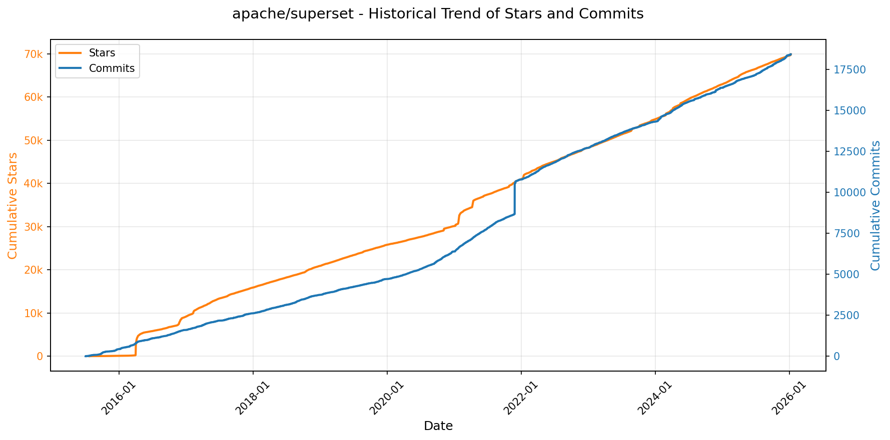
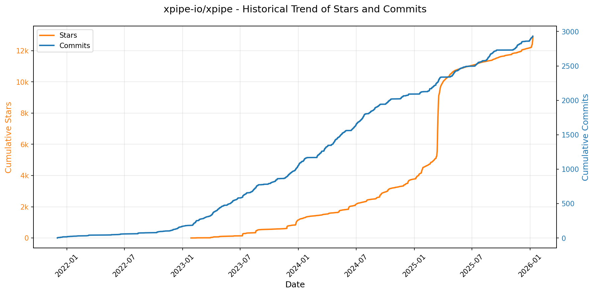
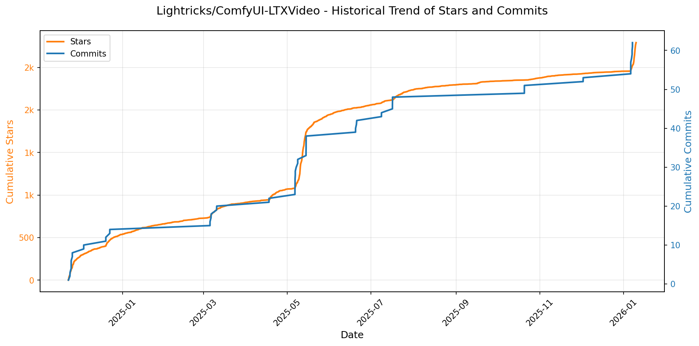
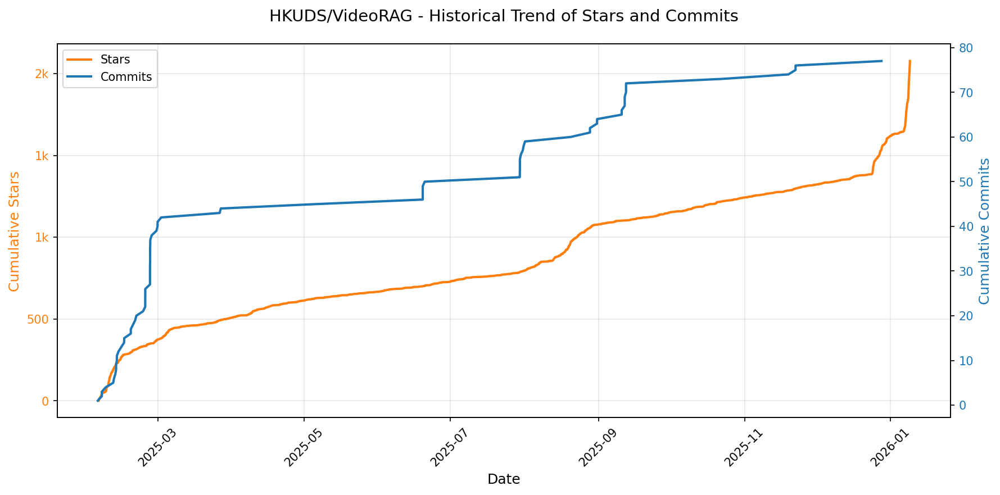
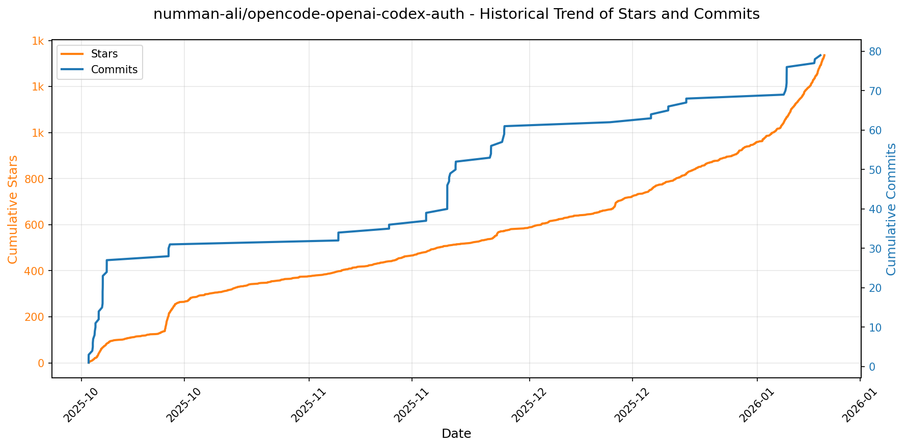
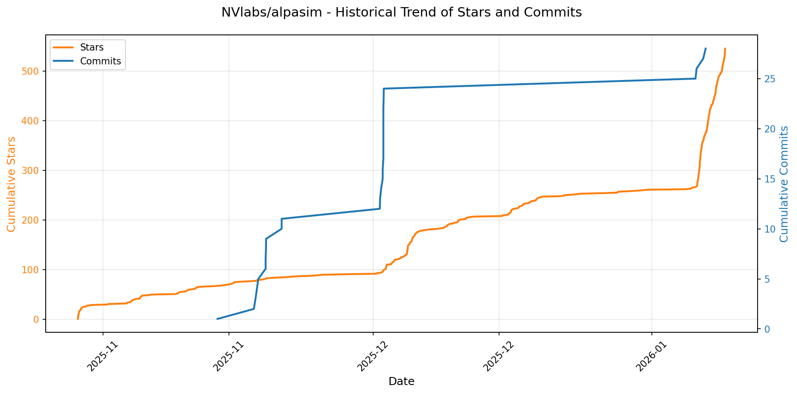

# 🌟 GitHub Trending 概览

> 数据更新于：2026-01-09。

---

## 🔍 项目详情

### 1. [protocolbuffers/protobuf](https://github.com/protocolbuffers/protobuf)
- 📅 **创建日期**：2014-08-26  
- 🔄 **最近更新**：2026-01-09  
- ⭐ **Stars**：70,253（日 +62｜周 +275｜月 +484）  
- 📝 **描述**：Protocol Buffers - Google's data interchange format  

<b>📈 Star 与 Commit 历史趋势</b>

> *蓝色：累计 Stars｜橙色：累计 Commits（次 Y 轴）*

<b>📄 README 摘要</b>

1. **该项目的功能**  
Protocol Buffers（简称 protobuf）是 Google 开发的一种语言无关、平台无关、可扩展的结构化数据序列化机制，主要用于高效的数据交换与存储。它通过定义 `.proto` 接口描述文件，自动生成多种编程语言的序列化/反序列化代码，替代 XML、JSON 等文本格式，在性能、体积和强类型保障方面具有显著优势，广泛应用于微服务通信（如 gRPC）、配置管理、日志传输及跨语言数据持久化等场景。

2. **核心特性**  
- **高效紧凑**：二进制编码，序列化后数据体积小、解析速度快，显著优于 JSON/XML；  
- **语言与平台中立**：官方原生支持 C++、Java、Python、Go、C#、Ruby、Objective-C、PHP、Dart、JavaScript 等十余种语言，并提供标准化代码生成器（`protoc`）；  
- **向后/向前兼容**：通过字段编号（tag）和可选/默认语义实现灵活的 schema 演进，旧代码可安全读取新增字段，新代码可兼容缺失字段；  
- **强类型契约驱动**：`.proto` 文件作为唯一数据契约，强制接口清晰、文档内建、编译时校验；  
- **深度工具链集成**：原生支持 Bazel 构建系统（含 Bzlmod 和 WORKSPACE 两种模式），并提供完善的依赖管理脚本（如 `protobuf_deps`、`rules_java_dependencies` 等）；  
- **企业级支持保障**：明确的[版本支持策略](https://protobuf.dev/version-support/)，长期维护稳定发布分支（release branches），提供安全评分（OpenSSF Scorecard）与社区支持渠道。

3. **技术栈**  
- **核心实现语言**：协议编译器 `protoc` 使用 C++ 编写；  
- **构建系统**：主仓库全面支持 Bazel（≥ v7.0，含 Bzlmod 模块化依赖管理），同时兼容传统 WORKSPACE 方式；  
- **多语言运行时**：各语言绑定独立维护（如 Java 使用 Maven、Python 使用 PyPI、Go 使用 Go Module、JS 使用 npm 等），对应子仓库或目录（`java/`、`python/`、`go/` 等）；  
- **基础设施依赖**：构建过程中集成 Bazel Rules（`rules_java`、`rules_python`）、外部仓库管理（`http_archive`）、以及标准化 proto 标准库（如 `google/protobuf/*.proto`）；  
- **分发方式**：提供预编译二进制（ZIP 包）、Maven 中央仓库（Java）、PyPI（Python）、GitHub Releases、Docker 镜像等多种安装途径。

---

### 2. [apache/superset](https://github.com/apache/superset)
- 📅 **创建日期**：2015-07-21  
- 🔄 **最近更新**：2026-01-09  
- ⭐ **Stars**：69,859（日 +162｜周 +268｜月 +619）  
- 📝 **描述**：Apache Superset is a Data Visualization and Data Exploration Platform  

<b>📈 Star 与 Commit 历史趋势</b>

> *蓝色：累计 Stars｜橙色：累计 Commits（次 Y 轴）*

<b>📄 README 摘要</b>

1. **项目功能**  
Apache Superset 是一个现代化、企业级的开源商业智能（BI）和数据可视化 Web 应用程序。它旨在替代或补充传统专有 BI 工具，支持用户通过直观界面或 SQL 方式探索、分析和展示数据。核心能力包括：连接多种数据源进行实时查询、构建交互式仪表盘、创建丰富多样的图表（含地理空间可视化）、定义语义层模型（如自定义指标与维度），并提供面向生产环境的数据缓存、权限管控与 API 集成能力。

2. **关键特性**  
- **零代码图表构建器（No-code interface）**：拖拽式操作快速生成图表与仪表盘；  
- **功能完备的 Web SQL 编辑器（SQL Lab）**：支持语法高亮、自动补全、查询历史、结果导出及元数据浏览；  
- **轻量级语义层（Semantic Layer）**：允许用户在数据库表基础上定义逻辑字段、计算指标与过滤条件，提升分析一致性；  
- **广泛的数据源兼容性**：原生支持超 50 种 SQL 数据库与数据引擎（如 PostgreSQL、MySQL、Snowflake、BigQuery、Trino、Presto、Doris、StarRocks、ClickHouse、Oracle 等），只需对应 SQLAlchemy 方言与 Python DB-API 驱动即可扩展；  
- **多样化可视化能力**：内置数十种图表类型（含 ECharts 深度集成），支持时间序列、地理地图、桑基图、漏斗图等高级视图；  
- **企业级安全与治理**：基于角色的访问控制（RBAC）、多层级权限模型、LDAP/OAuth/SAML/Okta 等认证集成、行级/列级数据权限；  
- **可扩展架构与开放 API**：提供 RESTful API 实现自动化管理（如创建数据集、仪表盘、告警）、支持自定义可视化插件（Viz Plugins）与数据库连接器开发；  
- **云原生设计**：支持 Docker、Kubernetes（Helm Chart）、云平台部署，具备水平扩展与高可用能力。

3. **技术栈**  
- **后端**：Python（主要语言），基于 Flask 框架构建 Web 服务；使用 SQLAlchemy 作为 ORM/数据库抽象层，Celery + Redis/RabbitMQ 实现异步任务（如长查询、邮件通知、缓存刷新）；  
- **前端**：TypeScript + React（v18+），采用 Ant Design 组件库与 Apache ECharts 作为核心可视化引擎；Webpack/Vite 构建工具链，支持模块化与主题定制；  
- **数据连接**：依赖 Python DB-API 兼容驱动与 SQLAlchemy dialect，通过 `sqlalchemy` 和 `superset.db_engine_specs` 模块统一管理各类数据源适配逻辑；  
- **基础设施**：支持 SQLite（默认开发模式）、PostgreSQL/MySQL（推荐生产数据库）存储元数据；Redis（缓存、Celery broker、会话存储）；支持对象存储（如 S3、GCS）用于大文件上传与导出；  
- **部署生态**：官方提供 Docker 镜像、Helm Chart、Superset CLI 工具，并兼容主流云平台（AWS、GCP、Azure）及 Kubernetes 发行版。

---

### 3. [OpenBB-finance/OpenBB](https://github.com/OpenBB-finance/OpenBB)
- 📅 **创建日期**：2020-12-20  
- 🔄 **最近更新**：2026-01-09  
- ⭐ **Stars**：57,616（日 +77｜周 +1647｜月 +2404）  
- 📝 **描述**：Financial data platform for analysts, quants and AI agents.  

<b>📈 Star 与 Commit 历史趋势</b>

> *蓝色：累计 Stars｜橙色：累计 Commits（次 Y 轴）*

<b>📄 README 摘要</b>

1. **项目功能**  
Open Data Platform（ODP）是由 OpenBB 开发的开源数据集成工具集，核心定位是作为金融与替代数据领域的统一基础设施层。它使数据工程师能够一站式接入并整合**专有数据、授权许可数据及公开数据源**，并将标准化后的数据无缝分发至多种下游应用场景：包括 Python 量化环境（如 Jupyter、脚本）、OpenBB Workspace（面向分析师的可视化平台）、Excel 插件、MCP（Model Context Protocol）服务器（供 AI 智能体调用），以及通用 REST API 接口，实现“连接一次，处处消费”（connect once, consume everywhere）。

2. **关键特性**  
- ✅ **多表面数据分发**：同一数据后端可同时服务 Python SDK、Web UI（Workspace）、Excel、AI Agent（MCP）、REST API 等多个消费端；  
- ✅ **模块化数据集成生态**：提供覆盖股票、加密货币、宏观、另类数据等数十类金融数据源的标准化接口，所有集成均开源可查（见 [docs.openbb.co/python/reference](https://docs.openbb.co/python/reference)）；  
- ✅ **轻量级本地部署能力**：通过 `openbb-api` 命令一键启动基于 FastAPI + Uvicorn 的本地数据服务（默认 `http://127.0.0.1:6900`），支持与 OpenBB Workspace 低代码对接；  
- ✅ **全栈可扩展架构**：支持开发者自定义数据后端（通过 [backends-for-openbb](https://github.com/OpenBB-finance/backends-for-openbb)）和 AI Agent 插件（通过 [agents-for-openbb](https://github.com/OpenBB-finance/agents-for-openbb)）；  
- ✅ **开箱即用的 CLI 与 Python SDK**：提供 `openbb-cli` 命令行工具和 `obb` Python 对象（如 `obb.equity.price.historical("AAPL")`），支持快速数据获取与转换（如 `.to_dataframe()`）；  
- ✅ **云原生友好**：支持 Dev Containers、GitHub Codespaces 和 Google Colab 一键开发/运行环境。

3. **技术栈**  
- **后端框架**：FastAPI（API 服务）、Uvicorn（ASGI 服务器）；  
- **Python 生态**：核心 SDK 基于 Python 3.9.21–3.12，依赖 Pydantic（数据验证）、Pandas（数据处理）、Requests（HTTP 客户端）等；  
- **前端与集成**：OpenBB Workspace（独立企业级 Web 应用，非本仓库主体）通过 REST 调用 ODP 后端；Excel 集成依赖 COM/Office JS；MCP 支持符合 Model Context Protocol 规范的 AI Agent；  
- **部署与协作**：GitHub Actions CI/CD、Docker 兼容、VS Code Dev Containers、GitHub Codespaces；  
- **许可证**：AGPLv3（强传染性开源协议，要求衍生服务也开源）。

---

### 4. [anomalyco/opencode](https://github.com/anomalyco/opencode)
- 📅 **创建日期**：2025-04-30  
- 🔄 **最近更新**：2026-01-09  
- ⭐ **Stars**：55,489（日 +1645｜周 +10256｜月 +18130）  
- 📝 **描述**：The open source coding agent.  

<b>📈 Star 与 Commit 历史趋势</b>

> *蓝色：累计 Stars｜橙色：累计 Commits（次 Y 轴）*

<b>📄 README 摘要</b>

1. **项目功能**  
OpenCode 是一个开源的 AI 编程智能体（AI coding agent），旨在为开发者提供终端原生（TUI）、轻量高效、可本地部署的 AI 辅助编程体验。它直接在终端中运行，支持代码理解、编辑、调试、重构、文档生成、多步任务规划等完整开发闭环；同时具备客户端/服务器架构，允许远程控制（如通过移动端驱动本地运行的 OpenCode 实例）。

2. **核心特性**  
- **双模式智能体切换**：内置 `build`（默认，全权限开发代理）和 `plan`（只读分析代理，需显式授权才执行文件修改或 Shell 命令），支持按 `Tab` 键快速切换；另含 `@general` 子代理处理复杂搜索与多步骤推理任务。  
- **完全开源与厂商无关**：不绑定任何特定大模型提供商，原生兼容 Claude、OpenAI、Google Gemini 及本地运行的 LLM（如 Ollama、Llama.cpp），并推荐搭配其自研模型分发平台 [OpenCode Zen](https://opencode.ai/zen)。  
- **开箱即用的 LSP 支持**：深度集成语言服务器协议，提供精准的代码补全、跳转、悬停提示等 IDE 级语义能力。  
- **跨平台多形态部署**：支持命令行 CLI（一键安装脚本 + 主流包管理器）、桌面应用（macOS/Windows/Linux 原生二进制）、以及 Nix/Mise 等现代开发环境工具链；安装路径高度可定制（支持 `OPENCODE_INSTALL_DIR` / `XDG_BIN_DIR` 等）。  
- **终端优先设计**：由 Neovim 用户及 terminal.shop 团队打造，极致优化 TUI 交互体验，强调低延迟、高可访问性与键盘驱动工作流。

3. **技术栈**  
- **前端/CLI**：TypeScript（基于 Node.js 运行时），采用现代化终端 UI 框架（推测为类似 `ink` 或自研 TUI 渲染层）；Web 版（Console）使用 React + Vite 构建。  
- **架构**：客户端/服务器分离架构（client-server），支持本地 CLI 客户端连接本地或远程服务端，为多端协同（如手机控制桌面端）提供基础。  
- **AI 集成层**：抽象化模型适配器（Model Adapter），统一接入 OpenAI-compatible API、Anthropic SDK、Google Generative AI SDK 及本地 HTTP 接口（如 Ollama、LM Studio）。  
- **构建与分发**：CI/CD 基于 GitHub Actions；多平台打包使用 `tauri`（桌面端）、`pkg` / `nexe`（CLI 二进制）、Homebrew / Scoop / Chocolatey / AppImage / DEB/RPM（各平台分发）；依赖 `mise` 和 `nix` 支持声明式环境管理。

---

### 5. [anthropics/claude-code](https://github.com/anthropics/claude-code)
- 📅 **创建日期**：2025-02-22  
- 🔄 **最近更新**：2026-01-09  
- ⭐ **Stars**：53,499（日 +680｜周 +3168｜月 +8444）  
- 📝 **描述**：Claude Code is an agentic coding tool that lives in your terminal, understands your codebase, and helps you code faster by executing routine tasks, explaining complex code, and handling git workflows - all through natural language commands.  

<b>📈 Star 与 Commit 历史趋势</b>

> *蓝色：累计 Stars｜橙色：累计 Commits（次 Y 轴）*

<b>📄 README 摘要</b>

1. **该项目的功能**  
Claude Code 是一款终端原生的智能编程代理工具，能够深度理解用户本地代码库，通过自然语言指令协助开发者高效完成日常编码任务。其核心能力包括：自动执行重复性编程操作（如生成函数、重构代码）、解释复杂逻辑或陌生代码片段、自动化处理 Git 工作流（如生成提交信息、分析差异、创建 PR 描述）等。支持在终端、IDE 内直接调用，并可于 GitHub 中通过 `@claude` 提及方式触发上下文感知的协作。

2. **关键特性**  
- **代码库感知（Codebase-aware）**：基于本地项目文件实时分析结构与上下文，提供精准、上下文相关的响应；  
- **多环境集成**：原生支持终端命令行、主流 IDE 插件扩展，以及 GitHub 评论区交互；  
- **自然语言驱动工作流**：无需编写脚本，仅用自然语言指令即可完成编码、调试、文档生成、Git 操作等任务；  
- **插件化架构**：内置可扩展插件系统，允许开发者自定义命令与智能体（Agent），增强特定场景能力（如测试生成、依赖分析）；  
- **一键反馈闭环**：内置 `/bug` 命令，支持在使用过程中即时上报问题并附带会话上下文，简化错误复现与追踪；  
- **隐私优先设计**：默认不上传源码，敏感数据（如文件内容）仅在本地处理，反馈数据经脱敏且明确禁止用于模型训练。

3. **技术栈**  
- **运行时**：Node.js 18+（作为主程序运行基础，NPM 安装方式依赖此环境）；  
- **分发方式**：跨平台安装脚本（Bash/PowerShell）、Homebrew（macOS）、NPM 全局包；  
- **核心能力支撑**：基于 Anthropic 的 Claude 大语言模型（特别是针对代码优化的版本），结合本地代码解析（如 AST 分析、文件索引）、会话状态管理与 CLI 工具链；  
- **扩展生态**：插件系统基于 JavaScript/TypeScript 实现，遵循约定式接口规范，便于社区共建；  
- **基础设施与合规**：后端服务遵循严格的数据隔离策略，配合商用级隐私政策（GDPR/CCPA 合规）、有限数据保留机制及最小权限访问控制。

---

### 6. [usememos/memos](https://github.com/usememos/memos)
- 📅 **创建日期**：2021-12-08  
- 🔄 **最近更新**：2026-01-09  
- ⭐ **Stars**：52,646（日 +163｜周 +4574｜月 +5755）  
- 📝 **描述**：An open-source, self-hosted note-taking service. Your thoughts, your data, your control — no tracking, no ads, no subscription fees.  

<b>📈 Star 与 Commit 历史趋势</b>

> *蓝色：累计 Stars｜橙色：累计 Commits（次 Y 轴）*

<b>📄 README 摘要</b>

1. **项目功能**  
Memos 是一个开源、可自托管的轻量级笔记与知识库服务，专注于个人笔记记录、团队 Wiki 协作及结构化知识管理。它不依赖云端服务器，所有数据完全由用户自主掌控，无任何遥测（telemetry）、广告或订阅费用，支持离线使用与完整数据导出。

2. **核心特性**  
- **隐私优先架构**：纯本地部署，零数据上报，支持全量数据导出，杜绝厂商锁定；  
- **原生 Markdown 支持**：实时渲染、纯文本存储（`.md` 格式），确保内容长期可迁移、可读性强；  
- **极致性能体验**：前端响应迅速，后端低延迟，支持大规模笔记快速加载与搜索；  
- **极简部署方案**：一键 Docker 启动，同时兼容 SQLite（默认）、MySQL 和 PostgreSQL 多种数据库；  
- **开发者友好接口**：提供完备的 RESTful API 与 gRPC API，便于集成至 CI/CD、自动化工作流或第三方应用；  
- **现代化 UI/UX**：简洁美观的响应式界面，内置深色模式，全面适配桌面与移动设备。

3. **技术栈**  
- **后端**：Go（Golang）语言开发，高性能、低内存占用，原生支持并发与跨平台编译；  
- **前端**：React（TypeScript）构建，模块化设计，支持国际化（i18n）与主题定制；  
- **数据库**：默认嵌入式 SQLite，亦支持 MySQL 8.0+ 与 PostgreSQL 12+；  
- **部署生态**：原生 Docker 镜像（`neosmemo/memos`），提供 Docker Compose 模板、Kubernetes Helm Chart、预编译二进制包（Linux/macOS/Windows）及源码构建支持。

---

### 7. [virattt/ai-hedge-fund](https://github.com/virattt/ai-hedge-fund)
- 📅 **创建日期**：2024-11-29  
- 🔄 **最近更新**：2026-01-09  
- ⭐ **Stars**：45,047（日 +43｜周 +747｜月 +2546）  
- 📝 **描述**：An AI Hedge Fund Team  

<b>📈 Star 与 Commit 历史趋势</b>

> *蓝色：累计 Stars｜橙色：累计 Commits（次 Y 轴）*

<b>📄 README 摘要</b>

1. **项目功能**  
该项目是一个面向教育与研究目的的AI驱动对冲基金概念验证系统，旨在探索人工智能在股票交易决策中的应用。它不执行真实交易，也不连接任何交易接口，仅通过模拟方式聚合多位投资大师（如巴菲特、芒格、达摩达兰等）及多维度分析代理（估值、情绪、基本面、技术面、风险管理等）的“观点”，生成综合交易信号与投资建议，辅助用户理解不同投资哲学在实际分析中的体现。

2. **核心特性**  
- **18个专业化智能代理协同工作**：涵盖13位标志性投资者（如本·格雷厄姆、凯茜·伍德、迈克尔·伯里等）的风格化决策逻辑，以及5个功能性代理（估值、情绪、基本面、技术面、风险管理和组合管理），实现多视角、多策略融合分析；  
- **双模态交互支持**：提供命令行接口（CLI）用于自动化、回测与脚本集成，以及基于Web的图形化界面（Web App）提升可访问性与用户体验；  
- **灵活的数据与模型配置**：支持多种大语言模型（OpenAI、Groq、Anthropic、DeepSeek、Ollama本地模型）作为推理引擎；金融数据默认免费支持AAPL/GOOGL/MSFT/NVDA/TSLA，扩展标的需接入Financial Datasets API；  
- **完整回测能力**：内置`backtester.py`模块，支持按指定股票、时间范围进行历史信号生成与策略回测，并输出可视化结果；  
- **严格合规与教育定位**：全系统设计明确限定为学习用途，含醒目免责声明，禁止真实资金使用，强调无投资建议、无责任担保。

3. **技术栈**  
- **编程语言**：Python（主语言，用于核心逻辑、CLI和后端）；  
- **依赖管理与环境**：Poetry（Python依赖与虚拟环境管理）；  
- **大语言模型接入**：兼容OpenAI API、Groq、Anthropic、DeepSeek及Ollama（支持本地LLM运行）；  
- **金融数据源**：Financial Datasets API（可选，用于非默认股票）；  
- **Web应用层**：独立的`/app`子目录（README中指向其详细文档），推测采用现代Python Web框架（如FastAPI或Streamlit）构建前端交互界面；  
- **部署与配置**：基于`.env`环境变量管理API密钥，遵循安全实践；  
- **许可证**：MIT License。

---

### 8. [exo-explore/exo](https://github.com/exo-explore/exo)
- 📅 **创建日期**：2024-06-24  
- 🔄 **最近更新**：2026-01-09  
- ⭐ **Stars**：39,684（日 +55｜周 +506｜月 +7019）  
- 📝 **描述**：Run your own AI cluster at home with everyday devices 📱💻 🖥️⌚  

<b>📈 Star 与 Commit 历史趋势</b>

> *蓝色：累计 Stars｜橙色：累计 Commits（次 Y 轴）*

<b>📄 README 摘要</b>

1. **项目功能**  
   exo 是一个面向个人用户的分布式 AI 推理框架，旨在让用户利用家中日常设备（如多台 Mac Studio、MacBook Pro 等）快速组建本地 AI 集群。它能将多个设备的计算与显存资源（如 VRAM）虚拟化为统一资源池，支持运行单台设备无法容纳的超大语言模型（如 Qwen3-235B、DeepSeek-V3.1-671B），并通过跨设备协同推理显著提升吞吐与响应速度，真正实现“在家运行自己的 AI 集群”。

2. **核心特性**  
   - **零配置自动设备发现**：集群内设备启动 exo 后自动组网，无需手动配置 IP 或拓扑信息；  
   - **原生 RDMA over Thunderbolt 5 支持（Day-0）**：在 macOS 26.2+ 上启用后，设备间通信延迟降低 99%，大幅提升分布式推理效率；  
   - **拓扑感知的自动并行调度**：实时感知各设备算力、内存、网络带宽与延迟，动态选择最优模型切分策略（Pipeline/Tensor Parallel）；  
   - **张量并行加速**：实测在 2 台设备上达 1.8× 加速，4 台设备达 3.2× 加速；  
   - **深度集成 MLX 生态**：基于 Apple Silicon 优化的 MLX 框架进行单机推理，并使用 MLX Distributed 实现高效跨设备张量通信与同步。

3. **技术栈**  
   - **核心语言与运行时**：Rust（系统层、高性能通信与调度）、Python（主控逻辑、API 服务、模型管理），依赖 Rust Nightly 工具链；  
   - **AI 推理引擎**：MLX（专为 Apple Silicon 优化的 Python/NumPy 风格深度学习框架）及其分布式扩展 MLX Distributed；  
   - **前端与监控**：Node.js + npm 构建 Web 仪表盘（dashboard），提供集群状态可视化与交互界面；  
   - **系统级依赖**：macOS 侧依赖 `macmon`（Apple Silicon 硬件监控）、`rdma_ctl`（RDMA 控制工具）；Linux 侧暂仅支持 CPU 推理（GPU 支持开发中）；  
   - **包与构建工具**：uv（Python 依赖管理与执行）、Homebrew（macOS/Linux 包管理）、npm（前端构建）。

---

### 9. [google/googletest](https://github.com/google/googletest)
- 📅 **创建日期**：2015-07-28  
- 🔄 **最近更新**：2026-01-09  
- ⭐ **Stars**：37,870（日 +91｜周 +198｜月 +323）  
- 📝 **描述**：GoogleTest - Google Testing and Mocking Framework  

<b>📈 Star 与 Commit 历史趋势</b>

> *蓝色：累计 Stars｜橙色：累计 Commits（次 Y 轴）*

<b>📄 README 摘要</b>

1. **该项目的功能**  
GoogleTest（简称 gtest）是一个面向 C++ 的开源单元测试框架，由 Google 开发并维护。它提供了一套完整的测试基础设施，用于编写、自动发现、执行和报告 C++ 代码的单元测试。其核心目标是帮助开发者通过可重复、可验证的方式保障 C++ 代码的正确性与健壮性，尤其适用于大型 C++ 项目（如 Chromium、LLVM、Protocol Buffers 等）的自动化测试实践。

2. **关键特性**  
- 基于 xUnit 架构，支持标准的测试组织方式（测试用例、测试套件）；  
- 自动化测试发现：无需手动注册，编译后即可自动识别并运行所有 `TEST` 或 `TEST_F` 宏定义的测试；  
- 丰富的断言库：涵盖布尔判断、数值/字符串/容器比较、异常捕获、浮点数近似相等（`EXPECT_NEAR`）、死亡测试（`ASSERT_DEATH`）等；  
- 支持用户自定义断言宏，提升测试可读性与领域适配性；  
- 区分致命失败（`ASSERT_*`）与非致命失败（`EXPECT_*`），使单个测试用例内可继续执行后续检查；  
- 支持值参数化测试（Value-parameterized Tests）与类型参数化测试（Type-parameterized Tests），便于对多组输入或多种类型进行数据驱动测试；  
- 提供灵活的测试执行控制：支持按名称/标签筛选测试、禁用特定测试、设置随机顺序、并发执行（需配合外部工具如 `gtest-parallel`）等；  
- 内置死亡测试机制，可验证程序在非法输入下是否按预期崩溃（如 `exit()` 或信号终止）；  
- 兼容主流构建系统（CMake、Bazel、Make 等），并提供事件监听器扩展接口（如 TAP 输出、GUI 测试运行器集成）。

3. **技术栈**  
- **语言标准**：最低要求 C++17（自 v1.17.0 起强制要求），兼容更高版本（C++20/23）；  
- **构建系统**：官方主要支持 CMake（推荐），也兼容 Bazel 和传统 Makefile；  
- **平台支持**：遵循 Google 的基础 C++ 支持策略，覆盖主流平台（Linux、Windows、macOS）及编译器（GCC ≥ 9、Clang ≥ 10、MSVC ≥ 2019）；  
- **依赖演进**：计划引入 [Abseil](https://github.com/abseil/abseil-cpp) 作为底层基础库（“Coming Soon” 中明确提及）；  
- **生态集成**：通过标准化输出（如 XML、TAP）和第三方插件（VS Code 扩展、Qt GUI 运行器、C# 测试 UI 等）深度融入现代 C++ 开发工具链。

---

### 10. [anthropics/skills](https://github.com/anthropics/skills)
- 📅 **创建日期**：2025-09-22  
- 🔄 **最近更新**：2026-01-09  
- ⭐ **Stars**：35,961（日 +645｜周 +4535｜月 +15975）  
- 📝 **描述**：Public repository for Agent Skills  

<b>📈 Star 与 Commit 历史趋势</b>

> *蓝色：累计 Stars｜橙色：累计 Commits（次 Y 轴）*

<b>📄 README 摘要</b>

1. **项目功能**  
该项目是 Anthropic 官方维护的 Claude 技能（Skills）开源实现库，用于演示和支撑 Claude 大模型的“技能系统”。技能是以文件夹为单位的可动态加载模块，包含指令（`SKILL.md`）、脚本及资源，使 Claude 能够在特定领域（如文档处理、Web 应用测试、品牌内容生成等）以标准化、可复现的方式执行专业化任务。该仓库本身不运行服务，而是提供可即用、可参考、可扩展的技能示例集与规范定义，供开发者学习、复用或构建自有技能。

2. **核心特性**  
- **模块化技能结构**：每个技能独立成文件夹，强制包含 `SKILL.md`（含 YAML 元数据 + Markdown 指令），结构清晰、开箱即用；  
- **多场景覆盖**：涵盖创意设计（艺术/音乐/UI）、技术开发（MCP 服务器生成、Web 应用测试）、企业协作（邮件撰写、品牌指南执行）及全格式文档处理（`.docx`/`.pdf`/`.pptx`/`.xlsx`）四大类技能；  
- **生产级参考实现**：公开了驱动 Claude 文档能力的底层技能源码（source-available，非完全开源），为复杂工业级技能开发提供真实范例；  
- **跨平台集成支持**：原生适配 Claude Code（插件市场）、Claude.ai（付费用户直接可用）及 Claude API（支持上传自定义技能）；  
- **开放规范与模板**：内置 [Agent Skills 规范](./spec) 和标准化 [技能模板](./template)，降低开发门槛，确保兼容性与可维护性；  
- **教育与示范导向**：明确声明所有技能仅作教学与参考用途，强调行为可能与线上 Claude 实际表现存在差异，倡导本地充分验证。

3. **技术栈**  
- **核心格式**：纯文本驱动，基于 Markdown（`SKILL.md`）+ YAML 前置元数据（`name`/`description` 等必填字段）；  
- **协议标准**：遵循开源的 [Agent Skills 规范](http://agentskills.io)，定义技能发现、加载、元数据、生命周期等通用接口；  
- **部署与分发**：依赖 Anthropic 生态内建机制——Claude Code 插件系统（`/plugin install`）、Claude.ai 技能管理界面、Claude API 的 `skills` 参数上传接口；  
- **许可体系**：混合授权——多数示例技能采用 Apache 2.0 开源协议；文档类核心技能（`/skills/docx` 等）为 source-available（可查看、不可修改/再分发），体现生产代码与教学素材的差异化策略。

---

### 11. [nothings/stb](https://github.com/nothings/stb)
- 📅 **创建日期**：2014-05-25  
- 🔄 **最近更新**：2026-01-09  
- ⭐ **Stars**：31,674（日 +193｜周 +702｜月 +959）  
- 📝 **描述**：stb single-file public domain libraries for C/C++  

<b>📈 Star 与 Commit 历史趋势</b>

> *蓝色：累计 Stars｜橙色：累计 Commits（次 Y 轴）*

<b>📄 README 摘要</b>

1. **该项目的功能**  
该项目（stb）是一组轻量级、单文件、免依赖的 C/C++ 公共库集合，旨在为开发者提供开箱即用的基础功能模块。所有库均以头文件（`.h`）形式分发，通过宏定义（如 `STB_IMAGE_IMPLEMENTATION`）控制实现代码的编译，无需构建过程或链接外部库。其核心目标是简化集成——尤其面向跨平台（特别是 Windows）、嵌入式、游戏开发及对部署简洁性要求高的场景，提供“复制即用”的零配置工具链支持。

2. **关键特性**  
- **单文件设计**：每个库仅含一个源文件（`.h`），兼具声明与可选实现，极大降低集成复杂度和依赖管理成本；  
- **零依赖 & 零构建**：纯 C 实现，不依赖标准库以外的组件，无需 Makefile/CMake，直接 `#include` + 宏启用即可使用；  
- **多领域覆盖**：涵盖图像处理（加载/写入/缩放）、字体光栅化、音频解码（Vorbis）、3D 图形（体素渲染、DXT 压缩）、数据结构（泛型动态数组/哈希表）、文本编辑、噪声生成、内存调试、GLSL 包含解析等 21 个独立功能模块；  
- **安全与维护透明**：公开在 GitHub Issues/Pull Requests 中讨论安全漏洞，但明确提示修复可能存在延迟，供用户自主评估风险；  
- **双许可证保障**：同时采用公共领域（Unlicense）与 MIT 许可，兼顾法律兼容性与最大自由度；  
- **向后兼容与精简哲学**：拒绝新增图像格式以控制攻击面，强调稳定性与安全性优先于功能扩张。

3. **技术栈**  
- **语言**：标准 C（兼容 C89/C90，刻意避免 C99 特性如 `stdint.h`、混合声明语句，以支持老旧编译器如 MSVC 6）；部分库可直接用于 C++；  
- **平台**：完全跨平台（Windows/Linux/macOS），无操作系统特定调用，不依赖 POSIX 或 Win32 API；  
- **编译器兼容性**：适配 GCC、Clang、MSVC 等主流编译器，对 SIMD（如 SSE2）采用编译时开关（`-msse2`）而非运行时检测，规避 GCC 多目标构建难题；  
- **构建模型**：无构建系统依赖，纯头文件驱动，由用户控制宏定义决定是否内联实现；  
- **代码风格**：自包含文档、注释与示例，LoC（含实现+头文件+文档）在 305–10650 行之间，强调可读性与最小化认知负荷。

---

### 12. [Lissy93/web-check](https://github.com/Lissy93/web-check)
- 📅 **创建日期**：2023-06-25  
- 🔄 **最近更新**：2026-01-09  
- ⭐ **Stars**：29,016（日 +409｜周 +1906｜月 +2056）  
- 📝 **描述**：🕵️‍♂️ All-in-one OSINT tool for analysing any website  

<b>📈 Star 与 Commit 历史趋势</b>

> *蓝色：累计 Stars｜橙色：累计 Commits（次 Y 轴）*

---

### 13. [tw93/Mole](https://github.com/tw93/Mole)
- 📅 **创建日期**：2025-09-23  
- 🔄 **最近更新**：2026-01-09  
- ⭐ **Stars**：26,913（日 +632｜周 +2879｜月 +19613）  
- 📝 **描述**：🐹 Deep clean and optimize your Mac.  

<b>📈 Star 与 Commit 历史趋势</b>

> *蓝色：累计 Stars｜橙色：累计 Commits（次 Y 轴）*

<b>📄 README 摘要</b>

1. **项目功能**  
Mole 是一款专为 macOS 设计的深度系统清理与性能优化工具，以单二进制（single binary）形式提供一体化解决方案。它能安全、高效地释放磁盘空间（如示例中一次性释放 95.5 GB），同时提升系统响应速度与稳定性。核心用途包括：彻底清除各类冗余文件（缓存、日志、浏览器残留、安装包、构建产物等）、智能卸载应用程序及其隐藏残留（偏好设置、Launch Agents、插件、WebKit 数据等）、重建系统关键缓存与服务（Spotlight、Launch Services、网络栈等）、可视化分析磁盘空间占用，以及实时监控 CPU、内存、磁盘、网络和电源等硬件级性能指标。

2. **关键特性**  
- **全场景深度清理**：支持用户缓存、多浏览器（Chrome/Safari/Firefox）、开发者工具（Xcode/Node.js/npm）、应用专属缓存（Slack/Dropbox/Spotify）及系统临时文件/废纸篓的一键扫描与清理，并提供 `--dry-run` 预览与 `--whitelist` 白名单保护机制。  
- **智能应用卸载器**：交互式选择待卸载 App，自动识别并清除其分散在 `~/Library` 各子目录（Application Support、Caches、Preferences、Logs、Cookies 等）的全部关联文件，避免残留。  
- **系统级优化引擎**：执行数据库重建、网络服务重置、Finder/Dock 刷新、诊断日志清理、交换文件回收、Spotlight 索引重建等底层维护操作，支持 `--whitelist` 排除特定项。  
- **交互式磁盘分析器（`mo analyze`）**：以图形化进度条展示各目录/文件大小占比，支持键盘导航（↑↓←→/vim 键位）、打开路径、查看详情、批量删除，可聚焦大文件（`L` 键）。  
- **实时健康仪表盘（`mo status`）**：提供综合健康评分（基于 CPU/内存/磁盘/温度/I/O），彩色编码告警，支持快捷键（如 `k` 切换猫图显示、`q` 退出）。  
- **专项清理模块**：  
  - `mo purge`：智能识别并清理项目中的 `node_modules`、`target`、`venv`、`dist` 等构建产物，自动跳过 7 天内活跃项目；  
  - `mo installer`：跨位置（Downloads、Desktop、Homebrew Cache、iCloud、Mail）扫描并清理大型安装包（`.dmg`/`.pkg` 等），标注来源便于判断。  
- **安全增强设计**：默认启用严格防护策略，所有高危操作均支持 `--dry-run --debug` 组合预览（含风险等级、文件路径、大小等详细信息）；兼容 Touch ID 提权（`mo touchid`）与 Shell 补全（`mo completion`）。

3. **技术栈**  
- **核心语言**：Rust（高性能、内存安全、可编译为无依赖单二进制，适配 Apple Silicon 与 Intel Mac）；  
- **终端交互层**：基于 TUI（Text-based User Interface）框架（如 `ratatui` 或类似库），支持 Vim 键位与鼠标事件；  
- **系统集成**：深度调用 macOS 原生命令与 API（如 `mdutil`、`launchctl`、`diskutil`、`defaults`、`asroot` 权限管理）；  
- **构建与分发**：使用 GitHub Actions 自动化构建多架构（ARM64/x86_64）发布包；通过 Homebrew（`brew install mole`）与自研 Bash 安装脚本（`install.sh`）分发；  
- **配置与扩展**：配置文件存储于 `~/.config/mole/`；支持 Raycast/Alfred 快捷启动器（通过独立脚本集成）；  
- **辅助生态**：配套安全审计文档（`SECURITY_AUDIT.md`）、贡献指南（`CONTRIBUTING.md`）、MIT 开源协议。

---

### 14. [simstudioai/sim](https://github.com/simstudioai/sim)
- 📅 **创建日期**：2025-01-05  
- 🔄 **最近更新**：2026-01-09  
- ⭐ **Stars**：25,146（日 +37｜周 +334｜月 +6498）  
- 📝 **描述**：Open-source platform to build and deploy AI agent workflows.  

<b>📈 Star 与 Commit 历史趋势</b>

> *蓝色：累计 Stars｜橙色：累计 Commits（次 Y 轴）*

<b>📄 README 摘要</b>

1. **项目功能**  
Sim 是一个用于**快速构建与部署 AI 智能体（Agent）工作流**的开发平台。它允许用户通过可视化画布连接多个 AI 智能体、工具和逻辑模块，实现端到端的自动化任务编排（如问答、数据处理、多步推理等）。支持云端一键使用（sim.ai），也提供完整的自托管方案，使团队能在本地或私有环境中完全掌控 AI 工作流的运行、数据与模型——无需依赖外部 API 即可接入本地大模型（如 Ollama、vLLM），并结合向量数据库实现基于私有知识库的语义检索与上下文增强。

2. **核心特性**  
- **可视化工作流编排**：基于 ReactFlow 的拖拽式画布，支持节点（Agent/Tool/Block）自由连接与即时调试运行；  
- **AI 辅助开发（Copilot）**：集成自然语言驱动的智能体生成、错误修复与流程迭代能力，显著降低低代码/无代码构建门槛；  
- **私有知识库支持**：支持文档上传至向量数据库（pgvector），自动完成嵌入、索引与检索，使 Agent 回答严格“扎根”于用户专属内容；  
- **全栈本地化 AI 运行**：原生支持 Ollama（含 GPU/CPU 优化配置）与 vLLM，可离线调用本地大模型，保障数据隐私与合规性；  
- **企业级可扩展架构**：内置实时通信（Socket.io）、后台任务调度（Trigger.dev）、沙箱化远程代码执行（E2B）及多租户认证（Better Auth），适配生产环境需求。

3. **技术栈**  
- **前端框架**：Next.js（App Router） + Bun（高性能运行时）  
- **UI 组件库**：Shadcn UI + Tailwind CSS（现代化响应式设计）  
- **状态管理**：Zustand（轻量、灵活的状态协调）  
- **流程编辑器**：ReactFlow（专业级可交互图编辑能力）  
- **后端与数据层**：PostgreSQL（含 pgvector 扩展） + Drizzle ORM（TypeScript 优先的迁移与查询）  
- **认证与安全**：Better Auth（开箱即用的现代化身份认证）  
- **实时能力**：Socket.io（支撑工作流实时日志、状态同步）  
- **基础设施与协作**：Turborepo（高效单体多包管理）、Docker Compose（标准化部署）、E2B（安全远程代码沙箱）  
- **文档系统**：Fumadocs（基于 MDX 的开发者友好文档）

---

### 15. [resemble-ai/chatterbox](https://github.com/resemble-ai/chatterbox)
- 📅 **创建日期**：2025-04-23  
- 🔄 **最近更新**：2026-01-09  
- ⭐ **Stars**：21,030（日 +90｜周 +890｜月 +6155）  
- 📝 **描述**：SoTA open-source TTS  

<b>📈 Star 与 Commit 历史趋势</b>

> *蓝色：累计 Stars｜橙色：累计 Commits（次 Y 轴）*

<b>📄 README 摘要</b>

1. **项目功能**  
Chatterbox TTS 是 Resemble AI 推出的开源文本转语音（TTS）模型家族，核心目标是为实时语音代理（voice agents）、交互式应用及创意音频工作流提供高质量、低延迟、零样本（zero-shot）语音合成能力。其中旗舰模型 **Chatterbox-Turbo** 专为生产级低延迟场景优化，支持仅需10秒参考音频即可完成声音克隆，并能在单步生成中输出高保真语音，适用于客服机器人、游戏NPC、AI助手等对响应速度敏感的系统。

2. **关键特性**  
- ✅ **极致推理效率**：Turbo 模型仅 350M 参数，显著降低 GPU 显存（VRAM）与计算资源需求；语音生成从传统 10 步压缩至 **单步（1-step）mel谱图解码**，大幅提速。  
- ✅ **原生支持副语言学标记（Paralinguistic Tags）**：直接识别并自然渲染 `[laugh]`、`[chuckle]`、`[cough]` 等标签，增强语音表现力与真实感。  
- ✅ **零样本多语言支持**：Chatterbox-Multilingual 支持 **23+ 种语言**（含中、英、西、法、日、韩、阿、印地语等），无需微调即可跨语言语音克隆。  
- ✅ **内置责任式AI水印（PerTh Watermarking）**：所有生成音频自动嵌入不可听、抗压缩/编辑的神经水印（基于 Perth 技术），检测准确率近100%，满足内容溯源与合规要求。  
- ✅ **灵活控制能力**：支持 CFG（Classifier-Free Guidance）权重调节、语音夸张度（exaggeration）控制，适配不同风格（如日常对话、戏剧化播报）。  

3. **技术栈**  
- **核心框架**：PyTorch（深度学习）、torchaudio（音频处理）  
- **模型架构**：基于自研高效声学建模结构（Turbo 采用精简350M参数流式架构）；复用并改进多项前沿技术，包括 CosyVoice 的零样本语音合成范式、HiFT-GAN 的高质量声码器、S3Tokenizer 的语音token化方案。  
- **依赖生态**：Python 3.11（官方推荐）、CUDA 加速（GPU 推理）、Hugging Face Spaces（在线演示部署）、Librosa（水印提取辅助）  
- **配套工具**：集成 Resemble AI 自研的 Perth 隐式水印库（`perth`），实现端到端可验证内容生成。

---

### 16. [ChromeDevTools/chrome-devtools-mcp](https://github.com/ChromeDevTools/chrome-devtools-mcp)
- 📅 **创建日期**：2025-09-11  
- 🔄 **最近更新**：2026-01-09  
- ⭐ **Stars**：19,409（日 +361｜周 +1024｜月 +3224）  
- 📝 **描述**：Chrome DevTools for coding agents  

<b>📈 Star 与 Commit 历史趋势</b>

> *蓝色：累计 Stars｜橙色：累计 Commits（次 Y 轴）*

<b>📄 README 摘要</b>

1. **项目功能**  
该项目是一个 Model-Context-Protocol（MCP）服务器实现，名为 `chrome-devtools-mcp`，旨在为 AI 编程助手（如 Gemini、Claude、Cursor、Copilot、Codex 等）提供对真实 Chrome 浏览器的**深度控制与调试能力**。它使编码代理能够通过标准 MCP 协议，安全、可靠地连接并操作 Chrome 实例，执行自动化任务、性能分析、网络请求审查、DOM 检查、脚本执行、截图、表单填写等操作，从而将 Chrome DevTools 的全部功能集成到 AI 编程工作流中。

2. **核心特性**  
- **性能洞察**：支持录制完整的 Chrome 性能追踪（trace），并提取可操作的性能瓶颈分析（如长任务、渲染阻塞、内存泄漏线索）；  
- **高级调试能力**：实时访问浏览器控制台日志、捕获网络请求列表与详情、执行任意 JavaScript 脚本、截取页面/元素快照、生成全页截图；  
- **高可靠性自动化**：基于 Puppeteer 构建，内置智能等待机制（如 `wait_for`），确保操作在 DOM 就绪、资源加载完成或目标元素出现后才继续执行；  
- **多维度工具集**：提供 26+ 细粒度 MCP 工具，覆盖五大类场景：  
  • 输入自动化（8 个，如 `click`、`fill_form`、`upload_file`）；  
  • 页面导航（6 个，如 `navigate_page`、`new_page`、`list_pages`）；  
  • 设备/视口模拟（2 个，如 `emulate`、`resize_page`）；  
  • 性能分析（3 个，如 `performance_start_trace`、`performance_analyze_insight`）；  
  • 网络与调试（共 7 个，含 `get_network_request`、`evaluate_script`、`take_screenshot` 等）；  
- **灵活连接模式**：支持自动启动隔离 Chrome 实例，也支持连接已运行的 Chrome（通过 `--browser-url` 或 `--wsEndpoint`），兼容远程调试、沙箱环境及跨用户数据目录共享；  
- **细粒度配置与安全控制**：支持自定义 Chrome 启动参数（代理、证书、视口、频道）、启用头less 模式、设置 WebSocket 认证头、按需禁用功能模块（如关闭 `--categoryNetwork`）。

3. **技术栈**  
- **核心依赖**：基于 [Puppeteer](https://github.com/puppeteer/puppeteer) 实现浏览器自动化与底层协议通信；  
- **DevTools 集成**：直接复用官方 [Chrome DevTools 前端](https://github.com/ChromeDevTools/devtools-frontend) 的协议能力与分析逻辑；  
- **协议标准**：严格遵循 [Model-Context-Protocol (MCP)](https://modelcontextprotocol.io/) 规范，作为标准 MCP 服务器与各类 AI 客户端（Gemini CLI、Claude Code、Cursor、VS Code Copilot、JetBrains AI Assistant 等）交互；  
- **运行环境**：Node.js（v20.19+ LTS）、Chrome 浏览器（稳定版或更高版本，支持 M144+ 的自动连接特性）；  
- **部署方式**：以 npm 包形式分发（`chrome-devtools-mcp`），通过 `npx` 快速启动，零构建依赖；  
- **架构设计**：采用进程外 MCP 服务器模式，与 AI 客户端解耦，支持 WebSocket 连接、自定义用户数据目录、临时 profile 隔离等生产级特性。

---

### 17. [DayuanJiang/next-ai-draw-io](https://github.com/DayuanJiang/next-ai-draw-io)
- 📅 **创建日期**：2025-03-23  
- 🔄 **最近更新**：2026-01-09  
- ⭐ **Stars**：17,436（日 +157｜周 +1233｜月 +11509）  
- 📝 **描述**：A next.js web application that integrates AI capabilities with draw.io diagrams. This app allows you to create, modify, and enhance diagrams through natural language commands and AI-assisted visualization.  

<b>📈 Star 与 Commit 历史趋势</b>

> *蓝色：累计 Stars｜橙色：累计 Commits（次 Y 轴）*

<b>📄 README 摘要</b>

1. **项目功能**  
Next AI Draw.io 是一个基于自然语言交互的 AI 增强型图表创作工具，核心功能是将用户通过聊天输入的文本指令（如“生成带 AWS 图标的云架构图”或“画一只可爱的猫”）实时转化为符合 draw.io 标准的可编辑矢量图表（XML 格式）。它支持从零创建、上传图片/PDF/文本文件进行反向解析与重构、以及对已有图表进行 AI 辅助修改与增强，实现“对话即绘图”的端到端可视化工作流。

2. **关键特性**  
- ✅ **大模型驱动的图表生成与编辑**：支持通过自然语言指令创建、调整、重绘 draw.io 图表；  
- ✅ **多模态输入支持**：可上传图像（截图/旧图）、PDF 和纯文本文件，AI 自动识别内容并生成/优化对应图表；  
- ✅ **AI 推理过程可视化**：对 OpenAI o1/o3、Gemini、Claude 等兼容模型，实时展示其思考链（Chain-of-Thought），提升可解释性与可控性；  
- ✅ **完整版本历史管理**：自动记录每次 AI 修改前后的图表状态，支持任意版本回溯与恢复；  
- ✅ **交互式对话式编辑**：集成聊天界面，支持多轮追问、细化要求（如“把数据库换成 PostgreSQL”“添加动画连线”）；  
- ✅ **云原生架构图专项支持**：内置 AWS / GCP / Azure 官方图标库，专为云服务架构图优化提示词与渲染逻辑；  
- ✅ **动态动画连接线**：支持生成带 CSS 动画效果的连接线（如脉冲、流动箭头），强化数据流向表达；  
- ✅ **MCP（Model Context Protocol）代理集成（预览）**：可作为 MCP Server 供 Claude Desktop、Cursor、VS Code 等 AI 编程助手调用，实现在 IDE 内直接生成并同步图表；  
- ✅ **BYOK（自带 API Key）机制**：用户可在前端本地安全存储私有 API Key，完全绕过服务端，保障密钥隐私。

3. **技术栈**  
- **前端框架**：Next.js 16+（App Router）、React 19+（含 React Server Components 与 Actions）；  
- **AI 集成层**：Vercel AI SDK（`ai` + `@ai-sdk/*`），统一抽象多模型流式响应、工具调用与 Provider 切换；  
- **图表引擎**：`react-drawio`（draw.io 官方 React 封装），负责 XML 解析、渲染、交互与导出；  
- **部署与基础设施**：原生支持 Vercel、Cloudflare Workers、Tencent EdgeOne Pages 一键部署；Docker 容器化支持；桌面端基于 Electron 或 Tauri（文档提及下载链接，未明确说明但 Release 支持 Win/macOS/Linux）；  
- **AI 模型后端支持**：覆盖 13+ 主流提供商，包括 AWS Bedrock（默认）、OpenAI、Anthropic（Claude）、Google AI（Gemini）、Azure OpenAI、Ollama、DeepSeek、ByteDance Doubao（K2-thinking 模型赞助）、SiliconFlow、ModelScope、SGLang、OpenRouter、Vercel AI Gateway；绝大多数支持自定义 API Endpoint。

---

### 18. [ourongxing/newsnow](https://github.com/ourongxing/newsnow)
- 📅 **创建日期**：2024-09-23  
- 🔄 **最近更新**：2026-01-09  
- ⭐ **Stars**：17,097（日 +75｜周 +1313｜月 +2041）  
- 📝 **描述**：Elegant reading of real-time and hottest news  

<b>📈 Star 与 Commit 历史趋势</b>

> *蓝色：累计 Stars｜橙色：累计 Commits（次 Y 轴）*

<b>📄 README 摘要</b>

1. **项目功能**  
该是一个实时新闻聚合与阅读平台，专注于为用户提供简洁优雅、无干扰的中文新闻浏览体验。它从多个来源自动抓取并聚合当前最热新闻，支持实时更新、用户登录（通过 GitHub OAuth）、个性化数据同步，并提供可配置的缓存与智能爬取调度机制，以平衡响应速度与服务器资源消耗。同时，项目原生支持 MCP（Model Context Protocol）协议，可作为 MCP 服务端集成至 AI 工作流中（如调用 `newsnow-mcp-server` 提供新闻上下文）。

2. **核心特性**  
- ✅ 极简优雅的响应式 UI，专为沉浸式阅读优化；  
- ✅ 新闻源自适应爬取：根据源站更新频率动态调整抓取间隔（最低 2 分钟），有效规避反爬与 IP 封禁；  
- ✅ 双层缓存策略：默认 30 分钟服务端缓存，登录用户可手动强制刷新；  
- ✅ GitHub OAuth 登录 + JWT 认证，实现用户偏好与阅读状态跨设备同步；  
- ✅ 原生 MCP 服务支持，通过配置即可启动标准 MCP 服务器（`newsnow-mcp-server`），便于大模型应用接入新闻上下文；  
- ✅ 多部署方案：原生适配 Cloudflare Pages（静态托管）、Cloudflare Workers + D1（无服务器数据库）、Docker 容器化及 Vercel；  
- ✅ 模块化数据源架构：`shared/sources` 与 `server/sources` 提供强类型定义与清晰分层，便于快速扩展国内外新闻源。

3. **技术栈**  
- **前端框架**：基于 [Nuxt 3](https://nuxt.com/)（Vue 生态）构建的 SSR/SSG 应用，支持服务端渲染与静态生成；  
- **后端逻辑**：运行于 Cloudflare Workers（或 Node.js 环境），使用 H3（Nuxt 官方 HTTP 服务框架）处理 API 与 OAuth 流程；  
- **数据库**：首选 [Cloudflare D1](https://developers.cloudflare.com/d1/)（SQLite on Edge），兼容 [Drizzle ORM](https://orm.drizzle.team/)，亦支持其他 [UnJS DB Connectors](https://db0.unjs.io/connectors)（如 PostgreSQL、MySQL）；  
- **认证与安全**：GitHub OAuth App 授权 + JWT（密钥复用 Client Secret）；  
- **构建与包管理**：`pnpm` + `Corepack`（Node.js ≥ 20），CI/CD 友好；  
- **部署生态**：深度集成 Cloudflare（Pages + Workers + D1）、Docker Compose、Vercel；  
- **扩展协议**：MCP（Model Context Protocol）客户端/服务端支持，通过 `npx newsnow-mcp-server` 启动标准新闻上下文服务。

---

### 19. [datawhalechina/hello-agents](https://github.com/datawhalechina/hello-agents)
- 📅 **创建日期**：2025-09-07  
- 🔄 **最近更新**：2026-01-09  
- ⭐ **Stars**：15,007（日 +0｜周 +1278｜月 +8489）  
- 📝 **描述**：📚 《从零开始构建智能体》——从零开始的智能体原理与实践教程  

<b>📈 Star 与 Commit 历史趋势</b>

> *蓝色：累计 Stars｜橙色：累计 Commits（次 Y 轴）*

---

### 20. [agentsmd/agents.md](https://github.com/agentsmd/agents.md)
- 📅 **创建日期**：2025-08-19  
- 🔄 **最近更新**：2026-01-09  
- ⭐ **Stars**：14,698（日 +113｜周 +934｜月 +5661）  
- 📝 **描述**：AGENTS.md — a simple, open format for guiding coding agents  

<b>📈 Star 与 Commit 历史趋势</b>

> *蓝色：累计 Stars｜橙色：累计 Commits（次 Y 轴）*

<b>📄 README 摘要</b>

1. **该项目的功能**  
AGENTS.md 是一个轻量、开放的纯文本格式规范，专为 AI 编程代理（coding agents）设计，用于在软件项目中提供结构化、可预测的上下文与操作指引。它本质上是“面向 AI 代理的 README”，通过标准化的 Markdown 文件（即根目录下的 `AGENTS.md`），向 LLM 驱动的开发工具（如 GitHub Copilot Workspace、Cursor、Continue.dev 等）明确定义项目开发环境配置、测试流程、代码提交规范、包管理约定等关键实践，从而显著提升 AI 代理理解项目意图、生成准确代码、执行可靠操作的能力。

2. **核心特性**  
- **标准化指令容器**：以固定文件名 `AGENTS.md` 存在于项目根目录，确保 AI 代理能一致识别并优先读取；  
- **场景化分节结构**：采用语义化标题（如 `## Dev environment tips`、`## Testing instructions`、`## PR instructions`）组织内容，覆盖开发、测试、代码审查全流程；  
- **命令级实操指引**：提供精确到具体 CLI 命令、参数、过滤器（如 `--filter <project_name>`）和工具链（pnpm/turbo/Vitest/ESLint）的操作示例，强调可直接执行性；  
- **工程实践强绑定**：紧密结合现代前端单体仓库（monorepo）工作流（如 Turborepo + pnpm），包含包定位、依赖安装、模板创建、类型检查、CI 对齐等真实场景细节；  
- **轻量无依赖**：纯 Markdown 格式，零运行时、零构建要求，完全兼容任何支持文本解析的 AI 代理系统；  
- **配套展示站点**：内置基于 Next.js 的静态网站（https://agents.md），用于阐释理念、展示范例并降低采用门槛。

3. **技术栈**  
- **核心格式**：纯 Markdown（`.md`），无自定义语法或元数据，最大化兼容性与可读性；  
- **官网实现**：Next.js（App Router）、TypeScript、Tailwind CSS；  
- **本地开发依赖**：pnpm（作为包管理器）、Turbo（用于任务编排与缓存加速）；  
- **未使用**：无后端服务、无数据库、无构建时插件或运行时库——整个规范本身不依赖任何特定技术，官网仅为辅助说明而存在。

---

### 21. [BloopAI/vibe-kanban](https://github.com/BloopAI/vibe-kanban)
- 📅 **创建日期**：2025-06-14  
- 🔄 **最近更新**：2026-01-09  
- ⭐ **Stars**：14,200（日 +304｜周 +3376｜月 +7809）  
- 📝 **描述**：Get 10X more out of Claude Code, Codex or any coding agent  

<b>📈 Star 与 Commit 历史趋势</b>

> *蓝色：累计 Stars｜橙色：累计 Commits（次 Y 轴）*

<b>📄 README 摘要</b>

1. **项目功能**  
Vibe Kanban 是一个面向 AI 编程代理（如 Claude Code、Gemini CLI、Codex、Amp 等）的智能任务协同与工作流编排平台。它不直接生成代码，而是作为“人类工程师与 AI 编程代理之间的中枢操作系统”，解决当前 AI 编码时代的核心痛点：工程师大量时间耗费在任务规划、多代理调度、结果审查、状态跟踪和环境配置上。项目支持本地或远程服务器部署，可统一管理多个编码代理的执行流程（串行/并行），一键启动开发服务器，实时追踪任务进度，并集中维护各代理所需的 MCP（Model Context Protocol）配置；同时原生集成远程 SSH 开发工作流，允许本地编辑器（如 VS Code）直连远程 Vibe Kanban 实例打开项目。

2. **核心特性**  
- ✅ **多 AI 编程代理无缝切换与统一调度**：支持 Claude Code、Gemini CLI、Codex、Amp 等主流工具，可在同一界面快速切换并组合调用；  
- ✅ **可视化 Kanban 看板式任务编排**：以看板形式直观展示任务状态（待执行、运行中、已完成、失败等），支持拖拽调整执行顺序；  
- ✅ **一键式开发环境启动与结果审查**：自动拉起 dev server、预览变更、高亮差异，加速人工审核闭环；  
- ✅ **MCP 配置中心化管理**：统一存储、版本化和复用各 AI 代理所需的上下文协议配置，避免重复配置；  
- ✅ **远程服务器+本地编辑器深度协同**：通过 SSH 隧道与 VS Code Remote-SSH 无缝集成，点击“Open in VSCode”即可远程连接并编辑服务端项目；  
- ✅ **轻量级零安装启动**：支持 `npx vibe-kanban` 即时运行，无需全局安装；  
- ✅ **生产就绪部署能力**：提供 systemd/Docker/云平台部署指南，支持 Cloudflare Tunnel、ngrok 等隧道方案暴露 UI。

3. **技术栈**  
- **后端**：Rust（使用 `axum` 构建高性能异步 Web 服务，`sqlx` 操作 SQLite 数据库，`tokio` 运行时）；  
- **前端**：TypeScript + React（Vite 构建），采用响应式设计与暗色模式自适应（通过 `<picture>` + `prefers-color-scheme`）；  
- **构建与包管理**：pnpm（>=8）作为主包管理器，`cargo`（Rust 工具链）用于后端编译；  
- **数据库**：SQLite（嵌入式，开箱即用，含 `dev_assets_seed` 初始化模板）；  
- **基础设施与运维**：支持 Docker 容器化、systemd 服务化部署；依赖 PostHog 实现可选的匿名化行为分析；  
- **开发辅助工具**：`cargo-watch`（热重载）、`sqlx-cli`（数据库迁移）、`local-build.sh`（macOS 一键构建脚本）。

---

### 22. [xpipe-io/xpipe](https://github.com/xpipe-io/xpipe)
- 📅 **创建日期**：2023-01-27  
- 🔄 **最近更新**：2026-01-09  
- ⭐ **Stars**：12,920（日 +341｜周 +724｜月 +850）  
- 📝 **描述**：Access your entire server infrastructure from your local desktop  

<b>📈 Star 与 Commit 历史趋势</b>

> *蓝色：累计 Stars｜橙色：累计 Commits（次 Y 轴）*

<b>📄 README 摘要</b>

1. **项目功能**  
XPipe 是一款本地桌面端的**基础设施连接中心（Connection Hub）**，旨在让用户通过单一界面统一访问和管理全部远程服务器、容器、虚拟机及云服务等异构系统。它不依赖远程端任何安装或配置，完全基于用户本地已有的 CLI 工具（如 SSH、Docker、kubectl 等）进行工作，实现“零侵入式”连接。核心定位是作为本地开发/运维工作流的中枢，将终端、文件浏览、远程服务启动、脚本执行、密码集成、AI 代理调用等能力深度整合，替代传统分散的手动连接方式。

2. **关键特性**  
- **多协议统一连接管理**：原生支持 SSH、Docker/Podman/LXC/Incus 容器、Proxmox/KVM/Hyper-V/VMware 虚拟机、Tailscale/Netbird/Teleport 安全网络、AWS/Hetzner 云主机、RDP/VNC 远程桌面、Kubernetes 集群、PowerShell 远程会话等数十种技术栈。  
- **三层核心工作区**：  
  - **连接中心（Hub）**：分层组织数百个连接，支持一键建立隧道、启停服务、创建桌面快捷方式与宏命令；  
  - **远程文件浏览器（File Browser）**：类本地体验操作远程文件系统，支持 sudo 动态提权、多标签并行传输、拖拽式文件交互、无缝调用本地编辑器打开远程文件；  
  - **智能终端启动器（Terminal Launcher）**：一键启动任意终端（Windows Terminal、iTerm2、GNOME Terminal 等），自动填充认证信息，支持 shell（bash/zsh/fish/PowerShell/cmd）、tmux/zellij 分屏、X11/RDP/VNC 应用转发。  
- **可扩展脚本系统**：支持编写可复用的 Shell 脚本、模板与脚本组，自动注入远程环境 PATH，定制连接初始化 Shell、自定义命令启动会话，并可在文件浏览器中直接调用。  
- **安全与协作增强**：本地加密保险库（Vault）存储凭证，支持主密码二次加密；自动对接本地密码管理器（不自行存储密钥）；支持 Git 托管 Vault 实现团队同步；零服务器架构，所有数据严格保留在用户本地。  
- **AI 与自动化就绪**：内置 MCP（Model Context Protocol）服务器，可被 AI 代理直接调用，实现自然语言驱动的基础设施操作；提供 Webtop Docker 容器方案，支持浏览器访问预装 XPipe 的远程桌面环境。

3. **技术栈**  
- **客户端框架**：基于 **Electron**（跨平台桌面应用框架），支持 Windows（x86-64 / ARM64）、macOS（x86-64 / ARM64）、Linux（多发行版：Debian/RHEL/Arch/NixOS 等，含 .deb/.rpm/.pkg/.AppImage/.tar.gz 等多种分发格式）。  
- **核心语言**：主要使用 **TypeScript**（前端逻辑、UI 交互、插件系统）与 **Rust**（高性能底层模块，如安全加密、网络协议处理、shell 集成库——注：部分 Rust 核心组件为闭源，属专业版功能）。  
- **扩展机制**：模块化插件系统，支持用户通过标准接口添加新工具支持或自定义功能。  
- **安全体系**：采用现代加密标准（如 AES-256 加密 Vault），GPG 签名验证安装包（RPM），与主流密码管理器（Bitwarden、1Password 等）通过标准协议集成。  
- **部署与分发**：提供 MSI/PKG/DEB/RPM/AppImage/Tarball 等原生包，以及 Choco/Winget/Scoop/Homebrew/Nix/AUR 等主流包管理器支持；另提供 `get-xpipe.sh` 一键安装脚本与 Docker Webtop 方案。

---

### 23. [thedotmack/claude-mem](https://github.com/thedotmack/claude-mem)
- 📅 **创建日期**：2025-08-31  
- 🔄 **最近更新**：2026-01-09  
- ⭐ **Stars**：12,582（日 +560｜周 +2718｜月 +11041）  
- 📝 **描述**：A Claude Code plugin that automatically captures everything Claude does during your coding sessions, compresses it with AI (using Claude's agent-sdk), and injects relevant context back into future sessions.  

<b>📈 Star 与 Commit 历史趋势</b>

> *蓝色：累计 Stars｜橙色：累计 Commits（次 Y 轴）*

<b>📄 README 摘要</b>

1. **项目功能**  
Claude-Mem 是一个专为 Anthropic **Claude Code**（AI 编程助手）设计的**持久化记忆压缩系统**。它在用户与 Claude Code 的交互过程中，自动捕获工具调用、代码操作、错误修复等关键行为（称为“observations”），生成语义化摘要，并将其长期存储。该系统确保上下文在会话重启、断连或跨项目切换后仍能被后续会话自动检索和复用，从而实现 AI 编程助手对项目知识的连续性理解与记忆继承。

2. **核心特性**  
- ✅ **持久记忆**：会话结束后仍保留项目上下文，新会话可自动加载历史记忆；  
- ✅ **渐进式披露（Progressive Disclosure）**：分三层按需加载记忆（索引→时间线→详情），实时显示 Token 消耗，显著降低上下文开销（实测约 10 倍节省）；  
- ✅ **技能化搜索**：内置 `mem-search` 技能，支持自然语言查询历史（如“查找上周的认证漏洞修复”）；  
- ✅ **Web 可视化界面**：本地启动 `http://localhost:37777`，实时查看记忆流、观察记录、摘要及全文检索结果；  
- ✅ **Claude Desktop 集成**：可在 Claude 桌面版对话中直接调用记忆搜索能力；  
- ✅ **隐私保护机制**：支持 `<private>` 标签语法，自动排除敏感内容不存入数据库；  
- ✅ **精细化上下文注入控制**：通过配置灵活指定哪些类型/项目/时间范围的记忆参与当前会话上下文构建；  
- ✅ **全自动运行**：无需手动触发记忆保存或检索，完全由生命周期钩子（Hook）驱动；  
- ✅ **带引用的可追溯记忆**：每条观察记录具备唯一 ID，支持 API 直查（`/api/observation/{id}`）及 Web 界面交叉验证；  
- ✅ **Beta 实验通道**：提供 Endless Mode（仿生长时记忆架构）等前沿功能，可通过 Web UI 切换版本体验。

3. **技术栈**  
- **运行时与服务层**：  
  - 主服务基于 **Bun**（高性能 JavaScript 运行时与进程管理器）构建 HTTP API 与 Web UI；  
  - 自动依赖管理：缺失时自动安装 Bun、`uv`（Python 包管理器，用于 Chroma 向量库）、SQLite3（已内嵌）；  
- **数据库**：  
  - 主存储：**SQLite 3**（轻量、嵌入式、ACID 兼容），采用 FTS5 实现高效全文检索；  
  - 向量检索：集成 **Chroma DB** 构建混合搜索（语义 + 关键词），支撑智能语义查询；  
- **架构核心**：  
  - **6 个生命周期 Hook 脚本**（含 SessionStart、PostToolUse、SessionEnd 等），深度集成 Claude Code 插件系统；  
  - **MCP（Model Context Protocol）工具集**：提供 `search` / `timeline` / `get_observations` 等 4 个标准化 MCP 工具，实现低 Token 开销的三阶段检索流程；  
- **开发与部署**：  
  - 主语言：**TypeScript**（强类型、面向工程化插件开发）；  
  - 构建与生态：基于 **Claude Agent SDK**，兼容 **Claude Code 最新版插件机制**；  
  - 配置管理：JSON 配置文件（`~/.claude-mem/settings.json`），支持环境变量覆盖；  
- **其他**：前端 Web UI 使用现代 HTML/CSS/JS，无框架依赖；多语言文档支持 27 种语言（含中文、日文、阿拉伯语等）。

---

### 24. [memvid/memvid](https://github.com/memvid/memvid)
- 📅 **创建日期**：2025-05-27  
- 🔄 **最近更新**：2026-01-09  
- ⭐ **Stars**：11,779（日 +319｜周 +1259｜月 +1338）  
- 📝 **描述**：Memory layer for AI Agents. Replace complex RAG pipelines with a serverless, single-file memory layer. Give your agents instant retrieval and long-term memory.  

<b>📈 Star 与 Commit 历史趋势</b>

> *蓝色：累计 Stars｜橙色：累计 Commits（次 Y 轴）*

<b>📄 README 摘要</b>

1. **项目功能**  
Memvid 是一个面向 AI 代理（AI agents）的单文件、持久化、可移植内存层，提供毫秒级本地检索与长期记忆能力。它不依赖任何外部数据库或服务，将数据、嵌入向量（embeddings）、搜索索引（全文/向量/时间索引）、校验信息及元数据全部封装于单一 `.mv2` 文件中，实现模型无关、离线可用、基础设施零依赖的“随身记忆”。其核心目标是替代传统 RAG 流水线和服务器化向量数据库，让 AI 系统具备可回溯、可分支、可审计的“活体记忆”。

2. **关键特性**  
- **Smart Frame 架构**：受视频编码启发，采用追加写入（append-only）、不可变的“智能帧”单元，保障数据一致性、崩溃安全性和高效压缩；支持按时间线回溯（time-travel debugging）、状态分支与历史查询。  
- **多模态混合检索**：内置全文搜索（BM25/Tantivy）、向量相似性搜索（HNSW + ONNX）、时间语义解析（如“上周二”）、PDF 文本提取、CLIP 图像嵌入、Whisper 音频转录等可选能力。  
- **自包含内存胶囊（Capsule Context）**：生成带规则、过期策略与密码加密（`.mv2e`）的可分享 `.mv2` 文件，支持跨设备/会话携带与协作。  
- **超低延迟访问**：本地内存访问延迟 <5ms，结合预测性缓存（Smart Recall）与并行段读取（`parallel_segments`）。  
- **全栈可审计性**：完整时间索引、校验和（checksums）、版本化结构与事务提交（`commit()`），确保记忆演化的全程可追溯与调试。

3. **技术栈**  
- **核心语言与运行时**：Rust（主引擎 `memvid-core`，v2.0+，要求 Rust 1.85.0+），强调内存安全、零成本抽象与高性能。  
- **关键依赖与算法**：  
  - 全文检索：Tantivy（BM25）  
  - 向量索引：HNSW（近似最近邻）+ ONNX 运行时支持嵌入推理  
  - 多模态处理：`pdf_extract`（纯 Rust PDF 解析）、`clip`（OpenCLIP）、`whisper`（Rust Whisper 绑定）  
  - 时间解析：`temporal_track`（自然语言日期理解）  
  - 加密：AES-256-GCM 密码学封装（`encryption` feature）  
- **跨语言 SDK**：提供官方 Node.js（npm）、Python（PyPI）、CLI（npm）绑定，底层均调用 Rust 核心库；支持 WASM 实验性集成。  
- **文件格式**：自研二进制 `.mv2` 格式，含魔数头、嵌入式 WAL（写前日志）、压缩数据段、多索引区（Lex/Vec/Time）及统一目录表（TOC），无任何侧边文件（zero sidecar files）。

---

### 25. [Tencent/WeKnora](https://github.com/Tencent/WeKnora)
- 📅 **创建日期**：2025-07-22  
- 🔄 **最近更新**：2026-01-09  
- ⭐ **Stars**：11,142（日 +54｜周 +405｜月 +3307）  
- 📝 **描述**：LLM-powered framework for deep document understanding, semantic retrieval, and context-aware answers using RAG paradigm.  

<b>📈 Star 与 Commit 历史趋势</b>

> *蓝色：累计 Stars｜橙色：累计 Commits（次 Y 轴）*

<b>📄 README 摘要</b>

1. **项目功能**  
WeKnora 是一个面向复杂异构文档的、大语言模型（LLM）驱动的**深度文档理解与语义检索框架**。其核心目标是实现高精度、上下文感知的智能问答与知识服务，尤其适用于企业知识管理、学术研究、技术支持、法律合规和医疗辅助等专业场景。它基于 **RAG（检索增强生成）范式**，通过融合多模态文档解析、语义向量索引、智能混合检索与大模型推理，将原始文档（PDF/Word/图片/Markdown等）转化为结构化、可检索、可推理的知识资产，并支持多轮对话、跨知识库联合检索及动态外部工具调用。

2. **关键特性**  
- **ReACT智能体模式（Agent Mode）**：支持多步推理、工具调用（内置知识库检索、MCP工具、DuckDuckGo网络搜索）、迭代反思与综合报告生成；  
- **多类型知识库支持**：同时管理FAQ型与文档型知识库，支持文件夹批量导入、URL抓取、在线编辑、标签分类与状态可视化；  
- **全栈可控对话策略**：可独立配置Agent模式/普通模式所用LLM、检索阈值、重排策略、Prompt模板及多轮会话行为逻辑；  
- **混合检索引擎**：融合BM25关键词检索、稠密向量检索（支持BGE/GTE等嵌入模型）、图增强检索（GraphRAG），并支持跨知识库联合召回；  
- **端到端可扩展架构**：模块解耦设计，支持灵活替换文档解析器（含OCR/图像描述）、嵌入模型（本地或API）、向量数据库（PostgreSQL/pgvector/Elasticsearch）、LLM后端（Qwen/DeepSeek/Ollama等）；  
- **生产级工程能力**：集成消息队列（MQ）异步任务调度、自动数据库迁移、Jaeger链路追踪、Neo4j知识图谱构建、MinIO对象存储及微信生态无缝对接（通过微信对话开放平台实现零代码部署）；  
- **安全与私有化保障**：默认启用登录认证，支持纯内网/离线部署，确保数据主权与隐私合规。

3. **技术栈**  
- **后端语言与框架**：Go（主服务）、Python（文档解析模块 `docreader`、MCP Server）；  
- **前端**：现代Web框架（基于React/Vue类技术栈，具体未明示但UI交互丰富，支持热更新）；  
- **AI模型层**：  
  - LLM：兼容Qwen、DeepSeek等开源模型，支持Ollama本地部署及API接入；  
  - Embedding：支持BGE、GTE等主流中文嵌入模型（本地或云API）；  
  - 多模态处理：集成OCR（如PaddleOCR）与图像描述（Captioning）能力；  
- **存储与检索**：  
  - 向量数据库：PostgreSQL + pgvector、Elasticsearch；  
  - 图数据库：Neo4j（可选，用于知识图谱）；  
  - 对象存储：MinIO（可选，用于文档持久化）；  
- **基础设施**：Docker + Docker Compose（标准化部署）、RabbitMQ/Kafka类MQ（异步任务）、Jaeger（分布式追踪）；  
- **协议与标准**：RESTful API、MCP（Model Context Protocol）标准协议支持、OpenTelemetry兼容；  
- **开发运维**：Git + Make + Shell脚本驱动的快速开发模式，支持Air热重载、IDE断点调试。

---

### 26. [danielmiessler/Personal_AI_Infrastructure](https://github.com/danielmiessler/Personal_AI_Infrastructure)
- 📅 **创建日期**：2025-09-08  
- 🔄 **最近更新**：2026-01-09  
- ⭐ **Stars**：4,051（日 +144｜周 +1217｜月 +2799）  
- 📝 **描述**：Personal AI Infrastructure for upgrading humans.  

<b>📈 Star 与 Commit 历史趋势</b>

> *蓝色：累计 Stars｜橙色：累计 Commits（次 Y 轴）*

<b>📄 README 摘要</b>

1. **项目功能**  
PAI（Personal AI Infrastructure，个人AI基础设施）是一个开源、免费的系统级框架，旨在将企业级AI能力民主化，为每个人构建专属的、持续进化的AI助手。它并非通用聊天机器人或一次性AI工具，而是一套可安装、可定制、可自我更新的个人AI操作系统：通过结构化记忆（Memory）、事件驱动的钩子（Hooks）、目标导向的算法（Current → Ideal via verifiable iteration）和模块化能力包（Packs），使AI真正理解用户的目标、上下文、偏好与历史，并在真实生活中长期辅助其成长与决策。

2. **核心特性**  
- **通用算法引擎**：以七阶段“可验证迭代循环”（OBSERVE → THINK → PLAN → BUILD → EXECUTE → VERIFY → LEARN）为底层逻辑，统一支撑从修错字到规划人生等所有尺度的任务，强调“定义成功标准前置 + 严格验证后置”。  
- **三层记忆系统（Memory System）**：基于温度分层（Hot/CAPTURE、Warm/SYNTHESIS、Cold/APPLICATION），自动归档工作痕迹、按算法阶段组织学习成果、永久保存不可变历史，实现“每一次失败都转化为可检索的改进依据”。  
- **智能钩子系统（Hook System）**：深度集成Claude Code CLI，在SessionStart、PreToolUse、PostToolUse等10+关键事件点触发轻量脚本，实现安全拦截（如阻断`rm -rf`）、上下文注入、语音播报、自动归档等自动化响应，确保系统“有感知、有反应、有记忆”。  
- **TELOS深度目标建模**：通过`MISSION.md`、`GOALS.md`、`BELIEFS.md`等10类结构化文档，系统性捕获用户的使命、目标、信念、策略与挑战，使AI具备长期一致性人格与目标对齐能力。  
- **AI原生安装机制（AI-First Install）**：所有功能以“Pack”形式分发，由用户AI助理动态解析`INSTALL.md`向导流程——自动分析环境、智能提问、备份、安装、验证，彻底告别手动复制粘贴与静态脚本适配。  
- **严格安全与隔离设计**：双仓库隔离（私有`~/.claude/`存密钥/数据；公有`~/Projects/PAI/`仅含模板）、命令白名单校验、Prompt注入防护、`.env`密钥集中管理，践行“安全是架构基因而非补丁”。  
- **用户主权优先架构**：明确区分`USER/`（完全归属用户、升级不覆盖）与`SYSTEM/`（框架代码），支持身份、偏好、工作流、技能、钩子、记忆策略等6级渐进式定制，兼顾开箱即用与深度掌控。

3. **技术栈**  
- **运行时引擎**：深度依赖 **Anthropic Claude Code CLI**（非Web界面）作为底层AI执行器与事件触发平台；  
- **脚本语言**：主要采用 **TypeScript**（通过 `bun` 运行）编写钩子脚本，兼顾类型安全与执行效率；  
- **Shell与自动化**：大量使用 **Bash** 实现系统级操作（文件管理、环境检测、备份）、CLI交互及验证测试；  
- **配置与元数据**：以 **Markdown**（`README.md`, `INSTALL.md`, `VERIFY.md`, TELOS系列文档）承载人类可读+AI可解析的结构化说明与协议；  
- **存储与状态**：纯文件系统驱动，无数据库依赖；内存（`MEMORY/`）与钩子（`hooks/`）均基于标准目录结构与JSON/JSONL日志；  
- **开发与协作**：基于 **Git** 版本控制，遵循MIT许可证，强调UNIX哲学（文本接口、单一职责、可组合性）与SRE工程实践（版本化、自动化、可观测性）。

---

### 27. [NevaMind-AI/memU](https://github.com/NevaMind-AI/memU)
- 📅 **创建日期**：2025-07-29  
- 🔄 **最近更新**：2026-01-09  
- ⭐ **Stars**：3,878（日 +372｜周 +727｜月 +872）  
- 📝 **描述**：Memory infrastructure for LLMs and AI agents  

<b>📈 Star 与 Commit 历史趋势</b>

> *蓝色：累计 Stars｜橙色：累计 Commits（次 Y 轴）*

<b>📄 README 摘要</b>

1. **项目功能**  
MemU 是一个面向未来、专为大语言模型（LLM）与AI智能体（Agent）后端设计的**自主式（Agentic）记忆系统框架**。它接收多模态输入（如对话日志、文本文档、图像、音频、视频），自动提取语义信息并结构化为记忆单元，最终组织成一套**三层层级文件系统**（Resource → Item → Category）。该系统同时支持两种检索范式：基于向量嵌入的快速RAG检索，以及基于LLM深度推理的语义检索，实现从原始数据到抽象知识的全链路记忆管理与动态演化。

2. **核心特性**  
- **三层层级文件系统**：采用“资源→记忆项→类别”三级架构，保障端到端可追溯性（raw data ↔ items ↔ categories），支持渐进式摘要与内容驱动的动态分类演化；  
- **双模检索机制**：提供`rag`（低延迟、高扩展性、带相似度评分）与`llm`（高语义深度、自动查询重写、自适应终止）两种互补检索方式，支持上下文感知的代词消解与跨层级渐进搜索（Category → Item → Resource）；  
- **原生多模态统一处理**：兼容对话（JSON）、文档（.txt/.md）、图像（PNG/JPG）、视频（帧提取+视觉分析）、音频（语音转录+文本处理），所有模态均映射至同一层级结构，支持跨模态联合检索与知识融合；  
- **自演化记忆能力**：系统依据实际使用模式（如检索频次、用户反馈、内容分布）持续优化记忆组织结构、类别划分逻辑与提取策略，实现记忆系统的长期自主演进。

3. **技术栈**  
- **编程语言**：Python 3.13+（官方明确要求）；  
- **核心依赖**：OpenAI SDK（默认LLM/Embedding后端），支持无缝切换为阿里云通义千问（DashScope）、Voyage AI等第三方LLM/Embedding服务；  
- **存储后端**：支持纯内存（in-memory）快速验证，以及生产级PostgreSQL + pgvector向量扩展（需Docker部署）；  
- **架构设计**：模块化服务接口（`MemUService`），清晰分离`memorize`（记忆注入）与`retrieve`（记忆检索）核心流程；  
- **部署形态**：提供开箱即用的**云服务（memu.so）** 与完整**自托管方案**（含`memU-server`后端服务、`memU-ui`可视化控制台）；  
- **协议与标准**：RESTful API（v3）、Apache 2.0 开源许可证，兼容企业级集成与合规要求。

---

### 28. [MiroMindAI/MiroThinker](https://github.com/MiroMindAI/MiroThinker)
- 📅 **创建日期**：2025-08-07  
- 🔄 **最近更新**：2026-01-09  
- ⭐ **Stars**：3,520（日 +767｜周 +2116｜月 +2249）  
- 📝 **描述**：MiroThinker is an open-source search agent model, built for tool-augmented reasoning and real-world information seeking, aiming to match the deep research experience of OpenAI Deep Research and Gemini Deep Research.  

<b>📈 Star 与 Commit 历史趋势</b>

> *蓝色：累计 Stars｜橙色：累计 Commits（次 Y 轴）*

<b>📄 README 摘要</b>

1. **项目功能**  
MiroThinker 是 MiroMind AI 推出的开源研究型智能体（Research Agent）模型，核心目标是**增强工具增强型推理（tool-augmented reasoning）与信息检索能力**，专为支持复杂、长周期、多步骤的真实世界科研工作流而设计。它并非通用大语言模型，而是面向“主动搜索—分析—验证—迭代”的闭环研究任务（如网页浏览、跨源事实核查、深度问答、未来预测等），通过与外部工具（如搜索引擎、API、数据库）高频交互完成端到端研究推理。

2. **关键特性**  
- **交互式扩展（Interactive Scaling）**：首创将“与环境交互深度/频次”作为第三维扩展维度（区别于传统仅扩大参数量或上下文长度），使模型能稳定执行数百次工具调用（v1.0 支持 600 次，v1.5 优化至 400 次但更高效），实现长程、容错、反馈驱动的自主研究；  
- **超长上下文与强泛化能力**：全系列支持 **256K 上下文窗口**，支撑多轮、跨文档、跨页面的深度分析与记忆整合；  
- **多尺度开源模型族**：提供从 **8B 到 235B** 多种参数规模的 SFT/DPO 微调版本（如 v1.5-30B / v1.5-235B），兼顾性能与部署灵活性；  
- **全栈开源生态**：包含模型（MiroThinker）、框架（MiroFlow）、高质量训练数据集（MiroVerse，147K 样本）、训练基础设施（MiroTrain / MiroRL）及可复现评测体系，覆盖研发、训练、部署、评估全流程；  
- **严格基准验证与防泄漏机制**：在 GAIA、BrowseComp（中/英）、HLE、FutureX、XBench-DeepSearch 等 **14+ 权威研究代理基准**上持续刷新开源 SOTA；所有评测均禁用 Hugging Face 搜索、实施 canary 字符串污染检测，确保结果真实可信。

3. **技术栈**  
- **基础模型架构**：基于 **Qwen 系列大模型**（Qwen3-4B/8B/14B/30B/32B/235B 及 Qwen2.5-72B-Instruct）进行深度定制化微调；  
- **训练范式**：融合监督微调（SFT）与直接偏好优化（DPO），采用统一偏好数据集提升决策一致性；  
- **工具集成层**：支持结构化工具调用（Tool Calling），兼容 Web 浏览、API 调用、代码执行等多类外部能力；  
- **基础设施**：依托 **Hugging Face 生态**（模型托管、数据集发布、Spaces 演示）、**Gradio**（快速 Demo 部署）、**Discord/WeChat**（社区协作），并自研 MiroTrain（高效训练框架）与 MiroRL（强化学习对齐模块）；  
- **评测与可观测性**：内置完整 trace 收集系统（记录每步工具调用耗时、预期完成时间），原生支持 SFT/DPO 数据生成与 Benchmark 自动化评估流水线。

---

### 29. [Lightricks/ComfyUI-LTXVideo](https://github.com/Lightricks/ComfyUI-LTXVideo)
- 📅 **创建日期**：2024-11-21  
- 🔄 **最近更新**：2026-01-09  
- ⭐ **Stars**：2,668（日 +127｜周 +212｜月 +230）  
- 📝 **描述**：LTX-Video Support for ComfyUI  

<b>📈 Star 与 Commit 历史趋势</b>

> *蓝色：累计 Stars｜橙色：累计 Commits（次 Y 轴）*

<b>📄 README 摘要</b>

1. **项目功能**  
ComfyUI-LTXVideo 是一个专为 LTX-2 视频生成模型设计的 ComfyUI 自定义节点扩展包。它不提供独立模型，而是通过一系列高度集成的节点（如模型加载、多阶段上采样、LoRA 控制、IC-LoRA 条件注入等），在 ComfyUI 框架内完整支持 LTX-2 的端到端视频生成能力，涵盖文本生成视频（T2V）、图像生成视频（I2V）、视频增强（V2V Detailer）及多条件控制（如深度、姿态、边缘、相机运镜等）。其核心目标是将已内置至 ComfyUI 主干（`comfy/ldm/lightricks`）的 LTX-2 模型转化为可灵活编排、可复现、工业级可用的工作流。

2. **关键特性**  
- ✅ **全模式支持**：提供完整版（19B Full）与蒸馏版（Distilled，更快速）双路径 T2V/I2V 工作流；  
- ✅ **两阶段高清生成**：强制依赖空间上采样器（Spatial Upscaler）和时间上采样器（Temporal Upscaler），实现 2× 分辨率/帧率提升；  
- ✅ **细粒度条件控制**：集成多类 IC-LoRA（In-Context LoRA），支持 Canny 边缘、Depth、Human Pose、Detailer 增强等视觉引导；  
- ✅ **专业相机运镜控制**：预置 11 种 LoRA，支持 Dolly（推拉）、Jib（升降）、Static（固定）等电影级镜头运动模拟；  
- ✅ **低显存优化方案**：提供 `low_vram_loaders.py` 节点及 `--reserve-vram` 参数支持，在 32GB VRAM 下稳定运行；  
- ✅ **开箱即用工作流**：内置 6 类典型 JSON 工作流（含 T2V/I2V 全/蒸馏版、V2V Detailer、IC-LoRA 全模态组合），覆盖主流创作场景；  
- ✅ **Gemma-3 文本编码器集成**：强制使用量化 Gemma-3-12B-it 作为 LTX-2 的文本编码器，提升语义理解能力。

3. **技术栈**  
- **前端框架**：ComfyUI（基于 PyTorch 的节点式 AI 图形界面）；  
- **核心模型**：LTX-2（190 亿参数视频扩散模型，原生支持 576p@24fps 生成，含 Full/Distilled 双版本）；  
- **模型格式**：`.safetensors`（安全张量格式，含 FP8 与 FP16 版本）；  
- **文本编码器**：Google Gemma-3-12B-it（QAT 量化版，4-bit Q4_0）；  
- **上采样模块**：自研 Spatial Upscaler（2× 分辨率）与 Temporal Upscaler（2× 帧率）；  
- **微调技术**：LoRA（含通用 LoRA 与专用 IC-LoRA）用于高效条件注入与风格/运镜控制；  
- **硬件要求**：CUDA 兼容 GPU（≥32GB VRAM）、≥100GB 磁盘空间；  
- **部署方式**：通过 Comfy Manager 插件化安装，模型按需自动下载或手动部署至指定 ComfyUI 目录结构。

---

### 30. [HKUDS/VideoRAG](https://github.com/HKUDS/VideoRAG)
- 📅 **创建日期**：2025-02-03  
- 🔄 **最近更新**：2026-01-09  
- ⭐ **Stars**：2,077（日 +248｜周 +449｜月 +732）  
- 📝 **描述**：[KDD'2026] "VideoRAG: Chat with Your Videos"  

<b>📈 Star 与 Commit 历史趋势</b>

> *蓝色：累计 Stars｜橙色：累计 Commits（次 Y 轴）*

<b>📄 README 摘要</b>

1. **项目功能**  
该项目（Vimo Desktop）是一个桌面级智能视频交互应用，核心能力是让用户“与视频对话”——即对任意长度的本地视频文件（从几十秒短片到数百小时长视频）进行自然语言提问，并获得基于视频内容（视觉、音频及上下文）的精准回答。它基于原创的 VideoRAG 框架实现，专为**极端长时序视频理解**（Extreme Long-Context Video Comprehension）而设计，支持单视频深度分析、多视频对比检索、关键场景定位与语义级内容摘要。

2. **关键特性**  
- **全场景易用性**：拖放式视频上传、多格式支持（MP4/MKV/AVI等）、跨平台（macOS/Windows/Linux）；  
- **超长视频处理能力**：可高效处理长达数百小时的视频，在单张 RTX 3090（24GB）GPU 上即可运行；  
- **多视频联合分析**：支持同时加载并交叉理解多个视频，挖掘跨视频语义关联；  
- **图驱动知识索引**：构建多模态知识图谱，结构化表征视频中的实体、事件、时空关系；  
- **分层上下文编码 + 自适应检索**：兼顾细粒度帧级细节与宏观叙事逻辑，实现高精度时刻定位与场景召回；  
- **科研友好开放性**：开源 VideoRAG 算法、提供 134+ 小时的 LongerVideos 基准数据集（含讲座/纪录片/娱乐三类）、完整复现脚本与评估指标；  
- **可扩展架构**：模块化设计，支持研究人员在其基础上开发新模型、集成新模态或优化检索策略。

3. **技术栈**  
- **前端**：Electron（构建跨平台桌面应用），配合现代 Web 技术栈（HTML/CSS/JS）；  
- **后端服务**：Python（核心算法逻辑），依赖 PyTorch、Transformers、OpenCV、FFmpeg 等；  
- **核心AI模型与算法**：  
  - VideoRAG 自研框架（双通道：图驱动知识索引 + 层次化上下文编码）；  
  - 多模态表征基础：ImageBind（对齐视觉、音频、文本嵌入）；  
  - 图检索增强：借鉴 nano-graphrag 和 LightRAG 的轻量级图构建与检索范式；  
- **知识索引与存储**：基于图结构的知识库，支持高效多跳推理与跨视频语义检索；  
- **开发与部署环境**：Conda 环境管理，兼容主流 Linux/macOS/Windows 系统，强调单 GPU 可部署性。

---

### 31. [numman-ali/opencode-openai-codex-auth](https://github.com/numman-ali/opencode-openai-codex-auth)
- 📅 **创建日期**：2025-10-01  
- 🔄 **最近更新**：2026-01-09  
- ⭐ **Stars**：1,256（日 +53｜周 +275｜月 +603）  
- 📝 **描述**：OAuth authentication plugin for personal coding assistance with ChatGPT Plus/Pro subscriptions - uses OpenAI's official authentication method  

<b>📈 Star 与 Commit 历史趋势</b>

> *蓝色：累计 Stars｜橙色：累计 Commits（次 Y 轴）*

<b>📄 README 摘要</b>

1. **项目功能**  
该项目是一个为 OpenCode 命令行工具设计的认证与模型集成插件（`opencode-openai-codex-auth`），核心作用是**通过 ChatGPT 官方 OAuth 流程（Plus/Pro 订阅）无缝接入 OpenAI 最新 GPT-5.x 系列模型（含 Codex 专用变体）**，使开发者无需自行管理 API 密钥或复杂配置，即可在本地终端直接调用高阶代码生成能力。它充当 ChatGPT 账户与 OpenCode CLI 之间的安全桥梁，实现“一次安装、全系模型即开即用”。

2. **关键特性**  
- ✅ 支持官方 ChatGPT Plus/Pro 账户 OAuth 登录（非 API Key 方式，符合 OpenAI 官方策略）；  
- ✅ 预置 **22 种 GPT-5.x 模型组合**，覆盖 `gpt-5.2`、`gpt-5.2-codex`、`gpt-5.1-codex-*` 及 `gpt-5.1` 全系列，并按 `none/low/medium/high/xhigh` 等 variant 细粒度分级；  
- ✅ 同时兼容 OpenCode 新旧版本：现代版（v1.0.210+）支持 variant 语法（如 `--model=openai/gpt-5.2 --variant=medium`），旧版（≤v1.0.209）提供向后兼容的 legacy preset（如 `--model=openai/gpt-5.2-medium`）；  
- ✅ 全模型默认启用**多模态输入支持**（可处理文本+代码上下文混合提示）；  
- ✅ 内置智能错误处理：基于用量感知的失败提示 + 自动刷新访问令牌（token refresh），保障长周期会话稳定性。

3. **技术栈**  
- **运行时环境**：Node.js（以 `npx` 方式分发，零全局依赖）；  
- **认证协议**：标准 OAuth 2.0（对接 ChatGPT 官方登录流程，非逆向或模拟）；  
- **配置体系**：JSON 配置文件驱动（区分 `opencode-modern.json` 与 `opencode-legacy.json`）；  
- **构建与测试**：GitHub Actions CI/CD 流水线（`ci.yml`），集成自动化测试与发布验证；  
- **分发方式**：发布至 npm（`opencode-openai-codex-auth` 包），支持语义化版本控制（SemVer）及下载量监控。

---

### 32. [NVlabs/alpasim](https://github.com/NVlabs/alpasim)
- 📅 **创建日期**：2025-10-03  
- 🔄 **最近更新**：2026-01-09  
- ⭐ **Stars**：545（日 +74｜周 +284｜月 +351）  
- 📝 **描述**：暂无描述  

<b>📈 Star 与 Commit 历史趋势</b>

> *蓝色：累计 Stars｜橙色：累计 Commits（次 Y 轴）*

<b>📄 README 摘要</b>

1. **项目功能**  
AlpaSim 是一个面向自动驾驶研究的开源仿真平台，专为闭环端到端策略验证而设计。它在模块化、可扩展的测试环境中，实时生成高保真传感器数据（如摄像头图像）、模拟精确的车辆动力学行为，并构建多样化的交通场景，支持研究人员对自动驾驶算法进行安全分析、性能基准测试、回归验证与行为调试。

2. **核心特性**  
- **高保真传感器仿真**：集成神经渲染技术（NuRec），支持新颖视角的光栅化级真实感图像生成；可配置视场角、分辨率、帧率，并建模传感器噪声与复杂环境条件（如光照、天气）。  
- **面向研究的可定制性**：纯 Python 实现，便于快速原型开发；采用基于 gRPC 的模块化接口设计，允许用户灵活替换感知、规划、控制等任意组件；提供丰富的配置参数与内置调试工具。  
- **横向可扩展架构**：基于微服务设计，各功能模块（如交通仿真、物理引擎、策略推理）可独立部署与弹性伸缩；原生支持多节点分布式计算与负载均衡，适配大规模并行仿真任务。

3. **技术栈**  
- **核心语言**：Python（主导实现与逻辑编排）  
- **通信协议**：gRPC（实现模块间松耦合、跨语言/跨进程通信）  
- **架构范式**：微服务架构（解耦传感器、物理、交通、策略、评估等服务）  
- **关键依赖/集成**：NuRec（神经渲染）、Hugging Face（数据集托管与模型分发）、Git LFS（大文件管理）、SLURM（高性能集群调度支持）  
- **基础设施支持**：CI/CD 流水线、容器化友好设计（隐含支持 Docker/K8s）、分布式训练与仿真基础设施（如 SLURM 集成）

---

