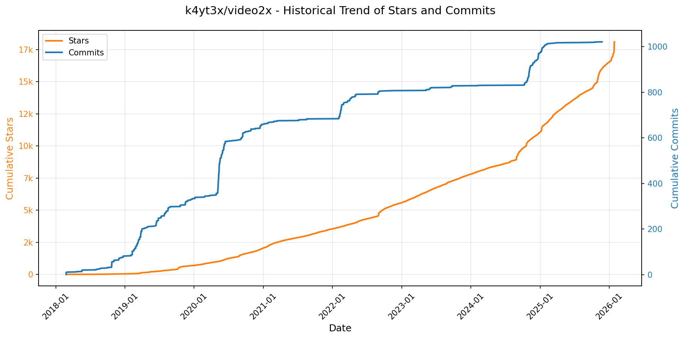
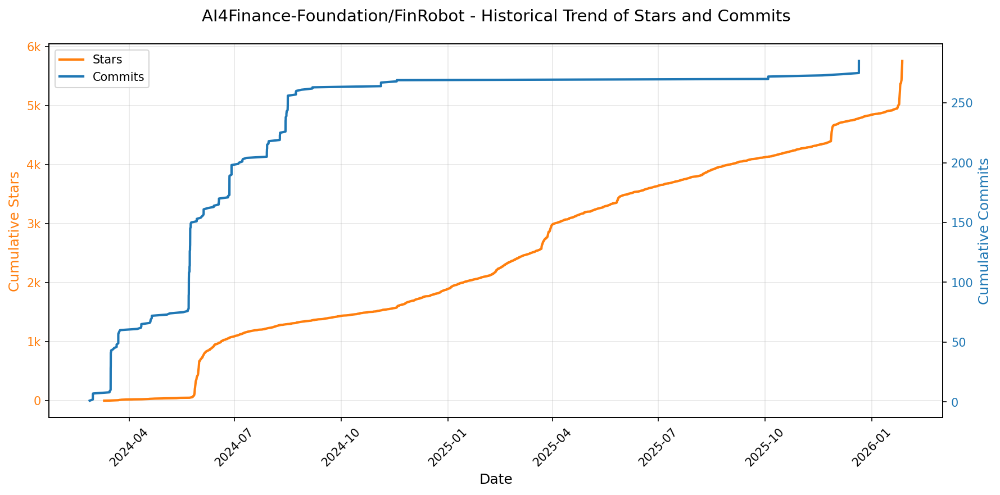
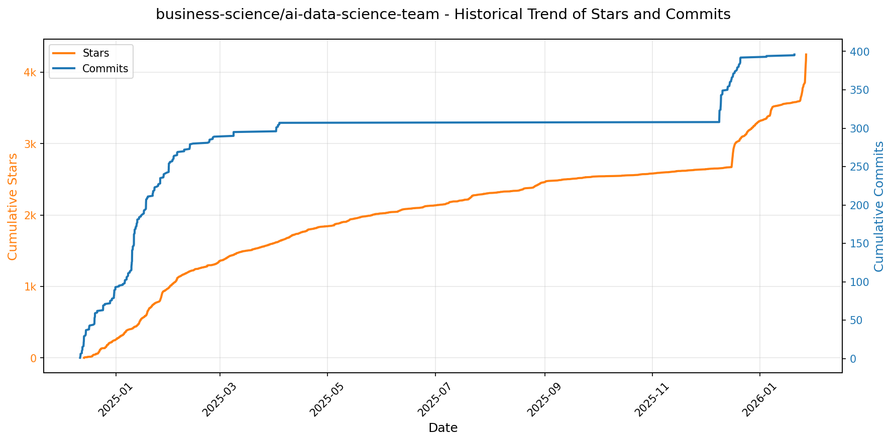

# 🌟 GitHub Trending 概览

> 数据更新于：2026-01-27。

---

## 🔍 项目详情

### 1. [anomalyco/opencode](https://github.com/anomalyco/opencode)
- 📅 **创建日期**：2025-04-30  
- 🔄 **最近更新**：2026-01-27  
- ⭐ **Stars**：89,366（日 +1394｜周 +10276｜月 +46633）  
- 📝 **描述**：The open source coding agent.  

<b>📈 Star 与 Commit 历史趋势</b>

> *蓝色：累计 Stars｜橙色：累计 Commits（次 Y 轴）*

<b>📄 README 摘要</b>

1. **项目功能**  
OpenCode 是一个开源的 AI 编程智能体（AI coding agent），旨在为开发者提供终端原生（TUI）、轻量高效、可本地部署的 AI 辅助编程体验。它能在本地终端中直接理解代码上下文、执行分析、生成/修改代码、运行命令，并支持跨环境远程控制（如本机运行服务端，移动端驱动前端）。其核心定位是成为“终端中的 Claude Code”，但完全开源、不绑定任何大模型服务商，可自由对接 Claude、OpenAI、Google Gemini 或本地 LLM（如 Ollama、Llama.cpp）。

2. **关键特性**  
- **双模式智能体切换**：内置 `build`（默认，全权限开发代理）和 `plan`（只读分析代理，禁止自动编辑文件、需显式授权执行命令），按 Tab 键即时切换；另含 `@general` 子代理处理复杂多步任务。  
- **原生终端优先（TUI-first）**：深度优化终端交互体验，由 Neovim 用户与 terminal.shop 团队打造，支持键盘流操作、低延迟响应。  
- **客户端-服务器架构（Client/Server）**：核心逻辑运行于后端服务，前端可为 TUI、桌面应用或未来移动端，实现计算与界面解耦。  
- **开箱即用的 LSP 支持**：原生集成语言服务器协议，提供精准代码补全、跳转、诊断等 IDE 级能力。  
- **多平台一键安装**：支持 macOS/Linux（Homebrew）、Windows（Scoop/Chocolatey）、Arch（AUR）、Nix、Mise 等主流包管理器，含自定义安装路径支持。  
- **跨平台桌面应用（Beta）**：提供 macOS（Intel/Apple Silicon）、Windows、Linux（deb/rpm/AppImage）原生桌面客户端。  
- **多语言文档与社区支持**：提供 14 种语言的 README 和完整在线文档（opencode.ai/docs），并活跃维护 Discord 社区。

3. **技术栈**  
- **核心语言**：Rust（高性能服务端、CLI 工具链）、TypeScript（Web 控制台、桌面前端）  
- **架构模式**：Client/Server 架构，基于 IPC 或网络通信解耦前后端  
- **AI 集成层**：抽象化 LLM 接口，兼容 OpenAI 兼容 API、Anthropic、Google Vertex AI、Ollama、Llama.cpp 等；官方推荐搭配 [OpenCode Zen](https://opencode.ai/zen)（托管模型服务）  
- **前端框架**：TUI 使用 Rust 生态（如 `crossterm`/`tui-rs`）；Web/桌面端基于现代 Web 技术（React/Vite？未明示但推断为 TS + 前端框架）  
- **构建与分发**：GitHub Actions CI/CD、跨平台打包工具（如 Tauri 或 Electron？桌面端未明确，但支持 dmg/exe/deb/rpm/AppImage）、Nix/Pkg 构建支持  
- **基础设施**：遵循 XDG Base Directory 规范（Linux）、支持环境变量定制安装路径（`$OPENCODE_INSTALL_DIR`, `$XDG_BIN_DIR`）

---

### 2. [anthropics/claude-code](https://github.com/anthropics/claude-code)
- 📅 **创建日期**：2025-02-22  
- 🔄 **最近更新**：2026-01-27  
- ⭐ **Stars**：61,266（日 +408｜周 +2790｜月 +12277）  
- 📝 **描述**：Claude Code is an agentic coding tool that lives in your terminal, understands your codebase, and helps you code faster by executing routine tasks, explaining complex code, and handling git workflows - all through natural language commands.  

<b>📈 Star 与 Commit 历史趋势</b>

> *蓝色：累计 Stars｜橙色：累计 Commits（次 Y 轴）*

<b>📄 README 摘要</b>

1. **该项目的功能**  
Claude Code 是一款终端原生的智能编程代理工具，能够深度理解用户本地代码库，通过自然语言指令协助开发者加速编码工作。其核心功能包括：自动执行重复性开发任务（如生成代码、重构、补全）、解释复杂代码逻辑、自动化处理 Git 工作流（如提交、分支管理、冲突分析），并支持在终端、IDE 或 GitHub 中（通过 `@claude` 提及）直接调用。

2. **关键特性**  
- **上下文感知的代码理解**：基于项目目录结构和文件内容构建本地代码知识图谱，实现精准语义交互；  
- **多环境集成能力**：原生支持终端命令行、主流 IDE 插件扩展及 GitHub 评论区提及调用；  
- **可扩展插件架构**：内置插件系统，允许通过自定义命令和专用 Agent 扩展功能（如测试生成、文档撰写、安全扫描等）；  
- **一键式跨平台安装**：提供针对 macOS/Linux（curl + Homebrew）和 Windows（PowerShell 脚本 + WinGet）的标准化安装方案；  
- **内建反馈与问题上报机制**：集成 `/bug` 命令，支持在使用过程中直接提交带上下文的错误报告；  
- **隐私优先设计**：默认不将代码或会话数据用于模型训练，敏感数据设有限期保留策略，并严格限制内部访问权限。

3. **技术栈**  
- **运行时环境**：Node.js 18+（基础框架依赖）；  
- **客户端部署**：Shell 脚本（macOS/Linux 安装）、PowerShell 脚本（Windows 安装）、Homebrew / WinGet 包管理器集成；  
- **通信与协议**：基于 Anthropic 的 Claude 大模型 API（未显式说明但为底层推理引擎）；  
- **扩展生态**：插件系统采用模块化设计，支持 JavaScript/TypeScript 编写，遵循统一 CLI 命令注册规范；  
- **基础设施与合规**：后端服务由 Anthropic 托管，前端工具链符合 GDPR 及商业隐私政策要求，数据传输加密，会话数据隔离存储。

---

### 3. [usememos/memos](https://github.com/usememos/memos)
- 📅 **创建日期**：2021-12-08  
- 🔄 **最近更新**：2026-01-27  
- ⭐ **Stars**：55,987（日 +158｜周 +1007｜月 +8544）  
- 📝 **描述**：An open-source, self-hosted note-taking service. Your thoughts, your data, your control — no tracking, no ads, no subscription fees.  

<b>📈 Star 与 Commit 历史趋势</b>

> *蓝色：累计 Stars｜橙色：累计 Commits（次 Y 轴）*

<b>📄 README 摘要</b>

1. **项目功能**  
Memos 是一个开源、可自托管的轻量级笔记与知识管理服务，专为注重隐私与数据自主权的个人和团队设计。它支持创建、组织和检索结构化笔记，适用于个人日记、团队 Wiki、技术文档沉淀等场景；所有数据完全由用户掌控，不依赖第三方云服务，无任何遥测、广告或订阅收费。

2. **核心特性**  
- **隐私优先架构**：零数据上报、无跟踪、无广告，支持完整数据导出，杜绝厂商锁定；  
- **原生 Markdown 支持**：富文本编辑体验 + 纯文本（`.md`）存储，确保数据长期可迁移、可读、可版本控制；  
- **极致性能**：Go 编写的高效后端 + React 前端，启动快、响应低、资源占用少，本地部署即享毫秒级加载；  
- **灵活部署方案**：一键 Docker 启动（含 SQLite 默认支持），同时兼容 MySQL 与 PostgreSQL；提供 Docker Compose、Kubernetes（Helm）、预编译二进制包（Linux/macOS/Windows）及源码构建等多种部署方式；  
- **开发者友好**：提供完备的 REST API 与 gRPC 接口，便于集成至 CI/CD、自动化工作流或第三方应用；  
- **现代化交互体验**：简洁美观的响应式 UI，原生支持深色模式，适配桌面与移动设备。

3. **技术栈**  
- **后端**：Go（Golang），采用轻量框架，内置 SQLite / MySQL / PostgreSQL 多数据库支持；  
- **前端**：React（TypeScript），基于现代 Web 标准构建，模块化设计，支持 i18n 多语言；  
- **基础设施**：容器化优先，官方镜像发布于 Docker Hub；生产环境推荐 Docker Compose 或 Kubernetes（提供 Helm Chart）；  
- **其他关键组件**：使用 gRPC 实现高性能内部通信与外部扩展能力；静态资源与 API 服务统一由 Go 后端托管，无需额外 Web 服务器（如 Nginx）。

---

### 4. [anthropics/skills](https://github.com/anthropics/skills)
- 📅 **创建日期**：2025-09-22  
- 🔄 **最近更新**：2026-01-27  
- ⭐ **Stars**：54,590（日 +1396｜周 +8748｜月 +26785）  
- 📝 **描述**：Public repository for Agent Skills  

<b>📈 Star 与 Commit 历史趋势</b>

> *蓝色：累计 Stars｜橙色：累计 Commits（次 Y 轴）*

<b>📄 README 摘要</b>

1. **该项目的作用**  
该项目是 Anthropic 官方发布的 Claude 技能（Skills）开源实现库，旨在展示和提供可复用的、面向特定任务的 AI 能力扩展方案。它不直接运行或部署为独立服务，而是为开发者和组织提供标准化的技能模板、参考实现与最佳实践，用于增强 Claude 在文档处理（PDF/DOCX/PPTX/XLSX）、创意设计、技术开发（如 Web 应用测试、MCP 服务器生成）、企业通信及品牌合规等垂直场景中的专业化表现。这些技能通过动态加载机制被 Claude 解析执行，从而实现任务级能力定制与复用。

2. **核心功能**  
- **模块化技能封装**：每个技能均为独立文件夹，含 `SKILL.md`（含 YAML 元数据+自然语言指令），支持即插即用；  
- **多领域覆盖**：涵盖文档智能（解析/生成/编辑各类办公格式）、创意生成（艺术/音乐/设计）、工程实践（Web 测试、代码辅助、协议服务构建）及企业级工作流（品牌指南执行、内部沟通模板化）；  
- **跨平台集成支持**：原生适配 Claude Code（插件市场安装）、Claude.ai（付费用户开箱即用）及 Claude API（支持上传自定义技能）；  
- **规范与参考并重**：内置完整的 [Agent Skills 规范](./spec) 和官方技能模板（`./template`），同时公开生产级文档技能（如 `skills/docx` 等）作为复杂技能设计范例（源码可用，非开源）；  
- **教育与示范导向**：所有技能均标注用途、示例与使用约束，强调其“演示性”与“启发性”，明确提示实际行为可能因模型版本与环境而异。

3. **技术栈**  
- **核心协议**：基于开放的 [Agent Skills 标准](https://agentskills.io)，采用声明式 YAML + Markdown 混合元数据格式定义技能行为；  
- **交付形态**：纯静态文件结构（无编译/构建步骤），依赖 Claude 运行时解析 `SKILL.md` 中的指令逻辑；  
- **集成接口**：通过 Anthropic 官方插件系统（Claude Code Plugin Marketplace）、Web 前端（Claude.ai）及 RESTful API（Claude Skills API）调用；  
- **许可体系**：多数示例技能采用 Apache 2.0 开源协议；部分关键文档技能（如 `docx`/`pdf` 等子目录）为源码可用（source-available），受 Anthropic 特定授权约束；  
- **开发辅助**：提供标准化模板、规范文档（`./spec`）及 CLI 插件注册命令（如 `/plugin marketplace add`），降低技能创建与分发门槛。

---

### 5. [obra/superpowers](https://github.com/obra/superpowers)
- 📅 **创建日期**：2025-10-09  
- 🔄 **最近更新**：2026-01-27  
- ⭐ **Stars**：37,219（日 +1032｜周 +7240｜月 +25117）  
- 📝 **描述**：An agentic skills framework & software development methodology that works.  

<b>📈 Star 与 Commit 历史趋势</b>

> *蓝色：累计 Stars｜橙色：累计 Commits（次 Y 轴）*

<b>📄 README 摘要</b>

1. **该项目做什么？**  
Superpowers 是一个面向编程智能体（coding agents）的完整软件开发工作流框架，旨在将零散、随意的代码生成行为转化为结构化、可验证、符合工程规范的协作式开发过程。它不直接编写代码，而是通过一系列自动触发的“技能”（skills）引导智能体严格遵循现代软件工程原则——从与用户协同细化需求规格（brainstorming），到生成可执行的分步实施计划（write-plan），再到以子智能体驱动的方式（subagent-driven-development）逐项落实、双重审查（先验规范合规性，再查代码质量），全程强制执行测试先行（TDD）、YAGNI（你不会需要它）、DRY（避免重复）和 Git 工作树隔离等实践。其核心目标是让 AI 编程代理具备类人类工程师的系统性思维与工程纪律，而非仅充当高级代码补全工具。

2. **关键特性**  
- **全流程自动化技能链**：涵盖需求澄清（brainstorming）、分支隔离开发（using-git-worktrees）、任务拆解与计划生成（writing-plans）、子智能体并行执行与双阶段审查（subagent-driven-development）、强制红-绿-重构 TDD 循环（test-driven-development）、阶段性代码评审（requesting/receiving-code-review）、以及开发分支收尾决策（finishing-a-development-branch）等 12+ 个标准化技能，全部按上下文自动激活，非可选建议。  
- **人机协同设计闭环**：在编码前强制进行交互式设计精炼，将方案分块呈现供人工审阅确认，确保对齐真实意图；计划颗粒度精细（每项任务耗时 2–5 分钟），明确指定文件路径、完整代码变更及可验证步骤。  
- **强约束工程实践**：内置对 TDD 的硬性保障（禁止先写实现后补测试）、系统性调试流程（四阶段根因分析）、防御性验证机制（verification-before-completion）、以及复杂度抑制哲学（YAGNI/DRY/简化优先）。  
- **平台无关可扩展架构**：支持 Claude Code（插件市场一键安装）、Codex 和 OpenCode 多平台；技能以模块化 Markdown 文件形式组织，支持社区共建与动态更新（`/plugin update`）；提供 `writing-skills` 技能用于低门槛创建新技能。

3. **技术栈**  
- **运行载体**：深度集成于 AI 编程代理平台，原生适配 **Claude Code**（通过插件市场机制）、**Codex** 和 **OpenCode**（通过远程指令加载配置）；不依赖独立后端或服务，纯前端/客户端侧工作流增强。  
- **核心范式**：基于 **提示工程（Prompt Engineering）驱动的技能编排系统**，所有“技能”本质为结构化、带元信息（触发条件、输入输出、验证规则）的指令模板（Markdown + YAML frontmatter），由代理在运行时动态解析与调度。  
- **工程基础设施**：依托 **Git 工作树（git worktrees）** 实现安全并行开发；强调 **本地化验证**（如测试基线检查、代码风格审查）；文档与安装逻辑托管于 GitHub（raw.githubusercontent.com）；采用 **MIT 开源协议**，构建开放贡献生态。

---

### 6. [remotion-dev/remotion](https://github.com/remotion-dev/remotion)
- 📅 **创建日期**：2020-06-23  
- 🔄 **最近更新**：2026-01-27  
- ⭐ **Stars**：32,143（日 +1305｜周 +6762｜月 +7119）  
- 📝 **描述**：🎥      Make videos programmatically with React  

<b>📈 Star 与 Commit 历史趋势</b>

> *蓝色：累计 Stars｜橙色：累计 Commits（次 Y 轴）*

<b>📄 README 摘要</b>

1. **项目功能**  
Remotion 是一个基于 React 的视频生成框架，允许开发者使用 React 组件、JavaScript 逻辑和 Web 技术（如 CSS、SVG、Canvas、WebGL）**以编程方式动态创建高质量视频**。它将视频视为“可渲染的 React 树”，支持时间轴控制、帧精确渲染、动态数据驱动动画，并可导出为 MP4、GIF 或 ProRes 等格式，适用于生成个性化视频（如年度回顾）、营销素材、数据可视化动效、教程动画等场景。

2. **核心特性**  
- ✅ **React 原生集成**：直接在 React 组件中编写视频逻辑，支持 Hooks、Context、自定义 Hook、组件复用与组合；  
- ✅ **时间轴与帧控制**：提供 `useCurrentFrame()`、`interpolate()`、`Sequence`、`AbsoluteFill` 等专用 Hook 和布局组件，实现基于时间的动画与图层编排；  
- ✅ **多目标输出**：支持本地预览（实时热重载）、静态帧导出、无头浏览器批量渲染（Node.js 环境）、以及高性能视频编码（通过 FFmpeg）；  
- ✅ **跨平台渲染**：既可在浏览器中实时预览，也可通过 CLI 在 Node.js 中离线渲染（无需浏览器），支持 CI/CD 自动化生成；  
- ✅ **丰富生态支持**：兼容主流 React 生态（如 TypeScript、Vite、Next.js、Turbopack）、支持字体加载、音频合成、Canvas/WebGL 混合渲染，并提供官方插件系统（如 `@remotion/gif`、`@remotion/lottie`）；  
- ✅ **生产就绪能力**：内置性能分析工具、分辨率/帧率/编码参数配置、Lambda 渲染部署方案（Remotion Cloud），并支持 SSR 兼容的视频快照生成。

3. **技术栈**  
- **核心语言**：TypeScript（全库强类型）  
- **运行时**：React 18+（客户端渲染 + 服务端/Node.js 渲染双模式）  
- **渲染引擎**：基于 Chromium（Puppeteer / Playwright）进行无头渲染；底层依赖 FFmpeg 进行视频编码与封装  
- **构建与工具链**：Vite（默认模板）、Webpack（兼容支持）、ESBuild（CLI 构建加速）  
- **基础设施**：Node.js（≥18.x）、npm/pnpm/yarn 包管理；支持 Docker 容器化部署与 Serverless（AWS Lambda、Vercel Edge Functions）  
- **扩展生态**：原生支持 Lottie、Three.js、D3、FFmpeg.wasm 等第三方库集成，提供官方适配包（如 `@remotion/three`）

---

### 7. [Lissy93/web-check](https://github.com/Lissy93/web-check)
- 📅 **创建日期**：2023-06-25  
- 🔄 **最近更新**：2026-01-27  
- ⭐ **Stars**：31,186（日 +133｜周 +754｜月 +4125）  
- 📝 **描述**：🕵️‍♂️ All-in-one OSINT tool for analysing any website  

<b>📈 Star 与 Commit 历史趋势</b>

> *蓝色：累计 Stars｜橙色：累计 Commits（次 Y 轴）*

---

### 8. [block/goose](https://github.com/block/goose)
- 📅 **创建日期**：2024-08-23  
- 🔄 **最近更新**：2026-01-27  
- ⭐ **Stars**：29,214（日 +305｜周 +3104｜月 +4172）  
- 📝 **描述**：an open source, extensible AI agent that goes beyond code suggestions - install, execute, edit, and test with any LLM  

<b>📈 Star 与 Commit 历史趋势</b>

> *蓝色：累计 Stars｜橙色：累计 Commits（次 Y 轴）*

<b>📄 README 摘要</b>

1. **项目功能**  
goose 是一个运行在本地的、可扩展的开源 AI 工程代理（AI agent），专注于自动化端到端的软件工程任务。它不仅能提供代码补全或建议，更能自主完成从零构建完整项目、编写并执行代码、调试失败、编排多步骤开发工作流（如测试→构建→部署）、以及调用外部 API 等复杂操作，全程无需人工逐行干预。

2. **核心特性**  
- ✅ **完全本地化运行**：敏感代码与数据不出设备，保障隐私与安全；  
- ✅ **LLM 无关性与多模型支持**：兼容任意大语言模型（如本地 Llama、Ollama、OpenRouter、Anthropic、OpenAI 等），支持按任务动态配置多个模型以平衡性能、成本与可靠性；  
- ✅ **MCP（Model Context Protocol）原生集成**：标准化对接各类工具与服务，实现可扩展的智能体能力编排；  
- ✅ **双形态交付**：同时提供桌面应用（GUI）和命令行工具（CLI），适配不同开发场景与偏好；  
- ✅ **工程级自治能力**：具备规划（planning）、推理（reasoning）、工具调用（tool use）、错误恢复（self-debugging）和长期上下文管理等高级智能体行为。

3. **技术栈**  
- **前端/客户端**：基于 Electron 或 Tauri（官方未明示但 CLI + Desktop 双模暗示跨平台桌面框架，结合 Rust/TypeScript 生态常见实践）；  
- **核心逻辑**：Rust（高性能、内存安全，适用于本地 AI agent 的底层调度与工具执行）与 TypeScript（用于 CLI、插件系统及部分上层逻辑）；  
- **AI 协议层**：深度集成 [MCP](https://modelcontextprotocol.io/)（Model Context Protocol），实现模型-工具-环境的标准化通信；  
- **本地模型支持**：通过标准 API（如 OpenAI 兼容接口）对接 Ollama、LM Studio、Text Generation WebUI 等本地 LLM 运行时；  
- **构建与基础设施**：GitHub Actions CI/CD（`ci.yml`），Apache 2.0 开源许可证，文档托管于 GitHub Pages（`block.github.io/goose`）。

---

### 9. [ComposioHQ/awesome-claude-skills](https://github.com/ComposioHQ/awesome-claude-skills)
- 📅 **创建日期**：2025-10-17  
- 🔄 **最近更新**：2026-01-27  
- ⭐ **Stars**：26,417（日 +572｜周 +4358｜月 +14442）  
- 📝 **描述**：A curated list of awesome Claude Skills, resources, and tools for customizing Claude AI workflows  

<b>📈 Star 与 Commit 历史趋势</b>

> *蓝色：累计 Stars｜橙色：累计 Commits（次 Y 轴）*

<b>📄 README 摘要</b>

1. **该项目的功能**  
该项目是一个面向 Anthropic Claude 系统（包括 Claude.ai、Claude Code 和 Claude API）的**结构化技能（Skills）资源库**，旨在将 Claude 从纯文本生成模型升级为可执行真实业务操作的智能代理。它不提供独立运行的应用或服务，而是通过预定义、可复用的“技能”模块，扩展 Claude 的能力边界——使其能主动调用外部工具、连接第三方应用、处理多格式文档、执行开发任务、分析数据、管理项目、生成媒体内容等，从而在实际工作流中完成端到端的自动化任务。

2. **核心功能**  
- **跨平台技能支持**：统一适配 Claude.ai（网页版）、Claude Code（IDE 插件）及 Claude API，同一技能可在三类环境中自动识别并激活；  
- **1000+ 应用深度集成**：依托 Composio 框架，通过 `connect-apps` 插件实现与 Gmail、Slack、GitHub、Notion、Jira 等主流 SaaS 工具的 OAuth 认证与操作闭环（如发邮件、建 Issue、发消息、更新数据库）；  
- **九大垂直领域技能体系**：涵盖文档处理（DOCX/PDF/PPTX/XLSX/Markdown→EPUB）、开发工程（Playwright 自动化、AWS CDK、Git 工作流、TDD、MCP 服务器构建）、数据分析（CSV 智能摘要、PostgreSQL 只读查询、根因追踪）、商业营销（竞品广告提取、域名创意生成、销售线索研究）、写作沟通（会议洞察分析、NotebookLM 深度问答、推文算法优化）、创意媒体（Canvas 设计、Gemini 图像生成、Slack GIF 制作、YouTube 转录）、生产力组织（发票自动归档、简历定制生成、文件智能整理）、协作管理（Google Workspace 全套集成、Outline Wiki 管理）及安全系统（Sigma 规则威胁狩猎、元数据取证、安全删文件）；  
- **低门槛技能开发框架**：提供标准化技能结构（`SKILL.md` + YAML 元数据 + 可选脚本/模板/资源）、完整创建指南、最佳实践（如面向 Claude 编写指令、覆盖边缘场景、多平台测试）及示例模板，支持用户快速构建和贡献自定义技能。

3. **技术栈**  
- **底层集成层**：基于 [Composio](https://platform.composio.dev) 实现统一的多应用连接器（支持 500+ 应用），处理认证、API 抽象与动作编排；  
- **运行时环境**：依赖 Anthropic 官方生态——Claude.ai 前端、Claude Code（VS Code 插件）及 Claude API（v3.5 Sonnet 等模型）；  
- **技能格式**：纯文本驱动，以 Markdown 文件（`SKILL.md`）为核心载体，采用 YAML 前置元数据声明技能名称、描述、触发条件等；  
- **辅助工具链**：集成 Playwright（Web 自动化）、D3.js（数据可视化）、FFUF（Web 模糊测试）、PICT（组合测试用例生成）、LangSmith（LLM 追踪调试）、n8n（工作流引擎）等开源工具作为技能能力支撑；  
- **开发与分发**：GitHub 托管（开源协作）、Apache 2.0 许可证；使用标准 CLI 工具（如 `claude --plugin-dir`）安装插件，通过 `~/.config/claude-code/skills/` 目录管理本地技能。

---

### 10. [bytedance/UI-TARS-desktop](https://github.com/bytedance/UI-TARS-desktop)
- 📅 **创建日期**：2025-01-19  
- 🔄 **最近更新**：2026-01-27  
- ⭐ **Stars**：24,900（日 +72｜周 +519｜月 +4818）  
- 📝 **描述**：The Open-Source Multimodal AI Agent Stack: Connecting Cutting-Edge AI Models and Agent Infra  

<b>📈 Star 与 Commit 历史趋势</b>

> *蓝色：累计 Stars｜橙色：累计 Commits（次 Y 轴）*

<b>📄 README 摘要</b>

1. **项目功能**  
TARS 是一个开源的多模态 AI 智能体（Agent）技术栈，聚焦于实现类人水平的跨界面任务自动化。它包含两大核心组件：  
- **Agent TARS**：通用多模态智能体框架，支持在终端（CLI）、Web 界面、本地计算机及浏览器中运行，通过视觉理解（Vision）、GUI 操作能力与真实世界工具（如 Shell、浏览器、API）深度集成，完成端到端复杂任务（例如“在 Booking.com 预订机场附近丽思卡尔顿酒店并生成交通指南”）。  
- **UI-TARS Desktop**：原生桌面应用，基于 UI-TARS 视觉语言模型（如 Seed-1.5-VL/1.6），提供本地与远程双模式 GUI 自动化能力——可直接控制本机桌面（如 VS Code 设置）、也可一键远程操控任意电脑或浏览器（零配置），实现跨设备、跨环境的无缝操作。

2. **关键特性**  
- ✅ **多模态感知与执行**：融合屏幕截图识别、视觉定位（Visual Grounding）、DOM 解析与 GUI 操作，支持“看图+读网页+点控+键入”联合决策；  
- ✅ **混合浏览器代理（Hybrid Browser Agent）**：灵活切换 GUI 视觉控制、DOM 结构解析或二者协同策略，提升网页自动化鲁棒性；  
- ✅ **事件流驱动架构（Event Stream）**：基于协议化事件流实现上下文工程、实时数据流追踪与调试（含 Event Stream Viewer），支撑可解释、可调试的智能体行为；  
- ✅ **MCP（Model Context Protocol）深度集成**：以 MCP 为内核标准，支持动态挂载各类 MCP Server（如 Shell、文件系统、图表生成等工具），打通大模型与现实工具链；  
- ✅ **开箱即用的多形态部署**：提供 CLI（headless）、Web UI（headful）、桌面客户端（Electron）及远程操作器（Remote Computer/Browser Operator），覆盖开发、测试与生产全场景；  
- ✅ **隐私优先与本地化**：UI-TARS Desktop 默认全链路本地运行（含模型推理），保障敏感操作数据不出设备。

3. **技术栈**  
- **前端/客户端**：Electron（UI-TARS Desktop 桌面应用）、React/Vite（Web UI）、TypeScript；  
- **核心运行时**：Node.js（≥ v22），CLI 基于 `@agent-tars/cli` npm 包；  
- **AI 模型层**：专用于 GUI 智能体的视觉语言模型（VLM），包括 UI-TARS 系列（如 UI-TARS-1.5-7B）、Seed-1.5-VL/1.6 等；支持对接主流厂商多模态 API（如 VolcEngine 双宝、Anthropic Claude 3.7 Sonnet）；  
- **协议与标准**：MCP（Model Context Protocol）作为工具调用与上下文交换的核心协议；  
- **基础设施**：AIO Agent Sandbox（隔离式一体化工具执行沙箱）、Midscene（浏览器内 GUI 操作 SDK）；  
- **部署与生态**：支持 ModelScope、Hugging Face、npm 分发；文档与社区基于 GitBook / Lark / Discord / DeepWiki 构建。

---

### 11. [BloopAI/vibe-kanban](https://github.com/BloopAI/vibe-kanban)
- 📅 **创建日期**：2025-06-14  
- 🔄 **最近更新**：2026-01-27  
- ⭐ **Stars**：19,379（日 +244｜周 +1851｜月 +12564）  
- 📝 **描述**：Get 10X more out of Claude Code, Codex or any coding agent  

<b>📈 Star 与 Commit 历史趋势</b>

> *蓝色：累计 Stars｜橙色：累计 Commits（次 Y 轴）*

<b>📄 README 摘要</b>

1. **项目功能**  
Vibe Kanban 是一个面向 AI 编程代理（如 Claude Code、Gemini CLI、Codex、Amp 等）的**任务编排与协作管理平台**。它不直接生成代码，而是作为“AI 工程师的操作系统”，帮助开发者高效规划、调度、监控和审查多个 AI 编码代理协同完成的开发任务。核心价值在于：统一管理多代理切换、串行/并行执行编排、实时任务状态追踪、一键启动本地开发服务器、集中化配置 MCP（Model Context Protocol）服务，并支持远程服务器部署下通过 SSH 直连编辑器（如 VS Code）打开项目。

2. **关键特性**  
- ✅ **多 AI 代理统一调度**：无缝切换并协调 Claude、Gemini、Codex 等主流编码代理协同工作；  
- ✅ **灵活执行编排**：支持任务的串行依赖链与并行并发执行模式；  
- ✅ **可视化任务看板（Kanban）**：直观跟踪每个 AI 任务的状态（待处理/运行中/已完成/失败）、输入输出及日志；  
- ✅ **一键开发环境启动**：自动检测并启动对应项目的 dev server（如 `npm run dev`），快速验证 AI 产出；  
- ✅ **MCP 配置中心化管理**：统一维护各编码代理所需的 MCP 服务连接参数（host/port）；  
- ✅ **远程开发深度集成**：在远程服务器运行时，通过 SSH 隧道 + VS Code Remote-SSH 实现“点击即开项目”，本地编辑器直连远程代码；  
- ✅ **安全反向代理支持**：通过 `VK_ALLOWED_ORIGINS` 精确控制跨域请求白名单，适配 Nginx/Caddy/Traefik 等生产部署场景；  
- ✅ **轻量即启**：`npx vibe-kanban` 命令零安装启动，开箱即用。

3. **技术栈**  
- **后端**：Rust（主打高性能与内存安全），使用 `axum`（Web 框架）、`sqlx`（异步 SQL ORM）、`tokio`（异步运行时）；  
- **前端**：TypeScript + React（基于 Vite 构建），采用响应式 UI 设计，适配深色/浅色主题（通过 `<picture>` 动态加载 SVG Logo）；  
- **构建与包管理**：`pnpm`（高效依赖管理）、`cargo`（Rust 工具链）；  
- **数据库**：内置 SQLite（开发默认，含 `dev_assets_seed` 初始化数据），支持扩展；  
- **协议集成**：原生兼容 MCP（Model Context Protocol），作为 AI 代理与工具间标准化通信桥梁；  
- **部署与运维**：支持本地开发（`pnpm run dev`）、Docker、systemd 及云服务器部署；集成 PostHog 进行可选行为分析；  
- **基础设施工具**：依赖 `cargo-watch`（热重载）、`sqlx-cli`（数据库迁移）、Cloudflare Tunnel/ngrok（远程调试隧道）。

---

### 12. [k4yt3x/video2x](https://github.com/k4yt3x/video2x)
- 📅 **创建日期**：2018-02-24  
- 🔄 **最近更新**：2026-01-27  
- ⭐ **Stars**：18,102（日 +382｜周 +999｜月 +1609）  
- 📝 **描述**：A machine learning-based video super resolution and frame interpolation framework. Est. Hack the Valley II, 2018.  

<b>📈 Star 与 Commit 历史趋势</b>

> *蓝色：累计 Stars｜橙色：累计 Commits（次 Y 轴）*

<b>📄 README 摘要</b>

1. **项目功能**  
Video2X 是一个基于机器学习的视频超分辨率（Super Resolution）与帧插值（Frame Interpolation）框架，专注于提升低分辨率视频的清晰度和流畅度。它支持两种核心处理模式：**视频放大（滤波/上采样）** 和 **帧率提升（运动补偿插帧）**，可将低清视频（如 240P、360P）高质量重建为高清或超高清（如 1080P、4K），并可将低帧率视频（如 30 FPS）升频至高帧率（如 60 FPS 或 120 FPS），广泛适用于动漫、老片修复及短视频增强等场景。

2. **关键特性**  
- **全栈重写与性能飞跃**：v6.0.0 起完全使用 C/C++ 重构，显著提升运行速度与内存效率，处理过程零额外磁盘占用（仅需输出空间）；  
- **跨平台原生支持**：提供 Windows 与 Linux 官方二进制包（含图形界面与安装程序），Windows 版集成 Qt6 GUI，支持多语言（含简体中文）；  
- **先进模型集成**：原生支持 Anime4K v4（GPU 加速 GLSL 着色器）、Real-ESRGAN、Real-CUGAN 和 RIFE 全系列模型，全部通过 **ncnn + Vulkan** 高效部署，充分发挥 GPU 并行计算能力；  
- **灵活部署方式**：除桌面应用外，提供 Linux AppImage、Arch AUR 包、Docker/Podman 容器镜像，以及开箱即用的 Google Colab Notebook（免费调用 T4/L4/A100 GPU）；  
- **硬件优化适配**：预编译版要求 CPU 支持 AVX2，GPU 需兼容 Vulkan（支持 NVIDIA Kepler 及更新、AMD GCN 1.0 及更新、Intel HD Graphics 4000 及更新）。

3. **技术栈**  
- **核心语言与框架**：C/C++（主体逻辑）、Qt6（Windows/Linux 桌面 GUI）、ncnn（轻量级神经网络推理框架）；  
- **AI 推理后端**：Vulkan（GPU 加速计算，统一支持所有模型）、GLSL（Anime4K v4 着色器）；  
- **依赖与集成模型**：FFmpeg（视频 I/O 与编解码）、Anime4K（MIT）、Real-ESRGAN / Real-CUGAN / RIFE（均通过 ncnn-Vulkan 移植，MIT 许可）；  
- **分发与部署**：GitHub Releases、AUR（Arch Linux）、AppImage（通用 Linux）、Docker（GitHub Container Registry）、Google Colab（Jupyter + CUDA 环境）。

---

### 13. [shareAI-lab/learn-claude-code](https://github.com/shareAI-lab/learn-claude-code)
- 📅 **创建日期**：2025-06-29  
- 🔄 **最近更新**：2026-01-27  
- ⭐ **Stars**：15,442（日 +114｜周 +742｜月 +3706）  
- 📝 **描述**：Bash is all you need！write a claude code with only 16 line code   

<b>📈 Star 与 Commit 历史趋势</b>

> *蓝色：累计 Stars｜橙色：累计 Commits（次 Y 轴）*

<b>📄 README 摘要</b>

1. **项目功能**  
该项目是一个面向教育的实践型学习资源，旨在通过从零构建一系列渐进式AI编码智能体（AI Coding Agents），帮助开发者深入理解现代AI代理系统（特别是类Claude Code风格）的核心工作原理。它不提供开箱即用的生产级工具，而是以极简、可运行的Python脚本（v0–v4共5个版本）为载体，逐步揭示AI编码代理的本质范式：**模型即代理（Model as Agent）**。用户可通过运行这些短小精悍的脚本（最简仅16行），亲手复现并验证“代理循环”（Agent Loop）、工具调用、显式规划、子代理隔离、按需知识注入等关键机制，最终掌握构建可扩展、可维护AI代理系统的方法论。

2. **核心特性**  
- **渐进式学习路径**：提供5个严格递进的版本（v0–v4），代码量从16行增至550行，每版聚焦一个核心概念（如v0强调“Bash即万能工具”，v2引入TodoManager实现结构化规划，v3通过Task工具实现上下文隔离，v4借助Skill工具支持领域知识动态加载）。  
- **真实Agent Skills Spec兼容**：原生支持Anthropic官方[Agent Skills规范](https://github.com/anthropics/agent-skills)，可无缝对接Kode CLI、Claude Code、Cursor等主流AI编码环境。  
- **内置可复用技能系统（Skills System）**：包含`agent-builder`（自动生成新代理项目）、`code-review`（代码审查方法论）、`pdf`（PDF处理）、`mcp-builder`（MCP服务器开发）等生产级示例技能，并提供命令行脚手架（`init_agent.py`）快速生成新代理。  
- **极简主义设计哲学**：所有版本均基于同一核心循环（`while True: model → tool_use → execute → append`），强调“模型是80%，代码是20%”，拒绝过度工程，突出LLM原生代理能力。  
- **多语言文档与实操支持**：提供英文、中文、日文技术教程（docs/）及中文博客文章（articles/），配套完整测试套件（tests/）和详尽配置说明（.env）。

3. **技术栈**  
- **编程语言**：Python 3.10+（核心实现）  
- **AI模型接口**：Anthropic Claude API（通过`ANTHROPIC_API_KEY`调用，支持自定义`MODEL_ID`与`ANTHROPIC_BASE_URL`）  
- **核心依赖**：`anthropic`官方SDK（用于模型调用）、`pydantic`（结构化工具定义与响应解析）、`rich`（终端美化输出）  
- **架构范式**：纯Python脚本驱动，无Web框架或复杂服务依赖；采用轻量级工具注册与执行机制（非插件化运行时，但技能设计遵循标准Spec）；上下文管理通过消息列表（`messages`）与子代理作用域隔离实现。  
- **辅助生态**：深度集成`shareAI-skills`技能仓库与`Kode`开源CLI工具链，形成“学习→开发→部署”闭环。

---

### 14. [supermemoryai/supermemory](https://github.com/supermemoryai/supermemory)
- 📅 **创建日期**：2024-02-27  
- 🔄 **最近更新**：2026-01-27  
- ⭐ **Stars**：15,169（日 +415｜周 +1008｜月 +1359）  
- 📝 **描述**：Memory engine and app that is extremely fast, scalable. The Memory API for the AI era.  

<b>📈 Star 与 Commit 历史趋势</b>

> *蓝色：累计 Stars｜橙色：累计 Commits（次 Y 轴）*

<b>📄 README 摘要</b>

1. **项目功能**  
Supermemory 是一个面向个人知识管理的 AI 增强型“第二大脑”工具，核心目标是帮助用户**永久保存、结构化组织并智能检索所有重要信息**。它支持从任意来源（网页链接、PDF 文档、纯文本、Notion/Google Drive/OneDrive 等云服务）一键添加“记忆”（Memories），并允许用户通过自然语言对话实时查询、交叉关联和推理这些私有知识库，实现真正个性化的 AI 助理体验。

2. **关键特性**  
- **多源记忆采集**：支持 URL、PDF、文本粘贴、文件上传及主流云存储（Notion/Google Drive/OneDrive）自动同步；  
- **语义化记忆聊天**：基于私有知识库的上下文感知对话，精准检索与生成答案，非通用大模型幻觉式响应；  
- **MCP（Memory Control Protocol）开放集成**：提供标准化协议，原生对接 Claude、Cursor、Cursor Pro、Windsurf 等主流 AI 开发/协作工具，实现记忆在 IDE 和 AI 工作流中实时调用；  
- **全场景轻量入口**：  
  • Chrome/Edge 浏览器扩展——支持网页右键保存、ChatGPT/Claude 对话自动归档、Twitter/X 内容抓取；  
  • Raycast 桌面扩展——通过快捷键快速添加/搜索记忆，无缝融入开发者本地工作流；  
- **企业级可控性**：提供自托管部署方案与开发者控制台（API 访问、权限管理、审计日志），满足数据主权与合规需求。

3. **技术栈**  
- **前端**：TypeScript + React（应用主界面）、Vite（构建工具）；Chrome 扩展使用 Manifest V3，Raycast 扩展基于其官方 SDK；  
- **后端与基础设施**：未明确披露具体语言，但文档与部署指南表明采用云原生架构，支持 Kubernetes 自托管；依赖向量数据库（隐含于语义搜索能力中）、异步任务队列（用于 PDF 解析等耗时操作）及安全认证体系（OAuth 2.0 / SSO 集成）；  
- **AI 与数据层**：深度整合嵌入模型（用于记忆向量化）、RAG（检索增强生成）管道、以及 MCP 协议定义的标准化记忆接口；强调端到端加密与私有知识隔离，不依赖第三方模型训练数据。

---

### 15. [steveyegge/beads](https://github.com/steveyegge/beads)
- 📅 **创建日期**：2025-10-12  
- 🔄 **最近更新**：2026-01-27  
- ⭐ **Stars**：13,061（日 +217｜周 +1626｜月 +6593）  
- 📝 **描述**：Beads - A memory upgrade for your coding agent  

<b>📈 Star 与 Commit 历史趋势</b>

> *蓝色：累计 Stars｜橙色：累计 Commits（次 Y 轴）*

<b>📄 README 摘要</b>

1. **项目功能**  
该项目（`bd - Beads`）是一个**分布式、Git 背书的图谱型问题追踪系统**，专为 AI 编程智能体（coding agents）设计。其核心作用是为 AI 代理提供**持久化、结构化的长期记忆机制**，替代传统易失、非结构化的 Markdown 计划文档；通过构建具备显式依赖关系的任务图谱（dependency-aware graph），使 AI 代理能在执行长周期、多步骤编程任务时保持上下文连贯性与任务状态一致性，并支持跨分支、多代理协同下的可靠状态管理。

2. **关键特性**  
- **Git 原生存储**：所有任务以 JSONL 格式存于 `.beads/` 目录下，完全复用 Git 的版本控制能力（提交、分支、合并、回溯），实现任务历史的可审计与可协作。  
- **AI 代理友好设计**：输出为机器可读 JSON；内置依赖建模（`bd dep add`）、自动识别就绪任务（`bd ready`）、基于哈希的唯一 ID（如 `bd-a1b2`）确保多代理并发写入零冲突。  
- **轻量隐形架构**：本地 SQLite 缓存加速查询；后台守护进程（daemon）静默同步 Git 状态，对用户和代理透明。  
- **语义压缩（Compaction）**：自动对已关闭的旧任务进行语义摘要，模拟“记忆衰减”，显著降低大模型上下文窗口压力。  
- **层级化任务建模**：支持嵌套 ID（如 `bd-a3f8.1.1`），原生表达史诗（Epic）、任务、子任务等层次关系。  
- **多角色工作流适配**：提供 `--stealth`（本地私有使用）、`--contributor`（贡献者隔离规划仓库）、`--maintainer`（维护者直连主仓库）三种初始化模式，适配开源协作全场景。

3. **技术栈**  
- **主语言**：Go（核心 CLI 工具 `bd` 用 Go 编写，支持跨平台编译）  
- **存储与同步层**：Git（作为事实来源与分布式数据库）、SQLite（本地只读缓存）  
- **客户端生态**：提供 npm 包（`@beads/bd`，支持 JS/TS 环境集成）、PyPI 包（`beads-mcp`，支持 Python/MCP 协议）、Homebrew（macOS/Linux 一键安装）  
- **协议与扩展**：兼容 MCP（Model Context Protocol）标准；开放社区工具链（终端 UI、Web 界面、VS Code 插件、原生桌面应用等）  
- **运行环境**：原生支持 Linux、FreeBSD、macOS 和 Windows

---

### 16. [iOfficeAI/AionUi](https://github.com/iOfficeAI/AionUi)
- 📅 **创建日期**：2025-08-07  
- 🔄 **最近更新**：2026-01-27  
- ⭐ **Stars**：11,120（日 +388｜周 +4184｜月 +7917）  
- 📝 **描述**：Free, local, open-source 24/7 Cowork for Gemini CLI, Claude Code, Codex, OpenCode, Qwen Code, Goose CLI, Auggie, and more | 🌟 Star if you like it!  

<b>📈 Star 与 Commit 历史趋势</b>

> *蓝色：累计 Stars｜橙色：累计 Commits（次 Y 轴）*

---

### 17. [VectifyAI/PageIndex](https://github.com/VectifyAI/PageIndex)
- 📅 **创建日期**：2025-04-01  
- 🔄 **最近更新**：2026-01-27  
- ⭐ **Stars**：9,841（日 +685｜周 +4163｜月 +5441）  
- 📝 **描述**：📑 PageIndex: Document Index for Vectorless, Reasoning-based RAG  

<b>📈 Star 与 Commit 历史趋势</b>

> *蓝色：累计 Stars｜橙色：累计 Commits（次 Y 轴）*

<b>📄 README 摘要</b>

1. **项目功能**  
PageIndex 是一个**无向量数据库（vectorless）、基于推理（reasoning-based）的检索增强生成（RAG）系统**，专为专业级长文档（如财报、法律文书、技术手册、学术教材等）设计。它不依赖传统语义相似度搜索，而是通过构建文档的**分层树状索引（Tree Index）**，并利用大语言模型（LLM）在该索引上执行**类人、多步推理式检索**，实现高精度、可追溯、可解释的知识定位与提取。

2. **核心特性**  
- ✅ **无需向量数据库**：摒弃嵌入（embedding）与向量相似度计算，完全基于文档结构与LLM推理完成检索；  
- ✅ **无需人工分块（No Chunking）**：保留文档天然语义单元（如章节、小节），按逻辑层级自动组织为树结构，避免信息割裂；  
- ✅ **类人检索能力**：模拟人类专家“先看目录→逐层聚焦→精确定位”的阅读与推理路径，支持上下文感知的树遍历搜索；  
- ✅ **高可解释性与可追溯性**：每一步检索决策均可追溯至具体页码、节点ID及摘要，输出结果附带明确来源引用，杜绝“黑箱式相似匹配”（即所谓“vibe retrieval”）；  
- ✅ **原生支持视觉输入（Vision-based RAG）**：提供OCR-Free方案，可直接对PDF页面图像进行端到端推理检索，跳过传统OCR文本提取环节；  
- ✅ **实证高性能**：驱动的金融分析系统 Mafin 2.5 在 FinanceBench 基准测试中达成 **98.7% 准确率**，显著超越主流向量RAG方案。

3. **技术栈**  
- **核心范式**：Agentic RAG、In-context Tree Indexing、Reasoning-over-Structure；  
- **模型依赖**：以 OpenAI GPT 系列（如 `gpt-4o-2024-11-20`）为主要推理引擎，支持灵活切换；  
- **文档解析**：支持 PDF（基于 PyPDF2 / pdfplumber 等库）与 Markdown（按 `#` 层级解析）双输入格式；  
- **架构组件**：  
  - 树索引生成器（`run_pageindex.py`）：将PDF/MD转换为JSON格式的语义树（含节点ID、起止页、摘要、子节点嵌套）；  
  - 推理检索层：基于树结构调用LLM执行分步推理查询（如“先定位‘风险因素’章节，再筛选2023年相关子项”）；  
- **部署方式**：开源本地运行（Python CLI）、云服务（[chat.pageindex.ai](https://chat.pageindex.ai)）、MCP协议集成（适配Claude/Cursor等Agent）、REST API（Beta）；  
- **辅助工具链**：Colab交互式笔记本（含 Vectorless RAG / Vision RAG 示例）、环境变量配置（`.env`）、模块化参数控制（如 `--max-pages-per-node`, `--if-add-node-summary`）。

---

### 18. [virattt/dexter](https://github.com/virattt/dexter)
- 📅 **创建日期**：2025-10-14  
- 🔄 **最近更新**：2026-01-27  
- ⭐ **Stars**：9,065（日 +121｜周 +1639｜月 +4712）  
- 📝 **描述**：An autonomous agent for deep financial research  

<b>📈 Star 与 Commit 历史趋势</b>

> *蓝色：累计 Stars｜橙色：累计 Commits（次 Y 轴）*

<b>📄 README 摘要</b>

1. **项目功能**  
Dexter 是一个面向金融研究领域的自主式AI代理（Autonomous Financial Research Agent），能够对复杂金融问题进行端到端的自主分析：接收用户提出的金融类问题 → 自动拆解为多步研究计划 → 调用实时市场数据与外部API执行任务 → 自我验证结果正确性 → 迭代优化直至生成可信、数据支撑的最终结论。其核心目标是替代传统人工财务尽调、公司基本面分析、行业比较等重复性高、数据依赖性强的研究工作，实现“思考—规划—执行—反思—学习”的闭环。

2. **关键特性**  
- **智能任务规划（Intelligent Task Planning）**：基于大模型推理，将模糊或复杂的金融问题（如“对比苹果与微软过去三年的资本配置效率”）自动分解为结构化子任务（如获取财报、计算ROIC、标准化现金流指标等）。  
- **自主任务执行（Autonomous Execution）**：动态选择并调用适配工具链（如Financial Datasets API获取财报、Exa/Tavily执行专业财经网页检索、本地代码解释器计算指标），无需人工干预。  
- **自我验证与迭代（Self-Validation & Iteration）**：内置结果校验逻辑，能识别数据矛盾、计算错误或逻辑断层，并主动重试、修正步骤或调整计划，确保输出严谨可靠。  
- **实时权威金融数据接入**：原生集成 Financial Datasets API，可直接获取上市公司经审计的最新收入表、资产负债表、现金流量表等结构化财报数据。  
- **安全运行保障**：内置循环检测（loop detection）与最大步数限制（step limits），防止无限推理或失控调用，保障系统稳定性和资源可控性。

3. **技术栈**  
- **运行时**：Bun（v1.0+）—— 作为高性能 JavaScript/TypeScript 运行时，替代 Node.js，提供极速依赖安装与启动。  
- **AI模型层**：支持多后端大模型，包括 OpenAI（GPT系列）、Anthropic（Claude）、Google（Gemini）、xAI（Grok），并兼容本地 Ollama 模型（通过 `OLLAMA_BASE_URL` 配置）。  
- **数据服务**：  
  - 主要财报源：Financial Datasets API（必需）；  
  - 补充网络搜索：Exa API（首选，专注高质量财经内容）、Tavily API（备用）；  
- **开发与部署**：纯 TypeScript 编写，模块化架构；使用 `.env` 管理多源API密钥；支持交互式 CLI（`bun start`）与热重载开发模式（`bun dev`）。

---

### 19. [AI4Finance-Foundation/FinRobot](https://github.com/AI4Finance-Foundation/FinRobot)
- 📅 **创建日期**：2024-02-27  
- 🔄 **最近更新**：2026-01-27  
- ⭐ **Stars**：5,753（日 +357｜周 +820｜月 +927）  
- 📝 **描述**：FinRobot: An Open-Source AI Agent Platform for Financial Analysis using LLMs 🚀 🚀 🚀   

<b>📈 Star 与 Commit 历史趋势</b>

> *蓝色：累计 Stars｜橙色：累计 Commits（次 Y 轴）*

<b>📄 README 摘要</b>

1. **该项目做什么？**  
FinRobot 是一个开源的金融领域 AI 智能体（AI Agent）平台，专注于为股票研究与投资分析提供端到端自动化支持。它并非单纯的语言模型应用，而是构建在多层架构之上的综合性金融智能系统：通过感知市场数据、新闻与财报等多源信息，调用大语言模型（LLM）作为“大脑”进行金融链式思维（Financial Chain-of-Thought, CoT）推理，并协同各类专业工具执行具体动作（如生成研报、预测股价走势、评估风险、生成可视化图表、输出PDF报告等），最终实现从数据输入到决策输出的闭环。其核心目标是赋能专业投资者与研究人员，将传统耗时数日的权益研究流程（如撰写深度个股研报）压缩至分钟级自动化完成。

2. **关键特性**  
- **全流程自动化研报生成**：支持基于SEC 10-K文件、财务报表、市场数据自动生成结构化、合规、专业级的PDF股权研究报告；  
- **多维度金融分析能力**：覆盖财务报表深度解读（损益表、资产负债表、现金流量表）、估值分析（P/E、EV/EBITDA、同业对比）、风险识别与量化评估；  
- **智能市场预测代理**：结合实时新闻、基本面与技术面信号，对个股未来一周价格方向及幅度（如“上涨2–3%”）做出可解释性预测；  
- **模块化AI代理体系**：内置多种专业化Agent（如Market Forecaster、Financial Analyst、Trade Strategist），支持角色分工与协同；  
- **金融专属链式思维（Financial CoT）**：将复杂分析任务分解为8步标准化工作流（数据采集→财报分析→业务评估→风险识别→图表可视化→段落合成→PDF生成→质量校验），确保逻辑严谨、结果可追溯；  
- **动态LLM调度机制（Smart Scheduler）**：含Director Agent、Agent Adaptor、Task Manager等组件，按任务类型自动选择并适配最优基础模型（如GPT-4）或微调模型；  
- **多源异构数据接入**：原生集成Finnhub、Financial Modeling Prep（FMP）、SEC EDGAR、Yahoo Finance等主流金融数据API；  
- **开箱即用教程与演示**：提供从入门（`tutorials_beginner`）到开发进阶（`tutorials_advanced`）的完整Jupyter Notebook示例，覆盖年报分析、交易策略回测、多模态图表生成等场景。

3. **技术栈**  
- **核心框架**：基于 Microsoft AutoGen 构建多智能体协作系统，支持LLM驱动的对话式任务编排与工具调用；  
- **大语言模型**：兼容OpenAI GPT系列（如`gpt-4-0125-preview`），支持配置多模型列表（`OAI_CONFIG_LIST`）及模型路由；  
- **金融数据层**：集成 `yfinance`、`finnhub-python`、`fmp-python`、`sec-api` 等Python SDK，统一封装于 `data_source/` 模块；  
- **功能模块化设计**：`functional/` 目录下包含分析器（`analyzer.py`）、图表引擎（`charting.py`，支持mplfinance）、量化计算（`quantitative.py`）、PDF生成（`reportlab.py`）、文本处理（`text.py`）等原子能力；  
- **基础设施**：采用 LLMOps + DataOps 范式管理模型生命周期与数据流水线；底层支持Python 3.10+，依赖管理通过 `requirements.txt` 和 `setup.py` 实现；  
- **部署与扩展**：支持本地虚拟环境（conda）、PyPI一键安装（`pip install finrobot`），代码结构清晰（agents/data_source/functional三层解耦），便于二次开发与Agent插件扩展。

---

### 20. [Blaizzy/mlx-audio](https://github.com/Blaizzy/mlx-audio)
- 📅 **创建日期**：2024-11-27  
- 🔄 **最近更新**：2026-01-27  
- ⭐ **Stars**：5,144（日 +748｜周 +1880｜月 +2013）  
- 📝 **描述**：A text-to-speech (TTS), speech-to-text (STT) and speech-to-speech (STS) library built on Apple's MLX framework, providing efficient speech analysis on Apple Silicon.  

<b>📈 Star 与 Commit 历史趋势</b>

> *蓝色：累计 Stars｜橙色：累计 Commits（次 Y 轴）*

<b>📄 README 摘要</b>

1. **项目功能**  
MLX-Audio 是一个专为 Apple Silicon（M 系列芯片）优化的高性能音频处理库，核心能力覆盖三大语音任务：**文本转语音（TTS）**、**语音转文本（STT）** 和 **语音转语音（STS）**。它支持端到端音频生成、高精度语音识别（含说话人分离与时间戳）、语音增强、声源分离、声音克隆及多语言语音合成，可直接在 macOS/iOS 设备上本地运行，无需云端依赖。

2. **关键特性**  
- ✅ **Apple Silicon 原生加速**：深度适配 MLX 框架，实现低延迟、高吞吐量推理；  
- ✅ **全栈语音能力**：涵盖 TTS（8+ 多语言模型，如 Kokoro、Qwen3-TTS、Chatterbox）、STT（Whisper-v3、VibeVoice-ASR、Parakeet 等，支持 99+ 语言及长音频/说话人日志）、STS（SAM-Audio 声源分离、MossFormer2 降噪、Liquid2.5 多模态语音转换）；  
- ✅ **高级语音控制**：支持 54+ 预设音色、自定义语音克隆（CSM）、情感/语速/语调调节、多语言混合合成（含 EN/JP/ZH/ES/FR 等 16+ 语种）；  
- ✅ **生产就绪接口**：提供 OpenAI 兼容 REST API、交互式 Web UI（含 3D 音频可视化）、命令行工具（CLI）及 Python SDK；  
- ✅ **极致部署优化**：支持 3/4/6/8-bit 量化、bfloat16/fp16/fp32 混合精度、模型轻量化转换；  
- ✅ **跨平台集成能力**：提供 Swift Package（通过 [mlx-audio-swift](https://github.com/Blaizzy/mlx-audio-swift) 支持 iOS/macOS 原生调用）；  
- ✅ **开箱即用体验**：内置 ffmpeg 音频编解码支持（MP3/FLAC/WAV），一键安装（pip/uv），支持开发模式快速启动 Web 界面。

3. **技术栈**  
- **核心框架**：Apple 官方 [MLX](https://github.com/ml-explore/mlx)（专为 Apple Silicon 设计的机器学习框架，替代 PyTorch/TensorFlow）；  
- **编程语言**：Python（主逻辑、CLI、API Server）、Swift（iOS/macOS 原生封装）、TypeScript/React（Web UI 前端）、Node.js（UI 构建）；  
- **模型生态**：基于 Hugging Face Hub 的 MLX 格式模型（`mlx-community` 组织托管），兼容 HF Transformers 接口风格；  
- **音频处理**：底层依赖 `ffmpeg`（MP3/FLAC 编码）、`misaki`（日/中文语音前端）、`mx.array`（MLX 张量运算）；  
- **服务架构**：FastAPI 构建 REST API 服务，支持流式响应（STT 实时转录）、结构化 JSON 输出（含时间戳与说话人 ID）；  
- **构建与分发**：`uv`（超快 Python 工具链）、`pip`、Git + `setup.py[dev]` 开发模式，支持模型上传至 Hugging Face Hub。

---

### 21. [OpenBMB/UltraRAG](https://github.com/OpenBMB/UltraRAG)
- 📅 **创建日期**：2025-01-16  
- 🔄 **最近更新**：2026-01-27  
- ⭐ **Stars**：4,415（日 +267｜周 +1974｜月 +2041）  
- 📝 **描述**：UltraRAG v3: A Low-Code MCP Framework for Building Complex and Innovative RAG Pipelines  

<b>📈 Star 与 Commit 历史趋势</b>

> *蓝色：累计 Stars｜橙色：累计 Commits（次 Y 轴）*

<b>📄 README 摘要</b>

1. **该项目做什么？**  
UltraRAG 是一个轻量级、面向研究与工业原型开发的检索增强生成（RAG）全流程开发框架。它基于**模型上下文协议（MCP）架构**，将 RAG 的核心组件（如检索器 Retriever、生成器 Generation 等）抽象为独立、可互操作的 **MCP Server**，并通过 **MCP Client** 实现高灵活性的流程编排。其核心目标是：**大幅降低 RAG 开发门槛**——开发者无需编写大量胶水代码，仅通过简洁的 YAML 配置即可定义含条件分支、循环迭代等复杂控制逻辑的 RAG 流程；同时提供一体化的可视化 IDE（UltraRAG UI），支持从 pipeline 构建、实时调试、知识库管理到一键生成交互式 Web 应用的完整闭环。

2. **关键特性**  
- **低代码复杂流程编排**：原生支持顺序、条件判断、循环等控制结构，数十行 YAML 即可实现多步迭代 RAG（如 DeepResearch 多轮检索-整合-报告生成）；  
- **模块化与高复用性**：基于 MCP 的“原子化 Server”设计，功能以工具（Tool）粒度解耦，新增能力（如新检索算法、新 LLM 接口）只需注册为 Server 即可无缝接入现有流程；  
- **统一评估与基准体系**：内置标准化评估工作流、主流公开数据集（如 UltraRAG_Benchmark）及基线模型，支持指标统一管理与跨方法公平对比，显著提升实验可复现性与研究效率；  
- **极速原型交付**：Pipeline 逻辑可“一键”自动转换为具备完整对话界面、知识库管理、参数调优辅助的 Web 应用（UltraRAG UI），消除前端开发负担；  
- **全栈可视化 IDE**：UI 支持画布拖拽与 YAML 代码双向实时同步、中间结果逐层追踪（Case Study）、AI 辅助提示工程与参数优化，覆盖开发、调试、演示全生命周期。

3. **技术栈**  
- **核心架构**：Model Context Protocol（MCP）协议标准（服务解耦、客户端驱动编排）；  
- **后端语言**：Python（主语言），依赖 `uv` 进行高速依赖管理与虚拟环境构建；  
- **部署方式**：支持本地源码安装（推荐 `uv sync`）与 Docker 容器化部署（提供 CPU/GPU 基础镜像及全功能 GPU 镜像）；  
- **关键组件生态**：  
  - 检索层：兼容主流向量数据库（如 Milvus，文档中明确提及部署指南）；  
  - 生成层：支持集成各类开源/商用大模型（LLM），已深度集成自研 **AgentCPM-Report（8B 端侧写作智能体）**；  
  - 前端/IDE：基于 Web 技术构建的 UltraRAG UI（具体框架未明示，但强调 Canvas + Code 双向同步与 AI 助理）；  
- **扩展与集成**：通过 MCP Server 注册机制，可灵活接入任意符合协议的第三方工具或模型服务。

---

### 22. [business-science/ai-data-science-team](https://github.com/business-science/ai-data-science-team)
- 📅 **创建日期**：2024-12-11  
- 🔄 **最近更新**：2026-01-27  
- ⭐ **Stars**：4,248（日 +407｜周 +671｜月 +1013）  
- 📝 **描述**：An AI-powered data science team of agents to help you perform common data science tasks 10X faster.  

<b>📈 Star 与 Commit 历史趋势</b>

> *蓝色：累计 Stars｜橙色：累计 Commits（次 Y 轴）*

<b>📄 README 摘要</b>

1. **项目功能**  
该项目是一个面向数据科学工作流的 Python 库（`ai-data-science-team`）及配套旗舰应用（**AI Pipeline Studio**）。它通过构建专业化 AI 智能体（Agents），自动化并增强典型数据科学任务——包括数据加载、清洗、探索性数据分析（EDA）、可视化、特征工程、建模、评估与预测。核心价值在于将传统脚本式分析升级为**可视化的、带完整血缘追踪（lineage）的可复现 AI 驱动流水线**，支持手动干预与 AI 协同操作，并提供项目级元数据/全量数据保存、存储优化与按需恢复（rehydrate）能力。

2. **关键特性**  
- **可视化流水线工作台（AI Pipeline Studio）**：集成图形化编辑器、表格视图、图表、EDA面板、代码编辑器、模型管理、预测结果与 MLflow 追踪；  
- **混合执行模式**：支持人工步骤与 AI 自动步骤无缝协同，并全程记录操作血缘，生成可复现脚本；  
- **多数据集处理能力**：原生支持多源数据加载、合并（merge workflows）及跨数据集分析；  
- **灵活的项目持久化**：可选择仅保存元数据（轻量）或完整数据集，配合存储控制策略与数据重载（rehydrate）机制；  
- **模块化智能体架构**：提供十余类预置专业 Agent（如数据加载、SQL交互、H2O建模、MLflow集成、监督协调的Supervisor Agent等），支持组合构建多智能体工作流（如Pandas数据分析师、SQL数据分析师）；  
- **本地与云端大模型双支持**：开箱兼容 OpenAI（如 GPT-4.1-mini）与本地 Ollama（如 Llama3.1:8b），保障隐私与灵活性。

3. **技术栈**  
- **核心框架**：Python 3.10+；  
- **AI/LLM 集成**：LangChain（`langchain_openai`, `langchain_ollama`），支持 OpenAI API 与 Ollama 本地大模型服务；  
- **前端与应用层**：Streamlit（用于构建交互式 Web 应用，如 AI Pipeline Studio、EDA Explorer 等）；  
- **数据科学与建模**：Pandas、H2O.ai（自动机器学习）、MLflow（实验跟踪与模型管理）；  
- **数据库支持**：内置 SQL Database Agent，支持与关系型数据库交互；  
- **开发与部署**：PyPI 发布（`ai-data-science-team` 包），GitHub 托管，MIT 许可证。

---

