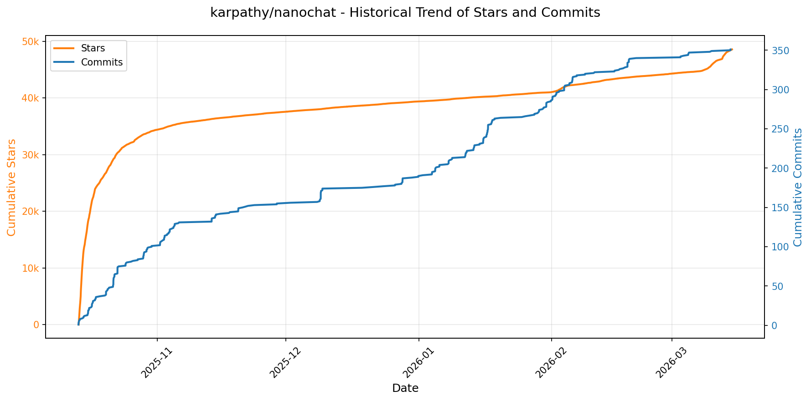
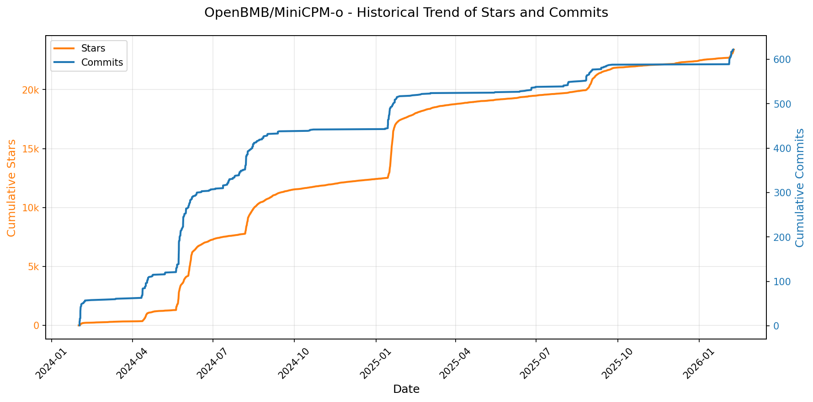
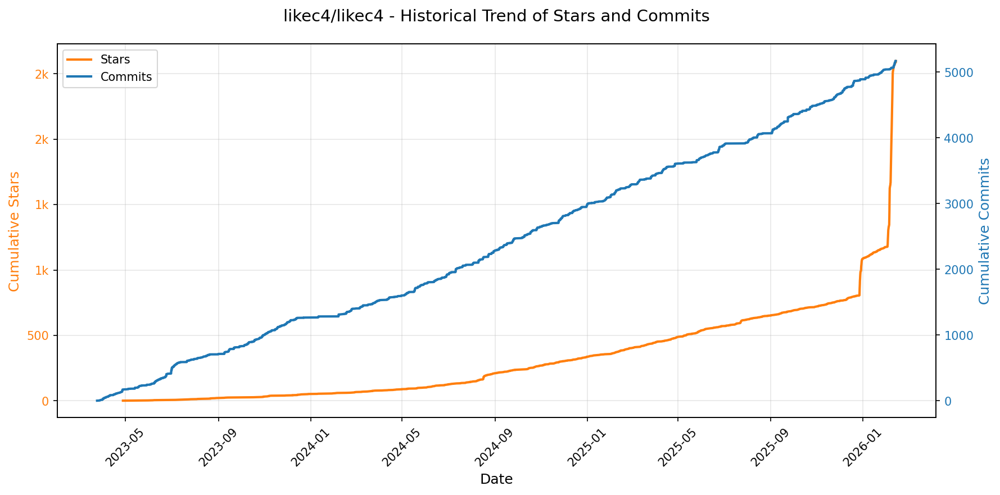
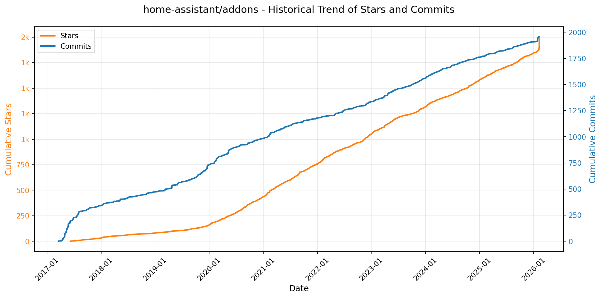
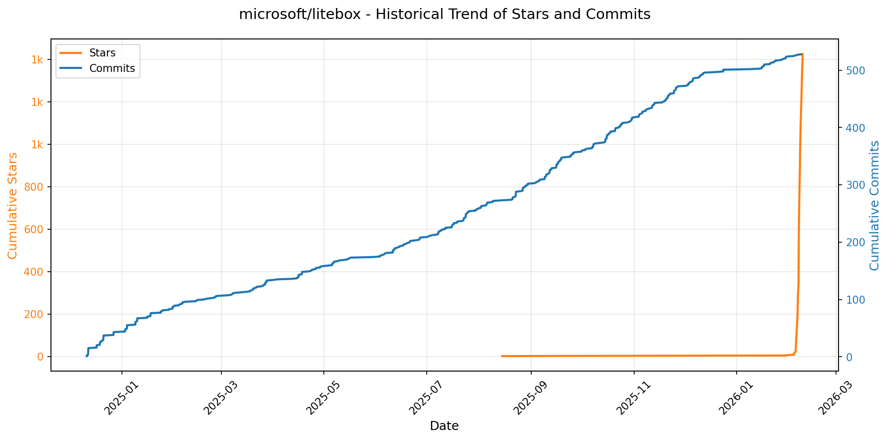

# 🌟 GitHub Trending 概览

> 数据更新于：2026-02-09

---

## 🔍 项目详情

### 1. [anomalyco/opencode](https://github.com/anomalyco/opencode)
- 📅 **创建日期**：2025-04-30  
- 🔄 **最近更新**：2026-02-09  
- ⭐ **Stars**：178,221（日 +610｜周 +5803｜月 +63400）  
- 📝 **描述**：The open source coding agent.  

<b>📈 Star 与 Commit 历史趋势</b>

> *蓝色：累计 Stars｜橙色：累计 Commits（次 Y 轴）*

<b>📄 README 摘要</b>

1. **该项目的功能**  
OpenCode 是一个开源的 AI 编程智能体（AI coding agent），旨在为开发者提供终端原生（TUI）、轻量高效且高度可扩展的 AI 辅助编程体验。它支持在本地终端中直接与代码库交互，执行开发任务（如编写、修改、调试代码）、分析代码结构、规划变更、探索陌生项目等，无需离开命令行环境。其核心定位是成为“终端中的 AI 结对程序员”，强调离线可用性、隐私保护、模型无关性及对开发者工作流的深度集成。

2. **关键特性**  
- **双模式智能体切换**：内置 `build`（全权限开发代理）和 `plan`（只读分析代理），通过 Tab 键快速切换；`plan` 模式默认禁止文件修改、执行 Shell 命令前主动请求授权，专为安全探索与方案设计优化。  
- **多模型与供应商无关（Provider-Agnostic）**：原生兼容 Claude、OpenAI、Google Gemini、Ollama 本地模型等，不绑定任何商业 API；官方推荐但非强制使用 [OpenCode Zen](https://opencode.ai/zen) 提供的优化模型服务。  
- **开箱即用的 LSP 支持**：深度集成语言服务器协议（LSP），实现智能补全、跳转定义、实时诊断等 IDE 级编辑能力，适配各类编程语言。  
- **客户端/服务器架构（Client-Server）**：核心引擎可独立运行于本地或远程服务器，TUI 终端仅为前端之一，为未来移动端控制、Web 客户端、VS Code 插件等多形态接入预留架构基础。  
- **跨平台全栈部署支持**：提供一键安装脚本（curl + bash）、主流包管理器（npm/brew/scoop/choco/paru/mise/nix）、桌面应用（macOS/Windows/Linux 原生二进制）、以及清晰的安装路径优先级策略（支持 XDG、自定义目录等）。  
- **国际化与社区驱动**：提供 18 种语言的 README 文档，活跃 Discord 社区支持，完全开源并鼓励贡献。

3. **技术栈**  
- **核心语言与运行时**：TypeScript（主逻辑）、Rust（高性能组件，如底层 CLI 工具链或未来 LSP 适配层，虽未明示但根据项目结构与性能诉求可合理推断）；支持 Node.js（npm/bun/pnpm/yarn）、Bash（安装脚本）、Nix、Mise（版本管理）等多环境运行。  
- **前端界面**：基于终端的 TUI（Text-based User Interface），采用现代终端渲染技术（可能结合诸如 `ink`、`blessed` 或自研渲染层），非 Web 或 Electron；桌面版基于原生打包（`.dmg`/`.exe`/`.deb`/AppImage）。  
- **架构模式**：模块化微服务设计（由 `packages/` 目录结构体现，如 `console`、`web`、`agent` 等子包），采用 client-server 分离架构，通信机制未明示但大概率基于 IPC 或 HTTP/WebSocket。  
- **基础设施与生态**：GitHub Actions CI/CD；npm 发布（`opencode-ai` 包）；支持多种包管理生态（Homebrew Tap、Scoop Bucket、Chocolatey、AUR、Nixpkgs）；文档托管于 `opencode.ai`（静态站点，推测为 Next.js/Vite + MDX 构建）。

---

### 2. [anthropics/skills](https://github.com/anthropics/skills)
- 📅 **创建日期**：2025-09-22  
- 🔄 **最近更新**：2026-02-09  
- ⭐ **Stars**：105,997（日 +517｜周 +5621｜月 +32928）  
- 📝 **描述**：Public repository for Agent Skills  

<b>📈 Star 与 Commit 历史趋势</b>

> *蓝色：累计 Stars｜橙色：累计 Commits（次 Y 轴）*

<b>📄 README 摘要</b>

1. **该项目做什么？**  
该项目是 Anthropic 官方维护的 Claude 技能（Skills）开源示例仓库，提供一系列可直接运行或参考的、结构化定义的 AI 任务扩展能力。这些“技能”本质上是独立的、自包含的功能模块（以文件夹形式组织），通过动态加载方式赋予 Claude 在特定垂直场景中执行专业化任务的能力，例如：按企业品牌规范生成文档、解析 PDF/DOCX/PPTX/XLSX 文件、测试网页应用、生成 MCP 服务器代码、辅助创意设计（音乐、艺术）等。项目本身不运行模型，而是为 Claude 的技能系统提供标准化实现范例与生产级参考。

2. **关键特性**  
- **标准化技能结构**：每个技能均为独立文件夹，强制包含 `SKILL.md`（含 YAML 前置元数据 + Markdown 指令/示例/指南），确保可发现性、可复用性与 Claude 解析兼容性；  
- **覆盖多场景能力矩阵**：涵盖创意设计（Art/Music）、技术开发（Web 测试、MCP 服务生成）、企业协作（通信模板、品牌合规）、文档智能（PDF/DOCX/PPTX/XLSX 全格式解析与生成）四大类；  
- **开箱即用的集成支持**：原生适配 Claude Code（插件市场一键安装）、Claude.ai（付费用户直连启用）、Claude API（支持上传自定义技能）；  
- **混合授权模式**：多数示例技能采用 Apache 2.0 开源协议；核心文档处理技能（`skills/docx` 等）为源码可用（source-available），公开其生产级实现逻辑供开发者深度学习；  
- **官方规范与模板支撑**：内建 `./spec`（Agent Skills 标准规范）、`./template`（技能创建模板），降低开发者入门门槛；  
- **教育与示范导向**：明确声明所有技能仅用于演示与学习，强调行为可能与线上 Claude 实际表现存在差异，要求用户在生产环境前充分验证。

3. **技术栈**  
- **核心格式**：YAML（元数据定义） + Markdown（技能逻辑与交互指令）；  
- **交付形态**：纯静态文件仓库（无构建流程），依赖 Claude 运行时引擎动态加载与执行；  
- **集成协议**：基于 [Agent Skills 标准](https://agentskills.io)（开放规范），与 Anthropic 官方生态深度对齐；  
- **客户端支持**：Claude Code（插件化 CLI 命令）、Claude.ai Web 平台、Claude API（v1+ Skills 接口）；  
- **许可体系**：Apache 2.0（大部分示例技能） + Anthropic 自定义源码可用协议（文档类生产技能）。

---

### 3. [obra/superpowers](https://github.com/obra/superpowers)
- 📅 **创建日期**：2025-10-09  
- 🔄 **最近更新**：2026-02-09  
- ⭐ **Stars**：76,641（日 +771｜周 +5991｜月 +45966）  
- 📝 **描述**：An agentic skills framework & software development methodology that works.  

<b>📈 Star 与 Commit 历史趋势</b>

> *蓝色：累计 Stars｜橙色：累计 Commits（次 Y 轴）*

<b>📄 README 摘要</b>

1. **该项目的作用**  
Superpowers 是一个面向编程智能体（coding agents）的完整软件开发工作流框架，旨在将原本零散、随意的代码生成行为，系统化为可验证、可协作、符合工程最佳实践的开发过程。它不直接生成代码，而是通过一系列自动触发的“技能”（skills），引导智能体在编码前完成需求澄清、设计评审、计划拆解、TDD 实施、子智能体协同执行、自动化审查与分支收尾等关键环节，从而确保交付质量、降低技术债务，并让 AI 编程行为具备可审计性、可复现性和人类可控性。

2. **核心功能**  
- **结构化需求与设计闭环**：通过 `brainstorming` 技能主动追问目标、探索替代方案、分块呈现设计方案并等待人工确认，避免“盲目开写”。  
- **强制 TDD 工程纪律**：`test-driven-development` 技能严格执行 RED-GREEN-REFACTOR 流程，要求先写失败测试、再写最小实现、通过后立即重构，并自动删除未经测试的代码。  
- **原子化任务执行体系**：`writing-plans` 将需求拆解为 2–5 分钟可完成的原子任务（含精确文件路径、完整代码、验证步骤）；`subagent-driven-development` 或 `executing-plans` 支持子智能体并行/串行执行，每项任务均经过两阶段审查（是否符合计划 + 代码质量）。  
- **全链路协作增强**：内置 `using-git-worktrees`（隔离分支环境）、`requesting-code-review`（按严重等级拦截问题）、`finishing-a-development-branch`（自动验测、提供合并/PR/丢弃选项）等技能，覆盖从环境准备到交付决策的完整 DevOps 闭环。  
- **自演进能力**：`writing-skills` 技能支持用户基于统一规范创建、测试和贡献新技能，形成可扩展的技能库生态。

3. **技术栈**  
- **运行平台**：深度适配多款 AI 编程代理平台，包括 Claude Code（通过插件市场原生集成）、Codex 和 OpenCode（通过远程加载配置文档实现手动接入）。  
- **架构范式**：基于“技能（Skill）”的可组合、声明式工作流引擎——每个技能是独立的 Markdown 文档（如 `skills/test-driven-development/SKILL.md`），定义触发条件、行为逻辑、检查清单与最佳实践参考，由主智能体按需自动调用。  
- **基础设施依赖**：依赖 Git（用于 worktree 管理与分支操作）、本地/项目级测试运行器（支撑 TDD 验证）、以及底层大模型（Claude 等）的推理与指令遵循能力；无独立后端服务，纯前端/插件侧逻辑驱动。  
- **工程规范层**：内嵌 YAGNI、DRY、防御性编程、根因追踪（4-phase systematic debugging）等原则，并以文档化反模式（如 testing anti-patterns reference）强化工程意识。

---

### 4. [openclaw/openclaw](https://github.com/openclaw/openclaw)
- 📅 **创建日期**：2025-11-24  
- 🔄 **最近更新**：2026-02-09  
- ⭐ **Stars**：61,575（日 +2667｜周 +34861｜月 +61575）  
- 📝 **描述**：Your own personal AI assistant. Any OS. Any Platform. The lobster way. 🦞   

<b>📈 Star 与 Commit 历史趋势</b>

> *蓝色：累计 Stars｜橙色：累计 Commits（次 Y 轴）*

<b>📄 README 摘要</b>

1. **项目功能**  
OpenClaw 是一个**本地化、单用户、全栈自托管的个人 AI 助理系统**，核心目标是让用户在自有设备（macOS/iOS/Android/Linux/Windows）上完全掌控 AI 助理的运行环境。它不依赖云端 SaaS 服务，而是通过轻量级 Gateway（网关）作为统一控制平面，连接并协调多类组件：  
- **多消息通道接入**：原生支持 WhatsApp、Telegram、Slack、Discord、Google Chat、Signal、iMessage、BlueBubbles（推荐）、Microsoft Teams、Matrix、Zalo、Zalo Personal 及 WebChat；  
- **跨平台交互能力**：支持语音唤醒（Voice Wake）与持续对话（Talk Mode），覆盖 macOS/iOS/Android 设备；  
- **可视化工作空间**：提供可由 AI 代理驱动的实时「Live Canvas」（基于 A2UI 协议），支持渲染、评估、快照等操作；  
- **本地自动化执行**：通过「Nodes」机制调用设备级能力（如摄像头、屏幕录制、定位、通知、系统命令、Canvas 操作），严格遵循操作系统权限模型（如 macOS TCC）；  
- **多智能体路由与会话隔离**：支持按频道、账号、群组动态路由至独立 agent 工作区（workspace），实现上下文隔离与细粒度权限控制。

2. **关键特性**  
- ✅ **本地优先架构**：Gateway 运行于本地（支持 systemd/launchd 守护进程），所有会话、配置、媒体、工具均默认本地存储与处理；  
- ✅ **全链路多通道收发**：统一抽象各消息平台协议（Baileys/grammY/Bolt/discord.js/signal-cli 等），支持 DM 配对鉴权（`pairing` 模式）、群组提及路由、消息分块与上下文感知；  
- ✅ **语音+视觉双模态交互**：集成 ElevenLabs 实现低延迟语音合成，配合 macOS/iOS/Android 的 Voice Wake（常驻监听）与 Talk Mode（连续对话叠加层）；  
- ✅ **Live Canvas + A2UI 生态**：Canvas 不仅是展示层，更是可编程 UI 工作台，AI 可主动 push UI 组件、执行 JS 逻辑、捕获用户交互，并与 Nodes 深度协同；  
- ✅ **安全默认策略**：DM 默认拒绝未配对请求；支持 OAuth（Anthropic/OpenAI）与 API Key 双认证、模型故障转移（failover）、会话自动裁剪（pruning）、Tailscale/SSH 远程访问零信任鉴权（密码/身份头）；  
- ✅ **端到端可扩展工具链**：内置浏览器控制（专用 Chromium+CDP）、Cron 定时任务、Webhook/Gmail Pub/Sub 触发器、技能平台（ClawHub 技能注册与自动拉取）、Agent-to-Agent 会话协作工具（`sessions_list/history/send`）；  
- ✅ **向导驱动的一站式部署**：`openclaw onboard` CLI 向导自动完成 Gateway 安装、通道配对、模型配置、技能初始化与守护进程注册，覆盖 macOS/Linux/WSL2；  
- ✅ **远程网关支持**：Gateway 可部署于 Linux 服务器，客户端（macOS App / CLI / WebChat）通过 Tailscale Serve/Funnel 或 SSH 隧道安全连接，设备 Nodes 仍可执行本地敏感操作（如录屏、通知）。

3. **技术栈**  
- **运行时**：Node.js ≥22（主运行环境），支持 `npm`/`pnpm`/`bun`；TypeScript 编写，使用 `tsx` 直接运行源码；  
- **核心框架**：WebSocket 控制平面（Gateway）、RPC 式 Pi Agent 运行时、模块化 CLI（`openclaw` 命令族）；  
- **前端与 UI**：WebChat 与 Control UI 内置于 Gateway；Canvas 使用 A2UI 协议（声明式 JSON UI + JS 执行沙箱）；macOS/iOS/Android App 均为原生客户端，通过 Gateway WebSocket 协议通信；  
- **通道适配层**：  
  - WhatsApp：Baileys  
  - Telegram：grammY  
  - Slack：Bolt  
  - Discord：discord.js  
  - Signal：signal-cli  
  - BlueBubbles/iMessage：本地桥接协议  
  - Google Chat：官方 Chat API  
  - Matrix/Zalo：社区扩展协议  
- **语音与多媒体**：ElevenLabs（TTS）、Whisper（ASR）、FFmpeg（音视频处理）、本地音频输入/输出流管理；  
- **部署与运维**：支持 Nix（声明式配置）、Docker、systemd/launchd、Tailscale Serve/Funnel、SSH 隧道；`openclaw doctor` 提供配置健康检查与迁移能力；  
- **安全机制**：OAuth 2.0（Anthropic/OpenAI）、密码/Token/Tailscale Identity 多层鉴权、TCC 权限代理（`node.invoke`）、会话级权限开关（`/elevated`）、DM 白名单存储（本地 SQLite/JSON）。

---

### 5. [ComposioHQ/awesome-claude-skills](https://github.com/ComposioHQ/awesome-claude-skills)
- 📅 **创建日期**：2025-10-17  
- 🔄 **最近更新**：2026-02-09  
- ⭐ **Stars**：54,351（日 +646｜周 +3786｜月 +20604）  
- 📝 **描述**：A curated list of awesome Claude Skills, resources, and tools for customizing Claude AI workflows  

<b>📈 Star 与 Commit 历史趋势</b>

> *蓝色：累计 Stars｜橙色：累计 Commits（次 Y 轴）*

<b>📄 README 摘要</b>

1. **项目功能**  
该项目是一个面向 Anthropic Claude 系列模型（包括 Claude.ai、Claude Code 和 Claude API）的**高质量技能（Skills）集合库**，旨在显著扩展 Claude 的能力边界——从纯文本生成升级为**可执行真实业务操作的智能代理**。它使 Claude 能够直接与外部系统交互，完成如发送邮件、创建 GitHub Issue、向 Slack 发送消息、操作 Notion 数据库、自动化 CRM/项目管理工具等实际任务，并支持对文档（DOCX/PDF/PPTX/XLSX）、代码、数据、媒体、安全日志等进行深度处理与分析。

2. **核心特性**  
- ✅ **跨平台技能兼容性**：所有技能统一适配 Claude.ai 网页端、Claude Code IDE 插件及 Claude API，实现“一次开发、全端可用”。  
- ✅ **开箱即用的应用集成**：通过 `connect-apps` 插件（基于 Composio），仅需三步即可让 Claude 连接 500+ SaaS 应用（实际支持超 1000+），涵盖 Gmail、Slack、GitHub、Notion、Jira、Salesforce、HubSpot 等主流工具。  
- ✅ **领域全覆盖的结构化技能分类**：提供 10 大类共 80+ 经实测验证的技能，包括文档处理、开发提效（如 Playwright 自动化、LangSmith 调试、MCP 构建）、数据分析（CSV 智能分析、PostgreSQL 查询）、商业营销（竞品广告提取、域名脑暴）、安全合规（Sigma 威胁狩猎、数字取证）、创意生成（Canvas 设计、Slack GIF 制作）等。  
- ✅ **开发者友好生态**：提供《Skill Creator》《Skill Seekers》等元技能，支持一键将任意文档网站转化为 Claude 技能；开放 PR 贡献流程，鼓励社区共建；所有技能均附带明确来源、作者信息及使用说明。

3. **技术栈**  
- **底层集成框架**：Composio（核心自动化引擎，提供统一工具抽象层与 OAuth 认证管理）、Rube MCP（Model Context Protocol 实现，用于标准化 LLM 与外部工具交互协议）。  
- **编程语言与工具链**：以 Python 为主（如 `postgres`、`deep-research` 技能），辅以 TypeScript（如 `MCP Builder`）、JavaScript/React（如 `artifacts-builder`）、Shell/CLI（如 `git-pushing`）、D3.js（可视化）、Playwright（Web 自动化）、FFUF（安全扫描）等。  
- **基础设施依赖**：Google Gemini API（用于部分图像生成与深度研究技能）、LangSmith（LLM 可观测性）、NotebookLM（知识增强）、n8n（工作流编排）、Outline（团队 Wiki 集成）等第三方服务。  
- **部署与运行环境**：基于 Claude CLI 插件机制（`--plugin-dir`），本地运行；依赖 Composio 平台提供的云认证与工具路由服务。

---

### 6. [google/langextract](https://github.com/google/langextract)
- 📅 **创建日期**：2025-07-08  
- 🔄 **最近更新**：2026-02-09  
- ⭐ **Stars**：46,969（日 +348｜周 +863｜月 +6085）  
- 📝 **描述**：A Python library for extracting structured information from unstructured text using LLMs with precise source grounding and interactive visualization.  

<b>📈 Star 与 Commit 历史趋势</b>

> *蓝色：累计 Stars｜橙色：累计 Commits（次 Y 轴）*

<b>📄 README 摘要</b>

1. **项目功能**  
LangExtract 是一个基于大语言模型（LLM）的 Python 库，专注于从非结构化文本（如临床笔记、放射报告、文学作品等）中**高精度提取结构化信息**。其核心能力是依据用户定义的指令和少量示例（few-shot examples），自动识别并组织关键实体（如人物、情绪、药物名称、剂量、关系等），同时**严格锚定每项提取结果在原文中的确切位置**，确保可追溯性与可验证性。

2. **关键特性**  
- **精准源文本定位（Source Grounding）**：为每个提取结果标注原文起止字符偏移量，支持可视化高亮回溯；  
- **强结构化输出保障**：通过受控生成机制（尤其对 Gemini 等支持 schema 的模型）强制输出符合预设格式的 JSON 结构，避免自由生成导致的格式混乱；  
- **长文档优化处理**：采用智能分块（chunking）、多轮提取（extraction passes）、并行处理（max_workers）及上下文长度自适应（max_char_buffer）策略，显著提升大文本（如整本小说、完整病历）的召回率与准确性；  
- **交互式可视化**：一键生成自包含、可搜索、带上下文高亮的 HTML 文件，支持大规模实体（数千级）的直观审查与验证；  
- **多模型灵活适配**：原生支持 Google Gemini（云）、OpenAI（需额外安装）、本地 Ollama 模型（如 `gemma2:2b`），并提供插件化架构供用户扩展第三方模型提供商；  
- **零微调领域泛化**：仅需提供 1–3 个高质量、按出现顺序排列的示例，即可快速适配任意领域（医疗、法律、文学分析等），无需模型训练或微调；  
- **知识与证据平衡控制**：通过提示词设计与示例属性（attributes）显式调控 LLM 行为——既可严格基于原文字面提取，也可引导其结合世界知识进行合理推断（如补充文学背景、医学常识）。

3. **技术栈**  
- **编程语言**：Python（≥3.10）；  
- **核心依赖**：`google-generativeai`（Gemini）、`openai`（OpenAI，可选）、`ollama`（本地模型）、`pydantic`（数据验证与 schema）、`rich`（终端输出）、`jinja2`（HTML 可视化模板）；  
- **构建与包管理**：`pyproject.toml` + `setuptools`，支持 PEP 517/518 标准；  
- **开发工具链**：`pytest`（测试）、`tox`（多环境 CI 模拟）、`pylint` / `pyink` / `isort`（代码质量与格式化）、`pre-commit`（自动化钩子）；  
- **部署与容器**：Docker 支持，兼容 Google Vertex AI 批处理 API；  
- **扩展机制**：基于 Python entry points 的插件注册系统，支持社区自定义模型提供商（Provider Plugin）。

---

### 7. [karpathy/nanochat](https://github.com/karpathy/nanochat)
- 📅 **创建日期**：2025-10-13  
- 🔄 **最近更新**：2026-02-09  
- ⭐ **Stars**：42,621（日 +114｜周 +1349｜月 +2696）  
- 📝 **描述**：The best ChatGPT that $100 can buy.  

<b>📈 Star 与 Commit 历史趋势</b>

> *蓝色：累计 Stars｜橙色：累计 Commits（次 Y 轴）*

<b>📄 README 摘要</b>

1. **项目功能**  
nanochat 是一个极简、可快速迭代的端到端实验性框架，专为在单台 GPU 服务器（如 8×H100）上全流程训练中小型大语言模型（LLM）而设计。它支持从数据预处理、BPE 分词、基础预训练（pretraining）、监督微调（SFT）、强化学习（RL）、多维度评估（如 DCLM CORE 分数、bits per byte），到 CLI/Web 聊天界面（ChatGPT 风格）的完整闭环。核心目标是：以极低成本（约 $20–$72）在数小时内复现 GPT-2 级别能力（1.6B 参数量级）的可交互模型，并提供“开箱即用”的可复现性与可扩展性。

2. **关键特性**  
- **单参数驱动复杂度**：仅通过 `--depth`（Transformer 层数）一个整数即可自动推导全部超参数（隐藏层宽、注意力头数、学习率调度、weight decay、训练步数等），确保模型在给定算力下达到计算最优（compute-optimal）；  
- **全阶段覆盖**：原生支持 tokenization、pretraining、SFT、RLHF（含 `chat_rl.py`）、多任务评估（ARC、GSM8K、MMLU、SpellingBee 等 9 类任务）、KV Cache 加速推理（`engine.py`）及 Web/CLI 双模聊天界面；  
- **极致轻量化与可 hack 性**：代码高度精简（无配置文件、无工厂模式、无嵌套 if-else），全部逻辑集中于少量 Python 脚本（如 `runs/speedrun.sh` 一键启动 GPT-2 速通训练），便于研究者快速修改、调试与复现实验；  
- **成本与效率导向**：实测在 8×H100 上 2.76 小时即可超越 GPT-2 的 DCLM CORE 分数（0.2565 → 0.2602），支持 FP8 训练、动态 batch size 扩展、梯度累积（单卡兼容）、CPU/MPS 快速验证；  
- **开放协作生态**：内置 Leaderboard（按 wall-clock 时间排名）、Discord 社区、DeepWiki 文档、详细 Guides（如身份注入、能力定制），并鼓励透明贡献（要求声明 LLM 辅助代码部分）。

3. **技术栈**  
- **核心框架**：Python 3.11+、PyTorch 2.x（含 `torch.compile`、`torch.distributed`、`FSDP` 支持）；  
- **训练优化**：AdamW + Muon 优化器、FP8 混合精度（via `torch.amp`）、Flash Attention（隐式集成）、KV Cache 推理引擎；  
- **分词与数据**：自研 BPE Tokenizer（兼容 GPT-4 风格）、FineWeb / SmolTalk 公开数据集、合成数据生成工具（`dev/gen_synthetic_data.py`）；  
- **评估体系**：DCLM CORE 指标（核心评测）、bits per byte（val_bpb）、MFU（Model FLOPs Utilization）、token/sec 吞吐、VRAM 占用监控；  
- **部署与交互**：内嵌轻量 Web UI（纯 HTML/CSS/JS，`nanochat/ui.html` + `scripts/chat_web.py` 基于 `http.server`）、CLI 聊天（`scripts/chat_cli.py`）、W&B 实验跟踪；  
- **跨平台支持**：原生适配 CUDA（H100/A100）、CPU（`runcpu.sh`）、Apple Silicon（MPS），依赖管理使用 `uv`（`pyproject.toml` + `uv.lock`）。

---

### 8. [remotion-dev/remotion](https://github.com/remotion-dev/remotion)
- 📅 **创建日期**：2020-06-23  
- 🔄 **最近更新**：2026-02-09  
- ⭐ **Stars**：35,707（日 +159｜周 +1356｜月 +10533）  
- 📝 **描述**：🎥      Make videos programmatically with React  

<b>📈 Star 与 Commit 历史趋势</b>

> *蓝色：累计 Stars｜橙色：累计 Commits（次 Y 轴）*

<b>📄 README 摘要</b>

1. **项目功能**  
Remotion 是一个基于 React 的视频生成框架，允许开发者使用 React 组件、JavaScript 逻辑和 Web 标准技术（如 CSS、SVG、Canvas、WebGL）**以编程方式动态创建高质量视频**。它将视频视为“可渲染的 React 应用”，支持时间轴控制、帧精确渲染、动态内容生成（如数据驱动动画、个性化视频），并可导出为 MP4、GIF 或 WebM 等格式，适用于营销视频、数据可视化、年度回顾、教育动画等场景。

2. **核心特性**  
- ✅ **React 驱动的视频开发**：复用 React 组件、Hooks、状态管理与生态（如 Zustand、Framer Motion）；支持 Fast Refresh 实时预览动画效果。  
- ✅ **时间轴与帧控制**：提供 `useCurrentFrame`、`interpolate`、`Sequence`、`Composition` 等 API，实现逐帧逻辑、关键帧动画、多图层合成与嵌套序列。  
- ✅ **多目标输出**：一键导出为本地视频（MP4/WebM）、GIF，或部署为无服务器函数（Lambda/Cloudflare Workers）实现按需渲染。  
- ✅ **高性能渲染**：支持硬件加速（GPU 渲染）、并发帧渲染、缓存优化及离屏 Canvas/WebGL 集成。  
- ✅ **开发者友好工具链**：内置 CLI（`npx create-video@latest`）、本地预览服务器、调试面板（时间轴拖拽、帧跳转）、TypeScript 原生支持及完整 API 文档。

3. **技术栈**  
- **核心框架**：React（v18+）、TypeScript  
- **渲染引擎**：基于 Chromium（通过 Puppeteer/Playwright）进行 Headless 浏览器渲染，利用浏览器原生支持的 CSS 动画、Canvas 2D/3D、SVG 和 WebGL  
- **构建与打包**：Vite（默认模板）、Webpack（兼容）  
- **视频处理**：FFmpeg（用于最终编码与封装）、WebCodecs（实验性浏览器原生编码支持）  
- **部署与运行时**：Node.js（服务端渲染）、Serverless（AWS Lambda、Vercel、Cloudflare Workers）、Docker  
- **辅助生态**：React Spring（动画）、Three.js / React Three Fiber（3D）、Lottie（JSON 动画导入）、Ffmpeg.wasm（前端编码）

---

### 9. [asgeirtj/system_prompts_leaks](https://github.com/asgeirtj/system_prompts_leaks)
- 📅 **创建日期**：2025-05-03  
- 🔄 **最近更新**：2026-02-09  
- ⭐ **Stars**：30,707（日 +123｜周 +1330｜月 +5832）  
- 📝 **描述**：Collection of extracted System Prompts from popular chatbots like ChatGPT, Claude & Gemini  

<b>📈 Star 与 Commit 历史趋势</b>

> *蓝色：累计 Stars｜橙色：累计 Commits（次 Y 轴）*

---

### 10. [OpenBMB/ChatDev](https://github.com/OpenBMB/ChatDev)
- 📅 **创建日期**：2023-08-28  
- 🔄 **最近更新**：2026-02-09  
- ⭐ **Stars**：30,630（日 +95｜周 +1442｜月 +2504）  
- 📝 **描述**：ChatDev 2.0: Dev All through LLM-powered Multi-Agent Collaboration  

<b>📈 Star 与 Commit 历史趋势</b>

> *蓝色：累计 Stars｜橙色：累计 Commits（次 Y 轴）*

<b>📄 README 摘要</b>

1. **项目功能**  
ChatDev 2.0（品牌名 DevAll）是一个**零代码多智能体协同平台**，旨在支持“开发一切”（Developing Everything）。它不再局限于传统软件开发流程，而是提供通用型多智能体编排能力：用户无需编写代码，仅通过可视化界面或 YAML 配置即可定义智能体角色、工作流拓扑结构及任务逻辑，快速构建并执行面向多样化场景的定制化多智能体系统。典型应用包括数据可视化、3D 内容生成（需 Blender）、游戏开发、深度学术研究、教学视频生成等复杂任务。

2. **核心特性**  
- ✅ **零代码低门槛使用**：支持拖拽式可视化工作流画布（Workflow Canvas），直观配置节点参数与上下文流向；  
- ✅ **开箱即用的行业模板**：内置 `yaml_instance/` 目录下涵盖数据可视化、3D 建模、游戏开发、深度研究、教学视频生成等五大类高质量可运行工作流；  
- ✅ **灵活的人机协同机制**：支持 Human-Agent Interaction 模式，允许用户以评审员等角色实时介入并反馈；  
- ✅ **模块化可扩展架构**：提供清晰的插件接口（如 `functions/` 自定义工具目录），便于开发者添加新节点、LLM 接入适配器、外部工具集成；  
- ✅ **全流程工程化支持**：集成 Git 版本控制、增量开发（基于已有代码迭代）、Docker 安全沙箱执行、日志回放与调试等功能；  
- ✅ **多范式协同引擎**：融合 MacNet（有向无环图拓扑协作）、Puppeteer（强化学习驱动的动态编排中枢）、Experiential Co-Learning（经验共学优化）等前沿多智能体协作范式。

3. **技术栈**  
- **后端**：Python 3.12+，基于 FastAPI 构建 RESTful API 服务；依赖 `uv` 进行高性能依赖管理与运行；核心运行时位于 `runtime/`，支持 agent 抽象、工具调用与记忆管理；  
- **前端**：Vue 3 + Vite 构建现代化 Web 控制台（`frontend/`），提供教程引导、工作流编辑、实时日志监控与人机交互界面；  
- **配置与编排**：采用 YAML 格式声明式定义工作流（`yaml_instance/`），支持环境变量注入（`${VAR}` 语法）；  
- **AI 底座**：兼容主流大语言模型 API（通过 `.env` 配置 `API_KEY` 与 `BASE_URL`），支持任意 LLM 提供商；  
- **扩展生态**：集成 Blender（3D 生成）、Manim（数学动画视频）、Git（版本控制）等外部工具链；  
- **部署与运维**：原生支持 Docker 容器化部署，提供 Makefile 一键启停（`make dev`）及自动化校验命令（`make validate-yamls`）。

---

### 11. [code-yeongyu/oh-my-opencode](https://github.com/code-yeongyu/oh-my-opencode)
- 📅 **创建日期**：2025-12-03  
- 🔄 **最近更新**：2026-02-09  
- ⭐ **Stars**：29,597（日 +300｜周 +2736｜月 +17028）  
- 📝 **描述**：the best agent harness  

<b>📈 Star 与 Commit 历史趋势</b>

> *蓝色：累计 Stars｜橙色：累计 Commits（次 Y 轴）*

<b>📄 README 摘要</b>

1. **该项目做什么？**  
Oh My OpenCode 是一个面向开源代码编辑器 OpenCode（基于 VS Code 架构）的**高性能、多模型智能代理编排插件**，旨在将 LLM 从“单次响应工具”升级为可自主协作、持续执行、端到端交付的“AI 工程团队”。它不替代 IDE，而是深度增强 OpenCode 的智能能力：通过预置并协同多个专业化 AI 代理（如 Sisyphus 主协调员、Hephaestus 深度工匠、Oracle 架构师、Librarian 文档专家等），自动完成复杂软件开发任务——包括代码理解、重构、前端实现、调试、文档检索、跨仓库代码搜索、自动化测试与验证等。其核心使命是实现“**任务启动即闭环，无人值守直至 100% 完成**”，显著提升开发者生产力与工程自治性。

2. **关键特性**  
- **多智能体协同架构**：内置角色化代理团队（Sisyphus 主控、Hephaestus 深度执行、Oracle 调试、Librarian 文档检索、Explore 快速代码搜索等），支持按任务类型自动分派与并行执行；  
- **`ultrawork`/`ulw` 魔法指令**：用户仅需在提示词中加入该关键词，系统即自动激活全栈工作流（背景探索→上下文构建→多模型协同→强制续写→结果验证）；  
- **强健的任务保障机制**：Todo Continuation Enforcer（强制续写未完成任务）、Comment Checker（自动清理冗余注释）、Think Mode（深度推理模式）；  
- **工业级代码工具链集成**：原生支持 LSP（语义分析、重命名、诊断）、AST-Grep（结构化代码搜索与重构）、Git 原子提交（`git-master` 技能）、Playwright 浏览器自动化；  
- **Claude Code 全兼容层**：完整支持其命令系统、Agent/Skill/MCP 协议及 25+ 可配置 Hook（PreToolUse、PostToolUse 等）；  
- **丰富内置 MCP（Model Calling Protocols）**：集成 Exa（实时网页搜索）、Context7（官方文档索引）、grep.app（GitHub 全网代码搜索）；  
- **终端友好与会话管理**：支持 Tmux 交互式终端、会话历史列表/搜索/分析，适配开发者工作流；  
- **开箱即用 + 高度可定制**：默认启用全部功能，同时支持 JSONC 格式配置（项目级 `.opencode/oh-my-opencode.json` 或用户级全局配置），可精细调整模型、温度、提示词、权限与并发策略。

3. **技术栈**  
- **运行平台**：深度适配 [OpenCode](https://github.com/sst/opencode)（开源、本地优先的 VS Code 衍生编辑器），非独立应用；  
- **核心语言**：TypeScript（主逻辑、插件框架、LSP/AST 工具集成）；  
- **AI 模型调度层**：多模型异构支持（明确提及 GPT-5.2 Codex Medium、Claude Sonnet/Haiku/Opus 4.5、Gemini 3 Pro），通过统一 MCP 接口抽象调用；  
- **代码分析引擎**：原生集成 [AstGrep](https://ast-grep.github.io/)（AST 感知搜索与重构）、标准 LSP 协议（语言服务器协议）；  
- **外部服务集成**：Exa（网络搜索）、Context7（文档知识库）、grep.app（GitHub 代码搜索）；  
- **配置与部署**：JSONC 配置格式、npm 包分发（`oh-my-opencode@latest`）、GitHub Releases 托管二进制发布；  
- **许可证**：SUL-1.0（Sisyphus Universal License），强调自由使用与社区共建。

---

### 12. [thedotmack/claude-mem](https://github.com/thedotmack/claude-mem)
- 📅 **创建日期**：2025-08-31  
- 🔄 **最近更新**：2026-02-09  
- ⭐ **Stars**：25,808（日 +884｜周 +9254｜月 +12973）  
- 📝 **描述**：A Claude Code plugin that automatically captures everything Claude does during your coding sessions, compresses it with AI (using Claude's agent-sdk), and injects relevant context back into future sessions.  

<b>📈 Star 与 Commit 历史趋势</b>

> *蓝色：累计 Stars｜橙色：累计 Commits（次 Y 轴）*

<b>📄 README 摘要</b>

1. **项目功能**  
Claude-Mem 是一个专为 Anthropic **Claude Code**（AI 编程助手）设计的**持久化记忆压缩系统**。它在用户每次会话结束后，自动捕获工具调用记录、生成语义化摘要，并将结构化记忆持久存储于本地 SQLite 数据库中；当新会话启动时，自动检索并按需注入相关上下文，从而实现跨会话的知识连续性——使 Claude 能“记住”项目历史、调试过程、架构决策等关键信息，显著提升长期协作与复杂任务处理能力。

2. **核心特性**  
- ✅ **持久化记忆**：上下文自动跨会话留存，无需手动保存或重述  
- ✅ **渐进式披露（Progressive Disclosure）**：分三层检索（索引→时间线→详情），实时显示 Token 消耗，实现约 **10 倍 Token 节省**  
- ✅ **技能化智能搜索**：通过 `mem-search` MCP 技能支持自然语言查询，集成语义（Chroma 向量库）+ 关键词（SQLite FTS5）混合搜索  
- ✅ **本地 Web 可视化界面**：运行于 `http://localhost:37777`，实时流式展示记忆流、观察记录、摘要及引用 ID  
- ✅ **Claude Desktop 深度集成**：可在桌面版对话中直接调用记忆搜索技能  
- ✅ **隐私敏感控制**：支持 `<private>` 标签自动过滤敏感内容，不存入数据库  
- ✅ **细粒度上下文配置**：可精确控制注入时机、范围、优先级与模型适配策略  
- ✅ **全自动无感运行**：基于 6 个生命周期 Hook（如 SessionStart、PostToolUse、SessionEnd）触发，零人工干预  
- ✅ **可追溯引用机制**：每条观察记录具备唯一 ID，支持 API（`/api/observation/{id}`）与 Web 界面直接查阅  
- ✅ **Beta 实验通道**：提供 Endless Mode（仿生长时记忆架构）等前沿功能，支持一键切换稳定版/实验版  

3. **技术栈**  
- **运行时**：Node.js ≥18.0.0（主逻辑）、Bun（Worker 服务管理与 HTTP API）、uv（Python 包管理器，用于向量搜索依赖）  
- **数据库**：SQLite 3（嵌入式，含 FTS5 全文检索 + 自定义 schema）  
- **向量搜索**：ChromaDB（本地运行，支持语义相似性检索）  
- **前端界面**：轻量 Web UI（静态资源 + HTML/JS，无框架依赖）  
- **插件协议**：MCP（Model Context Protocol）标准工具接口，深度适配 Claude Agent SDK  
- **开发语言**：TypeScript（主力）、部分 Python 脚本（如向量处理）  
- **构建与部署**：基于 Bun 的进程管理、自动依赖缓存（Smart Install）、Hook 脚本驱动架构  
- **许可证**：主项目采用 **AGPL-3.0**（强 Copyleft，网络服务需开源修改）；`ragtime/` 子模块采用 **PolyForm Noncommercial License 1.0.0**

---

### 13. [OpenBMB/MiniCPM-o](https://github.com/OpenBMB/MiniCPM-o)
- 📅 **创建日期**：2024-01-29  
- 🔄 **最近更新**：2026-02-09  
- ⭐ **Stars**：23,396（日 +229｜周 +705｜月 +832）  
- 📝 **描述**：A Gemini 2.5 Flash Level MLLM for Vision, Speech, and Full-Duplex Multimodal Live Streaming on Your Phone  

<b>📈 Star 与 Commit 历史趋势</b>

> *蓝色：累计 Stars｜橙色：累计 Commits（次 Y 轴）*

<b>📄 README 摘要</b>

1. **该项目做什么？**  
MiniCPM-o 是一个面向端侧（尤其是手机、Mac等本地设备）部署的**全模态大语言模型（MLLM）系列**，核心目标是实现**低延迟、高保真、端到端的实时多模态交互**。它能同时接收图像、视频、文本和音频输入，并同步生成高质量文本与语音输出，支持真正意义上的**全双工（full-duplex）多模态实时流式对话**——即“边看、边听、边说”不阻塞。典型应用场景包括：实时视频会议智能助手、移动端视觉问答（VQA）、多语种语音交互、文档OCR解析、主动式情境提醒（如识别画面中水杯空了而主动提示补水），以及基于参考音频的语音克隆与角色扮演。

2. **关键特性**  
- ✅ **全双工实时多模态流式处理**：输入（摄像头视频+麦克风音频）与输出（TTS语音+文字）完全异步并行，毫秒级时间同步，支持持续数分钟的自然对话；  
- ✅ **端侧强性能**：MiniCPM-o 4.5（9B参数）在OpenCompass等权威多模态评测中接近Gemini 2.5 Flash水平，MiniCPM-V 4.0（4B参数）以更小体积超越GPT-4.1-mini图像理解能力；  
- ✅ **跨模态协同能力**：支持高分辨率图像（180万像素）、高帧率视频（10fps）、多图/视频理解、高精度OCR（OmniDocBench SOTA）、30+语言识别与生成；  
- ✅ **语音交互升级**：双语（中/英）实时语音对话、可配置音色、零样本语音克隆（优于CosyVoice2）、角色扮演；  
- ✅ **主动交互机制**：模型以1Hz频率持续分析视听流，自主触发提醒、评论等 proactive 行为；  
- ✅ **极致部署友好**：提供int4/GGUF量化模型（16种尺寸）、llama.cpp-omni/WebRTC本地Demo、Docker一键运行、iOS/macOS原生App、Ollama/vLLM/SGLang/FlagOS等主流框架开箱支持。

3. **技术栈**  
- **模型架构**：端到端全连接 Omni-modal 架构，融合 SigLip2（视觉编码器）、Whisper-medium（语音编码器）、CosyVoice2（语音解码器增强）、Qwen3-8B（语言骨干），采用时间分复用（TDM）机制实现多模态流式对齐；  
- **推理框架**：深度适配 `llama.cpp`（含自研 `llama.cpp-omni` 流式扩展）、`vLLM`、`SGLang`、`Ollama`、`FlagOS`（多芯片统一后端）；  
- **训练与微调**：支持 `LLaMA-Factory`、`SWIFT`、`Align-Anything` 框架进行SFT/DPO多模态对齐；采用自研对齐技术 `RLAIF-V`（CVPR 2025 Highlight）；  
- **部署生态**：提供 WebRTC 实时音视频通信 Demo、Gradio WebUI、iOS App、Docker镜像、Hugging Face Spaces、ReadTheDocs文档站；  
- **量化与优化**：支持 AWQ（int4）、GGUF 多尺寸量化，适配低VRAM GPU（如12GB/16GB）多卡部署及CPU端高效推理。

---

### 14. [lbjlaq/Antigravity-Manager](https://github.com/lbjlaq/Antigravity-Manager)
- 📅 **创建日期**：2025-11-26  
- 🔄 **最近更新**：2026-02-09  
- ⭐ **Stars**：22,154（日 +204｜周 +1944｜月 +11672）  
- 📝 **描述**：Professional Antigravity Account Manager & Switcher. One-click seamless account switching for Antigravity Tools. Built with Tauri v2 + React (Rust).专业的 Antigravity 账号管理与切换工具。为 Antigravity 提供一键无缝账号切换功能。  

<b>📈 Star 与 Commit 历史趋势</b>

> *蓝色：累计 Stars｜橙色：累计 Commits（次 Y 轴）*

<b>📄 README 摘要</b>

1. **项目功能**  
Antigravity Tools 是一个面向开发者与 AI 爱好者的**本地高性能 AI 调度网关与协议反代系统**，核心目标是构建稳定、极速、低成本的私有 AI 中转站。它将分散的 Web 端 AI 账号（如 Google Gemini、Anthropic Claude）统一纳管，并将其 Session 会话自动转化为标准化 API 接口（OpenAI / Anthropic / Gemini 原生格式），彻底消除厂商间协议壁垒。用户可通过本地 `http://127.0.0.1:8045` 端点，以标准方式调用任意后端模型（含多模态图像生成），实现跨工具（Claude Code、Cherry Studio、Kilo Code、OpenCode 等）的无缝集成与账号智能调度。

2. **关键特性**  
- **智能账号仪表盘**：实时监控多账号配额（Gemini Pro/Flash、Claude 全系、Imagen 3），支持算法推荐“最佳账号”并一键切换；自动检测 403 封禁与临时风控（如 `VALIDATION_REQUIRED`），静默禁用异常账号。  
- **全链路 OAuth 2.0 账号管理**：支持浏览器授权链接自动生成、手动收尾、JSON 批量导入、V1 版本热迁移；提供列表/网格双视图与配额百分比快照。  
- **多协议无损反代**：原生兼容 OpenAI `/v1/chat/completions`、Anthropic `/v1/messages`、Google Gemini SDK 三类接口；对 `429`（限流）、`401`（过期）、`403`（封禁）、`500/503`（服务异常）等错误毫秒级自动重试+静默轮换，保障业务零中断。  
- **高级模型路由引擎**：支持模型家族映射（如 GPT-4 → `gemini-3-pro-high`）、正则表达式级精准重定向、智能分级路由（按账号类型/配额重置周期优先消耗高速账号）、后台请求降级（如自动将 Claude CLI 标题生成路由至 Flash 模型）。  
- **Imagen 3 多模态深度支持**：支持 OpenAI `size`/`quality` 参数直映射宽高比（16:9、9:16 等）与分辨率（4K/2K/Standard）；允许高达 100MB 的请求体（可配置），完美适配高清图识别与生成；新增全局图像思维模式开关、双图草稿+终稿输出、模型后缀（如 `gemini-3-pro-image-16-9-4k`）等多种调用方式。  
- **CLI 与客户端深度集成**：一键同步配置至 Claude Code、Gemini CLI、Codex、OpenCode、Droid、Kilo Code 等主流工具；支持 Volta 环境探测、Windows 多路径扫描、自动备份还原及跨平台配置（`.config/opencode/`）。  
- **企业级运维能力**：Docker 原生支持（含 Headless 架构）、环境变量/配置文件双模鉴权（`API_KEY` + `WEB_PASSWORD` 分离）、日志全链路追踪（含流式 `tool_calls` 完整记录）、内存配额缓存加速高并发调度。

3. **技术栈**  
- **前端框架**：React（TypeScript），基于 Tauri 构建跨平台桌面应用（非 Electron），轻量高效，支持 macOS / Windows / Linux；UI 组件化、国际化（10+ 语言）、响应式布局。  
- **后端服务**：Rust 编写，基于 Axum Web 框架，采用异步运行时（Tokio）；数据库使用 rusqlite（嵌入式 SQLite）；具备高并发、低延迟、强类型安全特性。  
- **核心中间件与模块**：自研中间件处理鉴权/限流/日志；模型路由器（ID 映射与分级策略）；协议转换器（Request/Response 双向映射）；账号分发器（轮询/权重/健康度感知调度）；上游客户端（支持 SOCKS5H 代理、动态超时、断路器）。  
- **部署方案**：提供 Tauri 桌面客户端（.dmg/.msi/AppImage）、Homebrew/Linuxbrew 一键安装、Docker 镜像（`lbjlaq/antigravity-manager`）及 Docker Compose 支持；所有版本均通过 GitHub Actions CI/CD 自动构建与发布。

---

### 15. [virattt/dexter](https://github.com/virattt/dexter)
- 📅 **创建日期**：2025-10-14  
- 🔄 **最近更新**：2026-02-09  
- ⭐ **Stars**：20,114（日 +1109｜周 +3163｜月 +7969）  
- 📝 **描述**：An autonomous agent for deep financial research  

<b>📈 Star 与 Commit 历史趋势</b>

> *蓝色：累计 Stars｜橙色：累计 Commits（次 Y 轴）*

<b>📄 README 摘要</b>

1. **项目功能**  
Dexter 是一个面向金融研究领域的自主式AI代理（Autonomous Financial Research Agent），能够对复杂金融问题进行端到端的自主分析：接收用户提问 → 自动规划多步研究任务 → 调用实时金融数据API获取财报（利润表、资产负债表、现金流量表）等结构化数据 → 执行工具调用与结果整合 → 通过自我反思（self-reflection）验证推理逻辑与数据一致性 → 迭代优化直至生成可信、可追溯、数据支撑的最终结论。其核心目标是替代传统人工财务尽调流程，实现“思考—规划—执行—验证—学习”的闭环研究能力。

2. **关键特性**  
- **智能任务规划（Intelligent Task Planning）**：将模糊或复杂的金融问题（如“评估特斯拉未来三年盈利可持续性”）自动拆解为原子化、可执行的研究子任务（例如“获取特斯拉近5年毛利率趋势”“对比宁德时代同期数据”“分析电池成本变化驱动因素”）。  
- **自主工具执行与编排（Autonomous Execution）**：动态选择并调用适配的外部工具（如Financial Datasets API获取财报、Exa/Tavily进行网络检索），支持多源异构数据融合。  
- **自验证与迭代优化（Self-Validation & Iteration）**：内置检查机制，对中间结果进行逻辑一致性校验、数据时效性判断及结论置信度评估，失败时自动重试或调整策略。  
- **实时金融数据集成（Real-Time Financial Data Access）**：原生支持接入权威财务数据库，直接拉取最新季报/年报原始数据，保障分析基础的真实性与时效性。  
- **安全可控运行机制（Safety Features）**：强制设置最大步骤数（step limits）与循环检测（loop detection），防止无限递归或失控执行，确保生产环境稳定性。

3. **技术栈**  
- **运行时**：Bun（v1.0+）—— 作为高性能JavaScript/TypeScript运行时，替代Node.js，提供极速依赖安装与启动。  
- **核心语言**：TypeScript —— 保障大型Agent系统类型安全与可维护性。  
- **AI模型层**：支持多后端大模型路由，包括OpenAI（默认）、Anthropic、Google Gemini、xAI、OpenRouter；本地可选Ollama（通过`OLLAMA_BASE_URL`配置）。  
- **数据服务**：  
  - `Financial Datasets API` —— 主要财务数据源（财报结构化数据）；  
  - `Exa API`（首选）或 `Tavily API`（备用）—— 用于补充网络公开信息检索。  
- **可观测性与评估**：集成LangSmith进行全链路追踪（trace logging）、LLM-as-Judge自动化评测框架，支持准确率统计与实时UI反馈。  
- **调试与审计**：基于JSONL格式的本地`scratchpad`日志系统（`.dexter/scratchpad/`），完整记录每轮交互的原始查询、所有工具调用参数/返回值/LLM摘要及推理过程（thinking trace），实现完全可复现、可审计的决策路径。

---

### 16. [iOfficeAI/AionUi](https://github.com/iOfficeAI/AionUi)
- 📅 **创建日期**：2025-08-07  
- 🔄 **最近更新**：2026-02-09  
- ⭐ **Stars**：19,129（日 +456｜周 +1178｜月 +12330）  
- 📝 **描述**：Free, local, open-source 24/7 Cowork and OpenClaw for Gemini CLI, Claude Code, Codex, OpenCode, Qwen Code, Goose CLI, Auggie, and more | 🌟 Star if you like it!  

<b>📈 Star 与 Commit 历史趋势</b>

> *蓝色：累计 Stars｜橙色：累计 Commits（次 Y 轴）*

---

### 17. [VectifyAI/PageIndex](https://github.com/VectifyAI/PageIndex)
- 📅 **创建日期**：2025-04-01  
- 🔄 **最近更新**：2026-02-09  
- ⭐ **Stars**：19,026（日 +225｜周 +2368｜月 +9254）  
- 📝 **描述**：📑 PageIndex: Document Index for Vectorless, Reasoning-based RAG  

<b>📈 Star 与 Commit 历史趋势</b>

> *蓝色：累计 Stars｜橙色：累计 Commits（次 Y 轴）*

<b>📄 README 摘要</b>

1. **该项目的功能**  
PageIndex 是一个面向长文档（如财务报告、法律文件、技术手册等）的**无向量库、基于推理的检索增强生成（RAG）系统**。它不依赖传统向量数据库或文本分块，而是通过构建文档的**语义层级树索引**（类似增强型目录），并利用大语言模型（LLM）在该索引上执行**多步推理式树搜索**，实现精准、可追溯、类人专家式的知识定位与检索。其核心目标是解决传统向量相似性检索中“相似≠相关”的根本缺陷，以**推理驱动的相关性判断**替代模糊的语义匹配。

2. **关键特性**  
- **零向量数据库（No Vector DB）**：完全摒弃嵌入计算与向量相似度搜索，避免“vibe retrieval”（凭感觉检索）带来的不可靠性；  
- **零人工分块（No Chunking）**：基于文档天然结构（标题层级、页码范围）组织内容，保留语义完整性与上下文连贯性；  
- **类人推理式检索（Human-like Retrieval）**：模拟专家阅读逻辑，通过生成树索引→规划检索路径→递归聚焦子节点的两阶段推理流程，实现目标导向的精准定位；  
- **高可解释性与可追溯性**：每次检索结果附带明确的页面号、章节路径及推理链，支持审计与验证；  
- **原生视觉支持（Vision-based RAG）**：提供OCR-Free方案，可直接对PDF页面图像进行推理索引与检索，绕过文本提取误差；  
- **SOTA性能验证**：驱动的金融分析系统 Mafin 2.5 在 FinanceBench 基准测试中达成 **98.7% 准确率**，显著超越主流向量RAG方案。

3. **技术栈**  
- **核心模型层**：依赖 OpenAI 系列大语言模型（默认 `gpt-4o-2024-11-20`）执行树结构生成、摘要提炼、推理导航等任务；  
- **文档处理层**：支持 PDF（基于 PyPDF2/fitz 等库解析）与 Markdown（按 `#` 标题层级自动识别结构）双格式输入；  
- **架构范式**：采用 **Agentic In-Context Tree Indexing** 架构——将文档转化为 JSON 格式的嵌套树结构（含 `node_id`、`start_index`/`end_index`、`summary` 等字段），供 LLM 进行上下文内推理；  
- **部署与集成**：提供开源 Python CLI 工具（`run_pageindex.py`）、RESTful API（Beta）、MCP 协议插件（兼容 Claude/Cursor 等智能体平台），以及云端聊天界面（chat.pageindex.ai）；  
- **辅助能力**：配套自研 **PageIndex OCR**（专为保留全局文档结构优化的长上下文OCR模型，虽未在当前代码库实现，但属技术生态关键组件）。

---

### 18. [gitbutlerapp/gitbutler](https://github.com/gitbutlerapp/gitbutler)
- 📅 **创建日期**：2023-01-31  
- 🔄 **最近更新**：2026-02-09  
- ⭐ **Stars**：18,346（日 +340｜周 +788｜月 +955）  
- 📝 **描述**：The GitButler version control client, backed by Git, powered by Tauri/Rust/Svelte  

<b>📈 Star 与 Commit 历史趋势</b>

> *蓝色：累计 Stars｜橙色：累计 Commits（次 Y 轴）*

<b>📄 README 摘要</b>

1. **项目功能**  
GitButler 是一个面向现代 AI 原生工作流的全新 Git 版本控制系统界面，提供 GUI（桌面应用）和 CLI（`but` 命令行工具）双形态。它无需迁移仓库，可直接在任意现有 Git 仓库中作为“更友好、更强大”的 Git 用户界面即插即用，旨在替代传统 Git 的复杂交互（如 `rebase -i`），同时深度支持人类开发者与 AI 代理（agents）协同的开发范式。

2. **核心特性**  
- **堆叠分支（Stacked Branches）**：支持创建基于其他分支的层级化分支，修改任一提交后自动重新堆叠，保障依赖链一致性；  
- **并行分支（Parallel Branches / Virtual Branches）**：允许多个功能分支在同一工作目录中并存与独立操作，彻底摆脱频繁 `git checkout` 切换；  
- **可视化/命令式提交管理**：通过拖拽或简洁 CLI 命令完成撤回（uncommit）、重写（reword）、变基（amend）、拆分（split）、压缩（squash）、移动（move）等操作；  
- **操作时间线与无限撤销（Undo Timeline）**：完整记录所有 Git 操作，支持对任意历史步骤进行精准回退或重放；  
- **一等公民冲突处理（First Class Conflicts）**：强制保证 rebase 成功；冲突可被标记为“待解决”，并支持异步、乱序、非阻塞式解决；  
- **原生 Forge 集成**：内置 GitHub/GitLab 认证与 API 调用能力，直接从本地创建/更新 PR、同步 CI 状态、浏览远程分支，无需额外工具；  
- **AI 工具链集成**：内置 AI 处理器，自动生成语义化提交信息、分支名、PR 描述；支持为各类 AI 代理系统安装 Git 管理 Hook 与技能（Skills）。

3. **技术栈**  
- **桌面端（GUI）**：基于 [Tauri](https://tauri.app/) 构建，前端使用 [Svelte](https://svelte.dev/) + [TypeScript](https://www.typescriptlang.org/)，后端核心逻辑由 [Rust](https://www.rust-lang.org/) 编写；  
- **命令行工具（`but` CLI）**：复用同一套 Rust 后端引擎，CLI 界面亦完全用 Rust 实现，确保与 GUI 功能一致、性能一致、行为一致；  
- 整体架构强调安全性（Tauri 的轻量级 WebView 安全模型）、高性能（Rust 驱动的 Git 操作）与跨平台原生体验（Windows/macOS/Linux）。

---

### 19. [frankbria/ralph-claude-code](https://github.com/frankbria/ralph-claude-code)
- 📅 **创建日期**：2025-08-27  
- 🔄 **最近更新**：2026-02-09  
- ⭐ **Stars**：10,367（日 +54｜周 +404｜月 +8503）  
- 📝 **描述**：Autonomous AI development loop for Claude Code with intelligent exit detection  

<b>📈 Star 与 Commit 历史趋势</b>

> *蓝色：累计 Stars｜橙色：累计 Commits（次 Y 轴）*

<b>📄 README 摘要</b>

1. **项目功能**  
Ralph for Claude Code 是一个面向 Claude Code 的自主式 AI 软件开发闭环工具，旨在实现“无人值守的持续自主开发”：它基于用户提供的需求（如 PRD、GitHub Issues 或 beads 任务），驱动 Claude Code 在本地项目中反复执行分析、编码、测试、重构等操作，直至项目被判定为完成。其核心价值在于将大模型开发流程自动化、结构化和可控化——不是单次调用 API，而是构建具备状态管理、进度追踪、智能终止与安全防护的长期运行循环。

2. **关键特性**  
- **双条件智能退出机制**：必须同时满足「完成指标 ≥2」（语义模式识别）与「Claude 显式输出 `EXIT_SIGNAL: true`」才终止循环，杜绝误判和过早退出；  
- **全生命周期会话管理**：支持 `--resume <session_id>` 断点续跑、24 小时默认会话自动过期、手动重置（`--reset-session`）及防会话劫持设计；  
- **强健的安全防护体系**：  
  - 可配置速率限制（默认 100 次/小时，含实时计数与重置提示）；  
  - 多层级熔断器（Circuit Breaker）：基于无进展循环数（`CB_NO_PROGRESS_THRESHOLD`）、重复错误数（`CB_SAME_ERROR_THRESHOLD`）及多行错误匹配触发，支持半开态自动恢复与环境变量阈值定制；  
  - 5 小时 Claude API 使用上限检测与交互式等待/退出引导；  
- **生产就绪型工程能力**：  
  - 支持 JSON 输出格式（带自动文本回退）、实时流式输出（`--live`）、tmux 集成监控仪表盘（`ralph-monitor`）；  
  - 交互式项目启用向导（`ralph-enable`），自动识别 TypeScript/Python/Rust/Go 等项目类型及 Next.js/FastAPI/Django 等框架，并支持从 beads、GitHub Issues、PRD 文档一键导入任务；  
  - 完整的 `.ralph/` 隔离目录结构（v0.10.0 起）、`.ralphrc` 项目级配置、Git 提交作为有效进度信号、跨平台日期兼容性；  
- **可扩展任务与规范体系**：通过 `PROMPT.md`（高层目标）、`specs/`（详细技术规格）、`fix_plan.md`（优先级任务列表）、`AGENT.md`（自维护构建命令）形成分层指令链，支持团队约定复用（`specs/stdlib/`）。

3. **技术栈**  
- **核心语言**：Bash（主体逻辑，高度模块化，含 `enable_core.sh`、`wizard_utils.sh`、`task_sources.sh` 等库文件）；  
- **依赖工具链**：  
  - CLI 工具：`jq`（JSON 解析）、`git`、`curl`、`tmux`（监控）、`coreutils`（跨平台兼容，如 macOS Homebrew 版）；  
  - 外部服务：Claude Code API（作为推理引擎）、GitHub API（Issue 导入）、`bd`（beads 任务管理）；  
- **架构与运维**：  
  - GitHub Actions CI/CD 流水线（含 484 个全通过测试）；  
  - 配置驱动：环境变量 + `.ralphrc` 文件双重控制（支持 `CLAUDE_OUTPUT_FORMAT`、`ALLOWED_TOOLS`、`CB_*` 系列熔断参数等）；  
  - 文件系统抽象：严格隔离于 `.ralph/` 子目录，保持项目根目录洁净；  
- **辅助能力**：Markdown/PDF/DOCX/JSON/TXT 多格式 PRD 解析（`ralph-import`）、结构化日志、实时流式输出（写入 `.ralph/live.log`）、非交互式 CI 模式（`ralph-enable-ci`）。

---

### 20. [KeygraphHQ/shannon](https://github.com/KeygraphHQ/shannon)
- 📅 **创建日期**：2025-09-27  
- 🔄 **最近更新**：2026-02-09  
- ⭐ **Stars**：9,962（日 +3122｜周 +6200｜月 +6394）  
- 📝 **描述**：Fully autonomous AI hacker to find actual exploits in your web apps. Shannon has achieved a 96.15% success rate on the hint-free, source-aware XBOW Benchmark.  

<b>📈 Star 与 Commit 历史趋势</b>

> *蓝色：累计 Stars｜橙色：累计 Commits（次 Y 轴）*

<b>📄 README 摘要</b>

1. **该项目做什么？**  
Shannon 是一个**全自动、白盒优先的 AI 渗透测试工具**，核心目标是：在真实攻击者之前主动攻破用户的 Web 应用。它不只静态扫描或生成告警，而是**深度结合源代码分析与动态浏览器/命令行 exploitation**，自动完成从登录（支持 2FA/TOTP、Google 登录等）、导航、漏洞挖掘、到实际执行注入、XSS、SSRF、认证绕过等真实攻击的全流程，并仅报告**已成功复现、具备真实危害的漏洞**，彻底消除传统扫描器的高误报问题。

2. **关键特性**  
- ✅ **全自主端到端渗透**：单命令启动，AI 自动处理复杂登录、页面交互、多阶段攻击链执行，无需人工干预；  
- ✅ **可复现的实证报告**：每项漏洞均附带一键复制粘贴的 PoC（Proof-of-Concept），包含精确步骤与上下文，杜绝“疑似漏洞”；  
- ✅ **白盒驱动的动态测试**：基于源码理解数据流与攻击面，智能引导浏览器自动化攻击，实现“代码感知型”渗透；  
- ✅ **企业级工具链集成**：原生集成 Nmap、Subfinder、WhatWeb、Schemathesis 等专业安全工具，强化侦察与接口测试能力；  
- ✅ **并行化多漏洞验证**：Injection、XSS、SSRF、Broken Auth 等关键 OWASP 漏洞类型并行分析与利用，大幅缩短测试周期；  
- ✅ **严格“无利用、不报告”策略**：仅当漏洞被真实触发并产生可验证影响（如数据库泄露、权限提升）时才纳入最终报告，确保结果零假阳性。

3. **技术栈**  
- **核心推理引擎**：Anthropic Claude Agent SDK（深度优化适配，主推 Anthropic API 或 Claude Code OAuth）；  
- **运行时环境**：Docker 容器化部署，保障环境隔离与可移植性；  
- **底层架构**：基于 Temporal 的分布式多智能体工作流系统，划分为 Reconnaissance → Parallel Vulnerability Analysis → Exploitation → Reporting 四阶段；  
- **安全工具集成**：Nmap（网络测绘）、Subfinder（子域发现）、WhatWeb（指纹识别）、Schemathesis（API 模糊测试）；  
- **前端交互层**：基于浏览器自动化（Puppeteer 或类似方案）实现真实用户行为模拟；  
- **配置与扩展**：YAML 配置驱动认证流程与测试范围，支持实验性 Router Mode（对接 OpenAI/Gemini via OpenRouter，非官方支持）。

---

### 21. [NevaMind-AI/memU](https://github.com/NevaMind-AI/memU)
- 📅 **创建日期**：2025-07-29  
- 🔄 **最近更新**：2026-02-09  
- ⭐ **Stars**：8,478（日 +137｜周 +1573｜月 +4383）  
- 📝 **描述**：Memory for 24/7 proactive agents like openclaw (moltbot, clawdbot).  

<b>📈 Star 与 Commit 历史趋势</b>

> *蓝色：累计 Stars｜橙色：累计 Commits（次 Y 轴）*

<b>📄 README 摘要</b>

1. **项目功能**  
memU 是一个专为 **7×24 小时持续运行的 AI 智能体**设计的**主动式长期记忆框架**。它不依赖用户显式指令即可持续监听、理解并结构化用户行为、对话、文档、邮件、交易记录等多模态输入，自动提取意图、偏好、技能、关系和知识，并构建可演化的记忆图谱。其核心价值在于：使 AI 代理真正实现“永不休眠、永不遗忘”的自主运行能力，通过记忆前置与智能预判，显著降低大语言模型（LLM）在长期在线场景下的上下文 Token 消耗，从而支撑高性价比、可落地的生产级主动智能系统。

2. **关键特性**  
- **全天候主动记忆（24/7 Proactive Memory）**：后台持续监控交互流，自动触发记忆提取、分类、关联与预测，无需用户调用“记住”命令；  
- **意图驱动的自主行动**：基于历史模式实时预测用户下一步需求（如推荐论文、起草邮件、发出交易提醒），并主动执行预处理任务（如预加载上下文、生成待办建议、检测日程冲突）；  
- **类文件系统记忆架构**：将记忆组织为 `categories`（文件夹）、`items`（文件）、`resources`（原始数据挂载点）、`symlinks`（跨记忆引用），支持目录式导航、即时挂载新知识、自动构建知识图谱及便携式备份导出；  
- **双模态智能检索**：提供 `rag`（毫秒级嵌入检索，用于实时上下文组装）与 `llm`（深度推理检索，用于意图预测与查询演化）两种 `retrieve()` 模式，兼顾速度、成本与认知深度；  
- **多模态连续学习管道（`memorize()`）**：支持文本、对话、图像、音视频等输入，零延迟完成资源解析、事实抽取、自动归类与跨记忆关联；  
- **全栈可定制性**：原生支持 OpenAI、阿里云 Qwen、Voyage AI、OpenRouter 等多种 LLM 与嵌入模型，兼容内存、PostgreSQL/pgvector 等多种存储后端，支持企业私有化部署与定制工作流。

3. **技术栈**  
- **编程语言**：Python 3.13+（核心实现）；  
- **AI 模型层**：支持多后端 LLM 接口（OpenAI SDK / HTTP、DashScope、Voyage AI、OpenRouter）；嵌入模型可独立配置（如 `voyage-3.5-lite`, `text-embedding-3-small`）；  
- **向量数据库**：原生集成 PostgreSQL + pgvector（生产推荐），同时支持纯内存存储（开发测试）；  
- **架构范式**：分层记忆架构（Resource → Item → Category）；主代理（Main Agent）与记忆代理（MemU Bot）解耦协同；持续同步事件循环（Agent ↔ MemU Bot ↔ DB）；  
- **部署形态**：提供云服务（`memu.so` API）、Docker 化自托管（PostgreSQL）、本地 Python 包（`pip install -e .`）三种接入方式；  
- **协议与标准**：RESTful Cloud API（v3）、环境变量驱动配置（`OPENAI_API_KEY`, `OPENROUTER_API_KEY`）、标准化 JSON Schema 输入输出。

---

### 22. [badlogic/pi-mono](https://github.com/badlogic/pi-mono)
- 📅 **创建日期**：2025-08-09  
- 🔄 **最近更新**：2026-02-09  
- ⭐ **Stars**：8,179（日 +251｜周 +3206｜月 +6771）  
- 📝 **描述**：AI agent toolkit: coding agent CLI, unified LLM API, TUI & web UI libraries, Slack bot, vLLM pods  

<b>📈 Star 与 Commit 历史趋势</b>

> *蓝色：累计 Stars｜橙色：累计 Commits（次 Y 轴）*

<b>📄 README 摘要</b>

1. **项目功能**  
该项目是一个面向AI智能体（Agent）开发与大语言模型（LLM）部署管理的现代化单体仓库（monorepo），核心目标是提供一套模块化、可组合的工具链，支持构建、运行、调试和部署各类AI代理系统，尤其聚焦于编程场景下的交互式AI助手（如终端CLI编码代理、Slack集成机器人、Web/TUI界面等）。

2. **关键特性**  
- **多厂商LLM统一抽象层**：`@mariozechner/pi-ai` 提供兼容OpenAI、Anthropic、Google等主流API的标准化接口，屏蔽底层差异；  
- **轻量级Agent运行时**：`@mariozechner/pi-agent-core` 内置工具调用（tool calling）、会话状态管理与执行生命周期控制；  
- **开箱即用的编程代理**：`@mariozechner/pi-coding-agent` 提供交互式终端CLI，支持自然语言驱动代码生成、编辑与执行；  
- **企业协作集成**：`@mariozechner/pi-mom` 实现Slack消息自动路由至编码代理，支持团队内AI辅助开发；  
- **高性能终端/Web UI组件库**：`pi-tui` 采用差分渲染优化终端交互体验；`pi-web-ui` 提供可复用的Web组件，用于构建AI聊天界面；  
- **vLLM部署运维工具**：`@mariozechner/pi-pods` 提供命令行工具，简化在GPU服务器上启动、监控和管理vLLM推理服务的流程。

3. **技术栈**  
- **语言与运行时**：TypeScript（全栈强类型）、Node.js（后端/CLI）、Rust（部分高性能组件可能待引入，当前未显式声明但符合项目演进方向）；  
- **前端框架**：Web UI基于标准Web Components（无重型框架依赖），TUI基于原生终端交互；  
- **AI基础设施**：深度集成vLLM作为开源大模型推理引擎，支持多后端LLM提供商（OpenAI API兼容层）；  
- **工程体系**：Monorepo架构（pnpm/npm workspaces风格）、TypeScript编译与类型检查、ESLint + Prettier代码规范、GitHub Actions CI/CD；  
- **部署与运维**：面向GPU节点的容器化推理服务管理（`pi-pods`），适配云环境或本地GPU集群。

---

### 23. [tobi/qmd](https://github.com/tobi/qmd)
- 📅 **创建日期**：2025-12-08  
- 🔄 **最近更新**：2026-02-09  
- ⭐ **Stars**：7,331（日 +220｜周 +1984｜月 +6516）  
- 📝 **描述**：mini cli search engine for your docs, knowledge bases, meeting notes, whatever. Tracking current sota approaches while being all local  

<b>📈 Star 与 Commit 历史趋势</b>

> *蓝色：累计 Stars｜橙色：累计 Commits（次 Y 轴）*

<b>📄 README 摘要</b>

1. **项目功能**  
QMD 是一个面向终端设备（on-device）的本地化混合搜索引擎，专为个人知识管理与智能体（agentic）工作流设计。它可对本地 Markdown 文档（如笔记、会议记录、技术文档、知识库等）进行统一索引，并支持三种搜索模式：基于关键词的快速 BM25 全文检索、基于向量的语义搜索，以及融合查询扩展、多路并行检索与大语言模型（LLM）重排序的高质量混合搜索。所有处理（索引、嵌入、重排序、推理）均在用户设备本地完成，无需联网或依赖云端 API。

2. **核心特性**  
- **三重混合检索架构**：同时调用 SQLite FTS5（BM25）、sqlite-vec 向量索引与 LLM 重排序器（Qwen3-Reranker），通过 Reciprocal Rank Fusion（RRF）融合多路结果，并引入位置感知加权（Top 1–3 保留 75% 检索分）、原始查询双权重、首名/前三名额外加分等策略，兼顾精确匹配与语义相关性。  
- **全自动本地模型管理**：集成 `node-llama-cpp`，自动下载并缓存三个轻量化 GGUF 模型——EmbeddingGemma-300M（嵌入生成）、Qwen3-Reranker-0.6B（交叉编码重排序）、QMD 自研微调的 Qwen3-1.7B（查询扩展），全部离线运行。  
- **面向 AI 智能体的深度集成**：提供标准化 MCP（Model Context Protocol）服务器，原生支持 Claude Desktop / Claude Code 插件；命令行输出支持 `--json`/`--files` 等结构化格式，可直接供 LLM 代理消费；支持按 collection 过滤、上下文注入（`qmd context add`）、多文档批量获取（`qmd multi-get`）及细粒度片段提取（行号定位、字节限制）。  
- **工程级可维护性**：基于 SQLite 存储（含 FTS5 + sqlite-vec 扩展），索引结构清晰（collections/documents/content_vectors/vectors_vec 等表）；支持增量更新（`qmd update`）、Git 同步拉取（`--pull`）、缓存清理（`qmd cleanup`）；提供完整 CLI 工具链（collection/context/embed/search/get/multi-get/status 等子命令）与丰富选项（`--min-score`, `--full`, `--line-numbers`, 多种输出格式等）。

3. **技术栈**  
- **运行时**：Bun（v1+，作为包管理器与运行时）  
- **核心引擎**：SQLite（FTS5 全文索引）、sqlite-vec（向量相似度检索）  
- **AI 推理层**：`node-llama-cpp`（C++ 绑定，支持 GGUF 模型 CPU/GPU 加速）  
- **模型格式与来源**：GGUF 格式，托管于 Hugging Face（EmbeddingGemma、Qwen3-Reranker、QMD 微调版 Qwen3 查询扩展模型）  
- **开发语言**：TypeScript（主逻辑）、Rust（部分底层 SQLite 扩展优化，隐含于依赖中）  
- **协议与集成标准**：MCP（Model Context Protocol）v1，兼容 Claude 生态；CLI 设计遵循 Unix 哲学，支持管道与脚本化  
- **存储与配置**：本地 SQLite 数据库（`~/.cache/qmd/index.sqlite`）、环境变量驱动（`XDG_CACHE_HOME`）、JSON 配置（Claude MCP 集成）

---

### 24. [openai/skills](https://github.com/openai/skills)
- 📅 **创建日期**：2025-11-25  
- 🔄 **最近更新**：2026-02-09  
- ⭐ **Stars**：7,023（日 +958｜周 +4740｜月 +5644）  
- 📝 **描述**：Skills Catalog for Codex  

<b>📈 Star 与 Commit 历史趋势</b>

> *蓝色：累计 Stars｜橙色：累计 Commits（次 Y 轴）*

<b>📄 README 摘要</b>

1. **该项目的作用**：  
该项目定义并维护一套标准化的“Agent Skills”（智能体技能）集合，即结构化的指令、脚本与资源文件夹，供AI智能体（特别是Codex平台中的智能体）自动发现、加载并复用，以完成特定任务。其核心目标是实现能力的模块化封装与跨场景复用——“编写一次，处处可用”，支持团队和个人以可重复、可分发的方式共享和集成AI能力。

2. **关键特性**：  
- **标准化技能目录结构**：技能按类型划分为 `.system`（系统内置）、`.curated`（经审核精选）和 `.experimental`（实验性）三类，便于分级管理和使用；  
- **自动化安装机制**：`.system` 技能随Codex最新版自动集成；其余技能可通过内置命令 `$skill-installer` 按名称、本地路径或GitHub URL灵活安装；  
- **即插即用与热更新支持**：安装后仅需重启Codex即可启用新技能，降低使用门槛；  
- **开放标准与互操作性**：遵循 [Agent Skills open standard](https://agentskills.io) 开放规范，确保技能在不同兼容平台间的可移植性与生态互通；  
- **细粒度许可管理**：每个技能独立携带 `LICENSE.txt` 文件，明确其知识产权归属与使用条款。

3. **技术栈**：  
- **核心平台依赖**：深度集成 OpenAI Codex（AI代码生成与执行环境），作为技能运行与调度的宿主框架；  
- **组织与分发机制**：基于 GitHub 仓库结构化托管（如 `skills/.system/`, `skills/.curated/` 等路径），利用 Git 版本控制与 URL 直链实现技能的版本化分发与远程安装；  
- **命令行交互层**：通过 Codex 内置的 `$skill-installer` CLI 工具实现技能的解析、下载、校验与注册，无需外部构建工具；  
- **文件格式与协议**：采用纯文本（如 `.txt` 许可证）、脚本（如 Python/Shell）、配置文件等轻量级资源形式，强调可读性、可审计性与低耦合性。

---

### 25. [anthropics/claude-plugins-official](https://github.com/anthropics/claude-plugins-official)
- 📅 **创建日期**：2025-11-20  
- 🔄 **最近更新**：2026-02-09  
- ⭐ **Stars**：6,990（日 +104｜周 +883｜月 +4593）  
- 📝 **描述**：Official, Anthropic-managed directory of high quality Claude Code Plugins.  

<b>📈 Star 与 Commit 历史趋势</b>

> *蓝色：累计 Stars｜橙色：累计 Commits（次 Y 轴）*

<b>📄 README 摘要</b>

1. **项目功能**  
该项目是一个为 Claude Code（Anthropic 推出的 AI 编程助手）构建的**插件目录（Plugin Marketplace）**，旨在集中收录、分发和管理高质量的插件。它不直接提供插件运行时能力，而是作为官方认证与社区协作的插件发现与安装中心，支持用户通过命令（如 `/plugin install {plugin-name}@claude-plugin-directory`）或图形界面（`/plugin > Discover`）一键安装插件，从而扩展 Claude Code 的代码理解、生成、调试、集成等能力。

2. **核心特性**  
- **双源分类管理**：明确区分 Anthropic 官方维护的内部插件（`/plugins`）与经审核的第三方插件（`/external_plugins`），兼顾可控性与生态开放性；  
- **标准化插件结构**：强制要求所有插件包含 `.claude-plugin/plugin.json` 元数据文件，并支持可选的 MCP 服务配置（`.mcp.json`）、Slash 命令（`commands/`）、智能体定义（`agents/`）和技能模块（`skills/`），确保兼容性与可维护性；  
- **安全优先机制**：显著强调用户需自行评估插件可信度，明确声明 Anthropic 不对第三方插件的内容、行为及后续变更负责，体现审慎的安全治理立场；  
- **规范化贡献流程**：为内部团队提供参考实现（`/plugins/example-plugin`），为外部开发者提供标准化提交入口（在线表单）及明确的质量与安全准入门槛。

3. **技术栈**  
- **核心协议/标准**：基于 Anthropic 定义的 **Claude Plugin 规范** 和 **MCP（Model Communication Protocol）** 协议，用于插件与 Claude Code 运行时之间的通信与能力注册；  
- **元数据格式**：采用 JSON 格式定义插件元信息（`plugin.json`）及 MCP 服务配置（`.mcp.json`）；  
- **交互接口**：依赖 Claude Code 内置的 CLI 风格指令系统（如 `/plugin install`）及 UI 发现路径（`/plugin > Discover`）；  
- **基础设施**：以 GitHub 仓库为载体，通过目录结构（`/plugins`, `/external_plugins`）实现静态插件索引与版本化托管，不涉及独立后端服务或运行时环境。

---

### 26. [j178/prek](https://github.com/j178/prek)
- 📅 **创建日期**：2024-10-07  
- 🔄 **最近更新**：2026-02-09  
- ⭐ **Stars**：5,878（日 +70｜周 +1620｜月 +2728）  
- 📝 **描述**：⚡ Better `pre-commit`, re-engineered in Rust  

<b>📈 Star 与 Commit 历史趋势</b>

> *蓝色：累计 Stars｜橙色：累计 Commits（次 Y 轴）*

<b>📄 README 摘要</b>

1. **该项目的作用**  
prek 是一个用 Rust 重写的、与 `pre-commit` 兼容的代码检查钩子（hook）管理工具。它旨在完全替代 Python 编写的 `pre-commit`，作为零依赖、单二进制、开箱即用的“drop-in 替代品”，用于在 Git 提交前自动运行各类代码格式化、静态检查和安全扫描等钩子任务，从而保障代码质量与一致性。

2. **核心特性**  
- **零运行时依赖**：仅需一个独立二进制文件，无需预装 Python、Node.js 等任何语言环境；  
- **显著性能提升**：比 `pre-commit` 快数倍，磁盘占用减少约 50%，支持并行克隆仓库、并行安装互不依赖的钩子、按优先级并发执行钩子；  
- **完全配置兼容**：原生支持 `.pre-commit-config.yaml`，可无缝迁移现有 `pre-commit` 配置与钩子；  
- **原生单体/多工作区（monorepo）支持**：内置 workspace 模式，允许多个子项目各自拥有独立配置；  
- **智能工具链管理**：统一管理 Python（集成 `uv`）、Node.js、Bun、Go、Rust、Ruby 等语言的版本与依赖，实现跨钩子共享环境，避免重复安装；  
- **内置 Rust 原生钩子**：提供 `repo: builtin` 类型钩子（如 `check-yaml`、`end-of-file-fixer` 等），离线可用、零启动开销、性能更高；  
- **增强 CLI 体验**：支持 `prek run --directory`、`--last-commit`、多钩子选择执行；`prek list` 可视化展示所有钩子；`prek auto-update --cooldown-days` 防御供应链攻击；支持 shell 自动补全。

3. **技术栈**  
- **主语言**：Rust（1.89+），强调内存安全、高性能与零成本抽象；  
- **关键依赖库**：  
  - [`uv`](https://github.com/astral-sh/uv)：用于极速创建 Python 虚拟环境与安装依赖；  
  - `clap`：CLI 参数解析；  
  - `tokio` + `async-std`：异步 I/O 与并发执行；  
  - `serde` / `toml` / `yaml-rust`：配置文件解析；  
  - `git2`：Git 操作底层支持；  
- **构建与分发**：支持 `cargo install`、`cargo-binstall`、GitHub Releases 预编译二进制、Homebrew、Nix、Conda、Scoop、MacPorts、PyPI（含 `uv tool install`）、npm（`@j178/prek`）、mise 等多平台分发方式；  
- **CI 集成**：官方提供 GitHub Actions（`j178/prek-action`）及兼容 `taiki-e/install-action`。

---

### 27. [ThePrimeagen/99](https://github.com/ThePrimeagen/99)
- 📅 **创建日期**：2025-11-22  
- 🔄 **最近更新**：2026-02-09  
- ⭐ **Stars**：3,531（日 +58｜周 +778｜月 +2540）  
- 📝 **描述**：Neovim AI agent done right  

<b>📈 Star 与 Commit 历史趋势</b>

> *蓝色：累计 Stars｜橙色：累计 Commits（次 Y 轴）*

<b>📄 README 摘要</b>

1. **该项目做什么？**  
该项目是一个面向 Neovim 的轻量级 AI 编程代理插件（代号 `99`），旨在为具备扎实编程基础（“无技能短板”）的开发者提供**受控、聚焦、上下文感知的 AI 协作工作流**。它不替代通用 AI 工具（如 OpenCode），而是将 AI 请求严格限定在特定场景：通过视觉选区（`visual mode`）触发代码理解与修改，结合项目内嵌的 `AGENT.md` 和自定义 `SKILL.md` 规则文件，实现基于规则引导的精准代码生成/重构。核心目标是减少模糊请求、提升响应可靠性，并将 AI 行为约束在可审计、可复现的工程化边界内。

2. **关键特性**  
- **视觉驱动交互**：仅支持 `v-mode` 下的可视选区触发（如 `<leader>9v`），确保操作范围明确，避免误用全文上下文；支持中止当前所有请求（`<leader>9s`）。  
- **结构化规则系统**：自动沿目录层级向上查找项目根目录下的 `AGENT.md` 作为全局行为指南；支持通过 `custom_rules` 配置路径，自动加载形如 `./vim/SKILL.md` 的技能文档，实现领域知识注入。  
- **智能补全集成（`@` 触发）**：与 `cmp` 补全框架深度集成，输入 `@` 后可自动提示并插入已注册的技能名称（如 `@vim`、`@ts`），实现规则引用的零记忆成本。  
- **精细化日志与调试**：内置多级别日志（DEBUG 可输出至指定文件）、运行时日志查看（`:lua require("99").view_logs()`）及前后请求日志导航，专为问题复现与协作调试设计。  
- **语言专项适配**：原生支持 TypeScript 和 Lua（含类型感知），对 JS/TS 的函数签名、Lua 的注释处理等有专门逻辑，同时明确声明对其他语言持开放扩展态度。  

3. **技术栈**  
- **宿主环境**：Neovim（要求 v0.9+，依赖 Lua 5.1+ 运行时）  
- **核心语言**：Lua（插件主体、配置层、API 封装）  
- **前端集成**：`cmp`（唯一当前支持的补全引擎），`treesitter`（用于代码结构解析，虽存在已知缺陷但为未来优化基础）  
- **AI 接口层**：依赖外部服务（如 OpenCode），本项目不实现模型推理，专注请求构造、上下文裁剪、响应解析与编辑应用  
- **配置与生态**：基于 Lazy.nvim 插件管理器设计；配置采用纯 Lua 表结构；日志系统使用 Neovim 内置 `vim.uv`（跨平台文件 I/O）与 `vim.fs`（路径操作）

---

### 28. [pydantic/monty](https://github.com/pydantic/monty)
- 📅 **创建日期**：2023-05-28  
- 🔄 **最近更新**：2026-02-09  
- ⭐ **Stars**：2,846（日 +804｜周 +2769｜月 +2845）  
- 📝 **描述**：A minimal, secure Python interpreter written in Rust for use by AI  

<b>📈 Star 与 Commit 历史趋势</b>

> *蓝色：累计 Stars｜橙色：累计 Commits（次 Y 轴）*

<b>📄 README 摘要</b>

1. **项目功能**  
Monty 是一个专为 AI 场景设计的极简、安全的 Python 子集解释器，完全用 Rust 实现。其核心目标是**安全、高效地执行大语言模型（LLM）生成的代码**，替代传统基于容器（如 Docker）或完整 Python 运行时的沙箱方案。它不追求兼容全部 Python 语法和标准库，而是聚焦于“代理（agent）编程”这一单一用例：让 LLM 通过编写轻量级 Python 脚本调用开发者授权的宿主函数（如 `call_llm`、`get_weather`），从而实现更可靠、低成本、低延迟的工具调用范式（即 “code-mode”）。所有外部资源访问（文件系统、网络、环境变量）均被默认禁用，仅可通过显式声明并由宿主控制的“外部函数”进行受限交互。

2. **关键特性**  
- ✅ **极致安全隔离**：默认完全阻断文件系统、网络、环境变量等宿主资源；所有 I/O 必须经由开发者显式注册的外部函数，且可精细控制权限。  
- ✅ **超低启动延迟**：冷启动时间低于 1 微秒（μs），远优于容器（~195ms）或 WASM 方案（~2800ms）。  
- ✅ **运行时资源管控**：支持实时监控与限制内存占用、堆栈深度、执行时间、分配次数，并可主动中止越界执行。  
- ✅ **类型检查集成**：内置 [ty](https://docs.astral.sh/ty/) 类型检查器，支持现代 Python 类型提示（`typing`, `asyncio`, `dataclasses`, `json` 等），可在执行前验证代码安全性与正确性。  
- ✅ **状态快照与恢复（Snapshotting）**：执行可在任意外部函数调用处暂停（`start()`），序列化为字节（`dump()`），持久化至文件或数据库，并在任意时刻/进程恢复（`resume()`），天然支持长周期、跨会话任务。  
- ✅ **多语言绑定**：提供原生 Python、Rust 和 JavaScript/TypeScript 接口，无 CPython 依赖，可嵌入任意 Rust 生态应用（如 Pydantic AI 的 code-mode）。  
- ✅ **同步/异步双模式支持**：既可运行 `async`/`await` 代码，也可调用宿主的同步或异步函数。  
- ✅ **输出捕获**：自动收集 `stdout`/`stderr` 并返回给调用方。  
- ❌ **明确不支持**：完整标准库（仅 `sys`, `typing`, `asyncio` 等少数模块）、第三方包（如 Pydantic）、类定义（`class`）、`match` 语句（计划支持中）。

3. **技术栈**  
- **核心语言**：Rust（全量实现解释器、AST 解析、字节码执行、内存管理、资源限制器）。  
- **类型检查引擎**：集成 [ty](https://docs.astral.sh/ty/)（Rust 编写的高性能 Python 类型检查器）。  
- **绑定层**：  
  - Python：通过 `pyo3` 构建 `pydantic-monty` 包（PyPI 分发）；  
  - JavaScript/TypeScript：通过 `wasm-bindgen` 或 `napi-rs` 提供 WebAssembly 或 Node.js 原生模块；  
  - Rust：直接作为 crate (`monty`) 使用。  
- **序列化**：使用 Rust 的 `bincode` 或类似零拷贝序列化方案实现 `Monty` / `MontySnapshot` 的高效 `dump()`/`load()`。  
- **构建与测试**：GitHub Actions CI、CodSpeed 性能追踪、Codecov 代码覆盖率、MIT 许可证。

---

### 29. [disler/claude-code-hooks-mastery](https://github.com/disler/claude-code-hooks-mastery)
- 📅 **创建日期**：2025-07-05  
- 🔄 **最近更新**：2026-02-09  
- ⭐ **Stars**：2,731（日 +64｜周 +591｜月 +698）  
- 📝 **描述**：Master Claude Code Hooks  

<b>📈 Star 与 Commit 历史趋势</b>

> *蓝色：累计 Stars｜橙色：累计 Commits（次 Y 轴）*

<b>📄 README 摘要</b>

1. **项目功能**  
该项目是一个面向 Anthropic Claude Code 的钩子（Hooks）深度实践与教学框架，旨在帮助开发者全面掌握并实战化运用 Claude Code 提供的 13 类生命周期钩子，实现对 AI 编程会话行为的**确定性、细粒度、可编程控制**。它不依赖 LLM 推理决策，而是通过预设逻辑（如安全拦截、上下文注入、日志审计、TTS 反馈、会话管理等）直接干预 Claude Code 的执行流程，覆盖从会话启动（`SessionStart`）到结束（`SessionEnd`）、用户输入（`UserPromptSubmit`）、工具调用（`PreToolUse`/`PostToolUse`）、子智能体（Sub-Agents）、通知（`Notification`）、停止（`Stop`）等全部关键环节，并支持团队协作式验证（Builder/Validator 模式）和元智能体（Meta-Agent）动态编排。

2. **核心特性**  
- ✅ **全生命周期钩子覆盖**：完整实现并验证全部 13 个 Claude Code 钩子（11 个已通过自动化测试），提供标准化 JSON 日志与结构化输出；  
- ✅ **确定性行为控制**：通过 `exit code 2` 实现精准阻断（如拦截 `rm -rf`、`.env` 访问、危险命令），结合 JSON 字段（`"decision": "block"` / `"continue": false`）实现多级流程干预；  
- ✅ **安全增强体系**：在 `PreToolUse`、`UserPromptSubmit` 等关键节点实施多层安全过滤，支持正则模式匹配与语义级权限审计（如自动放行只读操作）；  
- ✅ **智能多模态反馈**：集成 ElevenLabs / OpenAI / Ollama / pyttsx3 多后端 TTS，支持异步队列防重叠音频，并基于 LLM 生成个性化完成播报（含工程师姓名）；  
- ✅ **工程化开发体验**：支持 Git 上下文自动加载、会话日志归档、聊天记录 JSONL→JSON 转换、临时文件自动清理、自定义状态栏（9 版本迭代，含 token/cost/时长/缓存统计）；  
- ✅ **团队验证与智能体编排**：内置 Builder（全工具）/ Validator（只读）双角色子智能体模板，支持 `plan_w_team.md` 等自定义 Slash 命令驱动团队工作流；提供 `meta-agent.md` 实现动态智能体生成；  
- ✅ **模块化架构设计**：采用 UV 单文件脚本架构，每个钩子为独立 `.py` 文件（含内联依赖声明），零虚拟环境、高隔离性、强可移植性；  
- ✅ **多样化输出与交互**：提供 8 种响应格式（HTML/YAML/表格/极简/TTS摘要等）及 5 类自定义 Slash 命令（如 `crypto_research`、`cook`），支持终端实时状态线（Status Line）动态更新。

3. **技术栈**  
- **核心运行时**：[Claude Code CLI](https://docs.anthropic.com/en/docs/claude-code)（Anthropic 官方 AI 编程终端）；  
- **依赖管理**：[Astral UV](https://docs.astral.sh/uv/)（极速 Python 包安装器与单文件脚本运行时）；  
- **语言模型后端**：OpenAI（GPT）、Anthropic（Claude）、Ollama（本地 LLM，如 Llama 3、Phi-3）；  
- **语音合成（TTS）**：ElevenLabs（首选）、OpenAI TTS、pyttsx3（离线）；  
- **MCP（Model Context Protocol）扩展**：ElevenLabs MCP Server、Firecrawl MCP Server（网页爬取）、自定义 MCP 工具集成；  
- **代码质量保障**：Ruff（`ruff.toml`）、Pyright / mypy（`ty.toml`）；  
- **日志与数据格式**：JSON/JSONL 日志持久化、Markdown 输出模板、Git 元数据集成；  
- **架构范式**：UV 单文件脚本 + 钩子驱动事件流 + 子智能体（Task Tools）+ Meta-Agent 动态编排。

---

### 30. [microsoft/playwright-cli](https://github.com/microsoft/playwright-cli)
- 📅 **创建日期**：2020-06-19  
- 🔄 **最近更新**：2026-02-09  
- ⭐ **Stars**：2,681（日 +168｜周 +593｜月 +1664）  
- 📝 **描述**：CLI for common Playwright actions. Record and generate Playwright code, inspect selectors and take screenshots.  

<b>📈 Star 与 Commit 历史趋势</b>

> *蓝色：累计 Stars｜橙色：累计 Commits（次 Y 轴）*

<b>📄 README 摘要</b>

1. **该项目的功能**  
`playwright-cli` 是一个面向编程智能体（coding agents）优化的命令行工具，提供对 Playwright 浏览器自动化能力的轻量级 CLI 接口。它不依赖传统的 MCP（Model Context Protocol）协议，而是通过简洁、语义明确的命令（称为 SKILLs）让大语言模型（如 Claude Code、GitHub Copilot）直接驱动浏览器操作。其核心定位是作为「AI 编程代理的浏览器执行层」：代理无需加载冗长的工具 Schema 或完整 DOM 树，仅通过 `--help` 解析命令即可自主调用，实现高吞吐、低上下文开销的自动化任务（如端到端测试、网页交互验证、状态调试等）。

2. **关键特性**  
- **极致的 Token 效率**：完全避免将页面结构、可访问性树或完整状态注入 LLM 上下文，仅传递必要参数与结果摘要；  
- **会话持久化与隔离**：默认使用独立持久化用户数据目录，支持多会话（`-s=name`），各会话拥有独立 Cookie、LocalStorage、浏览器配置及扩展环境；  
- **全链路浏览器控制能力**：覆盖导航（`goto`/`go-back`）、元素交互（`click`/`fill`/`check`/`drag`）、键盘鼠标（`press`/`mousemove`）、存储管理（Cookie/LocalStorage/SessionStorage）、网络拦截（`route`/`unroute`）、媒体录制（`video-start`/`tracing-start`）、PDF/截图导出等；  
- **零技能依赖运行模式**：代理可直接解析 `playwright-cli --help` 动态发现并调用命令，无需预装技能包；  
- **灵活部署与集成**：支持配置文件（`playwright-cli.json`）、环境变量全覆盖、多种浏览器（Chromium/Firefox/WebKit）、自定义启动参数（viewport、userAgent、proxy、CDP 连接等）；  
- **开发者友好扩展性**：支持初始化脚本（`initScript`/`initPage`）、权限授予（`geolocation`, `clipboard-read`）、设备模拟、服务工作者禁用等高级调试能力。

3. **技术栈**  
- **运行时**：Node.js 18+（必需）；  
- **底层引擎**：基于 [Playwright](https://playwright.dev/) v1.40+（官方浏览器自动化库，原生支持多浏览器、无头/有头模式、跨平台）；  
- **交互协议**：纯 CLI 标准输入/输出，无 HTTP/MCP 服务层，不依赖后台守护进程；  
- **配置体系**：JSON 配置文件 + 全面环境变量（`PLAYWRIGHT_*` 前缀）双驱动；  
- **集成生态**：专为 AI 编程代理设计，与 Claude Code、GitHub Copilot 等工具深度协同，兼容 TypeScript 初始化脚本与代码生成；  
- **构建与分发**：通过 `npm` 全局安装（`@playwright/cli@latest`），内置浏览器自动安装（`playwright-cli install-browser`）。

---

### 31. [likec4/likec4](https://github.com/likec4/likec4)
- 📅 **创建日期**：2023-03-24  
- 🔄 **最近更新**：2026-02-09  
- ⭐ **Stars**：2,379（日 +296｜周 +1202｜月 +1265）  
- 📝 **描述**：Visualize, collaborate, and evolve the software architecture with always actual and live diagrams from your code  

<b>📈 Star 与 Commit 历史趋势</b>

> *蓝色：累计 Stars｜橙色：累计 Commits（次 Y 轴）*

<b>📄 README 摘要</b>

1. **该项目做什么？**  
LikeC4 是一个将软件架构“代码化”（Architecture as Code）的开源工具，旨在通过声明式建模语言自动、实时地从源码级架构描述中生成**始终最新、可交互、可协作的可视化架构图**。它支持在开发流程中嵌入架构设计，使架构图与代码同步演进，消除文档与实现脱节的问题；同时提供在线协作、预览、部署和集成能力，适用于团队协同建模、技术文档自动化及架构治理场景。

2. **核心功能**  
- ✅ **声明式架构建模语言**：基于类 DSL 的简洁语法，支持自定义元素类型、关系语义、视觉样式及任意深度的嵌套层级（如 System → Container → Component → Code），不强制绑定 C4 四层模型，更具灵活性；  
- ✅ **实时双向可视化**：CLI 命令（如 `npx likec4 start`）即可本地启动热重载预览服务，生成响应式、可缩放、可搜索、可聚焦的交互式 SVG/WebGL 图表；  
- ✅ **全栈集成支持**：提供官方 VS Code 扩展（含语法高亮、智能提示、错误校验、一键预览）、StackBlitz 在线编辑支持、GitHub 模板仓库（[likec4/template](https://github.com/likec4/template)）及一键部署到静态站点（如 `template.likec4.dev`）；  
- ✅ **开箱即用的协作体验**：内置 Playground 在线沙盒、Discord 社区支持、GitHub Discussions 讨论区，并支持导出为静态 HTML/PNG 或嵌入 CI/CD 流程生成架构文档；  
- ✅ **可扩展与可定制**：允许用户定义专属符号体系、配色方案、布局策略及导出模板，适配企业内部架构规范。

3. **技术栈**  
- **建模语言层**：自研轻量级领域特定语言（DSL），受 C4 Model 和 Structurizr DSL 启发，采用类 Markdown/YAML 混合风格语法；  
- **核心工具链**：TypeScript 编写的 CLI 工具（`likec4` npm 包），基于现代前端构建体系（Vite + React + TypeScript）；  
- **渲染引擎**：前端使用 **React + D3.js / WebGL（可选）** 实现高性能、可交互的矢量图表渲染，支持平滑缩放、拖拽、元素高亮与路径聚焦；  
- **IDE 支持**：VS Code 扩展（`likec4.likec4-vscode`）基于 Language Server Protocol（LSP）提供语法支持，兼容 VS Code 与 Open VSX；  
- **基础设施**：部署依赖静态托管（如 GitHub Pages / Vercel），文档站点基于 Astro 或类似静态生成器构建，全部开源并 MIT 许可。

---

### 32. [pedramamini/Maestro](https://github.com/pedramamini/Maestro)
- 📅 **创建日期**：2025-11-23  
- 🔄 **最近更新**：2026-02-09  
- ⭐ **Stars**：2,023（日 +62｜周 +1047｜月 +1550）  
- 📝 **描述**：Agent Orchestration Command Center  

<b>📈 Star 与 Commit 历史趋势</b>

> *蓝色：累计 Stars｜橙色：累计 Commits（次 Y 轴）*

<b>📄 README 摘要</b>

1. **项目功能**  
Maestro 是一款跨平台桌面应用，专为高效协同多个 AI 编程代理（AI agents）而设计，核心定位是“AI 代理编排平台”。它不替代底层 AI 工具，而是作为**智能会话调度器与工作流引擎**，将用户分散的开发任务（如代码生成、文档编写、架构设计、自动化测试等）统一接入并协调执行。支持在单机上并行运行多个隔离的 AI 代理会话，每个会话拥有独立上下文、工作目录和 Git 分支环境；可自动批量执行 Markdown 格式任务清单（Playbooks），实现长时间无人值守的端到端 AI 驱动开发流程（最长连续运行近 24 小时）。

2. **关键特性**  
- **多代理并行编排**：支持 Claude Code、OpenAI Codex、OpenCode、Factory Droid 等主流 AI 编程工具，未来将扩展 Gemini CLI、Qwen3 Coder；所有代理共享统一认证与 MCP（Model Context Protocol）配置，无需重复设置。  
- **Git 工作树深度集成**：通过 `git worktree` 创建分支级子代理，各代理在独立目录中并行处理任务，支持一键生成 PR，彻底避免分支冲突。  
- **Auto Run + Playbook 自动化**：基于文件系统的任务批处理系统，将 Markdown 检查清单转化为 AI 可执行指令，每项任务独占会话、上下文洁净，支持循环执行、进度追踪与完整历史回溯。  
- **智能群聊（Group Chat）**：引入“主持人 AI”协调多个专业代理协同讨论，自动路由问题、整合响应，适用于跨项目架构评审与复杂需求分析。  
- **全键盘优先交互**：无鼠标依赖设计，含 50+ 可定制快捷键、键盘熟练度追踪与成就系统（Apprentice → Titan of the Baton），`Cmd/Ctrl+K` 快速操作、`Cmd/Ctrl+J` 切换 AI/Shell 终端。  
- **移动远程控制**：内置 Web 服务 + QR 码，支持局域网及 Cloudflare 隧道远程访问，实时监控/接管全部代理。  
- **CLI 支持（maestro-cli）**：提供命令行接口，支持 CI/CD 集成、定时任务（cron）、脚本化调用与 JSONL 输出。  
- **高级可视化分析**：包含 Usage Dashboard（多维度用量统计、热力图、CSV 导出）与 Document Graph（基于 `[[wiki-links]]` 和 Markdown 链接自动生成知识图谱，支持力导向/层级布局、键盘导航）。  
- **工程增强能力**：Git 智能感知（分支显示、diff 查看、提交日志）、文件浏览器（语法高亮/Markdown 预览/图片查看）、输出过滤（正则/包含/排除）、Slash 命令扩展、自动草稿保存、TTS 语音通知、12 种主题（含 Dracula/Nord/Tokyo Night）、细粒度 Token 与成本追踪。

3. **技术栈**  
- **前端框架**：Electron（构建跨平台桌面应用），React（UI 组件），TypeScript（主语言），Vite（构建工具）。  
- **核心协议**：原生兼容 MCP（Model Context Protocol），实现与各类 AI 编程代理的标准化通信与上下文管理。  
- **后端/服务层**：内置轻量 Web 服务器（支持远程控制）、消息队列机制（异步消息缓冲）、本地文件系统驱动的 Playbook 解析引擎。  
- **基础设施依赖**：依赖用户本地已安装并认证的第三方 AI 工具（Claude Code / Codex / OpenCode / Factory Droid），Maestro 本身不托管模型或 API 密钥，仅作会话路由与状态管理。  
- **其他关键技术**：Git CLI 集成、WebRTC/Cloudflare Tunnel 远程隧道、Electron 主进程与渲染进程 IPC 通信、本地 SQLite 或文件系统持久化会话与配置。

---

### 33. [home-assistant/addons](https://github.com/home-assistant/addons)
- 📅 **创建日期**：2017-03-18  
- 🔄 **最近更新**：2026-02-09  
- ⭐ **Stars**：2,003（日 +111｜周 +130｜月 +156）  
- 📝 **描述**：:heavy_plus_sign: Docker add-ons for Home Assistant  

<b>📈 Star 与 Commit 历史趋势</b>

> *蓝色：累计 Stars｜橙色：累计 Commits（次 Y 轴）*

<b>📄 README 摘要</b>

1. **项目功能**  
该项目是 Home Assistant 官方维护的「应用（Apps）」仓库（原称“插件/add-ons”），旨在为 Home Assistant 提供可一键安装、统一管理的扩展组件。这些应用运行在 Home Assistant 主机（如 Home Assistant OS、Supervised 或 Container 环境）上，用于增强其核心能力：一方面集成外部服务（如 MQTT 消息代理、Zigbee/Z-Wave 协议网关、数据库、DNS 服务器等），另一方面提供系统级运维支持（如远程文件编辑、Samba 共享配置、SSH 访问、Git 配置同步、SSL 证书自动续签、Windows 远程关机等），从而构建更完整、安全、可维护的家庭自动化基础设施。

2. **关键特性**  
- **开箱即用的一键部署**：所有应用均通过 Home Assistant 前端图形界面安装与配置，无需手动命令行操作；  
- **深度集成与安全访问**：支持 Ingress（基于 Web 的安全反向代理访问）、特权模式（如 USB 设备直通）、主机网络/存储挂载等，确保硬件兼容性（如 Z-Wave JS、deCONZ、CEC Scanner）与配置安全性（如 Samba、SSH、File Editor）；  
- **自动化运维能力**：内置动态 DNS 更新（Duck DNS）、HTTPS 证书自动申请与续期（Let’s Encrypt）、Git 配置版本化管理（Git Pull）、Nginx SSL 反向代理（nginx_proxy）等，显著提升部署稳定性与可维护性；  
- **多协议与多硬件支持**：覆盖主流智能家居通信协议（Zigbee via deCONZ、Z-Wave via Z-Wave JS、HDMI-CEC）、工业级服务组件（MariaDB、Mosquitto、Dnsmasq）及跨平台系统工具（RPC Shutdown、SSH Server）；  
- **官方维护与社区协同**：作为 Home Assistant 生态核心扩展源，所有应用经严格测试，文档完备，并与 Discord、论坛、Reddit 等社区渠道深度联动，提供及时支持。

3. **技术栈**  
- **运行时环境**：基于 Docker 容器化封装，适配多种架构（amd64、arm64、aarch64 等）；  
- **基础服务层**：广泛采用轻量级、嵌入式友好的开源服务——如 Mosquitto（C 语言实现的 MQTT Broker）、Dnsmasq（DNS/DHCP 工具）、NGINX（Web 代理与 SSL 终止）、MariaDB（SQL 数据库）、OpenSSL/Let’s Encrypt 客户端（ACME 协议证书管理）；  
- **硬件交互层**：依赖 Linux 内核接口与用户空间工具——如 `cec-client`（CEC Scanner）、`zwave-js-server`（Node.js + Rust 后端）、deCONZ REST API（C++ 应用）、Z-Wave JS USB 驱动（通过 `@zwave-js/server`）；  
- **集成协议与标准**：全面支持 MQTT、HTTP(S)/Ingress、SMB/CIFS（Samba）、SSH/SFTP、Git（HTTPS/SSH 协议）、ACME（Let’s Encrypt）、Zigbee（ZCL/HA Profile）、Z-Wave（ZWAVE+DSK）、HDMI-CEC（Linux CEC 子系统）；  
- **开发与分发规范**：遵循 Home Assistant Add-on 开发标准（JSON 清单定义、Hass.io 兼容接口、Buildroot 构建流程），使用 GitHub Actions 自动化构建与发布。

---

### 34. [microsoft/litebox](https://github.com/microsoft/litebox)
- 📅 **创建日期**：2024-12-11  
- 🔄 **最近更新**：2026-02-09  
- ⭐ **Stars**：1,424（日 +276｜周 +1417｜月 +1421）  
- 📝 **描述**：A security-focused library OS supporting kernel- and user-mode execution  

<b>📈 Star 与 Commit 历史趋势</b>

> *蓝色：累计 Stars｜橙色：累计 Commits（次 Y 轴）*

<b>📄 README 摘要</b>

1. **该项目的功能**  
LiteBox 是一个以安全为核心目标的轻量级库操作系统（library OS），旨在通过极大缩减与宿主机（host）的接口暴露面来降低攻击面。它本质上是一个沙箱化运行环境，支持在多种底层平台（如 Windows、Linux、SEV-SNP、OP-TE、LVBS 等）上安全地执行程序，并能透明运行未经修改的 Linux 二进制程序（例如在 Windows 上运行 Linux 程序）。其核心价值在于解耦高层应用接口（“North”）与底层执行平台（“South”），实现跨平台、跨架构、跨安全边界的可移植与可组合执行。

2. **关键特性**  
- **极简主机接口**：严格限制对宿主系统调用和资源的直接访问，显著缩小攻击面；  
- **南北桥接架构（North–South Abstraction）**：提供类 Unix 的 Rust 风格高层 API（受 `nix`/`rustix` 启发），同时通过统一的 `Platform` trait 抽象底层平台差异，支持灵活适配各类“南向”执行环境（如虚拟化扩展、可信执行环境 TEE、微内核等）；  
- **多场景兼容性**：既可用于用户态沙箱（如 Linux 应用沙箱化），也支持内核态集成；  
- **跨平台二进制兼容**：支持运行原生 Linux ELF 程序于非 Linux 平台（如 Windows），以及在安全增强平台上（如 AMD SEV-SNP、OP-TEE、LVBS）运行可信工作负载；  
- **设计演进友好**：强调接口可扩展性与组合性，便于构建定制化安全运行时栈。

3. **技术栈**  
- **主语言**：Rust（强调内存安全、零成本抽象及 trait-based 可插拔架构）；  
- **系统接口层**：基于 `nix` 和 `rustix` 设计哲学的自定义 POSIX 兼容 API（“North” 接口）；  
- **平台抽象层**：通过 Rust trait（`Platform`）定义底层能力契约，支持对接多样化的“South”平台（包括但不限于 Linux kernel、Windows subsystem、SEV-SNP 固件、OP-TEE OS、LVBS 等）；  
- **安全模型基础**：深度依赖硬件级安全机制（如 AMD SEV-SNP 内存加密、ARM TrustZone / OP-TEE 可信执行环境、LVBS 轻量级虚拟化）；  
- **许可证**：MIT 开源协议，允许自由使用、修改与分发。

---

