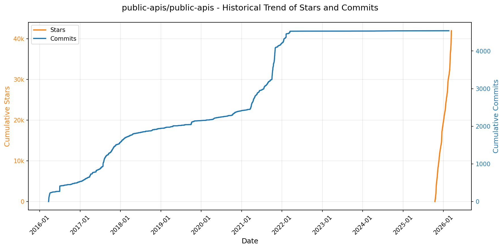

# 🌟 GitHub Trending 概览

> 数据更新于：2026-02-10

---

## 🔍 项目详情

### 1. [anomalyco/opencode](https://github.com/anomalyco/opencode)
- 📅 **创建日期**：2025-04-30  
- 🔄 **最近更新**：2026-02-10  
- ⭐ **Stars**：178,974（日 +730｜周 +5541｜月 +59518）  
- 📝 **描述**：The open source coding agent.  

<b>📈 Star 与 Commit 历史趋势</b>

> *蓝色：累计 Stars｜橙色：累计 Commits（次 Y 轴）*

<b>📄 README 摘要</b>

1. **该项目的功能**  
OpenCode 是一个开源的 AI 编程智能体（AI coding agent），旨在为开发者提供终端原生（TUI）、轻量高效、可扩展的 AI 辅助编程体验。它支持在本地终端中直接与 AI 协作完成代码编写、调试、重构、文档生成、代码库分析等任务；同时具备客户端/服务器架构，允许远程控制（如通过移动 App 驱动本地运行的 OpenCode 实例）。其核心目标是打造一个不绑定特定大模型供应商、完全开源可控、深度集成开发工作流（如 LSP 支持）的下一代 AI 编程工具。

2. **关键特性**  
- **双模式智能体切换**：内置 `build`（全权限开发代理，支持文件编辑与命令执行）和 `plan`（只读分析代理，禁止自动修改文件、执行命令前需显式授权），按 Tab 键即可切换，适配不同安全与探索场景；  
- **通用子代理（`@general`）**：支持复杂多步推理、跨文件搜索与高级规划任务，供高级用户或内部流程调用；  
- **全平台终端优先（TUI-first）**：深度优化终端交互体验，面向 Neovim 用户及终端爱好者设计，强调键盘驱动与低干扰工作流；  
- **模型无关性与多后端支持**：原生兼容 Claude、OpenAI、Google Gemini、Ollama 本地模型等，不锁定任何供应商；官方推荐搭配 [OpenCode Zen](https://opencode.ai/zen) 使用，但完全可自定义配置；  
- **开箱即用的 LSP 支持**：内置语言服务器协议集成，实现智能补全、跳转、诊断等 IDE 级功能；  
- **跨平台安装与部署灵活**：提供一键脚本（curl 安装）、主流包管理器（Homebrew / Scoop / Chocolatey / pnpm / mise / Nix 等）及桌面应用（macOS/Windows/Linux BETA 版）；  
- **国际化与社区驱动**：支持 18 种语言的文档（含简体中文、繁体中文、日语、韩语等），活跃 Discord 社区与开放贡献机制。

3. **技术栈**  
- **前端（TUI）**：基于 Rust 构建高性能终端界面（推测使用 `tui-rs` 或类似框架），兼顾响应速度与跨平台渲染一致性；  
- **核心引擎与 CLI**：主要使用 **Rust** 开发（从安装脚本、二进制分发及性能要求推断），确保安全性、并发能力与零成本抽象；  
- **AI 运行时与模型对接**：通过标准化 API（如 OpenAI 兼容接口）对接各类 LLM，支持本地 Ollama、远程厂商 API 及自托管模型；  
- **LSP 实现**：集成或自研轻量级语言服务器，支持主流编程语言的语义分析；  
- **构建与分发**：采用 GitHub Actions 自动化发布；支持多种打包格式（AppImage、.deb、.rpm、.dmg、.exe、Homebrew formula、Scoop bucket、Nixpkgs 等）；  
- **基础设施**：服务端组件（如 Zen 后端）可能采用 TypeScript/Node.js 或 Rust（未明确说明，但官网与文档站为现代 Web 技术栈）；文档站点基于静态生成（如 Docusaurus 或 VitePress）。

---

### 2. [anthropics/skills](https://github.com/anthropics/skills)
- 📅 **创建日期**：2025-09-22  
- 🔄 **最近更新**：2026-02-10  
- ⭐ **Stars**：106,754（日 +740｜周 +5519｜月 +32531）  
- 📝 **描述**：Public repository for Agent Skills  

<b>📈 Star 与 Commit 历史趋势</b>

> *蓝色：累计 Stars｜橙色：累计 Commits（次 Y 轴）*

<b>📄 README 摘要</b>

1. **该项目做什么？**  
该项目是 Anthropic 官方维护的 Claude 技能（Skills）开源示例仓库，提供一系列可直接运行或参考的、结构化定义的 AI 任务扩展能力。这些“技能”本质上是独立的、自包含的功能模块（以文件夹形式组织），通过 `SKILL.md` 文件向 Claude 动态注入特定领域指令与行为规范，使其能在不更改模型本身的前提下，可靠、重复地执行专业化任务——例如按企业品牌规范生成文档、按定制流程分析数据、自动化个人事务，或集成第三方工具（如 Notion）。项目本身不运行服务，而是为开发者、企业及合作伙伴提供技能设计范式、生产级参考实现（如 DOCX/PDF/PPTX/XLSX 文档处理技能）以及标准化规范。

2. **关键特性**  
- **模块化与自包含性**：每个技能为独立文件夹，含 `SKILL.md`（含 YAML 元数据+自然语言指令/示例/指南），开箱即用、无外部依赖；  
- **多场景覆盖**：涵盖创意设计（艺术/音乐）、技术开发（Web 应用测试、MCP 服务器生成）、企业应用（品牌传播、内部沟通）及核心文档处理（Word/PDF/PowerPoint/Excel 的创建、解析与编辑）；  
- **生产级参考实现**：`skills/docx` 等子目录公开了支撑 Claude 官方文档功能的真实源码（source-available，非完全开源），具备复杂逻辑与工程实践参考价值；  
- **跨平台部署支持**：原生兼容 Claude Code（插件市场注册）、Claude.ai（付费用户直用）、Claude API（支持上传自定义技能）三大入口；  
- **标准化与可扩展性**：配套发布 [Agent Skills 规范](http://agentskills.io)（位于 `/spec`），并提供官方技能模板（`/template`），降低开发门槛，推动生态共建；  
- **教育与示范导向**：明确声明所有技能仅用于演示与学习，强调行为可能与线上 Claude 实际表现存在差异，要求用户在生产环境前充分验证。

3. **技术栈**  
- **核心格式**：纯文本 Markdown（`SKILL.md`） + YAML 前置元数据（声明 `name`/`description` 等必需字段）；  
- **无运行时代码依赖**：技能本身不包含可执行代码（如 Python/JS），其逻辑完全通过自然语言指令、示例和约束规则驱动 Claude 模型行为；  
- **基础设施层**：依托 Anthropic 的专有技能运行时系统（未开源），负责动态加载、解析 `SKILL.md` 并在推理过程中激活对应指令上下文；  
- **协作与分发机制**：基于 GitHub 标准工作流，配合 Claude Code 插件协议（`/plugin install ...`）、Claude API 技能管理接口及 Claude.ai 前端技能中心实现分发；  
- **许可模型**：混合授权——多数示例技能采用 Apache 2.0 开源协议；文档类核心技能为 source-available（可查看、不可修改/再分发），体现生产级代码的管控策略。

---

### 3. [Shubhamsaboo/awesome-llm-apps](https://github.com/Shubhamsaboo/awesome-llm-apps)
- 📅 **创建日期**：2024-04-29  
- 🔄 **最近更新**：2026-02-10  
- ⭐ **Stars**：93,343（日 +284｜周 +1409｜月 +5904）  
- 📝 **描述**：Collection of awesome LLM apps with AI Agents and RAG using OpenAI, Anthropic, Gemini and opensource models.  

<b>📈 Star 与 Commit 历史趋势</b>

> *蓝色：累计 Stars｜橙色：累计 Commits（次 Y 轴）*

<b>📄 README 摘要</b>

1. **项目功能**  
该项目是一个高度结构化的开源资源库，致力于系统性地收集、分类与展示当前前沿的大型语言模型（LLM）实际应用案例。它并非一个单一可运行的应用程序，而是一个** curated（精选+维护）的LLM应用导航中心与学习平台**，聚焦于基于RAG（检索增强生成）、AI智能体（Agents）、多智能体协作（Multi-agent Teams）、MCP（Model Context Protocol）、语音交互（Voice Agents）、记忆机制（Stateful Memory）、细调（Fine-tuning）及优化技术等核心范式的实战型LLM项目。用户可通过该仓库快速发现、对比、复现和学习数百个覆盖教育、医疗、金融、法律、开发、媒体、游戏、旅行等垂直领域的可落地LLM应用原型。

2. **关键特性**  
- **全栈式LLM应用覆盖**：涵盖从入门级（Starter）到高级（Advanced）的完整演进路径，包括单智能体、多智能体团队、自主游戏AI、语音交互系统、MCP集成应用等；  
- **深度技术融合实践**：大量项目融合RAG（含Agentic RAG、Corrective RAG、Vision RAG、Hybrid Search等变体）、持久化记忆（Personalized/Shared Memory）、跨平台数据源对话（GitHub/Gmail/PDF/YouTube/ArXiv/Substack等）；  
- **多模型与多平台支持**：统一支持OpenAI、Anthropic（Claude）、Google Gemini、xAI Grok、Qwen、Llama系列（3.1/3.2）、Gemma（2/3）等闭源与开源模型，并提供本地部署与云服务双路径；  
- **工程化能力强化**：包含LLM成本优化工具（如TOON格式Token压缩、Headroom上下文智能压缩）、Agent框架速成课（Google ADK、OpenAI Agents SDK）、MCP标准实践（Browser/GitHub/Notion/Travel Planner等MCP Agent）；  
- **强可复现性与教学导向**：每个子项目均具备独立目录、清晰README、requirements.txt及运行指引，定位为“开箱即学”的工程化学习素材库。

3. **技术栈**  
- **核心框架与协议**：Google ADK（Agent Development Kit）、OpenAI Agents SDK、CrewAI、LangChain、LlamaIndex、MCP（Model Context Protocol）标准实现；  
- **模型层**：OpenAI GPT系列、Anthropic Claude系列、Google Gemini（含Multimodal）、xAI Grok、Meta Llama 3.1/3.2、Alibaba Qwen、Google Gemma 2/3、DeepSeek、Cohere等；  
- **RAG与检索**：ChromaDB、FAISS、Weaviate、Pinecone、Qdrant；向量模型（e.g., BGE, E5, Gemma Embedding）；Hybrid Search（关键词+语义）；Vision RAG（多模态嵌入与检索）；  
- **语音与交互**：Speechmatics（ASR/TTS）、Whisper、PyAudio、WebRTC相关SDK；  
- **基础设施与部署**：Python（主语言）、FastAPI/Flask（轻量API）、Docker（部分项目）、本地GPU推理（llama.cpp、Ollama、vLLM）；  
- **辅助工具链**：Pydantic（结构化输出）、SQLAlchemy（数据库路由RAG）、Git/GitHub API、Notion API、YouTube Data API、Gmail API、ArXiv API等第三方服务集成。

---

### 4. [obra/superpowers](https://github.com/obra/superpowers)
- 📅 **创建日期**：2025-10-09  
- 🔄 **最近更新**：2026-02-10  
- ⭐ **Stars**：77,439（日 +803｜周 +5963｜月 +45197）  
- 📝 **描述**：An agentic skills framework & software development methodology that works.  

<b>📈 Star 与 Commit 历史趋势</b>

> *蓝色：累计 Stars｜橙色：累计 Commits（次 Y 轴）*

<b>📄 README 摘要</b>

1. **该项目的作用**  
Superpowers 是一个面向编程智能体（coding agents）的完整软件开发工作流框架，旨在将原本零散、随意的代码生成行为，系统化为可验证、可协作、符合工程最佳实践的开发过程。它不直接生成代码，而是通过一系列自动触发的“技能”（skills），引导智能体在编码前完成需求澄清、设计评审、计划拆解、TDD 实施、子智能体协同执行、自动化审查与分支收尾等关键环节，从而确保交付质量、降低技术债务，并让 AI 编程行为具备可审计性、可复现性和人类可控性。

2. **核心功能**  
- **结构化需求与设计闭环**：通过 `brainstorming` 技能主动提问、分段呈现设计方案并等待人工确认，杜绝“盲目开写”。  
- **严格 TDD 执行**：`test-driven-development` 技能强制执行 RED-GREEN-REFACTOR 流程，要求先写失败测试、再写最小可行实现、最后重构，并自动删除未经测试的代码。  
- **原子化任务驱动开发**：`writing-plans` 将需求拆解为 2–5 分钟可完成的原子任务（含精确文件路径、完整代码块及验证步骤）；`subagent-driven-development` 或 `executing-plans` 调度独立子智能体逐项执行，并内置双阶段审查（是否符合规格 + 代码质量）。  
- **工程基础设施自动化**：`using-git-worktrees` 自动创建隔离开发分支、初始化环境、校验测试基线；`finishing-a-development-branch` 自动验证全量测试、提供合并/PR/丢弃等收尾选项。  
- **系统性调试与验证**：`systematic-debugging` 提供四阶段根因分析法；`verification-before-completion` 强制回归验证，避免“看似修复实则引入新问题”。  
- **协作增强能力**：支持 `requesting-code-review`（预提交检查清单）、`receiving-code-review`（结构化响应反馈）、`dispatching-parallel-agents`（并发子任务）等协作技能。  
- **自演进能力**：内置 `writing-skills` 技能，允许用户遵循标准范式创建、测试并贡献新技能，形成可扩展的技能库。

3. **技术栈**  
- **运行平台**：深度适配多款 AI 编程代理平台，包括 Claude Code（通过官方插件市场集成）、Codex 和 OpenCode（需手动加载远程安装指令）。  
- **架构模式**：基于“技能（Skill）”的插件化、声明式工作流引擎——每个技能是独立的 Markdown 文档（如 `skills/test-driven-development/SKILL.md`），定义触发条件、执行逻辑、约束规则与验证标准；主系统按需自动发现、加载并编排技能执行。  
- **核心机制**：依赖 LLM 的上下文理解与指令遵循能力，结合显式工程原则（YAGNI、DRY、TDD）进行流程控制；不依赖特定模型后端，强调提示词工程、结构化输出规范与自动化验证脚本（如测试运行器、Git 状态检查）。  
- **部署与更新**：通过 CLI 插件命令（如 `/plugin install`、`/plugin update`）管理；技能更新全自动同步，无需手动维护本地副本。  
- **协议与许可**：MIT 开源许可证，全部技能源码开放于 GitHub 仓库，支持社区共建与分发（含独立 marketplace 仓库）。

---

### 5. [openclaw/openclaw](https://github.com/openclaw/openclaw)
- 📅 **创建日期**：2025-11-24  
- 🔄 **最近更新**：2026-02-10  
- ⭐ **Stars**：64,640（日 +3096｜周 +28556｜月 +64640）  
- 📝 **描述**：Your own personal AI assistant. Any OS. Any Platform. The lobster way. 🦞   

<b>📈 Star 与 Commit 历史趋势</b>

> *蓝色：累计 Stars｜橙色：累计 Commits（次 Y 轴）*

<b>📄 README 摘要</b>

1. **该项目的功能**  
OpenClaw 是一个可在用户自有设备（本地）运行的**个人 AI 助理系统**，核心定位是“本地化、单用户、始终在线、低延迟”的私有 AI 交互平台。它不依赖中心化云服务托管助手逻辑，而是通过轻量级 **Gateway（网关）作为统一控制平面**，连接并协调多类终端与通道：支持 WhatsApp、Telegram、Slack、Discord、Google Chat、Signal、iMessage、BlueBubbles（iMessage 替代方案）、Microsoft Teams、Matrix、Zalo 等 13+ 消息通道；同时原生集成 macOS/iOS/Android 设备能力（语音唤醒、实时对话、摄像头、屏幕录制、位置、通知、系统命令等）；并提供可编程的**Live Canvas（动态画布工作区）** 和 A2UI 可视化界面，实现 AI 驱动的图形化任务协同。其本质是将 AI 助理“下沉”至用户设备侧，由用户完全掌控数据流、会话状态、权限策略与执行环境。

2. **关键特性**  
- **本地优先架构**：Gateway 运行于本地（macOS/Linux/WSL2），支持 systemd/launchd 守护进程，确保常驻与低延迟响应；所有通道连接、会话管理、工具调度均在本地完成。  
- **全场景多通道聚合收件箱**：统一接入主流通讯平台（含隐私敏感通道如 Signal、iMessage）及扩展通道（Zalo、Matrix 等），支持群组路由、提及触发、回复标签、分块处理等精细化消息分发策略。  
- **多智能体隔离工作区（Multi-agent Routing）**：基于 Workspace + Session 模型，为不同账号、频道或联系人分配独立 AI 代理实例，实现上下文隔离、模型定制与权限沙箱。  
- **全栈语音交互能力**：集成 ElevenLabs 实现 macOS/iOS/Android 端 **Voice Wake（持续语音唤醒）** 与 **Talk Mode（连续对话模式）**，支持免触交互与实时语音 I/O。  
- **Live Canvas + A2UI 可视化工作空间**：AI 可主动创建、更新、执行 Canvas 上的 UI 元素（按钮、表单、图表等），支持快照、评估与脚本化操作，构建混合 AI-UI 工作流。  
- **设备级节点（Nodes）扩展能力**：通过 macOS/iOS/Android 节点暴露本地硬件与系统能力（`camera.*`, `screen.record`, `location.get`, `system.run`, `system.notify`），并受 macOS TCC 权限体系严格管控。  
- **安全默认机制**：DM 默认启用配对认证（`dmPolicy="pairing"`），拒绝未授权用户输入；支持 OAuth（Anthropic/OpenAI）与 API Key 双模认证、模型故障转移（failover）、会话自动裁剪（pruning）、细粒度 DM 白名单控制。  
- **开箱即用的自动化工具链**：内置浏览器控制（专属 Chromium + CDP）、Cron 定时任务、Webhook/Gmail Pub/Sub 触发器、技能平台（ClawHub 技能注册与自动拉取）及 Agent-to-Agent 会话协作工具（`sessions_send`/`sessions_history`）。  
- **远程访问与分布式部署支持**：通过 Tailscale Serve/Funnel 或 SSH 隧道安全暴露 Gateway 控制台与 WebSocket，允许将 Gateway 部署于远程 Linux 服务器，而设备节点仍可执行本地操作（`node.invoke` 分离执行域）。

3. **技术栈**  
- **运行时**：Node.js ≥22（核心 CLI 与 Gateway）；支持 pnpm（推荐构建）、npm、bun（TS 直接运行）；TypeScript 编写，使用 `tsx` 进行开发态热重载。  
- **前端与 UI**：WebChat 与 Control UI 内置于 Gateway，基于现代 Web 技术栈；Canvas 使用 A2UI 协议驱动；macOS/iOS/Android 应用为原生客户端（Swift/Kotlin），通过 WebSocket 与 Gateway 通信。  
- **通道集成**：采用各平台主流 SDK/库——WhatsApp（Baileys）、Telegram（grammY）、Slack（Bolt）、Discord（discord.js）、Google Chat（REST API）、Signal（signal-cli）、BlueBubbles（HTTP API）、Matrix（matrix-js-sdk）等。  
- **语音与媒体**：ElevenLabs（TTS/STT）、FFmpeg（音视频处理）、Whisper（可选语音转文本）、本地音频/图像/视频流水线（含尺寸限制、临时文件生命周期管理）。  
- **部署与运维**：支持 Nix（声明式配置）、Docker、systemd/launchd 服务管理；Tailscale（Serve/Funnel）、SSH 隧道用于远程访问；内置 `openclaw doctor` 健康检查与迁移工具。  
- **安全与权限**：深度集成 macOS TCC（透明权限弹窗）、基于 Token/Password 的 Gateway 认证、OAuth 2.0（Anthropic/OpenAI）、端到端加密通道配置、最小权限默认策略（如 DM 配对强制启用）。

---

### 6. [ComposioHQ/awesome-claude-skills](https://github.com/ComposioHQ/awesome-claude-skills)
- 📅 **创建日期**：2025-10-17  
- 🔄 **最近更新**：2026-02-10  
- ⭐ **Stars**：54,837（日 +458｜周 +3848｜月 +20298）  
- 📝 **描述**：A curated list of awesome Claude Skills, resources, and tools for customizing Claude AI workflows  

<b>📈 Star 与 Commit 历史趋势</b>

> *蓝色：累计 Stars｜橙色：累计 Commits（次 Y 轴）*

<b>📄 README 摘要</b>

1. **该项目做什么？**  
该项目是一个面向 Anthropic Claude 系列模型（包括 Claude.ai、Claude Code 和 Claude API）的**高质量技能（Skills）聚合与实践指南库**。它不提供独立运行的软件，而是系统性地收集、分类并文档化各类可直接集成或即插即用的 Claude 技能——即经过结构化设计的提示工程模板、工具链封装和自动化工作流。其核心目标是**扩展 Claude 的能力边界，使其从纯文本生成跃升为可执行真实操作的智能代理**：例如发送邮件、创建 GitHub Issue、向 Slack 发送消息、操作 Notion 数据库、调用 1000+ 第三方 SaaS 应用（通过 Composio），以及完成文档处理、代码开发、数据分析、营销运营等垂直任务。

2. **关键特性**  
- **全场景技能覆盖**：按功能领域精细分类（共 10 大类），涵盖文档处理（DOCX/PDF/PPTX/XLSX/EPUB）、开发工具（Git 工作流、Playwright 测试、LangSmith 调试、MCP 构建）、数据与分析（CSV 智能分析、PostgreSQL 查询、深度研究）、商业营销（竞品广告提取、域名头脑风暴、销售线索挖掘）、通信写作（会议洞察分析、NotebookLM 集成、推文优化）、创意媒体（Canvas 设计、图像增强、Slack GIF 生成）、生产力组织（发票归档、简历定制、知识图谱构建）、项目协作（Jira/Asana/Notion/Trello 自动化）、安全系统（数字取证、Sigma 威胁狩猎）等。  
- **开箱即用的 App 自动化能力**：通过 `connect-apps` 插件（底层基于 Composio），支持 Claude 直连 500+ 应用（实际覆盖 1000+），实现跨平台真实操作（如 Gmail 发信、GitHub 创建 Issue、Slack 发消息），提供一键安装、API 密钥配置与快速验证流程。  
- **模块化、可复用的技能架构**：每个技能均以标准化方式呈现（含功能描述、GitHub 链接、作者信息、适用场景说明），强调“可重复、可标准化”，支持用户直接复用、组合或二次开发；同时提供《Skill Creator》《Skill Seekers》等元技能，赋能用户自主构建新技能。  
- **强社区驱动与开放协作**：明确标注各技能作者及来源仓库，采用 Apache-2.0 许可证，鼓励 Pull Request 贡献，并提供 Discord、X（Twitter）、LinkedIn 等多渠道社区支持。

3. **技术栈**  
- **核心平台层**：Anthropic Claude 模型（Claude.ai / Claude Code / Claude API），作为技能的运行载体与推理引擎。  
- **自动化基础设施**：[Composio](https://composio.dev) —— 提供统一的工具连接抽象层，负责 OAuth 认证、API 封装、1000+ 应用集成（如 Salesforce、Jira、Notion、Slack），并通过 Rube MCP 协议暴露标准化工具接口。  
- **技能实现技术**：  
  - 提示工程（Prompt Engineering）与上下文编排（Context Engineering）；  
  - 命令行插件机制（`claude --plugin-dir`）；  
  - 多语言工具集成：Python（PostgreSQL、FFUF、PICT）、TypeScript/JavaScript（Playwright、D3.js、React/Tailwind HTML 构建）、Shell（Git 工作流）、SQL（只读查询）；  
  - 第三方服务 API：Gemini（Deep Research、Imagen 图像生成）、YouTube Data API（字幕提取）、n8n（工作流编排）、NotebookLM（文档溯源问答）。  
- **辅助生态工具**：GitHub（托管与协作）、Markdown（技能文档）、Apache License（开源协议）。

---

### 7. [karpathy/nanochat](https://github.com/karpathy/nanochat)
- 📅 **创建日期**：2025-10-13  
- 🔄 **最近更新**：2026-02-10  
- ⭐ **Stars**：42,726（日 +105｜周 +1096｜月 +2756）  
- 📝 **描述**：The best ChatGPT that $100 can buy.  

<b>📈 Star 与 Commit 历史趋势</b>

> *蓝色：累计 Stars｜橙色：累计 Commits（次 Y 轴）*

<b>📄 README 摘要</b>

1. **项目功能**  
nanochat 是一个极简、可高度定制的端到端实验性框架，专为在单台 GPU 服务器（如 8×H100）上高效训练大语言模型（LLM）而设计。其核心目标是让研究者和开发者以极低成本（约 $20–$72）复现并超越 GPT-2（1.6B 参数）级别的模型能力，并直接通过类 ChatGPT 的 Web 界面进行交互。它完整覆盖 LLM 全生命周期：从 BPE 分词器训练、预训练（pretraining）、监督微调（SFT）、强化学习（RL）、多维度评估（CORE 分数、bits per byte 等），到带 KV 缓存的高效推理与交互式聊天 UI。

2. **关键特性**  
- **单参数驱动的计算最优模型族**：仅通过 `--depth`（Transformer 层数）一个整数即可自动推导全部超参（隐藏层宽、注意力头数、学习率调度、权重衰减、训练步数等），确保各规模模型均达计算效率最优，形成“miniseries”模型系列（如 d12≈GPT-1，d24–d26≈GPT-2 级别）。  
- **极致精简与可hack性**：代码高度精炼、无配置文件/工厂模式/条件嵌套，全部逻辑集中于少量 Python 文件，便于阅读、修改与分叉；支持单卡（自动梯度累积）、多卡（`torchrun`）、CPU/MPS 等多种运行模式。  
- **全栈可运行与开箱即用**：提供一键脚本（如 `runs/speedrun.sh`）完成从数据准备、训练、评估到 Web 聊天的全流程；内置 `scripts.chat_web` 启动本地 Web UI，支持实时对话；集成 DCLM CORE 评测、GSM8K、MMLU、HumanEval 等主流任务评估模块。  
- **透明化性能追踪与社区协作**：维护“GPT-2 Speedrun”排行榜，以**墙钟时间（wall-clock time）** 和 **CORE 分数（≥0.256525）** 为核心指标，鼓励优化预训练阶段；所有实验支持 Weights & Biases（wandb）可视化监控（val_bpb、CORE、MFU、吞吐量等）。

3. **技术栈**  
- **核心框架**：Python 3.10+，PyTorch 2.x（含 `torch.compile`、FP8 支持），无深度依赖（非 Hugging Face Transformers / DeepSpeed / Megatron-LM 等重型库）。  
- **训练与优化**：AdamW + Muon 优化器；分布式训练基于 `torchrun`；支持 FP8 混合精度、KV Cache 推理加速、梯度检查点（gradient checkpointing）。  
- **Tokenizer**：自研轻量级 BPE 实现（风格对标 GPT-4），支持 `scripts.tok_train` / `scripts.tok_eval` 独立训练与评测。  
- **推理与交互**：`nanochat.engine.py` 实现高效 KV Cache 推理；`scripts.chat_web.py` 基于内置 HTTP 服务器（`http.server`）与前端 `ui.html`（纯 HTML/CSS/JS）提供零依赖 Web UI；另支持 CLI 交互（`scripts.chat_cli.py`）。  
- **基础设施**：使用 `uv` 管理虚拟环境与依赖；数据加载基于 `nanochat.dataloader.py`（分布式分片 + 内存映射）；评估任务统一接入 `tasks/` 下模块（ARC、GSM8K、MMLU 等）；日志与报告由 `nanochat.report.py` 统一生成。

---

### 8. [remotion-dev/remotion](https://github.com/remotion-dev/remotion)
- 📅 **创建日期**：2020-06-23  
- 🔄 **最近更新**：2026-02-10  
- ⭐ **Stars**：35,891（日 +189｜周 +1330｜月 +10712）  
- 📝 **描述**：🎥      Make videos programmatically with React  

<b>📈 Star 与 Commit 历史趋势</b>

> *蓝色：累计 Stars｜橙色：累计 Commits（次 Y 轴）*

<b>📄 README 摘要</b>

1. **项目功能**  
Remotion 是一个基于 React 的视频生成框架，允许开发者使用 React 组件、JavaScript 逻辑和 Web 技术（如 CSS、SVG、Canvas、WebGL）**以编程方式动态创建高质量视频**。它将视频视为“可渲染的时序内容”，支持帧级控制、时间轴驱动的动画、参数化模板（如个性化年度回顾视频）、批量渲染及导出为 MP4/WebM 等格式，适用于自动化视频生产场景（如社交媒体内容、数据可视化视频、营销模板、个性化报告等）。

2. **核心特性**  
- ✅ **React 原生开发体验**：复用 React 组件、Hooks、状态管理、Props 传递与组合，支持 Fast Refresh 实时预览；  
- ✅ **时间轴驱动渲染**：通过 `useCurrentFrame()`、`interpolate()` 等 API 精确控制每一帧内容，实现数学驱动的动画与过渡；  
- ✅ **多目标输出**：支持本地预览（浏览器内实时播放）、静态帧导出、以及高性能服务端批量渲染（CLI 或 Node.js API），输出 MP4、WebM、GIF 及逐帧 PNG 序列；  
- ✅ **全栈 Web 能力集成**：无缝使用 CSS 动画、SVG 图形、HTML5 Canvas 绘图、Three.js/WebGL 3D 渲染及任意 Web API（如 Fetch、Web Audio）；  
- ✅ **模板化与可扩展性**：支持动态数据注入（如 JSON 输入）、多分辨率适配、自定义编码配置（FFmpeg 参数）、插件系统（如字体加载、音频合成）；  
- ✅ **生产就绪工具链**：提供 CLI 工具（`npx create-video`）、TypeScript 支持、VS Code 插件、CI/CD 友好部署方案及云渲染参考架构。

3. **技术栈**  
- **核心框架**：React（v18+）、TypeScript；  
- **渲染引擎**：基于 Chromium（通过 Puppeteer / Playwright）在无头浏览器中执行 React 渲染，利用浏览器原生图形能力；  
- **视频编码**：依赖 FFmpeg 进行最终视频合成与压缩（MP4/H.264、WebM/VP9）；  
- **构建与工具**：Vite（默认构建工具）、ESBuild、Jest（测试）、Storybook（组件预览）；  
- **基础设施支持**：Node.js（运行时与 CLI）、Webpack/Vite 插件生态、AWS S3/Cloudflare R2 等对象存储（用于托管渲染产物）；  
- **生态系统**：兼容 npm 包管理，可集成 D3、Framer Motion、React Three Fiber、Lottie-Web 等主流前端库。

---

### 9. [asgeirtj/system_prompts_leaks](https://github.com/asgeirtj/system_prompts_leaks)
- 📅 **创建日期**：2025-05-03  
- 🔄 **最近更新**：2026-02-10  
- ⭐ **Stars**：30,812（日 +106｜周 +1137｜月 +5923）  
- 📝 **描述**：Collection of extracted System Prompts from popular chatbots like ChatGPT, Claude & Gemini  

<b>📈 Star 与 Commit 历史趋势</b>

> *蓝色：累计 Stars｜橙色：累计 Commits（次 Y 轴）*

---

### 10. [OpenBMB/ChatDev](https://github.com/OpenBMB/ChatDev)
- 📅 **创建日期**：2023-08-28  
- 🔄 **最近更新**：2026-02-10  
- ⭐ **Stars**：30,722（日 +88｜周 +1274｜月 +2582）  
- 📝 **描述**：ChatDev 2.0: Dev All through LLM-powered Multi-Agent Collaboration  

<b>📈 Star 与 Commit 历史趋势</b>

> *蓝色：累计 Stars｜橙色：累计 Commits（次 Y 轴）*

<b>📄 README 摘要</b>

1. **项目功能**  
ChatDev 2.0（品牌名 DevAll）是一个**零代码多智能体协同平台**，旨在支持“开发一切”（Developing Everything）。它不再局限于传统软件开发流程，而是将原 ChatDev 1.0 的“虚拟软件公司”范式升级为通用型多智能体编排系统：用户无需编写任何代码，仅通过可视化界面或 YAML 配置即可定义智能体角色、任务流程、数据流向与执行逻辑，快速构建并运行面向多样化场景的定制化多智能体系统，例如数据可视化、3D 内容生成、深度学术研究、教学视频制作、游戏开发等。

2. **核心特性**  
- ✅ **零代码低门槛配置**：提供 Web 控制台（Vue 3 构建），支持拖拽式工作流画布、节点参数配置、上下文流定义与实时日志监控；  
- ✅ **开箱即用的行业级工作流模板**：内置覆盖数据可视化（`data_visualization_*.yaml`）、3D 建模（Blender 集成）、游戏开发（`GameDev_v1.yaml`）、深度研究（`deep_research_v1.yaml`）、AI 教学视频生成（`teach_video.yaml`）等多领域可执行 YAML 工作流；  
- ✅ **灵活的人机协同机制**：支持 Human-Agent Interaction 模式（人工评审介入）、Incremental Development（基于已有代码迭代）、Git 版本管理、Art 模式（调用设计师 Agent 生成图像）等增强交互能力；  
- ✅ **模块化可扩展架构**：开放 Python SDK（`runtime.sdk.run_workflow`），支持程序化调用与批量执行；预留 `functions/` 目录供开发者注入自定义工具；支持 YAML 中变量插值（如 `${API_KEY}`）与环境隔离；  
- ✅ **前沿多智能体协作范式集成**：融合 MacNet（有向无环图拓扑协作）、Puppeteer（强化学习驱动的动态中心协调器）、Experiential Co-Learning（经验共学习）与 IER（迭代经验精炼）等论文级技术，提升推理质量、降低计算开销、支持千级 Agent 协作与跨任务经验迁移。

3. **技术栈**  
- **后端**：Python 3.12+，基于 FastAPI 构建 RESTful API 服务；依赖 `uv` 进行高性能包管理与环境同步；核心运行时位于 `runtime/`，工作流引擎与实体抽象在 `workflow/` 和 `entity/`；  
- **前端**：Vue 3 + Vite 构建单页应用（SPA），采用响应式设计与可视化工作流编辑器；静态资源与交互逻辑集中于 `frontend/`；  
- **配置与编排**：以 YAML 文件（存于 `yaml_instance/`）定义工作流拓扑、Agent 角色、工具调用与条件分支，支持变量注入与 Schema 校验；  
- **AI 底座**：对接外部大语言模型（LLM）服务，通过 `.env` 配置 `API_KEY` 与 `BASE_URL`，兼容主流 LLM 提供商；部分高级功能（如 Blender 3D 生成）需额外安装本地依赖（如 Blender 及插件 `blender-mcp`）；  
- **工程基础设施**：支持 Docker 安全沙箱执行、Makefile 一键启停（`make dev`）、自动化 YAML 同步（`make sync`）与校验（`make validate-yamls`）。

---

### 11. [code-yeongyu/oh-my-opencode](https://github.com/code-yeongyu/oh-my-opencode)
- 📅 **创建日期**：2025-12-03  
- 🔄 **最近更新**：2026-02-10  
- ⭐ **Stars**：29,964（日 +352｜周 +2679｜月 +16694）  
- 📝 **描述**：the best agent harness  

<b>📈 Star 与 Commit 历史趋势</b>

> *蓝色：累计 Stars｜橙色：累计 Commits（次 Y 轴）*

<b>📄 README 摘要</b>

1. **项目功能**  
Oh My OpenCode 是一个面向开源代码编辑器 OpenCode（基于 VS Code 架构的 LLM 原生 IDE）的**高性能、生产就绪型智能代理编排插件**。它不替代 IDE，而是深度增强 OpenCode 的能力，使其成为真正可自主执行复杂软件工程任务的“AI 工程师协作平台”。核心目标是：让 LLM 代理像人类开发团队一样分工协作、持续执行、自主决策并完成端到端任务（如重构万行代码、将桌面应用转为 SaaS 网站、修复全部 ESLint 警告等），直至 100% 验证完成——而非中途停止或生成半成品。

2. **关键特性**  
- **多智能体协同架构**：内置预调优角色代理团队，包括主协调者 *Sisyphus*（Opus 4.5）、深度执行者 *Hephaestus*（GPT-5.2 Codex）、架构调试专家 *Oracle*、前端工程师（Gemini 3 Pro）、文档与源码探索专家 *Librarian* 及极速代码搜索 *Explore*；支持异步并行调度与自动负载分担。  
- **零摩擦自动化工作流**：通过关键词 `ultrawork`（或 `ulw`）一键触发全栈代理协作，自动完成上下文分析、多源检索（官方文档/代码库/GitHub）、LSP 精准重构、风格对齐编码、注释净化及强制待办续跑（Todo Continuation Enforcer）。  
- **企业级工程工具链集成**：原生兼容 Claude Code 全套扩展机制（Commands/Skills/Agents/MCP/Hooks）；内置高质量 MCP（Exa Web Search、Context7 官方文档、grep.app GitHub 搜索）；完整 LSP + AST-Grep 支持（重命名、诊断、结构化搜索与安全重构）。  
- **强健性与合规设计**：内置 Comment Checker 保障输出代码无冗余注释、风格拟人；采用“合法路径”哲学（Legitimate Precision），规避 ToS 风险；提供 Tmux 终端交互、会话历史分析、Ralph Loop 等生产力增强模块。  
- **开箱即用与高度可定制**：默认启用全部功能（Battery Included），同时支持 JSONC 格式细粒度配置（模型/温度/提示词/权限/钩子开关/并发策略/领域分类等），适配项目级与用户级双层配置。

3. **技术栈**  
- **运行时环境**：深度依赖 [OpenCode](https://github.com/sst/opencode)（开源 LLM 原生 IDE，基于 VS Code 平台）；非独立应用，需作为 OpenCode 插件安装。  
- **核心语言与框架**：TypeScript（主逻辑）、Node.js（插件运行时）；深度集成 OpenCode 的插件系统、LSP 协议栈及 MCP（Model Calling Protocol）标准。  
- **AI 模型调度层**：多模型协同编排（Claude Sonnet/Haiku/Opus、GPT-5.2 Codex、Gemini 3 Pro 等），支持按任务类型（前端/调试/探索）动态路由至最优模型。  
- **基础设施与工具**：AST-Grep（语法树感知代码搜索）、Tmux（终端会话管理）、jq（配置操作）、curl（自动化安装）；依赖 GitHub Releases 分发二进制包，npm 发布包（`oh-my-opencode`）。  
- **许可证**：SUL-1.0（Sisyphus Universal License），强调自由使用、修改与分发，明确禁止商业化冒名站点（如 ohmyopencode.com）。

---

### 12. [public-apis/public-apis](https://github.com/public-apis/public-apis)
- 📅 **创建日期**：2016-03-20  
- 🔄 **最近更新**：2026-02-10  
- ⭐ **Stars**：28,900（日 +643｜周 +2500｜月 +7365）  
- 📝 **描述**：A collective list of free APIs  

<b>📈 Star 与 Commit 历史趋势</b>

> *蓝色：累计 Stars｜橙色：累计 Commits（次 Y 轴）*

<b>📄 README 摘要</b>

1. **该项目的功能**  
该项目是一个由社区成员（包括 APILayer 团队）人工整理、持续维护的**公开 API 目录仓库**，旨在为开发者提供一个免费、可靠、分类清晰的公共 API 资源集合。它不提供 API 托管或代理服务，而是以结构化 Markdown 表格形式汇总来自全球各领域的高质量公开 API（如天气、金融、动物、动漫、区块链、认证等），涵盖其名称、功能描述、认证方式（Auth）、是否支持 HTTPS 和 CORS 等关键元数据，并附带直达文档和 Postman 快速调用链接（针对 APILayer 自营 API）。本质上，它是一个面向开发者的“API 黄页”与“发现平台”。

2. **核心特性**  
- ✅ **全面覆盖与精细分类**：按 60+ 个垂直领域（如 Animals、Anime、Blockchain、Weather、Authentication 等）组织 API，支持快速定位；  
- ✅ **标准化元数据标注**：每项 API 明确标注认证类型（`apiKey`/`OAuth`/无认证）、HTTPS 支持性、CORS 兼容性，便于技术选型；  
- ✅ **APILayer 官方 API 一键集成**：为 IPstack、Marketstack、Weatherstack 等 6 款自营 API 提供 Postman 集成按钮，降低试用门槛；  
- ✅ **社区驱动与开放协作**：支持 GitHub Issues/Pull Requests，提供详细的 [Contributing Guide](CONTRIBUTING.md)，鼓励用户提交、审核、更新 API 条目；  
- ✅ **零成本与免注册使用**：所有列出的 API 均为“可免费使用”的公共接口（部分需自行申请 apiKey 或遵守用量限制），仓库本身完全开源（MIT License）；  
- ✅ **高可用性与可访问性**：所有条目均经人工校验，确保链接有效、协议安全（HTTPS 为主），并兼顾前端直连（CORS）需求。

3. **技术栈**  
- **内容层**：纯静态 Markdown 文件（`.md`），采用 GitHub Flavored Markdown 编写，依赖 GitHub 原生渲染能力；  
- **托管与协作**：基于 GitHub 平台，利用 Issues、Pull Requests、Actions（隐含 CI/CD 支持）、Discord 社区协同管理；  
- **基础设施无关**：项目本身无后端服务、无数据库、无运行时依赖，不涉及任何服务器端语言或框架；  
- **辅助工具链**：依赖 Postman（用于 API 快速测试）、GitHub Pages（可能用于衍生网站展示）、Discord（社区沟通）；  
- **构建与发布**：零构建步骤，纯文本仓库，版本控制通过 Git 实现，发布即 `git push`。

---

### 13. [thedotmack/claude-mem](https://github.com/thedotmack/claude-mem)
- 📅 **创建日期**：2025-08-31  
- 🔄 **最近更新**：2026-02-10  
- ⭐ **Stars**：26,466（日 +675｜周 +8186｜月 +13446）  
- 📝 **描述**：A Claude Code plugin that automatically captures everything Claude does during your coding sessions, compresses it with AI (using Claude's agent-sdk), and injects relevant context back into future sessions.  

<b>📈 Star 与 Commit 历史趋势</b>

> *蓝色：累计 Stars｜橙色：累计 Commits（次 Y 轴）*

<b>📄 README 摘要</b>

1. **项目功能**  
Claude-Mem 是一个专为 **Claude Code（Anthropic 推出的 AI 编程助手）** 设计的**持久化记忆压缩系统**。它在用户每次会话结束后自动捕获工具调用、代码操作与交互行为，生成语义化摘要，并将结构化记忆长期存储于本地 SQLite 数据库中；当新会话启动时，自动将相关历史上下文（按需、分层）注入 Claude 的提示词中，从而实现跨会话的知识连续性与项目上下文继承，显著提升 AI 编程助手的长期协作能力。

2. **核心特性**  
- ✅ **持久记忆（Persistent Memory）**：会话间自动保留项目上下文，无需手动重述背景；  
- ✅ **渐进式披露（Progressive Disclosure）**：三层检索机制（`search` → `timeline` → `get_observations`），按需加载、显式展示 token 消耗，节省约 10 倍上下文成本；  
- ✅ **技能化智能搜索（MCP Search Tools）**：提供 5 个标准化 MCP 工具（含 `search`, `timeline`, `save_memory` 等），支持自然语言查询、时间线回溯与手动记忆存档；  
- ✅ **本地 Web 查看器（Web Viewer UI）**：运行于 `http://localhost:37777`，实时流式展示记忆流、观测记录、摘要及引用链接（含 `/api/observation/{id}` 接口）；  
- ✅ **隐私控制与细粒度配置**：支持 `<private>` 标签屏蔽敏感内容；通过 `settings.json` 精确控制上下文注入范围、模型、端口、日志级别等；  
- ✅ **Claude Desktop 集成**：可在 Claude 桌面版对话中直接调用 `mem-search` 技能检索历史；  
- ✅ **自动化与可扩展架构**：基于 6 个生命周期钩子（SessionStart/PostToolUse/SessionEnd 等）无缝集成；内置 Bun 管理的 Worker 服务 + Chroma 向量库 + SQLite FTS5 全文搜索，支持混合语义+关键词检索；  
- ✅ **Beta 实验通道**：支持 Endless Mode（仿生长时记忆架构）等前沿功能，可通过 Web UI 切换版本。

3. **技术栈**  
- **运行时**：Node.js ≥18.0.0（主逻辑）、Bun（Worker 服务托管与进程管理）、uv（Python 包管理器，用于向量搜索依赖）；  
- **数据库**：SQLite 3（嵌入式，含 FTS5 全文搜索支持） + Chroma（轻量级向量数据库，用于语义检索）；  
- **前端/UI**：静态 Web Viewer（HTML/CSS/JS，含 GIF 动态预览与响应式设计）；  
- **协议与标准**：MCP（Model Context Protocol）规范实现；遵循 Anthropic Claude Agent SDK 插件架构；  
- **开发与构建**：TypeScript（主要语言）、GitHub Actions（CI/CD）、AGPL-3.0 开源许可证（主项目），部分模块（如 `ragtime/`）采用 PolyForm Noncommercial License；  
- **部署环境**：本地优先（无云依赖），全链路离线可用，Windows/macOS/Linux 全平台支持。

---

### 14. [virattt/dexter](https://github.com/virattt/dexter)
- 📅 **创建日期**：2025-10-14  
- 🔄 **最近更新**：2026-02-10  
- ⭐ **Stars**：20,987（日 +887｜周 +3763｜月 +7651）  
- 📝 **描述**：An autonomous agent for deep financial research  

<b>📈 Star 与 Commit 历史趋势</b>

> *蓝色：累计 Stars｜橙色：累计 Commits（次 Y 轴）*

<b>📄 README 摘要</b>

1. **项目功能**  
Dexter 是一个面向金融研究的自主式AI代理系统，能够对复杂金融问题进行端到端的自动化分析。它不依赖人工干预，而是通过“思考—规划—执行—验证—迭代”的闭环流程完成任务：接收用户提出的金融问题（如“分析苹果公司过去五年的盈利质量与现金流健康度”），自主拆解为多步研究计划，调用实时市场数据接口获取财报（利润表、资产负债表、现金流量表）等结构化数据，执行工具调用，自我评估结果合理性，并在未达置信阈值时主动反思与修正，最终输出数据支撑充分、逻辑清晰的分析结论。

2. **核心特性**  
- **智能任务规划能力**：自动将模糊/复杂的自然语言金融问题解析为可执行、有序的研究子任务（例如“获取AAPL近5年收入数据→计算营收复合增长率→比对经营性现金流与净利润差异→识别异常项”）。  
- **全自主执行与自验证机制**：集成多种金融数据工具与网络搜索能力，支持自动选择并调用合适工具；内置自我检查（self-validation）模块，通过LLM对中间结果进行语义合理性判断，并支持多轮迭代优化直至满足完成标准。  
- **实时权威金融数据接入**：原生对接 Financial Datasets API，可直接获取上市公司经审计的标准化财务报表（含年度/季度数据），覆盖收入、利润、资产、负债、现金流等核心维度。  
- **鲁棒性与安全性设计**：内置循环检测（loop detection）、最大步骤限制（step limits）及超时熔断机制，防止无限推理或失控执行；支持多API后端（OpenAI/Anthropic/XAI/OpenRouter）与本地模型（Ollama）灵活切换，保障服务连续性。  
- **可追溯调试与评估体系**：完整记录每轮交互的思维链（thinking）、工具调用详情（tool_result）及原始输入（init）至JSONL格式的scratchpad日志；内置基于LangSmith的评估套件，采用LLM-as-Judge方式对答案准确性进行自动化打分与可视化追踪。

3. **技术栈**  
- **运行时**：Bun（v1.0+）——作为高性能JavaScript/TypeScript运行时与包管理器，替代Node.js以提升启动速度与开发体验。  
- **AI模型层**：多后端LLM支持，包括OpenAI（默认）、Anthropic、Google、xAI、OpenRouter；可选本地部署模型（通过Ollama）。  
- **数据服务**：Financial Datasets API（核心财务数据源）、Exa API 或 Tavily API（补充网络公开信息检索）。  
- **开发与运维**：TypeScript（强类型保障逻辑可靠性）、ESBuild（构建）、Vitest（测试）、LangSmith（可观测性与评估追踪）、Git（版本控制）。  
- **架构风格**：轻量级自治Agent框架，基于ReAct（Reasoning + Acting）范式实现任务规划与工具调用协同，无重服务依赖，纯前端可控CLI应用。

---

### 15. [iOfficeAI/AionUi](https://github.com/iOfficeAI/AionUi)
- 📅 **创建日期**：2025-08-07  
- 🔄 **最近更新**：2026-02-10  
- ⭐ **Stars**：19,755（日 +608｜周 +1725｜月 +12928）  
- 📝 **描述**：Free, local, open-source 24/7 Cowork and OpenClaw for Gemini CLI, Claude Code, Codex, OpenCode, Qwen Code, Goose CLI, Auggie, and more | 🌟 Star if you like it!  

<b>📈 Star 与 Commit 历史趋势</b>

> *蓝色：累计 Stars｜橙色：累计 Commits（次 Y 轴）*

---

### 16. [VectifyAI/PageIndex](https://github.com/VectifyAI/PageIndex)
- 📅 **创建日期**：2025-04-01  
- 🔄 **最近更新**：2026-02-10  
- ⭐ **Stars**：19,256（日 +217｜周 +1974｜月 +9457）  
- 📝 **描述**：📑 PageIndex: Document Index for Vectorless, Reasoning-based RAG  

<b>📈 Star 与 Commit 历史趋势</b>

> *蓝色：累计 Stars｜橙色：累计 Commits（次 Y 轴）*

<b>📄 README 摘要</b>

1. **该项目做什么？**  
PageIndex 是一个**无需向量数据库、不依赖文本分块**的新型检索增强生成（RAG）系统，专为**长篇专业文档（如财报、法律文件、技术手册、学术教材等）的高精度、可解释性知识检索**而设计。它摒弃传统基于语义相似度的向量检索范式，转而构建文档的**层次化树状索引（类似智能目录）**，并利用大语言模型（LLM）在该索引上执行**推理驱动的树搜索（reasoning-based tree search）**，模拟人类专家阅读和定位信息的过程，实现真正以“相关性”而非“相似性”为导向的检索。

2. **核心功能**  
- ✅ **零向量数据库（Vectorless）**：完全绕过嵌入计算与向量存储，消除向量检索的“黑箱”与近似误差；  
- ✅ **零人工分块（No Chunking）**：基于文档天然结构（标题层级、语义段落）自动生成逻辑节点，避免语义割裂；  
- ✅ **推理式检索（Reasoning-based Retrieval）**：通过LLM对树索引进行多步推理（如“先定位章节→再筛选子节→最终定位页码”），支持复杂查询与领域逻辑；  
- ✅ **强可解释性与可追溯性**：每次检索结果附带明确的树路径、节点ID、起止页码及摘要，支持审计与验证；  
- ✅ **原生视觉支持（Vision-native）**：提供OCR-Free方案，可直接对PDF页面图像进行推理检索，跳过传统OCR流程；  
- ✅ **开箱即用与灵活集成**：提供Chat平台（chat.pageindex.ai）、MCP协议插件（支持Claude/Cursor等）、REST API及本地开源代码，支持自托管与企业私有化部署。

3. **技术栈**  
- **核心架构**：基于LLM的**树索引构建 + 推理式树搜索（Agentic Tree Search）**，受AlphaGo启发；  
- **文档解析**：PDF文本/结构提取（依赖`pymupdf`等库），支持Markdown输入（按`#`层级解析）；  
- **LLM集成**：默认调用OpenAI GPT-4o（可配置其他兼容模型），用于生成树结构、节点摘要、目录推断及检索推理；  
- **开发与部署**：Python 3.x，依赖`openai`、`python-dotenv`、`PyMuPDF`等；支持Colab快速实验；  
- **扩展能力**：配套**PageIndex OCR**（专为保留全局文档结构优化的长上下文OCR模型，非本仓库核心但属生态关键组件）；  
- **接口协议**：支持MCP（Model Context Protocol）标准，兼容主流AI Agent框架。

---

### 17. [gitbutlerapp/gitbutler](https://github.com/gitbutlerapp/gitbutler)
- 📅 **创建日期**：2023-01-31  
- 🔄 **最近更新**：2026-02-10  
- ⭐ **Stars**：18,663（日 +302｜周 +1103｜月 +1267）  
- 📝 **描述**：The GitButler version control client, backed by Git, powered by Tauri/Rust/Svelte  

<b>📈 Star 与 Commit 历史趋势</b>

> *蓝色：累计 Stars｜橙色：累计 Commits（次 Y 轴）*

<b>📄 README 摘要</b>

1. **项目功能**  
GitButler 是一个面向现代 AI 原生工作流的全新 Git 版本控制系统界面，提供图形化桌面应用（GUI）和命令行工具（`but` CLI），可作为现有 Git 仓库的“即插即用式增强替代品”。它不替换 Git 本身，而是在其底层之上构建更智能、更直观、更容错的操作层，支持开发者与 AI 代理（agents）协同高效管理代码变更，无需修改现有工作流或迁移仓库。

2. **核心特性**  
- **堆叠分支（Stacked Branches）**：支持在任意分支上创建子分支，提交变更后自动重新堆叠，支持任意层级的无痛编辑与修正；  
- **并行分支（Parallel Branches）**：允许多个虚拟分支同时存在并独立工作，彻底摆脱频繁 `git checkout` 切换；  
- **可视化提交操作**：通过拖拽或简洁 CLI 命令完成撤回、重写、变基、拆分、合并等操作，完全取代复杂的手动 `rebase -i`；  
- **操作时间线与无限撤销（Undo Timeline）**：完整记录所有用户与系统操作，支持粒度到单次变更的即时回退；  
- **一等冲突处理（First-Class Conflicts）**：冲突不再阻断流程——可标记为“待解决”，延迟至任意时间、按任意顺序处理，且 rebase 永远不会失败；  
- **原生 Forge 集成**：深度对接 GitHub/GitLab，直接在本地完成 PR 创建/更新、CI 状态查看、远程分支同步等，无需跳转网页或额外 CLI 工具；  
- **内建 AI 工具链**：集成 AI 能力自动生成提交信息、分支名、PR 描述，并支持为各类 AI 代理系统安装 Git 管理“技能”（hooks/skills），实现人机协同编程。

3. **技术栈**  
- **桌面 GUI 应用**：基于 [Tauri](https://tauri.app/) 构建（轻量、安全、跨平台）；  
- **前端**：使用 [Svelte](https://svelte.dev/) + [TypeScript](https://www.typescriptlang.org/) 开发响应式 UI；  
- **后端与核心逻辑**：全部采用 [Rust](https://www.rust-lang.org/) 编写，兼顾性能、内存安全与并发能力；  
- **CLI 工具（`but`）**：复用同一套 Rust 后端引擎，纯 Rust 实现命令行交互界面，保证 GUI 与 CLI 行为完全一致、能力对等。

---

### 18. [DrewThomasson/ebook2audiobook](https://github.com/DrewThomasson/ebook2audiobook)
- 📅 **创建日期**：2024-01-22  
- 🔄 **最近更新**：2026-02-10  
- ⭐ **Stars**：17,870（日 +214｜周 +488｜月 +974）  
- 📝 **描述**：Generate audiobooks from e-books, voice cloning & 1158+ languages!  

<b>📈 Star 与 Commit 历史趋势</b>

> *蓝色：累计 Stars｜橙色：累计 Commits（次 Y 轴）*

<b>📄 README 摘要</b>

1. **该项目的功能**  
本项目是一个将电子书（eBook）批量转换为有声书（audiobook）的本地化/远程化工具，支持自动识别章节结构、嵌入元数据（如标题、作者、封面等），并生成专业级音频文件。它专为非DRM保护、合法获取的电子书设计，可处理纯文本、扫描图像（通过OCR）、以及多种排版复杂的电子书格式，最终输出符合有声书标准的多格式音频（如`.m4b`，支持章节跳转和播客订阅）。

2. **核心功能**  
- ✅ **全格式电子书支持**：涵盖 `.epub`, `.mobi`, `.pdf`, `.azw3`, `.fb2`, `.docx`, `.html`, `.jpg`/`.png`（含OCR）、甚至漫画格式（`.cbr`/`.cbz`）等共30+种输入格式；最佳章节识别效果来自 `.epub` 和 `.mobi`。  
- ✅ **多引擎高质量TTS合成**：集成 **XTTSv2（主打）**、BARK、VITS、Fairseq、Tacotron2、YourTTS 等主流开源TTS模型，支持实时至高保真语音生成。  
- ✅ **跨语言与语音克隆**：官方支持 **1158种语言及方言**（基于Meta MMS数据集）；提供端到端语音克隆能力——用户上传一段自己的语音（如 `.wav`/`.mp3`），即可生成个性化朗读声音。  
- ✅ **精细化音频控制**：原生支持 **SML标签语法**（如 `[pause:2.5]`, `[voice:/path/to/voice.wav]...[/voice]`），实现动态停顿、多角色切换、语速/语调调节等高级控制。  
- ✅ **低资源友好部署**：最低仅需 **2GB RAM + 1GB VRAM**，支持CPU、CUDA、ROCm、Apple Silicon（MPS）、Intel XPU、NVIDIA Jetson 等全硬件后端；提供Docker镜像（含CPU/CUDA/ROCM/XPU/Jetson多版本）及免安装云端方案（Hugging Face Spaces、Google Colab、Kaggle）。  
- ✅ **灵活输出与定制**：支持 `m4b`（首选有声书格式）、`mp3`, `flac`, `wav`, `aac`, `ogg` 等12+种音频格式；允许自定义采样率、声道（单/立体声）、比特率，并支持加载用户微调的XTTSv2模型（ZIP包形式）。

3. **技术栈**  
- **前端交互层**：基于 [Gradio](https://gradio.app/) 构建可视化Web GUI（含实时预览、拖拽上传、参数滑块），支持本地运行与公开分享链接。  
- **核心TTS引擎**：深度集成多个PyTorch/Triton加速的开源TTS框架，包括：  
  - `XTTSv2`（Coqui TTS，支持零样本克隆、多语言、高自然度）  
  - `BARK`（Suno AI，支持情感、背景音、音乐生成）  
  - `VITS` / `Fairseq` / `Tacotron2` / `YourTTS`（兼顾速度与质量的轻量级选项）  
- **文档解析与OCR**：使用 `ebooklib`, `pdfplumber`, `pymupdf`, `calibre`, `tesseract-ocr` 等库解析EPUB/PDF/MOBI结构，并对图像类PDF执行OCR提取文本。  
- **构建与部署**：  
  - 跨平台启动脚本（`ebook2audiobook.command` / `.cmd`）自动处理依赖（macOS用Homebrew，Windows用Scoop）  
  - 完整Docker支持（多GPU后端镜像、docker-compose/podman-compose模板）  
  - 云端一键运行（Hugging Face Spaces、Colab Notebook、Kaggle Notebooks）  
- **底层运行时**：Python 3.9+，PyTorch（适配CUDA/ROCm/MPS/XPU/Jetson），FFmpeg（音频后处理），libsndfile，sox 等。

---

### 19. [hsliuping/TradingAgents-CN](https://github.com/hsliuping/TradingAgents-CN)
- 📅 **创建日期**：2025-06-26  
- 🔄 **最近更新**：2026-02-10  
- ⭐ **Stars**：16,223（日 +235｜周 +729｜月 +1680）  
- 📝 **描述**：基于多智能体LLM的中文金融交易框架 - TradingAgents中文增强版  

<b>📈 Star 与 Commit 历史趋势</b>

> *蓝色：累计 Stars｜橙色：累计 Commits（次 Y 轴）*

<b>📄 README 摘要</b>

1. **项目功能**  
本项目是一个面向中文用户的**多智能体与大模型股票分析学习平台**，基于开源框架 `TradingAgents` 进行深度本地化与功能增强。其核心定位为**合规、非实盘的研究与教育工具**，旨在帮助用户系统学习如何利用多智能体架构和大语言模型（LLM）开展股票基本面、技术面、新闻舆情等多维度分析，支持 A 股、港股、美股市场，但**不提供任何实盘交易指令或投资建议**。

2. **关键特性**  
- ✅ **中文化全栈增强**：原生中文界面、A股数据完整支持（Tushare/AkShare/BaoStock）、国产大模型集成（通义千问、DeepSeek 等）、中文提示词工程与教学资源；  
- ✅ **企业级多智能体分析能力**：支持动态 LLM 供应商管理、任务驱动的智能模型选择（自动匹配最佳模型）、多维度股票筛选/自选股管理/个股深度分析页；  
- ✅ **专业分析与输出**：智能新闻分析（含质量评估与多层过滤）、统一新闻工具、多格式专业报告导出（Markdown/Word/PDF）；  
- ✅ **生产就绪架构**：FastAPI + Vue 3 全新前后端分离架构，MongoDB + Redis 双缓存数据库，SSE + WebSocket 实时进度推送，批量分析与模拟交易系统；  
- ✅ **开箱即用部署体验**：完整 Docker 多架构支持（amd64/arm64）、一键 Docker Compose 部署、绿色版（Windows 便携）、本地源码安装三模式；  
- ✅ **运维与治理能力**：可视化配置中心（模型/数据源/系统设置）、用户权限与角色管理、操作日志、缓存管理、成本优化与统一日志体系。

3. **技术栈**  
- **后端**：Python 3.10+，FastAPI + Uvicorn（替代原 Streamlit），MongoDB（主数据存储），Redis（缓存与实时通信），支持 OpenAI/Gemini/DeepSeek/通义千问等多 LLM 接口；  
- **前端**：Vue 3 + Vite + Element Plus（现代化 SPA），响应式设计，Web 配置界面与实时交互；  
- **基础设施**：Docker 多架构镜像（GitHub Actions 自动构建）、Docker Compose 编排、跨平台兼容（Windows/macOS/Linux/ARM64 设备如树莓派、M系列 Mac）；  
- **许可证架构**：**混合授权模式**——基础代码（除 `app/` 和 `frontend/` 外）采用 Apache 2.0 开源协议；核心后端（`app/` 目录）与前端（`frontend/` 目录）为专有组件，**个人学习免费，商业使用须单独授权**。

---

### 20. [Canner/WrenAI](https://github.com/Canner/WrenAI)
- 📅 **创建日期**：2024-03-13  
- 🔄 **最近更新**：2026-02-10  
- ⭐ **Stars**：14,262（日 +52｜周 +565｜月 +852）  
- 📝 **描述**：⚡️ GenBI (Generative BI) queries any database in natural language, generates accurate SQL (Text-to-SQL), charts (Text-to-Chart), and AI-powered business intelligence in seconds.  

<b>📈 Star 与 Commit 历史趋势</b>

> *蓝色：累计 Stars｜橙色：累计 Commits（次 Y 轴）*

<b>📄 README 摘要</b>

1. **项目功能**  
Wren AI 是一个开源的生成式商业智能（GenBI）智能体，旨在让用户以自然语言直接查询任意数据库，秒级生成准确的 SQL 查询语句（Text-to-SQL）、可视化图表（Text-to-Chart）以及 AI 生成的业务洞察摘要与报告，从而实现零SQL门槛、端到端的自助式数据分析与决策支持。

2. **核心功能**  
- **自然语言数据交互**：支持多语言提问，自动解析意图并生成高精度、可执行的 SQL，大幅降低数据分析技术门槛；  
- **GenBI 智能洞察**：基于查询结果，自动生成文字摘要、推荐图表及结构化业务报告，提供即用型决策上下文；  
- **语义层（Semantic Layer）**：通过声明式模型定义语言（MDL）统一建模数据源的表结构、业务指标、维度关系与权限策略，确保 LLM 输出符合业务语义、保持准确性与治理合规性；  
- **API 嵌入能力**：提供标准化 REST API，支持将自然语言查询、SQL 生成、图表渲染等能力无缝集成至第三方应用（如 SaaS 工具、内部 BI 系统、Streamlit 应用或企业聊天机器人）。

3. **技术栈**  
- **后端服务**：基于 Python 构建的 `wren-ai-service`（核心推理与语义引擎），深度集成 LLM 编排、SQL 校验、图表生成与 MDL 解析逻辑；  
- **前端界面**：React + TypeScript 实现的交互式 Web UI（Wren AI Studio），支持可视化建模、对话式查询与洞察展示；  
- **LLM 生态**：高度可插拔，原生支持 OpenAI、Azure OpenAI、Gemini（Google AI Studio / Vertex AI）、Claude（Anthropic / Bedrock）、DeepSeek、Groq、Ollama、Databricks MLflow 等主流大模型接口；  
- **数据连接**：兼容多种现代数据平台，包括 Snowflake、BigQuery、Redshift、Databricks、PostgreSQL、MySQL、SQL Server、Oracle、ClickHouse、Trino/Athena、DuckDB 等；  
- **部署架构**：模块化微服务设计，支持本地 Docker 容器化部署、Kubernetes 托管，亦提供全托管云服务（Wren AI Cloud）。

---

### 21. [KeygraphHQ/shannon](https://github.com/KeygraphHQ/shannon)
- 📅 **创建日期**：2025-09-27  
- 🔄 **最近更新**：2026-02-10  
- ⭐ **Stars**：14,018（日 +3857｜周 +10257｜月 +10433）  
- 📝 **描述**：Fully autonomous AI hacker to find actual exploits in your web apps. Shannon has achieved a 96.15% success rate on the hint-free, source-aware XBOW Benchmark.  

<b>📈 Star 与 Commit 历史趋势</b>

> *蓝色：累计 Stars｜橙色：累计 Commits（次 Y 轴）*

<b>📄 README 摘要</b>

1. **该项目做什么？**  
Shannon 是一个**全自动、白盒优先的 AI 渗透测试工具**，核心目标是：在真实攻击者之前主动攻破用户的 Web 应用。它不只静态扫描或生成告警，而是**结合源代码分析与动态浏览器/命令行执行能力，自主完成从侦察、漏洞挖掘、真实利用（exploitation）到生成可复现漏洞证明（PoC）的完整红队流程**。其工作模式为“发现即验证”——仅当 AI 成功执行注入、XSS、SSRF、认证绕过等实际攻击并产生可观测影响（如数据库泄露、提权、越权访问）时，才将该问题列为有效漏洞，从而彻底规避传统 SAST/DAST 工具的高误报率问题。项目明确限定为**白盒场景**（需提供应用源码及仓库结构），专为填补开发流水线与年度人工渗透测试之间的安全空白而设计。

2. **关键特性**  
- **端到端无人干预自动化**：支持自动处理复杂登录（含 Google 登录、2FA/TOTP）、智能页面导航、多步骤交互式攻击流程；  
- **可验证漏洞报告**：输出聚焦于**已成功利用的漏洞**，每项均附带可一键复现的 PoC 代码（非伪代码或理论路径），消除误报；  
- **深度 OWASP 覆盖**：当前实现实战级检测与验证：注入（SQLi/OS Command）、XSS、SSRF、认证/授权缺陷（含 JWT 算法混淆、IDOR、Mass Assignment）；  
- **代码感知的动态测试**：先静态解析源码定位敏感数据流（如用户输入→危险函数），再驱动浏览器/CLI 实际触发攻击，实现“静态引导 + 动态证真”；  
- **集成专业安全工具链**：内置调用 Nmap（网络测绘）、Subfinder（子域发现）、WhatWeb（指纹识别）、Schemathesis（API 模糊测试）增强侦察广度与深度；  
- **并行化加速引擎**：对不同漏洞类型（Injection/XSS/SSRF 等）的分析与利用阶段完全并行执行，显著缩短测试周期；  
- **企业就绪架构**：基于 Temporal 工作流引擎构建多智能体协同框架，支持细粒度监控（Web UI 日志）、会话追踪与结果审计溯源。

3. **技术栈**  
- **核心推理引擎**：Anthropic Claude Agent SDK（深度优化，主推 Claude 3.5/4 系列）；  
- **运行时环境**：Docker 容器化部署（屏蔽环境依赖，保障一致性）；  
- **底层基础设施**：Temporal（分布式工作流编排）、Playwright（无头浏览器自动化）、Python（主逻辑与工具集成）；  
- **集成安全工具**：Nmap、Subfinder、WhatWeb、Schemathesis（均由容器内调用）；  
- **AI 服务对接**：原生支持 Anthropic API；实验性支持 OpenAI（GPT-5.2）、Google Gemini（通过 OpenRouter）；  
- **配置与扩展**：YAML 驱动的灵活配置（支持登录流程、2FA、路径聚焦/排除规则）；  
- **许可证**：Shannon Lite 采用 AGPL-3.0 开源协议（本仓库内容）。

---

### 22. [frankbria/ralph-claude-code](https://github.com/frankbria/ralph-claude-code)
- 📅 **创建日期**：2025-08-27  
- 🔄 **最近更新**：2026-02-10  
- ⭐ **Stars**：10,421（日 +53｜周 +415｜月 +8129）  
- 📝 **描述**：Autonomous AI development loop for Claude Code with intelligent exit detection  

<b>📈 Star 与 Commit 历史趋势</b>

> *蓝色：累计 Stars｜橙色：累计 Commits（次 Y 轴）*

<b>📄 README 摘要</b>

1. **项目功能**  
Ralph for Claude Code 是一个面向 Claude Code 的自主式 AI 软件开发闭环工具，旨在实现“无人值守的持续迭代开发”：它基于用户提供的需求（如 PRD、GitHub Issues 或交互式向导生成的任务清单），驱动 Claude Code 自动执行代码编写、修改、测试、构建等操作，并在项目达成完成状态时智能终止。其核心价值在于将大模型编程过程工程化——通过结构化任务管理（`.ralph/fix_plan.md`）、上下文感知会话（`.ralph/` 目录）、多层安全机制与自动化流程，使 Claude Code 能长期稳定、可控地推进真实项目开发，而非单次问答。

2. **关键特性**  
- **双条件智能退出机制**：必须同时满足「完成指标 ≥2」（语义模式识别）和「Claude 显式输出 `EXIT_SIGNAL: true`」才终止循环，杜绝误判与过早退出；  
- **强健的会话与生命周期管理**：支持 `--resume <session_id>` 安全续跑、24 小时自动过期、手动重置（`--reset-session`）及跨循环上下文保留；  
- **企业级防护体系**：  
  • 可配置速率限制（默认 100 次/小时，含倒计时与 CLI 查询 `ralph --status`）；  
  • 多阶段熔断器（Circuit Breaker）：基于无进展循环数（`CB_NO_PROGRESS_THRESHOLD`）、重复错误数（`CB_SAME_ERROR_THRESHOLD`）、多行错误匹配与 JSON 安全解析，支持自动恢复（OPEN → HALF_OPEN → CLOSED）；  
  • 5 小时 Claude API 用量检测：自动识别限额耗尽并提供「等待重试」或「优雅退出」交互选项；  
- **现代化 CLI 与工程集成**：支持 `--live` 实时流式输出、`--output-format json`、`--allowed-tools` 细粒度工具权限控制、`--no-continue` 强制单次运行；  
- **零侵入项目适配**：所有 Ralph 特有文件统一存放于 `.ralph/` 子目录，项目根目录保持干净；  
- **全链路任务导入与初始化**：`ralph-enable` 交互式向导（自动识别 TypeScript/Python/Rust 等项目类型与 Next.js/FastAPI 等框架）、`ralph-import` 支持 Markdown/JSON/PDF/DOCX 等多格式需求文档一键转为可执行任务计划；  
- **生产就绪运维能力**：tmux 集成实时监控仪表盘、结构化日志、Git 提交进度识别、CI/CD（GitHub Actions）、干净卸载脚本（`uninstall.sh`）及 `.ralphrc` 项目级配置驱动。

3. **技术栈**  
- **核心语言**：Bash（主体逻辑，高度可移植，兼容 macOS/Linux）；  
- **依赖工具链**：`jq`（JSON 解析与校验）、`git`（进度跟踪与版本感知）、`tmux`（终端复用与监控）、`curl` / `wget`（网络请求）、`coreutils`（跨平台日期/文本处理）；  
- **AI 接口层**：深度适配 Claude Code CLI（原生支持其 JSON 输出格式、`RALPH_STATUS` 块解析、工具调用语法）；  
- **配置与结构**：纯文本驱动（`.ralphrc` 配置文件、`.ralph/PROMPT.md`、`.ralph/fix_plan.md` 等 Markdown+YAML 混合格式）；  
- **基础设施**：GitHub Actions CI/CD（484 个全通过测试）、语义化版本管理、模块化 Shell 库（`enable_core.sh`、`wizard_utils.sh` 等）；  
- **无外部运行时依赖**：不依赖 Python/Node.js 等解释器，开箱即用，符合“Install once, use everywhere”设计哲学。

---

### 23. [badlogic/pi-mono](https://github.com/badlogic/pi-mono)
- 📅 **创建日期**：2025-08-09  
- 🔄 **最近更新**：2026-02-10  
- ⭐ **Stars**：8,842（日 +662｜周 +3254｜月 +7384）  
- 📝 **描述**：AI agent toolkit: coding agent CLI, unified LLM API, TUI & web UI libraries, Slack bot, vLLM pods  

<b>📈 Star 与 Commit 历史趋势</b>

> *蓝色：累计 Stars｜橙色：累计 Commits（次 Y 轴）*

<b>📄 README 摘要</b>

1. **项目功能**  
该项目是一个面向 AI 代理（AI Agents）开发与大语言模型（LLM）部署管理的开源单体仓库（monorepo），核心目标是提供一套模块化、可组合的工具链，用于构建、运行和部署智能编码及协作类 AI 代理系统。它不直接提供终端用户产品，而是为开发者提供底层能力支撑——例如统一调用多厂商 LLM 的 API、轻量级代理运行时、交互式 CLI 编程助手、Slack 集成机器人、终端与 Web 端 UI 组件库，以及 GPU 加速的 vLLM 推理服务编排工具。

2. **关键特性**  
- **多厂商 LLM 统一抽象层**：`@mariozechner/pi-ai` 支持 OpenAI、Anthropic、Google 等主流提供商，屏蔽底层差异；  
- **可扩展代理运行时**：`@mariozechner/pi-agent-core` 提供工具调用（tool calling）、状态持久化、执行生命周期管理等核心代理能力；  
- **生产就绪的交互式编程代理**：`@mariozechner/pi-coding-agent` 是一个命令行驱动的 AI 编程助手，支持上下文感知代码生成与修改；  
- **企业协作集成**：`@mariozechner/pi-mom` 实现 Slack 消息到编码代理的自动路由与响应闭环；  
- **高性能终端与 Web UI 基础设施**：`pi-tui` 基于差分渲染实现低延迟终端界面；`pi-web-ui` 提供可复用的 Web 组件（如聊天面板、消息流），专为 AI 对话场景优化；  
- **vLLM 推理集群管理**：`pi-pods` 提供 CLI 工具，简化在 GPU 节点上部署、扩缩容和监控 vLLM 服务的过程；  
- 全栈类型安全与工程规范：基于 TypeScript 构建，集成 lint、格式化、类型检查与自动化测试（含 LLM 依赖测试的条件跳过机制）。

3. **技术栈**  
- **语言与类型系统**：TypeScript（全栈强类型）；  
- **包管理与构建**：npm（Monorepo 架构，使用 npm workspaces 或类似机制管理多包）；  
- **前端 UI 框架**：无重量级框架依赖；`pi-tui` 自研差分渲染终端 UI；`pi-web-ui` 基于标准 Web Components（Custom Elements + Shadow DOM），兼容任意框架；  
- **LLM 运行时**：深度集成 vLLM（用于 `pi-pods` 的高效推理服务）；  
- **基础设施与部署**：面向 GPU Pod 的 CLI 工具链，隐含对 Kubernetes/Docker 等容器编排环境的支持假设；  
- **协作与生态**：GitHub Actions CI/CD、Discord 社区支持、MIT 开源许可证。

---

### 24. [NevaMind-AI/memU](https://github.com/NevaMind-AI/memU)
- 📅 **创建日期**：2025-07-29  
- 🔄 **最近更新**：2026-02-10  
- ⭐ **Stars**：8,645（日 +161｜周 +1546｜月 +4378）  
- 📝 **描述**：Memory for 24/7 proactive agents like openclaw (moltbot, clawdbot).  

<b>📈 Star 与 Commit 历史趋势</b>

> *蓝色：累计 Stars｜橙色：累计 Commits（次 Y 轴）*

<b>📄 README 摘要</b>

1. **该项目的功能**  
memU 是一个专为 **7×24 小时持续运行的主动式 AI 代理（Proactive Agents）** 设计的长期记忆框架。它不依赖用户显式指令，而是通过持续监控人机交互（如对话、邮件、浏览、交易行为等），自动捕获、结构化并理解用户意图、偏好、技能与上下文；进而实现**无需唤醒即可预判需求、自主执行任务**（如推送相关内容、草拟邮件、预警市场异动、协调日程等）。其核心价值在于使“永远在线、持续进化”的智能体在生产环境中具备可行性——显著降低 LLM 长期维持上下文所需的 token 开销，并将原始交互数据转化为可导航、可链接、可迁移的**主动智能资产**。

2. **关键特性**  
- **全天候主动记忆（24/7 Proactive Memory）**：后台常驻运行，实时监听输入/输出流，自动触发记忆提取、归类与关联，永不休眠、永不遗忘。  
- **意图驱动的自动化（User Intention Capture & Anticipation）**：基于多轮交互建模用户目标、风格、关系与领域知识，支持跨会话预测下一步动作（如“你可能想重排会议”“这篇论文与你上周引用的作者相关”）。  
- **类文件系统记忆架构（Memory-as-Filesystem）**：以分层目录结构组织记忆（`preferences/`, `relationships/`, `knowledge/`, `context/`），支持类 Unix 操作（文件=记忆项、文件夹=类别、软链接=跨记忆关联、挂载点=外部资源），实现直观导航、即时挂载新知识、图谱化交叉引用及内存导出/备份/迁移。  
- **双模态智能检索（Dual-Mode Retrieval）**：  
  • **RAG 模式（快）**：毫秒级向量检索，支撑实时背景监控与轻量推荐；  
  • **LLM 模式（深）**：调用大模型进行意图推理与查询演化，支撑复杂场景下的前瞻性决策。  
- **成本优化引擎（Cost-Efficient Intelligence）**：通过缓存结构化洞察、避免重复 LLM 调用、压缩上下文体积，大幅削减长期运行的 token 成本。  
- **全模态连续学习（Multimodal Memorization）**：支持文本、对话、文档、图像、音视频等多种输入模态，统一注入记忆体系并自动提取语义单元。  

3. **技术栈**  
- **语言与运行时**：Python 3.13+（核心实现）  
- **LLM 与嵌入支持**：  
  • 原生集成 OpenAI（GPT 系列、text-embedding-3）；  
  • 兼容阿里云通义千问（Qwen3）、Voyage AI、OpenRouter（聚合 Anthropic、Google、Meta 等数十家模型）；  
  • 支持 SDK 与 HTTPx 多后端客户端，可灵活配置不同模型用于聊天与嵌入任务。  
- **存储后端**：  
  • 内存模式（`inmemory`，开发测试）；  
  • PostgreSQL + pgvector（生产级持久化与向量检索）；  
  • 可扩展适配其他向量数据库。  
- **架构模式**：模块化服务设计（`MemUService`），分离记忆处理（`memorize`）、智能检索（`retrieve`）、资源管理与元数据存储；支持单体部署与云服务（`memu.so` API）两种形态。  
- **工程实践**：完整 CLI 示例、Docker 化数据库部署、多语言 README、OpenRouter/Vision/Embedding 专项测试套件，强调生产就绪性与可扩展性。

---

### 25. [NoeFabris/opencode-antigravity-auth](https://github.com/NoeFabris/opencode-antigravity-auth)
- 📅 **创建日期**：2025-12-09  
- 🔄 **最近更新**：2026-02-10  
- ⭐ **Stars**：7,965（日 +79｜周 +679｜月 +6261）  
- 📝 **描述**：Enable Opencode to authenticate against Antigravity (Google's IDE) via OAuth so you can use Antigravity rate limits and access models like gemini-3-pro and claude-opus-4-5-thinking with your Google credentials.  

<b>📈 Star 与 Commit 历史趋势</b>

> *蓝色：累计 Stars｜橙色：累计 Commits（次 Y 轴）*

<b>📄 README 摘要</b>

1. **该项目的作用**  
该插件为 OpenCode CLI 提供对 Google Antigravity（Google 官方 IDE）和 Gemini CLI 的 OAuth 认证支持，使用户能通过自有 Google 账户安全调用受限制的 AI 模型服务。其核心功能是绕过 OpenCode 原生 Google 集成的限制，直接接入 Antigravity 后端（含 Claude 和 Gemini 模型），从而合法复用 Google 账户的 API 配额（非官方但技术可行），显著提升模型调用能力与并发上限。

2. **关键特性**  
- ✅ **双配额池支持**：统一管理 Antigravity（主通道）与 Gemini CLI（备用通道）两套独立配额，支持自动 fallback 与混合路由策略（如 `cli_first: true`）。  
- ✅ **多账户智能轮转**：支持添加多个 Google 账户，自动检测并规避单账户限流（429/403），按 `hybrid`/`round-robin`/`sticky` 策略动态分发请求。  
- ✅ **全系前沿模型接入**：原生支持 `gemini-3-pro`/`gemini-3-flash`、`claude-sonnet-4-5`/`opus-4-5/4-6`（含 Thinking 模式），并提供细粒度 `variant`（如 `low`/`max`）控制推理深度与预算。  
- ✅ **增强功能集成**：支持 Google Search 接地（web search）、多模态输入（text/image/pdf）、会话级自动恢复（`/undo`、`continue`）、MCP 工具兼容性修复及严格 Schema 校验。  
- ✅ **生产就绪运维能力**：内置配额缓存（带 TTL 与软阈值保护）、临时文件清理、跨平台配置路径标准化（`~/.config/opencode/`）、Docker/WSL2/远程开发适配、以及与 oh-my-opencode/dcp 等主流插件的明确兼容顺序规范。  

3. **技术栈**  
- **运行时环境**：Node.js（基于 OpenCode 插件生态，依赖 `@ai-sdk/google` SDK）  
- **认证协议**：OAuth 2.0（Google Identity Services），本地启动 `http://localhost:51121` 回调服务器完成授权流  
- **配置体系**：JSON Schema 驱动（`antigravity.schema.json`），主配置 `opencode.json` + 插件专属 `antigravity.json` + 账户凭据 `antigravity-accounts.json`  
- **核心机制**：Refresh Token 持久化存储、配额实时探测（`quota_refresh_interval_minutes`）、模型名自动映射（如 `antigravity-gemini-3-flash` → `gemini-3-flash-preview`）、错误熔断与降级（`session_recovery`、`quota_fallback`）  
- **平台支持**：全平台（Linux/macOS/Windows）、WSL2/Docker/SSH 远程开发适配、Safari HTTPS-Only 兼容方案

---

### 26. [EveryInc/compound-engineering-plugin](https://github.com/EveryInc/compound-engineering-plugin)
- 📅 **创建日期**：2025-10-09  
- 🔄 **最近更新**：2026-02-10  
- ⭐ **Stars**：7,876（日 +306｜周 +864｜月 +3498）  
- 📝 **描述**：Official Claude Code compound engineering plugin  

<b>📈 Star 与 Commit 历史趋势</b>

> *蓝色：累计 Stars｜橙色：累计 Commits（次 Y 轴）*

<b>📄 README 摘要</b>

1. **项目功能**  
该项目是一个面向 AI 编程助手（特别是 Claude Code）的插件市场，核心是 **Compound Engineering Plugin** —— 一套以“复利式工程”（Compound Engineering）理念驱动的自动化开发工作流工具。它通过结构化命令（`/workflows:plan`、`/workflows:work`、`/workflows:review`、`/workflows:compound`）将软件开发流程拆解为可复用、可沉淀的闭环周期（计划→执行→评审→复利），旨在让每一次工程实践都降低后续工作的认知负荷与实施难度，实现知识、模板、检查规则和最佳实践的自动积累与复用。

2. **关键特性**  
- ✅ **跨平台插件格式转换**：提供 CLI 工具，将 Claude Code 插件一键转换为 **OpenCode** 和 **Codex** 两种新兴 AI 编程环境的原生格式（含 agents/skills/prompts 结构适配）；  
- ✅ **个人配置同步能力**：支持将本地 Claude Code 的技能（`~/.claude/skills/`）和 MCP 服务器配置（`~/.claude/settings.json`）实时同步至 OpenCode 或 Codex 环境，采用**符号链接（symlink）机制**，确保修改即刻生效，无需重复拷贝；  
- ✅ **端到端复利工作流**：内置四大原子命令，覆盖从需求拆解、分支任务管理、多智能体代码评审，到经验文档化与模式提取的完整闭环，每次执行均自动强化后续迭代能力；  
- ✅ **实验性格式兼容性**：主动适配快速演进的 AI 编程标准（如 Codex 的 1024 字符技能描述限制、OpenCode 的目录约定），并明确标注其“实验性”，体现对生态变化的敏捷响应。

3. **技术栈**  
- **运行时**：Bun（作为默认 JavaScript/TypeScript 运行时与包管理器，强调高性能与极简 CLI 体验）；  
- **语言**：TypeScript（全栈类型安全，支撑复杂插件解析与格式转换逻辑）；  
- **目标平台**：Claude Code（原生插件宿主）、OpenCode（本地 AI 编程环境）、Codex（由 Replit 推出的提示工程与技能框架）；  
- **分发方式**：发布为 npm 包 `@every-env/compound-plugin`，支持全局 CLI 调用；  
- **架构风格**：插件化、配置驱动、文件系统级集成（深度依赖 `~/.claude/`、`~/.config/opencode/`、`~/.codex/` 等标准路径）。

---

### 27. [tobi/qmd](https://github.com/tobi/qmd)
- 📅 **创建日期**：2025-12-08  
- 🔄 **最近更新**：2026-02-10  
- ⭐ **Stars**：7,596（日 +270｜周 +1860｜月 +6763）  
- 📝 **描述**：mini cli search engine for your docs, knowledge bases, meeting notes, whatever. Tracking current sota approaches while being all local  

<b>📈 Star 与 Commit 历史趋势</b>

> *蓝色：累计 Stars｜橙色：累计 Commits（次 Y 轴）*

<b>📄 README 摘要</b>

1. **项目功能**  
QMD 是一个面向终端设备（on-device）的本地化混合搜索引擎，专为个人知识管理与智能体（agentic）工作流设计。它能对用户本地的 Markdown 笔记、会议记录、技术文档及各类知识库进行统一索引与检索；支持三种搜索模式：基于关键词的快速 BM25 全文搜索、基于语义向量的相似性搜索，以及融合查询扩展、多路并行检索与大语言模型（LLM）重排序的高质量混合搜索。所有处理（包括嵌入生成、向量检索、重排序和查询扩展）均在本地完成，无需联网或依赖云端 API。

2. **核心特性**  
- **三重混合检索架构**：结合 SQLite FTS5（BM25）、sqlite-vec 向量搜索与 LLM 重排序（Qwen3-Reranker），通过 Reciprocal Rank Fusion（RRF）融合多路结果，并引入位置感知加权（如 Top 1–3 结果保留 75% 检索分）、原始查询双倍权重、首名奖励（+0.05）等精细化策略，兼顾精确匹配与语义相关性。  
- **端到端本地化运行**：全自动下载并运行 GGUF 格式量化模型（EmbeddingGemma-300M、Qwen3-Reranker-0.6B、QMD 自研 Query Expansion 1.7B），依托 `node-llama-cpp` 实现零 GPU 依赖的 CPU 推理。  
- **面向 AI 智能体的深度集成**：提供标准化 MCP（Model Context Protocol）服务器，暴露 `qmd_search`/`qmd_vsearch`/`qmd_query` 等工具，原生支持 Claude Desktop / Claude Code 插件；输出支持结构化 JSON、CSV、Markdown、XML 及文件路径列表（`--files`），便于直接喂入 LLM 上下文。  
- **灵活的知识组织与上下文增强**：支持按目录创建多集合（collection），可为集合或子路径添加自然语言描述性上下文（`qmd context add`），显著提升搜索理解能力；支持模糊匹配、行号定位、多文件批量获取（`multi-get`）、Git 协同更新（`qmd update --pull`）等实用功能。  
- **透明可调的评分体系**：统一归一化 BM25 分数、余弦相似度、LLM 重排分至 [0.0, 1.0] 区间，提供清晰的分数解释（如 0.8–1.0 为高度相关），并支持 `--min-score` 等阈值过滤，适配自动化流水线。

3. **技术栈**  
- **运行时**：Bun（>=1.0.0）作为包管理器与运行时环境；SQLite（macOS 需 Homebrew 安装以启用 FTS5 扩展）。  
- **本地推理引擎**：`node-llama-cpp`（TypeScript 绑定），加载并执行 GGUF 量化模型。  
- **模型**：全部为 Hugging Face 托管的开源 GGUF 模型——`embeddinggemma-300M-Q8_0`（嵌入生成）、`qwen3-reranker-0.6b-q8_0`（交叉编码器重排序）、`qmd-query-expansion-1.7B-q4_k_m`（微调版查询扩展）。  
- **索引存储**：SQLite 数据库（`~/.cache/qmd/index.sqlite`），含 FTS5 全文索引表、`sqlite-vec` 向量索引表、文档元数据表、上下文表及 LLM 缓存表。  
- **前端与协议**：CLI 工具（TypeScript 编写），支持 MCP v1 协议；输出格式覆盖 CLI 彩色渲染、JSON、CSV、Markdown、XML；环境变量兼容 XDG Base Directory 规范。

---

### 28. [openai/skills](https://github.com/openai/skills)
- 📅 **创建日期**：2025-11-25  
- 🔄 **最近更新**：2026-02-10  
- ⭐ **Stars**：7,551（日 +530｜周 +5111｜月 +6146）  
- 📝 **描述**：Skills Catalog for Codex  

<b>📈 Star 与 Commit 历史趋势</b>

> *蓝色：累计 Stars｜橙色：累计 Commits（次 Y 轴）*

<b>📄 README 摘要</b>

1. **项目功能**  
该项目定义并维护一套标准化的“Agent Skills”（智能体技能）规范与资源库，旨在为AI智能体提供可发现、可复用的任务执行能力。每个Skill是一个包含指令（instructions）、脚本（scripts）和相关资源的独立文件夹，使AI代理能按需调用以完成特定任务；核心目标是实现“一次编写，随处使用”，支持团队与个人在Codex平台中以标准化方式封装、共享和复用能力。

2. **关键特性**  
- **分层技能分类管理**：技能按可信度与成熟度分为三类——`.system`（系统级，自动预装）、`.curated`（精选审核版，可通过名称直接安装）和`.experimental`（实验性，需显式指定路径或GitHub URL安装）；  
- **标准化安装机制**：内置 `$skill-installer` 命令行工具，支持通过技能名、本地路径或远程GitHub目录URL灵活安装；  
- **开箱即用与热更新支持**：`.system` 技能随Codex最新版自动集成；安装新技能后仅需重启Codex即可生效；  
- **开放标准与许可透明**：遵循公开的 [Agent Skills open standard](https://agentskills.io)，每个技能目录内含独立 `LICENSE.txt` 文件，明确其具体授权条款。

3. **技术栈**  
- **运行平台**：专为 OpenAI Codex 环境设计与集成；  
- **交付格式**：基于纯文本/代码文件的轻量级文件夹结构（非编译型），依赖约定式目录命名（如 `.system`, `.curated`, `.experimental`）；  
- **分发与安装**：依托 GitHub 作为主要托管与分发渠道，支持直接解析 GitHub Tree URL 进行远程技能安装；  
- **交互接口**：通过 Codex 内置的专用命令 `$skill-installer` 实现技能生命周期管理（发现、安装、引用）。

---

### 29. [anthropics/claude-plugins-official](https://github.com/anthropics/claude-plugins-official)
- 📅 **创建日期**：2025-11-20  
- 🔄 **最近更新**：2026-02-10  
- ⭐ **Stars**：7,101（日 +111｜周 +853｜月 +4433）  
- 📝 **描述**：Official, Anthropic-managed directory of high quality Claude Code Plugins.  

<b>📈 Star 与 Commit 历史趋势</b>

> *蓝色：累计 Stars｜橙色：累计 Commits（次 Y 轴）*

<b>📄 README 摘要</b>

1. **该项目的功能**  
该项目是一个为 Claude Code（Anthropic 推出的 AI 编程助手）服务的**插件目录平台**，旨在集中收录、分发和管理高质量的第三方及官方插件。它本身不提供插件运行时功能，而是作为可信任的“应用市场”，支持用户通过命令（如 `/plugin install {plugin-name}@claude-plugin-directory`）或图形界面（`/plugin > Discover`）一键发现、安装和更新插件，从而扩展 Claude Code 的代码理解、生成、调试、集成外部工具等能力。

2. **核心特性**  
- **双源分类管理**：明确区分 `/plugins`（Anthropic 官方开发与维护的内部插件）和 `/external_plugins`（经审核的第三方合作伙伴及社区贡献插件），兼顾可控性与生态开放性；  
- **标准化插件结构**：强制要求每个插件包含 `.claude-plugin/plugin.json`（必备元数据文件），并支持可选模块（`.mcp.json` 配置 MCP 服务器、`commands/` 定义 Slash 命令、`agents/` 和 `skills/` 定义智能体与技能），确保兼容性与可扩展性；  
- **安全优先机制**：显著强调用户需自主评估插件可信度，明确声明 Anthropic 不对第三方插件内容、行为变更或安全性负责，并要求插件提交者满足严格的质量与安全审核标准；  
- **规范化贡献流程**：为内部团队提供参考实现（如 `/plugins/example-plugin`），为外部开发者提供标准化提交入口（在线表单），形成闭环的插件准入与治理体系。

3. **技术栈**  
- **协议与规范层**：基于 **MCP（Model Communication Protocol）** 构建插件通信标准，支持插件与 Claude Code 模型后端的安全交互；  
- **元数据格式**：采用 JSON 格式定义插件核心信息（`plugin.json`）及 MCP 服务配置（`.mcp.json`）；  
- **命令与能力抽象**：通过 `commands/`（类 Slack-style Slash 命令）、`agents/`（可组合的 AI 智能体定义）、`skills/`（原子化功能单元）实现插件能力的模块化组织；  
- **基础设施依赖**：深度集成 Claude Code 原生插件系统（CLI 命令 `/plugin install` 及 UI 发现流程），无需独立运行环境，完全依托 Anthropic 的客户端与服务端架构。

---

### 30. [pydantic/monty](https://github.com/pydantic/monty)
- 📅 **创建日期**：2023-05-28  
- 🔄 **最近更新**：2026-02-10  
- ⭐ **Stars**：3,980（日 +1145｜周 +3900｜月 +3979）  
- 📝 **描述**：A minimal, secure Python interpreter written in Rust for use by AI  

<b>📈 Star 与 Commit 历史趋势</b>

> *蓝色：累计 Stars｜橙色：累计 Commits（次 Y 轴）*

<b>📄 README 摘要</b>

1. **该项目做什么？**  
Monty 是一个专为 AI 场景设计的极简、安全的 Python 解释器，完全用 Rust 实现。其核心目标是**安全、高效地执行由大语言模型（LLM）生成的 Python 代码**，替代传统基于完整容器（如 Docker）的沙箱方案。它不追求 Python 兼容性，而是聚焦于“代理（agent）编程”这一单一用例：让 LLM 通过编写轻量级 Python 脚本调用开发者预定义的函数（如 `call_llm`、`get_weather`），从而实现更快速、更可靠、更低成本的工具编排。Monty 在微秒级（<1μs 启动延迟）内完成代码解析与执行，同时彻底隔离宿主机环境（禁止直接访问文件系统、网络、环境变量），所有外部交互必须显式声明并由宿主程序可控提供。

2. **关键特性**  
- ✅ **极致安全隔离**：默认禁用全部系统资源访问（FS/NET/ENV），仅允许显式注册的外部函数调用，且可精细控制其行为。  
- ✅ **超低延迟启动**：启动耗时约 0.06ms（远低于 Docker 的 195ms 或 Pyodide 的 2800ms），适合高频、实时 agent 推理场景。  
- ✅ **类型安全支持**：内置 [ty](https://docs.astral.sh/ty/) 类型检查器，支持完整的现代 Python 类型提示（`typing`, `asyncio`, `dataclasses`, `json` 等），可在运行前验证代码正确性。  
- ✅ **执行状态快照与恢复**：支持将解释器中间状态（`MontySnapshot`）序列化为字节，持久化至文件或数据库，并在任意时刻、任意进程内恢复执行（支持跨请求/跨服务的异步协作）。  
- ✅ **多语言绑定**：原生提供 Python、Rust 和 JavaScript/TypeScript 的 API 接口，无需依赖 CPython，可嵌入任意 Rust 生态项目（如 Pydantic AI 的 `codemode`）。  
- ✅ **资源硬性管控**：可精确限制内存占用、堆栈深度、执行时间及分配次数，超限时自动中止，防止 DoS 攻击。  
- ✅ **同步/异步混合执行**：支持 `async def` 语法，外部函数可同步或异步实现，`stdout`/`stderr` 输出可被捕获并返回。  
- ❌ **明确能力边界**：不支持标准库大部分模块（仅 `sys`/`typing`/`asyncio` 等少数）、无第三方包（如 Pydantic）、暂不支持 `class`/`match` 语句——这些限制是刻意为之，以保障安全性与性能。

3. **技术栈**  
- **核心语言**：Rust（零成本抽象、内存安全、高性能，支撑微秒级启动与细粒度资源控制）  
- **Python 兼容层**：自研轻量级解释器（非 CPython 分支），实现 Python 3.12+ 语法子集（含 async/await、类型注解解析）  
- **类型检查**：集成 [ty](https://docs.astral.sh/ty/)（Rust 编写的高性能 Python 类型检查器），单二进制分发  
- **序列化**：Rust `serde` + `bincode`（高效二进制序列化，用于 `dump()`/`load()` 快照）  
- **多语言绑定**：  
  - Python：通过 `pyo3` 构建 `pydantic-monty` 包（PyPI 发布）  
  - JavaScript/TypeScript：通过 `wasm-bindgen` 编译为 WebAssembly（npm 包 `@pydantic/monty`）  
  - Rust：原生 crate `monty`（Cargo 发布）  
- **构建与测试**：GitHub Actions CI、CodSpeed 性能监控、Codecov 代码覆盖率、MIT 许可证

---

### 31. [ThePrimeagen/99](https://github.com/ThePrimeagen/99)
- 📅 **创建日期**：2025-11-22  
- 🔄 **最近更新**：2026-02-10  
- ⭐ **Stars**：3,603（日 +69｜周 +568｜月 +2609）  
- 📝 **描述**：Neovim AI agent done right  

<b>📈 Star 与 Commit 历史趋势</b>

> *蓝色：累计 Stars｜橙色：累计 Commits（次 Y 轴）*

<b>📄 README 摘要</b>

1. **项目功能**  
该项目（`99`）是一个专为 Neovim 设计的轻量级、面向开发者的 AI 编程助手客户端，核心目标是**在不破坏编码流的前提下，将 AI 能力精准嵌入到受限、高价值的编程场景中**。它不追求通用问答，而是聚焦于三类明确任务：视觉选区增强（`visual`）、上下文感知代码补全与重构（通过 `#规则` 和 `@文件` 引用注入知识）、以及未来扩展的搜索与调试支持。其哲学是“为懂代码的人服务”——假设用户具备扎实的工程能力，AI 仅作为可信赖的协作者，在用户严格控制的边界内（如当前文件、指定技能文档、项目级 AGENT.md）执行精准操作，避免泛化请求（此类需求应直接使用 `opencode` 等独立 CLI 工具）。

2. **关键特性**  
- **结构化上下文注入**：支持 `#` 前缀自动补全并加载本地 `SKILL.md` 规则文件（按目录名自动识别技能），以及 `@` 前缀模糊搜索并注入项目内文件内容，所有引用内容自动解析并注入 AI 请求上下文；  
- **多 AI 后端支持**：原生集成 `opencode`（默认）、`claude` 和 `cursor-agent` 三大 CLI 工具，可通过配置自由切换，支持模型覆盖；  
- **Neovim 深度集成**：提供 `visual()` API 处理可视模式选区（当前整文件发送，计划用 Tree-sitter 优化粒度），支持一键取消请求（`stop_all_requests`），并内置日志查看与轮转机制（`view_logs`, `prev_request_logs`, `next_request_logs`）；  
- **项目感知智能**：自动沿路径向上查找 `AGENT.md` 文件（基于当前工作目录），动态注入项目专属指令与约束；  
- **调试友好设计**：提供细粒度日志配置（文件路径、级别、错误时打印），默认启用 `DEBUG` 级别，便于问题追踪与反馈。

3. **技术栈**  
- **核心语言**：Lua（Neovim 配置与插件逻辑主体，深度依赖 Neovim 0.9+ 的 Lua API）；  
- **前端/补全支持**：依赖 `cmp`（Completion Manager）作为唯一支持的补全框架，用于实现 `#` 和 `@` 的模糊搜索与自动补全；  
- **AI 后端协议**：通过调用外部 CLI 工具（`opencode` / `claude` / `cursor-agent`）的命令行接口进行通信，不内置模型或 HTTP 客户端；  
- **辅助能力**：利用 Neovim 内置的 `vim.uv.cwd()`、`vim.fs.basename()` 等 API 获取路径信息；日志系统基于 Lua 文件 I/O 实现；未来调试/搜索功能计划结合 Tree-sitter 进行语法感知分析。

---

### 32. [microsoft/playwright-cli](https://github.com/microsoft/playwright-cli)
- 📅 **创建日期**：2020-06-19  
- 🔄 **最近更新**：2026-02-10  
- ⭐ **Stars**：2,879（日 +198｜周 +739｜月 +1861）  
- 📝 **描述**：CLI for common Playwright actions. Record and generate Playwright code, inspect selectors and take screenshots.  

<b>📈 Star 与 Commit 历史趋势</b>

> *蓝色：累计 Stars｜橙色：累计 Commits（次 Y 轴）*

<b>📄 README 摘要</b>

1. **该项目的作用**  
`playwright-cli` 是一个专为**编码智能体（coding agents）**设计的命令行工具，提供轻量、高效、面向技能（SKILL-based）的浏览器自动化能力。它不作为独立测试框架使用，而是作为 LLM 驱动的编程助手（如 Claude Code、GitHub Copilot）与浏览器交互的“执行层”——让 AI 能通过简洁、语义明确的 CLI 命令直接操控网页（打开、点击、输入、截图、截视频、mock 请求等），而无需将庞大页面结构或工具 Schema 加载进模型上下文，从而显著降低 token 开销，提升高吞吐、低延迟的自动化效率。

2. **核心功能**  
- ✅ **极致 Token 友好**：完全避免向 LLM 传递 DOM 树、可访问性树或冗长工具描述，仅依赖 `--help` 输出即可被 AI 解析调用；  
- ✅ **全场景浏览器控制**：覆盖导航（`goto`/`go-back`）、元素交互（`click`/`fill`/`check`/`drag`）、键盘鼠标（`press`/`mousemove`）、多标签页（`tab-new`/`tab-select`）、存储管理（cookies / localStorage / sessionStorage 的增删查）、网络控制（`route`/`unroute` mock 请求）；  
- ✅ **会话持久化与隔离**：支持多命名会话（`-s=name`），自动维护独立用户数据目录（含 cookies、缓存等），实现跨命令状态保持及项目级隔离；  
- ✅ **调试与可观测性**：内置控制台日志（`console`）、网络请求监控（`network`）、执行追踪（`tracing-start`）、视频录制（`video-start`）、快照生成（`snapshot`）等 DevTools 级能力；  
- ✅ **灵活配置体系**：支持 JSON 配置文件（`playwright-cli.json`）与丰富环境变量（`PLAYWRIGHT_MCP_*`）双重驱动，可精细控制浏览器类型、视口、超时、代理、权限、初始化脚本等；  
- ✅ **零技能依赖运行**：AI 可直接解析 `playwright-cli --help` 自主调用，亦支持显式安装结构化技能（`install --skills`）以增强提示可靠性；  
- ✅ **生产就绪扩展能力**：支持 PDF 导出、截图保存、状态持久化（`state-save/load`）、服务端连接（CDP / remote endpoint）、插件扩展（Chrome 扩展桥接）等。

3. **技术栈**  
- **核心引擎**：基于 [Playwright](https://playwright.dev/)（v1.40+），深度集成其多浏览器（Chromium/Firefox/WebKit）、无头/有头、跨平台能力；  
- **运行时**：Node.js 18+（必需）；  
- **协议层**：CLI 原生接口（非 MCP 协议），但兼容部分 MCP 概念（如会话、配置键名前缀 `PLAYWRIGHT_MCP_` 表明其与 Playwright MCP 生态协同设计）；  
- **配置与扩展**：JSON 配置文件 + 环境变量双模式；支持 TypeScript/JavaScript 初始化脚本（`initPage`/`initScript`）；  
- **部署形态**：全局 npm 包（`@playwright/cli`），开箱即用，无额外服务进程依赖。

---

### 33. [disler/claude-code-hooks-mastery](https://github.com/disler/claude-code-hooks-mastery)
- 📅 **创建日期**：2025-07-05  
- 🔄 **最近更新**：2026-02-10  
- ⭐ **Stars**：2,787（日 +51｜周 +586｜月 +748）  
- 📝 **描述**：Master Claude Code Hooks  

<b>📈 Star 与 Commit 历史趋势</b>

> *蓝色：累计 Stars｜橙色：累计 Commits（次 Y 轴）*

<b>📄 README 摘要</b>

1. **项目功能**  
该项目是一个面向 Anthropic Claude Code 的钩子（Hooks）深度实践与教学框架，旨在通过完整、可运行的示例，帮助开发者掌握如何利用 Claude Code 提供的 13 类生命周期钩子，对 AI 编程会话实施**确定性行为控制**。它不依赖大模型推理做决策，而是通过预设逻辑（如安全拦截、上下文注入、日志审计、TTS 反馈等）在关键节点（如用户提交提示、工具调用前/后、子智能体启停、会话开始/结束等）精确干预和增强 Claude Code 的行为，实现可预测、可审计、可扩展的本地化 AI 工作流增强。

2. **核心特性**  
- ✅ **全生命周期覆盖**：完整实现并验证全部 13 个 Claude Code 钩子（含 `UserPromptSubmit`、`PreToolUse`、`PostToolUse`、`SubagentStart/Stop`、`SessionStart/End` 等），支持阻断、重定向、日志、上下文增强等差异化控制；  
- 🔒 **多层安全防护**：在 `PreToolUse` 等钩子中实时正则匹配并阻断高危命令（如 `rm -rf`、`sudo rm`、写入 `/etc/`）、敏感文件访问（如 `.env`），支持细粒度权限审计与只读操作自动放行；  
- 🎙️ **智能语音反馈系统**：集成 ElevenLabs / OpenAI / pyttsx3 多 TTS 后端，支持通知（`Notification`）、完成（`Stop`）、子智能体结束（`SubagentStop`）等场景的 AI 生成语音播报，并通过队列防重叠；  
- 🤖 **子智能体与团队验证架构**：内置 `Builder/Validator` 双角色子智能体模式（如 `builder.md` + `validator.md`），结合 `PostToolUse` 钩子调用 Ruff（Python 代码规范检查）与 `ty`（类型检查）实现自动化质量门禁；  
- 🧠 **元智能体与动态工作流**：提供 `meta-agent.md`（可创建其他智能体的智能体）及 `plan_w_team.md` 等自定义 Slash 命令，支持构建“团队协作式”代码生成-验证闭环；  
- 📊 **实时状态可视化与输出定制化**：9 个版本演进的 `status_line_v*.py` 提供 Git 状态、上下文窗口占用、Token 消耗、成本估算等终端状态栏；支持 8 种输出样式（HTML、YAML、表格、极简文本、TTS 摘要等）按需切换；  
- 📁 **工程化架构设计**：采用 UV 单文件脚本架构，每个钩子为独立 `.py` 文件并内联声明依赖，实现零虚拟环境、强隔离、高便携性；所有钩子执行日志自动归档为结构化 JSON，支持审计与调试。

3. **技术栈**  
- **核心平台**：Anthropic Claude Code CLI（v0.10+）  
- **依赖管理与运行时**：Astral UV（单文件 Python 脚本安装与执行引擎）  
- **语言模型后端**：OpenAI（GPT 系列）、Anthropic（Claude 系列）、Ollama（本地 LLM，如 `llama3`、`phi3`）  
- **语音合成（TTS）**：ElevenLabs MCP Server（首选）、OpenAI TTS API、`pyttsx3`（离线）  
- **工具链集成**：Firecrawl MCP Server（网页爬取）、Ruff（Python 代码 linting）、`ty`（Python 类型检查）  
- **开发与质量保障**：`ruff.toml` / `ty.toml` 配置、Mermaid 流程图文档、自动化测试覆盖 11/13 钩子  
- **文件结构规范**：严格遵循 Claude Code 的 `.claude/hooks/` 目录约定，配合 `settings.json` 权限配置、`commands/` 自定义指令、`agents/` 子智能体定义、`output-styles/` 渲染模板等模块化组织。

---

### 34. [pedramamini/Maestro](https://github.com/pedramamini/Maestro)
- 📅 **创建日期**：2025-11-23  
- 🔄 **最近更新**：2026-02-10  
- ⭐ **Stars**：2,079（日 +58｜周 +787｜月 +1592）  
- 📝 **描述**：Agent Orchestration Command Center  

<b>📈 Star 与 Commit 历史趋势</b>

> *蓝色：累计 Stars｜橙色：累计 Commits（次 Y 轴）*

<b>📄 README 摘要</b>

1. **该项目做什么？**  
Maestro 是一款跨平台桌面应用，专为高效协同多个 AI 编程代理（AI agents）而设计，核心定位是“AI 代理编排平台”。它不替代底层 AI 工具，而是作为**无侵入式调度层**，统一管理用户本地已安装并认证的 AI 编程助手（如 Claude Code、OpenAI Codex、OpenCode、Factory Droid），支持批量自动化执行、多代理并行协作与长期无人值守运行（实测超 24 小时）。其本质是将碎片化的人工干预转化为结构化、可复用、可追踪的 AI 工作流，服务于同时推进多个技术项目的开发者（“hacker”）。

2. **关键特性**  
- **自动化工作流（Auto Run & Playbooks）**：基于 Markdown 检查清单驱动批处理，每个任务独占干净 AI 会话上下文，支持循环执行、进度追踪与完整历史回溯。  
- **真并行开发（Git Worktrees）**：为每个 Git 分支创建隔离的子代理，独立运行于专属目录，主仓库可同步交互开发，一键生成 PR，彻底规避冲突。  
- **多代理协同（Group Chat）**：引入“主持人 AI”协调多个专业代理共同参与架构讨论或跨项目问答，自动路由问题并聚合响应。  
- **全场景控制能力**：提供移动远程控制（QR 码直连 + Cloudflare 隧道）、命令行接口（`maestro-cli`，支持 CI/CD 集成）、键盘优先交互（全操作免鼠标，含 mastery 成长系统）。  
- **深度开发集成**：原生 Git 支持（分支/差异/日志/补全）、文件浏览器（语法高亮/Markdown 预览/图像查看）、`@` 文件引用、智能输出过滤（正则/包含/排除）、可扩展 Slash 命令。  
- **智能分析与可视化**：实时用量仪表盘（分时段/分代理/成本/热力图，支持 CSV 导出）；文档知识图谱（自动解析 `[[wiki-links]]` 和 `[markdown](links)`，支持力导向/层级布局、键盘导航、外部链接追踪）。  
- **可靠性增强**：消息队列（防丢指令）、草稿自动保存、语音完成通知、12 种主题、成就系统（按 Auto Run 累计时长进阶）。

3. **技术栈**  
- **前端框架**：基于 Electron 构建跨平台桌面应用（支持 macOS/Windows/Linux）；UI 层采用现代 Web 技术（推测为 React/Vite 或类似栈，因含 `npm install` / `npm run dev` 流程）。  
- **核心机制**：采用“透传（pass-through）”架构——Maestro 本身不托管模型或处理推理，所有 AI 调用直接转发至用户本地已配置的第三方代理（Claude Code 等），复用其 MCP 工具链、权限体系与认证状态。  
- **后端能力**：内置轻量 Web 服务器（支撑移动端远程控制）、本地消息队列、会话状态持久化、Git CLI 集成、文件系统监听（用于 Playbooks 自动发现）。  
- **扩展生态**：通过 MCP（Model Context Protocol）标准对接 AI 应用；支持未来插件化扩展（如计划中的 Gemini CLI、Qwen3 Coder）。

---

### 35. [microsoft/litebox](https://github.com/microsoft/litebox)
- 📅 **创建日期**：2024-12-11  
- 🔄 **最近更新**：2026-02-10  
- ⭐ **Stars**：1,723（日 +299｜周 +1716｜月 +1720）  
- 📝 **描述**：A security-focused library OS supporting kernel- and user-mode execution  

<b>📈 Star 与 Commit 历史趋势</b>

> *蓝色：累计 Stars｜橙色：累计 Commits（次 Y 轴）*

<b>📄 README 摘要</b>

1. **该项目的功能**  
LiteBox 是一个面向安全性的轻量级库操作系统（library OS），核心目标是通过极大缩减与宿主机（host）的接口暴露面来降低攻击面。它作为沙箱运行环境，支持在多种底层平台（如 Windows、Linux、SEV-SNP、OP-TE、LVBS 等）上执行未经修改或需隔离的应用程序，并实现跨操作系统的二进制兼容与安全执行（例如在 Windows 上运行原生 Linux 程序，或在 Linux 上沙箱化 Linux 应用）。

2. **关键特性**  
- **极简主机接口（Minimal Host Interface）**：严格限制对宿主机系统调用和资源的直接访问，显著提升安全性；  
- **南北向解耦架构（North–South Abstraction）**：  
  - “北向”（North）提供类 Unix 的 Rust 风格 API（受 `nix`/`rustix` 启发），供应用层调用；  
  - “南向”（South）通过可插拔的 `Platform` 接口抽象底层执行环境（如不同内核、TEE 或虚拟化扩展）；  
- **跨平台与跨场景通用性**：同时支持内核态与非内核态部署，适配多样目标平台（包括 Windows、Linux、AMD SEV-SNP、ARM OP-TEE、LVBS 等）；  
- **高互操作性**：任意“北向” shim 可与任意“南向” platform 组合，灵活支撑各类安全执行用例。

3. **技术栈**  
- **主语言**：Rust（强调内存安全、零成本抽象，契合 library OS 与安全敏感场景需求）；  
- **系统接口层**：基于 `nix` 和 `rustix` 设计哲学构建北向 syscall 抽象，确保 Unix-like 语义一致性；  
- **平台抽象层**：自定义 `Platform` trait 作为南向标准接口，支持多后端实现（如 Linux kernel module、Windows driver、SEV-SNP firmware interface、OP-TEE TA runtime 等）；  
- **许可协议**：MIT License，开源且商用友好。

---

### 36. [github/gh-aw](https://github.com/github/gh-aw)
- 📅 **创建日期**：2025-08-12  
- 🔄 **最近更新**：2026-02-10  
- ⭐ **Stars**：913（日 +411｜周 +571｜月 +626）  
- 📝 **描述**：GitHub Agentic Workflows  

<b>📈 Star 与 Commit 历史趋势</b>

> *蓝色：累计 Stars｜橙色：累计 Commits（次 Y 轴）*

<b>📄 README 摘要</b>

1. **项目功能**  
该项目（GitHub Agentic Workflows）允许用户使用自然语言编写的 Markdown 文件定义“智能体式工作流”（agentic workflows），并直接在 GitHub Actions 环境中执行。其核心目标是将 AI 智能体（Agent）的能力与 GitHub 原生 CI/CD 基础设施（Actions）深度集成，实现基于大模型推理的自动化任务编排——例如理解需求、分解步骤、调用工具、迭代修正、安全执行代码变更等，同时严格限定在 GitHub 仓库上下文中运行。

2. **关键特性**  
- **自然语言驱动**：工作流以人类可读的 Markdown 编写（非 YAML 或代码），由 AI 解析并转化为可执行逻辑；  
- **默认只读 + 安全写入机制**：所有工作流默认以只读权限运行；写操作（如提交代码、创建 PR）必须通过经严格校验的 `safe-outputs` 显式声明和触发，杜绝未经审核的副作用；  
- **多层安全防护体系**：包括沙箱化执行环境、输入内容清洗、网络完全隔离（无外网访问）、依赖项 SHA256 固定签名（防供应链攻击）、工具白名单（仅允许预审工具）、编译时静态验证；  
- **细粒度访问控制**：支持按团队成员授权、关键操作强制人工审批（approval gates）；  
- **配套安全基础设施**：与 Agent Workflow Firewall（AWF，提供域名级网络出口管控与日志审计）和 MCP Gateway（统一代理 Model Context Protocol 调用，实现集中鉴权与路由）协同工作；  
- **生产就绪设计哲学**：强调“人在环中”（human-in-the-loop），明确警示需谨慎使用、持续监督，不承诺绝对安全。

3. **技术栈**  
- **执行平台**：GitHub Actions（原生集成，复用 runner 基础设施）；  
- **智能体框架**：基于 LLM 的 agentic 范式（隐含支持 MCP 协议，通过 MCP Gateway 对接外部模型服务）；  
- **安全中间件**：自研 Guardrails 引擎（含沙箱、输入过滤、输出净化、权限策略引擎）；  
- **配套组件**：  
  - Agent Workflow Firewall（Rust/Go 实现的网络防火墙代理）；  
  - MCP Gateway（HTTP 网关，用于标准化、安全化模型工具调用）；  
- **文档与交付**：全站文档托管于 GitHub Pages（`github.github.com/gh-aw`），采用 Markdown + 静态站点生成；  
- **扩展机制**：支持插件化工具集成（受限于白名单与签名验证）。

---

