# 🌟 GitHub Trending 概览

> 数据更新于：2026-02-21

---

## 🔍 项目详情

### 1. [anthropics/skills](https://github.com/anthropics/skills)
- 📅 **创建日期**：2025-09-22  
- 🔄 **最近更新**：2026-02-21  
- ⭐ **Stars**：112,676（日 +460｜周 +3098｜月 +19722）  
- 📝 **描述**：Public repository for Agent Skills  

<b>📈 Star 与 Commit 历史趋势</b>

> *蓝色：累计 Stars｜橙色：累计 Commits（次 Y 轴）*

<b>📄 README 摘要</b>

1. **该项目做什么？**  
该项目是 Anthropic 官方提供的 Claude 技能（Skills）参考实现仓库，旨在展示如何通过结构化、可复用的“技能包”扩展 Claude 的能力。每个技能是一个独立文件夹，内含 `SKILL.md`（含 YAML 元数据和自然语言指令），使 Claude 能动态加载并执行特定领域任务，例如：按企业品牌规范生成文档、按定制流程分析数据、自动化个人事务（如 PDF 表单提取、PPTX 创建）、测试 Web 应用、生成 MCP 服务器等。它不提供运行时服务或独立应用，而是为开发者提供可即用、可学习、可复刻的技能范例与规范参考。

2. **关键特性**  
- **模块化技能设计**：每个技能完全自包含（独立文件夹 + `SKILL.md`），支持按需加载与组合；  
- **生产级文档技能开源参考**：公开 `docx`/`pdf`/`pptx`/`xlsx` 等核心文档处理技能的源代码（source-available，非开源许可），揭示 Claude 实际文档能力背后的工程实现；  
- **标准化规范支持**：内置 [`./spec`](./spec) 目录，完整定义 Agent Skills 开放标准（[agentskills.io](https://agentskills.io)），推动跨平台技能互操作；  
- **开箱即用的集成路径**：支持在 Claude Code（插件市场注册）、Claude.ai（付费用户直接可用）、Claude API（上传/调用自定义技能）三端无缝使用；  
- **低门槛创作体系**：提供标准化模板（`./template`）和极简语法（仅需 `name` + `description` YAML 字段 + Markdown 指令），大幅降低技能开发门槛；  
- **多场景覆盖示例**：涵盖创意设计（艺术/音乐）、技术开发（Web 测试/MCP）、企业通信（品牌文案/邮件撰写）及复杂文档自动化五大类高质量示例技能。

3. **技术栈**  
- **核心格式**：纯文本驱动，基于 Markdown（含 YAML 前置元数据）定义技能行为，无专用 DSL 或编译步骤；  
- **依赖生态**：深度集成 Anthropic 自研的 Skills 运行时系统（闭源，未在此仓库体现）；  
- **协议标准**：遵循开放的 [Agent Skills Specification](https://agentskills.io)（位于 `./spec`），定义技能发现、注册、调用与元数据交互协议；  
- **许可模型**：混合授权——多数示例技能采用 Apache 2.0 开源协议；文档类核心技能（`skills/docx` 等）为 source-available（可查看、不可修改分发）；  
- **工具链支持**：面向开发者提供 CLI 插件注册命令（`/plugin marketplace add`）、API 快速入门指南（Skills API Quickstart）及 Notion 等第三方平台的技能集成案例。

---

### 2. [openclaw/openclaw](https://github.com/openclaw/openclaw)
- 📅 **创建日期**：2025-11-24  
- 🔄 **最近更新**：2026-02-21  
- ⭐ **Stars**：100,312（日 +2480｜周 +23031｜月 +100312）  
- 📝 **描述**：Your own personal AI assistant. Any OS. Any Platform. The lobster way. 🦞   

<b>📈 Star 与 Commit 历史趋势</b>

> *蓝色：累计 Stars｜橙色：累计 Commits（次 Y 轴）*

<b>📄 README 摘要</b>

1. **项目功能**  
OpenClaw 是一个完全本地化、用户自托管的个人 AI 助手系统，核心目标是让用户在自有设备上运行一个**单用户、低延迟、始终在线**的 AI 助理。它不依赖中心化云服务，而是通过轻量级「网关（Gateway）」作为统一控制平面，将 AI 能力无缝接入用户日常使用的各类通信渠道（如 WhatsApp、Telegram、Slack、Discord、Signal、iMessage、Microsoft Teams、Google Chat、BlueBubbles、Matrix、Zalo 等），并支持跨平台语音交互（macOS/iOS/Android 的 Wake-on-Voice 与 Talk Mode）、实时可视化工作区（Live Canvas）、设备级本地操作（摄像头、屏幕录制、系统命令、通知等），真正实现「AI 在本地，能力在全端」。

2. **关键特性**  
- ✅ **多通道统一收件箱**：原生集成 14+ 主流及小众通讯平台，支持 DM 配对鉴权、群组消息路由（提及触发/回复链路）、媒体（音视频/图像）自动转录与生命周期管理。  
- ✅ **本地优先架构**：单进程 Gateway 提供 WebSocket 控制平面，管理会话（Session）、频道、工具、定时任务（Cron）、Webhook、远程调试与 Canvas 渲染，所有配置与状态默认本地存储。  
- ✅ **多智能体隔离路由**：支持按频道、账号或联系人将消息分发至独立 Agent 工作区（Workspace），实现上下文隔离与个性化策略（如不同模型、技能集、思考等级）。  
- ✅ **全栈语音与交互能力**：基于 ElevenLabs 实现 macOS/iOS/Android 端常驻语音唤醒（Voice Wake）与连续对话模式（Talk Mode），支持 PTT、语音转文字、TTS 合成。  
- ✅ **Live Canvas 可视化工作区**：Agent 可动态生成、更新和渲染富交互式 UI（基于 A2UI 协议），支持图表、表单、实时数据展示，打通 macOS/iOS/Android 三端 Canvas 表面。  
- ✅ **深度设备集成节点（Nodes）**：提供 `system.run`（执行本地命令）、`camera.snap`、`screen.record`、`location.get`、`system.notify` 等原生系统能力调用，权限由 macOS TCC / iOS/Android 权限框架严格管控。  
- ✅ **安全优先默认策略**：DM 默认启用配对码验证（`dmPolicy="pairing"`），拒绝未授权输入；支持 OAuth（Anthropic/OpenAI）与 API Key 混合认证、模型故障转移（failover）、会话自动裁剪（pruning）、细粒度日志与诊断（`openclaw doctor`）。  
- ✅ **开箱即用的向导与技能生态**：内置终端向导（`openclaw onboard`）一键完成网关、通道、技能配置；支持 ClawHub 技能注册中心，可自动发现、安装与管理结构化技能（SKILL.md 驱动）。  

3. **技术栈**  
- **运行时**：Node.js ≥22（主运行环境），支持 npm / pnpm / bun；TypeScript 编写，使用 `tsx` 直接运行源码。  
- **核心协议与通信**：WebSocket（Gateway 控制平面）、RPC（Pi Agent 运行时）、HTTP/HTTPS（WebChat、Control UI、Tailscale Serve/Funnel）、CDP（Chrome DevTools Protocol 用于浏览器自动化）。  
- **前端与 UI**：A2UI（Canvas 渲染协议）、WebChat 内嵌 UI（React/Vite 构建）、macOS 原生菜单栏应用（Swift）、iOS/Android 节点（Swift/Kotlin）。  
- **通道集成层**：Baileys（WhatsApp）、grammY（Telegram）、Slack Bolt（Slack）、discord.js（Discord）、Google Chat API、signal-cli（Signal）、BlueBubbles REST API（iMessage）、MS Graph API（Teams）、Matrix JS SDK、Zalo API 等。  
- **AI 与模型层**：支持任意 LLM API（Anthropic、OpenAI 为首选），内置模型配置、OAuth 认证轮换、流式响应（tool streaming + block streaming）、提示注入防护优化。  
- **部署与运维**：支持 systemd / launchd 守护进程、Docker 容器化、Nix 声明式配置、Tailscale Serve/Funnel 远程暴露、SSH 隧道远程连接；CLI 工具链覆盖 `gateway`、`agent`、`message`、`onboard`、`doctor`、`nodes` 等全生命周期操作。

---

### 3. [obra/superpowers](https://github.com/obra/superpowers)
- 📅 **创建日期**：2025-10-09  
- 🔄 **最近更新**：2026-02-21  
- ⭐ **Stars**：85,261（日 +852｜周 +5271｜月 +24239）  
- 📝 **描述**：An agentic skills framework & software development methodology that works.  

<b>📈 Star 与 Commit 历史趋势</b>

> *蓝色：累计 Stars｜橙色：累计 Commits（次 Y 轴）*

<b>📄 README 摘要</b>

1. **项目功能**  
Superpowers 是一个面向编程智能体（coding agents）的完整软件开发工作流增强系统。它不直接替代编码代理，而是为其注入结构化、可复用的工程能力——通过自动触发的“技能”（skills）来引导整个开发过程：从需求澄清、设计评审、TDD 实施、分支隔离开发、子代理协同执行，到代码审查与分支收尾。其核心目标是将原本易失控、碎片化、缺乏工程纪律的 AI 编程行为，转化为符合专业软件工程实践（如 YAGNI、DRY、红-绿-重构）的受控、可验证、可协作的端到端开发流程。

2. **关键特性**  
- **全自动技能触发**：无需手动调用，代理在每个开发阶段（如设计前、编码前、提交前）自动识别并启用对应技能；  
- **七阶段标准化工作流**：涵盖头脑风暴（Socratic 设计）、Git 工作树隔离、原子级任务拆解（2–5 分钟/项）、子代理驱动开发（含双阶段审查：规范符合性 + 代码质量）、严格 TDD（强制先写失败测试、删预写代码）、自动化代码审查（按严重性阻断）、分支收尾决策；  
- **强工程约束机制**：禁止跳过测试、禁止无计划编码、禁止未经验证的修复、禁止偏离设计文档；  
- **跨平台插件化支持**：原生兼容 Claude Code、Cursor、Codex、OpenCode 等主流 AI 编程环境，通过 marketplace 或配置式安装；  
- **可扩展技能库**：内置 15+ 经过验证的模块化技能（如 systematic-debugging、dispatching-parallel-agents、writing-skills），全部开源可贡献、可复用、自带测试方法论；  
- **人类中心控制点**：关键节点（如设计确认、计划批准、PR 决策）保留人工审批权，确保对齐业务意图。

3. **技术栈**  
- **运行时环境**：深度适配各类 LLM 编程代理平台（Claude Code / Cursor / Codex / OpenCode），依赖其插件机制与指令执行能力；  
- **核心范式**：基于提示工程（Prompt Engineering）与技能编排（Skill Orchestration）构建，所有技能以结构化文本（`.md`）形式定义，含明确触发条件、执行逻辑、验证规则及示例；  
- **版本与分发**：托管于 GitHub（`obra/superpowers`），采用 MIT 协议；通过独立 marketplace 仓库（`obra/superpowers-marketplace`）统一分发；安装与更新依赖各平台原生命令（如 `/plugin install`）；  
- **基础设施无关**：纯客户端侧增强，不依赖后端服务或私有模型，所有逻辑由 LLM 在本地上下文中解析与执行；  
- **工程支撑**：内建 `writing-skills` 技能提供技能开发规范与测试框架，形成自举式生态。

---

### 4. [remotion-dev/remotion](https://github.com/remotion-dev/remotion)
- 📅 **创建日期**：2020-06-23  
- 🔄 **最近更新**：2026-02-21  
- ⭐ **Stars**：37,452（日 +137｜周 +927｜月 +11585）  
- 📝 **描述**：🎥      Make videos programmatically with React  

<b>📈 Star 与 Commit 历史趋势</b>

> *蓝色：累计 Stars｜橙色：累计 Commits（次 Y 轴）*

<b>📄 README 摘要</b>

1. **项目功能**  
Remotion 是一个基于 React 的视频生成框架，允许开发者使用 React 组件、JavaScript 逻辑和 Web 技术（如 CSS、SVG、Canvas、WebGL）**以编程方式动态创建高质量视频**。它将视频视为“可渲染的 React 应用”，支持时间轴控制、帧精确渲染、动态内容生成（如数据驱动动画、个性化视频），并可导出为 MP4、GIF 或 WebM 等格式，适用于营销视频、数据可视化、年度回顾、教育动画等场景。

2. **核心特性**  
- ✅ **React 原生开发体验**：支持函数组件、Hooks、Props、Context、自定义 Hook 和第三方 React 库；集成 Fast Refresh 实现热重载。  
- ✅ **时间轴与帧控制**：提供 `useCurrentFrame()`、`interpolate()`、`Sequence`、`Composition` 等 API，实现精确的时间编排与关键帧动画。  
- ✅ **多目标输出**：一键导出为本地视频（MP4/WebM）、GIF、逐帧 PNG 序列，或通过云服务（如 Remotion Cloud）进行分布式渲染。  
- ✅ **高性能渲染**：基于 Chromium（Puppeteer/Playwright）进行无头浏览器渲染，支持硬件加速、并发渲染与缓存优化。  
- ✅ **生产就绪能力**：内置 CLI 工具（`npx create-video@latest`）、TypeScript 支持、SSR 兼容、可扩展插件系统（如 FFMPEG 集成、字体加载、音频合成）。  
- ✅ **生态与社区支持**：提供官方模板、交互式文档、在线预览器（Remotion Player）、活跃 Discord 社区及开源示例项目（如 GitHub Unwrapped）。

3. **技术栈**  
- **核心框架**：React（v18+）、TypeScript  
- **渲染引擎**：Chromium（通过 Puppeteer / Playwright 进行无头浏览器渲染）  
- **构建与工具链**：Vite（默认构建工具）、Webpack（可选）、ESBuild、Jest（测试）  
- **语言与标准**：ES2022+、CSS-in-JS（支持 styled-components、Emotion 等）、Web APIs（Canvas 2D/3D、WebGL、Web Audio）  
- **部署与扩展**：Node.js（CLI 与服务端渲染）、AWS Lambda / Vercel / Remotion Cloud（云端渲染）、FFmpeg（后处理）  
- **基础设施**：GitHub Actions（CI/CD）、Discord（社区协作）、npm（包分发）

---

### 5. [asgeirtj/system_prompts_leaks](https://github.com/asgeirtj/system_prompts_leaks)
- 📅 **创建日期**：2025-05-03  
- 🔄 **最近更新**：2026-02-21  
- ⭐ **Stars**：32,320（日 +129｜周 +903｜月 +7155）  
- 📝 **描述**：Collection of extracted System Prompts from popular chatbots like ChatGPT, Claude & Gemini  

<b>📈 Star 与 Commit 历史趋势</b>

> *蓝色：累计 Stars｜橙色：累计 Commits（次 Y 轴）*

---

### 6. [thedotmack/claude-mem](https://github.com/thedotmack/claude-mem)
- 📅 **创建日期**：2025-08-31  
- 🔄 **最近更新**：2026-02-21  
- ⭐ **Stars**：29,925（日 +255｜周 +1762｜月 +15133）  
- 📝 **描述**：A Claude Code plugin that automatically captures everything Claude does during your coding sessions, compresses it with AI (using Claude's agent-sdk), and injects relevant context back into future sessions.  

<b>📈 Star 与 Commit 历史趋势</b>

> *蓝色：累计 Stars｜橙色：累计 Commits（次 Y 轴）*

<b>📄 README 摘要</b>

1. **项目功能**  
Claude-Mem 是一个专为 Anthropic Claude Code（AI 编程助手）设计的**持久化记忆压缩系统**。它在用户每次会话结束后自动捕获工具调用行为、代码操作、错误信息等上下文观测数据，生成语义化摘要，并将其结构化存储；当新会话启动时，自动检索并按需注入相关历史记忆，从而实现跨会话的知识连续性——使 Claude 能“记住”项目进展、技术决策、调试过程等关键上下文，显著提升长周期开发任务中的推理连贯性与效率。

2. **核心特性**  
- ✅ **持久化记忆**：会话结束后仍保留结构化上下文，支持长期项目知识沉淀；  
- ✅ **渐进式披露（Progressive Disclosure）**：分三层按需加载记忆（索引→时间线→详情），实时显示 Token 消耗，优化成本；  
- ✅ **技能化搜索（mem-search MCP 工具）**：提供 5 个标准化 MCP（Model Context Protocol）工具，支持自然语言查询、类型/日期/项目过滤及时间轴关联分析；  
- ✅ **本地 Web 查看器**：内置 HTTP 服务（默认 `http://localhost:37777`），提供实时记忆流、全文检索、观察详情查看与引用链接（如 `/api/observation/{id}`）；  
- ✅ **Claude Desktop 集成**：可在桌面版对话中直接调用 `mem-search` 技能检索历史；  
- ✅ **隐私控制机制**：支持 `<private>` 标签语法，自动排除敏感内容不入库；  
- ✅ **全自动运行**：无需手动触发，通过 6 个生命周期 Hook（SessionStart/PostToolUse/SessionEnd 等）无缝嵌入 Claude Code 工作流；  
- ✅ **混合搜索架构**：结合 SQLite FTS5 全文检索 + Chroma 向量数据库，实现语义+关键词联合检索；  
- ✅ **Beta 实验通道**：支持 Endless Mode（仿生长时记忆架构）等前沿功能灰度测试；  
- ✅ **多端网关支持**：一键集成 OpenClaw 网关，自动配置 AI 提供商、实时通知（Telegram/Discord/Slack）及后台 Worker。

3. **技术栈**  
- **运行时**：Node.js ≥18.0.0（主逻辑）、Bun（Worker 服务管理与 HTTP API）、uv（Python 包管理器，用于向量搜索依赖）；  
- **数据库**：SQLite3（本地嵌入式，含 FTS5 全文索引支持） + Chroma（轻量级向量数据库，用于语义搜索）；  
- **前端/UI**：静态 Web 查看器（HTML/CSS/JS），基于 Bun 提供的 HTTP Server；  
- **协议与标准**：严格遵循 MCP（Model Context Protocol）规范，实现 5 个标准化记忆检索工具；  
- **构建与部署**：TypeScript（主力开发语言）、GitHub Actions（CI/CD）、AGPL-3.0 许可证（主项目），Ragtime 子模块采用 PolyForm Noncommercial License；  
- **基础设施**：本地文件系统存储（`~/.claude-mem/`）、插件化架构（Claude Code 原生插件市场集成）、OpenClaw 网关一键部署脚本（`install.cmem.ai`）。

---

### 7. [PostHog/posthog](https://github.com/PostHog/posthog)
- 📅 **创建日期**：2020-01-23  
- 🔄 **最近更新**：2026-02-21  
- ⭐ **Stars**：29,400（日 +235｜周 +338｜月 +688）  
- 📝 **描述**：🦔 PostHog is an all-in-one developer platform for building successful products. We offer product analytics, web analytics, session replay, error tracking, feature flags, experimentation, surveys, data warehouse, a CDP, and an AI product assistant to help debug your code, ship features faster, and keep all your usage and customer data in one stack.  

<b>📈 Star 与 Commit 历史趋势</b>

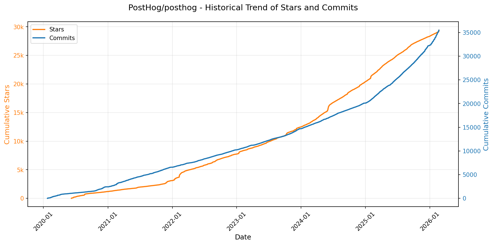

> *蓝色：累计 Stars｜橙色：累计 Commits（次 Y 轴）*

<b>📄 README 摘要</b>

1. **项目功能**  
PostHog 是一个开源、一体化的产品开发平台，旨在帮助团队构建和优化成功的产品。它提供端到端的数据驱动能力，支持从用户行为采集、分析、可视化，到功能发布、实验验证、问题诊断与用户反馈收集的完整闭环。用户可通过自托管（开源版）或云服务（PostHog Cloud）部署，实现对产品全生命周期的数据洞察与操作控制。

2. **核心功能**  
- **产品分析（Product Analytics）**：自动捕获或手动埋点事件，支持多维可视化分析与原生 SQL 查询；  
- **网页分析（Web Analytics）**：类 Google Analytics 的流量与会话监控，覆盖转化率、核心网页指标（Web Vitals）、营收追踪；  
- **会话回放（Session Replay）**：录制并回放真实用户交互过程，辅助体验优化与故障定位；  
- **功能开关（Feature Flags）**：细粒度控制功能灰度发布，支持基于用户属性、群组或百分比的定向启用；  
- **A/B 实验（Experiments）**：无需编码即可配置实验，自动进行统计显著性分析（如贝叶斯/频率学派检验）；  
- **错误追踪（Error Tracking）**：自动捕获前端/后端异常，集成告警与上下文堆栈分析；  
- **用户调研（Surveys）**：提供无代码模板与可视化构建器，支持触发条件、分群投放与结果分析；  
- **数据仓库（Data Warehouse）**：原生支持将产品数据与外部系统（Stripe、HubSpot、Snowflake 等）双向同步，统一查询；  
- **数据管道（CDP / Data Pipelines）**：实时/批量处理数据流，支持 25+ 目标工具集成及 Webhook 导出；  
- **大模型分析（LLM Analytics）**：专为 LLM 应用设计，追踪调用链路（traces）、生成内容（generations）、延迟与成本；  
- **工作流（Workflows）**：可视化编排自动化任务，如用户触达、通知推送、跨系统联动等。

3. **技术栈**  
- **后端**：Python（Django 主框架），结合 Celery（异步任务）、Redis（缓存与队列）、PostgreSQL（主数据库）、ClickHouse（高性能事件分析存储）；  
- **前端**：TypeScript + React，使用 Next.js 构建管理界面，配套自研 UI 组件库；  
- **基础设施**：容器化优先，官方推荐 Docker 部署（含一键 hobby 部署脚本），支持 Kubernetes 生产级编排；  
- **数据层**：双引擎架构——PostgreSQL 存储元数据与配置，ClickHouse 承载高吞吐事件流与实时分析；  
- **SDK 生态**：全面覆盖前端（JS/React/Vue/Next.js）、移动端（iOS/Android/React Native/Flutter）及后端（Python/Node.js/Ruby/PHP/Go/.NET/Django 等）；  
- **协议与集成**：支持 HTTP API、Webhook、SAML/OAuth2 单点登录，以及与 Snowflake、BigQuery、Redshift 等数仓的深度对接。

---

### 8. [ComposioHQ/composio](https://github.com/ComposioHQ/composio)
- 📅 **创建日期**：2024-02-23  
- 🔄 **最近更新**：2026-02-21  
- ⭐ **Stars**：27,023（日 +131｜周 +491｜月 +694）  
- 📝 **描述**：Composio powers 1000+ toolkits, tool search, context management, authentication, and a sandboxed workbench to help you build AI agents that turn intent into action.  

<b>📈 Star 与 Commit 历史趋势</b>

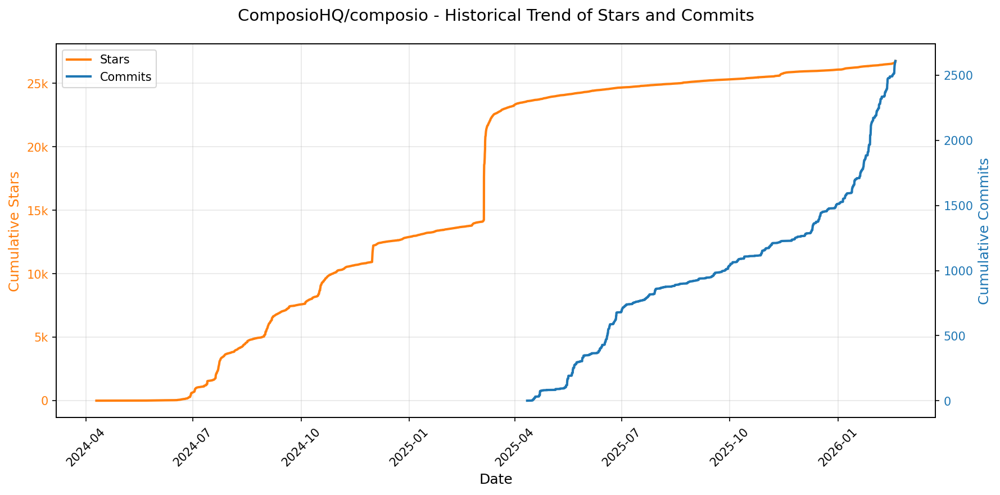

> *蓝色：累计 Stars｜橙色：累计 Commits（次 Y 轴）*

<b>📄 README 摘要</b>

1. **该项目的作用**  
Composio SDK 是一个面向 AI Agent（智能体）的工具集成平台，旨在为各类大模型代理框架提供统一、标准化的外部工具（Tool）接入能力。它充当“技能中枢”，使 AI Agent 能够安全、便捷地调用数百种真实世界应用（如 Hacker News、Gmail、Slack、GitHub、Notion 等）的 API，从而执行实际操作（例如“发送邮件”“创建任务”“获取最新新闻”）。其核心价值是解耦 Agent 逻辑与工具实现，让开发者无需重复编写认证、适配、错误处理等胶水代码，即可快速赋予 Agent 真实行动力。

2. **关键特性**  
- ✅ **多语言原生支持**：提供功能完备、类型安全的 TypeScript 和 Python SDK，分别深度适配 Node.js/浏览器环境与 Python 3.10+ 生态。  
- ✅ **广泛 AI 框架兼容性**：内置对 OpenAI（含 OpenAI Agents）、Anthropic、LangChain、LangGraph、LlamaIndex、Google Gemini/ADK、CrewAI、AutoGen 等主流框架的一流支持（部分框架仅限某语言），并提供清晰的 Provider 抽象层。  
- ✅ **开箱即用的工具集（Toolkits）**：预集成数十种常用 SaaS 应用（如 HACKERNEWS、Gmail、Slack 等），支持按需动态加载、用户级权限隔离与细粒度工具控制。  
- ✅ **可扩展的自定义能力**：开放自定义 Provider 接口，允许开发者轻松接入任意未官方支持的 AI 框架或私有工具；提供 JSON Schema → Zod 类型生成等实用工具包。  
- ✅ **生产就绪基础设施**：包含自动化的 OpenAPI 规范拉取与 SDK 文档生成流程；配套 Rube（MCP 协议服务器）实现跨客户端（Cursor、VS Code、Claude Desktop 等）的统一工具同步与一键认证。  

3. **技术栈**  
- **核心语言与运行时**：TypeScript（Node.js + 浏览器）、Python（3.10+）  
- **前端/构建工具**：npm / yarn / pnpm（TS）、pip / Poetry（Python）；使用 OpenAPI Generator（基于 `openapi.json`）驱动 SDK 自动生成  
- **关键依赖生态**：  
  - TS 侧：`@openai/agents`、`@anthropic-ai/sdk`、`langchain`、`@langchain/langgraph`、`@vercel/ai`、`@google/generative-ai`、`@cloudflare/workers-types` 等；  
  - Python 侧：`openai-agents`、`anthropic`、`langchain`、`langgraph`、`llama-index`、`crewai`、`autogen`、`google-generativeai`、`google-ai-generative` 等。  
- **协议与标准**：深度支持 [Model Context Protocol (MCP)](https://modelcontextprotocol.com/)（通过 Rube 实现），遵循 RESTful API 设计，后端 OpenAPI v3 规范驱动。

---

### 9. [ChromeDevTools/chrome-devtools-mcp](https://github.com/ChromeDevTools/chrome-devtools-mcp)
- 📅 **创建日期**：2025-09-11  
- 🔄 **最近更新**：2026-02-21  
- ⭐ **Stars**：26,306（日 +132｜周 +1466｜月 +4447）  
- 📝 **描述**：Chrome DevTools for coding agents  

<b>📈 Star 与 Commit 历史趋势</b>

> *蓝色：累计 Stars｜橙色：累计 Commits（次 Y 轴）*

<b>📄 README 摘要</b>

1. **项目功能**  
`chrome-devtools-mcp` 是一个符合 Model-Context-Protocol（MCP）标准的服务器，使 AI 编程助手（如 Gemini、Claude、Cursor、Copilot 等）能够**安全、可控地接入并操作真实运行的 Chrome 浏览器实例**。它通过桥接 AI 客户端与 Chrome DevTools 协议（CDP），赋予 AI 直接执行浏览器自动化、深度调试、性能分析和网页内容检查的能力，从而支持可靠的端到端 Web 开发与测试任务。

2. **核心特性**  
- **性能洞察**：支持录制完整性能追踪（trace），自动提取可操作的性能瓶颈分析，并可选集成 Google CrUX API 获取真实用户性能数据（Field Data）；  
- **高级调试能力**：实时捕获网络请求详情、控制台日志（含源码映射的堆栈跟踪）、执行任意 JavaScript 脚本、截取全屏/元素截图、生成内存快照；  
- **高可靠性自动化**：基于 Puppeteer 实现语义化操作（如 `click`、`fill_form`、`upload_file`、`drag` 等），内置智能等待机制（`wait_for`），确保动作在目标元素就绪后执行；  
- **灵活浏览器管理**：支持连接已有 Chrome 实例（通过 `--browser-url` 或 `--ws-endpoint`）、自动启动隔离环境 Chrome（含自定义通道、用户数据目录、代理、视口等配置），并提供页面生命周期管理（新建/切换/关闭页面）；  
- **模块化工具集**：按功能分组提供 26+ 细粒度 MCP 工具，覆盖输入交互、导航控制、设备模拟、性能分析、网络监控和调试诊断六大场景，且支持按需禁用特定功能类别（如 `--categoryNetwork=false`）。

3. **技术栈**  
- **协议层**：严格遵循 [MCP v0.7+](https://modelcontextprotocol.io/) 规范，提供标准 JSON-RPC over stdio 的服务接口；  
- **浏览器控制层**：底层依赖 [Puppeteer](https://github.com/puppeteer/puppeteer)（v22+）管理 Chrome 生命周期与 CDP 会话，兼容 Chrome 当前稳定版及 Canary/Beta/Dev 渠道；  
- **运行时环境**：基于 Node.js（要求 v20.19+ LTS），使用 npm 分发（[npm package: `chrome-devtools-mcp`](https://npmjs.org/package/chrome-devtools-mcp)）；  
- **扩展能力**：可选集成 FFmpeg（启用 `--experimentalScreencast` 支持录屏）、支持自定义 WebSocket 头、HTTPS 证书策略、HTTP 代理及 Chromium 启动参数；  
- **可观测性**：内置可选的使用统计上报（默认开启，可通过 `--no-usage-statistics` 关闭），符合 Google 隐私政策，与 Chrome 浏览器自身遥测完全解耦。

---

### 10. [KeygraphHQ/shannon](https://github.com/KeygraphHQ/shannon)
- 📅 **创建日期**：2025-09-27  
- 🔄 **最近更新**：2026-02-21  
- ⭐ **Stars**：20,853（日 +262｜周 +2404｜月 +17101）  
- 📝 **描述**：Fully autonomous AI hacker to find actual exploits in your web apps. Shannon has achieved a 96.15% success rate on the hint-free, source-aware XBOW Benchmark.  

<b>📈 Star 与 Commit 历史趋势</b>

> *蓝色：累计 Stars｜橙色：累计 Commits（次 Y 轴）*

<b>📄 README 摘要</b>

1. **项目功能**  
Shannon 是一个面向源代码的全自动AI渗透测试工具，专为白盒（white-box）Web应用安全测试设计。其核心能力是**不仅发现潜在漏洞，更通过真实浏览器和命令行环境主动执行攻击载荷，验证漏洞的可利用性**。它能自动完成从目标侦察、登录（支持2FA/TOTP、Google登录等复杂认证）、源码驱动的攻击路径规划，到实际注入、XSS、SSRF、认证绕过等 exploit 执行，并生成包含可复现PoC的最终报告，从而填补传统年度渗透测试与高频代码交付之间的安全缺口。

2. **关键特性**  
- **全自主渗透流程**：单命令启动，全程无人干预，支持复杂身份认证（含动态TOTP生成与自动填入）；  
- **可验证的漏洞证明**：输出聚焦于已成功利用的高置信度漏洞，每项发现均附带一键复制的PoC脚本，彻底消除误报；  
- **关键OWASP漏洞覆盖**：当前原生支持Injection、XSS、SSRF、Broken Authentication/Authorization四大类漏洞的深度识别与实操验证；  
- **代码感知型动态测试**：结合静态源码分析（理解业务逻辑、路由、API结构）与动态运行时攻击（真实浏览器交互+CLI exploit），实现上下文感知的精准打击；  
- **集成专业安全工具链**：在侦察阶段调用Nmap、Subfinder、WhatWeb、Schemathesis等业界标准工具增强目标测绘与接口模糊测试能力；  
- **并行化高效执行**：对不同漏洞类型的分析与利用任务进行并发处理，显著缩短整体测试耗时；  
- **工作区与断点续跑**：基于Git提交的细粒度检查点机制，支持中断后按工作区名称精准恢复，跳过已完成环节。

3. **技术栈**  
- **核心推理引擎**：Anthropic Claude系列大模型（官方推荐Claude Sonnet/Opus），依托Claude Agent SDK构建多智能体协作框架；  
- **运行时环境**：Docker容器化部署，确保环境隔离与跨平台一致性；  
- **工作流编排**：Temporal开源工作流引擎，用于可靠调度、状态持久化与可视化监控（Temporal Web UI）；  
- **基础设施工具**：Nmap（网络扫描）、Subfinder（子域名枚举）、WhatWeb（指纹识别）、Schemathesis（OpenAPI模糊测试）；  
- **开发与部署支持**：Git（工作区状态管理）、YAML（配置驱动）、Linux/macOS/WSL2（主流平台兼容）；  
- **实验性扩展**：通过Router Mode支持OpenAI（GPT-5系列）及OpenRouter上的Gemini 3等模型（非官方支持，效果不稳定）。

---

### 11. [VectifyAI/PageIndex](https://github.com/VectifyAI/PageIndex)
- 📅 **创建日期**：2025-04-01  
- 🔄 **最近更新**：2026-02-21  
- ⭐ **Stars**：20,493（日 +85｜周 +675｜月 +9661）  
- 📝 **描述**：📑 PageIndex: Document Index for Vectorless, Reasoning-based RAG  

<b>📈 Star 与 Commit 历史趋势</b>

> *蓝色：累计 Stars｜橙色：累计 Commits（次 Y 轴）*

<b>📄 README 摘要</b>

1. **项目功能**  
PageIndex 是一个面向长文档（如财报、法律文件、技术手册等）的**向量数据库无关、基于推理的检索增强生成（RAG）系统**。它不依赖传统向量相似性搜索，而是通过构建文档的**语义层级树索引**（类似智能目录），并利用大语言模型（LLM）在该索引上执行**多步推理式树搜索**，实现精准、可解释、人类专家风格的知识定位与检索。其核心目标是解决传统RAG中“相似性 ≠ 相关性”的根本缺陷，专为需要领域知识和复杂逻辑推理的专业文档分析场景设计。

2. **关键特性**  
- **零向量数据库（No Vector DB）**：完全摒弃嵌入向量化与近似最近邻（ANN）搜索，避免“vibe retrieval”（凭感觉匹配）带来的不可靠性；  
- **零人工分块（No Chunking）**：基于文档原始结构（标题层级、页码、语义段落）自动生成自然、有上下文的节点划分，保留逻辑完整性；  
- **人类式检索（Human-like Retrieval）**：模拟专家阅读习惯，通过递归树遍历（如“先看目录→聚焦某章节→深入子节”）进行推理导航，支持多跳、条件化检索；  
- **高可解释性与可追溯性**：每一步检索决策均可追溯至具体页码、章节标题及生成摘要，输出附带明确引用路径，审计友好；  
- **原生视觉支持（Vision-based RAG）**：提供OCR-Free方案，直接对PDF页面图像进行多模态推理，绕过文本提取误差，保持原始排版与结构信息；  
- **开箱即用的端到端能力**：支持PDF/Markdown输入，一键生成结构化树索引（JSON格式），并集成至聊天平台、MCP协议或API服务。

3. **技术栈**  
- **核心模型层**：依赖OpenAI系列大模型（默认 `gpt-4o-2024-11-20`）执行树索引构建与推理式检索；  
- **文档解析层**：基于Python生态（如`pypdf`、`pdfplumber`等）进行PDF文本/布局解析；Markdown支持通过标题符号（`#`, `##`）自动识别层级；  
- **架构范式**：采用**Agentic In-Context Tree Indexing** 架构——将文档转化为可被LLM直接推理操作的树状数据结构，所有检索逻辑均在LLM上下文中完成，无需外部向量存储或专用检索引擎；  
- **部署与集成**：提供本地CLI工具（`run_pageindex.py`）、Colab交互式笔记本、RESTful API、MCP（Model Context Protocol）插件，以及云端聊天平台（`chat.pageindex.ai`）；  
- **配套能力**：自研**PageIndex OCR**（未开源但已商用），专为长文档全局结构感知优化，显著优于通用OCR工具在层级还原上的表现。

---

### 12. [gsd-build/get-shit-done](https://github.com/gsd-build/get-shit-done)
- 📅 **创建日期**：2025-12-14  
- 🔄 **最近更新**：2026-02-21  
- ⭐ **Stars**：16,708（日 +395｜周 +2940｜月 +11020）  
- 📝 **描述**：A light-weight and powerful meta-prompting, context engineering and spec-driven development system for Claude Code and OpenCode.  

<b>📈 Star 与 Commit 历史趋势</b>

> *蓝色：累计 Stars｜橙色：累计 Commits（次 Y 轴）*

<b>📄 README 摘要</b>

1. **项目功能**  
该项目是一个轻量级但功能强大的元提示（meta-prompting）、上下文工程（context engineering）与规范驱动开发（spec-driven development）系统，专为 **Claude Code、OpenCode 和 Gemini CLI** 三大 AI 编程环境设计。其核心目标是**解决“上下文腐化”（context rot）问题**——即随着 Claude 等模型持续填充上下文窗口而导致的响应质量显著下降。GSD 通过结构化工作流，在不增加用户认知负担的前提下，确保 AI 始终在高质量、低噪声、高相关性的上下文中执行任务，从而稳定生成可交付、可验证、符合预期的代码成果。

2. **关键特性**  
- ✅ **全周期规范驱动工作流**：支持 `new-project → discuss-phase → plan-phase → execute-phase → verify-work → complete-milestone` 的闭环流程，每个阶段职责清晰、输出可追溯；  
- ✅ **智能上下文工程**：自动维护并动态注入关键上下文文件（如 `PROJECT.md`、`REQUIREMENTS.md`、`STATE.md`、`CONTEXT.md`、各阶段 `PLAN.md` 等），严格控制上下文长度以维持模型性能；  
- ✅ **XML 结构化提示**：所有执行计划均采用定制 XML 格式（含 `<action>`、`<verify>`、`<done>` 等标签），确保指令精确、验证内建、零歧义；  
- ✅ **多智能体协同编排**：研究、规划、执行、验证等阶段均由轻量级协调器调度专用子代理（如并行研究员、计划校验器、波次执行器、UAT 验证器），主会话上下文始终轻量（30–40% 占用）；  
- ✅ **波次化并行执行（Wave Execution）**：依据任务依赖关系自动分组为执行波次（waves），独立任务并行、依赖任务串行，最大化效率且规避文件冲突；  
- ✅ **原子化 Git 提交**：每个任务生成独立、语义化、带时间戳和功能标识的 commit（如 `feat(08-02): add email confirmation flow`），支持精准 bisect、回滚与历史追溯；  
- ✅ **现有代码库友好（Brownfield Support）**：提供 `/gsd:map-codebase` 命令，通过并行分析快速建模既有架构、技术栈与约定，使后续开发无缝继承上下文；  
- ✅ **灵活模式切换**：支持完整流程（Full）、快速任务（`/gsd:quick`）、紧急插入（`/gsd:insert-phase`）、中断续作（`/gsd:pause/resume-work`）及多里程碑演进；  
- ✅ **可配置模型策略**：内置 `quality`/`balanced`/`budget` 三档模型配置文件，按阶段（规划/执行/验证）精细化分配 Claude Opus/Sonnet/Haiku，平衡效果与成本。

3. **技术栈**  
- **运行时环境**：基于 Node.js 构建，通过 `npx` 一键安装，原生支持 macOS、Windows、Linux；  
- **AI 接口层**：深度适配 **Claude Code**（主推）、**OpenCode**（开源免费模型支持）、**Gemini CLI**，通过标准化命令注入与上下文管理桥接不同后端；  
- **提示工程核心**：自研 XML Schema 规范 + 上下文分片策略 + 动态模板引擎，实现结构化、可验证、可复现的提示生成；  
- **状态与持久化**：本地文件系统驱动，所有元数据（`PROJECT.md`, `.planning/`, `STATE.md`, `todos/` 等）均以纯文本 Markdown/JSON 存储，无外部数据库依赖；  
- **自动化基础设施**：集成 Bash 命令白名单机制（支持 `git`, `curl`, `cat`, `ls` 等）、细粒度权限控制、自动提交与标签管理，构建端到端无人值守开发流水线；  
- **扩展机制**：模块化命令设计（CLI 指令全部以 `/gsd:` 前缀注册），支持通过配置文件（`.planning/config.json`）及 `/gsd:settings` 动态调整行为，预留插件与代理扩展接口。

---

### 13. [eslint/eslint](https://github.com/eslint/eslint)
- 📅 **创建日期**：2013-06-29  
- 🔄 **最近更新**：2026-02-21  
- ⭐ **Stars**：14,700（日 +52｜周 +176｜月 +284）  
- 📝 **描述**：Find and fix problems in your JavaScript code.  

<b>📈 Star 与 Commit 历史趋势</b>

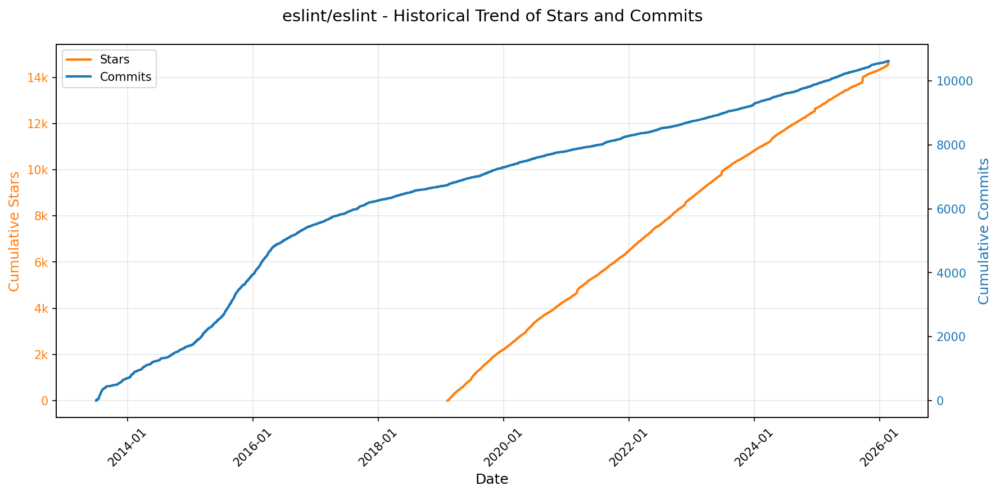

> *蓝色：累计 Stars｜橙色：累计 Commits（次 Y 轴）*

<b>📄 README 摘要</b>

1. **该项目的功能**  
ESLint 是一个用于识别和报告 ECMAScript/JavaScript 代码中潜在问题模式的静态代码分析工具（即 JavaScript 代码检查器/源码级 linter）。它通过解析源码生成抽象语法树（AST），并基于 AST 对代码结构、风格、错误隐患及最佳实践进行规则化检测，帮助开发者在编码阶段发现语法错误、逻辑缺陷、不安全用法、可维护性问题等，从而提升代码质量与一致性。

2. **核心特性**  
- **完全插件化架构**：所有内置规则均以插件形式实现，支持运行时动态加载自定义规则、插件、解析器和格式化器；  
- **AST 驱动分析**：基于 Espree 解析器生成标准 ESTree 兼容 AST，实现精准、可扩展的代码模式匹配；  
- **高度可配置**：支持细粒度规则开关（`off`/`warn`/`error`）、多级配置文件（如 `eslint.config.js`）、环境预设（如 `es2023`, `browser`, `node`）及语言特性控制（JSX、TypeScript 等需配合对应解析器/插件）；  
- **广泛语言支持**：原生支持 ECMAScript 3/5 及 2015 年起所有 Stage 4 标准语法；通过插件生态（如 `eslint-plugin-react`、`@typescript-eslint/eslint-plugin`）支持 JSX、React、TypeScript、Flow 等扩展；  
- **现代化工程集成**：提供 CLI 工具、Node.js API、VS Code 等编辑器插件支持，并与 Prettier 等格式化工具有明确协作方案；  
- **严格版本治理**：遵循语义化版本（SemVer）策略，明确定义补丁版（不破坏构建）、小版本（可能新增报错）、大版本（很可能破坏构建）的变更边界；  
- **活跃社区与商业支持**：由 OpenJS 基金会托管，拥有技术指导委员会（TSC）和全球贡献者团队，并通过 Tidelift、HeroDevs 提供企业级支持。

3. **技术栈**  
- **核心语言**：JavaScript（CommonJS 模块格式为主，部分功能支持 ESM 动态导入）；  
- **解析器**：默认使用 [Espree](https://github.com/eslint/espree)（基于 Acorn 的 ESTree 兼容解析器）；支持替换为 `@babel/eslint-parser`（Babel）、`@typescript-eslint/parser` 等第三方解析器以处理实验性语法或 TS；  
- **运行环境**：要求 Node.js ≥ v20.19.0 / v22.13.0 / v24+（官方支持当前版及 LTS 最新维护版）；  
- **依赖管理**：采用 `npm` / `pnpm` 安装（pnpm 需特定 `.npmrc` 配置以确保兼容性）；不锁定依赖版本，以保障用户获取最新兼容依赖；  
- **构建与发布**：GitHub Actions CI 流水线，双周定期发布；  
- **许可证**：MIT License。

---

### 14. [badlogic/pi-mono](https://github.com/badlogic/pi-mono)
- 📅 **创建日期**：2025-08-09  
- 🔄 **最近更新**：2026-02-21  
- ⭐ **Stars**：14,268（日 +311｜周 +2607｜月 +12206）  
- 📝 **描述**：AI agent toolkit: coding agent CLI, unified LLM API, TUI & web UI libraries, Slack bot, vLLM pods  

<b>📈 Star 与 Commit 历史趋势</b>

> *蓝色：累计 Stars｜橙色：累计 Commits（次 Y 轴）*

<b>📄 README 摘要</b>

1. **项目功能**  
该项目是一个面向 AI 代理（AI Agent）开发与大语言模型（LLM）部署管理的**一体化单体仓库（Monorepo）**，旨在为构建、运行和集成智能编码及对话代理提供模块化工具链。核心目标是支撑“pi”系列 AI 代理（尤其是交互式编程代理）的开发、部署与扩展，涵盖从底层 LLM 接口抽象、代理运行时、终端/Web 用户界面，到 GPU 加速推理服务编排的全栈能力。

2. **关键特性**  
- **多厂商统一 LLM 接口**：`@mariozechner/pi-ai` 提供对 OpenAI、Anthropic、Google 等主流 LLM 服务商的标准化调用层，屏蔽底层差异；  
- **可扩展代理运行时**：`@mariozechner/pi-agent-core` 支持工具调用（tool calling）、会话状态持久化与生命周期管理，为复杂任务编排提供基础；  
- **开箱即用的交互式编程代理**：`@mariozechner/pi-coding-agent` 提供 CLI 形态的本地 AI 编程助手，支持自然语言驱动代码生成与修改；  
- **跨平台 UI 支持**：包含轻量级终端 UI 库（`pi-tui`，支持差分渲染）和 Web 组件库（`pi-web-ui`），便于快速构建 AI 聊天界面；  
- **生产就绪部署工具**：`pi-pods` CLI 专用于在 GPU 服务器集群上一键管理 vLLM 推理服务实例；  
- **企业协作集成**：`pi-mom` 是 Slack 机器人，可将用户消息自动路由至 pi 编码代理执行，实现团队级 AI 协作闭环。

3. **技术栈**  
- **语言与运行时**：TypeScript（主语言），Node.js（服务端/CLI 运行环境）；  
- **前端框架**：Web UI 基于标准 Web Components（无重型框架依赖），TUI 使用纯终端渲染；  
- **LLM 运行时**：深度集成 vLLM（用于高性能 GPU 推理部署）；  
- **工程基础设施**：Monorepo 架构（pnpm/NPM workspaces 风格管理），采用 TypeScript 类型系统、ESLint + Prettier 代码规范、Jest/Vitest 测试；  
- **CI/CD**：GitHub Actions 自动化构建与测试；  
- **协作生态**：通过 Discord 社区支持，域名与品牌资源由 exe.dev 捐赠。

---

### 15. [tobi/qmd](https://github.com/tobi/qmd)
- 📅 **创建日期**：2025-12-08  
- 🔄 **最近更新**：2026-02-21  
- ⭐ **Stars**：9,669（日 +150｜周 +1355｜月 +7357）  
- 📝 **描述**：mini cli search engine for your docs, knowledge bases, meeting notes, whatever. Tracking current sota approaches while being all local  

<b>📈 Star 与 Commit 历史趋势</b>

> *蓝色：累计 Stars｜橙色：累计 Commits（次 Y 轴）*

<b>📄 README 摘要</b>

1. **项目功能**  
QMD（Query Markup Documents）是一个**纯本地运行的设备端搜索引擎**，专为个人知识管理与AI智能体（agentic）工作流设计。它能对用户本地的Markdown笔记、会议记录、技术文档、知识库等文本内容进行统一索引与跨源检索。核心能力是支持三种互补的搜索模式：基于SQLite FTS5的BM25关键词全文检索、基于GGUF嵌入模型的向量语义搜索，以及融合查询扩展（LLM生成变体）、多路召回（FTS+向量）与大语言模型重排序（LLM re-ranking）的混合高精度搜索。所有处理（索引、嵌入、重排、查询扩展）均在用户设备上离线完成，无需联网或依赖云服务。

2. **关键特性**  
- **三层混合检索架构**：`search`（纯BM25）、`vsearch`（纯向量）、`query`（全流程混合：查询扩展 + 并行FTS/向量召回 + RRF融合 + LLM重排序 + 位置感知加权融合），显著提升查全率与查准率；  
- **智能上下文建模**：通过`qmd context add`为集合（如`qmd://notes`）或路径添加自然语言描述，该上下文随搜索结果返回，为下游LLM提供关键元信息，增强其文档选择与推理能力；  
- **面向AI代理的深度集成**：原生支持MCP（Model Context Protocol）标准，提供`qmd_search`/`qmd_vector_search`/`qmd_deep_search`等标准化工具，并兼容Claude Desktop/Claude Code；支持HTTP长连接MCP服务器（避免重复加载大模型），LLM常驻显存，响应高效；  
- **结构化输出与自动化工作流**：提供`--json`/`--files`/`--csv`/`--md`等格式，专为LLM提示工程与脚本调用设计；支持按分数阈值（`--min-score`）、通配符（`multi-get "journals/2025-05*.md"`）、文档ID（`get "#abc123"`）精准获取内容；  
- **语义感知智能分块**：采用基于Markdown结构（标题层级、代码块、分隔线等）的评分算法进行“智能分块”，确保语义单元完整性，提升嵌入质量；  
- **鲁棒的分数归一化与融合策略**：对BM25（归一化至0–25+）、向量相似度（`1/(1+distance)`映射至0–1）、LLM重排分（`score/10`）进行统一标度；采用带权重的RRF融合、顶部排名奖励（#1+0.05）、位置感知混合（Top3/4–10/11+采用不同RRF:rerank比例），兼顾精确匹配与语义相关性；  
- **轻量级本地存储**：全部索引、向量、缓存均存于单个SQLite数据库（`~/.cache/qmd/index.sqlite`），结构清晰（含collections、documents_fts、content_vectors、llm_cache等表），支持快速维护与清理。

3. **技术栈**  
- **运行时**：Node.js（≥22）或Bun（≥1.0.0）；macOS需Homebrew安装SQLite以启用FTS5扩展；  
- **核心AI模型**（全本地GGUF格式，自动下载至`~/.cache/qmd/models/`）：  
  - `embeddinggemma-300M-Q8_0`（约300MB）：用于生成文档块向量嵌入；  
  - `qwen3-reranker-0.6b-q8_0`（约640MB）：执行二分类重排序（Yes/No + logprobs）；  
  - `qmd-query-expansion-1.7B-q4_k_m`（约1.1GB）：细调的轻量级模型，生成查询变体；  
- **底层库**：`node-llama-cpp`（调用本地LLM推理）、`sqlite-vec`（SQLite内嵌向量索引）、`fts5`（SQLite全文检索）；  
- **协议与集成**：MCP（Model Context Protocol）标准、HTTP REST API（`/mcp`, `/health`）、CLI命令行接口；  
- **数据层**：SQLite（主索引库）、文件系统（原始Markdown文档）。

---

### 16. [NevaMind-AI/memU](https://github.com/NevaMind-AI/memU)
- 📅 **创建日期**：2025-07-29  
- 🔄 **最近更新**：2026-02-21  
- ⭐ **Stars**：9,639（日 +103｜周 +436｜月 +4764）  
- 📝 **描述**：Memory for 24/7 proactive agents like openclaw (moltbot, clawdbot).  

<b>📈 Star 与 Commit 历史趋势</b>

> *蓝色：累计 Stars｜橙色：累计 Commits（次 Y 轴）*

<b>📄 README 摘要</b>

1. **该项目做什么？**  
memU 是一个专为 **7×24 小时持续运行的 AI 智能体（Proactive Agents）** 设计的**主动式长期记忆框架**。它不依赖用户显式指令，而是持续监听、理解并结构化用户交互（如对话、邮件、文档、图像等），自动提取意图、偏好、技能、关系与知识，并构建可演化的记忆系统。其核心目标是让 AI 智能体真正实现“永不离线、永不忘事、未问先知”——在无主动查询时即可预测用户下一步需求，自主执行前置任务（如预加载上下文、起草邮件、推送精准内容、预警交易信号等），从而将传统被动响应型 Agent 升级为具备类人前瞻性认知能力的主动智能体。

2. **关键特性**  
- **全天候主动记忆（24/7 Proactive Memory）**：后台常驻运行，实时监控输入/输出流，自动触发记忆构建与意图预测，无需用户调用“记住”命令。  
- **意图驱动的零成本记忆演化**：通过多模态输入（文本/对话/图像/音视频）持续捕获用户目标、习惯、偏好与上下文，构建动态更新的个人知识图谱。  
- **文件系统范式记忆架构**：将记忆抽象为类 Unix 文件系统——`Categories`（目录）、`Memory Items`（文件）、`Symlinks`（跨记忆链接）、`Mount Points`（外部资源挂载），支持层级导航、即时挂载新知识、自动交叉引用与便携导出。  
- **双模态智能检索（RAG + LLM）**：`retrieve()` 同时支持毫秒级向量相似性检索（用于实时推荐/监控）和深度 LLM 推理检索（用于复杂意图预测与上下文演化），按需平衡速度、成本与推理深度。  
- **极致 Token 成本优化**：通过缓存结构化洞察、避免重复 LLM 调用、优先使用轻量嵌入计算，显著降低长周期在线智能体的推理开销。  
- **全栈可扩展性**：原生支持 OpenAI、阿里通义千问（DashScope）、Voyage AI、OpenRouter 等多 LLM/Embedding 提供商，兼容内存、PostgreSQL/pgvector 及自定义元数据存储，支持企业级私有部署。

3. **技术栈**  
- **编程语言**：Python 3.13+（核心实现）  
- **AI 基础设施**：  
  - LLM 接口层：支持 OpenAI SDK / HTTP、DashScope、Voyage AI、OpenRouter（统一 HTTPx 客户端）  
  - Embedding 模型：兼容 `text-embedding-3-small`、`voyage-3.5-lite` 等主流嵌入模型  
  - 向量数据库：默认集成 PostgreSQL + pgvector（生产级持久化），可选纯内存模式（开发测试）  
- **架构设计**：分层记忆模型（Resource → Item → Category）、事件驱动连续学习流水线（`memorize()`）、双路径检索引擎（RAG 快速匹配 + LLM 深度推理）  
- **部署形态**：提供云服务（memu.so API）、Docker 化自托管（PostgreSQL）、本地 Python 包（`pip install -e .`）三套方案  
- **协议与标准**：RESTful Cloud API（v3）、标准化 OpenAPI 文档、环境变量驱动配置（`OPENAI_API_KEY`/`OPENROUTER_API_KEY`）

---

### 17. [openai/skills](https://github.com/openai/skills)
- 📅 **创建日期**：2025-11-25  
- 🔄 **最近更新**：2026-02-21  
- ⭐ **Stars**：9,177（日 +102｜周 +787｜月 +7316）  
- 📝 **描述**：Skills Catalog for Codex  

<b>📈 Star 与 Commit 历史趋势</b>

> *蓝色：累计 Stars｜橙色：累计 Commits（次 Y 轴）*

<b>📄 README 摘要</b>

1. **项目功能**  
该项目定义并维护一套标准化的“Agent Skills”（智能体技能）规范与资源集合，旨在为AI智能体（特别是OpenAI Codex平台中的智能体）提供可发现、可复用、任务导向的能力模块。每个技能是一个包含指令（instructions）、脚本（scripts）和相关资源的独立文件夹，支持“一次编写、多处调用”，使团队和个人能以结构化、可共享的方式封装和分发特定任务能力（如代码审查、计划生成、地址评论等），从而提升AI代理在实际场景中的可扩展性与协作效率。

2. **核心特性**  
- **标准化技能目录结构**：按用途划分技能类型——`.system`（系统级预装技能）、`.curated`（经审核的精选技能）、`.experimental`（实验性技能），便于分类管理与版本控制；  
- **便捷安装机制**：内置 `$skill-installer` 命令行工具，支持通过技能名称（如 `gh-address-comments`）、本地路径或GitHub直链（如指定 `.experimental/create-plan`）一键安装；  
- **开箱即用与热更新支持**：`.system` 技能随Codex最新版自动集成；其他技能安装后仅需重启Codex即可生效；  
- **开放标准与互操作性**：遵循 [Agent Skills open standard](https://agentskills.io) 开放协议，确保跨平台兼容性与社区共建能力；  
- **细粒度许可管理**：每个技能目录内含独立 `LICENSE.txt` 文件，支持差异化授权策略。

3. **技术栈**  
- **核心协议/标准**：Agent Skills Open Standard（基于文件系统约定的轻量级规范，非运行时框架）；  
- **运行环境**：深度集成于 **OpenAI Codex** 平台（AI编程助手/智能体运行时）；  
- **部署与分发**：依托 **GitHub** 作为技能仓库与版本托管基础设施；  
- **安装工具**：内置命令行工具 `$skill-installer`（Codex原生支持，具体实现未公开，推测为Shell脚本或Codex插件机制）；  
- **文件格式**：纯文本为主（Markdown说明、JSON/YAML配置、Shell/Python脚本等），无强制编程语言依赖，强调可读性与可维护性。

---

### 18. [google-research/timesfm](https://github.com/google-research/timesfm)
- 📅 **创建日期**：2024-04-29  
- 🔄 **最近更新**：2026-02-21  
- ⭐ **Stars**：8,851（日 +251｜周 +1136｜月 +1216）  
- 📝 **描述**：TimesFM (Time Series Foundation Model) is a pretrained time-series foundation model developed by Google Research for time-series forecasting.  

<b>📈 Star 与 Commit 历史趋势</b>

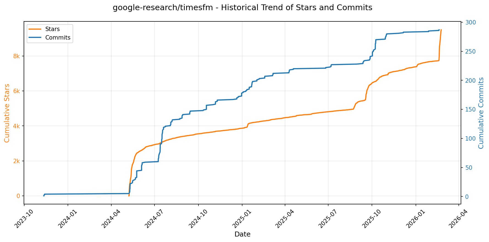

> *蓝色：累计 Stars｜橙色：累计 Commits（次 Y 轴）*

<b>📄 README 摘要</b>

1. **该项目的功能**  
TimesFM 是由 Google Research 开发的、面向时间序列预测任务的预训练基础模型（Foundation Model）。其核心功能是提供高精度、通用性强的时间序列点预测（point forecast）与分位数预测（quantile forecast），支持长时序上下文建模（最长 16k 步）和灵活的预测长度（最高支持 1000 步连续分位数输出）。它专为零样本（zero-shot）或少样本（few-shot）跨领域时间序列预测而设计，无需针对每个新数据集进行完整微调，可直接对任意频率、任意领域的单变量或多变量时序输入进行推理。

2. **关键特性**  
- **Decoder-only 架构**：采用纯解码器结构（无编码器），简化建模并提升长程依赖建模能力；  
- **超长上下文支持**：TimesFM 2.5 支持最大 16,384 步输入长度（较 2.0 版本的 2048 步大幅提升）；  
- **轻量化与高效性**：参数量从 500M 降至 200M，兼顾性能与推理效率；  
- **连续分位数预测**：通过可选的 30M 参数分位数头（quantile head），支持端到端生成连续分位数（如 10%–90%），并内置交叉校正（`fix_quantile_crossing`）与正性约束（`infer_is_positive`）等鲁棒性机制；  
- **免频率标识**：移除了对显式 `frequency` 输入的依赖，增强泛化能力；  
- **协变量支持（XReg）**：TimesFM 2.5 重新引入外部协变量（exogenous regressors）建模能力，拓展至多模态时序场景；  
- **多后端推理支持**：统一 API 同时兼容 PyTorch 和 Flax/JAX（含 TPU/Apple Silicon 优化计划），并提供编译加速（`.compile()`）与精度控制（如 `torch.set_float32_matmul_precision`）；  
- **生产就绪集成**：已作为官方功能集成进 Google Cloud BigQuery（TimesFM in BigQuery），支持企业级部署。

3. **技术栈**  
- **核心框架**：Python 为主，深度耦合 PyTorch（`torch`）与 JAX/Flax（`flax`）双后端；  
- **依赖管理**：使用 `uv`（超快 Python 包管理器）进行虚拟环境创建与依赖安装；  
- **模型格式**：Hugging Face 格式托管（`google/timesfm-2.5-200m-pytorch` 等），支持 `from_pretrained` 加载；  
- **底层计算**：依赖 PyTorch（CUDA/cuDNN）或 JAX（XLA，支持 GPU/TPU/Metal）实现高性能张量运算；  
- **扩展模块**：通过可选 extras（`[torch]` / `[flax]` / `[xreg]`）按需启用不同功能组件；  
- **构建与部署工具链**：支持 editable install（`pip install -e .`）、模型编译（`model.compile()`）、配置驱动推理（`ForecastConfig`）及 NumPy/Tensor 输入接口。

---

### 19. [p-e-w/heretic](https://github.com/p-e-w/heretic)
- 📅 **创建日期**：2025-09-21  
- 🔄 **最近更新**：2026-02-21  
- ⭐ **Stars**：8,775（日 +259｜周 +3746｜月 +4519）  
- 📝 **描述**：Fully automatic censorship removal for language models  

<b>📈 Star 与 Commit 历史趋势</b>

> *蓝色：累计 Stars｜橙色：累计 Commits（次 Y 轴）*

<b>📄 README 摘要</b>

1. **该项目的功能**  
Heretic 是一个专用于**全自动移除大语言模型（LLM）内置审查机制（即“安全对齐”）** 的工具。它无需微调、监督训练或人工干预，即可对 Transformer 架构的开源语言模型执行“去审查化”（decensoring），生成在保持原始模型智能水平的同时显著降低拒答率（refusals）的变体模型。其核心目标是：在不损害模型基础能力的前提下，使模型能正常响应原本被策略性拒绝的敏感或“有害”提示（如涉及伦理、政治、技术细节等非违法但受控话题），从而恢复模型的开放性与表达自由。

2. **关键特性**  
- ✅ **完全自动化流程**：用户仅需一条命令（如 `heretic Qwen/Qwen3-4B-Instruct-2507`）即可完成整个去审查过程，无需理解模型内部结构或手动调参；  
- ✅ **基于优化的定向消融（Abliteration）**：采用改进型“方向性消融”技术，对注意力输出投影（attention out-projection）和 MLP 下投影（MLP down-projection）矩阵进行正交化处理，抑制由“拒绝方向”（refusal direction）主导的输出偏差；  
- ✅ **自适应参数优化**：集成基于 TPE 算法的 Optuna 超参优化器，联合最小化两个目标——拒答数量（针对有害提示）与 KL 散度（针对无害提示），实现高质量/低损伤平衡；  
- ✅ **灵活可配置的消融核（Ablation Kernel）**：支持连续型拒绝方向索引（含层间线性插值）、分组件独立权重（Attention/MLP 分开控制）、以及可学习的权重分布形状（如位置、最大/最小权重、衰减距离等），大幅提升干预精度；  
- ✅ **内置评估与验证能力**：提供标准化评测模块（`--evaluate-model`），量化拒答率与 KL 散度，并支持一键对比基线模型；  
- ✅ **研究级可解释性工具（需额外安装）**：  
　　• `--plot-residuals`：使用 PaCMAP 对各层残差向量降维可视化，生成逐层散点图及动态 GIF，揭示“有害/无害”提示在隐空间中的演化路径；  
　　• `--print-residual-geometry`：输出详尽几何度量表（含余弦相似度、L2 范数、轮廓系数等），定量分析残差聚类结构与拒绝方向关系；  
- ✅ **广泛模型兼容性**：原生支持主流 Dense 模型（Llama、Gemma、Qwen、GPT-OSS 等）、多模态模型及多种 MoE 架构；支持 bitsandbytes 4-bit 量化，可在 16GB VRAM 设备上运行 4B–20B 级模型；  
- ✅ **开箱即用的交互与发布功能**：运行结束后可选择本地保存、自动上传至 Hugging Face、或直接启动聊天测试，降低使用门槛。

3. **技术栈**  
- **核心框架**：Python 3.10+，PyTorch 2.2+（推荐 2.8），CUDA 加速；  
- **优化引擎**：[Optuna](https://optuna.org/)（基于 TPE 的贝叶斯超参优化）；  
- **降维与可视化**：[PaCMAP](https://github.com/YingfanWang/PaCMAP)（CPU 端高维残差向量非线性降维），Matplotlib / Pillow（绘图与动图生成）；  
- **模型操作**：Hugging Face `transformers` + `accelerate` + `safetensors`；  
- **量化支持**：`bitsandbytes`（4-bit 量化）；  
- **配置管理**：TOML 格式配置文件（`config.default.toml`）；  
- **依赖生态**：NumPy、SciPy、scikit-learn（用于几何计算与聚类分析）、tqdm（进度反馈）；  
- **许可证**：GNU Affero General Public License v3.0（AGPL-3.0）。

---

### 20. [rowboatlabs/rowboat](https://github.com/rowboatlabs/rowboat)
- 📅 **创建日期**：2025-01-13  
- 🔄 **最近更新**：2026-02-21  
- ⭐ **Stars**：8,003（日 +162｜周 +2492｜月 +3710）  
- 📝 **描述**：Open-source AI coworker, with memory  

<b>📈 Star 与 Commit 历史趋势</b>

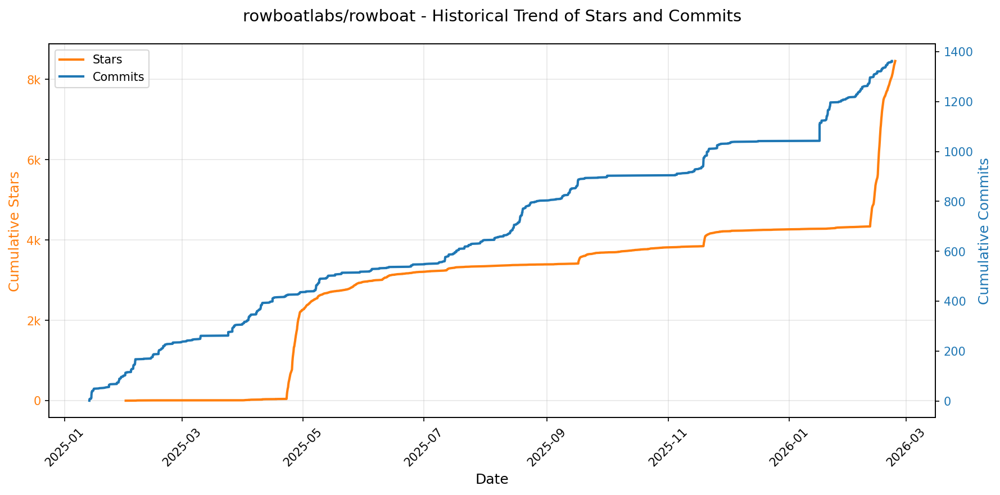

> *蓝色：累计 Stars｜橙色：累计 Commits（次 Y 轴）*

<b>📄 README 摘要</b>

1. **该项目做什么？**  
Rowboat 是一个开源、本地优先（local-first）的 AI 工作伙伴，核心功能是将用户的日常工作（邮件、会议记录、语音备忘等）自动转化为长期演化的、可编辑的**本地知识图谱**（以 Obsidian 兼容的纯 Markdown 文件形式存储），并基于该图谱主动提供上下文感知的智能协助。它不依赖云端数据处理，所有数据始终保存在用户本地设备上；通过理解人与项目、决策、承诺、时间线之间的显式关系，帮助用户高效完成具体任务，如自动生成会议简报、PPT 演示文稿（PDF）、邮件草稿、每日语音摘要等，并支持自动化后台代理（background agents）持续维护和更新知识图谱。

2. **关键特性**  
- ✅ **长期记忆与可编辑知识图谱**：以纯文本 Markdown + 双向链接构建透明、可人工审查/修改的“工作记忆”，非黑箱向量数据库或临时检索。  
- ✅ **多源自动建图**：原生集成 Gmail、Granola、Fireflies 等工具，自动提取邮件内容、会议纪要中的实体、决策、待办事项并结构化入库。  
- ✅ **语音备忘自动结构化**：支持录音→语音转文字→关键信息（如结论、行动项、责任人）自动提取→写入知识图谱。  
- ✅ **上下文驱动的智能生成**：基于图谱实时关联上下文，生成高度定制化输出（如“为与 Alex 的会议准备简报”会聚合历史沟通、未决问题、相关文档）。  
- ✅ **可配置后台智能代理**：支持设定自动化任务（如每日晨间语音播报、自动回复邮件、周期性项目更新），所有动作明确可控、结果可审计。  
- ✅ **完全本地化与隐私优先**：全部数据离线存储于本地文件系统，无上传、无厂商锁定；用户可随时备份、编辑、删除任意文件。  
- ✅ **开放模型与工具生态**：支持自由切换本地模型（Ollama/LM Studio）或远程模型（自带 API Key）；通过 Model Context Protocol（MCP）接入外部工具（Exa 搜索、Slack、Jira、GitHub、ElevenLabs 等），实现可扩展的工作流自动化。

3. **技术栈**  
- **前端/客户端**：跨平台桌面应用（Mac/Windows/Linux），具体框架未明示，但强调本地运行与文件系统直读写能力；UI 集成视频演示与交互式知识图谱可视化。  
- **知识存储层**：纯文本 Markdown 文件系统（Obsidian 兼容 vault），含双向链接（backlinks）、YAML Front Matter 元数据，实现零格式锁定。  
- **AI 推理层**：支持多后端模型接入——  
  - 本地运行：Ollama、LM Studio（适配 Llama、Phi、Qwen 等开源模型）；  
  - 远程调用：兼容主流大模型 API（如 OpenAI、Anthropic、Groq 等，需用户自行配置密钥）；  
- **语音处理**：集成 Deepgram 实现语音转文字（STT）；  
- **搜索增强**：可选集成 Brave Search 或 Exa Research 提供网络/研究级语义搜索能力；  
- **扩展协议**：采用 **Model Context Protocol (MCP)** 标准对接外部工具，实现标准化函数调用与上下文传递；  
- **认证与集成**：Google OAuth（Gmail/Calendar/Drive）、第三方服务 API Key 配置（JSON 文件方式，如 `~/.rowboat/config/deepgram.json`）。

---

### 21. [anthropics/claude-plugins-official](https://github.com/anthropics/claude-plugins-official)
- 📅 **创建日期**：2025-11-20  
- 🔄 **最近更新**：2026-02-21  
- ⭐ **Stars**：7,899（日 +205｜周 +509｜月 +3341）  
- 📝 **描述**：Official, Anthropic-managed directory of high quality Claude Code Plugins.  

<b>📈 Star 与 Commit 历史趋势</b>

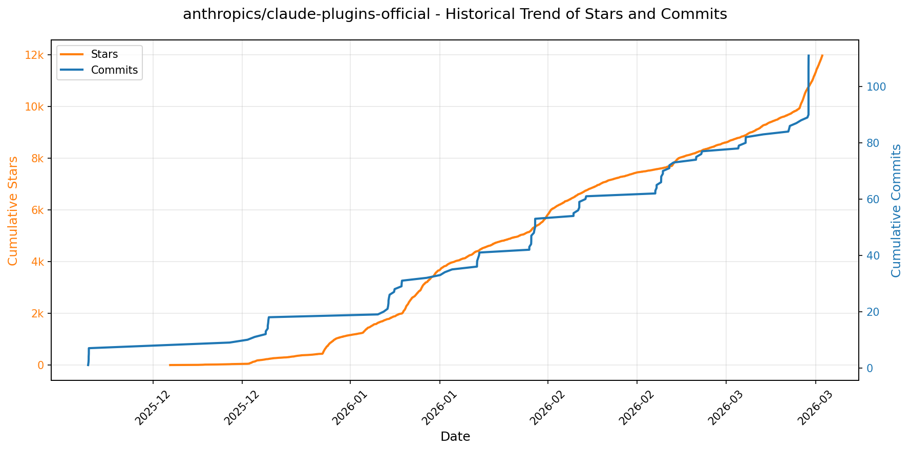

> *蓝色：累计 Stars｜橙色：累计 Commits（次 Y 轴）*

<b>📄 README 摘要</b>

1. **该项目的作用**  
该项目是一个为 Claude Code（Anthropic 推出的 AI 编程助手）官方维护的插件目录（Plugin Marketplace），旨在集中展示、分发和管理高质量的插件。它不提供插件运行时功能，而是作为结构化、可发现的插件索引平台：用户可通过命令（如 `/plugin install {plugin-name}@claude-plugin-directory`）或图形界面（`/plugin > Discover`）一键安装插件；开发者（含 Anthropic 内部团队与经审核的第三方）可按统一规范提交插件，供全球用户选用。

2. **核心功能**  
- **双轨插件分类管理**：明确区分 `/plugins`（Anthropic 官方开发与维护的内部插件）与 `/external_plugins`（经安全与质量审核的第三方合作伙伴及社区插件）；  
- **标准化插件结构支持**：强制要求每个插件包含 `.claude-plugin/plugin.json`（元数据必需文件），并可选集成 MCP 服务配置（`.mcp.json`）、Slash 命令（`commands/`）、智能体定义（`agents/`）及技能模块（`skills/`），确保兼容性与扩展性；  
- **可控的插件准入机制**：对第三方插件实行严格的审核流程，需通过质量与安全标准方可上架，并提供专用提交表单（[plugin directory submission form](https://clau.de/plugin-directory-submission)）；  
- **清晰的安全警示与权责声明**：显著提示用户需自行评估插件可信度，强调 Anthropic 不控制、不担保第三方插件内容、行为及后续变更，强化用户责任意识。

3. **技术栈**  
- **核心协议/规范**：基于 Anthropic 定义的 **Claude Plugin 标准**（含 `plugin.json` 元数据格式）与 **MCP（Model Communication Protocol）** 协议（用于模型与外部服务通信，通过可选 `.mcp.json` 配置）；  
- **系统集成层**：深度适配 **Claude Code 的原生插件系统**（支持 `/plugin` 系列指令与 UI 发现流程）；  
- **工程实践**：采用标准化目录结构（类 Unix 文件组织）、Markdown 文档（`README.md`）、JSON 配置驱动（`plugin.json`, `.mcp.json`），无特定编程语言或运行时依赖——插件本身可使用任意语言实现，本目录仅作元数据与分发枢纽；  
- **生态配套**：依托 [Claude Code 官方文档](https://code.claude.com/docs/en/plugins) 提供完整开发指南，形成闭环开发-提交-审核-分发体系。

---

### 22. [ruvnet/wifi-densepose](https://github.com/ruvnet/wifi-densepose)
- 📅 **创建日期**：2025-06-07  
- 🔄 **最近更新**：2026-02-21  
- ⭐ **Stars**：7,198（日 +80｜周 +1269｜月 +2029）  
- 📝 **描述**：Production-ready implementation of InvisPose - a revolutionary WiFi-based dense human pose estimation system that enables real-time full-body tracking through walls using commodity mesh routers   

<b>📈 Star 与 Commit 历史趋势</b>

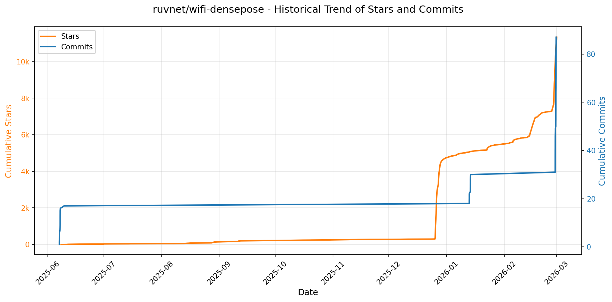

> *蓝色：累计 Stars｜橙色：累计 Commits（次 Y 轴）*

<b>📄 README 摘要</b>

1. **项目功能**  
本项目是一个基于WiFi信号的无摄像头人体姿态估计系统，利用无线信道状态信息（CSI）实现隐私保护、实时的人体关键点检测与动作分析。它不依赖摄像头，仅通过标准WiFi路由器/接入点发射和接收的无线信号，即可感知环境中人体的位置、姿态、运动及生命体征，支持多人员同步追踪，并扩展了面向灾难救援的专用模块（WiFi-Mat），可穿透非金属障碍物探测被困人员的呼吸、心跳、三维位置并自动完成START分级检伤。

2. **核心特性**  
- **隐私优先**：完全无需摄像头，通过WiFi电磁波感知人体，保障用户空间隐私；  
- **超低延迟实时性**：Python版端到端延迟<15ms（≈67 FPS），Rust重写版达**18.47微秒**（≈54,000 FPS），提速超800倍；  
- **多目标鲁棒追踪**：支持最多10人同时、连续、身份一致的姿态跟踪；  
- **全栈生产就绪**：提供带认证、限流、监控的FastAPI REST接口 + WebSocket实时流 + CLI管理工具 + Docker容器化部署；  
- **跨领域适配能力**：原生支持医疗监护（跌倒检测）、健身指导、智能家居（ occupancy感知）、安防监控等场景；  
- **灾难响应专项能力（WiFi-Mat）**：具备微多普勒生命体征识别（4–60 BPM呼吸/心跳）、5米深度 rubble穿透定位、START四类伤情自动分类及分级告警；  
- **硬件无关性与高兼容性**：适配主流支持CSI提取的商用路由器（如ASUS AX6000、Netgear AX12等），无需定制硬件；  
- **全链路高可靠性**：数学验证零误差（相位解卷积、幅度RMS、多普勒频移等），测试覆盖率100%（Python）/107项单元测试（Rust）。

3. **技术栈**  
- **后端框架**：FastAPI（Python v1）、Rust（v2核心信号处理与模型推理，含`tokio`异步运行时、`ndarray`数值计算、`tch`/`burn`可选深度学习后端）；  
- **通信协议**：RESTful HTTP API（OpenAPI 3.0文档自动生成）、WebSocket实时流（`websockets` / `tungstenite`）；  
- **数据处理**：CSI原始数据采集与预处理（相位校正、幅值归一化、时频特征提取）；  
- **AI模型**：定制化DensePose风格神经网络（将CSI时序-空间张量映射为2D/3D人体关键点）；  
- **系统工程**：Docker容器化、CLI命令行工具（`clap` Rust / `click` Python）、环境配置（`.env`/YAML）、数据库抽象（SQLAlchemy / `sqlx`）、WASM支持（Rust版）；  
- **基础设施**：Linux/macOS/Windows跨平台支持，GPU加速可选（CUDA），CI/CD集成，完整可观测性（日志、指标、健康检查）。

---

### 23. [MoonshotAI/kimi-cli](https://github.com/MoonshotAI/kimi-cli)
- 📅 **创建日期**：2025-10-15  
- 🔄 **最近更新**：2026-02-21  
- ⭐ **Stars**：6,564（日 +36｜周 +178｜月 +2672）  
- 📝 **描述**：Kimi Code CLI is your next CLI agent.  

<b>📈 Star 与 Commit 历史趋势</b>

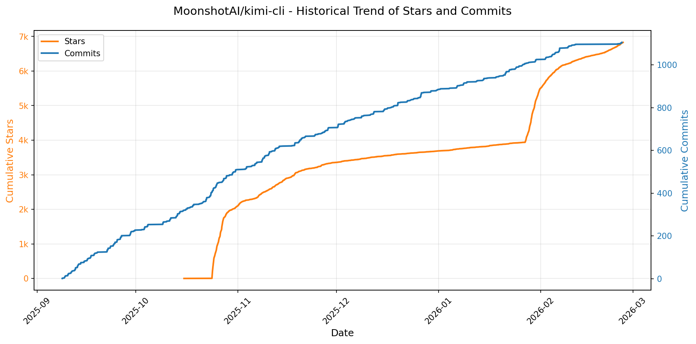

> *蓝色：累计 Stars｜橙色：累计 Commits（次 Y 轴）*

<b>📄 README 摘要</b>

1. **项目功能**  
Kimi Code CLI 是一个运行在终端中的 AI 编程智能体（AI agent），专为软件开发任务和终端操作设计。它能自主理解上下文、阅读与编辑本地代码文件、执行 Shell 命令、搜索并抓取网页内容，并在执行过程中动态规划、反思与调整行动策略，实现端到端的自动化开发辅助。

2. **核心功能**  
- **终端命令模式（Shell Command Mode）**：通过 `Ctrl-X` 快捷键切换至原生 Shell 模式，直接执行任意系统命令（注：暂不支持内置命令如 `cd`）；  
- **VS Code 插件集成**：提供官方 VS Code 扩展，实现 IDE 内无缝调用 Kimi Code CLI；  
- **ACP（Agent Client Protocol）IDE 集成**：原生支持 ACP 协议，可作为标准 Agent 服务接入 Zed、JetBrains 等兼容 ACP 的现代 IDE，通过配置 `kimi acp` 启动并交互；  
- **Zsh 深度集成**：提供专用 zsh 插件（`zsh-kimi-cli`），将 AI 能力嵌入日常 Shell 工作流，支持 `Ctrl-X` 快速启停代理模式；  
- **MCP（Model Context Protocol）工具支持**：  
  - 提供 `kimi mcp` 子命令组，支持以 HTTP（含 OAuth）、stdio 等传输方式动态注册/管理外部 MCP 服务（如 Context7、Linear、Chrome DevTools）；  
  - 支持通过 `--mcp-config-file` 参数加载 JSON 格式的 MCP 服务配置文件，实现灵活、声明式的上下文扩展。

3. **技术栈**  
- **主语言与运行时**：Python（基于 PyPI 发布，使用 `uv` 作为开发/运行工具）；  
- **协议与标准**：原生实现 [Agent Client Protocol (ACP)](https://github.com/agentclientprotocol/agent-client-protocol) 和 [Model Context Protocol (MCP)](https://modelcontextprotocol.io/)；  
- **构建与打包**：采用 `make` 驱动多阶段构建流程，集成 `uv`（Python 包管理与运行）、`npm`（Web UI 构建）、`pyinstaller` 或类似工具（用于生成独立二进制 `kimi`）；  
- **前端组件**：内置 Web UI（需 Node.js/npm 构建），与 Python 主体打包整合；  
- **测试与质量保障**：覆盖格式化（`make format`）、静态检查（`make check`）、单元/集成测试（`make test-*`）及跨模块验证；  
- **插件生态**：依赖外部插件体系（如 Oh My Zsh、VS Code Marketplace、Zed/JetBrains ACP 配置机制）实现深度 IDE/Shell 集成。

---

### 24. [freemocap/freemocap](https://github.com/freemocap/freemocap)
- 📅 **创建日期**：2021-04-12  
- 🔄 **最近更新**：2026-02-21  
- ⭐ **Stars**：5,568（日 +350｜周 +1001｜月 +1083）  
- 📝 **描述**：Free Motion Capture for Everyone 💀✨  

<b>📈 Star 与 Commit 历史趋势</b>

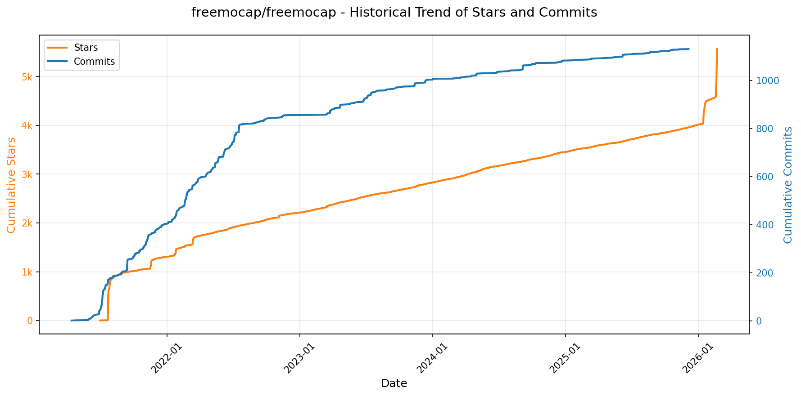

> *蓝色：累计 Stars｜橙色：累计 Commits（次 Y 轴）*

<b>📄 README 摘要</b>

1. **该项目做什么？**  
FreeMoCap 是一个免费开源、硬件与软件无关、低成本、科研级的运动捕捉（Motion Capture）系统及平台，旨在支持去中心化的科学研究、教育与培训。它允许用户仅使用普通网络摄像头（如笔记本内置摄像头或手机）和普通计算机，通过多视角视频录制与计算机视觉算法，重建人体三维骨骼运动数据，无需专用动作捕捉设备（如红外光学系统或惯性传感器），从而大幅降低科研与教学门槛。

2. **核心功能**  
- ✅ **多相机同步录制与标定**：支持2–4台普通摄像头（USB/手机）同步采集视频，并提供简易标定流程（如棋盘格标定）以实现空间坐标统一；  
- ✅ **全自动3D姿态重建**：集成MediaPipe、OpenPose、BlazePose等模型，支持单目或多目输入，输出高精度、时间对齐的3D关节轨迹（.c3d/.csv/.npz格式）；  
- ✅ **可视化交互式GUI**：提供图形用户界面，支持视频预览、骨骼动画回放、关键帧编辑、数据导出与质量评估（如重投影误差分析）；  
- ✅ **模块化处理流水线**：涵盖视频加载→相机标定→2D关节点检测→3D三角测量→后处理（滤波、插值、坐标系对齐）→数据导出全流程；  
- ✅ **教育与科研友好设计**：内置新手教程、可复现的示例数据集、详细文档与活跃社区（Discord），支持课程实验、临床评估、生物力学研究等场景；  
- ✅ **开放可扩展架构**：支持自定义模型替换、算法插件开发、第三方工具链集成（如Blender、MATLAB、Python科学计算生态）。

3. **技术栈**  
- **编程语言**：Python（主语言，要求 Python 3.10–3.12）；  
- **核心依赖**：NumPy、SciPy、OpenCV、MediaPipe、PyQt6（GUI）、PyMC（可选贝叶斯建模）、Scikit-learn、Matplotlib；  
- **构建与包管理**：`pyproject.toml` + `pip install -e .`（可编辑安装），支持 Conda 环境管理；  
- **代码规范**：采用 [Black](https://black.readthedocs.io/) 自动格式化，严格遵循 PEP 8；  
- **许可证**：GNU Affero General Public License v3.0（AGPL-3.0），强调网络服务场景下的源代码共享义务；  
- **基础设施**：GitHub 托管、Zenodo 归档（DOI: 10.5281/zenodo.7233714）、Writerside 构建文档网站、Discord 社区协作。

---

### 25. [aquasecurity/trivy](https://github.com/aquasecurity/trivy)
- 📅 **创建日期**：2019-04-11  
- 🔄 **最近更新**：2026-02-21  
- ⭐ **Stars**：5,452（日 +87｜周 +222｜月 +1108）  
- 📝 **描述**：Find vulnerabilities, misconfigurations, secrets, SBOM in containers, Kubernetes, code repositories, clouds and more  

<b>📈 Star 与 Commit 历史趋势</b>

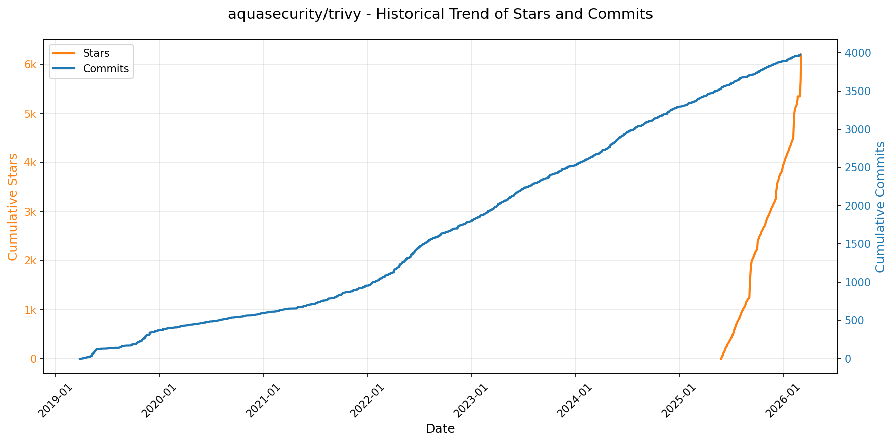

> *蓝色：累计 Stars｜橙色：累计 Commits（次 Y 轴）*

<b>📄 README 摘要</b>

1. **项目功能**  
Trivy 是一个全面、轻量且开箱即用的安全扫描工具，专注于在软件开发生命周期（SDLC）各阶段主动识别安全风险。它可对多种目标进行统一扫描，包括容器镜像、本地文件系统、远程 Git 仓库、虚拟机镜像及 Kubernetes 集群，并自动检测其中存在的各类安全问题，如已知漏洞（CVE）、软件物料清单（SBOM）、基础设施即代码（IaC）配置错误、敏感信息/密钥泄露以及开源许可证合规性问题。

2. **核心特性**  
- **多目标支持**：原生支持容器镜像、目录/文件系统、Git 远程仓库（含 commit/branch/tag）、VM 镜像（如 AMI、VHD）、Kubernetes 集群（通过 `trivy k8s`）等多种扫描目标；  
- **多维度扫描能力**：集成五大扫描器——漏洞扫描（vuln）、SBOM 生成、IaC 配置审计（misconfig）、密钥/敏感信息检测（secret）、许可证分析（license），支持按需组合启用；  
- **广泛兼容性**：覆盖主流操作系统（Alpine、Debian、RHEL 等）、编程语言生态（Go、Java、Python、Node.js、Ruby、Rust、PHP 等）及 IaC 工具（Terraform、Kubernetes YAML、Dockerfile、CloudFormation 等）；  
- **易用与集成友好**：提供 CLI、Docker 镜像、Homebrew、二进制包等多种安装方式；深度集成 GitHub Actions、Kubernetes Operator、VS Code 插件等主流 DevOps 工具链；支持快速命令行扫描（如 `trivy image nginx:alpine`）和细粒度控制（如 `--scanners vuln,secret`）；  
- **可观测性与可扩展性**：输出结构化结果（JSON/Template 支持），提供摘要视图（如 `--report summary`），并支持 Canary 构建用于尝鲜最新功能（非生产环境使用）。

3. **技术栈**  
- **主语言**：Go（Golang），保障高性能、静态编译、跨平台二进制分发及内存安全性；  
- **依赖管理与漏洞数据库**：自研漏洞数据库（定期同步 NVD、GitHub Security Advisories、OS 发行版公告等），采用高效索引与增量更新机制；  
- **配置与策略引擎**：基于 Rego（Open Policy Agent）实现 IaC 和配置合规性检查；  
- **构建与分发**：GitHub Actions 自动化 CI/CD 流水线，Docker Hub / GitHub Container Registry / AWS ECR 多源镜像发布，支持 Sigstore 签名验证确保软件供应链完整性；  
- **许可证**：Apache License 2.0 开源协议。

---

### 26. [alibaba/zvec](https://github.com/alibaba/zvec)
- 📅 **创建日期**：2025-12-05  
- 🔄 **最近更新**：2026-02-21  
- ⭐ **Stars**：5,326（日 +118｜周 +4418｜月 +5302）  
- 📝 **描述**：A lightweight, lightning-fast, in-process vector database  

<b>📈 Star 与 Commit 历史趋势</b>

> *蓝色：累计 Stars｜橙色：累计 Commits（次 Y 轴）*

<b>📄 README 摘要</b>

1. **项目功能**  
Zvec 是一个开源的、**进程内嵌式向量数据库**，专为轻量化、低延迟、高吞吐的相似性搜索场景设计。它无需独立服务进程或复杂配置，可直接以库的形式嵌入到应用程序中（如 Python/Node.js 服务、Jupyter Notebook、CLI 工具甚至边缘设备），提供生产级的向量检索能力。其核心目标是让开发者在数秒内完成安装与部署，立即启动亿级向量的毫秒级近似最近邻（ANN）搜索。

2. **关键特性**  
- **极致性能**：支持十亿级向量毫秒级响应，基于阿里巴巴成熟向量引擎 Proxima 构建；  
- **多模态向量支持**：原生兼容 dense（如 FP32/FP16 向量）和 sparse（稀疏向量）嵌入，并支持单次查询同时处理多向量（multi-vector queries）；  
- **混合搜索（Hybrid Search）**：融合语义相似度（向量距离）与结构化过滤条件（如元数据字段谓词），实现精准结果召回；  
- **零运维、全平台**：纯 in-process 架构，无服务依赖；官方支持 Linux（x86_64 / ARM64）与 macOS（ARM64）；  
- **开箱即用**：极简 API，支持 Schema 定义、文档插入、向量查询全流程，5 行代码即可完成端到端 demo。

3. **技术栈**  
- **底层引擎**：深度集成并优化自阿里巴巴自研的高性能向量检索引擎 **Proxima**（C++ 实现，经大规模电商/搜索场景验证）；  
- **语言绑定**：提供 **Python（3.10–3.12）** 和 **Node.js** 双语言 SDK（通过 PyO3 / NAPI-RS 封装原生核心）；  
- **构建与分发**：使用 Docker 进行跨平台 CI 构建（Linux x86_64/ARM64、macOS ARM64），发布至 PyPI（`zvec`）和 npm（`@zvec/zvec`）；  
- **许可证**：Apache License 2.0；  
- **基础设施**：CI/CD 基于 GitHub Actions，覆盖率由 Codecov 统计，文档托管于 zvec.org（静态站点）。

---

### 27. [steipete/gogcli](https://github.com/steipete/gogcli)
- 📅 **创建日期**：2025-12-12  
- 🔄 **最近更新**：2026-02-21  
- ⭐ **Stars**：4,391（日 +154｜周 +2684｜月 +3859）  
- 📝 **描述**：Google Suite CLI: Gmail, GCal, GDrive, GContacts.  

<b>📈 Star 与 Commit 历史趋势</b>

> *蓝色：累计 Stars｜橙色：累计 Commits（次 Y 轴）*

<b>📄 README 摘要</b>

1. **项目功能**  
`gogcli` 是一个面向终端的高性能、脚本友好的命令行工具，旨在将 Google Workspace（及部分个人 Google 服务）全栈能力无缝集成至命令行环境。它支持通过统一 CLI 界面操作 Gmail、Calendar、Chat、Classroom、Drive、Docs、Sheets、Slides、Forms、Apps Script、Contacts、Tasks、People、Groups、Keep 等 16+ 项 Google 服务，并原生支持多账户管理、跨服务协同（如 Docs/Slides 导出依赖 Drive）、自动化工作流（如邮件发送+追踪、日程冲突检测、表单响应解析）以及企业级 Workspace 场景（如域级委派服务账号、群组与 Keep 的 Workspace 专属访问）。

2. **核心特性**  
- **全服务覆盖与深度集成**：提供各服务的完整 CRUD 操作（如 Gmail 标签/过滤器/休假设置、Calendar 冲突检测/提议新时间/OOO 事件、Classroom 课程作业/监护人管理、Sheets 单元格格式化/插入行列、Forms 响应分析、Apps Script 项目运行等）；  
- **生产就绪的自动化支持**：默认 JSON 输出（含扩展字段如日历的星期几）、TSV 模式（稳定制表符分隔）、自动刷新令牌、最小权限认证（`--readonly` / `--drive-scope` 精细控制 OAuth 范围）；  
- **企业级安全与部署能力**：原生支持 Google Workspace 服务账号 + 域级委派（Domain-wide Delegation），可绕过用户交互实现无头服务器/CI 集成；多 OAuth 客户端隔离（按域名/账户映射）、客户端别名、配置化密钥环后端（macOS Keychain / Linux Secret Service / 加密文件）；  
- **开发者友好设计**：命令白名单（`--enable-commands`）用于沙箱/代理场景、本地时区快速转换、邮件打开追踪（集成 Cloudflare Worker 后端）、结构化配置（JSON5 支持注释）、细粒度服务范围矩阵文档自动生成。

3. **技术栈**  
- **编程语言**：Go（主二进制构建，强调跨平台原生性能与静态链接）；  
- **认证与密钥管理**：基于 [`99designs/keyring`](https://github.com/99designs/keyring) 抽象层，适配各平台安全存储（macOS Keychain、Linux Secret Service/KWallet、Windows Credential Manager），支持加密文件后备方案；  
- **API 通信**：直接调用 Google REST API（Gmail、Calendar、Drive 等 10+ 官方 API），严格遵循 OAuth 2.0 流程（含手动/远程授权模式）与服务账号 JWT 认证；  
- **基础设施依赖**：邮件追踪功能依赖轻量级 Cloudflare Worker 后端（可选）；配置文件采用 JSON5 格式（增强可读性）；构建系统使用 Make；包管理支持 Homebrew（macOS/Linux）与 AUR（Arch Linux）。

---

### 28. [ThePrimeagen/99](https://github.com/ThePrimeagen/99)
- 📅 **创建日期**：2025-11-22  
- 🔄 **最近更新**：2026-02-21  
- ⭐ **Stars**：3,980（日 +30｜周 +197｜月 +2918）  
- 📝 **描述**：Neovim AI agent done right  

<b>📈 Star 与 Commit 历史趋势</b>

> *蓝色：累计 Stars｜橙色：累计 Commits（次 Y 轴）*

<b>📄 README 摘要</b>

1. **该项目做什么？**  
该项目是一个专为 Neovim 设计的 AI 原生客户端（`99`），旨在将大语言模型能力深度集成到传统手写代码（tradcoding）工作流中，而非替代开发者。它不提供独立 AI 服务，而是作为“AI Agent”代理层，调用本地已安装的第三方 AI CLI 工具（如 `opencode`、`claude` 或 `cursor-agent`），在编辑器内实现上下文感知的智能操作，包括：视觉选区增强处理（`visual()`）、语义化代码搜索（`search()`）、调试辅助、规则驱动的提示工程（通过 `#rules` 和 `@files` 动态注入上下文），以及实时模型/提供商切换。

2. **核心功能**  
- ✅ **上下文感知提示补全**：支持 `#` 触发自定义技能规则（`SKILL.md`）自动补全，`@` 触发项目内文件模糊搜索并注入内容至 AI 上下文；  
- ✅ **多模态交互模式**：提供视觉选区处理（`<leader>9v`）、全局搜索（`<leader>9s`）、请求中断（`<leader>9x`）等快捷键；  
- ✅ **动态 AI 后端管理**：原生支持 OpenCode、Claude Code、Cursor Agent 三大 CLI 提供商，并可运行时切换（通过 Telescope 或 fzf-lua 集成）；  
- ✅ **项目级智能上下文构建**：自动沿目录树向上查找 `AGENT.md` 等配置文件，按当前文件路径动态注入项目专属行为规则；  
- ✅ **可扩展架构**：内置 Telescope/fzf-lua 模型与提供商选择器扩展，支持无缝热切换；  
- ✅ **调试与可观测性**：提供结构化日志系统（含文件输出、会话级日志导航 `prev_request_logs`/`next_request_logs` 及内建查看器 `view_logs`），便于问题复现与追踪。

3. **技术栈**  
- **宿主环境**：Neovim（≥0.9，依赖 Lua 配置生态，推荐 Lazy.nvim 管理）；  
- **核心语言**：Lua（全部插件逻辑、API 封装、配置驱动）；  
- **AI 接口层**：通过标准 CLI 调用外部 AI 工具（`opencode` / `claude` / `cursor-agent`），无自有模型或 API；  
- **补全引擎**：默认强依赖 `cmp`（nvim-cmp），暂不支持其他补全框架（`blink` 为预留占位）；  
- **UI/UX 扩展**：深度集成 `telescope.nvim` 或 `fzf-lua` 实现模型/提供商交互式选择；  
- **底层能力支撑**：利用 Neovim 内置 `treesitter`（计划优化选区提取）、`vim.fs`/`vim.uv` 进行跨平台文件系统操作，日志采用异步文件写入；  
- **开发阶段标识**：明确标注为 Alpha/Beta 阶段，API 不稳定，提示词、规则解析逻辑和替换行为仍在快速迭代优化中。

---

### 29. [vxcontrol/pentagi](https://github.com/vxcontrol/pentagi)
- 📅 **创建日期**：2025-01-06  
- 🔄 **最近更新**：2026-02-21  
- ⭐ **Stars**：3,979（日 +1795｜周 +2941｜月 +3020）  
- 📝 **描述**：✨ Fully autonomous AI Agents system capable of performing complex penetration testing tasks  

<b>📈 Star 与 Commit 历史趋势</b>

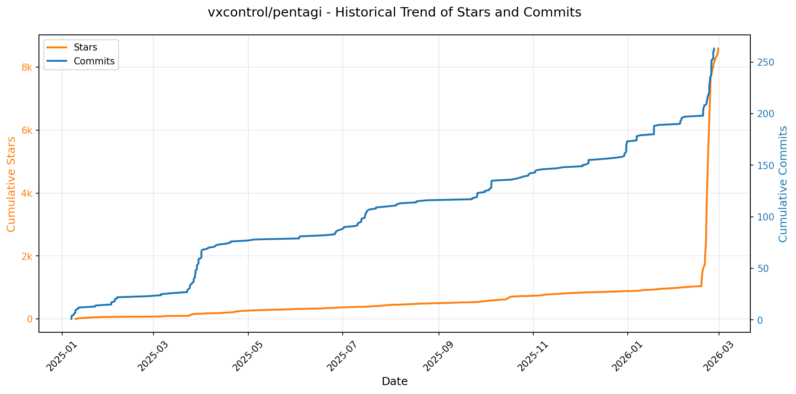

> *蓝色：累计 Stars｜橙色：累计 Commits（次 Y 轴）*

<b>📄 README 摘要</b>

1. **项目功能**  
PentAGI 是一个面向网络安全领域的**全自动渗透测试人工智能系统**，旨在将大语言模型（LLM）与专业安全工具深度融合，实现端到端的自主化红队评估。它不依赖人工干预即可完成目标侦察、漏洞发现、利用路径规划、工具调用执行、结果分析及报告生成全流程；支持对任意网络资产（Web应用、主机、API等）进行智能化、上下文感知的安全评估，并持续从历史任务中学习优化策略。

2. **核心特性**  
- ✅ **全栈沙箱隔离**：所有渗透操作均在独立 Docker 容器中执行，保障宿主环境绝对安全；  
- ✅ **多智能体协同架构**：内置“研究员”“开发者”“执行者”等专业化AI代理，按角色分工协作完成复杂攻击链；  
- ✅ **20+ 内置专业工具集成**：原生支持 nmap、Metasploit、sqlmap、gau、httpx、nuclei 等主流安全工具，自动适配容器镜像并调度执行；  
- ✅ **知识图谱驱动决策**：基于 Neo4j 构建 Graphiti 知识图谱，动态建模漏洞、工具、目标、攻击模式间的语义关系，提升推理准确性；  
- ✅ **三层记忆系统**：融合长期记忆（PostgreSQL + pgvector 向量库）、工作记忆（实时任务状态）和情景记忆（历史动作与成功模式），支持跨任务经验复用；  
- ✅ **多源情报聚合**：深度集成 Tavily、Perplexity、Google Custom Search、DuckDuckGo、Searxng、Traversaal 等 6+ 外部搜索 API，并内置 Scraper 浏览器实现动态网页采集；  
- ✅ **企业级可观测性**：通过 OpenTelemetry + Grafana + VictoriaMetrics + Jaeger + Loki 实现全链路指标、日志、追踪监控；  
- ✅ **LLM 全生命周期管理**：支持 OpenAI、Anthropic、Ollama、Gemini、AWS Bedrock、DeepSeek、Moonshot 等 10+ LLM 提供商灵活切换，并提供 Langfuse 驱动的 LLM 行为分析与调试能力；  
- ✅ **智能上下文压缩**：采用分层链式摘要（Chain Summarization）算法，动态精简 LLM 对话历史，在严守 token 限制前提下保留关键语义与 QA 结构；  
- ✅ **生产就绪部署**：基于 Docker Compose 的一键部署方案，支持微服务横向扩展、RBAC 认证、HTTPS 加密通信及完整持久化存储（含 PostgreSQL、Neo4j、MinIO、Redis）。

3. **技术栈**  
- **前端**：React + TypeScript（现代化 Web UI）  
- **后端**：Go（高性能 GraphQL/REST API）  
- **AI 编排层**：自研多智能体框架（Agent Orchestrator），支持任务分解、角色委派与状态同步  
- **向量数据库**：PostgreSQL + pgvector（用于长期记忆存储与语义检索）  
- **图数据库**：Neo4j（支撑 Graphiti 知识图谱，实现关系推理与上下文增强）  
- **监控与可观测性**：Grafana + VictoriaMetrics（指标）、Jaeger（分布式追踪）、Loki（日志）、OpenTelemetry（统一数据采集）  
- **LLM 分析平台**：Langfuse（LLM 调试、提示工程、延迟与成本分析） + ClickHouse（分析型数据仓库）  
- **缓存与存储**：Redis（会话缓存与速率限制）、MinIO（S3 兼容对象存储，保存报告、截图、日志等工件）  
- **安全工具运行时**：Docker 容器化沙箱（隔离执行 nmap/metasploit/sqlmap 等高危工具）  
- **部署与编排**：Docker + Docker Compose（本地/边缘部署）、兼容 Kubernetes（生产级水平扩展）  
- **辅助服务**：Scraper（无头浏览器容器）、Async Task Queue（可靠异步任务调度）

---

### 30. [steipete/summarize](https://github.com/steipete/summarize)
- 📅 **创建日期**：2025-12-17  
- 🔄 **最近更新**：2026-02-21  
- ⭐ **Stars**：3,892（日 +112｜周 +2200｜月 +3029）  
- 📝 **描述**：Point at any URL/YouTube/Podcast or file. Get the gist. CLI and Chrome Extension.  

<b>📈 Star 与 Commit 历史趋势</b>

> *蓝色：累计 Stars｜橙色：累计 Commits（次 Y 轴）*

<b>📄 README 摘要</b>

1. **项目功能**  
该项目是一个跨平台、多模态内容摘要工具，核心能力是**对网页链接（URL）、本地文件（PDF/图片/音视频）及媒体资源（YouTube、播客、RSS等）进行快速、智能的摘要生成**。它同时提供 Chrome 浏览器侧边栏（Side Panel）、Firefox 侧边栏（Sidebar）和命令行接口（CLI）三种使用方式：浏览器端通过轻量交互触发，实际计算由本地守护进程（daemon）完成；CLI 可独立运行，支持直接输入、管道（stdin）、文件路径及各类媒体 URL。特别地，它能自动识别内容类型（文本页 / 视频 / 音频 / PDF），并据此选择最优处理路径（如网页抓取+Markdown 渲染、YouTube 字幕提取+OCR切片、本地 Whisper 转录+LLM 总结等），最终输出结构化 Markdown 摘要，并可选附带指标、成本估算、时间戳定位等功能。

2. **关键特性**  
- **多源多模态支持**：原生支持网页、PDF、图像（JPEG/PNG/WebP/GIF）、音频（MP3/WAV/M4A/OGG/FLAC）、视频（MP4/MOV/WEBM）、YouTube、Spotify/Apple Podcasts 播客页、RSS 订阅源等。  
- **YouTube 智能幻灯片系统**：自动截取视频关键帧 → OCR 文字识别 → 生成带时间戳的卡片式幻灯片 → 支持点击跳转、OCR/字幕切换、内联缩略图渲染（兼容 kitty/iTerm/Konsole）。  
- **流式响应与增强输出**：实时流式 Markdown 渲染、内置性能指标（token 数、延迟、成本估算）、缓存感知状态提示、JSON 诊断模式（含 prompt、metrics、extracted content）。  
- **灵活模型调度与本地化能力**：支持 OpenAI 兼容本地 API、OpenRouter 免费模型、主流云厂商（Google/Anthropic/xAI/Zai 等）及 CLI 工具后端（Codex/Claude/Gemini/Cursor Agent）；自动 fallback 机制 + 显式优先级配置。  
- **深度媒体处理流水线**：  
  - 视频/音频：优先调用本地 `whisper.cpp` 转录，次选 OpenAI/FAL/Apify；  
  - PDF/网页：结合 Firecrawl（可选）、`uvx markitdown` 或 LLM 进行高质量 HTML→Markdown 提取；  
  - 图像：直接送入多模态模型（如 Gemini/GPT-4o）理解；  
  - OCR：集成 `tesseract` 实现幻灯片/截图文字识别。  
- **智能默认与细粒度控制**：短内容自动透传（不强制摘要）、`--length` 多级预设（short/medium/long…）+ 硬性 token 截断、多语言输出（`--lang`）、终端主题/渲染模式定制等。

3. **技术栈**  
- **前端/扩展层**：Chrome 扩展（MV3）、Firefox WebExtension（基于 Manifest V3），使用 TypeScript 构建；侧边栏 UI 基于现代 Web 技术（HTML/CSS/JS），依赖本地 daemon 通信。  
- **CLI 核心**：TypeScript 编写，基于 Node.js（≥ v22），采用 `pnpm` 管理依赖；核心逻辑封装在 `@steipete/summarize-core` 包中，支持库式集成。  
- **本地服务（Daemon）**：Node.js 后台服务，监听 `127.0.0.1`，负责重负载任务（`yt-dlp` 视频下载、`ffmpeg` 场景分析、`tesseract` OCR、`whisper.cpp` 本地转录、媒体缓存管理），通过系统服务框架自启（macOS launchd / Linux systemd / Windows Scheduled Task）。  
- **第三方工具链**：深度集成 `yt-dlp`（媒体下载）、`ffmpeg`（视频处理/帧提取）、`tesseract`（OCR）、`whisper.cpp`（本地语音转录）、`uvx markitdown`（网页 Markdown 渲染）、Firecrawl（网页结构化提取）、Apify（YouTube 字幕爬取）、Sherpa ONNX（NVIDIA Parakeet/Canary 语音模型）。  
- **模型与 API 生态**：兼容 LiteLLM 抽象层，支持 OpenAI、Anthropic、Google、xAI、Zai、OpenRouter 等标准 API；同时打通 Codex、Claude、Gemini、Cursor Agent 等 CLI 工具作为本地模型后端。  
- **基础设施**：配置文件（`~/.summarize/config.json`，JSON5 格式）、媒体缓存（LRU + TTL 策略）、跨平台二进制分发（npm / Homebrew / npx）。

---

### 31. [Jeffallan/claude-skills](https://github.com/Jeffallan/claude-skills)
- 📅 **创建日期**：2025-10-20  
- 🔄 **最近更新**：2026-02-21  
- ⭐ **Stars**：3,429（日 +128｜周 +1226｜月 +3375）  
- 📝 **描述**：66 Specialized Skills for Full-Stack Developers. Transform Claude Code into your expert pair programmer.  

<b>📈 Star 与 Commit 历史趋势</b>

> *蓝色：累计 Stars｜橙色：累计 Commits（次 Y 轴）*

<b>📄 README 摘要</b>

1. **项目功能**  
该项目是一个专为 Anthropic 的 **Claude Code**（一款面向开发者的 AI 编程助手）设计的插件式技能增强平台。它通过结构化、领域专业化的方式，为全栈开发者提供可自动激活、上下文感知的工程能力支持。核心作用是：在用户提出具体开发需求时（如“为 NestJS API 实现 JWT 认证”），自动识别任务类型与技术栈，精准加载对应技能（Skill）及其深度参考文档（如 `references/authentication.md`），从而显著提升 Claude Code 在真实软件工程场景中的准确性、专业性和生产力。

2. **关键特性**  
- **66 项专业化技能**：覆盖 12 大技术领域（含编程语言、前后端框架、基础设施、API 设计、测试、DevOps、安全、数据/ML、云平台等），每项技能附带决策树与上下文激活逻辑；  
- **9 个端到端项目工作流命令**：支持从需求发现、架构设计、开发、测试、部署到复盘的完整研发生命周期管理，并原生集成 Jira 和 Confluence（需搭配 Atlassian MCP 服务器）；  
- **上下文感知自动激活**：基于用户自然语言指令实时识别技术语境（如“React Server Components” → 自动启用 React Expert 技能并加载对应参考文档）；  
- **多技能协同工作流**：复杂任务（如功能开发、缺陷排查、安全加固）可串联多个技能形成流水线式协作（例如：Feature Forge → Architecture Designer → Fullstack Guardian → Test Master → DevOps Engineer）；  
- **上下文工程支持**：提供 `/common-ground` 命令显式揭示并校准 Claude 对项目隐含假设（如技术选型、架构约束、团队规范），提升交互可靠性；  
- **365+ 深度参考文件**：每个技能均配备详实的 `references/` 文档集，涵盖最佳实践、配置模板、安全检查清单、调试指南等实战资源。

3. **技术栈**  
- **运行平台**：专为 **Claude Code**（Anthropic 官方 IDE 插件）构建，依赖其插件系统与技能（Skills）机制；  
- **后端集成**：项目工作流需对接 **Atlassian MCP（Model Control Protocol）服务器**，实现与 Jira/Confluence 的双向同步；  
- **开发与交付**：采用 GitHub 标准化工程实践（CI/CD 流水线 `ci.yml`、语义化版本 `v0.4.8`、MIT 开源协议）；  
- **文档体系**：基于静态站点生成（托管于 `jeffallan.github.io/claude-skills`），所有技能文档（`SKILL.md`）与参考材料（`references/`）均以 Markdown 组织，支持本地开发与贡献；  
- **生态定位**：被列为 [Awesome Claude Code](https://github.com/hesreallyhim/awesome-claude-code) 推荐项目，属 Claude 生态中面向专业全栈开发者的高阶工程赋能工具。

---

### 32. [github/gh-aw](https://github.com/github/gh-aw)
- 📅 **创建日期**：2025-08-12  
- 🔄 **最近更新**：2026-02-21  
- ⭐ **Stars**：3,403（日 +70｜周 +1210｜月 +3095）  
- 📝 **描述**：GitHub Agentic Workflows  

<b>📈 Star 与 Commit 历史趋势</b>

> *蓝色：累计 Stars｜橙色：累计 Commits（次 Y 轴）*

<b>📄 README 摘要</b>

1. **项目功能**  
该项目（GitHub Agentic Workflows）允许用户使用自然语言编写的 Markdown 文件定义“智能体式工作流”（agentic workflows），并直接在 GitHub Actions 环境中执行。其核心目标是将 AI 智能体（agent）的能力与 GitHub Actions 的自动化基础设施深度融合，使开发者能以声明式、低代码方式编排具备推理、决策和任务分解能力的自动化流程（如代码审查、问题分类、PR 总结、依赖分析等），同时严格限定其操作边界，确保在真实仓库中安全可控地运行。

2. **关键特性**  
- **自然语言驱动**：支持用普通 Markdown 编写工作流逻辑，降低 AI 工作流开发门槛；  
- **默认只读+安全输出机制**：所有工作流默认以只读权限运行，写操作（如提交、评论、合并）必须通过显式声明且经多重校验的 `safe-outputs` 触发；  
- **多层安全防护体系**：包括沙箱化执行环境、输入内容清洗、网络完全隔离（无默认外网访问）、供应链安全（所有依赖 SHA256 固定哈希签名）、工具白名单限制、编译期静态验证；  
- **精细化访问控制**：支持基于团队成员身份的权限管控，并可为高风险操作配置人工审批门禁（human approval gates）；  
- **配套安全组件集成**：原生兼容 Agent Workflow Firewall（AWF）实现域名级网络出口管控与行为审计，以及 MCP Gateway 实现模型上下文协议（MCP）调用的统一网关治理；  
- **生产就绪型设计哲学**：强调“人类监督优先”，明确警示需谨慎使用、承担风险，文档中反复强化安全责任归属与人工兜底必要性。

3. **技术栈**  
- **执行平台**：深度集成 GitHub Actions 运行时，复用其基础架构（runner、job 调度、secret 管理等）；  
- **安全中间件**：自研 Guardrails 引擎（含沙箱、输入过滤、权限校验模块）；  
- **网络控制层**：依赖独立开源项目 [gh-aw-firewall](https://github.com/github/gh-aw-firewall)（Agent Workflow Firewall）实现 egress 防御；  
- **协议适配层**：集成 [gh-aw-mcpg](https://github.com/github/gh-aw-mcpg)（MCP Gateway）作为 Model Context Protocol 的标准化 HTTP 接入网关；  
- **文档与交付**：采用 GitHub Pages 托管完整文档站点（`github.github.com/gh-aw/`），工作流模板与安装指南以纯文本 Markdown 形式托管于 GitHub 仓库（`.github/aw/` 目录及 raw.githubusercontent.com 链接）；  
- **扩展生态**：与 GitHub Next 实验性项目及 Peli’s Agent Factory 博客实践深度联动，体现面向开发者代理（developer agent）的前沿工程范式。

---

### 33. [roboflow/trackers](https://github.com/roboflow/trackers)
- 📅 **创建日期**：2025-04-14  
- 🔄 **最近更新**：2026-02-21  
- ⭐ **Stars**：2,730（日 +164｜周 +308｜月 +528）  
- 📝 **描述**：Trackers gives you clean, modular re-implementations of leading multi-object tracking algorithms released under the permissive Apache 2.0 license. You combine them with any detection model you already use.  

<b>📈 Star 与 Commit 历史趋势</b>

> *蓝色：累计 Stars｜橙色：累计 Commits（次 Y 轴）*

<b>📄 README 摘要</b>

1. **项目功能**  
该项目是一个即插即用（plug-and-play）的多目标跟踪（Multi-Object Tracking, MOT）工具库，专为任意目标检测模型设计。它不绑定特定检测器，可无缝集成到现有检测流水线中，支持对视频、实时摄像头、RTSP流或图像目录进行端到端跟踪，并输出带ID标注、轨迹可视化及结构化跟踪结果；同时提供标准化的MOT评估能力（如MOTA、HOTA、IDF1等），支持在MOT17、SportsMOT、SoccerNet等基准上进行性能评测。

2. **核心特性**  
- ✅ **检测器无关性**：兼容任意基于`supervision.Detections`格式的检测输出（如Roboflow Inference、YOLO、DETR等模型）；  
- ✅ **开箱即用的跟踪器实现**：内置并持续维护主流算法的干净、模块化、生产就绪实现，包括SORT、ByteTrack（默认推荐）、OC-SORT、BoT-SORT和McByte；  
- ✅ **全场景输入支持**：通过CLI或Python API支持视频文件、USB/网络摄像头、RTSP流、图像序列等多种输入源；  
- ✅ **丰富可视化选项**：支持实时显示目标ID标签、运动轨迹、置信度及跟踪ID颜色映射；  
- ✅ **一体化评估框架**：内置`trackers eval`命令，自动计算CLEAR、HOTA、Identity等标准MOT指标，并生成分序列与汇总报告；  
- ✅ **零依赖在线体验**：提供Hugging Face Spaces交互式演示环境，无需本地安装即可试用；  
- ✅ **开发友好工具链**：提供交互式命令构建器（trackers.roboflow.com）、Colab示例、详细文档与基准对比表。

3. **技术栈**  
- **编程语言**：Python（≥3.8，官方支持PyPI包发布）；  
- **核心依赖**：  
  - `supervision`（用于检测结果封装、可视化与后处理）；  
  - `inference`（Roboflow官方推理SDK，用于加载云/本地检测模型，如`rfdetr-medium`）；  
  - `opencv-python`（视频I/O与帧处理）；  
  - `numpy` / `torch`（底层数值计算与可选深度学习支持）；  
- **可选生态集成**：Hugging Face Spaces（前端部署）、Google Colab（快速实验）、Discord社区协作；  
- **许可证**：Apache License 2.0（允许商用、修改与分发）。

---

### 34. [HailToDodongo/pyrite64](https://github.com/HailToDodongo/pyrite64)
- 📅 **创建日期**：2025-09-23  
- 🔄 **最近更新**：2026-02-21  
- ⭐ **Stars**：2,127（日 +356｜周 +1857｜月 +2127）  
- 📝 **描述**：N64 Game-Engine and Editor using libdragon & tiny3d  

<b>📈 Star 与 Commit 历史趋势</b>

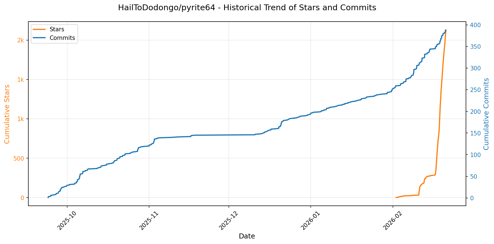

> *蓝色：累计 Stars｜橙色：累计 Commits（次 Y 轴）*

---

### 35. [SynkraAI/aios-core](https://github.com/SynkraAI/aios-core)
- 📅 **创建日期**：2025-12-09  
- 🔄 **最近更新**：2026-02-21  
- ⭐ **Stars**：1,534（日 +101｜周 +1098｜月 +1510）  
- 📝 **描述**：Synkra AIOS: AI-Orchestrated System for Full Stack Development - Core Framework v4.0  

<b>📈 Star 与 Commit 历史趋势</b>

> *蓝色：累计 Stars｜橙色：累计 Commits（次 Y 轴）*

<b>📄 README 摘要</b>

1. **该项目做什么？**  
Synkra AIOS 是一个面向全栈软件开发的**自修改型 AI 代理框架（Auto-Modifiable Agentic Framework）**，核心目标是实现真正意义上的“AI 驱动的敏捷开发”。它不将 AI 视为简单命令执行器，而是构建由多个专业化角色代理（如 analyst、architect、scrum master、dev、qa 等）组成的协作式“AI 团队（Squad）”，通过严格分阶段的自动化工作流——**先由规划代理生成高一致性、强上下文的 PRD 与架构文档，再由 Scrum Master 将其转化为含完整技术上下文与架构约束的精细化用户故事文件**——从而系统性解决 AI 编程中两大根本痛点：**规划不一致**与**开发过程中的上下文丢失**。该框架亦可扩展至非技术领域（如创意写作、商业策略、教育、身心健康），支持跨行业定制化 AI Squad。

2. **关键特性**  
- ✅ **双阶段智能工作流**：首创“Agent-Centric Agile”范式——*规划层*（Web UI 驱动，analyst/pm/architect 协作产出权威 PRD/架构）→ *执行层*（IDE 驱动，sm/dev/qa 基于结构化故事文件闭环开发与测试）；  
- ✅ **CLI 优先架构**：CLI 是唯一真相源（source of truth），所有智能决策、自动化与执行均发生于此；UI 仅用于观察与辅助管理，Observability（实时日志、仪表盘、时间线）专为理解 CLI 行为而设；  
- ✅ **多 IDE 生命周期钩子（Lifecycle Hooks）深度集成**：针对 Claude Code（完全支持）、Gemini CLI（高支持）、Codex CLI（部分支持）等平台提供原生事件驱动自动化（pre/post tool/session hooks），实现上下文自动注入、护栏（guardrails）动态加载与操作审计；  
- ✅ **现代化交互式安装与维护**：基于 `@clack/prompts` 的彩色 CLI 向导，支持组件化选择、包管理器切换、跨平台（Win/macOS/Linux）一键部署、静默安装（CI/CD）、干运行（dry-run）及智能增量更新（保留用户自定义配置并生成 `.bak` 备份）；  
- ✅ **开箱即用的 11+ 专业化代理与可扩展 Squad 生态**：内置 meta-agent（aios-master/orchestrator）、规划代理（analyst/architect/pm）、执行代理（sm/dev/qa）等，支持创建领域专属 Squad（如创意写作 Squad、健康顾问 Squad），并通过 `AGENTS.md`、MCP 协议与技能目录（`/skills`）实现标准化扩展。

3. **技术栈**  
- **运行时**：Node.js ≥18.0.0（推荐 v20+）；  
- **核心依赖**：`commander`（CLI 框架）、`execa`（进程执行）、`fs-extra`（文件系统增强）、`@clack/prompts`（现代化交互式 CLI UI）、`picocolors`（终端着色）；  
- **集成协议与标准**：支持 MCP（Model Context Protocol）以实现跨模型上下文传递，深度适配主流 AI IDE 插件生态（Claude Code、Gemini CLI、Codex CLI、Cursor、GitHub Copilot、AntiGravity）；  
- **工程实践**：基于 GitHub Actions 的 CI/CD 流水线、Codecov 代码覆盖率、MIT 开源许可证、模块化架构设计（CLI → Observability → UI 分层）、Git 版本控制与 GitHub CLI 协作支持；  
- **部署与分发**：以 NPM 包（`aios-core`）形式发布，通过 `npx` 实现零配置快速启动与更新。

---

### 36. [huggingface/skills](https://github.com/huggingface/skills)
- 📅 **创建日期**：2025-11-24  
- 🔄 **最近更新**：2026-02-21  
- ⭐ **Stars**：1,437（日 +166｜周 +219｜月 +450）  
- 📝 **描述**：暂无描述  

<b>📈 Star 与 Commit 历史趋势</b>

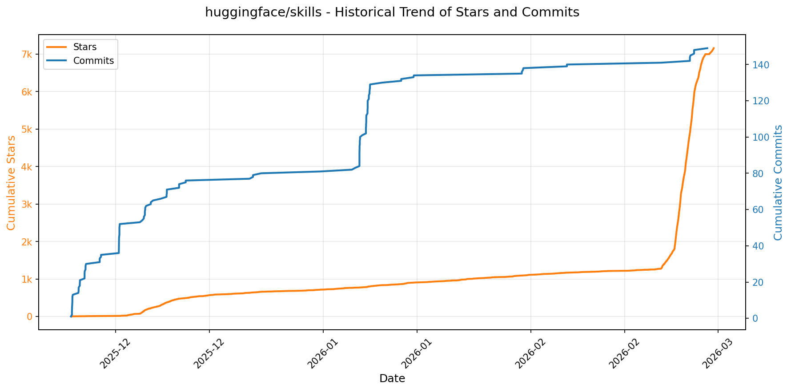

> *蓝色：累计 Stars｜橙色：累计 Commits（次 Y 轴）*

<b>📄 README 摘要</b>

1. **该项目的作用**  
该项目提供一套标准化、可互操作的“AI/ML 技能包”（Hugging Face Skills），专为编码智能体（coding agents）设计，用于自动化执行 Hugging Face 生态中的核心机器学习工作流任务，包括：模型与数据集的下载/上传/管理、HF Hub 上的数据集创建与 SQL 查询、模型评估结果集成至模型卡片、在 HF 基础设施上运行训练/推理计算任务（Jobs）、使用 TRL 进行 SFT/DPO/GRPO 等范式微调大语言模型、研究论文发布与关联、Trackio 实验追踪可视化，以及 HF API 脚本工具链构建等。这些技能以即插即用方式赋能各类主流 AI 编程助手，无需修改底层 agent 架构即可扩展其领域能力。

2. **关键特性**  
- ✅ **跨平台兼容性**：原生支持 Claude Code（Skills）、OpenAI Codex（`AGENTS.md`）、Google Gemini CLI（`gemini-extension.json`）、Cursor（`.cursor-plugin/plugin.json` + `.mcp.json`），并提供统一 fallback 机制（如直接加载 `agents/AGENTS.md`）；  
- ✅ **标准化技能格式**：严格遵循 [Agent Skill](https://agentskills.io/home) 规范，每个技能为独立文件夹，含 YAML 前置元数据（`name`/`description`）的 `SKILL.md` 指令文档、配套脚本、模板及资源；  
- ✅ **开箱即用的 HF 专用能力集**：涵盖 8 类高频场景（CLI 操作、数据集管理、模型评估、云任务调度、LLM 训练、论文出版、工具脚本生成、实验追踪），全部深度集成 Hugging Face Hub、Jobs、Spaces、Trackio 等官方服务；  
- ✅ **零代码调用体验**：用户仅需自然语言指令中明确提及技能名（如“Use the HF model evaluation skill…”），agent 即自动加载对应上下文与工具链；  
- ✅ **低门槛贡献体系**：提供完整技能开发流程（复制模板→修改元数据与文档→编写脚本→运行 `./scripts/publish.sh` 自动生成校验元数据），CI 自动验证技能路径与描述一致性；  
- ✅ **市场就绪分发机制**：通过 `.claude-plugin/marketplace.json` 统一管理人类可读的技能目录，支持插件市场注册与一键安装（如 `/plugin install hugging-face-cli@huggingface/skills`）。

3. **技术栈**  
- **核心协议/规范**：Agent Skill 标准（YAML frontmatter + Markdown 指令）、MCP（Model Context Protocol）标准（通过 `.mcp.json` 集成 Cursor）；  
- **配置与元数据格式**：YAML（`SKILL.md` 前置、`marketplace.json`、`gemini-extension.json`）、JSON（Cursor 插件清单、MCP 配置）；  
- **运行时依赖**：Hugging Face 官方 SDK（`huggingface-hub`, `datasets`, `transformers`, `trl`, `lighteval`, `trackio`）、vLLM 推理引擎、HF Jobs CLI、HF CLI 工具链；  
- **基础设施集成**：Hugging Face Hub（模型/数据集/空间托管）、Hugging Face Jobs（分布式训练/推理任务）、Hugging Face Trackio（实验指标监控）、ArXiv（论文索引）；  
- **构建与维护工具**：Shell 脚本（`./scripts/publish.sh` 自动生成并校验元数据）、GitHub Actions CI（验证技能路径/名称一致性）、Python 脚本（`scripts/generate_agents.py` 自动生成技能表格）。

---

### 37. [yctimlin/mcp_excalidraw](https://github.com/yctimlin/mcp_excalidraw)
- 📅 **创建日期**：2025-03-16  
- 🔄 **最近更新**：2026-02-21  
- ⭐ **Stars**：1,060（日 +44｜周 +196｜月 +433）  
- 📝 **描述**：暂无描述  

<b>📈 Star 与 Commit 历史趋势</b>

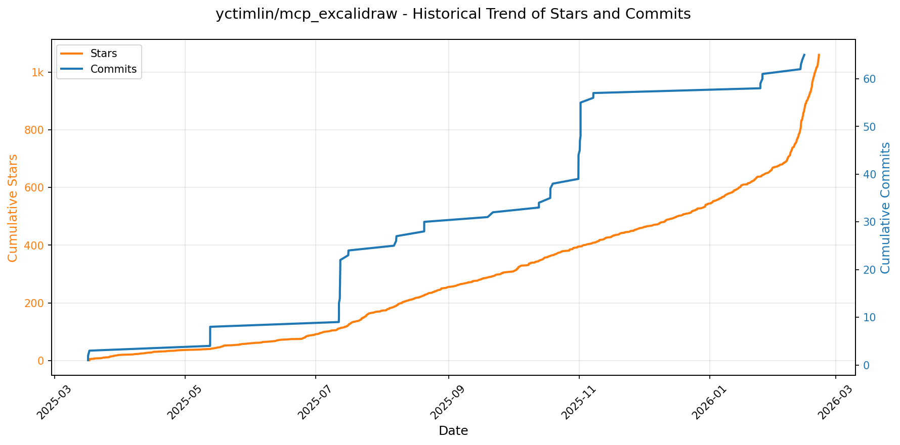

> *蓝色：累计 Stars｜橙色：累计 Commits（次 Y 轴）*

<b>📄 README 摘要</b>

1. **项目功能**  
该项目提供一个可被AI代理（如Claude Code、Cursor、Codex CLI等）实时操控的Excalidraw白板系统，核心目标是**赋予AI代理对图表的细粒度、状态化、迭代式控制能力**。它并非仅支持“单次提示→生成图表”的静态输出（如官方Excalidraw MCP），而是构建了一个**持久化、同步更新的活体画布（live canvas）**：AI可通过26个标准化MCP工具执行元素级CRUD、布局调整、场景感知（看图+读图）、快照回滚、Mermaid转换、视口控制、设计规范调用等操作，并支持多AI代理并发协作。同时提供可选的Agent Skill包，封装结构化工作流与脚本，实现跨MCP/REST双模式兼容与故障降级。

2. **关键特性**  
- ✅ **26个精细化MCP工具**：覆盖元素增删改查（`create_element`/`get_element`/`update_element`/`delete_element`等）、批量操作（`batch_create_elements`/`duplicate_elements`）、高级布局（`align_elements`/`distribute_elements`/`group_elements`/`ungroup_elements`）、场景感知（`describe_scene`返回结构化文本描述 + `get_canvas_screenshot`返回PNG图像）、文件I/O（`export_scene`/`import_scene`/`export_to_image`/`export_to_excalidraw_url`）、状态管理（`clear_canvas`/`snapshot_scene`/`restore_snapshot`）、视口控制（`set_viewport`支持缩放适配、元素居中、手动定位）、设计指南（`read_diagram_guide`提供配色/尺寸/布局最佳实践）、Mermaid转换（`create_from_mermaid`）及资源获取（`get_resource`）。  
- ✅ **闭环迭代能力**：AI可“绘制→观察（文字+图像）→调整→再观察”，真正实现基于视觉反馈的渐进式图表构建。  
- ✅ **双进程架构**：独立Canvas Server（Web UI + REST API + WebSocket实时同步）与MCP Server（stdio协议暴露工具，通过`EXPRESS_SERVER_URL`连接Canvas），解耦清晰，支持Docker部署与本地运行。  
- ✅ **多客户端无缝集成**：预置Claude Desktop/Code、Cursor、Codex CLI、OpenCode、Antigravity（Google）等主流MCP客户端的详细配置方案（含本地Node与Docker两种启动方式）。  
- ✅ **Agent Skill增强套件**：提供结构化技能文档（`SKILL.md`）、速查手册（`cheatsheet.md`）、实用脚本（健康检查、导出/导入/清空/CRUD等），并支持自动检测MCP可用性，无MCP时优雅降级至REST API。  
- ✅ **生产就绪能力**：支持共享链接（加密上传至excalidraw.com）、跨平台Docker镜像（`ghcr.io/yctimlin/mcp_excalidraw-canvas`与`mcp_excalidraw`）、CI/CD流水线（GitHub Actions）、全面测试方案（HTTP健康检查、MCP Inspector工具调用、前端截图验证）。

3. **技术栈**  
- **服务端语言与框架**：TypeScript（主项目）、Node.js（≥18）；Canvas Server基于Express.js提供REST API与WebSocket服务；MCP Server通过标准输入/输出（stdio）实现MCP协议通信。  
- **前端**：Excalidraw官方库（定制化集成），React（`main.tsx`入口），支持实时WebSocket同步渲染。  
- **协议与标准**：Model Context Protocol（MCP）v1.x（通过stdio实现），兼容所有MCP v1客户端（Claude/Cursor/Codex等）。  
- **部署与容器化**：Docker（官方镜像托管于GitHub Container Registry）、Docker Compose友好（需手动编排Canvas与MCP容器网络）。  
- **开发与运维工具**：npm（包管理与脚本）、GitHub Actions（CI/CD、Docker构建与推送）、NPM Package（`mcp-excalidraw-server`已发布）、MCP Inspector CLI（调试工具）、agent-browser（UI自动化测试）。  
- **其他依赖**：Excalidraw核心渲染引擎、Mermaid解析器（用于`create_from_mermaid`）、Puppeteer或类似浏览器环境（支撑`export_to_image`/`get_canvas_screenshot`图像导出）。

---

### 38. [databricks-solutions/ai-dev-kit](https://github.com/databricks-solutions/ai-dev-kit)
- 📅 **创建日期**：2025-12-17  
- 🔄 **最近更新**：2026-02-21  
- ⭐ **Stars**：546（日 +113｜周 +274｜月 +541）  
- 📝 **描述**：Databricks Toolkit for Coding Agents provided by Field Engineering  

<b>📈 Star 与 Commit 历史趋势</b>

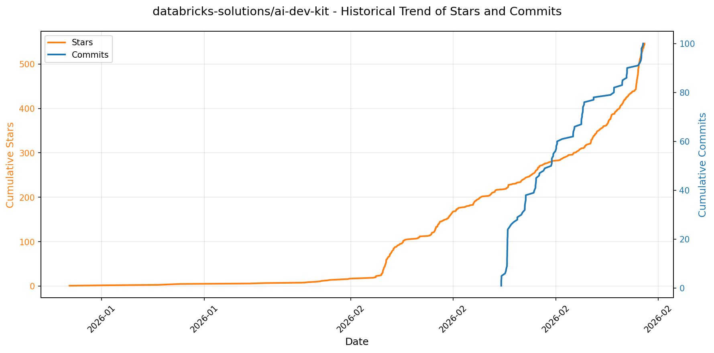

> *蓝色：累计 Stars｜橙色：累计 Commits（次 Y 轴）*

<b>📄 README 摘要</b>

1. **该项目做什么？**  
Databricks AI Dev Kit 是一个面向 Databricks 平台的 AI 辅助开发工具套件，旨在为 Claude Code、Cursor、Windsurf 等 AI 编程助手提供**可信、结构化、上下文感知的 Databricks 专业知识源**，从而实现“氛围编程”（vibe coding）。它不替代开发者，而是增强 AI 助手在 Databricks 环境中的理解力与生成能力，使其能准确、安全、高效地生成符合最佳实践的生产级代码和配置。核心价值在于：将 Databricks 复杂的云原生数据与 AI 工作流（如 Unity Catalog、Delta Live Tables、MLflow、Genie、Model Serving 等）封装为 AI 可调用的语义化技能与可执行工具。

2. **关键特性**  
- ✅ **全栈 Databricks 开发覆盖**：支持生成 Spark 声明式流水线（Streaming Tables、CDC、SCD Type 2、Auto Loader）、Databricks Jobs（多任务 DAG）、Unity Catalog 资源（表/Volume/治理策略）、Genie Spaces、RAG 知识助手、MLflow 实验与模型服务、Databricks Apps 等。  
- ✅ **多模态接入方式**：提供四种即用路径——命令行快速安装（适配 Cursor/Claude Code）、可视化 Web 构建器应用（`databricks-builder-app`）、Python 核心库（`databricks-tools-core`）供 LangChain/OpenAI SDK 集成、以及纯文档技能包（`databricks-skills`）或纯 MCP 工具服务器（`databricks-mcp-server`）。  
- ✅ **MCP（Model Context Protocol）原生支持**：内置超 50 个标准化 MCP 工具，使 AI 助手可直接调用 Databricks API 执行 SQL 查询、创建资源、读取元数据等，实现“思考-行动-验证”闭环。  
- ✅ **企业就绪设计**：基于 Databricks CLI 和认证配置（Profile），支持项目级/全局安装、多环境 Profile 切换、强制重装与工具定向安装；所有配置可跨项目复用（`.claude`/`.cursor` 目录）。  
- ✅ **教育与工程并重**：附带 19 篇 Markdown 技能文档（`databricks-skills/`），系统传授 Databricks 设计模式与最佳实践，降低学习门槛。

3. **技术栈**  
- **核心语言与运行时**：Python（主要逻辑）、Shell（macOS/Linux 安装脚本）、PowerShell（Windows 安装脚本）  
- **协议与标准**：MCP（Model Context Protocol）v1+（作为 AI 工具通信标准）  
- **后端框架与服务**：FastAPI（MCP Server API）、Uvicorn（ASGI 服务器）、HTTPX（异步 HTTP 客户端）  
- **数据库与 SQL 生态**：SQLAlchemy + asyncpg（异步 PostgreSQL 支持）、SQLGlot（SQL 解析/重写/跨方言转换）、SQLFluff（SQL 格式化与 Lint）  
- **AI 与文档处理**：LiteLLM（统一 LLM 网关，支持多模型路由）、PyMuPDF（PDF 文档解析，用于 RAG 场景）  
- **基础设施与部署**：Databricks CLI（深度集成）、uv（高性能 Python 包管理器）  
- **第三方依赖许可**：以 MIT/BSD/Apache-2.0 为主（如 fastmcp、mcp、sqlglot、fastapi），部分含 AGPL-3.0（PyMuPDF）及 LGPL-3.0（psycopg2-binary）组件。

---

### 39. [Effect-TS/effect-smol](https://github.com/Effect-TS/effect-smol)
- 📅 **创建日期**：2024-12-10  
- 🔄 **最近更新**：2026-02-21  
- ⭐ **Stars**：373（日 +44｜周 +77｜月 +98）  
- 📝 **描述**：Core libraries and experimental work for Effect v4  

<b>📈 Star 与 Commit 历史趋势</b>

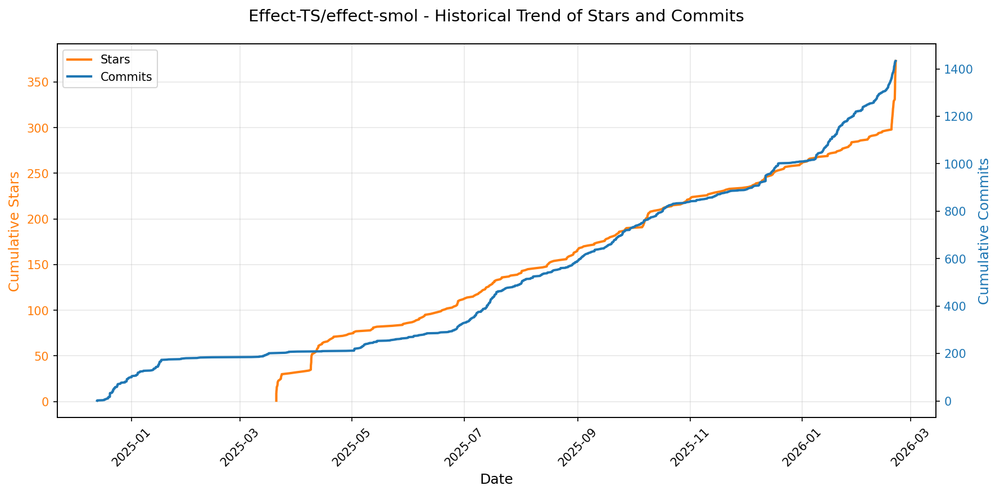

> *蓝色：累计 Stars｜橙色：累计 Commits（次 Y 轴）*

<b>📄 README 摘要</b>

1. **该项目的功能**  
该项目（`effect-smol`）是 Effect TS 生态中的一个轻量级运行时库，旨在为 Effect TS 提供最小化、高性能的执行引擎。它专注于在保持与 Effect TS 核心语义（如 `Effect<R, E, A>` 类型、错误处理、资源管理、并发原语等）完全兼容的前提下，显著减小包体积和运行时开销，适用于对包尺寸敏感的环境（如边缘计算、微前端、嵌入式 JS 场景或需极致启动性能的应用）。

2. **关键特性**  
- ✅ **极简体积**：通过精简实现、移除非核心抽象及优化打包策略，实现远小于标准 `@effect/io` 的 bundle 大小（通常 < 5 KB gzip）。  
- ✅ **100% Effect TS 语义兼容**：支持完整的 Effect 数据类型、`pipe`/`flatMap`/`map`/`catchAll` 等组合器、`tryPromise`/`sync`/`fail` 等构造器，以及 `runPromise`/`runSync` 等执行器。  
- ✅ **零依赖**：不依赖 Node.js 内置模块或外部 polyfill，纯 TypeScript 实现，可直接在现代浏览器、Deno、Cloudflare Workers 等环境运行。  
- ✅ **可树摇（Tree-shakable）**：模块化设计，支持按需导入（如仅引入 `Effect` 和 `runPromise`），进一步减小实际使用体积。  
- ✅ **类型安全优先**：完整保留 Effect TS 的高阶类型推导能力（如环境 `R`、错误 `E`、结果 `A` 的精确追踪），无运行时类型擦除。

3. **技术栈**  
- **核心语言**：TypeScript（严格模式，启用 `--noUncheckedIndexedAccess` 等高级检查）  
- **构建工具**：ESBuild（用于极速打包与 minify）、Vite（用于开发与测试环境）  
- **发布机制**：基于 `pkg.pr.new` 的自动化预发布（PR-driven publishing），支持语义化版本与可验证的不可变包分发  
- **运行时目标**：ES2020+（兼容现代浏览器、Node.js ≥18、Deno、各类 Serverless 运行时）  
- **无运行时依赖**：不依赖 `@effect/data`、`@effect/system` 或任何 Effect TS 其他包，独立可部署

---

