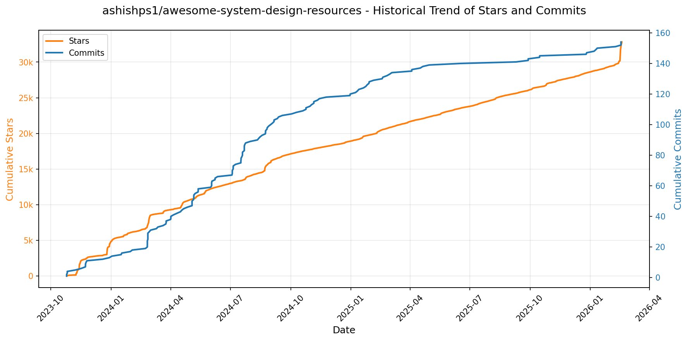
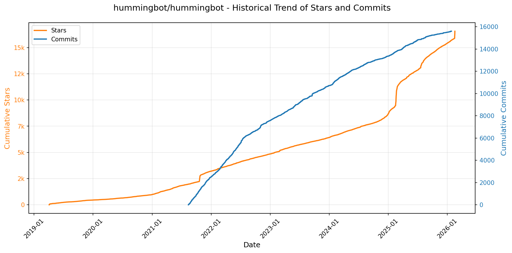
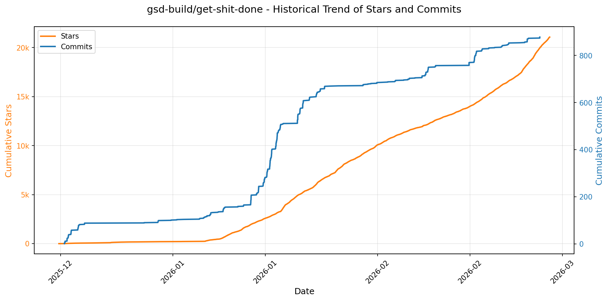
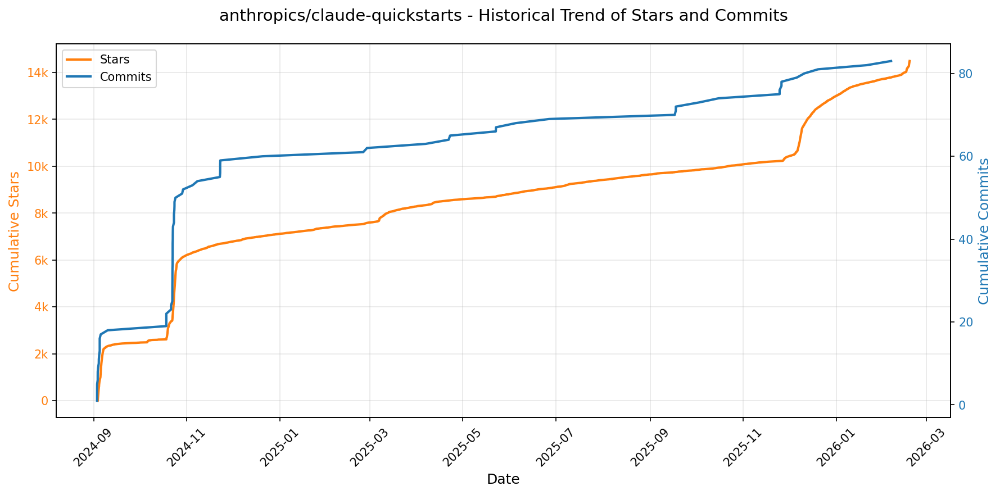
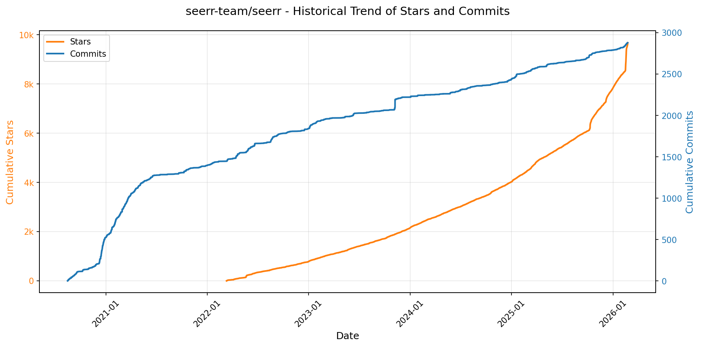
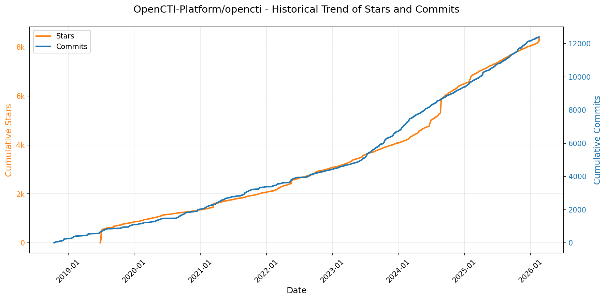
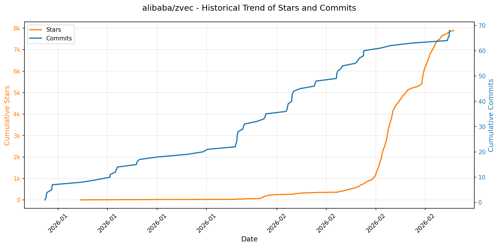
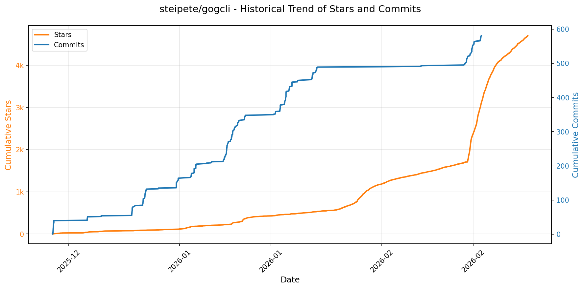
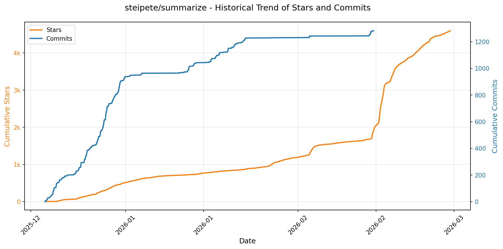
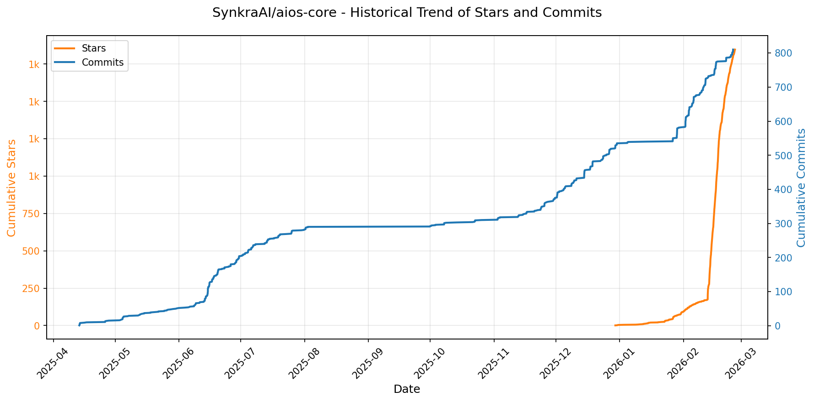

# 🌟 GitHub Trending 概览

> 数据更新于：2026-02-18

---

## 🔍 项目详情

### 1. [anthropics/skills](https://github.com/anthropics/skills)
- 📅 **创建日期**：2025-09-22  
- 🔄 **最近更新**：2026-02-18  
- ⭐ **Stars**：111,307（日 +412｜周 +3774｜月 +22017）  
- 📝 **描述**：Public repository for Agent Skills  

<b>📈 Star 与 Commit 历史趋势</b>

> *蓝色：累计 Stars｜橙色：累计 Commits（次 Y 轴）*

<b>📄 README 摘要</b>

1. **该项目做什么？**  
该项目是 Anthropic 官方维护的 Claude 技能（Skills）开源示例仓库，旨在展示如何通过结构化、可复用的“技能包”扩展 Claude 的专业化能力。每个技能是一个独立文件夹，内含 `SKILL.md`（含 YAML 元数据和自然语言指令），使 Claude 能动态加载并执行特定任务，例如：按企业品牌规范生成文档、按组织流程分析数据、自动化个人事务（如 PDF 表单提取、PPTX 创建）、测试 Web 应用、生成 MCP 服务器等。它不提供运行时引擎或服务，而是提供符合 Agent Skills 标准的参考实现与生产级范例（如 docx/pdf/pptx/xlsx 文档处理技能），供开发者学习、复用和构建自有技能。

2. **关键特性**  
- **模块化与自包含设计**：每个技能为独立文件夹，以 `SKILL.md` 为核心，声明式定义名称、描述及详细指令/示例/指南；  
- **多领域覆盖**：涵盖创意设计（艺术/音乐）、技术开发（Web 测试/MCP 生成）、企业应用（通信/品牌管理）及核心文档处理（DOCX/PDF/PPTX/XLSX）四大类技能；  
- **生产级参考实现**：公开了支撑 Claude 官方文档功能的源可用（source-available）文档技能（非完全开源），体现复杂技能在真实 AI 应用中的工程实践；  
- **跨平台集成支持**：支持在 Claude Code（插件市场）、Claude.ai（付费版内置）、Claude API（上传自定义技能）三端直接使用；  
- **标准化与可扩展性**：严格遵循 [Agent Skills 规范](https://agentskills.io)，配套提供官方规范文件（`./spec`）和开箱即用技能模板（`./template`），降低开发者创建门槛；  
- **教育与示范导向**：明确声明所有技能仅用于演示与学习，强调行为可能与线上 Claude 实际表现存在差异，要求用户在关键场景中自行充分验证。

3. **技术栈**  
- **核心格式**：纯文本 Markdown（`SKILL.md`）+ YAML 前置元数据（声明 `name` 和 `description`）；  
- **标准协议**：基于开放的 [Agent Skills 规范](https://agentskills.io)（位于 `./spec` 目录）；  
- **无运行时依赖**：技能本身不包含代码逻辑或可执行程序，而是依赖 Claude 模型对自然语言指令的理解与执行；  
- **集成层技术**：通过 Anthropic 提供的插件机制（Claude Code）、Web 界面（Claude.ai）及 RESTful API（Claude API）调用，底层由 Anthropic 的模型服务与技能运行时支撑；  
- **许可证**：多数示例技能采用 Apache 2.0 开源协议，文档类技能为源可用（source-available）但非开源。

---

### 2. [openclaw/openclaw](https://github.com/openclaw/openclaw)
- 📅 **创建日期**：2025-11-24  
- 🔄 **最近更新**：2026-02-18  
- ⭐ **Stars**：91,190（日 +3844｜周 +23401｜月 +91190）  
- 📝 **描述**：Your own personal AI assistant. Any OS. Any Platform. The lobster way. 🦞   

<b>📈 Star 与 Commit 历史趋势</b>

> *蓝色：累计 Stars｜橙色：累计 Commits（次 Y 轴）*

<b>📄 README 摘要</b>

1. **项目功能**  
OpenClaw 是一个完全本地化、用户自托管的个人 AI 助手系统，核心目标是让用户在自有设备上运行一个**单用户、低延迟、始终在线、隐私优先**的智能代理。它不依赖中心化云服务，而是通过轻量级本地网关（Gateway）统一接入并协调多种通信渠道（如 WhatsApp、Telegram、Slack、Discord、Signal、iMessage/BlueBubbles、Microsoft Teams、Matrix、Zalo 等），同时支持跨平台语音交互（macOS/iOS/Android 的 Voice Wake 与 Talk Mode）、实时可视化工作区（Live Canvas / A2UI）、设备级本地操作（摄像头、屏幕录制、通知、系统命令等），并能以“多代理路由”方式为不同会话/群组/频道分配隔离的工作空间与模型策略。

2. **关键特性**  
- ✅ **本地优先网关架构**：单一 WebSocket 控制平面（`ws://127.0.0.1:18789`），统一管理会话、通道、工具、事件、定时任务（cron）、Webhook 和远程调试；内置 Web 控制台（Control UI）与 WebChat 界面。  
- ✅ **全栈多通道支持**：原生集成主流通讯平台（Baileys/WhatsApp、grammY/Telegram、Bolt/Slack、discord.js/Discord 等），并扩展支持 BlueBubbles（iMessage）、Zalo、Matrix、WebChat 等；支持 DM 配对鉴权（默认 `pairing` 模式防未授权输入）、群组消息路由（提及触发、回复标签、分块处理）。  
- ✅ **多代理与会话隔离**：基于 workspace 的多代理路由机制，支持按频道、账号、联系人动态分发至独立 agent 实例；具备会话生命周期管理（激活模式、队列策略、上下文压缩、reply-back 机制）。  
- ✅ **语音与视觉交互能力**：macOS/iOS/Android 全平台语音唤醒（Voice Wake）+ 连续对话模式（Talk Mode），集成 ElevenLabs TTS；提供可编程 Live Canvas 工作区，支持 A2UI 渲染、脚本执行、快照与状态同步。  
- ✅ **设备级节点（Nodes）生态**：通过安全 RPC 协议（`node.invoke`）调用 macOS/iOS/Android 设备原生能力（`system.run`、`camera.snap`、`screen.record`、`location.get`、`system.notify`、Canvas 控制等），权限受系统 TCC 严格管控。  
- ✅ **安全与运维完备性**：默认 DM 防御策略、OAuth/API Key 混合模型认证 + 多级 failover、敏感配置加密、`openclaw doctor` 自检工具、Tailscale Serve/Funnel 远程安全访问、Nix/Docker 声明式部署、CLI 向导驱动的一键初始化（`openclaw onboard`）。  
- ✅ **自动化与扩展能力**：内置浏览器控制（专用 Chromium + CDP）、技能平台（ClawHub 技能注册与自动拉取）、Gmail Pub/Sub、Webhook 触发、Cron 定时任务、Agent-to-Agent 会话协同工具（`sessions_list/history/send`）。

3. **技术栈**  
- **运行时**：Node.js ≥22（主运行环境），支持 npm/pnpm/bun；TypeScript 编写，使用 `tsx` 直接运行源码；生产构建输出 `dist/` 并打包为 CLI 二进制。  
- **核心协议与通信**：WebSocket（Gateway 主控协议）、HTTP/HTTPS（WebChat/UI/Tailscale）、gRPC/RPC 风格节点调用（`node.invoke`）、CDP（Chrome DevTools Protocol）用于浏览器控制。  
- **前端与界面**：A2UI（Canvas 可视化渲染引擎）、React/Vite 构建的 Web 控制台（Control UI）、macOS Menu Bar App（Swift/Objective-C 混合）、iOS/Android 原生节点应用（Swift/Kotlin）。  
- **AI 模型集成**：插件化模型抽象层，原生支持 Anthropic（Claude Opus 4.6 推荐）、OpenAI（GPT/Codex），支持 OAuth 与 API Key 双认证、模型轮转与故障转移。  
- **基础设施与部署**：Tailscale（Serve/Funnel 远程暴露）、SSH 隧道、systemd（Linux）/launchd（macOS）守护进程管理；提供 Nix 衍生配置（`nix-openclaw`）、Docker 镜像、WSL2 兼容方案。  
- **安全机制**：本地存储加密、TCC 权限桥接、DM 配对码鉴权、密码/Token 双因子远程访问、最小权限节点调用模型。

---

### 3. [obra/superpowers](https://github.com/obra/superpowers)
- 📅 **创建日期**：2025-10-09  
- 🔄 **最近更新**：2026-02-18  
- ⭐ **Stars**：82,584（日 +729｜周 +4450｜月 +25637）  
- 📝 **描述**：An agentic skills framework & software development methodology that works.  

<b>📈 Star 与 Commit 历史趋势</b>

> *蓝色：累计 Stars｜橙色：累计 Commits（次 Y 轴）*

<b>📄 README 摘要</b>

1. **该项目做什么？**  
Superpowers 是一个面向编程智能体（coding agents）的完整软件开发工作流增强系统。它不直接替代或重写代码，而是通过一套可组合、自动触发的“技能”（skills）来规范和引导 AI 编程代理的行为，使其严格遵循工程最佳实践。其核心目标是将原本可能随意、跳跃、缺乏验证的 AI 编程过程，转化为结构化、可验证、以人机协同为前提的严谨开发流程——从需求澄清、设计评审、TDD 实施、子代理驱动开发，到代码审查与分支收尾，全程自动化触发强制性工作流，确保每一步均有明确规范、人工确认点和实证验证。

2. **关键特性**  
- **全自动技能触发机制**：无需手动调用，代理在每个开发环节（如开始编码前、执行任务前、提交前）自动识别并激活对应技能，所有流程为强制性（mandatory），非建议性（suggestion）。  
- **七阶段标准化工作流**：涵盖头脑风暴（Socratic 设计澄清）、Git 工作树隔离、原子级任务拆解（2–5 分钟粒度）、子代理驱动开发（含双阶段审查：规范符合性 + 代码质量）、严格 TDD（RED-GREEN-REFACTOR，禁止先写代码后补测试）、自动化代码预审（按严重等级阻断问题）、分支收尾决策（合并/PR/丢弃等）。  
- **深度工程哲学内嵌**：强制贯彻测试先行、YAGNI（你不会需要它）、DRY、防御性验证（如“修复后必须复现验证”）、复杂度最小化及证据驱动（claim 必须经 test/assertion 验证）。  
- **跨平台插件化支持**：原生适配 Claude Code、Cursor、Codex、OpenCode 等主流 AI 编程工具，提供统一技能接口与平台定制安装路径。  
- **可扩展技能生态**：内置 15+ 经过验证的技能模块（覆盖测试、调试、协作、元能力），支持开发者按标准范式（通过 `writing-skills` 技能指导）贡献新技能，实现工作流持续演进。

3. **技术栈**  
- **运行时环境**：依赖外部 AI 编程平台（Claude Code / Cursor / Codex / OpenCode）作为底层推理与执行引擎，Superpowers 本身为轻量级技能指令集与工作流编排层。  
- **技能实现形式**：以结构化文本（Markdown）为主，包含清晰的触发条件、执行步骤、验证规则、反模式警示及示例；部分技能含配套检查清单、模板或参考文档（如 TDD 反模式表、系统化调试四阶段图）。  
- **部署与分发**：基于插件市场（GitHub Marketplace）分发（`obra/superpowers-marketplace`），支持命令行一键安装/更新（如 `/plugin install superpowers`）；不同平台通过 `.codex/` 或 `.opencode/` 目录提供平台专属配置与安装说明。  
- **基础设施**：托管于 GitHub（源码、文档、Issue、Sponsor 支持），采用 MIT 开源协议；无独立后端服务或私有模型，纯前端/指令层增强方案。

---

### 4. [google/langextract](https://github.com/google/langextract)
- 📅 **创建日期**：2025-07-08  
- 🔄 **最近更新**：2026-02-18  
- ⭐ **Stars**：55,140（日 +163｜周 +4434｜月 +11036）  
- 📝 **描述**：A Python library for extracting structured information from unstructured text using LLMs with precise source grounding and interactive visualization.  

<b>📈 Star 与 Commit 历史趋势</b>

> *蓝色：累计 Stars｜橙色：累计 Commits（次 Y 轴）*

<b>📄 README 摘要</b>

1. **项目功能**  
LangExtract 是一个基于大语言模型（LLM）的 Python 库，专注于从非结构化文本（如临床笔记、放射报告、文学作品等）中**高精度提取结构化信息**。它不依赖预训练或微调，而是通过用户提供的自然语言指令（prompt）和少量高质量示例（few-shot examples），驱动 LLM 完成可复现、可验证的信息抽取任务。核心能力是将原始文本中的关键实体（如人物、药物、情绪、关系、医学术语等）及其属性（如剂量、部位、隐喻类型）以结构化格式（JSON-like）输出，并**严格锚定到原文位置**，支持溯源与人工审核。

2. **关键特性**  
- **精确源文本定位（Source Grounding）**：每个抽取结果均标注在原文中的精确字符偏移位置，支持可视化高亮与上下文回溯。  
- **强结构化输出保障**：利用受控生成机制（如 Gemini 的 schema 强约束），结合 few-shot 示例强制模型输出符合预定义类别的结构化数据（如 `extraction_class="medication"` + `attributes={"dose": "500mg"}`）。  
- **长文档优化处理**：采用多轮抽取（`extraction_passes`）、自适应分块（`max_char_buffer`）、并行处理（`max_workers`）策略，高效应对“大海捞针”式长文本（如整本《罗密欧与朱丽叶》）。  
- **交互式可视化审查**：一键生成自包含 HTML 文件，支持动态搜索、点击跳转至原文、批量浏览数百上千个实体，大幅提升人工验证效率。  
- **多模态模型后端支持**：原生兼容 Google Gemini（推荐 `gemini-2.5-flash`）、OpenAI（GPT-4o）、本地 Ollama 模型（如 `gemma2:2b`），并提供插件化扩展接口供第三方模型接入。  
- **零微调领域适配**：仅需 1–3 个清晰示例即可快速适配新领域（医疗、法律、文学分析等），无需修改模型权重或复杂配置。  

3. **技术栈**  
- **编程语言**：Python 3.10+  
- **核心依赖**：`google-generativeai`（Gemini）、`openai`（OpenAI）、`ollama`（本地模型）、`pydantic`（数据建模与校验）、`rich`（终端交互）、`jinja2`（HTML 可视化模板）  
- **构建与分发**：`pyproject.toml`（现代 Python 打包）、`setuptools`、`pip`（PyPI 发布：`langextract`）  
- **开发与测试**：`pytest`（单元/集成测试）、`tox`（多环境 CI 模拟）、`pre-commit`（代码格式化与 linting）、`pylint`、`isort`、`pyink`  
- **部署支持**：Docker 容器化、Vertex AI 批处理 API 集成、`.env` 环境变量管理  
- **扩展架构**：基于 `entry_points` 的插件系统，支持社区自定义模型提供商（Provider Plugin System）

---

### 5. [davila7/claude-code-templates](https://github.com/davila7/claude-code-templates)
- 📅 **创建日期**：2025-07-04  
- 🔄 **最近更新**：2026-02-18  
- ⭐ **Stars**：38,069（日 +172｜周 +712｜月 +3661）  
- 📝 **描述**：CLI tool for configuring and monitoring Claude Code  

<b>📈 Star 与 Commit 历史趋势</b>

> *蓝色：累计 Stars｜橙色：累计 Commits（次 Y 轴）*

<b>📄 README 摘要</b>

1. **该项目的作用**  
该项目是一个面向 Anthropic 克劳德（Claude）代码版（Claude Code）的即用型配置与扩展生态集合，旨在显著增强 AI 辅助开发工作流。它不提供独立的 AI 模型或运行时，而是作为一套标准化、模块化的“模板系统”，帮助开发者快速集成经过验证的 AI 代理（Agents）、自定义命令（Commands）、外部服务连接（MCPs）、配置项（Settings）、自动化钩子（Hooks）及可复用能力（Skills），从而在 Claude Code 环境中实现专业化、工程化和可扩展的 AI 编程体验。

2. **核心功能**  
- **六大组件即装即用**：支持按需安装结构化组件——🤖 AI 代理（如安全审计员、React 性能优化师）、⚡ 自定义 Slash 命令（如 `/generate-tests`）、🔌 MCP（Model Context Protocol）集成（对接 GitHub/PostgreSQL/Stripe/AWS/OpenAI 等）、⚙️ 运行时配置（超时、内存、输出格式等）、🪝 Git 钩子（如 pre-commit 安全校验）、🎨 渐进式技能（PDF 处理、Excel 自动化等）；  
- **交互式模板管理平台**：通过 [aitmpl.com](https://aitmpl.com) 提供可视化界面，统一浏览、搜索、预览并一键安装 100+ 组件；  
- **配套开发工具套件**：内置四大实用工具——📊 实时会话分析（Claude Code Analytics）、💬 移动端友好的对话监控器（支持 Cloudflare Tunnel 远程安全访问）、🔍 全面健康检查（Health Check）、🔌 插件仪表盘（Plugin Dashboard），覆盖监控、调试、运维与权限管理；  
- **开源聚合与合规分发**：系统性整合来自 Anthropic 官方、K-Dense-AI、obra、Alireza Rezvani、wshobson 等多个 MIT/Apache 2.0/CC0 许可的高质量社区项目，严格保留原始许可与署名，构建可信、可追溯的 Claude 生态知识库。

3. **技术栈**  
- **运行时环境**：基于 Node.js，以 `npx` 为核心分发与执行机制，零依赖安装，兼容主流操作系统；  
- **前端交互层**：[aitmpl.com](https://aitmpl.com) 为静态网站（推测由 Vercel 托管），采用现代 Web 技术构建响应式模板浏览器；  
- **后端/集成能力**：依赖 Claude Code 原生 MCP 协议实现与外部服务（如 GitHub API、PostgreSQL、AWS SDK）的标准化通信；部分工具（如 Conversation Monitor 的远程访问）集成 Cloudflare Tunnel 实现安全内网穿透；  
- **基础设施支持**：获 Vercel OSS 计划与 Neon 开源计划赞助，表明其部署与数据库协作能力得到云原生生态认可；  
- **许可证体系**：主项目采用 MIT License，所有集成组件均严格遵循其原始许可证（MIT/Apache 2.0/CC0），确保法律合规性与商业友好性。

---

### 6. [remotion-dev/remotion](https://github.com/remotion-dev/remotion)
- 📅 **创建日期**：2020-06-23  
- 🔄 **最近更新**：2026-02-18  
- ⭐ **Stars**：37,038（日 +137｜周 +962｜月 +11696）  
- 📝 **描述**：🎥      Make videos programmatically with React  

<b>📈 Star 与 Commit 历史趋势</b>

> *蓝色：累计 Stars｜橙色：累计 Commits（次 Y 轴）*

<b>📄 README 摘要</b>

1. **该项目的功能**  
Remotion 是一个基于 React 的视频创作框架，允许开发者使用 React 组件**以编程方式生成视频**（如 MP4、GIF、WebM 等格式）。它将视频视为“时间轴上的 React 渲染过程”，支持在浏览器中实时预览、在 Node.js 环境中服务端渲染（SSR），并可导出为高质量视频文件。其核心目标是将前端开发能力（尤其是 React 生态）直接应用于视频制作流程，替代传统视频编辑工具或复杂脚本方案。

2. **关键特性**  
- ✅ **React 驱动的视频合成**：用 JSX 编写视频场景，支持组件复用、props 传参、状态管理与 Hooks；  
- ✅ **时间轴控制**：通过 `useCurrentFrame()`、`interpolate()` 等 API 精确控制每一帧内容，实现动态动画与数据驱动变化；  
- ✅ **全栈渲染能力**：既可在浏览器中实时预览（利用 Canvas/WebGL 加速），也可在无头环境（Node.js + Puppeteer/Playwright）批量渲染高清视频；  
- ✅ **原生 Web 技术支持**：无缝集成 CSS 动画、SVG、Canvas、WebGL（如 Three.js）、Web Audio 等；  
- ✅ **开发体验优化**：支持 React Fast Refresh（热更新）、TypeScript 类型安全、VS Code 插件、CLI 工具链（`npx create-video`）；  
- ✅ **生产就绪能力**：提供视频编码配置、分辨率/帧率自定义、Alpha 通道支持、字幕生成、远程渲染服务集成等；  
- ✅ **开源生态与社区案例**：已支撑 GitHub Unwrapped 年度回顾、Fireship 教程视频等知名项目，并开放 Showcase 展示用户作品。

3. **技术栈**  
- **核心框架**：React（v18+）、TypeScript；  
- **渲染引擎**：基于 Chromium（Puppeteer / Playwright）进行服务端 Headless 渲染；浏览器端依赖 Canvas API 与 WebGL 上下文；  
- **构建与工具链**：Vite（默认模板）、Webpack（兼容模式）、ESBuild；CLI 基于 Node.js；  
- **视频处理层**：FFmpeg（用于最终编码与封装，如 MP4 导出）；  
- **基础设施**：GitHub Actions（CI/CD）、Discord 社区协作、NPM 发布；  
- **扩展生态**：兼容主流前端库（e.g., Framer Motion、Three.js、D3.js、Lottie）、支持自定义插件与渲染器。

---

### 7. [ashishps1/awesome-system-design-resources](https://github.com/ashishps1/awesome-system-design-resources)
- 📅 **创建日期**：2023-10-25  
- 🔄 **最近更新**：2026-02-18  
- ⭐ **Stars**：32,815（日 +390｜周 +3037｜月 +3777）  
- 📝 **描述**：Learn System Design concepts and prepare for interviews using free resources.  

<b>📈 Star 与 Commit 历史趋势</b>

> *蓝色：累计 Stars｜橙色：累计 Commits（次 Y 轴）*

<b>📄 README 摘要</b>

1. **该项目的功能**  
该项目是一个面向系统设计学习与面试准备的开源资源聚合库，旨在为开发者（尤其是初学者和求职者）提供全面、免费、结构化的系统设计知识体系。它不包含可运行的代码或软件工具，而是以分类整理的高质量学习资料为核心，覆盖从基础概念到高阶架构设计的完整路径，帮助用户系统性地掌握分布式系统、高并发、可扩展性等核心能力，并针对性地备战技术面试中的系统设计环节。

2. **关键特性**  
- **体系化知识图谱**：按主题精细划分九大模块（如核心概念、网络基础、API设计、数据库、缓存、异步通信、微服务、架构模式、设计权衡），逻辑清晰、层层递进；  
- **实战导向的面试题库**：收录超50道由易到难的系统设计面试真题（如TinyURL、WhatsApp、Uber、Netflix、Google Maps等），多数附带视频讲解或深度解析文章；  
- **权威资源集成**：整合经典论文（Paxos、Dynamo、MapReduce等）、行业工程实践（Discord、Netflix、Canva、Airbnb等案例）、优质课程/书籍/Newsletter/YouTube频道，兼顾理论深度与工业落地；  
- **免费开放与持续更新**：所有链接均为公开可访问资源，强调“零门槛入门”，并提供明确的学习路径建议（如新手从30个核心概念起步）；  
- **多维学习支持**：涵盖概念定义、对比分析（如REST vs GraphQL、强一致性 vs 最终一致性）、算法原理（一致哈希、CAP定理）、设计框架（系统设计回答方法论）等，满足不同学习需求。

3. **技术栈**  
该项目本身为纯静态内容仓库（GitHub README + Markdown + 外链资源），**不涉及具体编程语言、框架或运行时环境**。其“技术栈”实质是所涵盖的知识领域，包括：  
- **分布式系统理论**：CAP定理、共识算法（Paxos/Raft）、分布式事务、容错与灾备；  
- **基础设施层**：TCP/IP、DNS、HTTP/HTTPS、负载均衡、CDN、OSI模型；  
- **数据层技术**：SQL/NoSQL、ACID、分库分表（Sharding）、主从复制、Bloom Filter、LSM-Tree；  
- **中间件与架构组件**：API网关、消息队列（Kafka）、发布订阅（Pub/Sub）、服务发现、分布式锁、熔断器（Circuit Breaker）；  
- **缓存与性能优化**：多级缓存策略、淘汰算法（LRU/LFU）、读写穿透/旁路缓存；  
- **现代架构范式**：微服务、事件驱动、Serverless、P2P、Client-Server；  
- **设计方法论**：可扩展性/可用性/可靠性权衡、水平/垂直扩展、同步/异步通信、流式/批处理等系统级决策框架。

---

### 8. [asgeirtj/system_prompts_leaks](https://github.com/asgeirtj/system_prompts_leaks)
- 📅 **创建日期**：2025-05-03  
- 🔄 **最近更新**：2026-02-18  
- ⭐ **Stars**：31,907（日 +132｜周 +965｜月 +6816）  
- 📝 **描述**：Collection of extracted System Prompts from popular chatbots like ChatGPT, Claude & Gemini  

<b>📈 Star 与 Commit 历史趋势</b>

> *蓝色：累计 Stars｜橙色：累计 Commits（次 Y 轴）*

---

### 9. [ChromeDevTools/chrome-devtools-mcp](https://github.com/ChromeDevTools/chrome-devtools-mcp)
- 📅 **创建日期**：2025-09-11  
- 🔄 **最近更新**：2026-02-18  
- ⭐ **Stars**：25,907（日 +148｜周 +2109｜月 +4435）  
- 📝 **描述**：Chrome DevTools for coding agents  

<b>📈 Star 与 Commit 历史趋势</b>

> *蓝色：累计 Stars｜橙色：累计 Commits（次 Y 轴）*

<b>📄 README 摘要</b>

1. **项目功能**  
`chrome-devtools-mcp` 是一个 Model-Context-Protocol（MCP）标准兼容的服务端实现，旨在让 AI 编程代理（如 Gemini、Claude、Cursor、Copilot、Codex 等）通过标准化协议，安全、可靠地**控制和深度检测正在运行的 Chrome 浏览器实例**。它桥接 AI 助手与 Chrome DevTools 原生能力，使大模型能执行真实浏览器自动化、全栈调试（网络/控制台/渲染）、性能分析（实验室+现场数据）等任务，无需手动编写 Puppeteer 脚本或直接调用底层 API。

2. **核心特性**  
- **深度性能洞察**：支持录制完整 DevTools 性能轨迹（trace），自动提取可操作瓶颈建议；可选集成 Google CrUX API 获取真实用户（RUM）性能数据，实现 lab + field 双维度分析。  
- **高级浏览器调试能力**：实时捕获网络请求详情（含请求/响应头、时间线）、获取带源映射（source-mapped）的控制台日志、截取全屏/元素级截图、执行任意 JavaScript 上下文脚本、生成堆快照（heap snapshot）。  
- **高可靠性自动化**：基于 Puppeteer 实现语义化交互工具集（共 26 个预置 MCP 工具），涵盖页面导航（打开/关闭/跳转/等待）、表单操作（填充/点击/拖拽/上传）、键盘输入、对话框处理、视口模拟（设备/分辨率/网络节流）等，并自动隐式等待 DOM 就绪与操作完成。  
- **灵活部署与连接模式**：支持自动启动隔离 Chrome 实例、连接已运行的远程调试 Chrome（通过 `--browser-url` 或 `--ws-endpoint`）、适配多通道（Stable/Canary/Beta）、自定义用户数据目录与启动参数，兼顾开发便捷性与生产安全性。  
- **细粒度配置与隐私控制**：提供 20+ 启动参数，支持按需禁用特定能力模块（如禁用 emulation/network/performance 工具）、关闭 CrUX 数据上报、完全禁用 Google 使用统计（含环境/成功率/延迟等），并明确警示敏感数据风险。

3. **技术栈**  
- **核心运行时**：Node.js（要求 v20.19+ LTS 版本）  
- **浏览器自动化层**：Puppeteer（v23+，用于启动、管理 Chrome 实例及基础操作）  
- **DevTools 协议对接**：直接集成 Chromium 官方 [Chrome DevTools Frontend](https://github.com/ChromeDevTools/devtools-frontend) 协议能力，实现深度调试与性能分析  
- **协议标准**：严格遵循 [Model-Context-Protocol (MCP)](https://modelcontextprotocol.io/) 规范，提供标准 JSON-RPC over stdio 接口，兼容所有主流 MCP 客户端（VS Code/Copilot/Cursor/Gemini/Claude/ JetBrains 等）  
- **构建与分发**：npm 包管理（`chrome-devtools-mcp`），通过 `npx` 一键启动，零本地构建依赖  
- **附加能力**：内置 WebSocket 连接管理、HTTP 代理支持、自定义 Chrome 启动参数（`--chrome-arg`）、环境变量驱动配置（如 `CHROME_DEVTOOLS_MCP_NO_USAGE_STATISTICS`）

---

### 10. [iOfficeAI/AionUi](https://github.com/iOfficeAI/AionUi)
- 📅 **创建日期**：2025-08-07  
- 🔄 **最近更新**：2026-02-18  
- ⭐ **Stars**：22,259（日 +161｜周 +1869｜月 +10913）  
- 📝 **描述**：Free, local, open-source 24/7 Cowork and OpenClaw for Gemini CLI, Claude Code, Codex, OpenCode, Qwen Code, Goose CLI, Auggie, and more | 🌟 Star if you like it!  

<b>📈 Star 与 Commit 历史趋势</b>

> *蓝色：累计 Stars｜橙色：累计 Commits（次 Y 轴）*

---

### 11. [VectifyAI/PageIndex](https://github.com/VectifyAI/PageIndex)
- 📅 **创建日期**：2025-04-01  
- 🔄 **最近更新**：2026-02-18  
- ⭐ **Stars**：20,226（日 +133｜周 +782｜月 +10000）  
- 📝 **描述**：📑 PageIndex: Document Index for Vectorless, Reasoning-based RAG  

<b>📈 Star 与 Commit 历史趋势</b>

> *蓝色：累计 Stars｜橙色：累计 Commits（次 Y 轴）*

<b>📄 README 摘要</b>

1. **该项目做什么？**  
PageIndex 是一个**无需向量数据库、不依赖文本分块**的新型检索增强生成（RAG）系统，专为**长篇专业文档**（如财报、法律文书、技术手册、学术教材等）设计。它通过构建文档的**语义化树状索引**（类似智能目录），并利用大语言模型（LLM）在该索引上进行**多步推理式检索**，模拟人类专家阅读与定位信息的过程，实现高精度、可解释、可追溯的上下文检索。

2. **核心功能**  
- ✅ **纯推理驱动检索**：摒弃传统基于向量相似度的“模糊匹配”，转而通过LLM对树结构进行层级化推理搜索，确保结果具备语义相关性与逻辑合理性；  
- ✅ **零向量数据库依赖**：完全绕过嵌入计算、向量存储与近似最近邻（ANN）搜索，降低基础设施复杂度与延迟；  
- ✅ **无显式文本分块**：基于文档天然结构（标题层级、章节逻辑）组织内容，保留上下文完整性，避免人工切片导致的信息割裂；  
- ✅ **高度可解释与可追溯**：每次检索均输出明确的节点路径、页码范围及推理链，支持审计与调试，杜绝“黑箱式 vibe retrieval”；  
- ✅ **原生支持视觉输入**：提供OCR-Free的视觉RAG方案，可直接对PDF页面图像进行推理索引，跳过传统OCR流程；  
- ✅ **跨模态兼容性**：支持PDF与Markdown双格式输入，并可通过MCP协议集成至Claude、Cursor等智能体环境，或通过API/Chat平台快速调用。

3. **技术栈**  
- **核心模型层**：依赖OpenAI系列大模型（默认 `gpt-4o-2024-11-20`）执行树索引构建与推理检索；  
- **文档解析层**：基于Python生态（如`pypdf`、`pdfplumber`等）进行PDF结构分析；Markdown解析则通过标题符号（`#`, `##`等）自动识别层级；  
- **工程架构**：开源Python CLI工具（`run_pageindex.py`），支持本地运行；配套`.env`环境管理、命令行参数灵活配置（如节点大小、摘要生成、ID标记等）；  
- **部署与集成**：提供云服务（[chat.pageindex.ai](https://chat.pageindex.ai)）、MCP插件、RESTful API（Beta）、Colab交互式笔记本（Jupyter）等多种接入方式；  
- **扩展能力**：配套自研的**PageIndex OCR**（未完全开源，但已商用）用于复杂PDF的高保真结构化提取，强化树索引质量。

---

### 12. [KeygraphHQ/shannon](https://github.com/KeygraphHQ/shannon)
- 📅 **创建日期**：2025-09-27  
- 🔄 **最近更新**：2026-02-18  
- ⭐ **Stars**：20,029（日 +389｜周 +3503｜月 +16276）  
- 📝 **描述**：Fully autonomous AI hacker to find actual exploits in your web apps. Shannon has achieved a 96.15% success rate on the hint-free, source-aware XBOW Benchmark.  

<b>📈 Star 与 Commit 历史趋势</b>

> *蓝色：累计 Stars｜橙色：累计 Commits（次 Y 轴）*

<b>📄 README 摘要</b>

1. **项目功能**  
Shannon 是一个面向源代码可用（white-box）场景的全自动 AI 渗透测试工具，核心目标是**在真实攻击者之前主动攻破目标 Web 应用**。它不只静态扫描或生成告警，而是完整执行“分析代码 → 发现攻击面 → 自动登录（支持 2FA/TOTP/Google 登录）→ 浏览器内动态利用（如注入、XSS、SSRF、认证绕过）→ 验证漏洞可利用性 → 生成含可复现 PoC 的最终报告”全流程。其本质是将红队能力产品化，为开发团队（尤其是使用 Claude/Cursor 等 AI 编程工具高频交付的团队）填补传统年度渗透测试留下的长达 364 天的安全验证空白，实现“每次构建均可安全发布”。

2. **关键特性**  
- **全自主渗透流程**：单命令启动，自动处理复杂认证（含 TOTP、OAuth）、页面导航与状态管理，全程无需人工干预；  
- **可验证的 exploit 报告**：输出聚焦于**已成功触发的真实漏洞**，每项发现均附带一键复制的 PoC（非理论风险），彻底消除误报；  
- **深度 OWASP 覆盖**：当前实现实战级验证的漏洞类型包括：注入（SQL/OS 命令等）、跨站脚本（XSS）、服务端请求伪造（SSRF）、认证/授权失效（含 IDOR、JWT 攻击、权限提升）；  
- **代码感知的动态测试**：结合源码分析（白盒）指导浏览器/CLI 动态攻击（黑盒），实现上下文敏感的精准利用；  
- **集成专业安全工具链**：在侦察阶段调用 Nmap、Subfinder、WhatWeb、Schemathesis 等工具增强目标环境测绘能力；  
- **并行化加速引擎**：对不同漏洞类型的分析与利用任务并发执行，显著缩短测试周期；  
- **断点续跑工作区（Workspace）**：支持基于 Git 提交的进度检查点，中断后可精准恢复未完成的智能体任务，避免重复耗时操作。

3. **技术栈**  
- **核心推理引擎**：Anthropic Claude 系列大模型（官方主推 Anthropic API，实验性支持 OpenAI/Gemini 通过 Router 模式）；  
- **架构框架**：基于 Anthropic Agent SDK 构建的多智能体（Multi-Agent）系统，分 Recon、Vuln Analysis、Exploitation、Reporting 四阶段流水线；  
- **运行时环境**：Docker 容器化部署，依赖 Temporal 工作流引擎进行任务编排与状态持久化；  
- **基础设施组件**：集成 Nmap（网络扫描）、Subfinder（子域名枚举）、WhatWeb（指纹识别）、Schemathesis（API 模糊测试）等开源安全工具；  
- **前端交互**：提供 Temporal Web UI（端口 8233）实时监控任务进度与日志；  
- **配置与扩展**：YAML 格式配置文件支持自定义登录流程、路径聚焦/规避规则；支持多仓库（monorepo/multi-repo）结构分析。

---

### 13. [hsliuping/TradingAgents-CN](https://github.com/hsliuping/TradingAgents-CN)
- 📅 **创建日期**：2025-06-26  
- 🔄 **最近更新**：2026-02-18  
- ⭐ **Stars**：17,444（日 +45｜周 +767｜月 +2565）  
- 📝 **描述**：基于多智能体LLM的中文金融交易框架 - TradingAgents中文增强版  

<b>📈 Star 与 Commit 历史趋势</b>

> *蓝色：累计 Stars｜橙色：累计 Commits（次 Y 轴）*

<b>📄 README 摘要</b>

1. **项目功能**  
本项目是一个面向中文用户的**多智能体与大模型股票分析学习平台**，基于开源框架 `TradingAgents` 进行深度本地化与功能增强。其核心定位为**合规、非实盘的教育与研究工具**，旨在帮助用户系统学习如何利用多智能体架构和大语言模型（LLM）开展股票基本面/技术面分析、策略模拟与风险评估。平台**不提供实盘交易指令或投资建议**，仅支持A股、港股、美股等市场的数据接入、智能分析、虚拟交易验证及专业报告生成，服务于AI金融教育、学术研究与策略实验场景。

2. **关键特性**  
- **中文化与本土适配**：完整中文界面、A股全量数据支持（Tushare/AkShare/BaoStock）、国产大模型（通义千问、DeepSeek等）原生集成、微信公众号生态联动；  
- **企业级架构能力**：FastAPI后端 + Vue 3前端、MongoDB + Redis双数据库、SSE+WebSocket实时通知、RBAC用户权限与操作审计日志；  
- **智能分析增强**：动态LLM供应商管理、任务驱动的智能模型选择与持久化配置、多层次新闻分析（采集→过滤→质量评估→统一调用）、多维度股票筛选与自选股分组跟踪；  
- **生产力工具链**：批量多股同步分析、虚拟交易系统、Markdown/Word/PDF三格式专业分析报告导出、Web可视化配置中心、多级缓存（文件/Redis/MongoDB）与成本优化策略；  
- **开箱即用部署**：全平台Docker多架构支持（amd64/arm64）、一键式Docker Compose部署、Windows绿色免安装版、详尽中文文档与B站/公众号视频教程体系；  
- **安全与合规保障**：明确区分开源（Apache 2.0）与专有模块（`app/`和`frontend/`需商业授权），严格声明禁止未经授权的商业使用，并主动维权反盗版。

3. **技术栈**  
- **后端**：Python 3.10+、FastAPI + Uvicorn（替代原Streamlit）、MongoDB（主数据存储）、Redis（缓存与实时通信）、Celery（异步任务调度，隐含于批量分析/模拟交易中）；  
- **前端**：Vue 3 + Vite + Element Plus（现代化SPA）、WebSocket/SSE（实时推送）、Markdown渲染引擎（报告生成）；  
- **AI与数据层**：OpenAI API、Google Gemini、DeepSeek、通义千问等多LLM提供商SDK；Tushare、AkShare、BaoStock等开源金融数据接口；技术指标计算库（如TA-Lib兼容实现）；  
- **基础设施**：Docker（多架构镜像）、Docker Compose（本地/测试环境编排）、GitHub Actions（CI/CD自动化构建与发布）、Nginx（生产反向代理，隐含于部署文档）；  
- **许可证体系**：混合授权——核心算法与工具代码采用**Apache 2.0**（开源可商用），`app/`（FastAPI后端）与`frontend/`（Vue前端）目录为**专有组件**，商业使用须单独授权。

---

### 14. [hummingbot/hummingbot](https://github.com/hummingbot/hummingbot)
- 📅 **创建日期**：2019-04-02  
- 🔄 **最近更新**：2026-02-18  
- ⭐ **Stars**：17,051（日 +478｜周 +1212｜月 +1466）  
- 📝 **描述**：Open source software that helps you create and deploy high-frequency crypto trading bots  

<b>📈 Star 与 Commit 历史趋势</b>

> *蓝色：累计 Stars｜橙色：累计 Commits（次 Y 轴）*

<b>📄 README 摘要</b>

1. **该项目做什么？**  
Hummingbot 是一个开源的自动化交易框架，用于设计、开发和部署跨多中心化交易所（CEX）与去中心化交易所（DEX）的算法交易机器人（bots）。它支持在 140+ 个交易场所执行高频、低延迟的策略，涵盖现货、永续合约等市场类型；其核心目标是通过开源协作与社区共建，实现高频交易技术的民主化，使个人开发者和量化交易者无需依赖大型机构基础设施即可构建专业级交易系统。

2. **关键功能**  
- **多类型交易所统一接入**：提供三类标准化连接器——CLOB CEX（如 Binance、OKX）、CLOB DEX（如 dYdX、Hyperliquid）、AMM DEX（通过 Gateway 中间件对接 Uniswap、Raydium 等），覆盖托管型与非托管型、链上与链下交易场景；  
- **全栈策略支持**：原生支持现货套利、做市、跨交易所 arbitrage、三角套利、LP 挖矿、Perpetual 对冲等多种策略模板，并允许用户自定义 Python 策略逻辑；  
- **Gateway DEX 中间件集成**：独立的 TypeScript 网关服务，为 AMM/CLMM/Router 类 DEX 提供统一、安全、可扩展的区块链交互层（支持 Ethereum、Solana、Arbitrum 等多链），默认开发模式（HTTP），支持生产级 HTTPS + TLS 证书部署；  
- **多形态客户端与生态扩展**：除 CLI 客户端外，提供 Telegram 机器人（Condor）、REST/gRPC API 服务（Hummingbot API）、AI 集成接口（Hummingbot MCP，支持 Claude/Gemini 调用交易能力）、量化研究环境（Quants Lab Jupyter Notebook）；  
- **社区驱动治理与插件生态**：通过 HBOT 代币质押发起新连接器/功能提案，由社区投票决定代码合并；已集成超 40 个主流交易所连接器，并持续由基金会及赞助方（如 Binance、Gate.io）共同维护。

3. **技术栈**  
- **主客户端（Hummingbot Core）**：Python 3.9+，基于 asyncio 异步架构，采用模块化设计（connector、strategy、market、order book、logging 等组件解耦）；  
- **网关服务（Gateway）**：TypeScript 编写，运行于 Node.js 环境，通过 WebSocket/HTTP 与链上节点（如 Infura、QuickNode）或 RPC 端点通信，支持 EVM/Solana 多链适配；  
- **部署与运维**：默认采用 Docker Compose 容器化部署，支持 Linux/macOS/Windows（WSL2），CI/CD 基于 GitHub Actions；  
- **辅助工具链**：Jupyter（Quants Lab）、Telegram Bot SDK（Condor）、FastAPI/GRPC（Hummingbot API）、React（文档站点 hummingbot.org）；  
- **协议与标准**：严格遵循 RESTful API 规范、WebSocket 实时行情推送、EIP-712 签名、ERC-20/ERC-721 标准资产交互，以及 AMM 的恒定乘积（x*y=k）、集中流动性（CLMM）等数学模型实现。

---

### 15. [gsd-build/get-shit-done](https://github.com/gsd-build/get-shit-done)
- 📅 **创建日期**：2025-12-14  
- 🔄 **最近更新**：2026-02-18  
- ⭐ **Stars**：15,373（日 +451｜周 +2408｜月 +10883）  
- 📝 **描述**：A light-weight and powerful meta-prompting, context engineering and spec-driven development system for Claude Code and OpenCode.  

<b>📈 Star 与 Commit 历史趋势</b>

> *蓝色：累计 Stars｜橙色：累计 Commits（次 Y 轴）*

<b>📄 README 摘要</b>

1. **项目功能**  
该项目是一个轻量级但功能强大的元提示（meta-prompting）、上下文工程（context engineering）与规范驱动开发（spec-driven development）系统，专为 **Claude Code、OpenCode 和 Gemini CLI** 三大 AI 编程运行时设计。其核心目标是**解决“上下文腐化”（context rot）问题**——即随着 Claude 填充上下文窗口，模型理解力与输出质量持续下降的现象。GSD 通过结构化工作流，使 AI 能在每次任务中始终运行于纯净、高保真、信息完备的上下文环境中，从而稳定生成高质量、可验证、符合用户真实意图的代码与系统。

2. **关键特性**  
- ✅ **全生命周期规范驱动流程**：支持 `new-project → discuss-phase → plan-phase → execute-phase → verify-work → complete-milestone` 的闭环迭代，每个阶段均含明确输入/输出和人工确认点；  
- ✅ **智能上下文工程体系**：自动维护 `PROJECT.md`、`REQUIREMENTS.md`、`ROADMAP.md`、`STATE.md`、`CONTEXT.md` 等结构化文档，确保 Claude 始终拥有精准、分层、无冗余的上下文；  
- ✅ **多智能体并行编排**：各阶段（研究、规划、执行、验证）均由轻量级协调器调度专用子智能体（如 4 并行研究员、验证检查器、调试代理），主会话上下文保持精简（30–40% 占用）；  
- ✅ **波次式原子执行（Wave Execution）**：按依赖关系自动分组任务为“执行波”，独立任务并行、依赖任务串行，最大化效率并规避文件冲突；  
- ✅ **XML 结构化提示与内置验证**：所有计划以语义清晰的 XML 格式编写（含 `<action>`、`<verify>`、`<done>`），强制指令精确性与可测试性；  
- ✅ **原子化 Git 提交**：每个任务生成独立、语义化 commit（含时间戳与任务摘要），支持精准 bisect、回滚与历史追溯；  
- ✅ **混合模式支持**：提供完整流程（full workflow）与快捷模式（`/gsd:quick`），兼顾复杂项目与日常小任务；  
- ✅ **现有代码库友好（Brownfield）**：通过 `/gsd:map-codebase` 自动分析存量技术栈、架构与约定，使后续开发无缝继承上下文；  
- ✅ **模块化与可中断性**：支持插入/删除阶段、暂停/恢复会话、动态调整配置，全程无锁定、可随时干预。

3. **技术栈**  
- **运行时支持**：Claude Code（Anthropic）、OpenCode（开源本地模型 CLI）、Gemini CLI（Google）；  
- **核心实现**：Node.js（CLI 工具链 + 安装器 `bin/install.js`），纯前端/终端交互，无服务端依赖；  
- **提示工程层**：自研 XML 元提示格式、上下文分片策略、状态持久化机制（`.planning/` 目录结构）；  
- **集成能力**：深度调用系统命令（`git`、`bash` 工具链）、支持 `.claude/settings.json` 权限配置、兼容本地开发环境（Mac/Windows/Linux）；  
- **部署形态**：以 npm 包 `get-shit-done-cc` 发布，支持 `npx` 一键安装，可全局或项目级部署；  
- **扩展机制**：基于 JSON 配置（`.planning/config.json`）支持模型剖面切换（`quality`/`balanced`/`budget`）、工作流模式（`interactive`/`yolo`）、Git 分支策略等。

---

### 16. [anthropics/claude-quickstarts](https://github.com/anthropics/claude-quickstarts)
- 📅 **创建日期**：2024-08-29  
- 🔄 **最近更新**：2026-02-18  
- ⭐ **Stars**：14,486（日 +261｜周 +616｜月 +961）  
- 📝 **描述**：A collection of projects designed to help developers quickly get started with building deployable applications using the Claude API  

<b>📈 Star 与 Commit 历史趋势</b>

> *蓝色：累计 Stars｜橙色：累计 Commits（次 Y 轴）*

<b>📄 README 摘要</b>

1. **项目功能**  
该项目是一套面向开发者的 Claude API 快速上手示例集合，旨在帮助用户以最小学习成本快速构建基于 Claude 大模型的实际应用。每个 Quickstart 都是一个可直接运行、可定制的端到端应用模板，覆盖不同垂直场景（如客服、金融分析、桌面自动化、网页交互、自主编程等），聚焦于展示如何将 Claude 的核心能力（如自然语言理解/生成、工具调用、多步推理与执行）集成到真实工作流中。

2. **关键特性**  
- 提供 5 个开箱即用的典型应用场景：  
  • 客户支持代理（集成知识库的对话式客服系统）；  
  • 财务数据分析师（结合交互式数据可视化实现自然语言驱动的财务分析）；  
  • 计算机使用演示（利用 `computer_use_20251124` 工具版本实现桌面级操作，含缩放等新动作）；  
  • 浏览器工具 API 演示（基于 Playwright 实现完整网页自动化，包括导航、DOM 检查与表单操作）；  
  • 自主编码智能体（基于 Claude Agent SDK 的双智能体架构，支持跨会话持续开发、Git 持久化进度与渐进式功能实现）。  
- 所有示例均包含独立 README 和标准化部署流程（克隆 → 进入子目录 → 安装依赖 → 配置 API Key → 启动）；  
- 强调生产就绪实践：环境变量管理、模块化结构、工具链集成（如 Playwright）、状态持久化（Git）等。

3. **技术栈**  
- 核心依赖：Anthropic 官方 Python SDK（调用 Claude API，支持最新工具调用格式如 `computer_use_20251124`）；  
- 前端/可视化：未明确指定，但“财务数据分析师”示例隐含使用前端图表库（如 Plotly 或 Chart.js）；  
- 自动化与工具层：Playwright（用于浏览器自动化）、操作系统级控制能力（计算机使用场景）；  
- 开发与运维：Git（用于自主编码 Agent 的进度追踪与代码持久化）、标准 Python 生态（依赖管理、环境变量配置）；  
- 基础设施：无服务端框架强约束，各 Quickstart 可独立运行，适配本地开发或轻量部署。

---

### 17. [danielmiessler/Personal_AI_Infrastructure](https://github.com/danielmiessler/Personal_AI_Infrastructure)
- 📅 **创建日期**：2025-09-08  
- 🔄 **最近更新**：2026-02-18  
- ⭐ **Stars**：13,912（日 +114｜周 +2098｜月 +3604）  
- 📝 **描述**：Agentic AI Infrastructure for magnifying HUMAN capabilities.  

<b>📈 Star 与 Commit 历史趋势</b>

> *蓝色：累计 Stars｜橙色：累计 Commits（次 Y 轴）*

<b>📄 README 摘要</b>

1. **该项目的功能**  
该项目（Personal AI Infrastructure，简称 PAI）是一个开源的、面向个人的AI基础设施平台，旨在将大语言模型（LLM）从通用聊天工具升级为具备长期记忆、目标导向、持续学习能力的“个人AI助手”（Digital Assistant, DA）。它不替代现有AI工具（如Claude Code），而是构建在其之上，通过系统化架构赋予AI对用户身份、目标、偏好、历史与价值观的深度理解与长期适应能力，最终实现“激活个体潜能”——帮助用户发现自我、明确使命、践行目标，并在真实生活中获得高自主性（high-agency）。

2. **核心特性**  
- **目标驱动（Goal-Oriented）**：以用户定义的TELOS体系（含MISSION.md、GOALS.md等10个核心文档）为运行中枢，所有任务均围绕用户真实人生目标展开；  
- **持续自进化（Continuous Learning Loop）**：执行“观察→思考→规划→执行→验证→学习→改进”闭环，自动捕获评分、情感、成败信号，迭代优化技能、工作流与行为模式；  
- **分层记忆系统（Three-Tier Memory）**：支持热/温/冷三级存储，结构化保存交互历史、决策依据与学习成果，实现上下文可追溯、可复用；  
- **模块化技能体系（Skill System）**：遵循“代码→CLI工具→Prompt→技能”确定性优先原则，确保结果稳定、可测试、可调试；  
- **用户/系统分离架构（User/System Separation）**：用户定制内容（身份、偏好、工作流等）严格隔离于`USER/`目录，系统升级不覆盖个人数据，保障可移植性与升级安全；  
- **全生命周期钩子系统（Hook System）**：支持8类事件（如会话启动、工具调用、任务完成），触发通知、安全校验、上下文加载等自动化响应；  
- **内建安全机制（Security System）**：默认启用命令级权限控制，预检高危操作（如`rm -rf`），无需跳过安全检查即可流畅运行；  
- **多模态交互支持**：集成ElevenLabs语音合成（Voice System）、终端富UI（Terminal-Based UI）、移动端推送（ntfy/Discord通知）、GUI智能安装器等，兼顾效率与体验；  
- **工程化实践规范**：贯彻UNIX哲学、SRE运维理念、CLI优先、Spec/Test/Evals先行等16项PAI原则，将AI系统视为生产级软件进行版本控制、监控与演进。

3. **技术栈**  
- **核心运行时**：Bun（高性能JavaScript/TypeScript运行时，用于快速启动与脚本执行）；  
- **主要编程语言**：TypeScript（主体逻辑、CLI、配置系统）、Bash（系统集成、安装脚本、CLI工具链）、Python（部分AI工具或扩展模块）；  
- **底层AI引擎**：原生深度集成Claude Code（Anthropic官方Agent框架），依赖其钩子（Hooks）、上下文管理、MCP服务器等核心能力；  
- **辅助服务**：ElevenLabs（TTS语音合成）、ntfy.sh（跨平台推送通知）、Ollama/llama.cpp（Roadmap中规划的本地模型支持）；  
- **基础设施**：Git（版本控制与恢复）、Shell（zsh/bash环境集成）、CLI（主交互界面）；  
- **开发与设计理念支撑**：严格遵循工程化范式（ENG/SRE）、科学方法论（假设→实验→度量→迭代）、确定性架构（模板化、可复现）及人本设计（CLI优先、渐进式定制）。

---

### 18. [badlogic/pi-mono](https://github.com/badlogic/pi-mono)
- 📅 **创建日期**：2025-08-09  
- 🔄 **最近更新**：2026-02-18  
- ⭐ **Stars**：13,208（日 +282｜周 +3075｜月 +11276）  
- 📝 **描述**：AI agent toolkit: coding agent CLI, unified LLM API, TUI & web UI libraries, Slack bot, vLLM pods  

<b>📈 Star 与 Commit 历史趋势</b>

> *蓝色：累计 Stars｜橙色：累计 Commits（次 Y 轴）*

<b>📄 README 摘要</b>

1. **项目功能**  
该项目是一个面向 AI 代理（AI Agent）开发与大语言模型（LLM）部署管理的**一体化单体仓库（Monorepo）**，核心目标是提供模块化、可组合的工具链，支持构建生产级交互式 AI 编程助手及企业级 LLM 应用。它不直接提供最终用户产品，而是为开发者提供底层能力：统一调用多厂商 LLM 的 API、运行时代理框架、终端/Web/Slack 多端交互界面、GPU 加速推理部署（vLLM）管理等，重点服务于“编码类 AI 代理”（如 `pi-coding-agent`）的快速开发与集成。

2. **关键特性**  
- **多提供商 LLM 抽象层**：`@mariozechner/pi-ai` 封装 OpenAI、Anthropic、Google 等主流模型 API，提供统一接口与标准化响应格式；  
- **可扩展代理运行时**：`@mariozechner/pi-agent-core` 支持工具调用（function calling）、状态持久化、执行流控制，是构建复杂 Agent 的基础引擎；  
- **多模态交互前端**：同时提供轻量级终端 UI（`pi-tui`，含差分渲染优化）、Web 组件库（`pi-web-ui`）和 Slack 集成机器人（`pi-mom`），实现跨平台一致体验；  
- **本地化 LLM 运维工具**：`pi-pods` CLI 专为管理 vLLM GPU 推理实例设计，简化私有化部署与扩缩容流程；  
- **开箱即用的编程代理**：`pi-coding-agent` 是一个交互式命令行编程助手，支持代码生成、解释、调试与工程级上下文理解；  
- **严格工程规范**：内置自动化构建（CI）、类型检查、格式化、端到端测试（含跳过密钥依赖测试的智能策略），并明确区分人类与 AI 代理的贡献规则（见 `AGENTS.md`）。

3. **技术栈**  
- **语言与运行时**：TypeScript（全栈主语言），Node.js（服务端/CLI 运行时）；  
- **前端框架**：无重型框架，`pi-tui` 基于原生终端操作（likely `blessed` 或 `ink` 类库），`pi-web-ui` 提供标准 Web Components（自定义元素 + Shadow DOM）；  
- **AI/LLM 集成**：兼容 OpenAI v1+、Anthropic、Google Gemini 等 RESTful API；推理层深度集成 **vLLM**（用于 `pi-pods` 的 GPU 推理调度）；  
- **工程基础设施**：pnpm（隐含于 monorepo 实践，虽 README 写 `npm`，但现代 monorepo 普遍采用 pnpm）、ESBuild（推测用于快速构建）、TypeScript 编译器（`tsc`）、Prettier + ESLint（代码质量）；  
- **部署与协作**：GitHub Actions CI/CD、Discord 社区支持、MIT 开源协议。

---

### 19. [tambo-ai/tambo](https://github.com/tambo-ai/tambo)
- 📅 **创建日期**：2024-06-15  
- 🔄 **最近更新**：2026-02-18  
- ⭐ **Stars**：10,668（日 +205｜周 +2483｜月 +8388）  
- 📝 **描述**：Generative UI SDK for React  

<b>📈 Star 与 Commit 历史趋势</b>

> *蓝色：累计 Stars｜橙色：累计 Commits（次 Y 轴）*

<b>📄 README 摘要</b>

1. **项目功能**  
Tambo AI 是一个面向 React 的开源生成式 UI（Generative UI）工具包，旨在让开发者构建能“理解并操作用户界面”的智能代理（AI agents）。其核心能力是：将 React 组件通过 Zod Schema 注册为可被 LLM 调用的“工具”，由 AI 根据用户自然语言指令（如“显示各地区销售数据”“添加一项任务”）自主选择合适组件、流式生成并传递 props，实现实时渲染与交互。它支持两类关键组件：**生成式组件**（一次性渲染，如图表、摘要）和**可交互组件**（状态持久化、支持用户后续编辑，如便签、看板、购物车），从而让整个应用 UI 具备动态响应与自适应能力。

2. **关键特性**  
- ✅ **全自动组件驱动代理**：内置 LLM 对话循环，无需手动编写 agent 逻辑；AI 基于 Schema 自动决策调用哪个组件及传入参数。  
- ✅ **端到端流式渲染与状态管理**：Props 按 LLM 生成节奏实时流式注入组件，原生支持取消、错误恢复、断线重连。  
- ✅ **MCP（Model Context Protocol）原生集成**：开箱即用连接 Linear、Slack、数据库或自建 MCP 服务，完整支持工具调用、提示工程、 elicitation 和采样控制。  
- ✅ **客户端本地工具执行**：支持在浏览器中直接运行 DOM 操作、带认证的 fetch、读取 React 状态等函数型工具，AI 可无缝调用。  
- ✅ **上下文感知与智能引导**：支持动态注入用户状态、页面路径等额外上下文；提供 `useTamboSuggestions` 自动生成可点击提示语，提升用户体验。  
- ✅ **灵活部署模式**：同时提供免运维的 **Tambo Cloud**（免费起步）和完全可控的 **Docker 自托管后端**（含对话状态与代理编排）。  
- ✅ **多 LLM 厂商兼容**：原生支持 OpenAI、Anthropic、Gemini、Mistral、Cerebras 及任意 OpenAI 兼容接口（如 Ollama、LocalAI）。

3. **技术栈**  
- **前端框架**：React（TypeScript 优先）  
- **Schema 与类型系统**：Zod（用于定义组件 props、工具输入/输出 schema，驱动 LLM 工具调用）  
- **状态与通信**：基于 React Hooks（`useTambo`, `useTamboThreadInput`, `useTamboSuggestions`）实现轻量级、声明式状态管理；底层使用 WebSocket 或 HTTP 流处理实时通信。  
- **后端协议**：遵循 MCP（Model Context Protocol）标准；自研后端服务（Apache-2.0 许可）支持 Docker 部署，负责会话存储、LLM 请求路由、组件生命周期协调。  
- **基础设施**：支持云原生部署（Tambo Cloud）与私有化部署；前端 SDK（MIT 许可）深度集成 React 生态，无强制依赖 LangChain/Mastra 等框架（可选集成）。

---

### 20. [seerr-team/seerr](https://github.com/seerr-team/seerr)
- 📅 **创建日期**：2022-03-09  
- 🔄 **最近更新**：2026-02-18  
- ⭐ **Stars**：9,333（日 +255｜周 +839｜月 +1157）  
- 📝 **描述**：Open-source media request and discovery manager for Jellyfin, Plex, and Emby.  

<b>📈 Star 与 Commit 历史趋势</b>

> *蓝色：累计 Stars｜橙色：累计 Commits（次 Y 轴）*

<b>📄 README 摘要</b>

1. **项目功能**  
Seerr 是一个免费开源的媒体请求管理工具，用于集中管理和审批用户对影视资源（电影、剧集）的请求。它不直接托管媒体文件，而是作为中间层，与主流媒体服务器（Jellyfin、Plex、Emby）深度集成，自动同步用户账号、权限及媒体库状态；同时对接自动化下载工具（如 Sonarr、Radarr），在用户提交请求后自动触发媒体检索、下载和入库流程，实现从“请求”到“可观看”的闭环管理。

2. **核心特性**  
- 支持 Jellyfin/Emby/Plex 三端统一认证、用户导入与细粒度权限控制；  
- 兼容 Movies / TV Shows / Mixed 类型媒体库，并支持全库扫描与实时可用性追踪；  
- 灵活的请求系统：支持按单部电影、整季/单集剧集发起请求，界面简洁友好；  
- 极简审批工作流：首页直显待处理请求，一键批准/拒绝，无需多级跳转；  
- 多数据库支持（SQLite 默认，生产环境推荐 PostgreSQL）；  
- 完善的通知系统（支持多种通知代理）；  
- 响应式移动端适配，随时随地审批请求；  
- 支持媒体“追看清单（Watchlist）”与“屏蔽清单（Blocklist）”；  
- 提供 OpenAPI 标准的本地 API 文档（`/api-docs`），便于第三方集成与自动化。

3. **技术栈**  
- **前端**：基于 React（推测，虽未明写但由现代 UI 和构建模式推断），TypeScript（项目代码库实际采用），Tailwind CSS（UI 组件风格一致）；  
- **后端**：Node.js（Express 或类似框架，符合其 RESTful API 设计与部署特征）；  
- **数据库**：SQLite（开箱即用）、PostgreSQL（高可用生产环境首选）；  
- **部署与分发**：Docker 官方镜像（`seerr/seerr`），CI/CD 基于 GitHub Actions；  
- **基础设施集成**：原生兼容 Jellyfin/Emby/Plex API、Sonarr/Radarr API；  
- **国际化与协作**：基于 Weblate 的多语言翻译平台，GitHub Discussions + Discord 社区协同。

---

### 21. [tobi/qmd](https://github.com/tobi/qmd)
- 📅 **创建日期**：2025-12-08  
- 🔄 **最近更新**：2026-02-18  
- ⭐ **Stars**：9,107（日 +252｜周 +1312｜月 +7206）  
- 📝 **描述**：mini cli search engine for your docs, knowledge bases, meeting notes, whatever. Tracking current sota approaches while being all local  

<b>📈 Star 与 Commit 历史趋势</b>

> *蓝色：累计 Stars｜橙色：累计 Commits（次 Y 轴）*

<b>📄 README 摘要</b>

1. **项目功能**  
QMD（Query Markup Documents）是一个**纯本地运行的设备端搜索引擎**，专为个人知识管理与AI智能体（agentic）工作流设计。它能对用户本地的 Markdown 笔记、会议记录、技术文档、知识库等文本内容进行统一索引与跨源检索。支持三种搜索模式：基于 SQLite FTS5 的高速 BM25 关键词搜索、基于向量嵌入的语义搜索，以及融合查询扩展、多路并行检索与大语言模型（LLM）重排序的高质量混合搜索（`query` 命令）。所有处理（索引、嵌入、重排、查询扩展）均在用户设备上离线完成，无需联网或依赖云端API。

2. **核心特性**  
- ✅ **三层混合检索架构**：BM25 全文检索 + 向量语义搜索 + LLM 驱动的查询扩展与重排序（qwen3-reranker），通过 RRF（倒数排名融合）与位置感知加权策略融合结果，兼顾精度与鲁棒性；  
- ✅ **上下文感知索引（Context-Aware Indexing）**：支持为集合（如 `qmd://notes`）或路径添加自然语言描述性上下文（如“个人笔记与创意”），该上下文随匹配文档一同返回，显著提升LLM在后续决策中对文档相关性的理解能力；  
- ✅ **智能分块（Smart Chunking）**：非简单按token截断，而是基于Markdown结构（标题层级、代码块、分隔线、段落）动态识别语义边界，确保代码块完整、章节不被割裂，并支持代码块内保护机制；  
- ✅ **原生 MCP（Model Context Protocol）服务器支持**：提供标准化工具接口（`qmd_search`/`qmd_deep_search`/`qmd_get` 等），可无缝集成至 Claude Desktop、Claude Code 等支持 MCP 的AI客户端，亦支持 HTTP 长连接模式以复用GPU显存、避免重复加载模型；  
- ✅ **面向Agent的输出协议**：提供 `--json`、`--files`、`--md`、`--csv` 等多种结构化输出格式，支持批量获取（`multi-get`）、按分数阈值过滤（`--min-score`）、全文提取（`--full`）及行号定位，专为LLM提示工程与自动化流程优化；  
- ✅ **轻量级本地数据管理**：全部索引存储于单个 SQLite 数据库（`~/.cache/qmd/index.sqlite`），含 FTS5 全文索引、sqlite-vec 向量索引、文档元数据、上下文表及LLM缓存，无外部依赖。

3. **技术栈**  
- **运行时**：Node.js ≥ 22 或 Bun ≥ 1.0.0（推荐 Bun，性能更优）；  
- **本地推理引擎**：`node-llama-cpp`（基于 WebAssembly/C++ 的 Node.js 绑定），加载并运行 GGUF 格式量化模型；  
- **核心模型（自动下载）**：  
  - `embeddinggemma-300M-Q8_0`（约300MB）：用于生成文档嵌入向量；  
  - `qwen3-reranker-0.6b-q8_0`（约640MB）：执行二分类重排序（Yes/No + logprobs）；  
  - `qmd-query-expansion-1.7B-q4_k_m`（约1.1GB）：微调版查询扩展模型，生成语义变体；  
- **数据库与索引**：SQLite（含 FTS5 全文扩展）、sqlite-vec（向量相似度搜索）；  
- **协议与集成**：MCP（Model Context Protocol）标准、HTTP API（可选长驻服务）、CLI 工具链；  
- **系统依赖**：macOS 需 Homebrew 安装 `sqlite` 以启用 FTS5 扩展（Linux/macOS 原生支持，Windows 支持待验证）。

---

### 22. [openai/skills](https://github.com/openai/skills)
- 📅 **创建日期**：2025-11-25  
- 🔄 **最近更新**：2026-02-18  
- ⭐ **Stars**：8,861（日 +107｜周 +1019｜月 +7138）  
- 📝 **描述**：Skills Catalog for Codex  

<b>📈 Star 与 Commit 历史趋势</b>

> *蓝色：累计 Stars｜橙色：累计 Commits（次 Y 轴）*

<b>📄 README 摘要</b>

1. **项目功能**  
该项目定义并维护一套标准化的“Agent Skills”（智能体技能）集合，即以文件夹形式组织的、可被AI智能体自动发现与调用的任务执行单元，包含指令说明、脚本代码和相关资源。其核心目标是实现能力复用——“一次编写，处处使用”，使团队和个人能以模块化、可重复的方式封装和分发特定任务能力，并与Codex平台集成，供AI智能体在实际场景中按需调用。

2. **关键特性**  
- **标准化技能结构**：遵循[Agent Skills开放标准](https://agentskills.io)，统一技能的目录组织、元数据格式与接口规范；  
- **分层技能管理**：按可信度与成熟度划分为三类——`.system`（系统级，自动预装）、`.curated`（精选审核，支持按名称一键安装）、`.experimental`（实验性，需显式指定路径或GitHub URL安装）；  
- **便捷集成机制**：提供内置命令 `$skill-installer`，支持本地路径、技能名或远程GitHub目录URL等多种安装方式，安装后重启Codex即可生效；  
- **细粒度许可控制**：每个技能独立携带 `LICENSE.txt` 文件，明确其知识产权归属与使用条款，便于合规复用与分发。

3. **技术栈**  
- **运行平台**：深度集成于 **OpenAI Codex**（AI代码生成与智能体执行环境），依赖其技能发现、加载与执行机制；  
- **分发与协作**：基于 **GitHub** 进行版本托管、协作开发与技能分发（支持直接解析 GitHub Tree URL 安装）；  
- **组织范式**：采用纯文件系统结构（无构建步骤），以**约定优于配置**方式管理技能目录（如 `.system/`, `.curated/`, `.experimental/`），强调轻量性与可移植性；  
- **协议标准**：遵循开放的 **Agent Skills 标准规范**（agentskills.io），确保跨平台、跨工具链的互操作性。

---

### 23. [OpenCTI-Platform/opencti](https://github.com/OpenCTI-Platform/opencti)
- 📅 **创建日期**：2018-12-17  
- 🔄 **最近更新**：2026-02-18  
- ⭐ **Stars**：8,406（日 +172｜周 +209｜月 +307）  
- 📝 **描述**：Open Cyber Threat Intelligence Platform  

<b>📈 Star 与 Commit 历史趋势</b>

> *蓝色：累计 Stars｜橙色：累计 Commits（次 Y 轴）*

<b>📄 README 摘要</b>

1. **该项目的功能**  
OpenCTI 是一个开源的网络威胁情报（CTI）平台，旨在帮助组织结构化、存储、管理、关联和可视化技术性与非技术性的网络威胁信息。其核心功能包括：对威胁情报知识（如攻击战术、技术与过程 TTPs、恶意软件、基础设施、漏洞、指标 IOCs/observables）及上下文信息（如归因建议、受害目标分析、威胁行为者背景等）进行统一建模与生命周期管理；支持基于原始来源（如报告、MISP 事件、TheHive 案例）的溯源与证据链构建；自动推导实体间隐含关系以生成高阶威胁知识；并提供标准化的数据导入（STIX2、MISP、CSV 等）与导出（STIX2 Bundle、CSV、API 导出等）能力，实现与其他安全工具（如 MISP、TheHive、MITRE ATT&CK）的深度集成。

2. **关键特性**  
- 基于 **STIX 2.1 标准** 构建的语义化知识图谱模型，支持全部核心对象（Indicator、Malware、Intrusion Set、Campaign、Attack Pattern、Infrastructure 等）及扩展关系；  
- 内置 **GraphQL API**，提供灵活、高效、类型安全的数据查询与操作能力；  
- 可视化交互式前端，支持知识图谱探索、时间线分析、地理空间映射（集成自建 OpenStreetMap 服务）、多维过滤与高级搜索；  
- 强大的**连接器框架（Connectors）**，预置并持续扩展对 MITRE ATT&CK、MISP、TheHive、VirusTotal、AlienVault OTX、Shodan 等数十种外部系统的双向同步能力；  
- 支持**置信度（confidence）、首次/末次观测时间（first_seen/last_seen）、来源引用（external references）、标记（labels）与工作流状态（status）** 等精细化元数据管理；  
- 提供**社区版（CE）与企业版（EE）双版本**，EE 版额外包含高级功能如多租户隔离、RBAC 增强策略、审计日志、SLA 支持、定制化报告引擎及专属技术支持；  
- 支持自动化数据富化（enrichment）、规则驱动的告警触发、以及基于图推理的威胁关联发现。

3. **技术栈**  
- **后端**：Python（主要语言），基于 **Django** 框架构建 RESTful 服务层，核心业务逻辑与 STIX 处理使用 **PySTIX2**；GraphQL 层采用 **Graphene-Django**；异步任务通过 **Celery + Redis/RabbitMQ** 实现；  
- **数据库**：主存储为 **Elasticsearch**（用于全文检索、聚合分析与高性能读写），辅以 **PostgreSQL**（存储事务性元数据、用户权限、配置等结构化信息）；  
- **前端**：React（TypeScript）单页应用，使用 **Apollo Client** 对接 GraphQL API，UI 组件库基于 **Material UI**；  
- **基础设施与部署**：原生支持 **Docker / Docker Compose** 快速部署；提供 **Helm Charts**（社区维护）用于 Kubernetes；支持 Terraform 自动化云环境编排；CI/CD 基于 **Drone CI**；  
- **其他关键组件**：RabbitMQ 或 Redis 作为消息中间件；Nginx 作为反向代理与静态资源服务；集成专用 **OpenStreetMap 服务器**（map.opencti.io）提供地理可视化能力。

---

### 24. [p-e-w/heretic](https://github.com/p-e-w/heretic)
- 📅 **创建日期**：2025-09-21  
- 🔄 **最近更新**：2026-02-18  
- ⭐ **Stars**：7,243（日 +772｜周 +2270｜月 +3013）  
- 📝 **描述**：Fully automatic censorship removal for language models  

<b>📈 Star 与 Commit 历史趋势</b>

> *蓝色：累计 Stars｜橙色：累计 Commits（次 Y 轴）*

<b>📄 README 摘要</b>

1. **项目功能**  
Heretic 是一个专用于**全自动移除大语言模型（LLM）内置审查机制（即“安全对齐”）** 的工具。它无需微调、强化学习或昂贵的后训练过程，即可对 Transformer 架构的开源语言模型（包括部分多模态模型和 MoE 模型）进行“去审查化”（decensoring），使其能更自由地响应敏感或被原模型拒绝的提示（prompts），同时最大程度保留原始模型的语言能力与推理质量。

2. **核心特性**  
- **完全自动化流程**：无需人工干预或领域知识，仅需一条命令即可完成整个去审查流程；  
- **基于方向性消融（abliteration）的先进实现**：采用“参数化方向消融”，在注意力输出投影（attention out-projection）和 MLP 下投影（MLP down-projection）层中，沿动态计算的“拒绝方向”（refusal direction）进行正交化处理；  
- **智能参数优化**：集成基于 TPE 算法的 Optuna 超参优化器，联合最小化两类目标：① 对有害提示的拒绝率（refusals），② 对无害提示输出分布与原始模型的 KL 散度，从而在解禁与保质间取得最优平衡；  
- **灵活可调的消融核（ablation kernel）**：支持连续型 `direction_index`（允许跨层插值拒绝方向）、分组件独立配置（如 attention/MLP 分别设权）、以及可学习的权重空间分布（含位置、幅度、衰减距离等参数）；  
- **内置评估与验证能力**：提供一键式量化评测（拒绝率 + KL 散度），并支持与 Hugging Face 模型库无缝集成（自动上传、本地测试、聊天交互）；  
- **研究增强功能（可选安装）**：  
  - `--plot-residuals`：利用 PaCMAP 将各层残差向量降维可视化，生成逐层散点图及跨层动画；  
  - `--print-residual-geometry`：输出详尽残差几何度量表（含余弦相似度、L2 范数、轮廓系数等），辅助可解释性分析；  
- **硬件自适应与低资源友好**：自动基准测试确定最优 batch size；支持 bitsandbytes 4-bit 量化，显著降低显存占用（如 16GB VRAM 可运行 Qwen3-4B）；  
- **广泛模型兼容性**：支持主流 dense 模型（Llama、Gemma、Qwen、GPT-OSS 等）、多模态及多种 MoE 架构，暂不支持 SSM/hybrid 或非均匀层结构模型。

3. **技术栈**  
- **核心框架**：Python 3.10+，PyTorch 2.2+（官方推荐 PyTorch 2.8）；  
- **优化引擎**：Optuna（TPE 算法驱动超参搜索）；  
- **降维与可视化**：PaCMAP（CPU 端高维残差嵌入）、Matplotlib / Pillow（绘图与 GIF 动画生成）；  
- **量化支持**：bitsandbytes（用于 4-bit 低精度推理加速）；  
- **模型生态集成**：Hugging Face Transformers、Accelerate、Hub API（模型加载、上传、缓存管理）；  
- **配置管理**：TOML 格式配置文件（`config.default.toml`）+ 命令行参数双模式；  
- **许可证**：GNU Affero General Public License v3.0（AGPL-3.0）；  
- **部署依赖**：无服务端依赖，纯客户端 CLI 工具，离线可用。

---

### 25. [alibaba/zvec](https://github.com/alibaba/zvec)
- 📅 **创建日期**：2025-12-05  
- 🔄 **最近更新**：2026-02-18  
- ⭐ **Stars**：4,492（日 +855｜周 +4003｜月 +4470）  
- 📝 **描述**：A lightweight, lightning-fast, in-process vector database  

<b>📈 Star 与 Commit 历史趋势</b>

> *蓝色：累计 Stars｜橙色：累计 Commits（次 Y 轴）*

<b>📄 README 摘要</b>

1. **项目功能**  
Zvec 是一个开源的、**进程内向量数据库**（in-process vector database），专为嵌入式集成设计，无需独立服务或网络通信。它直接以内存库形式运行于应用程序进程中，提供低延迟、高吞吐的向量相似性搜索能力，适用于笔记本、Web 服务、CLI 工具乃至边缘设备等多样化部署场景。

2. **核心特性**  
- **极致性能**：基于阿里巴巴成熟向量引擎 Proxima 构建，支持毫秒级响应，可高效处理数十亿规模向量的相似搜索；  
- **双模向量支持**：原生兼容密集向量（dense）与稀疏向量（sparse），并支持单次查询中混合使用多向量字段（multi-vector queries）；  
- **混合检索（Hybrid Search）**：支持将语义向量相似度与结构化过滤条件（如标量字段过滤）无缝结合，提升结果精准度；  
- **开箱即用**：零配置、无依赖服务、无需启动后台进程，安装后数秒即可完成建库、插入与查询；  
- **跨平台轻量部署**：作为纯库提供，支持 Linux（x86_64 / ARM64）和 macOS（ARM64），不依赖外部系统组件。

3. **技术栈**  
- **底层引擎**：深度集成并优化自阿里巴巴自研的高性能向量检索引擎 **Proxima**；  
- **语言绑定**：官方提供 **Python（3.10–3.12）** 和 **Node.js** 语言 SDK（通过 `pip install zvec` / `npm install @zvec/zvec` 安装）；  
- **构建与分发**：CI/CD 覆盖 Linux x86_64/ARM64、macOS ARM64 多平台 Docker 构建；二进制包预编译发布至 PyPI 和 npm；  
- **工程实践**：采用 Apache 2.0 开源协议；具备完整单元测试与代码覆盖率（Codecov）保障；文档站点（zvec.org）提供 Quickstart、Benchmark、Build 指南等全链路支持。

---

### 26. [steipete/gogcli](https://github.com/steipete/gogcli)
- 📅 **创建日期**：2025-12-12  
- 🔄 **最近更新**：2026-02-18  
- ⭐ **Stars**：3,874（日 +359｜周 +2278｜月 +3390）  
- 📝 **描述**：Google Suite CLI: Gmail, GCal, GDrive, GContacts.  

<b>📈 Star 与 Commit 历史趋势</b>

> *蓝色：累计 Stars｜橙色：累计 Commits（次 Y 轴）*

<b>📄 README 摘要</b>

1. **项目功能**  
`gogcli` 是一个面向终端的高性能、脚本友好的命令行工具，旨在将 Google Workspace 生态（Gmail、Calendar、Chat、Classroom、Drive、Docs、Sheets、Slides、Forms、Apps Script、Contacts、Tasks、People、Groups、Keep）全面集成到命令行环境中。它支持多账户管理、跨服务操作与自动化集成，核心定位是“在终端中使用 Google 服务”——无需浏览器交互即可完成邮件收发、日程管理、文档操作、表单响应分析、应用脚本执行等完整工作流，并专为可编程性（如 CI/Agent/Shell 脚本）深度优化。

2. **关键特性**  
- **全服务覆盖**：原生支持 Gmail（含搜索、发送、附件、标签、过滤器、Vacation 设置、Pub/Sub Watch）、Calendar（事件增删改查、冲突检测、OOO/专注模式、重复规则、时区感知）、Classroom（课程/作业/提交/监护人管理）、Chat（空间与消息管理，Workspace 专属）、Drive（文件上传下载/权限/共享云盘）、Sheets（单元格编辑/格式化/行插入/导出）、Docs/Slides（PDF/DOCX/PPTX 导出、文本提取）、Forms（创建与响应解析）、Apps Script（项目管理与函数调用）、Contacts/People/Tasks/Groups/Keep（均按 Workspace 权限模型适配）；  
- **工程友好设计**：默认输出为结构化 JSON（`--json`）或稳定 TSV（`--plain`），所有命令支持无状态脚本调用；内置 `local time` 工具供定时任务使用；  
- **安全与权限控制**：强制最小权限认证（`--readonly`、`--drive-scope` 细粒度控制作用域）；支持 OAuth2 多客户端隔离（按域名/账户自动路由）、服务账号 + 域级委派（Workspace 管理员授权）；凭据通过系统密钥环（macOS Keychain / Linux Secret Service / Windows Credential Manager）或加密磁盘密钥环安全存储；  
- **生产就绪能力**：支持无头环境认证（手动 URL 复制/远程两步流程）、命令白名单沙箱（`--enable-commands`）、多账户别名（`auth alias`）、环境变量驱动配置（`GOG_ACCOUNT`, `GOG_JSON` 等）、自动令牌刷新与失效检测（`auth list --check`）；  
- **增强功能**：Gmail 邮件打开追踪（依赖 Cloudflare Worker 后端）、Calendar 输出自动添加星期几字段、Email/Calendar 时间自动本地化（`GOG_TIMEZONE`）、配置文件支持 JSON5（含注释与尾逗号）。

3. **技术栈**  
- **主语言**：Go（项目使用 `make` 构建，依赖 Go 工具链）；  
- **认证与密钥管理**：基于 [`github.com/99designs/keyring`](https://github.com/99designs/keyring) 抽象层，对接各平台原生密钥环（macOS Keychain、GNOME/KDE Secret Service、Windows Credential Manager），并提供加密文件后备方案；  
- **API 集成**：直接调用 Google 官方 REST API，涵盖 Gmail API、Calendar API、Chat API、Classroom API、Drive API、People API、Tasks API、Sheets API、Forms API、Apps Script API、Cloud Identity API、Keep API 等；  
- **OAuth2 流程**：标准 PKCE 流实现，支持桌面应用类型客户端，兼容测试模式与生产模式（需管理员配置域级委派）；  
- **构建与分发**：官方支持 Homebrew（macOS/Linux）、AUR（Arch Linux），同时提供源码构建（`make`）；配置文件遵循 XDG Base Directory 规范（Linux/macOS）与 Windows AppData 标准；  
- **辅助服务**：邮件追踪功能依赖外部 Cloudflare Worker（非内建，需用户自行部署）。

---

### 27. [steipete/summarize](https://github.com/steipete/summarize)
- 📅 **创建日期**：2025-12-17  
- 🔄 **最近更新**：2026-02-18  
- ⭐ **Stars**：3,451（日 +245｜周 +1827｜月 +2624）  
- 📝 **描述**：Point at any URL/YouTube/Podcast or file. Get the gist. CLI and Chrome Extension.  

<b>📈 Star 与 Commit 历史趋势</b>

> *蓝色：累计 Stars｜橙色：累计 Commits（次 Y 轴）*

<b>📄 README 摘要</b>

1. **该项目的功能**  
Summarize 是一个跨平台、多模态的智能摘要工具，核心功能是**从网页链接、本地文件（PDF/图片/音视频）、YouTube 视频、播客（Apple/Spotify/RSS 等）及媒体流中自动提取内容并生成高质量摘要**。它同时提供三种使用形态：  
- **Chrome 侧边栏（Side Panel）与 Firefox 侧边栏（Sidebar）扩展**：在浏览器中一键对当前页面或视频进行实时摘要，支持流式响应、历史记录和内置聊天式交互；  
- **命令行工具（CLI）**：支持终端直连调用，可处理 URL、文件、音频、视频、YouTube、播客 RSS 等输入，输出 Markdown/纯文本/JSON 格式，并附带诊断指标（时延、token 消耗、成本估算等）；  
- **本地守护进程（Daemon）**：作为浏览器扩展的后端服务，运行于 `127.0.0.1`，负责执行计算密集型任务（如 `yt-dlp` 下载、`ffmpeg` 截帧、`tesseract` OCR、`whisper.cpp` 语音转录），实现低延迟流式摘要与媒体感知处理。

2. **关键特性**  
- ✅ **多源多模态支持**：覆盖网页、PDF、图像（OCR）、音频、视频、YouTube（含字幕/滑动截图）、播客（Apple/Spotify/Podbean/RSS 等）、RSS 提要（含 Podcasting 2.0 原生字幕）。  
- ✅ **YouTube 智能幻灯片系统**：自动截取关键帧 → OCR 文字识别 → 关联时间戳 → 生成可点击跳转的幻灯片卡片；支持「字幕优先」+「Whisper 本地/云 fallback」双路径转录。  
- ✅ **流式 & 媒体感知摘要**：实时 Markdown 渲染输出，动态显示处理进度、性能指标（token 数、耗时、缓存命中状态）；自动区分网页文本 vs 音视频内容，触发对应处理流程（如强制 `--video-mode transcript`）。  
- ✅ **灵活模型调度体系**：支持 OpenAI/Anthropic/Google/xAI/OpenRouter 等远程 API，兼容 LiteLLM 网关；同时集成本地 CLI 模型后端（`codex`/`claude`/`gemini`/`agent`）及 ONNX 语音模型（Parakeet/Canary）；支持 `--model auto` 自动选型 + 失败降级 + 用户自定义规则。  
- ✅ **高级输出控制**：`--length`（short/medium/long/xxl 或字符数）、`--max-output-tokens`（硬限制）、`--slides`（内联幻灯片渲染）、`--json`（结构化诊断输出）、`--extract`（仅内容提取）、多语言 `--lang`、主题/色彩/Markdown 渲染模式等精细配置。  
- ✅ **本地化与隐私友好**：所有媒体处理（下载、转录、OCR、截帧）默认在本地完成；Daemon 仅监听 `localhost`，通信需共享 Token；支持完全离线工作流（依赖本地模型与工具链）。

3. **技术栈**  
- **前端/扩展层**：Chrome MV3 / Firefox WebExtension（TypeScript），基于 Vite + Pnpm 构建；UI 使用原生 Web Components，支持终端内联图片（kitty/iTerm/Konsole）、OSC-8 超链接。  
- **CLI 核心**：Node.js（≥ v22），TypeScript 编写；核心逻辑封装于 `@steipete/summarize-core` 包；依赖 `LiteLLM` 统一 API 网关、`zod` 类型校验、`execa` 进程管理、`node-fetch`/`undici` 网络请求。  
- **媒体处理工具链**：  
  - 视频/音频：`yt-dlp`（下载）、`ffmpeg`（帧提取、格式转换）；  
  - OCR：`tesseract`（本地文字识别）；  
  - 语音转录：`whisper.cpp`（首选本地 ONNX）、OpenAI Whisper API、FAL AI、Apify（YouTube 字幕爬取）；  
  - 网页提取：`Firecrawl`（备用方案）、`uvx markitdown`（HTML→Markdown 转换）、LLM 辅助清洗。  
- **模型对接**：OpenAI 兼容接口（Chat Completions）、Anthropic Messages、Google Gemini、xai Grok、OpenRouter 免费预设；支持 CLI 工具作为模型后端（`codex`/`claude`/`gemini`/`cursor-agent`）。  
- **基础设施**：Daemon 支持跨平台自启（macOS `launchd` / Linux `systemd --user` / Windows 计划任务）；配置文件为 JSON5 格式（`~/.summarize/config.json`）；媒体缓存基于本地磁盘（默认 TTL 7 天，容量上限 2048 MB）。

---

### 28. [github/gh-aw](https://github.com/github/gh-aw)
- 📅 **创建日期**：2025-08-12  
- 🔄 **最近更新**：2026-02-18  
- ⭐ **Stars**：3,085（日 +114｜周 +1736｜月 +2783）  
- 📝 **描述**：GitHub Agentic Workflows  

<b>📈 Star 与 Commit 历史趋势</b>

> *蓝色：累计 Stars｜橙色：累计 Commits（次 Y 轴）*

<b>📄 README 摘要</b>

1. **项目功能**  
该项目（GitHub Agentic Workflows）允许用户使用自然语言编写的 Markdown 文件定义“智能体式工作流”（agentic workflows），并直接在 GitHub Actions 环境中执行。它将 AI 代理能力与 GitHub 原生 CI/CD 基础设施深度融合，使开发者能以声明式、类人类指令的方式自动化仓库任务（如代码审查、文档生成、问题分类、依赖分析等），无需编写传统 YAML Action 脚本或底层代理代码。

2. **核心特性**  
- **自然语言驱动**：支持用简洁、可读的 Markdown 描述复杂多步任务，由系统自动解析为可执行工作流；  
- **强安全默认机制**：所有工作流默认仅具备**只读权限**，写操作必须通过经严格校验的 `safe-outputs` 显式声明并触发；  
- **多层防护体系**：包括沙箱化执行环境、输入内容清洗、网络完全隔离、供应链安全（SHA256 固定依赖）、工具白名单、编译时静态验证；  
- **精细化访问控制**：支持按团队授权、人工审批门禁（human approval gates）及权限分级，确保高危操作受控；  
- **生态协同组件**：集成 Agent Workflow Firewall（AWF）实现域名级网络出口管控与行为审计，以及 MCP Gateway 统一管理模型上下文协议（MCP）服务调用。

3. **技术栈**  
- **运行平台**：深度集成 GitHub Actions（底层执行引擎）；  
- **安全基础设施**：自研 Guardrails 框架（含沙箱、输入过滤、权限模型）、AWF（Rust/Go 实现的网络防火墙）、MCP Gateway（HTTP 中间件网关）；  
- **AI 协作层**：基于 Model Context Protocol（MCP）标准对接大模型服务，支持结构化工具调用与上下文管理；  
- **开发与交付**：采用 GitHub-native 工具链（如 GitHub Pages 托管文档、Discussions 收集反馈），文档托管于 `github.github.com/gh-aw/`；  
- **扩展性设计**：通过插件化工作流类型、可配置的 agent factory（如 Peli's Agent Factory）支持场景定制。

---

### 29. [Jeffallan/claude-skills](https://github.com/Jeffallan/claude-skills)
- 📅 **创建日期**：2025-10-20  
- 🔄 **最近更新**：2026-02-18  
- ⭐ **Stars**：3,032（日 +150｜周 +2231｜月 +2995）  
- 📝 **描述**：66 Specialized Skills for Full-Stack Developers. Transform Claude Code into your expert pair programmer.  

<b>📈 Star 与 Commit 历史趋势</b>

> *蓝色：累计 Stars｜橙色：累计 Commits（次 Y 轴）*

<b>📄 README 摘要</b>

1. **项目功能**  
该项目是一个专为 Anthropic Claude Code（AI 编程助手）设计的插件式技能扩展框架，旨在将 Claude 转变为面向全栈开发者的专业级工程协作者。它不提供独立运行的应用或服务，而是通过结构化技能（Skills）和工作流（Workflows）增强 Claude 在真实软件开发场景中的上下文理解力、技术决策能力与协作执行力。核心目标是实现「上下文感知的自动技能激活」与「多角色协同的任务编排」，覆盖从需求分析、架构设计、编码实现、测试验证到 DevOps 部署与安全加固的完整工程生命周期。

2. **关键特性**  
- **66 项专业化技能**：按 12 类技术领域组织（如 NestJS、React、Python、AWS、PostgreSQL、Jest、OWASP、TensorFlow 等），每项技能附带深度参考文档（共 365+ 文件），支持精准技术语义匹配与知识注入；  
- **9 大端到端项目工作流**：原生集成 Jira/Confluence，支持史诗级任务管理（含需求发现、迭代规划、代码评审、发布部署、复盘回顾等阶段），需配合 Atlassian MCP 服务器运行；  
- **上下文工程（Context Engineering）**：提供 `/common-ground` 命令显式揭示并校准 Claude 对项目上下文（如技术栈、架构约束、团队规范）的隐含假设，提升响应可靠性；  
- **渐进式披露（Progressive Disclosure）**：根据用户请求复杂度动态加载技能层级（如先激活“React 专家”，再按需载入“Server Components”专项参考），避免信息过载；  
- **多技能协同工作流**：支持组合调用多个技能完成复合任务（例如「功能开发」= Feature Forge + Architecture Designer + Fullstack Guardian + Test Master + DevOps Engineer）；  
- **上下文感知自动激活**：无需手动指定技能，系统基于自然语言请求内容（如“Implement JWT in NestJS”）自动识别并加载对应技能及其参考材料。

3. **技术栈**  
- **运行平台**：Claude Code（Anthropic 官方 IDE 插件环境），依赖其插件机制与 MCP（Model Control Protocol）扩展能力；  
- **后端集成**：Atlassian MCP 服务器（用于 Jira/Confluence 工作流集成）；  
- **内容组织**：纯静态 Markdown 技能文档（`skills/*/SKILL.md` + `skills/*/references/`），无运行时后端逻辑；  
- **构建与交付**：GitHub Actions CI 流水线（`ci.yml`），语义化版本管理（v0.4.8），MIT 许可证；  
- **开发与协作生态**：深度融入开源社区（被 `awesome-claude-code` 等多个精选列表收录），支持本地技能开发、文档贡献与 Pull Request 协作。

---

### 30. [SynkraAI/aios-core](https://github.com/SynkraAI/aios-core)
- 📅 **创建日期**：2025-12-09  
- 🔄 **最近更新**：2026-02-18  
- ⭐ **Stars**：1,202（日 +211｜周 +1035｜月 +1182）  
- 📝 **描述**：Synkra AIOS: AI-Orchestrated System for Full Stack Development - Core Framework v4.0  

<b>📈 Star 与 Commit 历史趋势</b>

> *蓝色：累计 Stars｜橙色：累计 Commits（次 Y 轴）*

<b>📄 README 摘要</b>

1. **该项目做什么？**  
Synkra AIOS 是一个面向全栈软件开发的**自修改型 AI 代理框架（Auto-Modifiable Agentic Framework）**，核心目标是实现真正意义上的“AI 驱动的敏捷开发”。它不将 AI 视为简单指令执行器，而是构建由多个专业化、角色化 AI 代理（如 @analyst、@architect、@sm、@dev、@qa）组成的协作“智能团队（Squad）”，通过严格定义的两阶段工作流——**代理式规划（Agentic Planning）** 和 **工程化上下文开发（Contextualized Engineering Development）**——系统性解决 AI 辅助开发中两大根本痛点：**规划不一致**与**上下文丢失**。用户通过 CLI 启动代理后，可直接在 IDE 中基于高保真 PRD/架构文档生成的结构化用户故事文件进行开发，每个故事已内嵌完整业务背景、技术约束与架构指导，使 `@dev` 代理能“开箱即用”地理解“做什么、怎么做、为什么做”。

2. **关键特性**  
- ✅ **双阶段智能工作流**：  
  - **规划层**：`@analyst`（需求分析）、`@pm`（产品管理）、`@architect`（架构设计）协同生成权威 PRD 与架构文档；  
  - **执行层**：`@sm`（Scrum Master）将规划成果转化为含完整上下文的结构化用户故事文件，驱动 `@dev` 精准实现、`@qa` 自动验证。  
- ✅ **CLI 优先架构（CLI First）**：CLI 是唯一可信源（source of truth），所有智能决策、自动化、生命周期事件均在此发生；UI 仅为只读观测视图，Observability（实时日志、指标、时间线）用于监控而非控制。  
- ✅ **跨 IDE 智能集成**：原生支持 Claude Code（全生命周期 hooks）、Gemini CLI（高覆盖率 hooks）、Codex CLI（部分 hooks + MCP/AGENTS.md 驱动），并提供 Cursor/Copilot/AntiGravity 的适配方案（基于规则、MCP 或 workflow）。  
- ✅ **现代化交互式安装与维护**：基于 `@clack/prompts` 的彩色 CLI 向导，支持多组件选择、包管理器切换、Git 初始化、dry-run 模拟、自动备份（`.bak`）及零配置升级（`npx aios-core@latest install`）。  
- ✅ **领域无关的 Squad 扩展能力**：框架抽象出自然语言接口，可复用于软件开发之外的领域（如创意写作、商业策略、健康教育），用户可创建专属领域 Agent Squad。  
- ✅ **企业级可观测性与诊断**：内置 `aios-core doctor` 全面健康检查、版本验证、依赖扫描与自动修复（`--fix`），保障生产环境稳定性。

3. **技术栈**  
- **运行时**：Node.js ≥18.0.0（推荐 v20+）  
- **包管理**：npm（默认）、yarn、pnpm（安装时可选）  
- **CLI 框架**：`commander`（命令解析）、`@clack/prompts`（现代化交互式 UI）、`execa`（进程执行）、`fs-extra`（文件系统操作）、`picocolors`（终端着色）  
- **核心机制**：基于事件的生命周期 hooks（hook-based lifecycle）、MCP（Model Context Protocol）协议、结构化 Markdown 文件（`AGENTS.md`, `.cursor/global-rules.md`, `.claude/CLAUDE.md`）作为 Agent 定义与规则载体  
- **集成生态**：深度适配 GitHub CLI（团队协作）、Cursor、Claude Code、Gemini CLI、Codex CLI 等主流 AI 编程工具链  
- **工程实践**：遵循 MIT 开源协议，CI/CD（GitHub Actions）、Codecov 代码覆盖率、语义化版本（SemVer）、多语言文档（PT/ES/EN）

---

