# 🌟 GitHub Trending 概览

> 数据更新于：2026-02-05

---

## 🔍 项目详情

### 1. [anomalyco/opencode](https://github.com/anomalyco/opencode)
- 📅 **创建日期**：2025-04-30  
- 🔄 **最近更新**：2026-02-05  
- ⭐ **Stars**：175,872（日 +875｜周 +6335｜月 +74153）  
- 📝 **描述**：The open source coding agent.  

<b>📈 Star 与 Commit 历史趋势</b>

> *蓝色：累计 Stars｜橙色：累计 Commits（次 Y 轴）*

<b>📄 README 摘要</b>

1. **该项目做什么？**  
OpenCode 是一个开源的 AI 编程智能体（AI coding agent），旨在为开发者提供终端优先（TUI-first）、可本地运行、高度可扩展的 AI 辅助编程体验。它能直接在终端中理解项目上下文、分析代码、生成修改建议、执行安全的 Bash 命令，并支持多步复杂任务（如重构、调试、文档生成等）。其核心目标是成为完全开源、厂商中立（provider-agnostic）的本地化 AI 编程协作者，适用于日常开发、代码探索、技术调研及远程协作场景。

2. **关键特性**  
- **双模式智能体切换**：内置 `build`（全权限开发代理，可读写文件、执行命令）和 `plan`（只读分析代理，禁止自动编辑、需显式授权才执行命令），按 `Tab` 键快速切换；另含 `@general` 子代理处理跨文件/多步骤推理任务。  
- **终端原生体验（TUI）**：深度优化终端交互，由 Neovim 用户与 terminal.shop 团队打造，强调轻量、快速、离线可用性。  
- **客户端/服务器架构**：支持后端（AI 推理与项目管理）与前端（TUI、桌面 App、未来移动端）解耦，实现远程驱动、多端协同。  
- **开箱即用的 LSP 支持**：原生集成语言服务器协议，提供精准的代码补全、跳转、诊断等 IDE 级能力。  
- **全平台部署支持**：提供一键安装脚本（curl）、主流包管理器（npm/brew/scoop/choco/paru/mise/nix）及跨平台桌面应用（macOS/Windows/Linux），并支持自定义安装路径（遵循 XDG 规范）。  
- **模型无关性与本地化兼容**：不绑定任何大模型服务商，可自由对接 Claude、OpenAI、Google Gemini 或本地运行的 Ollama/LMStudio 模型（推荐搭配 OpenCode Zen 服务）。  

3. **技术栈**  
- **核心语言与运行时**：TypeScript（主逻辑）、Rust（高性能组件，如 CLI 工具链与底层通信模块，虽未明写但由构建流程与包管理器支持推断）；支持 Node.js（npm/bun/pnpm/yarn）、Bash（安装脚本）、Nix、Mise（版本管理）等。  
- **架构与协议**：基于 client/server 架构；采用 LSP（Language Server Protocol）实现语言智能；通信层支持本地 IPC 及远程调用（如 HTTP/WebSocket）。  
- **前端界面**：终端 UI（TUI）基于标准 ANSI 终端控制；桌面端使用原生打包（`.dmg`/`.exe`/`.deb`/AppImage）；Logo 与资源使用 SVG（适配深浅色模式）。  
- **基础设施与生态**：GitHub Actions 自动化发布；多语言 README（17 种语言）；文档托管于 `opencode.ai/docs`；社区通过 Discord 和 X（Twitter）运营。

---

### 2. [anthropics/claude-code](https://github.com/anthropics/claude-code)
- 📅 **创建日期**：2025-02-22  
- 🔄 **最近更新**：2026-02-05  
- ⭐ **Stars**：119,343（日 +349｜周 +1543｜月 +15353）  
- 📝 **描述**：Claude Code is an agentic coding tool that lives in your terminal, understands your codebase, and helps you code faster by executing routine tasks, explaining complex code, and handling git workflows - all through natural language commands.  

<b>📈 Star 与 Commit 历史趋势</b>

> *蓝色：累计 Stars｜橙色：累计 Commits（次 Y 轴）*

<b>📄 README 摘要</b>

1. **该项目的功能**  
Claude Code 是一款终端原生的智能编程助手，能够深度理解用户当前代码库，通过自然语言指令自动执行常规开发任务，包括：自动生成/修改代码、解释复杂逻辑、辅助 Git 工作流（如提交信息生成、分支管理、冲突分析等），并支持在终端、IDE 或 GitHub 中（通过 `@claude` 提及）调用。

2. **核心功能**  
- **上下文感知编码**：基于本地代码库进行语义理解，提供精准的代码补全、重构与调试建议；  
- **自然语言交互**：支持纯中文/英文指令完成开发任务（如“为这个函数添加类型注解”“回滚上一次错误提交”）；  
- **Git 智能集成**：自动化处理提交、推送、分支切换、差异分析等操作，并生成符合规范的提交信息；  
- **插件扩展架构**：内置可插拔机制，支持通过官方插件目录（`./plugins/`）添加自定义命令与专用代理（Agent）；  
- **跨平台一键安装**：提供 macOS/Linux 的 `curl` 脚本、Homebrew，Windows 的 PowerShell 脚本及 WinGet 等多种安装方式；  
- **内建反馈闭环**：通过 `/bug` 命令直接上报问题，集成 GitHub Issue 提交与 Discord 社区支持。

3. **技术栈**  
- **运行时环境**：Node.js 18+（主程序底层依赖）；  
- **客户端架构**：终端原生 CLI 工具（非 Web 应用），深度集成系统 shell 与 Git CLI；  
- **部署分发**：支持多平台包管理器（Homebrew、WinGet）、Shell/PowerShell 自动化安装脚本，以及已弃用的 npm 全局包；  
- **后端协同**：与 Anthropic 的 Claude 大模型服务（特别是针对代码优化的 Claude 3 系列）进行安全受控的 API 通信；  
- **数据安全层**：采用本地会话隔离、敏感数据限时保留、严格访问控制等隐私保护机制，明确承诺不将用户代码或对话用于模型再训练。

---

### 3. [anthropics/skills](https://github.com/anthropics/skills)
- 📅 **创建日期**：2025-09-22  
- 🔄 **最近更新**：2026-02-05  
- ⭐ **Stars**：103,813（日 +866｜周 +5984｜月 +35376）  
- 📝 **描述**：Public repository for Agent Skills  

<b>📈 Star 与 Commit 历史趋势</b>

> *蓝色：累计 Stars｜橙色：累计 Commits（次 Y 轴）*

<b>📄 README 摘要</b>

1. **该项目的功能**  
该项目是 Anthropic 官方发布的 Claude 技能（Skills）开源实现集合，旨在展示和提供可复用的、面向特定任务的 AI 能力扩展方案。每个“技能”是一个独立的文件夹，内含 `SKILL.md`（含 YAML 元数据与结构化指令），使 Claude 能够动态加载并执行专业化操作——例如按企业品牌规范生成文档、基于组织特有流程分析数据、自动化个人事务等。它不提供独立运行的软件或服务，而是为 Claude 生态（Claude Code、Claude.ai、Claude API）提供可注册、安装与调用的技能模块，用于增强大模型在真实场景中的任务泛化与垂直领域适配能力。

2. **核心特性**  
- **模块化与自包含设计**：每个技能独立成包，含完整指令、示例、指南及元数据（`name`/`description`），支持即插即用；  
- **多领域覆盖**：涵盖创意设计（艺术/音乐/设计）、技术开发（Web 应用测试、MCP 服务器生成）、企业应用（品牌传播、内部沟通）及文档处理（DOCX/PDF/PPTX/XLSX 创建与编辑）四大类；  
- **生产级参考实现**：公开了驱动 Claude 文档能力的底层技能源码（如 `skills/docx` 等），虽为源代码可用（source-available）而非完全开源，但具高复杂度与工程实践价值；  
- **标准化规范支持**：配套 `./spec` 目录提供官方 **Agent Skills 规范**，定义技能接口、元数据格式与交互协议；  
- **全平台兼容性**：支持通过 Claude Code 插件市场安装、Claude.ai 网页端直接启用、以及 Claude API 编程式上传与调用；  
- **低门槛创作体系**：提供标准模板（`./template`）与极简创建流程（仅需一个含 YAML 前置数据的 Markdown 文件），降低定制技能开发门槛。

3. **技术栈**  
- **核心格式**：纯文本 Markdown（`.md`）+ YAML 前置元数据，无运行时依赖；  
- **规范标准**：基于 [Agent Skills](https://agentskills.io) 开放规范（由 Anthropic 主导制定）；  
- **集成载体**：深度绑定 Anthropic 自研生态工具链，包括：  
  - **Claude Code**（IDE 插件环境，支持 `/plugin install` 命令行注册与安装）；  
  - **Claude.ai**（SaaS 网页平台，付费用户开箱即用）；  
  - **Claude API**（通过 Skills API 接口实现技能上传、管理与上下文注入）；  
- **许可协议**：大部分示例技能采用 **Apache 2.0 开源许可证**；文档类核心技能为 **源代码可用（source-available）**，明确区别于开源，强调其作为生产系统参考实现的定位。

---

### 4. [DataTalksClub/data-engineering-zoomcamp](https://github.com/DataTalksClub/data-engineering-zoomcamp)
- 📅 **创建日期**：2021-10-21  
- 🔄 **最近更新**：2026-02-05  
- ⭐ **Stars**：74,607（日 +58｜周 +496｜月 +6225）  
- 📝 **描述**：Data Engineering Zoomcamp is a free 9-week course on building production-ready data pipelines. The next cohort starts in January 2026. Join the course here 👇🏼  

<b>📈 Star 与 Commit 历史趋势</b>

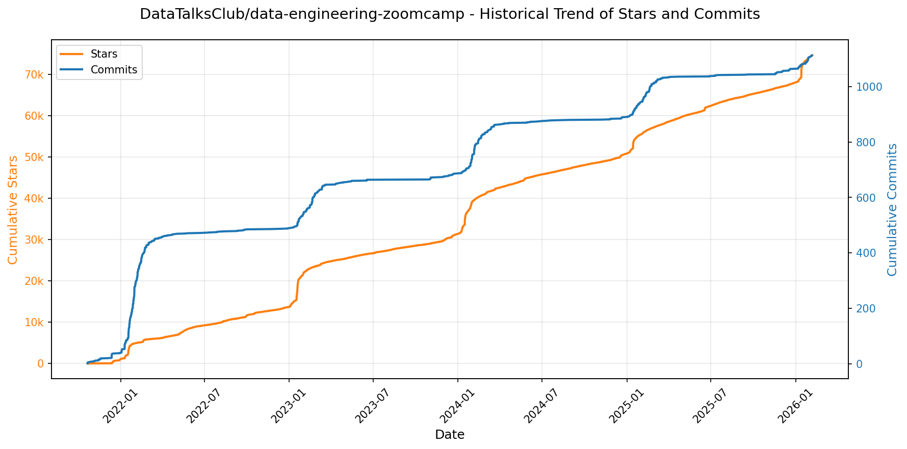

> *蓝色：累计 Stars｜橙色：累计 Commits（次 Y 轴）*

<b>📄 README 摘要</b>

1. **该项目做什么？**  
该项目是“Data Engineering Zoomcamp”（数据工程速成营），一个为期9周、完全免费的实践型数据工程入门课程。它以构建端到端数据管道为核心目标，引导学员从零开始完成真实场景下的数据工程全流程：包括基础设施搭建、数据采集与加载（ELT）、数据湖/数仓建模、工作流编排、批处理与流处理，最终交付一个综合性的实战项目。课程面向零基础但具备基本编程和SQL能力的学习者，旨在系统性培养工业级数据工程能力，并助力职业转型。

2. **核心功能/特点**  
- **模块化渐进式学习路径**：涵盖6大核心模块（容器化与IaC、工作流编排、数据仓库、分析工程、批处理、流处理）+ 2个专项工作坊（数据摄入、DWH建模）+ 综合终期项目；  
- **全栈工具链实战**：所有内容均基于真实云环境（GCP为主）和行业主流开源/商业工具，强调“动手即生产”；  
- **社区驱动学习模式**：依托Slack、Telegram、YouTube等平台提供实时答疑、同伴评审、经验分享与职业支持；  
- **完全开源与自定进度**：全部课程资料（视频、笔记、代码、作业）永久免费开放，支持异步自学；  
- **企业级工程规范贯穿始终**：涵盖Terraform基础设施即代码、dbt测试与文档、Kafka Schema管理（Avro）、增量加载、分区/聚簇优化、CI/CD理念等最佳实践。

3. **技术栈**  
- **云平台**：Google Cloud Platform（GCP）作为主实验环境；  
- **基础设施**：Docker、Docker Compose、Terraform；  
- **数据库与数据存储**：PostgreSQL（本地容器化）、BigQuery（云数据仓库）、DuckDB（本地分析）；  
- **ETL/ELT与数据集成**：dlt（declarative ETL）、Kestra（工作流编排）；  
- **数据处理引擎**：Apache Spark（批处理）、Apache Kafka + Kafka Streams / KSQL（流处理）；  
- **分析工程**：dbt（data build tool）；  
- **数据序列化与Schema管理**：Avro；  
- **辅助工具**：Airtable（报名）、Slack（协作）、YouTube（视频课）、GitHub（代码托管）。

---

### 5. [obra/superpowers](https://github.com/obra/superpowers)
- 📅 **创建日期**：2025-10-09  
- 🔄 **最近更新**：2026-02-05  
- ⭐ **Stars**：73,882（日 +880｜周 +5493｜月 +45879）  
- 📝 **描述**：An agentic skills framework & software development methodology that works.  

<b>📈 Star 与 Commit 历史趋势</b>

> *蓝色：累计 Stars｜橙色：累计 Commits（次 Y 轴）*

<b>📄 README 摘要</b>

1. **项目功能**  
Superpowers 是一个面向编程智能体（coding agents）的完整软件开发工作流框架，旨在将原本零散、随意的代码生成行为系统化、工程化。它不直接生成代码，而是通过一系列自动触发的“技能”（skills），引导智能体严格遵循专业软件工程实践完成端到端开发：从与用户协同澄清需求、分段确认设计规格，到制定可执行的TDD实施计划，再到驱动子智能体（subagents）按任务粒度（2–5分钟/任务）逐项实现、双阶段审查（规范符合性 + 代码质量）、强制红-绿-重构循环、自动化测试验证、Git工作树隔离、代码评审前置检查，直至分支收尾与合并决策。整个流程为**强制性工作流**，非可选建议，且对用户透明——无需手动调用，技能在适当时机自动激活。

2. **核心特性**  
- **结构化需求与设计闭环**：通过 `/superpowers:brainstorm` 启动苏格拉底式对话，分块输出可审阅的设计文档，用户显式确认后才进入开发；  
- **原子化任务驱动开发**：`/superpowers:write-plan` 生成含精确文件路径、完整代码片段、明确验证步骤的极细粒度任务清单；  
- **子智能体驱动开发（Subagent-Driven Development）**：每个任务由独立子智能体执行，并经历两阶段自动审查（是否满足原始规格？代码是否符合质量标准？），支持数小时无人干预的自主推进；  
- **严格TDD强制机制**：内置 `test-driven-development` 技能，强制执行“先写失败测试→观察失败→写最小实现→观察通过→重构→删除无测试支撑的代码”全流程，附带反模式识别；  
- **系统性调试与验证**：`systematic-debugging` 提供四阶段根因分析法；`verification-before-completion` 确保修复真实生效；  
- **工程协作能力内建**：覆盖 Git 工作树隔离、并行子智能体调度、PR前自动化代码评审（含严重性分级阻断）、评审反馈响应、分支收尾决策（合并/丢弃/保留）等全协作链路；  
- **自演进能力**：`writing-skills` 技能支持用户基于最佳实践创建新技能，形成可扩展的技能库生态。

3. **技术栈**  
- **运行平台**：原生适配多款AI编程代理环境，包括 **Claude Code**（通过插件市场集成）、**Codex** 和 **OpenCode**（需手动加载配置）；  
- **架构范式**：基于**可组合技能（composable skills）** 的声明式工作流引擎，技能以 Markdown 文档（如 `skills/brainstorming/SKILL.md`）形式组织，含行为定义、触发条件、执行逻辑与测试方法；  
- **基础设施依赖**：深度依赖底层AI模型（文中多次提及 Claude）的长上下文理解、多步推理与工具调用能力；利用 Git 实现工作树（worktree）级环境隔离；  
- **部署机制**：Claude Code 采用插件化分发（`/plugin install`），支持一键安装与自动更新（`/plugin update`）；Codex / OpenCode 通过远程拉取标准化安装指南（`.codex/INSTALL.md`, `.opencode/INSTALL.md`）实现轻量接入；  
- **协议与标准**：遵循 TDD、YAGNI、DRY 原则；所有技能设计隐含对证据导向（而非断言）、复杂度抑制、过程确定性的工程承诺。

---

### 6. [ComposioHQ/awesome-claude-skills](https://github.com/ComposioHQ/awesome-claude-skills)
- 📅 **创建日期**：2025-10-17  
- 🔄 **最近更新**：2026-02-05  
- ⭐ **Stars**：52,153（日 +439｜周 +2793｜月 +21826）  
- 📝 **描述**：A curated list of awesome Claude Skills, resources, and tools for customizing Claude AI workflows  

<b>📈 Star 与 Commit 历史趋势</b>

> *蓝色：累计 Stars｜橙色：累计 Commits（次 Y 轴）*

<b>📄 README 摘要</b>

1. **项目功能**  
该项目是一个面向 Anthropic Claude 系列模型（Claude.ai、Claude Code 及 Claude API）的**高质量技能（Skills）开源集合库**，旨在将 Claude 从纯文本生成工具升级为可执行真实业务操作的智能代理。它通过结构化、可复用的工作流（Skills），使 Claude 能够完成跨应用的自动化任务（如发送邮件、创建 GitHub Issue、发布 Slack 消息）、处理多格式文档（DOCX/PDF/PPTX/XLSX/Markdown）、驱动开发流程（TDD、Git 工作流、代码质量分析）、连接数据库与 API（PostgreSQL、n8n、Composio）、开展数据分析与市场研究、生成可视化图表（D3.js）、增强安全能力（Sigma 规则威胁狩猎、数字取证）等，覆盖生产力、开发、商业、创意、协作与安全等全场景。

2. **核心特性**  
- **开箱即用的 100+ 领域技能**：按九大类别组织（文档处理、开发工具、数据分析、商业营销、写作沟通、创意媒体、效率组织、项目协作、安全系统），全部提供完整源码链接与使用说明；  
- **深度应用集成能力**：依托 Composio 底层框架，支持一键连接 Gmail、Slack、GitHub、Notion、Google Workspace 等 **500+ SaaS 应用**，实现“发送→创建→更新→同步”等真实动作；  
- **全平台统一支持**：原生兼容三大 Claude 使用形态——网页端（Claude.ai）、本地 IDE 插件（Claude Code）及编程接口（Claude Skills API），技能一次编写、三端部署；  
- **标准化技能开发体系**：定义清晰的技能结构规范（`SKILL.md` + YAML 元数据 + 可选脚本/模板/资源目录），配套最佳实践指南、测试建议与错误处理范式；  
- **社区共建生态**：采用 Apache-2.0 开源协议，明确欢迎 Pull Request，集成 Awesome List 认证，并提供 Discord、X（Twitter）、LinkedIn 等多渠道协作入口。

3. **技术栈**  
- **核心运行时**：Anthropic Claude 模型（特别是 Claude 3.5 Sonnet 等支持 Skills 的版本）；  
- **集成中间件**：[Composio](https://composio.dev/)（负责 OAuth 授权、API 抽象、1000+ 应用连接器管理）；  
- **开发语言与工具**：以 Markdown（`SKILL.md`）为主载体，辅以 Python（如 `postgres`、`langsmith-fetch` 技能）、TypeScript/JavaScript（如 `artifacts-builder`、`playwright-skill`）、Shell（CLI 插件安装）、React/Tailwind CSS（HTML artifacts 构建）；  
- **依赖服务**：Google Gemini（用于 `deep-research`、`imagen` 等跨模型能力调用）、LangSmith（LLM 可观测性）、Playwright（Web 自动化测试）、FFUF（Web 模糊测试）、PICT（组合测试用例生成）、D3.js（数据可视化）、SQLite/PostgreSQL（数据查询技能）；  
- **基础设施**：GitHub 托管（技能源码分散于多个仓库，本项目作为统一索引与导航中心）。

---

### 7. [openclaw/openclaw](https://github.com/openclaw/openclaw)
- 📅 **创建日期**：2025-11-24  
- 🔄 **最近更新**：2026-02-05  
- ⭐ **Stars**：50,890（日 +4959｜周 +50890｜月 +50890）  
- 📝 **描述**：Your own personal AI assistant. Any OS. Any Platform. The lobster way. 🦞   

<b>📈 Star 与 Commit 历史趋势</b>

> *蓝色：累计 Stars｜橙色：累计 Commits（次 Y 轴）*

<b>📄 README 摘要</b>

1. **该项目的功能**  
OpenClaw 是一个可在用户自有设备（本地运行）的个人 AI 助理系统，核心目标是提供“真正属于你、完全可控、低延迟、始终在线”的AI交互体验。它不依赖中心化云服务，而是通过轻量级本地网关（Gateway）统一调度多通道消息、多智能体（agent）、多设备节点及工具链。用户可通过日常使用的通讯平台（如 WhatsApp、Telegram、Slack、Discord、Signal、iMessage、Microsoft Teams、Google Chat 等）与助手交互；同时支持扩展通道（BlueBubbles、Matrix、Zalo 等）及原生系统能力（macOS/iOS/Android 的语音唤醒、实时 Canvas 可视化工作区、摄像头、屏幕录制、定位、通知等）。其本质是将大模型能力深度嵌入本地操作系统与通讯生态，实现端到端私有化 AI 协作。

2. **关键特性**  
- **本地优先网关架构**：单一 WebSocket 控制平面（`ws://127.0.0.1:18789`），统管会话生命周期、通道连接、工具调用、事件分发与远程控制（支持 Tailscale Serve/Funnel 或 SSH 隧道）。  
- **全平台多通道接入**：原生支持 13+ 主流通讯渠道（含 iMessage 两种实现：BlueBubbles 推荐版 + legacy imsg），并支持 WebChat 前端直连。  
- **多智能体路由与隔离**：支持按通道、账号、群组、用户维度路由至独立 workspace 和 agent 实例，实现会话沙箱化与上下文隔离。  
- **全栈语音交互能力**：集成 Voice Wake（常驻语音唤醒）与 Talk Mode（连续对话模式），在 macOS/iOS/Android 上通过 ElevenLabs 实现低延迟语音输入/输出。  
- **Live Canvas 可视化工作区**：由 AI agent 驱动的动态 UI 渲染环境，基于 A2UI 协议，支持 push/reset/eval/snapshot，可跨平台（macOS/iOS/Android）同步呈现。  
- **设备级本地节点（Nodes）**：将系统能力（`system.run`, `camera.snap`, `screen.record`, `location.get`, `canvas.*`, `system.notify`）封装为安全可调用的节点，通过 `node.invoke` 远程执行，严格遵循 macOS TCC / iOS/Android 权限模型。  
- **增强型自动化与工具链**：内置浏览器控制（专用 Chromium + CDP）、Cron 定时任务、Webhook/Gmail Pub/Sub 触发、技能平台（ClawHub 技能注册与自动拉取）、Agent-to-Agent 会话协同工具（`sessions_list/history/send`）。  
- **安全默认策略**：DM 消息默认启用配对认证（`dmPolicy="pairing"`），拒绝未授权用户输入；支持 OAuth（Anthropic/OpenAI）与 API Key 双模鉴权及模型故障转移（failover）；提供 `openclaw doctor` 自动检测配置风险。  
- **向导驱动的开箱即用体验**：`openclaw onboard` CLI 向导覆盖网关安装、工作区初始化、通道配对、技能配置全流程，支持 macOS/Linux/Windows（WSL2）。

3. **技术栈**  
- **运行时**：Node.js ≥22（主运行环境），支持 npm/pnpm/bun；TypeScript 作为主要开发语言（`tsx` 直接运行）。  
- **核心框架**：基于 WebSocket 的自研 Gateway 控制平面；Pi agent 运行时（RPC 模式，支持工具流式响应与块流式处理）。  
- **前端与 UI**：Control UI 与 WebChat 内置于 Gateway；Canvas 使用 A2UI 协议；macOS 应用采用原生菜单栏方案；iOS/Android 节点通过 Bridge 协议通信。  
- **通道适配层**：复用成熟开源 SDK — Baileys（WhatsApp）、grammY（Telegram）、Bolt（Slack）、discord.js（Discord）、signal-cli（Signal）、Matrix SDK、Zalo SDK 等。  
- **语音与媒体**：ElevenLabs（TTS）、Whisper（ASR）、FFmpeg（音视频处理）、本地音频/图像/视频流水线（含转录钩子、尺寸限制、临时文件生命周期管理）。  
- **部署与打包**：支持 Nix（声明式配置）、Docker、systemd（Linux）/launchd（macOS）守护进程；Tailscale 用于安全远程暴露；SSH 隧道作为备用远程方案。  
- **安全与权限**：基于 OAuth 2.0（Anthropic/OpenAI）+ API Key 多级鉴权；macOS TCC 权限桥接（通过 `node.invoke` 映射系统能力）；细粒度 DM 访问策略（allowlist + pairing code）。

---

### 8. [bytedance/UI-TARS-desktop](https://github.com/bytedance/UI-TARS-desktop)
- 📅 **创建日期**：2025-01-19  
- 🔄 **最近更新**：2026-02-05  
- ⭐ **Stars**：50,805（日 +542｜周 +1514｜月 +10061）  
- 📝 **描述**：The Open-Source Multimodal AI Agent Stack: Connecting Cutting-Edge AI Models and Agent Infra  

<b>📈 Star 与 Commit 历史趋势</b>

> *蓝色：累计 Stars｜橙色：累计 Commits（次 Y 轴）*

<b>📄 README 摘要</b>

1. **项目功能**  
TARS 是一个面向实际任务的多模态 AI 智能体（Agent）技术栈，核心目标是实现类人化、端到端的复杂任务自动化。它通过融合视觉理解（Vision）、图形界面交互（GUI Agent）与多模态大语言模型（MLLM），使 AI 能够直接“看懂”屏幕、“操作”软件、“理解”上下文，并调用真实世界工具完成任务。项目包含两大协同组件：  
- **Agent TARS**：通用多模态智能体框架，支持在终端（CLI）、Web 浏览器（Web UI）及服务端运行，聚焦于跨平台、可编程的任务编排，尤其强调与 MCP（Model Control Protocol）标准工具生态的深度集成；  
- **UI-TARS Desktop**：原生桌面 GUI 智能体应用，基于 UI-TARS 系列视觉语言模型（如 Seed-1.5-VL/1.6），提供本地/远程计算机与浏览器的零配置可视化操控能力（如自动配置 VS Code、浏览 GitHub 问题等）。

2. **关键特性**  
- ✅ **多模态感知与执行闭环**：支持截图识别、视觉定位（Visual Grounding）、DOM 解析与混合策略控制浏览器，实现“所见即所控”；  
- ✅ **事件流驱动架构（Event Stream）**：采用协议化事件流统一管理思考、工具调用、状态变更与 UI 渲染，支撑上下文工程与可调试的数据流追踪；  
- ✅ **MCP 工具即服务（MCP Servers）**：内建 MCP 核心协议，可动态挂载 Shell 命令、文件系统、API 服务、图表生成等外部工具，构建可扩展的现实世界操作能力；  
- ✅ **全场景操作覆盖**：同时支持本地桌面（Windows/macOS）、远程桌面、远程浏览器三大操作模式，且远程功能开箱即用、无需额外配置；  
- ✅ **隐私优先设计**：UI-TARS Desktop 默认全程本地运行，图像与操作数据不上传云端；Agent TARS CLI/Web UI 支持用户自主选择模型提供商（如 VolcEngine、Anthropic），保障数据主权；  
- ✅ **开发者友好体验**：提供一键式 CLI（`npx @agent-tars/cli`）、Web UI、Server 模式、SDK（UI-TARS SDK）及完整 API 文档，支持快速集成与定制开发。

3. **技术栈**  
- **核心模型层**：UI-TARS 系列视觉语言模型（如 UI-TARS-1.5-7B、Seed-1.5-VL/1.6），支持多轮 GUI 导航与细粒度动作生成；兼容主流多模态模型（如 Doubao-1.5-Thinking-Vision-Pro、Claude-3.7-Sonnet）；  
- **协议与标准**：基于 MCP（Model Control Protocol）构建工具交互层，实现模型与现实工具的标准化对接；  
- **前端与客户端**：Electron（UI-TARS Desktop 桌面应用）、React/Vite（Web UI）、命令行终端（Node.js CLI）；  
- **后端与运行时**：Node.js（≥ v22）作为主运行时，支持事件流服务、工具调度与模型网关；集成 AIO Agent Sandbox 提供隔离式工具执行环境；  
- **部署与生态**：支持 ModelScope、Hugging Face、Lark Office 等多平台模型托管与云部署；配套 SDK（UI-TARS SDK）支持跨平台 GUI 自动化代理开发；  
- **基础设施**：GitHub Actions CI/CD、Discord / 飞书社区协作、DeepWiki AI 文档助手、arXiv 论文支撑（arXiv:2501.12326）。

---

### 9. [remotion-dev/remotion](https://github.com/remotion-dev/remotion)
- 📅 **创建日期**：2020-06-23  
- 🔄 **最近更新**：2026-02-05  
- ⭐ **Stars**：35,118（日 +196｜周 +1591｜月 +9979）  
- 📝 **描述**：🎥      Make videos programmatically with React  

<b>📈 Star 与 Commit 历史趋势</b>

> *蓝色：累计 Stars｜橙色：累计 Commits（次 Y 轴）*

<b>📄 README 摘要</b>

1. **项目功能**  
Remotion 是一个基于 React 的视频生成框架，允许开发者使用 React 组件**以编程方式（code-first）创建和渲染视频**。它将视频视为可编程的、时间轴驱动的 UI，支持在浏览器中实时预览、导出为 MP4/WebM 等格式，并可部署至云端批量渲染。核心目标是将前端开发能力（尤其是 React 生态）直接应用于视频制作流程，替代传统非线性编辑软件（NLE）。

2. **关键特性**  
- ✅ **React 原生视频开发**：用 JSX 编写视频帧，支持状态、props、hooks、组件复用与组合；  
- ✅ **实时预览与热重载（Fast Refresh）**：在浏览器中即时查看时间轴任意帧，提升迭代效率；  
- ✅ **全栈 Web 技术支持**：原生集成 CSS 动画、SVG、Canvas、WebGL（通过 `@remotion/three`）、Web Audio 等；  
- ✅ **时间轴编程能力**：提供 `useCurrentFrame()`、`interpolate()`、`delayRender()` 等 API，实现基于帧号的动态逻辑与异步资源加载；  
- ✅ **多端输出与部署**：本地导出高清视频（MP4/WebM），支持 Lambda/Cloudflare Workers 等无服务器环境进行可扩展的云端渲染；  
- ✅ **专业工作流支持**：内置序列（Sequence）、布局（Layout）、转场（Transition）、字幕（Subtitles）、音频同步、分辨率/帧率自定义等视频制作核心能力。

3. **技术栈**  
- **核心框架**：React（v18+）、TypeScript（强类型支持）；  
- **渲染引擎**：基于 Chromium（通过 Puppeteer / Playwright 或 Electron）截取 Canvas 帧；  
- **3D 支持**：官方插件 `@remotion/three` 集成 Three.js；  
- **构建与工具链**：Vite（默认模板）、Webpack（兼容模式）、ESBuild；  
- **部署生态**：支持 AWS Lambda、Vercel、Cloudflare Workers、Remotion Cloud（托管渲染服务）；  
- **其他依赖**：FFmpeg（本地导出时用于编码优化）、Lottie（可导入动画）、Framer Motion（可选交互动画）。

---

### 10. [asgeirtj/system_prompts_leaks](https://github.com/asgeirtj/system_prompts_leaks)
- 📅 **创建日期**：2025-05-03  
- 🔄 **最近更新**：2026-02-05  
- ⭐ **Stars**：30,212（日 +188｜周 +3042｜月 +5479）  
- 📝 **描述**：Collection of extracted System Prompts from popular chatbots like ChatGPT, Claude & Gemini  

<b>📈 Star 与 Commit 历史趋势</b>

> *蓝色：累计 Stars｜橙色：累计 Commits（次 Y 轴）*

---

### 11. [code-yeongyu/oh-my-opencode](https://github.com/code-yeongyu/oh-my-opencode)
- 📅 **创建日期**：2025-12-03  
- 🔄 **最近更新**：2026-02-05  
- ⭐ **Stars**：28,395（日 +377｜周 +2708｜月 +19169）  
- 📝 **描述**：The Best Agent Harness. Meet Sisyphus: The Batteries-Included Agent that codes like you.  

<b>📈 Star 与 Commit 历史趋势</b>

> *蓝色：累计 Stars｜橙色：累计 Commits（次 Y 轴）*

<b>📄 README 摘要</b>

1. **项目功能**  
Oh My OpenCode 是一个面向开源代码智能开发环境（OpenCode）的高性能、可扩展插件系统，核心目标是将大语言模型（LLM）转化为真正可用的“软件工程团队”。它不提供独立IDE，而是深度集成于 [OpenCode](https://github.com/sst/opencode) 生态，通过多智能体协同架构（如 Sisyphus 主协调员、Hephaestus 深度执行者、Oracle 架构师、Librarian 文档专家等），实现端到端、全自动、高可靠性的编程任务闭环——从需求理解、代码探索、多模型分工、LSP/AST 精准重构，到自动验证与交付。其本质是为 LLM 赋予工程纪律性（如 Todo 强制续跑、注释净化、上下文轻量化调度），解决当前代理工具“易中断、难闭环、上下文臃肿、风格不一致”的根本痛点。

2. **关键特性**  
- **多角色智能体编排系统**：预置并可定制 Sisyphus（主协作者）、Hephaestus（自主深度工匠）、Oracle（设计/调试）、Frontend Engineer（Gemini 3 Pro 驱动）、Librarian（文档/源码检索）、Explore（AST-Grep 加速代码探索）等专业化代理；支持异步并行执行与自动负载分发。  
- **超自动化工作流引擎**：“`ultrawork`”（或 `ulw`）魔法指令触发全链路自治：自动拆解任务、并行调研、模型选型、上下文注入、LSP 重构、结果验证，直至 100% 完成并提供证据。  
- **工业级代码工具链深度集成**：原生支持 LSP（语义诊断、重命名、格式化）、AST-Grep（结构化搜索/替换）、多格式配置（JSONC）、Tmux 终端交互、Git 原子提交（`git-master` 技能）、Playwright 浏览器自动化（`playwright` 技能）。  
- **Claude Code 兼容层**：完整复刻并扩展 Claude Code 的命令、技能（Skills）、代理（Agents）、MCP（Model Calling Protocol）及全生命周期钩子（PreToolUse/PostToolUse/UserPromptSubmit/Stop），实现无缝迁移与能力增强。  
- **鲁棒性工程机制**：Todo 续跑强制器（防中途退出）、注释净化器（禁用冗余注释，保持人类代码风格）、上下文智能裁剪、会话历史分析、多级缓存与上下文注入（自动加载 AGENTS.md/README.md 等）。  
- **开箱即用的 MCP 生态**：内置 Exa（网页搜索）、Context7（官方文档）、grep.app（GitHub 代码搜索）等高质量工具，支持零配置调用。

3. **技术栈**  
- **运行平台**：深度依赖 [OpenCode](https://github.com/sst/opencode)（基于 Tauri 构建的本地 LLM IDE），非独立应用。  
- **核心语言与框架**：TypeScript（主逻辑）、Rust（底层性能模块，OpenCode 自身以 Rust 编写）、Shell/Bash（安装/卸载脚本）。  
- **协议与标准**：LSP（Language Server Protocol）、MCP（Model Calling Protocol）、AST（抽象语法树）解析（通过 AstGrep 等工具）、JSONC 配置。  
- **模型协同层**：支持混合调用多厂商模型（Claude Sonnet/Haiku/Opus、GPT-4.5/5.2 Codex、Gemini 3 Pro），通过动态路由与角色绑定实现“按需选模”。  
- **基础设施**：GitHub Actions（CI/CD）、npm（包分发：`oh-my-opencode@latest`）、Discord（社区协作）、SUL-1.0 开源许可证（Sisyphus Universal License）。

---

### 12. [microsoft/BitNet](https://github.com/microsoft/BitNet)
- 📅 **创建日期**：2024-08-05  
- 🔄 **最近更新**：2026-02-05  
- ⭐ **Stars**：27,942（日 +91｜周 +2041｜月 +2676）  
- 📝 **描述**：Official inference framework for 1-bit LLMs  

<b>📈 Star 与 Commit 历史趋势</b>

> *蓝色：累计 Stars｜橙色：累计 Commits（次 Y 轴）*

<b>📄 README 摘要</b>

1. **项目功能**  
bitnet.cpp 是微软推出的、专为 1-bit 大语言模型（特别是 BitNet b1.58 架构）设计的**官方推理框架**，核心目标是实现**高效、无损（lossless）、跨平台**的本地化大模型推理。它支持在消费级硬件（如 Apple M2/M3、主流 x86/ARM CPU）上直接运行高达 100B 参数规模的 1.58-bit 模型，实测生成速度达 5–7 token/秒（接近人类阅读速度），显著降低对 GPU/NPU 的依赖，使 1-bit LLM 真正具备边缘设备（笔记本、手机、嵌入式系统）部署能力。

2. **关键特性**  
- ✅ **极致性能优化**：针对 CPU 实现高度定制的查找表（LUT）与并行计算内核，x86 平台加速比达 **2.37×–6.17×**，ARM 平台达 **1.37×–5.07×**；能耗降低 **71.9%–82.2%**（x86）和 **55.4%–70.0%**（ARM）。  
- ✅ **多硬件支持**：已正式支持 CPU（x86/ARM），GPU 推理内核已发布（NPU 支持规划中）；提供多种内核变体（I2_S、TL1、TL2），按硬件架构自动适配最优路径。  
- ✅ **端到端 1.58-bit 原生支持**：完整支持权重、激活（含 a4.8 4-bit 激活扩展）、嵌入层（f16 量化可选）的低比特推理流程，保障精度无损。  
- ✅ **开箱即用生态集成**：预置 Hugging Face 官方模型（如 `microsoft/BitNet-b1.58-2B-4T`、`Llama3-8B-1.58`、Falcon3/E 系列等），提供一键转换（`.safetensors` → `.gguf`）、基准测试（`e2e_benchmark.py`）、对话模式及 dummy 模型生成工具。  
- ✅ **工业级工程实践**：基于成熟 `llama.cpp` 框架深度重构，复用其内存管理与接口设计；内核底层借鉴 `T-MAC` 查找表范式，兼顾速度与可移植性。

3. **技术栈**  
- **核心语言**：C/C++（高性能内核）、Python（工具链、CLI、模型转换与推理封装）  
- **构建系统**：CMake（≥3.22）  
- **编译器**：Clang（≥18，Windows 下需 VS2022 + Clang 工具链）  
- **依赖框架**：  
  - 基础框架：`llama.cpp`（内存管理、GGUF 格式解析、推理调度）  
  - 内核范式：`T-MAC`（Lookup Table-based 低比特矩阵乘法）  
- **模型格式**：GGUF（量化后模型存储格式，支持 I2_S/TL1/TL2 等多种量化方案）  
- **硬件抽象层**：原生支持 x86_64（AVX2/AVX512）、ARM64（NEON/SVE）、CUDA（GPU 版本）、未来扩展 NPU（如 Intel Gaudi、AMD XDNA）  
- **环境管理**：Conda（推荐）、Python（≥3.9）

---

### 13. [thedotmack/claude-mem](https://github.com/thedotmack/claude-mem)
- 📅 **创建日期**：2025-08-31  
- 🔄 **最近更新**：2026-02-05  
- ⭐ **Stars**：23,566（日 +1745｜周 +8119｜月 +12720）  
- 📝 **描述**：A Claude Code plugin that automatically captures everything Claude does during your coding sessions, compresses it with AI (using Claude's agent-sdk), and injects relevant context back into future sessions.  

<b>📈 Star 与 Commit 历史趋势</b>

> *蓝色：累计 Stars｜橙色：累计 Commits（次 Y 轴）*

<b>📄 README 摘要</b>

1. **项目功能**  
Claude-Mem 是一个专为 Anthropic **Claude Code**（AI 编程助手）设计的**持久化记忆压缩系统**。它在用户每次会话结束后自动捕获工具调用行为、代码操作、错误修复等关键上下文事件，生成语义化摘要，并将其结构化存储；在新会话启动时，智能检索并按需注入相关历史记忆，从而实现跨会话的**上下文连续性**——使 Claude 能“记住”项目进展、技术决策、已知问题及解决路径，显著提升长周期开发任务中的推理一致性与效率。

2. **核心特性**  
- ✅ **持久化记忆**：会话间自动保留项目上下文，无需手动重述背景；  
- ✅ **渐进式披露（Progressive Disclosure）**：分三层（索引→时间线→详情）按需加载记忆，实时显示 Token 消耗，兼顾信息完整性与成本控制；  
- ✅ **技能化搜索（mem-search）**：支持自然语言查询历史（如 `search("authentication bug", type="bugfix")`），结合类型/日期/项目过滤；  
- ✅ **本地 Web 查看器**：运行于 `http://localhost:37777`，提供实时记忆流、观察详情、API 接口（如 `/api/observation/{id}`）及 Beta 设置面板；  
- ✅ **Claude Desktop 深度集成**：可在桌面版对话中直接调用 `mem-search` 技能检索记忆；  
- ✅ **隐私保护机制**：支持 `<private>` 标签自动排除敏感内容（如密钥、个人数据）不入库；  
- ✅ **全自动无感运行**：通过 6 个生命周期钩子（SessionStart、PostToolUse、SessionEnd 等）静默工作，零手动干预；  
- ✅ **引用溯源能力**：每条观察记录分配唯一 ID，支持精准引用与审计；  
- ✅ **混合搜索架构**：融合 SQLite FTS5 全文检索 + Chroma 向量数据库，实现语义+关键词联合检索；  
- ✅ **Beta 实验通道**：支持切换至 Endless Mode 等仿生记忆架构实验版本。

3. **技术栈**  
- **运行时**：Node.js（≥18.0.0）、Bun（作为 HTTP 服务与进程管理器）、uv（Python 包管理器，用于向量搜索依赖）；  
- **数据库**：SQLite 3（主存储，含 FTS5 全文搜索支持） + Chroma（向量数据库，支持语义检索）；  
- **前端/UI**：轻量级 Web 查看器（基于静态资源与 HTTP API）；  
- **协议与集成**：MCP（Model Context Protocol）标准工具接口，深度适配 Claude Agent SDK；  
- **开发语言**：TypeScript（主力）；  
- **部署与配置**：环境变量驱动配置、`~/.claude-mem/settings.json` 配置文件、自动依赖检测与安装；  
- **许可协议**：主项目采用 **AGPL-3.0**（网络服务需开源修改），`ragtime/` 子模块采用 PolyForm Noncommercial License。

---

### 14. [lbjlaq/Antigravity-Manager](https://github.com/lbjlaq/Antigravity-Manager)
- 📅 **创建日期**：2025-11-26  
- 🔄 **最近更新**：2026-02-05  
- ⭐ **Stars**：21,357（日 +319｜周 +2119｜月 +12509）  
- 📝 **描述**：Professional Antigravity Account Manager & Switcher. One-click seamless account switching for Antigravity Tools. Built with Tauri v2 + React (Rust).专业的 Antigravity 账号管理与切换工具。为 Antigravity 提供一键无缝账号切换功能。  

<b>📈 Star 与 Commit 历史趋势</b>

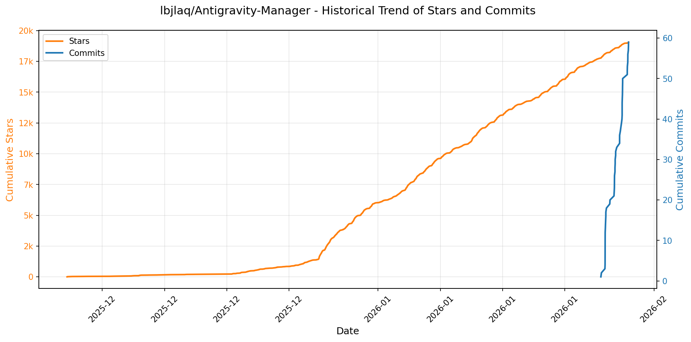

> *蓝色：累计 Stars｜橙色：累计 Commits（次 Y 轴）*

<b>📄 README 摘要</b>

1. **项目功能**  
Antigravity Tools 是一个面向开发者与 AI 爱好者的**本地高性能 AI 调度网关与协议反代系统**，核心目标是构建稳定、极速、低成本的个人 AI 中转站。它通过统一管理多平台 AI 账号（Google Gemini、Anthropic Claude 等），将 Web 端 Session（如 OAuth 授权会话）转化为标准化 API 接口，**打通不同厂商间的协议壁垒**（OpenAI / Anthropic / Google Gemini 原生协议互转），实现跨服务、跨协议的无缝调用。用户可将其作为本地代理服务，供 Claude Code、Cherry Studio、Kilo Code、Python 客户端等各类工具直接接入，完成聊天、推理、多模态图像生成（Imagen 3）等任务，同时规避配额限制、地域封锁与协议不兼容问题。

2. **关键特征**  
- **智能账号仪表盘**：实时监控各账号（Gemini Pro/Flash、Claude 等）剩余配额，基于冗余度算法推荐“最佳账号”，支持一键切换与活跃状态快照。  
- **全场景账号管理**：支持 OAuth 2.0 自动/手动授权、JSON 批量导入、V1 数据库热迁移；提供列表/网格双视图，集成 403 封禁自动检测与标注。  
- **多协议反向代理**：原生支持 OpenAI (`/v1/chat/completions`)、Anthropic (`/v1/messages`)、Gemini SDK 三套接口；具备毫秒级智能自愈能力（遇 `429`/`401` 自动重试+静默轮换）。  
- **高级模型路由中心**：支持模型系列映射（如 GPT-4 → `gemini-3-pro-high`）、正则表达式级精准重定向、按账号等级（Ultra/Pro/Free）与配额重置频率的**智能分级路由**，以及后台请求（如标题生成）自动降级至 Flash 模型以保护高配额资源。  
- **Imagen 3 多模态深度支持**：通过 OpenAI `size`/`quality` 参数或模型后缀（如 `gemini-3-pro-image-16-9-4k`）灵活控制画质与宽高比；后端支持高达 **100MB 可配置 Payload**，适配 4K 图像识别与生成。  
- **企业级稳定性增强**：代理池 2.0 实现账号与专属 IP 强绑定、公用池自动隔离、故障时保底借用；持久化修复、磁盘状态实时校验、并发健康检查（上限 20）等机制保障高可用。  

3. **技术栈**  
- **前端**：React（TypeScript），基于 Tauri 框架构建跨平台桌面应用（macOS/Windows/Linux），集成 `@lobehub/icons` 图标库、`react-router`（已修复 SSR XSS 漏洞）、国际化支持（含日语等 13+ 语言）。  
- **后端**：Rust 编写，基于 Axum Web 框架，采用异步运行时（Tokio）；核心模块包括中间件（鉴权/限流/日志）、Model Router（ID 映射）、Dispatcher（账号分发）、Request/Response Mapper（协议双向转换）。  
- **架构模式**：Tauri 桌面客户端 + Rust Axum 本地服务（默认端口 `8045`），亦支持 Headless Docker 部署（内置静态资源托管）；数据库使用轻量级嵌入式方案（支持自动迁移与多版本兼容）。  
- **部署生态**：提供 Homebrew（macOS/Linux）、AppImage（Linux）、MSI/ZIP（Windows）、Docker（含 `docker compose` 支持）等多种安装方式；Docker 镜像支持环境变量（`API_KEY`/`WEB_PASSWORD`/`ABV_DATA_DIR`）与持久化挂载（`~/.antigravity_tools`）。

---

### 15. [linshenkx/prompt-optimizer](https://github.com/linshenkx/prompt-optimizer)
- 📅 **创建日期**：2025-02-12  
- 🔄 **最近更新**：2026-02-05  
- ⭐ **Stars**：19,254（日 +70｜周 +326｜月 +930）  
- 📝 **描述**：一款提示词优化器，助力于编写高质量的提示词  

<b>📈 Star 与 Commit 历史趋势</b>

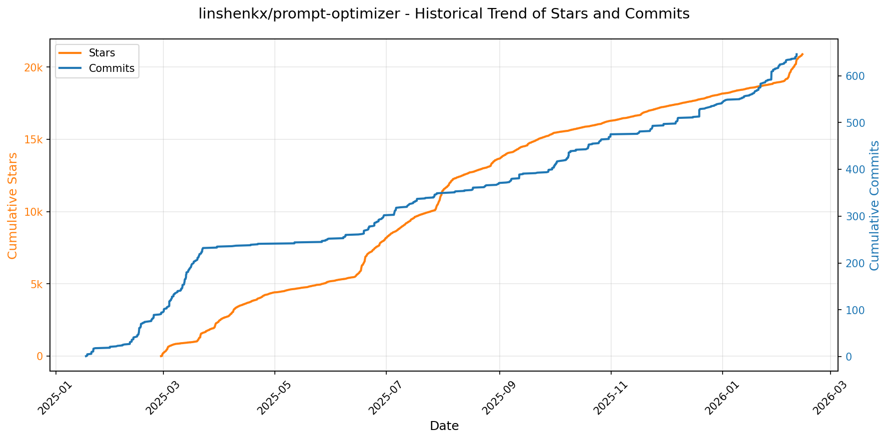

> *蓝色：累计 Stars｜橙色：累计 Commits（次 Y 轴）*

<b>📄 README 摘要</b>

1. **项目功能**  
Prompt Optimizer（提示词优化器）是一款面向AI开发者的专业级提示词工程工具，核心目标是**系统性提升大语言模型（LLM）和多模态模型的输出质量与可控性**。它不运行模型本身，而是通过智能重构、结构化增强和实证测试等手段，帮助用户将模糊、低效的原始提示词（Prompt）转化为高精度、高鲁棒性、可复用的优化版本。支持三大典型场景：① 角色扮演类提示设计（激发小模型潜力）；② 知识图谱/结构化数据提取类提示（保障生产环境稳定性与格式可靠性）；③ 创意生成类提示（如诗歌写作），辅助用户将抽象灵感具象为可执行的多维约束条件（主题、意象、情感、风格等）。所有处理均在客户端完成，不经过中间服务器，确保数据隐私与安全。

2. **关键特性**  
- **双模智能优化**：独立支持系统提示词（System Prompt）与用户提示词（User Prompt）的针对性优化，适配不同角色控制需求；  
- **实时对比验证**：内置并行测试框架，可同步调用原始提示与优化后提示，直观比对输出结果、响应时长与格式合规性；  
- **全栈模型兼容**：原生集成 OpenAI、Gemini、DeepSeek、智谱AI（Zhipu）、SiliconFlow 等主流文本模型，并扩展支持文生图（T2I）与图生图（I2I）能力（含 Gemini、Seedream 等图像模型）；  
- **高级测试能力**：提供上下文变量批量管理、多轮会话模拟、Function Calling（工具调用）测试，覆盖真实业务中复杂交互逻辑；  
- **零信任安全架构**：纯前端实现，API密钥与提示内容全程本地处理，仅直连AI服务商，杜绝数据上传与中间存储；  
- **全形态部署支持**：提供 Web 应用（在线版/自托管）、跨平台桌面应用（Electron）、Chrome 浏览器插件、Docker 容器及 Docker Compose 一键部署五种方式；  
- **MCP 协议深度集成**：内置 Model Context Protocol (MCP) 服务端，可作为标准化提示优化服务被 Claude Desktop 等第三方 MCP 客户端直接调用，提供 `optimize-user-prompt`、`optimize-system-prompt`、`iterate-prompt` 等标准化工具；  
- **企业级访问控制**：支持密码保护（ACCESS_PASSWORD）、用户名认证及环境变量级 API 密钥隔离配置，满足私有化部署安全要求。

3. **技术栈**  
- **前端框架**：基于 Vue 3 + TypeScript 构建，采用 Vite 作为构建工具，Pinia 管理状态，Element Plus 提供 UI 组件；  
- **桌面端**：使用 Electron 封装，实现跨平台（Windows/macOS/Linux）原生应用，支持自动更新与无 CORS 限制；  
- **构建与包管理**：采用 pnpm 作为包管理器，优化依赖安装与 monorepo 兼容性；  
- **部署方案**：  
  - Web 托管：Vercel（Serverless SSR/静态托管）；  
  - 容器化：Docker（官方镜像 `linshen/prompt-optimizer`）+ Docker Compose 编排；  
  - 国内加速：提供阿里云广州镜像仓库（`registry.cn-guangzhou.aliyuncs.com/prompt-optimizer/prompt-optimizer`）；  
- **协议与标准**：全面遵循 OpenAI 兼容 API 规范，深度支持 MCP（Model Context Protocol）v0.2+ 标准，实现与生态工具链无缝对接；  
- **安全机制**：依赖浏览器沙箱与 Electron 进程隔离保障本地执行安全，敏感配置（如 API Key）通过环境变量或界面加密存储（非明文持久化），不涉及后端服务或数据库。

---

### 16. [VectifyAI/PageIndex](https://github.com/VectifyAI/PageIndex)
- 📅 **创建日期**：2025-04-01  
- 🔄 **最近更新**：2026-02-05  
- ⭐ **Stars**：18,242（日 +382｜周 +2947｜月 +9077）  
- 📝 **描述**：📑 PageIndex: Document Index for Vectorless, Reasoning-based RAG  

<b>📈 Star 与 Commit 历史趋势</b>

> *蓝色：累计 Stars｜橙色：累计 Commits（次 Y 轴）*

<b>📄 README 摘要</b>

1. **项目功能**  
PageIndex 是一个**无需向量数据库、无需文本分块**的新型检索增强生成（RAG）系统，专注于**长文档（如财报、法律文书、学术教材、监管文件等）的专业级语义检索与分析**。它不依赖传统向量相似度搜索，而是通过构建文档的**语义层次化树索引（Tree Index）**，并驱动大语言模型（LLM）在该索引上执行**多步推理式检索（Reasoning-based Retrieval）**，模拟人类专家阅读、导航和定位关键信息的过程，实现高精度、可解释、可追溯的上下文提取。

2. **核心特性**  
- ✅ **零向量数据库（Vectorless）**：完全摒弃嵌入计算与向量检索，避免“语义漂移”和“vibe retrieval”（凭感觉匹配）；  
- ✅ **零人工分块（No Chunking）**：基于文档原始结构（标题层级、页码逻辑、语义连贯性）自动生成自然段落节点，保留上下文完整性；  
- ✅ **推理驱动的树搜索（Reasoning-based Tree Search）**：先构建类目录的层级树索引（含节点ID、起止页码、摘要），再通过LLM进行递归推理导航，精准定位目标内容；  
- ✅ **强可解释性与可追溯性**：每次检索结果附带明确的页面号、章节路径及推理链，支持审计与验证；  
- ✅ **多模态友好支持**：原生支持**纯视觉RAG（Vision-based RAG）**——直接输入PDF页面图像，跳过OCR步骤，由多模态模型端到端完成结构理解与检索；  
- ✅ **SOTA性能验证**：在金融领域权威评测 FinanceBench 上达成 **98.7% 准确率**，显著超越主流向量RAG方案。

3. **技术栈**  
- **核心模型层**：依赖 OpenAI 等闭源大模型（默认 `gpt-4o-2024-11-20`）执行树构建与推理搜索；支持多模态模型处理图像输入；  
- **文档解析层**：基于 PDF 解析库（如 PyPDF2 / pypdf）提取文本与元数据；提供专用 **PageIndex OCR**（未开源但已商用）以高保真还原复杂PDF的全局结构；  
- **索引表示层**：采用 JSON 格式的嵌套树结构（TreeNode），含 `title`、`node_id`、`start_index`/`end_index`（页码或段落索引）、`summary` 及子节点 `nodes` 数组；  
- **工程实现**：Python 为主，CLI 工具（`run_pageindex.py`），支持 `.env` 配置 API 密钥，兼容 Markdown 输入（按 `#` 层级解析）；  
- **部署与集成**：提供本地自托管（开源代码）、云服务（[chat.pageindex.ai](https://chat.pageindex.ai)）、MCP 协议插件（适配 Claude/Cursor 等智能体）、RESTful API 及 Colab Notebook 快速实验环境。

---

### 17. [microsoft/agent-lightning](https://github.com/microsoft/agent-lightning)
- 📅 **创建日期**：2025-06-18  
- 🔄 **最近更新**：2026-02-05  
- ⭐ **Stars**：14,075（日 +173｜周 +2207｜月 +4016）  
- 📝 **描述**：The absolute trainer to light up AI agents.  

<b>📈 Star 与 Commit 历史趋势</b>

> *蓝色：累计 Stars｜橙色：累计 Commits（次 Y 轴）*

<b>📄 README 摘要</b>

1. **项目功能**  
Agent Lightning 是一个面向 AI 智能体（AI Agent）的通用训练与优化框架，核心目标是**无需修改原有代理代码（近乎零代码变更）**，即可对任意架构的 AI 智能体进行高效、可插拔的训练与调优。它不替代用户现有的智能体实现，而是以轻量级“注入式”方式（如 `agl.emit_xxx()` 辅助函数或自动追踪）捕获智能体运行时的关键事件（提示词、工具调用、奖励信号等），将其结构化为训练数据流，进而驱动各类学习算法持续优化智能体行为（如提升任务成功率、SQL 生成准确性、多轮协作效率等）。

2. **关键特性**  
- ✅ **零侵入式集成**：支持在几乎不改动原始智能体代码的前提下完成训练接入；  
- ✅ **全栈框架兼容**：原生适配 LangChain、OpenAI Agent SDK、AutoGen、CrewAI、Microsoft Agent Framework 等主流框架，也支持裸 Python + OpenAI API 等无框架场景；  
- ✅ **细粒度优化控制**：可在多智能体系统中**按需选择特定智能体**进行独立训练与更新，避免全局耦合；  
- ✅ **多算法统一接口**：内置并支持 Reinforcement Learning（RL）、Automatic Prompt Optimization（APO）、Supervised Fine-tuning（SFT）等多种优化范式，用户可即插即用或自定义算法；  
- ✅ **生产就绪架构**：通过 `LightningStore` 中央事件存储中心统一管理任务、资源与执行轨迹，`Trainer` 组件解耦数据流、算法逻辑与推理引擎更新，保障训练-部署闭环稳定可扩展；  
- ✅ **大规模验证能力**：已在真实场景中验证支持 **128 GPU 规模的 RL 分布式训练**（如 Youtu-Agent），具备高并发、长周期、稀疏奖励任务的工程鲁棒性。

3. **技术栈**  
- **语言与核心依赖**：Python（主流 AI 生态基础）；  
- **智能体框架层**：完全兼容 LangChain、AutoGen、CrewAI、OpenAI Agent SDK、Microsoft Agent Framework 等；  
- **训练算法层**：支持 RL（如 GRPO）、Prompt Engineering（自动优化）、SFT 等，底层可对接 PyTorch、Hugging Face Transformers、vLLM 等；  
- **基础设施层**：基于事件驱动架构，采用轻量级追踪机制（类似 OpenTelemetry 风格 span）采集运行时数据；`LightningStore` 作为核心状态/数据中枢，支持本地及可扩展存储后端；  
- **工程与生态**：CI/CD 全流程覆盖（CPU/Full/UI/Examples/Dependency 兼容性测试），文档托管于 GitHub Pages，包发布于 PyPI（含稳定版与 TestPyPI 夜间版），社区协同依托 Discord、Reddit、Zhihu、Medium 及 arXiv 等多平台。

---

### 18. [nvm-sh/nvm](https://github.com/nvm-sh/nvm)
- 📅 **创建日期**：2010-04-15  
- 🔄 **最近更新**：2026-02-05  
- ⭐ **Stars**：12,419（日 +115｜周 +285｜月 +750）  
- 📝 **描述**：Node Version Manager - POSIX-compliant bash script to manage multiple active node.js versions  

<b>📈 Star 与 Commit 历史趋势</b>

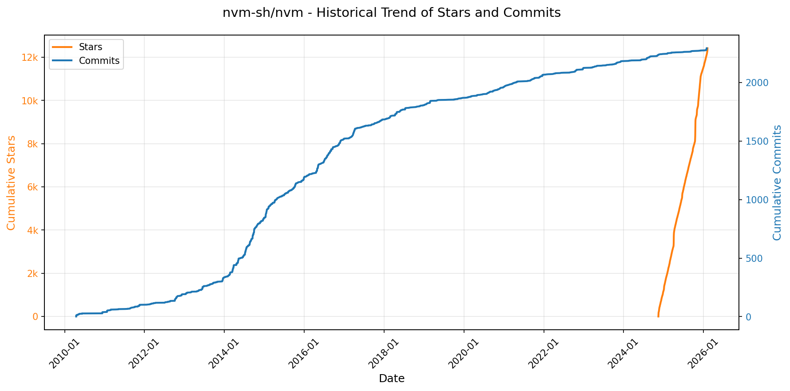

> *蓝色：累计 Stars｜橙色：累计 Commits（次 Y 轴）*

<b>📄 README 摘要</b>

1. **项目功能**  
nvm（Node Version Manager）是一个用于在类 Unix 系统（包括 macOS、Linux、WSL）及部分 Windows 环境（如 Git Bash/Cygwin）上**按用户级管理多个 Node.js 版本的命令行工具**。它允许用户在同一台机器上轻松安装、切换、卸载不同版本的 Node.js（含 npm），无需 sudo 权限，且各版本相互隔离；支持自动识别项目级 `.nvmrc` 文件实现目录内版本自动切换，并可与系统 Node 共存（但默认优先使用 nvm 管理的版本）。

2. **核心特性**  
- ✅ **多版本并存与即时切换**：通过 `nvm install <version>`、`nvm use <version>`、`nvm alias` 等命令快速安装/激活/标记任意 Node.js 或 io.js 版本；  
- ✅ **项目级自动版本控制**：支持 `.nvmrc` 文件，结合 shell 集成（bash/zsh/fish）实现在进入目录时自动执行 `nvm use`；  
- ✅ **LTS 与别名支持**：内置 `node`（最新稳定版）、`lts/*`（如 `lts/hydrogen`）、`--lts` 参数等便捷标识，简化长期支持版本管理；  
- ✅ **全局包迁移与默认安装**：安装新版本时可选择迁移现有全局 npm 包，或通过配置文件预设默认安装的全局模块；  
- ✅ **镜像源与认证支持**：允许配置自定义 Node 二进制下载镜像（如国内加速源），并支持通过 `NVM_NODEJS_ORG_MIRROR_AUTH` 传递授权头；  
- ✅ **跨 Shell 兼容性**：原生支持 bash、zsh、ksh、dash 等 POSIX shell；提供 Bash 补全、Docker/CI 友好集成方案；  
- ✅ **环境隔离与安全性**：以用户目录（`~/.nvm`）为根安装，避免系统污染；不依赖 `sudo` 即可全局安装 npm 包；  
- ✅ **可扩展性与可维护性**：支持手动 Git 安装/升级、Ansible 自动化部署、Docker 非交互式环境适配（通过 `BASH_ENV` 或 `ENTRYPOINT`）。

3. **技术栈**  
- **实现语言**：纯 Bash 脚本（POSIX 兼容），无外部运行时依赖；  
- **依赖工具**：运行时需 `curl` / `wget`（任一）下载资源，`git`（v1.7.10+）用于源码安装/升级；编译安装 Node 时需 C++ 编译器（如 `build-essential`、Xcode CLI Tools）及 `libssl-dev` 等系统库；  
- **平台支持**：主流 POSIX 系统（Linux、macOS）、Windows Subsystem for Linux（WSL）、Git Bash、Cygwin；**不原生支持 Fish shell**（需第三方封装）；对 FreeBSD 存在二进制缺失与补丁需求；  
- **架构设计**：通过 shell 函数注入（`source ~/.nvm/nvm.sh`）扩展终端命令，利用环境变量（`NVM_DIR`, `NODE_VERSION` 等）实现高度可配置化；所有版本独立存放于 `~/.nvm/versions/node/` 下，互不干扰。

---

### 19. [frankbria/ralph-claude-code](https://github.com/frankbria/ralph-claude-code)
- 📅 **创建日期**：2025-08-27  
- 🔄 **最近更新**：2026-02-05  
- ⭐ **Stars**：10,181（日 +64｜周 +422｜月 +9205）  
- 📝 **描述**：Autonomous AI development loop for Claude Code with intelligent exit detection  

<b>📈 Star 与 Commit 历史趋势</b>

> *蓝色：累计 Stars｜橙色：累计 Commits（次 Y 轴）*

<b>📄 README 摘要</b>

1. **项目功能**  
Ralph for Claude Code 是一个面向 Claude Code 的自主式 AI 软件开发循环工具，实现“无人值守、持续迭代”的工程闭环：它基于用户提供的需求（如 PRD、GitHub Issues 或 beads 任务），驱动 Claude Code 自动执行代码编写、修改、测试、构建等操作，并在满足严格完成条件时自动终止。其核心目标是让 AI 独立推进项目直至交付就绪，同时通过多重防护机制杜绝无限循环、API 滥用、上下文丢失或误判完成等高风险行为。

2. **关键特性**  
- **双条件智能退出门控（Dual-Condition Exit Gate）**：必须同时满足「自然语言完成指标 ≥2」与「Claude 显式输出 `EXIT_SIGNAL: true`」才允许退出，避免过早终止；  
- **全生命周期会话管理**：支持 `--resume <session_id>` 安全续跑、可配置超时（默认 24 小时）、防会话劫持设计；  
- **强健的容错与熔断机制**：两级错误过滤、多行错误匹配、无进展/重复错误自动熔断（可环境变量配置阈值）、5 小时 Claude API 用量耗尽时主动提示等待或退出；  
- **生产级工程支持**：支持 `.ralphrc` 项目配置、JSON 输出格式（含自动文本降级兜底）、实时流式输出（`--live`）、tmux 集成监控、CI/CD 流水线（GitHub Actions）、PRD/DOCX/PDF/JSON 多格式需求导入；  
- **交互式项目赋能**：`ralph-enable` 向导自动识别 TypeScript/Python/Rust/Go 等项目类型及 Next.js/FastAPI/Django 等框架，支持从 beads、GitHub Issues 或 PRD 文档一键导入任务；  
- **结构化任务治理**：生成并维护 `.ralph/fix_plan.md`（优先级任务清单）、`.ralph/PROMPT.md`（高层目标）、`.ralph/specs/`（细化规格）、`.ralph/AGENT.md`（自动化构建命令）四层文件体系；  
- **开箱即用的运维能力**：每小时调用限额（默认 100 次，可配）、执行超时控制（1–120 分钟）、日志追踪、干净卸载脚本（`uninstall.sh`）、`.ralph/` 目录隔离（保持项目根目录整洁）。

3. **技术栈**  
- **主体语言**：Bash Shell（核心逻辑全部由 POSIX 兼容 Shell 脚本实现，含 `ralph`, `ralph-enable`, `ralph-import`, `ralph-monitor` 等十余个 CLI 工具）；  
- **依赖运行时**：`curl`, `jq`, `git`, `tmux`, `coreutils`（macOS 需 Homebrew 安装），部分功能依赖 `node`（npm）或 `python`（pytest）等开发者工具链；  
- **AI 接口层**：深度集成 Claude Code CLI（非官方 API），利用其 `--output-format json` 等现代能力，实现结构化响应解析与语义分析；  
- **配置与扩展**：纯文本配置（`.ralphrc`）、Markdown 主导的提示工程（`.ralph/PROMPT.md`, `.ralph/fix_plan.md`）、JSON Schema 兼容响应解析；  
- **基础设施**：GitHub Actions CI/CD（含 465 个 100% 通过率的回归测试）、跨平台兼容性（Linux/macOS）、Shell 函数库模块化设计（`enable_core.sh`, `wizard_utils.sh`, `task_sources.sh` 等）。

---

### 20. [fish-shell/fish-shell](https://github.com/fish-shell/fish-shell)
- 📅 **创建日期**：2012-05-10  
- 🔄 **最近更新**：2026-02-05  
- ⭐ **Stars**：8,700（日 +37｜周 +121｜月 +331）  
- 📝 **描述**：The user-friendly command line shell.  

<b>📈 Star 与 Commit 历史趋势</b>

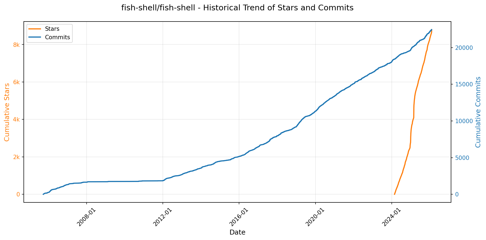

> *蓝色：累计 Stars｜橙色：累计 Commits（次 Y 轴）*

---

### 21. [NevaMind-AI/memU](https://github.com/NevaMind-AI/memU)
- 📅 **创建日期**：2025-07-29  
- 🔄 **最近更新**：2026-02-05  
- ⭐ **Stars**：7,795（日 +232｜周 +1918｜月 +4432）  
- 📝 **描述**：Memory for 24/7 proactive agents like openclaw (moltbot, clawdbot).  

<b>📈 Star 与 Commit 历史趋势</b>

> *蓝色：累计 Stars｜橙色：累计 Commits（次 Y 轴）*

<b>📄 README 摘要</b>

1. **该项目的功能**  
memU 是一个专为 **7×24 小时持续在线、主动式 AI 代理（Proactive Agents）** 设计的长期记忆框架。它不依赖用户显式指令即可自主运行，核心能力是**持续监听、理解并建模用户意图**——在用户尚未发出请求前，即能预测其下一步行为（如推荐内容、起草邮件、触发交易操作等），并自动执行或提供精准建议。其根本目标是解决传统 LLM 代理长期在线时因反复加载上下文导致的**高昂 token 成本与响应延迟问题**，通过结构化、分层化、可持久化的记忆机制，使真正“永不休眠、永不忘事”的智能体在生产环境中具备可行性与经济性。

2. **关键特性**  
- **全天候主动智能**：后台常驻运行，实时监控用户交互（对话、邮件、文档、图像等），无需唤醒即可持续学习与预判；  
- **意图驱动的记忆建模**：自动从多模态输入中提取偏好、技能、关系、目标等语义单元，并构建动态演化的用户画像；  
- **文件系统范式的记忆架构**：将记忆组织为 `categories`（类目录）、`items`（类文件）、`resources`（类原始数据）和 `symlinks`（类交叉引用），支持类 Unix 的层级导航、挂载扩展与知识图谱化关联；  
- **双模态检索引擎**：提供 `rag`（毫秒级向量检索，用于实时上下文装配）与 `llm`（深度推理检索，用于复杂意图预测）两种模式，兼顾速度与智能深度；  
- **成本优化设计**：通过缓存结构化洞察、避免冗余 LLM 调用、支持轻量嵌入模型等方式显著降低长期运行的 token 消耗；  
- **全栈可定制性**：原生支持 OpenAI、阿里云 Qwen、Voyage AI、OpenRouter 等多平台 LLM 与嵌入模型，兼容内存/PostgreSQL/pgvector 多种存储后端；  
- **开箱即用的场景化能力**：已验证三大高价值主动场景——个性化信息推荐、自动化邮件管理、金融交易辅助，均基于真实行为模式学习与实时上下文推演。

3. **技术栈**  
- **语言与运行时**：Python 3.13+（核心实现）；  
- **LLM 与嵌入服务**：支持 OpenAI（GPT / text-embedding）、阿里云 DashScope（Qwen 系列）、Voyage AI、OpenRouter（统一接入 Anthropic / Cohere / Google 等数十家模型）；  
- **向量数据库与持久化**：内置内存存储（`inmemory`），生产环境推荐 PostgreSQL + pgvector 扩展；  
- **架构范式**：分层记忆模型（Resource → Item → Category），事件驱动的连续学习流水线（`memorize()`），双路径检索协议（RAG + LLM）；  
- **部署形态**：提供云服务（[memu.so](https://memu.so)）、Docker 化自托管（PostgreSQL）、以及纯 Python SDK 集成；  
- **协议与接口**：RESTful Cloud API（v3）、异步 Python SDK、标准化配置（`llm_profiles`）、环境变量驱动（`OPENAI_API_KEY`, `OPENROUTER_API_KEY` 等）。

---

### 22. [badlogic/pi-mono](https://github.com/badlogic/pi-mono)
- 📅 **创建日期**：2025-08-09  
- 🔄 **最近更新**：2026-02-05  
- ⭐ **Stars**：6,902（日 +408｜周 +3559｜月 +5692）  
- 📝 **描述**：AI agent toolkit: coding agent CLI, unified LLM API, TUI & web UI libraries, Slack bot, vLLM pods  

<b>📈 Star 与 Commit 历史趋势</b>

> *蓝色：累计 Stars｜橙色：累计 Commits（次 Y 轴）*

<b>📄 README 摘要</b>

1. **项目功能**  
该项目是一个面向AI智能体（Agent）开发与大语言模型（LLM）部署管理的开源单体仓库（Monorepo），核心目标是提供一套模块化、可组合的工具链，用于构建、运行和集成面向开发场景的AI代理系统。其标志性产品是“Pi 编程代理”（Pi Coding Agent），一个交互式命令行编程助手，支持理解需求、生成/修改代码、执行调试及与开发者协作；同时支持通过Slack（via Pi Mom）、终端（via Pi TUI）和网页（via Pi Web UI）等多端接入，并能对接多种LLM服务商及本地vLLM推理服务。

2. **关键特性**  
- **多厂商LLM统一接口**：`pi-ai`包抽象OpenAI、Anthropic、Google等主流API，屏蔽底层差异，支持无缝切换与负载均衡。  
- **可扩展的Agent运行时**：`pi-agent-core`提供标准化工具调用（tool calling）、会话状态管理、记忆机制与执行生命周期控制。  
- **多模态交互能力**：支持CLI（coding-agent）、终端TUI（pi-tui，含差分渲染优化体验）、Web组件（pi-web-ui，即插即用聊天界面）及Slack机器人（pi-mom）等多种人机交互入口。  
- **本地LLM运维支持**：`pi-pods`提供命令行工具，用于在GPU服务器上一键部署、监控与管理vLLM推理服务。  
- **开箱即用的开发体验**：完整TypeScript类型安全、统一构建/检查/测试流程（含LLM密钥隔离的测试策略），并明确区分人类与AI代理的协作规范（见AGENTS.md）。

3. **技术栈**  
- **语言与生态**：TypeScript（全栈）、Node.js（运行时）、npm（包管理与脚本驱动）  
- **前端/UI框架**：无重型框架依赖；`pi-tui`基于ANSI控制序列实现高性能终端渲染；`pi-web-ui`提供轻量Web Components（自定义元素），兼容任意前端框架  
- **AI基础设施层**：vLLM（用于本地大模型推理部署）、OpenAI/Anthropic/Google Gemini等云LLM API  
- **工程实践**：Monorepo架构（pnpm-style逻辑，实际使用npm scripts管理）、ESBuild（构建）、Prettier + ESLint（代码规范）、TypeScript（类型检查）、Jest（单元测试）  
- **部署与协作**：GitHub Actions（CI/CD）、Discord社区支持、MIT开源协议

---

### 23. [anthropics/claude-plugins-official](https://github.com/anthropics/claude-plugins-official)
- 📅 **创建日期**：2025-11-20  
- 🔄 **最近更新**：2026-02-05  
- ⭐ **Stars**：6,579（日 +138｜周 +1286｜月 +4819）  
- 📝 **描述**：Official, Anthropic-managed directory of high quality Claude Code Plugins.  

<b>📈 Star 与 Commit 历史趋势</b>

> *蓝色：累计 Stars｜橙色：累计 Commits（次 Y 轴）*

<b>📄 README 摘要</b>

1. **项目功能**  
该项目是 Claude Code 的官方插件目录（市场），用于集中托管、分发和管理高质量的插件，支持用户通过统一入口发现、安装及使用插件，以扩展 Claude Code 的代码理解、生成、调试与自动化能力。它本身不提供具体功能实现，而是作为插件的元数据索引与分发平台，区分并维护 Anthropic 官方开发的内部插件与经审核的第三方外部插件。

2. **核心特性**  
- **双源插件管理**：明确划分 `/plugins`（Anthropic 自研、严格维护的内部插件）与 `/external_plugins`（经安全与质量审核的第三方/社区插件）；  
- **标准化插件结构**：强制要求 `.claude-plugin/plugin.json` 元数据文件，可选支持 MCP 服务配置（`.mcp.json`）、Slash 命令（`commands/`）、智能体定义（`agents/`）及技能模块（`skills/`），确保兼容性与可扩展性；  
- **一体化安装体验**：支持命令行方式（`/plugin install {plugin-name}@claude-plugin-directory`）和图形界面（`/plugin > Discover`）两种安装路径；  
- **可控的贡献机制**：为内部团队提供参考模板（如 `/plugins/example-plugin`），为外部开发者设立准入门槛——需通过[提交表单](https://clau.de/plugin-directory-submission)申请，并满足安全与质量标准方可上架；  
- **明确的安全警示**：在显要位置强调用户需自主评估插件可信度，声明 Anthropic 不对第三方插件内容、行为或后续变更承担验证与担保责任。

3. **技术栈**  
- **协议与规范层**：基于 Anthropic 定义的 **Claude Plugin 规范** 和 **MCP（Model Communication Protocol）协议**，支撑插件与 Claude Code 模型的标准化交互；  
- **元数据格式**：采用 JSON 格式定义插件核心信息（`plugin.json`）及 MCP 服务配置（`mcp.json`）；  
- **基础设施依赖**：依托 Claude Code 内置的插件运行时系统（含 `/plugin` 命令解析器、插件生命周期管理器、MCP 客户端等），无需独立后端服务；  
- **文档与生态**：以 Markdown（`README.md`）组织文档，对接 [Claude Code 官方插件开发文档](https://code.claude.com/docs/en/plugins) 构成完整开发生态。

---

### 24. [MoonshotAI/kimi-cli](https://github.com/MoonshotAI/kimi-cli)
- 📅 **创建日期**：2025-10-15  
- 🔄 **最近更新**：2026-02-05  
- ⭐ **Stars**：6,018（日 +92｜周 +1205｜月 +2272）  
- 📝 **描述**：Kimi Code CLI is your next CLI agent.  

<b>📈 Star 与 Commit 历史趋势</b>

> *蓝色：累计 Stars｜橙色：累计 Commits（次 Y 轴）*

<b>📄 README 摘要</b>

1. **项目功能**  
Kimi Code CLI 是一款运行在终端中的 AI 编程智能体（AI Agent），专为软件开发任务和终端操作而设计。它能够自主阅读与编辑代码文件、执行 Shell 命令、搜索并抓取网页内容，并在运行过程中动态规划任务、实时调整执行策略，从而端到端地完成复杂开发工作流。

2. **核心特性**  
- **终端 Shell 模式**：通过 `Ctrl-X` 快捷键切换至原生 Shell 模式，直接执行任意系统命令（注：暂不支持内建命令如 `cd`）；  
- **VS Code 插件集成**：提供官方 [Kimi Code VS Code 扩展](https://marketplace.visualstudio.com/items?itemName=moonshot-ai.kimi-code)，实现 IDE 内无缝调用；  
- **ACP（Agent Client Protocol）标准兼容**：开箱即支持 ACP 协议，可与 Zed、JetBrains 等兼容 ACP 的现代 IDE 集成，通过配置 `kimi acp` 启动为代理服务；  
- **Zsh 深度集成**：提供专用 zsh 插件 [`zsh-kimi-cli`](https://github.com/MoonshotAI/zsh-kimi-cli)，使 AI 能力原生融入日常 Shell 交互；  
- **MCP（Model Context Protocol）工具生态支持**：  
  - 提供 `kimi mcp` 子命令组，支持动态增删/授权/管理 HTTP 或 stdio 类型的 MCP 服务（如 Context7、Linear、Chrome DevTools）；  
  - 支持通过 `--mcp-config-file` 加载 JSON 格式的 MCP 配置文件，实现灵活、声明式的上下文工具接入。

3. **技术栈**  
- **主语言与运行时**：Python（基于 `uv` 构建与运行，兼容现代 Python 工具链）；  
- **协议标准**：原生实现 [Agent Client Protocol (ACP)](https://github.com/agentclientprotocol/agent-client-protocol) 与 [Model Context Protocol (MCP)](https://modelcontextprotocol.io/)；  
- **构建与开发工具**：使用 `make` 统一管理构建流程，依赖 `uv`（替代 pip/poetry）、`pytest`（测试）、`ruff`/`mypy`（代码检查与类型校验）、`npm`（Web UI 构建）；  
- **前端组件**：内置轻量 Web UI（需 Node.js/npm 构建并嵌入 Python 包）；  
- **扩展生态**：支持插件化集成（Zsh 插件、VS Code 扩展、ACP 客户端适配器），强调跨编辑器/IDE 的互操作性。

---

### 25. [j178/prek](https://github.com/j178/prek)
- 📅 **创建日期**：2024-10-07  
- 🔄 **最近更新**：2026-02-05  
- ⭐ **Stars**：5,371（日 +251｜周 +1374｜月 +2304）  
- 📝 **描述**：⚡ Better `pre-commit`, re-engineered in Rust  

<b>📈 Star 与 Commit 历史趋势</b>

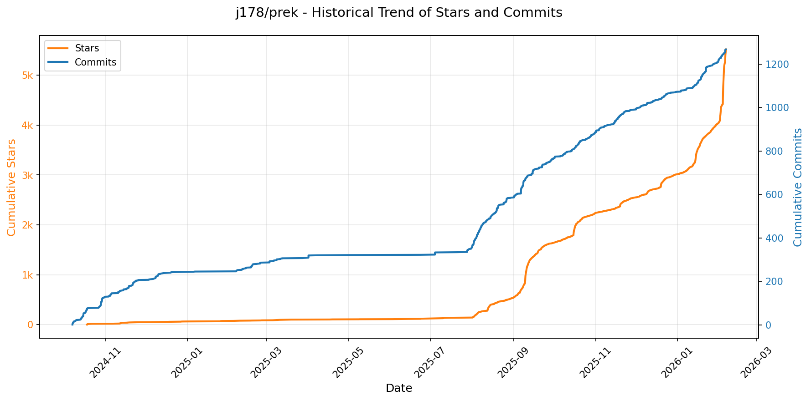

> *蓝色：累计 Stars｜橙色：累计 Commits（次 Y 轴）*

<b>📄 README 摘要</b>

1. **项目功能**  
prek 是一个用 Rust 重写的、与 `pre-commit` 兼容的代码检查钩子（git hooks）管理工具。它旨在完全替代 Python 编写的 `pre-commit`，提供零依赖、单二进制、开箱即用的体验，用于在代码提交前自动运行各类格式化、静态分析和校验钩子（如 Black、Ruff、ESLint 等），支持原生 `.pre-commit-config.yaml` 配置文件，无需修改现有配置即可直接迁移使用。

2. **核心特性**  
- ✅ **零依赖单二进制**：不依赖 Python 或其他运行时，安装即用；  
- ⚡ **极致性能**：启动与执行速度显著优于 `pre-commit`（多倍加速），磁盘占用减半，支持并行克隆仓库、并行安装互斥依赖的钩子、按优先级并发执行钩子；  
- 🔁 **完全兼容**：100% 支持原有 `pre-commit` 配置语法、钩子协议（包括 `repo: local`、`repo: https://...` 等）及钩子生态；  
- 🏗️ **原生单仓/多仓（Monorepo）支持**：内置 workspace 模式，允许多个子项目各自维护独立的 `.pre-commit-config.yaml`；  
- 🐍 **智能 Python 工具链管理**：深度集成 `uv`，自动下载指定 Python 版本、创建隔离虚拟环境、高效安装依赖；  
- 🛠️ **统一语言工具链缓存**：对 Python、Node.js、Bun、Go、Rust、Ruby 等语言的工具（如 `pip`, `npm`, `cargo`）实现跨钩子共享安装与缓存，避免重复下载；  
- 📦 **Rust 原生内置钩子**：提供 `trailing-whitespace`、`end-of-file-fixer`、`check-yaml` 等常用钩子的高性能 Rust 实现（`repo: builtin`），支持离线零配置运行。

3. **技术栈**  
- **主语言**：Rust（1.89+），强调内存安全、零成本抽象与并发性能；  
- **关键依赖库**：`uv`（Python 环境与包管理）、`clap`（CLI 参数解析）、`tokio`（异步运行时）、`reqwest`（HTTP 客户端）、`serde` / `toml` / `yaml-rust`（配置解析）、`syntect`（语法高亮，用于 CLI 输出）；  
- **构建与分发**：Cargo 构建系统，支持多平台预编译二进制（Linux/macOS/Windows）、CI/CD 自动发布至 GitHub Releases；  
- **跨平台安装支持**：覆盖 standalone 脚本、PyPI（`uv tool install` / `pip`）、Homebrew、Scoop、MacPorts、Nix、Conda、npm、`cargo-binstall`、`mise` 等主流包管理器。

---

### 26. [aquasecurity/trivy](https://github.com/aquasecurity/trivy)
- 📅 **创建日期**：2019-04-11  
- 🔄 **最近更新**：2026-02-05  
- ⭐ **Stars**：4,600（日 +33｜周 +134｜月 +493）  
- 📝 **描述**：Find vulnerabilities, misconfigurations, secrets, SBOM in containers, Kubernetes, code repositories, clouds and more  

<b>📈 Star 与 Commit 历史趋势</b>

> *蓝色：累计 Stars｜橙色：累计 Commits（次 Y 轴）*

<b>📄 README 摘要</b>

1. **项目功能**  
Trivy 是一个全面、多功能的开源安全扫描工具，旨在主动识别各类软件资产中的安全风险。它通过“扫描器（Scanners）”在多种“目标（Targets）”上执行深度检测，覆盖从开发到运行时的全生命周期：可扫描容器镜像、本地文件系统、远程 Git 仓库、虚拟机镜像及 Kubernetes 集群；检测内容包括操作系统软件包与应用依赖（生成 SBOM）、已知漏洞（CVE）、基础设施即代码（IaC）配置错误、敏感信息/密钥泄露，以及软件许可证合规性问题。

2. **核心特性**  
- **多目标支持**：原生支持容器镜像（如 `trivy image python:3.4-alpine`）、文件系统（`trivy fs`）、Git 仓库（远程 URL）、VM 镜像和 Kubernetes 集群（`trivy k8s`）；  
- **多维度扫描能力**：集成漏洞扫描（vuln）、SBOM 生成、IaC 配置检查（misconfig）、密钥/凭证泄露检测（secret）、许可证分析等可组合式扫描器；  
- **广泛兼容性**：支持主流操作系统（Alpine、Debian、RHEL 等）、编程语言（Go、Java、Python、Node.js、Ruby 等）及云原生平台（Helm、Terraform、Kubernetes YAML/Kustomize 等）；  
- **开箱即用与高集成度**：提供 CLI 二进制、Docker 镜像、Homebrew 包；深度集成 GitHub Actions、Kubernetes Operator、VS Code 插件等生态工具；  
- **持续交付支持**：提供稳定发布版与每日构建的 Canary 版本（用于测试最新功能，但不建议生产环境使用）；  
- **轻量易用**：单二进制部署，无依赖，命令简洁统一（`trivy <target> [options] <subject>`），支持细粒度扫描范围控制（如仅启用 `vuln,secret,misconfig`）。

3. **技术栈**  
- **编程语言**：Go（主程序，保证高性能、跨平台静态编译与低资源占用）；  
- **核心依赖/技术**：  
  - 使用 [Syft](https://github.com/anchore/syft)（由 Anchore 提供）生成 SBOM（软件物料清单）作为漏洞检测基础；  
  - 利用 [Grype](https://github.com/anchore/grype)（同为 Anchore 项目）进行 CVE 漏洞匹配（Trivy 自 v0.45 起已逐步迁移至自研漏洞数据库引擎，但仍兼容 Grype 数据格式）；  
  - IaC 扫描基于 [OPA/Rego](https://www.openpolicyagent.org/docs/latest/#rego) 策略引擎实现规则驱动的配置审计；  
  - 密钥扫描采用正则+熵值分析+上下文语义识别（如文件路径、文件名、内容结构）；  
- **部署形态**：CLI 工具（Linux/macOS/Windows）、Docker 容器（`aquasec/trivy`）、Kubernetes Operator（`trivy-operator`）；  
- **基础设施与生态**：CI/CD 原生集成（GitHub Actions）、IDE 插件（VS Code）、云服务对接（Sigstore 验证、ECR/Azure Container Registry 支持）；  
- **许可协议**：Apache License 2.0（完全开源）。

---

### 27. [openai/skills](https://github.com/openai/skills)
- 📅 **创建日期**：2025-11-25  
- 🔄 **最近更新**：2026-02-05  
- ⭐ **Stars**：4,046（日 +616｜周 +1889｜月 +2818）  
- 📝 **描述**：Skills Catalog for Codex  

<b>📈 Star 与 Commit 历史趋势</b>

> *蓝色：累计 Stars｜橙色：累计 Commits（次 Y 轴）*

<b>📄 README 摘要</b>

1. **项目功能**  
该项目定义并维护一套标准化的“Agent Skills”（智能体技能）规范与资源库，旨在为AI智能体（特别是OpenAI Codex平台中的智能体）提供可发现、可复用、任务导向的能力模块。每个技能是一个包含指令（prompt）、脚本（如Python/Shell）、配置文件和资源的独立文件夹，支持“一次编写、多处调用”，使团队和个人能以结构化方式封装、共享和复用特定任务能力（如代码审查、生成计划、处理GitHub评论等）。

2. **关键特性**  
- **标准化技能目录结构**：技能按用途分类存放于 `.system`（系统内置）、`.curated`（人工精选、稳定可用）和 `.experimental`（实验性、尚在验证）三个主目录下；  
- **自动化与命令行安装支持**：`.system` 技能随Codex最新版自动集成；其余技能可通过内置命令 `$skill-installer` 按名称、本地路径或GitHub URL灵活安装；  
- **开放标准与互操作性**：遵循 [Agent Skills Open Standard](https://agentskills.io)，推动跨平台技能兼容与生态共建；  
- **细粒度许可管理**：每个技能目录内含独立 `LICENSE.txt` 文件，支持差异化开源协议，便于合规分发与组合使用。

3. **技术栈**  
- **核心平台依赖**：深度集成 OpenAI Codex（AI智能体运行时环境），依赖其技能加载、执行与指令解析机制；  
- **文件格式与协议**：基于纯文本文件（如Markdown说明、JSON/YAML配置、Shell/Python脚本）、Git版本控制及HTTPS GitHub URL作为分发协议；  
- **无服务端/轻量架构**：项目本身为静态资源仓库（非运行时服务），不包含后端服务、数据库或构建工具链，本质是面向AI代理的“技能包规范+参考实现库”。

---

### 28. [topoteretes/cognee](https://github.com/topoteretes/cognee)
- 📅 **创建日期**：2023-08-16  
- 🔄 **最近更新**：2026-02-05  
- ⭐ **Stars**：4,000（日 +82｜周 +302｜月 +974）  
- 📝 **描述**：Memory for AI Agents in 6 lines of code  

<b>📈 Star 与 Commit 历史趋势</b>

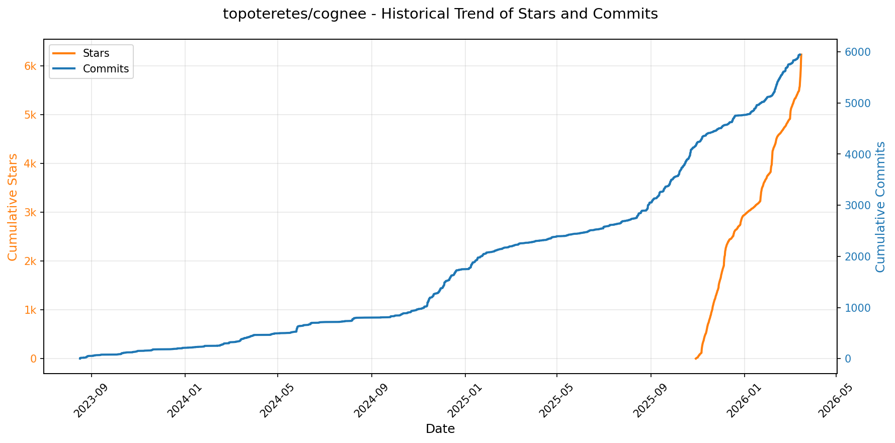

> *蓝色：累计 Stars｜橙色：累计 Commits（次 Y 轴）*

<b>📄 README 摘要</b>

1. **项目功能**  
Cognee 是一个开源的 AI 记忆平台，旨在将用户原始数据（如文档、对话记录、文件、图像、音频转录文本等）转化为**持久化、可演化的结构化 AI 记忆**，专为 AI Agent 设计。它不依赖传统 RAG（检索增强生成）范式，而是通过构建**知识图谱（graph database）与向量索引协同的统一记忆层**，实现语义搜索与关系推理的深度融合，使 AI Agent 能够基于上下文关联、动态演化和多跳推理进行精准响应。

2. **核心特性**  
- **ECL 记忆流水线**：提供模块化、可扩展的 `Extract（抽取）→ Cognify（认知建模/图谱构建）→ Load（加载/记忆固化）` 流程，替代 RAG 的静态检索；  
- **混合检索能力**：同时支持基于语义的向量搜索与基于实体关系的图谱遍历查询，兼顾“相似性”与“结构性”；  
- **多源异构数据接入**：原生支持 30+ 数据源（文本、PDF、网页、Notion、Slack、音频转录等），并可自定义数据适配器；  
- **高度可定制化**：允许用户定义任务节点（Tasks）、组合模块化管道（Pipelines）、扩展搜索逻辑及集成自定义记忆算法（memify）；  
- **开箱即用的开发体验**：提供 Python SDK、CLI 工具（`cognee-cli`）和本地 Web UI，5 行代码即可完成数据注入→图谱构建→智能查询全流程；  
- **Agent 原生集成支持**：已验证与 LangGraph 等主流 Agent 框架深度集成，实现长期、上下文感知的 Agent 记忆持久化。

3. **技术栈**  
- **编程语言**：Python（3.10–3.13）；  
- **核心存储**：结合 **图数据库**（如 Neo4j 或内置轻量图引擎）与 **向量数据库**（支持多种后端，如 Qdrant、Chroma、PostgreSQL + pgvector）；  
- **AI 依赖**：LLM 驱动的认知处理（默认兼容 OpenAI API，支持 Ollama、Anthropic、Cohere 等多厂商 LLM 接入）；  
- **架构设计**：异步（`asyncio`）优先，模块化 pipeline 架构，支持插件化扩展（社区提供插件仓库）；  
- **部署与工具链**：支持 `uv`/`poetry`/`pip` 安装，`.env` 配置管理，CLI 交互界面，Colab 快速演示环境；  
- **基础设施友好**：轻量级设计，可本地运行或容器化部署，强调低运维成本与高可移植性。

---

### 29. [ThePrimeagen/99](https://github.com/ThePrimeagen/99)
- 📅 **创建日期**：2025-11-22  
- 🔄 **最近更新**：2026-02-05  
- ⭐ **Stars**：3,318（日 +106｜周 +2175｜月 +2381）  
- 📝 **描述**：Neovim AI agent done right  

<b>📈 Star 与 Commit 历史趋势</b>

> *蓝色：累计 Stars｜橙色：累计 Commits（次 Y 轴）*

<b>📄 README 摘要</b>

1. **该项目做什么？**  
该项目是一个面向 Neovim 的轻量级 AI 编程代理插件（名为 `99`），旨在为具备扎实编程基础（“无技能问题”）的开发者提供**受控、聚焦、上下文感知的 AI 协作工作流**。它不替代通用 AI 工具（如 OpenCode），而是将 AI 请求严格限定在特定任务类型（如补全函数体、处理视觉选区代码）和预定义规则范围内，通过 `@` 触发的技能（Skill）机制实现精准调用，从而减少误用、提升可预测性与安全性。

2. **核心功能**  
- **技能驱动的结构化提示（Skill-based Completion）**：用户以 `@` 开头触发自动补全，从本地 `SKILL.md` 文件（按目录组织，如 `vim/SKILL.md`）加载领域专用行为规则；支持自定义规则路径（`custom_rules`）。  
- **多模式 AI 操作快捷键**：提供 `fill_in_function()`（函数体补全）、`visual()`（基于视觉选区的 AI 处理）、`stop_all_requests()`（中止所有请求）等命令，并支持按键映射（如 `<leader>9f`）。  
- **项目级上下文自动注入**：根据当前文件路径向上查找指定 `AGENT.md` 文件（如 `/foo/bar/baz.lua` → 自动匹配 `/foo/AGENT.md`），动态注入项目专属指令与约束。  
- **调试与可观测性**：内置分级日志系统（DEBUG 级别、文件路径可配），支持实时查看（`view_logs()`）、翻阅历史请求日志（`prev_request_logs`/`next_request_logs`），并强调敏感信息（如 `query` 字段）需人工脱敏。  
- **语言与生态集成**：原生支持 TypeScript 和 Lua，依赖 `cmp` 作为唯一兼容的补全引擎；设计上预留 Treesitter + LSP 上下文增强接口（用于未来精准提取函数/作用域范围，解决当前“整文件发送”“虚拟文本错位”等问题）。

3. **技术栈**  
- **运行环境**：Neovim（要求 ≥ 0.9），依赖 [Lazy.nvim](https://github.com/folke/lazy.nvim) 作为插件管理器（配置示例基于 Lazy）。  
- **核心语言**：Lua（插件主体逻辑、API 及配置层，位于 `lua/99/`）；支持 TypeScript/Lua 代码分析（后续计划深度集成 Treesitter 提取语法结构）。  
- **AI 对接层**：与外部 AI 服务（如 OpenCode）对接，但**不内嵌模型或 API 密钥管理**，完全依赖用户已安装并配置好的 `opencode` 工具。  
- **辅助技术**：  
  - `cmp`（Completion Manager）—— 唯一支持的补全框架，用于 `@` 技能名自动补全；  
  - `vim.uv` / `vim.fs` —— Neovim 内置异步 I/O 与文件系统 API，用于路径解析与日志写入；  
  - （规划中）Treesitter + LSP —— 用于智能上下文裁剪（如仅发送当前函数而非整文件）、修复虚拟文本定位偏差及注释重复等问题。

---

### 30. [disler/claude-code-hooks-mastery](https://github.com/disler/claude-code-hooks-mastery)
- 📅 **创建日期**：2025-07-05  
- 🔄 **最近更新**：2026-02-05  
- ⭐ **Stars**：2,516（日 +232｜周 +395｜月 +496）  
- 📝 **描述**：Master Claude Code Hooks  

<b>📈 Star 与 Commit 历史趋势</b>

> *蓝色：累计 Stars｜橙色：累计 Commits（次 Y 轴）*

<b>📄 README 摘要</b>

1. **该项目的功能**  
本项目是一个面向 Anthropic Claude Code 的深度集成开发套件，旨在通过全面实现和演示 **Claude Code 所有 13 个官方 Hook 生命周期事件**，为开发者提供对 AI 编程工作流的**确定性（deterministic）底层控制能力**。它不依赖大模型决策，而是通过可编程的钩子脚本，在用户输入、工具调用、子智能体执行、会话管理等关键节点插入逻辑，实现安全拦截、上下文增强、行为审计、多模态反馈（如 TTS）、自动化日志与验证等核心能力。本质上，它将 Claude Code 从一个黑盒 CLI 工具转变为可观察、可干预、可扩展的可编程开发代理平台。

2. **关键特性**  
- ✅ **全生命周期 Hook 覆盖**：完整实现并实测验证全部 13 类 Hook（含 `UserPromptSubmit`、`PreToolUse`、`SubagentStart/Stop`、`SessionStart/End` 等），支持精准拦截与控制。  
- 🔒 **多层安全防护**：在 `PreToolUse` 等关键钩子中实时阻断危险命令（如 `rm -rf`、`sudo rm`、写入 `/etc/` 等），并自动审计权限请求（`PermissionRequest`）。  
- 🎙️ **智能语音反馈系统**：集成 ElevenLabs / OpenAI / pyttsx3 多 TTS 后端，支持带队列防重叠的音频播报（如“Subagent Complete”、“Your agent needs input”），并按优先级自动降级。  
- 🧩 **子智能体（Sub-Agent）与元智能体（Meta-Agent）编排**：提供 Builder/Validator 团队验证范式、加密分析专用子智能体、以及能动态生成其他智能体的 `meta-agent.md`。  
- 📋 **团队化验证体系（Team-Based Validation）**：通过 `validators/` 目录下的 Ruff（代码规范）、Type Checking（类型校验）等钩子，在 `PostToolUse` 后自动验证代码质量。  
- 📈 **实时终端状态行（Status Lines）**：9 个演进版本的状态栏脚本（`status_line_v1`–`v9`），支持 Git 状态、上下文窗口占用率、Token 消耗、成本估算、会话时长等元信息可视化。  
- 🎨 **多样化输出样式引擎**：预置 8 种响应格式（如 `genui.md` 生成带样式的 HTML、`yaml-structured.md` 输出结构化配置、`ultra-concise.md` 极简模式等），支持按需切换。  
- 📁 **零污染单文件架构（UV Single-File Scripts）**：所有 Hook 均为独立 `.py` 脚本，内嵌依赖声明，由 Astral UV 自动解析执行，完全隔离主项目环境。  
- 📜 **全自动结构化日志**：每个 Hook 执行均生成标准化 JSON 日志（如 `pre_tool_use.json`, `session_end.json`），含完整上下文与错误堆栈；`chat.json` 提供可读对话快照。  

3. **技术栈**  
- **核心运行时**：[Astral UV](https://docs.astral.sh/uv/)（作为 Python 包管理器与单文件脚本执行引擎） + [Claude Code CLI](https://docs.anthropic.com/en/docs/claude-code)（Anthropic 官方 AI 编程 CLI）。  
- **语言模型后端**：OpenAI（GPT 系列）、Anthropic（Claude 系列）、Ollama（本地 LLM，如 Llama 3）、ElevenLabs（TTS + MCP 集成）。  
- **工具链与服务**：Firecrawl MCP Server（网页爬取）、ElevenLabs MCP Server（语音合成）、Ruff（Python 代码检查）、`ty`（Python 类型检查）、Git（开发上下文注入）。  
- **编程语言与框架**：Python 3.x（全部 Hook 脚本）、Mermaid（流程图文档）、Markdown（配置/文档/指令模板）、JSON/JSONL（日志与数据交换格式）。  
- **架构模式**：基于 MCP（Model Context Protocol）标准的模块化插件设计；Hook 脚本遵循严格 JSON 输出协议（含 `continue`、`decision`、`suppressOutput` 等字段）；状态行与输出样式采用可插拔配置驱动。

---

### 31. [microsoft/playwright-cli](https://github.com/microsoft/playwright-cli)
- 📅 **创建日期**：2020-06-19  
- 🔄 **最近更新**：2026-02-05  
- ⭐ **Stars**：2,233（日 +38｜周 +622｜月 +1216）  
- 📝 **描述**：CLI for common Playwright actions. Record and generate Playwright code, inspect selectors and take screenshots.  

<b>📈 Star 与 Commit 历史趋势</b>

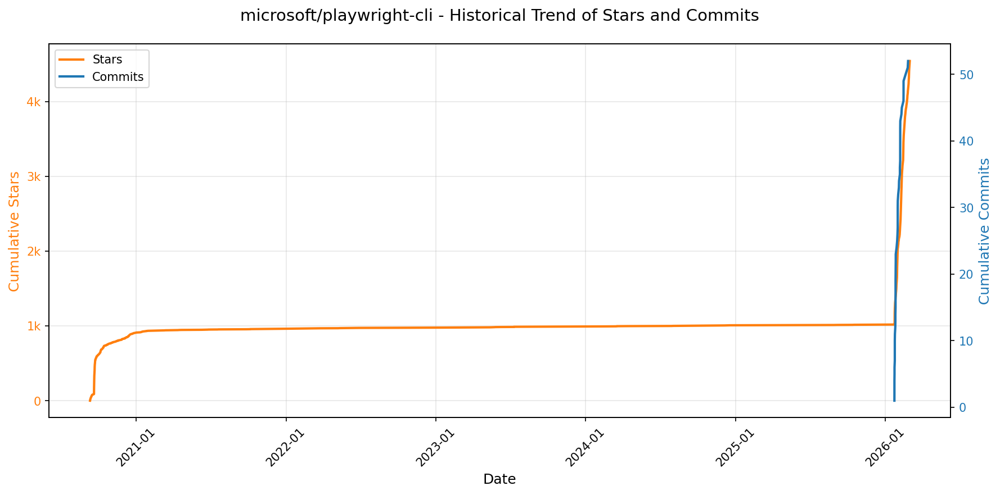

> *蓝色：累计 Stars｜橙色：累计 Commits（次 Y 轴）*

<b>📄 README 摘要</b>

1. **该项目的功能**  
`playwright-cli` 是一个面向 AI 编程代理（如 Claude Code、GitHub Copilot）优化的命令行工具，提供对 Playwright 浏览器自动化能力的轻量级 CLI 接口。它不直接运行测试或生成代码，而是作为“技能（SKILL）”被编码代理调用，使 LLM 能以简洁、低开销的方式执行网页交互任务（如打开页面、输入、点击、截图、表单操作、网络拦截、存储管理等）。其核心设计目标是**避免将大量页面结构数据（如可访问性树、完整 DOM）注入大模型上下文**，从而显著提升 token 利用效率，适配高吞吐、上下文受限的智能代理工作流。

2. **关键特性**  
- **极致 Token 效率**：所有操作均通过语义化短命令完成，无需加载冗长的工具描述或页面状态快照至 LLM 上下文；代理可自主解析 `--help` 获取能力边界。  
- **会话（Session）持久化支持**：默认使用独立、持久化的浏览器配置文件，支持多会话隔离（如 `--session=todo-app`），保留 Cookie、LocalStorage、SessionStorage 等状态，便于跨步骤任务与多项目并行。  
- **全场景浏览器控制能力**：覆盖核心交互（`click`/`type`/`fill`/`check`）、导航（`go-back`/`reload`）、键盘鼠标（`press`/`mousemove`）、媒体（`screenshot`/`pdf`/`video-start`）、开发调试（`console`/`network`/`tracing-start`）、网络模拟（`route`/`unroute`）、存储管理（Cookie/LocalStorage/SessionStorage 的增删查）、标签页管理（`tab-list`/`tab-new`）等。  
- **灵活部署与集成模式**：支持“技能安装”（自动注册 SKILL.md）和“无技能模式”（代理直读 CLI 帮助）；兼容插件市场（如 `/plugin install playwright-cli`）与手动配置；可通过环境变量（如 `PLAYWRIGHT_CLI_SESSION`）或命令行参数无缝接入代理工作流。  
- **深度可配置性**：支持 JSON 配置文件（`playwright-cli.json`）及丰富环境变量，精细控制浏览器类型、启动参数、视口、超时、权限、代理、CDP 连接、输出路径、日志级别等。

3. **技术栈**  
- **运行时**：Node.js 18+（必需）  
- **底层驱动**：基于 [Playwright](https://playwright.dev/)（微软开源的跨浏览器自动化库），直接复用其 Chromium/Firefox/WebKit 浏览器内核与 API 能力。  
- **交互协议**：面向 CLI 场景设计，非基于 MCP（Model Context Protocol）标准，但文档中明确对比了 CLI 与 Playwright MCP 的适用差异；CLI 本身为纯命令行程序，不依赖 HTTP 服务端。  
- **集成生态**：专为 AI 编程代理优化，原生适配 Claude Code、GitHub Copilot 等支持 CLI SKILL 调用的工具链；配置与行为兼容 Playwright 标准实践（如 `launchOptions`、`contextOptions`）。  
- **扩展机制**：通过本地 SKILL 文件（Markdown 格式）向代理声明能力；支持 TypeScript/JavaScript 初始化脚本注入（`initPage`/`initScript`）；配置支持 JSON Schema 校验。

---

### 32. [pedramamini/Maestro](https://github.com/pedramamini/Maestro)
- 📅 **创建日期**：2025-11-23  
- 🔄 **最近更新**：2026-02-05  
- ⭐ **Stars**：1,768（日 +173｜周 +1052｜月 +1401）  
- 📝 **描述**：Agent Orchestration Command Center  

<b>📈 Star 与 Commit 历史趋势</b>

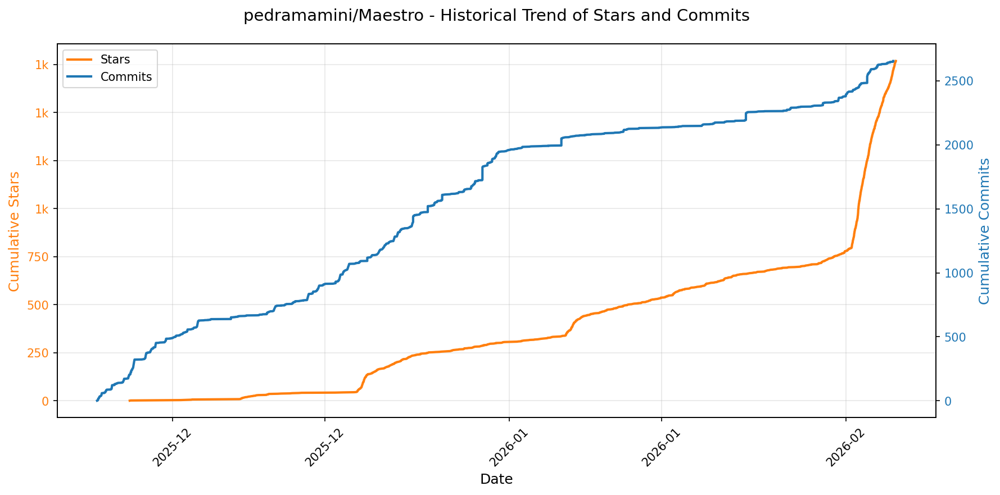

> *蓝色：累计 Stars｜橙色：累计 Commits（次 Y 轴）*

<b>📄 README 摘要</b>

1. **项目功能**  
Maestro 是一款跨平台桌面应用，专为高效协同与编排多个 AI 编程代理（AI agents）而设计，服务于同时推进多个技术项目的开发者（“黑客”）。它不替代底层 AI 工具，而是作为「无感透传层」，复用用户已配置的 Claude Code、OpenAI Codex、OpenCode 或 Factory Droid 等本地 AI 代理的认证、MCP 工具链、权限与上下文环境。核心价值在于：将碎片化注意力转化为结构化意图——通过自动化任务执行（Auto Run）、多代理并行协作、Git 深度集成及长期无人值守运行（实测超24小时），实现高吞吐、低干预的 AI 增强开发工作流。

2. **关键特性**  
- **智能并行执行**：支持无限数量 AI 代理并行运行，每个拥有独立工作区、会话历史与干净上下文；首创 Git Worktrees 隔离分支级子代理，自动创建 PR。  
- **自动化工作流引擎**：基于文件系统的 Auto Run + Playbooks，可批量处理 Markdown 检查清单，循环执行、全程追踪、逐任务隔离会话。  
- **多代理协同架构**：Group Chat 实现多 AI 代理在单一会话中角色化协作（如 Moderator 调度 + Specialist 执行 + Synthesizer 汇总），适用于跨项目架构设计。  
- **全栈开发集成**：深度 Git 支持（自动检测/分支管理/差异对比/提交日志）、文件浏览器（语法高亮/Markdown 预览/`@` 文件引用）、智能输出过滤（正则/包含/排除）、Slash 命令扩展系统。  
- **生产力增强体系**：纯键盘驱动（Cmd+K 快速操作、Cmd+J 切换 AI/Shell 终端）、实时成本追踪、语音通知、成就系统（11 级进阶）、12 种专业主题。  
- **数据洞察与知识图谱**：Usage Dashboard 提供多维使用分析（时间维度/代理对比/热力图/CSV 导出）；Document Graph 自动解析 `[[wiki-links]]` 和 `[markdown](links)`，生成交互式文档关系图（力导向/层级布局/键盘导航）。  
- **远程与自动化能力**：内置 Web 服务器 + QR 远程控制（支持 Cloudflare 隧道）、完整 CLI（`maestro-cli`）支持 CI/CD 与定时任务。

3. **技术栈**  
- **前端框架**：Electron（实现跨平台桌面应用，含 Chromium 渲染引擎与 Node.js 运行时）  
- **构建与包管理**：npm / Node.js 生态（`npm install`, `npm run dev`）  
- **核心依赖**：依赖本地已安装的 AI 编程代理二进制（Claude Code、OpenAI Codex、OpenCode、Factory Droid），通过标准进程通信或 MCP 协议对接，不托管模型或 API 密钥  
- **辅助技术**：Git CLI（深度集成）、Web Server（远程控制）、TTS 引擎（语音通知）、正则引擎（输出过滤）、Force-Directed Graph 算法（Document Graph）、CLI 工具链（`maestro-cli`）  
- **部署与分发**：预编译二进制发布（GitHub Releases），支持 macOS / Windows / Linux；源码构建需 Node.js 环境

---

### 33. [modelcontextprotocol/ext-apps](https://github.com/modelcontextprotocol/ext-apps)
- 📅 **创建日期**：2025-11-21  
- 🔄 **最近更新**：2026-02-05  
- ⭐ **Stars**：1,362（日 +36｜周 +598｜月 +1033）  
- 📝 **描述**：Official repo for spec & SDK of MCP Apps protocol - standard for UIs embedded AI chatbots, served by MCP servers  

<b>📈 Star 与 Commit 历史趋势</b>

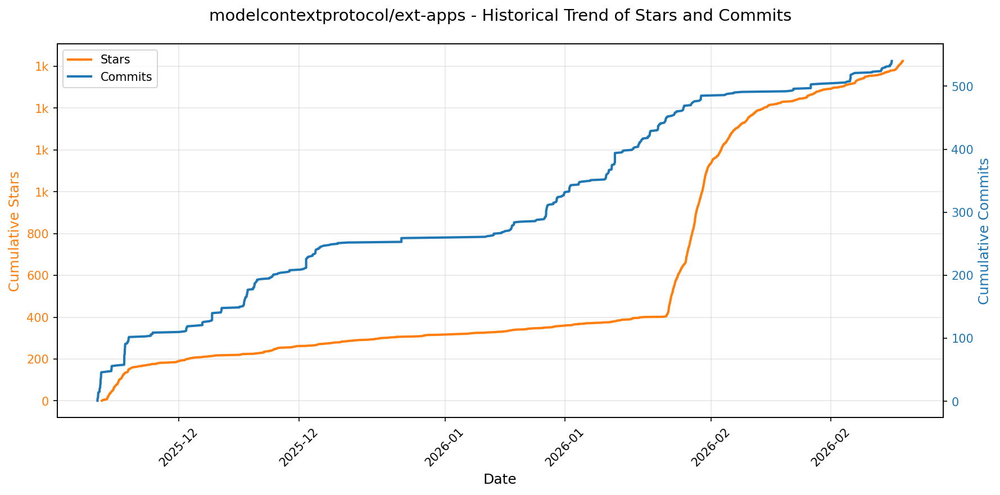

> *蓝色：累计 Stars｜橙色：累计 Commits（次 Y 轴）*

<b>📄 README 摘要</b>

1. **项目功能**  
该项目定义并实现了 **MCP Apps 扩展标准（SEP-1865）**，旨在为 Model Context Protocol（MCP）生态补充交互式 UI 能力。它使 MCP 服务器能够向兼容的对话式 MCP 客户端（如 AI 聊天机器人、IDE 插件等）动态提供内联、上下文感知的交互式界面（例如图表、表单、3D 渲染器、视频播放器、PDF 查看器等），突破传统 MCP 工具仅返回文本/结构化数据的限制，实现「工具调用 → UI 渲染 → 双向通信」的闭环。

2. **核心特性**  
- ✅ **标准化 UI 声明机制**：工具可通过 `ui://` 协议声明 HTML 界面资源，由客户端沙箱化 iframe 加载，保障安全隔离；  
- ✅ **双向上下文通信**：主机（Host）将工具输入数据以通知形式传递至 UI，UI 可通过 Host 调用其他 MCP 工具，形成交互闭环；  
- ✅ **跨框架开发支持**：提供 React 专用 Hooks（`@modelcontextprotocol/ext-apps/react`）及通用 SDK，支持 React/Vue/Svelte/Preact/Solid/原生 JS 等多框架快速构建 App；  
- ✅ **完整双端 SDK 分离**：  
　• **App 开发者 SDK**（`@modelcontextprotocol/ext-apps`）：用于构建可嵌入的交互式 UI 应用；  
　• **Host 开发者 SDK**（`@modelcontextprotocol/ext-apps/app-bridge`）：用于在聊天客户端中集成、渲染和桥接 MCP Apps；  
- ✅ **丰富开箱即用示例**：包含 20+ 实战案例（如 CesiumJS 地球仪、Three.js 3D 渲染、ShaderToy 着色器、Wikipedia 图谱可视化、客户分群散点图、实时系统监控、PDF 分块加载查看器等），覆盖数据可视化、多媒体、表单交互、AI 辅助建模等场景；  
- ✅ **Agent 技能集成支持**：提供 Agent Skills 插件（适配 Claude Code 等 AI 编程助手），降低开发者接入门槛。

3. **技术栈**  
- **核心协议层**：基于 [Model Context Protocol (MCP)](https://github.com/modelcontextprotocol/modelcontextprotocol) 标准扩展，遵循 SEP-1865 规范；  
- **前端运行时**：HTML + JavaScript（ES Module），强制沙箱化 iframe 隔离执行；  
- **SDK 实现语言**：TypeScript（强类型定义，完整 API 文档）；  
- **UI 框架支持**：官方提供 React Hooks 封装，并为 Vue、Svelte、Preact、Solid、Vanilla JS 提供完整示例模板；  
- **服务端示例技术**：Node.js（TypeScript/JavaScript）、Python（部分示例如 QR 生成器、TTS 使用 `uv` 运行）；  
- **构建与分发**：npm 包管理（发布于 npmjs.com），支持 `npx` 快速启动；  
- **通信基础**：依赖 MCP 标准传输协议（如 stdio、HTTP），与 MCP 客户端（Claude Desktop、VS Code MCP 扩展等）原生兼容。

---

### 34. [ZeroTworu/anet](https://github.com/ZeroTworu/anet)
- 📅 **创建日期**：2025-09-07  
- 🔄 **最近更新**：2026-02-05  
- ⭐ **Stars**：281（日 +85｜周 +279｜月 +280）  
- 📝 **描述**：Simple Rust VPN Client / Server  

<b>📈 Star 与 Commit 历史趋势</b>

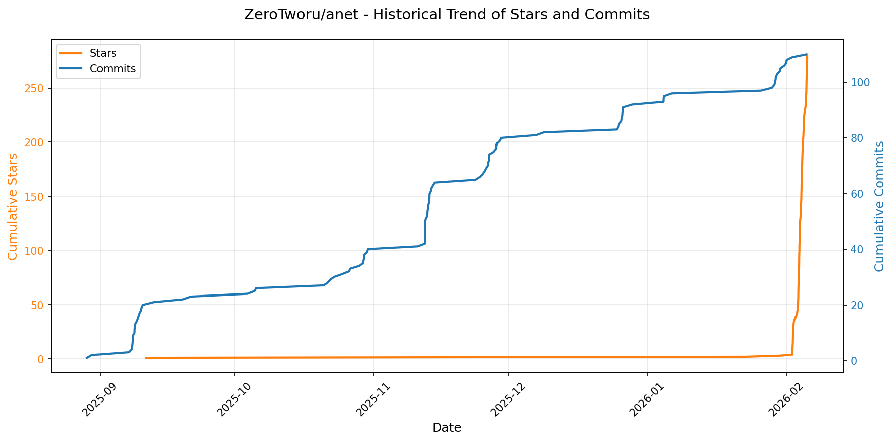

> *蓝色：累计 Stars｜橙色：累计 Commits（次 Y 轴）*

<b>📄 README 摘要</b>

1. **项目功能**  
ANet（朋友网络）是一个用于在互相信任的亲密个体之间构建私有、安全信息空间的去中心化通信工具。它不依赖传统互联网服务提供商或云平台，而是通过自研协议直接建立端到端连接，旨在绕过网络审查与封锁，在受限或不稳定网络环境中（如高丢包、弱连接、深度包检测环境）实现可靠、隐蔽的信息互通。

2. **核心特性**  
- **端到端强加密**：采用 ChaCha20-Poly1305 对称加密与 X25519 密钥交换，保障通信全程机密性与完整性；  
- **抗干扰高鲁棒性**：专为高丢包率、低带宽、频繁断连等恶劣网络条件优化，确保连接稳定性；  
- **流量伪装能力**：ASTP 协议底层 UDP 流具备高熵特征，外观与随机噪声无异，有效规避 DPI（深度包检测）识别与阻断；  
- **全平台支持**：提供 Linux/Windows 命令行与图形界面客户端、Android 移动端（含 JNI 绑定），覆盖主流终端场景；  
- **零信任架构设计**：无中央服务器存储用户数据，协调节点（`anet-server`）仅负责初始握手与地址发现，不参与消息转发或解密。

3. **技术栈**  
- **主语言**：Rust（1.84+），强调内存安全、并发性能与零成本抽象；  
- **核心协议**：自研 ASTP v1.0（ANet Secure Transport Protocol），基于 UDP 实现，集成密钥协商、前向保密、抗重放与流量混淆机制；  
- **密码学组件**：使用 Rust 生态成熟 crate（如 `ring` 或 `libsodium-sys` 风格实现）完成 X25519 密钥交换与 ChaCha20-Poly1305 AEAD 加密；  
- **模块化架构**：各子模块（服务端、CLI/GUI 客户端、移动端 SDK、通用协议库、密钥生成工具）严格解耦，通过 `anet-common` 统一提供协议与加解密能力；  
- **构建系统**：标准 Rust/Cargo 工具链，支持一键全量编译（`cargo build --release`）。

---

