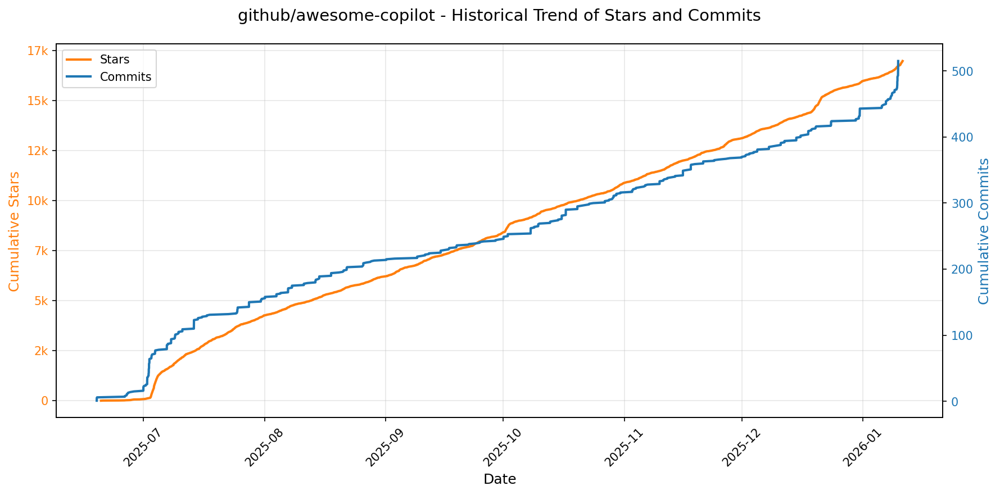

# 🌟 GitHub Trending 概览

> 数据更新于：2026-01-11。

---

## 🔍 项目详情

### 1. [hacksider/Deep-Live-Cam](https://github.com/hacksider/Deep-Live-Cam)
- 📅 **创建日期**：2023-09-24  
- 🔄 **最近更新**：2026-01-11  
- ⭐ **Stars**：77,184（日 +202｜周 +501｜月 +1113）  
- 📝 **描述**：real time face swap and one-click video deepfake with only a single image  

<b>📈 Star 与 Commit 历史趋势</b>

> *蓝色：累计 Stars｜橙色：累计 Commits（次 Y 轴）*

<b>📄 README 摘要</b>

1. 该项目是一个实时人脸交换和视频深度伪造工具，仅需单张图像即可一键完成。它支持在直播、视频通话、电影播放或实时表演中进行人脸替换，并内置了防止处理不当内容（如裸露、暴力画面等）的检查机制，强调用户需合法合规、尊重他人权利地使用该技术。

2. 关键功能包括：实时人脸交换（支持单脸及多脸同时映射）、保留原始嘴部动作以实现更自然的口型同步（Mouth Mask）、通过摄像头进行实时直播换脸、观看电影时实时替换演员面孔、创建 meme 内容、用于 Omegle 等社交平台的趣味互动。所有功能均在实时模式下运行，操作简便，仅需三步即可启动。

3. 技术栈基于 Python（推荐 3.11 版本），使用 ONNX Runtime 作为推理引擎，支持多种硬件加速后端，包括 CUDA（NVIDIA GPU）、CoreML（Apple Silicon M 系列芯片）、DirectML（Windows）、OpenVINO（Intel）以及 CPU 模式。依赖的关键模型包括 GFPGANv1.4（用于人脸增强）和 inswapper_128_fp16.onnx（用于人脸交换），并集成 ffmpeg 进行视频处理，tkinter 构建图形界面，同时利用 InsightFace 项目的人脸识别与对齐技术。

---

### 2. [anomalyco/opencode](https://github.com/anomalyco/opencode)
- 📅 **创建日期**：2025-04-30  
- 🔄 **最近更新**：2026-01-11  
- ⭐ **Stars**：59,989（日 +2232｜周 +13585｜月 +22054）  
- 📝 **描述**：The open source coding agent.  

<b>📈 Star 与 Commit 历史趋势</b>

> *蓝色：累计 Stars｜橙色：累计 Commits（次 Y 轴）*

<b>📄 README 摘要</b>

1. 该项目是一个开源的AI编程代理工具，旨在通过人工智能辅助开发者完成代码编写、分析和探索任务。它可以在终端中运行，支持本地或远程模型，帮助用户进行开发工作、代码理解与规划，并可在不修改文件的情况下对代码库进行只读分析。

2. 关键功能包括：内置两种智能代理模式（“build”用于完整开发，“plan”用于只读分析）；支持多模型后端（如Claude、OpenAI、Google及本地模型），具备供应商无关性；开箱即用的LSP（语言服务器协议）支持；采用客户端/服务器架构，允许从移动设备等远程控制本地实例；提供TUI（终端用户界面）优先体验，适合终端重度用户；可通过`@general`子代理处理复杂搜索和多步骤任务；支持多种安装方式（包括npm、Homebrew、Scoop、Chocolatey、Mise等），并提供跨平台桌面应用（Beta版）。

3. 技术栈主要包括：基于TypeScript/JavaScript构建，使用Node.js环境运行；前端包含Web界面和终端TUI界面，支持现代包管理器；采用客户端-服务器架构设计；集成LSP实现语言智能功能；支持通过API对接多种大语言模型（LLM），包括云端和本地部署模型；项目发布和构建流程由GitHub Actions驱动；支持Nix、Mise等现代化开发环境管理工具。

---

### 3. [OpenBB-finance/OpenBB](https://github.com/OpenBB-finance/OpenBB)
- 📅 **创建日期**：2020-12-20  
- 🔄 **最近更新**：2026-01-11  
- ⭐ **Stars**：58,025（日 +138｜周 +1565｜月 +2753）  
- 📝 **描述**：Financial data platform for analysts, quants and AI agents.  

<b>📈 Star 与 Commit 历史趋势</b>

> *蓝色：累计 Stars｜橙色：累计 Commits（次 Y 轴）*

<b>📄 README 摘要</b>

1. **这个项目是做什么的？**  
   Open Data Platform by OpenBB（ODP）是一个开源工具集，旨在帮助数据工程师将专有、授权和公共数据源集成到下游应用中，例如AI助手和研究仪表板。它作为“连接一次，处处使用”的基础设施层，统一整合数据，并同时向多个终端提供服务：面向量化分析师的Python环境、面向金融分析师的OpenBB Workspace和Excel、面向AI代理的MCP服务器，以及其他应用程序的REST API。

2. **主要功能**  
   - 支持多种数据源集成，包括自有、许可及公开金融数据。  
   - 提供Python SDK（`openbb`包），可通过简单代码调用历史股价等数据（如 `obb.equity.price.historical("AAPL")`）。  
   - 可启动本地FastAPI服务器（默认端口6900），将ODP与OpenBB Workspace对接，实现可视化分析。  
   - 支持通过CLI命令行接口直接访问平台功能。  
   - 与OpenBB Workspace无缝集成，支持AI代理（MCP服务器）接入，增强智能分析能力。  
   - 提供Google Colab、VS Code Dev Containers、GitHub Codespaces等多种开发环境快速启动方式。  

3. **技术栈**  
   - 核心语言：Python（支持版本 3.9.21 - 3.12）  
   - 后端框架：FastAPI + Uvicorn（用于运行本地API服务器）  
   - 包管理：pip（PyPI发布包 `openbb` 和 `openbb-cli`）  
   - 前端集成：OpenBB Workspace（企业级UI，云端部署）  
   - 数据接口：RESTful API、MCP（Model Context Protocol）服务器支持  
   - 开发/部署工具：Docker（Dev Containers）、GitHub Codespaces、Google Colab  
   - 许可证：AGPLv3

---

### 4. [anthropics/claude-code](https://github.com/anthropics/claude-code)
- 📅 **创建日期**：2025-02-22  
- 🔄 **最近更新**：2026-01-11  
- ⭐ **Stars**：54,846（日 +569｜周 +4054｜月 +9450）  
- 📝 **描述**：Claude Code is an agentic coding tool that lives in your terminal, understands your codebase, and helps you code faster by executing routine tasks, explaining complex code, and handling git workflows - all through natural language commands.  

<b>📈 Star 与 Commit 历史趋势</b>

> *蓝色：累计 Stars｜橙色：累计 Commits（次 Y 轴）*

<b>📄 README 摘要</b>

1. 该项目是一个驻留在终端中的代理式编程工具，能够理解用户的代码库，通过自然语言指令帮助用户更快地编写代码。它可执行常规编码任务、解释复杂代码逻辑，并管理 Git 工作流，支持在终端、IDE 中使用，也可通过在 GitHub 上标记 @claude 进行交互。

2. 主要功能包括：通过自然语言命令与代码库交互；自动化处理日常开发任务；解释项目中的复杂代码；集成 Git 工作流管理；支持多种安装方式（脚本、Homebrew、PowerShell、NPM）；可通过插件系统扩展功能；内置错误报告命令（/bug）；支持与 GitHub 集成；注重数据隐私与安全。

3. 技术栈基于 Node.js 18 及以上版本，使用 npm 作为包管理工具，核心为 JavaScript/TypeScript（由 Node.js 环境推断），并通过命令行脚本（bash 和 PowerShell）实现跨平台安装。项目本身作为全局 npm 包（@anthropic-ai/claude-code）分发，依赖本地运行时环境与远程服务协同工作。

---

### 5. [usememos/memos](https://github.com/usememos/memos)
- 📅 **创建日期**：2021-12-08  
- 🔄 **最近更新**：2026-01-11  
- ⭐ **Stars**：52,956（日 +159｜周 +2598｜月 +5985）  
- 📝 **描述**：An open-source, self-hosted note-taking service. Your thoughts, your data, your control — no tracking, no ads, no subscription fees.  

<b>📈 Star 与 Commit 历史趋势</b>

> *蓝色：累计 Stars｜橙色：累计 Commits（次 Y 轴）*

<b>📄 README 摘要</b>

1. **这个项目是做什么的？**  
Memos 是一个开源、可自托管的笔记服务，专注于隐私保护和个人数据控制。它允许用户在个人服务器上搭建知识库，用于记录个人笔记、团队维基和知识管理。所有数据完全由用户掌控，无追踪、无广告、无订阅费用，支持随时导出数据，避免厂商锁定。

2. **主要功能**  
- **隐私优先**：完全自托管，零遥测，确保数据安全与所有权。  
- **原生支持 Markdown**：使用标准 Markdown 编辑笔记，内容以纯文本存储，便于迁移和备份。  
- **极速性能**：基于 Go 和 React 构建，加载迅速，响应灵敏。  
- **简单部署**：支持一键 Docker 部署，兼容 SQLite、MySQL 和 PostgreSQL 数据库。  
- **开发者友好**：提供完整的 REST 和 gRPC API，便于集成到其他系统或自动化流程中。  
- **美观界面**：简洁现代的 UI 设计，支持暗黑模式和移动端自适应布局。

3. **技术栈**  
- 后端：Go（Golang）  
- 前端：React  
- 数据库：支持 SQLite、MySQL、PostgreSQL  
- 部署方式：Docker、Docker Compose、Kubernetes（Helm）、预编译二进制文件、源码构建

---

### 6. [virattt/ai-hedge-fund](https://github.com/virattt/ai-hedge-fund)
- 📅 **创建日期**：2024-11-29  
- 🔄 **最近更新**：2026-01-11  
- ⭐ **Stars**：45,136（日 +49｜周 +755｜月 +2613）  
- 📝 **描述**：An AI Hedge Fund Team  

<b>📈 Star 与 Commit 历史趋势</b>

> *蓝色：累计 Stars｜橙色：累计 Commits（次 Y 轴）*

<b>📄 README 摘要</b>

1. 该项目做什么？  
本项目是一个AI驱动的对冲基金概念验证系统，旨在探索利用人工智能进行股票交易决策。它模拟多位著名投资大师（如巴菲特、芒格、达摩达兰等）构建多个AI代理，每个代理基于不同的投资哲学（如价值投资、成长投资、宏观投资等）分析股票，并综合生成交易信号。系统包含估值、情绪、基本面和技术面等多个分析模块，由风险管理和投资组合管理代理协同工作以做出最终投资决策。需要注意的是，该系统不执行真实交易，仅用于教育和研究目的。

2. 主要功能  
- 集成18个AI代理，包括12位模仿知名投资者策略的分析代理（如巴菲特、彼得·林奇、凯茜·伍德等），以及估值、情绪、基本面、技术面、风险管理和投资组合管理等专业代理。  
- 支持多维度股票分析：结合故事叙述、财务数据、市场情绪、技术指标和宏观趋势进行综合判断。  
- 提供命令行接口（CLI）和Web图形界面两种运行方式，便于不同用户使用。  
- 内置回测功能，可在指定时间范围内模拟投资决策过程。  
- 支持通过OpenAI、Anthropic、Groq、DeepSeek等多种大模型API或本地Ollama部署的LLM运行AI推理。  
- 可分析主流股票（如AAPL、NVDA等），部分数据免费，扩展数据需通过金融数据API获取。  
- 强调风险管理，具备风险指标计算与仓位限制设置能力。

3. 技术栈  
- 编程语言：Python  
- 依赖管理：Poetry  
- 大语言模型支持：OpenAI API、Anthropic API、Groq API、DeepSeek API，以及本地Ollama框架  
- 前端界面：Web应用（具体框架未明确说明，位于`/app`目录下）  
- 配置管理：通过`.env`文件管理API密钥和环境变量  
- 数据源：Financial Datasets API（部分股票数据免费）  
- 构建与部署：Git版本控制，支持本地安装与运行  
- 许可证：MIT License

---

### 7. [exo-explore/exo](https://github.com/exo-explore/exo)
- 📅 **创建日期**：2024-06-24  
- 🔄 **最近更新**：2026-01-11  
- ⭐ **Stars**：39,786（日 +39｜周 +461｜月 +7084）  
- 📝 **描述**：Run your own AI cluster at home with everyday devices 📱💻 🖥️⌚  

<b>📈 Star 与 Commit 历史趋势</b>

> *蓝色：累计 Stars｜橙色：累计 Commits（次 Y 轴）*

<b>📄 README 摘要</b>

1. 该项目做什么？  
   exo 是一个允许用户将日常设备（如 Mac）连接起来，构建个人本地 AI 集群的开源项目。它能够将大型语言模型分布到多个设备上运行，突破单个设备的内存和算力限制。通过支持 RDMA over Thunderbolt 技术，显著降低设备间通信延迟，提升推理速度。系统可自动发现网络中的设备，智能根据设备资源和拓扑结构分配模型任务，实现高效分布式推理。

2. 关键特性：  
   - **自动设备发现**：运行 exo 的设备可自动相互发现，无需手动配置。  
   - **Thunderbolt 支持 RDMA**：原生支持 Thunderbolt 5 上的 RDMA（远程直接内存访问），设备间通信延迟降低高达 99%。  
   - **拓扑感知的自动并行**：根据实时设备拓扑、资源状况和网络带宽/延迟，智能选择最优的模型分割与部署策略。  
   - **张量并行支持**：支持模型张量并行切分，在 2 台设备上最高可达 1.8 倍加速，4 台设备上最高 3.2 倍加速。  
   - **MLX 后端支持**：使用 Apple 的 MLX 框架作为推理后端，并集成 MLX distributed 实现高效的分布式通信。  
   - **提供 API 与仪表盘**：内置 Web 仪表盘（http://localhost:52415）和兼容 OpenAI 格式的 API，便于监控和交互。  

3. 技术栈：  
   - **编程语言**：Rust（用于核心绑定）、Python（主逻辑）、JavaScript/Node.js（用于仪表盘前端）。  
   - **依赖工具**：uv（Python 依赖管理）、npm（前端包管理）、rustup nightly（Rust 夜间版工具链）。  
   - **核心框架**：MLX（Apple 推出的机器学习框架，用于模型推理）和 MLX distributed（用于设备间通信）。  
   - **硬件支持**：macOS 上利用 GPU 加速（Apple Silicon），Linux 当前仅支持 CPU（GPU 支持开发中）。  
   - **操作系统要求**：macOS Tahoe 26.2 或更高版本（需启用 RDMA 功能）；Linux 系统支持正在完善。  
   - **通信技术**：RDMA over Thunderbolt 5，用于低延迟高带宽的设备间数据传输。

---

### 8. [twentyhq/twenty](https://github.com/twentyhq/twenty)
- 📅 **创建日期**：2022-12-01  
- 🔄 **最近更新**：2026-01-11  
- ⭐ **Stars**：38,404（日 +275｜周 +624｜月 +1272）  
- 📝 **描述**：Building a modern alternative to Salesforce, powered by the community.  

<b>📈 Star 与 Commit 历史趋势</b>

> *蓝色：累计 Stars｜橙色：累计 Commits（次 Y 轴）*

<b>📄 README 摘要</b>

1. 该项目是一个开源的客户关系管理（CRM）系统，旨在提供一个现代化、可自定义且价格合理的替代方案。它允许用户通过个性化布局、自定义数据模型和自动化工作流来管理客户信息，并支持邮件、日程、文件等功能，致力于打破传统CRM中数据锁定和高成本的问题。

2. 关键功能包括：支持过滤、排序、分组以及看板和表格视图的个性化界面；可自定义对象和字段以适应不同业务需求；基于角色的权限管理和访问控制；通过触发器和动作实现工作流程自动化；集成电子邮件、日历事件、文件存储等常用办公功能。

3. 技术栈主要包括：TypeScript 作为主要开发语言；使用 Nx 进行项目管理和构建优化；后端采用 NestJS 框架，结合 BullMQ 处理任务队列，PostgreSQL 作为主数据库，Redis 用于缓存和临时数据存储；前端基于 React，状态管理使用 Recoil，样式方案为 Emotion，国际化支持由 Lingui 提供。

---

### 9. [google/googletest](https://github.com/google/googletest)
- 📅 **创建日期**：2015-07-28  
- 🔄 **最近更新**：2026-01-11  
- ⭐ **Stars**：38,028（日 +70｜周 +348｜月 +469）  
- 📝 **描述**：GoogleTest - Google Testing and Mocking Framework  

<b>📈 Star 与 Commit 历史趋势</b>

> *蓝色：累计 Stars｜橙色：累计 Commits（次 Y 轴）*

<b>📄 README 摘要</b>

1. 该项目是 Google 开发的 C++ 测试框架（GoogleTest），用于编写和运行 C++ 单元测试。它合并了原先独立的 GoogleTest 和 GoogleMock 项目，提供了一套完整的测试工具，能够自动发现并执行测试用例，广泛应用于包括 Chromium、LLVM、Protocol Buffers 和 OpenCV 等知名开源项目中。

2. 主要特性包括：基于 xUnit 架构的测试框架；支持自动测试发现；提供丰富的断言库（如相等性、异常等）并允许用户自定义断言；支持“死亡测试”（验证程序是否以预期方式崩溃）；支持致命与非致命失败，使测试可在出错后继续执行；支持值参数化测试和类型参数化测试，便于对多种输入或数据类型进行测试；提供多种测试运行选项，如运行指定测试、控制执行顺序和并行运行测试。

3. 技术栈：C++17 或更高版本；构建系统使用 CMake；项目采用 Google 内部系统进行持续集成；未来计划依赖 Abseil-C++ 库；支持平台遵循 Google 的基础 C++ 支持策略，涵盖主流编译器（如 GCC、Clang、MSVC）和操作系统（如 Linux、Windows、macOS）。

---

### 10. [anthropics/skills](https://github.com/anthropics/skills)
- 📅 **创建日期**：2025-09-22  
- 🔄 **最近更新**：2026-01-11  
- ⭐ **Stars**：37,206（日 +566｜周 +4810｜月 +16842）  
- 📝 **描述**：Public repository for Agent Skills  

<b>📈 Star 与 Commit 历史趋势</b>

> *蓝色：累计 Stars｜橙色：累计 Commits（次 Y 轴）*

<b>📄 README 摘要</b>

1. 该项目提供了Anthropic为Claude设计的技能（Skills）实现示例。这些技能是包含指令、脚本和资源的文件夹，Claude可动态加载以提升在特定任务上的表现。项目旨在展示如何通过技能让Claude重复完成具体任务，例如按照公司品牌规范创建文档、使用组织特定流程分析数据或自动化个人事务。

2. 关键特性包括：每个技能自成一体，存放于独立文件夹并配有SKILL.md文件，内含Claude所需的说明与元数据；涵盖创意设计、技术开发、企业通信及文档处理等多种应用场景；提供文档类技能（如docx、pdf、pptx、xlsx）的实际参考实现；支持在Claude Code、Claude.ai和Claude API中使用或安装技能；可通过插件市场添加整个仓库作为技能来源，并按需安装特定技能集；提供技能模板方便用户快速创建自定义技能；部分技能开源（Apache 2.0），部分为源码可用但非开源。

3. 技术栈主要包括：基于Markdown格式的SKILL.md文件，包含YAML前端描述和操作指令；使用简单文件夹结构组织技能；依赖Claude平台原生支持来加载和执行技能；通过命令行接口在Claude Code中注册和管理技能插件；结合外部服务如Notion等形成合作伙伴技能生态；无复杂编程框架，强调轻量级配置与声明式指令。

---

### 11. [Lissy93/web-check](https://github.com/Lissy93/web-check)
- 📅 **创建日期**：2023-06-25  
- 🔄 **最近更新**：2026-01-11  
- ⭐ **Stars**：29,324（日 +110｜周 +2205｜月 +2352）  
- 📝 **描述**：🕵️‍♂️ All-in-one OSINT tool for analysing any website  

<b>📈 Star 与 Commit 历史趋势</b>

> *蓝色：累计 Stars｜橙色：累计 Commits（次 Y 轴）*

---

### 12. [simstudioai/sim](https://github.com/simstudioai/sim)
- 📅 **创建日期**：2025-01-05  
- 🔄 **最近更新**：2026-01-11  
- ⭐ **Stars**：25,300（日 +121｜周 +407｜月 +6338）  
- 📝 **描述**：Open-source platform to build and deploy AI agent workflows.  

<b>📈 Star 与 Commit 历史趋势</b>

> *蓝色：累计 Stars｜橙色：累计 Commits（次 Y 轴）*

<b>📄 README 摘要</b>

1. 该项目是一个用于构建和部署AI代理工作流的平台，允许用户通过可视化画布连接代理、工具和模块来设计自动化流程，并支持使用自然语言生成节点、修复错误以及基于文档向量数据库实现知识增强的问答功能。

2. 关键特性包括：可视化的拖拽式工作流编排界面；集成Copilot功能，可通过自然语言指令自动生成或修改流程节点；支持上传文档至向量数据库，使AI代理能够基于特定内容进行语义检索与回答；提供云端托管服务（sim.ai）及多种本地化部署方式（NPM、Docker Compose、Dev Containers等）；兼容Ollama和vLLM等本地大模型运行时，无需依赖外部API即可执行AI任务；支持实时通信与后台任务处理。

3. 技术栈主要包括：Next.js（App Router）作为前端框架；Bun作为运行时环境；PostgreSQL配合Drizzle ORM和pgvector扩展用于数据与向量存储；认证系统采用Better Auth；UI组件库为Shadcn与Tailwind CSS；状态管理使用Zustand；流程图编辑器基于ReactFlow；文档系统由Fumadocs提供；项目结构为Turborepo管理的单体仓库；实现实时通信依赖Socket.io；后台任务调度使用Trigger.dev；远程代码执行能力由E2B提供支持。

---

### 13. [bytedance/UI-TARS-desktop](https://github.com/bytedance/UI-TARS-desktop)
- 📅 **创建日期**：2025-01-19  
- 🔄 **最近更新**：2026-01-11  
- ⭐ **Stars**：22,364（日 +458｜周 +2032｜月 +2571）  
- 📝 **描述**：The Open-Source Multimodal AI Agent Stack: Connecting Cutting-Edge AI Models and Agent Infra  

<b>📈 Star 与 Commit 历史趋势</b>

> *蓝色：累计 Stars｜橙色：累计 Commits（次 Y 轴）*

<b>📄 README 摘要</b>

1. 该项目做什么？  
本项目是一个多模态AI智能体技术栈，包含两个核心组件：Agent TARS 和 UI-TARS Desktop。Agent TARS 是一个通用的多模态AI代理系统，可将图形用户界面（GUI）代理和视觉能力集成到终端、计算机、浏览器及各类产品中，支持通过自然语言指令完成复杂任务（如订机票、订酒店、生成图表等）。它提供命令行接口（CLI）和Web界面，利用先进的多模态大模型与现实世界工具（通过MCP协议）无缝集成，实现类人工作流。UI-TARS Desktop 是一个桌面应用程序，基于UI-TARS模型为本地和远程计算机提供原生GUI自动化代理功能，支持通过自然语言控制操作系统和浏览器，实现精准的鼠标键盘操作。

2. 核心特性  
- **开箱即用的CLI**：支持一键启动，提供带图形界面的Web UI模式和无头服务器模式。  
- **混合浏览器代理**：可通过视觉识别（GUI Agent）、DOM解析或混合策略控制浏览器。  
- **事件流驱动架构**：基于协议的事件流支持上下文工程和代理界面构建，便于调试与数据追踪。  
- **MCP工具集成**：基于MCP（Model Context Protocol）内核，可挂载多种MCP服务器以连接真实世界工具。  
- **本地与远程操作**：UI-TARS Desktop 支持本地及远程计算机和浏览器的自然语言控制，无需复杂配置。  
- **视觉语言模型支持**：基于VL模型实现屏幕截图识别、自然语言理解与精确输入控制。  
- **跨平台与安全性**：支持 Windows、macOS 及浏览器，支持完全本地化处理，保障隐私安全。  
- **流式输出与沙箱环境**：支持多工具流式响应，集成AIO agent Sandbox作为隔离的一体化执行环境。

3. 技术栈  
- **核心模型**：依赖多模态大语言模型（如 doubao-1-5-thinking-vision-pro、claude-3-7-sonnet），以及自研的 UI-TARS 和 Seed-1.5-VL/1.6 系列视觉语言模型。  
- **前端技术**：Web UI 使用现代Web框架构建（具体未说明，但涉及GitBook文档与网页交互）。  
- **后端与运行时**：基于 Node.js（要求 >= v22）运行 CLI 工具，支持通过 npm 全局安装与执行。  
- **通信协议**：采用 MCP（Model Context Protocol）实现AI代理与外部工具的集成与通信。  
- **部署平台**：支持在本地运行，也支持通过 ModelScope 等云平台进行模型部署。  
- **开发工具**：提供 UI TARS SDK，用于构建跨平台的GUI自动化代理应用；支持 Hugging Face 和 ModelScope 模型托管。  
- **辅助技术**：集成事件流 viewer、支持 DOM 操作与视觉定位（visual grounding）、远程控制协议等。

---

### 14. [resemble-ai/chatterbox](https://github.com/resemble-ai/chatterbox)
- 📅 **创建日期**：2025-04-23  
- 🔄 **最近更新**：2026-01-11  
- ⭐ **Stars**：21,188（日 +76｜周 +740｜月 +6287）  
- 📝 **描述**：SoTA open-source TTS  

<b>📈 Star 与 Commit 历史趋势</b>

> *蓝色：累计 Stars｜橙色：累计 Commits（次 Y 轴）*

<b>📄 README 摘要</b>

1. 该项目是一个由 Resemble AI 开发的开源文本转语音（TTS）模型系列，名为 Chatterbox。其最新模型 Chatterbox-Turbo 专为高效、低延迟的语音生成而设计，适用于零样本语音克隆和语音代理场景。它能基于简短的参考音频片段合成高质量、逼真的目标说话人语音，并原生支持咳嗽、笑声等副语言标签以增强表达的真实感。所有生成的音频均内置了可感知阈值（PerTh）数字水印，用于负责任地使用 AI 生成内容。

2. 关键特性包括：Chatterbox-Turbo 模型仅3.5亿参数，计算和显存需求低，推理速度快（解码从10步优化至1步）；支持 [cough]、[laugh] 等副语言标签注入；支持零样本语音克隆；提供多语言版本（支持23种以上语言）；内置不可察觉且鲁棒性强的神经水印技术，可抵御MP3压缩和编辑等操作；提供简单易用的 Python API 进行快速部署和集成。

3. 技术栈包括：Python 3.11；PyTorch；torchaudio；Hugging Face Spaces（用于在线演示）；依赖库版本在 `pyproject.toml` 中锁定以保证一致性；水印系统基于 Resemble AI 的 Perth (Perceptual Threshold) Watermarker；模型开发和测试环境为 Debian 11 操作系统。

---

### 15. [ChromeDevTools/chrome-devtools-mcp](https://github.com/ChromeDevTools/chrome-devtools-mcp)
- 📅 **创建日期**：2025-09-11  
- 🔄 **最近更新**：2026-01-11  
- ⭐ **Stars**：20,098（日 +299｜周 +1593｜月 +3776）  
- 📝 **描述**：Chrome DevTools for coding agents  

<b>📈 Star 与 Commit 历史趋势</b>

> *蓝色：累计 Stars｜橙色：累计 Commits（次 Y 轴）*

<b>📄 README 摘要</b>

1. 该项目使编码代理（如Gemini、Claude、Cursor或Copilot）能够控制和检查实时Chrome浏览器。它作为一个模型-上下文-协议（MCP）服务器，为AI编码助手提供完整的Chrome DevTools功能，用于可靠的自动化、深入的调试和性能分析。

2. 关键特性包括：获取性能洞察，通过记录追踪并提取可操作的性能数据；高级浏览器调试，可分析网络请求、截取屏幕截图及检查浏览器控制台；可靠自动化，利用puppeteer库在Chrome中执行操作，并自动等待操作结果。

3. 技术栈主要包括Node.js（v20.19或更高版本）、Chrome浏览器（当前稳定版或更新版本）以及npm。项目依赖于puppeteer库来实现浏览器自动化，并基于Chrome DevTools进行性能和调试功能的开发。

---

### 16. [DayuanJiang/next-ai-draw-io](https://github.com/DayuanJiang/next-ai-draw-io)
- 📅 **创建日期**：2025-03-23  
- 🔄 **最近更新**：2026-01-11  
- ⭐ **Stars**：17,784（日 +172｜周 +1242｜月 +10338）  
- 📝 **描述**：A next.js web application that integrates AI capabilities with draw.io diagrams. This app allows you to create, modify, and enhance diagrams through natural language commands and AI-assisted visualization.  

<b>📈 Star 与 Commit 历史趋势</b>

> *蓝色：累计 Stars｜橙色：累计 Commits（次 Y 轴）*

<b>📄 README 摘要</b>

1. 该项目是一个基于 Next.js 的网络应用，将人工智能能力与 draw.io 图表工具集成，允许用户通过自然语言指令创建、修改和增强图表。用户可以通过聊天方式生成架构图、流程图等可视化内容，并支持从图像、PDF 或文本文件中提取信息自动生成或优化图表。

2. 主要功能包括：  
   - 基于大语言模型（LLM）的图表生成与编辑，支持自然语言指令操作  
   - 支持上传图片并由 AI 自动复现和优化为可编辑图表  
   - 支持上传 PDF 和文本文件，从中提取内容生成图表  
   - 显示 AI 推理过程（适用于 OpenAI o1/o3、Gemini、Claude 等支持模型）  
   - 提供图表历史版本管理，可查看和恢复之前的版本  
   - 实时交互式聊天界面，持续优化图表  
   - 专为云架构图设计，支持 AWS、GCP、Azure 官方图标  
   - 支持动态动画连接线，提升可视化效果  
   - 支持 MCP 协议（预览功能），可与 Claude Code、Cursor、VS Code 等 AI 编辑器集成，在代码环境中直接生成图表  

3. 技术栈包括：  
   - 前端框架：Next.js 16.x、React 19.x  
   - 图表核心：react-drawio（用于渲染和操作 draw.io 图表的 XML 数据）  
   - AI 集成：Vercel AI SDK（`ai` + `@ai-sdk/*`），实现流式响应和多平台 AI 模型支持  
   - 支持多种 AI 提供商：AWS Bedrock（默认）、OpenAI、Anthropic（Claude）、Google AI、Azure OpenAI、Ollama、OpenRouter、DeepSeek、ByteDance Doubao、SiliconFlow、ModelScope、SGLang、Vercel AI Gateway 等  
   - 部署支持：Vercel、Cloudflare Workers、Tencent EdgeOne Pages，并可通过 Docker 运行  
   - 图表数据格式：draw.io 的 XML 格式，确保兼容性和可导出性

---

### 17. [github/awesome-copilot](https://github.com/github/awesome-copilot)
- 📅 **创建日期**：2025-06-11  
- 🔄 **最近更新**：2026-01-11  
- ⭐ **Stars**：16,964（日 +230｜周 +850｜月 +2968）  
- 📝 **描述**：Community-contributed instructions, prompts, and configurations to help you make the most of GitHub Copilot.  

<b>📈 Star 与 Commit 历史趋势</b>

> *蓝色：累计 Stars｜橙色：累计 Commits（次 Y 轴）*

<b>📄 README 摘要</b>

1. 该项目旨在通过提供一系列自定义的智能体（Agents）、提示词（Prompts）、指令（Instructions）、技能（Skills）和集合（Collections），来增强 GitHub Copilot 的功能。它作为一个社区共建的工具包，帮助开发者在不同领域、编程语言和使用场景下提升编码效率和质量。

2. 关键特性包括：
    - **Awesome Agents**：可与 MCP 服务器集成的专用智能体，为特定工作流提供增强能力。
    - **Awesome Prompts**：针对具体任务的提示词，用于生成代码、文档或解决问题。
    - **Awesome Instructions**：应用于特定文件模式或整个项目的编码规范和最佳实践指南。
    - **Awesome Skills**：包含说明和资源的独立文件夹，用于提升 AI 在特定任务上的能力。
    - **Awesome Collections**：围绕特定主题和工作流整理的相关提示、指令和聊天模式的精选合集。
    - 提供 MCP 服务器支持，可通过 Docker 快速部署，并直接在 VS Code 等编辑器中搜索和安装自定义内容。
    - 支持通过 `/` 命令调用提示，在代理会话中激活自定义智能体，以及基于文件模式自动应用指令。

3. 技术栈主要包括：
    - **MCP (Model Context Protocol) Server**：作为核心服务，通过标准输入输出与客户端通信。
    - **Docker**：用于容器化部署 MCP 服务器。
    - **JSON**：用于配置 MCP 服务器的连接信息。
    - 项目本身基于纯文本和 Markdown 文件组织内容（如 `.prompt.md`, `.instructions.md`, `.agent.md`, `.collection.yml`），并辅以少量维护用的脚本（位于 `scripts/` 目录）。

---

### 18. [obra/superpowers](https://github.com/obra/superpowers)
- 📅 **创建日期**：2025-10-09  
- 🔄 **最近更新**：2026-01-11  
- ⭐ **Stars**：16,231（日 +739｜周 +2706｜月 +6789）  
- 📝 **描述**：Claude Code superpowers: core skills library  

<b>📈 Star 与 Commit 历史趋势</b>

> *蓝色：累计 Stars｜橙色：累计 Commits（次 Y 轴）*

<b>📄 README 摘要</b>

1. **这个项目是做什么的？**  
Superpowers 是一个为编程智能体（coding agents）设计的完整软件开发工作流系统。它通过一系列可组合的“技能”和初始指令，使编码智能体在开发过程中遵循严谨、系统化的工程实践。项目的核心目标是让智能体在写代码前先与用户沟通明确需求，生成可验证的设计方案，并基于此制定详细实施计划，随后以子智能体协作的方式逐步执行任务。整个流程强调测试驱动开发（TDD）、YAGNI（你不会需要它）和 DRY（不要重复自己）等原则，确保开发过程可控、透明且高质量。

2. **关键特性**  
- **自动触发的技能系统**：智能体在执行任何任务前会自动检查并应用相关技能，确保关键流程强制执行而非建议。  
- **交互式需求梳理（brainstorming）**：在编码前通过提问澄清用户意图，分段输出设计供用户确认。  
- **精细化实现计划（writing-plans）**：将工作拆解为2-5分钟可完成的小任务，每个任务包含具体文件路径、完整代码和验证步骤。  
- **子智能体驱动开发（subagent-driven-development）**：为每个任务派遣独立子智能体，执行双阶段审查（合规性+代码质量），支持并行处理。  
- **严格的测试驱动开发（test-driven-development）**：强制执行红-绿-重构循环，禁止先写代码后补测试，失败测试必须先运行确认。  
- **Git 工作区隔离（using-git-worktrees）**：在独立分支中进行开发，确保主环境干净，支持安全迭代。  
- **自动化代码审查（requesting-code-review）**：任务间自动审查，按严重程度报告问题，关键问题阻断流程。  
- **全流程闭环管理**：从设计到合并/PR 提交均有标准化流程，完成后清理临时工作区。  
- **跨平台支持**：兼容 Claude Code（插件市场安装）、Codex 和 OpenCode，提供不同平台的安装指南。  
- **技能可扩展性**：开放技能库，允许开发者贡献新技能，并提供创建技能的最佳实践指导。

3. **技术栈**  
- **核心架构**：基于智能体（Agent-based）的工作流引擎，依赖外部大模型（如 Claude、Codex 等）作为执行主体。  
- **技能定义语言**：使用 Markdown 格式（`.md`）编写技能文档（SKILL.md），内置结构化指令与行为规范。  
- **版本控制集成**：深度集成 Git，利用 worktree 实现多任务并行开发隔离。  
- **插件系统**：针对 Claude Code 构建了 Marketplace 插件机制，支持安装、更新和管理。  
- **自动化更新机制**：通过 `/plugin update superpowers` 命令实现技能库的动态更新。  
- **平台适配层**：为 Codex 和 OpenCode 提供专用安装脚本与配置说明（通过远程 URL 获取初始化指令）。  
- **开发哲学支撑技术**：强调 TDD、系统化调试、证据验证等方法论，内建反模式识别与根因分析流程。  
- **开源协作工具链**：托管于 GitHub，采用 Fork + Pull Request 模式贡献，MIT 许可证。

---

### 19. [BloopAI/vibe-kanban](https://github.com/BloopAI/vibe-kanban)
- 📅 **创建日期**：2025-06-14  
- 🔄 **最近更新**：2026-01-11  
- ⭐ **Stars**：14,611（日 +162｜周 +2566｜月 +8182）  
- 📝 **描述**：Get 10X more out of Claude Code, Codex or any coding agent  

<b>📈 Star 与 Commit 历史趋势</b>

> *蓝色：累计 Stars｜橙色：累计 Commits（次 Y 轴）*

<b>📄 README 摘要</b>

1. 该项目做什么？  
Vibe Kanban 是一个专为提升 AI 编码代理（如 Claude Code、Gemini CLI、Codex、Amp 等）协作效率而设计的工具。它帮助人类工程师更高效地规划、协调和审查由多个 AI 编码代理生成的代码任务。用户可以通过该平台轻松切换不同的编码代理，按顺序或并行编排多个代理的任务执行，集中管理代理配置（MCP configs），实时跟踪任务状态，快速审查工作成果并启动开发服务器。当部署在远程服务器上时，还支持通过 SSH 远程打开项目，在本地编辑器中无缝开发。

2. 关键功能  
- 支持多种主流 AI 编码代理（如 Claude Code、Gemini CLI 等）的集成与切换  
- 可编排多个 AI 编码代理以串行或并行方式执行任务  
- 提供直观的看板界面，用于跟踪 AI 代理的任务进度与状态  
- 集中管理 AI 代理的 MCP 配置文件  
- 内建支持一键启动开发服务器并预览结果  
- 支持本地与远程协同：可在远程服务器运行 Vibe Kanban，并通过 SSH + VSCode Remote-SSH 在本地编辑器中打开项目  
- 提供分析功能（通过 PostHog），可选启用  
- 支持通过 npx 快速安装和运行，无需全局安装  
- 开发模式下自动初始化数据库，并支持热重载  

3. 技术栈  
- **后端**：使用 Rust 编写，确保高性能与安全性  
- **前端**：基于现代 Web 技术构建，使用 Node.js（>=18）和 pnpm（>=8）作为包管理器  
- **构建与开发工具**：  
  - `cargo-watch`：用于 Rust 代码的监听与自动重建  
  - `sqlx-cli`：用于 SQL 数据库操作与迁移  
- **数据库**：开发环境中从 `dev_assets_seed` 文件夹复制空白数据库，具体生产数据库类型未明确但 likely 为 SQLite 或 PostgreSQL（基于 sqlx 支持）  
- **部署与环境管理**：  
  - 支持通过 systemd、Docker 或云平台部署  
  - 使用环境变量控制前后端端口、主机地址、分析服务等配置  
  - 前端构建通过 `pnpm build` 完成，支持静态资源输出  
- **远程开发集成**：依赖 SSH 和 VSCode Remote-SSH 扩展实现远程项目访问  
- **分析服务**：集成 PostHog 用于可选的使用行为分析，可在构建时通过 API Key 控制是否启用

---

### 20. [C4illin/ConvertX](https://github.com/C4illin/ConvertX)
- 📅 **创建日期**：2024-04-07  
- 🔄 **最近更新**：2026-01-11  
- ⭐ **Stars**：14,274（日 +287｜周 +924｜月 +4431）  
- 📝 **描述**：💾 Self-hosted online file converter. Supports 1000+ formats ⚙️  

<b>📈 Star 与 Commit 历史趋势</b>

> *蓝色：累计 Stars｜橙色：累计 Commits（次 Y 轴）*

<b>📄 README 摘要</b>

1. 该项目是一个自托管的在线文件转换工具，支持超过一千种不同的文件格式。用户可以通过本地部署的方式使用该服务，上传并转换各类文件，同时支持多文件批量处理、密码保护和多账户管理功能。

2. 主要特性包括：支持多种文件格式之间的相互转换（涵盖图像、文档、电子书、视频、3D模型等）；可同时处理多个文件；提供密码保护功能以增强安全性；支持创建多个用户账户；具备自动清理过期文件机制；可通过环境变量灵活配置服务行为（如是否允许注册、HTTP访问权限、并发进程数限制等）；支持通过Docker和docker-compose快速部署，并可在HTTPS或本地环境下运行。

3. 技术栈主要包括：TypeScript作为主要编程语言，Bun作为JavaScript运行时，Elysia作为后端框架构建API服务；使用Docker进行容器化部署，支持在GitHub Container Registry和Docker Hub上拉取镜像；后端依赖多个开源转换工具，如Inkscape、ImageMagick、FFmpeg、LibreOffice、Pandoc、Calibre等，用于实现具体的文件格式转换功能。

---

### 21. [shareAI-lab/learn-claude-code](https://github.com/shareAI-lab/learn-claude-code)
- 📅 **创建日期**：2025-06-29  
- 🔄 **最近更新**：2026-01-11  
- ⭐ **Stars**：13,702（日 +49｜周 +644｜月 +2149）  
- 📝 **描述**：How can we build a true AI agent? Like Claude Code.  

<b>📈 Star 与 Commit 历史趋势</b>

> *蓝色：累计 Stars｜橙色：累计 Commits（次 Y 轴）*

<b>📄 README 摘要</b>

1. 这个项目是做什么的？  
该项目是一个面向教育目的的渐进式教程，旨在帮助开发者从零开始理解并构建现代AI编程智能体（如Claude Code、Kode CLI和Cursor Agent）。它通过五个逐步升级的代码版本（共约1100行），每个版本引入一个核心概念，系统性地揭示AI编码智能体的工作原理。项目强调“模型即智能体”的理念，展示如何通过工具调用循环和简单架构实现强大功能，并提供可运行示例、详细文档以及可用于生产环境的技能插件。

2. 关键特性  
- **渐进式学习设计**：包含v0到v4五个递进版本，分别引入基础工具调用、显式规划、子智能体机制和技能系统等关键概念。  
- **极简核心循环**：所有智能体基于一个简单的模型-工具交互循环实现，突出“模型驱动”的本质。  
- **模块化技能体系**：支持通过SKILL.md文件定义可插拔的领域技能，知识作为一等公民按需加载。  
- **子智能体支持**：v3版本引入任务工具与智能体注册机制，实现任务分解与上下文隔离。  
- **元技能教学能力**：内置“智能体构建器”技能，可自动生成新智能体项目框架，支持不同复杂度级别。  
- **多平台兼容**：适配Kode CLI、Claude Code、Cursor等主流AI编程工具，并遵循Agent Skills规范。  
- **双语文档支持**：提供中英文技术深度解析文章，涵盖各版本设计思想与实现细节。

3. 技术栈  
- 编程语言：Python  
- 核心依赖：`anthropic`（调用Claude模型）、`python-dotenv`（环境变量管理）  
- 架构模式：基于工具调用（tool_use）的循环代理架构，结合消息历史维护状态  
- 工具系统：Bash命令执行、文件读写/编辑、待办事项管理、动态子智能体创建、技能加载器  
- 技能规范：遵循[Agent Skills Spec](https://github.com/anthropics/agent-skills)标准，使用SKILL.md定义技能  
- 开发工具链：支持通过CLI脚本初始化智能体项目，集成Kode/Claude插件系统  
- 部署方式：本地运行或作为模板复用，无复杂依赖，轻量级实现

---

### 22. [opf/openproject](https://github.com/opf/openproject)
- 📅 **创建日期**：2012-11-28  
- 🔄 **最近更新**：2026-01-11  
- ⭐ **Stars**：13,667（日 +119｜周 +186｜月 +345）  
- 📝 **描述**：OpenProject is the leading open source project management software.  

<b>📈 Star 与 Commit 历史趋势</b>

> *蓝色：累计 Stars｜橙色：累计 Commits（次 Y 轴）*

<b>📄 README 摘要</b>

1. 该项目是一个基于Web的开源项目管理软件，旨在帮助团队协作完成项目、任务和目标。它支持工作包管理，并可与GitHub的拉取请求集成，用于统一跟踪开发进度。用户可以通过它进行项目规划、任务分配、敏捷开发（如Scrum）、工时追踪、成本预算、缺陷跟踪、文档编写（Wiki）、论坛讨论以及会议议程和纪要管理。

2. 主要功能包括：项目计划与进度安排、产品路线图与版本发布规划、任务管理与团队协作、敏捷与Scrum支持、工时追踪与成本报告、缺陷（Bug）跟踪、Wiki文档系统、论坛功能、会议议程与会议纪要管理。此外，还提供与GitHub的集成能力，支持在工作包中直接查看相关代码提交和PR信息。

3. 技术栈未在文档中明确列出，但根据项目性质和上下文推断，其技术栈可能包含Ruby on Rails（作为主要后端框架，OpenProject传统上基于Rails开发）、前端JavaScript框架（如Angular或React）、PostgreSQL或MySQL数据库，以及Docker等容器化部署工具。项目采用GitHub进行持续集成测试，并支持自托管（Community Edition）和企业级云/本地部署方案。

---

### 23. [xpipe-io/xpipe](https://github.com/xpipe-io/xpipe)
- 📅 **创建日期**：2023-01-27  
- 🔄 **最近更新**：2026-01-11  
- ⭐ **Stars**：13,282（日 +193｜周 +1070｜月 +1205）  
- 📝 **描述**：Access your entire server infrastructure from your local desktop  

<b>📈 Star 与 Commit 历史趋势</b>

> *蓝色：累计 Stars｜橙色：累计 Commits（次 Y 轴）*

<b>📄 README 摘要</b>

1. 该项目是一个连接中心（connection hub），允许用户从本地桌面访问整个服务器基础设施。它基于已安装的命令行工具（如SSH、Docker等）工作，无需在远程系统上进行配置。XPipe 提供统一界面来管理多种类型的远程连接，包括服务器、容器、虚拟机、云服务和安全网络隧道，并支持通过本地应用程序（如终端、编辑器、VNC/RDP客户端等）无缝访问远程资源。所有数据均存储在用户本地系统中，不涉及外部服务器，保障安全性。

2. 关键功能包括：集中化管理数百个远程连接并支持分层分类；集成文件浏览器，可跨远程系统操作文件、使用本地程序编辑远程文件、动态提权（如sudo）、多标签并行传输；一键启动本地首选终端进入远程会话，支持自动填充密码、终端分屏和快速连接；内置脚本系统，可创建和复用自定义脚本、环境模板和自动化任务；支持与主流密码管理器集成以自动获取凭据；提供桌面快捷方式和宏命令实现无GUI快速连接；支持同步配置库至私有Git仓库并共享给团队成员；内置MCP服务器以支持AI代理调用其功能；可通过RDP、VNC和X11转发运行远程图形化应用；支持一键安全隧道并自动打开远程服务。

3. 技术栈主要包括：核心为桌面应用程序，跨平台支持 Windows、macOS 和 Linux；前端界面基于 Electron 或类似框架构建（虽未明确说明，但根据其特性推断）；后端整合多种标准协议和工具，包括 SSH、Docker、Podman、LXD/Incus、Kubernetes、Proxmox PVE、Hyper-V、KVM、VMware、Tailscale、Netbird、Teleport、AWS CLI、Hetzner Cloud API、RDP、VNC 等；使用 GPG 签名验证 rpm 包；支持通过 APT、DNF、YUM、ZYPPER、PACMAN、Homebrew、Scoop、Winget、Choco、AUR、Nix、AppImage、Docker 等多种方式安装；部分高级功能依赖闭源扩展组件；支持通过 Git 实现配置同步；提供 Docker 容器版（XPipe Webtop）用于基于浏览器的远程桌面访问（基于 KasmVNC）。

---

### 24. [thedotmack/claude-mem](https://github.com/thedotmack/claude-mem)
- 📅 **创建日期**：2025-08-31  
- 🔄 **最近更新**：2026-01-11  
- ⭐ **Stars**：13,103（日 +192｜周 +3004｜月 +9271）  
- 📝 **描述**：A Claude Code plugin that automatically captures everything Claude does during your coding sessions, compresses it with AI (using Claude's agent-sdk), and injects relevant context back into future sessions.  

<b>📈 Star 与 Commit 历史趋势</b>

> *蓝色：累计 Stars｜橙色：累计 Commits（次 Y 轴）*

<b>📄 README 摘要</b>

1. 该项目为Claude Code构建了一个持久化记忆压缩系统，能够在会话之间自动保存上下文。它通过捕获工具使用情况、生成语义摘要并将其提供给后续会话，使Claude能够持续积累项目知识，即使会话结束或重新连接后也能保持上下文连续性。

2. 关键功能包括：跨会话的持久化记忆；具有令牌成本可见性的渐进式信息展示；基于技能的自然语言搜索（mem-search）；可在http://localhost:37777访问的实时记忆流Web查看器界面；支持在Claude桌面版对话中搜索记忆；通过`<private>`标签保护敏感内容的隐私控制；对注入上下文内容的细粒度配置；完全自动化运行无需手动干预；通过ID引用过往观察结果（支持API和Web界面访问）；以及可通过版本切换试用“无限模式”等实验性功能的Beta通道。

3. 技术栈包括：Node.js（要求18.0.0及以上版本）作为主要运行环境；Bun作为JavaScript运行时和进程管理器；SQLite数据库用于存储会话、观察记录和摘要，并利用FTS5实现全文搜索；Chroma向量数据库支持混合语义与关键词搜索；采用TypeScript开发；并通过MCP（Multi-Component Plugin）工具集实现智能记忆搜索功能。

---

### 25. [Tencent/WeKnora](https://github.com/Tencent/WeKnora)
- 📅 **创建日期**：2025-07-22  
- 🔄 **最近更新**：2026-01-11  
- ⭐ **Stars**：11,262（日 +81｜周 +442｜月 +3119）  
- 📝 **描述**：LLM-powered framework for deep document understanding, semantic retrieval, and context-aware answers using RAG paradigm.  

<b>📈 Star 与 Commit 历史趋势</b>

> *蓝色：累计 Stars｜橙色：累计 Commits（次 Y 轴）*

<b>📄 README 摘要</b>

1. **这个项目是做什么的？**  
WeKnora 是一个由大语言模型（LLM）驱动的文档深度理解与语义检索框架，专为处理复杂、异构的文档而设计。它基于 RAG（检索增强生成）范式，通过结合相关文档片段和大模型推理，提供高质量、上下文感知的答案。该框架支持从多种格式文档中提取结构化内容，构建知识库，并实现智能问答、多轮对话和自动摘要等功能。适用于企业知识管理、学术研究、技术支持、法律合规和医疗辅助等场景。

2. **关键特性**  
- 支持 ReACT Agent 模式，可调用内置工具、MCP 工具和网络搜索进行多轮迭代与反思，生成综合报告  
- 支持 FAQ 和文档类知识库，具备文件夹导入、URL 导入、标签管理和在线编辑功能  
- 精准解析 PDF、Word、文本、Markdown 及图像（含 OCR 和图像描述）等多种文档格式  
- 提供混合检索策略：关键词（BM25）、向量检索（Dense Retrieval）和知识图谱增强检索（GraphRAG）  
- 支持主流向量数据库（如 PostgreSQL/pgvector、Elasticsearch）和嵌入模型（本地模型或 BGE/GTE API）  
- 可集成多种 LLM（如 Qwen、DeepSeek），支持“思考”与“非思考”模式切换  
- 内置 Web 搜索功能，默认集成 DuckDuckGo，支持扩展其他搜索引擎  
- 支持通过 MCP 协议扩展 Agent 能力，内置 uvx 和 npx 启动器，支持多种传输方式  
- 提供灵活的对话策略配置：Agent 模型、普通模式模型、检索阈值、Prompt 在线配置  
- 提供直观的 Web UI 和标准 RESTful API，支持 Agent/普通模式切换及工具调用过程可视化  
- 支持本地部署和私有云部署，保障数据主权与安全  
- 支持端到端测试，提供召回率、答案覆盖率、BLEU/ROUGE 等评估指标  

3. **技术栈**  
- **后端语言**：Go（主程序）、Python（MCP 服务、文档解析）  
- **前端框架**：现代 Web 技术栈（未明确说明，推测为 React/Vue 类框架）  
- **容器化部署**：Docker + Docker Compose，支持多 profile 启动（如 full, neo4j, minio, jaeger）  
- **消息队列**：用于异步任务管理（MQ）  
- **数据库**：PostgreSQL（含 pgvector 扩展）、Neo4j（知识图谱）、MinIO（对象存储）  
- **向量检索**：pgvector、Elasticsearch  
- **嵌入模型支持**：BGE、GTE 等 API 或本地模型  
- **大模型接口**：兼容 Ollama、外部 API（如通义千问、DeepSeek）  
- **搜索集成**：DuckDuckGo（内置），支持自定义搜索引擎  
- **工具扩展协议**：MCP（Model Context Protocol）  
- **开发调试**：支持热重载、IDE 断点调试、Jaeger 分布式追踪  
- **自动化**：Makefile 脚本、Shell 脚本控制服务启停与开发流程

---

### 26. [NevaMind-AI/memU](https://github.com/NevaMind-AI/memU)
- 📅 **创建日期**：2025-07-29  
- 🔄 **最近更新**：2026-01-11  
- ⭐ **Stars**：4,287（日 +175｜周 +1129｜月 +1278）  
- 📝 **描述**：Memory infrastructure for LLMs and AI agents  

<b>📈 Star 与 Commit 历史趋势</b>

> *蓝色：累计 Stars｜橙色：累计 Commits（次 Y 轴）*

<b>📄 README 摘要</b>

1. 该项目是一个面向未来的智能体记忆系统，专为大语言模型（LLM）和AI代理后端设计。它接收多模态输入（如对话、文档、图像、音频、视频），从中提取结构化记忆，并将其组织成一个支持两种检索方式的分层文件系统：基于嵌入向量的检索（RAG）和基于大模型理解的非嵌入式检索（LLM）。其核心功能是将原始数据转化为可追溯、可总结的层级记忆（资源→项目→类别），并实现自我演化的记忆结构。

2. 关键特性包括：**分层文件系统**，采用“资源-项目-类别”三层架构，确保从原始数据到摘要信息的完全可追溯性；**双重检索方法**，既提供快速的向量相似度搜索（RAG），也支持深度语义理解的LLM推理检索；**多模态支持**，能处理文本、图像、音频、视频等多种输入形式，并统一整合到记忆体系中；**自演化记忆**，记忆结构能根据使用模式自动适应和优化；此外还支持上下文感知的查询重写、渐进式搜索以及基于过滤条件的作用域检索。

3. 技术栈主要包括：Python 3.13+作为主要编程语言；依赖OpenAI或其他兼容的LLM服务（如通义千问）进行自然语言处理与生成；使用pgvector扩展的PostgreSQL作为向量数据库支持RAG检索，同时也支持内存存储用于测试；通过自定义配置可集成多种LLM和嵌入模型提供商（如Voyage AI）；项目构建与依赖管理采用`uv`工具，并使用Ruff、Black、mypy等进行代码质量控制和类型检查。

---

### 27. [danielmiessler/Personal_AI_Infrastructure](https://github.com/danielmiessler/Personal_AI_Infrastructure)
- 📅 **创建日期**：2025-09-08  
- 🔄 **最近更新**：2026-01-11  
- ⭐ **Stars**：4,263（日 +92｜周 +1153｜月 +2953）  
- 📝 **描述**：Personal AI Infrastructure for upgrading humans.  

<b>📈 Star 与 Commit 历史趋势</b>

> *蓝色：累计 Stars｜橙色：累计 Commits（次 Y 轴）*

<b>📄 README 摘要</b>

1. 该项目做什么？
   PAI（Personal AI Infrastructure，个人AI基础设施）是一个开源框架，旨在为每个人提供强大的、个性化的AI系统，而不仅仅是企业或少数特权人群。它超越了简单的聊天机器人，构建了一个能真正理解用户、帮助用户实现目标并随时间学习改进的AI助手。核心是通过一个通用算法（当前状态 → 理想状态，通过可验证的迭代）来指导所有规模的任务，并围绕此算法提供持久的记忆、上下文感知和自动化能力，最终目标是让AI成为用户追求最佳自我的放大器。

2. 关键特性
   - **通用算法**：基于“观察→思考→计划→执行→验证→学习→改进”的7阶段循环，适用于从修正错别字到规划人生的任何任务。
   - **持久记忆与历史系统**：拥有分层的记忆架构（捕获、合成、应用），能记录用户的任务、决策、学习心得和互动历史，使AI能“记住”用户。
   - **深度目标理解 (TELOS)**：通过10个特定文件（如使命、目标、信念、策略等）捕捉用户的深层意图和价值观，让AI的建议更具相关性和连贯性。
   - **事件驱动的钩子系统 (Hook System)**：在会话开始/结束、发送消息、调用工具等8个关键事件点自动触发操作，实现自动化和增强功能。
   - **模块化技能包 (Packs) 和捆绑包 (Bundles)**：提供可安装、可贡献的预构建功能模块，用户可以像搭积木一样定制自己的AI系统。
   - **安全与隔离**：采用防御性设计，包括命令验证、私有/公共仓库分离以保护敏感信息和API密钥。
   - **持续学习循环**：通过用户反馈（显式评分或隐式情绪）捕获信号，分析失败案例，将学习成果融入系统，实现自我更新和改进。
   - **清晰的用户/系统分离**：明确区分用户自定义内容和系统核心代码，确保系统升级时用户的个性化设置不会丢失。

3. 技术栈
   - **编程语言**：TypeScript
   - **运行时/包管理器**：Bun
   - **AI模型**：项目本身不包含模型，而是作为基础设施使用外部AI模型（文档中特别提到由Claude构建和协助开发）
   - **架构原则**：遵循UNIX哲学（做一件事并做好）、工程/运维（ENG/SRE）原则（版本控制、自动化）、命令行界面（CLI）优先。

---

### 28. [MiroMindAI/MiroThinker](https://github.com/MiroMindAI/MiroThinker)
- 📅 **创建日期**：2025-08-07  
- 🔄 **最近更新**：2026-01-11  
- ⭐ **Stars**：4,246（日 +261｜周 +2836｜月 +2969）  
- 📝 **描述**：MiroThinker is an open-source search agent model, built for tool-augmented reasoning and real-world information seeking, aiming to match the deep research experience of OpenAI Deep Research and Gemini Deep Research.  

<b>📈 Star 与 Commit 历史趋势</b>

> *蓝色：累计 Stars｜橙色：累计 Commits（次 Y 轴）*

<b>📄 README 摘要</b>

1. 该项目是一个名为 MiroThinker 的开源研究型智能体模型，旨在通过工具增强推理和信息检索能力，支持复杂的现实世界研究工作流。它能够进行长上下文推理、多步骤深度分析，并与外部工具交互以完成任务，在多个基准测试（如 HLE、BrowseComp、GAIA 等）中达到领先性能。

2. 关键特性包括：支持高达 256K 的上下文窗口；支持大量工具调用（v1.0 最高 600 次，v1.5 最高 400 次）；引入“交互式扩展”作为性能提升的第三维度，使模型能处理更深层次和更频繁的环境交互；提供多种参数规模版本（如 8B、30B、72B、235B），适配不同计算资源需求；完全开源框架与模型，支持可复现的最先进研究成果；具备完整的轨迹记录功能，可用于后续训练（SFT/DPO）；集成丰富的外部工具和 API 支持；在多语言（中英文）任务上表现优异。

3. 技术栈基于 Qwen 系列大模型（如 Qwen3-8B、Qwen3-30B、Qwen2.5-72B-Instruct 等）进行构建和微调；使用 Hugging Face 平台发布模型、数据集和训练代码；依托 MiroFlow 框架实现研究型智能体的功能；采用 SFT（监督微调）和 DPO（直接偏好优化）等训练方法；结合自研的大规模高质量训练数据集 MiroVerse（含 147k 样本）；利用 MiroTrain / MiroRL 基础设施进行高效稳定的训练；支持 Gradio 等工具进行快速部署和演示。

---

### 29. [HQarroum/docker-android](https://github.com/HQarroum/docker-android)
- 📅 **创建日期**：2023-02-08  
- 🔄 **最近更新**：2026-01-11  
- ⭐ **Stars**：2,816（日 +55｜周 +617｜月 +2574）  
- 📝 **描述**：🤖 A minimal and customizable Docker image running the Android emulator as a service.  

<b>📈 Star 与 Commit 历史趋势</b>

> *蓝色：累计 Stars｜橙色：累计 Commits（次 Y 轴）*

<b>📄 README 摘要</b>

1. 该项目做什么？  
该项目提供一个轻量级、可定制的 Docker 镜像，用于将 Android 模拟器作为服务运行。它允许用户在容器中启动 Android 模拟器，并通过网络远程控制和连接（如 ADB 或 scrcpy），特别适用于 CI/CD 环境中的自动化测试。

2. 关键功能  
- 基于 Alpine 构建，体积小，集成 Android 模拟器和 KVM 支持。  
- 内置 Java 11 运行环境。  
- 支持自定义 Android API 版本、设备类型和镜像类型（如 Google APIs 或 Play Store）。  
- 自动端口映射，暴露模拟器和 ADB 服务（默认端口 5555）。  
- 每次重启模拟器时自动擦除数据（可选持久化存储）。  
- 无头模式运行，适合 CI 环境，兼容 scrcpy 实现远程屏幕控制。  
- 支持 GPU 加速（CUDA）和挂载外部 SDK 以减少镜像大小。  
- 提供多种预构建镜像，可通过 Docker Hub 直接拉取使用。  

3. 技术栈  
- 容器技术：Docker、docker-compose  
- 基础镜像：Alpine Linux  
- 核心组件：Android Emulator、ADB（Android Debug Bridge）、QEMU + libvirt（KVM 虚拟化支持）  
- Java 环境：JRE 11  
- 辅助工具：scrcpy（用于远程显示和控制 Android 屏幕）  
- 构建参数支持：API_LEVEL、IMG_TYPE、ARCHITECTURE、INSTALL_ANDROID_SDK 等可定制选项  
- 存储管理：支持通过卷挂载（volume mount）实现 AVD 数据持久化或外挂 Android SDK

---

### 30. [frankbria/ralph-claude-code](https://github.com/frankbria/ralph-claude-code)
- 📅 **创建日期**：2025-08-27  
- 🔄 **最近更新**：2026-01-11  
- ⭐ **Stars**：1,158（日 +212｜周 +833｜月 +1119）  
- 📝 **描述**：Autonomous AI development loop for Claude Code with intelligent exit detection  

<b>📈 Star 与 Commit 历史趋势</b>

> *蓝色：累计 Stars｜橙色：累计 Commits（次 Y 轴）*

<b>📄 README 摘要</b>

1. **这个项目是做什么的？**  
Ralph for Claude Code 是一个基于命令行的自动化 AI 开发循环工具，旨在通过与 Anthropic 的 Claude Code 模型持续交互，实现项目的自主迭代开发。它能够读取项目需求（如 PRD 文档），驱动 AI 自动编写代码、修复问题并推进任务，直到检测到项目完成或达到退出条件为止。核心目标是构建一个“无人值守”的开发流程，同时内置智能机制防止无限循环和 API 过度调用。

2. **主要功能**  
- **自主开发循环**：持续运行 Claude Code 并根据上下文自动改进项目。
- **智能退出检测**：当任务列表完成、连续收到“已完成”信号、测试循环过多或出现明确完成提示时，自动终止循环。
- **会话连续性**：支持 `--continue` 标志保留上下文状态，跨轮次维持开发连贯性。
- **速率限制控制**：默认每小时最多 100 次 API 调用，可配置，并提供倒计时提醒。
- **断路器机制**：具备高级错误检测能力，能识别无进展、重复错误或多行错误模式，防止死循环。
- **PRD 导入功能**：可将 Markdown、PDF、Word、JSON 等格式的需求文档智能转换为 Ralph 可执行的项目结构。
- **实时监控面板**：集成 tmux 实现多窗格实时状态展示，包括进度、日志、API 使用情况等。
- **JSON 输出支持**：兼容 Claude CLI 的 JSON 模式输出，结构化解析响应内容，失败时自动回退到文本模式。
- **多层级日志与调试**：详细记录执行过程，支持查看会话历史和状态变迁。
- **可配置超时与退出阈值**：允许设置执行超时时间及自定义退出判断条件。

3. **技术栈**  
- **核心语言**：Bash 脚本（Bash 4.0+），用于实现主逻辑、循环控制和系统集成。
- **AI 接口**：Claude Code CLI（`@anthropic-ai/claude-code` npm 包）作为底层大模型交互接口。
- **依赖工具**：
  - `tmux`：实现终端复用和集成监控界面。
  - `jq`：处理 JSON 数据，用于解析 API 响应和状态文件。
  - `git`：初始化项目版本控制。
  - Unix 标准工具：grep、date、cat 等用于脚本逻辑处理。
- **测试框架**：BATS（Bash Automated Testing System），配合 bats-support 和 bats-assert 实现单元与集成测试，共 276 个通过测试。
- **CI/CD**：GitHub Actions 实现自动化测试与构建流程。
- **覆盖率工具**：kcov（尽管存在 Bash 子进程追踪限制，仍用于辅助分析）。

---

