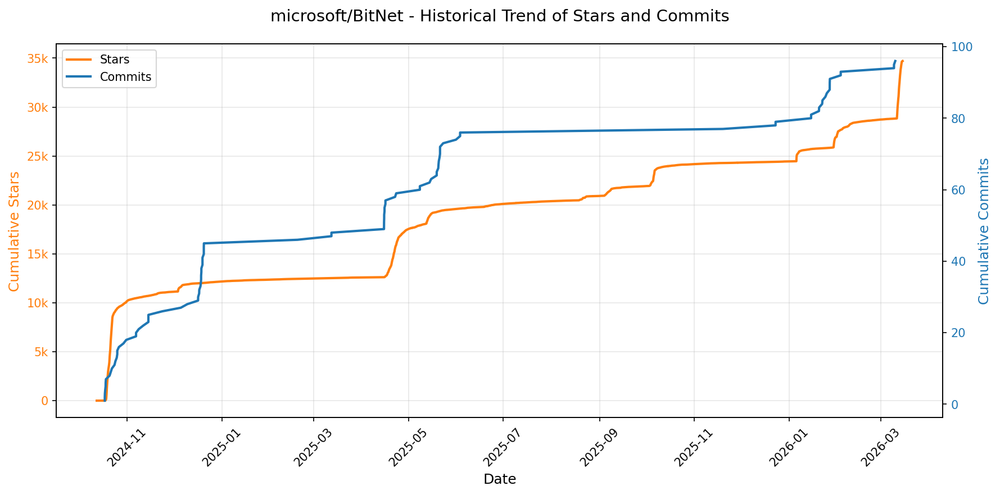
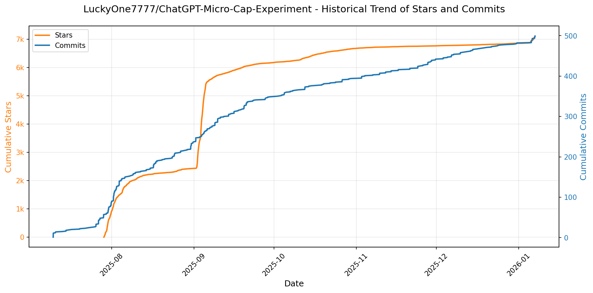
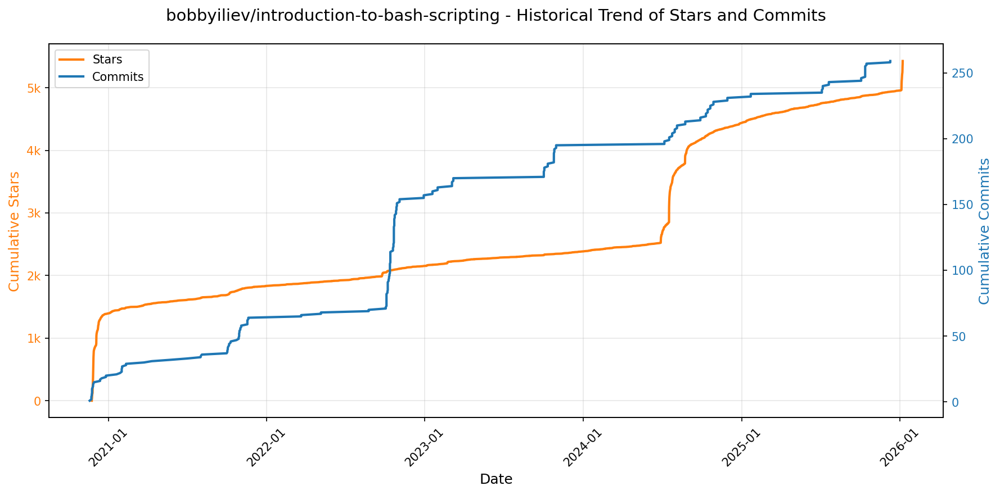
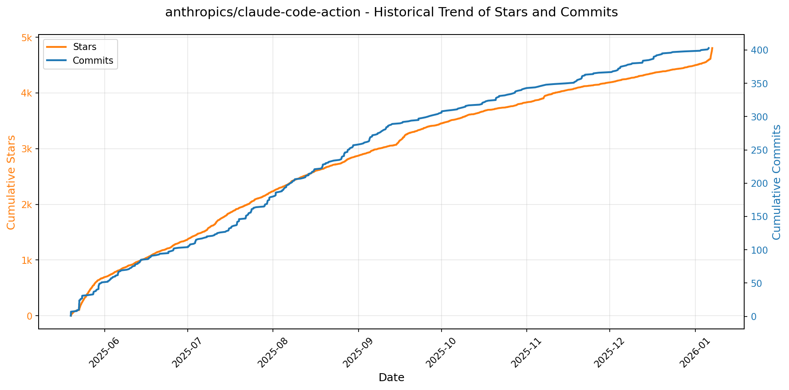
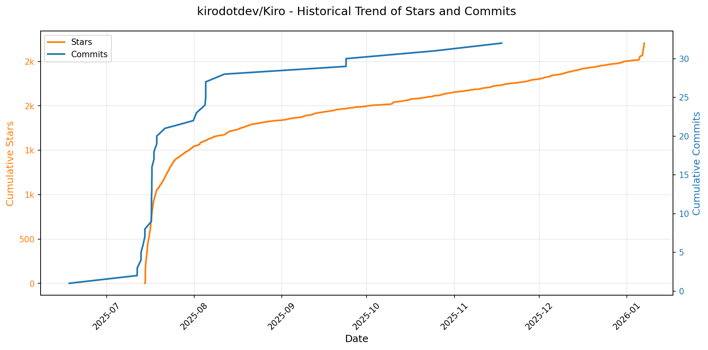
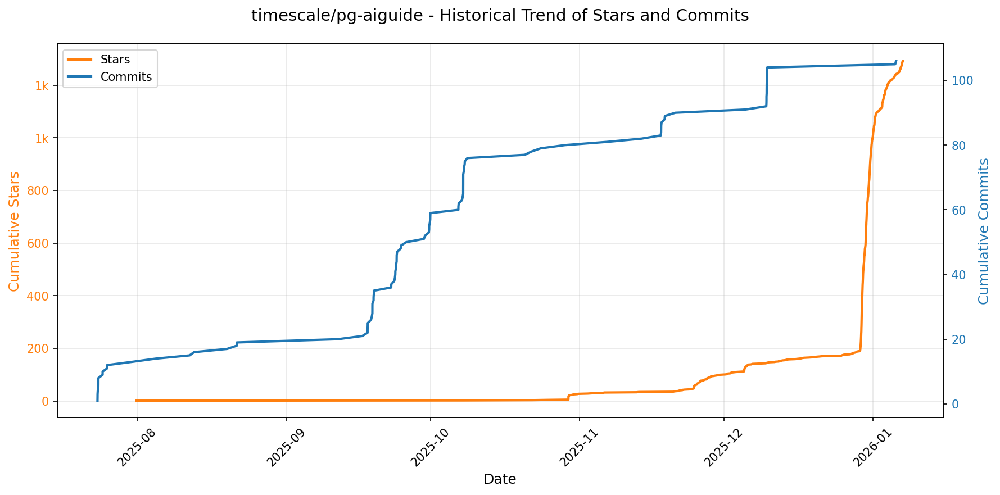

# 🌟 GitHub Trending 概览

> 数据更新于：2026-01-07。

---

## 🔍 项目详情

### 1. [microsoft/PowerToys](https://github.com/microsoft/PowerToys)
- 📅 **创建日期**：2019-05-01  
- 🔄 **最近更新**：2026-01-07  
- ⭐ **Stars**：127,324（日 +223｜周 +426｜月 +1197）  
- 📝 **描述**：Microsoft PowerToys is a collection of utilities that help you customize Windows and streamline everyday tasks  

<b>📈 Star 与 Commit 历史趋势</b>

> *蓝色：累计 Stars｜橙色：累计 Commits（次 Y 轴）*

<b>📄 README 摘要</b>

1. **项目功能**  
Microsoft PowerToys 是一款面向 Windows 系统的开源增强工具集，旨在为高级用户和开发者提供深度定制化能力与效率优化支持。它不替代系统核心功能，而是通过轻量级、模块化的实用工具（Utilities），扩展 Windows 原生体验，解决日常高频痛点——如窗口管理、快捷操作、文件处理、键盘/鼠标行为重定义、AI 辅助粘贴、屏幕信息提取等，从而显著提升生产力与个性化控制水平。

2. **核心特性**  
- **超 25 个可独立启停的模块化工具**：涵盖全场景效率需求，例如：  
  - *FancyZones*：高级分屏布局与拖拽窗口自动吸附；  
  - *PowerToys Run*：全局快速启动器（类 Spotlight/Alfred）；  
  - *Keyboard Manager*：键盘按键/快捷键映射与宏重定义；  
  - *Mouse Without Borders*：跨多台 Windows 设备共享一套键鼠；  
  - *Advanced Paste*：支持本地/云端 AI 模型（Azure OpenAI、Gemini、Ollama 等）智能润色、翻译、总结剪贴板内容；  
  - *PowerRename*：基于正则与照片元数据（EXIF/XMP，如 `%Camera`、`%GPSLatitude`）的大批量智能重命名；  
  - *Peek*：悬停预览代码/文本/图片/音视频文件（含 CLI 接口）；  
  - *Text Extractor（OCR）*：截图中实时提取文字（支持多语言）；  
  - *Color Picker / Screen Ruler / ZoomIt*：专业级屏幕辅助测量与放大；  
  - *Command Palette*：高度可扩展的命令中心，支持插件（书签、WinGet、终端配置、窗口切换等），具备搜索过滤、元数据展示、窗口记忆、错误日志等企业级体验；  
  - *Awake / Light Switch / Hosts File Editor / Environment Variables* 等系统级精细管控工具。  
- **深度系统集成**：原生适配 Windows 设置、任务栏、上下文菜单、快捷键体系（如 Win+Shift+O 触发 Quick Accent）；  
- **持续演进的 AI 能力**：以 Advanced Paste 为标杆，将多源 AI 推理无缝嵌入操作系统交互流；  
- **高可靠性与可维护性**：支持 per-user / machine-wide 安装、自动更新、详尽日志、无障碍访问（WCAG 合规）、CI/CD 自动化测试覆盖（含 OCR UI 测试）。

3. **技术栈**  
- **主框架与语言**：C#（.NET 9.0.10）、C++（混合使用，用于高性能/底层系统交互模块，如低级钩子、图形渲染）；  
- **UI 框架**：Windows App SDK（WinUI 3）构建现代化设置界面；部分旧模块沿用 WPF；  
- **安装与分发**：WiX Toolset v5（统一 installer 基础设施）、MSIX/Appx 打包；支持多种安装渠道（GitHub Release、Microsoft Store、winget、Chocolatey、Scoop）；  
- **底层系统交互**：Windows API（User32/GDI32/Shell32）、COM、Windows Runtime（WinRT）、DWM（Desktop Window Manager）API、注册表/环境变量/Hosts 文件直接操作；  
- **AI 与服务集成**：RESTful HTTP 客户端对接 Azure OpenAI、OpenAI、Google Gemini 等云 API；Ollama 本地模型支持；OCR 引擎基于 Windows 内置 Windows.Media.Ocr；  
- **开发与运维**：GitHub Actions CI/CD、Windows Server 2022 构建代理、NuGet 包管理、PowerShell Core 部署脚本、DSC（Desired State Configuration）v3 支持。

---

### 2. [Shubhamsaboo/awesome-llm-apps](https://github.com/Shubhamsaboo/awesome-llm-apps)
- 📅 **创建日期**：2024-04-29  
- 🔄 **最近更新**：2026-01-07  
- ⭐ **Stars**：87,008（日 +209｜周 +1498｜月 +5270）  
- 📝 **描述**：Collection of awesome LLM apps with AI Agents and RAG using OpenAI, Anthropic, Gemini and opensource models.  

<b>📈 Star 与 Commit 历史趋势</b>

> *蓝色：累计 Stars｜橙色：累计 Commits（次 Y 轴）*

<b>📄 README 摘要</b>

1. **项目功能**  
该项目是一个高度结构化的开源资源库（`awesome-llm-apps`），核心定位是**系统性地整理、分类并提供可运行的前沿大语言模型（LLM）应用实例**。它并非一个单一软件，而是一个“精选集”（curated collection），聚焦于真实落地的LLM工程实践，涵盖从入门级AI代理到复杂多智能体系统、语音交互、MCP集成、RAG增强、记忆机制、跨平台数据对话（如Gmail、GitHub、PDF、YouTube等）以及模型优化与微调等多个维度，旨在帮助开发者快速学习、复现和构建生产级LLM应用。

2. **关键特性**  
- **全栈式LLM应用覆盖**：按技术范式精细划分——AI单体代理（Starter/Advanced）、多智能体协作团队（Agent Teams）、自主游戏AI、语音AI代理（Voice Agents）、Model Context Protocol（MCP）集成代理、RAG增强型应用（含Agentic RAG、Corrective RAG、Vision RAG等16+变体）、带持久化记忆的LLM应用、与外部平台深度对话（Chat with X）、LLM推理成本优化工具（如TOONIFY Token Optimization）、以及主流模型（Gemma 3、Llama 3.2）的微调教程。  
- **模型与部署兼容性强**：支持OpenAI、Anthropic（Claude）、Google Gemini、xAI、Qwen、Llama等闭源与开源模型；明确标注“Local & Cloud”双模式，强调本地可运行能力（如Llama 3.1 Local RAG、Deepseek Local RAG）。  
- **教学与工程并重**：每个子项目均附带完整`README.md`和`requirements.txt`，提供开箱即用的启动流程；配套“AI Agent框架速成课”（Google ADK / OpenAI SDK），覆盖工具调用、结构化输出、内存管理、多智能体编排、插件扩展等核心开发能力。  
- **社区驱动与国际化**：提供德、西、法、日、韩、葡、俄、中等8种语言的README自动翻译链接；获得Tiger Data、Speechmatics、Okara AI等多家机构赞助支持，体现活跃的生态共建。

3. **技术栈**  
- **核心框架与协议**：Google ADK（Agent Development Kit）、OpenAI Agents SDK、CrewAI（用于多智能体编排）、Model Context Protocol（MCP）标准；  
- **RAG关键技术**：Embedding模型（Gemma、Cohere）、向量数据库（隐含于各RAG教程）、Hybrid Search（语义+关键词）、Database Routing、Vision RAG（多模态检索）；  
- **模型支持层**：OpenAI API、Anthropic Claude、Google Gemini API、xAI Grok、Hugging Face Transformers（Qwen、Llama、Deepseek、Gemma系列）；  
- **基础设施与工具**：Python（主语言）、Pydantic（结构化I/O）、LangChain/LangGraph（隐含于Agent设计模式）、浏览器自动化（BrowserUse）、语音识别/合成（Speechmatics集成）、本地GPU推理（Llama.cpp / Ollama风格适配）；  
- **部署与交互**：CLI命令行启动、Web UI（部分项目）、语音接口（ASR/TTS）、多模态输入（图像、音频、视频、PDF、代码仓库等）。

---

### 3. [protocolbuffers/protobuf](https://github.com/protocolbuffers/protobuf)
- 📅 **创建日期**：2014-08-26  
- 🔄 **最近更新**：2026-01-07  
- ⭐ **Stars**：70,110（日 +97｜周 +147｜月 +355）  
- 📝 **描述**：Protocol Buffers - Google's data interchange format  

<b>📈 Star 与 Commit 历史趋势</b>

> *蓝色：累计 Stars｜橙色：累计 Commits（次 Y 轴）*

<b>📄 README 摘要</b>

1. **该项目的功能**  
Protocol Buffers（简称 protobuf）是 Google 开发的一种语言无关、平台无关、可扩展的结构化数据序列化机制，主要用于高效地序列化和反序列化结构化数据，以支持不同系统、服务或编程语言之间的数据交换与通信。它通过 `.proto` 接口定义文件描述数据结构，再经由 `protoc` 编译器生成目标语言的绑定代码，从而实现跨语言的数据格式统一与高性能传输。

2. **核心特性**  
- **语言与平台中立**：支持 C++、Java、Python、Go、C#、Ruby、PHP、JavaScript、Dart、Objective-C 等十余种主流语言，各语言运行时独立维护且语义一致；  
- **高效紧凑**：二进制序列化格式体积小、解析速度快，显著优于 XML/JSON 等文本格式；  
- **向后/向前兼容**：通过字段编号（tag）机制支持灵活的 schema 演进（如新增/删除/重命名字段），保障不同版本服务间通信稳定；  
- **强类型接口定义**：基于 `.proto` 文件进行声明式建模，自动生成类型安全的客户端和服务端代码；  
- **多构建系统支持**：原生支持 Bazel（含现代 Bzlmod 和传统 WORKSPACE）、CMake（C++）、Maven（Java）、pip（Python）等主流构建与包管理方式；  
- **安全与可维护性**：遵循 OpenSSF 安全实践，提供明确的[版本支持策略](https://protobuf.dev/version-support/)，推荐用户锁定发布版本而非直接使用未稳定主干（main）代码。

3. **技术栈**  
- **核心实现语言**：协议编译器 `protoc` 主要用 C++ 编写；  
- **构建系统**：官方首选 Bazel（支持 Bzlmod 模块化依赖管理，要求 Bazel 7+），同时兼容 CMake（C++）、Maven（Java）、Gradle、pip、RubyGems、NuGet 等；  
- **跨语言运行时**：各语言绑定分别实现于对应子目录（如 `java/`、`python/`、`go/` 等），其中 Go 和 JavaScript 已拆分为独立仓库（`protobuf-go`、`protobuf-javascript`）；  
- **基础设施依赖**：Bazel 构建需集成 `rules_java`、`rules_python` 等官方规则集；C++ 构建依赖标准 C++17 工具链；部分语言（如 Python）支持纯解释型安装（无需本地编译）。

---

### 4. [nocodb/nocodb](https://github.com/nocodb/nocodb)
- 📅 **创建日期**：2017-10-29  
- 🔄 **最近更新**：2026-01-07  
- ⭐ **Stars**：61,073（日 +119｜周 +1657｜月 +2155）  
- 📝 **描述**：🔥 🔥 🔥 Open Source Airtable Alternative  

<b>📈 Star 与 Commit 历史趋势</b>

> *蓝色：累计 Stars｜橙色：累计 Commits（次 Y 轴）*

<b>📄 README 摘要</b>

1. **项目功能**  
NocoDB 是一个开源的、类 Airtable 的低代码数据库平台，旨在将传统关系型数据库（如 PostgreSQL、MySQL、SQL Server、SQLite 等）转化为直观、易用的电子表格式界面。它允许用户无需编写 SQL 或代码，即可通过可视化操作创建数据库、管理表结构、增删改查数据、设置视图与权限，并连接外部服务实现自动化工作流。

2. **核心特性**  
- **富交互电子表格界面**：支持 Grid / Gallery / Kanban / Calendar / Form 多种视图；提供列排序、筛选、分组、隐藏、多种字段类型（ID、关联、汇总、公式、附件、用户、货币等）；支持细粒度访问控制（按角色、表、视图、行级权限）；可公开或密码保护共享数据库/视图。  
- **应用商店（App Store）自动化集成**：内置开箱即用的第三方服务连接器，覆盖聊天（Slack、Discord、Mattermost）、邮件（AWS SES、SMTP、MailerSend）和云存储（AWS S3、Google Cloud Storage、MinIO）等场景，支持无代码触发工作流。  
- **程序化接入能力**：提供标准化 RESTful API 和官方 NocoDB SDK（支持 Node.js、Python、JavaScript 等），支持 JWT 或社交登录令牌认证，便于与现有系统集成或构建自定义前端。

3. **技术栈**  
- **后端**：Node.js（TypeScript）为主，基于 Express 框架；使用 Knex.js 作为数据库抽象层，兼容 PostgreSQL、MySQL、MariaDB、SQL Server、SQLite、Oracle 等多种数据库；身份认证采用 JWT；缓存与队列依赖 Redis；文件存储支持本地、S3 兼容对象存储（如 MinIO）。  
- **前端**：React（TypeScript）构建，基于 Ant Design UI 组件库，支持多语言（含中文、日文、韩文、法语、德语等 11+ 语言）；采用 Webpack/Vite 构建工具链。  
- **部署与运维**：原生支持 Docker / Docker Compose；提供一键自动部署脚本（Auto-upstall），集成 PostgreSQL、Redis、MinIO、Traefik（含自动 SSL 证书签发与续期）；亦支持 macOS/Linux/Windows 二进制直接运行。

---

### 5. [OpenBB-finance/OpenBB](https://github.com/OpenBB-finance/OpenBB)
- 📅 **创建日期**：2020-12-20  
- 🔄 **最近更新**：2026-01-07  
- ⭐ **Stars**：57,423（日 +179｜周 +1510｜月 +2290）  
- 📝 **描述**：Financial data platform for analysts, quants and AI agents.  

<b>📈 Star 与 Commit 历史趋势</b>

> *蓝色：累计 Stars｜橙色：累计 Commits（次 Y 轴）*

<b>📄 README 摘要</b>

1. **项目功能**  
Open Data Platform（ODP）是由 OpenBB 开发的开源数据集成工具集，核心目标是为数据工程师提供统一的数据接入基础设施，支持将专有数据、授权数据及公开金融数据源（如股票、加密货币、宏观经济指标等）标准化接入，并向多种下游应用场景按需分发。它作为“一次连接、处处消费”（connect once, consume everywhere）的中间层，同时服务于 Python 量化环境、OpenBB Workspace（企业级分析界面）、Excel 插件、MCP（Model Context Protocol）服务器（用于 AI 代理）、以及通用 REST API，从而打通数据从源头到终端应用（如 AI 投研助手、研究仪表盘）的全链路。

2. **关键特性**  
- ✅ **多面消费支持**：同一套数据后端可并行支撑 Python SDK、Web UI（OpenBB Workspace）、Excel、AI Agent（通过 MCP）、REST API 等多种前端；  
- ✅ **开箱即用的数据连接器**：内置大量金融数据源集成（涵盖权益、固定收益、加密、另类数据等），文档明确列出所有可用数据模块（[openbb.co/python/reference](https://docs.openbb.co/python/reference)）；  
- ✅ **轻量级本地 API 服务**：通过 `openbb-api` 命令一键启动基于 FastAPI + Uvicorn 的本地 REST 服务（默认 `http://127.0.0.1:6900`），便于快速对接与测试；  
- ✅ **与 OpenBB Workspace 无缝集成**：支持在 Workspace 中以图形化方式添加并验证 ODP 后端，实现 UI 与底层数据能力解耦协同；  
- ✅ **全栈可扩展生态**：提供独立 CLI 工具（`openbb-cli`）、Python SDK（`from openbb import obb`）、Colab Notebook 示例、Dev Container 和 GitHub Codespaces 支持，降低上手与协作门槛；  
- ✅ **模块化后端与 AI Agent 生态**：支持通过开源仓库（如 `backends-for-openbb`、`agents-for-openbb`）自定义扩展数据源和 AI 智能体，强化企业级定制能力。

3. **技术栈**  
- **后端框架**：FastAPI（高性能异步 Web 框架）、Uvicorn（ASGI 服务器）；  
- **核心语言**：Python（官方支持 3.9.21 至 3.12）；  
- **部署与开发体验**：GitHub Codespaces、VS Code Dev Containers、Google Colab；  
- **客户端/接口层**：Python SDK（`openbb` 包）、命令行工具（`openbb-cli`）、RESTful HTTP API；  
- **协议与标准**：兼容 MCP（Model Context Protocol）用于 AI Agent 集成；  
- **许可证**：AGPLv3（强传染性开源协议，要求衍生作品也开源）。

---

### 6. [usememos/memos](https://github.com/usememos/memos)
- 📅 **创建日期**：2021-12-08  
- 🔄 **最近更新**：2026-01-07  
- ⭐ **Stars**：52,316（日 +301｜周 +4742｜月 +5502）  
- 📝 **描述**：An open-source, self-hosted note-taking service. Your thoughts, your data, your control — no tracking, no ads, no subscription fees.  

<b>📈 Star 与 Commit 历史趋势</b>

> *蓝色：累计 Stars｜橙色：累计 Commits（次 Y 轴）*

<b>📄 README 摘要</b>

1. **项目功能**  
Memos 是一个开源、可自托管的笔记与知识管理服务，专为注重隐私的个人和团队设计。它支持创建个人笔记、团队 Wiki 和结构化知识库，所有数据完全由用户掌控，不依赖第三方云服务，无任何遥测、广告或订阅费用。

2. **核心特性**  
- **隐私优先架构**：纯自托管，零数据上报，支持完整数据导出，杜绝厂商锁定；  
- **原生 Markdown 支持**：全文本 Markdown 编辑与渲染，内容以纯文本形式存储，确保长期可迁移性；  
- **极致性能**：后端基于 Go 实现高并发低延迟，前端采用 React 优化交互体验，加载迅速且响应灵敏；  
- **简易部署**：提供一键 Docker 启动命令，同时支持 SQLite（默认）、MySQL 和 PostgreSQL 多种数据库；  
- **开发者友好**：提供完备的 REST API 与 gRPC 接口，便于集成至现有工具链或自动化流程；  
- **现代化界面**：简洁美观的 UI，内置深色模式，全平台响应式布局，适配桌面与移动设备。

3. **技术栈**  
- **后端**：Go（Golang），高性能、内存安全、适合构建高并发 Web 服务；  
- **前端**：React（TypeScript），模块化、可维护性强，支持现代 Web 特性；  
- **数据库**：默认嵌入式 SQLite，亦兼容 MySQL 和 PostgreSQL；  
- **部署方案**：Docker / Docker Compose、Kubernetes（含 Helm Chart）、预编译二进制包（Linux/macOS/Windows）、源码构建；  
- **协议与标准**：RESTful API + gRPC 双接口支持，遵循 MIT 开源协议。

---

### 7. [anthropics/claude-code](https://github.com/anthropics/claude-code)
- 📅 **创建日期**：2025-02-22  
- 🔄 **最近更新**：2026-01-07  
- ⭐ **Stars**：52,234（日 +443｜周 +2325｜月 +7425）  
- 📝 **描述**：Claude Code is an agentic coding tool that lives in your terminal, understands your codebase, and helps you code faster by executing routine tasks, explaining complex code, and handling git workflows - all through natural language commands.  

<b>📈 Star 与 Commit 历史趋势</b>

> *蓝色：累计 Stars｜橙色：累计 Commits（次 Y 轴）*

<b>📄 README 摘要</b>

1. **该项目的功能**  
Claude Code 是一款终端原生的智能编程代理工具，能够深度理解用户本地代码库，通过自然语言指令协助开发者高效完成日常编码任务。其核心能力包括：自动执行重复性编程操作（如生成/修改代码、重构）、解释复杂代码逻辑、自动化处理 Git 工作流（如提交、分支管理、冲突分析），并支持在终端、IDE 或 GitHub 中（通过 `@claude` 提及）直接调用。

2. **关键特性**  
- **上下文感知的代码理解**：可扫描并建模整个项目代码库，实现跨文件语义级推理；  
- **自然语言驱动的开发工作流**：无需编写脚本，用普通中文或英文指令即可完成编码、调试、文档生成等任务；  
- **多环境集成支持**：原生适配终端（CLI），兼容主流 IDE，并支持 GitHub 评论区交互；  
- **插件化扩展架构**：内置可扩展插件系统，允许开发者添加自定义命令与专用智能体（Agent），功能模块化存于 `plugins/` 目录；  
- **内建反馈与问题上报机制**：通过 `/bug` 命令一键提交运行时问题，包含上下文快照与会话数据；  
- **隐私优先设计**：默认不将用户代码用于模型训练，敏感数据设定严格保留期限，访问权限受控。

3. **技术栈**  
- **运行时环境**：Node.js 18+（NPM 安装方式依赖）；  
- **客户端部署**：提供跨平台安装方案——macOS/Linux 使用 Bash 脚本安装，macOS 支持 Homebrew，Windows 采用 PowerShell 脚本，同时支持全局 NPM 包安装（`@anthropic-ai/claude-code`）；  
- **底层能力**：基于 Anthropic 的 Claude 大模型（未公开具体版本，但面向代码场景深度优化），结合本地代码索引、AST 解析与 Git API 集成实现工程化智能；  
- **基础设施与合规**：遵循商业服务条款与隐私政策，数据传输与存储符合 GDPR 等标准，后端服务由 Anthropic 托管。

---

### 8. [anomalyco/opencode](https://github.com/anomalyco/opencode)
- 📅 **创建日期**：2025-04-30  
- 🔄 **最近更新**：2026-01-07  
- ⭐ **Stars**：51,920（日 +1707｜周 +7399｜月 +15276）  
- 📝 **描述**：The open source coding agent.  

<b>📈 Star 与 Commit 历史趋势</b>

> *蓝色：累计 Stars｜橙色：累计 Commits（次 Y 轴）*

<b>📄 README 摘要</b>

1. **该项目的功能**  
OpenCode 是一个开源的 AI 编程智能体（AI coding agent），旨在为开发者提供终端原生（TUI）、轻量高效且高度可扩展的 AI 辅助编程体验。它不依赖特定云服务提供商，可连接多种大模型（如 Claude、OpenAI、Google Gemini 或本地部署模型），支持在本地终端中完成代码编写、重构、调试、分析、探索代码库、执行 Bash 命令等全栈开发任务，并具备远程控制能力（客户端/服务器架构）。

2. **核心功能**  
- **双模式智能体切换**：内置 `build`（默认，具备完整读写与执行权限）和 `plan`（只读模式，禁止自动修改文件、执行命令前需显式授权），支持按 Tab 键实时切换；另含 `@general` 子智能体处理复杂多步任务与深度搜索。  
- **跨平台终端优先设计**：深度优化 TUI（文本用户界面），面向 Neovim 用户及终端重度使用者，强调键盘驱动、低延迟交互。  
- **开箱即用的 LSP 支持**：原生集成语言服务器协议，提供智能补全、跳转、诊断等 IDE 级编码能力。  
- **灵活部署方式**：支持一键脚本安装（curl）、主流包管理器（npm/bun/pnpm/yarn、Homebrew、Scoop、Chocolatey、Paru、Mise、Nix）及独立桌面应用（macOS/Windows/Linux，含 Apple Silicon 专用构建）。  
- **完全开源与厂商中立**：100% MIT 许可开源；解耦模型供应商，用户可自由配置任意兼容 API 的模型后端（包括自托管模型）。  
- **可扩展架构**：采用客户端/服务器分离设计，允许 TUI 作为前端之一，未来可接入移动端、Web 等多种客户端。

3. **技术栈**  
- **核心语言与运行时**：TypeScript（主逻辑）、Rust（高性能组件，如 CLI 工具链与底层通信模块，虽未明示但由项目结构及性能目标推断）；支持 Node.js（npm/bun）、Deno、Python（部分插件生态可能）等多运行时环境。  
- **前端框架**：TUI 层基于终端原生渲染（极可能使用 `yargs` + `ink` / `blessed` / `termox` 类库或自研渲染引擎）；桌面端基于 Electron 或 Tauri（根据 `.deb`/`.rpm`/AppImage 及 macOS `.dmg` 发布形态判断，结合其“终端优先”定位，更倾向 Tauri + Rust 构建轻量桌面壳）。  
- **通信与协议**：gRPC 或 WebSocket 实现客户端/服务器通信；LSP（Language Server Protocol）标准集成。  
- **构建与分发**：CI/CD 使用 GitHub Actions；多平台打包工具链（e.g., `tauri build`, `electron-builder`, `nix-build`）；支持 Mise（版本管理）、Nix（声明式环境）。  
- **基础设施**：模型抽象层（Provider Agnostic Adapter），适配 OpenAI 兼容 API、Anthropic、Google Vertex、Ollama 等；配置系统基于 YAML/JSON，支持环境变量覆盖。

---

### 9. [virattt/ai-hedge-fund](https://github.com/virattt/ai-hedge-fund)
- 📅 **创建日期**：2024-11-29  
- 🔄 **最近更新**：2026-01-07  
- ⭐ **Stars**：44,946（日 +144｜周 +681｜月 +2471）  
- 📝 **描述**：An AI Hedge Fund Team  

<b>📈 Star 与 Commit 历史趋势</b>

> *蓝色：累计 Stars｜橙色：累计 Commits（次 Y 轴）*

<b>📄 README 摘要</b>

1. **项目功能**  
该项目是一个**AI驱动的对冲基金概念验证系统**，旨在通过多智能体协同模拟专业投资人的决策逻辑，对股票进行综合分析与交易信号生成。系统不执行真实交易，仅用于教育和研究目的；其核心是模拟14位著名投资者（如巴菲特、芒格、达摩达兰等）及4类专业分析代理（估值、情绪、基本面、技术面），结合风险管理和组合管理模块，最终生成模拟交易建议。

2. **关键特性**  
- **多投资哲学代理系统**：集成14位顶级投资人（如Ben Graham、Cathie Wood、Michael Burry等）的个性化投资策略与思维范式，每个代理独立生成观点与信号；  
- **四维分析引擎**：内置估值代理（计算内在价值）、情绪代理（NLP分析市场情绪）、基本面代理（财务数据深度解读）、技术面代理（技术指标分析）；  
- **风控与决策闭环**：风险管理员动态计算波动率、最大回撤等指标并设定仓位上限；组合管理员融合所有代理输出，执行加权投票或规则融合，生成最终买卖建议；  
- **双模式交互支持**：提供命令行接口（CLI）支持批量回测、参数化运行（含日期范围、本地Ollama模型支持）及Web可视化应用，便于教学演示与实验探索；  
- **开源可扩展架构**：模块化设计支持新增投资代理、数据源或分析模型，附带完整环境配置（Poetry）、API密钥管理（.env）和贡献指南。

3. **技术栈**  
- **编程语言**：Python（主语言，含异步/命令行工具开发）；  
- **AI/LLM框架**：支持OpenAI（GPT-4o）、Groq、Anthropic、DeepSeek及本地Ollama部署的多种大语言模型，用于代理推理与自然语言分析；  
- **数据层**：集成Financial Datasets API获取实时/历史财务与市场数据（AAPL/GOOGL/MSFT/NVDA/TSLA免费，其余需API密钥）；  
- **工程工具**：Poetry（依赖管理与虚拟环境）、Git（版本控制）；  
- **前端（Web应用）**：基于Python生态的Web框架（文档未明确说明，但结构暗示可能采用FastAPI + React/Vue或Streamlit/Gradio，需参考`/app`子目录）；  
- **其他**：Env文件管理敏感配置、标准化日志与CLI参数解析（`argparse`或`click`）。

---

### 10. [exo-explore/exo](https://github.com/exo-explore/exo)
- 📅 **创建日期**：2024-06-24  
- 🔄 **最近更新**：2026-01-07  
- ⭐ **Stars**：39,572（日 +70｜周 +545｜月 +6940）  
- 📝 **描述**：Run your own AI cluster at home with everyday devices 📱💻 🖥️⌚  

<b>📈 Star 与 Commit 历史趋势</b>

> *蓝色：累计 Stars｜橙色：累计 Commits（次 Y 轴）*

<b>📄 README 摘要</b>

1. **项目功能**  
exo 是一个面向个人用户的开源 AI 集群框架，旨在让普通用户利用家中已有的多台设备（如 Mac Studio、MacBook 等）构建本地化、高性能的分布式 AI 推理集群。它将多台设备自动互联为统一计算资源池，突破单设备显存/内存限制，支持运行远超单机容量的大语言模型（如 Qwen3-235B、DeepSeek-V3.1-671B），并显著提升推理速度——尤其通过 Thunderbolt 5 的 RDMA 技术实现设备间超低延迟通信（宣称降低 99% 延迟），从而在消费级硬件上实现“TB 级 VRAM”等效效果。

2. **核心特性**  
- **全自动设备发现与组网**：无需手动配置，同局域网内运行 exo 的设备可即插即用、自组织成集群；  
- **原生 RDMA over Thunderbolt 5 支持（macOS）**：开箱即用，大幅降低设备间通信延迟，是性能跃升的关键技术底座；  
- **拓扑感知的自动并行调度（Topology-Aware Auto Parallel）**：实时感知各设备算力、内存、网络带宽及链路延迟，动态生成最优模型切分与部署策略；  
- **张量并行（Tensor Parallelism）**：支持模型权重跨设备分片，实测在 2 台设备上达 1.8× 加速、4 台达 3.2× 加速；  
- **MLX 生态深度集成**：基于 Apple Silicon 优化的 MLX 框架作为推理后端，并采用其分布式模块（MLX Distributed）实现高效跨设备张量通信与同步。

3. **技术栈**  
- **核心语言与运行时**：Rust（系统层、高性能通信与调度逻辑）、Python（主控逻辑、API 服务、模型管理）、TypeScript/JavaScript（Web 仪表盘前端）；  
- **AI 推理引擎**：[MLX](https://github.com/ml-explore/mlx)（专为 Apple Silicon 优化的轻量级机器学习框架）及其分布式扩展 [MLX Distributed](https://ml-explore.github.io/mlx/build/html/usage/distributed.html)；  
- **系统依赖与工具链**：  
  - macOS：依赖 `macmon`（Apple Silicon 硬件监控）、`rdma_ctl`（系统级 RDMA 控制）、Thunderbolt 5 硬件与 macOS Tahoe 26.2+；  
  - Linux：当前仅支持 CPU 推理（GPU 支持开发中），依赖 `uv`（Python 包管理）、`Node.js`（前端构建）、`Rust nightly`（构建绑定）；  
- **基础设施**：基于 HTTP 的 RESTful API（兼容 OpenAI 接口规范）、本地 Web 仪表盘（`http://localhost:52415`）、CLI 启动（`uv run exo`）；  
- **许可证**：Apache License 2.0。

---

### 11. [anthropics/skills](https://github.com/anthropics/skills)
- 📅 **创建日期**：2025-09-22  
- 🔄 **最近更新**：2026-01-07  
- ⭐ **Stars**：34,596（日 +647｜周 +4243｜月 +14939）  
- 📝 **描述**：Public repository for Agent Skills  

<b>📈 Star 与 Commit 历史趋势</b>

> *蓝色：累计 Stars｜橙色：累计 Commits（次 Y 轴）*

<b>📄 README 摘要</b>

1. **该项目的作用**  
该项目是 Anthropic 官方维护的 Claude 技能（Skills）开源示例仓库，旨在展示如何通过结构化、可复用的“技能包”扩展 Claude 的专业化能力。每个技能是一个独立文件夹，内含 `SKILL.md`（含 YAML 元数据与任务指令），使 Claude 能动态加载并执行特定领域任务，如品牌文档生成、PDF 表单提取、PPTX 自动制作、Web 应用测试、MCP 服务器代码生成等。它不提供运行时服务或独立应用，而是为开发者和企业用户提供可参考、可复用、可定制的技能实现范式与生产级实践案例。

2. **核心功能**  
- **模块化技能封装**：每个技能自包含（instructions + metadata + 资源），支持按需加载与组合使用；  
- **多场景覆盖**：涵盖创意设计（艺术/音乐/排版）、技术开发（Web 测试、MCP 服务生成）、企业协作（品牌通信、合规文案）、文档处理（DOCX/PDF/PPTX/XLSX 创建与解析）四大类；  
- **开箱即用集成**：支持通过 Claude Code 插件市场一键安装（如 `document-skills` 或 `example-skills`），在 `claude.ai`（付费版）及 Claude API 中直接调用；  
- **生产级参考实现**：公开 `skills/docx`、`skills/pdf` 等子目录中驱动 Claude 官方文档功能的真实技能源码（source-available，非完全开源），体现复杂技能的工程结构与最佳实践；  
- **标准化规范支持**：配套 [`./spec`](./spec) 目录提供 Agent Skills 开放规范定义，确保跨平台兼容性与互操作性；  
- **低门槛创作体系**：提供标准模板（`./template`）与极简格式要求（仅需 `name` 和 `description` 两个 YAML 字段 + Markdown 指令），大幅降低技能开发门槛。

3. **技术栈**  
- **核心格式**：纯文本 Markdown（`SKILL.md`）+ YAML 前置元数据（声明式技能定义）；  
- **协议标准**：基于 [Agent Skills 规范](https://agentskills.io)（开放标准，非私有协议）；  
- **运行环境**：深度集成 Anthropic 生态——Claude Code（插件系统）、Claude.ai（Web 前端）、Claude API（后端调用）；  
- **许可模型**：混合授权——多数示例技能采用 Apache 2.0 开源协议；文档类核心技能（`docx`/`pdf`/`pptx`/`xlsx`）为 source-available（可查看、不可修改/再分发）；  
- **无运行时依赖**：不依赖特定编程语言、框架或服务器环境，技能本身为静态资源包，执行逻辑由 Claude 模型原生解释与调度。

---

### 12. [Lissy93/web-check](https://github.com/Lissy93/web-check)
- 📅 **创建日期**：2023-06-25  
- 🔄 **最近更新**：2026-01-07  
- ⭐ **Stars**：27,869（日 +513｜周 +756｜月 +910）  
- 📝 **描述**：🕵️‍♂️ All-in-one OSINT tool for analysing any website  

<b>📈 Star 与 Commit 历史趋势</b>

> *蓝色：累计 Stars｜橙色：累计 Commits（次 Y 轴）*

---

### 13. [microsoft/BitNet](https://github.com/microsoft/BitNet)
- 📅 **创建日期**：2024-08-05  
- 🔄 **最近更新**：2026-01-07  
- ⭐ **Stars**：25,401（日 +194｜周 +928｜月 +1024）  
- 📝 **描述**：Official inference framework for 1-bit LLMs  

<b>📈 Star 与 Commit 历史趋势</b>

> *蓝色：累计 Stars｜橙色：累计 Commits（次 Y 轴）*

<b>📄 README 摘要</b>

1. **项目功能**  
bitnet.cpp 是微软推出的、专为 **1.58-bit 超低比特大语言模型（如 BitNet-b1.58）设计的官方推理框架**，核心目标是实现**高效、无损（lossless）、跨平台的本地化推理**。它支持在消费级硬件（尤其是单颗 CPU）上运行超大规模 1-bit LLM（例如 100B 参数模型），达到人类阅读速度（5–7 token/s），显著降低对 GPU/NPU 的依赖，推动 LLM 在边缘设备和普通 PC 上的实用化部署。

2. **关键特性**  
- ✅ **极致性能优化**：针对 ARM（如 Apple M2）和 x86 CPU 深度定制内核，在 ARM 上提速 1.37×–5.07×，x86 上提速 2.37×–6.17×；  
- ✅ **大幅节能降耗**：ARM 能耗降低 55.4%–70.0%，x86 降低 71.9%–82.2%；  
- ✅ **全模型规模支持**：实测可在单 CPU 上运行 100B 参数 BitNet-b1.58 模型，突破传统 CPU 推理瓶颈；  
- ✅ **多内核架构支持**：提供三种专用量化内核（`I2_S`、`TL1`、`TL2`），按 CPU 架构（x86/ARM）自动适配最优路径；  
- ✅ **开箱即用的生态兼容性**：原生支持 Hugging Face 上主流 1.58-bit 模型（如 BitNet-b1.58-2B/3B、Llama3-8B-1.58、Falcon3/E 系列等），提供模型下载、GGUF 格式转换、端到端推理与基准测试全流程工具链；  
- ✅ **跨平台扩展能力**：已发布官方 GPU 推理支持（NPU 支持正在开发中），构建统一的 1-bit AI 基础设施栈。

3. **技术栈**  
- **底层框架**：基于 `llama.cpp` 架构深度定制，复用其成熟推理引擎与 GGUF 模型格式生态；  
- **核心算法基础**：采用 `T-MAC` 提出的查表法（Lookup Table, LUT）加速低比特矩阵乘，实现 1.58-bit 权重的零精度损失计算；  
- **编译与构建**：依赖 `CMake ≥3.22`、`Clang ≥18`（Windows 需 Visual Studio 2022 + LLVM 工具链）、`Python ≥3.9` 及 `conda` 环境管理；  
- **量化技术**：支持 `i2_s`（int2 对称量化）与 `tl1`（ternary lookup table 1）两种主流 1.58-bit 量化方案，可选嵌入层半精度（f16）量化；  
- **硬件后端**：当前主力支持 x86 和 ARM64 CPU（含 Apple Silicon），GPU 后端已发布（CUDA），NPU 支持规划中。

---

### 14. [simstudioai/sim](https://github.com/simstudioai/sim)
- 📅 **创建日期**：2025-01-05  
- 🔄 **最近更新**：2026-01-07  
- ⭐ **Stars**：25,062（日 +36｜周 +346｜月 +6445）  
- 📝 **描述**：Open-source platform to build and deploy AI agent workflows.  

<b>📈 Star 与 Commit 历史趋势</b>

> *蓝色：累计 Stars｜橙色：累计 Commits（次 Y 轴）*

<b>📄 README 摘要</b>

1. **项目功能**  
Sim 是一个用于快速构建与部署 AI 智能体（AI agent）工作流的平台。它支持用户通过可视化画布拖拽连接智能体、工具和逻辑模块，即时运行端到端工作流；同时提供自然语言驱动的 Copilot 助手，可自动生成节点、修复流程错误并迭代优化；还支持将本地文档上传至向量数据库，使 AI 代理基于专属知识库进行语义检索与精准问答，实现私有化、可落地的 RAG（检索增强生成）应用。

2. **核心特性**  
- **可视化工作流编排**：基于 ReactFlow 构建的交互式画布，支持拖拽式连接 Agent、Tool、Condition、Loop 等节点，实时调试与执行。  
- **Copilot 智能辅助**：集成 Sim 自研 Copilot 服务，通过自然语言指令（如“添加 PDF 解析工具”“修复循环中断错误”）自动生成/修改/优化工作流节点与逻辑。  
- **本地化知识增强**：一键上传文档（PDF/Markdown/Text 等），自动切片、嵌入并存入 PostgreSQL + pgvector 向量库，支撑低延迟、高相关性的私有知识问答。  
- **全栈自托管能力**：提供开箱即用的多种部署方式——云服务（sim.ai）、NPM 快速启动、Docker Compose（含 Ollama/vLLM 本地模型集成）、Dev Container 开发环境及完整手动部署流程，支持完全离线运行。  
- **多模型后端兼容**：原生支持 Ollama（含 GPU/CPU 优化配置）、vLLM（OpenAI 兼容 API）及外部 LLM 服务，无需依赖闭源 API 即可运行大模型推理。

3. **技术栈**  
- **前端框架**：Next.js（App Router）、Bun（运行时与包管理）  
- **UI 组件库**：Shadcn/ui + Tailwind CSS（响应式原子化样式）  
- **状态管理**：Zustand（轻量高效全局状态）  
- **流程编辑器**：ReactFlow（高性能可扩展图编辑引擎）  
- **后端与数据层**：PostgreSQL（主数据库）+ pgvector（向量扩展）、Drizzle ORM（TypeScript 优先的迁移与查询）  
- **认证与安全**：Better Auth（现代化身份认证解决方案）  
- **实时通信**：Socket.io（支撑工作流实时执行日志、Copilot 流式响应等）  
- **后台任务**：Trigger.dev（可靠异步工作流调度）  
- **沙盒执行**：E2B（安全隔离的远程代码执行环境，用于 Tool 调用）  
- **工程体系**：Turborepo（高性能单体仓库管理）、Fumadocs（文档站点）

---

### 15. [resemble-ai/chatterbox](https://github.com/resemble-ai/chatterbox)
- 📅 **创建日期**：2025-04-23  
- 🔄 **最近更新**：2026-01-07  
- ⭐ **Stars**：20,860（日 +89｜周 +1170｜月 +6017）  
- 📝 **描述**：SoTA open-source TTS  

<b>📈 Star 与 Commit 历史趋势</b>

> *蓝色：累计 Stars｜橙色：累计 Commits（次 Y 轴）*

<b>📄 README 摘要</b>

1. **项目功能**  
Chatterbox TTS 是 Resemble AI 推出的开源文本转语音（TTS）模型家族，核心目标是为实时语音代理（voice agents）、交互式应用及创意内容生成提供高质量、低延迟、零样本（zero-shot）语音合成能力。其中旗舰模型 **Chatterbox-Turbo** 专为生产环境优化：支持仅需 10 秒参考音频即可完成声音克隆，实现端到端单步（1-step）高质量语音合成，显著降低推理延迟与显存占用；同时原生支持口语化副语言标记（如 `[laugh]`、`[cough]`），增强语音自然度与表现力。

2. **关键特性**  
- ✅ **极致高效推理**：Turbo 模型仅 350M 参数，语音-梅尔频谱解码器经知识蒸馏，生成步数从 10 步压缩至 **1 步**，大幅提速并降低 VRAM 需求；  
- ✅ **原生副语言建模**：直接解析 `[chuckle]`、`[laugh]`、`[cough]` 等标签，无需额外后处理，提升对话真实感；  
- ✅ **零样本多语言支持**：Chatterbox-Multilingual 支持 **23+ 种语言**（含中、英、西、法、日、韩、阿等），通过 language_id 动态切换；  
- ✅ **灵活可控合成**：支持 CFG（Classifier-Free Guidance）调节保真度/自然度权衡、exaggeration 控制语调强度，适配叙事、戏剧、客服等多场景；  
- ✅ **内置责任式AI水印**：集成 **PerTh（Perceptual Threshold）神经水印技术**，水印不可听、抗 MP3 压缩与剪辑，检测准确率近 100%，保障生成内容可溯源；  
- ✅ **开箱即用生态**：提供 Hugging Face Spaces 在线 Demo、GitHub 官方示例脚本（`example_tts.py`/`example_vc.py`）、PyPI 一键安装（`pip install chatterbox-tts`）及完整文档指引。

3. **技术栈**  
- **深度学习框架**：PyTorch（核心模型实现与训练）；  
- **音频处理**：`torchaudio`（音频 I/O、重采样、格式转换）、`librosa`（水印提取）；  
- **模型架构基础**：融合 CosyVoice 的语音表征学习思想、HiFT-GAN 的高质量声码器设计、S3Tokenizer 的分词技术，并受 Llama 3 等大语言模型架构启发优化文本编码器；  
- **语音克隆与多任务学习**：基于 Real-Time-Voice-Cloning 的零样本适配范式，支持跨语言 voice cloning；  
- **部署与工程**：Python 3.11（官方测试环境）、Conda 环境管理、`pyproject.toml` 锁定依赖版本确保可复现性；  
- **基础设施**：模型权重托管于 Hugging Face Hub，Demo 部署于 Hugging Face Spaces 及 GitHub Pages，水印模块独立开源（`perth` 库）。

---

### 16. [microsoft/VibeVoice](https://github.com/microsoft/VibeVoice)
- 📅 **创建日期**：2025-08-25  
- 🔄 **最近更新**：2026-01-07  
- ⭐ **Stars**：20,031（日 +174｜周 +789｜月 +7550）  
- 📝 **描述**：Open-Source Frontier Voice AI  

<b>📈 Star 与 Commit 历史趋势</b>

> *蓝色：累计 Stars｜橙色：累计 Commits（次 Y 轴）*

<b>📄 README 摘要</b>

1. **项目功能**  
VibeVoice 是一个开源的前沿语音人工智能研究框架，专注于生成**富有表现力、长时长、多说话人**的对话式音频（如播客），支持从纯文本端到端合成高质量语音。它能处理单次长达**90分钟**的语音生成，并支持最多**4个不同说话人**的自然对话轮转；同时提供实时流式TTS模型（VibeVoice-Realtime-0.5B），实现约**300毫秒首音延迟**，支持边输入文本边生成语音的低延迟交互场景。

2. **核心特性**  
- ✅ **超长上下文建模能力**：突破传统TTS时长限制，支持90分钟连续语音合成；  
- ✅ **多说话人一致性与区分度**：内置11种英语风格声线 + 9种多语言（德、法、意、日、韩、荷、波、葡、西）实验性声音，支持跨语言与混合语种语音生成；  
- ✅ **实时流式语音合成**：基于流式文本输入，实现首chunk快速响应（~300ms），适用于实时对话系统；  
- ✅ **创新低帧率连续语音分词器**：采用7.5Hz超低采样率的声学与语义语音标记器，在保持高保真度的同时大幅提升长序列处理效率；  
- ✅ **LLM+扩散模型协同架构**：结合Qwen2.5-1.5B大语言模型理解语义与对话逻辑，配合next-token diffusion扩散头生成细腻声学细节；  
- ✅ **多样化生成能力**：支持自发性歌唱、跨语言混说、4人长对话等复杂语音场景；  
- ⚠️ **安全机制**：嵌入式语音提示（voice prompts）设计以降低深度伪造风险，并明确限制商用部署，仅面向研究用途。

3. **技术栈**  
- **基础模型架构**：LLM（Qwen2.5-1.5B） + Next-Token Diffusion（扩散模型）联合框架；  
- **语音表征**：自研7.5Hz超低帧率连续声学/语义语音标记器（Acoustic & Semantic Tokenizers）；  
- **推理部署**：支持Colab快速演示、WebSocket实时Web Demo（含流式API示例）；  
- **开源生态集成**：发布于GitHub与Hugging Face Hub，配套技术报告（arXiv:2508.19205）、详细文档（含Realtime 0.5B使用指南）、多语言Demo视频及MOS主观评测结果；  
- **依赖与工具链**：基于PyTorch生态构建，兼容主流AI开发环境，部分演示依赖Wan2.2视频生成工具进行联合展示。

---

### 17. [DayuanJiang/next-ai-draw-io](https://github.com/DayuanJiang/next-ai-draw-io)
- 📅 **创建日期**：2025-03-23  
- 🔄 **最近更新**：2026-01-07  
- ⭐ **Stars**：17,119（日 +184｜周 +1392｜月 +12449）  
- 📝 **描述**：A next.js web application that integrates AI capabilities with draw.io diagrams. This app allows you to create, modify, and enhance diagrams through natural language commands and AI-assisted visualization.  

<b>📈 Star 与 Commit 历史趋势</b>

> *蓝色：累计 Stars｜橙色：累计 Commits（次 Y 轴）*

<b>📄 README 摘要</b>

1. **项目功能**  
Next AI Draw.io 是一个基于 Next.js 的 Web 应用，将 AI 能力深度集成到 draw.io 图形编辑器中，实现通过自然语言指令（如聊天对话）直接创建、修改、增强和复现专业图表。用户无需手动拖拽组件，即可生成符合规范的架构图、流程图、示意图等；支持从文本/PDF/图片等非结构化内容自动提取信息并生成对应图表，并可在浏览器中实时预览与迭代优化。

2. **核心特性**  
- **大模型驱动的图表生成与编辑**：支持通过自然语言指令（如“画一个带 MFA 的用户认证流程图”）一键生成或修改 draw.io XML 格式图表；  
- **多源内容理解与转换**：可上传 PDF、纯文本文件或已有图片，AI 自动解析内容并生成结构化图表；  
- **可视化 AI 推理过程**：对 OpenAI o1/o3、Gemini、Claude 等兼容模型，可展开显示其思考链（Chain-of-Thought），提升可解释性与可控性；  
- **完整版本历史管理**：内置图表变更追踪系统，支持查看、对比及回滚至任意历史版本（含 AI 修改前状态）；  
- **云原生架构图专项支持**：原生集成 AWS / GCP / Azure 官方图标库，可精准生成符合云厂商规范的架构图；  
- **动态动画连接线**：支持为图表元素间添加可配置的动画效果连接线，增强可视化表现力；  
- **MCP 协议代理服务（预览）**：提供 MCP Server，使 Claude Desktop、Cursor、VS Code 等 AI 编程助手可通过标准协议调用本应用生成图表，实现 IDE 内实时绘图；  
- **BYOK（自带 API 密钥）机制**：用户可在前端本地安全存储个人 API Key，绕过演示站配额限制，数据不出浏览器。

3. **技术栈**  
- **前端框架**：Next.js 16.x（App Router）、React 19.x；  
- **AI 集成层**：Vercel AI SDK（`ai` + `@ai-sdk/*`），统一抽象多模型提供商接口，支持流式响应与多后端切换；  
- **图表渲染与编辑**：`react-drawio`（基于 draw.io / diagrams.net 的 React 封装），处理 XML 格式图表的解析、渲染、交互与导出；  
- **部署与基础设施**：支持一键部署至 Vercel、Cloudflare Workers、腾讯 EdgeOne Pages；本地可使用 Docker 或 npm 直接运行；  
- **AI 模型支持**：兼容 13+ 主流提供商，包括 ByteDance Doubao（K2-thinking 模型）、AWS Bedrock、OpenAI、Anthropic（Claude）、Google AI、Azure OpenAI、Ollama、OpenRouter、DeepSeek、SiliconFlow、ModelScope、SGLang、Vercel AI Gateway；部分提供商支持自定义 API 端点；  
- **辅助能力**：内置 MCP Server（Model Context Protocol）实现跨工具 AI 协作，支持 CLI（如 `claude mcp add`）及 IDE 插件集成。

---

### 18. [ourongxing/newsnow](https://github.com/ourongxing/newsnow)
- 📅 **创建日期**：2024-09-23  
- 🔄 **最近更新**：2026-01-07  
- ⭐ **Stars**：16,961（日 +110｜周 +1353｜月 +2013）  
- 📝 **描述**：Elegant reading of real-time and hottest news  

<b>📈 Star 与 Commit 历史趋势</b>

> *蓝色：累计 Stars｜橙色：累计 Commits（次 Y 轴）*

<b>📄 README 摘要</b>

1. **项目功能**  
该项目是一个实时新闻聚合与阅读平台，专注于为用户提供简洁优雅的界面和最新、最热门的新闻内容。它通过自适应网络爬虫动态抓取多个新闻源，支持实时更新、用户登录（基于 GitHub OAuth）、个性化数据同步，并提供 MCP（Model Context Protocol）服务器集成能力，可作为 AI 工具链中的新闻数据服务端。

2. **核心特性**  
- ✅ 极简优雅的响应式 UI，专为沉浸式阅读优化；  
- ✅ 基于源站更新频率智能调节爬取间隔（最低 2 分钟），兼顾时效性与反封禁/资源效率；  
- ✅ 支持 GitHub OAuth 登录，实现用户身份认证与跨设备数据同步；  
- ✅ 内置缓存机制（默认 30 分钟），登录用户可手动强制刷新；  
- ✅ 原生支持 MCP 协议，可通过配置启动 `newsnow-mcp-server`，供外部 AI 客户端调用新闻数据（如 `BASE_URL` 可自定义部署域名）；  
- ✅ 模块化数据源架构，便于快速接入新新闻源（含完整 TypeScript 类型定义与目录规范）；  
- ✅ 多平台部署支持：Cloudflare Pages、Vercel、Docker 及 Cloudflare Workers + D1 数据库（官方推荐）。

3. **技术栈**  
- **前端框架**：基于 [Nuxt 3](https://nuxt.com/)（Vue 3 + Vite）构建的 SSR/SSG 应用；  
- **后端/服务层**：Nuxt Server API（Nitro 引擎），配合自研爬虫调度逻辑；  
- **认证与安全**：GitHub OAuth App 集成、JWT 令牌鉴权（`JWT_SECRET` 管理）；  
- **数据库**：支持 [Drizzle ORM](https://orm.drizzle.team/) + 多种数据库连接器（官方首选 **Cloudflare D1**，兼容 SQLite/PostgreSQL 等）；  
- **构建与包管理**：`pnpm` + `corepack`（Node.js ≥ 20）；  
- **部署基础设施**：Cloudflare Pages（静态托管）、Cloudflare Workers（服务端+D1）、Docker Compose（本地/容器化部署）；  
- **扩展协议**：MCP（Model Context Protocol）服务端支持，通过 `npx newsnow-mcp-server` 启动；  
- **其他工具**：TypeScript 全栈类型安全、环境变量驱动配置（`.env.server`）、结构化日志与可配置缓存策略。

---

### 19. [harvard-edge/cs249r_book](https://github.com/harvard-edge/cs249r_book)
- 📅 **创建日期**：2023-09-06  
- 🔄 **最近更新**：2026-01-07  
- ⭐ **Stars**：16,365（日 +317｜周 +3129｜月 +6090）  
- 📝 **描述**：Introduction to Machine Learning Systems  

<b>📈 Star 与 Commit 历史趋势</b>

> *蓝色：累计 Stars｜橙色：累计 Commits（次 Y 轴）*

<b>📄 README 摘要</b>

1. **该项目做什么？**  
该项目是一个面向人工智能系统工程（AI Engineering）的开源教育项目，核心目标是将“AI工程”确立为与软件工程、计算机工程并列的基础性工程学科。它不局限于机器学习模型本身，而是聚焦于**端到端智能系统的工程化实践**：如何在真实世界约束（如内存、功耗、延迟、安全性、可靠性）下，设计、构建、评估和部署高效、稳健、可信赖的机器学习系统。项目以《Machine Learning Systems: Principles and Practices of Engineering Artificially Intelligent Systems》为纲领性教材，配套可运行代码、硬件实验套件与评估体系，推动从“造模型”到“造系统”的范式转变。

2. **关键特性**  
- **三位一体学习栈（READ–BUILD–DEPLOY）**：  
  - **READ（读）**：交互式在线教材，覆盖ML与系统交叉的核心概念（如量化与内存约束、加速器与推理延迟、MLOps与模型监控、边缘学习与隐私保护）；  
  - **BUILD（建）**：`TinyTorch`——一个从零实现的轻量级PyTorch风格框架，支持从CNN、RNN到Transformer的完整构建，涵盖自动微分、优化器、注意力机制等底层原理；  
  - **DEPLOY（部）**：面向真实硬件的实验套件（Arduino、Raspberry Pi等），提供在资源受限边缘设备上完成模型部署、能效优化、实时性保障的实操实验室。  
- **AI奥林匹克（AI Olympics）**：即将推出的跨维度综合能力认证平台（2026年上线），支持大学团队在软件、TinyTorch、硬件等多赛道进行公开基准测试与排名。  
- **活教材（Living Textbook）**：持续更新内容，建立“研究→教学”闭环——研究成果（如新基准、编译器、运行时）直接转化为教材章节、实验模块与工具链。  
- **双许可开放生态**：教材内容采用CC BY-NC-ND 4.0（非商业、禁止演绎），代码（TinyTorch）采用Apache 2.0（自由使用/修改/分发），兼顾教育公益性与工程实用性。

3. **技术栈**  
- **内容层**：基于Markdown + Sphinx/Jupyter（推测，因支持PDF/EPUB/网页多格式导出及交互式阅读）构建的可验证、可协作教材源码；  
- **软件框架层**：`TinyTorch`——纯Python实现（含少量Cython或NumPy加速可选），无外部深度学习框架依赖，强调可读性与教学性，支持MLPerf基准测试集成；  
- **硬件层**：跨平台嵌入式支持，适配Arduino（C/C++）、Raspberry Pi（Linux + Python）、及其他边缘设备（如MicroPython平台），强调低功耗、实时调度与物理约束建模；  
- **基础设施**：GitHub Actions自动化流水线（文档校验、TinyTorch CI）、Open Collective资金管理、Discussions社区协作；  
- **发布与分发**：静态网站托管（mlsysbook.ai）、PDF/EPUB生成、MIT Press合作出版（纸质版2026年发行）。

---

### 20. [datawhalechina/hello-agents](https://github.com/datawhalechina/hello-agents)
- 📅 **创建日期**：2025-09-07  
- 🔄 **最近更新**：2026-01-07  
- ⭐ **Stars**：14,768（日 +237｜周 +1282｜月 +8908）  
- 📝 **描述**：📚 《从零开始构建智能体》——从零开始的智能体原理与实践教程  

<b>📈 Star 与 Commit 历史趋势</b>

> *蓝色：累计 Stars｜橙色：累计 Commits（次 Y 轴）*

<b>📄 README 摘要</b>

1. **项目功能**  
Hello-Agents 是一个面向中文学习者的、系统性开源智能体（Agent）学习教程项目，核心目标是**从零开始培养开发者构建真正 AI 原生智能体系统的能力**。它不聚焦于低代码/流程驱动型平台（如 Dify、Coze）的封装使用，而是深入智能体的本质原理，引导用户理解、实现并扩展经典范式（如 ReAct、Reflection）、自研轻量级 Agent 框架（HelloAgents），并最终完成多智能体协同的真实应用（如智能旅行助手、赛博小镇）。项目兼具教学性与工程实践性，定位为“智能体系统构建者的入门到进阶实战指南”。

2. **关键特性**  
- **理论与实践深度融合**：覆盖智能体定义、发展史、LLM 基础等理论，并通过 16 章结构化内容（含 5 大模块）逐层推进至综合项目；  
- **全栈式技术覆盖**：涵盖经典范式实现、低代码平台对比、主流框架（AutoGen/LangGraph/AgentScope）应用、自研框架开发（基于 OpenAI 原生 API）、记忆（Memory/RAG）、上下文工程、多智能体通信协议（MCP/A2A/ANP）、Agentic-RL 训练（SFT→GRPO）、系统评估等完整技术链；  
- **真实项目驱动学习**：包含三大综合案例——智能旅行助手（MCP 协作）、自动化深度研究智能体（DeepResearch 复现）、赛博小镇（Agent+游戏模拟社会动态）；  
- **强社区共建机制**：提供“Extra-Chapter”开放投稿通道，收录面试题解析、Dify 保姆教程、GUI Agent 实战等社区贡献内容；  
- **全免费开源资源**：提供在线阅读（GitBook）、PDF 下载（带 Datawhale 水印防滥用）、配套可运行代码库，支持本地学习与协作贡献。

3. **技术栈**  
- **核心语言与基础**：Python（必备编程基础），大语言模型（LLM）基础概念及 OpenAI 官方 API 调用能力；  
- **框架与工具**：  
  - 主流智能体框架：LangGraph、AutoGen、AgentScope；  
  - 低代码平台实践：Coze、Dify、n8n；  
  - 自研框架：HelloAgents（基于 OpenAI 原生 API 从零构建）；  
- **关键技术组件**：RAG（检索增强生成）、Memory 系统、上下文管理、MCP（Model Communication Protocol）等通信协议、Agentic-RL 训练流程（含 SFT、GRPO）；  
- **部署与生态**：GitHub 托管、GitBook 在线文档、PDF 发布、社区 Issue/PR 协作机制；  
- **协议与许可**：采用 CC BY-NC-SA 4.0 国际许可协议（知识共享署名-非商业性使用-相同方式共享）。

---

### 21. [agentsmd/agents.md](https://github.com/agentsmd/agents.md)
- 📅 **创建日期**：2025-08-19  
- 🔄 **最近更新**：2026-01-07  
- ⭐ **Stars**：14,459（日 +109｜周 +861｜月 +5633）  
- 📝 **描述**：AGENTS.md — a simple, open format for guiding coding agents  

<b>📈 Star 与 Commit 历史趋势</b>

> *蓝色：累计 Stars｜橙色：累计 Commits（次 Y 轴）*

<b>📄 README 摘要</b>

1. **项目功能**  
AGENTS.md 是一个轻量、开放的纯文本格式规范，专为 AI 编程代理（coding agents）设计，旨在为它们提供项目上下文与可执行的操作指南。它并非运行时工具或框架，而是一个标准化的文档约定——类似项目级的“AI 可读 README”，通过结构化 Markdown 文件（固定命名为 `AGENTS.md`），向 LLM 驱动的开发代理清晰传达开发环境配置、测试流程、代码审查（PR）规范等关键实践，从而提升 AI 协作的准确性、一致性与效率。

2. **核心特性**  
- **标准化指令载体**：定义统一命名（`AGENTS.md`）和推荐章节结构（如“Dev environment tips”“Testing instructions”“PR instructions”），确保不同项目间对 AI 的引导方式一致、可预测；  
- **面向工程实践的场景化指引**：内容聚焦真实开发工作流，涵盖包管理（pnpm/turbo）、环境跳转、测试执行（Vitest/Turbo）、类型检查、ESLint、CI 集成、PR 标题规范等具体命令与约束；  
- **零依赖、即插即用**：纯 Markdown 文件，无需额外解析器或构建步骤，可直接被任何支持文件读取的 AI 代理（如 Cursor、GitHub Copilot、自研 agent）解析并遵循；  
- **配套推广网站**：内置基于 Next.js 的静态官网（https://agents.md），用于阐释理念、展示范例、降低采用门槛，强化社区认知与实践参考。

3. **技术栈**  
- **核心格式**：纯 Markdown（`.md` 文件），无自定义语法，兼容所有标准解析器；  
- **官网实现**：Next.js（App Router）、React、TypeScript；  
- **本地开发依赖**：pnpm（作为包管理器）、Turbo（用于任务编排与缓存加速）；  
- **部署与托管**：静态网站托管于 Vercel（隐含于 Next.js 部署惯例），源码托管于 GitHub。

---

### 22. [BloopAI/vibe-kanban](https://github.com/BloopAI/vibe-kanban)
- 📅 **创建日期**：2025-06-14  
- 🔄 **最近更新**：2026-01-07  
- ⭐ **Stars**：13,516（日 +397｜周 +4193｜月 +7194）  
- 📝 **描述**：Get 10X more out of Claude Code, Codex or any coding agent  

<b>📈 Star 与 Commit 历史趋势</b>

> *蓝色：累计 Stars｜橙色：累计 Commits（次 Y 轴）*

<b>📄 README 摘要</b>

1. **项目功能**  
Vibe Kanban 是一个面向 AI 编程代理（如 Claude Code、Gemini CLI、Codex、Amp 等）的开发者工作流协同平台，专为现代“人机协作编程”范式设计。它不直接生成代码，而是作为**AI 编程代理的中央控制面板与任务编排引擎**：支持在多个 AI 代理间快速切换；按需并行或串行调度多个代理执行任务；集中管理各代理的 MCP（Model Control Protocol）配置；实时跟踪任务状态；一键审查生成结果并启动本地开发服务器；支持远程部署场景下通过 SSH 直连打开项目（与 VS Code Remote-SSH 深度集成）。

2. **核心特性**  
- ✅ **多 AI 代理统一调度**：抽象底层差异，支持 Claude、Gemini、Codex、Amp 等主流编码代理的即插即用与动态切换  
- ✅ **可视化看板式任务管理**：类 Kanban 界面直观展示任务状态（待执行/运行中/完成/失败），支持拖拽调整优先级与流程  
- ✅ **一键环境启动与结果审查**：自动拉起 dev server、预览变更、比对 diff，加速人工审核闭环  
- ✅ **MCP 配置中心化管理**：统一存储、版本化、复用各 AI 代理的模型参数、工具集、上下文策略等 MCP 配置  
- ✅ **远程开发深度集成**：原生支持远程服务器部署，通过 Cloudflare Tunnel/ngrok 暴露 UI，并自动生成 `vscode://vscode-remote/ssh-remote+...` 链接，实现本地编辑器直连远程项目  
- ✅ **开箱即用 & 轻量部署**：`npx vibe-kanban` 即可启动，无需全局安装；支持本地开发、远程服务、Docker 及 systemd 多种部署模式  

3. **技术栈**  
- **后端**：Rust（使用 `axum` + `sqlx` 构建高性能、类型安全的 API 服务；SQLite 为默认嵌入式数据库，支持 PostgreSQL 扩展）  
- **前端**：TypeScript + React（Vite 构建），采用响应式设计与深色/浅色主题自动适配（`prefers-color-scheme`）  
- **全栈构建与包管理**：pnpm（monorepo 管理）、Cargo（Rust 工具链）、SQLx CLI（数据库迁移）  
- **基础设施与运维**：支持 Docker 容器化、systemd 服务管理、Cloudflare Tunnel/ngrok 内网穿透；集成 PostHog 进行可选行为分析  
- **开发辅助工具**：`cargo-watch`（Rust 热重载）、`sqlx-cli`（数据库 schema 管理）

---

### 23. [thedotmack/claude-mem](https://github.com/thedotmack/claude-mem)
- 📅 **创建日期**：2025-08-31  
- 🔄 **最近更新**：2026-01-07  
- ⭐ **Stars**：11,310（日 +699｜周 +1661｜月 +10510）  
- 📝 **描述**：A Claude Code plugin that automatically captures everything Claude does during your coding sessions, compresses it with AI (using Claude's agent-sdk), and injects relevant context back into future sessions.  

<b>📈 Star 与 Commit 历史趋势</b>

> *蓝色：累计 Stars｜橙色：累计 Commits（次 Y 轴）*

<b>📄 README 摘要</b>

1. **项目功能**  
Claude-Mem 是一个专为 Anthropic **Claude Code** 构建的**持久化记忆压缩系统**，旨在解决大模型会话中断后上下文丢失的问题。它通过自动捕获用户在 Claude Code 中的工具调用行为（如文件操作、代码生成、调试等）、生成语义化摘要，并将结构化记忆长期存储于本地 SQLite 数据库中，使后续会话能自动恢复并复用历史知识，实现跨会话的项目上下文连续性。

2. **核心特性**  
- ✅ **持久记忆**：会话结束后仍保留项目上下文，新会话自动注入相关记忆；  
- ✅ **渐进式披露（Progressive Disclosure）**：分三层按需检索（索引→时间线→详情），实时显示 token 消耗，显著降低上下文成本（约节省 10 倍 token）；  
- ✅ **技能化搜索**：内置 `mem-search` 技能与 4 个标准化 MCP 工具（`search`/`timeline`/`get_observations`/`__IMPORTANT`），支持自然语言查询+多维过滤（类型/日期/项目）；  
- ✅ **可视化 Web 界面**：本地 `http://localhost:37777` 提供实时记忆流、观测详情、ID 引用链接及设置面板；  
- ✅ **Claude Desktop 集成**：可在 Claude 桌面版对话中直接调用记忆搜索；  
- ✅ **隐私保护机制**：支持 `<private>` 标签自动排除敏感内容不入库；  
- ✅ **细粒度上下文配置**：可精确控制哪些数据注入会话、注入时机与优先级；  
- ✅ **全自动运行**：无需手动触发，基于 6 个生命周期 Hook（SessionStart/PostToolUse/SessionEnd 等）静默工作；  
- ✅ **引用溯源**：每条观测分配唯一 ID，支持 API 直查（`/api/observation/{id}`）与 Web 界面归档；  
- ✅ **Beta 实验通道**：提供 Endless Mode（仿生长时记忆架构）等前沿功能，支持一键切换版本。

3. **技术栈**  
- **运行时**：Node.js ≥18.0.0（主逻辑）、Bun（Worker 服务管理与 HTTP API）、uv（Python 包管理器，用于向量搜索依赖）；  
- **数据库**：SQLite3（嵌入式，含 FTS5 全文搜索支持） + ChromaDB（向量数据库，实现混合语义+关键词检索）；  
- **架构模式**：基于 Claude Agent SDK 的插件化架构，采用 Hook 生命周期驱动（5 个核心 Hook + 1 个预安装检查脚本）；  
- **前端**：轻量 Web UI（静态资源托管于本地端口），无复杂框架；  
- **开发语言**：TypeScript（主力）、Python（Chroma 向量处理部分）；  
- **协议与标准**：严格遵循 MCP（Model Context Protocol）规范实现搜索工具；  
- **许可协议**：主体代码采用 AGPL-3.0（网络服务需开源衍生代码）；`ragtime/` 子模块采用 PolyForm Noncommercial License。

---

### 24. [Tencent/WeKnora](https://github.com/Tencent/WeKnora)
- 📅 **创建日期**：2025-07-22  
- 🔄 **最近更新**：2026-01-07  
- ⭐ **Stars**：11,023（日 +61｜周 +377｜月 +3266）  
- 📝 **描述**：LLM-powered framework for deep document understanding, semantic retrieval, and context-aware answers using RAG paradigm.  

<b>📈 Star 与 Commit 历史趋势</b>

> *蓝色：累计 Stars｜橙色：累计 Commits（次 Y 轴）*

<b>📄 README 摘要</b>

1. **项目功能**  
WeKnora 是一个面向复杂异构文档的、基于大语言模型（LLM）的深度文档理解与语义检索框架。其核心目标是实现高精度、上下文感知的文档问答与知识检索，尤其适用于企业知识库、学术研究、法律合规、医疗文献等专业场景。它以 **RAG（检索增强生成）范式**为基础，通过将文档内容结构化解析、向量化索引、智能检索与大模型推理深度融合，支持从原始PDF/Word/图片/Markdown等多格式文档中提取语义信息，并生成准确、可溯源、多轮连贯的回答。

2. **关键特性**  
- **ReACT智能体模式（Agent Mode）**：支持多步推理与反思，可协同调用内置知识库、MCP外部工具及DuckDuckGo网络搜索，生成综合性摘要报告；  
- **多模态文档理解**：集成OCR与图像描述（Caption）能力，支持PDF、Word、TXT、Markdown及含图文档的结构化内容抽取与统一语义建模；  
- **混合检索引擎**：融合BM25关键词检索、稠密向量检索（Dense Retrieval）与图增强检索（GraphRAG），支持跨知识库联合检索与可配置的召回-重排-生成流水线；  
- **双类型知识库**：同时支持FAQ型（问答对）与文档型知识库，提供文件夹批量导入、URL在线抓取、标签管理、网页端直接录入等全链路管理能力；  
- **灵活可扩展架构**：各模块（解析、嵌入、检索、生成、工具集成）完全解耦，支持嵌入模型（BGE/GTE等）、向量数据库（pgvector/Elasticsearch）、LLM后端（Qwen/DeepSeek/Ollama等）及MCP工具（uvx/npx）的自由替换与组合；  
- **精细化对话控制**：支持Agent模式与普通模式切换、多模型分级配置（Agent专用模型/通用问答模型）、动态检索阈值调节、在线Prompt编辑及多轮会话策略定制；  
- **安全可控部署**：默认启用登录认证，支持纯内网/私有云离线部署，保障数据主权与隐私安全；  
- **生产级工程能力**：集成消息队列（MQ）异步任务调度、自动数据库迁移、Jaeger分布式追踪、Neo4j知识图谱构建等基础设施支持。

3. **技术栈**  
- **后端语言与框架**：Go（主服务）、Python（文档解析模块docreader、MCP Server）；  
- **前端框架**：React + TypeScript；  
- **向量数据库**：PostgreSQL（pgvector扩展）、Elasticsearch；  
- **图数据库（可选）**：Neo4j（用于知识图谱构建与GraphRAG）；  
- **对象存储（可选）**：MinIO；  
- **可观测性**：Jaeger（分布式追踪）、Prometheus/Grafana（监控）；  
- **模型运行时**：本地Ollama、HuggingFace Transformers、兼容OpenAI风格API的各类LLM服务（如Qwen、DeepSeek）；  
- **嵌入模型支持**：BGE、GTE等开源模型，支持本地加载或调用云API；  
- **部署方案**：Docker + Docker Compose（支持多Profile按需启用组件，如full/jaeger/neo4j/minio）；  
- **协议与标准**：RESTful API、MCP（Model Context Protocol）协议集成、Conventional Commits规范、Go标准生态（gofmt、Air热重载）。

---

### 25. [LuckyOne7777/ChatGPT-Micro-Cap-Experiment](https://github.com/LuckyOne7777/ChatGPT-Micro-Cap-Experiment)
- 📅 **创建日期**：2025-07-10  
- 🔄 **最近更新**：2026-01-07  
- ⭐ **Stars**：7,109（日 +134｜周 +254｜月 +328）  
- 📝 **描述**：This repo powers my experiment where ChatGPT manages a real-money micro-cap stock portfolio.  

<b>📈 Star 与 Commit 历史趋势</b>

> *蓝色：累计 Stars｜橙色：累计 Commits（次 Y 轴）*

<b>📄 README 摘要</b>

1. **项目功能**  
该项目是一个为期六个月（2025年6月至12月）的真实资金微市值（micro-cap）股票实盘交易实验，核心目标是验证以ChatGPT为代表的大型语言模型（LLM）能否基于实时市场数据独立生成超额收益（alpha），即在无人工选股干预的前提下，自主完成微盘股组合的每日监控、买卖决策与风险管理。项目起始本金仅100美元，全程公开持仓、交易记录、AI交互日志及周度深度研究报告，并每日更新CSV数据文件，每周发布绩效分析与研究摘要。

2. **关键特性**  
- **LLM驱动的全自动交易决策引擎**：每日向ChatGPT输入当前持仓及实时行情数据，由其生成买卖建议；每周允许进行深度研究（如基本面重评估、行业轮动分析）以优化组合。  
- **严格风控机制**：内置可配置的自动止损（stop-loss）系统，强制平仓以控制单笔损失。  
- **多维度绩效追踪与归因分析**：支持日级PnL、总权益、换手率统计；提供CAPM模型检验、夏普比率、索提诺比率、最大回撤等专业风险收益指标。  
- **高透明度运营体系**：所有交易日志、AI提示词（prompts）、完整对话记录、PDF/MD格式周报、历史CSV数据均开源可查。  
- **实用化交易支持功能**：兼容盘前市价单（MOO）与限价单；支持ASOF_DATE参数实现回测模拟；具备Yahoo Finance主源+Stooq备用源的冗余数据获取能力。  

3. **技术栈**  
- **核心语言与框架**：Python 3.11+  
- **数据获取与处理**：`yfinance`（主力行情接口）、`pandas`（数据清洗、时序分析与CSV持久化）  
- **可视化**：`Matplotlib`（生成ChatGPT组合 vs. 标普500等基准的收益对比图表）  
- **AI决策层**：ChatGPT-5（作为外部推理服务，通过人工粘贴/输入方式接入，非API直连；提示工程、上下文管理与决策逻辑由项目方设计并文档化）  
- **辅助工具链**：纯脚本化架构（`trading_script.py`为主程序），无Web服务或数据库依赖；轻量级存储（约10MB CSV文件空间）。

---

### 26. [marcelscruz/public-apis](https://github.com/marcelscruz/public-apis)
- 📅 **创建日期**：2022-05-11  
- 🔄 **最近更新**：2026-01-07  
- ⭐ **Stars**：6,945（日 +317｜周 +500｜月 +626）  
- 📝 **描述**：A collaborative list of public APIs for developers  

<b>📈 Star 与 Commit 历史趋势</b>

> *蓝色：累计 Stars｜橙色：累计 Commits（次 Y 轴）*

<b>📄 README 摘要</b>

1. **该项目的功能**  
该项目是一个开源、协作式维护的**公共API资源列表**（Public APIs），旨在为开发者提供一份全面、分类清晰、可直接使用的免费或开放API目录。它不托管或运行任何API服务，而是以结构化Markdown表格形式汇总全球各类公开可用的RESTful API，涵盖动物、动漫、反恶意软件、艺术设计、认证授权、区块链、图书、天气等60+垂直领域，每项API均标注关键元数据：名称、简介、认证方式（Auth）、是否支持HTTPS、是否支持CORS，便于开发者快速评估集成可行性。

2. **核心特性**  
- **高度结构化与分类索引**：按主题（如Animals、Anime、Blockchain等）分章节组织，支持快速跳转；每个类别下以表格形式列出API，字段标准化、信息透明。  
- **真实可用性验证**：明确标注每项API的认证要求（如`apiKey`、`OAuth`或“No”）、HTTPS支持状态及CORS兼容性，降低集成试错成本。  
- **社区驱动与开放协作**：通过GitHub Issues和Pull Requests接受贡献，配套提供《CONTRIBUTING.md》指南，鼓励开发者提交新API、修正错误或完善描述。  
- **轻量级纯文档项目**：无后端服务、无前端界面，完全基于静态Markdown文件（如`API.md`），体积小、加载快、易于Fork和本地查阅。  
- **赞助生态整合**：在README中嵌入多家API相关工具平台（如ApyHub、SerpApi、Requestly）的推广，形成开发者工具链联动。

3. **技术栈**  
- **核心载体**：纯文本Markdown（`.md`文件），依托GitHub原生渲染能力实现内容展示与导航。  
- **协作基础设施**：GitHub平台（Issues、Pull Requests、Actions基础支持）、Git版本控制。  
- **无运行时依赖**：不涉及任何编程语言、框架、数据库或服务器环境；无需构建步骤，开箱即用。  
- **辅助工具链**（隐含于协作流程）：Markdown编辑器、GitHub CLI/GUI、可能使用的自动化校验脚本（如链接有效性检查，虽未在内容中明示，但属典型维护实践）。

---

### 27. [bobbyiliev/introduction-to-bash-scripting](https://github.com/bobbyiliev/introduction-to-bash-scripting)
- 📅 **创建日期**：2020-11-18  
- 🔄 **最近更新**：2026-01-07  
- ⭐ **Stars**：5,429（日 +194｜周 +473｜月 +493）  
- 📝 **描述**：Free Introduction to Bash Scripting eBook  

<b>📈 Star 与 Commit 历史趋势</b>

> *蓝色：累计 Stars｜橙色：累计 Commits（次 Y 轴）*

<b>📄 README 摘要</b>

1. **该项目的功能**  
该项目是一个开源的 Bash 脚本编程入门指南/电子书（eBook），旨在帮助开发者、系统管理员（SysOps）和运维工程师（DevOps）系统性地掌握 Bash 脚本基础，并通过大量实战案例编写可复用、自动化的脚本。其核心目标是提升日常工作效率——例如自动化重复性任务（如日志分析、远程服务器批量执行、API 交互、邮件发送、JSON 处理等），从而让使用者专注于更高价值的工作。

2. **关键特性**  
- **结构化学习路径**：前 13 章夯实基础（含变量、输入/参数、条件判断、循环、函数、调试测试等），后 12 章聚焦真实场景应用（如交互式菜单、多服务器脚本分发、Cloudflare API 集成、Nginx/Apache 日志解析、SSMTP 发信、密码生成、jq 解析 JSON、重定向等）；  
- **多格式交付**：提供深色/浅色 PDF 及 ePub 电子书，适配不同阅读习惯；  
- **配套可视化资源**：包含基于 YouTube 的迷你视频速成课（覆盖前 12 章核心内容）；  
- **可部署 Web 版本**：官网（ebook.bobby.sh）基于 TailwindCSS 构建，托管于 DigitalOcean App Platform，支持一键部署；  
- **开源协作友好**：明确贡献指南（CONTRIBUTING.md），鼓励社区参与改进；  
- **工程化工具链**：使用 PHP 工具 Ibis 将 Markdown 源文件自动化编译为 PDF/ePub，确保内容与格式一致性。

3. **技术栈**  
- **内容层**：纯 Markdown 编写（源文件存于 `ebook/en/content/` 目录）；  
- **构建与出版**：PHP 工具 [Ibis](https://github.com/themsaid/ibis/)（用于 Markdown → PDF/ePub 自动化转换）；  
- **Web 前端**：[Tails](https://devdojo.com/tails)（基于 TailwindCSS 的拖拽式页面构建器）；  
- **Web 托管与部署**：[DigitalOcean App Platform](https://www.digitalocean.com/products/app-platform/)，支持 GitHub 仓库一键部署；  
- **辅助工具与服务**：Canva（封面设计）、jq（Bash 中 JSON 处理）、SSMTP（邮件发送）、Cloudflare API、OpenSSH（远程执行）等作为教学案例中的关键技术组件。

---

### 28. [anthropics/claude-code-action](https://github.com/anthropics/claude-code-action)
- 📅 **创建日期**：2025-05-19  
- 🔄 **最近更新**：2026-01-07  
- ⭐ **Stars**：4,807（日 +201｜周 +318｜月 +543）  
- 📝 **描述**：暂无描述  

<b>📈 Star 与 Commit 历史趋势</b>

> *蓝色：累计 Stars｜橙色：累计 Commits（次 Y 轴）*

<b>📄 README 摘要</b>

1. **项目功能**  
该项目是一个面向 GitHub Pull Request（PR）和 Issues 的通用型 Claude Code 自动化 Action，旨在将 Anthropic 的 Claude 代码大模型深度集成到 GitHub 开发工作流中。它能根据上下文智能触发——例如检测到 `@claude` 提及、被指派处理 Issue、或接收到明确的自动化指令——并执行交互式代码问答、代码审查、自动修复与功能实现等任务。所有执行均在用户自有的 GitHub Runner 上完成，仅 API 调用转发至用户配置的 AI 后端（如 Anthropic、AWS Bedrock 等），不依赖外部托管服务。

2. **核心特性**  
- **智能模式识别**：无需手动配置，自动判断并切换为问答、审查、实施或自动化等执行模式；  
- **交互式代码辅助**：支持对代码逻辑、架构设计、编程范式等问题进行自然语言解答；  
- **PR/Issue 深度集成**：原生支持 GitHub 评论、审查评论（review comments）、分配通知（assignees）等事件触发；  
- **结构化代码审查与实施**：可分析 diff 变更、提出改进建议，并直接生成补丁级代码变更（含简单重构与新功能实现）；  
- **可视化进度追踪**：通过动态更新的复选框（checkboxes）实时展示多步骤任务执行状态；  
- **标准化输出能力**：支持生成经验证的 JSON 格式输出，可直接作为 GitHub Actions 输出变量供后续步骤使用；  
- **灵活工具扩展性**：默认集成 GitHub REST API 和文件系统操作能力，支持通过配置启用额外工具（如 MCP 服务器）；  
- **多云平台兼容认证**：统一支持 Anthropic 原生 API、Amazon Bedrock、Google Vertex AI 和 Microsoft Foundry 四种后端接入方式；  
- **极简配置接口**：仅需 `prompt` 和 `claude_args` 两个核心输入参数，语义清晰且与 Claude Code SDK 对齐。

3. **技术栈**  
- **运行时环境**：GitHub Actions（基于用户自托管或 GitHub 托管的 runner）；  
- **AI 后端适配层**：支持 Anthropic 官方 API（v1/v2）、AWS Bedrock（Claude 系列模型）、Google Vertex AI（Claude 镜像或原生支持）、Microsoft Foundry（Azure AI 联合推理平台）；  
- **集成协议与标准**：GitHub REST API v3 / GraphQL API、MCP（Model Context Protocol）可选扩展、JSON Schema 验证输出；  
- **安全与部署机制**：依赖 GitHub Secrets 管理敏感凭证，支持自定义 GitHub App 权限控制、提交签名（commit signing）与最小权限原则（least-privilege permissions）；  
- **工程规范**：MIT 开源许可证，模块化文档体系（含迁移指南、云厂商适配、安全白皮书等），遵循 GitHub Actions 最佳实践。

---

### 29. [VectifyAI/PageIndex](https://github.com/VectifyAI/PageIndex)
- 📅 **创建日期**：2025-04-01  
- 🔄 **最近更新**：2026-01-07  
- ⭐ **Stars**：4,754（日 +190｜周 +318｜月 +535）  
- 📝 **描述**：📑 PageIndex: Document Index for Reasoning-based RAG  

<b>📈 Star 与 Commit 历史趋势</b>

> *蓝色：累计 Stars｜橙色：累计 Commits（次 Y 轴）*

<b>📄 README 摘要</b>

1. **项目功能**  
PageIndex 是一个面向长文档（如财报、法律文书、技术手册等）的**推理驱动型检索增强生成（RAG）系统**，核心目标是替代传统向量数据库（Vector DB）依赖的语义相似性检索。它不进行文本分块（no chunking），也不依赖向量嵌入，而是通过构建文档的**语义层次化树状索引（Tree Index）**，并利用大语言模型（LLM）在该索引上执行**多步推理式树搜索（reasoning-based tree search）**，模拟人类专家阅读与定位信息的方式，实现高精度、可追溯、上下文感知的知识检索与问答。

2. **关键特性**  
- ✅ **无向量数据库（No Vector DB）**：完全摒弃向量化与近似最近邻（ANN）搜索，避免“相似≠相关”的根本缺陷；  
- ✅ **无文本分块（No Chunking）**：基于文档原始结构（标题层级、章节逻辑）组织内容，保留语义完整性与上下文连贯性；  
- ✅ **类人检索（Human-like Retrieval）**：通过生成类目录的树形索引（含节点ID、页码范围、摘要），支持LLM以“思考路径”（如“先看第3章→再深入3.2节→最后定位表4”）逐步导航，实现精准定位；  
- ✅ **高可解释性与可追溯性**：每次检索结果附带明确的页面号、章节标题与推理路径，杜绝黑箱式的“直觉检索”（vibe retrieval）；  
- ✅ **原生支持视觉输入（Vision-native）**：提供OCR-Free方案，可直接对PDF页面图像进行推理式检索，跳过传统OCR文本提取环节；  
- ✅ **专业领域高性能验证**：驱动金融分析系统 Mafin 2.5 在 FinanceBench 基准测试中达成 **98.7% 准确率**，显著超越主流向量RAG方案。

3. **技术栈**  
- **核心范式**：Agentic RAG、In-context Tree Indexing、Reasoning-over-Index；  
- **模型层**：依赖外部大语言模型（默认 OpenAI GPT-4o），用于生成树结构索引、执行树搜索推理及回答生成；  
- **文档处理**：支持 PDF（基于 PyPDF2 / pdfplumber 等库解析）与 Markdown（按 `#` 层级解析标题结构）；  
- **部署架构**：提供开源 Python CLI 工具（`run_pageindex.py`）、云服务（Chat 平台、API、MCP 协议集成）、企业私有化部署选项；  
- **开发与集成**：Python 为主，依赖 `openai`, `python-dotenv`, `pypdf`, `markdown` 等；支持 Google Colab 快速体验；兼容 MCP（Model Context Protocol）标准，可接入 Claude、Cursor 等智能体环境；  
- **扩展能力**：配套自研 **PageIndex OCR**（专为长文档结构保真设计），但基础开源版本聚焦于索引构建与推理流程，OCR 属增强模块。

---

### 30. [danielmiessler/Personal_AI_Infrastructure](https://github.com/danielmiessler/Personal_AI_Infrastructure)
- 📅 **创建日期**：2025-09-08  
- 🔄 **最近更新**：2026-01-07  
- ⭐ **Stars**：3,750（日 +143｜周 +1108｜月 +2540）  
- 📝 **描述**：Personal AI Infrastructure for upgrading humans.  

<b>📈 Star 与 Commit 历史趋势</b>

> *蓝色：累计 Stars｜橙色：累计 Commits（次 Y 轴）*

<b>📄 README 摘要</b>

1. **项目功能**  
PAI（Personal AI Infrastructure，个人AI基础设施）是一个开源框架，旨在帮助用户构建专属的、持续进化的个人AI操作系统。它不提供通用聊天机器人，而是打造一个深度个性化、目标导向的AI助手：该系统能理解用户的长期目标、学习其历史行为与工作模式，并通过可验证的迭代过程（科学方法）主动协助用户达成目标。其核心是将人类所有目标追求抽象为统一的认知模型——“双循环结构”（Outer Loop：当前状态→期望状态；Inner Loop：7阶段科学方法循环），并以此为基础构建可扩展、可组合的AI能力体系。

2. **关键特性**  
- **双循环认知引擎**：以“当前→目标”为外循环定义问题域，以“观察→思考→计划→构建→执行→验证→学习”7阶段科学方法为内循环驱动执行，强调**可验证性（Verifiability）** 作为进步的前提；  
- **模块化PAI Packs**：每个Pack是自包含、平台无关、可独立安装的能力包（如`kai-history-system`），含完整文档、代码、工作流、测试与安装指南，支持AI自主部署（“AI安装AI”）；  
- **Hook系统架构**：基于Claude Code CLI代理，通过事件钩子（`SessionStart`/`PreToolUse`/`PostToolUse`等）实现安全控制、上下文注入、行为审计与记忆管理；  
- **成熟度演进模型（PAIMM）**：提供9级个人AI能力成熟度路径，从基础交互到全栈AI伴侣；  
- **15条奠基性设计原则**：涵盖确定性优先、CLI为先、代码优于提示、Spec/Test/Evals先行、UNIX哲学、自更新元系统、定制化技能/历史/人格系统等工程化理念；  
- **Bundle集成方案**：预配置、经验证的Pack组合（如旗舰`Kai Bundle`含5个Pack），支持交互式向导安装与依赖协调，实现开箱即用的完整AI工作流。

3. **技术栈**  
- **底层引擎**：Anthropic Claude Code（CLI版AI代理）作为执行核心；  
- **运行时环境**：`bun`（用于执行TypeScript钩子脚本）、Bash/shell（工具调用与自动化）；  
- **核心架构层**：事件驱动Hook系统（TypeScript编写，挂载于`~/.claude/hooks/`），通过`settings.json`注册事件监听；  
- **内容层**：Markdown格式的Pack文件（含自然语言说明、代码块、配置模板），构成技能（Skills）、工具（Tools）、身份（Identity）与上下文；  
- **基础设施**：本地文件系统存储（`~/.claude/`目录结构），环境变量（`PAI_DIR`, `DA`等）驱动配置，Zsh/Bash配置文件集成；  
- **可选扩展**：ElevenLabs（语音合成）、多模型兼容设计（明确支持Claude Code、OpenCode、Gemini Code等，非绑定单一模型）。

---

### 31. [kirodotdev/Kiro](https://github.com/kirodotdev/Kiro)
- 📅 **创建日期**：2025-06-17  
- 🔄 **最近更新**：2026-01-07  
- ⭐ **Stars**：2,706（日 +142｜周 +205｜月 +353）  
- 📝 **描述**：Kiro is an agentic IDE that works alongside you from prototype to production.  

<b>📈 Star 与 Commit 历史趋势</b>

> *蓝色：累计 Stars｜橙色：累计 Commits（次 Y 轴）*

<b>📄 README 摘要</b>

1. **项目功能**  
Kiro 是一款面向开发者的智能代理型集成开发环境（Agentic IDE），旨在通过“规范驱动开发”（spec-driven development）、可编程的智能触发机制（agent hooks）和自然语言交互式编码辅助，帮助开发者高效地将原型快速推进至生产环境。它深度理解用户整个代码库，能将自然语言需求自动转化为结构化开发规范，并自动化重复性开发任务（如文件变更响应、流程编排等），从而显著提升端到端软件交付效率。

2. **核心特性**  
- **规范（Specs）**：支持以结构化方式定义需求与实现计划，将功能拆解为可执行、可追踪的详细开发步骤；  
- **钩子（Hooks）**：基于文件变更、Git 事件或开发行为等触发条件，自动执行预定义任务（如格式化、测试、部署），实现工作流自动化；  
- **代理式对话（Agentic Chat）**：提供上下文感知的自然语言交互界面，能结合当前项目结构、依赖和历史会话生成/修改代码；  
- **引导机制（Steering）**：通过 Markdown 格式的配置文件注入项目专属规则、约束和领域知识，动态调控 AI 行为；  
- **MCP 服务器集成（MCP Servers）**：遵循 Model Context Protocol 标准，安全连接外部工具链（如数据库、CI/CD、API 服务等），扩展 AI 能力边界；  
- **隐私优先（Privacy First）**：本地优先架构设计，敏感代码不离开设备，满足企业级安全与合规要求。

3. **技术栈**  
- **客户端平台**：原生桌面应用，跨平台支持 macOS、Windows 和 Linux；  
- **核心架构**：基于“代理（Agent）”范式构建，融合 LLM 推理引擎、代码语义分析模块、事件驱动运行时及本地上下文索引系统；  
- **协议标准**：采用开放的 **Model Context Protocol（MCP）** 实现与外部工具和服务的标准化对接；  
- **配置体系**：以轻量级 Markdown 文件作为 Steering 和 Hooks 的声明式配置载体，兼顾可读性与工程化；  
- **安全模型**：默认离线运行，敏感操作本地处理，符合 AWS 企业级安全与数据隐私规范（如 AWS Security Hub 合规实践）。

---

### 32. [afkarxyz/SpotiFLAC](https://github.com/afkarxyz/SpotiFLAC)
- 📅 **创建日期**：2025-01-09  
- 🔄 **最近更新**：2026-01-07  
- ⭐ **Stars**：2,499（日 +97｜周 +1279｜月 +1961）  
- 📝 **描述**：Get Spotify tracks in true FLAC from Tidal, Qobuz & Amazon Music — no account required.  

<b>📈 Star 与 Commit 历史趋势</b>

> *蓝色：累计 Stars｜橙色：累计 Commits（次 Y 轴）*

<b>📄 README 摘要</b>

1. **项目功能**  
SpotiFLAC 是一款第三方音频抓取工具，核心功能是将 Spotify 上的歌曲（通过其公开的 Track URI 或链接）自动匹配并从 Tidal、Qobuz 和 Amazon Music 等高解析度流媒体平台下载原始无损 FLAC 格式音源，**无需用户拥有这些平台的付费账号**。它绕过平台登录限制，直接获取高质量音频文件，适用于本地收藏与离线播放。

2. **关键特性**  
- ✅ **跨平台无账号下载**：支持从 Tidal/Qobuz/Amazon Music 一键获取 Spotify 曲目对应的原生 FLAC 文件，不依赖目标平台账户；  
- ✅ **多系统原生支持**：提供 Windows 10+、macOS 10.13+ 及任意主流 Linux 发行版（如 Ubuntu、Fedora）的独立可执行版本；  
- ✅ **简洁桌面 GUI**：采用直观图形界面（见截图），支持拖放 Spotify 链接、批量处理、自定义保存路径与元数据（ID3/FLAC tags）写入；  
- ✅ **生态延伸完善**：配套推出移动版 SpotiFLAC Mobile（Android/iOS）及轻量 API 方案 SpotiDownloader（支持 MP3/FLAC 输出）；  
- ✅ **合规性声明明确**：内置法律免责条款，强调仅限教育与个人非商业用途，严禁用于版权侵权。

3. **技术栈**  
- **前端界面**：基于 Electron 或类似跨平台桌面框架（结合其多平台打包能力与 GUI 特性推断），使用 HTML/CSS/JavaScript 构建；  
- **后端逻辑**：核心为逆向工程实现的多平台 API 通信模块（含 Tidal/Qobuz/Amazon Music 的未公开或低门槛接口调用），配合 Spotify 公开 API 进行曲目识别与元数据解析；  
- **音频处理**：集成 FFmpeg 或原生解码库实现 FLAC 流式下载、格式校验、标签嵌入（如 artist/title/album/artwork）；  
- **构建与分发**：使用 GitHub Actions 自动化打包各平台二进制文件，通过 GitHub Releases 分发；  
- **辅助技术**：可能采用 Puppeteer 或无头浏览器技术模拟请求（规避反爬），并依赖 OpenSSL/curl 等底层网络库保障 HTTPS 通信安全。

---

### 33. [timescale/pg-aiguide](https://github.com/timescale/pg-aiguide)
- 📅 **创建日期**：2025-07-23  
- 🔄 **最近更新**：2026-01-07  
- ⭐ **Stars**：1,292（日 +46｜周 +452｜月 +1151）  
- 📝 **描述**：MCP server and Claude plugin for Postgres skills and documentation. Helps AI coding tools generate better PostgreSQL code.  

<b>📈 Star 与 Commit 历史趋势</b>

> *蓝色：累计 Stars｜橙色：累计 Commits（次 Y 轴）*

<b>📄 README 摘要</b>

1. **项目功能**  
pg-aiguide 是一个面向 AI 编程助手的 PostgreSQL 专业增强工具，核心目标是显著提升 AI 生成的 PostgreSQL 代码质量。它通过向 AI 编码代理（如 Claude Code、Cursor、VS Code 等支持 MCP 协议的工具）注入深度、版本感知的 PostgreSQL 领域知识，解决 AI 常见问题：生成过时语法、缺失约束与索引、忽视现代特性（如 PG17 新模式）、违背生产级最佳实践等。项目以两种标准化方式提供服务：① 公共 MCP（Model Context Protocol）服务器（`https://mcp.tigerdata.com/docs`），供任意兼容 MCP 的 AI 工具调用；② 专为 Claude Code 优化的官方插件，深度集成其原生技能系统。

2. **关键特性**  
- **版本感知的语义搜索**：支持对官方 PostgreSQL 手册（按具体版本精确切片）及 Tiger Data 文档库（首发覆盖 TimescaleDB，后续扩展 pgvector、PostGIS）进行语义检索，确保答案时效性与上下文准确性；  
- **AI 自动化调用的“技能”（Skills）体系**：预置结构化、经实战验证的 PostgreSQL 最佳实践知识包（如 `view_skill`），涵盖模式设计、约束/索引策略、现代数据类型（`GENERATED ALWAYS AS IDENTITY`）、空值处理（`NULLS NOT DISTINCT`）、命名规范、性能调优等，AI 可直接调用并内化应用；  
- **开箱即用的多环境集成**：提供一键安装按钮（Cursor、VS Code、Visual Studio、Goose、LM Studio 等）及手动配置方案（JSON/MCP CLI），全面支持主流 AI 编程环境；  
- **实证效果显著**：对比测试显示，启用 pg-aiguide 后生成的 Schema 约束数量提升 4 倍、索引数量增加 55%（含部分索引、表达式索引），并全面采用 PG17 推荐模式与现代特性，显著提升健壮性、性能与可维护性。

3. **技术栈**  
- **协议层**：基于开放标准 **MCP（Model Context Protocol）** 构建，实现 AI 工具与领域知识服务的解耦交互；  
- **后端服务**：由 TigerData 托管的高性能 **HTTP MCP 服务器**（公开 endpoint），负责文档索引、语义搜索与技能分发；  
- **前端集成**：深度适配 **Claude Code 插件生态**（通过 `claude plugin install` 安装），同时兼容 Cursor、VS Code（含 Insiders）、Visual Studio、Gemini CLI、Codex、Windsurf、LM Studio 等所有支持 MCP 的客户端；  
- **知识内容层**：依托 **PostgreSQL 官方文档（版本化）** + **TimescaleDB 等扩展生态文档**，结合人工精炼的 **结构化技能（JSON/YAML 规范定义）**，形成可被 AI 理解与执行的知识体系。

---

