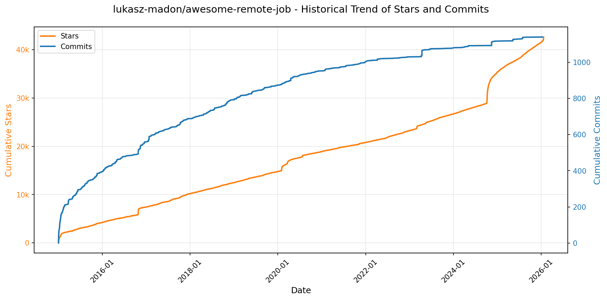
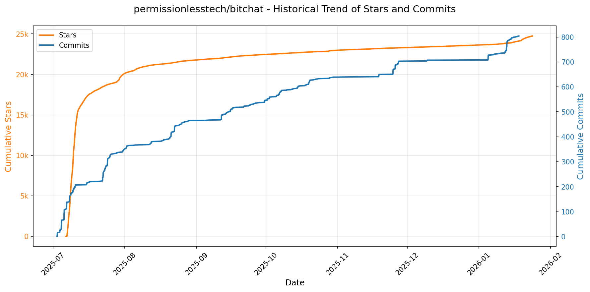
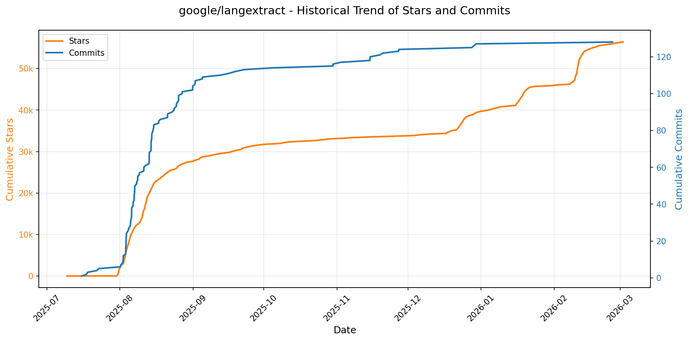
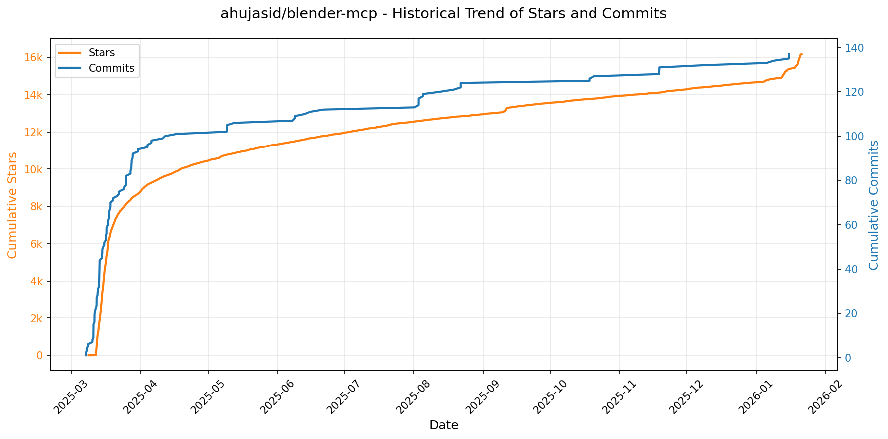
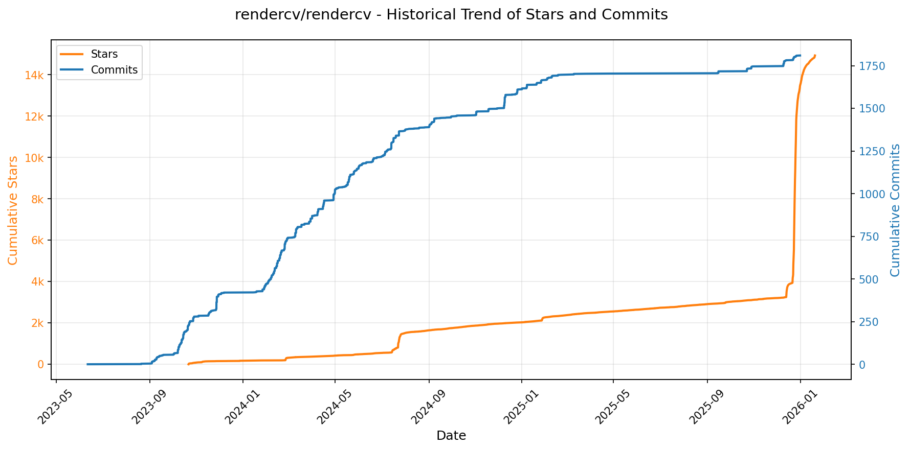
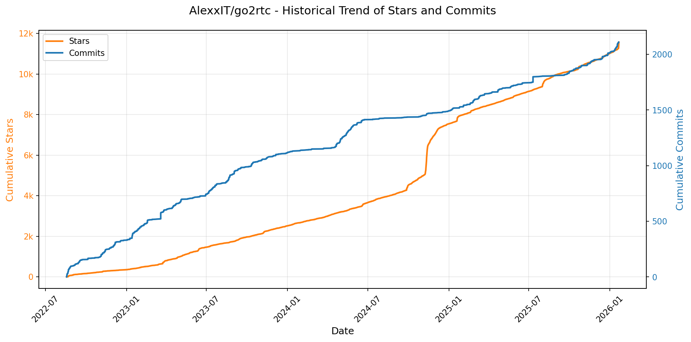
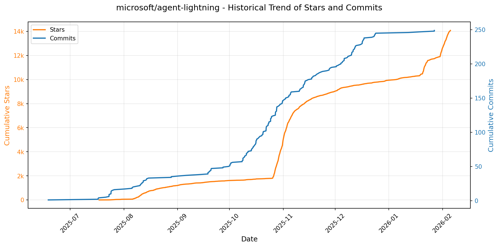
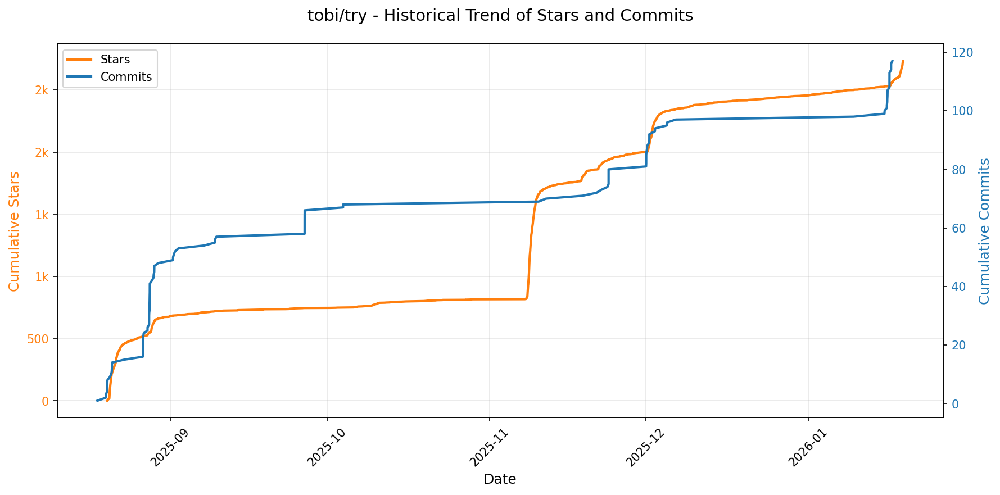
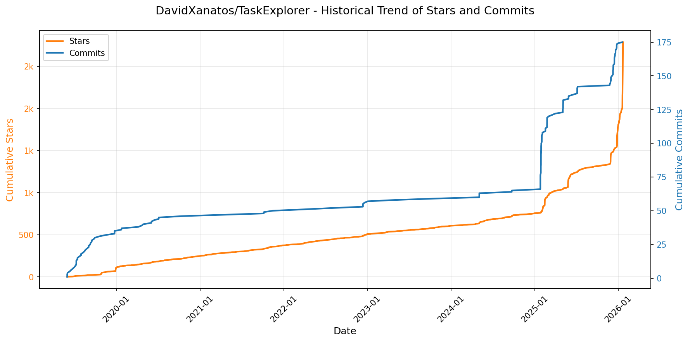
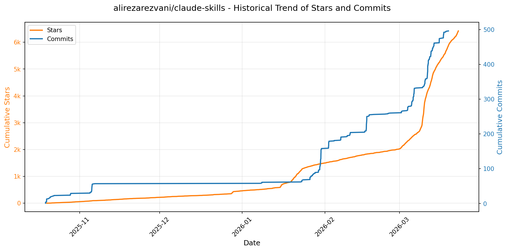

# 🌟 GitHub Trending 概览

> 数据更新于：2026-01-21。

---

## 🔍 项目详情

### 1. [anomalyco/opencode](https://github.com/anomalyco/opencode)
- 📅 **创建日期**：2025-04-30  
- 🔄 **最近更新**：2026-01-21  
- ⭐ **Stars**：80,974（日 +1783｜周 +13377｜月 +40298）  
- 📝 **描述**：The open source coding agent.  

<b>📈 Star 与 Commit 历史趋势</b>

> *蓝色：累计 Stars｜橙色：累计 Commits（次 Y 轴）*

<b>📄 README 摘要</b>

1. 该项目是一个开源的AI编程代理工具，旨在通过终端用户界面（TUI）为开发者提供智能化的代码辅助。它能够在本地或远程环境中运行，支持多种大语言模型（包括Claude、OpenAI、Google以及本地模型），帮助用户进行代码编写、修改、分析和探索现有代码库。项目采用客户端/服务器架构，允许终端TUI作为前端之一，未来可扩展至移动应用等其他客户端。

2. 关键功能包括：内置两种主要代理模式——“build”（默认，具备完整文件读写权限用于开发）和“plan”（只读模式，适合代码审查与变更规划，执行命令前需确认）；支持通过Tab键在不同代理间切换；集成@general子代理处理复杂搜索和多步骤任务；开箱即用的LSP（语言服务器协议）支持，实现精准代码理解；跨平台安装支持（macOS、Windows、Linux），可通过多种包管理器（如Homebrew、npm、scoop等）便捷安装；提供桌面应用程序Beta版本；强调终端体验优化，专为Neovim用户设计，致力于拓展终端交互的可能性。

3. 技术栈主要包括：TypeScript/JavaScript作为主要开发语言；基于Node.js运行时环境；使用TUI（终端用户界面）框架构建交互式命令行界面；采用客户端-服务器架构，实现前后端分离；支持与多种LLM API集成（如Anthropic Claude、OpenAI、Google Gemini等）；可通过本地运行的大模型进行推理；工程构建与发布流程依赖GitHub Actions自动化；支持Mise、Nix、Brew等多种现代开发环境管理工具；前端部分可能涉及React或类似技术（根据Web包推测）。

---

### 2. [hacksider/Deep-Live-Cam](https://github.com/hacksider/Deep-Live-Cam)
- 📅 **创建日期**：2023-09-24  
- 🔄 **最近更新**：2026-01-21  
- ⭐ **Stars**：78,736（日 +162｜周 +996｜月 +2527）  
- 📝 **描述**：real time face swap and one-click video deepfake with only a single image  

<b>📈 Star 与 Commit 历史趋势</b>

> *蓝色：累计 Stars｜橙色：累计 Commits（次 Y 轴）*

<b>📄 README 摘要</b>

1. 该项目是一个实时人脸替换和视频深度伪造工具，仅需单张图片即可在直播、视频通话或预录视频中实现一键换脸。支持通过摄像头进行实时换脸，并可应用于电影观看、直播表演、制作梗图或在Omegle等平台上使用，所有处理均在本地运行，强调用户对内容的伦理与合法使用责任。

2. 关键功能包括：实时换脸（支持单脸或多脸映射）、保留原始嘴部动作的“嘴部遮罩”技术、支持将任意人脸实时叠加到电影画面中、可用于直播演出和社交媒体内容创作、支持多种硬件加速（如NVIDIA CUDA、Apple Silicon CoreML、Intel OpenVINO等），并提供简易三步操作流程（选择人脸→选择摄像头→点击直播）以提升用户体验。

3. 技术栈基于Python（推荐3.11版本），使用ONNX Runtime作为推理引擎，结合InsightFace的人脸识别模型（inswapper_128_fp16.onnx）和GFPGAN用于人脸增强。前端为本地GUI界面，依赖Tkinter构建；后端利用ffmpeg处理音视频流，支持多种执行后端如CUDA（NVIDIA）、CoreML（Apple Silicon）、DirectML（Windows）、OpenVINO（Intel）等以优化性能，并通过PyTorch生态组件实现深度学习推理。

---

### 3. [twitter/the-algorithm](https://github.com/twitter/the-algorithm)
- 📅 **创建日期**：2023-03-27  
- 🔄 **最近更新**：2026-01-21  
- ⭐ **Stars**：71,040（日 +430｜周 +1452｜月 +3131）  
- 📝 **描述**：Source code for the X Recommendation Algorithm  

<b>📈 Star 与 Commit 历史趋势</b>

> *蓝色：累计 Stars｜橙色：累计 Commits（次 Y 轴）*

<b>📄 README 摘要</b>

1. 该项目实现了X平台（如“为你推荐”时间线、搜索、发现、通知等）内容推荐的核心算法系统，负责生成和提供个性化的内容信息流。它通过整合用户行为数据、社交关系、内容特征和机器学习模型，为用户推荐他们可能感兴趣的帖子和其他内容。

2. 关键功能包括：
   - **数据处理**：提供核心数据服务，如帖子读写（tweetypie）、实时用户行为流（unified-user-actions）以及用户显式和隐式信号的集中获取（user-signal-service）。
   - **模型支持**：集成多种机器学习与图模型，用于社区发现（SimClusters）、知识图谱嵌入（TwHIN）、用户交互预测（real-graph）、用户声望计算（tweepcred）、内容安全过滤（trust-and-safety-models）以及实体间相似度评分（representation-scorer）。
   - **推荐流程**：支持候选内容召回（如基于搜索索引、用户-帖子图UTEG、关注推荐FRS）、多阶段排序（轻量级和重量级排序器，如light-ranker和heavy-ranker）以及最终的内容混合与过滤（如home-mixer和visibility-filters）。
   - **框架能力**：提供高性能模型服务框架（navi）、通用信息流构建框架（product-mixer）、聚合特征生成框架（timelines-aggregation-framework）和嵌入表示管理服务（representation-manager）。
   - **具体产品支持**：当前已包含“为你推荐”时间线和“推荐通知”的完整推荐逻辑与服务组件。

3. 技术栈包括：
   - **编程语言**：主要使用 Scala 和 Python，部分高性能服务使用 Rust（如 navi），也有 Java 组件（如 search-index）。
   - **机器学习框架**：以自研的 twml 框架（基于 TensorFlow v1）为主，同时支持现代模型开发（如 PyTorch 可能用于 heavy-ranker）。
   - **数据与图技术**：依赖 GraphJet 图处理框架构建用户-内容交互图（UTEG），并使用 PageRank 算法（tweepcred）进行声誉分析。
   - **服务架构**：采用微服务架构，各功能模块（如 recos-injector, graph-feature-service）独立部署并通过 API 协作。
   - **构建工具**：使用 Bazel 进行项目构建和测试（尚无顶层配置）。
   - **部署与处理模式**：结合批处理与实时处理，支持流式事件处理（recos-injector）和实时特征服务。

---

### 4. [anthropics/claude-code](https://github.com/anthropics/claude-code)
- 📅 **创建日期**：2025-02-22  
- 🔄 **最近更新**：2026-01-21  
- ⭐ **Stars**：58,883（日 +382｜周 +2588｜月 +11225）  
- 📝 **描述**：Claude Code is an agentic coding tool that lives in your terminal, understands your codebase, and helps you code faster by executing routine tasks, explaining complex code, and handling git workflows - all through natural language commands.  

<b>📈 Star 与 Commit 历史趋势</b>

> *蓝色：累计 Stars｜橙色：累计 Commits（次 Y 轴）*

<b>📄 README 摘要</b>

1. 该项目是一个终端中的智能代理编程工具，能够理解用户的代码库，并通过自然语言指令帮助开发者更快地编写代码。它可执行常规编码任务、解释复杂代码逻辑、管理 Git 工作流，并支持在终端、IDE 或 GitHub 上通过 @claude 提及使用。

2. 主要功能包括：通过自然语言命令与代码库交互；自动化常见开发任务；解释项目中的复杂代码；协助处理 Git 操作；支持插件扩展自定义命令和智能体功能；可在多种操作系统（macOS、Linux、Windows）上安装使用；内置反馈和错误报告机制（如 `/bug` 命令）；注重用户数据隐私与安全。

3. 技术栈基于 Node.js（要求 18+ 版本），提供跨平台安装支持，包括 Shell 脚本（curl）、Homebrew、PowerShell、WinGet 等安装方式；核心运行环境为命令行终端，兼容主流操作系统；通过 npm 分发（已弃用该安装方式）；后端服务由 Anthropic 提供支持，涉及数据收集与处理遵循其隐私政策与商业条款。

---

### 5. [usememos/memos](https://github.com/usememos/memos)
- 📅 **创建日期**：2021-12-08  
- 🔄 **最近更新**：2026-01-21  
- ⭐ **Stars**：55,182（日 +195｜周 +1194｜月 +7935）  
- 📝 **描述**：An open-source, self-hosted note-taking service. Your thoughts, your data, your control — no tracking, no ads, no subscription fees.  

<b>📈 Star 与 Commit 历史趋势</b>

> *蓝色：累计 Stars｜橙色：累计 Commits（次 Y 轴）*

<b>📄 README 摘要</b>

1. 该项目是一个开源、可自托管的笔记服务，旨在让用户完全掌控自己的数据和想法。它支持个人记事、团队知识库和知识管理，强调隐私保护，无追踪、无广告、无订阅费用，所有数据存储在用户自己的基础设施上。

2. 主要功能包括：  
   - 隐私优先架构：完全自托管，零遥测，支持数据导出，无厂商锁定；  
   - 原生支持 Markdown：使用纯文本存储，便于迁移和备份；  
   - 高性能：后端采用 Go，前端为 React，加载迅速，响应灵敏；  
   - 简单部署：支持一键 Docker 安装，兼容 SQLite、MySQL 和 PostgreSQL 数据库；  
   - 开发者友好：提供完整的 REST 和 gRPC API，便于集成到现有工作流；  
   - 美观界面：简洁现代的设计风格，支持暗黑模式与移动端适配。

3. 技术栈：  
   - 后端：Go（Golang）  
   - 前端：React  
   - 数据库：支持 SQLite、MySQL、PostgreSQL  
   - 部署方式：Docker、Docker Compose、Kubernetes（Helm）、预编译二进制文件、源码构建

---

### 6. [anthropics/skills](https://github.com/anthropics/skills)
- 📅 **创建日期**：2025-09-22  
- 🔄 **最近更新**：2026-01-21  
- ⭐ **Stars**：47,017（日 +1096｜周 +7304｜月 +22870）  
- 📝 **描述**：Public repository for Agent Skills  

<b>📈 Star 与 Commit 历史趋势</b>

> *蓝色：累计 Stars｜橙色：累计 Commits（次 Y 轴）*

<b>📄 README 摘要</b>

1. **这个项目是做什么的？**  
该项目是 Anthropic 提供的 Claude 技能（Skills）实现示例集合。每个技能是一个包含指令、脚本和资源的文件夹，Claude 可动态加载这些技能以提升在特定任务上的表现。这些任务涵盖创意设计、技术开发、企业通信以及文档处理等场景。项目旨在展示技能系统的可能性，为开发者提供参考模板和实际案例，用于创建自定义技能或理解技能的工作模式。

2. **关键特性**  
- 技能模块化：每个技能独立封装在单独文件夹中，包含 `SKILL.md` 文件定义行为与元数据。  
- 多场景覆盖：提供创意类（艺术、音乐）、技术类（Web 测试、MCP 服务生成）、企业级（品牌规范、沟通流程）及文档操作类技能。  
- 支持集成到多个平台：可在 Claude Code、Claude.ai 和 Claude API 中使用，支持通过插件市场注册和安装技能包。  
- 开放部分生产级技能源码：如 docx、pdf、pptx、xlsx 文档处理技能以“源码可用”形式共享（非开源），作为复杂技能的参考实现。  
- 提供技能模板与规范：包含标准技能模板（template）和 Agent Skills 规范文档，便于开发者快速上手。  
- 可扩展性：允许用户创建并上传自定义技能，适配个性化或组织专属工作流。

3. **技术栈**  
- 核心格式：Markdown 文件（`SKILL.md`）结合 YAML 前置元数据（name、description 等）。  
- 技能结构：纯文本文件夹结构，无需运行时依赖，依赖 Claude 模型解析与执行。  
- 集成方式：通过 CLI 命令（如 `/plugin install`）在 Claude Code 中注册插件；通过 API 支持技能上传与调用。  
- 协议标准：遵循 [Agent Skills](http://agentskills.io) 规范，定义技能接口与交互模式。  
- 托管平台：GitHub 仓库管理技能代码，支持公开分享与协作。  
- 使用环境：兼容 Claude.ai（网页端）、Claude Code（IDE 工具）和 Claude API（程序化接入）。

---

### 7. [lukasz-madon/awesome-remote-job](https://github.com/lukasz-madon/awesome-remote-job)
- 📅 **创建日期**：2015-01-02  
- 🔄 **最近更新**：2026-01-21  
- ⭐ **Stars**：42,647（日 +440｜周 +744｜月 +1260）  
- 📝 **描述**：A curated list of awesome remote jobs and resources. Inspired by https://github.com/vinta/awesome-python  

<b>📈 Star 与 Commit 历史趋势</b>

> *蓝色：累计 Stars｜橙色：累计 Commits（次 Y 轴）*

<b>📄 README 摘要</b>

1. 该项目是一个精心策划的远程工作资源列表，旨在为寻找远程工作机会、工具、信息和社区的人提供全面的资源导航。它汇集了各类与远程工作相关的实用信息，帮助用户更好地适应和从事远程职业。

2. 关键功能包括：提供涵盖文章、视频、书籍和幽默内容的知识资源；列出专门的远程工作招聘平台和聚合网站；推荐支持远程工作者的住房与联合办公空间；收录公司搬迁激励计划信息；提供面试技巧与资源；整理相关活动、通讯简报和播客；展示具有“远程基因”的公司名单；汇集远程工作相关的法律与财务信息；分类整理用于人力资源、沟通、项目管理等场景的远程协作工具；以及链接到多个远程工作者社区。

3. 技术栈方面，该项目本身是一个基于 GitHub 的开源静态资源列表，主要使用 Markdown 进行内容编写和组织，并通过 GitHub Pages 等服务进行托管和展示。其维护依赖于 Git 版本控制系统，技术实现简单，核心在于内容的持续更新与社区协作贡献。

---

### 8. [obra/superpowers](https://github.com/obra/superpowers)
- 📅 **创建日期**：2025-10-09  
- 🔄 **最近更新**：2026-01-21  
- ⭐ **Stars**：31,224（日 +1194｜周 +10561｜月 +20513）  
- 📝 **描述**：An agentic skills framework & software development methodology that works.  

<b>📈 Star 与 Commit 历史趋势</b>

> *蓝色：累计 Stars｜橙色：累计 Commits（次 Y 轴）*

<b>📄 README 摘要</b>

1. 该项目为编程智能体（coding agents）提供一套完整的软件开发工作流，通过一组可组合的“技能”和初始指令来增强其能力。它使智能体在开始编码前先与用户沟通明确需求，生成可读的设计方案，并在用户确认后制定详细的实施计划。随后采用“子智能体驱动开发”模式，自动分解任务、分配子智能体执行并进行审查，支持长时间自主运行而不偏离计划，从而实现系统化、高质量的自动化开发。

2. 关键功能包括：交互式设计头脑风暴（brainstorming）、自动生成实现计划（writing-plans）、基于子智能体的任务执行与双阶段审查（subagent-driven-development）、严格的测试驱动开发（TDD，红-绿-重构循环）、系统性调试流程、代码预审与反馈响应机制、使用 Git 工作树进行隔离开发、任务间自动代码审查（按严重性阻断问题）、开发分支完成后的清理与合并决策流程。所有技能自动触发，构成强制性工作流而非建议。

3. 技术栈基于不同平台的智能体系统：主要面向 Claude Code，通过其插件市场（Plugin Marketplace）集成；对 Codex 和 OpenCode 则需手动加载远程安装脚本进行配置。核心架构由一系列声明式的“技能”文件组成，存储在代码仓库中，通过插件机制动态加载和更新，依赖自然语言指令驱动各项开发实践自动化执行。

---

### 9. [Lissy93/web-check](https://github.com/Lissy93/web-check)
- 📅 **创建日期**：2023-06-25  
- 🔄 **最近更新**：2026-01-21  
- ⭐ **Stars**：30,583（日 +143｜周 +890｜月 +3567）  
- 📝 **描述**：🕵️‍♂️ All-in-one OSINT tool for analysing any website  

<b>📈 Star 与 Commit 历史趋势</b>

> *蓝色：累计 Stars｜橙色：累计 Commits（次 Y 轴）*

---

### 10. [permissionlesstech/bitchat](https://github.com/permissionlesstech/bitchat)
- 📅 **创建日期**：2025-07-04  
- 🔄 **最近更新**：2026-01-21  
- ⭐ **Stars**：24,499（日 +128｜周 +616｜月 +967）  
- 📝 **描述**：bluetooth mesh chat, IRC vibes  

<b>📈 Star 与 Commit 历史趋势</b>

> *蓝色：累计 Stars｜橙色：累计 Commits（次 Y 轴）*

<b>📄 README 摘要</b>

1. **这个项目是做什么的？**  
   BitChat 是一个去中心化的点对点即时通讯应用，支持双通道通信架构：在无网络环境下通过蓝牙构建本地 Mesh 网络进行离线通信，同时利用互联网上的 Nostr 协议实现全球范围的消息传递。无需注册账号、无需手机号、不依赖任何中心化服务器，适用于抗议、灾难救援、偏远地区等场景，支持基于地理位置的频道聊天和私密消息加密传输。

2. **关键特性**  
   - **双通道架构**：蓝牙 Mesh（离线）与 Nostr 协议（在线）并行运行  
   - **基于位置的频道**：使用地理哈希（geohash）坐标创建不同范围的区域聊天室（如街区、城市、国家）  
   - **智能路由机制**：优先通过蓝牙发送消息，失败后自动切换至 Nostr 网络，无连接时排队等待重发  
   - **去中心化 Mesh 网络**：支持蓝牙低功耗下的自动节点发现与最多 7 跳的消息中继  
   - **强隐私保护**：无需身份信息，无持久化标识符  
   - **端到端加密**：蓝牙使用 Noise 协议，Nostr 使用 NIP-17 加密标准  
   - **IRC 风格命令**：支持 `/slap`、`/msg`、`/who` 等传统指令操作  
   - **全平台原生支持**：兼容 iOS 和 macOS  
   - **紧急清除功能**：三击快速清除所有本地数据  
   - **性能优化**：采用 LZ4 压缩、自适应省电模式和网络调度优化  

3. **技术栈**  
   - **核心协议**：Nostr（用于互联网通信）、Noise Protocol（蓝牙端到端加密）  
   - **网络传输**：蓝牙低功耗（BLE）Mesh 网络，支持多跳中继；Nostr 全球中继网络（>290 个节点）  
   - **地理定位**：Geohash 编码实现分级区域频道（从街区到国家）  
   - **加密机制**：ECDH 密钥交换、前向保密、临时密钥（每区域更换身份密钥）  
   - **开发框架**：Xcode + Swift，原生 Apple 平台开发（iOS/macOS）  
   - **构建工具**：`just`（类 Make 工具），配合 `xcodebuild` 进行编译验证  
   - **数据格式**：二进制协议封装蓝牙数据包，适配 BLE 传输限制  
   - **本地化管理**：基于 `.strings` 和 `.stringsdict` 文件实现多语言支持  
   - **部署方式**：App Store 发布，支持从源码构建（需配置开发者团队 ID 与 entitlements）

---

### 11. [bytedance/UI-TARS-desktop](https://github.com/bytedance/UI-TARS-desktop)
- 📅 **创建日期**：2025-01-19  
- 🔄 **最近更新**：2026-01-21  
- ⭐ **Stars**：24,487（日 +101｜周 +984｜月 +4502）  
- 📝 **描述**：The Open-Source Multimodal AI Agent Stack: Connecting Cutting-Edge AI Models and Agent Infra  

<b>📈 Star 与 Commit 历史趋势</b>

> *蓝色：累计 Stars｜橙色：累计 Commits（次 Y 轴）*

<b>📄 README 摘要</b>

1. 该项目做什么？  
本项目是一个多模态AI智能体（Agent）技术栈，包含两个核心组件：**Agent TARS** 和 **UI-TARS Desktop**。Agent TARS 是一个通用的多模态AI代理系统，能够通过自然语言指令在终端、计算机、浏览器和产品中执行任务，结合视觉识别与图形界面（GUI）操作能力，实现接近人类行为模式的工作流。它支持命令行（CLI）和Web界面运行，可集成多种现实世界工具（MCP），完成如订机票、订酒店、生成图表等复杂任务。UI-TARS Desktop 是一个桌面应用程序，基于UI-TARS模型提供本地及远程的GUI自动化代理功能，用户可通过自然语言控制本地或远程的电脑和浏览器，实现自动点击、设置调整、信息查询等操作。

2. 关键特性  
- 支持一键启动的命令行（CLI）工具，兼容有头（Web UI）和无头（server）模式运行。  
- 具备混合浏览器代理能力，可通过视觉定位（GUI Agent）、DOM解析或混合策略控制浏览器。  
- 基于事件流协议的上下文工程与代理界面，支持数据流追踪与调试（Event Stream Viewer）。  
- 深度集成MCP（Model Context Protocol）工具体系，可挂载外部MCP服务器连接真实世界应用。  
- 提供本地与远程计算机/浏览器操作器，无需复杂配置即可实现远程控制。  
- 支持多平台（Windows/macOS/浏览器），具备截图识别、精准鼠标键盘控制、实时反馈等功能。  
- 数据处理完全本地化，保障用户隐私与安全。  
- 支持主流大模型（如Claude、Doubao等）并提供云部署方案（如ModelScope平台）。

3. 技术栈  
- 核心运行环境依赖Node.js（建议版本 >= 22），通过npm包管理器分发（@agent-tars/cli）。  
- 使用多模态大语言模型（如Seed-1.5-VL/1.6、Doubao、Claude等）驱动自然语言理解与决策。  
- 基于MCP（Model Context Protocol）架构实现工具集成与上下文管理。  
- GUI操作依赖UI-TARS视觉语言模型，结合屏幕截图与视觉定位技术实现精确控制。  
- 前端界面采用Web技术栈（HTML/CSS/JS），支持独立Web UI与桌面应用集成。  
- 桌面应用基于跨平台框架构建，支持Windows与macOS原生运行。  
- 支持Hugging Face、ModelScope等平台模型部署，并可通过Discord、飞书等社区进行交互与扩展。

---

### 12. [google/langextract](https://github.com/google/langextract)
- 📅 **创建日期**：2025-07-08  
- 🔄 **最近更新**：2026-01-21  
- ⭐ **Stars**：23,244（日 +475｜周 +2685｜月 +5385）  
- 📝 **描述**：A Python library for extracting structured information from unstructured text using LLMs with precise source grounding and interactive visualization.  

<b>📈 Star 与 Commit 历史趋势</b>

> *蓝色：累计 Stars｜橙色：累计 Commits（次 Y 轴）*

<b>📄 README 摘要</b>

1. 该项目做什么？  
LangExtract 是一个 Python 库，利用大语言模型（LLM）从非结构化文本（如临床记录、报告等）中提取结构化信息。用户通过自定义提示和示例定义提取任务，该工具可精准定位源文本中的关键信息，并将其组织为结构化输出。它支持长文档处理、多轮提取以提高召回率，并能生成交互式 HTML 可视化结果，便于审查提取内容在原文中的上下文。

2. 主要功能  
- **精确溯源**：将每项提取结果映射到其在源文本中的确切位置，支持可视化高亮，便于追溯与验证。  
- **结构化输出保障**：基于用户提供的一次性示例（few-shot examples），强制生成符合预定义模式的可靠结构化数据。  
- **优化长文本处理**：通过智能分块、并行处理和多轮提取策略，有效解决“大海捞针”问题，提升大文档的信息召回率。  
- **交互式可视化**：自动生成独立的 HTML 文件，用于直观浏览和审查成千上万条提取结果及其原始上下文。  
- **灵活支持多种 LLM**：兼容云端模型（如 Google Gemini、OpenAI）和本地开源模型（通过 Ollama 接口）。  
- **无需微调即可适配任意领域**：仅需提供少量示例即可定义任意领域的提取任务，无需对模型进行训练或微调。  
- **插件式扩展能力**：支持通过轻量级插件系统添加自定义模型提供商，方便集成第三方 API 或新模型。

3. 技术栈  
- **编程语言**：Python  
- **核心依赖**：PyPI 发布包，使用 `pyproject.toml` 进行依赖管理  
- **LLM 集成**：支持 Google Gemini、OpenAI（GPT 系列）、Ollama（用于运行本地模型如 Gemma2）  
- **部署方式**：支持 pip 安装、源码安装、Docker 容器化部署  
- **开发工具**：使用 tox 进行测试环境管理，pytest 用于单元测试，pre-commit 和 pylint/pyink/isort 用于代码格式化与静态检查  
- **API 通信**：通过环境变量或 `.env` 文件管理 API 密钥，支持 Vertex AI 批量处理 API 以降低成本  
- **可视化**：内置 HTML 生成器，实现提取结果的交互式前端展示

---

### 13. [ComposioHQ/awesome-claude-skills](https://github.com/ComposioHQ/awesome-claude-skills)
- 📅 **创建日期**：2025-10-17  
- 🔄 **最近更新**：2026-01-21  
- ⭐ **Stars**：22,803（日 +720｜周 +4031｜月 +14954）  
- 📝 **描述**：A curated list of awesome Claude Skills, resources, and tools for customizing Claude AI workflows  

<b>📈 Star 与 Commit 历史趋势</b>

> *蓝色：累计 Stars｜橙色：累计 Commits（次 Y 轴）*

<b>📄 README 摘要</b>

1. 该项目是一个精选的 Claude 技能（Claude Skills）集合，旨在提升在 Claude.ai、Claude Code 和 Claude API 上的工作效率。它提供了一系列可定制的工作流（即“技能”），使 Claude 能够执行超越文本生成的具体任务，例如处理文档、操作代码、分析数据、管理项目以及连接并操作 Gmail、Slack、GitHub 等 500 多个外部应用程序来发送邮件、创建问题、发布消息等。

2. 关键特性包括：一个全面分类的技能库，涵盖文档处理、开发工具、数据分析、商业营销、写作沟通、创意媒体、生产力组织、协作管理和安全系统等多个领域；支持通过插件（如 connect-apps）将 Claude 与 Composio 平台集成，从而实现跨 1000 多个应用的实际操作；提供了在 Claude.ai、Claude Code 和 API 中使用这些技能的详细指南；包含创建和贡献自定义技能的模板与最佳实践；并拥有活跃的社区资源和贡献流程。

3. 技术栈主要围绕 Anthropic 的 Claude 生态系统构建，核心是 Claude 模型（如 claude-3-5-sonnet）及其 Skills 功能。项目本身以纯文本和 Markdown 文件形式组织，依赖于 `SKILL.md` 文件中的 YAML 元数据来定义技能。集成了 Composio 平台用于连接外部应用和服务。在开发层面，涉及的技术和工具包括 Python（API 使用）、TypeScript/JavaScript（MCP 服务器）、SQL（PostgreSQL 查询）、Git 工作流、Playwright（浏览器自动化）、AWS CDK 以及各种前端技术（如 React, Tailwind CSS）。

---

### 14. [BloopAI/vibe-kanban](https://github.com/BloopAI/vibe-kanban)
- 📅 **创建日期**：2025-06-14  
- 🔄 **最近更新**：2026-01-21  
- ⭐ **Stars**：18,038（日 +496｜周 +2283｜月 +11412）  
- 📝 **描述**：Get 10X more out of Claude Code, Codex or any coding agent  

<b>📈 Star 与 Commit 历史趋势</b>

> *蓝色：累计 Stars｜橙色：累计 Commits（次 Y 轴）*

<b>📄 README 摘要</b>

1. 该项目旨在优化人类工程师与AI编程代理（如Claude Code、Gemini CLI等）协作的开发流程。它作为一个任务管理与协调平台，帮助用户规划、监控和审查AI生成的代码工作，支持在不同编码代理间切换，按顺序或并行编排多个代理任务，集中管理配置，并能快速启动开发服务器和远程通过SSH打开项目。

2. 主要功能包括：支持多种主流AI编码代理集成；可编排多个AI代理的任务执行流程（串行/并行）；提供可视化看板以跟踪任务状态；集中化管理MCP（Model Control Protocol）配置；内置开发服务器启动能力；支持远程部署并通过SSH从本地编辑器（如VSCode）访问远程项目；具备灵活的环境变量配置机制，适用于本地开发与生产部署；可通过反向代理或自定义域名进行安全托管。

3. 技术栈包含：前端使用Node.js（>=18）与pnpm包管理器构建，后端采用Rust语言开发以确保高性能；使用SQLx作为异步SQL查询接口处理数据库操作；前端构建工具链基于现代Web生态（可能含Vite或类似工具）；本地开发依赖cargo-watch实现热重载；分析功能集成PostHog用于行为追踪（可选）；通过MCP协议与各类AI编码代理通信；整体架构分为前后端分离服务，支持跨平台运行，并利用SSH协议实现远程项目访问。

---

### 15. [davila7/claude-code-templates](https://github.com/davila7/claude-code-templates)
- 📅 **创建日期**：2025-07-04  
- 🔄 **最近更新**：2026-01-21  
- ⭐ **Stars**：17,814（日 +227｜周 +1910｜月 +4968）  
- 📝 **描述**：CLI tool for configuring and monitoring Claude Code  

<b>📈 Star 与 Commit 历史趋势</b>

> *蓝色：累计 Stars｜橙色：累计 Commits（次 Y 轴）*

<b>📄 README 摘要</b>

1. 该项目提供一系列即用型配置，用于增强 Anthropic 公司开发的 Claude Code 的功能。它包含一个全面的模板库，涵盖 AI 智能体、自定义命令、设置、钩子（hooks）、外部服务集成（MCPs）以及项目模板，旨在帮助开发者优化和加速基于 AI 的开发工作流程。用户可以通过命令行直接安装特定组件或完整的开发套件，并利用其附带的分析、监控、健康检查和插件管理等工具来提升开发效率。

2. 关键特性包括：
   - **多样化组件库**：提供超过100个可安装的组件，分为六大类：AI智能体（如前端开发者、代码审查员）、自定义斜杠命令（如`/generate-tests`）、外部服务集成（MCPs，支持 GitHub、PostgreSQL、AWS 等）、Claude Code 设置（如超时、内存）、自动化钩子（如提交前验证）以及可复用的技能。
   - **交互式浏览与一键安装**：用户可通过网站 [aitmpl.com](https://aitmpl.com) 交互式地浏览所有模板，并使用 `npx` 命令直接安装，支持组合安装多个组件。
   - **附加开发工具**：内置多项实用工具，包括实时分析 Claude 开发会话的 **Analytics**、用于远程查看对话的移动优化 **Conversation Monitor**、检查环境配置的 **Health Check** 以及集中管理插件的 **Plugin Dashboard**。
   - **开源与社区驱动**：项目开放贡献，鼓励用户添加自己的模板，并明确声明了对所有引用的第三方资源（如 K-Dense-AI、Anthropic 官方等）的版权归属和许可证信息，尊重原作者。

3. 技术栈主要包括：
   - **核心运行环境**：Node.js（通过 `npx` 命令执行）。
   - **前端展示**：项目官网（aitmpl.com）和文档站（docs.aitmpl.com）可能使用现代 Web 技术构建，但未明确说明。
   - **部署与托管**：受到 Vercel OSS 计划支持，暗示其相关服务或网站可能部署在 Vercel 平台。
   - **网络通信**：使用 Cloudflare Tunnel 实现安全的远程访问。
   - **集成技术**：通过 MCP（Model Context Protocol）等方式与多种外部服务（GitHub, PostgreSQL, Stripe, AWS, OpenAI 等）进行集成。
   - **开源许可**：项目主体采用 MIT 许可证，同时整合了多种遵循不同开源协议（如 MIT, Apache 2.0, CC0）的第三方组件。

---

### 16. [ahujasid/blender-mcp](https://github.com/ahujasid/blender-mcp)
- 📅 **创建日期**：2025-03-07  
- 🔄 **最近更新**：2026-01-21  
- ⭐ **Stars**：16,174（日 +200｜周 +917｜月 +1611）  
- 📝 **描述**：暂无描述  

<b>📈 Star 与 Commit 历史趋势</b>

> *蓝色：累计 Stars｜橙色：累计 Commits（次 Y 轴）*

<b>📄 README 摘要</b>

1. 该项目通过模型上下文协议（MCP）将Blender与Claude AI连接，使Claude能够直接交互和控制Blender。它实现了基于提示词的3D建模、场景创建与操作，支持双向通信，允许AI在Blender中创建、修改和删除对象，应用材质，执行代码，并集成外部3D资源平台。

2. 关键功能包括：  
   - 双向通信：通过基于套接字的服务器实现Claude AI与Blender之间的实时交互  
   - 对象操控：创建、修改和删除3D对象（如立方体、球体等）  
   - 材质控制：为对象应用或修改材质、颜色和纹理  
   - 场景检查：获取当前Blender场景的详细信息（对象列表、层级结构等）  
   - 执行Blender内Python代码：从AI端运行任意脚本以实现高级自动化  
   - 集成Poly Haven API：搜索并下载高质量的免费模型、HDRIs和纹理  
   - 支持Hyper3D Rodin：通过AI生成3D模型  
   - 支持Hunyuan3D：新增对腾讯混元3D模型的支持  
   - 视口截图查看：帮助AI理解当前场景状态  
   - 远程主机运行：可在远程机器上运行Blender MCP服务  
   - 匿名工具遥测：记录工具使用情况用于改进（完全匿名）

3. 技术栈包括：  
   - Blender 3.0+：作为3D创作核心环境  
   - Python 3.10+：开发插件和服务端逻辑  
   - uv包管理器：用于安装和管理Python依赖（替代pipx）  
   - Model Context Protocol (MCP)：实现AI与应用程序间标准化通信  
   - TCP套接字通信：基于JSON格式在Blender插件与MCP服务器之间传输指令和响应  
   - JSON协议：命令和响应均采用结构化JSON数据格式进行传输  
   - 支持多客户端集成：兼容Claude for Desktop、Cursor IDE、Visual Studio Code等主流开发/设计工具

---

### 17. [rendercv/rendercv](https://github.com/rendercv/rendercv)
- 📅 **创建日期**：2023-06-11  
- 🔄 **最近更新**：2026-01-21  
- ⭐ **Stars**：15,058（日 +122｜周 +381｜月 +10839）  
- 📝 **描述**：CV/resume generator for academics and engineers, YAML to PDF  

<b>📈 Star 与 Commit 历史趋势</b>

> *蓝色：累计 Stars｜橙色：累计 Commits（次 Y 轴）*

<b>📄 README 摘要</b>

1. 该项目是一个专为学术界和工程领域人士设计的简历（CV）生成工具。用户只需用YAML格式编写简历内容，运行RenderCV即可自动生成具有专业排版效果的PDF文件。它强调内容与格式分离，让用户专注于撰写内容，而无需手动调整布局，确保每次输出都具有精确的对齐和一致的间距。

2. 主要功能包括：支持通过YAML文件以纯文本形式编写简历，便于版本控制；提供严格的输入验证机制，能精确定位并提示配置错误；内置多种设计主题（如Classic、Moderncv等），并允许高度自定义页面尺寸、页边距、颜色、字体、行距等视觉元素；支持JSON Schema实现编辑器中的自动补全和实时文档提示；可本地化为任意语言，通过配置locale字段实现多语言支持；集成简单的工作流命令（如`rendercv new`创建新简历，`rendercv render`生成PDF），提升使用效率。

3. 技术栈基于Python（要求3.12及以上版本），使用Pydantic进行数据模型定义与严格校验，利用Jinja2模板引擎渲染LaTeX代码，再通过LaTeX编译生成高质量PDF。项目采用Markdown与MkDocs构建文档系统，测试由GitHub Actions驱动，并使用pytest进行单元测试与覆盖率检测。整体设计遵循现代CLI工具标准，通过pip包管理器分发，支持在VS Code等编辑器中结合YAML Schema实现智能编辑体验。

---

### 18. [shareAI-lab/learn-claude-code](https://github.com/shareAI-lab/learn-claude-code)
- 📅 **创建日期**：2025-06-29  
- 🔄 **最近更新**：2026-01-21  
- ⭐ **Stars**：14,833（日 +118｜周 +683｜月 +3168）  
- 📝 **描述**：How can we build a true AI agent? Like Claude Code.  

<b>📈 Star 与 Commit 历史趋势</b>

> *蓝色：累计 Stars｜橙色：累计 Commits（次 Y 轴）*

<b>📄 README 摘要</b>

1. 该项目是一个渐进式教程，旨在通过从零开始构建AI编码代理来帮助学习现代AI代理（如Kode、Claude Code和Cursor Agent）的工作原理。它包含五个逐步进化的版本（v0至v4），每个版本引入一个核心概念（如基础工具调用、待办事项规划、子代理、技能机制等），总共约1100行代码，系统性地揭示了AI编码代理的核心设计模式与演进路径。

2. 关键特性包括：基于极简主义的“Bash即一切”设计；实现模型作为代理的核心循环；通过Todo工具进行显式、结构化任务规划；支持创建隔离上下文的子代理以分治复杂任务；引入按需加载的技能（Skills）机制以提供领域专业知识；内置代理构建者技能（Agent Builder Skill）可自动生成新代理项目模板；兼容Kode CLI、Claude Code、Cursor等主流代理工具及Agent Skills规范；提供中英文深度技术解析文档。

3. 技术栈主要包括Python编程语言；使用Anthropic、OpenAI、Gemini等大语言模型API；依赖`pip`管理的Python包；采用简单的文件系统操作与bash命令作为工具执行基础；通过`.env`文件配置多平台API密钥；技能（Skills）以SKILL.md文件形式组织；整体架构无复杂框架，强调轻量级和教育性。

---

### 19. [steveyegge/beads](https://github.com/steveyegge/beads)
- 📅 **创建日期**：2025-10-12  
- 🔄 **最近更新**：2026-01-21  
- ⭐ **Stars**：11,713（日 +268｜周 +1661｜月 +5717）  
- 📝 **描述**：Beads - A memory upgrade for your coding agent  

<b>📈 Star 与 Commit 历史趋势</b>

> *蓝色：累计 Stars｜橙色：累计 Commits（次 Y 轴）*

<b>📄 README 摘要</b>

1. 该项目是一个为AI代理设计的分布式、基于Git的图状问题跟踪器，旨在为编码代理提供持久化、结构化的记忆系统。它用依赖感知的图结构替代杂乱的Markdown计划，使代理在处理长期任务时不会丢失上下文。

2. 主要特性包括：以Git作为数据库，将问题以JSONL格式存储在`.beads/`目录中，支持版本控制、分支和合并；专为代理优化，输出JSON格式数据，支持依赖关系追踪和自动识别就绪任务；采用哈希ID（如`bd-a1b2`）避免多代理或多分支工作流中的合并冲突；具备本地SQLite缓存和后台守护进程实现快速响应与自动同步；支持“语义压缩”功能，对旧的已关闭任务进行总结，模拟记忆衰减，节省上下文窗口空间；支持层次化任务结构（如`bd-a3f8.1.1`表示子任务），并提供“隐身模式”供本地使用而不影响主仓库。

3. 技术栈包括Go语言（核心实现）、Git（用于版本控制和数据存储）、SQLite（本地缓存）、JSONL（日志格式存储任务），并通过npm、Homebrew和Go工具链提供跨平台安装支持，适用于Linux、FreeBSD、macOS和Windows系统。

---

### 20. [AlexxIT/go2rtc](https://github.com/AlexxIT/go2rtc)
- 📅 **创建日期**：2022-08-18  
- 🔄 **最近更新**：2026-01-21  
- ⭐ **Stars**：11,569（日 +304｜周 +390｜月 +655）  
- 📝 **描述**：Ultimate camera streaming application with support RTSP, RTMP, HTTP-FLV, WebRTC, MSE, HLS, MP4, MJPEG, HomeKit, FFmpeg, etc.  

<b>📈 Star 与 Commit 历史趋势</b>

> *蓝色：累计 Stars｜橙色：累计 Commits（次 Y 轴）*

<b>📄 README 摘要</b>

1. 该项目是一个终极摄像头流媒体应用，支持多种协议（如RTSP、WebRTC、HomeKit、FFmpeg、RTMP等），可在各种操作系统（Windows、macOS、Linux、ARM）上运行，无需依赖和配置。它能够从多种来源（如RTSP、RTMP、DVRIP、HTTP、USB摄像头等）获取视频流，并将这些流推送到RTSP、WebRTC、MSE/MP4、HomeKit、HLS或MJPEG等目标。项目还支持向流行的流媒体服务（如YouTube、Telegram等）发布任何源流，是世界上首个支持从HomeKit摄像头流式传输的项目。此外，它还提供通过FFmpeg对不支持的编解码器进行实时转码、在某些摄像头上的扬声器播放音频文件和直播流、多源双向编解码协商（混合来自不同源的轨道到单个流、自动匹配客户端支持的编解码器、某些摄像头的双向音频）等功能，可以集成到任何智能家居平台或作为独立应用程序使用。

2. 关键特性包括：零依赖和零配置的小型应用，适用于所有操作系统；极低延迟的多协议流传输；支持广泛的视频源和输出协议；支持向主流平台发布流；首创支持HomeKit摄像头流；通过FFmpeg实现不支持编解码器的实时转码；支持在特定摄像头播放音频；多源双向编解码协商，包括轨道混合、自动匹配客户端编解码器和双向音频；可与任何智能家居平台集成或作为独立应用使用；支持大量设备、文件、网络和私有协议。

3. 技术栈主要包括Go语言开发的应用程序，利用了Pion的webrtc Go库、rtsp-simple-server的理念、GStreamer框架的管道理念、MediaSoup框架的路由理念以及HomeKit Accessory Protocol。项目支持多种格式和协议，包括但不限于alsa、v4l2、adts、flv、h264、hevc、hls、mjpeg、mpegts、mp4、wav、mpjpeg、onvif、rtmp、rtp、rtsp、webrtc、yuv4mpegpipe等，并且支持公共和私有的网络协议如http、pipe、rtmp、rtsp、tcp、udp、webrtc、ws（WebSocket）、cs2 (PPPP)、hap和hds (HomeKit)、tutk (P2P)等。

---

### 21. [microsoft/agent-lightning](https://github.com/microsoft/agent-lightning)
- 📅 **创建日期**：2025-06-18  
- 🔄 **最近更新**：2026-01-21  
- ⭐ **Stars**：10,852（日 +369｜周 +599｜月 +1116）  
- 📝 **描述**：The absolute trainer to light up AI agents.  

<b>📈 Star 与 Commit 历史趋势</b>

> *蓝色：累计 Stars｜橙色：累计 Commits（次 Y 轴）*

<b>📄 README 摘要</b>

1. **这个项目是做什么的？**  
Agent Lightning 是一个用于训练和优化 AI 智能体（AI Agents）的轻量级框架，支持在几乎无需修改代码的前提下，对任意 AI 智能体进行高效优化。它能够与各种主流智能体框架（如 LangChain、AutoGen、CrewAI 等）无缝集成，也支持无框架的 Python OpenAI 调用。该工具通过收集智能体运行过程中的提示、工具调用和奖励等事件，形成结构化轨迹数据，并利用强化学习、自动提示优化、监督微调等算法实现智能体性能的持续提升，适用于单智能体或复杂多智能体系统的定向优化。

2. **关键特性**  
- 几乎零代码改动即可将现有智能体转变为可优化系统；  
- 兼容任意智能体框架（包括 LangChain、OpenAI Agent SDK、AutoGen、CrewAI、Microsoft Agent Framework 等），也可用于原生 Python OpenAI 调用；  
- 支持在多智能体系统中选择性地优化一个或多个特定智能体；  
- 集成多种优化算法，如强化学习（Reinforcement Learning）、自动提示优化（Automatic Prompt Optimization）、监督微调（Supervised Fine-tuning）等；  
- 提供统一的数据追踪机制（LightningStore），自动捕获提示、工具调用和奖励等事件并生成结构化轨迹；  
- 模块化架构设计，训练器（Trainer）协调数据流、资源更新与模型部署，支持持续迭代优化；  
- 支持大规模分布式训练（已有 128 GPU 成功案例），具备良好的扩展性和稳定性。

3. **技术栈**  
- 核心语言：Python；  
- 主要依赖：OpenAI 官方库、PyTorch（用于算法实现，如策略网络训练）；  
- 架构组件：事件追踪系统（agl.emit_xxx）、LightningStore（中央数据存储 hub）、Trainer（训练流程控制器）、算法模块（可插拔式设计）；  
- 支持后端：兼容 vLLM 等高性能推理引擎，可通过 OpenAI 兼容 API 返回 token ID 以避免 retokenization drift；  
- 开发与测试：GitHub Actions 实现 CI/CD 自动化测试（涵盖 CPU、全量测试、UI、示例集成、依赖兼容性等）；  
- 部署分发：通过 PyPI 发布稳定版本，Test PyPI 提供最新实验性构建；  
- 文档与社区：GitHub Pages 托管官方文档，Discord 社区支持交流协作。

---

### 22. [iOfficeAI/AionUi](https://github.com/iOfficeAI/AionUi)
- 📅 **创建日期**：2025-08-07  
- 🔄 **最近更新**：2026-01-21  
- ⭐ **Stars**：7,940（日 +976｜周 +4427｜月 +4819）  
- 📝 **描述**：Free, local, open-source Cowork for Gemini CLI, Claude Code, Codex, Opencode, Qwen Code, Goose Cli, Auggie, and more | 🌟 Star if you like it!  

<b>📈 Star 与 Commit 历史趋势</b>

> *蓝色：累计 Stars｜橙色：累计 Commits（次 Y 轴）*

---

### 23. [virattt/dexter](https://github.com/virattt/dexter)
- 📅 **创建日期**：2025-10-14  
- 🔄 **最近更新**：2026-01-21  
- ⭐ **Stars**：7,695（日 +262｜周 +728｜月 +3536）  
- 📝 **描述**：An autonomous agent for deep financial research  

<b>📈 Star 与 Commit 历史趋势</b>

> *蓝色：累计 Stars｜橙色：累计 Commits（次 Y 轴）*

<b>📄 README 摘要</b>

1. **这个项目是做什么的？**  
Dexter 是一个自主的金融研究智能体，能够思考、规划并从任务中学习。它通过任务分解、自我反思和实时市场数据来分析复杂的金融问题。用户提出金融相关问题后，Dexter 会自动将其拆解为多个研究步骤，调用工具获取真实财务数据（如利润表、资产负债表、现金流量表），执行分析与计算，并验证结果，最终生成有数据支持的高质量研究报告。

2. **关键特性**  
- **智能任务规划**：将复杂金融问题自动分解为结构化的研究步骤。  
- **自主执行能力**：自动选择合适的工具获取所需金融数据并执行任务。  
- **自我验证机制**：检查自身工作成果，迭代优化直到满足完成标准。  
- **实时金融数据接入**：支持访问企业收入、资产、现金流等核心财务数据。  
- **安全性保障**：内置循环检测和步骤限制，防止无限执行。  
- **多模型支持**：可在 OpenAI、Anthropic、Google、xAI 及本地 Ollama 模型间切换使用。  
- **交互式命令行界面**：提供可交互的终端体验，便于开发和使用。

3. **技术栈**  
- **运行时环境**：Bun（v1.0 或更高版本）  
- **前端框架**：React + Ink（用于构建终端用户界面）  
- **大语言模型集成**：LangChain.js，支持多种 LLM 提供商（OpenAI、Anthropic、Google、xAI、Ollama）  
- **类型与验证**：TypeScript + Zod（用于数据模式校验）  
- **架构设计**：基于多智能体架构，包括规划代理、行动代理、验证代理和回答代理，各司其职协同完成任务。

---

### 24. [danielmiessler/Personal_AI_Infrastructure](https://github.com/danielmiessler/Personal_AI_Infrastructure)
- 📅 **创建日期**：2025-09-08  
- 🔄 **最近更新**：2026-01-21  
- ⭐ **Stars**：5,419（日 +116｜周 +877｜月 +3755）  
- 📝 **描述**：Agentic AI Infrastructure for magnifying HUMAN capabilities.  

<b>📈 Star 与 Commit 历史趋势</b>

> *蓝色：累计 Stars｜橙色：累计 Commits（次 Y 轴）*

<b>📄 README 摘要</b>

1. 该项目做什么？
PAI（Personal AI Infrastructure，个人AI基础设施）是一个旨在通过AI增强人类自我认知与能力的开源平台。其核心目标是激活个体潜能，帮助每个人明确、表达并追求自身人生目标，同时确保最先进的AI技术不被少数人垄断，而是向所有人开放。它将AI从传统的“任务执行工具”转变为一个持续学习、了解用户目标与偏好的“个人助理”。系统能记住用户的使命、目标、项目、信念等核心信息（TELOS系统），通过观察、思考、规划、执行、验证和学习的循环，不断优化输出结果，并基于每次交互的反馈（如评分、情感、成败）实现自我进化。适用于个人、团队乃至企业，用以提升生产力、组织管理、创意发展和生活品质。

2. 关键特性
- **深度目标理解 (TELOS)**：通过10个核心文件（如MISSION.md, GOALS.md）系统化地记录用户的身份、目标和偏好，使AI能围绕用户的真实意图工作。
- **持续学习系统**：具备三层次记忆架构（热/温/冷），自动捕获交互信号（成功、失败、评分等），分析错误并强化成功模式，实现AI能力的长期进化。
- **技能系统 (Skill System)**：采用“代码优先”的确定性架构（CODE -> CLI工具 -> Prompt -> Skill），确保输出结果稳定可靠。
- **用户/系统分离**：用户自定义内容存于USER/目录，系统框架存于SYSTEM/目录，保证系统升级时用户数据安全且身份可移植。
- **事件钩子系统 (Hook System)**：支持8种生命周期事件（会话开始、工具调用等），实现自动化上下文加载、安全校验和通知推送。
- **多层安全体系**：内置默认的安全策略和钩子，在无需跳过权限的情况下阻止危险操作，保障运行安全。
- **AI驱动的安装**：AI助手可自主读取并安装功能模块（Packs），实现零手动配置的一键部署。
- **丰富的通知系统**：支持移动端推送（ntfy）、Discord集成和语音播报，对长时任务能智能升级提醒，且不阻塞主工作流。
- **语音交互**：集成ElevenLabs TTS，让AI拥有自然语音，可通过声音接收任务完成或重要更新的通知。
- **终端式UI**：基于终端提供富文本标题、动态状态栏，实时显示学习信号和任务状态，打造高效命令中心。
- **高度可定制化**：提供身份、偏好、工作流、技能、钩子和记忆六个层面的精细化定制。
- **模块化分发 (Packs & Bundles)**：功能以独立、可组合的“Packs”形式发布，用户可选择一键安装完整系统、手动构建或按需挑选功能。

3. 技术栈
- **编程语言**：TypeScript
- **运行时/包管理器**：Bun
- **核心AI模型**：主要由Claude（Anthropic）提供支持，并强调系统架构比单一模型更重要。
- **语音合成**：ElevenLabs TTS
- **通知服务**：ntfy（用于移动推送）
- **协作与社区**：Discord
- **版本控制**：Git/GitHub
- **开发理念**：遵循UNIX哲学（做一件事做好）、SRE/ENG工程原则（版本控制、自动化、监控）、CLI优先接口。

---

### 25. [frankbria/ralph-claude-code](https://github.com/frankbria/ralph-claude-code)
- 📅 **创建日期**：2025-08-27  
- 🔄 **最近更新**：2026-01-21  
- ⭐ **Stars**：4,471（日 +435｜周 +1823｜月 +4426）  
- 📝 **描述**：Autonomous AI development loop for Claude Code with intelligent exit detection  

<b>📈 Star 与 Commit 历史趋势</b>

> *蓝色：累计 Stars｜橙色：累计 Commits（次 Y 轴）*

<b>📄 README 摘要</b>

1. 该项目做什么？  
Ralph for Claude Code 是一个实现自主 AI 开发循环的工具，专为与 Anthropic 的 Claude Code CLI 集成而设计。它通过持续迭代执行，让 Claude 自动改进项目代码，直到满足完成条件。其核心功能是创建一个“无人干预”的开发流程：读取项目需求、调用 Claude 生成或修改代码、分析结果、判断是否继续循环或退出。项目内置智能退出检测机制（需同时满足完成指标和显式退出信号）、速率限制、断路器防无限循环，并支持从现有文档（如 PRD、PDF、Word 等）导入需求并自动初始化项目结构。

2. 关键特性  
- **自主开发循环**：基于提示文件自动持续调用 Claude 进行代码开发。
- **双重条件智能退出检测**：必须同时满足“完成指标≥2”和“Claude 显式输出 EXIT_SIGNAL: true”才退出，避免过早终止。
- **会话连续性与超时**：通过 `--continue` 标志维持上下文，支持会话自动恢复；会话默认 24 小时后过期。
- **速率限制与断路器**：默认每小时最多 100 次 API 调用，可配置；断路器具备多行错误匹配和两级过滤，防止卡死循环。
- **现代 CLI 支持**：支持 `--output-format json` 结构化输出、`--allowed-tools` 工具权限控制等新命令。
- **PRD 导入功能**：支持将 Markdown、PDF、Word、JSON 等格式的需求文档转换为 Ralph 可执行的项目结构。
- **实时监控**：集成 tmux 提供实时仪表盘，显示进度、日志和状态。
- **完善测试覆盖**：包含 308 个通过测试，涵盖安装、项目设置、JSON 解析、错误检测等各个方面。
- **安全卸载**：提供专用 `uninstall.sh` 脚本彻底移除所有组件。

3. 技术栈  
- **核心语言**：Bash（主要实现脚本逻辑）
- **AI 引擎**：Anthropic Claude Code CLI（`@anthropic-ai/claude-code` npm 包）
- **依赖工具**：
  - `tmux`：用于多窗口实时监控
  - `jq`：处理和解析 JSON 输出
  - `git`：项目版本控制
  - `GNU coreutils`（含 `timeout` 命令，macOS 需通过 Homebrew 安装 `coreutils`）
  - 标准 Unix 工具（`grep`, `date`, `cat` 等）
- **测试框架**：BATS（Bash Automated Testing System），配合 bats-support 和 bats-assert
- **CI/CD**：GitHub Actions 实现自动化测试与构建
- **代码覆盖率**：kcov（用于 Bash 脚本的覆盖率分析）

---

### 26. [tobi/try](https://github.com/tobi/try)
- 📅 **创建日期**：2025-08-19  
- 🔄 **最近更新**：2026-01-21  
- ⭐ **Stars**：2,956（日 +133｜周 +435｜月 +533）  
- 📝 **描述**：fresh directories for every vibe  

<b>📈 Star 与 Commit 历史趋势</b>

> *蓝色：累计 Stars｜橙色：累计 Commits（次 Y 轴）*

<b>📄 README 摘要</b>

1. **项目功能**  
该项目是一个轻量级命令行工具 `try`，专为开发者快速创建、组织和即时导航实验性项目目录而设计。它自动将所有临时实验目录集中存放在统一路径（默认 `~/src/tries`），并为每个新目录添加 ISO 标准日期前缀（如 `2025-08-17-redis-experiment`）；支持通过模糊搜索（fuzzy search）秒级定位任意已有实验目录，若未匹配则一键创建同名新目录；同时原生集成 Git 工作流，可直接克隆仓库（自动命名去 `.git` 后缀）、在当前 Git 仓库中创建带 detached HEAD 的 worktree 目录，或在任意路径新建实验目录。

2. **核心特性**  
- ✅ **智能模糊搜索**：支持缩写匹配（如 `rds` → `redis-server`）、语义感知排序（近期使用/名称更短者优先）、实时高亮与评分可视化；  
- ✅ **时间感知导航**：显示各目录“最后访问时间”（如 `2h, 18.5` 表示 2 小时前、相似度得分 18.5），并动态提升近期目录排序权重；  
- ✅ **零配置自动化组织**：无需配置文件，单文件运行；自动按日期+描述命名目录；支持跳过日期输入（直接键入名称即用）；  
- ✅ **多模式实验管理**：支持 `try [keyword]`（搜索/新建）、`try . [name]`（基于当前 Git 仓库创建 worktree）、`try clone <url>` 或 `try <url>`（自动克隆并命名）；  
- ✅ **跨 Shell 无缝集成**：提供 Bash/Zsh/Fish 的初始化脚本（`try init`），生成绝对路径调用的 shell 中立命令；  
- ✅ **安全交互式 TUI**：简洁终端界面，支持方向键/`Ctrl-P/N` 导航、`Enter` 确认、`Ctrl-D` 删除（带确认）、`ESC` 取消等完备快捷键；  
- ✅ **灵活部署支持**：原生兼容 RubyGems、Homebrew、Nix（含 Home Manager 模块）及纯手动安装（单文件 `curl` 下载）。

3. **技术栈**  
- **主语言**：Ruby（单文件 `try.rb`，无外部依赖，利用 Ruby 内置库实现全部功能）；  
- **运行环境**：仅需系统预装 Ruby（macOS 自带，Linux/Windows 可轻松安装），兼容 Ruby 2.6+；  
- **Shell 集成层**：通过 `eval "$(try init)"` 动态注入 shell 函数，适配 Bash/Zsh/Fish 语法差异（Fish 使用 `string collect`）；  
- **构建与分发**：发布于 RubyGems（`try-cli`）、GitHub Releases、Homebrew Tap（`tobi/try`）、Nix Flakes（`github:tobi/try`）；  
- **UI 层**：纯终端文本界面（TUI），无 Web 或 GUI 组件，依赖标准 ANSI 转义序列实现高亮与清屏；  
- **Git 集成**：调用系统 `git` 命令行工具完成克隆、worktree 创建等操作，不嵌入 Git 库。

---

### 27. [DavidXanatos/TaskExplorer](https://github.com/DavidXanatos/TaskExplorer)
- 📅 **创建日期**：2019-05-31  
- 🔄 **最近更新**：2026-01-21  
- ⭐ **Stars**：2,787（日 +281｜周 +811｜月 +1251）  
- 📝 **描述**：Power full Task Manager  

<b>📈 Star 与 Commit 历史趋势</b>

> *蓝色：累计 Stars｜橙色：累计 Commits（次 Y 轴）*

<b>📄 README 摘要</b>

1. **项目功能**  
TaskExplorer 是一款面向高级用户的 Windows 系统级任务管理工具，核心目标不仅是列出正在运行的进程，更在于深度剖析进程内部行为。它实时监控并可视化进程的线程执行状态、内存使用与修改、句柄资源（文件、设备、同步对象等）、网络套接字连接、动态链接库（DLL）加载/卸载/注入、安全令牌、环境变量、GUI 窗口、GDI 对象及 .NET 运行时信息。支持多进程并行分析（双击进程可独立弹出详情窗口），并提供全系统级性能监控（CPU、内存、磁盘 I/O、网络、GPU）及服务/驱动控制能力。

2. **关键特性**  
- **一体化面板式 UI**：单窗口集成多个专业面板（Thread、Memory、Handles、Sockets、Modules、Token、Environment、Windows、GDI、.NET），信息分层展示，支持键盘导航与实时刷新；  
- **深度调试与分析能力**：线程面板显示完整调用栈（用于死锁/卡顿诊断）；内存面板支持十六进制编辑与字符串搜索；句柄面板显示文件名、偏移、大小及类型；Socket 面板展示 TCP/UDP 连接、数据速率，并通过 ETW 支持伪 UDP 连接追踪；  
- **高级系统操作**：可卸载/注入 DLL、编辑进程内存、查看并修改安全令牌、枚举并操作 Windows GUI 窗口与 GDI 句柄、检查 .NET 程序集与托管堆；  
- **系统级监控与管理**：顶部工具栏集成 CPU/句柄/网络/磁盘实时图表；System Info Panel 提供全局打开文件、套接字、服务与驱动列表，并支持启停控制；所有性能面板（CPU/Memory/Disk/Network/GPU）均配备详细时序图；  
- **灵活工作流**：支持将任意面板（尤其是 System Info Panel）折叠或分离为独立窗口，最大化主界面任务分析空间。

3. **技术栈**  
- **GUI 框架**：Qt（C++），实现跨平台潜力（当前仅 Windows 发布，Linux 移植已规划）；  
- **底层系统访问**：深度集成 **Process Hacker 库**（开源进程/内存/句柄分析基础库）；  
- **内核驱动支持**：使用定制编译的 `systeminformer.sys` 驱动（源自 [SystemInformer](https://github.com/winsiderss/systeminformer/) 项目），提供高权限、低开销的内核级监控能力（如 ETW 数据采集、句柄/内存/网络深度枚举）；  
- **运行环境**：原生支持 Windows 7 及以上版本（x86/x64），无需 .NET Framework 或其他运行时依赖。

---

### 28. [alirezarezvani/claude-skills](https://github.com/alirezarezvani/claude-skills)
- 📅 **创建日期**：2025-10-19  
- 🔄 **最近更新**：2026-01-21  
- ⭐ **Stars**：1,019（日 +107｜周 +436｜月 +697）  
- 📝 **描述**：A Collection of Skills for Claude Code and Claude AI for real-world Usage. Including Claude Code Subagents, Claude Code Commnads  

<b>📈 Star 与 Commit 历史趋势</b>

> *蓝色：累计 Stars｜橙色：累计 Commits（次 Y 轴）*

<b>📄 README 摘要</b>

1. **这个项目是做什么的？**  
该项目是一个为Claude AI和Claude Code设计的“技能库”（Skills Library），旨在为不同职能团队提供可复用、即插即用的专业能力包。它通过模块化的技能包，将行业最佳实践、分析工具、战略框架和模板集成到AI系统中，使Claude能够像具备特定领域专业知识的专家一样工作。适用于营销、产品管理、工程开发、高管决策、项目管理等多个角色，帮助用户在内容创作、技术架构、市场推广、组织战略等方面快速获得专业级建议与自动化支持，提升工作效率与输出质量。

2. **关键特性**  
- **48个生产就绪的技能包**：覆盖营销、产品、工程、高管顾问、项目管理等多个领域，每个技能均经过实战验证。
- **多代理兼容性**：支持Claude Code、Cursor、VS Code、Goose、Amp等9+主流AI代理工具，可通过统一命令安装。
- **本地CLI分析工具**：内置68+个Python命令行工具，实现无需外部API的数据分析（如SEO评分、CAC计算、RICE优先级排序等）。
- **即装即用**：提供两种安装方式——Claude Code原生插件系统或通用npx安装器，几分钟内即可部署使用。
- **结构化知识体系**：每个技能包含文档指南、工作流、模板、最佳实践和自动化工具，形成完整解决方案。
- **自动更新与版本管理**：通过Git标签实现版本控制，支持`/plugin update`命令更新。
- **跨平台支持**：适配多种开发环境，技能可安装至全局或项目级目录（如`.skills/`, `~/.claude/skills/`等）。
- **高ROI**：据称可节省40%以上时间，提升30%以上输出质量。

3. **技术栈**  
- **核心平台**：Anthropic Claude AI / Claude Code
- **编程语言**：Python（用于构建所有CLI分析工具）
- **安装机制**：Node.js + npm/npx（通用安装器基于`ai-agent-skills`包）
- **技能格式**：模块化文件结构，包含Markdown文档、Python脚本、配置文件、模板等
- **依赖管理**：Git标签用于版本控制，配合Claude插件系统或npm生态分发
- **集成环境**：支持VS Code、Cursor、Goose、Amp、Copilot、Codex、Letta、OpenCode等多种AI编码助手
- **数据处理**：纯本地Python工具实现文本分析、数值计算、图表生成等功能，无外部API依赖
- **架构设计**：采用C4模型、ADR（架构决策记录）、原子设计等专业框架，并以CLI工具辅助生成

---

