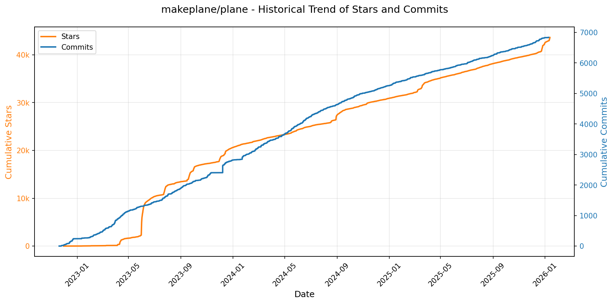
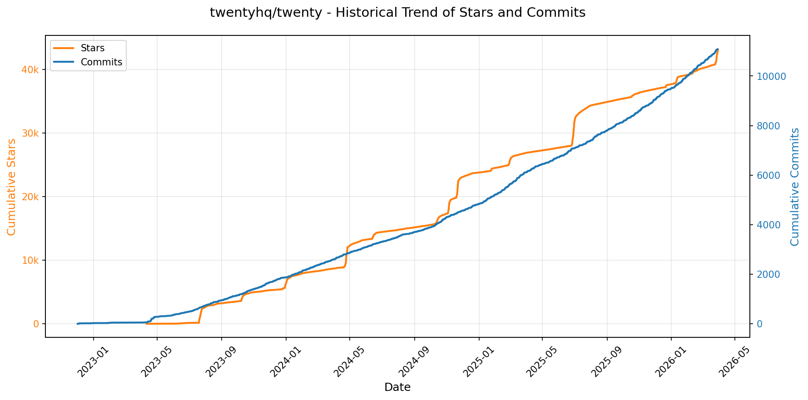
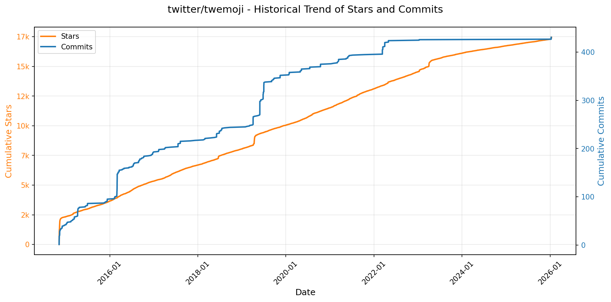
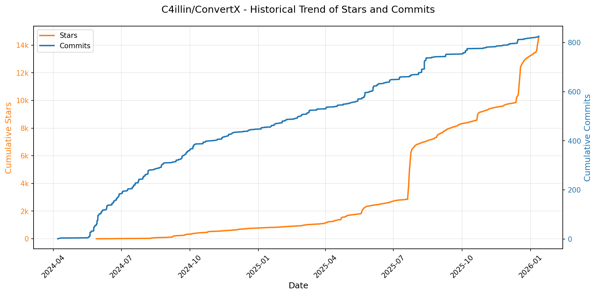
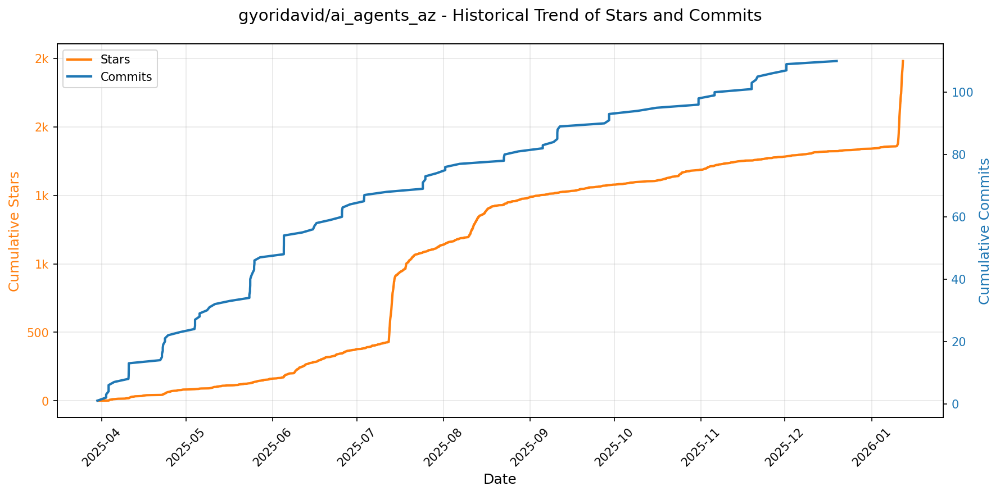

# 🌟 GitHub Trending 概览

> 数据更新于：2026-01-12。

---

## 🔍 项目详情

### 1. [anomalyco/opencode](https://github.com/anomalyco/opencode)
- 📅 **创建日期**：2025-04-30  
- 🔄 **最近更新**：2026-01-12  
- ⭐ **Stars**：62,521（日 +2478｜周 +14551｜月 +24384）  
- 📝 **描述**：The open source coding agent.  

<b>📈 Star 与 Commit 历史趋势</b>

> *蓝色：累计 Stars｜橙色：累计 Commits（次 Y 轴）*

<b>📄 README 摘要</b>

1. 该项目是一个开源的AI编程代理工具，旨在通过人工智能辅助开发者完成代码编写、分析和项目探索等任务。它可在终端中运行，支持本地或远程操作，帮助用户实现代码生成、编辑建议、代码库理解和自动化开发流程。

2. 关键特性包括：  
   - 内置两种智能代理（Agent）模式：“build”用于全权限开发工作，“plan”为只读模式，适用于代码分析与变更规划；还包含一个处理复杂搜索和多步骤任务的“general”子代理。  
   - 支持多种模型后端，不绑定特定供应商，可配置使用Claude、OpenAI、Google模型甚至本地模型。  
   - 提供开箱即用的语言服务器协议（LSP）支持，增强代码智能功能。  
   - 采用客户端/服务器架构，允许在本地运行核心服务并通过移动设备或其他前端远程控制。  
   - 拥有基于终端的用户界面（TUI），专为终端爱好者设计，强调高效键盘操作体验。  
   - 提供桌面应用程序（Beta版），支持macOS、Windows和Linux平台。  
   - 多种安装方式，兼容主流包管理器如npm、Homebrew、Scoop、Chocolatey、Mise等。

3. 技术栈包括：  
   - 使用TypeScript作为主要开发语言。  
   - 前端基于TUI（文本用户界面）构建，专注于终端环境下的交互体验。  
   - 架构上采用客户端/服务器分离设计，支持远程调用与多前端接入。  
   - 集成LSP（Language Server Protocol）实现代码智能补全、跳转和诊断等功能。  
   - 支持通过API对接多种大语言模型（LLM），包括但不限于Anthropic Claude、OpenAI、Google Gemini及本地部署模型。  
   - 构建与发布流程依赖GitHub Actions自动化，并通过NPM发布CLI工具。  
   - 桌面应用使用现代打包格式（如DMG、EXE、AppImage、DEB、RPM）适配各操作系统。

---

### 2. [OpenBB-finance/OpenBB](https://github.com/OpenBB-finance/OpenBB)
- 📅 **创建日期**：2020-12-20  
- 🔄 **最近更新**：2026-01-12  
- ⭐ **Stars**：58,220（日 +188｜周 +1391｜月 +2939）  
- 📝 **描述**：Financial data platform for analysts, quants and AI agents.  

<b>📈 Star 与 Commit 历史趋势</b>

> *蓝色：累计 Stars｜橙色：累计 Commits（次 Y 轴）*

<b>📄 README 摘要</b>

1. 该项目是一个名为 Open Data Platform by OpenBB (ODP) 的开源工具集，旨在帮助数据工程师将专有、授权和公共数据源集成到下游应用中（如 AI 辅助工具和研究仪表板）。它作为“连接一次，处处使用”的基础设施层，统一整合数据并同时向多个平台提供服务，包括用于量化分析的 Python 环境、供分析师使用的 OpenBB Workspace 和 Excel、供 AI 代理使用的 MCP 服务器，以及其他应用程序的 REST API。

2. 关键功能包括：支持多种数据源（自有、许可及公开）的一次性集成；通过 `pip install openbb` 快速安装，并提供简洁的 Python API 访问历史股价等金融数据；可通过 `openbb-api` 命令启动基于 FastAPI 的本地服务器（运行于 127.0.0.1:6900），实现与 OpenBB Workspace 的无缝对接；支持在 Google Colab、VS Code Dev Containers 及 GitHub Codespaces 中直接使用；提供 CLI 工具以命令行方式访问平台功能；并通过开放的后端和 AI 代理仓库，支持用户自定义扩展数据和 AI 代理集成。

3. 技术栈主要包括：Python 作为核心编程语言（支持版本 3.9.21 至 3.12）；后端采用 FastAPI 框架并由 Uvicorn 服务器运行；前端集成方案包括 OpenBB Workspace（企业级 UI）和 Microsoft Excel；支持通过 REST API 进行数据交互；开发环境兼容 Google Colab、VS Code Remote - Containers 和 GitHub Codespaces；项目整体遵循 AGPLv3 开源许可证。

---

### 3. [anthropics/claude-code](https://github.com/anthropics/claude-code)
- 📅 **创建日期**：2025-02-22  
- 🔄 **最近更新**：2026-01-12  
- ⭐ **Stars**：55,406（日 +544｜周 +4234｜月 +9885）  
- 📝 **描述**：Claude Code is an agentic coding tool that lives in your terminal, understands your codebase, and helps you code faster by executing routine tasks, explaining complex code, and handling git workflows - all through natural language commands.  

<b>📈 Star 与 Commit 历史趋势</b>

> *蓝色：累计 Stars｜橙色：累计 Commits（次 Y 轴）*

<b>📄 README 摘要</b>

1. 该项目是一个驻留在终端中的代理式编程工具，能够理解用户的代码库，通过自然语言指令帮助用户更快地编写代码。它可执行常规编码任务、解释复杂代码逻辑，并管理 git 工作流程，支持在终端、IDE 或 GitHub 中通过 @claude 调用。

2. 主要功能包括：支持多种安装方式（脚本、Homebrew、PowerShell、NPM）；通过自然语言命令与代码库交互；集成 Git 工作流处理；提供插件系统以扩展自定义命令和智能代理功能；内置 `/bug` 指令用于直接提交问题反馈；支持与 GitHub 集成协作；具备数据隐私保护机制并允许用户了解数据使用政策。

3. 技术栈基于 Node.js 18 及以上版本，使用 npm 作为包管理工具进行全局安装，核心运行环境为命令行终端，同时支持跨平台（macOS、Linux、Windows）运行，前端交互以 CLI 和 GIF 演示形式呈现，后端服务由 Anthropic 提供 AI 支持，并通过官方文档站点提供在线文档支持。

---

### 4. [usememos/memos](https://github.com/usememos/memos)
- 📅 **创建日期**：2021-12-08  
- 🔄 **最近更新**：2026-01-12  
- ⭐ **Stars**：53,197（日 +242｜周 +1872｜月 +6200）  
- 📝 **描述**：An open-source, self-hosted note-taking service. Your thoughts, your data, your control — no tracking, no ads, no subscription fees.  

<b>📈 Star 与 Commit 历史趋势</b>

> *蓝色：累计 Stars｜橙色：累计 Commits（次 Y 轴）*

<b>📄 README 摘要</b>

1. 该项目是一个开源、可自托管的笔记服务，旨在让用户完全掌控自己的数据。它支持个人记事、团队知识库和知识管理，强调隐私保护，无追踪、无广告、无订阅费用，所有内容均存储在用户自己的基础设施上。

2. 主要功能包括：  
   - 隐私优先架构：完全自托管，零遥测，支持数据导出，避免厂商锁定；  
   - 原生支持 Markdown：使用纯文本存储，兼容性强，便于迁移；  
   - 高性能体验：基于 Go 和 React 构建，加载迅速，响应流畅；  
   - 简单部署：支持通过 Docker 一键部署，兼容 SQLite、MySQL 和 PostgreSQL 数据库；  
   - 开发者友好：提供完整的 REST 和 gRPC API，便于集成与扩展；  
   - 美观界面：采用简洁现代的设计风格，支持暗黑模式和移动端自适应布局。

3. 技术栈包括：后端使用 Go 语言开发，前端采用 React 框架，整体架构高效且轻量；支持多种数据库（SQLite/MySQL/PostgreSQL）；可通过 Docker、Docker Compose、Kubernetes 或预编译二进制文件部署，也支持从源码构建。

---

### 5. [virattt/ai-hedge-fund](https://github.com/virattt/ai-hedge-fund)
- 📅 **创建日期**：2024-11-29  
- 🔄 **最近更新**：2026-01-12  
- ⭐ **Stars**：45,198（日 +62｜周 +665｜月 +2646）  
- 📝 **描述**：An AI Hedge Fund Team  

<b>📈 Star 与 Commit 历史趋势</b>

> *蓝色：累计 Stars｜橙色：累计 Commits（次 Y 轴）*

<b>📄 README 摘要</b>

1. 该项目是一个人工智能驱动对冲基金的概念验证系统，旨在探索利用AI进行股票交易决策的可行性。系统模拟多位著名投资大师（如巴菲特、达摩达兰、凯茜·伍德等）构建多个AI代理，每个代理基于其独特的投资理念对股票进行分析，并结合估值、基本面、技术面和市场情绪等因素生成交易信号，最终由组合经理代理综合各信号做出买卖决策。整个系统仅用于教育和研究目的，不执行真实交易。

2. 关键功能包括：集成18个协同工作的AI代理，涵盖不同投资流派（价值、成长、宏观、激进等）；支持多维度分析（故事叙述、财务估值、基本面、技术指标、市场情绪）；具备风险管理模块计算风险指标并设定仓位限制；提供命令行接口和Web图形界面两种运行方式；支持回测功能以评估策略历史表现；可配置使用OpenAI、Anthropic等外部大模型或通过Ollama运行本地模型；免费提供部分热门股票（如AAPL、NVDA）的金融数据支持。

3. 技术栈主要包括：Python作为主要编程语言；使用Poetry进行依赖管理和项目构建；基于大语言模型（LLM）实现智能代理决策，支持OpenAI、Anthropic、Groq、DeepSeek及Ollama本地模型等多种后端；通过环境变量配置API密钥实现灵活的服务接入；前端采用Web应用架构（具体框架未明示，位于app目录下）；利用外部金融数据API获取实时和历史市场数据；采用MIT开源许可证。

---

### 6. [makeplane/plane](https://github.com/makeplane/plane)
- 📅 **创建日期**：2022-11-19  
- 🔄 **最近更新**：2026-01-12  
- ⭐ **Stars**：43,612（日 +382｜周 +856｜月 +3247）  
- 📝 **描述**：🔥🔥🔥 Open-source Jira, Linear, Monday, and ClickUp alternative. Plane is a modern project management platform to manage tasks, sprints, docs, and triage.  

<b>📈 Star 与 Commit 历史趋势</b>

> *蓝色：累计 Stars｜橙色：累计 Commits（次 Y 轴）*

<b>📄 README 摘要</b>

1. 该项目是一个开源的项目管理工具，旨在帮助团队高效跟踪问题（issues）、运行周期（cycles，类似敏捷开发中的sprint）以及管理产品路线图。它提供了一个集成平台来创建和管理工作项、组织项目模块、自定义视图过滤任务、利用页面功能记录想法并转化为行动项，并通过分析工具获得实时数据洞察，从而简化项目管理流程。

2. 主要功能包括：  
   - **工作项 (Work Items)**：使用支持文件上传的富文本编辑器创建和管理任务，并可通过子属性和关联问题进行增强。  
   - **周期 (Cycles)**：以周期方式规划和追踪团队进度，提供燃尽图等工具直观展示完成情况。  
   - **模块 (Modules)**：将复杂项目拆分为更小、更易管理的模块，提升组织效率。  
   - **视图 (Views)**：通过自定义筛选条件创建个性化任务视图，并可保存与共享。  
   - **页面 (Pages)**：使用带AI能力的富文本编辑器捕捉和整理想法，支持格式化文本、插入图片和链接，并能将笔记转为可执行任务。  
   - **分析 (Analytics)**：提供对所有Plane数据的实时分析和可视化报告，帮助识别趋势、消除障碍。

3. 技术栈主要包括：  
   - 前端：React Router（用于路由管理）  
   - 后端：Django（Python Web框架）  
   - 运行环境：Node.js（JavaScript运行时）  
   此外，项目支持通过Docker或Kubernetes进行部署，适用于云服务或自托管环境。

---

### 7. [exo-explore/exo](https://github.com/exo-explore/exo)
- 📅 **创建日期**：2024-06-24  
- 🔄 **最近更新**：2026-01-12  
- ⭐ **Stars**：39,843（日 +58｜周 +433｜月 +7126）  
- 📝 **描述**：Run your own AI cluster at home with everyday devices 📱💻 🖥️⌚  

<b>📈 Star 与 Commit 历史趋势</b>

> *蓝色：累计 Stars｜橙色：累计 Commits（次 Y 轴）*

<b>📄 README 摘要</b>

1. **这个项目是做什么的？**  
   exo 是一个允许用户将日常设备（如 Mac）连接成个人 AI 集群的开源项目。它使多个设备协同运行大型语言模型，突破单个设备的硬件限制。通过自动发现设备、利用 RDMA（远程直接内存访问）技术优化通信延迟，并根据设备拓扑结构智能分配计算任务，exo 能够高效地并行处理超大规模模型，实现更高的推理速度和资源利用率。

2. **关键特性**  
   - **自动设备发现**：运行 exo 的设备可自动相互发现，无需手动配置网络或集群参数。  
   - **Thunderbolt 上的 RDMA 支持**：原生支持 Thunderbolt 5 的 RDMA 技术，设备间通信延迟降低高达 99%。  
   - **拓扑感知的自动并行化**：根据实时设备拓扑（包括算力、内存、网络带宽与延迟）智能决定模型分割策略，最大化性能。  
   - **张量并行（Tensor Parallelism）**：支持将模型分片到多个设备上并行执行，在 2 台设备上可达 1.8 倍加速，4 台设备上达 3.2 倍加速。  
   - **基于 MLX 的推理后端**：使用 Apple 推出的 MLX 框架进行本地高性能推理，并集成其分布式组件实现跨设备通信。  
   - **本地 API 与仪表盘**：提供运行在 `http://localhost:52415` 的 Web 仪表盘和兼容 OpenAI 格式的 API 接口，便于监控和调用模型。

3. **技术栈**  
   - **核心语言**：Rust（用于构建高性能系统级绑定，需 nightly 版本）  
   - **Python**：作为主要逻辑开发语言，使用 `uv` 进行依赖管理  
   - **前端框架**：Node.js + npm（用于构建和打包 dashboard 界面）  
   - **推理引擎**：[MLX](https://github.com/ml-explore/mlx) 及其分布式模块 MLX Distributed（专为 Apple Silicon 优化的机器学习框架）  
   - **操作系统支持**：  
     - macOS（完整 GPU 加速支持，特别是 M 系列芯片）  
     - Linux（当前仅支持 CPU 运行，GPU 支持正在开发中）  
   - **底层通信技术**：RDMA over Thunderbolt（依赖 macOS 16.2+ 系统版本及 Thunderbolt 5 硬件支持）  
   - **辅助工具**：  
     - `macmon`（Apple Silicon 平台硬件监控）  
     - `brew`（macOS/Linux 包管理）  
     - `rustup`（Rust 工具链管理）

---

### 8. [twentyhq/twenty](https://github.com/twentyhq/twenty)
- 📅 **创建日期**：2022-12-01  
- 🔄 **最近更新**：2026-01-12  
- ⭐ **Stars**：38,698（日 +295｜周 +894｜月 +1546）  
- 📝 **描述**：Building a modern alternative to Salesforce, powered by the community.  

<b>📈 Star 与 Commit 历史趋势</b>

> *蓝色：累计 Stars｜橙色：累计 Commits（次 Y 轴）*

<b>📄 README 摘要</b>

1. 该项目是一个开源的客户关系管理（CRM）系统，旨在解决现有CRM产品价格昂贵、数据锁定和用户体验不佳的问题。它允许用户通过自托管或本地部署的方式自由使用和控制客户数据，并提供现代化的用户界面与灵活的功能定制能力，以支持企业高效管理客户信息、工作流及团队协作。

2. 关键功能包括：支持通过过滤、排序、分组以及看板和表格视图来自定义布局；可自定义对象和字段以适应不同业务需求；基于自定义角色创建和管理权限体系；通过触发器和操作实现工作流程自动化；集成邮件、日历事件、文件存储等常用功能模块，提升办公一体化体验。

3. 技术栈主要包括：TypeScript 作为主要开发语言；使用 Nx 进行项目管理和构建优化；后端基于 NestJS 框架，结合 BullMQ 处理任务队列，PostgreSQL 作为主数据库，Redis 用于缓存和实时功能；前端采用 React，状态管理使用 Recoil，样式方案为 Emotion，国际化支持由 Lingui 提供。

---

### 9. [google/googletest](https://github.com/google/googletest)
- 📅 **创建日期**：2015-07-28  
- 🔄 **最近更新**：2026-01-12  
- ⭐ **Stars**：38,069（日 +39｜周 +385｜月 +503）  
- 📝 **描述**：GoogleTest - Google Testing and Mocking Framework  

<b>📈 Star 与 Commit 历史趋势</b>

> *蓝色：累计 Stars｜橙色：累计 Commits（次 Y 轴）*

<b>📄 README 摘要</b>

1. 该项目是 Google 的 C++ 测试框架，合并了原先独立的 GoogleTest 和 GoogleMock 项目，用于编写和运行 C++ 单元测试。它支持自动测试发现、丰富的断言功能、死亡测试（验证程序是否按预期崩溃）、参数化测试（包括值参数化和类型参数化）以及灵活的测试运行选项。

2. 关键特性包括：基于 xUnit 架构；自动发现并执行测试用例；提供丰富的内置断言（如相等性、异常检测等）；支持用户自定义断言；支持死亡测试以验证错误处理逻辑；允许区分致命与非致命失败；支持值参数化和类型参数化测试，便于对多组输入或不同类型进行测试；提供多种测试运行方式，例如单独运行特定测试、控制执行顺序及并行执行。

3. 技术栈：C++ 语言（从 1.17.0 版本开始要求至少 C++17 标准），构建系统兼容主流编译器和平台（遵循 Google 的基础 C++ 支持策略），持续集成使用 Google 内部系统，并计划引入 Abseil 作为依赖。

---

### 10. [anthropics/skills](https://github.com/anthropics/skills)
- 📅 **创建日期**：2025-09-22  
- 🔄 **最近更新**：2026-01-12  
- ⭐ **Stars**：37,854（日 +626｜周 +4701｜月 +17358）  
- 📝 **描述**：Public repository for Agent Skills  

<b>📈 Star 与 Commit 历史趋势</b>

> *蓝色：累计 Stars｜橙色：累计 Commits（次 Y 轴）*

<b>📄 README 摘要</b>

1. **这个项目是做什么的？**  
该项目是 Anthropic 提供的 Claude 技能（Skills）的官方实现示例库。技能是一组可动态加载的指令、脚本和资源，用于增强 Claude 在特定任务上的表现。这些技能使 Claude 能够以可重复的方式完成具体任务，例如根据公司品牌规范生成文档、使用组织特定流程分析数据，或自动化个人事务。本仓库旨在展示技能系统的潜力，提供可用于学习、参考或启发自定义技能开发的实际案例。

2. **关键特性**  
- 每个技能独立封装在单独文件夹中，包含一个 `SKILL.md` 文件，其中定义了 YAML 元数据和执行指令。  
- 支持多种应用场景：创意设计（艺术、音乐）、技术开发（Web 应用测试、MCP 服务器生成）、企业通信与品牌管理等。  
- 包含生产级文档处理技能源码（如 docx、pdf、pptx、xlsx），虽非完全开源但可供开发者参考其复杂实现。  
- 提供技能模板（template）和规范说明（spec），便于快速创建自定义技能。  
- 可通过插件市场集成到 Claude Code，支持在 Claude.ai 和 Claude API 中使用。  
- 支持用户上传自定义技能，并通过自然语言调用已安装技能（如“使用 PDF 技能提取表单字段”）。  

3. **技术栈**  
- 核心格式：Markdown（含 YAML frontmatter）作为技能配置和指令描述语言。  
- 技能组织方式：基于文件夹结构的模块化设计，每个技能为独立单元。  
- 集成方式：通过命令行注册为 Claude Code 插件（`/plugin marketplace add`），支持直接安装特定技能集。  
- API 支持：可通过 Claude API 使用预构建技能或上传自定义技能。  
- 开放标准：遵循 Agent Skills 规范（见 [agentskills.io](http://agentskills.io)），并提供规范文档（`./spec` 目录）。  
- 许可协议：大部分示例技能采用 Apache 2.0 开源许可，部分生产级文档技能为源码可见（source-available）但非开源。

---

### 11. [Lissy93/web-check](https://github.com/Lissy93/web-check)
- 📅 **创建日期**：2023-06-25  
- 🔄 **最近更新**：2026-01-12  
- ⭐ **Stars**：29,426（日 +101｜周 +2295｜月 +2453）  
- 📝 **描述**：🕵️‍♂️ All-in-one OSINT tool for analysing any website  

<b>📈 Star 与 Commit 历史趋势</b>

> *蓝色：累计 Stars｜橙色：累计 Commits（次 Y 轴）*

---

### 12. [tw93/Mole](https://github.com/tw93/Mole)
- 📅 **创建日期**：2025-09-23  
- 🔄 **最近更新**：2026-01-12  
- ⭐ **Stars**：28,193（日 +328｜周 +3051｜月 +19774）  
- 📝 **描述**：🐹 Deep clean and optimize your Mac.  

<b>📈 Star 与 Commit 历史趋势</b>

> *蓝色：累计 Stars｜橙色：累计 Commits（次 Y 轴）*

<b>📄 README 摘要</b>

1. **这个项目是做什么的？**  
Mole 是一款专为 macOS 设计的系统清理与优化工具，旨在帮助用户深度清理磁盘空间、彻底卸载应用程序、分析磁盘使用情况、实时监控系统状态，并优化系统性能。它集成了多种常用工具（如 CleanMyMac、AppCleaner、DaisyDisk 和 iStat Menus）的功能于一个轻量级命令行程序中，通过简洁高效的交互式界面实现对 Mac 的全面维护。

2. **关键特性**  
- **一体化工具集**：将多个系统维护功能整合为单一可执行文件，无需安装多个应用。  
- **深度清理**：扫描并清除缓存、日志、浏览器残留、开发工具构建产物等，释放数十GB空间。  
- **智能卸载器**：彻底删除应用及其关联的偏好设置、Launch 代理、插件和隐藏文件。  
- **磁盘分析**：可视化展示目录占用情况，支持浏览、打开、删除大文件，快速定位空间占用源。  
- **系统优化**：重建缓存、重置网络服务、刷新 Spotlight 索引、重启动态页交换等，提升系统响应速度。  
- **实时状态监控**：提供 CPU、内存、磁盘、网络、电源等硬件资源的实时仪表盘，包含健康评分。  
- **项目构建清理**：自动识别并清理 `node_modules`、`target`、`dist`、`venv` 等开发环境临时文件。  
- **安装包清理**：查找并移除下载目录、Homebrew 缓存等位置的大体积安装文件（如 .dmg/.pkg）。  
- **安全可靠**：支持 `--dry-run` 预览操作、`--whitelist` 白名单保护、`--debug` 调试模式，防止误删。  
- **终端快捷启动**：支持 Raycast 和 Alfred 快捷调用主要命令，提升使用效率。  

3. **技术栈**  
- 使用 **Rust** 编写核心逻辑，确保高性能与内存安全。  
- 命令行界面基于 **interactive CLI 框架** 构建，支持键盘导航（箭头键与 Vim 快捷键 h/j/k/l）。  
- 安装方式包括 **Homebrew** 包管理器和 Shell 脚本（curl + bash），便于快速部署。  
- 支持 shell 自动补全（`mo completion`）和 Touch ID 权限提权配置（`mo touchid`）。  
- 配置文件存储在 `~/.config/mole/` 目录下，支持自定义路径（如 purge 扫描目录）。  
- 提供跨平台支持，macOS 为主，Windows 版本在独立分支维护。  
- 开源许可证为 **MIT License**，社区驱动开发，代码透明可审计。

---

### 13. [simstudioai/sim](https://github.com/simstudioai/sim)
- 📅 **创建日期**：2025-01-05  
- 🔄 **最近更新**：2026-01-12  
- ⭐ **Stars**：25,487（日 +188｜周 +545｜月 +6248）  
- 📝 **描述**：Open-source platform to build and deploy AI agent workflows.  

<b>📈 Star 与 Commit 历史趋势</b>

> *蓝色：累计 Stars｜橙色：累计 Commits（次 Y 轴）*

<b>📄 README 摘要</b>

1. 该项目旨在帮助用户快速构建和部署AI代理工作流。用户可以通过可视化画布设计工作流，连接不同的AI代理、工具和功能模块，并即时运行。支持使用自然语言通过Copilot功能生成节点、修复错误和优化流程。同时，项目集成了向量数据库，允许用户上传文档并基于这些特定内容进行问答。

2. 关键特性包括：  
   - **可视化工作流构建**：提供类似画布的界面，通过拖拽和连接节点来设计复杂的AI代理流程。  
   - **Copilot智能辅助**：利用自然语言指令自动生成流程节点、诊断并修复错误，提升开发效率。  
   - **知识库集成**：支持将文档上传至向量数据库，使AI代理能够基于用户提供的具体内容进行准确回答。  
   - **多种部署方式**：支持云端使用（sim.ai），也支持通过NPM、Docker Compose、Dev Container或手动方式本地部署。  
   - **本地模型支持**：可与Ollama或vLLM集成，使用本地大模型进行推理，无需依赖外部API。  
   - **实时协作与后台任务**：基于Socket.io实现实时通信，结合Trigger.dev处理后台作业。  

3. 技术栈包括：  
   - **框架**：Next.js（采用App Router）  
   - **运行时**：Bun  
   - **数据库**：PostgreSQL 配合 pgvector 扩展用于向量存储，Drizzle ORM 进行数据库操作  
   - **认证**：Better Auth  
   - **前端UI**：Shadcn UI 组件库 + Tailwind CSS  
   - **状态管理**：Zustand  
   - **流程图编辑器**：ReactFlow  
   - **文档系统**：Fumadocs  
   - **项目结构**：Turborepo 管理的单体仓库（monorepo）  
   - **实时通信**：Socket.io  
   - **后台任务调度**：Trigger.dev  
   - **远程代码执行**：E2B 平台

---

### 14. [bytedance/UI-TARS-desktop](https://github.com/bytedance/UI-TARS-desktop)
- 📅 **创建日期**：2025-01-19  
- 🔄 **最近更新**：2026-01-12  
- ⭐ **Stars**：22,841（日 +455｜周 +2484｜月 +3031）  
- 📝 **描述**：The Open-Source Multimodal AI Agent Stack: Connecting Cutting-Edge AI Models and Agent Infra  

<b>📈 Star 与 Commit 历史趋势</b>

> *蓝色：累计 Stars｜橙色：累计 Commits（次 Y 轴）*

<b>📄 README 摘要</b>

1. 该项目是一个多模态AI智能体技术栈，包含两个核心项目：Agent TARS 和 UI-TARS-desktop。Agent TARS 能在终端、计算机、浏览器和产品中实现类人任务处理，支持通过自然语言指令完成复杂操作（如预订航班、酒店或生成图表），并集成多种现实世界工具（MCP）。UI-TARS-desktop 是一个桌面应用程序，基于视觉语言模型提供本地及远程的图形用户界面（GUI）自动化控制能力，允许用户通过自然语言命令操控本地或远程的电脑与浏览器。

2. 关键功能包括：一键启动的CLI工具，支持带界面的Web UI和无头服务器模式运行；混合式浏览器代理，可结合GUI视觉定位、DOM分析或混合策略控制浏览器；基于事件流协议的上下文工程与Agent UI构建机制；深度集成MCP（Model Context Protocol）框架以连接外部工具；支持流式输出、运行时统计和沙箱环境调试；具备跨平台能力（Windows/macOS/浏览器）；提供本地化处理保障隐私安全；并新增远程计算机与浏览器操作功能，无需配置即可实现远程控制。

3. 技术栈主要包括：Node.js（CLI基于npm包开发，要求Node.js >=22）；前端使用Web UI技术实现交互界面；后端依托多模态大语言模型（如doubao-1-5-thinking-vision-pro、claude-3-7-sonnet等）进行推理；采用MCP协议作为核心集成架构；利用Vision-Language Models（如Seed-1.5-VL/1.6系列）实现视觉识别与GUI操作；支持与ModelScope、Hugging Face等平台模型对接；并通过Event Stream实现数据流追踪与调试。

---

### 15. [resemble-ai/chatterbox](https://github.com/resemble-ai/chatterbox)
- 📅 **创建日期**：2025-04-23  
- 🔄 **最近更新**：2026-01-12  
- ⭐ **Stars**：21,284（日 +98｜周 +681｜月 +6364）  
- 📝 **描述**：SoTA open-source TTS  

<b>📈 Star 与 Commit 历史趋势</b>

> *蓝色：累计 Stars｜橙色：累计 Commits（次 Y 轴）*

<b>📄 README 摘要</b>

1. 该项目是一个由 Resemble AI 开发的开源文本转语音（TTS）模型系列，主打高效、高质量的语音合成。其中最新的 **Chatterbox-Turbo** 模型基于3.5亿参数的精简架构，显著降低了计算和显存需求，并将语音生成步骤从10步压缩至仅1步，实现低延迟语音输出，特别适用于语音代理、实时交互等场景。模型原生支持“[laugh]”、“[cough]”等副语言标签，以增强语音的真实感和表现力。同时，所有生成的音频均内置了可抵御压缩和编辑的神经水印（PerTh），用于负责任的人工智能内容标识。

2. 关键特性包括：  
   - **高效低耗**：Chatterbox-Turbo 模型仅3.5亿参数，推理速度快，资源占用少，适合生产环境部署。  
   - **一键生成**：通过蒸馏技术将解码过程简化为单步，极大提升生成效率。  
   - **副语言支持**：直接在文本中使用 `[laugh]`、`[chuckle]`、`[cough]` 等标签，自然融入笑声、咳嗽等非语言声音。  
   - **零样本语音克隆**：通过提供10秒参考音频即可克隆任意音色。  
   - **多语言支持**：Chatterbox-Multilingual 支持23种以上语言，满足全球化应用需求。  
   - **内置水印**：所有生成音频自动嵌入不可感知的 PerTh 神经水印，确保内容可追溯。  
   - **灵活控制**：支持调节 CFG 权重和夸张程度（exaggeration）以适应不同风格的语音输出，如正式播报或戏剧化表达。

3. 技术栈包括：  
   - **Python** 作为主要开发语言，依赖 **PyTorch** 进行深度学习模型构建与推理。  
   - 使用 **torchaudio** 和 **librosa** 处理音频输入输出与特征提取。  
   - 模型架构基于先进的语音标记到梅尔频谱的蒸馏解码技术，结合零样本语音克隆能力。  
   - 集成 **Resemble AI 的 PerTh 水印系统** 实现隐式内容标识。  
   - 项目依赖管理采用 `pyproject.toml` 锁定版本，推荐使用 **conda** 管理虚拟环境（Python 3.11）。  
   - 受到 CosyVoice、Real-Time-Voice-Cloning、HiFT-GAN、Llama 3 和 S3Tokenizer 等开源项目启发并借鉴其技术。

---

### 16. [ChromeDevTools/chrome-devtools-mcp](https://github.com/ChromeDevTools/chrome-devtools-mcp)
- 📅 **创建日期**：2025-09-11  
- 🔄 **最近更新**：2026-01-12  
- ⭐ **Stars**：20,396（日 +282｜周 +1819｜月 +4003）  
- 📝 **描述**：Chrome DevTools for coding agents  

<b>📈 Star 与 Commit 历史趋势</b>

> *蓝色：累计 Stars｜橙色：累计 Commits（次 Y 轴）*

<b>📄 README 摘要</b>

1. 该项目做什么？  
此项目是一个名为 `chrome-devtools-mcp` 的 Model-Context-Protocol (MCP) 服务器，旨在让 AI 编码助手（如 Gemini、Claude、Cursor 或 Copilot）能够控制和检查正在运行的 Chrome 浏览器。它通过暴露 Chrome DevTools 的功能，使 AI 助手能够执行自动化操作、进行深度调试和性能分析。用户只需在 MCP 客户端中配置该项目，AI 即可打开网页、执行点击、填写表单、分析网络请求、获取性能追踪数据等。

2. 关键特性  
- **性能洞察**：利用 Chrome DevTools 记录性能追踪（trace），提取可操作的性能分析结果。  
- **高级浏览器调试**：能够分析网络请求、截取屏幕快照、读取浏览器控制台日志和消息。  
- **可靠自动化**：基于 Puppeteer 实现浏览器操作自动化，并能自动等待操作完成，确保动作可靠性。  
- **丰富的工具集**：提供超过 20 个工具，涵盖输入自动化（点击、拖拽、填表）、页面导航（新建/切换/关闭页面）、设备模拟（分辨率、用户代理）、性能分析、网络监控和脚本执行等。  
- **灵活连接模式**：支持自动启动独立的 Chrome 实例，也支持连接到已运行的 Chrome 浏览器（通过远程调试端口或 WebSocket），便于共享会话状态。  
- **高度可配置**：允许设置浏览器路径、用户数据目录、是否无头模式、视口大小、代理、自定义启动参数等。

3. 技术栈  
- **核心协议**：Model-Context-Protocol (MCP)，作为服务器与 AI 客户端通信。  
- **浏览器自动化**：基于 [Puppeteer](https://github.com/puppeteer/puppeteer) 库来控制 Chrome 浏览器。  
- **运行环境**：需要 Node.js (v20.19 或更高版本的 LTS 版本) 和 npm 包管理器。  
- **目标浏览器**：Google Chrome 稳定版或更新版本。  
- **底层技术**：直接利用 Chrome DevTools Protocol (CDP) 与浏览器进行深度交互，实现调试和分析功能。

---

### 17. [DayuanJiang/next-ai-draw-io](https://github.com/DayuanJiang/next-ai-draw-io)
- 📅 **创建日期**：2025-03-23  
- 🔄 **最近更新**：2026-01-12  
- ⭐ **Stars**：17,943（日 +155｜周 +1196｜月 +9694）  
- 📝 **描述**：A next.js web application that integrates AI capabilities with draw.io diagrams. This app allows you to create, modify, and enhance diagrams through natural language commands and AI-assisted visualization.  

<b>📈 Star 与 Commit 历史趋势</b>

> *蓝色：累计 Stars｜橙色：累计 Commits（次 Y 轴）*

<b>📄 README 摘要</b>

1. **这个项目是做什么的？**  
该项目是一个基于 Next.js 的 AI 驱动图表绘制工具，将人工智能能力与 draw.io 图表编辑器集成。用户可以通过自然语言指令创建、修改和增强图表，实现“聊天—绘图—可视化”的一体化流程。支持从文本、PDF 或图片生成图表，并可复刻和优化已有图像内容，特别适用于快速生成云架构图（如 AWS、GCP、Azure）等专业图表。

2. **关键特性**  
- 通过大语言模型（LLM）理解自然语言命令，自动生成或修改 draw.io 格式的图表  
- 支持上传图片、PDF 和文本文件，AI 自动提取内容并生成对应图表  
- 显示 AI 推理过程（支持 OpenAI o1/o3、Gemini、Claude 等具备推理能力的模型）  
- 提供图表历史版本管理，可查看和恢复编辑前的状态  
- 内置交互式聊天界面，实时与 AI 沟通优化图表  
- 专为云架构图设计，内置 AWS、GCP、Azure 官方图标支持  
- 支持动态动画连接线，增强可视化效果  
- 可作为 MCP Server（Model Context Protocol）与 Claude Desktop、Cursor、VS Code 等 AI 编辑器集成，在代码环境中直接生成图表  
- 支持多平台部署：网页在线使用、桌面应用（Windows/macOS/Linux）、Docker、Vercel、Cloudflare Workers、腾讯 EdgeOne Pages 等  

3. **技术栈**  
- **前端框架**：Next.js（16.x）、React（19.x）  
- **AI 开发工具**：Vercel AI SDK（`ai` + `@ai-sdk/*`），用于流式响应和多 LLM 提供商支持  
- **图表引擎**：`react-drawio`，用于渲染和操作 draw.io 的 XML 格式图表  
- **部署平台**：Vercel、Cloudflare Workers、Tencent EdgeOne Pages、Docker  
- **后端/集成**：MCP Server（Model Context Protocol）支持 AI 代理（如 Claude Code CLI）调用  
- **支持的 AI 提供商**：ByteDance Doubao、AWS Bedrock、OpenAI、Anthropic（Claude）、Google AI、Azure OpenAI、Ollama、OpenRouter、DeepSeek、SiliconFlow、ModelScope、SGLang、Vercel AI Gateway 等，多数支持自定义 API 端点  
- **数据格式**：图表以 draw.io 兼容的 XML 格式存储和处理

---

### 18. [twitter/twemoji](https://github.com/twitter/twemoji)
- 📅 **创建日期**：2014-11-06  
- 🔄 **最近更新**：2026-01-12  
- ⭐ **Stars**：17,458（日 +81｜周 +152｜月 +193）  
- 📝 **描述**：Emoji for everyone. https://twemoji.twitter.com/  

<b>📈 Star 与 Commit 历史趋势</b>

> *蓝色：累计 Stars｜橙色：累计 Commits（次 Y 轴）*

<b>📄 README 摘要</b>

1. 该项目是一个提供标准Unicode表情符号（emoji）支持的简单库，可在所有平台使用。它遵循最新的Unicode和Emoji规范，将文本中的emoji字符转换为对应的图片，确保在不同系统和浏览器中统一显示标准的Twitter风格emoji图像。

2. 关键特性包括：支持Unicode 14.0和Emoji 14.0规范中所有推荐用于通用交换（RGI）的表情符号；提供DOM解析和字符串解析两种方式，其中DOM解析更安全，可避免innerHTML带来的风险；支持通过CDN快速引入或下载特定版本使用；允许自定义图片源地址、尺寸、文件扩展名（如PNG或SVG）、CSS类名等；提供工具方法实现emoji码点与UTF-16代理对之间的相互转换；支持排除特定字符不被替换；可通过CSS实现响应式尺寸以匹配周围文本。

3. 技术栈主要包括JavaScript（核心语言），HTML和CSS（用于网页集成与样式控制），使用Unpkg作为CDN分发服务，并基于MIT许可证发布代码，图形资源则采用CC-BY 4.0许可证。项目构建和测试依赖于Travis CI持续集成服务。

---

### 19. [obra/superpowers](https://github.com/obra/superpowers)
- 📅 **创建日期**：2025-10-09  
- 🔄 **最近更新**：2026-01-12  
- ⭐ **Stars**：17,320（日 +1090｜周 +3579｜月 +7802）  
- 📝 **描述**：Claude Code superpowers: core skills library  

<b>📈 Star 与 Commit 历史趋势</b>

> *蓝色：累计 Stars｜橙色：累计 Commits（次 Y 轴）*

<b>📄 README 摘要</b>

1. 该项目为编程代理提供一整套软件开发工作流，通过一组可组合的“技能”和初始指令来增强代理能力。它使代理在开始编码前先与用户沟通明确需求，生成可读的设计方案并获得确认；随后制定详细的实施计划，并采用子代理驱动开发（subagent-driven-development）模式，让多个子代理分工执行任务、相互审查，实现长时间自主运行而不会偏离计划，确保开发过程遵循测试驱动开发（TDD）、YAGNI 和 DRY 等工程原则。

2. 关键功能包括：自动激活的技能系统，在开发各阶段强制执行标准化流程；支持交互式设计推敲（brainstorming）；基于 git worktree 创建隔离开发环境；将项目拆解为细粒度的可执行任务计划；支持并发子代理协作与两阶段代码审查；严格贯彻红-绿-重构的 TDD 流程；任务间自动进行代码审查并按严重性阻断问题；完成开发后自动验证测试并提供合并或创建 PR 的清理选项；具备调试、协作、元技能等完整技能库，且所有流程为强制性而非建议。

3. 技术栈基于各类 AI 编程代理平台，主要支持 Claude Code（通过插件市场集成）、Codex 和 OpenCode；采用模块化技能（skills）架构，技能以 Markdown 文档形式存储于仓库中；依赖 git worktree 实现并行分支开发；通过插件机制实现自动更新与命令扩展（如 `/superpowers:brainstorm` 等）；整体运行在 AI 模型驱动的自动化工作流之上，强调与现有开发工具链（如版本控制、测试框架）深度集成。

---

### 20. [davila7/claude-code-templates](https://github.com/davila7/claude-code-templates)
- 📅 **创建日期**：2025-07-04  
- 🔄 **最近更新**：2026-01-12  
- ⭐ **Stars**：15,635（日 +271｜周 +1033｜月 +3175）  
- 📝 **描述**：CLI tool for configuring and monitoring Claude Code  

<b>📈 Star 与 Commit 历史趋势</b>

> *蓝色：累计 Stars｜橙色：累计 Commits（次 Y 轴）*

<b>📄 README 摘要</b>

1. **这个项目是做什么的？**  
该项目名为 Claude Code Templates，旨在为 Anthropic 的 Claude Code 提供即用型配置集合。它提供了一系列 AI 代理、自定义命令、设置项、钩子（Hooks）、外部服务集成（MCPs）以及项目模板，帮助开发者快速搭建和优化基于 Claude Code 的开发工作流。用户可以通过命令行或交互式网页界面（aitmpl.com）浏览并安装各类组件，提升 AI 辅助编程的效率与能力。

2. **主要特性**  
- 支持多种可插拔组件：包括 AI 代理（如前端开发者、代码审查员）、自定义斜杠命令（如 `/generate-tests`、`/optimize-bundle`）、外部服务集成（MCPs，如 GitHub、PostgreSQL、Stripe）、配置设置、Git 钩子（如提交前验证）和可复用技能（如 PDF 处理、Excel 自动化）。  
- 提供额外开发工具：包括实时会话监控（Conversation Monitor）、健康检查（Health Check）、插件管理仪表板（Plugin Dashboard）和 Claude Code 分析功能（Analytics），用于诊断环境、可视化聊天记录和性能监控。  
- 支持一键安装完整开发栈或单独组件，并可通过 Cloudflare Tunnel 实现安全远程访问。  
- 开放贡献机制，鼓励社区提交新的模板和组件，并明确列出所有引用项目的原始许可证与归属信息。

3. **技术栈**  
- 核心运行环境：Node.js（通过 `npx` 执行命令）  
- 命令行工具：基于 npm 包 `claude-code-templates`，支持参数化调用（如 `--agent`、`--command` 等）  
- 集成技术：支持 MCP（Model Context Protocol）实现与外部服务（GitHub、AWS、OpenAI、PostgreSQL 等）的连接  
- 前端展示：提供 Web 界面（aitmpl.com）用于模板浏览与安装，附带移动端适配的聊天监控界面  
- 部署与网络：使用 Cloudflare Tunnel 实现安全远程访问；托管于 Vercel OSS 计划  
- 许可证：项目本身采用 MIT 许可证，集成的第三方组件保留其原有许可证（如 MIT、Apache 2.0、CC0 等）

---

### 21. [BloopAI/vibe-kanban](https://github.com/BloopAI/vibe-kanban)
- 📅 **创建日期**：2025-06-14  
- 🔄 **最近更新**：2026-01-12  
- ⭐ **Stars**：14,967（日 +351｜周 +2430｜月 +8521）  
- 📝 **描述**：Get 10X more out of Claude Code, Codex or any coding agent  

<b>📈 Star 与 Commit 历史趋势</b>

> *蓝色：累计 Stars｜橙色：累计 Commits（次 Y 轴）*

<b>📄 README 摘要</b>

1. 该项目旨在优化和简化AI编码代理（如Claude Code、Gemini CLI、Codex等）与人类工程师之间的协作流程。它允许用户集中管理多个AI编码代理，编排它们的执行任务（并行或串行），快速审查生成的代码、启动开发服务器，并跟踪任务状态。同时支持集中配置代理的MCP设置，并可在远程服务器上运行时通过SSH远程打开项目。

2. 主要功能包括：支持多种主流AI编码代理的集成与切换；可编排多个代理协同工作；提供直观的看板界面跟踪任务进度；内置开发服务器启动与代码审查工具；支持全局配置管理；可在远程服务器部署并通过SSH从本地编辑器（如VSCode）安全访问项目；提供分析功能（可通过环境变量控制）；适用于本地及云端部署场景。

3. 技术栈包含：前端使用Node.js（>=18）与pnpm构建，采用现代Web技术栈（具体框架未明示但常见为React/Vue等）；后端基于Rust（最新稳定版）开发以保证性能与安全性；数据库操作通过sqlx-cli管理；开发工具链包括cargo-watch用于文件监听、pnpm作为包管理器；通过PostHog实现可选的使用数据分析；部署支持Docker、systemctl及云平台，并利用SSH协议实现远程项目访问。

---

### 22. [C4illin/ConvertX](https://github.com/C4illin/ConvertX)
- 📅 **创建日期**：2024-04-07  
- 🔄 **最近更新**：2026-01-12  
- ⭐ **Stars**：14,628（日 +339｜周 +1232｜月 +4469）  
- 📝 **描述**：💾 Self-hosted online file converter. Supports 1000+ formats ⚙️  

<b>📈 Star 与 Commit 历史趋势</b>

> *蓝色：累计 Stars｜橙色：累计 Commits（次 Y 轴）*

<b>📄 README 摘要</b>

1. 该项目是一个自托管的在线文件转换工具，支持超过一千种不同的文件格式。用户可以通过本地部署的服务将各类文件（如图像、文档、电子书、视频、3D模型等）转换为所需的目标格式，并可同时处理多个文件。它还支持密码保护、多用户账户以及转换历史管理等功能。

2. 主要功能包括：支持上千种文件格式的相互转换；批量处理多个文件；提供用户账户系统并支持密码保护；允许设置匿名访问权限；自动清理过期转换文件；支持通过环境变量灵活配置服务行为（如JWT密钥、HTTP访问控制、并发处理数限制等）；可通过Docker轻松部署；支持国际化语言设置；并能共享未认证用户的转换记录。

3. 技术栈主要包括：TypeScript作为主要开发语言；使用Bun作为运行时和包管理器；采用Elysia框架构建Web应用；基于Docker进行容器化部署；后端集成了多种开源转换工具，如Inkscape、ImageMagick、FFmpeg、LibreOffice、Pandoc、Calibre、Vips、Assimp等，以实现广泛的文件格式支持。前端通过浏览器访问，数据持久化通过本地文件系统挂载实现。

---

### 23. [shareAI-lab/learn-claude-code](https://github.com/shareAI-lab/learn-claude-code)
- 📅 **创建日期**：2025-06-29  
- 🔄 **最近更新**：2026-01-12  
- ⭐ **Stars**：13,854（日 +154｜周 +738｜月 +2284）  
- 📝 **描述**：How can we build a true AI agent? Like Claude Code.  

<b>📈 Star 与 Commit 历史趋势</b>

> *蓝色：累计 Stars｜橙色：累计 Commits（次 Y 轴）*

<b>📄 README 摘要</b>

1. 什么是这个项目？  
该项目是一个渐进式教程，旨在通过从零构建五个不同版本的AI编码代理程序，帮助学习者理解现代AI智能体（如Kode、Claude Code和Cursor Agent）的工作原理。每个版本逐步引入一个核心概念（如工具调用、任务规划、子代理、技能机制等），最终实现一个功能完整的AI编程代理系统，用于教育和实践目的。

2. 主要特性  
- **渐进式学习路径**：提供5个版本（v0到v4），每版增加一个关键概念，代码量从约50行逐步增至550行，便于循序渐进掌握AI代理设计。  
- **核心代理循环实现**：展示AI代理的基本运行模式——模型反复调用工具直至任务完成，并通过消息历史持续交互。  
- **模块化架构支持**：支持子代理（Subagents）机制，允许任务分解与并行处理；支持“技能”（Skills）机制，可通过SKILL.md文件动态加载领域知识。  
- **实用工具集成**：包含bash、读取、写入、编辑等基础操作工具，并提供Todo任务管理器以实现显式规划。  
- **生产级技能支持**：附带可复用的“代理构建者”技能，能自动生成新代理项目模板，并支持将完整技能库集成到Kode CLI或Claude Code等平台。  
- **多语言文档支持**：提供中英文详细技术解析文档，覆盖各版本的设计思想与实现细节。

3. 技术栈  
- 编程语言：Python  
- 核心依赖：`anthropic`（调用Claude模型API）、`python-dotenv`（环境变量管理）  
- 架构模式：基于工具调用（tool_use）的循环代理架构，遵循[Agent Skills Spec](https://github.com/anthropics/agent-skills)规范  
- 工具系统：Bash命令执行、文件读写与编辑、任务调度、技能动态加载  
- 开发配套：支持与[Kode CLI](https://github.com/shareAI-lab/Kode)等代理开发工具链集成，使用`.env`文件配置API密钥  
- 部署方式：本地运行脚本，可作为模板用于构建自定义AI代理项目

---

### 24. [thedotmack/claude-mem](https://github.com/thedotmack/claude-mem)
- 📅 **创建日期**：2025-08-31  
- 🔄 **最近更新**：2026-01-12  
- ⭐ **Stars**：13,344（日 +245｜周 +3122｜月 +8628）  
- 📝 **描述**：A Claude Code plugin that automatically captures everything Claude does during your coding sessions, compresses it with AI (using Claude's agent-sdk), and injects relevant context back into future sessions.  

<b>📈 Star 与 Commit 历史趋势</b>

> *蓝色：累计 Stars｜橙色：累计 Commits（次 Y 轴）*

<b>📄 README 摘要</b>

1. 该项目为 **Claude Code** 构建了一个持久化记忆压缩系统，旨在让 Claude 在会话之间保持上下文连续性。它能自动捕获工具使用情况、生成语义摘要，并将这些信息提供给未来的会话，从而使 Claude 能够在会话结束或重新连接后依然保留对项目知识的延续。

2. 关键特性包括：
    *   **持久化记忆**：上下文可在不同会话间留存。
    *   **渐进式披露**：采用分层记忆检索机制，并显示令牌消耗成本，以实现高效利用。
    *   **基于技能的搜索**：通过 `mem-search` 技能，用自然语言查询项目历史。
    *   **Web 查看器界面**：提供实时内存流，可通过 `http://localhost:37777` 访问。
    *   **Claude 桌面端技能**：允许在 Claude Desktop 的对话中直接搜索记忆。
    *   **隐私控制**：使用 `<private>` 标签可排除敏感内容不被存储。
    *   **上下文配置**：可精细控制注入哪些上下文。
    *   **自动运行**：无需手动干预，系统自动工作。
    *   **引用功能**：可通过 ID 引用过去的观察记录（通过 API 或 Web 查看器访问）。
    *   **测试版通道**：可通过版本切换尝试“无尽模式”等实验性功能。

3. 技术栈包括：
    *   **Node.js** (版本 >=18.0.0)
    *   **Bun** (作为 JavaScript 运行时和进程管理器)
    *   **SQLite 3** (用于持久化存储，内置 FTS5 全文搜索)
    *   **Chroma** (向量数据库，用于混合语义与关键词搜索)
    *   **TypeScript** (主要开发语言)
    *   **uv** (Python 包管理器，用于向量搜索)

---

### 25. [Tencent/WeKnora](https://github.com/Tencent/WeKnora)
- 📅 **创建日期**：2025-07-22  
- 🔄 **最近更新**：2026-01-12  
- ⭐ **Stars**：11,345（日 +78｜周 +448｜月 +3011）  
- 📝 **描述**：LLM-powered framework for deep document understanding, semantic retrieval, and context-aware answers using RAG paradigm.  

<b>📈 Star 与 Commit 历史趋势</b>

> *蓝色：累计 Stars｜橙色：累计 Commits（次 Y 轴）*

<b>📄 README 摘要</b>

1. 该项目做什么？  
WeKnora 是一个由大语言模型（LLM）驱动的文档深度理解与语义检索框架，专为处理复杂、异构的文档而设计。它基于 RAG（检索增强生成）范式，通过结合相关文档片段与模型推理，提供高质量、上下文感知的答案。该框架支持将文档内容结构化提取为统一语义视图，并实现智能问答、多轮对话和跨知识库检索，适用于企业知识管理、学术研究、技术支持、法律合规及医疗辅助等场景。

2. 核心功能  
- 支持 ReACT Agent 模式，可调用内置工具、MCP 工具和网络搜索，通过多步迭代与反思生成综合报告；  
- 精准理解多种格式文档（PDF、Word、文本、Markdown、图像等），利用 OCR 和图文理解提取结构化内容；  
- 构建多类型知识库（FAQ 和文档型），支持文件夹导入、URL 导入、标签管理与在线编辑；  
- 提供混合检索策略，融合关键词（BM25）、向量检索与知识图谱（GraphRAG）技术；  
- 支持对接多种嵌入模型（如 BGE、GTE）和向量数据库（PostgreSQL/pgvector、Elasticsearch）；  
- 可配置会话策略，包括 Agent/普通模式切换、模型选择、检索阈值设置和 Prompt 编排；  
- 内置网页搜索功能，支持扩展搜索引擎，默认集成 DuckDuckGo；  
- 集成 MCP 工具协议，可通过 uvx/npx 启动器扩展 Agent 能力；  
- 提供直观的 Web 界面与 RESTful API，支持本地或私有云部署，保障数据主权与安全；  
- 支持端到端测试，可视化评估召回率、答案覆盖率、BLEU/ROUGE 等指标。

3. 技术栈  
- 后端：Go 语言为主，部分模块使用 Python（如 MCP Server）；  
- 前端：Web UI 界面（具体框架未明确，推测为现代前端框架如 React/Vue）；  
- 大模型支持：兼容本地模型（如通过 Ollama 运行 Qwen、DeepSeek 等）及云端 API；  
- 向量数据库：PostgreSQL（pgvector 扩展）、Elasticsearch；  
- 图数据库：Neo4j（用于知识图谱构建）；  
- 文件存储：MinIO；  
- 消息队列：用于异步任务管理（MQ）；  
- 容器化：Docker 与 Docker Compose 实现多环境部署；  
- 开发运维：支持 Make 命令与 Shell 脚本进行快速开发、调试与自动化部署；  
- 追踪监控：Jaeger 用于分布式追踪；  
- 工具集成：支持 MCP（Model Context Protocol）协议扩展功能。

---

### 26. [home-assistant/home-assistant.io](https://github.com/home-assistant/home-assistant.io)
- 📅 **创建日期**：2014-12-21  
- 🔄 **最近更新**：2026-01-12  
- ⭐ **Stars**：7,957（日 +183｜周 +214｜月 +314）  
- 📝 **描述**：:blue_book: Home Assistant User documentation  

<b>📈 Star 与 Commit 历史趋势</b>

> *蓝色：累计 Stars｜橙色：累计 Commits（次 Y 轴）*

<b>📄 README 摘要</b>

1. 该项目是 Home Assistant 官方网站（home-assistant.io）的源代码，主要用于展示和维护 Home Assistant 的官方文档、博客文章（如更新日志）以及相关信息，并为不同版本（生产、测试、开发）提供对应的访问地址。

2. 关键特性包括：支持多环境部署（通过 `current`、`rc`、`next` 分支分别对应生产、测试和开发环境）；为每个拉取请求（Pull Request）提供 Netlify 自动生成的预览链接，便于审查；提供本地预览功能（通过 Rake 命令启动）；包含加速网站生成的工具，可临时隔离大量博客文章（如旧版更新日志），在开发完成后重新集成。

3. 技术栈主要包括：使用 Ruby 的 Bundler 管理依赖；基于 Jekyll 静态网站生成器（由 Rake 命令驱动，如 `rake preview` 推断）；托管和部署由 Netlify 提供支持；内容版本控制通过 Git 和 GitHub 进行。

---

### 27. [danielmiessler/Personal_AI_Infrastructure](https://github.com/danielmiessler/Personal_AI_Infrastructure)
- 📅 **创建日期**：2025-09-08  
- 🔄 **最近更新**：2026-01-12  
- ⭐ **Stars**：4,379（日 +113｜周 +1024｜月 +3048）  
- 📝 **描述**：Personal AI Infrastructure for upgrading humans.  

<b>📈 Star 与 Commit 历史趋势</b>

> *蓝色：累计 Stars｜橙色：累计 Commits（次 Y 轴）*

<b>📄 README 摘要</b>

1. 该项目旨在构建一个**个人AI基础设施（PAI）**，其核心目标是让每个人都能拥有一个会持续学习、自我进化的AI系统。它不仅仅是一个会话式聊天机器人，而是一个能够从每次交互中自动捕获反馈信号（如评分、情感、行为模式、验证结果），并利用这些信号不断改进自身算法、技能和工作流程的系统。最终目的是创建一个真正了解用户目标、偏好和历史背景，并能通过“当前状态 → 理想状态”的可验证迭代循环来帮助用户完成任何任务的个性化AI。

2. **关键特性包括：**
    *   **持续升级的核心算法**：以“观察→思考→计划→构建→执行→验证→学习”七阶段模型为中枢，所有功能都服务于该算法的自我进化。
    *   **自动化的学习闭环**：系统能自动捕获显式评分、隐式情感、行为信号（如任务重启）和验证结果，并将这些信号转化为知识，用于修复失败、强化成功模式，实现自我升级。
    *   **分层记忆系统**：采用热/温/冷三级架构，分别管理实时任务、按算法阶段分类的学习成果以及不可变的历史档案，确保知识的有效沉淀与应用。
    *   **事件驱动的钩子系统**：提供8种事件钩子（如会话开始/结束、工具使用前后），实现自动化响应和信号捕获。
    *   **深度目标捕捉（TELOS）**：通过10个文件深入记录用户的使命、信念和策略，使AI能深刻理解用户的长期目标。
    *   **模块化与可定制性**：支持技能包（Packs）和能力组合（Bundles），允许开发者创建自定义功能，并提供6个层级的精细化定制。
    *   **安全架构**：内置命令验证、仓库隔离和防提示注入等多重安全机制，保护系统完整性。
    *   **工程化原则**：遵循UNIX哲学、SRE/ENG原则和CLI优先的理念，将AI系统当作生产级软件进行管理。

3. **技术栈包括：**
    *   **编程语言**：TypeScript
    *   **运行时环境**：Bun
    *   **核心依赖/灵感来源**：Claude (由Anthropic提供)
    *   **系统架构**：基于CLI（命令行界面）的接口设计，强调脚本化和可靠性。
    *   **数据存储**：本地文件系统，结构化存储于`MEMORY/`目录下，包含JSONL日志文件和分级目录。
    *   **开发与协作**：GitHub作为代码托管和社区协作平台。

---

### 28. [gyoridavid/ai_agents_az](https://github.com/gyoridavid/ai_agents_az)
- 📅 **创建日期**：2025-03-29  
- 🔄 **最近更新**：2026-01-12  
- ⭐ **Stars**：2,481（日 +321｜周 +628｜月 +664）  
- 📝 **描述**：暂无描述  

<b>📈 Star 与 Commit 历史趋势</b>

> *蓝色：累计 Stars｜橙色：累计 Commits（次 Y 轴）*

<b>📄 README 摘要</b>

1. 该项目提供了一系列基于 n8n 的自动化工作流模板，覆盖从内容创作到社交媒体发布的多种 AI 代理应用场景。每个模板对应一个视频教程（“AI Agents A-Z”系列），指导用户如何构建无需代码的 AI 自动化系统，用于生成处方建议、撰写博客、制作短视频、发布社交媒体内容、进行深度研究、生成创业点子、创建带旁白的诗歌或恐怖故事视频等。

2. 关键功能包括：支持多平台内容自动生成（如 YouTube 短视频、TikTok 动机故事、Instagram 虚拟网红内容）；集成人类审批流程（Human-in-the-Loop）以增强控制；实现 LinkedIn 帖子发布与潜在客户开发；结合多种 AI 模型完成图像生成、语音合成、视频剪辑（如使用 Seedance、ElevenLabs、Flux Kontext、Wan 2.2、Veo 3.1 等）；支持免费和低成本方式运行先进 AI 模型（如通过 modal.com、Cloudflare Workers AI）；提供可复用的子工作流和专用服务器模块（如短片制作 MCP 服务器、叙事生成 REST 服务）；并涵盖社交发布调度、Shopify 商品视频制作、Reddit 数据驱动创意生成等实用场景。

3. 技术栈主要包括：n8n 作为核心低代码/无代码自动化平台；Docker 用于容器化部署；REST 和 MCP 协议实现服务间通信；后端服务由 Docker 镜像托管在 Docker Hub 或 GitHub；集成多种第三方 AI 工具和服务，如 Google 搜索、LinkedIn API、Postiz、MiniMax Hailuo、Qwen Image、Fal.ai、ComfyUI、Z-Image、Imogen4、Sora 2、Nano Banana 等；利用云端基础设施如 modal.com 和 Cloudflare Workers AI 运行模型，实现免费或高效推理。

---

### 29. [frankbria/ralph-claude-code](https://github.com/frankbria/ralph-claude-code)
- 📅 **创建日期**：2025-08-27  
- 🔄 **最近更新**：2026-01-12  
- ⭐ **Stars**：1,686（日 +522｜周 +1304｜月 +1646）  
- 📝 **描述**：Autonomous AI development loop for Claude Code with intelligent exit detection  

<b>📈 Star 与 Commit 历史趋势</b>

> *蓝色：累计 Stars｜橙色：累计 Commits（次 Y 轴）*

<b>📄 README 摘要</b>

1. 该项目做什么？
Ralph for Claude Code 是一个基于命令行的自动化AI开发工具，旨在创建一个由Claude Code驱动的自主开发循环。它能持续迭代改进项目，直到完成目标，并具备智能退出检测机制以防止无限循环和API滥用。用户只需提供项目需求（如PRD文档），Ralph即可自动执行代码生成、任务跟踪和进度评估，实现从需求到可运行代码的闭环开发流程。

2. 关键特性
- **自主开发循环**：基于指令文件（PROMPT.md）和任务列表（@fix_plan.md）持续调用Claude Code进行开发。
- **智能退出检测**：当任务全部完成、连续收到“完成”信号或达到API使用限制时自动停止。
- **会话连续性**：通过`--continue`标志保留上下文，支持跨循环的连贯开发。
- **速率限制与熔断机制**：内置每小时调用次数限制（默认100次/小时），并采用两阶段错误过滤和多行错误匹配来检测停滞循环，防止失控。
- **PRD导入功能**：可将Markdown、PDF、Word等格式的需求文档智能转换为Ralph项目结构。
- **实时监控**：集成tmux提供实时状态仪表盘，显示循环次数、API使用情况和日志。
- **JSON输出支持**：兼容Claude CLI的JSON格式输出，实现结构化响应解析和增强的错误处理。
- **全面测试覆盖**：包含276个通过率100%的单元和集成测试，涵盖安装、项目设置、错误检测等核心功能。

3. 技术栈
- **核心语言**：Bash (4.0+)，作为主要的脚本执行环境。
- **AI引擎**：Claude Code CLI (`@anthropic-ai/claude-code`)，负责代码生成和逻辑推理。
- **依赖工具**：
  - `tmux`：用于创建和管理终端内的实时监控面板。
  - `jq`：用于解析和处理JSON格式的CLI输出及状态信息。
  - `git`：初始化项目版本控制。
  - 标准Unix工具：`grep`, `date`, `cat` 等用于文本处理和系统操作。
- **测试框架**：BATS (Bash Automated Testing System)，配合`bats-support`和`bats-assert`进行测试，npm作为包管理器运行测试套件。
- **CI/CD**：GitHub Actions 实现持续集成和自动化测试。

---

