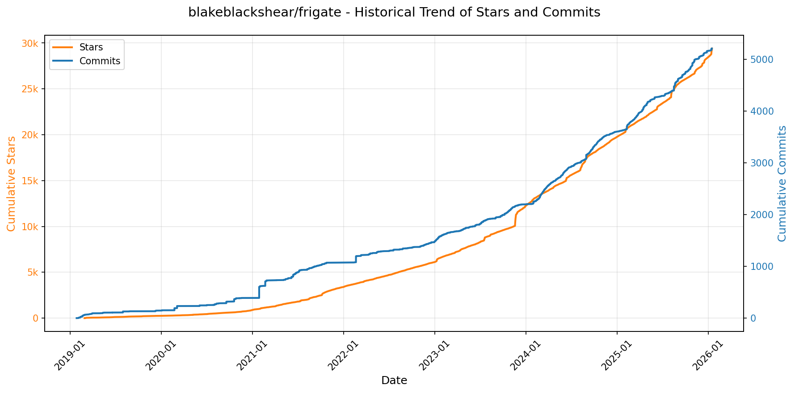
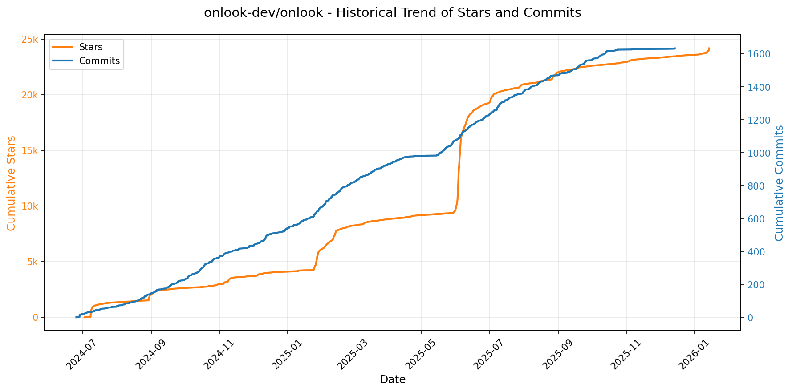
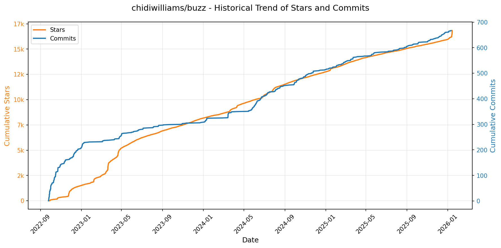
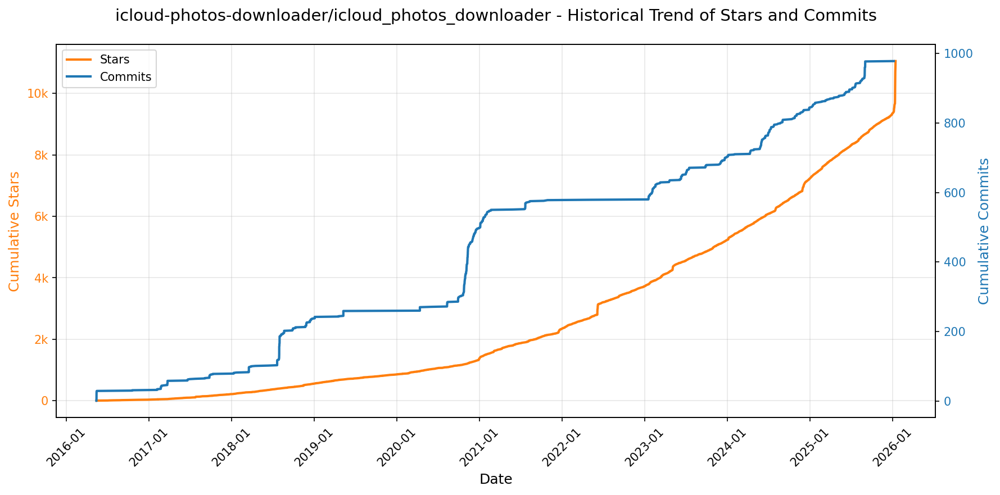
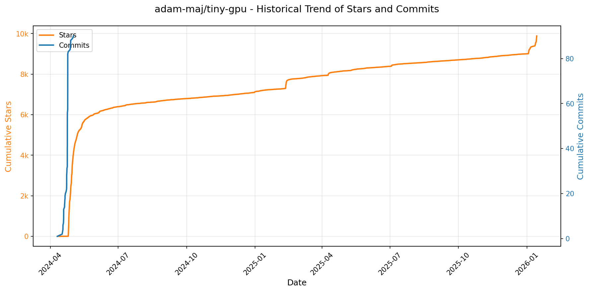
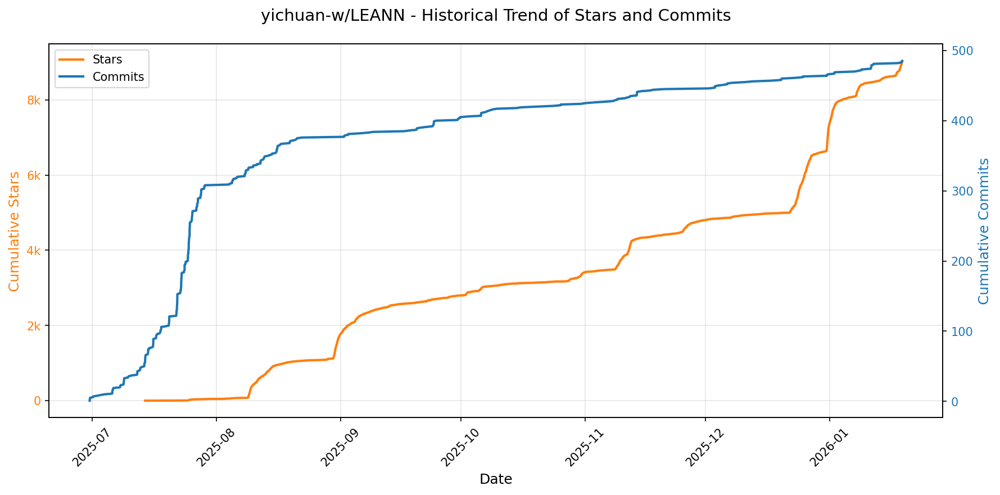

# 🌟 GitHub Trending 概览

> 数据更新于：2026-01-14。

---

## 🔍 项目详情

### 1. [twitter/the-algorithm](https://github.com/twitter/the-algorithm)
- 📅 **创建日期**：2023-03-27  
- 🔄 **最近更新**：2026-01-14  
- ⭐ **Stars**：69,598（日 +267｜周 +402｜月 +1734）  
- 📝 **描述**：Source code for the X Recommendation Algorithm  

<b>📈 Star 与 Commit 历史趋势</b>

> *蓝色：累计 Stars｜橙色：累计 Commits（次 Y 轴）*

<b>📄 README 摘要</b>

1. 该项目实现了X平台（如“为你推荐”时间线、搜索、探索、通知等）内容推荐的核心算法系统，负责生成和提供个性化的内容信息流。它通过整合用户行为数据、构建用户与内容之间的关联模型，并利用机器学习对候选内容进行排序和过滤，最终向用户推送相关度高、质量合格的帖子和其他内容。

2. 关键功能包括：  
   - **多源候选内容获取**：从用户关注网络内（In-Network）和外（Out-of-Network）多个来源（如搜索索引、用户-帖子交互图UTEG、关注推荐服务FRS）收集待推荐的帖子。  
   - **多层次排序机制**：采用轻量级和重量级两级神经网络模型（Light Ranker 和 Heavy Ranker）对候选内容进行精细化打分和排序。  
   - **实时信号处理**：集成统一的用户行为流（unified-user-actions）和用户信号服务，实时捕捉用户的显式（点赞、回复）和隐式（点击、浏览）反馈。  
   - **复杂图模型与嵌入技术**：使用SimClusters进行社区聚类，利用TwHIN构建用户和帖子的知识图谱嵌入，并通过GraphJet框架实现实时图遍历推荐。  
   - **内容安全与可见性控制**：集成信任与安全模型（NSFW/滥用内容检测）以及可见性过滤器，确保推荐内容合规并提升用户体验。  
   - **可扩展的推荐框架**：基于product-mixer和navi等高性能框架构建模块化、可复用的推荐流程，支持不同产品场景（如时间线、通知）的定制化需求。

3. 技术栈包括：  
   - **编程语言**：主要使用 Scala 和 Python，部分核心服务使用 Rust（如navi）以追求高性能。  
   - **机器学习框架**：主力为自研的 **twml**（基于TensorFlow v1），同时引入现代Rust编写的高性能模型服务框架 **navi**。  
   - **数据与流处理**：依赖实时用户行为流（unified-user-actions）、GraphJet图数据库框架、以及用于聚合特征的timelines-aggregation-framework。  
   - **模型与算法**：涵盖社区发现（SimClusters）、知识图谱嵌入（TwHIN）、PageRank变体（Tweepcred）、交互预测图模型（real-graph）、以及多任务深度学习排序模型（heavy-ranker）。  
   - **服务架构**：采用微服务架构，关键组件如tweetypie（帖子读写）、user-signal-service（信号获取）、representation-manager（嵌入检索）、home-mixer/pushservice（主推荐服务）等均独立部署并通过API协作。  
   - **构建工具**：使用 Bazel 进行项目构建和测试（尚无顶层配置）。

---

### 2. [anomalyco/opencode](https://github.com/anomalyco/opencode)
- 📅 **创建日期**：2025-04-30  
- 🔄 **最近更新**：2026-01-14  
- ⭐ **Stars**：67,618（日 +2294｜周 +15740｜月 +29072）  
- 📝 **描述**：The open source coding agent.  

<b>📈 Star 与 Commit 历史趋势</b>

> *蓝色：累计 Stars｜橙色：累计 Commits（次 Y 轴）*

<b>📄 README 摘要</b>

1. 该项目是一个开源的AI编程代理工具，旨在通过人工智能辅助开发者完成代码编写、分析和探索任务。它可以在终端中运行，支持本地或远程模型，帮助用户进行开发工作、代码理解和任务规划。

2. 关键功能包括：内置两种智能代理（“build”用于完整权限的开发，“plan”为只读模式用于代码分析与规划）；支持通过Tab键切换代理；提供@general子代理处理复杂搜索和多步骤任务；原生支持LSP（语言服务器协议）；采用客户端/服务器架构，允许在本地运行而通过移动设备等远程控制；兼容多种AI模型提供商（如Claude、OpenAI、Google及本地模型）；提供跨平台安装方式和桌面应用Beta版；强调终端用户体验，适合Neovim用户。

3. 技术栈主要包括：使用Rust或类似系统级语言构建核心（从包管理器支持和二进制分发推断）；前端为基于终端的TUI（文本用户界面）；支持NPM、Bun、Pnpm、Yarn、Scoop、Choco、Homebrew、Mise、Nix、Paru等多种包管理器安装；基于GitHub Actions实现CI/CD；文档与配置参考XDG Base Directory规范；架构上采用客户端-服务器模式，支持本地运行和远程交互。

---

### 3. [anthropics/claude-code](https://github.com/anthropics/claude-code)
- 📅 **创建日期**：2025-02-22  
- 🔄 **最近更新**：2026-01-14  
- ⭐ **Stars**：56,297（日 +409｜周 +4083｜月 +10548）  
- 📝 **描述**：Claude Code is an agentic coding tool that lives in your terminal, understands your codebase, and helps you code faster by executing routine tasks, explaining complex code, and handling git workflows - all through natural language commands.  

<b>📈 Star 与 Commit 历史趋势</b>

> *蓝色：累计 Stars｜橙色：累计 Commits（次 Y 轴）*

<b>📄 README 摘要</b>

1. 该项目是一个驻留在终端中的代理式编程工具，能够理解用户的代码库，通过自然语言指令帮助用户更快地编写代码。它可执行常规编码任务、解释复杂代码逻辑，并管理 git 工作流，支持在终端、IDE 中使用，也可通过在 GitHub 上标记 @claude 来调用。

2. 主要功能包括：支持自然语言交互控制编码流程；深度理解项目代码结构；自动化处理重复性编程任务；提供代码解释能力；集成 git 工作流管理；可通过插件系统扩展功能；支持多平台安装（macOS、Linux、Windows）；内置反馈和错误报告机制（如 `/bug` 命令）；与社区通过 Discord 连接互动。

3. 技术栈基于 Node.js（要求 18+ 版本），主要以 JavaScript/TypeScript 构建，通过命令行脚本（如 Bash 和 PowerShell）实现跨平台安装，同时依赖 npm 进行包管理（尽管全局安装方式已被弃用）。项目还集成了与 GitHub、Discord 等外部服务的连接能力，并包含本地运行的代理组件以处理代码理解和生成任务。

---

### 4. [usememos/memos](https://github.com/usememos/memos)
- 📅 **创建日期**：2021-12-08  
- 🔄 **最近更新**：2026-01-14  
- ⭐ **Stars**：54,005（日 +318｜周 +1709｜月 +6957）  
- 📝 **描述**：An open-source, self-hosted note-taking service. Your thoughts, your data, your control — no tracking, no ads, no subscription fees.  

<b>📈 Star 与 Commit 历史趋势</b>

> *蓝色：累计 Stars｜橙色：累计 Commits（次 Y 轴）*

<b>📄 README 摘要</b>

1. 该项目是一个开源、可自托管的笔记服务，旨在让用户完全掌控自己的数据。它可用于个人记事、团队知识库和知识管理，强调隐私保护、无追踪、无广告、无订阅费用，支持数据完全导出，避免厂商锁定。

2. 主要功能包括：以隐私为先的架构（自托管、零遥测、完全数据所有权）；原生支持 Markdown（全文本存储，便于迁移）；性能卓越（基于 Go 和 React 实现快速加载）；部署简单（支持一键 Docker 部署，兼容 SQLite、MySQL、PostgreSQL）；对开发者友好（提供完整的 REST 和 gRPC API，便于集成）；界面美观（简洁现代的设计，支持深色模式和移动端响应式布局）。

3. 技术栈主要包括：后端使用 Go 语言开发，前端采用 React 框架，支持通过 Docker 容器化部署，同时兼容多种数据库系统（SQLite、MySQL、PostgreSQL），并提供 RESTful 和 gRPC 接口供外部调用。

---

### 5. [virattt/ai-hedge-fund](https://github.com/virattt/ai-hedge-fund)
- 📅 **创建日期**：2024-11-29  
- 🔄 **最近更新**：2026-01-14  
- ⭐ **Stars**：45,289（日 +49｜周 +349｜月 +2597）  
- 📝 **描述**：An AI Hedge Fund Team  

<b>📈 Star 与 Commit 历史趋势</b>

> *蓝色：累计 Stars｜橙色：累计 Commits（次 Y 轴）*

<b>📄 README 摘要</b>

1. 该项目旨在构建一个由人工智能驱动的对冲基金概念验证系统，通过模拟多位著名投资大师（如巴菲特、达摩达兰、凯瑟琳·伍德等）的思维模式和投资策略，结合基本面、技术面、情绪面和估值分析，生成股票交易信号并进行投资组合管理。系统会综合各智能体的意见，由风险管理和投资组合经理模块做出最终决策，但不执行实际交易，仅用于教育和研究目的。

2. 关键功能包括：  
   - 集成18个AI智能体协同工作，涵盖12位传奇投资者的代理、4个分析型代理（估值、情绪、基本面、技术面）、1个风险管理代理和1个投资组合管理代理；  
   - 支持多源金融数据输入，对AAPL、GOOGL、MSFT、NVDA、TSLA等股票提供免API密钥的数据支持；  
   - 提供命令行接口（CLI）和Web图形化界面两种运行方式，便于不同用户使用；  
   - 内置回测引擎，可指定时间范围和股票列表进行历史表现测试；  
   - 支持多种大型语言模型（LLM）后端，包括OpenAI、Groq、Anthropic、DeepSeek及本地Ollama模型；  
   - 具备完整的风险控制机制，自动计算风险指标并设定持仓限制。

3. 技术栈包括：  
   - 编程语言：Python；  
   - 依赖管理：Poetry；  
   - 前端框架：React（用于Web应用部分）；  
   - 后端服务：FastAPI（用于Web应用API）；  
   - 大型语言模型集成：支持OpenAI、Anthropic、Groq、DeepSeek API以及Ollama本地模型；  
   - 环境配置：通过`.env`文件管理API密钥和环境变量；  
   - 数据获取：通过Financial Datasets API或其他金融数据接口获取市场与财务数据；  
   - 可视化：Web界面提供图表与交互式展示；  
   - 构建与部署：基于Git的版本控制，支持本地开发与扩展。

---

### 6. [exo-explore/exo](https://github.com/exo-explore/exo)
- 📅 **创建日期**：2024-06-24  
- 🔄 **最近更新**：2026-01-14  
- ⭐ **Stars**：39,970（日 +58｜周 +400｜月 +7229）  
- 📝 **描述**：Run your own AI cluster at home with everyday devices 📱💻 🖥️⌚  

<b>📈 Star 与 Commit 历史趋势</b>

> *蓝色：累计 Stars｜橙色：累计 Commits（次 Y 轴）*

<b>📄 README 摘要</b>

1. **这个项目是做什么的？**  
   exo 是一个允许用户将日常设备（如 Mac）连接起来，组成个人本地 AI 集群的开源项目。它使用户能够在多台设备上分布式运行大型语言模型（LLM），突破单个设备的硬件限制，支持运行超出单设备显存容量的大模型，并通过高效通信技术提升推理速度。项目特别优化了 macOS 平台（尤其是搭载 M 系列芯片的设备），并正在扩展对 Linux 的支持。

2. **关键特性**  
   - **自动设备发现**：运行 exo 的设备可自动相互发现，无需手动配置网络或集群参数。  
   - **Thunderbolt 上的 RDMA 支持**：原生支持 Thunderbolt 5 的远程直接内存访问（RDMA），设备间通信延迟降低高达 99%，显著提升多设备协同性能。  
   - **拓扑感知的自动并行化**：根据实时设备拓扑（包括计算资源、内存和网络带宽/延迟）自动决定最优的模型切分策略。  
   - **张量并行（Tensor Parallelism）**：支持将模型在多个设备间进行张量级拆分，在 2 台设备上最高可达 1.8 倍加速，4 台设备上达 3.2 倍加速。  
   - **基于 MLX 的推理后端**：使用 Apple 推出的 MLX 框架作为核心推理引擎，并集成 MLX distributed 实现高效的分布式通信。  
   - **本地 API 与可视化仪表盘**：提供运行在 `http://localhost:52415` 的 REST API 和 Web 仪表盘，支持 OpenAI 兼容接口，便于集成和交互。  

3. **技术栈**  
   - **核心语言**：Rust（用于构建高性能系统组件和绑定）、Python（主逻辑与 API 层）、JavaScript/Node.js（前端仪表盘）。  
   - **推理框架**：MLX（Apple 开源的机器学习框架，专为 Apple Silicon 优化）及其分布式模块 MLX Distributed。  
   - **通信技术**：RDMA over Thunderbolt 5（实现低延迟高带宽设备间通信）。  
   - **前端技术**：React + npm 构建 Web 仪表盘界面。  
   - **依赖管理**：uv（Python 包管理器）、rustup（Rust 工具链，需 nightly 版本）、Homebrew（macOS/Linux 上的包管理）。  
   - **运行环境**：macOS Sonoma 14.2 或更高版本（推荐 macOS 26.2+ 以启用 RDMA），Linux（当前仅支持 CPU 运行，GPU 支持开发中）。  
   - **部署方式**：支持从源码运行（macOS/Linux）以及 macOS 原生应用安装。

---

### 7. [anthropics/skills](https://github.com/anthropics/skills)
- 📅 **创建日期**：2025-09-22  
- 🔄 **最近更新**：2026-01-14  
- ⭐ **Stars**：39,704（日 +925｜周 +5122｜月 +18861）  
- 📝 **描述**：Public repository for Agent Skills  

<b>📈 Star 与 Commit 历史趋势</b>

> *蓝色：累计 Stars｜橙色：累计 Commits（次 Y 轴）*

<b>📄 README 摘要</b>

1. 该项目提供了一套用于Claude AI系统的技能（Skills）实现，这些技能是包含指令、脚本和资源的文件夹，可被Claude动态加载以增强其在特定任务上的表现。通过这些技能，Claude能够重复性地完成具体任务，例如根据公司品牌指南创建文档、使用组织特定流程分析数据或自动化个人事务。该仓库展示了技能系统的可能性，并为开发者提供示例、模板和规范，用以学习和构建自定义技能。

2. 关键功能包括：支持多种应用场景的技能示例（涵盖创意设计、技术开发、企业通信及文档处理等）；每个技能独立封装并附带`SKILL.md`文件说明其行为与元数据；提供开放源码（Apache 2.0）及部分源码可见的生产级文档操作技能（如docx、pdf、pptx、xlsx格式处理）；支持通过Claude Code插件市场注册和安装技能集；可在Claude.ai和Claude API中直接使用预建技能或上传自定义技能；提供标准化技能模板和Agent Skills规范文档，便于开发者快速上手创建新技能。

3. 技术栈主要包括：基于Markdown格式的`SKILL.md`文件，其中包含YAML元数据和自然语言指令；采用文件夹结构组织各个独立技能；与Anthropic的Claude Code、Claude.ai平台以及Claude API集成；依赖外部系统如Notion等第三方软件的合作技能扩展能力；整体架构轻量且模块化，无需复杂框架即可实现技能的开发与部署。

---

### 8. [Lissy93/web-check](https://github.com/Lissy93/web-check)
- 📅 **创建日期**：2023-06-25  
- 🔄 **最近更新**：2026-01-14  
- ⭐ **Stars**：29,698（日 +163｜周 +1815｜月 +2712）  
- 📝 **描述**：🕵️‍♂️ All-in-one OSINT tool for analysing any website  

<b>📈 Star 与 Commit 历史趋势</b>

> *蓝色：累计 Stars｜橙色：累计 Commits（次 Y 轴）*

---

### 9. [blakeblackshear/frigate](https://github.com/blakeblackshear/frigate)
- 📅 **创建日期**：2019-01-26  
- 🔄 **最近更新**：2026-01-14  
- ⭐ **Stars**：29,007（日 +226｜周 +395｜月 +1156）  
- 📝 **描述**：NVR with realtime local object detection for IP cameras  

<b>📈 Star 与 Commit 历史趋势</b>

> *蓝色：累计 Stars｜橙色：累计 Commits（次 Y 轴）*

<b>📄 README 摘要</b>

1. 该项目是一个专为家庭自动化平台 Home Assistant 设计的本地网络视频录像机（NVR），具备实时 AI 物体检测功能。它利用 OpenCV 和 TensorFlow 在本地对 IP 摄像头的视频流进行实时物体识别，无需依赖云端服务。系统通过运动检测触发机制，在需要时和特定区域运行物体检测以节省资源，并支持基于检测到的物体进行视频录制、24/7 全天候录像、RTSP 转推流、低延迟直播观看等功能，同时通过 MQTT 协议与其他系统集成。

2. 主要特性包括：与 Home Assistant 通过自定义组件深度集成；利用 GPU 或专用 AI 加速器实现高性能、低开销的实时物体检测；采用多进程架构优化性能，优先保证实时性；使用轻量级运动检测来决定何时启动物体识别；TensorFlow 物体检测在独立进程中运行以提高帧率；通过 MQTT 进行通信，便于系统集成；可根据检测到的物体类型设置录像保留策略；支持 24/7 录像和 RTSP 转码流以减少对摄像头的连接压力；提供 WebRTC 和 MSE 支持实现低延迟实时预览；内置掩膜和区域编辑器，可自定义检测区域；支持多摄像头时间轴快速浏览回放；并具备简洁高效的事件回顾工作流程。

3. 技术栈主要包括：Python（核心语言）、OpenCV（用于视频处理和运动检测）、TensorFlow（用于本地 AI 物体检测）、MQTT（作为消息通信协议）、Docker（部署方式）、WebRTC 与 MSE（用于前端低延迟视频播放），并与 Home Assistant 生态系统紧密集成。项目推荐使用 GPU 或 Coral USB Accelerator 等 AI 加速硬件以提升检测效率。

---

### 10. [OpenBMB/ChatDev](https://github.com/OpenBMB/ChatDev)
- 📅 **创建日期**：2023-08-28  
- 🔄 **最近更新**：2026-01-14  
- ⭐ **Stars**：28,564（日 +156｜周 +556｜月 +740）  
- 📝 **描述**：ChatDev 2.0: Dev All through LLM-powered Multi-Agent Collaboration  

<b>📈 Star 与 Commit 历史趋势</b>

> *蓝色：累计 Stars｜橙色：累计 Commits（次 Y 轴）*

<b>📄 README 摘要</b>

1. 该项目是一个零代码的多智能体协作平台（DevAll），旨在通过简单配置实现“开发万物”。用户无需编程即可定义智能体、工作流和任务，以编排复杂场景，如软件开发、数据可视化、3D生成、深度研究和教学视频制作等。它支持通过可视化界面或Python SDK构建和执行定制化的多智能体系统，并提供多种预设模板供开箱即用。

2. 关键功能包括：零代码配置化创建多智能体系统；提供可视化工作流画布用于拖拽设计和节点参数配置；支持实时日志监控与中间产物查看；具备人机交互模式允许用户介入流程；内置多种应用场景模板（如游戏开发、数据分析、3D建模）；可通过Python SDK进行自动化批量处理；支持环境变量管理与YAML配置占位符；集成Blender实现3D内容生成；并可通过自定义工具和节点扩展平台能力。

3. 技术栈主要包括：后端使用Python（3.12+）与FastAPI框架，依赖管理工具为uv；前端基于Vue 3与Vite构建Web控制台；采用YAML文件定义工作流逻辑；通过LLM（大语言模型）驱动智能体协作；支持Docker容器化部署；集成了Node.js运行环境（18+）用于前端开发；并可结合Blender、Manim等外部工具实现特定功能（如3D生成、动画视频）。

---

### 11. [onlook-dev/onlook](https://github.com/onlook-dev/onlook)
- 📅 **创建日期**：2024-06-25  
- 🔄 **最近更新**：2026-01-14  
- ⭐ **Stars**：24,157（日 +258｜周 +496｜月 +713）  
- 📝 **描述**：The Cursor for Designers • An Open-Source AI-First Design tool • Visually build, style, and edit your React App with AI  

<b>📈 Star 与 Commit 历史趋势</b>

> *蓝色：累计 Stars｜橙色：累计 Commits（次 Y 轴）*

<b>📄 README 摘要</b>

1. 该项目做什么？  
   Onlook 是一个开源的、以视觉优先的代码编辑器，专为设计师打造。它允许用户通过 AI 在 Next.js 和 TailwindCSS 框架中快速创建网站、原型和设计。用户可以直接在浏览器 DOM 中通过可视化编辑器进行实时修改，实现“边设计边编码”的工作流。支持从文本或图像生成应用、使用预设模板、实时预览、管理品牌资源与设计系统，并能将更改同步回源代码。目标是提供一个开源替代方案，对标 Bolt.new、Lovable、V0、Webflow 等工具。

2. 主要功能  
   - 快速创建 Next.js 应用（支持文本/图像启动、模板）  
   - 浏览器内可视化编辑，类似 Figma 的 UI 操作  
   - 实时代码与设计预览联动  
   - 支持组件识别、图层浏览、图片管理、分支实验（Branching）  
   - 内置 AI 聊天功能，可排队发送多条指令、使用图像作为参考或资产  
   - 集成 MCPs（模型上下文协议），支持 AI 调用自身进行迭代  
   - 实时代码编辑器、命令行工具、检查点保存与恢复  
   - 一键部署，生成可分享链接或绑定自定义域名  
   - 支持团队实时协作编辑（评论功能待完善）  
   - 右键点击元素即可定位到对应代码位置  
   - 拖拽插入和调整 div 布局  

3. 技术栈  
   - **前端**：Next.js（全栈框架）、TailwindCSS（样式）、tRPC（服务接口）  
   - **数据库**：Supabase（认证、数据库、存储）、Drizzle（ORM）  
   - **AI 相关**：AI SDK（LLM 客户端）、OpenRouter（LLM 模型提供商）、Morph Fast Apply 与 Relace（快速应用模型提供商）  
   - **沙盒与托管**：CodeSandbox SDK（开发沙盒）、Freestyle（应用托管）  
   - **运行时**：Bun（运行时、打包、单体仓库管理）、Docker（容器化管理）

---

### 12. [bytedance/UI-TARS-desktop](https://github.com/bytedance/UI-TARS-desktop)
- 📅 **创建日期**：2025-01-19  
- 🔄 **最近更新**：2026-01-14  
- ⭐ **Stars**：23,508（日 +240｜周 +3116｜月 +3679）  
- 📝 **描述**：The Open-Source Multimodal AI Agent Stack: Connecting Cutting-Edge AI Models and Agent Infra  

<b>📈 Star 与 Commit 历史趋势</b>

> *蓝色：累计 Stars｜橙色：累计 Commits（次 Y 轴）*

<b>📄 README 摘要</b>

1. 该项目是一个多模态AI智能体技术栈，包含两个核心项目：Agent TARS 和 UI-TARS-desktop。Agent TARS 能在终端、计算机、浏览器及产品中实现类人任务处理，支持通过自然语言指令完成复杂操作（如预订航班、酒店或生成图表），并集成多种现实世界工具。UI-TARS-desktop 是一个桌面应用，基于视觉语言模型提供本地和远程的图形用户界面（GUI）自动化控制能力，允许用户通过自然语言指令直接操控本地或远程电脑及浏览器。

2. 关键功能包括：支持开箱即用的命令行（CLI）与Web UI双模式运行；具备混合浏览器代理能力，可结合GUI视觉定位与DOM操作控制浏览器；采用事件流协议驱动上下文工程与智能体交互界面；深度集成MCP（Model-Controller-Protocol）架构以连接真实工具；提供一键式本地与远程计算机及浏览器操作功能；支持截图识别、精准鼠标键盘控制、实时状态反馈；所有数据可在本地处理，保障隐私安全；并已实现流式输出、运行时统计、沙箱环境等高级特性。

3. 技术栈主要包括：基于Node.js开发的CLI工具（要求Node.js >= 22）；前端使用Web UI框架实现可视化交互；后端依托多模态大语言模型（如doubao-1-5-thinking-vision-pro、claude-3-7-sonnet等）进行推理；采用MCP架构实现工具集成；利用Vision-Language Models（如Seed-1.5-VL/1.6系列）实现图像理解与GUI操作；支持跨平台运行（Windows、macOS、浏览器）；并通过Event Stream实现数据流追踪与调试；部署方面支持本地运行与云平台（如ModelScope）部署。

---

### 13. [resemble-ai/chatterbox](https://github.com/resemble-ai/chatterbox)
- 📅 **创建日期**：2025-04-23  
- 🔄 **最近更新**：2026-01-14  
- ⭐ **Stars**：21,427（日 +76｜周 +579｜月 +6476）  
- 📝 **描述**：SoTA open-source TTS  

<b>📈 Star 与 Commit 历史趋势</b>

> *蓝色：累计 Stars｜橙色：累计 Commits（次 Y 轴）*

<b>📄 README 摘要</b>

1. 该项目是一个由 Resemble AI 开发的开源文本转语音（TTS）模型系列，主打高效、高质量的语音合成。其中最新推出的 Chatterbox-Turbo 模型基于 3.5 亿参数的精简架构，显著降低计算和显存需求，将语音生成步骤从传统的 10 步压缩至仅 1 步，实现低延迟语音输出，特别适用于零样本语音代理、实时交互应用及创意工作流。模型原生支持“[cough]”、“[laugh]”等副语言标签，可增强语音的真实感和表现力。同时提供多语言版本（支持23种以上语言）和英文基础版本，满足不同场景需求。所有生成的音频均内置不可感知的神经水印（PerTh），以确保AI生成内容的可追溯性与负责任使用。

2. 关键特性包括：(1) **极致高效**：Chatterbox-Turbo 采用350M参数架构和单步解码技术，大幅减少推理时间和资源消耗；(2) **原生副语言支持**：直接在文本中插入 `[laugh]`、`[chuckle]` 等标签即可生成对应语气，提升自然度；(3) **零样本语音克隆**：仅需一段10秒参考音频即可克隆声音，无需额外训练；(4) **多语言能力**：Multilingual 版本支持23种以上语言的高质量合成；(5) **精细控制选项**：提供 `cfg_weight` 和 `exaggeration` 参数调节语音风格与表现力；(6) **内嵌神经水印**：自动为生成音频添加鲁棒性水印，抵御压缩与编辑，保障内容溯源。

3. 技术栈主要包括：Python（3.11）、PyTorch、torchaudio、librosa；模型架构基于深度神经网络，结合了文本到语音标记、语音标记到梅尔频谱的蒸馏解码技术；依赖管理使用 pip 和 conda；项目通过 Hugging Face Spaces 提供在线演示；水印系统采用 Resemble AI 自研的 Perth（Perceptual Threshold）隐式水印技术；开发环境基于 Debian 11，依赖版本锁定于 `pyproject.toml` 文件中以保证一致性。

---

### 14. [ChromeDevTools/chrome-devtools-mcp](https://github.com/ChromeDevTools/chrome-devtools-mcp)
- 📅 **创建日期**：2025-09-11  
- 🔄 **最近更新**：2026-01-14  
- ⭐ **Stars**：20,840（日 +191｜周 +2018｜月 +4151）  
- 📝 **描述**：Chrome DevTools for coding agents  

<b>📈 Star 与 Commit 历史趋势</b>

> *蓝色：累计 Stars｜橙色：累计 Commits（次 Y 轴）*

<b>📄 README 摘要</b>

1. **项目功能**  
该项目名为 `chrome-devtools-mcp`，是一个基于 Model-Context-Protocol (MCP) 的服务器，允许 AI 编码代理（如 Gemini、Claude、Cursor、Copilot 等）通过 Chrome DevTools 控制和检查实时运行的 Chrome 浏览器。它使 AI 助手能够自动化浏览器操作、进行深度调试、性能分析和网络请求监控。用户可通过 MCP 客户端配置该服务，实现对网页的导航、表单填写、截图、性能追踪等操作，适用于自动化测试、网页诊断和开发辅助。

2. **关键特性**  
- **性能洞察**：通过记录 Chrome 性能轨迹（trace），提取可操作的性能数据，帮助优化页面加载和运行效率。  
- **高级浏览器调试**：支持查看控制台日志、获取网络请求详情、截取页面截图、执行 JavaScript 脚本等。  
- **可靠自动化**：基于 Puppeteer 实现浏览器自动化，自动等待操作结果完成，提升稳定性。  
- **多种操作工具**：提供超过 20 个工具函数，涵盖输入自动化（点击、拖拽、填表）、页面导航（新建/切换页面、跳转）、设备模拟（响应式视口、UA 模拟）、性能分析、网络监控和调试功能。  
- **灵活连接模式**：支持自动启动独立浏览器实例，也可连接到已运行的 Chrome 实例（包括通过 WebSocket 和认证头连接远程调试端口）。  
- **安全与隔离选项**：支持使用临时用户数据目录（isolated mode）避免状态污染，并可配置代理、忽略证书错误等高级选项。  
- **广泛客户端支持**：兼容包括 VS Code、Cursor、JetBrains、Warp、Gemini、Claude 等主流 AI 开发工具的 MCP 集成。

3. **技术栈**  
- **核心协议**：Model-Context-Protocol (MCP)，用于 AI 代理与外部工具之间的上下文通信。  
- **浏览器控制层**：基于 [Puppeteer](https://github.com/puppeteer/puppeteer) 控制 Chrome 浏览器，利用其 DevTools 协议实现深度交互。  
- **运行环境**：Node.js（v20.19 或更高 LTS 版本），通过 npm 包管理器分发。  
- **前端技术依赖**：直接集成 Chrome DevTools 前端能力，用于性能分析和调试。  
- **通信机制**：支持 HTTP 远程调试接口和 WebSocket 连接（含自定义头部认证），实现与本地或远程 Chrome 实例通信。  
- **配置方式**：通过命令行参数或 JSON 配置文件进行灵活设置，支持环境变量、代理、视口尺寸、用户数据目录路径等定制化选项。

---

### 15. [obra/superpowers](https://github.com/obra/superpowers)
- 📅 **创建日期**：2025-10-09  
- 🔄 **最近更新**：2026-01-14  
- ⭐ **Stars**：20,709（日 +1718｜周 +6540｜月 +10982）  
- 📝 **描述**：Claude Code superpowers: core skills library  

<b>📈 Star 与 Commit 历史趋势</b>

> *蓝色：累计 Stars｜橙色：累计 Commits（次 Y 轴）*

<b>📄 README 摘要</b>

1. **这个项目是做什么的？**  
Superpowers 是一个为编码智能体（coding agents）设计的完整软件开发工作流系统。它通过一组可组合的“技能”和初始指令，使智能体在开发过程中遵循结构化、规范化的流程。项目的核心目标是让 AI 编码代理在写代码前先与用户沟通明确需求，生成可读的设计文档，制定清晰的实现计划，并以子代理协作的方式逐步执行任务，确保开发过程符合工程最佳实践，如测试驱动开发（TDD）、YAGNI 和 DRY 原则。

2. **关键特性**  
- **自动触发的工作流技能**：在开发各阶段自动激活相应技能，无需手动干预。  
- **脑力激荡（brainstorming）**：在编码前通过提问细化需求，分段呈现设计供用户确认。  
- **Git 工作树隔离（using-git-worktrees）**：创建独立分支进行开发，保证主环境干净。  
- **计划编写（writing-plans）**：将任务拆解为 2–5 分钟可完成的小步骤，包含具体文件路径、代码内容和验证方式。  
- **子代理驱动开发（subagent-driven-development）**：派遣多个子代理并行处理任务，进行两阶段审查（合规性与代码质量）。  
- **测试驱动开发（test-driven-development）**：严格执行红-绿-重构循环，禁止先写代码后补测试。  
- **任务间代码审查（requesting-code-review）**：每项任务完成后自动审查，严重问题会阻断流程。  
- **开发分支收尾（finishing-a-development-branch）**：任务完成后验证测试结果，提供合并、PR 或丢弃等选项。  
- **跨平台支持**：支持 Claude Code 插件市场安装，也支持 Codex 和 OpenCode 手动集成。  
- **技能可扩展性**：开发者可基于现有模板贡献新技能，形成可复用的知识库。

3. **技术栈**  
- 构建于 AI 编码代理平台之上，主要支持 **Claude Code**、**Codex** 和 **OpenCode**。  
- 使用其原生插件系统（如 `/plugin install`）进行功能扩展与管理。  
- 技能以 Markdown 文档形式组织（如 `SKILL.md`），具备自描述性和可读性。  
- 依赖 Git 进行版本控制与工作区隔离（git worktrees）。  
- 自动化更新机制通过插件命令 `/plugin update` 实现。  
- 遵循模块化架构设计，所有功能封装为独立“技能”，按需自动调用。  
- 开发哲学层面融合了 TDD、YAGNI、DRY、系统化调试等经典软件工程方法论。

---

### 16. [chidiwilliams/buzz](https://github.com/chidiwilliams/buzz)
- 📅 **创建日期**：2022-09-24  
- 🔄 **最近更新**：2026-01-14  
- ⭐ **Stars**：16,830（日 +403｜周 +696｜月 +995）  
- 📝 **描述**：Buzz transcribes and translates audio offline on your personal computer. Powered by OpenAI's Whisper.  

<b>📈 Star 与 Commit 历史趋势</b>

> *蓝色：累计 Stars｜橙色：累计 Commits（次 Y 轴）*

<b>📄 README 摘要</b>

1. 该项目可在个人电脑上离线进行音频转录和翻译，支持对本地音视频文件、YouTube链接以及麦克风实时录音进行处理，并基于OpenAI的Whisper技术实现高精度语音识别与多语言翻译。

2. 主要功能包括：导入音视频文件或YouTube链接进行转录；通过麦克风实现实时音频转录并提供适用于演讲和会议的展示窗口；在转录前进行语音分离以提升嘈杂环境下的准确率；支持说话人识别；兼容多种Whisper后端（支持Nvidia GPU的CUDA加速、苹果硅芯片Mac、以及大多数GPU包括集成显卡的Vulkan加速）；可将转录结果导出为TXT、SRT和VTT格式；提供带有搜索、播放控制和速度调节功能的高级转录查看器；支持键盘快捷键操作；具备监控文件夹功能，能自动转录新增文件；提供命令行接口用于脚本编写和自动化任务。

3. 技术栈基于Python开发，核心使用OpenAI的[Whisper](https://github.com/openai/whisper)模型进行语音识别，支持通过PyTorch实现CUDA（Nvidia GPU）、Apple Silicon 和 Vulkan（via Whisper.cpp）等多种硬件加速方式。项目通过FFmpeg处理音视频输入，采用跨平台部署方案，支持macOS、Windows和Linux系统，分别通过DMG、winget、Flatpak、Snap及pip等方式安装，前端界面支持本地运行并集成丰富的用户交互功能。

---

### 17. [BloopAI/vibe-kanban](https://github.com/BloopAI/vibe-kanban)
- 📅 **创建日期**：2025-06-14  
- 🔄 **最近更新**：2026-01-14  
- ⭐ **Stars**：15,759（日 +292｜周 +2223｜月 +9264）  
- 📝 **描述**：Get 10X more out of Claude Code, Codex or any coding agent  

<b>📈 Star 与 Commit 历史趋势</b>

> *蓝色：累计 Stars｜橙色：累计 Commits（次 Y 轴）*

<b>📄 README 摘要</b>

1. 该项目的作用：  
Vibe Kanban 是一个专为提升 AI 编码代理（如 Claude Code、Gemini CLI、Codex、Amp 等）使用效率而设计的工具。它帮助人类工程师更高效地管理由 AI 生成代码的工作流，核心功能包括任务编排、状态跟踪和多代理协同。用户可以通过该平台轻松切换不同的编码代理，按顺序或并行执行多个代理任务，快速审查 AI 完成的工作成果，并启动开发服务器。此外，它还支持集中管理编码代理的 MCP 配置，并允许在远程服务器上运行时通过 SSH 远程打开项目。

2. 主要特性：  
- 支持多种主流 AI 编码代理（如 Claude Code、Gemini CLI 等），可自由切换使用。  
- 提供任务编排能力，支持将多个编码代理任务按顺序或并行方式执行。  
- 内置任务状态追踪系统，实时查看各 AI 代理的任务进度与结果。  
- 可快速审查 AI 生成的代码，并一键启动本地开发服务器进行测试。  
- 集中化配置管理，统一维护多个编码代理的 MCP 设置。  
- 支持远程部署，在远程服务器上运行 Vibe Kanban 后，可通过 SSH 从本地编辑器（如 VSCode）直接打开和编辑项目。  
- 提供 Web UI 界面，便于可视化操作与监控。  
- 支持通过 Cloudflare Tunnel、ngrok 等工具暴露服务，方便远程访问。

3. 技术栈：  
- **前端**：使用 Node.js 构建，依赖 pnpm 作为包管理工具，前端资源位于 `frontend` 目录下，可通过 `pnpm build` 构建。  
- **后端**：采用 Rust 语言开发，确保高性能与安全性。  
- **构建与依赖管理**：前端使用 pnpm（>=8），后端使用 Cargo（Rust 的包管理器）。  
- **数据库**：开发环境中使用预设的 SQLite 数据库文件（来自 `dev_assets_seed` 文件夹）作为初始数据。  
- **开发工具**：依赖 `cargo-watch` 实现文件变更自动重载，`sqlx-cli` 管理数据库迁移。  
- **部署与运行**：支持本地运行（`pnpm run dev`）和源码构建（如 macOS 下通过 `local-build.sh` 脚本），可通过环境变量灵活配置端口、主机、分析服务等。  
- **集成支持**：与 PostHog 集成用于行为分析（可选），与 VSCode Remote-SSH 扩展集成实现远程项目打开。

---

### 18. [shareAI-lab/learn-claude-code](https://github.com/shareAI-lab/learn-claude-code)
- 📅 **创建日期**：2025-06-29  
- 🔄 **最近更新**：2026-01-14  
- ⭐ **Stars**：14,154（日 +137｜周 +883｜月 +2573）  
- 📝 **描述**：How can we build a true AI agent? Like Claude Code.  

<b>📈 Star 与 Commit 历史趋势</b>

> *蓝色：累计 Stars｜橙色：累计 Commits（次 Y 轴）*

<b>📄 README 摘要</b>

1. 该项目旨在通过从零开始构建一个AI编码代理，帮助学习者理解现代AI代理（如Claude Code、Kode、Cursor Agent）的工作原理。它提供了一个渐进式的教程，包含五个逐步复杂的版本（v0到v4），每个版本引入一个核心概念，最终实现一个功能完整的AI编码代理系统。

2. 关键特性包括：  
   - **渐进式学习路径**：从仅使用Bash工具的50行极简版本开始，逐步增加核心工具、待办事项规划、子代理机制和技能机制。  
   - **核心代理循环**：基于“模型调用工具 -> 执行工具 -> 返回结果 -> 继续循环”的简单模式，揭示所有编码代理的本质结构。  
   - **显式任务规划**：通过TodoManager实现结构化任务分解与跟踪，支持复杂任务处理。  
   - **子代理机制**：支持创建隔离的子代理来并行或递归处理子任务，保持上下文清晰。  
   - **技能系统（Skills）**：支持按需加载领域知识（SKILL.md文件），实现可扩展的专业能力。  
   - **元技能支持**：内置“代理构建器”技能，可自动生成新代理项目脚手架。  
   - **多平台兼容**：支持Kode CLI、Claude Code、Cursor等遵循[Agent Skills Spec]的代理环境。

3. 技术栈主要包括：  
   - **Python**：作为主要开发语言，实现代理逻辑与工具集成。  
   - **Anthropic API**：调用Claude系列大模型驱动代理决策。  
   - **dotenv**：用于管理API密钥等环境变量配置。  
   - **命令行工具集成**：通过bash工具实现文件读写、编辑、执行等操作系统级操作。  
   - **模块化架构**：采用清晰的文件结构分离不同版本、技能模块（skills/）和文档（docs/）。  
   - **开放标准**：遵循[Agent Skills Spec]规范，确保技能的可移植性和互操作性。

---

### 19. [thedotmack/claude-mem](https://github.com/thedotmack/claude-mem)
- 📅 **创建日期**：2025-08-31  
- 🔄 **最近更新**：2026-01-14  
- ⭐ **Stars**：13,664（日 +128｜周 +2410｜月 +7781）  
- 📝 **描述**：A Claude Code plugin that automatically captures everything Claude does during your coding sessions, compresses it with AI (using Claude's agent-sdk), and injects relevant context back into future sessions.  

<b>📈 Star 与 Commit 历史趋势</b>

> *蓝色：累计 Stars｜橙色：累计 Commits（次 Y 轴）*

<b>📄 README 摘要</b>

1. 该项目是一个为 **Claude Code** 构建的持久化记忆压缩系统。它通过自动捕获工具使用情况、生成语义摘要，并将这些信息提供给未来的会话，从而在不同会话间无缝保留上下文和项目知识，使AI能持续理解项目进展。

2. 关键功能包括：
   - **持久化记忆**：上下文信息可在会话间留存。
   - **渐进式披露**：采用分层的记忆检索机制，并显示令牌消耗成本。
   - **基于技能的搜索**：通过 `mem-search` 技能用自然语言查询项目历史。
   - **网页查看器UI**：提供实时内存流的Web界面（http://localhost:37777）。
   - **Claude桌面端技能**：可在Claude桌面应用的对话中搜索记忆。
   - **隐私控制**：使用 `<private>` 标签排除敏感内容存储。
   - **上下文配置**：精细控制注入哪些上下文。
   - **自动运行**：无需手动干预即可工作。
   - **引用功能**：可通过ID引用过去的观察记录。
   - **测试频道**：可切换版本以试用“无尽模式”等实验性功能。

3. 技术栈包括：
   - **Node.js** (版本 >=18.0.0)
   - **Bun**：作为JavaScript运行时和进程管理器。
   - **SQLite 3**：用于持久化存储会话、观察和摘要数据，并利用FTS5实现全文搜索。
   - **Chroma向量数据库**：支持混合（语义+关键词）搜索以实现智能上下文检索。
   - **uv**：Python包管理器，用于向量搜索相关依赖。
   - 使用 **TypeScript** 开发。
   - 基于 **Claude Agent SDK** 构建。

---

### 20. [icloud-photos-downloader/icloud_photos_downloader](https://github.com/icloud-photos-downloader/icloud_photos_downloader)
- 📅 **创建日期**：2016-05-13  
- 🔄 **最近更新**：2026-01-14  
- ⭐ **Stars**：11,053（日 +302｜周 +1579｜月 +1826）  
- 📝 **描述**：A command-line tool to download photos from iCloud  

<b>📈 Star 与 Commit 历史趋势</b>

> *蓝色：累计 Stars｜橙色：累计 Commits（次 Y 轴）*

<b>📄 README 摘要</b>

1. 该项目是一个命令行工具，用于下载用户iCloud中的所有照片和视频。它支持从iCloud批量下载媒体文件，并可选择同步或移动模式，实现本地与iCloud之间的数据一致性，适用于个人备份、归档或在无图形界面的设备（如NAS）上运行。

2. 主要功能包括：支持三种操作模式——“复制”（默认，仅下载新项目）、“同步”（下载新项目并删除本地多余文件）和“移动”（下载后从iCloud删除）；支持Live Photos（分离图像与视频）和RAW格式照片（包括RAW+JPEG组合）；自动去重相同名称的照片；支持一次性下载或持续监控iCloud变更（通过`--watch-with-interval`实现定期检查）；优化增量下载（如`--until-found`和`--recent`选项）；可更新照片的EXIF元数据时间戳；支持通过命令行参数灵活配置行为；具备会话认证管理能力，可独立完成双因素认证（2FA/2SA）授权。

3. 技术栈基于Python开发，可通过PyPI安装，同时提供跨平台可执行文件，并支持Docker容器化部署、AUR（Arch Linux用户仓库）及npm包管理方式。项目使用GitHub Actions进行持续集成与构建，采用MIT开源许可证，依赖Apple iCloud Web服务接口进行通信，利用命令行解析库处理用户输入，并通过HTTP请求与iCloud服务器交互完成登录、验证和数据下载。

---

### 21. [Free-TV/IPTV](https://github.com/Free-TV/IPTV)
- 📅 **创建日期**：2021-04-13  
- 🔄 **最近更新**：2026-01-14  
- ⭐ **Stars**：10,630（日 +321｜周 +1472｜月 +3185）  
- 📝 **描述**：M3U Playlist for free TV channels  

<b>📈 Star 与 Commit 历史趋势</b>

> *蓝色：累计 Stars｜橙色：累计 Commits（次 Y 轴）*

<b>📄 README 摘要</b>

1. 该项目提供一个全球免费电视频道的M3U播放列表，收录了世界各地通过地面广播（如DVB-T）或互联网官方免费提供的主流电视频道。用户可将此播放列表链接导入IPTV播放器，即可收看这些免费频道。

2. 主要特点包括：注重质量而非数量，仅收录能稳定工作的高清（HD）频道；严格筛选，只包含真正免费、非付费订阅的主流公共频道，排除成人、特定宗教、政治党派及由外国资助的频道；每个频道仅保留一个最佳URL源，不包含+1频道或地区变体；对非高清、地理限制和YouTube直播等特殊情况进行明确标记；提供清晰的贡献指南，鼓励用户通过提交拉取请求（Pull Request）来添加、更新或移除频道信息。

3. 技术栈主要包括使用Python脚本（`make_playlist.py`）从Markdown（`.md`）文件自动生成M3U8格式的播放列表。项目本身是一个静态内容仓库，主要依赖GitHub进行版本控制和协作，最终生成的播放列表为纯文本流媒体格式（M3U8），可供各类IPTV客户端解析使用。

---

### 22. [steveyegge/beads](https://github.com/steveyegge/beads)
- 📅 **创建日期**：2025-10-12  
- 🔄 **最近更新**：2026-01-14  
- ⭐ **Stars**：10,058（日 +190｜周 +1410｜月 +4982）  
- 📝 **描述**：Beads - A memory upgrade for your coding agent  

<b>📈 Star 与 Commit 历史趋势</b>

> *蓝色：累计 Stars｜橙色：累计 Commits（次 Y 轴）*

<b>📄 README 摘要</b>

1. 该项目是一个为AI代理设计的分布式、基于Git的图状问题跟踪器，旨在为编码代理提供持久化、结构化的记忆系统。它用具备依赖关系感知能力的图结构替代杂乱的Markdown计划，使代理能够处理长期任务而不丢失上下文。

2. 主要特性包括：以Git作为数据库，将问题以JSONL格式存储在`.beads/`目录中，支持版本控制、分支和合并；专为代理优化，输出JSON格式数据，支持依赖关系追踪和自动识别就绪任务；采用哈希ID（如bd-a1b2）避免多代理或多分支协作时的合并冲突；通过本地SQLite缓存和后台守护进程实现快速访问与自动同步；支持“语义压缩”功能，对旧的已关闭任务进行总结以减少上下文占用。

3. 技术栈包括Go语言（用于主程序开发）、Git（作为底层数据存储和版本控制系统）、SQLite（用于本地缓存加速）、JSONL（数据序列化格式），并提供npm和PyPI包以便集成到JavaScript/TypeScript和Python生态中，支持跨平台运行（Linux、FreeBSD、macOS、Windows）。

---

### 23. [adam-maj/tiny-gpu](https://github.com/adam-maj/tiny-gpu)
- 📅 **创建日期**：2024-04-09  
- 🔄 **最近更新**：2026-01-14  
- ⭐ **Stars**：9,880（日 +309｜周 +533｜月 +923）  
- 📝 **描述**：A minimal GPU design in Verilog to learn how GPUs work from the ground up  

<b>📈 Star 与 Commit 历史趋势</b>

> *蓝色：累计 Stars｜橙色：累计 Commits（次 Y 轴）*

<b>📄 README 摘要</b>

1. **这个项目是做什么的？**  
   tiny-gpu 是一个极简的 GPU 硬件实现，使用 Verilog 编写，专为从底层学习 GPU 工作原理而设计。它不专注于图形渲染，而是聚焦于通用 GPU（GPGPU）和 AI 加速器（如 TPU）的核心架构原理，帮助理解现代并行计算硬件的基本构成与运行机制。项目支持运行简单的计算内核（如矩阵加法和乘法），并通过完整的模拟环境展示指令执行流程、内存访问行为和线程并行机制。

2. **关键特性**  
   - 极简设计：仅由少于 15 个完全注释的 Verilog 文件组成，结构清晰，易于理解。
   - 完整文档：详细说明了整体架构、指令集（ISA）、执行流程和内存系统。
   - 支持 SIMD 并行模型：每个线程拥有独立的寄存器文件、ALU、LSU 和 PC，支持单指令多数据执行。
   - 可模拟执行：提供完整的仿真测试框架，可运行矩阵加法和矩阵乘法内核，并输出详细的执行轨迹日志。
   - 包含典型 GPU 核心组件：包括调度器、取指/解码单元、内存控制器、缓存（WIP）、设备控制寄存器和线程分发器（Dispatcher）。
   - 自定义 11 条指令的 ISA：支持算术运算、比较、分支、加载/存储等基本操作，并通过 `%threadIdx`、`%blockIdx` 等只读寄存器实现并行编程。
   - 展示高级 GPU 特性概念：在文档中解释了生产级 GPU 中的关键优化技术，如内存合并、流水线、warp 调度、分支发散和同步屏障等。

3. **技术栈**  
   - 硬件描述语言：Verilog
   - 仿真工具链：
     - Icarus Verilog（iverilog）用于 Verilog 编译与仿真
     - Cocotb 用于 Python 驱动的硬件协同仿真
     - sv2v 工具用于 SystemVerilog 到 Verilog 的转换
   - 构建与运行：Makefile 控制编译流程，支持 `make test_matadd` 和 `make test_matmul` 命令运行内核实例
   - 运行环境：依赖本地安装的仿真工具，可在 macOS/Linux 上运行，通过日志文件输出内存状态和完整执行跟踪

---

### 24. [yichuan-w/LEANN](https://github.com/yichuan-w/LEANN)
- 📅 **创建日期**：2025-06-09  
- 🔄 **最近更新**：2026-01-14  
- ⭐ **Stars**：8,569（日 +61｜周 +476｜月 +3602）  
- 📝 **描述**：RAG on Everything with LEANN. Enjoy 97% storage savings while running a fast, accurate, and 100% private RAG application on your personal device.  

<b>📈 Star 与 Commit 历史趋势</b>

> *蓝色：累计 Stars｜橙色：累计 Commits（次 Y 轴）*

<b>📄 README 摘要</b>

1. **这个项目是做什么的？**  
LEANN 是一个创新的轻量级向量数据库，旨在将个人设备（如笔记本电脑）转变为强大的本地 RAG（检索增强生成）系统。它通过图结构的选择性重新计算与高保真度剪枝技术，在不损失准确性的前提下，实现比传统向量数据库节省高达 97% 存储空间的效果。用户可在完全离线、零隐私泄露的前提下，对本地文件系统中的文档（PDF、TXT、MD等）、邮件（Apple Mail）、浏览器历史、微信/iMessage 聊天记录、ChatGPT/Claude 对话历史、代码库以及通过 MCP 协议接入的实时平台数据（如 Slack、Twitter）进行语义搜索和问答。

2. **关键特性**  
- **极致节省存储**：相比传统方案减少 97% 存储占用（例如 60M 文本块仅需 6GB 而非 201GB），无需存储全部嵌入向量，采用按需计算机制。  
- **完全本地化与隐私保护**：所有数据处理均在本地完成，不依赖云服务，无任何遥测或数据上传。  
- **多源数据支持**：支持文档、电子邮件、聊天记录、浏览历史、代码库及通过 MCP 的实时数据流（如 Slack 消息、推文）的语义检索。  
- **无缝集成 Claude Code**：作为语义搜索 MCP 服务，可直接替代其关键词搜索功能，提升智能检索能力而不改变现有工作流。  
- **跨平台便携性**：索引可轻松迁移至其他设备，知识库随身携带。  
- **高性能与可扩展性**：能处理数百万级别的个人数据，适用于不断增长的代理记忆和复杂数据集。  
- **灵活配置与多种后端支持**：支持 HNSW 和 DiskANN 索引后端，兼容 OpenAI 接口的各类 LLM 与嵌入模型（包括 Ollama、HuggingFace、vLLM、LM Studio 等本地引擎）。  
- **交互式查询模式**：支持连续对话式问答，无需重复构建索引。

3. **技术栈**  
- **编程语言**：Python（支持 3.9 至 3.13 版本）  
- **核心算法**：基于图的选择性重新计算（graph-based selective recomputation）、高保真剪枝（high-degree preserving pruning）、CSR 图存储格式  
- **索引后端**：HNSW（默认）、DiskANN（支持 MKL/Intel oneAPI 加速）  
- **依赖工具链**：  
  - 构建工具：`uv`（现代 Python 包管理器）  
  - 编译依赖：libomp, boost, protobuf, zeromq, abseil, libaio, pkg-config  
  - 数学库：Intel oneAPI MKL 或 OpenBLAS  
- **硬件支持**：支持 x86_64 与 ARM64（含 Apple Silicon），可利用 GPU（CUDA/MPS）加速嵌入与推理  
- **外部集成**：  
  - LLM 后端：OpenAI、Anthropic、Ollama、HuggingFace、Groq、Mistral、Gemini、Zhipu 等（通过 OpenAI 兼容 API）  
  - 嵌入模型：支持 sentence-transformers、Jina AI、ColQwen2/ColPali（多模态）等  
  - 多模态支持：ColQwen2 / ColPali 模型用于 PDF 中图文混合内容的理解  
  - MCP（Model Context Protocol）：实现与 Slack、Twitter、Claude Code 等平台的实时数据连接  
- **运行环境**：Ubuntu、Arch Linux、WSL、macOS（ARM64/Intel），要求 macOS 13.3+（若使用 DiskANN）

---

### 25. [home-assistant/home-assistant.io](https://github.com/home-assistant/home-assistant.io)
- 📅 **创建日期**：2014-12-21  
- 🔄 **最近更新**：2026-01-14  
- ⭐ **Stars**：8,340（日 +172｜周 +585｜月 +690）  
- 📝 **描述**：:blue_book: Home Assistant User documentation  

<b>📈 Star 与 Commit 历史趋势</b>

> *蓝色：累计 Stars｜橙色：累计 Commits（次 Y 轴）*

<b>📄 README 摘要</b>

1. 该项目是 Home Assistant 官方网站（home-assistant.io）的源代码，用于展示和维护 Home Assistant 的官方文档、博客文章和相关信息。

2. 关键特性包括：支持多环境部署（生产环境、测试版和开发版分别对应不同的分支和访问地址），为每个拉取请求（Pull Request）提供 Netlify 预览部署，支持本地预览网站功能，以及提供工具命令来隔离和集成博客文章，以加快本地网站生成速度。

3. 技术栈主要包括使用 Bundler 管理的 Ruby 环境，结合 Rake 构建工具执行预览和站点生成任务，托管和部署由 Netlify 提供支持。

---

### 26. [danielmiessler/Personal_AI_Infrastructure](https://github.com/danielmiessler/Personal_AI_Infrastructure)
- 📅 **创建日期**：2025-09-08  
- 🔄 **最近更新**：2026-01-14  
- ⭐ **Stars**：4,545（日 +78｜周 +805｜月 +3192）  
- 📝 **描述**：Personal AI Infrastructure for upgrading humans.  

<b>📈 Star 与 Commit 历史趋势</b>

> *蓝色：累计 Stars｜橙色：累计 Commits（次 Y 轴）*

<b>📄 README 摘要</b>

1. **这个项目是做什么的？**  
PAI（Personal AI Infrastructure）是一个开源的个人AI基础设施系统，旨在构建一个能够持续自我学习和升级的个性化AI助手。它不同于传统的一次性对话式AI（如ChatGPT），而是通过记录每次交互中的反馈信号（如评分、情绪、行为模式、验证结果等），自动优化AI的行为、技能和核心算法，使其越来越擅长帮助用户完成任务。其核心目标是实现“愉悦的惊喜”——即AI交付的结果不仅完成任务，而且在深度、质量和相关性上超出预期，助力用户成为更好的自己。

2. **关键特性**  
- **自学习系统**：通过显式评分、隐式情绪分析、行为信号（如重试、放弃任务）和验证结果，持续收集反馈并改进自身。
- **核心算法驱动**：采用统一的七阶段通用算法（观察→思考→计划→构建→执行→验证→学习），适用于任何规模的任务，从修改错别字到创办企业。
- **记忆系统**：三级架构（热/温/冷）存储工作痕迹、学习成果和历史归档，支持上下文继承与长期记忆。
- **钩子系统**：事件驱动机制，实时捕获会话开始/结束、用户输入、工具调用等8类事件，用于触发自动化逻辑和信号采集。
- **安全机制**：防止命令注入、代码验证、仓库隔离，保障系统学习过程的安全性和完整性。
- **用户与系统分离**：实现可移植的身份配置，确保自定义内容不会因系统升级而丢失。
- **深度目标管理（TELOS）**：通过10个文件记录用户的使命、信念、策略等深层目标，使AI真正理解用户意图。
- **模块化技能管理**：支持“Packs”（功能包）和“Bundles”（捆绑包），便于扩展和共享能力。
- **CLI优先设计**：强调命令行接口的高效性、可脚本化和稳定性。
- **科学化迭代循环**：将整个系统视为一个实验闭环，遵循假设→实验→测量→迭代的元学习流程。

3. **技术栈**  
- **编程语言**：TypeScript  
- **运行时环境**：Bun（高性能JavaScript运行时）  
- **AI模型支持**：兼容Claude等主流大模型（文档中特别标注由Claude构建）  
- **架构风格**：事件驱动、模块化、CLI为中心  
- **数据存储**：基于文件系统的结构化目录（MEMORY/Signals/, Learning/, Work/ 等）  
- **开发工具链**：Git版本控制、自动化Hook脚本、JSONL日志流  
- **部署与协作**：GitHub托管，支持多人贡献与团队共享AI基础设施  
- **社区平台**：Discord（UL Community）用于交流与支持

---

### 27. [frankbria/ralph-claude-code](https://github.com/frankbria/ralph-claude-code)
- 📅 **创建日期**：2025-08-27  
- 🔄 **最近更新**：2026-01-14  
- ⭐ **Stars**：2,650（日 +340｜周 +2110｜月 +2610）  
- 📝 **描述**：Autonomous AI development loop for Claude Code with intelligent exit detection  

<b>📈 Star 与 Commit 历史趋势</b>

> *蓝色：累计 Stars｜橙色：累计 Commits（次 Y 轴）*

<b>📄 README 摘要</b>

1. 该项目实现了一个名为 Ralph 的自动化 AI 开发循环系统，专为 Claude Code 设计。它能启动一个连续的自主开发流程，让 Claude Code 迭代式地改进项目直至完成。系统内置智能退出检测（需同时满足任务完成指标和显式退出信号）来防止无限循环，并通过速率限制和熔断机制来避免过度调用 API。

2. 关键功能包括：双条件智能退出检测、会话连续性与可配置的超时过期机制、每小时 100 次调用的速率限制、先进的两阶段错误过滤熔断器、支持 JSON 输出格式并自动回退到文本解析、可通过 `--continue` 标志保留上下文、支持从 PRD/规格文档导入项目、提供实时监控仪表板（tmux 集成）、全面的日志记录以及专用的卸载脚本。

3. 技术栈主要包括 Bash (4.0+) 脚本作为核心逻辑，依赖 Anthropic 官方的 Claude Code CLI 工具与 AI 模型交互，使用 tmux 实现集成化实时监控，利用 jq 处理 JSON 数据，并结合 Git 进行版本控制。测试框架采用 BATS（Bash Automated Testing System），并通过 GitHub Actions 实现 CI/CD 自动化流水线。

---

### 28. [badlogic/pi-mono](https://github.com/badlogic/pi-mono)
- 📅 **创建日期**：2025-08-09  
- 🔄 **最近更新**：2026-01-14  
- ⭐ **Stars**：1,668（日 +100｜周 +411｜月 +1178）  
- 📝 **描述**：AI agent toolkit: coding agent CLI, unified LLM API, TUI & web UI libraries, Slack bot, vLLM pods  

<b>📈 Star 与 Commit 历史趋势</b>

> *蓝色：累计 Stars｜橙色：累计 Commits（次 Y 轴）*

<b>📄 README 摘要</b>

1. 该项目是一个用于构建AI代理和管理大语言模型（LLM）部署的工具集合，核心目标是提供统一接口以支持多平台LLM调用，并实现可扩展的智能代理系统。其主要产出包括一个交互式编程代理CLI、可在Slack中运行的机器人、终端与Web用户界面组件，以及用于在GPU集群上管理vLLM部署的命令行工具。

2. 关键功能包括：支持OpenAI、Anthropic、Google等多个LLM提供商的统一API；具备工具调用和状态管理能力的代理运行时；基于终端和Web的AI对话界面；高效的差分渲染终端UI库；用于自动化部署和管理GPU上vLLM实例的CLI工具；Slack集成机器人，可将消息转发给编程代理处理；采用Monorepo架构进行统一代码管理，并通过锁步版本控制确保所有子包版本一致性；完整的CI/CD流程，包含自动构建、测试和发布机制，且出于安全考虑不在CI中使用LLM API密钥。

3. 技术栈主要包括：TypeScript作为主要开发语言；npm用于依赖管理和脚本执行；使用tsx直接运行TypeScript文件；采用vLLM作为后端推理引擎用于高效LLM服务部署；前端部分使用Web组件技术构建用户界面；CI/CD由GitHub Actions驱动；项目结构为单体仓库（monorepo），各功能模块以独立NPM包形式组织在packages目录下，共享构建和发布流程。

---

