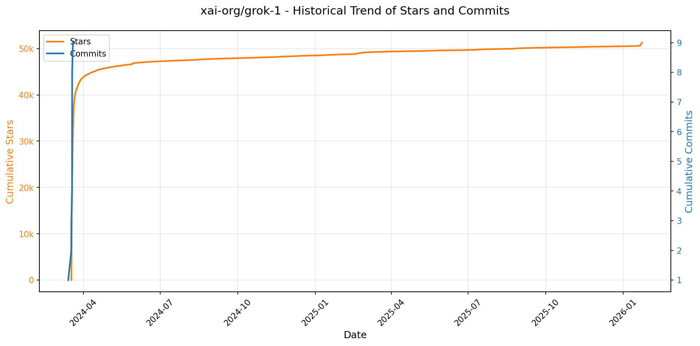
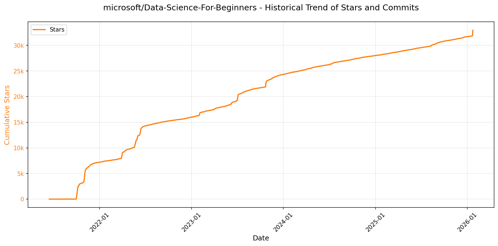
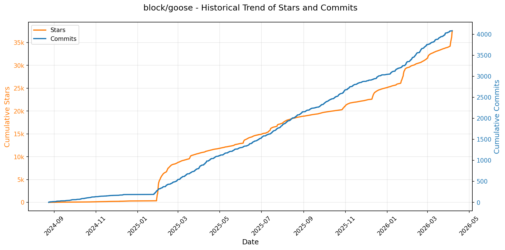
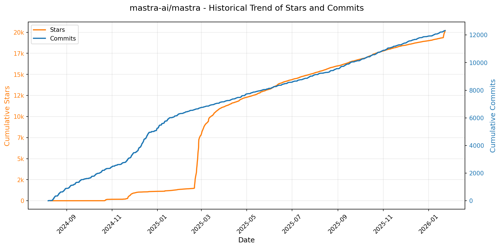
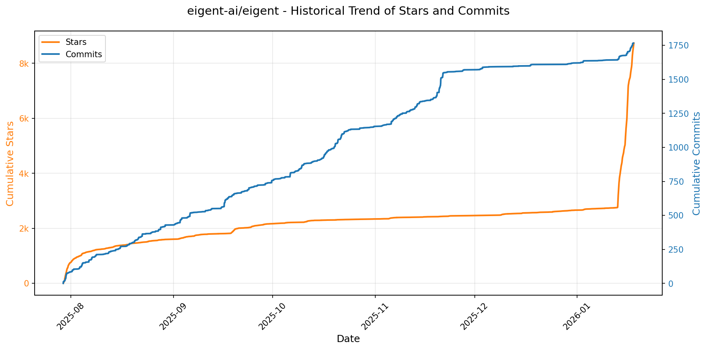
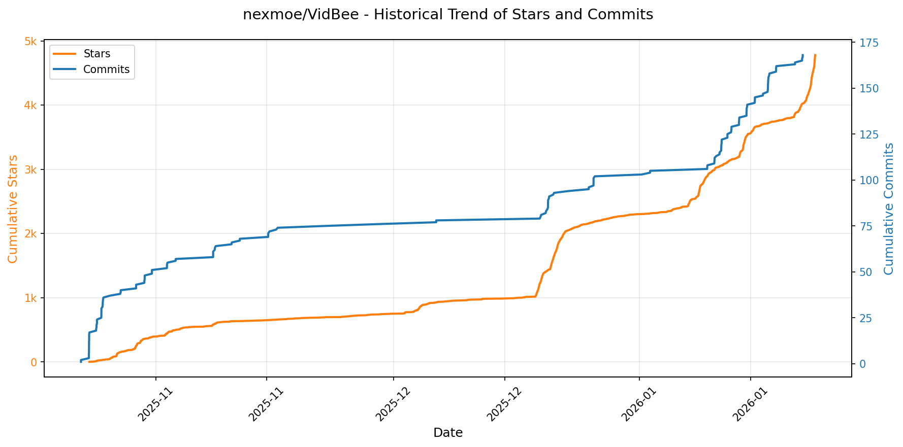
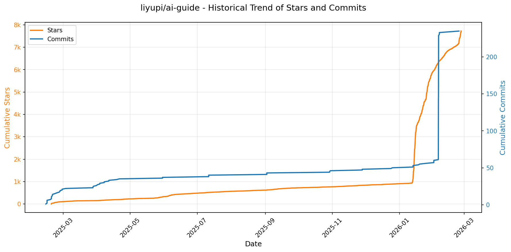

# 🌟 GitHub Trending 概览

> 数据更新于：2026-01-23。

---

## 🔍 项目详情

### 1. [anomalyco/opencode](https://github.com/anomalyco/opencode)
- 📅 **创建日期**：2025-04-30  
- 🔄 **最近更新**：2026-01-23  
- ⭐ **Stars**：84,429（日 +1612｜周 +12340｜月 +43036）  
- 📝 **描述**：The open source coding agent.  

<b>📈 Star 与 Commit 历史趋势</b>

> *蓝色：累计 Stars｜橙色：累计 Commits（次 Y 轴）*

<b>📄 README 摘要</b>

1. **该项目的功能**  
OpenCode 是一个开源的 AI 编程智能体（AI coding agent），旨在为开发者提供终端原生（TUI）、轻量高效且高度可扩展的 AI 辅助编程体验。它直接在本地终端中运行，支持代码理解、生成、重构、调试、文档编写及跨文件分析等全流程开发任务；同时具备客户端/服务器架构，允许远程控制（如通过移动应用驱动本地运行的 OpenCode 实例）。

2. **核心特性**  
- **双模式智能体切换**：内置 `build`（默认，全权限开发代理）和 `plan`（只读分析代理，禁止自动修改文件、执行命令前需显式授权），按 Tab 键即可切换；另含 `@general` 子代理用于复杂多步推理与深度搜索。  
- **完全开源与厂商无关**：不绑定任何大模型服务商，原生兼容 Claude、OpenAI、Google Gemini 及本地模型（如 Ollama、Llama.cpp），并推荐搭配其自研模型服务 OpenCode Zen。  
- **开箱即用的 LSP 支持**：深度集成语言服务器协议，提供精准的代码补全、跳转、悬停提示等 IDE 级能力。  
- **全平台原生客户端**：提供命令行 CLI（支持 npm/brew/scoop/choco/paru/mise/nix 等多种安装方式）、桌面端（macOS/Windows/Linux，含 `.dmg`/`.exe`/`.deb`/AppImage 等格式）及 Web UI（截图展示）。  
- **灵活安装与路径控制**：支持环境变量（`OPENCODE_INSTALL_DIR` / `XDG_BIN_DIR`）自定义安装路径，适配不同系统规范与用户习惯。  
- **终端优先设计**：由 Neovim 用户与 terminal.shop 团队打造，极致优化 TUI 交互体验，强调键盘驱动、低延迟与高可访问性。

3. **技术栈**  
- **前端/CLI**：TypeScript + React（Web UI）、Rust（高性能 CLI 核心，推测基于 `tauri` 或自研终端渲染层，未明示但符合其 TUI 定位）；实际构建中广泛使用 `bun`/`npm`/`pnpm`/`yarn` 等现代包管理器。  
- **架构**：客户端/服务器分离架构（client-server），支持本地 CLI、桌面 App 和未来移动端作为前端，后端引擎处理模型调用、代码分析与 LSP 协议桥接。  
- **基础设施**：GitHub Actions 自动化发布（`publish.yml`）、NPM 包托管（`opencode-ai`）、Homebrew/Scoop/Choco/Paru/Nix 多源分发；Logo 采用响应式 SVG（适配深色/浅色模式）。  
- **底层能力**：原生集成 LSP（Language Server Protocol），支持对接任意兼容语言服务器；模型抽象层屏蔽厂商差异，可插拔接入各类大模型 API 或本地推理后端。

---

### 2. [twitter/the-algorithm](https://github.com/twitter/the-algorithm)
- 📅 **创建日期**：2023-03-27  
- 🔄 **最近更新**：2026-01-23  
- ⭐ **Stars**：71,849（日 +372｜周 +1584｜月 +3637）  
- 📝 **描述**：Source code for the X Recommendation Algorithm  

<b>📈 Star 与 Commit 历史趋势</b>

> *蓝色：累计 Stars｜橙色：累计 Commits（次 Y 轴）*

<b>📄 README 摘要</b>

1. **该项目的功能**  
该项目是X（原Twitter）开源的推荐算法核心实现，旨在为X全平台产品界面（如“为你推荐”时间线、搜索、探索、通知等）提供个性化内容流（尤其是帖子）的生成与排序服务。其核心任务包括：从多源获取候选内容（如关注圈内/圈外帖子、用户交互图谱挖掘、关注推荐等），通过多层级模型对候选内容进行排序（轻量级初筛 + 深度神经网络精排），并完成混排（blending）、合规过滤（如法律要求、安全策略）与最终投放（如信息流渲染或推送通知）。当前开源覆盖的主要场景为“For You Timeline”（FYT）和“Recommended Notifications”（推荐通知）两大核心产品流。

2. **关键特性**  
- **多源候选生成体系**：支持多样化候选来源，包括基于倒排索引的In-Network搜索（~50%流量）、基于图谱遍历的User-Tweet Entity Graph（UTEG）、关注推荐服务（FRS）及Out-of-Network协调层（tweet-mixer）。  
- **分层排序架构**：采用“轻量级初筛（Light Ranker）+ 重量级精排（Heavy Ranker）”双阶段模型策略，兼顾性能与效果；Heavy Ranker采用多任务学习（如预测点击、打开、互动概率）。  
- **统一图计算与特征能力**：深度集成GraphJet图处理框架，提供实时交互图维护（UTEG）、图特征服务（graph-feature-service）、社交证据建模（topic-social-proof）、用户声誉计算（tweepcred）等。  
- **多模态语义表示**：融合稀疏社区嵌入（SimClusters）与稠密知识图谱嵌入（TwHIN），并通过representation-scorer支持跨实体（用户/帖子）相似度计算。  
- **端到端可扩展框架**：基于product-mixer构建可配置化信息流生成框架；navi提供高性能Rust模型服务；timelines-aggregation-framework支持批流一体聚合特征；visibility-filters实现细粒度内容治理（硬过滤、降权、视觉标识）。  
- **安全与合规优先设计**：内置trust-and-safety-models（NSFW/有害内容识别）、legal-compliance过滤逻辑，确保内容生态健康与监管合规。

3. **技术栈**  
- **编程语言**：主干以Scala（大数据批处理/图计算）、Python（机器学习模型训练与推理）、Java（基础服务）和Rust（高性能模型服务navi）构成；部分组件含C++（Earlybird搜索索引底层）及Shell/Makefile（构建脚本）。  
- **机器学习框架**：重度依赖自研twml（基于TensorFlow v1的旧框架）与现代PyTorch/TensorFlow生态（heavy-ranker等新模型）；模型部署依托Rust编写的navi服务。  
- **大数据与图计算**：基于Apache Spark/Flink类批流处理引擎；核心图能力由自研GraphJet框架支撑；数据存储涉及分布式KV（如Manhattan）、图数据库及OLAP引擎。  
- **基础设施与工具链**：采用Bazel作为主要构建系统（虽暂无顶层WORKSPACE）；服务通信基于Finagle/gRPC；实时数据流依赖Kafka/PubSub；监控与实验平台集成内部系统（未开源）。  
- **关键开源依赖**：GraphJet（图实时处理）、TwHIN（知识图谱嵌入库，独立仓库）、Earlybird（自研倒排搜索引擎，部分接口公开）。

---

### 3. [anthropics/claude-code](https://github.com/anthropics/claude-code)
- 📅 **创建日期**：2025-02-22  
- 🔄 **最近更新**：2026-01-23  
- ⭐ **Stars**：59,715（日 +387｜周 +2616｜月 +11573）  
- 📝 **描述**：Claude Code is an agentic coding tool that lives in your terminal, understands your codebase, and helps you code faster by executing routine tasks, explaining complex code, and handling git workflows - all through natural language commands.  

<b>📈 Star 与 Commit 历史趋势</b>

> *蓝色：累计 Stars｜橙色：累计 Commits（次 Y 轴）*

<b>📄 README 摘要</b>

1. **该项目的功能**  
Claude Code 是一款终端原生的智能编程代理工具，能够深度理解用户当前代码库，在本地环境中通过自然语言指令执行日常开发任务。其核心能力包括：自动化完成重复性编码工作（如生成函数、修复简单 bug）、解释复杂代码逻辑、辅助处理 Git 工作流（如生成提交信息、分析差异、创建 PR 描述），并支持在终端、IDE 或 GitHub 中通过 `@claude` 提及方式调用。

2. **关键特性**  
- **上下文感知的代码理解**：基于项目目录结构和文件内容构建本地知识上下文，实现精准的代码问答与修改建议；  
- **多环境集成支持**：原生适配终端（CLI），兼容主流 IDE，并支持 GitHub 评论区中直接提及交互；  
- **可扩展插件架构**：内置插件系统，允许通过自定义命令和专用 Agent 扩展功能（如测试生成、文档补全、依赖分析等），插件文档集中管理；  
- **一键式跨平台安装**：提供针对 macOS/Linux（Shell 脚本 + Homebrew）和 Windows（PowerShell 脚本 + WinGet）的标准化安装方案，npm 全局安装已弃用；  
- **内建反馈与问题上报机制**：集成 `/bug` 命令，支持在工具内部直接提交带上下文的 Bug 报告；  
- **隐私优先设计**：明确声明不将用户代码或对话用于模型训练，对敏感数据设定有限保留期，实行严格访问控制。

3. **技术栈**  
- **运行时环境**：Node.js 18+（作为基础运行时，支撑 CLI 和插件执行）；  
- **客户端架构**：终端优先的命令行应用（CLI），采用 Shell（macOS/Linux）和 PowerShell（Windows）脚本实现轻量级安装与启动；  
- **集成生态**：深度对接 Git CLI、GitHub API 及主流 IDE 扩展机制；  
- **部署与分发**：通过官方安装脚本（`install.sh`/`install.ps1`）、Homebrew Cask、WinGet 包管理器分发，脱离 npm 依赖；  
- **后端协同**：与 Anthropic 的 Claude 模型服务（推测为定制化版本）进行安全受控通信，所有自然语言处理与代码生成由云端 AI 服务驱动。

---

### 4. [usememos/memos](https://github.com/usememos/memos)
- 📅 **创建日期**：2021-12-08  
- 🔄 **最近更新**：2026-01-23  
- ⭐ **Stars**：55,436（日 +113｜周 +1015｜月 +8113）  
- 📝 **描述**：An open-source, self-hosted note-taking service. Your thoughts, your data, your control — no tracking, no ads, no subscription fees.  

<b>📈 Star 与 Commit 历史趋势</b>

> *蓝色：累计 Stars｜橙色：累计 Commits（次 Y 轴）*

<b>📄 README 摘要</b>

1. **项目功能**  
Memos 是一个开源、可自托管的轻量级笔记与知识管理服务，专注于个人笔记、团队 Wiki 和结构化知识库场景。它允许用户完全掌控自己的数据——所有内容存储于用户自选的基础设施（本地服务器、云主机或容器环境）中，不依赖第三方云服务，无数据上传、无遥测、无广告、无订阅费用，支持一键导出全部数据。

2. **核心特性**  
- **隐私优先架构**：零 telemetry 设计，全链路数据本地化，支持完整数据导出与迁移；  
- **原生 Markdown 支持**：纯文本存储（`.md` 格式），兼容标准语法，便于版本控制与跨平台复用；  
- **极致性能**：Go 语言编写的高并发后端 + React 构建的响应式前端，启动快、加载瞬时、操作流畅；  
- **极简部署体验**：单条 Docker 命令即可运行；同时支持 SQLite（默认）、MySQL 和 PostgreSQL 多种数据库；提供 Docker Compose、Kubernetes（Helm）、预编译二进制包及源码构建等多种部署方式；  
- **开发者友好**：提供完备的 RESTful API 与 gRPC 接口，便于集成至 CI/CD、自动化工作流或第三方应用；  
- **现代化用户体验**：简洁美观的 UI，原生暗色模式，全设备响应式布局，移动端适配良好。

3. **技术栈**  
- **后端**：Go（Golang），基于 Gin 或类似轻量框架构建，支持多种关系型数据库（SQLite / MySQL / PostgreSQL）；  
- **前端**：React（TypeScript），采用现代前端工程实践，支持 i18n 多语言与主题定制；  
- **部署与运维**：Docker 官方镜像（`neosmemo/memos`），Docker Compose 模板，Kubernetes Helm Chart，CI/CD 集成完善；  
- **协议与接口**：同时提供 REST API 与 gRPC API，兼顾易用性与高性能通信需求；  
- **许可证**：MIT 开源协议，允许自由使用、修改、分发与商用。

---

### 5. [xai-org/grok-1](https://github.com/xai-org/grok-1)
- 📅 **创建日期**：2024-03-17  
- 🔄 **最近更新**：2026-01-23  
- ⭐ **Stars**：51,278（日 +273｜周 +726｜月 +799）  
- 📝 **描述**：Grok open release  

<b>📈 Star 与 Commit 历史趋势</b>

> *蓝色：累计 Stars｜橙色：累计 Commits（次 Y 轴）*

<b>📄 README 摘要</b>

1. 该项目用于加载和运行开源权重模型 Grok-1，提供基于 JAX 的示例代码，支持从检查点加载模型并对测试输入进行采样生成。

2. 关键特性包括：  
   - 支持参数规模达 3140 亿（314B）的 Grok-1 模型；  
   - 采用包含 8 个专家的混合专家（MoE）架构，每 token 使用其中 2 个专家；  
   - 具备 64 层网络结构，使用 48 个查询头和 8 个键/值头的多头注意力机制；  
   - 嵌入维度为 6,144，使用拥有 131,072 个词元的 SentencePiece 分词器；  
   - 支持旋转位置编码（RoPE）、激活分片和 8 位量化；  
   - 最大上下文长度为 8,192 个词元；  
   - 当前 MoE 层实现未优化效率，旨在避免自定义内核以验证模型正确性。

3. 技术栈包括：  
   - JAX 作为核心计算框架；  
   - Python 及标准科学计算库（通过 requirements.txt 安装）；  
   - HuggingFace 🤗 Hub 工具用于下载模型权重；  
   - 支持 GPU 运行环境（因模型庞大需大量显存）。

---

### 6. [anthropics/skills](https://github.com/anthropics/skills)
- 📅 **创建日期**：2025-09-22  
- 🔄 **最近更新**：2026-01-23  
- ⭐ **Stars**：48,314（日 +0｜周 +6150｜月 +22409）  
- 📝 **描述**：Public repository for Agent Skills  

<b>📈 Star 与 Commit 历史趋势</b>

> *蓝色：累计 Stars｜橙色：累计 Commits（次 Y 轴）*

<b>📄 README 摘要</b>

1. **该项目的功能**  
该项目是 Anthropic 官方提供的 Claude 技能（Skills）参考实现仓库，用于演示和支撑 Claude 模型的动态技能加载能力。它不直接运行或部署为独立服务，而是提供一系列结构化、可复用的“技能包”——即包含指令、元数据和资源的文件夹，使 Claude 能够在特定任务场景下（如文档处理、代码测试、品牌内容生成等）按需激活并执行标准化操作，从而提升其在垂直领域任务中的准确性、一致性和专业性。

2. **核心功能**  
- **模块化技能封装**：每个技能为独立文件夹，内含 `SKILL.md`（含 YAML 前置元数据 + Markdown 指令），支持命名、描述、示例与行为规范的声明式定义；  
- **多场景覆盖**：涵盖创意设计（艺术/音乐/UI）、技术开发（Web 应用测试、MCP 服务器生成）、企业应用（通信模板、品牌指南执行）及文档处理（DOCX/PDF/PPTX/XLSX 的创建、解析与编辑）四大类；  
- **开箱即用集成**：支持通过 Claude Code 插件市场一键安装（如 `document-skills` 或 `example-skills`），并在对话中自然调用（如“用 PDF 技能提取表单字段”）；  
- **开放规范与模板**：包含完整的 [Agent Skills 规范](./spec) 和可复用的 [技能模板](./template)，降低开发者创建自定义技能的门槛；  
- **生产级参考实现**：`skills/docx` 等子目录公开了支撑 Claude 实际文档能力的源可用（source-available）技能代码，供开发者学习复杂技能的设计模式与工程实践。

3. **技术栈**  
- **核心格式**：纯文本驱动，基于 Markdown（含 YAML Frontmatter）定义技能逻辑与元数据；  
- **交付形态**：静态文件组织（无编译/构建步骤），依赖 Claude 运行时解析与执行；  
- **集成协议**：遵循 [Agent Skills 标准规范](http://agentskills.io)，与 Anthropic 官方 API、Claude.ai 网页端及 Claude Code IDE 深度集成；  
- **许可模型**：多数示例技能采用 Apache 2.0 开源协议；文档类核心技能为源可用（source-available），非开源，体现生产环境约束；  
- **扩展生态**：支持第三方合作技能（如 Notion 官方技能），体现开放插件化架构设计。

---

### 7. [obra/superpowers](https://github.com/obra/superpowers)
- 📅 **创建日期**：2025-10-09  
- 🔄 **最近更新**：2026-01-23  
- ⭐ **Stars**：33,700（日 +1095｜周 +9030｜月 +22687）  
- 📝 **描述**：An agentic skills framework & software development methodology that works.  

<b>📈 Star 与 Commit 历史趋势</b>

> *蓝色：累计 Stars｜橙色：累计 Commits（次 Y 轴）*

<b>📄 README 摘要</b>

1. **项目功能**  
Superpowers 是一个面向编程智能体（coding agents）的完整软件开发工作流框架，旨在将原本零散、随意的代码生成行为系统化、工程化。它不直接生成代码，而是通过一系列自动触发的、可组合的“技能”（skills），引导智能体严格遵循现代软件工程最佳实践，完成从需求澄清、设计评审、计划制定、TDD 实现、多智能体协同开发，到分支收尾的端到端闭环开发流程。其核心目标是让 AI 编程过程具备可验证性、可审查性、可协作性和工程纪律性——本质上，是为 AI 编程注入人类工程团队的流程心智模型。

2. **关键特性**  
- **全流程自动化技能链**：内置 14+ 个结构化技能（如 `brainstorming`、`writing-plans`、`subagent-driven-development`、`test-driven-development`、`requesting-code-review` 等），覆盖需求→设计→计划→实现→测试→评审→交付全阶段，且按上下文自动激活，非手动调用。  
- **强约束式工程实践**：强制执行 RED-GREEN-REFACTOR 的 TDD 流程（含测试先行、禁止先写实现）、YAGNI（不做过度设计）、DRY（消除重复）、系统性调试（四阶段根因分析）、Git worktree 隔离开发等硬性规范。  
- **人机协同控制点设计**：在关键节点（如设计确认、计划签署、任务执行前/后）设置明确的人类审批与反馈环节（如分块展示设计文档、批阅实施计划、阻断式严重问题拦截），确保人类始终掌握主导权与最终决策权。  
- **子智能体驱动开发（SDD）**：支持为每个开发任务动态派生独立子智能体，执行两阶段自动审查（第一阶段验证是否符合原始计划规格，第二阶段评估代码质量），实现高自主性下的可控迭代。  
- **开箱即用的跨平台集成**：原生支持 Claude Code（插件市场一键安装）、Codex 和 OpenCode，提供标准化安装指令与详细平台适配文档。

3. **技术栈**  
- **运行载体**：基于主流 AI 编程代理平台（Claude Code / Codex / OpenCode）构建，本身不包含独立模型或推理引擎，而是以「提示工程 + 工作流编排」形式深度集成于各平台的指令/插件系统中。  
- **核心机制**：纯文本技能（Skills）驱动——所有能力均以 Markdown 格式 `.md` 技能文档（如 `skills/test-driven-development/SKILL.md`）定义，包含行为规范、检查清单、反模式警示及执行逻辑，由平台解析并触发。  
- **基础设施依赖**：依赖 Git（用于 worktree 管理、分支隔离、提交原子性）、本地测试运行器（验证 RED/GREEN 状态）、文件系统读写（生成设计文档、计划、代码变更）。  
- **扩展与维护**：采用 MIT 开源协议；技能库直接托管于 GitHub 仓库；支持插件热更新（`/plugin update superpowers`）；贡献流程标准化（遵循内置 `writing-skills` 技能指南创建新技能）。

---

### 8. [microsoft/Data-Science-For-Beginners](https://github.com/microsoft/Data-Science-For-Beginners)
- 📅 **创建日期**：2021-03-03  
- 🔄 **最近更新**：2026-01-23  
- ⭐ **Stars**：32,934（日 +584｜周 +1142｜月 +1286）  
- 📝 **描述**：10 Weeks, 20 Lessons, Data Science for All!  

<b>📈 Star 与 Commit 历史趋势</b>

> *蓝色：累计 Stars｜橙色：累计 Commits（次 Y 轴）*

<b>📄 README 摘要</b>

1. **项目功能**  
该项目是一个面向初学者的、系统化的数据科学入门课程，由微软 Azure 云倡导者团队开发并开源。它提供为期10周、共20课的结构化学习路径，覆盖数据科学核心概念与实践技能，包括数据科学定义与伦理、数据类型与来源、统计与概率基础、关系型/非关系型数据库（SQL/NoSQL）、Python 数据处理（Pandas）、数据清洗与准备、Matplotlib 可视化（量化、分布、比例、关系、可解释性）、数据科学生命周期（获取、分析、沟通）、云上数据科学（Azure 机器学习、低代码建模与部署）以及真实世界应用案例。课程采用“学中做”（project-based learning）理念，每节课均包含预习测验、讲解文档、分步实践指南、知识检查、挑战任务、补充阅读、课后作业及课后测验，旨在帮助零基础学习者通过动手构建项目扎实掌握技能。

2. **关键特性**  
- ✅ **完整教学闭环设计**：每课标配预/后测验（共40套，每套3题），强化学习意图与知识留存；  
- ✅ **强实践导向**：20节课程中多数为项目驱动，含详细步骤指南与独立解决方案代码（位于 `/solutions` 目录）；  
- ✅ **多层级入门支持**：专设 `examples/` 目录，提供5个零基础友好示例（Hello World、数据加载、简单分析、基础可视化、端到端项目），全部带详尽中文注释；  
- ✅ **全球化本地化支持**：通过 GitHub Actions 自动化实现 **50+ 种语言的实时翻译**（含简体/繁体中文、日语、西班牙语、阿拉伯语等），所有译文保持与原文同步更新；  
- ✅ **开箱即用的学习环境**：原生支持 GitHub Codespaces 和 VS Code Remote - Containers，无需本地配置即可一键启动完整开发环境；  
- ✅ **教育者友好资源**：提供《教师指南》（`for-teachers.md`）、课程整合建议、课堂活动素材，并鼓励教师反馈与共建；  
- ✅ **活跃社区与持续支持**：集成 Discord 学习社区（Microsoft Foundry）、AI 辅助学习系列（如 GitHub Copilot 应用培训）、学生大使计划及 Microsoft Learn 资源联动。

3. **技术栈**  
- **核心教学内容载体**：Markdown 文档（`.md`）为主，辅以 Jupyter Notebook（课程中隐含 Python 实践）、SQL 脚本、Python 脚本（使用 Pandas/Matplotlib）；  
- **测验系统**：独立 `quiz-app` 模块，基于 Web 技术构建（Netlify 部署），支持本地运行与 Azure 托管；  
- **开发与协作工具**：GitHub 原生生态（Issues、PRs、Discussions、Actions）、Git Sparse Checkout（优化多语言仓库克隆体验）；  
- **可视化与辅助资源**：嵌入 YouTube 视频链接、手绘笔记（sketchnote）、GIF 动图、静态图表（`/images/`, `/sketchnotes/`）；  
- **本地化基础设施**：依赖 [Azure/co-op-translator](https://github.com/Azure/co-op-translator) 开源翻译框架，实现自动化多语言同步；  
- **云实践平台**：课程第17–19课深度集成 **Microsoft Azure 云服务**，包括 Azure Machine Learning Studio、低代码模型训练工具等，强调云原生数据科学工作流。

---

### 9. [Lissy93/web-check](https://github.com/Lissy93/web-check)
- 📅 **创建日期**：2023-06-25  
- 🔄 **最近更新**：2026-01-23  
- ⭐ **Stars**：30,763（日 +87｜周 +787｜月 +3727）  
- 📝 **描述**：🕵️‍♂️ All-in-one OSINT tool for analysing any website  

<b>📈 Star 与 Commit 历史趋势</b>

> *蓝色：累计 Stars｜橙色：累计 Commits（次 Y 轴）*

---

### 10. [remotion-dev/remotion](https://github.com/remotion-dev/remotion)
- 📅 **创建日期**：2020-06-23  
- 🔄 **最近更新**：2026-01-23  
- ⭐ **Stars**：27,249（日 +1297｜周 +1938｜月 +2250）  
- 📝 **描述**：🎥      Make videos programmatically with React  

<b>📈 Star 与 Commit 历史趋势</b>

> *蓝色：累计 Stars｜橙色：累计 Commits（次 Y 轴）*

<b>📄 README 摘要</b>

1. **项目功能**  
Remotion 是一个基于 React 的视频生成框架，允许开发者使用 React 组件**以编程方式（代码驱动）创建视频**。它将视频渲染视为“时间轴上的 React 渲染”，支持在任意时间点生成帧（如 GIF、MP4、ProRes），并可导出为静态图像序列、视频文件或实时预览。核心目标是让视频制作具备软件开发的可复用性、可测试性、版本控制和动态生成能力。

2. **关键特性**  
- ✅ **React 原生视频开发**：直接用 JSX 编写视频，支持 Hooks、状态、props、组件复用与组合；  
- ✅ **全栈 Web 技术支持**：原生集成 CSS 动画、SVG、HTML Canvas、WebGL（通过 `react-three-fiber` / `@react-three/drei` 等）、字体加载、音频合成；  
- ✅ **时间轴编程能力**：通过 `useCurrentFrame()`、`interpolate()`、`delayRender()` 等 API 精确控制每一帧内容与过渡逻辑；  
- ✅ **多输出格式与渲染方式**：支持本地预览（热重载）、CLI 批量渲染（MP4/H.264、ProRes、PNG 序列）、无头浏览器渲染（Puppeteer）及云渲染（Remotion Cloud）；  
- ✅ **动态与个性化视频生成**：可接入外部数据（API、JSON、用户输入），批量生成千人千面的视频（如 GitHub Unwrapped 年度报告）；  
- ✅ **开发者体验优化**：Fast Refresh 实时预览、类型安全（TypeScript 优先）、详细文档与调试工具（帧跳转、性能分析）。

3. **技术栈**  
- **核心框架**：React（v18+，支持 Concurrent Features）、TypeScript（首选语言）；  
- **渲染引擎**：基于 Chromium（通过 Puppeteer 或 Playwright）进行 Headless 视频帧捕获；  
- **构建与工具链**：Vite（默认模板）、Webpack（兼容模式）、ESBuild（CLI 构建加速）；  
- **图形扩展生态**：深度集成 `@remotion/three`（Three.js 封装）、`@remotion/lottie`（Lottie 支持）、`@remotion/gif`（GIF 合成）等官方插件；  
- **部署与协作**：支持 Vercel/Netlify 预览、Remotion Cloud 托管渲染、GitHub Actions 自动化视频生成流水线；  
- **基础依赖**：Node.js（≥18.x）、FFmpeg（视频编码）、Chromium（渲染）。

---

### 11. [block/goose](https://github.com/block/goose)
- 📅 **创建日期**：2024-08-23  
- 🔄 **最近更新**：2026-01-23  
- ⭐ **Stars**：27,198（日 +388｜周 +1216｜月 +2313）  
- 📝 **描述**：an open source, extensible AI agent that goes beyond code suggestions - install, execute, edit, and test with any LLM  

<b>📈 Star 与 Commit 历史趋势</b>

> *蓝色：累计 Stars｜橙色：累计 Commits（次 Y 轴）*

<b>📄 README 摘要</b>

1. 该项目是一个本地、可扩展的开源AI代理，旨在自动化工程开发任务。它不仅提供代码建议，还能自主完成从零开始构建整个项目、编写并执行代码、调试错误、编排工作流以及与外部API交互等复杂开发任务，适用于原型设计、代码优化和工程流程管理。

2. 关键特性包括：支持任意大语言模型（LLM）并可配置多模型以优化性能与成本；无缝集成MCP服务器；提供桌面应用程序和命令行工具（CLI）两种使用方式；具备高度灵活性，能够适应不同开发者的工作流，实现端到端的自动化开发；强调负责任的AI辅助编程实践，并提供详细的文档、教程和技术支持资源。

3. 技术栈未在内容中明确列出具体编程语言或框架，但从功能描述可知其架构支持与多种LLM集成、MCP服务器通信，并可在本地机器运行，具备跨平台的CLI和桌面应用形式，后端可能采用模块化设计以实现高扩展性，同时依托GitHub进行持续集成（CI）和开源协作。

---

### 12. [permissionlesstech/bitchat](https://github.com/permissionlesstech/bitchat)
- 📅 **创建日期**：2025-07-04  
- 🔄 **最近更新**：2026-01-23  
- ⭐ **Stars**：24,675（日 +75｜周 +674｜月 +1120）  
- 📝 **描述**：bluetooth mesh chat, IRC vibes  

<b>📈 Star 与 Commit 历史趋势</b>

> *蓝色：累计 Stars｜橙色：累计 Commits（次 Y 轴）*

<b>📄 README 摘要</b>

1. **这个项目是做什么的？**  
   BitChat 是一个去中心化的点对点即时通讯应用，支持双传输架构：在无网络环境下通过蓝牙低功耗（Bluetooth LE）构建本地网状网络进行通信；在有互联网时则利用 Nostr 协议实现全球范围的消息传递。无需注册账号、无需电话号码、不依赖任何中心化服务器，适用于离线场景（如灾难救援、抗议活动）以及基于地理位置的社区聊天。

2. **关键特性**  
   - **双通道通信架构**：蓝牙网状网络用于离线通信，Nostr 协议用于联网通信，自动切换。
   - **基于位置的频道**：使用地理哈希（geohash）坐标创建不同范围的区域聊天室（从街区到国家级别）。
   - **智能消息路由**：优先通过蓝牙直连发送消息，失败后自动回退到 Nostr 网络，并支持断点续传。
   - **去中心化网状网络**：设备可自动发现附近节点，支持最多7跳中继转发，实现广域覆盖。
   - **隐私优先设计**：无用户身份信息留存，采用临时密钥和端到端加密保护通信安全。
   - **端到端加密**：蓝牙网状网络使用 Noise 协议加密，Nostr 消息使用 NIP-17 标准进行“礼物封装”式加密。
   - **IRC 风格命令**：支持 `/msg`、`/slap`、`/who` 等传统 IRC 命令提升交互体验。
   - **跨平台原生支持**：统一代码库支持 iOS 和 macOS 平台。
   - **紧急清除功能**：三击即可立即清除所有本地数据。
   - **性能优化**：采用 LZ4 压缩减少传输体积，具备自适应电池管理模式和高效网络调度机制。

3. **技术栈**  
   - **核心协议**：
     - Bluetooth Low Energy（BLE）用于本地网状网络通信
     - [Nostr](https://nostr.org) 协议用于全球互联网消息分发
     - 地理定位基于 Geohash 编码系统
   - **加密技术**：
     - Noise Protocol Framework（蓝牙层 E2E 加密）
     - NIP-17（Nostr 私信标准，基于 gift-wrapping 的前向保密机制）
     - 临时密钥体系（每区域生成新身份）
   - **开发与构建工具**：
     - Xcode 作为主要开发环境
     - 使用 `.xcconfig` 配置文件管理构建参数
     - 支持 `just` 命令行工具简化构建流程（macOS 上可通过 `brew install just` 安装）
   - **客户端平台**：
     - 原生 Swift 开发，支持 iOS 和 macOS
     - 包含 Share Extension 分享扩展
   - **本地化系统**：
     - 使用 `.strings` 和 `.stringsdict` 文件实现多语言支持
     - 资源组织遵循意图描述型键名规范（如 `app_info.features.offline.title`）
   - **其他关键技术**：
     - 自定义二进制协议包格式（为 BLE 优化）
     - 多跳中继算法（max 7 hops）
     - 自适应功耗控制（duty cycling）
     - LZ4 数据压缩
     - 全球 290+ Nostr 中继节点网络支撑

---

### 13. [bytedance/UI-TARS-desktop](https://github.com/bytedance/UI-TARS-desktop)
- 📅 **创建日期**：2025-01-19  
- 🔄 **最近更新**：2026-01-23  
- ⭐ **Stars**：24,650（日 +64｜周 +817｜月 +4619）  
- 📝 **描述**：The Open-Source Multimodal AI Agent Stack: Connecting Cutting-Edge AI Models and Agent Infra  

<b>📈 Star 与 Commit 历史趋势</b>

> *蓝色：累计 Stars｜橙色：累计 Commits（次 Y 轴）*

<b>📄 README 摘要</b>

1. 该项目做什么？  
   TARS 是一个多功能 AI 智能体技术栈，包含两个核心项目：Agent TARS 和 UI-TARS Desktop。Agent TARS 是一个通用的多模态 AI 智能体，可在终端、计算机、浏览器和产品中实现类似人类的任务执行能力，支持通过自然语言指令完成复杂操作（如预订航班、酒店、生成图表等）。它结合了 GUI 智能体与视觉识别能力，并通过 MCP 工具无缝集成现实世界应用。UI-TARS Desktop 是一个桌面应用程序，基于 UI-TARS 模型提供本地或远程的图形用户界面自动化控制功能，允许用户通过自然语言指令操作本地或远程的电脑和浏览器。

2. 核心功能  
   - **Agent TARS**：支持开箱即用的 CLI 命令行工具和 Web UI 界面；具备混合浏览器代理能力，可通过 GUI 视觉定位、DOM 结构或混合策略控制浏览器；基于事件流协议实现上下文工程与智能体交互；深度集成 MCP（Model Context Protocol），可连接多种外部工具和服务；支持流式输出、运行时统计、深度思考模式及沙箱环境执行。
   - **UI-TARS Desktop**：基于视觉语言模型实现自然语言控制；支持屏幕截图与视觉识别；实现精准的鼠标键盘模拟操作；跨平台支持 Windows、macOS 及浏览器；提供实时反馈与状态显示；支持本地运行，保障数据隐私与安全；新增远程计算机与远程浏览器操作功能，无需配置即可一键远程控制。

3. 技术栈  
   - 基于 Node.js 开发，CLI 工具需 Node.js >= 22 版本；
   - 使用 npm 进行包管理，核心包为 `@agent-tars/cli`；
   - 集成多种主流大模型提供商接口（如火山引擎 Doubao、Anthropic Claude 等）；
   - 依赖多模态大语言模型（如 Seed-1.5-VL/1.6、UI-TARS-1.5 等）实现视觉与语言理解；
   - 采用 MCP 协议作为核心架构，支持挂载外部 MCP 服务器以连接真实工具；
   - 提供 SDK 支持跨平台 GUI 自动化开发；
   - 部署支持云端（如 ModelScope 平台）与本地运行；
   - 前端使用 Web UI 技术栈，后端支持 headless server 模式运行。

---

### 14. [ComposioHQ/awesome-claude-skills](https://github.com/ComposioHQ/awesome-claude-skills)
- 📅 **创建日期**：2025-10-17  
- 🔄 **最近更新**：2026-01-23  
- ⭐ **Stars**：24,307（日 +668｜周 +4426｜月 +15575）  
- 📝 **描述**：A curated list of awesome Claude Skills, resources, and tools for customizing Claude AI workflows  

<b>📈 Star 与 Commit 历史趋势</b>

> *蓝色：累计 Stars｜橙色：累计 Commits（次 Y 轴）*

<b>📄 README 摘要</b>

1. **该项目的功能**  
本项目是一个面向 Anthropic Claude 系列模型（包括 Claude.ai、Claude Code 和 Claude API）的**高质量 Claude Skills（技能）精选集**，旨在显著扩展 Claude 的实际操作能力。它不仅支持文本生成类任务，更核心的是赋能 Claude 执行**真实世界动作**：例如发送邮件、创建 GitHub Issue、向 Slack 发送消息、连接并操作 1000+ 第三方应用（如 Gmail、Notion、Slack、GitHub、PostgreSQL 等），以及完成专业领域任务（如代码审查、自动化测试、数据可视化、法律/财务文档处理、安全分析等）。本质上，该项目将 Claude 从“对话式 AI”升级为可集成、可编排、具备工作流执行能力的**智能代理（Agent）平台**。

2. **关键特性**  
- ✅ **跨平台统一支持**：所有技能均兼容 Claude.ai（网页端）、Claude Code（本地 IDE 插件）及 Claude API（程序化调用），实现“一次开发，三端运行”。  
- ✅ **深度工具集成能力**：通过 `connect-apps` 插件（基于 Composio）实现开箱即用的 500+ 应用连接，支持 OAuth 认证与安全 API 调用；另含大量专用工具技能（如 Playwright 浏览器自动化、FFUF Web 模糊测试、D3.js 可视化、LangSmith 追踪调试、n8n 工作流控制等）。  
- ✅ **全栈开发与工程实践覆盖**：提供从 Prompt 工程、Git 工作流（worktrees）、TDD/BDD、架构设计（Clean Architecture/SOLID）、CI/CD（Changelog 生成）、到 iOS 模拟器交互、AWS CDK 最佳实践等完整开发生命周期支持。  
- ✅ **多模态与专业领域增强**：支持 Word/PDF/PPTX/Excel/Markdown/EPUB 文档智能处理；CSV 数据自动分析与可视化；YouTube 视频转录与摘要；图像增强与生成（集成 Gemini Imagen）；Slack GIF 制作；品牌规范应用（字体/配色）等。  
- ✅ **企业级生产力与协作能力**：内置内部通讯撰写、竞品广告分析、领英/客户线索研究、会议行为洞察分析、发票智能归档、简历定制生成、Raffle 抽奖加密随机选人等功能。  
- ✅ **安全与可观测性强化**：提供计算机取证（元数据提取、安全删文件）、Sigma 规则威胁狩猎、AI 代理可观测性（LangSmith Fetch 技能）等专业安全能力。  
- ✅ **低门槛技能创作生态**：提供标准化技能结构（`SKILL.md` + YAML 元数据）、模板、最佳实践指南及一键贡献流程，支持用户快速创建、测试并提交自定义技能。

3. **技术栈**  
- **核心运行时**：Anthropic Claude 模型（尤其适配 `claude-3-5-sonnet` 等最新版本）及官方 Skills 框架（基于 Markdown/YAML 描述的声明式技能定义）。  
- **集成中间件**：[Composio](https://platform.composio.dev/) —— 作为底层连接层，统一管理 1000+ 应用的认证（OAuth/API Key）、API 封装与动作调度。  
- **开发与自动化工具链**：  
  - 浏览器自动化：Playwright  
  - Web 安全测试：FFUF  
  - 数据库交互：PostgreSQL（只读查询）  
  - 图像生成：Google Gemini Imagen API  
  - 前端构建：React、Tailwind CSS、shadcn/ui（用于 HTML artifacts 构建）  
  - 测试用例生成：PICT（Pairwise Combinatorial Testing）  
  - 日志与追踪：LangSmith（LangChain/LangGraph 可观测性）  
- **基础设施与协议**：  
  - MCP（Model Context Protocol）—— 用于标准化 LLM 与外部服务的上下文交互协议（由 MCP Builder 技能支持）  
  - Git / n8n / Docker（隐含在部分技能工作流中）  
- **部署与分发**：GitHub 开源仓库托管，支持 CLI 插件安装（`claude --plugin-dir`），并通过 Anthropic Skills API 实现程序化加载与管理。

---

### 15. [google/langextract](https://github.com/google/langextract)
- 📅 **创建日期**：2025-07-08  
- 🔄 **最近更新**：2026-01-23  
- ⭐ **Stars**：23,572（日 +124｜周 +2718｜月 +4909）  
- 📝 **描述**：A Python library for extracting structured information from unstructured text using LLMs with precise source grounding and interactive visualization.  

<b>📈 Star 与 Commit 历史趋势</b>

> *蓝色：累计 Stars｜橙色：累计 Commits（次 Y 轴）*

<b>📄 README 摘要</b>

1. 该项目用于利用大语言模型（LLM）从非结构化文本（如临床记录或报告）中提取用户自定义的结构化信息。它能精准地将提取结果与原文中的具体位置对应，支持处理长文档，并生成交互式可视化文件以供审查。

2. 关键特性包括：  
   - **精确溯源**：将每个提取结果精确定位到源文本中的位置，便于追溯和验证。  
   - **可靠的结构化输出**：基于示例强制执行一致的输出模式，确保结果格式统一。  
   - **优化长文档处理**：通过文本分块、并行处理和多轮提取策略，高效应对“大海捞针”式的长文本信息提取。  
   - **交互式可视化**：可生成独立的HTML文件，直观展示数千个实体及其在原文中的上下文。  
   - **灵活的模型支持**：兼容多种LLM，包括Google Gemini、OpenAI等云端模型，以及通过Ollama运行的本地开源模型。  
   - **领域自适应性强**：仅需提供少量示例即可定义任意领域的提取任务，无需对模型进行微调。  
   - **利用LLM世界知识**：可通过提示词和示例引导模型结合其内部知识进行推断，增强提取能力。

3. 技术栈主要包括：  
   - **编程语言**：Python。  
   - **核心依赖**：大语言模型（LLM）作为推理引擎。  
   - **模型接口**：支持Gemini API、OpenAI API、Vertex AI 和 Ollama。  
   - **扩展机制**：采用轻量级插件系统，允许通过注册表添加自定义模型提供商。  
   - **开发与测试工具**：使用 `pyproject.toml` 进行包管理，集成 `pytest` 进行测试，`tox` 管理测试环境，`pre-commit` 钩子和 `pyink`/`isort` 等工具保证代码风格统一。  
   - **部署方式**：支持PyPI安装、源码安装及Docker容器化部署。

---

### 16. [mastra-ai/mastra](https://github.com/mastra-ai/mastra)
- 📅 **创建日期**：2024-08-06  
- 🔄 **最近更新**：2026-01-23  
- ⭐ **Stars**：20,202（日 +260｜周 +915｜月 +1296）  
- 📝 **描述**：From the team behind Gatsby, Mastra is a framework for building AI-powered applications and agents with a modern TypeScript stack.  

<b>📈 Star 与 Commit 历史趋势</b>

> *蓝色：累计 Stars｜橙色：累计 Commits（次 Y 轴）*

<b>📄 README 摘要</b>

1. 该项目用于构建由人工智能驱动的应用程序和智能体（agents），支持从原型开发到生产部署的全流程。它提供了一套完整的工具链，使开发者能够创建具备自主决策能力的AI代理、编排复杂任务流程、集成多种大模型服务，并支持人机协作交互，适用于构建可扩展、可靠且可观测的AI产品。

2. 主要功能包括：统一接口接入40多个大模型服务商的模型路由；支持构建能自主推理并调用工具完成开放性任务的智能体；基于图结构的工作流引擎实现多步骤流程控制（如顺序执行、分支判断、并行处理）；支持在执行中暂停等待人工输入或审批后恢复的人机协同机制；上下文管理能力，涵盖对话历史、检索增强生成（RAG）、工作记忆与语义记忆；与React、Next.js、Node.js等主流框架集成的能力；支持通过Model Context Protocol (MCP) 协议暴露服务供其他系统调用；内置评估（evals）和可观测性工具以持续优化AI应用表现。

3. 技术栈基于现代TypeScript，核心语言为TypeScript/JavaScript，支持在Node.js环境中运行，可与前端框架如React、Next.js无缝集成，也可作为独立服务器部署。项目遵循模块化设计，支持通过NPM包形式引入使用（如@mastra/core），并利用标准Web API与外部系统通信，兼容各类数据库、API和文件源的数据集成。

---

### 17. [BloopAI/vibe-kanban](https://github.com/BloopAI/vibe-kanban)
- 📅 **创建日期**：2025-06-14  
- 🔄 **最近更新**：2026-01-23  
- ⭐ **Stars**：18,590（日 +211｜周 +2151｜月 +11905）  
- 📝 **描述**：Get 10X more out of Claude Code, Codex or any coding agent  

<b>📈 Star 与 Commit 历史趋势</b>

> *蓝色：累计 Stars｜橙色：累计 Commits（次 Y 轴）*

<b>📄 README 摘要</b>

1. **项目功能**  
Vibe Kanban 是一个面向 AI 编程代理（如 Claude Code、Gemini CLI、Codex、Amp 等）的智能任务编排与协作平台。它不直接生成代码，而是作为“AI 工程师的操作系统”，帮助开发者高效规划、调度、监控和审查多个 AI 编码代理协同完成的开发任务。核心定位是解决当前人机协作范式中——工程师主要承担任务设计、流程编排、结果审核与环境协调——这一关键瓶颈，将分散的代理调用、配置管理、状态跟踪和本地/远程开发集成统一到一个可视化看板（Kanban）界面中。

2. **关键特性**  
- **多 AI 代理动态切换与统一接入**：支持一键切换不同编码代理（MCP 协议兼容），集中管理各代理的配置（MCP configs）；  
- **灵活的任务编排能力**：支持并行（parallel）与串行（sequential）方式调度多个 AI 代理执行复杂工作流；  
- **实时任务状态追踪与可视化看板**：以 Kanban 看板形式呈现任务生命周期（待处理、执行中、已完成、需审核等），直观掌握 AI 代理工作进度；  
- **无缝开发环境集成**：一键启动本地或远程开发服务器（dev server），支持快速预览与调试；一键“Open in VSCode”通过 SSH 远程连接至服务端项目（含自动构造 `vscode-remote` URL）；  
- **远程部署与安全集成支持**：原生适配远程服务器部署（systemd/Docker/云环境），提供反向代理（nginx/Caddy/Traefik）和跨域（CORS）配置方案（通过 `VK_ALLOWED_ORIGINS` 精确控制前端来源）；  
- **开箱即用与轻量安装**：仅需 `npx vibe-kanban` 即可启动，无需全局安装；支持自托管与私有化部署。

3. **技术栈**  
- **后端**：Rust（主打高性能与安全性，用于构建核心 MCP 服务、API 服务及数据库交互层）；使用 SQLx 进行异步数据库操作，SQLite 为默认嵌入式数据库（支持开发与轻量生产场景）；  
- **前端**：TypeScript + React（基于现代前端框架构建响应式看板 UI），使用 Vite 作为构建工具；  
- **全栈工程体系**：采用 pnpm 管理多包依赖（monorepo 结构，含 `frontend`、`backend`、`npx-cli` 等子模块）；  
- **基础设施与运维**：支持 Docker 容器化、systemd 服务管理；集成 PostHog 进行可选行为分析；通过环境变量精细化控制运行时行为（如端口、主机、SSH 配置、CORS 策略等）；  
- **协议标准**：深度集成 Model Context Protocol（MCP），实现与各类 AI 编码代理的标准化通信与能力抽象。

---

### 18. [shareAI-lab/learn-claude-code](https://github.com/shareAI-lab/learn-claude-code)
- 📅 **创建日期**：2025-06-29  
- 🔄 **最近更新**：2026-01-23  
- ⭐ **Stars**：15,028（日 +102｜周 +680｜月 +3332）  
- 📝 **描述**：How can we build a true AI agent? Like Claude Code.  

<b>📈 Star 与 Commit 历史趋势</b>

> *蓝色：累计 Stars｜橙色：累计 Commits（次 Y 轴）*

<b>📄 README 摘要</b>

1. 该项目是一个渐进式教程，旨在通过从零开始构建AI编码代理来帮助学习现代AI代理（如Claude Code、Cursor Agent）的工作原理。它提供五个逐步升级的版本（v0到v4），每个版本引入一个核心概念，总计约1100行代码，逐步展示如何构建功能完整的AI编程代理，并揭示其背后的核心设计模式。

2. 关键特性包括：基于极简循环的代理核心模式（模型调用工具直至任务完成）；支持递归子代理机制以分解复杂任务；引入显式的待办事项（Todo）跟踪实现结构化规划；采用技能（Skills）机制按需加载领域专业知识；提供可复用的生产级技能库；包含一个元技能“代理构建器”，可用于快速搭建新的代理项目；兼容Kode CLI、Claude Code等主流代理工具及Agent Skills规范。

3. 技术栈主要包括Python作为主要开发语言；使用Anthropic、OpenAI、Gemini等大语言模型API；依赖标准Python包管理（pip）和环境变量配置；架构上采用基于消息传递的循环执行模式，结合工具调用（Tools）、子代理（Subagents）和技能插件（Skills）机制；遵循Agent Skills Spec开放规范，并可通过CLI工具集成扩展。

---

### 19. [steveyegge/beads](https://github.com/steveyegge/beads)
- 📅 **创建日期**：2025-10-12  
- 🔄 **最近更新**：2026-01-23  
- ⭐ **Stars**：12,188（日 +244｜周 +1703｜月 +6028）  
- 📝 **描述**：Beads - A memory upgrade for your coding agent  

<b>📈 Star 与 Commit 历史趋势</b>

> *蓝色：累计 Stars｜橙色：累计 Commits（次 Y 轴）*

<b>📄 README 摘要</b>

1. **项目功能**  
Beads（`bd`）是一个分布式、基于 Git 的图谱型问题追踪系统，专为 AI 编程代理（coding agents）设计。它将传统杂乱的 Markdown 计划替换为结构化、依赖感知的有向图，为 AI 代理提供持久化、可版本控制的“结构化记忆”，使其能可靠执行长周期、多步骤的复杂编程任务，避免上下文丢失。

2. **核心特性**  
- **Git 原生存储**：所有任务以 JSONL 格式存于 `.beads/` 目录下，天然支持分支、合并、回溯与协作，Git 即数据库；  
- **AI 代理友好**：输出为机器可读 JSON，内置依赖关系建模（`bd dep add`）、自动识别就绪任务（`bd ready`）、P0/P1 优先级标记；  
- **无冲突协同**：采用哈希生成唯一 ID（如 `bd-a1b2`），并支持层级 ID（`bd-a3f8.1.1`）表达史诗（Epic）→任务→子任务的嵌套结构，彻底规避多代理/多分支下的 ID 冲突；  
- **隐形基础设施**：本地 SQLite 缓存加速查询，后台守护进程自动同步 Git 状态，对用户透明；  
- **语义压缩（Compaction）**：自动归档并摘要已关闭的旧任务，实现“记忆衰减”，节省 LLM 上下文窗口资源；  
- **灵活部署模式**：支持 `--stealth`（纯本地不提交）、`--contributor`（规划隔离至独立仓库）、自动 `maintainer` 角色识别（基于 Git 权限），适配开源协作全场景。

3. **技术栈**  
- **主语言**：Go（核心 CLI 工具 `bd` 使用 Go 编写并提供 `go install` 安装）；  
- **前端/集成生态**：提供 npm 包（`@beads/bd`）和 PyPI 包（`beads-mcp`），支持 JavaScript/TypeScript 和 Python 生态集成；  
- **存储与同步**：底层依赖 Git（文件系统 + 版本控制），辅以本地 SQLite 缓存；  
- **跨平台支持**：原生兼容 Linux、macOS、FreeBSD 及 Windows；  
- **扩展性设计**：通过 MCP（Model Control Protocol）等开放协议支持第三方 UI（终端/Web/编辑器插件/原生应用），社区工具链丰富。

---

### 20. [deepseek-ai/FlashMLA](https://github.com/deepseek-ai/FlashMLA)
- 📅 **创建日期**：2025-02-21  
- 🔄 **最近更新**：2026-01-23  
- ⭐ **Stars**：12,175（日 +127｜周 +204｜月 +256）  
- 📝 **描述**：FlashMLA: Efficient Multi-head Latent Attention Kernels  

<b>📈 Star 与 Commit 历史趋势</b>

> *蓝色：累计 Stars｜橙色：累计 Commits（次 Y 轴）*

<b>📄 README 摘要</b>

1. **项目功能**  
FlashMLA 是 DeepSeek 开发的高性能注意力计算内核库，专为加速其大语言模型（如 DeepSeek-V3 和 DeepSeek-V3.2-Exp）中的多头潜在注意力（MLA）和多头注意力（MHA）计算而设计。它同时支持**预填充（prefill）**和**解码（decoding）**两个推理阶段，并针对不同场景提供**稠密（dense）**与**令牌级稀疏（token-level sparse）**两种注意力模式。核心目标是通过底层 CUDA 内核优化，在最新 GPU（如 NVIDIA H800、B200、SM100 架构）上实现极致计算吞吐（最高达 1460 TFlops）和内存带宽利用率（最高达 3000 GB/s），显著提升 LLM 推理效率与能效比。

2. **关键特性**  
- ✅ **双模态注意力支持**：  
  - 稠密 MLA/MHA：覆盖标准全连接注意力计算，兼容 MHA（多头）与 MQA/MLA（多查询/潜在）模式；  
  - 稀疏 MLA：实现 token-level 稀疏注意力，仅对每个 query token 检索 top-k 个关键 KV token，大幅降低计算复杂度。  
- ✅ **FP8 KV 缓存支持（解码专用）**：在稀疏解码中引入 FP8 量化 KV cache（含 scale-aware dequantization），兼顾显存节省与精度——KV cache 以“FP8+scale+bfloat16 RoPE”混合格式存储（656 Bytes/token），计算时动态反量化至 bfloat16 执行。  
- ✅ **硬件深度适配**：  
  - SM90（H800）与 SM100（B200）架构专属优化；  
  - 支持 MHA 前向/反向完整训练流程（SM100）；  
  - 提供细粒度 tile scheduler 元数据接口，适配 PagedAttention 等高级 KV cache 管理策略。  
- ✅ **开箱即用高性能**：接口完全向后兼容，升级即获 5%–15% 性能提升；提供完整单元测试与基准脚本（如 `test_flash_mla_sparse_decoding.py`）；  
- ✅ **工业级可扩展生态**：已官方适配 MetaX、摩尔线程、海光 DCU、天数智芯、燧原科技、AMD Instinct 等国产及异构 AI 加速芯片，形成跨平台 MLA 加速生态。

3. **技术栈**  
- **底层实现**：CUDA C++（高度优化的 warp/block/tile 级并行内核），基于 NVIDIA CUTLASS 设计范式；  
- **前端接口**：Python + PyTorch（C++ Extension 封装），提供 `flash_mla_with_kvcache`、`flash_mla_sparse_fwd`、`flash_attn_varlen_*` 等易用函数；  
- **依赖环境**：  
  - GPU：NVIDIA SM90 / SM100 架构（H800、B200 等）；  
  - CUDA：12.8 及以上（SM100 需 CUDA 12.9+）；  
  - 框架：PyTorch ≥ 2.0；  
- **量化支持**：FP8_E4M3 量化格式（含 per-group scale）、bfloat16 计算精度；  
- **参考基础**：受 FlashAttention 2/3 与 CUTLASS 项目启发，但针对 MLA 结构（如 MQA head dim 不对称：k=576/v=512）深度定制。

---

### 21. [microsoft/agent-lightning](https://github.com/microsoft/agent-lightning)
- 📅 **创建日期**：2025-06-18  
- 🔄 **最近更新**：2026-01-23  
- ⭐ **Stars**：11,496（日 +252｜周 +1194｜月 +1703）  
- 📝 **描述**：The absolute trainer to light up AI agents.  

<b>📈 Star 与 Commit 历史趋势</b>

> *蓝色：累计 Stars｜橙色：累计 Commits（次 Y 轴）*

<b>📄 README 摘要</b>

1. **项目功能**  
Agent Lightning 是一个面向 AI 智能体（AI agents）的通用训练框架，核心目标是**无需修改原有代理代码（zero-code-change 或近乎零改动）即可对任意 AI 代理系统进行高效、可插拔的优化训练**。它不替代用户现有的代理实现，而是以“轻量级注入”方式（如 `agl.emit_xxx()` 辅助函数或自动追踪）捕获代理运行时的关键事件（如提示词、工具调用、奖励信号），将其结构化为可训练的轨迹数据，并通过中央存储（LightningStore）对接各类优化算法，实现端到端的闭环训练与部署更新。

2. **关键特性**  
- ✅ **零/极低侵入性集成**：支持在不重构代理逻辑的前提下启用训练能力，兼容现有生产环境；  
- ✅ **全栈框架无关性**：原生适配 LangChain、OpenAI Agent SDK、AutoGen、CrewAI、Microsoft Agent Framework 等主流框架，也支持裸 Python + OpenAI API 等无框架场景；  
- ✅ **细粒度优化控制**：可在多智能体系统中**选择性地仅训练特定代理或模块**（如仅优化 planner 或 verifier），提升资源利用效率；  
- ✅ **多算法统一接口**：内置并支持扩展多种训练范式，包括强化学习（RL）、自动提示优化（APO）、监督微调（SFT）、Flow-GRPO 等；  
- ✅ **生产就绪架构**：采用“事件驱动 + 中央存储 + 插件化算法”设计，分离数据采集、存储、训练与推理更新，保障可扩展性与稳定性；  
- ✅ **大规模分布式验证**：已在腾讯云 Youtu-Agent 项目中实测支持**128 GPU 规模的 RL 训练**，并在数学、代码、搜索等任务上实现稳定收敛。

3. **技术栈**  
- **语言与运行时**：Python（主要开发语言），兼容主流 Python 版本（文档未明确但 CI 覆盖广泛）；  
- **核心抽象层**：基于轻量级 tracer 机制与 `agl.emit_*` API 实现跨框架事件采集，定义统一 span 数据模型；  
- **数据中枢**：自研 **LightningStore** —— 集成任务管理、资源版本控制与轨迹存储的中心化服务；  
- **训练引擎**：模块化 Trainer，负责数据流编排、算法-存储协同、策略/模板热更新至推理引擎；  
- **算法生态**：支持标准 RL（如 PPO）、轨迹级聚合（Trajectory-Level Aggregation）、GRPO 等前沿方法，可自定义算法插件；  
- **基础设施**：CI/CD 全面覆盖 CPU/Full/UI/Examples/Dependency/Compatibility 多维度测试；  
- **部署与分发**：发布于 PyPI（稳定版）与 TestPyPI（预览版），提供 pip 一键安装；文档托管于 GitHub Pages，社区协作依托 Discord、Reddit、Medium、Zhihu 等多平台。

---

### 22. [eigent-ai/eigent](https://github.com/eigent-ai/eigent)
- 📅 **创建日期**：2025-07-29  
- 🔄 **最近更新**：2026-01-23  
- ⭐ **Stars**：10,826（日 +287｜周 +4434｜月 +8234）  
- 📝 **描述**：Eigent: The Open Source Cowork Desktop to Unlock Your Exceptional Productivity.  

<b>📈 Star 与 Commit 历史趋势</b>

> *蓝色：累计 Stars｜橙色：累计 Commits（次 Y 轴）*

<b>📄 README 摘要</b>

1. 该项目是一个开源的协作式桌面应用程序（Cowork Desktop），旨在通过构建、管理和部署自定义的AI工作团队，将复杂的业务流程自动化。它基于CAMEL-AI项目，利用多智能体系统实现并行处理任务，从而显著提升生产力，并支持在本地部署以保障数据隐私。

2. 主要功能包括：  
   - **多智能体协作**：系统包含开发者、浏览器、文档和多模态等专业AI代理，可并行协同完成复杂任务。  
   - **全面的模型支持**：支持本地集成多种大模型（如vLLM、Ollama、LM Studio等），用户可自由选择和配置。  
   - **MCP工具集成**：内置丰富的模型上下文协议（MCP）工具（如网页浏览、代码执行、Notion、Slack等），并支持用户安装自定义工具或内部API。  
   - **人机协同机制**：当任务遇到困难时，系统会自动请求人工介入，确保任务顺利完成。  
   - **100%开源与本地化**：完全开源，支持本地独立部署，无需依赖云服务，保障数据安全和透明性。  
   - **企业级功能**：提供单点登录（SSO）、访问控制等企业级特性，支持大规模定制化部署。

3. 技术栈：  
   - **后端**：采用FastAPI框架，使用uv作为包管理器，Uvicorn作为异步服务器，认证方式为OAuth 2.0和Passlib，多智能体架构基于CAMEL框架。  
   - **前端**：基于React和TypeScript开发，使用Electron构建桌面应用，UI采用Tailwind CSS、Radix UI和Lucide React，状态管理使用Zustand，流程编排界面基于React Flow。

---

### 23. [iOfficeAI/AionUi](https://github.com/iOfficeAI/AionUi)
- 📅 **创建日期**：2025-08-07  
- 🔄 **最近更新**：2026-01-23  
- ⭐ **Stars**：9,345（日 +554｜周 +5446｜月 +6185）  
- 📝 **描述**：Free, local, open-source Cowork for Gemini CLI, Claude Code, Codex, Opencode, Qwen Code, Goose Cli, Auggie, and more | 🌟 Star if you like it!  

<b>📈 Star 与 Commit 历史趋势</b>

> *蓝色：累计 Stars｜橙色：累计 Commits（次 Y 轴）*

---

### 24. [virattt/dexter](https://github.com/virattt/dexter)
- 📅 **创建日期**：2025-10-14  
- 🔄 **最近更新**：2026-01-23  
- ⭐ **Stars**：8,500（日 +425｜周 +1478｜月 +4310）  
- 📝 **描述**：An autonomous agent for deep financial research  

<b>📈 Star 与 Commit 历史趋势</b>

> *蓝色：累计 Stars｜橙色：累计 Commits（次 Y 轴）*

<b>📄 README 摘要</b>

1. **项目功能**  
Dexter 是一个面向金融研究领域的自主式AI代理系统，能够对复杂金融问题进行端到端的自主分析：自动理解用户提问、规划多步骤研究流程、调用实时金融市场数据源执行任务、自我验证中间结果，并通过迭代反思优化最终输出，生成可信、可追溯、数据支撑的金融研究报告（如公司财报分析、财务健康评估等）。

2. **核心特性**  
- **智能任务规划**：将模糊或复杂的金融问题（如“对比苹果与微软过去三年的资本效率”）自动拆解为逻辑清晰、可执行的研究子任务（如“获取两家公司近三年现金流量表”→“计算ROCE指标”→“横向对比分析”）。  
- **自主任务执行**：动态选择并调用适配工具链（如Financial Datasets API获取财报、Tavily进行补充性网络搜索），无需人工干预即可完成数据采集与处理。  
- **自我验证与迭代优化**：内置反思机制，对每步输出进行合理性校验（如数值异常检测、逻辑一致性检查），未达置信阈值时自动重试或调整策略，直至生成高确定性结论。  
- **实时权威财务数据接入**：原生集成 Financial Datasets API，直接获取结构化、经审计的上市公司三大财务报表（利润表、资产负债表、现金流量表）。  
- **安全可控运行机制**：内置循环检测、最大步数限制及超时熔断，防止无限推理或失控执行，保障生产环境稳定性。

3. **技术栈**  
- **运行时**：Bun（v1.0+）——高性能JavaScript/TypeScript运行时，替代Node.js，用于快速启动与依赖管理。  
- **大模型接口层**：支持多后端LLM，包括 OpenAI（GPT系列）、Anthropic（Claude）、Google（Gemini）、xAI（Grok）及本地Ollama模型（通过`OLLAMA_BASE_URL`配置）。  
- **数据服务**：  
  - Financial Datasets API（必需）——提供标准化、实时更新的全球上市公司财务数据；  
  - Tavily API（可选）——增强型网络搜索，用于补充非结构化信息或行业背景。  
- **开发与部署**：纯TypeScript实现，基于Bun生态构建；环境变量驱动配置（`.env`），支持云API与本地模型混合调度。

---

### 25. [danielmiessler/Personal_AI_Infrastructure](https://github.com/danielmiessler/Personal_AI_Infrastructure)
- 📅 **创建日期**：2025-09-08  
- 🔄 **最近更新**：2026-01-23  
- ⭐ **Stars**：5,596（日 +75｜周 +882｜月 +3766）  
- 📝 **描述**：Agentic AI Infrastructure for magnifying HUMAN capabilities.  

<b>📈 Star 与 Commit 历史趋势</b>

> *蓝色：累计 Stars｜橙色：累计 Commits（次 Y 轴）*

<b>📄 README 摘要</b>

1. **该项目的功能**  
PAI（Personal AI Infrastructure，个人AI基础设施）是一个开源的、面向终端用户的个性化AI平台，旨在将先进的AI能力转化为每个人可拥有、可理解、可持续进化的“个人数字助理”（DA）。它不局限于单次问答或工具调用，而是构建一个长期演进的AI系统：持续捕获用户目标（TELOS）、偏好、历史交互与反馈信号（如评分、情感、验证结果），并通过观察→思考→规划→执行→验证→学习→改进的闭环，实现**对用户的深度理解与个性化成长**。其核心使命是激活人类潜能——帮助非技术用户清晰定义自身使命、目标与价值观，并通过AI放大其实现能力，打破AI能力被技术精英或资本垄断的局面。

2. **关键特性**  
- **目标驱动架构（Goal-Oriented）**：以用户真实人生目标（MISSION/GOALS/STRATEGIES等10份TELOS文档）为执行中心，所有任务均围绕目标展开，而非孤立响应指令。  
- **持续自主学习（Continuous Learning）**：内置三温层记忆系统（Hot/Warm/Cold），自动记录交互信号（成功/失败、修改痕迹、人工评分），驱动技能、工作流乃至核心行为的迭代优化。  
- **模块化可组合架构（Primitives）**：包含10+核心组件——钩子系统（事件响应与安全校验）、技能系统（CODE→CLI→PROMPT→SKILL确定性链）、语音系统（ElevenLabs TTS）、通知系统（ntfy/Discord集成）、终端UI（动态状态栏与分屏管理）等，全部解耦且可独立安装。  
- **用户主权设计（User/System Separation）**：严格区分`USER/`（用户身份、偏好、数据）与`SYSTEM/`（框架代码），升级时零侵入，保障长期可维护性与身份便携性。  
- **AI原生安装与定制**：支持AI驱动的全自动安装（DA读取Pack并完成配置）、6层粒度定制（身份/偏好/工作流/技能/钩子/记忆），以及CLI优先、UNIX哲学、ENG/SRE工程实践等底层设计原则。  
- **强安全与可靠性**：默认启用命令级安全策略与权限校验，无需`--dangerously-skip-permissions`；所有基础设施强调确定性（模板化、可测试、可版本控制），规避AI随机性风险。

3. **技术栈**  
- **核心语言与运行时**：TypeScript（全栈类型安全）、Bun（高性能JavaScript运行时，用于脚本与CLI开发）  
- **AI基础设施依赖**：深度集成Claude（Anthropic）模型生态，以`.claude/`目录为标准配置根，支持Claude Code等客户端；安装与能力扩展基于AI对本地Pack的语义理解与自动化部署  
- **系统能力支撑**：  
  - 语音合成：ElevenLabs TTS  
  - 通知服务：ntfy（移动端推送）、Discord（团队协作）  
  - 安全机制：基于钩子系统的预执行命令验证与策略拦截  
  - 终端交互：富文本终端UI（支持动态状态栏、多窗格管理）  
- **工程实践**：遵循CLI优先、UNIX哲学（单一职责、文本接口、管道组合）、ENG/SRE规范（版本控制、自动化、可观测性）、测试先行（Spec/Test/Evals）等原则

---

### 26. [frankbria/ralph-claude-code](https://github.com/frankbria/ralph-claude-code)
- 📅 **创建日期**：2025-08-27  
- 🔄 **最近更新**：2026-01-23  
- ⭐ **Stars**：5,258（日 +286｜周 +2091｜月 +5213）  
- 📝 **描述**：Autonomous AI development loop for Claude Code with intelligent exit detection  

<b>📈 Star 与 Commit 历史趋势</b>

> *蓝色：累计 Stars｜橙色：累计 Commits（次 Y 轴）*

<b>📄 README 摘要</b>

1. **项目功能**  
本项目（Ralph for Claude Code）是一个面向 Claude Code 的**自主式 AI 软件开发闭环工具**，旨在实现“无人值守、持续迭代”的代码生成与项目演进。它通过循环调用 Claude Code CLI，依据用户提供的需求（如 PRD、规格文档），自动生成、验证、修复和优化代码，直至项目达成预设完成状态。核心价值在于将大模型开发流程自动化，并内置多重安全机制（如智能退出判定、速率限制、熔断保护），防止无限循环、API 过载或失控执行，真正实现“安装一次、随处可用”的本地化 AI 工程化工作流。

2. **关键特性**  
- **双条件智能退出机制**：必须同时满足「自然语言完成指标 ≥2」且「Claude 显式输出 `EXIT_SIGNAL: true`」才终止循环，杜绝误判中断；  
- **会话连续性与生命周期管理**：支持 `--continue` 上下文延续、24 小时自动过期、手动重置（`--reset-session`）、50 步历史追踪；  
- **鲁棒性防护体系**：  
  - 分级速率限制（默认 100 次/小时，可配置）；  
  - 熔断器（Circuit Breaker）：基于无进展循环、重复错误、输出质量下降等多维度触发，含两阶段语义错误过滤与多行日志匹配；  
  - 5 小时 Claude API 用量超限检测与交互式等待/退出引导；  
- **现代化 CLI 支持**：JSON 输出格式优先解析（自动 fallback 到文本）、`--output-format`、`--allowed-tools`、`--no-continue` 等标准参数；  
- **PRD 智能导入**：支持 Markdown、TXT、JSON、DOCX、PDF 等多种格式一键转换为 Ralph 标准结构（含 `.ralph/PROMPT.md`、`@fix_plan.md`、技术规格目录）；  
- **实时监控与可观测性**：集成 tmux 的 `ralph-monitor` 实时仪表盘，提供状态、进度、日志、计时器一体化视图；  
- **工程化项目结构**：所有运行时文件（配置、日志、任务清单、规范文档）统一收纳至 `.ralph/` 隐藏子目录，根目录保持干净；  
- **完整 DevOps 支持**：GitHub Actions CI/CD 流水线、310+ 全覆盖单元测试、迁移脚本（`ralph-migrate`）、专用卸载脚本（`uninstall.sh`）。

3. **技术栈**  
- **核心语言**：Bash Shell（全栈实现，含 `ralph_loop.sh`、`response_analyzer.sh`、`date_utils.sh` 等数十个模块化脚本）；  
- **依赖工具**：Claude Code CLI（v2.0.76+ 推荐，支持 JSON 输出）、tmux（监控终端）、Git（项目初始化）、POSIX 兼容工具链（如 `sed`、`awk`、`jq` 用于 JSON 解析）；  
- **架构设计**：轻量级命令行工具集（`ralph`、`ralph-monitor`、`ralph-setup`、`ralph-import`、`ralph-migrate`），无外部服务依赖，纯本地执行；  
- **配置与持久化**：基于文件系统的状态管理（`.ralph/status.json`、`.ralph/progress.json`、`.ralph/.ralph_session` 等），支持跨会话上下文恢复；  
- **测试框架**：自研 Bash 测试套件（310 个断言，11 个测试文件），覆盖 CLI 行为、JSON 解析、会话逻辑、错误处理等全场景。

---

### 27. [nexmoe/VidBee](https://github.com/nexmoe/VidBee)
- 📅 **创建日期**：2025-10-22  
- 🔄 **最近更新**：2026-01-23  
- ⭐ **Stars**：4,778（日 +636｜周 +1099｜月 +2674）  
- 📝 **描述**：Download videos from almost any website worldwide  

<b>📈 Star 与 Commit 历史趋势</b>

> *蓝色：累计 Stars｜橙色：累计 Commits（次 Y 轴）*

<b>📄 README 摘要</b>

1. **项目功能**  
VidBee 是一款现代化、开源的跨平台桌面视频下载工具，支持从全球 1000+ 网站（包括 YouTube、TikTok、Instagram、Twitter/X 等）批量下载视频和音频。其核心能力是通过集成 `yt-dlp` 引擎实现高兼容性解析与下载，并内置 RSS 自动订阅与后台静默下载功能，可自动监控并下载指定创作者发布的最新内容，无需人工干预。

2. **关键特性**  
- ✅ **全站兼容下载**：依托 yt-dlp，原生支持超 1000 个音视频平台，覆盖主流及小众站点；  
- ✅ **极简高效 UI**：基于 Electron + React 构建的现代化桌面界面，支持一键暂停/恢复/重试、实时进度可视化、多任务队列管理与优先级控制；  
- ✅ **智能 RSS 自动下载**：用户可添加 YouTube、TikTok 等平台的 RSS 订阅源，VidBee 在后台自动轮询更新、过滤条件（如标题关键词、发布时间）、并静默下载新视频，支持定时检查与去重；  
- ✅ **开箱即用体验**：提供预编译安装包（Windows/macOS/Linux），免配置启动，支持断点续传与多格式/多分辨率选择（含音频单独提取）。

3. **技术栈**  
- **主框架**：Electron（构建跨平台桌面应用）；  
- **前端**：React（v18+）、Vite（极速开发与构建）、Tailwind CSS（响应式样式）、shadcn/ui（可定制化 UI 组件库）；  
- **核心引擎**：yt-dlp（动态网站解析与下载逻辑）、FFmpeg（音视频转码、提取与后处理）；  
- **基础设施**：MIT 开源协议，GitHub Actions 自动化发布，OSS Insight 进行项目数据看板监控。

---

### 28. [liyupi/ai-guide](https://github.com/liyupi/ai-guide)
- 📅 **创建日期**：2025-02-13  
- 🔄 **最近更新**：2026-01-23  
- ⭐ **Stars**：4,466（日 +176｜周 +1121｜月 +3573）  
- 📝 **描述**：程序员鱼皮的 AI 资源大全 + Vibe Coding 零基础教程，分享大模型选择指南（DeepSeek / GPT / Gemini / Claude）、最新 AI 资讯、Prompt 提示词大全、AI 知识百科（RAG / MCP / A2A）、AI 编程技巧、AI 工具用法（Cursor / Claude Code / TRAE / Lovable / Agent Skills）、AI 开发框架教程（Spring AI / LangChain）、AI 产品变现指南，帮你快速掌握 AI 技术，走在时代前沿。本项目为开源文档版本，已升级为鱼皮 AI 导航网站  

<b>📈 Star 与 Commit 历史趋势</b>

> *蓝色：累计 Stars｜橙色：累计 Commits（次 Y 轴）*

<b>📄 README 摘要</b>

1. **这个项目是做什么的？**  
该项目是一个完全免费开放的 AI 知识共享平台，旨在降低 AI 技术的信息壁垒，帮助用户（尤其是零基础人群）快速掌握“Vibe Coding”（氛围编程）。通过系统化的教程和资源整合，项目覆盖从 AI 基础概念、工具使用、项目实战到产品变现的全流程，目标是让每个人都能利用 AI 技术开发产品并实现盈利。

2. **关键功能**  
- 提供《Vibe Coding 零基础入门教程》，包含上千张图、几十万字内容，涵盖快速上手、工具选择、项目实战、技巧提升与产品变现等模块。  
- 汇总主流 AI 工具的使用指南与测评（如 DeepSeek、Cursor、Claude、Gemini 等），帮助用户高效选型。  
- 包含多个可落地的实战项目案例（如亲戚计算器、模拟面试系统、个人网站搭建等），支持从 0 到 1 构建 AI 应用。  
- 提供丰富的学习资源库，包括提示词模板、AI 概念解析、学习路线、MCP 开发、面试刷题等内容。  
- 支持多场景应用教学，如视频创作、办公效率、知识管理、求职简历优化等。  
- 开放共建机制，鼓励社区成员参与内容贡献，共同完善 AI 知识体系。

3. **技术栈**  
项目本身为静态文档类知识库，主要基于以下技术和形式构建：  
- **内容格式**：Markdown 文档组织，结构清晰，适合 GitHub 托管与阅读。  
- **部署与访问**：通过静态站点托管方式提供在线阅读服务（网址：https://ai.codefather.cn），支持网页端浏览。  
- **涉及的技术与工具生态广泛**，包括但不限于：  
  - AI 编程工具：Cursor、Claude Code、GitHub Copilot  
  - 大模型平台：DeepSeek、GPT、Gemini、Claude 4  
  - 零代码/AI 开发平台：各类 AI 智能体平台、低代码工具  
  - 开发框架：Spring AI、Spring AI Alibaba  
  - 本地部署与 API 调用：涵盖模型本地运行、API 接口调用实践  
- 教程中还涉及前端开发、全栈应用、小程序等项目开发技术，结合 AI 实现自动化编码。

---

### 29. [alirezarezvani/claude-skills](https://github.com/alirezarezvani/claude-skills)
- 📅 **创建日期**：2025-10-19  
- 🔄 **最近更新**：2026-01-23  
- ⭐ **Stars**：1,237（日 +102｜周 +526｜月 +905）  
- 📝 **描述**：A Collection of Skills for Claude Code and Claude AI for real-world Usage. Including Claude Code Subagents, Claude Code Commnads  

<b>📈 Star 与 Commit 历史趋势</b>

> *蓝色：累计 Stars｜橙色：累计 Commits（次 Y 轴）*

<b>📄 README 摘要</b>

1. **这个项目是做什么的？**  
该项目是一个为Claude AI和Claude Code设计的“技能库”（Skills Library），旨在为不同职能团队提供即插即用的专业能力包。它通过模块化的技能包，将行业最佳实践、分析工具、战略框架和模板集成到AI工作流中，使Claude能够像具备特定领域专业知识的专家一样工作。适用于市场营销、产品管理、工程开发、高管决策、项目管理、UX设计、合规质量等多个角色，帮助用户提升工作效率与输出质量。

2. **关键特性**  
- **48个生产级技能包**：覆盖营销、产品、工程、高管顾问、项目管理、UI/UX、合规等六大领域，每个技能包含文档、工具、模板和知识库。  
- **Python命令行分析工具**：内置68+个无需外部API的CLI工具，支持自动化计算与分析（如SEO评分、CAC计算、RICE优先级排序、技术债评估等）。  
- **多平台兼容性**：支持Claude Code、Cursor、VS Code、Goose、Amp等9+主流AI代理环境，可通过统一安装器一键部署。  
- **双安装模式**：  
  - Claude Code原生插件系统安装（推荐）  
  - 通用npm命令跨平台批量安装  
- **结构化内容体系**：每个技能包含工作流、最佳实践、模板、CLI工具和使用指南，开箱即用。  
- **版本控制与自动更新**：基于Git标签管理版本，支持`/plugin update`命令更新。  
- **SkillCheck验证**：所有技能经过标准化测试与验证，确保可用性和专业性。  

3. **技术栈**  
- **核心平台**：Anthropic Claude AI / Claude Code  
- **编程语言**：Python（用于开发所有CLI分析工具）  
- **脚本工具**：Node.js + npm/npx（用于通用安装器`ai-agent-skills`）  
- **配置与部署**：Git版本控制，支持语义化版本标签（Git tags）  
- **文件格式**：Markdown（文档）、JSON/CSS/SCSS（设计令牌输出）、YAML（配置）  
- **架构标准**：C4模型、ADR（架构决策记录）、原子设计、INVEST原则、RICE评分模型等  
- **支持环境**：本地文件系统部署（如`~/.claude/skills/`）、项目级`.skills/`目录、Atlassian生态（Jira/Confluence）集成  
- **开发工具链**：CLI驱动、模板引擎、数据处理与可视化脚本

---

