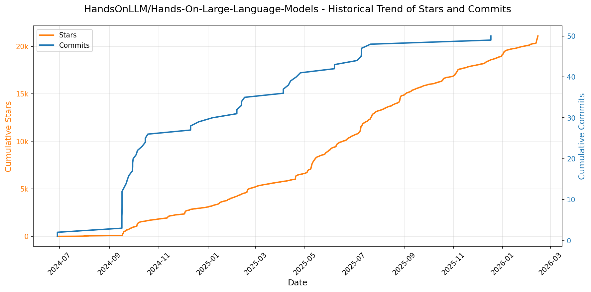
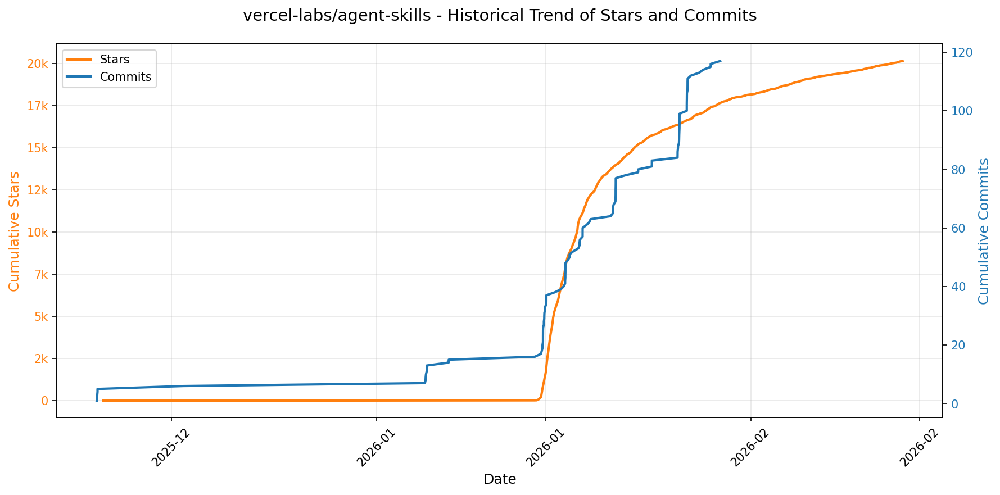
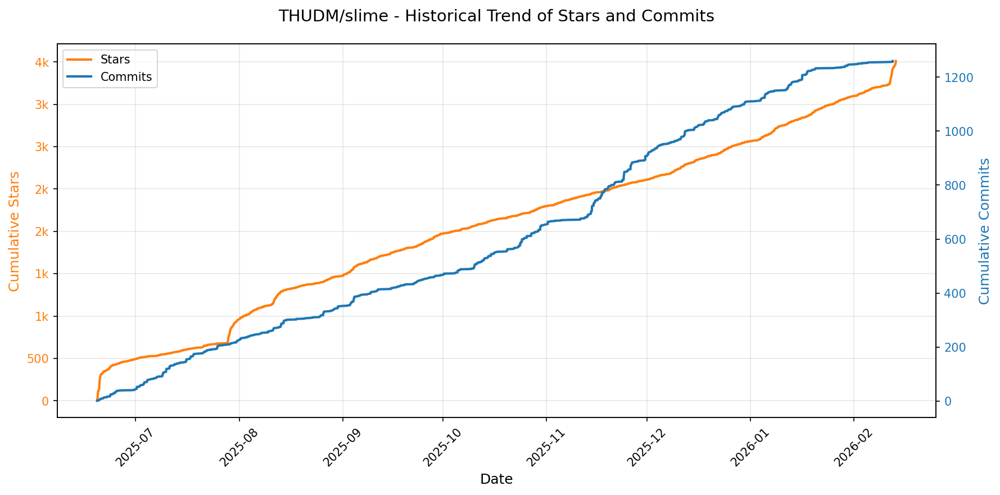
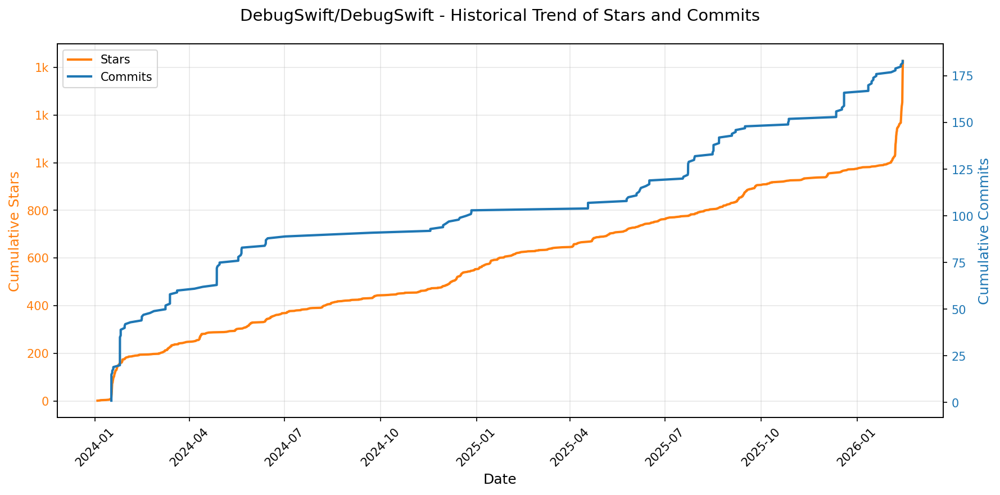
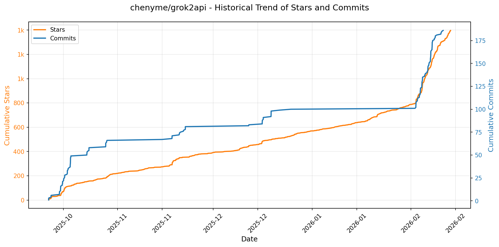
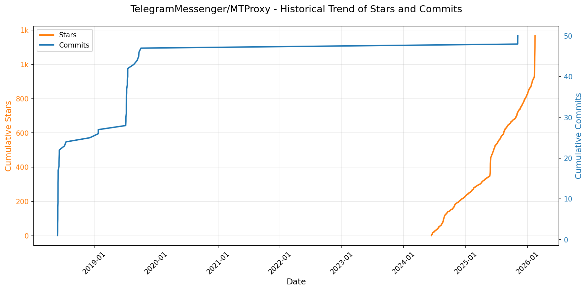

# 🌟 GitHub Trending 概览

> 数据更新于：2026-02-14

---

## 🔍 项目详情

### 1. [anomalyco/opencode](https://github.com/anomalyco/opencode)
- 📅 **创建日期**：2025-04-30  
- 🔄 **最近更新**：2026-02-14  
- ⭐ **Stars**：182,010（日 +699｜周 +5038｜月 +43229）  
- 📝 **描述**：The open source coding agent.  

<b>📈 Star 与 Commit 历史趋势</b>

> *蓝色：累计 Stars｜橙色：累计 Commits（次 Y 轴）*

<b>📄 README 摘要</b>

1. **该项目做什么？**  
OpenCode 是一个开源的 AI 编程智能体（AI coding agent），旨在为开发者提供终端优先（TUI-first）、可本地运行、与模型无关的智能编程助手。它直接在终端中运行，支持代码理解、生成、重构、调试、跨文件分析等开发任务；同时具备客户端/服务器架构，允许远程控制（如通过移动端驱动本地运行的 OpenCode 实例）。其核心目标是成为完全开源、去厂商锁定、深度集成开发工作流（如 LSP 支持）的下一代编程协作者。

2. **关键特性**  
- **双模式智能代理系统**：内置 `build`（默认，全权限开发代理）和 `plan`（只读分析代理，禁止自动修改文件、执行命令前需显式授权），支持按需切换（Tab 键）；另含 `@general` 子代理处理复杂多步任务。  
- **全平台原生支持**：提供一键安装脚本（curl）、主流包管理器集成（npm/bun/pnpm/yarn、Homebrew、Scoop、Chocolatey、pacman/AUR、Mise、Nix），并发布独立桌面应用（macOS/Windows/Linux，BETA 版）。  
- **高度可定制安装路径**：遵循 XDG 规范，支持环境变量（`$OPENCODE_INSTALL_DIR` / `$XDG_BIN_DIR`）优先级控制安装位置。  
- **模型无关与开放生态**：不绑定任何大模型供应商，原生兼容 Claude、OpenAI、Google Gemini 及本地模型（如 Ollama、Llama.cpp），推荐搭配其自有模型服务 OpenCode Zen 使用。  
- **终端优先架构**：深度优化 TUI 体验，由 Neovim 用户及 terminal.shop 团队打造，支持 LSP（语言服务器协议）开箱即用，强调在纯终端环境中的生产力极限。  
- **多语言文档与社区支持**：提供包括简体中文、繁体中文、日语、韩语、德语、西班牙语等 18 种语言的 README，活跃 Discord 社区及完整在线文档（opencode.ai/docs）。

3. **技术栈**  
- **前端/客户端**：基于终端的 TUI 应用（未明确框架，但设计强调轻量与跨平台），配套 Electron 或 Tauri 类技术构建的桌面端（`.dmg`/`.exe`/`.deb`/AppImage）；Web 控制台（`packages/console/app/`）使用 SVG 图标与响应式 HTML/CSS。  
- **核心运行时**：CLI 工具采用现代 JavaScript/TypeScript 构建（通过 `npm i -g opencode-ai` 分发），支持 Bun/Pnpm/Yarn/NPM 多引擎；安装脚本为 Shell（Bash/Zsh 兼容）。  
- **系统集成**：深度适配 Unix-like 系统（XDG Base Directory）、macOS（Homebrew Cask）、Windows（Scoop/Chocolatey）、Linux 发行版（Debian/RPM/APK/AUR）、跨平台工具链（Mise、Nix）。  
- **协议与扩展性**：内置 LSP 支持，采用 client/server 架构，为未来移动端、Web 端等异构客户端预留接口。

---

### 2. [anthropics/skills](https://github.com/anthropics/skills)
- 📅 **创建日期**：2025-09-22  
- 🔄 **最近更新**：2026-02-14  
- ⭐ **Stars**：109,583（日 +604｜周 +4731｜月 +28242）  
- 📝 **描述**：Public repository for Agent Skills  

<b>📈 Star 与 Commit 历史趋势</b>

> *蓝色：累计 Stars｜橙色：累计 Commits（次 Y 轴）*

<b>📄 README 摘要</b>

1. **该项目做什么？**  
该项目是 Anthropic 官方维护的 Claude 技能（Skills）开源示例仓库，旨在展示如何通过结构化、可复用的“技能包”扩展 Claude 的专业化能力。每个技能是一个独立文件夹，内含 `SKILL.md`（含 YAML 元数据和执行指令），使 Claude 能动态加载并可靠执行特定任务，例如：按企业品牌规范生成文档、基于组织特有流程分析数据、自动化个人事务（如 PDF 表单提取、PPTX 创建）、测试 Web 应用、生成 MCP 服务器等。该仓库本身不运行服务，而是提供可学习、可参考、可复用的技能实现范例与规范参考。

2. **关键特性**  
- **模块化技能设计**：每个技能自包含于独立文件夹，以 `SKILL.md` 为核心，通过声明式 YAML 前置元数据（`name`/`description`）和自然语言指令定义行为，无需代码即可配置；  
- **多领域覆盖**：涵盖创意设计（艺术/音乐/视觉）、技术开发（Web 测试/MCP 服务生成）、企业应用（通信模板/品牌合规）及完整文档处理能力（DOCX/PDF/PPTX/XLSX 的创建、编辑与解析）；  
- **生产级参考实现**：公开了支撑 Claude 实际文档功能的源可用（source-available）技能代码（如 `/skills/docx` 等子目录），虽非开源许可（Apache 2.0 仅适用于部分示例技能），但为复杂生产技能开发提供权威参考；  
- **跨平台即插即用**：支持在 Claude Code（插件市场安装）、Claude.ai（付费用户开箱即用）、Claude API（上传自定义技能）三端无缝集成，用户仅需提及技能名称即可触发；  
- **标准化与可扩展性**：配套发布 [Agent Skills 规范](http://agentskills.io)（位于 `/spec` 目录）及官方技能模板（`/template`），推动行业统一技能接口与开发范式。

3. **技术栈**  
- **核心格式**：纯文本 Markdown（`SKILL.md`）+ YAML 前置元数据，零依赖、高可读、易维护；  
- **运行时环境**：完全依赖 Anthropic 的 Claude 模型推理引擎（v3.5+ 及后续版本），技能逻辑由模型在提示工程层面动态解析与执行，**不涉及独立后端服务、数据库或运行时框架**；  
- **集成协议**：基于 Anthropic 定义的 [Agent Skills 标准](http://agentskills.io)，通过 Claude 插件系统（Plugin Marketplace）及 Skills API 实现注册、分发与调用；  
- **许可体系**：混合授权——部分示例技能采用 Apache 2.0 开源许可；文档类核心技能为 source-available（可查看、不可修改/再分发）；整体仓库遵循 Anthropic 开源策略，侧重教育性与互操作性而非自主部署。

---

### 3. [Shubhamsaboo/awesome-llm-apps](https://github.com/Shubhamsaboo/awesome-llm-apps)
- 📅 **创建日期**：2024-04-29  
- 🔄 **最近更新**：2026-02-14  
- ⭐ **Stars**：95,051（日 +476｜周 +2466｜月 +7228）  
- 📝 **描述**：Collection of awesome LLM apps with AI Agents and RAG using OpenAI, Anthropic, Gemini and opensource models.  

<b>📈 Star 与 Commit 历史趋势</b>

> *蓝色：累计 Stars｜橙色：累计 Commits（次 Y 轴）*

<b>📄 README 摘要</b>

1. **该项目做什么？**  
该项目是一个高度结构化的、持续更新的开源精选集（curated collection），专注于展示和归档各类基于大语言模型（LLM）构建的实用化、前沿性应用程序。它不提供单一可运行产品，而是系统性地组织了数百个可复现、可学习、可贡献的LLM应用案例，覆盖从入门级AI代理（Starter Agents）到复杂多智能体协作系统（Multi-agent Teams）、语音交互（Voice Agents）、模型上下文协议（MCP）集成、检索增强生成（RAG）流水线、记忆增强型LLM应用、跨平台内容交互（如Chat with GitHub/PDF/YouTube等），以及LLM优化与微调实践。其核心目标是为开发者、研究者和AI从业者提供一个权威、分层、开箱即用的“LLM应用模式库”，助力快速理解、复现和创新LLM工程化落地场景。

2. **关键特性**  
- **全栈式LLM应用分类体系**：按技术范式（AI Agents、Multi-agent Teams、Voice Agents、MCP、RAG、Memory-enhanced Apps）、应用领域（金融、医疗、法律、教育、游戏、旅行等）和难度层级（Starter / Advanced）进行精细化组织；  
- **模型无关性与多厂商支持**：明确兼容OpenAI、Anthropic（Claude）、Google Gemini、xAI（Grok）、Qwen、Llama系列等闭源及主流开源模型，并标注本地运行能力；  
- **深度技术融合实践**：大量项目整合RAG+Agent、MCP+Browser/GitHub/Notion自动化、Voice+RAG、多模态（Vision RAG、Gemini Multimodal）、自演化架构（Self-Evolving Agent）、混合搜索、Corrective RAG（CRAG）等前沿模式；  
- **工程友好型资源设计**：每个子项目均含独立目录、`requirements.txt` 和详细 `README.md`，支持一键克隆→安装→运行；  
- **教学与生产兼顾**：包含框架速成课（Google ADK、OpenAI Agents SDK）、LLM成本优化工具（Toonify Token、Headroom Context）、微调教程（Gemma 3、Llama 3.2）及“Chat with X”系列集成模板，覆盖学习、实验与部署全链路。

3. **技术栈**  
- **LLM后端**：OpenAI API、Anthropic Claude、Google Gemini API、xAI Grok、Hugging Face Transformers（Qwen、Llama 3.x、Deepseek、Gemma）、Ollama（本地模型运行）；  
- **AI框架与协议**：LangChain、LlamaIndex、CrewAI、Google ADK（Agent Development Kit）、OpenAI Agents SDK、Model Context Protocol（MCP）客户端；  
- **RAG核心组件**：ChromaDB、FAISS、Pinecone、Weaviate（向量数据库）；Unstructured、PyPDF2、youtube-transcript-api（文档解析）；Hybrid Search（关键词+语义）、Corrective RAG、Vision RAG（多模态嵌入）；  
- **语音与多模态**：Speechmatics（ASR/TTS）、Whisper、OpenAI Whisper API、Gemini Vision；  
- **前端与交互**：Streamlit（主流演示界面）、Gradio（快速原型）、Browser Automation（Playwright/Selenium）、WebSocket（实时语音流）；  
- **基础设施与优化**：Docker（部分项目）、FastAPI（RAG-as-a-Service）、Token压缩算法（TOON格式）、上下文智能裁剪（Headroom）、Pydantic（结构化输出）；  
- **其他关键技术**：GitHub API、Notion API、Gmail API、ArXiv API、Substack RSS、YouTube Data API 等第三方服务集成能力。

---

### 4. [obra/superpowers](https://github.com/obra/superpowers)
- 📅 **创建日期**：2025-10-09  
- 🔄 **最近更新**：2026-02-14  
- ⭐ **Stars**：80,018（日 +577｜周 +4994｜月 +35571）  
- 📝 **描述**：An agentic skills framework & software development methodology that works.  

<b>📈 Star 与 Commit 历史趋势</b>

> *蓝色：累计 Stars｜橙色：累计 Commits（次 Y 轴）*

<b>📄 README 摘要</b>

1. **该项目的功能**  
Superpowers 是一个面向编程智能体（coding agents）的完整软件开发工作流增强系统。它不直接替代或重写代码，而是通过一套可组合、自动触发的“技能”（skills）来引导和规范智能体的开发行为。其核心作用是：在智能体开始编码前，强制其先与用户协作完成需求澄清、分块式设计评审、TDD计划制定；随后驱动子智能体（subagents）以严格流程执行任务，并在每个环节嵌入自动化检查（如测试先行、规范符合性审查、代码质量双阶段评审、Git 工作树隔离等），确保整个开发过程具备工程严谨性、可追溯性和人类可控性。

2. **关键特性**  
- **全流程自动化技能触发**：7 大类共 15+ 项预置技能（如 `brainstorming`、`writing-plans`、`subagent-driven-development`、`test-driven-development` 等），按开发阶段自动激活，无需手动调用；  
- **强约束式工程实践**：强制执行 TDD（RED-GREEN-REFACTOR）、YAGNI、DRY、系统化调试（四阶段根因分析）、防御性验证（`verification-before-completion`）；  
- **人机协同决策机制**：设计分块呈现供人工确认、计划逐项审批、关键问题阻断式反馈（`requesting-code-review` 中的严重级拦截）、分支收尾多选项决策（合并/PR/丢弃等）；  
- **子智能体驱动开发（Subagent-Driven Development）**：为每个细粒度任务（2–5 分钟）派生独立子智能体，执行「规范符合性审查 → 代码质量审查」两阶段自动评审，支持数小时无人干预的自主推进；  
- **环境无关的跨平台支持**：原生适配 Claude Code（插件市场一键安装）、Codex 与 OpenCode（通过远程指令加载配置），并提供各平台专属安装文档；  
- **可扩展技能生态**：内置 `writing-skills` 技能，支持开发者遵循标准范式创建、测试和贡献新技能，所有技能源码开放于仓库中。

3. **技术栈**  
- **运行载体**：基于第三方大模型编程助手平台（Claude Code、Codex、OpenCode），不依赖自研模型或推理服务；  
- **架构模式**：声明式技能（skill）驱动，每个技能为独立功能模块（以 Markdown + 指令模板定义，部分含验证逻辑）；  
- **集成方式**：Claude Code 使用插件系统（`/plugin install`）；Codex/OpenCode 采用远程指令加载（`Fetch and follow instructions from ...`）；  
- **版本与更新**：技能内容托管于 GitHub 仓库（`obra/superpowers`），通过插件命令（`/plugin update`）实现全自动热更新；  
- **基础设施依赖**：利用 Git 工作树（`using-git-worktrees`）、本地测试运行器（隐含于 TDD 流程）、标准 CLI 环境；无后端服务、数据库或专用服务器组件。

---

### 5. [openclaw/openclaw](https://github.com/openclaw/openclaw)
- 📅 **创建日期**：2025-11-24  
- 🔄 **最近更新**：2026-02-14  
- ⭐ **Stars**：77,321（日 +3075｜周 +21374｜月 +77321）  
- 📝 **描述**：Your own personal AI assistant. Any OS. Any Platform. The lobster way. 🦞   

<b>📈 Star 与 Commit 历史趋势</b>

> *蓝色：累计 Stars｜橙色：累计 Commits（次 Y 轴）*

<b>📄 README 摘要</b>

1. **项目功能**  
OpenClaw 是一个完全本地化、用户自托管的个人 AI 助手系统，核心目标是让用户在自有设备上运行一个“感觉像本地、响应快、始终在线”的单用户 AI 助手。它不依赖中心化云服务，而是通过轻量级 **Gateway（网关）控制平面**统一调度多通道通信、多智能体协作、设备能力调用与可视化交互。助手可接入并响应 14+ 主流通讯平台（WhatsApp / Telegram / Slack / Discord / Signal / iMessage / BlueBubbles / Microsoft Teams / Google Chat / Matrix / Zalo / Zalo Personal / WebChat / macOS/iOS/Android 原生消息），支持语音唤醒（Voice Wake）、实时语音对话（Talk Mode）、跨平台 Live Canvas 可视化工作区，并能执行浏览器自动化、屏幕录制、摄像头调用、定位获取、系统命令等深度设备集成操作。

2. **关键特性**  
- **本地优先网关架构**：单一 WebSocket 控制平面（`ws://127.0.0.1:18789`），统一管理会话、通道、工具、事件、定时任务（cron）、Webhook 和远程调试；内置 Control UI 与 WebChat 界面。  
- **全栈多通道支持**：原生集成 Baileys（WhatsApp）、grammY（Telegram）、Bolt（Slack）、discord.js（Discord）等主流 SDK，并扩展支持 BlueBubbles（iMessage）、Zalo、Matrix 等区域性/小众平台；支持群组路由（提及触发、回复标签、分块处理）。  
- **多智能体隔离与路由**：基于 Workspace + Session 实现账户/频道/联系人级隔离，支持 `main` 会话、群组会话、激活模式（mention/always）、队列策略与回复回传机制。  
- **跨平台语音与交互**：macOS/iOS/Android 全平台语音唤醒（基于 ElevenLabs）、免提对话（Talk Mode）、PTT 按住说话，结合系统级权限（TCC）安全调用麦克风/扬声器。  
- **Live Canvas + A2UI 可视化工作区**：由 AI 助手驱动的实时渲染画布，支持 A2UI 组件协议（push/reset/eval/snapshot），可在 macOS 菜单栏、iOS/Android App 中同步呈现。  
- **设备节点（Nodes）体系**：将设备能力抽象为可远程调用的 `node.invoke` 接口，包括 `system.run`（终端命令）、`system.notify`（通知）、`camera.snap`、`screen.record`、`location.get`、`canvas.*` 等，严格遵循 macOS/iOS/Android 权限模型（TCC）。  
- **安全默认策略**：DM 私信默认启用配对验证（`dmPolicy="pairing"`），拒绝未授权用户输入；支持 OAuth（Anthropic/OpenAI）与 API Key 双认证、模型故障转移（failover）、会话上下文裁剪（pruning）、使用量追踪与细粒度日志审计。  
- **开箱即用的工程体验**：提供终端向导（`openclaw onboard`）、CLI 全流程控制（gateway/agent/message/pairing/doctor）、Nix/Docker 声明式部署、Tailscale Serve/Funnel 远程访问、SSH 隧道支持及自动化的 `openclaw doctor` 健康检查。

3. **技术栈**  
- **运行时**：Node.js ≥22（主运行环境），支持 npm / pnpm / bun；TypeScript 为主开发语言，使用 `tsx` 直接运行源码。  
- **核心框架**：基于 WebSocket 的自研 Gateway 控制平面；RPC 协议驱动 Pi Agent 运行时；A2UI 协议支撑 Canvas 渲染；CDP（Chrome DevTools Protocol）驱动专用 Chromium 浏览器自动化。  
- **前端与 UI**：WebChat 内嵌于 Gateway；macOS Menu Bar App（Swift + WebView）；iOS/Android 原生节点（Swift/Kotlin）；Canvas 使用 WebGPU/WebGL 渲染（文档指向 A2UI 规范）。  
- **语音与媒体**：ElevenLabs 提供 TTS；FFmpeg（隐含于音视频 pipeline）；Whisper 或兼容 ASR 引擎（文档提及 transcription hooks）；媒体生命周期管理（临时文件、尺寸限制、转码钩子）。  
- **部署与运维**：支持 systemd（Linux）、launchd（macOS）守护进程；Tailscale Serve/Funnel 实现零配置内网穿透；Docker 容器化；Nix 表达式（`nix-openclaw`）实现声明式配置与可重现构建；SSH 隧道作为备用远程方案。  
- **安全与认证**：OAuth 2.0（Anthropic/OpenAI）、API Key 管理、密码保护（Tailscale Funnel）、本地 Allowlist 存储、权限状态实时校验（TCC）、会话级 elevated 模式切换（`/elevated on|off`）。

---

### 6. [google/langextract](https://github.com/google/langextract)
- 📅 **创建日期**：2025-07-08  
- 🔄 **最近更新**：2026-02-14  
- ⭐ **Stars**：54,242（日 +631｜周 +8021｜月 +13131）  
- 📝 **描述**：A Python library for extracting structured information from unstructured text using LLMs with precise source grounding and interactive visualization.  

<b>📈 Star 与 Commit 历史趋势</b>

> *蓝色：累计 Stars｜橙色：累计 Commits（次 Y 轴）*

<b>📄 README 摘要</b>

1. **项目功能**  
LangExtract 是一个基于大语言模型（LLM）的 Python 库，专注于从非结构化文本（如临床笔记、放射报告、文学作品等）中**高精度提取结构化信息**。它不依赖预训练或微调，而是通过用户定义的自然语言指令（prompt）和少量示例（few-shot examples），驱动 LLM 执行可复现、可验证的信息抽取任务，并严格将每个提取结果**锚定到原文中的精确字符位置**，实现端到端的源文本可追溯性。

2. **核心特性**  
- ✅ **精准源文本定位（Source Grounding）**：为每个提取项（entity）标注其在原始文本中的起始/结束字符偏移量，支持可视化高亮与人工核查；  
- ✅ **强结构化输出保障**：利用受控生成（如 Gemini 的 schema-constrained decoding）和示例引导，强制模型输出符合用户定义类别的 JSON 结构化结果（如 `character`/`emotion`/`relationship`）；  
- ✅ **长文档优化处理**：采用多轮抽取（`extraction_passes`）、自适应分块（`max_char_buffer`）、并行处理（`max_workers`）策略，显著提升万字级以上文档的召回率与准确性；  
- ✅ **交互式可视化审查**：一键生成独立 HTML 文件，支持动态搜索、上下文展开、实体批量筛选及动画高亮，便于大规模结果人工审核；  
- ✅ **多模态模型后端支持**：原生兼容 Google Gemini（云）、OpenAI（需额外安装）、本地 Ollama 模型（如 `gemma2:2b`），并提供插件化接口扩展第三方模型；  
- ✅ **零微调领域适配**：仅需 1–3 个高质量示例即可快速适配新领域（如药物信息提取、放射科报告结构化），无需修改模型权重；  
- ✅ **生产就绪能力**：支持 Vertex AI 批处理（降本增效）、Docker 容器化部署、环境变量/API Key 安全管理、`.env` 配置及服务账户认证。

3. **技术栈**  
- **编程语言**：Python 3.10+（核心实现）；  
- **核心依赖**：`google-generativeai`（Gemini）、`openai`（可选，需 `langextract[openai]`）、`ollama`（本地模型）、`pydantic`（数据建模与校验）、`rich`（CLI 友好输出）；  
- **开发工具链**：`pyproject.toml`（现代打包）、`pytest` + `tox`（多版本测试）、`pylint`/`pyink`/`isort`（代码规范）、`pre-commit`（自动化钩子）、`Docker`（容器化）；  
- **部署与集成**：支持 Google Cloud Vertex AI 批处理 API、Hugging Face Spaces 在线 Demo（RadExtract）、Project Gutenberg 网络直读、JSONL 标准数据格式互通；  
- **许可协议**：Apache 2.0 开源许可证，医疗场景额外遵循 Google Health AI 开发者条款。

---

### 7. [remotion-dev/remotion](https://github.com/remotion-dev/remotion)
- 📅 **创建日期**：2020-06-23  
- 🔄 **最近更新**：2026-02-14  
- ⭐ **Stars**：36,521（日 +125｜周 +1143｜月 +11278）  
- 📝 **描述**：🎥      Make videos programmatically with React  

<b>📈 Star 与 Commit 历史趋势</b>

> *蓝色：累计 Stars｜橙色：累计 Commits（次 Y 轴）*

<b>📄 README 摘要</b>

1. **该项目的功能**  
Remotion 是一个基于 React 的视频生成框架，允许开发者使用 React 组件、JavaScript 逻辑和 Web 技术（如 CSS、Canvas、SVG、WebGL）以编程方式（即“代码驱动”）创建高质量、可复用、可参数化的视频内容。它将视频视为时间轴上的 React 渲染过程，支持帧级控制、动态数据驱动动画、交互式预览及导出为 MP4/WebM 等格式，适用于制作营销视频、个性化年度回顾（如 GitHub Unwrapped）、教程动画、数据可视化视频等。

2. **核心功能**  
- ✅ **React 原生视频开发**：在 React 组件中直接编写视频逻辑，支持 Hooks、状态管理、Props 传参与组件复用；  
- ✅ **实时预览与热重载（Fast Refresh）**：开发时可在浏览器中即时预览视频效果，支持逐帧调试与时间轴跳转；  
- ✅ **多平台渲染输出**：支持本地 CLI 渲染（Node.js）、无头 Chrome 渲染，可导出为 MP4、WebM、GIF 及逐帧 PNG 序列；  
- ✅ **响应式与动态视频生成**：通过变量、API 调用、数学计算或外部数据（如 JSON、CSV）驱动内容变化，实现个性化/批量视频生成（如千人千面的定制化视频）；  
- ✅ **高性能与扩展能力**：内置缓存机制、并行渲染、自定义序列帧编码、FFmpeg 集成，并支持 WebGL/Three.js 等高级图形库；  
- ✅ **生产就绪工具链**：提供 CLI 工具（`create-video`）、TypeScript 支持、SSR 兼容性、CI/CD 友好部署方案，以及企业级渲染集群支持（Remotion Cloud）。

3. **技术栈**  
- **核心框架**：React（v18+）、TypeScript（首选语言）；  
- **渲染引擎**：基于 Chromium（Puppeteer / Playwright）进行无头浏览器渲染，利用 Canvas 2D/WebGL 进行像素级控制；  
- **构建与工具**：Vite（默认模板）、Webpack（可选）、Node.js（v18+）；  
- **视频处理**：FFmpeg（后端编码）、WebCodecs（实验性浏览器原生编码）；  
- **生态集成**：完全兼容 npm 包生态，支持接入 D3.js、Three.js、Framer Motion、Lottie、SVGR 等前端库；  
- **部署与服务**：支持 Vercel、Netlify 静态托管预览，Remotion Cloud 提供云端分布式渲染服务。

---

### 8. [asgeirtj/system_prompts_leaks](https://github.com/asgeirtj/system_prompts_leaks)
- 📅 **创建日期**：2025-05-03  
- 🔄 **最近更新**：2026-02-14  
- ⭐ **Stars**：31,424（日 +124｜周 +992｜月 +6414）  
- 📝 **描述**：Collection of extracted System Prompts from popular chatbots like ChatGPT, Claude & Gemini  

<b>📈 Star 与 Commit 历史趋势</b>

> *蓝色：累计 Stars｜橙色：累计 Commits（次 Y 轴）*

---

### 9. [patchy631/ai-engineering-hub](https://github.com/patchy631/ai-engineering-hub)
- 📅 **创建日期**：2024-10-21  
- 🔄 **最近更新**：2026-02-14  
- ⭐ **Stars**：29,383（日 +350｜周 +1362｜月 +3386）  
- 📝 **描述**：In-depth tutorials on LLMs, RAGs and real-world AI agent applications.  

<b>📈 Star 与 Commit 历史趋势</b>

> *蓝色：累计 Stars｜橙色：累计 Commits（次 Y 轴）*

<b>📄 README 摘要</b>

1. **该项目做什么？**  
AI Engineering Hub 是一个面向 AI 工程实践的开源资源库，旨在为初学者、从业者和研究人员提供可直接上手的**生产级 AI 项目模板与实战教程**。它不侧重理论教学，而是聚焦于构建真实可用的 AI 系统，涵盖从单模块工具（如 OCR、本地聊天界面）到多智能体协作系统（如自动研报生成、品牌监控）、再到企业级部署方案（如私有化 Agentic RAG API、细调流水线、多模态文档处理）的全栈能力。所有项目均强调“开箱即用”（production-ready），支持本地运行、快速适配与规模化扩展。

2. **核心功能**  
- **分层项目体系**：按难度分级组织 93+ 项目（22 个入门 / 48 个中级 / 23 个高级），覆盖学习路径全周期；  
- **技术场景全覆盖**：深度整合 LLM 应用（本地 ChatGPT 克隆、Thinking UI）、RAG（基础/可信/多模态/视频/音频 RAG）、AI Agent（CrewAI/AutoGen/Motia 驱动的多智能体工作流）、MCP（Model Context Protocol）生态（Cursor 集成、Web 自动化、FireCrawl 联动）、语音/视觉/代码/金融/法律等垂直领域落地；  
- **工程化能力强化**：包含模型对比评测（Opik/CometML）、可观测性、低延迟检索（<15ms）、私有化部署（LitServe）、细调（Unsloth + Ollama）、合成数据（SDV）、记忆增强（Zep/Graphiti）及 NotebookLM 级复杂应用克隆等生产就绪特性。

3. **技术栈**  
- **大模型层**：Llama 3.2/3.3/4、DeepSeek-R1/Janus-Pro、Gemma-3、Qwen 2.5 VL / 3 / 3-Coder、Gemini、Claude、O3、Sonnet4 等前沿开源与商用模型；  
- **框架与工具链**：LlamaIndex、Ollama、Qdrant、Milvus、Groq、SambaNova、FireCrawl、AssemblyAI、Cartesia、Stagehand、CrewAI、AutoGen、Motia、Zep、Graphiti、Opik、CometML、Dockling（IBM）、TensorLake、GroundX、NVIDIA NIM、Pixeltable、MindsDB；  
- **前端与部署**：Streamlit、Chainlit、LitServe、React（部分高级项目）、Supabase；  
- **基础设施与协议**：MCP（Model Context Protocol）深度集成，支持 Cursor、Web 浏览、多源数据统一接入；  
- **开发范式**：强调本地化（100% offline）、模块化（可插拔组件）、可复现（明确依赖与运行说明）及工程最佳实践（测试、文档、CI 友好结构）。

---

### 10. [thedotmack/claude-mem](https://github.com/thedotmack/claude-mem)
- 📅 **创建日期**：2025-08-31  
- 🔄 **最近更新**：2026-02-14  
- ⭐ **Stars**：28,179（日 +341｜周 +3702｜月 +14407）  
- 📝 **描述**：A Claude Code plugin that automatically captures everything Claude does during your coding sessions, compresses it with AI (using Claude's agent-sdk), and injects relevant context back into future sessions.  

<b>📈 Star 与 Commit 历史趋势</b>

> *蓝色：累计 Stars｜橙色：累计 Commits（次 Y 轴）*

<b>📄 README 摘要</b>

1. **项目功能**  
Claude-Mem 是一个专为 Anthropic 的 **Claude Code**（AI 编程助手）设计的**持久化记忆压缩系统**。它在用户每次会话中自动捕获工具调用、代码操作、用户指令等上下文事件（称为“observations”），生成语义摘要，并将其结构化存储，使 Claude 在后续会话中能无缝恢复并复用历史知识——即使会话中断、重启或跨设备使用，项目上下文仍保持连续性，显著提升 AI 编程代理的长期任务理解与协作能力。

2. **核心特性**  
- ✅ **持久化记忆**：上下文跨会话自动保留，无需手动重载；  
- ✅ **渐进式披露（Progressive Disclosure）**：分三层按需加载记忆（索引 → 时间线 → 详情），实时显示 token 消耗，优化成本；  
- ✅ **技能化智能搜索**：内置 `mem-search` 技能与 5 个标准 MCP（Model Context Protocol）工具（`search`/`timeline`/`get_observations`/`save_memory`/`__IMPORTANT`），支持自然语言查询 + 类型/日期/项目过滤；  
- ✅ **本地 Web 查看器**：运行于 `http://localhost:37777`，提供实时记忆流、观察详情、API 接口（如 `/api/observation/{id}`）及可视化检索界面；  
- ✅ **Claude Desktop 集成**：直接在桌面版对话中调用记忆搜索；  
- ✅ **隐私保护机制**：支持 `<private>` 标签自动屏蔽敏感内容，不存入数据库；  
- ✅ **细粒度上下文注入控制**：通过配置精确指定哪些记忆片段参与当前会话提示工程；  
- ✅ **全自动无感运行**：依赖生命周期钩子（SessionStart/PostToolUse/SessionEnd 等 6 个脚本）静默工作，零手动干预；  
- ✅ **引用与溯源**：每条观察分配唯一 ID，支持一键引用和审计；  
- ✅ **Beta 实验通道**：提供 Endless Mode（仿生长时记忆架构）等前沿功能，可通过 Web UI 切换版本。

3. **技术栈**  
- **运行时与服务层**：Bun（作为 HTTP Worker 服务管理器与轻量级 JS 运行时）、Node.js ≥18.0.0（插件主环境）；  
- **数据库**：SQLite 3（嵌入式，含 FTS5 全文搜索支持）用于结构化存储会话、观察、摘要；  
- **向量搜索**：ChromaDB（本地部署）实现语义检索，与 SQLite 关键词搜索构成混合搜索架构；  
- **Python 依赖**：uv（自动安装）用于管理向量搜索相关 Python 包（如 `chromadb`, `sentence-transformers`）；  
- **前端与交互**：TypeScript 构建 Web 查看器 UI（含 GIF 动态预览）、MCP 工具协议集成；  
- **基础设施**：基于 Claude Agent SDK 开发，深度适配 Claude Code 插件生态；  
- **部署扩展**：支持 OpenClaw 网关一键部署（`curl` 安装脚本），集成 Telegram/Discord/Slack 实时通知。

---

### 11. [ChromeDevTools/chrome-devtools-mcp](https://github.com/ChromeDevTools/chrome-devtools-mcp)
- 📅 **创建日期**：2025-09-11  
- 🔄 **最近更新**：2026-02-14  
- ⭐ **Stars**：24,840（日 +345｜周 +1333｜月 +3877）  
- 📝 **描述**：Chrome DevTools for coding agents  

<b>📈 Star 与 Commit 历史趋势</b>

> *蓝色：累计 Stars｜橙色：累计 Commits（次 Y 轴）*

<b>📄 README 摘要</b>

1. **项目功能**  
`chrome-devtools-mcp` 是一个 Model-Context-Protocol（MCP）标准兼容的服务端程序，旨在让 AI 编程助手（如 Gemini、Claude、Cursor、Copilot、Codex 等）通过标准化协议**安全、可靠地控制和深度检测正在运行的 Chrome 浏览器实例**。它桥接 AI 助手与 Chrome DevTools 协议（CDP），使大模型能够执行真实浏览器自动化、全链路调试、性能分析及网页交互等任务，而无需用户手动操作浏览器。

2. **核心特性**  
- **性能洞察能力**：支持录制完整 Chrome 性能轨迹（trace），自动提取可操作的性能瓶颈分析，并可选集成 Google CrUX（Chrome 用户体验报告）API 获取真实用户场数据（field data），实现实验室数据（lab data）与现场数据的融合分析。  
- **高级调试能力**：提供对网络请求的细粒度分析（列表/详情查询）、带源码映射（source-mapped）的控制台日志捕获、全屏/区域截图、DOM 快照、JavaScript 脚本动态执行等能力。  
- **高可靠性自动化**：基于 Puppeteer 深度封装，内置智能等待机制（如元素就绪、导航完成、网络空闲等），确保操作结果稳定可预期；支持页面新建/切换/关闭、表单填充、点击/拖拽/悬停/按键/文件上传等 8 类输入操作，以及设备模拟（如响应式视口、UA 伪装）和页面缩放。  
- **灵活部署与连接模式**：既可自动启动隔离的 Chrome 实例（支持 Stable/Canary/Beta/Dev 多通道、headless 模式、自定义用户数据目录），也可连接已运行的远程调试 Chrome（通过 `--browser-url` 或 `--ws-endpoint`），并支持 WebSocket 自定义请求头、代理配置、证书忽略等企业级场景参数。

3. **技术栈**  
- **运行时环境**：Node.js（≥ v20.19 LTS）  
- **浏览器引擎**：Google Chrome（当前稳定版或更新版本），通过 Chrome DevTools Protocol（CDP）通信  
- **底层驱动**：[Puppeteer](https://github.com/puppeteer/puppeteer)（v22+，用于进程管理、页面生命周期控制与自动化操作）  
- **协议标准**：完全遵循 [Model-Context-Protocol (MCP)](https://modelcontextprotocol.org/) 规范，提供标准化工具注册与调用接口  
- **开发与分发**：npm 包管理（`chrome-devtools-mcp`），支持 `npx` 零配置快速启动  
- **扩展能力**：支持通过 CLI 参数动态启用/禁用功能模块（如 `--category-performance=false`）、自定义 Chrome 启动参数、日志调试（`DEBUG=*`）、使用统计与隐私控制（`--no-usage-statistics`）等。

---

### 12. [virattt/dexter](https://github.com/virattt/dexter)
- 📅 **创建日期**：2025-10-14  
- 🔄 **最近更新**：2026-02-14  
- ⭐ **Stars**：22,474（日 +196｜周 +4330｜月 +8530）  
- 📝 **描述**：An autonomous agent for deep financial research  

<b>📈 Star 与 Commit 历史趋势</b>

> *蓝色：累计 Stars｜橙色：累计 Commits（次 Y 轴）*

<b>📄 README 摘要</b>

1. **项目功能**  
Dexter 是一个面向金融研究的自主式 AI 代理（Autonomous Financial Research Agent），能够对复杂金融问题进行端到端的自主分析：接收自然语言提问 → 拆解为多步研究计划 → 调用实时市场数据工具执行任务 → 自我验证与反思 → 迭代优化直至生成数据支撑、逻辑严谨的答案。其核心定位是“金融领域的 Claude Code”，专为高可信度、可追溯、可审计的财务分析场景设计，支持从上市公司财报（利润表、资产负债表、现金流量表）获取结构化数据，并内置安全机制防止无限循环或失控执行。

2. **关键特性**  
- **智能任务规划（Intelligent Task Planning）**：自动将模糊/复杂的金融问题（如“对比苹果与英伟达过去三年的盈利质量与资本效率”）分解为原子化、可执行的研究步骤；  
- **自主工具调用与执行（Autonomous Execution）**：动态选择并调用适配的金融数据 API（如 Financial Datasets）、网络搜索工具（Exa/Tavily）等，完成数据采集；  
- **自省式验证与迭代（Self-Validation & Iteration）**：每步执行后生成推理日志（thinking）、工具返回原始结果（tool_result）及 LLM 摘要，并基于反馈决定是否重试或终止；  
- **实时权威财务数据接入**：直连 Institutional-grade 金融数据库，免费支持 AAPL/NVDA/MSFT 等主流标的的年度/季度财报数据；  
- **全链路可追溯调试（Debuggable Scratchpad）**：每次查询生成独立 JSONL 日志文件，完整记录原始问题、每步工具调用参数/结果/摘要、推理过程，支持精准复现与归因；  
- **多模态交互支持**：除 CLI 交互外，原生集成 WhatsApp 网关，实现通过个人 WhatsApp 聊天窗口零门槛使用；  
- **生产级可靠性保障**：内置循环检测、最大步数限制、多 API 后备（如 Exa 失败则降级至 Tavily）、LangSmith 全流程追踪与 LLM-as-Judge 自动化评测体系。

3. **技术栈**  
- **运行时**：Bun（v1.0+，作为 Node.js 替代，提供极速依赖安装与脚本执行）；  
- **核心语言**：TypeScript（强类型保障金融逻辑严谨性）；  
- **AI 模型层**：支持多后端大模型接口，包括 OpenAI（默认）、Anthropic、Google Gemini、xAI、OpenRouter，且兼容本地 Ollama 模型（通过 `OLLAMA_BASE_URL` 配置）；  
- **数据服务**：  
  - 主要金融数据源：Financial Datasets API（提供标准化财报结构化数据）；  
  - 补充网络搜索：Exa API（首选）、Tavily API（备用）；  
- **可观测性与评测**：LangSmith（追踪所有 LLM 调用与工具链）、LLM-as-Judge 自动化评估框架；  
- **通信集成**：WhatsApp Business API 网关（基于 Node.js 运行，确保消息稳定性）；  
- **工程实践**：环境变量驱动配置（`.env`）、模块化架构（明确划分 `src/evals`、`src/gateway` 等子系统）、JSONL 格式轻量级日志（`.dexter/scratchpad/`）。

---

### 13. [iOfficeAI/AionUi](https://github.com/iOfficeAI/AionUi)
- 📅 **创建日期**：2025-08-07  
- 🔄 **最近更新**：2026-02-14  
- ⭐ **Stars**：21,670（日 +341｜周 +3366｜月 +14501）  
- 📝 **描述**：Free, local, open-source 24/7 Cowork and OpenClaw for Gemini CLI, Claude Code, Codex, OpenCode, Qwen Code, Goose CLI, Auggie, and more | 🌟 Star if you like it!  

<b>📈 Star 与 Commit 历史趋势</b>

> *蓝色：累计 Stars｜橙色：累计 Commits（次 Y 轴）*

---

### 14. [eigent-ai/eigent](https://github.com/eigent-ai/eigent)
- 📅 **创建日期**：2025-07-29  
- 🔄 **最近更新**：2026-02-14  
- ⭐ **Stars**：21,248（日 +71｜周 +430｜月 +11739）  
- 📝 **描述**：Eigent: The Open Source Cowork Desktop to Unlock Your Exceptional Productivity.  

<b>📈 Star 与 Commit 历史趋势</b>

> *蓝色：累计 Stars｜橙色：累计 Commits（次 Y 轴）*

<b>📄 README 摘要</b>

1. **项目功能**  
Eigent 是一个开源的“协作办公桌面应用”（Cowork Desktop），旨在帮助用户构建、管理和部署**定制化的多智能体AI工作团队（Multi-Agent Workforce）**，将复杂业务流程自动化。它并非通用聊天工具，而是面向生产力场景的AI协作者系统：通过多个专业分工的AI智能体（如开发者代理、浏览器代理、文档代理、多模态代理）并行协作，动态拆解任务、调用工具、执行代码、浏览网页、生成报告，并支持人工介入（Human-in-the-Loop），最终完成端到端的自动化工作流（例如生成旅行行程、分析财务数据、撰写市场研究报告、SEO审计、PDF签名等）。

2. **核心特性**  
- **动态多智能体工作队列（Workforce）**：预置专业化AI代理，支持任务自动分解与并行执行；  
- **全本地化与隐私优先**：支持完全离线部署，数据不出本地，兼容 vLLM、Ollama、LM Studio 等本地大模型运行时；  
- **Model Context Protocol（MCP）深度集成**：内置大量开箱即用的MCP工具（覆盖Web浏览、代码执行、Notion/Google/Slack等），并支持用户自定义安装内部API或函数工具；  
- **人机协同闭环（Human-in-the-Loop）**：当任务存在歧义、失败或需决策时，自动暂停并请求用户输入，保障可靠性；  
- **企业级能力**：提供SSO单点登录、细粒度访问控制、可扩展的企业部署方案及SLA服务；  
- **100% 开源透明**：全部代码开放（Apache 2.0 许可），支持审查、修改与二次开发，无黑盒组件。

3. **技术栈**  
- **后端**：基于 Python 构建，采用 **FastAPI** 作为Web框架，**Uvicorn** 异步服务器，**uv** 作为高性能包管理器；认证体系为 **OAuth 2.0 + Passlib**；多智能体编排底层依赖开源框架 **CAMEL-AI**；  
- **前端与桌面层**：使用 **React + TypeScript** 开发，通过 **Electron** 打包为跨平台桌面应用；UI 采用 **Tailwind CSS + Radix UI + Lucide React + Framer Motion**；状态管理使用 **Zustand**；可视化流程编辑器基于 **React Flow**。

---

### 15. [HandsOnLLM/Hands-On-Large-Language-Models](https://github.com/HandsOnLLM/Hands-On-Large-Language-Models)
- 📅 **创建日期**：2024-06-28  
- 🔄 **最近更新**：2026-02-14  
- ⭐ **Stars**：21,163（日 +259｜周 +903｜月 +1407）  
- 📝 **描述**：Official code repo for the O'Reilly Book - "Hands-On Large Language Models"  

<b>📈 Star 与 Commit 历史趋势</b>

> *蓝色：累计 Stars｜橙色：累计 Commits（次 Y 轴）*

<b>📄 README 摘要</b>

1. **该项目做什么？**  
该项目是配套技术图书《Hands-On Large Language Models》（中文可译为《动手实践大型语言模型》）的官方代码仓库，提供书中全部12章内容所对应的可运行示例代码（Jupyter Notebook）。其核心目标是通过**近300幅原创可视化图解**与**实践导向的代码实验**，系统性地帮助读者理解、掌握并动手实现大语言模型（LLM）的关键原理与应用技术，涵盖从基础概念（如分词、嵌入）到前沿实践（如RAG、多模态LLM、模型微调）的完整知识链。

2. **关键特性**  
- **全章节代码覆盖**：包含12个结构化章节的Colab Notebook，每章对应一个核心主题（如Transformer内部机制、提示工程、语义搜索、RAG、多模态LLM、文本嵌入模型构建、BERT/生成式模型微调等）；  
- **开箱即用的云环境支持**：所有示例优先适配Google Colab（免费T4 GPU），提供一键运行能力，并附有本地环境搭建指南（含conda配置）；  
- **强可视化教学设计**：紧密配合“图解式学习”理念，代码示例注重结果可视化（如注意力热力图、嵌入空间投影、聚类分布等），强化概念理解；  
- **持续扩展的补充资源**：提供独立于主书的“Bonus内容”，包括对Mamba、量化（Quantization）、MoE、推理型LLM、Stable Diffusion、DeepSeek-R1等前沿主题的深度图解指南；  
- **工业级实践导向**：覆盖文本分类、聚类、主题建模、检索增强生成（RAG）、Prompt工程、模型微调等真实场景任务，强调可迁移的技术能力。

3. **技术栈**  
- **核心框架**：PyTorch（主要深度学习后端）、Hugging Face Transformers（预训练模型加载与推理）、Sentence-Transformers（文本嵌入）；  
- **NLP与AI库**：scikit-learn（传统机器学习与评估）、UMAP / HDBSCAN（降维与聚类）、datasets（数据集处理）、tokenizers（分词器）；  
- **开发与部署环境**：Google Colab（主力运行平台）、Conda（环境管理）、Python（主流版本兼容）；  
- **辅助工具**：Matplotlib / Seaborn（可视化绘图）、Pandas（数据处理）、NumPy（数值计算）；  
- **模型类型覆盖**：BERT类表示模型、GPT类生成模型、多模态模型（如CLIP）、开源LLM（如Llama、Phi等，依具体章节而定）。

---

### 16. [linshenkx/prompt-optimizer](https://github.com/linshenkx/prompt-optimizer)
- 📅 **创建日期**：2025-02-12  
- 🔄 **最近更新**：2026-02-14  
- ⭐ **Stars**：20,963（日 +166｜周 +1305｜月 +2434）  
- 📝 **描述**：一款提示词优化器，助力于编写高质量的提示词  

<b>📈 Star 与 Commit 历史趋势</b>

> *蓝色：累计 Stars｜橙色：累计 Commits（次 Y 轴）*

<b>📄 README 摘要</b>

1. **项目功能**  
Prompt Optimizer（提示词优化器）是一个面向开发者与AI从业者的专业级提示工程（Prompt Engineering）工具，核心目标是**系统性提升AI提示词的质量与效果**。它不直接运行大模型，而是通过智能分析、结构化重构和多维测试，辅助用户将模糊、低效的原始提示词转化为高精度、高鲁棒性、可复用的优质提示词。支持三大典型应用场景：① 角色扮演对话（激发小模型潜力，保障一致性）；② 知识图谱等结构化输出（降低对模型能力依赖，提升生产环境稳定性）；③ 创意生成（如诗歌写作），帮助用户从灵感出发精准定义主题、意象、风格与情感，实现人机协同创作。

2. **关键特性**  
- **双模智能优化**：独立支持系统提示词（System Prompt）与用户提示词（User Prompt）的针对性优化，适配不同LLM角色设定与交互逻辑；  
- **实时对比验证**：内置并行测试面板，可同步执行原始提示与优化后提示，直观比对输出质量、格式合规性与响应稳定性；  
- **全栈模型兼容**：深度集成OpenAI、Gemini、DeepSeek、智谱AI（Zhipu）、SiliconFlow等主流文本模型，并支持任意OpenAI兼容接口（如Ollama、vLLM本地部署）；  
- **原生图像生成能力**：内置文生图（T2I）与图生图（I2I）模式，对接Gemini Vision、Seedream等图像模型，支持尺寸、风格等参数精细调控；  
- **高级测试调试套件**：提供上下文变量批量管理、多轮会话模拟、Function Calling（工具调用）测试，覆盖复杂生产级提示场景；  
- **零信任安全架构**：纯客户端执行（Web版/桌面版），所有提示词处理、API密钥调用均在本地完成，数据不经过任何中间服务器；  
- **全平台交付形态**：同时提供在线Web版、跨平台桌面应用（自动更新）、Chrome浏览器插件、Docker容器及Docker Compose编排方案；  
- **MCP协议原生支持**：内置Model Context Protocol服务端，可作为标准化提示优化服务接入Claude Desktop等MCP兼容AI客户端，提供`optimize-user-prompt`、`optimize-system-prompt`、`iterate-prompt`等标准工具；  
- **企业级访问控制**：支持用户名/密码认证（`ACCESS_USERNAME`/`ACCESS_PASSWORD`），保障私有部署安全性。

3. **技术栈**  
- **前端框架**：基于Vue 3 + TypeScript构建，采用Vite作为构建工具，Pinia管理状态；  
- **UI组件库**：使用Naive UI（NUI）实现现代化、高定制化的界面；  
- **桌面应用**：通过Tauri框架封装，利用Rust核心与Webview2/WebKit提供轻量、安全、跨平台的原生体验（替代Electron）；  
- **构建与包管理**：采用pnpm进行高效依赖管理；  
- **部署与运维**：全面支持Docker容器化（镜像托管于Docker Hub及阿里云镜像仓库）、Docker Compose编排、Vercel无服务器部署；  
- **协议与集成**：原生实现MCP（Model Context Protocol）v0.2+服务端，兼容主流MCP客户端；  
- **开发规范**：遵循模块化架构设计，核心逻辑与UI层解耦，配套完整技术文档（含LLM参数配置指南、项目结构说明、多自定义模型接入规范）。

---

### 17. [vercel-labs/agent-skills](https://github.com/vercel-labs/agent-skills)
- 📅 **创建日期**：2025-12-08  
- 🔄 **最近更新**：2026-02-14  
- ⭐ **Stars**：20,226（日 +177｜周 +958｜月 +18313）  
- 📝 **描述**：Vercel's official collection of agent skills  

<b>📈 Star 与 Commit 历史趋势</b>

> *蓝色：累计 Stars｜橙色：累计 Commits（次 Y 轴）*

<b>📄 README 摘要</b>

1. **项目功能**  
该项目是一个面向AI编程代理（AI coding agents）的可复用技能库（Agent Skills），提供结构化、即插即用的领域专业知识与自动化能力。每个“技能”本质上是一组标准化的指令文档（`SKILL.md`）、可选辅助脚本（`scripts/`）及参考材料（`references/`），旨在让AI代理在执行具体开发任务时，能基于权威实践自动调用专业规则、执行检查或完成操作（如部署），无需人工编写底层逻辑。

2. **核心特性**  
- **领域聚焦的智能指南**：涵盖React/Next.js性能优化（40+高优先级规则）、Web设计合规性审计（100+可访问性/UX/性能规则）、React Native移动端最佳实践（16条平台适配规则）、React组件架构模式（解决布尔属性泛滥等设计问题）；  
- **自动化部署能力**：`vercel-deploy-claimable`技能支持零配置一键部署——自动识别40+前端框架、打包上传、生成预览链接，并提供“可认领”机制，允许用户将Vercel部署所有权无缝转移至个人账户；  
- **语义化触发与上下文感知**：技能通过自然语言指令（如“Review my UI”“Deploy my app”）被AI代理动态激活，无需显式调用命令，具备任务意图理解与场景匹配能力；  
- **标准化开放格式**：严格遵循[Agent Skills](https://agentskills.io/)规范，确保跨代理平台兼容性，支持模块化安装（`npx skills add`）与即插即用。

3. **技术栈**  
- **核心协议**：基于纯文本的开放技能格式（Markdown文档为主），不依赖特定运行时；  
- **自动化执行层**：技能内嵌的`scripts/`目录支持Shell、Node.js等脚本（如框架检测、tarball打包、API调用），实际部署逻辑调用Vercel CLI或其底层API；  
- **集成生态**：深度适配Claude.ai及Claude Desktop等AI代理环境，通过标准化接口与代理系统通信；  
- **部署基础设施**：生产级部署能力依托Vercel平台（支持Next.js/Vite/Astro等40+框架自动识别），静态资源处理与安全策略（自动排除`node_modules`和`.git`）由Vercel服务原生保障。

---

### 18. [VectifyAI/PageIndex](https://github.com/VectifyAI/PageIndex)
- 📅 **创建日期**：2025-04-01  
- 🔄 **最近更新**：2026-02-13  
- ⭐ **Stars**：19,819（日 +89｜周 +1203｜月 +9735）  
- 📝 **描述**：📑 PageIndex: Document Index for Vectorless, Reasoning-based RAG  

<b>📈 Star 与 Commit 历史趋势</b>

> *蓝色：累计 Stars｜橙色：累计 Commits（次 Y 轴）*

<b>📄 README 摘要</b>

1. **该项目做什么？**  
PageIndex 是一个面向长文档（如财报、法律文书、技术手册等）的**向量库无关（vectorless）、基于推理（reasoning-based）的检索增强生成（RAG）系统**。它不依赖传统向量数据库或文本分块（chunking），而是通过构建文档的**语义层级树结构索引**（类似智能目录），并利用大语言模型（LLM）在该索引上执行**类人树搜索与多步推理**，实现高精度、可追溯、上下文感知的知识检索。其核心目标是解决传统向量相似性检索中“相似≠相关”的根本缺陷，以**推理驱动的相关性判断**替代模糊的语义匹配。

2. **关键特性**  
- ✅ **零向量数据库**：完全摒弃向量嵌入与近似最近邻（ANN）搜索，避免“vibe retrieval”（凭感觉检索）；  
- ✅ **零人工分块**：保留文档原始语义结构（章节、小节、页码范围），按自然逻辑组织内容，非机械切片；  
- ✅ **类人检索行为**：模拟专家阅读流程——先理解全局结构（生成树索引），再逐层推理定位目标信息（树搜索），支持复杂问答与跨节关联；  
- ✅ **强可解释性与可追溯性**：每次检索结果附带明确的**页面号、节点ID、层级路径及推理链**，支持审计与调试；  
- ✅ **原生视觉支持（Vision-based RAG）**：提供OCR-Free方案，可直接对PDF页面图像进行推理式检索，绕过传统OCR误差与结构丢失问题；  
- ✅ **SOTA性能验证**：驱动的金融分析系统 Mafin 2.5 在 FinanceBench 基准测试中达成 **98.7% 准确率**，显著超越主流向量RAG方案。

3. **技术栈**  
- **核心范式**：Agentic RAG、In-Context Tree Indexing、Reasoning-over-Index（受AlphaGo启发的树搜索）；  
- **模型依赖**：以 OpenAI GPT 系列（如 `gpt-4o-2024-11-20`）为主要推理引擎，支持其他兼容LLM（通过API适配）；  
- **文档处理**：PDF解析（PyMuPDF / pdfplumber）、Markdown结构识别（基于`#`标题层级）、自研Page Index OCR（专为保持文档全局结构优化）；  
- **架构组件**：树索引生成器（`run_pageindex.py`）、树搜索推理器、MCP（Model Context Protocol）适配器、RESTful API服务；  
- **部署生态**：支持本地自托管（Python CLI + `.env` 配置）、云平台（`chat.pageindex.ai`）、MCP集成（Claude/Cursor等）、企业级私有化部署。

---

### 19. [KeygraphHQ/shannon](https://github.com/KeygraphHQ/shannon)
- 📅 **创建日期**：2025-09-27  
- 🔄 **最近更新**：2026-02-14  
- ⭐ **Stars**：18,438（日 +478｜周 +14681｜月 +14692）  
- 📝 **描述**：Fully autonomous AI hacker to find actual exploits in your web apps. Shannon has achieved a 96.15% success rate on the hint-free, source-aware XBOW Benchmark.  

<b>📈 Star 与 Commit 历史趋势</b>

> *蓝色：累计 Stars｜橙色：累计 Commits（次 Y 轴）*

<b>📄 README 摘要</b>

1. **该项目做什么？**  
Shannon 是一个面向源代码的全自动人工智能渗透测试工具（AI pentester），核心目标是**在真实攻击者之前主动攻破用户的 Web 应用**。它并非仅生成漏洞扫描告警，而是通过白盒（white-box）方式深度分析应用源代码，结合动态浏览器自动化与命令行执行能力，**实际触发并验证高危漏洞的可利用性**（如注入、XSS、SSRF、认证/授权绕过等），最终输出含可复现 PoC（Proof-of-Concept）的权威级渗透测试报告。其定位是填补“持续开发”与“年度人工渗透测试”之间的安全空白，为每次构建提供即时、可落地的安全验证。

2. **关键特性**  
- **全自主端到端渗透流程**：单命令启动，自动完成 2FA/TOTP 登录（含 Google 登录）、页面导航、多阶段攻击执行与报告生成，全程无需人工干预；  
- **实证型报告（Exploit-First）**：严格遵循“无成功利用，不入报告”原则，仅收录经真实浏览器/CLI 执行验证的漏洞，并附带一键复现的 PoC 代码；  
- **源码驱动的智能攻击引导**：基于源代码分析精准识别数据流路径（如用户输入→危险函数），显著提升漏洞发现准确率与上下文理解深度；  
- **多工具协同增强侦察能力**：原生集成 Nmap、Subfinder、WhatWeb、Schemathesis 等专业安全工具，强化基础设施测绘与 API 合规性测试；  
- **并行化多漏洞类型验证**：对 Injection、XSS、SSRF、Broken Auth 等不同 OWASP 类别漏洞实施并发分析与利用，大幅缩短测试周期；  
- **企业就绪架构支持**：基于 Temporal 工作流引擎实现高可靠性任务编排，支持实时日志监控、工作流查询及 Web UI 可视化追踪。

3. **技术栈**  
- **核心推理引擎**：Anthropic Claude Agent SDK（主推 Anthropic API，实验性支持 OpenAI/Gemini 通过 Router Mode）；  
- **运行时环境**：Docker 容器化部署（依赖 Docker 引擎）；  
- **自动化执行层**：浏览器自动化（Puppeteer 或类似方案）、CLI 工具调用、自研 exploit agent 脚本；  
- **基础设施扫描**：Nmap（端口/服务探测）、Subfinder（子域名枚举）、WhatWeb（指纹识别）、Schemathesis（OpenAPI 模糊测试）；  
- **工作流编排**：Temporal（用于分布式、可观测、容错的多阶段任务调度）；  
- **配置与扩展**：YAML 配置文件支持复杂登录流程（含 TOTP）、路径聚焦/规避规则；  
- **许可证**：Shannon Lite 采用 AGPL-3.0 开源协议，强调白盒场景下对源代码的必需访问。

---

### 20. [hsliuping/TradingAgents-CN](https://github.com/hsliuping/TradingAgents-CN)
- 📅 **创建日期**：2025-06-26  
- 🔄 **最近更新**：2026-02-14  
- ⭐ **Stars**：17,227（日 +100｜周 +1586｜月 +2492）  
- 📝 **描述**：基于多智能体LLM的中文金融交易框架 - TradingAgents中文增强版  

<b>📈 Star 与 Commit 历史趋势</b>

> *蓝色：累计 Stars｜橙色：累计 Commits（次 Y 轴）*

<b>📄 README 摘要</b>

1. **项目功能**  
本项目是面向中文用户的**多智能体与大模型股票分析学习平台**，基于开源框架 `TradingAgents` 进行深度本地化与功能增强。其核心定位为**合规、非实盘的教育与研究工具**，旨在帮助用户系统学习如何利用多智能体架构和大语言模型（LLM）开展股票基本面/技术面分析、策略模拟与风险评估。平台支持 A 股、港股、美股市场，提供从数据获取、多角度智能分析（如新闻解读、财务指标计算、技术指标分析）、到专业报告生成的全流程研究闭环，**不提供任何实盘交易指令或投资建议**。

2. **关键特性**  
- ✅ **全栈中文化与本土适配**：完整中文界面、A股数据源原生支持（Tushare/AkShare/BaoStock）、国产大模型（通义千问、DeepSeek等）集成、符合中文金融语境的提示词与分析逻辑；  
- ✅ **企业级架构与体验**：FastAPI 后端 + Vue 3 前端，支持用户权限管理、角色控制、操作审计日志；  
- ✅ **智能分析能力强化**：动态 LLM 供应商管理、任务驱动的智能模型选择与持久化配置、多层次新闻过滤与质量评估、统一新闻分析工具；  
- ✅ **高效研究工作流**：批量股票分析、智能选股与排序、自选股分组管理、个股历史分析记录、虚拟模拟交易系统；  
- ✅ **生产就绪部署能力**：Docker 多架构（amd64/arm64）支持、MongoDB + Redis 双缓存数据库、SSE+WebSocket 实时进度推送、Markdown/Word/PDF 多格式专业报告导出；  
- ✅ **鲁棒性与可靠性保障**：修复原版关键技术指标与财务数据（PE/PB）计算错误、消除死循环缺陷、确保跨分析师数据一致性；  
- ✅ **低门槛使用支持**：提供绿色版（Windows一键运行）、Docker版（5分钟部署）、源码版（开发者定制）三种部署方式，配套视频教程与图文指南。

3. **技术栈**  
- **后端**：Python 3.10+，FastAPI + Uvicorn（替代原 Streamlit），MongoDB（主存储） + Redis（缓存/会话/实时通知）；  
- **前端**：Vue 3 + Vite + Element Plus，构建现代化单页应用（SPA），支持 Web 配置中心与实时交互；  
- **AI 与数据层**：原生集成 OpenAI、Google Gemini、DeepSeek、通义千问等多 LLM 提供商；对接 Tushare、AkShare、BaoStock 等中文主流金融数据源；  
- **基础设施**：Docker + Docker Compose 容器化部署，GitHub Actions 自动化构建与镜像发布；  
- **许可证架构**：采用**混合许可模式**——基础代码（除 `app/` 和 `frontend/` 外）遵循 Apache 2.0 开源协议；核心前后端（`app/` FastAPI 后端、`frontend/` Vue 前端）为专有组件，个人学习免费，商业使用须获单独授权。

---

### 21. [danielmiessler/Personal_AI_Infrastructure](https://github.com/danielmiessler/Personal_AI_Infrastructure)
- 📅 **创建日期**：2025-09-08  
- 🔄 **最近更新**：2026-02-14  
- ⭐ **Stars**：13,272（日 +541｜周 +1802｜月 +4049）  
- 📝 **描述**：Agentic AI Infrastructure for magnifying HUMAN capabilities.  

<b>📈 Star 与 Commit 历史趋势</b>

> *蓝色：累计 Stars｜橙色：累计 Commits（次 Y 轴）*

<b>📄 README 摘要</b>

1. **该项目做什么？**  
PAI（Personal AI Infrastructure，个人AI基础设施）是一个开源的、以用户为中心的个性化AI平台，旨在将大语言模型（LLM）转化为真正“懂你”的长期AI助手（Digital Assistant, DA），而非一次性使用的状态无关型聊天机器人或工具调用型代理。其核心使命是：**激活个体潜能**——通过AI辅助自我认知（如明确使命、目标、信念、策略等），帮助用户定义并实现个人目标；同时** democratize顶级AI能力**——让非技术用户、小企业主、创作者、管理者等各类人群，无需编程或运维能力，即可拥有可学习、可定制、安全可控的专属AI基础设施。PAI 不是单个应用，而是一套可组合、可演进的AI系统架构，运行于本地终端，深度集成 Claude 等模型，聚焦于“人”而非“工具”。

2. **关键特性**  
- **目标驱动（Goal-Oriented）**：以用户 TELOS（使命/目标/项目/信念等10份核心文档）为执行中枢，所有任务围绕用户真实意图展开，而非孤立响应指令。  
- **持续学习与进化**：通过三层次记忆系统（热/温/冷）捕获交互信号（评分、情感、验证结果、修改痕迹），自动分析失败、强化成功模式，实现“每次交互都让DA更懂你”。  
- **模块化技能体系（Packs & Bundles）**：能力以原子化、自包含的“Pack”分发（如 `pai-hook-system`、`pai-security-system`），支持按需安装、顺序组装或自由裁剪，已提供23个功能包和1个官方集成Bundle。  
- **全栈式智能基础设施**：内置Hook事件系统（8类生命周期事件）、声明式安全策略（默认拦截高危操作）、AI驱动的自动化安装、语音播报（ElevenLabs TTS）、终端增强UI（动态状态栏/多窗格管理）、跨平台通知（ntfy/Discord）等10+核心组件。  
- **工程级可靠性设计**：遵循UNIX哲学与SRE原则，强调CLI优先、代码优于Prompt、Spec/Test/Evals先行、确定性模板化输出，确保AI系统具备生产环境级别的可维护性与可预测性。  
- **用户主权与可移植性**：严格分离 `USER/`（用户身份、偏好、数据）与 `SYSTEM/`（框架代码），升级不覆盖个人配置，实现“便携式数字身份”。

3. **技术栈**  
- **核心语言与运行时**：TypeScript（强类型保障系统健壮性）、Bun（高性能JavaScript/TypeScript运行时，用于脚本执行与安装流程）。  
- **AI模型层**：深度适配 Anthropic Claude（项目明确标注“Built with Claude”），作为默认推理引擎，支持其工具调用、长上下文与思考机制。  
- **基础设施与集成**：  
  - 终端环境：基于 CLI 的交互范式，深度定制终端 UI；  
  - 安全：内置权限钩子与命令预检机制；  
  - 语音：ElevenLabs 文本转语音（TTS）服务；  
  - 通知：ntfy 推送服务 + Discord Webhook；  
  - 构建与部署：Git 版本控制、GitHub Actions（隐含于发布流程与指标看板）。  
- **架构范式**：采用“Primitives（原语）”驱动的设计，包括 Skill System（技能系统）、Memory System（记忆系统）、Hook System（钩子系统）、Security System（安全系统）等10余项标准化组件，构成可复用、可验证的AI系统基座。

---

### 22. [badlogic/pi-mono](https://github.com/badlogic/pi-mono)
- 📅 **创建日期**：2025-08-09  
- 🔄 **最近更新**：2026-02-14  
- ⭐ **Stars**：11,662（日 +397｜周 +3987｜月 +9937）  
- 📝 **描述**：AI agent toolkit: coding agent CLI, unified LLM API, TUI & web UI libraries, Slack bot, vLLM pods  

<b>📈 Star 与 Commit 历史趋势</b>

> *蓝色：累计 Stars｜橙色：累计 Commits（次 Y 轴）*

<b>📄 README 摘要</b>

1. **项目功能**  
该项目是一个面向 AI 代理（AI Agents）开发与大语言模型（LLM）部署管理的**一体化单体仓库（monorepo）**，核心目标是提供可组合、可扩展的工具链，支撑从本地 CLI 编程助手到企业级 Slack 集成机器人、GPU 加速推理服务（vLLM）及跨平台 UI（终端/Web）的全栈 AI 应用构建。

2. **关键特性**  
- **多厂商统一 LLM 接口**：`@mariozechner/pi-ai` 封装 OpenAI、Anthropic、Google 等主流提供商 API，屏蔽底层差异；  
- **轻量高可控代理运行时**：`@mariozechner/pi-agent-core` 提供工具调用（tool calling）、状态持久化与执行生命周期管理；  
- **开箱即用的交互式编程代理**：`@mariozechner/pi-coding-agent` 提供命令行界面，支持自然语言驱动代码生成与修改；  
- **生产就绪集成能力**：含 Slack 机器人（`pi-mom`）、终端 UI 库（`pi-tui`，支持差分渲染提升性能）、Web 组件库（`pi-web-ui`）及 vLLM GPU 部署 CLI（`pi-pods`）；  
- **开发者友好工作流**：内置标准化构建（`build`）、质量检查（`check`，含 lint/格式化/类型检查）、测试脚本（区分 LLM 依赖与非依赖场景），并明确依赖构建顺序。

3. **技术栈**  
- **语言与运行时**：TypeScript（全栈主力）、Node.js；  
- **前端/UI 层**：Web Components（`pi-web-ui`）、终端渲染库（`pi-tui`，基于 ANSI 控制序列与增量更新）；  
- **AI 基础设施**：vLLM（GPU 推理后端）、多 LLM 供应商适配（OpenAI/Anthropic/Gemini 等 REST API 集成）；  
- **工程体系**：Monorepo 架构（pnpm/npm workspaces 风格）、GitHub Actions CI/CD、Discord 社区协作；  
- **许可证**：MIT 开源协议。

---

### 23. [microsoft/RD-Agent](https://github.com/microsoft/RD-Agent)
- 📅 **创建日期**：2024-04-03  
- 🔄 **最近更新**：2026-02-14  
- ⭐ **Stars**：11,122（日 +44｜周 +304｜月 +905）  
- 📝 **描述**：Research and development (R&D) is crucial for the enhancement of industrial productivity, especially in the AI era, where the core aspects of R&D are mainly focused on data and models. We are committed to automating these high-value generic R&D processes through R&D-Agent, which lets AI drive data-driven AI. 🔗https://aka.ms/RD-Agent-Tech-Report  

<b>📈 Star 与 Commit 历史趋势</b>

> *蓝色：累计 Stars｜橙色：累计 Commits（次 Y 轴）*

<b>📄 README 摘要</b>

1. **项目功能**  
RD-Agent 是一个面向工业级研发（R&D）流程自动化的多智能体框架，核心目标是**自动化数据驱动场景下的机器学习工程全周期研发活动**。它并非通用AI助手，而是聚焦于真实产业场景中高价值、高复杂度的R&D任务：  
- 在量化金融领域，实现**因子与模型的协同迭代优化**（factor-model co-optimization），构建端到端的“自动量化工厂”；  
- 在数据科学领域，支持Kaggle竞赛、医疗预测等ML工程任务的**自动建模、特征工程、超参调优与代码实现**；  
- 作为“研究协作者”（Research Copilot），可**从学术论文或财报中解析模型结构/因子逻辑，并自动生成可运行代码与数据集**；  
- 已在权威基准MLE-Bench（涵盖75个Kaggle竞赛）上取得**SOTA性能**，是当前表现最优的机器学习工程智能体。

2. **关键特性**  
- ✅ **双智能体协同架构（R+D范式）**：分离“研究”（Research Agent，提出新因子/模型/假设）与“开发”（Development Agent，实现、验证、部署）角色，形成闭环迭代；  
- ✅ **场景深度专业化**：  
  - `RD-Agent(Q)`：首个数据驱动的量化多智能体框架，支持因子挖掘、财报分析、联合优化，在实盘中以<$10成本实现2倍于基准库的年化收益（ARR），且因子数量减少70%；  
  - `Data Science Agent`：覆盖Kaggle、医疗预测等场景，支持自动数据理解、Pipeline构建与端到端提交；  
- ✅ **多LLM后端统一调度**：默认集成LiteLLM，无缝对接OpenAI、Azure OpenAI、DeepSeek、SiliconFlow等十余家服务商，支持ChatCompletion、Embedding、JSON Mode等能力；  
- ✅ **工业级可靠性保障**：内置健康检查（Docker/端口）、配置校验、多种子实验评估、详尽日志与可视化监控（Web UI）；  
- ✅ **开箱即用的多样化Demo**：提供量化因子循环（`fin_factor`）、模型循环（`fin_model`）、财报因子提取（`fin_factor_report`）、论文复现（`general_model`）、Kaggle自动参赛（`data_science`）等6+预置工作流。

3. **技术栈**  
- **核心语言**：Python（3.10/3.11，经CI严格验证）；  
- **智能体框架**：基于多Agent协作设计，模块化分层（Scenarios → Agents → Tools → LLM Adapters）；  
- **LLM基础设施**：  
  - 默认后端：[LiteLLM](https://github.com/BerriAI/litellm)（统一API抽象，支持40+模型）；  
  - 支持模型类型：GPT-4o、GPT-4.1、o1-preview、DeepSeek-Chat、BGE系列嵌入模型等；  
- **依赖生态**：  
  - 量化：[Qlib](https://github.com/microsoft/qlib)（微软开源量化平台）；  
  - 数据科学：Scikit-learn、PyTorch、Pandas、Kaggle API；  
  - 工具链：Docker（容器化执行环境）、Conda（环境管理）、Pre-commit（代码规范）、Mypy（类型检查）、Ruff（代码质量）；  
- **部署与运维**：GitHub Actions CI/CD、ReadTheDocs文档系统、Discord/WeChat社区支持、Azure Web Apps在线演示。

---

### 24. [cheahjs/free-llm-api-resources](https://github.com/cheahjs/free-llm-api-resources)
- 📅 **创建日期**：2024-07-04  
- 🔄 **最近更新**：2026-02-14  
- ⭐ **Stars**：10,651（日 +524｜周 +2446｜月 +2852）  
- 📝 **描述**：A list of free LLM inference resources accessible via API.  

<b>📈 Star 与 Commit 历史趋势</b>

> *蓝色：累计 Stars｜橙色：累计 Commits（次 Y 轴）*

<b>📄 README 摘要</b>

1. **该项目的作用**  
该项目是一个持续维护的、面向开发者的免费大语言模型（LLM）API资源清单，旨在汇总全球范围内提供**免费调用额度或试用积分**的合法、合规LLM服务提供商。它不提供自有API服务，而是作为一份权威、结构化的参考指南，帮助用户快速识别、比较和接入各类免付费/低门槛的LLM API服务，适用于原型开发、教育、个人项目及轻量级生产场景，同时明确强调禁止滥用以保障资源可持续性。

2. **核心功能**  
- **双维度分类管理**：清晰划分“完全免费提供商”（Free Providers）与“提供试用积分的提供商”（Providers with trial credits），便于按使用成本决策；  
- **精细化限额标注**：对每家服务商均详列关键使用限制，包括请求频率（如 requests/minute）、日/月调用量上限、Token配额、上下文窗口约束及验证要求（如手机号、支付方式绑定）；  
- **全覆盖模型索引**：收录超200+具体模型实例（含Llama 3/4、Qwen3、Gemma 3、Mistral系列、DeepSeek-R1/V3、GLM-4.x、Solar Pro、Kimi-K2、Grok等），并附官方链接直达模型详情页；  
- **合规性严格把关**：明确排除逆向工程类非法服务，仅收录经官方认证、具备正规API接口的云厂商与AI平台，确保技术合法性与服务稳定性；  
- **自动化维护机制**：通过脚本 `src/pull_available_models.py` 动态生成README，保障信息实时性与准确性，避免人工编辑导致的过时风险。

3. **技术栈**  
该项目本身为纯文档型开源资源，**无运行时代码或后端服务**，因此不依赖传统软件技术栈。其核心支撑要素为：  
- **数据生成层**：Python（`src/pull_available_models.py` 脚本用于自动抓取/聚合各平台公开的模型与配额信息）；  
- **内容组织层**：Markdown（结构化呈现服务商分类、表格化限额数据、超链接模型入口）；  
- **协作与分发层**：GitHub（托管、版本控制、社区贡献与Issue反馈机制）；  
- **合规基础设施**：无服务器架构（纯静态文档），零运维依赖，完全基于GitHub Pages可直接浏览。

---

### 25. [EveryInc/compound-engineering-plugin](https://github.com/EveryInc/compound-engineering-plugin)
- 📅 **创建日期**：2025-10-09  
- 🔄 **最近更新**：2026-02-14  
- ⭐ **Stars**：8,822（日 +114｜周 +1465｜月 +4146）  
- 📝 **描述**：Official Claude Code compound engineering plugin  

<b>📈 Star 与 Commit 历史趋势</b>

> *蓝色：累计 Stars｜橙色：累计 Commits（次 Y 轴）*

<b>📄 README 摘要</b>

1. **项目功能**  
该项目是一个面向 AI 编程助手的**跨平台插件适配与同步中心**，核心目标是将专为 Claude Code 设计的 `compound-engineering` 工程插件（含规划、执行、评审、知识沉淀等智能工作流能力），**一键转换并部署到多个主流 AI 编程环境**，包括 OpenCode、Codex、Factory Droid、Cursor 和 Pi。同时支持将用户在 Claude Code 中积累的个人技能（skills）和 MCP 服务器配置，**实时同步（通过符号链接）至其他工具**，实现工程知识与工作习惯的跨平台复用与持续“复利”（compounding）。

2. **关键特性**  
- ✅ **多平台插件格式转换**：提供命令行工具，将 Claude Code 插件自动转译为 OpenCode、Codex、Droid、Cursor、Pi 五种格式，适配各平台目录结构、命名规范与能力映射（如 `Bash` → `Execute`，`Write` → `Create`）；  
- ✅ **双向配置同步**：支持将 `~/.claude/` 下的个人技能（symlink 方式）和 MCP 服务器设置，按需同步至目标平台，确保修改一处、处处生效；  
- ✅ **标准化智能工作流**：内置 `plan`→`work`→`review`→`compound` 四阶段闭环指令（如 `/workflows:plan`），强调前置规划、自动化执行、多智能体评审及经验结构化沉淀；  
- ✅ **实验性但生产就绪的设计**：所有目标平台适配均标注为 experimental，但已覆盖实际开发所需的核心能力（技能、代理、MCP、规则、提示词等），并针对各平台限制做优化（如 Codex 技能描述截断至 1024 字符）；  
- ✅ **本地开发友好**：支持基于 Bun + TypeScript 的本地 CLI 调试与插件转换，路径、输出格式完全可控。

3. **技术栈**  
- **运行时**：Bun（主打高性能 JavaScript/TypeScript 运行时，用于 CLI 工具）；  
- **语言**：TypeScript（强类型保障插件元数据解析与格式转换的可靠性）；  
- **核心依赖**：无重型框架，聚焦 CLI 工具链设计，深度集成各平台约定（如 Cursor 的 `.cursor/` 目录结构、Pi 的 `mcporter.json` 互操作协议、Codex 的 `prompts/` & `skills/` 双路径机制）；  
- **分发方式**：以 npm 包 `@every-env/compound-plugin` 发布，支持 `bunx` 全局调用；  
- **基础设施**：GitHub Actions CI/CD 自动化测试，保障跨平台转换逻辑稳定性。

---

### 26. [openai/skills](https://github.com/openai/skills)
- 📅 **创建日期**：2025-11-25  
- 🔄 **最近更新**：2026-02-14  
- ⭐ **Stars**：8,384（日 +174｜周 +3518｜月 +6832）  
- 📝 **描述**：Skills Catalog for Codex  

<b>📈 Star 与 Commit 历史趋势</b>

> *蓝色：累计 Stars｜橙色：累计 Commits（次 Y 轴）*

<b>📄 README 摘要</b>

1. **该项目的作用**  
该项目是一个面向 AI 代理（AI agents）的“技能”（Skills）标准化仓库，旨在为 Codex 平台提供可复用、可发现、可分发的任务能力单元。每个“技能”是以文件夹形式组织的独立功能包，包含指令（prompt/instructions）、脚本（如 Python 或 Shell 脚本）、配置文件及必要资源，使 AI 代理能按需调用以完成特定任务（如代码审查、生成计划、处理 GitHub 地址评论等）。其核心理念是“一次编写，处处复用”，支持团队与个人将领域知识和工作流封装为标准化技能，并在 Codex 生态中共享与协作。

2. **关键特性**  
- **标准化技能结构**：所有技能遵循统一目录规范（如 `.system`、`.curated`、`.experimental` 分类），便于发现、安装与管理；  
- **分层技能管理**：  
  - `.system` 技能自动集成至最新版 Codex，开箱即用；  
  - `.curated` 技能经人工审核，稳定可靠，支持通过名称一键安装（如 `gh-address-comments`）；  
  - `.experimental` 技能为前沿探索性功能，支持按路径或 GitHub 直链安装；  
- **便捷安装机制**：内置 `$skill-installer` 命令行工具，支持本地路径、文件夹名或远程 GitHub URL 安装；  
- **灵活许可模型**：各技能独立声明许可证（`LICENSE.txt` 文件置于对应技能目录内），适配不同开源/商业使用场景；  
- **开放标准支持**：遵循 [Agent Skills 开放标准](https://agentskills.io)，确保跨平台兼容性与生态互操作性。

3. **技术栈**  
- **运行平台**：专为 OpenAI Codex（AI 编程助手环境）设计并深度集成；  
- **技能载体**：纯文本文件为主（Markdown 指令、JSON/YAML 配置、Shell/Python 脚本等），无强制语言或框架依赖；  
- **分发与版本控制**：基于 GitHub 托管，利用 Git 目录结构组织技能分类，支持直接通过 GitHub URL 安装；  
- **安装工具**：内置 `$skill-installer`（Codex 环境中的专用 CLI 工具），负责解析技能元数据、下载依赖、校验完整性并注册到运行时；  
- **标准协议**：遵循 [Agent Skills 开放标准](https://agentskills.io)，定义技能描述格式、接口契约与生命周期规范。

---

### 27. [tobi/qmd](https://github.com/tobi/qmd)
- 📅 **创建日期**：2025-12-08  
- 🔄 **最近更新**：2026-02-14  
- ⭐ **Stars**：8,324（日 +167｜周 +1468｜月 +6720）  
- 📝 **描述**：mini cli search engine for your docs, knowledge bases, meeting notes, whatever. Tracking current sota approaches while being all local  

<b>📈 Star 与 Commit 历史趋势</b>

> *蓝色：累计 Stars｜橙色：累计 Commits（次 Y 轴）*

<b>📄 README 摘要</b>

1. **项目功能**  
QMD 是一个完全在本地设备上运行的轻量级、多模态搜索引擎，专为个人知识管理与 AI 代理（agentic）工作流设计。它能对用户本地的 Markdown 笔记、会议记录、技术文档、知识库等文本内容进行统一索引与跨源检索；支持三种搜索模式：基于 SQLite FTS5 的高速 BM25 关键词搜索、基于 GGUF 嵌入模型的向量语义搜索，以及融合查询扩展、多路并行检索、RRF 融合与 LLM 重排序的高质量混合搜索（`qmd query`）。所有处理（索引、嵌入、重排序、查询理解）均离线完成，无需联网或云端服务。

2. **核心特性**  
- **三重混合检索架构**：同时调用 BM25（FTS5）、向量相似度（sqlite-vec）和 LLM 重排序（Qwen3-Reranker），通过位置感知加权融合（如 Top1–3 保留 75% 检索分）平衡精度与鲁棒性；  
- **智能查询增强**：内置微调的 `qmd-query-expansion-1.7B` 模型自动生成 2 个语义变体查询，提升召回率，并对原始查询赋予 ×2 权重以保障关键词匹配优先级；  
- **上下文感知搜索**：支持按集合（`qmd://notes`）、路径甚至全局添加自然语言描述性上下文（context），显著改善语义理解与结果相关性；  
- **面向 AI 代理的接口设计**：提供结构化输出（`--json`/`--files`/`--md`）、MCP（Model Context Protocol）标准服务器（含 HTTP 长连接模式）、以及专为 Claude Desktop/Code 等工具深度集成的插件支持；  
- **细粒度文档管理**：支持多集合（collection）管理、通配符路径索引（`--mask "**/*.md"`）、文档哈希 ID（`#abc123`）、行号定位（`file.md:42`）、批量获取（`multi-get`）及带阈值过滤的全量导出（`--all --min-score 0.3`）；  
- **高效本地运行优化**：LLM 模型常驻显存（VRAM），空闲 5 分钟后自动释放上下文；HTTP MCP 服务支持多客户端共享模型实例，避免重复加载开销；  
- **可解释性与调试友好**：提供详细分数归一化规则（BM25/向量/重排分统一映射至 [0,1]）、颜色编码 CLI 输出、健康检查（`/health`）、索引状态诊断（`qmd status`）及完整数据模型（SQLite Schema）。

3. **技术栈**  
- **运行时**：Bun（作为包管理器与运行时，替代 Node.js）；  
- **本地大模型推理层**：`node-llama-cpp`（C++ 绑定），加载并执行 Hugging Face 上的 GGUF 格式量化模型；  
- **核心模型**：  
  - 嵌入模型：`embeddinggemma-300M-Q8_0`（300MB，用于 content chunk 向量化）；  
  - 重排序模型：`qwen3-reranker-0.6b-q8_0`（640MB，cross-encoder 式 yes/no 二分类打分）；  
  - 查询扩展模型：`qmd-query-expansion-1.7B-q4_k_m`（1.1GB，微调版 Qwen3，生成语义变体）；  
- **索引与存储**：  
  - 全文检索：SQLite FTS5（原生 BM25 支持）；  
  - 向量检索：`sqlite-vec` 扩展（基于 HNSW 的高效近邻搜索）；  
  - 元数据与持久化：单文件 SQLite 数据库（`~/.cache/qmd/index.sqlite`），含 `collections`、`documents_fts`、`content_vectors`、`vectors_vec`、`llm_cache` 等标准化表；  
- **协议与集成**：MCP（Model Context Protocol）标准，支持 stdio 子进程与 HTTP（`POST /mcp`）两种通信方式；  
- **前端与交互**：命令行工具（CLI），支持彩色输出、多种格式导出（JSON/CSV/Markdown/XML）、行号标注、模糊匹配建议及环境变量（如 `XDG_CACHE_HOME`）定制。

---

### 28. [THUDM/slime](https://github.com/THUDM/slime)
- 📅 **创建日期**：2025-06-18  
- 🔄 **最近更新**：2026-02-14  
- ⭐ **Stars**：4,079（日 +136｜周 +384｜月 +762）  
- 📝 **描述**：slime is an LLM post-training framework for RL Scaling.  

<b>📈 Star 与 Commit 历史趋势</b>

> *蓝色：累计 Stars｜橙色：累计 Commits（次 Y 轴）*

<b>📄 README 摘要</b>

1. **项目功能**  
slime 是一个面向大语言模型（LLM）强化学习（RL）规模化后训练的开源框架，核心目标是支撑高效、灵活且可扩展的 RLHF（基于人类反馈的强化学习）与更广义的智能体式 RL 训练。它不提供端到端的模型推理服务，而是作为底层训练基础设施，连接训练主干（Megatron）与数据生成引擎（SGLang），实现“训练—采样—缓冲—再训练”的闭环流水线，已成功驱动 GLM-4.7/4.6/4.5、Qwen3 系列、DeepSeek V3/R1、Llama 3 等主流模型的 RL 后训练。

2. **关键特性**  
- **高性能 RL 训练架构**：深度集成 Megatron-LM（负责分布式模型训练）与 SGLang（负责高吞吐、低延迟的 rollout 推理），通过共享内存型 Data Buffer 实现训练与采样解耦，显著缓解传统 RL 中 rollout 占比超 90% 的长尾瓶颈；  
- **灵活可编程的数据生成范式**：支持自定义数据生成接口（如 reward model、verifier、环境模拟器等），并兼容服务器化推理引擎（如 SGLang Router），允许构建任意复杂度的生成流程（如多阶段采样、带验证的环境交互、编译反馈循环等）；  
- **模块化与可扩展设计**：采用清晰分离的三模块架构（training / rollout / data buffer），支持异步、去耦合的 agent-oriented 训练（如 ArenaRL、APRIL、RLVE 等前沿范式），已验证于物理推理（P1）、GPU 内核生成（TritonForge）、开放域智能体演化（qqr）等多样化场景。

3. **技术栈**  
- **核心训练引擎**：Megatron-LM（NVIDIA 开源的高效分布式 Transformer 训练框架），负责模型参数更新与大规模并行训练；  
- **推理与 rollout 引擎**：SGLang（高性能 LLM 推理框架），提供低开销、高并发的 prompt 批处理与流式生成能力，并通过自研 router 支持动态负载均衡与多模型协同；  
- **系统层支撑**：Python（主逻辑）、PyTorch（计算后端）、CUDA（GPU 加速）；依赖 pre-commit 进行代码风格统一，文档基于 MkDocs / Docusaurus 构建；  
- **生态集成**：原生兼容 Qwen、GLM、DeepSeek、Llama 等主流开源模型权重格式；与 veRL、OpenRLHF、Pai-Megatron-Patch 等 RL 工具链保持互操作性。

---

### 29. [ThePrimeagen/99](https://github.com/ThePrimeagen/99)
- 📅 **创建日期**：2025-11-22  
- 🔄 **最近更新**：2026-02-13  
- ⭐ **Stars**：3,784（日 +35｜周 +358｜月 +2771）  
- 📝 **描述**：Neovim AI agent done right  

<b>📈 Star 与 Commit 历史趋势</b>

> *蓝色：累计 Stars｜橙色：累计 Commits（次 Y 轴）*

<b>📄 README 摘要</b>

1. **该项目做什么？**  
该项目是一个专为 Neovim 设计的轻量级、面向开发者的 AI 编程助手客户端（代号 `99`），旨在为“无技能瓶颈”的资深开发者提供受控、高效、上下文精准的 AI 协作体验。它不追求通用问答，而是将 AI 请求严格限定在代码编辑场景中（如视觉选区处理、规则驱动补全、文件上下文注入），避免干扰日常开发流；核心目标是**减少无效请求、强化上下文可控性、与 Neovim 深度集成**，而非替代传统 IDE 或通用 AI 工具（如明确建议“通用需求请直接用 opencode，勿在 Neovim 中使用”）。

2. **关键特性**  
- **受约束的 AI 交互范式**：仅支持三类结构化操作——`visual`（基于可视选区的代码改写）、`search`（规划中）、`debug`（规划中）；禁用自由对话，强制以 `#规则名` 和 `@文件路径` 显式注入上下文。  
- **智能上下文补全系统**：支持 `#` 自动补全自定义技能规则（从 `SKILL.md` 文件加载），`@` 模糊搜索并注入项目内文件内容至 AI 上下文，依赖 `cmp` 补全引擎实现。  
- **多 AI CLI 后端支持**：原生兼容 `opencode`、`claude`、`cursor-agent` 三大命令行 AI 工具，可灵活切换提供商与模型（如 `ClaudeCodeProvider` + `claude-sonnet-4-5`）。  
- **项目感知型上下文自动加载**：根据当前文件路径自动向上查找并注入同目录/父目录的 `AGENT.md` 等配置文件，实现“所处即上下文”。  
- **调试优先设计**：内置分级日志系统（DEBUG 级别可落盘）、一键查看/翻阅历史请求日志（`view_logs` / `prev_request_logs`）、敏感字段（如 `query`）手动脱敏提示，专为快速定位 Alpha 阶段问题优化。  

3. **技术栈**  
- **核心语言**：Lua（Neovim 原生插件开发，主逻辑位于 `lua/99/init.lua`）  
- **前端补全依赖**：`cmp`（Conventional Completion Plugin），当前唯一支持的补全源框架  
- **AI 后端协议**：通过调用外部 CLI 工具交互，不内置模型或 API，依赖用户本地安装的 `opencode` / `claude` / `cursor-agent`  
- **语言支持**：开箱支持 TypeScript 和 Lua（含 Treesitter 解析能力，用于选区分析），明确声明“欢迎扩展更多语言”  
- **基础设施**：基于 Neovim 0.9+、Lazy.nvim 插件管理器（示例配置默认适配）、`vim.uv`（跨平台异步 I/O）、`vim.fs`（文件系统操作）

---

### 30. [likec4/likec4](https://github.com/likec4/likec4)
- 📅 **创建日期**：2023-03-24  
- 🔄 **最近更新**：2026-02-14  
- ⭐ **Stars**：2,621（日 +35｜周 +809｜月 +1488）  
- 📝 **描述**：Visualize, collaborate, and evolve the software architecture with always actual and live diagrams from your code  

<b>📈 Star 与 Commit 历史趋势</b>

> *蓝色：累计 Stars｜橙色：累计 Commits（次 Y 轴）*

<b>📄 README 摘要</b>

1. **该项目做什么？**  
LikeC4 是一个将软件架构“代码化”（Architecture as Code）的开源工具，旨在通过声明式的建模语言从源代码中自动生成**实时、准确、始终最新**的架构可视化图表。它支持在开发流程中直接编写、版本控制和协作维护架构模型，并自动渲染为交互式、可导航的架构图（如系统上下文图、容器图、组件图等），消除文档与代码脱节的问题。

2. **核心功能**  
- ✅ **声明式架构建模语言**：提供类 DSL 的简洁语法，支持自定义元素类型、关系语义、样式及任意深度的嵌套层级（突破 C4 模型固定层级限制）；  
- ✅ **实时双向可视化**：CLI 工具（`npx likec4 start`）启动本地服务，即时预览并热更新图表，支持缩放、搜索、聚焦、展开/折叠等交互；  
- ✅ **深度 IDE 集成**：官方 VS Code 扩展提供语法高亮、智能补全、错误校验、图形预览内联和一键导出；  
- ✅ **开箱即用的模板与部署方案**：提供标准化模板仓库（`likec4/template`），支持一键部署至静态站点（如 GitHub Pages），生成可公开访问的交互式架构门户；  
- ✅ **开放协作生态**：支持 Git 版本管理架构模型、GitHub Discussions 与 Discord 社区支持、StackBlitz 在线沙盒快速上手。

3. **技术栈**  
- **建模语言**：自研轻量级 DSL（受 C4 Model 和 Structurizr DSL 启发，但更灵活可扩展）；  
- **核心工具链**：TypeScript 编写的 CLI 工具（`@likec4/cli`），基于现代前端框架构建；  
- **可视化引擎**：采用 Web 技术栈（推测为基于 D3.js 或类似 SVG/Canvas 渲染库，结合 React/Vite 构建的响应式 UI）；  
- **IDE 支持**：VS Code 扩展（`likec4.likec4-vscode`）使用 TypeScript + VS Code Extension API；  
- **基础设施**：托管于 GitHub，文档站点（likec4.dev）基于静态生成器（如 VitePress 或 Astro），支持 StackBlitz 在线运行；  
- **许可证**：MIT 开源协议，社区驱动开发。

---

### 31. [github/gh-aw](https://github.com/github/gh-aw)
- 📅 **创建日期**：2025-08-12  
- 🔄 **最近更新**：2026-02-14  
- ⭐ **Stars**：2,192（日 +165｜周 +1813｜月 +1893）  
- 📝 **描述**：GitHub Agentic Workflows  

<b>📈 Star 与 Commit 历史趋势</b>

> *蓝色：累计 Stars｜橙色：累计 Commits（次 Y 轴）*

<b>📄 README 摘要</b>

1. **项目功能**  
该项目（GitHub Agentic Workflows）允许用户使用自然语言编写的 Markdown 文件定义“智能体式工作流”（agentic workflows），并直接在 GitHub Actions 环境中执行。其核心目标是将 AI 智能体（Agent）的能力与 GitHub 原生 CI/CD 基础设施深度集成，实现基于大模型推理驱动的自动化任务编排（如代码分析、PR 评审、文档生成、依赖审查等），同时严格限定在安全可控的边界内运行。

2. **关键特性**  
- ✅ **自然语言工作流定义**：通过语义清晰的 Markdown 描述任务目标（如“检查 PR 中新增代码是否符合安全规范”），无需编写 YAML 或脚本逻辑；  
- ✅ **默认只读 + 安全写入机制**：所有工作流默认以只读权限运行，写操作（如提交、合并、评论）必须经显式声明的 `safe-outputs` 输出通道，并经过多层净化与校验；  
- ✅ **纵深防御安全架构**：包含沙箱化执行环境、输入内容清洗、网络隔离（配合 AWF 实现域名级 egress 控制）、供应链安全（SHA 哈希锁定依赖）、工具白名单、编译时静态验证；  
- ✅ **人工管控增强**：支持团队成员访问控制、关键操作需人工审批（approval gates），确保 AI 行为始终处于人类监督之下；  
- ✅ **可扩展生态集成**：原生兼容 Agent Workflow Firewall（AWF）和 MCP Gateway 等配套组件，提供网络策略管控与统一模型协议（MCP）网关能力。

3. **技术栈**  
- **运行时平台**：GitHub Actions（底层执行引擎）；  
- **智能体交互协议**：Model Context Protocol（MCP），通过 MCP Gateway 统一接入各类大模型服务；  
- **安全基础设施**：自研 Agent Workflow Firewall（AWF，Rust/Go 实现网络策略代理）、SHA-pinned 依赖管理、沙箱化容器执行环境；  
- **工作流描述层**：定制化 Markdown 语法（含元数据区块与指令标记），配合编译时解析与验证工具链；  
- **部署与分发**：GitHub-hosted 文档站点（github.github.com/gh-aw）、GitHub 扩展机制（CLI 插件或 Action Marketplace 集成）。

---

### 32. [Jeffallan/claude-skills](https://github.com/Jeffallan/claude-skills)
- 📅 **创建日期**：2025-10-20  
- 🔄 **最近更新**：2026-02-14  
- ⭐ **Stars**：2,183（日 +507｜周 +1865｜月 +2153）  
- 📝 **描述**：66 Specialized Skills for Full-Stack Developers. Transform Claude Code into your expert pair programmer.  

<b>📈 Star 与 Commit 历史趋势</b>

> *蓝色：累计 Stars｜橙色：累计 Commits（次 Y 轴）*

<b>📄 README 摘要</b>

1. **项目功能**  
该项目是一个专为 Anthropic Claude Code（Claude 编程插件）设计的开源技能增强框架，旨在将 Claude 转变为面向全栈开发者的智能协作伙伴。它通过预置的、上下文感知的“技能”（Skills）和结构化“工作流”（Workflows），使 Claude 能够深度理解并精准响应复杂工程任务（如 JWT 认证实现、React Server Components 开发、安全加固等），自动加载对应技术栈的权威参考资料，并在多步骤任务中串联多个专家角色（如架构师→全栈守护者→测试大师→DevOps 工程师），显著提升 AI 编程助手的专业性、准确性和工程落地能力。

2. **核心特性**  
- **66 项精细化技能**：覆盖 12 大技术领域（含编程语言、前后端框架、基础设施、API 设计、测试、DevOps、安全、数据/ML、平台专项等），每项技能附带专属参考文档（共 365+ 文件）；  
- **9 个端到端项目工作流**：支持从需求发现、架构设计、开发交付、缺陷排查、安全审计到复盘回顾的完整研发生命周期，原生集成 Jira 和 Confluence；  
- **上下文感知激活机制**：基于用户自然语言指令自动识别技术场景（如“NestJS JWT 认证”），即时调用对应技能并加载上下文参考（如 `references/authentication.md`）；  
- **多技能协同工作流**：支持跨角色组合（如 Feature Forge + Architecture Designer + Test Master），实现复杂任务的自动化分步执行；  
- **上下文工程能力**：提供 `/common-ground` 命令显式揭示并校准 Claude 对项目隐含假设（如技术选型、架构约束、团队规范），提升交互可靠性；  
- **Atlassian MCP 深度集成**：所有工作流依赖 Atlassian MCP（Model Control Protocol）服务器，实现与企业级协作工具链的双向同步。

3. **技术栈**  
- **运行环境**：Anthropic Claude Code 插件平台（Claude 编程专用版）；  
- **协议层**：Atlassian Model Control Protocol（MCP）——用于连接 Jira、Confluence 等 Atlassian 工具；  
- **内容组织**：纯文本 Markdown 技能定义（`skills/*/SKILL.md`）+ 结构化参考文档（`skills/*/references/`）；  
- **工程实践**：遵循上下文工程（Context Engineering）、渐进式披露（Progressive Disclosure）等 AI 工程最佳实践；  
- **基础设施**：GitHub Actions CI/CD、GitHub Pages 托管文档（jeffallan.github.io/claude-skills）、标准化插件市场分发（`/plugin marketplace add`）。

---

### 33. [DebugSwift/DebugSwift](https://github.com/DebugSwift/DebugSwift)
- 📅 **创建日期**：2023-12-14  
- 🔄 **最近更新**：2026-02-14  
- ⭐ **Stars**：1,427（日 +187｜周 +348｜月 +444）  
- 📝 **描述**：A toolkit to make debugging iOS applications easier 🚀  

<b>📈 Star 与 Commit 历史趋势</b>

> *蓝色：累计 Stars｜橙色：累计 Commits（次 Y 轴）*

<b>📄 README 摘要</b>

1. **项目功能**  
DebugSwift 是一个专为 Swift iOS 应用设计的**一体化运行时调试工具包**，旨在深度集成到开发中的 App 中，无需依赖外部代理或 IDE 插件，即可在真机/模拟器上实时、可视化地诊断和优化应用行为。它通过悬浮面板（可摇动触发）提供即开即用的调试界面，覆盖网络通信、性能瓶颈、UI 层级、资源状态与推送通知等全链路调试场景，显著提升问题定位效率与开发体验。

2. **核心特性**  
- **网络调试能力强大**：支持 HTTP(S) 请求/响应全量捕获（含过滤、JSON 自动格式化与语法高亮）、WebSocket 帧级自动监控、API 调用量阈值控制；内置 AES-256/128 自动解密及自定义解密器扩展，可透明解析加密接口响应。  
- **实时性能洞察**：提供 CPU/内存/FPS 实时仪表盘叠加层；自动检测 ViewController 与 View 内存泄漏；主线程违规调用堆栈追踪；线程安全问题即时告警。  
- **App 运维增强工具**：集成崩溃日志分析（附截图+完整堆栈）、实时控制台日志过滤、设备/版本/构建号等关键信息查看、APNs Token 一键复制、开发者自定义调试动作与运行时数据展示。  
- **UI 与布局调试利器**：支持网格对齐辅助、3D 可交互视图层级树（支持长按查看类名/子视图/属性详情）、触摸反馈指示器、动画减速控制、视图边界高亮；Beta 版支持 SwiftUI 视图重渲染自动追踪与可视化标记（含渲染计数与持久化叠加）。  
- **沙盒资源直查**：内置文件浏览器（支持 App 沙盒与 App Group 容器）、UserDefaults 运行时编辑、Keychain 条目查看、SQLite/Realm 数据库浏览、模板化推送通知模拟发送。

3. **技术栈**  
- **平台与语言**：iOS 14.0+、Swift 6.0+、Xcode 16.0+；原生支持 Apple Silicon（arm64 模拟器），兼容 x86_64（Intel）；  
- **集成方式**：主推 Swift Package Manager（SPM），同时支持 CocoaPods（含源码分发与预编译 XCFramework 两种模式）；  
- **底层机制**：基于 `URLProtocol` 实现网络流量拦截与注入（支持手动配置 `URLSessionConfiguration`）；利用 `CADisplayLink` / `os_signpost` / `DispatchQueue` 主线程监控等系统 API 实现性能采集；通过 `UIWindow` 扩展与 `UIViewController` 生命周期钩子实现 UI 工具注入；SwiftUI 渲染追踪依赖 `View.body` 动态代理与 `@StateObject` 状态管理；  
- **架构设计**：模块化组织（Network / Performance / Interface / Resources / SwiftUIRender 等独立子系统），支持细粒度启用/禁用与 Beta 功能按需开启；配置驱动（如 URL 过滤、加密密钥注册、App Group 设置等均通过简洁 API 控制）。

---

### 34. [chenyme/grok2api](https://github.com/chenyme/grok2api)
- 📅 **创建日期**：2025-10-10  
- 🔄 **最近更新**：2026-02-14  
- ⭐ **Stars**：1,404（日 +25｜周 +314｜月 +767）  
- 📝 **描述**：基于 FastAPI 重构的 Grok2API，全面适配最新 Web 调用格式，支持流/非流式对话、图像生成/编辑、深度思考，号池并发与自动负载均衡一体化。  

<b>📈 Star 与 Commit 历史趋势</b>

> *蓝色：累计 Stars｜橙色：累计 Commits（次 Y 轴）*

---

### 35. [TelegramMessenger/MTProxy](https://github.com/TelegramMessenger/MTProxy)
- 📅 **创建日期**：2018-05-29  
- 🔄 **最近更新**：2026-02-14  
- ⭐ **Stars**：1,166（日 +101｜周 +247｜月 +304）  
- 📝 **描述**：暂无描述  

<b>📈 Star 与 Commit 历史趋势</b>

> *蓝色：累计 Stars｜橙色：累计 Commits（次 Y 轴）*

<b>📄 README 摘要</b>

1. **项目功能**  
该项目是 Telegram 官方维护的 **MTProto 代理服务器（MTProxy）**，用于搭建高性能、低延迟的 Telegram 代理服务。它实现 MTProto 协议（Telegram 自研加密通信协议），允许客户端通过该代理安全地连接 Telegram 服务器，绕过网络限制或审查。代理本身不处理用户消息内容，仅中转加密流量，并支持与 Telegram 官方基础设施（如配置分发、代理标签注册）集成。

2. **核心特性**  
- ✅ **官方兼容性**：完全遵循 Telegram 的 MTProto 2.0 协议，支持与 [@MTProxybot](https://t.me/MTProxybot) 注册并获取唯一代理标签（proxy tag），用于流量识别与统计；  
- ✅ **多密钥支持**：可同时配置多个用户连接密钥（`-S <secret1> -S <secret2>`），便于分发和权限管理；  
- ✅ **动态配置更新**：依赖外部获取的 `proxy-secret`（TLS 密钥材料）和 `proxy-multi.conf`（Telegram 后端节点列表），支持每日自动更新以适配 Telegram 服务变更；  
- ✅ **特权降级与安全加固**：运行时通过 `-u nobody` 自动调用 `setuid()` 降低进程权限，提升安全性；  
- ✅ **内置监控接口**：通过本地 HTTP 端口（如 `-p 8888`）提供实时连接数、流量等统计信息（`/stats`）；  
- ✅ **抗深度包检测（DPI）能力**：支持可选的**随机填充模式**（Random Padding），客户端在密钥前添加 `dd` 前缀即可启用，使数据包长度随机化，有效规避基于固定包长特征的 ISP 检测；  
- ✅ **轻量高并发设计**：支持多工作进程（`-M N`），适配多核服务器，资源占用低；  
- ✅ **生产就绪部署支持**：提供 systemd 服务模板及（非官方维护的）Docker 镜像，便于容器化与系统级托管。

3. **技术栈**  
- **编程语言**：C（纯 C 实现，无高级语言依赖，强调性能与可控性）；  
- **核心依赖库**：  
  - OpenSSL（v1.0.2+ 或 1.1.x）：提供 TLS/SSL 加密、AES 加密及随机数生成；  
  - zlib：用于压缩相关功能（如协议内压缩协商支持）；  
- **构建工具**：GNU Make + GCC（标准 Linux 构建链）；  
- **运行环境**：Linux（经验证于 Debian/Ubuntu、CentOS/RHEL；不支持 Windows/macOS 原生运行）；  
- **部署辅助**：systemd（Linux 系统服务管理）、Docker（官方提供但已注明“过时”，需谨慎使用）。

---

### 36. [SynkraAI/aios-core](https://github.com/SynkraAI/aios-core)
- 📅 **创建日期**：2025-12-09  
- 🔄 **最近更新**：2026-02-14  
- ⭐ **Stars**：420（日 +160｜周 +269｜月 +402）  
- 📝 **描述**：Synkra AIOS: AI-Orchestrated System for Full Stack Development - Core Framework v4.0  

<b>📈 Star 与 Commit 历史趋势</b>

> *蓝色：累计 Stars｜橙色：累计 Commits（次 Y 轴）*

<b>📄 README 摘要</b>

1. **该项目做什么？**  
Synkra AIOS 是一个面向全栈软件开发的**AI 驱动、自修改型智能体框架**，核心目标是实现真正意义上的“AI 协同敏捷开发”。它不局限于单点任务执行（如代码补全或文档生成），而是构建了一套完整的、角色分工明确的**AI 代理团队（Squads）协作体系**，覆盖从需求分析、产品规划、系统架构设计，到用户故事拆解、代码实现、质量保障与自动修复的端到端开发闭环。其独特价值在于：通过“**两阶段智能体协同流程**”——先由规划类智能体（@analyst/@pm/@architect）共同产出高度一致、上下文完备的 PRD 与架构文档；再由开发类智能体（@sm/@dev/@qa）基于这些结构化输出，生成含完整技术上下文与实施指令的“超详细用户故事文件”，从而彻底解决传统 AI 编程中普遍存在的**规划不一致**和**上下文丢失**两大痛点。该框架亦可泛化至非技术领域（如创意写作、商业策略、健康教育等），支持领域专属智能体 Squad 的快速扩展。

2. **关键特性**  
- ✅ **CLI 优先架构**：CLI 是唯一可信源（source of truth），所有智能体决策、工作流执行与自动化均在命令行完成；UI 仅为只读观测层（Dashboard/Kanban），Observability（实时日志、指标、时间线）用于理解 CLI 行为而非控制。  
- ✅ **双阶段智能体协同流程**：  
　　▸ **规划阶段**：多角色智能体（分析师、产品经理、架构师、UX 专家）协同生成专业级 PRD 与架构文档，支持 human-in-the-loop 精调；  
　　▸ **开发阶段**：Scrum Master 智能体将规划成果转化为嵌入完整上下文的“超详细用户故事文件”，Dev 智能体据此直接实现，QA 智能体执行结构化十阶段审查。  
- ✅ **自主开发引擎（ADE）**：v1.0 引入 7 大核心 Epic 构成的完整自治开发流水线，涵盖 Git worktree 隔离、V3 规格化管线、13 步自批判式执行引擎、自动故障恢复、结构化 QA 审查及持久化记忆层。  
- ✅ **现代化交互体验**：内置受 Vite/Next.js 启发的交互式安装向导（支持彩色提示、实时校验、进度指示、多组件选择、包管理器切换、优雅中断与安装摘要）；CLI 支持跨平台、彩色输出、`--dry-run`、`--help` 全覆盖及健康诊断（`aios-core doctor`）。  
- ✅ **开箱即用的智能体团队**：预置 11 个专业化智能体，分为 Meta 层（aios-master, orchestrator）、Web 规划层（@analyst, @pm, @architect, @ux-expert）和 IDE 开发层（@sm, @dev, @qa, @po）。  
- ✅ **领域可扩展性（Squads）**：支持创建面向软件开发之外领域的专用智能体团队（如创意写作 Squad、商业策略 Squad），并可封装为可复用的扩展包。  
- ✅ **零配置 IDE 集成**：提供 Windsurf/Cursor/Claude Code 的预设规则文件（global-rules.md / CLAUDE.md），自动识别智能体命令、管理故事驱动工作流、追踪复选框、执行测试规范与 AIOS 代码标准。

3. **技术栈**  
- **运行时**：Node.js ≥18.0.0（推荐 v20+）  
- **包管理**：npm（默认）、yarn、pnpm（安装时可选）  
- **核心依赖**：  
　　▸ 命令行框架：`commander`（v12+）  
　　▸ 交互式 UI：`@clack/prompts`（现代化终端交互）  
　　▸ 进程执行：`execa`（安全子进程调用）  
　　▸ 文件系统：`fs-extra`（增强文件操作）  
　　▸ 工具库：`picocolors`（轻量级终端着色）  
- **协议与集成**：GitHub CLI（可选，用于团队协作）；Git（深度集成 worktree 管理）  
- **架构范式**：CLI-first + Observability-driven + Agent-based Agile；采用模块化设计，支持 Squads 扩展与自定义 agent 开发。

---

### 37. [google-deepmind/superhuman](https://github.com/google-deepmind/superhuman)
- 📅 **创建日期**：2025-10-29  
- 🔄 **最近更新**：2026-02-14  
- ⭐ **Stars**：372（日 +132｜周 +224｜月 +293）  
- 📝 **描述**：暂无描述  

<b>📈 Star 与 Commit 历史趋势</b>

> *蓝色：累计 Stars｜橙色：累计 Commits（次 Y 轴）*

<b>📄 README 摘要</b>

1. **该项目做什么？**  
该项目由Google DeepMind“超人类推理”（Superhuman Reasoning）团队主导，聚焦于推动AI在高级数学推理与形式化问题求解领域的边界。核心目标是构建能在国际数学奥林匹克（IMO）等高难度数学竞赛中达到人类顶尖水平（银牌至金牌级）的AI系统，并支持数学研究级的自主推理与验证。具体包括：开发几何定理自动证明系统（AlphaGeometry系列）、构建权威数学推理评测基准（IMO Bench）、以及打造具备迭代生成—验证—修正能力的数学研究智能体（Aletheia）。

2. **关键特性**  
- **AlphaGeometry/AlphaGeometry2**：端到端神经符号混合系统，无需人类标注证明步骤即可解决复杂欧氏几何问题；AlphaGeometry2在2024年IMO测试中达银牌水平，体现强泛化与零样本推理能力。  
- **IMO Bench**：业界首个面向IMO标准的多维度评测套件，包含三类子基准：  
  • *IMO-AnswerBench*（400道高难度短答案题），评估精准计算与逻辑推导；  
  • *IMO-ProofBench*（60道专家审校的证明题），检验形式化推理与构造性思维；  
  • *IMO-GradingBench*（1000份真实人工评分数据），支撑自动评分模型训练与评估。  
- **Aletheia**：基于Gemini Deep Think的大模型驱动数学研究代理，支持闭环式“提出猜想→生成证明→形式化验证→错误定位→修订重构”的全流程，附带完整提示词模板与实际研究问题输出示例。

3. **技术栈**  
- **基础模型**：以Gemini系列大语言模型（特别是专为深度推理优化的Gemini Deep Think）为核心推理引擎；  
- **架构范式**：融合神经网络（用于直觉启发、模式识别与语言理解）与符号系统（如几何推理引擎、形式化验证器、Coq/Lean等定理证明器接口）；  
- **工程实现**：Python为主开发语言，依托Google内部高性能计算基础设施；各子项目（如AlphaGeometry2、Aletheia）采用模块化设计，支持提示工程、强化学习微调及可验证推理流水线；  
- **许可与生态**：代码遵循Apache 2.0开源协议，数据集与文档采用CC-BY 4.0协议，强调可复现性、可扩展性与学术共享。

---

