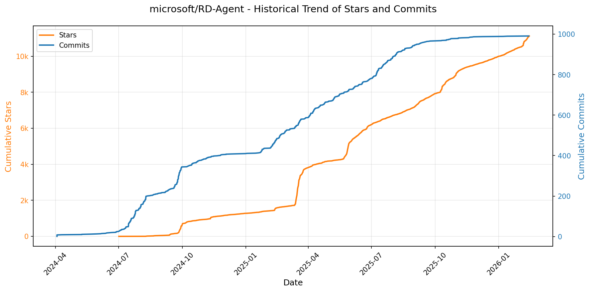

# 🌟 GitHub Trending 概览

> 数据更新于：2026-02-12

---

## 🔍 项目详情

### 1. [anomalyco/opencode](https://github.com/anomalyco/opencode)
- 📅 **创建日期**：2025-04-30  
- 🔄 **最近更新**：2026-02-12  
- ⭐ **Stars**：180,582（日 +788｜周 +5233｜月 +50573）  
- 📝 **描述**：The open source coding agent.  

<b>📈 Star 与 Commit 历史趋势</b>

> *蓝色：累计 Stars｜橙色：累计 Commits（次 Y 轴）*

<b>📄 README 摘要</b>

1. **该项目的功能**  
OpenCode 是一个开源的 AI 编程智能体（AI coding agent），旨在为开发者提供终端原生（TUI）、轻量高效、可扩展的 AI 辅助编程体验。它支持在本地终端中直接与 AI 协作完成代码编写、调试、重构、文档生成、代码库分析等任务；同时具备客户端/服务器架构，允许远程控制（如通过移动 App 驱动本地运行的 OpenCode 实例）。其核心目标是打造一个不绑定特定大模型厂商、完全开源可控、深度集成开发工作流（如 LSP 支持）的下一代 AI 编程工具。

2. **关键特性**  
- **双模式智能体切换**：内置 `build`（全权限开发代理，支持文件编辑与命令执行）和 `plan`（只读分析代理，禁止自动修改文件、执行命令前需显式授权），按 Tab 键即可切换，适配不同安全与探索场景；  
- **通用子代理（`@general`）**：支持复杂多步推理、跨文件深度搜索与抽象任务规划；  
- **全平台原生支持**：提供一键安装脚本（支持 macOS/Linux/Windows）、多种包管理器集成（Homebrew、Scoop、Chocolatey、pnpm/npm/bun、Mise、Nix、Paru 等），并发布独立桌面应用（macOS/Windows/Linux 多架构）；  
- **终端优先（TUI-first）设计**：深度优化终端交互体验，由 Neovim 用户及 terminal.shop 团队主导开发，强调键盘驱动、低干扰、高响应；  
- **模型无关性与本地化支持**：不锁定任何云服务商，兼容 Claude、OpenAI、Google Gemini 及本地运行的 Ollama/Llama.cpp 等模型；开箱即用 LSP（语言服务器协议）支持，无缝对接编辑器生态；  
- **多语言文档与国际化**：提供 18 种语言版本的 README 和完整文档（含 Agents 专项指南）；  
- **灵活安装路径控制**：支持通过环境变量（`OPENCODE_INSTALL_DIR` / `XDG_BIN_DIR`）自定义安装位置，符合 Unix/Linux 标准规范。

3. **技术栈**  
- **前端（TUI & Desktop）**：基于 Rust 构建高性能终端 UI（推测使用 TUI 库如 `ratatui` 或 `crossterm`）；桌面端采用原生打包（`.dmg`/`.exe`/`.deb`/`.rpm`/AppImage），可能结合 WebView 或 Rust GUI 框架（如 `tao`/`wry`）；  
- **核心引擎与 CLI**：Rust 主导（高并发、内存安全、CLI 性能关键），部分模块可能辅以 TypeScript（如 Web 控制台或文档站点）；  
- **AI 集成层**：抽象化 LLM 接口，支持 OpenAI 兼容 API、Anthropic、Google Vertex、Ollama、Llama.cpp 等后端；内置对 OpenCode Zen（自研模型服务）的默认推荐集成；  
- **基础设施与部署**：GitHub Actions 自动化构建与发布（`publish.yml`）；NPM 包（`opencode-ai`）提供 JS/TS 生态集成能力；  
- **跨平台兼容**：全面适配 Apple Silicon / Intel macOS、Windows x64、主流 Linux 发行版（含 Arch、Debian、RHEL 系衍生版）。

---

### 2. [microsoft/PowerToys](https://github.com/microsoft/PowerToys)
- 📅 **创建日期**：2019-05-01  
- 🔄 **最近更新**：2026-02-12  
- ⭐ **Stars**：129,692（日 +223｜周 +482｜月 +1801）  
- 📝 **描述**：Microsoft PowerToys is a collection of utilities that supercharge productivity and customization on Windows  

<b>📈 Star 与 Commit 历史趋势</b>

> *蓝色：累计 Stars｜橙色：累计 Commits（次 Y 轴）*

<b>📄 README 摘要</b>

1. **该项目的功能**  
Microsoft PowerToys 是一款面向 Windows 系统的开源增强工具集，旨在帮助用户深度定制操作系统、提升日常工作效率。它不替代系统核心功能，而是通过一系列轻量级、可独立启用/禁用的实用工具（Utilities），弥补 Windows 原生体验的不足，覆盖窗口管理、键盘鼠标操作、文件处理、开发辅助、无障碍访问等多个高频使用场景。

2. **核心功能**  
- **窗口与布局管理**：FancyZones（高级分屏布局）、Always on Top（窗口置顶）、Workspaces（多工作区快照）、Crop & Lock（区域截图并锁定为独立窗口）。  
- **效率增强工具**：PowerToys Run（全局快速启动器）、Command Palette（命令中心式操作面板）、PowerRename（正则批量重命名）、Advanced Paste（智能粘贴，支持 AI 转换、历史预览、Hex 颜色识别等）。  
- **输入与交互优化**：Keyboard Manager（键盘映射与宏）、Quick Accent（快捷输入重音字符）、Mouse Utilities / Find My Mouse（鼠标高亮定位）、Cursor Wrap（跨屏光标自动环绕）、Shortcut Guide（Win 键快捷键提示）。  
- **内容处理与预览**：Color Picker（取色器+对比度分析）、Peek（代码/文本/图片悬浮预览）、Image Resizer（右键批量缩放）、Text Extractor（OCR 文字提取）、Registry Preview / File Explorer Add-ons（注册表与资源管理器增强预览）。  
- **系统级辅助**：Awake（防止休眠）、Light Switch（自动/手动切换深色/浅色主题，支持 Night Light 同步）、Hosts File Editor（可视化 hosts 编辑）、Environment Variables（环境变量图形化管理）、File Locksmith（查看/终止文件占用进程）、ZoomIt（屏幕局部放大）。  
- **开发者与企业支持**：提供 CLI 命令行接口（如 FancyZones CLI、File Locksmith CLI）、GPO/ADMX 企业策略支持、模块化插件扩展机制（如 Command Palette Extensions、PowerToys Run Plugins）。

3. **技术栈**  
- **主框架**：基于 .NET（主要为 .NET 6+ / .NET 8+），采用 C# 开发；UI 层混合使用 WinUI 3（现代原生 Windows UI 框架）、WPF（部分旧模块）及 WebView2（用于 SVG/HTML 内容渲染，如 Peek）。  
- **构建与部署**：使用 MSIX 打包（支持用户级/系统级安装）、Windows App SDK（WinAppSDK）；构建系统基于 MSBuild + CMake（部分组件），CI/CD 集成 GitHub Actions。  
- **底层能力**：深度调用 Windows API（如 Input Injection、DPI Awareness、Shell Extensions、Registry、COM）、DirectX/Direct2D（图像处理与渲染）、Windows Graphics Capture（屏幕捕获）、UI Automation（自动化交互）。  
- **扩展生态**：提供官方 SDK（C#/.NET），支持第三方开发 Command Palette 插件、PowerToys Run 插件；兼容 WinGet、Chocolatey、Scoop 等包管理器。  
- **其他关键技术**：支持 Native AOT（提前编译以提升启动性能）、多语言本地化（含中文拼音匹配）、高 DPI/多显示器自适应、ARM64 架构原生支持（x64 + ARM64 双平台安装包）。

---

### 3. [anthropics/skills](https://github.com/anthropics/skills)
- 📅 **创建日期**：2025-09-22  
- 🔄 **最近更新**：2026-02-12  
- ⭐ **Stars**：108,410（日 +800｜周 +5160｜月 +31192）  
- 📝 **描述**：Public repository for Agent Skills  

<b>📈 Star 与 Commit 历史趋势</b>

> *蓝色：累计 Stars｜橙色：累计 Commits（次 Y 轴）*

<b>📄 README 摘要</b>

1. **该项目做什么？**  
该项目是 Anthropic 官方维护的 Claude 技能（Skills）开源示例仓库，旨在展示如何通过结构化、可复用的“技能包”扩展 Claude 的专业化能力。每个技能是一个独立文件夹，内含 `SKILL.md`（含 YAML 元数据和执行指令），使 Claude 能动态加载并可靠执行特定任务，例如：按企业品牌规范生成文档、基于组织特有流程分析数据、自动化个人事务等。它不提供运行时服务或独立应用，而是为开发者和企业用户提供可参考、可复用、可定制的技能实现范例与规范依据。

2. **关键特性**  
- **模块化与自包含设计**：每个技能独立成目录，含标准化 `SKILL.md`（含 name/description 元数据 + 指令/示例/指南），开箱即用、易于复刻；  
- **覆盖多场景能力**：涵盖创意设计（艺术/音乐/UI）、技术开发（Web 应用测试、MCP 服务器生成）、企业协作（品牌传播、内部沟通）及核心文档处理（DOCX/PDF/PPTX/XLSX 创建与编辑）；  
- **生产级参考实现**：`skills/docx` 等子目录公开了支撑 Claude 官方文档功能的真实源码（source-available，非开源），为构建高复杂度生产技能提供权威参考；  
- **跨平台集成支持**：支持在 Claude Code（插件市场安装）、Claude.ai（付费用户直用）、Claude API（上传自定义技能）三端无缝调用；  
- **开放规范与模板**：内置 [Agent Skills 规范](./spec) 和 [技能模板](./template)，降低开发门槛，推动技能生态标准化。

3. **技术栈**  
- **核心格式**：纯文本驱动，基于 Markdown（`SKILL.md`）+ YAML 前置元数据，无运行时依赖；  
- **协议标准**：遵循 [Agent Skills 开放规范](http://agentskills.io)（定义技能结构、注册、发现与执行契约）；  
- **交付形态**：静态文件仓库（Git），技能本身不包含代码逻辑或二进制文件，全部行为由 Claude 模型根据自然语言指令解释执行；  
- **集成层**：依赖 Anthropic 官方基础设施——Claude Code 插件系统、Claude.ai 技能管理界面、Claude API 的 Skills 接口（需调用 `/v1/skills` 等端点上传与启用）。

---

### 4. [obra/superpowers](https://github.com/obra/superpowers)
- 📅 **创建日期**：2025-10-09  
- 🔄 **最近更新**：2026-02-12  
- ⭐ **Stars**：78,855（日 +658｜周 +5499｜月 +41302）  
- 📝 **描述**：An agentic skills framework & software development methodology that works.  

<b>📈 Star 与 Commit 历史趋势</b>

> *蓝色：累计 Stars｜橙色：累计 Commits（次 Y 轴）*

<b>📄 README 摘要</b>

1. **该项目的功能**  
Superpowers 是一个面向编程智能体（coding agents）的完整软件开发工作流增强系统。它不直接替代或编写代码，而是通过一套自动触发、可组合的“技能”（skills）来规范和引导智能体的开发行为，确保其严格遵循工程最佳实践。核心作用是：在智能体启动后主动暂停编码冲动，转而与用户协作完成需求澄清、分块式设计确认、TDD驱动的计划拆解、子智能体协同执行、多阶段代码审查及分支收尾等全流程，从而将原本不可控、易偏离的AI编码行为转化为结构化、可验证、符合专业软件工程原则的自主开发流程。

2. **关键特性**  
- **全自动技能触发机制**：无需手动调用，智能体在每个开发环节（如设计前、编码前、提交前）自动识别并启用对应技能；  
- **七阶段强制工作流**：涵盖头脑风暴（Socratic 设计）、Git 工作树隔离、原子化任务计划（2–5分钟/项）、子智能体驱动开发（含双阶段审查：规范符合性 + 代码质量）、严格 TDD（RED-GREEN-REFACTOR，禁止先写代码后补测试）、结构化代码评审（按严重等级阻断问题）、开发分支闭环（含测试验证与合并决策）；  
- **深度工程哲学内嵌**：强制践行测试先行、YAGNI（你不会需要它）、DRY（避免重复）、防御性调试、证据导向（而非断言式修复）；  
- **跨平台兼容架构**：原生支持 Claude Code（插件市场一键安装），同时提供 Codex 和 OpenCode 的标准化接入方案；  
- **自演进能力**：内置 `writing-skills` 技能，支持用户基于统一规范创建、测试并贡献新技能，形成可扩展的技能生态。

3. **技术栈**  
- **运行时环境**：依赖外部大模型智能体平台（Claude Code / Codex / OpenCode），本身为轻量级技能指令集与工作流编排框架；  
- **交付形态**：以插件（Claude Code）、远程指令加载（Codex / OpenCode）形式集成，无独立服务端或运行时；  
- **内容组织**：纯文本技能定义（Markdown 格式 `.md` 文件），存于 GitHub 仓库，通过 Git 版本管理；  
- **基础设施**：利用 Git 工作树（`git worktree`）实现沙箱化开发环境隔离；  
- **协议与标准**：基于 MIT 开源许可证，采用语义化技能命名与模块化目录结构（如 `skills/testing/`, `skills/debugging/`），强调可读性、可审计性与人类可干预性。

---

### 5. [openclaw/openclaw](https://github.com/openclaw/openclaw)
- 📅 **创建日期**：2025-11-24  
- 🔄 **最近更新**：2026-02-12  
- ⭐ **Stars**：71,156（日 +3063｜周 +23048｜月 +71156）  
- 📝 **描述**：Your own personal AI assistant. Any OS. Any Platform. The lobster way. 🦞   

<b>📈 Star 与 Commit 历史趋势</b>

> *蓝色：累计 Stars｜橙色：累计 Commits（次 Y 轴）*

<b>📄 README 摘要</b>

1. **项目功能**  
OpenClaw 是一个完全本地化、用户自托管的个人 AI 助理系统，核心目标是让用户在自有设备（macOS/iOS/Android/Linux/Windows）上运行一个“感觉像本地、响应快、始终在线”的单用户 AI 助理。它不依赖中心化云服务，而是通过轻量级 **Gateway（网关）控制平面**统一管理多通道通信、多智能体会话、工具执行与设备能力调用。助理可接入并响应你日常使用的全部消息平台（如 WhatsApp、Telegram、Slack、Discord、Signal、iMessage、Google Chat、Microsoft Teams），以及扩展通道（BlueBubbles、Matrix、Zalo 等）；支持语音唤醒与实时对话（macOS/iOS/Android）、AI 驱动的交互式可视化工作区（Live Canvas + A2UI），并能执行浏览器操作、屏幕录制、摄像头调用、定位获取、系统命令等真实设备动作。

2. **关键特性**  
- **本地优先架构**：单进程 Gateway 作为 WebSocket 控制中枢，统管会话、通道、工具、事件、定时任务（cron）、Webhook 和远程调试界面。  
- **全栈多通道支持**：原生集成 13+ 消息平台（含 Baileys/grammY/Bolt/discord.js 等成熟 SDK），支持群组路由、提及触发、消息分块与跨通道回复回传。  
- **多智能体隔离工作区**：支持按通道、账号或联系人路由至独立 Agent 实例（workspace + session 隔离），实现上下文与权限分离。  
- **端侧语音与交互能力**：基于 ElevenLabs 的 macOS/iOS/Android 全时语音唤醒（Voice Wake）与连续对话模式（Talk Mode），配合菜单栏/通知/Overlay 提供原生体验。  
- **Live Canvas 可视化工作区**：由 AI 动态驱动的桌面级画布（A2UI 协议），支持 UI 推送、代码执行、截图快照与状态同步。  
- **设备节点（Nodes）体系**：将 macOS/iOS/Android 设备抽象为可远程调用的“能力节点”，通过 `node.invoke` 安全执行 `system.run`、`camera.snap`、`screen.record`、`location.get` 等需系统权限的操作，并严格遵循 TCC 权限模型。  
- **安全默认策略**：所有私信（DM）默认启用配对验证（pairing code），拒绝未授权输入；支持 OAuth/API Key 多模型认证与自动故障转移（model failover）；提供 `openclaw doctor` 主动检测配置风险。  
- **开箱即用的自动化生态**：内置浏览器控制（专用 Chromium + CDP）、Cron 任务、Gmail Pub/Sub、WebChat 前端、Tailscale 远程访问（Serve/Funnel）、Nix/Docker 部署及技能市场 ClawHub。

3. **技术栈**  
- **运行时**：Node.js ≥22（主运行环境），支持 npm/pnpm/bun；TypeScript 编写，使用 `tsx` 直接运行源码。  
- **核心协议与通信**：WebSocket（Gateway 控制平面）、RPC（Pi Agent 运行时）、HTTP/HTTPS（WebChat、Tailscale Funnel/Serve、Webhook）。  
- **前端与 UI**：WebChat 内嵌于 Gateway；macOS/iOS/Android 使用原生 App + WebView/A2UI 渲染 Canvas；CLI 提供完整命令行界面（`openclaw onboard`/`agent`/`gateway`/`doctor` 等）。  
- **通道集成层**：基于各平台官方或成熟开源 SDK — Baileys（WhatsApp）、grammY（Telegram）、discord.js（Discord）、@slack/bolt（Slack）、signal-cli（Signal）、BlueBubbles REST API（iMessage）、Microsoft Graph API（Teams）、Matrix JS SDK、Zalo OpenAPI 等。  
- **AI 与模型层**：支持任意兼容 OpenAI 兼容 API 或 Anthropic API 的 LLM；默认推荐 Anthropic Claude Opus 4.6；内置模型选择、认证轮换、fallback 降级与流式响应处理。  
- **部署与运维**：支持 systemd/launchd 守护进程、Docker 容器化、Nix 声明式配置、Tailscale 远程暴露、SSH 隧道、日志聚合与自动迁移（`openclaw doctor`）。  
- **安全机制**：OAuth 2.0（Anthropic/OpenAI）、密码/Token 认证（Tailscale/WebChat）、本地配对码（DM）、TCC 权限代理（macOS）、会话上下文隔离、模型输入过滤与会话剪枝（session pruning）。

---

### 6. [google/langextract](https://github.com/google/langextract)
- 📅 **创建日期**：2025-07-08  
- 🔄 **最近更新**：2026-02-12  
- ⭐ **Stars**：52,760（日 +1911｜周 +6577｜月 +11739）  
- 📝 **描述**：A Python library for extracting structured information from unstructured text using LLMs with precise source grounding and interactive visualization.  

<b>📈 Star 与 Commit 历史趋势</b>

> *蓝色：累计 Stars｜橙色：累计 Commits（次 Y 轴）*

<b>📄 README 摘要</b>

1. **项目功能**  
LangExtract 是一个基于大语言模型（LLM）的 Python 库，专注于从**非结构化文本**（如临床笔记、放射报告、文学作品等）中**高精度提取结构化信息**。其核心能力是依据用户定义的指令和少量示例（few-shot examples），自动识别并组织关键实体（如人物、情绪、药物名称、剂量、关系等），同时严格保证所有提取结果均**可溯源至原文中的精确字符位置**，支持端到端的可验证性与可解释性。

2. **关键特性**  
- **精准源文本锚定（Source Grounding）**：为每个提取项标注其在原文中的起止字符偏移量，支持可视化高亮与人工核查；  
- **强结构化输出保障**：通过受控生成机制（如 Gemini 的 schema 强约束）及示例驱动的提示工程，确保输出严格符合预定义 JSON Schema；  
- **长文档优化处理**：采用智能分块（chunking）、多轮提取（extraction passes）、并行处理（max_workers）与上下文缓冲（max_char_buffer）策略，显著提升大文本（如整本小说）的召回率与准确性；  
- **交互式可视化**：一键生成自包含 HTML 文件，支持动态搜索、上下文展开、实体聚类与动画高亮，便于大规模结果审查；  
- **多模型灵活适配**：原生支持 Google Gemini（云）、OpenAI（需额外依赖）、本地 Ollama 模型（如 `gemma2:2b`），且提供插件化架构，允许第三方无缝集成自定义 LLM 提供商；  
- **零微调领域自适应**：仅需提供 1–3 个高质量、原文直引（verbatim）的示例，即可快速适配任意领域（医疗、法律、文学等），无需模型训练或微调；  
- **知识-证据平衡控制**：通过提示词设计与示例属性显式调控 LLM 行为——既可严格限制为原文证据提取，也可引导其融合外部世界知识（如添加 `"literary_context"` 属性）。

3. **技术栈**  
- **核心语言**：Python（≥3.10）；  
- **模型后端**：  
  - 云服务：Google Gemini（Vertex AI / AI Studio）、OpenAI（GPT-4o 等，需 `langextract[openai]`）；  
  - 本地推理：Ollama（内置集成，支持 `gemma2`, `llama3` 等开源模型）；  
- **扩展架构**：基于 Python entry points 的插件化 Provider 系统，支持自定义模型接口开发；  
- **工程实践**：  
  - 构建与依赖：`pyproject.toml` + `pip install -e` 开发模式；  
  - 测试框架：`pytest` + `tox`（覆盖 Python 3.10/3.11、linting、Ollama 集成测试）；  
  - 代码质量：`pyink`（格式化）、`isort`（导入排序）、`pylint`（静态检查）、`pre-commit`（自动化钩子）；  
  - 部署：Docker 官方镜像支持；  
- **数据格式**：输入支持纯文本、文件路径、URL；输出默认为 `.jsonl`（逐行 JSON），兼容主流 NLP 工具链。

---

### 7. [bytedance/UI-TARS-desktop](https://github.com/bytedance/UI-TARS-desktop)
- 📅 **创建日期**：2025-01-19  
- 🔄 **最近更新**：2026-02-12  
- ⭐ **Stars**：52,154（日 +115｜周 +1648｜月 +5709）  
- 📝 **描述**：The Open-Source Multimodal AI Agent Stack: Connecting Cutting-Edge AI Models and Agent Infra  

<b>📈 Star 与 Commit 历史趋势</b>

> *蓝色：累计 Stars｜橙色：累计 Commits（次 Y 轴）*

<b>📄 README 摘要</b>

1. **项目功能**  
TARS 是一个通用多模态 AI 智能体（Agent）技术栈，核心目标是实现类人化、端到端的任务执行能力。它通过融合视觉（Vision）、图形用户界面（GUI）理解与控制、自然语言交互等多模态能力，使 AI 能够直接操作真实世界的数字环境——包括本地终端、桌面操作系统、Web 浏览器及各类应用程序。项目当前包含两大可独立部署的组件：  
- **Agent TARS**：面向开发者和高级用户的多模态智能体框架，提供 CLI 命令行工具与 Web UI 界面，支持在本地或服务器环境中运行；通过 MCP（Model Control Protocol）协议无缝集成 Shell、文件系统、浏览器、图表生成等现实工具，完成复杂跨应用任务（如自动订机票、预订酒店并生成交通指南）。  
- **UI-TARS Desktop**：面向终端用户的原生桌面 GUI 智能体应用，基于 UI-TARS 视觉语言模型（如 Seed-1.5-VL/1.6 系列），具备对本地/远程计算机及浏览器的像素级视觉感知与精确操控能力（如修改 VS Code 设置、检索 GitHub 问题），所有处理默认在本地完成，保障隐私与安全。

2. **关键特性**  
- ✅ **多模态任务闭环能力**：支持文本指令→视觉理解→GUI 操作→工具调用→结果反馈的全链路自动化（如“在 Booking.com 订机场附近丽思卡尔顿酒店”）。  
- ✅ **混合浏览器控制策略**：兼容基于 DOM 结构解析、GUI 视觉定位（Visual Grounding）及二者融合的浏览器自动化方式。  
- ✅ **事件流驱动架构（Event Stream）**：采用协议化事件流机制，支撑上下文工程（Context Engineering）、实时数据流追踪、调试（Event Stream Viewer）及低代码 Agent UI 构建。  
- ✅ **MCP 工具生态集成**：以内置 MCP 协议为核心，可动态挂载多种 MCP Server（如 Shell、File、Chart、Browser 等），实现与真实世界工具的标准化对接。  
- ✅ **开箱即用的跨平台 GUI 控制**（UI-TARS Desktop）：支持 Windows/macOS，提供本地截图识别、毫秒级鼠标/键盘精准控制、远程电脑/浏览器一键接管（零配置）、全程离线运行。  
- ✅ **生产就绪增强能力**：CLI v0.3.0 新增多工具流式输出、运行时性能统计（工具调用耗时/深度思考耗时）、AIO Agent Sandbox 隔离执行环境等企业级特性。

3. **技术栈**  
- **核心模型层**：基于自研多模态大模型 UI-TARS 系列（如 UI-TARS-1.5-7B）、Seed-1.5-VL/1.6 视觉语言模型；兼容第三方多模态 LLM（如 VolcEngine 的 doubao-1-5-thinking-vision-pro、Anthropic 的 Claude 3.7 Sonnet）。  
- **协议与标准**：采用 **MCP（Model Control Protocol）** 作为智能体与工具间的通信规范，实现模型能力与现实工具解耦。  
- **前端与客户端**：  
  - Agent TARS：TypeScript + Node.js CLI（依赖 npm 包 `@agent-tars/cli`），Web UI 基于现代前端框架构建；  
  - UI-TARS Desktop：Electron 或原生桌面框架（结合图标与资源路径推断），集成 Hugging Face / ModelScope 模型加载能力。  
- **基础设施**：支持本地部署与云部署（如 ModelScope 平台）；提供 SDK（UI TARS SDK）用于跨平台 GUI 自动化 Agent 开发；后端服务可对接 AIO Sandbox 等隔离执行环境。  
- **开发与协作生态**：基于 GitHub 托管，配套完整文档站（Docusaurus/GitBook）、Discord/飞书社区、DeepWiki AI 问答支持，遵循 Apache 2.0 开源协议。

---

### 8. [remotion-dev/remotion](https://github.com/remotion-dev/remotion)
- 📅 **创建日期**：2020-06-23  
- 🔄 **最近更新**：2026-02-12  
- ⭐ **Stars**：36,270（日 +186｜周 +1270｜月 +11071）  
- 📝 **描述**：🎥      Make videos programmatically with React  

<b>📈 Star 与 Commit 历史趋势</b>

> *蓝色：累计 Stars｜橙色：累计 Commits（次 Y 轴）*

<b>📄 README 摘要</b>

1. **项目功能**  
Remotion 是一个基于 React 的视频生成框架，允许开发者使用 React 组件、JavaScript 逻辑和 Web 技术（如 CSS、SVG、Canvas、WebGL）**以编程方式动态创建高质量视频**。它将视频视为“可渲染的 React 应用”，支持时间轴控制、帧精确渲染、动态内容生成（如数据驱动动画、个性化视频），并可导出为 MP4、GIF 或 ProRes 等格式，适用于营销视频、数据可视化、年度回顾（如 GitHub Unwrapped）、教程动画等场景。

2. **核心特性**  
- ✅ **React 原生开发体验**：复用 React 组件、Hooks、状态管理、Context 和第三方库；支持 Fast Refresh 实时预览动画变化。  
- ✅ **时间轴与帧控制**：提供 `useCurrentFrame`、`interpolate`、`Sequence`、`Composition` 等 API，实现基于时间的精准动画逻辑与分段编排。  
- ✅ **多目标输出**：一键导出为 MP4（H.264/AV1）、GIF、ProRes、PNG 序列，并支持自定义编码参数与分辨率。  
- ✅ **服务端渲染支持**：可通过 Node.js（无头 Chromium）离线渲染视频，适配 CI/CD、Serverless（Vercel/Cloudflare）及动态视频生成（如用户定制化内容）。  
- ✅ **开发友好工具链**：内置本地预览服务器、帧调试器、性能分析面板、CLI 工具（`npx create-video@latest` 快速初始化）及 TypeScript 全面支持。  
- ✅ **扩展生态**：兼容 FFMPEG 高级处理、音频合成、字体加载、远程资源动态注入，并拥有活跃社区与开源示例库（如 Fireship 教程、GitHub Unwrapped）。

3. **技术栈**  
- **核心框架**：React（v18+）、TypeScript（首选语言）、Webpack（默认打包器，支持 Vite 插件）  
- **渲染引擎**：基于 Chromium（Puppeteer / Playwright）的无头浏览器渲染，利用 Canvas 2D/WebGL 加速图形合成  
- **视频处理**：FFmpeg（后端导出依赖，支持自定义编码配置）  
- **构建与部署**：Node.js（≥18.x）、ESBuild（可选优化）、支持 Vercel、Netlify、AWS Lambda 等云平台  
- **辅助技术**：CSS-in-JS（如 styled-components 支持）、SVG 动画、Web Audio API（音频同步）、Lottie 导入（通过插件）

---

### 9. [asgeirtj/system_prompts_leaks](https://github.com/asgeirtj/system_prompts_leaks)
- 📅 **创建日期**：2025-05-03  
- 🔄 **最近更新**：2026-02-12  
- ⭐ **Stars**：31,154（日 +200｜周 +1037｜月 +6219）  
- 📝 **描述**：Collection of extracted System Prompts from popular chatbots like ChatGPT, Claude & Gemini  

<b>📈 Star 与 Commit 历史趋势</b>

> *蓝色：累计 Stars｜橙色：累计 Commits（次 Y 轴）*

---

### 10. [code-yeongyu/oh-my-opencode](https://github.com/code-yeongyu/oh-my-opencode)
- 📅 **创建日期**：2025-12-03  
- 🔄 **最近更新**：2026-02-12  
- ⭐ **Stars**：30,755（日 +403｜周 +2578｜月 +15678）  
- 📝 **描述**：the best agent harness  

<b>📈 Star 与 Commit 历史趋势</b>

> *蓝色：累计 Stars｜橙色：累计 Commits（次 Y 轴）*

<b>📄 README 摘要</b>

1. **该项目的功能**  
Oh My OpenCode 是一个面向开源代码编辑器 OpenCode（基于 VS Code 架构）的高性能、可扩展插件，核心目标是**将大语言模型（LLM）转化为高自主性、高协作性的“AI 开发团队”**。它不替代人类开发者，而是通过多智能体协同架构（如 Sisyphus 主协调员、Hephaestus 深度执行者、Oracle 架构师、Librarian 文档专家等），在本地或云端调度不同模型（Claude、GPT、Gemini 等）分工完成复杂软件工程任务——包括全自动代码重构、跨仓库代码探索、前端实现、调试分析、文档检索、CI/CD 风格的待办强制续跑（Todo Continuation Enforcer）、无感 LSP/AST 操作等。其本质是为 OpenCode 提供企业级 AI 工程化能力，实现“提示即交付”（prompt-to-production）。

2. **关键特性**  
- ✅ **多智能体协同编排**：预置角色化代理（Sisyphus 主控、Hephaestus 自主攻坚、Oracle 调试、Librarian 查文档、Explore 快速代码搜索等），支持并行后台任务与模型级职责分离；  
- ✅ **Claude Code 全兼容层**：完整支持命令（Command）、技能（Skill）、代理（Agent）、MCP（Model Control Protocol）及全生命周期钩子（PreToolUse/PostToolUse/UserPromptSubmit/Stop）；  
- ✅ **深度工程工具链集成**：原生支持 LSP（语义重命名、诊断）、AST-Grep（结构化代码搜索与重构）、交互式终端（Tmux）、Git 原子提交（`git-master`）、Playwright 浏览器自动化；  
- ✅ **上下文智能管理**：自动注入 `AGENTS.md`、`README.md`、项目规范；通过多代理并行探索（如 3–5 个 Librarian 实例同步检索）大幅降低单模型上下文压力；  
- ✅ **鲁棒性与生产就绪机制**：Todo 续跑强制器（防止中断）、注释审查器（禁止冗余注释）、风格一致性匹配（复用项目既有代码范式）、超时熔断与自动恢复；  
- ✅ **极简启动体验**：仅需在提示词中加入 `ultrawork`（或缩写 `ulw`）即可激活全部能力，无需手动配置；  
- ✅ **开箱即用 + 高度可定制**：默认启用全部功能（Battery Included），同时支持 JSONC 格式细粒度配置（模型参数、钩子开关、并发限制、领域分类委托等）。

3. **技术栈**  
- **底层平台**：OpenCode（开源 VS Code 衍生编辑器，非 VS Code 插件）；  
- **核心语言**：TypeScript（主要开发语言），Node.js 运行时；  
- **AI 模型调度**：多模型联邦架构，原生适配 Claude（Sonnet/Haiku/Opus）、GPT（Codex Medium/5.2）、Gemini（3 Pro）等，通过 MCP 协议统一抽象调用；  
- **代码分析引擎**：LSP（Language Server Protocol）标准实现 + AstGrep（AST 感知代码搜索与转换）；  
- **外部服务集成**：Exa（Web 搜索）、Context7（官方文档索引）、grep.app（GitHub 代码搜索）等 MCP 标准服务；  
- **基础设施**：支持 Tmux 终端会话管理、异步任务队列、会话历史持久化与分析；  
- **许可证**：SUL-1.0（Sisyphus Universal License，一种强调自由使用与社区共建的开源许可）。

---

### 11. [patchy631/ai-engineering-hub](https://github.com/patchy631/ai-engineering-hub)
- 📅 **创建日期**：2024-10-21  
- 🔄 **最近更新**：2026-02-12  
- ⭐ **Stars**：28,732（日 +422｜周 +780｜月 +2879）  
- 📝 **描述**：In-depth tutorials on LLMs, RAGs and real-world AI agent applications.  

<b>📈 Star 与 Commit 历史趋势</b>

> *蓝色：累计 Stars｜橙色：累计 Commits（次 Y 轴）*

<b>📄 README 摘要</b>

1. **该项目做什么？**  
AI Engineering Hub 是一个面向 AI 工程实践的开源资源聚合平台，旨在为初学者、从业者和研究人员提供可直接上手的**93+ 量产级 AI 项目示例**，覆盖从基础概念理解到生产环境部署的完整技术链路。它不提供理论教学或框架封装，而是以“即学即用”为核心，通过结构化、分难度的实战项目（OCR、RAG、智能体、多模态、MCP、模型评测等），帮助用户在真实场景中构建、调试、优化和部署 AI 系统。

2. **关键特性**  
- **三级难度体系**：明确划分为 Beginner（22项）、Intermediate（48项）、Advanced（23项）项目，每类聚焦不同能力目标（如初学者练单模型调用，进阶者建多组件工作流，高级者做微调与生产系统）；  
- **前沿技术全覆盖**：深度集成 LLM（Llama 3.2/4、DeepSeek-R1、Qwen 2.5/3/3-Coder、Gemma-3、Claude、O3/O4、Sonnet4）、RAG（Dockling、Trustworthy RAG、Fastest RAG）、AI Agent（CrewAI、AutoGen、Zep、Graphiti）、MCP（Model Context Protocol）及多模态（Janus-Pro、Gemini 视频 RAG、AssemblyAI 音频处理）等主流范式；  
- **强工程导向设计**：所有项目均强调本地运行（Local）、可部署（LitServe API、NVIDIA NIM）、可扩展（FireCrawl 网页抓取、Supabase 存储、Qdrant/Milvus 向量库）、可观测（Opik + CometML 评估）、可对比（多模型横向评测套件），并包含大量生产就绪工具链（如 Cursor MCP 集成、Stagehand 浏览器自动化、Financial Analyst 深度分析流）。

3. **技术栈**  
- **核心模型层**：Llama 系列（Meta）、DeepSeek-R1/Janus-Pro（深度求索）、Qwen-VL/Qwen-Coder（通义）、Gemma-3（Google）、Claude/Sonnet（Anthropic）、O3/O4（OpenAI）、GPT-OSS（开源复现）；  
- **框架与工具链**：LlamaIndex、LangChain（隐含）、CrewAI、AutoGen、Motia、Zep（记忆管理）、Graphiti（图谱记忆）、Opik（可观测性）、CometML（评估追踪）、FireCrawl（网页转API）、AssemblyAI（语音处理）、Qdrant/Milvus（向量数据库）、SambaNova（加速推理）、Dockling（文档解析）；  
- **前端与部署**：Streamlit（轻量UI）、Chainlit（聊天界面）、LitServe（API服务）、React（前端集成）、NVIDIA NIM（GPU推理托管）；  
- **基础设施与协议**：MCP（Model Context Protocol）标准实现（Cursor、EyeLevel、LlamaIndex 等客户端）、Stagehand（Web 自动化）、Supabase（后端服务）、TensorLake（上下文工程）。

---

### 12. [thedotmack/claude-mem](https://github.com/thedotmack/claude-mem)
- 📅 **创建日期**：2025-08-31  
- 🔄 **最近更新**：2026-02-12  
- ⭐ **Stars**：27,540（日 +414｜周 +4763｜月 +14075）  
- 📝 **描述**：A Claude Code plugin that automatically captures everything Claude does during your coding sessions, compresses it with AI (using Claude's agent-sdk), and injects relevant context back into future sessions.  

<b>📈 Star 与 Commit 历史趋势</b>

> *蓝色：累计 Stars｜橙色：累计 Commits（次 Y 轴）*

<b>📄 README 摘要</b>

1. **项目功能**  
Claude-Mem 是一个专为 **Claude Code（Anthropic 推出的 AI 编程助手）** 设计的**持久化记忆压缩系统**。它在用户每次会话结束后自动捕获工具调用、代码操作与交互行为，生成语义化摘要，并将结构化记忆长期存储于本地 SQLite 数据库中；当新会话启动时，自动检索并按需注入相关上下文，从而实现跨会话的知识连续性——使 Claude 能“记住”项目历史、技术决策、调试过程与未完成任务，显著提升多轮协作的连贯性与效率。

2. **核心特性**  
- ✅ **持久记忆（Persistent Memory）**：会话结束后仍保留上下文，支持长期项目追踪  
- ✅ **渐进式披露（Progressive Disclosure）**：分三层（索引→时间线→详情）按需加载记忆，实时显示 Token 消耗，大幅降低上下文开销（实测节省约 10 倍 Tokens）  
- ✅ **技能化搜索（Skill-Based Search）**：内置 `mem-search` 技能及 5 个标准化 MCP 工具（`search`/`timeline`/`get_observations`/`save_memory`/`__IMPORTANT`），支持自然语言查询+类型/日期/项目过滤  
- ✅ **可视化 Web 界面**：运行于 `http://localhost:37777`，提供实时记忆流、观测详情、API 查看（如 `/api/observation/{id}`）及 Beta 版本切换  
- ✅ **Claude 桌面端集成**：可在 Claude Desktop 对话中直接调用记忆搜索技能  
- ✅ **隐私控制机制**：支持 `<private>` 标签标记敏感内容，自动排除存储  
- ✅ **细粒度上下文配置**：通过 `settings.json` 精确控制注入范围（模型、项目、观察类型等）  
- ✅ **全自动运行**：零手动干预，依赖生命周期钩子（SessionStart/PostToolUse/SessionEnd 等 6 个钩子脚本）触发全流程  
- ✅ **引用与溯源**：每条观测分配唯一 ID，支持链接直查与 Web 界面集中浏览  
- ✅ **Beta 实验通道**：支持 Endless Mode（仿生长时记忆架构）等前沿功能快速体验  

3. **技术栈**  
- **运行时**：Node.js ≥18.0.0（主逻辑）、Bun（Worker 服务管理与 HTTP API）、uv（Python 包管理器，用于 Chroma 向量库）  
- **数据库**：SQLite3（本地嵌入式，含 FTS5 全文搜索 + 自定义 schema）  
- **向量搜索**：ChromaDB（构建混合检索：语义向量 + 关键词全文匹配）  
- **前端界面**：静态 Web UI（基于 HTML/CSS/JS，含 GIF 动态预览与响应式设计）  
- **插件架构**：深度集成 Claude Agent SDK 与 MCP（Model Context Protocol）标准协议  
- **开发语言**：TypeScript（全栈强类型）  
- **部署与构建**：GitHub Actions CI/CD、AGPL-3.0 开源许可证（`ragtime/` 子模块例外采用 PolyForm Noncommercial License）  
- **辅助工具链**：自研 Hook 脚本系统、Worker Service 进程管理、智能依赖缓存安装器

---

### 13. [ChromeDevTools/chrome-devtools-mcp](https://github.com/ChromeDevTools/chrome-devtools-mcp)
- 📅 **创建日期**：2025-09-11  
- 🔄 **最近更新**：2026-02-12  
- ⭐ **Stars**：24,116（日 +303｜周 +788｜月 +3504）  
- 📝 **描述**：Chrome DevTools for coding agents  

<b>📈 Star 与 Commit 历史趋势</b>

> *蓝色：累计 Stars｜橙色：累计 Commits（次 Y 轴）*

<b>📄 README 摘要</b>

1. **项目功能**  
该项目（`chrome-devtools-mcp`）是一个符合**模型-上下文-协议（MCP）标准的服务器**，旨在让AI编程助手（如Gemini、Claude、Cursor、GitHub Copilot等）**安全、可控地接入并操控真实运行的Chrome浏览器实例**。它通过桥接AI代理与Chrome DevTools协议（CDP），赋予AI以下核心能力：  
- 自动化执行浏览器操作（点击、表单填写、导航、上传等）；  
- 实时调试网页（捕获控制台日志、网络请求、源映射堆栈跟踪、截图、快照）；  
- 深度性能分析（录制和解析DevTools性能轨迹，并可选集成Google CrUX真实用户数据）；  
- 环境仿真（设备尺寸、用户代理、网络条件等）。  
本质是将Chrome DevTools的全部调试与自动化能力以标准化MCP工具集形式暴露给AI编码代理，实现可靠、可编程的浏览器端智能操作。

2. **关键特性**  
- ✅ **全链路性能洞察**：支持启动/停止性能追踪（`performance_start_trace`/`performance_stop_trace`），并提供智能分析工具（`performance_analyze_insight`），可选对接CrUX API获取真实用户性能数据（默认启用，支持`--no-performance-crux`禁用）。  
- ✅ **高级调试能力**：完整支持控制台消息检索（含源映射堆栈）、网络请求列表与详情查询、JavaScript脚本求值、高保真截图与DOM/堆内存快照。  
- ✅ **高可靠性自动化**：基于Puppeteer底层，内置智能等待机制（如`wait_for`），确保操作结果就绪后再返回；提供覆盖输入（8个）、导航（6个）、仿真（2个）、网络（2个）、调试（5个）等共26+个细粒度MCP工具。  
- ✅ **灵活部署模式**：支持自动启动隔离Chrome实例（默认）、连接已运行的Chrome（通过`--browser-url`或`--ws-endpoint`）、适配多渠道（Stable/Canary/Beta/Dev）及自定义参数（代理、证书、视口、命令行参数等）。  
- ✅ **企业级配置与隐私控制**：支持禁用使用统计（`--no-usage-statistics`）、禁用CrUX数据上报、自定义WebSocket认证头、临时用户数据目录（`--isolated`）等安全与合规选项。

3. **技术栈**  
- **核心运行时**：Node.js ≥ v20.19（LTS维护版）；  
- **浏览器引擎**：Google Chrome 当前稳定版或更新版本（原生依赖Chrome DevTools Frontend协议）；  
- **底层驱动**：[Puppeteer](https://github.com/puppeteer/puppeteer)（用于进程管理、页面控制与自动化）；  
- **协议标准**：严格遵循[Model-Context-Protocol (MCP)](https://modelcontextprotocol.io/) 规范，作为标准MCP服务器提供JSON-RPC 2.0接口；  
- **开发与分发**：npm包管理（`chrome-devtools-mcp`），支持`npx`一键启动；  
- **扩展能力**：通过WebSocket直接对接Chrome调试协议（CDP），支持自定义HTTP头认证；日志系统集成`debug`模块，支持详细调试输出。

---

### 14. [virattt/dexter](https://github.com/virattt/dexter)
- 📅 **创建日期**：2025-10-14  
- 🔄 **最近更新**：2026-02-12  
- ⭐ **Stars**：22,022（日 +427｜周 +4156｜月 +8184）  
- 📝 **描述**：An autonomous agent for deep financial research  

<b>📈 Star 与 Commit 历史趋势</b>

> *蓝色：累计 Stars｜橙色：累计 Commits（次 Y 轴）*

<b>📄 README 摘要</b>

1. **项目功能**  
Dexter 是一个面向金融研究的自主式AI代理系统，能够对复杂金融问题进行端到端的自动化分析。它不依赖人工干预，而是通过“思考—规划—执行—验证—迭代”的闭环流程完成任务：接收用户提出的金融问题（如“分析苹果公司过去五年的盈利质量与现金流健康度”），自主拆解为多步研究计划（如获取财报、计算关键比率、横向对比同业），调用实时金融市场数据API获取权威财务数据（损益表、资产负债表、现金流量表），并利用大语言模型进行中间推理与结果自检；若初步结论存疑或信息不足，则自动修正计划并重试，直至输出数据扎实、逻辑清晰、可追溯的最终研究报告。

2. **核心特性**  
- **智能任务规划能力**：将模糊/复杂的自然语言金融问题自动分解为结构化、可执行的研究子任务序列；  
- **自主工具调用与执行**：动态选择并调用适配的金融数据API（如Financial Datasets）或网络搜索工具（Exa/Tavily），实现无人值守的数据采集；  
- **自我验证与迭代机制**：内置反思（self-reflection）模块，对每步输出进行合理性校验，支持多轮修正与结果精炼；  
- **实时权威财务数据接入**：原生集成机构级金融数据库，支持按需获取上市公司最新、历史、多周期的标准化财报数据；  
- **安全可控的执行保障**：配备循环检测（loop detection）、最大步骤限制（step limits）等机制，防止无限递归或失控运行；  
- **全链路可调试性**：自动记录完整执行轨迹（含原始问题、每步工具调用参数与原始响应、LLM摘要与推理日志），以JSONL格式持久化至本地`.dexter/scratchpad/`目录，支持精准复现与根因分析。

3. **技术栈**  
- **运行时**：Bun（v1.0+）——高性能JavaScript/TypeScript运行时，替代Node.js，显著提升依赖安装与启动速度；  
- **核心语言**：TypeScript——保障大型Agent系统类型安全与工程可维护性；  
- **AI模型层**：支持多后端大模型接入，包括OpenAI（默认）、Anthropic、Google、xAI及OpenRouter，同时兼容本地Ollama模型（通过`OLLAMA_BASE_URL`配置）；  
- **数据服务**：  
  - 主要金融数据源：Financial Datasets API（提供结构化、标准化的上市公司财报数据）；  
  - 补充网络搜索：Exa API（首选）、Tavily API（备用），用于获取新闻、研报等非结构化背景信息；  
- **评估与可观测性**：LangSmith——用于追踪Agent执行链路、存储评估日志，并支撑LLM-as-judge自动化评测；  
- **开发与运维**：环境变量驱动配置（`.env`）、JSONL格式轻量级执行日志、Bun脚本驱动的开发/运行/评测工作流（`bun start` / `bun dev` / `bun run src/evals/run.ts`）。

---

### 15. [eigent-ai/eigent](https://github.com/eigent-ai/eigent)
- 📅 **创建日期**：2025-07-29  
- 🔄 **最近更新**：2026-02-12  
- ⭐ **Stars**：21,128（日 +53｜周 +413｜月 +15623）  
- 📝 **描述**：Eigent: The Open Source Cowork Desktop to Unlock Your Exceptional Productivity.  

<b>📈 Star 与 Commit 历史趋势</b>

> *蓝色：累计 Stars｜橙色：累计 Commits（次 Y 轴）*

<b>📄 README 摘要</b>

1. **项目功能**  
Eigent 是一个开源的“协作办公桌面应用”（Cowork Desktop），旨在帮助用户构建、管理和部署定制化的 AI 多智能体工作团队（Multi-Agent Workforce），将复杂业务流程自动化。它支持本地化运行，无需依赖云服务，可完全离线使用；用户能通过自然语言指令触发多智能体协同任务（如行程规划、财报分析、市场调研、SEO 审计、文件去重、PDF 签章等），各智能体并行执行专业化子任务（开发、网页浏览、文档生成、多模态处理），并支持人工介入（Human-in-the-Loop）以应对不确定性。

2. **核心特性**  
- **动态多智能体工作队列（Workforce）**：预置开发者代理（执行代码/终端命令）、浏览器代理（网络搜索与内容提取）、文档代理（创建/编辑文档）、多模态代理（处理图像与音频），支持任务自动拆解与并行协作；  
- **全本地模型支持**：兼容 vLLM、Ollama、LM Studio 等主流本地大模型推理框架，实现数据不出本地、隐私可控；  
- **MCP（Model Context Protocol）工具深度集成**：内置大量开箱即用的 MCP 工具（覆盖 Notion、Google 套件、Slack、网页浏览、代码执行等），同时支持用户自定义安装内部 API 或私有函数工具；  
- **人机协同机制（Human-in-the-Loop）**：当任务卡顿或存在歧义时，自动暂停并请求用户确认或输入，保障结果可靠性；  
- **100% 开源 + 企业级能力**：完整源码开放（Apache 2.0 许可），同时提供 SSO 单点登录、访问控制、MCP 标准兼容、零配置快速启动及本地/云/企业三套部署模式。

3. **技术栈**  
- **后端**：基于 Python 的 FastAPI 框架，采用 uv 包管理器与 Uvicorn 异步服务器；认证体系为 OAuth 2.0 + Passlib；底层多智能体编排由 CAMEL-AI 框架驱动；  
- **前端与桌面层**：React + TypeScript 构建 UI，Electron 封装为跨平台桌面应用；UI 组件库采用 Tailwind CSS、Radix UI、Lucide React 和 Framer Motion；状态管理使用 Zustand；可视化流程编排基于 React Flow。

---

### 16. [iOfficeAI/AionUi](https://github.com/iOfficeAI/AionUi)
- 📅 **创建日期**：2025-08-07  
- 🔄 **最近更新**：2026-02-12  
- ⭐ **Stars**：20,957（日 +508｜周 +2771｜月 +14091）  
- 📝 **描述**：Free, local, open-source 24/7 Cowork and OpenClaw for Gemini CLI, Claude Code, Codex, OpenCode, Qwen Code, Goose CLI, Auggie, and more | 🌟 Star if you like it!  

<b>📈 Star 与 Commit 历史趋势</b>

> *蓝色：累计 Stars｜橙色：累计 Commits（次 Y 轴）*

---

### 17. [VectifyAI/PageIndex](https://github.com/VectifyAI/PageIndex)
- 📅 **创建日期**：2025-04-01  
- 🔄 **最近更新**：2026-02-12  
- ⭐ **Stars**：19,623（日 +167｜周 +1573｜月 +9610）  
- 📝 **描述**：📑 PageIndex: Document Index for Vectorless, Reasoning-based RAG  

<b>📈 Star 与 Commit 历史趋势</b>

> *蓝色：累计 Stars｜橙色：累计 Commits（次 Y 轴）*

<b>📄 README 摘要</b>

1. **该项目做什么？**  
PageIndex 是一个面向长文档（如财报、法律文件、学术教材等）的**向量数据库无关（vectorless）、基于推理（reasoning-based）的检索增强生成（RAG）系统**。它不依赖传统语义相似度搜索，而是通过构建文档的**分层树状索引（Tree Index）**，并利用大语言模型（LLM）在该索引上执行**类人、多步推理式检索**，精准定位与查询最相关的内容片段。其核心目标是解决传统向量RAG在专业长文档中“相似≠相关”的根本缺陷，实现高准确率、可解释、可追溯的知识检索。

2. **关键特性**  
- **无向量数据库（No Vector DB）**：完全摒弃嵌入向量与相似度计算，改用文档结构化索引+LLM推理驱动检索；  
- **无分块（No Chunking）**：基于文档天然语义结构（如章节、小节）组织内容，避免人工切片导致的上下文断裂；  
- **类人检索（Human-like Retrieval）**：模拟专家阅读行为，通过树遍历（tree search）进行多跳推理，支持跨章节关联分析；  
- **强可解释性与可追溯性**：每一步检索决策均可追踪至具体页码、章节及推理链，输出带结构引用的结果，杜绝“黑箱式相似匹配”；  
- **原生支持视觉输入（Vision-native）**：提供OCR-Free方案，可直接对PDF页面图像进行推理式RAG，无需文本提取预处理；  
- **高性能验证**：在FinanceBench金融问答基准测试中达**98.7%准确率**，显著超越主流向量RAG方案。

3. **技术栈**  
- **核心架构**：基于LLM的**树索引生成与推理检索双阶段框架**（TOC树构建 + 树搜索推理）；  
- **模型依赖**：默认集成OpenAI API（如`gpt-4o-2024-11-20`），支持自定义大模型；  
- **文档解析**：支持PDF（基于PyPDF等库）与Markdown（按`#`层级解析）；提供专为保留文档全局结构优化的**PageIndex OCR**（非开源，云服务）；  
- **部署形态**：开源Python CLI工具（`run_pageindex.py`）、RESTful API、MCP协议插件（兼容Claude/Cursor等）、Chat Web平台（`chat.pageindex.ai`）；  
- **开发环境**：Python 3.x，依赖`openai`, `pypdf`, `python-dotenv`等标准库，提供Colab Notebook快速实验入口。

---

### 18. [KeygraphHQ/shannon](https://github.com/KeygraphHQ/shannon)
- 📅 **创建日期**：2025-09-27  
- 🔄 **最近更新**：2026-02-12  
- ⭐ **Stars**：17,466（日 +871｜周 +13707｜月 +13816）  
- 📝 **描述**：Fully autonomous AI hacker to find actual exploits in your web apps. Shannon has achieved a 96.15% success rate on the hint-free, source-aware XBOW Benchmark.  

<b>📈 Star 与 Commit 历史趋势</b>

> *蓝色：累计 Stars｜橙色：累计 Commits（次 Y 轴）*

<b>📄 README 摘要</b>

1. **该项目做什么？**  
Shannon 是一个面向源代码的全自动人工智能渗透测试工具（AI pentester），核心目标是**在真实攻击者之前主动攻破用户的 Web 应用**。它不只静态扫描或生成告警，而是结合白盒（访问源代码）与黑盒（动态浏览器交互）能力，自主完成从侦察、漏洞分析、实际利用（如 SQL 注入、XSS、SSRF、认证绕过等）到生成可复现证明（PoC）的完整渗透测试流程。其输出是经实证的、可操作的安全报告，彻底消除传统扫描器的高误报问题，填补开发（持续交付）与年度人工渗透测试之间的安全空白。

2. **关键特性**  
- **完全自主执行**：单命令启动，自动处理复杂登录（含 2FA/TOTP、Google 登录）、页面导航与多阶段攻击，全程无需人工干预；  
- **实证型报告**：仅报告已成功利用的漏洞，附带一键可复现的 PoC 脚本/步骤，杜绝假阳性；  
- **深度 OWASP 覆盖**：当前原生支持并验证 Injection、XSS、SSRF、Broken Authentication/Authorization 等关键漏洞类型；  
- **代码感知的动态测试**：先静态分析源码以智能引导攻击路径，再通过真实浏览器和 CLI 执行攻击，验证现实风险；  
- **集成专业安全工具链**：内置调用 Nmap、Subfinder、WhatWeb、Schemathesis 等工具强化侦察与接口测试；  
- **并行化加速**：对漏洞分析与利用阶段全面并行处理，显著缩短测试耗时；  
- **白盒专用设计**：明确要求访问目标应用的完整源代码仓库（支持单体库、Monorepo 及多仓库架构）。

3. **技术栈**  
- **核心推理引擎**：基于 Anthropic Claude Agent SDK（主推 Anthropic API，实验性支持 OpenAI/Gemini 通过 Router 模式）；  
- **运行时环境**：全容器化架构，依赖 Docker；  
- **自动化框架**：采用 Temporal 工作流引擎编排多阶段、多代理（multi-agent）任务；  
- **前端交互层**：内置浏览器自动化（用于动态交互式利用）；  
- **基础设施扫描**：集成 Nmap（端口/服务探测）、Subfinder（子域发现）、WhatWeb（指纹识别）、Schemathesis（API 合约模糊测试）；  
- **部署与配置**：通过 `.env` 文件管理 AI 凭据，YAML 配置文件支持自定义登录流程、认证规则及测试范围；  
- **许可证**：Shannon Lite 开源版采用 AGPL-3.0 许可证。

---

### 19. [hsliuping/TradingAgents-CN](https://github.com/hsliuping/TradingAgents-CN)
- 📅 **创建日期**：2025-06-26  
- 🔄 **最近更新**：2026-02-12  
- ⭐ **Stars**：16,986（日 +279｜周 +1413｜月 +2317）  
- 📝 **描述**：基于多智能体LLM的中文金融交易框架 - TradingAgents中文增强版  

<b>📈 Star 与 Commit 历史趋势</b>

> *蓝色：累计 Stars｜橙色：累计 Commits（次 Y 轴）*

<b>📄 README 摘要</b>

1. **项目功能**  
本项目是一个面向中文用户的**多智能体与大模型股票分析学习平台**，基于开源框架 `TradingAgents` 进行深度本地化增强。其核心定位为**非实盘、纯研究与教育用途**：帮助用户系统学习如何利用多智能体架构（Multi-Agent System）和大语言模型（LLM）开展合规的股票基本面/技术面分析、策略模拟与研究报告生成，**不提供任何实盘交易指令或投资建议**，全面支持 A 股、港股、美股市场。

2. **关键特性**  
- ✅ **中文化深度增强**：完整中文界面、A股数据原生支持、国产大模型（通义千问、DeepSeek等）集成、智能新闻分析（含质量评估与多层过滤）、统一新闻工具；  
- ✅ **企业级功能体系**：用户权限管理（RBAC）、可视化配置中心（LLM端点/数据源/系统参数）、多级缓存（MongoDB + Redis + 文件）、SSE+WebSocket实时通知、批量股票分析、智能选股与自选股管理、个股全维度详情页、虚拟模拟交易系统；  
- ✅ **智能分析能力**：动态LLM供应商管理、任务驱动的智能模型选择与持久化、多数据源统一接入（Tushare/AkShare/BaoStock）、Markdown/Word/PDF专业报告一键导出；  
- ✅ **鲁棒性与工程优化**：修复原版技术指标（如PE/PB）计算错误、死循环缺陷及数据一致性问题；  
- ✅ **开箱即用部署**：Docker多架构（amd64/arm64）一键部署、绿色版（Windows免安装）、本地源码部署三模式，支持Apple Silicon、树莓派、AWS Graviton等平台。

3. **技术栈**  
- **后端**：FastAPI（替代原Streamlit） + Uvicorn + Pydantic；数据库采用 **MongoDB（主存储） + Redis（缓存/会话/实时推送）**；  
- **前端**：Vue 3 + Vite + Element Plus 构建现代化单页应用（SPA），提供Web配置界面与交互式分析看板；  
- **AI集成层**：原生支持 OpenAI、Google Gemini、DeepSeek、通义千问（Qwen）等多LLM提供商，支持自定义API端点与模型能力元数据管理；  
- **基础设施**：Docker Compose 容器编排、GitHub Actions 自动化构建发布、日志统一管理（结构化日志+审计追踪）；  
- **许可证架构**：**混合授权模式**——基础代码（除`app/`和`frontend/`外）遵循 **Apache 2.0 开源协议**；核心前后端（`app/` FastAPI服务、`frontend/` Vue应用）为**专有组件，商业使用须单独授权**。

---

### 20. [microsoft/RD-Agent](https://github.com/microsoft/RD-Agent)
- 📅 **创建日期**：2024-04-03  
- 🔄 **最近更新**：2026-02-12  
- ⭐ **Stars**：11,045（日 +62｜周 +450｜月 +859）  
- 📝 **描述**：Research and development (R&D) is crucial for the enhancement of industrial productivity, especially in the AI era, where the core aspects of R&D are mainly focused on data and models. We are committed to automating these high-value generic R&D processes through R&D-Agent, which lets AI drive data-driven AI. 🔗https://aka.ms/RD-Agent-Tech-Report  

<b>📈 Star 与 Commit 历史趋势</b>

> *蓝色：累计 Stars｜橙色：累计 Commits（次 Y 轴）*

<b>📄 README 摘要</b>

1. **项目功能**  
R&D-Agent（简称 RD-Agent）是一个面向工业级研发（R&D）流程自动化的多智能体框架，专注于**数据驱动的机器学习工程与量化金融研究开发**。其核心目标是自动化 R&D 中最具价值的环节：从提出新想法（Research, “R”）到实现验证（Development, “D”）。具体包括：  
- 在量化金融领域，实现**因子与模型的联合迭代优化**（factor–model co-optimization），构建端到端的“自动量化工厂”；  
- 在通用数据科学场景中，支持 Kaggle 竞赛自动调优、医疗预测建模、金融报告/学术论文驱动的因子/模型抽取与实现；  
- 作为“研发协作者”，可自动解析 PDF 论文或财报，提取模型结构、数据逻辑并生成可运行代码；  
- 已在权威基准 MLE-Bench（覆盖 75 个 Kaggle 竞赛）上取得**当前最佳性能（SOTA）**，显著超越 AIDE 等同类系统。

2. **关键特性**  
- ✅ **多场景统一架构**：支持量化金融（RD-Agent-Q）、Kaggle 数据竞赛、医疗预测、学术论文/财报驱动建模等多样化数据科学场景，通过插件化场景（`Scen`）机制灵活扩展；  
- ✅ **双智能体协同范式**：明确分离“Research Agent”（提出假设、设计因子/模型/特征）与“Development Agent”（编码实现、实验验证、调试部署），支持交替优化与闭环演进；  
- ✅ **全栈自动化能力**：覆盖从数据理解、文献/报告解析、假设生成、代码编写、训练验证到结果分析的完整 ML 工程链路；  
- ✅ **生产就绪型集成**：深度集成 Qlib（微软开源量化平台）、LiteLLM（统一 LLM 接口层），支持 OpenAI、Azure OpenAI、DeepSeek、SiliconFlow 等多后端；  
- ✅ **开箱即用的演示与评估**：提供在线 Live Demo、YouTube 演示视频、MLE-Bench 官方榜单结果及完整可复现的详细运行日志；  
- ✅ **企业级工程实践**：内置健康检查（Docker/端口）、Conda 环境管理、`.env` 配置驱动、pre-commit/mypy/Ruff/CodeQL 等质量保障体系。

3. **技术栈**  
- **编程语言**：Python（主要，支持 3.10/3.11）；  
- **核心框架**：基于 `LiteLLM` 实现多 LLM 统一调度（默认后端），兼容 OpenAI/Azure/DeepSeek/SiliconFlow 等；嵌入模型支持 `text-embedding-3-small`、`BAAI/bge-m3` 等；  
- **基础设施**：Docker（必需依赖）、Chromedriver（部分场景用于网页抓取）、Qlib（量化场景核心执行引擎）；  
- **开发与运维**：Conda 环境管理、Makefile 构建（`make dev`）、GitHub Actions CI/CD（含 CodeQL、Ruff、mypy、文档预览等流水线）；  
- **工具链**：`pre-commit`（代码规范）、`mypy`（静态类型检查）、`ruff`（极速 linting）、`readthedocs`（文档托管）、Discord/WeChat 社区支持；  
- **部署与交互**：提供 CLI 命令（如 `rdagent fin_quant`, `rdagent data_science`）和 Web UI（Live Demo），支持本地快速启动与云服务集成。

---

### 21. [badlogic/pi-mono](https://github.com/badlogic/pi-mono)
- 📅 **创建日期**：2025-08-09  
- 🔄 **最近更新**：2026-02-12  
- ⭐ **Stars**：10,869（日 +666｜周 +4153｜月 +9316）  
- 📝 **描述**：AI agent toolkit: coding agent CLI, unified LLM API, TUI & web UI libraries, Slack bot, vLLM pods  

<b>📈 Star 与 Commit 历史趋势</b>

> *蓝色：累计 Stars｜橙色：累计 Commits（次 Y 轴）*

<b>📄 README 摘要</b>

1. **该项目做什么？**  
该项目是一个面向 AI 代理（AI agents）开发与大语言模型（LLM）部署管理的**一体化单体仓库（monorepo）**，核心目标是提供可组合、生产就绪的工具链，用于构建和运行智能编码代理及其他 AI 原生应用。它不直接提供最终用户产品，而是为开发者和团队提供模块化、可复用的基础能力：从统一调用多厂商 LLM 的 API 层，到具备工具调用与状态管理的代理运行时；从终端/网页交互界面，到 Slack 集成机器人和 GPU 加速的 vLLM 部署 CLI，全面支撑 AI 代理的开发、测试、部署与运维闭环。

2. **关键特性**  
- ✅ **多厂商 LLM 统一抽象层**（`@mariozechner/pi-ai`）：屏蔽 OpenAI、Anthropic、Google 等不同 LLM 提供商的接口差异，支持动态切换与负载均衡。  
- ✅ **轻量级代理运行时**（`@mariozechner/pi-agent-core`）：内置工具调用（function calling）、会话状态管理、记忆持久化扩展点，支持可插拔行为逻辑。  
- ✅ **全栈交互式编码代理体验**：包含 CLI（`coding-agent`）、终端 UI（`pi-tui`，支持差分渲染提升性能）、Web UI 组件库（`pi-web-ui`）及 Slack 机器人（`pi-mom`），实现跨平台一致交互。  
- ✅ **生产级 LLM 推理部署支持**（`pi-pods`）：提供命令行工具，专用于在 GPU 资源池上快速部署、扩缩容和管理基于 vLLM 的高性能推理服务。  
- ✅ **开箱即用的本地开发流**：集成 `npm run build/check/test` 全流程脚本，支持无密钥跳过 LLM 依赖测试，`./pi-test.sh` 可直接从源码启动完整代理环境。

3. **技术栈**  
- **语言与运行时**：TypeScript（全仓库强类型）、Node.js（后端/CLI 主力）、Rust（部分高性能组件如 `pi-tui` 渲染引擎可能底层依赖，虽未明写但符合项目风格推断）；  
- **前端框架**：Web UI 使用原生 Web Components（非 React/Vue），强调轻量与可嵌入性；TUI 基于终端渲染优化（如 `yansi` 或自研差分更新）；  
- **LLM 生态集成**：深度适配 OpenAI v1+、Anthropic Messages API、Google Gemini；推理层绑定 vLLM（作为首选开源推理引擎）；  
- **基础设施与 DevOps**：GitHub Actions CI/CD；Monorepo 管理采用 npm workspaces（非 Turborepo/Lerna 显式声明，但结构与脚本符合 npm workspace 规范）；  
- **协作与部署**：Discord 社区支持；域名 `pi.dev` 与品牌资源由 `exe.dev` 赞助；许可证为 MIT。

---

### 22. [cheahjs/free-llm-api-resources](https://github.com/cheahjs/free-llm-api-resources)
- 📅 **创建日期**：2024-07-04  
- 🔄 **最近更新**：2026-02-12  
- ⭐ **Stars**：9,567（日 +832｜周 +1398｜月 +1808）  
- 📝 **描述**：A list of free LLM inference resources accessible via API.  

<b>📈 Star 与 Commit 历史趋势</b>

> *蓝色：累计 Stars｜橙色：累计 Commits（次 Y 轴）*

<b>📄 README 摘要</b>

1. **该项目的作用**  
该项目是一个持续维护的、面向开发者的免费/试用型大语言模型（LLM）API资源聚合清单，旨在系统性地整理全球范围内提供**免付费调用额度或初始试用积分**的合规LLM服务提供商。它不提供API代理、SDK或运行时工具，而是一个权威、透明、可查证的参考目录，帮助用户快速识别、比较并接入各类合法、公开、无需逆向工程的LLM API服务，适用于原型开发、学习研究、轻量级应用集成等场景。

2. **核心功能**  
- **结构化分类**：明确区分“完全免费提供商”（Free Providers）与“提供试用积分的提供商”（Providers with trial credits），避免混淆；  
- **精细化限额披露**：对每家服务商均列出具体、可操作的使用限制，包括请求频次（如 requests/minute）、日/月调用量、Token配额、上下文窗口约束、验证要求（如手机号/支付方式）及地域限制（如Google AI Studio的数据训练政策）；  
- **全量模型索引**：覆盖超150+主流及新兴模型（含Llama 3/4、Qwen 3/Next、Gemma 3、Mistral系列、DeepSeek-R1/V3、GLM-4.x、Solar、Kimii、Grok、Whisper等），并标注其在各平台的具体路径与可用性状态（如`:free`标识）；  
- **合规性声明**：严格排除非法逆向工程类服务，并强调反滥用原则，倡导负责任使用以保障资源可持续性；  
- **自动化维护机制**：通过脚本（`src/pull_available_models.py`）自动生成文档，确保信息时效性与一致性，降低人工维护误差。

3. **技术栈**  
该项目本身为纯静态文档型项目，无后端或前端代码实现，其技术构成聚焦于**信息组织与协作规范**：  
- **文档格式**：标准 Markdown（`.md`），支持GitHub原生渲染与表格、链接、锚点导航；  
- **元数据管理**：依赖结构化注释（如 `<!--- WARNING: DO NOT EDIT... -->`）和脚本化生成流程，体现基础设施即代码（IaC）思维；  
- **协作规范**：采用语义化标题层级、清晰分节（Free / Trial）、统一模型命名与链接格式，便于社区共建与机器解析；  
- **隐含依赖**：虽未显式声明，但内容深度依赖对各大云厂商（Google、NVIDIA、AWS生态相关如Groq/Cohere/Cloudflare）、开源社区（Hugging Face、Meta、Qwen、Mistral）及AI基建平台（Vercel、Modal、SambaNova）API策略的实时跟踪与结构化提取能力。

---

### 23. [bytedance/UI-TARS](https://github.com/bytedance/UI-TARS)
- 📅 **创建日期**：2025-01-19  
- 🔄 **最近更新**：2026-02-12  
- ⭐ **Stars**：9,533（日 +44｜周 +295｜月 +653）  
- 📝 **描述**：Pioneering Automated GUI Interaction with Native Agents  

<b>📈 Star 与 Commit 历史趋势</b>

> *蓝色：累计 Stars｜橙色：累计 Commits（次 Y 轴）*

<b>📄 README 摘要</b>

1. **项目功能**  
UI-TARS 是一个开源的多模态智能体（Multimodal Agent），专为**自动化图形用户界面（GUI）交互**而设计。它能直接理解屏幕图像与自然语言指令，推理并执行真实环境中的操作（如点击、拖拽、输入、滚动、启动应用等），覆盖桌面（Windows/macOS/Linux）、浏览器、移动设备（Android）及游戏场景（如Poki小游戏、Minecraft）。其核心能力是将视觉输入+任务目标转化为可执行的底层操作指令（例如 PyAutoGUI 代码），实现端到端的“看-思-动”闭环，无需人工编写脚本或预定义UI元素ID。

2. **关键特性**  
- **跨平台任务适配**：提供三类专用提示模板——`COMPUTER_USE`（桌面GUI）、`MOBILE_USE`（安卓/模拟器）、`GROUNDING`（纯动作输出，用于评估）；  
- **强化推理能力**：基于强化学习优化推理链（Thought + Action），支持推理时缩放（inference-time scaling），显著提升复杂任务成功率；  
- **高精度坐标 grounding**：针对 Qwen2.5VL 等模型依赖绝对坐标的特性，内置坐标解析与归一化工具（`parse_action_to_structure_output`），支持从模型响应中精准提取像素级操作位置；  
- **全栈开箱即用**：提供模型（Hugging Face）、本地桌面版（UI-TARS-desktop）、浏览器自动化扩展（Midscene.js）、标准化部署指南（README_deploy.md）及可视化坐标处理文档；  
- **SOTA 性能表现**：在 OSWorld（42.5）、Android World（64.2）、ScreenSpot-V2（94.2）等权威基准上全面领先；在 Poki 游戏套件中实现多项 100% 通关率，远超 OpenAI CUA 和 Claude 3.7；  
- **模块化动作生成**：支持自动将模型文本响应（如 `"click(start_box='(100,200)')"`）解析为结构化字典和可执行 Python 代码（如 `pyautogui.click(x=100, y=200)`）。

3. **技术栈**  
- **基础模型**：基于 Qwen2.5VL（Qwen 2.5 视觉语言模型）微调的多模态大模型，支持图像+文本联合理解；  
- **训练方法**：融合监督微调（SFT）与基于人类反馈的强化学习（DPO/RLHF），强化 GUI 动作决策与长程任务规划能力；  
- **推理与部署**：支持 Hugging Face Inference Endpoints 部署；Python SDK（`ui-tars` 包）封装动作解析、坐标转换与代码生成逻辑；  
- **环境交互层**：依赖 `pyautogui`（桌面）、`adb`（安卓）、浏览器 DevTools 协议（配合 Midscene.js）等实现底层操作；  
- **开发与评估生态**：深度集成 OSWorld、WebVoyager、Android World、ScreenSpot 等标准 benchmark；代码库含完整 prompt 工程框架（`codes/ui_tars/prompt.py`）与坐标处理工具链。

---

### 24. [NevaMind-AI/memU](https://github.com/NevaMind-AI/memU)
- 📅 **创建日期**：2025-07-29  
- 🔄 **最近更新**：2026-02-12  
- ⭐ **Stars**：9,023（日 +151｜周 +1350｜月 +4565）  
- 📝 **描述**：Memory for 24/7 proactive agents like openclaw (moltbot, clawdbot).  

<b>📈 Star 与 Commit 历史趋势</b>

> *蓝色：累计 Stars｜橙色：累计 Commits（次 Y 轴）*

<b>📄 README 摘要</b>

1. **该项目的功能**  
memU 是一个专为 **7×24 小时持续运行的主动式 AI 代理（Proactive Agents）** 设计的长期记忆框架。它不依赖用户显式指令，而是通过持续监控人机交互（如对话、邮件、浏览行为、交易操作等），自动捕获、结构化并理解用户意图、偏好、技能、关系与上下文。其核心目标是让 AI 代理真正“永不离线、永不忘事”，并在用户提出请求前就预判需求、主动执行任务（如推荐内容、起草邮件、发出交易提醒），从而将传统被动响应型 AI 升级为具备前瞻性智能的自主代理。

2. **关键特性**  
- **全天候主动记忆能力**：支持后台常驻运行，实时监听输入/输出流，实现零延迟记忆更新与意图预测；  
- **文件系统范式的记忆架构**：将记忆组织为类 Unix 文件系统结构（`categories` 类文件夹、`items` 类文件、`symlinks` 类符号链接、`resources` 类挂载点），支持层级导航、即时挂载新知识、跨记忆关联及便携导出；  
- **双模态智能检索**：提供 `rag`（毫秒级向量检索，用于实时上下文组装）和 `llm`（深度推理模式，用于意图预测与查询演化）两种 `retrieve()` 方法，兼顾速度与认知深度；  
- **成本优化机制**：通过缓存结构化洞察、减少冗余 LLM 调用、仅在必要时触发大模型推理，显著降低长期运行的 token 消耗；  
- **多模态与多源支持**：原生支持文本、对话、文档、图像、音视频等多种输入模态，并可对接 PostgreSQL/pgvector、内存数据库等多种持久化后端；  
- **开放模型生态兼容性**：无缝集成 OpenAI、阿里云通义千问（DashScope）、Voyage AI、OpenRouter 等主流 LLM 与嵌入模型提供商，支持自定义配置不同模块（如聊天、嵌入、视觉）所用模型与后端；  
- **企业级可扩展性**：提供云服务（memu.so）与全栈自托管方案，支持用户隔离、多代理协同、全局/局部上下文过滤（`where` 参数）及定制化主动工作流。

3. **技术栈**  
- **编程语言**：Python 3.13+（核心实现）；  
- **AI 模型层**：支持多种 LLM 后端（OpenAI GPT / Anthropic Claude / Qwen / Llama 等）及嵌入模型（text-embedding-3-small、voyage-3.5-lite 等），通过 `llm_profiles` 统一抽象；  
- **向量数据库**：默认支持 PostgreSQL + pgvector（生产推荐），亦支持纯内存存储（开发测试）；  
- **API 与协议**：RESTful Cloud API（v3）、HTTP/HTTPX 客户端、SDK 集成；  
- **基础设施**：Docker 容器化部署支持（PostgreSQL/pgvector 示例）、环境变量驱动配置；  
- **架构范式**：分层记忆模型（Resource → Item → Category）、主代理（Main Agent）与记忆代理（MemU Bot）协同的双进程/双服务架构，配合连续同步环（Continuous Sync Loop）保障状态一致性。

---

### 25. [EveryInc/compound-engineering-plugin](https://github.com/EveryInc/compound-engineering-plugin)
- 📅 **创建日期**：2025-10-09  
- 🔄 **最近更新**：2026-02-12  
- ⭐ **Stars**：8,515（日 +307｜周 +1353｜月 +3978）  
- 📝 **描述**：Official Claude Code compound engineering plugin  

<b>📈 Star 与 Commit 历史趋势</b>

> *蓝色：累计 Stars｜橙色：累计 Commits（次 Y 轴）*

<b>📄 README 摘要</b>

1. **项目功能**  
该项目是一个面向 AI 编程助手（尤其是 Claude Code）的插件市场与跨平台适配工具，核心是 **Compound Engineering Plugin**。它提供一套结构化、可复用的工程工作流（计划→执行→评审→沉淀），旨在通过自动化代理（agents）、技能（skills）和命令（commands）将每次工程实践转化为可积累的知识资产，实现“工程工作越做越轻松”的复利效应。同时，它支持将 Claude Code 插件一键转换为 OpenCode、Codex 和 Factory Droid 三种主流 AI 编程环境的原生格式，并可同步用户本地的 Claude 配置（如自定义技能和 MCP 服务器）至目标平台。

2. **关键特性**  
- ✅ **标准化复合工程工作流**：内置 `/workflows:plan`、`/workflows:work`、`/workflows:review`、`/workflows:compound` 四阶段 CLI 命令，覆盖从需求拆解、任务执行、多智能体代码审查到经验文档化的全生命周期；  
- ✅ **跨平台插件转换能力**：通过 `bunx` CLI 工具，将 Claude Code 插件自动适配为 OpenCode（输出至 `~/.config/opencode`）、Codex（技能+提示双生成，描述截断至 1024 字符）、Factory Droid（工具名映射如 `Bash→Execute`，自动剥离命名空间）三种格式；  
- ✅ **配置双向同步**：支持将本地 `~/.claude/` 下的个人技能（以符号链接方式）和 MCP 服务器配置实时同步至 OpenCode 或 Codex，确保修改即时生效；  
- ✅ **知识复利机制**：强调“80% 精力投入规划与评审，20% 用于执行”，所有评审发现、模式总结、最佳实践均被结构化沉淀为可复用的技能与文档，持续降低后续开发的认知负荷与出错率。

3. **技术栈**  
- **语言与运行时**：TypeScript + Bun（作为默认运行时与包管理器，替代 Node.js/npm）；  
- **核心架构**：CLI 驱动的插件转换器（`@every-env/compound-plugin`），基于文件系统操作与 JSON 配置解析；  
- **目标平台适配层**：针对 OpenCode（`opencode.json` + `agents/`/`skills/`/`plugins/` 目录结构）、Codex（`~/.codex/prompts/` 与 `~/.codex/skills/` 双路径）、Factory Droid（`~/.factory/` 下 `commands/`/`droids/`/`skills/`）定制化输出逻辑；  
- **部署与分发**：发布为 npm 包 `@every-env/compound-plugin`，GitHub Actions CI 自动化构建与测试，支持直接通过 `bunx` 全局调用。

---

### 26. [NoeFabris/opencode-antigravity-auth](https://github.com/NoeFabris/opencode-antigravity-auth)
- 📅 **创建日期**：2025-12-09  
- 🔄 **最近更新**：2026-02-12  
- ⭐ **Stars**：8,188（日 +104｜周 +661｜月 +5790）  
- 📝 **描述**：Enable Opencode to authenticate against Antigravity (Google's IDE) via OAuth so you can use Antigravity rate limits and access models like gemini-3-pro and claude-opus-4-5-thinking with your Google credentials.  

<b>📈 Star 与 Commit 历史趋势</b>

> *蓝色：累计 Stars｜橙色：累计 Commits（次 Y 轴）*

<b>📄 README 摘要</b>

1. **项目功能**  
该插件为 OpenCode CLI 提供对 Google Antigravity（Google 官方 IDE）和 Gemini CLI 的 OAuth 认证支持，使用户能通过自有 Google 账户调用受限制的高性能模型（如 `gemini-3-pro`、`claude-opus-4-5-thinking` 等），绕过 OpenCode 原生 API 限额，并统一接入 Google 生态的双重配额体系（Antigravity 配额 + Gemini CLI 配额）。

2. **核心特性**  
- ✅ **多模型支持**：原生集成 Antigravity 通道的 Claude Opus/Sonnet 4.5/4.6（含 extended thinking 模式）及 Gemini 3 Pro/Flash；同时兼容 Gemini CLI 通道的 Gemini 2.5/3.x Preview 模型。  
- ✅ **智能多账号轮转与容灾**：支持添加多个 Google 账户，自动检测并轮换使用；当某账号被限流时无缝切换至其他账号，提升整体可用性与吞吐量。  
- ✅ **双配额池动态路由**：默认优先使用 Antigravity 配额（适用于所有 Claude 和 Gemini 模型），可配置 `cli_first: true` 改为优先使用 Gemini CLI 配额；任一配额池耗尽时自动降级至另一池，实现高可用兜底。  
- ✅ **增强能力扩展**：支持 Google 搜索 grounding（网页检索增强）、可配置的 thinking budget（思考预算）、多模态输入（文本/图像/PDF）、自动会话恢复（`continue`/`/undo`）、临时文件清理与错误隔离机制。  
- ✅ **深度插件协同**：兼容 oh-my-opencode、DCP 等主流 OpenCode 插件，明确声明加载顺序与冲突规避策略（如禁用内置 Google Auth、前置本插件等）。  
- ✅ **生产级运维支持**：提供配额监控（`opencode auth login → Check quotas`）、账户管理、日志调试路径、跨平台配置标准化（含 Windows 兼容路径解析）、Docker/WSL2/远程开发 OAuth 回调适配方案。

3. **技术栈**  
- **运行时环境**：Node.js（基于 npm 包管理，支持 `@latest` 与 `@beta` 版本通道）  
- **认证协议**：OAuth 2.0（Google Identity Services），本地启动 HTTP 重定向服务器（默认端口 `51121`）处理授权回调  
- **配置体系**：JSON Schema 驱动的分层配置（`opencode.json` + `antigravity.json` + `antigravity-accounts.json`），支持环境变量（`OPENCODE_CONFIG_DIR`）自定义路径  
- **底层依赖**：隐式集成 `@ai-sdk/google`（Gemini SDK）；模型名称自动映射适配 Antigravity 与 Gemini CLI 两套 API 协议  
- **平台支持**：全平台（Linux/macOS/Windows），含 WSL2、Docker、SSH 远程等特殊环境的端口转发与回调兼容方案  
- **安全与合规**：无服务端组件，所有凭证（refresh token）本地加密存储；明确警示 ToS 风险（账号封禁可能性），不依赖 Google 官方支持

---

### 27. [openai/skills](https://github.com/openai/skills)
- 📅 **创建日期**：2025-11-25  
- 🔄 **最近更新**：2026-02-12  
- ⭐ **Stars**：8,054（日 +199｜周 +4317｜月 +6565）  
- 📝 **描述**：Skills Catalog for Codex  

<b>📈 Star 与 Commit 历史趋势</b>

> *蓝色：累计 Stars｜橙色：累计 Commits（次 Y 轴）*

<b>📄 README 摘要</b>

1. **该项目的作用**：  
该项目定义并维护一套标准化的“Agent Skills”（智能体技能）规范与资源库，为AI智能体提供可发现、可复用的任务执行能力。每个技能是一组结构化的指令、脚本和配套资源（以文件夹形式组织），旨在实现“一次编写、多处调用”。该仓库作为官方技能目录，专门用于在Codex平台中注册、分发和使用这些技能，使团队和个人能够以标准化方式封装、共享和复用特定任务能力（如代码审查、计划生成等）。

2. **核心功能**：  
- 提供三种技能分类：自动集成的系统级技能（`.system/`）、经人工筛选的稳定技能（`.curated/`）和处于测试阶段的实验性技能（`.experimental/`）；  
- 支持通过内置命令 `$skill-installer` 灵活安装技能——可按名称快速安装已收录技能，也可通过本地路径或GitHub URL 安装任意实验性技能；  
- 遵循开放标准（[agentskills.io](https://agentskills.io)），推动跨平台、跨工具的技能互操作性与生态共建；  
- 每个技能目录内嵌 `LICENSE.txt`，明确其独立授权条款，保障合规复用与分发。

3. **技术栈**：  
- 运行环境依赖：OpenAI Codex 平台（作为技能的宿主与执行引擎）；  
- 技能组织形式：纯文件系统结构（基于 Git 仓库的目录树），无运行时框架依赖；  
- 技能内容格式：未限定编程语言，但需包含可被Codex解析的指令文本、脚本（如Python、Shell等）及必要资源文件；  
- 分发机制：基于 GitHub 仓库托管 + CLI 命令行工具（`$skill-installer`）驱动安装，强调轻量、去中心化与版本可控。

---

### 28. [tobi/qmd](https://github.com/tobi/qmd)
- 📅 **创建日期**：2025-12-08  
- 🔄 **最近更新**：2026-02-12  
- ⭐ **Stars**：7,997（日 +183｜周 +1647｜月 +6486）  
- 📝 **描述**：mini cli search engine for your docs, knowledge bases, meeting notes, whatever. Tracking current sota approaches while being all local  

<b>📈 Star 与 Commit 历史趋势</b>

> *蓝色：累计 Stars｜橙色：累计 Commits（次 Y 轴）*

<b>📄 README 摘要</b>

1. **项目功能**  
QMD 是一个**纯本地运行的设备端搜索引擎**，专为个人知识管理与 AI 代理（agentic）工作流设计。它可对用户本地的 Markdown 笔记、会议记录、技术文档、知识库等非结构化文本内容进行统一索引与跨源检索。支持三种搜索模式：基于关键词的快速 BM25 全文检索（`qmd search`）、基于语义向量的相似性检索（`qmd vsearch`），以及融合查询扩展、多路并行检索与大语言模型（LLM）重排序的高质量混合搜索（`qmd query`）。所有处理（索引、嵌入、重排序、查询理解）均在用户设备上离线完成，无需联网或依赖云端 API。

2. **核心特性**  
- **三阶段混合搜索架构**：结合 FTS5（BM25）全文检索、sqlite-vec 向量语义搜索与本地 LLM（Qwen3-Reranker）交叉编码重排序，通过 RRF（倒数排名融合）+ 位置感知加权策略实现精度与鲁棒性平衡；  
- **智能查询增强**：内置轻量级微调 GGUF 模型（`qmd-query-expansion-1.7B`）自动扩展原始查询，生成多个语义变体并赋予原始查询 2 倍权重，提升召回率；  
- **上下文感知检索**：支持为集合（collection）或路径添加自然语言描述（`qmd context add`），该上下文参与向量化与重排序，显著改善语义理解；  
- **面向 AI 代理的深度集成**：提供标准化 MCP（Model Context Protocol）服务（支持 stdio 与 HTTP 两种传输方式），暴露 `qmd_search`/`qmd_vector_search`/`qmd_deep_search` 等工具，并兼容 Claude Desktop/Code；输出支持结构化 JSON、文件路径列表（`--files`）、完整文档内容（`--full`）等代理友好格式；  
- **细粒度索引管理**：支持多集合（按目录/通配符配置）、增量更新（`qmd update`）、Git 同步拉取（`--pull`）、缓存清理（`qmd cleanup`）及命名索引隔离；  
- **生产就绪基础设施**：HTTP MCP 服务器支持长连接与 VRAM 模型常驻，空闲 5 分钟后自动释放上下文内存（模型保持加载），兼顾性能与资源效率；  
- **透明化评分体系**：统一归一化 BM25、向量相似度、LLM 重排分至 [0,1] 区间，采用分级融合策略（Top1–3 保留 75% 检索分以保障精确匹配），并提供清晰的分数解读指南（如 0.8–1.0 为高度相关）。

3. **技术栈**  
- **运行时**：Bun（v1+）作为 JavaScript 运行时与包管理器；  
- **本地 LLM 推理引擎**：`node-llama-cpp`（C++ 绑定），全量依赖 GGUF 格式量化模型；  
- **核心模型（Hugging Face 自动下载）**：  
  - `embeddinggemma-300M-Q8_0`（~300MB）：用于生成文档/查询嵌入向量；  
  - `qwen3-reranker-0.6b-q8_0`（~640MB）：执行交叉编码重排序（yes/no 判定 + logprobs）；  
  - `qmd-query-expansion-1.7B-q4_k_m`（~1.1GB）：微调版 Qwen3，专用于查询扩展；  
- **索引存储**：SQLite（含 FTS5 全文索引扩展 + `sqlite-vec` 向量插件），数据持久化于 `~/.cache/qmd/index.sqlite`；  
- **协议与集成**：MCP（Model Context Protocol）标准，支持 stdio 子进程通信与 HTTP REST 接口（`POST /mcp`, `GET /health`）；  
- **系统依赖**：macOS 需 Homebrew 安装 SQLite（启用 FTS5 扩展支持）；  
- **开发语言**：TypeScript（主逻辑位于 `src/`），构建于 Bun 生态，使用 `bun link` 支持本地开发调试。

---

### 29. [ThePrimeagen/99](https://github.com/ThePrimeagen/99)
- 📅 **创建日期**：2025-11-22  
- 🔄 **最近更新**：2026-02-12  
- ⭐ **Stars**：3,704（日 +52｜周 +427｜月 +2704）  
- 📝 **描述**：Neovim AI agent done right  

<b>📈 Star 与 Commit 历史趋势</b>

> *蓝色：累计 Stars｜橙色：累计 Commits（次 Y 轴）*

<b>📄 README 摘要</b>

1. **项目功能**  
该项目（`99`）是一个专为 Neovim 设计的轻量级、面向开发者的 AI 编程助手客户端，核心目标是**在不破坏编码流的前提下，将 AI 能力精准嵌入到受限、高价值的编程场景中**。它不追求通用问答，而是聚焦于三类明确任务：视觉选区增强（`visual`）、上下文感知代码补全与重构（通过 `#规则` 和 `@文件` 引用注入知识）、以及未来扩展的搜索与调试支持。其哲学是“为懂代码的人服务”——假设用户具备扎实的工程能力，AI 仅作为可信赖的协作者，在用户严格控制的边界内（如当前文件、指定技能文档、项目级 AGENT.md）执行精准操作，避免泛化请求（此类需求应直接使用 `opencode` 等独立 CLI 工具）。

2. **关键特性**  
- **结构化上下文注入**：支持 `#` 前缀自动补全并加载本地 `SKILL.md` 技能文档（按目录组织），以及 `@` 前缀模糊搜索并注入项目内文件内容，实现零手动粘贴的智能上下文构建；  
- **多 AI 后端无缝切换**：原生支持 `opencode`（默认）、`claude` 和 `cursor-agent` 三大 CLI 提供商，通过配置 `provider` 和可选 `model` 即可切换，适配不同模型与认证体系；  
- **Neovim 深度集成工作流**：提供 `visual()` API 将可视选区作为输入触发 AI 请求，并配备 `stop_all_requests()` 中断机制；自动沿项目目录树向上查找 `AGENT.md` 以动态注入项目专属指令；  
- **面向调试的可观测性设计**：内置分级日志系统（DEBUG 级别可输出至文件），提供 `view_logs()`、`prev_request_logs()`、`next_request_logs()` 等便捷日志导航 API，便于问题复现与协作排查；  
- **Alpha 阶段务实约束**：明确声明 API 不稳定、提示词待优化、TS/Lua 语言优先支持，并坦诚列出已知缺陷（如虚拟文本定位偏移、注释重复、全文件发送选区等），体现以开发者体验为中心的迭代理念。

3. **技术栈**  
- **核心语言**：Lua（Neovim 配置与插件逻辑主体，深度依赖 Neovim 0.9+ Lua API）；  
- **前端补全引擎**：`cmp`（Conventional Completion Plugin），作为唯一当前支持的补全源，驱动 `#规则` 与 `@文件` 的智能提示；  
- **AI 后端协议**：基于命令行工具调用（CLI Provider Abstraction），通过标准输入/输出与外部 AI 运行时（`opencode`/`claude`/`cursor-agent`）通信，解耦模型推理与编辑器逻辑；  
- **辅助能力支撑**：依赖 Neovim 内置 `vim.uv`（跨平台路径/工作目录操作）、`vim.fs`（文件系统操作）、Treesitter（未来用于精准选区分析，当前已识别其缺失导致的问题）；日志系统采用纯文件写入，无外部依赖。

---

### 30. [disler/claude-code-hooks-mastery](https://github.com/disler/claude-code-hooks-mastery)
- 📅 **创建日期**：2025-07-05  
- 🔄 **最近更新**：2026-02-12  
- ⭐ **Stars**：2,959（日 +60｜周 +573｜月 +910）  
- 📝 **描述**：Master Claude Code Hooks  

<b>📈 Star 与 Commit 历史趋势</b>

> *蓝色：累计 Stars｜橙色：累计 Commits（次 Y 轴）*

<b>📄 README 摘要</b>

1. **项目功能**  
该项目是一个面向 Anthropic Claude Code 的钩子（Hooks）深度实践与教学框架，旨在通过完整、可运行的示例，帮助开发者掌握如何利用 Claude Code 提供的 13 类生命周期钩子，对 AI 编程会话实施**确定性行为控制**。它不依赖大模型推理做决策，而是通过预设逻辑（如安全拦截、上下文注入、日志审计、TTS 反馈等）在关键节点（如用户提交提示、工具调用前/后、子智能体启停、会话启停等）精确干预和增强 Claude Code 的行为，实现可预测、可审计、可扩展的本地化 AI 工作流增强。

2. **核心特性**  
- ✅ **全生命周期钩子覆盖**：完整实现并验证全部 13 个 Claude Code 钩子（含 `UserPromptSubmit`、`PreToolUse`、`PostToolUse`、`SubagentStart/Stop`、`SessionStart/End` 等），支持阻断、重定向、日志、上下文注入等差异化控制；  
- ✅ **多层安全防护**：在 `PreToolUse` 等钩子中实时正则匹配并阻断危险命令（如 `rm -rf`、`sudo rm`、`chmod 777`、写入 `/etc/` 等），并支持敏感文件（如 `.env`）访问拦截；  
- ✅ **智能语音反馈系统（TTS）**：集成 ElevenLabs、OpenAI、Ollama 及本地 pyttsx3，按优先级自动降级，支持通知提醒（如“需人工输入”）、任务完成播报（含工程师姓名个性化），并通过 `tts_queue.py` 防止音频重叠；  
- ✅ **团队化验证架构（Team-Based Validation）**：基于 Builder/Validator 子智能体模式，通过 `ruff_validator.py` 和 `ty_validator.py` 在 `PostToolUse` 阶段自动执行 Python 代码质量检查（Linting + 类型校验），实现构建-验证闭环；  
- ✅ **动态状态行与输出样式体系**：提供 9 版本渐进式终端状态栏（含 Git 状态、上下文窗口占用率、Token 消耗、成本追踪等），以及 8 种结构化响应格式（如 `genui.md` HTML 渲染、`yaml-structured.md`、`tts-summary.md` 等）；  
- ✅ **UV 单文件脚本架构**：所有钩子均为独立 `.py` 文件，内嵌依赖声明，由 Astral UV 自动解析与执行，彻底隔离钩子逻辑与主项目环境，保障可移植性与免虚拟环境部署；  
- ✅ **结构化日志与会话管理**：每个钩子事件生成独立 JSON 日志（含时间戳、payload、错误详情），支持会话上下文加载（Git 状态、issue、文件）、自动清理与手动压缩前备份。

3. **技术栈**  
- **核心平台**：Anthropic Claude Code CLI（v0.5+）；  
- **依赖管理与执行引擎**：Astral UV（单文件脚本安装、解析与运行）；  
- **编程语言**：Python 3.9+（所有钩子脚本、工具函数、TTS/LLM 封装）；  
- **语音合成（TTS）**：ElevenLabs API（首选）、OpenAI TTS、Ollama TTS、pyttsx3（离线）；  
- **语言模型（LLM）支持**：OpenAI（GPT 系列）、Anthropic（Claude）、Ollama（本地 LLM，如 llama3、phi3）；  
- **代码质量工具**：Ruff（linting）、Pyright / mypy（类型检查，通过 `ty.toml` 配置）；  
- **Web 与数据获取**：Firecrawl MCP Server（网页爬取）、ElevenLabs MCP Server（TTS 集成）；  
- **日志与格式**：JSON/JSONL（结构化日志）、Markdown（输出样式模板）、Mermaid（文档流程图）；  
- **开发辅助**：Git（上下文感知）、ruff.toml / ty.toml（代码规范）。

---

### 31. [github/gh-aw](https://github.com/github/gh-aw)
- 📅 **创建日期**：2025-08-12  
- 🔄 **最近更新**：2026-02-12  
- ⭐ **Stars**：1,770（日 +395｜周 +1413｜月 +1475）  
- 📝 **描述**：GitHub Agentic Workflows  

<b>📈 Star 与 Commit 历史趋势</b>

> *蓝色：累计 Stars｜橙色：累计 Commits（次 Y 轴）*

<b>📄 README 摘要</b>

1. **项目功能**  
该项目（GitHub Agentic Workflows）允许用户使用自然语言编写的 Markdown 文件定义“智能体式工作流”（agentic workflows），并直接在 GitHub Actions 环境中执行。其核心目标是将 AI 智能体（Agent）的能力与 GitHub 原生 CI/CD 基础设施（Actions）深度集成，实现对代码仓库任务的自动化、上下文感知与自主决策式编排——例如自动分析 PR、生成文档、响应 issue、执行安全检查等，同时严格约束其行为边界。

2. **关键特性**  
- **自然语言驱动**：支持以人类可读的 Markdown 描述复杂工作流逻辑，降低 AI 工作流开发门槛；  
- **多层安全防护（Guardrails）**：默认只读权限；写操作仅通过经严格校验的 `safe-outputs` 机制触发；内置沙箱执行环境、输入净化、网络隔离、供应链安全（SHA 固定依赖）、工具白名单、编译时静态验证；  
- **权限与审批管控**：支持团队级访问控制、关键操作需人工审批（human approval gates）；  
- **生态扩展能力**：与配套项目深度协同——Agent Workflow Firewall（AWF）提供基于域名的网络出口管控与日志审计；MCP Gateway 统一代理 Model Context Protocol 调用，实现集中式模型服务接入与权限治理；  
- **生产就绪设计**：强调威胁建模、安全架构透明化（提供完整安全架构文档），明确要求人工监督与风险自担。

3. **技术栈**  
- **运行平台**：深度集成 GitHub Actions 基础设施（底层执行引擎）；  
- **智能体框架**：基于 Model Context Protocol（MCP）标准构建，通过 MCP Gateway 实现模型服务解耦与统一网关管理；  
- **安全中间件**：Agent Workflow Firewall（独立服务，用于网络层策略控制）；  
- **交付与验证**：采用 SHA 哈希锁定依赖（supply chain security）、静态分析（compile-time validation）、沙箱化执行环境；  
- **文档与体验层**：全站文档托管于 GitHub Pages（`github.github.com/gh-aw/`），配套 CLI 扩展与可视化引导（如 Peli's Agent Factory 博客系列）。

---

### 32. [Jeffallan/claude-skills](https://github.com/Jeffallan/claude-skills)
- 📅 **创建日期**：2025-10-20  
- 🔄 **最近更新**：2026-02-12  
- ⭐ **Stars**：1,261（日 +426｜周 +997｜月 +1233）  
- 📝 **描述**：66 Specialized Skills for Full-Stack Developers. Transform Claude Code into your expert pair programmer.  

<b>📈 Star 与 Commit 历史趋势</b>

> *蓝色：累计 Stars｜橙色：累计 Commits（次 Y 轴）*

<b>📄 README 摘要</b>

1. **项目功能**  
该项目是一个专为 Anthropic Claude Code（Claude 编程插件）设计的高性能技能扩展套件，旨在将 Claude 转变为面向全栈开发者的智能工程协作者。它不提供独立运行的应用或服务，而是通过 Claude Code 插件机制，在 IDE（如 VS Code）中增强 Claude 的上下文理解与专业执行能力。核心功能包括：根据用户自然语言指令自动激活对应技术领域的专家技能（如 NestJS、React）、串联多个技能完成端到端工作流（如“开发新功能”含架构设计→编码→测试→部署），并支持与 Atlassian 工具链（Jira/Confluence）集成的 9 个标准化项目管理流程（从需求发现到复盘）。

2. **关键特性**  
- **66 项精细化技能**：覆盖 12 大技术领域（含编程语言、前后端框架、基础设施、API 设计、测试、DevOps、安全、数据/ML、云平台等），每项技能附带专属知识库（`references/*.md`）和决策逻辑；  
- **9 个端到端工作流命令**：实现史诗级任务（Epic）全生命周期管理，如 `Feature Forge`（特性开发）、`Debugging Wizard`（缺陷排查）、`Secure Code Guardian`（安全加固），均深度集成 Jira/Confluence；  
- **上下文工程（Context Engineering）**：通过 `/common-ground` 命令显式揭示并校准 Claude 对项目隐含假设（如技术栈、架构约束、团队规范），提升响应准确性；  
- **渐进式披露（Progressive Disclosure）**：技能按需加载参考文档（如请求 JWT 认证时仅载入 `references/authentication.md`），避免上下文污染，保障推理效率与精度；  
- **多技能协同工作流**：支持跨领域技能链式调用（如“Bug Investigation”自动触发调试专家→框架专家→测试大师→代码审查员），模拟真实工程协作流程。

3. **技术栈**  
- **运行环境**：Anthropic Claude Code 插件平台（VS Code 等 IDE 内嵌）；  
- **后端集成依赖**：Atlassian MCP（Model Control Protocol）服务器（用于 Jira/Confluence 工作流交互）；  
- **内容组织**：纯 Markdown 技能文档（`skills/*/SKILL.md` + `skills/*/references/`），结构化元数据驱动技能发现与激活；  
- **构建与分发**：GitHub Actions CI 流水线（`ci.yml`），语义化版本控制（v0.4.7），MIT 开源协议；  
- **生态兼容性**：符合 [Awesome Claude Code](https://github.com/hesreallyhim/awesome-claude-code) 规范，被多个权威 Claude 技能聚合仓库收录（如 `awesome-claude-skills`）。

---

