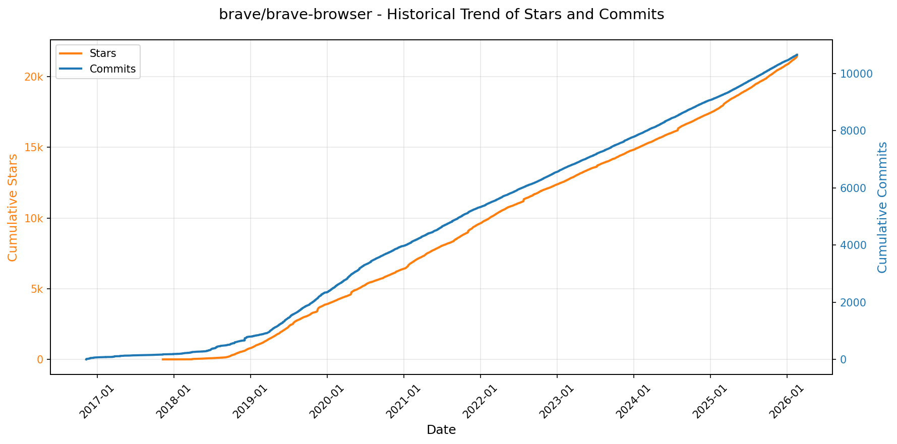
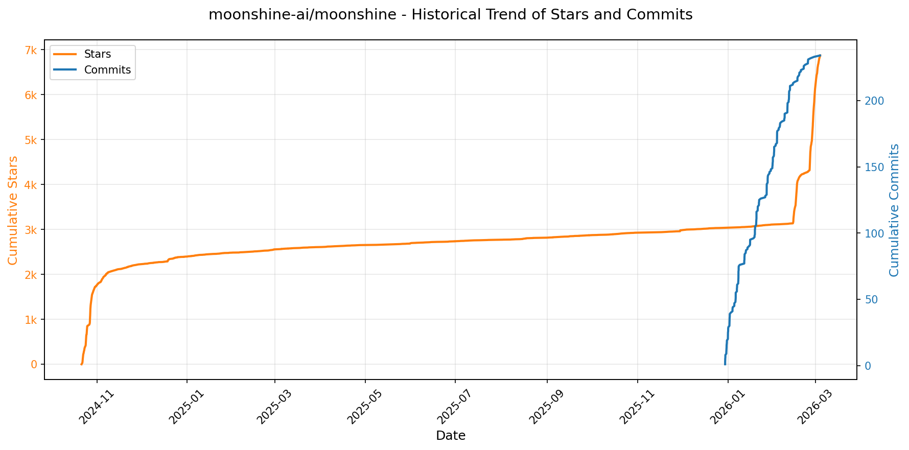

# 🌟 GitHub Trending 概览

> 数据更新于：2026-02-16

---

## 🔍 项目详情

### 1. [anomalyco/opencode](https://github.com/anomalyco/opencode)
- 📅 **创建日期**：2025-04-30  
- 🔄 **最近更新**：2026-02-16  
- ⭐ **Stars**：183,122（日 +508｜周 +4944｜月 +35882）  
- 📝 **描述**：The open source coding agent.  

<b>📈 Star 与 Commit 历史趋势</b>

> *蓝色：累计 Stars｜橙色：累计 Commits（次 Y 轴）*

<b>📄 README 摘要</b>

1. **该项目做什么？**  
OpenCode 是一个开源的 AI 编程智能体（AI coding agent），旨在为开发者提供终端优先（TUI-first）、可本地运行、完全开源的 AI 辅助编程体验。它支持在终端中直接与 AI 协作完成代码编写、调试、重构、分析和探索等任务，同时具备客户端/服务器架构，允许多种前端（如终端、桌面应用、未来移动端）连接同一后端服务。其核心目标是打造一个不绑定特定大模型厂商、可自由切换 LLM（如 Claude、OpenAI、Google、本地模型等）的通用 AI 编程代理平台。

2. **关键特性**  
- **双模式智能体切换**：内置 `build`（全权限开发模式，可编辑文件、执行命令）和 `plan`（只读分析模式，禁止自动修改文件，执行 bash 命令前需显式授权），按 `Tab` 键快速切换；另含 `@general` 子智能体处理复杂多步任务。  
- **跨平台原生支持**：提供一键安装脚本（支持 macOS/Linux/Windows）、多种包管理器集成（Homebrew、Scoop、Chocolatey、Pacman、Nix、Mise 等），并发布独立桌面应用（BETA，支持 macOS/Windows/Linux）。  
- **终端优先设计（TUI）**：深度优化命令行交互体验，由 Neovim 用户及 terminal.shop 团队主导开发，强调在纯终端环境中的生产力与响应能力。  
- **开箱即用的 LSP 支持**：原生集成语言服务器协议，实现智能补全、跳转、诊断等 IDE 级功能。  
- **完全开源 & 供应商无关**：100% MIT 许可开源；不强制依赖任何云服务商，支持自托管模型或任意兼容 OpenAI API 的模型后端（包括本地 Ollama、Llama.cpp 等）。  
- **国际化与社区驱动**：提供 18 种语言的 README 文档；活跃 Discord 社区支持；清晰的贡献指南与生态声明（防止项目混淆）。

3. **技术栈**  
- **核心语言与运行时**：主要使用 TypeScript 编写；支持通过 `npm`/`bun`/`pnpm`/`yarn` 全局安装；兼容 Node.js 运行时。  
- **构建与分发**：采用 Monorepo 结构（`packages/` 下含 `console`、`web`、`desktop` 等子模块）；CI/CD 基于 GitHub Actions；支持多平台二进制打包（`.dmg`、`.exe`、`.deb`、`.rpm`、AppImage）及跨平台包管理器集成。  
- **架构设计**：基于 client-server 架构，终端 TUI 作为默认客户端，后端提供统一 Agent 调度、模型抽象层（Model Adapter）、文件系统访问控制与命令执行沙箱。  
- **前端界面**：终端 UI 使用现代 TUI 框架（推测为基于 `ink` 或自研渲染层）；桌面端基于 Electron 或 Tauri（根据发布文件命名惯例及社区背景推断，但 README 未明确说明，实际以源码为准）；Web 控制台（`packages/web`）存在但非主打形态。  
- **模型集成层**：抽象化 LLM 接口，兼容 OpenAI 兼容 API、Anthropic、Google Gemini 及本地模型（通过 `OpenCode Zen` 提供推荐配置，但非强制依赖）。

---

### 2. [anthropics/skills](https://github.com/anthropics/skills)
- 📅 **创建日期**：2025-09-22  
- 🔄 **最近更新**：2026-02-16  
- ⭐ **Stars**：110,476（日 +399｜周 +4508｜月 +24324）  
- 📝 **描述**：Public repository for Agent Skills  

<b>📈 Star 与 Commit 历史趋势</b>

> *蓝色：累计 Stars｜橙色：累计 Commits（次 Y 轴）*

<b>📄 README 摘要</b>

1. **该项目做什么？**  
该项目是 Anthropic 官方维护的 Claude 技能（Skills）开源示例仓库，旨在展示如何通过结构化、可复用的“技能包”扩展 Claude 的专业化能力。每个技能是一个独立文件夹，内含 `SKILL.md`（含 YAML 元数据和任务指令），使 Claude 能动态加载并执行特定领域任务，例如：按企业品牌规范生成文档、基于组织流程分析数据、自动化个人事务（如 PDF 表单提取、PPTX 创建）、测试 Web 应用、生成 MCP 服务器等。它不提供运行时服务或独立应用，而是为开发者和企业构建、共享、复用 AI 能力提供参考实现与模式范例。

2. **关键特性**  
- **模块化与自包含设计**：每个技能隔离在独立文件夹中，含标准化 `SKILL.md`（YAML 前置元数据 + Markdown 指令/示例/指南），便于分发、安装与版本管理；  
- **多场景覆盖**：涵盖创意设计（艺术/音乐/UI）、技术开发（Web 测试/MCP 生成）、企业协作（通信/品牌合规）及全格式文档处理（DOCX/PDF/PPTX/XLSX）四大类技能；  
- **生产级参考实现**：公开了支撑 Claude 实际文档能力的核心技能源码（如 `skills/docx` 等子目录），虽为“源码可用”（source-available）而非完全开源，但提供了高复杂度、真实落地技能的架构与工程实践范本；  
- **跨平台即插即用**：支持在 Claude Code（通过插件市场注册安装）、Claude.ai（付费用户开箱即用）、Claude API（上传自定义技能）三端无缝集成，支持自然语言触发（如“用 PDF 技能提取表单字段”）；  
- **开放规范与模板**：内置 [Agent Skills 规范](./spec) 和标准化 [技能模板](./template)，降低创建门槛，推动技能生态标准化。

3. **技术栈**  
- **核心协议/标准**：Agent Skills 开放规范（定义技能结构、元数据、加载机制等，见 `./spec`）；  
- **技能描述格式**：Markdown（含 YAML 前置元数据），纯文本声明式定义，零代码依赖；  
- **交付与集成方式**：基于 GitHub 仓库的静态文件分发，配合 Claude Code 插件系统、Claude.ai 技能中心、Claude API 的 Skills SDK 进行注册、安装与调用；  
- **许可模型**：大部分示例技能采用 Apache 2.0 开源协议；文档类核心技能为源码可用（source-available），明确区分开源与生产级资产边界；  
- **无运行时依赖**：技能本身不包含后端服务、数据库或执行引擎——其逻辑完全由 Claude 模型在推理时解析并执行，强调轻量、安全、可审计。

---

### 3. [Shubhamsaboo/awesome-llm-apps](https://github.com/Shubhamsaboo/awesome-llm-apps)
- 📅 **创建日期**：2024-04-29  
- 🔄 **最近更新**：2026-02-16  
- ⭐ **Stars**：95,581（日 +295｜周 +2557｜月 +7585）  
- 📝 **描述**：Collection of awesome LLM apps with AI Agents and RAG using OpenAI, Anthropic, Gemini and opensource models.  

<b>📈 Star 与 Commit 历史趋势</b>

> *蓝色：累计 Stars｜橙色：累计 Commits（次 Y 轴）*

<b>📄 README 摘要</b>

1. **该项目做什么？**  
该项目是一个**精选的大型语言模型（LLM）应用集合库**，聚焦于可实际运行、开箱即用的前沿AI应用案例。它不提供自研框架或底层模型，而是系统性地整理、归类并提供大量已实现的LLM应用项目，涵盖从入门级单智能体到高阶多智能体协作、语音交互、MCP（Model Context Protocol）集成、RAG增强生成、记忆持久化、跨平台数据源对话（如GitHub、Gmail、PDF、YouTube等）以及LLM优化与微调等完整技术路径。其核心目标是为开发者、研究者和AI从业者提供一个高质量、可复现、模块化、文档完善的开源实践参考资源库。

2. **关键特性**  
- **全栈式AI应用覆盖**：包含超50+个分类明确的实战项目，分为AI Agents（含Starter/Advanced）、Multi-agent Teams、Voice AI Agents、MCP AI Agents、RAG（含Agentic RAG、Corrective RAG、Vision RAG等16+变体）、带记忆的LLM应用、跨平台“Chat with X”（GitHub/Gmail/PDF/ArXiv/YouTube等）、LLM优化工具（如TOONify Token压缩、Headroom上下文压缩）、LLM微调教程（Gemma 3、Llama 3.2）及主流Agent框架速成课（Google ADK、OpenAI Agents SDK）。  
- **模型与部署中立性**：支持OpenAI、Anthropic、Google Gemini、xAI、Qwen、Llama等多厂商及开源模型，并明确标注各项目是否支持本地运行（Local & Cloud），强调可离线部署能力。  
- **工程实践导向**：所有项目均以独立子目录结构组织，附带`requirements.txt`和详细`README.md`，强调开箱即用、环境隔离与快速上手；同时突出生产级要素：结构化输出（Pydantic）、工具集成（内置/函数/第三方/MCP）、持久化记忆、回调机制、评估方法与多智能体编排模式（Swarm、handoff、routing）。  
- **生态协同与可持续性**：提供多语言国际化支持（含中文等8种语言）、社区赞助体系（TinyFish、Tiger Data MCP、Speechmatics等）、Star History追踪及明确的贡献指引，构建活跃的开源共建生态。

3. **技术栈**  
- **核心AI框架与协议**：Google ADK（Agent Development Kit）、OpenAI Agents SDK、CrewAI、Model Context Protocol（MCP）；  
- **LLM模型层**：OpenAI GPT系列、Anthropic Claude、Google Gemini、xAI Grok、Alibaba Qwen、Meta Llama（3.1/3.2）、Google Gemma（3）、DeepSeek；  
- **RAG与检索技术**：Embedding模型（Gemma-based embeddings）、Hybrid Search（语义+关键词）、Vector DB（隐含集成）、Cohere RAG、Vision RAG（多模态检索）；  
- **语音与多模态**：Speechmatics语音识别、音频转录与语音交互流程；Gemini Multimodal Agent、Vision RAG；  
- **开发与基础设施**：Python（主语言）、Pydantic（结构化I/O）、主流LLM SDK（OpenAI、Anthropic、Google Generative AI等）、浏览器自动化（Playwright/Browser MCP）、Git/GitHub工作流；  
- **优化与工程工具**：自研TOON格式Token压缩、Headroom上下文智能压缩算法、本地化部署支持（CPU/GPU兼容）、Stateful Chat会话管理、Shared Memory多LLM协同机制。

---

### 4. [openclaw/openclaw](https://github.com/openclaw/openclaw)
- 📅 **创建日期**：2025-11-24  
- 🔄 **最近更新**：2026-02-16  
- ⭐ **Stars**：82,832（日 +2942｜周 +21473｜月 +82832）  
- 📝 **描述**：Your own personal AI assistant. Any OS. Any Platform. The lobster way. 🦞   

<b>📈 Star 与 Commit 历史趋势</b>

> *蓝色：累计 Stars｜橙色：累计 Commits（次 Y 轴）*

<b>📄 README 摘要</b>

1. **项目功能**  
OpenClaw 是一个完全本地化、用户自托管的个人 AI 助手系统，核心目标是让用户在**自有设备上运行专属、单用户、低延迟、始终在线的 AI 助理**。它不依赖中心化云服务，而是通过轻量级「网关（Gateway）」作为统一控制平面，将 AI 能力无缝接入用户日常使用的全部通信渠道（如 WhatsApp、Telegram、Slack、Discord、Signal、iMessage、Google Chat、Microsoft Teams、Matrix、Zalo 等），并支持跨平台语音交互（macOS/iOS/Android）、实时可视化工作区（Live Canvas）及设备级本地操作（如屏幕录制、摄像头调用、系统命令执行）。其本质是将大模型能力与真实世界终端（消息入口 + 本地设备能力）深度耦合，构建端到端可控的个人智能体基础设施。

2. **关键特性**  
- **多通道统一收件箱**：原生集成 14+ 主流通讯平台（含 BlueBubbles/iMessage 桥接、Zalo 等区域化服务），支持 DM 配对鉴权与群组路由规则（提及触发、回复链路等）。  
- **本地优先网关架构**：单进程 WebSocket 控制平面，统筹会话管理、通道连接、工具调度、事件分发、定时任务（cron）、Webhook 及远程访问（Tailscale/SSH）。  
- **多智能体隔离工作区**：支持按通道、账号或联系人路由至独立 agent 实例（workspace + session 隔离），实现上下文、模型、技能、权限的精细化隔离。  
- **全栈语音交互能力**：集成 ElevenLabs，提供 macOS/iOS/Android 的「语音唤醒（Voice Wake）」与「对话模式（Talk Mode）」，支持持续语音输入与自然对话流。  
- **Live Canvas 可视化工作区**：基于 A2UI 协议的动态画布，由 AI agent 驱动实时渲染、执行脚本、快照保存，支持 macOS/iOS/Android 多端同步。  
- **设备原生节点（Nodes）体系**：将 iOS/Android/macOS 设备抽象为可调用节点，安全暴露相机、屏幕录制、定位、通知、系统命令（`system.run`）等 TCC 权限受控能力。  
- **安全强化默认策略**：DM 默认启用配对码机制（`dmPolicy="pairing"`），拒绝未授权输入；支持 OAuth 模型认证、模型故障转移（failover）、会话自动裁剪与细粒度权限审计（`openclaw doctor`）。  
- **技能即服务（ClawHub）**：内置技能注册中心，支持自动发现、安装与沙箱化执行 Bundled/Managed/Workspace 三类技能。  
- **全平台 CLI 与向导驱动体验**：`openclaw onboard` 一键完成网关部署、通道配对、模型配置与技能初始化，支持 macOS/Linux/WSL2，开箱即用。

3. **技术栈**  
- **运行时**：Node.js ≥22（主运行环境），支持 npm/pnpm/bun；TypeScript 为主开发语言；`tsx` 用于直接运行 TS 源码。  
- **核心框架**：基于 WebSocket 的自研 Gateway 控制平面；RPC 协议驱动 Pi Agent 运行时；A2UI 协议实现 Canvas 渲染。  
- **通道集成**：复用成熟 SDK — Baileys（WhatsApp）、grammY（Telegram）、discord.js（Discord）、@slack/bolt（Slack）、signal-cli（Signal）、matrix-js-sdk（Matrix）等。  
- **语音与媒体**：ElevenLabs（TTS）、Whisper（语音转文本）、FFmpeg（音视频处理）、系统 AVFoundation/AVCapture（iOS/macOS 媒体采集）。  
- **浏览器自动化**：定制化 Chromium/Chrome 实例，通过 CDP（Chrome DevTools Protocol）实现网页控制、截图、上传与会话管理。  
- **部署与打包**：支持 Nix（声明式配置）、Docker（容器化）、systemd（Linux）/launchd（macOS）守护进程；Tailscale Serve/Funnel 实现安全远程访问。  
- **安全机制**：OAuth 2.0（Anthropic/OpenAI）、密码/Token 双因子认证、TCC 权限桥接、本地 Allowlist 存储、会话级模型/思考级别/发送策略动态配置。

---

### 5. [obra/superpowers](https://github.com/obra/superpowers)
- 📅 **创建日期**：2025-10-09  
- 🔄 **最近更新**：2026-02-16  
- ⭐ **Stars**：81,161（日 +609｜周 +4579｜月 +29051）  
- 📝 **描述**：An agentic skills framework & software development methodology that works.  

<b>📈 Star 与 Commit 历史趋势</b>

> *蓝色：累计 Stars｜橙色：累计 Commits（次 Y 轴）*

<b>📄 README 摘要</b>

1. **该项目的功能**  
Superpowers 是一个面向编程智能体（coding agents）的完整软件开发工作流框架，旨在将原本零散、随意的代码生成行为，转化为结构化、可验证、符合工程最佳实践的协作式开发过程。它不直接编写代码，而是通过一系列自动触发的“技能”（skills），引导智能体与开发者共同完成需求澄清、设计评审、TDD 计划制定、子智能体协同执行、自动化测试验证、代码审查及分支收尾等全流程任务。其核心目标是让 AI 编程代理具备类人类工程师的系统性思维与工程纪律，而非仅作为“高级补全工具”。

2. **关键特性**  
- **全自动技能驱动流程**：所有技能（如 brainstorming、writing-plans、subagent-driven-development 等）基于上下文自动触发，无需用户手动调用；流程为强制性（mandatory workflows），非可选建议。  
- **深度工程实践内嵌**：严格贯彻红/绿/重构（RED-GREEN-REFACTOR）的 TDD 流程，强制先写失败测试；践行 YAGNI（你不会需要它）与 DRY（不要重复自己）原则；强调验证先行（verification-before-completion）、根因追溯（systematic-debugging）和防御性设计。  
- **人机协同增强机制**：设计阶段分块呈现、需人工确认；实现计划颗粒度精细（每项任务耗时 2–5 分钟，含精确文件路径、完整代码片段与验证步骤）；引入双阶段子智能体审查（先验规范符合性，再审代码质量）；支持并行子智能体开发（dispatching-parallel-agents）与人工检查点（human checkpoints）。  
- **Git 工作流原生集成**：自动创建隔离的 git worktree 分支、校验干净测试基线、完成开发后提供合并/PR/丢弃等决策选项，并自动清理。  
- **自生长能力**：内置 `writing-skills` 技能，支持用户遵循标准范式创建、测试并贡献新技能，形成可扩展的技能库生态。

3. **技术栈**  
- **运行平台**：专为多款 AI 编程代理平台设计，支持 **Claude Code**（通过插件市场集成）、**Codex** 和 **OpenCode**（均通过远程加载配置文档实现适配）。  
- **架构模式**：基于“技能（Skill）”的可组合模块化设计，每个技能为独立功能单元（以 Markdown 文档 + 指令逻辑定义），存于 GitHub 仓库中，通过 URL 动态加载或插件机制注入。  
- **核心机制**：依赖智能体对自然语言指令的上下文理解与条件触发能力；无独立后端服务或运行时环境，纯前端/客户端侧指令编排；技能更新通过插件热更新（`/plugin update superpowers`）实现。  
- **协议与规范**：采用 Git 分支管理（worktree）、标准测试断言流程、TDD 生命周期钩子；文档即代码（如 `.codex/INSTALL.md`），技能规范遵循内建的 `writing-skills` 指南。

---

### 6. [google/langextract](https://github.com/google/langextract)
- 📅 **创建日期**：2025-07-08  
- 🔄 **最近更新**：2026-02-16  
- ⭐ **Stars**：54,785（日 +259｜周 +7877｜月 +12488）  
- 📝 **描述**：A Python library for extracting structured information from unstructured text using LLMs with precise source grounding and interactive visualization.  

<b>📈 Star 与 Commit 历史趋势</b>

> *蓝色：累计 Stars｜橙色：累计 Commits（次 Y 轴）*

<b>📄 README 摘要</b>

1. **项目功能**  
LangExtract 是一个基于大语言模型（LLM）的 Python 库，专注于从**非结构化文本**（如临床病历、放射报告、文学作品等）中**高精度提取结构化信息**。其核心能力是依据用户定义的指令（含提示词与少量高质量示例），自动识别并组织关键实体（如人物、情绪、药物名称、剂量、关系等），同时严格保证所有提取结果均**可追溯至原文确切位置**（即“源文本锚定”），支持端到端的结构化输出与可视化验证。

2. **关键特性**  
- **精准源文本锚定（Source Grounding）**：为每个提取项标注在原文中的精确字符位置，支持交互式高亮与人工复核；  
- **强结构化输出保障**：通过受控生成机制（如 Gemini 的 schema 强约束）和少样本示例驱动，确保输出严格遵循用户定义的类名、属性与格式；  
- **长文档优化处理**：采用多轮抽取（extraction passes）、自适应文本分块（chunking）与并行处理（max_workers），显著提升大文本（如整本小说、完整病历）的召回率与准确性；  
- **开箱即用的交互式可视化**：一键生成自包含 HTML 文件，支持动态搜索、上下文定位、批量实体浏览，适用于千级乃至万级提取结果的高效审查；  
- **灵活的多模型后端支持**：原生集成 Google Gemini（推荐默认 `gemini-2.5-flash`）、OpenAI（GPT-4o 等）、本地 Ollama 模型（如 `gemma2:2b`），并提供插件化架构以扩展第三方模型提供商；  
- **零微调领域适配**：仅需提供 1–3 个带标注的领域示例（如用药记录、影像报告），无需模型训练或微调即可快速适配新任务；  
- **知识感知提取控制**：通过提示词设计与示例属性显式调控 LLM 行为——既可严格限定于原文证据（e.g., `"emotional_state": "longing"`），也可引导模型注入世界知识（e.g., `"literary_context": "tragic heroine"`）。

3. **技术栈**  
- **编程语言**：Python（≥3.10）；  
- **核心依赖**：`google-generativeai`（Gemini）、`openai`（OpenAI）、`ollama`（本地模型）、`pydantic`（数据建模与验证）、`rich`（CLI 输出）、`jinja2`（HTML 可视化模板）；  
- **架构设计**：模块化插件系统（Provider Registry），支持通过 `entry_points` 动态注册自定义模型后端；  
- **开发与测试工具**：`pytest` + `tox`（多版本 Python 兼容性测试）、`pylint`、`pyink`（代码格式化）、`pre-commit`（自动化钩子）、Docker（容器化部署）；  
- **部署与集成**：支持 Vertex AI 批处理（降本增效）、`.env` 环境变量/API Key 安全管理、Jupyter/Colab 友好接口；  
- **许可证**：Apache 2.0 开源协议。

---

### 7. [nautechsystems/nautilus_trader](https://github.com/nautechsystems/nautilus_trader)
- 📅 **创建日期**：2018-06-25  
- 🔄 **最近更新**：2026-02-16  
- ⭐ **Stars**：37,043（日 +329｜周 +476｜月 +2510）  
- 📝 **描述**：A high-performance algorithmic trading platform and event-driven backtester  

<b>📈 Star 与 Commit 历史趋势</b>

> *蓝色：累计 Stars｜橙色：累计 Commits（次 Y 轴）*

<b>📄 README 摘要</b>

1. **项目功能**  
NautilusTrader 是一个开源、高性能、生产级的算法交易平台，专为量化交易员设计。其核心能力是支持在历史数据上对自动化交易策略组合进行事件驱动式回测，并可将**完全相同的策略代码无缝部署至实盘交易环境**，无需任何修改。平台具备资产类别无关性，通过模块化适配器支持接入任意 REST/ WebSocket 数据源与交易场所，覆盖外汇（FX）、股票、期货、期权、加密货币、DeFi 及博彩市场等多类资产，支持跨多个交易场所并行运行，适用于高频交易、做市、统计套利及 AI 交易代理（如强化学习/进化策略）训练等场景。

2. **关键特性**  
- **高性能与可靠性**：核心引擎用 Rust 编写，基于 tokio 实现异步网络通信；提供内存安全与线程安全保证，支持可选 Redis 持久化状态；支持纳秒级时间精度的多粒度历史数据回测（逐笔报价、成交、K线、订单簿及自定义数据）。  
- **交易能力完备**：支持全部主流时间有效期（IOC/FOK/GTC/GTD/DAY/AT_THE_OPEN/AT_THE_CLOSE）、高级订单类型（冰山单、仅限挂单、仅限减仓）、条件触发指令及复合委托（OCO/OUO/OTO）。  
- **高度可扩展与可定制**：基于消息总线（Message Bus）与缓存（Cache）架构，允许用户开发自定义组件、数据类型、适配器及整套交易系统；支持多交易所并发接入与统一建模。  
- **AI 原生设计**：强调“研究—回测—实盘”全链路一致性，消除 Python 研究环境与生产环境间的语义与性能鸿沟；回测引擎速度足以支撑实时训练 AI 交易模型。  
- **跨平台与易部署**：原生支持 Linux（x86_64/ARM64）、macOS（ARM64）和 Windows（x86_64），提供 Docker 镜像，Python 包可通过 pip 直接安装（含可选集成依赖如 `ib`, `binance`, `betfair` 等）。

3. **技术栈**  
- **核心语言**：Rust（实现高性能、内存/线程安全的底层引擎、数据模型与网络层），辅以 Cython 和 PyO3 构建 Python 绑定，确保零 Rust 工具链依赖即可安装使用。  
- **主开发语言**：Python（3.12–3.14），作为策略编写、回测配置、可视化及系统编排的统一接口，深度集成数据科学与 AI 生态。  
- **关键依赖/框架**：Rust 生态 — `tokio`（异步运行时）、`pyo3`（Python 绑定）、`serde`（序列化）；Python 生态 — 标准库为主，无重量级第三方框架依赖，强调轻量与确定性。  
- **精度支持**：提供双精度模式 — 标准精度（64 位整数，最高 9 位小数）与高精度（128 位整数，最高 16 位小数），Linux/macOS 默认启用高精度，Windows 因 MSVC 限制暂仅支持标准精度（Rust crate 层仍全平台支持高精度）。

---

### 8. [remotion-dev/remotion](https://github.com/remotion-dev/remotion)
- 📅 **创建日期**：2020-06-23  
- 🔄 **最近更新**：2026-02-16  
- ⭐ **Stars**：36,772（日 +122｜周 +1080｜月 +11467）  
- 📝 **描述**：🎥      Make videos programmatically with React  

<b>📈 Star 与 Commit 历史趋势</b>

> *蓝色：累计 Stars｜橙色：累计 Commits（次 Y 轴）*

<b>📄 README 摘要</b>

1. **项目功能**  
Remotion 是一个基于 React 的视频生成框架，允许开发者使用 React 组件、JavaScript 逻辑和 Web 标准技术（如 CSS、SVG、Canvas、WebGL）**以编程方式动态创建视频**。它将视频视为可组合、可复用、可参数化的 React 组件，支持时间轴控制、帧精确渲染、动态数据驱动内容（如个性化年度回顾），并可导出为 MP4、GIF 或 ProRes 等格式，适用于营销视频、数据可视化、社交媒体内容、UI 动画预演等场景。

2. **核心特性**  
- ✅ **React 原生开发体验**：支持函数组件、Hooks、Props、Context、Suspense 及 Fast Refresh 热更新；  
- ✅ **时间轴驱动渲染**：通过 `useCurrentFrame()` 和 `interpolate()` 实现帧级动画控制与插值计算；  
- ✅ **多目标输出**：一键导出高质量 MP4（H.264/AV1）、GIF、WebM、ProRes，支持自定义分辨率、帧率、码率；  
- ✅ **服务端渲染（SSR）支持**：可在 Node.js 环境中无头渲染视频（基于 Chromium），实现自动化批量生成（如个性化邮件视频、用户定制化内容）；  
- ✅ **交互式预览**：内置本地开发服务器，提供时间轴拖拽、播放/暂停、逐帧调试等可视化预览能力；  
- ✅ **丰富生态集成**：兼容第三方 React 库（如 Framer Motion、Three.js、D3）、支持 TypeScript、Vite/Webpack 构建工具；  
- ✅ **生产就绪能力**：提供 CLI 工具链（`npx create-video@latest`）、CLI 渲染命令、云部署指南及企业级授权支持。

3. **技术栈**  
- **核心框架**：React（v18+）、TypeScript；  
- **渲染引擎**：基于 Chromium（Puppeteer / Playwright）的无头浏览器环境，利用 Canvas/WebGL/SVG 进行像素级合成；  
- **构建与工具链**：Vite（默认模板）、Webpack（兼容）、ESBuild；  
- **视频编码**：FFmpeg（后端导出依赖）、Chromium 内置 MediaRecorder API（部分导出路径）；  
- **基础设施**：Node.js 运行时、npm/pnpm 包管理；  
- **扩展能力**：支持 WebGL（via Three.js）、Canvas 2D、CSS 动画、SVG 滤镜、Web Audio API 等 Web 平台原生 API。

---

### 9. [asgeirtj/system_prompts_leaks](https://github.com/asgeirtj/system_prompts_leaks)
- 📅 **创建日期**：2025-05-03  
- 🔄 **最近更新**：2026-02-16  
- ⭐ **Stars**：31,626（日 +108｜周 +931｜月 +6579）  
- 📝 **描述**：Collection of extracted System Prompts from popular chatbots like ChatGPT, Claude & Gemini  

<b>📈 Star 与 Commit 历史趋势</b>

> *蓝色：累计 Stars｜橙色：累计 Commits（次 Y 轴）*

---

### 10. [thedotmack/claude-mem](https://github.com/thedotmack/claude-mem)
- 📅 **创建日期**：2025-08-31  
- 🔄 **最近更新**：2026-02-16  
- ⭐ **Stars**：28,718（日 +230｜周 +2982｜月 +14536）  
- 📝 **描述**：A Claude Code plugin that automatically captures everything Claude does during your coding sessions, compresses it with AI (using Claude's agent-sdk), and injects relevant context back into future sessions.  

<b>📈 Star 与 Commit 历史趋势</b>

> *蓝色：累计 Stars｜橙色：累计 Commits（次 Y 轴）*

<b>📄 README 摘要</b>

1. **项目功能**  
Claude-Mem 是一个专为 Anthropic 的 **Claude Code**（AI 编程助手）设计的**持久化记忆压缩系统**。它在用户每次会话中自动捕获工具调用、代码操作、错误反馈等上下文观测数据（observations），生成语义化摘要，并长期存储于本地 SQLite 数据库中；当新会话启动时，自动将相关历史记忆以高效、分层的方式注入上下文，使 Claude 能够跨会话持续理解项目状态、技术决策与问题演进，实现真正的“上下文连续性”。

2. **核心特性**  
- ✅ **跨会话持久记忆**：会话结束后记忆不丢失，重启后自动恢复上下文关联；  
- ✅ **渐进式上下文披露（Progressive Disclosure）**：分三层按需加载记忆（索引 → 时间线 → 详情），显著降低 token 消耗（约节省 10 倍）；  
- ✅ **自然语言智能搜索**：通过 `mem-search` 技能及 5 个标准化 MCP 工具（`search`/`timeline`/`get_observations`/`save_memory`/`__IMPORTANT`）支持按类型、日期、项目名等多维语义检索；  
- ✅ **实时 Web 查看器**：内置 HTTP 服务（默认 `http://localhost:37777`），提供可视化记忆流、观测详情、API 接口及设置面板；  
- ✅ **隐私敏感控制**：支持 `<private>` 标签标记敏感内容，自动排除存储；  
- ✅ **全自动运行**：无需手动触发，依赖生命周期钩子（SessionStart/PostToolUse/SessionEnd 等）静默工作；  
- ✅ **混合搜索架构**：融合 SQLite FTS5 全文检索 + Chroma 向量数据库，兼顾精确匹配与语义相似性；  
- ✅ **Claude Desktop 集成**：可在桌面版对话中直接调用记忆搜索技能；  
- ✅ **Beta 实验通道**：支持 Endless Mode（仿生长时记忆架构）等前沿功能快速试用；  
- ✅ **多语言支持**：提供 30+ 种语言的文档与界面本地化（含简体中文、繁体中文、日语、韩语、阿拉伯语等）。

3. **技术栈**  
- **运行时**：Node.js（≥18.0.0）、Bun（作为 HTTP 服务与进程管理器）、uv（Python 包管理器，用于向量搜索依赖）；  
- **数据库**：SQLite3（主存储，含 FTS5 全文索引）、Chroma（轻量级向量数据库，支持语义搜索）；  
- **前端/交互**：TypeScript 构建的 Web UI（静态资源 + API 服务）、GIF 动态预览、响应式多语言文档；  
- **集成协议**：严格遵循 [MCP（Model Context Protocol）](https://modelcontextprotocol.io/) 规范，实现标准化工具调用；  
- **架构模式**：基于 6 个生命周期钩子的插件化设计（含 Smart Install 预检脚本）、Worker Service 微服务架构、模块化配置（`settings.json`）；  
- **开发与部署**：AGPL-3.0 开源许可（主项目），Ragtime 子模块采用 PolyForm Noncommercial License；构建与测试基于 TypeScript 生态，支持自动化 Bug 报告生成与贡献流程标准化。

---

### 11. [ChromeDevTools/chrome-devtools-mcp](https://github.com/ChromeDevTools/chrome-devtools-mcp)
- 📅 **创建日期**：2025-09-11  
- 🔄 **最近更新**：2026-02-16  
- ⭐ **Stars**：25,538（日 +329｜周 +1928｜月 +4253）  
- 📝 **描述**：Chrome DevTools for coding agents  

<b>📈 Star 与 Commit 历史趋势</b>

> *蓝色：累计 Stars｜橙色：累计 Commits（次 Y 轴）*

<b>📄 README 摘要</b>

1. **项目功能**  
该项目（`chrome-devtools-mcp`）是一个符合**模型-上下文-协议（MCP）标准的服务器**，旨在使AI编程助手（如Gemini、Claude、Cursor、Copilot、Codex等）能够**安全、可靠地控制并深度检测正在运行的Chrome浏览器实例**。它桥接AI代理与Chrome DevTools底层能力，支持对网页进行真实环境下的自动化操作、全链路调试分析（含网络、控制台、DOM）、性能诊断（实验室+现场数据融合）及截图/快照等操作，从而赋能AI完成端到端的Web开发、测试与优化任务。

2. **核心特性**  
- **深度性能洞察**：集成Chrome DevTools前端，可录制性能轨迹（trace），自动分析瓶颈，并可选通过Google CrUX API获取真实用户性能（RUM）数据，实现实验室（lab）与现场（field）数据协同分析；  
- **高级浏览器调试能力**：支持实时捕获网络请求详情、读取带源码映射（source-mapped）的控制台日志、截取全屏/元素级截图、执行任意JavaScript脚本、生成内存/堆栈快照；  
- **高可靠性自动化**：基于Puppeteer构建，提供语义化交互工具（如`click`、`fill_form`、`navigate_page`、`wait_for`等），自动等待页面加载、元素就绪及操作完成，显著提升AI驱动操作的鲁棒性；  
- **灵活部署与连接模式**：支持自动启动隔离Chrome实例、连接已运行的调试版Chrome（通过HTTP或WebSocket）、指定频道（Stable/Canary/Beta/Dev）、自定义用户数据目录、代理配置及视口等，适配开发、CI/CD及安全敏感场景；  
- **模块化工具集**：按功能划分为输入自动化（8个）、导航（6个）、仿真（2个）、性能（3个）、网络（2个）、调试（5个）共6大类26+原子化工具，全部通过MCP标准接口暴露，可被任意兼容MCP的客户端调用。

3. **技术栈**  
- **运行时**：Node.js v20.19+（LTS维护版本）；  
- **浏览器引擎**：Google Chrome 当前稳定版或更新版本（依赖其远程调试协议 CDP）；  
- **核心驱动层**：[Puppeteer](https://github.com/puppeteer/puppeteer)（用于浏览器启动、进程管理、页面控制及CDP会话封装）；  
- **DevTools集成**：直接复用[Chrome DevTools前端](https://github.com/ChromeDevTools/devtools-frontend)的性能分析能力与协议逻辑；  
- **协议标准**：严格遵循[MCP（Model-Context-Protocol）v1规范](https://modelcontextprotocol.io/)，提供JSON-RPC 2.0 over stdio/HTTP流式传输；  
- **构建与分发**：npm包管理（`chrome-devtools-mcp`），支持`npx`一键启动；  
- **附加能力**：CrUX API集成（可选）、WebSocket自定义头支持、多环境变量控制（如`CI`、`CHROME_DEVTOOLS_MCP_NO_USAGE_STATISTICS`）。

---

### 12. [virattt/dexter](https://github.com/virattt/dexter)
- 📅 **创建日期**：2025-10-14  
- 🔄 **最近更新**：2026-02-16  
- ⭐ **Stars**：22,816（日 +222｜周 +2754｜月 +8650）  
- 📝 **描述**：An autonomous agent for deep financial research  

<b>📈 Star 与 Commit 历史趋势</b>

> *蓝色：累计 Stars｜橙色：累计 Commits（次 Y 轴）*

<b>📄 README 摘要</b>

1. **项目功能**  
Dexter 是一个面向金融研究的自主式AI代理系统，能够对复杂金融问题进行端到端的自动化分析：接收自然语言提问 → 自主拆解为多步研究计划 → 调用实时金融数据源执行任务（如获取上市公司财报、现金流与资产负债表）→ 对中间结果进行自我验证与反思 → 迭代优化直至生成可信、数据支撑的结论。其核心定位是“金融领域的Claude Code”，专为高精度、可追溯、安全可控的金融情报生成而设计，支持交互式终端使用及WhatsApp消息接入。

2. **关键特性**  
- **智能任务规划**：自动将模糊/复杂的金融问题（如“对比苹果与英伟达过去三年的盈利质量与资本效率”）分解为结构化、可执行的研究子任务；  
- **自主工具编排与执行**：动态选择并调用适配的API工具（如Financial Datasets获取财报、Exa/Tavily执行网络搜索），实现免人工干预的数据采集；  
- **自验证与迭代闭环**：内置推理链追踪与结果校验机制，通过LLM驱动的自我反思判断任务完成度，支持多轮重试与修正；  
- **实时权威金融数据集成**：原生对接Financial Datasets API，免费支持AAPL、NVDA、MSFT等标的的年度/季度收入表、资产负债表、现金流量表；  
- **生产级安全机制**：强制设置步骤上限、循环检测（loop detection）及超时熔断，杜绝无限执行风险；  
- **全链路可调试性**：每轮查询生成独立JSONL格式“草稿本”（scratchpad），完整记录原始问题、各工具调用参数/原始响应/LLM摘要、推理过程，支持逐帧回溯与审计；  
- **多模态交互支持**：除CLI交互外，提供WhatsApp网关，用户可通过私聊方式发起金融咨询，实现轻量级移动接入。

3. **技术栈**  
- **运行时**：Bun（v1.0+）——作为Node.js替代方案，提供极速依赖安装与脚本执行；  
- **核心语言**：TypeScript（强类型保障金融逻辑严谨性）；  
- **AI模型层**：默认集成OpenAI API（兼容Anthropic/Claude、Google Gemini、xAI、OpenRouter等多后端，通过环境变量切换）；  
- **数据服务**：  
  - 主要数据源：Financial Datasets API（机构级实时财报）；  
  - 补充检索：Exa API（首选）、Tavily API（备用）；  
- **可观测性与评估**：LangSmith（用于LLM调用追踪、链路分析与自动化评测）；  
- **本地部署选项**：支持Ollama（通过`OLLAMA_BASE_URL`配置）运行开源大模型；  
- **通信网关**：WhatsApp Business API集成（基于Twilio或自建网关），实现消息收发与会话状态管理；  
- **工程实践**：模块化架构（含`src/evals/`评测套件、`src/gateway/`通道抽象）、环境变量驱动配置、MIT开源协议。

---

### 13. [iOfficeAI/AionUi](https://github.com/iOfficeAI/AionUi)
- 📅 **创建日期**：2025-08-07  
- 🔄 **最近更新**：2026-02-16  
- ⭐ **Stars**：21,975（日 +139｜周 +2867｜月 +13405）  
- 📝 **描述**：Free, local, open-source 24/7 Cowork and OpenClaw for Gemini CLI, Claude Code, Codex, OpenCode, Qwen Code, Goose CLI, Auggie, and more | 🌟 Star if you like it!  

<b>📈 Star 与 Commit 历史趋势</b>

> *蓝色：累计 Stars｜橙色：累计 Commits（次 Y 轴）*

---

### 14. [brave/brave-browser](https://github.com/brave/brave-browser)
- 📅 **创建日期**：2017-11-09  
- 🔄 **最近更新**：2026-02-16  
- ⭐ **Stars**：21,545（日 +140｜周 +234｜月 +495）  
- 📝 **描述**：Brave browser for Android, iOS, Linux, macOS, Windows.  

<b>📈 Star 与 Commit 历史趋势</b>

> *蓝色：累计 Stars｜橙色：累计 Commits（次 Y 轴）*

<b>📄 README 摘要</b>

1. **该项目的作用**  
该项目是 Brave 桌面浏览器（支持 macOS、Windows 和 Linux）的**构建工具仓库**，核心功能是自动化拉取、同步和编译构成 Brave 浏览器的多个关键子项目代码，包括：Chromium（作为底层基础）、brave-core（Brave 的核心功能层，挂载于 `src/brave`）、以及 adblock-rust（基于 Rust 实现的广告与跟踪器拦截引擎）。它不直接提供可运行的浏览器二进制文件，而是为开发者提供一套标准化的构建流水线（基于 `npm` 脚本），用于从源码完整构建 Brave 浏览器。

2. **关键特性**  
- **多平台构建支持**：统一支持 macOS、Windows、Linux、iOS 和 Android 平台的源码构建与配置；  
- **智能依赖管理**：通过 `gclient`（Chromium 官方工具）自动同步 Chromium 源码，并依据 `src/brave/DEPS` 和 `package.json` 精确拉取指定版本（如 `65.0.3325.181`）；  
- **补丁自动化应用**：在 Chromium 基础上自动打上 brave-core 维护的定制化补丁，实现 Brave 特有功能（如隐私增强、去中心化服务集成等）；  
- **灵活的构建模式**：支持多种构建类型——Component（默认调试型）、Release（发布版）、Static（静态链接，启动更快）、Debug（深度调试）；  
- **增量同步与精准更新**：`npm run sync` 提供细粒度控制（如 `--force`、`--init`、`--sync_chromium`、`--delete_unused_deps`），支持仅更新补丁、跳过 Chromium 升级或强制重置依赖，显著提升开发迭代效率；  
- **Rust 引擎深度集成**：通过 FFI（`adblock_rust_ffi`）将高性能 Rust 编写的广告拦截引擎无缝嵌入 Chromium 架构；  
- **跨平台构建配置抽象**：通过 `npm config` 统一设置 `target_os` / `target_arch`，简化 Android/iOS 等平台的交叉编译流程。

3. **技术栈**  
- **构建系统**：基于 `npm` 脚本驱动，底层调用 Google `depot_tools`（含 `gclient`、`gn`、`ninja`）管理 Chromium 依赖与编译流程；  
- **核心基础**：Chromium（C++ 主体，Blink/V8/Network 栈）、brave-core（C++/Objective-C/Swift，含大量 Chromium 补丁）；  
- **关键扩展组件**：Rust（`adblock-rust` 引擎）、FFI（C/C++ 与 Rust 互操作）；  
- **平台适配**：Xcode（iOS/macOS）、Android NDK/Bazel（Android）、Clang/GCC（Linux/macOS）、MSVC（Windows）；  
- **辅助工具链**：Git（子模块/分支管理）、Python（Chromium 构建脚本依赖）、Shell（跨平台脚本封装）。

---

### 15. [VectifyAI/PageIndex](https://github.com/VectifyAI/PageIndex)
- 📅 **创建日期**：2025-04-01  
- 🔄 **最近更新**：2026-02-16  
- ⭐ **Stars**：19,987（日 +91｜周 +961｜月 +9819）  
- 📝 **描述**：📑 PageIndex: Document Index for Vectorless, Reasoning-based RAG  

<b>📈 Star 与 Commit 历史趋势</b>

> *蓝色：累计 Stars｜橙色：累计 Commits（次 Y 轴）*

<b>📄 README 摘要</b>

1. **该项目做什么？**  
PageIndex 是一个面向长文档（如财报、法律文件、学术教材等）的**向量数据库无关、基于推理的检索增强生成（RAG）系统**。它不依赖传统向量相似性搜索，而是通过构建文档的**语义层级树结构索引**（类似智能目录），并利用大语言模型（LLM）在该树上执行**多步推理式检索**，模拟人类专家阅读和定位信息的方式，实现高精度、可追溯、可解释的知识提取与问答。

2. **核心功能**  
- ✅ **无向量数据库（No Vector DB）**：摒弃嵌入计算与向量检索，完全基于文档结构与LLM推理完成检索；  
- ✅ **无需分块（No Chunking）**：保留文档天然语义单元（章节、小节、图表上下文），避免人工切片导致的信息割裂；  
- ✅ **类人检索（Human-like Retrieval）**：通过“树索引生成 + 树搜索推理”两阶段流程，支持深度上下文理解与跨页/跨节逻辑关联；  
- ✅ **高可解释性与可追溯性**：每次检索结果附带明确的页面号、节点ID及推理路径，支持审计与调试，杜绝“黑箱式相似度匹配”；  
- ✅ **原生视觉支持（Vision-based RAG）**：提供OCR-Free方案，可直接对PDF页面图像进行端到端推理检索，跳过文本提取环节；  
- ✅ **SOTA性能验证**：驱动的金融分析系统 Mafin 2.5 在 FinanceBench 基准测试中达成 **98.7% 准确率**，显著超越主流向量RAG方案。

3. **技术栈**  
- **核心模型层**：依赖 OpenAI 等闭源大模型（默认 `gpt-4o-2024-11-20`）执行树结构生成、节点摘要、推理式树遍历等任务；  
- **文档处理层**：支持 PDF（基于 PyPDF2 / pdfplumber 等库解析）与 Markdown（按 `#` 层级自动识别标题结构）双输入格式；  
- **架构设计**：采用**树状索引（Tree Index）** 作为核心数据结构，以 JSON 格式组织节点（含 `title`、`node_id`、`start/end_index`、`summary` 及子节点 `nodes` 数组）；  
- **部署与集成**：提供本地开源 CLI 工具（`run_pageindex.py`）、RESTful API（Beta）、MCP 协议插件（兼容 Claude/Cursor 等智能体环境），以及云端 Chat 平台（chat.pageindex.ai）；  
- **辅助能力**：配套自研 **PageIndex OCR**（未完全开源，云服务提供）用于复杂PDF的结构保真提取，确保树索引质量。

---

### 16. [gitbutlerapp/gitbutler](https://github.com/gitbutlerapp/gitbutler)
- 📅 **创建日期**：2023-01-31  
- 🔄 **最近更新**：2026-02-16  
- ⭐ **Stars**：19,370（日 +45｜周 +1023｜月 +1912）  
- 📝 **描述**：The GitButler version control client, backed by Git, powered by Tauri/Rust/Svelte  

<b>📈 Star 与 Commit 历史趋势</b>

> *蓝色：累计 Stars｜橙色：累计 Commits（次 Y 轴）*

<b>📄 README 摘要</b>

1. **项目功能**  
GitButler 是一个从零构建的现代化 Git 版本控制系统界面，旨在替代传统 Git 的命令行与工作流，同时兼容所有现有 Git 仓库。它不替换 Git 本身，而是作为更友好、更强大、面向 AI 时代的“Git 用户界面层”，支持人类开发者与 AI 代理（agents）协同高效操作代码变更——无需修改仓库结构，开箱即用。

2. **核心功能**  
- **堆叠分支（Stacked Branches）**：支持在任意分支之上创建新分支，并自动处理提交重基（restacking），可随时编辑或修正底层提交；  
- **并行分支（Parallel Branches）**：允许多个虚拟分支并行存在、独立工作，避免频繁切换物理分支；  
- **可视化提交管理**：通过拖拽或简单 CLI 命令完成撤回、重写、变基、拆分、合并等操作，彻底取代 `git rebase -i`；  
- **操作时间线与无限撤销（Undo Timeline）**：完整记录所有 Git 操作，支持任意步骤的精准回退与恢复；  
- **一等冲突处理（First-Class Conflicts）**：冲突提交可被显式标记、延迟解决，且支持按任意顺序处理，确保 rebase 总是成功；  
- **原生 Forge 集成**：深度对接 GitHub/GitLab，直接在 GUI 或 CLI 中创建/更新 PR、同步 CI 状态、管理远程分支，无需额外工具；  
- **AI 工具链集成**：内置 AI 能力，自动生成语义化提交信息、分支名、PR 描述；支持为各类 AI 代理系统安装 Git 技能（skills）与钩子（hooks），提升自动化水平。

3. **技术栈**  
- **桌面端（GUI）**：基于 [Tauri](https://tauri.app/) 构建（轻量级、安全、高性能的桌面框架）；  
- **前端 UI**：使用 [Svelte](https://svelte.dev/) + [TypeScript](https://www.typescriptlang.org/) 开发；  
- **后端核心与 CLI**：全部采用 [Rust](https://www.rust-lang.org/) 编写，保障性能、内存安全与跨平台能力；  
- **CLI 工具 `but`**：复用同一套 Rust 后端引擎，提供与 GUI 功能对齐的命令行接口，实现“一套逻辑，双端体验”。

---

### 17. [KeygraphHQ/shannon](https://github.com/KeygraphHQ/shannon)
- 📅 **创建日期**：2025-09-27  
- 🔄 **最近更新**：2026-02-16  
- ⭐ **Stars**：19,253（日 +420｜周 +9206｜月 +15499）  
- 📝 **描述**：Fully autonomous AI hacker to find actual exploits in your web apps. Shannon has achieved a 96.15% success rate on the hint-free, source-aware XBOW Benchmark.  

<b>📈 Star 与 Commit 历史趋势</b>

> *蓝色：累计 Stars｜橙色：累计 Commits（次 Y 轴）*

<b>📄 README 摘要</b>

1. **该项目做什么？**  
Shannon 是一个**全自动、白盒优先的 AI 渗透测试工具**，核心目标是：在真实攻击者之前主动攻破用户的 Web 应用。它不只静态扫描或生成告警，而是**基于源代码分析（white-box）智能规划攻击路径，并通过内置浏览器与命令行环境动态执行真实 exploit（如注入、XSS、SSRF、认证绕过等），以实证方式验证漏洞的可利用性**。其定位是填补开发节奏（持续交付）与传统渗透测试（年检）之间的安全空白，为每次构建提供即时、可落地的安全验证能力。当前版本（Shannon Lite）专为源码可用的内部应用安全测试设计，强调“零人工干预”的端到端自动化渗透流程。

2. **关键特性**  
- **全自主渗透闭环**：单命令启动，自动完成 2FA/TOTP 登录（含 Google 登录）、页面导航、多阶段攻击执行与报告生成；  
- **实证型报告**：仅报告**已成功复现的漏洞**，附带可一键复制粘贴的 PoC（Proof-of-Concept），彻底消除误报；  
- **深度 OWASP 覆盖**：当前原生支持并验证 Injection、XSS、SSRF、Broken Authentication/Authorization 等关键漏洞类型，后续持续扩展；  
- **代码感知的动态测试**：融合静态源码分析（理解数据流与业务逻辑）与动态运行时 exploitation（浏览器+CLI），实现上下文感知的精准攻击；  
- **集成专业安全工具链**：在侦察阶段调用 Nmap、Subfinder、WhatWeb、Schemathesis 等工具，增强基础设施与 API 层面的深度测绘能力；  
- **并行化加速引擎**：对漏洞分析与 exploitation 阶段进行多线程/多代理并发处理，显著缩短整体测试耗时；  
- **企业就绪架构**：基于 Temporal 工作流引擎构建，支持实时日志监控、Web UI 可视化（http://localhost:8233）及完整审计追踪。

3. **技术栈**  
- **核心推理引擎**：Anthropic Claude Agent SDK（深度优化适配，官方推荐使用 Anthropic API 或 Claude Code OAuth）；  
- **运行时环境**：Docker 容器化部署（强依赖 Docker 运行时）；  
- **工作流编排**：Temporal（用于分布式任务调度、状态持久化与可观测性）；  
- **自动化执行层**：Puppeteer / Playwright 级浏览器自动化 + CLI 工具调用（如 curl、sqlmap 脚本等）；  
- **安全工具集成**：Nmap（网络探测）、Subfinder（子域名枚举）、WhatWeb（指纹识别）、Schemathesis（API 模糊测试）；  
- **配置与扩展**：YAML 配置驱动（支持登录流程、2FA、路径聚焦/排除规则等）；实验性支持 OpenRouter 路由至 GPT-5.2 / Gemini 3 等模型（非官方支持）；  
- **输出与存储**：结构化审计日志（JSON 元数据 + 原始 prompt + agent 日志 + Markdown 报告），默认落盘至 `./audit-logs/`。

---

### 18. [hsliuping/TradingAgents-CN](https://github.com/hsliuping/TradingAgents-CN)
- 📅 **创建日期**：2025-06-26  
- 🔄 **最近更新**：2026-02-16  
- ⭐ **Stars**：17,352（日 +55｜周 +1375｜月 +2551）  
- 📝 **描述**：基于多智能体LLM的中文金融交易框架 - TradingAgents中文增强版  

<b>📈 Star 与 Commit 历史趋势</b>

> *蓝色：累计 Stars｜橙色：累计 Commits（次 Y 轴）*

<b>📄 README 摘要</b>

1. **项目功能**  
本项目是一个面向中文用户的**多智能体与大模型股票分析学习平台**，基于开源框架 TradingAgents 进行深度本地化增强。其核心定位为**合规、非实盘的研究与教育工具**，旨在帮助用户系统学习多智能体协同分析框架与大语言模型（LLM）在股票研究中的应用方法。平台支持对 A 股、港股、美股的合规分析与教学实践，提供从数据获取、智能分析、策略模拟到报告生成的完整学习闭环，**不提供任何实盘交易指令或投资建议**。

2. **关键特性**  
- **全栈中文增强**：原生支持 A 股数据（Tushare/AkShare/BaoStock）、中文界面、国产大模型（通义千问、DeepSeek 等）集成及中文提示词工程优化；  
- **多智能体协同分析**：内置市场/基本面/新闻/技术等专业角色智能体，新增智能新闻分析、多层次新闻过滤、新闻质量评估等模块；  
- **企业级功能体系**：用户权限管理、可视化配置中心（LLM端点/数据源/系统参数）、多级缓存（MongoDB + Redis + 文件）、SSE+WebSocket 实时进度推送、批量股票分析、智能筛选与自选股管理、个股详情页及历史分析追踪；  
- **模拟与验证能力**：内置虚拟交易系统，支持策略效果回测与验证；  
- **专业输出与部署**：支持 Markdown/Word/PDF 多格式专业分析报告导出；提供 Docker 多架构（amd64/arm64）一键部署、绿色版（Windows 快速体验）及源码本地部署三套方案；  
- **稳定性与准确性强化**：修复技术指标（如MACD、RSI）与基本面数据（PE/PB）计算错误，解决死循环问题，确保多分析师共享统一、一致的数据源。

3. **技术栈**  
- **后端**：FastAPI（替代原 Streamlit） + Uvicorn，RESTful API + WebSocket 双通道；专有模块 `app/` 采用 FastAPI 构建，需商业授权；  
- **前端**：Vue 3 + Vite + Element Plus，现代化单页应用（SPA），专有模块 `frontend/` 同样需商业授权；  
- **数据库**：MongoDB（主存储） + Redis（高速缓存/会话/实时通知），实现双库协同与性能提升；  
- **AI 集成**：原生支持 OpenAI、Google Gemini、DeepSeek、通义千问等多 LLM 提供商，支持动态供应商配置与智能模型能力匹配；  
- **部署与运维**：Docker 多架构镜像（x86_64 / ARM64）、GitHub Actions 自动化构建、Docker Compose 一键编排；  
- **许可证模式**：混合授权——除 `app/` 和 `frontend/` 目录外，其余代码遵循 Apache 2.0 开源协议；前后端核心模块为专有组件，个人学习免费，**商业使用必须获得单独授权**。

---

### 19. [gsd-build/get-shit-done](https://github.com/gsd-build/get-shit-done)
- 📅 **创建日期**：2025-12-14  
- 🔄 **最近更新**：2026-02-16  
- ⭐ **Stars**：14,455（日 +384｜周 +2080｜月 +11219）  
- 📝 **描述**：A light-weight and powerful meta-prompting, context engineering and spec-driven development system for Claude Code and OpenCode.  

<b>📈 Star 与 Commit 历史趋势</b>

> *蓝色：累计 Stars｜橙色：累计 Commits（次 Y 轴）*

<b>📄 README 摘要</b>

1. **项目功能**  
该项目是一个轻量级但功能强大的元提示（meta-prompting）、上下文工程（context engineering）与规范驱动开发（spec-driven development）系统，专为 **Claude Code、OpenCode 和 Gemini CLI** 三大 AI 编程环境设计。其核心目标是**解决“上下文腐化”（context rot）问题**——即随着 Claude 等模型持续填充上下文窗口而导致的推理质量显著下降。GSD 通过结构化工作流，在不增加用户认知负担的前提下，确保 AI 始终在高质量、低噪声、高相关性的上下文中执行任务，从而稳定生成可交付、可验证、符合预期的代码成果。

2. **关键特性**  
- ✅ **全周期规范驱动工作流**：支持 `new-project → discuss-phase → plan-phase → execute-phase → verify-work → complete-milestone` 的闭环流程，每阶段均含明确输入/输出与人工确认点；  
- ✅ **智能上下文工程体系**：自动维护 `PROJECT.md`、`REQUIREMENTS.md`、`ROADMAP.md`、`STATE.md`、`CONTEXT.md` 等结构化文档，实现跨会话记忆与领域知识沉淀；  
- ✅ **多智能体并行编排**：各阶段（研究、规划、执行、验证）均由轻量级协调器调度专用子智能体并行运行，主会话上下文始终保持精简（30–40%占用），杜绝“上下文腐化”；  
- ✅ **波次化原子执行（Wave Execution）**：自动识别任务依赖关系，将计划分组为并行“波次”，独立任务并发执行、依赖任务串行等待，大幅提升效率且规避文件冲突；  
- ✅ **XML 结构化提示与内建验证**：所有执行计划均以语义清晰的 XML 格式编写（含 `<action>`、`<verify>`、`<done>` 等标签），强制指令精确性与结果可测性；  
- ✅ **原子化 Git 提交策略**：每个任务生成独立、语义化、时间戳标记的提交（如 `feat(08-02): add email confirmation flow`），支持精准 bisect、回滚与 AI 历史感知；  
- ✅ **无缝适配存量代码库（Brownfield）**：通过 `/gsd:map-codebase` 命令自动分析现有技术栈、架构与约定，使后续开发深度贴合项目实际；  
- ✅ **灵活模式支持**：提供 `Quick Mode`（快速任务）、`Skip Permissions Mode`（自动化权限绕过）、多模型配置剖面（quality/balanced/budget）及模块化里程碑管理（插入/删除/追加阶段）。

3. **技术栈**  
- **运行时支持**：原生集成 **Claude Code**（Anthropic）、**OpenCode**（开源本地模型 CLI）、**Gemini CLI**（Google）三大 AI 编程环境；  
- **核心实现**：基于 **Node.js** 构建命令行工具（CLI），通过 `npx` 一键安装与更新；  
- **提示工程层**：采用定制化 **XML Schema** 进行任务结构化描述，强化 Claude 等 LLM 对指令意图、验证标准与完成条件的理解；  
- **状态与配置管理**：使用纯文本 Markdown 文档（`.md`）与 JSON 配置（`.planning/config.json`）持久化项目状态、需求、计划与用户偏好；  
- **自动化基础设施**：深度集成 **Git CLI**（自动提交/状态检查）、**Bash 工具链**（`curl`, `git`, `ls`, `grep` 等权限白名单）、文件系统操作，实现端到端无人值守执行；  
- **部署与分发**：发布于 **npm Registry**（`get-shit-done-cc` 包），支持全局/本地安装，兼容 macOS / Windows / Linux；  
- **扩展生态**：提供 Discord 社区、X（Twitter）账号、$GSD 代币（Solana 链上）及完整文档体系（含 USER-GUIDE.md）。

---

### 20. [danielmiessler/Personal_AI_Infrastructure](https://github.com/danielmiessler/Personal_AI_Infrastructure)
- 📅 **创建日期**：2025-09-08  
- 🔄 **最近更新**：2026-02-16  
- ⭐ **Stars**：13,670（日 +104｜周 +2154｜月 +4123）  
- 📝 **描述**：Agentic AI Infrastructure for magnifying HUMAN capabilities.  

<b>📈 Star 与 Commit 历史趋势</b>

> *蓝色：累计 Stars｜橙色：累计 Commits（次 Y 轴）*

<b>📄 README 摘要</b>

1. **该项目做什么？**  
PAI（Personal AI Infrastructure，个人AI基础设施）是一个开源的、以用户为中心的AI系统框架，旨在将大语言模型（尤其是Claude Code）转化为真正“属于你”的持久化智能助手。它不提供独立模型或聊天界面，而是构建在Claude Code之上的**可学习、可进化、目标驱动的个人AI操作系统**：持续捕获用户反馈（评分、修正、验证结果）、自动分析失败、强化成功模式、动态升级技能与工作流；深度整合用户的个人目标（TELOS体系：MISSION/GOALS/PROJECTS等10类文档）、偏好、历史与身份，使AI从“无状态工具”转变为具备长期记忆、自我认知与成长能力的个性化协作者。

2. **核心功能**  
- **目标导向架构（Goal-First）**：所有任务执行均围绕用户明确定义的TELOS（使命、目标、信念等10维身份文档）展开，而非孤立任务响应。  
- **三阶记忆系统**：热/温/冷三层存储，支持信号级学习（如情感倾向、人工修正、验证成败），实现闭环式自我优化。  
- **模块化技能系统（Skill System）**：遵循“代码→CLI工具→Prompt→技能”确定性优先路径，确保结果可复现、可测试、可演进。  
- **事件驱动钩子系统（Hook System）**：8类生命周期事件（会话启动、工具调用、任务完成等）触发自动化响应（安全校验、上下文加载、通知推送）。  
- **用户/系统分离设计（User/System Separation）**：`USER/`目录存放全部个性化配置，`SYSTEM/`为框架代码，升级时零侵入、身份完全可迁移。  
- **全栈安全机制**：默认启用命令级权限校验，无需跳过安全检查即可流畅运行，阻断高危操作同时保障日常效率。  
- **多模态交互支持**：集成ElevenLabs语音播报、ntfy/Discord通知、终端富UI（动态状态栏、分屏管理）、AI驱动GUI安装器。  
- **科学化开发范式**：强制推行“先写规格/测试/评估 → 再编码 → 再提示”的工程流程，贯彻UNIX哲学与SRE实践标准。

3. **技术栈**  
- **核心平台**：原生深度集成 **Claude Code**（作为底层代理引擎与钩子运行时）；  
- **编程语言**：主逻辑使用 **TypeScript**（强类型、可维护性高），辅以 **Bash**（系统集成、CLI工具链）和 **Python**（部分AI辅助脚本）；  
- **运行时环境**：采用超快JavaScript运行时 **Bun**（替代Node.js，提升启动与脚本执行性能）；  
- **部署与安装**：全自动AI驱动GUI安装器，自动检测系统依赖（Git/Bun/Claude Code）、配置环境变量、设置Shell别名；  
- **辅助服务**：语音合成（**ElevenLabs TTS**）、跨端通知（**ntfy.sh**）、社区协作（**Discord**）、版本控制（**Git**）；  
- **设计哲学支撑**：严格遵循16条PAI原则，强调确定性基础设施、CLI优先、规格先行、UNIX模块化与科学迭代循环。

---

### 21. [badlogic/pi-mono](https://github.com/badlogic/pi-mono)
- 📅 **创建日期**：2025-08-09  
- 🔄 **最近更新**：2026-02-16  
- ⭐ **Stars**：12,459（日 +348｜周 +4299｜月 +10622）  
- 📝 **描述**：AI agent toolkit: coding agent CLI, unified LLM API, TUI & web UI libraries, Slack bot, vLLM pods  

<b>📈 Star 与 Commit 历史趋势</b>

> *蓝色：累计 Stars｜橙色：累计 Commits（次 Y 轴）*

<b>📄 README 摘要</b>

1. **项目功能**  
该项目是一个面向 AI 代理（AI Agent）开发与大语言模型（LLM）部署管理的**一体化单体仓库（monorepo）**，核心目标是提供可组合、生产就绪的工具链，用于构建、运行和部署智能编码及协作型 AI 代理系统。它不直接提供最终用户应用，而是为开发者和团队提供模块化、可复用的底层能力，例如统一 LLM 接口、代理运行时、终端/Web/Slack 多端交互界面、vLLM GPU 部署管理等。

2. **关键特性**  
- ✅ **多厂商 LLM 统一抽象层**：`@mariozechner/pi-ai` 支持 OpenAI、Anthropic、Google 等主流提供商，屏蔽底层 API 差异；  
- ✅ **可扩展的代理运行时**：`@mariozechner/pi-agent-core` 提供标准化工具调用（tool calling）、会话状态管理与执行生命周期控制；  
- ✅ **多模态交互前端支持**：包含轻量级终端 UI 库（`pi-tui`，支持差分渲染）、Web 组件库（`pi-web-ui`）及 Slack 集成机器人（`pi-mom`）；  
- ✅ **面向开发者的实用 CLI 工具**：`pi-coding-agent` 提供交互式命令行编码助手；`pi-pods` 提供对 vLLM 模型服务在 GPU 节点上的部署、扩缩容与监控能力；  
- ✅ **开箱即用的本地开发流程**：集成 `npm run build/check/test` 全流程脚本，支持类型检查、格式化、增量构建及免密单元测试（自动跳过需 API Key 的 LLM 测试）；  
- ✅ **双角色贡献支持**：明确区分人类与 AI 代理的协作规范（见 `AGENTS.md`），体现“AI 原生开发”理念。

3. **技术栈**  
- **语言与运行时**：TypeScript（全栈强类型）、Node.js（v18+）；  
- **构建与包管理**：npm（单体仓库管理）、tsc（TypeScript 编译）、ESBuild（部分包可能用于加速构建）；  
- **前端框架/库**：无重型框架依赖，`pi-tui` 基于原生终端控制（如 `blessed` 或自研渲染），`pi-web-ui` 使用标准 Web Components（Custom Elements + Shadow DOM）；  
- **AI/LLM 集成**：适配 RESTful LLM API（OpenAI v1.x、Anthropic v1.x、Google Vertex/Gemini 等），vLLM 作为高性能推理后端；  
- **基础设施与部署**：面向 GPU 服务器集群，通过 `pi-pods` CLI 管理 vLLM 实例，隐含依赖 Kubernetes/Docker 或裸机 GPU 环境；  
- **协作与生态**：GitHub Actions CI/CD、Discord 社区支持、MIT 开源协议。

---

### 22. [tambo-ai/tambo](https://github.com/tambo-ai/tambo)
- 📅 **创建日期**：2024-06-15  
- 🔄 **最近更新**：2026-02-16  
- ⭐ **Stars**：10,223（日 +543｜周 +2190｜月 +8289）  
- 📝 **描述**：Generative UI SDK for React  

<b>📈 Star 与 Commit 历史趋势</b>

> *蓝色：累计 Stars｜橙色：累计 Commits（次 Y 轴）*

<b>📄 README 摘要</b>

1. **项目功能**  
Tambo AI 是一个面向 React 的开源生成式 UI（Generative UI）工具包，旨在让开发者构建能“理解并操作用户界面”的智能代理（AI agents）。它使 LLM 能够根据自然语言指令（如“按地区显示销售数据”或“添加一项任务”）动态选择、流式渲染并交互式更新前端组件——无需手动编写映射逻辑。核心价值在于将 UI 组件转化为 LLM 可调用的“函数”，实现 UI 层面的自动化生成与状态持久化，从而打造真正自适应用户意图的应用体验。

2. **关键特性**  
- **智能组件编排**：通过 Zod Schema 声明组件能力（名称、描述、输入参数），自动转换为 LLM 工具定义，由 AI 自主决策调用哪个组件及传入参数；  
- **双模组件支持**：  
  - *生成式组件*（Generative Components）：一次性渲染（如图表、摘要），支持流式 props 传递；  
  - *可交互组件*（Interactable Components）：支持状态持久化与增量更新（如任务板、笔记、购物车），用户可反复调整；  
- **全链路流式基础设施**：内置消息流、取消、错误恢复与断线重连机制，保障实时响应体验；  
- **MCP 协议原生集成**：开箱即用支持 Model Context Protocol，可无缝对接 Linear、Slack、数据库等外部 MCP 服务；  
- **本地工具执行**：允许在浏览器端直接注册并运行工具函数（如 DOM 操作、带认证的 API 请求、读取 React 状态）；  
- **上下文增强与智能引导**：支持动态注入应用上下文（如当前页面、选中项）、OAuth 用户身份透传，以及基于场景的点击式提示建议（Suggestions）；  
- **多后端部署模式**：提供免费托管的 Tambo Cloud 服务，也支持完全自托管（Docker 部署），SDK 与后端均采用 MIT 许可证；  
- **多 LLM 厂商兼容**：原生支持 OpenAI、Anthropic、Gemini、Mistral、Cerebras 及任意 OpenAI 兼容接口。

3. **技术栈**  
- **前端框架**：React（TypeScript 优先）；  
- **Schema 与类型系统**：Zod（用于组件/工具参数校验与 LLM 工具定义生成）；  
- **状态管理**：内置 React Hooks（`useTambo`、`useTamboThreadInput`、`useTamboSuggestions`）驱动对话流与组件状态；  
- **通信协议**：基于 HTTP 的 MCP（Model Context Protocol）标准，支持工具调用、提示工程与上下文协商；  
- **后端架构**：Node.js（详见 `apps/api`，Apache-2.0 许可），提供对话状态存储、Agent 执行调度与流式响应服务；  
- **部署方式**：Docker 容器化（自托管）、SaaS 化云服务（Tambo Cloud）；  
- **构建与初始化**：`npm create tambo-app` 一键脚手架（集成 Git 与基础配置）；  
- **UI 生态**：配套预构建组件库 [`ui.tambo.co`](https://ui.tambo.co)，含 Generative UI 原语（如 `<Chart>`、`<TaskBoard>`）。

---

### 23. [EveryInc/compound-engineering-plugin](https://github.com/EveryInc/compound-engineering-plugin)
- 📅 **创建日期**：2025-10-09  
- 🔄 **最近更新**：2026-02-16  
- ⭐ **Stars**：8,965（日 +70｜周 +1403｜月 +4164）  
- 📝 **描述**：Official Claude Code compound engineering plugin  

<b>📈 Star 与 Commit 历史趋势</b>

> *蓝色：累计 Stars｜橙色：累计 Commits（次 Y 轴）*

<b>📄 README 摘要</b>

1. **项目功能**  
该项目是一个面向 AI 编程工具的**跨平台插件转换与同步中心**，核心目标是将专为 Claude Code 设计的 `compound-engineering-plugin`（一套支持“复利式工程实践”的智能工作流插件）**自动化适配并部署到多种主流 AI 编程环境**，包括 OpenCode、Codex、Factory Droid、Cursor、Pi 和 Gemini（实验性）。它不仅支持单次格式转换，还提供 `sync` 命令，可将用户本地的 Claude Code 个人配置（技能集 `skills/` 和 MCP 服务器设置）**实时符号链接同步**至其他工具，实现跨平台能力复用与配置一致性。

2. **关键特性**  
- ✅ **多平台插件一键转换**：通过 CLI 命令（如 `--to opencode`）将同一套 Claude 插件自动转译为各平台原生格式（含目录结构、文件规范、元数据映射等），例如：  
  - Codex：自动生成 prompt + skill 双文件，技能描述自动截断适配 1024 字符限制；  
  - Cursor：生成 `.mdc` 规则文件，设为按需触发（`alwaysApply: false`），兼容 IDE 与 CLI；  
  - Droid：智能映射工具名（如 `Bash` → `Execute`），自动剥离命名空间前缀；  
  - Pi/Gemini：支持 MCPorter 互操作标准及 MCP 服务器配置导出。  
- ✅ **双向配置同步**：`sync` 命令可将 `~/.claude/` 下的个人技能（软链接）和 MCP 服务器配置同步至目标平台，确保修改一处、全局生效。  
- ✅ **标准化复利工作流**：内置四大原子命令 `/workflows:plan` / `work` / `review` / `compound`，形成「规划→执行→评审→沉淀」闭环，每次迭代自动强化后续效率。  
- ✅ **本地开发友好**：支持直接运行 TypeScript 源码进行调试（`bun run src/index.ts`），输出路径清晰可控。

3. **技术栈**  
- **运行时**：Bun（作为默认 JavaScript 运行时与包管理器，强调高性能与快速启动）；  
- **语言**：TypeScript（强类型保障插件转换逻辑可靠性）；  
- **架构模式**：CLI 工具型（无服务端，纯客户端转换与文件操作）；  
- **核心依赖**：基于 `@every-env/compound-plugin` npm 包（发布于 npmjs.com）；  
- **跨平台适配层**：深度解析各平台规范（如 Cursor 的 `.cursor/` 结构、Gemini 的 `.toml` 命令格式、Codex 的 `~/.codex/` 目录约定），实现语义级映射而非简单文件复制。

---

### 24. [openai/skills](https://github.com/openai/skills)
- 📅 **创建日期**：2025-11-25  
- 🔄 **最近更新**：2026-02-16  
- ⭐ **Stars**：8,628（日 +98｜周 +1636｜月 +6974）  
- 📝 **描述**：Skills Catalog for Codex  

<b>📈 Star 与 Commit 历史趋势</b>

> *蓝色：累计 Stars｜橙色：累计 Commits（次 Y 轴）*

<b>📄 README 摘要</b>

1. **该项目的作用**  
该项目定义并维护一套标准化的“Agent Skills”（智能体技能）集合，即结构化的指令、脚本与资源目录，供AI智能体（特别是Codex平台中的智能体）自动发现、加载并复用以执行特定任务。其核心目标是实现能力的“一次编写、多处复用”，支持团队与个人将可重复的业务逻辑或技术能力封装为可共享、可分发的模块化技能单元，并通过Codex平台统一集成与调用。

2. **关键特性**  
- **标准化技能目录结构**：技能按类型划分为 `.system`（系统级预装）、`.curated`（经审核的精选技能）和 `.experimental`（实验性技能）三类目录，便于分类管理与版本控制；  
- **自动化安装与发现机制**：`.system` 技能在Codex最新版中自动启用；其余技能可通过内置命令 `$skill-installer` 按名称、本地路径或GitHub远程URL灵活安装；  
- **开放标准支持**：遵循公开的 [Agent Skills Open Standard](https://agentskills.io)，确保跨平台兼容性与社区互操作性；  
- **细粒度许可管理**：每个技能目录内独立包含 `LICENSE.txt` 文件，支持差异化授权策略，满足企业合规与开源协作需求。

3. **技术栈**  
- **运行平台**：深度集成于 **OpenAI Codex**（基于大语言模型的编程辅助与自动化平台）；  
- **分发与托管**：基于 **GitHub** 进行代码托管与版本管理，支持通过GitHub目录URL直接安装技能；  
- **技能格式**：纯文本/脚本文件构成的轻量级目录结构（无特定二进制或编译要求），强调可读性、可审查性与人工可编辑性；  
- **安装机制**：依赖Codex内置的 `$skill-installer` CLI工具，实现技能的解析、下载、校验与注册，无需外部构建工具链。

---

### 25. [tobi/qmd](https://github.com/tobi/qmd)
- 📅 **创建日期**：2025-12-08  
- 🔄 **最近更新**：2026-02-16  
- ⭐ **Stars**：8,616（日 +145｜周 +1301｜月 +6771）  
- 📝 **描述**：mini cli search engine for your docs, knowledge bases, meeting notes, whatever. Tracking current sota approaches while being all local  

<b>📈 Star 与 Commit 历史趋势</b>

> *蓝色：累计 Stars｜橙色：累计 Commits（次 Y 轴）*

<b>📄 README 摘要</b>

1. **项目功能**  
QMD（Query Markup Documents）是一款**纯本地运行的设备端搜索引擎**，专为个人知识管理与智能体（agentic）工作流设计。它能对用户本地的 Markdown 笔记、会议记录、技术文档、知识库等非结构化文本内容进行统一索引与混合检索。核心目标是让用户“快速找回一切需要记住的信息”，支持三种搜索模式：关键词驱动的高速 BM25 全文检索（`qmd search`）、语义向量检索（`qmd vsearch`），以及融合查询扩展、多路并行检索与大语言模型重排序的高质量混合搜索（`qmd query`）。所有处理（索引、嵌入、重排、查询扩展）均在设备端完成，无需联网或云端服务。

2. **关键特性**  
- ✅ **三重混合检索架构**：同步调用 SQLite FTS5（BM25）、`sqlite-vec` 向量索引与本地 GGUF 模型（EmbeddingGemma + Qwen3-Reranker），通过**改进型倒数排名融合（RRF）+ 位置感知加权融合**整合结果，兼顾精度、速度与语义相关性；  
- ✅ **智能查询增强**：内置微调的 `qmd-query-expansion-1.7B` 模型，自动生成 1 个语义变体查询，原始查询权重 ×2，显著提升召回率；  
- ✅ **精准重排序（Re-ranking）**：使用 `qwen3-reranker-0.6b` 对 Top-30 候选结果进行细粒度二分类（Yes/No）打分，并结合 logprobs 提供置信度，输出 0–1 标准化相关性分数；  
- ✅ **语义友好的智能分块**：基于 Markdown 结构（标题层级、代码块、分割线、段落）动态评分切分，确保语义单元完整性（如完整代码块、章节不被截断），默认 900 token/块 + 15% 重叠；  
- ✅ **面向 AI 智能体的深度集成**：原生支持 **MCP（Model Context Protocol）标准协议**，提供 6 个标准化工具（`qmd_search`, `qmd_deep_search`, `qmd_get` 等），可直连 Claude Desktop / Claude Code 等 MCP 客户端；支持 HTTP 长连接服务器模式（避免重复加载大模型），LLM 持久驻留显存；  
- ✅ **灵活的数据组织与上下文感知**：支持多集合（collection）管理（如 `notes`/`meetings`/`docs`），可为集合或路径添加自然语言描述（`qmd context add`），该上下文参与检索理解与结果展示；  
- ✅ **生产就绪的 CLI 与输出生态**：提供 `--json`/`--files`/`--md`/`--csv` 等多种结构化输出格式，专为 LLM 上下文注入与自动化脚本设计；支持按 docid、路径、glob 模式批量获取全文；  
- ✅ **全本地隐私优先架构**：索引存储于 `~/.cache/qmd/index.sqlite`，模型自动缓存至本地，无任何数据外传，完全离线运行。

3. **技术栈**  
- **运行时**：Node.js（≥ v22）或 Bun（≥ v1.0.0）；  
- **核心搜索引擎**：SQLite3（内置 FTS5 全文检索 + `sqlite-vec` 向量扩展）；  
- **AI 推理层**：`node-llama-cpp`（纯 JavaScript 绑定，零 Python 依赖），加载并执行本地 GGUF 格式模型；  
- **模型体系（全自动下载缓存）**：  
  - `embeddinggemma-300M-Q8_0`（~300MB）：生成文档/查询嵌入向量；  
  - `qwen3-reranker-0.6b-q8_0`（~640MB）：交叉编码器重排序；  
  - `qmd-query-expansion-1.7B-q4_k_m`（~1.1GB）：微调版查询扩展模型；  
- **索引存储**：SQLite 数据库（含 `collections`/`documents_fts`/`content_vectors`/`vectors_vec`/`llm_cache` 等表）；  
- **协议支持**：MCP（Model Context Protocol）标准，支持 stdio 子进程与 HTTP（`POST /mcp`, `GET /health`）两种传输方式；  
- **开发与构建**：TypeScript（源码）、npm/bun 包管理、Git 版本控制；  
- **系统依赖**：macOS 需 Homebrew 安装 `sqlite`（启用 FTS5 扩展）。

---

### 26. [rowboatlabs/rowboat](https://github.com/rowboatlabs/rowboat)
- 📅 **创建日期**：2025-01-13  
- 🔄 **最近更新**：2026-02-16  
- ⭐ **Stars**：6,834（日 +750｜周 +2493｜月 +2550）  
- 📝 **描述**：Open-source AI coworker, with memory  

<b>📈 Star 与 Commit 历史趋势</b>

> *蓝色：累计 Stars｜橙色：累计 Commits（次 Y 轴）*

<b>📄 README 摘要</b>

1. **该项目做什么？**  
Rowboat 是一个开源、本地优先（local-first）的 AI 工作伙伴，核心功能是将用户的日常工作（邮件、会议记录、语音备忘等）自动转化为长期存续、可编辑、可追溯的知识图谱（以 Obsidian 兼容的纯 Markdown 笔记形式存储），并基于该图谱主动提供上下文感知的智能协助。它不依赖云端数据处理，所有信息始终保存在用户本地设备上，支持离线使用；通过知识图谱的持续积累与显式关系建模，实现“记忆复利”——而非传统 AI 工具每次请求都从零检索的“冷启动”。

2. **关键特性**  
- ✅ **本地知识图谱构建与管理**：自动从 Gmail、Granola、Fireflies 等来源提取结构化信息，生成带双向链接的 Markdown 笔记 vault，用户可随时可视化、阅读、手动编辑和校验；  
- ✅ **场景化智能协作**：支持会议前快速生成个性化简报（含历史决策/待办/关联讨论）、基于上下文撰写邮件/文档/PDF 演示稿、语音备忘自动提炼要点并更新图谱；  
- ✅ **后台智能代理（Background Agents）**：可配置自动化工作流，如每日晨间语音播报、自动草拟邮件回复、周期性项目更新、知识图谱增量同步等，全程可控、可审计、可关闭；  
- ✅ **模型与工具高度可扩展**：支持 BYOM（Bring Your Own Model）——兼容 Ollama/LM Studio 本地大模型或任意 API 接入的托管模型；通过 Model Context Protocol（MCP）接入外部工具链（如 ElevenLabs 语音合成、Exa 搜索、Slack/Jira/GitHub 等），实现跨平台操作；  
- ✅ **完全数据主权保障**：无云端存储、无专有格式、无厂商锁定；全部数据为明文 Markdown，用户拥有完整读写、备份、迁移和删除权。

3. **技术栈**  
- **客户端架构**：桌面原生应用（支持 macOS / Windows / Linux），采用本地优先设计；  
- **知识存储层**：Obsidian 兼容的纯文本 Markdown vault（含 frontmatter 和双向链接），作为透明、可编辑的“工作记忆”；  
- **AI 推理层**：模块化模型适配器，原生支持 Ollama、LM Studio 等本地运行框架，并可通过 API 对接 OpenAI、Anthropic、Groq 等托管服务；  
- **集成协议**：基于开放标准 **Model Context Protocol (MCP)** 实现工具扩展，支持动态注册与调用外部服务（搜索、CRM、语音、协作平台等）；  
- **身份与数据接入**：Google OAuth 集成（Gmail/Calendar/Drive），Deepgram API 用于语音转文字；配置文件（如 `~/.rowboat/config/deepgram.json`）统一管理密钥；  
- **隐私与安全模型**：端到端本地处理，敏感数据永不离开设备，无遥测、无默认上传、无后台云同步。

---

### 27. [ruvnet/wifi-densepose](https://github.com/ruvnet/wifi-densepose)
- 📅 **创建日期**：2025-06-07  
- 🔄 **最近更新**：2026-02-16  
- ⭐ **Stars**：6,500（日 +335｜周 +699｜月 +1367）  
- 📝 **描述**：Production-ready implementation of InvisPose - a revolutionary WiFi-based dense human pose estimation system that enables real-time full-body tracking through walls using commodity mesh routers   

<b>📈 Star 与 Commit 历史趋势</b>

> *蓝色：累计 Stars｜橙色：累计 Commits（次 Y 轴）*

<b>📄 README 摘要</b>

1. **项目功能**  
WiFi DensePose 是一个基于 WiFi 信道状态信息（CSI）的非侵入式人体姿态估计算法系统，无需摄像头即可实现高精度、实时的人体关键点检测与追踪。其核心能力是将 WiFi 信号中的微多普勒效应、相位/幅度变化等物理特征转化为人体二维/三维姿态表示，并支持多人同步检测、行为分析及环境感知。系统延伸模块 WiFi-Mat 进一步面向灾难救援场景，可穿透非金属障碍物（如瓦砾、墙体），实现被困人员的生命体征（呼吸、心跳）、3D 定位（深度达 5 米）与 START 分类（Immediate/Delayed/Minor/Deceased）。

2. **关键特性**  
- **隐私优先架构**：完全不依赖视觉设备，仅通过商用 WiFi 路由器采集 CSI 数据，满足医疗、居家等敏感场景合规要求；  
- **超低延迟实时性**：Python 版全流水线延迟约 15ms（≈67 FPS），Rust 版优化至 **18.47 微秒（≈54,000 FPS）**，支持亚毫秒级运动检测；  
- **多目标鲁棒追踪**：支持最多 10 人同时检测与跨帧身份关联，具备抗遮挡、低信噪比环境适应能力；  
- **垂直领域深度适配**：预置医疗监护（跌倒检测）、健身指导、智能家居交互、安防监控及灾难响应（WiFi-Mat）等专用模型与业务逻辑；  
- **企业级生产就绪**：提供带认证（JWT/OAuth2）、速率限制、Prometheus 监控、日志审计的 REST API 与 WebSocket 实时流接口；  
- **硬件无关性与可部署性**：兼容主流支持 CSI 提取的商用路由器（ASUS/Netgear/TP-Link/Ubiquiti 等），支持 Docker 容器化、WASM 边缘部署（Rust 版）及 GPU 加速；  
- **全链路可验证性**：数学层面严格验证相位解卷绕、幅度 RMS、微多普勒频移等信号处理环节，误差趋近于零；  
- **完整分析闭环**：集成活动识别、空间占用统计、轨迹热力图、异常事件告警（如跌倒、长时间静止）等高级分析能力。

3. **技术栈**  
- **主语言与运行时**：Python 3.8+（v1 主干）、Rust（v2 高性能核心，含 `wifi-densepose-rs`、`wifi-densepose-mat` 子包）；  
- **后端框架**：FastAPI（Python 版 REST/WebSocket 服务）、Tokio + Warp（Rust 版异步服务）；  
- **AI 模型层**：基于 CSI 时序数据训练的轻量化 DensePose 类神经网络（支持 PyTorch/TensorRT 推理），含 CSI 预处理、相位净化、特征提取专用模块；  
- **基础设施**：Docker 容器化部署、PyPI 包管理、CI/CD（GitHub Actions）、100% 单元/集成测试覆盖率（Python pytest / Rust cargo test）；  
- **硬件接口**：Linux CSI 工具链（如 Nexmon、CSI Tool）、WiFi 驱动层抽象，支持 2.4GHz/5GHz 双频段多天线 MIMO 信号采集；  
- **扩展生态**：CLI 工具（`wifi-densepose` 命令）、Python SDK、REST API 文档（Swagger UI）、WebSocket 流客户端示例、DDD 架构设计文档（ADR/领域模型）。

---

### 28. [pydantic/monty](https://github.com/pydantic/monty)
- 📅 **创建日期**：2023-05-28  
- 🔄 **最近更新**：2026-02-16  
- ⭐ **Stars**：5,339（日 +94｜周 +2555｜月 +5338）  
- 📝 **描述**：A minimal, secure Python interpreter written in Rust for use by AI  

<b>📈 Star 与 Commit 历史趋势</b>

> *蓝色：累计 Stars｜橙色：累计 Commits（次 Y 轴）*

<b>📄 README 摘要</b>

1. **项目功能**  
Monty 是一个专为 AI 代理（LLM）设计的极简、安全的 Python 解释器，完全用 Rust 编写。其核心目标是**安全、高效地执行由大语言模型生成的 Python 代码**，替代传统基于容器（如 Docker）的沙箱方案。它不追求完整 Python 兼容性，而是聚焦于“AI 编写的代码”这一特定场景：允许 LLM 以 Python 函数调用形式表达工具使用逻辑（如 `get_weather("London")`），由 Monty 在严格受控环境下解析、类型检查、执行并返回结果，同时杜绝对宿主机的未授权访问（文件系统、网络、环境变量等）。

2. **关键特性**  
- ✅ **极致安全隔离**：默认禁用所有宿主资源访问，仅通过显式声明的 `external_functions`（开发者可控的白名单函数）与外部交互；支持细粒度资源限制（内存、栈深度、执行时间）。  
- ✅ **超低延迟启动**：冷启动耗时低于 1 微秒（μs），远优于容器（~195ms）或 WASM（~66ms）。  
- ✅ **类型安全执行**：内置 [ty](https://docs.astral.sh/ty/) 类型检查器，支持现代 Python 类型提示（`typing`, `asyncio`, `dataclasses`, `json` 等），可在运行前验证代码正确性。  
- ✅ **状态快照与恢复**：支持将解释器状态（`MontySnapshot`）序列化为字节流，持久化至文件或数据库，并在任意时刻/进程恢复执行（`dump()` / `load()`）。  
- ✅ **多语言绑定**：提供原生 Python、Rust 和 JavaScript/TypeScript 接口，无 CPython 依赖，可嵌入各类运行时。  
- ✅ **同步/异步混合执行**：支持 `async` 代码调用宿主端同步或异步函数，实现灵活的 I/O 协作。  
- ✅ **标准输出捕获**：自动收集 `stdout`/`stderr` 并返回给调用方。  
- ❌ **明确限制**：不支持标准库大部分模块（仅 `sys`, `typing`, `asyncio` 等少数）、无第三方包（如 Pydantic）、暂不支持类定义（`class`）和 `match` 语句，**非通用 Python 替代品**。

3. **技术栈**  
- **核心语言**：Rust（保证内存安全、零成本抽象、高性能及跨平台能力）  
- **Python 绑定**：`pyo3`（Python <-> Rust 互操作）  
- **JavaScript 绑定**：`wasm-bindgen`（编译为 WebAssembly，支持浏览器/Node.js）  
- **类型检查**：集成 [ty](https://docs.astral.sh/ty/)（Rust 实现的高性能 Python 类型检查器）  
- **序列化**：Rust `bincode`（高效二进制序列化，用于 `dump()`/`load()`）  
- **构建与分发**：`maturin`（Python 包构建）、`wasm-pack`（WASM 构建）、`uv`（Python 依赖管理）  
- **基础设施**：GitHub Actions（CI）、Codecov（覆盖率）、CodSpeed（性能监控）、Slack（社区协作）

---

### 29. [moonshine-ai/moonshine](https://github.com/moonshine-ai/moonshine)
- 📅 **创建日期**：2024-10-04  
- 🔄 **最近更新**：2026-02-16  
- ⭐ **Stars**：3,828（日 +322｜周 +698｜月 +755）  
- 📝 **描述**：Fast and accurate automatic speech recognition (ASR) for edge devices  

<b>📈 Star 与 Commit 历史趋势</b>

> *蓝色：累计 Stars｜橙色：累计 Commits（次 Y 轴）*

<b>📄 README 摘要</b>

1. **项目功能**  
Moonshine Voice 是一个面向实时语音应用的开源 AI 工具包，专为在**设备端（on-device）** 运行而设计。它支持低延迟、隐私优先的语音交互，无需联网、账户、API 密钥或云端依赖。核心用途包括：实时语音转文字（ASR）、说话人区分（声纹识别/二值化）、自然语言语义驱动的指令识别（intent recognition），并原生适配直播式语音流——即在用户说话过程中持续处理音频、动态更新结果，而非等待整句/整段说完。

2. **关键特性**  
- ✅ **超低延迟流式处理**：采用灵活输入窗口（非 Whisper 固定 30 秒），支持增量音频追加与状态缓存（encoder/decoder 缓存），显著降低端到端延迟（如 Moonshine Tiny 仅需 50ms @ Mac）；  
- ✅ **全平台统一 SDK**：同一套 API 覆盖 Python、iOS（Swift）、Android（Java/Kotlin）、macOS、Windows、Linux、Raspberry Pi、IoT 设备及可穿戴设备；  
- ✅ **多语言高精度模型体系**：提供英语、西班牙语、中文（普通话）、日语、韩语、越南语、乌克兰语、阿拉伯语等**语言专属模型**（非多语种混训），在同等参数量下显著优于 Whisper（如 Moonshine Medium Streaming WER 6.65% < Whisper Large V3 的 7.44%）；  
- ✅ **开箱即用的高层抽象**：内置麦克风采集、语音活动检测（VAD）、ASR、说话人区分、意图识别全流程，开发者仅需监听事件（如 `TranscriptEvent`、`IntentTriggered`）即可构建完整语音应用；  
- ✅ **极致轻量化与边缘友好**：模型体积最小仅 26MB（Tiny Streaming），可在树莓派等资源受限设备高效运行；  
- ✅ **完全离线 & 隐私优先**：所有音频处理均在本地完成，无数据上传，满足 GDPR/CCPA 等合规要求。

3. **技术栈**  
- **核心引擎**：高度优化的 C++ 跨平台底层库（`core/`），基于 **ONNX Runtime** 实现高性能推理，确保各平台一致行为与效率；  
- **模型格式**：ONNX 格式模型，支持量化与硬件加速（如 Apple Neural Engine、Android NNAPI、x86 AVX）；  
- **绑定层**：为各平台提供原生接口封装——Python（PyBind11）、iOS/macOS（Swift Package Manager）、Android（AAR/Maven）、Windows（C++/MSVC）、Linux（CMake 构建）；  
- **音频处理**：集成平台原生音频采集（如 iOS AVAudioEngine、Android AudioRecord、Python sounddevice）；  
- **开发与部署**：支持 CMake 构建系统、跨平台 CI/CD、预编译二进制分发（pip / SwiftPM / Maven / .zip 示例包）；  
- **研究基础**：模型全部自研训练，基于原创架构（非 Whisper 微调），论文发表于 arXiv（如 2602.12241、2410.15608、2509.02523）。

---

### 30. [ThePrimeagen/99](https://github.com/ThePrimeagen/99)
- 📅 **创建日期**：2025-11-22  
- 🔄 **最近更新**：2026-02-15  
- ⭐ **Stars**：3,820（日 +22｜周 +292｜月 +2784）  
- 📝 **描述**：Neovim AI agent done right  

<b>📈 Star 与 Commit 历史趋势</b>

> *蓝色：累计 Stars｜橙色：累计 Commits（次 Y 轴）*

<b>📄 README 摘要</b>

1. **项目功能**  
该项目（`99`）是一个专为 Neovim 设计的轻量级、面向开发者的 AI 编程助手客户端，旨在提供受控、上下文感知的 AI 交互体验。它不追求通用问答能力，而是聚焦于**代码编辑场景中的精准辅助**：通过视觉选择（visual selection）、文件引用（`@file`）和技能规则引用（`#rule`）动态注入上下文，将用户请求定向至本地运行的 AI CLI 工具（如 `opencode`、`claude` 或 `cursor-agent`），执行代码补全、重构、解释等任务，并将结果智能地内联替换回编辑器中。其核心理念是“限制 AI 请求范围”，仅在开发者明确触发（如 `<leader>9v`）且提供结构化上下文时才调用 AI，避免干扰常规编码流程。

2. **关键特性**  
- **上下文感知提示（Prompt-aware Context Injection）**：支持在提示缓冲区中输入 `#` 自动补全自定义 `SKILL.md` 规则（如 Vim 操作、调试技巧），输入 `@` 模糊搜索并引用当前项目文件，所选内容自动注入 AI 请求上下文。  
- **多 AI 后端支持**：原生集成 `OpenCodeProvider`（默认）、`ClaudeCodeProvider` 和 `CursorAgentProvider`，可灵活切换 CLI 工具及模型（如 `claude-sonnet-4-5`）。  
- **Neovim 原生集成**：深度适配 Neovim 键绑定（如 `v` 模式下 `<leader>9v` 触发视觉选择请求）、日志系统（`view_logs()` / `prev_request_logs()`）、与 `cmp` 补全框架协同工作。  
- **项目级智能上下文发现**：自动沿目录树向上查找 `AGENT.md` 等配置文件，动态加载项目专属指令与约束。  
- **调试与可观测性**：内置分级日志（DEBUG 级别输出到指定文件）、一键查看最近请求日志、支持手动清除敏感字段（如 `query`），便于问题复现与反馈。  
- **Alpha 阶段务实设计**：明确声明 API 不稳定、提示词待优化、仅支持 TS/Lua 语言解析，聚焦解决实际编码痛点（如函数体替换错位、注释重复、大文件处理等已知问题）。

3. **技术栈**  
- **核心语言**：Lua（Neovim 插件主体，基于 Lua 5.1+ 运行时）  
- **前端/编辑器层**：Neovim（要求 v0.9+，依赖 Treesitter 进行基础语法分析，但当前视觉选择仍以整文件发送为主）  
- **补全框架**：`cmp`（唯一当前支持的补全源，用于 `#` 和 `@` 的模糊搜索与自动补全）  
- **AI 后端协议**：通过调用外部 CLI 工具实现，依赖用户本地安装的 `opencode`、`claude` 或 `cursor-agent`，采用标准输入/输出或进程间通信传递请求与响应。  
- **文件系统与路径处理**：使用 Neovim 内置 `vim.fs` 和 `vim.uv` 模块进行跨平台路径操作与当前工作目录（`cwd`）管理。  
- **日志与调试**：基于文件写入的异步日志系统（`/tmp/xxx.99.debug`），无外部依赖。

---

### 31. [steipete/gogcli](https://github.com/steipete/gogcli)
- 📅 **创建日期**：2025-12-12  
- 🔄 **最近更新**：2026-02-16  
- ⭐ **Stars**：2,985（日 +580｜周 +1480｜月 +2523）  
- 📝 **描述**：Google Suite CLI: Gmail, GCal, GDrive, GContacts.  

<b>📈 Star 与 Commit 历史趋势</b>

> *蓝色：累计 Stars｜橙色：累计 Commits（次 Y 轴）*

<b>📄 README 摘要</b>

1. **项目功能**  
`gogcli` 是一个面向终端的高性能、脚本友好的 Google Workspace 命令行工具，旨在将完整的 Google 云服务生态（Gmail、Calendar、Chat、Classroom、Drive、Docs/Sheets/Slides/Forms、Apps Script、Contacts、Tasks、People、Groups、Keep 等）无缝集成到命令行环境中。它支持多账户并行管理、细粒度权限控制与自动化工作流，核心定位是“在终端中完成所有 Google 工作”——无需浏览器，即可完成邮件收发、日程调度、文档操作、课程管理、团队协作、数据同步等任务，并原生适配 CI/CD、脚本编排和 AI 代理等非交互式场景。

2. **关键特性**  
- **全服务覆盖**：深度集成 17+ Google 服务（含 Workspace 专属服务如 Groups、Keep、Classroom），提供搜索、创建、读取、更新、删除及高级操作（如 Calendar 冲突检测/提议新时间、Gmail 邮件追踪、Sheets 单元格格式化、Forms 响应分析、Apps Script 函数执行等）。  
- **安全与权限优先**：默认采用最小权限认证（`--readonly` / `--drive-scope` 控制作用域）、自动刷新令牌、OS 原生密钥环（macOS Keychain / Linux Secret Service / Windows Credential Manager）或可配置加密磁盘密钥环存储凭证；支持 Workspace 域级委派服务账号（Domain-wide Delegation），适用于企业级自动化。  
- **开发者友好设计**：默认 JSON 输出（`--json`）、稳定 TSV 输出（`--plain`）、结构化错误码、完整子命令层级帮助系统；支持多 OAuth 客户端隔离、账户别名、域名自动路由、命令白名单（`--enable-commands`）实现沙箱化运行；提供 Cloudflare Worker 后端支持邮件打开追踪。  

3. **技术栈**  
- **主语言**：Go（高效、静态编译、跨平台二进制分发，支持 macOS/Linux/Windows）；  
- **认证与密钥管理**：`github.com/99designs/keyring`（统一抽象各平台密钥环）、Google OAuth2.0 流程（含 headless 远程授权支持）、JWT 服务账号令牌签发；  
- **API 集成**：直接调用 Google 官方 REST API（Gmail、Calendar、Drive、Classroom、Chat、Sheets、Forms、Apps Script、People、Tasks、Cloud Identity、Keep 等），严格遵循各服务的 scope 权限模型；  
- **构建与分发**：原生支持 Homebrew（macOS/Linux）、AUR（Arch Linux），提供 `make` 构建流程；配置文件采用 JSON5 格式（支持注释与宽松语法）；  
- **基础设施辅助**：邮件追踪依赖轻量级 Cloudflare Worker 后端（非核心组件，可选启用）。

---

### 32. [github/gh-aw](https://github.com/github/gh-aw)
- 📅 **创建日期**：2025-08-12  
- 🔄 **最近更新**：2026-02-16  
- ⭐ **Stars**：2,736（日 +306｜周 +2239｜月 +2435）  
- 📝 **描述**：GitHub Agentic Workflows  

<b>📈 Star 与 Commit 历史趋势</b>

> *蓝色：累计 Stars｜橙色：累计 Commits（次 Y 轴）*

<b>📄 README 摘要</b>

1. **该项目的功能**  
GitHub Agentic Workflows 是一个将自然语言编写的“智能体式工作流”（agentic workflows）集成到 GitHub Actions 中的框架。它允许用户以 Markdown 格式（而非传统 YAML）用接近自然语言的方式定义具备自主决策能力的自动化流程（如代码审查、PR 分析、依赖更新、文档生成等），并由 AI 代理（agent）在受控环境中解析、规划和执行这些任务，从而扩展 GitHub Actions 的能力边界，实现更高级别的自动化。

2. **核心特性**  
- **自然语言驱动的工作流定义**：支持使用 Markdown 编写声明式、意图导向的流程逻辑，降低 AI 工作流编写门槛；  
- **多层安全防护体系（Guardrails）**：默认仅授予只读权限；所有写操作必须通过经严格校验的 `safe-outputs` 显式触发；集成沙箱执行、输入清洗、网络隔离、SHA 哈希锁定的供应链依赖、工具白名单、编译时静态验证；  
- **细粒度访问与审批控制**：支持按团队成员授权、关键操作强制人工审批（human approval gates）；  
- **配套安全基础设施**：深度集成 Agent Workflow Firewall（AWF，提供基于域名的网络出口管控与日志审计）和 MCP Gateway（统一代理 Model Context Protocol 调用，实现集中化访问治理）；  
- **生产就绪型架构设计**：基于威胁建模构建，强调“AI 安全优先”，明确要求人类持续监督，并警示“使用风险自担”。

3. **技术栈**  
- **运行时平台**：GitHub Actions（作为底层执行引擎）；  
- **工作流格式**：自定义 Markdown DSL（非标准 YAML），需经专用解析器/编译器转换为可执行指令；  
- **安全中间件**：Agent Workflow Firewall（Rust/Go 实现的网络策略网关）、MCP Gateway（HTTP 层协议路由网关）；  
- **依赖管理**：采用 SHA-256 哈希固定（SHA-pinned）机制确保第三方依赖不可篡改；  
- **部署形态**：以 GitHub 扩展（Extension）形式分发，支持仓库级安装与配置；  
- **配套生态**：依托 GitHub Docs（github.github.com 域名托管文档）、Discord 社区及 GitHub Discussions 进行协作与反馈。

---

### 33. [Jeffallan/claude-skills](https://github.com/Jeffallan/claude-skills)
- 📅 **创建日期**：2025-10-20  
- 🔄 **最近更新**：2026-02-16  
- ⭐ **Stars**：2,710（日 +201｜周 +2304｜月 +2677）  
- 📝 **描述**：66 Specialized Skills for Full-Stack Developers. Transform Claude Code into your expert pair programmer.  

<b>📈 Star 与 Commit 历史趋势</b>

> *蓝色：累计 Stars｜橙色：累计 Commits（次 Y 轴）*

<b>📄 README 摘要</b>

1. **项目功能**  
该项目是一个专为 Anthropic Claude Code（Claude 编程插件）设计的高级技能增强套件，旨在将 Claude 转变为面向全栈开发者的智能工程协作者。它不提供独立运行的应用或服务，而是通过插件机制深度集成到 Claude Code 环境中，自动识别用户开发意图（如“用 NestJS 实现 JWT 认证”），动态激活对应技术领域的专家技能，并按需加载结构化参考文档（如 `references/authentication.md`），从而实现上下文感知的精准响应与任务驱动的多技能协同。

2. **核心特性**  
- **66 项专业化技能**：覆盖 12 大技术领域（含编程语言、前后端框架、基础设施、API 设计、测试、DevOps、安全、数据/ML、云平台等），每项技能封装领域知识、最佳实践与可执行提示模板；  
- **9 个端到端项目工作流命令**：支持从需求发现、架构设计、功能开发、缺陷排查、安全加固到 Jira/Confluence 集成的完整研发生命周期管理；  
- **上下文工程能力**：通过 `/common-ground` 命令显式揭示并校准 Claude 对项目状态、技术栈、约束条件等隐含假设，提升响应可靠性；  
- **渐进式信息披露（Progressive Disclosure）**：根据任务复杂度分层提供信息——基础请求返回简洁方案，深度交互时自动展开原理、配置细节与验证步骤；  
- **多技能协同工作流**：支持组合调用多个技能（如“Feature Forge → Architecture Designer → Test Master”）完成复杂工程任务，形成链式智能协作；  
- **企业级集成支持**：原生适配 Atlassian MCP（Model Context Protocol）服务器，实现与 Jira、Confluence 的双向同步与流程自动化。

3. **技术栈**  
- **运行环境**：Anthropic Claude Code 插件平台（基于 MCP 协议）；  
- **核心协议**：Atlassian Model Context Protocol（MCP），用于标准化模型与工具/上下文的数据交换；  
- **内容组织**：纯文本 Markdown 技能定义（`skills/*/SKILL.md`）与引用材料（`skills/*/references/`），共 365+ 参考文件，强调可读性、可维护性与版本可控性；  
- **构建与验证**：GitHub Actions CI 流水线（`ci.yml`），保障技能更新的稳定性与兼容性；  
- **部署分发**：通过 Claude 插件市场（`/plugin marketplace add`）及本地安装（`/plugin install`）两种方式交付；  
- **文档与生态**：基于 GitHub Pages 托管静态文档（`jeffallan.github.io/claude-skills`），并与多个开源精选列表（如 `awesome-claude-code`、`awesome-claude-skills`）深度联动。

---

### 34. [alibaba/zvec](https://github.com/alibaba/zvec)
- 📅 **创建日期**：2025-12-05  
- 🔄 **最近更新**：2026-02-16  
- ⭐ **Stars**：2,326（日 +1058｜周 +1964｜月 +2305）  
- 📝 **描述**：A lightweight, lightning-fast, in-process vector database  

<b>📈 Star 与 Commit 历史趋势</b>

> *蓝色：累计 Stars｜橙色：累计 Commits（次 Y 轴）*

<b>📄 README 摘要</b>

1. **项目功能**  
Zvec 是一个开源的、嵌入式（in-process）向量数据库，专为轻量化、低延迟、高吞吐的相似性搜索场景设计。它无需独立服务进程或网络通信，直接以内存库形式集成到应用程序中（如 Python/Node.js 服务、Jupyter Notebook、CLI 工具甚至边缘设备），提供生产级的向量检索能力。其核心能力是基于 Alibaba 自研的成熟向量搜索引擎 Proxima，实现对十亿级向量的毫秒级近似最近邻（ANN）搜索。

2. **关键特性**  
- **极致性能**：支持毫秒级响应，可高效处理数十亿规模向量的相似性搜索；  
- **开箱即用**：零配置、无服务依赖，安装后数秒即可完成建库、插入与查询；  
- **混合向量支持**：原生支持 dense（FP32/FP16）和 sparse 向量，并允许单次查询同时处理多向量（multi-vector queries）；  
- **混合搜索（Hybrid Search）**：支持将向量语义相似度与结构化字段过滤（如标签、时间范围等）无缝结合，提升结果精准度；  
- **全平台兼容**：官方支持 Linux（x86_64 / ARM64）与 macOS（ARM64），通过预编译二进制包实现跨平台开箱运行。

3. **技术栈**  
- **底层引擎**：基于阿里巴巴自研高性能向量检索引擎 **Proxima**（C++ 实现，经大规模业务验证）；  
- **语言绑定**：提供 **Python（3.10–3.12）** 和 **Node.js** 官方 SDK，通过 FFI 或原生扩展桥接底层 C++ 核心；  
- **构建与分发**：采用 Docker 构建 CI 流水线（覆盖 Linux x86_64/ARM64、macOS ARM64），发布至 PyPI（`zvec`）和 npm（`@zvec/zvec`）；  
- **基础设施**：CI/CD 基于 GitHub Actions，代码覆盖率由 Codecov 监控，许可证为 Apache 2.0。

---

### 35. [microsoft/litebox](https://github.com/microsoft/litebox)
- 📅 **创建日期**：2024-12-11  
- 🔄 **最近更新**：2026-02-16  
- ⭐ **Stars**：2,158（日 +47｜周 +744｜月 +2155）  
- 📝 **描述**：A security-focused library OS supporting kernel- and user-mode execution  

<b>📈 Star 与 Commit 历史趋势</b>

> *蓝色：累计 Stars｜橙色：累计 Commits（次 Y 轴）*

<b>📄 README 摘要</b>

1. **项目功能**  
LiteBox 是一个面向安全的轻量级库操作系统（library OS），核心目标是通过极大缩减与宿主机（host）的接口暴露面来显著降低攻击面。它以沙箱化（sandboxing）为核心能力，支持在多种底层平台（如 Linux、Windows、SEV-SNP、OP-TE、LVBS 等）上安全、隔离地运行程序，并能在异构环境中实现跨系统兼容执行（例如：直接运行未经修改的 Linux 程序于 Windows 上）。

2. **关键特性**  
- **极简宿主接口设计**：严格限制与底层系统的交互通道，从架构层面减小受攻击风险；  
- **南北向抽象解耦**：提供类 Unix 风格的 Rust 化“北向”API（受 `nix`/`rustix` 启发），与可插拔的“南向”`Platform` 接口分离，实现高灵活性与可移植性；  
- **多场景兼容**：同时支持内核态与非内核态部署，适配包括传统 OS、机密计算（SEV-SNP）、可信执行环境（OP-TEE）及新型安全基板（LVBS）等多种运行时平台；  
- **跨平台二进制兼容**：支持运行未修改的 Linux ELF 程序于非 Linux 系统（如 Windows），或在 Linux 上对应用进行强隔离沙箱化。

3. **技术栈**  
- 主要编程语言：Rust（强调内存安全与零成本抽象）；  
- 系统接口层：基于 `nix` 和 `rustix` 设计哲学的自定义 POSIX-like 北向系统调用抽象；  
- 底层平台适配层：通过可替换的 `Platform` trait 实现对不同南向平台（如 Linux syscall、Windows NT API、SEV-SNP hypercall、OP-TEE TEE Client API、LVBS 运行时等）的统一接入；  
- 构建与分发：依赖 Rust 生态工具链（Cargo）、MIT 许可证，无外部 C 运行时强依赖，符合 library OS 典型的静态链接与最小依赖原则。

---

### 36. [SynkraAI/aios-core](https://github.com/SynkraAI/aios-core)
- 📅 **创建日期**：2025-12-09  
- 🔄 **最近更新**：2026-02-16  
- ⭐ **Stars**：793（日 +183｜周 +631｜月 +773）  
- 📝 **描述**：Synkra AIOS: AI-Orchestrated System for Full Stack Development - Core Framework v4.0  

<b>📈 Star 与 Commit 历史趋势</b>

> *蓝色：累计 Stars｜橙色：累计 Commits（次 Y 轴）*

<b>📄 README 摘要</b>

1. **该项目做什么？**  
Synkra AIOS 是一个面向全栈软件开发的**AI 原生、自演化、代理驱动（Agentic）操作系统框架**。它并非通用大模型调用工具或任务调度器，而是构建了一套结构化、可协作、具备领域专业知识的 AI 代理团队（Squads），通过严格分阶段的智能工作流，实现从需求分析、架构设计到编码、测试、修复与知识沉淀的端到端自主开发闭环。其核心目标是系统性解决 AI 辅助开发中的两大顽疾：**规划不一致（inconsistent planning）** 和 **上下文丢失（context loss）**，使 AI 开发具备工程级可靠性与可追溯性。

2. **关键特性**  
- **双阶段代理协同工作流**：  
  - **规划阶段（Web UI 驱动）**：`@analyst`、`@pm`、`@architect`、`@ux-expert` 等代理协同生成高保真 PRD 文档与技术架构规范，支持 human-in-the-loop 迭代精炼；  
  - **开发阶段（IDE 驱动）**：`@sm` 将规划成果转化为含完整上下文、实现细节与架构约束的“超详细用户故事文件”，供 `@dev` 直接执行，`@qa` 进行多阶段结构化评审，`@po` 管理需求闭环。  
- **CLI First 架构哲学**：CLI 是唯一事实源（source of truth），所有智能决策、执行与自动化均发生于此；UI 仅用于观察与轻量管理，Observability（SSE 实时看板、日志、时间线）用于理解 CLI 行为而非控制。  
- **自主开发引擎（ADE）**：v1.0 引入七大核心 Epic（如 Worktree Manager、Spec Pipeline、Execution Engine、Recovery System、QA Evolution、Memory Layer），支持需求→可执行规约→代码生成→自检修复→知识沉淀的全自动闭环。  
- **跨域 Squads 扩展能力**：框架天然支持非技术领域，提供预置的创意写作、商业策略、健康福祉、教育等专业代理 Squad，并支持用户自定义领域代理。  
- **现代化开发者体验**：交互式安装向导（@clack/prompts）、跨平台 CLI（含 dry-run / health check / auto-fix）、IDE 深度集成（Codex/Windsurf/Cursor/Claude Code 规则预置）、一键项目初始化与零配置升级（`npx aios-core@latest install`）。  

3. **技术栈**  
- **运行时**：Node.js ≥18.0.0（推荐 v20+）  
- **包管理**：npm（默认）、支持 yarn / pnpm  
- **核心依赖**：  
  - CLI 框架：`commander`  
  - 交互式 UI：`@clack/prompts`（现代彩色终端界面）  
  - 进程/文件操作：`execa`、`fs-extra`  
  - 工具库：`picocolors`（轻量着色）、`glob` 等  
- **协议与集成**：GitHub CLI（团队协作）、Git worktrees（ADE 分支隔离）、SSE（服务端事件用于实时可观测性）  
- **IDE 支持**：深度适配 Codex CLI、Windsurf、Cursor、Claude Code，通过预置规则文件（`.windsurf/global-rules.md`、`.cursor/global-rules.md`、`.claude/CLAUDE.md`、`AGENTS.md`）实现代理命令识别、故事驱动工作流、自动复选框追踪、测试模式与 AIOS 编码规范。

---

