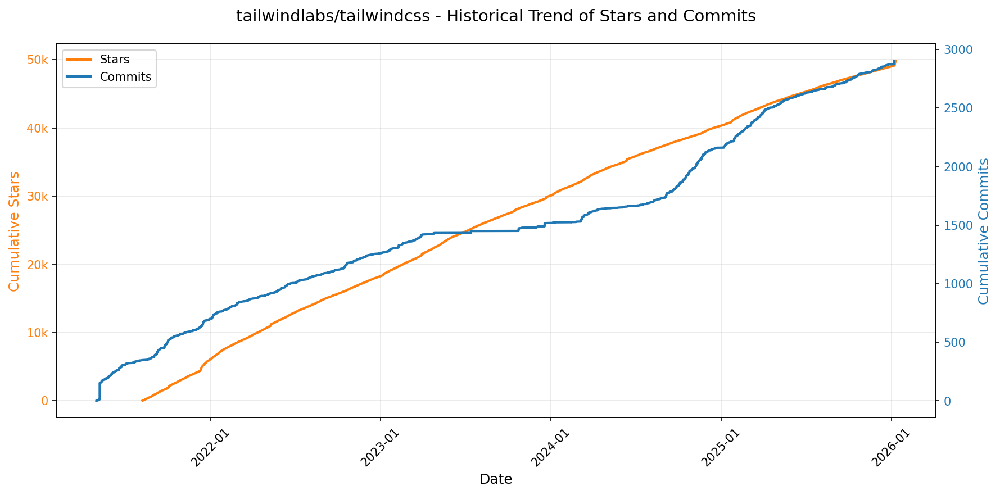
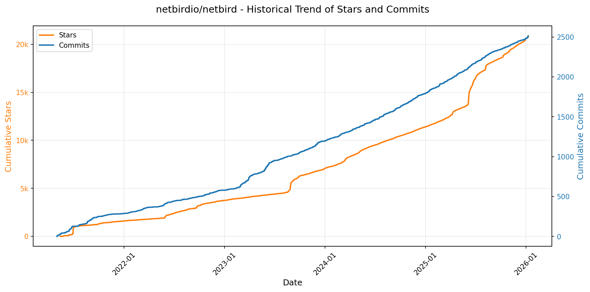
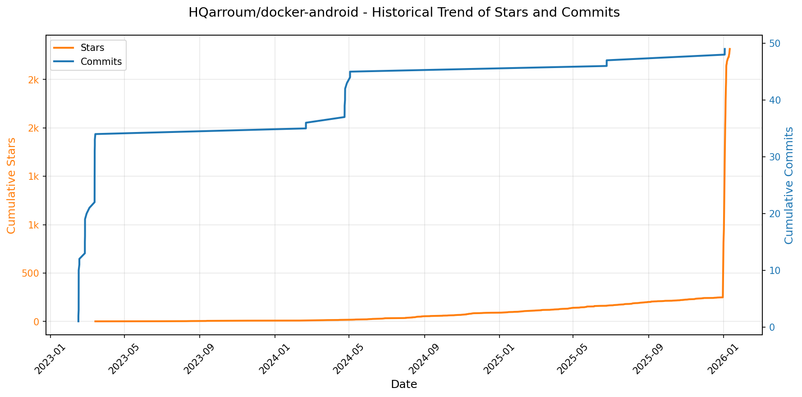

# 🌟 GitHub Trending 概览

> 数据更新于：2026-01-10。

---

## 🔍 项目详情

### 1. [OpenBB-finance/OpenBB](https://github.com/OpenBB-finance/OpenBB)
- 📅 **创建日期**：2020-12-20  
- 🔄 **最近更新**：2026-01-10  
- ⭐ **Stars**：57,885（日 +269｜周 +1797｜月 +2632）  
- 📝 **描述**：Financial data platform for analysts, quants and AI agents.  

<b>📈 Star 与 Commit 历史趋势</b>

> *蓝色：累计 Stars｜橙色：累计 Commits（次 Y 轴）*

<b>📄 README 摘要</b>

1. **项目功能**  
Open Data Platform（ODP）是由 OpenBB 开发的开源数据集成工具集，核心目标是为数据工程师提供统一、可扩展的基础设施，用于接入、标准化和分发多源金融数据——包括自有数据、第三方授权数据（如 Refinitiv、Bloomberg 等）及公开数据源（如 Yahoo Finance、FRED、Alpha Vantage 等）。它作为“一次连接、处处消费”（connect once, consume everywhere）的数据中间层，将清洗整合后的数据同时供给多种下游场景：Python 量化分析环境、OpenBB Workspace（企业级可视化与AI分析平台）、Excel 插件、MCP（Model Context Protocol）服务器（支持AI智能体调用），以及标准 REST API，从而打通数据从接入到应用的全链路。

2. **关键特性**  
- ✅ **多表面数据分发**：同一套数据后端可并行服务 Python SDK、Web UI（Workspace）、CLI、Excel、AI Agent（MCP）及外部系统（通过 REST API）；  
- ✅ **模块化数据集成架构**：支持按需安装数据提供商插件（如 `openbb[yfinance]`、`openbb[fred]`），并通过统一接口抽象（如 `obb.equity.price.historical("AAPL")`）屏蔽底层差异；  
- ✅ **开箱即用的本地 API 服务**：内置基于 FastAPI + Uvicorn 的轻量级 HTTP 服务（默认 `http://127.0.0.1:6900`），便于快速对接 Workspace 或自建应用；  
- ✅ **企业级协同能力**：与闭源商业产品 OpenBB Workspace 深度集成，支持一键注册后端、实时同步数据源与AI Agent能力；  
- ✅ **全栈可扩展性**：开放后端（[backends-for-openbb](https://github.com/OpenBB-finance/backends-for-openbb)）与 AI Agent（[agents-for-openbb](https://github.com/OpenBB-finance/agents-for-openbb)）均为独立开源仓库，支持社区共建新数据源和智能体逻辑；  
- ✅ **开发友好体验**：提供 Dev Container、GitHub Codespaces、Google Colab 一键启动环境，降低上手门槛。

3. **技术栈**  
- **核心语言**：Python（官方支持 3.9.21–3.12）；  
- **API 框架**：FastAPI（高性能异步 Web 框架） + Uvicorn（ASGI 服务器）；  
- **数据处理**：Pandas（结构化数据操作）、NumPy（数值计算）、Pydantic（数据验证与序列化）；  
- **CLI 工具**：Click（命令行接口构建）；  
- **前端集成支撑**：RESTful JSON API（供 Workspace 及第三方调用），兼容 MCP 协议（面向 AI Agent 的上下文交互）；  
- **部署与协作**：GitHub Actions（CI/CD）、Docker（容器化支持）、VS Code Dev Containers、GitHub Codespaces；  
- **许可证**：AGPLv3（强传染性开源协议，确保衍生作品持续开源）。

---

### 2. [anomalyco/opencode](https://github.com/anomalyco/opencode)
- 📅 **创建日期**：2025-04-30  
- 🔄 **最近更新**：2026-01-10  
- ⭐ **Stars**：57,678（日 +2091｜周 +11979｜月 +19970）  
- 📝 **描述**：The open source coding agent.  

<b>📈 Star 与 Commit 历史趋势</b>

> *蓝色：累计 Stars｜橙色：累计 Commits（次 Y 轴）*

<b>📄 README 摘要</b>

1. **项目功能**  
OpenCode 是一个开源的 AI 编程智能体（AI coding agent），旨在为开发者提供终端原生（TUI）、轻量高效、可扩展的 AI 辅助编程体验。它能在本地终端中直接理解代码上下文、执行分析、生成/修改代码、运行命令，并支持多步复杂任务；核心定位是成为开发者日常开发工作流中的“AI 编程搭档”，尤其面向终端重度用户（如 Neovim 用户）和追求隐私与可控性的技术团队。

2. **关键特性**  
- **双模式智能体切换**：内置 `build`（默认，全权限开发代理）和 `plan`（只读分析代理，禁止自动编辑文件、需显式授权执行命令），按 Tab 键快速切换；另含 `@general` 子代理用于复杂搜索与多步骤推理任务。  
- **完全开源与厂商无关**：不绑定任何大模型供应商，原生支持 Claude、OpenAI、Google Gemini 及本地模型（如 Ollama、Llama.cpp），并推荐搭配其自研模型服务 OpenCode Zen。  
- **开箱即用的 LSP 支持**：深度集成语言服务器协议，实现语义感知的代码补全、跳转、诊断等 IDE 级能力。  
- **跨平台多形态部署**：提供一键安装脚本（支持 macOS/Linux/Windows 各主流包管理器）、独立桌面应用（Electron 构建，BETA）、Nix/Mise 等现代开发环境集成方案。  
- **客户端-服务器架构**：终端 TUI 仅为前端之一，后端服务可远程托管，支持未来扩展移动 App、Web 控制台等多客户端接入。  
- **灵活安装路径控制**：支持通过环境变量（`OPENCODE_INSTALL_DIR` / `XDG_BIN_DIR`）自定义安装目录，符合 Unix 规范与用户习惯。

3. **技术栈**  
- **核心语言与运行时**：TypeScript（主逻辑）、Rust（高性能组件可能用于后续扩展，当前文档未明示但构建体系暗示潜在集成）；支持 Node.js（npm/bun/pnpm/yarn）、Bash（安装脚本）、Nix、Mise 等多环境运行。  
- **前端界面**：基于终端的 TUI（Text-based User Interface），非 Web 或 Electron 主界面（桌面版为额外封装）；采用现代化终端渲染技术（推测使用类似 `ink` / `blessed` 或自研渲染层）。  
- **架构设计**：Client-Server 分离架构，通信层应基于 HTTP/gRPC 或 IPC；模块化设计（由 `packages/` 目录结构体现，如 `console`、`web`、`desktop` 等子包）。  
- **基础设施**：CI/CD 基于 GitHub Actions；包分发覆盖 npm、Homebrew（官方及 tap）、Scoop、Chocolatey、AUR（paru）、AppImage/.deb/.rpm 等全平台生态；文档托管于 opencode.ai（静态站点）。

---

### 3. [anthropics/claude-code](https://github.com/anthropics/claude-code)
- 📅 **创建日期**：2025-02-22  
- 🔄 **最近更新**：2026-01-10  
- ⭐ **Stars**：54,261（日 +735｜周 +3702｜月 +9040）  
- 📝 **描述**：Claude Code is an agentic coding tool that lives in your terminal, understands your codebase, and helps you code faster by executing routine tasks, explaining complex code, and handling git workflows - all through natural language commands.  

<b>📈 Star 与 Commit 历史趋势</b>

> *蓝色：累计 Stars｜橙色：累计 Commits（次 Y 轴）*

<b>📄 README 摘要</b>

1. **该项目的功能**  
Claude Code 是一款终端原生的智能编程代理工具，能够深度理解用户本地代码库，通过自然语言指令协助开发者加速编码工作。其核心能力包括：自动执行重复性开发任务（如生成文件、重构代码）、解释复杂代码逻辑、自动化处理 Git 工作流（如生成提交信息、分析差异、创建 PR 描述），并支持在终端、IDE 或 GitHub 中通过 `@claude` 提及调用。

2. **关键特性**  
- **上下文感知的代码理解**：基于项目目录结构和文件内容构建本地知识图谱，实现精准的代码语义理解；  
- **多环境集成**：原生支持终端命令行（`claude` 命令）、主流 IDE 插件扩展及 GitHub 评论区交互；  
- **可扩展插件系统**：内置插件机制，允许开发者通过 `plugins/` 目录添加自定义命令与专用智能体（Agent）；  
- **一键式安装与跨平台支持**：提供 Shell 脚本（macOS/Linux）、Homebrew（macOS）、PowerShell（Windows）及 npm 全局安装方式；  
- **内建反馈闭环**：集成 `/bug` 命令，支持在工具内部直接提交问题报告，并关联会话上下文；  
- **隐私优先设计**：默认不将源码上传至云端，敏感数据（如完整文件内容）不用于模型训练，设有严格的数据保留策略与访问控制。

3. **技术栈**  
- **运行时环境**：Node.js 18+（npm 安装方式强制依赖）；  
- **客户端架构**：终端原生 CLI 工具（非 Web 应用），含本地进程管理与命令解析引擎；  
- **AI 后端集成**：深度集成 Anthropic 自研大模型（Claude 系列），专为代码理解与生成优化；  
- **扩展生态**：基于插件化架构（Plugin System），使用 JavaScript/TypeScript 开发，遵循约定式目录规范（见 `plugins/README.md`）；  
- **部署与分发**：通过 npm Registry（`@anthropic-ai/claude-code`）、Shell/Powershell 安装脚本、Homebrew Cask 多渠道发布。

---

### 4. [usememos/memos](https://github.com/usememos/memos)
- 📅 **创建日期**：2021-12-08  
- 🔄 **最近更新**：2026-01-10  
- ⭐ **Stars**：52,800（日 +161｜周 +3877｜月 +5867）  
- 📝 **描述**：An open-source, self-hosted note-taking service. Your thoughts, your data, your control — no tracking, no ads, no subscription fees.  

<b>📈 Star 与 Commit 历史趋势</b>

> *蓝色：累计 Stars｜橙色：累计 Commits（次 Y 轴）*

<b>📄 README 摘要</b>

1. **项目功能**  
Memos 是一个开源、可自托管的笔记与知识管理服务，面向个人笔记、团队 Wiki 和结构化知识库场景。它允许用户完全掌控自己的数据——所有内容存储在用户自有服务器或基础设施上，不依赖第三方云服务，无任何遥测（telemetry）、广告或订阅费用。

2. **核心特性**  
- **隐私优先架构**：零数据上报、无跟踪、支持完整数据导出，杜绝厂商锁定；  
- **原生 Markdown 支持**：笔记以纯文本 Markdown 格式存储，便于迁移与长期保存；  
- **极致性能**：后端基于 Go 实现高并发低延迟，前端采用 React 优化交互体验，加载迅速；  
- **极简部署**：提供一键 Docker 启动命令，同时支持 SQLite / MySQL / PostgreSQL 多种数据库；  
- **开发者友好**：开放完整的 REST API 与 gRPC 接口，便于集成至现有工具链或自动化流程；  
- **现代化界面**：简洁美观的 UI，内置深色模式，响应式设计适配桌面与移动设备。

3. **技术栈**  
- **后端**：Go（Golang），轻量高效，原生支持高并发与容器化部署；  
- **前端**：React（TypeScript），模块化构建，支持国际化与主题定制；  
- **数据库**：默认 SQLite（开箱即用），亦支持 MySQL 和 PostgreSQL（适用于生产环境）；  
- **部署方案**：Docker / Docker Compose / Kubernetes（含 Helm Chart）、预编译二进制包（Linux/macOS/Windows）、源码构建；  
- **许可证**：MIT 开源协议，允许自由使用、修改与分发。

---

### 5. [tailwindlabs/tailwindcss](https://github.com/tailwindlabs/tailwindcss)
- 📅 **创建日期**：2017-10-06  
- 🔄 **最近更新**：2026-01-10  
- ⭐ **Stars**：49,800（日 +299｜周 +759｜月 +1176）  
- 📝 **描述**：A utility-first CSS framework for rapid UI development.  

<b>📈 Star 与 Commit 历史趋势</b>

> *蓝色：累计 Stars｜橙色：累计 Commits（次 Y 轴）*

<b>📄 README 摘要</b>

1. **项目功能**  
该项目是一个实用优先（utility-first）的 CSS 框架，旨在通过预定义的原子化 CSS 类（如 `text-lg`、`bg-blue-500`、`flex justify-center` 等），支持开发者快速构建高度定制化的用户界面，无需手写大量传统 CSS，显著提升前端 UI 开发效率与一致性。

2. **核心特性**  
- **原子化工具类系统**：提供细粒度、语义明确的响应式工具类，覆盖排版、间距、颜色、布局、阴影、过渡、动画等全部样式维度；  
- **按需生成 CSS**：基于源码中的类名使用情况，通过 PostCSS 插件自动裁剪未使用的样式，输出极简、高性能的最终 CSS 文件；  
- **深度响应式支持**：内置移动优先断点（如 `sm:`、`md:`、`lg:`），可无缝应用于任意工具类；  
- **高度可配置性**：通过 `tailwind.config.js` 全面自定义主题（颜色、字体、间距、断点等）、插件扩展及核心功能开关；  
- **框架无关性**：原生兼容 HTML、React、Vue、Svelte 等任意前端技术栈，支持 JIT（Just-in-Time）编译模式实现零配置极速开发体验。

3. **技术栈**  
- **核心语言**：JavaScript（Node.js 环境运行）；  
- **构建工具链**：基于 PostCSS 构建，依赖 PostCSS 插件生态（如 `postcss-import`、`autoprefixer`）；  
- **配置与扩展**：使用 JavaScript/TypeScript 编写的配置文件（`tailwind.config.js/ts`），支持插件系统（通过 `@tailwindcss/vscode` 等官方/社区插件增强开发体验）；  
- **发布与分发**：以 npm 包（`tailwindcss`）形式发布，依赖标准前端工程化流程（如 Vite、Webpack、Next.js 集成）。

---

### 6. [virattt/ai-hedge-fund](https://github.com/virattt/ai-hedge-fund)
- 📅 **创建日期**：2024-11-29  
- 🔄 **最近更新**：2026-01-10  
- ⭐ **Stars**：45,087（日 +40｜周 +768｜月 +2574）  
- 📝 **描述**：An AI Hedge Fund Team  

<b>📈 Star 与 Commit 历史趋势</b>

> *蓝色：累计 Stars｜橙色：累计 Commits（次 Y 轴）*

<b>📄 README 摘要</b>

1. **该项目的功能**  
该项目是一个面向教育与研究目的的AI对冲基金概念验证系统，旨在探索人工智能在股票交易决策中的应用。它不执行真实交易，而是模拟多位著名投资大师（如巴菲特、芒格、达摩达兰等）及多种分析维度（基本面、技术面、情绪面、估值等）的协同决策过程，最终由组合经理汇总生成模拟交易信号。系统支持对指定股票（如AAPL、MSFT等）进行回测分析，并提供命令行与Web两种交互方式。

2. **核心功能**  
- **多智能体协同架构**：集成18个专业化AI代理，涵盖13位标志性投资哲学代表（如价值投资、成长投资、逆向投资、激进维权等）及5个分析类代理（估值、情绪、基本面、技术面、风险控制），各代理独立生成分析结论与交易信号；  
- **多维度分析能力**：支持基于财务数据的内在价值计算、市场情绪分析（NLP）、财报与经营指标解读、技术指标（如MACD、RSI）识别，以及动态风险计量与仓位限制；  
- **灵活运行模式**：提供CLI命令行接口（支持本地Ollama模型、自定义时间范围、多标的批量分析）和可视化Web应用；内置回测引擎（`backtester.py`），可评估历史策略表现；  
- **开放可扩展设计**：模块化代理结构便于新增投资流派或分析维度；支持多种LLM后端（OpenAI、Anthropic、Groq、DeepSeek及本地Ollama）；免费支持主流美股（AAPL/GOOGL/MSFT/NVDA/TSLA）数据，其他标的需接入Financial DataSets API。

3. **技术栈**  
- **编程语言**：Python（主框架与核心逻辑）；  
- **AI/LLM基础设施**：兼容OpenAI GPT系列、Anthropic Claude、Groq LPU、DeepSeek及Ollama本地大模型（如Llama 3、Phi-3）；  
- **依赖管理**：Poetry；  
- **数据源**：Financial DataSets API（商用金融数据），默认免费提供5只美股基础数据；  
- **环境配置**：基于`.env`文件管理API密钥；  
- **应用形态**：CLI终端工具 + 独立Web应用（位于`/app`子目录，具体技术未详述但属Python生态全栈方案）；  
- **许可证**：MIT License。

---

### 7. [exo-explore/exo](https://github.com/exo-explore/exo)
- 📅 **创建日期**：2024-06-24  
- 🔄 **最近更新**：2026-01-10  
- ⭐ **Stars**：39,746（日 +62｜周 +481｜月 +7066）  
- 📝 **描述**：Run your own AI cluster at home with everyday devices 📱💻 🖥️⌚  

<b>📈 Star 与 Commit 历史趋势</b>

> *蓝色：累计 Stars｜橙色：累计 Commits（次 Y 轴）*

<b>📄 README 摘要</b>

1. **项目功能**  
exo 是一个面向个人用户的分布式 AI 推理框架，旨在让用户利用家中现有的多台设备（如 Mac Studio、MacBook Pro 等）组建本地 AI 计算集群。它能将单个大语言模型（LLM）自动拆分并协同部署到多个设备上运行，突破单设备显存/内存限制（例如支持 Qwen3-235B、DeepSeek v3.1-671B 等超大模型），实现“家庭级 AI 超算”。核心价值在于：无需云服务、不依赖数据中心，仅用日常消费级硬件（尤其是配备 Thunderbolt 5 的 Apple Silicon Mac）即可构建低延迟、高吞吐的本地 AI 集群。

2. **关键特性**  
- **零配置设备自动发现**：运行 exo 的设备可自组网，无需手动配置 IP 或集群参数；  
- **原生支持 Thunderbolt 5 RDMA**：开箱即用的远程直接内存访问（RDMA）能力，使设备间通信延迟降低 99%，大幅提升分布式推理效率；  
- **拓扑感知的自动并行调度**：实时感知设备硬件资源（CPU/GPU/内存）、网络拓扑（带宽/延迟）及连接方式（如 Thunderbolt 链路），智能选择最优模型切分策略（Pipeline/Tensor Parallel）；  
- **张量并行加速**：支持跨设备张量分片，在 2 台设备上达 1.8× 加速，4 台设备上达 3.2× 加速；  
- **深度集成 MLX 生态**：基于苹果优化的 MLX 框架（专为 Apple Silicon 设计）作为推理后端，并采用其分布式通信模块（MLX Distributed）实现高效设备协同。

3. **技术栈**  
- **核心语言与运行时**：Rust（用于高性能系统层、网络通信与绑定）、Python（主控逻辑、API 服务与调度器，通过 `uv` 管理依赖）；  
- **前端与仪表盘**：Node.js + npm + TypeScript/React（构建 Web UI，运行于 `http://localhost:52415`）；  
- **AI 推理引擎**：[MLX](https://github.com/ml-explore/mlx)（Apple Silicon 原生优化的机器学习框架）及其分布式扩展 [MLX Distributed](https://ml-explore.github.io/mlx/build/html/usage/distributed.html)；  
- **硬件监控（macOS）**：`macmon`（Apple Silicon 硬件状态采集）；  
- **系统底层支持**：macOS 26.2+（必需，因 RDMA 依赖其内核级支持）、Thunderbolt 5 硬件；Linux 当前仅支持 CPU 推理（GPU 支持开发中）；  
- **构建与部署工具**：`brew`（macOS 包管理）、`uv`（Python 依赖与运行环境）、`rustup`（Rust nightly 工具链）。

---

### 8. [google/googletest](https://github.com/google/googletest)
- 📅 **创建日期**：2015-07-28  
- 🔄 **最近更新**：2026-01-10  
- ⭐ **Stars**：37,955（日 +83｜周 +279｜月 +400）  
- 📝 **描述**：GoogleTest - Google Testing and Mocking Framework  

<b>📈 Star 与 Commit 历史趋势</b>

> *蓝色：累计 Stars｜橙色：累计 Commits（次 Y 轴）*

<b>📄 README 摘要</b>

1. **该项目的功能**  
GoogleTest 是 Google 开发的 C++ 单元测试框架，旨在为 C++ 项目提供轻量、灵活且功能完备的自动化测试能力。它原为独立的 GoogleTest 和 GoogleMock 两个项目，现已合并为统一仓库，支持单元测试与模拟（mocking）功能的一体化开发与维护。其核心作用是帮助开发者编写、自动发现、执行和验证 C++ 代码的正确性，尤其适用于大型工业级 C++ 项目（如 Chromium、LLVM、Protocol Buffers 等）的测试驱动开发（TDD）和持续集成（CI）流程。

2. **关键特性**  
- 基于 xUnit 架构的标准化测试框架；  
- 自动测试发现机制，无需手动注册测试用例；  
- 丰富的内置断言（如 `EXPECT_EQ`, `ASSERT_THROW`, `EXPECT_DEATH` 等），覆盖值比较、异常捕获、进程崩溃验证（death tests）等场景；  
- 支持用户自定义断言宏，提升测试可读性与领域适配性；  
- 区分“致命失败”（`ASSERT_*`，立即终止当前测试）与“非致命失败”（`EXPECT_*`，继续执行后续断言）；  
- 支持值参数化测试（value-parameterized tests），对同一测试逻辑批量运行不同输入数据；  
- 支持类型参数化测试（type-parameterized tests），在多种模板类型上复用测试逻辑；  
- 提供灵活的测试执行控制：按名称/标签筛选、指定执行顺序、并发并行运行（需配合 `gtest-parallel` 等工具）；  
- 内置死亡测试（death tests）机制，可安全验证程序在非法输入下是否按预期终止；  
- 兼容主流构建系统（CMake、Bazel 等），并提供跨平台可移植性保障。

3. **技术栈**  
- **语言标准**：最低要求 C++17（自 v1.17.0 起强制要求）；  
- **构建与依赖管理**：官方推荐使用 CMake（主构建方式），亦支持 Bazel；未来计划引入 [Abseil](https://github.com/abseil/abseil-cpp) 作为底层基础库依赖；  
- **平台支持**：遵循 Google 的 [Foundational C++ Support Policy](https://opensource.google/documentation/policies/cplusplus-support)，兼容主流编译器（GCC、Clang、MSVC）、操作系统（Linux、macOS、Windows）及架构（x86_64、ARM64 等）；  
- **生态工具链**：与多种第三方工具深度集成，包括 Qt5 GUI 测试运行器（GTest Runner）、TAP 协议监听器（gtest-tap-listener）、VS Code 插件（GoogleTest Adapter、C++ TestMate）、并行执行器（gtest-parallel）等；  
- **基础设施**：内部采用 Google 自研 CI 系统进行持续集成验证。

---

### 9. [anthropics/skills](https://github.com/anthropics/skills)
- 📅 **创建日期**：2025-09-22  
- 🔄 **最近更新**：2026-01-10  
- ⭐ **Stars**：36,625（日 +635｜周 +4777｜月 +16439）  
- 📝 **描述**：Public repository for Agent Skills  

<b>📈 Star 与 Commit 历史趋势</b>

> *蓝色：累计 Stars｜橙色：累计 Commits（次 Y 轴）*

<b>📄 README 摘要</b>

1. **该项目的作用**  
该项目是 Anthropic 官方提供的 Claude 技能（Skills）开源实现集合，旨在展示如何通过结构化、可复用的“技能”扩展 Claude 的能力边界。每个技能是一个独立文件夹，内含 `SKILL.md`（含 YAML 元数据和自然语言指令），使 Claude 能动态加载并执行特定领域任务，如品牌文档生成、PDF 表单提取、Web 应用测试、MCP 服务器构建、创意设计辅助等。它不提供运行时引擎，而是为开发者提供**可即用、可参考、可复刻的技能范例与规范实现**，用于在 Claude Code、Claude.ai 和 Claude API 中实际部署或自定义开发。

2. **核心功能**  
- ✅ **模块化技能封装**：每个技能完全自包含（独立文件夹 + `SKILL.md`），支持命名、描述、指令、示例与指南的标准化定义；  
- ✅ **多场景覆盖**：涵盖创意设计（艺术/音乐/排版）、技术开发（Web 测试/MCP 服务生成）、企业协作（品牌通信/合规文案）及全格式文档处理（DOCX/PDF/PPTX/XLSX）四大类；  
- ✅ **生产级参考实现**：公开 `skills/docx`、`skills/pdf` 等子目录中支撑 Claude 实际文档能力的**源码级技能实现**（source-available，非开源但具极高工程参考价值）；  
- ✅ **开箱即用集成路径**：支持通过 Claude Code 插件市场一键安装（如 `document-skills`）、Claude.ai 直接启用（付费用户）、Claude API 上传调用；  
- ✅ **标准化规范与模板**：内置 `./spec`（Agent Skills 官方规范）和 `./template`（技能创建模板），降低定制门槛；  
- ✅ **生态共建机制**：设立 Partner Skills 栏位，联动 Notion 等第三方共建技能生态。

3. **技术栈**  
- **核心协议**：基于 [Agent Skills 标准](https://agentskills.io)（开放规范，YAML + Markdown 驱动）；  
- **内容格式**：纯文本优先 —— `SKILL.md`（Markdown + YAML Frontmatter），无代码依赖，强调可读性与人类可维护性；  
- **交付形态**：静态文件仓库（GitHub），无后端服务、无构建流程、无运行时依赖；  
- **集成层**：依赖 Anthropic 官方基础设施 —— Claude Code 插件系统、Claude.ai 技能管理界面、Claude API 的 Skills 接口（v1+）；  
- **许可模型**：混合授权 —— 多数示例技能采用 **Apache 2.0 开源协议**，文档类核心技能为 **source-available（源码可用，但非开源）**。

---

### 10. [Lissy93/web-check](https://github.com/Lissy93/web-check)
- 📅 **创建日期**：2023-06-25  
- 🔄 **最近更新**：2026-01-10  
- ⭐ **Stars**：29,212（日 +178｜周 +2098｜月 +2245）  
- 📝 **描述**：🕵️‍♂️ All-in-one OSINT tool for analysing any website  

<b>📈 Star 与 Commit 历史趋势</b>

> *蓝色：累计 Stars｜橙色：累计 Commits（次 Y 轴）*

---

### 11. [simstudioai/sim](https://github.com/simstudioai/sim)
- 📅 **创建日期**：2025-01-05  
- 🔄 **最近更新**：2026-01-10  
- ⭐ **Stars**：25,181（日 +36｜周 +320｜月 +6519）  
- 📝 **描述**：Open-source platform to build and deploy AI agent workflows.  

<b>📈 Star 与 Commit 历史趋势</b>

> *蓝色：累计 Stars｜橙色：累计 Commits（次 Y 轴）*

<b>📄 README 摘要</b>

1. **项目功能**  
Sim 是一个用于快速构建与部署 AI 代理（AI Agent）工作流的低代码/可视化开发平台。它允许用户通过拖拽式画布设计多节点协作的智能体流程（如串联多个 LLM 调用、工具调用、条件分支等），并支持即时运行、调试与发布。核心目标是将原本需大量工程开发的 AI 应用（如 RAG 系统、自动化客服、数据处理流水线）简化为“分钟级”可交付的工作流，同时兼顾云托管与全栈自托管能力。

2. **关键特性**  
- **可视化工作流编排**：基于 ReactFlow 构建的交互式画布，支持连接 AI 代理、内置/自定义工具、逻辑块（如条件判断、循环、变量赋值）等，实现所见即所得的流程搭建与实时执行。  
- **Copilot 智能辅助**：集成 Sim 自研的 Copilot 服务，可通过自然语言指令（如“添加文档问答节点”“修复此节点错误”）自动生成、修改或优化工作流节点，显著提升迭代效率。  
- **向量知识库集成**：支持直接上传 PDF/DOCX/TXT 等文档，自动切分、嵌入并存入 PostgreSQL + pgvector 向量数据库；AI 代理可基于该私有知识库进行语义检索与上下文增强回答（RAG）。  
- **全栈本地化 AI 支持**：原生兼容 Ollama（含 GPU/CPU 多配置启动）、vLLM 等主流本地大模型推理框架，无需依赖外部 API，保障数据隐私与离线可用性。  
- **一体化自托管方案**：提供 NPM 快速启动、Docker Compose 生产部署、Dev Container 开发环境、以及手动 Bun + Node + PostgreSQL 全链路配置四种部署模式，覆盖从试用到企业级落地的全场景需求。

3. **技术栈**  
- **前端框架**：Next.js（App Router）、Bun（运行时与包管理）  
- **UI 组件库**：Shadcn/ui + Tailwind CSS（现代化、可定制化 UI）  
- **状态管理**：Zustand（轻量高效）  
- **流程编辑器**：ReactFlow（专业级图编辑能力）  
- **后端与数据层**：PostgreSQL（含 pgvector 扩展）、Drizzle ORM（TypeScript 优先的数据库操作）  
- **认证与安全**：Better Auth（开箱即用的现代化身份认证）  
- **实时通信**：Socket.io（支撑工作流实时日志、状态同步）  
- **后台任务**：Trigger.dev（异步任务调度与集成）  
- **沙盒执行**：E2B（安全隔离的远程代码执行环境）  
- **基础设施与工程化**：Turborepo（高性能单仓多包管理）、Fumadocs（文档站点）

---

### 12. [bytedance/UI-TARS-desktop](https://github.com/bytedance/UI-TARS-desktop)
- 📅 **创建日期**：2025-01-19  
- 🔄 **最近更新**：2026-01-10  
- ⭐ **Stars**：21,878（日 +841｜周 +1560｜月 +2110）  
- 📝 **描述**：The Open-Source Multimodal AI Agent Stack: Connecting Cutting-Edge AI Models and Agent Infra  

<b>📈 Star 与 Commit 历史趋势</b>

> *蓝色：累计 Stars｜橙色：累计 Commits（次 Y 轴）*

<b>📄 README 摘要</b>

1. **项目功能**  
TARS 是一个面向实际任务的多模态 AI 智能体（Agent）技术栈，核心目标是实现类人水平的端到端任务自动化。它通过融合视觉理解（Vision）、图形用户界面交互（GUI Agent）与大型语言模型（LLM）能力，使 AI 能够在真实操作系统（终端、桌面环境、浏览器）中自主观察、推理并执行操作。项目当前包含两大可独立部署的组件：  
- **Agent TARS**：通用多模态智能体框架，支持 CLI 命令行与 Web UI 两种交互方式，专注于跨平台任务编排，可调用本地或远程工具（如 Shell、浏览器、文件系统等），完成复杂工作流（例如自动订机票、订酒店、生成图表、配置软件设置等）；  
- **UI-TARS Desktop**：原生桌面应用，基于 UI-TARS 系列视觉语言模型（如 Seed-1.5-VL/1.6），提供对本地及远程计算机/浏览器的零配置、一键式 GUI 自动化控制（如点击按钮、填写表单、修改 VS Code 设置、浏览 GitHub Issues 等），全程离线运行，保障数据隐私。

2. **关键特性**  
- ✅ **多模态感知与执行闭环**：支持截图识别、视觉定位（Visual Grounding）、DOM 解析与混合策略控制浏览器，实现“看—想—做”一体化；  
- ✅ **事件流驱动架构（Event Stream）**：采用协议化事件流机制，支撑上下文工程（Context Engineering）、实时数据流追踪、调试可视化（Event Stream Viewer）及可扩展 Agent UI 构建；  
- ✅ **MCP（Model Control Protocol）深度集成**：以 MCP 为内核标准，原生支持挂载各类 MCP Server（如 Shell、Filesystem、Browser、Chart Generator 等），无缝对接现实世界工具链；  
- ✅ **全场景操作覆盖**：同时支持本地桌面（Windows/macOS）、远程计算机、远程浏览器三种操作模式，且远程功能开箱即用、无需额外配置；  
- ✅ **生产就绪能力**：提供流式响应（Streaming）、多工具并发执行、运行时性能统计（工具调用耗时、深度思考耗时）、AIO 沙箱（Agent-infra Sandbox）隔离执行环境等企业级特性；  
- ✅ **隐私优先设计**：UI-TARS Desktop 默认完全本地运行，图像与指令处理不上传云端；Agent TARS CLI 亦支持私有模型与本地工具链部署。

3. **技术栈**  
- **前端/客户端**：Electron（UI-TARS Desktop 桌面应用）、React/Vite（Web UI）、TypeScript；  
- **核心运行时**：Node.js（≥ v22），CLI 工具基于 npm 分发（`@agent-tars/cli`）；  
- **AI 模型层**：  
  - 视觉语言模型（VLM）：UI-TARS 系列（如 UI-TARS-1.5-7B）、Seed-1.5-VL / Seed-1.6；  
  - 多模态大模型（MLLM）：支持 VolcEngine（豆包 Vision Pro）、Anthropic（Claude 3.7 Sonnet）等第三方 API；  
- **协议与标准**：MCP（Model Control Protocol）作为智能体与工具通信的核心规范；  
- **基础设施**：AIO Agent Sandbox（隔离化工具执行环境）、Midscene（浏览器内 GUI 自动化引擎）；  
- **部署与生态**：支持 ModelScope、Hugging Face、Lark（飞书）等平台模型托管与协作；文档与社区建设依托 GitBook（DeepWiki）、Discord、Twitter、飞书群等多渠道。

---

### 13. [resemble-ai/chatterbox](https://github.com/resemble-ai/chatterbox)
- 📅 **创建日期**：2025-04-23  
- 🔄 **最近更新**：2026-01-10  
- ⭐ **Stars**：21,109（日 +79｜周 +815｜月 +6218）  
- 📝 **描述**：SoTA open-source TTS  

<b>📈 Star 与 Commit 历史趋势</b>

> *蓝色：累计 Stars｜橙色：累计 Commits（次 Y 轴）*

<b>📄 README 摘要</b>

1. **项目功能**  
Chatterbox TTS 是 Resemble AI 推出的开源文本转语音（TTS）模型家族，核心目标是为实时语音代理（voice agents）、交互式应用及创意内容生成提供高质量、低延迟、零样本（zero-shot）语音合成能力。其中旗舰模型 **Chatterbox-Turbo** 专为生产级低延迟场景优化，支持仅需 10 秒参考音频即可完成声音克隆，并能在毫秒级响应下生成高保真语音；同时提供多语言版本（Chatterbox-Multilingual，支持 23+ 语言）和基础英文版（Chatterbox），覆盖全球化部署与多样化创作需求。

2. **关键特性**  
- ✅ **极致高效推理**：Turbo 模型仅 350M 参数，蒸馏后语音 token-to-mel 解码器压缩至 **单步生成**（原需 10 步），显著降低 GPU 显存占用与计算开销；  
- ✅ **原生支持副语言学标记（Paralinguistic Tags）**：如 `[laugh]`、`[chuckle]`、`[cough]` 等，无需额外微调即可自然注入情感与拟声细节，大幅提升语音真实感与表现力；  
- ✅ **零样本跨语言/跨音色泛化**：所有模型均支持无需训练的语音克隆（voice cloning），Multilingual 版本可按 `language_id` 切换语种并保持口音一致性；  
- ✅ **内置 PerTh 神经水印**：采用 Resemble AI 自研的感知阈值水印技术（Perth），水印不可听、抗 MP3 压缩与常见音频编辑，检测准确率近 100%，满足负责任 AI 的内容溯源与安全合规要求；  
- ✅ **灵活可控生成**：支持 CFG（Classifier-Free Guidance）权重调节与 `exaggeration` 参数控制语速、韵律与表现强度，适配叙事、客服、游戏配音等多元场景。

3. **技术栈**  
- **框架与核心库**：PyTorch（深度学习训练/推理）、torchaudio（音频处理）、librosa（水印提取）；  
- **模型架构**：基于自回归或非自回归扩散/流匹配范式的端到端 TTS 架构（具体未公开，但借鉴 CosyVoice、HiFT-GAN 等先进声码器与编码器设计）；  
- **分词与语言建模**：集成 S3Tokenizer（高效语音 tokenization）、参考 Llama 3 的序列建模思想优化文本理解；  
- **语音合成组件**：融合 Real-Time-Voice-Cloning 的快速嵌入提取机制与 HiFT-GAN 等高质量神经声码器；  
- **部署与生态**：Python 3.11（官方推荐）、Hugging Face Spaces 在线演示、Conda 环境管理、`pyproject.toml` 严格锁定依赖版本；  
- **附加工具链**：Perth 水印 SDK（独立 Python 包）、标准化音频 I/O（WAV 格式）、跨平台兼容（Debian 11 测试环境）。

---

### 14. [netbirdio/netbird](https://github.com/netbirdio/netbird)
- 📅 **创建日期**：2021-04-14  
- 🔄 **最近更新**：2026-01-10  
- ⭐ **Stars**：20,868（日 +133｜周 +253｜月 +793）  
- 📝 **描述**：Connect your devices into a secure WireGuard®-based overlay network with SSO, MFA and granular access controls.  

<b>📈 Star 与 Commit 历史趋势</b>

> *蓝色：累计 Stars｜橙色：累计 Commits（次 Y 轴）*

<b>📄 README 摘要</b>

1. **项目功能**  
NetBird 是一个开源的、一体化私有网络平台，旨在无需配置即可构建安全的点对点（P2P）加密网络，并集成集中式访问控制能力。它使组织或个人能快速部署零信任架构的私有网络：自动建立基于 WireGuard 的端到端加密隧道，消除传统 VPN 所需的端口开放、防火墙策略调整、网关设备等复杂操作；同时通过统一管理界面实施细粒度访问策略（如按用户组、设备类型、网络位置、设备健康状态等动态授权），实现安全、可控的远程访问。

2. **核心特性**  
- **连接性**：原生内核级 WireGuard 支持；全自动 P2P 连接发现与建连；NAT 穿透（基于 BPF 优化）；STUN/TURN 中继回退（使用 Coturn）；支持路由外部私有网络流量；跨平台 NAT 环境兼容（含运营商级 CGNAT）。  
- **管理能力**：图形化 Admin Web UI（独立仓库）；自动对等体发现与配置分发；多租户/多用户支持；IdP（SAML/OIDC）集成与 JWT 组同步；私有 DNS 管理；自托管一键脚本与 Terraform Provider 支持。  
- **安全性**：SSO + MFA 登录；基于角色与属性的精细化访问控制（Groups & Rules）；设备可信状态检查（Posture Checks）；全链路活动审计日志；量子抗性加密（Rosenpass 集成）；周期性用户重认证；P2P 流量端到端加密；AGPLv3 许可的管理/信令/中继组件保障核心控制面透明可信。

3. **技术栈**  
- **网络层**：WireGuard（Linux 内核模块）、WebRTC ICE（Pion/ice 库）、STUN/TURN（Coturn）、BPF 加速 NAT 穿透。  
- **核心服务**：Go 语言编写（Management Service、Signal Service、Relay Service）；Docker + docker-compose 容器化部署；JWT/OAuth2 身份认证体系。  
- **前端与工具**：React/Vite 构建 Admin Web UI；Terraform Provider（Go 实现）；CLI 客户端（跨平台二进制）；依赖 jq、curl 等轻量工具链完成自动化部署。  
- **平台支持**：全平台客户端（Linux/macOS/Windows/Android/iOS/OpenWRT/Docker/Serverless）；自托管环境要求 Linux VM + 公网域名 + 80/443/3478 端口可达。

---

### 15. [ChromeDevTools/chrome-devtools-mcp](https://github.com/ChromeDevTools/chrome-devtools-mcp)
- 📅 **创建日期**：2025-09-11  
- 🔄 **最近更新**：2026-01-10  
- ⭐ **Stars**：19,782（日 +345｜周 +1344｜月 +3534）  
- 📝 **描述**：Chrome DevTools for coding agents  

<b>📈 Star 与 Commit 历史趋势</b>

> *蓝色：累计 Stars｜橙色：累计 Commits（次 Y 轴）*

<b>📄 README 摘要</b>

1. **项目功能**  
该项目（`chrome-devtools-mcp`）是一个符合 Model-Context-Protocol（MCP）标准的服务器，使AI编码助手（如 Gemini、Claude、Cursor、Copilot、Codex 等）能够**安全、可控地连接并操作真实运行的 Chrome 浏览器实例**。它桥接 AI 代理与 Chrome DevTools 协议（CDP），赋予 AI 直接执行浏览器自动化、深度调试、性能分析和网页内容检查的能力——无需人工干预即可完成端到端的网页交互与诊断任务。

2. **核心功能**  
- **性能分析能力**：支持录制完整 Chrome 性能追踪（trace），自动提取可操作的性能瓶颈洞察（如长任务、布局抖动、渲染阻塞等）；  
- **高级调试能力**：实时捕获网络请求（含请求头/响应体）、读取/过滤控制台日志、执行任意 JavaScript 脚本、截取全屏或元素截图、保存 DOM/堆内存快照；  
- **高可靠性自动化**：基于 Puppeteer 实现语义化操作（点击、拖拽、表单填充、文件上传、弹窗处理等），并内置智能等待机制（自动等待页面加载、元素出现、网络空闲等）；  
- **灵活环境适配**：支持自动启动隔离 Chrome 实例（含多频道支持：stable/canary/beta/dev）、连接已运行的 Chrome（通过 `--autoConnect` 或 `--browser-url`/`--wsEndpoint`）、配置代理、自定义视口、用户数据目录及 WebSocket 认证头等；  
- **模块化工具体系**：提供 26+ 细粒度 MCP 工具，按类别组织为输入自动化（8）、导航自动化（6）、设备模拟（2）、性能分析（3）、网络监控（2）、调试诊断（5）六大类，支持按需启用/禁用功能模块（如 `--categoryPerformance=false`）。

3. **技术栈**  
- **核心协议层**：Model-Context-Protocol（MCP）v1+ 标准实现，兼容主流 MCP 客户端生态；  
- **浏览器控制层**：底层依赖 [Puppeteer](https://github.com/puppeteer/puppeteer)（v22+）驱动 Chrome，深度集成 [Chrome DevTools Protocol](https://chromedevtools.github.io/devtools-protocol/)（CDP）实现原生调试能力；  
- **运行时环境**：Node.js v20.19+（LTS 维护版本），通过 `npx` 一键分发；  
- **浏览器依赖**：Chrome 当前稳定版或更高版本（原生支持 Chrome 144+ 的自动连接特性）；  
- **扩展能力**：支持 WebSocket 自定义认证头（`--wsHeaders`）、沙箱外进程通信、跨平台用户数据目录管理（Linux/macOS/Windows）。

---

### 16. [DayuanJiang/next-ai-draw-io](https://github.com/DayuanJiang/next-ai-draw-io)
- 📅 **创建日期**：2025-03-23  
- 🔄 **最近更新**：2026-01-10  
- ⭐ **Stars**：17,603（日 +158｜周 +1206｜月 +11191）  
- 📝 **描述**：A next.js web application that integrates AI capabilities with draw.io diagrams. This app allows you to create, modify, and enhance diagrams through natural language commands and AI-assisted visualization.  

<b>📈 Star 与 Commit 历史趋势</b>

> *蓝色：累计 Stars｜橙色：累计 Commits（次 Y 轴）*

<b>📄 README 摘要</b>

1. **项目功能**  
Next AI Draw.io 是一个基于 Next.js 的 Web 应用，将大语言模型（LLM）能力深度集成到 draw.io 图形编辑器中，实现通过自然语言指令创建、修改、增强和复现专业图表。用户无需手动拖拽组件，仅需输入文本提示（如“生成带 AWS 图标的云架构图”或“画一只可爱的小猫”），AI 即可自动生成符合 draw.io 标准的 XML 格式图表，并支持实时交互式编辑与历史版本回溯。

2. **核心功能**  
- **自然语言驱动的图表生成**：支持 LLM 直接解析指令生成流程图、架构图、UML 等各类 draw.io 图表；  
- **多源内容理解与转化**：支持上传图片、PDF 和纯文本文件，AI 自动识别并提取结构化信息生成对应图表；  
- **AI 推理过程可视化**：对 OpenAI o1/o3、Gemini、Claude 等兼容模型，可展示完整的思维链（Chain-of-Thought）推理步骤；  
- **全版本图表历史管理**：完整记录每次 AI 修改前后的图表状态，支持任意版本对比与一键还原；  
- **云平台原生架构图支持**：内置 AWS / GCP / Azure 官方图标库，专为云服务架构设计优化；  
- **动态动画连接线**：支持生成带过渡动画效果的连接线，提升技术文档可视化表现力；  
- **MCP（Model Context Protocol）代理集成（预览）**：可作为 MCP 服务器接入 Claude Desktop、Cursor、VS Code 等 AI 编程助手，实现在 IDE 中语音/文本直出图表并实时渲染至浏览器；  
- **BYOK（自带 API 密钥）机制**：用户可在前端本地安全存储私有 API Key，绕过演示站用量限制，数据永不上传服务端。

3. **技术栈**  
- **前端框架**：Next.js 16.x（App Router）、React 19.x；  
- **AI SDK 与协议层**：Vercel AI SDK（`ai` + `@ai-sdk/*`），统一抽象多模型流式响应与 Provider 切换；  
- **图表引擎**：`react-drawio` 封装，底层依赖 draw.io（mxGraph）渲染 XML 格式图表；  
- **部署与基础设施**：原生支持 Vercel、Cloudflare Workers、Tencent EdgeOne Pages 一键部署；提供 Docker 镜像及桌面端（Electron 或 Tauri 类方案，文档提及 Windows/macOS/Linux 发布包）；  
- **AI 模型支持**：覆盖 13+ 主流提供商，包括 ByteDance Doubao（K2-thinking 模型）、AWS Bedrock、OpenAI、Anthropic（Claude）、Google AI、Azure OpenAI、Ollama、OpenRouter、DeepSeek、SiliconFlow、ModelScope、SGLang、Vercel AI Gateway；除 AWS Bedrock 和 OpenRouter 外均支持自定义 API Endpoint；推荐使用 Claude Sonnet 4.5、GPT-5.1、Gemini 3 Pro、DeepSeek V3.2/R1 等强推理与格式控制能力模型。

---

### 17. [ourongxing/newsnow](https://github.com/ourongxing/newsnow)
- 📅 **创建日期**：2024-09-23  
- 🔄 **最近更新**：2026-01-10  
- ⭐ **Stars**：17,151（日 +53｜周 +1094｜月 +2046）  
- 📝 **描述**：Elegant reading of real-time and hottest news  

<b>📈 Star 与 Commit 历史趋势</b>

> *蓝色：累计 Stars｜橙色：累计 Commits（次 Y 轴）*

<b>📄 README 摘要</b>

1. **项目功能**  
该是一个实时新闻聚合与阅读平台，专注于提供简洁优雅的阅读体验。它从多个新闻源自动抓取并聚合当前最热门的中文新闻，支持实时更新、用户登录（通过 GitHub OAuth）、个性化数据同步，并内置缓存机制与反封禁策略。项目还集成了 MCP（Model Context Protocol）服务器支持，可作为 AI 工具调用的新闻数据服务端点，供外部智能体（如 LLM 工具调用）获取结构化新闻内容。

2. **核心特性**  
- ✅ 极简优雅的响应式 UI，专为沉浸式阅读优化；  
- ✅ 基于自适应频率的智能爬虫：动态调整抓取间隔（最低 2 分钟），依据源站更新节奏自动降频，兼顾时效性与反 IP 封禁；  
- ✅ 登录态驱动的数据同步：GitHub OAuth 登录后，用户偏好、阅读状态等可跨设备同步；  
- ✅ 双层缓存策略：默认 30 分钟服务端缓存，登录用户可手动强制刷新；  
- ✅ 开箱即用的 MCP 服务集成：通过 `newsnow-mcp-server` 提供标准化新闻接口，支持自定义部署域名（`BASE_URL` 可配置）；  
- ✅ 多部署方案支持：原生适配 Cloudflare Pages、Cloudflare Workers + D1（推荐数据库）、Vercel 及 Docker 容器化部署；  
- ✅ 模块化数据源架构：`shared/sources` 与 `server/sources` 提供类型安全、可扩展的新闻源接入规范，便于快速添加新来源。

3. **技术栈**  
- **前端框架**：基于 [Nuxt 3](https://nuxt.com/)（Vue 3 + TypeScript + Nitro 后端引擎）构建；  
- **构建与包管理**：`pnpm` + `Corepack`（Node.js ≥ 20 强制要求）；  
- **认证与安全**：GitHub OAuth App、JWT（密钥复用 Client Secret）；  
- **数据库**：支持 [Drizzle ORM](https://orm.drizzle.team/) 兼容的多种后端，**官方首选 Cloudflare D1**（SQLite on Edge）；  
- **部署基础设施**：Cloudflare Workers（含 D1）、Vercel、Docker Compose；  
- **新闻抓取与服务**：自研适配层 + 外部 `newsnow-mcp-server`（NPM 包，Node.js 运行）；  
- **环境与配置**：`.env.server` 管理服务端敏感变量，`wrangler.toml` 配置 Cloudflare Worker/D1，`docker-compose.yml` 支持容器编排。

---

### 18. [obra/superpowers](https://github.com/obra/superpowers)
- 📅 **创建日期**：2025-10-09  
- 🔄 **最近更新**：2026-01-10  
- ⭐ **Stars**：15,473（日 +591｜周 +2088｜月 +6132）  
- 📝 **描述**：Claude Code superpowers: core skills library  

<b>📈 Star 与 Commit 历史趋势</b>

> *蓝色：累计 Stars｜橙色：累计 Commits（次 Y 轴）*

<b>📄 README 摘要</b>

1. **该项目的功能**  
Superpowers 是一个面向编程智能体（coding agents）的完整软件开发工作流框架，旨在将原本零散、随意的代码生成行为，系统化为严谨、可验证、符合工程最佳实践的协作式开发流程。它不直接生成代码，而是通过一系列自动触发的“技能”（skills），引导智能体在编码前完成需求澄清、设计评审、计划制定，并在实施阶段严格遵循测试驱动开发（TDD）、YAGNI（你不会需要它）和 DRY（不要重复自己）等原则；所有任务均以原子化、可验证、带明确验收标准的方式执行，支持子智能体协同、双阶段审查（规范符合性 + 代码质量）、Git 工作树隔离及自动化分支收尾。

2. **核心特性**  
- **全流程自动化技能链**：覆盖从需求脑暴（`/superpowers:brainstorm`）→ 设计文档生成与确认 → 实施计划拆解（精确到文件路径、代码片段与验证步骤）→ 子智能体驱动开发（SDD）→ 红/绿/重构式 TDD → 多层级代码审查（任务间自动触发）→ Git 工作树管理 → 分支收尾决策（合并/PR/丢弃）的全生命周期。  
- **强制性、非可选的工作流**：技能按上下文自动激活，所有环节均为硬性约束（如“未写测试不得写实现”“未通过审查不得进入下一任务”），非建议性插件。  
- **工程纪律内建机制**：内置反模式检测（如测试缺失、过度设计）、根因调试四阶段法、条件等待、防御性验证、测试先行强制删除预测试代码等；强调“证据优于断言”，一切进展需经可观察、可复现的验证。  
- **低侵入高兼容架构**：支持多平台（Claude Code 插件市场一键安装；Codex / OpenCode 通过远程指令加载配置）；技能即文档（`.md` 文件），开箱即用且可独立演进；支持动态更新（`/plugin update`）。  
- **可扩展技能生态**：提供 `writing-skills` 技能用于创建新技能，含标准化模板、测试方法论与验证规范，鼓励社区共建可复用、可审计的工程能力模块。

3. **技术栈**  
- **运行时环境**：深度适配 AI 编程代理平台，原生支持 **Claude Code**（通过官方插件市场机制）、**Codex** 和 **OpenCode**（通过远程加载配置脚本）；不依赖特定语言或后端服务，纯前端/代理侧工作流编排。  
- **核心范式**：基于**技能（Skill）的声明式工作流引擎**——每个技能为独立 Markdown 文档（如 `skills/test-driven-development/SKILL.md`），定义触发条件、执行逻辑、检查清单与失败处理策略；系统通过上下文感知自动匹配并串联技能。  
- **工程实践层**：严格贯彻 **TDD（红→绿→重构）**、**YAGNI**、**DRY**、**Git Worktrees**、**Socratic 提问式设计**、**系统性调试（Systematic Debugging）** 等经典软件工程方法论，并将其转化为可由 AI 执行的结构化指令集。  
- **部署与分发**：采用 GitHub 仓库托管全部技能与文档；Claude Code 通过自建插件市场（`obra/superpowers-marketplace`）分发；更新机制基于 Git 版本同步（`/plugin update` 拉取最新 `main` 分支）。

---

### 19. [datawhalechina/hello-agents](https://github.com/datawhalechina/hello-agents)
- 📅 **创建日期**：2025-09-07  
- 🔄 **最近更新**：2026-01-10  
- ⭐ **Stars**：15,007（日 +0｜周 +1177｜月 +7844）  
- 📝 **描述**：📚 《从零开始构建智能体》——从零开始的智能体原理与实践教程  

<b>📈 Star 与 Commit 历史趋势</b>

> *蓝色：累计 Stars｜橙色：累计 Commits（次 Y 轴）*

<b>📄 README 摘要</b>

1. **项目功能**  
Hello-Agents 是一个面向中文学习者的、系统性开源智能体（Agent）教学项目，核心目标是**从零开始培养开发者构建真正 AI 原生智能体系统的能力**。它并非仅介绍工具使用，而是聚焦于“AI Native Agent”——即以大语言模型（LLM）为核心驱动、具备自主推理、规划、反思与协作能力的智能体，而非流程驱动的低代码平台封装。项目提供完整的学习路径：从智能体基础理论、经典范式手写实现、主流框架（AutoGen/LangGraph等）应用，到自研轻量级框架 HelloAgents 的从零开发；并覆盖记忆、上下文工程、通信协议（MCP/A2A）、Agentic-RL 训练（SFT/GRPO）、系统评估等高阶技术，最终通过智能旅行助手、赛博小镇等综合项目落地实践。

2. **关键特征**  
- ✅ **理论与实战深度结合**：16 章结构化内容，每章均配套可运行代码（位于 `code/` 目录），强调“边学边做”。  
- ✅ **双轨能力培养**：既教“用轮子”（Dify/Coze/n8n 低代码平台、LangGraph/AutoGen 等框架），更重“造轮子”（第七章从零构建自研框架 `HelloAgents`）。  
- ✅ **全栈智能体技术覆盖**：涵盖智能体核心范式（ReAct/Plan-and-Solve/Reflection）、记忆与 RAG、上下文工程、多智能体通信协议（MCP/A2A/ANP）、Agentic-RL 全流程训练、专业化评估体系。  
- ✅ **真实场景综合项目驱动**：包含智能旅行助手（MCP 协作）、自动化深度研究智能体（DeepResearch 复现）、赛博小镇（模拟社会动态的多 Agent 游戏系统）三大进阶案例。  
- ✅ **社区共建生态**：开放 Extra-Chapter（如 Agent 面试题解析、GUI Agent 实战、Dify 保姆教程等），支持用户提交学习笔记、技术扩展与项目实践，形成持续演进的知识库。  
- ✅ **免费开源与友好学习体验**：提供在线阅读（GitBook）、PDF 下载（带 Datawhale 水印防滥用）、中英双语规划（含未来双语视频课），零门槛入门但深度足够支撑求职与工程落地。

3. **技术栈**  
- **核心语言与运行环境**：Python（必备基础），依赖标准 LLM API（重点适配 OpenAI 原生接口，具备良好可迁移性）。  
- **框架与工具链**：  
  - 主流智能体框架：LangGraph、AutoGen、AgentScope；  
  - 低代码平台实践：Coze、Dify、n8n；  
  - 自研框架：`HelloAgents`（基于 OpenAI API 构建的轻量级、可扩展 Agent 框架，用于贯穿式教学）；  
- **关键技术组件**：  
  - 记忆系统：向量数据库（如 Chroma/Pinecone）、RAG 实现；  
  - 上下文管理：动态提示工程、会话状态维护；  
  - 协议支持：MCP（Model Context Protocol）、A2A（Agent-to-Agent）、ANP（Agent Network Protocol）；  
  - 训练技术：监督微调（SFT）、GRPO（Generalized Reinforcement Learning with Policy Optimization）等 Agentic-RL 方法；  
  - 评估体系：定制化指标设计、基准测试（Benchmark）、自动化评估框架。  
- **辅助生态**：GitBook（在线文档）、GitHub Pages（静态站点）、Markdown + Jupyter（教程与代码混合交付）。

---

### 20. [BloopAI/vibe-kanban](https://github.com/BloopAI/vibe-kanban)
- 📅 **创建日期**：2025-06-14  
- 🔄 **最近更新**：2026-01-10  
- ⭐ **Stars**：14,443（日 +232｜周 +3026｜月 +8033）  
- 📝 **描述**：Get 10X more out of Claude Code, Codex or any coding agent  

<b>📈 Star 与 Commit 历史趋势</b>

> *蓝色：累计 Stars｜橙色：累计 Commits（次 Y 轴）*

<b>📄 README 摘要</b>

1. **项目功能**  
Vibe Kanban 是一个面向 AI 编程代理（如 Claude Code、Gemini CLI、Codex、Amp 等）的智能任务协同与工作流编排平台。它不替代编码代理，而是作为“人类工程师的中枢操作系统”，解决当前 AI 编程范式下工程师的核心痛点：在多个 AI 代理间高效切换、并行/串行调度多任务、实时跟踪代理执行状态、快速审查生成代码、一键启动开发服务器，并统一管理各代理所需的 MCP（Model Control Protocol）配置。同时支持远程部署场景，可无缝集成 SSH 远程开发（如通过 VS Code Remote-SSH 打开远程项目）。

2. **关键特性**  
- ✅ **多 AI 代理动态切换与统一接入**：原生支持主流编码代理，无需重复配置；可按需切换不同模型/工具链。  
- ✅ **可视化任务编排看板（Kanban）**：以类看板界面直观呈现任务状态（待执行、进行中、已完成、失败等），支持拖拽调整优先级与流程。  
- ✅ **并行/顺序任务流执行引擎**：允许用户定义复杂工作流（例如：先由 Codex 生成代码 → 再交由 Claude Code 审查 → 最后用 Amp 执行测试），自动协调执行与依赖管理。  
- ✅ **一键代码审查与本地开发环境启动**：集成 diff 查看器，支持内联评论；点击按钮即可在本地或远程启动 dev server（如 `npm run dev`）。  
- ✅ **集中化 MCP 配置中心**：统一存储和管理各 AI 代理所需的模型参数、工具调用权限、上下文限制等 MCP 标准配置。  
- ✅ **远程服务器深度集成**：支持在远程机器（如云服务器、NAS）上运行 Vibe Kanban 后端，前端通过隧道访问，并通过 SSH+VS Code Remote 实现“点击即打开远程项目”的无缝编辑体验。  
- ✅ **轻量 CLI 启动与零配置体验**：仅需 `npx vibe-kanban` 即可启动完整全栈应用（含内嵌 SQLite 数据库），无需全局安装或服务部署。

3. **技术栈**  
- **后端**：Rust（使用 `axum` 构建高性能异步 Web API，`sqlx` 操作 SQLite，`tokio` 驱动并发任务调度）  
- **前端**：TypeScript + React（基于 Vite 构建），采用响应式设计与深色模式自适应（通过 `<picture>` 切换 SVG Logo）  
- **构建与包管理**：pnpm（工作区管理）、Cargo（Rust 构建）、Vite（前端构建）  
- **数据库**：SQLite（默认嵌入式，支持开箱即用；开发阶段通过 `sqlx-cli` 管理迁移）  
- **基础设施与集成**：  
  - 支持环境变量驱动的构建时（PostHog 分析开关）与运行时（端口、主机、SSH 配置）配置；  
  - 提供 `local-build.sh` 脚本实现 macOS 一键源码构建；  
  - 与 VS Code Remote-SSH 协议深度集成（生成标准 `vscode://vscode-remote/ssh-remote+...` URI）；  
  - CI/CD 基于 GitHub Actions（`.github/workflows/publish.yml`）；  
  - 发布为 npm 包（`vibe-kanban`），支持 npx 直接运行。

---

### 21. [C4illin/ConvertX](https://github.com/C4illin/ConvertX)
- 📅 **创建日期**：2024-04-07  
- 🔄 **最近更新**：2026-01-10  
- ⭐ **Stars**：13,970（日 +338｜周 +655｜月 +4130）  
- 📝 **描述**：💾 Self-hosted online file converter. Supports 1000+ formats ⚙️  

<b>📈 Star 与 Commit 历史趋势</b>

> *蓝色：累计 Stars｜橙色：累计 Commits（次 Y 轴）*

<b>📄 README 摘要</b>

1. **项目功能**  
ConvertX 是一个可自托管的在线文件格式转换服务，支持超过 1000 种输入/输出格式组合。用户可通过 Web 界面上传文件，选择目标格式并执行批量转换；支持多用户账户体系、密码保护及历史记录管理，适用于个人或团队在本地或私有服务器上安全地完成各类文档、图像、音视频、矢量图、3D 模型、电子书、LaTeX、数据文件等跨格式转换任务。

2. **核心特性**  
- ✅ 支持**超千种格式转换**，涵盖图像（JPEG XL、HEIF、SVG、WebP 等）、文档（PDF/DOCX/ODT/LaTeX → PDF/HTML/Markdown 等）、音视频（FFmpeg 支持约 472 种输入 / 199 种输出格式）、矢量图形（Inkscape、dvisvgm、Potrace）、3D 资产（Assimp）、电子书（Calibre）、数据文件（JSON/YAML/TOML ↔ XML/CSV 等，通过 Dasel）、邮件（Outlook MSG → EML）等；  
- ✅ **批量处理**：支持一次上传并转换多个文件；  
- ✅ **多用户与权限控制**：支持注册/登录、JWT 认证、账户隔离；可配置是否允许公开注册（`ACCOUNT_REGISTRATION`）或未认证访问（`ALLOW_UNAUTHENTICATED`）；  
- ✅ **安全性增强**：支持密码保护转换任务、HTTPS 强制访问（默认禁用 HTTP）、JWT 密钥自定义（`JWT_SECRET`）、历史自动清理（`AUTO_DELETE_EVERY_N_HOURS`）；  
- ✅ **灵活部署与定制**：提供 Docker 官方镜像（GitHub Container Registry 和 Docker Hub），支持环境变量精细控制（如 FFmpeg 硬件加速参数、语言、根路径 `WEBROOT`、并发限制 `MAX_CONVERT_PROCESS` 等）；  
- ✅ **轻量易维护**：默认隐藏历史页（`HIDE_HISTORY`）、支持共享未认证用户历史（`UNAUTHENTICATED_USER_SHARING`）、数据库文件路径可挂载持久化。

3. **技术栈**  
- **运行时**：Bun（高性能 TypeScript 运行时，替代 Node.js）；  
- **Web 框架**：Elysia.js（轻量、快速、类型安全的 Bun 原生 Web 框架）；  
- **前端**：基于 TypeScript 构建，配合现代 Web API 实现文件上传、状态管理与交互；  
- **后端转换引擎**：深度集成 19 个专业开源工具，包括：  
  - 图像处理：ImageMagick（245→183 格式）、GraphicsMagick（167→130）、libvips、libheif、libjxl、resvg；  
  - 矢量/排版：Inkscape、dvisvgm、XeLaTeX、Potrace、VTracer；  
  - 文档/数据：Pandoc（43→65）、LibreOffice（41→22）、Dasel（5→4）、Markitdown；  
  - 多媒体：FFmpeg（核心音视频引擎）；  
  - 其他：Calibre（电子书）、Assimp（3D）、msgconvert（Outlook 邮件）。  
- **部署与基础设施**：Docker 容器化（Alpine Linux 基础镜像）、SQLite（内置轻量数据库）、多平台 Docker 镜像（`latest` / `main` 分支双标签支持）。

---

### 22. [thedotmack/claude-mem](https://github.com/thedotmack/claude-mem)
- 📅 **创建日期**：2025-08-31  
- 🔄 **最近更新**：2026-01-10  
- ⭐ **Stars**：12,913（日 +331｜周 +2934｜月 +10030）  
- 📝 **描述**：A Claude Code plugin that automatically captures everything Claude does during your coding sessions, compresses it with AI (using Claude's agent-sdk), and injects relevant context back into future sessions.  

<b>📈 Star 与 Commit 历史趋势</b>

> *蓝色：累计 Stars｜橙色：累计 Commits（次 Y 轴）*

<b>📄 README 摘要</b>

1. **项目功能**  
Claude-Mem 是一个专为 **Claude Code**（Anthropic 推出的 AI 编程助手）设计的**持久化记忆压缩系统**。它在用户每次会话中自动捕获工具调用行为、代码变更、调试操作等上下文观测数据，生成语义化摘要，并持久化存储于本地 SQLite 数据库中；在后续会话启动时，自动将相关历史记忆以高效、可控的方式注入上下文，从而实现跨会话的知识连续性，使 Claude 能“记住”项目进展、技术决策与问题修复过程，显著提升长周期开发任务中的上下文连贯性与推理准确性。

2. **核心特性**  
- **持久记忆（Persistent Memory）**：会话结束后记忆不丢失，新会话自动恢复关联上下文；  
- **渐进式披露（Progressive Disclosure）**：分三层（索引→时间线→详情）按需加载记忆，实时显示 token 消耗，避免上下文爆炸；  
- **技能驱动搜索（Skill-Based Search）**：通过 `mem-search` 技能支持自然语言查询历史（如“查找上周的认证漏洞修复”），结合类型/时间/项目过滤；  
- **本地 Web 查看器（Web Viewer UI）**：运行于 `http://localhost:37777`，提供实时记忆流、观测详情、API 接口（如 `/api/observation/{id}`）及设置中心；  
- **Claude Desktop 集成**：可在桌面版对话中直接调用记忆搜索技能；  
- **隐私保护机制**：支持 `<private>` 标签标记敏感内容，自动排除存储；  
- **细粒度上下文配置**：可精确控制哪些记忆类型、时间范围、项目目录被注入当前会话；  
- **全自动无感运行**：无需手动触发记忆保存或检索，全程由 6 个生命周期钩子（SessionStart/PostToolUse/SessionEnd 等）驱动；  
- **结构化引用与溯源**：每条观测分配唯一 ID，支持交叉引用与完整溯源；  
- **Beta 实验通道**：提供 Endless Mode（仿生长时记忆架构）等前沿功能，支持版本热切换。

3. **技术栈**  
- **运行时**：Node.js ≥18.0.0（主逻辑）、Bun（作为 HTTP Worker 服务管理器与轻量运行时）；  
- **数据库**：SQLite3（主存储，含 FTS5 全文搜索支持） + Chroma（向量数据库，支撑混合语义+关键词检索）；  
- **Python 依赖**：uv（自动安装管理 Python 包，用于向量搜索后端）；  
- **前端/可视化**：纯静态 Web UI（基于 HTML/CSS/JS），内嵌于本地服务；  
- **协议与集成**：严格遵循 MCP（Model Context Protocol）规范，提供 4 个标准化 MCP 工具（`search` / `timeline` / `get_observations` / `__IMPORTANT`）；  
- **开发语言**：TypeScript（主体逻辑）、Rust（部分性能敏感模块，如 ragtime 子系统，采用 PolyForm Noncommercial 许可）；  
- **构建与部署**：基于 Claude Agent SDK 构建，深度集成 Claude Code 插件市场生态；  
- **许可体系**：主项目采用 AGPL-3.0（强制网络服务开源），`ragtime/` 子模块单独采用 PolyForm Noncommercial License。

---

### 23. [Tencent/WeKnora](https://github.com/Tencent/WeKnora)
- 📅 **创建日期**：2025-07-22  
- 🔄 **最近更新**：2026-01-10  
- ⭐ **Stars**：11,177（日 +33｜周 +406｜月 +3264）  
- 📝 **描述**：LLM-powered framework for deep document understanding, semantic retrieval, and context-aware answers using RAG paradigm.  

<b>📈 Star 与 Commit 历史趋势</b>

> *蓝色：累计 Stars｜橙色：累计 Commits（次 Y 轴）*

<b>📄 README 摘要</b>

1. **项目功能**  
WeKnora 是一个面向复杂异构文档的、基于大语言模型（LLM）的深度文档理解与语义检索框架。其核心目标是实现高精度、上下文感知的智能问答与知识检索，尤其适用于企业知识库、学术研究、法律合规、医疗文献等专业场景。它严格遵循 RAG（检索增强生成）范式，通过将文档解析、向量化索引、多策略检索与 LLM 推理深度融合，从原始文档中提取结构化语义信息，并在用户提问时动态召回最相关片段，协同生成准确、可溯源、多轮连贯的回答。

2. **关键特性**  
- **ReACT 智能体模式（Agent Mode）**：支持多步推理与反思，可并行调用内置知识库、MCP 外部工具及 DuckDuckGo 网络搜索，自动生成综合摘要报告；  
- **多源异构文档理解**：原生支持 PDF、Word、TXT、Markdown 及图像（集成 OCR 与图像描述生成），自动提取标题、段落、表格、图表等结构化语义单元；  
- **混合检索引擎**：融合 BM25 关键词检索、稠密向量检索（支持 BGE/GTE 等嵌入模型）与图增强检索（GraphRAG），支持跨知识库联合检索与可配置的召回-重排-生成流水线；  
- **双类型知识库体系**：同时支持 FAQ 型（问答对）与文档型知识库，提供文件夹批量导入、网页 URL 抓取、标签管理、在线编辑等全生命周期管理能力；  
- **灵活可扩展架构**：各模块（解析、嵌入、检索、生成、工具集成）完全解耦，支持插件化扩展，如通过 MCP 协议集成 uvx/npx 工具，支持 Stdio/HTTP/SSE 多种通信方式；  
- **精细化对话控制**：支持 Agent 模式与常规模式自由切换，可独立配置对应 LLM、检索阈值、Prompt 模板及多轮会话策略，实现意图识别、上下文维护与响应风格定制；  
- **安全可控部署**：默认启用登录认证，支持纯内网/私有云离线部署，保障数据主权；提供 MQ 异步任务队列、自动数据库迁移与快速开发模式，兼顾生产稳定性与研发效率。

3. **技术栈**  
- **后端语言**：Go（主服务）、Python（文档解析器 docreader、MCP Server）；  
- **前端框架**：React + TypeScript；  
- **向量数据库**：PostgreSQL（pgvector 扩展）、Elasticsearch；  
- **图数据库（可选）**：Neo4j（用于知识图谱构建与图检索）；  
- **对象存储（可选）**：MinIO；  
- **分布式追踪**：Jaeger；  
- **消息队列**：RabbitMQ 或其他兼容 AMQP 的中间件；  
- **LLM 运行时**：支持本地模型（Ollama 集成）、API 接入（Qwen、DeepSeek 等主流模型），支持“思考模式”（reasoning）与“非思考模式”（non-reasoning）切换；  
- **部署方案**：Docker + Docker Compose（含多 profile 支持：full / jaeger / neo4j / minio），兼容 Kubernetes；  
- **基础设施工具链**：Git、Make、Shell 脚本、Air（Go 热重载）、gofmt（代码格式化）。

---

### 24. [danielmiessler/Personal_AI_Infrastructure](https://github.com/danielmiessler/Personal_AI_Infrastructure)
- 📅 **创建日期**：2025-09-08  
- 🔄 **最近更新**：2026-01-10  
- ⭐ **Stars**：4,168（日 +115｜周 +1230｜月 +2883）  
- 📝 **描述**：Personal AI Infrastructure for upgrading humans.  

<b>📈 Star 与 Commit 历史趋势</b>

> *蓝色：累计 Stars｜橙色：累计 Commits（次 Y 轴）*

<b>📄 README 摘要</b>

1. **项目功能**  
PAI（Personal AI Infrastructure，个人AI基础设施）是一个开源、免费的系统级框架，旨在为每个人构建真正个性化的AI助手——而非通用聊天机器人。它通过持久化记忆、深度目标理解（TELOS）、可验证迭代算法（Current → Ideal via verifiable iteration）和自进化学习机制，打造一个能长期伴随用户成长、理解其目标/偏好/历史/上下文，并持续优化服务能力的个人AI系统。其核心使命是将原本仅限于科技巨头与高净值人群的顶级AI基础设施能力（如个性化建模、长期记忆、闭环反馈、自主改进）民主化，向所有人开放。

2. **关键特性**  
- **七阶段可验证算法引擎**：涵盖 OBSERVE → THINK → PLAN → BUILD → EXECUTE → VERIFY → LEARN 全流程，强调在执行前明确定义成功标准（ISC），并在VERIFY阶段严格度量，驱动高质量迭代；  
- **三层记忆系统（Memory System）**：按温度分层（Hot/CAPTURE、Warm/SYNTHESIS、Cold/APPLICATION），结构化存储任务痕迹、阶段化学习成果与不可变历史档案，实现上下文感知与知识沉淀；  
- **事件驱动钩子系统（Hook System）**：支持8类生命周期事件（如SessionStart、UserPromptSubmit、Stop、PreToolUse等），实现自动化响应、安全校验与可观测性，具备容错、可组合、低延迟特性；  
- **深度目标捕获框架（TELOS）**：通过10个标准化文件（MISSION.md、GOALS.md、BELIEFS.md等）系统化建模用户身份、价值观、策略与人生图景，使AI决策具备目标对齐性与语境敏感性；  
- **用户/系统分离架构（User/System Separation）**：严格隔离`USER/`（个人配置、TELOS、联系人等）与`SYSTEM/`（基础设施代码），确保升级不覆盖定制，支持身份便携迁移；  
- **持续学习闭环（Learning Loop）**：基于用户显式评分（如“7”）或隐式信号（失败、循环、情绪）自动捕获反馈，归档至对应算法阶段目录，形成自我改进的数据基础；  
- **纵深防御安全体系（Security System）**：包含命令白名单/黑名单校验、私有（Kai）与公有（PAI）仓库物理隔离、只读外部内容防注入、API密钥集中管理（`.env`）等多层防护机制；  
- **模块化可扩展生态（Packs & Bundles）**：提供10+个即插即用的AI可安装能力包（如算法技能包`pai-algorithm-skill`、语音通知、历史系统），支持社区共建与按需装配。

3. **技术栈**  
- **核心语言与运行时**：TypeScript（强类型保障系统可靠性）、Bun（高性能JavaScript运行时，替代Node.js/npm，用于CLI与工具链）；  
- **AI协作范式**：以Claude（Anthropic）为主要协同AI，文档明确标注“Built with Claude”，强调人机协同开发与AI辅助安装；  
- **架构哲学与工程实践**：深度融合UNIX哲学（单一职责、文本接口、可组合性）、SRE/ENG工程规范（版本控制、自动化、监控）、CLI优先设计（命令行作为默认交互界面）；  
- **基础设施支撑**：基于本地文件系统构建内存与状态管理（`$PAI_DIR/MEMORY/`等目录结构），无强制云依赖，强调隐私优先与离线可用性；  
- **社区与协作**：依托GitHub开源生态，集成Discord（UL Community）作为主要交流平台，采用语义化版本发布与贡献者协作模型。

---

### 25. [MiroMindAI/MiroThinker](https://github.com/MiroMindAI/MiroThinker)
- 📅 **创建日期**：2025-08-07  
- 🔄 **最近更新**：2026-01-10  
- ⭐ **Stars**：3,971（日 +407｜周 +2565｜月 +2698）  
- 📝 **描述**：MiroThinker is an open-source search agent model, built for tool-augmented reasoning and real-world information seeking, aiming to match the deep research experience of OpenAI Deep Research and Gemini Deep Research.  

<b>📈 Star 与 Commit 历史趋势</b>

> *蓝色：累计 Stars｜橙色：累计 Commits（次 Y 轴）*

<b>📄 README 摘要</b>

1. **该项目的功能**  
MiroThinker 是 MiroMind AI 推出的旗舰级开源研究型智能体（Research Agent）模型，核心目标是**增强工具增强型推理（tool-augmented reasoning）与信息检索能力**，专为支持复杂、长周期、多步骤的真实世界研究工作流而设计。它并非通用大语言模型，而是面向“主动搜索—分析—验证—决策”闭环的专用智能体，可自主调用外部工具（如网络搜索、API、计算器等），执行深度网页浏览、跨语言信息整合、事实核查、多跳推理及长期任务规划等高阶研究任务。

2. **关键特性**  
- **交互式扩展（Interactive Scaling）**：首创将“与环境交互的深度和频次”作为第三维扩展维度（超越模型参数量与上下文长度），使模型能稳定处理数百次工具调用（v1.0 支持 600 次，v1.5 优化至 400 次但更高效），显著提升任务完成鲁棒性；  
- **超长上下文与长程推理**：全系列模型统一支持 **256K 上下文窗口**，支撑多轮、跨文档、长时序的研究分析；  
- **多规模开源模型族**：提供从 **8B 到 235B** 多种参数量级的 SFT/DPO 微调版本（如 v1.5-30B/v1.5-235B），兼顾性能、成本与部署灵活性；  
- **端到端开源生态**：包含完整技术栈——模型（MiroThinker）、智能体框架（MiroFlow）、高质量训练数据集（MiroVerse，147K 样本）、训练基础设施（MiroTrain/MiroRL）及可复现评估体系；  
- **强基准泛化能力**：在 **14+ 主流研究智能体评测基准**（如 GAIA、HLE、BrowseComp-ZH/EN、XBench-DeepSearch、FutureX 等）上持续刷新开源模型 SOTA，部分指标（如 BrowseComp-ZH 71.5%）超越商业模型（如 Kimi-K2-Thinking）且参数量仅为其 1/30。

3. **技术栈**  
- **基础模型架构**：基于 **Qwen 系列大模型**（Qwen3-4B/8B/14B/30B/32B/235B 及 Qwen2.5-72B-Instruct）进行深度定制化微调；  
- **训练方法**：融合监督微调（SFT）与直接偏好优化（DPO），采用**统一偏好数据集**与**多语言混合训练数据**（中英文）；  
- **数据层**：自研高质量开源数据集 **MiroVerse-v0.1（147K 样本）**，覆盖真实研究场景的工具调用轨迹、多步推理链与反馈修正过程；  
- **框架与工具**：依托 **MiroFlow 智能体框架**实现可复现的工具编排、状态管理与错误恢复；支持 Gradio 快速演示、Hugging Face 部署及 Discord/WeChat 社区集成；  
- **基础设施**：配套 **MiroTrain（高效训练）** 与 **MiroRL（强化学习对齐）** 工具链，支持大规模、稳定、低成本的研究智能体训练。

---

### 26. [Lightricks/ComfyUI-LTXVideo](https://github.com/Lightricks/ComfyUI-LTXVideo)
- 📅 **创建日期**：2024-11-21  
- 🔄 **最近更新**：2026-01-10  
- ⭐ **Stars**：2,792（日 +113｜周 +336｜月 +353）  
- 📝 **描述**：LTX-Video Support for ComfyUI  

<b>📈 Star 与 Commit 历史趋势</b>

> *蓝色：累计 Stars｜橙色：累计 Commits（次 Y 轴）*

<b>📄 README 摘要</b>

1. **该项目的功能**  
ComfyUI-LTXVideo 是一个专为 ComfyUI 设计的自定义节点扩展包，旨在全面支持 LTX-2 视频生成模型（由 Lightricks 开发）在本地工作流中的集成与高效使用。它本身不训练或部署模型，而是提供一系列可插拔的节点与预置工作流，使用户能在 ComfyUI 图形化界面中便捷地执行文本生成视频（T2V）、图像生成视频（I2V）、视频增强（V2V Detailer）、多条件控制（如深度/姿态/边缘/相机运镜）等高级视频生成任务，并兼容 LTX-2 的全量模型与蒸馏轻量模型。

2. **核心功能**  
- ✅ 内置多种开箱即用的示例工作流：涵盖 T2V/I2V 全模型与蒸馏版（兼顾质量与速度）、视频细节增强（V2V Detailer）、以及 IC-LoRA 多模态控制（支持 Canny 边缘、深度图、人体姿态、相机运动等 11 种 LoRA 控制器）；  
- ✅ 支持两阶段生成管线：集成空间超分器（Spatial Upscaler）与时间超分器（Temporal Upscaler），提升输出分辨率与帧率；  
- ✅ 提供低显存优化方案：包含专用低 VRAM 加载节点（`low_vram_loaders.py`）及 `--reserve-vram` 启动参数支持，适配 32GB 显存设备；  
- ✅ 深度集成 Gemma-3 文本编码器与多样化 LoRA 微调模块，实现细粒度语义与视觉控制；  
- ✅ 通过 Comfy Manager 一键安装，节点自动归类至 “LTXVideo” 分组，模型按需自动下载，降低使用门槛。

3. **技术栈**  
- **运行平台**：基于 [ComfyUI](https://github.com/comfyanonymous/ComfyUI)（Python + PyTorch）构建，深度依赖其节点式工作流架构；  
- **核心模型**：LTX-2 19B 参数视频扩散模型（含 FP8 量化版与全精度版），内置 ComfyUI 主干代码；  
- **辅助模型**：Gemma-3-12B 文本编码器（QAT 量化）、LTX-2 空间/时间超分器、多类型 LoRA（IC-LoRA 控制器、相机运动 LoRA 等）；  
- **硬件要求**：CUDA 兼容 GPU（≥32GB VRAM）、≥100GB 可用磁盘空间；  
- **部署方式**：Python 生态，通过自定义节点（Python 脚本 + ComfyUI API）实现模型加载、调度与推理流程编排。

---

### 27. [HQarroum/docker-android](https://github.com/HQarroum/docker-android)
- 📅 **创建日期**：2023-02-08  
- 🔄 **最近更新**：2026-01-10  
- ⭐ **Stars**：2,761（日 +28｜周 +960｜月 +2519）  
- 📝 **描述**：🤖 A minimal and customizable Docker image running the Android emulator as a service.  

<b>📈 Star 与 Commit 历史趋势</b>

> *蓝色：累计 Stars｜橙色：累计 Commits（次 Y 轴）*

<b>📄 README 摘要</b>

1. **该项目的功能**  
该项目提供一个轻量级、可定制的 Docker 镜像，用于在容器中以服务形式运行 Android 模拟器（Android Emulator）。其核心目标是为 CI/CD 环境（如持续集成流水线）提供开箱即用、远程可控的头less（无图形界面）Android 运行时环境，支持通过 ADB 和 scrcpy 进行远程连接与交互，无需宿主机安装完整 Android SDK。

2. **关键特性**  
- 基于 Alpine Linux 的极简镜像，体积优化显著（最小变体仅 138 MB 压缩大小）；  
- 内置 Java Runtime Environment 11（JRE 11）、QEMU/KVM 加速支持及 `libvirt`；  
- 支持高度可配置：可通过构建参数（`API_LEVEL`、`IMG_TYPE`、`ARCHITECTURE`）灵活指定 Android API 版本（如 API 28–33）、系统镜像类型（`google_apis` 或 `google_apis_playstore`）及 CPU 架构（`x86_64`/`x86`）；  
- 开箱即用的网络能力：自动端口映射（默认暴露 ADB 端口 `5555`），内置 ADB server 并监听容器内所有接口；  
- 支持 GPU 加速（CUDA 变体）及 Play Store 镜像；  
- 默认每次启动清空 AVD 数据（可挂载 `/data` 卷持久化保存）；  
- 兼容 `scrcpy` 实现远程屏幕控制与调试；  
- 支持外部挂载 Android SDK（跳过镜像内下载，降低构建时间与镜像体积）；  
- 提供预构建镜像并发布至 Docker Hub，按 API 版本和镜像类型打标签（如 `api-33`）。

3. **技术栈**  
- **基础系统**：Alpine Linux（主打轻量与安全性）；  
- **虚拟化/仿真层**：Android Emulator（基于 QEMU）、KVM 硬件加速、`libvirt`；  
- **运行时环境**：OpenJDK 11 JRE；  
- **构建与编排**：Docker（Dockerfile 构建）、Docker Compose（多场景启动模板，含 `cuda`/`store` 变体）；  
- **调试与交互协议**：ADB（Android Debug Bridge）、scrcpy（基于 ADB + encoder 的低延迟投屏工具）；  
- **CI/CD 集成支持**：GitHub Actions 自动化构建与测试、DeepSource 代码质量分析；  
- **可选扩展组件**：NVIDIA CUDA（GPU 加速）、NFS 等分布式文件系统（用于外部 SDK 挂载）。

---

### 28. [numman-ali/opencode-openai-codex-auth](https://github.com/numman-ali/opencode-openai-codex-auth)
- 📅 **创建日期**：2025-10-01  
- 🔄 **最近更新**：2026-01-10  
- ⭐ **Stars**：1,336（日 +80｜周 +336｜月 +675）  
- 📝 **描述**：OAuth authentication plugin for personal coding assistance with ChatGPT Plus/Pro subscriptions - uses OpenAI's official authentication method  

<b>📈 Star 与 Commit 历史趋势</b>

> *蓝色：累计 Stars｜橙色：累计 Commits（次 Y 轴）*

<b>📄 README 摘要</b>

1. **项目功能**  
该插件为 OpenCode 命令行工具提供官方 ChatGPT OAuth 认证能力，使其能无缝接入 OpenAI 最新 GPT-5.x 系列模型（含 Codex 专用变体），无需手动管理 API 密钥。它通过标准化认证流程，将用户已有的 ChatGPT Plus/Pro 订阅转化为 OpenCode 可调用的后端推理服务，实现“一次安装、即刻启用全部 Codex 模型”的终端开发体验。

2. **核心特性**  
- 支持官方 ChatGPT Plus/Pro 账户 OAuth 登录（非 API Key 方式，符合 OpenAI 官方授权规范）；  
- 内置 22 种预设模型配置，覆盖 `gpt-5.2`、`gpt-5.2-codex`、`gpt-5.1-codex-*` 及 `gpt-5.1` 全系列，每类均提供多档性能/成本权衡的 variant（如 low/medium/high/xhigh）；  
- 同时兼容 OpenCode 新旧架构：v1.0.210+ 的 variant 语法（`--model=openai/gpt-5.2 --variant=medium`）与旧版模型标识（`--model=openai/gpt-5.2-medium`）；  
- 全模型默认启用多模态输入支持（如图像、文件上下文等）；  
- 具备智能用量感知机制：自动检测 token 过期并静默刷新，返回清晰的用量相关错误提示（如配额不足、模型不可用等）。

3. **技术栈**  
- 运行时：Node.js（通过 `npx` 快速执行，无全局依赖）；  
- 认证层：基于 OpenAI 官方 ChatGPT OAuth 流程（非反向代理或模拟登录）；  
- 配置管理：JSON 格式配置文件（区分 `opencode-modern.json` 与 `opencode-legacy.json`）；  
- 构建与测试：GitHub Actions CI 自动化流水线；  
- 发布分发：npm 包管理（`opencode-openai-codex-auth`），支持语义化版本控制与下载统计。

---

### 29. [frankbria/ralph-claude-code](https://github.com/frankbria/ralph-claude-code)
- 📅 **创建日期**：2025-08-27  
- 🔄 **最近更新**：2026-01-10  
- ⭐ **Stars**：940（日 +149｜周 +694｜月 +902）  
- 📝 **描述**：Autonomous AI development loop for Claude Code with intelligent exit detection  

<b>📈 Star 与 Commit 历史趋势</b>

> *蓝色：累计 Stars｜橙色：累计 Commits（次 Y 轴）*

<b>📄 README 摘要</b>

1. **项目功能**  
Ralph for Claude Code 是一个面向 Anthropic Claude Code CLI 的自主式 AI 软件开发循环工具。它通过持续调用 Claude Code 执行迭代式代码生成、修改与验证，实现“无人值守”的端到端项目开发闭环。核心目标是：根据用户提供的需求文档（如 PRD、Markdown、PDF 等），自动生成项目结构、拆解任务、编写/修复代码、更新规范，并在检测到项目实质性完成时智能终止——全程内置多重安全机制，防止无限循环、API 过载、响应退化或语义误判。

2. **关键特性**  
- **自主开发循环**：基于 `PROMPT.md` 和 `@fix_plan.md` 持续驱动 Claude Code 迭代，支持跨轮次上下文延续（`--continue`）；  
- **智能退出检测**：融合多维信号判断完成状态——任务清单全标记完成、连续多次“done”响应、测试主导循环占比超阈值、强语义完成提示、Claude 5 小时 API 配额耗尽；  
- **鲁棒防护体系**：  
  • 分级限流：默认 100 次/小时可配置限频 + 实时倒计时；  
  • 智能熔断器（Circuit Breaker）：双阶段错误过滤、多行错误匹配、消除 JSON 字段误报（如 `"is_error": false`）、无进展/重复错误自动触发熔断；  
  • 5 小时配额感知：自动识别配额耗尽并交互式提示等待或退出；  
- **高可靠性工程能力**：  
  • JSON 输出格式原生支持（默认）+ 文本解析自动降级；  
  • 全流程 tmux 集成监控（`ralph --monitor`）；  
  • PRD/Spec 多格式智能导入（.md/.txt/.json/.docx/.pdf）并自动生成 Ralph 标准项目结构；  
  • 可配置超时（1–120 分钟）、详细日志、进度追踪、任务优先级管理；  
- **生产就绪基础设施**：GitHub Actions CI/CD 流水线、165 个 100% 通过的单元与集成测试、kcov 覆盖率报告、标准化 Bash 工程实践。

3. **技术栈**  
- **核心语言**：Bash（v4.0+），作为主控脚本引擎，强调可移植性与 Unix 原生集成；  
- **AI 接口层**：Anthropic 官方 `@anthropic-ai/claude-code` CLI（需全局 npm 安装）；  
- **依赖工具链**：  
  • `tmux`（实时终端监控）；  
  • `jq`（JSON 解析与状态处理）；  
  • `git`（项目初始化与版本控制）；  
  • `grep` / `date` / `awk` 等标准 Unix 工具；  
- **测试框架**：BATS（Bash Automated Testing System）+ `bats-support` / `bats-assert`；  
- **构建与分发**：Shell 脚本安装（`./install.sh`）、全局命令注册（`ralph` / `ralph-monitor` / `ralph-setup`）；  
- **辅助生态**：GitHub Actions（CI/CD）、kcov（覆盖度分析）、Markdown 文档驱动工作流。

---

### 30. [Johnshall/Shadowrocket-ADBlock-Rules-Forever](https://github.com/Johnshall/Shadowrocket-ADBlock-Rules-Forever)
- 📅 **创建日期**：2021-12-06  
- 🔄 **最近更新**：2026-01-10  
- ⭐ **Stars**：0（日 +0｜周 +0｜月 +0）  
- 📝 **描述**：提供多款 Shadowrocket 规则，拥有强劲的广告过滤功能。每日 8 时重新构建规则。  

---

