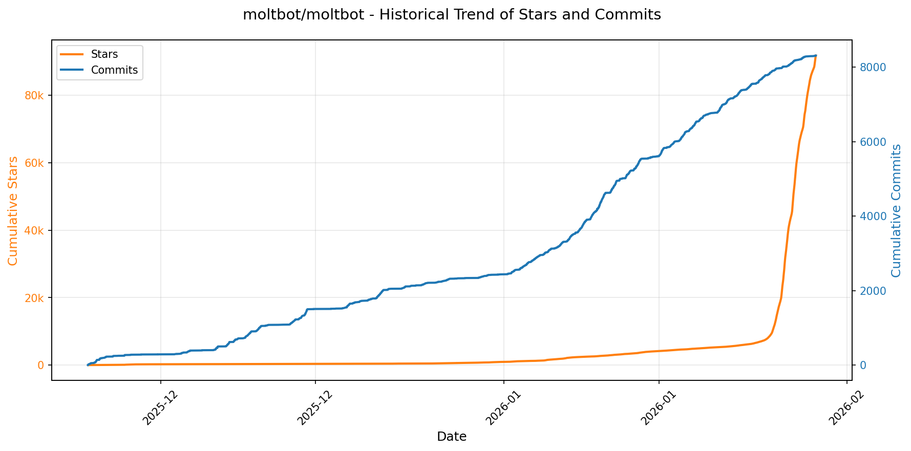
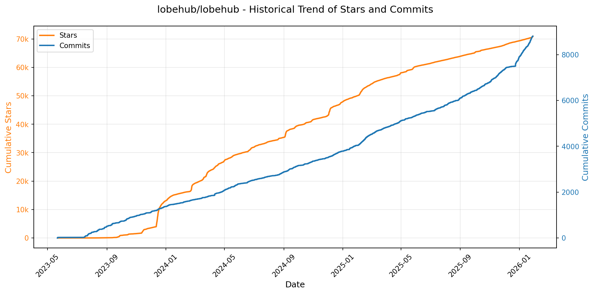
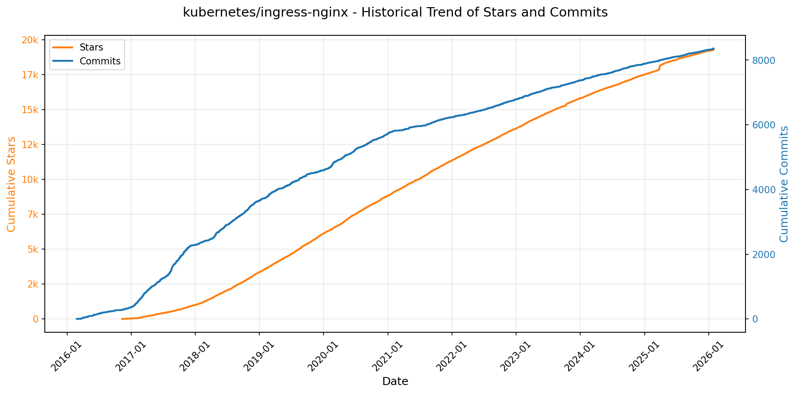
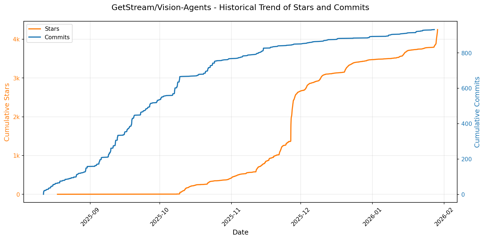
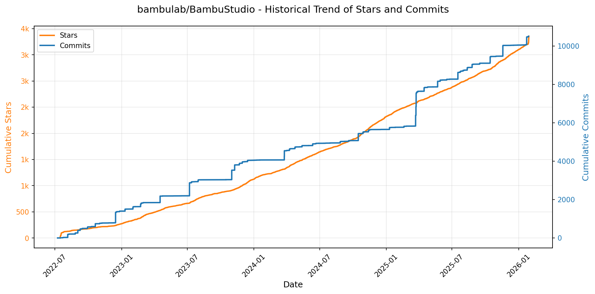
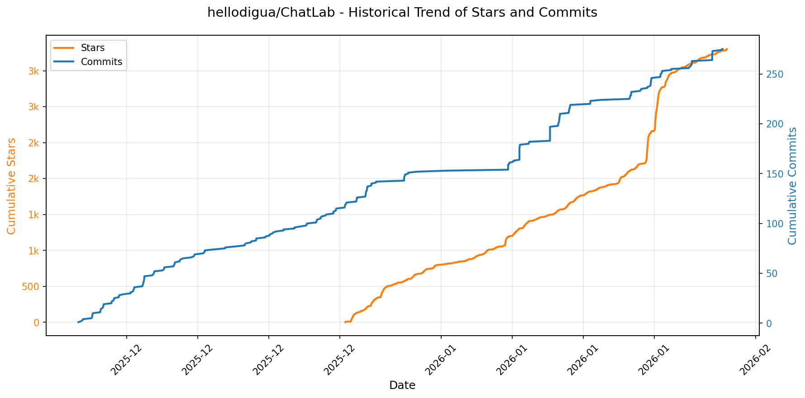
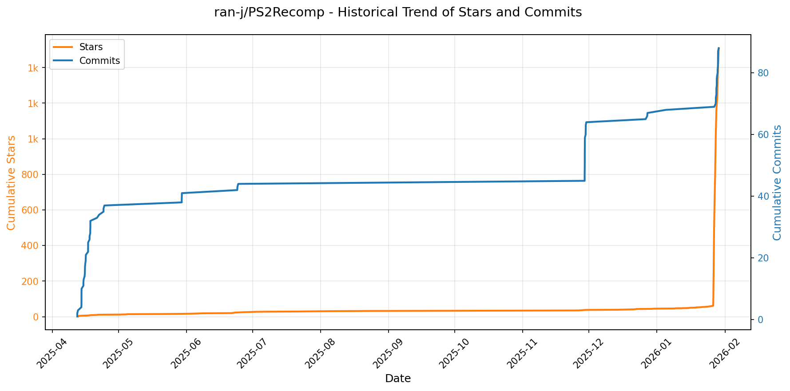

# 🌟 GitHub Trending 概览

> 数据更新于：2026-01-29。

---

## 🔍 项目详情

### 1. [anomalyco/opencode](https://github.com/anomalyco/opencode)
- 📅 **创建日期**：2025-04-30  
- 🔄 **最近更新**：2026-01-29  
- ⭐ **Stars**：91,832（日 +1041｜周 +9048｜月 +48163）  
- 📝 **描述**：The open source coding agent.  

<b>📈 Star 与 Commit 历史趋势</b>

> *蓝色：累计 Stars｜橙色：累计 Commits（次 Y 轴）*

<b>📄 README 摘要</b>

1. **项目功能**  
OpenCode 是一个开源的 AI 编程智能体（AI coding agent），旨在为开发者提供终端原生（TUI）、轻量高效且高度可扩展的 AI 辅助编程体验。它可在本地运行，支持与多种大语言模型（如 Claude、OpenAI、Google Gemini、本地 LLM 等）对接，不绑定任何特定服务商；核心用途包括代码理解、生成、重构、调试、跨文件分析、多步任务规划等，并原生集成语言服务器协议（LSP），实现深度 IDE 级语义支持。

2. **关键特性**  
- **双模式智能体切换**：内置 `build`（默认，全权限开发代理）和 `plan`（只读分析代理，禁止自动修改文件、需显式授权执行命令），按 Tab 键即时切换；另含 `@general` 子代理处理复杂搜索与多阶段任务。  
- **全平台终端优先（TUI-first）架构**：深度优化命令行交互体验，由 Neovim 用户及 terminal.shop 团队主导设计，强调键盘驱动、低干扰、高响应。  
- **客户端/服务器分离架构**：支持本地运行核心服务端，远程通过不同前端（如 TUI、未来移动端等）控制，具备良好的可扩展性与部署灵活性。  
- **多平台一键安装**：提供覆盖 macOS/Linux（Homebrew、Nix、Mise）、Windows（Scoop、Chocolatey）、Arch（AUR）等主流包管理器的安装方式，以及独立桌面应用（Beta）支持（macOS/Windows/Linux 多架构）。  
- **国际化与开箱即用**：支持 16 种语言文档；自动适配系统暗色/亮色主题；安装路径遵循 XDG 标准，支持自定义目录；内置模型配置抽象层，无缝切换不同后端模型。

3. **技术栈**  
- **核心语言与运行时**：Rust（主服务端逻辑，强调性能与安全性）、TypeScript（Web/桌面前端、CLI 工具链）  
- **前端框架**：TUI 层基于 Rust 的 `tui-rs` 或类似终端 UI 库；Web/桌面端使用现代前端栈（推测为 React/Vite + Tailwind CSS，依据资产路径 `packages/web/src/` 和 `packages/console/app/` 结构）  
- **协议与集成**：原生支持 LSP（Language Server Protocol），可桥接任意兼容语言服务器；通信层采用 IPC/HTTP/gRPC 等机制实现 client-server 解耦  
- **构建与分发**：CI/CD 基于 GitHub Actions；跨平台打包使用 AppImage（Linux）、DMG（macOS）、NSIS/MSIX（Windows）；包管理全面覆盖 Homebrew、Scoop、Chocolatey、Nix、AUR、npm/bun/pnpm/yarn 等  
- **基础设施**：模型抽象层支持 OpenRouter、Anthropic、OpenAI、Google、Ollama 及本地 GGUF 模型；日志、配置、状态管理采用标准化 Rust 生态方案（如 `serde`, `config`, `tracing`）

---

### 2. [moltbot/moltbot](https://github.com/moltbot/moltbot)
- 📅 **创建日期**：2025-11-24  
- 🔄 **最近更新**：2026-01-29  
- ⭐ **Stars**：91,737（日 +16787｜周 +85933｜月 +90974）  
- 📝 **描述**：Your own personal AI assistant. Any OS. Any Platform. The lobster way. 🦞   

<b>📈 Star 与 Commit 历史趋势</b>

> *蓝色：累计 Stars｜橙色：累计 Commits（次 Y 轴）*

<b>📄 README 摘要</b>

1. **项目功能**  
Moltbot 是一个可在用户自有设备上本地运行的个人 AI 助手，核心定位是“本地化、单用户、始终在线”的智能代理系统。它不依赖中心化云服务，而是作为轻量级网关（Gateway）统一管理多消息通道接入、AI 代理调度、工具执行与状态会话。用户可通过 WhatsApp、Telegram、Slack、Discord、Signal、iMessage、Google Chat、Microsoft Teams、Matrix、Zalo 等 15+ 主流通信平台与助手交互；同时支持 macOS/iOS/Android 设备端语音唤醒（Voice Wake）、实时语音对话（Talk Mode）、本地屏幕录制、相机调用、位置获取及系统命令执行。其本质是将大模型能力深度嵌入用户真实数字生活场景——从聊天收发、自动化任务（浏览器控制、定时任务、Webhook/Gmail 集成），到可视化交互（Live Canvas + A2UI）、跨设备协同（节点 Node 架构），全部在用户可控、隐私优先的前提下完成。

2. **关键特性**  
- **本地优先网关（Local-first Gateway）**：单一 WebSocket 控制平面，统管会话生命周期、通道连接、工具注册、事件分发与远程调试（含 Web UI 和 CLI）。  
- **全栈多通道支持**：原生集成 Baileys（WhatsApp）、grammY（Telegram）、Bolt（Slack）、discord.js（Discord）等 SDK，并通过扩展支持 BlueBubbles、Zalo、Matrix、WebChat 等；支持群组消息路由（提及触发、回复标签、分块处理）。  
- **多代理工作区隔离（Multi-agent Routing）**：按通道、账号或联系人自动路由至独立 agent 工作区（workspace），实现会话隔离、模型/技能/上下文独立配置。  
- **语音与视觉交互能力**：macOS/iOS/Android 端支持 ElevenLabs 驱动的常驻语音唤醒与连续对话；提供可编程 Live Canvas（A2UI 渲染引擎），支持动态 UI 推送、快照与脚本执行。  
- **设备级节点系统（Nodes）**：将 iOS/Android/macOS 设备抽象为可调用节点（`node.invoke`），安全执行摄像头、录屏、通知、TCC 权限操作（如 `system.run`, `location.get`, `canvas.*`），权限由系统原生框架（TCC）管控。  
- **安全默认策略**：DM 默认启用配对机制（`dmPolicy="pairing"`），未授权发送者需输入一次性验证码方可加入白名单；支持沙箱模式（Docker 容器化非主会话），限制敏感工具（如 browser/canvas/nodes）在群组中执行。  
- **自动化与扩展生态**：内置浏览器控制（专用 Chromium + CDP）、Cron 定时、Gmail Pub/Sub、Webhook 触发；提供 Skills 平台（ClawdHub 技能注册中心），支持捆绑技能、托管技能与工作区自定义技能；CLI 提供 `sessions_*` 工具实现跨会话协作。  
- **灵活部署与运维**：支持 Nix 声明式配置、Docker 容器化、Tailscale Serve/Funnel 远程访问（HTTPS + 身份验证）、SSH 隧道；内置 `moltbot doctor` 自检、日志诊断与配置迁移能力。

3. **技术栈**  
- **运行时**：Node.js ≥22（主力运行环境），支持 npm / pnpm / bun；TypeScript 编写，使用 `tsx` 直接执行源码。  
- **核心架构**：WebSocket 控制平面（Gateway）、RPC 模式 Pi Agent 运行时、模块化 Channel Adapter（各 SDK 封装）、Node.js-based CLI 工具链。  
- **前端与 UI**：Web 控制台（Control UI）与 WebChat 内置于 Gateway；Canvas 使用 A2UI（基于 Web Components 的声明式 UI 框架）；macOS 应用基于原生 AppKit + Swift/Obj-C 桥接。  
- **AI 模型层**：支持任意兼容 OpenAI 兼容 API 或 Anthropic API 的模型（推荐 Anthropic Claude Opus 4.5）；内置模型轮换（OAuth/API Key 双认证）、故障转移（failover）、会话级模型覆盖机制。  
- **基础设施与安全**：Tailscale 实现零信任远程访问；Docker 用于沙箱隔离；macOS 使用 TCC（Transparency, Consent, and Control）框架管理权限；Linux 使用 systemd/launchd 管理守护进程。  
- **构建与分发**：pnpm 为主力构建工具；Nix 支持声明式环境；Docker 提供容器镜像；macOS/iOS/Android 分别通过签名应用分发（满足系统权限持久化要求）。

---

### 3. [lobehub/lobehub](https://github.com/lobehub/lobehub)
- 📅 **创建日期**：2023-05-21  
- 🔄 **最近更新**：2026-01-29  
- ⭐ **Stars**：70,940（日 +300｜周 +637｜月 +1675）  
- 📝 **描述**：The ultimate space for work and life — to find, build, and collaborate with agent teammates that grow with you. We are taking agent harness to the next level — enabling multi-agent collaboration, effortless agent team design, and introducing agents as the unit of work interaction.  

<b>📈 Star 与 Commit 历史趋势</b>

> *蓝色：累计 Stars｜橙色：累计 Commits（次 Y 轴）*

<b>📄 README 摘要</b>

1. **项目功能**  
LobeHub 是一个面向工作与生活的 AI 智能体（Agent）协作平台，致力于构建全球最大的“人类–智能体共演网络”。它使用户能够**发现、创建并协同工作于可成长的 AI 智能体队友**——这些智能体不仅执行任务，更随用户使用持续学习、演化。核心定位是将“智能体”作为基本工作单元，替代传统碎片化、单次性的 AI 工具，提供统一、上下文连贯、可协作、可进化的生产力基础设施。

2. **关键特性**  
- **智能体即工作单元（Agent-as-a-Unit）**：通过可视化 Agent Builder 一键创建个性化智能体，支持统一调用多模态模型与超 10,000+ 技能插件（MCP 兼容）。  
- **智能体协作网络（Agent Groups）**：支持 Pages（多智能体协同写作）、Schedule（定时自动执行）、Project（项目化组织）和 Workspace（团队共享空间），实现类真人团队协作。  
- **人机共演机制（Co-evolution）**：内置“白盒式个人记忆”（White-Box Memory），支持结构化、可编辑、持续学习的记忆系统，使智能体深度理解并适应用户习惯。  
- **MCP 生态体系**：集成 Model Context Protocol（MCP）标准，提供一键安装插件、官方 MCP Marketplace（插件市场）、及标准化外部工具连接能力（数据库/API/文件系统等）。  
- **全栈 AI 能力支持**：涵盖 Smart Internet Search（实时联网搜索）、Chain of Thought（思维链可视化）、Branching Conversations（分支对话树）、Artifacts（实时生成 SVG/HTML/文档）、本地知识库（文件上传与向量化检索）、多模型服务商接入（OpenAI、Claude、Gemini 等超 10+）、本地 LLM（Ollama 支持）、多模态视觉识别（GPT-4V）、TTS/STT 语音交互、Text-to-Image（DALL·E 3/MidJourney/Pollinations）、Function Calling 插件系统、Agent Market（类 GPTs 市场）。  
- **跨端与部署友好**：提供桌面客户端（无浏览器限制）、PWA 渐进式网页应用、移动端自适应、多用户管理、本地/远程数据库支持、自定义主题，以及 Vercel/Docker/Sealos/阿里云等多平台一键部署方案。

3. **技术栈**  
- **前端**：基于 React（TypeScript）构建，支持 PWA、Electron 桌面封装、响应式移动适配；采用现代 UI 框架（如 Tailwind CSS）与可视化库（用于 CoT、分支对话图谱、Artifacts 渲染等）。  
- **后端/架构**：模块化服务设计，强调插件化与协议标准化（MCP）；支持多种模型服务提供商抽象层（Provider Abstraction Layer）；集成 Ollama 本地模型运行时；具备知识库 RAG 能力（向量数据库支持）。  
- **部署与运维**：原生支持 Docker 容器化、Vercel Serverless、Zeabur、Sealos 及阿里云等云平台；CI/CD 由 GitHub Actions 驱动（含测试、发布、代码覆盖率验证）；支持环境变量灵活配置。  
- **生态扩展**：深度集成 MCP 协议、遵循 OpenAI Function Calling 规范；支持主流 TTS（OpenAI Audio、Microsoft Edge Speech）、STT、图像生成 API；知识库底层兼容常见向量数据库（如 Chroma、Qdrant 等，文档中虽未明列但属 RAG 标准实践）。

---

### 4. [protocolbuffers/protobuf](https://github.com/protocolbuffers/protobuf)
- 📅 **创建日期**：2014-08-26  
- 🔄 **最近更新**：2026-01-29  
- ⭐ **Stars**：70,512（日 +72｜周 +120｜月 +561）  
- 📝 **描述**：Protocol Buffers - Google's data interchange format  

<b>📈 Star 与 Commit 历史趋势</b>

> *蓝色：累计 Stars｜橙色：累计 Commits（次 Y 轴）*

<b>📄 README 摘要</b>

1. **该项目的功能**  
Protocol Buffers（简称 protobuf）是 Google 开发的一种语言无关、平台无关、可扩展的结构化数据序列化机制，主要用于高效地序列化和反序列化结构化数据，以支持不同系统、服务和编程语言之间的数据交换与通信。其核心用途包括：定义数据结构（通过 `.proto` 文件）、生成对应语言的数据访问类、以及在客户端/服务端、微服务、RPC 框架（如 gRPC）中实现紧凑、快速、向后兼容的数据传输。

2. **关键特性**  
- **跨语言与跨平台支持**：提供 C++、Java、Python、Go、C#、Ruby、PHP、Objective-C、Dart、JavaScript 等主流语言的官方运行时库与代码生成器；  
- **高效二进制格式**：相比 XML 或 JSON，protobuf 序列化后体积更小、解析速度更快、带宽占用更低；  
- **强契约与向后/向前兼容性**：通过字段编号（tag）机制支持 schema 演进（如新增/删除/重命名字段），保障旧版本程序可安全读取新格式数据；  
- **IDL（接口定义语言）驱动**：基于 `.proto` 文件统一描述数据结构与服务接口，自动生成类型安全的客户端/服务端代码；  
- **原生集成构建系统**：深度支持 Bazel（含现代 Bzlmod 和传统 WORKSPACE 模式），并提供标准化依赖管理与构建规则；  
- **开箱即用的工具链**：提供 `protoc` 编译器（protocol compiler），支持从 `.proto` 文件生成目标语言代码、验证语法、生成文档等；  
- **严格的安全与维护策略**：遵循明确的[版本支持政策](https://protobuf.dev/version-support/)，长期维护稳定发布分支，并通过 OpenSSF Scorecard 等指标保障供应链安全。

3. **技术栈**  
- **核心实现语言**：C++（`protoc` 编译器及 C++ 运行时）；  
- **构建与依赖管理**：Bazel（主构建系统，支持 Bzlmod 和 WORKSPACE）、CMake（部分历史/备用构建路径）；  
- **多语言运行时支持**：各语言原生生态集成——  
  - Java：基于 Maven（`com.google.protobuf:protobuf-java`）；  
  - Python：PyPI（`protobuf` 包），依赖 `setuptools` 和 `wheel`；  
  - Go：独立仓库 [`protobuf-go`](https://github.com/protocolbuffers/protobuf-go)，使用 Go Modules；  
  - JavaScript/TypeScript：独立仓库 [`protobuf-javascript`](https://github.com/protocolbuffers/protobuf-javascript)，支持 ES modules 与 CommonJS；  
  - 其他语言（C#、Ruby、PHP、Dart、Objective-C）均提供对应语言惯用的包管理方式（NuGet、RubyGems、Composer、Pub、CocoaPods 等）；  
- **基础设施与标准**：遵循语义化版本（SemVer），发布托管于 GitHub Releases；历史版本存档于 Maven Central；安全审计依托 OpenSSF 生态。

---

### 5. [anthropics/claude-code](https://github.com/anthropics/claude-code)
- 📅 **创建日期**：2025-02-22  
- 🔄 **最近更新**：2026-01-29  
- ⭐ **Stars**：62,141（日 +374｜周 +2832｜月 +12561）  
- 📝 **描述**：Claude Code is an agentic coding tool that lives in your terminal, understands your codebase, and helps you code faster by executing routine tasks, explaining complex code, and handling git workflows - all through natural language commands.  

<b>📈 Star 与 Commit 历史趋势</b>

> *蓝色：累计 Stars｜橙色：累计 Commits（次 Y 轴）*

<b>📄 README 摘要</b>

1. **项目功能**  
Claude Code 是一款终端原生的智能编程代理工具，能够深度理解用户本地代码库，通过自然语言指令协助开发者加速编码工作。其核心能力包括：自动执行重复性开发任务（如生成文件、修改配置）、解释复杂代码逻辑、自动化处理 Git 工作流（如提交、分支管理、冲突分析），并支持在终端、IDE 或 GitHub 中通过 `@claude` 提及方式调用。

2. **关键特性**  
- **上下文感知的代码理解**：基于项目目录结构和文件内容构建本地知识图谱，实现精准的代码语义理解与操作；  
- **多环境集成支持**：原生适配终端（CLI）、主流 IDE 插件以及 GitHub 评论区交互；  
- **可扩展插件系统**：内置插件机制，允许开发者通过自定义命令和专用 Agent 扩展功能（如测试生成、文档补全、安全扫描等）；  
- **一键式跨平台安装**：提供针对 macOS/Linux（Shell 脚本 + Homebrew）和 Windows（PowerShell 脚本 + WinGet）的标准化安装方案，npm 全局安装已弃用；  
- **内建反馈与问题上报机制**：支持在 CLI 中直接使用 `/bug` 命令提交错误报告，并同步至 GitHub Issues；  
- **隐私优先设计**：明确限制敏感数据留存周期，禁止将用户代码或对话用于模型训练，所有数据使用均符合商用条款与隐私政策。

3. **技术栈**  
- **运行时环境**：Node.js 18+（作为 CLI 主程序基础运行时）；  
- **客户端架构**：终端原生 CLI 工具（非 Web 应用），采用 Shell（macOS/Linux）和 PowerShell（Windows）脚本实现轻量级安装与初始化；  
- **分发方式**：支持多种包管理器——Homebrew（macOS/Linux）、WinGet（Windows）、npm（已弃用）；  
- **后端与 AI 集成**：底层对接 Anthropic 的 Claude 大模型服务（具体模型版本未公开，但强调为专为代码场景优化的推理引擎）；  
- **扩展生态**：插件系统基于 TypeScript/JavaScript 编写，遵循约定式目录结构（见 `./plugins/`），支持命令注册与 Agent 生命周期管理。

---

### 6. [anthropics/skills](https://github.com/anthropics/skills)
- 📅 **创建日期**：2025-09-22  
- 🔄 **最近更新**：2026-01-29  
- ⭐ **Stars**：57,315（日 +1173｜周 +8947｜月 +27954）  
- 📝 **描述**：Public repository for Agent Skills  

<b>📈 Star 与 Commit 历史趋势</b>

> *蓝色：累计 Stars｜橙色：累计 Commits（次 Y 轴）*

<b>📄 README 摘要</b>

1. **该项目做什么？**  
该项目是 Anthropic 官方维护的 Claude 技能（Skills）开源示例仓库，提供一系列可直接使用或参考的模块化技能实现。这些技能是独立的文件夹单元，内含 `SKILL.md`（含 YAML 元数据和指令）、脚本及资源，用于动态扩展 Claude 在特定任务上的能力。项目本身不运行服务，而是为开发者提供生产级技能范例（如 PDF 表单提取、PPTX 生成、MCP 服务器构建等），支持在 Claude Code（插件形式）、Claude.ai（付费版内置）及 Claude API 中加载和调用，旨在演示如何通过结构化技能提升大模型在垂直场景中的可靠性、一致性与专业化水平。

2. **关键特性**  
- **模块化与自包含设计**：每个技能为独立文件夹，强制包含标准化 `SKILL.md`（含 `name`/`description` 前置元数据 + 指令正文 + 示例 + 指南），开箱即用且易于复用；  
- **覆盖多领域真实场景**：涵盖创意设计（艺术/音乐/品牌）、技术开发（Web 应用测试、MCP 服务生成）、企业协作（通信模板、合规文档）及核心文档处理（DOCX/PDF/PPTX/XLSX 的创建、解析与编辑）；  
- **生产级参考实现**：公开了驱动 Claude 官方文档功能的源可用（source-available）文档技能（非开源但可学习），为复杂技能开发提供工业级范本；  
- **多平台集成支持**：原生适配 Claude Code（通过 `/plugin` 命令安装 marketplace 插件）、Claude.ai（开箱即用）及 Claude API（支持上传自定义技能）；  
- **开放规范与模板**：同步发布 [Agent Skills 规范](http://agentskills.io)（`./spec`）和标准化技能模板（`./template`），降低开发门槛并推动生态统一。

3. **技术栈**  
- **核心格式**：纯文本 Markdown（`SKILL.md`）+ YAML 前置元数据，零依赖、高可读、易版本控制；  
- **执行环境**：完全依赖 Anthropic 的 Claude 模型运行时（无独立后端服务），技能逻辑由 Claude 模型在推理过程中动态解析与执行；  
- **协议标准**：遵循 [Agent Skills 开放规范](http://agentskills.io)，定义技能发现、加载、元数据、生命周期等抽象接口；  
- **分发机制**：基于插件化架构（Claude Code Plugin Marketplace），通过 `anthropic-agent-skills` 插件包分发 `document-skills` 和 `example-skills` 等预构建技能集；  
- **许可体系**：混合授权——多数示例技能采用 Apache 2.0 开源协议，核心文档技能为源可用（source-available，非 OSI 认证开源）。

---

### 7. [usememos/memos](https://github.com/usememos/memos)
- 📅 **创建日期**：2021-12-08  
- 🔄 **最近更新**：2026-01-29  
- ⭐ **Stars**：56,261（日 +113｜周 +940｜月 +8755）  
- 📝 **描述**：An open-source, self-hosted note-taking service. Your thoughts, your data, your control — no tracking, no ads, no subscription fees.  

<b>📈 Star 与 Commit 历史趋势</b>

> *蓝色：累计 Stars｜橙色：累计 Commits（次 Y 轴）*

<b>📄 README 摘要</b>

1. **项目功能**  
Memos 是一个开源、可自托管的轻量级笔记与知识管理服务，专注于个人笔记、团队 Wiki 和结构化知识库场景。它允许用户完全掌控自己的数据——所有内容存储在用户自选的基础设施（本地服务器、云主机或边缘设备）上，不依赖第三方云服务，不上传数据，不收集遥测信息，无广告、无订阅费用。

2. **核心特性**  
- **隐私优先架构**：零追踪、零遥测、全离线运行；支持一键导出全部数据（纯文本/Markdown 格式），杜绝厂商锁定。  
- **原生 Markdown 支持**：实时渲染、语法高亮、表格/数学公式/代码块等完整功能；笔记以纯文本形式持久化，确保长期可读性与可迁移性。  
- **极致性能体验**：Go 语言编写的高性能后端 + React 前端，启动快、响应迅捷；SQLite 默认嵌入式数据库，亦支持 MySQL/PostgreSQL 横向扩展。  
- **极简部署与运维**：单命令 Docker 启动（`docker run`），同时提供 Docker Compose、Kubernetes Helm 图表、预编译二进制包（Linux/macOS/Windows）及源码构建方案。  
- **开发者友好接口**：提供完备的 RESTful API 与 gRPC API，支持自动化集成、CLI 工具开发、第三方应用对接及工作流嵌入。  
- **现代化用户体验**：简洁优雅的 UI，内置深色模式，响应式设计适配桌面与移动设备，无干扰写作环境。

3. **技术栈**  
- **后端**：Go（Gin 框架）、SQLite（默认）/MySQL/PostgreSQL（可选）  
- **前端**：React（TypeScript）、Tailwind CSS、Vite 构建工具  
- **部署与运维**：Docker / Docker Compose、Kubernetes（Helm 支持）、GitHub Actions CI/CD  
- **协议与标准**：REST API、gRPC（用于高性能内部通信与高级客户端集成）  
- **许可证**：MIT 开源协议

---

### 8. [obra/superpowers](https://github.com/obra/superpowers)
- 📅 **创建日期**：2025-10-09  
- 🔄 **最近更新**：2026-01-29  
- ⭐ **Stars**：39,316（日 +974｜周 +6723｜月 +26701）  
- 📝 **描述**：An agentic skills framework & software development methodology that works.  

<b>📈 Star 与 Commit 历史趋势</b>

> *蓝色：累计 Stars｜橙色：累计 Commits（次 Y 轴）*

<b>📄 README 摘要</b>

1. **该项目的功能**  
Superpowers 是一个面向编程智能体（coding agents）的完整软件开发工作流框架，旨在将原本零散、随意的代码生成行为，转变为结构化、可验证、符合工程规范的协作式开发过程。它不直接生成代码，而是通过一系列自动触发的“技能”（skills），引导智能体在编码前完成需求澄清、设计评审、计划制定，并在实施中严格执行测试驱动开发（TDD）、YAGNI（你不会需要它）和 DRY（不要重复自己）等原则；所有环节均以人类开发者可理解、可审核、可干预的方式分步推进，最终实现高可靠、低熵、可追溯的自主开发闭环。

2. **核心功能**  
- **交互式设计精炼（brainstorming）**：在编码前主动提问、探索替代方案，分块呈现可读的设计文档供人工确认。  
- **自动化实施计划生成（writing-plans）**：将获批设计拆解为粒度极细（2–5分钟/项）的原子任务，明确指定文件路径、待写代码、验证步骤与退出条件。  
- **子智能体驱动开发（subagent-driven-development）**：为每个任务启动独立子智能体，执行双阶段审查（先验是否符合规格，再审代码质量），支持数小时级无人干预连续执行。  
- **强制性测试先行（test-driven-development）**：严格遵循 RED-GREEN-REFACTOR 流程，禁止先写实现后补测试，失败测试必须存在且可复现，代码仅在测试通过后提交。  
- **全链路质量守门（requesting-code-review + verification-before-completion）**：每项任务完成后自动发起预审，按严重等级阻断问题（如关键偏差立即中止）；修复后必须实证验证而非主观断言。  
- **隔离式并行开发（using-git-worktrees）**：基于 Git 工作树创建干净分支环境，确保开发互不干扰，并自动校验测试基线为绿色。  
- **技能自生长能力（writing-skills）**：内置“编写新技能”的元技能，提供标准化模板、测试方法与最佳实践指南，支持社区共建技能库。

3. **技术栈**  
- **运行平台**：原生适配多款 AI 编程代理平台，包括 Claude Code（通过插件市场集成）、Codex 和 OpenCode（需手动加载配置）。  
- **架构范式**：基于“可组合技能”（composable skills）的插件化设计，各技能为独立语义单元（以 Markdown 文档形式组织在 `skills/` 目录下），通过上下文感知自动触发，无需用户显式调用。  
- **协议与集成**：依赖平台提供的指令注入机制（如 `/plugin install`、`Fetch and follow instructions from...`）完成安装与更新；使用标准 Git 工具链支撑工作树管理与分支操作。  
- **哲学与方法论层**：深度嵌入 TDD、系统化调试（4 阶根因分析）、防御性等待（condition-based-waiting）、Socratic 提问法、YAGNI/DRY 等工程实践，所有技能均围绕“证据优于断言”“复杂度即债务”等核心信条构建。

---

### 9. [hashicorp/vault](https://github.com/hashicorp/vault)
- 📅 **创建日期**：2015-02-25  
- 🔄 **最近更新**：2026-01-29  
- ⭐ **Stars**：34,415（日 +254｜周 +562｜月 +745）  
- 📝 **描述**：A tool for secrets management, encryption as a service, and privileged access management  

<b>📈 Star 与 Commit 历史趋势</b>

> *蓝色：累计 Stars｜橙色：累计 Commits（次 Y 轴）*

<b>📄 README 摘要</b>

1. **项目功能**  
Vault 是一个用于安全访问和管理敏感信息（即“密钥”）的工具。它为各类秘密（如 API 密钥、数据库凭据、TLS 证书、OAuth 令牌等）提供统一、集中化的访问接口，同时实施严格的访问控制策略，并完整记录所有操作的审计日志。其核心目标是解决现代分布式系统中密钥生命周期管理的复杂性问题——包括安全存储、动态生成、自动轮换、细粒度授权与实时吊销，避免企业因自建密钥管理系统而带来的安全风险与运维负担。

2. **关键特性**  
- **安全密钥存储**：支持任意键值对存储；所有数据在写入持久化后端（如本地磁盘、Consul 等）前均经强加密处理，防止底层存储泄露导致密钥失窃。  
- **动态密钥生成**：按需为 AWS、SQL 数据库、Kubernetes 等后端系统实时生成临时凭证（如 IAM 角色密钥、数据库连接账号），并自动在租约（lease）到期后立即吊销，实现“用完即焚”。  
- **数据加密即服务（Transit Engine）**：提供不落盘的加解密能力，允许应用将明文数据交由 Vault 加密后存于外部系统（如数据库），由 Vault 统一管控加密策略、密钥轮换与权限，无需应用自行实现加密逻辑。  
- **租约与续期机制**：每个密钥均绑定可配置时长的租约；客户端可通过 API 主动续期，Vault 在租约过期后自动失效密钥，确保最小权限与时效性。  
- **分级吊销能力**：支持单个密钥、用户路径下全部密钥、某类后端（如所有 `aws/` 下密钥）甚至整个命名空间的批量吊销，支撑密钥滚动更新与安全事件响应（如入侵后快速锁死凭证链）。

3. **技术栈**  
- **编程语言**：Go（Golang），全栈使用 Go 编写，依赖 Go Modules 进行依赖管理（`go.mod` 文件定义）。  
- **构建与测试**：基于 `make` 构建系统（`make dev`、`make test`、`make testacc` 等）；单元测试与集成测试重度依赖 Docker 容器化运行环境；提供专用 SDK（`github.com/hashicorp/vault/api` 和 `github.com/hashicorp/vault/sdk`）供第三方调用或扩展开发。  
- **运行时依赖**：支持多种后端存储（本地文件系统、Consul、etcd、ZooKeeper 等）；企业版额外支持高可用复制（Performance Replication / DR Replication）、多数据中心同步等高级功能；UI 组件通过 `make static-dist dev-ui` 构建。  
- **基础设施兼容性**：原生适配云平台（AWS、Azure、GCP）、Kubernetes（via Vault Agent、CSI Provider）、服务网格（如 Consul Connect）及主流 CI/CD 工具链。

---

### 10. [remotion-dev/remotion](https://github.com/remotion-dev/remotion)
- 📅 **创建日期**：2020-06-23  
- 🔄 **最近更新**：2026-01-29  
- ⭐ **Stars**：33,409（日 +438｜周 +7455｜月 +8358）  
- 📝 **描述**：🎥      Make videos programmatically with React  

<b>📈 Star 与 Commit 历史趋势</b>

> *蓝色：累计 Stars｜橙色：累计 Commits（次 Y 轴）*

<b>📄 README 摘要</b>

1. **项目功能**  
Remotion 是一个基于 React 的视频生成框架，允许开发者使用 React 组件、JavaScript 逻辑和 Web 标准技术（如 CSS、SVG、Canvas、WebGL）**以编程方式动态创建高质量视频**。它将视频视为“可渲染的 UI”，支持时间轴控制、帧精确渲染、动态数据驱动内容（如个性化年度回顾），并可导出为 MP4、GIF 或 ProRes 等格式，适用于营销视频、数据可视化、社交媒体内容、自动化报告等场景。

2. **核心特性**  
- ✅ **React 原生开发体验**：复用 React 组件、Hooks、状态管理、Context 和第三方 npm 包；支持 Fast Refresh 实时预览动画效果。  
- ✅ **时间轴与帧控制**：提供 `useCurrentFrame()`、`interpolate()`、`Sequence`、`Composition` 等 API，实现基于时间的动画逻辑与多层合成。  
- ✅ **多目标输出**：一键导出为 MP4（H.264/AV1）、GIF、WebM、ProRes，或生成静态帧序列（PNG/JPEG）。  
- ✅ **服务端渲染支持**：可通过 Node.js（无浏览器环境）进行 Headless 渲染，适配 CI/CD 和云函数（如 Vercel、AWS Lambda）。  
- ✅ **交互式预览**：内置开发服务器支持实时拖拽时间轴、跳转关键帧、热重载，大幅提升视频调试效率。  
- ✅ **生产就绪能力**：支持字体嵌入、音频合成、自定义编码参数、分辨率/帧率配置及批量渲染（`renderMedia()` API）。

3. **技术栈**  
- **核心框架**：React（v18+）、TypeScript（完全类型化 API）  
- **渲染引擎**：基于 Chromium（通过 Puppeteer 或 Playwright 进行 Headless 浏览器渲染），利用 Canvas/WebGL 加速图形绘制  
- **构建与工具链**：Vite（默认模板）、Webpack（兼容）、ESBuild（快速打包）  
- **运行时依赖**：Node.js（≥18.x）、FFmpeg（用于视频编码/封装，自动下载或系统级集成）  
- **部署生态**：原生支持 Vercel、Netlify、Cloudflare Workers 及自建 Node 服务；CLI 工具 `remotion` 提供完整开发/构建/渲染工作流

---

### 11. [Lissy93/web-check](https://github.com/Lissy93/web-check)
- 📅 **创建日期**：2023-06-25  
- 🔄 **最近更新**：2026-01-29  
- ⭐ **Stars**：31,383（日 +87｜周 +713｜月 +4302）  
- 📝 **描述**：🕵️‍♂️ All-in-one OSINT tool for analysing any website  

<b>📈 Star 与 Commit 历史趋势</b>

> *蓝色：累计 Stars｜橙色：累计 Commits（次 Y 轴）*

---

### 12. [block/goose](https://github.com/block/goose)
- 📅 **创建日期**：2024-08-23  
- 🔄 **最近更新**：2026-01-29  
- ⭐ **Stars**：29,515（日 +105｜周 +2718｜月 +4394）  
- 📝 **描述**：an open source, extensible AI agent that goes beyond code suggestions - install, execute, edit, and test with any LLM  

<b>📈 Star 与 Commit 历史趋势</b>

> *蓝色：累计 Stars｜橙色：累计 Commits（次 Y 轴）*

<b>📄 README 摘要</b>

1. **该项目的功能**  
goose 是一个运行在本地的、可扩展的开源 AI 工程智能体（AI agent），专为自动化软件工程任务而设计。它能端到端自主完成复杂开发工作，包括：从零构建完整项目、编写并执行代码、自动调试失败、编排多步骤工程工作流（如测试→构建→部署）、以及安全调用外部 API。其核心定位是“on-machine”（完全本地运行）的开发者协作者，不依赖云端服务，强调隐私性、可控性与工程闭环能力。

2. **关键特性**  
- ✅ **全栈自动化能力**：超越传统代码补全，支持需求理解、架构设计、编码、执行、验证、迭代修复等完整开发生命周期；  
- ✅ **高度可扩展与灵活适配**：原生支持任意大语言模型（LLM），允许配置多模型协同（如推理模型 + 代码模型 + 安全审核模型），优化性能、成本与可靠性；  
- ✅ **开放协议集成**：深度兼容 [MCP（Model Communication Protocol）](https://modelcommunicationprotocol.org/) 标准，可无缝对接各类工具服务器（如代码索引、数据库、CI/CD、IDE 插件等）；  
- ✅ **双形态交付**：同时提供桌面应用（GUI）和命令行工具（CLI），适配不同开发场景与偏好；  
- ✅ **本地优先与隐私保障**：所有代码、上下文、模型交互默认在用户本地机器完成，敏感数据不出设备；  
- ✅ **负责任的 AI 实践**：配套《Responsible AI-Assisted Coding Guide》（HOWTOAI.md），明确人机协作边界、审核机制与安全准则。

3. **技术栈**  
- **核心语言**：TypeScript（主应用逻辑，兼顾类型安全与跨平台能力）；  
- **运行时与框架**：Electron（构建跨平台桌面应用）、Node.js（CLI 后端与本地工具链集成）；  
- **AI 协议层**：基于 [MCP](https://modelcommunicationprotocol.org/) 规范实现模型抽象与工具通信；  
- **模型接入**：通过标准化适配器支持主流 LLM 提供商（如 OpenAI、Anthropic、Ollama、Llama.cpp、Groq 等），无厂商锁定；  
- **构建与运维**：GitHub Actions CI/CD（`ci.yml`）、Apache 2.0 开源许可证；  
- **基础设施依赖**：本地文件系统访问、进程管理（执行代码/脚本）、HTTP 客户端（调用外部 API/MCP 服务器）。

---

### 13. [ComposioHQ/awesome-claude-skills](https://github.com/ComposioHQ/awesome-claude-skills)
- 📅 **创建日期**：2025-10-17  
- 🔄 **最近更新**：2026-01-29  
- ⭐ **Stars**：27,506（日 +450｜周 +3867｜月 +14934）  
- 📝 **描述**：A curated list of awesome Claude Skills, resources, and tools for customizing Claude AI workflows  

<b>📈 Star 与 Commit 历史趋势</b>

> *蓝色：累计 Stars｜橙色：累计 Commits（次 Y 轴）*

<b>📄 README 摘要</b>

1. **该项目做什么？**  
该项目是一个面向 Anthropic Claude 系列模型（包括 Claude.ai、Claude Code 和 Claude API）的**技能（Skills）开源集合库**，旨在将 Claude 从纯文本生成模型升级为可执行真实操作的智能代理。它不提供独立运行的应用程序，而是通过结构化、可复用的“技能”扩展 Claude 的能力边界：使模型能主动调用外部工具、连接第三方应用、处理多格式文档、执行开发任务、分析数据、管理项目、生成媒体内容、提升安全合规性等。核心目标是让 Claude 具备端到端自动化工作流能力——例如自动发送邮件、创建 GitHub Issue、分析 PDF 表格、生成带样式的 EPUB 电子书、调试 Playwright 测试、查询 PostgreSQL 数据库、优化 Twitter 推文、甚至进行数字取证分析。

2. **关键特性**  
- **跨平台统一技能支持**：所有技能均兼容 Claude.ai（网页版）、Claude Code（本地 IDE 插件）及 Claude API，实现“一次编写、三端生效”。  
- **超千款应用深度集成**：依托 Composio 框架，通过 `connect-apps` 插件实现与 Gmail、Slack、GitHub、Notion、Jira 等 500+ SaaS 应用的 OAuth 认证与操作闭环（如发消息、建工单、更新数据库）。  
- **九大垂直领域全覆盖**：系统化组织 100+ 实用技能，涵盖文档处理（DOCX/PDF/PPTX/XLSX/Markdown→EPUB）、开发工程（AWS CDK、Playwright 自动化、Git 工作树、TDD、LangSmith 调试）、数据分析（CSV 智能摘要、PostgreSQL 只读查询、根因追踪）、商业营销（竞品广告提取、域名生成、销售线索研究）、创意媒体（Canvas 设计、Imagen 图像生成、Slack GIF 制作）、生产力（发票归档、简历定制、文件智能整理）、协作管理（Google Workspace 集成、Outline Wiki 管理）、安全系统（Sigma 规则威胁狩猎、元数据提取、安全擦除）等。  
- **开箱即用的低代码技能框架**：采用标准化 `SKILL.md`（含 YAML 元数据）定义技能逻辑，支持脚本、模板、资源文件嵌套；提供 `Skill Creator` 和 `Skill Seekers` 等辅助工具，支持从文档网站一键生成技能。  
- **开发者友好生态**：支持 PR 贡献、Apache-2.0 开源协议、详尽的创建指南与最佳实践（如明确使用场景、面向 Claude 编写指令、多环境测试），并集成 Discord 社区与 LinkedIn/X 社交渠道。

3. **技术栈**  
- **核心依赖**：Composio（用于统一抽象和连接 1000+ 第三方应用的底层集成框架，处理认证、API 适配与动作编排）；Anthropic Claude Skills API（官方技能加载与执行接口）。  
- **前端/交互层**：Claude.ai（Web）、Claude Code（基于 VS Code 的桌面客户端）、命令行工具（`claude` CLI）。  
- **开发语言与工具**：以 Markdown/YAML 为主定义技能元数据与行为逻辑；大量技能内嵌 Python（如 `postgres` 查询、`n8n-skills`）、TypeScript（`MCP Builder`）、React/Tailwind（`artifacts-builder`）、D3.js（可视化）、Playwright（浏览器自动化）、SQL（PostgreSQL）、Shell（Git 操作）等技术栈实现具体功能。  
- **基础设施**：GitHub 托管（开源协作）、Discord 社区支持、Composio 平台（提供免费 API Key 与应用连接服务）。

---

### 14. [asgeirtj/system_prompts_leaks](https://github.com/asgeirtj/system_prompts_leaks)
- 📅 **创建日期**：2025-05-03  
- 🔄 **最近更新**：2026-01-29  
- ⭐ **Stars**：26,724（日 +1072｜周 +1526｜月 +2257）  
- 📝 **描述**：Collection of extracted System Prompts from popular chatbots like ChatGPT, Claude & Gemini  

<b>📈 Star 与 Commit 历史趋势</b>

> *蓝色：累计 Stars｜橙色：累计 Commits（次 Y 轴）*

---

### 15. [bytedance/UI-TARS-desktop](https://github.com/bytedance/UI-TARS-desktop)
- 📅 **创建日期**：2025-01-19  
- 🔄 **最近更新**：2026-01-29  
- ⭐ **Stars**：25,015（日 +52｜周 +430｜月 +4798）  
- 📝 **描述**：The Open-Source Multimodal AI Agent Stack: Connecting Cutting-Edge AI Models and Agent Infra  

<b>📈 Star 与 Commit 历史趋势</b>

> *蓝色：累计 Stars｜橙色：累计 Commits（次 Y 轴）*

<b>📄 README 摘要</b>

1. **项目功能**  
TARS 是一个面向实际任务的多模态 AI Agent 技术栈，核心目标是实现类人化、端到端的自动化任务执行。它通过融合视觉理解（Vision）、图形界面交互（GUI Agent）与多模态大语言模型（MLLM），使 AI 能够直接观察屏幕、理解 UI 元素、操作本地/远程计算机及浏览器，并调用真实世界工具完成复杂指令（如“预订机票+酒店+生成交通指南”或“修改 VS Code 自动保存设置”）。项目包含两大可独立运行的组件：  
- **Agent TARS**：通用多模态 Agent 运行时，提供 CLI 和 Web UI 两种交互入口，支持终端、服务端、浏览器等多环境部署；  
- **UI-TARS Desktop**：原生桌面应用，基于 UI-TARS 系列视觉语言模型（如 Seed-1.5-VL/1.6），提供本地与远程双模式 GUI 操作能力（含本地计算机控制、远程计算机控制、远程浏览器控制）。

2. **关键特性**  
- ✅ **多模态感知与执行闭环**：支持截图输入、视觉定位（Visual Grounding）、DOM 解析与混合策略浏览器控制，实现“看-思-动”一体化；  
- ✅ **MCP（Model Context Protocol）深度集成**：以 MCP 为内核协议，可动态挂载各类 MCP Server（如 Shell、文件系统、Priceline、Booking.com 等工具插件），打通 AI 与现实工具链；  
- ✅ **事件流驱动架构（Event Stream）**：采用协议化事件流机制，支撑上下文工程（Context Engineering）、实时数据流追踪、调试可视化（Event Stream Viewer）及低代码 Agent UI 构建；  
- ✅ **开箱即用的混合部署能力**：CLI 支持 headless（服务端）与 headful（Web UI）双模式；UI-TARS Desktop 提供零配置远程控制（Remote Computer/Browser Operator），无需网络穿透或复杂部署；  
- ✅ **隐私优先与全本地处理**：UI-TARS Desktop 默认全程离线运行，所有视觉识别、决策与操作均在本地完成，保障数据安全；  
- ✅ **沙箱化执行环境**：Agent TARS CLI 原生支持 AIO Agent Sandbox，为工具调用提供隔离、安全、可复现的一体化执行环境。

3. **技术栈**  
- **前端/客户端**：Electron（UI-TARS Desktop 桌面应用）、React/Vite（Web UI）、TypeScript；  
- **核心运行时**：Node.js（≥ v22），基于 npm 分发（`@agent-tars/cli`）；  
- **AI 模型层**：  
  - 视觉语言模型：ByteDance 自研 UI-TARS 系列（如 UI-TARS-1.5-7B）、Seed-1.5-VL / 1.6；  
  - 多模态 LLM 接口：支持 VolcEngine（Doubao 系列）、Anthropic（Claude 3.7 Sonnet）等主流厂商 API；  
- **协议与标准**：MCP（Model Context Protocol）作为 Agent 工具通信标准；  
- **基础设施**：AIO Agent Sandbox（隔离化工具执行环境）、Midscene（浏览器内 GUI Agent 运行框架）；  
- **部署生态**：支持 ModelScope、Hugging Face、Lark Office（飞书）等平台模型托管与云部署。

---

### 16. [BloopAI/vibe-kanban](https://github.com/BloopAI/vibe-kanban)
- 📅 **创建日期**：2025-06-14  
- 🔄 **最近更新**：2026-01-29  
- ⭐ **Stars**：19,701（日 +136｜周 +1327｜月 +11656）  
- 📝 **描述**：Get 10X more out of Claude Code, Codex or any coding agent  

<b>📈 Star 与 Commit 历史趋势</b>

> *蓝色：累计 Stars｜橙色：累计 Commits（次 Y 轴）*

<b>📄 README 摘要</b>

1. **项目功能**  
Vibe Kanban 是一个面向 AI 编程代理（如 Claude Code、Gemini CLI、Codex、Amp 等）的智能任务编排与协作平台。它不直接生成代码，而是解决现代开发者在 AI 编程时代的核心工作流痛点：**规划、调度、审查、集成与状态追踪**。用户可通过统一界面切换不同编码代理，串行或并行编排多代理任务，实时查看执行进度，一键启动开发服务器，集中管理 MCP（Model Communication Protocol）配置，并支持远程服务器部署后通过 SSH 直连本地编辑器（如 VS Code）打开项目。

2. **关键特性**  
- ✅ **多 AI 代理无缝切换与统一调度**：支持同时配置并按需调用多种编码代理，灵活定义执行顺序（串行/并行）。  
- ✅ **可视化看板式任务管理**：提供类 Kanban 界面，直观跟踪各代理任务的状态（待处理、运行中、完成、失败）、输出与日志。  
- ✅ **一键开发环境启动**：自动识别项目类型并快速启动对应 dev server（如 `npm run dev`、`cargo run`），加速验证与调试。  
- ✅ **MCP 配置中心化管理**：统一存储、编辑和复用各编码代理所需的 MCP 工具、模型参数及上下文配置。  
- ✅ **远程开发深度集成**：原生支持通过 SSH 远程连接部署在云服务器或本地局域网的 Vibe Kanban 实例，点击“Open in VSCode”即可触发远程编辑器直连，无需手动配置隧道。  
- ✅ **安全可自托管**：支持反向代理（Nginx/Caddy/Traefik）部署，通过 `VK_ALLOWED_ORIGINS` 严格控制跨域访问；完整环境变量体系支持生产级定制与隐私合规（如禁用 PostHog 分析）。

3. **技术栈**  
- **后端**：Rust（核心服务、高性能任务调度与 MCP 通信层），使用 `sqlx` 进行数据库操作（SQLite 默认），`axum` 或类似 Web 框架构建 API。  
- **前端**：TypeScript + React（基于现代前端工程实践），使用 `pnpm` 管理依赖，构建为静态资源。  
- **构建与工具链**：  
  - 构建系统：`pnpm`（主包管理）、`cargo`（Rust 编译）  
  - 开发辅助：`cargo-watch`（热重载 Rust 后端）、`sqlx-cli`（数据库迁移）  
  - 打包分发：`npx vibe-kanban` 提供零安装 CLI 入口，支持 macOS 一键本地构建（`./local-build.sh`）  
- **协议与集成**：深度适配 MCP（Model Communication Protocol）标准，与主流 AI 编码代理实现标准化工具调用与上下文交换；支持标准 SSH 协议实现远程编辑器集成。

---

### 17. [kubernetes/ingress-nginx](https://github.com/kubernetes/ingress-nginx)
- 📅 **创建日期**：2016-11-04  
- 🔄 **最近更新**：2026-01-29  
- ⭐ **Stars**：19,367（日 +73｜周 +100｜月 +164）  
- 📝 **描述**：Ingress NGINX Controller for Kubernetes  

<b>📈 Star 与 Commit 历史趋势</b>

> *蓝色：累计 Stars｜橙色：累计 Commits（次 Y 轴）*

<b>📄 README 摘要</b>

1. **项目功能**  
该项目是 Kubernetes 官方维护的 **Ingress 控制器实现**，基于 NGINX 构建，用于在 Kubernetes 集群中提供 HTTP/HTTPS 流量的反向代理、负载均衡与路由管理功能。它通过监听 Kubernetes `Ingress` 资源对象，动态生成并重载 NGINX 配置，将外部请求按规则分发至后端 Service。需特别注意：该项目**已于 2025 年 11 月正式宣布退役**，自 2026 年 3 月起停止所有维护（包括安全补丁、漏洞修复和新版本发布），仅保留现有镜像与 Helm Chart 的可用性。

2. **关键特性**  
- 支持标准 Kubernetes Ingress API（已迁移至稳定版 `networking.k8s.io/v1`）；  
- 提供丰富的路由能力：基于主机名、路径的流量匹配，TLS/SSL 终止，重写、重定向、速率限制、自定义 NGINX 配置（via ConfigMap/Annotations）；  
- 内置健康检查、会话保持（sticky sessions）、Websocket 支持及基础身份验证集成；  
- 完善的可观测性：Prometheus 指标暴露、访问日志、结构化错误日志；  
- 官方 Helm Chart 支持一键部署，并提供详细的版本兼容矩阵（明确标注支持的 Kubernetes、NGINX、Alpine Linux 和 Helm Chart 版本组合）；  
- **重要限制**：不适用于多租户生产环境（因权限模型假设 Ingress 创建者即集群管理员），且官方明确建议新部署应转向 Gateway API 实现。

3. **技术栈**  
- **核心语言**：Go（控制器主程序）；  
- **反向代理引擎**：NGINX（定制化编译版本，如 v1.27.1 / v1.25.5）；  
- **基础镜像**：Alpine Linux（各版本严格对应，如 3.23.2 / 3.22.2）；  
- **部署方式**：Kubernetes 原生（Deployment + Service + RBAC），配套 Helm Chart（v4.x 系列）；  
- **依赖协议**：Apache License 2.0；  
- **基础设施集成**：深度适配 Kubernetes API Server（Watch Ingress/Service/Secret 等资源），支持动态配置热更新（无需重启容器）。

---

### 18. [lbjlaq/Antigravity-Manager](https://github.com/lbjlaq/Antigravity-Manager)
- 📅 **创建日期**：2025-11-26  
- 🔄 **最近更新**：2026-01-29  
- ⭐ **Stars**：19,063（日 +332｜周 +2848｜月 +13905）  
- 📝 **描述**：Professional Antigravity Account Manager & Switcher. One-click seamless account switching for Antigravity Tools. Built with Tauri v2 + React (Rust).专业的 Antigravity 账号管理与切换工具。为 Antigravity 提供一键无缝账号切换功能。  

<b>📈 Star 与 Commit 历史趋势</b>

> *蓝色：累计 Stars｜橙色：累计 Commits（次 Y 轴）*

<b>📄 README 摘要</b>

1. **项目功能**  
Antigravity Tools 是一个面向开发者与 AI 爱好者的**本地高性能 AI 调度网关与协议反代系统**，核心目标是构建稳定、极速、低成本的个人 AI 中转站。它将分散的 Web 端 AI 账号（如 Google Gemini、Anthropic Claude）统一纳管，并通过智能协议转换，将不同厂商的私有 API（Gemini、Anthropic 原生接口）标准化为兼容 OpenAI 格式（`/v1/chat/completions`）、Anthropic 格式（`/v1/messages`）及 Google SDK 的通用接口，从而打通多平台调用壁垒，实现“一次配置、全工具接入”。

2. **关键功能**  
- **智能账号全生命周期管理**：支持 OAuth 2.0 自动/手动授权（含跨平台回调适配）、多源导入（Token/JSON/旧版热迁移）、403 封禁自动识别与标注、全局实时配额监控与健康评分驱动的“最佳账号”一键推荐。  
- **多协议无损反代与自愈**：原生支持 OpenAI、Anthropic、Gemini 三大协议；内置毫秒级自动重试与静默轮换机制，对 `429`（限流）、`401`（过期）、`503`（容量耗尽）等错误实现自动恢复，保障服务不中断。  
- **高级模型路由与智能调度**：支持模型家族映射（如所有 GPT-4 请求统一路由至 `gemini-3-pro-high`）、正则表达式级精准重定向、按账号等级（Ultra/Pro/Free）与配额重置周期的**分级路由**，以及针对后台请求（如 Claude CLI 标题生成）的**静默降级**（自动切至 Flash 模型以节省高配额）。  
- **全栈多模态支持**：深度集成 Gemini 3 图像生成，支持 OpenAI Images API 兼容调用；提供 `size`（任意 `WIDTHxHEIGHT`）、`quality`（`standard`/`hd`/`medium`）、`n` 等参数映射，最高支持 **100MB Payload**（可配置），满足 4K 图像识别与高清绘图需求。  
- **企业级稳定性增强**：内置**自适应熔断器**（基于 `account_id:model` 复合键限流）、**体积感知日志自动清理**（超 1GB 自动压缩至 512MB）、异步数据库操作（防 UI 卡死）、健康分动态调度算法（融合订阅等级、剩余配额、历史成功率三维排序）。

3. **技术栈**  
- **整体架构**：基于 **Tauri v2** 构建的跨平台桌面应用（macOS/Windows/Linux），兼顾轻量性与原生性能；同时提供 **Docker 容器化部署方案**（支持 NAS/服务器场景），内置 Headless 模式与 Web 管理后台（`http://localhost:8045`）。  
- **后端**：采用 **Rust + Axum** 高性能 Web 框架，结合 `tokio` 异步运行时，实现低延迟、高并发反代；核心模块包括 `TokenManager`（账号调度）、`RateLimitTracker`（智能熔断）、`Request/Response Mapper`（协议双向转换）。  
- **前端**：基于 **React** 构建响应式 GUI，集成深色模式、RTL（阿拉伯语）国际化、动态主题适配；通过 Tauri 的 IPC 机制与 Rust 后端安全通信。  
- **基础设施**：持久化使用本地 JSON 文件（`accounts.json` 等）+ 内存缓存；Docker 镜像支持 x86_64/ARM64 原生构建（无 QEMU 模拟）；日志系统支持分级（DEBUG/INFO）、体积阈值自动回收。

---

### 19. [shareAI-lab/learn-claude-code](https://github.com/shareAI-lab/learn-claude-code)
- 📅 **创建日期**：2025-06-29  
- 🔄 **最近更新**：2026-01-29  
- ⭐ **Stars**：15,758（日 +155｜周 +847｜月 +4003）  
- 📝 **描述**：Bash is all you need！write a claude code with only 16 line code   

<b>📈 Star 与 Commit 历史趋势</b>

> *蓝色：累计 Stars｜橙色：累计 Commits（次 Y 轴）*

<b>📄 README 摘要</b>

1. **项目功能**  
该项目是一个面向教育的开源实践教程，旨在通过从零构建一系列渐进式AI编码智能体（AI Coding Agents），帮助开发者深入理解现代AI代理系统（如Claude Code、Cursor、Kode CLI）的核心工作原理。它不提供开箱即用的产品，而是以极简、可运行的Python脚本（v0–v4共5个版本）为载体，系统性拆解并实现AI编码代理的关键范式：从最基础的“仅用Bash命令作为唯一工具”的递归代理（v0），逐步演进到支持显式任务规划、子代理隔离、按需加载领域技能（Skills）的完整代理架构（v4）。所有代码均可直接运行，聚焦于揭示“模型即代理（Model as Agent）”这一本质思想。

2. **核心特性**  
- **渐进式学习路径**：5个明确定义的版本（v0–v4），每版增加一个核心概念，代码行数严格控制在50–550行内，确保可读性与可复现性；  
- **统一核心循环**：所有版本均基于同一简洁Agent Loop（`model → tool_use → execute → append → repeat`），凸显抽象本质；  
- **显式规划机制**（v2）：引入TodoManager工具，通过结构化待办清单实现可控、可追溯的多步推理；  
- **上下文隔离设计**（v3）：通过子代理（Subagent）注册与任务委托机制，避免长程上下文污染，提升稳定性与可扩展性；  
- **技能即插即用系统**（v4）：支持动态加载外部技能（如PDF处理、代码审查、MCP开发、元代理构建），无需模型微调即可注入领域专业知识；  
- **生产就绪集成**：原生兼容Kode CLI、Claude Code等主流Agent平台，并遵循[Agent Skills Spec](https://github.com/anthropics/agent-skills)标准；  
- **开箱即用的技能脚手架**：内置`agent-builder`技能，可一键生成不同复杂度的新代理项目（`--level 0/1`）。

3. **技术栈**  
- **语言与运行时**：Python 3.10+（核心逻辑全部由纯Python实现，无框架依赖）；  
- **AI模型接口**：基于Anthropic官方API（`ANTHROPIC_API_KEY`），默认适配Claude系列模型（如`claude-sonnet-4-5-20250929`），支持自定义`ANTHROPIC_BASE_URL`对接代理或私有部署；  
- **工具层**：轻量级本地工具实现（bash、file read/write/edit、todo管理、task分发、skill加载），全部内嵌于单文件中，无外部服务依赖；  
- **配置与环境**：标准`.env`环境变量管理，配合`requirements.txt`（依赖极简，仅含`anthropic`, `pydantic`, `rich`等基础库）；  
- **工程实践**：完整单元测试与集成测试（GitHub Actions）、多语言文档（EN/ZH/JP）、模块化文件结构（`skills/`, `docs/`, `articles/`, `tests/`）、MIT许可证。

---

### 20. [steveyegge/beads](https://github.com/steveyegge/beads)
- 📅 **创建日期**：2025-10-12  
- 🔄 **最近更新**：2026-01-29  
- ⭐ **Stars**：13,525（日 +210｜周 +1578｜月 +6740）  
- 📝 **描述**：Beads - A memory upgrade for your coding agent  

<b>📈 Star 与 Commit 历史趋势</b>

> *蓝色：累计 Stars｜橙色：累计 Commits（次 Y 轴）*

<b>📄 README 摘要</b>

1. **项目功能**  
Beads（`bd`）是一个分布式、基于 Git 的图结构化问题追踪系统，专为 AI 编程代理（coding agents）设计。它将传统零散的 Markdown 计划替换为具备依赖关系感知能力的持久化任务图谱，为 AI 代理提供结构化、可版本控制的长期记忆（persistent, structured memory），使其能在长周期、多步骤开发任务中保持上下文连贯性与任务状态一致性，避免“遗忘”或状态漂移。

2. **核心特性**  
- **Git 原生存储**：所有任务以 JSONL 格式存于项目内 `.beads/` 目录，直接纳入 Git 版本管理，支持分支、合并、回溯与协作审计；  
- **AI 代理友好设计**：提供机器可读的 JSON 输出、显式任务依赖建模（`bd dep add`）、自动识别无阻塞就绪任务（`bd ready`），并支持层级化 ID（如 `bd-a3f8.1.1`）表达史诗（Epic）→ 任务 → 子任务的嵌套关系；  
- **无冲突协同机制**：采用哈希生成的唯一 ID（如 `bd-a1b2`）和语义化 ID 层级，彻底规避多代理/多分支并发写入时的 ID 冲突与合并冲突；  
- **轻量隐形架构**：本地 SQLite 缓存加速查询，后台守护进程（daemon）实现 Git 仓库与 `.beads/` 的自动同步；  
- **智能记忆压缩（Compaction）**：对已关闭的历史任务执行语义化摘要，缩减上下文窗口占用，提升代理推理效率；  
- **灵活部署模式**：支持 `--stealth`（本地使用不提交）、`--contributor`（贡献者将规划隔离至独立仓库）和自动维护者角色识别（基于 Git SSH/认证 URL），适配开源协作全场景。

3. **技术栈**  
- **主实现语言**：Go（官方 CLI `bd` 由 Go 编写，支持跨平台编译）；  
- **数据存储层**：纯 Git 文件系统（JSONL 文本） + 本地 SQLite 缓存（用于高性能查询与索引）；  
- **客户端分发**：支持多渠道安装——npm（`@beads/bd`）、Homebrew（macOS/Linux）、Go install（`go install`），覆盖主流开发环境；  
- **生态扩展**：提供 npm 包（JavaScript 生态集成）和 PyPI 包（`beads-mcp`，支持 MCP 协议的 Python 代理接入），社区已构建终端 UI、Web 界面、编辑器插件等多样化前端工具。

---

### 21. [deepseek-ai/FlashMLA](https://github.com/deepseek-ai/FlashMLA)
- 📅 **创建日期**：2025-02-21  
- 🔄 **最近更新**：2026-01-29  
- ⭐ **Stars**：12,411（日 +17｜周 +364｜月 +481）  
- 📝 **描述**：FlashMLA: Efficient Multi-head Latent Attention Kernels  

<b>📈 Star 与 Commit 历史趋势</b>

> *蓝色：累计 Stars｜橙色：累计 Commits（次 Y 轴）*

<b>📄 README 摘要</b>

1. **该项目的功能**  
FlashMLA 是 DeepSeek 开发的高性能注意力计算内核库，专为加速其大语言模型（如 DeepSeek-V3 和 DeepSeek-V3.2-Exp）中的多头潜在注意力（MLA）与多头注意力（MHA）而设计。它提供**预填充（prefill）阶段**和**解码（decoding）阶段**的稠密与稀疏注意力内核，支持高吞吐、低延迟的推理与训练。核心目标是通过硬件级优化（如 Tensor Core 利用、内存访问重排、FP8 量化 KV 缓存）最大化 GPU（尤其是 NVIDIA Hopper 架构 SM90/SM100）的计算与带宽利用率，显著提升 TFLOPS 和 GB/s 实测性能。

2. **关键特性**  
- ✅ **双模态注意力支持**：同时提供 **稠密（Dense）** 和 **Token 级稀疏（Sparse）** 注意力内核，覆盖 prefill 与 decoding 全流程；  
- ✅ **FP8 KV 缓存加速**：解码阶段支持 FP8 量化存储 KV 缓存（含 scale 因子 + RoPE 分离存储），在保持 bfloat16 计算精度的同时大幅降低显存带宽压力与容量占用；  
- ✅ **硬件深度适配**：针对 NVIDIA H800（SM90）与 B200（SM100）GPU 进行定制优化，支持 CUDA 12.8+，部分内核（如 MHA prefill）仅限 SM100；  
- ✅ **高阶性能指标**：实测达 **640 TFLOPS（稀疏 prefill）**、**660 TFLOPS（稠密 decoding）**、**410 TFLOPS（FP8 稀疏 decoding）** 及 **3000 GB/s 内存带宽利用**；  
- ✅ **灵活稀疏调度**：通过 `indices` 张量实现 token-level 动态稀疏，支持任意 top-k 检索模式，无效索引以 `-1` 标记；  
- ✅ **向后兼容与易集成**：API 接口完全兼容旧版，升级即获 5%–15% 性能提升；提供完整测试用例（`tests/`）与量化/反量化参考实现（`tests/quant.py`）；  
- ✅ **多厂商生态扩展**：官方维护 AMD、摩尔线程、壁仞、天数智芯、沐曦、算能等国产/异构 GPU 的适配分支。

3. **技术栈**  
- **底层语言**：CUDA C++（核心 kernel）、Python（封装与接口）；  
- **计算框架**：PyTorch 2.0+（作为运行时依赖与张量操作基础）；  
- **硬件架构**：NVIDIA GPU SM90（H800 SXM5）与 SM100（B200），要求 CUDA 12.8 或更高版本（SM100 需 CUDA 12.9+）；  
- **数据类型**：bfloat16（主计算精度）、FP8_E4M3（KV 缓存量化格式）、float32（scale 因子）；  
- **关键依赖/灵感来源**：FlashAttention 2/3（算法设计与工程范式）、cuBLAS/cutlass（底层矩阵运算优化）；  
- **构建工具**：CMake + setuptools（`pip install -v .` 构建 CUDA 扩展）。

---

### 22. [iOfficeAI/AionUi](https://github.com/iOfficeAI/AionUi)
- 📅 **创建日期**：2025-08-07  
- 🔄 **最近更新**：2026-01-29  
- ⭐ **Stars**：11,716（日 +249｜周 +2926｜月 +8489）  
- 📝 **描述**：Free, local, open-source 24/7 Cowork and Clawdbot for Gemini CLI, Claude Code, Codex, OpenCode, Qwen Code, Goose CLI, Auggie, and more | 🌟 Star if you like it!  

<b>📈 Star 与 Commit 历史趋势</b>

> *蓝色：累计 Stars｜橙色：累计 Commits（次 Y 轴）*

---

### 23. [VectifyAI/PageIndex](https://github.com/VectifyAI/PageIndex)
- 📅 **创建日期**：2025-04-01  
- 🔄 **最近更新**：2026-01-29  
- ⭐ **Stars**：10,460（日 +258｜周 +4293｜月 +6048）  
- 📝 **描述**：📑 PageIndex: Document Index for Vectorless, Reasoning-based RAG  

<b>📈 Star 与 Commit 历史趋势</b>

> *蓝色：累计 Stars｜橙色：累计 Commits（次 Y 轴）*

<b>📄 README 摘要</b>

1. **该项目的功能**  
PageIndex 是一个面向长文档（如财报、法律文件、学术教材等）的**向量库无关、基于推理的检索增强生成（RAG）系统**。它不依赖传统向量数据库或文本分块，而是通过构建文档的**语义化树状索引（类似智能目录）**，并利用大语言模型（LLM）在该索引上执行**多步推理式树搜索**，实现高精度、可追溯、类人式的知识定位与检索。其核心目标是解决传统向量相似性检索中“相似 ≠ 相关”的根本缺陷，专为需要领域知识和复杂逻辑推理的专业文档分析场景设计。

2. **关键特性**  
- **零向量数据库（Vectorless）**：完全摒弃嵌入向量存储与相似度计算，避免“氛围检索”（vibe retrieval），转而依靠文档结构与LLM推理进行精准匹配；  
- **零人工分块（No Chunking）**：保留文档天然章节结构（如PDF中的标题层级、页码范围），按语义边界自动划分节点，避免上下文断裂；  
- **类人推理式检索（Reasoning-based & Human-like）**：模拟专家阅读行为，通过生成树状目录 → 逐层推理导航 → 定位最相关子节点的两阶段流程，支持多跳、上下文感知的深度检索；  
- **高可解释性与可追溯性**：每次检索结果附带明确的页码、章节路径及推理链，支持审计与调试；  
- **原生视觉支持（Vision-native）**：提供OCR-Free方案，可直接对PDF页面图像进行端到端推理检索，无需依赖传统OCR文本提取；  
- **SOTA性能验证**：驱动的金融分析系统 Mafin 2.5 在 FinanceBench 基准测试中达成 **98.7% 准确率**，显著超越主流向量RAG方案。

3. **技术栈**  
- **核心模型**：依赖 OpenAI 系列大模型（默认 `gpt-4o-2024-11-20`）执行树结构生成、节点摘要、推理导航等任务；  
- **文档处理**：原生支持 PDF 解析（基于 Python PDF 库）与 Markdown 结构解析（按 `#` 标题层级还原树）；  
- **部署架构**：提供开源 CLI 工具（`run_pageindex.py`）、Colab 可运行 Notebook、RESTful API、MCP（Model Context Protocol）协议集成，以及云托管聊天平台（chat.pageindex.ai）；  
- **工程依赖**：Python 生态为主，含 `pypdf`/`fitz`（PDF 处理）、`python-dotenv`（密钥管理）、标准 LLM 调用与 JSON 树结构序列化能力；  
- **扩展能力**：配套自研 **PageIndex OCR**（未开源但已商用），专为长文档全局结构保真优化，支撑高质量树索引生成。

---

### 24. [virattt/dexter](https://github.com/virattt/dexter)
- 📅 **创建日期**：2025-10-14  
- 🔄 **最近更新**：2026-01-29  
- ⭐ **Stars**：9,324（日 +120｜周 +1249｜月 +4921）  
- 📝 **描述**：An autonomous agent for deep financial research  

<b>📈 Star 与 Commit 历史趋势</b>

> *蓝色：累计 Stars｜橙色：累计 Commits（次 Y 轴）*

<b>📄 README 摘要</b>

1. **项目功能**  
Dexter 是一个面向金融研究的自主式 AI 代理系统，能够对复杂金融问题进行端到端的自动化分析：接收用户提问 → 自主规划多步研究任务 → 调用实时金融数据源与网络搜索工具获取信息 → 执行任务并自我验证结果 → 迭代优化直至生成可信、数据支撑的结论。其核心目标是替代传统人工财务尽调与研报撰写流程，实现“思考—规划—执行—反思—修正”的闭环研究范式。

2. **关键特性**  
- **智能任务规划（Intelligent Task Planning）**：将模糊或复杂的金融问题（如“评估某公司未来两年盈利可持续性”）自动拆解为结构化子任务（如“获取近3年财报→计算关键比率→对比同业→分析营收构成变化”）。  
- **自主执行与工具编排（Autonomous Execution）**：动态选择并调用适配工具链——包括 Financial Datasets API（获取结构化财报数据）、Exa/Tavily（补充网络信源）、本地/云端大模型（推理与生成）。  
- **自验证与迭代优化（Self-Validation & Iteration）**：内置检查机制，对中间结果进行逻辑一致性校验、数据时效性判断及结论支撑度评估，并在不满足置信阈值时自动重试或调整策略。  
- **实时金融数据集成（Real-Time Financial Data）**：原生支持从权威接口拉取最新收入表、资产负债表、现金流量表等标准化财务报表数据。  
- **安全运行保障（Safety Features）**：强制配置循环检测（loop detection）与最大步骤限制（step limits），防止无限递归或失控执行，确保生产环境稳定性。

3. **技术栈**  
- **运行时**：Bun（v1.0+），作为高性能 JavaScript/TypeScript 运行时，替代 Node.js，提供更快的依赖安装与启动速度；  
- **AI 模型层**：支持多后端大模型接口，包括 OpenAI（主力）、Anthropic、Google、xAI，以及本地 Ollama 部署模型（通过 `OLLAMA_BASE_URL` 配置）；  
- **数据服务**：  
  - Financial Datasets API（必需）：提供标准化、清洗过的上市公司财务数据；  
  - Exa API（首选）或 Tavily API（备用）：用于实时网络检索与事件补充；  
- **开发与部署**：纯 TypeScript 编写，基于 Bun 的原生包管理（`bun install`）与脚本运行（`bun start` / `bun dev`），无构建步骤，开箱即用；  
- **架构设计**：采用轻量级代理（Agent）架构，强调模块化任务调度、工具抽象与可插拔数据源，未依赖重型框架或数据库。

---

### 25. [NevaMind-AI/memU](https://github.com/NevaMind-AI/memU)
- 📅 **创建日期**：2025-07-29  
- 🔄 **最近更新**：2026-01-29  
- ⭐ **Stars**：5,638（日 +479｜周 +749｜月 +2517）  
- 📝 **描述**：Memory for 24/7 proactive agents like moltbot (clawdbot).  

<b>📈 Star 与 Commit 历史趋势</b>

> *蓝色：累计 Stars｜橙色：累计 Commits（次 Y 轴）*

<b>📄 README 摘要</b>

1. **项目功能**  
memU 是一个专为**7×24小时持续运行的主动式AI智能体**设计的记忆框架。它不依赖用户显式指令即可自主工作，核心目标是实现“永远在线、持续进化”的智能体记忆能力：通过实时捕获与理解用户行为、对话、文档、邮件、市场数据等多源输入，自动提炼意图、偏好、习惯与上下文，并在用户发起请求前主动预测需求、预加载相关记忆、生成响应或执行任务，从而显著降低长期运行中对大语言模型（LLM）的高频调用成本，使生产级常驻智能体真正可行。

2. **关键特性**  
- **全天候主动智能体支持**：支持无间断后台运行，具备“永不休眠、永不遗忘”的持续学习与记忆更新能力；  
- **用户意图自动捕获与预测**：无需显式提问，即可从浏览历史、邮件往来、交易行为等多模态交互中建模用户目标、偏好、风险倾向、沟通风格等，并前瞻性地预判下一步动作（如推荐论文、起草邮件、触发交易提醒）；  
- **分层式记忆架构（Resource–Item–Category）**：支持三层记忆组织——原始资源层（文件/消息）、事实项层（结构化记忆单元）、语义类别层（自动聚类的主题结构），兼顾精准检索与主动上下文组装；  
- **双模态智能检索**：提供 `rag`（毫秒级向量相似性检索，适用于实时背景监控）与 `llm`（深度推理式检索，支持意图推演与查询演化）两种模式，按需平衡速度、成本与认知深度；  
- **多模态与多提供商兼容**：原生支持文本、对话、图像、音视频等模态输入；可灵活对接 OpenAI、阿里云通义千问、Voyage AI、OpenRouter 等多种 LLM 与嵌入模型服务；  
- **企业级可扩展部署**：同时提供云托管服务（memu.so）与全栈自托管方案（支持 PostgreSQL + pgvector 持久化），并提供 Webhook 实时同步、多租户隔离、细粒度作用域过滤（如 `user_id`、`agent_id`）等生产就绪能力。

3. **技术栈**  
- **编程语言**：Python 3.13+（核心实现）；  
- **LLM/Embedding 接入层**：支持 OpenAI SDK、DashScope（阿里云）、Voyage AI、OpenRouter HTTP API 等多种后端，通过统一 `llm_profiles` 配置抽象；  
- **向量数据库**：默认集成 pgvector（PostgreSQL 扩展），支持高效相似性检索与元数据过滤；亦支持内存模式（in-memory）用于快速验证；  
- **基础设施**：Docker 容器化部署（PostgreSQL/pgvector）、uv 包管理器、Ruff/Black/Mypy/deptry 等现代化 Python 工程工具链；  
- **架构模式**：事件驱动的主动记忆生命周期（Memorize → Retrieve → Predict → Loop），结合 RAG 快速响应与 LLM 深度推理的混合智能范式；  
- **生态系统协同**：与 TEN Framework（实时音视频智能体框架）、Milvus（向量数据库）、OpenAgents（开源智能体平台）、LazyLLM（大模型编排框架）等深度集成。

---

### 26. [anthropics/claude-plugins-official](https://github.com/anthropics/claude-plugins-official)
- 📅 **创建日期**：2025-11-20  
- 🔄 **最近更新**：2026-01-29  
- ⭐ **Stars**：5,183（日 +109｜周 +607｜月 +4121）  
- 📝 **描述**：Official, Anthropic-managed directory of high quality Claude Code Plugins.  

<b>📈 Star 与 Commit 历史趋势</b>

> *蓝色：累计 Stars｜橙色：累计 Commits（次 Y 轴）*

<b>📄 README 摘要</b>

1. **该项目的作用**  
该项目是 Claude Code 的官方插件目录（市场），用于集中托管、分发和管理高质量的插件，支持用户在 Claude Code 环境中扩展功能。它本身不运行插件，而是作为权威的、结构化的插件发现与安装入口，区分并归类由 Anthropic 官方维护的内部插件（`/plugins`）与经审核的第三方社区/合作伙伴插件（`/external_plugins`），为用户提供安全、可信的插件获取渠道。

2. **核心功能**  
- ✅ **插件分类管理**：清晰划分官方内部插件与经审核的外部插件，强化可追溯性与责任归属；  
- ✅ **一键式安装支持**：支持通过 `/plugin install {plugin-name}@claude-plugin-directory` 命令或图形化路径 `/plugin > Discover` 直接安装；  
- ✅ **标准化插件结构规范**：强制要求 `plugin.json` 元数据文件，可选支持 MCP 服务配置（`.mcp.json`）、命令（`commands/`）、智能体（`agents/`）及技能（`skills/`）等模块，保障兼容性与可维护性；  
- ✅ **严格准入机制**：外部插件需通过质量与安全审查，须提交至官方表单审核后方可上架；  
- ✅ **开发指引完备**：提供示例插件（`/plugins/example-plugin`）、结构模板和官方文档链接，降低开发门槛。

3. **技术栈**  
- **协议/标准层**：基于 Anthropic 定义的 **Claude Plugin 规范** 和 **MCP（Model Communication Protocol）协议**，实现模型与外部服务的安全交互；  
- **配置格式**：采用 JSON 格式定义插件元数据（`plugin.json`）及 MCP 服务配置（`.mcp.json`）；  
- **架构约定**：遵循约定式目录结构（如 `commands/`、`agents/` 等），强调声明式配置与模块化组织；  
- **生态集成**：深度集成于 **Claude Code 编辑器环境**，依赖其原生插件系统与命令行接口（如 `/plugin` 指令）；  
- **协作基础设施**：基于 GitHub 仓库进行版本管理与贡献协作，配套使用表单系统（非开源代码）处理外部插件审核流程。

---

### 27. [MoonshotAI/kimi-cli](https://github.com/MoonshotAI/kimi-cli)
- 📅 **创建日期**：2025-10-15  
- 🔄 **最近更新**：2026-01-29  
- ⭐ **Stars**：4,620（日 +395｜周 +718｜月 +939）  
- 📝 **描述**：Kimi Code CLI is your next CLI agent.  

<b>📈 Star 与 Commit 历史趋势</b>

> *蓝色：累计 Stars｜橙色：累计 Commits（次 Y 轴）*

<b>📄 README 摘要</b>

1. **项目功能**  
Kimi Code CLI 是一个运行在终端中的 AI 智能体（AI agent），专为软件开发任务和终端操作提供自动化支持。它能够读取与编辑本地代码文件、执行 Shell 命令、搜索并抓取网页内容，并在运行过程中自主规划任务、动态调整执行策略，实现端到端的开发辅助。

2. **核心特性**  
- **Shell 命令模式**：通过 `Ctrl-X` 快捷键切换至原生 Shell 模式，可直接运行任意 Shell 命令（注：暂不支持内置命令如 `cd`）；  
- **IDE 集成（ACP 协议）**：原生支持 [Agent Client Protocol (ACP)](https://github.com/agentclientprotocol/agent-client-protocol)，可作为后端 AI 代理接入 Zed、JetBrains 等 ACP 兼容 IDE，通过 `/login` 登录后启动 `kimi acp` 服务；  
- **Zsh 深度集成**：提供官方 [zsh-kimi-cli](https://github.com/MoonshotAI/zsh-kimi-cli) 插件，安装后可在 Zsh 中一键启用 AI 代理模式（同样使用 `Ctrl-X` 切换）；  
- **MCP（Model Context Protocol）支持**：  
  - 提供 `kimi mcp` 子命令组，支持增删查管理 HTTP/Stdio 类型的 MCP 服务器（含 OAuth 授权、Header 配置等）；  
  - 支持通过 `--mcp-config-file` 参数加载 JSON 格式的 MCP 配置文件，灵活对接外部工具（如 Context7、Chrome DevTools 等 MCP 服务）。

3. **技术栈**  
- **主语言**：Python（基于 PyPI 发布，支持 `pip install kimi-cli`）；  
- **构建与开发工具**：使用 `uv`（Python 包管理与运行时）、`make`（标准化构建流程）、`pylint`/`mypy`（代码检查与类型校验）；  
- **协议标准**：深度集成行业开放协议——[Agent Client Protocol (ACP)](https://github.com/agentclientprotocol/agent-client-protocol) 和 [Model Context Protocol (MCP)](https://modelcontextprotocol.io/)；  
- **扩展生态**：依赖并兼容第三方工具链，如 Chrome DevTools MCP 服务（`npx chrome-devtools-mcp`）、Context7 API 等；  
- **部署形态**：支持源码构建、Python 包分发及独立二进制（`make build-bin`）等多种发布方式。

---

### 28. [OpenBMB/UltraRAG](https://github.com/OpenBMB/UltraRAG)
- 📅 **创建日期**：2025-01-16  
- 🔄 **最近更新**：2026-01-29  
- ⭐ **Stars**：4,588（日 +97｜周 +2060｜月 +2208）  
- 📝 **描述**：UltraRAG v3: A Low-Code MCP Framework for Building Complex and Innovative RAG Pipelines  

<b>📈 Star 与 Commit 历史趋势</b>

> *蓝色：累计 Stars｜橙色：累计 Commits（次 Y 轴）*

<b>📄 README 摘要</b>

1. **项目功能**  
UltraRAG 是一个轻量级、面向研究与工业原型开发的检索增强生成（RAG）框架，核心目标是**大幅降低 RAG 系统的开发门槛与部署成本**。它基于 Model Context Protocol（MCP）架构设计，将 RAG 的核心组件（如检索器 Retriever、生成器 Generation 等）抽象为独立、可互操作的 MCP Servers，并通过 MCP Client 实现声明式工作流编排。用户无需编写大量胶水代码，即可快速构建、调试、评估和部署复杂 RAG 流程（如多跳检索、条件分支、循环迭代等），并一键生成交互式 Web UI 应用。

2. **关键特性**  
- **低代码工作流编排**：支持顺序、条件判断、循环等控制结构，全部通过 YAML 配置实现，数十行配置即可定义高级 RAG 逻辑；  
- **模块化与高复用性**：遵循 MCP 架构，各功能以原子化 Server 形式解耦，新能力（如自定义工具）只需注册为 MCP Tool 即可无缝接入现有流程；  
- **一体化评估与基准体系**：内置标准化评估流水线、主流公开 RAG 数据集（如 UltraRAG_Benchmark）及统一指标管理，显著提升实验可复现性与跨方法对比效率；  
- **可视化 RAG IDE（UltraRAG UI）**：提供画布式 Pipeline 构建器，支持“拖拽编辑”与“YAML 代码”双向实时同步；集成智能 AI 助手辅助设计、调参与提示词生成；内置知识库管理与一键对话系统发布能力，实现从逻辑构建→数据治理→应用交付的端到端闭环；  
- **开箱即用的深度研究能力**：预集成 AgentCPM-Report 等本地化大模型，支持端侧运行万字级自动调研报告生成（DeepResearch Pipeline）。

3. **技术栈**  
- **协议标准**：Model Context Protocol（MCP）——作为核心通信与扩展协议；  
- **前端框架**：UltraRAG UI 基于现代 Web 技术构建（隐含 React/Vue 类框架，结合 WebSocket 实现实时双向同步）；  
- **后端与运行时**：Python（≥3.9），依赖 `uv` 作为高性能包/环境管理器；  
- **服务架构**：MCP Server（Python 实现的独立微服务进程） + MCP Client（协调调度中枢）；  
- **可选基础设施**：支持对接 Milvus 等向量数据库、各类开源/商用 LLM（如 Qwen、GLM、CPM 系列）、文本处理工具链；  
- **部署方式**：原生支持本地源码安装（含虚拟环境隔离）与 Docker 容器化部署（提供 CPU/GPU 基础镜像及全功能镜像）。

---

### 29. [GetStream/Vision-Agents](https://github.com/GetStream/Vision-Agents)
- 📅 **创建日期**：2025-08-11  
- 🔄 **最近更新**：2026-01-29  
- ⭐ **Stars**：4,248（日 +386｜周 +501｜月 +787）  
- 📝 **描述**：Open Vision Agents by Stream. Build Vision Agents quickly with any model or video provider. Uses Stream's edge network for ultra-low latency.  

<b>📈 Star 与 Commit 历史趋势</b>

> *蓝色：累计 Stars｜橙色：累计 Commits（次 Y 轴）*

<b>📄 README 摘要</b>

1. **项目功能**  
该项目提供一个开源的、面向实时视频与多模态交互的AI智能体（Vision Agents）开发框架，使开发者能够快速构建低延迟、端到端可定制的视觉+语音AI应用。它不托管模型或基础设施，而是作为“胶水层”连接用户自有模型（如YOLO、Gemini、OpenAI等）、自有视频边缘网络（如Stream，也兼容其他WebRTC网络）及业务逻辑，支持在真实视频流中实现“观看、聆听、理解、响应”的闭环能力，适用于体育教练、安防监控、隐形助手、远程面试辅导、物理治疗指导等场景。

2. **核心特性**  
- **真·实时视频AI处理**：原生支持WebRTC直连LLM（如Gemini Realtime、OpenAI Realtime），端到端延迟低于30ms（音视频）且首帧接入仅需500ms；  
- **灵活的处理器（Processor）流水线**：支持插件化视频/音频预/后处理（如YOLO姿态检测、Roboflow目标识别、自定义PyTorch/ONNX模型），可按帧率（FPS）调度，适配无WebRTC能力的模型；  
- **全链路语音交互能力**：集成VAD（语音活动检测）、说话人区分（diarization）、STT/TTS（支持Deepgram、ElevenLabs、Cartesia等20+插件）、语音↔文本↔语音低延迟循环；  
- **智能对话控制**：内置Turn Detection（Smart Turn/Vogent）、工具调用（function calling）、上下文记忆（基于Stream Chat持久化）、静默文字信道（text back-channel）；  
- **企业级扩展能力**：支持电话接入（Twilio）、RAG增强（TurboPuffer + Gemini嵌入）、多模态函数执行（如创建Jira工单、查询天气、触发内部API）；  
- **跨平台SDK支持**：提供React、Android、iOS、Flutter、React Native、Unity等客户端SDK，统一由Stream超低延迟边缘网络驱动。

3. **技术栈**  
- **核心语言**：Python（主框架，PyPI包 `vision-agents`）；  
- **前端/客户端**：TypeScript/JavaScript（React SDK）、Kotlin（Android）、Swift（iOS）、Dart（Flutter）、C#（Unity）；  
- **实时通信层**：基于WebRTC，深度集成Stream Video Edge Network（亦兼容其他WebRTC信令与传输方案）；  
- **AI模型集成**：  
  - LLM/VLM：Gemini（Realtime & standard）、OpenAI（Realtime API）、Claude、Qwen、xAI Grok、Hugging Face Hub模型（经Cerebras/Together/Groq等后端）、NVIDIA Cosmos 2、Moondream；  
  - 视觉模型：Ultralytics YOLO（v8/v11 pose/detect）、Roboflow、Nano Banana、自定义ONNX/PyTorch模型；  
  - STT/TTS：Deepgram、ElevenLabs、AWS Polly、Cartesia、Fish Audio、Fast-Whisper、Wizper、Kokoro（本地离线）、Inworld；  
- **辅助服务**：Twilio（语音通话）、TurboPuffer（RAG向量+BM25混合检索）、Stream Chat（会话状态与记忆存储）；  
- **部署与工具链**：支持`uv`包管理，模块化可选依赖（如`[getstream, openai, elevenlabs]`），全部插件通过标准接口抽象，高度解耦。

---

### 30. [bambulab/BambuStudio](https://github.com/bambulab/BambuStudio)
- 📅 **创建日期**：2022-07-08  
- 🔄 **最近更新**：2026-01-29  
- ⭐ **Stars**：3,855（日 +121｜周 +164｜月 +262）  
- 📝 **描述**：PC Software for BambuLab and other 3D printers  

<b>📈 Star 与 Commit 历史趋势</b>

> *蓝色：累计 Stars｜橙色：累计 Commits（次 Y 轴）*

<b>📄 README 摘要</b>

1. **该项目的功能**  
Bambu Studio 是一款面向 3D 打印的先进切片（slicing）软件，核心功能是将三维模型（STL、STEP 等格式）转换为可被 3D 打印机执行的 G-code 指令。它专为 Bambu Lab 系列打印机深度优化，支持项目化工作流、系统级算法加速与智能打印准备，显著提升从建模到打印全流程的效率与可靠性，并提供本地离线使用能力（默认不依赖网络插件）。

2. **关键特性**  
- **基础与高级切片能力**：支持全局/对象/部件三级参数控制；内置 G-code 查看器；支持 G2/G3 圆弧路径指令。  
- **智能模型处理**：自动排版（Auto-arrange）、自动定向（Auto-orient）、基于力学分析的自动裙边（Auto brim）、装配体/爆炸图视图。  
- **支撑与多材料**：支持混合支撑（Hybrid）、树状支撑（Tree）、常规支撑及自定义支撑；完整多材料打印支持与精细化喷漆式模型分区着色工具。  
- **打印过程优化**：高级冷却逻辑（动态调控风扇转速与打印速度）、耗材切换时自动将过渡丝料冲入填充或模型内部（flushing transition-filament）。  
- **跨平台与远程能力**：原生支持 Windows/macOS/Linux；可选配网络插件实现远程控制与实时监控（该插件基于非自由库，属可选模块，不影响基础切片与 SD 卡打印功能）。

3. **技术栈**  
- **基础架构**：基于开源切片引擎 PrusaSlicer（C++ 编写），而 PrusaSlicer 本身衍生自 Slic3r；整体继承其成熟几何处理、切片算法与渲染框架。  
- **开发语言**：主要使用 C++（核心切片逻辑、GUI 及性能敏感模块），GUI 基于 wxWidgets 跨平台框架。  
- **构建与分发**：支持 Windows（x64）、macOS（x64）、Linux（通过 AppImage 与 Flatpak 分发）三平台编译；Linux 提供官方 Flathub 版本以增强兼容性。  
- **许可协议**：主体代码采用 GNU AGPLv3 开源许可证；网络插件为闭源可选组件，不影响主程序合规性与基础功能。

---

### 31. [hellodigua/ChatLab](https://github.com/hellodigua/ChatLab)
- 📅 **创建日期**：2025-11-26  
- 🔄 **最近更新**：2026-01-29  
- ⭐ **Stars**：3,802（日 +50｜周 +864｜月 +3108）  
- 📝 **描述**：本地化的聊天记录分析工具，通过 SQL 和 AI Agent 回顾你的社交记忆。A Local-first chat analysis tool: Relive your social memories powered by SQL and AI Agents.  

<b>📈 Star 与 Commit 历史趋势</b>

> *蓝色：累计 Stars｜橙色：累计 Commits（次 Y 轴）*

<b>📄 README 摘要</b>

1. **项目功能**  
ChatLab 是一款免费、开源、本地化运行的聊天记录分析工具，专注于帮助用户深度回顾和挖掘个人社交记忆。它支持从 WhatsApp、微信、QQ、Discord、Instagram 等主流通讯平台导出的聊天数据，通过本地 SQL 查询与 AI Agent 协同分析，实现对聊天内容的结构化解析、语义理解与多维洞察（如活跃度趋势、时间规律、成员互动排行等），所有数据处理（除可选 AI 服务外）均在用户本地完成，不上传任何原始聊天记录。

2. **核心特性**  
- **高性能流式处理**：采用多线程 + Worker 线程池 + 流式导入架构，可高效处理百万级乃至 GB 级聊天日志，保持界面响应流畅；  
- **端到端隐私保护**：聊天数据、配置及数据库全程存储于本地，分析计算不依赖云端；AI 功能仅在用户主动触发时按需调用外部 LLM（支持多模型切换），且提示词与函数调用逻辑均在本地编排；  
- **智能 AI Agent 能力**：内置超 10 种 Function Calling 工具（如消息摘要、关系提取、情绪识别、话题聚类等），支持动态工具调度与上下文感知推理，深度挖掘非结构化对话中的隐含信息；  
- **统一数据抽象层**：通过“嗅探—解析—标准化”三级解析器（`parser/`），自动适配不同平台（微信/WhatsApp/Discord 等）差异巨大的原始格式，输出统一的 ChatLab 标准化数据模型；  
- **交互式分析体验**：提供可视化仪表盘（含时间分布、成员热力、消息类型占比等图表）、SQL 实验室（支持原生 SQL 查询聊天数据库）、AI 自然语言搜索（NL2SQL + NL2Analysis）等多模态分析入口。

3. **技术栈**  
- **桌面框架**：Electron（v28+），主进程使用 TypeScript，渲染进程基于 Vue 3 + Nuxt UI + Tailwind CSS；  
- **状态管理**：Pinia（全局状态如会话、布局、AI 配置）；  
- **通信机制**：IPC（主-渲染进程间安全通信），预加载脚本（`electron/preload/`）封装 `chatApi`/`aiApi`/`llmApi` 等隔离接口；  
- **数据处理**：Worker 线程（`worker/query/`、`worker/import/`）执行 CPU 密集型任务（SQL 查询、AI 搜索、流式导入）；SQLite 作为本地嵌入式数据库；  
- **AI 集成**：主进程中 `electron/main/ai/` 模块统一管理 LLM 接入（支持 OpenAI、Claude、Ollama、DeepSeek 等）、Agent 执行管道、Function Calling 注册与调度；  
- **构建与依赖**：Node.js v20+，包管理器为 pnpm，构建流程基于 Vite + Electron Forge；  
- **协议与许可**：遵循 AGPL-3.0 开源协议，强调用户对衍生版本的源码共享义务，契合其隐私优先与开源可控的设计哲学。

---

### 32. [badlogic/pi-mono](https://github.com/badlogic/pi-mono)
- 📅 **创建日期**：2025-08-09  
- 🔄 **最近更新**：2026-01-29  
- ⭐ **Stars**：3,176（日 +369｜周 +1088｜月 +2366）  
- 📝 **描述**：AI agent toolkit: coding agent CLI, unified LLM API, TUI & web UI libraries, Slack bot, vLLM pods  

<b>📈 Star 与 Commit 历史趋势</b>

> *蓝色：累计 Stars｜橙色：累计 Commits（次 Y 轴）*

<b>📄 README 摘要</b>

1. **项目功能**  
该项目是一个面向AI代理（AI Agent）开发与大语言模型（LLM）部署管理的工具型单体仓库（Monorepo），核心目标是提供一套模块化、可组合的基础设施，支持构建、运行和集成各类AI代理系统——尤其是聚焦于编程场景的交互式编码代理（如 CLI 和 Slack 机器人），同时简化多厂商 LLM 接入、GPU 推理服务编排及跨终端（终端/网页）AI 交互界面的开发。

2. **关键特性**  
- **统一多厂商 LLM 抽象层**：`@mariozechner/pi-ai` 提供标准化 API，无缝对接 OpenAI、Anthropic、Google 等主流 LLM 服务商；  
- **轻量级代理运行时**：`@mariozechner/pi-agent-core` 内置工具调用（tool calling）、会话状态管理与执行生命周期控制；  
- **开箱即用的编程代理体验**：`@mariozechner/pi-coding-agent` 提供命令行交互式编码助手，支持自然语言驱动代码生成与修改；  
- **企业协作集成能力**：`@mariozechner/pi-mom` 实现 Slack 消息自动路由至编码代理，支持团队内 AI 协作；  
- **高性能终端与 Web UI 基础设施**：`pi-tui` 支持差分渲染的响应式终端界面；`pi-web-ui` 提供可复用的 Web 组件，专为 AI 聊天场景优化；  
- **vLLM 推理服务编排**：`@mariozechner/pi-pods` 提供 CLI 工具，用于在 GPU 节点上一键部署、监控和管理 vLLM 推理服务。

3. **技术栈**  
- **语言与构建工具**：TypeScript（全栈强类型）、Node.js、npm（Monorepo 管理）、Turborepo 风格脚本（隐含于 `npm run build/check` 流程）；  
- **前端框架/库**：Web UI 基于标准 Web Components（无重型框架依赖），TUI 使用底层终端控制（如 ANSI 序列）实现高效差分渲染；  
- **AI/LLM 相关**：深度集成 vLLM（GPU 推理后端）、兼容 OpenAI 兼容 API 的各类 LLM 服务（Anthropic、Google Gemini 等）；  
- **基础设施与部署**：面向 GPU Pod 的 CLI 运维工具，强调本地/私有化 LLM 部署能力；  
- **质量保障**：TypeScript 类型检查、ESLint + Prettier 代码规范、GitHub Actions CI 自动化测试（跳过需密钥的 LLM 集成测试）。

---

### 33. [ran-j/PS2Recomp](https://github.com/ran-j/PS2Recomp)
- 📅 **创建日期**：2025-04-12  
- 🔄 **最近更新**：2026-01-29  
- ⭐ **Stars**：1,509（日 +327｜周 +1455｜月 +1465）  
- 📝 **描述**：Playstation 2 Static Recompiler & Runtime Tool to make native PC ports  

<b>📈 Star 与 Commit 历史趋势</b>

> *蓝色：累计 Stars｜橙色：累计 Commits（次 Y 轴）*

<b>📄 README 摘要</b>

1. **项目功能**  
PS2Recomp 是一个面向 PlayStation 2 的**静态反编译与重编译工具**，旨在将 PS2 原生 ELF 格式可执行文件（如游戏主程序）**离线静态分析并直接翻译为可移植的 C++ 源代码**，而非运行时模拟。生成的 C++ 代码可被现代编译器（如 MSVC）编译为原生二进制，从而实现 PS2 游戏在 PC 等现代平台上的**非模拟式原生运行**（即绕过传统指令级解释或动态重编译的模拟器架构）。

2. **核心特性**  
- 支持完整 MIPS R5900 指令集（含分支、跳转、寄存器操作等）到 C++ 的逐条映射；  
- 专有支持 PS2 的 128 位 MMI（Multi-Media Instructions）向量指令；  
- 实现 VU0（Vector Unit 0）宏模式（Macro Mode）的静态翻译；  
- 处理 ELF 文件中的重定位（relocations）、段覆盖（overlays）及符号解析；  
- 通过 TOML 配置灵活控制：函数桩化（stubbing）、跳过（skipping）、指令补丁（patching）；  
- 输出支持单文件或模块化多文件结构，便于工程集成与调试；  
- 提供基础运行时库（`ps2xRuntime`），涵盖寄存器上下文、内存布局与基础系统调用桥接框架。

3. **技术栈**  
- **语言与标准**：C++20（强依赖概念、模块化特性及标准库增强）；  
- **构建系统**：CMake ≥ 3.20；  
- **关键第三方库**：  
  - `ELFIO` —— 解析 PS2 ELF 二进制格式；  
  - `toml11` —— 解析 TOML 配置文件；  
  - `fmt` —— 高性能格式化输出；  
- **硬件依赖**：要求 CPU 支持 SSE4 或 AVX 指令集，以高效实现 128 位 MMI 操作的底层模拟；  
- **平台适配**：当前主要验证环境为 Windows + MSVC，但设计目标为跨平台（Linux/macOS 可通过兼容 C++20 编译器与 SIMD 支持启用）。

---

### 34. [modelcontextprotocol/ext-apps](https://github.com/modelcontextprotocol/ext-apps)
- 📅 **创建日期**：2025-11-21  
- 🔄 **最近更新**：2026-01-29  
- ⭐ **Stars**：693（日 +86｜周 +302｜月 +375）  
- 📝 **描述**：Official repo for spec & SDK of MCP Apps protocol - standard for UIs embedded AI chatbots, served by MCP servers  

<b>📈 Star 与 Commit 历史趋势</b>

> *蓝色：累计 Stars｜橙色：累计 Commits（次 Y 轴）*

<b>📄 README 摘要</b>

1. **项目功能**  
该项目定义并实现了 **MCP Apps 扩展标准（SEP-1865）**，旨在为 Model Context Protocol（MCP）生态提供一套标准化机制，使 MCP 服务器能够向兼容的对话式 MCP 客户端（如 AI 聊天机器人、IDE 插件等）**内联嵌入、沙箱化运行交互式 UI 界面**。它填补了传统 MCP 工具仅返回文本/结构化数据的局限，支持在上下文对话流中实时渲染图表、3D 场景、表单、视频播放器、PDF 查看器、实时监控面板等富交互组件，实现“工具调用 → UI 渲染 → 双向通信”的闭环。

2. **核心特性**  
- ✅ **标准化 UI 声明机制**：工具通过 `ui://` 协议声明 HTML 界面资源，由客户端自动拉取并在沙箱 iframe 中安全渲染；  
- ✅ **双向上下文通信**：主机（Host）通过通知（notifications）向 UI 传递工具输入数据；UI 可通过 Host 调用其他 MCP 工具（如 API 请求、状态更新），形成闭环交互；  
- ✅ **跨框架 SDK 支持**：为应用开发者提供 `@modelcontextprotocol/ext-apps`（通用 JS SDK）及 `@modelcontextprotocol/ext-apps/react`（React Hooks）；为主机开发者提供 `app-bridge` SDK 实现嵌入与通信；  
- ✅ **开箱即用的丰富示例库**：包含 20+ 生产级可运行示例（如 CesiumJS 地球仪、Three.js 3D 渲染、ShaderToy GLSL 编辑器、客户分群散点图、Wikipedia 关系图谱、实时系统监控、PDF 分块加载查看器等）；  
- ✅ **多前端框架模板**：提供 React/Vue/Svelte/Preact/Solid/Vanilla JS 六种基础模板，降低开发门槛；  
- ✅ **Agent 技能集成**：支持作为 Claude Code 等 AI 编程代理的插件（Agent Skills），提升低代码构建能力；  
- ✅ **本地与生产就绪部署方案**：支持 `basic-host` 参考宿主本地调试，也兼容主流 MCP 客户端（如 Claude Desktop、VS Code）通过 stdio 协议接入。

3. **技术栈**  
- **协议层**：基于 [Model Context Protocol (MCP)](https://github.com/modelcontextprotocol/modelcontextprotocol) 标准，扩展 SEP-1865 规范；  
- **前端 UI 层**：纯 Web 技术栈 —— HTML/CSS/JavaScript，依赖现代浏览器沙箱 iframe 隔离，支持任意前端框架（React、Vue、Svelte 等）；示例中广泛集成第三方可视化库（CesiumJS、Three.js、Chart.js、ABCjs、GLSL ShaderToy 等）；  
- **服务端层**：Node.js（TypeScript）为主，部分示例含 Python 实现（如 `qr-server`、`say-server`），通过 `uv` 或 `npx` 启动；采用标准 MCP Server 架构（stdio / LSP 传输）；  
- **SDK 语言**：TypeScript（强类型定义 + ESM 模块），全面支持 TypeScript 开发体验；  
- **构建与工具链**：npm / pnpm 包管理，Vite 或自定义构建流程（示例中含 `npm run build`），支持本地热重载与生产打包；  
- **基础设施**：GitHub Pages 托管 API 文档，GitHub Actions（隐含）支撑 CI/CD 与包发布（npm）。

---

