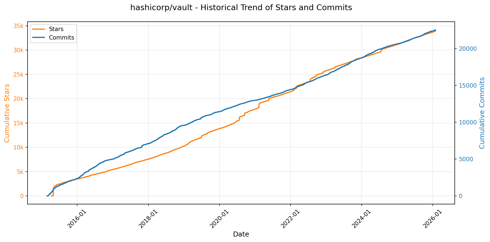
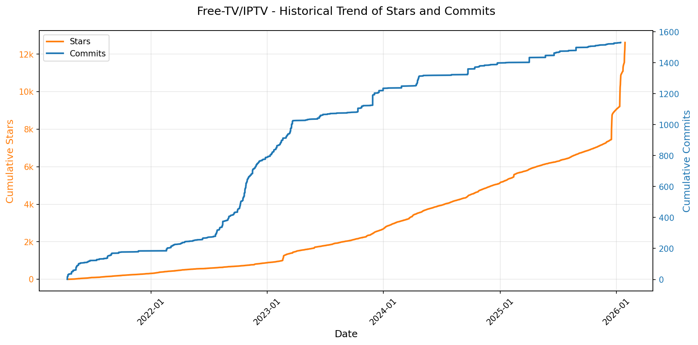

# 🌟 GitHub Trending 概览

> 数据更新于：2026-01-28。

---

## 🔍 项目详情

### 1. [anomalyco/opencode](https://github.com/anomalyco/opencode)
- 📅 **创建日期**：2025-04-30  
- 🔄 **最近更新**：2026-01-28  
- ⭐ **Stars**：90,702（日 +1301｜周 +9749｜月 +47559）  
- 📝 **描述**：The open source coding agent.  

<b>📈 Star 与 Commit 历史趋势</b>

> *蓝色：累计 Stars｜橙色：累计 Commits（次 Y 轴）*

<b>📄 README 摘要</b>

1. **项目功能**  
OpenCode 是一个开源的 AI 编程智能体（AI coding agent），旨在为开发者提供终端原生（TUI）、轻量高效、可本地运行的 AI 辅助编程体验。它直接在终端中运行，支持代码理解、生成、重构、调试、文档查询及多步任务规划；核心定位是成为“可完全掌控、不依赖闭源服务”的开发者级 AI 编程协作者——既可作为 CLI 工具集成进日常开发流，也提供桌面端（BETA）和未来多客户端（如移动端远程控制）支持。

2. **关键特性**  
- **双模式智能体切换**：内置 `build`（默认，全权限开发代理）与 `plan`（只读分析代理，禁止自动修改文件、执行命令前强制确认），支持按需切换（Tab 键）；另含 `@general` 子代理处理复杂搜索与多步骤推理任务。  
- **完全开源与厂商无关**：不绑定任何特定大模型供应商，原生兼容 Claude、OpenAI、Google Gemini 及本地部署模型（如 Ollama、Llama.cpp），并推荐搭配其自研模型分发平台 OpenCode Zen。  
- **开箱即用的 LSP 支持**：深度集成语言服务器协议，提供语义感知的代码补全、跳转、悬停等 IDE 级能力，无需额外配置。  
- **跨平台统一安装体验**：支持一键脚本（curl）、主流包管理器（npm/bun/pnpm/yarn、Homebrew/Scoop/Chocolatey/Paru/Mise/Nix）及桌面应用（macOS/Windows/Linux 多架构安装包）。  
- **终端优先（TUI-first）架构**：专为终端工作流设计，由 Neovim 用户与 terminal.shop 团队打造，强调键盘驱动、低侵入性与高响应性。  
- **客户端-服务器分离架构**：核心引擎（server）与前端（CLI/TUI/桌面/未来移动端）解耦，支持本地运行 + 远程交互，为分布式开发场景预留扩展空间。

3. **技术栈**  
- **核心语言与运行时**：Rust（高性能 CLI 与 server 主体）、TypeScript（Web 控制台、桌面端前端、文档站点）  
- **前端框架**：TUI 层基于 Rust 的 `crossterm` / `tui-rs`；Web/桌面端使用 React + Vite + Tailwind CSS  
- **AI 集成层**：抽象化 LLM 接口，支持 OpenAI 兼容 API、Anthropic SDK、Google Vertex AI、Ollama、Llama.cpp 等；内置模型路由与上下文管理机制  
- **基础设施**：GitHub Actions CI/CD；Nix 与 Homebrew 等多渠道打包；XDG Base Directory 标准化路径管理；支持 Mise 版本管理器集成  
- **协议与标准**：原生实现 Language Server Protocol（LSP）、支持 ANSI 终端渲染、遵循 POSIX 兼容性规范

---

### 2. [Shubhamsaboo/awesome-llm-apps](https://github.com/Shubhamsaboo/awesome-llm-apps)
- 📅 **创建日期**：2024-04-29  
- 🔄 **最近更新**：2026-01-28  
- ⭐ **Stars**：90,383（日 +573｜周 +1924｜月 +5600）  
- 📝 **描述**：Collection of awesome LLM apps with AI Agents and RAG using OpenAI, Anthropic, Gemini and opensource models.  

<b>📈 Star 与 Commit 历史趋势</b>

> *蓝色：累计 Stars｜橙色：累计 Commits（次 Y 轴）*

<b>📄 README 摘要</b>

1. **项目功能**  
该项目是一个**精选的大型语言模型（LLM）应用开源集合库**，专注于展示和整合前沿AI技术在实际场景中的落地实践。它不开发单一应用，而是系统性地整理、分类并提供大量可运行的LLM应用示例，覆盖从入门级到生产级的完整演进路径。所有项目均基于主流技术范式构建，包括检索增强生成（RAG）、单/多智能体系统（AI Agents & Multi-agent Teams）、模型上下文协议（MCP）、语音交互（Voice Agents）、记忆机制（Stateful Memory）、跨平台数据交互（如Chat with GitHub/Gmail/PDF/YouTube等），以及LLM优化与微调实践。其核心目标是为开发者、研究者和AI从业者提供一个即学即用、开箱即试的高质量技术参考与学习资源库。

2. **关键特性**  
- **全栈式AI应用分类体系**：按技术复杂度与架构范式精细划分，涵盖Starter AI Agents（10+轻量级垂直场景Agent）、Advanced AI Agents（含深度研究、金融、医疗、法律等专业领域Agent）、Autonomous Game Playing Agents（棋类、3D游戏等强化学习集成）、Multi-agent Teams（CrewAI等框架驱动的协作团队）、Voice AI Agents（语音对话、客服、音频导览等）、MCP AI Agents（浏览器/GitHub/Notion等工具原生集成）、RAG专项教程（超20种RAG变体，含Corrective RAG、Vision RAG、Hybrid Search等）、Memory增强应用、跨平台“Chat with X”系列（PDF/ArXiv/YouTube/Substack等）；  
- **模型无关性与多后端支持**：兼容OpenAI、Anthropic（Claude）、Google Gemini、xAI、Qwen、Llama等闭源与开源模型，支持本地部署（如Llama 3.1/3.2、Gemma 3、DeepSeek）与云API混合调用；  
- **工程化实践导向**：提供完整的`requirements.txt`、项目级`README.md`说明及标准化启动流程；包含LLM成本优化工具（如TOONify Token Optimization）、微调教程（Gemma 3 / Llama 3.2）、AI Agent框架速成课（Google ADK / OpenAI SDK）；  
- **国际化与社区共建**：支持8种语言版本（含中文），由活跃社区维护，并获得Tiger Data、Speechmatics、Okara AI等机构赞助支持。

3. **技术栈**  
- **核心框架与协议**：Google ADK（Agent Development Kit）、OpenAI Agents SDK、CrewAI、Model Context Protocol（MCP）；  
- **RAG与向量技术**：Embedding模型（Gemma、Llama）、向量数据库（隐含支持Chroma、Pinecone等）、Hybrid Search、Corrective RAG（CRAG）、Vision RAG；  
- **语音与多模态**：Speechmatics语音识别、Gemini Multimodal API、Vision-Language模型集成；  
- **本地大模型运行**：Qwen、Llama系列（3.1/3.2）、Gemma（2/3）、DeepSeek等开源模型的本地加载与推理（依赖Transformers、llama.cpp、Ollama等生态）；  
- **开发与部署基础**：Python为主，依赖标准生态（LangChain、LlamaIndex、Pydantic、FastAPI等），支持函数调用（Function Calling）、结构化输出、工具集成（Browser, GitHub, Notion, Database等）、内存管理（Conversation History、Shared Memory）及回调监控；  
- **基础设施层**：GitHub Actions（CI/CD隐含）、Docker（部分项目）、本地开发环境（pip + virtualenv）。

---

### 3. [anthropics/claude-code](https://github.com/anthropics/claude-code)
- 📅 **创建日期**：2025-02-22  
- 🔄 **最近更新**：2026-01-28  
- ⭐ **Stars**：61,745（日 +465｜周 +2877｜月 +12485）  
- 📝 **描述**：Claude Code is an agentic coding tool that lives in your terminal, understands your codebase, and helps you code faster by executing routine tasks, explaining complex code, and handling git workflows - all through natural language commands.  

<b>📈 Star 与 Commit 历史趋势</b>

> *蓝色：累计 Stars｜橙色：累计 Commits（次 Y 轴）*

<b>📄 README 摘要</b>

1. **该项目的功能**  
Claude Code 是一款终端原生的智能编程助手，能够深度理解用户本地代码库，通过自然语言指令自动执行重复性开发任务（如生成代码、重构、调试）、解释复杂逻辑、管理 Git 工作流（如提交、分支操作、冲突分析），并支持在终端、IDE 或 GitHub 中（通过 `@claude` 提及）直接调用，旨在显著提升开发者编码效率。

2. **核心功能**  
- **代码上下文感知**：自动索引和理解当前项目结构与代码语义，实现精准的上下文相关响应；  
- **自然语言交互式编程**：支持用中文/英文等自然语言描述需求（如“为这个函数添加类型注解并写单元测试”），自动生成、修改或审查代码；  
- **Git 智能工作流集成**：可理解并执行 Git 相关指令（如“对比 main 和 feature 分支差异并总结变更点”“修复本次提交中的 lint 错误”）；  
- **多环境部署支持**：提供 macOS/Linux（shell 脚本 + Homebrew）、Windows（PowerShell 脚本 + WinGet）一键安装方案；  
- **插件化扩展架构**：内置插件系统，允许通过 `plugins/` 目录添加自定义命令与专用代理（Agent），增强特定场景能力（如数据库操作、API 测试等）；  
- **内建反馈与问题上报机制**：支持在终端中直接使用 `/bug` 命令提报缺陷，并自动附带会话上下文与操作日志。

3. **技术栈**  
- **运行时环境**：基于 Node.js 18+ 构建，采用现代 JavaScript/TypeScript 开发；  
- **部署分发**：跨平台安装器（Bash shell 脚本、PowerShell 脚本）、包管理器集成（Homebrew、WinGet）；  
- **架构设计**：采用“代理（Agentic）”架构，结合大语言模型（由 Anthropic 提供的 Claude 系列模型）与本地代码分析能力（如 AST 解析、文件系统遍历、Git CLI 集成）；  
- **数据安全与合规**：本地优先处理敏感代码，仅有限采集匿名化使用数据与用户反馈，明确排除用于模型训练，并实施访问控制、数据脱敏与短期留存策略。

---

### 4. [usememos/memos](https://github.com/usememos/memos)
- 📅 **创建日期**：2021-12-08  
- 🔄 **最近更新**：2026-01-28  
- ⭐ **Stars**：56,143（日 +155｜周 +966｜月 +8670）  
- 📝 **描述**：An open-source, self-hosted note-taking service. Your thoughts, your data, your control — no tracking, no ads, no subscription fees.  

<b>📈 Star 与 Commit 历史趋势</b>

> *蓝色：累计 Stars｜橙色：累计 Commits（次 Y 轴）*

<b>📄 README 摘要</b>

1. **项目功能**  
Memos 是一个开源、可自托管的轻量级笔记与知识管理服务，专为注重隐私和数据自主权的个人及团队设计。它支持创建、编辑、组织和检索笔记，适用于个人日记、团队 Wiki、技术文档库等场景；所有数据完全由用户掌控，不依赖第三方云服务，无任何遥测、广告或订阅收费。

2. **核心特性**  
- **隐私优先架构**：零 telemetry、无数据上传、支持完整数据导出（纯文本/Markdown 格式），杜绝厂商锁定；  
- **原生 Markdown 支持**：实时渲染、语法高亮、支持 Mermaid 图表、LaTeX 数学公式等扩展；  
- **极致性能**：Go 编写的高效后端 + React 前端，启动快、响应低、资源占用小；  
- **灵活部署**：一键 Docker 启动，原生支持 SQLite（默认）、MySQL 和 PostgreSQL；  
- **开发者友好**：提供完备的 REST API 与 gRPC 接口，便于集成自动化工作流、CLI 工具或第三方应用；  
- **现代化体验**：响应式 UI、深色模式、键盘快捷键优化、移动端适配，界面简洁美观。

3. **技术栈**  
- **后端**：Go（Gin 框架）、SQLite / MySQL / PostgreSQL 数据库；  
- **前端**：React（TypeScript）、Vite 构建工具、Tailwind CSS 样式框架；  
- **部署与运维**：Docker / Docker Compose、Kubernetes（官方 Helm Chart）、预编译二进制包（Linux/macOS/Windows）；  
- **协议与接口**：RESTful HTTP API、gRPC API；  
- **许可证**：MIT 开源协议。

---

### 5. [anthropics/skills](https://github.com/anthropics/skills)
- 📅 **创建日期**：2025-09-22  
- 🔄 **最近更新**：2026-01-28  
- ⭐ **Stars**：56,035（日 +1412｜周 +9043｜月 +27728）  
- 📝 **描述**：Public repository for Agent Skills  

<b>📈 Star 与 Commit 历史趋势</b>

> *蓝色：累计 Stars｜橙色：累计 Commits（次 Y 轴）*

<b>📄 README 摘要</b>

1. **该项目做什么？**  
该项目是 Anthropic 官方维护的 Claude 技能（Skills）开源示例仓库，提供一套标准化、可动态加载的模块化能力扩展方案。它不运行独立服务，而是为 Claude 模型提供结构化的“技能包”——每个技能是一个包含指令、元数据和资源的自包含文件夹，用于指导 Claude 在特定领域（如文档处理、Web 测试、品牌文案生成等）以一致、可靠的方式执行专业化任务。其核心目标是使 Claude 能够按需激活并精准执行企业级、技术性或创意类工作流，而非泛化响应。

2. **关键特性**  
- **模块化与自包含设计**：每个技能均以独立文件夹组织，强制包含 `SKILL.md`（含 YAML 前置元数据 + Markdown 指令），确保可移植性与清晰边界；  
- **生产级参考实现**：公开了驱动 Claude 实际文档能力（DOCX/PDF/PPTX/XLSX）的源可用（source-available）技能代码（非完全开源），为复杂技能开发提供真实工程范本；  
- **多场景覆盖**：涵盖创意设计（艺术/音乐）、技术开发（MCP 服务器生成、Web 应用测试）、企业应用（品牌通信、合规文案）及通用文档操作四大类技能集；  
- **跨平台集成支持**：原生适配 Claude Code（插件市场）、Claude.ai（付费用户开箱即用）及 Claude API（支持上传自定义技能），实现“一次编写、多端部署”；  
- **标准化规范支撑**：配套发布 [Agent Skills 规范](http://agentskills.io)（位于 `/spec` 目录）及官方技能模板（`/template`），推动行业技能互操作性。

3. **技术栈**  
- **核心格式**：纯文本驱动，依赖 `SKILL.md` 文件（YAML 前置声明 + Markdown 指令），无运行时依赖；  
- **协议标准**：遵循 [Agent Skills 开放规范](http://agentskills.io)，定义技能发现、加载、元数据、生命周期等抽象接口；  
- **集成层**：深度绑定 Anthropic 生态——通过 Claude Code 插件系统（`/plugin install` 命令）、Claude.ai Web 界面及 Claude API 的 Skills 接口实现技能注册与调用；  
- **许可模型**：混合授权——多数示例技能采用 Apache 2.0 开源协议，而文档处理类核心技能为源可用（source-available），明确区分可审计性与商业使用限制。

---

### 6. [obra/superpowers](https://github.com/obra/superpowers)
- 📅 **创建日期**：2025-10-09  
- 🔄 **最近更新**：2026-01-28  
- ⭐ **Stars**：38,296（日 +1057｜周 +7106｜月 +25996）  
- 📝 **描述**：An agentic skills framework & software development methodology that works.  

<b>📈 Star 与 Commit 历史趋势</b>

> *蓝色：累计 Stars｜橙色：累计 Commits（次 Y 轴）*

<b>📄 README 摘要</b>

1. **项目功能**  
Superpowers 是一个面向编程智能体（coding agents）的完整软件开发工作流框架，旨在将原本零散、随意的代码生成行为，系统化为严格遵循工程规范的协作式开发过程。它不直接生成代码，而是通过一系列自动触发的“技能”（skills），引导智能体在编码前完成需求澄清、设计评审、计划拆解、测试先行实施、多级质量审查及分支收尾等全流程活动，最终实现类人类工程师团队的自主协同开发。

2. **核心特性**  
- **全链路自动化工程流程**：覆盖从需求脑暴（brainstorming）、设计文档生成、TDD 计划制定（write-plan）、子智能体驱动开发（subagent-driven-development）、红-绿-重构式测试执行，到代码审查（requesting/receiving code-review）和分支收尾（finishing-a-development-branch）的完整闭环。  
- **强制性技能触发机制**：所有技能按上下文自动激活（如设计批准后自动启用 git worktree），非可选建议，而是不可绕过的强制工作流。  
- **高可信度质量保障**：严格执行 RED-GREEN-REFACTOR 流程；要求每个任务含明确文件路径、完整代码片段与可验证步骤；实行双阶段子智能体审查（先验是否符合规格，再审代码质量）；关键问题阻断式推进。  
- **可扩展技能库架构**：内置模块化技能体系（Testing / Debugging / Collaboration / Meta 四大类），支持用户按标准模板（via `writing-skills`）贡献新技能，所有技能即代码、可测试、可版本化。  
- **跨平台插件集成**：原生支持 Claude Code（通过 Marketplace 插件）、Codex 与 OpenCode（通过远程配置加载），提供统一命令接口（如 `/superpowers:brainstorm`）。

3. **技术栈**  
- **运行时环境**：依赖外部大模型编程智能体平台（Claude Code、Codex、OpenCode），本身不包含模型或推理引擎，属于「提示工程+工作流编排」层框架。  
- **核心范式**：基于指令工程（system prompts + skill-triggering heuristics）、结构化输出约束（分块设计文档、原子化任务清单）、Git 工作树（git worktrees）隔离开发环境。  
- **交付形式**：以插件（Claude Code）、远程配置脚本（Codex/OpenCode）及纯文本技能定义（Markdown + YAML-like conventions）构成，无服务端、无私有部署组件，完全客户端/IDE 内运行。  
- **工程实践嵌入**：深度整合 TDD、YAGNI、DRY、防御性调试（defense-in-depth）、条件等待（condition-based-waiting）等成熟软件工程方法论，并将其转化为可执行、可验证的智能体行为规则。

---

### 7. [hashicorp/vault](https://github.com/hashicorp/vault)
- 📅 **创建日期**：2015-02-25  
- 🔄 **最近更新**：2026-01-28  
- ⭐ **Stars**：34,140（日 +248｜周 +295｜月 +477）  
- 📝 **描述**：A tool for secrets management, encryption as a service, and privileged access management  

<b>📈 Star 与 Commit 历史趋势</b>

> *蓝色：累计 Stars｜橙色：累计 Commits（次 Y 轴）*

<b>📄 README 摘要</b>

1. **该项目的功能**  
Vault 是一个用于安全访问和管理敏感信息（即“密钥”）的工具。它为各类密钥（如 API 密钥、数据库密码、TLS 证书、OAuth 凭据等）提供统一、可控的访问接口，核心目标是解决现代分布式系统中密钥生命周期管理的复杂性问题——包括安全存储、细粒度访问控制、自动轮换（key rotation）、实时审计日志记录，以及入侵响应时的快速密钥吊销。

2. **关键特性**  
- **安全密钥存储**：支持任意键值对存储；所有数据在写入持久化后端（如本地磁盘、Consul 等）前均经强加密处理，防止底层存储泄露导致密钥明文暴露。  
- **动态密钥生成**：按需为外部系统（如 AWS、MySQL、PostgreSQL、Kubernetes 等）即时生成具备时效性和最小权限的临时凭据，并在租期（lease）到期后自动销毁，杜绝长期有效密钥风险。  
- **数据加密即服务（Transit Engine）**：提供不落盘的加解密能力，允许应用将敏感数据以密文形式存于自身数据库或对象存储中，由 Vault 统一管控加密策略与密钥生命周期。  
- **租期（Lease）与续期机制**：每个密钥均绑定可配置的生存时间（lease duration），到期自动失效；客户端可通过 Renew API 主动延长租期，实现灵活的会话管理。  
- **分级密钥吊销（Revocation）**：支持单个密钥、某用户全部密钥、某类密钥（如所有 AWS 密钥）乃至整个路径树的批量吊销，支撑安全事件响应与合规性密钥轮换。

3. **技术栈**  
- **主语言**：Go（Golang），全栈自研，依赖 Go Modules 进行依赖管理；  
- **构建与开发工具**：Makefile 驱动构建流程（`make bootstrap`, `make dev`, `make test` 等），集成 Docker 用于集成测试与验收测试；  
- **测试框架**：基于 Go 标准 `testing` 包，扩展支持 Docker 容器化集群测试（`testcluster/docker`）、跨节点复制测试（Performance/Disaster Recovery Replication）、企业版功能验证等；  
- **依赖存储后端**：原生支持多种后端，包括文件系统、HashiCorp Consul、etcd、ZooKeeper、云服务商托管服务（如 AWS S3、Azure Blob Storage、Google Cloud Storage）等；  
- **企业版扩展**：Vault Enterprise 在开源版基础上增强高可用架构（如性能复制、灾难恢复复制）、多数据中心支持、UI 管理界面、RBAC 增强、审计日志归档、FIPS 140-2 加密模块等。

---

### 8. [remotion-dev/remotion](https://github.com/remotion-dev/remotion)
- 📅 **创建日期**：2020-06-23  
- 🔄 **最近更新**：2026-01-28  
- ⭐ **Stars**：32,957（日 +801｜周 +7478｜月 +7918）  
- 📝 **描述**：🎥      Make videos programmatically with React  

<b>📈 Star 与 Commit 历史趋势</b>

> *蓝色：累计 Stars｜橙色：累计 Commits（次 Y 轴）*

<b>📄 README 摘要</b>

1. **项目功能**  
Remotion 是一个基于 React 的视频生成框架，允许开发者使用 React 组件**以编程方式（代码驱动）创建视频**。它将视频视为时间序列的帧集合，通过声明式 React 语法控制每一帧的内容、动画、布局与逻辑，支持导出为 MP4、GIF、ProRes 等格式，并可集成到 CI/CD 流程中实现自动化视频生成（如个性化年度回顾、动态信息图、营销短视频等）。

2. **核心特性**  
- ✅ **React 原生开发体验**：支持 React Hooks、组件复用、Props 传递、Context、Suspense 及 Fast Refresh（热重载）；  
- ✅ **全栈 Web 渲染能力**：原生兼容 CSS 动画、SVG、HTML5 Canvas、WebGL（通过 `react-three-fiber` / `@remotion/three`）、Web Audio 等；  
- ✅ **时间轴编程模型**：提供 `useCurrentFrame()`、`interpolate()`、`spring()` 等时间感知 Hook，实现精确帧控制与物理动画；  
- ✅ **多输出与部署支持**：本地渲染、Lambda 无服务器渲染（Remotion Cloud）、Docker 容器化、静态站点导出；  
- ✅ **专业工作流工具**：内置预览服务器、帧调试器、分辨率/时长/编码参数配置、Lottie 导入、字幕生成（WebVTT）、Alpha 通道支持（带透明度的 ProRes/MP4）；  
- ✅ **企业级能力**：支持水印、品牌定制、批量渲染、API 驱动渲染任务调度。

3. **技术栈**  
- **核心框架**：React（v18+）、TypeScript（完全类型化 API）；  
- **渲染引擎**：基于 Chromium（Electron 或 Puppeteer）进行 Headless 浏览器帧捕获，利用浏览器原生渲染管线；  
- **构建与打包**：Vite（默认模板）、Webpack（兼容）；  
- **3D 支持**：`@remotion/three` 封装 Three.js，支持 React Three Fiber 生态；  
- **音视频处理**：FFmpeg（后端导出时调用）、Web Audio API（前端音频合成）；  
- **部署与服务**：Node.js 运行时、AWS Lambda（Remotion Cloud）、Docker；  
- **开发工具链**：ESLint、Jest（测试）、Storybook（组件预览）、自研 CLI（`remotion` CLI 工具）。

---

### 9. [Lissy93/web-check](https://github.com/Lissy93/web-check)
- 📅 **创建日期**：2023-06-25  
- 🔄 **最近更新**：2026-01-28  
- ⭐ **Stars**：31,292（日 +102｜周 +713｜月 +4220）  
- 📝 **描述**：🕵️‍♂️ All-in-one OSINT tool for analysing any website  

<b>📈 Star 与 Commit 历史趋势</b>

> *蓝色：累计 Stars｜橙色：累计 Commits（次 Y 轴）*

---

### 10. [block/goose](https://github.com/block/goose)
- 📅 **创建日期**：2024-08-23  
- 🔄 **最近更新**：2026-01-28  
- ⭐ **Stars**：29,403（日 +185｜周 +3144｜月 +4323）  
- 📝 **描述**：an open source, extensible AI agent that goes beyond code suggestions - install, execute, edit, and test with any LLM  

<b>📈 Star 与 Commit 历史趋势</b>

> *蓝色：累计 Stars｜橙色：累计 Commits（次 Y 轴）*

<b>📄 README 摘要</b>

1. **项目功能**  
goose 是一个运行在本地的、可扩展的开源 AI 工程代理（AI agent），专为自动化软件工程任务而设计。它能端到端自主完成复杂开发工作：从零构建完整项目、编写并执行代码、调试失败、编排多步骤工作流，以及调用外部 API。其核心定位是“on-machine”（完全在用户本地设备运行），不依赖云端推理或数据上传，保障隐私与安全，同时深度融入开发者日常研发流程（如原型开发、代码重构、CI/CD 管道管理等）。

2. **关键特性**  
- ✅ **全栈自动化能力**：超越代码补全，支持自主规划、编码、执行、验证与迭代；  
- ✅ **本地优先 & 隐私安全**：所有模型推理、代码执行、文件操作均在用户本机完成，无数据出域；  
- ✅ **LLM 无关性与多模型协同**：兼容任意大语言模型（本地 Llama/Claude/GPT 等），支持按任务动态切换模型或混合调用，兼顾性能、成本与可靠性；  
- ✅ **MCP（Model Context Protocol）原生支持**：无缝集成符合 MCP 标准的工具服务器，扩展对 IDE、终端、数据库、云平台等的控制能力；  
- ✅ **双形态交付**：提供图形化桌面应用（macOS/Windows/Linux）和命令行工具（CLI），适配不同开发习惯；  
- ✅ **可扩展架构**：模块化设计，支持自定义工具、插件、工作流及策略规则，便于企业级定制与治理。

3. **技术栈**  
- **前端/客户端**：Electron（桌面应用）、Rust（CLI 核心，兼顾性能与安全性）；  
- **核心运行时**：Rust（主逻辑、任务调度、本地执行沙箱、MCP 客户端）；  
- **AI 交互层**：支持 OpenAI 兼容 API、Ollama、LM Studio、Claude Desktop 等本地/远程 LLM 接入；  
- **协议标准**：原生实现 [MCP v0.2+](https://modelcontextprotocol.io/)，用于标准化模型与工具通信；  
- **构建与基础设施**：GitHub Actions CI/CD、Apache 2.0 开源许可证、跨平台打包（AppImage/DMG/MSI）；  
- **辅助生态**：配套文档站点（Docusaurus）、Discord 社区协作、视频教程（YouTube）、治理与责任编码指南（HOWTOAI.md / GOVERNANCE.md）。

---

### 11. [ComposioHQ/awesome-claude-skills](https://github.com/ComposioHQ/awesome-claude-skills)
- 📅 **创建日期**：2025-10-17  
- 🔄 **最近更新**：2026-01-28  
- ⭐ **Stars**：27,005（日 +569｜周 +4194｜月 +14720）  
- 📝 **描述**：A curated list of awesome Claude Skills, resources, and tools for customizing Claude AI workflows  

<b>📈 Star 与 Commit 历史趋势</b>

> *蓝色：累计 Stars｜橙色：累计 Commits（次 Y 轴）*

<b>📄 README 摘要</b>

1. **该项目的功能**  
该项目是一个面向 Anthropic Claude 系列模型（包括 Claude.ai、Claude Code 和 Claude API）的**可扩展技能（Skills）开源集合库**，旨在将 Claude 从纯文本生成工具升级为具备真实操作能力的智能工作代理。其核心功能是提供大量即用型、模块化的“技能”——即结构化的工作流指令包，使 Claude 能够执行跨应用的自动化任务（如发送邮件、创建 GitHub Issue、发布 Slack 消息）、处理多格式文档（DOCX/PDF/PPTX/XLSX/Markdown）、集成开发与数据工具（Playwright、PostgreSQL、D3.js、LangSmith）、支持业务分析（竞品广告提取、线索研究）、增强创意产出（图像生成、视频下载、Canvas 设计）以及提升组织协作效率（文件归档、会议洞察、Git 工作流自动化）等。

2. **关键特性**  
- **跨平台统一支持**：所有技能均兼容 Claude.ai（网页端）、Claude Code（本地 IDE 插件）及 Claude API（编程调用），实现“一次编写、三端运行”。  
- **真实动作执行能力**：通过 `connect-apps` 插件深度集成 Composio 平台，支持 Claude 连接并操作超 1000 个第三方应用（Gmail、Slack、GitHub、Notion、Jira 等），完成认证、API 调用与状态反馈闭环。  
- **领域全覆盖的技能分类体系**：涵盖 9 大类共 60+ 项具体技能，包括文档处理、开发工具链（TDD、MCP 构建、Playwright 自动化）、数据分析（CSV 分析、PostgreSQL 查询）、商业营销（品牌指南、竞品广告提取）、写作沟通（会议洞察、NotebookLM 集成）、创意媒体（图像增强、Slack GIF 生成）、生产力（简历定制、发票整理）、项目协作（Git 推送、Outline Wiki 管理）及安全系统（Sigma 威胁狩猎、元数据取证）。  
- **低门槛技能开发框架**：定义标准化技能结构（含 `SKILL.md` YAML 元数据、脚本/模板/资源目录），提供完整创建指南、最佳实践（如面向模型而非用户的指令写法、多端测试要求）及示例模板，支持用户快速构建、贡献和复用技能。  
- **社区驱动与开放生态**：采用 Apache-2.0 开源协议，鼓励 PR 贡献；集成 Discord、X（Twitter）、LinkedIn 社区入口；技能来源多元，包含 Anthropic 官方、第三方开发者（如 @sanjay3290、@chrisvoncsefalvay）及开源项目（NeoLabHQ、obra/superpowers）。

3. **技术栈**  
- **核心运行时**：Anthropic Claude 模型（特别是 Claude 3.5 Sonnet 及后续版本），依赖其 Skills API 机制加载与激活技能。  
- **外部集成层**：  
  - **Composio**：作为底层连接中枢，提供统一认证（OAuth/OIDC）、1000+ 应用适配器及安全 API 网关，支撑 `connect-apps` 插件的跨应用操作能力；  
  - **第三方 SDK/API**：广泛调用 Playwright（Web 自动化）、Google Gemini（Deep Research、Imagen 图像生成）、LangSmith（Agent 追踪）、FFUF（Web 模糊测试）、n8n（工作流编排）、D3.js（数据可视化）等工具的官方接口。  
- **技能交付格式**：纯文本 Markdown（`SKILL.md`）为主，辅以 Shell/Python/TypeScript 脚本（`scripts/`）、HTML/Tailwind/React 模板（如 `artifacts-builder`）、配置文件及静态资源，无强制依赖特定运行时环境。  
- **部署与分发**：基于 GitHub 托管，通过本地文件系统挂载（`~/.config/claude-code/skills/`）、CLI 插件安装（`claude --plugin-dir`）或 API 参数注入（`skills=["skill-id"]`）三种方式集成，零服务端依赖。

---

### 12. [bytedance/UI-TARS-desktop](https://github.com/bytedance/UI-TARS-desktop)
- 📅 **创建日期**：2025-01-19  
- 🔄 **最近更新**：2026-01-28  
- ⭐ **Stars**：24,959（日 +55｜周 +472｜月 +4869）  
- 📝 **描述**：The Open-Source Multimodal AI Agent Stack: Connecting Cutting-Edge AI Models and Agent Infra  

<b>📈 Star 与 Commit 历史趋势</b>

> *蓝色：累计 Stars｜橙色：累计 Commits（次 Y 轴）*

<b>📄 README 摘要</b>

1. **项目功能**  
TARS 是一个面向实际任务的多模态 AI 智能体（Agent）技术栈，核心目标是实现类人化、端到端的复杂任务自动化。它通过融合视觉理解（Vision）、图形用户界面交互（GUI Agent）与多模态大语言模型（MLLM），使 AI 能够直接观察屏幕、理解界面元素、操作本地/远程计算机及浏览器，并调用真实世界工具完成任务。项目当前包含两大可交付组件：  
- **Agent TARS**：通用多模态智能体框架，提供 CLI 命令行工具和 Web UI，支持在终端、服务器、浏览器及产品中部署，专注于工作流编排与 MCP（Model Control Protocol）工具集成；  
- **UI-TARS Desktop**：原生桌面 GUI 智能体应用，基于 UI-TARS 系列视觉语言模型（如 Seed-1.5-VL/1.6），具备对本地和远程计算机/浏览器的免配置一键控制能力（含远程桌面与远程浏览器操作）。

2. **关键特性**  
- ✅ **多模态感知与执行闭环**：支持截图输入、视觉定位（Visual Grounding）、DOM 解析与混合策略浏览器控制，实现“看—理解—操作”全链路；  
- ✅ **灵活部署形态**：Agent TARS 提供 headless（服务端）与 headful（Web UI）双模式；UI-TARS Desktop 支持本地运行与零配置远程控制（Remote Computer/Browser Operator）；  
- ✅ **事件流驱动架构（Event Stream）**：基于协议化的实时事件流，支撑上下文工程（Context Engineering）、调试可视化（Event Stream Viewer）及可扩展 Agent UI 开发；  
- ✅ **MCP 工具生态集成**：以 MCP 为内核标准，可动态挂载各类 MCP Server（如 Shell、文件系统、Priceline、Booking.com、天气 API 等），无缝连接现实工具链；  
- ✅ **强隐私与本地化保障**：UI-TARS Desktop 默认全链路本地处理，无数据上传，确保敏感操作安全可控；  
- ✅ **开箱即用体验**：提供一键 CLI（`npx @agent-tars/cli`）、预置模型适配（VolcEngine、Anthropic 等）、AIO 沙箱环境支持及跨平台（Windows/macOS/浏览器）兼容性。

3. **技术栈**  
- **核心模型层**：基于 ByteDance 自研多模态视觉语言模型系列，包括 UI-TARS 模型（如 UI-TARS-1.5-7B）、Seed-1.5-VL / 1.6 等，支持 GUI 理解与指令生成；  
- **运行时与框架**：Node.js（CLI 要求 ≥ v22）、Electron（UI-TARS Desktop 桌面客户端）、Web 技术栈（Web UI 基于现代前端框架）；  
- **协议与标准**：采用 MCP（Model Control Protocol）作为智能体与工具间的标准化通信协议；  
- **基础设施**：支持多种大模型提供商（VolcEngine、Anthropic 等），集成 AIO Agent Sandbox 作为隔离化工具执行环境；  
- **部署与分发**：NPM 包管理（`@agent-tars/cli`）、GitHub Releases、ModelScope 与 Hugging Face 模型托管、Lark/DeepWiki/Discord 多渠道社区支持。

---

### 13. [BloopAI/vibe-kanban](https://github.com/BloopAI/vibe-kanban)
- 📅 **创建日期**：2025-06-14  
- 🔄 **最近更新**：2026-01-28  
- ⭐ **Stars**：19,554（日 +169｜周 +1518｜月 +12124）  
- 📝 **描述**：Get 10X more out of Claude Code, Codex or any coding agent  

<b>📈 Star 与 Commit 历史趋势</b>

> *蓝色：累计 Stars｜橙色：累计 Commits（次 Y 轴）*

<b>📄 README 摘要</b>

1. **项目功能**  
Vibe Kanban 是一个面向 AI 编程代理（如 Claude Code、Gemini CLI、Codex、Amp 等）的协作与任务编排平台。它不直接生成代码，而是作为“AI 工程师的操作系统”，帮助开发者高效管理、调度、审查和集成多个 AI 编码代理的工作流。核心作用是将工程师从重复性协调工作中解放出来，聚焦于高层规划、质量审查与系统级整合——例如并行/串行调用多个代理、实时跟踪任务状态、一键启动开发服务器、集中化管理 MCP（Model Context Protocol）配置，并支持远程 SSH 项目直连（如通过 VS Code Remote-SSH 打开远程工作区）。

2. **关键特性**  
- ✅ **多代理无缝切换与统一调度**：支持同时配置并按需切换不同 AI 编码代理，支持并行执行（提升吞吐）与有序链式调用（保障依赖）。  
- ✅ **可视化任务看板（Kanban）**：提供类看板界面，直观展示各 AI 代理的任务状态（待处理 / 运行中 / 已完成 / 失败）、上下文与输出结果。  
- ✅ **一键开发环境集成**：自动识别代码变更，支持点击按钮快速启动本地或远程 dev server（如 `npm run dev`），实现“代理写完即运行”。  
- ✅ **MCP 配置中心化管理**：统一存储、版本化和复用各编码代理所需的 Model Context Protocol 配置，避免分散维护。  
- ✅ **远程开发深度支持**：原生集成 SSH，允许前端 UI 直接生成 `vscode://vscode-remote/ssh-remote+...` 协议链接，实现远程服务器上的项目秒级打开与编辑。  
- ✅ **生产就绪部署能力**：支持反向代理（Nginx/Caddy/Traefik）和自定义域名部署，通过 `VK_ALLOWED_ORIGINS` 精确控制跨域策略，保障安全。

3. **技术栈**  
- **后端**：Rust（主打高性能与内存安全），使用 `axum`（Web 框架）、`sqlx`（异步 SQL ORM）、`tokio`（异步运行时）；MCP 服务内建，直接对接 AI 代理协议。  
- **前端**：TypeScript + React（基于现代前端生态），构建为静态 SPA，通过 `pnpm` 管理依赖；UI 组件库未明确指定，但设计遵循响应式与暗色模式适配（含 `<picture>` 动态 logo）。  
- **构建与部署**：  
  - 构建工具：`pnpm`（主包管理）、`cargo`（Rust 构建）、`sqlx-cli`（数据库迁移）；  
  - 脚本支持：提供 `local-build.sh`（macOS 专用打包）、`pnpm run dev`（全栈热重载开发）、`pnpm build`（前端构建）；  
- **基础设施依赖**：运行时依赖环境变量精细化控制（如 `PORT`/`BACKEND_PORT`/`MCP_PORT` 分离）、PostHog 埋点（可选）、Git 工作树自动清理机制；  
- **客户端集成**：深度适配 VS Code Remote-SSH 协议，依赖本地已安装的 VS Code 及 Remote-SSH 扩展。

---

### 14. [supermemoryai/supermemory](https://github.com/supermemoryai/supermemory)
- 📅 **创建日期**：2024-02-27  
- 🔄 **最近更新**：2026-01-28  
- ⭐ **Stars**：15,638（日 +469｜周 +1468｜月 +1793）  
- 📝 **描述**：Memory engine and app that is extremely fast, scalable. The Memory API for the AI era.  

<b>📈 Star 与 Commit 历史趋势</b>

> *蓝色：累计 Stars｜橙色：累计 Commits（次 Y 轴）*

<b>📄 README 摘要</b>

1. **项目功能**  
Supermemory 是一个面向个人知识管理的 AI 增强型“第二大脑”工具，核心目标是帮助用户**持久化保存、结构化组织并智能检索所有重要信息**。它支持从任意来源（网页链接、PDF 文档、纯文本、Notion/Google Drive/OneDrive 等云服务）一键添加“记忆（Memories）”，并允许用户通过自然语言对话方式实时查询、总结和关联已存内容，实现个人知识资产的语义化激活与复用。

2. **关键特性**  
- **多源记忆采集**：支持 URL、PDF、文本粘贴、文件上传及主流云服务（Notion、Google Drive、OneDrive）自动同步；  
- **AI 原生交互式检索**：内置聊天界面，可直接向私有知识库提问，获得基于上下文的精准回答；  
- **MCP（Memory Control Protocol）集成**：提供标准化协议，原生对接 Claude、Cursor、VS Code 等主流 AI 开发工具链，实现 IDE 内无缝调用个人记忆；  
- **跨平台轻量入口**：提供 Chrome/Edge 浏览器扩展（支持网页右键保存、ChatGPT/Claude 对话自动归档、X/Twitter 内容抓取）及 Raycast 扩展（支持快捷键“Add Memory”/“Search Memories”），实现零打断的知识捕获；  
- **企业级可扩展性**：支持 API 接入开发者生态，并提供完整自托管（Self-Hosting）方案，满足数据合规与私有化部署需求。

3. **技术栈**  
- **前端**：React（主 Web 应用）、TypeScript（全栈类型安全）、Vite（构建工具）；  
- **后端与基础设施**：未显式声明，但根据自托管文档与 MCP 架构推断，采用微服务设计， likely 包含 Node.js/Python 服务、向量数据库（如 Pinecone 或 Weaviate 类引擎用于语义检索）、LLM 编排层（支持多模型路由，如 Claude、OpenAI 等）；  
- **客户端扩展**：Chrome Extension（Manifest V3）、Raycast Extension（Swift/JS 插件框架）；  
- **部署与运维**：支持 Docker 容器化部署，兼容主流云环境（AWS/GCP/Azure）及私有服务器；  
- **其他关键技术**：RAG（检索增强生成）架构、内存分块与嵌入（Embedding）处理、OAuth 2.0 第三方服务集成（Notion/Google 等）。

---

### 15. [shareAI-lab/learn-claude-code](https://github.com/shareAI-lab/learn-claude-code)
- 📅 **创建日期**：2025-06-29  
- 🔄 **最近更新**：2026-01-28  
- ⭐ **Stars**：15,595（日 +155｜周 +780｜月 +3856）  
- 📝 **描述**：Bash is all you need！write a claude code with only 16 line code   

<b>📈 Star 与 Commit 历史趋势</b>

> *蓝色：累计 Stars｜橙色：累计 Commits（次 Y 轴）*

<b>📄 README 摘要</b>

1. **项目功能**  
该项目是一个面向教育的开源实践教程，旨在通过从零构建一系列渐进式AI编码智能体（AI Coding Agents），帮助开发者深入理解现代AI代理（Agent）的核心工作原理。它不模拟或复现Claude Code的闭源实现，而是以“可运行、可对比、可扩展”的极简代码版本（从16行到550行），系统性地拆解并实证AI编码代理的关键范式——包括基础工具调用循环、显式任务规划、子智能体隔离、按需知识注入等。最终目标是让学习者掌握构建生产级AI代理所需的底层思维模式与工程方法论。

2. **关键特性**  
- **分层渐进式学习路径**：提供5个明确演进版本（v0–v4），每版聚焦一个核心理念（如v0强调“Bash即全部工具”，v2引入Todo显式规划，v4实现Skills按需加载），代码量与复杂度阶梯式增长，支持逐层对比与深度理解；  
- **真实可用的Agent Loop实现**：所有版本均基于Anthropic官方推荐的`tool_use`响应机制，复现了生产级Agent的核心循环逻辑（模型调用工具→执行→注入结果→迭代），并经Kode CLI、Claude Code、Cursor等主流Agent环境验证兼容；  
- **开箱即用的技能（Skills）系统**：内置可插拔技能生态（如PDF处理、代码审查、MCP服务开发、元智能体构建），支持通过`agent-builder`脚手架快速生成新Agent项目，并兼容Kode/Claude Code等平台的插件安装协议；  
- **极致轻量与强教学性**：最简版本（v0_bash_agent_mini.py）仅16行Python，完整展现“模型即Agent”本质；所有代码附带中文/日文文档、技术教程与博客文章，强调概念澄清与认知纠偏（明确摒弃早期错误猜测，转向实证设计）。

3. **技术栈**  
- **语言与运行时**：Python 3.10+（核心逻辑）、Bash（v0中作为唯一执行工具，体现“Bash is all you need”理念）；  
- **AI模型接口**：Anthropic Claude系列（通过`ANTHROPIC_API_KEY`调用，支持自定义`MODEL_ID`与`ANTHROPIC_BASE_URL`）；  
- **协议标准**：严格遵循[Agent Skills Spec](https://github.com/anthropics/agent-skills)（Anthropic官方Agent工具规范）；  
- **工程支撑**：  
  - 配置管理：`.env`环境变量驱动；  
  - 测试体系：GitHub Actions持续集成（test.yml）；  
  - 依赖管理：标准`requirements.txt`（含`anthropic` SDK等）；  
  - 技术文档：Markdown格式多语言（EN/ZH/JP）教程与架构说明；  
- **扩展生态**：与[Kode CLI](https://github.com/shareAI-lab/Kode)、[shareAI-skills](https://github.com/shareAI-lab/shareAI-skills)等配套项目深度协同，构成完整开源Agent开发工具链。

---

### 16. [steveyegge/beads](https://github.com/steveyegge/beads)
- 📅 **创建日期**：2025-10-12  
- 🔄 **最近更新**：2026-01-28  
- ⭐ **Stars**：13,303（日 +237｜周 +1597｜月 +6746）  
- 📝 **描述**：Beads - A memory upgrade for your coding agent  

<b>📈 Star 与 Commit 历史趋势</b>

> *蓝色：累计 Stars｜橙色：累计 Commits（次 Y 轴）*

<b>📄 README 摘要</b>

1. **项目功能**  
Beads（`bd`）是一个分布式、以 Git 为底层存储的图结构化问题追踪系统，专为 AI 编程智能体（coding agents）设计。它不依赖传统 Issue 平台（如 GitHub Issues），而是将任务建模为带依赖关系的有向图（DAG），以 JSONL 格式持久化存储在项目本地 `.beads/` 目录中，并直接纳入 Git 版本控制。其核心目标是为 AI 智能体提供**可持久化、可分支、可合并、上下文感知的结构化记忆（structured memory）**，替代易失、非结构化的 Markdown 计划，从而支撑长周期、多步骤、跨文件的复杂编码任务，避免智能体在执行过程中“遗忘”依赖关系或任务状态。

2. **关键特性**  
- **Git 原生数据库**：所有任务以人类可读、Git 友好的 JSONL 文件形式存于 `.beads/`，天然支持分支、合并、回溯与协作审计；  
- **智能体就绪设计**：全 CLI 接口输出标准 JSON，内置依赖解析（`bd dep add`）、自动就绪任务识别（`bd ready`）、层级 ID（`bd-a3f8.1.1` 支持史诗→任务→子任务嵌套）；  
- **无冲突协同**：采用哈希生成唯一 ID（如 `bd-a1b2`），彻底规避多智能体或多分支并发写入导致的 ID 冲突；  
- **隐形高性能架构**：本地 SQLite 缓存加速查询，后台守护进程（daemon）实现 Git 存储与缓存的异步自动同步；  
- **语义化记忆压缩（Compaction）**：对已关闭的旧任务进行语义摘要，缩减上下文窗口占用，提升后续智能体推理效率；  
- **灵活部署模式**：支持隐身模式（`--stealth`，本地使用不提交）、贡献者模式（`--contributor`，规划隔离至独立仓库）和维护者模式（自动角色识别 + 权限适配）。

3. **技术栈**  
- **主语言**：Go（核心 CLI `bd` 由 Go 编写，保证跨平台二进制分发与性能）；  
- **存储层**：Git（作为权威事实源） + 本地 SQLite（只读缓存，加速查询）；  
- **数据格式**：JSONL（每行一个任务对象，便于 Git diff、流式处理与智能体解析）；  
- **客户端分发**：支持多渠道安装——npm（`@beads/bd`）、Homebrew（macOS/Linux）、Go 工具链（`go install`），覆盖 macOS、Linux、Windows、FreeBSD 全平台；  
- **生态扩展**：提供官方 npm 包与 PyPI 包（`beads-mcp`），支持与 MCP（Model Communication Protocol）等智能体协议集成；社区构建了终端 UI、Web 界面、编辑器插件等多样化前端工具。

---

### 17. [Free-TV/IPTV](https://github.com/Free-TV/IPTV)
- 📅 **创建日期**：2021-04-13  
- 🔄 **最近更新**：2026-01-28  
- ⭐ **Stars**：12,619（日 +446｜周 +1537｜月 +3611）  
- 📝 **描述**：M3U Playlist for free TV channels  

<b>📈 Star 与 Commit 历史趋势</b>

> *蓝色：累计 Stars｜橙色：累计 Commits（次 Y 轴）*

<b>📄 README 摘要</b>

1. **项目功能**  
该项目是一个全球范围的免费电视频道 M3U 播放列表（`.m3u8`）聚合仓库，汇集了通过地面数字广播（DVB-T/T2、ATSC、ISDB-T 等）或互联网平台（如 Pluto TV、YouTube Live、Samsung TV Plus、Roku TV 等）合法、公开、免费提供的电视频道流地址。用户可直接将播放列表 URL（`https://raw.githubusercontent.com/Free-TV/IPTV/master/playlist.m3u8`）导入兼容 IPTV 的播放器（如 VLC、Kodi、IPTV Smarters 等）收看，无需订阅付费服务。

2. **核心特性**  
- **严格的质量筛选**：坚持“质量优于数量”，仅收录稳定可用、优先 HD 画质、单一流地址（无 +1 频道、无地域变体、无备用源）的频道；  
- **纯免费原则**：仅纳入官方明确向公众免费开放的频道（含 OTA 地面波、公共广播机构网络直播等），排除所有商业订阅制频道；严禁成人、宗教、政党宣传及境外资助的特定国家频道；  
- **结构化地理分类**：按国家/地区组织（覆盖超 70 个主权国家与地区，含中国、港澳台、朝鲜、伊朗等），每个地区对应独立 `.md` 文件，支持清晰分组与维护；  
- **透明元数据标注**：在源文件中用符号标记关键属性：`Ⓢ`（标清）、`Ⓖ`（GeoIP 地理限制）、`Ⓨ`（YouTube 直播源）；  
- **自动化生成与协作治理**：通过 Python 脚本 `make_playlist.py` 自动从 Markdown 源文件生成标准化 M3U8 播放列表；采用 GitHub PR 流程管理内容增删（禁止直接修改 `.m3u8`，仅允许编辑 `.md` 源文件），确保可追溯性与社区共建。

3. **技术栈**  
- **格式标准**：基于 HTTP Live Streaming（HLS）协议的 `M3U8` 播放列表格式；  
- **内容组织**：纯文本 Markdown（`.md`）文件存储频道元数据（含名称、Logo URL、流地址、分类标签）；  
- **构建工具**：Python（`make_playlist.py`）解析 Markdown 并生成最终播放列表；  
- **托管与分发**：GitHub Pages / Raw CDN（通过 `raw.githubusercontent.com` 直接提供可播放的 `.m3u8` 文件）；  
- **协作基础设施**：GitHub Issues（仅限 Bug/功能反馈）、GitHub Pull Requests（频道增删改的唯一合规方式）；  
- **辅助资源**：外部图标服务（Circle Flags）、图床（Imgur）、第三方开源流源（iptv-org/iptv）、YouTube/Dailymotion 公开直播流作为补充来源。

---

### 18. [iOfficeAI/AionUi](https://github.com/iOfficeAI/AionUi)
- 📅 **创建日期**：2025-08-07  
- 🔄 **最近更新**：2026-01-28  
- ⭐ **Stars**：11,458（日 +324｜周 +3521｜月 +8249）  
- 📝 **描述**：Free, local, open-source 24/7 Cowork and Clawdbot for Gemini CLI, Claude Code, Codex, OpenCode, Qwen Code, Goose CLI, Auggie, and more | 🌟 Star if you like it!  

<b>📈 Star 与 Commit 历史趋势</b>

> *蓝色：累计 Stars｜橙色：累计 Commits（次 Y 轴）*

---

### 19. [VectifyAI/PageIndex](https://github.com/VectifyAI/PageIndex)
- 📅 **创建日期**：2025-04-01  
- 🔄 **最近更新**：2026-01-28  
- ⭐ **Stars**：10,183（日 +336｜周 +4330｜月 +5776）  
- 📝 **描述**：📑 PageIndex: Document Index for Vectorless, Reasoning-based RAG  

<b>📈 Star 与 Commit 历史趋势</b>

> *蓝色：累计 Stars｜橙色：累计 Commits（次 Y 轴）*

<b>📄 README 摘要</b>

1. **项目功能**  
PageIndex 是一个**无需向量数据库、无需文本分块**的新型检索增强生成（RAG）系统，专为专业级长文档（如财报、法律文书、技术手册、学术教材等）设计。它不依赖语义相似度匹配，而是通过构建文档的**语义树状索引（Tree Index）**，并驱动大语言模型（LLM）在该索引上执行**多步推理式检索（reasoning-based retrieval）**，模拟人类专家逐层定位关键信息的过程，从而实现高精度、可追溯、可解释的文档内容提取与问答。

2. **核心特性**  
- ✅ **零向量数据库（Vectorless）**：完全摒弃传统向量嵌入与近似最近邻搜索，避免“vibe retrieval”（模糊匹配）问题；  
- ✅ **零人工分块（No Chunking）**：基于文档原始结构（标题层级、页码逻辑、语义连贯性）自动生成自然段落节点，保留上下文完整性；  
- ✅ **推理驱动的树搜索（Reasoning-based Tree Search）**：先构建类目录的层次化树索引（含节点ID、起止页码、摘要），再通过LLM进行递归推理导航，精准定位目标章节；  
- ✅ **强可解释性与可追溯性**：每次检索结果附带明确的页面号、节点路径和推理链，支持审计与验证；  
- ✅ **原生视觉支持（Vision-native）**：提供OCR-Free方案，可直接对PDF页面图像进行端到端推理检索，跳过传统OCR文本提取环节；  
- ✅ **高性能实证**：支撑的金融分析系统 Mafin 2.5 在 FinanceBench 基准测试中达成 **98.7% 准确率**，显著超越主流向量RAG方案。

3. **技术栈**  
- **核心模型层**：深度集成 OpenAI 系列大模型（默认 `gpt-4o-2024-11-20`），用于树索引生成、节点摘要提炼及多跳推理导航；  
- **文档解析层**：支持 PDF（基于 PyPDF2/fitz 等库的基础解析）与 Markdown（按 `#` 标题层级自动建树）双格式输入；另提供专有 **PageIndex OCR**（未开源但已商用）以处理复杂PDF的结构保真识别；  
- **架构范式**：采用 **Agentic In-Context Indexing** 设计——将索引构建与检索解耦为两个LLM调用阶段，全部逻辑在提示工程与上下文窗口内完成，无外部向量存储依赖；  
- **部署与集成**：提供开源 CLI 工具（Python）、Colab 可运行 Notebook、RESTful API（Beta）、MCP（Model Context Protocol）插件，以及企业级私有化部署支持。

---

### 20. [virattt/dexter](https://github.com/virattt/dexter)
- 📅 **创建日期**：2025-10-14  
- 🔄 **最近更新**：2026-01-28  
- ⭐ **Stars**：9,198（日 +133｜周 +1512｜月 +4826）  
- 📝 **描述**：An autonomous agent for deep financial research  

<b>📈 Star 与 Commit 历史趋势</b>

> *蓝色：累计 Stars｜橙色：累计 Commits（次 Y 轴）*

<b>📄 README 摘要</b>

1. **项目功能**  
Dexter 是一个面向金融研究领域的自主式 AI 代理（Autonomous Financial Research Agent），能够对复杂金融问题进行端到端的自主分析：接收用户提问 → 自动拆解为多步研究计划 → 调用实时市场数据与外部工具执行任务 → 自我验证结果 → 迭代优化直至生成可信、数据支撑的结论。其核心目标是实现“思考—规划—执行—反思—学习”的闭环，专为财务尽调、公司基本面分析、投资决策支持等专业场景设计。

2. **关键特性**  
- **智能任务规划**：将模糊或复杂的金融问题（如“评估特斯拉2024年盈利可持续性”）自动分解为结构化子任务（如“获取近三年财报→计算毛利率趋势→对比行业均值→分析资本开支影响”）。  
- **自主工具执行**：动态选择并调用适配工具链（如 Financial Datasets API 获取财报原始数据、Exa/Tavily 进行网络检索补充非结构化信息）。  
- **自我验证与迭代**：内置检查机制，对中间结果进行逻辑一致性校验、数据时效性确认及推理链完整性审查，并在不满足置信阈值时自动重试或调整策略。  
- **实时财务数据接入**：原生集成 Financial Datasets API，可直接获取上市公司经审计的收入表、资产负债表、现金流量表等结构化财务报表数据。  
- **安全可控运行**：强制启用循环检测（loop detection）与最大步骤限制（step limits），防止无限递归或失控执行，保障生产环境稳定性。

3. **技术栈**  
- **运行时**：Bun（v1.0+）——作为高性能 JavaScript/TypeScript 运行时，替代 Node.js，提供极速依赖安装与启动。  
- **AI 模型层**：支持多模型后端，开箱兼容 OpenAI（默认）、Anthropic、Google Gemini、xAI 等 API；亦可本地对接 Ollama（通过 `OLLAMA_BASE_URL` 配置）。  
- **数据服务**：  
  - 主要财务数据源：Financial Datasets API（必需）；  
  - 补充网络搜索：Exa API（首选）、Tavily API（备用）；  
- **开发与部署**：纯 TypeScript 编写，基于 Bun 的轻量构建体系；环境配置通过 `.env` 文件管理，支持云 API 与本地模型混合调度。

---

### 21. [Blaizzy/mlx-audio](https://github.com/Blaizzy/mlx-audio)
- 📅 **创建日期**：2024-11-27  
- 🔄 **最近更新**：2026-01-28  
- ⭐ **Stars**：5,469（日 +313｜周 +2200｜月 +2336）  
- 📝 **描述**：A text-to-speech (TTS), speech-to-text (STT) and speech-to-speech (STS) library built on Apple's MLX framework, providing efficient speech analysis on Apple Silicon.  

<b>📈 Star 与 Commit 历史趋势</b>

> *蓝色：累计 Stars｜橙色：累计 Commits（次 Y 轴）*

<b>📄 README 摘要</b>

1. **项目功能**  
MLX-Audio 是一个专为 Apple Silicon（M 系列芯片）优化的高性能音频处理库，核心提供三大端到端语音能力：**文本转语音（TTS）**、**语音转文本（STT）** 和 **语音转语音（STS）**。它支持在本地设备上实现低延迟、高效率的实时语音合成、高精度语音识别（含说话人分离与时间戳）、以及音频源分离、语音增强等高级语音处理任务，全部基于 Apple 自研的 MLX 框架构建，无需依赖 CUDA 或云服务。

2. **关键特性**  
- ✅ **Apple Silicon 原生加速**：深度优化 M1/M2/M3/M4 芯片的 GPU 与神经引擎，实现毫秒级推理延迟；  
- ✅ **全栈语音能力覆盖**：内置丰富预训练模型，涵盖 TTS（如 Kokoro、Qwen3-TTS、Chatterbox）、STT（Whisper-v3-turbo、VibeVoice-ASR、Parakeet）、STS（SAM-Audio、MossFormer2 SE、Liquid2.5-Audio）；  
- ✅ **多语言与语音定制**：支持超 20 种语言（EN/JP/ZH/ES/FR/DE/AR/CS 等），提供 50+ 预设语音及专业级**零样本语音克隆**（CSM）、**情感/音色可控合成**（Qwen3-TTS）、**自定义 VoiceDesign**；  
- ✅ **生产就绪接口**：提供命令行工具、Python API、OpenAI 兼容 REST API（`/v1/audio/speech`, `/v1/audio/transcriptions`）及交互式 Web UI（含 3D 音频可视化）；  
- ✅ **极致轻量化与部署灵活**：支持 3/4/6/8-bit 量化、bfloat16/float16 混合精度转换，显著降低显存占用与模型体积；同时提供 Swift Package（[mlx-audio-swift](https://github.com/Blaizzy/mlx-audio-swift)），支持 macOS/iOS 原生集成；  
- ✅ **高级音频处理能力**：支持语速调节、参考音频驱动克隆、上下文感知识别（hotword 引导）、流式转录、长音频（60 分钟）分段处理、结构化 JSON 输出（含 speaker diarization & timestamps）、文本引导音频分离（SAM-Audio）及专业级降噪（MossFormer2 SE）。

3. **技术栈**  
- **核心框架**：Apple MLX（纯 Swift/C++ 构建的 Apple Silicon 原生机器学习框架，替代 PyTorch/TensorFlow）；  
- **编程语言**：Python（主逻辑、CLI、API Server）、Swift（iOS/macOS 客户端封装，通过 [mlx-audio-swift](https://github.com/Blaizzy/mlx-audio-swift) 提供）；  
- **前端**：Web UI 基于现代前端栈（React/Vite + Three.js 实现 3D 音频可视化）；  
- **依赖工具**：FFmpeg（MP3/FLAC 编码）、Hugging Face `transformers`/`datasets` 生态（模型加载与管理）、uv（高速包管理与 CLI 工具安装）；  
- **模型格式**：MLX 原生权重格式（`.safetensors` + `.json` 配置），支持从 Hugging Face Hub 直接加载及本地量化转换；  
- **运行环境**：仅限 macOS（Apple Silicon，Python 3.10+），不支持 Intel Mac 或 Windows/Linux。

---

### 22. [OpenBMB/UltraRAG](https://github.com/OpenBMB/UltraRAG)
- 📅 **创建日期**：2025-01-16  
- 🔄 **最近更新**：2026-01-28  
- ⭐ **Stars**：4,477（日 +63｜周 +2028｜月 +2099）  
- 📝 **描述**：UltraRAG v3: A Low-Code MCP Framework for Building Complex and Innovative RAG Pipelines  

<b>📈 Star 与 Commit 历史趋势</b>

> *蓝色：累计 Stars｜橙色：累计 Commits（次 Y 轴）*

<b>📄 README 摘要</b>

1. **该项目做什么？**  
UltraRAG 是一个轻量级、面向研究与工业原型开发的检索增强生成（RAG）框架，旨在显著降低 RAG 系统的开发门槛与部署复杂度。它基于 **模型上下文协议（MCP）架构**，将 RAG 的核心组件（如检索器 Retriever、生成器 Generation 等）抽象为独立、可互操作的 **MCP Server**，并通过 **MCP Client** 实现声明式工作流编排。用户无需编写大量胶水代码，即可通过 YAML 配置文件快速构建、调试和部署具备条件分支、循环迭代等复杂逻辑的 RAG 管道；同时配套 UltraRAG UI，提供可视化 Pipeline 构建、实时双向代码-画布同步、AI 辅助调参/提示词生成、知识库管理及一键生成交互式 Web 对话界面等能力，实现从算法设计、实验验证到应用落地的端到端闭环。

2. **关键特性**  
- ✅ **低代码复杂流程编排**：原生支持顺序、循环、条件分支等控制结构，数十行 YAML 即可定义多步迭代 RAG 逻辑（如 self-refine、multi-hop retrieval）。  
- ✅ **模块化与高复用扩展**：基于 MCP 的“原子化 Server”设计，新功能以函数级 Tool 形式注册即可无缝接入现有工作流，极大提升组件复用性与生态兼容性。  
- ✅ **统一评估与基准体系**：内置标准化评估流水线、主流公开 RAG 数据集（如 UltraRAG_Benchmark）及基线模型，支持统一指标管理与跨方法公平对比，显著提升科研可复现性与实验效率。  
- ✅ **极速交互原型交付**：Pipeline 逻辑可“一键转换”为可运行的 Web UI（默认端口 5050），免去前端开发，加速从算法验证到演示交付的全流程。  
- ✅ **深度研究集成能力**：支持本地化 DeepResearch 流程，已开源 8B 轻量级报告生成模型 AgentCPM-Report，可端侧运行并自动执行多轮检索、信息整合与长文本报告生成（万字级）。

3. **技术栈**  
- **核心协议与架构**：Model Context Protocol（MCP）——作为服务间通信与编排的标准协议。  
- **后端语言与框架**：Python（≥3.10），基于异步 I/O 与现代工具链（`uv` 作为首选包/环境管理器）；依赖 FastAPI（Web 服务）、Pydantic（配置校验）、LangChain / LlamaIndex 兼容层（部分组件集成）。  
- **前端与 UI**：UltraRAG UI 基于现代 Web 技术栈（未明示具体框架，但具备 Canvas + Code 双向同步、AI Assistant 等高级 IDE 特性），提供图形化 Pipeline 编排与调试环境。  
- **部署方案**：支持两种模式：① 本地源码安装（推荐 `uv sync` 快速依赖管理）；② Docker 容器化部署（提供 CPU/GPU 基础镜像及全功能 GPU 镜像，预集成 Milvus 向量库等常用组件）。  
- **生态集成**：深度对接 Hugging Face 模型（如 AgentCPM-Report）、ModelScope 数据集平台、Milvus 向量数据库，并兼容主流开源 LLM 与嵌入模型。

---

### 23. [badlogic/pi-mono](https://github.com/badlogic/pi-mono)
- 📅 **创建日期**：2025-08-09  
- 🔄 **最近更新**：2026-01-28  
- ⭐ **Stars**：2,772（日 +344｜周 +737｜月 +1990）  
- 📝 **描述**：AI agent toolkit: coding agent CLI, unified LLM API, TUI & web UI libraries, Slack bot, vLLM pods  

<b>📈 Star 与 Commit 历史趋势</b>

> *蓝色：累计 Stars｜橙色：累计 Commits（次 Y 轴）*

<b>📄 README 摘要</b>

1. **项目功能**  
该项目是一个用于构建 AI 智能体（AI agents）和管理大语言模型（LLM）部署的工具型单体仓库（monorepo）。它不直接提供面向终端用户的独立应用，而是提供一系列可组合、可复用的模块化包，支撑从底层 LLM 接入、智能体运行时、交互式编码代理，到终端/Web/Slack 多端 UI 与 GPU 推理服务编排的完整 AI 工程链路。

2. **核心特性**  
- **多厂商统一 LLM 接口**：`@mariozechner/pi-ai` 抽象 OpenAI、Anthropic、Google 等主流 LLM 提供商 API，实现模型切换零代码修改；  
- **生产就绪智能体运行时**：`@mariozechner/pi-agent-core` 内置工具调用（tool calling）、状态持久化、执行生命周期管理与错误恢复机制；  
- **全栈交互式编程代理**：`@mariozechner/pi-coding-agent` 提供 CLI 形态的本地 AI 编程助手，支持文件操作、调试反馈与增量代码生成；  
- **多平台消息桥接能力**：`@mariozechner/pi-mom` 将 Slack 消息自动路由至编码代理，实现团队协作场景下的自然语言编程入口；  
- **高性能终端与 Web UI 基础设施**：`pi-tui` 支持差分渲染的轻量级终端 UI 库；`pi-web-ui` 提供即插即用的 Web 组件（如聊天窗口、流式响应展示），专为 LLM 交互优化；  
- **vLLM 部署自动化**：`@mariozechner/pi-pods` 提供命令行工具，一键在 GPU 服务器集群上启动、扩缩容与监控 vLLM 推理服务。

3. **技术栈**  
- **语言与运行时**：TypeScript（全栈强类型）、Node.js（服务端与 CLI）、Rust（部分高性能组件可能待扩展，当前未显式声明但 `tui` 包暗示潜在跨语言集成）；  
- **前端框架**：Web UI 基于标准 Web Components（无 React/Vue 等重型框架依赖），确保轻量与解耦；TUI 使用纯终端渲染（推测基于 `blessed` 或 `ink` 类库）；  
- **AI 基础设施**：深度集成 vLLM（作为首选开源推理引擎），支持量化、PagedAttention 与连续批处理；LLM 调用层兼容 OpenAI 兼容接口（含 Anthropic、Google Gemini 等适配器）；  
- **工程体系**：Monorepo 架构（pnpm/npm workspaces 风格）、TypeScript + ESLint + Prettier + Vitest（或 Jest）构成的全链路质量保障；CI/CD 基于 GitHub Actions；  
- **部署与运维**：面向 GPU 服务器（NVIDIA CUDA 环境）的 CLI 驱动部署方案，强调开发者本地可运行（`./pi-test.sh`）与云环境可移植性。

---

