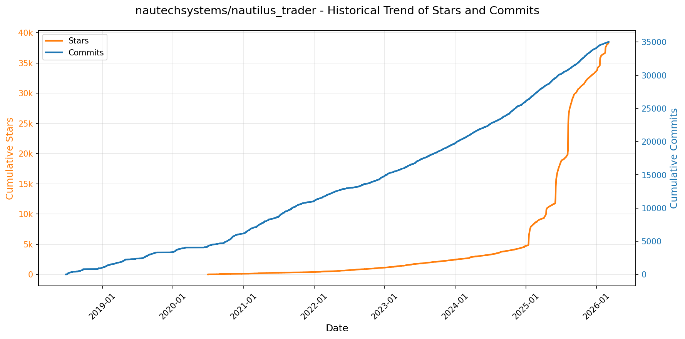
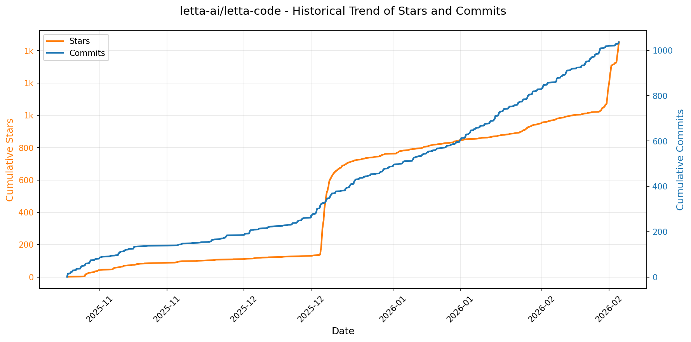

# 🌟 GitHub Trending 概览

> 数据更新于：2026-02-17

---

## 🔍 项目详情

### 1. [anomalyco/opencode](https://github.com/anomalyco/opencode)
- 📅 **创建日期**：2025-04-30  
- 🔄 **最近更新**：2026-02-17  
- ⭐ **Stars**：183,629（日 +500｜周 +4699｜月 +33189）  
- 📝 **描述**：The open source coding agent.  

<b>📈 Star 与 Commit 历史趋势</b>

> *蓝色：累计 Stars｜橙色：累计 Commits（次 Y 轴）*

<b>📄 README 摘要</b>

1. **项目功能**  
OpenCode 是一个开源的 AI 编程智能体（AI coding agent），旨在为开发者提供终端原生（TUI）、轻量高效且高度可扩展的 AI 辅助编程体验。它直接在终端中运行，支持本地或远程模型接入，可完成代码生成、重构、调试、文档理解、代码库探索、多步任务规划等开发全流程任务；同时具备客户端/服务器架构，允许通过不同前端（如终端、桌面应用、未来移动端）控制同一后端服务。

2. **核心特性**  
- **双模式智能体切换**：内置 `build`（全权限开发代理，支持文件编辑与命令执行）和 `plan`（只读分析代理，需显式授权才可执行操作，适用于代码审查与变更预演）；另含 `@general` 子代理，专用于复杂搜索与多步骤推理任务。  
- **全平台原生支持**：提供一键安装脚本（curl）、主流包管理器集成（npm/bun/pnpm/yarn、Homebrew、Scoop、Chocolatey、pacman/AUR、Mise、Nix），覆盖 macOS、Windows、Linux 及 Arch 等发行版。  
- **桌面应用（BETA）**：提供跨平台 GUI 客户端（macOS ARM/x64、Windows、Linux deb/rpm/AppImage），并支持 Homebrew Cask 与 Scoop 安装。  
- **完全开源与厂商无关**：不绑定任何大模型供应商，原生兼容 Claude、OpenAI、Google Gemini、Ollama 本地模型等；默认推荐自有模型服务 OpenCode Zen，但完全可替换。  
- **开箱即用的 LSP 支持**：深度集成语言服务器协议，实现智能补全、跳转、诊断等 IDE 级能力。  
- **终端优先设计（TUI-first）**：由 Neovim 用户及 terminal.shop 团队打造，极致优化终端交互体验，强调键盘驱动、低延迟与资源效率。  
- **灵活安装路径控制**：支持通过环境变量（`OPENCODE_INSTALL_DIR` / `XDG_BIN_DIR`）自定义安装目录，符合 XDG 标准与用户习惯。

3. **技术栈**  
- **核心语言与运行时**：TypeScript（主逻辑）、Rust（部分高性能组件，如 CLI 工具链或未来模型接口层，虽未明示但由包管理器及构建流程推断）；Node.js（CLI 主体）、Bun/Pnpm/Yarn 等现代 JS 运行时支持。  
- **前端框架**：TUI 层基于终端原生渲染（推测使用类似 `ink`、`blessed` 或自研渲染引擎）；Web/Desktop 前端可能采用 React + Vite（由 `packages/web/` 和 `packages/console/app/` 目录结构及资产路径推断）。  
- **架构模式**：客户端-服务器（client/server）分离架构，支持远程控制与多前端接入。  
- **基础设施**：GitHub Actions 自动化发布（`publish.yml`）、多语言 README 管理（i18n）、语义化版本（npm 包 `opencode-ai`）、跨平台打包工具链（如 AppImage、DMG、MSI、deb/rpm 构建）。  
- **模型对接层**：抽象化 LLM 接口，支持 OpenAI 兼容 API、Anthropic Claude、Google Vertex AI、Ollama、Llama.cpp 等本地/远程后端。

---

### 2. [anthropics/skills](https://github.com/anthropics/skills)
- 📅 **创建日期**：2025-09-22  
- 🔄 **最近更新**：2026-02-17  
- ⭐ **Stars**：110,885（日 +402｜周 +4151｜月 +23139）  
- 📝 **描述**：Public repository for Agent Skills  

<b>📈 Star 与 Commit 历史趋势</b>

> *蓝色：累计 Stars｜橙色：累计 Commits（次 Y 轴）*

<b>📄 README 摘要</b>

1. **该项目做什么？**  
该项目是 Anthropic 官方维护的 Claude 技能（Skills）开源示例仓库，旨在展示如何通过结构化、可复用的“技能”扩展 Claude 的能力。每个技能是一个独立文件夹，内含 `SKILL.md`（含 YAML 元数据和指令说明），使 Claude 能动态加载并执行特定领域任务，例如：按企业品牌规范生成文档、基于组织工作流分析数据、自动化个人事务（如 PDF 表单提取、PPTX 创建）、测试 Web 应用、生成 MCP 服务器等。它不提供运行时服务或独立应用，而是为开发者和企业用户提供可参考、可复用、可定制的技能模板与生产级实践范例。

2. **关键特性**  
- **模块化与自包含设计**：每个技能均为独立文件夹，含标准化 `SKILL.md`（含 `name`/`description` 前置元数据及 Markdown 指令、示例、指南），便于复用、分发与组合；  
- **覆盖多场景能力**：涵盖创意设计（艺术/音乐/设计）、技术开发（Web 测试、MCP 服务生成）、企业协作（通信模板、品牌合规）、文档处理（DOCX/PDF/PPTX/XLSX 全格式创建与编辑）四大类；  
- **开箱即用的集成支持**：支持通过 Claude Code 插件市场一键安装（如 `document-skills` 或 `example-skills`），在 Claude.ai（付费版）中直接启用，并可通过 Claude API 上传与调用自定义技能；  
- **生产级参考实现**：公开了驱动 Claude 官方文档功能的源可用（source-available）文档技能（位于 `skills/docx` 等子目录），虽非开源许可（Apache 2.0 仅适用于部分示例技能），但为复杂技能工程提供了真实落地样板；  
- **标准化规范支撑**：配套 `./spec` 目录提供完整的 [Agent Skills 规范](https://agentskills.io)，确保跨平台、跨工具的技能互操作性与可扩展性。

3. **技术栈**  
- **核心格式**：纯文本 Markdown（`SKILL.md`）+ YAML 前置元数据，零依赖、高可读、易版本控制；  
- **运行环境**：深度集成 Anthropic 生态——依赖 Claude 模型（特别是支持技能加载的版本）、Claude Code（插件化运行时）、Claude.ai 前端平台及 Claude API（Skills API）；  
- **许可与协议**：多数示例技能采用 **Apache License 2.0**；文档类技能为 **source-available（非开源）**；整体遵循 [Agent Skills 开放标准](https://agentskills.io)；  
- **辅助工具链**：提供标准化 `./template` 技能模板，支持快速初始化；无后端服务、无构建工具链，本质是面向 LLM 的“指令工程资产库”，强调轻量性与平台无关性。

---

### 3. [openclaw/openclaw](https://github.com/openclaw/openclaw)
- 📅 **创建日期**：2025-11-24  
- 🔄 **最近更新**：2026-02-17  
- ⭐ **Stars**：87,331（日 +4487｜周 +22792｜月 +87331）  
- 📝 **描述**：Your own personal AI assistant. Any OS. Any Platform. The lobster way. 🦞   

<b>📈 Star 与 Commit 历史趋势</b>

> *蓝色：累计 Stars｜橙色：累计 Commits（次 Y 轴）*

<b>📄 README 摘要</b>

1. **项目功能**  
OpenClaw 是一个完全本地化、用户自托管的个人 AI 助手系统，核心目标是让用户在**自有设备上运行专属、单用户、低延迟、始终在线**的 AI 服务。它不依赖中心化云服务，而是通过本地运行的「网关（Gateway）」作为统一控制平面，将 AI 能力无缝接入用户日常使用的各类通信渠道（如 WhatsApp、Telegram、Slack、Discord、Signal、iMessage、Microsoft Teams、Google Chat、BlueBubbles、Matrix、Zalo 等），并支持跨平台语音交互（macOS/iOS/Android 的 Wake-on-Voice 和 Talk Mode）、实时可视化工作区（Live Canvas + A2UI）、设备级操作（摄像头、录屏、定位、通知、系统命令等），以及多代理会话隔离与协同。其本质是将大模型能力深度嵌入真实操作系统与通信生态中，实现“AI 即服务层”的私有化部署。

2. **关键特性**  
- **本地优先架构**：全栈运行于用户设备，Gateway 为轻量级 WebSocket 控制平面，支持 systemd/launchd 守护进程、Nix/Docker 部署及 Tailscale 远程安全访问；  
- **全渠道统一收发**：原生支持 14+ 主流通讯平台（含 iMessage 替代方案 BlueBubbles、Zalo 等区域化服务），支持群组路由（提及触发、回复链、分块处理）、DM 安全配对机制（默认拒绝未授权私信，需 CLI 手动批准）；  
- **多智能体工作空间**：基于 Session 模型实现会话隔离、激活策略（mention/always）、上下文压缩、跨会话消息传递（`sessions_send`）及 Agent-to-Agent 协作；  
- **全模态交互能力**：  
  - ✅ 语音：macOS/iOS/Android 全时唤醒（ElevenLabs）、免提对话（Talk Mode）、PTT；  
  - ✅ 视觉：Canvas 实时渲染 + A2UI 指令驱动界面、本地摄像头抓拍/录像、屏幕录制；  
  - ✅ 多媒体处理：音频转录、图像/视频上传与尺寸管控、临时文件生命周期管理；  
- **深度设备集成**：通过 `node.invoke` 协议调用 macOS/iOS/Android 原生能力（如 `system.run`、`location.get`、`screen.record`），严格遵循系统权限模型（TCC / 权限弹窗）；  
- **自动化与工具链**：内置浏览器控制（专用 Chromium + CDP）、Cron 定时任务、Webhook/Gmail Pub/Sub 事件驱动、技能平台（ClawHub 技能注册与自动拉取）；  
- **安全与运维强化**：默认 DM 配对策略、模型故障转移（OAuth/API Key 多源 fallback）、会话剪枝、详细日志与诊断命令（`openclaw doctor`）、远程网关 SSH/Tailscale 安全隧道；  
- **开箱即用体验**：终端向导 `openclaw onboard` 一键完成网关安装、通道配置、模型认证与技能初始化，支持 npm/pnpm/bun，兼容 macOS/Linux/WSL2。

3. **技术栈**  
- **运行时**：Node.js ≥22（核心 CLI 与 Gateway）；TypeScript（主语言）；`tsx` 直接执行 TS；  
- **构建与包管理**：pnpm（推荐源码构建）、npm/pnpm/bun（安装）；  
- **前端与 UI**：WebChat 与 Control UI 内置于 Gateway（静态服务）；Canvas 使用 A2UI 框架；macOS/iOS/Android App 均为原生客户端（非 WebView）；  
- **通信协议**：WebSocket（Gateway 主控协议）、HTTP/HTTPS（Tailscale Serve/Funnel 或 SSH 隧道暴露）、CDP（Chrome DevTools Protocol 用于浏览器控制）；  
- **底层依赖**：  
  - 通道 SDK：Baileys（WhatsApp）、grammY（Telegram）、discord.js（Discord）、@slack/bolt（Slack）、signal-cli（Signal）、matrix-js-sdk（Matrix）等；  
  - 媒体处理：FFmpeg（音视频转码）、Whisper（可选语音转录）；  
  - 语音合成：ElevenLabs API；  
  - 安全与网络：Tailscale（零信任远程访问）、OpenSSL（TLS）、bcrypt（密码哈希）；  
- **部署方案**：Nix（声明式配置）、Docker（容器化）、systemd（Linux）、launchd（macOS）、WSL2（Windows 支持）；  
- **模型支持**：通过 OAuth（Anthropic Claude Pro/Max、OpenAI ChatGPT）或 API Key 接入任意 LLM，支持模型动态切换与故障转移；  
- **开发辅助**：Vitest（测试）、ESLint + Prettier（代码规范）、GitHub Actions（CI/CD）。

---

### 4. [obra/superpowers](https://github.com/obra/superpowers)
- 📅 **创建日期**：2025-10-09  
- 🔄 **最近更新**：2026-02-17  
- ⭐ **Stars**：81,851（日 +686｜周 +4442｜月 +27068）  
- 📝 **描述**：An agentic skills framework & software development methodology that works.  

<b>📈 Star 与 Commit 历史趋势</b>

> *蓝色：累计 Stars｜橙色：累计 Commits（次 Y 轴）*

<b>📄 README 摘要</b>

1. **该项目做什么？**  
Superpowers 是一个面向编程智能体（coding agents）的完整软件开发工作流增强系统。它不直接替代或重写代码，而是通过一套可组合、自动触发的“技能”（skills）和预设指令，系统性地规范和提升智能体的工程行为。其核心目标是将原本可能随意、跳跃、缺乏验证的 AI 编程过程，转变为严格遵循工程原则（如 TDD、YAGNI、DRY）、具备明确设计评审、分步计划、子智能体协同执行、多阶段审查与自动化验证的可控开发流程。用户无需手动调用功能——只要启动支持的编码智能体（如 Claude Code、Codex 或 OpenCode），系统即在适当时机自动激活对应技能，实现“开箱即用”的专业级开发辅助。

2. **关键特性**  
- **全周期结构化工作流**：覆盖从需求澄清（brainstorming）、分支隔离开发（using-git-worktrees）、原子化任务拆解（writing-plans）、子智能体驱动开发（subagent-driven-development）、强制测试先行（test-driven-development）、阶段性代码审查（requesting/receiving-code-review）到分支收尾（finishing-a-development-branch）的完整闭环。  
- **自动技能触发与强制执行**：所有技能按上下文自动检测并启用，且为**强制性工作流**而非可选建议，确保工程纪律落地。  
- **双阶段审查机制**：在 subagent-driven-development 中，每个任务由独立子智能体执行，并经历两轮审查——先验证是否严格符合原始计划（spec compliance），再评估代码质量（code quality）。  
- **严谨的验证文化**：强调“证据优于断言”，要求所有修复必须经验证（verification-before-completion）、所有功能必须通过红-绿-重构循环（RED-GREEN-REFACTOR）、所有变更需基于干净测试基线（clean test baseline）。  
- **可扩展技能生态**：内置丰富技能库（含测试、调试、协作、元能力四大类），支持用户遵循标准化指南（via `writing-skills`）贡献新技能，形成持续演进的能力体系。

3. **技术栈**  
- **运行平台**：深度适配主流 AI 编程环境，原生支持 **Claude Code**（通过插件市场集成）、**Codex** 和 **OpenCode**（均通过远程加载配置文件实现接入）。  
- **架构模式**：基于“技能即配置”（skill-as-declarative-config）的设计，各技能以 Markdown 文档（如 `SKILL.md`）形式组织在仓库中，包含行为描述、触发条件、执行逻辑与验证规则，实现低耦合、高可读性。  
- **基础设施依赖**：依赖 Git（用于 worktree 管理、分支隔离）、本地/项目内测试框架（支撑 TDD 自动化验证）、以及底层 LLM 的多轮对话与指令遵循能力；无独立后端服务，纯前端/插件侧轻量集成。  
- **维护与分发**：采用 GitHub 原生生态——插件通过 `github.com/obra/superpowers-marketplace` 分发，更新通过 `/plugin update` 命令一键完成，技能文档与安装指南全部托管于仓库（如 `.codex/INSTALL.md`），实现版本一致、开箱即用。

---

### 5. [google/langextract](https://github.com/google/langextract)
- 📅 **创建日期**：2025-07-08  
- 🔄 **最近更新**：2026-02-17  
- ⭐ **Stars**：54,973（日 +183｜周 +6734｜月 +11842）  
- 📝 **描述**：A Python library for extracting structured information from unstructured text using LLMs with precise source grounding and interactive visualization.  

<b>📈 Star 与 Commit 历史趋势</b>

> *蓝色：累计 Stars｜橙色：累计 Commits（次 Y 轴）*

<b>📄 README 摘要</b>

1. **项目功能**  
LangExtract 是一个基于大语言模型（LLM）的 Python 库，专注于从**非结构化文本**（如临床病历、放射报告、文学作品等）中**高精度提取结构化信息**。其核心能力是依据用户提供的自然语言指令和少量示例（few-shot examples），自动识别并组织关键实体（如人物、情绪、药物名称、剂量、关系等），同时严格保证所有提取结果均**可溯源至原文确切位置**（source grounding），支持大规模长文档（如整本《罗密欧与朱丽叶》）的端到端处理。

2. **关键特性**  
- **精准溯源定位**：为每个提取结果标注在原文中的精确字符偏移量，支持可视化高亮与人工验证；  
- **强结构化输出保障**：通过受控生成（如 Gemini 的 schema 强约束）和示例驱动机制，确保输出严格遵循用户定义的 JSON Schema 结构；  
- **长文档优化能力**：采用多轮抽取（extraction passes）、自适应分块（chunking）、并行处理（max_workers）及上下文缓冲优化（max_char_buffer），显著提升长文本中稀疏目标的召回率；  
- **交互式可视化**：一键生成自包含、可搜索、带上下文高亮的 HTML 可视化文件，支持千级实体的高效审查；  
- **多模型灵活适配**：原生支持 Google Gemini（云）、OpenAI（需额外安装）、本地 Ollama 模型（如 `gemma2:2b`），并提供插件化架构供用户扩展自定义模型提供商；  
- **零微调领域泛化**：仅需提供 1–3 个高质量、按出现顺序排列的文本-提取对示例，即可快速适配医疗、文学、法律等任意领域任务；  
- **知识与证据平衡控制**：通过提示词设计与示例属性显式调控 LLM 行为——既可严格限于原文字面提取，也可引导其结合世界知识生成推理性属性（如 `"literary_context": "tragic heroine"`）。

3. **技术栈**  
- **编程语言**：Python（≥3.10）；  
- **核心依赖**：`google-generativeai`（Gemini）、`openai`（OpenAI）、`ollama`（本地模型）、`pydantic`（Schema 验证）、`rich`（CLI 输出）、`jinja2`（HTML 模板渲染）；  
- **构建与包管理**：`pyproject.toml` + `setuptools`，支持 `pip install -e ".[dev,test,openai]"` 多环境安装；  
- **测试框架**：`pytest` + `tox`（跨 Python 3.10/3.11 测试），集成 Ollama 真实推理测试；  
- **开发工具链**：`pyink`（代码格式化）、`isort`（导入排序）、`pylint`（静态检查）、`pre-commit`（自动化钩子）；  
- **部署支持**：Docker 容器化构建与运行，兼容 Vertex AI 批处理 API（企业级规模化场景）。

---

### 6. [nautechsystems/nautilus_trader](https://github.com/nautechsystems/nautilus_trader)
- 📅 **创建日期**：2018-06-25  
- 🔄 **最近更新**：2026-02-17  
- ⭐ **Stars**：37,515（日 +475｜周 +935｜月 +2928）  
- 📝 **描述**：A high-performance algorithmic trading platform and event-driven backtester  

<b>📈 Star 与 Commit 历史趋势</b>

> *蓝色：累计 Stars｜橙色：累计 Commits（次 Y 轴）*

<b>📄 README 摘要</b>

1. **项目功能**  
NautilusTrader 是一个开源、高性能、生产级的算法交易平台，专为量化交易员设计。其核心能力是支持在历史数据上对自动化交易策略组合进行**事件驱动式回测**，并**无需修改任何代码即可将同一策略直接部署至实盘交易环境**。平台具备资产类别无关性，可统一接入各类金融资产（如外汇、股票、期货、期权、加密货币、DeFi、博彩市场等）的交易所和数据提供商，通过模块化适配器（adapters）实现多市场、多品种、多交易所的并发操作，适用于高频交易、做市、统计套利及AI驱动交易（如强化学习/进化策略训练）等场景。

2. **关键特性**  
- **高性能与可靠性**：核心引擎用 Rust 编写，基于 `tokio` 实现异步网络通信；内存与线程安全由 Rust 类型系统保障；支持可选 Redis 持久化状态；提供纳秒级时间精度的回测。  
- **全栈一致性**：严格保证回测与实盘策略逻辑、执行语义、订单生命周期管理完全一致，彻底消除“研究—生产”环境割裂问题（即“parity challenge”）。  
- **高级订单与执行控制**：支持全部主流时间属性（IOC/FOK/GTC/GTD/DAY/AT_THE_OPEN/CLOSE）、复杂订单类型（冰山单、仅挂单、仅减仓）、条件触发器及连锁订单（OCO/OUO/OTO）。  
- **灵活可扩展架构**：基于消息总线（Message Bus）与缓存（Cache）构建，允许用户自由开发自定义组件、数据类型、适配器及整套交易系统；支持 Docker 部署与跨平台（Linux/macOS/Windows）运行。  
- **多源集成能力**：已原生支持超 15 个主流平台（含 Binance、Bybit、Deribit、Interactive Brokers、Betfair、dYdX v3/v4、Polymarket 等），涵盖中心化/去中心化交易所、券商及专业数据服务商（Databento、Tardis），所有适配器均遵循统一领域模型。  
- **AI-ready 回测引擎**：性能足够支撑实时训练 AI 交易智能体（如 RL/ES），使回测成为模型迭代闭环的关键环节。

3. **技术栈**  
- **核心语言**：Rust（承担高性能、低延迟、内存/线程安全的关键组件，如事件循环、订单簿引擎、序列化、网络层）；Python（作为主开发与交互语言，面向用户策略编写、研究与运维）。  
- **Python 绑定方案**：通过 Cython 与 PyO3 实现 Rust 核心到 Python 的高效封装，安装时无需用户本地安装 Rust 工具链。  
- **异步生态**：Rust 端依赖 `tokio`；Python 端全面支持异步 I/O 与协程。  
- **数据精度支持**：提供双精度模式——标准模式（64 位整数，最高 9 位小数）与高精度模式（128 位整数，最高 16 位小数），Linux/macOS 默认启用高精度，Windows 因 MSVC 限制默认使用标准精度。  
- **基础设施**：支持 Redis 状态持久化；兼容 Docker 容器化部署；CI/CD 基于 GitHub Actions；测试覆盖含 Codecov（单元/集成测试）与 CodSpeed（性能基准测试）。

---

### 7. [remotion-dev/remotion](https://github.com/remotion-dev/remotion)
- 📅 **创建日期**：2020-06-23  
- 🔄 **最近更新**：2026-02-17  
- ⭐ **Stars**：36,901（日 +127｜周 +1022｜月 +11583）  
- 📝 **描述**：🎥      Make videos programmatically with React  

<b>📈 Star 与 Commit 历史趋势</b>

> *蓝色：累计 Stars｜橙色：累计 Commits（次 Y 轴）*

<b>📄 README 摘要</b>

1. **该项目的功能**  
Remotion 是一个基于 React 的视频生成框架，允许开发者使用 React 组件、JavaScript 逻辑和 Web 技术（如 CSS、SVG、Canvas、WebGL）**以编程方式动态创建视频**。它将视频视为“可渲染的时序内容”，支持帧级控制、时间轴驱动的动画、参数化模板（如个性化年度回顾视频）、批量渲染（如为成千上万用户生成定制视频），并可导出为 MP4、GIF 或 ProRes 等格式，适用于营销视频、数据可视化、社交媒体内容、教育动画等场景。

2. **核心特性**  
- ✅ **React 原生开发体验**：复用 React 组件、Hooks、状态管理、Context 和第三方库；支持 Fast Refresh 实时预览；  
- ✅ **时间轴与帧精度控制**：通过 `useCurrentFrame`、`interpolate`、`Easing` 等 API 实现精确的逐帧动画与缓动效果；  
- ✅ **多目标输出**：支持本地渲染（CLI）、云端渲染（Remotion Cloud）、Lambda 渲染，并可导出为视频（MP4/H.264、ProRes）、GIF、静态图像序列（PNG/JPEG）；  
- ✅ **高性能与可扩展性**：内置并行渲染、缓存机制、增量构建；支持服务端渲染（SSR）和动态数据注入（如 API 调用、JSON 输入）；  
- ✅ **开发者友好工具链**：提供 `npx create-video@latest` 快速脚手架、内嵌预览服务器（带时间轴控件）、调试面板、类型安全（TypeScript 原生支持）、CLI 批量渲染命令；  
- ✅ **生产就绪能力**：支持字体加载、音频合成（`<Audio />` 组件）、字幕（WebVTT）、响应式布局、离屏渲染（OffscreenCanvas）及 WebGL 集成。

3. **技术栈**  
- **核心框架**：React（v18+，支持 Concurrent Features）、TypeScript（全量类型定义）；  
- **渲染引擎**：基于 Chromium（通过 Puppeteer 或 Playwright 控制无头浏览器），利用 Canvas 2D/WebGL 进行高性能帧绘制；  
- **构建与工具**：Webpack（自定义配置）、Vite（可选集成）、ESBuild（部分 CLI 工具链）；  
- **基础设施**：Node.js（v18+）、npm/pnpm/yarn；支持 CI/CD 集成（GitHub Actions、Vercel、Remotion Cloud）；  
- **配套生态**：官方维护 `@remotion/*` 系列包（如 `@remotion/cli`、`@remotion/player`、`@remotion/lottie`）、Figma 插件、VS Code 扩展、Discord 社区与文档站（Next.js 构建）。

---

### 8. [asgeirtj/system_prompts_leaks](https://github.com/asgeirtj/system_prompts_leaks)
- 📅 **创建日期**：2025-05-03  
- 🔄 **最近更新**：2026-02-17  
- ⭐ **Stars**：31,771（日 +144｜周 +970｜月 +6703）  
- 📝 **描述**：Collection of extracted System Prompts from popular chatbots like ChatGPT, Claude & Gemini  

<b>📈 Star 与 Commit 历史趋势</b>

> *蓝色：累计 Stars｜橙色：累计 Commits（次 Y 轴）*

---

### 9. [thedotmack/claude-mem](https://github.com/thedotmack/claude-mem)
- 📅 **创建日期**：2025-08-31  
- 🔄 **最近更新**：2026-02-17  
- ⭐ **Stars**：28,924（日 +206｜周 +2496｜月 +14583）  
- 📝 **描述**：A Claude Code plugin that automatically captures everything Claude does during your coding sessions, compresses it with AI (using Claude's agent-sdk), and injects relevant context back into future sessions.  

<b>📈 Star 与 Commit 历史趋势</b>

> *蓝色：累计 Stars｜橙色：累计 Commits（次 Y 轴）*

<b>📄 README 摘要</b>

1. **项目功能**  
Claude-Mem 是一个专为 Anthropic Claude Code（AI 编程代理）设计的**持久化记忆压缩系统**，旨在解决 AI 会话上下文无法跨会话延续的根本问题。它通过自动捕获用户与工具交互过程中的关键观察（observations）、生成语义化摘要，并构建可检索的记忆索引，使 Claude 在新会话中能自动恢复对项目历史、技术决策、调试过程、代码变更等上下文的理解，实现真正的“记忆连续性”。其核心价值在于将离散的会话转化为连贯的、具备长期认知能力的智能开发代理。

2. **关键特性**  
- **持久化记忆（Persistent Memory）**：会话结束后记忆仍长期保存于本地 SQLite 数据库，重启后自动注入新会话。  
- **渐进式披露（Progressive Disclosure）**：采用三层搜索工作流（`search` → `timeline` → `get_observations`），按需分层加载上下文，显著降低 token 消耗（约节省 10 倍）。  
- **技能化智能搜索（Skill-Based Search）**：内置 `mem-search` 技能及 5 个 MCP 标准工具（含 `search`, `timeline`, `get_observations`, `save_memory`, `__IMPORTANT`），支持自然语言查询、时间线回溯与精准观测提取。  
- **实时 Web 查看器（Web Viewer UI）**：提供 http://localhost:37777 网页界面，实时流式展示记忆事件、全文检索、向量搜索结果及所有观测详情（含带 ID 的可引用链接）。  
- **Claude Desktop 集成**：可在 Claude 桌面版对话中直接调用记忆搜索技能，实现无缝上下文复用。  
- **隐私控制机制**：支持 `<private>` 标签语法，自动过滤敏感内容，保障本地数据安全。  
- **全自动无感运行**：基于 6 个生命周期钩子（SessionStart/Submit/PostToolUse/Stop/SessionEnd + Smart Install）自动触发记忆采集与处理，无需人工干预。  
- **混合搜索架构**：结合 SQLite FTS5 全文检索与 Chroma 向量数据库，实现语义+关键词双模智能检索。  
- **Beta 实验通道**：支持切换至 beta 版本体验前沿功能（如 Endless Mode——仿生式长时记忆架构）。  

3. **技术栈**  
- **运行时与服务层**：Bun（作为 HTTP Worker 服务管理器与轻量级 JS 运行时）、Node.js ≥18.0.0（主插件环境）、uv（Python 包管理器，用于向量搜索依赖）、SQLite3（嵌入式本地持久化存储，含 FTS5 扩展）。  
- **AI 与搜索层**：ChromaDB（向量数据库，支撑语义搜索）、MCP（Model Context Protocol）标准协议（实现与 Claude 的标准化工具交互）。  
- **前端与交互层**：TypeScript（全栈主要开发语言）、HTML/CSS/JS（Web Viewer UI）、GIF 动画与响应式图片（适配深/浅色模式）。  
- **基础设施与部署**：支持 OpenClaw 网关一键部署（`curl -fsSL https://install.cmem.ai/openclaw.sh | bash`），集成 Telegram/Discord/Slack 实时通知；插件通过 Claude Code `/plugin` 命令原生安装。  
- **许可与合规**：主项目采用 AGPL-3.0 开源协议（强调网络服务场景下的源码公开义务）；`ragtime/` 子模块采用 PolyForm Noncommercial License 1.0.0。

---

### 10. [ChromeDevTools/chrome-devtools-mcp](https://github.com/ChromeDevTools/chrome-devtools-mcp)
- 📅 **创建日期**：2025-09-11  
- 🔄 **最近更新**：2026-02-17  
- ⭐ **Stars**：25,759（日 +213｜周 +2063｜月 +4378）  
- 📝 **描述**：Chrome DevTools for coding agents  

<b>📈 Star 与 Commit 历史趋势</b>

> *蓝色：累计 Stars｜橙色：累计 Commits（次 Y 轴）*

<b>📄 README 摘要</b>

1. **项目功能**  
该项目（`chrome-devtools-mcp`）是一个符合**模型-上下文-协议（MCP）标准的服务器**，旨在使AI编程助手（如Gemini、Claude、Cursor、Copilot、Codex等）能够**安全、可靠地控制并深度检测正在运行的Chrome浏览器实例**。它桥接大语言模型与真实浏览器环境，赋予AI代理完整的Chrome DevTools能力，支持自动化操作、实时调试、性能分析和网页内容检查，从而实现基于真实浏览器上下文的智能编码与问题诊断。

2. **核心特性**  
- **性能洞察分析**：集成Chrome DevTools前端，可录制性能轨迹（trace），自动提取可操作的性能瓶颈建议，并可选对接Google CrUX API获取真实用户性能数据（Field Data）；  
- **高级浏览器调试能力**：支持捕获网络请求详情、获取带源码映射（source-mapped）的控制台日志、截取全屏/元素级截图、执行JavaScript脚本、生成堆快照（heap snapshot）等；  
- **高可靠性自动化**：基于Puppeteer构建，提供语义化操作工具（如`click`、`fill_form`、`navigate_page`、`wait_for`等），自动等待页面加载、元素就绪及操作完成，显著提升AI驱动UI交互的鲁棒性；  
- **灵活部署与连接模式**：支持自动启动隔离Chrome实例、连接已运行的调试版Chrome（通过HTTP或WebSocket端点）、多通道（Stable/Canary/Beta/Dev）与自定义用户数据目录，兼顾开发便捷性与生产安全性；  
- **模块化工具集与细粒度配置**：按功能划分为输入/导航/模拟/性能/网络/调试六大类共26+个标准化MCP工具，并支持通过命令行参数动态启用/禁用特定能力类别（如关闭`--categoryNetwork`则隐藏所有网络相关工具）。

3. **技术栈**  
- **运行时**：Node.js（v20.19+ LTS）；  
- **浏览器底层**：Google Chrome（当前稳定版及以上），通过Chrome DevTools Protocol（CDP）通信；  
- **自动化引擎**：Puppeteer（用于启动、管理浏览器实例及封装基础操作）；  
- **协议标准**：Model-Context-Protocol（MCP），兼容各类支持MCP的AI客户端（如Copilot、Cursor、Gemini CLI、VS Code、JetBrains等）；  
- **依赖生态**：直接复用官方[Chrome DevTools前端](https://github.com/ChromeDevTools/devtools-frontend)的性能分析能力；日志与调试依赖`debug`模块；配置解析与CLI参数处理采用标准Node.js工具链；  
- **基础设施**：支持headless模式、自定义代理、证书策略、视口模拟、WebSocket安全头（`--wsHeaders`）等企业级部署特性。

---

### 11. [virattt/dexter](https://github.com/virattt/dexter)
- 📅 **创建日期**：2025-10-14  
- 🔄 **最近更新**：2026-02-17  
- ⭐ **Stars**：22,976（日 +163｜周 +2021｜月 +8558）  
- 📝 **描述**：An autonomous agent for deep financial research  

<b>📈 Star 与 Commit 历史趋势</b>

> *蓝色：累计 Stars｜橙色：累计 Commits（次 Y 轴）*

<b>📄 README 摘要</b>

1. **项目功能**  
Dexter 是一个面向金融研究的自主式 AI 代理（Autonomous Financial Research Agent），能够对复杂金融问题进行端到端的自主分析：接收自然语言提问 → 自动拆解为多步研究计划 → 调用实时金融数据源执行任务 → 自我验证与迭代反思 → 输出数据支撑、逻辑严谨的研究结论。其核心目标是替代传统人工财务尽调流程，实现“思考-规划-执行-反思-优化”的闭环，专为股票基本面分析、财报解读、行业比较等专业金融场景设计。

2. **关键特性**  
- **智能任务规划（Intelligent Task Planning）**：将模糊或复合型金融问题（如“对比苹果与英伟达过去三年的盈利质量与现金流健康度”）自动分解为可执行子任务（如获取两家公司年报、提取经营性现金流/净利润、计算自由现金流转化率等）。  
- **自主工具调度与执行（Autonomous Execution）**：动态选择并调用适配工具链，包括财务数据 API（收入表、资产负债表、现金流量表）、网络搜索（Exa/Tavily）、以及可选的大模型推理服务（OpenAI、Anthropic、Ollama 等）。  
- **自我验证与迭代优化（Self-Validation & Reflection）**：内置检查机制，在每步执行后评估结果合理性；若证据不足或逻辑存疑，则主动修正计划、重试或补充查询，直至达成高置信度结论。  
- **实时权威金融数据接入**：原生集成 Financial Datasets API，支持免费获取 AAPL、NVDA、MSFT 等主流标的的结构化、标准化财报数据（年/季报），保障分析时效性与准确性。  
- **安全与可观测性保障**：具备循环检测、最大步骤限制等防失控机制；所有推理过程、工具调用及 LLM 总结均以 JSONL 格式完整记录于本地 `.dexter/scratchpad/`，支持全链路调试与审计；提供 LangSmith 集成用于评估追踪。

3. **技术栈**  
- **运行时**：Bun（v1.0+）——作为极速 JavaScript/TypeScript 运行时与包管理器，替代 Node.js + npm/yarn/pnpm。  
- **核心语言**：TypeScript（强类型保障复杂 Agent 逻辑可靠性）。  
- **AI 模型层**：多后端兼容架构，支持 OpenAI（默认）、Anthropic、Google Gemini、xAI、OpenRouter 及本地 Ollama 模型，便于灵活切换与成本/性能权衡。  
- **数据服务**：  
  - 主要财务数据源：Financial Datasets API（结构化财报）；  
  - 补充网络信息：Exa API（首选）、Tavily API（备用）；  
- **评估与可观测性**：LangSmith（LLM 应用追踪与评测平台）+ LLM-as-Judge 自动评分框架。  
- **扩展通信通道**：WhatsApp 网关（基于官方 WhatsApp Business API 或第三方 SDK 实现消息收发与会话管理）。  
- **开发与部署友好**：环境变量驱动配置（`.env`）、模块化代码结构（含独立 `gateway/` 子系统）、一键启动脚本（`bun start` / `bun dev`）。

---

### 12. [iOfficeAI/AionUi](https://github.com/iOfficeAI/AionUi)
- 📅 **创建日期**：2025-08-07  
- 🔄 **最近更新**：2026-02-17  
- ⭐ **Stars**：22,102（日 +124｜周 +2361｜月 +12302）  
- 📝 **描述**：Free, local, open-source 24/7 Cowork and OpenClaw for Gemini CLI, Claude Code, Codex, OpenCode, Qwen Code, Goose CLI, Auggie, and more | 🌟 Star if you like it!  

<b>📈 Star 与 Commit 历史趋势</b>

> *蓝色：累计 Stars｜橙色：累计 Commits（次 Y 轴）*

---

### 13. [VectifyAI/PageIndex](https://github.com/VectifyAI/PageIndex)
- 📅 **创建日期**：2025-04-01  
- 🔄 **最近更新**：2026-02-17  
- ⭐ **Stars**：20,090（日 +101｜周 +833｜月 +9886）  
- 📝 **描述**：📑 PageIndex: Document Index for Vectorless, Reasoning-based RAG  

<b>📈 Star 与 Commit 历史趋势</b>

> *蓝色：累计 Stars｜橙色：累计 Commits（次 Y 轴）*

<b>📄 README 摘要</b>

1. **该项目的功能**  
PageIndex 是一个面向长文档（如财报、法律文件、学术教材等）的新型检索增强生成（RAG）系统，其核心目标是**取代传统基于向量数据库（Vector DB）和文本分块（Chunking）的语义相似性检索范式**。它不依赖向量嵌入或近似最近邻搜索，而是通过构建文档的**语义树状索引（Tree Index）**，并利用大语言模型（LLM）进行**多步推理式检索（Reasoning-based Retrieval）**，模拟人类专家阅读与导航复杂文档的方式，实现高精度、可解释、可追溯的上下文提取。

2. **关键特性**  
- **零向量数据库（Vectorless）**：完全摒弃向量存储与相似度计算，避免“vibe retrieval”（模糊匹配），转向基于逻辑与结构的精准检索；  
- **无需人工分块（No Chunking）**：保留文档天然层级结构（如章节、小节），按语义边界自动划分节点，避免跨段落截断导致的信息丢失；  
- **人类式推理检索（Human-like & Reasoning-based）**：通过两阶段流程——① 生成类目录的层次化树索引（含节点ID、页码范围、摘要）；② 在树上执行LLM驱动的树搜索（Tree Search），动态判断相关路径，支持多跳、条件性、领域知识引导的检索；  
- **强可解释性与可追溯性**：每次检索结果附带明确的页面号、章节标题及推理路径，支持审计与验证；  
- **原生支持视觉输入（Vision-native）**：提供OCR-Free方案，可直接对PDF页面图像进行推理式RAG，绕过传统OCR误差与结构破坏问题；  
- **高性能实证**：在FinanceBench金融问答基准测试中达**98.7%准确率**，显著超越主流向量RAG方案。

3. **技术栈**  
- **核心模型层**：依赖OpenAI系列大模型（默认 `gpt-4o-2024-11-20`）执行树构建与推理搜索，强调LLM的结构理解与链式推理能力；  
- **文档解析层**：支持PDF（基于PyPDF2/fitz等库）与Markdown双输入；提供专用**PageIndex OCR**（未开源但已商用）以高保真还原复杂PDF的全局语义结构；  
- **索引表示层**：采用JSON格式的嵌套树结构（TreeNode），每个节点包含 `title`、`node_id`、`start_index`/`end_index`（对应页码）、`summary` 及子节点数组，适配LLM上下文处理；  
- **部署与集成**：提供本地Python CLI工具（`run_pageindex.py`）、Colab交互式Notebook、RESTful API（Beta）、MCP协议插件（兼容Claude/Cursor等智能体平台），以及SaaS化聊天界面（chat.pageindex.ai）；  
- **工程依赖**：Python生态为主，含 `openai`, `python-dotenv`, `pypdf`, `fitz`（PyMuPDF）等，支持环境变量配置与灵活参数调优（如每节点最大页数、token数、是否生成摘要等）。

---

### 14. [KeygraphHQ/shannon](https://github.com/KeygraphHQ/shannon)
- 📅 **创建日期**：2025-09-27  
- 🔄 **最近更新**：2026-02-17  
- ⭐ **Stars**：19,627（日 +366｜周 +5527｜月 +15873）  
- 📝 **描述**：Fully autonomous AI hacker to find actual exploits in your web apps. Shannon has achieved a 96.15% success rate on the hint-free, source-aware XBOW Benchmark.  

<b>📈 Star 与 Commit 历史趋势</b>

> *蓝色：累计 Stars｜橙色：累计 Commits（次 Y 轴）*

<b>📄 README 摘要</b>

1. **项目功能**  
Shannon 是一个面向源码的全自动 AI 渗透测试工具，核心目标是**在真实环境中主动验证并执行漏洞利用（exploit）**，而非仅生成静态告警或潜在风险列表。它通过白盒方式访问目标应用的源代码，结合动态浏览器自动化与命令行交互，在运行中的 Web 应用上实际触发注入、XSS、SSRF、认证/授权绕过等攻击，从而提供可复现、零误报的漏洞证明（PoC），填补传统年度渗透测试与持续开发之间的安全空白。

2. **关键特性**  
- **全自主渗透流程**：支持自动处理复杂登录（含 2FA/TOTP、Google 登录）、页面导航与攻击链编排，单命令启动，全程无人干预；  
- **可验证的 exploit 报告**：输出聚焦于已成功利用的漏洞，附带一键复制的 PoC 脚本与详细复现步骤，彻底消除假阳性；  
- **关键 OWASP 漏洞覆盖**：当前原生支持 Injection、XSS、SSRF、Broken Authentication/Authorization 的检测与实证利用，后续持续扩展；  
- **代码感知型动态测试**：深度融合源码分析（理解数据流、用户输入点、敏感函数调用）与实时浏览器/CLI 攻击，实现“静态指导 + 动态验证”闭环；  
- **集成专业安全工具链**：在侦察阶段调用 Nmap、Subfinder、WhatWeb、Schemathesis 等工具，增强基础设施测绘与 API 合规性分析能力；  
- **并行化高效执行**：对不同漏洞类型（如 XSS 与 SSRF）的分析与利用阶段完全并行运行，显著缩短整体测试耗时；  
- **工作区（Workspace）与断点续跑**：自动保存每个 agent 的执行状态（基于 Git 提交），支持任意中断后精准恢复，避免重复劳动。

3. **技术栈**  
- **核心推理引擎**：Anthropic Claude Agent SDK（主推 Anthropic API，实验性支持 OpenAI/Gemini 通过 Router Mode）；  
- **运行时环境**：Docker 容器化部署，确保环境隔离与可移植性；  
- **架构模式**：多智能体（Multi-Agent）协同架构，分四阶段（侦察 → 漏洞分析 → 利用 → 报告）流水线式编排；  
- **自动化执行层**：基于浏览器自动化（如 Playwright/Puppeteer 类能力）与 CLI 工具调用实现真实攻击行为；  
- **基础设施扫描**：集成 Nmap（端口/服务探测）、Subfinder（子域名发现）、WhatWeb（指纹识别）、Schemathesis（API 合规性模糊测试）；  
- **配置与工作流管理**：YAML 配置驱动认证流程与测试规则，Temporal 开源工作流引擎（通过 Web UI `http://localhost:8233` 可视化监控）；  
- **许可证**：Shannon Lite 采用 AGPL-3.0 开源协议，强调白盒源码可用性前提。

---

### 15. [gitbutlerapp/gitbutler](https://github.com/gitbutlerapp/gitbutler)
- 📅 **创建日期**：2023-01-31  
- 🔄 **最近更新**：2026-02-17  
- ⭐ **Stars**：19,417（日 +46｜周 +754｜月 +1952）  
- 📝 **描述**：The GitButler version control client, backed by Git, powered by Tauri/Rust/Svelte  

<b>📈 Star 与 Commit 历史趋势</b>

> *蓝色：累计 Stars｜橙色：累计 Commits（次 Y 轴）*

<b>📄 README 摘要</b>

1. **项目功能**  
GitButler 是一个从零构建的现代化 Git 版本控制系统界面，旨在替代传统 Git 的命令行与工作流，提供更直观、更强大、更面向未来的协作体验。它无需修改现有 Git 仓库结构，可即插即用地在任意已有 Git 仓库中运行，作为开发者及 AI 代理（agents）的“友好型 Git 用户界面增强层”。其核心目标是简化复杂 Git 操作（如变基、分支管理、冲突处理），并原生支持 AI 驱动的工作流（如自动生成提交信息、PR 描述等）。

2. **关键特性**  
- **堆叠分支（Stacked Branches）**：支持在其他分支之上创建子分支，修改底层提交时自动重堆叠上层分支，消除手动 rebase 痛点；  
- **并行分支（Parallel Branches）**：允许在同一工作目录中并行管理多个虚拟分支，避免频繁 `git checkout` 切换；  
- **可视化提交操作**：通过拖拽或简单 CLI 命令实现一键撤回（uncommit）、重写（reword）、修正（amend）、拆分（split）、压缩（squash）、移动（move）等操作，彻底取代 `git rebase -i`；  
- **操作时间线（Undo Timeline）**：完整记录所有 Git 操作，支持任意步骤的即时撤销或回退，保障操作安全性；  
- **一等公民级冲突处理（First-Class Conflicts）**：冲突不再阻断流程，可标记为“待解决”，并在任意时间、任意顺序中异步处理，rebase 操作始终成功；  
- ** Forge 深度集成**：原生支持 GitHub/GitLab 认证，直接在 GUI 或 CLI 中创建/更新 PR、查看 CI 状态、同步分支列表等，无需额外工具；  
- **AI 工具链（AI Tooling）**：内置 AI 处理器，辅助生成语义化提交消息、分支名、PR 描述；支持为各类 AI 代理系统安装 Git 技能（skills）与钩子（hooks），提升自动化水平。

3. **技术栈**  
- **桌面端应用（GUI）**：基于 [Tauri](https://tauri.app/) 框架构建（轻量、安全、高性能的桌面应用框架）；  
- **前端 UI**：使用 [Svelte](https://svelte.dev/) + [TypeScript](https://www.typescriptlang.org/) 开发，强调响应式与性能；  
- **后端核心引擎**：完全用 [Rust](https://www.rust-lang.org/) 编写，兼顾内存安全、并发效率与 Git 底层操作能力；  
- **命令行工具（`but` CLI）**：复用同一套 Rust 后端逻辑，以 Rust 实现命令行交互界面，确保 GUI 与 CLI 行为一致、能力对等。

---

### 16. [hsliuping/TradingAgents-CN](https://github.com/hsliuping/TradingAgents-CN)
- 📅 **创建日期**：2025-06-26  
- 🔄 **最近更新**：2026-02-17  
- ⭐ **Stars**：17,398（日 +45｜周 +1172｜月 +2560）  
- 📝 **描述**：基于多智能体LLM的中文金融交易框架 - TradingAgents中文增强版  

<b>📈 Star 与 Commit 历史趋势</b>

> *蓝色：累计 Stars｜橙色：累计 Commits（次 Y 轴）*

<b>📄 README 摘要</b>

1. **项目功能**  
本项目是面向中文用户的**多智能体与大模型股票分析学习平台**，基于开源框架 `TradingAgents` 进行深度本地化增强。其核心定位为**合规、非实盘的研究与教育工具**，旨在帮助用户系统学习如何利用多智能体架构（Multi-Agent System）和大语言模型（LLM）开展股票基本面/技术面分析、策略模拟与金融推理。平台**不提供实盘交易指令或投资建议**，仅支持A股、港股、美股等市场的数据接入、智能分析、虚拟回测与专业报告生成，服务于AI金融教育、学术研究及策略实验场景。

2. **关键特性**  
- **全栈中文增强**：原生支持A股全量数据（Tushare/AkShare/BaoStock）、中文界面、国产大模型（通义千问、DeepSeek等）集成、智能新闻分析（含质量评估与多层过滤）；  
- **企业级多智能体分析能力**：支持动态LLM供应商管理、任务驱动的智能模型选择（自动匹配最优模型）、多维度股票筛选/自选股管理/个股深度分析页；  
- **专业研究工作流**：内置模拟交易系统、多格式专业报告导出（Markdown/Word/PDF）、统一新闻工具、成本优化提示、实时进度可视化与SSE+WebSocket双通道通知；  
- **生产就绪架构**：FastAPI后端 + Vue 3前端，MongoDB + Redis双缓存数据库，RBAC权限体系、操作日志、可视化配置中心、批量分析与智能会话管理；  
- **开箱即用部署体验**：完整Docker多架构支持（amd64/arm64）、一键Docker Compose部署、Windows绿色版、详尽中文文档与视频教程；  
- **严格质量保障**：修复原版技术指标与财务数据（PE/PB）计算错误、死循环缺陷及数据一致性问题。

3. **技术栈**  
- **后端**：Python 3.10+，FastAPI + Uvicorn（替代原Streamlit），MongoDB（主数据存储），Redis（缓存与实时通信），JWT认证；  
- **前端**：Vue 3 + Vite + Element Plus，响应式单页应用（SPA），支持Web配置界面与实时交互；  
- **AI集成**：原生OpenAI API、Google Gemini、DeepSeek、通义千问等多LLM提供商抽象层，支持自定义端点与模型能力元数据管理；  
- **数据生态**：Tushare、AkShare、BaoStock三大多A股数据源统一接入与同步；  
- **基础设施**：Docker容器化（GitHub Actions自动化构建）、Docker Compose编排、跨平台兼容（Windows/macOS/Linux/ARM64）；  
- **许可证架构**：混合授权模式——核心算法与工具模块采用**Apache 2.0开源协议**；`app/`（FastAPI后端）与`frontend/`（Vue前端）目录为**专有组件，商业使用需单独授权**。

---

### 17. [hummingbot/hummingbot](https://github.com/hummingbot/hummingbot)
- 📅 **创建日期**：2019-04-02  
- 🔄 **最近更新**：2026-02-17  
- ⭐ **Stars**：16,564（日 +444｜周 +729｜月 +982）  
- 📝 **描述**：Open source software that helps you create and deploy high-frequency crypto trading bots  

<b>📈 Star 与 Commit 历史趋势</b>

> *蓝色：累计 Stars｜橙色：累计 Commits（次 Y 轴）*

<b>📄 README 摘要</b>

1. **该项目做什么？**  
Hummingbot 是一个开源的自动化交易框架，用于设计、开发和部署算法交易机器人（bots），支持在**140+个中心化交易所（CEX）和去中心化交易所（DEX）**上运行。它使用户能够构建跨市场、跨资产类别的量化交易策略（如做市、套利、跨期/跨交易所套利、三角套利等），并已累计产生超340亿美元的链上可验证交易量。项目核心目标是**民主化高频交易（HFT）**，通过开放代码、社区共建与知识共享，降低专业算法交易的技术门槛。

2. **关键功能**  
- **多类型交易所统一接入**：支持三类主流交易场所的标准化连接器：  
  • **CLOB CEX**（中心化限价订单簿交易所，如 Binance、OKX、Bybit），支持现货与永续合约；  
  • **CLOB DEX**（链上限价订单簿去中心化交易所，如 dYdX v4、Hyperliquid、Injective），非托管，基于钱包签名；  
  • **AMM DEX**（自动做市商型去中心化交易所，如 Uniswap、Raydium、Jupiter），通过独立的 **Gateway 中间件**（TypeScript 实现）提供跨链 AMM/CLMM/Router 接口。  
- **模块化策略引擎**：内置多种开箱即用策略模板（如 Pure Market Making、Cross-Exchange Arbitrage、Liquidity Mining），支持 Python 自定义策略开发与热重载。  
- **生产级部署支持**：提供 Docker 一键部署方案（CLI 客户端 + 可选 Gateway）、Telegram 交互界面（Condor）、REST API（Hummingbot API）、AI 集成接口（Hummingbot MCP，支持 Claude/Gemini 等大模型调用交易能力）。  
- **社区驱动生态**：采用治理机制（HBOT 代币提案投票）管理连接器维护与新功能落地；支持 Jupyter 数据研究（Quants Lab）；提供匿名化交易数据上报与可视化（Datadog）。

3. **技术栈**  
- **主客户端（Hummingbot Core）**：Python 3.9+，基于异步 I/O（`asyncio`）和 `aiohttp`/`websockets` 实现高性能网络通信；使用 `pandas`/`numpy` 进行实时行情处理与策略计算；依赖 `SQLAlchemy` 管理本地数据库（SQLite/PostgreSQL 可选）。  
- **网关中间件（Gateway）**：TypeScript 编写，基于 Node.js 运行时，提供 HTTPS/HTTP 多模式支持，集成 Web3.js / Ethers.js 适配多链（Ethereum、Solana、Arbitrum、Base 等），负责 AMM 交易签名、Gas 优化与跨协议路由。  
- **基础设施与工具链**：Docker Compose 统一编排；GitHub Actions CI/CD；文档基于 MkDocs 构建（hummingbot-site）；监控与分析集成 Datadog；贡献治理依托链上 HBOT 代币（ERC-20）及链下提案流程。

---

### 18. [gsd-build/get-shit-done](https://github.com/gsd-build/get-shit-done)
- 📅 **创建日期**：2025-12-14  
- 🔄 **最近更新**：2026-02-17  
- ⭐ **Stars**：14,918（日 +464｜周 +2227｜月 +10951）  
- 📝 **描述**：A light-weight and powerful meta-prompting, context engineering and spec-driven development system for Claude Code and OpenCode.  

<b>📈 Star 与 Commit 历史趋势</b>

> *蓝色：累计 Stars｜橙色：累计 Commits（次 Y 轴）*

<b>📄 README 摘要</b>

1. **项目功能**  
该项目是一个轻量级但功能强大的元提示（meta-prompting）、上下文工程（context engineering）与规范驱动开发（spec-driven development）系统，专为 **Claude Code、OpenCode 和 Gemini CLI** 三大 AI 编程运行时设计。其核心目标是**解决“上下文腐化”（context rot）问题**——即随着 Claude 填满上下文窗口，生成质量显著下降的顽疾。GSD 通过结构化工作流，在整个开发周期中主动管理、隔离和刷新上下文，确保每次 AI 执行任务时都拥有纯净、精准、高信息密度的上下文环境，从而稳定输出高质量、可验证、符合预期的代码。

2. **关键特性**  
- ✅ **六阶段闭环工作流**：`new-project → discuss-phase → plan-phase → execute-phase → verify-work → complete-milestone`，每个阶段职责明确、状态可追溯、结果可验证；  
- ✅ **智能上下文工程**：自动构建并维护 `PROJECT.md`、`REQUIREMENTS.md`、`ROADMAP.md`、`STATE.md`、`CONTEXT.md` 等 8+ 类结构化文档，形成动态演进的项目知识图谱；  
- ✅ **波次式并行执行（Wave Execution）**：基于依赖关系自动分组任务为“执行波”，独立任务并行、依赖任务串行，最大化效率并规避文件冲突；  
- ✅ **原子化 Git 提交**：每个子任务生成独立、语义清晰、带时间戳和阶段标识的 commit（如 `feat(08-02): add email confirmation flow`），支持精准 bisect、回滚与历史理解；  
- ✅ **XML 结构化提示**：所有计划均以定制 XML 格式编写（含 `<action>`、`<verify>`、`<done>` 等字段），指令精确、验证内建、杜绝歧义；  
- ✅ **多智能体协同编排**：研究、规划、执行、验证各阶段均由轻量级协调器调度专用子代理（如 4 并行研究员），主会话上下文始终轻量（30–40% 占用）；  
- ✅ **灰盒适配能力**：支持 `map-codebase` 快速逆向分析现有代码库（架构/约定/技术栈），实现“老项目新功能”的无缝接入；  
- ✅ **灵活模式切换**：提供完整流程（`discuss→plan→execute→verify`）与快捷模式（`/gsd:quick`），兼顾严谨性与敏捷性；  
- ✅ **全生命周期状态管理**：跨会话持久化 `STATE.md`、`todos/`、`.planning/` 目录，支持 `/gsd:pause-work` / `/gsd:resume-work` 无损中断恢复。

3. **技术栈**  
- **运行时支持**：Claude Code（主力）、OpenCode（开源免费模型）、Gemini CLI（Google 生态），可单装或多装；  
- **核心机制**：基于 Node.js 实现的 CLI 工具（`npx get-shit-done-cc`），深度集成各 AI 运行时的插件/命令扩展机制（如 Claude 的 `/command` 指令系统）；  
- **提示工程层**：自研 XML 提示模板语法 + 上下文分片策略（严格控制各文档大小以匹配 Claude 性能拐点）；  
- **工程基础设施**：Git 原生集成（自动 commit/tag）、本地文件系统状态存储（`.planning/` 目录树）、JSON 配置驱动（`.planning/config.json`）；  
- **模型调度策略**：支持多档模型配置（`quality`/`balanced`/`budget`），按任务类型（Planning/Execution/Verification）差异化调用 Claude Opus/Sonnet/Haiku；  
- **部署形态**：跨平台（macOS/Windows/Linux），支持全局安装（`--global`）与项目级本地安装（`--local`），兼容 Docker/CI 环境非交互式部署。

---

### 19. [danielmiessler/Personal_AI_Infrastructure](https://github.com/danielmiessler/Personal_AI_Infrastructure)
- 📅 **创建日期**：2025-09-08  
- 🔄 **最近更新**：2026-02-17  
- ⭐ **Stars**：13,793（日 +126｜周 +2230｜月 +3846）  
- 📝 **描述**：Agentic AI Infrastructure for magnifying HUMAN capabilities.  

<b>📈 Star 与 Commit 历史趋势</b>

> *蓝色：累计 Stars｜橙色：累计 Commits（次 Y 轴）*

<b>📄 README 摘要</b>

1. **该项目做什么？**  
PAI（Personal AI Infrastructure，个人AI基础设施）是一个开源的、以用户为中心的**可学习型个人AI操作系统**，旨在将通用大模型（特别是Claude Code）转化为真正属于用户的、持续进化的AI助手。它不满足于单次问答或工具调用，而是构建一个能长期记忆用户目标（TELOS）、偏好、历史决策与反馈信号，并据此自主优化技能、工作流与行为模式的闭环系统。其核心使命是：**激活个体潜能**（通过AI辅助自我认知与目标实现）和**民主化顶级AI能力**（让非技术用户也能拥有企业级AI基础设施）。

2. **关键特性**  
- **深度目标驱动（TELOS）**：通过10个结构化文档（如MISSION.md、GOALS.md、BELIEFS.md等）固化用户身份与意图，使AI始终围绕“你是谁、想成为什么”展开行动。  
- **持续自进化机制**：基于“观察→思考→计划→执行→验证→学习→改进”科学循环，自动捕获评分、情感、验证结果等信号，强化成功模式、修复失败路径。  
- **分层记忆系统**：三态记忆架构（热/温/冷），支持上下文继承、长期知识沉淀与阶段性学习归档。  
- **模块化技能体系**：遵循“代码→CLI工具→提示词→技能”确定性优先原则，确保结果可复现、可测试、可演进。  
- **安全优先的钩子系统（Hook System）**：8类生命周期事件（如会话启动、命令执行前）触发预设策略，实现自动化上下文加载、权限校验、安全拦截与可观测性。  
- **用户/系统严格分离**：`USER/`目录存放所有个性化配置，`SYSTEM/`目录托管框架代码，升级时零冲突、身份完全可迁移。  
- **全栈体验增强**：集成语音播报（ElevenLabs）、终端UI状态面板、跨平台通知（ntfy/Discord）、AI驱动安装器及细粒度六层定制（身份/偏好/工作流/技能/钩子/记忆）。  

3. **技术栈**  
- **核心运行时**：Bun（高性能JavaScript/TypeScript运行时，替代Node.js）  
- **主要语言**：TypeScript（主导逻辑与架构）、Bash（系统集成与CLI脚本）、Python（部分工具与扩展）  
- **AI底层依赖**：Claude Code（作为原生执行引擎，深度利用其Hook、MCP服务器与上下文管理能力）  
- **关键服务**：ElevenLabs（TTS语音合成）、ntfy.sh（推送通知）、Git（版本控制与恢复保障）  
- **设计哲学支撑**：严格践行UNIX哲学、SRE工程实践、CLI优先、Spec/Test/Evals先行、确定性基础设施等16项PAI原则。

---

### 20. [badlogic/pi-mono](https://github.com/badlogic/pi-mono)
- 📅 **创建日期**：2025-08-09  
- 🔄 **最近更新**：2026-02-17  
- ⭐ **Stars**：12,911（日 +431｜周 +4048｜月 +11038）  
- 📝 **描述**：AI agent toolkit: coding agent CLI, unified LLM API, TUI & web UI libraries, Slack bot, vLLM pods  

<b>📈 Star 与 Commit 历史趋势</b>

> *蓝色：累计 Stars｜橙色：累计 Commits（次 Y 轴）*

<b>📄 README 摘要</b>

1. **项目功能**  
该项目是一个面向 AI 代理（AI Agents）开发与大语言模型（LLM）部署管理的**一体化单体仓库（monorepo）**，核心目标是提供可组合、可扩展的工具链，用于构建、运行和部署智能编码及交互式 AI 代理系统。它不直接提供最终用户产品，而是为开发者和团队提供底层基础设施——包括统一的 LLM 接口、代理运行时、终端/Web 界面、GPU 推理集群管理、以及 Slack 集成机器人等，支撑从本地开发到生产部署的全生命周期。

2. **关键特性**  
- ✅ **多厂商统一 LLM 抽象层**：`@mariozechner/pi-ai` 支持 OpenAI、Anthropic、Google 等主流提供商，屏蔽 API 差异，实现模型可插拔与无缝切换；  
- ✅ **标准化代理运行时**：`@mariozechner/pi-agent-core` 提供工具调用（tool calling）、状态持久化、执行流控制等核心能力，支持复杂任务编排；  
- ✅ **开箱即用的交互式编码代理**：`@mariozechner/pi-coding-agent` 提供 CLI 形态的 AI 编程助手，支持文件操作、代码生成与调试协作；  
- ✅ **企业级集成能力**：`@mariozechner/pi-mom` 实现 Slack 消息自动路由至编码代理，打通团队协作入口；  
- ✅ **高性能终端与 Web UI 基础库**：`pi-tui`（差分渲染终端 UI）与 `pi-web-ui`（模块化 Web 组件）分别优化命令行与浏览器端的 AI 交互体验；  
- ✅ **vLLM GPU 部署自动化**：`@mariozechner/pi-pods` 提供 CLI 工具，简化基于 vLLM 的私有 GPU 推理服务启停、扩缩容与监控。

3. **技术栈**  
- **语言与运行时**：TypeScript（全栈主力）、Node.js（CLI/服务端）、Rust（部分高性能组件预留扩展接口，文档未明示但 monorepo 结构兼容）；  
- **前端框架**：Web UI 基于标准 Web Components（无 React/Vue 等重型框架依赖），TUI 使用底层终端控制（如 `ansi-escapes` 或自研渲染器）；  
- **AI/LLM 集成**：深度适配 OpenAI v1+、Anthropic Messages API、Google Gemini、Ollama 及 vLLM 推理后端；  
- **工程体系**：pnpm（隐含于 monorepo 实践，虽 README 写 `npm` 但行业惯例为 pnpm）、Turborepo 或自定义脚本（`build`/`check`/`test.sh`）驱动的高效单体构建；  
- **部署与运维**：面向 Kubernetes/GPU Pod 的 CLI 管理（`pi-pods`），默认集成 vLLM 作为高性能开源推理引擎；  
- **协作生态**：GitHub Actions CI、Discord 社区支持、MIT 开源协议。

---

### 21. [tambo-ai/tambo](https://github.com/tambo-ai/tambo)
- 📅 **创建日期**：2024-06-15  
- 🔄 **最近更新**：2026-02-17  
- ⭐ **Stars**：10,459（日 +235｜周 +2420｜月 +8509）  
- 📝 **描述**：Generative UI SDK for React  

<b>📈 Star 与 Commit 历史趋势</b>

> *蓝色：累计 Stars｜橙色：累计 Commits（次 Y 轴）*

<b>📄 README 摘要</b>

1. **项目功能**  
Tambo AI 是一个面向 React 的开源生成式 UI（Generative UI）工具包，旨在让开发者构建能“理解并操作用户界面”的智能代理（agents）。其核心能力是：将 React 组件注册为可被大语言模型（LLM）调用的“工具”，由 AI 动态决定何时、以何种参数渲染哪个组件；支持实时流式传递组件属性（props），实现自然语言驱动的 UI 生成与交互——例如用户说“按地区查看销售额”，自动渲染 `<Chart>`；说“添加任务”，则更新 `<TaskBoard>` 状态。它提供端到端的对话状态管理、代理执行循环和 UI 渲染协同，使应用能根据用户意图自适应呈现不同界面。

2. **关键特性**  
- **两类智能组件支持**：  
  - *生成式组件（Generative Components）*：一次性渲染（如图表、摘要），基于 Zod Schema 定义 props，供 LLM 调用生成；  
  - *可交互组件（Interactable Components）*：持久化存在并响应用户后续指令持续更新（如笔记、看板、购物车），通过 `withInteractable` 高阶函数封装。  
- **原生 MCP（Model Context Protocol）集成**：开箱支持 Linear、Slack、数据库等标准 MCP 服务器，完整兼容工具调用、提示工程、elicitations 和采样机制。  
- **客户端本地工具（Local Tools）**：允许在浏览器中直接执行 DOM 操作、带认证的 API 请求或读取 React 状态，并将其作为 LLM 可调用函数。  
- **上下文增强与智能引导**：支持动态注入运行时上下文（如当前页面、选中项）、OAuth 用户身份透传，以及自动生成点击式建议（Suggestions）提升用户体验。  
- **双部署模式**：提供免费托管的 Tambo Cloud 后端（含对话状态与代理编排），也支持通过 Docker 全栈自托管（MIT 许可）。  
- **多 LLM 厂商兼容**：原生支持 OpenAI、Anthropic、Gemini、Mistral、Cerebras 及任意 OpenAI 兼容接口，无需依赖 LangChain/Mastra 等框架（但可与其共存）。

3. **技术栈**  
- **前端框架**：React（TypeScript 优先），深度集成 React Hooks（如 `useTambo`、`useTamboThreadInput`、`useTamboSuggestions`）；  
- **Schema 与类型系统**：Zod（用于组件 props 校验与 LLM 工具定义）；  
- **协议标准**：Model Context Protocol（MCP）v0.2+；  
- **后端架构**：Node.js（自托管版基于 Express + PostgreSQL/Redis），提供 REST/gRPC 接口；  
- **部署方案**：Docker 容器化（自托管）、云原生 SaaS（Tambo Cloud）；  
- **构建与生态**：npm 包管理（`@tambo-ai/react` SDK），支持 Vite/Next.js 等主流 React 生态，配套预构建 UI 组件库（`ui.tambo.co`）及模板（AI Chat、Analytics Dashboard）；  
- **许可协议**：核心 SDK 与后端代码采用 MIT 许可，部分子模块（如 `apps/api`）使用 Apache-2.0。

---

### 22. [seerr-team/seerr](https://github.com/seerr-team/seerr)
- 📅 **创建日期**：2022-03-09  
- 🔄 **最近更新**：2026-02-17  
- ⭐ **Stars**：9,072（日 +240｜周 +584｜月 +920）  
- 📝 **描述**：Open-source media request and discovery manager for Jellyfin, Plex, and Emby.  

<b>📈 Star 与 Commit 历史趋势</b>

> *蓝色：累计 Stars｜橙色：累计 Commits（次 Y 轴）*

<b>📄 README 摘要</b>

1. **项目功能**  
Seerr 是一个免费开源的媒体请求管理工具，用于集中管理用户对媒体内容（电影、电视剧等）的请求。它作为中间层，连接用户的媒体服务器（Jellyfin、Plex、Emby）与自动化下载/整理服务（如 Sonarr、Radarr），实现“请求—审批—自动入库”全流程闭环。用户可通过友好的 Web 界面提交请求（支持单部电影、整季剧集等粒度），管理员可快速审核、处理请求，并实时同步媒体库可用状态。

2. **核心功能**  
- 全面支持 Jellyfin、Plex 和 Emby 的认证集成，含用户导入与权限管理；  
- 原生兼容 PostgreSQL 与 SQLite 数据库；  
- 支持电影、剧集及混合媒体库类型；  
- 提供媒体库自动扫描功能，动态识别已存在内容，避免重复请求；  
- 高度可定制的请求系统（如按季/集请求、多语言界面、邮件通知配置）；  
- 简洁直观的请求审批管理界面，支持移动端访问；  
- 细粒度权限控制（角色分级、请求可见性、审批权限隔离）；  
- 多通道通知支持（Webhook、Email、Discord、Telegram 等）；  
- 媒体看单（Watchlist）与黑名单（Blocklist）管理；  
- 官方提供平滑迁移路径，支持从 Overseerr 和 Jellyseerr 无缝升级。

3. **技术栈**  
- **后端**：TypeScript（基于 Node.js 运行时），使用 Express 框架构建 RESTful API；  
- **前端**：TypeScript + React（采用现代 Hooks 与响应式设计），配合 Tailwind CSS 实现移动优先 UI；  
- **数据库**：支持 SQLite（默认轻量级方案）和 PostgreSQL（生产环境推荐）；  
- **部署生态**：官方提供 Docker 镜像（`seerr/seerr`），支持容器化部署；CI/CD 基于 GitHub Actions；  
- **集成协议**：通过各平台公开 API（Jellyfin/Emby/Plex REST API、Sonarr/Radarr API）实现双向通信；  
- **其他关键依赖**：Axios（HTTP 客户端）、TypeORM（ORM 层）、Nodemailer（邮件通知）、i18n（多语言支持）。

---

### 23. [EveryInc/compound-engineering-plugin](https://github.com/EveryInc/compound-engineering-plugin)
- 📅 **创建日期**：2025-10-09  
- 🔄 **最近更新**：2026-02-17  
- ⭐ **Stars**：9,068（日 +101｜周 +1191｜月 +4231）  
- 📝 **描述**：Official Claude Code compound engineering plugin  

<b>📈 Star 与 Commit 历史趋势</b>

> *蓝色：累计 Stars｜橙色：累计 Commits（次 Y 轴）*

<b>📄 README 摘要</b>

1. **项目功能**  
该项目是一个面向 AI 编程工具的**跨平台插件适配与同步中心**，核心目标是将专为 Claude Code 设计的 `compound-engineering-plugin`（一套支持“复利式工程实践”的智能工作流插件）**自动转换并部署到多种主流 AI 编程环境**，包括 OpenCode、Codex、Factory Droid、Cursor、Pi 和 Gemini（实验性）。同时提供双向配置同步能力，可将用户在 Claude Code 中积累的个人技能（skills）和 MCP 服务器配置（`~/.claude/`）一键同步至其他平台，实现知识资产的跨工具复用。

2. **关键特性**  
- ✅ **多平台插件格式转换**：通过 CLI 命令（如 `bunx ... --to opencode`）将同一套 Claude 插件逻辑自动转译为目标平台原生格式（如 OpenCode 的 `opencode.json` + `agents/` 目录、Codex 的 prompt/skill 双文件、Cursor 的 `.mdc` 规则与 `mcp.json` 等），并按各平台规范处理命名、结构、字符限制（如 Codex 技能描述截断至 1024 字符）、映射关系（如 `Bash` → `Execute`）。  
- ✅ **个性化配置同步**：支持将 `~/.claude/skills/`（符号链接方式）和 `~/.claude/settings.json` 中的 MCP 服务器配置，实时同步至其他工具对应路径（如 `~/.config/opencode/`、`~/.codex/prompts/`、`.cursor/` 等），确保技能更新即刻生效。  
- ✅ **标准化复利工作流**：内置 `/workflows:plan`、`/workflows:work`、`/workflows:review`、`/workflows:compound` 四阶段命令，覆盖从需求规划、任务执行、多智能体评审到知识沉淀的完整闭环，推动工程能力持续“复利增长”。  
- ✅ **本地开发友好**：支持本地插件路径直转（`bun run src/index.ts install ./plugins/...`），便于插件开发者调试与定制化输出。

3. **技术栈**  
- **运行时**：Bun（作为主执行引擎，替代 Node.js，提供极速启动与内置工具链）  
- **语言**：TypeScript（全项目强类型开发，保障 CLI 工具可靠性）  
- **核心依赖**：`@every-env/compound-plugin`（发布于 npm 的可执行包，提供 `install` / `sync` 子命令）  
- **架构模式**：CLI 驱动的格式转换器（Format Converter）+ 配置同步器（Config Syncer），无服务端，纯客户端工具  
- **兼容生态**：深度集成 MCP（Model Context Protocol）标准，输出符合各平台要求的 MCP 兼容配置（如 Cursor 的 `mcp.json`、Gemini 的 `settings.json`），并支持 MCPorter（Pi 生态）互操作。

---

### 24. [tobi/qmd](https://github.com/tobi/qmd)
- 📅 **创建日期**：2025-12-08  
- 🔄 **最近更新**：2026-02-17  
- ⭐ **Stars**：8,857（日 +244｜周 +1272｜月 +6986）  
- 📝 **描述**：mini cli search engine for your docs, knowledge bases, meeting notes, whatever. Tracking current sota approaches while being all local  

<b>📈 Star 与 Commit 历史趋势</b>

> *蓝色：累计 Stars｜橙色：累计 Commits（次 Y 轴）*

<b>📄 README 摘要</b>

1. **项目功能**  
QMD 是一个**本地运行的、面向设备的混合搜索引擎**，专为个人知识管理与 AI 代理（agentic）工作流设计。它能对用户本地的 Markdown 笔记、会议记录、技术文档、知识库等文本内容进行统一索引与检索。核心目标是“帮你记住一切所需信息”，支持三种搜索模式：基于关键词的快速全文检索（BM25）、基于语义相似度的向量搜索，以及融合查询扩展、多路召回与大语言模型（LLM）重排序的高质量混合搜索（`qmd query`）。所有处理（索引、嵌入、重排序、查询扩展）均在用户设备上离线完成，无需联网或依赖云服务。

2. **关键特性**  
- ✅ **三重混合检索架构**：并行执行 BM25（SQLite FTS5）、向量语义搜索（sqlite-vec + GGUF 嵌入模型）与 LLM 驱动的查询扩展（fine-tuned 小模型），再通过改进的**位置感知加权融合**（Position-Aware Blend）整合结果；  
- ✅ **智能上下文建模（Context Tree）**：支持为集合（如 `qmd://notes`）或路径添加自然语言描述性上下文，该上下文随匹配文档一同返回，显著提升 LLM 在文档筛选与推理中的准确性；  
- ✅ **端到端本地化与隐私优先**：全部模型（嵌入、重排序、查询扩展）以 GGUF 格式通过 `node-llama-cpp` 本地加载运行，数据永不离开设备；  
- ✅ **面向 AI 代理的深度集成**：原生支持 MCP（Model Context Protocol）标准，提供标准化工具接口（`qmd_search`, `qmd_deep_search`, `qmd_get` 等），可无缝接入 Claude Desktop/Code 等支持 MCP 的 LLM 客户端；  
- ✅ **HTTP MCP 服务器模式**：支持长驻后台的 HTTP 服务（`qmd mcp --http`），实现模型常驻显存、跨会话复用，避免重复加载开销；  
- ✅ **智能分块（Smart Chunking）**：基于 Markdown 语义结构（标题层级、代码块、分隔线等）动态选择最优断点，保障语义完整性，避免硬截断破坏上下文；  
- ✅ **灵活输出与工程友好**：支持 JSON/CSV/Markdown/XML 多格式输出，`--files` 和 `--json` 专为自动化脚本与 LLM 提示工程优化；  
- ✅ **细粒度索引管理**：支持多集合（collections）、自定义 glob 模式、上下文继承、命名索引、Git 同步更新（`qmd update --pull`）及缓存清理。

3. **技术栈**  
- **运行时**：Node.js ≥22 或 Bun ≥1.0.0（全命令行工具，无前端）；  
- **数据库**：SQLite（含 FTS5 全文索引扩展），索引文件存于 `~/.cache/qmd/index.sqlite`；  
- **向量引擎**：`sqlite-vec`（SQLite 原生向量扩展）；  
- **LLM 推理层**：`node-llama-cpp`（TypeScript 绑定），加载 Hugging Face 托管的 GGUF 模型；  
- **核心模型（自动下载）**：  
  - `embeddinggemma-300M-Q8_0`（300MB）：生成文档嵌入向量；  
  - `qwen3-reranker-0.6b-q8_0`（640MB）：对候选文档做 yes/no 二分类重排序；  
  - `qmd-query-expansion-1.7B-q4_k_m`（1.1GB）：轻量微调模型，用于生成语义等价查询变体；  
- **协议与集成**：MCP（Model Context Protocol）标准，支持 stdio 与 HTTP（`POST /mcp`）两种传输方式；  
- **构建与部署**：npm / bun 全局包（`@tobilu/qmd`），零配置开箱即用。

---

### 25. [openai/skills](https://github.com/openai/skills)
- 📅 **创建日期**：2025-11-25  
- 🔄 **最近更新**：2026-02-17  
- ⭐ **Stars**：8,751（日 +123｜周 +1204｜月 +7062）  
- 📝 **描述**：Skills Catalog for Codex  

<b>📈 Star 与 Commit 历史趋势</b>

> *蓝色：累计 Stars｜橙色：累计 Commits（次 Y 轴）*

<b>📄 README 摘要</b>

1. **项目功能**  
该项目定义并维护一套标准化的“Agent Skills”（智能体技能）规范与资源集合，旨在为AI智能体提供可发现、可复用的任务执行能力。每个Skill是一个包含指令（prompt）、脚本（如Shell/Python）、配置文件及资源的独立文件夹，封装特定领域任务（如代码审查、计划生成、地址评论等）的完整执行逻辑。项目本身不运行AI模型，而是作为Codex平台的技能目录与分发中心，支持团队和个人“一次编写、多处复用”，实现能力模块化、可共享、可版本化管理。

2. **核心特性**  
- **标准化技能格式**：遵循开放的[Agent Skills标准](https://agentskills.io)，确保跨平台兼容性与互操作性；  
- **分层技能分类**：内置三类技能目录——`.system`（系统级预装技能，自动加载）、`.curated`（经审核的高质量技能，支持按名称一键安装）、`.experimental`（实验性技能，需显式指定路径或URL安装）；  
- **便捷集成机制**：通过Codex内置命令`$skill-installer`实现技能的发现、下载、安装与启用，支持GitHub仓库直链安装；  
- **细粒度许可管理**：每个Skill目录内含独立的`LICENSE.txt`，允许不同技能采用差异化开源协议；  
- **即插即用体验**：安装后仅需重启Codex即可生效，无需修改核心系统代码。

3. **技术栈**  
- **核心协议/标准**：Agent Skills Open Standard（基于文件系统结构的轻量级规范，无强制运行时依赖）；  
- **交付载体**：纯静态文件组织（Markdown文档、Shell/Python脚本、JSON/YAML配置、示例输入输出等），托管于GitHub；  
- **运行环境依赖**：深度集成OpenAI Codex平台（专有AI开发环境），依赖其`$skill-installer` CLI工具及运行时技能加载机制；  
- **分发基础设施**：GitHub作为源码托管与分发渠道，支持直接URL安装，无专用包管理器或构建流程。

---

### 26. [rowboatlabs/rowboat](https://github.com/rowboatlabs/rowboat)
- 📅 **创建日期**：2025-01-13  
- 🔄 **最近更新**：2026-02-17  
- ⭐ **Stars**：7,339（日 +509｜周 +2999｜月 +3055）  
- 📝 **描述**：Open-source AI coworker, with memory  

<b>📈 Star 与 Commit 历史趋势</b>

> *蓝色：累计 Stars｜橙色：累计 Commits（次 Y 轴）*

<b>📄 README 摘要</b>

1. **该项目做什么？**  
Rowboat 是一款开源、本地优先（local-first）的 AI 协作助手，核心功能是将用户的日常工作（邮件、会议记录、语音备忘等）自动转化为一个长期演化的、可编辑的知识图谱（Knowledge Graph），并基于该图谱主动提供上下文感知的智能协助。它不依赖云端数据处理，所有信息均存储在用户本地设备上，以纯文本 Markdown 格式组织（兼容 Obsidian），确保隐私与完全控制权。其本质是将“临时检索型 AI”升级为“持续记忆型 AI 同事”，帮助用户在会议准备、邮件撰写、文档/幻灯片生成、任务跟进、日常简报等场景中，基于长期积累的个人知识上下文高效行动。

2. **关键特性**  
- ✅ **长期知识图谱构建**：自动从 Gmail、Granola、Fireflies 等来源提取实体（人、项目、决策、承诺）、关系与上下文，生成可浏览、可搜索、可手动编辑的 Markdown 知识库（含双向链接）。  
- ✅ **上下文驱动的主动协作**：支持自然语言指令，如生成季度路线图 PDF、为会议自动生成含历史决策与待办事项的简报（支持文本或语音输出）、自动整理语音备忘中的关键结论并更新知识图谱。  
- ✅ **本地化与可控性**：全部数据离线存储于本地；用户可随时查看、修改、备份或删除任意笔记；无厂商锁定，格式开放（纯 Markdown）。  
- ✅ **后台智能代理（Background Agents）**：支持配置自动化工作流，例如每日晨间语音播报、自动草拟邮件回复、周期性项目更新、知识图谱增量同步等，行为完全可审核、可启停、可定制。  
- ✅ **模型与工具高度可扩展**：支持自由切换本地模型（Ollama / LM Studio）或远程模型（自带 API Key）；通过 Model Context Protocol（MCP）集成外部工具，如 Exa 搜索、Brave/Deepgram 语音、ElevenLabs 合成、Slack、GitHub、Jira、CRM 等。  
- ✅ **隐私优先架构**：Google 集成需用户自主授权；语音识别、网络搜索等增强功能均为可选且需手动配置 API 密钥，无默认上传行为。

3. **技术栈**  
- **核心架构**：本地优先（Local-first）设计，客户端主导，无中心化后端服务（除可选的第三方 API 调用外）。  
- **知识存储**：纯文本 Markdown 文件系统（Obsidian 兼容 Vault），含 backlinks 与元数据，作为“可读、可写、可版本化”的工作记忆层。  
- **AI 推理层**：支持多模型后端抽象，包括：  
  - 本地运行：Ollama、LM Studio（适配 Llama、Phi、Qwen 等开源模型）；  
  - 远程调用：OpenAI、Anthropic 及其他兼容 OpenAI API 标准的提供商（用户自管密钥）。  
- **集成协议**：Model Context Protocol（MCP）——标准化接口，用于安全连接和调用外部工具（搜索、语音、数据库、协作平台等）。  
- **客户端平台**：原生桌面应用（macOS / Windows / Linux），使用现代跨平台框架构建（具体框架未明示，但符合 Electron/Tauri/Rust+WebView 类技术特征）。  
- **辅助服务**：可选集成 Deepgram（语音转文本）、Exa / Brave（网络研究搜索）、ElevenLabs（TTS）等第三方 API，全部由用户本地配置与管控。

---

### 27. [ruvnet/wifi-densepose](https://github.com/ruvnet/wifi-densepose)
- 📅 **创建日期**：2025-06-07  
- 🔄 **最近更新**：2026-02-17  
- ⭐ **Stars**：6,809（日 +308｜周 +981｜月 +1668）  
- 📝 **描述**：Production-ready implementation of InvisPose - a revolutionary WiFi-based dense human pose estimation system that enables real-time full-body tracking through walls using commodity mesh routers   

<b>📈 Star 与 Commit 历史趋势</b>

> *蓝色：累计 Stars｜橙色：累计 Commits（次 Y 轴）*

<b>📄 README 摘要</b>

1. **项目功能**  
WiFi DensePose 是一个基于 WiFi 信道状态信息（CSI）的无摄像头人体姿态估计算法系统，通过分析 WiFi 信号在人体运动下的微多普勒效应与相位/幅度变化，实现高精度、实时、隐私保护的人体关键点检测与动作建模。它不依赖视觉传感器，可在完全黑暗、遮挡或隐私敏感场景下持续运行；同时扩展出面向灾难救援的专用模块 WiFi-Mat，支持被困人员生命体征（呼吸/心跳）检测、3D 定位（穿透障碍物达 5 米）、START 分类（Immediate/Delayed/Minor/Deceased）及实时分级告警。

2. **核心特性**  
- **隐私优先架构**：纯射频感知，零摄像头介入，符合 GDPR/HIPAA 等隐私合规要求；  
- **超低延迟实时处理**：Python 版全链路延迟 ≤15ms（≈67 FPS），Rust 版优化至 **18.47 微秒**（≈54,000 FPS），速度提升约 810 倍；  
- **多目标鲁棒追踪**：支持最多 10 人同步跟踪与 ID 持续关联；  
- **领域自适应能力**：预置医疗监护、健身指导、智能家居行为分析、安防入侵识别等场景化模型与规则引擎；  
- **企业级服务框架**：提供带身份认证、速率限制、Prometheus 监控集成的 FastAPI REST 接口 + WebSocket 实时流（`/ws/pose/stream`）；  
- **灾备专项能力（WiFi-Mat）**：具备微多普勒生命体征解析、 rubble 环境下三维定位、自动伤情分诊与多级应急响应机制；  
- **全栈可验证性**：数学层面严格验证相位解卷绕、幅值 RMS、多普勒频移等核心信号处理模块（误差趋近于零）；  
- **硬件无关部署**：兼容主流商用 WiFi 路由器（ASUS/Netgear/TP-Link/Ubiquiti 等支持 CSI 提取的型号）；  
- **完备可观测性**：内置跌倒检测、活动识别、空间占用统计、实时流式分析等开箱即用分析能力。

3. **技术栈**  
- **主语言与后端框架**：Python 3.8+（v1 主干） + FastAPI 0.95+（REST API / WebSocket / 中间件）；Rust（v2 高性能内核，含 `wifi-densepose-rs`、`wifi-densepose-signal`、`wifi-densepose-mat` 子包）；  
- **AI 模型层**：基于 CSI 序列的轻量化 DensePose 类神经网络（专为射频特征设计，非 CV 领域迁移模型）；  
- **信号处理**：自研 CSI 预处理流水线（含相位校正、噪声抑制、时频特征提取）、微多普勒谱分析、相干性建模；  
- **基础设施**：Docker 容器化部署（官方镜像 `ruvnet/wifi-densepose`）、支持 WASM（Rust 版）、CLI 工具链（`wifi-densepose` 命令）、SQLite/PostgreSQL 数据库抽象层；  
- **测试与质量保障**：100% Python 单元/集成测试覆盖率 + Rust 107 个单元测试 + 数学正确性验证（ADR 文档驱动开发）；  
- **前端与交互**：FastAPI 自动生成 Swagger UI（`/docs`）+ Python SDK（`WiFiDensePoseClient`）+ WebSocket 流式客户端示例；  
- **硬件接口**：Linux CSI 提取驱动（如 Nexmon/Cypress）、跨平台 WiFi 接口抽象层。

---

### 28. [pydantic/monty](https://github.com/pydantic/monty)
- 📅 **创建日期**：2023-05-28  
- 🔄 **最近更新**：2026-02-17  
- ⭐ **Stars**：5,422（日 +82｜周 +1454｜月 +5421）  
- 📝 **描述**：A minimal, secure Python interpreter written in Rust for use by AI  

<b>📈 Star 与 Commit 历史趋势</b>

> *蓝色：累计 Stars｜橙色：累计 Commits（次 Y 轴）*

<b>📄 README 摘要</b>

1. **项目功能**  
Monty 是一个专为 AI 代理（LLM）设计的极简、安全的 Python 解释器，完全用 Rust 编写。其核心目标是**安全、高效地执行由大语言模型生成的 Python 代码**，替代传统容器沙箱（如 Docker）或高开销方案。它不追求 Python 兼容性，而是聚焦于“AI 写代码”这一单一场景：让 LLM 以 Python 函数调用形式表达逻辑（如调用工具函数），由 Monty 在受控环境中低延迟、可中断、可审计地执行，杜绝对宿主机的文件系统、网络、环境变量等任意访问。

2. **关键特性**  
- ✅ **极致启动性能**：从代码到执行结果仅需 <1 微秒（μs），比容器方案（~195ms）快数万倍；  
- ✅ **强安全隔离**：默认禁用所有宿主资源访问（IO/网络/环境变量），仅通过显式声明的 `external_functions` 提供可控的宿主交互能力；  
- ✅ **细粒度资源管控**：支持限制内存占用、堆分配次数、调用栈深度和执行时间，超限时自动中止；  
- ✅ **类型检查集成**：内置 [ty](https://docs.astral.sh/ty/) 类型检查器，支持现代 Python 类型提示（`typing`, `asyncio`, `dataclasses`, `json` 等）；  
- ✅ **状态快照与恢复**：可在任意外部函数调用点将解释器状态序列化为字节（`dump()`），跨进程/跨会话持久化并 `resume()` 继续执行；  
- ✅ **多语言绑定**：原生支持 Rust、Python 和 JavaScript/TypeScript 调用，无 CPython 依赖；  
- ✅ **同步/异步统一支持**：可执行 `async` 代码，并通过宿主提供的 `async` 或 `sync` 外部函数完成 I/O；  
- ✅ **标准输出捕获**：完整收集 `stdout`/`stderr` 并返回给调用方；  
- ❌ **明确限制**：不支持标准库大部分模块（仅 `sys`/`typing`/`asyncio` 等少数）、无第三方包（如 Pydantic）、暂不支持 `class`/`match` 语句（计划支持）。

3. **技术栈**  
- **核心语言**：Rust（高性能、内存安全、零成本抽象，保障解释器底层可靠性与速度）；  
- **Python 绑定**：通过 `pyo3` 构建 `pydantic-monty` PyPI 包，提供 `Monty` 类及 `run_monty_async` 等高层 API；  
- **JavaScript 绑定**：通过 `wasm-bindgen` 或 `napi-rs`（文档未明示但明确支持 JS 调用）；  
- **类型检查引擎**：集成 [ty](https://docs.astral.sh/ty/)（Rust 编写的高性能 Python 类型检查器），编译进单体二进制；  
- **序列化机制**：基于 Rust 的 `bincode` 或类似零拷贝二进制格式实现 `dump()`/`load()`；  
- **构建与分发**：CI 使用 GitHub Actions，覆盖率由 Codecov，性能监控由 Codspeed，发布至 PyPI/npm/crates.io；  
- **无依赖设计**：不依赖 CPython 解释器、不依赖系统 Python 环境，可嵌入任意 Rust/Python/JS 运行时。

---

### 29. [ThePrimeagen/99](https://github.com/ThePrimeagen/99)
- 📅 **创建日期**：2025-11-22  
- 🔄 **最近更新**：2026-02-17  
- ⭐ **Stars**：3,846（日 +26｜周 +246｜月 +2805）  
- 📝 **描述**：Neovim AI agent done right  

<b>📈 Star 与 Commit 历史趋势</b>

> *蓝色：累计 Stars｜橙色：累计 Commits（次 Y 轴）*

<b>📄 README 摘要</b>

1. **项目功能**  
该项目（`99`）是一个专为 Neovim 设计的轻量级、面向工作流的 AI 客户端，旨在为熟练开发者提供**受控、上下文感知、低干扰的 AI 编程辅助**。它不追求通用问答，而是聚焦于工程化场景：通过结构化提示（Prompt）、自动注入规则（`#rules`）与文件（`@files`）、视觉选区处理等方式，将 AI 请求严格限定在代码理解、编辑与调试等特定任务范围内；强调“不替代思考，只增强执行”，明确区分「Neovim 内专注技能任务」与「通用查询应使用 opencode 等独立工具」。

2. **核心特性**  
- ✅ **结构化 Prompt 补全系统**：支持 `#` 触发自定义技能规则（如 `vim/SKILL.md`）自动补全，`@` 触发项目内文件模糊搜索并注入内容至 AI 上下文；依赖 `cmp` 补全引擎集成。  
- ✅ **多模态交互 API**：当前提供 `visual()`（基于可视选区发起请求）、`stop_all_requests()`（中止所有进行中请求）；规划中包含 `search`（语义搜索）与 `debug`（AI 辅助调试）能力。  
- ✅ **多后端 AI 提供商支持**：原生兼容 `opencode`（默认）、`claude` 和 `cursor-agent` CLI 工具，可自由切换 provider 与模型（如 `claude-sonnet-4-5`），配置解耦清晰。  
- ✅ **项目上下文智能感知**：自动沿目录树向上查找 `AGENT.md` 等配置文件，动态注入当前项目专属指令与约束；支持自定义规则路径、文件过滤、大小限制等精细控制。  
- ✅ **可追溯调试机制**：内置分级日志（DEBUG 级别）、按请求分片存储、`view_logs()` / `prev_request_logs()` 等便捷查看接口，便于问题复现与协作排查（需手动脱敏敏感字段）。  

3. **技术栈**  
- **宿主环境**：Neovim（≥0.9+，深度依赖 Lua API 与 Treesitter）  
- **核心语言**：Lua（主逻辑、插件配置、API 封装） + TypeScript（部分规则/技能文档示例，非运行时依赖）  
- **补全框架**：`cmp`（唯一当前支持的补全源，用于 `#`/`@` 补全）  
- **AI 后端协议**：基于标准 CLI 工具的进程通信（`opencode`/`claude`/`cursor-agent`），不绑定具体模型或云服务  
- **辅助能力**：Treesitter（用于代码结构分析，当前存在选区范围不精准等已知问题）、`vim.uv`（异步 I/O）、`vim.fs`（跨平台文件系统操作）

---

### 30. [alibaba/zvec](https://github.com/alibaba/zvec)
- 📅 **创建日期**：2025-12-05  
- 🔄 **最近更新**：2026-02-17  
- ⭐ **Stars**：3,601（日 +1246｜周 +3199｜月 +3579）  
- 📝 **描述**：A lightweight, lightning-fast, in-process vector database  

<b>📈 Star 与 Commit 历史趋势</b>

> *蓝色：累计 Stars｜橙色：累计 Commits（次 Y 轴）*

<b>📄 README 摘要</b>

1. **项目功能**  
Zvec 是一个开源的、进程内（in-process）向量数据库，专为嵌入式部署设计，无需独立服务进程或复杂配置。它直接集成到应用程序中，提供低延迟、高吞吐的相似性搜索能力，适用于笔记本、Web 服务、CLI 工具乃至边缘设备等多样化运行环境。其核心能力是基于向量（包括稠密与稀疏向量）进行毫秒级的近似最近邻（ANN）检索，并支持语义搜索与结构化过滤相结合的混合查询。

2. **关键特性**  
- **极致性能**：依托阿里巴巴工业级向量引擎 Proxima，可对数十亿级向量实现毫秒级响应；  
- **开箱即用**：零服务器依赖、零配置启动，安装后数秒即可完成建库、插入与查询；  
- **多模态向量支持**：原生兼容稠密向量（如 FP32/FP16）和稀疏向量，并支持单次查询中混合使用多个向量字段（multi-vector queries）；  
- **混合搜索（Hybrid Search）**：允许在向量相似度检索基础上叠加布尔逻辑过滤（如 `metadata.age > 25 AND category == "tech"`），提升结果精准度；  
- **跨平台轻量部署**：作为库而非服务运行，支持 Linux（x86_64 / ARM64）和 macOS（ARM64），体积小、资源占用低、无外部依赖。

3. **技术栈**  
- **底层引擎**：深度集成并优化自阿里巴巴自研的高性能向量检索引擎 **Proxima**（C++ 实现，经大规模生产验证）；  
- **语言绑定**：提供 **Python（3.10–3.12）** 和 **Node.js** 官方 SDK，通过 FFI 或原生扩展桥接底层 C++ 核心；  
- **构建与分发**：采用 CI/CD 自动化构建多平台 wheel（PyPI）及 npm 包，覆盖 Linux x86_64/ARM64、macOS ARM64；  
- **基础设施**：CI 使用 GitHub Actions（多平台 Docker 及原生环境），代码覆盖率由 Codecov 统计，许可证为 Apache 2.0。

---

### 31. [steipete/gogcli](https://github.com/steipete/gogcli)
- 📅 **创建日期**：2025-12-12  
- 🔄 **最近更新**：2026-02-17  
- ⭐ **Stars**：3,509（日 +521｜周 +1957｜月 +3033）  
- 📝 **描述**：Google Suite CLI: Gmail, GCal, GDrive, GContacts.  

<b>📈 Star 与 Commit 历史趋势</b>

> *蓝色：累计 Stars｜橙色：累计 Commits（次 Y 轴）*

<b>📄 README 摘要</b>

1. **项目功能**  
`gogcli` 是一个面向终端的高性能、脚本友好的命令行工具，旨在将 Google Workspace 生态（Gmail、Calendar、Chat、Classroom、Drive、Docs、Sheets、Slides、Forms、Apps Script、Contacts、Tasks、People、Groups、Keep 等）无缝集成至命令行环境。它支持多账户管理、细粒度权限控制与自动化工作流，核心定位是“在终端中使用 Google 服务”——所有操作均可通过 CLI 完成，并原生支持 JSON/TSV 输出，专为开发者、运维人员和自动化代理（如 CI/CD、定时任务、AI Agent）设计。

2. **关键特性**  
- **全栈 Google Workspace 支持**：覆盖 17+ 服务，包括 Gmail（搜索/发送/标签/附件/推送监听）、Calendar（事件管理/冲突检测/OOO/重复/提醒）、Classroom（课程/作业/学生/监护人）、Chat（空间/消息/DM）、Drive（文件上传/下载/权限/共享磁盘）、Sheets/Docs/Slides（读写/导出/格式化）、Forms（创建/响应分析）、Apps Script（项目管理/函数执行）、Keep（仅 Workspace，需服务账号）、Groups（组织级群组管理）等；  
- **安全与权限精细化**：支持最小权限认证（`--readonly`、`--drive-scope file/readonly/full`），OAuth 作用域按需申请；内置 Workspace 服务账号（domain-wide delegation）支持，优先级高于 OAuth；  
- **多账户与灵活认证**：支持多账户并存、别名映射（`auth alias`）、多 OAuth 客户端隔离（`--client`）、域名自动匹配、头less 远程授权（`--manual` / `--remote`）；  
- **安全凭证管理**：默认使用系统密钥环（macOS Keychain / Linux Secret Service / Windows Credential Manager），可选加密本地密钥环（`keyring_backend=file`），支持非交互式环境（通过 `GOG_KEYRING_PASSWORD`）；  
- **自动化就绪**：JSON-first 输出（`--json`）、稳定 TSV 输出（`--plain`）、命令白名单（`--enable-commands` 或 `GOG_ENABLE_COMMANDS`）、自动 token 刷新、本地时间工具、解析友好字段（如 Calendar 输出含星期几）；  
- **增强功能**：邮件打开追踪（集成 Cloudflare Worker 后端）、本地/UTC 时间快速显示、服务范围矩阵文档化、配置文件（JSON5 格式，支持注释）、完整 CLI 帮助体系（`GOG_HELP=full`）。

3. **技术栈**  
- **主语言**：Go（基于 Go 编写，构建为单二进制，跨平台支持 macOS/Linux/Windows）；  
- **认证与安全**：OAuth 2.0（Desktop App 流）、Google Service Account（Domain-wide Delegation）、`github.com/99designs/keyring` 密钥环抽象层；  
- **API 集成**：直接调用 Google 官方 REST API（Gmail API、Calendar API、Drive API、People API、Tasks API、Sheets API、Forms API、Apps Script API、Cloud Identity API、Keep API 等），严格遵循各服务的 scope 要求；  
- **构建与分发**：支持 Homebrew（macOS/Linux）、AUR（Arch Linux）、源码编译（`make`）；  
- **配置与扩展**：JSON5 格式配置文件、环境变量驱动行为（`GOG_ACCOUNT`, `GOG_JSON`, `GOG_ENABLE_COMMANDS` 等）、自动生成的服务 scope 矩阵文档；  
- **辅助基础设施**：邮件追踪依赖轻量 Cloudflare Worker 后端（独立部署）。

---

### 32. [github/gh-aw](https://github.com/github/gh-aw)
- 📅 **创建日期**：2025-08-12  
- 🔄 **最近更新**：2026-02-17  
- ⭐ **Stars**：2,969（日 +225｜周 +2051｜月 +2668）  
- 📝 **描述**：GitHub Agentic Workflows  

<b>📈 Star 与 Commit 历史趋势</b>

> *蓝色：累计 Stars｜橙色：累计 Commits（次 Y 轴）*

<b>📄 README 摘要</b>

1. **项目功能**  
该项目（GitHub Agentic Workflows）允许用户使用自然语言编写的 Markdown 文件定义“智能体式工作流”（agentic workflows），并直接在 GitHub Actions 环境中执行。其核心目标是将 AI 智能体（agent）的能力与 GitHub 原生 CI/CD 基础设施深度集成，使开发者可通过声明式、类人类语言的方式描述复杂自动化任务（如代码审查、问题分类、PR 总结、依赖分析等），由 AI 驱动动态决策与执行，同时严格限定在安全可控的边界内运行。

2. **关键特性**  
- ✅ **自然语言驱动**：工作流以易读的 Markdown 编写，支持语义化指令（如“分析此 PR 中的代码变更并指出潜在风险”），无需编写 YAML 或脚本逻辑；  
- ✅ **默认只读 + 安全输出机制**：所有工作流默认以只读权限运行；写操作（如提交、评论、合并）仅通过经严格校验的 `safe-outputs` 显式触发，防止意外或恶意修改；  
- ✅ **多层安全防护体系**：包括沙箱化执行环境、输入内容清洗、网络隔离（默认禁用外网访问）、供应链安全（依赖项 SHA 固定校验）、工具白名单、编译时静态验证；  
- ✅ **细粒度访问控制**：支持按团队成员授权、关键操作强制人工审批（human approval gates），实现人机协同治理；  
- ✅ **生态扩展能力**：与配套项目深度集成——Agent Workflow Firewall（AWF）提供基于域名的网络出口管控与审计日志；MCP Gateway 统一代理 Model Context Protocol 调用，实现模型服务访问的集中鉴权与治理。

3. **技术栈**  
- **运行平台**：原生构建于 GitHub Actions 之上，复用其 runner 基础设施与事件触发机制；  
- **智能体框架**：基于 Model Context Protocol（MCP）标准构建，支持对接各类大模型服务（文档未指定具体模型供应商，但强调协议标准化与网关抽象）；  
- **安全中间件**：自研 Guardrails 引擎（含沙箱、输入过滤、权限策略引擎）、AWF（Rust/Go 实现的网络防火墙）、MCP Gateway（HTTP 反向代理+认证网关）；  
- **工程规范**：采用 SHA-pinned 依赖管理保障供应链安全；工作流文件为 Markdown 格式，经专用解析器编译为可验证、可审计的执行计划；  
- **部署形态**：以 GitHub 扩展（Extension）形式安装，与 GitHub.com 前端及后端服务深度集成，非独立托管服务。

---

### 33. [Jeffallan/claude-skills](https://github.com/Jeffallan/claude-skills)
- 📅 **创建日期**：2025-10-20  
- 🔄 **最近更新**：2026-02-17  
- ⭐ **Stars**：2,870（日 +158｜周 +2402｜月 +2836）  
- 📝 **描述**：66 Specialized Skills for Full-Stack Developers. Transform Claude Code into your expert pair programmer.  

<b>📈 Star 与 Commit 历史趋势</b>

> *蓝色：累计 Stars｜橙色：累计 Commits（次 Y 轴）*

<b>📄 README 摘要</b>

1. **项目功能**  
该项目是一个专为 Anthropic Claude Code（Claude 编程插件）设计的高级技能增强套件，旨在将 Claude 转变为面向全栈开发者的智能协作伙伴。它不提供独立运行的应用或服务，而是通过插件机制深度集成到 Claude Code 环境中，自动识别用户开发意图（如“用 NestJS 实现 JWT 认证”），动态激活对应技术领域的专家技能，并加载精准的上下文参考文档（如 `references/authentication.md`），从而显著提升代码生成、调试、测试、安全加固和架构设计等环节的专业性与准确性。同时支持端到端项目管理流程，可联动 Jira 和 Confluence 执行从需求发现、开发、评审到复盘的 9 个标准化工作流。

2. **核心特性**  
- **66 项精细化技能**：覆盖 12 大技术领域（含编程语言、前后端框架、基础设施、API 设计、测试策略、DevOps、安全工程、数据/ML、云平台等），每项技能均附带结构化知识库（共 365+ 参考文件）；  
- **上下文感知自动激活**：基于自然语言请求语义实时匹配并触发最相关技能（如识别“Server Components”即启用 React Expert 并载入服务端组件文档）；  
- **多技能协同工作流**：预置 9 套复合型任务流程（如“功能开发”= Feature Forge + Architecture Designer + Fullstack Guardian + Test Master + DevOps Engineer），实现跨角色、跨阶段的自动化协作；  
- **上下文工程能力**：通过 `/common-ground` 命令显式揭示并校准 Claude 对项目上下文的隐含假设，增强推理可靠性；  
- **企业级项目集成**：原生支持 Atlassian MCP（Model Context Protocol）服务器，无缝对接 Jira（需求/缺陷跟踪）与 Confluence（文档协同）；  
- **渐进式信息披露（Progressive Disclosure）**：按需加载深度技术细节，避免信息过载，兼顾新手引导与专家效率。

3. **技术栈**  
- **运行环境**：Anthropic Claude Code 插件平台（基于 MCP 协议）；  
- **后端集成依赖**：Atlassian MCP Server（用于 Jira/Confluence 工作流联动）；  
- **内容组织**：纯静态 Markdown 技能文档（`skills/*/SKILL.md`）与参考材料（`skills/*/references/`），无运行时后端服务；  
- **构建与分发**：GitHub Actions CI 流水线（`ci.yml`），通过 `/plugin marketplace add` 和 `/plugin install` 命令完成插件安装；  
- **开发与扩展**：支持本地技能开发（见 `docs/local_skill_development.md`），采用 MIT 开源协议，社区驱动演进（被多个 Awesome 列表收录）。

---

### 34. [letta-ai/letta-code](https://github.com/letta-ai/letta-code)
- 📅 **创建日期**：2025-10-25  
- 🔄 **最近更新**：2026-02-17  
- ⭐ **Stars**：1,452（日 +135｜周 +441｜月 +598）  
- 📝 **描述**：The memory-first coding agent  

<b>📈 Star 与 Commit 历史趋势</b>

> *蓝色：累计 Stars｜橙色：累计 Commits（次 Y 轴）*

<b>📄 README 摘要</b>

1. **项目功能**  
Letta Code 是一个以“记忆优先”（memory-first）为核心的编程辅助工具，本质上是一个持久化、可跨会话学习的 AI 编程代理（agent）。它不依赖于一次性、孤立的对话会话，而是通过长期存在的智能体持续积累上下文、代码知识与用户偏好；该代理可跨不同大语言模型（如 Claude Sonnet/Opus 4.5、GPT-5.2-Codex、Gemini 3 Pro、GLM-4.7 等）无缝迁移使用，支持本地或远程 LLM 后端（包括 Letta 官方 API 或用户自托管 Docker 服务），实现真正可携带、可演化的编程协作者体验。

2. **核心特性**  
- **持久化智能体（Persistent Agent）**：同一 agent 跨会话存在，记忆与能力持续累积，非每次对话重置状态。  
- **主动记忆管理**：提供 `/init` 初始化记忆系统、`/remember` 显式注入关键知识、`/clear` 仅清空当前对话线程（thread）但保留长期记忆。  
- **技能驱动扩展（Skills & Skill Learning）**：支持本地 `.skills` 目录加载复用模块化能力，并具备自主“技能学习”能力——通过 `/skill` 命令让 agent 从当前交互轨迹中自动归纳、封装新技能。  
- **多模型即插即用**：通过 `/model` 实时切换后端模型；通过 `/connect` 配置 OpenAI、Anthropic 等私有 API 密钥及第三方编码服务（如 Codex、zAI、Minimax），支持免费使用策略。  
- **全平台部署支持**：提供 npm 全局包（`@letta-ai/letta-code`）、Arch Linux AUR 包（含稳定版与 nightly 版），并兼容自托管 Docker 服务器（通过 `LETTA_BASE_URL` 配置）。

3. **技术栈**  
- **运行时与分发**：Node.js（npm 包管理），支持全局 CLI 工具；Arch Linux AUR 构建（yay 等 AUR Helper）。  
- **核心架构**：基于 Letta API 构建，采用 agent-centric 设计，强调状态持久化与跨模型抽象层。  
- **后端集成**：原生兼容主流 LLM 服务商（OpenAI、Anthropic、Google Gemini、Zhipu GLM）及专业编码 API（Codex、zAI、Minimax）；支持连接 Letta 官方云服务或用户自部署 Docker 服务。  
- **扩展机制**：基于文件系统的技能模块（`.skills/` 目录），结合动态技能学习算法实现 agent 自演化能力。

---

### 35. [carlvellotti/claude-code-pm-course](https://github.com/carlvellotti/claude-code-pm-course)
- 📅 **创建日期**：2025-10-17  
- 🔄 **最近更新**：2026-02-17  
- ⭐ **Stars**：1,365（日 +41｜周 +708｜月 +1009）  
- 📝 **描述**：Interactive course teaching Product Managers how to use Claude Code effectively  

<b>📈 Star 与 Commit 历史趋势</b>

> *蓝色：累计 Stars｜橙色：累计 Commits（次 Y 轴）*

<b>📄 README 摘要</b>

1. **该项目做什么？**  
本项目是一个面向产品经理（PM）的交互式实战课程，旨在系统性地教授如何将 Anthropic 推出的 AI 编程与协作工具 **Claude Code** 深度融入日常产品工作流。它不侧重于代码开发，而是聚焦于 PM 的核心任务——如撰写 PRD、分析用户研究与数据、制定产品策略、处理会议纪要、多视角评审等——通过 Claude Code 实现更高效、高质量、可复用的智能协同。课程以“边学边做”为设计原则，所有内容均在 Claude Code 环境中实时交互执行，强调 AI 作为“思考伙伴”（thinking partner）的角色，而非简单自动化工具。

2. **关键特性**  
- **模块化渐进式学习路径**：涵盖从环境搭建（Module 0）→ 基础能力（Module 1：文件可视化、@-提及上下文、并行 Agent、自定义子代理、CLAUDE.md 项目记忆）→ 高阶 PM 场景（Module 2：PRD 撰写、数据驱动决策、竞对与战略分析）的完整闭环。  
- **真场景驱动的交互训练**：提供 `/start-1-1` 等内置指令，支持在 Claude Code 中一键启动引导式实操，每步均有明确任务、预期输出和上下文约束。  
- **结构化知识沉淀机制**：引入 `CLAUDE.md` 作为项目级记忆与行为配置文件，支持持久化定制 AI 角色（如工程师/高管/UX 评审员）、工作规范与领域知识。  
- **双轨使用模式**：既支持沉浸式“交互轨道”（推荐，需本地克隆+运行），也提供各模块独立的 `REFERENCE_GUIDE.md` 作为速查参考手册。  
- **强安全与教学引导设计**：明确禁止未经提示的 npm 安装/构建等操作，强制用户遵循课程节奏，确保学习过程可控、无副作用，凸显教学意图优先。

3. **技术栈**  
- **核心平台**：[Claude Code](https://github.com/anthropics/claude-code)（Anthropic 官方推出的本地化 AI 协作环境，基于 VS Code 架构深度定制，支持 Agent 编排、多文件上下文理解、自然语言指令驱动操作）。  
- **编辑器/可视化依赖**（可选但推荐）：Nimbalyst、Obsidian 或 VS Code（用于 Module 1.2 的文件空间可视化与导航）。  
- **课程交付载体**：纯 Markdown 文档（含结构化目录、指令标记、说明文本），无前端框架或后端服务；所有交互逻辑由 Claude Code 内置能力解析执行。  
- **运行环境**：跨平台支持（macOS / Windows / Linux），依赖基础命令行操作能力，**无需 Node.js 运行时、Web 服务器或数据库**（课程明确禁用 `npm install` 和 `npm run build`）。

---

### 36. [SynkraAI/aios-core](https://github.com/SynkraAI/aios-core)
- 📅 **创建日期**：2025-12-09  
- 🔄 **最近更新**：2026-02-17  
- ⭐ **Stars**：990（日 +196｜周 +826｜月 +970）  
- 📝 **描述**：Synkra AIOS: AI-Orchestrated System for Full Stack Development - Core Framework v4.0  

<b>📈 Star 与 Commit 历史趋势</b>

> *蓝色：累计 Stars｜橙色：累计 Commits（次 Y 轴）*

<b>📄 README 摘要</b>

1. **该项目做什么？**  
Synkra AIOS 是一个面向全栈软件开发的**自修改型 AI 代理框架（Auto-Modifiable Agentic Framework）**，核心目标是实现真正意义上的“AI 驱动的敏捷开发”。它不将 AI 视为简单命令执行器，而是构建由多个专业化、角色明确的 AI 代理（Agents）组成的协作团队（Squads），通过结构化工作流完成端到端的软件工程闭环：从需求分析（PRD）、系统架构设计，到细化用户故事、代码实现、测试验证及持续迭代。其本质是将传统敏捷团队（PM/Analyst/Architect/Dev/QA/Scrum Master）的能力编码为可组合、可复用、上下文感知的 AI 代理，并在 CLI 优先的架构下实现自动化协同。

2. **关键特性**  
- **双阶段智能工作流**：  
  - **规划阶段（Planning Workflow）**：`@analyst`、`@architect`、`@pm` 等代理协作生成高度一致、人类可审阅的 PRD 与架构文档，依托高级提示工程与 human-in-the-loop 迭代优化；  
  - **开发阶段（Development Cycle）**：`@sm`（Scrum Master）将规划成果转化为富含上下文、技术约束与架构指引的“超详细用户故事文件”，供 `@dev` 和 `@qa` 代理精准执行，彻底解决 AI 开发中常见的**规划不一致**与**上下文丢失**两大痛点。  
- **CLI First 架构原则**：CLI 是唯一真相源（source of truth），所有智能决策、流程执行与自动化均发生于此；UI 仅为可选观察层（Observability），Dashboard 仅用于监控 CLI 行为，绝不参与控制。  
- **跨 IDE 生命周期钩子（Lifecycle Hooks）支持**：深度适配 Claude Code（完整钩子）、Gemini CLI（高覆盖）、Codex CLI（部分支持），并提供针对 Cursor、GitHub Copilot、AntiGravity 的定制化集成方案（如规则注入、MCP 协议、工作流驱动），确保代理行为在不同环境中的上下文连续性与自动化能力。  
- **现代化交互式安装与维护体验**：内置基于 `@clack/prompts` 的彩色交互式安装向导，支持组件选择、包管理器切换、Git 初始化、依赖安装、健康检查及一键升级（含自动备份与增量更新），全面覆盖 macOS/Windows/Linux。  
- **领域无关的 Squad 扩展能力**：框架抽象出通用代理范式，支持快速构建非技术领域 Squads（如创意写作、商业策略、心理健康、教育等），实现“自然语言即开发界面”的跨域应用。

3. **技术栈**  
- **运行时**：Node.js ≥18.0.0（推荐 v20+）  
- **核心依赖**：`commander`（CLI 框架）、`execa`（进程执行）、`fs-extra`（文件系统操作）、`@clack/prompts`（交互式 CLI UI）、`picocolors`（终端着色）  
- **IDE 集成协议**：原生支持 MCP（Model Context Protocol）、自定义规则文件（`.claude/CLAUDE.md`, `.cursor/global-rules.md`, `AGENTS.md`, `.gemini/rules/`）、Slash Commands（如 `/aios-dev`）、以及基于文件系统的上下文传递机制（如通过历史故事文件传递指令与反馈）  
- **可观测性**：基于 Server-Sent Events（SSE）的实时 Dashboard、结构化日志、性能指标与时间线追踪  
- **构建与发布**：npm 包管理（`aios-core` 发布于 npmjs.com）、GitHub Actions CI/CD、Codecov 代码覆盖率  
- **许可证**：MIT 开源协议

---

