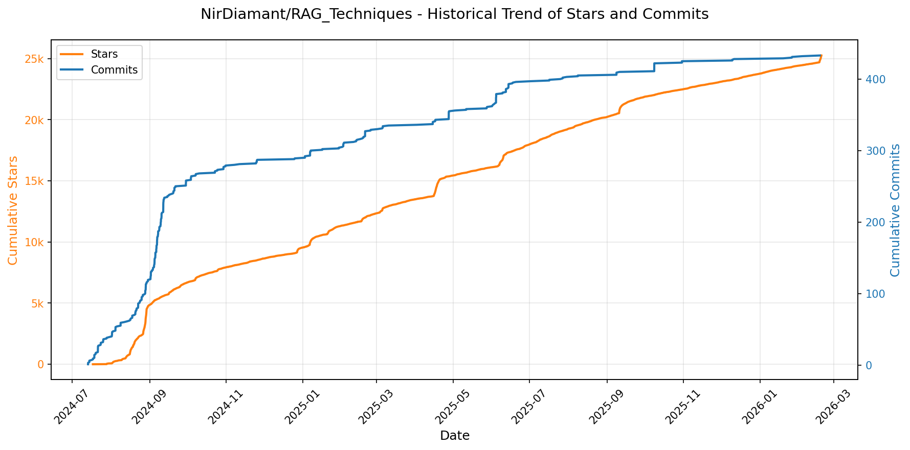
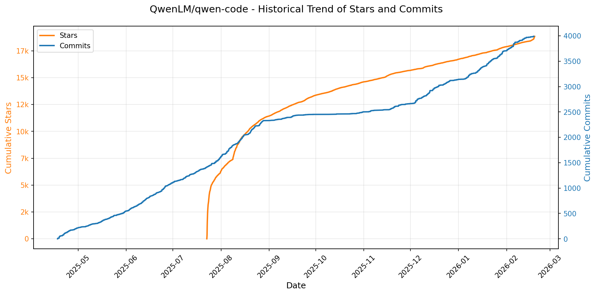
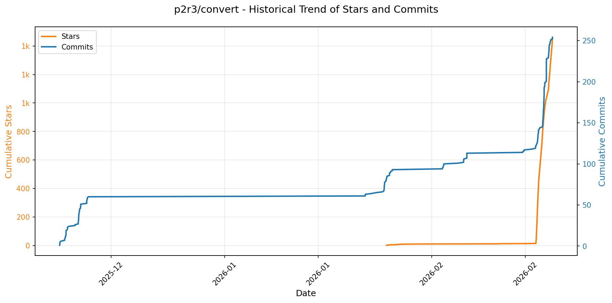

# 🌟 GitHub Trending 概览

> 数据更新于：2026-02-19

---

## 🔍 项目详情

### 1. [anthropics/skills](https://github.com/anthropics/skills)
- 📅 **创建日期**：2025-09-22  
- 🔄 **最近更新**：2026-02-19  
- ⭐ **Stars**：111,727（日 +418｜周 +3384｜月 +21214）  
- 📝 **描述**：Public repository for Agent Skills  

<b>📈 Star 与 Commit 历史趋势</b>

> *蓝色：累计 Stars｜橙色：累计 Commits（次 Y 轴）*

<b>📄 README 摘要</b>

1. **该项目的作用**  
该项目是 Anthropic 官方发布的 Claude 技能（Skills）参考实现仓库，旨在展示如何通过结构化、可复用的“技能包”扩展 Claude 的能力。每个技能是一个独立文件夹，内含 `SKILL.md`（含 YAML 元数据和自然语言指令），使 Claude 能动态加载并执行特定领域任务，如文档生成与解析（PDF/DOCX/PPTX/XLSX）、Web 应用测试、MCP 服务器构建、品牌内容创作、艺术设计辅助等。其核心目标是将专业工作流（企业规范、技术工具链、个人自动化）封装为可共享、可复用、可组合的 AI 能力单元，而非通用模型微调。

2. **关键特性**  
- **模块化与自包含**：每个技能为独立文件夹，含完整元数据（`name`/`description`）、指令逻辑、示例及使用指南，支持即插即用；  
- **多场景覆盖**：涵盖创意设计（AI绘画提示工程、音乐生成）、技术开发（前端测试、代码生成）、企业应用（合规邮件撰写、品牌文档自动化）及高阶文档处理（表单提取、格式转换、结构化编辑）；  
- **生产级参考实现**：公开 `skills/docx`、`skills/pdf` 等子目录，提供 Anthropic 实际用于 Claude 文档功能的源可用（source-available）技能代码，作为复杂技能开发范本；  
- **跨平台集成支持**：原生适配 Claude Code（插件市场安装）、Claude.ai（付费用户开箱即用）及 Claude API（支持上传自定义技能），实现统一技能分发与调用；  
- **标准化规范支撑**：配套 `./spec` 目录提供 Agent Skills 开放标准定义，确保技能生态的互操作性与可扩展性；  
- **开箱即用模板**：内置 `./template` 文件夹提供标准化技能创建模板，降低开发者入门门槛。

3. **技术栈**  
- **核心协议**：Agent Skills 开放标准（基于 YAML + Markdown 的轻量级技能描述协议，见 agentskills.io）；  
- **文件格式**：纯文本驱动，以 `SKILL.md` 为核心载体，YAML 前置元数据定义技能标识与用途，Markdown 主体承载指令、示例与约束规则；  
- **运行时依赖**：深度绑定 Anthropic 生态——依赖 Claude 模型的动态技能加载与上下文感知执行能力，不依赖独立后端服务或运行时环境；  
- **分发机制**：基于插件化架构（Claude Code Plugin Marketplace）、SaaS 平台集成（Claude.ai）及 API 接口（Claude API Skills Guide）实现技能部署；  
- **许可证**：多数示例技能采用 Apache 2.0 开源协议，文档类核心技能为源可用（source-available）非开源，明确区分教育参考与生产使用边界。

---

### 2. [openclaw/openclaw](https://github.com/openclaw/openclaw)
- 📅 **创建日期**：2025-11-24  
- 🔄 **最近更新**：2026-02-19  
- ⭐ **Stars**：94,711（日 +3530｜周 +23842｜月 +94711）  
- 📝 **描述**：Your own personal AI assistant. Any OS. Any Platform. The lobster way. 🦞   

<b>📈 Star 与 Commit 历史趋势</b>

> *蓝色：累计 Stars｜橙色：累计 Commits（次 Y 轴）*

<b>📄 README 摘要</b>

1. **项目功能**  
OpenClaw 是一个完全本地化、用户自托管的个人 AI 助手系统，核心目标是让用户在自有设备上运行一个**单用户、低延迟、始终在线、隐私优先**的 AI 交互环境。它不依赖中心化云服务，而是通过轻量级“网关”（Gateway）作为统一控制平面，将来自多种即时通讯平台（如 WhatsApp、Telegram、Slack、Discord、Signal、iMessage/BlueBubbles、Google Chat、Microsoft Teams、Matrix、Zalo 等）的消息统一接入，并交由本地 AI 代理（Agent）处理；同时支持跨平台语音唤醒（macOS/iOS/Android）、实时可视化画布（Live Canvas）、设备级操作（如截图、录屏、定位、通知、系统命令执行）及多通道协同响应。

2. **关键特性**  
- ✅ **多通道统一收件箱**：原生集成 14+ 主流通信平台（含 iMessage 替代方案 BlueBubbles、Zalo 等区域平台），支持 DM 配对鉴权与白名单机制，保障安全。  
- ✅ **本地优先架构**：所有会话状态、配置、媒体文件、技能（Skills）均默认存储于本地（`~/.openclaw/`），无强制云端同步。  
- ✅ **多智能体路由与隔离工作区**：支持按频道、账号或联系人路由至独立 Agent 实例（Workspace），实现会话隔离、模型/上下文/工具集差异化配置。  
- ✅ **全栈语音交互能力**：集成 ElevenLabs 实现 macOS/iOS/Android 端“常驻语音唤醒”（Voice Wake）与“对话模式”（Talk Mode），支持免触连续对话。  
- ✅ **Live Canvas 可视化工作空间**：基于 A2UI 协议的动态渲染画布，可由 AI 代理实时生成、更新 UI 元素（如表格、图表、表单），支持 macOS/iOS/Android 原生渲染。  
- ✅ **设备级节点（Nodes）扩展能力**：提供 macOS/iOS/Android 专用客户端节点，支持调用摄像头、屏幕录制、位置获取、系统命令（`system.run`）、通知等需本地权限的操作，并通过 `node.invoke` 安全桥接至网关。  
- ✅ **自动化与工具链深度集成**：内置浏览器控制（专属 Chromium + CDP）、Cron 定时任务、Webhook 接入、Gmail Pub/Sub、技能市场（ClawHub）、会话历史管理、上下文压缩、模型故障转移（failover）等企业级运维能力。  
- ✅ **安全默认策略**：DM 默认启用配对码机制（`dmPolicy="pairing"`），拒绝未授权输入；提供 `openclaw doctor` 自动检测配置风险；支持 Tailscale Serve/Funnel 远程访问（带身份头或密码认证），网关默认仅绑定回环地址。

3. **技术栈**  
- **运行时**：Node.js ≥22（主运行环境），支持 npm / pnpm / bun；TypeScript 编写，使用 `tsx` 直接运行源码。  
- **核心架构**：WebSocket 控制平面（Gateway），采用 RPC 模式驱动 Pi Agent 运行时；模块化设计，支持 CLI、Web UI、桌面/移动 App 多端接入。  
- **前端与 UI**：WebChat 和 Control UI 内嵌于 Gateway；Canvas 使用 A2UI 协议；macOS/iOS/Android App 均为原生客户端（Swift/Kotlin），通过 WebSocket 与网关通信。  
- **信道适配层**：复用成熟开源 SDK —— WhatsApp（Baileys）、Telegram（grammY）、Slack（Bolt）、Discord（discord.js）、Signal（signal-cli）、Matrix（matrix-js-sdk）等。  
- **语音与媒体**：语音合成/识别依赖 ElevenLabs API；音频处理、转录钩子、媒体生命周期管理（临时文件清理、尺寸限制）内建支持。  
- **部署与包管理**：提供 Nix（`nix-openclaw`）、Docker、systemd/launchd 守护进程、WSL2 兼容安装；支持 Tailscale 远程暴露与 SSH 隧道接入。  
- **安全与权限**：深度集成 macOS TCC 权限模型（屏幕录制、通知、定位等），通过 `node.invoke` 动态校验；支持 OAuth（Anthropic/OpenAI）与 API Key 双认证模式及自动轮换。

---

### 3. [obra/superpowers](https://github.com/obra/superpowers)
- 📅 **创建日期**：2025-10-09  
- 🔄 **最近更新**：2026-02-19  
- ⭐ **Stars**：83,458（日 +878｜周 +4672｜月 +24982）  
- 📝 **描述**：An agentic skills framework & software development methodology that works.  

<b>📈 Star 与 Commit 历史趋势</b>

> *蓝色：累计 Stars｜橙色：累计 Commits（次 Y 轴）*

<b>📄 README 摘要</b>

1. **该项目做什么？**  
Superpowers 是一个面向编程智能体（coding agents）的完整软件开发工作流增强系统。它不直接替代或重写代码，而是通过一套可组合、自动触发的“技能”（skills）和预设行为准则，对现有编码智能体（如 Claude Code、Cursor、Codex、OpenCode 等）进行深度赋能。其核心目标是将松散的、易偏离的 AI 编程行为，转变为结构化、可验证、符合工程最佳实践的协作式开发流程——从需求澄清、设计评审、TDD 实施、子智能体并行执行，到代码审查与分支收尾，全程强制执行标准化步骤，确保开发过程具备可追溯性、可审计性和工程严谨性。

2. **关键特性**  
- **全自动技能触发机制**：无需用户手动调用，智能体在每个开发阶段（如启动、设计、编码、测试、合并）前自动识别并激活对应技能；  
- **七步强约束工作流**：涵盖头脑风暴（Socratic 设计）、Git 工作树隔离、任务级精细化计划（含精确文件路径与验证步骤）、子智能体驱动开发（Subagent-Driven Development）、严格 TDD（RED-GREEN-REFACTOR + 测试先行+删预写代码）、自动化代码审查（按严重性阻断）、分支收尾决策（含测试验证与 PR/merge 选项）；  
- **工程哲学内嵌**：原生贯彻测试驱动开发（TDD）、YAGNI（你不会需要它）、DRY（避免重复）、系统性调试（四阶段根因分析）、防御性验证（fix 后必验证）等原则；  
- **协作增强能力**：支持多智能体并行任务分发、双向代码评审（发起与响应）、Git 工作树管理、设计文档自动生成与存档；  
- **可扩展技能生态**：内置「编写新技能」能力（`writing-skills`），提供标准化模板、测试方法与最佳实践指南，支持社区共建；  
- **跨平台即插即用**：原生适配 Claude Code、Cursor、Codex、OpenCode 四大主流 AI 编程平台，安装方式差异化但体验一致。

3. **技术栈**  
- **运行时环境**：依赖外部 AI 编程平台（Claude Code / Cursor / Codex / OpenCode）作为底层执行引擎与交互界面；  
- **核心架构**：基于声明式「技能（Skill）」模块化设计，每个技能为独立 Markdown 文档（如 `skills/test-driven-development/SKILL.md`），包含行为规范、触发条件、执行逻辑与验证规则；  
- **配置与分发**：使用平台专属插件机制（如 `/plugin install`）集成；通过 GitHub 仓库托管全部技能源码与安装脚本（`.codex/INSTALL.md`, `.opencode/INSTALL.md`）；  
- **版本与更新**：基于 Git 分支管理（`main` 主干），支持一键热更新（`/plugin update superpowers`）；  
- **协议与许可**：MIT 开源许可证，强调开放协作与可商用性。

---

### 4. [google/langextract](https://github.com/google/langextract)
- 📅 **创建日期**：2025-07-08  
- 🔄 **最近更新**：2026-02-19  
- ⭐ **Stars**：55,323（日 +185｜周 +2625｜月 +10534）  
- 📝 **描述**：A Python library for extracting structured information from unstructured text using LLMs with precise source grounding and interactive visualization.  

<b>📈 Star 与 Commit 历史趋势</b>

> *蓝色：累计 Stars｜橙色：累计 Commits（次 Y 轴）*

<b>📄 README 摘要</b>

1. **项目功能**  
LangExtract 是一个基于大语言模型（LLM）的 Python 库，专注于从**非结构化文本**（如临床病历、放射报告、文学作品等）中**高精度提取结构化信息**。其核心能力是依据用户定义的指令和少量示例（few-shot examples），自动识别并组织关键实体（如人物、情绪、药物名称、剂量、关系等），同时严格保证所有提取结果均**可追溯至原文中的精确位置**（source grounding），支持长文档端到端处理与交互式验证。

2. **关键特性**  
- ✅ **精准溯源定位**：为每个提取结果标注其在原始文本中的确切字符偏移量，支持可视化高亮与人工核查；  
- ✅ **强结构化输出保障**：通过受控生成（如 Gemini 的 schema 约束）与示例驱动机制，强制模型输出符合预定义字段和格式的 JSON 结构化数据；  
- ✅ **长文档优化处理**：采用智能分块（chunking）、多轮提取（up to 3+ passes）、并行处理（`max_workers` 可调）及上下文缓冲优化（`max_char_buffer`），显著提升大规模文本（如整本小说、完整医学报告）的召回率与准确率；  
- ✅ **开箱即用的交互式可视化**：一键生成自包含、可搜索、带动画高亮的 HTML 文件，支持数千级实体在原文语境中实时浏览与审核；  
- ✅ **多模型灵活适配**：原生支持 Google Gemini（推荐 `gemini-2.5-flash`）、OpenAI（GPT-4o）、本地 Ollama 模型（如 `gemma2:2b`），且提供插件化架构，允许第三方无缝接入自定义 LLM 提供商；  
- ✅ **零微调领域自适应**：仅需提供 1–3 个高质量、原文直引（verbatim）、按序排列的示例，即可快速适配任意垂直领域（医疗、法律、文学分析等），无需模型训练或微调；  
- ✅ **生产就绪扩展能力**：支持 Vertex AI 批处理（降低成本）、Docker 部署、环境变量/.env 安全密钥管理、以及社区驱动的 Provider 插件生态。

3. **技术栈**  
- **编程语言**：Python 3.10+（核心实现）；  
- **核心依赖**：`google-generativeai`（Gemini）、`openai`（可选，需 `langextract[openai]`）、`ollama`（本地模型）、`pydantic`（数据验证与 schema 管理）、`rich`（CLI 输出）、`jinja2`（HTML 可视化模板）；  
- **开发与工程工具**：`pyproject.toml`（现代打包）、`pytest` + `tox`（跨版本测试）、`pre-commit` + `isort` + `pyink`（代码格式化）、`pylint`（静态检查）、`Docker`（容器化部署）；  
- **部署与集成**：支持 API Key 环境变量/`.env` 配置、Vertex AI 服务账号认证、Ollama 本地 HTTP 接口（`http://localhost:11434`）、Hugging Face Spaces 在线 Demo（RadExtract）；  
- **许可证**：Apache 2.0 开源协议。

---

### 5. [remotion-dev/remotion](https://github.com/remotion-dev/remotion)
- 📅 **创建日期**：2020-06-23  
- 🔄 **最近更新**：2026-02-19  
- ⭐ **Stars**：37,183（日 +145｜周 +931｜月 +11820）  
- 📝 **描述**：🎥      Make videos programmatically with React  

<b>📈 Star 与 Commit 历史趋势</b>

> *蓝色：累计 Stars｜橙色：累计 Commits（次 Y 轴）*

<b>📄 README 摘要</b>

1. **项目功能**  
Remotion 是一个基于 React 的视频生成框架，允许开发者使用 React 组件、JavaScript 逻辑和 Web 技术（如 CSS、SVG、Canvas、WebGL）**以编程方式动态创建视频**。它将视频视为“可渲染的 React 应用”，支持时间轴控制、帧精确渲染、动态内容生成（如数据驱动动画、个性化视频），并可导出为 MP4、GIF 或 WebM 等格式，适用于制作营销视频、数据可视化、年度回顾（如 GitHub Unwrapped）、教程动画等场景。

2. **核心特性**  
- ✅ **React 原生开发体验**：支持函数组件、Hooks、Props、Context、组件复用与组合；集成 Fast Refresh 实现热重载。  
- ✅ **时间轴驱动动画**：提供 `useCurrentFrame`、`interpolate`、`spring` 等 API，实现基于帧号的精确动画控制与物理动效。  
- ✅ **多目标输出**：一键导出高清 MP4（H.264）、GIF、WebM，支持自定义分辨率、帧率、码率及音频混合。  
- ✅ **服务端渲染（SSR）支持**：可在 Node.js 环境中无头渲染视频（基于 Chromium），适配 CI/CD 和后端批量生成。  
- ✅ **开发友好工具链**：内置本地预览服务器（带时间轴调试器）、CLI 工具（`npx create-video`）、TypeScript 全面支持、详尽文档与 API 参考。  
- ✅ **生态扩展能力**：兼容 npm 生态包，支持自定义 React 组件库、第三方 Canvas/WebGL 库（如 Three.js、PixiJS）集成。

3. **技术栈**  
- **核心框架**：React（v18+），基于 React Server Components（RSC）理念构建，深度依赖 React 渲染生命周期与时序模型。  
- **渲染引擎**：基于 Chromium（通过 Puppeteer / Playwright 封装），利用其 HTML/CSS/Canvas/WebGL 渲染能力进行帧捕获。  
- **构建与工具链**：Vite（默认构建工具）、ESBuild（快速打包）、TypeScript（强类型支持）、Jest（测试）、GitHub Actions（CI）。  
- **运行时依赖**：Node.js（≥18.x），需系统级 Chromium 或自动下载 Headless Chrome。  
- **部署与扩展**：支持本地开发、Vercel/Netlify 静态托管（预览页）、AWS Lambda / Cloudflare Workers（Serverless 视频生成）。

---

### 6. [asgeirtj/system_prompts_leaks](https://github.com/asgeirtj/system_prompts_leaks)
- 📅 **创建日期**：2025-05-03  
- 🔄 **最近更新**：2026-02-19  
- ⭐ **Stars**：32,029（日 +122｜周 +889｜月 +6915）  
- 📝 **描述**：Collection of extracted System Prompts from popular chatbots like ChatGPT, Claude & Gemini  

<b>📈 Star 与 Commit 历史趋势</b>

> *蓝色：累计 Stars｜橙色：累计 Commits（次 Y 轴）*

---

### 7. [thedotmack/claude-mem](https://github.com/thedotmack/claude-mem)
- 📅 **创建日期**：2025-08-31  
- 🔄 **最近更新**：2026-02-19  
- ⭐ **Stars**：29,337（日 +241｜周 +1849｜月 +14756）  
- 📝 **描述**：A Claude Code plugin that automatically captures everything Claude does during your coding sessions, compresses it with AI (using Claude's agent-sdk), and injects relevant context back into future sessions.  

<b>📈 Star 与 Commit 历史趋势</b>

> *蓝色：累计 Stars｜橙色：累计 Commits（次 Y 轴）*

<b>📄 README 摘要</b>

1. **项目功能**  
Claude-Mem 是一个专为 Anthropic Claude Code（AI 编程助手）设计的**持久化记忆压缩系统**。它在用户每次会话结束后自动捕获工具调用行为、代码操作、错误信息等关键观测数据（observations），生成语义化摘要，并将其结构化存储。当新会话启动时，系统能智能检索并注入相关历史上下文，使 Claude 能够“记住”项目进展、技术决策、调试过程和知识沉淀，实现跨会话的**上下文连续性与知识延续性**，显著提升 AI 编程助手的长期协作能力。

2. **核心特性**  
- ✅ **持久化记忆**：会话结束后仍保留项目上下文，重启即恢复认知连续性；  
- ✅ **渐进式披露（Progressive Disclosure）**：分三层按需加载记忆（索引 → 时间线 → 详情），实时显示 token 消耗，优化成本与效率；  
- ✅ **技能化搜索（mem-search）**：集成自然语言查询能力，支持按类型（如 `bugfix`）、时间、项目名等多维过滤；  
- ✅ **本地 Web 查看器（http://localhost:37777）**：提供实时记忆流、观察详情、ID 引用、API 接口（如 `/api/observation/{id}`）及设置面板；  
- ✅ **Claude Desktop 技能支持**：可在桌面版对话中直接调用 `search`/`timeline` 等 MCP 工具；  
- ✅ **隐私保护机制**：支持 `<private>` 标签自动排除敏感内容（如密钥、日志片段）；  
- ✅ **全自动运行**：无需手动触发，通过 6 个生命周期钩子（SessionStart、PostToolUse、SessionEnd 等）静默采集与处理；  
- ✅ **混合搜索架构**：融合 SQLite FTS5 全文检索 + Chroma 向量数据库，兼顾关键词精准性与语义相关性；  
- ✅ **MCP 标准兼容工具集**：提供 5 个标准化 MCP 工具（`search`, `timeline`, `get_observations`, `save_memory`, `__IMPORTANT`），遵循 token 高效的三阶段工作流；  
- ✅ **Beta 实验通道**：支持切换至 Endless Mode 等前沿特性（仿生长时记忆架构）。

3. **技术栈**  
- **运行时**：Node.js（≥18.0.0）、Bun（作为 HTTP Worker 服务管理器与进程守护）、uv（Python 包管理器，用于 Chroma 向量库依赖）；  
- **数据库**：SQLite 3（嵌入式，含 FTS5 全文搜索支持）+ Chroma（轻量级向量数据库，用于语义检索）；  
- **前端**：静态 Web UI（基于 HTML/CSS/JS，托管于本地 `:37777` 端口）；  
- **协议与标准**：完全兼容 [MCP（Model Context Protocol）](https://modelcontextprotocol.org/) 规范，实现与 Claude Code 的深度插件集成；  
- **开发语言**：TypeScript（主逻辑）、Shell（安装脚本）、Python（Chroma 后端）；  
- **构建与部署**：使用 `npm` / `bun` 管理包与插件注册，OpenClaw 网关一键部署脚本（`curl -fsSL https://install.cmem.ai/openclaw.sh | bash`）；  
- **许可证**：主体代码采用 **AGPL-3.0**（强调网络服务场景下的源码可得性），`ragtime/` 子模块采用 **PolyForm Noncommercial License 1.0.0**。

---

### 8. [ComposioHQ/composio](https://github.com/ComposioHQ/composio)
- 📅 **创建日期**：2024-02-23  
- 🔄 **最近更新**：2026-02-19  
- ⭐ **Stars**：26,765（日 +159｜周 +249｜月 +457）  
- 📝 **描述**：Composio powers 1000+ toolkits, tool search, context management, authentication, and a sandboxed workbench to help you build AI agents that turn intent into action.  

<b>📈 Star 与 Commit 历史趋势</b>

> *蓝色：累计 Stars｜橙色：累计 Commits（次 Y 轴）*

<b>📄 README 摘要</b>

1. **项目功能**  
Composio SDK 是一个面向 AI Agent（智能体）开发的工具集成平台，旨在为各类大模型智能体框架提供统一、标准化的外部工具（Tool）接入能力。它本身不直接运行模型或执行业务逻辑，而是作为“技能中枢”，将 500+ 第三方应用（如 Hacker News、Gmail、Slack、GitHub、Notion 等）的 API 封装为可被 Agent 调用的结构化工具，并通过标准化接口（如 OpenAPI）动态加载、分发与管理。其核心价值在于：让 Agent 能够“自主调用真实世界服务”，实现从对话到实际操作（如发邮件、查新闻、创建任务）的闭环。

2. **关键特性**  
- ✅ **多框架无缝集成**：原生支持 OpenAI Agents、Anthropic、LangChain、LangGraph、LlamaIndex、CrewAI、AutoGen、Google Gemini/ADK 等主流 AI 开发框架（TS/Python 双端覆盖，部分框架仅单语言支持）。  
- ✅ **开箱即用的工具集（Toolkits）**：预置丰富工具包（如 `HACKERNEWS`），支持按需动态获取、组合与授权（基于 `userId` 的细粒度权限控制）。  
- ✅ **跨语言双 SDK 架构**：提供完整、类型安全的 TypeScript SDK（支持 Node.js 与浏览器）和 Python SDK（兼容 3.10+），API 设计高度一致。  
- ✅ **可扩展的 Provider 体系**：开放自定义 Provider 接口，允许开发者轻松接入任意未官方支持的 AI 框架或运行时环境。  
- ✅ **MCP 协议支持与 Rube 生态联动**：通过 Rube（基于 Composio 构建的 Model Context Protocol 服务器），实现与 Cursor、Claude Desktop、VS Code 等 MCP 客户端的即插即用集成，一次认证、多端复用。  
- ✅ **自动化文档与规范同步**：内置 `pnpm api:pull` 命令自动拉取并更新后端 OpenAPI 规范，保障 SDK 与服务端接口实时一致。

3. **技术栈**  
- **核心语言**：TypeScript（主 SDK 及工具链）、Python（主 SDK）  
- **前端/运行时支持**：Node.js、浏览器环境（TS SDK）；CPython 3.10+（Python SDK）  
- **构建与工程化**：PNPM（包管理）、Fern（OpenAPI 代码生成与文档生成）、Vercel（部署参考）、Cloudflare Workers（AI 运行时支持）  
- **协议标准**：OpenAPI 3.0（接口描述）、Model Context Protocol (MCP)（与 AI 客户端通信）  
- **基础设施依赖**：Composio 后端服务（`backend.composio.dev`）、第三方 SaaS API（通过工具包抽象）  
- **辅助工具链**：Zod（JSON Schema 校验与类型推导）、TS Builders（TypeScript 工程化构建支持）

---

### 9. [ChromeDevTools/chrome-devtools-mcp](https://github.com/ChromeDevTools/chrome-devtools-mcp)
- 📅 **创建日期**：2025-09-11  
- 🔄 **最近更新**：2026-02-19  
- ⭐ **Stars**：26,033（日 +122｜周 +1953｜月 +4436）  
- 📝 **描述**：Chrome DevTools for coding agents  

<b>📈 Star 与 Commit 历史趋势</b>

> *蓝色：累计 Stars｜橙色：累计 Commits（次 Y 轴）*

<b>📄 README 摘要</b>

1. **项目功能**  
`chrome-devtools-mcp` 是一个 Model-Context-Protocol（MCP）标准兼容的服务端实现，旨在让 AI 编程助手（如 Gemini、Claude、Cursor、Copilot、Codex 等）通过标准化协议**安全、可靠地控制和深度检测正在运行的 Chrome 浏览器实例**。它桥接大模型与 Chrome DevTools 原生能力，使 AI 能够执行真实浏览器环境下的自动化操作、性能分析、网络调试与前端诊断，从而支撑高保真度的网页测试、可解释性调试及智能开发辅助。

2. **核心特性**  
- **性能深度洞察**：集成 Chrome DevTools 前端，支持录制性能轨迹（trace），自动提取关键性能瓶颈，并可选调用 Google CrUX API 获取真实用户（field）性能数据，实现实验室数据（lab）与现场数据（field）融合分析；  
- **高级调试能力**：提供完整的浏览器上下文访问，包括捕获带源码映射（source-mapped）的控制台日志、枚举/查询网络请求、截取全屏或元素级截图、执行任意 JavaScript 脚本、生成堆快照等；  
- **高可靠性自动化**：基于 Puppeteer 实现健壮的浏览器操作（如点击、表单填充、拖拽、文件上传、页面导航、弹窗处理等），并自动等待 DOM 状态就绪、网络请求完成或页面加载结束，显著提升自动化稳定性；  
- **模块化工具体系**：按功能域组织 26+ 个细粒度 MCP 工具，覆盖输入交互（8）、导航控制（6）、设备/视口模拟（2）、性能分析（3）、网络监控（2）、调试诊断（5），支持按需启用/禁用类别（如 `--category-performance=false`）；  
- **灵活部署与集成**：支持连接已运行的 Chrome 实例（通过 `--browser-url` 或 `--ws-endpoint`），也支持自动启动隔离沙箱浏览器（含用户数据目录管理、多频道支持如 Canary/Beta）；原生适配主流 MCP 客户端（VS Code/Copilot、Cursor、Gemini、Claude、JetBrains、Warp 等），提供一键安装配置。

3. **技术栈**  
- **运行时**：Node.js（≥ v20.19 LTS）；  
- **浏览器引擎**：Google Chrome（当前稳定版或更新版本），通过 Chrome DevTools Protocol（CDP）通信；  
- **底层驱动**：Puppeteer（用于浏览器启动、生命周期管理及基础自动化）；  
- **协议标准**：Model-Context-Protocol（MCP）v0.x，遵循 JSON-RPC 2.0 规范；  
- **开发与构建**：npm 包管理，TypeScript（隐含于项目结构与类型化 CLI 参数中）；  
- **扩展能力**：集成 Chrome User Experience Report（CrUX）API（可选）、支持自定义 WebSocket 头、代理配置、Chrome 启动参数透传等企业级部署特性。

---

### 10. [NirDiamant/RAG_Techniques](https://github.com/NirDiamant/RAG_Techniques)
- 📅 **创建日期**：2024-07-13  
- 🔄 **最近更新**：2026-02-19  
- ⭐ **Stars**：25,256（日 +352｜周 +661｜月 +1062）  
- 📝 **描述**：This repository showcases various advanced techniques for Retrieval-Augmented Generation (RAG) systems. RAG systems combine information retrieval with generative models to provide accurate and contextually rich responses.  

<b>📈 Star 与 Commit 历史趋势</b>

> *蓝色：累计 Stars｜橙色：累计 Commits（次 Y 轴）*

<b>📄 README 摘要</b>

1. **项目功能**  
该项目是一个面向检索增强生成（RAG）技术的综合性开源知识库与实践指南，旨在系统性地提升RAG系统的准确性、上下文相关性、鲁棒性与可解释性。它不提供独立运行的软件产品，而是通过结构化、可执行的Jupyter Notebook教程，覆盖RAG全生命周期的关键环节——从基础搭建（如简单RAG、CSV数据源接入）到前沿优化（如Agentic RAG、Graph RAG、多模态RAG），再到评估（DeepEval、GroUSE）、可解释性（Explainable Retrieval）和迭代增强（自适应/反馈驱动检索）。其核心价值在于为研究人员与工程师提供即学即用、经验证的高级RAG技术实现方案。

2. **关键特性**  
- ✅ **全覆盖技术分类体系**：按功能维度精细划分六大类（基础RAG、查询增强、上下文增强、高级检索、迭代技术、评估与可解释性），并标注技术成熟度（如🌱基础、🚀进阶、🔬前沿）；  
- ✅ **开箱即用的实践资源**：所有30+项技术均提供GitHub源码链接及Google Colab可交互运行环境，支持零配置快速验证；  
- ✅ **工业级工程导向**：强调可靠性（Reliable RAG）、生产适配（如分块策略优化、上下文窗口增强、文档增强）及性能调优（融合检索、重排序、多面过滤）；  
- ✅ **社区共建与持续演进**：明确鼓励PR贡献，配套Discord/Reddit/LinkedIn等多渠道协作生态，并承诺“定期更新最新进展”；  
- ✅ **跨框架兼容性**：教程广泛集成主流工具链（LangChain、Contextual AI、Microsoft GraphRAG等），体现技术中立性与生态互操作性。

3. **技术栈**  
- **核心框架**：LangChain（用于构建RAG流水线与Graph RAG实现）、LlamaIndex（隐含于部分语义分块/检索逻辑）；  
- **检索与向量数据库**：依赖外部向量检索服务（如Contextual AI平台）、通用嵌入模型（HyDE/HyPE需调用文本嵌入API）；  
- **评估工具**：DeepEval、GroUSE（专用RAG评估框架）；  
- **部署与执行环境**：Jupyter Notebook（GitHub托管 + Colab云端运行）、Python（底层实现语言）；  
- **辅助技术**：Markdown文档组织、GitHub Pages/Colab渲染、Substack邮件系统（用于内容分发）。  
（注：项目本身为教程集合，未强制绑定特定数据库或LLM后端，强调方法论而非封闭技术栈。）

---

### 11. [iOfficeAI/AionUi](https://github.com/iOfficeAI/AionUi)
- 📅 **创建日期**：2025-08-07  
- 🔄 **最近更新**：2026-02-19  
- ⭐ **Stars**：22,499（日 +237｜周 +1570｜月 +9827）  
- 📝 **描述**：Free, local, open-source 24/7 Cowork app and OpenClaw for Gemini CLI, Claude Code, Codex, OpenCode, Qwen Code, Goose CLI, Auggie, and more | 🌟 Star if you like it!  

<b>📈 Star 与 Commit 历史趋势</b>

> *蓝色：累计 Stars｜橙色：累计 Commits（次 Y 轴）*

---

### 12. [VectifyAI/PageIndex](https://github.com/VectifyAI/PageIndex)
- 📅 **创建日期**：2025-04-01  
- 🔄 **最近更新**：2026-02-19  
- ⭐ **Stars**：20,313（日 +87｜周 +705｜月 +9930）  
- 📝 **描述**：📑 PageIndex: Document Index for Vectorless, Reasoning-based RAG  

<b>📈 Star 与 Commit 历史趋势</b>

> *蓝色：累计 Stars｜橙色：累计 Commits（次 Y 轴）*

<b>📄 README 摘要</b>

1. **项目功能**  
PageIndex 是一个**无需向量数据库、不依赖文本分块**的新型检索增强生成（RAG）系统，专为**长篇专业文档**（如财报、法律文书、技术手册、学术教材等）设计。它通过构建语义化的**分层树状索引**（类似智能目录），并利用大语言模型（LLM）在该索引上执行**推理式树搜索**，实现类人、可解释、高精度的知识检索与上下文提取，从根本上替代传统基于语义相似度的向量检索范式。

2. **核心特性**  
- ✅ **零向量数据库（Vectorless）**：完全摒弃向量嵌入与近似最近邻（ANN）搜索，避免“vibe retrieval”（凭感觉匹配）导致的相关性偏差；  
- ✅ **零人工分块（No Chunking）**：基于文档天然结构（标题层级、语义段落）自动组织内容，保留上下文完整性与逻辑连贯性；  
- ✅ **推理驱动检索（Reasoning-based Retrieval）**：模拟人类专家阅读行为，通过多步逻辑推理（如“先定位章节→再聚焦子节→最后验证细节”）导航树索引，实现精准、可追溯的检索；  
- ✅ **强可解释性与可审计性**：每一步检索均生成带页码/节点ID/摘要的推理链，支持结果溯源与人工验证；  
- ✅ **原生支持视觉输入（Vision-native）**：提供OCR-Free方案，可直接对PDF页面图像进行推理式RAG，跳过传统OCR环节；  
- ✅ **高性能实证验证**：在金融领域权威基准 FinanceBench 上达成 **98.7% 准确率**，显著超越主流向量RAG方案。

3. **技术栈**  
- **核心模型层**：依赖 OpenAI 系列大模型（默认 `gpt-4o-2024-11-20`）执行树索引构建与推理搜索；  
- **文档解析层**：支持 PDF（基于 PyPDF2/fitz 等库解析文本结构）与 Markdown（按 `#` 标题层级解析）；  
- **索引结构**：自研轻量级 JSON 树形数据结构（含 `node_id`、`start_index`/`end_index`、`summary`、嵌套 `nodes` 等字段），兼顾语义表达与LLM友好性；  
- **部署与集成**：提供开源 CLI 工具（Python）、Colab Notebook 快速体验、RESTful API（Beta）、MCP 协议插件（兼容 Claude/Cursor 等智能体平台），以及云服务（chat.pageindex.ai）和企业私有化部署选项；  
- **辅助能力**：配套 PageIndex OCR（专为长文档结构保真设计的端到端OCR模型，非本仓库核心但属生态关键组件）。

---

### 13. [KeygraphHQ/shannon](https://github.com/KeygraphHQ/shannon)
- 📅 **创建日期**：2025-09-27  
- 🔄 **最近更新**：2026-02-19  
- ⭐ **Stars**：20,272（日 +237｜周 +2843｜月 +16519）  
- 📝 **描述**：Fully autonomous AI hacker to find actual exploits in your web apps. Shannon has achieved a 96.15% success rate on the hint-free, source-aware XBOW Benchmark.  

<b>📈 Star 与 Commit 历史趋势</b>

> *蓝色：累计 Stars｜橙色：累计 Commits（次 Y 轴）*

<b>📄 README 摘要</b>

1. **项目功能**  
Shannon 是一个面向源代码的全自动 AI 渗透测试工具，专为白盒（white-box）Web 应用安全测试设计。它不只静态扫描或生成告警，而是**自主完成端到端渗透流程**：从分析目标应用的源代码、智能识别攻击面，到通过内置浏览器真实执行漏洞利用（如 SQL 注入、XSS、SSRF、认证/授权绕过等），最终生成含可复现 PoC 的验证性报告，切实证明漏洞的可利用性与真实风险。

2. **核心特性**  
- **全自主渗透流程**：单命令启动，自动处理复杂登录（含 2FA/TOTP、Google 登录）、页面导航、状态跟踪与结果聚合，全程零人工干预；  
- **验证即报告（Exploit-to-Report）**：输出聚焦于**已成功复现的高危漏洞**，每项发现均附带可一键复制粘贴的 PoC 脚本，彻底消除误报；  
- **源码感知的动态测试**：深度融合源代码分析（指导攻击策略）与运行时动态 exploitation（浏览器 + CLI），实现“理解代码 → 构造攻击 → 实际触发”的闭环；  
- **多工具协同侦察**：集成 Nmap、Subfinder、WhatWeb、Schemathesis 等专业安全工具，增强目标环境测绘与接口发现能力；  
- **并行化高效执行**：对不同漏洞类型（注入、XSS 等）的分析与利用阶段并行调度，显著缩短测试周期；  
- **工作区与断点续跑**：支持命名工作区（Workspace），基于 Git 提交做任务检查点，失败后可精准恢复未完成环节，避免重复耗时操作。

3. **技术栈**  
- **AI 引擎**：以 Anthropic Claude（推荐）为核心推理模型，深度集成 Anthropic Agent SDK；支持实验性接入 OpenAI（GPT-5.2）、Google Gemini（经 OpenRouter）；  
- **架构框架**：基于 Temporal.io 构建多智能体（Multi-Agent）工作流引擎，实现任务编排、状态持久化与可视化监控（Temporal Web UI）；  
- **运行环境**：全容器化设计，依赖 Docker 运行；支持 Linux/macOS 原生部署及 Windows（WSL2 + Docker Desktop）；  
- **安全工具链**：集成 Nmap（网络扫描）、Subfinder（子域名发现）、WhatWeb（指纹识别）、Schemathesis（API 模糊测试）；  
- **基础设施**：前端交互层为 CLI 工具（`./shannon` 脚本），日志与报告输出结构化存储，配置通过 YAML 文件驱动（支持认证流程、路径聚焦/规避规则等）。

---

### 14. [harvard-edge/cs249r_book](https://github.com/harvard-edge/cs249r_book)
- 📅 **创建日期**：2023-09-06  
- 🔄 **最近更新**：2026-02-19  
- ⭐ **Stars**：19,762（日 +680｜周 +1612｜月 +2636）  
- 📝 **描述**：Introduction to Machine Learning Systems  

<b>📈 Star 与 Commit 历史趋势</b>

> *蓝色：累计 Stars｜橙色：累计 Commits（次 Y 轴）*

<b>📄 README 摘要</b>

1. **该项目做什么？**  
该项目是一个面向人工智能系统工程（AI Engineering）的开源教育项目，旨在将“构建AI系统”从单纯的模型开发提升为一门严谨的工程学科。它提供一套完整的、理论与实践深度融合的学习体系，覆盖机器学习系统全生命周期——从原理理解、框架实现、性能优化到真实硬件部署与可信治理。核心目标是培养能设计、构建、评估并可靠部署端到端智能系统的工程师，弥合当前AI研究与工业级工程实践之间的鸿沟。

2. **关键特性**  
- **三位一体学习栈（READ–BUILD–DEPLOY）**：  
  - **READ**：交互式在线教材《Machine Learning Systems》（含中/日/韩多语种），系统讲授ML与系统交叉知识（如内存约束下的模型部署、硬件加速原理、MLOps、隐私保护、可持续AI等）；  
  - **BUILD**：轻量级教学框架 **TinyTorch**，支持从零实现自动微分、优化器、CNN、Transformer等核心组件，深度理解主流框架（PyTorch/TensorFlow）底层机制；  
  - **DEPLOY**：配套**硬件实验套件**（支持Arduino、Raspberry Pi等边缘设备），开展受真实资源约束（内存、功耗、时序、安全性）的端侧部署实验。  
- **闭环教学验证体系**：规划中的 **AI Olympics（2026上线）** 提供跨软件、框架、硬件赛道的公开基准测试与竞赛，用于检验综合工程能力。  
- **活教材（Living Textbook）模式**：持续更新内容，依托“研究→实现→评测→教学”闭环，将前沿研究成果（如MLPerf基准、TinyML实践）快速转化为可复现的教学模块与工具。  
- **开放共建生态**：完全开源，支持社区贡献教材、TinyTorch模块及硬件实验，并通过Open Collective透明资助教育普惠（如为资源匮乏课堂提供硬件套件）。

3. **技术栈**  
- **内容层**：Markdown + LaTeX（教材源码）、HTML/CSS/JS（交互式在线阅读平台 mlsysbook.ai）；  
- **软件框架层**：**Python**（TinyTorch 主要实现语言），强调可读性与教学性，不依赖复杂C++后端，聚焦核心算法与系统逻辑；  
- **硬件层**：跨平台嵌入式支持，包括 **Arduino（C/C++）**、**Raspberry Pi（Linux + Python/C）** 及其他边缘计算设备，涉及裸机编程、RTOS、传感器接口、低功耗优化等；  
- **基础设施**：GitHub Actions（自动化构建与验证教材、TinyTorch代码）、GitBook/Jupyter-like 工具链（内容发布）、PDF/EPUB导出工具；  
- **许可模型**：教材采用 **CC BY-NC-ND 4.0**（非商业、禁止演绎），确保教育公益性；TinyTorch代码采用 **Apache 2.0**（允许自由使用、修改、商用），兼顾教学开放性与工程实用性。

---

### 15. [QwenLM/qwen-code](https://github.com/QwenLM/qwen-code)
- 📅 **创建日期**：2025-06-26  
- 🔄 **最近更新**：2026-02-19  
- ⭐ **Stars**：18,845（日 +278｜周 +544｜月 +1457）  
- 📝 **描述**：An open-source AI agent that lives in your terminal.  

<b>📈 Star 与 Commit 历史趋势</b>

> *蓝色：累计 Stars｜橙色：累计 Commits（次 Y 轴）*

<b>📄 README 摘要</b>

1. **项目功能**  
Qwen Code 是一个开源的终端原生 AI 智能体（AI agent），专为开发者设计，深度适配 Qwen3-Coder 系列代码大模型（如 `qwen3-coder-plus`、`qwen3.5-plus`）。它直接运行于命令行中，核心能力包括：理解大型代码库结构、自动化重复性开发任务（如代码解释、重构、单元测试生成）、辅助技术决策，并支持在本地项目上下文中进行精准、上下文感知的交互式编程协作。用户可通过自然语言指令（如“解释这个模块的架构”“为该函数生成 Jest 测试”）驱动其完成端到端开发工作流。

2. **关键特性**  
- **多协议认证与灵活模型接入**：原生支持 OpenAI / Anthropic / Google Gemini 兼容 API；同时提供 Qwen OAuth 免费登录（每日 1000 次调用），并支持阿里云 Bailian、DashScope、OpenRouter 等主流平台。  
- **全栈开源与协同演进**：框架本身与底层 Qwen3-Coder 模型均完全开源，版本同步发布、共同迭代，确保能力与优化实时对齐。  
- **完整智能体工作流（Agentic Workflow）**：内置 Skills（技能）、SubAgents（子智能体）等高级工具机制，支持复杂任务分解、自主规划与多步执行，提供媲美 Claude Code 的专业编码体验。  
- **终端优先，生态兼容**：以 CLI 为核心交互形态；同时提供官方 VS Code、Zed 和 JetBrains IDE 插件，实现无缝编辑器集成；另支持 Headless 模式（脚本/CI 自动化）及 TypeScript SDK 二次开发。  
- **精细化配置与安全管控**：通过 `~/.qwen/settings.json` 统一管理多模型、多提供商配置；支持环境变量、`.env` 文件分级密钥管理；强调安全实践（如禁止密钥提交至 Git）。

3. **技术栈**  
- **运行时**：Node.js ≥ 20（强制要求）  
- **核心语言**：TypeScript（全栈强类型开发）  
- **打包与分发**：npm（`@qwen-code/qwen-code` 包）、Homebrew（macOS/Linux）、自定义 Shell/Batch 安装脚本  
- **配置体系**：JSON 配置文件（`settings.json`）+ 环境变量 + CLI 参数三层覆盖机制  
- **协议层**：OpenAI-compatible REST API、Anthropic API、Google Generative AI API、Vertex AI 等多协议抽象适配  
- **扩展生态**：提供独立 `sdk-typescript` 包供开发者集成；GUI 方向由社区项目 AionUi、Gemini CLI Desktop 等延伸支持。

---

### 16. [gsd-build/get-shit-done](https://github.com/gsd-build/get-shit-done)
- 📅 **创建日期**：2025-12-14  
- 🔄 **最近更新**：2026-02-19  
- ⭐ **Stars**：15,840（日 +466｜周 +2654｜月 +10840）  
- 📝 **描述**：A light-weight and powerful meta-prompting, context engineering and spec-driven development system for Claude Code and OpenCode.  

<b>📈 Star 与 Commit 历史趋势</b>

> *蓝色：累计 Stars｜橙色：累计 Commits（次 Y 轴）*

<b>📄 README 摘要</b>

1. **项目功能**  
该项目是一个轻量级但功能强大的元提示（meta-prompting）、上下文工程（context engineering）与规范驱动开发（spec-driven development）系统，专为 **Claude Code、OpenCode 和 Gemini CLI** 三大 AI 编程环境设计。其核心目标是解决“上下文腐化”（context rot）问题——即随着 Claude 等模型持续填充上下文窗口而导致的响应质量显著下降。GSD 通过结构化工作流，在不增加用户认知负担的前提下，让 AI 稳定、可靠、可验证地完成端到端软件开发任务：从需求澄清、技术调研、分阶段规划，到并行执行、原子化提交、人工验收测试（UAT），最终交付可运行、可追溯、符合预期的代码成果。

2. **关键特性**  
- ✅ **上下文防腐机制**：全程避免上下文膨胀，每个子任务均在独立的 200k token 新鲜上下文中执行，主会话始终保持轻量（30–40% 占用）。  
- ✅ **六步闭环工作流**：`new-project → discuss-phase → plan-phase → execute-phase → verify-work → complete-milestone`，每阶段生成标准化文档（如 `CONTEXT.md`、`PLAN.md`、`SUMMARY.md`、`UAT.md`），支持可审计、可复现的开发过程。  
- ✅ **智能波次执行（Wave Execution）**：自动识别任务依赖关系，将计划分组为并行“波次”（wave），实现高并发、低冲突的代码生成（如垂直切片优先于水平分层）。  
- ✅ **原子化 Git 提交**：每个子任务生成独立、语义清晰的 commit（含时间戳与任务摘要），支持精准 bisect、一键回滚与历史可读性。  
- ✅ **多智能体协同编排**：各阶段由轻量协调器（orchestrator）调度专用子代理（researcher/planner/executor/debugger），主会话仅负责决策，重负载在隔离子上下文中完成。  
- ✅ **XML 结构化提示**：所有执行计划采用严格 XML 格式（含 `<action>`、`<verify>`、`<done>` 等标签），确保指令精确、验证内建、无歧义。  
- ✅ **双模支持**：完整流程模式（适用于新功能/里程碑） + 快速模式（`/gsd:quick`，跳过研究与验证，适用于 Bug 修复等轻量任务）。  
- ✅ **存量代码库友好**：支持 `/gsd:map-codebase` 全栈分析，自动提取架构、约定与技术栈，使后续开发深度适配现有项目。  
- ✅ **灵活配置与扩展性**：支持模型档位切换（quality/balanced/budget）、权限精细化控制、非交互式安装（CI/Docker）、以及模块化阶段管理（插入/删除/调整相位）。

3. **技术栈**  
- **核心运行时**：深度集成并优化适配三大 AI 编程 CLI 工具 —— **Anthropic Claude Code**（主力）、**OpenCode**（开源免费模型支持）、**Google Gemini CLI**；  
- **工程范式**：基于**上下文工程（Context Engineering）** 与 **元提示（Meta-Prompting）** 构建，不依赖外部 LLM API，完全运行于本地 CLI 环境；  
- **提示结构**：自研 **XML Schema 提示格式**，强制结构化任务定义与验证逻辑；  
- **状态与持久化**：纯文件系统驱动，所有中间产物（`PROJECT.md`、`REQUIREMENTS.md`、`.planning/` 目录等）以 Markdown/JSON 文本落地，零数据库依赖；  
- **安装与分发**：基于 **npm**（`npx get-shit-done-cc@latest`），跨平台支持 macOS / Windows / Linux；  
- **权限模型**：兼容 Claude 的 `--dangerously-skip-permissions` 模式或细粒度 Bash 命令白名单（`git`/`curl`/`cat` 等）；  
- **辅助工具链**：内置 Git 集成、时间戳标记、目录结构化归档、健康检查（`/gsd:health`）与自动修复能力。

---

### 17. [danielmiessler/Personal_AI_Infrastructure](https://github.com/danielmiessler/Personal_AI_Infrastructure)
- 📅 **创建日期**：2025-09-08  
- 🔄 **最近更新**：2026-02-19  
- ⭐ **Stars**：14,031（日 +122｜周 +1785｜月 +3592）  
- 📝 **描述**：Agentic AI Infrastructure for magnifying HUMAN capabilities.  

<b>📈 Star 与 Commit 历史趋势</b>

> *蓝色：累计 Stars｜橙色：累计 Commits（次 Y 轴）*

<b>📄 README 摘要</b>

1. **该项目做什么？**  
PAI（Personal AI Infrastructure，个人AI基础设施）是一个开源的、以用户为中心的个性化AI平台，旨在将通用大模型（特别是Claude Code）转化为真正属于用户的、持续进化的“数字助手”（Digital Assistant, DA）。它不提供新模型或基础AI能力，而是构建在Claude Code之上的**完整运行时基础设施层**，使AI系统能长期记忆用户身份、目标、偏好与历史行为，并通过闭环学习机制（观察→思考→计划→执行→验证→学习→改进）实现自我优化。其核心使命是：**激活个体潜能**（帮助用户明确并践行人生目标）与**普及顶级AI能力**（让非技术用户也能安全、可靠、可定制地使用先进AI基础设施），而非仅服务于开发者或企业。

2. **关键特性**  
- **深度目标驱动（TELOS）**：通过10个结构化文档（如MISSION.md、GOALS.md、BELIEFS.md等）固化用户身份与长期意图，使AI始终围绕用户真实目标展开行动。  
- **三层记忆系统**：基于热度分层（Hot/Warm/Cold）的信号捕获机制，自动记录评分、情感、验证结果、修改痕迹等反馈，驱动持续学习与行为进化。  
- **模块化技能系统（Skill System）**：遵循“代码→CLI工具→提示词→技能”确定性优先原则，支持高一致性输出与智能路由；技能可按领域（如财务、健康、创意）独立开发与组合。  
- **事件驱动钩子系统（Hook System）**：支持8类生命周期事件（如会话启动、工具调用、任务完成），实现自动上下文加载、语音播报、安全校验、会话存档与可观测性增强。  
- **严格的安全与隔离架构**：默认启用命令级安全策略（无需`--dangerously-skip-permissions`），用户配置（`USER/`）与系统代码（`SYSTEM/`）物理分离，确保升级安全与身份可移植。  
- **全栈体验组件**：含AI驱动安装器、终端原生UI（带动态状态栏）、ElevenLabs语音合成、ntfy/Discord通知系统、多端通知路由及隐私优先的本地化支持规划（Ollama/llama.cpp）。  
- **科学方法论内核**：以“观察→思考→计划→执行→验证→学习”为底层算法循环，强调可验证、可测试、可迭代的工程实践（Spec/Test/Evals先行、UNIX哲学、CLI优先、ENG/SRE规范）。

3. **技术栈**  
- **核心运行时**：Bun（作为极速JavaScript/TypeScript运行时与包管理器）  
- **主要语言**：TypeScript（主导系统逻辑与CLI）、Bash（系统集成与安装脚本）、Python（部分工具与扩展支持）  
- **AI引擎绑定**：Claude Code（深度依赖其钩子系统、MCP协议、上下文管理与原生代理能力，当前为事实上的唯一官方支持平台）  
- **辅助服务**：ElevenLabs（TTS语音合成）、ntfy.sh（跨平台推送通知）、Git（版本控制与恢复保障）  
- **设计哲学支撑**：严格遵循UNIX哲学、SRE/ENG工程规范、CLI优先原则及“Scaffolding > Model”的架构优先理念。

---

### 18. [badlogic/pi-mono](https://github.com/badlogic/pi-mono)
- 📅 **创建日期**：2025-08-09  
- 🔄 **最近更新**：2026-02-19  
- ⭐ **Stars**：13,556（日 +348｜周 +2742｜月 +11579）  
- 📝 **描述**：AI agent toolkit: coding agent CLI, unified LLM API, TUI & web UI libraries, Slack bot, vLLM pods  

<b>📈 Star 与 Commit 历史趋势</b>

> *蓝色：累计 Stars｜橙色：累计 Commits（次 Y 轴）*

<b>📄 README 摘要</b>

1. **项目功能**  
该项目是一个面向 AI 代理（AI Agents）开发与大语言模型（LLM）部署管理的**一体化单体仓库（Monorepo）**，核心目标是提供模块化、可组合的工具链，支撑从本地 CLI 编程助手到企业级 Slack 集成机器人、GPU 加速推理服务等全场景 AI 应用构建。它不直接提供终端用户产品，而是为开发者和团队打造一套标准化、生产就绪的 AI 工程基础设施。

2. **关键特性**  
- **多厂商统一 LLM 接口**：`@mariozechner/pi-ai` 抽象 OpenAI、Anthropic、Google 等主流 API，屏蔽底层差异，支持无缝切换与负载均衡；  
- **可扩展代理运行时**：`@mariozechner/pi-agent-core` 提供结构化工具调用（Tool Calling）、会话状态持久化、记忆管理及执行生命周期控制；  
- **多端交互能力**：涵盖终端（TUI）、网页（Web UI 组件库）、Slack（`pi-mom` 机器人）三类前端入口，实现跨平台一致体验；  
- **生产级 LLM 部署工具**：`@mariozechner/pi-pods` 提供命令行方式一键管理基于 vLLM 的 GPU 推理实例集群；  
- **开箱即用的编码代理**：`@mariozechner/pi-coding-agent` 是一个交互式 CLI 工具，支持自然语言驱动代码生成、编辑与调试；  
- **高性能渲染基础库**：`@mariozechner/pi-tui` 实现终端界面的差分更新（differential rendering），保障复杂 UI 流畅响应。

3. **技术栈**  
- **主语言**：TypeScript（全仓库强类型，依赖 `tsc` 编译）；  
- **包管理与构建**：npm + Turbo（隐含于 monorepo 结构与脚本中，支持高速增量构建）；  
- **核心框架/库**：  
  - LLM 运行时：基于 `zod` 进行 schema 验证，`rxjs` 或类似响应式范式（未明示但符合 agent state 管理需求）；  
  - Web UI：Web Components（自定义元素）、可能结合 Lit 或纯原生标准；  
  - TUI：底层依赖 ANSI 控制序列，自主实现差分渲染引擎；  
  - 后端部署：深度集成 [vLLM](https://github.com/vllm-project/vllm)，通过 CLI 封装 GPU 资源调度；  
- **基础设施**：GitHub Actions CI/CD，Discord 作为主要协作与支持渠道；  
- **许可协议**：MIT 开源许可证。

---

### 19. [tambo-ai/tambo](https://github.com/tambo-ai/tambo)
- 📅 **创建日期**：2024-06-15  
- 🔄 **最近更新**：2026-02-19  
- ⭐ **Stars**：10,794（日 +126｜周 +2131｜月 +8154）  
- 📝 **描述**：Generative UI SDK for React  

<b>📈 Star 与 Commit 历史趋势</b>

> *蓝色：累计 Stars｜橙色：累计 Commits（次 Y 轴）*

<b>📄 README 摘要</b>

1. **项目功能**  
Tambo AI 是一个面向 React 的开源生成式 UI（Generative UI）工具包，旨在让开发者构建能“理解并操作用户界面”的智能代理（agents）。它使 AI 能够根据自然语言指令（如“显示按区域划分的销售数据”或“添加一项任务”）自动选择、流式渲染并动态更新 React 组件（如 `<Chart>` 或 `<TaskBoard>`），实现 UI 层面的语义化交互。核心价值在于将 LLM 的能力深度融入前端组件生命周期——AI 不仅生成文本，更直接驱动 UI 的生成、状态更新与用户交互。

2. **关键特性**  
- **智能组件编排**：通过 Zod Schema 声明组件能力（名称、描述、props 结构），AI 将其作为工具调用，自动匹配并渲染对应组件；支持两类组件：*生成式组件*（单次渲染，如图表/摘要）和 *可交互组件*（持久化状态、支持增量更新，如笔记、看板）。  
- **全链路流式响应**：原生支持 LLM 输出的 props 实时流式传输至组件，内置取消、错误恢复与断线重连机制。  
- **MCP（Model Context Protocol）原生集成**：开箱即用支持 Linear、Slack、数据库等 MCP 服务器，完整兼容工具调用、提示工程、 elicitation 和采样协议。  
- **客户端本地工具执行**：允许在浏览器中定义并注册纯前端函数（如 DOM 操作、带认证的 fetch 请求、读取 React 状态），AI 可直接调用，无需后端中转。  
- **上下文感知与智能引导**：支持注入动态上下文（如当前页面、选中项、用户偏好）、OAuth 用户身份透传，以及基于场景自动生成可点击的快捷建议（Suggestions）。  
- **灵活部署模式**：提供免费托管的 Tambo Cloud 后端（管理会话状态与代理执行），也支持完全自托管（Docker 部署），SDK 与后端均开源（MIT 协议）。  
- **多 LLM 厂商支持**：原生兼容 OpenAI、Anthropic、Gemini、Mistral、Cerebras 及任意 OpenAI 兼容接口，无需绑定特定框架。

3. **技术栈**  
- **前端框架**：React（TypeScript 优先），深度集成 React Hooks（`useTambo`, `useTamboThreadInput`, `useTamboSuggestions`）与 Context API（`TamboProvider`）。  
- **Schema 与类型系统**：Zod（用于组件 props、工具输入/输出、上下文结构的强类型定义与运行时校验）。  
- **通信协议**：基于 HTTP 的 MCP 协议实现（支持 HTTP/WS 传输），配合 Server-Sent Events（SSE）实现低延迟流式 props 传输。  
- **后端服务**：自研全栈后端（Apache-2.0 许可），提供会话存储、LLM 调度、Agent 执行循环及 MCP 代理网关；支持 Docker 容器化部署。  
- **基础设施依赖**：无强制依赖特定云服务，可对接任意 OpenAI 兼容 LLM API；前端工具链基于标准 npm / Vite / Next.js 模板（`create tambo-app`）。  
- **生态集成**：与 LangChain、Mastra 等 Agent 框架兼容（非必需），预构建 UI 组件库（`@tambo-ai/ui`）基于 Recharts 等主流可视化库。

---

### 20. [tobi/qmd](https://github.com/tobi/qmd)
- 📅 **创建日期**：2025-12-08  
- 🔄 **最近更新**：2026-02-19  
- ⭐ **Stars**：9,318（日 +211｜周 +1338｜月 +7161）  
- 📝 **描述**：mini cli search engine for your docs, knowledge bases, meeting notes, whatever. Tracking current sota approaches while being all local  

<b>📈 Star 与 Commit 历史趋势</b>

> *蓝色：累计 Stars｜橙色：累计 Commits（次 Y 轴）*

<b>📄 README 摘要</b>

1. **项目功能**  
QMD 是一个**纯本地运行的设备端混合搜索引擎**，专为个人知识管理与 AI 代理（agentic）工作流设计。它可对用户本地的 Markdown 笔记、会议记录、技术文档、知识库等文本内容进行统一索引与检索；支持三种搜索模式：基于 SQLite FTS5 的 BM25 关键词搜索、基于向量嵌入的语义搜索，以及融合查询扩展、多路并行检索与大语言模型（LLM）重排序的高质量混合搜索（`query` 命令）。所有处理（包括嵌入生成、向量检索、查询扩展、重排序）均在设备端完成，不依赖云端服务或外部 API。

2. **核心特性**  
- ✅ **三重混合检索架构**：同步执行 BM25 全文检索 + 多变体向量语义检索（原始查询 ×2 权重 + LLM 生成的两个扩展查询），再通过 Reciprocal Rank Fusion（RRF）融合结果，并叠加位置感知加权与 Top-Rank 奖励机制。  
- ✅ **本地 LLM 驱动的智能增强**：集成三个轻量化 GGUF 模型——`embeddinggemma-300M`（嵌入）、`qwen3-reranker-0.6b`（重排序）、`qmd-query-expansion-1.7B`（查询扩展），全部通过 `node-llama-cpp` 在本地 GPU/CPU 加载运行。  
- ✅ **上下文感知索引（Context-Aware Indexing）**：支持为集合（如 `qmd://notes`）或路径添加自然语言描述性上下文，该上下文随搜索结果返回，显著提升 LLM 在后续决策（如文档筛选、摘要生成）中的准确性。  
- ✅ **面向 AI 代理的标准化集成**：原生支持 MCP（Model Context Protocol）协议，提供 6 个标准工具接口（`qmd_search`/`qmd_vector_search`/`qmd_deep_search` 等），兼容 Claude Desktop、Claude Code 及其他 MCP 客户端；同时支持 HTTP 长连接服务器模式，实现模型常驻、低延迟响应。  
- ✅ **智能分块（Smart Chunking）**：非简单按 token 截断，而是基于 Markdown 结构（标题层级、代码块、分隔线、段落）动态评分选择最优切分点，保障语义完整性与代码块原子性。  
- ✅ **灵活输出与工程友好**：支持 `--json`/`--files`/`--md`/`--csv` 等多种结构化输出格式，便于脚本调用与 LLM 上下文注入；提供 `qmd multi-get` 批量获取、`--min-score` 阈值过滤、`--full` 全文提取等生产级能力。  

3. **技术栈**  
- **运行时**：Node.js（≥ v22）或 Bun（≥ v1.0.0）  
- **本地推理引擎**：`node-llama-cpp`（绑定 llama.cpp），加载并执行 GGUF 格式量化模型  
- **全文检索**：SQLite FTS5（需 macOS 下通过 Homebrew 安装完整版 SQLite）  
- **向量索引**：`sqlite-vec`（SQLite 原生向量扩展）  
- **数据存储**：单文件 SQLite 数据库（`~/.cache/qmd/index.sqlite`），含 `collections`/`documents_fts`/`content_vectors`/`vectors_vec`/`llm_cache` 等标准化表结构  
- **模型来源**：Hugging Face 托管的 GGUF 模型（自动下载缓存至 `~/.cache/qmd/models/`）  
- **协议与集成**：MCP（Model Context Protocol）标准，支持 stdio 子进程与 HTTP（`/mcp`, `/health`）双传输模式  
- **前端交互**：CLI 工具（全命令行驱动），支持彩色高亮、行号、模糊匹配、glob 模式、文档 ID（`#abc123`）寻址等终端优化能力

---

### 21. [openai/skills](https://github.com/openai/skills)
- 📅 **创建日期**：2025-11-25  
- 🔄 **最近更新**：2026-02-19  
- ⭐ **Stars**：8,969（日 +107｜周 +926｜月 +7190）  
- 📝 **描述**：Skills Catalog for Codex  

<b>📈 Star 与 Commit 历史趋势</b>

> *蓝色：累计 Stars｜橙色：累计 Commits（次 Y 轴）*

<b>📄 README 摘要</b>

1. **该项目的作用**  
该项目定义并维护一套标准化的“Agent Skills”（智能体技能）集合，即以文件夹形式组织的、可被AI智能体自动发现和调用的指令集、脚本与资源包。其核心目标是实现能力复用——“一次编写，处处使用”，使团队和个人能将特定任务能力（如代码审查、计划生成等）封装为可共享、可分发、可组合的模块，并在Codex平台中统一集成与执行。

2. **关键特性**  
- **标准化技能格式**：遵循公开的[Agent Skills开放标准](https://agentskills.io)，确保跨平台兼容性与互操作性；  
- **分层技能管理**：按可信度与成熟度划分为三类目录——`.system`（系统级，自动预装）、`.curated`（经人工审核的精选技能，支持按名称一键安装）、`.experimental`（实验性技能，支持指定路径或GitHub URL安装）；  
- **轻量集成机制**：通过内置命令 `$skill-installer` 实现技能的快速安装与更新，安装后仅需重启Codex即可生效；  
- **细粒度许可控制**：每个技能独立携带 `LICENSE.txt` 文件，明确其知识产权归属与使用条款，支持混合授权场景。

3. **技术栈**  
- **运行平台**：深度集成于 OpenAI Codex 环境（基于大语言模型的开发者工具平台）；  
- **组织结构**：纯文件系统驱动（Git 仓库结构），采用约定式目录（`.system`/`.curated`/`.experimental`）实现技能分类与生命周期管理；  
- **安装机制**：依赖 Codex 内置的 CLI 工具 `$skill-installer`，支持本地路径、GitHub 树状URL等多种安装源；  
- **标准化协议**：遵循 [Agent Skills 开放标准](https://agentskills.io)，不绑定特定编程语言或框架，强调元数据描述、接口契约与资源可发现性。

---

### 22. [OpenCTI-Platform/opencti](https://github.com/OpenCTI-Platform/opencti)
- 📅 **创建日期**：2018-12-17  
- 🔄 **最近更新**：2026-02-19  
- ⭐ **Stars**：8,698（日 +283｜周 +499｜月 +596）  
- 📝 **描述**：Open Cyber Threat Intelligence Platform  

<b>📈 Star 与 Commit 历史趋势</b>

> *蓝色：累计 Stars｜橙色：累计 Commits（次 Y 轴）*

<b>📄 README 摘要</b>

1. **项目功能**  
OpenCTI 是一个开源的网络威胁情报（CTI）平台，旨在帮助组织系统化地**管理、结构化存储、关联分析与可视化呈现**网络威胁知识及技术可观测指标（如IP、域名、文件哈希、TTPs等）。它支持对技术信息（攻击手法、恶意软件行为）和非技术信息（归因建议、受害行业、动机分析等）进行统一建模，并将所有情报项与其原始来源（如威胁报告、MISP事件、TheHive案例）精确关联。平台核心能力包括：基于STIX2标准构建可扩展的知识图谱、自动推导隐含关系以生成高阶威胁洞察、支持多格式数据导入/导出（STIX2 Bundle、CSV等），以及通过连接器与主流安全工具（MISP、TheHive、MITRE ATT&CK）深度集成，实现威胁情报的全生命周期协同运营。

2. **关键特性**  
- ✅ **STIX2原生支持**：完全遵循OASIS STIX2.1标准，提供标准化的数据模型与语义关系（如`uses`、`targets`、`indicates`），确保情报互操作性；  
- ✅ **智能知识图谱引擎**：支持实体（威胁行为者、恶意软件、基础设施等）与关系的可视化探索，自动推理隐含关联（如通过TTP链反向定位APT组织），支持时间线（First/Last Seen）、置信度（Confidence Level）、来源溯源（Provenance Tracking）等元数据管理；  
- ✅ **企业级集成生态**：内置官方维护的连接器（Connectors）体系，开箱即用对接MISP、TheHive、MITRE ATT&CK、VirusTotal、Shodan等20+平台，支持自动化双向同步与情报富化；  
- ✅ **双版本演进架构**：提供社区版（CE，Apache 2.0许可）与企业版（EE，商业许可），EE版增强功能包括高级搜索（Elasticsearch全文检索）、多租户隔离、RBAC细粒度权限控制、审计日志、SLA保障及专属技术支持；  
- ✅ **开放可扩展设计**：支持自定义数据模型（Custom Entities/Properties）、Python/JS连接器开发框架、GraphQL API全量访问、Docker/K8s/Terraform/Helm多环境部署方案，满足从POC到生产级规模化落地需求。

3. **技术栈**  
- **后端服务**：Python（Django框架）、GraphQL（Graphene库）、PostgreSQL（主数据库）、Elasticsearch（企业版全文检索与高性能聚合）、RabbitMQ（异步任务队列）、Redis（缓存与会话管理）；  
- **前端界面**：React（TypeScript）、Apollo Client（GraphQL数据管理）、Ant Design（UI组件库）、D3.js / Cytoscape.js（知识图谱可视化）；  
- **基础设施与部署**：Docker容器化（官方镜像 `opencti/platform`）、Kubernetes（Helm Chart支持）、Terraform（云环境编排）、CI/CD基于Drone CI；  
- **安全与合规**：OAuth2/OpenID Connect认证、JWT令牌管理、HTTPS强制加密、匿名化使用遥测（可选禁用）、GDPR兼容的数据治理机制（含OpenStreetMap地理服务独立部署选项）。

---

### 23. [p-e-w/heretic](https://github.com/p-e-w/heretic)
- 📅 **创建日期**：2025-09-21  
- 🔄 **最近更新**：2026-02-19  
- ⭐ **Stars**：8,046（日 +804｜周 +3058｜月 +3811）  
- 📝 **描述**：Fully automatic censorship removal for language models  

<b>📈 Star 与 Commit 历史趋势</b>

> *蓝色：累计 Stars｜橙色：累计 Commits（次 Y 轴）*

<b>📄 README 摘要</b>

1. **项目功能**  
Heretic 是一个全自动的、无需微调（no post-training）的语言模型“去审查化”（decensoring）工具，旨在移除大语言模型中由安全对齐（safety alignment）引入的拒绝响应机制（如对敏感/有害提示的无理由拒答）。它直接作用于模型权重，在不修改架构、不依赖监督数据、不进行梯度更新的前提下，通过定向消融（directional ablation，即“abliteration”）技术抑制模型内部与“拒绝行为”相关的神经方向，从而生成既大幅降低拒答率、又最大程度保留原始模型能力（低KL散度、高推理质量）的解禁模型。

2. **核心特性**  
- ✅ **完全自动化**：无需人工设计消融参数或理解Transformer内部机制；仅需一条命令即可完成端到端去审查化。  
- ✅ **智能参数优化**：基于TPE算法（Optuna）联合优化多个消融参数，目标函数为**最小化拒答数 + 最小化对原始模型输出分布的KL散度**，实现效果与保真度的最优权衡。  
- ✅ **灵活消融控制**：支持按层定制消融强度（非恒定权重核）、拒绝方向索引可为浮点数（支持跨层方向插值）、注意力与MLP组件独立配置消融参数，显著提升效果上限。  
- ✅ **开箱即用与高度可配**：默认配置即达专家级质量；同时提供丰富CLI选项与TOML配置文件支持精细化控制。  
- ✅ **内置量化支持**：集成bitsandbytes 4-bit量化，大幅降低显存需求（如16GB VRAM可运行Qwen3-4B）。  
- ✅ **研究增强功能**（可选安装）：  
　• `--plot-residuals`：使用PaCMAP对各层残差向量降维可视化，生成逐层散点图及动态GIF，揭示“有害/无害”提示在隐空间中的演化路径；  
　• `--print-residual-geometry`：输出详尽残差几何度量表（含余弦相似度、L2范数、轮廓系数等），支持模型可解释性定量分析。  
- ✅ **广泛模型兼容性**：原生支持主流密集模型（Llama、Gemma、Qwen、GPT-OSS等）、多模态模型及多种MoE架构；暂不支持SSM/异构层/新型注意力机制。

3. **技术栈**  
- **核心框架**：Python 3.10+、PyTorch 2.2+（官方推荐2.8）  
- **优化引擎**：[Optuna](https://optuna.org/)（TPE贝叶斯优化算法）  
- **消融算法**：改进型定向消融（Abliteration），融合投影消融（Projected Abliteration）与范数保持双投影消融（Norm-Preserving Biprojected Abliteration）思想  
- **可视化与分析**：PaCMAP（残差降维）、Matplotlib（绘图）、SciPy（几何计算）  
- **量化支持**：bitsandbytes（bnb_4bit）  
- **部署生态**：Hugging Face Transformers 集成、HF Model Hub一键上传/下载  
- **许可证**：GNU Affero General Public License v3.0（AGPL-3.0）

---

### 24. [ruvnet/wifi-densepose](https://github.com/ruvnet/wifi-densepose)
- 📅 **创建日期**：2025-06-07  
- 🔄 **最近更新**：2026-02-19  
- ⭐ **Stars**：7,030（日 +62｜周 +1179｜月 +1871）  
- 📝 **描述**：Production-ready implementation of InvisPose - a revolutionary WiFi-based dense human pose estimation system that enables real-time full-body tracking through walls using commodity mesh routers   

<b>📈 Star 与 Commit 历史趋势</b>

> *蓝色：累计 Stars｜橙色：累计 Commits（次 Y 轴）*

<b>📄 README 摘要</b>

1. **项目功能**  
WiFi DensePose 是一个基于 WiFi 信道状态信息（CSI）的非侵入式人体姿态估计算法系统，无需摄像头即可实现高精度、实时的人体关键点检测与追踪。其核心能力是将 WiFi 信号中蕴含的微多普勒效应、相位/幅度变化等物理特征转化为人体二维/三维姿态表示，并支持多场景落地：包括日常场景下的隐私保护型健康监护、健身动作分析、智能家居交互；以及灾难应急场景下的生命体征探测（呼吸/心跳）、废墟下幸存者3D定位与START分级检伤分类。

2. **关键特性**  
- **隐私优先架构**：完全摒弃视觉传感器，仅依赖商用 WiFi 路由器发射/接收的 CSI 数据，满足 GDPR/HIPAA 等严格隐私合规要求；  
- **超低延迟实时性**：Python 版全链路延迟约 15ms（≈67 FPS），Rust 重写版达 **18.47μs（≈54,000 FPS）**，支持工业级实时响应；  
- **多目标鲁棒追踪**：支持最多 10 人同时检测与 ID 持续跟踪，具备跨帧姿态一致性建模能力；  
- **领域专用扩展模块**：  
  - *WiFi-Mat*：面向地震、塌方、雪崩等灾害场景的专用救援模块，集成微多普勒生命体征识别、5 米深度穿透定位、自动 triage 分类及分级告警；  
- **企业级生产就绪能力**：提供带身份认证、速率限制、Prometheus 监控集成的 REST/WebSocket 双协议 API，支持 Docker 容器化部署与 Kubernetes 编排；  
- **全栈可验证可靠性**：数学层面通过相位解缠（误差 < 1e−6 rad）、幅度 RMS 精确匹配、多普勒频移（33.33 Hz）等 5 类基准测试，测试覆盖率 100%（Python）/107 项单元测试（Rust）；  
- **硬件无关性与轻量化**：兼容主流支持 CSI 提取的路由器（如 ASUS AX6000、Netgear AX12），Rust 版内存占用仅 ~100MB，支持 WASM 部署，二进制体积约 10MB。

3. **技术栈**  
- **后端框架**：FastAPI（v0.95+）构建高性能异步 REST API 与 WebSocket 流服务；  
- **核心语言**：  
  - *Python（v1）*：用于算法原型、模型训练与快速验证，依赖 PyTorch/TensorFlow 生态；  
  - *Rust（v2）*：重写全部信号处理流水线（CSI 预处理、相位清洗、特征提取、运动检测），实现千倍级性能提升与内存安全；  
- **模型与算法**：基于 DensePose 架构改进的 CSI-to-Pose 神经网络，融合时序建模（LSTM/TCN）与多视角 CSI 融合策略；  
- **基础设施**：Docker 容器化部署、PyPI 包管理、CI/CD 自动化测试（GitHub Actions）、Prometheus + Grafana 监控；  
- **扩展生态**：WiFi-Mat 模块采用领域驱动设计（DDD），包含明确的限界上下文（如 `DisasterResponse`、`ScanZone`）与架构决策记录（ADR）；  
- **硬件接口**：通过 Linux `nexmon_csi` 或 `intel-csi-tool` 等工具直接采集网卡原始 CSI 数据，支持 Intel AX200/AX210、Broadcom BCM43xx 等芯片组。

---

### 25. [alibaba/zvec](https://github.com/alibaba/zvec)
- 📅 **创建日期**：2025-12-05  
- 🔄 **最近更新**：2026-02-19  
- ⭐ **Stars**：4,927（日 +425｜周 +4363｜月 +4904）  
- 📝 **描述**：A lightweight, lightning-fast, in-process vector database  

<b>📈 Star 与 Commit 历史趋势</b>

> *蓝色：累计 Stars｜橙色：累计 Commits（次 Y 轴）*

<b>📄 README 摘要</b>

1. **项目功能**  
Zvec 是一个开源的、嵌入式（in-process）向量数据库，专为在应用程序内部直接集成而设计。它不依赖外部服务或独立进程，无需部署服务器、配置文件或复杂运维，开箱即用。核心能力是提供**低延迟、高吞吐、可扩展的近似最近邻（ANN）相似性搜索**，支持在数十亿级向量规模下实现毫秒级响应，适用于生产环境中的实时语义检索场景。

2. **关键特性**  
- **极致性能**：基于阿里巴巴自研、经大规模业务验证的向量搜索引擎 Proxima，实测支持十亿级向量毫秒级查询；  
- **双模向量支持**：原生兼容 dense（如 FP32/FP16 向量）和 sparse（稀疏向量）嵌入，并支持单次查询中混合使用多向量字段；  
- **混合搜索（Hybrid Search）**：可将向量相似度得分与结构化元数据过滤（如标签、时间范围、数值条件等）无缝结合，提升结果精准度；  
- **零运维轻量集成**：以库形式运行于应用进程中，适配 Jupyter Notebook、Web 服务、CLI 工具乃至边缘设备；  
- **跨平台开箱支持**：官方预编译包覆盖 Linux（x86_64 / ARM64）和 macOS（ARM64），Python（3.10–3.12）与 Node.js 双语言 SDK；  
- **简洁 API 设计**：仅需数行代码即可完成建库、插入、查询全流程，无学习门槛。

3. **技术栈**  
- **底层引擎**：深度集成并封装 Alibaba 自研高性能 ANN 引擎 **Proxima**（C++ 实现，针对内存布局、SIMD 和索引算法高度优化）；  
- **绑定层**：通过 **PyO3（Python）** 和 **N-API（Node.js）** 构建高效、安全的多语言绑定；  
- **语言支持**：主推 **Python（≥3.10）** 和 **Node.js（ESM/CJS）** 官方 SDK，发布于 PyPI 和 npm；  
- **构建与分发**：CI/CD 基于 GitHub Actions，覆盖 Linux x86_64/ARM64、macOS ARM64 多平台 Docker 构建与测试；二进制包通过云存储（阿里云 OSS）分发；  
- **质量保障**：集成 Codecov 代码覆盖率分析，Apache 2.0 开源协议，支持从源码构建（含 C++ 核心与绑定层）。

---

### 26. [steipete/gogcli](https://github.com/steipete/gogcli)
- 📅 **创建日期**：2025-12-12  
- 🔄 **最近更新**：2026-02-19  
- ⭐ **Stars**：4,105（日 +229｜周 +2475｜月 +3606）  
- 📝 **描述**：Google Suite CLI: Gmail, GCal, GDrive, GContacts.  

<b>📈 Star 与 Commit 历史趋势</b>

> *蓝色：累计 Stars｜橙色：累计 Commits（次 Y 轴）*

<b>📄 README 摘要</b>

1. **项目功能**  
`gogcli` 是一个面向终端的高性能、脚本友好的命令行工具，旨在将 Google Workspace 生态（Gmail、Calendar、Chat、Classroom、Drive、Docs、Sheets、Slides、Forms、Apps Script、Contacts、Tasks、People、Groups、Keep 等）无缝集成到命令行环境中。它支持多账户管理、跨服务统一认证与权限控制，并专为自动化场景设计——所有核心操作默认输出结构化 JSON，可直接被 Shell 脚本、CI/CD 或 AI 代理消费。其本质是「Google API 的 CLI 封装层」，在终端中实现与 Web 界面同等的生产力能力。

2. **核心特性**  
- **全栈 Google 服务覆盖**：支持 17+ Google 服务（含 Workspace 专属服务如 Groups、Keep），涵盖邮件收发/标签管理、日历事件调度/冲突检测/工作状态（OOO/专注模式）、Classroom 课程与作业管理、Chat 空间与消息操作、Drive 文件/权限/共享盘管理、Sheets/Docs/Slides 的读写与导出、Forms 响应分析、Apps Script 项目运行等；  
- **企业级安全与权限模型**：内置最小权限认证（`--readonly`、`--drive-scope` 细粒度控制）、多 OAuth 客户端隔离、Workspace 服务账号 + 域范围委派（Domain-wide Delegation）支持，确保生产环境合规；  
- **自动化就绪设计**：JSON/TSV 标准化输出（`--json`/`--plain`）、多账户别名（`gog auth alias`）、命令白名单沙箱（`--enable-commands`）、无交互式认证流程（支持 headless/remote 授权）、自动令牌刷新与安全密钥环存储（OS Keychain 或加密磁盘）；  
- **增强实用性功能**：邮件打开追踪（集成 Cloudflare Worker）、本地/UTC 时间快速查询、日历事件添加星期几字段、冲突检测、重复任务计划、文档转文本、Keep 笔记附件下载等。

3. **技术栈**  
- **主语言**：Go（`gogcli` 为纯 Go 编写，编译为单二进制，跨平台原生支持 macOS/Linux/Windows）；  
- **认证与密钥管理**：基于 [`github.com/99designs/keyring`](https://github.com/99designs/keyring) 抽象层，适配各平台安全后端（macOS Keychain、Linux Secret Service、Windows Credential Manager），并支持可选的密码加密文件后端；  
- **API 集成**：直连 Google 官方 REST API（Gmail、Calendar、Drive 等 10+ APIs），严格遵循 OAuth 2.0 流程与 scopes 最小化原则；  
- **构建与分发**：支持 Homebrew（macOS/Linux）、AUR（Arch Linux）、源码 `make` 构建；配置文件采用 JSON5 格式（支持注释与松散语法）；  
- **辅助基础设施**：邮件追踪依赖轻量 Cloudflare Worker 后端（非核心组件，可选）；文档生成使用 Go 脚本（`gen-auth-services-md.go`）自动生成 scope 表。

---

### 27. [ThePrimeagen/99](https://github.com/ThePrimeagen/99)
- 📅 **创建日期**：2025-11-22  
- 🔄 **最近更新**：2026-02-19  
- ⭐ **Stars**：3,901（日 +31｜周 +199｜月 +2848）  
- 📝 **描述**：Neovim AI agent done right  

<b>📈 Star 与 Commit 历史趋势</b>

> *蓝色：累计 Stars｜橙色：累计 Commits（次 Y 轴）*

<b>📄 README 摘要</b>

1. **项目功能**  
该项目是一个专为 Neovim 设计的 AI 原生客户端（代号 `99`），旨在将大语言模型能力深度集成到日常编码流程中，同时坚守“人工精写代码”的核心理念。它不替代开发者，而是作为智能协作者：支持基于视觉选区的上下文感知代码改写、语义化搜索、调试辅助，并通过规则（`#rules`）和文件引用（`@files`）动态注入项目专属知识（如 `SKILL.md` 技能文档、`AGENT.md` 代理指令），实现高度定制化的 AI 编程体验。

2. **关键特性**  
- **智能上下文补全**：在提示输入框中输入 `#` 可自动补全本地 `SKILL.md` 规则文件（按目录结构识别技能名称），输入 `@` 可模糊搜索并注入项目内任意文件内容；  
- **多模态交互模式**：提供 `visual()`（基于可视选区改写）、`search()`（语义搜索）、`stop_all_requests()`（中断所有请求）等核心命令，键位可自定义；  
- **模块化 AI 后端支持**：原生兼容 `opencode`（默认）、`claude` 和 `cursor-agent` 三大 CLI 工具，支持运行时切换 provider 与模型；  
- **工程级上下文管理**：自动沿目录树向上查找 `AGENT.md` 等配置文件，按当前文件路径动态注入项目根目录相关指令；  
- **可追溯调试体系**：内置分级日志系统（DEBUG 级别可输出至指定文件），提供 `view_logs()` / `prev_request_logs()` / `next_request_logs()` 等 API 快速定位问题；  
- **临时性但实用的工程约束**：明确标注 API 处于 Alpha/Beta 阶段，提示用户注意接口不稳定性，并主动披露已知缺陷（如长函数体虚拟文本错位、Lua/JS 注释重复、TS 类型推导干扰等）。

3. **技术栈**  
- **宿主环境**：Neovim（要求 Lua 配置，强依赖 `Lazy.nvim` 插件管理器）；  
- **核心语言**：Lua（插件主体逻辑、配置 API、键映射）；  
- **AI 接口层**：通过调用外部 CLI 工具实现，支持三类 Provider：  
  - `OpenCodeProvider`（底层 CLI：`opencode`，默认模型 `opencode/claude-sonnet-4-5`）；  
  - `ClaudeCodeProvider`（CLI：`claude`，默认 `claude-sonnet-4-5`）；  
  - `CursorAgentProvider`（CLI：`cursor-agent`，默认 `sonnet-4.5`）；  
- **补全引擎**：当前仅支持 `cmp`（Conqueror of Completion Plugins），未来计划支持 `blink`；  
- **底层能力依赖**：利用 Neovim 内置 `vim.uv`（libuv 封装）处理路径与 I/O，结合 `vim.fs` 进行文件系统操作，日志与调试机制深度耦合 Neovim 原生 API。

---

### 28. [steipete/summarize](https://github.com/steipete/summarize)
- 📅 **创建日期**：2025-12-17  
- 🔄 **最近更新**：2026-02-19  
- ⭐ **Stars**：3,684（日 +232｜周 +2048｜月 +2844）  
- 📝 **描述**：Point at any URL/YouTube/Podcast or file. Get the gist. CLI and Chrome Extension.  

<b>📈 Star 与 Commit 历史趋势</b>

> *蓝色：累计 Stars｜橙色：累计 Commits（次 Y 轴）*

<b>📄 README 摘要</b>

1. **项目功能**  
该项目是一个跨平台、多模态内容摘要工具，核心目标是**对网页 URL、本地文件（PDF/文本/图像/音视频）及媒体资源（YouTube 视频、播客、RSS 等）进行快速、智能、流式摘要**。它同时提供两种主要使用形态：  
- **Chrome 侧边栏（Side Panel）与 Firefox 侧边栏（Sidebar）扩展**：在浏览器中一键总结当前页面或视频，支持实时流式 Markdown 输出、历史对话、YouTube 幻灯片截图+OCR+时间戳定位等交互能力；  
- **命令行工具（CLI）**：支持终端直接调用，处理 URL、文件、音频、视频、YouTube、播客、RSS 等输入，输出可为纯文本、Markdown、JSON 诊断数据、提取内容、性能指标、成本估算等。  
所有重载任务（如 OCR、音视频转录、幻灯片提取）均由本地守护进程（daemon）卸载执行，确保浏览器轻量、安全且功能完整。

2. **关键特性**  
- ✅ **多源多模态输入支持**：网页（含 Firecrawl 备用提取）、PDF、图片（JPEG/PNG/WebP/GIF）、音频（MP3/WAV/M4A/OGG/FLAC）、视频（MP4/MOV/WEBM）、YouTube（含自动字幕/OCR/幻灯片）、播客（Apple/Spotify/Amazon/Podbean/RSS 等）、RSS（含 Podcasting 2.0 字幕）。  
- ✅ **YouTube 智能幻灯片系统**：自动截取关键帧 → 场景检测 → OCR 文字识别 → 生成带时间戳的卡片 → 支持点击跳转、OCR/字幕切换、内联缩略图渲染（kitty/iTerm/Konsole 等终端）。  
- ✅ **媒体感知摘要流程**：自动区分网页文本、音视频内容，对媒体优先执行转录（Whisper.cpp 本地优先，Fallback 至 OpenAI/FAL/Apify），再送入大模型摘要。  
- ✅ **全链路流式响应**：CLI 与侧边栏均支持流式 Markdown 渲染、实时指标（token 数/延迟/成本）、缓存感知状态提示（如“已命中本地缓存”）。  
- ✅ **灵活模型调度与混合后端**：支持 OpenAI/Anthropic/Google/xAI/OpenRouter 等云服务；也原生集成本地 CLI 工具作为模型后端（Codex/Claude/Gemini/Cursor Agent），并支持自动 fallback 策略与 API Key 缺失时的无缝降级。  
- ✅ **深度定制与配置能力**：支持 JSON5 配置文件（`~/.summarize/config.json`），涵盖模型默认值、环境变量、UI 主题、幻灯片参数、媒体缓存策略、转录器选择（Whisper/Parakeet/Canary ONNX）、Firecrawl 回退开关等。  
- ✅ **开发者友好架构**：提供 Unpacked 扩展构建流程（Chrome/Firefox）、本地 daemon 开发模式、核心库 `@steipete/summarize-core`（供嵌入集成）、详尽文档（CLI/模型/转录/扩展架构等）。

3. **技术栈**  
- **前端（浏览器扩展）**：Chrome MV3 / Firefox WebExtensions API；TypeScript；Vite 构建；React（Side Panel UI）；本地 IPC 通过 `fetch` 调用 `http://127.0.0.1` 上的 daemon REST API。  
- **后端服务（daemon）**：Node.js（需 Node 22+）；基于 Express 或轻量 HTTP 服务；集成 `yt-dlp`（媒体下载）、`ffmpeg`（视频处理/场景检测）、`tesseract.js`（OCR）、`whisper.cpp`（本地语音转录）、`sherpa-onnx`（NVIDIA Parakeet/Canary ONNX 模型）、`uvx markitdown`（HTML 转 Markdown）。  
- **CLI 工具**：TypeScript 编写，发布为 npm 包 `@steipete/summarize`；依赖 `LiteLLM` 统一抽象 LLM 接口；支持 streaming + ANSI/OSC 渲染；兼容 Homebrew（macOS arm64）。  
- **AI 与模型层**：兼容 OpenAI 兼容 API（本地 LLM 如 Ollama/LMStudio）；支持 OpenRouter 免费模型预设；内置模型路由规则引擎（`model.rules`）；支持 CLI 工具后端（Codex/Claude/Gemini/Agent）；转录层多路径（YouTube 原生字幕 → Apify → yt-dlp+Whisper → OpenAI Whisper → FAL）。  
- **基础设施**：本地缓存（LRU + TTL，7天/2GB 默认）；Token 认证机制保障 daemon 本地通信安全；跨平台自启服务（macOS launchd / Linux systemd user / Windows Scheduled Task）。

---

### 29. [github/gh-aw](https://github.com/github/gh-aw)
- 📅 **创建日期**：2025-08-12  
- 🔄 **最近更新**：2026-02-19  
- ⭐ **Stars**：3,200（日 +113｜周 +1459｜月 +2896）  
- 📝 **描述**：GitHub Agentic Workflows  

<b>📈 Star 与 Commit 历史趋势</b>

> *蓝色：累计 Stars｜橙色：累计 Commits（次 Y 轴）*

<b>📄 README 摘要</b>

1. **项目功能**  
该项目（GitHub Agentic Workflows）允许用户使用自然语言编写的 Markdown 文件定义“智能体式工作流”（agentic workflows），并直接在 GitHub Actions 环境中执行。其核心目标是将 AI 代理（AI agent）能力与 GitHub 自动化深度集成，使开发者能以声明式、人类可读的方式描述复杂、自主决策的任务流程（如代码审查、问题分类、PR 总结、依赖分析等），由 AI 驱动执行，同时严格限定在安全可控的边界内运行。

2. **关键特性**  
- **自然语言工作流定义**：支持用 Markdown 编写含指令、条件逻辑和工具调用的 AI 工作流，降低 AI 自动化使用门槛；  
- **多层安全防护体系（Guardrails）**：默认只读权限；写操作仅通过经严格校验的 `safe-outputs` 显式授权；强制沙箱执行、输入/输出内容清洗、网络隔离、SHA 校验依赖、工具白名单、编译时静态验证；  
- **细粒度访问控制**：支持团队成员范围限制、人工审批门禁（human approval gates）用于高危操作；  
- **配套安全基础设施**：与 Agent Workflow Firewall（AWF，提供基于域名的网络出口管控与日志审计）和 MCP Gateway（统一代理 Model Context Protocol 调用，实现集中鉴权与路由）深度协同；  
- **生产就绪设计**：强调威胁建模、供应链安全与人类监督，明确警示“需谨慎使用，风险自担”。

3. **技术栈**  
- **运行平台**：原生构建于 GitHub Actions 基础设施之上，复用其执行器、权限模型与事件触发机制；  
- **AI 集成层**：基于 Model Context Protocol（MCP）标准对接大模型服务，通过 MCP Gateway 实现协议抽象与安全网关；  
- **安全组件**：  
  - 自研 **Agent Workflow Firewall（AWF）**（Rust/Go？文档未明示，但为独立仓库，侧重网络策略与审计）；  
  - **MCP Gateway**（HTTP 网关，用于 MCP server 的统一接入管理）；  
- **工程规范**：强调 SHA-pinned 依赖、静态验证、沙箱化执行环境（推测基于容器或轻量虚拟化）、输入输出结构化清洗；  
- **交付形态**：以 GitHub 扩展（Extension）形式分发，配套 CLI 工具与 Web 文档站点（github.github.com/gh-aw）。

---

### 30. [Jeffallan/claude-skills](https://github.com/Jeffallan/claude-skills)
- 📅 **创建日期**：2025-10-20  
- 🔄 **最近更新**：2026-02-19  
- ⭐ **Stars**：3,165（日 +128｜周 +1915｜月 +3127）  
- 📝 **描述**：66 Specialized Skills for Full-Stack Developers. Transform Claude Code into your expert pair programmer.  

<b>📈 Star 与 Commit 历史趋势</b>

> *蓝色：累计 Stars｜橙色：累计 Commits（次 Y 轴）*

<b>📄 README 摘要</b>

1. **项目功能**  
该项目是一个专为 Anthropic Claude Code（Claude 编程插件）设计的开源技能增强套件，旨在将 Claude 转变为面向全栈开发者的智能工程协作者。它不提供独立运行的 AI 模型或服务，而是通过结构化、上下文感知的“技能”（Skills）和“工作流”（Workflows）扩展 Claude Code 的原生能力，使其能深度理解技术语境、自动激活对应专业知识、执行端到端软件工程任务（如特性开发、缺陷排查、安全加固），并原生集成 Atlassian 工具链（Jira/Confluence），支持真实研发流程闭环。

2. **核心特性**  
- **66 项专业化技能**：覆盖 12 大技术领域（含编程语言、前后端框架、基础设施、API 设计、测试、DevOps、安全、数据/ML、云平台等），每项技能附带结构化知识库（共 365+ 参考文件）与决策逻辑；  
- **9 个端到端项目工作流**：支持从需求发现、架构设计、编码实现、测试验证、部署运维到复盘回顾的完整研发生命周期管理，可与 Jira/Confluence 深度联动；  
- **上下文感知自动激活**：基于用户自然语言请求（如“用 NestJS 实现 JWT 认证”）实时识别技术栈与任务类型，自动加载对应技能及参考文档，无需手动调用；  
- **多技能协同工作流**：复杂任务（如“新功能交付”）可自动编排多个专家角色（如 Feature Forge → Architecture Designer → Fullstack Guardian → Test Master → DevOps Engineer）协同完成；  
- **上下文工程能力**：提供 `/common-ground` 命令显式揭示并校准 Claude 对项目背景的隐含假设，提升响应准确性与可靠性；  
- **渐进式信息披露（Progressive Disclosure）**：按需分层提供技术细节（概览→原理→代码示例→最佳实践），避免信息过载。

3. **技术栈**  
- **运行平台**：Anthropic Claude Code 插件环境（非独立应用，依赖 Claude 官方插件系统）；  
- **集成后端**：Atlassian MCP（Model Context Protocol）服务器（用于 Jira/Confluence 工作流集成）；  
- **内容组织**：纯静态 Markdown 技能文档（`skills/*/SKILL.md` + `skills/*/references/`），采用模块化目录结构；  
- **构建与分发**：GitHub Actions CI 流水线（`ci.yml`），支持 GitHub Marketplace 插件发布与 `plugin install` 命令安装；  
- **协议与标准**：遵循 Anthropic 官方插件规范，兼容 MCP 协议，采用 MIT 开源许可证。

---

### 31. [p2r3/convert](https://github.com/p2r3/convert)
- 📅 **创建日期**：2025-12-07  
- 🔄 **最近更新**：2026-02-19  
- ⭐ **Stars**：1,461（日 +439｜周 +1449｜月 +1461）  
- 📝 **描述**：Truly universal online file converter  

<b>📈 Star 与 Commit 历史趋势</b>

> *蓝色：累计 Stars｜橙色：累计 Commits（次 Y 轴）*

<b>📄 README 摘要</b>

1. **项目功能**  
该项目是一个真正通用的在线文件转换工具（[convert.to.it](https://convert.to.it/)），旨在突破传统转换器的局限：不强制上传文件至远程服务器（全部在用户浏览器端完成），支持跨媒介格式转换（如视频→PDF、音频→文本、SVG→PNG等），并尽力为任意输入格式生成某种可用输出（即使非理想结果），杜绝“无法转换”的失败体验。

2. **核心特性**  
- **纯前端离线处理**：所有转换逻辑在浏览器中运行，文件永不离开用户设备，保障隐私与安全；  
- **跨媒介通用转换**：打破“仅同类型转换”限制（如图片↔图片），支持异构格式间转换（如 AVI → PDF、MP3 → TXT）；  
- **智能格式推断与容错**：自动识别输入格式，提供灵活的输入/输出格式搜索与组合；  
- **模块化可扩展架构**：通过标准化 `FormatHandler` 接口支持新增格式，每个处理器封装特定工具链（含WASM、JS库等）；  
- **高性能缓存机制**：首次加载后生成并持久化格式支持清单（`cache.json`），显著提升后续启动速度；  
- **严格贡献规范**：对新增格式提出明确要求（需说明转换语义、提供合规实现参考、避免纯数据解析），确保功能实用性与工程可持续性。

3. **技术栈**  
- **前端框架**：Vite（构建与开发服务器）、TypeScript（强类型保障）；  
- **运行时**：Bun（替代Node.js，用于本地开发与依赖管理）；  
- **核心能力支撑**：  
  - WebAssembly（WASM）——用于高性能计算型转换（如图像编解码、文档渲染）；  
  - Puppeteer（在Docker构建阶段用于生成格式缓存，非运行时依赖）；  
  - Git Submodules——管理第三方处理库（如开源格式解析器）；  
- **部署方案**：  
  - 本地开发：Bun + Vite；  
  - 容器化：Docker Compose（预构建镜像或本地构建，含Chromium环境以支持部分WASM/JS工具链）；  
- **协议与规范**：GPL-2.0 兼容许可（要求贡献的外部依赖符合该许可）。

---

### 32. [HailToDodongo/pyrite64](https://github.com/HailToDodongo/pyrite64)
- 📅 **创建日期**：2025-09-23  
- 🔄 **最近更新**：2026-02-19  
- ⭐ **Stars**：1,287（日 +553｜周 +1112｜月 +1287）  
- 📝 **描述**：N64 Game-Engine and Editor using libdragon & tiny3d  

<b>📈 Star 与 Commit 历史趋势</b>

> *蓝色：累计 Stars｜橙色：累计 Commits（次 Y 轴）*

---

