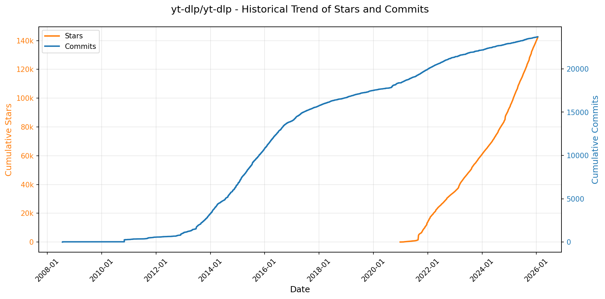
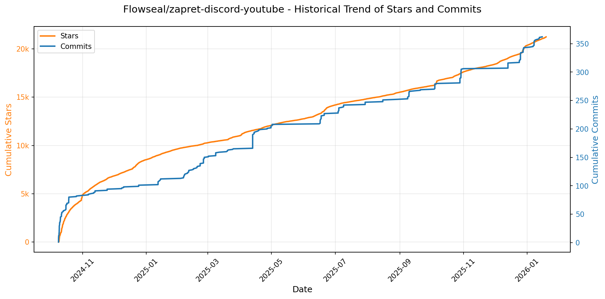
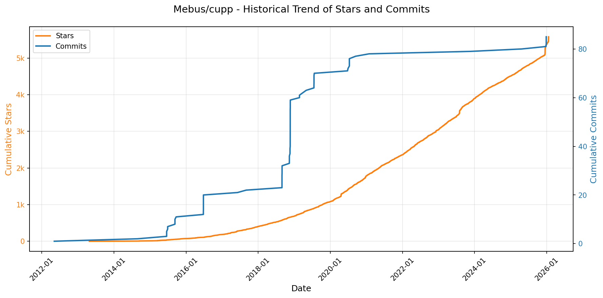

# 🌟 GitHub Trending 概览

> 数据更新于：2026-01-19。

---

## 🔍 项目详情

### 1. [yt-dlp/yt-dlp](https://github.com/yt-dlp/yt-dlp)
- 📅 **创建日期**：2020-10-26  
- 🔄 **最近更新**：2026-01-19  
- ⭐ **Stars**：142,552（日 +371｜周 +1157｜月 +3994）  
- 📝 **描述**：A feature-rich command-line audio/video downloader  

<b>📈 Star 与 Commit 历史趋势</b>

> *蓝色：累计 Stars｜橙色：累计 Commits（次 Y 轴）*

<b>📄 README 摘要</b>

1. 该项目是一个功能丰富的命令行音视频下载工具，支持从数千个网站下载音频和视频内容。它是 youtube-dl 的一个活跃分支，基于已停止维护的 youtube-dlc 项目开发，旨在提供更快速的功能更新、bug 修复以及对更多网站和新特性的支持。

2. 主要特性包括：支持海量网站（如 YouTube 等）；提供细粒度的下载选项（如选择特定视频格式、分辨率、合并音视频流等）；支持断点续传和多线程加速下载；可自动提取和嵌入缩略图、字幕及元数据；具备强大的输出文件命名模板系统；支持通过代理、绕过地理限制和TLS指纹检测；提供插件系统以扩展功能；并内置了 SponsorBlock 功能来跳过视频中的赞助片段。

3. 技术栈主要使用 Python（要求 CPython 3.10+ 或 PyPy 3.11+）作为核心开发语言。项目依赖外部工具如 `ffmpeg`/`ffprobe` 用于媒体文件处理与合并，同时需要 JavaScript 运行时（如 deno、node.js）配合 yt-dlp-ejs 来解析某些网站（如YouTube）的加密签名。其他关键依赖库包括 `certifi`（证书管理）、`brotli`（压缩编码）、`mutagen`（元数据编辑）、`curl_cffi`（模拟浏览器指纹）等，并可通过 pip 管理和安装。

---

### 2. [hacksider/Deep-Live-Cam](https://github.com/hacksider/Deep-Live-Cam)
- 📅 **创建日期**：2023-09-24  
- 🔄 **最近更新**：2026-01-19  
- ⭐ **Stars**：78,356（日 +131｜周 +1070｜月 +2168）  
- 📝 **描述**：real time face swap and one-click video deepfake with only a single image  

<b>📈 Star 与 Commit 历史趋势</b>

> *蓝色：累计 Stars｜橙色：累计 Commits（次 Y 轴）*

<b>📄 README 摘要</b>

1. 该项目是一个实时人脸替换和视频深度伪造工具，仅需单张图像即可一键完成。它能够在直播、视频通话、电影观看等场景中实现实时换脸，支持多种应用如虚拟表演、内容创作、制作表情包等，并内置了防止处理不当内容（如裸露、暴力画面）的安全机制。

2. 主要功能包括：实时换脸（单图输入即可）；支持保留用户原嘴部动作的“嘴部遮罩”技术；可在同一画面中对多个对象进行不同人脸映射；支持在播放电影时实时将任意人脸代入影片角色；可用于直播演出或娱乐互动（如Omegle恶搞）；提供多张人脸同时处理的“多脸模式”；兼容摄像头和视频文件输入；支持GPU加速以提升性能；并具备跨平台运行能力（Windows、macOS Silicon及Intel芯片）。

3. 技术栈基于Python（推荐3.11版本），使用ONNX Runtime作为核心推理引擎，支持多种执行后端如CUDA（NVIDIA GPU）、DirectML（Windows）、CoreML（Apple Silicon）、OpenVINO（Intel CPU）等以实现硬件加速。依赖库包括ffmpeg（视频处理）、insightface（人脸识别与对齐）、GFPGAN（人脸增强）、BasicSR（图像超分）、PyTorch相关组件，以及tkinter构建图形界面。模型文件采用预训练的inswapper_128_fp16.onnx和GFPGANv1.4.pth，通过Hugging Face托管下载。项目还利用Git进行版本控制，并通过虚拟环境（venv）管理依赖。

---

### 3. [anomalyco/opencode](https://github.com/anomalyco/opencode)
- 📅 **创建日期**：2025-04-30  
- 🔄 **最近更新**：2026-01-19  
- ⭐ **Stars**：77,243（日 +1670｜周 +14520｜月 +37026）  
- 📝 **描述**：The open source coding agent.  

<b>📈 Star 与 Commit 历史趋势</b>

> *蓝色：累计 Stars｜橙色：累计 Commits（次 Y 轴）*

<b>📄 README 摘要</b>

1. 该项目是一个开源的AI编程代理工具，旨在通过人工智能辅助开发者完成代码编写、分析和探索任务。它可以在终端中运行，支持与本地或远程模型交互，帮助用户进行开发工作、代码库探索、问题排查以及执行多步骤编程任务。

2. 关键特性包括：  
   - 内置两种代理模式：“build”用于完整的开发任务（可编辑文件），“plan”为只读模式，适合代码分析与变更规划，限制修改并需确认后才执行命令；  
   - 支持“@general”子代理处理复杂搜索和多阶段任务；  
   - 提供基于终端的用户界面（TUI），专为终端重度用户设计，强调在终端环境中的高效操作；  
   - 支持LSP（语言服务器协议），开箱即用；  
   - 客户端/服务器架构，允许核心服务运行在本地设备上，同时可通过移动端等远程客户端进行控制；  
   - 兼容多种大模型后端，包括Claude、OpenAI、Google Gemini及本地模型，不绑定特定供应商；  
   - 提供桌面应用程序（Beta版），支持macOS、Windows和Linux平台；  
   - 可通过多种包管理器（如npm、brew、scoop、mise等）便捷安装。

3. 技术栈主要包括：  
   - 核心以Node.js为基础构建，使用TypeScript编写；  
   - 前端部分包含Web界面和终端用户界面（TUI），其中TUI是重点交互方式；  
   - 使用LSP（Language Server Protocol）实现对代码的智能分析与编辑支持；  
   - 采用客户端/服务器架构，实现前后端分离，支持远程调用与多端接入；  
   - 支持集成多种AI模型API（如Anthropic Claude、OpenAI、Google Gemini）以及本地运行的大模型；  
   - 构建与发布流程依赖GitHub Actions自动化；  
   - 包管理兼容npm、bun、pnpm、yarn，并支持系统级包管理器如Homebrew、Scoop、Chocolatey、Paru、Mise和Nix。

---

### 4. [twitter/the-algorithm](https://github.com/twitter/the-algorithm)
- 📅 **创建日期**：2023-03-27  
- 🔄 **最近更新**：2026-01-19  
- ⭐ **Stars**：70,542（日 +86｜周 +1262｜月 +2651）  
- 📝 **描述**：Source code for the X Recommendation Algorithm  

<b>📈 Star 与 Commit 历史趋势</b>

> *蓝色：累计 Stars｜橙色：累计 Commits（次 Y 轴）*

<b>📄 README 摘要</b>

1. 该项目实现了X平台（如“为你推荐”时间线、搜索、探索、通知等）内容推荐的核心算法系统，负责从海量内容中筛选、排序并推送个性化帖子和通知。它通过整合用户行为数据、社交关系、内容特征和机器学习模型，构建动态的推荐流，决定用户在各个产品界面上看到的内容。

2. 关键功能包括：  
   - **多源候选内容生成**：从用户关注网络内（In-Network）和网络外（Out-of-Network）获取候选帖子，来源包括搜索索引、用户-帖子交互图（UTEG）、关注推荐服务（FRS）等。  
   - **分层排序机制**：采用“轻量级排序器”（Light Ranker）进行初步筛选，再由“重量级排序器”（Heavy Ranker）等复杂神经网络模型进行精细化打分和排序。  
   - **实时信号处理**：集成统一的用户行为流（unified-user-actions）和用户信号服务，捕捉点赞、点击、浏览等显性和隐性反馈。  
   - **内容与社区建模**：利用SimClusters进行社区发现，使用TwHIN生成用户和帖子的知识图谱嵌入，并结合主题识别和社会证明增强推荐相关性。  
   - **图谱与社交特征**：基于GraphJet框架构建用户互动图谱，提供诸如“共同关注者互动”等图特征，并计算用户声誉（TweepCred）。  
   - **内容过滤与安全**：集成信任与安全部件，检测不当或滥用内容，并通过可见性过滤器实现合规、质量提升和收入保护。  
   - **高性能服务框架**：使用Rust编写的Navi框架进行高效模型服务，Product Mixer框架用于灵活构建内容流。  

3. 技术栈主要包括：  
   - **编程语言**：Scala、Python、Java、Rust。  
   - **机器学习框架**：Navi（Rust高性能模型服务）、TWML（基于TensorFlow v1的旧版框架）、自定义深度学习模型（如多任务学习的Heavy Ranker）。  
   - **数据与流处理**：实时用户行为流（Kafka类系统）、Bazel构建工具。  
   - **图计算与存储**：GraphJet（内存图处理框架）、PageRank算法（TweepCred）、用户-帖子实体图（UTEG）。  
   - **模型与算法**：社区检测（SimClusters）、知识图谱嵌入（TwHIN）、稀疏与稠密向量表示、协同过滤、交互概率预测模型（Real-Graph）。  
   - **服务架构**：微服务架构，包含独立的服务模块如tweetypie（帖子读写）、user-signal-service（信号获取）、representation-manager（嵌入检索）、home-mixer/pushservice（推荐主服务）。

---

### 5. [anthropics/claude-code](https://github.com/anthropics/claude-code)
- 📅 **创建日期**：2025-02-22  
- 🔄 **最近更新**：2026-01-19  
- ⭐ **Stars**：58,104（日 +325｜周 +2680｜月 +11041）  
- 📝 **描述**：Claude Code is an agentic coding tool that lives in your terminal, understands your codebase, and helps you code faster by executing routine tasks, explaining complex code, and handling git workflows - all through natural language commands.  

<b>📈 Star 与 Commit 历史趋势</b>

> *蓝色：累计 Stars｜橙色：累计 Commits（次 Y 轴）*

<b>📄 README 摘要</b>

1. 该项目是一个终端中的智能代理编程工具，能够理解用户的代码库，通过自然语言指令帮助开发者更快地编写代码。它可执行常规开发任务、解释复杂代码逻辑、管理 Git 工作流，并支持在终端、IDE 或 GitHub 上通过 @claude 标记使用。

2. 主要功能包括：通过自然语言命令与代码交互；在本地终端或集成开发环境（IDE）中运行；支持 Git 流程自动化；提供对代码的智能解释和修改建议；可通过 `/bug` 命令直接上报问题；支持插件扩展自定义命令和代理功能；兼容多平台安装（macOS、Linux、Windows）。

3. 技术栈基于 Node.js（要求 18+ 版本），使用 bash 和 PowerShell 脚本进行跨平台安装部署，通过 npm 分发（已弃用），并利用 CLI 工具与本地代码库和系统环境交互。项目本身作为命令行工具运行，与 Anthropic 的 AI 模型后端服务通信实现智能功能。

---

### 6. [usememos/memos](https://github.com/usememos/memos)
- 📅 **创建日期**：2021-12-08  
- 🔄 **最近更新**：2026-01-19  
- ⭐ **Stars**：54,840（日 +131｜周 +1649｜月 +7646）  
- 📝 **描述**：An open-source, self-hosted note-taking service. Your thoughts, your data, your control — no tracking, no ads, no subscription fees.  

<b>📈 Star 与 Commit 历史趋势</b>

> *蓝色：累计 Stars｜橙色：累计 Commits（次 Y 轴）*

<b>📄 README 摘要</b>

1. 该项目是一个开源、可自托管的笔记记录服务，旨在让用户完全掌控自己的数据和想法。它不包含跟踪、广告或订阅费用，适用于个人笔记、团队维基和知识管理，强调隐私优先和数据自主。

2. 主要功能包括：  
   - 隐私优先架构：支持自托管，无任何遥测，确保数据完全由用户控制并可导出。  
   - 原生支持 Markdown：使用纯文本存储笔记，便于迁移和长期保存。  
   - 高性能：基于 Go 和 React 构建，加载迅速，响应流畅。  
   - 简单部署：提供一键式 Docker 安装，支持 SQLite、MySQL 和 PostgreSQL 数据库。  
   - 开发者友好：提供完整的 REST 和 gRPC API，便于集成到现有工作流中。  
   - 美观界面：具备简洁现代的设计，支持深色模式和移动端自适应布局。

3. 技术栈：  
   - 后端使用 Go（Golang）开发，保证高性能与高并发能力。  
   - 前端采用 React 框架构建用户界面。  
   - 支持多种数据库：SQLite、MySQL 和 PostgreSQL。  
   - 提供 Docker 和 Docker Compose 部署方式，也支持 Kubernetes（通过 Helm 图表）及从源码构建。

---

### 7. [anthropics/skills](https://github.com/anthropics/skills)
- 📅 **创建日期**：2025-09-22  
- 🔄 **最近更新**：2026-01-19  
- ⭐ **Stars**：44,859（日 +832｜周 +6969｜月 +22472）  
- 📝 **描述**：Public repository for Agent Skills  

<b>📈 Star 与 Commit 历史趋势</b>

> *蓝色：累计 Stars｜橙色：累计 Commits（次 Y 轴）*

<b>📄 README 摘要</b>

1. 该项目是 Anthropic 提供的 Claude 技能（Skills）实现，用于展示和示范如何通过动态加载的技能文件夹（包含指令、脚本和资源）来增强 Claude 在特定任务上的表现。这些技能使 Claude 能够以可重复的方式完成具体任务，例如根据公司品牌指南创建文档、使用组织特定流程分析数据或自动化个人事务。该仓库提供了一系列示例技能，涵盖创意设计、技术开发、企业通信以及文档处理等领域，并允许开发者参考实际生产环境中使用的文档类技能作为复杂技能的范例。

2. 关键功能包括：支持创建自包含的技能单元（每个技能为一个独立文件夹并附带 SKILL.md 文件），提供清晰的 YAML 元数据与指令结构；技能可通过 Claude Code 插件市场注册和安装（如 document-skills 和 example-skills）；在 Claude.ai 中已对付费用户开放使用和上传自定义技能；通过 Claude API 支持调用预构建技能和上传自定义技能；提供技能模板（template）和规范说明（spec）以帮助开发者快速上手；包含多个开源示例及部分源码可见但非开源的生产级文档处理技能（如 docx、pdf、pptx、xlsx 等格式操作）；同时支持第三方合作伙伴（如 Notion）集成技能。

3. 技术栈主要包括：基于 Markdown 文件（SKILL.md）定义技能逻辑，其中包含 YAML 前置元数据（name、description）与结构化指令内容；使用标准文件夹组织方式管理各个技能；与 Claude Code、Claude.ai 平台及 Claude API 深度集成；依赖插件系统实现技能的注册与调用（如 `/plugin install` 命令）；无特定编程语言限制，强调通用文本配置与外部工具协同；整体架构围绕 Agent Skills 标准构建，遵循 [agentskills.io](http://agentskills.io) 规范。

---

### 8. [exo-explore/exo](https://github.com/exo-explore/exo)
- 📅 **创建日期**：2024-06-24  
- 🔄 **最近更新**：2026-01-19  
- ⭐ **Stars**：40,277（日 +62｜周 +430｜月 +6616）  
- 📝 **描述**：Run your own AI cluster at home with everyday devices 📱💻 🖥️⌚  

<b>📈 Star 与 Commit 历史趋势</b>

> *蓝色：累计 Stars｜橙色：累计 Commits（次 Y 轴）*

<b>📄 README 摘要</b>

1. 该项目做什么？  
   exo 是一个允许用户将日常设备（如 Mac）连接起来，构建个人本地 AI 集群的开源项目。它能够将大型语言模型分布到多个设备上运行，突破单个设备的内存和算力限制，并通过低延迟通信技术显著提升推理速度。系统支持自动发现设备、智能分配模型任务，并提供 API 和可视化仪表板以便用户管理和交互集群。

2. 关键特性  
   - **自动设备发现**：运行 exo 的设备可自动相互发现，无需手动配置网络或拓扑。  
   - **Thunderbolt 上的 RDMA 支持**：原生支持 Thunderbolt 5 的远程直接内存访问（RDMA），设备间通信延迟降低高达 99%。  
   - **拓扑感知的自动并行化**：根据实时设备拓扑（包括计算资源、内存容量、网络带宽与延迟）智能决定模型切分策略，优化性能。  
   - **张量并行支持**：实现模型在多设备间的张量级拆分，在 2 台设备上最高达 1.8 倍加速，4 台设备上达 3.2 倍加速。  
   - **MLX 后端集成**：使用 Apple 的 MLX 框架作为推理引擎，并结合其分布式通信能力实现高效跨设备运算。  
   - **本地 API 与仪表板**：提供类 OpenAI 格式的 REST API 和 Web 仪表板（默认运行于 `http://localhost:52415`），便于部署模型和发送推理请求。

3. 技术栈  
   - **编程语言**：Rust（用于核心绑定和系统层）、Python（主逻辑与 API）、JavaScript/Node.js（用于前端仪表板）。  
   - **依赖工具**：uv（Python 包管理）、npm（前端构建）、macmon（Apple Silicon 硬件监控，仅 macOS）、rustup nightly（Rust 夜间版工具链）。  
   - **核心框架**：MLX 及其分布式模块（MLX distributed）作为底层计算与通信后端。  
   - **运行环境**：macOS（完整 GPU 支持，需 macOS 26.2+，M4/M3 Ultra 芯片支持 RDMA over Thunderbolt）；Linux（当前仅 CPU 运行，GPU 支持开发中）。  
   - **通信机制**：基于 RDMA over Thunderbolt 实现超低延迟设备间通信，配合自定义网络配置与 LaunchDaemon 服务管理。  
   - **部署方式**：支持从源码构建运行，以及 macOS 图形化应用安装。

---

### 9. [DataTalksClub/data-engineering-zoomcamp](https://github.com/DataTalksClub/data-engineering-zoomcamp)
- 📅 **创建日期**：2021-10-21  
- 🔄 **最近更新**：2026-01-19  
- ⭐ **Stars**：36,515（日 +84｜周 +1893｜月 +2679）  
- 📝 **描述**：Data Engineering Zoomcamp is a free 9-week course on building production-ready data pipelines. The next cohort starts in January 2026. Join the course here 👇🏼  

<b>📈 Star 与 Commit 历史趋势</b>

> *蓝色：累计 Stars｜橙色：累计 Commits（次 Y 轴）*

<b>📄 README 摘要</b>

1. 该项目是一个为期9周的免费课程，旨在帮助学习者掌握数据工程的基础知识。通过从零开始构建端到端的数据管道，学员将系统学习并实践现代数据工程的核心流程和技术栈。课程内容涵盖从基础设施搭建、数据摄取与处理、工作流编排，到数据仓库建设、分析工程和流式处理等完整环节，并以一个综合性的最终项目巩固所学知识。

2. 关键特性包括：模块化结构化的课程设计（共6个核心模块加1个最终项目）；强调动手实践，提供大量实操练习和作业；覆盖行业标准工具链的全面技术内容；拥有活跃的社区支持（如Slack和Telegram）便于交流与求助；完全免费且开放所有学习资料供自定进度学习；定期开设新学员批次（如2026年 cohort），同时支持独立学习；包含真实用户见证反馈，证明其在职业转型中的实际价值。

3. 技术栈主要包括：使用Docker进行容器化、Terraform实现基础设施即代码（IaC）；采用GCP作为云平台；利用Kestra进行工作流编排；使用PostgreSQL和BigQuery分别作为关系型数据库和数据仓库；通过dbt（data build tool）进行数据分析工程；结合Streamlit与Looker Studio实现数据可视化；引入Apache Spark进行批处理；使用Kafka、KSQL及Avro进行流数据处理与模式管理；并在实践中集成dlt等数据摄取工具。

---

### 10. [Lissy93/web-check](https://github.com/Lissy93/web-check)
- 📅 **创建日期**：2023-06-25  
- 🔄 **最近更新**：2026-01-19  
- ⭐ **Stars**：30,288（日 +131｜周 +866｜月 +3283）  
- 📝 **描述**：🕵️‍♂️ All-in-one OSINT tool for analysing any website  

<b>📈 Star 与 Commit 历史趋势</b>

> *蓝色：累计 Stars｜橙色：累计 Commits（次 Y 轴）*

---

### 11. [OpenBMB/ChatDev](https://github.com/OpenBMB/ChatDev)
- 📅 **创建日期**：2023-08-28  
- 🔄 **最近更新**：2026-01-19  
- ⭐ **Stars**：28,837（日 +64｜周 +632｜月 +983）  
- 📝 **描述**：ChatDev 2.0: Dev All through LLM-powered Multi-Agent Collaboration  

<b>📈 Star 与 Commit 历史趋势</b>

> *蓝色：累计 Stars｜橙色：累计 Commits（次 Y 轴）*

<b>📄 README 摘要</b>

1. 该项目是一个零代码的多智能体协同平台（DevAll），旨在通过简单配置即可快速构建和执行定制化的多智能体系统，实现“开发一切”（Developing Everything）。用户无需编程，即可定义智能体、工作流和任务，以协调复杂场景，如软件开发、数据可视化、3D建模、深度研究、教学视频生成等。其前身ChatDev 1.0专注于模拟虚拟软件公司，自动化完成从设计、编码、测试到文档编写的整个软件开发生命周期。

2. 关键特性包括：提供零代码的Web控制台，支持通过拖拽方式在可视化画布上设计和编排多智能体工作流；内置丰富的开箱即用模板，覆盖游戏开发、数据分析、3D生成等多个领域；支持人机协作模式，允许用户作为评审员介入流程；提供轻量级Python SDK，便于程序化执行工作流和集成到其他应用；支持通过YAML文件灵活配置智能体、角色和任务流程；具备可扩展性，开发者可自定义新节点、工具和功能模块；集成了Git版本控制、增量开发等高级功能，并可通过插件支持Blender等外部工具。

3. 技术栈主要包括：后端使用Python（3.12+）和FastAPI框架，依赖uv作为包管理器；前端采用Vue 3和Vite构建现代化Web界面；通过大语言模型（LLM）驱动智能体协作，支持配置不同的API密钥和基础URL；利用YAML文件进行工作流的声明式配置；核心逻辑基于多智能体通信与编排，结合了记忆（Memory）、工具调用（Tooling）等模块；项目结构模块化，包含server（后端服务）、runtime（运行时与智能体抽象）、workflow（工作流引擎）、frontend（前端界面）和functions（自定义工具函数）等主要目录。

---

### 12. [obra/superpowers](https://github.com/obra/superpowers)
- 📅 **创建日期**：2025-10-09  
- 🔄 **最近更新**：2026-01-19  
- ⭐ **Stars**：28,727（日 +1103｜周 +11369｜月 +18242）  
- 📝 **描述**：An agentic skills framework & software development methodology that works.  

<b>📈 Star 与 Commit 历史趋势</b>

> *蓝色：累计 Stars｜橙色：累计 Commits（次 Y 轴）*

<b>📄 README 摘要</b>

1. 该项目做什么？  
   Superpowers 是一个为编程智能体（coding agents）构建的完整软件开发工作流系统。它通过一组可组合的“技能”和初始指令，使编程智能体在开发过程中遵循严谨、系统化的工程实践。当用户启动编码任务时，智能体不会直接写代码，而是首先与用户沟通明确需求，生成可读的设计文档，并在确认后制定详细的实施计划。随后采用“子智能体驱动开发”模式，将任务分解并由多个子智能体协作完成，每个步骤都经过自动化审查和测试验证，确保符合设计规范和代码质量标准，支持长时间自主执行而不出错。

2. 关键特性  
   - **自动触发的工作流**：根据上下文自动激活相应技能，无需手动干预。
   - **需求澄清与设计优化**：通过互动式头脑风暴提炼需求，分段呈现设计供用户审阅。
   - **严格的测试驱动开发（TDD）**：强制执行红-绿-重构循环，禁止先写代码后补测试。
   - **结构化实施计划**：将项目拆解为耗时2–5分钟的小任务，每项任务包含具体文件路径、完整代码变更及验证方式。
   - **子智能体驱动开发（SDD）**：为每个任务派遣独立子智能体执行，并进行两阶段审查（合规性+代码质量）。
   - **并行分支开发支持**：使用 git worktree 创建隔离环境，避免干扰主分支。
   - **阶段性审查机制**：任务间自动执行代码审查，按严重程度报告问题，关键问题阻断流程。
   - **全流程自动化控制**：从设计、计划、实现到合并请求均有标准化流程，保障工程一致性。
   - **技能可扩展性**：提供创建新技能的指导框架，支持社区贡献和自定义技能。

3. 技术栈  
   - 核心平台：基于 Claude Code、Codex 和 OpenCode 等 AI 编程智能体运行。
   - 插件系统：Claude Code 通过内置插件市场安装（`/plugin install`），支持自动更新。
   - 版本控制：深度集成 Git，利用 worktree 实现多任务并行开发。
   - 技能定义格式：技能以文本形式存储于仓库中（如 `.md` 文件），通过标准化协议调用。
   - 自动化执行环境：依赖外部 AI 模型解析和执行自然语言指令，结合本地或远程开发环境运行。
   - 许可证：MIT 开源许可证。

---

### 13. [bytedance/UI-TARS-desktop](https://github.com/bytedance/UI-TARS-desktop)
- 📅 **创建日期**：2025-01-19  
- 🔄 **最近更新**：2026-01-19  
- ⭐ **Stars**：24,276（日 +138｜周 +1415｜月 +4323）  
- 📝 **描述**：The Open-Source Multimodal AI Agent Stack: Connecting Cutting-Edge AI Models and Agent Infra  

<b>📈 Star 与 Commit 历史趋势</b>

> *蓝色：累计 Stars｜橙色：累计 Commits（次 Y 轴）*

<b>📄 README 摘要</b>

1. 该项目是一个多模态AI智能体技术栈，包含两个核心项目：Agent TARS 和 UI-TARS-desktop。Agent TARS 是一个通用的多模态AI代理，可将图形界面（GUI）代理和视觉能力集成到终端、计算机、浏览器及产品中，支持通过自然语言指令完成复杂任务（如订机票、订酒店、生成图表等），并提供CLI命令行工具和Web UI两种使用方式。UI-TARS-desktop 是一个桌面应用程序，基于UI-TARS模型提供本地化的GUI代理功能，支持通过自然语言控制本地或远程的计算机和浏览器操作。

2. 关键功能包括：支持开箱即用的CLI和Web UI；具备混合浏览器代理能力，可通过视觉识别、DOM分析或两者结合的方式操控浏览器；基于事件流协议实现上下文工程与代理界面交互；深度集成MCP（Model Context Protocol）工具，可连接真实世界的各种外部工具和服务；支持本地和远程计算机及浏览器的操作控制；具备截图识别、精准鼠标键盘控制、实时反馈和状态显示能力；数据处理完全在本地进行，保障隐私安全；同时支持在Windows、macOS和浏览器平台运行。

3. 技术栈主要包括：基于Node.js开发的CLI工具（要求Node.js >= 22）；前端使用Web UI技术；底层依赖多模态大语言模型（如doubao-1-5-thinking-vision-pro、claude-3-7-sonnet等）；采用MCP协议作为核心架构，用于集成外部工具；使用Vision-Language Models（如Seed-1.5-VL/1.6系列）实现视觉理解和GUI交互；支持与ModelScope、Hugging Face等模型平台集成；提供SDK供开发者构建跨平台的GUI自动化代理应用。

---

### 14. [google/langextract](https://github.com/google/langextract)
- 📅 **创建日期**：2025-07-08  
- 🔄 **最近更新**：2026-01-19  
- ⭐ **Stars**：22,158（日 +509｜周 +1648｜月 +4582）  
- 📝 **描述**：A Python library for extracting structured information from unstructured text using LLMs with precise source grounding and interactive visualization.  

<b>📈 Star 与 Commit 历史趋势</b>

> *蓝色：累计 Stars｜橙色：累计 Commits（次 Y 轴）*

<b>📄 README 摘要</b>

1. **这个项目是做什么的？**  
LangExtract 是一个基于大语言模型（LLM）的 Python 库，用于从非结构化文本中提取结构化信息。用户通过定义提示词和提供少量示例，即可让模型从文本中识别并组织关键内容，如人物、情感、关系或医学实体等。它特别适用于处理长文档（如小说全文或临床报告），支持精确溯源到原文位置，并能生成交互式可视化结果以供审查。

2. **主要功能**  
- **精准溯源（Source Grounding）**：每个提取结果都标注其在原始文本中的确切位置，便于高亮显示和验证。  
- **结构化输出保证**：基于用户提供的示例自动生成一致的输出格式，利用受控生成技术确保结果可靠。  
- **优化长文本处理**：采用分块、多轮扫描和并行处理策略，提升在大型文档中查找信息的召回率。  
- **交互式可视化**：可将提取结果导出为 JSONL 文件，并生成自包含的 HTML 可视化页面，方便浏览和审查大量实体。  
- **多模型支持**：兼容多种 LLM，包括 Google Gemini、OpenAI 的 GPT 系列以及本地运行的 Ollama 模型。  
- **可扩展性**：支持通过插件系统添加自定义模型提供商，无需修改核心代码。  
- **灵活任务适配**：无需微调模型，仅通过提示和示例即可适应任意领域的信息抽取任务。

3. **技术栈**  
- **编程语言**：Python  
- **核心依赖**：大语言模型（LLM）接口，支持 Gemini（Google）、GPT-4o（OpenAI）及 Ollama 本地模型（如 gemma2）  
- **架构设计**：模块化插件系统，支持自定义模型提供者注册与发现（通过 entry points）  
- **开发工具链**：pyproject.toml 管理依赖、pytest 测试框架、tox 多环境测试、pre-commit 钩子、isort/pyink 格式化工具  
- **部署方式**：支持 PyPI 安装、源码安装、Docker 容器化部署  
- **可视化技术**：生成独立 HTML 文件实现交互式结果展示  
- **云平台集成**：支持 Google Vertex AI 批量 API 进行大规模低成本处理，也支持通过 API Key 或服务账户认证访问云端模型

---

### 15. [resemble-ai/chatterbox](https://github.com/resemble-ai/chatterbox)
- 📅 **创建日期**：2025-04-23  
- 🔄 **最近更新**：2026-01-19  
- ⭐ **Stars**：21,732（日 +63｜周 +450｜月 +5360）  
- 📝 **描述**：SoTA open-source TTS  

<b>📈 Star 与 Commit 历史趋势</b>

> *蓝色：累计 Stars｜橙色：累计 Commits（次 Y 轴）*

<b>📄 README 摘要</b>

1. 该项目是一个由 Resemble AI 开发的开源文本转语音（TTS）模型系列，主打高效、高质量的语音合成。核心产品 Chatterbox-Turbo 模型基于 3.5 亿参数的精简架构，专为低延迟场景（如语音代理）设计，在降低计算和显存消耗的同时，通过蒸馏技术将语音生成步骤从 10 步减少到仅 1 步。该模型原生支持咳嗽 `[cough]`、大笑 `[laugh]` 等副语言标签，以增强语音的真实感和表现力，并能实现零样本语音克隆和多语言语音合成。

2. 关键特性包括：(1) 高效性：Chatterbox-Turbo 模型体积小、计算需求低，推理速度快；(2) 原生副语言标签支持：可直接在文本中插入 `[laugh]`、`[chuckle]` 等标签，生成包含自然非语言声音的语音；(3) 零样本语音克隆：通过提供一个参考音频片段即可模仿其音色；(4) 多语言支持：Multilingual 版本支持超过 23 种语言；(5) 内置神经水印：使用 PerTh 水印技术，可在生成的音频中嵌入不可感知但可高精度检测的水印，以促进 AI 的负责任使用。

3. 技术栈主要包括 Python (3.11)、PyTorch，以及 torchaudio 等库。项目依赖在 `pyproject.toml` 文件中固定版本以确保一致性。模型架构借鉴了 Llama 3 的思想，并集成了 S3Tokenizer 进行语音标记化，使用 HiFT-GAN 作为声码器。水印功能基于 Resemble AI 自研的 Perth (Perceptual Threshold) Watermarker 技术实现。

---

### 16. [ComposioHQ/awesome-claude-skills](https://github.com/ComposioHQ/awesome-claude-skills)
- 📅 **创建日期**：2025-10-17  
- 🔄 **最近更新**：2026-01-19  
- ⭐ **Stars**：21,337（日 +525｜周 +3547｜月 +13625）  
- 📝 **描述**：A curated list of awesome Claude Skills, resources, and tools for customizing Claude AI workflows  

<b>📈 Star 与 Commit 历史趋势</b>

> *蓝色：累计 Stars｜橙色：累计 Commits（次 Y 轴）*

<b>📄 README 摘要</b>

1. 该项目做什么？
该项目是一个精选的Claude技能（Skills）列表，旨在提升用户在Claude.ai、Claude Code和Claude API上的生产力。它提供了一系列可定制的工作流（即“技能”），使Claude能够执行超越文本生成的具体任务，例如处理文档、分析数据、开发代码、管理项目、进行市场营销以及与Gmail、Slack、GitHub等超过1000个应用程序进行交互并执行实际操作（如发送邮件、创建问题、发布消息）。用户可以使用这些预设技能或学习如何创建自己的技能来扩展Claude的能力。

2. 关键特性
- **广泛的技能库**：涵盖文档处理、代码开发、数据分析、商业营销、沟通写作、创意媒体、组织管理、协作项目及安全系统等多个领域的实用技能。
- **应用连接能力**：通过`connect-apps`插件，使Claude能连接并操作500多个应用程序，实现自动化工作流。
- **多平台支持**：技能可在Claude.ai（聊天界面）、Claude Code（本地开发环境）和Claude API（编程调用）中使用。
- **易于集成**：提供清晰的快速入门指南，指导用户安装插件、配置API密钥并立即使用。
- **可扩展性与自定义**：提供技能创建模板和最佳实践，帮助开发者构建和贡献新的自定义技能。
- **社区驱动**：欢迎Pull Request，拥有明确的贡献指南，鼓励社区共同维护和丰富技能库。

3. 技术栈
- **核心平台**：Anthropic的Claude大模型系列（如Claude 3.5 Sonnet）及其Skills功能。
- **插件架构**：基于Claude的插件系统，通过`SKILL.md`文件中的YAML元数据定义技能。
- **集成框架**：利用Composio平台作为底层服务，实现与500+第三方应用的认证和连接。
- **开发语言与工具**：技能本身主要由Markdown文档（`SKILL.md`）构成，并可包含Python、TypeScript、Bash脚本等辅助代码；涉及前端时使用React、Tailwind CSS、shadcn/ui等技术；特定技能集成了Playwright（浏览器自动化）、FFUF（Web模糊测试）、PICT（组合测试）等专业工具。

---

### 17. [Flowseal/zapret-discord-youtube](https://github.com/Flowseal/zapret-discord-youtube)
- 📅 **创建日期**：2024-10-08  
- 🔄 **最近更新**：2026-01-19  
- ⭐ **Stars**：21,239（日 +70｜周 +337｜月 +1922）  
- 📝 **描述**：暂无描述  

<b>📈 Star 与 Commit 历史趋势</b>

> *蓝色：累计 Stars｜橙色：累计 Commits（次 Y 轴）*

<b>📄 README 摘要</b>

1. **这个项目是做什么的？**  
该项目是一个用于绕过网络审查（特别是针对被封锁的网站如 Discord 和 YouTube）的工具，基于 `zapret` 技术实现。它通过流量劫持和修改的方式，使用户能够在受到深度包检测（DPI）限制的网络环境中访问被屏蔽的服务。主要面向 Windows 系统用户提供图形化脚本操作界面，支持自动安装、诊断、更新和多策略切换，适用于无法直接访问特定国际服务的网络环境。

2. **关键特性**  
- 支持多种绕过策略（如 ALT、FAKE 等），可手动测试不同策略以找到当前网络下有效的方案。  
- 提供一键式服务管理脚本 `service.bat`，支持：  
  - 安装/卸载为系统自启动服务  
  - 检查运行状态与服务健康状况  
  - 切换游戏过滤模式（避免影响 UDP/TCP 高端口应用）  
  - 控制 IPSet 过滤范围（完全关闭、部分加载或全部过滤）  
  - 自动检查更新、手动更新 IP 列表和 hosts 文件  
  - 内置诊断工具排查常见问题（包括 DNS 设置、驱动状态等）  
  - 测试功能验证各策略有效性及 DPI 绕过能力  
- 支持自定义扩展规则列表：可添加域名或 IP 到 `list-general.txt` 或 `ipset-all.txt` 实现对其他资源的访问控制。  
- 集成 WinDivert 驱动，实现在 Windows 上模拟 Linux iptables/NFQUEUE 的数据包处理机制。  
- 特别优化对 Discord 语音连接和 YouTube 的访问修复，包含专用 hosts 文件更新功能。  
- 要求启用 Secure DNS（DoH），推荐使用 Google DNS 并提供相应配置指导。

3. **技术栈**  
- 核心工具：基于 [bol-van/zapret](https://github.com/bol-van/zapret) 的 `winws.exe` 可执行程序，负责实际的流量干扰与伪装。  
- 底层驱动：WinDivert（`WinDivert64.sys`），用于捕获和重写 Windows 网络层数据包，需数字签名支持。  
- 脚本语言：Windows 批处理（.bat），用于封装复杂命令行操作，提供用户友好的交互式菜单。  
- 配置管理：纯文本规则文件（`.txt`）存储域名/IP黑白名单，支持通配和子网匹配。  
- 安全通信依赖：Secure DNS / DNS-over-HTTPS (DoH)，防止 DNS 污染。  
- 构建来源：所有二进制文件来自 [zapret-win-bundle](https://github.com/bol-van/zapret-win-bundle)，并建议用户校验哈希确保完整性。  
- 兼容性处理：包含对 Windows 7 的特殊签名驱动版本支持，并提供 anti-cheat 冲突缓解方案。

---

### 18. [nautechsystems/nautilus_trader](https://github.com/nautechsystems/nautilus_trader)
- 📅 **创建日期**：2018-06-25  
- 🔄 **最近更新**：2026-01-19  
- ⭐ **Stars**：17,662（日 +353｜周 +457｜月 +992）  
- 📝 **描述**：A high-performance algorithmic trading platform and event-driven backtester  

<b>📈 Star 与 Commit 历史趋势</b>

> *蓝色：累计 Stars｜橙色：累计 Commits（次 Y 轴）*

<b>📄 README 摘要</b>

1. 该项目是一个开源、高性能、生产级的算法交易平台，旨在为量化交易者提供一个从研究、回测到实盘部署的完整解决方案。它采用事件驱动引擎，支持使用历史数据（包括报价、成交、K线、订单簿等，精度达纳秒级）对自动化交易策略进行多市场、多品种、多策略并发回测，并能将完全相同的策略代码无缝部署到实盘交易中，无需任何修改，解决了传统开发中回测与实盘环境不一致的问题。平台设计上支持高频交易，适用于外汇、股票、期货、期权、加密货币、DeFi、博彩等多种资产类别和交易场所。

2. 关键特性包括：**高性能核心**，由Rust编写，结合异步网络库tokio，确保低延迟和高吞吐；**高可靠性**，利用Rust的类型安全和内存安全保证系统稳定，可选Redis进行状态持久化；**环境一致性**，实现回测与实盘使用同一套策略代码，消除“重写”步骤带来的风险；**模块化与可扩展性**，通过适配器（adapters）可轻松集成任何REST或WebSocket API的数据源和交易场所；**高级订单支持**，涵盖多种时效指令（IOC, FOK, GTC等）、执行指令（post-only, reduce-only）、冰山单以及组合单（OCO, OTO等）；**AI/ML友好**，其极快的回测速度可用于训练强化学习等AI交易代理；**多交易所支持**，便于实现做市商和统计套利等跨市场策略；**自定义能力**，允许用户添加自定义组件、数据和消息总线，构建完整的交易系统。

3. 技术栈以 **Python** 和 **Rust** 为核心，采用混合架构。底层性能关键组件（如核心模型`nautilus_model`、事件循环、网络通信）用 **Rust** (1.92.0) 编写，以获得极致的性能、内存效率和安全性（无垃圾回收）。上层提供 **Python** (3.12-3.14) 原生接口，作为主要的策略开发和交互语言，使其成为数据科学和AI领域的理想选择。Python绑定通过 **Cython** 和 **PyO3** 实现，最终打包为CPython C扩展模块。项目还利用 **Tokio** 作为Rust端的异步运行时，并支持通过 **Docker** 部署，确保在Linux (x86_64/ARM64)、macOS (ARM64) 和 Windows (x86_64) 等多平台上运行。

---

### 19. [davila7/claude-code-templates](https://github.com/davila7/claude-code-templates)
- 📅 **创建日期**：2025-07-04  
- 🔄 **最近更新**：2026-01-19  
- ⭐ **Stars**：17,239（日 +355｜周 +1591｜月 +4584）  
- 📝 **描述**：CLI tool for configuring and monitoring Claude Code  

<b>📈 Star 与 Commit 历史趋势</b>

> *蓝色：累计 Stars｜橙色：累计 Commits（次 Y 轴）*

<b>📄 README 摘要</b>

1. 该项目提供一系列即用型配置，用于增强Anthropic公司Claude Code开发工具的功能。它包含AI智能体、自定义命令、设置项、钩子（hooks）、外部服务集成（MCPs）以及项目模板，旨在优化和加速AI辅助的软件开发流程。用户可以通过命令行快速安装完整的开发套件或单独组件，并能浏览超过100个可复用的模板。

2. 关键功能包括：提供多种AI专业智能体（如安全审计员、React性能优化器）；支持自定义斜杠命令（如生成测试、优化打包）；集成外部服务（如GitHub、PostgreSQL、Stripe等）；可配置Claude Code的各项设置（如超时、内存、输出样式）；支持自动化钩子（如提交前验证）；具备可复用技能（如PDF处理、Excel自动化）；还提供额外工具，如实时分析、会话监控、健康检查和插件管理仪表板。

3. 技术栈主要包括Node.js环境下的npx命令行工具作为主要交互方式，前端展示部分涉及Web界面（用于模板浏览与安装），并利用Cloudflare Tunnel实现安全远程访问。项目本身为纯配置与脚本集合，依赖于Anthropic的Claude Code平台，并整合了多种第三方服务和开源项目（如GitHub Actions、AWS、OpenAI等API），许可证主要采用MIT和Apache 2.0等开源协议。

---

### 20. [BloopAI/vibe-kanban](https://github.com/BloopAI/vibe-kanban)
- 📅 **创建日期**：2025-06-14  
- 🔄 **最近更新**：2026-01-19  
- ⭐ **Stars**：17,129（日 +198｜周 +2131｜月 +10534）  
- 📝 **描述**：Get 10X more out of Claude Code, Codex or any coding agent  

<b>📈 Star 与 Commit 历史趋势</b>

> *蓝色：累计 Stars｜橙色：累计 Commits（次 Y 轴）*

<b>📄 README 摘要</b>

1. 该项目用于优化AI编程代理（如Claude Code、Gemini CLI等）的工作流程，帮助开发者更高效地规划、协调和审查由AI生成的代码。它提供一个看板式界面来管理AI代理执行的任务，支持在单个环境中切换不同AI代理、并行或顺序执行任务、快速审查代码并启动开发服务器，同时集中管理代理配置，并支持远程通过SSH打开项目。

2. 关键功能包括：支持多种AI编码代理的集成与切换；可编排多个代理的串行或并行任务执行；提供任务状态跟踪的看板视图；内置开发服务器启动和代码审查工具；集中化管理MCP（Model Control Protocol）配置；支持前端构建与后端服务分离部署；允许在远程服务器上运行Vibe Kanban并通过SSH从本地编辑器（如VSCode）安全访问项目；具备环境变量灵活配置能力，支持PostHog分析集成及远程调试选项。

3. 技术栈主要包括：前端使用Node.js（>=18）和pnpm（>=8）进行构建，采用现代Web技术栈开发UI界面；后端基于Rust语言开发以保证高性能与安全性；数据库使用SQLx管理，并通过cargo工具链支持Rust生态的依赖与构建；项目构建流程由pnpm脚本驱动，结合cargo-watch实现开发时自动监听；支持通过Cloudflare Tunnel、ngrok等工具进行远程访问；与VSCode Remote-SSH等编辑器扩展深度集成，实现远程项目打开功能。

---

### 21. [shareAI-lab/learn-claude-code](https://github.com/shareAI-lab/learn-claude-code)
- 📅 **创建日期**：2025-06-29  
- 🔄 **最近更新**：2026-01-19  
- ⭐ **Stars**：14,604（日 +108｜周 +748｜月 +2961）  
- 📝 **描述**：How can we build a true AI agent? Like Claude Code.  

<b>📈 Star 与 Commit 历史趋势</b>

> *蓝色：累计 Stars｜橙色：累计 Commits（次 Y 轴）*

<b>📄 README 摘要</b>

1. 该项目是一个渐进式教程，旨在通过从零构建五个不同版本的AI编码代理（约1100行代码），帮助学习者理解Kode、Claude Code和Cursor Agent等现代AI编程代理的工作原理。每个版本逐步引入一个核心概念（如基础工具调用、显式规划、子代理、技能机制等），最终实现一个功能完整的AI代理系统，并可与Kode CLI、Claude Code等工具集成。

2. 关键功能包括：基于大模型的自主工具调用循环；支持四种核心工具（bash命令执行、文件读取、写入和编辑）；显式的待办事项（Todo）任务规划机制；可递归调用的子代理（Subagent）架构以隔离上下文；按需加载的“技能”（Skills）机制以提供领域专业知识；内置代理构建器技能，可自动生成新代理项目模板；支持Agent Skills Spec规范，具备良好的扩展性和生产可用性。

3. 技术栈主要包括：Python作为主要编程语言；Anthropic API（特别是Claude系列模型）作为核心驱动引擎；使用dotenv管理环境变量；依赖anthropic官方Python SDK进行API调用；采用简单的文件结构组织代码与文档；通过纯文本SKILL.md文件定义可插拔技能；无复杂框架，强调简洁架构与模型主导的设计哲学。

---

### 22. [steveyegge/beads](https://github.com/steveyegge/beads)
- 📅 **创建日期**：2025-10-12  
- 🔄 **最近更新**：2026-01-19  
- ⭐ **Stars**：11,089（日 +205｜周 +1438｜月 +5254）  
- 📝 **描述**：Beads - A memory upgrade for your coding agent  

<b>📈 Star 与 Commit 历史趋势</b>

> *蓝色：累计 Stars｜橙色：累计 Commits（次 Y 轴）*

<b>📄 README 摘要</b>

1. 该项目是一个为AI代理设计的分布式、基于Git的图状问题跟踪器，旨在为编码代理提供持久化、结构化的记忆系统。它用具备依赖关系感知能力的图结构取代了杂乱的Markdown计划，使代理能够处理长期任务而不丢失上下文。

2. 主要特性包括：以Git作为数据库，将问题以JSONL格式存储在`.beads/`目录中，支持版本控制、分支和合并；专为代理优化，输出JSON格式数据，支持依赖关系追踪和自动识别就绪任务；采用基于哈希的ID（如`bd-a1b2`）避免多代理或多分支工作流中的合并冲突；具备隐形基础设施，使用SQLite本地缓存提升速度，并通过后台守护进程实现自动同步；支持压缩功能，通过语义化的“记忆衰减”机制总结旧的已关闭任务，节省上下文窗口空间。此外，还支持分层ID（如`bd-a3f8.1.1`）表示史诗级任务及其子任务，并提供“隐身模式”用于本地运行而不提交到主仓库。

3. 技术栈主要包括Go语言（用于核心工具开发）、Git（作为底层存储和版本控制系统）、JSONL（用于任务数据存储格式）、SQLite（用于本地高速缓存），并通过npm、Homebrew和Go工具链支持多种安装方式。项目同时支持Linux、FreeBSD、macOS和Windows平台，并提供了npm包（@beads/bd）和PyPI包（beads-mcp）供集成使用。

---

### 23. [yichuan-w/LEANN](https://github.com/yichuan-w/LEANN)
- 📅 **创建日期**：2025-06-09  
- 🔄 **最近更新**：2026-01-19  
- ⭐ **Stars**：9,031（日 +274｜周 +551｜月 +4037）  
- 📝 **描述**：RAG on Everything with LEANN. Enjoy 97% storage savings while running a fast, accurate, and 100% private RAG application on your personal device.  

<b>📈 Star 与 Commit 历史趋势</b>

> *蓝色：累计 Stars｜橙色：累计 Commits（次 Y 轴）*

<b>📄 README 摘要</b>

1. 该项目做什么？  
LEANN 是一个创新的轻量级向量数据库，旨在将个人设备（如笔记本电脑）转变为强大的本地 RAG（检索增强生成）系统。它能够对数百万份个人数据进行语义索引和搜索，包括文件系统中的文档（PDF、TXT、MD 等）、电子邮件（Apple Mail）、浏览器历史、微信/iMessage 聊天记录、ChatGPT/Claude 等 AI 助手的对话历史、代码库以及通过 MCP 协议接入的实时平台数据（如 Slack、Twitter）。其核心突破在于无需依赖云端服务，在完全保护用户隐私的前提下，实现本地化、高效且可扩展的个人知识管理与智能问答。

2. 关键特性  
- **极致节省存储**：相比传统向量数据库减少高达 97% 的存储空间占用（例如 6000 万文本块仅需约 6GB），不损失检索准确性。  
- **零隐私泄露**：所有数据处理均在本地完成，不上传至任何第三方或云服务，保障用户数据安全。  
- **极低资源消耗**：采用基于图的选择性重计算和高保真剪枝技术，避免存储全部嵌入向量，显著降低内存与磁盘使用。  
- **高度便携**：整个知识库可轻松迁移至其他设备，支持共享，实现“个人 AI 记忆随身携带”。  
- **广泛数据源支持**：内置对多种个人数据格式的支持，涵盖文档、邮件、聊天记录、浏览历史、AI 对话等，并通过 MCP 协议扩展支持 Slack、Twitter 等实时数据源。  
- **无缝集成 Claude Code**：作为语义搜索 MCP 服务，与 Claude Code 完全兼容，可在不改变现有工作流的情况下将其基础关键词搜索升级为智能语义检索。  
- **灵活配置与易用 API**：提供声明式配置和简洁 Python API，支持自定义嵌入模型、LLM 后端、分块策略等参数，快速构建个性化 RAG 应用。

3. 技术栈  
- **编程语言**：Python（支持 3.9 至 3.13 版本）  
- **核心算法**：基于图的向量索引结构（HNSW 或 DiskANN 作为后端）、选择性重计算（Selective Recomputation）、高保真图剪枝（High-Degree Preserving Pruning）、CSR（压缩稀疏行）格式存储优化  
- **依赖工具/库**：uv（包管理和虚拟环境）、LlamaIndex（文档加载与处理）、ZeroMQ（进程通信）、Protobuf（序列化）  
- **硬件加速支持**：支持 CUDA（NVIDIA GPU）、Apple MPS（Apple Silicon）、Intel oneAPI MKL（CPU 数学库）  
- **LLM 与嵌入模型集成**：通过 OpenAI 兼容 API 接口，支持 Hugging Face、Ollama、Anthropic、OpenAI 及其生态内的众多模型（如 Llama3、Qwen 系列）；也支持本地运行的推理引擎如 LM Studio、vLLM、llama.cpp、SGLang 等  
- **多平台支持**：Ubuntu、Arch Linux、WSL、macOS（ARM64/Intel）

---

### 24. [home-assistant/home-assistant.io](https://github.com/home-assistant/home-assistant.io)
- 📅 **创建日期**：2014-12-21  
- 🔄 **最近更新**：2026-01-19  
- ⭐ **Stars**：8,610（日 +41｜周 +637｜月 +940）  
- 📝 **描述**：:blue_book: Home Assistant User documentation  

<b>📈 Star 与 Commit 历史趋势</b>

> *蓝色：累计 Stars｜橙色：累计 Commits（次 Y 轴）*

<b>📄 README 摘要</b>

1. 该项目是 [Home-Assistant.io 网站](https://home-assistant.io) 的源代码，用于构建和维护 Home Assistant 的官方文档与网站内容。

2. 关键功能包括：支持多环境访问（生产、测试、开发分支对应不同 URL）；提供本地预览功能，可通过 Rake 命令在指定 IP 和端口启动网站预览；具备加速网站生成的工具，可临时隔离非当前编辑的博客文章（如长篇更新日志），提升构建效率，完成后可重新集成所有内容；每个 Pull Request 都由 Netlify 自动生成部署预览链接，便于审查。

3. 技术栈主要包括：使用 Bundler 管理 Ruby 依赖；基于 Jekyll（通过 bundle 和 rake 命令推断）生成静态网站；采用 Rake 任务自动化预览和内容隔离/集成流程；托管与持续部署由 Netlify 实现。

---

### 25. [virattt/dexter](https://github.com/virattt/dexter)
- 📅 **创建日期**：2025-10-14  
- 🔄 **最近更新**：2026-01-19  
- ⭐ **Stars**：7,380（日 +135｜周 +486｜月 +3261）  
- 📝 **描述**：An autonomous agent for deep financial research  

<b>📈 Star 与 Commit 历史趋势</b>

> *蓝色：累计 Stars｜橙色：累计 Commits（次 Y 轴）*

<b>📄 README 摘要</b>

1. 该项目是一个自主的金融研究智能体，能够针对复杂的金融问题进行思考、规划和学习。它将用户提出的问题分解为分步的研究任务，利用实时市场数据（如财务报表）自动执行分析，通过自我验证和迭代优化结果，最终生成基于数据支持的、全面且可靠的金融研究报告。

2. 关键功能包括：智能任务规划，可将复杂查询自动拆解为结构化研究步骤；自主执行，能选择并调用合适的工具来获取财务数据；自我验证，可检查工作成果并在必要时迭代直至任务完成；集成实时财务数据，可访问利润表、资产负债表和现金流量表等核心信息；内置安全机制，如循环检测和步骤限制，防止程序无限运行。

3. 技术栈包括：运行时环境为Bun；用户界面采用React结合Ink构建终端UI；大语言模型集成使用LangChain.js，支持多提供商（OpenAI, Anthropic, Google, xAI, Ollama）；数据模式校验使用Zod；编程语言为TypeScript。

---

### 26. [iOfficeAI/AionUi](https://github.com/iOfficeAI/AionUi)
- 📅 **创建日期**：2025-08-07  
- 🔄 **最近更新**：2026-01-19  
- ⭐ **Stars**：5,836（日 +839｜周 +2405｜月 +2730）  
- 📝 **描述**：Free, local, open-source Cowork for Gemini CLI, Claude Code, Codex, Opencode, Qwen Code, Goose Cli, Auggie, and more | 🌟 Star if you like it!  

<b>📈 Star 与 Commit 历史趋势</b>

> *蓝色：累计 Stars｜橙色：累计 Commits（次 Y 轴）*

---

### 27. [Mebus/cupp](https://github.com/Mebus/cupp)
- 📅 **创建日期**：2012-05-06  
- 🔄 **最近更新**：2026-01-19  
- ⭐ **Stars**：5,580（日 +107｜周 +148｜月 +261）  
- 📝 **描述**：Common User Passwords Profiler (CUPP)  

<b>📈 Star 与 Commit 历史趋势</b>

> *蓝色：累计 Stars｜橙色：累计 Commits（次 Y 轴）*

<b>📄 README 摘要</b>

1. 该项目用于生成针对特定用户的弱密码字典，通过收集个人信息（如姓名、生日、宠物名等）来预测可能使用的密码，适用于合法的渗透测试和网络安全调查。

2. 主要功能包括：交互式提问以收集用户信息进行密码画像；分析现有字典或WyD.pl输出以优化密码列表；从在线仓库下载大型字词列表；直接从Alecto数据库解析默认用户名和密码（整合了Phenoelit和CIRT的数据）；支持配置文件自定义设置。

3. 技术栈：Python 3。

---

### 28. [danielmiessler/Personal_AI_Infrastructure](https://github.com/danielmiessler/Personal_AI_Infrastructure)
- 📅 **创建日期**：2025-09-08  
- 🔄 **最近更新**：2026-01-19  
- ⭐ **Stars**：5,177（日 +148｜周 +803｜月 +3639）  
- 📝 **描述**：Personal AI Infrastructure for upgrading humans.  

<b>📈 Star 与 Commit 历史趋势</b>

> *蓝色：累计 Stars｜橙色：累计 Commits（次 Y 轴）*

<b>📄 README 摘要</b>

1. **这个项目是做什么的？**  
   PAI（Personal AI Infrastructure，个人AI基础设施）是一个旨在通过AI增强人类自我认知与能力的开源平台。其核心目标是激活每个人的创造潜力，帮助用户明确并追求个人人生目标，同时让最先进的AI基础设施不再局限于技术精英或富裕群体，而是向所有人开放。PAI将AI从传统的“问答即遗忘”的聊天机器人模式，升级为具备持续学习、记忆和个性化服务的智能助手系统。它能记住用户的目标、偏好和历史行为，并基于这些信息提供越来越精准的支持，真正成为用户的“数字助理、朋友、教练和导师”。

2. **关键特性**  
   - **目标导向（Goal-Oriented）**：以用户的人生使命和具体目标为核心，所有操作围绕TELOS系统（包含MISSION、GOALS、PROJECTS等10个核心文件）展开。
   - **持续学习能力**：通过记忆系统捕获每次交互的反馈信号（如评分、情绪、结果验证），分析失败、强化成功模式，实现自我进化。
   - **用户/系统分离架构**：用户自定义内容存于USER/目录，系统文件在SYSTEM/目录，确保升级时用户数据安全且可移植。
   - **模块化功能包（Packs）**：提供23个可独立安装的功能包，涵盖浏览器自动化、研究、艺术生成、安全侦察等，支持AI辅助自动安装。
   - **技能系统（Skill System）**：强调确定性输出，采用“代码→CLI工具→提示词→技能”的结构化设计，确保结果稳定可靠。
   - **事件钩子系统（Hook System）**：响应会话开始、任务完成等8类生命周期事件，支持自动加载上下文、安全验证和通知。
   - **安全机制**：内置安全策略，默认阻止危险命令执行，无需开启不安全权限即可流畅使用。
   - **多模态交互**：支持语音输出（集成ElevenLabs TTS）、终端富文本界面、移动端推送通知（ntfy）和Discord团队协作。
   - **AI驱动安装**：可通过AI读取Pack文档并自动完成配置和安装，大幅降低使用门槛。
   - **原则指导设计**：遵循16条PAI设计原则，如“清晰思维优先”、“代码优于提示词”、“CLI为首选接口”等，确保系统工程化和可持续发展。

3. **技术栈**  
   - **编程语言**：TypeScript
   - **运行时环境**：Bun（高性能JavaScript/TypeScript运行时）
   - **AI模型与开发**：主要由Claude（Anthropic）参与构建，支持集成各类大语言模型
   - **前端/交互界面**：基于终端的UI（Terminal-Based UI），利用终端标签页、状态栏等实现丰富信息展示
   - **语音合成**：ElevenLabs TTS
   - **通知系统**：ntfy（用于移动推送）、Discord集成
   - **浏览器自动化**：Playwright
   - **版本控制与协作**：Git + GitHub
   - **部署与模块管理**：通过GitHub仓库分发Packs和Bundles，使用Bun脚本执行安装流程
   - **可观测性**：内置observability-server提供实时监控仪表盘

---

### 29. [OpenBMB/VoxCPM](https://github.com/OpenBMB/VoxCPM)
- 📅 **创建日期**：2025-09-16  
- 🔄 **最近更新**：2026-01-19  
- ⭐ **Stars**：4,320（日 +480｜周 +979｜月 +1341）  
- 📝 **描述**：VoxCPM: Tokenizer-Free TTS for Context-Aware Speech Generation and True-to-Life Voice Cloning  

<b>📈 Star 与 Commit 历史趋势</b>

> *蓝色：累计 Stars｜橙色：累计 Commits（次 Y 轴）*

<b>📄 README 摘要</b>

1. 该项目是一个无需分词器（tokenizer-free）的端到端文本转语音（TTS）系统，旨在实现上下文感知的自然语音生成和逼真的零样本语音克隆。它直接在连续空间中建模语音，摆脱了传统离散分词的限制，能够根据输入文本内容自适应地生成富有表现力的语音，并仅凭一段简短的参考音频即可精确复制说话人的音色、口音、情感语调、节奏等细微特征，生成高度真实的克隆语音。

2. 关键特性包括：  
   - **上下文感知的表达性语音生成**：模型能理解文本语义，自动推断并生成与内容相匹配的韵律和语调，输出自然流畅、富有表现力的语音。  
   - **逼真的零样本语音克隆**：仅需一个短参考音频，即可在无训练的情况下准确克隆说话人的声音特征，包括音色、口音、节奏和情感，实现高保真复现。  
   - **高效合成能力**：支持流式语音合成，在消费级NVIDIA RTX 4090 GPU上实时因子（RTF）低至0.15，适用于实时应用。  
   - **灵活的微调支持**：VoxCPM1.5版本支持全参数微调和高效的LoRA微调，便于用户基于自有数据定制个性化语音模型。  
   - **多模式使用接口**：提供Python API、命令行工具（CLI）、Web演示界面以及批量处理功能，方便不同场景下的使用。

3. 技术栈包括：  
   - **核心架构**：采用基于扩散自回归（diffusion autoregressive）的端到端模型，结合层次化语言建模与FSQ约束，实现语义与声学的隐式解耦。  
   - **主干网络**：以MiniCPM-4作为语言模型主干。  
   - **语音编解码**：使用AudioVAE进行语音的连续表示编码与解码，VoxCPM1.5支持44.1kHz高采样率。  
   - **关键技术**：引入LocDiT（基于流匹配的局部扩散Transformer）进行语音生成，借鉴DiTAR的扩散自回归结构。  
   - **辅助工具**：集成SenseVoice-Small用于语音提示的自动语音识别（ASR），使用ZipEnhancer提升语音提示质量。  
   - **部署与优化**：支持通过Hugging Face和ModelScope获取模型，社区贡献了ONNX导出、Rust重实现、Apple神经引擎后端等优化方案以提升推理效率。

---

### 30. [frankbria/ralph-claude-code](https://github.com/frankbria/ralph-claude-code)
- 📅 **创建日期**：2025-08-27  
- 🔄 **最近更新**：2026-01-19  
- ⭐ **Stars**：3,805（日 +220｜周 +2069｜月 +3761）  
- 📝 **描述**：Autonomous AI development loop for Claude Code with intelligent exit detection  

<b>📈 Star 与 Commit 历史趋势</b>

> *蓝色：累计 Stars｜橙色：累计 Commits（次 Y 轴）*

<b>📄 README 摘要</b>

1. 该项目实现了一个名为 Ralph 的自主 AI 开发循环系统，专为 Claude Code 设计。它能启动一个持续的、自动化的开发流程，在该流程中，Claude Code 会根据项目需求（如 PRD 文档）迭代地改进代码，直至项目完成。其核心功能是通过智能的退出检测机制（需同时满足任务完成指标和显式 `EXIT_SIGNAL`）来防止无限循环，并内置速率限制和熔断器等安全机制以避免滥用 API。

2. 关键特性包括：**双重条件智能退出检测**（必须同时满足完成度指标和显式退出信号才停止）、**会话连续性**（通过 `--continue` 标志保留上下文）、**可配置的会话过期机制**（默认24小时）、**速率限制**（默认每小时100次调用，可配置）、**高级熔断器**（具备多行错误匹配和两阶段过滤的精准停滞循环检测）、**对现代 CLI 的支持**（如 `--output-format json`, `--allowed-tools` 等标志）、**JSON 输出格式支持与自动文本回退**、**tmux 集成的实时监控仪表盘**、**PRD/规格文档导入功能**（可将 Markdown、PDF、Word 等文件转换为项目结构）、以及一个用于彻底卸载的专用脚本。

3. 技术栈主要基于 **Bash 脚本**（版本 4.0+），并依赖于以下工具：**Claude Code CLI**（由 Anthropic 提供的命令行接口）、**tmux**（用于终端复用和实时监控）、**jq**（用于 JSON 数据处理）、**Git**（用于版本控制）以及标准的 Unix 工具集（如 grep, date）。测试框架使用 **BATS**（Bash Automated Testing System），并通过 GitHub Actions 实现 CI/CD 持续集成与部署。

---

### 31. [tobi/try](https://github.com/tobi/try)
- 📅 **创建日期**：2025-08-19  
- 🔄 **最近更新**：2026-01-19  
- ⭐ **Stars**：2,732（日 +133｜周 +222｜月 +317）  
- 📝 **描述**：fresh directories for every vibe  

<b>📈 Star 与 Commit 历史趋势</b>

> *蓝色：累计 Stars｜橙色：累计 Commits（次 Y 轴）*

<b>📄 README 摘要</b>

1. 该项目用于帮助开发者集中管理和快速访问临时实验性项目目录。它解决了因频繁创建测试目录（如 test、test2 等）而导致文件散乱、难以查找的问题。通过一个轻量级的命令行工具，用户可以在统一的路径下创建带日期前缀的实验目录，并使用模糊搜索快速定位和跳转到已有项目，支持自动创建、基于时间排序、删除目录以及克隆 Git 仓库等功能，所有操作无需配置即可使用。

2. 关键功能包括：智能模糊搜索（支持子串匹配与拼写容错，近期使用项目优先显示）、时间感知排序（按最后访问时间加权，最近项目置顶）、自动命名与组织（目录以“年-月-日-名称”格式创建并集中存储）、零配置启动（单文件运行，无外部依赖）、内置 TUI 界面（简洁交互式界面，实时高亮匹配结果）、支持多种创建方式（新建实验、基于当前 Git 仓库创建工作树、克隆远程 Git 仓库）、跨 shell 支持（兼容 Bash/Zsh/Fish）、键盘快捷操作（上下选择、回车进入、Ctrl+D 删除）以及可选路径配置（通过 TRY_PATH 环境变量自定义存储位置）。

3. 技术栈为 Ruby，项目由单个 Ruby 脚本文件构成，不依赖任何外部 gem 包，仅需系统预装 Ruby 即可运行（macOS 默认支持）。其设计强调极简与便携，通过标准输入输出实现交互式界面，利用 Shell 的 eval 机制集成至用户终端环境，同时兼容 Nix 和 Homebrew 包管理器部署方式。

---

### 32. [badlogic/pi-mono](https://github.com/badlogic/pi-mono)
- 📅 **创建日期**：2025-08-09  
- 🔄 **最近更新**：2026-01-19  
- ⭐ **Stars**：1,958（日 +59｜周 +426｜月 +1388）  
- 📝 **描述**：AI agent toolkit: coding agent CLI, unified LLM API, TUI & web UI libraries, Slack bot, vLLM pods  

<b>📈 Star 与 Commit 历史趋势</b>

> *蓝色：累计 Stars｜橙色：累计 Commits（次 Y 轴）*

<b>📄 README 摘要</b>

1. 该项目是一个用于构建AI代理和管理大语言模型（LLM）部署的工具集合，核心目标是提供统一接口来调用不同提供商的LLM服务，并支持开发交互式编码代理、Slack机器人以及vLLM GPU部署管理等应用。

2. 关键功能包括：支持多提供商（如OpenAI、Anthropic、Google等）的统一LLM API；具备工具调用和状态管理能力的代理运行时；可交互的命令行编程代理；集成Slack的消息代理机器人（pi-mom）；高效的终端UI库（支持差异渲染）；用于AI聊天界面的Web组件；以及用于在GPU节点上管理vLLM部署的CLI工具（pi-pods）。

3. 技术栈基于Node.js环境，使用NPM作为包管理器，采用TypeScript进行开发，构建流程包含tsc编译、linting、格式化和类型检查，测试脚本支持本地运行与CI集成，前端部分使用Web组件技术，终端UI使用自研的差分渲染库。

---

