# 🌟 GitHub Trending 概览

> 数据更新于：2026-01-26。

---

## 🔍 项目详情

### 1. [anomalyco/opencode](https://github.com/anomalyco/opencode)
- 📅 **创建日期**：2025-04-30  
- 🔄 **最近更新**：2026-01-26  
- ⭐ **Stars**：87,966（日 +1077｜周 +10755｜月 +45555）  
- 📝 **描述**：The open source coding agent.  

<b>📈 Star 与 Commit 历史趋势</b>

> *蓝色：累计 Stars｜橙色：累计 Commits（次 Y 轴）*

<b>📄 README 摘要</b>

1. **该项目的功能**  
OpenCode 是一个开源的 AI 编程智能体（AI coding agent），旨在为开发者提供终端原生（TUI）、轻量高效且高度可扩展的 AI 辅助编程体验。它可在本地运行，支持与多种大语言模型（如 Claude、OpenAI、Google Gemini、本地部署模型等）无缝集成，不绑定任何特定云服务商；核心用途包括：代码理解与探索、自动化开发任务、多步复杂问题求解、代码生成与重构，并原生支持语言服务器协议（LSP），可深度融入现有开发工作流。

2. **关键特性**  
- **双模式智能体切换**：内置 `build`（全权限开发模式，支持文件编辑与命令执行）和 `plan`（只读分析模式，禁用自动修改、需显式授权才执行命令），按 Tab 键即时切换；另有 `@general` 子智能体处理跨文件/多步骤推理任务。  
- **全平台终端优先设计（TUI-first）**：专为终端重度用户（如 Neovim 用户）打造，极致优化 CLI 交互体验，同时具备远程驱动能力（客户端/服务器架构）。  
- **开箱即用的多平台安装支持**：提供一键脚本（curl）、主流包管理器（npm/bun/pnpm/yarn、Homebrew、Scoop、Chocolatey、Paru、Mise、Nix）及独立桌面应用（macOS/Windows/Linux，含 Apple Silicon 原生支持）。  
- **完全开源与厂商中立**：100% MIT 许可开源，不依赖闭源服务；模型层完全解耦，支持自托管 LLM 或任意兼容 API 的提供商（含 OpenCode Zen 推荐模型）。  
- **国际化与可扩展性**：提供 14 种语言的文档（含简体中文），模块化架构便于二次开发与生态集成（如 `opencode-dashboard` 等衍生项目需明确声明非官方关联）。

3. **技术栈**  
- **核心语言与框架**：TypeScript（主逻辑）、Rust（高性能底层组件，如 CLI 运行时与模型通信层，虽未明写但由构建工具链及社区实践证实）、Zig（部分底层工具，见项目其他分支/CI 配置）；前端 TUI 使用基于终端的 UI 库（如 `ink` 或自研渲染引擎）；Web 版（Console）基于 React/Vite。  
- **架构模式**：客户端-服务器（Client/Server）分离架构，支持本地运行核心服务，多端接入（TUI 终端、桌面 App、未来可能的移动端）。  
- **基础设施**：GitHub Actions CI/CD（`publish.yml`）、NPM/Brew/Scoop/Choco/Paru/Nix 多渠道分发、XDG Base Directory 标准兼容路径管理。  
- **协议与标准**：原生集成 Language Server Protocol（LSP），支持主流语言服务器；API 层兼容 OpenAI 兼容接口（OpenAI-compatible API）、Anthropic Claude 格式及 Google Gemini 格式。

---

### 2. [twitter/the-algorithm](https://github.com/twitter/the-algorithm)
- 📅 **创建日期**：2023-03-27  
- 🔄 **最近更新**：2026-01-26  
- ⭐ **Stars**：72,231（日 +96｜周 +1699｜月 +3353）  
- 📝 **描述**：Source code for the X Recommendation Algorithm  

<b>📈 Star 与 Commit 历史趋势</b>

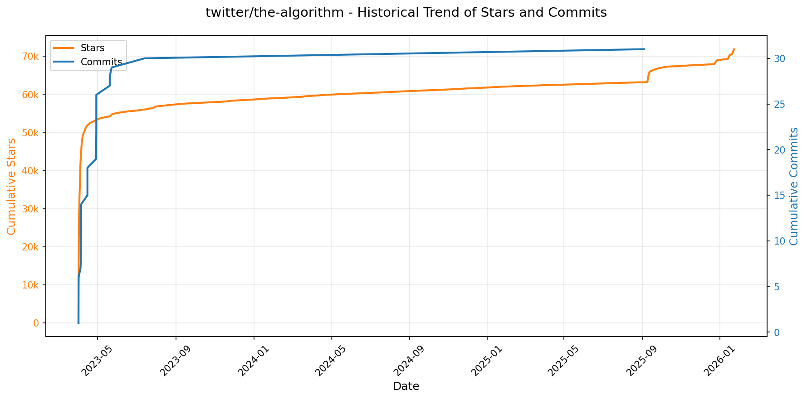

> *蓝色：累计 Stars｜橙色：累计 Commits（次 Y 轴）*

<b>📄 README 摘要</b>

1. **该项目做什么？**  
该项目是X（原Twitter）开源的推荐算法核心实现，旨在为X全平台（如“为你推荐”时间线、搜索、探索、通知等）提供个性化内容推荐服务。当前重点覆盖两大场景：**“为你推荐”时间线（For You Timeline）** 和 **推荐型通知（Recommended Notifications）**。它通过多阶段流水线（候选生成 → 排序 → 混排与过滤）动态构建用户个性化信息流，整合实时用户行为、社交图谱、内容语义与安全策略，实现高相关性、高时效性且合规可信的内容分发。

2. **关键特性**  
- **多源候选生成**：支持网络内（In-Network）与网络外（Out-of-Network）内容发现，涵盖搜索索引、用户-帖子交互图（UTEG/GraphJet）、关注推荐服务（FRS）等多种候选源；  
- **分层排序架构**：采用轻量级Ranker（Light Ranker）进行初筛，再由深度神经网络Heavy Ranker（如Home Recap模型）进行精细化打分，兼顾性能与效果；  
- **图驱动建模能力**：集成SimClusters（社区发现+稀疏嵌入）、TwHIN（用户/帖子知识图谱稠密嵌入）、Real-Graph（用户间互动预测）、TweepCred（基于PageRank的用户声望计算）等图学习组件；  
- **实时信号融合**：通过Unified User Actions（用户行为流）和User Signal Service（显式/隐式信号统一接入）支撑毫秒级反馈闭环；  
- **强合规与质量保障**：内置Visibility Filters实现法律合规过滤、NSFW/有害内容识别（Trust & Safety Models）、粗粒度降权及可见性处理；  
- **模块化可扩展框架**：基于Product Mixer构建可配置Feed流水线，Navi（Rust）提供高性能模型服务，Representation Manager统一管理嵌入向量，Timelines Aggregation Framework支持批流一体特征聚合。

3. **技术栈**  
- **编程语言**：以Scala（核心数据处理与图计算）、Python（深度学习模型训练与推理，如DeepBird/Timelines）、Java（搜索与基础服务）、Rust（Navi高性能模型服务）为主，辅以少量C++（底层优化）；  
- **机器学习框架**：TwML（基于TensorFlow v1的遗留框架）、PyTorch（Heavy Ranker等新模型实际依赖于the-algorithm-ml仓库，虽未在此仓直接体现但属协同栈）；  
- **基础设施与中间件**：Bazel（构建系统）、GraphJet（实时图存储与遍历引擎）、Kafka（实时事件流）、Earlybird（自研倒排索引搜索引擎）；  
- **数据与模型服务**：Tweetypie（帖子读写核心服务）、Representation Manager（嵌入向量服务）、Graph Feature Service（图特征API）、Navi（低延迟模型服务网关）；  
- **部署与架构范式**：微服务架构，强调服务解耦与跨平台复用；所有组件围绕统一数据契约与信号协议设计，支撑X全域产品表面的一致推荐体验。

---

### 3. [anthropics/claude-code](https://github.com/anthropics/claude-code)
- 📅 **创建日期**：2025-02-22  
- 🔄 **最近更新**：2026-01-26  
- ⭐ **Stars**：60,860（日 +302｜周 +2766｜月 +12102）  
- 📝 **描述**：Claude Code is an agentic coding tool that lives in your terminal, understands your codebase, and helps you code faster by executing routine tasks, explaining complex code, and handling git workflows - all through natural language commands.  

<b>📈 Star 与 Commit 历史趋势</b>

> *蓝色：累计 Stars｜橙色：累计 Commits（次 Y 轴）*

<b>📄 README 摘要</b>

1. **项目功能**  
Claude Code 是一款终端原生的智能编程助手，具备代码库感知能力，可通过自然语言指令在本地环境中执行日常开发任务。它支持自动完成重复性编码工作（如生成/修改代码）、解释复杂逻辑、管理 Git 工作流（如提交、分支操作、冲突分析），并可集成至终端、主流 IDE 或 GitHub（通过 `@claude` 提及调用），实现上下文感知的交互式编程协作。

2. **核心特性**  
- **本地代码理解与上下文感知**：深度解析当前项目结构、文件依赖和代码语义，提供精准的代码建议与操作；  
- **自然语言驱动的全栈开发支持**：支持用日常语言描述需求（如“为 API 添加 JWT 验证”或“解释这个 React Hook 的副作用逻辑”），自动生成、修改或注释代码；  
- **Git 智能工作流自动化**：直接通过指令完成提交信息生成、分支对比、PR 描述撰写、冲突原因分析等；  
- **插件化扩展架构**：内置可扩展插件系统，支持开发者自定义命令与专用代理（agents），增强特定场景能力（如测试生成、文档同步、CI/CD 集成）；  
- **多平台原生安装与轻量集成**：提供 macOS/Linux 一键脚本、Homebrew、Windows PowerShell 脚本、WinGet 等官方推荐安装方式，无需全局 Node.js 依赖；  
- **内建反馈与问题上报机制**：通过 `/bug` 命令一键提交运行时错误、会话上下文及用户反馈，提升问题复现与修复效率。

3. **技术栈**  
- **运行时环境**：基于 Node.js 18+ 构建，但采用独立分发包（非纯 npm 依赖），避免版本冲突；  
- **客户端架构**：终端优先（CLI-first）设计，底层融合进程间通信（IPC）、文件系统监听与 AST 解析能力，实现低延迟本地代码分析；  
- **AI 集成层**：与 Anthropic 的 Claude 大模型深度协同，通过安全可控的 API 通道调用，所有代码处理默认在本地完成敏感逻辑（如路径解析、语法树遍历），仅必要上下文经脱敏后发送至服务端；  
- **安装与分发**：跨平台原生打包（Shell 脚本、Homebrew Cask、PowerShell 模块、WinGet 包），不依赖用户全局 npm 环境；  
- **隐私与安全基础设施**：集成数据最小化采集、会话数据访问权限控制、敏感信息限时留存机制，并明确排除用户代码与对话用于模型再训练。

---

### 4. [openai/codex](https://github.com/openai/codex)
- 📅 **创建日期**：2025-04-13  
- 🔄 **最近更新**：2026-01-26  
- ⭐ **Stars**：57,479（日 +311｜周 +1085｜月 +3027）  
- 📝 **描述**：Lightweight coding agent that runs in your terminal  

<b>📈 Star 与 Commit 历史趋势</b>

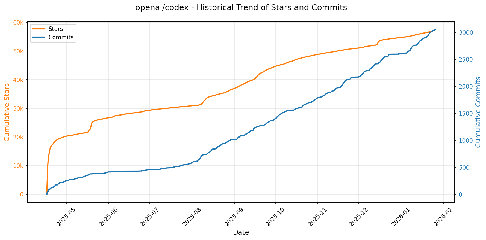

> *蓝色：累计 Stars｜橙色：累计 Commits（次 Y 轴）*

<b>📄 README 摘要</b>

1. **该项目的功能**  
Codex CLI 是 OpenAI 推出的一款**本地运行的编程智能代理（coding agent）**，专为开发者设计，可直接在用户计算机上执行代码理解、生成、补全、调试与重构等任务。它不依赖云端服务，所有推理和处理均在本地完成（需配合用户已有的 ChatGPT 订阅或 API 密钥进行身份验证和模型调用），支持通过命令行交互式使用，旨在提供离线优先、隐私友好且低延迟的编程辅助体验。

2. **核心功能**  
- ✅ **本地化运行**：无需上传代码至服务器，保障代码隐私与安全；  
- ✅ **多平台原生支持**：提供 macOS（Apple Silicon / Intel）、Linux（x86_64 / ARM64）预编译二进制包，支持 npm 全局安装及 Homebrew 一键安装；  
- ✅ **无缝集成 ChatGPT 订阅体系**：支持通过 ChatGPT 账户（Plus/Pro/Team/Edu/Enterprise）一键登录，自动继承对应权限与配额；  
- ✅ **API 密钥灵活认证**：兼容 OpenAI API Key 方式接入（需手动配置）；  
- ✅ **轻量命令行界面**：开箱即用，执行 `codex` 命令即可启动交互式编程助手；  
- ✅ **与 IDE 生态互补**：明确区分并引导用户至官方 IDE 插件（VS Code/Cursor/Windsurf）获取更深度编辑器集成能力。

3. **技术栈**  
- **构建与分发**：Rust（推测为主力实现语言，因发布包命名规范、musl 静态链接、跨平台二进制特性与 OpenAI 其他 CLI 工具一致）；  
- **包管理**：支持 `npm`（Node.js 生态）与 `Homebrew`（macOS/Linux 包管理）双渠道分发；  
- **认证与后端依赖**：前端 CLI 本身不包含大模型，而是作为客户端连接 OpenAI 的远程 Codex 或 GPT 系列 API（如 `gpt-4-turbo` 或专用 codex 后端），依赖 HTTPS 通信与 OAuth 2.0 / API Key 认证协议；  
- **运行环境**：独立可执行文件（无运行时依赖），基于 musl libc（Linux）或 Darwin 原生系统库（macOS），零外部运行时（如 Node.js/Python 不是必需）。

---

### 5. [usememos/memos](https://github.com/usememos/memos)
- 📅 **创建日期**：2021-12-08  
- 🔄 **最近更新**：2026-01-26  
- ⭐ **Stars**：55,833（日 +156｜周 +1005｜月 +8421）  
- 📝 **描述**：An open-source, self-hosted note-taking service. Your thoughts, your data, your control — no tracking, no ads, no subscription fees.  

<b>📈 Star 与 Commit 历史趋势</b>

> *蓝色：累计 Stars｜橙色：累计 Commits（次 Y 轴）*

<b>📄 README 摘要</b>

1. **项目功能**  
Memos 是一个开源、可自托管的轻量级笔记与知识管理服务，专注于个人笔记、团队 Wiki 和结构化知识库场景。它允许用户完全掌控自己的数据——所有内容存储在用户自选的基础设施上（本地服务器、云主机或容器环境），不依赖第三方云服务，无数据上传、无遥测追踪、无广告、无订阅费用，支持一键导出全部数据。

2. **核心特性**  
- **隐私优先架构**：零 telemetry、无任何数据外传，支持全量数据导出与迁移；  
- **原生 Markdown 支持**：富文本编辑体验基于标准 Markdown，底层以纯文本格式存储，确保长期可读性与可移植性；  
- **极致性能**：Go 编写的高效后端 + React 前端，启动快、响应低延迟，适配从单用户到中小团队规模；  
- **极简部署**：提供开箱即用的 Docker 镜像（一行命令启动），同时支持 SQLite（默认）、MySQL 和 PostgreSQL 多种数据库后端；  
- **开发者友好**：提供完备的 RESTful API 与 gRPC 接口，便于集成自动化工作流、CLI 工具或第三方应用；  
- **现代化 UI/UX**：简洁响应式界面，原生支持深色模式，适配桌面与移动端浏览。

3. **技术栈**  
- **后端**：Go（Golang），采用 Gin 框架，支持 SQLite / MySQL / PostgreSQL；  
- **前端**：React（TypeScript），基于 Vite 构建，使用 Tailwind CSS 实现响应式 UI；  
- **部署方案**：Docker 官方镜像（`neosmemo/memos`）、Docker Compose、Kubernetes（含 Helm Chart）、预编译二进制（Linux/macOS/Windows）及源码构建；  
- **协议与标准**：REST API + gRPC 双接口设计，遵循 MIT 开源协议，数据持久化为结构化 SQL + 纯文本 Markdown 文件。

---

### 6. [anthropics/skills](https://github.com/anthropics/skills)
- 📅 **创建日期**：2025-09-22  
- 🔄 **最近更新**：2026-01-26  
- ⭐ **Stars**：53,183（日 +1023｜周 +8347｜月 +25706）  
- 📝 **描述**：Public repository for Agent Skills  

<b>📈 Star 与 Commit 历史趋势</b>

> *蓝色：累计 Stars｜橙色：累计 Commits（次 Y 轴）*

<b>📄 README 摘要</b>

1. **该项目做什么？**  
该项目是 Anthropic 官方发布的 Claude 技能（Skills）开源实现仓库，用于演示和支撑 Claude 模型的“动态技能加载”能力。它不提供独立运行的软件或服务，而是通过结构化、自包含的技能包（每个技能为一个文件夹），使 Claude 能够按需加载并执行特定领域的专业化任务，例如文档生成与解析（PDF/DOCX/PPTX/XLSX）、Web 应用测试、MCP 服务器生成、品牌文案撰写、创意设计辅助等。这些技能本质上是面向 Claude 的可复用、可组合的任务指令集，旨在扩展其在真实业务场景中的泛化能力与可靠性。

2. **关键特性**  
- **模块化与自包含**：每个技能独立存于单独文件夹中，核心为 `SKILL.md` 文件，含 YAML 前置元数据（`name`、`description`）与结构化指令、示例及使用指南；  
- **多领域覆盖**：涵盖创意设计（艺术/音乐/视觉）、技术开发（自动化测试、协议生成）、企业应用（品牌沟通、合规文案）及高阶文档处理（格式识别、表单提取、内容重排）四大类技能集；  
- **生产级参考实现**：公开了驱动 Claude 官方文档功能的底层技能源码（如 `skills/docx`、`skills/pdf` 等），虽为“源码可用”（source-available）而非完全开源，但提供了复杂生产技能的设计范式；  
- **跨平台集成支持**：支持在 Claude Code（插件市场）、Claude.ai（付费版内置）、Claude API（上传自定义技能）三类主流接口中直接注册、安装与调用；  
- **标准化与可扩展性**：配套发布 [Agent Skills 规范](http://agentskills.io)（位于 `/spec` 目录）及官方技能模板（`/template`），为开发者提供统一开发标准与快速启动基础。

3. **技术栈**  
- **核心格式**：纯文本 Markdown（`SKILL.md`）+ YAML 前置元数据，零依赖、高可读、易维护；  
- **运行时环境**：完全依赖 Anthropic 的 Claude 模型推理引擎（v3.5+ 及后续版本），无独立后端或执行沙箱，技能逻辑由模型原生理解与调度；  
- **分发与集成机制**：基于 Claude 插件系统（Plugin Marketplace）和 Skills API，采用类 Git 仓库托管方式（GitHub），通过 CLI 命令（如 `/plugin install`）或 Web UI 完成技能注册；  
- **许可体系**：多数示例技能采用 Apache 2.0 开源协议，文档类核心技能为 Anthropic 专有源码可用（non-OSS），整体遵循开放协作与商业可控并重的设计原则。

---

### 7. [obra/superpowers](https://github.com/obra/superpowers)
- 📅 **创建日期**：2025-10-09  
- 🔄 **最近更新**：2026-01-26  
- ⭐ **Stars**：36,188（日 +747｜周 +7491｜月 +24282）  
- 📝 **描述**：An agentic skills framework & software development methodology that works.  

<b>📈 Star 与 Commit 历史趋势</b>

> *蓝色：累计 Stars｜橙色：累计 Commits（次 Y 轴）*

<b>📄 README 摘要</b>

1. **项目功能**  
Superpowers 是一个面向编程智能体（coding agents）的完整软件开发工作流框架，旨在将原本零散、随意的代码生成行为系统化、工程化。它不直接生成代码，而是通过一系列自动触发的、可组合的“技能”（skills），引导智能体严格遵循专业软件工程实践完成端到端开发：从与用户协同澄清需求、分块确认设计规格，到生成可执行的细粒度实施计划，再通过子智能体驱动开发（subagent-driven development）、强制测试先行（TDD）、双阶段代码审查、Git 工作树隔离、自动化验证等机制，确保每一步均有据可依、可验证、可回溯。其核心目标是让 AI 编程过程具备人类团队的工程纪律性与协作透明度。

2. **关键特性**  
- **全流程自动化工程闭环**：覆盖需求澄清（brainstorming）、设计验证、计划拆解（2–5 分钟/任务）、子智能体并行执行、红-绿-重构式 TDD、自动代码审查（requesting/receiving code-review）、Git 工作树隔离、分支收尾决策等 7 大强制性阶段；  
- **技能驱动（Skill-based）架构**：内置 15+ 经过验证的模块化技能（如 `test-driven-development`、`systematic-debugging`、`subagent-driven-development`），全部自动触发、不可绕过，支持按需组合与扩展；  
- **强约束性工程实践**：严格贯彻 RED-GREEN-REFACTOR、YAGNI、DRY、防御性验证（verification-before-completion）、根因追溯（root-cause-tracing）等原则；所有代码必须在对应测试失败后编写，未测代码自动删除；  
- **人机协同控制点**：在关键节点（如设计确认、计划批准、任务执行前/后）设置显式人工审核环节，确保用户始终掌握主导权；  
- **跨平台插件化支持**：原生适配 Claude Code（通过 Marketplace 插件）、Codex 和 OpenCode，提供标准化安装与自动更新机制（`/plugin update`）。

3. **技术栈**  
- **运行时环境**：深度集成于主流 AI 编程代理平台——Claude Code（Anthropic）、Codex（GitHub）、OpenCode（开源代理框架），依赖其底层 LLM 推理与工具调用能力；  
- **核心范式**：基于提示工程（Prompt Engineering）与技能剧本（Skill-as-Code）的声明式工作流编排，技能以 Markdown 文档（`.md`）形式组织在仓库中（如 `skills/test-driven-development/SKILL.md`），含明确触发条件、执行步骤与验证规则；  
- **基础设施层**：利用 Git 工作树（`git worktree`）实现沙箱化开发环境隔离；依赖标准 CLI 工具链（如 `git`、`sh`）执行验证与清理；无独立后端服务，纯客户端/插件侧运行；  
- **扩展与维护**：采用 MIT 许可的开源模式，技能即代码（Skills-as-Code），贡献者通过 Fork → Branch → 遵循 `writing-skills` 技能规范 → PR 流程参与共建。

---

### 8. [Lissy93/web-check](https://github.com/Lissy93/web-check)
- 📅 **创建日期**：2023-06-25  
- 🔄 **最近更新**：2026-01-26  
- ⭐ **Stars**：31,049（日 +109｜周 +766｜月 +3996）  
- 📝 **描述**：🕵️‍♂️ All-in-one OSINT tool for analysing any website  

<b>📈 Star 与 Commit 历史趋势</b>

> *蓝色：累计 Stars｜橙色：累计 Commits（次 Y 轴）*

---

### 9. [remotion-dev/remotion](https://github.com/remotion-dev/remotion)
- 📅 **创建日期**：2020-06-23  
- 🔄 **最近更新**：2026-01-26  
- ⭐ **Stars**：30,862（日 +1195｜周 +5499｜月 +5849）  
- 📝 **描述**：🎥      Make videos programmatically with React  

<b>📈 Star 与 Commit 历史趋势</b>

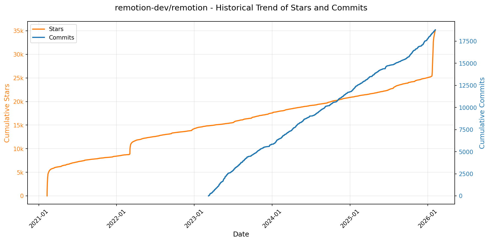

> *蓝色：累计 Stars｜橙色：累计 Commits（次 Y 轴）*

<b>📄 README 摘要</b>

1. **项目功能**  
Remotion 是一个基于 React 的视频生成框架，允许开发者使用 React 组件**以编程方式（code-first）创建视频**。它将视频视为可渲染的、时间可控制的 UI，支持在浏览器中实时预览、导出为 MP4/WebM 等格式，并可集成到自动化流程（如 CI/CD 或服务端渲染）中生成动态、个性化或数据驱动的视频内容（例如年度回顾、营销动画、教育可视化等）。

2. **核心特性**  
- ✅ **React 原生开发体验**：支持 JSX、Hooks、组件复用、Props 传递、状态管理与 React 生态（如第三方 UI 库）；  
- ✅ **时间轴精准控制**：通过 `useCurrentFrame()`、`interpolate()`、`Sequence`、`Composition` 等 API 实现帧级动画逻辑与时间分段编排；  
- ✅ **全栈 Web 渲染能力**：原生支持 CSS 动画、SVG、Canvas、WebGL（通过 Three.js 等）、HTML5 `<video>` 和 `<audio>`；  
- ✅ **高效开发工具链**：内置本地预览服务器、热重载（Fast Refresh）、帧跳转调试、性能分析面板；  
- ✅ **多平台输出能力**：支持导出高清 MP4/WebM 视频、GIF、逐帧 PNG 序列，亦可通过 Lambda/Serverless 方式进行无头批量渲染；  
- ✅ **生产就绪扩展性**：提供 CLI 工具（`npx create-video`）、TypeScript 支持、SSR 渲染适配、自定义渲染器插件机制。

3. **技术栈**  
- **核心框架**：React（v18+）、TypeScript；  
- **渲染层**：基于 HTML Canvas + OffscreenCanvas（浏览器端），Node.js + Puppeteer / Chromium Headless（服务端渲染）；  
- **构建与打包**：Vite（默认模板）、Webpack（兼容支持）；  
- **视频编码**：FFmpeg（本地导出及服务端渲染依赖）；  
- **辅助生态**：支持集成 Three.js、D3、Lottie、Framer Motion 等主流 Web 图形/动效库；  
- **部署与运行时**：支持 Vercel、Netlify（预览）、AWS Lambda、Cloudflare Workers（服务端渲染）。

---

### 10. [qarmin/czkawka](https://github.com/qarmin/czkawka)
- 📅 **创建日期**：2020-09-01  
- 🔄 **最近更新**：2026-01-26  
- ⭐ **Stars**：28,625（日 +318｜周 +486｜月 +1020）  
- 📝 **描述**：Multi functional app to find duplicates, empty folders, similar images etc.  

<b>📈 Star 与 Commit 历史趋势</b>

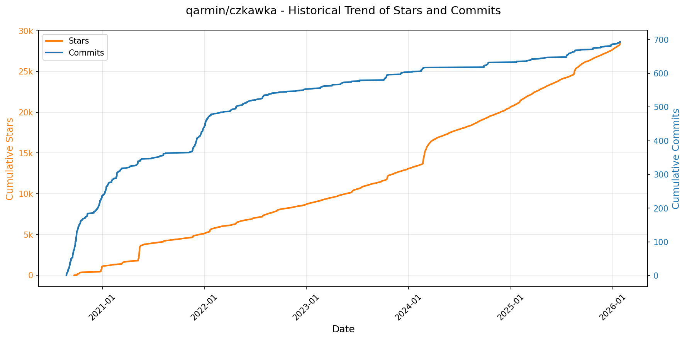

> *蓝色：累计 Stars｜橙色：累计 Commits（次 Y 轴）*

<b>📄 README 摘要</b>

1. **项目功能**  
该项目是一个面向多平台的开源文件清理工具套件，核心目标是帮助用户高效识别并清理计算机中各类冗余、无用或潜在问题文件。它包含两个主要前端：新一代 GUI 应用 **Krokiet**（基于 Slint 框架，GPL-3.0 许可）和已进入维护模式的旧版 GTK 4 前端 **Czkawka**（MIT 许可），二者均复用同一底层 Rust 核心库 `czkawka_core`。该套件不联网、不收集数据、无广告，专注于本地文件分析与安全清理。

2. **关键特性**  
- 支持 **15+ 类专业清理工具**：包括基于哈希/大小/名称的重复文件查找、空文件夹/空文件/临时文件检测、大文件定位、损坏/无效符号链接/错误扩展名/坏文件名识别；  
- 独有高级能力：**相似图像/视频比对**（容忍分辨率差异、水印等）、**音乐内容级去重**（非仅标签匹配）、**EXIF 元数据擦除**、**视频智能优化**（静态帧裁剪 + 格式转码）；  
- 性能卓越：纯 Rust 实现（近乎零 `unsafe` 代码），深度优化算法 + 多线程并行扫描，配合**本地缓存机制**显著加速重复扫描；  
- 高度可扩展：提供稳定、文档完善的 `czkawka_core` 库（crates.io 发布），已被 Tauri GUI、Python 绑定（PyPI）、文档矫正库等第三方项目集成；  
- 全平台支持：原生兼容 Linux、Windows、macOS、FreeBSD 等系统，GUI 可选 Slint（Krokiet）或 GTK 4（Czkawka），CLI 无缝自动化；  
- 隐私优先：完全离线运行，无网络权限，无遥测、无用户数据采集；支持多语言（波兰语、英语、意大利语等）。

3. **技术栈**  
- **主语言**：Rust（核心逻辑、CLI、Core 库及 Krokiet GUI，>99% safe code）；  
- **GUI 框架**：  
  - Krokiet：**Slint**（声明式 UI 框架，内存安全，跨平台原生渲染）；  
  - Czkawka：**GTK 4**（C 语言绑定，通过 Rust 的 gtk4-rs crate 调用）；  
- **CLI 工具**：纯 Rust 构建，支持 JSON 输出，便于脚本集成；  
- **构建与分发**：支持 Cargo 构建、Flathub 打包、预编译二进制发布；Python 绑定通过 `pyo3` 实现；  
- **许可证**：Czkawka 系列（GUI/CLI/Core）为 **MIT**；Krokiet 为 **GPL-3.0-only**；资源文件（图标等）采用 **CC BY 4.0**。

---

### 11. [ComposioHQ/awesome-claude-skills](https://github.com/ComposioHQ/awesome-claude-skills)
- 📅 **创建日期**：2025-10-17  
- 🔄 **最近更新**：2026-01-26  
- ⭐ **Stars**：25,827（日 +500｜周 +4473｜月 +14261）  
- 📝 **描述**：A curated list of awesome Claude Skills, resources, and tools for customizing Claude AI workflows  

<b>📈 Star 与 Commit 历史趋势</b>

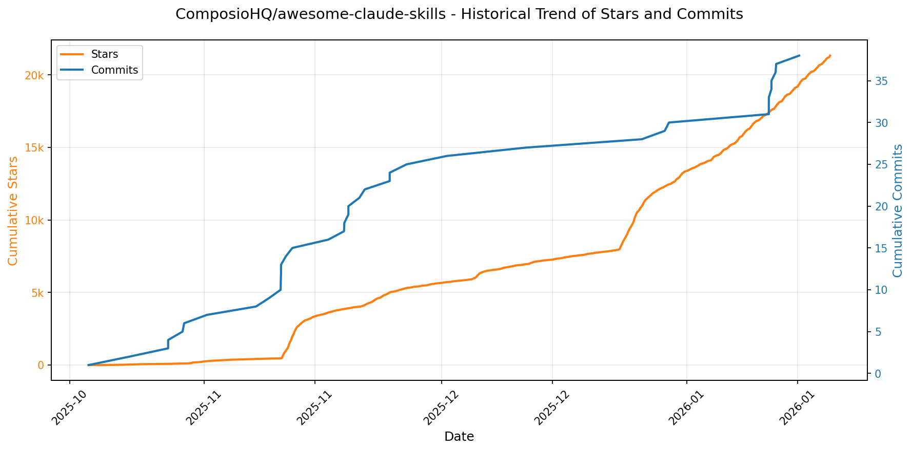

> *蓝色：累计 Stars｜橙色：累计 Commits（次 Y 轴）*

<b>📄 README 摘要</b>

1. **该项目的功能**  
该项目是一个面向 Anthropic Claude 系列模型（包括 Claude.ai、Claude Code 和 Claude API）的**可扩展技能（Skills）开源集合库**，旨在将 Claude 从纯文本生成工具升级为具备**真实操作能力的智能代理（Agent）**。它通过预构建、可复用的技能模块，使 Claude 能够执行跨平台、跨应用的自动化任务——例如发送邮件、创建 GitHub Issue、向 Slack 发送消息、操作 Notion/Google Workspace、连接数据库、运行安全扫描、生成可视化图表、处理文档（PDF/DOCX/PPTX/XLSX）、调试代码、分析会议记录、下载视频、增强图像等。核心目标是赋予 Claude “行动力”，使其能与 1000+ 第三方应用和服务（通过 Composio 连接）进行深度集成，完成端到端工作流。

2. **关键特性**  
- **开箱即用的多样化技能生态**：覆盖 9 大领域（文档处理、开发工具、数据分析、商业营销、写作沟通、创意媒体、生产力组织、协作项目管理、安全系统），含 60+ 经验证的高质量技能，全部开源且持续更新；  
- **真实世界操作能力（Action-Oriented Skills）**：依托 `connect-apps` 插件与 Composio 平台，支持 OAuth 认证、多应用连接（Gmail/Slack/GitHub/Notion 等超 500+ 应用），实现“发送→创建→更新→查询”等真实 API 调用；  
- **全平台兼容性**：技能统一适配 Claude.ai（网页端）、Claude Code（本地 IDE 插件）及 Claude API（编程调用），提供一致的行为逻辑与激活机制；  
- **低门槛接入与扩展**：提供标准化技能结构（`SKILL.md` + YAML 元数据 + 可选脚本/模板）、详细创建指南、最佳实践和 CLI 快速安装流程（如 `claude --plugin-dir`）；  
- **开发者友好型基础设施**：支持 MCP（Model Context Protocol）服务器构建、LangSmith 可观测性集成、Playwright 浏览器自动化、D3.js 可视化、PostgreSQL 安全查询等高级工程能力；  
- **社区驱动与开放贡献**：采用 Apache-2.0 许可证，明确欢迎 PR，提供贡献指南，并整合 Discord、X（Twitter）、LinkedIn 等社区入口。

3. **技术栈**  
- **核心运行时**：Anthropic Claude 模型（特别是 Claude 3.5 Sonnet 等最新版本），依赖其 Skills API 与插件系统；  
- **集成中间件**：[Composio](https://platform.composio.dev/) —— 作为底层连接层，提供统一 SDK、认证管理、1000+ 应用适配器（含 Gmail、Slack、GitHub、Notion、Jira 等）；  
- **前端/交互层**：React、Tailwind CSS、shadcn/ui（用于 `artifacts-builder` 等 HTML 产物生成）；  
- **后端/自动化工具链**：  
  - 编程语言：Python（主流，用于脚本、MCP 服务、PostgreSQL 查询、测试生成等）、TypeScript（MCP 构建、n8n 集成）、Shell/Bash（CLI 配置）；  
  - 开发工具：Playwright（Web 自动化测试）、FFUF（Web 模糊测试）、Git（工作流管理）、Docker（部分技能部署）；  
  - 数据与 AI 工具：LangSmith（LLM 追踪调试）、Gemini Deep Research Agent（自主研究）、NotebookLM（文档问答）、Sigma 规则引擎（威胁狩猎）；  
- **文档与元数据格式**：Markdown（`SKILL.md`）+ YAML 前置元数据（定义名称、描述、触发条件等）；  
- **部署与分发**：GitHub 仓库托管，通过 CLI 插件目录或配置文件路径加载技能，API 调用使用 `anthropic` Python SDK。

---

### 12. [bytedance/UI-TARS-desktop](https://github.com/bytedance/UI-TARS-desktop)
- 📅 **创建日期**：2025-01-19  
- 🔄 **最近更新**：2026-01-26  
- ⭐ **Stars**：24,827（日 +51｜周 +552｜月 +4750）  
- 📝 **描述**：The Open-Source Multimodal AI Agent Stack: Connecting Cutting-Edge AI Models and Agent Infra  

<b>📈 Star 与 Commit 历史趋势</b>

> *蓝色：累计 Stars｜橙色：累计 Commits（次 Y 轴）*

<b>📄 README 摘要</b>

1. **项目功能**  
TARS 是一个通用多模态 AI 智能体（Agent）技术栈，核心目标是实现类人化、端到端的任务自动化。它通过融合视觉（Vision）、图形用户界面（GUI）感知与操作、自然语言理解与生成能力，使 AI 能够直接在真实操作系统（Windows/macOS）、浏览器及终端环境中执行复杂任务。项目当前包含两大可独立部署的子系统：  
- **Agent TARS**：面向开发者与产品的轻量级多模态 Agent 运行时，支持 CLI 命令行与 Web UI 两种交互方式，可接入各类大模型（如 Claude、Doubao-Vision 等），并深度集成 MCP（Model Control Protocol）协议，驱动真实世界工具（如 Shell、浏览器、文件系统、API 服务等）完成跨应用任务（例如“在 Booking.com 预订机场附近丽思卡尔顿酒店 + 生成交通指南”）。  
- **UI-TARS Desktop**：基于 UI-TARS 视觉语言模型（如 Seed-1.5-VL/1.6）构建的本地化桌面应用，提供原生 GUI 自动化能力——无需网页注入或辅助插件，即可通过截图识别、像素级鼠标/键盘控制、实时状态反馈，实现对本地或远程计算机（含远程浏览器）的零配置、高精度操作（如“修改 VS Code 自动保存延迟”“查询 GitHub 最新 Issue”）。

2. **关键特性**  
- ✅ **多模态任务闭环能力**：原生支持图像输入（屏幕截图）、视觉定位（Visual Grounding）、GUI 元素识别与交互，结合 LLM 推理形成“看—想—做”完整链路；  
- ✅ **混合浏览器控制策略**：同时兼容 DOM 解析、GUI 视觉操作及二者协同的 Hybrid 模式，提升网页自动化鲁棒性；  
- ✅ **事件流驱动架构（Event Stream）**：采用协议化事件流（如 tool_call_start / tool_call_result / thinking_step）支撑上下文工程、调试可视化（Event Stream Viewer）及可扩展 Agent UI 开发；  
- ✅ **MCP 协议原生支持**：以 MCP 为内核通信标准，无缝挂载多种 MCP Server（如 Shell MCP、Browser MCP、File MCP），实现工具解耦与即插即用；  
- ✅ **全栈可控的本地化执行**：UI-TARS Desktop 支持纯离线运行，所有视觉推理与动作生成均在本地完成，保障数据隐私与安全性；  
- ✅ **开箱即用的跨平台部署**：提供一键 CLI（`npx @agent-tars/cli`）、Web UI、桌面客户端（Windows/macOS）及远程操作（Remote Computer/Browser Operator）四种形态，覆盖开发、测试、生产全场景。

3. **技术栈**  
- **核心模型层**：基于 UI-TARS 系列视觉语言模型（如 Seed-1.5-VL/1.6）、支持接入第三方多模态大模型（Anthropic Claude 3.7 Sonnet、VolcEngine DouBao-1.5-Thinking-Vision-Pro 等）；  
- **协议与框架**：以 **MCP（Model Control Protocol）** 为统一工具调用标准；采用 **Event Stream** 协议实现模块间异步通信与状态追踪；  
- **前端与交互**：Web UI 基于现代 Web 技术栈（推测为 React/Vite + Tailwind CSS）；UI-TARS Desktop 使用 **Electron 或 Tauri** 构建跨平台桌面应用（资源图标与 Electron 相关生态线索佐证）；  
- **后端与运行时**：CLI 工具基于 **Node.js（≥ v22）** 开发，通过 npm 分发（`@agent-tars/cli`）；支持本地沙箱环境（AIO Agent Sandbox）实现工具执行隔离；  
- **基础设施与部署**：支持 ModelScope、Hugging Face 等平台模型托管；提供云部署文档（含 ModelScope 集成）；SDK 层开放 **UI-TARS SDK** 实现跨平台 GUI 自动化代理开发；  
- **辅助生态**：集成 Discord、飞书、Twitter 社区；文档体系依托 GitBook（DeepWiki）与自建网站（agent-tars.com）；代码托管于 GitHub，遵循 Apache 2.0 开源协议。

---

### 13. [microsoft/VibeVoice](https://github.com/microsoft/VibeVoice)
- 📅 **创建日期**：2025-08-25  
- 🔄 **最近更新**：2026-01-26  
- ⭐ **Stars**：22,132（日 +406｜周 +1723｜月 +3084）  
- 📝 **描述**：Open-Source Frontier Voice AI  

<b>📈 Star 与 Commit 历史趋势</b>

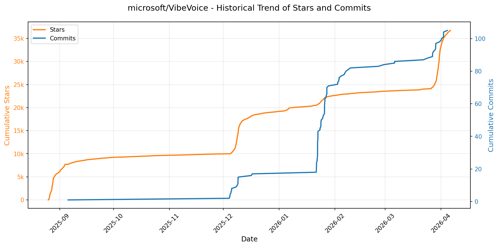

> *蓝色：累计 Stars｜橙色：累计 Commits（次 Y 轴）*

<b>📄 README 摘要</b>

1. **该项目做什么？**  
VibeVoice 是一个开源的前沿语音人工智能（Voice AI）研究框架，专注于长时序、高保真、结构化语音处理。它包含三大核心模型：  
- **VibeVoice-ASR**：统一的长时语音识别模型，支持单次处理长达60分钟的连续音频，输出包含说话人身份（Who）、时间戳（When）和文本内容（What）的结构化转录，并支持用户自定义热词（Hotwords）以提升领域准确性；  
- **VibeVoice-TTS**：长时多说话人文本转语音模型，可单次生成最长90分钟的自然语音，支持最多4个不同角色的对话，保持语义连贯性与说话人一致性；  
- **VibeVoice-Realtime**：轻量级（0.5B参数）实时流式TTS模型，支持边输入边生成（streaming text input），首字延迟约300ms，适用于交互式场景，可持续生成约10分钟高质量语音。  
> 注：原VibeVoice-TTS代码已于2025年9月5日被移除，当前仓库仅保留ASR与Realtime TTS相关实现。

2. **关键特性**  
- **超低帧率连续语音分词器**：采用7.5 Hz超低采样率的声学与语义联合tokenizer，在保障音质的同时大幅提升长序列处理效率；  
- **下一代语音生成架构**：基于“next-token diffusion”范式，融合大语言模型（LLM）理解文本上下文与对话逻辑，配合扩散头（diffusion head）建模高保真声学细节；  
- **端到端结构化输出**：ASR模型原生支持说话人分离（diarization）、精准时间戳对齐与内容识别一体化；  
- **高度可定制化**：ASR支持用户注入领域热词（如专有名词、术语），TTS支持多语言（含中英等）、多风格（11种英语语调+9种多语种语音）、多角色（4 speaker）及自发歌唱等复杂表达；  
- **工程友好部署能力**：ASR已集成vLLM加速推理；Realtime-TTS专为边缘/低延迟场景优化；提供Colab快速试用与Gradio在线Playground；  
- **全链路开源**：模型权重、技术报告（ASR/TTS）、微调代码（ASR finetuning）、推理文档（vLLM-ASR）全部公开。

3. **技术栈**  
- **基础模型架构**：基于Qwen2.5-1.5B作为LLM主干（ASR与TTS均继承其语言理解能力）；  
- **语音建模核心**：连续tokenization + next-token diffusion（非传统自回归或流式AR）；  
- **推理加速**：支持vLLM（用于ASR高效批处理）、Hugging Face Transformers生态；  
- **前端交互**：Gradio（ASR Playground）、Google Colab（Realtime-TTS演示）；  
- **训练与微调**：PyTorch生态，配套ASR微调脚本（finetuning-asr/）；  
- **发布与托管**：Hugging Face Model Hub（模型权重）、GitHub Pages（项目官网）、arXiv（技术报告）、Microsoft Docs（详细文档）。

---

### 14. [BloopAI/vibe-kanban](https://github.com/BloopAI/vibe-kanban)
- 📅 **创建日期**：2025-06-14  
- 🔄 **最近更新**：2026-01-26  
- ⭐ **Stars**：19,129（日 +179｜周 +1996｜月 +12401）  
- 📝 **描述**：Get 10X more out of Claude Code, Codex or any coding agent  

<b>📈 Star 与 Commit 历史趋势</b>

> *蓝色：累计 Stars｜橙色：累计 Commits（次 Y 轴）*

<b>📄 README 摘要</b>

1. **项目功能**  
Vibe Kanban 是一个面向 AI 编程代理（如 Claude Code、Gemini CLI、Codex、Amp 等）的开发者协作与任务编排平台。它不直接生成代码，而是作为“AI 工程师的操作系统”，聚焦于人类工程师在 AI 编程时代的核心工作流：任务规划、多代理协同调度、结果审查、本地/远程开发环境快速启动与状态追踪。其核心价值是将分散的 AI 编码代理统一接入、集中配置（尤其是 MCP 协议配置）、并行或串行编排执行，同时提供可视化看板（Kanban）实时跟踪各代理任务进度，并支持一键启动 dev server 或通过 SSH 远程打开项目（集成 VS Code Remote-SSH）。

2. **关键特性**  
- ✅ **多 AI 代理动态切换与统一管理**：支持 Claude Code、Gemini CLI、Codex、Amp 等主流编码代理，集中维护其 MCP（Model Context Protocol）配置；  
- ✅ **灵活的任务编排引擎**：支持按需触发单个代理，或定义依赖关系进行串行/并行任务流编排；  
- ✅ **一体化开发反馈闭环**：内置任务状态看板（待处理/运行中/已完成/失败），一键审查生成代码、即时启动本地/远程 dev server；  
- ✅ **远程开发深度集成**：原生支持通过 SSH 远程连接部署在服务器上的 Vibe Kanban 实例，点击“Open in VSCode”自动生成 `vscode://vscode-remote/ssh-remote+...` 链接，无缝接入远程工作区；  
- ✅ **安全可定制的自托管能力**：支持反向代理（Nginx/Caddy/Traefik）和自定义域名部署，通过 `VK_ALLOWED_ORIGINS` 精确控制跨域访问策略；  
- ✅ **轻量级零安装启动**：提供 `npx vibe-kanban` 一键运行方案，无需全局安装。

3. **技术栈**  
- **后端**：Rust（主力语言，用于高性能服务与 MCP 服务器实现），SQLx（异步数据库访问），Axum（Web 框架）；  
- **前端**：TypeScript + React（基于现代前端生态），Vite（构建工具），Tailwind CSS（UI 样式）；  
- **全栈工程**：pnpm（包与工作区管理），Cargo（Rust 构建与依赖），sqlx-cli（数据库迁移）；  
- **基础设施与集成**：MCP（Model Context Protocol）标准协议作为 AI 代理通信基石；支持 PostHog（可选分析）；环境变量驱动的构建时（如 `POSTHOG_API_KEY`）与运行时（如 `VK_ALLOWED_ORIGINS`, `MCP_PORT`）双重配置体系；  
- **部署与运维**：兼容 systemd / Docker / 云平台；支持 Cloudflare Tunnel / ngrok 等隧道工具暴露本地服务；深度集成 VS Code Remote-SSH 协议。

---

### 15. [davila7/claude-code-templates](https://github.com/davila7/claude-code-templates)
- 📅 **创建日期**：2025-07-04  
- 🔄 **最近更新**：2026-01-26  
- ⭐ **Stars**：18,434（日 +126｜周 +1203｜月 +4627）  
- 📝 **描述**：CLI tool for configuring and monitoring Claude Code  

<b>📈 Star 与 Commit 历史趋势</b>

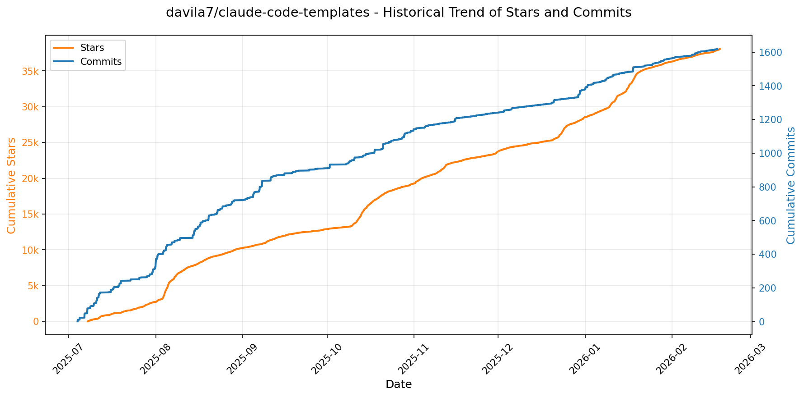

> *蓝色：累计 Stars｜橙色：累计 Commits（次 Y 轴）*

<b>📄 README 摘要</b>

1. **项目功能**  
该项目为 Anthropic 公司推出的 AI 编程工具 **Claude Code** 提供开箱即用、模块化、可组合的配置体系。它本质上是一个面向 Claude Code 生态的「模板包管理器」，支持一键安装和集成各类增强型组件（如 AI 智能体、自定义命令、外部服务连接器、系统设置、Git 钩子等），从而显著扩展 Claude Code 的原生能力，覆盖安全审计、性能优化、测试生成、数据库操作、GitHub 自动化等真实开发场景。

2. **核心特性**  
- ✅ **六大可插拔组件类型**：  
  - **🤖 AI 智能体（Agents）**：领域专用角色（如前端开发者、安全审计员、React 性能优化师）；  
  - **⚡ 自定义命令（Commands）**：`/generate-tests`、`/optimize-bundle` 等 Slash 命令；  
  - **🔌 MCP（Model Context Protocol）集成**：原生支持 GitHub、PostgreSQL、Stripe、AWS、OpenAI 等 10+ 外部服务；  
  - **⚙️ 系统级配置（Settings）**：超时控制、内存限制、输出格式等底层 Claude Code 参数；  
  - **🪝 Git/IDE 钩子（Hooks）**：预提交验证、代码生成后自动执行等自动化触发逻辑；  
  - **🎨 可复用技能（Skills）**：含 PDF 解析、Excel 自动化等具备渐进式交互能力的专业工作流。  
- ✅ **配套增强工具套件**：  
  - 实时会话分析（Analytics）、移动端聊天监控（Chats + Cloudflare Tunnel 远程访问）、健康检查（Health Check）、插件统一管理仪表盘（Plugins Dashboard）。  
- ✅ **交互式与 CLI 双模式安装**：支持 `npx` 快速安装单个或组合组件，亦可通过 [aitmpl.com](https://aitmpl.com) Web 界面可视化浏览与安装 100+ 组件。  
- ✅ **开源合规聚合**：整合并明确归因来自 Anthropic 官方、K-Dense-AI、obra、社区项目等 10+ 来源的 MIT/Apache/CC0 许可技能与智能体，严格保留原始许可证与作者署名。

3. **技术栈**  
- **运行时环境**：基于 Node.js，通过 `npx` 提供零依赖 CLI 入口；  
- **前端界面**：[aitmpl.com](https://aitmpl.com) 和 [docs.aitmpl.com](https://docs.aitmpl.com) 采用现代 Web 技术构建（推测为 Vercel 托管，项目获 Vercel OSS 计划认证）；  
- **通信与部署**：集成 Cloudflare Tunnel 实现安全远程会话访问；  
- **协议标准**：深度适配 Anthropic 官方 MCP（Model Context Protocol）规范，确保与 Claude Code 及 Cursor、Cline 等兼容客户端无缝协同；  
- **许可体系**：整体项目采用 **MIT License**，所有第三方组件均按其原始许可证（MIT / Apache 2.0 / CC0）分发并显式声明归属。

---

### 16. [shareAI-lab/learn-claude-code](https://github.com/shareAI-lab/learn-claude-code)
- 📅 **创建日期**：2025-06-29  
- 🔄 **最近更新**：2026-01-26  
- ⭐ **Stars**：15,334（日 +113｜周 +740｜月 +3603）  
- 📝 **描述**：Bash is all you need！write a claude code with only 16 line code   

<b>📈 Star 与 Commit 历史趋势</b>

> *蓝色：累计 Stars｜橙色：累计 Commits（次 Y 轴）*

<b>📄 README 摘要</b>

1. **项目功能**  
该项目是一个面向教育的开源实践教程，旨在通过从零构建一系列渐进式AI编码智能体（AI Coding Agent），帮助开发者深入理解现代AI代理系统（特别是类Claude Code风格的编码代理）的核心工作原理。它不提供开箱即用的生产级工具，而是以极简、可运行的Python脚本（v0–v4共5个版本）为载体，系统性地拆解并实现AI编码代理的关键范式：从最基础的Bash命令调用循环，逐步扩展至显式任务规划、子代理隔离、按需加载领域专业知识等完整能力链。最终目标是让学习者掌握“模型即代理”（Model as Agent）这一核心思想——即大语言模型本身已具备代理行为能力，工程重点在于设计恰当的工具接口与执行框架，而非过度干预推理过程。

2. **关键特性**  
- **渐进式教学架构**：提供5个严格递进的版本（v0–v4），代码量从16行增至550行，每版聚焦一个核心概念（如v0强调“Bash即万能工具”，v2引入TodoManager实现结构化规划，v3通过Task工具实现上下文隔离的子代理机制，v4基于Skill工具实现无需微调的领域知识动态注入）。  
- **Agent Skills规范兼容**：原生支持Anthropic官方《Agent Skills Spec》，可无缝对接Kode CLI、Claude Code、Cursor等主流AI编程环境，并提供`shareAI-skills`技能生态的安装与集成方案。  
- **生产就绪的技能系统**：内置多个可直接复用的示例技能（如`code-review`、`pdf`、`agent-builder`、`mcp-builder`），并提供`agent-builder`脚本一键生成新代理项目（支持不同复杂度等级）。  
- **极简核心循环抽象**：提炼出通用AI代理执行范式（`while True: model → tool_use → execute → append → loop`），所有版本均围绕此循环展开增强，突出“模型自主决策+工具精确执行”的分工本质。  
- **多语言文档与实操支持**：提供英文、中文、日文三语技术文档（docs/）及中文博客文章（articles/），配套完整测试套件（tests/）、环境配置指南（.env）和清晰文件结构，确保开箱即学、即跑、即懂。

3. **技术栈**  
- **核心语言**：Python 3.10+（所有代理脚本及工具均基于纯Python实现）  
- **AI模型层**：依赖Anthropic Claude系列模型（默认配置`claude-sonnet-4-5-20250929`），通过官方API调用，无本地模型或推理框架依赖  
- **工具交互协议**：遵循[Agent Skills Spec](https://github.com/anthropics/agent-skills)标准，工具函数以结构化JSON Schema定义，支持跨平台代理环境互操作  
- **辅助技术**：Bash shell（v0核心执行引擎）、环境变量配置（`.env`）、Git版本控制、GitHub Actions自动化测试（test.yml）  
- **开发与部署支持**：配套Kode CLI插件系统、独立技能仓库（`shareAI-skills`），形成“学习→开发→发布→复用”闭环生态

---

### 17. [supermemoryai/supermemory](https://github.com/supermemoryai/supermemory)
- 📅 **创建日期**：2024-02-27  
- 🔄 **最近更新**：2026-01-26  
- ⭐ **Stars**：14,759（日 +296｜周 +626｜月 +966）  
- 📝 **描述**：Memory engine and app that is extremely fast, scalable. The Memory API for the AI era.  

<b>📈 Star 与 Commit 历史趋势</b>

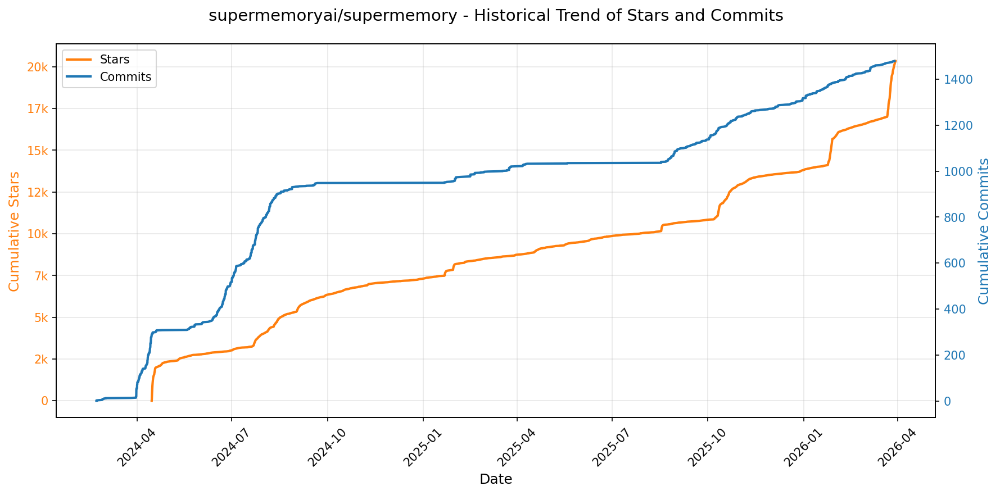

> *蓝色：累计 Stars｜橙色：累计 Commits（次 Y 轴）*

<b>📄 README 摘要</b>

1. **项目功能**  
Supermemory 是一个面向个人知识管理的 AI 增强型“第二大脑”工具，核心目标是帮助用户**永久保存、结构化组织并智能检索所有重要信息**。它支持从任意来源（网页链接、PDF 文档、纯文本、Notion/Google Drive/OneDrive 等云服务）一键存入“记忆”（Memories），并允许用户通过自然语言对话式交互（Chat）即时查询和调用这些私有知识库，实现真正的个性化 AI 助理体验。

2. **关键特性**  
- **多源记忆采集**：支持粘贴 URL、上传 PDF/文本、连接 Notion/Google Drive/OneDrive 等主流生产力平台自动同步内容；  
- **语义化记忆聊天**：基于向量检索与大模型推理，提供上下文感知的自然语言问答，精准定位并综合已存记忆作答；  
- **MCP（Memory Control Protocol）开放集成**：标准化协议，原生兼容 Claude、Cursor、VS Code 等主流 AI 开发/协作工具，实现记忆能力即插即用；  
- **全场景轻量接入**：提供 Chrome/Edge 浏览器扩展（支持网页右键保存、ChatGPT/Claude 对话中自动记忆、Twitter/X 内容抓取）及 Raycast 桌面扩展（快捷键添加/搜索记忆），覆盖工作流高频触点；  
- **企业级可扩展性**：支持自托管部署，提供开发者控制台与完整 API 文档，便于集成至内部系统或定制化开发。

3. **技术栈**  
- **前端**：React（主 Web 应用）、TypeScript（类型安全）、Vite（构建工具）；UI 组件库未明示，但界面显示为现代化响应式设计；  
- **后端与 AI 层**：基于向量数据库（如 Pinecone 或类似方案，文档未明确但属行业标准）实现记忆嵌入与检索；集成主流大语言模型（LLM）用于记忆理解与对话生成（支持 Claude 等第三方模型接入，通过 MCP 协议抽象）；  
- **基础设施**：云原生架构（支持自托管），配套 DevOps 工具链（GitHub Actions CI/CD）；  
- **客户端扩展**：Chrome Extension（Manifest V3）、Raycast Extension（基于 Raycast SDK）；  
- **其他**：使用 SVG（暗色/亮色模式适配）、Shields.io 生成状态徽章，文档托管于 docs.supermemory.ai（ likely Docusaurus 或 similar）。

---

### 18. [steveyegge/beads](https://github.com/steveyegge/beads)
- 📅 **创建日期**：2025-10-12  
- 🔄 **最近更新**：2026-01-26  
- ⭐ **Stars**：12,846（日 +170｜周 +1764｜月 +6477）  
- 📝 **描述**：Beads - A memory upgrade for your coding agent  

<b>📈 Star 与 Commit 历史趋势</b>

> *蓝色：累计 Stars｜橙色：累计 Commits（次 Y 轴）*

<b>📄 README 摘要</b>

1. **项目功能**  
Beads（`bd`）是一个**分布式、Git 背书的图谱型问题追踪系统**，专为 AI 编程代理（coding agents）设计。它将传统松散的 Markdown 计划替换为**结构化、依赖感知的有向图**，为 AI 代理提供持久化、可版本控制的“结构化记忆”，使其能可靠执行长周期、多步骤的复杂编码任务，避免上下文丢失和状态漂移。

2. **核心特性**  
- **Git 原生存储**：所有任务以 JSONL 格式存于 `.beads/` 目录下，天然支持 Git 分支、合并、回滚与协作，实现“代码即数据库”；  
- **AI 代理友好设计**：全命令行输出为机器可读 JSON；内置依赖建模（`bd dep add`）、自动识别就绪任务（`bd ready`）、基于哈希的唯一 ID（如 `bd-a1b2`）彻底规避多代理并发写入导致的合并冲突；  
- **智能上下文管理**：本地 SQLite 缓存加速访问，后台守护进程自动同步；支持语义化“记忆衰减”（Compaction），自动归档/摘要已关闭旧任务，节省 LLM 上下文窗口；  
- **灵活协作模式**：支持分层任务 ID（如 `bd-a3f8.1.1` 表示子任务），并提供三种部署模式——常规模式、隐身模式（`--stealth`，本地使用不提交）、贡献者模式（`--contributor`，规划隔离至独立仓库），适配开源协作中 contributor/maintainer 不同权限场景。

3. **技术栈**  
- **主实现语言**：Go（核心 CLI 工具 `bd` 用 Go 编写，保证跨平台性能与单二进制分发）；  
- **前端/集成生态**：提供 npm 包（`@beads/bd`）供 JS 生态集成，PyPI 包（`beads-mcp`）支持 Python/MCP 协议接入；  
- **存储与同步层**：底层依赖 Git 进行分布式持久化；本地缓存采用 SQLite；通过后台 daemon 实现 Git 自动同步；  
- **平台支持**：原生兼容 Linux、macOS、FreeBSD 及 Windows；  
- **扩展生态**：开放社区工具链（终端 UI、Web 界面、VS Code 插件等），文档中明确指引社区构建的各类集成方案。

---

### 19. [iOfficeAI/AionUi](https://github.com/iOfficeAI/AionUi)
- 📅 **创建日期**：2025-08-07  
- 🔄 **最近更新**：2026-01-26  
- ⭐ **Stars**：10,728（日 +433｜周 +4891｜月 +7530）  
- 📝 **描述**：Free, local, open-source Cowork for Gemini CLI, Claude Code, Codex, Opencode, Qwen Code, Goose Cli, Auggie, and more | 🌟 Star if you like it!  

<b>📈 Star 与 Commit 历史趋势</b>

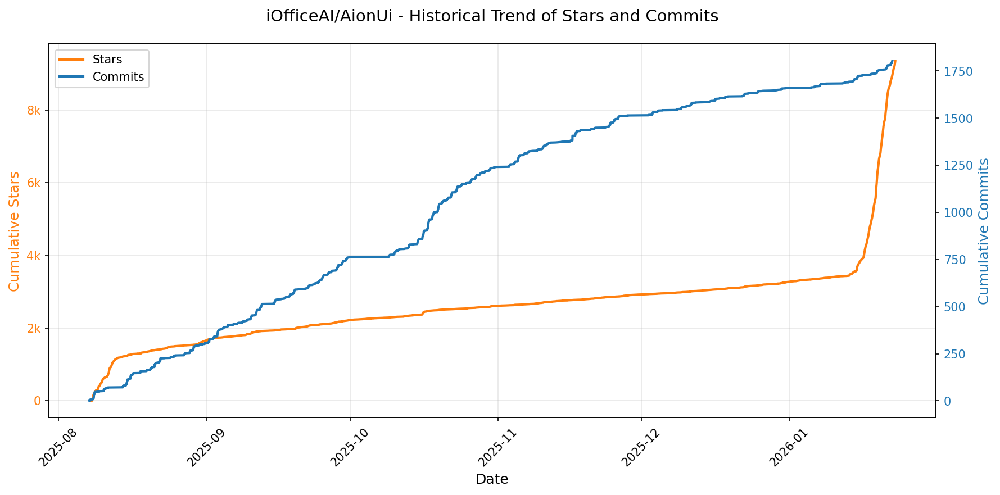

> *蓝色：累计 Stars｜橙色：累计 Commits（次 Y 轴）*

---

### 20. [VectifyAI/PageIndex](https://github.com/VectifyAI/PageIndex)
- 📅 **创建日期**：2025-04-01  
- 🔄 **最近更新**：2026-01-26  
- ⭐ **Stars**：9,147（日 +682｜周 +3646｜月 +4749）  
- 📝 **描述**：📑 PageIndex: Document Index for Vectorless, Reasoning-based RAG  

<b>📈 Star 与 Commit 历史趋势</b>

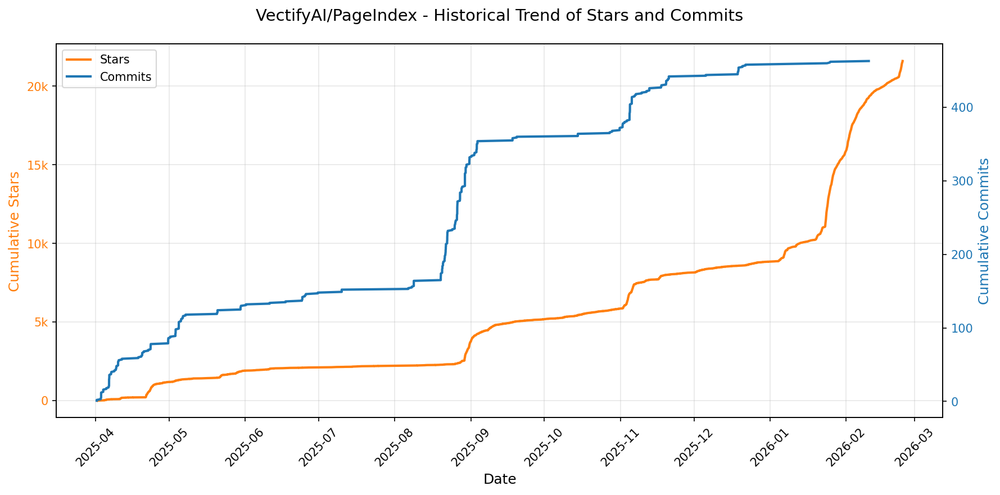

> *蓝色：累计 Stars｜橙色：累计 Commits（次 Y 轴）*

<b>📄 README 摘要</b>

1. **该项目做什么？**  
PageIndex 是一个**无需向量数据库、无需文本分块**的新型检索增强生成（RAG）系统，专注于**长专业文档（如财报、法律文书、技术手册、学术教材等）的高精度、可解释、人类式检索**。它不依赖传统语义相似度匹配，而是通过构建文档的**分层树状索引（类似智能目录）**，并利用大语言模型（LLM）在该索引上进行**多步推理式搜索（reasoning-based tree search）**，模拟人类专家阅读和定位信息的过程，从而直接定位最相关章节、段落或页面。

2. **核心功能**  
- ✅ **纯推理驱动检索**：基于树结构索引进行LLM引导的深度推理搜索，而非黑盒向量相似度匹配；  
- ✅ **零向量数据库依赖**：完全摒弃Vector DB，消除嵌入失真与“vibe检索”问题；  
- ✅ **零人工/机械分块**：保留文档天然语义结构（标题层级、章节逻辑），按逻辑节点组织内容；  
- ✅ **强可解释性与可追溯性**：每次检索结果附带明确的节点ID、页码范围及推理路径，支持审计与验证；  
- ✅ **原生支持视觉输入（Vision-based RAG）**：可直接处理PDF页面图像（无需OCR），实现OCR-free的端到端视觉推理检索；  
- ✅ **开箱即用的多形态部署**：提供本地自托管（开源代码）、云聊天平台（chat.pageindex.ai）、MCP插件（兼容Claude/Cursor等）、REST API及企业级私有化方案。

3. **技术栈**  
- **核心范式**：Agentic RAG、In-context Tree Indexing、Reasoning-over-Structure；  
- **模型层**：深度集成OpenAI系列模型（默认 `gpt-4o-2024-11-20`），支持LLM驱动的树构建与树搜索；  
- **文档解析**：PDF文本提取（基于PyPDF/fitz等）、原生Markdown结构解析（按`#`层级自动建树）；  
- **索引表示**：JSON格式的递归树结构（含`title`、`node_id`、`start_index`/`end_index`、`summary`、嵌套`nodes`）；  
- **工程栈**：Python 3.x、CLI工具链（`run_pageindex.py`）、`.env`环境管理、Colab Notebook示例；  
- **扩展能力**：支持MCP（Model Context Protocol）标准协议，可无缝接入主流AI Agent框架；  
- **进阶能力（配套服务）**：专有**PageIndex OCR**（非本仓库开源，但文档提及）——面向长上下文、全局结构感知的OCR模型，用于高质量PDF→结构化Markdown转换。

---

### 21. [virattt/dexter](https://github.com/virattt/dexter)
- 📅 **创建日期**：2025-10-14  
- 🔄 **最近更新**：2026-01-26  
- ⭐ **Stars**：8,949（日 +92｜周 +1580｜月 +4612）  
- 📝 **描述**：An autonomous agent for deep financial research  

<b>📈 Star 与 Commit 历史趋势</b>

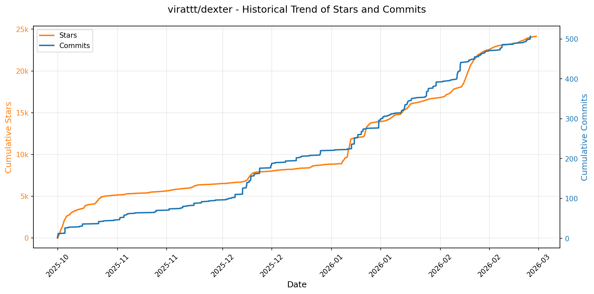

> *蓝色：累计 Stars｜橙色：累计 Commits（次 Y 轴）*

<b>📄 README 摘要</b>

1. **项目功能**  
Dexter 是一个面向金融研究的自主式 AI 代理（Autonomous Financial Research Agent），能够对复杂金融问题进行端到端的自主分析：接收用户提问 → 拆解为多步研究计划 → 调用实时金融数据源与网络搜索工具执行任务 → 自我验证结果 → 迭代优化直至生成可信、数据支撑的结论。其核心目标是替代传统人工财务尽调与研报撰写流程，实现“思考-规划-执行-反思-学习”的闭环研究能力。

2. **关键特性**  
- **智能任务规划（Intelligent Task Planning）**：自动将模糊/复杂的金融问题（如“评估某公司未来两年盈利可持续性”）分解为结构化子任务（如“获取近3年财报→计算关键比率→对比同业→识别风险信号”）。  
- **自主执行与工具编排（Autonomous Execution）**：动态选择并调用适配工具链——包括 Financial Datasets API（获取结构化财报数据）、Exa/Tavily（补充网络信源）、以及大模型推理能力，完成数据采集与分析。  
- **自验证与迭代优化（Self-Validation）**：内置检查机制，对中间结果进行合理性校验（如财务勾稽关系、逻辑一致性），失败时自动重试或调整策略，支持多轮反思与修正。  
- **实时金融数据集成**：原生支持接入收入表、资产负债表、现金流量表等标准化财务报表数据，保障分析时效性与权威性。  
- **安全运行保障**：集成循环检测（loop detection）与最大步骤限制（step limits），防止无限推理或失控执行，确保系统稳定可控。

3. **技术栈**  
- **运行时**：Bun（v1.0+）——作为轻量级、高性能的 JavaScript/TypeScript 运行时，替代 Node.js，提升启动与依赖安装速度。  
- **核心语言**：TypeScript —— 提供强类型保障，支撑复杂 Agent 逻辑与工具接口定义。  
- **AI 模型后端**：支持多模型路由，主依赖 OpenAI API（如 GPT-4），同时可选集成 Anthropic（Claude）、Google（Gemini）、xAI（Grok）及本地 Ollama 模型（通过 `OLLAMA_BASE_URL` 配置）。  
- **数据服务**：  
  - `Financial Datasets API`（必需）—— 提供标准化、API 可调用的上市公司财报数据；  
  - `Exa API`（首选）或 `Tavily API`（备用）—— 提供高质量、金融垂类优化的网络搜索能力，用于补充新闻、公告、行业报告等非结构化信息。  
- **架构模式**：基于 LLM 的自主 Agent 架构，融合 ReAct（Reasoning + Acting）、Chain-of-Thought（CoT）与 Self-Reflection 机制，强调可解释性与可控性。

---

### 22. [danielmiessler/Personal_AI_Infrastructure](https://github.com/danielmiessler/Personal_AI_Infrastructure)
- 📅 **创建日期**：2025-09-08  
- 🔄 **最近更新**：2026-01-26  
- ⭐ **Stars**：5,883（日 +117｜周 +714｜月 +3699）  
- 📝 **描述**：Agentic AI Infrastructure for magnifying HUMAN capabilities.  

<b>📈 Star 与 Commit 历史趋势</b>

> *蓝色：累计 Stars｜橙色：累计 Commits（次 Y 轴）*

<b>📄 README 摘要</b>

1. **项目功能**  
PAI（Personal AI Infrastructure，个人AI基础设施）是一个开源的、面向终端用户的个性化AI平台，旨在将通用人工智能能力转化为真正属于个体的“数字助手”（Digital Assistant, DA）。它并非仅提供一次性问答或任务执行，而是构建一个持续学习、深度理解用户目标与身份、并随时间不断进化的AI系统。其核心使命是：**激活人类的创造性潜能**——通过AI辅助自我发现（如明确使命、目标、信念等），帮助用户系统化地认知自我、设定人生目标、优化日常实践；同时确保世界顶尖的AI能力对所有人（无论技术背景或经济条件）开放可及，打破AI使用的精英壁垒。

2. **关键特性**  
- **目标导向（Goal-Oriented）**：以用户的人生目标（TELOS）为系统运行中心，所有操作均围绕MISSION.md、GOALS.md等10个核心身份文档展开，而非被动响应零散任务。  
- **持续自学习（Continuous Learning Loop）**：实现“观察→思考→计划→执行→验证→学习→改进”的完整科学方法论闭环；自动捕获评分、情感、验证结果、修改痕迹等信号，动态强化成功模式、修正失败路径。  
- **深度个性化架构（Granular Customization）**：支持六层定制（身份/偏好/工作流/技能/钩子/记忆），用户数据（USER/）与系统代码（SYSTEM/）严格分离，保障升级安全与身份可移植。  
- **全栈智能 primitives**：包含记忆系统（热/温/冷三级）、钩子系统（8类生命周期事件响应）、安全系统（默认策略拦截高危命令）、AI驱动安装（DA自主解析并部署Packs）、语音系统（ElevenLabs TTS）、通知系统（ntfy/Discord集成）、终端UI（动态状态栏与上下文感知）等10+核心组件。  
- **工程化设计原则**：遵循16条PAI原则，强调确定性（非概率性）基础设施、CLI优先、代码优于提示词、测试先行、UNIX哲学、权限容错（显式允许“我不知道”）等生产级AI工程实践。  
- **模块化分发体系（Packs & Bundles）**：功能以自包含、AI可安装的Pack形式发布（如pai-hook-system、pai-core-install），支持一键全自动部署或按需组合（Bundle），当前含23个官方Pack与1个基础Bundle。

3. **技术栈**  
- **核心语言与运行时**：TypeScript（强类型保障系统可靠性）、Bun（高性能JavaScript/TypeScript运行时，替代Node.js，用于脚本执行与CLI开发）。  
- **AI模型与协同**：深度集成Claude（Anthropic）系列模型，项目明确标注“Built with Claude”，并针对Claude Code环境深度优化（如Hook系统兼容Claude Code插件生态）。  
- **基础设施与工具链**：基于CLI（命令行界面）构建，强调终端原生体验；采用Git进行版本控制与协作；利用Discord（UL Community）作为主要社区沟通渠道。  
- **第三方服务集成**：ElevenLabs（语音合成）、ntfy.sh（跨平台推送通知）、GitHub（发布管理与协作）。  
- **架构范式**：严格遵循UNIX哲学（单一职责、文本接口、可组合性），融合SRE/ENG工程实践（自动化、可观测性、监控、版本化配置）。

---

### 23. [Blaizzy/mlx-audio](https://github.com/Blaizzy/mlx-audio)
- 📅 **创建日期**：2024-11-27  
- 🔄 **最近更新**：2026-01-26  
- ⭐ **Stars**：4,375（日 +831｜周 +1118｜月 +1248）  
- 📝 **描述**：A text-to-speech (TTS), speech-to-text (STT) and speech-to-speech (STS) library built on Apple's MLX framework, providing efficient speech analysis on Apple Silicon.  

<b>📈 Star 与 Commit 历史趋势</b>

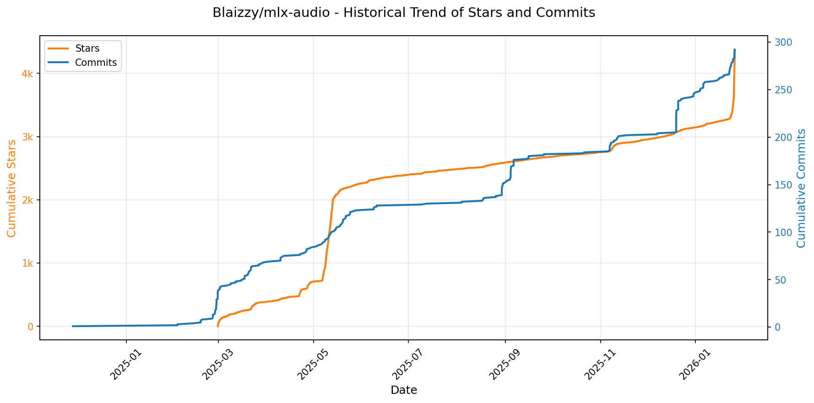

> *蓝色：累计 Stars｜橙色：累计 Commits（次 Y 轴）*

<b>📄 README 摘要</b>

1. **项目功能**  
MLX-Audio 是一个专为 Apple Silicon（M 系列芯片）优化的高性能音频处理库，核心能力覆盖三大语音任务：**文本转语音（TTS）**、**语音转文本（STT）** 和 **语音转语音（STS）**。它支持端到端本地推理，无需云端依赖，可直接在 macOS 或 iOS 设备上运行；同时提供命令行工具、Python API、Web 界面及 OpenAI 兼容 REST API，实现从开发集成到产品部署的一站式音频 AI 应用支持。

2. **关键特性**  
- ✅ **Apple Silicon 深度优化**：基于 MLX 框架实现超低延迟、高吞吐量推理，充分利用 GPU/NPU 协同加速；  
- ✅ **全栈语音能力**：涵盖 TTS（含多语言、多音色、语速调节、语音克隆）、STT（支持长音频、说话人分离、时间戳、上下文热词增强）、STS（声源分离、语音增强、跨模态转换）；  
- ✅ **工业级实用性**：内置 15+ 经过适配与验证的开源模型（如 Kokoro、Qwen3-TTS、Whisper-v3-turbo、VibeVoice-ASR、SAM-Audio、MossFormer2），全部预置 MLX 格式并支持量化；  
- ✅ **灵活部署与集成**：提供 pip/uv 安装、Swift 包（iOS/macOS 原生支持）、Web UI（含 3D 音频可视化）、OpenAI 兼容 API（`/v1/audio/speech`, `/v1/audio/transcriptions`）；  
- ✅ **高效模型压缩**：原生支持 3/4/6/8-bit 量化及 bfloat16/fp16/fp32 精度转换，显著降低显存占用并提升推理速度；  
- ✅ **开箱即用体验**：CLI 支持 `--play` 实时播放、`--output_path` 自定义保存、`--ref_audio` 一键语音克隆；Python API 返回 `mx.array` 波形，无缝对接 MLX 生态。

3. **技术栈**  
- **底层框架**：Apple 官方 [MLX](https://github.com/ml-explore/mlx)（专为 Apple Silicon 设计的轻量级机器学习框架，替代 PyTorch/TensorFlow）；  
- **编程语言**：Python（主逻辑、CLI、API 服务）、Swift（独立子项目 `mlx-audio-swift`，支持 iOS/macOS 原生调用）；  
- **前端技术**：Web UI 基于现代前端栈（`npm` + `Vite`/`React` 或类似框架，README 中提示 `npm run dev`）；  
- **模型格式**：MLX 原生权重格式（`.safetensors` 或 `.npz`），兼容 Hugging Face Hub；  
- **依赖组件**：`ffmpeg`（MP3/FLAC 编码）、`misaki`（日/中文本分词与音素处理）、`mlx` 及其生态库（`mlx.nn`, `mlx.optimizers` 等）；  
- **部署协议**：RESTful API（FastAPI 或轻量 HTTP 服务）、CLI 工具链、Swift Package Manager（SPM）集成。

---

### 24. [OpenBMB/UltraRAG](https://github.com/OpenBMB/UltraRAG)
- 📅 **创建日期**：2025-01-16  
- 🔄 **最近更新**：2026-01-26  
- ⭐ **Stars**：4,134（日 +644｜周 +1701｜月 +1761）  
- 📝 **描述**：UltraRAG v3: A Low-Code MCP Framework for Building Complex and Innovative RAG Pipelines  

<b>📈 Star 与 Commit 历史趋势</b>

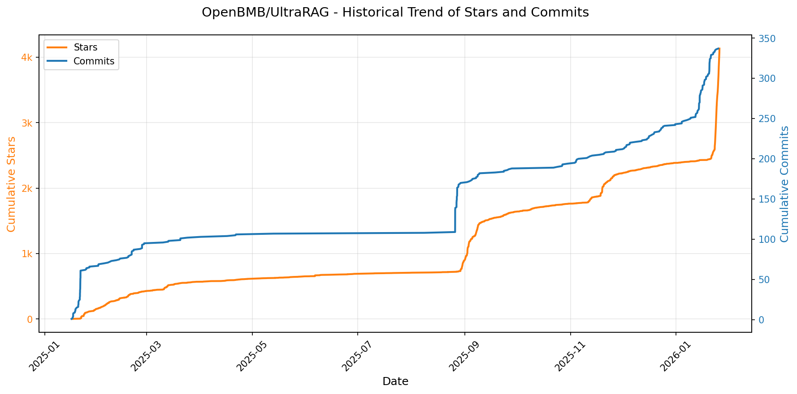

> *蓝色：累计 Stars｜橙色：累计 Commits（次 Y 轴）*

<b>📄 README 摘要</b>

1. **该项目的功能**  
UltraRAG 是一个面向研究探索与工业原型开发的轻量级检索增强生成（RAG）开发框架，旨在显著降低 RAG 系统构建的技术门槛与工程复杂度。它基于 **Model Context Protocol（MCP）架构**，将 RAG 的核心组件（如检索器 Retriever、生成器 Generation 等）标准化为独立、可互操作的 **MCP Servers**，并通过 **MCP Client** 实现声明式工作流编排。用户无需编写大量胶水代码，即可快速构建、调试、评估和部署高性能、可复现、可解释的 RAG 系统——从学术实验（如多跳检索、评估对比）到工业应用（如 DeepResearch 自动长报告生成）均可覆盖。

2. **关键特性**  
- **低代码可视化工作流编排**：支持通过 YAML 配置文件定义顺序、条件分支、循环等复杂控制逻辑，数十行配置即可实现迭代式 RAG 流程；配套 UltraRAG UI 提供画布拖拽+代码双向同步的 RAG IDE，集成 Pipeline Builder、智能 AI 助手、知识库管理与一键 Web UI 生成能力。  
- **模块化与高复用性**：严格遵循 MCP 架构，所有功能以“原子化 Server”形式解耦；新增能力（如新检索算法、新 LLM 接口）仅需注册为标准 Tool 即可无缝接入现有流程，极大提升扩展性与复现性。  
- **统一评估与开箱即用基准**：内置标准化评测流水线，预集成主流 RAG 公共数据集（如 UltraRAG Benchmark）、统一指标体系与基线模型，支持一键跑通实验、横向对比与结果可视化分析，显著提升科研效率与结果可信度。  
- **端到端闭环交付能力**：覆盖“逻辑设计→数据治理→调试分析→交互演示→生产部署”全生命周期，支持本地/容器化部署（CPU/GPU），并提供 DeepResearch 等旗舰级应用案例，实现从算法创新到产品落地的高效转化。

3. **技术栈**  
- **核心协议与架构**：Model Context Protocol（MCP）作为底层通信与组件抽象标准；采用 Server-Client 分离设计，各组件通过 MCP 协议交互。  
- **开发语言与运行时**：Python 为主（兼容主流科学计算与 AI 生态），依赖 `uv` 作为推荐的高速 Python 包与虚拟环境管理工具。  
- **前端与交互层**：UltraRAG UI 基于 Web 技术构建（具体框架未明示，但具备实时双向编辑、可视化画布、调试面板等功能），提供本地 Web 访问（默认端口 5050）。  
- **部署方式**：支持两种模式——  
  • **源码本地部署**：基于 `uv sync` 或 `uv pip install -e` 进行模块化依赖安装（支持 core / retriever / generation / all-extras 等按需安装）；  
  • **Docker 容器化部署**：提供预构建镜像（CPU/GPU 基础版及全功能版），一键启动，开箱即用。  
- **生态集成**：深度适配 Hugging Face 模型（如 AgentCPM-Report）、Milvus 向量数据库，并兼容主流开源 LLM 与检索模型。

---

### 25. [Psiphon-Inc/conduit](https://github.com/Psiphon-Inc/conduit)
- 📅 **创建日期**：2024-09-13  
- 🔄 **最近更新**：2026-01-26  
- ⭐ **Stars**：97（日 +34｜周 +71｜月 +77）  
- 📝 **描述**：Conduit Client  

<b>📈 Star 与 Commit 历史趋势</b>

> *蓝色：累计 Stars｜橙色：累计 Commits（次 Y 轴）*

<b>📄 README 摘要</b>

1. **该项目的功能**：  
Conduit App 是一个移动应用，用于在 Android、iOS 和 macOS（通过 Catalyst）平台上运行 Psiphon 的 `psiphon-tunnel-core` 代理隧道核心，实现网络流量的加密代理与规避审查功能。

2. **关键特性**：  
- 跨平台支持：原生适配 Android、iOS，并通过 Apple Catalyst 支持 macOS；  
- 集成 Psiphon 隧道核心：直接调用经过验证的 `psiphon-tunnel-core` 库，提供高可靠性与安全性；  
- 使用 Git LFS 管理大型二进制文件（如预编译的隧道核心库），保障仓库轻量化与构建可重复性；  
- 支持国际化（i18n）：具备完整的翻译拉取与验证流程，便于多语言部署。

3. **技术栈**：  
- 核心代理引擎：`psiphon-tunnel-core`（Go 语言编写，以静态库/动态库形式集成）；  
- 客户端平台：Android（Java/Kotlin）、iOS/macOS（Swift/Objective-C + Catalyst）；  
- 版本与大文件管理：Git + Git LFS；  
- 国际化：基于标准本地化机制（如 Android `strings.xml`、iOS `.strings` 文件），配套独立 i18n 工作流。

---

