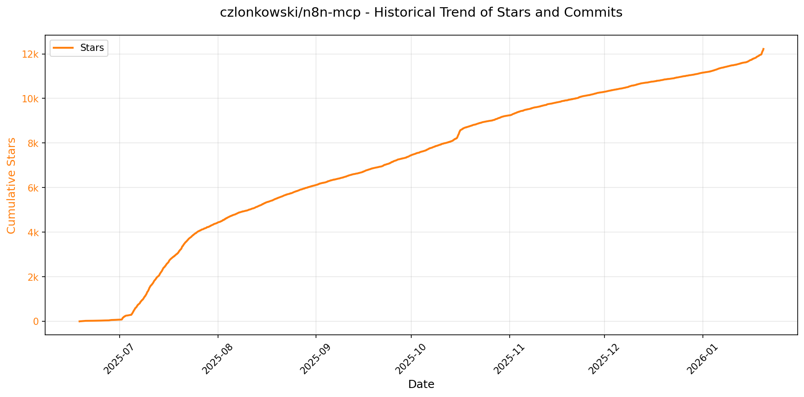
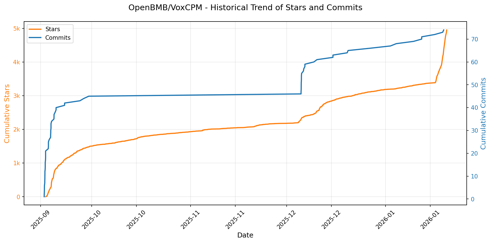

# 🌟 GitHub Trending 概览

> 数据更新于：2026-01-20。

---

## 🔍 项目详情

### 1. [anomalyco/opencode](https://github.com/anomalyco/opencode)
- 📅 **创建日期**：2025-04-30  
- 🔄 **最近更新**：2026-01-20  
- ⭐ **Stars**：79,142（日 +1904｜周 +13973｜月 +38714）  
- 📝 **描述**：The open source coding agent.  

<b>📈 Star 与 Commit 历史趋势</b>

> *蓝色：累计 Stars｜橙色：累计 Commits（次 Y 轴）*

<b>📄 README 摘要</b>

1. 该项目是一个开源的AI编程代理工具，旨在帮助开发者在终端环境中通过自然语言与代码库进行交互，实现代码编写、分析和探索等功能。它支持本地运行，并可通过命令行或桌面应用使用，具备多模型兼容性，允许用户选择不同的大语言模型（包括本地模型）来驱动其功能。

2. 关键特性包括：  
   - 内置两种可切换的智能体（Agent）：“build”用于完整的开发任务，“plan”为只读模式，适用于代码分析和变更规划；还包含一个用于复杂搜索和多步骤任务的“general”子代理。  
   - 支持多种安装方式，涵盖主流包管理器（如npm、brew、scoop、choco、mise等），并提供跨平台桌面应用程序（macOS、Windows、Linux）。  
   - 提供LSP（语言服务器协议）开箱即用支持，增强代码理解与编辑能力。  
   - 采用客户端/服务器架构，支持远程控制，例如可在本地运行服务并通过移动端操作。  
   - 高度可配置，支持自定义安装路径及外部模型接入，不绑定任何特定AI服务提供商。  

3. 技术栈主要包括：  
   - 前端基于终端用户界面（TUI），面向neovim用户设计，强调终端体验优化。  
   - 使用TypeScript/JavaScript构建，项目结构模块化（如packages/console、packages/web）。  
   - 支持与多种大语言模型集成（如Claude、OpenAI、Google模型以及本地模型），通过OpenCode Zen推荐模型服务。  
   - 构建系统利用GitHub Actions实现自动化发布流程。  
   - 桌面版基于原生打包方案（如DMG、EXE、AppImage、deb、rpm）并支持Homebrew Cask和Scoop等分发渠道。

---

### 2. [hacksider/Deep-Live-Cam](https://github.com/hacksider/Deep-Live-Cam)
- 📅 **创建日期**：2023-09-24  
- 🔄 **最近更新**：2026-01-20  
- ⭐ **Stars**：78,576（日 +225｜周 +1024｜月 +2377）  
- 📝 **描述**：real time face swap and one-click video deepfake with only a single image  

<b>📈 Star 与 Commit 历史趋势</b>

> *蓝色：累计 Stars｜橙色：累计 Commits（次 Y 轴）*

<b>📄 README 摘要</b>

1. 该项目是一个实时人脸交换和视频深度伪造工具，仅需单张图像即可在视频、直播或摄像头画面中实现一键换脸。支持多种应用场景，如实时直播、观看电影时替换角色面部、制作表情包、在Omegle等社交平台使用虚拟形象等，所有处理均在本地实时完成。

2. 主要功能包括：实现实时换脸；支持通过“嘴部遮罩”保留原始嘴部动作以提高自然度；可在同一画面中对多个目标进行不同人脸映射（多脸模式）；支持将任意人脸实时叠加到电影或其他视频内容中；适用于直播表演和娱乐用途；提供简单易用的三步操作流程（选择人脸、选择摄像头、点击开始）；内置内容审查机制，防止处理包含裸露、暴力等敏感内容的媒体。

3. 技术栈基于Python开发，核心依赖包括：InsightFace用于人脸识别与对齐，ONNX Runtime作为推理引擎并支持多种执行后端（如CUDA、CoreML、DirectML、OpenVINO、CPU），GFPGAN用于人脸增强修复，PyTorch相关库支持模型运行，ffmpeg处理音视频编解码，Tkinter构建图形用户界面。项目支持跨平台运行，适配NVIDIA/AMD GPU、Apple Silicon芯片及Intel集成显卡等多种硬件环境。

---

### 3. [twitter/the-algorithm](https://github.com/twitter/the-algorithm)
- 📅 **创建日期**：2023-03-27  
- 🔄 **最近更新**：2026-01-20  
- ⭐ **Stars**：70,613（日 +71｜周 +1287｜月 +2711）  
- 📝 **描述**：Source code for the X Recommendation Algorithm  

<b>📈 Star 与 Commit 历史趋势</b>

> *蓝色：累计 Stars｜橙色：累计 Commits（次 Y 轴）*

<b>📄 README 摘要</b>

1. 该项目实现了X平台（如“为你推荐”时间线、搜索、探索、通知等）内容推荐的核心算法系统，负责从海量内容中筛选、排序并生成个性化的内容流。它通过整合用户行为数据、社交关系、内容特征和机器学习模型，为用户提供相关的帖子和通知推荐。

2. 关键功能包括：  
   - **多源候选内容获取**：从用户关注的网络内（In-Network）和网络外（Out-of-Network）挖掘潜在推荐内容，来源包括搜索索引、用户-帖子交互图（UTEG）、关注推荐服务（FRS）等。  
   - **分层排序机制**：采用“轻量级排序器”（Light Ranker）进行初步筛选，“重量级排序器”（Heavy Ranker）使用深度神经网络进行精细化打分和排序。  
   - **实时信号处理**：集成统一用户行为流（unified-user-actions）和用户信号服务（user-signal-service），实时捕捉用户的显式（点赞、回复）与隐式（点击、浏览）反馈。  
   - **内容与用户建模**：利用SimClusters进行社区发现，TwHIN生成用户和帖子的知识图谱嵌入，提升内容理解与匹配精度。  
   - **图结构特征计算**：基于GraphJet框架构建用户间互动图谱，提供丰富的图特征用于推荐决策。  
   - **内容过滤与治理**：集成信任与安全模型（NSFW/滥用内容检测）和可见性过滤器（visibility-filters），确保推荐内容合规并提升用户体验。  
   - **推荐流构建框架**：使用product-mixer和home-mixer等框架灵活组合候选源、排序模型和业务逻辑，生成最终推荐列表。

3. 技术栈包括：  
   - **编程语言**：主要使用 Scala 和 Python，部分高性能组件使用 Rust（如navi）。  
   - **机器学习框架**：核心模型服务使用自研的高并发Rust框架 navi；旧有系统基于 TensorFlow v1 的 twml 框架。  
   - **数据处理与计算**：依赖 Bazel 构建系统；批处理与实时聚合使用 timelines-aggregation-framework；流式事件处理由 recos-injector 实现。  
   - **存储与图计算**：基于 GraphJet 框架实现实时内存中的用户-内容交互图（如UTEG）；使用 tweetypie 服务管理帖子核心数据。  
   - **模型与算法**：涵盖社区检测（SimClusters）、知识图谱嵌入（TwHIN）、PageRank（tweepcred）、社交影响力预测（real-graph）、话题识别（topic-social-proof）等多种算法模型。  
   - **服务架构**：采用微服务架构，各功能模块（如 user-signal-service, representation-manager, pushservice）独立部署并通过API协作。

---

### 4. [anthropics/claude-code](https://github.com/anthropics/claude-code)
- 📅 **创建日期**：2025-02-22  
- 🔄 **最近更新**：2026-01-20  
- ⭐ **Stars**：58,493（日 +388｜周 +2629｜月 +11152）  
- 📝 **描述**：Claude Code is an agentic coding tool that lives in your terminal, understands your codebase, and helps you code faster by executing routine tasks, explaining complex code, and handling git workflows - all through natural language commands.  

<b>📈 Star 与 Commit 历史趋势</b>

> *蓝色：累计 Stars｜橙色：累计 Commits（次 Y 轴）*

<b>📄 README 摘要</b>

1. 该项目是一个终端中的智能代理编程工具，能够理解用户的代码库，并通过自然语言指令帮助开发者更快地编写代码。它可以执行常规编码任务、解释复杂代码逻辑、管理 Git 工作流，并可在终端、IDE 或 GitHub 上通过提及 @claude 使用。

2. 主要功能包括：支持自然语言交互进行代码操作；集成终端和 IDE 使用；具备代码理解能力；可处理 Git 相关工作流程；提供插件系统扩展自定义命令和智能体功能；支持跨平台安装（macOS、Linux、Windows）；内置反馈和错误报告机制（如 `/bug` 命令）；注重数据隐私与安全。

3. 技术栈基于 Node.js（要求 18+ 版本），通过 shell 脚本（bash/powershell）实现跨平台安装，使用 npm 进行包管理（已弃用全局安装方式），并依赖本地运行环境与远程服务通信，未明确提及前端框架或数据库，核心为命令行工具与云端 AI 模型协作架构。

---

### 5. [usememos/memos](https://github.com/usememos/memos)
- 📅 **创建日期**：2021-12-08  
- 🔄 **最近更新**：2026-01-20  
- ⭐ **Stars**：54,995（日 +156｜周 +1334｜月 +7775）  
- 📝 **描述**：An open-source, self-hosted note-taking service. Your thoughts, your data, your control — no tracking, no ads, no subscription fees.  

<b>📈 Star 与 Commit 历史趋势</b>

> *蓝色：累计 Stars｜橙色：累计 Commits（次 Y 轴）*

<b>📄 README 摘要</b>

1. 该项目是一个开源、可自托管的笔记服务，旨在让用户完全掌控自己的数据和想法。它注重隐私保护，不收集用户数据、无广告、无订阅费用，适用于个人记事、团队知识库和知识管理，支持快速部署和全功能API，确保用户拥有数据所有权和自由导出能力。

2. 主要特性包括：  
   - 隐私优先架构：完全自托管，零遥测，无数据追踪，保障数据安全与自主权；  
   - 原生支持 Markdown：使用纯文本存储，便于迁移和长期保存；  
   - 高性能体验：前后端优化，加载迅速，响应及时；  
   - 简化部署方式：支持一键 Docker 部署，兼容 SQLite、MySQL 和 PostgreSQL 数据库；  
   - 开发者友好：提供完整的 REST 和 gRPC API，便于集成到现有工作流；  
   - 美观易用的界面：简洁现代的设计风格，支持暗黑模式和移动端自适应布局。

3. 技术栈为后端采用 Go 语言开发，前端基于 React 框架构建，整体实现高性能与良好的可维护性。

---

### 6. [anthropics/skills](https://github.com/anthropics/skills)
- 📅 **创建日期**：2025-09-22  
- 🔄 **最近更新**：2026-01-20  
- ⭐ **Stars**：45,871（日 +1019｜周 +7174｜月 +22737）  
- 📝 **描述**：Public repository for Agent Skills  

<b>📈 Star 与 Commit 历史趋势</b>

> *蓝色：累计 Stars｜橙色：累计 Commits（次 Y 轴）*

<b>📄 README 摘要</b>

1. 该项目提供了 Anthropic 官方实现的“技能”（Skills），用于扩展 Claude 的能力。每个技能是一组包含指令、脚本和资源的文件夹，Claude 可动态加载这些技能以提升在特定任务上的表现。这些任务涵盖创意设计、技术开发、企业流程以及文档处理等，使 Claude 能按预设方式重复完成如品牌文档生成、数据分析、自动化个人任务等操作。

2. 关键功能包括：支持创建自定义技能，通过 `SKILL.md` 文件定义技能名称、描述及详细执行指南；提供多种示例技能供参考与复用，覆盖创意、技术、企业沟通和文档处理等领域；内置对 `.docx`、`.pdf`、`.pptx`、`.xlsx` 等格式文档创建与编辑的支持（源码可用但非完全开源）；支持在 Claude Code、Claude.ai 和 Claude API 中使用或集成技能；可通过插件市场方式在 Claude Code 中安装技能集（如 document-skills 或 example-skills）并直接调用；提供技能模板和规范说明，便于开发者快速构建新技能。

3. 技术栈主要包括：基于纯文本的技能组织结构（文件夹 + Markdown 文件）；使用 YAML 前置元数据定义技能基本信息；核心为 `SKILL.md` 文件中的结构化指令；无特定编程语言依赖，强调可读性和可配置性；与 Anthropic 的 Claude 模型深度集成，运行于其 AI 平台之上；支持通过 API 进行技能上传和调用；技能本身可包含脚本逻辑（具体语言未限定），整体架构轻量且模块化。

---

### 7. [DataTalksClub/data-engineering-zoomcamp](https://github.com/DataTalksClub/data-engineering-zoomcamp)
- 📅 **创建日期**：2021-10-21  
- 🔄 **最近更新**：2026-01-20  
- ⭐ **Stars**：36,634（日 +123｜周 +892｜月 +2791）  
- 📝 **描述**：Data Engineering Zoomcamp is a free 9-week course on building production-ready data pipelines. The next cohort starts in January 2026. Join the course here 👇🏼  

<b>📈 Star 与 Commit 历史趋势</b>

> *蓝色：累计 Stars｜橙色：累计 Commits（次 Y 轴）*

<b>📄 README 摘要</b>

1. **这个项目是做什么的？**  
该项目是一个名为“Data Engineering Zoomcamp”的免费9周课程，旨在帮助学习者掌握数据工程的基础知识。通过从零开始构建端到端的数据管道，学员将系统学习现代数据工程的核心概念和实践技能。课程内容涵盖数据采集、存储、处理、编排、仓库建设以及可视化等全流程，并以实际动手项目（包括多个模块作业和一个综合性的最终项目）强化学习效果。所有课程资料公开免费，支持自定进度学习，同时提供活跃的社区支持（如Slack和Telegram），帮助学员解决问题并建立联系。

2. **关键特性**  
- **结构化课程体系**：包含6个核心模块和1个最终项目，循序渐进地覆盖数据工程主要领域。  
- **实战导向**：强调动手实践，每个模块均配有实操练习和作业，最终项目要求整合全部所学知识完成真实场景应用。  
- **行业标准工具链**：使用当前工业界广泛采用的技术栈，如Docker、Terraform、Kafka、Spark、BigQuery、dbt等。  
- **社区驱动支持**：提供Slack讨论区、Telegram公告频道及定期答疑，促进学员间交流与协作。  
- **完全免费开放**：课程视频、文档和代码全部免费提供，无需付费或注册即可进行自定步调学习。  
- **国际化师资团队**：由多位来自业界的数据工程师和专家联合授课，确保内容的专业性和实用性。  

3. **技术栈**  
- **容器化与基础设施**：Docker、Docker Compose、Terraform  
- **云平台**：Google Cloud Platform (GCP)  
- **数据库与数据存储**：PostgreSQL、BigQuery（数据仓库）、DuckDB（分析引擎）  
- **工作流编排**：Kestra  
- **数据集成与ETL**：dlt（data load tool）  
- **批处理**：Apache Spark（含DataFrame与SQL接口）  
- **流处理**：Apache Kafka、Kafka Streams、KSQL、Avro（用于模式管理）  
- **数据分析与建模**：dbt（data build tool）  
- **数据可视化**：Streamlit、Looker Studio  
- **编程语言**：Python、SQL

---

### 8. [Lissy93/web-check](https://github.com/Lissy93/web-check)
- 📅 **创建日期**：2023-06-25  
- 🔄 **最近更新**：2026-01-20  
- ⭐ **Stars**：30,439（日 +151｜周 +913｜月 +3425）  
- 📝 **描述**：🕵️‍♂️ All-in-one OSINT tool for analysing any website  

<b>📈 Star 与 Commit 历史趋势</b>

> *蓝色：累计 Stars｜橙色：累计 Commits（次 Y 轴）*

---

### 9. [obra/superpowers](https://github.com/obra/superpowers)
- 📅 **创建日期**：2025-10-09  
- 🔄 **最近更新**：2026-01-20  
- ⭐ **Stars**：30,016（日 +1321｜周 +11143｜月 +19421）  
- 📝 **描述**：An agentic skills framework & software development methodology that works.  

<b>📈 Star 与 Commit 历史趋势</b>

> *蓝色：累计 Stars｜橙色：累计 Commits（次 Y 轴）*

<b>📄 README 摘要</b>

1. **这个项目是做什么的？**  
Superpowers 是一个为编码智能体（coding agents）设计的完整软件开发工作流系统。它通过一组可组合的“技能”和初始指令，使智能体在开发过程中遵循严谨、高效的工程实践。项目核心在于让智能体在写代码前先与用户沟通明确需求，生成可读的设计文档，并在确认后制定详细实施计划，再通过子智能体驱动的方式逐步执行任务。整个流程强调测试先行（TDD）、YAGNI（你不会需要它）和 DRY（不要重复自己）等原则，确保开发过程系统化、自动化且不易偏离目标。

2. **关键特性**  
- **自动触发的工作流技能**：包括头脑风暴（brainstorming）、编写计划、执行计划、使用 Git 工作区分支、子智能体驱动开发、测试驱动开发、代码审查请求等，所有技能在适当时机自动激活。
- **设计优先**：在编码前通过问答细化需求，分段展示设计供用户确认，避免误解。
- **实现计划结构化**：将任务拆解为2–5分钟可完成的小单元，包含具体文件路径、完整代码和验证步骤。
- **子智能体协作机制（Subagent-Driven Development）**：为每个任务派遣独立子智能体，经过两阶段审查（符合规格 + 代码质量）后推进，支持并行处理。
- **严格遵循 TDD**：强制执行红-绿-重构循环，禁止先写代码后补测试。
- **自动化版本控制集成**：使用 git worktree 创建隔离开发环境，任务完成后提供合并、创建 PR 等选项。
- **自我改进能力**：内置“编写技能”的技能，支持用户创建和测试新技能。
- **跨平台支持**：兼容 Claude Code（插件市场安装）、Codex 和 OpenCode，不同平台有对应安装方式。
- **持续更新机制**：插件更新时自动同步最新技能。

3. **技术栈**  
- 基于 AI 编码智能体平台（如 Claude Code、Codex、OpenCode）构建，属于上层工作流框架。
- 使用插件化架构（Plugin-based），支持通过命令行注册市场和安装插件。
- 技能以声明式文本文件形式组织在仓库中（`.md` 格式），便于维护和扩展。
- 依赖 Git 进行分支管理和 worktree 隔离开发环境。
- 不绑定特定编程语言或运行时，适用于多种项目类型。
- 托管于 GitHub，采用 MIT 许可证，支持开源协作与 Pull Request 贡献。

---

### 10. [bytedance/UI-TARS-desktop](https://github.com/bytedance/UI-TARS-desktop)
- 📅 **创建日期**：2025-01-19  
- 🔄 **最近更新**：2026-01-20  
- ⭐ **Stars**：24,384（日 +108｜周 +1135｜月 +4413）  
- 📝 **描述**：The Open-Source Multimodal AI Agent Stack: Connecting Cutting-Edge AI Models and Agent Infra  

<b>📈 Star 与 Commit 历史趋势</b>

> *蓝色：累计 Stars｜橙色：累计 Commits（次 Y 轴）*

<b>📄 README 摘要</b>

1. 该项目是一个多模态AI智能体技术栈，包含两个主要部分：Agent TARS 和 UI-TARS-desktop。Agent TARS 能够在终端、计算机、浏览器及产品中实现基于视觉和图形界面的智能操作，支持通过自然语言指令完成复杂任务（如预订航班、酒店或生成图表），并集成多种现实世界工具（MCP）。UI-TARS-desktop 是一个桌面应用程序，提供本地和远程的原生GUI智能体功能，可直接通过自然语言控制本地或远程的电脑与浏览器操作。

2. 核心功能包括：一键式开箱即用的命令行接口（CLI）和Web UI；支持 headful（有界面）和 headless（无界面）模式运行；具备混合浏览器代理能力，可通过GUI视觉定位、DOM操作或两者结合控制浏览器；基于事件流协议实现上下文工程与智能体交互界面；深度集成MCP（Model Context Protocol）工具生态，支持挂载外部MCP服务器连接真实工具；提供本地与远程计算机及浏览器操作器，无需配置即可点击使用；支持多平台（Windows/MacOS/浏览器），具备截图识别、精准鼠标键盘控制、实时反馈和完全本地化处理保障隐私安全。

3. 技术栈主要包括：Node.js（要求 >= v22）、NPM 包管理；前端使用 Web UI 构建可视化交互界面；底层基于多模态大语言模型（如 Seed-1.5-VL/1.6 系列、doubao-1-5-thinking-vision-pro、Claude 等）驱动；采用 MCP 协议作为核心集成架构以连接各类现实工具；利用 Vision-Language Models 实现视觉理解与GUI交互；支持 ModelScope、Hugging Face 等平台部署模型；开发工具链涵盖 Discord、飞书群、DeepWiki 等社区协作与文档系统。

---

### 11. [google/langextract](https://github.com/google/langextract)
- 📅 **创建日期**：2025-07-08  
- 🔄 **最近更新**：2026-01-20  
- ⭐ **Stars**：22,759（日 +604｜周 +2223｜月 +5138）  
- 📝 **描述**：A Python library for extracting structured information from unstructured text using LLMs with precise source grounding and interactive visualization.  

<b>📈 Star 与 Commit 历史趋势</b>

> *蓝色：累计 Stars｜橙色：累计 Commits（次 Y 轴）*

<b>📄 README 摘要</b>

1. **这个项目是做什么的？**  
LangExtract 是一个基于大语言模型（LLM）的 Python 库，用于从非结构化文本中提取结构化信息。用户通过定义提示词和提供少量示例，即可让模型从临床记录、文学文本等文档中精准识别并组织关键内容（如人物、情绪、药物名称、关系等），同时将每个提取结果精确回溯到原文位置。它特别适用于长文本处理，支持可视化审查提取结果，并可应用于医疗、文学分析等多个领域。

2. **主要特性**  
- **精准溯源**：每个提取结果都标注在原始文本中的具体位置，支持高亮显示，便于验证和审计。  
- **结构化输出保障**：基于用户提供的示例自动生成一致的输出格式，利用受控生成技术确保结果稳定可靠。  
- **优化长文本处理**：采用分块、并行处理和多轮提取策略，有效提升在大型文档中查找信息的召回率。  
- **交互式可视化**：自动生成独立的 HTML 文件，以动画和交互方式展示提取结果及其上下文，便于大规模数据审查。  
- **灵活支持多种 LLM**：兼容云端模型（如 Google Gemini、OpenAI GPT 系列）和本地开源模型（通过 Ollama 接口运行）。  
- **可扩展性强**：支持通过插件系统添加自定义模型提供商，无需修改核心代码。  
- **零微调适配任意领域**：仅需提供几个示例即可适应不同领域的提取任务，无需对模型进行训练或微调。  

3. **技术栈**  
- **编程语言**：Python  
- **核心依赖**：Pydantic（数据建模）、Pydantic Schema（结构化输出约束）、Requests（HTTP 请求）  
- **LLM 集成方式**：  
  - 云端模型：Gemini API、OpenAI API、Google Vertex AI（支持批量处理）  
  - 本地模型：Ollama（内置支持，如 gemma2:2b）  
- **配置管理**：`pyproject.toml` 进行包管理和依赖声明，支持可选依赖（如 `[openai]`）  
- **开发与测试工具**：pytest（测试）、tox（CI 测试矩阵）、pre-commit（代码检查）、pylint、isort、pyink（代码格式化）  
- **部署方式**：支持 PyPI 安装、源码安装、Docker 容器化部署  
- **插件机制**：基于注册表（registry）的轻量级插件系统，允许社区扩展模型支持

---

### 12. [ComposioHQ/awesome-claude-skills](https://github.com/ComposioHQ/awesome-claude-skills)
- 📅 **创建日期**：2025-10-17  
- 🔄 **最近更新**：2026-01-20  
- ⭐ **Stars**：22,058（日 +704｜周 +3769｜月 +14279）  
- 📝 **描述**：A curated list of awesome Claude Skills, resources, and tools for customizing Claude AI workflows  

<b>📈 Star 与 Commit 历史趋势</b>

> *蓝色：累计 Stars｜橙色：累计 Commits（次 Y 轴）*

<b>📄 README 摘要</b>

1. 该项目做什么？  
本项目是一个精选的 Claude 技能（Claude Skills）集合，旨在提升用户在 Claude.ai、Claude Code 和 Claude API 上的工作效率。它提供了一系列可复用的定制化工作流（即“技能”），使 Claude 能够执行超出文本生成的具体任务，例如处理文档、操作代码、分析数据、管理项目、发送邮件、创建工单、发布 Slack 消息等。通过集成 Composio 等工具，Claude 可以连接并操作超过 500 个应用程序，实现跨平台的实际操作能力。

2. 关键特性  
- **广泛的技能分类**：涵盖文档处理、代码开发、数据分析、市场营销、写作沟通、创意媒体、组织管理、协作项目管理和系统安全等多个领域。
- **实际操作能力**：通过 connect-apps 插件，让 Claude 能与 Gmail、Slack、GitHub、Notion 等上千个应用交互，执行真实世界动作。
- **多平台支持**：技能可在 Claude.ai（图形界面）、Claude Code（命令行工具）和 Claude API（编程调用）中使用。
- **易于扩展与贡献**：提供清晰的技能结构模板（包含 SKILL.md 文件和可选脚本/模板目录），鼓励社区提交新技能。
- **自动化工作流**：支持测试驱动开发、子代理驱动开发、自动生成功能日志、提取网页内容、生成可视化图表等高级自动化流程。
- **开箱即用的插件**：如 `connect-apps` 插件只需安装、设置 API 密钥并重启即可启用，简化了集成流程。

3. 技术栈  
- **核心平台**：Anthropic 的 Claude 大模型系列（如 claude-3-5-sonnet）及其 Skills 功能。
- **插件机制**：基于 Claude 的插件系统，在本地配置技能目录（如 `~/.config/claude-code/skills/`）来加载自定义技能。
- **API 集成框架**：使用 Composio 平台实现与 500+ 第三方应用（如 Slack、GitHub、Gmail）的安全连接和操作，底层处理认证和 API 调用。
- **开发语言与工具**：主要涉及 Python（用于 API 脚本）、TypeScript/JavaScript（MCP 服务器构建）、SQL（PostgreSQL 查询）、Shell 命令（文件操作）、以及前端技术如 React、Tailwind CSS（用于生成 HTML 可视化内容）。
- **辅助技术**：Git 工作树管理、Playwright 浏览器自动化、FFUF 网络模糊测试、Sigma 规则威胁检测、PICT 组合测试设计等专业工具集成。

---

### 13. [nautechsystems/nautilus_trader](https://github.com/nautechsystems/nautilus_trader)
- 📅 **创建日期**：2018-06-25  
- 🔄 **最近更新**：2026-01-20  
- ⭐ **Stars**：18,098（日 +438｜周 +879｜月 +1417）  
- 📝 **描述**：A high-performance algorithmic trading platform and event-driven backtester  

<b>📈 Star 与 Commit 历史趋势</b>

> *蓝色：累计 Stars｜橙色：累计 Commits（次 Y 轴）*

<b>📄 README 摘要</b>

1. **这个项目是做什么的？**  
   NautilusTrader 是一个开源、高性能、生产级的算法交易平台，专为量化交易者设计。它提供基于事件驱动的核心引擎，支持使用历史数据对自动化交易策略进行回测，并可将相同的策略代码直接部署到实盘交易中，无需任何修改，确保回测与实盘环境的高度一致性。平台支持多种资产类别（如外汇、股票、期货、期权、加密货币、DeFi 和体育博彩），可通过模块化适配器连接任意 REST API 或 WebSocket 数据源，实现跨多个交易场所的同时操作，适用于高频交易、做市、统计套利和 AI 交易代理训练等场景。

2. **关键特性**  
   - **高性能**：核心用 Rust 编写，结合异步网络库 tokio，具备极高的执行速度和低延迟。
   - **高可靠性**：利用 Rust 的类型安全和线程安全机制，支持 Redis 持久化状态存储。
   - **跨平台**：支持 Linux、macOS 和 Windows，可通过 Docker 部署。
   - **模块化与扩展性强**：通过适配器机制可集成任意交易接口或数据源；支持自定义组件、消息总线和用户数据类型。
   - **高级订单功能**：支持多种时间指令（IOC、FOK、GTC 等）、复杂订单类型（冰山单、只挂单、减仓单）、以及条件委托订单（OCO、OUO、OTO）。
   - **高精度回测**：支持纳秒级精度的行情切片（报价、成交、K线、盘口）回测，可模拟多市场、多策略并发运行。
   - **实盘一致性**：回测与实盘使用完全相同的策略逻辑，消除环境差异风险。
   - **AI 友好**：回测引擎足够快，可用于强化学习（RL）或进化策略（ES）等 AI 交易模型的训练。
   - **多交易所支持**：已集成 Binance、Bybit、OKX、Deribit、Interactive Brokers、Betfair、dYdX 等主流交易所和数据提供商。

3. **技术栈**  
   - **核心语言**：Rust（用于构建高性能、内存安全的核心组件，如事件引擎、订单管理、风险管理等）。
   - **前端接口**：Python（提供原生 Python 接口，便于策略开发、研究和集成机器学习/AI 工具）。
   - **绑定技术**：Cython 和 PyO3（用于连接 Rust 核心与 Python 层，无需用户本地安装 Rust 工具链）。
   - **异步框架**：Tokio（Rust 的异步运行时，用于高效处理网络 I/O）。
   - **数据持久化**：可选 Redis 进行状态持久化。
   - **构建与分发**：通过 PyPI 和私有包索引（packages.nautechsystems.io）发布预编译的 Python wheel 包，支持 pip 安装。
   - **精度模式**：支持 64 位（标准）和 128 位（高精度）整数运算，以满足不同平台和精度需求（Windows 因 MSVC 限制默认使用 64 位）。

---

### 14. [davila7/claude-code-templates](https://github.com/davila7/claude-code-templates)
- 📅 **创建日期**：2025-07-04  
- 🔄 **最近更新**：2026-01-20  
- ⭐ **Stars**：17,586（日 +348｜周 +1771｜月 +4819）  
- 📝 **描述**：CLI tool for configuring and monitoring Claude Code  

<b>📈 Star 与 Commit 历史趋势</b>

> *蓝色：累计 Stars｜橙色：累计 Commits（次 Y 轴）*

<b>📄 README 摘要</b>

1. 该项目为 Anthropic 的 Claude Code 提供即用型配置，是一个包含 AI 智能体、自定义命令、设置、钩子、外部集成（MCPs）和项目模板的综合集合，旨在增强开发工作流。用户可通过命令行或交互式界面浏览并安装超过 100 种预设组件，以快速搭建开发环境或扩展功能。

2. 关键特性包括：提供多种类型的可复用组件（如领域专用的 AI 智能体、自定义斜杠命令、与 GitHub/PostgreSQL/AWS 等服务的外部集成、Claude 配置选项及 Git 钩子）；支持一键安装完整开发栈或单独组件；内置多项辅助工具，如实时监控 AI 开发会话的分析器、移动优化的对话监视器、健康检查诊断工具以及插件管理仪表盘；具备互动式网页界面（aitmpl.com）用于浏览和安装模板；支持远程安全访问与云隧道功能。

3. 技术栈基于 Node.js 和 npm，通过 npx 命令直接运行 CLI 工具；前端展示部分使用 Web 技术（含 Vercel 托管）；集成了 Cloudflare Tunnel 实现安全远程访问；数据分析与监控功能依赖本地运行时与网络通信；整体架构围绕 Claude Code 生态构建，兼容其插件系统与 MCP 协议，并聚合了多个开源项目的 MIT、Apache 2.0 等许可代码。

---

### 15. [BloopAI/vibe-kanban](https://github.com/BloopAI/vibe-kanban)
- 📅 **创建日期**：2025-06-14  
- 🔄 **最近更新**：2026-01-20  
- ⭐ **Stars**：17,532（日 +397｜周 +2091｜月 +10918）  
- 📝 **描述**：Get 10X more out of Claude Code, Codex or any coding agent  

<b>📈 Star 与 Commit 历史趋势</b>

> *蓝色：累计 Stars｜橙色：累计 Commits（次 Y 轴）*

<b>📄 README 摘要</b>

1. 该项目做什么？  
Vibe Kanban 是一个专为提升 AI 编码代理（如 Claude Code、Gemini CLI、Codex、Amp 等）协作效率而设计的工具。它帮助人类工程师更高效地规划、协调和审查由 AI 生成的代码任务。通过提供统一的任务管理看板，用户可以集中管理多个 AI 编码代理的工作流程，跟踪任务状态，切换不同代理，串行或并行执行任务，快速审查代码成果并启动开发服务器。同时支持远程部署，允许通过 SSH 在远程服务器上运行 Vibe Kanban 并从本地编辑器（如 VSCode）安全访问项目。

2. 关键功能  
- 支持多种主流 AI 编码代理（Claude、Gemini、Codex 等），可轻松切换使用。  
- 可编排多个 AI 代理按顺序或并行执行任务，实现复杂工作流自动化。  
- 提供可视化任务看板，实时跟踪 AI 代理的任务进度与状态。  
- 集中管理 AI 代理的 MCP（Model Control Protocol）配置，简化设置。  
- 内建开发服务器启动功能，便于快速预览和测试 AI 生成的代码。  
- 支持远程部署，结合反向代理或自定义域名使用，并可通过 SSH 与本地编辑器（如 VSCode Remote-SSH）集成，实现远程项目打开与编辑。  
- 提供环境变量配置机制，支持 PostHog 分析集成、端口自定义及跨域请求控制（VK_ALLOWED_ORIGINS）。  

3. 技术栈  
- 后端：Rust（使用 Cargo 构建，依赖 sqlx-cli 处理数据库）  
- 前端：Node.js（版本 ≥18），使用 pnpm（≥8）作为包管理器  
- 构建与开发工具：pnpm、cargo-watch（文件监听）、sqlx-cli（数据库迁移）  
- 部署与运行时：支持本地运行（npx vibe-kanban）、源码构建（local-build.sh）及远程服务部署（systemctl、Docker、云主机等）  
- 环境支持：支持通过环境变量灵活配置运行参数，包括端口、主机、分析服务和跨域策略  
- 集成能力：支持 PostHog 进行行为分析，支持 Cloudflare Tunnel、ngrok 等隧道工具暴露服务，兼容 VSCode Remote-SSH 远程开发

---

### 16. [ahujasid/blender-mcp](https://github.com/ahujasid/blender-mcp)
- 📅 **创建日期**：2025-03-07  
- 🔄 **最近更新**：2026-01-20  
- ⭐ **Stars**：15,964（日 +364｜周 +867｜月 +1414）  
- 📝 **描述**：暂无描述  

<b>📈 Star 与 Commit 历史趋势</b>

> *蓝色：累计 Stars｜橙色：累计 Commits（次 Y 轴）*

<b>📄 README 摘要</b>

1. 该项目通过模型上下文协议（MCP）将Blender与Claude AI连接，使Claude能够直接交互和控制Blender。用户可通过自然语言指令实现3D建模、场景创建与操作，例如生成物体、修改材质、调整灯光视角等，并支持从Poly Haven和Hyper3D等平台搜索下载资产或生成AI 3D模型。

2. 主要功能包括：双向通信（通过Socket服务器连接Claude与Blender）、对象操控（创建、修改、删除3D对象）、材质控制（应用和修改材质与颜色）、场景检查（获取当前场景详细信息）、执行任意Blender Python代码、查看视窗截图以理解场景、集成Poly Haven API获取免费模型/纹理/HDRI、通过Hyper3D Rodin生成AI 3D模型、支持Hunyuan3D、可在远程主机运行MCP服务器，并提供完全匿名的工具使用遥测。

3. 技术栈包括：Blender 3.0+（作为3D创作核心）、Python 3.10+（用于开发插件与服务）、uv包管理器（用于部署MCP服务器）、基于TCP套接字的JSON通信协议（实现Blender插件与MCP服务器间的数据交换），其中系统由Blender插件（addon.py）和MCP服务器（server.py）两部分构成，支持在Claude Desktop、Cursor、VS Code等环境中集成。

---

### 17. [rendercv/rendercv](https://github.com/rendercv/rendercv)
- 📅 **创建日期**：2023-06-11  
- 🔄 **最近更新**：2026-01-20  
- ⭐ **Stars**：14,931（日 +106｜周 +303｜月 +11001）  
- 📝 **描述**：CV/resume generator for academics and engineers, YAML to PDF  

<b>📈 Star 与 Commit 历史趋势</b>

> *蓝色：累计 Stars｜橙色：累计 Commits（次 Y 轴）*

<b>📄 README 摘要</b>

1. 该项目是一个专为学术界人士和工程师设计的简历（CV）生成工具，用户通过编写YAML格式的文本文件来描述个人履历信息，然后使用RenderCV将其渲染成具有专业排版效果的PDF文档。它强调内容与样式的分离，使用户能够专注于内容创作，而无需手动调整布局和格式。

2. 主要功能包括：支持将结构化的YAML数据自动生成美观、排版精准的PDF简历；提供JSON Schema支持，在编辑YAML时实现自动补全和内联文档提示；内置多种主题模板（如Classic、Moderncv等），并支持高度自定义设计选项，涵盖页面尺寸、边距、颜色、字体、行距、对齐方式等；具备严格的输入验证机制，能精确定位配置错误；支持多语言本地化设置；允许版本控制，便于用Git管理简历的历史变更；可通过命令行快速创建新简历和渲染输出。

3. 技术栈基于Python（要求3.12及以上版本），使用Pydantic进行数据模型定义与验证，利用Jinja2模板引擎生成LaTeX代码，再通过LaTeX编译为PDF以确保高质量排版；前端编辑体验优化依赖于VS Code等支持YAML和JSON Schema的编辑器；项目发布在PyPI上，可通过pip安装，并采用GitHub Actions进行持续集成测试，文档由MkDocs构建。

---

### 18. [shareAI-lab/learn-claude-code](https://github.com/shareAI-lab/learn-claude-code)
- 📅 **创建日期**：2025-06-29  
- 🔄 **最近更新**：2026-01-20  
- ⭐ **Stars**：14,716（日 +115｜周 +707｜月 +3063）  
- 📝 **描述**：How can we build a true AI agent? Like Claude Code.  

<b>📈 Star 与 Commit 历史趋势</b>

> *蓝色：累计 Stars｜橙色：累计 Commits（次 Y 轴）*

<b>📄 README 摘要</b>

1. 该项目旨在通过从零开始构建一个AI编码代理，帮助学习者理解现代AI代理（如Kode、Claude Code和Cursor Agent）的工作原理。它提供了一个渐进式的教程，包含五个逐步复杂的版本（v0至v4），每个版本引入一个核心概念，最终实现一个具备子代理和技能机制的完整AI代理系统，从而揭示AI代理的本质运作模式。

2. 关键功能包括：基于单一Bash工具的极简代理（v0）；集成读取、写入、编辑和Bash四大核心工具的基础代理循环（v1）；引入显式待办事项（Todo）列表进行结构化任务规划（v2）；通过任务工具创建隔离的子代理以分解复杂问题（v3）；以及引入“技能”（Skills）机制，允许按需加载领域专业知识（如通过SKILL.md文件），并将知识作为一等公民；项目还提供了用于快速搭建新代理项目的元技能“代理构建器”，并支持与Kode CLI、Claude Code等主流工具集成。

3. 技术栈主要包括Python编程语言，使用Anthropic官方库（anthropic）调用大模型API，并依赖python-dotenv管理环境变量。其核心架构围绕一个简单的循环模式：模型根据消息和可用工具生成响应，若响应为调用工具，则执行工具并返回结果，将结果追加到消息历史中继续循环，直至模型决定停止。整个系统的设计强调轻量级代码，突出“模型即代理”的理念，工程实现仅占一小部分，核心能力源于大模型本身。

---

### 19. [czlonkowski/n8n-mcp](https://github.com/czlonkowski/n8n-mcp)
- 📅 **创建日期**：2025-06-07  
- 🔄 **最近更新**：2026-01-20  
- ⭐ **Stars**：12,221（日 +266｜周 +638｜月 +1347）  
- 📝 **描述**：A MCP for Claude Desktop / Claude Code / Windsurf / Cursor to build n8n workflows for you   

<b>📈 Star 与 Commit 历史趋势</b>

> *蓝色：累计 Stars｜橙色：累计 Commits（次 Y 轴）*

<b>📄 README 摘要</b>

1. 该项目做什么？  
n8n-MCP 是一个模型上下文协议（Model Context Protocol, MCP）服务器，旨在为 AI 助手（如 Claude）提供对 n8n 工作流自动化平台的深度访问能力。它通过结构化数据向 AI 模型暴露 n8n 的节点信息、属性、操作、文档和实际配置示例，使 AI 能够理解并有效构建基于 n8n 的自动化流程。项目支持托管与自托管部署，可让 AI 快速检索 1,084 个 n8n 节点（包括核心和社区节点）、2,709 个工作流模板以及真实配置案例，从而辅助用户设计、验证和生成可靠的 n8n 工作流。

2. 关键特性  
- 提供对 **1,084 个 n8n 节点** 的全面访问（537 个核心 + 547 个社区节点），其中 301 个为经验证的社区集成。  
- 支持 **节点属性与操作的高覆盖率**：节点属性覆盖率达 99%，操作覆盖率达 63.6%。  
- 集成 **官方文档与 AI 友好内容**：包含来自 n8n 官方文档的 87% 内容，并识别出 265 个 AI 可用工具及其完整说明。  
- 内置 **丰富的现实世界示例库**：包含从流行模板中提取的 2,646 个预配置实例和 2,709 个工作流模板，支持按任务、节点类型、复杂度等多维度搜索。  
- 支持 **本地与云部署选项**：可通过 npx 快速启动、Docker 容器化运行、本地安装或一键部署至 Railway 等云平台。  
- 提供 **n8n 实例管理功能**（需 API 密钥）：支持创建、更新和执行远程 n8n 工作流。  
- 兼容多种开发环境：支持 Claude Desktop、Claude Code、VS Code、Cursor、Windsurf 等主流 AI 编程工具。  
- 内建 **数据库优化机制**：使用 SQLite 存储数据，支持 better-sqlite3 和 sql.js 两种适配器，并可调节内存保存间隔以优化性能。  
- 强调安全与隐私：默认收集匿名使用数据，但允许用户禁用遥测；明确警告不得在生产环境中直接由 AI 修改工作流。

3. 技术栈  
- 运行环境：基于 **Node.js** 构建，支持通过 npm 或 npx 直接运行。  
- 协议标准：实现 **Model Context Protocol (MCP)**，用于 AI 客户端与服务之间的标准化通信。  
- 数据库：采用 **SQLite** 存储节点元数据与文档，优先使用高性能的 **better-sqlite3**（原生 C++ 绑定），降级时使用纯 JavaScript 的 **sql.js**。  
- 部署方式：支持多种部署形态，包括 **npx 临时执行**、**Docker 容器化**（镜像托管于 GitHub Container Registry）、**本地 Node.js 服务** 及 **Railway 云平台一键部署**。  
- 配置管理：通过环境变量控制行为（如 `MCP_MODE=stdio`、`N8N_API_URL`、`LOG_LEVEL` 等），兼容 `.env` 文件与命令行传参。  
- 前后端交互：无独立前端界面，作为后台 MCP 服务通过标准输入输出（stdio）与 AI 客户端通信，适用于 IDE 插件或桌面应用集成。  
- 辅助工具链：使用 **TypeScript** 开发，构建流程包含 `npm run build` 和 `rebuild` 步骤，支持本地调试与持续集成测试。

---

### 20. [puckeditor/puck](https://github.com/puckeditor/puck)
- 📅 **创建日期**：2023-06-02  
- 🔄 **最近更新**：2026-01-20  
- ⭐ **Stars**：11,679（日 +95｜周 +1359｜月 +1490）  
- 📝 **描述**：The visual editor for React with AI superpowers  

<b>📈 Star 与 Commit 历史趋势</b>

> *蓝色：累计 Stars｜橙色：累计 Commits（次 Y 轴）*

<b>📄 README 摘要</b>

1. 该项目是一个为 React.js 设计的模块化、开源可视化编辑器，允许开发者使用自定义的 React 组件构建拖拽式页面编辑体验。它本身作为一个 React 组件运行，可集成于各种 React 环境（如 Next.js），支持用户完全掌控数据，无厂商锁定，并可用于商业用途。

2. 主要功能包括：支持拖拽方式添加和排列组件；可自定义组件配置（字段与渲染逻辑）；提供开箱即用的编辑器样式（puck.css）；支持通过 `create-puck-app` 快速初始化项目；兼容主流框架（Next.js、Remix、React Router）并提供对应模板；支持静态生成和动态路由；允许将编辑结果保存至自有数据库并自由渲染输出。

3. 技术栈基于 React.js，核心包为 `@puckeditor/core`，使用 npm 或 npx 进行包管理与初始化，前端样式通过原生 CSS 实现，项目模板覆盖 Next.js、Remix 和 React Router 等主流 React 框架，部署与数据存储由用户自主决定，无特定后端依赖。

---

### 21. [steveyegge/beads](https://github.com/steveyegge/beads)
- 📅 **创建日期**：2025-10-12  
- 🔄 **最近更新**：2026-01-20  
- ⭐ **Stars**：11,444（日 +361｜周 +1588｜月 +5525）  
- 📝 **描述**：Beads - A memory upgrade for your coding agent  

<b>📈 Star 与 Commit 历史趋势</b>

> *蓝色：累计 Stars｜橙色：累计 Commits（次 Y 轴）*

<b>📄 README 摘要</b>

1. 该项目是一个为AI代理设计的分布式、基于Git的图状问题跟踪器，旨在为编码代理提供持久化、结构化的记忆系统。它用具备依赖关系感知能力的图结构取代零散的Markdown计划，使代理能够处理长期任务而不丢失上下文。

2. 主要特性包括：以Git作为数据库，将问题以JSONL格式存储在`.beads/`目录中，支持版本控制、分支和合并；专为代理优化，输出JSON格式数据，支持依赖关系追踪和自动识别就绪任务；采用哈希ID（如bd-a1b2）避免多代理或多分支工作流中的合并冲突；内置SQLite本地缓存和后台守护进程实现快速访问与自动同步；支持“语义压缩”机制，对旧的已关闭任务进行总结以减少上下文占用，模拟记忆衰减。

3. 技术栈主要包括Go语言（主程序实现）、Git（用于数据存储和版本管理）、SQLite（本地缓存加速），并提供npm和PyPI包以便集成到JavaScript/Node.js和Python生态中，支持跨平台运行（Linux、FreeBSD、macOS、Windows）。

---

### 22. [yichuan-w/LEANN](https://github.com/yichuan-w/LEANN)
- 📅 **创建日期**：2025-06-09  
- 🔄 **最近更新**：2026-01-20  
- ⭐ **Stars**：9,352（日 +327｜周 +855｜月 +4356）  
- 📝 **描述**：RAG on Everything with LEANN. Enjoy 97% storage savings while running a fast, accurate, and 100% private RAG application on your personal device.  

<b>📈 Star 与 Commit 历史趋势</b>

> *蓝色：累计 Stars｜橙色：累计 Commits（次 Y 轴）*

<b>📄 README 摘要</b>

1. 该项目做什么？  
LEANN 是一个创新的向量数据库，旨在将个人设备（如笔记本电脑）转变为强大的 RAG（检索增强生成）系统，支持在本地对海量个人数据进行语义搜索。它无需依赖云端服务，即可实现完全私密、零数据外泄的智能检索。核心功能是通过图结构的选择性重计算与高保真剪枝技术，按需动态生成嵌入（embeddings），而非预先存储所有向量，从而在不损失准确性的前提下，比传统方案节省高达 97% 的存储空间。用户可利用 LEANN 检索文件系统中的文档（PDF、TXT、MD）、邮件（Apple Mail）、浏览器历史、微信/iMessage 聊天记录、ChatGPT/Claude 对话历史、代码库，以及通过 MCP 协议接入的实时数据（如 Slack、Twitter 等），实现“RAG 一切”的目标。

2. 关键特性  
- **极致节省存储**：采用图基选择性重计算和高保真度剪枝技术，相比传统向量数据库减少 97% 存储占用，例如 6000 万文本块仅需 6GB 存储。
- **零隐私泄露**：所有数据处理均在本地完成，不上传至任何云端或第三方服务，确保用户数据完全私有。
- **轻量化与便携性**：索引体积小、内存占用低，整个知识库可轻松在设备间迁移或共享。
- **高可扩展性**：能高效处理杂乱且持续增长的个人数据（如邮件、聊天记录、AI 代理记忆等），避免传统数据库因数据量大而崩溃。
- **无精度损失**：尽管大幅压缩存储，但保持与重型方案相当的搜索质量。
- **多数据源支持**：原生支持多种个人数据类型，包括文档、邮件、浏览器历史、各类即时通讯与 AI 聊天记录、代码库，并通过 MCP 协议支持 Slack、Twitter 等实时平台数据。
- **MCP 兼容集成**：提供与 Claude Code 完全兼容的语义搜索 MCP 服务，可无缝替换其基础关键词搜索，提升开发工作流。
- **多模态 PDF 检索**：通过 ColQwen/ColPali 模型支持图文混合检索，理解 PDF 中的图表、布局等视觉信息。
- **灵活配置**：提供丰富的参数选项，支持自定义嵌入模型、LLM 后端、分块策略、索引构建参数等，适配不同硬件与需求。
- **开放 API 与易用性**：提供声明式 API 和 CLI 工具，通过简单配置即可快速搭建 RAG 应用。

3. 技术栈  
- **编程语言**：Python (3.9 - 3.13)。
- **核心算法**：基于图的选择性重计算（graph-based selective recomputation）、高保真剪枝（high-degree preserving pruning）、CSR（Compressed Sparse Row）格式存储图结构。
- **索引后端**：支持 HNSW（Hierarchical Navigable Small World）和 DiskANN（Disk-Resident Approximate Nearest Neighbor）两种近似最近邻搜索算法。
- **依赖工具**：
  - 构建与包管理：`uv`（替代 pip 和 venv）。
  - C++ 依赖：libomp, boost, protobuf, zeromq, abseil-cpp, libaio。
  - 数学库：Intel oneAPI MKL 或 OpenBLAS。
- **LLM 与嵌入模型支持**：通过 OpenAI API 兼容接口，支持 HuggingFace、Ollama、Anthropic、vLLM、LM Studio、llama.cpp、SGLang、LiteLLM 等多种本地和云端推理引擎。
- **特定功能依赖**：
  - 多模态检索：`colpali_engine`, `pdf2image`, `pillow`, `matplotlib`, `qwen_vl_utils`, `einops`, `seaborn`，macOS 需 `poppler`。
  - 平台支持：Ubuntu/Debian、Arch Linux、WSL、macOS (ARM64/Intel)、RHEL 系衍生版。

---

### 23. [home-assistant/home-assistant.io](https://github.com/home-assistant/home-assistant.io)
- 📅 **创建日期**：2014-12-21  
- 🔄 **最近更新**：2026-01-20  
- ⭐ **Stars**：8,652（日 +43｜周 +492｜月 +978）  
- 📝 **描述**：:blue_book: Home Assistant User documentation  

<b>📈 Star 与 Commit 历史趋势</b>

> *蓝色：累计 Stars｜橙色：累计 Commits（次 Y 轴）*

<b>📄 README 摘要</b>

1. 该项目是 [Home-Assistant.io 网站](https://home-assistant.io) 的源代码，主要为 Home Assistant（一个开源的家庭自动化平台）提供官方网站内容和文档。

2. 关键功能包括：支持通过不同分支（`current`、`rc`、`next`）分别访问生产环境、测试版和开发版网站；为每个拉取请求（pull request）提供由 Netlify 生成的预览部署链接；提供本地预览网站的功能（可通过 Rake 命令启动）；包含加速网站生成的工具，允许临时隔离（isolate）不相关的长篇博客文章（如版本更新日志），在完成后重新集成（integrate）。

3. 技术栈基于 Jekyll 静态网站生成器（通过 `bundler` 和 `rake` 命令管理，推断出使用 Ruby 和相关生态），托管在 Netlify 平台，并使用 Git 进行版本控制和协作开发。

---

### 24. [iOfficeAI/AionUi](https://github.com/iOfficeAI/AionUi)
- 📅 **创建日期**：2025-08-07  
- 🔄 **最近更新**：2026-01-20  
- ⭐ **Stars**：6,951（日 +1121｜周 +3513｜月 +3843）  
- 📝 **描述**：Free, local, open-source Cowork for Gemini CLI, Claude Code, Codex, Opencode, Qwen Code, Goose Cli, Auggie, and more | 🌟 Star if you like it!  

<b>📈 Star 与 Commit 历史趋势</b>

> *蓝色：累计 Stars｜橙色：累计 Commits（次 Y 轴）*

---

### 25. [danielmiessler/Personal_AI_Infrastructure](https://github.com/danielmiessler/Personal_AI_Infrastructure)
- 📅 **创建日期**：2025-09-08  
- 🔄 **最近更新**：2026-01-20  
- ⭐ **Stars**：5,303（日 +126｜周 +841｜月 +3720）  
- 📝 **描述**：Agentic AI Infrastructure for magnifying HUMAN capabilities.  

<b>📈 Star 与 Commit 历史趋势</b>

> *蓝色：累计 Stars｜橙色：累计 Commits（次 Y 轴）*

<b>📄 README 摘要</b>

1. 该项目做什么？  
本项目名为“个人AI基础设施”（Personal AI Infrastructure, PAI），旨在通过AI增强个体的自我认知与行动能力，帮助每个人激活自身潜能。它不仅仅是一个AI工具集，而是一个可学习、可进化的个性化AI系统，致力于让最先进的人工智能技术对所有人开放，而非仅限于技术精英或富裕阶层。PAI的核心目标是帮助用户明确人生使命、目标和价值观，并基于这些深层信息提供持续进化的AI支持，使AI真正成为用户的助手、朋友、教练和导师，从而放大每个人的创造力和影响力。

2. 关键特性  
- **目标导向**：系统以用户的人生目标为核心，所有任务执行均围绕用户设定的使命、项目和信念展开。  
- **持续学习机制**：通过记忆系统捕获每次交互的反馈信号（如评分、情感、结果验证），自动分析失败、强化成功模式，实现自我优化与进化。  
- **深度个性化架构**（Primitives）：包含TELOS（记录用户使命、目标、信念等10个核心文件）、用户/系统分离（升级不破坏自定义配置）、细粒度定制（身份、偏好、工作流等六层）、技能系统（结构化技能执行流程）、钩子系统（响应会话生命周期事件）、安全系统（默认策略防止危险操作）、通知系统（移动端推送与团队集成）、语音系统（ElevenLabs驱动的自然语音播报）以及终端UI（动态状态栏与标签管理）。  
- **AI自助安装**：AI可自动读取并安装功能模块（Packs），无需手动配置。  
- **多层级部署方式**：支持完整发布版一键安装、捆绑包构建、单个功能包按需安装或代码片段直接复用。  
- **开源开放**：完全开源，鼓励社区贡献与共享，打破AI使用门槛。  

3. 技术栈  
- 主要编程语言：TypeScript  
- 运行时环境：Bun（高性能JavaScript运行时）  
- 核心AI模型由Claude（Anthropic）提供支持，项目本身强调系统架构优于具体模型选择  
- 命令行界面（CLI）作为主要交互方式，强调工程化与可靠性  
- 使用Git进行版本控制，GitHub托管代码与协作  
- 集成Discord用于社区沟通（UL Community）  
- 语音输出依赖ElevenLabs TTS服务  
- 通知系统支持ntfy推送与Discord集成  
- 系统设计遵循UNIX哲学与软件工程最佳实践（SRE/ENG原则）

---

### 26. [OpenBMB/VoxCPM](https://github.com/OpenBMB/VoxCPM)
- 📅 **创建日期**：2025-09-16  
- 🔄 **最近更新**：2026-01-20  
- ⭐ **Stars**：4,955（日 +633｜周 +1599｜月 +1969）  
- 📝 **描述**：VoxCPM: Tokenizer-Free TTS for Context-Aware Speech Generation and True-to-Life Voice Cloning  

<b>📈 Star 与 Commit 历史趋势</b>

> *蓝色：累计 Stars｜橙色：累计 Commits（次 Y 轴）*

<b>📄 README 摘要</b>

1. 该项目是VoxCPM，一种创新的无分词器（tokenizer-free）端到端文本转语音（TTS）系统，旨在实现上下文感知的高表现力语音生成和逼真的零样本语音克隆。它直接在连续空间中建模语音，避免了传统方法中将语音离散化为token的步骤，从而能够根据文本内容自动推断并生成合适的语调、节奏等，产生极具表现力和自然流畅的语音。同时，仅需一个简短的参考音频片段，即可精确克隆说话人的音色、口音、情感基调、节奏和语速，创建出高度保真且自然的复制品。

2. 关键特性包括：（1）**上下文感知的高表现力语音生成**：模型能理解文本语义，并据此生成与内容相匹配的、富有变化的语音韵律，表现出极高的自然度和表达能力；（2）**逼真的零样本语音克隆**：无需训练，仅凭一段参考音频即可克隆出包含音色、口音、情感和节奏等细粒度特征的高度真实的声音；（3）**高效合成**：支持流式语音合成，在消费级NVIDIA RTX 4090 GPU上实时因子（RTF）低至0.15-0.17，适用于实时应用；（4）**灵活的微调支持**：VoxCPM1.5版本支持全参数微调和高效的LoRA微调，允许用户基于自有数据定制个性化语音模型。

3. 技术栈基于一个端到端的扩散自回归（diffusion autoregressive）架构，其语言模型（LM）骨干网络建立在MiniCPM-4之上，并通过分层语言建模和FSQ约束实现隐式的语义-声学解耦。项目以Python为主要开发语言，通过PyPI包`voxcpm`进行分发和安装。模型权重托管于Hugging Face和ModelScope平台。系统集成了`AudioVAE`作为音频编解码器，并可选用`ZipEnhancer`进行语音提示增强和`SenseVoice-Small`进行语音识别（ASR）。支持使用YAML配置文件进行训练，并提供了Gradio构建的Web演示界面和CLI命令行工具，方便用户快速上手和集成。

---

### 27. [frankbria/ralph-claude-code](https://github.com/frankbria/ralph-claude-code)
- 📅 **创建日期**：2025-08-27  
- 🔄 **最近更新**：2026-01-20  
- ⭐ **Stars**：4,034（日 +229｜周 +1737｜月 +3990）  
- 📝 **描述**：Autonomous AI development loop for Claude Code with intelligent exit detection  

<b>📈 Star 与 Commit 历史趋势</b>

> *蓝色：累计 Stars｜橙色：累计 Commits（次 Y 轴）*

<b>📄 README 摘要</b>

1. 该项目实现了一个名为“Ralph”的自主AI开发循环系统，专为Claude Code设计。它能让Claude AI代理在项目中持续迭代改进代码，直至完成，形成一个自动化开发闭环。其核心功能是通过智能的退出检测机制（需同时满足完成度指标和显式退出信号）来防止无限循环，并内置了速率限制、熔断器等安全措施以保护API不被滥用。

2. 关键特性包括：**双重条件退出门控**（Dual-condition exit gate），必须同时满足自然语言模式识别的完成指标和Claude明确输出的`EXIT_SIGNAL: true`才会终止循环；**会话连续性**，通过`--continue`标志在循环间保持上下文；**可配置的速率限制**（默认100次/小时）和5小时API用量限制处理；**高级熔断器**，具备多行错误匹配和两阶段错误过滤能力；支持Claude CLI的**JSON输出格式**并自动回退到文本解析；提供tmux集成的**实时监控仪表盘**；支持从PRD文档（如PDF, DOCX, Markdown等）导入需求并自动生成项目结构；以及完整的生命周期管理，包括会话过期（默认24小时）和一键卸载脚本。

3. 技术栈主要基于 **Bash shell脚本**（版本4.0+）构建核心逻辑，依赖 **Claude Code CLI**（Node.js包）作为AI模型接口，使用 **tmux** 实现终端内的实时监控，利用 **jq** 进行JSON数据处理和状态跟踪，并结合 **Git** 进行版本控制。测试框架采用 **BATS**（Bash Automated Testing System），并通过GitHub Actions实现CI/CD自动化流水线，使用kcov进行代码覆盖率报告（尽管存在局限性）。

---

### 28. [DavidXanatos/TaskExplorer](https://github.com/DavidXanatos/TaskExplorer)
- 📅 **创建日期**：2019-05-31  
- 🔄 **最近更新**：2026-01-20  
- ⭐ **Stars**：2,495（日 +267｜周 +534｜月 +959）  
- 📝 **描述**：Power full Task Manager  

<b>📈 Star 与 Commit 历史趋势</b>

> *蓝色：累计 Stars｜橙色：累计 Commits（次 Y 轴）*

<b>📄 README 摘要</b>

1. 该项目是一个功能强大的任务管理工具，不仅用于监控正在运行的应用程序，还提供对这些应用程序行为的深入洞察。它通过简洁高效的用户界面实时展示进程数据，无需多个窗口即可在下方面板中查看选定进程的详细信息，并支持使用方向键无缝浏览。动态刷新功能让用户能实时观察系统性能和行为变化。

2. 主要功能包括：**线程面板**可显示选中线程的调用栈，帮助诊断死锁或性能瓶颈；**内存面板**支持查看和编辑进程内存，具备字符串搜索功能的高级内存编辑器；**句柄面板**列出所有打开的句柄及其详细信息（如文件名、位置和大小），清晰反映程序的磁盘操作；**套接字面板**展示每个进程的所有网络连接，提供数据速率信息并支持基于ETW数据的伪UDP连接监控；**模块面板**列出所有已加载的DLL和内存映射文件，支持卸载或注入DLL；此外还提供**Token、环境变量、窗口、GDI、.NET**等多个实用面板。双击进程可在独立窗口打开任务信息面板，便于同时分析多个进程。系统资源监控方面，工具栏图表实时显示CPU、句柄、网络和磁盘使用情况，专用性能面板提供CPU、内存、磁盘I/O、网络和GPU资源的详细图表。系统信息面板可折叠或独立显示，以最大化任务面板空间，并可查看系统级打开的文件与套接字，以及控制系统服务和驱动程序。

3. 技术栈基于Qt框架开发，确保跨平台用户界面，未来计划移植到Linux。在Windows平台上，项目利用Process Hacker库，并采用来自[SystemInformer](https://github.com/winsiderss/systeminformer/)项目的自定义编译版systeminformer.sys驱动，以实现强大的系统监控能力。

---

### 29. [alirezarezvani/claude-skills](https://github.com/alirezarezvani/claude-skills)
- 📅 **创建日期**：2025-10-19  
- 🔄 **最近更新**：2026-01-20  
- ⭐ **Stars**：907（日 +116｜周 +332｜月 +593）  
- 📝 **描述**：A Collection of Skills for Claude Code and Claude AI for real-world Usage. Including Claude Code Subagents, Claude Code Commnads  

<b>📈 Star 与 Commit 历史趋势</b>

> *蓝色：累计 Stars｜橙色：累计 Commits（次 Y 轴）*

<b>📄 README 摘要</b>

1. **这个项目是做什么的？**  
该项目是一个为Claude AI和Claude Code设计的“技能库”（Skills Library），旨在为不同职能团队提供即插即用的专业能力包。它将行业最佳实践、分析工具、战略框架和模板打包成模块化技能，使AI代理能够快速获得特定领域的专业知识，如市场营销、产品管理、工程开发、高管决策支持等。用户可将这些技能集成到Claude或其他AI代理中，以提升工作效率与输出质量，实现从内容创作、产品规划到技术架构设计等任务的自动化与优化。

2. **关键特性**  
- **48个生产级技能包**：覆盖营销、C-level高管咨询、产品、项目管理和工程五大领域，每个技能均包含文档、工具、模板和知识库。
- **多代理兼容性**：支持Claude Code、Cursor、VS Code、Goose、Amp等9+主流AI代码编辑器和代理平台。
- **两种安装方式**：
  - Claude Code原生插件系统安装；
  - 通用命令行安装器（npx ai-agent-skills），一键部署至多个AI代理。
- **内置Python CLI分析工具**：提供68+个无需外部API的命令行工具，用于SEO优化、CAC计算、RICE优先级排序、技术债分析等自动化分析。
- **结构化知识体系**：每个技能包含工作流指南、最佳实践、模板（如PRD、OKR、用户故事）、框架（如April Dunford定位法）和评估模型。
- **自动更新与版本管理**：通过Git标签和插件系统实现技能更新与维护。
- **开箱即用**：强调快速部署，承诺“几分钟内即可使用”，并宣称可节省40%以上时间，提升30%以上输出质量。

3. **技术栈**  
- **核心平台**：Anthropic Claude AI / Claude Code
- **编程语言**：Python（用于开发所有CLI分析工具）
- **安装机制**：
  - 原生插件系统（Claude Code）
  - Node.js运行时 + `npx`（通用安装器）
- **配置与部署**：Git版本控制、语义化版本（SemVer）标签
- **文件格式与标准**：
  - Markdown文档（SKILL.md等）
  - JSON/CSS/SCSS（设计Token导出）
  - Jira Query Language (JQL)
  - Atlassian生态（Jira, Confluence, MCP）
- **架构方法论**：C4模型、原子设计、事件驱动架构、微服务等
- **支持环境**：macOS、Linux、Windows（通过终端或IDE插件）  
- **开源许可**：MIT许可证

---

