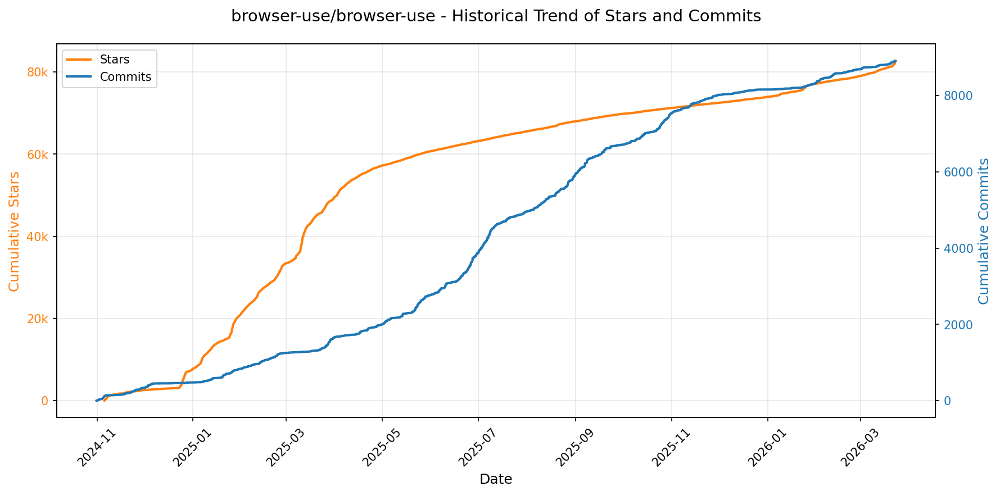
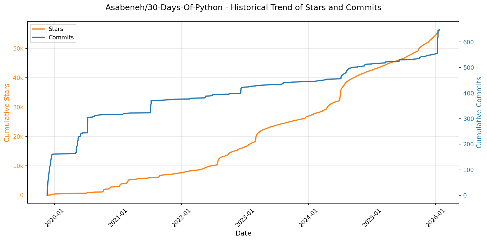
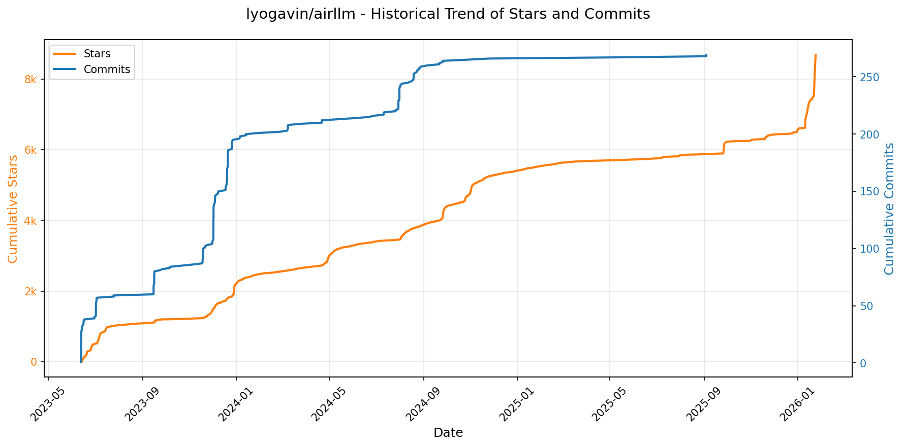
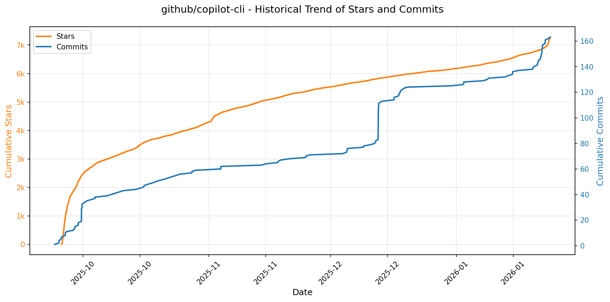
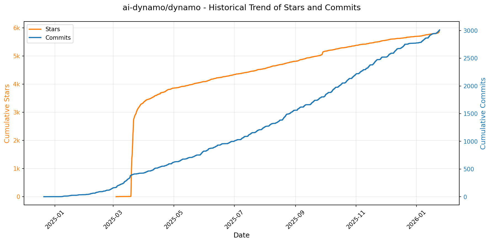
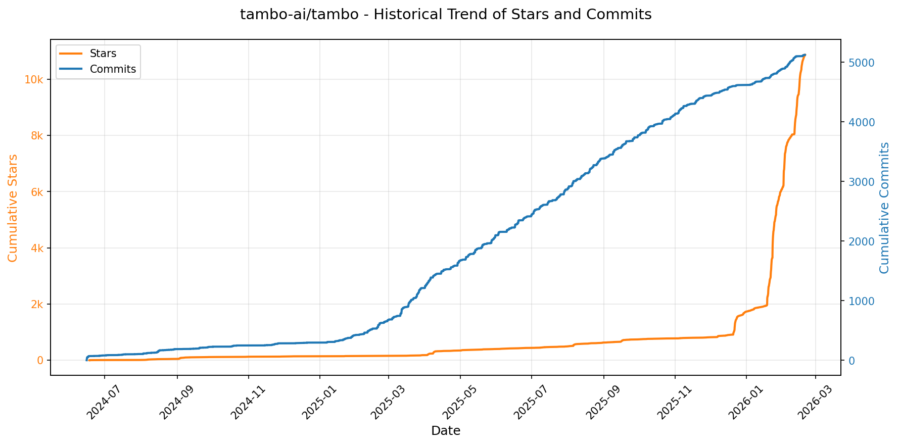
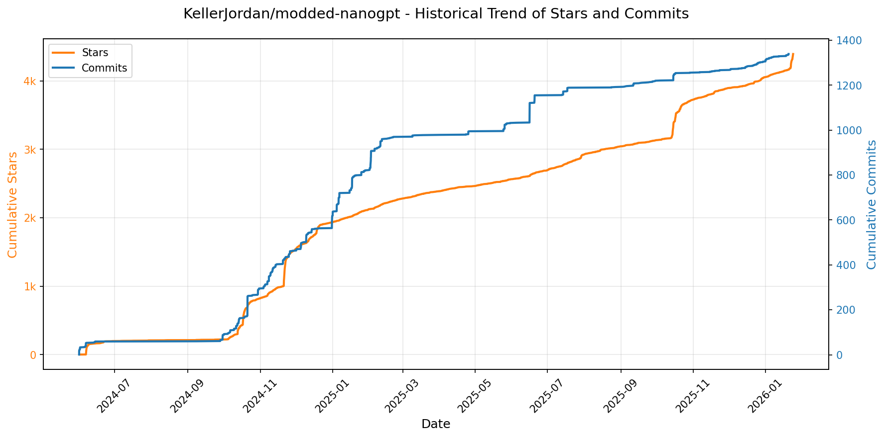

# 🌟 GitHub Trending 概览

> 数据更新于：2026-01-24。

---

## 🔍 项目详情

### 1. [anomalyco/opencode](https://github.com/anomalyco/opencode)
- 📅 **创建日期**：2025-04-30  
- 🔄 **最近更新**：2026-01-24  
- ⭐ **Stars**：85,901（日 +1409｜周 +12074｜月 +44137）  
- 📝 **描述**：The open source coding agent.  

<b>📈 Star 与 Commit 历史趋势</b>

> *蓝色：累计 Stars｜橙色：累计 Commits（次 Y 轴）*

<b>📄 README 摘要</b>

1. **项目功能**  
OpenCode 是一个开源的 AI 编程智能体（AI coding agent），旨在为开发者提供终端原生（TUI）、轻量高效且高度可扩展的 AI 辅助编程体验。它不依赖特定云服务商，可对接多种大模型（如 Claude、OpenAI、Google Gemini 及本地运行的 LLM），支持在本地终端中直接完成代码理解、生成、修改、调试、重构与多步任务规划等全流程开发工作。其核心定位是“终端优先”的开源替代方案，尤其面向 Neovim 用户及命令行深度使用者。

2. **关键特性**  
- **双模式智能体切换**：内置 `build`（默认，全权限开发代理）和 `plan`（只读分析代理，禁止自动编辑文件、执行命令前需显式授权），按 Tab 键即时切换，兼顾安全性与生产力；  
- **通用子代理（`@general`）**：支持复杂跨文件搜索、多步骤推理与抽象任务处理，可直接在对话中调用；  
- **全平台桌面应用（BETA）**：提供 macOS（Apple Silicon/Intel）、Windows、Linux 的原生 GUI 客户端（.dmg/.exe/.deb/.rpm/AppImage），并支持 Homebrew Cask、Scoop 等包管理器一键安装；  
- **灵活部署与安装机制**：支持一键脚本（curl + bash）、主流包管理器（npm/bun/pnpm/yarn、Homebrew、Scoop、Chocolatey、Paru、Mise、Nix）及自定义安装路径（支持 `$OPENCODE_INSTALL_DIR` / `$XDG_BIN_DIR` 等优先级路径）；  
- **开箱即用的 LSP 支持**：深度集成语言服务器协议，实现智能补全、跳转、悬停等 IDE 级编辑体验；  
- **客户端-服务器架构**：TUI 前端仅为一种访问方式，后端服务可远程托管，支持未来扩展移动端、Web 等多形态客户端；  
- **完全开源与厂商无关**：100% MIT 许可，不绑定任何商业模型提供商，强调长期自主可控与模型可替换性。

3. **技术栈**  
- **核心语言与运行时**：TypeScript（主逻辑）、Rust（高性能组件，如底层 CLI 工具链或未来模型推理模块，虽未明示但由项目结构与维护者背景可合理推断）；  
- **前端框架**：TUI 层基于终端原生渲染（极可能采用 `yew` / `tauri` 或自研轻量库），桌面端使用 Tauri（基于 Rust + WebView2/WebKit）构建跨平台 GUI；  
- **模型接口层**：抽象化 LLM 适配器（Provider Agnostic），兼容 OpenAI 兼容 API、Anthropic、Google Vertex AI、Ollama、LM Studio 等本地/远程模型服务；  
- **基础设施**：GitHub Actions 自动化发布（`publish.yml`），NPM 包分发（`opencode-ai` CLI 包），Nix / Mise 等现代开发环境工具链支持；  
- **文档与生态**：静态站点（Docusaurus 或类似）托管于 `opencode.ai/docs`，社区通过 Discord 和 X（Twitter）运营。

---

### 2. [browser-use/browser-use](https://github.com/browser-use/browser-use)
- 📅 **创建日期**：2024-10-31  
- 🔄 **最近更新**：2026-01-24  
- ⭐ **Stars**：76,423（日 +308｜周 +869｜月 +2486）  
- 📝 **描述**：🌐 Make websites accessible for AI agents. Automate tasks online with ease.  

<b>📈 Star 与 Commit 历史趋势</b>

> *蓝色：累计 Stars｜橙色：累计 Commits（次 Y 轴）*

<b>📄 README 摘要</b>

1. **项目功能**  
Browser-Use 是一个面向大语言模型（LLM）和开发者的**AI 浏览器自动化代理框架**，旨在让 AI 或人类通过自然语言指令直接操控真实浏览器完成复杂网页任务。它将 LLM 的推理能力与真实 Chromium 浏览器深度集成，支持端到端的网页交互（如导航、表单填写、点击、输入、截图、状态感知等），无需手动编写 Selenium 脚本。核心目标是实现“告诉计算机做什么，它就自动完成”——例如“帮我投递这份简历”“把购物清单加入 Instacart”“查找高性价比的 PC 配件”。

2. **关键特性**  
- ✅ **LLM 原生集成**：提供专为浏览器任务优化的 `ChatBrowserUse()` 模型（低延迟、高准确率），并兼容 OpenAI、Google、Ollama 等主流 LLM；  
- ✅ **双模式运行**：支持本地 Chromium（`uvx browser-use install`）与云端“隐身浏览器”（Browser Use Cloud），后者具备反检测指纹、代理轮换、CAPTCHA 规避能力；  
- ✅ **全栈自动化能力**：内置页面状态解析（可识别所有可点击元素）、DOM 感知、会话持久化（支持复用 Chrome 用户配置文件登录）、Cookie/认证同步；  
- ✅ **多入口使用方式**：  
  - Python SDK（异步 Agent API，支持自定义工具、沙箱部署）；  
  - 交互式 CLI（命令行快速调试：`browser-use open`, `click`, `type`, `screenshot`）；  
  - Claude Code 技能插件（一键接入 AI 编程环境）；  
- ✅ **开箱即用模板与示例**：提供 `default`/`advanced`/`tools` 三类初始化模板，附带真实场景 Demo（求职申请、杂货采购、PC 配件比价等）；  
- ✅ **生产就绪支持**：沙箱化部署（`@sandbox`）、云托管（自动扩缩容、内存管理、高并发执行）、MCP（Model Context Protocol）集成、文档驱动开发（完整 API 与最佳实践指南）。

3. **技术栈**  
- **核心语言**：Python（≥3.11），基于 `asyncio` 构建高性能异步架构；  
- **浏览器引擎**：Chromium（通过 `playwright` 或原生 Chromium 二进制驱动）；  
- **依赖管理**：`uv`（超快 Python 包安装与虚拟环境管理）；  
- **LLM 接入层**：抽象化 LLM 接口（`ChatBrowserUse`, `OpenAIChat`, `OllamaChat` 等），支持流式响应与 token 缓存优化；  
- **基础设施**：Browser Use Cloud 基于分布式容器编排（推测为 Kubernetes），集成 stealth 浏览器指纹库、动态代理池与高性能网络栈；  
- **辅助工具链**：CLI 使用 `typer` 构建；文档基于 `Docusaurus`（docs.browser-use.com）；示例与测试覆盖完整用例；  
- **扩展生态**：支持自定义 Python 工具函数注册（`@tools.action`）、MCP 协议对接、第三方认证方案（AgentMail、Profile 同步脚本）。

---

### 3. [twitter/the-algorithm](https://github.com/twitter/the-algorithm)
- 📅 **创建日期**：2023-03-27  
- 🔄 **最近更新**：2026-01-24  
- ⭐ **Stars**：72,044（日 +197｜周 +1647｜月 +3560）  
- 📝 **描述**：Source code for the X Recommendation Algorithm  

<b>📈 Star 与 Commit 历史趋势</b>

> *蓝色：累计 Stars｜橙色：累计 Commits（次 Y 轴）*

<b>📄 README 摘要</b>

1. **该项目做什么？**  
该项目是 X（原 Twitter）开源的推荐算法系统，核心目标是为 X 全平台（如“为你推荐”时间线、搜索、探索页、通知流等）生成个性化内容推荐流。它通过多阶段流水线（候选生成 → 排序 → 混排与过滤）动态构建用户 Feed，重点支撑两大产品场景：**“为你推荐”时间线（For You Timeline）** 和 **“推荐通知”（Recommended Notifications）**。系统不直接提供端到端可运行服务，而是开源其核心服务、模型、框架及数据组件的代码与设计，旨在提升算法透明度，并支持社区协作改进。

2. **关键特性**  
- **分层式推荐架构**：采用工业级多阶段范式——  
  • **候选源多样化**：集成 In-Network（如搜索索引 Earlybird）、Out-of-Network（tweet-mixer）、图关系挖掘（UTEG 基于 GraphJet 的用户-帖子交互图）、关注推荐（FRS）等多种候选生成路径；  
  • **双阶排序机制**：轻量级 Ranker（Light Ranker）快速初筛，重型神经网络 Ranker（Heavy Ranker）进行精细化多目标排序（如点击、互动、打开率预测）；  
  • **强管控混排与过滤**：通过 `home-mixer` 实现内容融合，结合 `visibility-filters` 执行法律合规、安全风控、用户体验优化等硬过滤与软降权策略。  
- **统一信号与图谱能力**：  
  • 实时用户行为流（`unified-user-actions`）、显隐式用户信号中心（`user-signal-service`）；  
  • 多维图模型：用户关系预测（`real-graph`）、用户声誉计算（`tweepcred`）、图特征服务（`graph-feature-service`）、社交证据主题建模（`topic-social-proof`）；  
- **多模态嵌入与语义理解**：  
  • 社区级稀疏嵌入（`SimClusters`）与知识图谱密集嵌入（`TwHIN`），由 `representation-manager` 统一供给；  
  • 跨实体相似度打分（`representation-scorer`）支撑个性化匹配。  
- **高性能工程框架**：  
  • Rust 编写的低延迟模型服务（`navi`）；  
  • 可扩展 Feed 构建框架（`product-mixer`）；  
  • 批流一体聚合框架（`timelines-aggregation-framework`）。

3. **技术栈**  
- **编程语言**：以 **Scala**（核心服务与图计算）、**Python**（深度学习模型、Ranker 训练/推理）、**Java**（搜索与基础服务）、**Rust**（`navi` 高性能 Serving）为主，辅以少量 Shell/SQL；  
- **机器学习框架**：  
  • 主力为 **TensorFlow v1**（通过遗留框架 `twml`）；  
  • 新模型逐步转向现代 PyTorch/TensorFlow 生态（文档中未明确但 `the-algorithm-ml` 仓库暗示演进方向）；  
- **基础设施与中间件**：  
  • 图计算引擎：**GraphJet**（自研实时图处理框架）；  
  • 构建系统：**Bazel**（已集成多数组件的 BUILD 文件，尚无完整 WORKSPACE）；  
  • 数据流：Kafka 类实时流（隐含于 `unified-user-actions` 等组件描述中）；  
- **模型类型**：PageRank（`tweepcred`）、社区发现（`SimClusters`）、知识图谱嵌入（`TwHIN`）、GNN/深度排序模型（`heavy-ranker`）、多任务学习（推送通知模型）、规则+ML 混合过滤（`visibility-filters`）。

---

### 4. [anthropics/claude-code](https://github.com/anthropics/claude-code)
- 📅 **创建日期**：2025-02-22  
- 🔄 **最近更新**：2026-01-24  
- ⭐ **Stars**：60,218（日 +487｜周 +2778｜月 +11893）  
- 📝 **描述**：Claude Code is an agentic coding tool that lives in your terminal, understands your codebase, and helps you code faster by executing routine tasks, explaining complex code, and handling git workflows - all through natural language commands.  

<b>📈 Star 与 Commit 历史趋势</b>

> *蓝色：累计 Stars｜橙色：累计 Commits（次 Y 轴）*

<b>📄 README 摘要</b>

1. **项目功能**  
Claude Code 是一款终端原生的智能编程代理工具，可深度理解用户本地代码库，通过自然语言指令协助开发者加速编码流程。它能自动执行重复性开发任务（如生成/修改代码）、解释复杂代码逻辑、管理 Git 工作流（如提交、分支操作等），并支持在终端、IDE 或 GitHub 中（通过 `@claude` 提及）调用。

2. **核心特性**  
- **上下文感知编码**：基于对当前代码库的分析提供精准、上下文相关的代码建议与操作；  
- **多环境集成**：原生支持终端命令行、主流 IDE 插件及 GitHub 评论区交互；  
- **插件扩展架构**：内置可扩展插件系统（位于 `plugins/` 目录），支持自定义命令与专用智能体；  
- **一键式跨平台安装**：提供针对 macOS/Linux（Shell 脚本 + Homebrew）和 Windows（PowerShell 脚本 + WinGet）的官方推荐安装方式；  
- **内建反馈与诊断机制**：通过 `/bug` 命令直接上报问题，集成 GitHub Issue 快速追踪；  
- **隐私优先设计**：明确限制敏感数据留存时长，禁止将用户代码或对话用于模型训练，并实施严格的数据访问控制。

3. **技术栈**  
- **运行时**：Node.js 18+（由 badge 明确标识，npm 包依赖基础）；  
- **分发与安装**：采用平台原生包管理方案——macOS/Linux 使用 `curl` 脚本 + Homebrew，Windows 使用 PowerShell 脚本 + WinGet；  
- **前端交互**：终端 CLI 界面（含动态演示 GIF），支持自然语言解析与命令执行；  
- **后端服务**：依托 Anthropic 的 Claude 大模型能力（未开源核心推理层，属云服务调用）；  
- **生态集成**：GitHub 深度联动（提及 @claude）、Discord 社区实时协作、结构化文档站点（基于 `code.claude.com/docs`）。

---

### 5. [Asabeneh/30-Days-Of-Python](https://github.com/Asabeneh/30-Days-Of-Python)
- 📅 **创建日期**：2019-11-19  
- 🔄 **最近更新**：2026-01-24  
- ⭐ **Stars**：56,366（日 +208｜周 +718｜月 +2255）  
- 📝 **描述**：The 30 Days of Python programming challenge is a step-by-step guide to learn the Python programming language in 30 days. This challenge may take more than 100 days. Follow your own pace. These videos may help too: https://www.youtube.com/channel/UC7PNRuno1rzYPb1xLa4yktw  

<b>📈 Star 与 Commit 历史趋势</b>

> *蓝色：累计 Stars｜橙色：累计 Commits（次 Y 轴）*

---

### 6. [usememos/memos](https://github.com/usememos/memos)
- 📅 **创建日期**：2021-12-08  
- 🔄 **最近更新**：2026-01-24  
- ⭐ **Stars**：55,570（日 +135｜周 +1000｜月 +8212）  
- 📝 **描述**：An open-source, self-hosted note-taking service. Your thoughts, your data, your control — no tracking, no ads, no subscription fees.  

<b>📈 Star 与 Commit 历史趋势</b>

> *蓝色：累计 Stars｜橙色：累计 Commits（次 Y 轴）*

<b>📄 README 摘要</b>

1. **项目功能**  
Memos 是一个开源、可自托管的轻量级笔记与知识管理服务，专为注重隐私和数据主权的个人及团队设计。它支持创建、组织、搜索和共享笔记，适用于个人日记、团队 Wiki、技术文档库等场景；所有数据完全由用户自主掌控，不依赖第三方云服务，无任何遥测、广告或订阅收费。

2. **核心特性**  
- **隐私优先架构**：零 telemetry、无追踪、无广告，支持全量数据导出，杜绝厂商锁定；  
- **原生 Markdown 支持**：笔记以纯文本 Markdown 格式存储，兼容性强，便于迁移与版本控制；  
- **极致性能**：基于 Go（后端）与 React（前端）构建，启动迅速、响应即时，本地部署无网络延迟；  
- **极简部署体验**：一键 Docker 启动，同时支持 SQLite（默认）、MySQL 和 PostgreSQL 多种数据库；  
- **面向开发者的开放生态**：提供完整的 REST API 与 gRPC 接口，便于集成到 CI/CD、自动化工作流或第三方应用；  
- **现代化用户体验**：简洁美观的 UI，内置深色模式，全端响应式设计，适配桌面与移动设备。

3. **技术栈**  
- **后端**：Go（Golang），采用 Gin 框架，支持 SQLite / MySQL / PostgreSQL；  
- **前端**：React（TypeScript），基于 Vite 构建，使用 Tailwind CSS 实现响应式 UI；  
- **部署与运维**：Docker 官方镜像（`neosmemo/memos`）、Docker Compose、Kubernetes（Helm Chart）、预编译二进制包（Linux/macOS/Windows）；  
- **协议与接口**：RESTful HTTP API + gRPC API，支持 OAuth2 认证与多租户扩展；  
- **许可证**：MIT 开源协议，完全免费且允许商用、修改与分发。

---

### 7. [anthropics/skills](https://github.com/anthropics/skills)
- 📅 **创建日期**：2025-09-22  
- 🔄 **最近更新**：2026-01-24  
- ⭐ **Stars**：51,184（日 +1252｜周 +8001｜月 +24587）  
- 📝 **描述**：Public repository for Agent Skills  

<b>📈 Star 与 Commit 历史趋势</b>

> *蓝色：累计 Stars｜橙色：累计 Commits（次 Y 轴）*

<b>📄 README 摘要</b>

1. **该项目的功能**  
该项目是 Anthropic 官方提供的 Claude 技能（Skills）参考实现仓库，旨在展示如何通过结构化、可复用的“技能包”扩展 Claude 的专业化能力。每个技能是一个独立文件夹，内含 `SKILL.md`（含 YAML 元数据与指令）、脚本及资源，使 Claude 能动态加载并执行特定任务——例如按企业品牌规范生成文档、按组织流程分析数据、自动化个人事务等。它不提供运行时服务或独立应用，而是作为技能开发范例、技术参考和可即插即用的演示集，服务于 Claude Code 插件市场、Claude.ai 网页端及 Claude API 生态。

2. **核心特性**  
- **模块化与自包含设计**：每个技能为独立文件夹，强制包含标准化 `SKILL.md`（含 `name`/`description` 前置元数据 + 指令/示例/指南 Markdown 内容），确保可移植性与可维护性；  
- **多领域覆盖**：提供跨创意设计（艺术/音乐/设计）、技术开发（Web 应用测试、MCP 服务器生成）、企业协作（通信模板、品牌合规）及文档处理（DOCX/PDF/PPTX/XLSX 创建与解析）四大类现成技能示例；  
- **生产级参考实现**：公开 `skills/docx`、`skills/pdf` 等子目录中驱动 Claude 实际文档能力的源代码（source-available，非开源），为构建高复杂度、工业级技能提供真实架构与工程实践参考；  
- **全平台集成支持**：支持通过 Claude Code 插件市场一键安装（如 `/plugin install document-skills@anthropic-agent-skills`），在 Claude.ai（付费版）直接调用，并可通过 Claude API 上传与管理自定义技能；  
- **开放规范与模板**：内置 `./spec`（Agent Skills 标准规范）和 `./template`（技能创建模板），降低开发者入门门槛，推动技能生态标准化。

3. **技术栈**  
- **核心格式**：纯文本 Markdown（`SKILL.md`）+ YAML 前置元数据，零依赖、高可读、易版本控制；  
- **执行环境**：完全依赖 Anthropic 的 Claude 模型运行时（Claude Code / Claude.ai / Claude API），无独立后端或服务组件；  
- **协议标准**：遵循 [Agent Skills](https://agentskills.io) 开放规范（定义技能发现、加载、元数据、生命周期等）；  
- **许可模型**：多数示例技能采用 Apache 2.0 开源协议；文档类核心技能为 source-available（可查看、不可修改分发）；  
- **工具链支持**：适配 Claude Code 的插件命令行接口（CLI）、Claude.ai Web UI 技能管理界面、Claude API 的 Skills Guide 接口（`/v1/skills`）。

---

### 8. [obra/superpowers](https://github.com/obra/superpowers)
- 📅 **创建日期**：2025-10-09  
- 🔄 **最近更新**：2026-01-24  
- ⭐ **Stars**：34,767（日 +1049｜周 +8515｜月 +23572）  
- 📝 **描述**：An agentic skills framework & software development methodology that works.  

<b>📈 Star 与 Commit 历史趋势</b>

> *蓝色：累计 Stars｜橙色：累计 Commits（次 Y 轴）*

<b>📄 README 摘要</b>

1. **项目功能**  
Superpowers 是一个面向编程智能体（coding agents）的完整软件开发工作流框架，旨在将原本零散、随意的代码生成行为系统化、工程化。它不直接生成代码，而是通过一系列自动触发的、可组合的“技能”（skills），引导智能体严格遵循专业软件工程实践完成端到端开发：从需求澄清（交互式头脑风暴）、设计文档分段确认、TDD驱动的精细化实施计划制定，到子智能体协同执行（subagent-driven development）、双阶段代码审查（规范符合性 + 代码质量）、Git 工作树隔离开发，直至分支收尾与合并决策。整个流程以人类开发者为最终决策者，所有关键节点均设有人工确认点，确保可控性与可追溯性。

2. **核心特性**  
- **全自动技能编排**：7 大类共 15+ 项预置技能按上下文自动激活（如设计获批后自动启用 `using-git-worktrees`），无需手动调用；  
- **深度 TDD 强制机制**：严格执行 RED-GREEN-REFACTOR 流程，禁止先写实现后补测试，失败测试必须存在且可复现；  
- **子智能体驱动开发（SDD）**：每个开发任务由独立子智能体执行，并经历两阶段审查（是否符合计划规格 → 代码是否符合质量标准）；  
- **结构化协作流程**：支持设计分块验证、粒度极细的实施计划（每任务≤5分钟、含精确文件路径/完整代码/验证步骤）、并行子智能体调度、PR前自动化代码审查与反馈响应；  
- **工程纪律内建**：强制 YAGNI（你不会需要它）、DRY（避免重复）、防御性调试（systematic-debugging 四阶段法）、复杂度抑制及证据导向（所有“已修复”须经验证）；  
- **多平台原生集成**：提供 Claude Code 插件市场一键安装、Codex/OpenCode 的标准化指令加载方案，支持跨工具链统一工作流。

3. **技术栈**  
- **运行时环境**：深度适配主流 AI 编程助手——Claude Code（插件架构）、Codex、OpenCode；  
- **核心范式**：基于“技能（Skill）”的声明式工作流引擎，技能以 Markdown 文档（`.md`）形式组织在仓库中（如 `skills/brainstorming/SKILL.md`），含行为定义、触发条件、执行逻辑与测试方法；  
- **基础设施依赖**：Git（用于 worktree 隔离、分支管理）、Shell 命令（环境验证、测试执行）、标准测试框架（兼容任意语言的测试运行器）；  
- **扩展机制**：内置 `writing-skills` 技能，提供技能开发最佳实践、模板与测试规范，支持社区贡献新技能；  
- **部署模型**：插件化分发（Claude Code Marketplace）、远程指令拉取（Codex/OpenCode），版本更新通过 `plugin update` 或配置同步实现。

---

### 9. [microsoft/Data-Science-For-Beginners](https://github.com/microsoft/Data-Science-For-Beginners)
- 📅 **创建日期**：2021-03-03  
- 🔄 **最近更新**：2026-01-24  
- ⭐ **Stars**：33,425（日 +486｜周 +1632｜月 +1775）  
- 📝 **描述**：10 Weeks, 20 Lessons, Data Science for All!  

<b>📈 Star 与 Commit 历史趋势</b>

> *蓝色：累计 Stars｜橙色：累计 Commits（次 Y 轴）*

<b>📄 README 摘要</b>

1. **项目功能**  
该项目是一个面向初学者的、系统化的数据科学入门课程，由微软 Azure 云倡导者团队开发并维护。它提供为期10周、共20课的结构化学习路径，覆盖数据科学核心领域：数据科学定义与伦理、数据类型与来源、统计与概率基础、关系型/非关系型数据操作、Python（Pandas）数据处理、数据清洗与准备、Matplotlib 数据可视化（量化、分布、比例、关系、可解释性）、数据科学生命周期（获取、分析、沟通）、云上数据科学（Azure 平台、低代码建模、模型部署）以及真实世界应用案例。课程采用“项目驱动+双测验”教学法——每课包含课前热身测验（激活先验知识）、详细文字教程、分步实践指南、知识检查、挑战任务、补充阅读、课后作业及课后测验，强调动手构建而非被动复制，旨在帮助零基础学习者扎实掌握实用技能并建立完整知识框架。

2. **核心特性**  
- ✅ **项目驱动学习（Project-Based Pedagogy）**：所有课程均围绕可运行的小型项目展开，难度循序渐进，最终形成端到端数据科学工作流能力；  
- ✅ **双测验强化记忆（Pre-/Post-Lesson Quizzes）**：每课配备低风险、高参与度的课前意图设定测验与课后巩固测验（共40套，每套3题），支持本地运行或 Azure 部署；  
- ✅ **多语言全覆盖（50+ 自动化翻译）**：通过 GitHub Action 实现阿拉伯语、简体/繁体中文（含港澳台）、日语、韩语、西班牙语等50余种语言的实时同步翻译，所有翻译文档均保持与主干内容严格一致；  
- ✅ **零配置云端开发环境（GitHub Codespaces 一键启动）**：开箱即用的云端开发空间，无需本地安装依赖，降低初学者环境搭建门槛；  
- ✅ **分层入门支持体系**：专设 `examples/` 目录提供5个带详尽注释的“Hello World 级”示例（如加载数据、简单统计、基础绘图、全流程项目），供绝对新手快速上手；  
- ✅ **全角色适配资源**：分别面向学生（自学路径、学习小组建议）、教师（教学指南、课堂资源）、贡献者（清晰的 CONTRIBUTING.md 和 TRANSLATIONS.md）提供定制化文档；  
- ✅ **活跃社区与持续支持**：集成 Microsoft Foundry Discord 社群、AI 学习系列直播、GitHub Discussions 论坛，并鼓励 PR 贡献，形成开放共建生态。

3. **技术栈**  
- **核心教学内容载体**：纯 Markdown 文档（`.md`），结构化组织于模块化目录（如 `1-Introduction/`, `2-Working-With-Data/`），辅以嵌入式 YouTube 视频链接与 Sketchnote 插图；  
- **交互式测验系统**：基于前端技术构建的独立 `quiz-app` 应用（未在 README 明确说明框架，但部署于 Netlify，推测为轻量级 Web 技术栈如 HTML/CSS/JS 或 React/Vue）；  
- **开发与协作基础设施**：  
  - 版本控制：GitHub（含 Issues、Pull Requests、Discussions、Actions 自动化流水线）；  
  - 多语言翻译：集成 [Azure/co-op-translator](https://github.com/Azure/co-op-translator) 工具链，通过 GitHub Actions 实现翻译自动化同步；  
  - 云端开发：原生支持 GitHub Codespaces（基于容器的 VS Code 环境）及 VS Code Remote - Containers；  
- **实践工具链（课程中教授/使用）**：  
  - 编程语言：Python（核心教学语言）；  
  - 数据库：SQL（关系型）、NoSQL（文档数据库概念）；  
  - 数据处理库：Pandas；  
  - 可视化库：Matplotlib；  
  - 云平台：Microsoft Azure（Azure Machine Learning Studio、低代码建模工具）。

---

### 10. [Lissy93/web-check](https://github.com/Lissy93/web-check)
- 📅 **创建日期**：2023-06-25  
- 🔄 **最近更新**：2026-01-24  
- ⭐ **Stars**：30,854（日 +91｜周 +792｜月 +3806）  
- 📝 **描述**：🕵️‍♂️ All-in-one OSINT tool for analysing any website  

<b>📈 Star 与 Commit 历史趋势</b>

> *蓝色：累计 Stars｜橙色：累计 Commits（次 Y 轴）*

---

### 11. [remotion-dev/remotion](https://github.com/remotion-dev/remotion)
- 📅 **创建日期**：2020-06-23  
- 🔄 **最近更新**：2026-01-24  
- ⭐ **Stars**：28,571（日 +1304｜周 +3241｜月 +3565）  
- 📝 **描述**：🎥      Make videos programmatically with React  

<b>📈 Star 与 Commit 历史趋势</b>

> *蓝色：累计 Stars｜橙色：累计 Commits（次 Y 轴）*

<b>📄 README 摘要</b>

1. **项目功能**  
Remotion 是一个基于 React 的视频生成框架，允许开发者使用 React 组件和现代 Web 技术（如 CSS、SVG、Canvas、WebGL）**以编程方式动态生成视频**。它将视频创作转化为前端开发流程：时间轴即代码、帧即组件渲染结果，支持从静态画面到复杂交互动画的完整视频合成，适用于制作营销视频、数据可视化动画、个性化年度回顾（如 GitHub Unwrapped）、教程视频等。

2. **核心特性**  
- ✅ **React 原生集成**：直接使用 React 组件、Hooks、状态管理、Props 传递与组件复用，支持 Fast Refresh 实时预览；  
- ✅ **时间轴编程化**：通过 `useCurrentFrame()`、`interpolate()` 等 API 精确控制每一帧的视觉输出，实现数学驱动的动画逻辑；  
- ✅ **多目标导出**：支持本地渲染为 MP4（H.264）、ProRes、WebM，也可导出为 GIF、PNG 序列或交互式 HTML；  
- ✅ **服务端渲染（SSR）友好**：可在 Node.js 环境中无浏览器运行（基于 Puppeteer/Playwright），适配云函数、CI/CD 自动化视频生成；  
- ✅ **丰富生态支持**：兼容主流 npm 包、自定义字体、音频合成、FFmpeg 集成、TypeScript 全面支持，提供 CLI 工具链（`npx create-video` 快速初始化）；  
- ✅ **可视化调试工具**：内置交互式时间轴预览器（Remotion Player），支持逐帧跳转、速度调节、性能分析。

3. **技术栈**  
- **核心框架**：React（v18+）、TypeScript；  
- **渲染引擎**：基于 Chromium（Puppeteer / Playwright）进行 Headless 浏览器渲染，利用 Canvas/WebGL 加速图形合成；  
- **构建与打包**：Vite（默认模板）、Webpack（可选）；  
- **视频编码**：FFmpeg（用于最终导出 MP4/ProRes 等格式）；  
- **开发体验**：ESBuild、Jest（测试）、Storybook（可选集成）、VS Code 插件支持；  
- **部署与扩展**：支持 AWS Lambda、Vercel、Cloudflare Workers 等无服务器环境，提供 Remotion Cloud 托管服务（可选）。

---

### 12. [block/goose](https://github.com/block/goose)
- 📅 **创建日期**：2024-08-23  
- 🔄 **最近更新**：2026-01-24  
- ⭐ **Stars**：27,641（日 +423｜周 +1617｜月 +2713）  
- 📝 **描述**：an open source, extensible AI agent that goes beyond code suggestions - install, execute, edit, and test with any LLM  

<b>📈 Star 与 Commit 历史趋势</b>

> *蓝色：累计 Stars｜橙色：累计 Commits（次 Y 轴）*

<b>📄 README 摘要</b>

1. **项目功能**  
goose 是一个运行在本地机器上的开源 AI 工程代理（AI agent），专注于自动化端到端的软件工程任务。它不仅能提供代码补全或建议，更能自主完成项目创建、编码编写与执行、错误调试、工作流编排（如多步骤任务调度）以及调用外部 API 等复杂操作，适用于原型开发、代码重构和工程流水线管理等场景。

2. **核心特性**  
- ✅ **完全本地化运行**：数据与代码全程保留在用户设备，保障隐私与安全；  
- ✅ **模型无关性与多模型支持**：兼容任意 LLM（如本地 Llama、Ollama、OpenAI、Anthropic 等），支持按任务动态切换模型以优化性能与成本；  
- ✅ **MCP（Model Control Protocol）原生集成**：可无缝对接符合 MCP 标准的服务器，扩展能力与生态兼容性；  
- ✅ **双形态交付**：同时提供桌面应用程序（GUI）和命令行工具（CLI），适配不同开发者工作流；  
- ✅ **高度可扩展与可定制**：模块化架构支持插件、自定义工具、工作流配置及策略控制；  
- ✅ **负责任的 AI 编码实践**：配套《Responsible AI-Assisted Coding Guide》（HOWTOAI.md），强调人机协同、结果验证与责任归属。

3. **技术栈**  
- **前端/桌面端**：基于 Electron 或 Tauri（官方未明示但 CLI + GUI 双形态及跨平台部署暗示采用现代桌面框架，结合 Rust/TypeScript 混合技术栈可能性高）；  
- **核心逻辑与 CLI**：主要使用 TypeScript/JavaScript（Node.js 运行时），具备强工程化 CLI 设计；  
- **AI 集成层**：通过标准化协议（如 MCP）对接各类 LLM 服务，底层支持 HTTP/Streaming、本地模型（GGUF）、API 密钥管理及模型路由；  
- **构建与运维**：GitHub Actions CI/CD（`ci.yml`），Apache 2.0 开源许可证；  
- **基础设施依赖**：依赖本地开发环境（Git、Shell、常见编程语言运行时等）以执行代码生成、测试与部署任务。

---

### 13. [ComposioHQ/awesome-claude-skills](https://github.com/ComposioHQ/awesome-claude-skills)
- 📅 **创建日期**：2025-10-17  
- 🔄 **最近更新**：2026-01-24  
- ⭐ **Stars**：24,875（日 +532｜周 +4559｜月 +15120）  
- 📝 **描述**：A curated list of awesome Claude Skills, resources, and tools for customizing Claude AI workflows  

<b>📈 Star 与 Commit 历史趋势</b>

> *蓝色：累计 Stars｜橙色：累计 Commits（次 Y 轴）*

<b>📄 README 摘要</b>

1. **项目功能**  
该项目是一个面向 Anthropic Claude 系列模型（包括 Claude.ai、Claude Code 和 Claude API）的**高质量技能（Skills）聚合与分发平台**。它不提供独立运行的软件，而是通过结构化、可复用的“技能包”扩展 Claude 的能力边界——使模型不仅能生成文本，更能执行真实世界操作（如发送邮件、创建 GitHub Issue、发布 Slack 消息）、处理多格式文档（DOCX/PDF/PPTX/XLSX）、调用外部工具（Playwright、FFUF、D3.js、PostgreSQL）、连接 1000+ 应用（通过 Composio），并支持专业领域任务（代码质量分析、安全威胁狩猎、品牌文案生成、会议行为洞察、简历定制等）。核心目标是将 Claude 转变为具备自动化工作流能力的智能代理（Agent）。

2. **关键特性**  
- **跨平台兼容性**：所有技能均经验证可在 Claude.ai（网页端）、Claude Code（本地 IDE 插件）及 Claude API 三种环境中无缝运行。  
- **行动型技能（Action-Oriented Skills）**：通过 `connect-apps` 插件集成 Composio，实现对 Gmail、Slack、GitHub、Notion 等 500+ SaaS 应用的免编码 API 调用与真实操作。  
- **全栈开发支持**：覆盖从需求分析（Changelog Generator）、架构设计（software-architecture）、编码（artifacts-builder, Playwright）、测试（test-driven-development, ffuf_claude_skill）、调试（LangSmith Fetch）到部署（AWS Skills）的完整 DevOps 流程。  
- **专业垂直能力**：按领域精细分类（共 9 大类），包含文档智能（PDF/DOCX 处理）、数据科学（CSV 分析、PostgreSQL 查询）、商业营销（竞品广告提取、域名脑暴）、安全合规（Sigma 威胁狩猎、数字取证）、创意媒体（Canvas 设计、Slack GIF 生成）等高价值场景。  
- **开箱即用的技能工程体系**：提供标准化技能结构（`SKILL.md` + YAML 元数据）、最佳实践指南、模板、测试方法及 API 集成示例（Python SDK），大幅降低自定义技能开发门槛。  
- **社区驱动生态**：采用开源协作模式，明确贡献流程（PR 友好）、质量标准与审核机制，并整合来自 Anthropic 官方、Composio、NeoLabHQ、独立开发者等多方优质技能。

3. **技术栈**  
- **核心运行时**：依赖 Anthropic 官方 Claude 模型（如 `claude-3-5-sonnet-20241022`）及其 Skills 框架（基于 YAML 元数据驱动的技能发现与激活机制）。  
- **集成中间件**：深度绑定 **Composio**（作为底层连接器），实现 OAuth 认证管理、1000+ 应用的统一 API 抽象与插件化接入。  
- **技能载体**：纯文本 Markdown（`SKILL.md`）定义技能逻辑与元数据，辅以可选的 `scripts/`（Shell/Python）、`templates/`（Jinja/Markdown）、`resources/`（配置/参考文件）等结构化目录。  
- **开发与部署工具链**：  
  - CLI 工具：`claude` 命令行客户端（用于本地加载插件与技能）；  
  - Web 自动化：Playwright（Webapp Testing、Browser Automation）；  
  - 安全分析：FFUF（Web 模糊测试）、Sigma 规则引擎（威胁狩猎）；  
  - 数据库交互：PostgreSQL 客户端（只读安全查询）；  
  - AI 基础设施：LangSmith（LLM 追踪调试）、NotebookLM（文档增强问答）；  
  - 前端技术：React/Tailwind CSS/shadcn/ui（artifacts-builder 生成 HTML 产物）。  
- **基础设施与协议**：基于 HTTP REST API（Claude Skills API）、OAuth 2.0（应用授权）、Git（版本控制与协作）、Discord/LinkedIn/X（社区运营）。

---

### 14. [permissionlesstech/bitchat](https://github.com/permissionlesstech/bitchat)
- 📅 **创建日期**：2025-07-04  
- 🔄 **最近更新**：2026-01-24  
- ⭐ **Stars**：24,745（日 +70｜周 +684｜月 +1185）  
- 📝 **描述**：bluetooth mesh chat, IRC vibes  

<b>📈 Star 与 Commit 历史趋势</b>

> *蓝色：累计 Stars｜橙色：累计 Commits（次 Y 轴）*

<b>📄 README 摘要</b>

1. **项目功能**  
BitChat 是一款去中心化的点对点即时通讯应用，核心目标是实现**无需互联网、无需账户、无需中心化服务器的可靠通信**。它通过双传输架构协同工作：在本地范围内利用蓝牙低功耗（BLE）Mesh网络进行完全离线的多跳消息传递；当联网可用时，则自动切换至基于 Nostr 协议的全球分布式网络，支持地理围栏式频道与端到端加密私信。适用于灾难应急、抗议活动、偏远地区及隐私敏感场景，本质是“线下可运行的侧边群聊”（side-groupchat）。

2. **关键特性**  
- **双通道智能路由**：优先使用本地蓝牙 Mesh（低延迟、高隐私），不可用时无缝降级至 Nostr 网络，并支持离线消息队列重发；  
- **地理频道系统**：基于 Geohash 精度分级（block/neighborhood/city/province/region）动态创建位置绑定聊天室，消息仅广播至对应地理范围内的 Nostr 中继；  
- **去中心化 Mesh 自组网**：设备自动发现、建立连接、多跳中继（最大7跳），不依赖任何基础设施；  
- **强隐私保护机制**：零账户体系（无手机号/邮箱）、无持久化标识符、紧急三击清空全部数据；  
- **分层端到端加密**：蓝牙 Mesh 层采用 Noise Protocol（含前向保密），Nostr 层私信采用 NIP-17 “礼物包装”加密；  
- **轻量高效协议栈**：LZ4 消息压缩、自适应电池调度、二进制 BLE 数据包、IRC 风格命令行交互（如 `/msg`, `/who`）；  
- **全平台原生支持**：统一代码库同时支持 iOS 与 macOS，具备 Share Extension 扩展能力。

3. **技术栈**  
- **客户端框架**：Swift（原生 iOS/macOS 开发），Xcode 构建系统，`just` 作为自动化任务工具；  
- **通信协议层**：  
  - *离线层*：Bluetooth LE Mesh（自研二进制协议）、Noise Protocol（XX handshake）、自动拓扑发现与多跳路由算法；  
  - *在线层*：Nostr 协议（兼容 290+ 全球公共中继）、NIP-17（私信加密）、Geohash 地理编码；  
- **加密与安全**：Noise Protocol（RFC 9381）、libsodium 基础密码学支持、临时密钥派生（per-geohash ephemeral keys）；  
- **性能优化**：LZ4 压缩库、自适应功耗管理（duty cycling）、内存与网络资源精细化控制；  
- **工程实践**：模块化配置（`.xcconfig`）、本地化支持（Base.lproj + stringsdict）、Entitlements 权限管理、白皮书驱动开发（见 `WHITEPAPER.md`）。

---

### 15. [bytedance/UI-TARS-desktop](https://github.com/bytedance/UI-TARS-desktop)
- 📅 **创建日期**：2025-01-19  
- 🔄 **最近更新**：2026-01-24  
- ⭐ **Stars**：24,720（日 +67｜周 +745｜月 +4674）  
- 📝 **描述**：The Open-Source Multimodal AI Agent Stack: Connecting Cutting-Edge AI Models and Agent Infra  

<b>📈 Star 与 Commit 历史趋势</b>

> *蓝色：累计 Stars｜橙色：累计 Commits（次 Y 轴）*

<b>📄 README 摘要</b>

1. **项目功能**  
TARS 是一个面向实际应用的多模态 AI 智能体（Agent）技术栈，核心目标是实现类人化、端到端的任务自动化。它通过融合视觉理解（Vision）、图形用户界面交互（GUI Agent）与大语言模型（LLM）能力，使 AI 能够直接操作真实世界的数字环境：包括本地终端、桌面操作系统（Windows/macOS）、网页浏览器，以及嵌入到产品中提供智能服务。项目当前包含两大可交付组件：  
- **Agent TARS**：通用多模态智能体框架，以 CLI 和 Web UI 形式提供服务，支持在终端/服务器环境运行（headless），也可启动可视化交互界面（headful），专注于任务编排、工具调用与上下文流式处理；  
- **UI-TARS Desktop**：原生桌面应用，基于 UI-TARS 系列视觉语言模型（如 UI-TARS-1.5/1.6），提供对本地及远程计算机、浏览器的零配置、一键式自然语言控制（如“打开 VS Code 设置并启用延迟自动保存”）。

2. **关键特性**  
- ✅ **多模态感知与执行**：支持截图识别、视觉定位（Visual Grounding）、DOM 解析与混合策略浏览器控制，实现 GUI 层面的精准操作；  
- ✅ **事件流驱动架构（Event Stream）**：采用协议化事件流机制，支撑上下文工程（Context Engineering）、实时数据流追踪、调试（Event Stream Viewer）及低代码 Agent UI 构建；  
- ✅ **MCP（Model Control Protocol）深度集成**：以 MCP 为内核标准，原生支持挂载各类 MCP Server（如 Shell、文件系统、浏览器、图表生成等工具），实现与现实世界工具链的无缝对接；  
- ✅ **全场景操作能力**：覆盖本地桌面（鼠标/键盘/窗口控制）、远程计算机、远程浏览器三大操作域，所有操作均支持纯自然语言指令；  
- ✅ **隐私优先与本地化**：UI-TARS Desktop 默认全程本地运行，敏感操作不上传云端；Agent TARS CLI 亦支持完全离线部署（配合本地模型）；  
- ✅ **开发者友好生态**：提供 CLI 工具链（Node.js）、Web UI、SDK（UI TARS SDK）、云部署指南（ModelScope/Cloud）、API 文档及沙箱环境（AIO Sandbox）。

3. **技术栈**  
- **前端与客户端**：Electron（UI-TARS Desktop 桌面应用）、React/Vite（Web UI）、TypeScript；  
- **运行时与 CLI**：Node.js（≥ v22）、npm 包管理（`@agent-tars/cli`）；  
- **AI 模型层**：多模态大模型（MLLM）为核心，支持多种厂商 API（VolcEngine、Anthropic 等），并深度适配自研 UI-TARS 系列 VL 模型（如 UI-TARS-1.5-7B、Seed-1.5-VL/1.6）及开源模型；  
- **协议与标准**：基于 MCP（Model Control Protocol）构建工具通信规范，兼容 MCP Server 生态；  
- **基础设施**：支持本地推理、远程 API 调用、云平台部署（ModelScope）、AIO 沙箱隔离执行环境；  
- **辅助工具链**：Midscene（浏览器内 GUI 自动化）、GitBook（文档）、Discord/飞书/DeepWiki（社区与支持）。

---

### 16. [microsoft/VibeVoice](https://github.com/microsoft/VibeVoice)
- 📅 **创建日期**：2025-08-25  
- 🔄 **最近更新**：2026-01-24  
- ⭐ **Stars**：21,360（日 +404｜周 +1004｜月 +2386）  
- 📝 **描述**：Open-Source Frontier Voice AI  

<b>📈 Star 与 Commit 历史趋势</b>

> *蓝色：累计 Stars｜橙色：累计 Commits（次 Y 轴）*

<b>📄 README 摘要</b>

1. **该项目做什么？**  
VibeVoice 是一个开源的前沿语音人工智能研究框架，专注于长时序、高保真、结构化语音处理，涵盖两大核心任务：  
- **语音识别（ASR）**：VibeVoice-ASR 能对长达 **60 分钟**的连续音频进行单次端到端处理，同步完成语音转写、说话人分离（Who）、精确时间戳标注（When）和内容识别（What），并支持用户自定义热词（Hotwords）以提升专业领域识别准确率；  
- **文本转语音（TTS）**：包含两类模型——VibeVoice-TTS-1.5B（已停用代码但文档保留）支持 **90 分钟超长对话生成**与最多 **4 个角色自然轮替**；VibeVoice-Realtime-0.5B 则面向实时场景，实现低延迟（~300ms 首字发声）、流式文本输入、稳定生成约 **10 分钟高质量语音**，兼顾部署效率与实用性。

2. **关键特性**  
- ✅ **超长上下文建模能力**：统一采用 **7.5 Hz 超低帧率连续语音分词器**（Acoustic & Semantic Tokenizers），在大幅降低计算开销的同时保持高保真音频重建能力；  
- ✅ **结构化语音理解与生成**：ASR 模型原生输出带说话人标签和毫秒级时间戳的富格式转录；TTS 模型支持多角色一致性、跨语言（英/中等）、自发性演唱、跨语种混合发音等复杂表达；  
- ✅ **实时性与可扩展性**：Realtime 版本专为边缘/交互场景优化，参数仅 0.5B，支持流式输入与低延迟响应；ASR 和 TTS 均提供 Hugging Face 模型库、交互式 Playground/Colab 演示及微调指南；  
- ✅ **开放协作导向**：所有模型均以研究为目的开源（含论文、文档、评估指标如 DER/cpWER/tcpWER），强调社区共建与负责任使用，明确限制商用与高风险滥用。

3. **技术栈**  
- **核心架构**：基于 **next-token diffusion（下一代令牌扩散）框架**，融合大语言模型（LLM，当前版本基于 Qwen2.5-1.5B）负责语义理解与对话建模，扩散模型（Diffusion Head）负责高保真声学细节生成；  
- **语音表征**：自研 **7.5 Hz 连续声学/语义分词器**，替代传统梅尔谱或离散 Codec，实现长序列高效建模；  
- **训练与部署**：依托 PyTorch 生态，模型发布于 Hugging Face Hub；推理支持 Transformers + Diffusers 接口；提供 Gradio Playground（ASR）、Google Colab Notebook（Realtime TTS）等轻量级试用方式；  
- **评估体系**：采用行业标准指标（如 Diarization Error Rate - DER、contextualized WER - cpWER、timestamp-aware cpWER - tcpWER）进行严格评测，并公开定量结果。

---

### 17. [BloopAI/vibe-kanban](https://github.com/BloopAI/vibe-kanban)
- 📅 **创建日期**：2025-06-14  
- 🔄 **最近更新**：2026-01-24  
- ⭐ **Stars**：18,787（日 +191｜周 +2069｜月 +12083）  
- 📝 **描述**：Get 10X more out of Claude Code, Codex or any coding agent  

<b>📈 Star 与 Commit 历史趋势</b>

> *蓝色：累计 Stars｜橙色：累计 Commits（次 Y 轴）*

<b>📄 README 摘要</b>

1. **项目功能**  
Vibe Kanban 是一个面向 AI 编程代理（如 Claude Code、Gemini CLI、Codex、Amp 等）的开发者协作与任务编排平台。它不直接生成代码，而是作为“AI 工程师的操作系统”，帮助人类工程师高效规划、调度、审查和管理多个 AI 编程代理协同完成的开发任务。核心价值在于将分散的 AI 编码工作流统一到可视化看板（Kanban）界面中，实现任务状态追踪、多代理切换、并行/串行执行编排、一键启动开发服务器、远程 SSH 项目打开等工程化能力，显著提升人机协同开发效率。

2. **关键特性**  
- ✅ **多 AI 编程代理统一接入与切换**：支持 Claude Code、Gemini CLI、Codex、Amp 等主流 MCP（Model Context Protocol）兼容代理，可按任务灵活指定不同代理。  
- ✅ **智能任务编排引擎**：支持任务的串行依赖执行与并行并发执行，自动协调输入/输出、上下文传递与错误回退。  
- ✅ **实时可视化看板（Kanban）**：以卡片形式呈现每个 AI 任务（如“重构 API 层”“生成测试用例”），清晰展示状态（待处理/运行中/已完成/失败/已审阅）。  
- ✅ **一键开发环境集成**：任务完成后可直接点击按钮启动本地或远程 dev server，并跳转至对应端口预览效果。  
- ✅ **集中式 MCP 配置管理**：统一维护各 AI 代理的模型参数、工具集、上下文限制等 MCP 配置，避免重复配置。  
- ✅ **远程开发无缝衔接**：原生支持通过 SSH 远程连接部署在云服务器或本地 NAS 上的 Vibe Kanban 实例，并从 Web 界面一键触发 VS Code Remote-SSH 打开远程项目。  
- ✅ **生产就绪部署支持**：提供反向代理（Nginx/Caddy/Traefik）适配方案、CORS 安全控制（`VK_ALLOWED_ORIGINS`）、环境变量分级配置（构建时/运行时）等企业级能力。

3. **技术栈**  
- **后端**：Rust（主语言，高性能与内存安全保障），使用 `axum` 构建 HTTP API，`sqlx` 操作 SQLite（默认内嵌数据库），`tokio` 支持异步任务调度；深度集成 MCP 协议客户端以对接各类 AI 代理。  
- **前端**：TypeScript + React（基于 Vite 构建），采用响应式 UI 框架实现交互式看板、配置面板与终端集成视图；通过 WebSocket 与后端保持实时任务状态同步。  
- **CLI 工具**：Node.js（>=18）驱动的 `npx vibe-kanban` 入口，提供零安装快速启动体验。  
- **构建与开发工具**：pnpm（包管理）、cargo-watch（Rust 热重载）、sqlx-cli（数据库迁移）、Shell 脚本（macOS 本地构建）。  
- **基础设施与监控**：可选集成 PostHog 进行产品分析（通过 `POSTHOG_API_KEY` 控制），支持 Docker、systemd 及云平台部署。

---

### 18. [shareAI-lab/learn-claude-code](https://github.com/shareAI-lab/learn-claude-code)
- 📅 **创建日期**：2025-06-29  
- 🔄 **最近更新**：2026-01-24  
- ⭐ **Stars**：15,117（日 +91｜周 +694｜月 +3410）  
- 📝 **描述**：Bash is all you & agent need - Learn Agent by writing a Claude Code with only 16 line code   

<b>📈 Star 与 Commit 历史趋势</b>

> *蓝色：累计 Stars｜橙色：累计 Commits（次 Y 轴）*

<b>📄 README 摘要</b>

1. **该项目的功能**  
该项目是一个面向教育的渐进式编程教程，旨在通过从零开始构建 AI 编程代理（AI coding agent），系统性地揭示现代 AI 编程代理（如 Claude Code、Cursor Agent、Kode CLI）的核心工作原理。它不模拟或复刻 Claude Code 的闭源实现，而是以极简、可运行的 Python 代码（共 5 个递进版本，总计约 1100 行）演示“什么是真正的 AI 代理”——即：让大语言模型在工具调用循环中自主决策、规划与执行，开发者仅需提供恰当工具并最小化干预。

2. **核心特性**  
- **五级渐进式教学架构**：v0（单 Bash 工具 + 递归子代理）→ v1（4 大基础工具 + 完整代理循环）→ v2（显式待办清单规划）→ v3（任务驱动的隔离式子代理机制）→ v4（基于 `SKILL.md` 的按需领域技能加载机制）；  
- **统一核心循环抽象**：所有版本均围绕同一简洁循环实现——模型生成响应 → 若调用工具则执行并追加结果 → 迭代直至返回最终文本；  
- **生产就绪技能生态集成**：内置 `agent-builder` 元技能，支持一键脚手架生成新代理项目；兼容 [Agent Skills Spec](https://github.com/anthropics/agent-skills)，可直接安装并复用 [shareAI-skills](https://github.com/shareAI-lab/shareAI-skills) 中的标准化技能；  
- **双语深度文档体系**：每个版本均配英文+中文技术详解（`docs/`）及通俗化中文文章（`articles/`），涵盖上下文缓存经济学等独创工程洞见；  
- **开箱即用与模板化扩展**：提供 `.env` 配置支持 Anthropic/OpenAI/Gemini 等多模型后端；所有版本可独立运行，并支持 Fork 后直接基于任一版本定制开发。

3. **技术栈**  
- **语言与框架**：Python 3.x（无外部 AI 框架依赖，纯 `httpx`/`requests` 调用 LLM API）；  
- **核心依赖**：`anthropic`、`openai`、`google-generativeai`（可选）、`pydantic`（结构化工具调用）、`rich`（终端交互增强）；  
- **协议与规范**：严格遵循 [Anthropic 官方 Agent Skills Spec](https://github.com/anthropics/agent-skills)；  
- **工具层抽象**：基于 Bash 命令行工具（`bash`）、文件操作（`read`/`write`/`edit`）、待办管理（`todo`）、任务分发（`task`）、技能加载（`skill`）等轻量 Python 函数构建；  
- **部署与集成**：支持作为插件集成至 Kode CLI、Claude Code 等主流代理平台；技能以纯文本 `SKILL.md` 格式定义，实现知识与代码解耦。

---

### 19. [steveyegge/beads](https://github.com/steveyegge/beads)
- 📅 **创建日期**：2025-10-12  
- 🔄 **最近更新**：2026-01-24  
- ⭐ **Stars**：12,463（日 +278｜周 +1768｜月 +6253）  
- 📝 **描述**：Beads - A memory upgrade for your coding agent  

<b>📈 Star 与 Commit 历史趋势</b>

> *蓝色：累计 Stars｜橙色：累计 Commits（次 Y 轴）*

<b>📄 README 摘要</b>

1. **项目功能**  
该项目（`bd - Beads`）是一个**分布式、Git 背书的图谱型问题追踪系统**，专为 AI 编程智能体（coding agents）设计。其核心作用是为 AI 代理提供**持久化、结构化的长期记忆机制**，替代传统易失、非结构化的 Markdown 计划文档。它通过构建**依赖感知的任务图谱**（dependency-aware graph），使 AI 代理能在执行长周期、多步骤复杂任务时保持上下文连贯性，避免“遗忘”或任务断裂。

2. **关键特性**  
- **Git 原生存储**：所有任务以 JSONL 格式存于 `.beads/` 目录，完全纳入 Git 版本控制——支持分支、合并、回溯与协作审查；  
- **AI 代理友好设计**：输出为机器可读 JSON；内置依赖建模（阻塞/父子/关联关系）；自动识别并列出无前置阻塞的就绪任务（`bd ready`）；  
- **零冲突协同**：采用哈希生成唯一 ID（如 `bd-a1b2` 及层级扩展 `bd-a3f8.1.1`），彻底规避多代理或多分支并发写入导致的 ID 冲突；  
- **隐形基础设施**：本地 SQLite 缓存加速查询；后台守护进程（daemon）实现 Git 自动同步，对用户透明；  
- **语义化记忆衰减（Compaction）**：自动聚合、摘要已关闭的历史任务，压缩上下文体积，适配大模型有限的上下文窗口；  
- **灵活部署模式**：支持隐身模式（`--stealth`，本地使用不提交）、贡献者模式（`--contributor`，规划隔离至独立仓库）和维护者模式（自动识别权限，支持受保护分支同步）。

3. **技术栈**  
- **主语言**：Go（核心 CLI 工具 `bd` 使用 Go 编写并发布为跨平台二进制）；  
- **前端/集成生态**：提供 npm 包（`@beads/bd`）和 PyPI 包（`beads-mcp`），支持 Node.js 和 Python 生态集成；  
- **存储与同步层**：底层依赖 Git 进行分布式版本管理；本地缓存使用 SQLite；  
- **跨平台支持**：原生兼容 Linux、macOS、FreeBSD 和 Windows；  
- **扩展体系**：开放社区工具链（含终端 UI、Web 界面、VS Code 插件、原生桌面应用等），通过标准化协议（如 MCP）实现互操作。

---

### 20. [deepseek-ai/FlashMLA](https://github.com/deepseek-ai/FlashMLA)
- 📅 **创建日期**：2025-02-21  
- 🔄 **最近更新**：2026-01-24  
- ⭐ **Stars**：12,334（日 +150｜周 +360｜月 +412）  
- 📝 **描述**：FlashMLA: Efficient Multi-head Latent Attention Kernels  

<b>📈 Star 与 Commit 历史趋势</b>

> *蓝色：累计 Stars｜橙色：累计 Commits（次 Y 轴）*

<b>📄 README 摘要</b>

1. **项目功能**  
FlashMLA 是 DeepSeek 开发的高性能注意力计算内核库，专为加速其大语言模型（如 DeepSeek-V3 和 DeepSeek-V3.2-Exp）中的多头潜在注意力（MLA）而设计。它提供两类核心能力：  
- **稀疏注意力（Sparse Attention）**：支持 token 级别动态稀疏计算，在预填充（prefill）和解码（decoding）阶段均启用，显著降低 KV 缓存访问量与计算复杂度；其中解码阶段创新采用 **FP8 格式 KV 缓存**（含 scale 量化），在保持 bfloat16 计算精度的同时大幅节省显存带宽；  
- **稠密注意力（Dense Attention）**：提供标准 MHA（Multi-Head Attention）和 MLA 模式下的高性能预填充与解码内核，适配不同模型架构（如 MQA / MHA 配置）及硬件特性（如 SM100 的前向/反向联合优化）。  
整体目标是最大化 GPU（尤其是 H800、B200、SM100）在注意力计算中的 TFLOPS 利用率与内存带宽效率，支撑超大规模模型的低延迟、高吞吐推理与训练。

2. **关键特性**  
- ✅ **双模式注意力支持**：同时提供稀疏与稠密两种 MLA 内核，覆盖 prefill 与 decoding 全流程；  
- ✅ **FP8 KV 缓存解码**：稀疏解码内核原生支持 FP8 量化 KV 缓存（含 per-block scale），自动反量化至 bfloat16 进行注意力计算，兼顾速度与精度；  
- ✅ **Token-Level 动态稀疏**：通过 `indices` 张量精确控制每条 query token 所关注的 top-k 个 key token，实现细粒度稀疏调度；  
- ✅ **极致性能表现**：实测达 **640 TFLOPS（稀疏 prefill）**、**410 TFLOPS（稀疏 decoding）**、**660 TFLOPS（稠密 decoding）** 及 **1460 TFLOPS（稠密 MHA prefill 前向）**，远超传统实现；  
- ✅ **硬件深度适配**：专为 NVIDIA 新一代架构（SM90/Hopper、SM100/Blackwell）优化，支持 CUDA 12.8+，并针对 B200、H800 SXM5 等卡型深度调优；  
- ✅ **接口向后兼容**：新版本内核保持与旧版完全一致的 Python/C++ 接口，升级即生效，无需修改上层代码；  
- ✅ **多厂商生态扩展**：已衍生支持 MetaX、摩尔线程、海光 DCU、天数智芯、沐曦、AMD Instinct 等国产及异构 GPU 平台。

3. **技术栈**  
- **底层实现**：CUDA C++（含 Warp-level / Tile-level 高度定制化 kernel）、cuBLAS / cuFFT 基元调用、PTX 汇编级优化；  
- **量化支持**：FP8_E4M3 量化格式（KV cache）、bfloat16 主计算精度、float32 scale 因子管理；  
- **框架集成**：PyTorch 2.0+ 原生绑定（通过 torch.compile 兼容、自定义 autograd 函数）；  
- **构建与分发**：CMake 构建系统、Python setuptools + pybind11 封装、Git 子模块管理依赖；  
- **硬件依赖**：仅支持 NVIDIA Ampere（A100）后续架构，核心适配 SM90（Hopper）与 SM100（Blackwell），要求 CUDA ≥12.8（SM100 需 ≥12.9）；  
- **参考基础**：基于 FlashAttention-2/3 与 CUTLASS 的算法思想与工程实践，进行 MLA 特化重构与稀疏调度创新。

---

### 21. [eigent-ai/eigent](https://github.com/eigent-ai/eigent)
- 📅 **创建日期**：2025-07-29  
- 🔄 **最近更新**：2026-01-24  
- ⭐ **Stars**：11,078（日 +239｜周 +3441｜月 +8469）  
- 📝 **描述**：Eigent: The Open Source Cowork Desktop to Unlock Your Exceptional Productivity.  

<b>📈 Star 与 Commit 历史趋势</b>

> *蓝色：累计 Stars｜橙色：累计 Commits（次 Y 轴）*

<b>📄 README 摘要</b>

1. **项目功能**  
Eigent 是一个开源的“协同办公（Cowork）”桌面应用程序，核心目标是让用户构建、管理和部署**自定义的多智能体（Multi-Agent）AI 工作队（Workforce）**，将复杂业务流程（如市场调研、行程规划、财务分析、SEO 审计、PDF 签署等）全自动执行。它不依赖云端黑盒服务，支持完全本地化运行，使用户能在隐私可控、数据不出域的前提下，调用多个专业化 AI 智能体（如开发者代理、浏览器代理、文档代理、多模态代理）并行协作，完成端到端任务闭环。

2. **关键特性**  
- ✅ **动态多智能体工作队（Workforce）**：自动拆解任务，按需调度多个专用 Agent 并行执行（代码编写、网页搜索、文档生成、图像/音频处理）；  
- ✅ **全链路人类参与（Human-in-the-Loop）**：任务卡点或不确定性时主动请求人工确认，保障结果可靠性；  
- ✅ **开箱即用的 MCP（Model Context Protocol）工具集成**：预置 Web 浏览、代码执行、Notion/Slack/Google 套件等工具，并支持用户自定义安装内部 API 或函数；  
- ✅ **全本地模型支持**：无缝对接 vLLM、Ollama、LM Studio 等本地大模型推理框架，无需依赖外部 API；  
- ✅ **企业级能力**：支持单点登录（SSO）、细粒度访问控制、私有化部署及定制开发；  
- ✅ **100% 开源透明**：全部代码、设计与决策公开，基于 Apache 2.0 许可证，无闭源模块或后门。

3. **技术栈**  
- **后端**：Python 技术栈，基于 **FastAPI** 构建高性能异步 API，使用 **Uvicorn** 作为 ASGI 服务器，依赖 **uv** 进行极速包管理；认证采用 **OAuth 2.0 + Passlib**；多智能体编排深度集成开源框架 **CAMEL**；  
- **前端 & 桌面端**：基于 **React + TypeScript** 开发，通过 **Electron** 打包为跨平台桌面应用；UI 使用 **Tailwind CSS + Radix UI + Lucide React + Framer Motion**；状态管理采用 **Zustand**；工作流可视化编辑器基于 **React Flow**；  
- **架构理念**：强调“本地优先（Local-First）”，默认零云依赖；支持 MCP 协议扩展，具备强插件化与工具生态兼容性。

---

### 22. [iOfficeAI/AionUi](https://github.com/iOfficeAI/AionUi)
- 📅 **创建日期**：2025-08-07  
- 🔄 **最近更新**：2026-01-24  
- ⭐ **Stars**：9,835（日 +460｜周 +5493｜月 +6669）  
- 📝 **描述**：Free, local, open-source Cowork for Gemini CLI, Claude Code, Codex, Opencode, Qwen Code, Goose Cli, Auggie, and more | 🌟 Star if you like it!  

<b>📈 Star 与 Commit 历史趋势</b>

> *蓝色：累计 Stars｜橙色：累计 Commits（次 Y 轴）*

---

### 23. [virattt/dexter](https://github.com/virattt/dexter)
- 📅 **创建日期**：2025-10-14  
- 🔄 **最近更新**：2026-01-24  
- ⭐ **Stars**：8,772（日 +274｜周 +1673｜月 +4573）  
- 📝 **描述**：An autonomous agent for deep financial research  

<b>📈 Star 与 Commit 历史趋势</b>

> *蓝色：累计 Stars｜橙色：累计 Commits（次 Y 轴）*

<b>📄 README 摘要</b>

1. **项目功能**  
Dexter 是一个面向金融研究领域的自主式 AI 代理（Autonomous Financial Research Agent），能够对复杂金融问题进行端到端的自主分析：接收用户提问 → 自动拆解为多步研究计划 → 调用实时市场数据源与工具执行任务 → 自我验证结果并迭代优化 → 最终输出数据支撑、逻辑清晰的研判结论。其核心目标是替代传统人工财务尽调与初步研报撰写流程，实现“思考-规划-执行-反思-修正”的闭环研究能力。

2. **关键特性**  
- **智能任务规划（Intelligent Task Planning）**：基于大模型推理，将模糊/复杂的金融问题（如“评估某公司未来两年现金流可持续性”）自动分解为结构化子任务（如“获取近三年现金流量表”→“识别经营性现金流趋势”→“对比同业指标”等）。  
- **自主执行与工具编排（Autonomous Execution）**：动态选择并调用适配的外部 API（如 Financial Datasets 获取财报、Exa/Tavily 进行网络检索），完成数据采集与计算。  
- **自我验证与迭代优化（Self-Validation & Iteration）**：内置检查机制，对中间结果进行合理性判断（如数值异常检测、逻辑一致性校验），失败则自动重试或调整策略，直至满足置信阈值。  
- **实时权威财务数据接入**：原生集成 Financial Datasets API，可直接获取上市公司标准化的损益表、资产负债表、现金流量表等结构化数据。  
- **安全可控运行保障**：内置循环检测（loop detection）与最大步骤限制（step limits），防止无限递归或失控执行，确保生产环境稳定性。

3. **技术栈**  
- **运行时**：Bun（v1.0+）——高性能 JavaScript/TypeScript 运行时，用于依赖管理、脚本执行与开发服务。  
- **AI 模型层**：支持多后端大模型 API，包括 OpenAI（主力）、Anthropic、Google Gemini、xAI；本地可选 Ollama（通过 `OLLAMA_BASE_URL` 配置）。  
- **数据服务**：  
  - 主力财务数据源：Financial Datasets API（必需）；  
  - 网络增强检索：Exa API（首选）、Tavily API（备用）；  
- **开发与部署**：纯 TypeScript 编写，依赖 Bun 的快速安装（`bun install`）与启动（`bun start` / `bun dev`），环境配置通过 `.env` 文件管理，无复杂构建或容器依赖。

---

### 24. [lyogavin/airllm](https://github.com/lyogavin/airllm)
- 📅 **创建日期**：2023-06-12  
- 🔄 **最近更新**：2026-01-24  
- ⭐ **Stars**：8,673（日 +444｜周 +1280｜月 +2203）  
- 📝 **描述**：AirLLM 70B inference with single 4GB GPU  

<b>📈 Star 与 Commit 历史趋势</b>

> *蓝色：累计 Stars｜橙色：累计 Commits（次 Y 轴）*

<b>📄 README 摘要</b>

1. **项目功能**  
AirLLM 是一个专为**极低显存设备优化大语言模型（LLM）推理**的轻量级框架。它无需量化、蒸馏或剪枝，即可在单张仅 **4GB VRAM 的 GPU** 上运行 70B 参数规模的 LLM（如 Llama2/3、Platypus2），并进一步支持在 **8GB VRAM** 上运行超大规模的 **Llama3.1-405B** 模型。其核心能力是通过模型分层加载（layer-wise loading）、内存流式调度与磁盘 I/O 优化，在资源受限环境下实现完整精度的端到端推理。

2. **关键特性**  
- ✅ **超低显存推理**：4GB GPU 运行 70B 模型，8GB GPU 运行 405B 模型（Llama3.1）；  
- ✅ **多平台支持**：原生支持 Linux、macOS（Apple Silicon，需 MLX + PyTorch）；  
- ✅ **零配置自动适配**：`AutoModel.from_pretrained()` 自动识别模型架构（Llama、Qwen、ChatGLM、Baichuan、Mistral、InternLM、Mixtral 等），无需手动指定类；  
- ✅ **分层模型持久化**：首次加载时将模型按层切分并缓存，后续加速复用；  
- ✅ **可选块级压缩加速**：集成 `bitsandbytes`，支持 **4-bit / 8-bit 权重块量化**（仅压缩权重，不量化激活值），实现最高 **3 倍推理加速**且精度损失可忽略；  
- ✅ **高级运行时配置**：支持预取（prefetching）重叠加载与计算、自定义分片存储路径、自动清理原始模型节省磁盘空间、Hugging Face 私有模型 token 认证、性能分析模式等；  
- ✅ **全格式兼容**：原生支持 `safetensors` 及主流开源模型权重格式；  
- ✅ **开箱即用示例**：提供 Colab Notebook、MacOS 示例及多模型（含 Qwen、ChatGLM、Mistral 等）完整调用范例。

3. **技术栈**  
- **核心语言**：Python（≥3.8）；  
- **深度学习框架**：PyTorch（主推理引擎），MLX（macOS Apple Silicon 专用后端）；  
- **量化支持**：`bitsandbytes`（v0.43+，用于 4/8-bit 块量化压缩）；  
- **模型格式**：原生支持 Hugging Face `transformers` 模型结构、`safetensors` 权重格式；  
- **依赖生态**：`transformers`、`tokenizers`、`accelerate`（隐式依赖）、`numpy`、`tqdm`；  
- **部署与分发**：PyPI (`pip install airllm`)，GitHub 开源（Apache 2.0 许可证）。

---

### 25. [github/copilot-cli](https://github.com/github/copilot-cli)
- 📅 **创建日期**：2023-01-06  
- 🔄 **最近更新**：2026-01-24  
- ⭐ **Stars**：7,274（日 +317｜周 +613｜月 +1196）  
- 📝 **描述**：GitHub Copilot CLI brings the power of Copilot coding agent directly to your terminal.   

<b>📈 Star 与 Commit 历史趋势</b>

> *蓝色：累计 Stars｜橙色：累计 Commits（次 Y 轴）*

<b>📄 README 摘要</b>

1. **项目功能**  
GitHub Copilot CLI 是一个终端原生的 AI 编程助手工具，将 GitHub Copilot 编码代理（Copilot Coding Agent）的能力直接集成到命令行环境中。它允许开发者在本地、同步地与 AI 协作者交互，通过自然语言完成代码构建、调试、重构、理解等任务；同时深度集成 GitHub 生态，支持直接访问当前仓库、Issues、Pull Requests 等资源，并在执行任何操作前提供明确预览与用户确认，确保完全可控。

2. **核心特性**  
- **终端原生体验**：无需切换窗口或上下文，全程在命令行中与 AI 协作；  
- **开箱即用的 GitHub 集成**：基于现有 GitHub 账户自动认证，无缝访问私有/组织仓库及协作数据；  
- **智能体（Agentic）能力**：支持任务规划与多步执行，可完成复杂编码工作流（如“修复所有未处理的 Promise 拒绝错误并添加测试”）；  
- **MCP（Model Communication Protocol）驱动的可扩展性**：默认内置 GitHub 官方 MCP 服务器，支持接入自定义 MCP 服务以拓展功能；  
- **安全可控机制**：所有代码修改、文件操作、命令执行均需用户显式批准，杜绝静默变更；  
- **多模型支持**：默认使用 Claude Sonnet 4.5，可通过 `/model` 命令切换至 Claude Sonnet 4 或 GPT-5 等其他模型。

3. **技术栈**  
- **运行平台**：原生支持 Linux、macOS 和 Windows（Windows 需 PowerShell v6+）；  
- **安装方式多样化**：支持 WinGet（Windows）、Homebrew（macOS/Linux）、npm（跨平台）及 Shell 安装脚本（curl/wget）；  
- **身份认证机制**：支持 OAuth 浏览器授权流程，亦兼容 GitHub 细粒度个人访问令牌（Fine-grained PAT），要求启用 “Copilot Requests” 权限；  
- **后端协议**：基于 MCP（Model Communication Protocol）标准实现模型通信与插件扩展；  
- **环境依赖**：依赖用户已有的 GitHub Copilot 订阅权限（个人或组织许可），受组织管理员策略管控（如禁用则不可用）。

---

### 26. [ai-dynamo/dynamo](https://github.com/ai-dynamo/dynamo)
- 📅 **创建日期**：2025-03-03  
- 🔄 **最近更新**：2026-01-24  
- ⭐ **Stars**：5,921（日 +84｜周 +135｜月 +252）  
- 📝 **描述**：A Datacenter Scale Distributed Inference Serving Framework  

<b>📈 Star 与 Commit 历史趋势</b>

> *蓝色：累计 Stars｜橙色：累计 Commits（次 Y 轴）*

<b>📄 README 摘要</b>

1. **项目功能**  
NVIDIA Dynamo 是一个面向生成式 AI 与推理模型的高性能、低延迟推理服务框架，专为多节点分布式 GPU 环境设计。它不替代底层推理引擎，而是作为统一的**分布式推理编排层**，在异构 LLM 推理后端（如 vLLM、SGLang、TensorRT-LLM）之上提供跨节点的请求调度、资源协调与系统级优化能力，解决大模型因显存/算力超限而需多卡/多机部署时产生的通信开销、KV 缓存冗余、负载不均等核心瓶颈。

2. **关键特性**  
- **解耦式预填充与解码（Disaggregated Prefill & Decode）**：将计算密集型 Prefill 阶段与迭代式 Decode 阶段分离调度，支持异构 GPU 资源分配（如用 H100 做 Prefill、H200 做 Decode），最大化吞吐并灵活权衡延迟。  
- **LLM 感知型请求路由（KV-Aware Routing）**：基于请求历史 KV 缓存相似性进行智能路由，避免同一提示词在不同 worker 上重复计算 Prefill，显著减少冗余计算。  
- **动态 GPU 调度与 SLA 驱动规划（SLA-Based Planner）**：实时感知 GPU 利用率、队列深度与请求 SLO（如 P95 延迟），自动扩缩容 worker 实例或调整资源配比，保障服务等级协议。  
- **加速数据传输（NIXL 加速）**：集成 NVIDIA 的 NIXL（NVIDIA Interconnect eXtension Layer）技术，优化节点间 KV 缓存与张量数据传输，实测降低 TTFT（首 Token 时间）达 19×。  
- **多级 KV 缓存卸载（KV Cache Offloading）**：支持将 KV 缓存分层存储至 GPU 显存、主机内存、NVMe 存储甚至远程存储（如 WEKA），突破单卡显存限制，提升大规模并发吞吐。  
- **全栈开源与多后端兼容**：原生支持 vLLM/SGLang/TRT-LLM 三大主流引擎，所有高级特性（解耦服务、KV 路由、SLA 规划等）均在各后端完整实现，且提供 Kubernetes 原生部署方案与预构建 NGC 容器。

3. **技术栈**  
- **核心语言**：Rust（前端 API 服务器、路由器、调度器等性能敏感组件，兼顾内存安全与零成本抽象） + Python（后端引擎集成、CLI 工具、配置管理与扩展接口）。  
- **系统依赖**：  
  - 通信层：TCP 原生通信为主；可选 NATS（启用 KV 事件驱动路由时）、etcd（分布式状态存储，K8s 场景下非必需）；  
  - 构建工具：Rust (rustup/cargo)、Python (uv/pip/maturin)、CMake、Protobuf 编译器；  
  - GPU 支持：CUDA、cuBLAS、cuDNN；Metal（macOS 支持）；NIXL（网络加速）；  
- **部署生态**：原生 Kubernetes 支持（YAML/Operator）、Docker Compose（本地开发）、NGC 预构建容器、云平台适配（AWS EKS / GCP GKE）；  
- **扩展能力**：通过 Rust-Python 绑定（maturin）、C++ 扩展（GPU 内存服务）、OpenAPI 3.0 标准接口（兼容 OpenAI SDK），支持无缝集成至现有 MLOps 栈。

---

### 27. [danielmiessler/Personal_AI_Infrastructure](https://github.com/danielmiessler/Personal_AI_Infrastructure)
- 📅 **创建日期**：2025-09-08  
- 🔄 **最近更新**：2026-01-24  
- ⭐ **Stars**：5,697（日 +97｜周 +913｜月 +3714）  
- 📝 **描述**：Agentic AI Infrastructure for magnifying HUMAN capabilities.  

<b>📈 Star 与 Commit 历史趋势</b>

> *蓝色：累计 Stars｜橙色：累计 Commits（次 Y 轴）*

<b>📄 README 摘要</b>

1. **该项目的功能**  
PAI（Personal AI Infrastructure，个人AI基础设施）是一个开源的、以用户为中心的个性化AI平台，旨在将通用大模型转化为真正“懂你”的长期AI助手。它不局限于单次问答或任务执行，而是构建一个持续学习、自我进化、深度理解用户目标与身份的AI系统。核心功能包括：自动捕获用户行为信号（如反馈、修改、验证结果），基于科学方法论（观察→思考→计划→执行→验证→学习）闭环迭代优化；通过结构化文档（TELOS体系：MISSION.md、GOALS.md等10类文件）建立对用户深层目标（Telos）的持久理解；并支持从个人生活管理（健康、财务、社交）到小企业运营、团队协作乃至开发者工作流的全场景AI增强。

2. **关键特性**  
- **目标驱动（Goal-Oriented）**：所有AI行为均锚定用户明确定义的使命、目标与价值观，而非仅响应临时指令。  
- **持续自适应学习（Continuous Learning Loop）**：内置三温层记忆系统（Hot/Warm/Cold），实时采集评分、情感、成败归因等信号，驱动技能、工作流与核心行为动态升级。  
- **模块化可组合架构（Primitives）**：包含10大基础组件——TELOS目标系统、用户/系统分离（USER/ vs SYSTEM/）、六层粒度定制（身份/偏好/工作流/技能/钩子/记忆）、确定性技能系统（CODE→CLI→PROMPT→SKILL）、事件驱动钩子系统（8类生命周期事件）、零信任安全系统（命令级预验证）、AI自主安装、多通道通知（ntfy/Discord/语音）、ElevenLabs语音合成、终端原生UI（动态状态栏+智能分屏）。  
- **反门禁设计（Anti-Gatekeeping）**：提供三种渐进式安装路径（一键全量发布版、Bundle骨架+手动装包、单个Pack按需集成），支持非技术用户开箱即用，也允许开发者深度定制。  
- **工程化AI实践原则**：严格遵循16条PAI原则，强调清晰思维优先于提示词、代码优于Prompt、规格/测试先行、UNIX哲学、CLI为默认接口、权限失败机制等，确保系统可靠、可维护、可审计。

3. **技术栈**  
- **核心语言与运行时**：TypeScript（强类型保障系统健壮性）、Bun（高性能JavaScript运行时，用于脚本执行与工具链）  
- **AI基础设施依赖**：深度集成Anthropic Claude（官方声明“Built with Claude”），作为底层推理引擎；支持Claude Code等客户端环境。  
- **关键第三方服务**：ElevenLabs（语音合成）、ntfy.sh（跨平台推送通知）、Discord（社区与团队通知）  
- **系统架构范式**：CLI优先、文本驱动、Git版本化配置、模块化Pack设计（纯文本+代码+测试）、终端原生交互（非Web GUI）  
- **部署与安全模型**：基于本地文件系统隔离（USER/目录完全独立于SYSTEM/）、命令级安全钩子拦截高危操作、环境变量自动化配置（兼容bash/zsh）

---

### 28. [frankbria/ralph-claude-code](https://github.com/frankbria/ralph-claude-code)
- 📅 **创建日期**：2025-08-27  
- 🔄 **最近更新**：2026-01-24  
- ⭐ **Stars**：5,442（日 +179｜周 +2083｜月 +5396）  
- 📝 **描述**：Autonomous AI development loop for Claude Code with intelligent exit detection  

<b>📈 Star 与 Commit 历史趋势</b>

> *蓝色：累计 Stars｜橙色：累计 Commits（次 Y 轴）*

<b>📄 README 摘要</b>

1. **项目功能**  
Ralph for Claude Code 是一个面向 Claude Code 的自主式 AI 软件开发闭环工具，实现“无人值守的持续迭代开发”：它基于用户提供的需求（如 PRD、规格文档），自动调用 Claude Code CLI 执行代码生成、修复、测试与重构等任务，并循环推进直至项目完成。其核心价值在于将大模型开发流程工程化——无需人工干预每轮反馈，而是通过智能状态感知、多层安全机制和上下文连续性保障，让 Claude 自主驱动完整软件生命周期（从需求解析到可运行代码交付）。

2. **关键特性**  
- **双条件智能退出机制**：必须同时满足「自然语言完成指标 ≥2」+「Claude 显式输出 `EXIT_SIGNAL: true`」才终止循环，杜绝误判导致的提前中止；  
- **会话全生命周期管理**：支持 `--continue` 上下文延续、24 小时自动过期、手动重置（`--reset-session`）、50 步历史追踪及断点恢复；  
- **鲁棒性防护体系**：含三级熔断（Circuit Breaker）——检测无进展（3 轮）、重复错误（5 轮）、输出质量骤降（>70%）；内置速率限制（默认 100 次/小时，可配）、5 小时 Claude API 用量预警与交互式等待/退出；  
- **结构化输入/输出支持**：原生兼容 Claude Code CLI v2.0.76+ 的 JSON 输出格式，自动 fallback 文本解析；支持 Markdown/JSON/TXT/DOCX/PDF 等多格式 PRD 导入并生成标准化 Ralph 项目结构（`.ralph/` 子目录）；  
- **可观测性增强**：集成 tmux 实时监控面板（`ralph-monitor`）、分级日志（`.ralph/logs/`）、进度文件（`.ralph/progress.json`）、状态快照（`.ralph/status.json`）；  
- **工程化扩展能力**：提供 `ralph-setup`（模板初始化）、`ralph-import`（需求转换）、`ralph-migrate`（v0.10.0 结构迁移）、`uninstall.sh`（一键卸载）等专用命令，CI/CD 流水线完备（310 个 100% 通过率测试）。

3. **技术栈**  
- **核心语言**：Bash Shell（主体逻辑，含 `ralph_loop.sh`、`response_analyzer.sh`、`date_utils.sh` 等模块化脚本）；  
- **AI 接口层**：深度集成 Claude Code CLI（要求 v2.0.76+），依赖其 JSON 输出、`--allowed-tools`、`--continue` 等现代特性；  
- **系统级能力**：POSIX 兼容脚本（支持 macOS/Linux）、tmux 会话管理、Git 初始化、跨平台时间处理（epoch 工具）、信号捕获（SIGINT 中断处理）；  
- **工程基础设施**：GitHub Actions CI/CD、kcov 代码覆盖率、Shields.io 状态徽章、语义化版本（v0.10.1）、MIT 开源协议；  
- **文件结构规范**：严格遵循 `.ralph/` 隐藏子目录隔离配置（`PROMPT.md`、`@fix_plan.md`、`specs/`、`logs/` 等），确保项目根目录干净。

---

### 29. [tambo-ai/tambo](https://github.com/tambo-ai/tambo)
- 📅 **创建日期**：2024-06-15  
- 🔄 **最近更新**：2026-01-24  
- ⭐ **Stars**：4,694（日 +834｜周 +2750｜月 +3115）  
- 📝 **描述**：Generative UI SDK for React  

<b>📈 Star 与 Commit 历史趋势</b>

> *蓝色：累计 Stars｜橙色：累计 Commits（次 Y 轴）*

<b>📄 README 摘要</b>

1. **项目功能**  
Tambo AI 是一个面向 React 的生成式用户界面（Generative UI）SDK，核心能力是让应用程序界面根据用户的自然语言指令动态生成并渲染合适的 UI 组件。它通过将开发者注册的 React 组件（含类型定义与语义描述）交由 AI 推理调度，实现“用户说什么，就显示什么”的自适应交互范式——无需预设导航路径或固定页面结构。支持两类组件：**一次性生成组件**（如图表、摘要）响应单次请求；**可交互持久化组件**（如便签、表格、看板）可被多次更新、状态保持，并支持 ID 级别管理。本质是将 LLM 的语义理解能力深度耦合到前端 UI 生命周期中，构建真正以用户意图驱动的智能应用界面。

2. **关键特性**  
- **AI 驱动的组件自动选择与渲染**：基于 Zod 定义组件 Schema 和语义描述，AI 自主决定调用哪个组件、传入哪些参数，消除手动映射逻辑。  
- **双模态组件支持**：区分 `Generative`（按需瞬时渲染）和 `Interactable`（带唯一 ID、可持久化、支持增量更新）组件，覆盖从静态展示到复杂交互的全场景。  
- **原生 MCP（Model Context Protocol）集成**：开箱支持 Linear、Slack、数据库等标准 MCP 服务，完整兼容工具调用、提示工程、用户澄清（elicitations）及采样控制。  
- **客户端本地工具执行**：允许在浏览器端定义并注册异步工具（如 fetch、DOM 操作、React 状态访问），AI 可直接调用，无需后端中转。  
- **上下文感知与个性化能力**：支持动态注入运行时上下文（如当前页面、选中项）、OAuth 用户身份令牌（`userToken`）实现细粒度权限与数据隔离，并提供智能建议（Suggestions）功能，自动生成可点击的快捷提示。  
- **多 LLM 后端兼容**：原生支持 OpenAI、Anthropic、Google Gemini、Mistral、Cerebras 及任意 OpenAI 兼容接口，灵活切换模型供应商。  
- **云/自托管双模式部署**：提供免费 Tambo Cloud 托管后端，也支持 MIT 协议下的全栈自托管（含 SDK + 后端服务），5 分钟 Docker 快速启动。

3. **技术栈**  
- **前端框架**：React（TypeScript 优先），深度集成 Next.js（官方示例与文档站）、Zod（运行时组件 props 类型校验与 AI 参数约束）。  
- **核心协议与标准**：Model Context Protocol（MCP）v0.6+，OpenAI-compatible API 规范。  
- **后端与基础设施**：NestJS（API 服务）、Drizzle ORM（TypeScript 原生数据库层）、PostgreSQL（默认数据库）、Docker（容器化部署）。  
- **构建与工程化**：Turborepo（单体仓库管理）、npm CLI 工具链（`create-tambo-app`、`tambo init`）、Vercel（部分示例部署）。  
- **UI 生态**：提供预构建 UI 组件库（`@tambo-ai/ui`）、模板仓库（AI Chat、Analytics Dashboard）、动画与交互状态管理（流式渲染、组件加载状态跟踪）。

---

### 30. [KellerJordan/modded-nanogpt](https://github.com/KellerJordan/modded-nanogpt)
- 📅 **创建日期**：2024-06-01  
- 🔄 **最近更新**：2026-01-24  
- ⭐ **Stars**：4,392（日 +87｜周 +244｜月 +399）  
- 📝 **描述**：NanoGPT (124M) in 2 minutes  

<b>📈 Star 与 Commit 历史趋势</b>

> *蓝色：累计 Stars｜橙色：累计 Commits（次 Y 轴）*

<b>📄 README 摘要</b>

1. **项目功能**  
该项目是一个高度优化的分布式语言模型训练框架，目标是在**8块NVIDIA H100 GPU**上，以最短时间达成**FineWeb验证集交叉熵损失 ≤3.28**的性能指标。该目标复现并大幅超越Andrej Karpathy在llm.c中GPT-2（small）的基准结果（原需45分钟），当前最新纪录已压缩至**约1.988分钟（约119秒）**，且仅需训练约**5亿token**（原基准需100亿token），实现了超百倍的训练效率提升。本质是面向极致训练速度的“算法+系统”协同优化竞赛（Speedrun）。

2. **核心特性**  
- **前沿模型架构创新**：集成旋转位置编码（RoPE）、QK归一化（QK-Norm）、ReLU²激活、零初始化投影（muP风格）、嵌入到每层及跨层（如Block 3→6）的跳跃连接、值向量混合额外嵌入（受Zhou et al. 2024启发）、配对头注意力（Paired Head Attention）、双元组哈希嵌入（Bigram Hash Embedding）等；  
- **先进注意力机制**：采用Flash Attention 3、长-短滑动窗口注意力（受Gemma 2启发）、窗口大小动态预热（YaRN）、稀疏注意力门控（Sparse Attention Gate）、部分键偏移（Partial Key Offset）、扩展最终层验证窗口等；  
- **高效优化器与训练策略**：深度定制Muon优化器（含NorMuon、Polar Express替代Newton-Schulz）、谨慎权重衰减（Cautious Weight Decay，含Adam参数级调度）、指数衰减残差流、批量大小动态调度（Batch Size Schedule）、梯度累积（Embed/LM Head分步更新）、多token预测、前2/3层贡献回退（Backout）、Smear模块（1-token回溯）、U-Net式跳跃连接与值嵌入设计；  
- **系统级极致优化**：FP8矩阵乘法（仅用于head）、非对称logits重缩放与软裁剪（softcap）、EoS对齐批起始、最大文档长度限制（2048）、异步数据加载与索引、reduce_scatter替代all-reduce、计算-通信重叠、Triton内核加速（对称matmul）、BF16交叉熵计算、动态YaRN集成、Adam参数延迟更新等；  
- **工程实践完备**：提供Docker标准化环境、多版本PyTorch兼容支持（含nightly构建）、详尽世界纪录演进日志与可复现脚本。

3. **技术栈**  
- **编程语言与框架**：Python为主，深度依赖PyTorch（版本迭代至2.9.0.dev20250713+cu126），大量使用`torch.compile`、`torch.distributed`（DDP/FSDP风格通信）、`torch.nn.functional.scaled_dot_product_attention`及Flash Attention 3；  
- **底层加速库**：Flash Attention 3、Triton（自定义内核）、CUDA 12.6、cuDNN、NCCL（优化all-reduce/reduce_scatter）；  
- **数据处理**：基于FineWeb数据集（Hugging Face格式），使用自定义缓存脚本（`cached_fineweb10B.py`）高效加载子集；  
- **部署与环境管理**：支持裸机运行（`torchrun`）与Docker容器化（标准化CUDA/NCCL/cuDNN/Python版本），适配PrimeIntellect等H100云平台；  
- **其他关键工具**：Muon优化器（独立库集成）、YaRN插值、BF16/FP8混合精度训练、自研Smear、Polar Express、NorMuon等定制化算子与优化逻辑。

---

### 31. [OpenBMB/UltraRAG](https://github.com/OpenBMB/UltraRAG)
- 📅 **创建日期**：2025-01-16  
- 🔄 **最近更新**：2026-01-24  
- ⭐ **Stars**：3,005（日 +421｜周 +574｜月 +641）  
- 📝 **描述**：UltraRAG v3: A Low-Code MCP Framework for Building Complex and Innovative RAG Pipelines  

<b>📈 Star 与 Commit 历史趋势</b>

> *蓝色：累计 Stars｜橙色：累计 Commits（次 Y 轴）*

<b>📄 README 摘要</b>

1. **项目功能**  
UltraRAG 是一个轻量级、面向研究与工业原型开发的检索增强生成（RAG）框架，核心目标是**降低 RAG 开发门槛、提升可解释性与可复现性**。它基于 Model Context Protocol（MCP）架构设计，将 RAG 的关键组件（如检索器 Retriever、生成器 Generation 等）封装为独立、可互操作的 MCP Servers，并通过 MCP Client 实现声明式工作流编排。用户无需编写大量胶水代码，即可构建具备条件分支、循环迭代、多步推理等复杂逻辑的 RAG 系统；同时支持一键将 YAML 定义的 Pipeline 转化为交互式 Web UI，实现从算法设计到应用演示的端到端闭环。

2. **关键特性**  
- **低代码可视化编排**：通过 YAML 配置即可定义含顺序、循环、条件判断的复杂 RAG 流程，配合 UltraRAG UI 提供画布拖拽与代码双向同步的 Pipeline Builder，支持实时参数调优与 Prompt 编辑；  
- **模块化与高复用性**：严格遵循 MCP 架构，所有功能以“原子化 Server”形式解耦，新能力（如自定义工具或模型）仅需注册为 MCP Tool 即可无缝接入现有流程；  
- **一体化评估与基准体系**：内置标准化评测工作流、主流公开数据集（如 UltraRAG Benchmark）及统一指标管理，支持跨方法、跨配置的公平对比与结果可视化分析；  
- **开箱即用的交互式原型**：集成知识库管理、DeepResearch 旗舰案例（结合 AgentCPM-Report 模型实现万字级自动调研报告生成），并支持单命令部署为可访问的 Web 应用（默认端口 5050）；  
- **全生命周期 AI 辅助**：UI 内置智能 AI 助手，覆盖 Pipeline 结构设计、参数建议、Prompt 生成、调试溯源等环节，显著提升研发效率。

3. **技术栈**  
- **核心协议与架构**：Model Context Protocol（MCP）作为通信与扩展标准；  
- **前端**：基于 Web 技术构建的可视化 IDE（UltraRAG UI），支持 Canvas 画布与 YAML 代码双向同步；  
- **后端与运行时**：Python 主导，深度集成 `uv`（超高速 Python 包管理器）进行依赖管理；支持多种模型后端（如 LLM 推理、嵌入模型）、向量数据库（如 Milvus）及异构硬件（CPU/GPU）；  
- **部署方案**：提供本地源码安装（推荐 `uv sync`）与 Docker 容器化部署双路径，预构建镜像涵盖 CPU/GPU 基础版与全功能 GPU 版；  
- **生态集成**：兼容 Hugging Face 模型（如开源的 AgentCPM-Report）、ModelScope 数据集平台，并与 GitHub、Discord、微信/飞书社区深度联动。

---

