# 🌟 GitHub Trending 概览

> 数据更新于：2026-01-13。

---

## 🔍 项目详情

### 1. [microsoft/PowerToys](https://github.com/microsoft/PowerToys)
- 📅 **创建日期**：2019-05-01  
- 🔄 **最近更新**：2026-01-13  
- ⭐ **Stars**：127,914（日 +56｜周 +819｜月 +1589）  
- 📝 **描述**：Microsoft PowerToys is a collection of utilities that help you customize Windows and streamline everyday tasks  

<b>📈 Star 与 Commit 历史趋势</b>

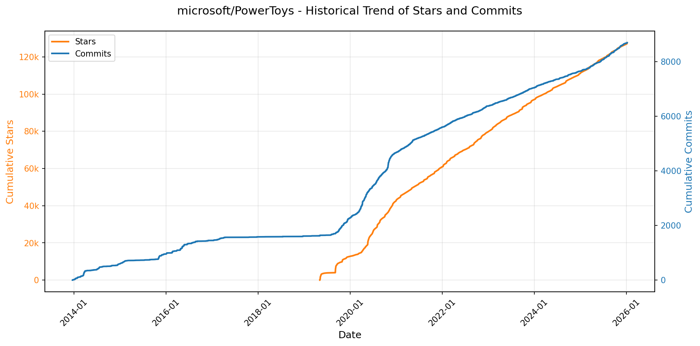

> *蓝色：累计 Stars｜橙色：累计 Commits（次 Y 轴）*

<b>📄 README 摘要</b>

1. 什么是这个项目？  
该项目是微软开发的 PowerToys，是一套专为 Windows 用户设计的系统增强工具集。它旨在帮助用户深度自定义和优化 Windows 操作体验，通过提供一系列轻量级实用程序来简化日常操作、提升工作效率。PowerToys 允许用户调整窗口布局、快速启动应用、重命名文件、提取文本、管理键盘快捷键等，特别适合高级用户和开发者使用。

2. 主要功能  
- **FancyZones**：自定义窗口布局，实现多窗口精准分屏。
- **PowerToys Run**：快速启动器，支持插件扩展，可搜索应用、文件、命令等。
- **PowerRename**：批量重命名文件，支持正则表达式，并可利用照片元数据（如相机型号、拍摄时间）进行命名。
- **Keyboard Manager**：重新映射键盘按键和快捷键。
- **Color Picker**：屏幕取色工具，快速获取颜色值。
- **Image Resizer**：右键直接批量调整图片尺寸。
- **Mouse Without Borders**：用一套键鼠控制多台电脑。
- **Always on Top**：将任意窗口置顶显示。
- **Shortcut Guide**：长按 Win 键显示快捷键指南。
- **Advanced Paste**：智能粘贴，集成多种 AI 模型（如 OpenAI、Gemini）生成内容后粘贴。
- **Command Palette**：统一命令中心，支持文件搜索、剪贴板历史、系统命令等。
- **Peek**：类似 macOS 的 Quick Look，空格键预览文件。
- **Awake**：防止电脑休眠，支持计时唤醒或无限保持唤醒。
- **Workspaces**：保存和恢复多个窗口布局配置。
- **ZoomIt**：演示时放大屏幕区域或绘制标注。
- **Text Extractor (OCR)**：从屏幕截图中提取文本。
- **Screen Ruler**：屏幕标尺，测量像素距离。
- 支持通过 WinGet、Microsoft Store 和 GitHub 安装更新，具备高度可配置的设置界面。

3. 技术栈  
- 主要使用 **C++** 和 **C#** 开发，结合 **Win32 API** 和 **Windows Runtime (WinRT)** 实现系统级功能。
- 界面采用 **XAML** 与 **WinUI 3** 构建现代化 UI。
- 使用 **.NET 9**（更新至 9.0.10 版本）作为托管代码运行时。
- 安装程序基于 **WiX Toolset v5** 构建，取代旧版 v3。
- 构建系统运行在 **Windows Server 2022** 上，使用 MSBuild 和 CI/CD 流水线自动化编译。
- 集成 **OCR** 功能用于文本提取，支持多语言识别。
- 使用 **Ollama、OpenAI、Gemini** 等外部 AI 模型提供智能粘贴能力。
- 依赖 **Visual C++ Redistributable** 运行库，并在项目中统一配置混合 CRT 以减小安装包体积。
- 测试框架包括单元测试和 UI 自动化测试，确保功能稳定性。

---

### 2. [iptv-org/iptv](https://github.com/iptv-org/iptv)
- 📅 **创建日期**：2018-11-14  
- 🔄 **最近更新**：2026-01-13  
- ⭐ **Stars**：109,410（日 +247｜周 +878｜月 +4706）  
- 📝 **描述**：Collection of publicly available IPTV channels from all over the world  

<b>📈 Star 与 Commit 历史趋势</b>

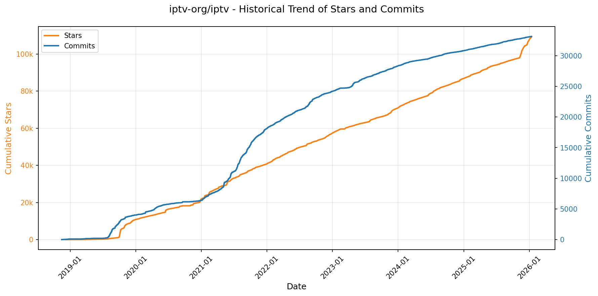

> *蓝色：累计 Stars｜橙色：累计 Commits（次 Y 轴）*

<b>📄 README 摘要</b>

1. 该项目汇集了全球范围内公开可用的IPTV（网络协议电视）频道，提供一个包含大量直播电视频道流链接的公共资源库，用户可通过支持直播流的播放器直接访问这些频道。

2. 主要功能包括：提供覆盖全球的主播放列表（m3u格式）及多个分类子列表；集成电子节目指南（EPG）支持，可获取多数频道的节目信息；所有频道数据来自独立数据库仓库，支持社区协作维护与纠错；提供API接口文档以方便开发者集成和查询；鼓励用户通过讨论区交流、提交问题或贡献新的有效频道链接，并设有详细的使用说明、常见问题解答及相关资源推荐。

3. 技术栈主要包括：基于GitHub Pages托管静态m3u播放列表文件；使用GitHub Actions实现自动化更新流程；频道数据由独立的[database](https://github.com/iptv-org/database)仓库管理，采用JSON格式存储；EPG信息通过单独的[epg](https://github.com/iptv-org/epg)仓库生成和分发；API服务由[iptv-org/api](https://github.com/iptv-org/api)项目提供；整体架构为去中心化的开源协作模式，依赖GitHub生态系统进行版本控制、贡献管理和持续集成。

---

### 3. [hacksider/Deep-Live-Cam](https://github.com/hacksider/Deep-Live-Cam)
- 📅 **创建日期**：2023-09-24  
- 🔄 **最近更新**：2026-01-13  
- ⭐ **Stars**：77,579（日 +276｜周 +841｜月 +1484）  
- 📝 **描述**：real time face swap and one-click video deepfake with only a single image  

<b>📈 Star 与 Commit 历史趋势</b>

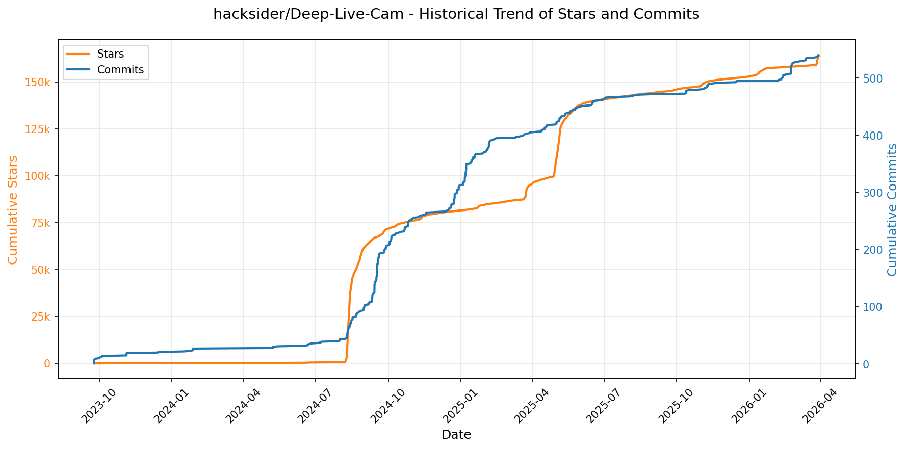

> *蓝色：累计 Stars｜橙色：累计 Commits（次 Y 轴）*

<b>📄 README 摘要</b>

1. 该项目能够实现基于单张图像的实时人脸替换和视频深度伪造。用户只需选择一张源人脸图片和目标摄像头或视频，即可在实时视频流中将目标人物的脸替换成源图像中的脸，整个过程一键操作，适用于直播、娱乐、内容创作等场景。

2. 主要功能包括：支持实时人脸交换（Live）；可保留使用者原始嘴部动作的“口部遮罩”功能；支持同时对多个对象进行不同人脸映射；可在观看电影时实时将演员脸部替换为指定人脸；可用于直播表演、制作网络迷因（meme）、在Omegle等社交平台上使用；支持多张人脸同时处理（Many Faces），并可通过图形界面轻松操作。

3. 技术栈包括Python（推荐3.11版本）、ONNX Runtime作为推理引擎，支持多种执行后端如CUDA（NVIDIA GPU）、DirectML（Windows）、CoreML（Apple Silicon）、OpenVINO（Intel）和CPU；使用InsightFace项目中的inswapper_128_fp16.onnx模型进行人脸交换，GFPGAN模型用于人脸增强；前端基于Tkinter构建图形界面；依赖FFmpeg处理音视频，PyTorch/Torchaudio等库支持深度学习运算，并通过Git管理代码与Hugging Face下载预训练模型。

---

### 4. [anomalyco/opencode](https://github.com/anomalyco/opencode)
- 📅 **创建日期**：2025-04-30  
- 🔄 **最近更新**：2026-01-13  
- ⭐ **Stars**：65,280（日 +2423｜周 +15155｜月 +26948）  
- 📝 **描述**：The open source coding agent.  

<b>📈 Star 与 Commit 历史趋势</b>

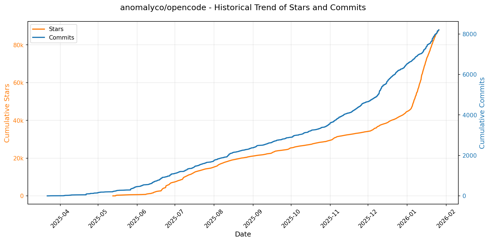

> *蓝色：累计 Stars｜橙色：累计 Commits（次 Y 轴）*

<b>📄 README 摘要</b>

1. 该项目是一个开源的AI编程代理工具，旨在通过终端用户界面（TUI）和客户端/服务器架构，在本地或远程协助开发者完成代码编写、分析和探索任务。它支持多种大语言模型（包括Claude、OpenAI、Google及本地模型），可在命令行中直接操作代码库，执行开发任务，并提供读写分离的智能体模式以适应不同工作场景。

2. 关键功能包括：内置两种可切换的智能体（“build”用于全权限开发，“plan”为只读模式用于代码分析与规划）；支持多步复杂任务处理的“general”子智能体；开箱即用的LSP（语言服务器协议）支持；灵活的安装方式，兼容多种包管理器（如npm、brew、scoop、choco等）；提供桌面应用Beta版本；具备客户端/服务器架构，允许远程控制；强调终端体验，适合Neovim用户；支持自定义安装路径优先级。

3. 技术栈主要包括：基于TypeScript/JavaScript构建，使用Node.js运行时；前端采用Web技术栈（React/Vue？未明确但推测用于Web界面）；终端界面（TUI）为核心交互方式；支持集成各类LLM API（如Anthropic Claude、OpenAI、Google Gemini）以及本地运行的大模型；利用LSP实现对编程语言的深度支持；构建流程使用GitHub Actions；包管理支持npm、bun、pnpm、yarn、Homebrew、Scoop、Chocolatey、Mise、Nix等多种工具；跨平台支持macOS、Windows、Linux系统。

---

### 5. [anthropics/claude-code](https://github.com/anthropics/claude-code)
- 📅 **创建日期**：2025-02-22  
- 🔄 **最近更新**：2026-01-13  
- ⭐ **Stars**：55,883（日 +430｜周 +4121｜月 +10254）  
- 📝 **描述**：Claude Code is an agentic coding tool that lives in your terminal, understands your codebase, and helps you code faster by executing routine tasks, explaining complex code, and handling git workflows - all through natural language commands.  

<b>📈 Star 与 Commit 历史趋势</b>

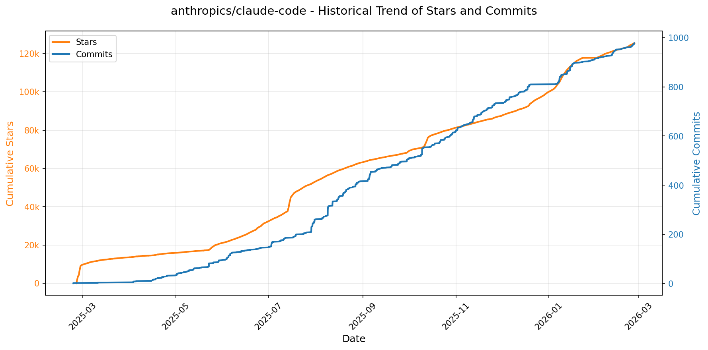

> *蓝色：累计 Stars｜橙色：累计 Commits（次 Y 轴）*

<b>📄 README 摘要</b>

1. 该项目是一个驻留在终端中的代理式编程工具，能够理解用户的代码库，通过自然语言指令帮助用户更快地编写代码。它可执行常规编码任务、解释复杂代码逻辑，并处理 git 工作流程，支持在终端、IDE 或 GitHub 上通过 @claude 标注使用。

2. 主要功能包括：通过自然语言命令与代码库交互；自动化完成编码任务；解释项目中的复杂代码；管理 git 工作流；支持跨平台安装（macOS、Linux、Windows）；可通过插件系统扩展功能；集成反馈和错误报告机制（如 `/bug` 命令）；支持与社区在 Discord 上交流协作。

3. 技术栈基于 Node.js（要求 18+ 版本），通过 shell 脚本（bash/powershell）实现跨平台安装，使用 npm 进行包管理（尽管全局安装方式已被弃用），并依赖本地运行的代理服务与 Anthropic 的云端模型通信。项目还包含插件架构以支持功能扩展。

---

### 6. [usememos/memos](https://github.com/usememos/memos)
- 📅 **创建日期**：2021-12-08  
- 🔄 **最近更新**：2026-01-13  
- ⭐ **Stars**：53,702（日 +494｜周 +1709｜月 +6679）  
- 📝 **描述**：An open-source, self-hosted note-taking service. Your thoughts, your data, your control — no tracking, no ads, no subscription fees.  

<b>📈 Star 与 Commit 历史趋势</b>

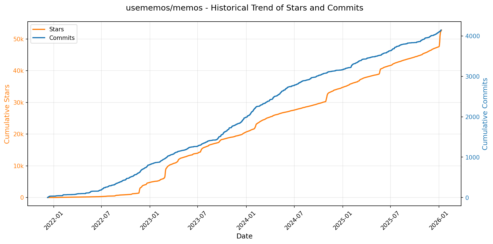

> *蓝色：累计 Stars｜橙色：累计 Commits（次 Y 轴）*

<b>📄 README 摘要</b>

1. 该项目是一个开源、可自托管的笔记服务，旨在让用户完全掌控自己的数据和想法。它支持个人记事、团队知识库和知识管理，强调隐私保护，无追踪、无广告、无订阅费用，所有内容均存储在用户自己的基础设施上。

2. 主要功能包括：  
   - 隐私优先架构：完全自托管，零遥测，数据自主可控，支持完整导出，避免供应商锁定。  
   - 原生支持 Markdown：使用纯文本存储，便于迁移和备份。  
   - 高性能体验：后端采用 Go，前端使用 React，加载迅速，响应灵敏。  
   - 简单部署：支持一键 Docker 部署，兼容 SQLite、MySQL 和 PostgreSQL 数据库。  
   - 开发者友好：提供完整的 REST 和 gRPC API，便于集成到现有工作流。  
   - 美观界面：简洁现代的设计风格，支持暗黑模式和移动端自适应布局。

3. 技术栈：  
   - 后端：Go（Golang）  
   - 前端：React  
   - 支持数据库：SQLite、MySQL、PostgreSQL  
   - 部署方式：Docker、Docker Compose、Kubernetes（Helm）、预编译二进制文件、源码构建

---

### 7. [virattt/ai-hedge-fund](https://github.com/virattt/ai-hedge-fund)
- 📅 **创建日期**：2024-11-29  
- 🔄 **最近更新**：2026-01-13  
- ⭐ **Stars**：45,244（日 +45｜周 +451｜月 +2658）  
- 📝 **描述**：An AI Hedge Fund Team  

<b>📈 Star 与 Commit 历史趋势</b>

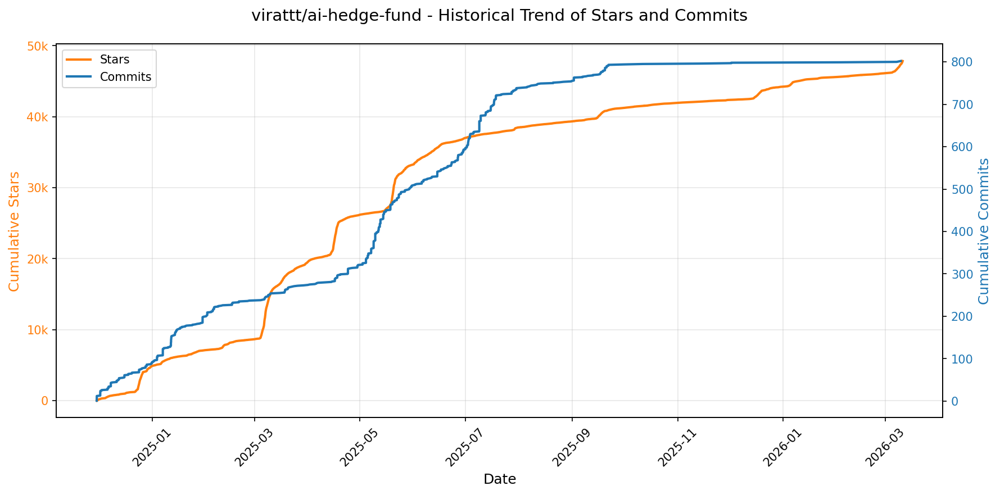

> *蓝色：累计 Stars｜橙色：累计 Commits（次 Y 轴）*

<b>📄 README 摘要</b>

1. 该项目是一个人工智能驱动的对冲基金概念验证系统，旨在探索利用AI进行股票交易决策。系统模拟多位著名投资大师（如巴菲特、达摩达兰、凯茜·伍德等）构建多个智能体代理，每个代理基于其独特的投资理念分析股票，并由估值、情绪、基本面和技术等专门代理生成交易信号，最终由风险管理和投资组合管理代理共同做出买卖决策。系统不执行真实交易，仅供教育和研究使用。

2. 关键功能包括：集成18个协同工作的AI代理，涵盖不同投资流派（价值、成长、宏观、激进等）；支持多维度分析（基本面、技术面、市场情绪、内在估值）；内置风险管理和投资组合决策机制；提供命令行接口（CLI）和Web图形界面两种运行方式；支持回测功能以评估策略表现；可配置使用OpenAI、Anthropic、Groq、DeepSeek或本地Ollama模型；允许指定分析时间段和股票标的；免费提供部分美股（如AAPL、NVDA）数据支持。

3. 技术栈主要包括：Python作为主要编程语言；使用Poetry进行依赖管理；基于LLM（大语言模型）实现各智能体的决策逻辑，支持多种API（OpenAI、Anthropic、Groq、DeepSeek）及本地Ollama模型；通过环境变量（.env）配置API密钥；使用外部金融数据集API获取股票数据；Web应用部分独立部署于/app目录下，提供可视化交互界面；项目采用MIT许可证开源。

---

### 8. [NanmiCoder/MediaCrawler](https://github.com/NanmiCoder/MediaCrawler)
- 📅 **创建日期**：2023-06-09  
- 🔄 **最近更新**：2026-01-13  
- ⭐ **Stars**：42,266（日 +347｜周 +782｜月 +2221）  
- 📝 **描述**：小红书笔记 | 评论爬虫、抖音视频 | 评论爬虫、快手视频 | 评论爬虫、B 站视频 ｜ 评论爬虫、微博帖子 ｜ 评论爬虫、百度贴吧帖子 ｜ 百度贴吧评论回复爬虫  | 知乎问答文章｜评论爬虫  

<b>📈 Star 与 Commit 历史趋势</b>

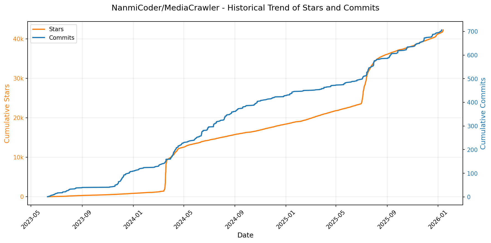

> *蓝色：累计 Stars｜橙色：累计 Commits（次 Y 轴）*

<b>📄 README 摘要</b>

1. **项目功能**  
MediaCrawler 是一个开源的多平台自媒体数据采集工具，主要用于抓取小红书、抖音、快手、B站、微博、贴吧、知乎等主流平台的公开信息。支持关键词搜索、指定帖子ID爬取、创作者主页内容采集、评论数据获取以及生成评论词云图等功能。项目通过浏览器自动化技术实现登录态保持，规避反爬机制，适用于学习和研究用途，禁止用于商业或非法行为。

2. **关键特性**  
- 支持多个主流自媒体平台（小红书、抖音、快手、B站、微博、贴吧、知乎）的数据抓取。  
- 提供多种爬取模式：关键词搜索、指定帖子ID、创作者主页、二级评论采集。  
- 基于 Playwright 实现浏览器自动化，扫码登录并持久化保存登录状态，避免频繁验证。  
- 支持 IP 代理池配置，提升爬虫稳定性与反反爬能力。  
- 可生成评论词云图，辅助内容分析。  
- 支持多种数据存储格式：CSV、JSON、Excel、SQLite 和 MySQL。  
- 提供 WebUI 可视化操作界面，支持参数配置、运行状态监控与数据导出。  
- 开箱即用的配置文件（中文注释），降低使用门槛。  

3. **技术栈**  
- 编程语言：Python  
- 浏览器自动化框架：Playwright（用于模拟用户操作、维持登录态）  
- 包管理工具：uv（推荐替代 pip + venv，提升依赖安装效率）  
- 后端服务：FastAPI（构建 WebUI 的 API 接口）  
- 可视化界面：基于 Web 的前端 UI（通过 Uvicorn 启动本地服务）  
- 数据处理与存储：Pandas（数据处理）、SQLite、MySQL、CSV/JSON/Excel 文件输出  
- 环境依赖：Node.js（>=16，部分平台如抖音、知乎需运行 JS 签名逻辑）

---

### 9. [exo-explore/exo](https://github.com/exo-explore/exo)
- 📅 **创建日期**：2024-06-24  
- 🔄 **最近更新**：2026-01-13  
- ⭐ **Stars**：39,911（日 +55｜周 +412｜月 +7182）  
- 📝 **描述**：Run your own AI cluster at home with everyday devices 📱💻 🖥️⌚  

<b>📈 Star 与 Commit 历史趋势</b>

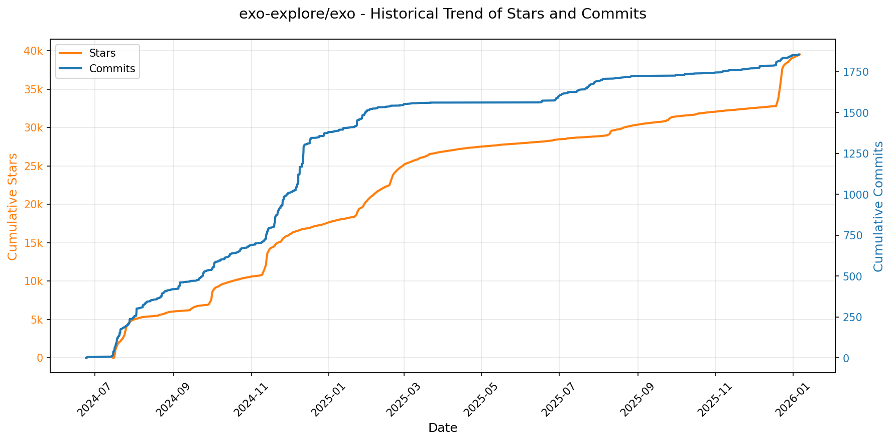

> *蓝色：累计 Stars｜橙色：累计 Commits（次 Y 轴）*

<b>📄 README 摘要</b>

1. 该项目做什么？  
exo 是一个允许用户将日常设备（如 Mac）连接成一个本地 AI 集群的开源项目。它使得在多个设备上分布式运行大型语言模型成为可能，突破单个设备的硬件限制（如显存容量），并利用设备间的高速互联（如 Thunderbolt）提升推理性能。通过自动发现设备、智能模型分片和低延迟通信技术，用户可以在家用设备上高效运行超大规模模型。

2. 关键功能  
- **自动设备发现**：运行 exo 的设备可自动相互发现并组网，无需手动配置。  
- **Thunderbolt 上的 RDMA 支持**：原生支持 macOS 上 Thunderbolt 5 的远程直接内存访问（RDMA），设备间通信延迟降低高达 99%。  
- **拓扑感知的自动并行**：根据实时设备拓扑（包括计算资源、网络带宽与延迟）自动决定最优的模型分割策略。  
- **张量并行（Tensor Parallelism）**：支持将模型分片到多个设备并行计算，在 2 台设备上最高实现 1.8 倍加速，4 台设备上达 3.2 倍加速。  
- **MLX 后端支持**：使用 Apple 的 MLX 框架作为推理引擎，并集成 MLX 分布式模块进行跨设备通信。  
- **本地 API 与仪表盘**：提供 Web 仪表盘（http://localhost:52415）和兼容 OpenAI 格式的 API 接口，便于监控和交互。  

3. 技术栈  
- **编程语言**：Rust（用于构建系统级绑定，当前需 nightly 版本）、Python（主逻辑）、JavaScript/Node.js（用于构建前端仪表盘）。  
- **依赖工具**：uv（Python 包管理）、npm（前端构建）、macmon（Apple Silicon 硬件监控，仅 macOS）、Homebrew（macOS/Linux 包管理）。  
- **核心框架**：MLX（Apple 开发的机器学习框架，用于模型推理）及其分布式组件 MLX Distributed。  
- **通信技术**：RDMA over Thunderbolt 5（实现设备间超低延迟内存访问）。  
- **部署平台**：主要支持 macOS（利用 GPU 加速），Linux 当前仅支持 CPU 运行，GPU 支持正在开发中。  
- **前端技术**：Node.js + npm 构建静态仪表盘界面。

---

### 10. [anthropics/skills](https://github.com/anthropics/skills)
- 📅 **创建日期**：2025-09-22  
- 🔄 **最近更新**：2026-01-13  
- ⭐ **Stars**：38,762（日 +826｜周 +4839｜月 +18131）  
- 📝 **描述**：Public repository for Agent Skills  

<b>📈 Star 与 Commit 历史趋势</b>

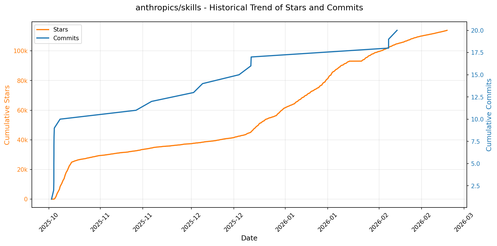

> *蓝色：累计 Stars｜橙色：累计 Commits（次 Y 轴）*

<b>📄 README 摘要</b>

1. **这个项目是做什么的？**  
该项目是 Anthropic 提供的 Claude 技能（Skills）实现示例库。技能是一组包含指令、脚本和资源的文件夹，Claude 可动态加载这些技能以提升在特定任务上的表现。本项目通过提供多种实际示例，展示如何创建和使用技能来完成重复性任务，例如根据公司品牌规范生成文档、分析数据或自动化个人工作流。它旨在为开发者提供参考和灵感，帮助其构建自定义技能，并了解技能系统的运作方式。

2. **关键特性**  
- 每个技能独立封装在单独文件夹中，包含一个 `SKILL.md` 文件，用于定义名称、描述及执行指令；  
- 支持多种应用场景：创意设计（艺术、音乐）、技术开发（Web 应用测试、MCP 服务器生成）、企业通信与品牌管理等；  
- 提供真实生产环境中的文档处理技能源码（如 docx、pdf、pptx、xlsx），作为复杂技能的参考实现；  
- 开放部分技能为 Apache 2.0 开源许可，其余为源码可用（source-available）；  
- 可集成到 Claude Code、Claude.ai 和 Claude API 中，支持插件化安装与调用；  
- 提供标准化模板（template）和 Agent Skills 规范（spec），便于快速创建新技能；  
- 用户可通过简单命令注册技能市场并安装技能集，实现即插即用。

3. **技术栈**  
- 技能本身基于纯文本结构：使用 Markdown 编写，包含 YAML 前置元数据（name, description）；  
- 无特定编程语言依赖，但可内嵌脚本（如 Python、Shell 等）以执行具体操作；  
- 与 Claude 平台深度集成，依托 Anthropic 的 AI 模型能力进行任务调度与执行；  
- 支持通过 CLI 命令在 Claude Code 中添加技能市场和安装插件；  
- 通过 Claude API 实现技能上传与调用，适用于第三方应用集成；  
- 使用标准文件夹组织结构，便于版本控制与分发（GitHub 托管）。

---

### 11. [DioxusLabs/dioxus](https://github.com/DioxusLabs/dioxus)
- 📅 **创建日期**：2021-01-15  
- 🔄 **最近更新**：2026-01-13  
- ⭐ **Stars**：33,702（日 +409｜周 +731｜月 +1137）  
- 📝 **描述**：Fullstack app framework for web, desktop, and mobile.  

<b>📈 Star 与 Commit 历史趋势</b>

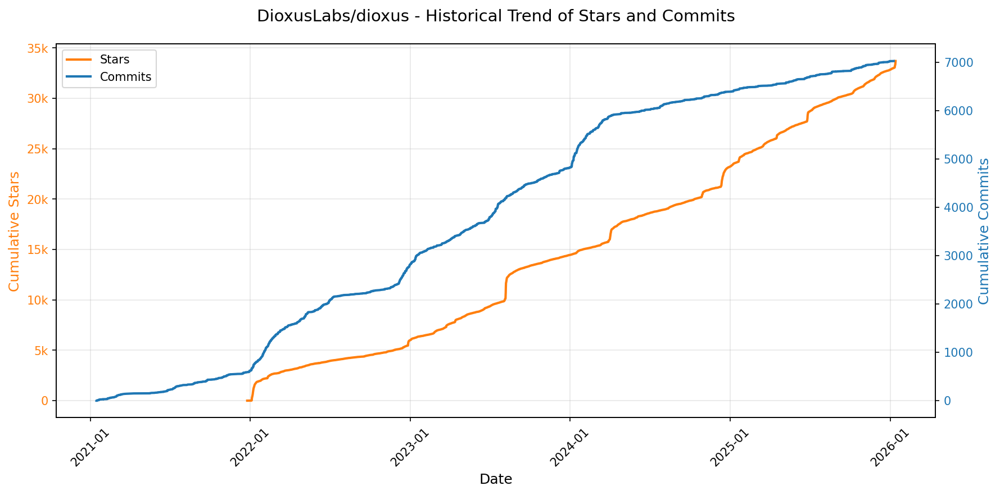

> *蓝色：累计 Stars｜橙色：累计 Commits（次 Y 轴）*

<b>📄 README 摘要</b>

1. 该项目是一个基于 Rust 的跨平台应用开发框架，允许开发者使用单一代码库构建适用于 Web、桌面（macOS、Linux、Windows）、移动设备（iOS 和 Android）以及服务端的应用程序。它支持零配置启动、集成热重载功能，并提供基于信号（signals）的高效状态管理机制。通过其 CLI 工具可轻松实现应用的开发、调试和打包部署，同时深度集成了全栈能力，如服务器函数、WebSocket、SSE、文件上传下载、服务端渲染（SSR）等。

2. 关键特性包括：  
   - **跨平台支持**：仅需三行代码即可为 Web、桌面、移动端等多个平台编译运行。  
   - **高效的热重载**：支持毫秒级 HTML/CSS/样式更新，实验性功能可实现在不重启的情况下实时修补 Rust 代码（`dx serve --hotpatch`）。  
   - **信号式状态管理**：结合 React、Solid 和 Svelte 的优点，提供直观且高性能的状态响应系统。  
   - **内置全栈框架**：与 Axum 深度集成，支持类型安全的服务端功能，如 Server Functions、中间件、路由、流式传输等。  
   - **多渲染后端支持**：支持 web-sys、WebView、服务端渲染、LiveView 及实验性的 WGPU 渲染器，可嵌入 Bevy 或用于嵌入式 Linux。  
   - **原生移动支持**：通过 `dx serve --platform android` 快速在模拟器或真机上运行，直接调用 JNI 和原生 API。  
   - **一键打包优化**：使用 `dx bundle` 自动生成优化后的资源（如 `.avif` 图像、压缩 `.wasm` 文件），Web 应用可小至 50KB，桌面/移动应用小于 5MB。  
   - **丰富的组件库**：提供类 shadcn/ui 和 Radix-Primitives 风格的一方基础组件。  
   - **模块化架构**：核心组件（如 RSX、VirtualDom、Taffy 布局引擎）可独立使用，支持社区自定义渲染器（如 Freya）。  
   - **完善的文档体系**：持续与主干同步的高质量文档，涵盖教程、API 参考、实战示例等，并以自身官网作为新功能测试场。

3. 技术栈主要包括：  
   - **编程语言**：Rust  
   - **前端框架**：Dioxus 自研框架，采用类 JSX 的 RSX 语法  
   - **后端集成**：Axum + Tokio + Tower（用于构建全栈应用）  
   - **构建与开发工具**：Dioxus CLI（`dx`），支持 `serve`、`build`、`bundle` 等命令  
   - **状态管理**：Signals 模型（基于细粒度响应式系统）  
   - **渲染技术**：WebAssembly（Web）、WebView（桌面/移动）、WGPU（实验性图形渲染）、Server-Side Rendering（SSR）  
   - **样式支持**：原生 HTML/CSS，内置 Tailwind CSS 支持  
   - **跨平台通信**：Web-sys（Web）、objc-rs / JNI（原生 iOS/Android 调用）  
   - **布局引擎**：Taffy（Flexbox 兼容布局）  
   - **打包优化**：自动资源压缩、AVIF 生成、WASM 剥离与混淆  
   - **生态系统**：Cargo 构建系统，crates.io 发布，GitHub Actions 持续集成

---

### 12. [Lissy93/web-check](https://github.com/Lissy93/web-check)
- 📅 **创建日期**：2023-06-25  
- 🔄 **最近更新**：2026-01-13  
- ⭐ **Stars**：29,534（日 +101｜周 +2189｜月 +2552）  
- 📝 **描述**：🕵️‍♂️ All-in-one OSINT tool for analysing any website  

<b>📈 Star 与 Commit 历史趋势</b>

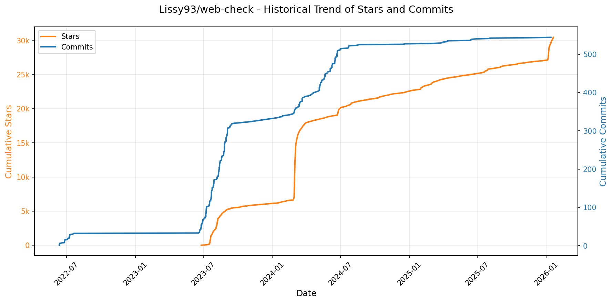

> *蓝色：累计 Stars｜橙色：累计 Commits（次 Y 轴）*

---

### 13. [OpenBMB/ChatDev](https://github.com/OpenBMB/ChatDev)
- 📅 **创建日期**：2023-08-28  
- 🔄 **最近更新**：2026-01-13  
- ⭐ **Stars**：28,403（日 +191｜周 +397｜月 +581）  
- 📝 **描述**：ChatDev 2.0: Dev All through LLM-powered Multi-Agent Collaboration  

<b>📈 Star 与 Commit 历史趋势</b>

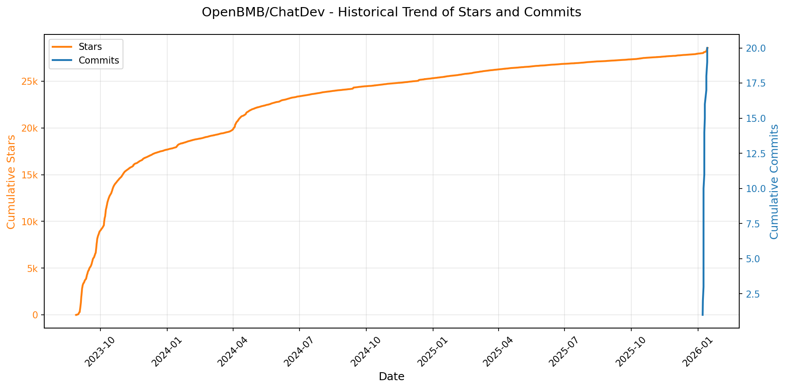

> *蓝色：累计 Stars｜橙色：累计 Commits（次 Y 轴）*

<b>📄 README 摘要</b>

1. 该项目是一个零代码的多智能体协作平台（DevAll），旨在通过简单配置即可快速构建和执行定制化的多智能体系统，用于“开发一切”（Developing Everything）。用户无需编程，即可定义智能体、工作流和任务，以协同完成包括数据可视化、3D生成、深度研究、游戏开发和教学视频制作等复杂场景。其前身ChatDev 1.0专注于自动化软件开发生命周期，而2.0版本已扩展为一个通用的多智能体编排平台。

2. 关键功能包括：提供零代码的Web控制台，支持通过拖拽方式在可视化画布上设计和配置多智能体工作流；内置丰富的开箱即用模板（如数据可视化、3D建模、游戏开发、深度研究等）；支持实时日志监控、中间产物检查和人机交互反馈；提供轻量级Python SDK，可实现工作流的程序化调用和批量处理；支持通过YAML文件灵活配置智能体角色、工具和流程；并具备良好的可扩展性，允许开发者添加新的节点、工具和功能模块。

3. 技术栈采用前后端分离架构：后端基于Python（3.12+），使用FastAPI框架（`server/`）和自定义的运行时核心（`runtime/`），依赖`uv`作为包管理器；前端基于Vue 3和Vite构建单页应用（位于`frontend/`目录），使用Node.js（18+）环境；智能体间的协作逻辑由YAML配置文件驱动，并通过LLM（大语言模型）进行推理和决策；项目还集成了Blender用于3D生成，Manim用于数学教学视频生成，并支持通过`.env`文件和环境变量管理模型密钥与API配置。

---

### 14. [simstudioai/sim](https://github.com/simstudioai/sim)
- 📅 **创建日期**：2025-01-05  
- 🔄 **最近更新**：2026-01-13  
- ⭐ **Stars**：25,638（日 +141｜周 +619｜月 +6226）  
- 📝 **描述**：Open-source platform to build and deploy AI agent workflows.  

<b>📈 Star 与 Commit 历史趋势</b>

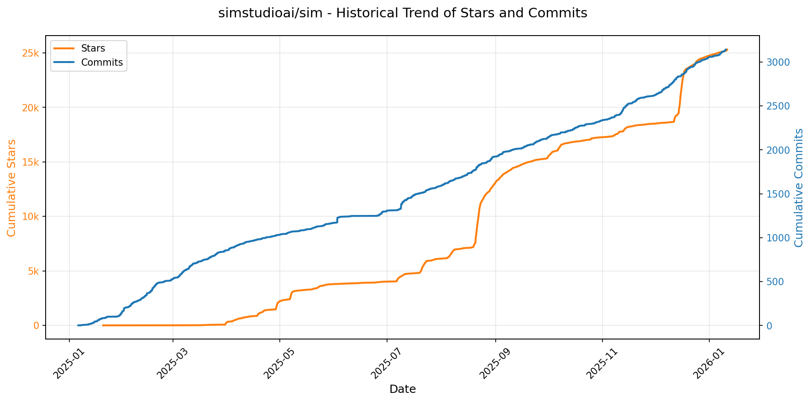

> *蓝色：累计 Stars｜橙色：累计 Commits（次 Y 轴）*

<b>📄 README 摘要</b>

1. 该项目用于快速构建和部署AI智能体（Agent）工作流。用户可以通过可视化画布连接不同的智能体、工具和功能模块，设计复杂的工作流程并即时运行。支持利用自然语言生成节点、修复错误（通过Copilot功能），以及上传文档至向量数据库，使智能体能够基于特定知识内容回答问题。

2. 关键特性包括：  
   - **可视化工作流构建**：在画布上直观地连接和编排AI智能体与工具。  
   - **Copilot辅助开发**：通过自然语言指令自动生成流程节点、修正错误并迭代优化流程。  
   - **集成向量数据库**：支持上传文档并存储为向量，实现基于私有知识的语义检索与问答。  
   - **多种部署方式**：支持云端使用（sim.ai）、NPM一键启动、Docker Compose部署及本地手动配置。  
   - **本地大模型支持**：可结合Ollama或vLLM运行本地AI模型，无需依赖外部API。  
   - **实时协作与远程执行**：内置实时通信能力，并支持安全的远程代码沙箱执行。

3. 技术栈包括：  
   - **框架**：Next.js（App Router）  
   - **运行时**：Bun  
   - **数据库**：PostgreSQL 配合 pgvector 扩展 和 Drizzle ORM  
   - **认证**：Better Auth  
   - **前端UI**：Shadcn UI 组件库 + Tailwind CSS  
   - **状态管理**：Zustand  
   - **流程图编辑器**：ReactFlow  
   - **文档系统**：Fumadocs  
   - **项目结构**：Turborepo 管理的单体仓库（Monorepo）  
   - **实时通信**：Socket.io  
   - **后台任务调度**：Trigger.dev  
   - **远程代码执行**：E2B 沙箱环境

---

### 15. [bytedance/UI-TARS-desktop](https://github.com/bytedance/UI-TARS-desktop)
- 📅 **创建日期**：2025-01-19  
- 🔄 **最近更新**：2026-01-13  
- ⭐ **Stars**：23,262（日 +384｜周 +2888｜月 +3446）  
- 📝 **描述**：The Open-Source Multimodal AI Agent Stack: Connecting Cutting-Edge AI Models and Agent Infra  

<b>📈 Star 与 Commit 历史趋势</b>

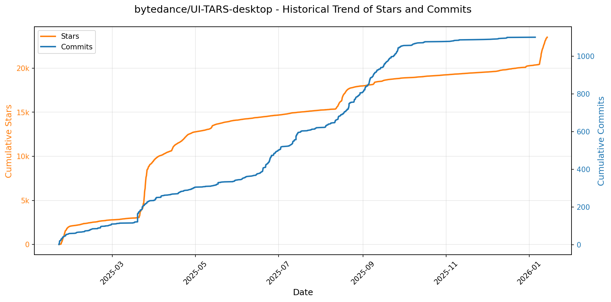

> *蓝色：累计 Stars｜橙色：累计 Commits（次 Y 轴）*

<b>📄 README 摘要</b>

1. 该项目做什么？  
   TARS 是一个通用的多模态 AI Agent 技术栈，旨在通过先进的多模态大模型和与现实世界工具的无缝集成，实现更接近人类行为方式的任务自动化。它包含两个核心项目：Agent TARS 和 UI-TARS Desktop。Agent TARS 提供命令行（CLI）和 Web 界面，能将图形界面代理（GUI Agent）和视觉能力带入终端、计算机、浏览器及各类产品中，支持在本地或云端执行任务。UI-TARS Desktop 是一个桌面应用，基于 UI-TARS 模型提供原生的 GUI 自动化代理功能，支持通过自然语言指令控制本地或远程的计算机与浏览器，实现如自动配置软件、查询网页信息等操作。

2. 核心功能  
   - **开箱即用的一键式 CLI**：支持带图形界面的 Web UI 模式和无头模式的服务器运行。
   - **混合浏览器代理**：可通过视觉识别（GUI Agent）、DOM 分析或两者结合的方式控制浏览器。
   - **事件流驱动架构**：基于协议的事件流支持上下文工程和 Agent UI 构建，便于调试和数据流追踪。
   - **MCP 工具集成**：基于 MCP（Model-Context Protocol）架构，可接入多种现实世界的工具和服务。
   - **自然语言控制与视觉识别**：利用视觉-语言模型理解屏幕截图并执行精确的鼠标键盘操作。
   - **远程操作支持**：UI-TARS Desktop 支持无需配置即可远程控制其他计算机和浏览器。
   - **本地化与安全性**：支持完全在本地运行，保障用户数据隐私和安全。
   - **跨平台兼容性**：支持 Windows、macOS 及浏览器环境。

3. 技术栈  
   - **核心模型**：采用多模态大语言模型（如 doubao-1-5-thinking-vision-pro、claude-3-7-sonnet、Seed-1.5-VL/1.6 系列等）进行视觉理解和推理。
   - **前端技术**：使用 Node.js 开发 CLI 工具，Web UI 基于现代 Web 技术构建。
   - **通信协议**：基于 MCP（Model-Context Protocol）实现 Agent 与外部工具之间的上下文交换与调用。
   - **部署平台**：支持在本地运行，也可通过 ModelScope 等云平台进行模型部署。
   - **开发工具包**：提供 UI TARS SDK，用于构建跨平台的 GUI 自动化代理应用。
   - **运行环境**：CLI 要求 Node.js >= 22，支持 Windows 和 macOS 系统。

---

### 16. [resemble-ai/chatterbox](https://github.com/resemble-ai/chatterbox)
- 📅 **创建日期**：2025-04-23  
- 🔄 **最近更新**：2026-01-13  
- ⭐ **Stars**：21,355（日 +70｜周 +595｜月 +6420）  
- 📝 **描述**：SoTA open-source TTS  

<b>📈 Star 与 Commit 历史趋势</b>

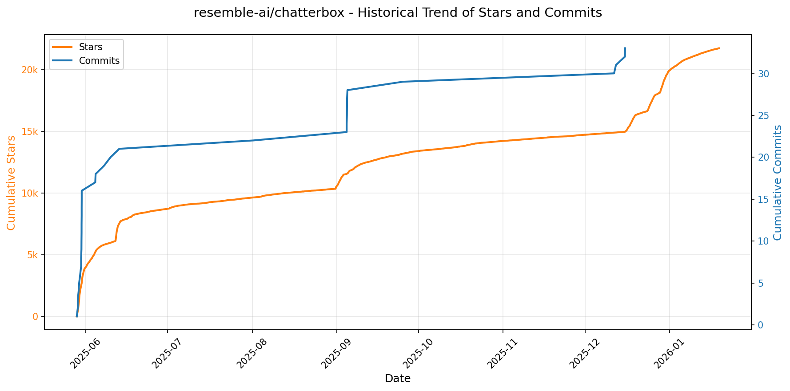

> *蓝色：累计 Stars｜橙色：累计 Commits（次 Y 轴）*

<b>📄 README 摘要</b>

1. **这个项目是做什么的？**  
Chatterbox 是由 Resemble AI 开发的一系列先进的开源文本转语音（TTS）模型，旨在提供高质量、低延迟的语音合成能力。其中最新推出的 **Chatterbox-Turbo** 模型专为高效推理设计，适用于零样本语音克隆、语音代理和创意内容生成。它支持在文本中直接使用如 `[laugh]`、`[cough]` 等**副语言标签**来增强语音的真实感与表现力。所有生成的音频均内置不可感知的神经水印（PerTh），以实现AI生成内容的可追溯性和负责任使用。

2. **关键特性**  
- **Chatterbox-Turbo**：仅 350M 参数，计算资源和显存需求更低，解码步骤从 10 步压缩至 **单步生成**，显著提升推理速度。
- 原生支持**副语言行为标签**（如 `[laugh]`, `[chuckle]`, `[cough]`），增强语音自然度。
- 支持**零样本语音克隆**，通过提供参考音频即可模仿说话人声音。
- 多语言支持：Chatterbox-Multilingual 支持超过 23 种语言，包括中文、法语、日语等。
- 内置 **PerTh 神经水印技术**，可在不影响音质的前提下嵌入可检测的隐形水印，抵御压缩和编辑攻击。
- 提供 Hugging Face 在线演示、本地安装和源码部署多种使用方式。
- 可调节 CFG 权重和夸张程度（exaggeration）参数，控制语音表达的稳定性和情感强度。

3. **技术栈**  
- **核心框架**：Python + PyTorch
- **依赖库**：torchaudio, librosa, transformers（隐式）
- **模型架构**：基于流式语音标记到梅尔谱图的蒸馏解码器，采用高效自回归或非自回归生成结构
- **语音编码/解码**：集成 HiFT-GAN 或类似高质量声码器
- **语音标记化**：使用 S3Tokenizer 等先进技术进行语音表征学习
- **水印系统**：Resemble AI 自研 PerTh（Perceptual Threshold）隐式水印方案
- **开发环境**：Python 3.11，Debian 11，CUDA（GPU 加速推荐）
- **包管理**：pip / conda，依赖锁定在 `pyproject.toml` 中确保一致性

---

### 17. [ChromeDevTools/chrome-devtools-mcp](https://github.com/ChromeDevTools/chrome-devtools-mcp)
- 📅 **创建日期**：2025-09-11  
- 🔄 **最近更新**：2026-01-13  
- ⭐ **Stars**：20,638（日 +214｜周 +1939｜月 +4042）  
- 📝 **描述**：Chrome DevTools for coding agents  

<b>📈 Star 与 Commit 历史趋势</b>

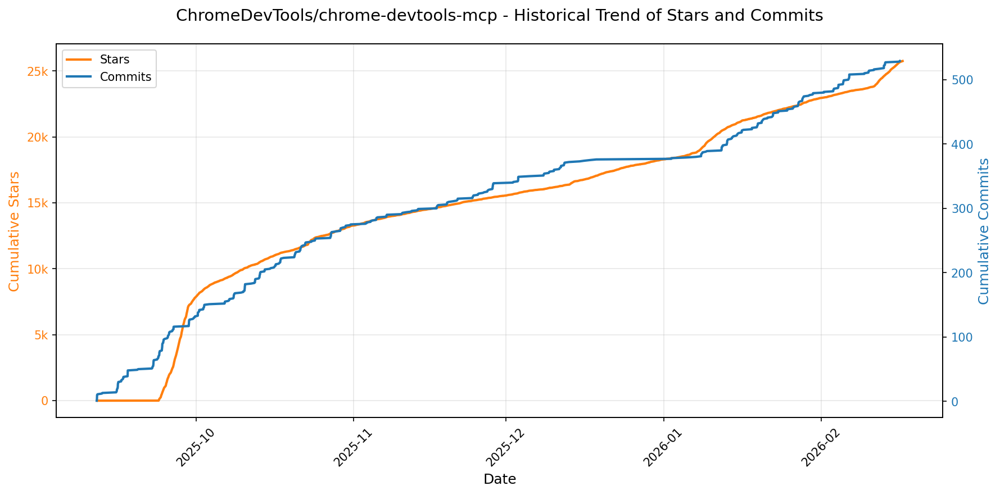

> *蓝色：累计 Stars｜橙色：累计 Commits（次 Y 轴）*

<b>📄 README 摘要</b>

1. 该项目使AI编码助手（如Gemini、Claude、Cursor或Copilot）能够控制和检查实时Chrome浏览器。它作为一个模型-上下文-协议（MCP）服务器，为AI助手提供完整的Chrome DevTools功能，用于可靠的自动化操作、深入的调试和性能分析。

2. 关键特性包括：获取性能洞察，通过记录跟踪来提取可操作的性能数据；进行高级浏览器调试，如分析网络请求、截取屏幕截图和检查浏览器控制台；实现可靠自动化，利用puppeteer库在Chrome中自动执行操作，并自动等待操作结果。

3. 技术栈基于Node.js（v20.19或更高版本）、Chrome浏览器（稳定版或更新版本）和npm。项目使用puppeteer库来驱动浏览器自动化，并作为MCP服务器与各种AI客户端集成。

---

### 18. [obra/superpowers](https://github.com/obra/superpowers)
- 📅 **创建日期**：2025-10-09  
- 🔄 **最近更新**：2026-01-13  
- ⭐ **Stars**：19,050（日 +1614｜周 +5088｜月 +9449）  
- 📝 **描述**：Claude Code superpowers: core skills library  

<b>📈 Star 与 Commit 历史趋势</b>

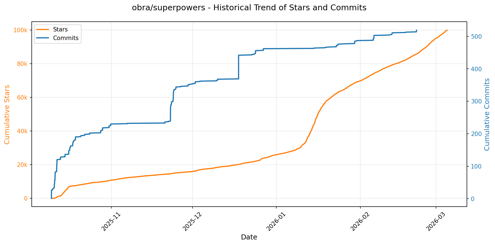

> *蓝色：累计 Stars｜橙色：累计 Commits（次 Y 轴）*

<b>📄 README 摘要</b>

1. **这个项目是做什么的？**  
Superpowers 是一个为编码智能体（coding agents）设计的完整软件开发工作流系统。它通过一组可组合的“技能”和初始指令，使智能体在开发过程中遵循严谨、系统化的工程实践。项目的核心目标是让 AI 编码代理在写代码前先理解需求，经过设计确认、计划制定、测试驱动开发和多阶段审查，以子代理协作的方式自动执行开发任务，从而实现高质量、可维护且符合工程规范的软件构建过程。

2. **关键特性**  
- **交互式需求澄清（brainstorming）**：在编码前通过提问细化用户意图，分段输出可读的设计方案供确认。  
- **自动生成实施计划**：将批准的设计拆解为耗时 2–5 分钟的小任务，明确文件路径、代码内容和验证步骤。  
- **子代理驱动开发（subagent-driven-development）**：为每个任务派遣独立子代理执行，并进行两阶段审查（是否符合规格、代码质量）。  
- **严格的测试驱动开发（TDD）**：强制执行红-绿-重构循环，禁止先写代码后补测试，失败测试必须先运行再修复。  
- **自动化代码审查与反馈机制**：任务间自动审查，按严重程度报告问题，关键问题阻止流程继续。  
- **Git 工作区隔离管理**：使用 git worktrees 创建独立分支环境，确保开发不影响主分支，支持并行开发。  
- **全流程自动化检查**：每一步自动触发相关技能，确保所有操作都符合预设工程规范，非建议而是强制执行。  
- **技能可扩展与自更新**：支持用户贡献新技能，插件更新时技能库自动同步。

3. **技术栈**  
- 构建于多种 AI 编码平台之上，主要支持 **Claude Code**（通过插件市场集成）、**Codex** 和 **OpenCode**。  
- 使用基于文本指令的插件系统，在不同平台上通过特定命令安装和加载技能包。  
- 技能本身以 Markdown 文档（如 `SKILL.md`）形式组织，存储在 GitHub 仓库中，具备自描述性和可读性。  
- 依赖 Git 的 worktree 功能实现分支隔离开发环境。  
- 遵循 TDD、YAGNI、DRY 等经典软件工程原则，结合系统化调试、防御性编程等方法论。  
- 支持通过 `/plugin` 命令进行安装、更新和管理（针对 Claude Code），其他平台需手动拉取配置文档完成设置。

---

### 19. [BloopAI/vibe-kanban](https://github.com/BloopAI/vibe-kanban)
- 📅 **创建日期**：2025-06-14  
- 🔄 **最近更新**：2026-01-13  
- ⭐ **Stars**：15,445（日 +425｜周 +2338｜月 +8983）  
- 📝 **描述**：Get 10X more out of Claude Code, Codex or any coding agent  

<b>📈 Star 与 Commit 历史趋势</b>

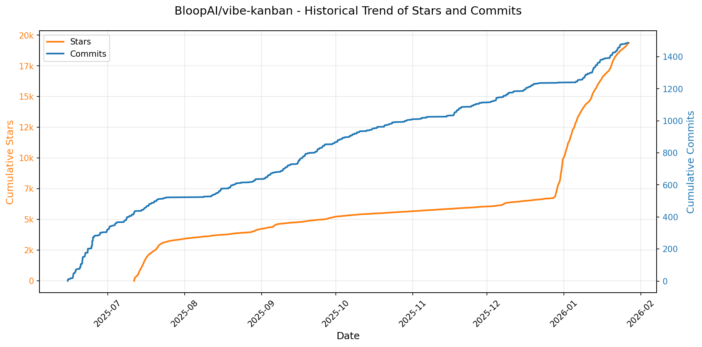

> *蓝色：累计 Stars｜橙色：累计 Commits（次 Y 轴）*

<b>📄 README 摘要</b>

1. 这个项目是做什么的？  
Vibe Kanban 是一个专为提升 AI 编码代理（如 Claude Code、Gemini CLI、Codex、Amp 等）协作效率而设计的任务管理与执行平台。它帮助人类工程师更高效地规划、协调和审查由多个 AI 编码代理生成的代码任务。用户可以通过该工具轻松切换不同的编码代理，按顺序或并行调度多个代理执行任务，集中管理代理配置（MCP configs），实时跟踪任务状态，快速预览成果并启动开发服务器。当部署在远程服务器上时，还支持通过 SSH 从本地编辑器（如 VSCode）直接打开项目。

2. 主要功能  
- 支持多种主流 AI 编码代理（如 Claude Code、Gemini CLI 等）的集成与快速切换  
- 可编排多个 AI 编码代理以串行或并行方式执行任务  
- 提供可视化看板界面，用于跟踪 AI 任务的状态与进度  
- 内置开发服务器启动功能，便于快速查看和测试生成的代码  
- 集中管理 AI 代理的 MCP（Model Control Protocol）配置  
- 支持远程部署，并可通过 SSH 与本地编辑器（如 VSCode Remote-SSH）集成，实现远程项目访问  
- 支持通过 Cloudflare Tunnel、ngrok 等工具暴露服务，方便远程访问 Web UI  
- 提供分析功能（基于 PostHog），可自定义启用或禁用  

3. 技术栈  
- **前端**：使用 Node.js（≥18）和 pnpm（≥8）构建，采用现代前端工程化流程，通过 `pnpm build` 构建静态资源  
- **后端**：基于 Rust 开发，强调性能与可靠性  
- **数据库**：开发环境中使用预设种子数据库（来自 `dev_assets_seed` 文件夹），并通过 `sqlx-cli` 进行数据库管理  
- **开发工具链**：依赖 `cargo-watch` 实现文件变更自动重建，`sqlx-cli` 处理数据库迁移  
- **构建与运行**：使用 pnpm 作为包管理器，支持构建时和运行时环境变量配置（如端口、主机、PostHog 分析密钥等）  
- **部署方式**：支持本地运行、systemctl、Docker 或云托管部署，远程访问可通过隧道工具（如 ngrok、Cloudflare Tunnel）实现  
- **编辑器集成**：深度集成 VSCode Remote-SSH，实现一键远程开发

---

### 20. [shareAI-lab/learn-claude-code](https://github.com/shareAI-lab/learn-claude-code)
- 📅 **创建日期**：2025-06-29  
- 🔄 **最近更新**：2026-01-13  
- ⭐ **Stars**：14,025（日 +159｜周 +804｜月 +2451）  
- 📝 **描述**：How can we build a true AI agent? Like Claude Code.  

<b>📈 Star 与 Commit 历史趋势</b>

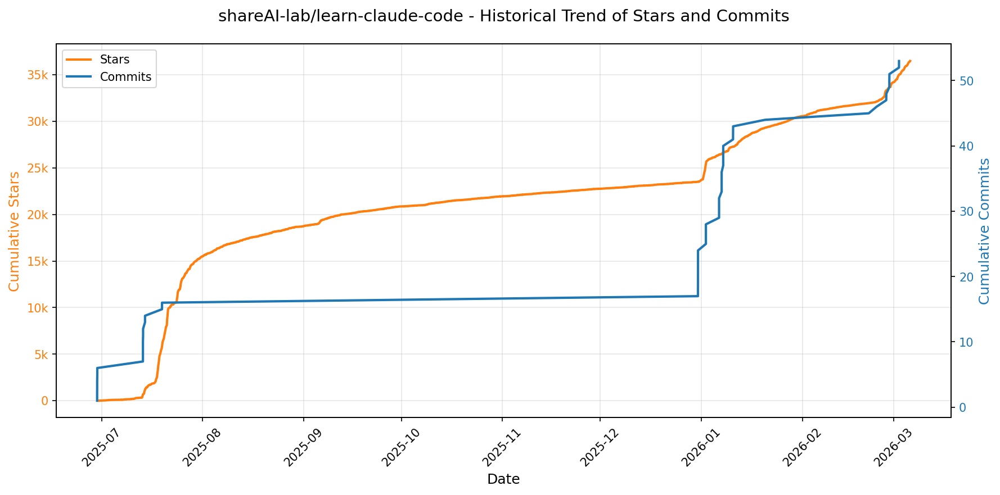

> *蓝色：累计 Stars｜橙色：累计 Commits（次 Y 轴）*

<b>📄 README 摘要</b>

1. 这个项目是做什么的？  
该项目是一个渐进式教程，旨在通过从零构建AI编码代理来帮助学习现代AI代理（如Claude Code、Kode、Cursor等）的工作原理。它提供五个逐步复杂的版本（共约1100行代码），每个版本引入一个核心概念，系统性地揭示AI编码代理的设计思想与实现机制。项目强调“模型即代理”的核心理念，帮助开发者理解并实践真正的AI代理系统。

2. 关键特性  
- **渐进式学习路径**：包含v0到v4五个版本，分别引入单一工具、核心工具集、显式任务规划、子代理机制和技能扩展机制。  
- **极简核心循环**：所有代理基于同一个简单循环——模型调用工具直至完成任务，其余均为优化与扩展。  
- **模块化设计**：支持递归子代理、任务隔离、动态加载技能（Skills），提升复杂任务处理能力。  
- **教育导向**：提供中英文深度技术解析文档，涵盖从基础到高级的完整知识体系。  
- **可扩展性与生产集成**：支持[Agent Skills Spec]规范，可通过插件形式将技能集成到Kode CLI、Claude Code等实际工具中使用。  
- **元技能支持**：内置“代理构建者”技能，可自动生成新代理项目框架，按复杂度级别初始化不同结构的代理代码。

3. 技术栈  
- 编程语言：Python  
- 核心依赖：`anthropic`（调用Claude模型）、`python-dotenv`（环境变量管理）  
- 架构模式：基于工具调用（tool use）的循环代理架构，结合bash、文件读写、编辑、任务调度等自定义工具  
- 扩展机制：基于`SKILL.md`文件的技能加载系统，支持领域知识即插即用  
- 开发工具兼容：支持Kode CLI、Cursor、Claude Code等主流AI编程代理环境  
- 规范遵循：符合Anthropic官方发布的[Agent Skills Spec]标准  
- 部署方式：本地运行脚本，支持`.env`配置API密钥，易于复制和定制为模板项目

---

### 21. [opf/openproject](https://github.com/opf/openproject)
- 📅 **创建日期**：2012-11-28  
- 🔄 **最近更新**：2026-01-13  
- ⭐ **Stars**：13,999（日 +193｜周 +512｜月 +663）  
- 📝 **描述**：OpenProject is the leading open source project management software.  

<b>📈 Star 与 Commit 历史趋势</b>

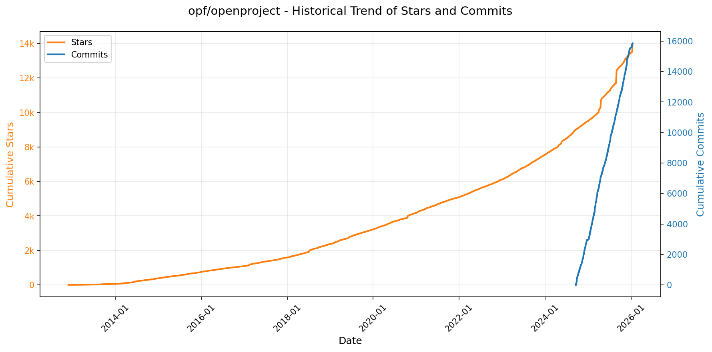

> *蓝色：累计 Stars｜橙色：累计 Commits（次 Y 轴）*

<b>📄 README 摘要</b>

1. **这个项目是做什么的？**  
OpenProject 是一款基于网页的开源项目管理软件，旨在帮助团队高效协作、共同实现目标。它支持项目规划、任务跟踪、敏捷开发、工时记录、成本预算、缺陷追踪等功能，适用于各类项目的全生命周期管理。用户可通过工作包（Work Packages）进行协作，并能与 GitHub 的拉取请求（Pull Requests）集成，实现代码与项目管理的联动。

2. **主要功能**  
- 项目规划与进度安排  
- 产品路线图和版本发布计划  
- 任务管理与团队协作  
- 支持敏捷开发和 Scrum 方法  
- 工时跟踪、成本报告与预算管理  
- 缺陷（Bug）追踪系统  
- 内置 Wiki 文档功能  
- 论坛讨论区  
- 会议议程与会议纪要管理  
- 与 GitHub 集成，可在工作包中查看关联的 PR 信息  

3. **技术栈**  
该项目未在 README 中明确列出具体技术栈，但根据 OpenProject 官方文档及典型部署方式可知：  
- 后端主要使用 Ruby on Rails 框架  
- 前端采用 Angular 框架构建  
- 数据库支持 PostgreSQL 和 MySQL  
- 使用 Webpack 进行前端资源打包  
- 支持 Docker 部署和 Kubernetes 编排  
- 提供 RESTful API 接口用于系统集成  
- 支持通过插件机制扩展功能  
- 持续集成由 GitHub Actions 实现，包含自动化测试流程

---

### 22. [thedotmack/claude-mem](https://github.com/thedotmack/claude-mem)
- 📅 **创建日期**：2025-08-31  
- 🔄 **最近更新**：2026-01-13  
- ⭐ **Stars**：13,540（日 +188｜周 +2948｜月 +8328）  
- 📝 **描述**：A Claude Code plugin that automatically captures everything Claude does during your coding sessions, compresses it with AI (using Claude's agent-sdk), and injects relevant context back into future sessions.  

<b>📈 Star 与 Commit 历史趋势</b>

> *蓝色：累计 Stars｜橙色：累计 Commits（次 Y 轴）*

<b>📄 README 摘要</b>

1. 该项目为Claude Code构建了一个持久化记忆压缩系统，能够在会话之间自动保存上下文。它通过捕获工具使用情况、生成语义摘要，并在新会话中提供这些信息，使Claude能够保持项目知识的连续性，即使会话结束或重新连接后也能恢复上下文。

2. 主要功能包括：跨会话的持久化记忆；分层记忆检索与代币成本可视化（渐进式披露）；通过mem-search技能进行基于自然语言的项目历史搜索；提供运行在http://localhost:37777的实时记忆流Web查看器界面；支持在Claude Desktop对话中搜索记忆；可通过`<private>`标签控制隐私内容不被存储；可精细配置注入的上下文内容；全自动运行无需手动干预；支持引用过往观察记录并提供ID访问链接；以及通过版本切换试用Endless Mode等实验性功能。

3. 技术栈包括：Node.js（要求18.0.0及以上版本）、Bun（作为JavaScript运行时和进程管理器）、SQLite 3（用于持久化存储，内置FTS5全文搜索）、Chroma向量数据库（实现混合语义与关键词搜索）、uv（Python包管理器，用于向量搜索）。系统采用TypeScript开发，并利用了Claude Agent SDK。架构上包含生命周期钩子脚本、Worker服务（HTTP API）、数据库和搜索组件等。

---

### 23. [ruvnet/claude-flow](https://github.com/ruvnet/claude-flow)
- 📅 **创建日期**：2025-06-02  
- 🔄 **最近更新**：2026-01-13  
- ⭐ **Stars**：11,766（日 +327｜周 +634｜月 +1214）  
- 📝 **描述**：🌊 The leading agent orchestration platform for Claude. Deploy intelligent multi-agent swarms, coordinate autonomous workflows, and build conversational AI systems. Features    enterprise-grade architecture, distributed swarm intelligence, RAG integration, and native Claude Code support via MCP protocol. Ranked #1 in agent-based frameworks.  

<b>📈 Star 与 Commit 历史趋势</b>

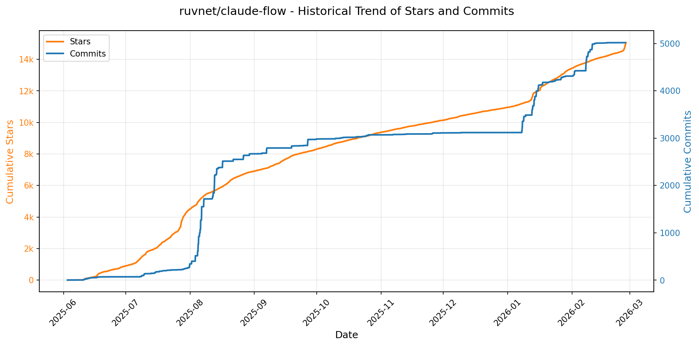

> *蓝色：累计 Stars｜橙色：累计 Commits（次 Y 轴）*

<b>📄 README 摘要</b>

1. **项目功能**  
Claude-Flow 是一个企业级 AI 编排平台，旨在通过集成蜂群智能、持久化记忆系统和大量自动化工具，优化和加速 AI 驱动的软件开发流程。它支持自然语言驱动的技能调用，能够自动协调多个 AI 智能体（agents）协同完成复杂任务，如代码开发、GitHub 仓库管理、代码审查、API 构建等。平台提供语义化向量搜索、持久记忆存储、动态智能体架构和自动化工作流钩子系统，实现高效、可扩展的 AI 协作开发。

2. **核心特性**  
- 支持 25 种自然语言激活的 Claude 技能，涵盖开发、GitHub 集成、记忆管理与自动化。  
- 集成 AgentDB v1.3.9，实现 96x–164x 向量搜索速度提升，支持 HNSW 索引与量化技术，显著降低内存占用（4–32 倍）。  
- 混合记忆系统：结合 AgentDB 与 ReasoningBank，支持语义搜索、反射记忆、因果推理和模式自动归纳。  
- 蜂群智能（Hive-Mind）架构：由“女王”智能体领导，协调多个专业化工作智能体，支持自组织、容错与会话恢复。  
- 提供 100+ MCP 工具，支持 swarm 编排、内存操作、GitHub 自动化、性能分析等。  
- 动态代理架构（DAA）与高级钩子系统，实现 pre/post 操作自动化，如代码格式化、安全验证、上下文恢复等。  
- 内置 GitHub 集成，支持 PR 审查、多仓库管理、发布流程等 6 种模式。  
- 支持 Flow Nexus Cloud，提供云端沙箱、AI 蜂群挑战与市场功能。  
- 高性能表现：查询延迟低至 2ms，SWE-Bench 解题率达 84.8%，token 使用减少 32.3%。

3. **技术栈**  
- 运行环境：Node.js 18+，npm 9+  
- 核心依赖：@anthropic-ai/claude-code（Claude Code SDK）  
- 数据库：AgentDB（高性能向量数据库）、SQLite（ReasoningBank 记忆存储）  
- 向量技术：HNSW 索引（O(log n) 查询）、9 种强化学习算法（Q-Learning、PPO 等）、哈希/嵌入式语义搜索  
- 记忆系统：基于命名空间的模式匹配、MMR 排序、四因子评分机制  
- 架构设计：MCP（Model Control Protocol）工具集成、动态智能体调度、事件钩子系统  
- 部署与兼容：支持本地与云混合部署，100% 向后兼容，提供 CLI 命令行接口与 npm 全局安装  
- 开发框架：支持 SPARC 方法论、TDD 模式、GOAP 规划模块与 SAFLA 自学习神经模块

---

### 24. [steveyegge/beads](https://github.com/steveyegge/beads)
- 📅 **创建日期**：2025-10-12  
- 🔄 **最近更新**：2026-01-13  
- ⭐ **Stars**：9,873（日 +216｜周 +1491｜月 +4945）  
- 📝 **描述**：Beads - A memory upgrade for your coding agent  

<b>📈 Star 与 Commit 历史趋势</b>

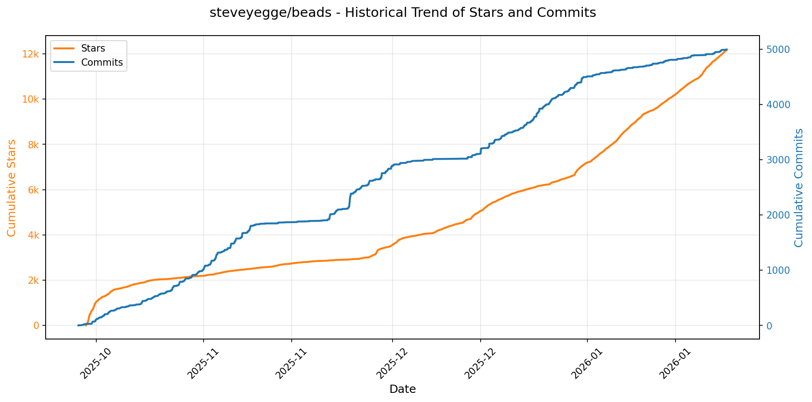

> *蓝色：累计 Stars｜橙色：累计 Commits（次 Y 轴）*

<b>📄 README 摘要</b>

1. 该项目是一个为AI代理设计的分布式、基于Git的图状问题跟踪器，旨在为编程代理提供持久化、结构化的记忆系统。它用具备依赖关系感知能力的图结构取代零散的Markdown计划，使代理在执行长期复杂任务时不会丢失上下文。

2. 主要特性包括：以Git作为数据库，将问题以JSONL格式存储在`.beads/`目录中，支持版本控制、分支和合并；专为代理优化，提供JSON输出、依赖关系追踪和自动识别就绪任务；使用哈希生成的任务ID（如bd-a1b2）避免多代理或多分支工作流中的合并冲突；通过本地SQLite缓存和后台守护进程实现快速响应与自动同步；具备“语义压缩”功能，可对旧的已关闭任务进行摘要，减少上下文占用。

3. 技术栈包括Go语言（主程序）、Node.js（npm包@beads/bd）、Python（PyPI包beads-mcp），底层数据存储依托Git和JSONL文件，并使用SQLite进行本地缓存加速。支持在Linux（glibc 2.32+）、FreeBSD、macOS和Windows系统上运行。

---

### 25. [home-assistant/home-assistant.io](https://github.com/home-assistant/home-assistant.io)
- 📅 **创建日期**：2014-12-21  
- 🔄 **最近更新**：2026-01-13  
- ⭐ **Stars**：8,163（日 +186｜周 +414｜月 +516）  
- 📝 **描述**：:blue_book: Home Assistant User documentation  

<b>📈 Star 与 Commit 历史趋势</b>

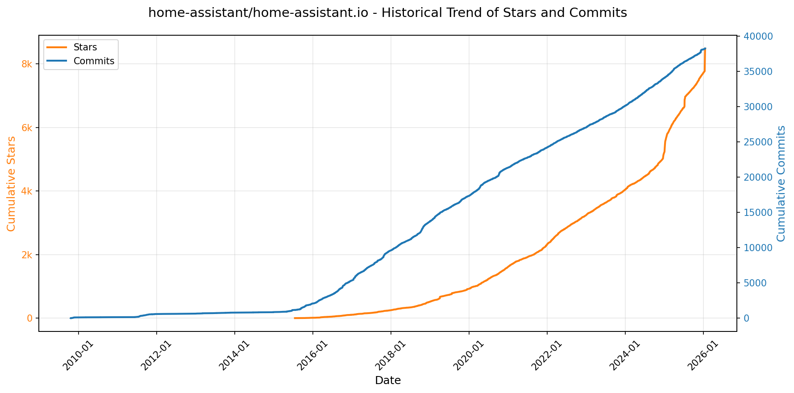

> *蓝色：累计 Stars｜橙色：累计 Commits（次 Y 轴）*

<b>📄 README 摘要</b>

1. 该项目是 Home Assistant 官方网站（home-assistant.io）的源代码，用于展示和维护 Home Assistant 智能家居平台的文档、博客、发布说明和相关信息。

2. 关键功能包括：支持多环境访问（生产环境、测试版、开发版）；为每个拉取请求提供 Netlify 预览部署；提供本地预览网站的功能；包含加速网站生成的工具（可临时隔离非当前编辑的博客文章以提升构建速度）；遵循开源贡献流程，支持社区协作更新文档。

3. 技术栈主要包括：使用 Bundler 管理 Ruby 依赖；基于 Jekyll 静态网站生成器（通过 Rake 任务进行预览和构建）；托管在 Netlify 平台实现持续部署；使用 GitHub 进行版本控制与 Pull Request 协作。

---

### 26. [mpv-player/mpv](https://github.com/mpv-player/mpv)
- 📅 **创建日期**：2012-10-13  
- 🔄 **最近更新**：2026-01-13  
- ⭐ **Stars**：6,700（日 +146｜周 +235｜月 +617）  
- 📝 **描述**：🎥 Command line media player  

<b>📈 Star 与 Commit 历史趋势</b>

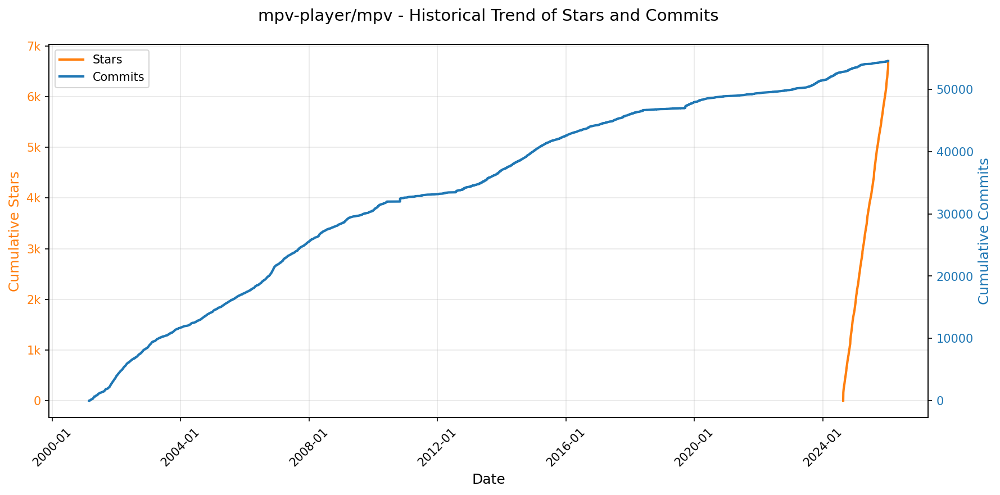

> *蓝色：累计 Stars｜橙色：累计 Commits（次 Y 轴）*

<b>📄 README 摘要</b>

1. 该项目是一个基于命令行的自由开源媒体播放器，支持广泛的音视频格式、编解码器和字幕类型，可在 Linux、Windows 和 macOS 系统上运行。它专注于提供高性能、高度可配置的播放体验，并通过命令行或脚本扩展功能。

2. 主要特性包括：支持几乎所有常见的音视频文件格式和流媒体协议；内置对硬件解码的支持（需手动启用）；使用 GPU 着色器进行高质量视频渲染与缩放；支持多种字幕格式及自动字符编码检测；可通过 Lua 脚本实现图形界面控件（OSC）和集成 youtube-dl 等功能；提供丰富的配置选项和键盘快捷键自定义能力；兼容 MPlayer 配置体系并持续更新默认设置。

3. 技术栈主要包括：C 语言为核心开发语言，基于 Meson 构建系统进行编译；依赖 FFmpeg 库处理多媒体解码；使用 libplacebo 实现先进的视频渲染；采用 libass 渲染字幕（依赖 freetype、fontconfig、fribidi 和 harfbuzz）；音频输出依赖 ALSA、PulseAudio 等系统接口；图形界面层依赖 X11 相关库（如 GLX、EGL、xv）以及 OpenGL/Vulkan 支持；可选集成 Lua 脚本引擎以支持用户脚本扩展功能。

---

### 27. [danielmiessler/Personal_AI_Infrastructure](https://github.com/danielmiessler/Personal_AI_Infrastructure)
- 📅 **创建日期**：2025-09-08  
- 🔄 **最近更新**：2026-01-13  
- ⭐ **Stars**：4,469（日 +88｜周 +871｜月 +3127）  
- 📝 **描述**：Personal AI Infrastructure for upgrading humans.  

<b>📈 Star 与 Commit 历史趋势</b>

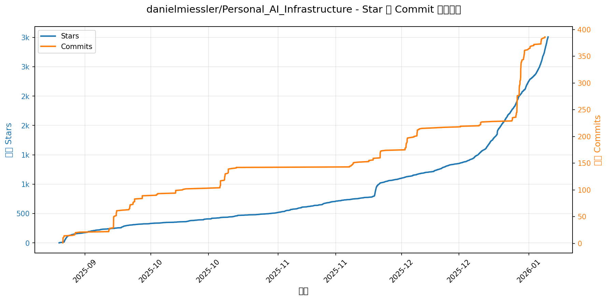

> *蓝色：累计 Stars｜橙色：累计 Commits（次 Y 轴）*

<b>📄 README 摘要</b>

1. 该项目做什么？  
PAI（Personal AI Infrastructure，个人AI基础设施）是一个开源的、可自我学习的AI系统，旨在让每个人都能拥有持续进化的个性化AI助手。它不同于传统会话式AI每次对话都从零开始，PAI通过捕获用户每一次交互中的反馈信号（如评分、情绪、行为模式和验证结果），自动分析并优化其核心算法和工作流程，从而实现系统级的自我升级。其核心是“当前状态 → 理想状态”的通用算法，通过可验证的迭代循环，在任务执行、技能应用乃至整个系统层面不断学习和改进，使AI真正理解用户的长期目标、偏好和历史上下文，成为服务于个人成长与生产力的持久性基础设施。

2. 关键特性  
- **持续自我升级的核心算法**：以“观察→思考→计划→构建→执行→验证→学习”七阶段模型为核心，通过可验证的迭代实现任何规模任务的优化，并能基于反馈元学习自身进化。
- **全自动反馈学习系统**：自动捕获显式评分、隐式情绪、行为信号（如重试、放弃）和验证结果四种反馈，驱动系统持续改进。
- **三层记忆架构**：采用热（CAPTURE，实时任务）、温（SYNTHESIS，按算法阶段归类学习）、冷（APPLICATION，不可变历史档案）三级存储，结构化保存所有交互与洞见。
- **事件驱动的钩子系统**：支持8种事件类型（如会话开始/结束、工具使用前后），实现自动化响应与信号采集。
- **深度目标管理（TELOS）**：通过10个文件记录用户的使命、信念和策略，实现对深层目标的理解。
- **模块化技能与个性代理**：支持创建可复用的技能包（Packs）和预设工作流的套件（Bundles），并允许为不同任务配置具有独特风格的代理。
- **安全与可靠性设计**：包含命令校验、代码注入防御、私有/公共仓库隔离等多层次安全机制，确保学习完整性。
- **工程化运维理念**：遵循SRE/ENG原则，强调CLI接口、版本控制、确定性架构和先写规范/测试再开发。

3. 技术栈  
项目主要采用现代前端与脚本技术构建其基础设施和自动化能力：
- **编程语言**：TypeScript
- **运行时环境**：Bun（用于快速执行脚本和工具）
- **核心依赖与集成**：深度整合Anthropic的Claude系列AI模型作为智能引擎
- **架构哲学**：遵循UNIX哲学（单一职责、文本接口、组合性）和工程化原则（版本控制、自动化、监控）
- **部署与分发**：通过GitHub进行开源托管，利用Packs（技能包）和Bundles（功能套件）实现模块化扩展与共享

---

### 28. [frankbria/ralph-claude-code](https://github.com/frankbria/ralph-claude-code)
- 📅 **创建日期**：2025-08-27  
- 🔄 **最近更新**：2026-01-13  
- ⭐ **Stars**：2,304（日 +547｜周 +1845｜月 +2264）  
- 📝 **描述**：Autonomous AI development loop for Claude Code with intelligent exit detection  

<b>📈 Star 与 Commit 历史趋势</b>

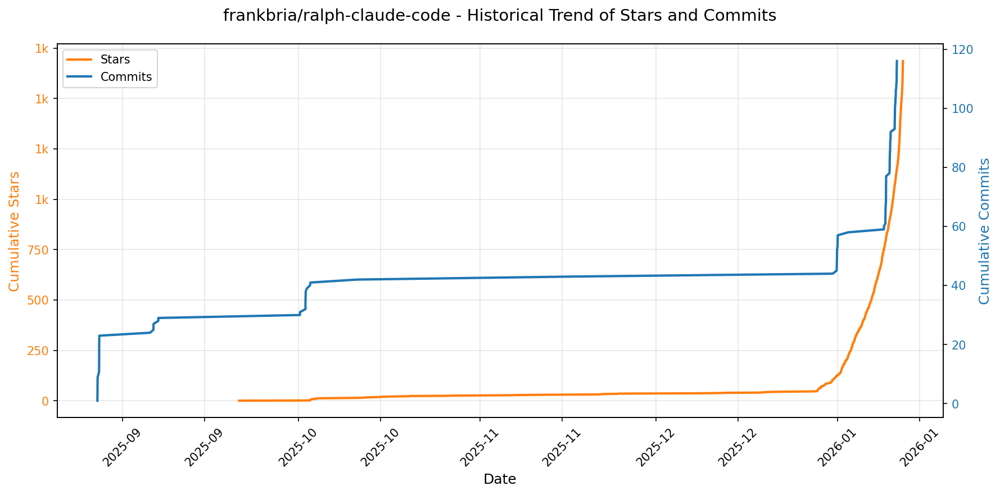

> *蓝色：累计 Stars｜橙色：累计 Commits（次 Y 轴）*

<b>📄 README 摘要</b>

1. **这个项目是做什么的？**  
Ralph for Claude Code 是一个基于 Claude Code 构建的自主 AI 开发循环工具，旨在实现持续、自动化的软件开发流程。它通过迭代调用 Claude Code 来逐步完善项目，直到检测到任务完成或达到退出条件时自动停止。项目核心目标是让 AI 自主推进开发过程，同时内置多重安全机制防止无限循环和 API 超额使用。用户只需提供初始需求（如 PRD 文档），Ralph 即可自动将其转化为结构化项目，并驱动 AI 完成编码、测试和优化全过程。

2. **关键功能**  
- **自主开发循环**：持续运行 Claude Code 并根据项目进展自动推进开发。  
- **智能退出检测**：通过多种信号（如任务列表清空、连续“完成”响应、测试主导循环）判断项目是否完成并自动终止。  
- **会话连续性支持**：通过 `--continue` 标志保留上下文，支持跨轮次的连贯开发；支持手动重置会话（`--reset-session`）。  
- **速率限制与熔断机制**：默认每小时最多 100 次 API 调用，可配置；熔断器在无进展或多轮重复错误时自动触发，防止失控循环。  
- **多格式需求导入（PRD 导入）**：支持将 Markdown、PDF、Word、JSON 等格式的需求文档智能转换为 Ralph 可执行的项目结构。  
- **实时监控面板**：集成 tmux 实现双窗格实时监控，显示进度、API 使用量、日志等信息。  
- **JSON 输出支持**：兼容 Claude CLI 的 JSON 输出格式，实现结构化响应解析，失败时自动回退到文本模式。  
- **5 小时 API 限制处理**：自动检测 Anthropic 的 5 小时限流，并提示用户选择等待或退出。  
- **全面的日志记录与状态追踪**：详细记录每次执行的日志、会话历史和状态变化，便于调试。  
- **可配置超时与详细模式**：支持设置执行超时时间（1–120 分钟）和开启详细输出模式。  

3. **技术栈**  
- **核心语言**：Bash（主要逻辑由 shell 脚本实现）  
- **AI 引擎**：Claude Code CLI（`@anthropic-ai/claude-code` npm 包）  
- **依赖工具**：  
  - `tmux`：用于多窗口实时监控  
  - `jq`：处理 JSON 数据和状态解析  
  - `git`：项目版本控制初始化  
  - Unix 标准工具（grep, date, cat 等）  
- **测试框架**：BATS（Bash Automated Testing System），配合 bats-support 和 bats-assert 实现单元与集成测试，共 276 个测试用例。  
- **CI/CD**：GitHub Actions 实现自动化测试与构建，结合 kcov 进行代码覆盖率报告（尽管 Bash 子进程覆盖存在局限）。  
- **包管理**：npm（用于安装 CLI 工具和测试依赖）  
- **配置与扩展**：计划支持 `.ralphrc` 配置文件、日志轮转、指标分析等后续功能。

---

