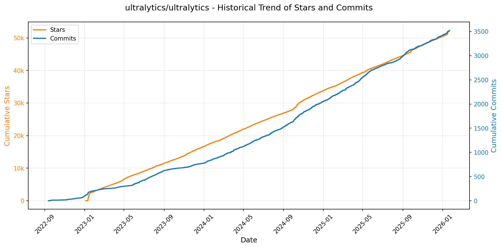
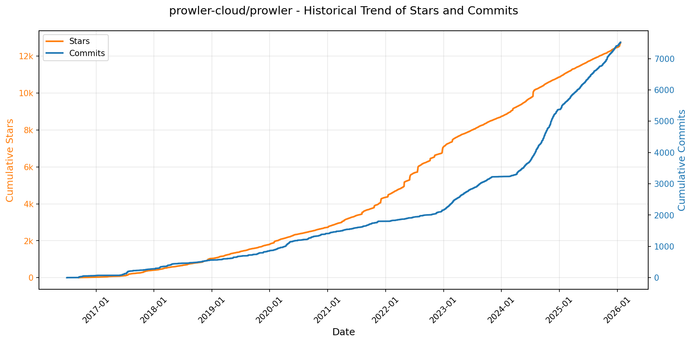
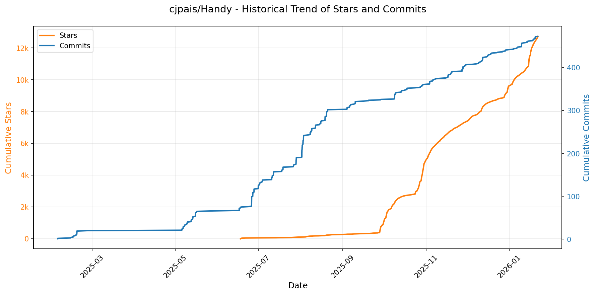
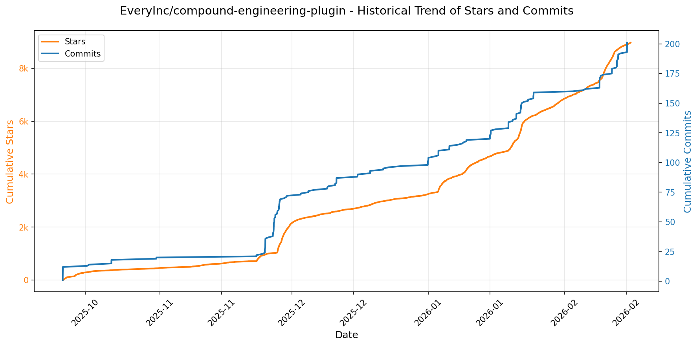
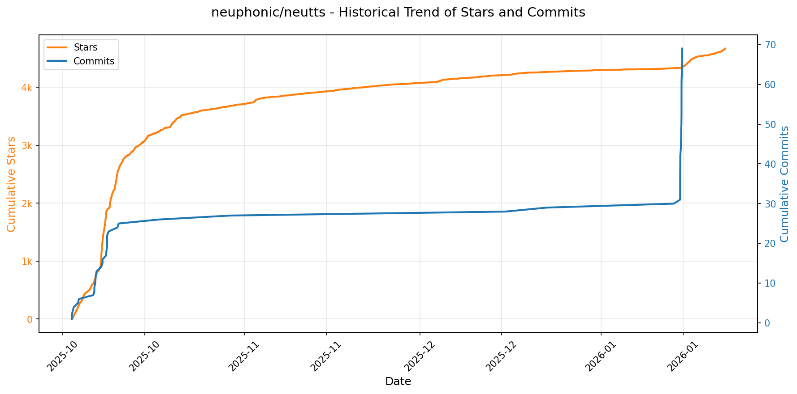

# 🌟 GitHub Trending 概览

> 数据更新于：2026-01-22。

---

## 🔍 项目详情

### 1. [anomalyco/opencode](https://github.com/anomalyco/opencode)
- 📅 **创建日期**：2025-04-30  
- 🔄 **最近更新**：2026-01-22  
- ⭐ **Stars**：82,734（日 +1690｜周 +12964｜月 +41761）  
- 📝 **描述**：The open source coding agent.  

<b>📈 Star 与 Commit 历史趋势</b>

> *蓝色：累计 Stars｜橙色：累计 Commits（次 Y 轴）*

<b>📄 README 摘要</b>

1. 该项目是一个开源的AI编程代理工具，旨在帮助开发者在终端环境中通过自然语言与代码库进行交互，实现代码理解、修改、生成和任务规划等功能。它支持本地运行或远程控制，可作为命令行工具或桌面应用使用，目标是提升开发效率并推动终端界面的能力边界。

2. 关键功能包括：  
   - 内置两种智能代理模式：“build”模式具备完整文件读写权限，用于实际开发；“plan”模式为只读模式，适合分析代码结构和制定变更计划，安全性更高。  
   - 支持多模型后端，兼容Claude、OpenAI、Google等主流API，也支持本地模型部署，不依赖特定供应商。  
   - 提供开箱即用的LSP（语言服务器协议）支持，实现精准的代码理解与操作。  
   - 采用客户端/服务器架构，允许核心服务在本地运行，前端可通过终端、桌面应用甚至移动设备远程控制。  
   - 集成子代理“@general”，可用于处理复杂搜索和多步骤任务。  
   - 支持Tab键切换代理，并可在消息中直接调用特定子代理。  
   - 提供跨平台安装方式，涵盖macOS、Windows、Linux及多种包管理器（如Homebrew、Scoop、npm、mise等）。  

3. 技术栈包括：  
   - 前端基于终端用户界面（TUI），主要面向neovim用户设计，强调在终端中的交互体验。  
   - 使用TypeScript构建，项目结构包含`packages/console/app`和`packages/web`等模块，表明其具有模块化前端架构。  
   - 支持LSP（Language Server Protocol）实现深度代码解析。  
   - 后端可对接多种大语言模型API（如Anthropic Claude、OpenAI、Google Gemini）或本地模型运行时。  
   - 构建与发布流程集成GitHub Actions自动化工作流。  
   - 客户端/服务器分离架构，支持远程调用与多客户端接入。  
   - 桌面版基于Electron或类似技术打包（从DMG/EXE/AppImage格式推断）。

---

### 2. [twitter/the-algorithm](https://github.com/twitter/the-algorithm)
- 📅 **创建日期**：2023-03-27  
- 🔄 **最近更新**：2026-01-22  
- ⭐ **Stars**：71,468（日 +424｜周 +1524｜月 +3532）  
- 📝 **描述**：Source code for the X Recommendation Algorithm  

<b>📈 Star 与 Commit 历史趋势</b>

> *蓝色：累计 Stars｜橙色：累计 Commits（次 Y 轴）*

<b>📄 README 摘要</b>

1. 该项目实现了X平台（如“为你推荐”时间线、搜索、探索、通知等）内容推荐的核心算法系统，负责生成和排序用户看到的帖子及其他内容。它通过整合多种数据源、机器学习模型和服务框架，构建个性化的信息流，例如根据用户的社交关系、兴趣和行为信号来筛选、排序并最终呈现推荐内容。

2. 关键功能包括：  
   - **多源候选内容获取**：从网络内（如关注账号的帖子）和网络外（如基于兴趣推荐）获取候选帖子，主要通过 search-index、tweet-mixer 和 UTEG 等组件实现。  
   - **多级排序机制**：采用轻量级和重量级排序模型（light-ranker 和 heavy-ranker），结合深度神经网络对候选内容进行精细化打分与排序。  
   - **图结构建模与信号处理**：利用 GraphJet 构建用户-帖子交互图（UTEG），并集成 real-graph、tweepcred 等模型预测用户互动可能性及声誉。  
   - **用户行为与内容理解**：通过 unified-user-actions 和 user-signal-service 收集实时用户行为信号；使用 SimClusters 和 TwHIN 模型进行社区发现和知识图谱嵌入，理解用户与内容的兴趣主题。  
   - **内容过滤与质量控制**：通过 visibility-filters 实现合规性过滤、内容降权和可见性处理，确保内容安全与用户体验。  
   - **通知推荐系统**：由 pushservice 提供个性化通知推荐，并通过专用轻重排序模型优化打开率和互动率。  
   - **模块化架构支持**：基于 product-mixer 和 navi 等框架实现高可扩展、高性能的服务编排与模型部署。

3. 技术栈包括：  
   - **编程语言**：主要使用 Scala 和 Python，部分高性能服务采用 Rust（如 navi）。  
   - **机器学习框架**：核心为自研的 twml（基于 TensorFlow v1），同时引入现代 ML 工具链（如 the-algorithm-ml 中的模型）；使用 Bazel 构建系统管理项目依赖。  
   - **数据与流处理**：依赖实时用户行为流（unified-user-actions）、批量与实时特征聚合框架（timelines-aggregation-framework）以及 recos-injector 构建事件流。  
   - **图计算与存储**：基于 GraphJet 框架实现实时图存储与查询，支撑 UTEG 和 graph-feature-service 等图特征服务。  
   - **模型服务与推理**：使用 navi（Rust 编写的高性能服务框架）进行低延迟模型推理，representation-manager 统一提供嵌入向量（embeddings）访问。  
   - **微服务架构**：各功能模块以独立服务形式存在，如 tweetypie（帖子读写）、home-mixer（时间线组装）、pushservice（通知推荐）等，整体架构高度解耦、可组合。

---

### 3. [anthropics/claude-code](https://github.com/anthropics/claude-code)
- 📅 **创建日期**：2025-02-22  
- 🔄 **最近更新**：2026-01-22  
- ⭐ **Stars**：59,309（日 +408｜周 +2611｜月 +11387）  
- 📝 **描述**：Claude Code is an agentic coding tool that lives in your terminal, understands your codebase, and helps you code faster by executing routine tasks, explaining complex code, and handling git workflows - all through natural language commands.  

<b>📈 Star 与 Commit 历史趋势</b>

> *蓝色：累计 Stars｜橙色：累计 Commits（次 Y 轴）*

<b>📄 README 摘要</b>

1. 该项目是一个终端中的智能编程代理工具，能够理解用户的代码库，通过自然语言指令帮助开发者更快地编写代码。它可执行常规编码任务、解释复杂代码逻辑、管理 Git 工作流，并支持在终端、IDE 或 GitHub 上通过 @claude 调用。

2. 主要功能包括：支持自然语言交互命令；深度理解项目代码结构；自动化处理重复性编码任务；提供代码解释能力；集成 Git 工作流管理；可通过插件系统扩展功能（如自定义命令和智能代理）；内置反馈与错误报告机制（如 `/bug` 命令）；支持跨平台安装使用（macOS、Linux、Windows）。

3. 技术栈基于 Node.js（要求 18+ 版本），提供命令行接口，通过 shell 脚本（curl/bash）或包管理器（Homebrew、WinGet）进行安装部署，前端交互以终端输出为主，后端服务由 Anthropic 提供支持，涉及云端数据处理与用户会话管理。

---

### 4. [usememos/memos](https://github.com/usememos/memos)
- 📅 **创建日期**：2021-12-08  
- 🔄 **最近更新**：2026-01-22  
- ⭐ **Stars**：55,324（日 +140｜周 +1100｜月 +8043）  
- 📝 **描述**：An open-source, self-hosted note-taking service. Your thoughts, your data, your control — no tracking, no ads, no subscription fees.  

<b>📈 Star 与 Commit 历史趋势</b>

> *蓝色：累计 Stars｜橙色：累计 Commits（次 Y 轴）*

<b>📄 README 摘要</b>

1. 该项目是一个开源、可自托管的笔记服务，旨在为个人记录、团队维基和知识管理提供一个注重隐私的知识库。用户完全掌控自己的数据，无追踪、无广告、无订阅费用，支持快速部署和全功能API，适用于追求数据自主权的用户和开发者。

2. 关键功能包括：  
   - 隐私优先架构：完全自托管，零遥测，支持数据完整导出，避免厂商锁定。  
   - 原生支持 Markdown：使用纯文本存储笔记，便于迁移和长期保存。  
   - 高性能体验：基于 Go 和 React 构建，加载迅速，响应灵敏。  
   - 简化部署：支持一键 Docker 安装，兼容 SQLite、MySQL 和 PostgreSQL 数据库。  
   - 开发者友好：提供完整的 REST 和 gRPC API，便于集成到现有工作流。  
   - 美观界面：简洁现代的设计，支持深色模式和移动端自适应布局。

3. 技术栈：  
   - 后端：Go（Golang）  
   - 前端：React  
   - 支持的数据库：SQLite、MySQL、PostgreSQL  
   - 部署方式：Docker、Docker Compose、Kubernetes（Helm）、预编译二进制文件、源码构建

---

### 5. [ultralytics/ultralytics](https://github.com/ultralytics/ultralytics)
- 📅 **创建日期**：2022-09-11  
- 🔄 **最近更新**：2026-01-22  
- ⭐ **Stars**：52,261（日 +126｜周 +1072｜月 +2139）  
- 📝 **描述**：Ultralytics YOLO 🚀  

<b>📈 Star 与 Commit 历史趋势</b>

> *蓝色：累计 Stars｜橙色：累计 Commits（次 Y 轴）*

<b>📄 README 摘要</b>

1. 该项目是一个基于YOLO（You Only Look Once）架构的先进计算机视觉工具，主要用于执行物体检测、实例分割、图像分类和姿态估计等任务。它提供了一个用户友好的接口，支持通过命令行或Python代码进行模型的训练、验证、预测和导出，适用于从研究到生产部署的各种场景。

2. 关键特性包括：支持多种预训练的YOLO模型（如YOLO26系列），涵盖不同大小和性能的变体；能够在CPU和GPU上高效运行，并提供详细的性能指标（如mAP、推理速度）；支持将模型导出为ONNX等格式以便于在其他平台部署；具备目标跟踪功能，可跨帧追踪检测到的对象；提供简洁的API，便于集成到Python项目中，并可通过简单的命令行指令快速上手。

3. 技术栈主要包括Python作为主要编程语言，依赖PyTorch深度学习框架进行模型构建与训练，同时利用ONNX进行模型优化和跨平台兼容性支持，以及TensorRT来加速GPU上的推理过程。此外，项目还支持通过Docker容器化部署，并可在Colab、Kaggle等云平台上直接运行。

---

### 6. [xai-org/grok-1](https://github.com/xai-org/grok-1)
- 📅 **创建日期**：2024-03-17  
- 🔄 **最近更新**：2026-01-22  
- ⭐ **Stars**：50,999（日 +261｜周 +448｜月 +523）  
- 📝 **描述**：Grok open release  

<b>📈 Star 与 Commit 历史趋势</b>

> *蓝色：累计 Stars｜橙色：累计 Commits（次 Y 轴）*

<b>📄 README 摘要</b>

1. 该项目用于加载和运行开源权重的 Grok-1 大语言模型，提供基于 JAX 的示例代码，支持从检查点加载模型并对测试输入进行采样生成。

2. 关键特性包括：支持 3140 亿参数的混合专家（MoE）架构（8 个专家中每 token 使用 2 个）；具备 64 层网络结构，查询头 48 个、键/值头 8 个，嵌入维度为 6,144；使用 SentencePiece 分词器（词汇量 131,072），支持旋转位置编码（RoPE）、激活分片和 8 位量化；最大上下文长度为 8,192 个 token。注意当前 MoE 层实现未优化性能，旨在避免依赖自定义内核以验证模型正确性。

3. 技术栈主要包括：JAX 作为核心计算框架，用于模型加载与推理；Python 为开发语言；依赖 HuggingFace Hub 工具下载模型权重；使用 SentencePiece 进行文本分词；部署需配备大容量 GPU 显存以支持 314B 参数模型运行。

---

### 7. [anthropics/skills](https://github.com/anthropics/skills)
- 📅 **创建日期**：2025-09-22  
- 🔄 **最近更新**：2026-01-22  
- ⭐ **Stars**：48,314（日 +1242｜周 +7368｜月 +23223）  
- 📝 **描述**：Public repository for Agent Skills  

<b>📈 Star 与 Commit 历史趋势</b>

> *蓝色：累计 Stars｜橙色：累计 Commits（次 Y 轴）*

<b>📄 README 摘要</b>

1. **这个项目是做什么的？**  
该项目是Anthropic推出的Claude技能（Skills）的官方实现示例库，用于展示如何通过动态加载的“技能”来扩展Claude在特定任务上的能力。每个技能是一个独立的文件夹，包含指令、脚本和资源，使Claude能够以可重复的方式完成具体任务，例如根据企业品牌规范生成文档、分析数据或自动化个人工作流。该仓库旨在为开发者提供参考和灵感，帮助其创建自定义技能，并了解技能系统的实际应用方式。

2. **关键特性**  
- 提供多种场景下的技能示例：涵盖创意设计（艺术、音乐）、技术开发（Web应用测试、MCP服务器生成）和企业流程（沟通、品牌管理）等。
- 自包含结构：每个技能均为独立文件夹，内含`SKILL.md`文件，包含YAML元信息和详细操作指南。
- 支持多平台使用：可在Claude Code、Claude.ai及Claude API中注册和使用这些技能。
- 开放部分生产级技能源码：如`.docx`、`.pdf`、`.pptx`、`.xlsx`等文档处理技能，虽非完全开源但可供学习参考。
- 提供技能模板（template）和规范说明（spec），便于开发者快速创建和标准化自己的技能。
- 可作为插件市场集成到Claude Code中，支持命令行安装与调用。
- 包含合作伙伴技能示例（如Notion），展示第三方软件集成能力。

3. **技术栈**  
- 核心格式：Markdown文件（`SKILL.md`）结合YAML前端元数据（name、description等）。
- 文件组织：基于目录的模块化结构，每个技能为一个独立文件夹。
- 协议标准：遵循Agent Skills规范（位于`/spec`目录），定义技能接口与交互模式。
- 集成方式：通过插件系统与Claude生态（Claude Code、Claude.ai、API）对接，支持HTTP-based API调用与技能上传。
- 许可协议：多数示例采用Apache 2.0开源许可，部分生产级技能为源码可见（source-available）但非开源。
- 开发工具：无需复杂框架，仅需文本编辑器即可创建技能，依赖Anthropic平台运行时环境解析与执行。

---

### 8. [obra/superpowers](https://github.com/obra/superpowers)
- 📅 **创建日期**：2025-10-09  
- 🔄 **最近更新**：2026-01-22  
- ⭐ **Stars**：32,551（日 +1303｜周 +9982｜月 +21710）  
- 📝 **描述**：An agentic skills framework & software development methodology that works.  

<b>📈 Star 与 Commit 历史趋势</b>

> *蓝色：累计 Stars｜橙色：累计 Commits（次 Y 轴）*

<b>📄 README 摘要</b>

1. **这个项目是做什么的？**  
Superpowers 是一个为编程代理（coding agents）设计的完整软件开发工作流系统。它通过一组可组合的“技能”和初始指令，使编码代理能够以结构化、系统化的方式进行软件开发。项目的核心目标是让 AI 代理在写代码前先与用户沟通明确需求，生成可验证的设计方案，并基于测试驱动开发（TDD）、YAGNI 和 DRY 等原则，自动执行从计划制定到代码实现、审查和合并的全过程。整个流程强调自动化、可靠性和工程纪律，支持长时间自主运行而不会偏离原定计划。

2. **关键特性**  
- **智能需求澄清**：在编码前通过对话引导用户明确需求，分段输出设计文档供确认。  
- **自动生成实施计划**：将批准的设计拆解为耗时 2–5 分钟的小型任务，每个任务包含具体文件路径、完整代码和验证步骤。  
- **子代理驱动开发（Subagent-Driven Development）**：为每个任务派遣独立子代理执行，并进行两阶段审查（合规性 + 代码质量）。  
- **严格的测试驱动开发（TDD）**：强制执行红-绿-重构循环，禁止先写代码后补测试，失败测试必须先运行通过。  
- **并行分支开发支持**：使用 git worktrees 创建隔离的工作环境，确保主分支不受影响。  
- **自动代码审查机制**：每项任务前后都进行审查，按严重程度报告问题，关键问题会阻断流程。  
- **全流程自动化控制**：七大核心阶段（脑暴、计划、执行、测试、审查、调试、收尾）由系统自动触发，无需人工干预。  
- **技能可扩展性**：开放技能库，允许开发者遵循规范创建并贡献新技能。  
- **跨平台兼容**：支持 Claude Code（插件市场安装）、Codex 和 OpenCode 等不同 AI 编码工具。  
- **自动更新能力**：插件更新后技能库同步升级，保持最新最佳实践。

3. **技术栈**  
- **核心架构**：基于“技能”（skills）的模块化系统，每个技能为独立可复用的行为单元，通过规则触发。  
- **版本控制集成**：利用 Git 的 worktree 功能实现多任务并行开发与隔离。  
- **AI 平台适配层**：针对不同 AI 编码工具提供定制化接入方式：  
  - Claude Code：通过官方插件市场（Marketplace）部署，使用 `/plugin` 命令管理。  
  - Codex / OpenCode：通过引导式指令加载远程安装脚本（GitHub raw URL），手动配置。  
- **技能描述格式**：使用 Markdown 文档（如 `SKILL.md`）定义技能行为、输入输出和使用场景。  
- **工作流引擎**：隐式状态机驱动，根据上下文自动激活对应技能（如设计完成 → 启动计划生成）。  
- **开发原则支撑**：深度集成 TDD、YAGNI、DRY、防御性编程、系统化调试等软件工程方法论作为内置约束。  
- **开源协议**：MIT 许可证，鼓励社区参与贡献技能和改进。

---

### 9. [tw93/Mole](https://github.com/tw93/Mole)
- 📅 **创建日期**：2025-09-23  
- 🔄 **最近更新**：2026-01-22  
- ⭐ **Stars**：31,092（日 +361｜周 +1839｜月 +19306）  
- 📝 **描述**：🐹 Deep clean and optimize your Mac.  

<b>📈 Star 与 Commit 历史趋势</b>

> *蓝色：累计 Stars｜橙色：累计 Commits（次 Y 轴）*

<b>📄 README 摘要</b>

1. **项目功能**  
Mole 是一款专为 macOS 设计的深度系统清理与性能优化工具，旨在一站式解决磁盘空间占用高、应用残留顽固、系统缓存冗余、硬件资源使用异常等问题。它通过命令行界面（CLI）提供轻量、高效、可审计的操作，帮助用户安全释放数十 GB 甚至上百 GB 的存储空间，并实时监控和调优系统健康状态。

2. **核心功能**  
- **深度系统清理**：自动扫描并清除用户级缓存（App、浏览器、开发工具如 Xcode/Node.js）、系统日志、临时文件、应用专属数据（Spotify/Dropbox 等）及废纸篓内容；支持 `--dry-run` 预览与 `--whitelist` 白名单保护机制。  
- **智能卸载器（Smart Uninstaller）**：彻底删除应用本体及所有关联残留（偏好设置、Launch Agents/Daemons、WebKit 存储、插件、扩展、Cookies 等），支持多选与交互式确认。  
- **系统优化引擎**：一键重建 Spotlight 索引、Launch Services、系统数据库；重置网络服务、Finder/Dock；清理诊断日志、交换文件、动态分页器等，提升响应速度与稳定性。  
- **可视化磁盘分析器（`mo analyze`）**：以图形化进度条展示目录/文件大小分布，支持键盘导航（Vim 或方向键）、打开/预览/删除/筛选大文件等操作。  
- **实时系统状态仪表盘（`mo status`）**：集成 CPU（含单核负载）、内存、磁盘 I/O、网络吞吐、电源/温度/风扇转速等多维指标，生成综合健康评分（0–100），并按风险等级着色提示。  
- **项目构建产物清理（`mo purge`）**：智能识别并清理 `node_modules`、`target`、`build`、`dist`、`venv` 等常见开发产物，默认跳过 7 天内活跃项目，支持自定义扫描路径。  
- **安装包专项清理（`mo installer`）**：集中定位并删除散落在 Downloads、Desktop、Homebrew 缓存、iCloud Drive、邮件附件中的大型安装镜像（`.dmg`/`.pkg` 等），标注来源便于溯源。  
- **增强体验功能**：Touch ID 快速提权（`mo touchid`）、Shell 自动补全（`mo completion`）、Raycast/Alfred 快捷启动器、详细调试日志（`--debug`）及安全审计保障。

3. **技术栈**  
- **主语言**：Rust（强调安全性、零成本抽象与高性能，适合系统级工具开发）  
- **跨平台基础**：依赖 `std::os::macos` 及 Apple 原生 API（如 CoreServices、Foundation、IOKit）实现深度系统集成  
- **终端交互**：基于 `crossterm` 实现跨终端兼容的 TUI（文本用户界面），支持 Vim 键绑定与鼠标事件  
- **文件系统操作**：使用 `walkdir`、`fs_extra` 等 crate 进行安全递归扫描与原子化删除  
- **系统监控**：调用 `sysinfo` crate 获取实时硬件指标；结合 `psutil` 类逻辑解析进程、网络、电源状态  
- **构建与分发**：CI/CD 使用 GitHub Actions；二进制通过 Homebrew（`brew install mole`）及自托管安装脚本分发；Windows 实验版基于同一 Rust 代码库适配（独立分支）  
- **配置管理**：配置文件存储于 `~/.config/mole/`，支持 YAML/JSON 格式，白名单与路径规则可交互式编辑  
- **安全机制**：内置严格权限校验、操作前完整性检查、`sudo` 提权最小化设计，并附有公开《Security Audit》文档说明防护策略

---

### 10. [Lissy93/web-check](https://github.com/Lissy93/web-check)
- 📅 **创建日期**：2023-06-25  
- 🔄 **最近更新**：2026-01-22  
- ⭐ **Stars**：30,670（日 +81｜周 +809｜月 +3649）  
- 📝 **描述**：🕵️‍♂️ All-in-one OSINT tool for analysing any website  

<b>📈 Star 与 Commit 历史趋势</b>

> *蓝色：累计 Stars｜橙色：累计 Commits（次 Y 轴）*

---

### 11. [permissionlesstech/bitchat](https://github.com/permissionlesstech/bitchat)
- 📅 **创建日期**：2025-07-04  
- 🔄 **最近更新**：2026-01-22  
- ⭐ **Stars**：24,597（日 +98｜周 +674｜月 +1053）  
- 📝 **描述**：bluetooth mesh chat, IRC vibes  

<b>📈 Star 与 Commit 历史趋势</b>

> *蓝色：累计 Stars｜橙色：累计 Commits（次 Y 轴）*

<b>📄 README 摘要</b>

1. **这个项目是做什么的？**  
   BitChat 是一个去中心化的点对点即时通讯应用，支持双通道通信架构：在无网络环境下通过蓝牙低功耗（Bluetooth LE）构建本地网状网络进行离线通信；在有互联网时则利用 Nostr 协议实现全球范围的消息传递。无需注册账户、不依赖手机号或中央服务器，支持基于地理位置的频道聊天和私密消息加密，适用于灾难应急、抗议活动、偏远地区等场景。

2. **关键特性**  
   - **双传输架构**：蓝牙网状网络用于离线通信，Nostr 协议用于联网通信，自动切换与回退。  
   - **地理位置频道**：基于 geohash 坐标划分地理范围（如街区、社区、城市、国家），用户可加入对应区域聊天室。  
   - **智能路由机制**：优先使用蓝牙直连发送消息，失败后自动转为通过 Nostr 网络转发，若两者均不可用则排队等待连接恢复。  
   - **去中心化蓝牙网状网络**：支持设备自动发现、多跳中继（最多7跳），可在完全离线状态下构建局部通信网络。  
   - **端到端加密**：蓝牙通信采用 Noise 协议提供前向保密；互联网私信使用 NIP-17 标准进行“礼物封装”式加密。  
   - **隐私优先设计**：无账号体系、无电话号码绑定、无持久化身份标识，每次进入新地理区域可生成临时密钥。  
   - **IRC 风格命令**：支持 `/msg`、`/slap`、`/who` 等传统 IRC 指令操作界面。  
   - **跨平台原生支持**：同时兼容 iOS 和 macOS 设备。  
   - **紧急清除功能**：三击快速清除所有本地数据。  
   - **性能优化**：采用 LZ4 压缩算法减少消息体积，具备自适应电池管理模式和高效网络调度策略。

3. **技术栈**  
   - **核心协议**：Nostr（NIP-01/NIP-17）、Noise Protocol Framework  
   - **通信层**：Bluetooth Low Energy（BLE）用于本地网状网络，支持多跳中继与自动发现  
   - **地理编码**：Geohash 用于定义不同粒度的地理位置频道（block、neighborhood、city 等）  
   - **加密机制**：ECDH 密钥交换、Ed25519 签名、AES-GCM 加密，结合临时密钥提升隐私性  
   - **数据压缩**：LZ4 高速压缩算法优化蓝牙传输效率  
   - **开发工具链**：Xcode + Swift 构建原生 Apple 平台应用（iOS/macOS）  
   - **构建系统**：支持 `just` 工具自动化执行构建流程（如 `just run`, `just clean`）  
   - **部署方式**：通过 App Store 分发，代码基于 `.xcconfig` 配置管理签名与 bundle ID  
   - **国际化支持**：使用 `.strings` 与 `.stringsdict` 文件实现多语言本地化，并可通过 xcodebuild 编译校验

---

### 12. [bytedance/UI-TARS-desktop](https://github.com/bytedance/UI-TARS-desktop)
- 📅 **创建日期**：2025-01-19  
- 🔄 **最近更新**：2026-01-22  
- ⭐ **Stars**：24,585（日 +93｜周 +904｜月 +4572）  
- 📝 **描述**：The Open-Source Multimodal AI Agent Stack: Connecting Cutting-Edge AI Models and Agent Infra  

<b>📈 Star 与 Commit 历史趋势</b>

> *蓝色：累计 Stars｜橙色：累计 Commits（次 Y 轴）*

<b>📄 README 摘要</b>

1. 该项目做什么？  
本项目是一个多模态AI智能体技术栈，包含两个核心部分：Agent TARS 和 UI-TARS Desktop。Agent TARS 是一个通用的多模态AI代理，能够通过终端、计算机、浏览器或产品界面理解并执行复杂任务，结合视觉识别与图形用户界面（GUI）操作能力，实现更接近人类行为方式的任务自动化。它支持自然语言指令驱动，可自动完成如预订航班、酒店、生成图表等现实世界操作。UI-TARS Desktop 是一个桌面应用程序，基于UI-TARS模型提供本地和远程的原生GUI代理功能，允许用户通过自然语言控制本地或远程的电脑和浏览器，实现系统设置调整、网页信息查询等操作。

2. 关键特性  
- 支持一键运行的命令行工具（CLI）和Web UI，提供开箱即用体验。  
- 混合浏览器代理能力，可通过视觉定位（GUI Agent）、DOM分析或两者结合的方式控制浏览器。  
- 基于事件流协议的上下文工程与数据流追踪机制，支持调试和应用构建。  
- 支持MCP（Model Control Protocol）集成，可连接多种现实世界的工具和服务。  
- 提供本地和远程计算机/浏览器操作功能，无需复杂配置即可远程控制设备。  
- 内置对多模态大模型（如Seed-1.5-VL/1.6系列、Claude等）的支持，具备视觉理解和精确交互能力。  
- 全流程本地化处理，保障隐私与安全。  
- 跨平台支持，兼容Windows、macOS及浏览器环境。

3. 技术栈  
- 核心运行依赖 Node.js（要求版本 >= 22）。  
- 使用 npm 作为包管理工具，通过 `@agent-tars/cli` 包进行全局安装与调用。  
- 集成多种多模态大语言模型（LLM），包括火山引擎Doubao、Anthropic Claude 等。  
- 基于 MCP 协议实现与外部工具的通信与集成。  
- 使用 TypeScript/JavaScript 构建 CLI 与 Web UI 组件。  
- GUI 操作基于自研 UI-TARS 模型，结合视觉语言模型（VLM）实现屏幕识别与操作。  
- 支持 ModelScope、Hugging Face 等平台的模型部署与加载。  
- 提供 SDK 支持跨平台 GUI 自动化代理开发。

---

### 13. [ComposioHQ/awesome-claude-skills](https://github.com/ComposioHQ/awesome-claude-skills)
- 📅 **创建日期**：2025-10-17  
- 🔄 **最近更新**：2026-01-22  
- ⭐ **Stars**：23,597（日 +754｜周 +4272｜月 +15669）  
- 📝 **描述**：A curated list of awesome Claude Skills, resources, and tools for customizing Claude AI workflows  

<b>📈 Star 与 Commit 历史趋势</b>

> *蓝色：累计 Stars｜橙色：累计 Commits（次 Y 轴）*

<b>📄 README 摘要</b>

1. 该项目做什么？  
本项目是一个精心整理的 Claude 技能（Claude Skills）集合，旨在提升用户在 Claude.ai、Claude Code 和 Claude API 上的工作效率。这些“技能”是可定制的工作流，使 Claude 能够执行具体任务，例如处理文档、编写代码、分析数据、管理项目、发送邮件、创建工单、发布 Slack 消息等。通过集成 Composio 等平台，Claude 可以连接并操作超过 1000 个第三方应用程序，实现超越文本生成的实际操作能力。

2. 关键特性  
- **广泛的技能分类**：涵盖文档处理、开发与代码工具、数据分析、市场营销、写作沟通、创意媒体、生产力组织、项目协作和安全系统等多个领域。  
- **自动化实际操作**：通过 connect-apps 插件，使 Claude 能够连接 Gmail、Slack、GitHub、Notion 等 500+ 应用，并执行真实世界操作（如发邮件、建任务）。  
- **跨平台支持**：技能可在 Claude.ai（图形界面）、Claude Code（命令行）和 Claude API（编程调用）中使用。  
- **易于扩展与自定义**：提供清晰的技能结构模板（包含 SKILL.md 文件和可选脚本/模板目录），方便开发者创建和贡献新技能。  
- **开箱即用的实用功能**：包括自动生成用户友好的更新日志、从网页提取内容、优化推文算法、生成域名建议、组织发票、测试 Web 应用、进行威胁搜寻等。  
- **社区驱动**：欢迎 Pull Request，鼓励用户基于真实场景提交经过测试的新技能。

3. 技术栈  
- **核心平台**：Anthropic 的 Claude 大模型（Claude.ai, Claude Code, Claude API）  
- **插件与集成框架**：Composio（用于连接 1000+ 第三方应用并处理认证）  
- **开发语言与工具**：Python、TypeScript、JavaScript（React, Tailwind CSS）、SQL（PostgreSQL）、Shell 脚本  
- **辅助技术**：Playwright（浏览器自动化）、FFUF（Web 模糊测试）、D3.js（数据可视化）、n8n（工作流自动化）  
- **文件与数据格式**：Markdown、YAML（元数据配置）、PDF、DOCX、PPTX、XLSX、CSV、EPUB、YouTube 字幕等  
- **部署与管理**：通过本地文件系统部署技能（如 `~/.config/claude-code/skills/`），或通过 API 动态加载

---

### 14. [BloopAI/vibe-kanban](https://github.com/BloopAI/vibe-kanban)
- 📅 **创建日期**：2025-06-14  
- 🔄 **最近更新**：2026-01-22  
- ⭐ **Stars**：18,364（日 +317｜周 +2234｜月 +11714）  
- 📝 **描述**：Get 10X more out of Claude Code, Codex or any coding agent  

<b>📈 Star 与 Commit 历史趋势</b>

> *蓝色：累计 Stars｜橙色：累计 Commits（次 Y 轴）*

<b>📄 README 摘要</b>

1. **项目功能**  
Vibe Kanban 是一个面向 AI 编程代理（如 Claude Code、Gemini CLI、Codex、Amp 等）的**任务编排与协作工作台**，专为现代开发者设计。它不直接生成代码，而是解决 AI 编程时代的核心人机协作痛点：帮助工程师高效**规划、调度、并行/串行执行多个 AI 编码代理任务，实时跟踪进度，集中化管理代理配置（MCP），快速审查产出，并一键启动开发服务器或远程打开项目（支持 SSH 集成）**。其本质是 AI 编程流水线的“指挥中心”与可视化看板。

2. **关键特性**  
- ✅ **多 AI 代理动态切换与统一接入**：原生支持 Claude Code、Gemini CLI、Codex、Amp 等主流编码代理，可按需切换或组合使用；  
- ✅ **灵活的任务编排引擎**：支持任务的**并行执行**（加速探索）与**串行依赖执行**（保障逻辑顺序），实现复杂工作流自动化；  
- ✅ **实时状态看板与结果审查**：提供类 Kanban 界面，直观展示各任务状态（待处理/运行中/完成/失败），集成代码预览与一键 `dev server` 启动；  
- ✅ **MCP（Model Control Protocol）配置中心化管理**：统一存储、编辑和复用不同代理的 MCP 配置，避免重复配置与环境差异；  
- ✅ **远程开发深度集成**：当部署在远程服务器时，支持通过 SSH 自动构建 `vscode-remote://` 链接，本地 VS Code 一键直连远程项目，无缝衔接开发环境；  
- ✅ **生产就绪部署支持**：提供反向代理（Nginx/Caddy/Traefik）和自定义域名部署指南，含严格的跨域（CORS）控制（`VK_ALLOWED_ORIGINS`）与安全配置。

3. **技术栈**  
- **后端**：采用 **Rust** 构建高性能、高并发服务（含 MCP 服务器、API 服务、任务调度核心），使用 **SQLx** 进行数据库操作，依赖 **PostgreSQL**（默认）或 SQLite；  
- **前端**：基于 **React**（TypeScript）构建响应式 Web UI，使用 **Vite** 作为构建工具，UI 组件库未明确说明但遵循现代化设计规范；  
- **全栈工程**：使用 **pnpm** 作为包管理器，**Cargo** 管理 Rust 依赖；  
- **基础设施与部署**：支持本地开发（`pnpm run dev`）、Docker、systemd 及云托管；集成 **PostHog** 进行可选行为分析；构建与运行时通过环境变量精细化控制（如端口、主机、CORS、SSH 配置等）；  
- **开发辅助工具**：`cargo-watch`（热重载）、`sqlx-cli`（数据库迁移）。

---

### 15. [rendercv/rendercv](https://github.com/rendercv/rendercv)
- 📅 **创建日期**：2023-06-11  
- 🔄 **最近更新**：2026-01-22  
- ⭐ **Stars**：15,172（日 +114｜周 +461｜月 +10010）  
- 📝 **描述**：CV/resume generator for academics and engineers, YAML to PDF  

<b>📈 Star 与 Commit 历史趋势</b>

> *蓝色：累计 Stars｜橙色：累计 Commits（次 Y 轴）*

<b>📄 README 摘要</b>

1. **项目功能**  
RenderCV 是一个专为学术界人士和工程师设计的 CV/简历生成工具。它通过读取用户编写的 YAML 格式文本文件，自动生成排版精良、符合专业出版标准的 PDF 简历，完全规避传统简历编辑中常见的模板错位、格式崩溃、间距不一致等问题。核心价值在于将简历内容与样式彻底分离：用户只需专注撰写和更新纯文本内容（YAML），所有排版、字体、颜色、页边距、多语言支持等均由 RenderCV 自动、精准处理，输出结果具备“像素级对齐”和“每次渲染一致性”。

2. **关键特性**  
- **纯文本可版本控制**：CV 完全以 YAML 文件形式存在，天然支持 Git 等版本控制系统，便于协作、回溯与持续迭代；  
- **严格校验与即时反馈**：内置基于 JSON Schema 的强类型验证机制，能精确定位 YAML 中的语法错误、字段缺失或值类型错误，确保输入合法后才生成 PDF，杜绝“渲染失败但原因不明”的问题；  
- **高度可定制化设计系统**：提供细粒度控制能力，涵盖页面尺寸（如 us-letter）、页边距、字体族（如 Source Sans 3）、行距、对齐方式、全系色彩（正文、姓名、标题、链接、页脚等独立配色）、日期/地点列对齐等数十项参数；  
- **多主题与可扩展性**：内置多种专业简历主题（Classic、Engineeringresumes、Sb2nov、Moderncv、Engineeringclassic），并支持用户创建和集成自定义主题；  
- **多语言本地化支持**：通过 `locale` 字段可完整配置语言环境，包括月份缩写、时间表达（如 “present”）、复数形式等，适配全球各类语言需求；  
- **开发友好工作流**：原生支持 VS Code 等编辑器的 YAML 智能提示、自动补全与内联文档（依托 JSON Schema），并提供一键初始化命令（`rendercv new`）和渲染命令（`rendercv render`）。

3. **技术栈**  
- **核心语言**：Python（要求 3.12+）；  
- **构建与渲染引擎**：基于 LaTeX（底层调用 XeLaTeX 或 LuaLaTeX）实现高质量 PDF 排版，保障学术级印刷精度与字体渲染能力；  
- **数据规范**：采用 JSON Schema 对 YAML 输入进行结构化定义与验证，确保数据合法性与开发者体验；  
- **打包与分发**：发布于 PyPI，支持 `pip install "rendercv[full]"` 一键安装（含完整依赖，如 LaTeX 运行时）；  
- **文档与生态**：使用 MkDocs 构建静态文档网站（docs.rendercv.com），提供详尽用户指南、主题示例与配置参考；  
- **工程实践**：集成 GitHub Actions 实现自动化测试与覆盖率监控（pytest + coverage.py），保障代码质量与稳定性。

---

### 16. [shareAI-lab/learn-claude-code](https://github.com/shareAI-lab/learn-claude-code)
- 📅 **创建日期**：2025-06-29  
- 🔄 **最近更新**：2026-01-22  
- ⭐ **Stars**：14,925（日 +93｜周 +682｜月 +3245）  
- 📝 **描述**：How can we build a true AI agent? Like Claude Code.  

<b>📈 Star 与 Commit 历史趋势</b>

> *蓝色：累计 Stars｜橙色：累计 Commits（次 Y 轴）*

<b>📄 README 摘要</b>

1. 这个项目做什么？  
该项目是一个教育性质的渐进式教程，旨在帮助开发者通过从零构建AI编码代理来理解现代AI代理（如Claude Code、Cursor Agent等）的工作原理。它提供五个逐步演进的代码版本（v0到v4），每个版本引入一个核心概念，从最简单的bash工具调用开始，逐步实现完整的AI代理系统，涵盖任务规划、子代理机制和技能插件系统等关键能力。项目强调“模型即代理”的核心理念，揭示AI代理的本质是大模型驱动的工具调用循环，并提供可运行的示例、详细文档和生产级技能库支持。

2. 关键特性  
- **渐进式学习设计**：包含5个递增复杂度的实现版本（共约1100行代码），每版聚焦一个核心概念（如bash工具、显式规划、子代理、技能系统等）。  
- **极简核心循环**：所有代理基于统一的“模型调用工具→执行结果→反馈上下文”循环，突出“模型为主，代码为辅”的哲学。  
- **模块化技能系统**：支持按需加载领域知识的SKILL.md格式技能文件，可通过`agent-builder`脚本快速生成新代理项目。  
- **多平台兼容**：适配Kode CLI、Claude Code、Cursor等主流AI代理工具，遵循[Agent Skills Spec]标准。  
- **完整教学资源**：提供中英文技术深度解析文档及社交媒体风格的中文文章，覆盖上下文缓存经济学等高级主题。  
- **生产可用扩展**：可通过安装shareAI-skills插件库获得实际可用的功能增强。

3. 技术栈  
- 编程语言：Python  
- 核心依赖：通用LLM API客户端（支持Anthropic Claude、OpenAI、Google Gemini等）  
- 架构模式：基于工具调用（tool use）的循环代理架构，结合消息历史维护上下文  
- 关键组件：Bash执行、文件读写、待办事项管理器（TodoManager）、子代理调度、技能加载器（SkillLoader）  
- 配置方式：使用`.env`文件管理API密钥等配置  
- 项目结构：模块化脚本组织，配套`skills/`技能目录与`docs/`教学文档  
- 兼容规范：遵循[Agent Skills Spec]开放标准，支持插件化集成

---

### 17. [prowler-cloud/prowler](https://github.com/prowler-cloud/prowler)
- 📅 **创建日期**：2016-08-24  
- 🔄 **最近更新**：2026-01-22  
- ⭐ **Stars**：12,751（日 +49｜周 +188｜月 +292）  
- 📝 **描述**：Prowler is the world’s most widely used open-source cloud security platform that automates security and compliance across any cloud environment.  

<b>📈 Star 与 Commit 历史趋势</b>

> *蓝色：累计 Stars｜橙色：累计 Commits（次 Y 轴）*

<b>📄 README 摘要</b>

1. 该项目做什么？  
Prowler 是一个开源的云安全平台，用于自动化任何云环境中的安全与合规性检查。它通过数百个预置的安全检测项、合规框架和实时监控功能，帮助组织发现云环境中的安全风险并确保符合各类行业标准和法规要求。支持 AWS、GCP、Azure、Kubernetes、GitHub、M365 等多种云和服务提供商，提供 CLI、Web 界面（Prowler App）、API 和仪表板等多种使用方式。其核心功能包括风险优先级评分（ThreatScore）、攻击路径分析（Attack Paths）、AI 驱动的安全辅助（Lighthouse）等，旨在以“AI 速度”实现简单、可扩展且成本效益高的云安全保障。

2. 关键特性  
- 支持多云环境：涵盖 AWS、GCP、Azure、Kubernetes、GitHub、M365、OCI、Alibaba Cloud、MongoDB Atlas、LLM 等主流云平台与服务。  
- 数百个内置安全检测项：覆盖广泛的服务和配置场景，自动识别潜在安全漏洞。  
- 多种合规框架支持：内置对 CIS、NIST、GDPR、HIPAA、PCI-DSS、SOC2、ISO 27001、MITRE ATT&CK 等数十种国际及地区性合规标准的支持。  
- Prowler ThreatScore：加权风险评分系统，帮助用户优先处理最关键的发现。  
- Prowler App（Web UI）：提供图形化界面进行扫描管理、结果可视化、风险管道和威胁地图展示。  
- 攻击路径分析（Attack Paths）：结合 Neo4j 图数据库，将云资产库存与安全发现关联，自动生成攻击链路视图（目前主要支持 AWS）。  
- 命令行工具（CLI）：支持灵活部署在本地、容器、虚拟机等各种环境中运行扫描任务。  
- 可扩展架构：支持自定义检测项和合规框架，便于适配企业特定安全策略。  
- AI 技能集成：提供 AI Skills 指南，帮助 AI 编码助手遵循项目开发规范，提升代码质量和一致性。  
- 开放集成能力：支持与 CI/CD、SIEM、自动化运维等系统无缝对接。

3. 技术栈  
- 后端 API：Python + Django + Django REST Framework + Celery + PostgreSQL + Valkey（Redis 分支）  
- 前端 UI：TypeScript + Next.js + React + Tailwind CSS + Zustand  
- 命令行工具（CLI）：Python  
- 安全检测引擎：基于 Python 实现的多云安全扫描逻辑  
- 图数据库（用于攻击路径）：Neo4j  
- 消息队列与任务调度：Celery + RabbitMQ/Valkey  
- 容器化部署：Docker + Docker Compose  
- 构建与依赖管理：Poetry（Python）、pnpm（JavaScript）  
- 测试框架：pytest（后端）、Playwright（前端）  
- AI 功能支持：Model Context Protocol (MCP) Server + AI SDK  
- 基础设施即代码（IaC）检测：集成 Trivy  
- LLM 安全检测：集成 promptfoo  
- 部署平台：支持本地、Kubernetes、EC2、Fargate、CloudShell 等多种运行环境

---

### 18. [cjpais/Handy](https://github.com/cjpais/Handy)
- 📅 **创建日期**：2025-02-13  
- 🔄 **最近更新**：2026-01-22  
- ⭐ **Stars**：12,730（日 +170｜周 +1870｜月 +3969）  
- 📝 **描述**：A free, open source, and extensible speech-to-text application that works completely offline.  

<b>📈 Star 与 Commit 历史趋势</b>

> *蓝色：累计 Stars｜橙色：累计 Commits（次 Y 轴）*

<b>📄 README 摘要</b>

1. 该项目做什么？  
Handy 是一个免费、开源、可扩展的离线语音转文字桌面应用，支持跨平台（Windows、macOS、Linux）。它允许用户通过自定义快捷键启动录音，实时将语音内容转录为文本，并直接输入到任意应用程序的文本框中，全程无需联网，所有处理均在本地完成，确保语音数据隐私安全。

2. 主要特性  
- 完全离线运行：语音识别和处理全部在本地进行，不上传任何音频数据。  
- 隐私保护：无需云服务，语音不会被发送至外部服务器。  
- 支持多种语音识别模型：可选 Whisper 系列模型（Small/Medium/Turbo/Large），支持 GPU 加速；或使用 CPU 优化的 Parakeet V3 模型，具备自动语言检测能力。  
- 跨平台支持：兼容 macOS（Intel 及 Apple Silicon）、x64 架构的 Windows 和 Linux 系统。  
- 可配置快捷键：支持自定义全局快捷键启动/停止录音，也支持推压即说（push-to-talk）模式。  
- 开源与可扩展：代码结构清晰，便于社区贡献和二次开发。  
- 实时语音活动检测（VAD）：使用 Silero 技术过滤静音，提升识别效率。  
- 支持调试模式：开发者可通过快捷键（Cmd+Shift+D / Ctrl+Shift+D）启用调试功能，便于问题排查。  
- 手动模型安装：支持在无网络环境下手动下载并部署识别模型。  

3. 技术栈  
- 前端：React + TypeScript，配合 Tailwind CSS 实现响应式设置界面。  
- 后端：Rust 编写核心逻辑，负责系统集成、音频处理与机器学习推理。  
- 框架：Tauri（结合 Rust 与 Web 技术构建轻量级桌面应用）。  
- 核心库：  
  - `whisper-rs`：用于本地 Whisper 模型的语音识别。  
  - `transcription-rs`：支持 Parakeet 模型的 CPU 语音识别。  
  - `cpal`：跨平台音频输入输出。  
  - `vad-rs`：基于 Silero 的语音活动检测。  
  - `rdev`：监听全局键盘事件。  
  - `rubato`：音频重采样处理。  
- Linux 文本输入依赖工具：`xdotool`（X11）、`wtype` 或 `dotool`（Wayland），以实现跨显示服务器的文本注入。

---

### 19. [steveyegge/beads](https://github.com/steveyegge/beads)
- 📅 **创建日期**：2025-10-12  
- 🔄 **最近更新**：2026-01-22  
- ⭐ **Stars**：11,941（日 +230｜周 +1688｜月 +5866）  
- 📝 **描述**：Beads - A memory upgrade for your coding agent  

<b>📈 Star 与 Commit 历史趋势</b>

> *蓝色：累计 Stars｜橙色：累计 Commits（次 Y 轴）*

<b>📄 README 摘要</b>

1. 该项目是一个为AI代理设计的分布式、基于Git的图状问题跟踪器，旨在为编码代理提供持久化、结构化的记忆系统。它用依赖感知的图结构替代杂乱的Markdown计划，使代理能够处理长期任务而不丢失上下文。

2. 主要特性包括：以Git作为数据库，将问题以JSONL格式存储在`.beads/`目录中，支持版本控制、分支和合并；专为代理优化，输出JSON格式数据，支持依赖关系追踪和自动识别就绪任务；采用基于哈希的ID（如`bd-a1b2`）避免多代理或多分支协作时的合并冲突；具备隐形基础设施，使用SQLite本地缓存提升速度，并通过后台守护进程实现自动同步；支持“语义压缩”功能，对旧的已关闭任务进行总结，模拟记忆衰减，节省上下文窗口占用。

3. 技术栈包括Go语言（主程序实现）、Git（用于版本控制和数据存储）、SQLite（本地缓存加速）、npm（JavaScript包管理）、PyPI（Python包发布），支持跨平台运行（Linux、FreeBSD、macOS、Windows），并通过命令行工具与代理或用户交互。

---

### 20. [microsoft/agent-lightning](https://github.com/microsoft/agent-lightning)
- 📅 **创建日期**：2025-06-18  
- 🔄 **最近更新**：2026-01-22  
- ⭐ **Stars**：11,238（日 +370｜周 +964｜月 +1466）  
- 📝 **描述**：The absolute trainer to light up AI agents.  

<b>📈 Star 与 Commit 历史趋势</b>

> *蓝色：累计 Stars｜橙色：累计 Commits（次 Y 轴）*

<b>📄 README 摘要</b>

1. 该项目旨在无需（或几乎无需）修改原有代码，即可对任意AI智能体（Agent）进行优化训练。它支持通过强化学习、自动提示优化、监督微调等算法，提升单个或多个智能体在多智能体系统中的性能，同时保持与各种主流智能体框架的兼容性。

2. 关键特性包括：几乎零代码改动即可将现有智能体转变为可优化系统；兼容任何智能体框架（如LangChain、AutoGen、CrewAI等）甚至无框架的Python OpenAI调用；支持选择性优化多智能体系统中的特定智能体；集成多种优化算法，如强化学习和自动提示工程；提供轻量级事件发射工具`agl.emit_xxx()`和自动追踪机制，收集提示、工具调用和奖励等数据；通过中心化存储LightningStore统一管理任务、资源和轨迹数据，实现高效训练闭环。

3. 技术栈主要包括Python语言，支持与各类主流AI智能体框架（LangChain、OpenAI Agent SDK、AutoGen、CrewAI、Microsoft Agent Framework等）无缝集成；采用模块化架构设计，核心组件包括事件追踪器、LightningStore数据中枢、可插拔的算法模块和训练器（Trainer）；底层支持强化学习等算法训练流程，并能对接vLLM等高性能推理后端；整体架构去中心化，避免厂商锁定，强调灵活性与可扩展性。

---

### 21. [eigent-ai/eigent](https://github.com/eigent-ai/eigent)
- 📅 **创建日期**：2025-07-29  
- 🔄 **最近更新**：2026-01-22  
- ⭐ **Stars**：10,526（日 +400｜周 +5664｜月 +7938）  
- 📝 **描述**：Eigent: The Open Source Cowork Desktop to Unlock Your Exceptional Productivity.  

<b>📈 Star 与 Commit 历史趋势</b>

> *蓝色：累计 Stars｜橙色：累计 Commits（次 Y 轴）*

<b>📄 README 摘要</b>

1. 该项目做什么？
Eigent 是一个开源的协作式桌面应用程序，旨在帮助用户构建、管理和部署自定义的AI工作团队。它基于CAMEL-AI项目，通过多智能体协同工作模式，将复杂的业务流程自动化，从而显著提升生产力。该平台支持在本地部署，确保数据隐私和安全，并能与多种大模型和外部工具集成，实现如行程规划、财务报告生成、市场调研等复杂任务的自动化处理。

2. 主要特性
- **多智能体协作**：系统可动态分解任务，调用开发者、浏览器、文档、多模态等不同专业领域的AI代理并行工作。
- **全开源与本地化部署**：代码完全公开，支持在本地运行，无需依赖云端服务，保障用户数据隐私。
- **支持自定义模型**：兼容 vLLM、Ollama、LM Studio 等多种本地大模型，用户可自由选择和配置。
- **MCP工具集成**：内置丰富的模型上下文协议（MCP）工具，支持网页浏览、代码执行、Notion、Google套件、Slack等，并允许用户添加自定义API或功能工具。
- **人机协同机制**：当任务遇到不确定性或卡顿时，系统会自动暂停并请求人工输入，确保任务准确完成。
- **企业级功能**：提供单点登录（SSO）、访问控制等企业所需的安全与管理功能。

3. 技术栈
- **后端**：使用 FastAPI 框架，uv 作为包管理器，Uvicorn 作为异步服务器，采用 OAuth 2.0 和 Passlib 进行认证，底层多智能体架构基于 CAMEL 框架。
- **前端**：采用 React 框架和 TypeScript 语言，使用 Electron 构建跨平台桌面应用，UI 方面结合 Tailwind CSS、Radix UI 和 Framer Motion 实现现代化界面，状态管理使用 Zustand，流程编排依赖 React Flow。

---

### 22. [iOfficeAI/AionUi](https://github.com/iOfficeAI/AionUi)
- 📅 **创建日期**：2025-08-07  
- 🔄 **最近更新**：2026-01-22  
- ⭐ **Stars**：8,767（日 +790｜周 +5095｜月 +5619）  
- 📝 **描述**：Free, local, open-source Cowork for Gemini CLI, Claude Code, Codex, Opencode, Qwen Code, Goose Cli, Auggie, and more | 🌟 Star if you like it!  

<b>📈 Star 与 Commit 历史趋势</b>

> *蓝色：累计 Stars｜橙色：累计 Commits（次 Y 轴）*

---

### 23. [virattt/dexter](https://github.com/virattt/dexter)
- 📅 **创建日期**：2025-10-14  
- 🔄 **最近更新**：2026-01-22  
- ⭐ **Stars**：8,071（日 +372｜周 +1085｜月 +3887）  
- 📝 **描述**：An autonomous agent for deep financial research  

<b>📈 Star 与 Commit 历史趋势</b>

> *蓝色：累计 Stars｜橙色：累计 Commits（次 Y 轴）*

<b>📄 README 摘要</b>

1. 该项目是一个自主的金融研究代理（Dexter），能够思考、规划并从工作中学习。它通过任务规划、自我反思和实时市场数据来分析复杂的金融问题，将复杂查询分解为逐步的研究计划，自动执行任务获取财务数据，验证自身结果并迭代优化，最终生成基于数据支持的可靠答案。

2. 主要功能包括：智能任务规划（自动拆解复杂金融问题）、自主执行（选择并调用合适工具收集数据）、自我验证（检查工作成果并持续改进）、实时财务数据访问（如利润表、资产负债表、现金流量表）、安全机制（内置循环检测和步骤限制以防止无限运行）。此外支持可选的网络搜索功能（通过Tavily API）。

3. 技术栈基于Bun运行时（v1.0+），使用TypeScript/JavaScript语言环境；依赖多个API服务，包括OpenAI（用于大模型推理）、Financial Datasets API（提供实时财务数据）、Tavily API（用于网络搜索，可选）；本地开发支持Ollama（通过自定义URL配置）；项目通过环境变量管理密钥，构建和运行依赖Bun的包管理和脚本命令。

---

### 24. [VectifyAI/PageIndex](https://github.com/VectifyAI/PageIndex)
- 📅 **创建日期**：2025-04-01  
- 🔄 **最近更新**：2026-01-22  
- ⭐ **Stars**：6,147（日 +269｜周 +780｜月 +1815）  
- 📝 **描述**：📑 PageIndex: Document Index for Vectorless, Reasoning-based RAG  

<b>📈 Star 与 Commit 历史趋势</b>

> *蓝色：累计 Stars｜橙色：累计 Commits（次 Y 轴）*

<b>📄 README 摘要</b>

1. 该项目旨在解决传统基于向量的RAG（检索增强生成）在处理长篇专业文档时检索准确率低的问题。它提出了一种名为 PageIndex 的“无向量、基于推理”的RAG系统，通过构建文档的层次化树状索引（类似智能目录），并利用大语言模型（LLM）在此索引上进行类似人类专家的推理式搜索，来实现更精准、可解释的知识提取。

2. 关键特性包括：
- **无需向量数据库**：摒弃了依赖语义相似度的向量搜索，转而使用文档结构和LLM推理进行检索。
- **无需分块（No Chunking）**：保留文档的自然章节结构，而非将其切割成固定大小的片段。
- **类人检索**：模拟人类专家通过浏览目录、逐步推理来定位关键信息的方式，实现更符合逻辑的检索。
- **高可解释性与可追溯性**：检索过程基于明确的推理步骤，结果附带具体的页码和章节引用，避免了传统向量搜索“凭感觉”（vibe retrieval）的不透明问题。
- **卓越性能**：在FinanceBench金融问答基准测试中取得了98.7%的顶尖准确率，显著优于传统方案。

3. 技术栈包括：
- **核心架构**：基于大语言模型（LLM）的推理代理（Agentic Reasoning），构建和遍历文档的树状索引（Tree Index）。
- **输入处理**：支持直接处理PDF和Markdown文件，并能利用其OCR技术从复杂PDF中提取并保持原始层级结构的文本。
- **部署方式**：提供开源代码库用于本地运行，以及云服务形式的聊天平台、MCP（Model Context Protocol）集成和API接口。
- **开发工具**：主要使用Python，依赖OpenAI API（如gpt-4o）进行模型调用，并通过Jupyter Notebook提供交互式示例（如Google Colab）。

---

### 25. [EveryInc/compound-engineering-plugin](https://github.com/EveryInc/compound-engineering-plugin)
- 📅 **创建日期**：2025-10-09  
- 🔄 **最近更新**：2026-01-22  
- ⭐ **Stars**：5,739（日 +403｜周 +1033｜月 +2711）  
- 📝 **描述**：Official Claude Code compound engineering plugin  

<b>📈 Star 与 Commit 历史趋势</b>

> *蓝色：累计 Stars｜橙色：累计 Commits（次 Y 轴）*

<b>📄 README 摘要</b>

1. 该项目是一个名为“Compound Engineering Plugin”的Claude Code插件市场，旨在提供一套工具，使每次工程开发工作都比上一次更高效、更轻松。其核心是通过系统化的流程（计划→执行→审查→沉淀）来积累知识和优化实践，实现“复利式工程”——即每一次开发工作都能为后续工作降低难度，而非增加技术债务。

2. 主要功能包括：  
   - 提供标准化的工作流命令：`/workflows:plan`（生成详细实现计划）、`/workflows:work`（基于工作树执行任务并跟踪进度）、`/workflows:review`（多智能体协同代码审查）、`/workflows:compound`（记录经验教训以供复用）。  
   - 支持将Claude Code插件转换为OpenCode和Codex格式（实验性），便于在不同AI编码环境中使用。  
   - 自动化生成和管理开发过程中的代理（agents）、技能（skills）和插件，并支持本地开发调试。  
   - 强调通过前期充分规划与严格审查来预防问题，同时将最佳实践文档化，持续提升代码质量和开发效率。

3. 技术栈包括：  
   - 使用Bun作为运行时环境，搭配TypeScript开发CLI工具。  
   - 插件格式支持Claude Code、OpenCode和Codex三种目标平台（后两者为实验性支持）。  
   - 输出目录结构遵循特定规范（如OpenCode写入`~/.opencode`，Codex写入`~/.codex/`），利用JSON配置文件和模块化技能/提示结构实现功能扩展。  
   - 依赖`@every-env/compound-plugin`包进行插件转换与安装管理。

---

### 26. [danielmiessler/Personal_AI_Infrastructure](https://github.com/danielmiessler/Personal_AI_Infrastructure)
- 📅 **创建日期**：2025-09-08  
- 🔄 **最近更新**：2026-01-22  
- ⭐ **Stars**：5,521（日 +100｜周 +888｜月 +3775）  
- 📝 **描述**：Agentic AI Infrastructure for magnifying HUMAN capabilities.  

<b>📈 Star 与 Commit 历史趋势</b>

> *蓝色：累计 Stars｜橙色：累计 Commits（次 Y 轴）*

<b>📄 README 摘要</b>

1. 该项目做什么？  
   PAI（Personal AI Infrastructure，个人AI基础设施）是一个旨在通过AI增强个体能力的开源平台，目标是激活人类未被开发的创造潜力。它帮助用户识别、表达并追求个人人生目标，同时让全球最先进的AI基础设施不再局限于技术精英或富人，而是向所有人开放。PAI将AI从简单的问答工具（如ChatGPT）升级为具备持续学习能力的个性化助手，能够理解用户的长期目标、偏好和历史行为，并基于这些信息进行智能决策与执行。系统以用户为中心，支持个人、团队乃至组织构建专属的AI工作流，实现目标导向的任务处理和自我进化。

2. 关键特性  
   - **目标导向（Goal-Oriented）**：系统围绕用户的核心使命（如MISSION.md、GOALS.md等文件定义）运行，所有任务均服务于长期目标。
   - **持续学习机制**：通过记忆系统捕获每次交互的反馈信号（如评分、情感、成败结果），不断优化输出质量。
   - **模块化架构（Packs）**：功能以“Packs”形式分发，每个Pack包含完整代码、配置和测试，可由AI自动安装。
   - **用户/系统分离设计**：用户自定义内容存于USER/目录，系统核心在SYSTEM/目录，确保升级时用户数据不受影响。
   - **多层次定制能力**：支持身份、偏好、工作流、技能、钩子（Hooks）、记忆六个层面的精细化配置。
   - **安全执行机制**：内置安全策略，在命令执行前进行验证，防止危险操作，无需手动跳过权限检查。
   - **事件驱动的钩子系统**：响应会话开始、任务完成等8类生命周期事件，支持自动上下文加载、通知推送等功能。
   - **终端优先的交互界面**：基于CLI构建，提供动态状态栏、标签管理等增强型终端体验。
   - **语音与通知系统**：集成ElevenLabs TTS实现语音播报，支持ntfy推送和Discord团队通知，提升信息触达效率。
   - **AI自助安装**：AI可读取Packs并自动完成环境配置与部署，减少人工干预。

3. 技术栈  
   - **编程语言**：TypeScript
   - **运行时环境**：Bun（用于脚本执行和包管理）
   - **核心AI模型**：主要基于Anthropic的Claude系列模型（项目由Claude辅助构建）
   - **语音合成**：ElevenLabs TTS
   - **通知服务**：ntfy（移动推送）、Discord（团队通信）
   - **版本控制与协作**：Git + GitHub（开源托管、问题跟踪、PR管理）
   - **开发工具链**：遵循UNIX哲学，强调CLI接口、文本流处理、组合式工具设计
   - **工程实践**：采用SRE/ENG原则，包括自动化、监控、版本控制和测试驱动开发（Spec/Test/Evals先行）

---

### 27. [frankbria/ralph-claude-code](https://github.com/frankbria/ralph-claude-code)
- 📅 **创建日期**：2025-08-27  
- 🔄 **最近更新**：2026-01-22  
- ⭐ **Stars**：4,960（日 +473｜周 +2025｜月 +4915）  
- 📝 **描述**：Autonomous AI development loop for Claude Code with intelligent exit detection  

<b>📈 Star 与 Commit 历史趋势</b>

> *蓝色：累计 Stars｜橙色：累计 Commits（次 Y 轴）*

<b>📄 README 摘要</b>

1. 该项目做什么？
该工具名为 Ralph，旨在为 Claude Code 构建一个自主的 AI 开发循环系统。它能持续、自动地运行 Claude Code，让 AI 根据项目需求（如 PRD 文档）迭代式地改进和开发项目，直至完成。其核心功能是实现“无人值守”的代码生成与迭代，同时内置了多种安全机制来防止无限循环和 API 调用过载，确保开发过程高效且可控。

2. 关键特性
- **自主开发循环**：自动执行 Claude Code，实现持续迭代开发。
- **智能退出检测**：采用双重条件检查退出，必须同时满足“完成度指标”和 Claude 明确发出的 `EXIT_SIGNAL: true` 信号才会停止，避免在任务未完成时提前退出。
- **会话连续性**：通过 `--continue` 标志保留上下文，使多次循环之间保持连贯性，并支持会话过期（默认 24 小时）后自动重置。
- **速率限制与熔断器**：内置每小时调用次数限制（默认 100 次），并具备高级错误检测的熔断机制，可识别卡死循环并自动恢复。
- **PRD 导入功能**：可将 Markdown、PDF、Word 等格式的现有需求文档智能转换为 Ralph 可执行的项目结构。
- **实时监控**：集成 tmux 提供实时仪表盘，展示进度、日志和状态。
- **JSON 输出支持**：兼容 Claude CLI 的 JSON 输出格式，并能自动降级回文本解析以保证兼容性。
- **配置灵活**：支持自定义超时时间、调用限额、提示文件等，并提供干净的卸载脚本。

3. 技术栈
- **核心语言**：Bash 脚本（主体逻辑由多个 `.sh` 脚本文件构成）
- **AI 引擎**：Claude Code CLI（通过 `@anthropic-ai/claude-code` npm 包调用）
- **依赖工具**：
  - `tmux`：用于多窗口实时监控
  - `jq`：处理和解析 JSON 数据
  - `git`：初始化项目版本控制
  - `GNU coreutils`（如 `timeout`, `gtimeout` on macOS）：执行超时控制
  - 标准 Unix 工具：`grep`, `date`, `cat` 等
- **测试框架**：ShellCheck 和基于 Bash 的单元测试，配合 GitHub Actions 实现 CI/CD 自动化测试与 kcov 代码覆盖率报告

---

### 28. [neuphonic/neutts](https://github.com/neuphonic/neutts)
- 📅 **创建日期**：2025-10-02  
- 🔄 **最近更新**：2026-01-22  
- ⭐ **Stars**：4,670（日 +59｜周 +301｜月 +403）  
- 📝 **描述**：On-device TTS model by Neuphonic  

<b>📈 Star 与 Commit 历史趋势</b>

> *蓝色：累计 Stars｜橙色：累计 Commits（次 Y 轴）*

<b>📄 README 摘要</b>

1. 该项目是一个开源的、可在设备端运行的文本转语音（TTS）模型系列，支持即时语音克隆。它基于小型大语言模型（LLM）架构，能够在本地设备上生成自然、逼真的语音，适用于嵌入式语音代理、助手、玩具及合规安全的应用场景，无需依赖云端API。

2. 关键特性包括：在同类尺寸模型中具备最佳的语音真实感；专为手机、笔记本电脑和树莓派等设备优化，支持本地部署；仅需3秒音频即可实现快速语音克隆；采用简洁的LM+编解码器架构，便于开发与部署；支持流式语音合成；输出音频包含Perth水印以增强责任可追溯性；提供GGML格式模型以实现高效推理，并兼容低功耗移动和嵌入式设备。

3. 技术栈包括：基于轻量级LLM骨干网络构建；使用自研NeuCodec神经音频编解码器（50Hz，单码本，高压缩比高质量）；模型以GGML/GGUF格式发布，支持通过llama.cpp进行CPU/GPU（如CUDA、MPS）高效推理；依赖espeak-ng进行音素转换；Python端使用PyTorch、onnxruntime（可选）、llama-cpp-python（用于GGUF模型）和pyaudio（用于流式播放）；支持ONNX解码器以降低延迟；开发与测试使用pre-commit、pytest等工具链。

---

### 29. [liyupi/ai-guide](https://github.com/liyupi/ai-guide)
- 📅 **创建日期**：2025-02-13  
- 🔄 **最近更新**：2026-01-22  
- ⭐ **Stars**：4,274（日 +208｜周 +1601｜月 +3386）  
- 📝 **描述**：程序员鱼皮的 AI 资源大全 + Vibe Coding 零基础教程，分享大模型选择指南（DeepSeek / GPT / Gemini / Claude）、最新 AI 资讯、Prompt 提示词大全、AI 知识百科（RAG / MCP / A2A）、AI 编程技巧、AI 工具用法（Cursor / Claude Code / TRAE / Lovable / Agent Skills）、AI 开发框架教程（Spring AI / LangChain）、AI 产品变现指南，帮你快速掌握 AI 技术，走在时代前沿。本项目为开源文档版本，已升级为鱼皮 AI 导航网站  

<b>📈 Star 与 Commit 历史趋势</b>

> *蓝色：累计 Stars｜橙色：累计 Commits（次 Y 轴）*

<b>📄 README 摘要</b>

1. **这个项目是做什么的？**  
该项目是一个完全免费开放的 AI 知识共享平台，旨在降低 AI 技术的信息壁垒，帮助用户快速掌握“Vibe Coding”（氛围编程）——即利用 AI 工具进行高效开发和产品创造。项目核心是提供一套名为《Vibe Coding 零基础入门教程》的系统性学习内容，覆盖从零开始使用 AI 编程、开发真实项目到实现产品盈利的全流程，适合零基础或有编程经验的人群。同时整合了丰富的 AI 工具指南、实战案例、技巧分享、行业资讯与资源汇总，目标是让每个人都能平等地获取并应用 AI 时代的技能与工具。

2. **关键功能特点：**  
- **零基础友好**：提供从 10 分钟上手第一个作品到完整学习路径的结构化教程，支持新手快速入门。  
- **内容全面系统**：涵盖 Vibe Coding 的六大模块——基础必读、编程工具、项目实战、经验技巧、产品变现、编程学习及资源宝库，形成“一条龙”学习闭环。  
- **大量实战导向内容**：包含多个可落地的项目案例（如亲戚计算器、模拟面试系统、AI 小程序等），强调动手实践与真实产品开发。  
- **聚焦 AI 编程生态**：详细解析主流 AI 编程工具（如 Cursor、Claude Code、Gemini、DeepSeek 等）的使用技巧、对比测评与本地部署方法。  
- **强调效率与质量提升**：提供对话工程、上下文管理、幻觉处理、提示词优化等高阶技巧，提升 AI 协作能力。  
- **支持变现路径指导**：不仅教技术，还涵盖需求分析、架构设计、盈利模式、SEO 优化和自媒体运营等商业化知识。  
- **开源共建机制**：鼓励社区参与内容贡献，支持知识共创，并为贡献者提供影响力提升、人脉拓展等激励。  

3. **技术栈：**  
本项目本身为静态文档类知识库，主要基于以下技术和工具构建与展示：  
- **内容组织形式**：Markdown 文件结构化管理，配合 GitHub 进行版本控制与开源协作。  
- **在线阅读平台**：通过自建网站 [ai.codefather.cn](https://ai.codefather.cn) 提供网页版阅读体验，可能采用静态站点生成器（如 VuePress、Docusaurus 或类似框架）。  
- **核心技术主题涉及**：  
  - AI 大模型应用（如 DeepSeek、GPT、Claude、Gemini）  
  - AI 编程工具链（Cursor、GitHub Copilot、IDE 插件）  
  - 零代码/低代码平台  
  - MCP（Model Context Protocol）开发  
  - Spring AI 框架（用于 Java 生态的 AI 集成）  
  - 提示词工程（Prompt Engineering）  
  - 本地大模型部署与 API 调用  
- **辅助技术资源**：HTML/CSS 展示页面、图片托管服务、Bilibili 视频内容联动、微信群与公众号作为交流渠道。

---

### 30. [tambo-ai/tambo](https://github.com/tambo-ai/tambo)
- 📅 **创建日期**：2024-06-15  
- 🔄 **最近更新**：2026-01-22  
- ⭐ **Stars**：3,384（日 +461｜周 +1464｜月 +1920）  
- 📝 **描述**：Generative UI SDK for React  

<b>📈 Star 与 Commit 历史趋势</b>

> *蓝色：累计 Stars｜橙色：累计 Commits（次 Y 轴）*

<b>📄 README 摘要</b>

1. 这个项目是做什么的？  
Tambo AI 是一个面向 React 的生成式 UI SDK，允许开发者通过自然语言对话动态决定渲染哪些组件。它使应用程序能够根据用户意图自适应地展示界面，无需用户学习复杂的操作流程。AI 可以按需生成一次性组件（如图表、摘要），或管理持久化可交互组件（如笔记、购物车、任务板），实现真正以用户为中心的界面体验。

2. 主要特性  
- **生成式与可交互组件支持**：AI 根据用户输入动态生成组件，或更新具有持久状态的交互式组件（通过 ID 管理）。  
- **MCP 协议集成**：原生支持 Model Context Protocol，可连接 Linear、Slack、数据库等外部服务，支持工具调用、提示、数据采集等功能。  
- **本地工具执行**：可在浏览器端定义函数（如获取天气、操作 DOM、访问 React 状态），由 AI 自动调用。  
- **上下文与认证支持**：可传递用户状态、页面路径等上下文信息，并集成 OAuth 令牌实现用户身份认证。  
- **智能建议生成**：基于当前场景自动生成可点击的提示语，提升用户体验。  
- **多 LLM 提供商支持**：兼容 OpenAI、Anthropic、Gemini、Mistral 等主流模型及任何 OpenAI 兼容接口。  
- **灵活部署模式**：支持免费托管的 Tambo Cloud 或 MIT 许可下的自托管部署。  

3. 技术栈  
- **前端框架**：React（核心 SDK）、Next.js（示例应用）  
- **后端服务**：NestJS（API 服务）  
- **数据库与 ORM**：Drizzle ORM、PostgreSQL  
- **协议支持**：Model Context Protocol (MCP)  
- **开发工具**：TypeScript、Zod（用于组件和工具的类型校验）、Turborepo（多包仓库管理）、Docker（容器化部署）  
- **CLI 工具**：Node.js + npm，提供 `create-tambo-app` 快速初始化脚手架  
- **构建与协作**：GitHub Actions、Discord 社区支持

---

### 31. [tobi/try](https://github.com/tobi/try)
- 📅 **创建日期**：2025-08-19  
- 🔄 **最近更新**：2026-01-22  
- ⭐ **Stars**：3,164（日 +207｜周 +640｜月 +738）  
- 📝 **描述**：fresh directories for every vibe  

<b>📈 Star 与 Commit 历史趋势</b>

> *蓝色：累计 Stars｜橙色：累计 Commits（次 Y 轴）*

<b>📄 README 摘要</b>

1. **这个项目是做什么的？**  
该项目是一个轻量级的命令行工具，旨在帮助开发者集中管理和快速访问各种临时实验性项目目录。它解决了因频繁创建测试目录（如 `test`、`test2`、`redis-experiment` 等）而导致的文件混乱和难以找回的问题。通过将所有实验项目统一存储在一个指定目录中，并提供基于日期命名、模糊搜索和时间感知排序的功能，用户可以快速查找、跳转甚至创建新的实验目录。支持自动创建带日期前缀的目录、模糊匹配搜索、Git 仓库克隆与工作树管理，特别适合经常进行小规模尝试和原型开发的开发者。

2. **关键特性**  
- **智能模糊搜索**：支持非精确字符串匹配（如 `rds` 可匹配 `redis-server`），并结合匹配度评分机制，使相关结果优先显示。  
- **时间感知排序**：最近访问的项目自动置顶，列表中显示距今使用时间（如“2h”、“3d”），便于回忆近期工作。  
- **自动日期命名**：新建项目时自动生成形如 `2025-08-17-project-name` 的目录名，避免命名混乱。  
- **零配置即用**：仅由一个无依赖的 Ruby 脚本构成，安装后即可使用，无需复杂设置。  
- **交互式文本界面（TUI）**：提供简洁美观的命令行界面，实时高亮搜索匹配项，并显示排序分数。  
- **多种创建方式**：支持直接创建新实验目录、基于当前 Git 仓库创建工作树（worktree）、或克隆远程 Git 仓库到日期命名的目录中。  
- **跨 Shell 支持**：兼容 Bash、Zsh 和 Fish 等主流 shell，通过简单的初始化命令集成到环境。  
- **可配置存储路径**：通过环境变量 `TRY_PATH` 自定义实验目录的根路径（默认为 `~/src/tries`）。  
- **键盘快捷操作**：支持方向键、Ctrl 快捷键导航、回车选择、删除目录等功能，提升操作效率。  

3. **技术栈**  
- **主要语言**：Ruby（单个脚本文件实现，无外部依赖）  
- **运行环境**：依赖系统自带 Ruby 解释器（macOS 默认内置，其他系统需预装 Ruby）  
- **包管理支持**：  
  - RubyGems（`gem install try-cli`）  
  - Homebrew（通过自定义 tap 安装）  
  - Nix（支持 `nix run` 和 Home Manager 集成）  
- **Shell 集成**：Bash、Zsh、Fish 均可通过 `eval "$(try init)"` 类似的命令完成初始化  
- **Git 功能支持**：内置对 HTTPS 和 SSH 格式的 Git URL 解析与克隆功能，支持 GitHub、GitLab 等平台  
- **架构特点**：纯脚本化设计，强调轻量、便携、易修改，适合快速部署和个性化定制

---

### 32. [alirezarezvani/claude-skills](https://github.com/alirezarezvani/claude-skills)
- 📅 **创建日期**：2025-10-19  
- 🔄 **最近更新**：2026-01-22  
- ⭐ **Stars**：1,130（日 +105｜周 +537｜月 +805）  
- 📝 **描述**：A Collection of Skills for Claude Code and Claude AI for real-world Usage. Including Claude Code Subagents, Claude Code Commnads  

<b>📈 Star 与 Commit 历史趋势</b>

> *蓝色：累计 Stars｜橙色：累计 Commits（次 Y 轴）*

<b>📄 README 摘要</b>

1. **这个项目是做什么的？**  
该项目是一个为Claude AI和Claude Code设计的“代理启动工具包”（Agentic Startup Kit），提供生产级、可复用的技能库。它通过模块化的技能包，为市场营销、高管决策、产品管理、工程开发、项目管理等多个团队赋予领域专业知识。每个技能包整合了行业最佳实践、分析工具、战略框架和模板资源，使AI能快速具备特定角色的专业能力，提升工作效率与输出质量。

2. **关键特性**  
- 提供48个预构建的生产就绪型技能包，覆盖营销、产品、工程、高管顾问、项目管理等领域。  
- 每个技能包含文档、Python命令行分析工具（共68+个）、知识库、模板和工作流指南。  
- 支持两种安装方式：Claude Code原生插件系统和通用安装器（兼容9+种AI代理，如Cursor、VS Code、Goose等）。  
- 自动化工具支持品牌声调分析、SEO优化、CAC计算、技术债评估、RICE优先级排序、OKR对齐、架构图生成等专业任务。  
- 支持多平台内容策略（如LinkedIn、TikTok等）和App Store优化（ASO）。  
- 与Atlassian套件（Jira/Confluence）深度集成，支持敏捷管理、模板创建和系统管理。  
- 可本地部署，无需外部API依赖，保障数据安全与独立运行。  

3. **技术栈**  
- 核心平台：Claude AI、Claude Code  
- 编程语言：Python（用于开发68+个CLI分析工具）  
- 安装与分发：npm / npx（通过`ai-agent-skills`通用安装器）  
- 配置管理：Git标签版本控制  
- 文件格式：Markdown文档、JSON、CSS/SCSS、设计Token  
- 架构支持：C4模型、微服务、无服务器、事件驱动等架构模式  
- 前端技术：React、Next.js、TypeScript（用于前端工程技能）  
- 后端与运维：Node.js、Docker、Kubernetes、AWS/GCP/Azure云平台、CI/CD流水线  
- 安全与合规：GDPR、HIPAA、SOC 2、ISO 13485等框架支持  
- 集成生态：Atlassian（Jira, Confluence）、HubSpot、MCP等

---

### 33. [microsoft/Data-Science-For-Beginners](https://github.com/microsoft/Data-Science-For-Beginners)
- 📅 **创建日期**：2021-03-03  
- 🔄 **最近更新**：2026-01-22  
- ⭐ **Stars**：0（日 +0｜周 +0｜月 +0）  
- 📝 **描述**：10 Weeks, 20 Lessons, Data Science for All!  

<b>📄 README 摘要</b>

1. 该项目提供了一个为期10周、共20课的初学者数据科学课程。它通过基于项目的教学方法，帮助学习者在动手构建项目的过程中掌握数据科学技能。每节课都包含课前和课后测验、详细的书面教程、解决方案和作业，内容涵盖数据科学基础、伦理、统计学、数据处理、可视化、数据分析生命周期以及云上数据科学应用等。

2. 关键特性包括：完整的项目式学习路径，从基础概念到真实案例；每节课配备课前/课后测验以强化学习效果；提供可选的信息图（sketchnote）和补充视频；包含专为零基础学习者设计的入门示例代码；支持50多种语言的自动化翻译；可通过GitHub Codespaces或VS Code远程容器一键配置开发环境；提供面向教师的教学指导资源；拥有活跃的社区支持（如Discord）。

3. 技术栈主要包括：Python（及其数据科学库如Pandas、Matplotlib）；SQL用于关系型数据处理；NoSQL数据库概念；Azure云平台（特别是Azure Machine Learning Studio）用于模型训练与部署；GitHub Codespaces和VS Code Remote - Containers用于开发环境搭建；使用GitHub Actions实现多语言自动翻译；课程中的测验系统基于Netlify部署的Web应用。

---

