# 🌟 GitHub Trending 概览

> 数据更新于：2026-01-08。

---

## 🔍 项目详情

### 1. [microsoft/PowerToys](https://github.com/microsoft/PowerToys)
- 📅 **创建日期**：2019-05-01  
- 🔄 **最近更新**：2026-01-08  
- ⭐ **Stars**：127,640（日 +319｜周 +712｜月 +1480）  
- 📝 **描述**：Microsoft PowerToys is a collection of utilities that help you customize Windows and streamline everyday tasks  

<b>📈 Star 与 Commit 历史趋势</b>

> *蓝色：累计 Stars｜橙色：累计 Commits（次 Y 轴）*

<b>📄 README 摘要</b>

1. **项目功能**  
Microsoft PowerToys 是微软官方推出的 Windows 系统增强工具集，旨在帮助用户深度定制 Windows 操作系统、提升日常工作效率。它不替代系统核心功能，而是通过一系列轻量级、可独立启用/禁用的实用工具（Utilities），弥补 Windows 原生功能的不足，覆盖窗口管理、快捷操作、内容处理、系统调试、开发辅助等多个高频使用场景。

2. **核心功能**  
- **窗口与桌面效率**：FancyZones（高级分屏布局）、Always on Top（窗口置顶）、Shortcut Guide（Win 键引导快捷键提示）、Workspaces（多工作区支持）、ZoomIt（屏幕区域放大）、Screen Ruler（像素级标尺）、Peek（文件内容快速预览）。  
- **输入与交互增强**：Keyboard Manager（键盘按键/快捷键重映射）、Quick Accent（快速输入重音字符）、Mouse Utilities / Mouse Without Borders（鼠标增强及跨设备控制）、Find My Mouse（高亮定位鼠标指针）。  
- **文件与内容处理**：PowerRename（支持正则与元数据的批量重命名）、Image Resizer（右键批量缩放图片）、File Explorer Add-ons（预览面板扩展，如 Markdown、SVG、PDF 等）、Text Extractor（OCR 文字识别）、Advanced Paste（智能粘贴，集成 Azure OpenAI、Gemini 等多 AI 模型进行内容润色/翻译/摘要）。  
- **系统管理与调试**：Hosts File Editor（可视化编辑 hosts 文件并支持自动备份）、Environment Variables（图形化环境变量管理）、Registry Preview（注册表项安全预览）、File Locksmith（查看并解除文件占用）、Command Palette（全局命令中心，支持插件扩展、文件搜索、剪贴板历史、系统操作等）。  
- **辅助与维护工具**：Awake（防休眠计时器）、Light Switch（根据日出日落自动切换深色/浅色模式）、Crop And Lock（截图锁定+标注）、Color Picker（取色器）、PowerToys Run（类 Alfred 的快速启动器）。

3. **技术栈**  
- **主框架与客户端**：C++（核心模块、性能敏感组件如 FancyZones、Keyboard Manager）、C#（.NET 9.0，用于 Settings UI、PowerToys Run、Command Palette 等现代化 UI 应用）、WinUI 3（基于 Windows App SDK 构建原生 Fluent Design 界面）。  
- **底层系统交互**：Windows API（User32/GDI32/Shell32 等）、Windows Hooks（全局键盘/鼠标监听）、COM/OLE（Shell 扩展集成）、Windows Runtime（WinRT APIs，如 OCR、Settings、AppModel）。  
- **构建与部署**：WiX Toolset v5（MSI 安装包生成）、MSIX（部分组件）、GitHub Actions CI/CD、PowerShell Core（安装脚本与自动化）、WinGet（原生包管理支持）。  
- **第三方集成与AI能力**：支持多种 AI 后端（Azure OpenAI、OpenAI、Google Gemini、Mistral、Ollama、Foundry Local）；OCR 引擎基于 Windows 内置 Windows.Media.Ocr；依赖 Visual C++ 运行时（VC++ Redistributable）及 .NET Desktop Runtime。  
- **其他关键技术点**：Hybrid CRT 统一配置（减小安装包体积）、DSC v3 支持、高可用性日志与错误处理机制、无障碍（Accessibility）全面适配（屏幕阅读器、键盘导航、自动化属性）。

---

### 2. [protocolbuffers/protobuf](https://github.com/protocolbuffers/protobuf)
- 📅 **创建日期**：2014-08-26  
- 🔄 **最近更新**：2026-01-08  
- ⭐ **Stars**：70,191（日 +85｜周 +219｜月 +430）  
- 📝 **描述**：Protocol Buffers - Google's data interchange format  

<b>📈 Star 与 Commit 历史趋势</b>

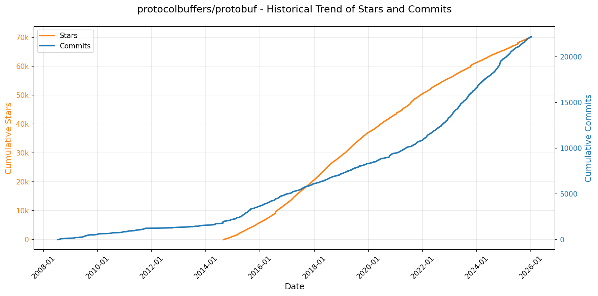

> *蓝色：累计 Stars｜橙色：累计 Commits（次 Y 轴）*

<b>📄 README 摘要</b>

1. **该项目的功能**  
Protocol Buffers（简称 protobuf）是 Google 开发的一种语言中立、平台中立、可扩展的结构化数据序列化机制，主要用于高效地序列化和反序列化结构化数据，以支持不同系统、服务与编程语言之间的数据交换（即“数据交换格式”）。它不依赖特定编程语言或运行环境，核心用途包括：定义数据结构（通过 `.proto` 文件）、生成对应语言的序列化/反序列化代码、以及提供高性能、紧凑的二进制数据表示，广泛应用于 RPC（如 gRPC）、微服务通信、配置存储、日志传输等场景。

2. **关键特性**  
- **跨语言与跨平台支持**：官方原生支持 C++、Java、Python、C#、Ruby、Go、JavaScript、PHP、Dart、Objective-C 等十余种主流语言，并提供标准化的代码生成器（`protoc`）；  
- **高效紧凑的二进制格式**：相比 XML 或 JSON，protobuf 序列化后体积更小、解析速度更快、带宽占用更低；  
- **向后/向前兼容性设计**：通过字段编号（tag）和 optional/required/repeated 语义，支持在不破坏旧版本兼容性的前提下演进协议（如新增/删除字段）；  
- **强类型接口定义**：使用 `.proto` 文件声明清晰、可验证的数据结构与服务接口（含 gRPC 支持），实现契约优先（contract-first）开发；  
- **现代构建系统集成**：原生支持 Bazel（含 Bzlmod 模块化依赖管理）及传统 WORKSPACE 方式，同时兼容 CMake（C++）、Maven（Java）、pip（Python）等主流构建生态；  
- **安全与维护保障**：遵循 OpenSSF 安全实践，提供明确的[版本支持策略](https://protobuf.dev/version-support/)，长期维护稳定发布分支（release branches），并建议用户锁定具体 release commit 以确保构建稳定性。

3. **技术栈**  
- **核心实现语言**：协议编译器 `protoc` 主要使用 **C++** 编写；  
- **多语言运行时**：为各目标语言提供对应实现——  
  - Java（基于 JDK，依赖 `rules_java`）、  
  - Python（CPython 兼容，支持 pip 安装）、  
  - Go（独立仓库 `protobuf-go`，使用 Go modules）、  
  - JavaScript/TypeScript（独立仓库 `protobuf-javascript`，支持 Node.js 与浏览器）、  
  - 其他包括 C#（.NET）、Ruby、PHP、Dart、Objective-C、Rust（社区维护）等；  
- **构建与依赖管理**：  
  - 主构建系统：**Bazel**（官方首选，全面支持 Bzlmod 和 WORKSPACE）、  
  - 辅助构建：CMake（C++）、Maven（Java）、Gradle、setuptools/pip（Python）等；  
- **基础设施**：GitHub 托管、CI/CD 集成、OpenSSF Scorecard 安全评估、Maven Central 与 PyPI 等多渠道分发。

---

### 3. [OpenBB-finance/OpenBB](https://github.com/OpenBB-finance/OpenBB)
- 📅 **创建日期**：2020-12-20  
- 🔄 **最近更新**：2026-01-08  
- ⭐ **Stars**：57,533（日 +105｜周 +1590｜月 +2382）  
- 📝 **描述**：Financial data platform for analysts, quants and AI agents.  

<b>📈 Star 与 Commit 历史趋势</b>

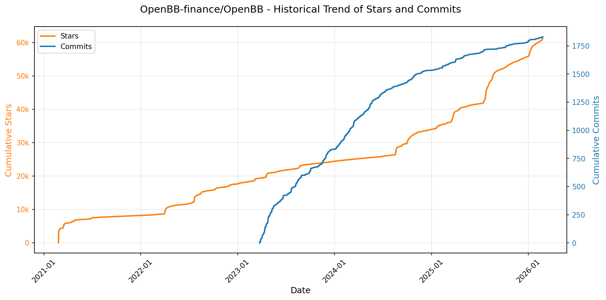

> *蓝色：累计 Stars｜橙色：累计 Commits（次 Y 轴）*

<b>📄 README 摘要</b>

1. **项目功能**  
Open Data Platform（ODP）是由 OpenBB 开发的开源数据集成工具集，核心目标是为数据工程师提供统一、可扩展的数据接入基础设施。它支持将**专有数据、授权数据和公开数据源**（如股票行情、宏观经济、加密货币、另类数据等）标准化接入，并以“连接一次，处处消费”（connect once, consume everywhere）的方式，向多种下游应用场景实时、一致地分发数据，包括：Python 量化环境（`obb` SDK）、OpenBB Workspace（企业级分析 UI）、Excel 插件、MCP（Model Context Protocol）服务器（供 AI 智能体调用）、以及标准 REST API（供第三方系统集成）。

2. **关键特性**  
- ✅ **多面统一接入层**：同一套数据后端可同时服务 Python SDK、Web UI、CLI、Excel、AI Agent（MCP）、API 等多个消费端，避免重复对接与数据孤岛；  
- ✅ **开箱即用的数据覆盖**：内置数百个金融与经济数据提供商（如 Alpha Vantage、FRED、Tiingo、Polygon、CoinGecko 等），支持历史行情、基本面、期权、ESG、另类数据等；  
- ✅ **本地化高性能 API 服务**：通过 `openbb-api` 命令一键启动基于 FastAPI + Uvicorn 的轻量级本地数据服务（默认 `http://127.0.0.1:6900`），支持低延迟、高并发查询；  
- ✅ **无缝对接 OpenBB Workspace**：可作为企业级前端（pro.openbb.co）的自托管/私有化后端，支持在 Workspace 中直接配置并测试 ODP 后端连接；  
- ✅ **全栈可扩展架构**：开放后端插件机制（见 `backends-for-openbb` 仓库），支持用户自定义数据源；AI Agent 集成能力（见 `agents-for-openbb` 仓库）；  
- ✅ **多环境部署支持**：原生兼容 Dev Containers、GitHub Codespaces、Google Colab，降低开发与试用门槛；  
- ✅ **双模 CLI 与 SDK**：提供 `openbb-cli` 命令行交互界面，以及 `from openbb import obb` 的 Python SDK，支持链式调用（如 `obb.equity.price.historical("AAPL")`）与 DataFrame 快速转换。

3. **技术栈**  
- **核心框架**：Python（3.9.21–3.12）、FastAPI（REST API 构建）、Uvicorn（ASGI 服务器）；  
- **数据处理**：Pandas（结构化数据操作）、Pydantic（数据验证与模型定义）、HTTPX（异步 HTTP 客户端）；  
- **前端/集成层**：OpenBB Workspace（React-based Web UI，闭源 SaaS）、Excel 插件（COM/JS 加载）、MCP 协议适配器（支持 LLM Agent 调用）；  
- **开发与部署**：GitHub Actions（CI/CD）、Docker（容器化支持）、VS Code Dev Containers、GitHub Codespaces、Google Colab；  
- **许可协议**：AGPLv3（强传染性开源协议，确保衍生作品持续开源）。

---

### 4. [anomalyco/opencode](https://github.com/anomalyco/opencode)
- 📅 **创建日期**：2025-04-30  
- 🔄 **最近更新**：2026-01-08  
- ⭐ **Stars**：53,772（日 +1826｜周 +8884｜月 +16811）  
- 📝 **描述**：The open source coding agent.  

<b>📈 Star 与 Commit 历史趋势</b>

> *蓝色：累计 Stars｜橙色：累计 Commits（次 Y 轴）*

<b>📄 README 摘要</b>

1. **该项目的功能**  
OpenCode 是一个开源的 AI 编程智能体（AI coding agent），旨在为开发者提供终端原生（TUI）、轻量高效且高度可扩展的 AI 辅助编程体验。它可在本地运行，支持与多种大语言模型（如 Claude、OpenAI、Google Gemini 及本地部署模型）无缝对接，不绑定任何特定供应商；核心用途包括：代码理解与探索、自动化开发任务、多步复杂问题求解、实时编辑与执行（通过 `build` 代理），以及安全受限的只读分析（通过 `plan` 代理）。其设计目标是成为“终端中的智能编程搭档”，尤其面向 Neovim 用户及终端优先工作流的开发者。

2. **关键特性**  
- **双模式智能代理系统**：内置 `build`（默认，全权限开发代理）和 `plan`（只读分析代理，需显式授权才执行命令）两种主代理，支持 Tab 键快速切换；另含 `@general` 子代理用于高级搜索与多步骤推理任务。  
- **跨平台终端优先架构（TUI-first）**：原生支持 Linux/macOS/Windows 终端，同时提供独立桌面应用（BETA）及多种包管理器安装方式（Homebrew、Scoop、Chocolatey、Nix、Mise 等）。  
- **完全开源与供应商无关**：100% MIT 许可开源；不依赖闭源服务，支持任意兼容 OpenAI API 或 Anthropic 兼容接口的模型（含本地 Ollama、LM Studio 等）。  
- **开箱即用的 LSP 集成**：深度支持语言服务器协议，实现智能补全、跳转、诊断等 IDE 级功能。  
- **灵活部署与安装机制**：支持自定义安装路径（按 `$OPENCODE_INSTALL_DIR` → `$XDG_BIN_DIR` → `$HOME/bin` → `$HOME/.opencode/bin` 优先级），适配各类开发环境与合规要求。  
- **客户端-服务器分离架构**：终端 UI 仅为前端之一，后端服务可远程托管，为未来移动端控制、Web 客户端或 CI 集成预留扩展能力。

3. **技术栈**  
- **前端（TUI）**：基于 Rust 构建（推测自构建工具链及性能要求），使用终端 UI 框架（如 `tui-rs` 或自研渲染层）实现高性能交互界面；桌面版基于 Electron 或 Tauri（文档未明示，但 `.dmg`/`.exe`/AppImage 分发形式表明跨平台 GUI 支持）。  
- **核心引擎与 CLI**：Rust 主导（高并发、内存安全、CLI 性能关键），可能辅以 TypeScript（Web 控制台 `packages/console/app` 和 `packages/web` 表明存在 Web 前端组件）。  
- **模型接入层**：抽象化 LLM 接口，兼容 OpenAI API v1、Anthropic HTTP API、Ollama、Google Vertex AI 等；默认推荐自家模型服务 OpenCode Zen，但完全解耦。  
- **基础设施与构建**：GitHub Actions 自动化发布（`publish.yml`），NPM 包分发（`opencode-ai`），多平台打包（Homebrew Tap、Scoop bucket、Choco、AUR、DEB/RPM/AppImage）。  
- **配置与扩展生态**：支持用户级配置、插件机制（文档提及“agents”可扩展），并强调与现有开发工具链（如 Neovim、terminal.shop 生态）深度协同。

---

### 5. [anthropics/claude-code](https://github.com/anthropics/claude-code)
- 📅 **创建日期**：2025-02-22  
- 🔄 **最近更新**：2026-01-08  
- ⭐ **Stars**：52,805（日 +574｜周 +2688｜月 +7870）  
- 📝 **描述**：Claude Code is an agentic coding tool that lives in your terminal, understands your codebase, and helps you code faster by executing routine tasks, explaining complex code, and handling git workflows - all through natural language commands.  

<b>📈 Star 与 Commit 历史趋势</b>

> *蓝色：累计 Stars｜橙色：累计 Commits（次 Y 轴）*

<b>📄 README 摘要</b>

1. **该项目的功能**  
Claude Code 是一款终端原生的智能编程代理工具，能够深度理解用户本地代码库，通过自然语言指令完成各类开发任务。它支持自动化执行重复性编码工作（如生成/修改代码）、解释复杂逻辑、管理 Git 工作流（如提交、分支操作、冲突分析等），并可集成于终端、IDE 或 GitHub（通过 `@claude` 提及调用）。

2. **核心功能**  
- **上下文感知编码**：自动索引和理解当前项目结构与代码语义，提供精准的上下文相关响应；  
- **自然语言交互**：支持纯中文/英文指令驱动开发任务（如“为这个函数添加类型检查”“解释这段 React Hook 的执行流程”）；  
- **Git 智能协作**：直接解析 Git 状态、生成提交信息、建议分支策略、辅助解决合并冲突；  
- **插件扩展架构**：内置可插拔机制，支持自定义命令与专用代理（如测试生成、文档补全、安全扫描等），所有插件集中管理于 `plugins/` 目录；  
- **跨平台一键安装**：提供 Shell 脚本（macOS/Linux）、Homebrew（macOS）、PowerShell（Windows）及 npm 四种标准化安装方式；  
- **内建反馈闭环**：通过 `/bug` 命令实时上报问题，自动捕获会话上下文与操作日志，加速问题复现与修复。

3. **技术栈**  
- **运行时环境**：Node.js 18+（强制依赖，npm 安装方式需单独配置）；  
- **客户端架构**：终端优先的 CLI 工具，基于命令行界面深度集成系统能力（文件系统访问、Git CLI 调用、进程控制）；  
- **AI 后端**：底层对接 Anthropic 的 Claude 大模型系列（未公开具体版本，但强调针对代码场景优化）；  
- **部署与分发**：通过 npm Registry（`@anthropic-ai/claude-code`）托管包，辅以独立安装脚本（`install.sh`/`install.ps1`）实现免依赖分发；  
- **生态集成**：原生支持 GitHub 提及语法（`@claude`），并提供 Discord 社区实时协同通道。

---

### 6. [usememos/memos](https://github.com/usememos/memos)
- 📅 **创建日期**：2021-12-08  
- 🔄 **最近更新**：2026-01-08  
- ⭐ **Stars**：52,481（日 +173｜周 +4827｜月 +5634）  
- 📝 **描述**：An open-source, self-hosted note-taking service. Your thoughts, your data, your control — no tracking, no ads, no subscription fees.  

<b>📈 Star 与 Commit 历史趋势</b>

> *蓝色：累计 Stars｜橙色：累计 Commits（次 Y 轴）*

<b>📄 README 摘要</b>

1. **项目功能**  
Memos 是一个开源、可自托管的笔记与知识管理服务，面向个人笔记、团队 Wiki 和结构化知识库场景。它允许用户完全掌控自己的数据——所有内容存储在用户自行部署的服务器或本地环境中，不依赖第三方云服务，无数据追踪、无广告、无订阅费用，支持随时完整导出。

2. **核心特性**  
- **隐私优先架构**：零遥测（zero telemetry）、无数据上传、全权数据所有权与一键导出；  
- **原生 Markdown 支持**：富文本编辑器深度集成 Markdown，所有笔记以纯文本格式存储，确保长期可迁移性；  
- **极致性能**：基于 Go 编写的高性能后端 + React 前端，启动快、响应低、支持大规模笔记量；  
- **极简部署**：提供一键 Docker 命令、Docker Compose、Kubernetes Helm 图表、跨平台预编译二进制包及源码构建等多种部署方式；  
- **开发者友好**：提供完备的 REST API 与 gRPC API，支持自动化集成、第三方工具对接与工作流嵌入；  
- **现代化 UI/UX**：简洁美观的响应式界面，内置深色模式，适配桌面与移动端。

3. **技术栈**  
- **后端**：Go（Golang），支持 SQLite（默认）、MySQL 和 PostgreSQL 多种数据库；  
- **前端**：React（TypeScript），基于现代 Web 标准构建，支持 PWA 特性；  
- **部署与运维**：Docker 官方镜像（`neosmemo/memos`）、Docker Compose、Kubernetes（含 Helm Chart）、CI/CD 集成；  
- **许可证**：MIT 开源协议，完全免费且可自由 fork、修改与商用。

---

### 7. [virattt/ai-hedge-fund](https://github.com/virattt/ai-hedge-fund)
- 📅 **创建日期**：2024-11-29  
- 🔄 **最近更新**：2026-01-08  
- ⭐ **Stars**：45,006（日 +60｜周 +722｜月 +2517）  
- 📝 **描述**：An AI Hedge Fund Team  

<b>📈 Star 与 Commit 历史趋势</b>

> *蓝色：累计 Stars｜橙色：累计 Commits（次 Y 轴）*

<b>📄 README 摘要</b>

1. **项目功能**  
该项目是一个面向教育与研究目的的AI驱动对冲基金概念验证系统，**不执行真实交易**。其核心目标是模拟多智能体协同决策过程，通过融合不同投资哲学（如价值投资、成长投资、逆向投资、宏观策略等）的AI代理，对股票进行多维度分析并生成虚拟交易信号。系统可对指定股票（如AAPL、MSFT等）进行基本面、技术面、市场情绪及内在价值评估，并由风险管理和组合管理代理整合输出最终的模拟持仓建议与回测结果。

2. **关键特性**  
- **14位投资大师AI代理**：分别模拟Damodaran、Buffett、Munger、Graham、Wood、Burry等全球知名投资者的决策逻辑与风格（如“安全边际”“十倍股挖掘”“激进变革推动”“颠覆性创新押注”等）；  
- **4类专业分析代理**：估值代理（计算内在价值与买卖信号）、情绪代理（分析市场情绪）、基本面代理（处理财务数据）、技术面代理（识别技术指标模式）；  
- **双层决策架构**：底层各代理独立输出观点，上层由风险管理员（控制仓位与波动率）和组合管理员（加权整合、生成最终模拟订单）统一协调；  
- **双模运行支持**：提供命令行接口（CLI）支持参数化回测、日期范围分析、本地Ollama模型接入；同时提供图形化Web应用界面，降低使用门槛；  
- **开源可扩展设计**：模块化代理架构便于新增投资流派或分析维度；支持多种LLM后端（OpenAI/Groq/Anthropic/DeepSeek/Ollama）；免费覆盖主流美股（AAPL/GOOGL/MSFT/NVDA/TSLA），扩展需金融数据API密钥。

3. **技术栈**  
- **编程语言**：Python（主逻辑、CLI、回测器）；  
- **AI/LLM框架**：基于LangChain或类似Agent编排框架实现多智能体协作；支持OpenAI GPT系列、Groq、Anthropic Claude、DeepSeek及本地Ollama模型；  
- **依赖管理**：Poetry；  
- **数据源**：Financial Datasets API（可选，用于非免费标的）；内置免费美股基础数据；  
- **Web前端（可选）**：独立`/app`子目录，采用现代Web框架（如Streamlit、FastAPI + React/Vue等，README未明示但图示显示为响应式UI）；  
- **环境配置**：`.env`管理API密钥，遵循标准密钥隔离实践；  
- **许可证**：MIT License。

---

### 8. [exo-explore/exo](https://github.com/exo-explore/exo)
- 📅 **创建日期**：2024-06-24  
- 🔄 **最近更新**：2026-01-08  
- ⭐ **Stars**：39,629（日 +57｜周 +529｜月 +6979）  
- 📝 **描述**：Run your own AI cluster at home with everyday devices 📱💻 🖥️⌚  

<b>📈 Star 与 Commit 历史趋势</b>

> *蓝色：累计 Stars｜橙色：累计 Commits（次 Y 轴）*

<b>📄 README 摘要</b>

1. **项目功能**  
exo 是一个面向个人用户的分布式 AI 推理框架，旨在将家庭中多台日常设备（如 Mac Studio、MacBook 等）无缝组建成本地 AI 计算集群。它通过跨设备协同运行大语言模型（LLM），突破单设备显存/内存限制，实现“虚拟超大 VRAM”（例如 4 台 M3 Ultra Mac Studio 可联合提供高达 15 TB 等效 VRAM）。用户无需手动配置网络或拓扑，即可在本地私有环境中高效运行数十亿至数千亿参数的量化模型（如 Qwen3-235B、DeepSeek-V3.1-671B、Kimi K2 Thinking），并直接通过 Web 仪表盘或标准 OpenAI 兼容 API 进行交互。

2. **核心特性**  
- **零配置自动设备发现**：同一局域网内运行 exo 的设备可自主识别并组网，无需 IP 手动配置或中心化注册。  
- **原生 Thunderbolt 5 RDMA 支持（Day-0）**：深度集成 macOS 26.2+ 新增的 RDMA 功能，在 Thunderbolt 5 设备间实现超低延迟通信（宣称降低 99% 跨设备延迟），显著提升分布式推理吞吐。  
- **拓扑感知自动并行调度**：实时感知各设备硬件资源（CPU/GPU/内存）、设备间网络带宽与延迟，动态选择最优模型切分策略（流水线并行 / 张量并行），最大化集群整体效率。  
- **高性能张量并行（Tensor Parallelism）**：支持模型权重跨设备分片，实测在 2 台设备上提速 1.8×，4 台设备上提速 3.2×。  
- **MLX 原生深度集成**：以 Apple 生态优化的 [MLX](https://github.com/ml-explore/mlx) 为底层推理引擎，并采用其分布式扩展库 [MLX Distributed](https://ml-explore.github.io/mlx/build/html/usage/distributed.html) 实现高效设备间张量通信与同步。

3. **技术栈**  
- **核心语言与框架**：Rust（系统层、高性能通信与调度逻辑）、Python（主控逻辑、API 服务、模型管理）、TypeScript/React（Web 仪表盘前端）。  
- **AI 推理后端**：[MLX](https://github.com/ml-explore/mlx)（macOS GPU 加速） + [MLX Distributed](https://ml-explore.github.io/mlx/build/html/usage/distributed.html)（分布式张量通信）。  
- **系统依赖**：  
  - macOS：依赖 `macmon`（Apple Silicon 硬件监控）、`rdma_ctl`（RDMA 控制）、Thunderbolt 5 硬件及 macOS Tahoe 26.2+ 系统；  
  - Linux：当前仅支持 CPU 推理（GPU 支持开发中），依赖 `uv`（Python 包管理）、`Node.js`（前端构建）、`Rust nightly`（编译绑定）。  
- **部署与交互**：内置 HTTP API 服务（端口 `52415`），完全兼容 OpenAI Chat Completions 接口规范；提供本地 Web 仪表盘（基于 React）；支持 macOS 后台应用（`.dmg` 安装包）。

---

### 9. [google/googletest](https://github.com/google/googletest)
- 📅 **创建日期**：2015-07-28  
- 🔄 **最近更新**：2026-01-08  
- ⭐ **Stars**：37,778（日 +75｜周 +109｜月 +241）  
- 📝 **描述**：GoogleTest - Google Testing and Mocking Framework  

<b>📈 Star 与 Commit 历史趋势</b>

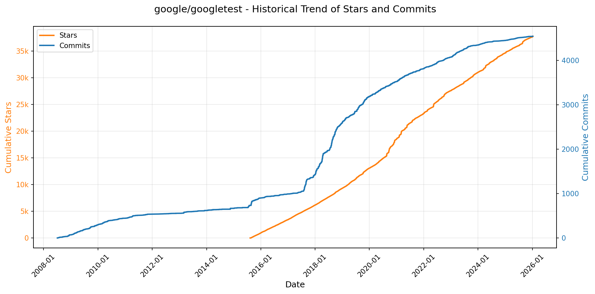

> *蓝色：累计 Stars｜橙色：累计 Commits（次 Y 轴）*

<b>📄 README 摘要</b>

1. **项目功能**  
GoogleTest 是 Google 开发的 C++ 单元测试框架，旨在为 C++ 代码提供轻量、灵活且功能完备的自动化测试能力。它支持编写、自动发现、执行和报告单元测试，适用于从简单函数验证到复杂错误处理逻辑（如程序崩溃行为）的各类测试场景。本项目整合了原独立的 GoogleTest（测试框架）与 GoogleMock（模拟框架），统一维护与发布，但 README 主要聚焦于测试核心功能（Mock 功能未在所给内容中展开说明）。

2. **关键特性**  
- 基于 xUnit 架构，符合主流单元测试范式；  
- 自动化测试发现机制，无需手动注册测试用例；  
- 提供丰富的内置断言（如 `EXPECT_EQ`, `ASSERT_THROW`, `EXPECT_DEATH` 等），覆盖值比较、异常捕获、进程终止验证（death tests）等场景；  
- 支持用户自定义断言宏，增强测试可读性与领域适配性；  
- 区分**致命失败**（`ASSERT_*`，立即终止当前测试）与**非致命失败**（`EXPECT_*`，记录错误并继续执行），提升调试效率；  
- 支持**值参数化测试**（Value-parameterized Tests）和**类型参数化测试**（Type-parameterized Tests），便于对多组输入数据或多种模板类型进行批量验证；  
- 提供灵活的测试执行控制：可运行指定测试/测试套件、按名称/标签过滤、控制执行顺序、并发运行（需配合外部工具如 `gtest-parallel`）；  
- 兼容多种输出协议（如 TAP）与 IDE 集成（通过第三方扩展支持 VS Code、Qt GUI、C# 测试运行器等）。

3. **技术栈**  
- **语言标准**：最低要求 C++17（自 v1.17.0 起强制要求）；  
- **构建与平台**：遵循 Google 的 [Foundational C++ Support Policy](https://opensource.google/documentation/policies/cplusplus-support)，支持主流编译器（GCC、Clang、MSVC）、操作系统（Linux、macOS、Windows）及构建系统（CMake、Bazel 等）；  
- **依赖演进**：计划引入 [Abseil](https://github.com/abseil/abseil-cpp) 作为底层基础库依赖（“Coming Soon” 中明确提及）；  
- **基础设施**：内部持续集成使用 Google 自研系统（非开源 CI 工具）；  
- **生态集成**：通过标准化输出（如 TAP）及社区开发的插件/工具（如 gtest-parallel、GoogleTest Adapter、C++ TestMate），深度融入现代 C++ 开发工作流。

---

### 10. [anthropics/skills](https://github.com/anthropics/skills)
- 📅 **创建日期**：2025-09-22  
- 🔄 **最近更新**：2026-01-08  
- ⭐ **Stars**：34,596（日 +0｜周 +3603｜月 +14793）  
- 📝 **描述**：Public repository for Agent Skills  

<b>📈 Star 与 Commit 历史趋势</b>

> *蓝色：累计 Stars｜橙色：累计 Commits（次 Y 轴）*

<b>📄 README 摘要</b>

1. **项目功能**  
该项目是 Anthropic 官方提供的 Claude 技能（Skills）参考实现仓库，用于展示和演示 Claude 的“技能系统”能力。技能是一组自包含的指令、脚本与资源集合（以独立文件夹形式组织），可被 Claude 动态加载，从而在特定领域任务中提升其专业化表现。项目本身不运行服务或提供工具链，而是为开发者提供可即用、可学习、可复用的技能样例集，涵盖创意设计、技术开发、企业协作及文档处理等场景，并作为构建自定义技能的权威参考模板与实践范例。

2. **核心特性**  
- **模块化技能结构**：每个技能均为独立文件夹，强制包含 `SKILL.md` 文件（含 YAML 前置元数据 + Markdown 指令/示例/指南），确保可发现性、可维护性与可组合性；  
- **开箱即用的多样化技能集**：涵盖艺术生成、音乐创作、UI 设计、Web 应用测试、MCP 服务器生成、品牌文案撰写、多格式文档（DOCX/PDF/PPTX/XLSX）创建与解析等真实场景；  
- **生产级参考实现**：公开了支撑 Claude 官方文档能力的底层技能源码（如 `skills/docx` 等子目录），虽为“源码可用”（source-available）而非开源，但提供了复杂生产技能的设计模式与工程实践；  
- **跨平台集成支持**：支持在 Claude Code（插件市场）、Claude.ai（付费用户直接启用）、Claude API（上传/调用自定义技能）三端无缝使用；  
- **标准化规范与模板**：内置 [Agent Skills 规范](./spec) 和通用技能模板（`./template`），降低技能开发门槛，保障兼容性与可扩展性；  
- **教育与示范导向**：明确声明所有技能仅用于演示与教学目的，强调行为可能与实际产品存在差异，倡导本地充分验证后再投入关键任务。

3. **技术栈**  
- **核心格式**：纯文本驱动，基于 **Markdown + YAML 前置元数据** 定义技能逻辑与元信息，零依赖运行时；  
- **规范标准**：遵循开源的 **[Agent Skills 标准](https://agentskills.io)**（由 Anthropic 主导制定），确保跨代理平台互操作性；  
- **交付形态**：静态文件仓库（GitHub），无后端服务、无构建流程、无专用 SDK，技能本质是结构化提示工程（structured prompt engineering）的工程化封装；  
- **集成接口**：依赖 Anthropic 提供的 **Claude API 技能接口**、**Claude Code 插件机制** 及 **Claude.ai 前端技能管理界面** 实现动态加载与执行；  
- **许可协议**：多数示例技能采用 **Apache 2.0 开源许可证**，文档类技能为 **源码可用（source-available）**，非开源但允许学习与参考。

---

### 11. [Lissy93/web-check](https://github.com/Lissy93/web-check)
- 📅 **创建日期**：2023-06-25  
- 🔄 **最近更新**：2026-01-08  
- ⭐ **Stars**：28,589（日 +699｜周 +1480｜月 +1632）  
- 📝 **描述**：🕵️‍♂️ All-in-one OSINT tool for analysing any website  

<b>📈 Star 与 Commit 历史趋势</b>

> *蓝色：累计 Stars｜橙色：累计 Commits（次 Y 轴）*

---

### 12. [anthropics/prompt-eng-interactive-tutorial](https://github.com/anthropics/prompt-eng-interactive-tutorial)
- 📅 **创建日期**：2024-04-02  
- 🔄 **最近更新**：2026-01-08  
- ⭐ **Stars**：28,417（日 +219｜周 +482｜月 +1356）  
- 📝 **描述**：Anthropic's Interactive Prompt Engineering Tutorial  

<b>📈 Star 与 Commit 历史趋势</b>

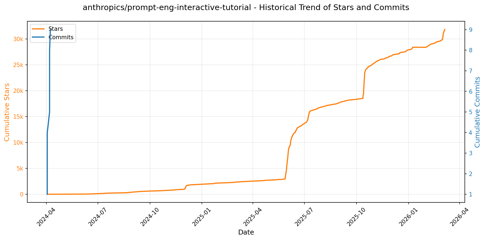

> *蓝色：累计 Stars｜橙色：累计 Commits（次 Y 轴）*

<b>📄 README 摘要</b>

1. **该项目的功能**  
该项目是 Anthropic 官方推出的、面向 Claude 大语言模型（特别是 Claude 3 Haiku）的交互式提示工程（Prompt Engineering）教学教程，旨在系统性地指导用户掌握高质量提示词的设计方法。它不提供代码库或可部署工具，而是一个结构化、实践导向的学习资源，通过 9 章渐进式课程与配套练习，帮助学习者从零构建、调试和优化提示词，以充分发挥 Claude 模型的能力，并规避常见问题（如幻觉、歧义、格式混乱等）。

2. **核心功能**  
- **分层渐进式学习路径**：涵盖初阶（基础结构、清晰表达、角色设定）、中阶（指令与数据分离、输出格式控制、思维链引导、示例驱动）到高阶（抑制幻觉、多场景复杂提示构建）共 9 章内容；  
- **强交互性实践设计**：每章末尾设“示例游乐场”（Example Playground），支持用户即时修改提示并观察 Claude 响应变化，强化实操理解；  
- **真实场景导向的用例覆盖**：第 9 章深入金融、法律、编程、对话机器人等垂直领域，提供行业级复杂提示构建范例与练习；  
- **配套辅助资源完善**：提供官方答案密钥（Google Sheets）、多模型能力对比说明（Haiku/Sonnet/Opus），并推荐更易用的「Claude for Sheets」集成版本；  
- **延伸方法论拓展**：附录涵盖进阶技术，包括提示链（Prompt Chaining）、工具调用（Tool Use）和检索增强（Search & Retrieval），为后续工程化应用铺路。

3. **技术栈**  
- **核心模型**：Claude 3 Haiku（主打低延迟、低成本，作为教学基准模型）；同时明确对比说明 Sonnet 与 Opus 的定位；  
- **交互载体**：基于网页版 Markdown 文档（GitHub README 形式）+ Google Sheets（集成 Anthropic 官方「Claude for Sheets」插件），后者为实际运行环境；  
- **无独立后端/前端代码**：本项目本身不包含自研软件系统，不依赖特定编程语言或框架，其“运行”完全依托 Anthropic 提供的 API 能力及 Sheets 插件生态；技术实现层面依赖于 Anthropic 的模型服务接口与 Google Workspace 生态集成能力。

---

### 13. [patchy631/ai-engineering-hub](https://github.com/patchy631/ai-engineering-hub)
- 📅 **创建日期**：2024-10-21  
- 🔄 **最近更新**：2026-01-08  
- ⭐ **Stars**：25,329（日 +323｜周 +1067｜月 +2926）  
- 📝 **描述**：In-depth tutorials on LLMs, RAGs and real-world AI agent applications.  

<b>📈 Star 与 Commit 历史趋势</b>

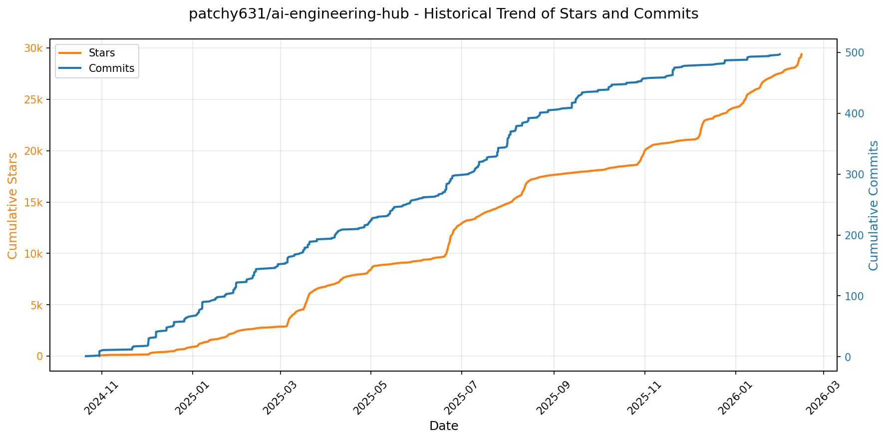

> *蓝色：累计 Stars｜橙色：累计 Commits（次 Y 轴）*

<b>📄 README 摘要</b>

1. **项目功能**  
该项目是一个面向AI工程实践的开源资源中心（AI Engineering Hub），旨在为不同经验水平的学习者与开发者提供**93+个可直接用于生产环境的AI项目示例**。它不侧重理论教学，而是聚焦于**动手构建真实AI系统**，覆盖从入门到高级的完整能力进阶路径，支持用户快速上手、复现、改造并部署AI应用，涵盖OCR、聊天界面、RAG（检索增强生成）、智能体（Agents）、多模态处理、语音交互、模型评估、微调及生产级系统等核心场景。

2. **关键特性**  
- **分层项目体系**：按难度精细划分为**22个入门级、48个中级、23个高级项目**，每类均标注技术焦点（如OCR、RAG、Agents、MCP、多模态等），便于精准匹配学习/开发需求；  
- **前沿技术全覆盖**：深度整合LLM（Llama 3.2/4、DeepSeek-R1、Qwen 2.5/3、Gemma-3、Claude、O3、Sonnet4等）、RAG优化方案（Dockling、Trustworthy RAG、Milvus+Groq低延迟检索）、智能体框架（CrewAI、AutoGen、Motia）、MCP（Model Context Protocol）生态（Cursor、Stagehand、Firecrawl、Zep、Graphiti等）及多模态能力（Janus-Pro图像生成、Gemini视频RAG、AssemblyAI语音处理）；  
- **强实践导向设计**：所有项目均为**可运行、可部署的端到端实现**，包含本地化部署（Ollama、LitServe）、流式响应（Motia）、内存增强（Zep/Graphiti）、Web自动化（Stagehand）、合规性支持（Parlant）、生产就绪组件（GroundX文档流水线、NotebookLM克隆）等工业级要素。

3. **技术栈**  
- **模型层**：Llama系列（3.2/4）、DeepSeek-R1/Janus-Pro、Qwen（2.5 VL / 3 / 3-Coder）、Gemma-3、GPT-OSS、Claude 3.7、Sonnet4、O3、ModernBERT、NVIDIA NIM；  
- **框架与工具链**：LlamaIndex、Ollama、Qdrant、Milvus、SambaNova、Docling、CometML、Opik、TensorLake、Zep、Graphiti、FireCrawl、AssemblyAI、Cartesia、BrightData、Supabase、MindsDB、Pixeltable、KitOps；  
- **智能体与工作流**：CrewAI（含Flows）、AutoGen、Motia、Stagehand、ACP（Agent Communication Protocol）；  
- **UI与部署**：Streamlit、Chainlit、LitServe、React（前端集成）、Docker（隐含于生产项目）；  
- **基础设施协议**：MCP（Model Context Protocol）作为统一上下文交互标准，深度对接各类数据源、工具与模型服务。

---

### 14. [simstudioai/sim](https://github.com/simstudioai/sim)
- 📅 **创建日期**：2025-01-05  
- 🔄 **最近更新**：2026-01-08  
- ⭐ **Stars**：25,111（日 +51｜周 +349｜月 +6478）  
- 📝 **描述**：Open-source platform to build and deploy AI agent workflows.  

<b>📈 Star 与 Commit 历史趋势</b>

> *蓝色：累计 Stars｜橙色：累计 Commits（次 Y 轴）*

<b>📄 README 摘要</b>

1. **项目功能**  
Sim 是一个面向 AI 代理（AI Agent）工作流的低代码开发与部署平台，旨在让用户在数分钟内构建、调试和上线基于大语言模型的智能工作流。其核心能力是将多个 AI 代理（Agents）、工具（Tools）和逻辑模块（Blocks）通过可视化画布连接编排，形成可执行的端到端自动化流程；支持本地或云端模型接入（如 Ollama、vLLM），并能结合用户私有知识库（通过向量数据库实现文档上传、嵌入与语义检索），使 AI 回答具备上下文感知与事实依据。

2. **关键特性**  
- **可视化工作流编排**：基于 ReactFlow 构建的拖拽式画布，支持节点连接、实时运行与调试；  
- **Copilot 智能辅助**：集成 Sim 自研 Copilot 服务，可通过自然语言生成节点、修复流程错误、优化逻辑结构；  
- **私有知识增强**：支持上传 PDF/文本等文档至向量数据库（依赖 pgvector），自动完成分块、嵌入与 RAG 检索，实现领域定制化问答；  
- **全栈自托管能力**：提供多种部署方式——云服务（sim.ai）、NPM 快速启动、Docker Compose（含 Ollama/vLLM 集成配置）、Dev Container 及手动源码部署；  
- **本地大模型原生支持**：深度集成 Ollama（含 GPU/CPU 适配）与 vLLM（OpenAI 兼容 API），无需依赖外部闭源 API，保障数据隐私与离线可用性；  
- **实时协同与沙箱执行**：内置 Socket.io 实现实时状态同步，并通过 E2B 提供安全的远程代码执行沙箱环境。

3. **技术栈**  
- **前端框架**：Next.js（App Router）、Bun（运行时与包管理）；  
- **UI 组件库**：Shadcn/ui + Tailwind CSS；  
- **状态管理**：Zustand；  
- **流程编辑器**：ReactFlow；  
- **后端与数据库**：PostgreSQL（强制要求 pgvector 扩展）、Drizzle ORM（TypeScript 原生迁移与查询）；  
- **认证授权**：Better Auth；  
- **实时通信**：Socket.io；  
- **后台任务**：Trigger.dev；  
- **远程代码执行**：E2B；  
- **基础设施与工程化**：Turborepo（Monorepo 管理）、Docker、GitHub Actions；  
- **文档系统**：Fumadocs。

---

### 15. [resemble-ai/chatterbox](https://github.com/resemble-ai/chatterbox)
- 📅 **创建日期**：2025-04-23  
- 🔄 **最近更新**：2026-01-08  
- ⭐ **Stars**：20,941（日 +88｜周 +969｜月 +6080）  
- 📝 **描述**：SoTA open-source TTS  

<b>📈 Star 与 Commit 历史趋势</b>

> *蓝色：累计 Stars｜橙色：累计 Commits（次 Y 轴）*

<b>📄 README 摘要</b>

1. **项目功能**  
Chatterbox TTS 是 Resemble AI 推出的开源文本转语音（TTS）模型家族，核心目标是为实时语音代理（voice agents）、交互式应用及创意内容生成提供高质量、低延迟、零样本（zero-shot）语音合成能力。其中 **Chatterbox-Turbo** 作为最新成员，专为高效部署优化：支持仅需 10 秒参考音频即可完成声音克隆，实现端到端单步（1-step）mel频谱生成，显著降低推理延迟与显存占用；同时原生支持 `[laugh]`、`[cough]` 等**副语言标签（paralinguistic tags）**，增强语音自然度与表现力。整个项目涵盖三大模型：Turbo（轻量高效，英语专用）、Multilingual（500M参数，支持23+语言零样本克隆）、Original Chatterbox（英语为主，支持CFG控制与夸张度调节），适用于从生产级语音代理到多语种本地化、创意配音等多样化场景。

2. **关键特性**  
- ✅ **极致推理效率**：Chatterbox-Turbo 采用精简的 350M 参数架构，将传统多步 mel 解码压缩至**单步生成**，大幅减少计算开销与 VRAM 占用；实测端到端延迟低于 200ms（配合 Resemble AI 商业服务）。  
- ✅ **原生副语言建模**：直接解析 `[chuckle]`、`[laugh]`、`[cough]` 等文本标签，无需额外模型或后处理，显著提升对话真实感与情感表现力。  
- ✅ **零样本语音克隆**：仅需一段约 10 秒的参考语音（任意说话人），即可合成目标音色，支持跨语言克隆（Multilingual 模型）与英语精细控制（Original/Turbo）。  
- ✅ **多语言全覆盖**：Chatterbox-Multilingual 支持包括中、英、西、法、日、韩、阿、印地等在内的 **23+ 种语言**，且无需微调即可实现高质量零样本合成。  
- ✅ **内置责任式AI水印**：所有生成音频自动嵌入 **PerTh（Perceptual Threshold）神经水印**，具备强鲁棒性（抗MP3压缩、剪辑、变速等），检测准确率近100%，满足内容溯源与AI生成内容标识合规要求。  
- ✅ **灵活可控合成**：Original 模型支持 CFG（Classifier-Free Guidance）权重调节与 `exaggeration` 参数控制语速/情绪强度；Turbo 保持易用性的同时兼顾表达力。

3. **技术栈**  
- **核心框架**：PyTorch（深度学习训练与推理）、torchaudio（音频I/O与预处理）  
- **模型架构**：基于自研高效声学建模结构（Turbo 采用蒸馏优化的 speech-token-to-mel 解码器）；融合 Llama 3 的文本理解能力（提示建模）、S3Tokenizer 的语音离散表征、HiFT-GAN 的高质量声码器（用于波形重建）  
- **依赖生态**：集成 CosyVoice（零样本TTS范式）、Real-Time-Voice-Cloning（语音克隆基础）、Perth（水印嵌入/提取模块）  
- **开发环境**：Python 3.11（官方推荐），依赖版本严格锁定于 `pyproject.toml`；支持 CUDA 加速（GPU推理）  
- **部署与分发**：提供 PyPI 包（`pip install chatterbox-tts`）、Hugging Face Spaces 在线 Demo、GitHub 源码安装（支持可编辑模式），并兼容 Podonos 等第三方评估平台。

---

### 16. [ChromeDevTools/chrome-devtools-mcp](https://github.com/ChromeDevTools/chrome-devtools-mcp)
- 📅 **创建日期**：2025-09-11  
- 🔄 **最近更新**：2026-01-08  
- ⭐ **Stars**：19,030（日 +204｜周 +708｜月 +2909）  
- 📝 **描述**：Chrome DevTools for coding agents  

<b>📈 Star 与 Commit 历史趋势</b>

> *蓝色：累计 Stars｜橙色：累计 Commits（次 Y 轴）*

<b>📄 README 摘要</b>

1. **项目功能**  
该项目是一个 Model-Context-Protocol（MCP）服务器实现，名为 `chrome-devtools-mcp`，专为AI编程助手（如Gemini、Claude、Cursor、Copilot等）设计。它使这些大模型驱动的编码代理能够**直接控制并深度检查正在运行的Chrome浏览器实例**，通过集成Chrome DevTools协议与Puppeteer能力，提供真实、可交互的浏览器环境，用于自动化操作、性能分析和前端调试。

2. **核心特性**  
- **性能洞察**：支持录制完整DevTools性能追踪（trace），自动提取可操作的性能瓶颈分析结果（如长任务、渲染阻塞、网络瀑布图关键指标）。  
- **高级调试能力**：可实时查看/过滤网络请求、读取浏览器控制台日志、截取页面截图、捕获DOM快照、执行任意JavaScript脚本。  
- **高可靠性自动化**：基于Puppeteer构建，支持精准的页面导航（新开页、跳转、切换）、表单填充、元素点击/悬停/拖拽、文件上传、弹窗处理及智能等待（自动等待加载、网络空闲或指定条件满足）。  
- **灵活连接模式**：既可**自动启动隔离的Chrome实例**（默认），也支持**连接已运行的Chrome进程**（通过`--browser-url`或`--wsEndpoint`），并兼容远程调试认证（自定义WebSocket headers）、多渠道（Stable/Canary/Beta）、无头模式与代理配置。  
- **模块化工具集**：按功能划分为6大类共26个标准化MCP工具（如`click`、`navigate_page`、`performance_analyze_insight`、`take_screenshot`等），支持细粒度权限控制与按需禁用（如通过`--categoryPerformance=false`关闭性能工具）。  

3. **技术栈**  
- **核心协议层**：Model-Context-Protocol（MCP）标准通信协议（JSON-RPC over stdio/stdout）。  
- **浏览器控制引擎**：底层依赖 [Puppeteer](https://github.com/puppeteer/puppeteer) 管理Chrome生命周期与基础API调用；深度集成 [Chrome DevTools Protocol (CDP)](https://github.com/ChromeDevTools/devtools-frontend) 实现高级调试能力（如性能分析、网络拦截、Console日志捕获）。  
- **运行时环境**：Node.js（≥v20.19 LTS），通过`npx`一键启动；兼容Chrome稳定版及Canary/Beta/Dev通道（需≥M144以支持自动连接）。  
- **部署与集成**：纯JavaScript/TypeScript实现，发布为npm包（`chrome-devtools-mcp`），原生适配主流AI IDE（VS Code、Cursor、JetBrains、Warp等）及MCP客户端（Gemini CLI、Claude Code、Copilot CLI等）。

---

### 17. [DayuanJiang/next-ai-draw-io](https://github.com/DayuanJiang/next-ai-draw-io)
- 📅 **创建日期**：2025-03-23  
- 🔄 **最近更新**：2026-01-08  
- ⭐ **Stars**：17,275（日 +141｜周 +1347｜月 +12019）  
- 📝 **描述**：A next.js web application that integrates AI capabilities with draw.io diagrams. This app allows you to create, modify, and enhance diagrams through natural language commands and AI-assisted visualization.  

<b>📈 Star 与 Commit 历史趋势</b>

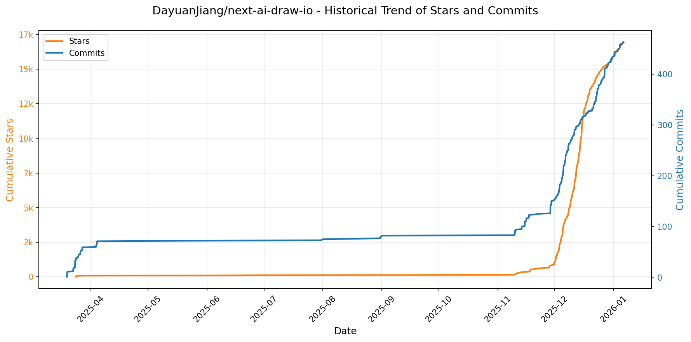

> *蓝色：累计 Stars｜橙色：累计 Commits（次 Y 轴）*

<b>📄 README 摘要</b>

1. **项目功能**  
Next AI Draw.io 是一个基于 Next.js 的 Web 应用，将大语言模型（LLM）能力深度集成至 draw.io 图形编辑器中，实现通过自然语言指令创建、修改和增强专业图表。用户无需手动拖拽组件，仅需输入文本提示（如“生成带 AWS 图标的云架构图”或“画一只可爱的猫”），系统即可自动生成符合 draw.io 标准的 XML 格式图表；同时支持上传图片、PDF 或文本文件，由 AI 自动识别内容并重建/增强为可编辑图表。

2. **核心特性**  
- **AI 驱动的图表生成与编辑**：支持多轮对话式交互，实时响应自然语言指令调整图表结构、样式与布局；  
- **多模态输入支持**：可上传图像（用于反向生成矢量图）、PDF 和纯文本文件，自动提取语义并生成对应图表；  
- **AI 推理过程可视化**：对 OpenAI o1/o3、Gemini、Claude 等兼容模型，展示完整思维链（Chain-of-Thought），提升可解释性；  
- **全版本历史管理**：内置图表变更追踪系统，支持查看、对比及一键回滚至任一历史版本；  
- **云原生架构图专项支持**：预置 AWS/GCP/Azure 官方图标库，结合领域知识优化生成质量（尤其推荐 Claude 系列模型）；  
- **动态连接线（Animated Connectors）**：支持生成带动画效果的流程连接线，强化数据流向与交互逻辑表达；  
- **MCP 协议集成（预览版）**：作为 Model Context Protocol 服务端，可与 Claude Desktop、Cursor、VS Code 等 AI 编程助手联动，在 IDE 内直接生成并同步图表到浏览器；  
- **BYOK（自带 API 密钥）机制**：用户可在前端本地安全存储私有 API Key，绕过演示站调用限制，保障隐私与灵活性。

3. **技术栈**  
- **前端框架**：Next.js 16+（App Router）、React 19+；  
- **AI SDK 与多模型接入**：Vercel AI SDK（`ai` + `@ai-sdk/*`），统一抽象 OpenAI / Anthropic / Google AI / Azure OpenAI / AWS Bedrock / Ollama / DeepSeek / SiliconFlow / ModelScope 等 13+ 主流提供商；  
- **图表引擎**：`react-drawio` 封装 draw.io（diagrams.net）核心渲染与编辑能力，所有输出均为标准 draw.io XML；  
- **部署支持**：原生适配 Vercel（官方推荐）、Tencent EdgeOne Pages（含 DeepSeek 免费配额）、Cloudflare Workers 及 Docker 容器化部署；  
- **协议扩展**：基于 MCP（Model Context Protocol）实现跨客户端 AI 工具协同，配套独立 `@next-ai-drawio/mcp-server` 包。

---

### 18. [ourongxing/newsnow](https://github.com/ourongxing/newsnow)
- 📅 **创建日期**：2024-09-23  
- 🔄 **最近更新**：2026-01-08  
- ⭐ **Stars**：17,022（日 +63｜周 +1406｜月 +2017）  
- 📝 **描述**：Elegant reading of real-time and hottest news  

<b>📈 Star 与 Commit 历史趋势</b>

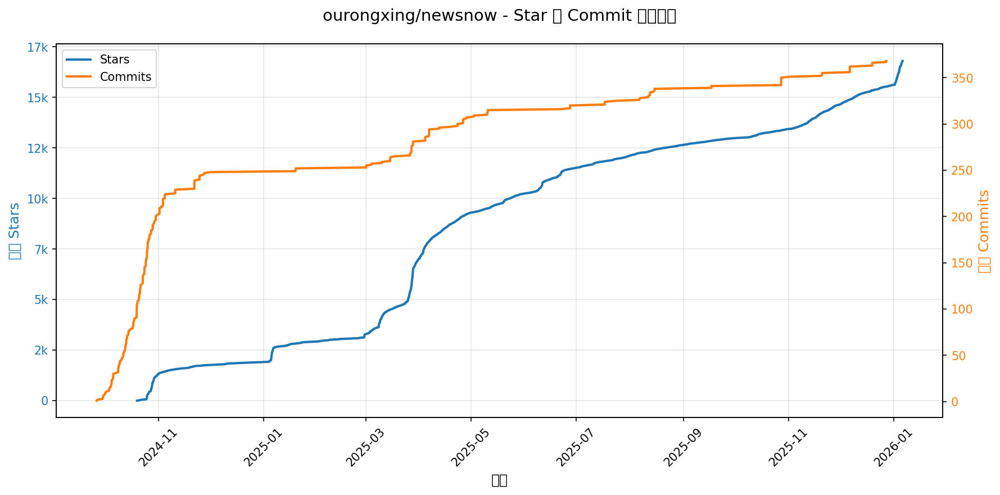

> *蓝色：累计 Stars｜橙色：累计 Commits（次 Y 轴）*

<b>📄 README 摘要</b>

1. **项目功能**  
该是一个实时新闻聚合与阅读平台，专注于提供简洁优雅的界面和高质量的中文热点新闻流。它通过自适应网络爬虫动态抓取多个新闻源，实现低延迟、高可用的实时资讯更新；支持用户通过 GitHub OAuth 登录，实现个性化数据同步（如阅读状态、收藏等）；内置缓存机制与反封禁策略，并可作为 MCP（Model Context Protocol）服务端运行，为 AI 工具链提供结构化新闻数据接口。

2. **核心特性**  
- ✅ 极简优雅的响应式 UI，专为沉浸式阅读优化  
- ✅ 基于源更新频率智能调节爬取间隔（最低 2 分钟），兼顾时效性与服务器/IP 安全  
- ✅ 默认 30 分钟内容缓存（登录用户可手动强制刷新）  
- ✅ GitHub OAuth 第三方登录 + JWT 认证 + 用户数据持久化同步  
- ✅ 原生支持 MCP 协议，可配置为 `newsnow-mcp-server` 服务端，供 LLM 工具调用  
- ✅ 多数据库适配（推荐 Cloudflare D1），支持无服务器环境部署  
- ✅ 模块化数据源架构（`shared/sources` + `server/sources`），易于扩展国内外新闻源  

3. **技术栈**  
- **前端框架**：基于 [Nuxt 3](https://nuxt.com/)（Vue 3 + TypeScript + Nitro 后端）构建的全栈应用  
- **包管理**：PNPM（配合 Corepack）  
- **认证与安全**：GitHub OAuth App、JWT（`JWT_SECRET`）、HTTPS 回调校验  
- **后端与部署**：Nitro 服务端（支持 Cloudflare Workers / Node.js / Docker）、Wrangler（D1 数据库集成）  
- **数据库**：兼容 [Drizzle ORM](https://drizzle.dev/) + [UnJS DB](https://db0.unjs.io/) 生态，官方首选 **Cloudflare D1**（SQLite on Edge）  
- **缓存与调度**：内置内存/数据库缓存层 + 自适应定时爬虫调度器  
- **DevOps**：支持 Vercel、Cloudflare Pages、Docker Compose 一键部署；环境变量驱动配置（`.env.server`）  
- **协议扩展**：MCP（Model Context Protocol）服务端集成（通过 `npx newsnow-mcp-server` 启动）

---

### 19. [DrewThomasson/ebook2audiobook](https://github.com/DrewThomasson/ebook2audiobook)
- 📅 **创建日期**：2024-01-22  
- 🔄 **最近更新**：2026-01-08  
- ⭐ **Stars**：16,719（日 +215｜周 +519｜月 +815）  
- 📝 **描述**：Generate audiobooks from e-books, voice cloning & 1158+ languages!  

<b>📈 Star 与 Commit 历史趋势</b>

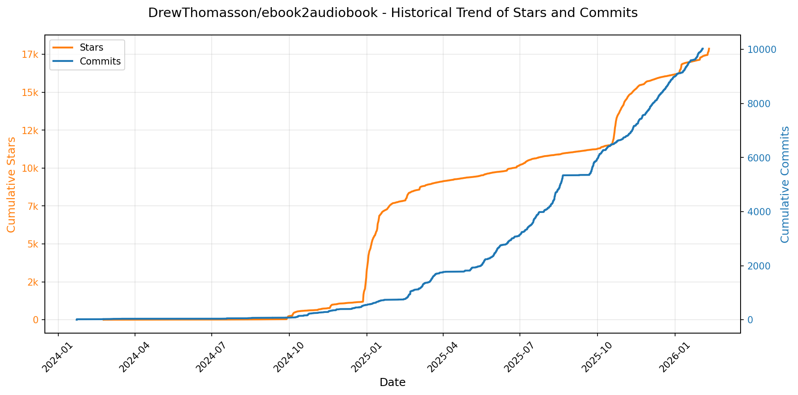

> *蓝色：累计 Stars｜橙色：累计 Commits（次 Y 轴）*

<b>📄 README 摘要</b>

1. **项目功能**  
本项目是一个将电子书（eBook）批量转换为有声书（Audiobook）的本地化/远程化工具，支持自动按章节分割文本、嵌入标准音频元数据（如标题、作者、章节信息等），并生成高质量语音音频文件。它专为处理非DRM保护的合法电子书设计，可运行于CPU或GPU环境，兼顾低配置设备（最低2GB RAM + 1GB VRAM）与高性能硬件，提供本地CLI命令行、Gradio图形界面、Docker容器及云端（Hugging Face Spaces、Google Colab、Kaggle）多种运行方式。

2. **核心特性**  
- ✅ **智能章节解析**：自动识别并分割EPUB等格式中的逻辑章节，生成结构化有声书（含章节标记）；  
- ✅ **多引擎TTS支持**：集成XTTSv2、BARK、VITS、Fairseq（MMS）、Tacotron2、YourTTS六大主流开源TTS模型，按语言/场景自动优选或手动指定；  
- ✅ **语音克隆与定制化**：支持上传用户语音样本（.wav/.mp3）实现个性化声音合成，并允许加载自定义训练的模型ZIP包（含config.json、model.pth、vocab.json、ref.wav等）；  
- ✅ **超多语言覆盖**：官方支持**1158种语言及方言**（基于Facebook MMS项目），涵盖阿拉伯语、中文、英语、西班牙语、印地语、日语、斯瓦希里语等，支持ISO-639-3/639-1标准语言码；  
- ✅ **灵活输出控制**：支持m4b（推荐有声书格式）、mp3、wav等输出格式，可调节语速、温度（temperature）、重复惩罚、beam搜索等高级参数；  
- ✅ **跨平台与硬件兼容**：原生支持Windows/macOS/Linux，适配CUDA、ROCm、Intel XPU、Apple Silicon（MPS）、NVIDIA Jetson等多种计算后端；  
- ✅ **易用性增强**：GUI界面直观（含实时预览与中断取消）、CLI支持批量转换与静默模式、Docker一键部署、云端免安装体验。

3. **技术栈**  
- **前端界面**：Gradio（Python Web UI框架）；  
- **核心TTS引擎**：Coqui XTTSv2、Suno Bark、OpenVINO/VITS、Facebook Fairseq（MMS）、NVIDIA Tacotron2、YourTTS；  
- **语言支持基础**：Facebook MMS（Massively Multilingual Speech）项目语言模型；  
- **构建与部署**：Docker（多平台镜像：cpu/cu118/cu121/rocm/xpu/jetson）、Shell脚本（Linux/macOS）、Batch脚本（Windows）、Hugging Face Spaces、Google Colab、Kaggle Notebooks；  
- **依赖管理**：Python 3.9+，PyTorch（支持CUDA/ROCm/MPS/XPU），librosa、transformers、torchaudio等AI音频生态库；  
- **电子书解析**：基于`ebooklib`或`pypdf`等库解析EPUB/PDF等格式（注：EPUB需用户预处理结构）；  
- **音频后处理**：支持插入自定义停顿标记（`###` 或 `[pause]`），生成自然节奏。

---

### 20. [datawhalechina/hello-agents](https://github.com/datawhalechina/hello-agents)
- 📅 **创建日期**：2025-09-07  
- 🔄 **最近更新**：2026-01-08  
- ⭐ **Stars**：15,007（日 +237｜周 +1374｜月 +8973）  
- 📝 **描述**：📚 《从零开始构建智能体》——从零开始的智能体原理与实践教程  

<b>📈 Star 与 Commit 历史趋势</b>

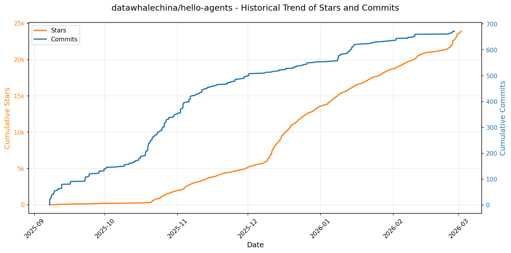

> *蓝色：累计 Stars｜橙色：累计 Commits（次 Y 轴）*

<b>📄 README 摘要</b>

1. **项目功能**  
Hello-Agents 是一个面向中文学习者的、系统性构建 AI 原生智能体（AI Native Agent）的开源教程项目。它不聚焦于低代码/流程驱动型平台（如 Dify、Coze），而是致力于帮助开发者从底层原理出发，深入理解并亲手实现真正以大语言模型（LLM）为核心驱动力的智能体系统——包括单智能体范式、多智能体协作、记忆机制、上下文管理、通信协议、评估体系及端到端训练（如 Agentic RL）。项目最终目标是引导学习者完成一个完整的毕业设计级多智能体应用（如智能旅行助手、赛博小镇等），实现从“LLM 使用者”到“智能体系统构建者”的能力跃迁。

2. **核心特性**  
- ✅ **理论与实践深度融合**：覆盖智能体发展史、经典范式（ReAct/Plan-and-Solve/Reflection）、LLM 基础等扎实理论，并配套全部可运行代码；  
- ✅ **分层渐进式学习路径**：五大部分结构清晰——基础认知 → 单/多智能体构建 → 高级能力扩展（Memory/RAG/上下文工程/协议/MCP/A2A/ANP）→ 综合实战案例 → 毕业设计；  
- ✅ **“用轮子”与“造轮子”并重**：既详解 AutoGen、LangGraph、AgentScope 等主流框架，又提供自研轻量级框架 [HelloAgents](https://github.com/jjyaoao/helloagents)，基于 OpenAI 原生 API 从零实现核心架构；  
- ✅ **全栈技术覆盖**：涵盖智能体核心组件（规划、工具调用、反思）、高级系统能力（持久化记忆、动态上下文管理、多智能体通信协议）、性能评估方法论及 LLM 训练实战（SFT → GRPO）；  
- ✅ **真实场景驱动项目**：包含智能旅行助手（集成 MCP）、自动化深度研究智能体（DeepResearch 复现）、赛博小镇（模拟社会动态的多智能体游戏）等综合案例；  
- ✅ **强社区共建生态**：开放 Extra-Chapter 贡献机制，已收录面试题库、Dify 保姆教程、GUI Agent 实战、Agent Skills vs MCP 对比等高质量衍生内容；  
- ✅ **全免费开源与多形式支持**：提供在线 GitBook 文档、PDF 下载（带 Datawhale 水印防商用盗用）、配套代码仓库及活跃 Issue/PR 社区支持。

3. **技术栈**  
- **核心语言与运行环境**：Python（要求基础编程能力），依赖标准 LLM API（主要基于 OpenAI 兼容接口）；  
- **智能体框架层**：原生 Python 实现（HelloAgents 自研框架）；主流开源框架实践包括 LangGraph（图编排）、AutoGen（多智能体对话）、AgentScope（国产可控框架）；  
- **关键能力支撑技术**：  
  - *记忆与检索*：RAG 架构、向量数据库（隐含支持如 Chroma、FAISS 等）；  
  - *上下文工程*：动态提示构造、会话状态管理、长上下文优化策略；  
  - *协议与通信*：MCP（Model Communication Protocol）、A2A（Agent-to-Agent）、ANP（Agent Network Protocol）等开放协议解析与实现；  
  - *评估与训练*：Agentic RL 流程（含 SFT、GRPO 等算法实践）、定制化评估指标与基准测试框架；  
- **低代码平台实践**：Coze、Dify、n8n 等平台的集成与对比分析；  
- **部署与辅助工具**：GitBook（文档托管）、GitHub Pages（在线阅读）、Markdown + 图文/代码示例（教程载体）、PDF 生成（LaTeX 或自动化工具链）。

---

### 21. [agentsmd/agents.md](https://github.com/agentsmd/agents.md)
- 📅 **创建日期**：2025-08-19  
- 🔄 **最近更新**：2026-01-08  
- ⭐ **Stars**：14,582（日 +121｜周 +901｜月 +5727）  
- 📝 **描述**：AGENTS.md — a simple, open format for guiding coding agents  

<b>📈 Star 与 Commit 历史趋势</b>

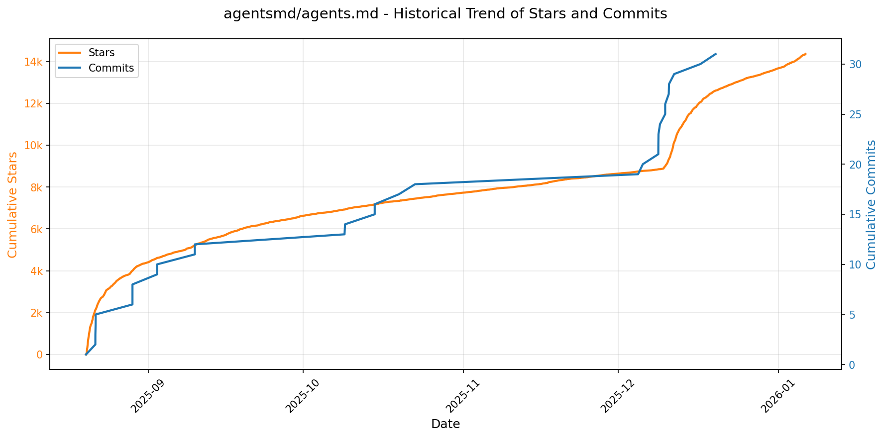

> *蓝色：累计 Stars｜橙色：累计 Commits（次 Y 轴）*

<b>📄 README 摘要</b>

1. **该项目的作用**  
AGENTS.md 是一个轻量、开放的纯文本格式规范，专为 AI 编程代理（coding agents）设计，用于在代码仓库中结构化地提供项目上下文与操作指南。它充当“面向 AI 代理的 README”，通过标准化的 Markdown 文件（`AGENTS.md`），向 LLM 驱动的开发工具（如 GitHub Copilot、Cursor、Continue.dev 等）明确传达开发环境配置、测试流程、PR 规范等关键指令，从而提升 AI 代理理解项目意图、执行准确操作（如跳转包、运行测试、修复 lint 错误、生成合规 PR）的能力。

2. **核心功能**  
- ✅ **标准化指令容器**：定义统一的 `AGENTS.md` 文件位置与结构（如 `## Dev environment tips`、`## Testing instructions`、`## PR instructions` 等语义化二级标题），便于 AI 代理可靠解析与执行；  
- ✅ **面向工作流的实操指南**：提供可直接复用的 CLI 命令模板（如 `pnpm turbo run where <project_name>`、`pnpm vitest run -t "<test name>"`），覆盖开发定位、依赖管理、测试执行、类型检查、ESLint 修复、PR 格式化等全链路工程实践；  
- ✅ **项目上下文显式化**：将隐含的团队约定（如包命名规则、CI 路径、Vite 初始化方式）转化为机器可读的显式说明，减少 AI 代理因猜测导致的错误；  
- ✅ **配套展示网站**：内置基于 Next.js 的静态官网（https://agents.md），以简洁方式阐释规范理念并提供多场景示例，降低采用门槛。

3. **技术栈**  
- **核心格式层**：纯 Markdown（`.md` 文件），零依赖、跨平台、人类与机器均可读；  
- **官网实现层**：Next.js（App Router）、React、TypeScript，部署于 Vercel；  
- **本地开发依赖**：PNPM（作为包管理器与任务运行器，深度集成 `turbo` 和 `vitest` 等工具）；  
- **无后端/无构建时逻辑**：项目本质是规范提案 + 展示站点，不包含服务端代码、数据库或运行时 AI 模型，完全静态、开源、可克隆即用。

---

### 22. [BloopAI/vibe-kanban](https://github.com/BloopAI/vibe-kanban)
- 📅 **创建日期**：2025-06-14  
- 🔄 **最近更新**：2026-01-08  
- ⭐ **Stars**：13,885（日 +346｜周 +3709｜月 +7518）  
- 📝 **描述**：Get 10X more out of Claude Code, Codex or any coding agent  

<b>📈 Star 与 Commit 历史趋势</b>

> *蓝色：累计 Stars｜橙色：累计 Commits（次 Y 轴）*

<b>📄 README 摘要</b>

1. **项目功能**  
Vibe Kanban 是一个面向 AI 编程代理（如 Claude Code、Gemini CLI、Codex、Amp 等）的**任务编排与协作工作台**。它不直接生成代码，而是解决工程师在 AI 编程时代的核心痛点：如何高效规划、调度、审查和管理多个 AI 编码代理协同完成的开发任务。其核心作用是将分散的 AI 编码工具统一接入、集中管控，实现“人机协同开发流程”的标准化与可视化——用户通过看板（Kanban）界面直观跟踪任务状态，一键切换/组合不同 AI 代理，串行或并行触发执行，并快速启动本地/远程开发服务进行验证。

2. **关键特性**  
- ✅ **多 AI 代理统一调度**：支持灵活切换与组合多种主流编码代理（Claude Code、Gemini CLI 等），可配置并行或顺序执行流程；  
- ✅ **可视化任务看板管理**：实时追踪各 AI 代理任务的进度（待处理、运行中、已完成、失败等），提供状态概览与操作入口；  
- ✅ **一键式开发环境集成**：任务完成后可直接点击启动本地 dev server，或通过 SSH 远程打开项目（深度集成 VS Code Remote-SSH）；  
- ✅ **集中化配置管理**：统一维护所有 AI 代理所需的 MCP（Model Control Protocol）配置，避免重复设置；  
- ✅ **远程服务器原生支持**：可在远程机器（如云服务器、工作站）部署后，通过隧道暴露 Web UI，并安全地从本地编辑器直连远程项目；  
- ✅ **轻量即启体验**：支持 `npx vibe-kanban` 零安装快速启动，开箱即用。

3. **技术栈**  
- **后端**：Rust（主打高性能与可靠性，用于核心服务、任务调度引擎及 API）；  
- **前端**：TypeScript + React（基于 Vite 构建，注重响应式交互与现代化 UI）；  
- **构建与包管理**：pnpm（作为首选包管理器）、Cargo（Rust 构建与依赖管理）；  
- **数据库**：SQLx + SQLite（轻量嵌入式存储，适用于本地/单机场景，含 `sqlx-cli` 辅助开发）；  
- **基础设施与部署**：支持 systemd / Docker / 云平台部署；远程访问依赖 Cloudflare Tunnel / ngrok 等反向代理方案；VS Code Remote-SSH 协议深度集成；  
- **分析与监控**：可选集成 PostHog 进行产品分析（通过环境变量控制）；  
- **开发辅助工具**：`cargo-watch`（Rust 热重载）、`sqlx-cli`（数据库迁移与调试）。

---

### 23. [thedotmack/claude-mem](https://github.com/thedotmack/claude-mem)
- 📅 **创建日期**：2025-08-31  
- 🔄 **最近更新**：2026-01-08  
- ⭐ **Stars**：12,026（日 +759｜周 +2277｜月 +11070）  
- 📝 **描述**：A Claude Code plugin that automatically captures everything Claude does during your coding sessions, compresses it with AI (using Claude's agent-sdk), and injects relevant context back into future sessions.  

<b>📈 Star 与 Commit 历史趋势</b>

> *蓝色：累计 Stars｜橙色：累计 Commits（次 Y 轴）*

<b>📄 README 摘要</b>

1. **项目功能**  
Claude-Mem 是一个专为 **Claude Code（Anthropic 官方 AI 编程助手）设计的持久化记忆压缩系统**。它在用户每次会话中自动捕获工具调用行为、代码操作、错误修复等上下文观测数据，生成语义化摘要，并将其长期存储；在后续会话中，自动检索并智能注入相关历史记忆，使 Claude 能够跨会话保持对项目状态、技术决策、调试过程等的连续性认知，显著提升长周期开发任务中的上下文连贯性与推理准确性。

2. **核心特性**  
- ✅ **持久化记忆**：会话结束后记忆仍保留，新会话可自动继承历史上下文；  
- ✅ **渐进式披露（Progressive Disclosure）**：分三层按需加载记忆（索引→时间线→详情），实时显示 Token 消耗，实现约 10 倍 Token 节省；  
- ✅ **技能化搜索（mem-search）**：支持自然语言查询项目历史（如“认证相关的 bug 修复”），结合类型/日期/项目名等多维过滤；  
- ✅ **本地 Web 查看器（http://localhost:37777）**：提供实时记忆流、观测详情、引用 ID 查看、API 接口及 Beta 功能配置面板；  
- ✅ **Claude Desktop 集成**：可在桌面版对话中直接调用 `mem-search` 技能检索记忆；  
- ✅ **隐私控制机制**：通过 `<private>` 标签标记敏感内容，自动排除其进入数据库；  
- ✅ **细粒度上下文配置**：支持按模型、会话类型、文件路径等策略控制记忆注入范围；  
- ✅ **全自动运行**：无需手动触发或维护，完全通过 Claude Code 插件生命周期钩子（6 个 Hook）驱动；  
- ✅ **结构化引用与溯源**：每条观测分配唯一 ID，支持 API 直查（`/api/observation/{id}`）及 Web 界面集中浏览；  
- ✅ **Beta 实验通道**：支持切换至实验版本，体验如 “Endless Mode”（仿生式无限会话记忆架构）等前沿功能。

3. **技术栈**  
- **运行时与服务层**：Bun（作为 HTTP Worker 服务管理器 + 运行时）、Node.js ≥18.0.0；  
- **数据库**：SQLite 3（主存储，含 FTS5 全文搜索支持） + Chroma（向量数据库，用于混合语义+关键词检索）；  
- **搜索架构**：基于 MCP（Model Context Protocol）标准的 4 个专用搜索工具（`search` / `timeline` / `get_observations` / `__IMPORTANT`），采用三层工作流；  
- **AI 工程基础设施**：Claude Agent SDK、Claude Code 插件框架；  
- **辅助工具链**：uv（Python 包管理器，用于 Chroma 向量依赖）、TypeScript（全栈开发语言）；  
- **部署与配置**：环境变量驱动配置、JSON 格式本地设置文件（`~/.claude-mem/settings.json`）、自动依赖检测与安装（Smart Install）。

---

### 24. [memvid/memvid](https://github.com/memvid/memvid)
- 📅 **创建日期**：2025-05-27  
- 🔄 **最近更新**：2026-01-08  
- ⭐ **Stars**：11,452（日 +373｜周 +936｜月 +1013）  
- 📝 **描述**：Memory layer for AI Agents. Replace complex RAG pipelines with a serverless, single-file memory layer. Give your agents instant retrieval and long-term memory.  

<b>📈 Star 与 Commit 历史趋势</b>

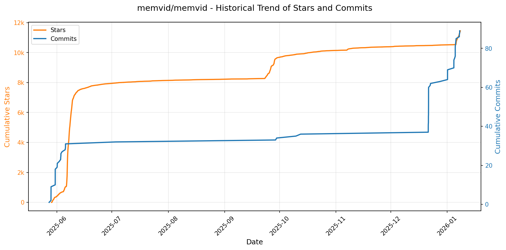

> *蓝色：累计 Stars｜橙色：累计 Commits（次 Y 轴）*

<b>📄 README 摘要</b>

1. **项目功能**  
Memvid 是一个面向 AI 代理（AI agents）的单文件、持久化、版本化且可移植的记忆层（memory layer），无需依赖数据库或服务器基础设施。它将原始数据、嵌入向量（embeddings）、检索索引结构及元数据全部封装进单一 `.mv2` 文件中，实现模型无关（model-agnostic）、离线可用、即插即用的长期记忆能力。核心目标是替代传统 RAG 管道和向量数据库，提供毫秒级本地检索（Sub-5ms）、时间回溯（time-travel）调试、跨会话记忆演化等能力，使 AI 代理能“携带”自身记忆在任意环境（如边缘设备、笔记本、离线终端）中持续运行。

2. **关键特性**  
- **单文件封装（Capsule Context）**：所有数据、索引与元信息整合于 `.mv2`（或加密版 `.mv2e`）文件中，无外部依赖、无临时文件（无 `.wal`/`.lock`/`.shm` 等）。  
- **Smart Frame 架构**：基于视频编码思想设计的追加式（append-only）、不可变内存单元，支持原子写入、崩溃安全、高效压缩与并行读取。  
- **多模态混合检索**：内置全文检索（Tantivy/BM25）、向量相似性搜索（HNSW + ONNX）、时间语义解析（如“上周二”）、PDF 文本提取、CLIP 视觉嵌入、Whisper 音频转录等可选功能模块。  
- **时间旅行能力（Time-Travel Debugging）**：支持按时间戳回滚、重放或分支任意历史记忆状态，便于审计、调试与知识演化分析。  
- **自适应智能编解码（Codec Intelligence）**：自动选择并升级压缩算法，动态优化存储效率与访问性能。  
- **SDK 全栈支持**：提供 Rust 核心库（`memvid-core`）、Node.js（`@memvid/sdk`）、Python（`memvid-sdk`）及命令行工具（`memvid-cli`），开箱即用。

3. **技术栈**  
- **核心语言与运行时**：Rust（主引擎，强调内存安全、零成本抽象与高性能），要求 Rust 1.85.0+。  
- **关键依赖与算法库**：  
  - 全文检索：Tantivy（BM25 排序）；  
  - 向量检索：HNSW（近似最近邻）+ ONNX 运行时支持模型嵌入推理；  
  - 多模态处理：`pdf_extract`（纯 Rust PDF 解析）、`clip`（OpenCLIP 视觉编码）、`whisper`（Rust 实现的 Whisper 音频转录）；  
  - 时间解析：`temporal_track`（自然语言日期识别）；  
  - 加密：密码学 AES-GCM 加密（`.mv2e` 封装）。  
- **文件格式**：自定义二进制格式 `.mv2`，含魔数头、嵌入式 WAL（用于崩溃恢复）、分段压缩数据区、多索引区（Lex/Vec/Time）及统一目录表（TOC） Footer。  
- **构建与分发**：Cargo（Rust 包管理）、npm（Node.js SDK/CLI）、PyPI（Python SDK），支持细粒度 feature flags 编译控制。

---

### 25. [Tencent/WeKnora](https://github.com/Tencent/WeKnora)
- 📅 **创建日期**：2025-07-22  
- 🔄 **最近更新**：2026-01-08  
- ⭐ **Stars**：11,085（日 +63｜周 +379｜月 +3315）  
- 📝 **描述**：LLM-powered framework for deep document understanding, semantic retrieval, and context-aware answers using RAG paradigm.  

<b>📈 Star 与 Commit 历史趋势</b>

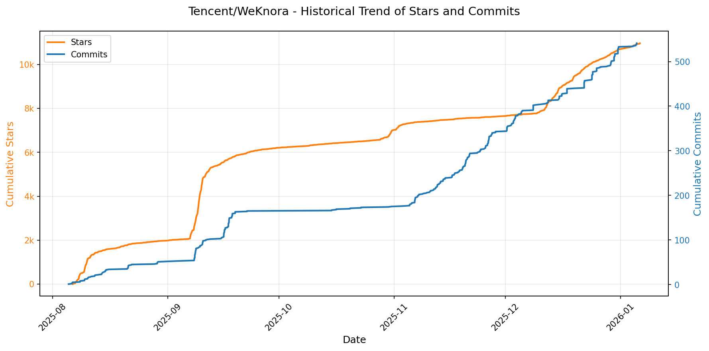

> *蓝色：累计 Stars｜橙色：累计 Commits（次 Y 轴）*

<b>📄 README 摘要</b>

1. **项目功能**  
WeKnora 是一个面向复杂异构文档的、基于大语言模型（LLM）的深度文档理解与语义检索框架。其核心目标是实现高精度、上下文感知的智能问答与知识检索，尤其适用于企业知识库、学术文献、法律合规、医疗指南等专业场景。它严格遵循 RAG（检索增强生成）范式，通过将文档内容结构化解析、向量化索引与 LLM 推理深度融合，支撑从原始文档（PDF/Word/图片/Markdown 等）到可检索、可推理、可解释的知识服务的端到端闭环。

2. **关键特性**  
- **ReACT 智能体模式**：支持多轮反思（reflection）、工具调用（内置知识库检索、MCP 工具、DuckDuckGo 网络搜索），自动生成综合性摘要报告；  
- **多源异构文档理解**：原生支持 PDF、Word、TXT、Markdown 及图像（集成 OCR 与视觉描述生成），自动提取结构化语义内容；  
- **混合检索引擎**：融合 BM25（关键词）、稠密向量（Dense Retrieval）与图增强检索（GraphRAG），支持跨知识库联合检索与可配置的“检索–重排–生成”流水线；  
- **双模知识库体系**：同时支持 FAQ 型（问答对）与文档型知识库，提供文件夹批量导入、URL 在线抓取、标签管理、在线编辑等全生命周期管理能力；  
- **灵活可控的对话策略**：支持 Agent 模式与普通模式动态切换，可独立配置对应 LLM、检索阈值、Prompt 模板及多轮会话行为逻辑；  
- **开放扩展架构**：全面支持 MCP（Model Context Protocol）协议，内置 uvx/npx 启动器与 Stdio/HTTP Stream/SSE 三种传输方式，便于接入第三方工具；  
- **生产就绪能力**：提供基于消息队列（MQ）的异步任务管理、自动化数据库迁移、本地/私有云部署支持、登录鉴权与完整安全实践指南；  
- **开箱即用体验**：配备现代化 Web UI（含知识库管理、Agent 工具调用可视化、对话设置面板）、标准化 RESTful API 及微信对话开放平台零代码集成能力。

3. **技术栈**  
- **后端语言与框架**：Go（主服务）、Python（文档解析模块 `docreader`、MCP Server）；  
- **前端**：React + TypeScript；  
- **向量数据库**：PostgreSQL（pgvector 扩展）、Elasticsearch；  
- **图数据库（可选）**：Neo4j（用于知识图谱构建与 GraphRAG）；  
- **对象存储（可选）**：MinIO；  
- **可观测性**：Jaeger（分布式追踪）；  
- **模型运行时**：本地支持 Ollama（集成 Qwen、DeepSeek 等模型），兼容各类 LLM API 服务；嵌入模型支持 BGE、GTE 等开源方案及云 API；  
- **基础设施**：Docker + Docker Compose（多 Profile 按需启停）、Shell/Make 构建与开发脚本；  
- **协议与标准**：RESTful API、MCP（Model Context Protocol）、Conventional Commits、OpenAPI 规范（API 文档）。

---

### 26. [marcelscruz/public-apis](https://github.com/marcelscruz/public-apis)
- 📅 **创建日期**：2022-05-11  
- 🔄 **最近更新**：2026-01-08  
- ⭐ **Stars**：7,313（日 +366｜周 +866｜月 +992）  
- 📝 **描述**：A collaborative list of public APIs for developers  

<b>📈 Star 与 Commit 历史趋势</b>

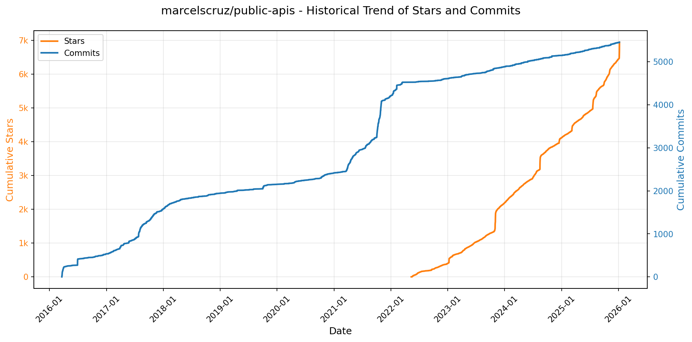

> *蓝色：累计 Stars｜橙色：累计 Commits（次 Y 轴）*

<b>📄 README 摘要</b>

1. **该项目的功能**  
该项目是一个开源、协作式公共API目录（Public APIs），旨在为开发者提供一份全面、分类清晰、持续更新的免费或开放接口清单。它不托管或运行任何API服务，而是作为一个结构化、可搜索的参考资源，汇总全球范围内可用的公开RESTful API，涵盖从动物、动漫、区块链到天气、健康、金融等80多个垂直领域，便于开发者快速发现、评估和集成第三方API。

2. **核心特性**  
- **全类别覆盖**：按主题精细分类（如Animals、Anime、Weather、Blockchain等共60+类别），支持快速定位特定领域API；  
- **标准化元数据表格**：每项API均明确标注关键属性：名称、功能描述、认证方式（Auth）、是否支持HTTPS、是否支持CORS，便于技术可行性评估；  
- **社区驱动维护**：基于GitHub开源，通过Issue和Pull Request机制接受全球开发者贡献与修正，确保信息时效性与准确性；  
- **轻量级纯静态结构**：以Markdown文档（如`API.md`）组织内容，无需后端服务，零依赖、易克隆、可离线查阅；  
- **赞助生态整合**：展示API开发与管理相关工具（如ApyHub、SerpApi、Requestly）作为生态支持，延伸开发者工作流价值。

3. **技术栈**  
- **内容层**：纯Markdown（`.md`）文件，配合GitHub原生渲染；  
- **协作平台**：GitHub（版本控制、Issues、PRs、Wiki）；  
- **构建与分发**：无构建步骤，直接通过GitHub Pages或任意静态站点托管（如Vercel、Netlify）发布；  
- **辅助工具链**：依赖标准开源协作规范（CONTRIBUTING.md、LICENSE、API.md），无前端框架、无数据库、无服务器端逻辑——本质是“代码即文档”的极简技术实现。

---

### 27. [danielmiessler/Personal_AI_Infrastructure](https://github.com/danielmiessler/Personal_AI_Infrastructure)
- 📅 **创建日期**：2025-09-08  
- 🔄 **最近更新**：2026-01-08  
- ⭐ **Stars**：3,906（日 +158｜周 +1134｜月 +2675）  
- 📝 **描述**：Personal AI Infrastructure for upgrading humans.  

<b>📈 Star 与 Commit 历史趋势</b>

> *蓝色：累计 Stars｜橙色：累计 Commits（次 Y 轴）*

<b>📄 README 摘要</b>

1. **项目功能**  
PAI（Personal AI Infrastructure）是一个开源的个人AI基础设施框架，旨在帮助用户构建专属的、持续进化的AI操作系统。它不提供通用AI助手，而是打造一个深度个性化、目标驱动的AI系统：该系统能理解用户的长期目标、学习其历史行为与工作模式，并随时间推移不断提升辅助能力。其核心价值在于将“人类追求目标”的普适过程形式化为可工程化的架构——通过嵌套的“双循环”（Outer Loop：当前态→期望态；Inner Loop：七阶段科学方法论），使AI真正扎根于用户的真实生活与专业场景中，成为可信赖的智能协作者。

2. **关键特性**  
- **双循环通用认知引擎**：以“当前状态 → 期望状态”为外循环定义目标，以“OBSERVE→THINK→PLAN→BUILD→EXECUTE→VERIFY→LEARN”七阶段科学方法为内循环驱动执行，强调**可验证性（Verifiability）** 作为进步基石；  
- **模块化PAI Packs体系**：所有能力以自包含、可独立安装、平台无关的“包”（Pack）形式交付，每个Pack包含问题定义、完整代码、CLI工具、工作流、上下文文件、测试方案及AI可执行的安装指令；  
- **AI自主部署机制（Inception-style Installation）**：用户仅需将Pack文件内容提交给AI（如Claude Code），AI即可自动解析、生成钩子脚本、配置系统、写入文件并验证，实现“用AI构建AI基础设施”；  
- **安全增强型Hook中间件层**：基于Claude Code原生事件（SessionStart/PreToolUse/PostToolUse等），通过TypeScript钩子注入安全校验（如阻断`rm -rf`）、上下文加载、操作审计与历史捕获；  
- **全栈个性化能力**：支持定制化技能系统（Skill Routing）、持久化历史记忆（Kai History System）、多角色代理人格（Voice System）、元自我更新（Meta Self-Update）及UNIX风格模块化工具链；  
- **成熟度演进模型（PAIMM）**：提供9级个人AI成熟度模型，从基础聊天机器人逐步升级至具备深度记忆、主动目标管理与跨任务协同的AI伴侣。

3. **技术栈**  
- **核心引擎**：深度集成 **Anthropic Claude Code CLI Agent**（作为底层AI执行引擎）；  
- **运行时环境**：使用 **Bun**（超快JavaScript/TypeScript运行时）执行Hook脚本与自动化逻辑；  
- **架构分层**：  
  - *Engine层*：Claude Code；  
  - *Middleware层*：基于事件驱动的TypeScript Hook系统（位于`~/.claude/hooks/`）；  
  - *Content层*：Markdown格式Pack文件 + Shell/Python脚本 + CLI工具 + 结构化配置；  
- **系统集成**：依赖标准Unix环境（Zsh/Bash）、`~/.claude/settings.json`配置中心、环境变量管理（`PAI_DIR`, `DA`等）；  
- **扩展能力**：可选集成 **ElevenLabs**（语音合成）、外部API与自定义工具链；  
- **开发与交付**：纯文本优先（Markdown+Code Blocks）、CLI为默认交互界面、Git版本控制、遵循UNIX哲学（单一职责、文本管道、组合复用）。

---

### 28. [MiroMindAI/MiroThinker](https://github.com/MiroMindAI/MiroThinker)
- 📅 **创建日期**：2025-08-07  
- 🔄 **最近更新**：2026-01-08  
- ⭐ **Stars**：2,727（日 +594｜周 +1330｜月 +1473）  
- 📝 **描述**：MiroThinker is a series of open-source search agent designed to advance tool-augmented reasoning and information-seeking capabilities.  

<b>📈 Star 与 Commit 历史趋势</b>

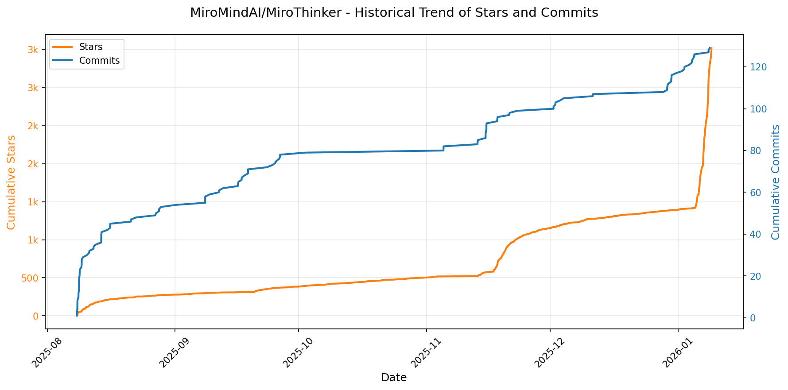

> *蓝色：累计 Stars｜橙色：累计 Commits（次 Y 轴）*

<b>📄 README 摘要</b>

1. **项目功能**  
MiroThinker 是一个开源的搜索型智能体（Search Agent），旨在提升工具增强推理（tool-augmented reasoning）与主动信息获取能力，支持复杂、长周期、多步骤的真实世界研究工作流。它通过“交互式扩展”（Interactive Scaling）这一核心范式，使模型能深度、高频地与环境（如搜索引擎、API、网页浏览器等）进行交互，从而在开放域研究任务中实现高精度、高鲁棒性的自主决策与问题求解。

2. **关键特性**  
- ✅ **交互式扩展（Interactive Scaling）**：首创将“交互深度与频次”作为继模型参数量、上下文长度之后的第三维性能提升维度，显著增强多步工具调用能力（v1.0 支持最多 600 次/任务，v1.5 提升至 400 次并优化稳定性）；  
- ✅ **超长上下文支持**：统一支持 **256K 上下文窗口**，支撑长程推理、跨页面/跨文档深度分析；  
- ✅ **多尺度开源模型族**：提供从 4B 到 235B 多种参数规模的 SFT/DPO 微调版本（如 v1.5-30B / v1.5-235B），兼顾性能与部署灵活性；  
- ✅ **全栈开源生态**：包含模型（MiroThinker）、框架（MiroFlow）、训练数据集（MiroVerse，147K 高质量样本）、训练基础设施（MiroTrain / MiroRL）四大组件，全部开源；  
- ✅ **强基准泛化能力**：在 HLE、GAIA、BrowseComp（含中英文）、XBench-DeepSearch、FutureX、Frames 等 14+ 权威研究代理基准上持续刷新开源模型 SOTA，部分指标（如 BrowseComp-ZH）超越商业模型（如 Kimi-K2-Thinking）；  
- ✅ **生产就绪能力**：内置完整 trace 收集、可复现 benchmark 评估、防信息泄露机制（如禁用 HF 访问 + canary 字符串检测）、Gradio 快速演示等工程支持。

3. **技术栈**  
- **基础模型**：基于 **Qwen3 系列大语言模型**（如 Qwen3-8B/14B/30B/32B/235B）及 Qwen2.5-72B-Instruct 进行深度定制与增强；  
- **训练方法**：融合监督微调（SFT）与直接偏好优化（DPO），采用统一偏好数据集进行多模型协同对齐；  
- **推理与工具集成**：支持结构化工具调用（Tool Calling）、动态网页浏览（Browse）、多源检索与事实核查，兼容主流 API 和 Web 工具生态；  
- **基础设施**：依托 **Hugging Face**（模型托管、数据集发布）、**GitHub**（代码开源）、**Gradio**（快速 Demo）、**Discord / WeChat / 小红书**（社区协作）构建全链路开源协作体系；  
- **评估与监控**：自研 trace 分析系统（记录耗时、预估完成时间、工具调用轨迹），严格遵循防污染协议（canary testing、HF 访问隔离）保障评测可信度。

---

### 29. [afkarxyz/SpotiFLAC](https://github.com/afkarxyz/SpotiFLAC)
- 📅 **创建日期**：2025-01-09  
- 🔄 **最近更新**：2026-01-08  
- ⭐ **Stars**：2,576（日 +74｜周 +989｜月 +2028）  
- 📝 **描述**：Get Spotify tracks in true FLAC from Tidal, Qobuz & Amazon Music — no account required.  

<b>📈 Star 与 Commit 历史趋势</b>

> *蓝色：累计 Stars｜橙色：累计 Commits（次 Y 轴）*

<b>📄 README 摘要</b>

1. **项目功能**  
SpotiFLAC 是一款跨平台桌面工具，用于从 Spotify 歌单或单曲链接出发，自动在 Tidal、Qobuz 和 Amazon Music 等高解析度音乐平台中搜索并下载对应音源的**无损 FLAC 格式音频文件**；整个过程**无需用户拥有这些平台的付费账号**（通过逆向工程与协议模拟实现资源定位与获取）。

2. **核心特性**  
- ✅ 支持 Windows 10+、macOS 10.13+ 及任意主流 Linux 发行版；  
- ✅ 一键解析 Spotify 链接（Track/Album/Playlist），智能匹配多平台高保真音源；  
- ✅ 直接输出原始 FLAC 文件（非转码），保留完整元数据（ID3/vorbis tags）与封面图；  
- ✅ 无需登录 Tidal/Qobuz/Amazon Music 账户，规避订阅门槛与地域限制；  
- ✅ 提供图形化界面（GUI），操作简洁直观（见截图）；  
- ✅ 开源免费，附带明确法律免责声明，强调仅限个人学习与非商用用途。

3. **技术栈**  
- **前端/桌面框架**：Electron（基于 Chromium + Node.js，实现跨平台 GUI）；  
- **核心逻辑语言**：JavaScript / TypeScript（含网络请求、协议解析、元数据处理等）；  
- **音频处理与下载**：集成 FFmpeg（用于格式校验、元数据写入及必要时的无损封装）；  
- **反爬与协议交互**：自研 HTTP 客户端模块，模拟各流媒体平台客户端行为（如设备指纹、加密请求头、动态 token 处理等）；  
- **构建与分发**：GitHub Actions 自动化打包（生成 Windows `.exe`、macOS `.dmg`/`.app`、Linux `.AppImage`/`.deb` 等安装包）；  
- **依赖管理**：npm/yarn，使用 Electron Builder 或 Forge 进行打包配置。

---

### 30. [prateek-chaubey/YTPro](https://github.com/prateek-chaubey/YTPro)
- 📅 **创建日期**：2022-04-01  
- 🔄 **最近更新**：2026-01-08  
- ⭐ **Stars**：1,462（日 +212｜周 +656｜月 +681）  
- 📝 **描述**：Youtube client with older Android version support, background player, Google Gemini ✨ and many more features.  

<b>📈 Star 与 Commit 历史趋势</b>

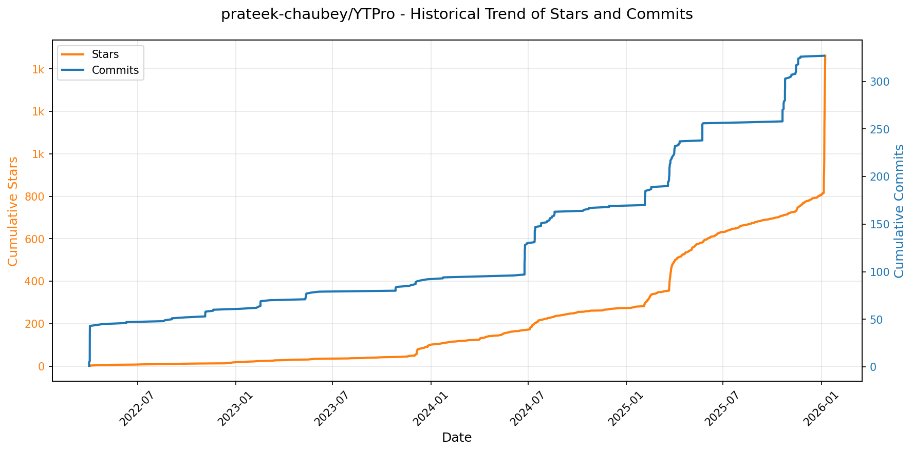

> *蓝色：累计 Stars｜橙色：累计 Commits（次 Y 轴）*

<b>📄 README 摘要</b>

1. **项目功能**  
YT PRO 是一款基于 WebView 的轻量级 Android 应用，通过在 YouTube 网页版中注入 JavaScript 实现功能增强，**不依赖 YouTube 官方 API 或反编译/修改 APK**。其核心目标是为用户提供免登录、无广告、高自由度的 YouTube 浏览与内容管理体验，支持视频/Shorts/缩略图/字幕下载、后台音频播放、手势控制等实用功能，并深度集成 Google Gemini 实现视频智能摘要与自定义提示词分析。

2. **关键特性**  
- **AI 增强**：原生集成 Google Gemini，支持基于 `{url}`、`{title}`、`{videoId}` 变量的动态提示词，可自定义模型与指令实现视频自动摘要；  
- **内容下载套件**：一键下载视频（含自适应格式）、Shorts、高清缩略图及 SRT 字幕；  
- **体验优化**：内置广告屏蔽、SponsorBlock 跳过赞助段落、显示真实不喜欢数（return-youtube-dislike）、隐藏 Shorts 信息流、强制缩放、画中画（PiP）与最小化播放；  
- **隐私友好**：无需登录账号即可使用“自定义爱心”收藏视频；支持启用/禁用媒体编解码器、手动开关手势调节音量/亮度；  
- **极致轻量**：APK 体积小于 50KB，零第三方 UI 依赖，自适应图标，UI 极简，支持自动更新。

3. **技术栈**  
- **前端/核心逻辑**：JavaScript（WebView 内注入脚本），深度调用 [YouTube.js](https://github.com/LuanRT/YouTube.js/) 解析视频数据；  
- **AI 集成**：Google Gemini API（通过 Web 端调用）；  
- **构建与分发**：Gradle 构建系统，GitHub Actions 自动化 CI/CD（`gradle.yml` 工作流），jsDelivr CDN 分发；  
- **辅助库**：复用开源项目 [SponsorBlock](https://github.com/ajayyy/SponsorBlock)（跳过赞助）与 [return-youtube-dislike](https://github.com/Anarios/return-youtube-dislike)（恢复不喜欢数）；  
- **平台**：Android（纯 WebView 容器应用，非原生 Kotlin/Java 主逻辑）。

---

