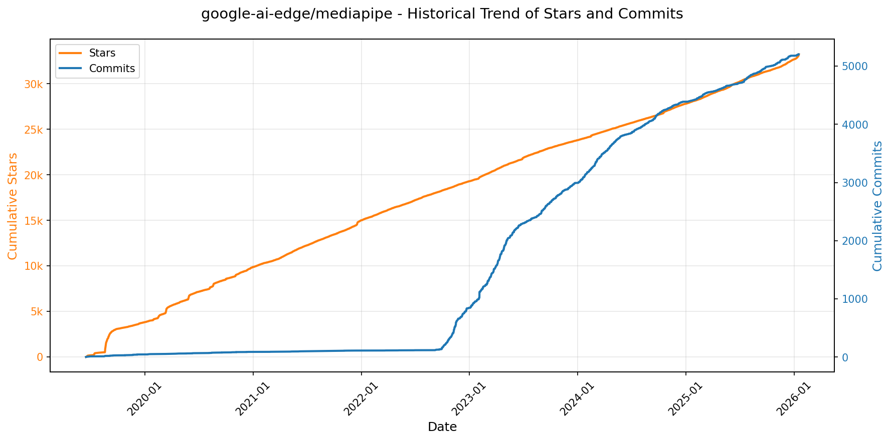
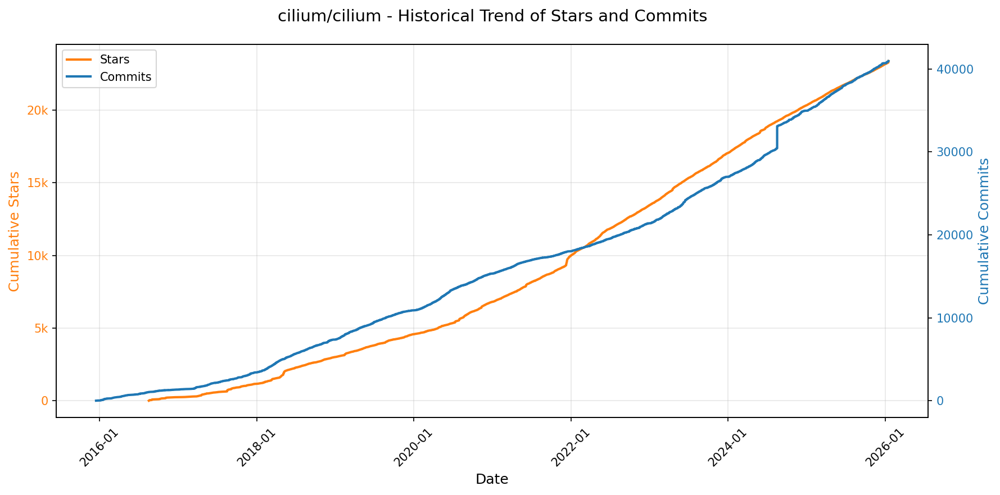
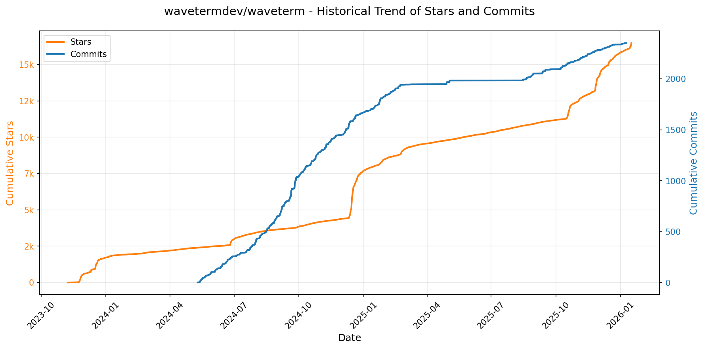
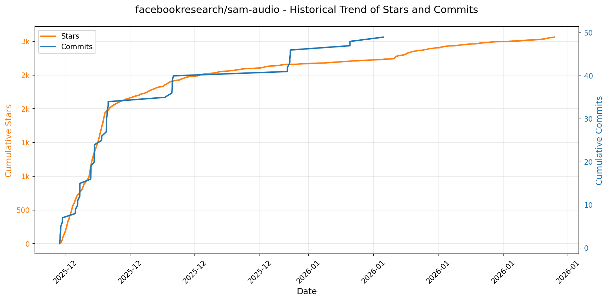

# 🌟 GitHub Trending 概览

> 数据更新于：2026-01-16。

---

## 🔍 项目详情

### 1. [hacksider/Deep-Live-Cam](https://github.com/hacksider/Deep-Live-Cam)
- 📅 **创建日期**：2023-09-24  
- 🔄 **最近更新**：2026-01-16  
- ⭐ **Stars**：77,970（日 +124｜周 +1148｜月 +1833）  
- 📝 **描述**：real time face swap and one-click video deepfake with only a single image  

<b>📈 Star 与 Commit 历史趋势</b>

> *蓝色：累计 Stars｜橙色：累计 Commits（次 Y 轴）*

<b>📄 README 摘要</b>

1. 该项目能够实现基于单张图像的实时人脸替换和视频深度伪造，支持一键操作。用户可以选择源人脸图像，并将其应用到目标视频、摄像头直播或电影等场景中，实现实时换脸效果，适用于内容创作、虚拟表演、娱乐恶搞等多种用途。

2. 主要功能包括：实时换脸（支持摄像头和视频）、口部遮罩技术以保留原始嘴部动作、多脸映射（同时在多个对象上使用不同人脸）、电影实时换脸观看、直播表演支持、制作 meme 内容、以及在 Omegle 等社交平台上进行趣味互动。所有功能均以实时处理为核心，提供直观的图形界面操作，支持多种运行模式（如图像/视频模式、摄像头直播模式）和命令行参数配置。

3. 技术栈主要包括 Python（推荐 3.11 版本），并依赖于以下核心工具与库：ffmpeg（用于视频处理）、ONNX Runtime（支持多种执行后端如 CUDA、CoreML、DirectML、OpenVINO 和 CPU）、PyTorch（配合 CUDA 实现 GPU 加速）、Git、Tkinter（GUI 支持）。模型方面使用了 GFPGANv1.4（用于人脸增强）和 inswapper_128_fp16.onnx（用于人脸交换），底层基于 InsightFace 项目的人脸识别与对齐技术。支持跨平台运行，针对 NVIDIA GPU、AMD GPU、Apple Silicon（M1/M2/M3）、Intel CPU 等不同硬件提供相应的加速方案。

---

### 2. [anomalyco/opencode](https://github.com/anomalyco/opencode)
- 📅 **创建日期**：2025-04-30  
- 🔄 **最近更新**：2026-01-16  
- ⭐ **Stars**：72,034（日 +2164｜周 +16502｜月 +32845）  
- 📝 **描述**：The open source coding agent.  

<b>📈 Star 与 Commit 历史趋势</b>

> *蓝色：累计 Stars｜橙色：累计 Commits（次 Y 轴）*

<b>📄 README 摘要</b>

1. 该项目是一个开源的AI编程代理工具，旨在帮助开发者在终端或桌面环境中完成代码编写、分析和探索任务。它能够在本地运行，支持多种大语言模型（包括Claude、OpenAI、Google及本地模型），提供智能代码生成、编辑建议、代码库分析等功能，并可通过远程客户端控制，实现跨设备开发。

2. 关键特性包括：内置两种主要代理模式（“build”用于完整开发，“plan”为只读模式用于代码分析与规划）；支持通过Tab键切换代理；集成通用子代理@general处理复杂多步骤任务；原生支持LSP（语言服务器协议）；采用客户端/服务器架构，支持远程操控（如用手机驱动本地实例）；专注于终端用户界面（TUI）体验优化；完全开源且不绑定任何模型提供商；提供适用于各主流操作系统的安装方式（包括npm、brew、scoop、choco、mise等）；同时提供仍在测试阶段的桌面应用程序版本。

3. 技术栈包含：基于TypeScript/JavaScript构建；前端使用TUI（文本用户界面）设计，适用于终端环境；支持本地及云端多种LLM（如Anthropic Claude、OpenAI、Google Gemini等）；采用客户端-服务器架构；项目结构模块化（如packages/console, packages/web）；构建与发布流程集成GitHub Actions；支持通过Node.js包管理器（npm/bun/pnpm/yarn）、Rust工具链（mise）、Nix、Homebrew、Scoop、Chocolatey、Paru等多种现代包管理工具进行安装部署。

---

### 3. [twitter/the-algorithm](https://github.com/twitter/the-algorithm)
- 📅 **创建日期**：2023-03-27  
- 🔄 **最近更新**：2026-01-16  
- ⭐ **Stars**：70,271（日 +315｜周 +1059｜月 +2402）  
- 📝 **描述**：Source code for the X Recommendation Algorithm  

<b>📈 Star 与 Commit 历史趋势</b>

> *蓝色：累计 Stars｜橙色：累计 Commits（次 Y 轴）*

<b>📄 README 摘要</b>

1. 该项目实现了X平台（如“为你推荐”时间线、搜索、发现、通知等）内容推荐的核心算法系统，负责生成和提供个性化的内容信息流。它通过整合用户行为数据、构建用户与内容之间的交互模型，并利用机器学习对候选内容进行排序和过滤，最终向用户展示推荐的帖子和通知。

2. 关键功能包括：  
   - **多源候选内容生成**：从用户关注网络内（In-Network）和外（Out-of-Network）获取候选帖子，来源包括搜索索引、用户-帖子交互图（UTEG）、关注推荐服务（FRS）等。  
   - **分层排序机制**：采用“轻量级排序器”（Light Ranker）进行初步筛选，再用“重量级排序器”（Heavy Ranker）等复杂神经网络模型进行精细化打分和排序。  
   - **实时用户信号处理**：收集并利用用户的显式行为（如点赞、回复）和隐式行为（如点击、浏览）作为推荐依据。  
   - **内容安全与质量控制**：集成信任与安全模型以检测不当或滥用内容，并通过可见性过滤器实现合规性过滤和内容降权。  
   - **图计算与嵌入表示**：使用SimClusters、TwHIN等模型生成用户和内容的嵌入向量，并基于图算法（如PageRank）计算用户声誉和互动概率。  
   - **通知推荐系统**：专门的服务（pushservice）为用户生成个性化的推荐通知，并通过多任务学习模型预测用户打开和参与通知的可能性。

3. 技术栈主要包括：  
   - **编程语言**：Scala、Python、Java 和 Rust（用于高性能模型服务 navi）。  
   - **机器学习框架**：自研的 twml（基于 TensorFlow v1）、用于模型服务的 Rust 框架 navi，以及外部项目中的深度学习模型。  
   - **数据处理与流式计算**：统一用户行为流（unified-user-actions）、流式事件处理器（recos-injector）和批处理/实时聚合框架（timelines-aggregation-framework）。  
   - **图计算技术**：基于 GraphJet 框架构建用户-帖子交互图（UTEG），并提供图特征服务（graph-feature-service）。  
   - **服务架构**：微服务架构，各组件如 tweetypie（帖子读写）、user-signal-service（用户信号获取）、representation-manager（嵌入向量管理）等独立部署协作。  
   - **构建工具**：使用 Bazel 进行部分组件的构建和测试（尚无顶层构建配置）。

---

### 4. [anthropics/claude-code](https://github.com/anthropics/claude-code)
- 📅 **创建日期**：2025-02-22  
- 🔄 **最近更新**：2026-01-16  
- ⭐ **Stars**：57,083（日 +368｜周 +3564｜月 +11012）  
- 📝 **描述**：Claude Code is an agentic coding tool that lives in your terminal, understands your codebase, and helps you code faster by executing routine tasks, explaining complex code, and handling git workflows - all through natural language commands.  

<b>📈 Star 与 Commit 历史趋势</b>

> *蓝色：累计 Stars｜橙色：累计 Commits（次 Y 轴）*

<b>📄 README 摘要</b>

1. 该项目是一个终端中的智能编程助手工具，能够理解用户的代码库，并通过自然语言指令帮助开发者更快地编写代码。它可执行常规编码任务、解释复杂代码逻辑、管理 Git 工作流等，支持在终端、IDE 或 GitHub 上通过 @claude 调用。

2. 主要功能包括：基于自然语言命令进行代码生成与修改；深入理解项目代码结构；自动化处理重复性开发任务；提供代码解释和调试建议；集成 Git 操作支持；支持插件扩展自定义命令和智能代理功能；内置 bug 反馈机制（/bug 命令）；跨平台支持（macOS、Linux、Windows）。

3. 技术栈主要包括 Node.js（要求 18+ 版本），并通过 shell 脚本（如 curl 执行安装脚本）、PowerShell、Homebrew、WinGet 等方式进行安装部署，底层由 Anthropic 的 Claude AI 模型驱动，具体实现细节未公开，但可通过 npm 包 @anthropic-ai/claude-code 获取运行时环境。

---

### 5. [usememos/memos](https://github.com/usememos/memos)
- 📅 **创建日期**：2021-12-08  
- 🔄 **最近更新**：2026-01-16  
- ⭐ **Stars**：54,432（日 +194｜周 +1802｜月 +7322）  
- 📝 **描述**：An open-source, self-hosted note-taking service. Your thoughts, your data, your control — no tracking, no ads, no subscription fees.  

<b>📈 Star 与 Commit 历史趋势</b>

> *蓝色：累计 Stars｜橙色：累计 Commits（次 Y 轴）*

<b>📄 README 摘要</b>

1. 该项目是一个开源、可自托管的笔记记录服务，旨在让用户完全掌控自己的数据。它支持个人笔记、团队维基和知识管理，注重隐私保护，无追踪、无广告、无订阅费用，所有内容均可自我托管并自由导出。

2. 主要功能包括：  
   - 隐私优先架构，支持自托管且无任何遥测数据收集；  
   - 原生支持 Markdown 编辑，数据以纯文本格式存储，便于迁移；  
   - 性能高效，前端加载迅速，响应快速；  
   - 部署简单，提供一键式 Docker 安装，支持 SQLite、MySQL 和 PostgreSQL 数据库；  
   - 开发者友好，提供完整的 REST 和 gRPC API 接口，便于集成；  
   - 界面美观，具备简洁现代的设计风格，支持暗黑模式和移动端自适应布局。

3. 技术栈：  
   - 后端使用 Go 语言开发，保证高性能与高并发能力；  
   - 前端采用 React 框架构建用户界面；  
   - 支持多种部署方式，包括 Docker、Docker Compose、Kubernetes（Helm 图表）、预编译二进制文件及源码编译；  
   - 数据存储兼容 SQLite、MySQL 和 PostgreSQL。

---

### 6. [ultralytics/ultralytics](https://github.com/ultralytics/ultralytics)
- 📅 **创建日期**：2022-09-11  
- 🔄 **最近更新**：2026-01-16  
- ⭐ **Stars**：51,490（日 +287｜周 +620｜月 +1602）  
- 📝 **描述**：Ultralytics YOLO 🚀  

<b>📈 Star 与 Commit 历史趋势</b>

> *蓝色：累计 Stars｜橙色：累计 Commits（次 Y 轴）*

<b>📄 README 摘要</b>

1. 该项目是一个基于最新 YOLO（You Only Look Once）架构的计算机视觉工具库，旨在提供尖端、最先进的（SOTA）模型，用于执行物体检测、目标跟踪、实例分割、图像分类和姿态估计等任务。用户可以使用预训练模型进行推理，也可以在自定义数据集上训练新模型，并能将训练好的模型导出为 ONNX 等格式以供部署。

2. 主要功能包括：支持多种 YOLO 模型（如 YOLOv3 到最新的 YOLOv8），涵盖不同规模（n, s, m, l, x）以平衡速度与精度；提供命令行（CLI）和 Python API 两种便捷的使用方式；支持在 CPU 和 GPU 上进行快速推理和训练；兼容 COCO 和 ImageNet 等主流数据集；具备模型评估（mAP、FLOPs 等指标）和导出部署能力；并可通过简单的指令实现对象追踪功能。

3. 技术栈主要包括 Python 作为核心编程语言，依赖 PyTorch 深度学习框架进行模型构建和训练，同时利用 ONNX 进行模型导出以实现跨平台部署，并使用 TensorRT 来优化 GPU 上的推理速度。项目还支持通过 pip、Conda 和 Docker 等方式进行安装和环境管理。

---

### 7. [anthropics/skills](https://github.com/anthropics/skills)
- 📅 **创建日期**：2025-09-22  
- 🔄 **最近更新**：2026-01-16  
- ⭐ **Stars**：42,108（日 +1111｜周 +6129｜月 +20756）  
- 📝 **描述**：Public repository for Agent Skills  

<b>📈 Star 与 Commit 历史趋势</b>

> *蓝色：累计 Stars｜橙色：累计 Commits（次 Y 轴）*

<b>📄 README 摘要</b>

1. **这个项目是做什么的？**  
该项目是 Anthropic 提供的 Claude 技能（Skills）实现示例库。技能是一组包含指令、脚本和资源的文件夹，Claude 可以动态加载这些技能以提升在特定任务上的表现。该项目旨在展示如何通过技能让 Claude 完成可重复的专业任务，例如根据公司品牌规范生成文档、使用组织特定流程分析数据，或自动化个人任务。它为开发者提供参考模板和实际案例，帮助理解技能的工作方式并启发自定义技能的开发。

2. **关键特性**  
- 每个技能独立封装在单独文件夹中，包含 `SKILL.md` 文件用于定义指令和元数据。  
- 支持多种应用场景：创意设计（艺术、音乐）、技术开发（Web 应用测试、MCP 服务器生成）、企业通信与品牌管理等。  
- 提供文档类核心功能的源码参考（如 docx、pdf、pptx、xlsx 文件的创建与编辑），虽非完全开源但可供学习。  
- 支持在 Claude Code、Claude.ai 和 Claude API 中使用和安装技能。  
- 可通过命令行将整个仓库注册为 Claude Code 插件市场，并按需安装具体技能集。  
- 提供标准化技能模板和规范说明（Agent Skills specification），便于开发者快速创建自定义技能。  

3. **技术栈**  
- 核心格式：Markdown 文件（含 YAML 前置元数据）作为技能定义文件（`SKILL.md`）。  
- 技能组织结构：基于文件夹的模块化设计，每个技能自包含。  
- 集成平台：支持 Claude Code（插件系统）、Claude.ai（网页端）、Claude API（程序化调用）。  
- 协议标准：遵循 [Agent Skills 规范](http://agentskills.io)，位于 `/spec` 目录下。  
- 许可证：大部分示例技能采用 Apache 2.0 开源许可，部分生产级文档技能为源码可见但非开源。

---

### 8. [mudler/LocalAI](https://github.com/mudler/LocalAI)
- 📅 **创建日期**：2023-03-18  
- 🔄 **最近更新**：2026-01-16  
- ⭐ **Stars**：41,955（日 +333｜周 +804｜月 +1898）  
- 📝 **描述**：:robot: The free, Open Source alternative to OpenAI, Claude and others. Self-hosted and local-first. Drop-in replacement for OpenAI,  running on consumer-grade hardware. No GPU required. Runs gguf, transformers, diffusers and many more. Features: Generate Text, MCP, Audio, Video, Images, Voice Cloning, Distributed, P2P and decentralized inference  

<b>📈 Star 与 Commit 历史趋势</b>

> *蓝色：累计 Stars｜橙色：累计 Commits（次 Y 轴）*

<b>📄 README 摘要</b>

1. **这个项目是做什么的？**  
LocalAI 是一个免费、开源的 OpenAI 替代方案，提供与 OpenAI（以及 ElevenLabs、Anthropic 等）API 规范兼容的 RESTful 接口，可在本地或私有部署环境中运行。它允许用户在消费级硬件上（无需 GPU 也可运行）执行大语言模型推理、文本生成、图像生成、语音合成与识别、对象检测等多种 AI 任务。支持通过 WebUI 或 API 轻松管理模型和功能，并可扩展至 P2P 分布式计算与 AI 智能体协作。

2. **关键特性**  
- 支持 OpenAI 兼容 API，可直接替换现有应用中的 OpenAI 调用  
- 提供集成 WebUI，支持聊天界面、模型管理、多会话历史、登录认证等功能  
- 支持多种 AI 功能：文本生成、语音转文字（ASR）、文字转语音（TTS）、图像生成、嵌入向量生成、语法约束生成、视觉理解（Vision）、对象检测、文档重排序（Reranking）等  
- 支持从 Hugging Face、Ollama、OCI 镜像等来源直接下载和加载模型  
- 自动后端检测与加速：根据硬件自动选择并下载适配的 GPU 后端（如 CUDA、ROCm、Metal、Intel oneAPI 等）  
- 支持分布式与去中心化推理：P2P 模式实现跨设备模型共享与协同计算，构建 AI Swarm  
- 支持 Model Context Protocol (MCP)，增强 AI 智能体调用外部工具的能力  
- 模块化后端架构：按需动态下载和管理不同模型后端，减少主程序体积  
- 支持 Apple Silicon（M1/M2/M3）上的 MLX 和 MLX-VLM 加速  
- 内置对 Bark、Whisper、Stable Diffusion、LLaMA.cpp、vLLM、Transformers 等主流框架的支持  

3. **技术栈**  
- **核心语言**：Go（用于主服务与 API 层）  
- **主要依赖后端**：  
  - 文本生成：llama.cpp、vLLM、HuggingFace Transformers、exllama2、MLX（Apple Silicon）  
  - 语音处理：whisper.cpp、faster-whisper、Bark、Bark.cpp、Coqui TTS、Kokoro、VibeVoice、Pocket-TTS、Silero-VAD  
  - 图像生成：stablediffusion.cpp、HuggingFace Diffusers  
  - 对象检测：rfdetr  
  - 重排序：rerankers  
  - 向量存储：local-store（轻量级本地向量数据库）  
- **硬件加速支持**：  
  - NVIDIA CUDA 12/13  
  - AMD ROCm  
  - Intel oneAPI / SYCL  
  - Apple Metal（M系列芯片）  
  - Vulkan（跨平台 GPU）  
  - ARM64 平台（如 NVIDIA Jetson）  
- **容器化部署**：Docker、Podman，提供多种镜像版本（CPU/GPU/AIO）  
- **分发机制**：基于 OCI 镜像的后端与模型管理  
- **前端界面**：集成 WebUI（React 技术栈）  
- **通信协议**：RESTful API、gRPC（部分功能）、P2P（基于 libp2p 或类似技术）  
- **生态系统集成**：支持 Ollama 模型格式、HuggingFace GGUF 模型、MCP 协议，并与 LocalAGI（智能体平台）、LocalRecall（记忆存储）组成完整本地 AI 栈

---

### 9. [exo-explore/exo](https://github.com/exo-explore/exo)
- 📅 **创建日期**：2024-06-24  
- 🔄 **最近更新**：2026-01-16  
- ⭐ **Stars**：40,091（日 +56｜周 +412｜月 +7341）  
- 📝 **描述**：Run your own AI cluster at home with everyday devices 📱💻 🖥️⌚  

<b>📈 Star 与 Commit 历史趋势</b>

> *蓝色：累计 Stars｜橙色：累计 Commits（次 Y 轴）*

<b>📄 README 摘要</b>

1. 该项目旨在将用户的多台日常设备（如Mac电脑）连接成一个本地AI计算集群，使得能够在这些设备上共同运行超出单个设备能力的大型语言模型，并通过优化技术提升推理速度和效率。用户无需复杂配置即可实现设备自动发现与协同工作。

2. 关键功能包括：  
   - **自动设备发现**：运行 exo 的设备可自动相互发现并组网，无需手动配置。  
   - **Thunderbolt 上的 RDMA 支持**：原生支持 Thunderbolt 5 的远程直接内存访问（RDMA），显著降低设备间通信延迟（最高减少99%）。  
   - **拓扑感知的自动并行化**：根据实时设备资源和网络拓扑结构，智能决定模型在各设备上的最优分割方式。  
   - **张量并行（Tensor Parallelism）**：支持模型分片，在2台设备上可达1.8倍加速，4台设备上可达3.2倍加速。  
   - **MLX 后端支持**：使用 Apple 开源的 MLX 框架作为推理引擎，并集成其分布式通信功能。  
   - **本地 API 与仪表盘**：提供 Web 仪表盘（http://localhost:52415）和兼容 OpenAI 格式的 API 接口用于交互控制。

3. 技术栈包括：  
   - **MLX**：作为核心推理后端，专为 Apple Silicon 优化。  
   - **Rust**：用于构建高性能系统级绑定（需 nightly 版本）。  
   - **Python**：主程序逻辑及 API 服务，依赖 uv 进行包管理。  
   - **Node.js + npm**：用于构建前端仪表盘界面。  
   - **macmon**（仅 macOS）：监控 Apple Silicon 硬件状态。  
   - **Homebrew**（推荐安装工具）：在 macOS 和 Linux 上管理软件包。  
   - **RDMA over Thunderbolt**：底层高速通信协议，依赖 macOS 16.2 及以上系统支持。

---

### 10. [google-ai-edge/mediapipe](https://github.com/google-ai-edge/mediapipe)
- 📅 **创建日期**：2019-06-13  
- 🔄 **最近更新**：2026-01-16  
- ⭐ **Stars**：33,231（日 +144｜周 +388｜月 +784）  
- 📝 **描述**：Cross-platform, customizable ML solutions for live and streaming media.  

<b>📈 Star 与 Commit 历史趋势</b>

> *蓝色：累计 Stars｜橙色：累计 Commits（次 Y 轴）*

<b>📄 README 摘要</b>

1. 该项目是一个开源的机器学习框架，旨在为移动设备、Web、桌面、边缘设备和物联网（IoT）提供高效的端侧机器学习解决方案。它允许开发者轻松定制并部署视觉、文本和音频相关的AI功能，支持开箱即用的预训练模型，并可通过工具链进行模型优化、可视化和评估。

2. 关键特性包括：提供跨平台的MediaPipe Tasks API，支持Android、iOS、Web和Python；集成多种预训练模型用于对象检测、文本分类、音频分类等任务；提供MediaPipe Model Maker以使用自定义数据微调模型；通过MediaPipe Studio在浏览器中实现方案的可视化与性能测试；支持构建高效的ML流水线，具备图形化计算流程（Graphs）、计算器（Calculators）和数据包（Packets）等底层抽象机制；同时包含对AR、姿态估计、手势识别、面部追踪等多种高级应用场景的支持。

3. 技术栈主要包括C++核心框架，支持Android（Java/Kotlin）、iOS（Objective-C/Swift）、Web（JavaScript/TypeScript）、Python等多种开发语言接口；底层基于图结构的数据流架构，使用Protocol Buffers定义计算图；模型运行依赖TensorFlow Lite；Web端利用WebAssembly和WebGL加速推理；配套工具如Model Maker基于Python生态，Studio则为纯前端应用，整体支持多平台端侧部署与高性能计算。

---

### 11. [Lissy93/web-check](https://github.com/Lissy93/web-check)
- 📅 **创建日期**：2023-06-25  
- 🔄 **最近更新**：2026-01-16  
- ⭐ **Stars**：29,979（日 +112｜周 +950｜月 +2986）  
- 📝 **描述**：🕵️‍♂️ All-in-one OSINT tool for analysing any website  

<b>📈 Star 与 Commit 历史趋势</b>

> *蓝色：累计 Stars｜橙色：累计 Commits（次 Y 轴）*

---

### 12. [tw93/Mole](https://github.com/tw93/Mole)
- 📅 **创建日期**：2025-09-23  
- 🔄 **最近更新**：2026-01-16  
- ⭐ **Stars**：29,531（日 +262｜周 +2621｜月 +19400）  
- 📝 **描述**：🐹 Deep clean and optimize your Mac.  

<b>📈 Star 与 Commit 历史趋势</b>

> *蓝色：累计 Stars｜橙色：累计 Commits（次 Y 轴）*

<b>📄 README 摘要</b>

1. 该项目是为 macOS 设计的一款系统清理与优化工具，旨在深度清理缓存、日志、浏览器残留、应用安装包和构建产物等无用文件，彻底卸载应用程序及其隐藏残留，并提供磁盘空间分析、系统服务刷新、实时硬件监控等功能，帮助用户释放大量存储空间并提升系统性能。

2. 主要功能包括：一体化系统清理（支持预览删除内容）、智能应用卸载（清除关联的偏好设置和后台服务）、磁盘空间可视化分析、实时系统状态监控（CPU、内存、磁盘、网络等）、项目构建产物清理（如 node_modules）、安装包文件扫描与删除、系统优化（重建缓存、重置网络服务等）、Touch ID 配置支持、Shell 命令补全、交互式菜单操作以及详细的调试和白名单管理功能。

3. 技术栈基于 Go 语言开发，采用单二进制分发形式；前端交互使用终端界面（TUI），支持多种现代终端（如 Alacritty、kitty 等）；通过 Shell 脚本实现安装、更新和快捷启动器集成（如 Raycast、Alfred）；配置文件存储于本地（如 `~/.config/mole/`），并利用标准 Unix 工具和系统 API 进行文件扫描与系统操作。

---

### 13. [blakeblackshear/frigate](https://github.com/blakeblackshear/frigate)
- 📅 **创建日期**：2019-01-26  
- 🔄 **最近更新**：2026-01-16  
- ⭐ **Stars**：29,400（日 +197｜周 +744｜月 +1335）  
- 📝 **描述**：NVR with realtime local object detection for IP cameras  

<b>📈 Star 与 Commit 历史趋势</b>

> *蓝色：累计 Stars｜橙色：累计 Commits（次 Y 轴）*

<b>📄 README 摘要</b>

1. 该项目是一个专为 Home Assistant 设计的完整且本地化的网络视频录像机（NVR），具备人工智能物体检测功能。它利用 OpenCV 和 TensorFlow 在本地对 IP 摄像头的视频流进行实时物体检测，支持通过 GPU 或 AI 加速器提升性能。系统通过低开销的运动检测来决定何时何地运行物体识别，以优化资源使用，并支持基于检测对象的视频录制与存储、24/7 全天候录像、RTSP 转流、WebRTC 与 MSE 低延迟直播观看等功能，同时通过 MQTT 协议与其他系统集成。

2. 主要特性包括：  
   - 与 Home Assistant 通过自定义组件深度集成  
   - 利用 AI 加速器实现高性能、低延迟的实时物体检测  
   - 采用多进程架构，优先保障实时性而非处理每一帧画面  
   - 使用轻量级运动检测触发物体识别，降低资源消耗  
   - 基于检测到的对象进行智能视频录制和保留策略  
   - 支持全天候连续录像  
   - 提供 RTSP 重新转流功能，减少对摄像头的直接连接数  
   - 支持 WebRTC 和 MSE 实现低延迟实时预览  
   - 内置掩码和区域编辑器，可自定义检测区域  
   - 支持多摄像头时间轴快速浏览与回放审查  
   - 通过 MQTT 实现与其他系统的无缝通信  

3. 技术栈包括：  
   - **核心框架**：Python  
   - **计算机视觉**：OpenCV  
   - **AI 推理引擎**：TensorFlow  
   - **消息通信**：MQTT  
   - **视频流协议**：RTSP、WebRTC、MSE  
   - **前端界面**：Web 技术栈（HTML/CSS/JS）用于仪表盘展示  
   - **部署方式**：通常以 Docker 容器化方式运行  
   - **硬件加速支持**：GPU（如 NVIDIA）、Google Coral TPU、Intel VAAPI/Quick Sync 等多种 AI 加速设备

---

### 14. [obra/superpowers](https://github.com/obra/superpowers)
- 📅 **创建日期**：2025-10-09  
- 🔄 **最近更新**：2026-01-16  
- ⭐ **Stars**：24,676（日 +2038｜周 +9821｜月 +14703）  
- 📝 **描述**：An agentic skills framework & software development methodology that works.  

<b>📈 Star 与 Commit 历史趋势</b>

> *蓝色：累计 Stars｜橙色：累计 Commits（次 Y 轴）*

<b>📄 README 摘要</b>

1. 该项目为编程代理提供一套完整的软件开发工作流，通过一组可组合的“技能”和初始指令，使代理在编码前先与用户沟通明确需求，生成可读的设计文档，并在获得确认后制定详细的实现计划。随后采用子代理驱动开发模式，按任务分派子代理执行，并进行自动审查，确保遵循测试驱动开发（TDD）、YAGNI 和 DRY 等原则，实现长时间自主、不偏离计划的自动化开发。

2. 关键功能包括：交互式设计头脑风暴、自动生成实施计划并分批执行、基于子代理的任务并行处理与双阶段审查（合规性与代码质量）、强制执行红-绿-重构的测试驱动开发流程、系统化调试方法、Git 工作树隔离开发环境、任务间自动代码审查、开发分支完成后的合并/PR 决策流程，以及创建新技能的能力；所有技能自动触发，形成强制性工作流而非建议。

3. 技术栈基于 AI 编程代理平台（如 Claude Code、Codex、OpenCode），利用其插件系统或手动集成机制；核心架构由一系列 Markdown 格式的可组合“技能”模块构成，通过命令行式接口（如 `/plugin install`）进行安装与更新，运行时依赖代理对技能规则的解析与自动调用，支持 Git 版本控制协同，并以 MIT 许可证开源。

---

### 15. [bytedance/UI-TARS-desktop](https://github.com/bytedance/UI-TARS-desktop)
- 📅 **创建日期**：2025-01-19  
- 🔄 **最近更新**：2026-01-16  
- ⭐ **Stars**：23,828（日 +138｜周 +2794｜月 +3938）  
- 📝 **描述**：The Open-Source Multimodal AI Agent Stack: Connecting Cutting-Edge AI Models and Agent Infra  

<b>📈 Star 与 Commit 历史趋势</b>

> *蓝色：累计 Stars｜橙色：累计 Commits（次 Y 轴）*

<b>📄 README 摘要</b>

1. 该项目做什么？  
   TARS 是一个多模态 AI 智能体技术栈，包含两个核心项目：Agent TARS 和 UI-TARS-desktop。Agent TARS 能将图形用户界面（GUI）智能体和视觉能力引入终端、计算机、浏览器及各类产品中，支持通过自然语言指令完成复杂任务，例如在网页上预订航班、酒店或生成图表。它提供 CLI 命令行工具和 Web UI 界面，利用多模态大模型与现实世界工具（通过 MCP 协议）无缝集成，实现类人工作流的自动化。UI-TARS-desktop 是一个桌面应用程序，基于 UI-TARS 模型为本地和远程计算机提供原生 GUI 智能体功能，用户可通过自然语言控制电脑操作，如修改软件设置、浏览网页等，并支持本地和远程模式下的免配置一键连接。

2. 关键特性  
   - **Agent TARS 核心特性**：支持开箱即用的一键式 CLI 工具，兼具带图形界面的 Web UI 和无头服务器模式；具备混合浏览器智能体能力，可通过视觉定位（GUI Agent）、DOM 分析或混合策略控制浏览器；采用基于协议的事件流（Event Stream）驱动上下文工程和智能体交互界面，便于调试和数据追踪；深度集成 MCP（Model Context Protocol），可挂载多种 MCP 服务器以连接真实世界工具；支持流式输出、多工具并行执行、运行时统计和沙盒环境（如 AIO agent Sandbox）。
   - **UI-TARS-desktop 核心特性**：基于视觉-语言模型（如 UI-TARS-1.5）实现自然语言控制；支持屏幕截图与视觉识别；提供精确的鼠标与键盘模拟控制；跨平台支持 Windows、macOS 及浏览器；具备实时反馈与状态显示；所有处理可在本地完成，保障用户隐私与安全；新增远程计算机与远程浏览器操作功能，无需配置即可远程控制其他设备。

3. 技术栈  
   - 主要依赖 Node.js（要求版本 >= 22）运行 CLI 工具，前端界面使用 Web 技术栈（HTML/CSS/JS）并通过 Electron 或类似框架构建桌面应用。
   - 核心架构基于多模态大语言模型（LLM），支持多种模型提供商，如火山引擎（Volcengine）的 doubao 模型、Anthropic 的 Claude 系列等。
   - 通信与集成采用 MCP（Model Context Protocol）协议，实现与外部工具和服务的安全对接。
   - 使用事件流（Event Stream）机制进行上下文管理和数据流动监控。
   - 模型层面基于 ByteDance 开发的 UI-TARS 和 Seed-1.5-VL/1.6 系列视觉-语言模型，部署可通过 Hugging Face、ModelScope 等平台进行。
   - 支持本地运行与云部署两种模式，并提供 SDK（UI TARS SDK）用于构建跨平台 GUI 自动化智能体应用。

---

### 16. [cilium/cilium](https://github.com/cilium/cilium)
- 📅 **创建日期**：2015-12-16  
- 🔄 **最近更新**：2026-01-16  
- ⭐ **Stars**：23,371（日 +96｜周 +145｜月 +331）  
- 📝 **描述**：eBPF-based Networking, Security, and Observability  

<b>📈 Star 与 Commit 历史趋势</b>

> *蓝色：累计 Stars｜橙色：累计 Commits（次 Y 轴）*

---

### 17. [resemble-ai/chatterbox](https://github.com/resemble-ai/chatterbox)
- 📅 **创建日期**：2025-04-23  
- 🔄 **最近更新**：2026-01-16  
- ⭐ **Stars**：21,560（日 +63｜周 +533｜月 +6166）  
- 📝 **描述**：SoTA open-source TTS  

<b>📈 Star 与 Commit 历史趋势</b>

> *蓝色：累计 Stars｜橙色：累计 Commits（次 Y 轴）*

<b>📄 README 摘要</b>

1. **这个项目是做什么的？**  
Chatterbox 是由 Resemble AI 开发的一系列先进的开源文本转语音（TTS）模型，旨在实现高质量、低延迟的语音合成。其中最核心的是 **Chatterbox-Turbo** 模型，专为语音代理等实时应用场景设计，在仅 350M 参数量下实现了高效推理和高保真音频输出。该模型支持零样例语音克隆（zero-shot voice cloning）、多语言合成，并原生支持插入如 `[laugh]`、`[cough]` 等副语言标签以增强语音自然度与表现力。所有生成的音频均嵌入了不可感知的神经水印（PerTh 水印），用于识别是否由该模型生成，促进负责任的人工智能使用。

2. **关键特性**  
- **极致高效的 Turbo 架构**：Chatterbox-Turbo 采用精简的 350M 参数架构，计算资源和显存占用更低，适合生产环境部署。
- **一键式解码**：对原本耗时的 mel-spectrogram 解码器进行蒸馏优化，将生成步骤从 10 步减少到 **1 步**，显著提升推理速度而不牺牲音质。
- **原生支持副语言标签**：可直接在文本中加入 `[laugh]`、`[chuckle]`、`[cough]` 等标签，使合成语音更具真实感和情感表达。
- **零样例语音克隆**：通过提供一个 10 秒左右的参考音频片段，即可克隆任意声音特征，实现个性化语音合成。
- **多语言支持**：Chatterbox-Multilingual 支持超过 23 种语言，包括中文、法语、阿拉伯语、日语等，适用于全球化应用。
- **内置神经水印（PerTh）**：所有生成音频自动嵌入抗压缩、抗编辑的隐形水印，确保内容可追溯，防止滥用。
- **灵活控制参数**：支持调节 `cfg_weight` 和 `exaggeration` 参数，精细控制语音风格、节奏和表现力，适应不同场景需求。

3. **技术栈**  
- **编程语言与框架**：基于 Python 开发，主要依赖 PyTorch 实现模型构建与推理。
- **依赖管理**：使用 `pip` 和 `pyproject.toml` 固定依赖版本，开发测试环境为 Python 3.11 + Debian 11。
- **核心库**：
  - `torchaudio`：用于音频加载与保存；
  - `librosa`：辅助音频处理；
  - `perth`：来自 Resemble AI 的 Perth 隐式水印提取工具。
- **模型架构参考**：借鉴了 CosyVoice、Real-Time-Voice-Cloning、HiFT-GAN、S3Tokenizer 等先进语音技术的设计理念。
- **部署平台**：
  - Hugging Face Spaces 提供在线演示；
  - 支持本地安装或源码部署；
  - 可集成至自定义应用或通过 Resemble AI 商业 TTS 服务进行规模化生产使用（<200ms 延迟）。

---

### 18. [ChromeDevTools/chrome-devtools-mcp](https://github.com/ChromeDevTools/chrome-devtools-mcp)
- 📅 **创建日期**：2025-09-11  
- 🔄 **最近更新**：2026-01-16  
- ⭐ **Stars**：21,183（日 +171｜周 +1743｜月 +4325）  
- 📝 **描述**：Chrome DevTools for coding agents  

<b>📈 Star 与 Commit 历史趋势</b>

> *蓝色：累计 Stars｜橙色：累计 Commits（次 Y 轴）*

<b>📄 README 摘要</b>

1. 该项目做什么？  
该工具（`chrome-devtools-mcp`）是一个 Model-Context-Protocol (MCP) 服务器，使 AI 编程助手（如 Gemini、Claude、Cursor、Copilot 等）能够控制和检查一个正在运行的 Chrome 浏览器实例。它通过暴露 Chrome DevTools 的能力，让 AI 助手实现浏览器自动化操作、性能分析、网络请求调试、截图、控制台日志查看等任务，从而支持更可靠的网页测试、调试和性能优化。

2. 关键特性  
- **性能洞察**：可记录性能追踪（trace），分析页面加载性能并提供可操作的优化建议。  
- **高级浏览器调试**：支持分析网络请求、截取屏幕快照、读取和检查浏览器控制台消息。  
- **可靠自动化**：基于 Puppeteer 实现点击、填写表单、拖拽、按键等用户交互操作，并能自动等待操作结果完成。  
- **多种控制工具**：提供超过 20 个工具函数，涵盖输入自动化（如 click、fill）、页面导航（如 navigate_page、new_page）、设备模拟（如 emulate）、性能分析、网络监控和脚本执行等。  
- **灵活连接模式**：既可自动启动独立的 Chrome 实例，也可连接到已运行的 Chrome 浏览器（包括通过 WebSocket 和自定义头部进行安全连接）。  
- **配置丰富**：支持设置无头模式、自定义浏览器路径、代理、视口大小、用户数据目录、忽略证书错误等选项。  
- **多客户端兼容**：提供针对 Amp、Claude Code、Copilot、Cursor、Gemini、VS Code、JetBrains 等主流 AI 开发工具的详细集成配置指南。

3. 技术栈  
- **核心协议**：Model-Context-Protocol (MCP)，用于 AI 模型与外部工具之间的通信。  
- **浏览器自动化引擎**：基于 [Puppeteer](https://github.com/puppeteer/puppeteer) 控制 Chrome 浏览器。  
- **运行环境**：Node.js（v20.19 或更高版本的 LTS 版本）。  
- **依赖组件**：直接利用 Chrome DevTools 的前端和协议能力进行调试与性能分析。  
- **包管理**：通过 npm 安装和管理，使用 `npx` 直接运行最新版本。  
- **通信方式**：支持 HTTP 调试接口和 WebSocket 连接（可带自定义认证头部）与 Chrome 实例通信。

---

### 19. [wavetermdev/waveterm](https://github.com/wavetermdev/waveterm)
- 📅 **创建日期**：2022-06-08  
- 🔄 **最近更新**：2026-01-16  
- ⭐ **Stars**：16,488（日 +218｜周 +452｜月 +1231）  
- 📝 **描述**：An open-source, cross-platform terminal for seamless workflows  

<b>📈 Star 与 Commit 历史趋势</b>

> *蓝色：累计 Stars｜橙色：累计 Commits（次 Y 轴）*

<b>📄 README 摘要</b>

1. 这个项目是什么？  
Wave Terminal 是一个开源终端，将传统命令行功能与图形化能力结合，支持文件预览、网页浏览和 AI 辅助等功能。它可在 macOS、Linux 和 Windows 上运行，旨在让开发者无需离开终端即可访问常用的可视化工具，提升开发效率。通过集成远程文件编辑、AI 助手、多模型聊天组件和跨系统文件管理，Wave 实现了终端工作流的全面增强。

2. 主要特性  
- 支持拖拽布局的灵活界面，可自由组织终端、编辑器、浏览器和 AI 助手等模块  
- 内置代码编辑器，支持语法高亮和现代编辑功能，可直接编辑远程文件  
- 强大的远程文件富媒体预览（支持 Markdown、图片、视频、PDF、CSV、目录等）  
- 模块可一键全屏显示，便于查看后快速返回多窗格布局  
- Wave AI：上下文感知的终端助手，能读取终端输出、分析界面内容并执行文件操作  
- 集成 AI 聊天小部件，支持 OpenAI、Claude、Azure、Perplexity、Ollama 等多种模型  
- 命令块（Command Blocks）功能，用于隔离和监控独立命令，支持自动关闭  
- 一键连接远程主机，提供完整的终端和文件系统访问权限  
- 安全的密钥存储机制，使用系统原生后端保存 API 密钥和凭证，支持跨 SSH 会话调用  
- 高度可定制化：支持标签主题、终端样式和背景图设置  
- 提供强大的 `wsh` 命令系统，用于从命令行管理工作区并共享会话间数据  
- 支持 `wsh file` 命令实现本地、远程 SSH 主机、Wave 文件系统和 S3 之间的无缝文件复制与同步  

3. 技术栈  
项目未明确列出具体技术栈，但根据其功能和跨平台特性可推断：  
- 使用 Electron 或类似框架（如 Tauri、Neutralinojs）构建跨平台桌面应用，结合 Web 技术（HTML/CSS/JavaScript/TypeScript）实现图形界面  
- 后端通信与远程连接基于 SSH 协议，集成安全加密机制  
- 本地密钥存储依赖各操作系统原生安全服务（如 macOS Keychain、Windows Credential Manager、Linux libsecret）  
- AI 功能通过 API 集成第三方模型服务（OpenAI、Anthropic、Azure 等），同时支持本地 Ollama 模型部署  
- `wsh` 命令系统为自研 CLI 工具，用于控制 Wave 环境并实现本地与远程系统的协同  
- 文件系统抽象层支持本地、SSH 和云存储（S3）的统一访问  
- 构建系统可能采用 Rust 或 Go 编写核心工具以提升性能和安全性，前端使用现代前端框架（如 React/Vue）开发 UI 组件

---

### 20. [BloopAI/vibe-kanban](https://github.com/BloopAI/vibe-kanban)
- 📅 **创建日期**：2025-06-14  
- 🔄 **最近更新**：2026-01-16  
- ⭐ **Stars**：16,440（日 +297｜周 +2232｜月 +9911）  
- 📝 **描述**：Get 10X more out of Claude Code, Codex or any coding agent  

<b>📈 Star 与 Commit 历史趋势</b>

> *蓝色：累计 Stars｜橙色：累计 Commits（次 Y 轴）*

<b>📄 README 摘要</b>

1. 该项目旨在优化人类工程师与AI编程代理（如Claude Code、Gemini CLI等）协作的工作流。它允许用户集中管理多个AI编码代理，编排它们的执行顺序（并行或串行），快速审查生成的代码、启动开发服务器，并跟踪任务进度。同时支持集中配置代理的MCP设置，并可在远程服务器上运行时通过SSH从本地编辑器（如VSCode）打开项目。

2. 主要功能包括：支持在不同AI编码代理之间轻松切换；可编排多个代理的任务执行流程；提供直观界面以快速审查代码成果并启动开发环境；实时追踪AI代理处理中的任务状态；集中化管理AI代理的MCP配置；当Vibe Kanban部署在远程服务器时，支持通过SSH隧道从本地编辑器直接打开和编辑项目；内置对主流AI编码工具的支持，并可通过插件扩展。

3. 技术栈包含Rust（用于后端服务）、Node.js（版本18以上）与pnpm（包管理），前端使用现代Web技术构建并通过`pnpm`进行构建管理。项目依赖Cargo（Rust的包管理器）来管理Rust组件及工具链，如`cargo-watch`和`sqlx-cli`。运行时依赖PostgreSQL数据库（通过`dev_assets_seed`初始化），并使用PostHog进行可选的分析数据收集。整体架构分为前后端分离的服务，支持通过环境变量灵活配置运行参数，并可通过Cloudflare Tunnel或ngrok等工具实现远程访问。

---

### 21. [shareAI-lab/learn-claude-code](https://github.com/shareAI-lab/learn-claude-code)
- 📅 **创建日期**：2025-06-29  
- 🔄 **最近更新**：2026-01-16  
- ⭐ **Stars**：14,352（日 +102｜周 +903｜月 +2748）  
- 📝 **描述**：How can we build a true AI agent? Like Claude Code.  

<b>📈 Star 与 Commit 历史趋势</b>

> *蓝色：累计 Stars｜橙色：累计 Commits（次 Y 轴）*

<b>📄 README 摘要</b>

1. 这个项目做什么？  
该项目是一个渐进式教程，旨在通过从零构建一个AI编程代理来帮助学习现代AI代理（如Claude Code、Cursor Agent等）的工作原理。它不涉及逆向工程或复制商业产品，而是通过五个逐步演进的版本（共约1100行代码），每一版引入一个核心概念，系统性地揭示AI编码代理的设计本质。最终目标是让开发者深入理解“真正的AI代理”背后的机制，并能基于所学构建自己的智能代理系统。

2. 关键特性  
- **渐进式学习设计**：包含5个版本（v0到v4），每个版本在前一版本基础上增加一个关键概念，包括单一Bash工具、四大核心工具、显式待办任务规划、子代理机制和技能（Skills）机制。  
- **极简核心循环**：所有代理都基于同一个简单循环模式——模型调用工具直至完成任务，其余均为优化与扩展。  
- **可运行示例**：每个版本均为可执行Python脚本，支持快速上手和实验。  
- **结构化规划支持**：通过TodoManager实现显式的任务分解与进度跟踪，提升复杂任务处理能力。  
- **子代理机制**：允许主代理创建隔离的子代理处理子任务，保持上下文清晰。  
- **技能系统（Skills）**：支持按需加载领域知识（以SKILL.md形式），将专业知识模块化并动态注入代理。  
- **元技能功能**：内置“代理构建者”技能，可自动生成新代理项目骨架，支持不同复杂度级别。  
- **多语言文档支持**：提供英文和中文的技术详解文章及社交媒体风格原创内容，便于深入理解。  

3. 技术栈  
- 编程语言：Python  
- 核心依赖：`anthropic` SDK（用于接入Claude模型）、`python-dotenv`（环境变量管理）  
- 架构基础：基于大语言模型的工具调用（tool use）能力，实现模型驱动的代理行为  
- 工具系统：支持自定义工具（bash、read、write、edit、task、skill等）并通过消息历史传递执行结果  
- 兼容标准：遵循 [Agent Skills Spec](https://github.com/anthropics/agent-skills) 规范，可与Kode CLI、Claude Code、Cursor等主流AI代理工具协同工作  
- 扩展机制：通过文件夹 `skills/` 管理模块化技能，支持动态加载和复用  
- 开发辅助：使用 `.env` 文件配置API密钥，提供命令行脚本初始化新项目

---

### 22. [memvid/memvid](https://github.com/memvid/memvid)
- 📅 **创建日期**：2025-05-27  
- 🔄 **最近更新**：2026-01-16  
- ⭐ **Stars**：12,412（日 +89｜周 +635｜月 +1957）  
- 📝 **描述**：Memory layer for AI Agents. Replace complex RAG pipelines with a serverless, single-file memory layer. Give your agents instant retrieval and long-term memory.  

<b>📈 Star 与 Commit 历史趋势</b>

> *蓝色：累计 Stars｜橙色：累计 Commits（次 Y 轴）*

<b>📄 README 摘要</b>

1. 该项目做什么？  
Memvid 是一个为 AI 智能体设计的单文件内存系统，提供即时检索和长期记忆能力。它将数据、嵌入向量、搜索结构和元数据封装在一个独立的 `.mv2` 文件中，无需依赖数据库或服务器，实现持久化、可版本控制且可移植的记忆存储。该系统采用类似视频编码的“智能帧”（Smart Frames）机制，以追加写入的方式组织记忆，支持时间旅行调试、历史状态回溯和高效压缩，使 AI 智能体能够在离线环境下拥有可携带、可审计的长期记忆。

2. 关键特性  
- **单文件内存**：所有数据（包括全文索引、向量索引、时间索引）存储在单一 `.mv2` 文件中，无外部依赖。  
- **智能帧架构**：基于不可变的“智能帧”追加写入，确保数据安全、支持时间线式记忆演化与崩溃恢复。  
- **极速本地检索**：支持亚 5ms 的本地内存访问，结合预测性缓存实现智能召回（Smart Recall）。  
- **多模态支持**：通过功能标志支持文本、PDF、图像（CLIP）、音频（Whisper）等多种数据类型的处理与检索。  
- **时间旅行调试**：可回滚、重放或分支任意记忆状态，便于调试和审计 AI 行为。  
- **模型无关与离线优先**：不绑定特定 AI 模型，支持完全离线运行，适用于企业知识库、个人助手等场景。  
- **自适应编解码**：自动选择并升级压缩算法，优化存储效率。  
- **加密胶囊**：支持密码保护的加密记忆文件（`.mv2e`），保障数据安全。  

3. 技术栈  
- **核心语言**：Rust（保证内存安全与高性能）  
- **构建工具**：Cargo（Rust 包管理器）  
- **全文检索**：Tantivy（通过 `lex` 功能标志启用，支持 BM25 排名）  
- **向量检索**：HNSW 算法 + ONNX 运行时本地文本嵌入（如 BGE、Nomic、GTE 模型）  
- **多媒体处理**：  
  - 图像嵌入：OpenAI CLIP（`clip` 功能）  
  - 音频转录：Whisper（`whisper` 功能）  
  - PDF 文本提取：纯 Rust 实现（`pdf_extract` 功能）  
- **索引结构**：集成 HNSW（向量）、Tantivy（全文）、时间索引于同一文件  
- **客户端支持**：提供 Node.js、Python SDK 及 CLI 工具（基于 npm 和 pip 分发）  
- **文件格式**：自定义二进制格式 `.mv2`，包含头部、嵌入式 WAL、数据段、多种索引和尾部 TOC  
- **缓存机制**：本地磁盘缓存（如 `~/.cache/memvid/` 存储 ONNX 模型）

---

### 23. [puckeditor/puck](https://github.com/puckeditor/puck)
- 📅 **创建日期**：2023-06-02  
- 🔄 **最近更新**：2026-01-16  
- ⭐ **Stars**：10,714（日 +367｜周 +405｜月 +537）  
- 📝 **描述**：The visual editor for React  

<b>📈 Star 与 Commit 历史趋势</b>

> *蓝色：累计 Stars｜橙色：累计 Commits（次 Y 轴）*

<b>📄 README 摘要</b>

1. 这个项目是做什么的？  
Puck 是一个模块化、开源的 React 可视化编辑器，允许开发者使用自己的 React 组件构建自定义的拖拽式页面编辑体验。它本身是一个 React 组件，可集成到任何 React 环境中（如 Next.js），用于可视化地创建和编辑页面内容。用户完全拥有生成的数据，无厂商锁定风险，适用于内部系统和商业应用。

2. 主要特性  
- 支持拖拽式组件编辑和实时布局调整  
- 可完全自定义组件配置（字段与渲染逻辑）  
- 数据由用户掌控，支持保存至自有数据库  
- 无服务端依赖，纯前端运行  
- 提供开箱即用的 CLI 工具 `create-puck-app` 快速搭建项目  
- 内置多种框架模板（Next.js、Remix、React Router）  
- MIT 开源许可，可免费用于商业用途  
- 支持静态生成和动态路由等现代前端架构  

3. 技术栈  
- 核心：React.js  
- 包管理：npm / npx  
- CSS：原生 CSS 模块（通过 puck.css 引入样式）  
- 框架兼容：Next.js、Remix、React Router 等主流 React 框架  
- 部署示例基于 Vercel 风格配置（如 demo.puckeditor.com）  
- 构建工具链支持现代前端工作流（未明确指定但适配主流 bundler）

---

### 24. [steveyegge/beads](https://github.com/steveyegge/beads)
- 📅 **创建日期**：2025-10-12  
- 🔄 **最近更新**：2026-01-16  
- ⭐ **Stars**：10,489（日 +231｜周 +1341｜月 +5031）  
- 📝 **描述**：Beads - A memory upgrade for your coding agent  

<b>📈 Star 与 Commit 历史趋势</b>

> *蓝色：累计 Stars｜橙色：累计 Commits（次 Y 轴）*

<b>📄 README 摘要</b>

1. 什么是这个项目？  
该项目是一个名为“Beads”的分布式、基于 Git 的图结构问题跟踪器，专为 AI 编码代理设计。它提供持久化、结构化的记忆系统，用依赖感知的图替代传统的 Markdown 计划文件，帮助 AI 代理在执行长期复杂任务时保持上下文不丢失。任务数据以 JSONL 格式存储在 `.beads/` 目录中，利用 Git 进行版本控制，支持多代理协作和分支并行工作而不会产生冲突。

2. 主要特性  
- **以 Git 作为数据库**：所有任务以 JSONL 文件形式存储，可被 Git 版本化、分支和合并，实现与代码同步的历史追踪。  
- **面向代理优化**：输出为机器友好的 JSON 格式，支持任务依赖关系管理，并能自动识别无阻塞的可执行任务（通过 `bd ready`）。  
- **零冲突设计**：使用哈希生成唯一任务 ID（如 `bd-a1b2`），避免多代理或多分支环境下的合并冲突。  
- **透明高效的基础设施**：本地使用 SQLite 缓存提升性能，后台守护进程实现自动同步，对用户透明。  
- **上下文压缩（记忆衰减）**：自动对已关闭的旧任务进行语义级汇总，减少上下文长度，节省 AI 的提示窗口资源。  
- **层级任务支持**：通过分层 ID（如 `bd-a3f8.1.1`）支持史诗任务（epic）、子任务等多层次结构。  
- **隐身模式**：支持本地初始化而不提交 `.beads` 文件到主仓库，适用于共享项目中的个人使用场景。

3. 技术栈  
- 核心语言：Go（用于主命令行工具 `bd` 的开发）  
- 存储机制：Git + JSONL 文件（持久化存储）+ SQLite（本地缓存）  
- 安装方式：支持 npm（Node.js）、Homebrew（macOS/Linux）、Go 工具链安装  
- 跨平台支持：Linux、FreeBSD、macOS 和 Windows  
- 多语言集成：提供 npm 包（@beads/bd）和 PyPI 包（beads-mcp），便于 JavaScript/Python 生态集成  
- 后台服务：内置守护进程实现自动同步  
- 社区扩展：支持第三方开发的终端界面、Web UI、编辑器插件和原生应用

---

### 25. [google/A2UI](https://github.com/google/A2UI)
- 📅 **创建日期**：2025-09-24  
- 🔄 **最近更新**：2026-01-16  
- ⭐ **Stars**：10,020（日 +128｜周 +531｜月 +8453）  
- 📝 **描述**：暂无描述  

<b>📈 Star 与 Commit 历史趋势</b>

> *蓝色：累计 Stars｜橙色：累计 Commits（次 Y 轴）*

<b>📄 README 摘要</b>

1. **这个项目是做什么的？**  
A2UI（Agent-to-User Interface）是一个开源项目，旨在让AI代理（Agent）能够生成或填充富交互用户界面。它提供了一种优化的、可更新的声明式JSON格式，用于描述由代理生成的UI意图，客户端应用则使用自身原生组件库来渲染这些UI。该方案使远程或跨信任边界的代理能安全地向用户呈现动态、交互式的界面，实现“代理说UI”的能力。

2. **主要特性**  
- **安全性优先**：采用声明式数据格式而非可执行代码，防止LLM生成恶意脚本；客户端维护可信组件目录，代理只能调用已注册的组件。  
- **支持增量更新**：UI以带ID的扁平化组件列表表示，便于LLM逐步生成和修改，支持渐进式渲染和实时响应用户交互。  
- **框架无关与跨平台**：同一份A2UI JSON可在不同技术栈的客户端（如Web、Flutter、React、SwiftUI等）上渲染，实现高度可移植性。  
- **灵活扩展机制**：通过“智能包装器”（Smart Wrapper）开放注册机制，开发者可将自定义或现有UI组件（包括沙箱化的iframe）接入A2UI的数据绑定与事件系统，自主控制安全策略。  
- **适用于多种场景**：如根据对话上下文动态生成表单、远程子代理返回UI嵌入主界面、企业级自适应工作流仪表盘等。

3. **技术栈**  
- **核心格式**：基于JSON的声明式UI描述语言。  
- **传输协议**：兼容A2A协议和AG UI，未来计划支持REST等更多方式。  
- **LLM支持**：任何能输出JSON的模型均可生成A2UI内容，示例中使用Gemini API。  
- **客户端框架**：当前支持Web（如Lit、React）和Flutter；渲染器基于Lit构建，Flutter通过GenUI SDK集成。  
- **开发依赖**：Node.js（前端）、Python（代理示例）、Gemini API Key；工具链包含npm、uv（Python包管理器）。  
- **生态系统扩展**：计划支持React、Jetpack Compose、SwiftUI等更多渲染器，以及Genkit、LangGraph等代理框架。

---

### 26. [home-assistant/home-assistant.io](https://github.com/home-assistant/home-assistant.io)
- 📅 **创建日期**：2014-12-21  
- 🔄 **最近更新**：2026-01-16  
- ⭐ **Stars**：8,485（日 +27｜周 +722｜月 +828）  
- 📝 **描述**：:blue_book: Home Assistant User documentation  

<b>📈 Star 与 Commit 历史趋势</b>

> *蓝色：累计 Stars｜橙色：累计 Commits（次 Y 轴）*

<b>📄 README 摘要</b>

1. 该项目是 Home Assistant 官方网站（home-assistant.io）的源代码，用于展示和维护 Home Assistant 智能家居平台的官方文档、博客文章和相关信息。

2. 关键特性包括：支持多环境访问（生产、测试、开发分支对应不同 URL）；为每个拉取请求（Pull Request）提供 Netlify 预览部署；支持本地预览网站内容；提供工具命令以隔离和整合特定博客文章，从而加速大型站点（尤其是包含长篇更新日志时）的生成速度。

3. 技术栈主要包括：使用 Bundler 管理依赖的 Ruby 环境；基于 Rake 构建任务系统来执行预览和站点生成等操作；静态网站托管于 Netlify 平台。

---

### 27. [eigent-ai/eigent](https://github.com/eigent-ai/eigent)
- 📅 **创建日期**：2025-07-29  
- 🔄 **最近更新**：2026-01-16  
- ⭐ **Stars**：6,331（日 +1458｜周 +3602｜月 +3766）  
- 📝 **描述**：Eigent: The Open Source Cowork Desktop to Unlock Your Exceptional Productivity.  

<b>📈 Star 与 Commit 历史趋势</b>

> *蓝色：累计 Stars｜橙色：累计 Commits（次 Y 轴）*

<b>📄 README 摘要</b>

1. 该项目是一个开源的协作式桌面应用程序，旨在通过构建、管理和部署自定义的AI代理团队（Multi-Agent Workforce），将复杂的业务流程自动化，从而极大提升个人和团队的工作效率。它能动态分解任务并让多个专业化的AI代理并行工作，处理从行程规划、财务报告生成到市场调研等复杂任务。

2. 关键功能包括：**多代理协作**（Workforce），拥有开发者、搜索、文档、多模态等多种专业AI代理协同工作；**全面的模型支持**，允许用户本地化部署和使用自己偏好的大模型（如通过vLLM, Ollama等）；**MCP工具集成**，内置大量Model Context Protocol工具（用于网页浏览、代码执行、Notion、Slack等），并支持用户安装自定义工具；**人机协同**（Human-in-the-Loop），在任务卡住或不确定时自动请求人工介入；以及**100%开源**，保证了代码透明度和社区驱动的开发模式。

3. 技术栈分为后端和前端：**后端**采用FastAPI框架，使用uv作为包管理器，Uvicorn作为异步服务器，基于CAMEL多代理框架，并使用OAuth 2.0和Passlib进行认证；**前端**采用React框架，使用TypeScript语言，通过Electron构建为桌面应用，UI方面使用Tailwind CSS、Radix UI、Lucide React和Framer Motion，状态管理使用Zustand，流程编排使用React Flow。

---

### 28. [MiroMindAI/MiroThinker](https://github.com/MiroMindAI/MiroThinker)
- 📅 **创建日期**：2025-08-07  
- 🔄 **最近更新**：2026-01-16  
- ⭐ **Stars**：5,011（日 +104｜周 +1444｜月 +3700）  
- 📝 **描述**：MiroThinker is an open-source search agent model, built for tool-augmented reasoning and real-world information seeking, aiming to match the deep research experience of OpenAI Deep Research and Gemini Deep Research.  

<b>📈 Star 与 Commit 历史趋势</b>

> *蓝色：累计 Stars｜橙色：累计 Commits（次 Y 轴）*

<b>📄 README 摘要</b>

1. **这个项目是做什么的？**  
MiroThinker 是 MiroMind 推出的旗舰级开源研究型智能体模型，旨在通过工具增强推理和信息检索能力，支持复杂现实世界中的研究工作流。它能够执行长周期、多步骤的深度分析任务，利用外部工具（如网络搜索、API 调用等）进行交互式问题求解，适用于多种跨领域挑战，包括文本理解、网页浏览、数学推理和未来预测等任务。项目同时提供配套的训练数据集（MiroVerse）、框架（MiroFlow）、训练基础设施（MiroTrain/MiroRL），形成完整的开源研究代理生态系统。

2. **关键特性**  
- **交互式扩展（Interactive Scaling）**：作为性能提升的第三维度，超越传统模型规模与上下文长度限制，使模型能处理更深、更频繁的智能体-环境交互。  
- **超长上下文支持**：最高支持 256K 上下文窗口，实现长视野推理和复杂任务链分析。  
- **高密度工具调用能力**：最多支持每任务 400–600 次工具调用，显著优于现有开源代理。  
- **多参数规模发布**：涵盖从 8B 到 235B 不同参数量的模型版本，适配不同计算资源需求。  
- **全面开源生态**：模型、训练框架（MiroFlow）、高质量训练数据集（MiroVerse，含 147k 样本）、训练代码（MiroTrain/MiroRL）全部开放。  
- **强大基准表现**：在 HLE、BrowseComp、GAIA、XBench-DeepSearch 等多个权威基准测试中达到或超越当前最优开源水平，部分指标接近甚至超过商业模型。  
- **可复现性与追踪支持**：提供完整的轨迹记录、耗时统计和训练日志，支持监督微调（SFT）与直接偏好优化（DPO）。  

3. **技术栈**  
- **基础模型架构**：基于 Qwen3 和 Qwen2.5 系列大语言模型进行微调与增强。  
- **训练方法**：采用监督微调（SFT）和统一的直接偏好优化（DPO）策略，使用高质量多语言（中英文）训练数据。  
- **训练数据**：MiroVerse-v0.1 数据集，包含 147,000 个样本，专为研究型智能体训练设计。  
- **训练框架**：MiroTrain 与 MiroRL，支持稳定高效的分布式训练流程。  
- **代理框架**：MiroFlow，用于构建、运行和评估研究型智能体的工作流系统。  
- **部署与演示**：支持 Gradio 快速部署，提供在线 Demo 体验。  
- **评测体系**：集成 GAIA、HLE、BrowseComp（EN/ZH）、Frames、FutureX、AIME2025、XBench-DeepSearch 等多个前沿基准测试。  
- **工具集成**：支持与外部 API 和工具无缝对接，具备防信息泄露机制（如禁用 HuggingFace 访问、canary string 检测）。

---

### 29. [danielmiessler/Personal_AI_Infrastructure](https://github.com/danielmiessler/Personal_AI_Infrastructure)
- 📅 **创建日期**：2025-09-08  
- 🔄 **最近更新**：2026-01-16  
- ⭐ **Stars**：4,718（日 +80｜周 +673｜月 +3320）  
- 📝 **描述**：Personal AI Infrastructure for upgrading humans.  

<b>📈 Star 与 Commit 历史趋势</b>

> *蓝色：累计 Stars｜橙色：累计 Commits（次 Y 轴）*

<b>📄 README 摘要</b>

1. **这个项目是做什么的？**  
PAI（Personal AI Infrastructure）是一个开源的个人AI基础设施系统，旨在构建一个能持续自我学习和升级的个性化AI助手。它不同于传统聊天机器人每次对话都从零开始，PAI通过捕获用户每一次交互中的反馈信号（如评分、情绪、行为模式、验证结果），自动优化其核心算法与工作流程，使AI随着时间推移越来越懂用户的目标、偏好和上下文，从而更高效地协助完成任务。其核心目标是实现“愉悦式惊喜”——即AI输出的结果不仅完成任务，而且在深度、思考和效果上超出预期，帮助用户成为更好的自己。

2. **关键特性**  
- **自学习系统**：通过显式评分、隐式情绪分析、行为信号（如重试、放弃任务）、验证结果等反馈机制，持续改进自身。
- **核心算法驱动**：以“当前状态 → 理想状态”为核心通用算法，贯穿所有任务执行过程，并通过7个阶段（观察→思考→计划→构建→执行→验证→学习）实现可验证的迭代。
- **三层次记忆架构**：热层（CAPTURE，实时任务追踪）、温层（SYNTHESIS，按算法阶段分类的学习记录）、冷层（APPLICATION，不可变历史归档），支持长期知识沉淀。
- **钩子系统（Hook System）**：事件驱动机制，在会话开始/结束、用户输入、工具调用前后等8类事件触发自动化操作，用于信号采集与系统响应。
- **模块化技能包（Packs）与捆绑包（Bundles）**：提供可复用、可扩展的功能组件，便于定制和共享AI能力。
- **安全机制**：命令校验、仓库隔离、注入防护，保障系统学习完整性。
- **深度目标理解（TELOS）**：通过10个文件记录用户的使命、信念、策略，实现对长期目标的深层理解。
- **CLI优先设计**：强调命令行接口的高效性、可脚本化和可靠性。
- **用户/系统分离**：清晰划分用户自定义内容与系统代码，确保升级时配置不丢失。
- **科学元循环**：采用“假设→实验→测量→迭代”的方法论，推动系统持续进化。

3. **技术栈**  
- **编程语言**：TypeScript
- **运行时环境**：Bun（高性能JavaScript/TypeScript运行时）
- **AI模型协作**：主要基于Claude系列模型进行开发与测试（由Anthropic提供）
- **架构原则**：遵循UNIX哲学（做一件事做好、工具可组合）、工程与SRE实践（版本控制、自动化、监控）
- **交互方式**：命令行界面（CLI）为核心接口
- **数据存储**：本地文件系统结构化存储（JSONL、JSON等格式），无中心化数据库
- **开发与协作平台**：GitHub（版本管理、发布、贡献者协作）
- **社区支持**：Discord（UL Community）用于交流与支持

---

### 30. [NevaMind-AI/memU](https://github.com/NevaMind-AI/memU)
- 📅 **创建日期**：2025-07-29  
- 🔄 **最近更新**：2026-01-16  
- ⭐ **Stars**：4,698（日 +107｜周 +795｜月 +1661）  
- 📝 **描述**：Memory infrastructure for LLMs and AI agents  

<b>📈 Star 与 Commit 历史趋势</b>

> *蓝色：累计 Stars｜橙色：累计 Commits（次 Y 轴）*

<b>📄 README 摘要</b>

1. 该项目是一个面向未来的智能体记忆系统，专为大语言模型（LLM）和AI智能体后端设计。它接收多模态输入（如对话、文档、图像、音频、视频），将其提取并转化为结构化记忆，并组织成一个支持**基于嵌入（RAG）** 和 **非嵌入式（LLM）检索** 的分层文件系统，实现高效且深入的语义记忆存储与查询。

2. 关键功能包括：
    *   **分层文件系统**：采用“资源 (Resource) → 项目 (Item) → 类别 (Category)”的三层架构，确保从原始数据到抽象总结的全链路可追溯性。
    *   **双模检索机制**：提供快速的RAG（向量搜索）和深度语义理解的LLM（大模型推理）两种检索方式，可根据速度、成本和语义深度需求进行选择。
    *   **多模态支持**：能处理文本、JSON对话、图片、视频、音频等多种输入形式，并统一整合到同一记忆体系中，支持跨模态信息检索。
    *   **自进化记忆**：记忆结构能根据使用模式和新输入的数据自动适应和优化，实现增量学习和知识演化。
    *   **上下文感知**：在检索时能进行查询重写，解析代词指代，并通过“类别→项目→资源”的渐进式搜索来获取充分信息。

3. 技术栈包括：
    *   **编程语言**：Python (要求 3.13+)。
    *   **核心依赖**：大语言模型（LLM）用于语义理解和生成，嵌入模型（Embedding Model）用于向量化和RAG检索。
    *   **数据库**：支持多种后端，包括内存存储（测试用）和 PostgreSQL（配合pgvector扩展用于生产级向量存储）。
    *   **部署与API**：提供云服务API（`api.memu.so`）和自托管选项。支持通过配置灵活切换不同的LLM和嵌入模型提供商（如OpenAI, Qwen, Voyage AI等）。
    *   **开发工具**：使用 `uv` 作为包管理器，`Ruff` 和 `Black` 进行代码格式化与检查，`mypy` 进行类型检查。

---

### 31. [frankbria/ralph-claude-code](https://github.com/frankbria/ralph-claude-code)
- 📅 **创建日期**：2025-08-27  
- 🔄 **最近更新**：2026-01-16  
- ⭐ **Stars**：3,168（日 +225｜周 +2375｜月 +3128）  
- 📝 **描述**：Autonomous AI development loop for Claude Code with intelligent exit detection  

<b>📈 Star 与 Commit 历史趋势</b>

> *蓝色：累计 Stars｜橙色：累计 Commits（次 Y 轴）*

<b>📄 README 摘要</b>

1. 该项目实现了一个名为“Ralph”的自动化AI开发循环系统，专为Claude Code设计。它能够基于用户提供的项目需求（如PRD文档），让Claude Code在无人干预的情况下持续迭代和改进项目代码，直到项目完成。其核心功能是创建一个自主的、连续的开发闭环，并通过智能的退出检测机制（需同时满足完成指标和显式退出信号）来防止无限循环，同时内置速率限制和熔断器以保护API使用。

2. 关键特性包括：
    *   **自主开发循环**：自动执行Claude Code进行迭代开发。
    *   **双重条件智能退出检测**：必须同时满足自然语言模式识别出的完成指标（>=2）和Claude明确输出的`EXIT_SIGNAL: true`才会终止循环，确保不因误判而提前退出。
    *   **会话连续性与过期**：通过`--continue`标志保持跨循环的上下文，支持配置会话超时（默认24小时）后自动重置。
    *   **速率限制与熔断器**：内置每小时调用次数限制（默认100次/小时，可配置），并采用高级错误检测（多行错误匹配、两级过滤）的熔断器来防止失控循环。
    *   **现代CLI支持**：支持JSON输出格式（带自动文本回退）、`--allowed-tools`等现代命令行参数。
    *   **5小时API限流处理**：当达到Claude的5小时使用上限时，能自动检测并提示用户等待或退出。
    *   **实时监控**：集成tmux提供实时状态仪表盘。
    *   **PRD导入功能**：可将Markdown、PDF、Word等多种格式的需求文档转换为项目结构。
    *   **全面测试覆盖**：拥有308个通过率100%的自动化测试，涵盖安装、设置、循环执行等各个方面。
    *   **干净卸载**：提供专用的`uninstall.sh`脚本进行彻底移除。

3. 技术栈主要由Bash脚本构成，构建于以下工具和环境之上：
    *   **核心语言**：Bash (4.0+)。
    *   **AI模型接口**：Claude Code CLI (`@anthropic-ai/claude-code`)。
    *   **依赖工具**：`jq` (用于JSON处理)、`tmux` (用于实时监控)、`git` (版本控制)以及标准的Unix工具集（如grep, date等）。
    *   **测试框架**：BATS (Bash Automated Testing System)，配合bats-support和bats-assert库。
    *   **CI/CD**：GitHub Actions。
    *   **代码覆盖率**：kcov（尽管对Bash子进程追踪存在局限）。

---

### 32. [facebookresearch/sam-audio](https://github.com/facebookresearch/sam-audio)
- 📅 **创建日期**：2025-09-04  
- 🔄 **最近更新**：2026-01-16  
- ⭐ **Stars**：3,063（日 +37｜周 +149｜月 +2736）  
- 📝 **描述**：The repository provides code for running inference with the Meta Segment Anything Audio Model (SAM-Audio), links for downloading the trained model checkpoints, and example notebooks that show how to use the model.  

<b>📈 Star 与 Commit 历史趋势</b>

> *蓝色：累计 Stars｜橙色：累计 Commits（次 Y 轴）*

<b>📄 README 摘要</b>

1. 该项目是一个用于音频中任意声音分割的基础模型，能够基于文本描述、视频中的视觉线索或时间范围等提示，从复杂的音频混合中分离出特定的声音。

2. 主要功能包括：支持三种提示方式（文本提示、视觉提示和时间段提示）来隔离目标声音；可通过自然语言描述（建议使用小写名词/动词短语格式）指定待分离的声音；利用视觉帧和掩码实现与画面对象相关联的声音提取；允许通过设定时间锚点精确指定声音出现的时段；可选启用自动时间跨度预测功能，根据文本描述自动识别目标声音的时间位置；支持生成多个分离候选结果，并结合重排序机制（如CLAP、Judge模型、ImageBind）选择最优输出，以提升分离质量。

3. 技术栈包括：Python（>=3.11）、CUDA兼容GPU（推荐）、PyTorch、Hugging Face Transformers 和 Hugging Face Hub（用于模型认证与下载）、torchaudio；核心依赖 Perception-Encoder Audio-Visual (PE-AV) 模型；评估组件集成 CLAP、ImageBind 和专用 Judge 模型用于分离效果打分。

---

