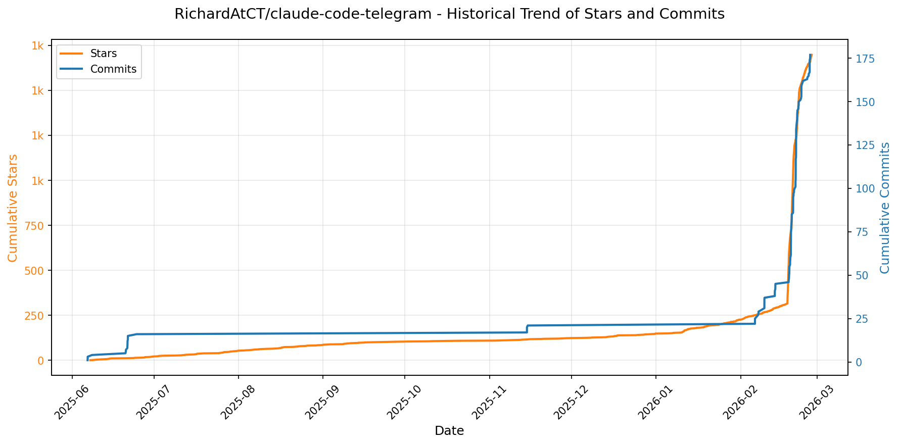
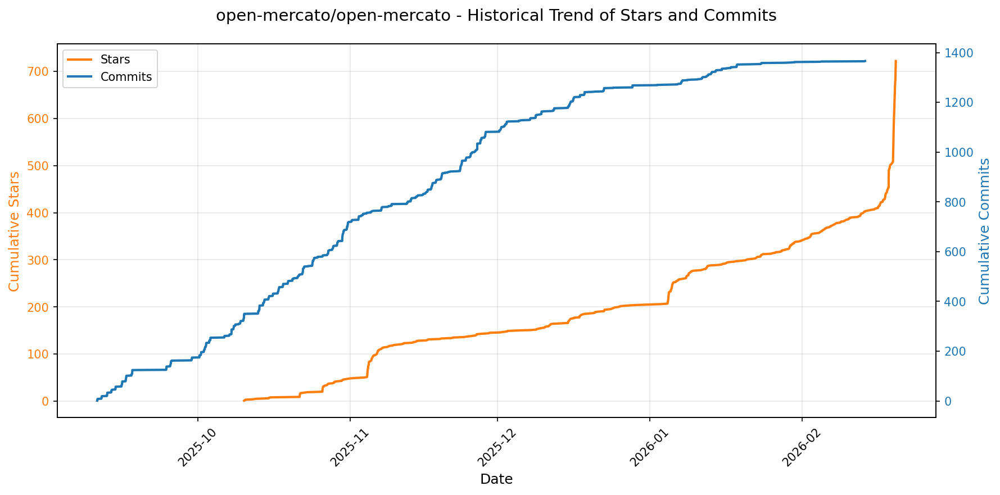

# 🌟 GitHub Trending 概览

> 数据更新于：2026-02-20

---

## 🔍 项目详情

### 1. [anthropics/skills](https://github.com/anthropics/skills)
- 📅 **创建日期**：2025-09-22  
- 🔄 **最近更新**：2026-02-20  
- ⭐ **Stars**：112,199（日 +477｜周 +3240｜月 +20581）  
- 📝 **描述**：Public repository for Agent Skills  

<b>📈 Star 与 Commit 历史趋势</b>

> *蓝色：累计 Stars｜橙色：累计 Commits（次 Y 轴）*

<b>📄 README 摘要</b>

1. **该项目的作用**  
该项目是 Anthropic 官方维护的 Claude 技能（Skills）开源示例仓库，旨在展示如何通过结构化、可复用的“技能包”扩展 Claude 的专业化能力。每个技能是一个独立文件夹，内含 `SKILL.md`（含 YAML 元数据和指令说明），使 Claude 能动态加载并执行特定任务，例如：按企业品牌规范生成文档、基于组织特有流程分析数据、自动化个人事务（如 PDF 表单提取、PPTX 创建）、测试 Web 应用、生成 MCP 服务器等。项目本身不运行服务，而是提供可即用、可参考、可定制的技能模板与实战案例，服务于开发者构建、测试和部署自定义技能。

2. **核心功能**  
- ✅ **模块化技能封装**：每个技能为自包含文件夹，强制采用标准化 `SKILL.md` 格式（含 `name`/`description` 前置元数据 + Markdown 指令/示例/指南），确保可发现性与可复用性；  
- ✅ **多领域技能覆盖**：涵盖创意设计（艺术/音乐/排版）、技术开发（Web 测试、MCP 服务生成）、企业应用（品牌通信、内部协作）及全格式文档处理（DOCX/PDF/PPTX/XLSX）四大类；  
- ✅ **开箱即用集成支持**：支持在 Claude Code（插件市场一键安装）、Claude.ai（付费用户直接启用）、Claude API（上传自定义技能）三大平台无缝调用；  
- ✅ **生产级参考实现**：公开 `skills/docx` 等子目录中驱动 Claude 官方文档功能的真实技能源码（source-available，非开源），为复杂技能开发提供权威范本；  
- ✅ **标准化规范与模板**：内置 `./spec`（Agent Skills 规范文档）和 `./template`（技能创建模板），降低开发门槛并保障兼容性。

3. **技术栈**  
- **核心协议**：Agent Skills 开放标准（[agentskills.io](https://agentskills.io)）；  
- **技能格式**：纯文本 Markdown（`SKILL.md`）+ YAML 前置元数据（声明式配置）；  
- **运行环境**：深度集成 Anthropic 生态——依赖 Claude 模型原生技能加载与执行引擎（非独立服务）；  
- **分发机制**：基于插件化架构（Claude Code Plugin Marketplace）、Claude.ai Web 控制台、Claude API（`/v1/skills` 端点）三端统一分发；  
- **许可证**：多数示例技能采用 Apache 2.0 开源协议；文档类核心技能（`skills/docx` 等）为 source-available（可查看/学习，但不可修改再分发）。

---

### 2. [openclaw/openclaw](https://github.com/openclaw/openclaw)
- 📅 **创建日期**：2025-11-24  
- 🔄 **最近更新**：2026-02-20  
- ⭐ **Stars**：97,776（日 +3136｜周 +23662｜月 +97776）  
- 📝 **描述**：Your own personal AI assistant. Any OS. Any Platform. The lobster way. 🦞   

<b>📈 Star 与 Commit 历史趋势</b>

> *蓝色：累计 Stars｜橙色：累计 Commits（次 Y 轴）*

<b>📄 README 摘要</b>

1. **项目功能**  
OpenClaw 是一个完全本地化、用户自托管的个人 AI 助手系统，核心目标是让用户在**自有设备上运行专属、单用户、低延迟、始终在线的 AI 助理**。它不依赖中心化云服务，而是通过轻量级「网关（Gateway）」作为统一控制平面，将 AI 能力无缝接入用户日常使用的全部通信渠道（如 WhatsApp、Telegram、Slack、Discord、Signal、iMessage、Google Chat、Microsoft Teams、Matrix、Zalo 等），并支持 macOS/iOS/Android 原生语音唤醒（Voice Wake）、实时语音对话（Talk Mode）及可编程可视化工作区（Live Canvas）。其本质是将大模型能力与真实世界交互层（消息、语音、摄像头、屏幕、系统命令、浏览器等）深度耦合，构建端到端可控的个人智能体基础设施。

2. **关键特性**  
- **多通道统一收件箱**：原生集成 14+ 主流通讯平台（含 BlueBubbles/iMessage 桥接、Zalo 个人版等小众渠道），支持 DM 配对鉴权、群组路由（提及触发/回复链）、媒体（图/音/视频）全链路处理。  
- **本地优先网关架构**：单进程 WebSocket 控制平面，统管会话（Session）、通道（Channel）、工具（Tool）、事件（Event）、定时任务（Cron）、Webhook 及远程访问（Tailscale Serve/Funnel 或 SSH 隧道）。  
- **多智能体隔离路由**：支持按通道、账号、联系人分发至独立工作区（Workspace）和隔离会话（Agent），实现场景化智能分流（如工作/生活/开发助理分离）。  
- **跨平台语音与视觉交互**：macOS/iOS/Android 全平台语音唤醒 + 连续对话；Live Canvas 提供 A2UI 驱动的动态可视化工作区（支持 eval、快照、重置），可被 AI 实时操控。  
- **设备级原生节点（Nodes）**：iOS/Android/macOS 节点提供摄像头抓拍/录屏、定位、通知、系统命令执行（`system.run`）、Canvas 渲染等本地能力，并通过 `node.invoke` 安全调用。  
- **安全默认策略**：DM 默认启用配对码机制（`dmPolicy="pairing"`），拒绝未授权输入；支持权限分级（TCC / elevated bash）、会话上下文压缩、模型故障转移（failover）、敏感操作审计（`openclaw doctor`）。  
- **开箱即用的自动化生态**：内置浏览器控制（专用 Chromium + CDP）、技能平台（ClawHub 技能注册/自动发现/沙箱安装）、Gmail Pub/Sub、WebChat UI、CLI 向导（`openclaw onboard`）及完整配置/更新/诊断工具链。

3. **技术栈**  
- **运行时**：Node.js ≥22（主运行环境），支持 npm/pnpm/bun；TypeScript 编写，`tsx` 直接执行开发模式。  
- **核心框架**：WebSocket 协议自研网关（无外部后端框架）、RPC 式 Pi Agent 运行时、A2UI Canvas 渲染引擎。  
- **通道适配层**：基于各平台官方/成熟 SDK 封装——Baileys（WhatsApp）、grammY（Telegram）、discord.js（Discord）、@slack/bolt（Slack）、signal-cli（Signal）、BlueBubbles API（iMessage）、Microsoft Graph（Teams）等。  
- **AI 集成**：OAuth 接入 Anthropic（Claude Opus 4.6 推荐）、OpenAI；支持任意兼容 OpenAI 兼容 API 的模型；内置模型轮换、fallback、流式响应与 chunking 处理。  
- **部署与运维**：支持 Nix（声明式配置）、Docker、systemd/launchd 守护进程；Tailscale 用于安全远程暴露；SSH 隧道备用方案；CLI 全生命周期管理（安装/更新/诊断/迁移）。  
- **客户端生态**：原生 macOS Menu Bar App（Swift）、iOS/Android 节点（Swift/Kotlin）、WebChat（内嵌于 Gateway）、CLI 工具链（全功能终端界面）。

---

### 3. [obra/superpowers](https://github.com/obra/superpowers)
- 📅 **创建日期**：2025-10-09  
- 🔄 **最近更新**：2026-02-20  
- ⭐ **Stars**：84,377（日 +945｜周 +4978｜月 +24735）  
- 📝 **描述**：An agentic skills framework & software development methodology that works.  

<b>📈 Star 与 Commit 历史趋势</b>

> *蓝色：累计 Stars｜橙色：累计 Commits（次 Y 轴）*

<b>📄 README 摘要</b>

1. **项目功能**  
Superpowers 是一个面向编程智能体（coding agents）的完整软件开发工作流增强系统。它不直接替代编码代理，而是为其注入结构化、可验证、工程规范的协作能力。其核心作用是：在代理启动后主动暂停“盲目写代码”行为，转而引导用户完成需求澄清 → 分段式设计确认 → 严格TDD驱动的实施计划制定 → 多级自动审查的子代理协同执行 → 全流程质量门禁控制。整个过程以“技能（skills）”为原子单元自动触发，将原本松散、不可控的AI编码行为转化为符合专业软件工程实践（如YAGNI、DRY、红-绿-重构、Git工作树隔离）的可靠开发流水线。

2. **关键特性**  
- **全流程自动化工程规范**：覆盖从需求脑暴（brainstorming）、分支隔离（using-git-worktrees）、任务拆解（writing-plans）、子代理驱动开发（subagent-driven-development）、强制测试先行（test-driven-development）、自动代码审查（requesting-code-review）到分支收尾（finishing-a-development-branch）的7个强制性阶段；  
- **双阶段审查机制**：每个开发任务由独立子代理执行，并经历两轮自动审查——首审确保完全符合原始设计规范（spec compliance），次审聚焦代码质量与工程实践（code quality）；  
- **证据驱动决策**：所有关键节点均要求可验证证据（如测试必须真实失败再通过、Bug修复需复现验证），杜绝“声称已修复”；  
- **零手动干预的技能调度**：系统基于上下文自动识别并激活对应技能，无需用户记忆指令或手动调用；  
- **跨平台插件化部署**：原生支持 Claude Code、Cursor、Codex、OpenCode 等主流AI编程平台，通过统一技能库实现行为一致；  
- **可扩展技能生态**：内置 `writing-skills` 技能，支持开发者遵循标准范式贡献新技能，形成自演进的工程能力库。

3. **技术栈**  
- **核心范式**：基于“技能（Skills）”的声明式工作流编排（非传统代码框架），每个技能为独立可验证的 Markdown + 指令集文档（如 `skills/test-driven-development/SKILL.md`）；  
- **运行时依赖**：深度集成于各类AI编程代理平台（Claude Code / Cursor / Codex / OpenCode），依赖其底层大模型推理、工具调用（如Git、Shell、测试运行器）及会话状态管理能力；  
- **基础设施层**：纯文本技能定义（Markdown）、GitHub 仓库托管、插件市场分发（`superpowers-marketplace`）；  
- **协议与标准**：遵循 TDD（红-绿-重构）、YAGNI、DRY、防御性编程等经典工程原则，并将其编码为可执行的检查清单与自动化约束；  
- **无服务端组件**：完全客户端/代理侧运行，不依赖外部API或私有后端服务，所有逻辑通过提示工程（prompt engineering）与结构化指令驱动。

---

### 4. [remotion-dev/remotion](https://github.com/remotion-dev/remotion)
- 📅 **创建日期**：2020-06-23  
- 🔄 **最近更新**：2026-02-20  
- ⭐ **Stars**：37,310（日 +131｜周 +918｜月 +11877）  
- 📝 **描述**：🎥      Make videos programmatically with React  

<b>📈 Star 与 Commit 历史趋势</b>

> *蓝色：累计 Stars｜橙色：累计 Commits（次 Y 轴）*

<b>📄 README 摘要</b>

1. **该项目的功能**  
Remotion 是一个基于 React 的视频生成框架，允许开发者使用 React 组件**以编程方式（代码驱动）创建视频**。它将前端开发能力（如动态渲染、状态管理、组件复用）直接映射到视频制作流程中，支持在本地预览、导出为 MP4/WebM 等格式，并可集成至 CI/CD 流水线实现自动化视频生成（例如个性化年度回顾、数据可视化视频、营销素材批量生成等）。

2. **核心特性**  
- ✅ **React 原生开发体验**：支持 JSX、Hooks、Props、Context、第三方 React 库及 Fast Refresh 热更新；  
- ✅ **全栈 Web 技术支持**：原生兼容 CSS 动画、SVG、Canvas、WebGL（通过 `react-three-fiber` / `@remotion/three`）、Web Audio API 等；  
- ✅ **时间轴编程控制**：提供 `useCurrentFrame`、`interpolate`、`Sequence`、`Composition` 等 API，实现帧级精确控制与关键帧动画；  
- ✅ **多输出与部署能力**：支持本地渲染、Lambda 无服务器渲染（Remotion Cloud）、自托管渲染集群；  
- ✅ **生产就绪工具链**：内置 CLI（`npx create-video`）、TypeScript 支持、SSR 渲染、Lottie 导入、字幕生成、音频波形可视化等；  
- ✅ **企业级扩展性**：支持视频模板化、参数化渲染（URL 查询参数驱动内容）、A/B 测试视频变体。

3. **技术栈**  
- **核心框架**：React（v18+）、TypeScript；  
- **渲染引擎**：基于 Chromium（Electron 或 Puppeteer）进行 Headless 浏览器渲染，利用 Canvas/WebGL 进行高性能逐帧合成；  
- **构建与工具**：Vite（默认构建工具）、Webpack（可选）、ESBuild；  
- **配套生态**：`@remotion/cli`、`@remotion/player`（交互式播放器）、`@remotion/lottie`、`@remotion/three`、`@remotion/video`；  
- **部署与扩展**：Node.js 后端服务、AWS Lambda / Vercel / Cloudflare Workers 适配、Docker 容器化支持。

---

### 5. [asgeirtj/system_prompts_leaks](https://github.com/asgeirtj/system_prompts_leaks)
- 📅 **创建日期**：2025-05-03  
- 🔄 **最近更新**：2026-02-20  
- ⭐ **Stars**：32,189（日 +163｜周 +897｜月 +7051）  
- 📝 **描述**：Collection of extracted System Prompts from popular chatbots like ChatGPT, Claude & Gemini  

<b>📈 Star 与 Commit 历史趋势</b>

> *蓝色：累计 Stars｜橙色：累计 Commits（次 Y 轴）*

---

### 6. [thedotmack/claude-mem](https://github.com/thedotmack/claude-mem)
- 📅 **创建日期**：2025-08-31  
- 🔄 **最近更新**：2026-02-20  
- ⭐ **Stars**：29,667（日 +340｜周 +1851｜月 +14965）  
- 📝 **描述**：A Claude Code plugin that automatically captures everything Claude does during your coding sessions, compresses it with AI (using Claude's agent-sdk), and injects relevant context back into future sessions.  

<b>📈 Star 与 Commit 历史趋势</b>

> *蓝色：累计 Stars｜橙色：累计 Commits（次 Y 轴）*

<b>📄 README 摘要</b>

1. **项目功能**  
Claude-Mem 是一个专为 Anthropic Claude Code（AI 编程代理）设计的**持久化记忆压缩系统**，旨在解决 AI 会话上下文无法跨会话延续的根本问题。它通过自动捕获用户与工具交互过程中的关键观察（Observations）、生成语义化摘要，并构建可检索的记忆索引，使 Claude 在新会话中能自动恢复对项目历史、代码变更、调试过程、Bug 修复等上下文的理解，实现真正的“记忆连续性”。

2. **核心特性**  
- ✅ **持久化记忆**：会话结束后记忆仍长期保存于本地 SQLite 数据库，重启后自动注入新会话；  
- ✅ **渐进式披露（Progressive Disclosure）**：采用三层低开销检索流程（`search` → `timeline` → `get_observations`），按需加载内容，降低 token 消耗约 10 倍；  
- ✅ **技能化智能搜索**：内置 `mem-search` MCP 技能，支持自然语言查询 + 类型/时间/项目过滤；  
- ✅ **实时 Web 查看器**：提供 http://localhost:37777 网页界面，可视化内存流、观测记录、摘要及引用链接；  
- ✅ **Claude Desktop 集成**：可在 Claude 桌面版对话中直接调用记忆搜索；  
- ✅ **隐私保护机制**：支持 `<private>` 标签标记敏感内容，自动排除存储；  
- ✅ **细粒度上下文控制**：可配置哪些数据类型、会话范围、token 预算参与上下文注入；  
- ✅ **全自动运行**：无需手动触发，依托 6 个生命周期 Hook（SessionStart/PostToolUse/SessionEnd 等）静默工作；  
- ✅ **结构化引用与溯源**：每条观测分配唯一 ID，支持 API 直查（`/api/observation/{id}`）和网页归档；  
- ✅ **Beta 实验通道**：支持切换至实验版本（如 Endless Mode——仿生式长时记忆架构）。

3. **技术栈**  
- **运行时**：Node.js ≥18.0.0（主逻辑）、Bun（管理 Worker 服务与 HTTP API）、uv（Python 包管理器，用于 Chroma 向量库依赖）；  
- **数据库**：SQLite3（嵌入式，含 FTS5 全文搜索） + Chroma（向量数据库，实现混合语义+关键词检索）；  
- **协议与标准**：MCP（Model Context Protocol）规范兼容的 5 个标准工具接口；  
- **前端**：轻量级 Web UI（基于静态资源与 Bun HTTP Server）；  
- **开发语言**：TypeScript（主力）、部分 Python 脚本（向量处理）；  
- **部署与集成**：支持 Claude Code 插件市场安装、OpenClaw 网关一键部署（含 Telegram/Discord/Slack 实时通知集成）；  
- **许可协议**：主项目采用 AGPL-3.0（强调网络服务场景下的源码开源义务）；`ragtime/` 子模块单独采用 PolyForm Noncommercial License。

---

### 7. [ChromeDevTools/chrome-devtools-mcp](https://github.com/ChromeDevTools/chrome-devtools-mcp)
- 📅 **创建日期**：2025-09-11  
- 🔄 **最近更新**：2026-02-20  
- ⭐ **Stars**：26,166（日 +133｜周 +1677｜月 +4418）  
- 📝 **描述**：Chrome DevTools for coding agents  

<b>📈 Star 与 Commit 历史趋势</b>

> *蓝色：累计 Stars｜橙色：累计 Commits（次 Y 轴）*

<b>📄 README 摘要</b>

1. **项目功能**  
`chrome-devtools-mcp` 是一个符合 Model-Context-Protocol（MCP）标准的服务器，使 AI 编程助手（如 Gemini、Claude、Cursor、Copilot 等）能够**远程控制并深度检测正在运行的 Chrome 浏览器实例**。它桥接大模型与 Chrome DevTools 原生能力，支持在真实浏览器环境中执行可靠自动化操作、开展专业级前端调试（含网络分析、控制台日志、源映射堆栈追踪）、以及进行实验室级与真实用户场景结合的性能分析（通过集成 CrUX 字段数据）。

2. **核心特性**  
- **全链路性能洞察**：支持录制 DevTools 性能轨迹（trace），自动提取可操作优化建议，并可选对接 Google Chrome 用户体验报告（CrUX）API 获取真实世界性能数据；  
- **深度浏览器调试能力**：实时查看/过滤网络请求、捕获带完整上下文的控制台消息（含 source-map 解析的堆栈）、截取高保真截图、生成内存快照；  
- **高可靠性自动化**：基于 Puppeteer 实现语义化操作（如点击、表单填充、文件上传、对话框处理），内置智能等待机制（如 `wait_for`），确保操作结果就绪后再继续；  
- **模块化工具集**：提供 26 个细粒度 MCP 工具，按功能划分为输入自动化（8 个）、导航控制（6 个）、设备/视口模拟（2 个）、性能分析（3 个）、网络监控（2 个）和高级调试（5 个）；  
- **灵活部署与连接模式**：支持自动启动隔离 Chrome 实例、连接已运行的调试版 Chrome（通过 `--browser-url` 或 `--ws-endpoint`）、适配多通道（Stable/Canary/Beta/Dev）及自定义参数（代理、证书、视口、用户数据目录等）。

3. **技术栈**  
- **运行时环境**：Node.js ≥ v20.19（LTS 维护版本）；  
- **浏览器依赖**：Chrome 当前稳定版或更新版本（原生集成 Chrome DevTools 前端协议）；  
- **核心驱动库**：Puppeteer（用于浏览器自动化控制与生命周期管理）；  
- **协议标准**：严格遵循 [Model-Context-Protocol (MCP)](https://modelcontextprotocol.io/) 规范，作为标准 MCP 服务器与各类 AI 客户端通信；  
- **构建与分发**：npm 包管理（`chrome-devtools-mcp`），通过 `npx` 一键启动；  
- **扩展能力**：支持 WebSocket 调试协议（CRI）、Chrome 远程调试协议（CDP）深度调用，以及与 CrUX API 的可选 HTTP 集成。

---

### 8. [KeygraphHQ/shannon](https://github.com/KeygraphHQ/shannon)
- 📅 **创建日期**：2025-09-27  
- 🔄 **最近更新**：2026-02-20  
- ⭐ **Stars**：20,576（日 +303｜周 +2618｜月 +16823）  
- 📝 **描述**：Fully autonomous AI hacker to find actual exploits in your web apps. Shannon has achieved a 96.15% success rate on the hint-free, source-aware XBOW Benchmark.  

<b>📈 Star 与 Commit 历史趋势</b>

> *蓝色：累计 Stars｜橙色：累计 Commits（次 Y 轴）*

<b>📄 README 摘要</b>

1. **项目功能**  
Shannon 是一个面向源代码的全自动 AI 渗透测试工具，专为白盒（white-box）Web 应用安全测试设计。它不只静态扫描或生成告警，而是真正执行端到端攻击：基于源码分析智能识别攻击面，通过内置浏览器与命令行环境动态发起真实 exploit（如注入、XSS、SSRF、认证/授权绕过等），验证漏洞是否可被实际利用，并输出具备复现能力的 PoC 与高置信度报告。其核心目标是填补开发高频迭代（如借助 Claude Code/Cursor）与传统年度渗透测试之间的安全空白，实现“每次构建即安全”的持续防护能力。

2. **关键特性**  
- **全自主渗透流程**：单命令启动，自动处理复杂登录（含 2FA/TOTP、Google 登录）、页面导航、状态跟踪与多阶段攻击执行，全程无需人工干预；  
- **可验证漏洞报告**：输出聚焦于已成功利用的高危漏洞，附带一键复制的 PoC 脚本与详细复现步骤，显著降低误报率；  
- **深度 OWASP 覆盖**：当前支持 Injection、XSS、SSRF、Broken Authentication/Authorization 等关键漏洞类型的识别与实证，持续扩展中；  
- **代码感知动态测试**：融合静态源码分析（理解业务逻辑与数据流）与动态运行时攻击（浏览器+CLI），实现上下文感知的精准 exploitation；  
- **集成专业安全工具链**：在侦察阶段调用 Nmap、Subfinder、WhatWeb、Schemathesis 等成熟工具，强化目标测绘与接口分析能力；  
- **并行化加速引擎**：对分析、探测、利用等耗时环节进行并发调度，大幅缩短整体测试周期；  
- **工作区与断点续跑**：支持命名工作区（Workspace），自动记录各 Agent 进度（通过 Git 提交存档），失败后可精准恢复未完成任务，避免重复执行。

3. **技术栈**  
- **核心推理引擎**：Anthropic Claude 系列大模型（官方推荐 Anthropic API），基于 Claude Agent SDK 构建多智能体协同架构；  
- **运行时环境**：Docker 容器化部署，确保环境隔离与跨平台一致性；  
- **编排与可观测性**：Temporal 开源工作流引擎（提供 `http://localhost:8233` Web UI 实时监控）；  
- **基础设施依赖**：Nmap（网络扫描）、Subfinder（子域名发现）、WhatWeb（指纹识别）、Schemathesis（API 合约模糊测试）；  
- **前端交互层**：内置浏览器自动化（用于 Web 攻击交互）、CLI 命令行接口（`./shannon` 脚本封装）；  
- **配置与扩展**：YAML 配置文件支持自定义登录流程、2FA 密钥、测试范围规则（focus/avoid）；实验性支持 OpenRouter 接入 GPT/Gemini 模型（非官方支持）。

---

### 9. [VectifyAI/PageIndex](https://github.com/VectifyAI/PageIndex)
- 📅 **创建日期**：2025-04-01  
- 🔄 **最近更新**：2026-02-20  
- ⭐ **Stars**：20,404（日 +91｜周 +676｜月 +9833）  
- 📝 **描述**：📑 PageIndex: Document Index for Vectorless, Reasoning-based RAG  

<b>📈 Star 与 Commit 历史趋势</b>

> *蓝色：累计 Stars｜橙色：累计 Commits（次 Y 轴）*

<b>📄 README 摘要</b>

1. **该项目的功能**  
PageIndex 是一个面向长文档（如财报、法律文书、技术手册等）的**向量数据库无关、基于推理的检索增强生成（RAG）系统**。它不依赖传统向量相似性搜索，而是通过构建文档的**语义层次化树状索引**（类似智能目录），并利用大语言模型（LLM）在该索引上执行**类人、多步推理式检索**，从而精准定位最相关的内容段落。其核心目标是解决专业文档中“语义相似 ≠ 实际相关”的痛点，实现高准确率、可追溯、可解释的知识提取。

2. **关键特性**  
- **零向量数据库（No Vector DB）**：完全摒弃向量嵌入与相似度匹配，改用结构感知+LLM推理驱动检索；  
- **零人工分块（No Chunking）**：基于文档天然结构（标题层级、章节逻辑）组织内容，避免破坏语义连贯性的硬切分；  
- **类人检索能力（Human-like Retrieval）**：模拟专家阅读行为，通过树遍历与上下文推理逐步聚焦目标信息，支持复杂多跳查询；  
- **强可解释性与可追溯性**：每次检索结果附带明确的页码、节点ID及推理路径，拒绝“黑箱式 vibe retrieval”；  
- **原生视觉支持（Vision-native）**：提供OCR-Free方案，可直接对PDF页面图像进行推理式RAG，绕过文本提取误差；  
- **SOTA性能验证**：在FinanceBench金融问答基准测试中达**98.7%准确率**，显著超越主流向量RAG方案。

3. **技术栈**  
- **核心模型层**：依赖OpenAI大模型（默认 `gpt-4o-2024-11-20`）执行树索引构建与推理式检索；  
- **文档解析层**：支持PDF（基于PyPDF等库）与Markdown（按`#`标题层级解析）双格式输入；  
- **架构设计**：采用**树索引（Tree Index）** 作为知识组织范式，以JSON结构化表示层级节点（含标题、摘要、页码范围、子节点等）；  
- **部署与集成**：提供本地Python CLI工具（`run_pageindex.py`）、云服务（[chat.pageindex.ai](https://chat.pageindex.ai)）、MCP协议插件（兼容Claude/Cursor等）、RESTful API及Colab交互式笔记本；  
- **扩展能力**：配套自研**PageIndex OCR**（专为保留文档全局结构优化的长上下文OCR模型），但开源仓库本身聚焦于索引构建与推理逻辑，OCR为独立增强模块。

---

### 10. [harvard-edge/cs249r_book](https://github.com/harvard-edge/cs249r_book)
- 📅 **创建日期**：2023-09-06  
- 🔄 **最近更新**：2026-02-20  
- ⭐ **Stars**：20,274（日 +530｜周 +2087｜月 +3116）  
- 📝 **描述**：Introduction to Machine Learning Systems  

<b>📈 Star 与 Commit 历史趋势</b>

> *蓝色：累计 Stars｜橙色：累计 Commits（次 Y 轴）*

<b>📄 README 摘要</b>

1. **该项目做什么？**  
该项目是一个面向人工智能系统工程（AI Engineering）的开源教育平台，核心目标是将“AI工程学”确立为与软件工程、计算机工程并列的基础性工程学科。它不局限于机器学习模型本身，而是聚焦于**端到端智能系统的工程化构建**——即如何在真实世界约束（如内存、功耗、延迟、安全性、可靠性、可维护性）下，设计、实现、部署和评估高效、鲁棒、可信的ML系统。项目以《Machine Learning Systems: Principles and Practices of Engineering Artificially Intelligent Systems》教材为理论核心，配套实践组件（TinyTorch框架、硬件实验套件、未来软件协同实验与AI奥林匹克竞赛），形成“读—探—建—部—证”闭环学习路径，推动AI从“研究原型”走向“工程化产品”。

2. **关键特性**  
- **三位一体学习栈（Learning Stack）**：  
  - **📖 教材（Textbook）**：结构化覆盖ML与系统交叉知识（含基础、设计、性能优化、部署、可信性、前沿），强调“ML↔Systems桥梁”，如参数量 vs 内存约束、精度 vs 量化、训练收敛 vs 计算效率等；  
  - **🔥 TinyTorch**：轻量级PyTorch风格框架，支持从零实现自动微分、优化器、CNN/Transformer等核心模块，帮助理解主流框架底层机制；  
  - **🔧 硬件实验套件（Kits）**：提供Arduino、Raspberry Pi等边缘设备的实操实验室，直面真实资源限制（内存、功耗、实时性、安全）；  
- **活教材（Living Textbook）**：持续更新、社区共建，内容随领域演进而迭代，但坚守稳定工程原理（类比LEGO积木）；  
- **研究-教学闭环（Research-to-Teaching Loop）**：将真实系统研究（基准测试→参考实现→部署验证）直接转化为教学资产（章节→TinyTorch模块→硬件实验）；  
- **开放生态与可扩展性**：支持多语言（中/日/韩）、多格式（在线/EPUB/PDF/纸质版2026年MIT Press出版）、全栈开源（教材CC BY-NC-ND、代码Apache 2.0），并规划2026年上线AI奥林匹克（跨赛道综合能力认证）；  
- **教育普惠使命**：目标2030年覆盖百万学习者，通过Open Collective资助欠发达地区硬件套件、教师工作坊（TinyML4D）等，降低工程实践门槛。

3. **技术栈**  
- **内容层**：Markdown + LaTeX（教材源码）、Jupyter/Quarto（交互式在线渲染，托管于mlsysbook.ai）；  
- **代码框架**：TinyTorch基于Python（无外部深度学习依赖），采用纯NumPy实现，强调可读性与教学性；  
- **基础设施**：GitHub Actions自动化流水线（文档校验、TinyTorch测试）、Git版本控制；  
- **部署与实验**：跨平台嵌入式环境（Arduino C/C++、Raspberry Pi Linux）、支持边缘计算场景；  
- **协作生态**：GitHub Discussions（社区交流）、Open Collective（透明资金管理）、多语言翻译协作流程。

---

### 11. [gsd-build/get-shit-done](https://github.com/gsd-build/get-shit-done)
- 📅 **创建日期**：2025-12-14  
- 🔄 **最近更新**：2026-02-20  
- ⭐ **Stars**：16,301（日 +466｜周 +2833｜月 +10910）  
- 📝 **描述**：A light-weight and powerful meta-prompting, context engineering and spec-driven development system for Claude Code and OpenCode.  

<b>📈 Star 与 Commit 历史趋势</b>

> *蓝色：累计 Stars｜橙色：累计 Commits（次 Y 轴）*

<b>📄 README 摘要</b>

1. **项目功能**  
该项目是一个轻量级但功能强大的元提示（meta-prompting）、上下文工程（context engineering）与规范驱动开发（spec-driven development）系统，专为 **Claude Code、OpenCode 和 Gemini CLI** 三大 AI 编程运行时设计。其核心目标是**解决“上下文腐化”（context rot）问题**——即随着 Claude 填满上下文窗口而导致的响应质量持续下降。GSD 通过结构化工作流，在 AI 编程会话中维持高保真、低噪声的上下文环境，使 AI 能稳定、可靠、精准地理解需求、规划任务、生成代码并验证结果，最终实现“描述即交付”的端到端自动化开发闭环。

2. **关键特性**  
- ✅ **全生命周期规范驱动流程**：支持 `new-project → discuss-phase → plan-phase → execute-phase → verify-work → complete-milestone` 的标准化迭代，每个阶段生成结构化文档（如 `PROJECT.md`、`CONTEXT.md`、`PLAN.md`、`SUMMARY.md`、`UAT.md`），确保可追溯、可审计、可复现；  
- ✅ **智能上下文工程**：自动构建并动态维护多层级上下文知识库（含项目愿景、架构分析、需求追踪、状态记忆、研究资料、原子任务计划等），严格控制各文件大小以规避模型性能衰减；  
- ✅ **XML 结构化提示格式**：所有执行计划均采用语义清晰、机器可解析的 XML 标签（如 `<task>`、`<verify>`、`<done>`），内嵌验证指令与完成标准，消除歧义，提升生成确定性；  
- ✅ **多智能体协同编排**：各阶段由轻量级协调器（orchestrator）调度专用子代理（researcher/planner/executor/debugger/verifier），研究、规划、执行、验证均在独立、干净的 200k token 上下文中并行完成，主会话始终保持轻量（30–40% 占用）；  
- ✅ **波次化并行执行（Wave Execution）**：自动识别任务依赖关系，将计划分组为“执行波次”，独立任务并行、依赖任务串行，显著提升吞吐效率，且天然适配垂直切片（end-to-end feature）而非水平分层；  
- ✅ **原子化 Git 提交**：每个子任务生成独立、语义化、可追溯的 commit（含时间戳与任务标识），支持精准 bisect、一键回滚、历史可读及后续 AI 上下文复用；  
- ✅ **灰度适配与灵活模式**：提供 `Quick Mode`（跳过研究/校验的轻量任务模式）、`Brownfield 支持`（`/gsd:map-codebase` 自动逆向分析现有代码库）、`阶段动态管理`（插入/删除/追加 phase）、`多模型配置档`（quality/balanced/budget）及 `权限精细化控制`；  
- ✅ **开箱即用与跨平台兼容**：支持 macOS/Windows/Linux，一行命令 `npx get-shit-done-cc@latest` 安装，可全局或本地部署，适配 CI/CD 与 Docker 环境。

3. **技术栈**  
- **核心运行时**：深度集成并优化适配 **Anthropic Claude Code**（主力）、**OpenCode**（开源免费模型 CLI）、**Google Gemini CLI**；  
- **前端交互层**：基于 CLI 命令行界面，通过 `/gsd:*` 指令驱动，无 GUI 依赖，纯文本流交互；  
- **工程架构**：采用**模块化、插件式 Node.js 应用**（JavaScript/TypeScript），含独立安装脚本（`bin/install.js`）、规划目录管理（`.planning/`）、配置中心（`.planning/config.json`）及文档驱动状态（`.md` 文件体系）；  
- **提示工程层**：自研 XML Schema 规范 + 上下文分片策略 + 动态模板注入（如 `CONTEXT.md` 驱动 research/planning）；  
- **自动化基础设施**：深度调用系统命令（`git`, `bash`, `curl`, `ls`, `cat` 等），依赖 `--dangerously-skip-permissions` 或预设白名单实现免交互自动化；  
- **部署与分发**：发布为 npm 包 [`get-shit-done-cc`](https://www.npmjs.com/package/get-shit-done-cc)，采用 MIT 开源协议。

---

### 12. [danielmiessler/Personal_AI_Infrastructure](https://github.com/danielmiessler/Personal_AI_Infrastructure)
- 📅 **创建日期**：2025-09-08  
- 🔄 **最近更新**：2026-02-20  
- ⭐ **Stars**：14,143（日 +113｜周 +1421｜月 +3585）  
- 📝 **描述**：Agentic AI Infrastructure for magnifying HUMAN capabilities.  

<b>📈 Star 与 Commit 历史趋势</b>

> *蓝色：累计 Stars｜橙色：累计 Commits（次 Y 轴）*

<b>📄 README 摘要</b>

1. **该项目的功能**  
PAI（Personal AI Infrastructure，个人AI基础设施）是一个开源的、以用户为中心的AI系统框架，旨在将通用大模型（特别是Claude Code）转化为真正属于用户的“个人AI助手”（Digital Assistant, DA）。它不提供独立模型或聊天界面，而是构建在Claude Code之上，通过系统化架构赋予AI持久记忆、目标导向行为、自主学习能力和深度个性化能力。其核心功能是：**持续捕获用户信号（如反馈、修改、验证结果）、基于TELOS（使命/目标/信念等10类文档）理解用户本质、闭环执行“观察→思考→计划→执行→验证→学习→改进”科学循环，并随时间推移不断优化自身对特定用户的响应质量与服务能力**。

2. **关键特性**  
- **目标驱动（Goal-Oriented）**：以用户明确定义的MISSION、GOALS、BELIEFS等TELOS文档为决策中枢，所有任务均围绕用户真实意图展开。  
- **持续自进化（Continuous Learning）**：通过三层记忆系统（热/温/冷存储）和信号采集（评分、情感、成败验证），实现失败归因修复与成功模式强化。  
- **用户/系统分离架构（User/System Separation）**：用户定制内容（身份、偏好、技能等）全部存于`USER/`目录，系统升级不影响个人数据，保障可移植性与升级安全性。  
- **模块化技能系统（Skill System）**：遵循“代码 → CLI工具 → 提示词 → 技能”层级，强调确定性输出；支持按场景智能路由至不同专业化AI代理（如研究型、写作型、安全审查型）。  
- **全生命周期钩子系统（Hook System）**：支持8类事件（会话启动、工具调用、任务完成等），触发通知、上下文加载、安全校验、可观测性日志等自动化响应。  
- **企业级工程实践集成**：内置CLI优先接口、Git版本控制、规格/测试/评估先行（Spec/Test/Evals First）、UNIX哲学（单一职责、文本流、可组合）、SRE运维规范（监控、自动化、回滚）。  
- **开箱即用的安全与体验**：默认启用命令级安全策略（无需`--dangerously-skip-permissions`）、AI驱动GUI安装器、语音播报（ElevenLabs TTS）、终端UI状态可视化、多端通知（ntfy/Discord）。

3. **技术栈**  
- **核心运行时**：Bun（高性能JavaScript/TypeScript运行时，替代Node.js）  
- **主要语言**：TypeScript（主逻辑与架构）、Bash（CLI工具链与系统集成）、Python（部分AI工具与脚本）  
- **底层依赖**：Claude Code（作为基础Agentic平台，利用其Hook系统、MCP协议、上下文管理能力）  
- **AI服务集成**：ElevenLabs（语音合成）、Ollama/llama.cpp（Roadmap中规划的本地模型支持）  
- **基础设施**：Git（版本控制与恢复）、ntfy（跨平台推送通知）、Discord（社区协作）  
- **设计哲学支撑**：严格遵循16条PAI原则（如“CLI为接口”“Scaffolding > Model”“科学方法为元循环”），技术选型服务于确定性、可维护性与用户主权。

---

### 13. [badlogic/pi-mono](https://github.com/badlogic/pi-mono)
- 📅 **创建日期**：2025-08-09  
- 🔄 **最近更新**：2026-02-20  
- ⭐ **Stars**：13,943（日 +390｜周 +2691｜月 +11928）  
- 📝 **描述**：AI agent toolkit: coding agent CLI, unified LLM API, TUI & web UI libraries, Slack bot, vLLM pods  

<b>📈 Star 与 Commit 历史趋势</b>

> *蓝色：累计 Stars｜橙色：累计 Commits（次 Y 轴）*

<b>📄 README 摘要</b>

1. **项目功能**  
该项目是一个面向 AI 代理（AI Agents）开发与大语言模型（LLM）部署管理的**一体化工具型单体仓库（Monorepo）**，核心目标是提供可组合、可扩展的基础设施，用于构建和运行生产级 AI 编程代理及协作式智能体系统。它不直接提供最终用户应用，而是为开发者和团队提供模块化、跨平台（CLI / TUI / Web / Slack）的底层能力，支持从本地开发到 GPU 集群部署的全链路 AI 工程化流程。

2. **关键特性**  
- ✅ **多提供商统一 LLM 接口**：`@mariozechner/pi-ai` 抽象 OpenAI、Anthropic、Google 等主流模型 API，实现 provider 无关的调用与切换；  
- ✅ **标准化智能体运行时**：`@mariozechner/pi-agent-core` 提供工具调用（tool calling）、状态持久化、记忆管理与执行流控制；  
- ✅ **多形态交互入口**：支持终端 CLI（`coding-agent`）、轻量 TUI（`pi-tui`）、Web UI 组件（`pi-web-ui`）及 Slack 集成机器人（`pi-mom`）；  
- ✅ **LLM 推理基础设施支持**：`pi-pods` 提供命令行工具，用于在 GPU 节点上一键部署、扩缩容和监控 vLLM 服务；  
- ✅ **开箱即用的开发体验**：集成统一构建（`npm run build`）、类型检查/格式化/静态分析（`npm run check`）、分层测试（含跳过密钥依赖的自动化测试）及源码直启调试（`./pi-test.sh`）。

3. **技术栈**  
- **语言与运行时**：TypeScript（全栈强类型）、Node.js（v18+）；  
- **构建与包管理**：npm（monorepo 管理）、Turborepo 或自定义 npm script 驱动（隐含于 `npm run build` 等指令中）；  
- **核心依赖**：vLLM（GPU 推理后端）、React（`web-ui` 组件）、Slack SDK（`mom`）、Inquirer/Ora 等 CLI 工具库（`tui`/`coding-agent`）；  
- **基础设施**：GitHub Actions CI/CD（`ci.yml`）、Discord 社区协作、MIT 开源协议；  
- **架构风格**：模块化设计、包间语义化版本（scoped npm 包）、differential rendering（`pi-tui`）、基于组件的 Web UI（`pi-web-ui`）。

---

### 14. [tambo-ai/tambo](https://github.com/tambo-ai/tambo)
- 📅 **创建日期**：2024-06-15  
- 🔄 **最近更新**：2026-02-20  
- ⭐ **Stars**：10,869（日 +82｜周 +1813｜月 +7978）  
- 📝 **描述**：Generative UI SDK for React  

<b>📈 Star 与 Commit 历史趋势</b>

> *蓝色：累计 Stars｜橙色：累计 Commits（次 Y 轴）*

<b>📄 README 摘要</b>

1. **项目功能**  
Tambo AI 是一个面向 React 的开源生成式 UI（Generative UI）工具包，旨在让开发者构建能“理解并操作 UI”的智能代理（agents）。它使 LLM 能够根据用户自然语言指令（如“按地区显示销售数据”或“添加一项任务”），自动选择、实例化并流式渲染对应的 React 组件（如 `<Chart>` 或 `<TaskBoard>`），同时支持组件状态的持久化与动态更新。其核心价值是将 UI 本身作为 LLM 可调用的“函数接口”，实现真正以 UI 为中心的对话式应用开发。

2. **关键特性**  
- **双模组件系统**：支持 *生成式组件*（一次性渲染，如图表、摘要）和 *可交互组件*（持久化状态、支持用户后续编辑，如便签、看板、购物车）；  
- **全自动流式 Props 传递**：LLM 生成的组件属性（props）实时、分块流式传输至 React 组件，内置取消、错误恢复与断线重连；  
- **原生 MCP（Model Context Protocol）集成**：开箱即用连接 Linear、Slack、数据库等外部服务，完整支持工具调用、提示工程、 elicitation 和采样；  
- **客户端本地工具执行**：允许在浏览器中直接定义并运行工具（如 DOM 操作、带认证的 API 请求、读取 React 状态），由 AI 动态调用；  
- **上下文增强与智能建议**：支持注入动态上下文（如当前页面、选中项、用户偏好），并自动生成可点击的快捷提示（Suggestions）；  
- **全栈灵活部署**：提供托管的 Tambo Cloud（免费起步）与 Docker 自托管后端，统一管理会话状态与代理执行；  
- **多 LLM 厂商兼容**：原生支持 OpenAI、Anthropic、Gemini、Mistral、Cerebras 及任意 OpenAI 兼容接口。

3. **技术栈**  
- **前端框架**：React（TypeScript 优先）；  
- **类型与 Schema**：Zod（用于组件 props 和工具输入/输出的强类型定义，驱动 LLM 工具调用）；  
- **通信协议**：基于 HTTP 的 MCP 协议（Model Context Protocol）；  
- **状态管理**：Tambo 自研轻量级会话状态与组件生命周期管理（非依赖 Redux/Zustand 等通用方案）；  
- **后端**：Node.js（自托管版通过 Docker 容器化部署），云服务由 Tambo Cloud 托管；  
- **基础设施**：支持 OAuth 用户认证（`userToken`）、服务端身份标识（`userKey`），与主流前端构建工具（Vite/Next.js）无缝集成；  
- **许可证**：MIT（SDK + 自托管后端核心），部分子模块（如 `apps/api`）采用 Apache-2.0。

---

### 15. [NevaMind-AI/memU](https://github.com/NevaMind-AI/memU)
- 📅 **创建日期**：2025-07-29  
- 🔄 **最近更新**：2026-02-20  
- ⭐ **Stars**：9,529（日 +77｜周 +402｜月 +4670）  
- 📝 **描述**：Memory for 24/7 proactive agents like openclaw (moltbot, clawdbot).  

<b>📈 Star 与 Commit 历史趋势</b>

> *蓝色：累计 Stars｜橙色：累计 Commits（次 Y 轴）*

<b>📄 README 摘要</b>

1. **该项目的功能**  
memU 是一个专为 **7×24 小时持续运行的 AI 智能体（Proactive Agents）** 设计的**主动式长期记忆框架**。它不依赖用户显式指令即可持续监听、理解并结构化用户行为、对话、文档、图像等多模态输入，自动提取意图、偏好、技能、关系与知识，并构建可演化的记忆网络。其核心目标是让 AI 智能体真正实现“永不休眠、永不遗忘”，并在用户提出请求前就预判需求、自主执行任务（如推荐内容、撰写邮件、触发交易操作），从而将被动响应式 AI 升级为具备前瞻性认知能力的主动智能体。

2. **关键特性**  
- **全天候主动记忆（24/7 Proactive Memory）**：后台常驻运行，实时监控交互流，无需唤醒或显式“记住”指令即可持续学习与推理；  
- **意图驱动的自动记忆组织**：基于语义理解自动构建三层层级记忆结构（Resource → Item → Category），支持文件系统式导航（类目录树）、跨记忆链接（Symlinks）与即插即用式知识挂载（Mount points）；  
- **显著降低 LLM 令牌成本**：通过缓存结构化记忆、复用已提取洞察、区分 RAG（毫秒级上下文组装）与 LLM（秒级深度推理）双检索模式，避免重复大模型调用；  
- **多模态连续学习管道（`memorize()`）**：支持 conversation/document/image/audio/video 等模态输入，实时完成记忆提取、分类、关联与持久化；  
- **双模态智能检索（`retrieve()`）**：  
  - `method="rag"`：低开销、高时效的向量相似性检索，适用于实时建议与背景监控；  
  - `method="llm"`：高精度意图预测与上下文演化推理，适用于复杂场景下的主动规划；  
- **开箱即用的主动应用场景**：原生支持信息推荐、智能邮件管理、金融交易监控等典型 proactive workflow，并提供完整示例代码与云/本地部署方案。

3. **技术栈**  
- **语言与运行时**：Python 3.13+（强制要求）；  
- **LLM 与嵌入模型支持**：  
  - 默认集成 OpenAI（GPT/Codex/Embedding）；  
  - 全面兼容 **OpenRouter**（统一接入 Anthropic、Cohere、Google、Meta 等数十家模型）；  
  - 支持阿里云通义千问（DashScope）、Voyage AI 等第三方 embedding 服务；  
  - 可灵活配置独立的 LLM 与 embedding profile（支持 SDK/httpx/http 后端）；  
- **存储层**：  
  - 内存模式（`inmemory`）用于快速验证；  
  - 生产级 PostgreSQL + pgvector 扩展（支持向量检索与事务一致性）；  
- **架构设计范式**：以“内存即文件系统（Memory-as-Filesystem）”为核心抽象，结合分层记忆架构（Resource/Item/Category）与持续同步环（Agent ↔ MemU Bot ↔ DB）；  
- **部署形态**：提供云端 SaaS 服务（`memu.so`）、Docker 化自托管方案及标准化 REST API（v3）；  
- **扩展能力**：支持多用户隔离（`where={"user_id": "xxx"}`）、多智能体协同（`agent_id__in`）、视觉（vision）与语音模态处理（通过 OpenRouter 或原生模型）。

---

### 16. [tobi/qmd](https://github.com/tobi/qmd)
- 📅 **创建日期**：2025-12-08  
- 🔄 **最近更新**：2026-02-20  
- ⭐ **Stars**：9,517（日 +205｜周 +1371｜月 +7239）  
- 📝 **描述**：mini cli search engine for your docs, knowledge bases, meeting notes, whatever. Tracking current sota approaches while being all local  

<b>📈 Star 与 Commit 历史趋势</b>

> *蓝色：累计 Stars｜橙色：累计 Commits（次 Y 轴）*

<b>📄 README 摘要</b>

1. **项目功能**  
QMD（Query Markup Documents）是一个**纯本地运行的设备端搜索引擎**，专为个人知识管理与AI智能体（agentic）工作流设计。它能对用户本地的Markdown笔记、会议记录、技术文档、知识库等文本内容进行统一索引与检索。支持三种搜索模式：基于关键词的快速BM25全文搜索（`qmd search`）、基于语义向量的相似性搜索（`qmd vsearch`），以及融合查询扩展、多路并行检索（FTS + 向量）与大语言模型（LLM）重排序的高质量混合搜索（`qmd query`）。所有计算（包括嵌入生成、向量检索、查询扩展和重排序）均在用户设备上离线完成，无需联网或依赖云服务。

2. **核心特性**  
- ✅ **三重混合检索架构**：同时集成SQLite FTS5（BM25）、sqlite-vec向量搜索与本地LLM重排序（qwen3-reranker），通过Reciprocal Rank Fusion（RRF）融合+位置感知加权策略实现精度与效率平衡；  
- ✅ **智能查询扩展**：使用轻量级微调GGUF模型（qmd-query-expansion-1.7B）自动生成语义变体查询，提升召回率；  
- ✅ **上下文感知检索（Context-Aware Search）**：支持为集合（`qmd://notes`）或路径添加自然语言描述性上下文（如“会议记录”“API文档”），该上下文随匹配结果返回，显著增强LLM在后续决策中的情境理解能力；  
- ✅ **智能分块（Smart Chunking）**：非简单按token截断，而是基于Markdown结构（标题层级、代码块、分隔线、段落）动态评分并选择最优切分点，保障语义完整性与代码块原子性；  
- ✅ **MCP（Model Context Protocol）原生支持**：内置HTTP/stdio双模MCP服务器，开箱即用对接Claude Desktop/Code等支持MCP的AI客户端，暴露`qmd_search`、`qmd_deep_search`等标准化工具；  
- ✅ **面向Agent的输出协议**：提供`--json`、`--files`、`--md`等结构化输出格式，支持批量获取（`qmd multi-get`）、最小分数过滤（`--min-score`）、全文提取（`--full`）等，专为LLM上下文注入优化；  
- ✅ **轻量本地索引**：所有数据（含FTS索引、向量、元数据、LLM缓存）统一存储于单个SQLite文件（`~/.cache/qmd/index.sqlite`），零外部依赖；  
- ✅ **灵活集合管理**：支持多源目录挂载（`qmd collection add`）、通配符过滤（`--mask "**/*.md"`）、跨集合上下文继承与细粒度路径上下文绑定。

3. **技术栈**  
- **运行时**：Node.js ≥22 或 Bun ≥1.0.0（全命令行工具，无前端）；  
- **本地LLM推理引擎**：`node-llama-cpp`（基于WebAssembly/C++后端），加载Hugging Face托管的GGUF量化模型；  
- **核心模型（自动下载）**：  
  - `embeddinggemma-300M-Q8_0`（~300MB）：用于生成文档嵌入向量；  
  - `qwen3-reranker-0.6b-q8_0`（~640MB）：执行二分类重排序（Yes/No + logprobs）；  
  - `qmd-query-expansion-1.7B-q4_k_m`（~1.1GB）：轻量微调模型，负责查询扩展；  
- **索引与存储**：  
  - 全文检索：SQLite FTS5（BM25算法）；  
  - 向量检索：`sqlite-vec` 扩展（cosine相似度）；  
  - 数据库：单文件SQLite（含`collections`、`documents_fts`、`content_vectors`、`vectors_vec`、`llm_cache`等表）；  
- **协议与集成**：  
  - MCP（Model Context Protocol）v0.2标准；  
  - HTTP REST API（`/mcp`, `/health`）用于长连接共享模型；  
- **系统依赖**：macOS需Homebrew安装SQLite（启用FTS5扩展支持）；Linux/Windows需对应SQLite 3.39+及FTS5支持。

---

### 17. [openai/skills](https://github.com/openai/skills)
- 📅 **创建日期**：2025-11-25  
- 🔄 **最近更新**：2026-02-20  
- ⭐ **Stars**：9,075（日 +108｜周 +864｜月 +7261）  
- 📝 **描述**：Skills Catalog for Codex  

<b>📈 Star 与 Commit 历史趋势</b>

> *蓝色：累计 Stars｜橙色：累计 Commits（次 Y 轴）*

<b>📄 README 摘要</b>

1. **项目功能**  
该项目定义并维护一套标准化的“Agent Skills”（智能体技能）集合，即以文件夹形式组织的、可复用的指令集、脚本与资源包，供AI智能体（特别是Codex平台中的智能体）自动发现、加载并执行特定任务。其核心目标是实现能力封装的“一次编写、随处调用”，支持团队与个人将领域知识、工作流逻辑和自动化能力以模块化方式沉淀、共享与复用。

2. **关键特性**  
- **标准化技能结构**：每个技能为独立文件夹，内含明确的任务说明、执行脚本、依赖配置及`LICENSE.txt`，遵循开放标准（[agentskills.io](https://agentskills.io)）；  
- **分层技能管理**：按可信度与成熟度划分为三类——`.system`（系统级，自动预装）、`.curated`（精选审核，可通过名称一键安装）、`.experimental`（实验性，需显式指定路径或GitHub URL安装）；  
- **无缝集成Codex**：深度适配Codex平台，提供内置命令`$skill-installer`实现技能的发现、下载、注册与启用，安装后重启即可生效；  
- **开放分发与许可透明**：支持从GitHub直接安装远程技能，每个技能自带独立许可证文件，保障合规使用与协作分发。

3. **技术栈**  
- **运行平台**：专为OpenAI Codex智能体环境设计并深度集成；  
- **分发机制**：基于GitHub仓库结构（目录即技能包），依赖HTTP/HTTPS协议拉取远程技能（如`github.com/openai/skills/tree/main/...`）；  
- **安装工具**：内置CLI命令`$skill-installer`（Codex内部命令，非独立二进制），用于解析技能路径、处理依赖及触发重载；  
- **标准规范**：遵循[Agent Skills开放标准](https://agentskills.io)，强调跨平台可移植性与语义化元数据（虽未明示具体格式，但隐含对JSON/YAML配置、README说明等约定）。

---

### 18. [p-e-w/heretic](https://github.com/p-e-w/heretic)
- 📅 **创建日期**：2025-09-21  
- 🔄 **最近更新**：2026-02-20  
- ⭐ **Stars**：8,500（日 +462｜周 +3494｜月 +4255）  
- 📝 **描述**：Fully automatic censorship removal for language models  

<b>📈 Star 与 Commit 历史趋势</b>

> *蓝色：累计 Stars｜橙色：累计 Commits（次 Y 轴）*

<b>📄 README 摘要</b>

1. **项目功能**  
Heretic 是一个全自动的大型语言模型（LLM）“去审查化”（decensoring）工具，旨在移除模型内置的安全对齐（safety alignment）机制（即 censorship），而无需昂贵的后训练（如微调或强化学习）。它通过数学干预 transformer 内部参数实现目标：对注意力输出投影（attention out-projection）和 MLP 下投影（MLP down-projection）矩阵，在各层中沿自动识别的“拒绝方向”（refusal direction）进行**定向消融（directional ablation）**，从而抑制模型对敏感/“有害”提示的拒答行为，同时最大限度保留原始模型的语言能力与知识完整性。

2. **核心特性**  
- ✅ **完全自动化**：无需人工设计消融策略或理解模型内部结构；仅需一条命令即可完成端到端去审查化。  
- ✅ **多目标联合优化**：基于 Optuna 的 TPE 算法自动搜索最优消融参数，同步最小化两类指标：（1）对“有害”提示的拒答率（refusals），（2）对“无害”提示输出分布与原模型的 KL 散度（保障能力保真度）。  
- ✅ **高精度低损伤**：实测显示，Heretic 生成的模型在拒答率（如 Gemma-3-12B 达 3/100）与专家手动消融相当，但 KL 散度显著更低（0.16 vs. 0.45–1.04），证明其对模型能力破坏更小。  
- ✅ **支持广泛架构**：兼容主流 dense 模型（Llama、Gemma、Qwen、GPT-OSS 等）、多模态模型及多种 MoE 架构；支持 bitsandbytes 4-bit 量化以降低显存需求。  
- ✅ **内建评估与交互**：提供一键式模型质量评测（`--evaluate-model`）、Hugging Face 自动上传、本地聊天测试等功能。  
- ✅ **研究增强功能**（需 `heretic-llm[research]`）：  
　• `--plot-residuals`：使用 PaCMAP 对各层残差向量降维可视化，生成逐层散点图与动态 GIF，揭示“有害/无害”提示在隐空间中的演化路径；  
　• `--print-residual-geometry`：输出含余弦相似度、L2 范数、轮廓系数（silhouette）等 13+ 维度的残差几何分析表，支持细粒度可解释性研究。

3. **技术栈**  
- **核心算法**：改进型定向消融（abliteration），含线性插值拒绝方向（float `direction_index`）、分组件独立权重核（per-component ablation kernel）、正交投影矩阵干预。  
- **优化框架**：Optuna（TPE 采样器）实现黑盒参数自动寻优。  
- **底层依赖**：PyTorch（≥2.2，推荐 2.8）、Hugging Face Transformers、accelerate、bitsandbytes（可选量化）、scikit-learn、PaCMAP（CPU 端高维降维）。  
- **配置与部署**：TOML 配置文件支持、CLI 命令行驱动、跨平台 Python 3.10+ 环境。  
- **许可协议**：GNU Affero General Public License v3.0（AGPL-3.0）。

---

### 19. [rowboatlabs/rowboat](https://github.com/rowboatlabs/rowboat)
- 📅 **创建日期**：2025-01-13  
- 🔄 **最近更新**：2026-02-20  
- ⭐ **Stars**：7,838（日 +135｜周 +2668｜月 +3549）  
- 📝 **描述**：Open-source AI coworker, with memory  

<b>📈 Star 与 Commit 历史趋势</b>

> *蓝色：累计 Stars｜橙色：累计 Commits（次 Y 轴）*

<b>📄 README 摘要</b>

1. **该项目做什么？**  
Rowboat 是一个开源、本地优先（local-first）的 AI 工作伙伴，核心功能是将用户的日常工作（邮件、会议记录、语音备忘等）自动转化为长期演化的、可编辑的**本地知识图谱（Knowledge Graph）**，并基于该图谱主动提供上下文感知的智能协助。它不依赖云端记忆或临时检索，而是持续构建并维护一个属于用户自己的、持久化、可审计的“工作记忆”——以 Obsidian 兼容的纯 Markdown 文件形式存储于本地设备。所有操作（如会议准备、邮件撰写、PPT 生成、决策追踪、语音摘要）均基于此本地知识图谱实时响应，全程离线处理，隐私完全由用户掌控。

2. **关键特性**  
- ✅ **长期知识积累与显式关系建模**：自动从 Gmail、Granola、Fireflies 等来源提取实体（人/项目/决策/待办），构建带双向链接的 Markdown 知识图谱，关系可查看、可编辑、可追溯；  
- ✅ **上下文驱动的主动协作**：支持自然语言指令（如“为与 Alex 的会议准备简报”），自动生成结构化摘要、PDF 演示文稿、语音备忘、会议跟进建议等真实交付物；  
- ✅ **本地背景智能体（Background Agents）**：可配置自动化代理，定时执行重复任务（如每日晨间语音播报、自动更新项目周报、同步新邮件至知识图谱），行为完全可控且操作可审查；  
- ✅ **全链路本地优先设计**：所有数据以纯文本 Markdown 存储于本地，无专有格式、无强制云同步、无供应商锁定；支持手动备份、Git 版本管理或与 Obsidian 无缝集成；  
- ✅ **模型与工具高度可扩展**：支持自由切换本地模型（Ollama/LM Studio）或远程模型（自配 API Key）；通过 Model Context Protocol（MCP）接入外部工具（Exa 搜索、ElevenLabs 语音、Slack、Jira、GitHub 等），实现定制化工作流；  
- ✅ **多模态输入支持**：原生集成语音备忘（需 Deepgram）、网页搜索（Brave/Exa）、会议笔记同步，信息自动结构化并反向更新知识图谱。

3. **技术栈**  
- **核心架构**：本地优先桌面应用（跨平台支持 macOS / Windows / Linux）；  
- **知识存储层**：纯文本 Markdown 文件系统（Obsidian 兼容 vault），含 YAML Frontmatter 与双向链接（`[[ ]]`）；  
- **AI 推理层**：插件化模型接口，支持 Ollama（本地 LLM）、LM Studio（本地 GUI 模型运行器）、以及任意 OpenAI 兼容 API（如 Anthropic、Groq、OpenRouter 等）；  
- **集成协议**：Model Context Protocol（MCP）标准，用于安全、标准化地连接外部工具与服务；  
- **第三方服务对接**：Google Workspace（Gmail/Calendar/Drive）OAuth2 集成；Deepgram（语音转文字）；Brave Search / Exa（网络研究）；Fireflies & Granola（会议纪要解析）；  
- **开发与部署**：基于现代桌面框架（推测为 Tauri 或 Electron 类方案，虽未明写但符合其分发形态），配置文件采用 JSON 格式（如 `deepgram.json`），强调零依赖、开箱即用的本地运行体验。

---

### 20. [ruvnet/wifi-densepose](https://github.com/ruvnet/wifi-densepose)
- 📅 **创建日期**：2025-06-07  
- 🔄 **最近更新**：2026-02-20  
- ⭐ **Stars**：7,117（日 +89｜周 +1260｜月 +1954）  
- 📝 **描述**：Production-ready implementation of InvisPose - a revolutionary WiFi-based dense human pose estimation system that enables real-time full-body tracking through walls using commodity mesh routers   

<b>📈 Star 与 Commit 历史趋势</b>

> *蓝色：累计 Stars｜橙色：累计 Commits（次 Y 轴）*

<b>📄 README 摘要</b>

1. **项目功能**  
WiFi DensePose 是一个基于 WiFi 信道状态信息（CSI）的非侵入式人体姿态估计系统，无需摄像头即可实时感知人体关键点姿态。其核心能力是通过分析标准 WiFi 设备（如路由器、AP）发射/接收的无线信号相位与幅度变化，反演人体运动与空间姿态，实现隐私保护前提下的高精度、低延迟人体建模。系统不仅支持常规多目标姿态追踪，还扩展了面向灾难救援的专用模块 WiFi-Mat，可穿透非金属障碍物（如瓦砾、墙体）检测被困人员的微动生命体征（呼吸、心跳）、三维定位（深度达5米）及自动伤情分级（START triage），专用于地震、坍塌、雪崩等应急搜救场景。

2. **关键特性**  
- **隐私优先架构**：完全摒弃视觉传感器，仅依赖 WiFi 信号，杜绝图像采集与生物特征泄露风险；  
- **超低延迟实时性**：Python 版端到端延迟约15ms（≈67 FPS），Rust 重写版全流水线仅18.47μs（≈54,000 FPS），满足工业级实时响应需求；  
- **多目标鲁棒追踪**：支持最多10人同时、独立、持续的姿态估计与身份关联；  
- **全栈企业就绪能力**：提供带身份认证、速率限制、健康监控的生产级 REST API 与 WebSocket 实时流接口；  
- **跨领域场景适配**：内置医疗监护（跌倒检测）、健身分析、智能家居交互、安防行为识别等预优化模型与分析引擎；  
- **硬件无关性与部署灵活**：兼容主流商用 WiFi 路由器（ASUS/Netgear/TP-Link/Ubiquiti），支持 Docker 容器化、裸机、Kubernetes 多环境部署；  
- **灾难响应专项能力（WiFi-Mat）**：集成微多普勒生命体征解析、穿透式3D定位、自动伤情分类（Immediate/Delayed/Minor/Deceased）及分级告警机制；  
- **极致工程可靠性**：全模块100%单元测试覆盖率（Rust 版达107项测试），数学验证零误差（如相位解卷绕最大误差0.000000弧度），支持 WASM 与嵌入式边缘部署。

3. **技术栈**  
- **后端框架**：主服务基于 Python + FastAPI（v0.95+），提供高性能异步 REST API 与 WebSocket 流；  
- **核心算法层**：融合 CSI 信号处理（相位校准、幅度归一化、时频特征提取）与轻量化 DensePose 类神经网络模型；  
- **高性能计算层**：Rust 重写版（`wifi-densepose-rs`）作为 v2 主干，采用零成本抽象与 SIMD 加速，支撑 μs 级信号处理与 Melem/s 级吞吐；  
- **基础设施**：Docker 容器化部署，支持 GPU 加速（CUDA）与 CPU 优化双路径；  
- **数据持久化**：内置 SQLite / PostgreSQL 兼容数据库，支持结构化姿态历史存储与分析；  
- **前端与交互**：提供交互式 Swagger UI API 文档、CLI 工具（含配置管理、DB 迁移、任务调度等完整运维命令）、Python SDK 及 WebSocket 流客户端示例；  
- **开发与质量保障**：GitHub Actions CI/CD、100% 测试覆盖率、ADR（架构决策记录）与 DDD（领域驱动设计）文档体系、性能基准测试套件（`cargo bench`）。

---

### 21. [alibaba/zvec](https://github.com/alibaba/zvec)
- 📅 **创建日期**：2025-12-05  
- 🔄 **最近更新**：2026-02-20  
- ⭐ **Stars**：5,204（日 +284｜周 +4484｜月 +5180）  
- 📝 **描述**：A lightweight, lightning-fast, in-process vector database  

<b>📈 Star 与 Commit 历史趋势</b>

> *蓝色：累计 Stars｜橙色：累计 Commits（次 Y 轴）*

<b>📄 README 摘要</b>

1. **项目功能**  
Zvec 是一个开源的、**进程内嵌式向量数据库**，专为轻量化、低延迟、高吞吐的相似性搜索场景设计。它不依赖外部服务或独立进程，而是直接以库的形式嵌入到应用程序中（如 Python/Node.js 服务、Jupyter Notebook、CLI 工具甚至边缘设备），提供生产级的向量检索能力。其核心能力是高效执行大规模稠密向量与稀疏向量的近似最近邻（ANN）搜索，并支持语义搜索与结构化过滤相结合的混合查询。

2. **关键特性**  
- **极致性能**：毫秒级响应，支持十亿级向量规模的快速相似性搜索；  
- **开箱即用**：无需部署服务器、无需配置，安装后数秒即可完成建库、插入与查询；  
- **多模态向量支持**：原生兼容稠密向量（如 FP32 嵌入）和稀疏向量，并支持单次查询同时处理多个向量（multi-vector query）；  
- **混合搜索（Hybrid Search）**：在向量相似度排序基础上，可叠加字段过滤（如时间范围、标签等结构化条件），提升结果精准度；  
- **全平台兼容**：作为 in-process 库，支持 Linux（x86_64 / ARM64）和 macOS（ARM64），适配云、端、边多种运行环境。

3. **技术栈**  
- **底层引擎**：基于阿里巴巴自研、经过大规模业务验证的向量检索引擎 **Proxima**；  
- **语言绑定**：官方提供 **Python（3.10–3.12）** 和 **Node.js** 语言 SDK（通过 `pip install zvec` 或 `npm install @zvec/zvec` 安装）；  
- **构建与分发**：采用 CI/CD 自动化构建（GitHub Actions），覆盖 Linux x86_64/ARM64、macOS ARM64 多平台 Docker 及原生二进制发布；  
- **工程实践**：遵循 Apache 2.0 开源协议，集成 Codecov 代码覆盖率检测，PyPI/NPM 双渠道发布，文档托管于 zvec.org（基于静态站点生成）。

---

### 22. [freemocap/freemocap](https://github.com/freemocap/freemocap)
- 📅 **创建日期**：2021-04-12  
- 🔄 **最近更新**：2026-02-20  
- ⭐ **Stars**：5,203（日 +344｜周 +639｜月 +728）  
- 📝 **描述**：Free Motion Capture for Everyone 💀✨  

<b>📈 Star 与 Commit 历史趋势</b>

> *蓝色：累计 Stars｜橙色：累计 Commits（次 Y 轴）*

<b>📄 README 摘要</b>

1. **该项目做什么？**  
FreeMoCap 是一个免费开源、硬件与软件无关、低成本、科研级的运动捕捉（Motion Capture）系统及平台，旨在支持去中心化的科学研究、教育与培训。它允许用户仅使用普通智能手机或网络摄像头（无需专用动捕设备），通过多视角视频采集与计算机视觉算法，重建人体三维骨骼运动数据，生成可用于生物力学分析、康复评估、动作教学等场景的高质量动捕数据。

2. **核心功能**  
- 支持多相机（2–4台）同步视频录制与时间戳对齐；  
- 基于 OpenPose、MediaPipe 和/或 YOLO-Pose 等模型进行 2D 关键点检测，并通过三角测量（triangulation）实现高精度 3D 骨骼重建；  
- 提供直观的图形用户界面（GUI），集成录制、处理、可视化、导出（如 `.csv`, `.c3d`, `.h5`, `.npy`, Blender 兼容格式）全流程；  
- 支持离线处理与实时预览；  
- 内置标定工具（棋盘格/ArUco 标定板），支持自定义相机参数与空间坐标系设置；  
- 可扩展架构：模块化设计便于算法替换、插件开发与第三方工具集成（如 Blender、MATLAB、Python 科学计算生态）；  
- 完整文档、新手教程、活跃 Discord 社区与学术引用支持（已获 Zenodo DOI 认证）。

3. **技术栈**  
- **编程语言**：Python（主语言，兼容 Python 3.10–3.12）；  
- **核心库**：NumPy、SciPy、OpenCV、PyQt6（GUI）、Matplotlib、Scikit-image、H5Py、Zarr；  
- **姿态估计算法后端**：MediaPipe Pose、OpenPose（via C++ bindings 或 ONNX）、YOLOv8-Pose；  
- **3D 重建与优化**：Custom triangulation pipeline、Bundle Adjustment（实验性）、Open3D（可选可视化）；  
- **构建与依赖管理**：`pyproject.toml` + `pip install -e .`、Conda 环境推荐；  
- **代码规范**：Black 自动格式化；  
- **许可证**：GNU Affero General Public License v3.0（AGPL-3.0）；  
- **基础设施**：GitHub 托管、Zenodo 归档、Writerside 构建文档网站、Discord 社区协作。

---

### 23. [steipete/gogcli](https://github.com/steipete/gogcli)
- 📅 **创建日期**：2025-12-12  
- 🔄 **最近更新**：2026-02-20  
- ⭐ **Stars**：4,234（日 +132｜周 +2567｜月 +3724）  
- 📝 **描述**：Google Suite CLI: Gmail, GCal, GDrive, GContacts.  

<b>📈 Star 与 Commit 历史趋势</b>

> *蓝色：累计 Stars｜橙色：累计 Commits（次 Y 轴）*

<b>📄 README 摘要</b>

1. **项目功能**  
`gogcli` 是一个面向终端的高性能、脚本友好的命令行工具，旨在将 Google Workspace（及部分 consumer Google 服务）全栈能力无缝集成至命令行环境。它支持统一管理 Gmail、Calendar、Chat、Classroom、Drive、Docs、Sheets、Slides、Forms、Apps Script、Contacts、Tasks、People、Groups（Workspace）、Keep（Workspace 专属）等 17+ 项 Google 服务；提供跨账户操作、自动化工作流支持（如邮件发送+追踪、日程冲突检测、表单响应解析）、以及面向机器消费的结构化输出，使开发者和运维人员能在 Shell、CI/CD、Agent 或本地脚本中直接调用 Google 生态能力，无需 Web 界面或自建后端。

2. **核心特性**  
- **多服务全覆盖**：涵盖邮件收发与标签管理、日历事件增删/冲突检测/OOO 设置、Classroom 课程与作业管理、Chat 空间与消息操作、Drive 文件上传/权限/共享盘管理、Sheets 单元格级读写与格式控制、Forms 创建与响应分析、Apps Script 项目部署与函数调用、Docs/Slides 导出、Keep 笔记同步（仅 Workspace）、Groups 成员查询等；  
- **安全与权限精细化**：支持 OAuth2 多账户并存（含别名）、服务账号 + 域级委派（Domain-wide Delegation）认证（Workspace 优先）、最小权限授权（`--readonly` / `--drive-scope` 控制作用域）、自动刷新令牌、客户端隔离存储；  
- **工程友好设计**：默认 JSON 输出（`--json`）、稳定 TSV 格式（`--plain`）、完整命令白名单机制（`--enable-commands`）、可配置密钥环后端（macOS Keychain / Linux Secret Service / 加密磁盘文件）、非交互式 CI 支持（`GOG_KEYRING_PASSWORD`）、环境变量与 JSON5 配置文件驱动；  
- **增强实用性功能**：邮件已读追踪（集成 Cloudflare Worker 后端）、本地/UTC 时间快速显示、日历自动添加星期几字段、多客户端映射（按域名/邮箱自动选 client）、分步式无浏览器授权（headless flow）、服务范围矩阵文档化。

3. **技术栈**  
- **主语言**：Go（使用标准库与成熟生态，如 `github.com/99designs/keyring` 实现跨平台密钥安全存储）；  
- **认证与授权**：OAuth 2.0（Desktop App 流程）、Google Service Account + Domain-wide Delegation（Workspace 场景）、Google Identity Platform（OIDC profile scope）；  
- **API 依赖**：深度集成 Google 官方 REST API，包括 Gmail API、Calendar API、Chat API、Classroom API、Drive API、People API、Tasks API、Sheets API、Forms API、Apps Script API、Cloud Identity API、Keep API 等；  
- **基础设施辅助**：邮件追踪依赖轻量 Cloudflare Worker 后端（用户可自行部署）；  
- **构建与分发**：支持 Homebrew（macOS/Linux）、AUR（Arch Linux）、源码编译（`make`），配置兼容 XDG Base Directory 规范（Linux/macOS/Windows）。

---

### 24. [ThePrimeagen/99](https://github.com/ThePrimeagen/99)
- 📅 **创建日期**：2025-11-22  
- 🔄 **最近更新**：2026-02-20  
- ⭐ **Stars**：3,950（日 +49｜周 +202｜月 +2891）  
- 📝 **描述**：Neovim AI agent done right  

<b>📈 Star 与 Commit 历史趋势</b>

> *蓝色：累计 Stars｜橙色：累计 Commits（次 Y 轴）*

<b>📄 README 摘要</b>

1. **项目功能**  
该项目（`99`）是一个专为 Neovim 设计的 AI 原生客户端，旨在将大语言模型能力深度集成到日常编码工作流中，同时坚持“人工主导、AI 辅助”的开发哲学。它不替代手写代码，而是通过智能上下文感知、规则驱动的提示工程和精准代码操作（如视觉选择处理、搜索、调试），增强开发者对 AI 的可控性与可解释性。核心目标是打造一个“Neovim 理应拥有的 AI 代理”——轻量、可定制、紧贴编辑器语义（如 cwd、文件结构、视觉选区），而非通用聊天界面。

2. **关键特性**  
- **上下文智能补全**：支持 `#` 触发自定义技能规则（`SKILL.md`）自动加载与补全，`@` 触发项目内文件模糊搜索并注入上下文；规则按目录结构自动解析（如 `scratch/custom_rules/vim/SKILL.md` → 名为 `vim` 的规则）。  
- **多模态交互指令**：提供 `visual()`（基于可视选区生成/修改代码）、`search()`（AI 驱动的语义搜索）、`stop_all_requests()`（中断所有进行中的请求）等核心命令，并通过 `<leader>` 快捷键绑定。  
- **模块化 AI 后端支持**：原生兼容 `opencode`、`claude` 和 `cursor-agent` 三大 CLI 工具，可自由切换提供商及模型（如 `claude-sonnet-4-5`），并支持临时覆盖默认模型。  
- **工程级上下文管理**：自动沿路径向上查找 `AGENT.md` 等配置文件（如在 `/foo/bar/baz.lua` 中触发时，依次检查 `/foo/bar/AGENT.md`、`/foo/AGENT.md`），实现项目级行为定制。  
- **调试与可观测性**：内置分级日志系统（DEBUG 级别可输出至指定文件），提供 `view_logs()`、`prev_request_logs()`、`next_request_logs()` 等 API 快速定位问题，强调日志脱敏（需手动移除 `query` 字段防泄露）。  

3. **技术栈**  
- **核心语言**：Lua（深度适配 Neovim 0.9+ 的 Lua API 与插件生态，如 Lazy.nvim）  
- **AI 接口层**：通过标准 CLI 调用外部 AI 工具（`opencode` / `claude` / `cursor-agent`），不内置模型或 HTTP 客户端，依赖用户本地安装的 CLI 工具链  
- **补全引擎**：当前仅支持 `cmp`（Conqueror of Completion Plugins），未来计划支持 `blink`  
- **底层能力依赖**：Neovim 内置的 `vim.uv`（跨平台异步 I/O）、`vim.fs`（文件系统操作）、`treesitter`（用于未来优化选区范围识别，当前已知存在整文件发送问题）  
- **配置与扩展机制**：纯 Lua 配置（无 DSL），支持自定义临时目录（`tmp_dir`）、日志路径、规则目录、MD 配置文件列表等，强调开发者对执行环境的完全掌控

---

### 25. [steipete/summarize](https://github.com/steipete/summarize)
- 📅 **创建日期**：2025-12-17  
- 🔄 **最近更新**：2026-02-20  
- ⭐ **Stars**：3,777（日 +97｜周 +2114｜月 +2927）  
- 📝 **描述**：Point at any URL/YouTube/Podcast or file. Get the gist. CLI and Chrome Extension.  

<b>📈 Star 与 Commit 历史趋势</b>

> *蓝色：累计 Stars｜橙色：累计 Commits（次 Y 轴）*

<b>📄 README 摘要</b>

1. **项目功能**  
该项目是一个跨平台、多模态内容摘要工具，核心目标是**对网页链接（URL）、本地文件（PDF/图片/音视频）及媒体资源（YouTube、播客、RSS等）进行快速、智能的摘要生成**。它同时提供两种主要使用方式：  
- **浏览器端**：以 Chrome 侧边栏（Side Panel）和 Firefox 侧边栏（Sidebar）形式运行，支持实时交互式摘要、流式 Markdown 渲染、历史记录与聊天式操作；  
- **命令行端（CLI）**：支持终端直接调用，可处理 URL、文件、音频、视频、YouTube 视频、播客 RSS、Apple/Spotify 播客页面等输入源，并输出结构化摘要、诊断信息、指标统计及成本估算。  
所有处理均通过本地守护进程（daemon）协调完成，确保高性能媒体解析（如 yt-dlp 下载、ffmpeg 截帧、Tesseract OCR、Whisper 转录）与模型推理解耦。

2. **关键特性**  
- ✅ **多源多模态输入支持**：网页、PDF、图像（JPEG/PNG/WebP/GIF）、音频（MP3/WAV/M4A/OGG/FLAC）、视频（MP4/MOV/WEBM）、YouTube（含字幕/OCR/滑动截图）、播客（Apple/Spotify/Amazon/Podbean/RSS）、RSS（含 Podcasting 2.0 转录）。  
- ✅ **YouTube 智能幻灯片系统**：自动提取视频关键帧 → OCR 文字识别 → 生成带时间戳的卡片式幻灯片 → 支持点击跳转、OCR/字幕切换、内联缩略图渲染（kitty/iTerm/Konsole 等终端原生支持）。  
- ✅ **媒体感知摘要流程**：自动区分网页文本、音视频内容，对媒体优先执行转录（优先本地 whisper.cpp，其次 OpenAI/FAL/Apify），再送入大模型总结。  
- ✅ **流式响应与增强输出**：支持实时流式 Markdown 渲染、延迟/令牌数/成本/缓存状态等指标反馈；输出模式丰富（纯文本、Markdown、JSON 诊断、仅提取、仅指标、时间分析）。  
- ✅ **灵活模型调度与本地集成**：支持 OpenAI/Anthropic/Google/xAI/OpenRouter 等云服务，也支持本地 CLI 模型后端（Codex/Claude/Gemini/Cursor Agent）及 ONNX 语音模型（Parakeet/Canary）；`--model auto` 实现智能降级与自动选型。  
- ✅ **智能默认行为与容错机制**：短内容自动直出（不强制调用 LLM），可配 `--force-summary` 强制摘要；输入超限预检、模型 token 预估、媒体类型兼容性友好报错。  
- ✅ **全链路本地化与隐私保护**：守护进程运行于 `127.0.0.1`，通信需共享 Token；所有媒体处理（下载、转码、OCR、转录）均在本地完成；支持完全离线工作流（依赖本地模型+whisper.cpp+tesseract）。

3. **技术栈**  
- **前端/扩展层**：Chrome MV3 / Firefox WebExtensions API；TypeScript；Vite 构建；基于 React 的侧边栏 UI（未显式声明但由架构推断）。  
- **CLI 核心**：Node.js（要求 v22+）；TypeScript；采用模块化设计（`@steipete/summarize-core` 可单独引入）；依赖 LiteLLM 统一适配多模型 API。  
- **本地服务（Daemon）**：Node.js 后台服务；集成 `yt-dlp`（视频下载）、`ffmpeg`（帧提取/转码）、`tesseract`（OCR）、`whisper.cpp`（本地语音转录）、`sherpa-onnx`（NVIDIA Parakeet/Canary ONNX 模型支持）。  
- **模型与 AI 网关**：兼容 OpenAI 兼容接口（OpenRouter、本地 Ollama/LMStudio）；支持 Google Gemini、Anthropic Claude、xAI Grok、Zhipu GLM 等主流厂商模型；内置 Firecrawl 用于健壮网页提取。  
- **基础设施与配置**：JSON5 格式配置文件（`~/.summarize/config.json`）；支持 launchd（macOS）、systemd（Linux）、Windows 计划任务实现守护进程自启；媒体缓存（7 天 TTL，2GB 默认上限）；ANSI/OSC-8 终端协议支持内联图片与可点击时间戳链接。

---

### 26. [github/gh-aw](https://github.com/github/gh-aw)
- 📅 **创建日期**：2025-08-12  
- 🔄 **最近更新**：2026-02-20  
- ⭐ **Stars**：3,330（日 +132｜周 +1304｜月 +3023）  
- 📝 **描述**：GitHub Agentic Workflows  

<b>📈 Star 与 Commit 历史趋势</b>

> *蓝色：累计 Stars｜橙色：累计 Commits（次 Y 轴）*

<b>📄 README 摘要</b>

1. **项目功能**  
该项目（GitHub Agentic Workflows）允许用户使用自然语言编写的 Markdown 文件定义“智能体式工作流”（agentic workflows），并直接在 GitHub Actions 环境中执行。它将 AI 代理能力与 GitHub 原生 CI/CD 基础设施深度融合，使开发者能以声明式、类人类指令的方式自动化代码仓库中的复杂任务（如 PR 分析、文档生成、依赖审查、测试决策等），无需编写传统 YAML Action 脚本或底层代理代码。

2. **核心特性**  
- **自然语言驱动**：支持用 Markdown 编写工作流逻辑，降低 AI 工作流开发门槛；  
- **默认只读 + 安全写入机制**：所有工作流默认以只读权限运行，写操作（如提交、合并、评论）必须通过经严格校验的 `safe-outputs` 显式触发；  
- **多层安全防护体系**：包括沙箱化执行环境、输入内容净化、网络隔离、供应链安全（SHA 固定依赖）、工具白名单、编译时静态验证；  
- **访问与审批控制**：支持基于团队成员的身份访问控制，关键操作强制配置人工审批门禁（human approval gates）；  
- **配套安全基础设施集成**：原生兼容 Agent Workflow Firewall（AWF，提供域名级网络出口管控与日志审计）和 MCP Gateway（统一代理 Model Context Protocol 调用，实现集中化访问治理）；  
- **生产就绪型护栏设计**：强调威胁建模与安全架构前置，明确要求人工监督，并警示“使用风险自担”。

3. **技术栈**  
- **运行平台**：深度集成 GitHub Actions（作为执行引擎与身份/权限/事件触发底座）；  
- **工作流定义格式**：Markdown（含结构化元数据与自然语言指令）；  
- **安全核心组件**：自研沙箱执行层、`safe-outputs` 输出验证机制、SHA-pinned 依赖管理、工具白名单系统；  
- **扩展生态**：  
  - Agent Workflow Firewall（Rust/Go 实现的网络防火墙代理）；  
  - MCP Gateway（HTTP 网关，用于标准化和管控 AI 模型上下文协议调用）；  
- **部署与分发**：基于 GitHub 主机服务（github.github.com 文档站）、GitHub Actions Runner、GitHub Apps 扩展机制；  
- **开发与协作**：采用标准 GitHub 开源协作范式（Issues、Discussions、Discord 社区、CONTRIBUTING.md）。

---

### 27. [Jeffallan/claude-skills](https://github.com/Jeffallan/claude-skills)
- 📅 **创建日期**：2025-10-20  
- 🔄 **最近更新**：2026-02-20  
- ⭐ **Stars**：3,297（日 +132｜周 +1621｜月 +3253）  
- 📝 **描述**：66 Specialized Skills for Full-Stack Developers. Transform Claude Code into your expert pair programmer.  

<b>📈 Star 与 Commit 历史趋势</b>

> *蓝色：累计 Stars｜橙色：累计 Commits（次 Y 轴）*

<b>📄 README 摘要</b>

1. **项目功能**  
该项目是一个专为 Anthropic 的 **Claude Code**（一款面向开发者的 AI 编程助手）设计的插件（Plugin），名为 **Claude Skills**。它通过提供结构化、上下文感知的专业技能库，显著增强 Claude Code 在真实软件工程场景中的能力。其核心作用是：在开发者提出自然语言需求时，自动识别任务类型（如“用 NestJS 实现 JWT 认证”），动态激活对应技术领域的专家技能（如 NestJS Expert），并加载精准的参考文档（如 `references/authentication.md`），从而实现高质量、可落地的技术方案生成与代码辅助。

2. **关键特性**  
- ✅ **66 项专业化技能**：覆盖 12 大技术领域（编程语言、前后端框架、基础设施、API 设计、测试、DevOps、安全、数据/ML、云平台等），每项技能均附带深度参考材料（共 365+ 文件）。  
- ✅ **9 个端到端项目工作流命令**：支持从需求发现、架构设计、功能开发、缺陷排查到复盘回顾的完整研发生命周期，并原生集成 Jira 和 Confluence（需 Atlassian MCP 服务支持）。  
- ✅ **上下文感知自动激活**：无需手动调用技能，系统根据用户请求内容（如关键词、技术栈、任务目标）智能匹配并加载最相关技能与上下文文档。  
- ✅ **多技能协同工作流**：复杂任务（如新功能交付、安全加固、Bug 深度排查）可自动串联多个专家角色（如 Feature Forge → Architecture Designer → Test Master → DevOps Engineer），形成链式协作推理。  
- ✅ **上下文工程支持**：提供 `/common-ground` 命令，显式揭示并校准 Claude 对项目隐含假设（如技术选型、架构约束、团队规范），提升响应准确性与可信度。  
- ✅ **企业级可扩展性**：支持本地技能开发、模块化文档管理（`skills/*/SKILL.md` + `references/`）、标准化贡献流程，便于团队定制与维护。

3. **技术栈**  
- **运行平台**：专为 **Claude Code**（Anthropic 官方 IDE 插件环境）构建，依赖其插件机制与 MCP（Model Context Protocol）协议；  
- **后端集成**：工作流功能需对接 **Atlassian MCP Server**（用于 Jira/Confluence 集成）；  
- **文档与知识组织**：采用 Markdown 结构化存储（技能说明、决策树、参考文档），配合自动化计数标记（如 `<!-- SKILL_COUNT -->`）；  
- **开发与协作**：基于 GitHub 生态（CI/CD 使用 GitHub Actions）、MIT 开源许可，支持标准化贡献流程（CONTRIBUTING.md）；  
- **部署与分发**：通过 Claude Code 内置插件市场安装（`/plugin marketplace add` + `/plugin install`），版本语义化（v0.4.8），支持快速启动与热重载。

---

### 28. [HailToDodongo/pyrite64](https://github.com/HailToDodongo/pyrite64)
- 📅 **创建日期**：2025-09-23  
- 🔄 **最近更新**：2026-02-20  
- ⭐ **Stars**：1,751（日 +464｜周 +1511｜月 +1751）  
- 📝 **描述**：N64 Game-Engine and Editor using libdragon & tiny3d  

<b>📈 Star 与 Commit 历史趋势</b>

> *蓝色：累计 Stars｜橙色：累计 Commits（次 Y 轴）*

---

### 29. [RichardAtCT/claude-code-telegram](https://github.com/RichardAtCT/claude-code-telegram)
- 📅 **创建日期**：2025-06-06  
- 🔄 **最近更新**：2026-02-20  
- ⭐ **Stars**：959（日 +284｜周 +671｜月 +764）  
- 📝 **描述**：A powerful Telegram bot that provides remote access to Claude Code, enabling developers to interact with their projects from anywhere with full AI assistance and session persistence.  

<b>📈 Star 与 Commit 历史趋势</b>

> *蓝色：累计 Stars｜橙色：累计 Commits（次 Y 轴）*

<b>📄 README 摘要</b>

1. **项目功能**  
该 Telegram 机器人将 Anthropic 的 **Claude Code**（本地代码智能体）能力无缝集成至 Telegram 平台，为开发者提供**远程、会话式、上下文感知的代码协作环境**。用户无需打开终端或本地 IDE，即可通过自然语言与 Claude 对话，完成代码分析、编辑、调试、测试执行、Git 操作、项目结构探索等全流程开发任务；同时支持被动交互（聊天）与主动响应（Webhook/定时任务/CICD 事件驱动），实现“随时随地编码+自动化代码运维”。

2. **核心特性**  
- **双模式交互**：  
  - *Agentic 模式（默认）*：纯自然语言对话，自动调用工具链（读文件、运行命令、编辑代码、调用 `gh`/`git` 等），支持实时进度可视化（含工具名、推理片段、输入参数）及可调级别（0–2）的详细度控制；  
  - *Classic 模式*：类终端命令行体验，提供 `/cd`、`/ls`、`/git`、`/actions` 等 13 个结构化指令，辅以内联键盘快捷操作和会话导出（Markdown/HTML/JSON）。  
- **工程级会话管理**：按用户+项目目录自动持久化上下文，支持多项目线程（Project Threads）隔离，严格话题路由与私有/群组模式切换。  
- **安全增强型沙箱执行**：强制限定在 `APPROVED_DIRECTORY` 内操作，彻底防御路径遍历；内置白名单用户认证、API 密钥/CLI 双认证、基于令牌桶的请求与成本双重限流（USD 级别支出控制）。  
- **事件驱动自动化**：启用 Webhook API Server（支持 GitHub HMAC 验证与通用 Bearer Token）、Cron 调度器（持久化任务）、跨聊天通知服务，可自动响应 PR/Push/Issue 等事件并触发 Claude 生成评审摘要或健康检查报告。  
- **全栈可观测性与合规保障**：SQLite 持久化存储、完整审计日志、用量与费用追踪、图像/归档文件上传解析、Git 安全操作封装、类型安全（mypy）、高覆盖率测试（>85%）。

3. **技术栈**  
- **语言与框架**：Python 3.10+；核心框架为 `python-telegram-bot`（v20+），Webhook Server 使用 `FastAPI`，调度器基于 `APScheduler`，异步事件总线采用自研解耦设计。  
- **Claude 集成层**：优先使用 `anthropic` Python SDK（官方支持），降级回退至 `claude-code-cli` 子进程调用；支持 `gh` CLI、`git`、`poetry`、`pytest` 等开发者工具链原生调用。  
- **基础设施与安全**：SQLite（带迁移机制）存储会话与元数据；HMAC-SHA256（GitHub）、Bearer Token（通用）双模 Webhook 认证；Black + isort + flake8 + mypy 四重代码规范与静态检查；Poetry 统一依赖管理。  
- **部署与运维**：基于 Makefile 标准化开发流程（`make dev/test/lint/run-debug`），`.env` 驱动配置，支持 Docker 就绪（隐含于构建逻辑），日志分级（DEBUG/INFO/WARN）与实时打字指示器提升用户体验。

---

### 30. [open-mercato/open-mercato](https://github.com/open-mercato/open-mercato)
- 📅 **创建日期**：2025-09-10  
- 🔄 **最近更新**：2026-02-20  
- ⭐ **Stars**：722（日 +220｜周 +324｜月 +421）  
- 📝 **描述**： AI‑supportive CRM / ERP foundation framework — built to power R&D, new processes, operations, and growth. It’s modular, extensible, and designed for teams that want strong defaults with room to customize everything. Better than Django, Retool and other alternatives - and Enterprise Grade!  

<b>📈 Star 与 Commit 历史趋势</b>

> *蓝色：累计 Stars｜橙色：累计 Commits（次 Y 轴）*

<b>📄 README 摘要</b>

1. **项目功能**  
Open Mercato 是一个面向企业级应用的新一代开源平台，专为快速构建和交付 CRM（客户关系管理）、ERP（企业资源计划）及电商后端系统而设计。它不提供封闭的“开箱即用”套件，而是以**80% 成熟度的基础能力**为起点——预置生产就绪的通用业务模块（如销售管道、订单管理、加密存储、多租户组织架构等），允许团队在此基础上仅开发剩余 20% 的差异化业务逻辑。其核心价值在于：**在保障企业级稳定性、安全性和可扩展性的前提下，彻底解耦“通用能力复用”与“业务个性定制”，支持混合式演进（buy + build）**。

2. **关键特性**  
- **模块化与可插拔架构**：所有功能以独立模块（`src/modules/<name>`）组织，支持自动发现前端页面、API、CLI 工具、i18n 和数据库实体；可通过 `di.ts` 注册/覆盖服务。  
- **动态数据建模**：支持运行时定义自定义实体、字段、校验规则及 UI 组件（如表单控件），全部通过管理后台配置生效。  
- **原生多租户（SaaS-ready）**：每个数据实体和 API 默认绑定 `tenant_id` 与 `organization_id`，实现严格的租户与组织级数据隔离。  
- **精细化权限控制（RBAC+Feature Flags）**：结合角色权限、用户级功能开关及组织范围限定，细粒度管控页面访问与 API 调用。  
- **高性能数据处理**：基于 PostgreSQL JSONB 的混合索引 + 智能缓存机制，保障自定义字段与基础字段的联合查询性能。  
- **事件驱动工作流**：内置领域事件发布/订阅机制（支持本地或 Redis），支持持久化事件处理器，用于编排复杂业务生命周期。  
- **AI 原生支持**：集成内置 AI 助手，通过 MCP（Model Context Protocol）协议提供 Schema 发现、自然语言 API 搜索与执行、混合语义搜索（Meilisearch）等能力，赋能低代码自动化与对话式交互。  
- **字段级数据加密**：支持按租户粒度、按字段配置加密策略（AES-GCM），自动完成读写加解密，并保留确定性哈希（如 `email_hash`）用于安全查询。  
- **分层组织管理**：内置多级组织树结构，支持基于角色与用户的可视范围控制（visibility scoping）。  

3. **技术栈**  
- **前端框架**：Next.js App Router（React 18+），TypeScript  
- **状态与表单**：Zod（运行时类型校验与 Schema 定义）  
- **依赖注入**：Awilix（请求级 DI 容器）  
- **ORM 与数据库**：MikroORM（TypeScript 优先，支持实体模块化与独立迁移），PostgreSQL（主库），Redis（事件队列与缓存），Meilisearch（全文与向量混合搜索）  
- **安全机制**：bcryptjs（密码哈希）、JWT（会话认证）、RBAC 权限中间件、字段级 AES-GCM 加密  
- **基础设施**：Yarn 4（Monorepo 管理）、Docker（全栈容器化部署，含 dev/prod 双模式 compose）、Node.js 24.x  
- **AI 集成**：OpenAI / Anthropic API 支持、MCP 协议工具链、Opencode 服务（可选）

---

