# 🌟 GitHub Trending 概览

> 数据更新于：2026-06-29

---

## 🔍 项目详情

### 1. [microsoft/markitdown](https://github.com/microsoft/markitdown)
- 📅 **创建日期**：2024-11-13  
- 🔄 **最近更新**：2026-06-29  
- ⭐ **Stars**：161,878（日 +593｜周 +3538｜月 +30953）  
- 📝 **描述**：Python tool for converting files and office documents to Markdown.  

<b>📈 Star 与 Commit 历史趋势</b>

> *蓝色：累计 Stars｜橙色：累计 Commits（次 Y 轴）*

<b>📄 README 摘要</b>

1. **项目功能**  
MarkItDown 是一个轻量级 Python 工具，专注于将多种格式的文件（如 PDF、Word、PPTX、Excel、图像、音频、HTML、ZIP、YouTube 链接、EPUB 等）**高保真地转换为结构化 Markdown 文本**，专为大语言模型（LLM）和文本分析流水线设计。其核心目标不是生成面向人类阅读的排版精美文档，而是产出语义丰富、结构清晰（保留标题、列表、表格、链接、YAML 前置元数据等）、Token 效率高且 LLM 原生友好（如 GPT-4o 天然理解 Markdown）的中间表示文本。

2. **关键特性**  
- **多格式支持广泛**：原生支持 10+ 种主流格式（含 Office 套件、PDF、音视频元数据与转录、网页、压缩包、流媒体 URL 等），并可通过插件扩展；  
- **结构化输出能力**：不仅提取纯文本，还精准还原文档逻辑结构（层级标题、嵌套列表、Markdown 表格、超链接），并支持通过 Azure Content Understanding 输出带 YAML 前置字段（如发票金额、合同条款）的结构化 Markdown；  
- **灵活的依赖管理**：采用可选依赖（`[pdf]`、`[docx]`、`[audio-transcription]` 等）机制，按需安装，避免冗余；  
- **插件化架构**：支持第三方插件（如 `markitdown-ocr`），利用 LLM Vision 能力对文档内嵌图片进行 OCR，无需额外 ML 库；  
- **云服务集成深度**：无缝对接 Azure Document Intelligence（布局分析/OCR）和 Azure Content Understanding（多模态统一 API、预建/自定义分析器、音视频支持、结构化字段抽取）；  
- **安全可控的 I/O 接口**：提供细粒度 API（`convert_local()`、`convert_stream()`、`convert_response()`），强制用户根据信任边界选择最窄权限接口，防范路径遍历、SSRF 等风险；  
- **全链路使用支持**：提供命令行工具、Python SDK、Docker 镜像及完整测试/开发环境（Devcontainer + hatch + pre-commit）。

3. **技术栈**  
- **语言与运行时**：Python ≥ 3.10；  
- **核心依赖**：`pypdf`（PDF）、`python-pptx`/`python-docx`/`openpyxl`（Office 文件）、`Pillow`/`tesseract`（图像处理）、`ffmpeg`（音视频）、`beautifulsoup4`（HTML）、`lxml`（XML/CSV）、`yt-dlp`（YouTube）等；  
- **可选云服务 SDK**：Azure AI SDK（Document Intelligence、Content Understanding）、OpenAI Python 客户端（用于 LLM 图像描述/OCR）；  
- **构建与开发工具**：`hatch`（项目管理/测试）、`pre-commit`（代码检查）、`uv`/`conda`（环境管理）、Docker；  
- **插件生态**：基于标准 Python 包机制，支持动态发现与加载（`--use-plugins`），示例插件 `markitdown-ocr` 依赖 `openai` 或兼容客户端。

---

### 2. [iptv-org/iptv](https://github.com/iptv-org/iptv)
- 📅 **创建日期**：2018-11-14  
- 🔄 **最近更新**：2026-06-29  
- ⭐ **Stars**：130,182（日 +205｜周 +1964｜月 +12843）  
- 📝 **描述**：Collection of publicly available IPTV channels from all over the world  

<b>📈 Star 与 Commit 历史趋势</b>

> *蓝色：累计 Stars｜橙色：累计 Commits（次 Y 轴）*

<b>📄 README 摘要</b>

1. **该项目的功能**  
该项目是一个全球公开可用的 IPTV（网络电视）频道集合，旨在整理、维护并免费提供来自世界各地的直播电视频道 M3U 播放列表。它不托管任何视频内容，仅收集和验证用户提交的公开流媒体 URL 链接，供用户在兼容的播放器（如 VLC）中直接播放。

2. **核心功能**  
- 提供主播放列表（`https://iptv-org.github.io/iptv/index.m3u`）及按国家、语言、类型等分类的多维度子播放列表；  
- 支持电子节目单（EPG），通过关联项目 `iptv-org/epg` 提供频道节目时间表数据；  
- 所有频道元数据（含名称、国家、语言、分辨率、是否加密等）统一管理于独立数据库仓库 `iptv-org/database`；  
- 提供结构化 API（见 `iptv-org/api`）用于程序化访问频道信息与播放列表；  
- 集成社区驱动机制：支持问题反馈、版权申诉流程（DMCA 兼容处理）、贡献指南及开放讨论区；  
- 完全开源、免版权费（CC0 协议），强调链接聚合而非内容分发，明确法律免责边界。

3. **技术栈**  
- **数据格式**：以标准 M3U/M3U8 文件格式组织播放列表，符合 HLS 流媒体规范；  
- **基础设施**：基于 GitHub Pages 托管静态播放列表（`iptv-org.github.io/iptv`），利用 GitHub Actions（`update.yml`）实现自动化更新与校验；  
- **关联服务**：依赖多个独立但协同的 GitHub 仓库，包括 `iptv-org/database`（SQLite/JSON 结构化频道数据库）、`iptv-org/epg`（Python/Node.js 编写的 EPG 抓取与生成工具）、`iptv-org/api`（RESTful API，可能基于 Node.js 或 Python 实现）；  
- **协作生态**：采用 Open Collective 进行资金支持管理，GitHub Discussions 作为社区交流平台，全部文档与流程（CONTRIBUTING.md、FAQ.md 等）基于 Markdown 维护。

---

### 3. [ripienaar/free-for-dev](https://github.com/ripienaar/free-for-dev)
- 📅 **创建日期**：2015-03-18  
- 🔄 **最近更新**：2026-06-29  
- ⭐ **Stars**：125,602（日 +1363｜周 +2359｜月 +3001）  
- 📝 **描述**：A list of SaaS, PaaS and IaaS offerings that have free tiers of interest to devops and infradev  

<b>📈 Star 与 Commit 历史趋势</b>

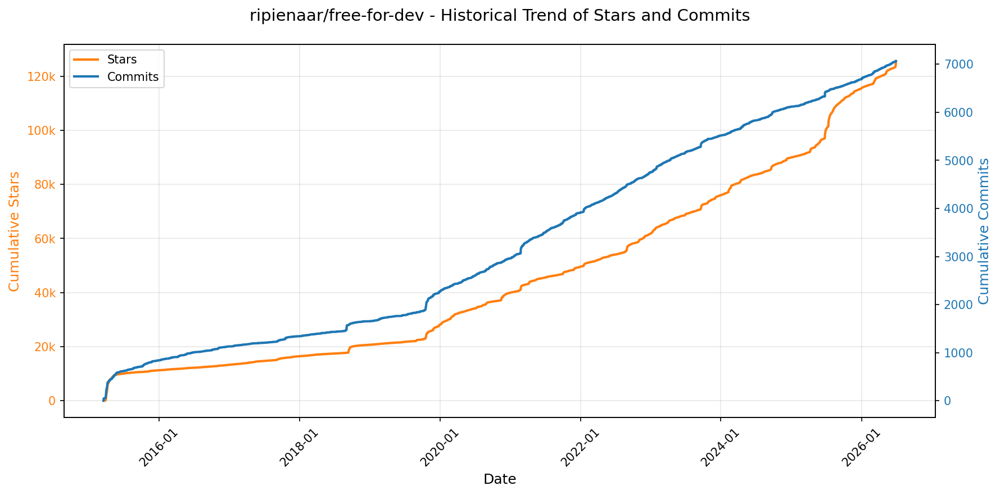

> *蓝色：累计 Stars｜橙色：累计 Commits（次 Y 轴）*

<b>📄 README 摘要</b>

1. **该项目做什么？**  
该项目是一个面向基础设施开发者（如系统管理员、DevOps 工程师等）的**开源免费服务资源聚合清单**，专门收集并持续维护全球范围内提供**长期、真正免费（非仅试用）开发者层级服务**的云平台与 SaaS/PaaS/IaaS 等托管型服务。其核心目标是帮助开发者高效发现、比较和选用符合生产或学习需求的免费基础设施级工具和服务，避免自行搜索耗时、信息碎片化及过期风险。项目不收录自托管软件，仅限具备明确、可持续免费 tier（至少 12 个月有效）且满足安全基线（如强制 TLS、支持 SSO）的商用云服务。

2. **关键特性**  
- **高度结构化分类目录**：覆盖 50+ 细分技术领域（如 CI/CD、监控、数据库、Auth、CDN、Serverless、AI API、DNS、存储等），便于按角色与场景快速定位；  
- **严格准入标准**：要求服务必须提供“永久免费 tier”（非限时试用），免费期 ≥1 年（若按时间计费），且关键安全能力（如 TLS 加密）不得限于付费层；  
- **社区驱动与高可信度**：由 1600+ 开发者通过 Pull Request 共同维护，内容经人工审核，确保时效性与准确性；  
- **主流云厂商深度整合**：详尽列出 Google Cloud、AWS、Azure、Oracle Cloud、IBM Cloud、Cloudflare 及 Zoho 等平台的免费配额（含具体资源量、限制条件与官方链接）；  
- **跨平台兼容性与实用性导向**：聚焦 DevOps/Infra 场景刚需，涵盖从代码托管（GitHub/GitLab/Codeberg）、构建部署（CI/CD）、可观测性（日志/监控/告警）到 AI/ML、安全、网络等全栈基础设施服务；  
- **开放协作机制**：明确鼓励贡献（新增/更新/移除服务），提供标准化 PR 流程与审核指南。

3. **技术栈**  
该项目本身为**纯静态文档型开源项目**，无运行时服务或后端逻辑，技术栈极简：  
- **核心载体**：Markdown 格式 README 文件（`README.md`），作为唯一内容源与展示界面；  
- **托管与协作平台**：GitHub（版本控制、PR 管理、Issue 跟踪、CI 集成）；  
- **辅助生态工具**：  
  - `trackawesomelist.com`（第三方服务）用于自动化追踪列表更新状态并生成徽章；  
  - 依赖 GitHub 原生功能（如锚点链接、目录生成、富文本渲染）实现导航与可读性；  
- **无前端框架/构建工具**：内容直接由 GitHub Pages 渲染，零编译、零依赖，确保极致轻量与长期可维护性。

---

### 4. [harry0703/MoneyPrinterTurbo](https://github.com/harry0703/MoneyPrinterTurbo)
- 📅 **创建日期**：2024-03-11  
- 🔄 **最近更新**：2026-06-29  
- ⭐ **Stars**：91,655（日 +0｜周 +0｜月 +21111）  
- 📝 **描述**：利用AI大模型，一键生成高清短视频 Generate short videos with one click using AI LLM.  

<b>📈 Star 与 Commit 历史趋势</b>

> *蓝色：累计 Stars｜橙色：累计 Commits（次 Y 轴）*

<b>📄 README 摘要</b>

1. **项目功能**  
MoneyPrinterTurbo 是一个全自动短视频生成工具，用户仅需输入视频主题或关键词，即可端到端完成：AI生成视频文案（支持中英文）、自动匹配高清无版权视频素材（来源包括 Pexels、Pixabay、Coverr 等）、智能生成精准字幕（支持字体/位置/颜色/描边等自定义）、语音合成（支持 Edge TTS 免费方案及 Azure TTS V2 高质量付费方案）、背景音乐添加与混音，最终合成为 9:16（竖屏）或 16:9（横屏）高清短视频，并支持一键跨平台发布至 TikTok、Instagram 和 YouTube Shorts（需对接 Upload-Post 服务）。

2. **核心特性**  
- 支持 Web UI 与 RESTful API 双交互模式，采用清晰 MVC 架构；  
- 文案可 AI 自动生成或手动编辑，支持批量生成多版本供筛选；  
- 视频参数高度可配：分辨率、片段时长、字幕样式、BGM 音量、语音角色等；  
- 多源素材接入：本地文件 + 在线图库（Pexels/Pixabay/Coverr）+ 可选 TwelveLabs 视频语义重排与内容质检；  
- 超强大模型兼容性：支持 OpenAI、Gemini、Claude、通义千问、文心一言、DeepSeek、MiniMax、GLM、Ollama、Moonshot、Azure、gpt4free、one-api、ModelScope 等 16+ 主流 LLM 接入方式；  
- 灵活部署方案：提供一键 Windows 启动包、Docker 容器化部署、Google Colab 在线运行、手动 uv/pip 本地部署及纯 CLI 命令行模式；  
- 字幕生成双引擎：基于 Edge TTS 时间戳的轻量快速模式（edge）与基于本地 faster-whisper 的高精度模式（whisper）；  
- 全流程自动化发布：集成 Upload-Post 实现 TikTok/Instagram/YouTube Shorts 一键上传（YouTube 自动标注 AI 生成内容）。

3. **技术栈**  
- **前端框架**：Streamlit（Web UI）、Swagger/OpenAPI（API 文档）；  
- **后端语言**：Python 3.11；  
- **依赖管理**：uv（推荐）、pip（兼容）；  
- **视频处理**：MoviePy 2.x（字幕渲染改用 Pillow，已移除 ImageMagick 依赖）；  
- **语音合成**：Edge TTS（免费默认）、Azure Speech SDK（V2 付费）；  
- **字幕生成**：Edge TTS 时间戳对齐 或 本地 faster-whisper（large-v3-turbo / large-v3 模型）；  
- **音视频合成**：ffmpeg（自动下载或手动配置路径）；  
- **部署方案**：Docker（docker-compose.release.yml 预构建镜像）、Windows BAT 脚本、Shell 脚本（macOS/Linux）、Google Colab Notebook；  
- **配置管理**：TOML 格式（config.toml）；  
- **模型接入协议**：OpenAI-compatible API、自定义适配器（如 AIHubMix、CompShare、CCSub 等中转平台）。

---

### 5. [Stirling-Tools/Stirling-PDF](https://github.com/Stirling-Tools/Stirling-PDF)
- 📅 **创建日期**：2023-01-27  
- 🔄 **最近更新**：2026-06-29  
- ⭐ **Stars**：84,967（日 +148｜周 +2817｜月 +5347）  
- 📝 **描述**：#1 PDF Application on GitHub that lets you edit PDFs on any device anywhere  

<b>📈 Star 与 Commit 历史趋势</b>

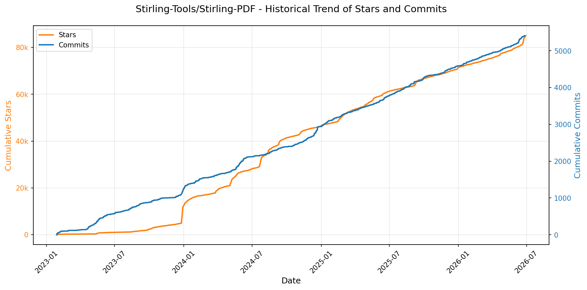

> *蓝色：累计 Stars｜橙色：累计 Commits（次 Y 轴）*

<b>📄 README 摘要</b>

1. **项目功能**  
Stirling PDF 是一个开源的 PDF 全功能处理平台，支持本地化、私有化部署与离线使用。用户无需将敏感文档上传至第三方云服务，即可在完全可控的环境中完成 PDF 的编辑、签署、脱敏（红标）、格式转换、OCR 识别、压缩、拆分、合并等核心操作，并支持大规模自动化处理。

2. **关键特性**  
- **多形态部署**：提供桌面客户端、Web 浏览器界面及自托管服务器（含私有 REST API）三种使用方式；  
- **超 50 种 PDF 工具**：覆盖编辑、签名（数字/手写）、内容红action（Redaction）、OCR 文字识别、PDF↔Word/Excel/PPT/图片等双向转换、批量压缩、页面提取/旋转/删除、元数据管理等；  
- **无代码自动化工作流**：内置可视化流程编排界面，支持构建和调度 PDF 处理流水线，并可通过 API 批量处理百万级文档；  
- **企业级能力**：支持 SSO 单点登录（如 OAuth2、SAML）、完整操作审计日志、细粒度权限控制及灵活的本地/私有云/Kubernetes 部署方案；  
- **开发者友好**：几乎所有功能均提供标准化 RESTful API，便于集成至现有业务系统；  
- **全球化支持**：UI 界面支持 40+ 种语言，具备完善的国际化（i18n）与本地化（l10n）机制。

3. **技术栈**  
- **后端**：基于 Rust 构建（高性能、内存安全），使用 Axum 框架提供 Web 服务，依赖 pdfium-render、poppler、tesseract 等原生库实现 PDF 渲染、解析与 OCR；  
- **前端**：TypeScript + React（Vite 构建），采用 Tailwind CSS 实现响应式 UI，支持 PWA；  
- **部署与运维**：官方提供 Docker 镜像（支持 ARM/x64）、Kubernetes Helm Chart、Windows/macOS/Linux 桌面安装包；构建与开发流程统一使用 Taskfile（Task 工具）管理；  
- **基础设施**：CI/CD 基于 GitHub Actions，代码质量与安全由 OpenSSF Scorecard 等工具保障。

---

### 6. [ByteByteGoHq/system-design-101](https://github.com/ByteByteGoHq/system-design-101)
- 📅 **创建日期**：2023-09-18  
- 🔄 **最近更新**：2026-06-29  
- ⭐ **Stars**：84,458（日 +452｜周 +856｜月 +1658）  
- 📝 **描述**：Explain complex systems using visuals and simple terms. Help you prepare for system design interviews.  

<b>📈 Star 与 Commit 历史趋势</b>

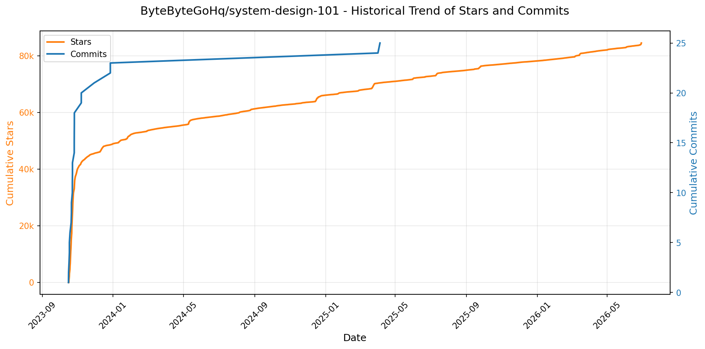

> *蓝色：累计 Stars｜橙色：累计 Commits（次 Y 轴）*

<b>📄 README 摘要</b>

1. **该项目做什么？**  
该项目是一个面向系统设计学习与技术面试准备的开源知识库（GitHub 仓库），核心目标是**以可视化方式和通俗语言讲解复杂分布式系统、后端架构及底层技术原理**。它不提供可运行代码或软件工具，而是通过结构化、主题化的技术指南（Guides）帮助开发者理解系统设计本质，适用于准备系统设计面试、提升工程素养或深入掌握现代互联网基础设施。

2. **关键特性**  
- **全覆盖式知识体系**：涵盖六大核心领域——API与Web开发、真实世界案例研究、AI/机器学习、数据库与存储、技术面试基础、缓存与性能优化、支付与金融科技，内容深度与广度兼顾；  
- **实战导向的案例解析**：包含大量头部公司（如Netflix、Uber、Twitter、Airbnb、TikTok、Discord、Pinterest等）的真实架构演进、技术选型与性能优化实践；  
- **概念对比与误区澄清**：高频聚焦易混淆概念（如Load Balancer vs API Gateway、REST vs GraphQL vs gRPC、CAP定理常见误解、Pessimistic vs Optimistic Locking等），辅以图表化总结（如“Cheat Sheet”系列）；  
- **底层原理深度拆解**：从HTTP/1→HTTP/3演进、浏览器渲染流程、JS引擎工作原理、NAT机制、Kafka高性能原理，到Redis持久化机制、PostgreSQL为何受青睐等，强调“知其所以然”；  
- **结构化学习路径**：提供《终极API学习路线图》《如何攻克系统设计面试》等导航性内容，支持按需检索与体系化学习。

3. **技术栈**  
该项目**本身为静态文档型仓库**，无传统意义上的“运行时技术栈”。其内容以**Markdown格式组织**，托管于GitHub，所有指南均通过外部链接（`https://bytebytego.com/guides/xxx`）指向ByteByteGo官网发布的正式文章；官网前端基于现代Web技术构建（推测为React/Vue等框架 + 静态站点生成器），后端服务未公开披露，但内容生产依赖专业技术写作与可视化设计能力。项目依赖的核心“技术”实为**系统设计领域的专业知识体系、教学方法论与内容工程能力**。

---

### 7. [bytedance/deer-flow](https://github.com/bytedance/deer-flow)
- 📅 **创建日期**：2025-05-07  
- 🔄 **最近更新**：2026-06-29  
- ⭐ **Stars**：76,206（日 +194｜周 +2590｜月 +5615）  
- 📝 **描述**：An open-source long-horizon SuperAgent harness that researches, codes, and creates. With the help of sandboxes, memories, tools, skill, subagents and message gateway, it handles different levels of tasks that could take minutes to hours.  

<b>📈 Star 与 Commit 历史趋势</b>

> *蓝色：累计 Stars｜橙色：累计 Commits（次 Y 轴）*

<b>📄 README 摘要</b>

1. **项目功能**  
DeerFlow 2.0 是一个开源的「超级智能体（Super Agent）运行框架」，核心目标是构建可扩展、安全可控、生产就绪的多智能体协作系统。它通过编排子智能体（Sub-Agents）、沙盒环境（Sandbox）、长期记忆（Long-Term Memory）和结构化上下文工程（Context Engineering），支持复杂任务的端到端自动化执行——例如深度研究、代码生成与验证、多步推理、跨工具协同、报告生成等。其定位已从初代“深度研究框架”全面升级为通用型智能体基础设施，强调企业级部署能力、安全沙箱隔离、IM渠道集成及可插拔技能生态。

2. **关键特性**  
- **可扩展技能体系（Skills & Tools）**：支持声明式技能注册与动态加载，原生集成 Claude Code、InfoQuest（字节自研智能搜索/爬虫套件）、Tavily、OpenRouter、Responses API 等；提供 CLI 背书模型适配器（如 Codex CLI、Claude Code OAuth）。  
- **分层子智能体架构（Sub-Agents）**：支持主控智能体（Lead Agent）按需调度专用子智能体，实现任务分解、角色分工与结果聚合。  
- **多模式沙盒执行（Sandbox & File System）**：提供本地执行、Docker 容器隔离、Kubernetes Provisioner 三种沙盒模式，保障代码/脚本执行安全性与环境一致性；内置文件系统抽象，支持跨沙盒文件读写与版本管理。  
- **上下文工程与长期记忆（Context Engineering & Long-Term Memory）**：支持会话级/用户级/全局级上下文注入、思维链（Thinking）开关控制、计划模式（Plan Mode）启用，并通过结构化存储（如 SQLite/PostgreSQL）持久化记忆，支持语义检索与增量更新。  
- **全渠道任务接入（IM Channels）**：开箱即用支持 Telegram、Slack、Feishu/Lark、DingTalk、WeCom、WeChat 等主流 IM 平台，无需公网 IP 即可通过长轮询/WebSocket 接收指令；支持用户侧自主绑定频道与个性化会话配置（如 per-user agent、递归限制、思维启用）。  
- **可观测性与调试增强**：原生集成 LangSmith/Langfuse 追踪、终端 TUI 工作台（Terminal Workbench）、健康检查（`make doctor`）、交互式配置向导（`make setup`）及详尽的部署尺寸指南。  

3. **技术栈**  
- **后端**：Python 3.12+，基于 FastAPI 构建 Gateway API；使用 LangChain 生态（`langchain_openai` 等）对接 LLM；依赖 `uv` 作为 Python 包管理与构建工具；内存与状态持久化支持 SQLite（默认）或 PostgreSQL；沙盒底层依托 Docker/Kubernetes；MCP（Model Context Protocol）服务支持 HTTP/SSE 与 OAuth 认证流。  
- **前端**：Node.js 22+，采用现代 Web 技术栈（未明示框架，但由 `pnpm` 管理依赖，Nginx 统一网关代理）；提供 Web UI 与终端 TUI 双界面；支持 CORS 配置与 CSRF 安全防护。  
- **基础设施**：Docker（开发/生产首选）、Docker Compose、nginx（反向代理与静态资源服务）；CI/CD 与本地构建均基于 `Makefile` 驱动；配置统一通过 `config.yaml` + `.env` 管理，支持环境变量注入与多模型并行路由。  
- **AI 基础设施兼容性**：深度适配 OpenAI 兼容 API（含 vLLM、OpenRouter、Responses API）、Claude Code OAuth、Codex CLI、Qwen3/vLLM 推理服务器等，支持 `thinking`/`reasoning` 模式自动切换与非标准字段透传。

---

### 8. [opendatalab/MinerU](https://github.com/opendatalab/MinerU)
- 📅 **创建日期**：2024-02-29  
- 🔄 **最近更新**：2026-06-29  
- ⭐ **Stars**：71,787（日 +696｜周 +3573｜月 +6330）  
- 📝 **描述**：Transforms complex documents like PDFs and Office docs into LLM-ready markdown/JSON for your Agentic workflows.  

<b>📈 Star 与 Commit 历史趋势</b>

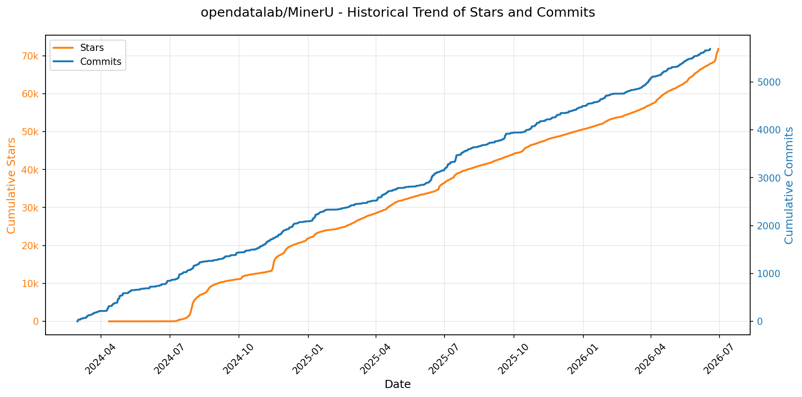

> *蓝色：累计 Stars｜橙色：累计 Commits（次 Y 轴）*

<b>📄 README 摘要</b>

1. **项目功能**  
MinerU 是一个面向大语言模型（LLM）、检索增强生成（RAG）和智能体（Agent）工作流的高精度文档解析引擎。其核心能力是将多种格式的非结构化文档（包括 PDF、DOCX、PPTX、XLSX、图像、网页等）精准转换为结构化输出（Markdown 或 JSON），支持人类阅读顺序还原、自动页眉页脚剔除、跨页表格合并、公式转 LaTeX、表格转 HTML 等，并兼顾布局保真与语义准确性。

2. **关键特性**  
- ✅ **多格式原生解析**：全面支持 PDF、DOCX、PPTX、XLSX、图像及网页，其中 DOCX/PPTX/XLSX 为原生解析（非先转 PDF），避免失真与性能损耗；  
- ✅ **双引擎协同架构**：集成视觉语言模型（VLM）+ OCR 双通道解析引擎，支持 109 种语言识别，兼顾高精度与低幻觉；  
- ✅ **复杂版式鲁棒处理**：支持扫描件、手写体、多栏排版、跨页表格、嵌套图表、公式编号、印章文本、竖排文字等挑战性场景；  
- ✅ **生产级工程能力**：提供 pipeline（轻量稳定，纯 CPU 可运行）、vlm-engine（高精度，支持 vLLM/LMDeploy/MLX）、hybrid-engine（精度与效率平衡）三类后端；支持滑动窗口内存优化、流式磁盘写入、多线程并发、多 GPU 自动负载均衡（via `mineru-router`）；  
- ✅ **开箱即用生态集成**：原生兼容 LangChain / Dify / FastGPT / RAGFlow 等主流 RAG 框架；提供 MCP Server 支持 Cursor/Claude Desktop 等 AI 编程工具；支持 Python/Go/TypeScript SDK、CLI、REST API、Docker 及零安装 Web 端（mineru.net）与桌面客户端；  
- ✅ **国产算力全栈适配**：深度支持昇腾（Ascend）、寒武纪（Cambricon）、天数智芯（Ilumina）、摩尔线程（Moore Threads）、昆仑芯（Kunlunxin）、壁仞（Biren）、天数智芯（Hygon）、平头哥（T-Head）等十余种国产 AI 芯片；  
- ✅ **开源友好与商用就绪**：采用基于 Apache 2.0 的自研开源许可证（MinerU Open Source License），消除 AGPL 合规风险，显著降低社区与商业落地门槛。

3. **技术栈**  
- **核心模型**：自研 VLM 模型系列（如 MinerU2.5-Pro-2605-1.2B）、PP-OCRv6 OCR 引擎；  
- **推理框架**：支持 vLLM、LMDeploy、MLX 生态，底层兼容 PyTorch（≥2.9.0）；  
- **服务架构**：模块化设计，含 `mineru-api`（异步任务 + 同步解析双接口）、`mineru-router`（多服务/多 GPU 统一路由与负载均衡）、`mineru` CLI 客户端；  
- **部署方案**：支持 Docker 容器化、本地 CLI、WebUI（Gradio）、在线 SaaS（mineru.net）、桌面客户端及私有离线部署；  
- **开发语言**：主程序为 Python，提供 Go 和 TypeScript 官方 SDK；  
- **基础设施**：基于 GitHub Actions CI/CD，模型分发支持多源自动选优与本地缓存复用机制。

---

### 9. [commaai/openpilot](https://github.com/commaai/openpilot)
- 📅 **创建日期**：2016-11-24  
- 🔄 **最近更新**：2026-06-29  
- ⭐ **Stars**：62,455（日 +336｜周 +980｜月 +1316）  
- 📝 **描述**：openpilot is an operating system for robotics. Currently, it upgrades the driver assistance system on 300+ supported cars.  

<b>📈 Star 与 Commit 历史趋势</b>

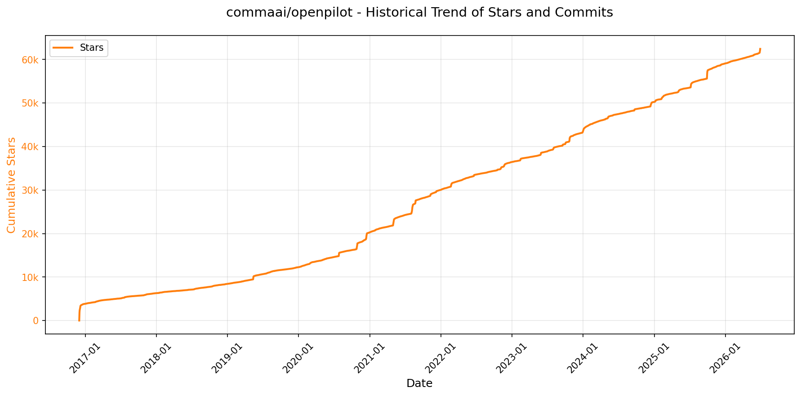

> *蓝色：累计 Stars｜橙色：累计 Commits（次 Y 轴）*

<b>📄 README 摘要</b>

1. **项目功能**  
openpilot 是一个面向汽车的开源自动驾驶操作系统，核心功能是为兼容车辆提供增强型高级驾驶辅助系统（ADAS）。它通过连接专用硬件（如 comma 四）与车辆 CAN 总线及传感器，实现车道居中保持、自适应巡航控制（ACC）、自动变道、交通信号识别等准 L2+/L3 级别辅助驾驶能力。目前支持超过 300 款车型，可直接升级原厂驾驶辅助系统，无需更换整车电子架构。

2. **关键特性**  
- **多车平台兼容性**：支持 300+ 种主流品牌车型（含丰田、本田、大众、通用、现代/起亚等），覆盖多种协议（如 Toyota Safety Sense、Honda Sensing、GM ADAS 等）；  
- **端到端可定制分支体系**：提供 `release`（稳定版）、`staging`（预发布）、`nightly`（每日构建）和 `nightly-dev`（含实验性功能）四类预编译分支，适配不同可靠性与功能需求；  
- **高可靠性安全架构**：严格遵循 ISO 26262 功能安全标准，关键安全逻辑（如扭矩限制、制动干预）由运行在 Panda 硬件上的 C 语言固件执行，独立于主系统；  
- **全栈测试验证体系**：包含软件在环（SIL）自动化测试、Panda 硬件在环（HIL）Jenkins 测试集群、10 设备持续路测回放系统，确保每次提交均经严格验证；  
- **隐私可控的数据闭环**：默认上传道路摄像头、CAN、GPS、IMU 等行车数据用于模型训练，但驾驶员面部摄像头与麦克风数据仅在用户显式授权后采集，且支持完全禁用数据上传。

3. **技术栈**  
- **主控平台**：基于 Linux 的嵌入式操作系统（定制化 Debian/Ubuntu 衍生系统），运行于 comma 自研硬件（comma four / comma 3X）；  
- **核心语言**：Python（主要业务逻辑、模型推理接口、工具链）、C（Panda 安全控制器固件、底层驱动）、Java（部分 Android 相关组件）；  
- **感知与决策**：使用 PyTorch 训练的端到端神经网络模型（如横向控制、纵向规划、目标检测），结合传统计算机视觉与规则引擎进行融合决策；  
- **通信与总线**：深度集成 CAN 协议栈（通过 Panda 接口卡解析/注入指令），支持多种车载网络（CAN-FD、LIN、Ethernet）；  
- **开发与部署**：GitHub CI/CD（Actions 自动化测试）、Docker（部分仿真环境）、自研 replay 工具链（用于离线数据回放与调试）、comma Connect 云服务（OTA 更新、远程诊断、数据管理）。

---

### 10. [koala73/worldmonitor](https://github.com/koala73/worldmonitor)
- 📅 **创建日期**：2026-01-08  
- 🔄 **最近更新**：2026-06-29  
- ⭐ **Stars**：61,441（日 +281｜周 +2494｜月 +5827）  
- 📝 **描述**：Real-time global intelligence dashboard. AI-powered news aggregation, geopolitical monitoring, and infrastructure tracking in a unified situational awareness interface  

<b>📈 Star 与 Commit 历史趋势</b>

> *蓝色：累计 Stars｜橙色：累计 Commits（次 Y 轴）*

<b>📄 README 摘要</b>

1. **项目功能**  
World Monitor 是一个实时全球态势感知平台，提供 AI 驱动的新闻聚合、地缘政治动态监测与关键基础设施追踪。它通过统一界面整合多源情报，支持跨领域信号关联分析（如军事、经济、灾害与冲突升级信号），并输出结构化评估指标（如面向 31 个一级国家的服务器端权威“国家不稳定性指数”CII v8）。项目以单一代码库支撑六大垂直变体（全球版、科技版、金融版、大宗商品版、幸福指数版、能源版），覆盖新闻、市场、航空、气候、网络、军事等 65+ 数据源，同时提供原生桌面客户端（Windows/macOS/Linux）及多语言（24 种，含 RTL）支持。

2. **核心特性**  
- **智能新闻处理**：聚合 500+ 精选新闻源，覆盖 15 类主题，由本地 AI（Ollama）自动生成摘要，无需外部 API 密钥；  
- **双引擎地理可视化**：集成 globe.gl（3D 地球）与 deck.gl + MapLibre GL（WebGL 平面地图），支持 56 种地图图层类型；  
- **多维交叉分析**：实现军事部署、金融市场、自然灾害、舆情热度等多流数据的实时关联与异常信号收敛；  
- **专业垂直变体**：同一套代码可构建 world/tech/finance/commodity/happy/energy 六个独立域名应用，按需切换；  
- **离线可用的本地 AI**：全部 AI 推理在终端侧运行（Ollama / Transformers.js 浏览器端），保障隐私与低延迟；  
- **全平台原生桌面应用**：基于 Tauri 2（Rust）构建，支持 Windows（.exe）、macOS（Apple Silicon/Intel）和 Linux（AppImage）；  
- **企业级数据架构**：采用 Protocol Buffers 定义 276 个 proto 消息与 34 项服务接口，配合 sebuf HTTP 注解实现强类型 API 合约；  
- **多级缓存体系**：结合 Upstash Redis、CDN、Service Worker 与三层缓存策略，保障高并发下数据新鲜度与响应性能。

3. **技术栈**  
- **前端**：纯 TypeScript（无框架）、Vite 构建工具、globe.gl + Three.js（3D 渲染）、deck.gl + MapLibre GL（矢量地图）；  
- **桌面端**：Tauri 2（Rust 主进程） + Node.js 辅助侧车（sidecar），实现轻量级、安全的原生封装；  
- **AI/ML 层**：本地运行 Ollama 模型；可选对接 Groq / OpenRouter；浏览器内使用 Transformers.js 执行轻量 NLP；  
- **API 与通信**：Protocol Buffers（protobuf）定义服务契约；sebuf 注解驱动 HTTP 接口生成；Vercel Edge Functions（60+ 边缘函数）处理无服务器逻辑；  
- **部署与运维**：Vercel（前端托管与边缘计算）、Railway（后端中继服务）、Docker / PWA 多模式部署支持；  
- **缓存与存储**：Upstash 托管 Redis（分布式缓存）、CDN 加速、Service Worker 离线缓存，形成三级缓存体系。

---

### 11. [NanmiCoder/MediaCrawler](https://github.com/NanmiCoder/MediaCrawler)
- 📅 **创建日期**：2023-06-09  
- 🔄 **最近更新**：2026-06-29  
- ⭐ **Stars**：54,505（日 +189｜周 +2484｜月 +3766）  
- 📝 **描述**：小红书笔记 | 评论爬虫、抖音视频 | 评论爬虫、快手视频 | 评论爬虫、B 站视频 ｜ 评论爬虫、微博帖子 ｜ 评论爬虫、百度贴吧帖子 ｜ 百度贴吧评论回复爬虫  | 知乎问答文章｜评论爬虫  

<b>📈 Star 与 Commit 历史趋势</b>

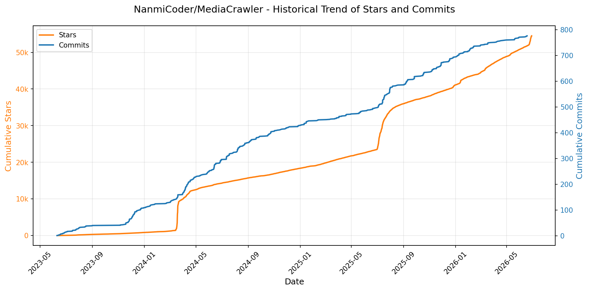

> *蓝色：累计 Stars｜橙色：累计 Commits（次 Y 轴）*

<b>📄 README 摘要</b>

1. **项目功能**  
MediaCrawler 是一个面向自媒体平台的**多平台公开数据采集工具**，专注于从小红书、抖音、快手、B站、微博、贴吧、知乎等主流中文社交平台抓取公开内容（如帖子/视频信息、用户主页数据、一级及二级评论等），支持关键词搜索、指定ID爬取、创作者主页批量采集，并可生成评论词云图，服务于数据分析、舆情监测、内容研究等学习与技术研究场景。

2. **核心功能特性**  
- ✅ **全平台覆盖**：7大主流平台（小红书、抖音、快手、B站、微博、贴吧、知乎）均支持关键词搜索、详情页爬取、创作者主页采集、评论抓取（含二级评论）及登录态持久化；  
- ✅ **智能登录与风控规避**：默认采用 Chrome CDP 模式复用本地浏览器登录态（含 Cookie、扩展等），显著降低平台反爬检测风险；支持二维码扫码登录；  
- ✅ **高可用工程能力**：内置 IP 代理池、登录态缓存机制、断点续爬（Pro 版）、多账号管理；  
- ✅ **可视化交互支持**：提供基于 FastAPI 的 WebUI 界面，支持参数配置、实时日志监控、数据预览与导出；  
- ✅ **灵活数据输出**：支持 CSV、JSON、JSONL、Excel、SQLite 和 MySQL 多种存储格式；  
- ✅ **进阶扩展能力（Pro 版专属）**：集成自媒体内容拆解 Agent、AI Agent Skill（OpenClaw/Claude/Cursor 一键接入）、HomeFeed 推荐流采集、桌面端视频下载器及 Linux 全环境支持。

3. **技术栈**  
- **核心框架**：Python（主语言），基于 [Playwright](https://playwright.dev/) 实现浏览器自动化（CDP 模式或标准模式）；  
- **前端与服务**：FastAPI（WebUI 后端 API）、Uvicorn（ASGI 服务器）；  
- **依赖管理**：`uv`（推荐的高性能 Python 包管理器）；  
- **运行环境**：需 Node.js（≥16.0.0，用于部分平台 JS 签名逻辑及 Playwright 驱动）；Chrome 浏览器（≥144 版，启用远程调试）；  
- **数据处理与存储**：Pandas、SQLAlchemy、openpyxl 等；支持 SQLite / MySQL 关系型数据库；  
- **辅助工具链**：Playwright 浏览器驱动、Selenium 替代方案（非依赖）、轻量级 JS 执行环境（绕过复杂逆向，直接调用页面上下文获取签名）。

---

### 12. [penpot/penpot](https://github.com/penpot/penpot)
- 📅 **创建日期**：2015-12-29  
- 🔄 **最近更新**：2026-06-29  
- ⭐ **Stars**：54,477（日 +208｜周 +2054｜月 +5970）  
- 📝 **描述**：Penpot: The open-source design tool for design and code collaboration  

<b>📈 Star 与 Commit 历史趋势</b>

> *蓝色：累计 Stars｜橙色：累计 Commits（次 Y 轴）*

<b>📄 README 摘要</b>

1. **项目功能**  
Penpot 是一个面向规模化数字产品团队的开源设计与原型平台，核心目标是提供**完全自主可控的设计基础设施**。它支持浏览器直接使用或私有化部署（如 Docker/Kubernetes），使团队能在自有服务器上全权掌控设计数据、流程与合规性。平台将设计过程“代码化”，实现设计与开发的无缝衔接，支持从设计到前端代码（SVG/CSS/HTML）的实时双向转换，并通过 MCP（Multi-Code Protocol）服务器打通设计与工程系统，赋能 AI 驱动的工作流和自动化集成。

2. **关键特性**  
- **全栈式设计能力**：原生支持 CSS Grid 与 Flex 布局，设计即响应式代码；Inspect 模式可即时查看并导出 SVG、CSS、HTML；  
- **设计系统深度支持**：内置工业级 Design Tokens（设计令牌）、组件（Components）与变体（Variants），确保跨平台、跨项目的 UI 一致性与可复用性；  
- **实时协同与开放标准**：基于 Web 的实时协作，所有设计资产以开放格式（SVG/JSON/CSS/HTML）存储，无私有二进制锁定；  
- **开发者友好架构**：提供强大开放 API、Webhook 集成、插件系统（PenpotHub）及可编程工作区，支持与现有 DevOps 工具链（如 Git、CI/CD）深度对接；  
- **MCP 协议驱动智能工作流**：通过 Penpot MCP Server 实现设计 ↔ 代码 ↔ AI 的多向同步，支持自动代码生成、样式映射、AI 辅助设计等高级场景。

3. **技术栈**  
- **前端**：TypeScript + React（基于现代 Web 标准构建，高度依赖 Canvas/WebGL 渲染与 SVG 操作）；  
- **后端**：Elixir（Phoenix 框架），主打高并发实时协作与低延迟同步；  
- **数据与存储**：PostgreSQL（结构化元数据）、Redis（实时状态与缓存）、对象存储（如 S3 兼容服务，用于资源文件）；  
- **基础设施**：容器化优先（Docker/Kubernetes 官方支持），兼容 Elestio 等托管方案；  
- **协议与标准**：严格遵循开放 Web 标准（SVG、CSS、HTML、JSON），MCP 协议为自研开源协议（GitHub 开源），插件系统基于 WebAssembly 与标准 JS API。

---

### 13. [Leonxlnx/taste-skill](https://github.com/Leonxlnx/taste-skill)
- 📅 **创建日期**：2026-02-19  
- 🔄 **最近更新**：2026-06-29  
- ⭐ **Stars**：52,766（日 +444｜周 +4091｜月 +24506）  
- 📝 **描述**：Taste-Skill - gives your AI good taste. stops the AI from generating boring, generic slop   

<b>📈 Star 与 Commit 历史趋势</b>

> *蓝色：累计 Stars｜橙色：累计 Commits（次 Y 轴）*

<b>📄 README 摘要</b>

1. **项目功能**  
Taste Skill 是一个面向 AI 编程代理（如 ChatGPT、Claude Code、Codex、Cursor）的「反平庸前端技能库」，旨在提升 AI 生成界面的设计质量。它不构建运行时框架，而是提供一系列可插拔、语义明确的 **Agent Skills（代理技能）**，用于指导 AI 产出更高水准的前端实现：消除模板化（slop）、强化布局逻辑、 typography 层级、动效质感与空间节奏。同时支持「图像先行」工作流——通过配套的图像生成技能（web/mobile/brandkit）产出专业设计参考图，再交由编码代理转化为实际代码。

2. **核心特性**  
- ✅ **模块化技能体系**：每个技能专注单一目标（如 `redesign-existing-projects` 审计并重构旧项目；`output-skill` 强制完整输出，杜绝占位符）；支持按需安装单个技能（`--skill "xxx"`）。  
- ✅ **双轨能力支持**：既含 **代码生成技能**（输出 HTML/CSS/JS/GSAP 骨架），也含 **图像生成技能**（输出设计稿、移动端流程图、品牌手册等参考图），二者统一通过 `npx skills add` 管理。  
- ✅ **可调设计参数**：主技能 `design-taste-frontend`（v2）引入三档数值化调节（1–10）：`DESIGN_VARIANCE`（布局实验性）、`MOTION_INTENSITY`（动效强度）、`VISUAL_DENSITY`（视口信息密度），实现设计语言精准控制。  
- ✅ **多风格覆盖**：内置软奢（`soft-skill`）、极简（`minimalist-skill`）、粗野主义（`brutalist-skill`）等视觉方向技能，适配不同产品调性。  
- ✅ **AI 友好协议**：强制禁用硬破折号、内置 GSAP 标准骨架、 redesign-audit 协议、预检（pre-flight check）机制，显著降低 AI 输出的“平庸感”与技术瑕疵。  
- ✅ **框架无关 & 工具链兼容**：技能规则聚焦设计意图而非具体框架，原生兼容 React/Vue/Svelte；深度适配 Vercel Agent Skills CLI、ChatGPT Images、Codex 图像模式等主流 AI 开发工具。

3. **技术栈**  
- **交付形态**：纯文本 `SKILL.md` 文件（含 frontmatter 元数据），遵循 [Vercel Agent Skills](https://github.com/vercel-labs/agent-skills) 规范，无需编译或运行时依赖。  
- **核心工具链**：基于 `npx skills add` CLI（Vercel Labs 提供）进行技能发现、安装与更新；与 ChatGPT、Claude、Codex、Cursor 等 LLM 编程代理直接集成。  
- **技术规范**：强调现代 Web 实践——GSAP 动效标准、响应式排版系统、CSS 自定义属性、无障碍语义结构；图像技能输出符合专业设计交付标准（如品牌手册、高保真原型图）。  
- **基础设施**：托管于 GitHub，采用 MIT 许可证；获 Vercel OSS 计划支持；构建与分发完全静态化，零服务端依赖。

---

### 14. [mvanhorn/last30days-skill](https://github.com/mvanhorn/last30days-skill)
- 📅 **创建日期**：2026-01-23  
- 🔄 **最近更新**：2026-06-29  
- ⭐ **Stars**：47,844（日 +253｜周 +2041｜月 +20963）  
- 📝 **描述**：AI agent skill that researches any topic across Reddit, X, YouTube, HN, Polymarket, and the web - then synthesizes a grounded summary  

<b>📈 Star 与 Commit 历史趋势</b>

> *蓝色：累计 Stars｜橙色：累计 Commits（次 Y 轴）*

<b>📄 README 摘要</b>

1. **项目功能**  
该项目是一个由AI智能体驱动的实时信息聚合与分析工具（命令为 `/last30days`），旨在替代传统搜索引擎，直接从数十个真实社交与内容平台抓取、并行检索、加权评分并智能合成过去30天内关于任意人物、公司、产品或事件的最新动态。它不依赖编辑筛选或SEO排名，而是基于真实用户行为（Reddit点赞、X/Twitter转发/喜欢、YouTube观看与评论、TikTok播放量、Polymarket真金白银押注的预测概率、GitHub提交活跃度等）自动评估信息重要性，并由AI代理统一提炼成结构化简报。核心价值在于：打破平台数据孤岛，将分散在不同“围墙花园”中的信号（如X上的突发评论、Reddit的深度讨论、GitHub的代码提交、Polymarket的市场共识）融合为单一、可信、时效性强的决策依据。

2. **关键特性**  
- **多源智能聚合与跨平台评分**：原生支持Reddit（免密公开API）、X/Twitter、YouTube（含高质量转录）、TikTok、Instagram Reels、Hacker News、Polymarket（以概率而非金额呈现）、GitHub（含作者模式深度分析）、Digg、Threads、Pinterest、Bluesky、Perplexity及通用网页，所有结果按真实用户参与度（非算法权重）动态打分。  
- **v3智能预研引擎**：首次引入“理解先于搜索”的Python预研大脑，自动解析查询实体（如人名→对应X账号/GitHub用户名/子版块/话题标签），精准定位信源，大幅提升召回准确率。  
- **高级合成能力**：  
  • 自动生成可分享的离线HTML简报（含暗色模式、系统字体回退、零JS、完整引用与元数据）；  
  • “最佳观点”（Best Takes）模块，独立幽默/传播力评分，精选高共鸣金句融入主报告；  
  • 跨源聚类合并（同一事件在多平台出现时自动去重整合）；  
  • 单次并发对比（如`OpenClaw vs Hermes`仅需3分钟，非串行12+分钟）；  
  • 自动竞品发现（`--competitors`参数触发AI自主识别并并行分析Top 2竞品）；  
  • GitHub人物模式（针对个人查询，聚焦其PR、仓库、发布、贡献趋势）；  
  • ELI5简易模式（一键切换为无术语的通俗解释）。  
- **鲁棒性与易用性**：免费Reddit评论、YouTube转录容错增强、Polymarket歧义过滤、单作者条目上限（防信息垄断）、实体消歧、1012项自动化测试保障稳定性；零配置开箱即用，首次运行向导自动启用X/YouTube/TikTok等扩展源。

3. **技术栈**  
- **核心语言与框架**：Python（预研引擎、CLI主程序、测试套件），JavaScript/TypeScript（部分Agent Skills集成适配逻辑）。  
- **AI与模型层**：兼容多种大模型宿主（Claude Code、Codex、Cursor、Copilot、Gemini CLI等），通过[Agent Skills](https://agentskills.io)开放标准集成；深度调用Perplexity Sonar API（需`PERPLEXITY_API_KEY`）及OpenRouter Sonar作为网络搜索后备；支持本地模型推理上下文。  
- **数据获取与处理**：  
  • Reddit：直接调用官方公开JSON API（无需密钥）；  
  • X/Twitter、YouTube、TikTok、Instagram等：依赖`SCRAPECREATORS_API_KEY`统一调用ScrapeCreators服务（含yt-dlp备用方案）；  
  • GitHub：直连REST API；  
  • Polymarket：官方API获取预测市场概率；  
  • Digg：通过CLI工具`digg-pp-cli`接入；  
  • 浏览器会话复用（支持Cookie注入以绕过反爬）。  
- **部署与分发**：  
  • 多平台插件包（Claude Marketplace `.skill`、Claude Desktop `.mcpb` MCP Bundle）；  
  • 全局CLI工具（`npx skills`），支持50+ Agent Skills宿主；  
  • 本地脚本执行（`python3 skills/last30days/scripts/last30days.py`）。  
- **基础设施**：本地文件存储（默认`~/Documents/Last30Days/`）、环境变量配置（`LAST30DAYS_MEMORY_DIR`等）、可选云API密钥管理（Perplexity、OpenRouter、ScrapeCreators）。

---

### 15. [asgeirtj/system_prompts_leaks](https://github.com/asgeirtj/system_prompts_leaks)
- 📅 **创建日期**：2025-05-03  
- 🔄 **最近更新**：2026-06-29  
- ⭐ **Stars**：47,336（日 +227｜周 +2293｜月 +6110）  
- 📝 **描述**：Extracted system prompts from Anthropic - Claude Fable 5, Opus 4.8, Claude Code, Claude Design. OpenAI - ChatGPT 5.5 Thinking, GPT 5.5 Instant, Codex. Google - Gemini 3.5 Flash, 3.1 Pro, Antigravity. xAI - Grok, Cursor, Copilot, VS Code, Perplexity, and more. Updated regularly.  

<b>📈 Star 与 Commit 历史趋势</b>

> *蓝色：累计 Stars｜橙色：累计 Commits（次 Y 轴）*

<b>📄 README 摘要</b>

1. **项目功能**  
该项目是一个开源知识库，系统性地收集、整理并公开主流大语言模型（LLM）及其AI产品的**系统提示词（System Prompts）**——即模型在后台运行时所遵循的隐式指令与行为规范。其核心目标是通过社区协作方式，持续挖掘、验证并归档各AI服务（如Claude、ChatGPT、Gemini、Grok、Copilot等）在不同版本、产品形态（Web/App/API/CLI/插件）及功能模块（Code、Design、Cowork、Computer等）中实际使用的完整系统级提示文本，揭示AI行为背后的“隐藏规则”。

2. **关键特性**  
- ✅ **全栈覆盖**：涵盖Anthropic（Claude全系，含Fable 5/Opus 4.8/Code/Design/Cowork等）、OpenAI（GPT-5.5至GPT-4o全谱系，含Codex、API变体、人格模式、工具链）、Google（Gemini 3.5 Flash/3.1 Pro/CLI/Jules等）、xAI（Grok 4.x/Expert/Build）、Perplexity、Microsoft Copilot（GitHub/VSC/macOS/Word）、Cursor、Meta AI、Mistral、Notion AI、Qwen及数十种边缘AI产品（如Docker Gordon、Zed AI、ElevenLabs Voice Agent等）。  
- ✅ **版本精细化管理**：按日期标注更新，提供同一模型多个版本对比（如Claude Opus 4.8 → Fable 5的Diff链接），支持官方发布版、带工具版、无工具精简版、原始raw格式、人类可读格式及可视化分析。  
- ✅ **结构化分类与深度扩展**：除主系统提示外，单独归档配套组件——工具定义（Glob/Grep/Python/Web Search等）、安全策略（图像安全、自动化上下文）、人格设定（Friendly/Cynical/Nerdy等）、集成场景（Chrome/Excel/PowerPoint/VS Code）、CLI与Agent专用配置等。  
- ✅ **社区驱动与开放协作**：明确欢迎Pull Request，提供清晰贡献指引；所有文档以Markdown形式组织，目录层级分明，支持快速检索与比对；集成Star History、GitHub流量统计等增长指标，体现社区活跃度。

3. **技术栈**  
- **存储与协作层**：GitHub原生生态（Git版本控制、Issues、PR流程、Actions自动化）；使用GitHub Pages或静态托管（未显式声明，但依赖MD文件直接渲染）。  
- **文档架构**：纯静态Markdown文件体系，按厂商（Anthropic/OpenAI/Google等）→产品→模型→子模块分层存放（如`Anthropic/claude-fable-5.md`、`OpenAI/Codex/gpt-5.5.md`）；辅以README中动态生成的Badge（Shields.io）、外部Diff工具（Diffchecker）和图表服务（Star History API、Trendshift）。  
- **辅助技术**：依赖第三方轻量服务实现可视化增强——包括SVG徽章（views_per_week.svg）、实时提交状态、星标趋势图、主题适配图片（dark/light模式）、外部比对链接与嵌入式截图验证。无前端框架或后端服务，属典型的静态文档型仓库（Static Documentation Repository）。

---

### 16. [Panniantong/Agent-Reach](https://github.com/Panniantong/Agent-Reach)
- 📅 **创建日期**：2026-02-24  
- 🔄 **最近更新**：2026-06-29  
- ⭐ **Stars**：44,638（日 +892｜周 +7512｜月 +24199）  
- 📝 **描述**：Give your AI agent eyes to see the entire internet. Read & search Twitter, Reddit, YouTube, GitHub, Bilibili, XiaoHongShu — one CLI, zero API fees.  

<b>📈 Star 与 Commit 历史趋势</b>

> *蓝色：累计 Stars｜橙色：累计 Commits（次 Y 轴）*

<b>📄 README 摘要</b>

1. **项目功能**  
Agent Reach 是一个为 AI Agent（如 Claude Code、OpenClaw、Cursor 等）提供「开箱即用互联网访问能力」的自动化接入层。它不直接运行 Agent，而是通过命令行工具链集成与智能路由，让 AI Agent 无需手动配置即可安全、稳定地读取网页、YouTube 视频字幕、B站内容、GitHub 仓库、RSS 源、Twitter/X 推文、Reddit 帖子、小红书笔记、LinkedIn 公开页、雪球行情等数十类网络信息源。核心价值在于：将原本需用户逐个踩坑（API 申请、反爬绕过、Cookie 管理、依赖安装、多后端适配）的复杂过程，封装为一句自然语言指令（如“帮我安装 Agent Reach”），由 Agent 自动完成全链路部署与持续维护。

2. **关键特性**  
- ✅ **零配置即用通道**：网页（Jina Reader）、YouTube（yt-dlp）、RSS（feedparser）、V2EX、B站（bili-cli）、GitHub（gh CLI）等 6+ 平台无需任何账号或密钥，装完即用；  
- 🔁 **智能多后端路由与自动切换**：每个平台预设「首选 + 备选」工具链（如 Twitter → twitter-cli → OpenCLI → bird），`agent-reach doctor` 实时探测可用性，某路径失效（如 yt-dlp 被 B站封禁）时自动降级至备选，用户无感；  
- 🧩 **统一 Cookie 管理与安全登录引导**：对需登录平台（Twitter、小红书、Reddit 等），优先支持 Chrome 插件导出 Cookie，Agent 引导式配置，凭据全程本地存储（`~/.agent-reach/config.yaml`，权限 600）；  
- 🩺 **内置诊断与可审计性**：`agent-reach doctor` 一键输出各渠道状态、当前生效后端及修复建议；所有代码与依赖工具开源可查；  
- 🛡️ **三重安全模式**：默认全自动安装、`--safe` 安全模式（仅提示不执行）、`--dry-run` 预览模式，杜绝未经确认的系统修改；  
- 🌐 **MCP 标准兼容 & 免费语义搜索**：通过 mcporter 接入 Exa 提供免 Key 全网 AI 语义搜索能力；  
- 📦 **轻量可插拔架构**：每个平台能力封装为独立 Python 文件（如 `twitter.py`），新增/替换渠道只需增删文件，不影响全局；  
- 🚀 **跨 Agent 兼容**：原生支持所有能执行 shell 命令的 AI 编程助手（Claude Code、OpenClaw、Cursor、Windsurf 等），并针对 OpenClaw 提供 exec 权限配置指引。

3. **技术栈**  
- **核心语言**：Python 3.10+（主程序、CLI 工具、渠道调度器）；  
- **底层工具链**（全部开源、免 Key）：  
  - 网页解析：[Jina Reader](https://github.com/jina-ai/reader)；  
  - 视频处理：[yt-dlp](https://github.com/yt-dlp/yt-dlp)（YouTube）、[bili-cli](https://github.com/public-clis/bilibili-cli)（B站）；  
  - 社交媒体：[twitter-cli](https://github.com/public-clis/twitter-cli)、[OpenCLI](https://github.com/jackwener/opencli)（Twitter/小红书/Reddit）、[rdt-cli](https://github.com/public-clis/rdt-cli)（Reddit）、[xiaohongshu-mcp](https://github.com/xpzouying/xiaohongshu-mcp)（小红书服务器端）；  
  - 代码平台：[gh CLI](https://cli.github.com)（GitHub）；  
  - RSS：[feedparser](https://github.com/kurtmckee/feedparser)；  
  - 搜索引擎：[Exa](https://exa.ai) via [mcporter](https://github.com/nicobailon/mcporter)（MCP 协议）；  
  - LinkedIn：[linkedin-scraper-mcp](https://github.com/stickerdaniel/linkedin-mcp-server)；  
- **基础设施**：Node.js（部分 CLI 依赖）、pip/pipx（包管理）、Chrome 浏览器（Cookie 导出）；  
- **安全机制**：本地 YAML 配置文件（600 权限）、Dry Run 预检、安全模式隔离、专用小号推荐；  
- **协议标准**：遵循 MCP（Model Context Protocol）规范实现工具注册与调用。

---

### 17. [ZhuLinsen/daily_stock_analysis](https://github.com/ZhuLinsen/daily_stock_analysis)
- 📅 **创建日期**：2026-01-10  
- 🔄 **最近更新**：2026-06-29  
- ⭐ **Stars**：44,501（日 +0｜周 +0｜月 +5277）  
- 📝 **描述**：LLM 驱动的多市场股票智能分析系统：多源行情、实时新闻、决策看板与自动推送，支持零成本定时运行。  LLM-powered multi-market stock analysis system with multi-source market data, real-time news, decision dashboard, automated notifications, and cost-free scheduled runs.  

<b>📈 Star 与 Commit 历史趋势</b>

> *蓝色：累计 Stars｜橙色：累计 Commits（次 Y 轴）*

<b>📄 README 摘要</b>

1. **项目功能**  
该系统是一个面向多市场（A股、港股、美股、日股、韩股）的自动化股票智能分析平台，核心目标是每日自动对用户自选股进行深度AI分析，并生成结构化「决策仪表盘」报告，通过企业微信、飞书、Telegram、Discord、Slack或邮件等渠道实时推送。系统支持全链路闭环：从行情与新闻数据采集、AI大模型推理生成研判结论（含买卖建议、风险预警、催化因素等），到Web工作台交互、Agent策略问答、回测验证及持仓管理，最终服务于个人投资者的日常决策辅助。

2. **关键特性**  
- **AI驱动的结构化决策报告**：输出含评分、趋势判断、买卖点位、风险警报（如主力资金异动、筹码集中度）、利好催化（如事件驱动、业绩超预期）、操作检查清单等多维结论；  
- **跨市场全维度数据聚合**：覆盖A/H/US/JP/KR主要市场，整合实时行情、K线、技术指标、资金流、龙虎榜、公告、新闻、基本面及社交舆情（Reddit/X等，限美股）；  
- **多模态交互与智能工作台**：提供Web/桌面端UI，支持手动分析、历史报告追溯、Markdown完整视图、深浅色主题、持仓管理及回测；  
- **策略型Agent问股引擎**：内置15+金融分析策略（均线金叉、缠论、波浪理论、热点题材、事件驱动等），支持多轮对话、会话导出、后台执行及自定义策略扩展；  
- **灵活部署与自动化推送**：原生支持GitHub Actions零服务器部署、Docker容器化、本地定时任务及FastAPI服务，适配6类主流通知渠道；  
- **智能数据接入能力**：支持图片/CVS/Excel/剪贴板导入股票列表，自动补全代码、名称、拼音及别名；新闻搜索支持多源降级容错（Anspire/SerpAPI/Tavily等），保障分析鲁棒性。

3. **技术栈**  
- **AI模型层**：兼容云端与本地大模型，包括Anspire、AIHubMix、Gemini、OpenAI兼容接口（支持DeepSeek、通义千问、Claude）、Ollama本地部署；  
- **数据层**：行情数据源涵盖TickFlow、AkShare、Tushare、Pytdx、Baostock、YFinance、Longbridge；新闻搜索集成Anspire AI Search、SerpAPI、Tavily、博查（Bocha）、Brave Search、MiniMax及SearXNG；社交舆情调用Stock Sentiment API（Reddit/X/Polymarket）；  
- **工程架构**：Python 3.10+为主语言，基于FastAPI构建后端服务，前端采用现代化Web框架（未明示但支持WebUI），CI/CD由GitHub Actions驱动，容器化依赖Docker，配置管理通过环境变量与`.env`文件实现；  
- **部署生态**：开箱即用支持GitHub Actions云调度、Docker一键部署、本地Python运行及桌面客户端打包（PyInstaller等），通知模块抽象为统一SDK适配多平台Webhook/API。

---

### 18. [apple/container](https://github.com/apple/container)
- 📅 **创建日期**：2025-05-30  
- 🔄 **最近更新**：2026-06-29  
- ⭐ **Stars**：44,414（日 +320｜周 +5048｜月 +17826）  
- 📝 **描述**：A tool for creating and running Linux containers using lightweight virtual machines on a Mac. It is written in Swift, and optimized for Apple silicon.   

<b>📈 Star 与 Commit 历史趋势</b>

> *蓝色：累计 Stars｜橙色：累计 Commits（次 Y 轴）*

<b>📄 README 摘要</b>

1. **该项目的功能**  
`container` 是一个专为 Apple Silicon Mac 设计的命令行工具，用于在 macOS 上创建和运行符合 OCI（Open Container Initiative）标准的 Linux 容器，将其作为轻量级虚拟机使用。它支持拉取、运行、构建和推送标准 OCI 容器镜像（如来自 Docker Hub 等通用容器镜像仓库），并可在任意 OCI 兼容环境中复用这些镜像；同时深度集成 macOS 26 新增的虚拟化与网络能力，提供原生、安全、高效的容器运行时体验。

2. **核心功能**  
- ✅ 原生支持 Apple Silicon 和 macOS 26，利用系统级虚拟化框架（如 Virtualization.framework）实现高性能容器隔离；  
- ✅ 完全兼容 OCI 镜像规范：可直接拉取、运行、构建、推送标准 OCI 镜像，无缝对接主流容器生态；  
- ✅ 内置系统服务管理：通过 `container system start/stop` 启停后台守护进程，支持持久化容器运行；  
- ✅ 提供完整生命周期管理：支持镜像构建（`container build`）、容器运行（`container run`）、网络配置、卷挂载等核心操作；  
- ✅ 安全可靠的安装与维护机制：提供签名安装包、自动化升级/降级脚本（`update-container.sh`）、数据保留/清理卸载选项（`-k` / `-d`）；  
- ✅ 开箱即用的开发友好性：内置教程、详细文档（含技术概览、命令参考、API 文档）及本地构建支持（BUILDING.md）。

3. **技术栈**  
- **主语言**：Swift（全部逻辑使用 Swift 编写，深度适配 Apple 平台）；  
- **底层依赖**：基于 Apple 开源的 [Containerization](https://github.com/apple/containerization) Swift Package，封装了容器运行时、OCI 镜像解析、进程沙箱化及虚拟机管理等底层能力；  
- **系统依赖**：强制要求 macOS 26（因依赖其新增的虚拟化与网络 API），仅支持 Apple Silicon（ARM64）架构；  
- **标准遵循**：严格实现 OCI Image Specification 和 Runtime Specification，确保跨平台兼容性；  
- **部署机制**：采用 macOS 系统级 installer 包分发，服务以 launchd 守护进程方式运行，二进制安装至 `/usr/local`。

---

### 19. [jamiepine/voicebox](https://github.com/jamiepine/voicebox)
- 📅 **创建日期**：2026-01-25  
- 🔄 **最近更新**：2026-06-29  
- ⭐ **Stars**：35,699（日 +504｜周 +3860｜月 +6790）  
- 📝 **描述**：The open-source AI voice studio. Clone, dictate, create.  

<b>📈 Star 与 Commit 历史趋势</b>

> *蓝色：累计 Stars｜橙色：累计 Commits（次 Y 轴）*

<b>📄 README 摘要</b>

1. **项目功能**  
Voicebox 是一个本地优先、开源的 AI 语音工作室，提供端到端的语音输入/输出（Voice I/O）完整栈。它支持在用户本地设备上离线运行，无需上传语音数据或模型——所有语音克隆、文本转语音（TTS）、语音转文本（STT）、音频后处理及本地大语言模型（LLM）推理均完全在本地执行。核心能力包括：零样本语音克隆（仅需数秒参考音频）、跨23种语言的多引擎语音合成、全局热键语音听写（支持 macOS 系统级无缝粘贴）、AI 代理（MCP-aware agents）语音化输出（如 Claude Code/Cursor 可直接用用户克隆的语音说话），以及多轨“故事编辑器”用于制作对话、播客等复杂语音内容。

2. **关键特性**  
- **七引擎 TTS 支持**：集成 Qwen3-TTS、Qwen CustomVoice、LuxTTS、Chatterbox Multilingual/Turbo、HumeAI TADA、Kokoro，覆盖高质量克隆、多语言（23种）、轻量部署（CPU/低VRAM）、情感标签（`[laugh]`/`[sigh]`）、自然语言控制（“慢速说”“耳语”）等差异化能力；  
- **语音人格与本地 LLM 深度集成**：为每个语音档案绑定自由定义的人格描述，通过内置 Qwen3（0.6B/1.7B/4B）本地 LLM 实现“角色化重写”与“即兴台词生成”，并统一服务于语音输入净化与代理语音输出；  
- **全流程隐私与可控性**：全部数据（音频、模型、日志）永不离开本机；支持 GPU/CPU 多后端（MLX/Metal、CUDA、ROCm、DirectML、IPEX/XPU）及全平台（macOS/Windows/Linux/Docker）；  
- **专业级音频工作流**：实时预览的 8 种音频效果（变调、混响、延迟等），自动分段+交叉淡入生成超长文本（5万字符），多版本管理（原始/效果版/不同种子“Take”），以及 Captures 模块实现录音→转录→再合成→升格为语音样本的闭环；  
- **开发者友好架构**：内置 REST API（`/generate`/`/speak`/`/transcribe`）与标准 MCP（Model Context Protocol）服务器，支持任意 MCP 客户端（Claude Code、Cursor 等）一键接入，提供 `voicebox.speak` 等工具调用克隆语音，并支持 per-agent 语音绑定与双向状态浮窗（录音/转录/说话统一视觉反馈）。

3. **技术栈**  
- **桌面框架**：Tauri（Rust 构建，替代 Electron，兼顾性能与体积）；  
- **前端**：React + TypeScript + Tailwind CSS，状态管理采用 Zustand 与 React Query；  
- **后端服务**：FastAPI（Python），提供 REST API 与 MCP 协议服务；  
- **AI 引擎**：  
  - TTS：Qwen3-TTS、Qwen CustomVoice、LuxTTS、Chatterbox 系列、HumeAI TADA、Kokoro；  
  - STT：OpenAI Whisper 及加速版 Whisper Turbo（MLX 或 PyTorch 后端）；  
  - LLM：Qwen3 系列（0.6B/1.7B/4B），与 TTS 共享运行时（MLX on Apple Silicon / PyTorch elsewhere）；  
- **音频处理**：Spotify `pedalboard` 库实现专业级实时效果链；  
- **跨平台支持**：macOS（Metal/MLX）、Windows（CUDA/DirectML）、Linux（ROCm/IPEX）、Docker，统一模型管理与 GPU 自适应调度。

---

### 20. [lfnovo/open-notebook](https://github.com/lfnovo/open-notebook)
- 📅 **创建日期**：2024-10-21  
- 🔄 **最近更新**：2026-06-29  
- ⭐ **Stars**：33,898（日 +154｜周 +1430｜月 +10076）  
- 📝 **描述**：An Open Source implementation of Notebook LM with more flexibility and features  

<b>📈 Star 与 Commit 历史趋势</b>

> *蓝色：累计 Stars｜橙色：累计 Commits（次 Y 轴）*

<b>📄 README 摘要</b>

1. **项目功能**  
Open Notebook 是一个开源、隐私优先的本地化知识管理与 AI 协作工具，旨在替代 Google Notebook LM。它允许用户完全离线或自托管运行，将个人研究资料（PDF、音视频、网页、Office 文档等）私有化存储，并基于这些资料进行智能检索、上下文感知对话、AI 笔记生成及专业级多角色播客制作，所有数据全程保留在用户控制范围内。

2. **核心特性**  
- **数据主权保障**：100% 本地/自托管部署，无强制云上传，支持端到端加密；  
- **多模型灵活集成**：原生支持 18+ AI 服务商（OpenAI、Anthropic、Google Gemini、Groq、Ollama、LM Studio、Mistral、DeepSeek、xAI 等），涵盖 LLM、嵌入、语音识别（STT）、文本转语音（TTS）四大能力；  
- **全模态内容处理**：统一管理 PDF、视频、音频、网页、Markdown、Word/PPT 等多源异构资料；  
- **智能检索与交互**：融合全文检索 + 向量搜索，支持跨笔记精准定位信息；提供上下文感知聊天界面，答案自动标注来源；  
- **高级播客生成**：支持 1–4 名可定制角色（声线、语气、专业身份）的脚本化播客输出，远超竞品的双角色限制；  
- **可编程扩展能力**：提供完整 REST API、内容转换（Transformation）流水线、MCP 协议集成（兼容 Claude Desktop / VS Code），支持自动化与深度定制；  
- **多语言与安全增强**：UI 支持简体/繁体中文、日语、韩语、葡萄牙语、俄语等 8 种语言；可选密码保护、细粒度上下文授权、API 密钥隔离管理。

3. **技术栈**  
- **后端**：Python（FastAPI 框架）、LangChain（AI 编排）、SurrealDB（实时协同型 NoSQL 数据库，支持 WebSocket 和 ACID 事务）；  
- **前端**：Next.js（React 框架，SSR/ISR 支持）、TypeScript；  
- **AI 接入层**：通过自研库 Esperanto 实现统一 Provider 抽象，兼容 OpenAI 兼容接口（如 LM Studio）及各厂商原生 SDK；  
- **部署方案**：默认基于 Docker Compose 快速启动（含 SurrealDB 与主服务），支持云服务器、边缘设备及纯本地环境；可无缝对接 Ollama 实现零成本本地大模型推理。

---

### 21. [supermemoryai/supermemory](https://github.com/supermemoryai/supermemory)
- 📅 **创建日期**：2024-02-27  
- 🔄 **最近更新**：2026-06-29  
- ⭐ **Stars**：28,143（日 +115｜周 +628｜月 +5222）  
- 📝 **描述**：Memory and context engine + app that is extremely fast, scalable, and can be run fully locally. The Memory API for the AI era.  

<b>📈 Star 与 Commit 历史趋势</b>

> *蓝色：累计 Stars｜橙色：累计 Commits（次 Y 轴）*

<b>📄 README 摘要</b>

1. **项目功能**  
Supermemory 是一个面向 AI 的先进记忆与上下文引擎，旨在解决大语言模型“对话间遗忘”的根本问题。它为 AI 系统提供持久化、动态演化的个人/企业级记忆能力：自动从对话中提取事实、构建并持续更新用户画像（含稳定属性与近期行为）、智能处理知识变更与矛盾、自动遗忘过期信息（如时效性内容），并在每次交互中精准注入个性化上下文。同时整合 RAG（检索增强生成）能力，实现知识库文档与个性化记忆的统一混合检索，形成端到端的“上下文栈”——无需用户手动管理向量数据库、嵌入模型、分块策略或同步管道。

2. **核心特性**  
- **智能记忆引擎**：支持时序演化、矛盾消解、自动遗忘机制，确保记忆准确、新鲜、可信；  
- **实时用户画像（Profile）**：单次调用（约 50ms）即可返回结构化静态事实（如职业、偏好）与动态上下文（如当前项目、调试任务）；  
- **混合搜索（Hybrid Search）**：在同一查询中联合检索外部知识库（RAG）与个人记忆，结果融合排序；  
- **多源连接器（Connectors）**：原生支持 Google Drive、Gmail、Notion、OneDrive、GitHub 及网页爬虫，通过实时 Webhook 自动同步与处理；  
- **多模态内容解析**：支持 PDF、图像（OCR）、视频（语音转录）、代码（AST 感知分块）等格式的上传即用；  
- **零配置本地部署**：提供单二进制 `supermemory-server`，支持离线运行（集成 Ollama）、任意兼容 OpenAI 的模型接入，全部数据落盘于 `./.supermemory` 目录；  
- **全平台集成生态**：开箱即用支持 Claude Desktop、Cursor、VS Code、Windsurf 等主流 AI 工具（通过 MCP 协议），并提供 Vercel AI SDK、LangChain、LangGraph、Mastra 等主流框架的无缝适配插件。

3. **技术栈**  
- **前端**：基于 React 构建的 Web 应用（`apps/web`），支持深色/浅色主题自适应；  
- **核心服务**：自研高性能内存图引擎（graph-based memory engine），内置本地嵌入模型（embedding）、向量索引及语义搜索能力；  
- **后端协议**：遵循 MCP（Model Context Protocol）标准，提供标准化 HTTP API；  
- **客户端 SDK**：官方提供 TypeScript（npm）与 Python（PyPI）双语言 SDK，封装统一接口（`add`/`profile`/`search.memories`/`uploadFile` 等）；  
- **部署与运行时**：支持云托管服务与本地一键安装（`curl | bash` 或 `npx`），底层可对接任意 LLM（OpenAI/Anthropic/Gemini/Groq/Ollama 等）；  
- **基础设施**：无强制依赖外部云服务，本地模式完全离线；数据持久化采用文件系统直存，不依赖传统数据库。

---

### 22. [calesthio/OpenMontage](https://github.com/calesthio/OpenMontage)
- 📅 **创建日期**：2026-03-29  
- 🔄 **最近更新**：2026-06-29  
- ⭐ **Stars**：27,194（日 +1580｜周 +17764｜月 +23125）  
- 📝 **描述**：World's first open-source, agentic video production system. 12 pipelines, 52 tools, 500+ agent skills. Turn your AI coding assistant into a full video production studio.  

<b>📈 Star 与 Commit 历史趋势</b>

> *蓝色：累计 Stars｜橙色：累计 Commits（次 Y 轴）*

<b>📄 README 摘要</b>

1. **该项目做什么？**  
OpenMontage 是首个开源、基于智能体（agentic）的端到端视频生产系统。它将AI编码助手（如Claude Code、Cursor等）转化为全自动视频工作室：用户仅需用自然语言描述创意（例如“制作一段60秒的量子计算动画解说”），系统即可自主完成全流程——包括实时网络调研、脚本撰写、分镜设计、多源资产生成（AI图像/视频、免费开源影像库、语音合成、配乐）、智能剪辑、字幕同步（词级时间戳）、多引擎合成渲染（Remotion或HyperFrames），最终输出专业级成品视频。其核心突破在于：**不仅能生成“图像序列动画”，更能构建真正的“实拍视频”**——通过语义检索（CLIP）从Archive.org、NASA、Wikimedia Commons、Pexels等免费开放影像库中获取真实运动片段，按叙事逻辑剪辑成完整时间线并渲染输出，全程无需依赖付费视频生成API。

2. **关键特性**  
- **12种预置生产管线（Pipelines）**：覆盖动画解说、纪录片蒙太奇、影视级预告片、AI头像代言、播客转视频、屏幕演示、多语种本地化、真人访谈剪辑等全场景；  
- **零API密钥可用性**：开箱即用Piper TTS（离线高质量语音）、Archive.org/NASA/Wikimedia实拍素材库、Remotion（React动画合成）与HyperFrames（HTML/GSAP动态图形）、FFmpeg后处理、WhisperX字幕生成；  
- **参考视频驱动创作**：粘贴YouTube/TikTok等任意视频，自动分析节奏、结构、风格，生成差异化创意方案及成本预估；  
- **深度自主代理工作流**：严格遵循 `research → proposal → script → scene_plan → assets → edit → compose` 七阶段流程，每阶段由专用Markdown技能文档指导Agent执行，并内置多维度自检（音频电平、帧采样、交付承诺验证、字幕精度等）；  
- **开放生态与无锁死设计**：支持52+工具（含400+Agent技能），所有能力均兼容本地开源替代方案（如本地GPU运行WAN2.1/LTX2视频模型）与云API；供应商选择器基于7维评分（任务匹配度、质量、可控性、稳定性、成本效率、延迟、连续性）自动择优；  
- **真实成本透明化**：每个示例视频均标注精确费用（如$0.02–$1.33），涵盖生成、语音、音乐、渲染全链路支出。

3. **技术栈**  
- **核心语言与框架**：Python 3.10+（主控逻辑、Agent调度、工具注册）、Node.js 18+（前端渲染引擎）；  
- **合成渲染引擎**：Remotion（React-based，适用于数据可视化、图文动画、TikTok字幕） + HyperFrames（HTML/CSS/GSAP，适用于动态排版、SVG角色动画、产品宣传片）；  
- **音视频处理**：FFmpeg（编码、字幕烧录、音频混音、调色）、WhisperX（高精度词级字幕）、Piper TTS（离线高质量语音合成）；  
- **AI模型与服务集成**：  
  - 图像/视频生成：FLUX、Google Veo、Kling、MiniMax、Runway Gen-4、HeyGen网关、本地WAN2.1/LTX2等；  
  - 语音合成：ElevenLabs、OpenAI TTS、Google Cloud TTS、XAI Grok、Piper；  
  - 音乐生成：Suno AI；  
  - 检索与分析：CLIP跨模态检索（用于实拍素材匹配）、Web搜索（YouTube/Reddit/HN/学术站点）；  
- **基础设施**：支持GPU加速本地视频生成（CUDA）、环境变量驱动的模块化API密钥管理（`.env`）、标准化Makefile自动化部署（`make setup`）。

---

### 23. [usestrix/strix](https://github.com/usestrix/strix)
- 📅 **创建日期**：2025-08-05  
- 🔄 **最近更新**：2026-06-29  
- ⭐ **Stars**：26,910（日 +594｜周 +834｜月 +1298）  
- 📝 **描述**：Open-source AI hackers to find and fix your app’s vulnerabilities.  

<b>📈 Star 与 Commit 历史趋势</b>

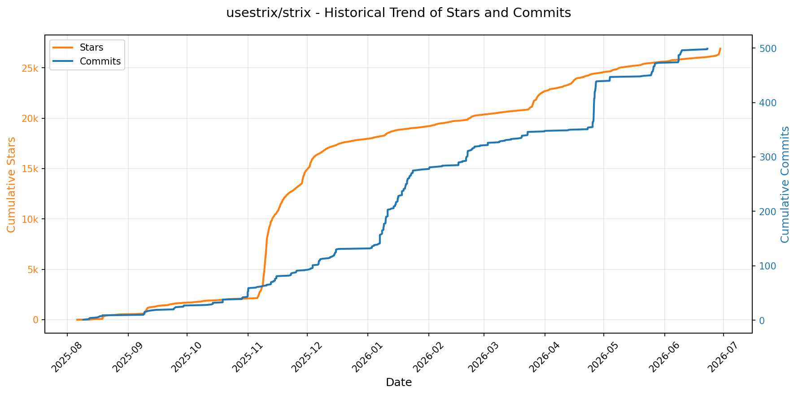

> *蓝色：累计 Stars｜橙色：累计 Commits（次 Y 轴）*

<b>📄 README 摘要</b>

1. **该项目做什么？**  
Strix 是一个开源的、基于自主 AI 代理（AI agents）的应用安全测试平台，旨在模拟真实黑客行为，对应用程序进行动态、可验证的安全评估。它能自动运行目标代码或服务，主动探测漏洞，并通过生成真实可复现的 Proof-of-Concept（PoC）来确认漏洞有效性，而非依赖静态扫描产生的高误报结果。其核心价值在于将传统需数周完成的手动渗透测试压缩至数小时，并无缝集成进开发流程（如 GitHub PR 检查），在代码合并前实时拦截高危漏洞，实现“左移安全”（Shift-Left Security）。

2. **关键特性**  
- **真实黑客式验证**：所有漏洞均通过动态执行（如 HTTP 请求篡改、浏览器自动化交互、终端命令执行、Python 脚本利用等）生成可复现 PoC，显著降低误报率；  
- **多智能体协同架构（Graph of Agents）**：支持分布式、专业化代理团队并行工作（如 Recon Agent、XSS Agent、Auth Bypass Agent），自动共享情报、协调攻击路径，提升覆盖深度与效率；  
- **全栈漏洞覆盖**：精准识别并验证包括 IDOR/权限提升、SQLi/SSRF/XXE、XSS/原型污染、JWT 失效、业务逻辑缺陷（竞态条件、流程绕过）、基础设施配置错误等数十类 OWASP Top 10 及高级威胁；  
- **开发者优先体验**：提供 CLI 工具，支持本地目录、GitHub 仓库、线上 Web 应用等多种目标格式；输出结构化、可操作的报告，并支持一键自动生成修复 PR；  
- **深度 CI/CD 原生集成**：开箱即用支持 GitHub Actions，可自动基于 PR Diff 范围执行轻量级扫描，失败时阻断合并；同时兼容 Slack、Jira、Linear 等协作工具；  
- **混合扫描模式**：支持黑盒（远程 Web）、灰盒（带认证上下文）、白盒（源码感知）及多目标联合测试，并允许通过指令文件（`--instruction-file`）精细定义测试范围与规则。

3. **技术栈**  
- **核心框架**：基于 Python 构建 CLI 与代理调度引擎，采用异步 I/O 和进程隔离保障安全沙箱执行；  
- **AI 推理层**：通过 LiteLLM 统一抽象，兼容主流 LLM 提供商（OpenAI GPT-5.4、Anthropic Claude Sonnet 4.6、Google Vertex AI Gemini 3 Pro、AWS Bedrock、Azure OpenAI、Ollama/LMStudio 等），支持 BYOK（Bring Your Own Key/Model）；  
- **安全工具链**：集成 Playwright（浏览器自动化与 XSS/CSRF 测试）、Caido（HTTP 代理与流量分析）、Nuclei（模板化漏洞检测扩展）、定制 Python 运行时（exploit 开发与验证）；  
- **基础设施**：默认依赖 Docker 提供隔离化、可重现的安全测试沙箱环境；前端界面（app.strix.ai）为全栈 Web 应用（未明确说明但推断含 React/Vue + Node.js 后端）；  
- **辅助能力**：利用 Perplexity API 增强 OSINT 与威胁情报检索；配置持久化至本地 JSON 文件（`~/.strix/cli-config.json`）；UI 层采用 Textual 框架构建终端交互界面。

---

### 24. [google-labs-code/design.md](https://github.com/google-labs-code/design.md)
- 📅 **创建日期**：2026-04-10  
- 🔄 **最近更新**：2026-06-29  
- ⭐ **Stars**：22,915（日 +434｜周 +6881｜月 +7944）  
- 📝 **描述**：A format specification for describing a visual identity to coding agents. DESIGN.md gives agents a persistent, structured understanding of a design system.  

<b>📈 Star 与 Commit 历史趋势</b>

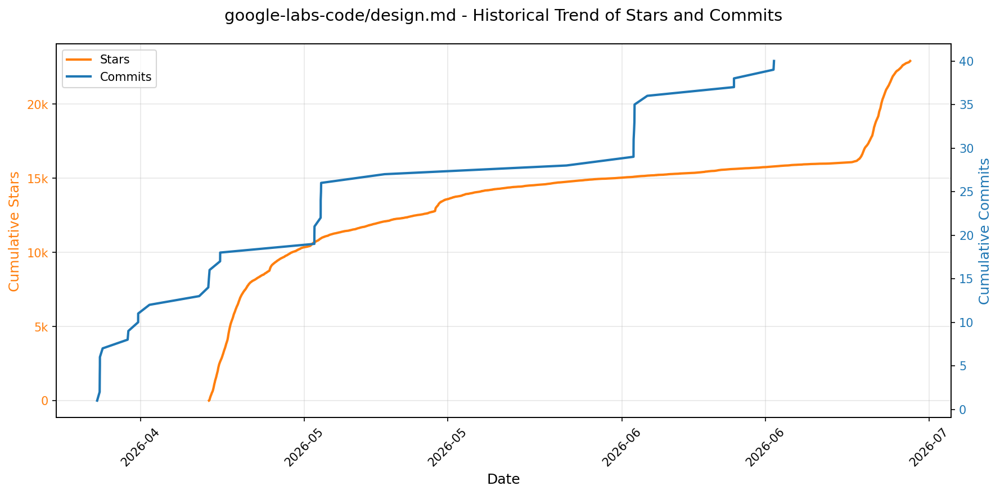

> *蓝色：累计 Stars｜橙色：累计 Commits（次 Y 轴）*

<b>📄 README 摘要</b>

1. **该项目的作用**  
DESIGN.md 是一种面向编码智能体（coding agents）的视觉识别系统描述格式规范。它通过结构化、机器可读的 YAML 前置元数据（design tokens）与人类可读的 Markdown 文本（设计 rationale）相结合，为 AI 代理提供持久、一致且可执行的设计系统理解能力。其核心目标是让 LLM 或前端生成代理能准确、可靠地将设计意图（如颜色、字体、间距、组件样式等）转化为符合品牌规范的 UI 代码，同时保留设计决策背后的“为什么”（上下文与原则）。

2. **关键特性**  
- **双层结构设计**：YAML 前置块（machine-readable tokens）定义精确数值；Markdown 正文（human-readable prose）阐述设计哲学、语义与应用规则，实现「值」与「意」的统一。  
- **完备的 token 类型支持**：原生支持颜色（hex/oklch/rgb/命名色）、尺寸（带单位）、字体配置（fontFamily/size/weight 等）、圆角、间距、组件级样式（含 hover/active 等变体），并支持跨 token 引用（如 `{colors.primary}`）。  
- **强校验 CLI 工具链**：提供 `lint`（结构/可访问性/WCAG 对比度/引用完整性检查）、`diff`（版本间 token 与文案变更检测）、`export`（导出至 Tailwind v3/v4、W3C DTCG 等主流格式）、`spec`（动态获取规范文档）四大命令，输出结构化 JSON，便于集成到 CI/CD 或 Agent 工作流。  
- **面向 Agent 的鲁棒性设计**：明确定义未知内容（如未识别章节、属性）的容错行为（如警告而非报错），支持渐进式采用；组件变体通过独立命名（如 `button-primary-hover`）表达，语义清晰。  
- **跨生态互操作性**：通过 `export` 命令无缝对接 Tailwind CSS（v3 JSON 配置 / v4 `@theme` CSS 变量）、W3C 设计令牌标准（DTCG），降低设计系统落地门槛。

3. **技术栈**  
- **核心格式**：Markdown（主体结构） + YAML（前置元数据），遵循开放、文本优先原则。  
- **实现语言与运行时**：TypeScript（CLI 及 API 库实现），基于 Node.js 生态，通过 npm 分发（包名 `@google/design.md`）。  
- **依赖与标准对齐**：深度兼容 [W3C Design Tokens Format (DTCG)](https://tr.designtokens.org/format/) 规范；WCAG AA 对比度校验；Tailwind CSS v3/v4 主题导出逻辑。  
- **工具链集成友好**：CLI 输出标准化 JSON，支持 stdin/stdout 流式处理；提供 Programmatic API（`import { lint } from '@google/design.md/linter'`），便于嵌入构建工具、IDE 插件或 AI Agent 提示工程中。

---

### 25. [JCodesMore/ai-website-cloner-template](https://github.com/JCodesMore/ai-website-cloner-template)
- 📅 **创建日期**：2026-03-13  
- 🔄 **最近更新**：2026-06-29  
- ⭐ **Stars**：22,876（日 +598｜周 +5569｜月 +7290）  
- 📝 **描述**：Clone any website with one command using AI coding agents  

<b>📈 Star 与 Commit 历史趋势</b>

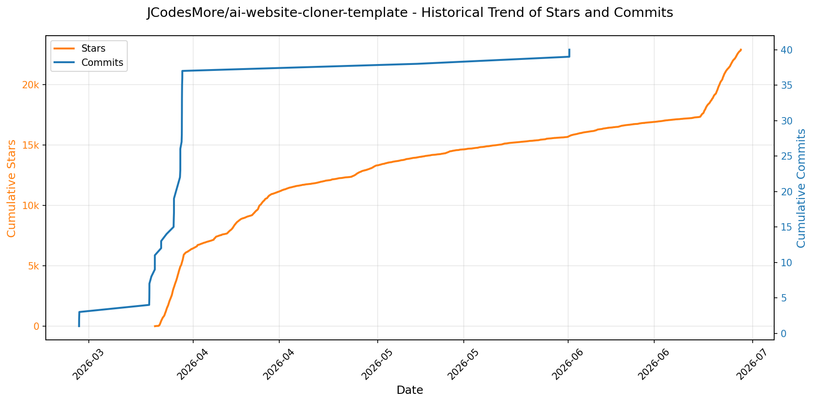

> *蓝色：累计 Stars｜橙色：累计 Commits（次 Y 轴）*

<b>📄 README 摘要</b>

1. **该项目的功能**  
该项目是一个可复用的 AI 网站克隆模板，旨在通过 AI 编程代理（如 Claude Code）自动逆向工程任意公开网站，将其完整还原为结构清晰、现代化的 Next.js 代码库。用户只需提供目标网站 URL，执行 `/clone-website` 命令，AI 代理便会自动完成：网页截图与交互扫描（滚动、点击、悬停、响应式测试）、设计令牌（字体、颜色、间距等）提取、静态资源（图片、图标、视频、SEO 资产）下载、组件级详细规格生成（含精确 `getComputedStyle()` 值、多状态行为、响应式断点），并基于规格在独立 Git 工作树中并行构建各页面区块，最终自动组装、集成并执行视觉差异比对验证。

2. **核心功能**  
- **全链路自动化克隆流程**：覆盖侦察→基础配置→组件规格化→并行构建→集成 QA 的五阶段 pipeline；  
- **多 AI 代理兼容性**：原生支持 Claude Code（推荐 Opus 4.7）、Codex CLI、GitHub Copilot、Cursor、Gemini CLI 等 13+ 主流 AI 编程工具，通过统一配置文件（`AGENTS.md`）实现跨平台指令同步；  
- **高保真设计还原**：基于 oklch 色彩空间的 Tailwind v4 设计系统，精确提取并复现原始网站的 CSS 计算值、交互动效、响应式布局及资产路径；  
- **模块化可扩展架构**：采用 shadcn/ui + Radix Primitives 构建 UI 组件库，自动生成 SVG 图标替换、SEO 资源归档（favicons/OG 图）及结构化研究文档（`docs/research/components/`）；  
- **安全与合规引导**：明确禁止用于钓鱼、品牌冒用或违反目标网站 ToS 的场景，并强调仅适用于自有网站迁移、源码丢失恢复及前端学习分析等合法用途。

3. **技术栈**  
- **前端框架**：Next.js 16（App Router）、React 19、TypeScript（严格模式）；  
- **UI 基础设施**：shadcn/ui（基于 Radix UI Primitives）、Tailwind CSS v4（oklch 色彩模型）；  
- **图标与资源**：Lucide React（初始占位）、运行时自动提取并内联目标网站 SVG 图标；  
- **开发与部署**：Node.js 24+、Docker Compose（支持 `dev`/`app` 双模式）、ESLint + TypeScript 类型检查；  
- **AI 集成层**：声明式技能定义（`.claude/skills/`）、跨平台指令同步脚本（`sync-agent-rules.sh` / `sync-skills.mjs`），确保所有代理使用同一份权威配置。

---

### 26. [mukul975/Anthropic-Cybersecurity-Skills](https://github.com/mukul975/Anthropic-Cybersecurity-Skills)
- 📅 **创建日期**：2026-02-25  
- 🔄 **最近更新**：2026-06-29  
- ⭐ **Stars**：22,807（日 +452｜周 +4866｜月 +10600）  
- 📝 **描述**：817 structured cybersecurity skills for AI agents · Mapped to 6 frameworks: MITRE ATT&CK, NIST CSF 2.0, MITRE ATLAS, D3FEND, NIST AI RMF & MITRE F3 (Fight Fraud) · agentskills.io standard · Works with Claude Code, GitHub Copilot, Codex CLI, Cursor, Gemini CLI & 20+ platforms · 29 security domains · Apache 2.0  

<b>📈 Star 与 Commit 历史趋势</b>

> *蓝色：累计 Stars｜橙色：累计 Commits（次 Y 轴）*

<b>📄 README 摘要</b>

1. **项目功能**  
该项目是一个面向AI智能体（AI agents）的、全球规模最大的开源网络安全技能库，旨在将资深安全分析师的专业知识结构化并赋能给AI系统。它不提供可直接运行的工具或脚本，而是以AI原生（AI-native）方式构建的**结构化知识库**，使AI代理能够像人类专家一样进行决策：准确判断何时启用某项技能、需满足哪些前提条件、如何分步执行、以及如何验证结果。其核心价值在于填补当前大模型在网络安全领域缺乏“实战级操作流程”（practitioner playbooks）的空白，支持自动化威胁狩猎、数字取证（DFIR）、红队演练、云安全响应、欺诈检测等真实场景。

2. **关键特性**  
- **超大规模结构化技能集**：包含**817个生产级网络安全技能**，覆盖**29个细分安全领域**（如云安全、威胁狩猎、OT/ICS安全、AI安全、金融欺诈防御等）；  
- **业界唯一六框架统一映射**：每个技能均严格映射至六大权威框架——MITRE ATT&CK v19.1（15战术/286技术）、NIST CSF 2.0（6大功能/22类别）、MITRE ATLAS v5.4（AI/ML对抗威胁）、MITRE D3FEND v1.3（267项防御技术）、NIST AI RMF 1.0（AI风险管理）及全新发布的**MITRE Fight Fraud Framework (F3) v1.1**（专注网络金融欺诈，含Positioning与Monetization两大独有战术，94个欺诈相关技能）；  
- **AI友好型设计**：采用`agentskills.io`开放标准，技能以YAML前言+Markdown正文组织，支持毫秒级元数据扫描（~30 tokens/技能）与按需加载（500–2000 tokens/完整工作流），适配各类大模型上下文窗口；  
- **深度实践导向**：每项技能均源自真实分析师工作流，包含四大标准化章节——*When to Use*（触发条件）、*Prerequisites*（前置要求）、*Workflow*（含具体命令与判断逻辑的分步执行指南）、*Verification*（结果验证方法）；  
- **开箱即用兼容性**：原生支持Claude Code、GitHub Copilot、Cursor、Gemini CLI等主流AI开发平台，并已验证兼容Hermes Agent等先进智能体框架；  
- **合规与安全治理就绪**：明确限定授权使用场景（渗透测试、研究、防御、教育），附带完整SECURITY.md与行为准则，强调法律与道德责任。

3. **技术栈**  
- **核心格式标准**：`agentskills.io` 开放技能规范（YAML元数据 + Markdown结构化内容）；  
- **知识建模**：基于STIX/TAXII、MITRE ATT&CK/ATLAS/D3FEND/F3等标准框架的语义映射，结合OWL 2本体（D3FEND）实现攻防双向关联；  
- **交付形态**：纯静态文件仓库（Git托管），含技能主文件（`SKILL.md`）、参考文档（`references/standards.md`, `workflows.md`）、辅助脚本（Python等）、模板资产（`assets/`）；  
- **验证与合规工具链**：使用官方`mitreattack-python`库校验ATT&CK ID有效性，STIX bundle比对F3映射，发布附带ATT&CK Navigator可视化图层；  
- **部署与集成**：支持`npx skills add`一键集成，亦可通过Git克隆直接接入本地AI代理环境；配套Casky.ai在线Playground提供零配置实时技能演练能力。

---

### 27. [alibaba/page-agent](https://github.com/alibaba/page-agent)
- 📅 **创建日期**：2025-09-23  
- 🔄 **最近更新**：2026-06-29  
- ⭐ **Stars**：20,614（日 +99｜周 +1821｜月 +2390）  
- 📝 **描述**：JavaScript in-page GUI agent. Control web interfaces with natural language.  

<b>📈 Star 与 Commit 历史趋势</b>

> *蓝色：累计 Stars｜橙色：累计 Commits（次 Y 轴）*

<b>📄 README 摘要</b>

1. **项目功能**  
Page Agent 是一个运行在网页内部的轻量级 GUI 智能体（GUI Agent），无需浏览器扩展、后端服务或无头浏览器，仅通过嵌入一行 JavaScript 即可实现用自然语言直接操控当前网页的用户界面。它将自然语言指令（如“点击登录按钮”）实时解析为对 DOM 元素的精准操作（查找、聚焦、点击、输入等），完全在客户端完成，不依赖截图或视觉模型，适用于单页应用的实时交互增强。

2. **核心特性**  
- **零依赖集成**：纯前端脚本（IIFE 或 ESM），支持 CDN 一键引入或 NPM 安装，无需额外运行时环境；  
- **纯文本 DOM 操作**：基于语义化 DOM 分析（如 ARIA 属性、标签语义、层级结构）理解页面，不依赖图像识别或多模态大模型；  
- **模型开放可插拔**：支持用户自主接入任意兼容 OpenAI API 标准的 LLM（如 Qwen、DashScope、Ollama 等），支持自定义 base URL 与 API Key；  
- **扩展能力可选**：提供 Chrome 扩展（支持跨标签页任务）和 MCP Server（Beta）以实现外部系统对浏览器的标准化控制；  
- **场景覆盖全面**：原生适配 SaaS 智能助手、表单自动化（ERP/CRM）、无障碍访问（语音/屏幕阅读器集成）、多页协同等高价值用例。

3. **技术栈**  
- **核心语言**：TypeScript（强类型保障前端逻辑可靠性）；  
- **构建与分发**：Vite 构建工具，输出 IIFE / ESM 多格式包，发布至 npm；CDN 支持 jsDelivr 与 npmmirror（国内镜像）；  
- **DOM 交互层**：深度借鉴并重构 [`browser-use`](https://github.com/browser-use/browser-use) 的 DOM 解析与操作逻辑（MIT 许可），实现语义化元素定位与动作执行；  
- **AI 集成协议**：遵循 OpenAI 兼容 API 规范，支持流式响应与错误重试机制；  
- **部署与文档**：GitHub Pages 托管静态站点，Markdown 文档驱动（含中英文双语），BundlePhobia 监控包体积（minzipped < 50 KB）。

---

### 28. [topoteretes/cognee](https://github.com/topoteretes/cognee)
- 📅 **创建日期**：2023-08-16  
- 🔄 **最近更新**：2026-06-29  
- ⭐ **Stars**：17,509（日 +899｜周 +6287｜月 +7500）  
- 📝 **描述**：Cognee is the open-source AI memory platform for agents. Give your AI agents persistent long-term memory across sessions with a self-hosted knowledge graph engine.  

<b>📈 Star 与 Commit 历史趋势</b>

> *蓝色：累计 Stars｜橙色：累计 Commits（次 Y 轴）*

<b>📄 README 摘要</b>

1. **项目功能**  
Cognee 是一个开源的 AI 记忆平台，专为 AI 智能体（Agents）设计，提供**跨会话的持久化长期记忆能力**。它通过统一摄入任意格式的数据（文本、PDF、代码、数据库等），在本地构建并维护一个**自托管的知识图谱（Knowledge Graph）**，使智能体能够基于完整上下文进行回忆、关联推理与自主决策。其核心使命是解决 AI 智能体“健忘”问题——让记忆不再局限于单次对话或短期缓存，而是可积累、可演化、可共享、可审计的长期认知基础设施。

2. **关键特性**  
- ✅ **多模态数据统一接入**：支持文档、结构化数据、日志、代码等多种格式的自动化解析与语义化嵌入；  
- ✅ **混合检索与认知推理**：自动融合向量相似性搜索（语义）、图结构遍历（关系）与本体驱动推理（认知科学启发的 ontology 生成），实现“意义+关系”双重召回；  
- ✅ **分层记忆架构**：同时支持轻量级**会话内存**（session memory，带自动后台同步至知识图谱）与**永久知识图谱**（persistent graph memory），兼顾速度与一致性；  
- ✅ **全栈单库部署能力**：原生支持以**单一 PostgreSQL 实例**承载全部记忆层——包括图关系（自研 Postgres 图后端）、向量索引（pgvector）、会话缓存（SQL cache）、元数据存储，大幅降低运维复杂度；  
- ✅ **开箱即用的智能体集成**：提供官方插件支持 Claude Code、OpenClaw 等主流智能体框架，自动捕获提示词、工具调用、响应内容，并实现上下文注入与会话结束自动图谱同步；  
- ✅ **企业级可信能力**：支持租户/用户隔离、操作可追溯（OTEL 集成）、审计标记（audit traits）、反馈驱动的记忆优化（`improve` 接口）及跨智能体知识共享；  
- ✅ **多语言 SDK 支持**：提供 Python（主客户端）、Rust（`cognee-rs`）、TypeScript（`@cognee/cognee-ts`）三套官方客户端，适配不同技术栈；  
- ✅ **云边协同部署**：既支持 Cognee Cloud 托管服务，也提供 Modal、Railway、Fly.io、Render 等平台的一键部署脚本，兼顾敏捷开发与生产级扩展。

3. **技术栈**  
- **核心语言**：Python（3.10–3.14，主服务与 CLI）；Rust（`cognee-rs` 客户端）；TypeScript（`@cognee/cognee-ts` 客户端）；  
- **数据库与存储**：  
  - 默认/推荐：**PostgreSQL**（统一承载图、向量、会话、元数据），集成 **pgvector**（向量扩展）；  
  - 可选替代：Neo4j / Amazon Neptune（图数据库）、Redis（会话缓存）、Qdrant / ChromaDB / Weaviate / Milvus / LanceDB（向量数据库）、SQLite / KuzuDB（本地开发嵌入式模式）；  
- **AI 与推理层**：  
  - LLM 驱动：支持 OpenAI 及其他主流提供商（通过配置切换），用于文档理解、本体生成、关系抽取、查询重写等；  
  - 认知建模：基于认知科学原理的 ontology 自动生成与动态演化机制；  
- **基础设施与部署**：  
  - 容器化：Docker + Docker Compose（含多 profile 支持 UI/MCP/Postgres/Neo4j）；  
  - 云平台：Modal（Serverless/GPU）、Railway、Fly.io、Render、Daytona 等一键部署支持；  
- **协议与标准**：MCP（Model Context Protocol）兼容（`cognee-mcp` 服务）、OpenTelemetry（可观测性）、REST API 与异步 Python SDK；  
- **其他关键技术**：自研图数据库后端（Postgres-native）、混合搜索路由引擎、会话生命周期钩子（SessionStart/Stop/PreCompact 等）。

---

### 29. [simplex-chat/simplex-chat](https://github.com/simplex-chat/simplex-chat)
- 📅 **创建日期**：2019-12-21  
- 🔄 **最近更新**：2026-06-29  
- ⭐ **Stars**：15,382（日 +1358｜周 +4092｜月 +4260）  
- 📝 **描述**：SimpleX - the first messaging network operating without user identifiers of any kind - 100% private by design! iOS, Android and desktop apps 📱!  

<b>📈 Star 与 Commit 历史趋势</b>

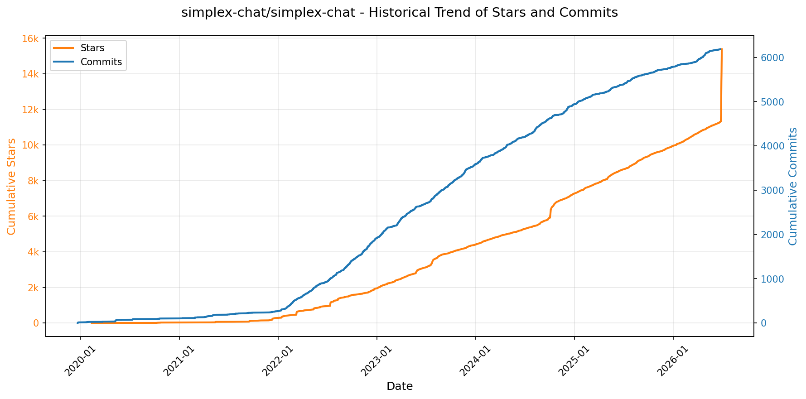

> *蓝色：累计 Stars｜橙色：累计 Commits（次 Y 轴）*

<b>📄 README 摘要</b>

1. **该项目的功能**  
SimpleX 是一个完全去标识化的私密即时通讯平台，其核心目标是彻底消除任何形式的用户身份标识（如手机号、邮箱、用户名、公钥地址等），实现“设计即隐私”（privacy by design）。它不依赖中心化身份系统，所有通信均通过一次性、匿名的连接链接（URL 或 QR 码）建立端到端安全通道。用户之间无需预先交换身份信息即可发起加密对话，且不泄露任何通信元数据（如联系人关系图、通信时间、频率、群组成员等）。平台支持一对一聊天、群组（用户自建目录）、语音/视频通话，并提供命令行终端客户端（Linux/macOS/Windows），适用于注重元数据保护的高隐私需求场景。

2. **关键特性**  
- ✅ **零用户标识架构**：无账号、无注册、无持久身份；每次连接生成唯一临时密钥对，会话结束后可彻底遗忘。  
- ✅ **双重加密保障**：基于双棘轮协议（Double Ratchet）的端到端加密，并叠加额外应用层加密层。  
- ✅ **元数据最小化**：不存储、不传输、不暴露通信对象、时间、群组成员关系等敏感元数据。  
- ✅ **离线/弱网友好连接**：通过短链接或 QR 码面对面/视频共享即可建立连接，无需可信信道。  
- ✅ **开放分布式生态**：协议与服务器软件开源，支持任何人自建中继服务器（SMP 服务器），网络由用户共同拥有和运行。  
- ✅ **多平台全端覆盖**：原生 Android（Google Play / F-Droid / APK）、iOS（App Store / TestFlight）、跨平台 CLI 终端客户端。  
- ✅ **抗滥用设计**：无全局地址簿、无搜索功能、无消息推送通知 ID，天然抵御垃圾信息、跟踪与大规模监控。  
- ✅ **安全验证机制**：支持手动比对连接安全码（Security Code）以防范中间人攻击。  
- ✅ **多语言与社区驱动**：依托 Weblate 实现 20+ 语言的 App/网站/文档本地化，由全球志愿者协作维护。

3. **技术栈**  
- **客户端**：Android（Kotlin/Java）、iOS（Swift）、CLI 终端（Rust 实现，跨平台支持 Linux/macOS/Windows）。  
- **核心协议**：基于自研的 SimpleX Messaging Protocol（SMP），采用 Curve25519 密钥交换、AES-GCM 加密、双棘轮密钥更新机制；通信通过中继服务器（SMP server）异步转发，不依赖直接 P2P 连接。  
- **服务端**：开源 SMP 中继服务器（Rust 实现），支持轻量部署与分布式运行；协议设计兼容未来扩展（如 LLM 集成、Bot 框架）。  
- **基础设施与工具**：CI/CD 使用 GitHub Actions；本地化托管于 Weblate；安全审计由 Trail of Bits 等第三方机构完成；构建与发布流程全面自动化。  
- **加密与安全标准**：严格遵循现代密码学最佳实践，强调前向保密（FS）、后向保密（PS）、密钥隔离及元数据剥离设计。

---

### 30. [can1357/oh-my-pi](https://github.com/can1357/oh-my-pi)
- 📅 **创建日期**：2025-12-31  
- 🔄 **最近更新**：2026-06-29  
- ⭐ **Stars**：15,197（日 +115｜周 +1129｜月 +6708）  
- 📝 **描述**：⌥  AI Coding agent for the terminal — hash-anchored edits, optimized tool harness, LSP, Python, browser, subagents, and more  

<b>📈 Star 与 Commit 历史趋势</b>

> *蓝色：累计 Stars｜橙色：累计 Commits（次 Y 轴）*

<b>📄 README 摘要</b>

1. **项目功能**  
oh-my-pi（简称 `omp`）是一个面向软件开发的**本地优先、全栈集成的编程智能代理（coding agent）**，其核心定位是“将真实 IDE 的能力深度嵌入到 AI 编程代理中”。它并非仅调用 LLM 执行简单指令，而是构建了一个可执行、可调试、可协作、可扩展的**端到端开发环境代理层**：能直接读写代码文件、执行 Python/JavaScript 代码、调用 LSP 实现精准符号重命名与引用查找、接入 DAP 调试器（lldb/dlv/debugpy）实时诊断崩溃或死锁、处理 Git 冲突与原子化提交、原生支持 GitHub PR/Issue 解析、驱动浏览器与 Slack 等外部应用，并通过多模型协同（主执行 + 顾问评审）、子代理并行任务、时间旅行式流控规则等机制保障可靠性与可控性。目标是提供开箱即用、生产就绪、完全开源且可离线运行的编程智能体。

2. **关键特性**  
- ✅ **IDE 级代码操作**：LSP 深度集成，支持语义级重命名、引用查找、代码补全等，自动更新 re-export、barrel 文件与别名导入；  
- ✅ **真调试器驱动（DAP）**：原生对接 lldb（C/C++）、dlv（Go）、debugpy（Python），支持断点、步进、变量检查与帧分析；  
- ✅ **双内核可交互执行**：内置持久化 Python 与 Bun（JavaScript）运行时，支持跨语言工具调用（如 Python 中用 `tool.read` 加载 CSV，JS 中绘图）；  
- ✅ **哈希锚点编辑（Hashline）**：基于内容哈希定位代码片段，避免空格/字符串匹配失败，自动拒绝过期锚点补丁，显著降低 token 消耗（Grok 4 Fast 减少 61%）；  
- ✅ **结构化子代理（task/irc）**：任务可分片为隔离工作区的子代理，输出为类型安全 JSON，支持跨代理轻量通信（IRC）与结果自动聚合；  
- ✅ **实时协作（/collab）**：一键生成加密会话链接与 QR 码，支持终端/浏览器多人读写协同，客户端加密帧，中继不接触密钥；  
- ✅ **全栈工具统一接口**：32+ 内置工具（`read`/`edit`/`ast_edit`/`lsp`/`debug`/`web_search`/`github`/`browser`/`tts` 等）共用同一路径式 URI 协议（如 `pr://1428`, `conflict://1`, `agent://id/findings.0.path`）；  
- ✅ **自适应模型路由**：支持 40+ 提供商、数百模型，按角色（`default`/`smol`/`slow`/`plan`/`commit`）动态切换，含 fallback 链、路径作用域模型配置、OAuth/本地/订阅混合认证；  
- ✅ **Hindsight 记忆系统**：会话间持久化项目知识库，支持 `retain`/`recall`/`reflect`，自动压缩加载，项目级隔离；  
- ✅ **零依赖原生二进制**：Rust 实现核心（~55k 行），内嵌 ripgrep/glob/find 等工具，macOS/Linux/Windows 一键安装，无需 WSL 或外部 CLI 依赖；  
- ✅ **开发者友好体验**：Shell 自动补全（bash/zsh/fish）、TUI 实时反馈、预览→确认式变更（`ast_edit` → `resolve`）、PDF/arXiv/网页结构化解析、GitHub 作为文件系统透明访问等。

3. **技术栈**  
- **核心语言**：Rust（高性能、内存安全、原生二进制打包，约 55,000 行核心代码）；  
- **前端/CLI**：TypeScript（CLI 工具链、TUI 渲染、文档与网站）；  
- **运行时**：Bun（推荐全局安装与脚本执行）、Node.js 兼容；  
- **AI 接入层**：支持 OpenAI-compatible（v1/models）、Anthropic、Google Gemini、xAI Grok、Mistral、Ollama、llama.cpp、vLLM、LiteLLM 等数十种协议与后端；  
- **基础设施**：内建 LSP（Language Server Protocol）客户端、DAP（Debug Adapter Protocol）客户端、Puppeteer（Chromium CDP）、Tree-sitter（AST 分析）、ast-grep（结构化搜索）、ripgrep（文本搜索）等；  
- **部署与分发**：跨平台单二进制（macOS/Linux/Windows）、Homebrew/Bun/npm 安装、Shell 安装脚本、mise 版本管理支持；  
- **许可证**：MIT 开源协议。

---

### 31. [HKUDS/Vibe-Trading](https://github.com/HKUDS/Vibe-Trading)
- 📅 **创建日期**：2026-04-01  
- 🔄 **最近更新**：2026-06-29  
- ⭐ **Stars**：14,345（日 +527｜周 +1417｜月 +5399）  
- 📝 **描述**："Vibe-Trading: Your Personal Trading Agent"  

<b>📈 Star 与 Commit 历史趋势</b>

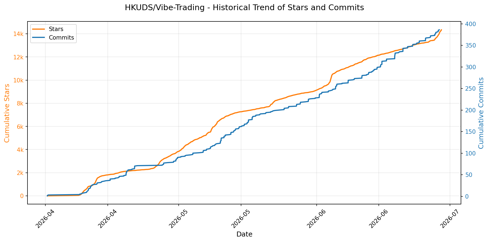

> *蓝色：累计 Stars｜橙色：累计 Commits（次 Y 轴）*

<b>📄 README 摘要</b>

1. **项目功能**  
Vibe-Trading 是一个面向量化交易与智能投研的开源个人交易代理（Personal Trading Agent）系统，旨在通过大语言模型（LLM）驱动的自主代理，实现端到端的自动化金融研究、信号生成、回测验证、实盘模拟（Shadow Account）及策略归因分析。它支持用户以命令行或Web界面启动“研究自动驾驶”（Research Autopilot）流程——从提出投资假设（Hypothesis），自动生成符合合约规范的信号引擎（SignalEngine），执行多维度回测，并将结果反馈优化原始假设。核心目标是构建可审计、可复现、可解释的AI增强型交易工作流，覆盖A股、美股、港股市场，兼容多种券商直连与数据源。

2. **关键特性**  
- **Shadow Account（影子账户）**：基于历史交易行为自动提取规则（如RSI阈值、5日收益率条件），生成带真实市场上下文（PIT-safe entry context）的条件化入场逻辑，支持高保真模拟持仓与绩效归因；  
- **全栈研究自动化（Research Autopilot）**：支持“假设→信号引擎→回测”闭环，含68+内置工具，支持学术Alpha因子库（已扩展至10类，含Jegadeesh反转、Amihud流动性等456个因子）；  
- **多源异构数据层**：集成18+市场数据源（Eastmoney、Sina、Yahoo、Finnhub、Alpha Vantage等）及18种只读数据工具（北向资金、龙虎榜、期权链、SEC XBRL财报等），统一通过MCP（Model Context Protocol）协议接入；  
- **强健性与安全性设计**：具备内容过滤容错（Gemini安全终止识别）、跨平台运行保障（Windows/TS构建、进程清理）、CSRF防护、OAuth实时授权、本地API鉴权、Shell工具显式启用等机制；  
- **交互与可观测性增强**：Web UI支持中英双语响应式界面、渐进式图表加载、每轮Token用量持久化审计（`llm_usage.json`）、运行中断/恢复（CLI `resume <session-id>`）、多搜索引擎容灾（DDG/Google/Bing等轮询）、OHLC数据完整性校验（自动剔除`high < low`等脏数据）；  
- **本地化与合规适配**：支持tushare/东财/同花顺风格代码（如`sh.601398`）、A股/港股/美股路由分发、中文UI与文档、Feishu/WeChat/Discord社区支持。

3. **技术栈**  
- **后端**：Python 3.11+，基于FastAPI构建RESTful API与MCP服务，集成LLM推理适配层（支持OpenAI/Gemini/Kimi/DeepSeek/GLM等多厂商模型）、异步任务调度（`VIBE_TRADING_ENABLE_SCHEDULER`）、本地文件沙箱隔离（读写根路径限制）；  
- **前端**：React 19（Vite构建），采用响应式国际化架构（i18n），支持动态图表渲染（Candlestick等）、实时SSE流式通信、运行状态同步与断点续传；  
- **基础设施**：  
  - 数据加载层：统一Loader Registry，支持CSV/Parquet/DuckDB本地加载（`local` loader）及18+远程数据源适配；  
  - 工具生态：48+内置工具（含`web_search`、`connector authorize`、`run_research_autopilot`等），全部注册于Agent工具中心；  
  - 部署与运维：Docker容器化支持、跨平台CLI（`vibe-trading setup/dev/resume`）、PyPI包分发（`vibe-trading-ai`）、MIT许可证。

---

### 32. [tashfeenahmed/freellmapi](https://github.com/tashfeenahmed/freellmapi)
- 📅 **创建日期**：2026-04-21  
- 🔄 **最近更新**：2026-06-29  
- ⭐ **Stars**：13,876（日 +307｜周 +2489｜月 +7558）  
- 📝 **描述**：OpenAI-compatible proxy that stacks the free tiers of 16 LLM providers (~1.7B tokens/month) behind one /v1 endpoint — plus any custom OpenAI-compatible endpoint. Smart routing, automatic failover, encrypted keys. Personal experimentation only.  

<b>📈 Star 与 Commit 历史趋势</b>

> *蓝色：累计 Stars｜橙色：累计 Commits（次 Y 轴）*

<b>📄 README 摘要</b>

1. **项目功能**  
FreeLLMAPI 是一个开源的、本地可部署的 AI 模型聚合代理服务，核心目标是将**16+家主流免费大模型服务商（含 Google、Groq、Mistral、OpenRouter、GitHub Models、Cohere、NVIDIA、HuggingFace、Zhipu、Ollama 等）的免费配额统一接入**，通过单个 OpenAI 兼容的 `/v1` API 接口对外提供服务。它自动聚合各平台每月约 17 亿 token 的免费额度，实现跨平台负载均衡与智能路由：根据实时可用性、速率限制、模型能力及用户配置的优先级链（fallback chain），为每个请求动态选择最优可用模型；当某提供商触发限流（429）、错误或超时，自动降级至下一候选模型，并严格按各 Key 的每平台/每模型维度（RPM/TPM/RPD/TPD）进行用量追踪，确保不突破任一免费配额上限。

2. **关键特性**  
- ✅ **全协议兼容**：原生支持 OpenAI REST API（`/v1/chat/completions`, `/v1/embeddings`, `/v1/images/generations`, `/v1/audio/speech`）、Anthropic Messages API（`/v1/messages`）、Codex CLI Responses API（`/v1/responses`）及旧版 `/v1/completions`，适配 LangChain、LlamaIndex、Continue、Claude SDK 等主流工具链；  
- ✅ **多模态路由**：支持文本生成、嵌入向量、图像生成、语音合成四类任务，均可跨提供商自动调度（含自定义 OpenAI 兼容端点）；  
- ✅ **智能弹性路由**：支持最多 20 级 fallback 链、自动健康探测（标记 `healthy`/`rate_limited`/`invalid`）、30 分钟会话粘性（sticky sessions）避免中途换模型导致幻觉、可选上下文手递（context handoff）提升多轮连贯性；  
- ✅ **企业级安全与管理**：API 密钥 AES-256-GCM 加密存储于 SQLite；客户端仅需一个统一 `freellmapi-…` Bearer Token 认证；后台 Admin Dashboard（React/Vite）提供密钥管理、Fallback 排序、实时分析、Playground 测试、多语言支持（中/英/法/西/葡/意）及桌面端菜单栏应用；  
- ✅ **生产就绪设计**：支持 Docker（多架构，含树莓派 ARM64）、Windows/macOS/Linux 原生部署、声明式 JSON 配置启动、SQLite 数据持久化与加密备份、90 天请求日志分析、离线运行能力。

3. **技术栈**  
- **后端**：Node.js（≥ v20）、Express.js（REST API 服务器）、SQLite（加密存储密钥与配置）、Axios（HTTP 客户端）、crypto（AES-256-GCM 加解密）、scrypt（管理员密码哈希）；  
- **前端**：React + Vite（Admin Dashboard 与桌面端 UI）、i18n 多语言框架；  
- **构建与部署**：Docker / Docker Compose（官方镜像 `ghcr.io/tashfeenahmed/freellmapi`）、npm scripts（`dev`/`build`/`desktop:dist`）、CI/CD（GitHub Actions）；  
- **基础设施**：支持 systemd / PM2 进程管理；数据持久化依赖 SQLite 卷（Docker）或本地文件；可选 HTTPS 反向代理（如 Nginx）；  
- **扩展能力**：支持对接任意 OpenAI 兼容后端（llama.cpp、vLLM、Ollama、LM Studio 等）作为自定义 provider。

---

### 33. [Open-LLM-VTuber/Open-LLM-VTuber](https://github.com/Open-LLM-VTuber/Open-LLM-VTuber)
- 📅 **创建日期**：2023-11-24  
- 🔄 **最近更新**：2026-06-29  
- ⭐ **Stars**：12,058（日 +76｜周 +316｜月 +4191）  
- 📝 **描述**：Talk to any LLM with hands-free voice interaction, voice interruption, and Live2D taking face running locally across platforms  

<b>📈 Star 与 Commit 历史趋势</b>

> *蓝色：累计 Stars｜橙色：累计 Commits（次 Y 轴）*

<b>📄 README 摘要</b>

1. **项目功能**  
Open-LLM-VTuber 是一个完全离线、跨平台运行的开源语音交互式 AI 虚拟形象（VTuber）系统。它将大语言模型（LLM）、语音识别（ASR）、文本转语音（TTS）、Live2D 实时渲染与视觉感知能力深度集成，构建出可听、可说、可看、可互动的本地化 AI 伴侣。用户可在 Windows/macOS/Linux 上以 Web 页面或桌面客户端（支持透明背景“桌面宠物”模式）形式使用，实现免联网的实时语音对话、摄像头/屏幕画面理解、点击拖拽交互、情绪驱动的 Live2D 表情变化、AI 主动发言、内心独白显示、多语言 TTS 翻译输出等功能，适用于虚拟恋人、宠物、助手等多种角色场景。

2. **核心特性**  
- ✅ **全离线运行**：所有模型（LLM/ASR/TTS）均支持本地部署，数据不出设备，保障隐私安全；  
- ✅ **强交互能力**：支持语音打断（无耳机依赖）、视觉感知（摄像头+录屏+截图）、触控反馈（点击/拖拽）、Live2D 情绪映射、全局置顶+鼠标穿透的“宠物模式”、AI 内心想法可视化、主动发言机制、聊天记录持久化与会话历史回溯；  
- ✅ **极致可定制性**：提供配置文件级模块切换（无需改代码），支持自定义 Live2D 模型导入、Prompt 人格设定、语音克隆；开放 Agent 接口，兼容 HumeAI EVI、Mem0、OpenAI Her 等架构；  
- ✅ **广泛模型兼容**：LLM 支持 Ollama、vLLM、GGUF、LM Studio、OpenAI/Gemini/Claude/Mistral/DeepSeek/Zhipu 等兼容 API；ASR 支持 sherpa-onnx、Faster-Whisper、FunASR、Whisper.cpp 等；TTS 支持 MeloTTS、Coqui-TTS、GPT-SoVITS、Bark、CosyVoice、Edge TTS、Azure TTS 等；  
- ✅ **双形态客户端**：Web 端便于快速启动，桌面客户端支持窗口模式与“透明桌面宠物”模式自由切换，真正实现 AI 伴身左右。

3. **技术栈**  
- **后端**：Python（主语言），基于 `uv`（现代 Python 包管理与运行工具）构建；采用模块化架构，各功能组件（LLM/ASR/TTS/Vision/Agent）高度解耦；  
- **前端**：Web 端基于现代 Web 技术（未明示框架，但依赖 MediaDevices API 实现安全上下文麦克风访问）；桌面客户端应为 Electron 或类似跨平台方案（结合透明窗口、鼠标穿透等特性推断）；  
- **AI 模型层**：深度整合 ONNX Runtime（sherpa-onnx）、Whisper 系列（C++/Python 实现）、GGUF 格式模型（llama.cpp 生态）、Ollama、vLLM 等推理后端；  
- **图形与动画**：Live2D Cubism SDK（运行时渲染），内置符合 Live2D 免费素材协议的示例模型；  
- **基础设施**：Docker 官方镜像支持；CI/CD 使用 GitHub Actions（CodeQL 静态分析、Ruff 代码规范检查）；文档托管于 GitHub Pages；社区协作基于 Zulip、Discord、QQ 群及 DeepWiki。

---

### 34. [phuryn/pm-skills](https://github.com/phuryn/pm-skills)
- 📅 **创建日期**：2026-03-01  
- 🔄 **最近更新**：2026-06-29  
- ⭐ **Stars**：11,824（日 +173｜周 +1218｜月 +9922）  
- 📝 **描述**：PM Skills Marketplace: 100+ agentic skills, commands, and plugins — from discovery to strategy, execution, launch, and growth.  

<b>📈 Star 与 Commit 历史趋势</b>

> *蓝色：累计 Stars｜橙色：累计 Commits（次 Y 轴）*

<b>📄 README 摘要</b>

1. **该项目做什么？**  
该项目是一个面向产品经理（PM）的AI技能市场（PM Skills Marketplace），旨在将经典产品管理方法论（如Teresa Torres的机会解决方案树、Marty Cagan的产品策略、Alberto Savoia的pretotype实验等）结构化为可被AI助手（尤其是Claude）直接理解与执行的“技能”（Skills）和“命令”（Commands）。它不生成泛泛而谈的文本，而是提供**结构化、框架驱动、分步引导式的工作流**，覆盖产品全生命周期——从发现（Discovery）、战略（Strategy）、执行（Execution）、上市（GTM）、增长（Growth）到AI原生代码交付（AI Shipping）。用户通过自然语言触发预定义命令（如`/discover`、`/write-prd`、`/plan-launch`），系统自动编排多个底层技能，完成端到端专业任务；也可直接调用单个技能获取深度框架支持。

2. **核心功能**  
- **68项标准化PM技能**：每个技能封装一个经验证的PM框架（如`opportunity-solution-tree`、`prioritization-frameworks`、`pre-mortem`），以Markdown格式编写，具备跨平台兼容性。  
- **42个链式工作流命令**：用户通过`/command`触发，自动串联多个技能形成闭环流程（例如`/discover` = `brainstorm-ideas` → `identify-assumptions` → `prioritize-assumptions` → `brainstorm-experiments`）。  
- **9大领域插件（Plugins）**：模块化组织，涵盖产品发现、战略、执行、市场研究、数据分析、上市、营销增长、AI交付等完整PM职能域，支持按需安装或全量集成。  
- **智能上下文感知加载**：技能可自动在相关对话中激活（无需手动调用），亦支持显式强制加载（如`/pm-product-discovery:identify-assumptions`）。  
- **跨AI平台适配能力**：原生支持Claude Cowork/Claude Code；通过文件复制兼容Gemini CLI、Cursor、Kiro等；Codex可通过指令转换命令为技能；所有技能均遵循通用格式，实现“一次编写，多平台复用”。  
- **工作流协同设计**：命令执行后自动推荐下一步操作（如完成`/write-prd`后建议`/sprint plan`），贴合真实PM工作流节奏。

3. **技术栈**  
- **核心格式**：纯文本Markdown（`.md`）技能定义文件，遵循轻量级、可读性强、工具无关的通用技能规范。  
- **运行环境**：依赖AI助手的插件/技能系统（非独立应用），主要面向：  
  - **Anthropic Claude生态**：Claude Cowork（图形界面插件市场）、Claude Code（CLI命令行工具）；  
  - **OpenAI Codex CLI**：通过相同插件市场协议接入，支持技能调用与命令转译；  
  - **多模态/开源AI工具**：Gemini CLI、Cursor、Kiro、OpenCode等，通过复制`skills/`目录即可启用技能（不支持Claude专属`/`命令）。  
- **部署方式**：GitHub仓库托管，通过`claude plugin marketplace add`或`codex plugin marketplace add`等CLI指令一键注册市场，再按需安装插件包（如`pm-product-discovery@pm-skills`）。  
- **无服务器架构**：纯客户端侧技能加载与执行，不依赖后端服务或API，所有逻辑由AI模型本地解析并运行。

---

### 35. [cupy/cupy](https://github.com/cupy/cupy)
- 📅 **创建日期**：2016-11-01  
- 🔄 **最近更新**：2026-06-29  
- ⭐ **Stars**：11,560（日 +267｜周 +559｜月 +597）  
- 📝 **描述**：NumPy & SciPy for GPU  

<b>📈 Star 与 Commit 历史趋势</b>

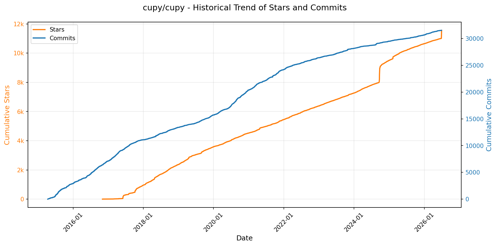

> *蓝色：累计 Stars｜橙色：累计 Commits（次 Y 轴）*

<b>📄 README 摘要</b>

1. **项目功能**  
CuPy 是一个专为 GPU 加速计算设计的 Python 数值计算库，旨在作为 NumPy 和 SciPy 的高性能、语法兼容的替代实现。它使用户能够将现有基于 NumPy/SciPy 的代码（几乎无需修改）直接迁移到 NVIDIA CUDA 或 AMD ROCm GPU 平台上运行，从而显著提升大规模数组运算与科学计算的执行速度。

2. **核心特性**  
- ✅ **API 兼容性**：提供与 NumPy（ndarray、ufunc、linalg、fft 等）和 SciPy（sparse、signal、special 等）高度一致的接口，支持“开箱即用”的无缝替换；  
- ✅ **GPU 原生加速**：所有数组操作（如 `sum`、`dot`、`reshape`、广播运算等）均在 GPU 上并行执行，自动管理设备内存与数据传输；  
- ✅ **底层 CUDA/ROCm 控制能力**：支持 RawKernel（自定义 CUDA C/C++ 内核）、CUDA Streams（异步执行与重叠计算/传输）、CUDA Runtime API 直接调用，满足高性能与低延迟场景需求；  
- ✅ **多平台支持**：正式支持 NVIDIA CUDA（v12.x / v13.x），实验性支持 AMD ROCm（v7.0）；  
- ✅ **灵活部署方式**：提供 PyPI（wheel）、Conda-Forge（含精简版 `cupy-core` 和 CUDA 版本约束选项）、Docker 官方镜像等多种安装渠道；  
- ✅ **生态集成**：自 v13.0 起整合 cuSignal 库，扩展信号处理能力；广泛被深度学习、HPC、科学仿真等领域项目采用。

3. **技术栈**  
- **核心语言**：Python（主接口层）；  
- **GPU 后端**：NVIDIA CUDA（C++/PTX）、AMD ROCm（HIP）；  
- **底层实现**：C++（CUDA/HIP 核心算子）、CUDA C/C++（RawKernel 支持）、Python C API（与 NumPy 兼容桥接）；  
- **构建与分发**：setuptools + Cython（部分模块）、CUDA Toolkit / ROCm Compiler（编译依赖）、Conda（跨平台包管理）、Docker（容器化部署）；  
- **开发与协作**：GitHub 开源生态、MIT 许可证、由 Preferred Networks 主导并协同全球社区共同维护。

---

### 36. [browser-use/video-use](https://github.com/browser-use/video-use)
- 📅 **创建日期**：2026-04-12  
- 🔄 **最近更新**：2026-06-29  
- ⭐ **Stars**：11,159（日 +633｜周 +1152｜月 +2596）  
- 📝 **描述**：Edit videos with coding agents  

<b>📈 Star 与 Commit 历史趋势</b>

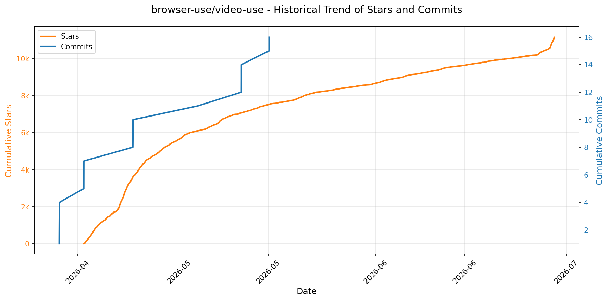

> *蓝色：累计 Stars｜橙色：累计 Commits（次 Y 轴）*

<b>📄 README 摘要</b>

1. **项目功能**  
该项目是一个完全开源的 AI 视频编辑工具，通过与 Claude Code 等具备 Shell 访问能力的智能代理协作，实现端到端自动化视频剪辑。用户只需将原始视频素材（如采访、教程、旅行记录等）放入指定文件夹，向代理发出自然语言指令（如“编辑成发布视频”），系统即可自动完成：剔除填充词（“um”“uh”）、静音段与无效停顿；对每段画面进行自动调色（支持预设或自定义 FFmpeg 色彩链）；在每个剪辑点添加 30ms 音频淡入淡出以消除爆音；烧录风格化字幕（默认为双词大写分块，高度可定制）；并并行生成动画覆盖层（集成 HyperFrames / Remotion / Manim / PIL）；最后对渲染结果进行逐切点自检（检测画面跳变、音频爆音、字幕异常等），仅当全部通过后才输出最终成品 `edit/final.mp4`。全程无需预设模板、图形界面或手动时间轴操作，且会将编辑会话状态持久化至 `project.md`，支持跨会话连续编辑。

2. **核心特性**  
- **语义级精准剪辑**：依赖 ElevenLabs Scribe 提供的带说话人标注、情绪事件（如 `(laughter)`）和毫秒级词时间戳的结构化文本转录（`takes_packed.md`），而非原始帧数据，大幅降低 token 开销（约 12KB 文本 + 按需生成少量 PNG）。  
- **双层感知架构**：LLM 仅“阅读”文本层（主输入），视觉层（`timeline_view` 生成的含波形、字幕标签、胶片条的复合 PNG）仅在关键决策点（如模糊停顿判断、重拍对比）按需调用，杜绝无意义帧分析。  
- **全自动生产级流水线**：包含转录 → 归一化打包 → LLM 策略推理 → EDL（编辑决策列表）生成 → FFmpeg 渲染 → 多维度自检（视觉/音频/字幕）→ 失败自动修复重渲染（最多 3 次）闭环。  
- **强健性与可控性设计**：强制执行“提问→确认→执行→自检→持久化”五步流程；内置 12 条硬性制作规范（如帧率一致性、黑场时长、音频电平），艺术表达部分完全开放；支持 ElevenLabs API 集成用于语音合成与高精度转录。  
- **跨平台代理兼容**：原生适配 Claude Code、Codex、Hermes 等支持 Shell 的 LLM 代理，并提供 VPS/Telegram 部署方案（通过 Browser Use Box 实现常驻编辑服务）。

3. **技术栈**  
- **核心运行时**：Python（主要逻辑）、FFmpeg（视频编解码、调色、渲染、音频处理）、yt-dlp（可选，用于下载在线视频源）。  
- **AI 与代理层**：依赖外部 LLM 代理（Claude Code 等）执行策略推理与 Shell 调度；集成 ElevenLabs API（Scribe 转录 + Voice API 可选）；支持多种动画生成引擎（HyperFrames、Remotion、Manim、PIL）。  
- **开发与部署工具**：uv（现代 Python 包管理与环境同步）；Git（版本控制与技能 symlink 集成）；`.env` 管理敏感配置（如 `ELEVENLABS_API_KEY`）。  
- **架构范式**：遵循“文本优先 + 按需可视化”原则，类比 browser-use 的 DOM 结构化抽象，将视频抽象为可推理的文本+轻量图像组合，规避传统视频 AI 的高算力与高 token 消耗瓶颈。

---

### 37. [DeusData/codebase-memory-mcp](https://github.com/DeusData/codebase-memory-mcp)
- 📅 **创建日期**：2026-02-24  
- 🔄 **最近更新**：2026-06-29  
- ⭐ **Stars**：10,272（日 +0｜周 +0｜月 +7498）  
- 📝 **描述**：High-performance code intelligence MCP server. Indexes codebases into a persistent knowledge graph — average repo in milliseconds. 158 languages, sub-ms queries, 99% fewer tokens. Single static binary, zero dependencies.  

<b>📈 Star 与 Commit 历史趋势</b>

> *蓝色：累计 Stars｜橙色：累计 Commits（次 Y 轴）*

<b>📄 README 摘要</b>

1. **项目功能**  
该项目是一个面向 AI 编程代理（AI coding agents）的超高速、本地化代码智能引擎，核心功能是为任意代码库构建并维护一个持久化的结构化知识图谱（Knowledge Graph）。它通过全量索引源码（支持 158 种语言），自动解析函数、类、调用链、HTTP 路由、跨服务接口、基础设施即代码（Docker/K8s/Kustomize）等实体及其关系，形成可高效查询的图数据库。用户或 AI 代理可通过 MCP（Model Context Protocol）标准接口发起语义/结构/拓扑类查询（如“谁调用了 `ProcessOrder`？”、“影响哪些服务？”、“检测死代码”），所有计算与数据处理 100% 在本地完成，代码永不离开用户设备。

2. **关键特性**  
- **极致性能**：Linux 内核（2800 万行代码）3 分钟完成全量索引；结构化查询响应延迟 <1ms；内存优先流水线（LZ4 压缩 + 内存 SQLite + 索引后释放内存）。  
- **多语言深度解析**：集成 158 种 Tree-sitter 语法树解析器（全部编译进二进制），并为 11 种主流语言（Python/TS/JS/C#/Go/C/C++/Java/Kotlin/Rust）提供轻量级纯 C 实现的 Hybrid LSP 语义类型解析（支持泛型推导、JSX 组件分发、PHP 命名空间、Rust trait 方法等）。  
- **14 个开箱即用 MCP 工具**：涵盖架构概览（`get_architecture`）、ADR 管理、调用链追踪、影响分析、Cypher 类图查询、死代码检测、跨服务 HTTP/gRPC/GraphQL 链接、通道事件（`EMITS`/`LISTENS_ON`）识别等。  
- **跨仓库与跨服务智能**：支持多仓库联合索引，生成 `CROSS_*` 边实现跨 repo 依赖与服务拓扑可视化；自动识别 REST/gRPC/GraphQL 接口与调用点并打分关联。  
- **零依赖单体二进制**：macOS/Linux/Windows 全平台静态链接，无 Docker、无运行时依赖、无 API Key；自带 3D 图形化 UI（可选），访问 `localhost:9749` 即可交互探索知识图谱。  
- **团队协同优化**：支持将压缩的 SQLite 图数据库（`.codebase-memory/graph.db.zst`）提交至 Git，新成员克隆后自动增量补全本地差异，规避重复全量索引；内置 `.gitattributes` 合并策略防冲突。  
- **自动化代理集成**：`install` 命令自动识别并配置 11 种主流编码代理（Claude Code、VS Code、Aider 等）的 MCP 服务入口、指令文件与预工具钩子，真正“下载即用”。

3. **技术栈**  
- **核心语言**：C（主引擎，含 Hybrid LSP 语义解析模块）、C++（部分构建与工具链）  
- **解析引擎**：Tree-sitter（158 种语言语法树，全部 vendored 并静态编译）  
- **存储与查询**：SQLite（内存中构建，最终持久化至 `~/.cache/codebase-memory-mcp/`；FTS5 全文搜索 + 自定义 `cbm_camel_split` 分词器）  
- **嵌入模型**：Nomic `nomic-embed-code`（40K token / 768d int8 量化版，直接嵌入二进制，离线向量检索）  
- **图分析算法**：Louvain 社区发现、Aho-Corasick 模式匹配、MinHash + LSH 近似克隆检测、Jaccard 相似度、Halstead-lite 复杂度估算等  
- **基础设施解析**：原生支持 `package.json`/`go.mod`/`Cargo.toml`/`pom.xml` 等 10+ 包管理文件的模块解析；Dockerfile/Kubernetes YAML/Kustomize Overlay 作为一等图节点建模  
- **分发与部署**：静态链接二进制（musl libc 或 macOS system libc）、zstd 压缩、跨平台包管理支持（Homebrew/Scoop/Winget/Chocolatey/AUR/npm/PyPI/go install）  
- **协议与标准**：完全兼容 MCP（Model Context Protocol）v1 规范，不内置 LLM，专注作为结构化知识后端服务

---

### 38. [palmier-io/palmier-pro](https://github.com/palmier-io/palmier-pro)
- 📅 **创建日期**：2026-04-07  
- 🔄 **最近更新**：2026-06-29  
- ⭐ **Stars**：9,358（日 +136｜周 +3586｜月 +9341）  
- 📝 **描述**：macOS video editor built for AI  

<b>📈 Star 与 Commit 历史趋势</b>

> *蓝色：累计 Stars｜橙色：累计 Commits（次 Y 轴）*

<b>📄 README 摘要</b>

1. **该项目的功能**  
Palmier Pro 是一款专为人工智能协同工作设计的 macOS 原生开源视频编辑器，支持用户与 AI 代理（如 Claude、Codex、Cursor 等）在同一时间线上实时协作生成和编辑视频。它允许用户直接在时间线中调用生成式 AI 模型（如 Seedance、Kling、Nano Banana Pro）生成视频片段或图像，并通过标准化的 Model Context Protocol（MCP）协议实现编辑器与外部 AI 工具的深度集成。

2. **核心功能**  
- ✅ **Swift 原生开发**：完全基于 Swift 构建，针对 Apple Silicon 优化，目标对标 Premiere Pro 的专业剪辑体验；  
- ✅ **内置生成式 AI 工作流**：支持在时间线内一键调用前沿视频/图像生成模型，实现“编辑即生成”；  
- ✅ **MCP 协议深度集成**：内置运行于 `http://127.0.0.1:19789/mcp` 的 MCP 服务器，开箱即用支持 Claude Code/Desktop、Codex、Cursor 等工具连接，实现 AI 代理对时间线的读写与操作；  
- ✅ **双模使用模式**：免费提供完整视频编辑功能（类 CapCut/Premiere），无需登录；AI 生成能力需登录并订阅；  
- ✅ **多语言支持**：提供包括简体中文、繁体中文、日语、韩语、西班牙语、阿拉伯语等在内的 14 种语言界面文档；  
- ✅ **开源透明性**：视频编辑内核、MCP 服务端、AI 交互聊天模块全部开源（GPLv3），仅生成式 AI 推理部分闭源。

3. **技术栈**  
- **客户端框架**：Swift + SwiftUI（macOS 原生开发，深度适配 macOS 26 “Tahoe” 及 Apple Silicon）；  
- **AI 协议层**：Model Context Protocol（MCP）v1.x，通过 HTTP 接口暴露标准工具调用能力；  
- **AI 模型集成**：对接多个 SOTA 开源/商业视频生成模型（Seedance、Kling、Nano Banana Pro），具体推理后端未开源；  
- **构建与分发**：macOS 应用包（`.dmg`），依赖系统级 Metal 加速与 AVFoundation 框架；  
- **许可证**：GNU General Public License v3.0（GPLv3），确保编辑器核心与 MCP 服务可自由使用、修改与分发。

---

### 39. [stablyai/orca](https://github.com/stablyai/orca)
- 📅 **创建日期**：2026-03-17  
- 🔄 **最近更新**：2026-06-29  
- ⭐ **Stars**：8,787（日 +347｜周 +2903｜月 +5082）  
- 📝 **描述**：Orca is the ADE for working with a fleet of parallel agents. Run any coding agent with your own subscription. Available on desktop and mobile.  

<b>📈 Star 与 Commit 历史趋势</b>

> *蓝色：累计 Stars｜橙色：累计 Commits（次 Y 轴）*

<b>📄 README 摘要</b>

1. **项目功能**  
Orca 是一个面向开发者（尤其是 AI 编程代理使用者）的「AI 编排器」（AI Orchestrator），核心目标是统一管理、并行运行和协同调度多个命令行式 AI 编程代理（如 Claude Code、Codex、OpenCode、Pi 等）。它通过为每个代理创建隔离的 Git 工作树（worktree），实现多代理并行执行同一任务、结果对比与智能合并；同时深度集成开发工作流——支持本地/远程（SSH）环境、终端操作、浏览器交互（Design Mode）、代码评审（GitHub/Linear 原生支持）、AI 生成差异（diff）批注、文件拖拽输入等，消除上下文切换，形成端到端的 AI 编程操作系统。

2. **关键特性**  
- **移动伴侣应用**：iOS/Android 端实时监控代理状态、接收完成通知、远程发送指令。  
- **并行工作树（Parallel Worktrees）**：单提示词分发至多个代理，各运行于独立 Git worktree，支持结果比对与一键合并。  
- **WebGL 加速终端**：基于 Ghostty 架构，支持无限终端分屏、持久化滚动历史（重启不丢失）。  
- **设计模式（Design Mode）**：在内嵌 Chromium 浏览器中点击任意 UI 元素，自动提取 HTML/CSS + 截图并注入代理提示词。  
- **原生 GitHub & Linear 集成**：直接浏览 PR、Issue、项目看板，一键为任务创建工作树并开展评审。  
- **SSH 工作树**：连接远程服务器运行代理，支持文件编辑、Git 操作、终端交互及自动重连/端口转发。  
- **AI Diff 批注系统**：在 AI 生成的代码差异上逐行添加评论，并直接回传给代理迭代优化。  
- **拖放式文件交互**：支持将文件或图片直接拖入代理对话框，配合 VS Code 风格编辑器与自动保存。  
- **Orca CLI**：提供 `orca worktree create`、`snapshot`、`click`、`fill` 等命令，支持用脚本完全自动化整个 AI 开发流程。  
- **其他增强能力**：全局快速搜索（Quick Open）、多账号热切换与用量追踪、富媒体仓库预览（Markdown/PDF/图像）、桌面级计算机使用（Computer Use）、智能通知与未读状态管理。

3. **技术栈**  
- **客户端架构**：跨平台桌面应用（macOS / Windows / Linux），基于现代 Electron 或 Tauri 类框架（结合 Chromium 渲染引擎与原生系统集成能力），内嵌高性能 WebGL 终端（Ghostty 衍生）、Chromium 浏览器实例及 Git 深度集成。  
- **移动端**：独立 iOS（Swift）与 Android（Kotlin/Java）原生应用，通过安全信道与桌面端同步状态。  
- **后端/协议层**：无中心化服务依赖，采用本地优先（local-first）设计；SSH 支持原生 `libssh` 或 `openssh` 集成；CLI 代理通信基于标准 stdin/stdout/stderr 流式接口，兼容任意符合 POSIX 的 CLI 工具。  
- **扩展性基础**：插件化架构支持动态加载代理适配器；所有功能文档化且开放 API（CLI + IPC），便于自动化与第三方集成。  
- **构建与分发**：支持 Homebrew（macOS）、AUR（Arch Linux）、AppImage（Linux）、MSIX/Installer（Windows）等多种包管理方式；移动端通过 App Store、TestFlight 及 APK 直装分发。

---

### 40. [Robbyant/lingbot-map](https://github.com/Robbyant/lingbot-map)
- 📅 **创建日期**：2026-04-15  
- 🔄 **最近更新**：2026-06-29  
- ⭐ **Stars**：8,251（日 +366｜周 +969｜月 +1380）  
- 📝 **描述**：A feed-forward 3D foundation model for reconstructing scenes from streaming data  

<b>📈 Star 与 Commit 历史趋势</b>

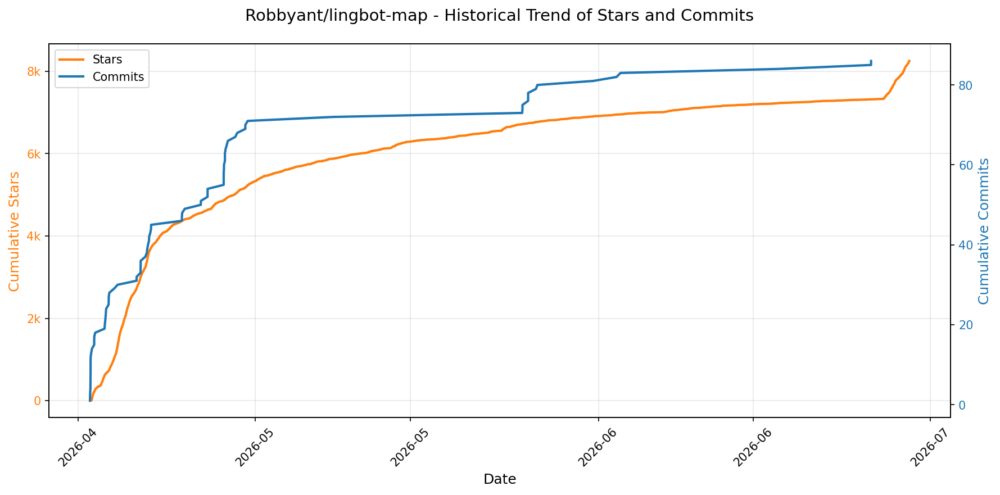

> *蓝色：累计 Stars｜橙色：累计 Commits（次 Y 轴）*

<b>📄 README 摘要</b>

1. **项目功能**  
LingBot-Map 是一个面向**流式（streaming）3D重建任务的前馈式（feed-forward）三维基础模型**，专为实时、长序列、大规模场景的在线三维建图而设计。它直接从单目视频或图像序列中，**端到端地估计相机位姿并重建稠密几何点云**，无需迭代优化或后处理。其核心目标是解决传统SLAM/NeRF方法在长时序中因累积漂移导致的精度退化问题，并支持稳定、高帧率（~20 FPS）、低延迟的在线推理。

2. **关键特性**  
- **几何上下文Transformer（Geometric Context Transformer, GCT）架构**：统一建模坐标锚定（coordinate grounding）、稠密几何线索（如深度、法向）与长程漂移校正，通过三重机制实现——**锚点上下文（anchor context）**、**位姿参考窗口（pose-reference window）** 和 **轨迹记忆（trajectory memory）**。  
- **高效流式推理能力**：采用**分页KV缓存（paged KV cache）注意力机制**（基于FlashInfer），支持超长序列（>10,000帧）稳定运行；引入`--keyframe_interval`（关键帧间隔）和`--mode windowed`（滑动窗口模式）策略，有效控制显存占用与计算开销。  
- **卓越重建性能**：在KITTI、Oxford Spires、7-Scenes等主流基准上全面超越现有流式方法（如DROID-SLAM）及迭代优化类方法；支持室内外多尺度场景（含大范围户外、复杂室内闭环、高空航拍等）。  
- **工程级实用功能**：集成天空掩膜（Sky Masking，基于ONNX轻量分割模型）、可视化交互（viser浏览器界面）、离线批量渲染（MP4飞越视频生成）、可配置虚拟相机路径（YAML定义多段运动轨迹）、预测结果持久化（NPZ格式）等完整工作流支持。

3. **技术栈**  
- **核心框架**：PyTorch 2.8.0（官方推荐，适配CUDA 12.8）  
- **加速库**：FlashInfer（提供高性能分页KV缓存，支持JIT CUDA编译）；可降级至PyTorch原生SDPA  
- **渲染与几何处理**：Open3D（≥0.19）、NVIDIA Kaolin（用于体素化与frustum裁剪，依赖torch-2.8.0_cu128预编译轮子）、自研CUDA扩展（`voxel_morton_ext`, `frustum_cull_ext`）  
- **可视化**：viser（Web端3D交互查看器）、ffmpeg（视频合成）  
- **辅助模型**：ONNX Runtime（GPU/CPU版，用于实时天空分割）  
- **部署与生态**：Hugging Face / ModelScope双平台模型托管；Apache-2.0开源协议；支持conda环境管理与模块化安装（`pip install -e ".[vis,render]"`）

---

### 41. [ogulcancelik/herdr](https://github.com/ogulcancelik/herdr)
- 📅 **创建日期**：2026-03-27  
- 🔄 **最近更新**：2026-06-29  
- ⭐ **Stars**：8,012（日 +207｜周 +1292｜月 +5004）  
- 📝 **描述**：agent multiplexer that lives in your terminal.  

<b>📈 Star 与 Commit 历史趋势</b>

> *蓝色：累计 Stars｜橙色：累计 Commits（次 Y 轴）*

<b>📄 README 摘要</b>

1. **项目功能**  
herdr 是一个运行于终端内的智能代理（AI agent）多路复用器（agent multiplexer），旨在为开发者提供统一、持久、状态感知的终端工作环境。它不依赖 GUI 或 Electron，而是直接嵌入用户现有终端（支持 macOS/Linux/Windows 预览版），管理多个 AI 代理（如 Claude Code、Cursor、Devin、Copilot CLI 等）的生命周期与交互状态。核心能力包括：跨会话持久化（detach/reattach）、工作区（workspace）—标签页（tab）—窗格（pane）三级组织结构、实时代理状态识别（blocked/working/done/idle）、原生终端视图（非渲染封装）、远程 SSH 无缝接入，以及支持代理通过 Unix Socket 主动调用 herdr 功能（如创建 workspace、监听状态变更等），使其成为 AI 编程工作流的底层运行时基础设施。

2. **关键特性**  
- **全终端原生体验**：零 GUI、无 Web UI、无 Electron，纯终端内运行，兼容 tmux 等现有环境；  
- **智能代理感知**：自动检测 18+ 主流 AI 代理进程及输出，可视化显示阻塞（🔴）、运行中（🟡）、完成未读（🔵）、已完成已阅（🟢）状态；支持官方集成（如 claude、copilot、devin 等）实现会话级恢复与语义状态上报；  
- **高级终端工作流**：支持鼠标拖拽分屏、点击切换、键盘快捷键（Prefix 模式，类 tmux）、拖选复制、键盘复制模式（`prefix+[`）、主题定制（18 种内置主题）、通知音效与 toast 提示；  
- **强持久化与远程协作**：服务端（server）与客户端（client）分离，detach 后代理进程持续运行；支持本地命名会话、远程 SSH 直连（`herdr --remote`）、Unix Socket API 供代理主动控制；  
- **无缝更新与恢复**：支持 `herdr update` 自动升级，实验性 `--handoff` 实现运行中代理的热迁移；重启后可基于集成恢复代理会话上下文；  
- **开箱即用与深度可配**：零配置启动，同时支持 TOML 配置文件（`~/.config/herdr/config.toml`）、CLI 参数、环境变量及运行时动态设置。

3. **技术栈**  
- **主语言与构建**：Rust（单二进制、无运行时依赖、高安全性与性能）；使用 `cargo` 构建，`just` 作为开发任务管理工具；  
- **通信机制**：本地 Unix Domain Socket（用于 agent ↔ herdr 通信）、IPC 进程间通信（server/client 协作）；  
- **终端交互**：基于 ANSI 转义序列与终端原始模式（raw mode）实现跨平台键盘/鼠标事件处理，兼容主流终端（含 PuTTY/SSH 场景）；  
- **安装与分发**：自研 Shell/Powershell 安装脚本、Homebrew、mise、Nix 支持；Linux/macOS 直接二进制分发，Windows 为预览版 Beta；  
- **配置与扩展**：TOML 格式配置、Socket API（JSON-RPC 风格协议）、插件化集成模型（`herdr integration install`）；  
- **生态兼容**：深度适配 Git 工作区、SSH 远程场景、tmux 嵌套环境；遵循 AGPL-3.0-or-later 开源许可，提供商业授权选项。

---

### 42. [xbtlin/ai-berkshire](https://github.com/xbtlin/ai-berkshire)
- 📅 **创建日期**：2026-04-07  
- 🔄 **最近更新**：2026-06-29  
- ⭐ **Stars**：5,748（日 +1276｜周 +5713｜月 +5724）  
- 📝 **描述**：AI 时代的伯克希尔：基于 Claude Code / Codex 的价值投资研究框架。巴菲特·芒格·段永平·李录四大师方法论 + 多Agent并行研究。| AI-era Berkshire: a value investing research framework built for Claude Code / Codex. 4 masters' methodologies + multi-agent adversarial analysis.  

<b>📈 Star 与 Commit 历史趋势</b>

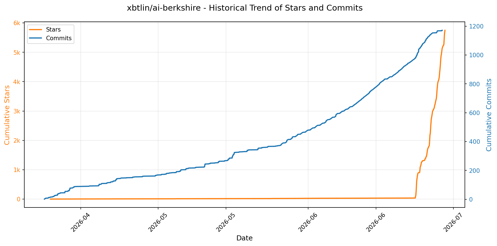

> *蓝色：累计 Stars｜橙色：累计 Commits（次 Y 轴）*

<b>📄 README 摘要</b>

1. **项目功能**  
AI Berkshire 是一个面向价值投资领域的 AI 研究框架，旨在将巴菲特、芒格、段永平、李录四位投资大师的方法论系统化、结构化，并通过多 Agent 协同的 AI 工作流，实现专业级、可决策的投资研究。它不提供泛泛而谈的分析，而是强制输出明确结论（通过/不通过/灰色地带）、分层操作建议（激进/稳健/保守）及具体价格区间；支持对上市公司与未上市公司开展深度研究、财报精读、行业全景扫描与漏斗筛选、持仓管理、新闻异动归因等全链条投研任务，最终生成标准化、可复现、可横向对比的投研报告。

2. **核心特性**  
- **强制决策导向**：摒弃“平衡式废话”，强制输出带价格区间的分级操作建议，并执行“镜子测试”（5句话说不完整即否决）。  
- **四大师视角对抗机制**：四大投资哲学（段永平商业模式、巴菲特财务估值、芒格逆向检验、李录长期确定性）独立评分并产生真实张力，避免单一视角盲区。  
- **结构化反偏见体系**：内置信息丰富度评级（A/B/C）、芒格式失败情景推演、8条一票否决红线、反共识检查、留白原则（宁可标注“灰色地带”也不伪造确定性）。  
- **金融级数据严谨性**：所有计算基于 Python `decimal.Decimal` 实现精确十进制运算；关键指标（如市值、PE）强制双源交叉验证+手算校验；集成 Benford 定律检测财务异常。  
- **可复现研究流程**：统一 Checklist 与评分维度（能力圈、好生意、护城河、管理层、安全边际等），确保跨公司、跨时间、跨用户的研究结果具备严格一致性与可比性。  
- **多 Agent 并行架构**：`/investment-team` 等技能启动 4 个独立 Agent 同步工作（分别模拟四大师视角），覆盖搜索、验证、分析、质疑全流程，大幅提升信息广度与逻辑鲁棒性。  
- **18 项模块化 Skill**：覆盖深度研究、财报精读、行业筛选（产业链扫描+漏斗精选）、持仓管理、思维工具五大类，支持自然语言指令调用（如 `/investment-research 腾讯`）。

3. **技术栈**  
- **AI 运行平台**：原生兼容 Claude Code（Anthropic）与 Codex（OpenAI），通过命令行 CLI 工具链集成。  
- **Agent 架构**：基于多角色协同的 AI Agent 设计，每个 Skill 内部封装独立 Agent 流程（非简单 Prompt 拆分），支持并行执行与结果聚合。  
- **数据与计算层**：Python 主导，核心工具 `tools/financial_rigor.py` 提供市值验算、三情景估值、多源交叉验证、Benford 检测等功能；全部数值计算采用 `decimal.Decimal`，杜绝浮点误差。  
- **工程规范**：采用 Mermaid 可视化架构图；Skill 文档统一 Markdown 格式（`skills/*.md`）；自动化脚本（`scripts/`）同步生成 Codex Skill 包与 Slash Prompts；支持 macOS/Linux/Windows 多平台安装。  
- **交付形态**：CLI 命令行工具集 + 结构化 Markdown 技能文档 + 可执行 Python 工具库 + 实时数据校验机制，强调“可验证、可审计、可复现”的金融工程标准。

---

### 43. [kunchenguid/no-mistakes](https://github.com/kunchenguid/no-mistakes)
- 📅 **创建日期**：2026-04-05  
- 🔄 **最近更新**：2026-06-29  
- ⭐ **Stars**：4,114（日 +262｜周 +2569｜月 +3400）  
- 📝 **描述**：git push no-mistakes  

<b>📈 Star 与 Commit 历史趋势</b>

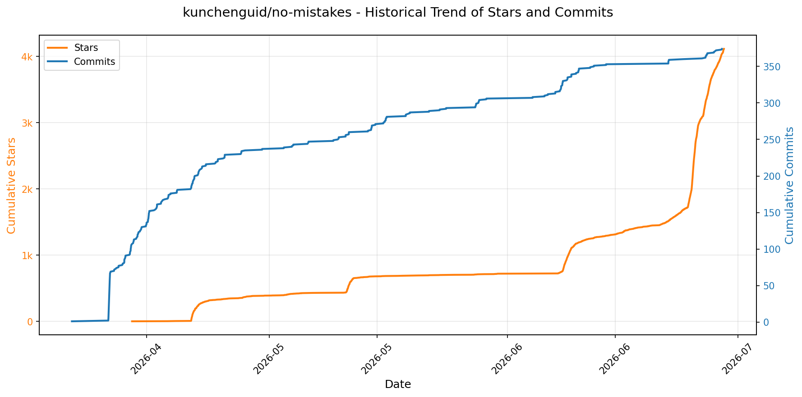

> *蓝色：累计 Stars｜橙色：累计 Commits（次 Y 轴）*

<b>📄 README 摘要</b>

1. **项目功能**  
`no-mistakes` 是一个本地 Git 推送代理工具，它在用户真实远程仓库（如 `origin`）前建立一层“智能闸门”（gate）。用户不再直接 `git push origin`，而是 `git push no-mistakes`；工具随即创建一个**隔离的临时工作树（disposable worktree）**，在其中自动执行 AI 驱动的端到端验证流水线（含代码审查、测试、文档生成、代码规范检查等），仅当所有检查全部通过后，才将分支安全转发至目标远程仓库，并自动生成格式规范、内容清晰的 Pull Request（PR）。整个过程不干扰开发者主工作区，确保每次推送都产出可直接合并的“干净 PR”。

2. **核心特性**  
- **非阻塞性设计**：所有验证在独立 worktree 中异步运行，开发者的主分支和编辑环境完全不受影响；  
- **AI 代理无关性与兼容性**：支持 Claude、GitHub Copilot（Codex）、Rovodev、OpenCode、Pi、ACPX 等多种大模型/编码代理，可通过 `acp:<target>` 统一接入；  
- **原生代理集成**：提供 `/no-mistakes` 技能指令，允许编码代理（如 Claude Code）直接触发流水线——既可对新任务执行“先验证再提交”，也可对已提交代码进行“回溯式质检+自动修复”；  
- **人机协同控制权明确**：自动应用安全、无歧义的机械修复（如格式化、简单 lint 修正）；涉及逻辑意图、业务语义或复杂决策的发现（finding）则强制暂停，由用户选择**批准（approve）、手动修复（fix）或跳过（skip）**；  
- **开箱即用的清洁 PR 流程**：一次推送即触发完整流程——验证 → 自动修复 → PR 创建 → CI 启动，无需手写 PR 描述、手动 push 到 origin 或反复 rebase 修复。

3. **技术栈**  
- **主语言**：Go（构建 CLI 工具 `no-mistakes`，含 `make build/test/e2e` 等标准 Go 工程化流程）；  
- **前端交互**：内置 TUI（文本用户界面），支持终端内实时查看/操作流水线结果；  
- **AI 集成层**：通过标准化 CLI 协议对接多模型代理（如 `claude`, `codex`, `opencode`），并抽象出 `acpx` 通用适配器；  
- **自动化基础设施**：基于 GitHub Actions 实现 CI/CD（release.yml）；使用 Astro 构建文档网站（`docs/dist`）；  
- **辅助工具链**：依赖 `vhs` + `ffmpeg` 生成演示 GIF/MP4；使用 `go vet`、`gofmt`、自定义 lint 规则保障代码质量；端到端测试（e2e）覆盖真实代理交互流程。

---

### 44. [altic-dev/FluidVoice](https://github.com/altic-dev/FluidVoice)
- 📅 **创建日期**：2025-09-21  
- 🔄 **最近更新**：2026-06-29  
- ⭐ **Stars**：3,800（日 +629｜周 +1406｜月 +1553）  
- 📝 **描述**：FluidVoice - Fastest macOS Offline Dictation app - Voice to Text fully Local. One ⭐ takes us a long way :))   

<b>📈 Star 与 Commit 历史趋势</b>

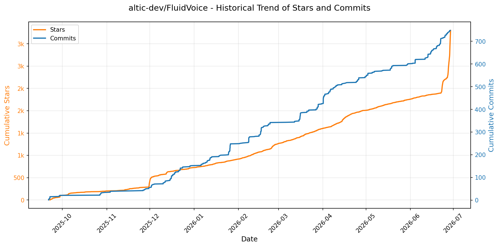

> *蓝色：累计 Stars｜橙色：累计 Commits（次 Y 轴）*

<b>📄 README 摘要</b>

1. **项目功能**  
FluidVoice 是一款面向 macOS 的开源语音转文字（语音听写）应用，核心目标是提供**本地化、低延迟、高隐私性**的实时语音输入体验。它支持在设备端直接完成语音识别与智能文本增强，无需上传音频或文本至云端；用户可通过全局快捷键在任意应用中启动语音输入，并实现“说即所得”的实时文字上屏。同时集成命令控制（Command Mode）与文本编辑（Write Mode）能力，允许用户纯语音操控 macOS 系统（如启动应用、触发快捷指令）或在任意文本框内直接听写、重写内容。

2. **关键特性**  
- **Fluid Intelligence**：专有私有本地 AI 运行时，提供完全离线的智能后处理能力，包括上下文感知大写、智能标点、格式化（如邮件模板、列表、emoji 插入）、数字/连字符规范化等，所有计算均在 Mac 上完成，数据零外泄。  
- **双模式交互**：  
  - *Command Mode*：语音执行系统级操作（打开App、运行快捷指令、调节音量/亮度等）；  
  - *Write Mode*：精准注入文本至任意应用的光标位置，支持选中重写与自由听写。  
- **超低延迟语音识别**：原生优化的 Parakeet Flash 实现“说话即显示”，为 macOS 上最快的 Parakeet 实现之一。  
- **多模型灵活切换**：内置支持 Nemotron Speech 3.5、Parakeet 系列（v2/v3/Flash）、Cohere Transcribe、Apple 原生语音、Whisper 全尺寸模型，覆盖英语/多语种、低延迟/高精度等不同场景。  
- **隐私优先架构**：默认完全本地运行；云AI增强（OpenAI/Groq等）为可选且密钥安全存储于 macOS Keychain；音频历史、统计等全部本地存储并支持 ZIP 导出。  
- **深度系统集成**：Notch 感知实时字幕悬浮窗、菜单栏状态控件、自适应明暗主题、全局热键、无障碍API直输、按应用定制提示词（Per-App Configuration）等。  
- **高度可选性**：所有高级功能（Fluid Intelligence、音频历史、分析、Beta 更新等）均为显式启用，基础听写开箱即用，仅需麦克风与辅助功能权限。

3. **技术栈**  
- **开发语言与框架**：Swift（主语言），基于 Apple 原生生态构建，深度依赖 `AVFoundation`（音频采集）、`Speech` 框架（Apple Speech 集成）、`Accessibility API`（跨应用文本输入）、`Core ML` / 自定义 Metal 加速推理（本地模型运行）。  
- **模型部署**：所有语音模型（Parakeet/Nemotron/Whisper等）以 Core ML 或优化后的原生二进制格式打包，专为 Apple Silicon（M系列芯片）加速设计；Intel Mac 仅通过 Whisper 兼容支持。  
- **本地AI运行时**：Fluid Intelligence 为独立维护的私有本地推理引擎（未开源），采用高效轻量级架构，在 macOS 上以低资源占用运行大型语言模型进行文本后处理。  
- **构建与依赖管理**：Xcode 项目，依赖通过 Swift Package Manager（SPM）统一管理；构建流程兼容签名/无签名两种模式，CI 使用无签名自动化测试。  
- **基础设施**：Homebrew Cask 分发；GitHub Actions CI/CD；隐私合规设计（匿名分析开关、Keychain 密钥存储、全本地数据流）。

---

### 45. [openai/plugins](https://github.com/openai/plugins)
- 📅 **创建日期**：2026-03-04  
- 🔄 **最近更新**：2026-06-29  
- ⭐ **Stars**：3,740（日 +49｜周 +408｜月 +2450）  
- 📝 **描述**：OpenAI Plugins  

<b>📈 Star 与 Commit 历史趋势</b>

> *蓝色：累计 Stars｜橙色：累计 Commits（次 Y 轴）*

<b>📄 README 摘要</b>

1. **该项目的作用**  
该项目是一个 Codex 插件示例的精选集合仓库，旨在为 Codex 平台提供可复用、可扩展的功能模块。每个插件封装了特定领域的能力（如设计、开发、协作、部署等），支持通过标准化接口集成到 Codex 工作流中，用于增强 AI 编程助手在真实工程场景中的任务执行能力（例如生成 UI 代码、同步设计稿、管理知识库、构建跨平台应用等）。

2. **核心功能**  
- 提供结构化插件模板：每个插件严格遵循 `plugins/<name>/.codex-plugin/plugin.json` 清单规范，并可选集成技能（`skills/`）、应用配置（`.app.json`）、MCP 协议定义（`.mcp.json`）、智能体（`agents/`）、命令（`commands/`）、钩子（`hooks.json`）及静态资源（`assets/`）等组件；  
- 内置多场景高价值插件示例：涵盖 Figma 设计协同、Notion 知识管理、iOS/macOS/Web/Expo 应用全栈开发、Netlify 部署、Remotion 视频生成、Google Slides 自动化等；  
- 支持双市场机制：默认用户使用 `.agents/plugins/marketplace.json`，API 密钥登录用户则启用独立的 `.agents/plugins/api_marketplace.json`，实现权限与分发隔离。

3. **技术栈**  
- 插件协议层：基于 Codex 自定义插件规范（含 `plugin.json` 清单格式）、MCP（Model Control Protocol）标准、以及 Codex 特有的 `.app.json` 和 `hooks.json` 扩展机制；  
- 开发框架：深度适配 Apple 生态（SwiftUI、AppKit）、Web 技术栈（React Native、Expo、Netlify）、设计工具（Figma API）、协作平台（Notion API、Google Slides API）及视频生成（Remotion）；  
- 工程基础设施：依赖 Codex 运行时环境，支持插件级智能体（agents）、命令调度（commands）、技能调用（skills）及资产托管（assets）。

---

### 46. [interviewstreet/hiring-agent](https://github.com/interviewstreet/hiring-agent)
- 📅 **创建日期**：2025-07-29  
- 🔄 **最近更新**：2026-06-29  
- ⭐ **Stars**：3,204（日 +126｜周 +2027｜月 +3056）  
- 📝 **描述**：AI agent to evaluate and score resumes.  

<b>📈 Star 与 Commit 历史趋势</b>

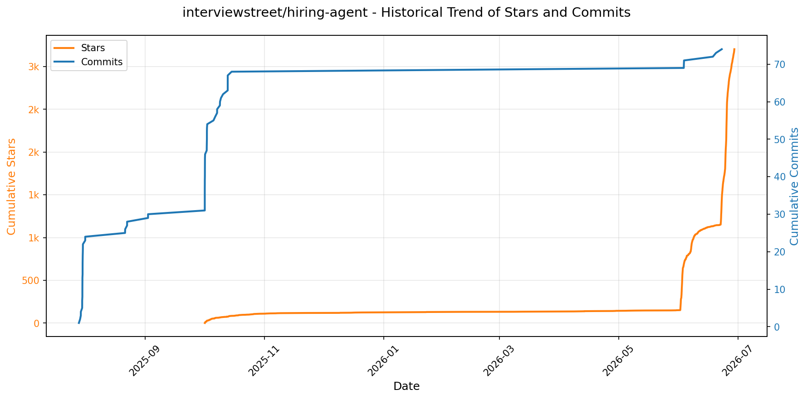

> *蓝色：累计 Stars｜橙色：累计 Commits（次 Y 轴）*

<b>📄 README 摘要</b>

1. **项目功能**  
该工具是一个面向招聘场景的自动化简历评估系统，实现“简历PDF → 结构化评分”的端到端流水线：从PDF简历中提取文本并转换为Markdown格式；调用本地（Ollama）或云端（Google Gemini）大语言模型（LLM），按预定义模板（如基本信息、工作经历、教育背景等）分节解析出结构化JSON数据（遵循JSON Resume标准）；自动识别候选人GitHub账号，拉取其个人资料与仓库信息，结合LLM筛选出最多7个高质量项目（要求作者有实质性提交）；最后基于预设公平性规则，对开源贡献、个人项目、生产经验、技术能力等维度进行严格打分，生成含具体证据、加分项与扣分项的可解释性综合评估报告，并支持开发模式下的CSV批量导出与中间结果缓存。

2. **核心特性**  
- ✅ **全链路本地化支持**：默认通过Ollama运行轻量级开源模型（如gemma3:1b/4b/12b），无需联网或依赖云服务；同时兼容Google Gemini API，提供灵活部署选项。  
- ✅ **结构化与可解释性双保障**：采用Jinja模板驱动LLM解析，强制输出符合Pydantic校验的JSON Resume格式；评分逻辑内置于提示词中，确保每项得分均有明确依据（如代码提交记录、项目分类标签、技能匹配度）。  
- ✅ **GitHub智能增强**：自动从简历中提取GitHub用户名，调用API获取profile与repos，利用LLM对项目进行语义分类（如Web、CLI、ML等），并依据作者提交占比等指标筛选高价值项目。  
- ✅ **开发友好型工作流**：启用`DEVELOPMENT_MODE`后自动缓存PDF解析结果、GitHub数据及中间JSON，支持增量调试；一键生成带时间戳的`resume_evaluations.csv`用于横向对比与模型迭代。  
- ✅ **模块化与可扩展设计**：各环节解耦清晰（PDF处理、LLM编排、GitHub集成、评分引擎），提示词集中管理于`prompts/templates/`目录，支持快速适配新字段或评分维度。

3. **技术栈**  
- **编程语言**：Python 3.11+（严格版本约束）  
- **核心依赖**：  
  - `PyMuPDF`（fitz）：高性能PDF文本与布局提取  
  - `Ollama` / `google-generativeai`：LLM推理后端（本地或云端）  
  - `Pydantic v2`：数据建模与验证（`models.py`定义强类型Schema）  
  - `Jinja2`：模板化提示工程（分节解析与评分指令）  
- **辅助库**：  
  - `requests`（GitHub API调用）、`rich`（终端美化输出）、`python-dotenv`（环境配置）、`black`（代码格式化）  
- **架构模式**：命令行驱动（`score.py`为主入口），模块职责单一（`pdf.py`, `github.py`, `evaluator.py`, `transform.py`等），配置通过`.env`文件与`config.py`统一管理。

---

### 47. [BuilderIO/agent-native](https://github.com/BuilderIO/agent-native)
- 📅 **创建日期**：2026-03-12  
- 🔄 **最近更新**：2026-06-29  
- ⭐ **Stars**：2,888（日 +129｜周 +1570｜月 +2457）  
- 📝 **描述**：A framework for building agent-native applications.  

<b>📈 Star 与 Commit 历史趋势</b>

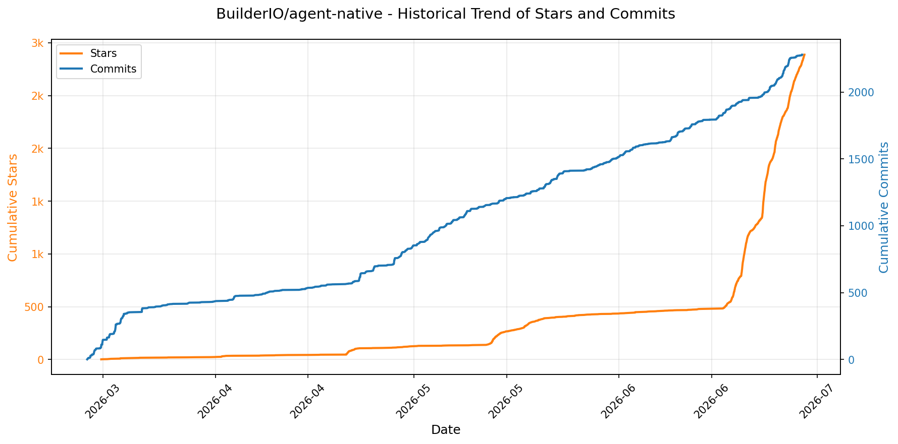

> *蓝色：累计 Stars｜橙色：累计 Commits（次 Y 轴）*

<b>📄 README 摘要</b>

1. **项目功能**  
Agent-Native 是一个面向「代理原生（agent-native）应用」的开源框架，旨在构建能深度嵌入真实应用程序内部、与用户界面协同工作的生产级智能代理系统。它不满足于将AI代理作为独立聊天窗口存在，而是让代理与UI成为同一系统的“平等公民”：共享同一份状态（SQL数据库）、同一套业务逻辑（Actions）、同一套身份与权限体系，并支持人类与代理实时协同编辑、上下文感知交互（如选中文本后快捷触发）、跨代理协作（A2A）以及代理自主优化自身功能（如添加特性、修复Bug、改进UI）。

2. **核心特性**  
- **统一动作（Actions）**：一次定义，多端复用——同一Action可被UI点击、自然语言指令、HTTP API、MCP协议、代理间调用（A2A）及CLI命令触发，确保行为一致性与可维护性。  
- **全栈代理运行时**：内置开箱即用的代理能力，涵盖对话管理、工具调用、技能编排、记忆持久化、异步任务（Jobs）、可观测性（Observability）及人工接管（Handoffs）。  
- **深度UI-代理融合**：UI与代理共享状态与上下文，支持实时多人协同编辑、上下文感知指令（如Cmd+I）、可视化规划（`/visual-plan`）与变更复盘（`/visual-recap`）等增强体验。  
- **模板驱动开箱即用**：提供6个完整、免费、开源的SaaS级模板（Clips录屏调试、Plans可视化编码规划、Design原型生成、Content MDX笔记、Slides幻灯片创作、Analytics数据分析），均支持直接克隆、深度定制与组合部署。  
- **技能即插即用（Skills）**：可通过`npx`一键为现有IDE代理（如Copilot、Cursor等）注入高级能力（如视觉化计划与PR复盘），无需重构底层应用。  
- **完全自主可控**：支持任意Drizzle兼容SQL数据库、任意Nitro兼容托管平台、任意LLM模型栈及自有前端代码，无厂商锁定。

3. **技术栈**  
- **核心框架**：基于 Nitro（Nuxt 的通用运行时）构建，支持跨平台部署（Serverless、Docker、边缘等）；  
- **数据库层**：通过 Drizzle ORM 抽象，兼容 PostgreSQL、SQLite、MySQL 等 SQL 数据库，实现类型安全、迁移友好、事务一致的状态管理；  
- **前端与UI**：采用现代前端技术栈（未显式声明但模板示例表明支持 React/Vue 组件化开发），强调UI与代理逻辑的同构集成；  
- **代理运行时**：内置自研轻量级Agent Runtime，支持工具调用、记忆管理、任务调度与可观测性追踪；  
- **协议与集成**：原生支持 MCP（Model Context Protocol）、A2A（Agent-to-Agent）通信、HTTP API 及 CLI 接口；  
- **开发体验**：基于 TypeScript + Zod Schema 进行强类型定义，使用 pnpm 作为包管理器，提供 `create` CLI 工具快速初始化项目（含模板克隆、Chat UI 或 Headless 模式）。

---

### 48. [aws/agent-toolkit-for-aws](https://github.com/aws/agent-toolkit-for-aws)
- 📅 **创建日期**：2026-04-23  
- 🔄 **最近更新**：2026-06-29  
- ⭐ **Stars**：1,552（日 +55｜周 +613｜月 +795）  
- 📝 **描述**：Official, AWS-supported MCP servers, skills, and plugins to help AI agents build on AWS  

<b>📈 Star 与 Commit 历史趋势</b>

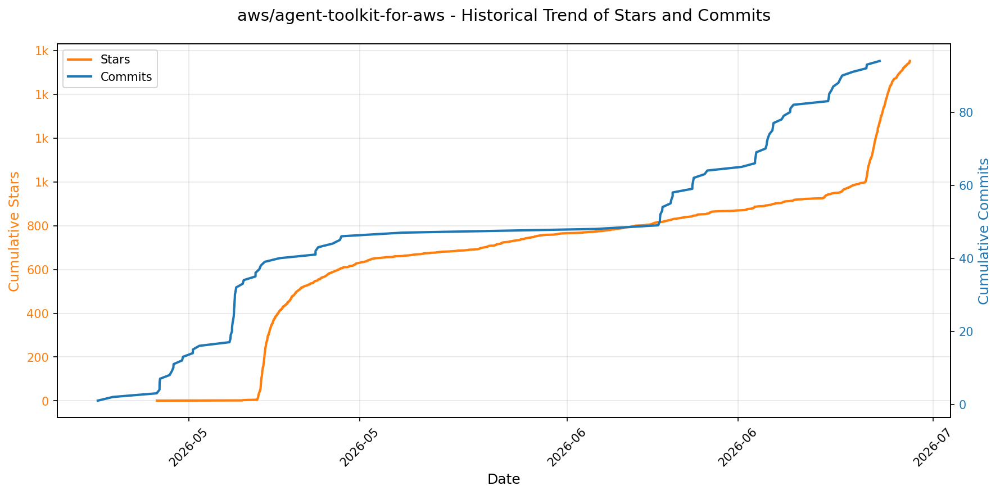

> *蓝色：累计 Stars｜橙色：累计 Commits（次 Y 轴）*

<b>📄 README 摘要</b>

1. **该项目的作用**  
该项目是 AWS 官方推出的“Agent Toolkit for AWS”（AWS 智能体工具包），旨在赋能 AI 编程智能体（如 Claude Code、Codex、Cursor、Kiro 等）安全、高效地构建、部署和管理 AWS 应用。它通过提供标准化的 MCP（Model Context Protocol）服务接口、预封装插件（Plugins）、可复用技能包（Skills）及策略规则（Rules），使 AI 智能体能在真实生产环境中执行 AWS 云操作——包括基础设施即代码（CDK/CloudFormation）、无服务器与容器编排、数据湖与 ETL 分析、AI 代理开发（Bedrock + AgentCore）、DevSecOps 自动化（漏洞扫描、渗透测试、UAT 执行、事故调查）等端到端任务。

2. **核心功能**  
- **模块化插件体系**：提供四大即装即用插件——`aws-core`（基础云服务操作）、`aws-agents`（基于 Bedrock 的 AI 代理构建）、`aws-data-analytics`（S3 Tables/Glue/Athena 数据分析工作流）、`aws-agents-for-devsecops`（集成 AWS DevOps Agent 与 Security Agent 的安全合规自动化）。  
- **AWS MCP Server（核心运行时）**：提供统一认证入口，支持全部 300+ AWS 服务调用；内置沙箱化 Python 脚本执行环境；支持免认证实时检索最新 AWS 文档与 API 参考；集成 CloudWatch 指标监控与 CloudTrail 审计日志。  
- **细粒度安全与治理能力**：支持 IAM 条件键（Condition Keys）区分智能体与人工操作，实现“仅限智能体读取”等精细化权限策略；所有请求均具备可追溯的审计轨迹。  
- **技能按需加载机制**：Skills 为轻量级、任务导向的指令与知识包，AI 智能体动态发现并加载所需技能，避免冗余上下文，提升执行准确性。  
- **跨平台兼容性**：原生支持主流 AI 编程工具（Claude Code/Codex/Cursor/Kiro），同时提供通用 MCP Server 配置指南，适配其他遵循 MCP 协议的智能体。

3. **技术栈**  
- **协议层**：基于 [Model Context Protocol (MCP)](https://modelcontextprotocol.org/) 标准构建，实现模型与工具间的结构化通信。  
- **服务层**：`mcp-proxy-for-aws`（Python 实现，发布于 PyPI），作为 AWS MCP Server 的官方代理，支持多区域部署（如 `us-east-1`, `us-west-2`）及元数据配置（如 `AWS_REGION`）。  
- **客户端集成**：依赖 `uv`（Astral 开发的高速 Python 包管理器与运行时）进行插件与技能安装（`npx skills add` / `uvx` 命令）；各 IDE 插件通过 `.cursor-plugin/marketplace.json` 或 Anthropic Marketplace 等机制注册与分发。  
- **基础设施与安全**：深度集成 AWS 原生服务——IAM（条件策略）、CloudTrail（全操作审计）、CloudWatch（指标监控）、STS（临时凭证）、Lambda（无服务器执行）、S3（静态资源托管）等。  
- **开发与交付**：GitHub Actions CI/CD 流水线；Apache-2.0 开源许可证；文档托管于 AWS 官方文档中心（docs.aws.amazon.com）。

---

