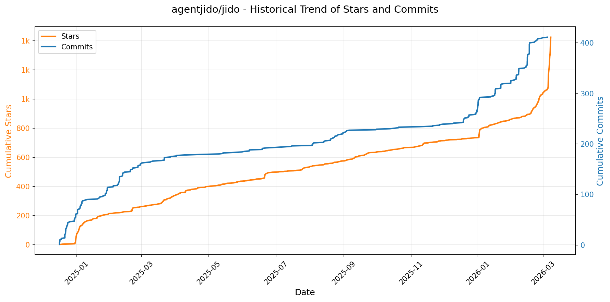

# 🌟 GitHub Trending 概览

> 数据更新于：2026-03-08

---

## 🔍 项目详情

### 1. [openclaw/openclaw](https://github.com/openclaw/openclaw)
- 📅 **创建日期**：2025-11-24  
- 🔄 **最近更新**：2026-03-08  
- ⭐ **Stars**：163,208（日 +4487｜周 +36248｜月 +110969）  
- 📝 **描述**：Your own personal AI assistant. Any OS. Any Platform. The lobster way. 🦞   

<b>📈 Star 与 Commit 历史趋势</b>

> *蓝色：累计 Stars｜橙色：累计 Commits（次 Y 轴）*

<b>📄 README 摘要</b>

1. **项目功能**  
OpenClaw 是一个完全本地化、用户自托管的个人 AI 助手系统，核心目标是让用户在自有设备上运行一个**单用户、低延迟、始终在线、隐私优先**的智能代理。它不依赖中心化云服务，而是作为“网关（Gateway）”统一调度多端能力：一方面接入并聚合 20+ 主流通讯平台（如 WhatsApp、Telegram、Slack、Discord、Signal、iMessage/BlueBubbles、微信替代品 Feishu/LINE/Zalo、Matrix、IRC、Twitch 等），实现跨平台消息收发与上下文统一；另一方面通过 macOS/iOS/Android 原生节点（Nodes）调用设备级能力（语音唤醒、实时语音对话、摄像头、屏幕录制、定位、通知、系统命令等），并驱动可交互的“Live Canvas”可视化工作区（基于 A2UI）。其本质是将大模型能力深度嵌入用户真实数字生活场景——从聊天到自动化、从语音到视觉界面、从本地执行到远程协同。

2. **关键特性**  
- **全通道聚合 inbox**：原生支持 20+ 消息平台（含 iMessage 替代方案 BlueBubbles、企业级如 Microsoft Teams/Mattermost/Nextcloud Talk、去中心化如 Matrix/Nostr/Tlon），支持群组路由、提及触发、分块处理与通道隔离。  
- **本地优先网关架构**：单一 WebSocket 控制平面（`ws://127.0.0.1:18789`），集中管理会话（Session）、通道连接、工具调用、定时任务（Cron）、Webhook、远程调试与安全策略。  
- **多智能体路由与工作区隔离**：支持按通道、账号或联系人将消息路由至独立 Agent 实例（Workspace + Session 隔离），实现角色化/场景化助理（如工作助理、家庭助理、开发助理）。  
- **全栈语音交互**：macOS/iOS 支持 Wake Word（语音唤醒），Android 支持连续语音输入（Talk Mode），集成 ElevenLabs + 系统 TTS，支持语音转文字与语音合成闭环。  
- **Live Canvas 可视化工作区**：Agent 可动态生成、更新和渲染交互式 UI（A2UI 协议），支持图表、表单、代码预览、实时媒体展示，成为 AI 的“桌面画布”。  
- **设备原生节点（Nodes）**：深度集成操作系统能力——macOS 节点支持 `system.run`/`system.notify`/屏幕录制/Canvas；iOS/Android 节点支持相机、定位、通知、SMS、日历、应用控制等，均通过安全的 `node.invoke` RPC 调用。  
- **安全默认与细粒度 DM 策略**：所有私信默认启用配对码（pairing）机制，仅白名单用户可交互；支持 OAuth/API Key 多模型轮换与故障转移（model failover）；内置 `openclaw doctor` 自动检测配置风险。  
- **开箱即用的技能生态（ClawHub）**：内置技能注册中心，支持一键安装、管理及沙箱化运行 Bundled/Managed/Workspace 技能（如浏览器控制、Gmail 监听、自动化脚本）。  
- **灵活部署模式**：支持本地终端 CLI 向导（`openclaw onboard`）、macOS 菜单栏应用、远程 Linux 网关 + 设备节点混合部署、Nix 声明式配置、Docker 容器化，以及 Tailscale Serve/Funnel 实现安全远程访问。

3. **技术栈**  
- **运行时**：Node.js ≥22（主运行环境），支持 npm/pnpm/bun；TypeScript 为主语言，使用 `tsx` 直接运行源码。  
- **核心框架**：自研轻量级 Gateway WebSocket 控制平面（非 Express/Koa）；Pi Agent 运行时基于 RPC 协议，支持工具流式调用与响应块流式传输。  
- **前端与 UI**：Control UI 与 WebChat 内置于 Gateway，提供 Web 管理界面；Canvas 使用 A2UI 协议（声明式 JSON UI 描述）；macOS/iOS/Android 应用为原生客户端（Swift/Kotlin）。  
- **通讯协议与 SDK**：各通道基于成熟开源库封装——WhatsApp（Baileys）、Telegram（grammY）、Slack（Bolt）、Discord（discord.js）、Signal（signal-cli）、Matrix（matrix-js-sdk）等。  
- **语音与媒体**：音频处理集成 Whisper（转录）、ElevenLabs（TTS），支持系统级 TTS 回退；图像/视频管道含尺寸限制、临时文件生命周期管理。  
- **基础设施**：支持 Tailscale（Serve/Funnel）实现零配置内网穿透与 HTTPS 暴露；SSH 隧道备用方案；NixOS 声明式部署；Docker 容器化打包；launchd（macOS）/systemd（Linux）守护进程管理。  
- **安全与运维**：基于 Token/Password/Tailscale Identity 的多层认证；完整日志系统；`openclaw doctor` 自检与迁移工具；MIT 开源许可证。

---

### 2. [x1xhlol/system-prompts-and-models-of-ai-tools](https://github.com/x1xhlol/system-prompts-and-models-of-ai-tools)
- 📅 **创建日期**：2025-03-05  
- 🔄 **最近更新**：2026-03-08  
- ⭐ **Stars**：129,448（日 +303｜周 +2923｜月 +16411）  
- 📝 **描述**：FULL Augment Code, Claude Code, Cluely, CodeBuddy, Comet, Cursor, Devin AI, Junie, Kiro, Leap.new, Lovable, Manus, NotionAI, Orchids.app, Perplexity, Poke, Qoder, Replit, Same.dev, Trae, Traycer AI, VSCode Agent, Warp.dev, Windsurf, Xcode, Z.ai Code, Dia & v0. (And other Open Sourced) System Prompts, Internal Tools & AI Models  

<b>📈 Star 与 Commit 历史趋势</b>

> *蓝色：累计 Stars｜橙色：累计 Commits（次 Y 轴）*

<b>📄 README 摘要</b>

该内容并非典型 GitHub 项目 README（缺乏代码结构、安装说明、使用示例等核心技术信息），而是一个**公开的 AI 系统提示词（system prompts）与模型行为分析资源库**的宣传性页面。根据全文语境与关键线索（如仓库名 `x1xhlol/system-prompts-and-models-of-ai-tools`、30,000+ 行洞察、安全警示、赞助链接等），其本质为一个持续收集、逆向分析并开源共享主流 AI 工具（如 Claude、Gemini、Perplexity、Kilo Code 等）底层系统提示词与模型行为模式的社区驱动型知识库。

以下严格按您要求的**三个维度**进行精炼、客观、无引言式总结（不添加背景或评价）：

---

**1. 该项目做什么？**  
该项目系统性地收集、整理、分析并公开披露各类 AI 工具（尤其是闭源大模型产品）在生产环境中实际使用的**系统提示词（system prompts）**、模型配置细节、行为逻辑及内部架构线索，形成可检索、可研究的结构化知识库，旨在提升 AI 系统的透明度、可审计性与安全性认知。

**2. 关键功能**  
- 提供超 **30,000+ 行**经实证提取或逆向推断的 AI 系统提示词原始文本与上下文注释；  
- 涵盖多款主流 AI 工具（如 Kilo Code、Perplexity、Claude 相关工具等）的提示工程实践与模型响应模式分析；  
- 集成安全警示机制，面向 AI 创业公司提供提示词泄露风险识别指引，并推荐 ZeroLeaks 等专业 AI 安全审计服务；  
- 支持社区协作共建，通过 Discord 社群、GitHub Issues 收集反馈与新增线索；  
- 提供多平台数据看板（Trendshift、Star History）与第三方验证徽章（CloudBack、DeepWiki），保障内容可信度与活跃度。

**3. 技术栈**  
- **核心载体**：GitHub 公共仓库（纯文本为主，含 Markdown 文档、结构化注释）；  
- **分析方法**：基于黑盒测试、API 响应比对、前端/网络请求逆向、LLM 输出模式归纳等经验性工程分析手段；  
- **辅助工具链**：集成 Trendshift（趋势分析）、CloudBack（构建状态监控）、DeepWiki（AI 原生知识图谱索引）、Star History（星标增长可视化）等第三方开源/开放平台服务；  
- **基础设施依赖**：无自托管后端或运行时环境，属静态知识库，依赖 GitHub Pages 或类似静态托管方案分发。

---

### 3. [shadcn-ui/ui](https://github.com/shadcn-ui/ui)
- 📅 **创建日期**：2023-01-04  
- 🔄 **最近更新**：2026-03-08  
- ⭐ **Stars**：108,184（日 +321｜周 +771｜月 +2219）  
- 📝 **描述**：A set of beautifully-designed, accessible components and a code distribution platform. Works with your favorite frameworks. Open Source. Open Code.  

<b>📈 Star 与 Commit 历史趋势</b>

> *蓝色：累计 Stars｜橙色：累计 Commits（次 Y 轴）*

<b>📄 README 摘要</b>

1. **项目功能**  
该项目提供一套美观、可高度定制的 UI 组件集合，核心定位并非开箱即用的完整组件库，而是作为**可复刻、可深度定制、可自主演进的组件开发模板**。用户通过复制（`npx shadcn-ui@latest add`）组件源码到本地项目中，直接修改其 JSX、CSS（通常为 Tailwind CSS）、逻辑与类型定义，从而构建完全属于自己的、与项目需求和设计系统严格对齐的私有组件库。

2. **关键特性**  
- **开源透明**：所有组件源码完全公开，无黑盒封装，鼓励阅读、理解并改造；  
- **零运行时依赖**：组件以普通 React 函数组件形式提供，不引入额外框架或运行时库，体积轻量、性能可控；  
- **Tailwind 优先 + CSS-in-JS 友好**：默认基于 Tailwind CSS 构建，支持 `@apply` 和实用类组合，同时兼容 `clsx`、`cva`（class-variance-authority）等工具实现条件样式与变体管理；  
- **TypeScript 原生支持**：所有组件均提供完整类型定义，开箱即用，保障类型安全；  
- **CLI 辅助集成**：提供官方 CLI 工具（`shadcn-ui`），支持一键将指定组件（如 `button`、`card`、`dialog`）按需安装至本地项目，并自动处理依赖、样式配置与路径别名；  
- **设计系统就绪**：组件遵循一致的设计语言（如间距、圆角、阴影、状态反馈），便于统一主题定制与品牌适配。

3. **技术栈**  
- **前端框架**：React（支持 React Server Components，适配 Next.js App Router 等现代服务端渲染架构）；  
- **样式方案**：Tailwind CSS（核心样式基础）+ `cva`（用于声明式变体控制）+ `clsx`（高效条件 class 拼接）；  
- **类型系统**：TypeScript（全量类型定义，强类型 props 与事件处理）；  
- **构建与集成工具**：Vite 或 Next.js（典型项目脚手架）、`shadcn-ui` CLI（组件初始化与配置自动化）；  
- **其他依赖**：`@radix-ui/react-*`（底层无障碍交互原语，如 `Dialog`, `DropdownMenu`, `Tooltip` 等，确保高标准可访问性）。

---

### 4. [obra/superpowers](https://github.com/obra/superpowers)
- 📅 **创建日期**：2025-10-09  
- 🔄 **最近更新**：2026-03-08  
- ⭐ **Stars**：102,465（日 +575｜周 +7451｜月 +28347）  
- 📝 **描述**：An agentic skills framework & software development methodology that works.  

<b>📈 Star 与 Commit 历史趋势</b>

> *蓝色：累计 Stars｜橙色：累计 Commits（次 Y 轴）*

<b>📄 README 摘要</b>

1. **项目功能**  
Superpowers 是一个面向编程智能体（coding agents）的完整软件开发工作流增强系统。它不直接替代或重写代码，而是通过一套可组合、自动触发的“能力（skills）”对现有编码智能体（如 Claude Code、Cursor、Codex、OpenCode 等）进行深度赋能，使其在真实工程场景中遵循严格、可验证、协作友好的开发范式。其核心作用是：在用户启动编码任务后，主动暂停“写代码”动作，转而引导用户完成需求澄清 → 分块设计确认 → 生成可执行、可审查的细粒度实施计划 → 驱动子智能体（subagents）按 TDD/DRY/YAGNI 原则自主执行任务 → 全流程自动化检查与质量门禁（如测试先行、双阶段代码评审、Git 工作树隔离等），最终实现高可信度、低返工、符合工程最佳实践的端到端开发闭环。

2. **关键特性**  
- **全自动技能触发机制**：无需手动调用，智能体在每个开发环节（如设计前、编码前、提交前）自动识别并激活对应 skill，强制执行标准化流程。  
- **七阶段结构化工作流**：覆盖从头脑风暴（brainstorming）、Git 工作树隔离（using-git-worktrees）、计划拆解（writing-plans）、子智能体驱动开发（subagent-driven-development）、严格 TDD（test-driven-development）、多级代码评审（requesting/receiving-code-review）到分支收尾（finishing-a-development-branch）的全生命周期。  
- **强工程纪律保障**：强制 RED-GREEN-REFACTOR 流程（先写失败测试→再写最小可行代码→再重构）、禁止无测试编码、内置 YAGNI/DRY 原则检查、根因导向调试（systematic-debugging 四阶段）、验证前置（verification-before-completion）。  
- **协作增强设计**：支持 Socratic 式需求澄清、分段可读的设计文档输出、面向初级工程师的清晰任务说明书、并行子智能体调度（dispatching-parallel-agents）、结构化 PR/合并决策支持。  
- **可扩展技能生态**：内置 15+ 经过验证的模块化 skill（含测试、调试、协作、元能力四大类），支持用户遵循 `writing-skills` 规范贡献新 skill，所有 skill 均自带测试方法论与实践指南。

3. **技术栈**  
- **运行平台**：原生适配主流 AI 编程工具插件生态，包括 **Claude Code**（通过插件市场）、**Cursor**（Agent 内置 marketplace）、**Codex** 与 **OpenCode**（通过远程加载安装脚本）；不依赖特定模型，而是作为“工作流编排层”运行于各类 LLM 智能体之上。  
- **架构模式**：基于**声明式技能（declarative skills）** 的插件化架构，每个 skill 为独立可复用的 Markdown + 指令集（见 `skills/` 目录），含明确触发条件、执行逻辑、验证步骤及反模式说明。  
- **基础设施**：依托 GitHub 仓库托管技能定义与文档（`.codex/`, `.opencode/` 配置目录），通过 `plugin install/update` 命令实现远程技能同步；验证与执行依赖宿主平台的 Agent 调度能力与 Git/测试环境集成。  
- **协议与规范**：遵循 MIT 开源协议；技能开发严格采用内建的 `writing-skills` 方法论，强调可测试性、可审查性与上下文无关性；所有流程设计均以人类可读、可审计、可中断为前提。

---

### 5. [microsoft/markitdown](https://github.com/microsoft/markitdown)
- 📅 **创建日期**：2024-11-13  
- 🔄 **最近更新**：2026-03-08  
- ⭐ **Stars**：90,336（日 +67｜周 +1800｜月 +4037）  
- 📝 **描述**：Python tool for converting files and office documents to Markdown.  

<b>📈 Star 与 Commit 历史趋势</b>

> *蓝色：累计 Stars｜橙色：累计 Commits（次 Y 轴）*

<b>📄 README 摘要</b>

1. **项目功能**  
MarkItDown 是一个轻量级 Python 工具，专注于将多种格式的文件（如 PDF、Word、PowerPoint、Excel、图像、音频、HTML、CSV/JSON/XML、ZIP、YouTube 视频、EPUB 等）**高保真地转换为结构化 Markdown 文本**，专为大语言模型（LLM）输入和文本分析流水线设计。其核心目标不是生成面向人类阅读的精美排版文档，而是产出语义丰富、结构清晰（含标题、列表、表格、链接、代码块等）、对 LLM 友好且 Token 效率高的 Markdown 内容，便于后续 AI 处理（如 RAG、摘要、问答等）。

2. **关键特性**  
- ✅ **多格式原生支持**：覆盖办公文档（`.docx`, `.pptx`, `.xlsx`, `.xls`）、PDF、网页（HTML）、归档（ZIP）、富媒体（图像 EXIF+OCR、音频元数据+语音转录、YouTube 字幕）、电子书（EPUB）及纯文本格式（CSV/JSON/XML）。  
- ✅ **模块化依赖管理**：通过可选依赖组（如 `[pdf]`, `[docx]`, `[audio-transcription]`, `[az-doc-intel]` 等）按需安装，避免冗余依赖；`[all]` 提供向后兼容的全功能安装。  
- ✅ **零临时文件设计**：`DocumentConverter` 接口全面重构为基于二进制流（`BytesIO` 或 `open(..., 'rb')`）处理，彻底消除临时文件，提升安全性与性能。  
- ✅ **高级集成能力**：  
　• 支持 **Azure Document Intelligence** 服务实现高精度文档解析；  
　• 集成 **LLM 图像描述生成**（如用 GPT-4o 为 PPTX 中图片生成 Alt 文本）；  
　• 提供 **MCP（Model Context Protocol）服务器**（见 `markitdown-mcp` 子包），无缝对接 Claude Desktop 等 LLM 应用；  
　• 支持 **第三方插件生态**（通过 `--use-plugins` 启用，GitHub 上以 `#markitdown-plugin` 标签发现）。  
- ✅ **灵活使用方式**：提供命令行工具（支持管道输入/输出）、Python API（支持自定义 LLM 客户端、插件开关、Document Intelligence 配置）及 Docker 镜像，适配各类部署场景。

3. **技术栈**  
- **编程语言**：Python ≥ 3.10（官方推荐 3.12）  
- **核心依赖管理**：`pip` / `uv` / `conda`（支持虚拟环境隔离）  
- **构建与开发工具**：`hatch`（测试与环境管理）、`pre-commit`（代码质量检查）、Devcontainer（开箱即用开发环境）  
- **底层解析库**（按格式动态加载）：  
　• PDF：`pypdf`, `pdfplumber`, `fitz`（PyMuPDF）等；  
　• Office：`python-docx`, `python-pptx`, `openpyxl`, `xlrd`；  
　• OCR：`pytesseract` + `Pillow`；  
　• 音频转录：`whisper` 或 `openai-whisper`；  
　• YouTube：`yt-dlp`；  
　• Azure AI：`azure-ai-documentintelligence`；  
　• HTML/XML：`beautifulsoup4`；  
　• ZIP/EPUB：标准库 `zipfile`, `epub`。  
- **扩展协议**：MCP（Model Context Protocol）v0.1+  
- **部署支持**：Docker（提供 `Dockerfile`）  
- **许可证与合规**：Microsoft 开源许可，遵循 CLA（贡献者许可协议）与 Microsoft 开源行为准则。

---

### 6. [toeverything/AFFiNE](https://github.com/toeverything/AFFiNE)
- 📅 **创建日期**：2022-07-31  
- 🔄 **最近更新**：2026-03-08  
- ⭐ **Stars**：64,716（日 +449｜周 +1466｜月 +2336）  
- 📝 **描述**：There can be more than Notion and Miro. AFFiNE(pronounced [ə‘fain]) is a next-gen knowledge base that brings planning, sorting and creating all together. Privacy first, open-source, customizable and ready to use.   

<b>📈 Star 与 Commit 历史趋势</b>

> *蓝色：累计 Stars｜橙色：累计 Commits（次 Y 轴）*

<b>📄 README 摘要</b>

1. **项目功能**  
AFFiNE 是一款开源、隐私优先、本地优先（local-first）的全功能协作工作空间，旨在整合文档编辑、白板绘图与项目管理能力于一体。它提供一个“超融合”平台，将传统上分离的 Wiki、知识库、数据库、演示文稿、数字资产管理和可视化规划工具统一于单一界面中，作为 Notion（结构化文档/数据库）与 Miro（无限画布/视觉协作）的开源替代方案，支持个人知识管理、团队协同创作、教学设计、产品原型绘制等多种场景。

2. **核心特性**  
- **超融合画布（Hyper-Fused Canvas）**：打破文档与白板边界，支持在无边界（edgeless）画布上自由混排任意区块（blocks），包括富文本、便签、嵌入网页、多视图数据库、双向链接页面、矢量图形、幻灯片等；所有内容以“块”为原子单位，实现真正意义上的所见即所得与自由布局。  
- **原生集成多模态 AI 协作**：内置 AFFiNE AI（Canvas AI），支持通过自然语言提示一键生成报告、幻灯片、思维导图、任务看板、代码原型等，深度融入写作、规划、学习与创意全流程。  
- **本地优先 + 实时协同**：默认数据本地存储（保障隐私与所有权），同时通过 CRDT（如 y-octo/YJS）实现跨设备、跨平台（Web / 桌面端）的低延迟实时同步与多人协作。  
- **完全可自托管与可扩展**：提供 Docker 一键部署方案，支持企业私有化部署；基于 Blocksuite 构建，开放插件生态与第三方区块开发接口，鼓励社区共建（如模板市场、主题、组件库等）。

3. **技术栈**  
- **核心框架与引擎**：React（前端 UI）、Vite（构建工具）、Jotai（状态管理）、Blocksuite（开源协同编辑框架，提供块系统与协作底层）、y-octo（Rust 编写的高性能 YJS 兼容 CRDT 引擎）、OctoBase（Rust 编写的本地优先协同数据库）。  
- **基础设施与集成**：Electron（跨平台桌面客户端）、napi-rs（Rust 与 Node.js 高效绑定）、async-call-rpc（轻量级 JSON-RPC 通信）、Yjs（CRDT 基础协议支持）。  
- **语言与工程规范**：TypeScript（主开发语言）、Rust（关键性能模块如 y-octo、OctoBase）、Node.js（服务端与构建脚本）。  
- **许可与发布**：MIT 许可证（Community Edition），支持开源贡献与商业衍生（Enterprise Edition 待发布）。

---

### 7. [virattt/ai-hedge-fund](https://github.com/virattt/ai-hedge-fund)
- 📅 **创建日期**：2024-11-29  
- 🔄 **最近更新**：2026-03-08  
- ⭐ **Stars**：46,805（日 +252｜周 +647｜月 +1106）  
- 📝 **描述**：An AI Hedge Fund Team  

<b>📈 Star 与 Commit 历史趋势</b>

> *蓝色：累计 Stars｜橙色：累计 Commits（次 Y 轴）*

<b>📄 README 摘要</b>

1. **项目功能**  
该项目是一个面向教育与研究目的的AI驱动对冲基金概念验证系统，**不执行真实交易**。其核心目标是模拟多智能体协同决策过程，通过融合不同投资流派（如价值投资、成长投资、宏观对冲、行为分析等）的逻辑，对股票进行多维度分析并生成虚拟交易信号。系统接收股票代码（如AAPL、NVDA等）及可选时间范围作为输入，调用各类AI代理并行处理，最终由组合经理整合输出买卖建议与风险控制方案，支持命令行交互与Web可视化界面两种运行方式。

2. **关键特性**  
- **18个专业化AI代理协同架构**：涵盖13位标志性投资大师（如巴菲特、芒格、达摩达兰、木头姐等）的策略模拟代理，以及4个分析型代理（估值、情绪、基本面、技术面）和1个风险/1个组合管理代理，实现“专家委员会式”决策；  
- **多源异构分析能力**：结合内在价值计算、市场情绪分析（NLP）、财务数据解读（营收/利润率/负债等）、技术指标（MACD、RSI等）及宏观因子，生成交叉验证的交易信号；  
- **灵活部署与回测支持**：提供CLI命令行工具（支持OpenAI/Groq/Anthropic/DeepSeek/Ollama本地模型）和全栈Web应用双入口；内置回测模块（`backtester.py`），可对历史时段（指定起止日期）进行策略性能评估；  
- **轻量级金融数据接入**：对主流美股（AAPL/GOOGL/MSFT/NVDA/TSLA）提供免密免费数据支持，其余标的需配置Financial Datasets API密钥；  
- **严格教育定位与安全设计**：全程无实盘接口，所有输出仅为教学演示；强制API密钥隔离（`.env`管理），含明确法律免责声明与使用约束。

3. **技术栈**  
- **编程语言**：Python（主逻辑、CLI、回测器）；  
- **依赖管理**：Poetry；  
- **大语言模型集成**：支持OpenAI（GPT-4o系列）、Groq、Anthropic（Claude）、DeepSeek及Ollama本地模型（如Llama 3、Phi-3）；  
- **金融数据源**：Financial Datasets API（主数据源），内置免费样本数据集；  
- **Web应用层**：独立`/app`子目录（README指引至具体实现，未详述框架，但按典型Python全栈推断可能含FastAPI/Flask后端 + React/Vue前端）；  
- **环境与配置**：基于`.env`文件管理敏感密钥，采用标准Python包结构（`src/`模块化组织）；  
- **许可证**：MIT License。

---

### 8. [shareAI-lab/learn-claude-code](https://github.com/shareAI-lab/learn-claude-code)
- 📅 **创建日期**：2025-06-29  
- 🔄 **最近更新**：2026-03-08  
- ⭐ **Stars**：37,914（日 +673｜周 +3712｜月 +6770）  
- 📝 **描述**：Bash is all you need -  A nano Claude Code–like agent, built from 0 to 1  

<b>📈 Star 与 Commit 历史趋势</b>

> *蓝色：累计 Stars｜橙色：累计 Commits（次 Y 轴）*

<b>📄 README 摘要</b>

1. **项目功能**  
该项目是一个面向教学的轻量级AI编程智能体（nano Claude Code-like agent）构建实践库，旨在从零开始系统性地拆解并实现一个类Claude Code的自主编码智能体核心运行机制。它不追求生产级完备性，而是通过**12个渐进式会话（s01–s12）**，每个会话仅引入**一个关键机制**，逐步构建出具备规划、工具调用、知识加载、上下文管理、后台执行、多智能体协作与工作区隔离等能力的完整智能体运行时内核。最终目标是让学习者透彻理解AI编码智能体的“最小可行循环”及其可扩展架构本质。

2. **核心特性**  
- **分层递进的教学设计**：12个会话严格遵循“一课一机制、一机制一信条”原则（如s01强调“一个循环+Shell即智能体”，s12聚焦“按ID隔离工作目录”），每步均基于同一基础循环迭代增强，不破坏已有结构。  
- **真实可用的参考实现**：所有会话均提供可运行的Python代码（`agents/sXX_*.py`），含完整工具调度、消息流管理、任务图持久化（JSONL文件）、异步后台线程、JSONL邮箱协议的多智能体通信、三层上下文压缩策略等。  
- **工程化学习支撑体系**：配套多语言文档（中/英/日）、交互式Web学习平台（Next.js，含可视化流程图与源码浏览）、技能文件系统（`skills/`）、结构化学习路径图及生命周期事件流示例。  
- **明确的边界定义**：主动简化或省略生产级复杂度（如全事件总线、RBAC权限、OAuth资源订阅等），聚焦核心模式，避免初学者认知过载；强调其为教学实现，非生产标准。

3. **技术栈**  
- **核心语言与运行时**：Python 3.9+（主逻辑、Agent循环、工具处理器、CLI入口）  
- **LLM接入层**：Anthropic Claude API（通过`anthropic`官方SDK调用，依赖`ANTHROPIC_API_KEY`）  
- **前端与可视化**：Next.js（React框架）、TypeScript、Tailwind CSS（`web/`子目录，提供交互式学习界面）  
- **构建与协作**：Git + GitHub Actions（CI含类型检查与构建）、npm（前端依赖管理）  
- **数据与协议**：JSONL格式（用于任务持久化、多智能体邮箱通信）、纯文本技能文件（`.md`）、环境变量配置（`.env`）  
- **扩展生态**：配套开源项目使用Node.js（Kode CLI）、Rust/Go（Kode SDK底层）、多模型支持（GLM/DeepSeek/MiniMax等），但本库本身不依赖这些。

---

### 9. [anthropics/prompt-eng-interactive-tutorial](https://github.com/anthropics/prompt-eng-interactive-tutorial)
- 📅 **创建日期**：2024-04-02  
- 🔄 **最近更新**：2026-03-08  
- ⭐ **Stars**：32,067（日 +95｜周 +2219｜月 +3279）  
- 📝 **描述**：Anthropic's Interactive Prompt Engineering Tutorial  

<b>📈 Star 与 Commit 历史趋势</b>

> *蓝色：累计 Stars｜橙色：累计 Commits（次 Y 轴）*

<b>📄 README 摘要</b>

1. **该项目做什么？**  
该项目是 Anthropic 官方推出的、面向 Claude 大语言模型（特别是 Claude 3 Haiku）的交互式提示工程（Prompt Engineering）教学教程，旨在系统性地指导用户掌握高质量提示词的设计方法。它不是代码库或可运行软件，而是一个结构化的在线学习课程，通过 9 章渐进式教学内容与配套实操练习，帮助学习者从基础到高级逐步构建针对不同行业场景（如法律、金融、编程、客服等）的鲁棒、可靠、可复现的提示工程能力。

2. **核心功能/特点**  
- **分层递进式课程设计**：涵盖初（基础结构、清晰指令、角色设定）、中（数据/指令分离、输出格式控制、思维链引导、示例驱动）、高（抑制幻觉、多步骤复杂场景建模）三级能力培养；  
- **强交互性与即时反馈**：每章末尾设“示例游乐场”（Example Playground），支持用户实时修改提示并观察 Claude 响应变化，强化实践理解；  
- **真实场景导向**：第 9 章聚焦产业级用例（聊天机器人、法律服务、金融服务、编程辅助），提供可迁移的提示构建范式；  
- **配套资源完善**：提供完整答案密钥（Google Sheets）、跨平台版本（Claude for Sheets 插件版）、模型能力对比说明（Haiku/Sonnet/Opus），并附录扩展技术（提示链、工具调用、检索增强）；  
- **聚焦实效方法论**：强调“80/20 技巧”——即用少量关键优化解决大部分常见失败模式（如模糊性、歧义、幻觉），突出实用性与效率。

3. **技术栈**  
- **核心模型**：Anthropic Claude 3 系列，本教程默认使用 **Claude 3 Haiku**（轻量、高速、低成本），同时说明 Sonnet 与 Opus 的定位差异；  
- **交付平台**：以 GitHub Pages 或静态网页形式托管教程文档（Markdown + HTML），辅以 **Google Sheets + Claude for Sheets 官方插件** 实现无缝交互执行（即在表格中直接调用 Claude API 进行提示测试）；  
- **无独立后端/前端代码**：项目本身不包含自研代码库，而是依托 Anthropic 提供的 API 生态与 Google Workspace 集成能力，属于“低代码/零代码”的教学实践环境。

---

### 10. [moeru-ai/airi](https://github.com/moeru-ai/airi)
- 📅 **创建日期**：2024-12-01  
- 🔄 **最近更新**：2026-03-08  
- ⭐ **Stars**：30,613（日 +955｜周 +11269｜月 +13387）  
- 📝 **描述**：💖🧸 Self hosted, you-owned Grok Companion, a container of souls of waifu, cyber livings to bring them into our worlds, wishing to achieve Neuro-sama's altitude. Capable of realtime voice chat, Minecraft, Factorio playing. Web / macOS / Windows supported.  

<b>📈 Star 与 Commit 历史趋势</b>

> *蓝色：累计 Stars｜橙色：累计 Commits（次 Y 轴）*

<b>📄 README 摘要</b>

1. **项目功能**  
Project AIRI 是一个开源的 AI 虚拟角色（AI waifu / 数字生命体）运行时平台，旨在复刻并超越 Neuro-sama 这类具备强交互能力的虚拟主播（VTuber）——不仅支持实时语音聊天、多模态感知与表达，更关键的是**赋予用户对自身数字生命的完全控制权与本地化部署能力**。它不是一个中心化服务，而是一个可跨端运行的“灵魂容器”：用户可在浏览器（Stage Web）、桌面应用（Stage Tamagotchi）、移动设备（Stage Pocket）上本地运行自己的 AI 虚拟角色，并实现与真实世界深度协同——例如实时观看/分析用户屏幕内容（如编程、游戏画面）、在 Minecraft 和 Factorio 等游戏中自主操作、接入 Discord/Telegram 语音频道进行群聊互动、通过 VRM/Live2D 驱动高表现力的 3D/2D 形象等，最终目标是打造一个真正“活在你身边”的、可扩展、可定制、可持续演化的个人 AI 生命体。

2. **核心特性**  
- **全栈跨端架构**：原生支持 Web（WebGPU/WebAudio/WebAssembly/WebWorker）、桌面（Tauri + Rust + CUDA/Metal 加速）、移动端（Capacitor PWA），三端共享核心逻辑，统一插件与状态系统。  
- **多模态感知与表达闭环**：  
  - *Ears（听觉）*：浏览器麦克风/系统音频输入、Discord 语音流接入、客户端侧语音识别（STT）与说话检测（VAD）；  
  - *Brain（认知）*：集成超 30 家 LLM API（OpenAI/Claude/Gemini/vLLM/Ollama 等），支持 MCP 协议，内置 RAG、记忆系统（DuckDB WASM / pgvector）、游戏代理（Factorio RCON / Mineflayer）；  
  - *Mouth（发声）*：ElevenLabs TTS 及 `unspeech` 统一 ASR/TTS 代理，支持低延迟语音合成；  
  - *Body（形象）*：完整 VRM 与 Live2D 支持，含自动眨眼、视线追踪、Idle 微动作等物理级动画控制。  
- **深度游戏与系统集成能力**：已实现在 Minecraft 和 Factorio 中自主游玩（非脚本录制），通过 RCON/API 与游戏服务器双向通信，支持多人协作场景。  
- **模块化与可扩展生态**：基于 `@proj-airi` 组织构建子项目矩阵，涵盖数据库驱动（`drizzle-duckdb-wasm`）、模型调度（`inventory`）、MCP 插件（`tauri-plugin-mcp`）、实时语音框架（`webai-realtime-voice-chat`）、Prompt 工程工具（`velin`）等，形成面向 AI VTuber 开发者的完整工具链。  
- **极致本地化与隐私优先**：强调纯浏览器内推理（WIP）、本地模型加载（Ollama/vLLM）、端侧语音处理，避免敏感数据上传，支持离线使用。

3. **技术栈**  
- **前端/主框架**：Vue 3（Composition API）、TypeScript、Vite、UnoCSS、Pinia；  
- **UI/图形**：Three.js（3D 渲染）、WebGPU（高性能图形与计算）、WebXR（实验性扩展）、VRM/Live2D SDK；  
- **后端/系统层**：Rust（Tauri 主进程、`xsai` LLM 路由器、`unspeech` 代理）、Nix（跨平台构建与分发）；  
- **AI/数据层**：  
  - LLM 接入：`xsai`（自研统一 API 适配器）、vLLM、Ollama、Transformers.js（`xsai-transformers`）；  
  - 记忆与数据库：DuckDB WASM（浏览器内嵌）、pgvector（向量记忆）、Drizzle ORM；  
  - 语音：Web Audio API、Whisper.cpp / Vosk（客户端 STT）、ElevenLabs / Piper（TTS）；  
- **基础设施**：WebSocket（实时通信）、Capacitor（跨平台移动封装）、Tauri（安全桌面外壳）、MCP（Model Context Protocol）标准支持；  
- **开发运维**：pnpm、Mermaid（架构可视化）、Crowdin（多语言协作）、GitHub Actions（CI/CD）。

---

### 11. [ruvnet/RuView](https://github.com/ruvnet/RuView)
- 📅 **创建日期**：2025-06-07  
- 🔄 **最近更新**：2026-03-08  
- ⭐ **Stars**：29,856（日 +561｜周 +18459｜月 +24180）  
- 📝 **描述**：π RuView: WiFi DensePose turns commodity WiFi signals into real-time human pose estimation, vital sign monitoring, and presence detection — all without a single pixel of video.   

<b>📈 Star 与 Commit 历史趋势</b>

> *蓝色：累计 Stars｜橙色：累计 Commits（次 Y 轴）*

<b>📄 README 摘要</b>

1. **项目功能**  
RuView（π RuView）是一个基于商用WiFi信号的无感感知系统，无需摄像头、可穿戴设备或互联网连接，仅利用无线电波实现**实时人体姿态估计、生命体征监测（呼吸率与心率）及存在检测**。其核心能力是通过分析WiFi信道状态信息（CSI）中由人体运动引发的微小信号扰动，结合物理建模与机器学习，在完全隐私保护的前提下，穿透墙壁、家具、废墟等障碍物进行非接触式感知，最大有效探测深度达5米。

2. **关键特性**  
- **多模态感知能力**：支持单/多人实时3D姿态重建（17个关节点）、呼吸率（6–30 BPM）、心率（40–120 BPM）、亚毫秒级存在检测及灾后幸存者定位与伤情分级（START triage）；  
- **隐私优先架构**：全程不采集图像/视频，所有处理基于射频信号，天然规避GDPR/HIPAA等影像监管合规风险；  
- **多静态传感网络**：由4–6个低成本ESP32-S3节点构成自组织Mesh，融合12+条重叠信号路径，实现360°全向覆盖、亚英寸精度与零人员混淆；  
- **自学习与环境泛化**：无需标注数据或摄像头引导，通过对比式CSI嵌入模型（ADR-024）自主建模；采用对抗域泛化技术（MERIDIAN, ADR-027），确保模型跨房间、跨建筑、跨硬件零调参部署；  
- **端侧智能闭环**：ESP32-S3边缘模块支持离线运行全部核心功能（存在检测、跌倒告警、生命体征），内置AMOLED屏直显结果，QUIC加密Mesh保障通信安全（ADR-032）；  
- **极致性能与易用性**：Rust实现的54K fps高速流水线；Docker一键启动（amd64/arm64双架构）；模型封装为轻量`.rvf`格式，支持边缘、云、WebAssembly多端部署；配套Three.js“天文台”可视化仪表盘，集成5维全息传感视图。

3. **技术栈**  
- **编程语言**：以Rust为主（高性能、内存安全、适合嵌入式），辅以Python（数据验证、训练脚本）；  
- **核心算法框架**：自研AI信号处理引擎 **RuVector**（含注意力机制、图神经网络、智能压缩）；  
- **信号处理层**：基于物理模型的Fresnel区建模、多径分析、Hampel滤波、SpotFi定位、BVP（Ballistocardiography）提取、多带通FFT频谱分析；  
- **协议与通信**：自定义6阶段“信号线协议”（CRV）、TDM时分复用CSI采集、QUIC加密Mesh组网；  
- **硬件支持**：主推ESP32-S3（低成本、原生CSI流、集成AMOLED）、兼容Intel 5300/Atheros AR9580科研网卡；通用WiFi设备仅支持RSSI粗粒度存在检测；  
- **部署生态**：多架构Docker镜像（ruvnet/wifi-densepose）、Rust crate发布（wifi-densepose-ruvector）、MIT许可证、1300+自动化测试。

---

### 12. [KeygraphHQ/shannon](https://github.com/KeygraphHQ/shannon)
- 📅 **创建日期**：2025-09-27  
- 🔄 **最近更新**：2026-03-08  
- ⭐ **Stars**：29,475（日 +204｜周 +6874｜月 +25731）  
- 📝 **描述**：Shannon Lite is a fully autonomous AI pentester for web apps and APIs. 96.15% (100/104 exploits) on a hint-free, source-aware variant of the XBOW benchmark.  

<b>📈 Star 与 Commit 历史趋势</b>

> *蓝色：累计 Stars｜橙色：累计 Commits（次 Y 轴）*

<b>📄 README 摘要</b>

1. **该项目的功能**  
Shannon 是一个面向 Web 应用程序与 API 的**自主式白盒 AI 渗透测试工具**。它通过深度分析目标应用的源代码（需提供完整代码仓库），识别潜在攻击面，并在真实运行环境中自动执行端到端的漏洞利用（如 SQL 注入、XSS、SSRF、认证/授权绕过等），仅报告具备可复现、可验证 PoC（Proof-of-Concept）的**已确认漏洞**，而非理论风险。其核心价值在于填补传统年度渗透测试与高频代码交付之间的安全间隙，支持按构建（per-build）或按发布（per-release）进行自动化、可重复的主动安全验证。

2. **关键特性**  
- ✅ **全链路自主执行**：单命令启动，自动处理 2FA/TOTP 登录、SSO 流程、浏览器导航、多阶段攻击与报告生成，无需人工干预；  
- ✅ **PoC 驱动的漏洞报告**：仅收录经实际成功利用验证的漏洞，附带一键可复现的 PoC 脚本/请求，杜绝误报与不可利用项；  
- ✅ **代码感知的动静结合测试**：先静态解析源码（理解数据流、业务逻辑、API 结构），再动态驱动浏览器与 CLI 工具发起真实攻击，实现精准靶向；  
- ✅ **OWASP Top 10 核心覆盖**：原生支持 Injection、XSS、SSRF、Broken Authentication/Authorization 等高危类别的检测与验证，持续扩展中；  
- ✅ **并行化多维度攻击引擎**：将漏洞分析与利用过程划分为五大领域（注入、XSS、SSRF、认证、授权），各领域并行执行，显著提升效率；  
- ✅ **企业级工作区与断点续跑**：基于 Git Checkpoint 的工作区机制，支持中断后精准恢复，避免重复执行已完成环节；  
- ✅ **多云 AI 模型支持**：原生兼容 Anthropic Claude（API/OAuth）、AWS Bedrock（Claude Haiku/Sonnet/Opus）、Google Vertex AI，满足合规与成本需求。

3. **技术栈**  
- **AI 引擎层**：以 Anthropic Claude 系列大模型（Haiku/Sonnet/Opus）为核心推理引擎，支持通过 AWS Bedrock 或 Google Vertex AI 托管调用，实现模型解耦与基础设施隔离；  
- **执行框架**：基于 **Temporal** 构建分布式工作流编排系统，支持高可靠性任务调度、状态持久化与实时监控（含 Web UI）；  
- **容器化运行时**：全栈基于 **Docker** 容器化部署，确保环境一致性与跨平台兼容性（Linux/macOS/WSL2）；  
- **安全工具集成**：在侦察与发现阶段深度集成 Nmap（端口扫描）、Subfinder（子域枚举）、WhatWeb（指纹识别）、Schemathesis（API 模糊测试）等业界标准工具；  
- **架构底座（Shannon Pro）**：构建 **Code Property Graph（CPG）**，融合 AST、控制流图与程序依赖图，支撑数据流分析、可达性判断与业务逻辑建模；  
- **本地化与合规设计**：支持完全离线/私有化部署（Shannon Pro 自托管模式），源代码与敏感凭证全程不出客户网络，AI 调用使用客户自有 API Key。

---

### 13. [bytedance/deer-flow](https://github.com/bytedance/deer-flow)
- 📅 **创建日期**：2025-05-07  
- 🔄 **最近更新**：2026-03-08  
- ⭐ **Stars**：25,622（日 +387｜周 +3012｜月 +6071）  
- 📝 **描述**：An open-source SuperAgent harness that researches, codes, and creates. With the help of sandboxes, memories, tools, skills and subagents, it handles different levels of tasks that could take minutes to hours.  

<b>📈 Star 与 Commit 历史趋势</b>

> *蓝色：累计 Stars｜橙色：累计 Commits（次 Y 轴）*

<b>📄 README 摘要</b>

1. **项目功能**  
DeerFlow 2.0 是一个开源的「超级智能体运行时框架（Super Agent Harness）」，核心目标是让 AI 智能体真正具备端到端执行复杂任务的能力。它不局限于问答或简单工具调用，而是通过协同调度**子智能体（Sub-Agents）**、**沙盒化执行环境（Sandbox）** 和**结构化长期记忆（Long-Term Memory）**，完成跨步骤、跨模态、需代码执行与文件操作的真实工作流——例如深度研究报告生成、自动制作带图表的 PPT、构建可交互网页、视频/图像生成、数据管道搭建等。其本质是为智能体提供一套开箱即用、生产就绪的“操作系统级”基础设施。

2. **关键特性**  
- **模块化技能系统（Skills & Tools）**：技能以标准化 Markdown 文件定义（如 `research/SKILL.md`），支持内置技能（研究、报告、幻灯片、网页、多模态生成等）与用户自定义技能热插拔；工具支持 LangChain 兼容类、MCP 服务器及 Python 函数，按需加载，避免上下文膨胀。  
- **动态子智能体编排（Sub-Agents）**：主智能体可自主分解复杂任务，实时并行启动多个隔离子智能体，各子智能体拥有独立上下文、工具集与终止条件，结果结构化回传后由主智能体融合输出，实现分钟至小时级长周期任务处理。  
- **全功能沙盒与文件系统（Sandbox & File System）**：每个任务在隔离 Docker 容器中执行，内置完整 Linux 环境与持久化文件系统（`/mnt/user-data/workspace/`, `/outputs/`, `/uploads/`），支持 Bash 执行、代码编写、文件读写、图像渲染等，确保安全、可审计、无会话污染。  
- **上下文工程优化（Context Engineering）**：采用子智能体上下文隔离机制 + 自动摘要压缩 + 中间结果文件卸载策略，有效管理超长链路任务的上下文窗口，保障推理稳定性。  
- **本地化长期记忆（Long-Term Memory）**：跨会话持久化存储用户画像、偏好、技术栈、写作习惯及知识沉淀，所有数据本地存储、用户完全掌控，不依赖外部服务。  
- **InfoQuest 深度集成**：原生集成 BytePlus 自研智能搜索与网络爬取工具 InfoQuest，提供免费在线体验，强化信息获取能力。  

3. **技术栈**  
- **核心框架**：基于 **LangChain v0.3+**（LLM 抽象与工具链）与 **LangGraph**（有状态多智能体图编排）构建，采用图状态机（State Graph）实现复杂工作流控制。  
- **后端服务**：Python（Pydantic v2, FastAPI, uvicorn），支持 OpenAI 兼容 API 的任意大模型（如 GPT-4、Claude、Qwen、GLM 等）。  
- **前端与部署**：Node.js 22+、pnpm、Nginx；默认推荐 **Docker** 容器化部署（含预构建沙盒镜像），亦支持 Kubernetes Provisioner 模式扩展。  
- **沙盒引擎**：基于 **Docker 容器** 实现隔离执行，可选配 Kubernetes 集群调度；沙盒内预装 Python、Node.js、FFmpeg、Pandoc 等通用工具链。  
- **扩展协议**：原生支持 **MCP（Model Context Protocol）**，兼容 HTTP/SSE 协议的 MCP 服务器，支持 OAuth2（`client_credentials`/`refresh_token`）认证。  
- **嵌入式客户端**：提供 `DeerFlowClient` Python SDK，支持进程内直连调用（非 HTTP），API 响应格式与网关严格对齐（CI 中通过 Pydantic Schema 校验）。

---

### 14. [D4Vinci/Scrapling](https://github.com/D4Vinci/Scrapling)
- 📅 **创建日期**：2024-10-13  
- 🔄 **最近更新**：2026-03-08  
- ⭐ **Stars**：25,503（日 +498｜周 +6580｜月 +16674）  
- 📝 **描述**：🕷️ An adaptive Web Scraping framework that handles everything from a single request to a full-scale crawl!  

<b>📈 Star 与 Commit 历史趋势</b>

> *蓝色：累计 Stars｜橙色：累计 Commits（次 Y 轴）*

<b>📄 README 摘要</b>

1. **该项目的功能**  
Scrapling 是一个自适应的现代化网络爬虫框架，旨在统一处理从单次 HTTP 请求到大规模分布式爬取的全部场景。它能自动应对目标网站结构变更（如 HTML 类名或 DOM 层级调整），通过智能相似性算法动态重定位目标元素；原生绕过主流反爬机制（包括 Cloudflare Turnstile、Akamai、DataDome 等）；支持多会话并发爬取，并提供暂停/恢复、代理轮换、实时流式数据输出、自动阻塞检测与重试等生产级能力。其核心目标是让开发者“一次编写选择器，长期稳定运行”，显著降低维护成本。

2. **关键特性**  
- **蜘蛛（Spider）爬虫框架**：类 Scrapy 的异步 API，支持 `start_urls`、`parse` 回调、`Request`/`Response` 对象；内置并发控制、域名限速、多会话路由（HTTP/Stealthy/Dynamic 混合）、检查点式暂停与恢复、流式结果迭代（`async for item in spider.stream()`）及自动导出（JSON/JSONL）。  
- **高级抓取能力**：提供四类 Fetcher（`Fetcher`/`StealthyFetcher`/`DynamicFetcher`/`AsyncFetcher`）及对应 Session，支持 TLS 指纹伪装、HTTP/3、浏览器自动化（Playwright/Chrome）、Cloudflare Turnstile 自动求解、域级请求拦截、全链路异步、代理轮换（内置 `ProxyRotator`）及会话状态持久化。  
- **自适应解析与 AI 集成**：CSS/XPath/文本/正则/过滤器等多种选择器；智能元素追踪（`adaptive=True`）与相似元素查找（`find_similar()`）；内置 MCP（Model Context Protocol）服务器，可作为 AI（如 Claude、Cursor）的数据预处理管道，高效提取结构化内容，大幅减少大模型 token 消耗。  
- **高性能与工程化设计**：轻量级内存占用、10 倍于标准库的 JSON 序列化速度、92% 测试覆盖率、100% 类型提示（Pyright/MyPy 全流程校验）、交互式 IPython Shell、Curl 转 Scrapling 工具、自动 Selector 生成、DOM 导航（parent/sibling/below_elements）、增强文本清洗与正则处理。  
- **开箱即用体验**：支持命令行零代码爬取、预构建 Docker 镜像（含所有浏览器）、多语言文档（含简体中文）、完整 CLI 工具链。

3. **技术栈**  
- **核心语言**：Python 3.9+（官方支持至 3.13）  
- **底层依赖**：  
  - 浏览器自动化：Playwright（Chromium）、Google Chrome（通过 `DynamicFetcher`）  
  - HTTP 客户端：`httpx`（支持 HTTP/3、异步）、自研 TLS 指纹模拟引擎  
  - 解析引擎：自研高性能 `Selector` 解析器（兼容 CSS/XPath/BS4 风格 API），非依赖 BeautifulSoup 或 lxml  
  - 异步框架：`asyncio` 原生支持，全模块异步设计  
- **AI 集成层**：MCP（Model Context Protocol）标准服务器实现，支持与 AI IDE（如 Cursor）及 LLM 工具链（如 Claude）深度协同  
- **工程基础设施**：GitHub Actions CI/CD、Read the Docs 文档系统、Docker 官方镜像、PyPI 发布、TypeScript/JavaScript 无关（纯 Python 生态）

---

### 15. [badlogic/pi-mono](https://github.com/badlogic/pi-mono)
- 📅 **创建日期**：2025-08-09  
- 🔄 **最近更新**：2026-03-08  
- ⭐ **Stars**：21,093（日 +243｜周 +2826｜月 +13892）  
- 📝 **描述**：AI agent toolkit: coding agent CLI, unified LLM API, TUI & web UI libraries, Slack bot, vLLM pods  

<b>📈 Star 与 Commit 历史趋势</b>

> *蓝色：累计 Stars｜橙色：累计 Commits（次 Y 轴）*

<b>📄 README 摘要</b>

1. **项目功能**  
该项目是一个面向AI智能体（Agent）开发与大语言模型（LLM）部署管理的工具型单体仓库（Monorepo），核心目标是提供一套模块化、可组合的基础设施，支持构建、运行和部署交互式AI编码助手及其他AI代理应用。其旗舰产品为 `pi-coding-agent`——一个命令行交互式编程助手，能理解自然语言指令、分析代码上下文、生成/修改代码并执行调试；同时支持通过Slack（via `pi-mom`）、终端（via `pi-tui`）和网页（via `pi-web-ui`）等多种界面接入，并可对接多种云GPU资源运行开源大模型（via `pi-pods`）。

2. **关键特性**  
- **多厂商LLM统一抽象层**：`pi-ai` 提供标准化API，无缝集成OpenAI、Anthropic、Google Gemini等主流闭源及兼容OpenAI格式的开源模型服务；  
- **可扩展的智能体运行时**：`pi-agent-core` 内置工具调用（Tool Calling）、会话状态持久化、记忆管理与执行生命周期控制；  
- **多端交互能力**：支持CLI（`pi-coding-agent`）、终端UI（`pi-tui`，含差分渲染优化）、Web组件（`pi-web-ui`）及Slack机器人（`pi-mom`）；  
- **生产级模型部署工具**：`pi-pods` 提供命令行接口，用于在GPU服务器集群上快速启动、监控和扩缩基于vLLM的高性能推理服务；  
- **全栈开发友好性**：完整TypeScript类型支持、统一构建/校验流程（lint/format/type-check/test）、本地快速启动脚本（`./pi-test.sh`）。

3. **技术栈**  
- **语言与类型系统**：TypeScript（全仓强类型，依赖 `.d.ts` 声明文件）；  
- **包管理与构建**：npm（Monorepo结构，`npm workspaces` 风格）、ESBuild（用于构建加速）；  
- **前端框架**：无重型框架，`pi-web-ui` 基于原生Web Components（Custom Elements + Shadow DOM），`pi-tui` 自研轻量级终端渲染引擎；  
- **后端/运行时**：Node.js（Agent Core与CLI主运行环境），vLLM（作为可选推理后端，用于`pi-pods`）；  
- **基础设施与集成**：GitHub Actions（CI/CD）、Discord（社区协作）、Slack（消息集成）；  
- **许可证**：MIT 开源协议。

---

### 16. [ruvnet/ruflo](https://github.com/ruvnet/ruflo)
- 📅 **创建日期**：2025-06-02  
- 🔄 **最近更新**：2026-03-08  
- ⭐ **Stars**：19,918（日 +249｜周 +3260｜月 +6227）  
- 📝 **描述**：🌊 The leading agent orchestration platform for Claude. Deploy intelligent multi-agent swarms, coordinate autonomous workflows, and build conversational AI systems. Features    enterprise-grade architecture, distributed swarm intelligence, RAG integration, and native Claude Code / Codex Integration  

<b>📈 Star 与 Commit 历史趋势</b>

> *蓝色：累计 Stars｜橙色：累计 Commits（次 Y 轴）*

<b>📄 README 摘要</b>

1. **该项目的功能**  
RuFlo v3.5 是一个面向企业级应用的 AI 智能体（Agent）编排平台，专为深度集成并增强 **Claude Code** 而设计。它将单点式大模型调用升级为可生产部署的多智能体协同系统：支持同时调度 **60+ 专业化AI智能体**（如 coder、tester、security-auditor、architect 等），以“蜂群”（Swarm）形式协作完成复杂软件工程任务（如缺陷修复、功能开发、安全审计、性能优化等）。其核心价值在于实现**自动化任务分解、跨智能体上下文共享、容错共识决策、持续自我学习与成本/延迟优化**，使 Claude Code 的能力扩展达 250%，同时兼容 GPT、Gemini、Ollama 等多 LLM 后端。

2. **关键特性**  
- ✅ **60+ 预置专业化智能体**：覆盖编码、测试、评审、架构、安全、文档、DevOps 全流程，开箱即用；  
- ✅ **多模式蜂群协同**：支持 hierarchical（女王/工人）、mesh、ring、star 等拓扑结构，内置 Raft/BFT/Gossip/CRDT 四类共识算法，保障高可用与抗故障；  
- ✅ **闭环自学习系统（Learning Loop）**：通过 RETRIEVE→JUDGE→DISTILL→CONSOLIDATE→ROUTE 五阶段循环，基于历史成功模式动态优化路由策略（SONA 引擎 <0.05ms 自适应）；  
- ✅ **RuVector 智能层**：集成 HNSW 向量检索（~61µs 响应）、ReasoningBank 模式库、Poincaré 双曲嵌入、MicroLoRA 轻量微调、Int8 量化（内存降 3.92×）、Flash Attention（加速 2.49–7.47×）等 10+ 自研高性能组件；  
- ✅ **Agent Booster（WASM 加速）**：对简单代码转换（如 `var→const`、`add-types`、`async-await` 等）完全绕过 LLM，实现 **<1ms 延迟、零成本、352× 速度提升**；  
- ✅ **Token 优化引擎**：通过上下文压缩、缓存复用、ReasoningBank 检索、智能批处理等技术，综合降低 API token 消耗 **30–50%**；  
- ✅ **企业级安全防护**：内置 AIDefence 模块，防御 prompt 注入、路径遍历、命令注入；支持凭证安全隔离、输入强校验、CVE 硬化；  
- ✅ **全栈可扩展性**：提供插件 SDK，支持自定义 Worker/Hook/Provider/Security 模块，并通过 IPFS 去中心化市场分发；  
- ✅ **Claude Code 深度原生集成**：基于 MCP（Model Context Protocol）协议，直接在 Claude Code 环境中调用 `ruflo` 命令，共享完整工具链与上下文。

3. **技术栈**  
- **核心语言与运行时**：Rust（WASM 内核、策略引擎、证明系统）、TypeScript（主框架、CLI、MCP Server）；  
- **AI 底座**：多后端支持 — Anthropic（Claude）、OpenAI（GPT）、Google（Gemini）、Cohere、Ollama（本地 Llama 等），支持自动故障转移与成本感知路由；  
- **向量与内存系统**：RuVector（定制 PostgreSQL 扩展，含 77+ SQL 函数）、HNSWlib（超快向量检索）、AgentDB（SQLite WAL 持久化 + LRU 缓存）、MiniLM/ONNX Runtime（本地嵌入生成）；  
- **智能调度与学习**：Q-Learning Router、MoE（8 专家混合）、9 种强化学习算法（PPO/DQN/SARSA/Decision Transformer 等）、EWC++（防灾难性遗忘）、SemanticRouter（余弦相似度意图路由）；  
- **基础设施**：WebAssembly（Agent Booster 零延迟执行）、AST 分析（代码语义理解）、知识图谱（MemoryGraph + PageRank + 社区发现）、分布式会话管理；  
- **部署与生态**：Node.js 20+ 运行环境，npm/pnpm/bun 包管理，GitHub Actions CI/CD，IPFS 插件分发网络，MIT 开源协议。

---

### 17. [agentscope-ai/agentscope](https://github.com/agentscope-ai/agentscope)
- 📅 **创建日期**：2024-01-12  
- 🔄 **最近更新**：2026-03-08  
- ⭐ **Stars**：17,782（日 +85｜周 +1156｜月 +1626）  
- 📝 **描述**：Build and run agents you can see, understand and trust.  

<b>📈 Star 与 Commit 历史趋势</b>

> *蓝色：累计 Stars｜橙色：累计 Commits（次 Y 轴）*

<b>📄 README 摘要</b>

1. **项目功能**  
AgentScope 是一个面向生产环境的、开箱即用的智能体（Agent）开发框架，专为构建基于大语言模型（LLM）的高自主性、可扩展、可部署的多智能体应用而设计。它不依赖硬编码的提示工程或强约束式编排，而是充分利用现代LLM日益增强的推理能力、工具调用能力与自主规划能力，提供从单智能体到复杂多智能体系统的全栈支持，覆盖开发、调试、评估、微调、部署与可观测性等完整生命周期。

2. **核心特性**  
- **开箱即用的智能体能力**：内置 ReAct 智能体、人类介入（Human-in-the-loop）实时中断与恢复、结构化输出、RAG、语音交互（TTS/STT）、实时语音智能体（Realtime Voice Agent）、多模态会话管理等；  
- **灵活的多智能体协作架构**：通过 `MsgHub` 消息中枢实现动态参与者管理、广播/顺序/并发工作流编排，支持多智能体辩论、对话、实时协同与游戏（如九人狼人杀）；  
- **标准化协议与生态集成**：原生支持 MCP（Model Context Protocol）和 A2A（Agent-to-Agent）协议，可无缝对接外部工具服务（如高德地图MCP），并提供工具链（Toolkit）、技能（Skill）、记忆（Memory）等可插拔模块；  
- **生产就绪能力**：支持本地运行、Serverless 云部署及 Kubernetes 集群部署；内置 OpenTelemetry（OTel）可观测性、SQLite 会话持久化、内存压缩、数据库后端支持；  
- **智能体训练与优化闭环**：集成 Agentic RL（通过 Trinity-RFT 库），支持基于奖励建模、LLM-as-a-judge 的自动化反馈微调，并提供数学求解、邮件搜索、数据增强、狼人杀策略等多样化调优示例；  
- **开发者友好体验**：提供中文/英文双语文档、丰富示例（超20+类别，含功能、智能体、游戏、工作流、评测、调优等）、Docker/K8s 运行时（agentscope-runtime）、GUI 沙箱环境及 Biweekly 社区技术会议。

3. **技术栈**  
- **编程语言**：Python 3.10+（主语言）；  
- **核心框架**：异步 I/O（`asyncio`）驱动，模块化设计（`agent`, `model`, `tool`, `memory`, `pipeline`, `mcp`, `tuner` 等）；  
- **模型后端**：兼容主流 LLM API（如 DashScope/Qwen、Anthropic），支持流式响应、自定义 Formatter；  
- **协议与标准**：MCP（HTTP/Streamable HTTP）、A2A（基于消息总线的跨智能体通信）；  
- **基础设施**：OpenTelemetry（可观测性）、SQLite（轻量级会话存储）、Docker/Kubernetes（生产部署）、VNC GUI 沙箱（本地开发调试）；  
- **AI 工具链**：集成 Trinity-RFT（Agentic RL 训练库）、ReMe（增强型长期记忆）、Data-Juicer Agent（数据处理）、Alias-Agent（任务适配器）；  
- **发布与分发**：PyPI 包管理（`pip install agentscope`），GitHub 开源（Apache 2.0 许可证）。

---

### 18. [QwenLM/Qwen-Agent](https://github.com/QwenLM/Qwen-Agent)
- 📅 **创建日期**：2023-09-22  
- 🔄 **最近更新**：2026-03-08  
- ⭐ **Stars**：15,028（日 +350｜周 +1593｜月 +1861）  
- 📝 **描述**：Agent framework and applications built upon Qwen>=3.0, featuring Function Calling, MCP, Code Interpreter, RAG, Chrome extension, etc.  

<b>📈 Star 与 Commit 历史趋势</b>

> *蓝色：累计 Stars｜橙色：累计 Commits（次 Y 轴）*

<b>📄 README 摘要</b>

1. **该项目做什么？**  
Qwen-Agent 是一个基于通义千问（Qwen）大语言模型能力构建的**LLM 应用开发框架**，核心目标是支持开发者快速构建具备**指令遵循、工具调用、多步规划与记忆能力**的智能体（Agent）应用。它已作为官方产品 [Qwen Chat](https://chat.qwen.ai/) 的后端服务投入实际运行，并提供开箱即用的典型应用示例，如浏览器助手（Browser Assistant）、代码解释器（Code Interpreter）和可定制化助手（Custom Assistant）。

2. **关键特性**  
- ✅ **原生强工具调用支持**：支持并行（Parallel）、多步（Multi-step）、多轮（Multi-turn）工具调用；兼容自定义工具（通过 `@register_tool` 注册）与内置工具（如 `code_interpreter`、`my_image_gen` 等）。  
- ✅ **多模态与多模型适配**：深度支持 Qwen3、Qwen3-VL（视觉语言）、Qwen3-Coder、QwQ-32B、Qwen2.5-Math 等系列模型，针对不同模型优化工具调用模板（如 `nous_fncall_prompt`）与解析逻辑。  
- ✅ **高级认知能力集成**：内置规划（Planning）、推理增强（Tool-Integrated Reasoning, TIR）、长上下文问答（支持 1M token 级 RAG 与并行文档处理）、记忆管理等能力。  
- ✅ **生产就绪型组件**：提供 Docker 沙箱化代码解释器（安全执行 Python）、MCP（Model Context Protocol）协议支持、Gradio GUI 快速部署接口、标准化 Agent 抽象（`Agent` 基类 + `Assistant` 等高层实现）。  
- ✅ **开放评估与文档体系**：开源专用评测基准 [DeepPlanning](https://qwenlm.github.io/Qwen-Agent/en/benchmarks/deepplanning/)，配套完整英文/中文文档、丰富示例（含 Notebook 与脚本）、详细 FAQ 与部署指南。

3. **技术栈**  
- **核心语言**：Python 3.10+（GUI 组件强制要求）  
- **LLM 接入层**：支持双模式——  
  - 云服务：阿里云 [DashScope](https://help.aliyun.com/zh/dashscope) API（通过 `qwen_dashscope` 类型）；  
  - 自托管：OpenAI 兼容 API 服务，主流支持 [vLLM](https://github.com/vllm-project/vllm)（高吞吐 GPU 部署）与 [Ollama](https://ollama.com/)（本地 CPU/GPU 轻量部署）。  
- **工具与扩展生态**：  
  - 容器化执行：Docker（用于 `code_interpreter` 沙箱）；  
  - 协议标准：MCP（Model Context Protocol），集成 memory、filesystem、sqlite 等服务器；  
  - RAG 加速：自研高效检索方案（非依赖传统向量库，强调长文本结构化处理）；  
  - 前端交互：Gradio 5+（GUI 模块）；  
  - 辅助库：`json5`（宽松 JSON 解析）、`urllib`、`matplotlib`（图像展示）等。  
- **架构设计**：模块化分层——原子组件（`BaseChatModel`, `BaseTool`）、组合组件（`Assistant`, `FnCallAgent`, `ReActChat`）、应用层（BrowserQwen）、CLI/GUI 交互层。

---

### 19. [GoogleCloudPlatform/generative-ai](https://github.com/GoogleCloudPlatform/generative-ai)
- 📅 **创建日期**：2023-05-05  
- 🔄 **最近更新**：2026-03-08  
- ⭐ **Stars**：13,530（日 +464｜周 +779｜月 +936）  
- 📝 **描述**：Sample code and notebooks for Generative AI on Google Cloud, with Gemini on Vertex AI  

<b>📈 Star 与 Commit 历史趋势</b>

> *蓝色：累计 Stars｜橙色：累计 Commits（次 Y 轴）*

<b>📄 README 摘要</b>

1. **项目功能**  
该项目是 Google Cloud 官方提供的 Generative AI 技术实践资源库，旨在帮助开发者、数据科学家和工程师快速上手并构建基于 Google Cloud 的生成式 AI 应用。它不提供独立运行的服务或产品，而是通过可执行的 Jupyter Notebook、代码示例、端到端样例应用及配置指南，系统性地演示如何在 Vertex AI 平台上开发、部署和管理各类生成式 AI 工作流（如大语言模型调用、多模态生成、检索增强生成、企业搜索、语音与视觉理解等）。

2. **核心特性**  
- **全模态支持覆盖**：按能力域组织结构化资源，包括 Gemini 大模型（含最新 Gemini 3.1 Pro）、Vertex AI Search（企业级语义搜索）、RAG 与 Grounding（检索增强与事实依据验证）、Vision（Imagen 图像生成/编辑/视觉问答）、Audio（Chirp 语音识别与合成）；  
- **开箱即用的实践路径**：每个模块均提供入门 Notebook、典型用例（如函数调用、多步推理）、完整样例应用及最佳实践说明；  
- **环境与工程化支持**：包含 `setup-env/` 目录，提供 Google Cloud 项目配置、Vertex AI Python SDK 初始化、Colab 与 Vertex AI Workbench 环境搭建等标准化部署指导；  
- **生态协同资源索引**：通过 `RESOURCES.md` 汇总官方博客、视频教程等学习材料，并链接至十余个关联仓库（如 Agent Development Kit、Agent Starter Pack、GenMedia Creative Studio、Document AI、营销/开发者生产力垂直场景方案等），形成覆盖开发→评估→部署→可观测性的完整 GenAI 工程链路。

3. **技术栈**  
- **底层平台**：Google Cloud Platform（GCP），核心服务为 Vertex AI（统一 AI 开发与托管平台）；  
- **模型与 API**：Gemini 系列大模型（含 3.1 Pro）、Imagen（图像生成）、Chirp（语音处理）、Vertex AI Search（企业搜索）、Document AI（文档智能解析）；  
- **开发语言与工具**：Python 为主，深度集成 Vertex AI Python SDK、LangChain / LlamaIndex（部分样例中用于 RAG 构建）、Jupyter Notebook（主要交互式教学载体）；  
- **基础设施与部署**：支持 Google Colab（免配置快速试用）、Vertex AI Workbench（托管式开发环境）、Terraform（部分关联仓库提供 IaC 支持）；  
- **扩展生态**：兼容 MCP（Model Context Protocol）协议（GenMedia 场景）、Agent Development Kit（ADK）、T5X（NLP 训练）、Dataflow（流式分析）、Cloud DLP（敏感数据保护）等 Google Cloud AI/ML 全栈工具。

---

### 20. [tobi/qmd](https://github.com/tobi/qmd)
- 📅 **创建日期**：2025-12-08  
- 🔄 **最近更新**：2026-03-08  
- ⭐ **Stars**：13,278（日 +192｜周 +2131｜月 +6717）  
- 📝 **描述**：mini cli search engine for your docs, knowledge bases, meeting notes, whatever. Tracking current sota approaches while being all local  

<b>📈 Star 与 Commit 历史趋势</b>

> *蓝色：累计 Stars｜橙色：累计 Commits（次 Y 轴）*

<b>📄 README 摘要</b>

1. **项目功能**  
QMD（Query Markup Documents）是一个**纯本地运行的设备端混合搜索引擎**，专为个人知识管理与AI智能体（agentic）工作流设计。它能对用户本地的Markdown笔记、会议记录、技术文档、知识库等文本内容进行统一索引与检索，支持三种互补的搜索模式：基于SQLite FTS5的BM25关键词全文检索、基于GGUF嵌入模型的向量语义搜索，以及结合查询扩展（LLM生成变体）与大语言模型（LLM）重排序（reranking）的高精度混合搜索。所有处理（索引、嵌入、重排、查询）均在用户设备上离线完成，无需联网或依赖云端API。

2. **核心特性**  
- ✅ **三重混合检索架构**：并行执行原始查询+LLM生成的扩展查询（×2加权），分别调用BM25与向量搜索，再通过改进型**位置感知的倒数排名融合（RRF）** 统一排序，并叠加**Top-rank奖励机制**（#1 +0.05, #2–3 +0.02）以保留高置信度精确匹配。  
- ✅ **LLM驱动的智能重排序**：集成轻量级GGUF重排模型（`qwen3-reranker-0.6b`），对RRF前30结果逐项输出“相关/不相关”判断及logprobs置信度，实现质量最优的最终排序。  
- ✅ **上下文增强（Context-Aware Search）**：支持为集合（`qmd://notes`）或路径（`qmd://docs/api`）添加自然语言描述性上下文，该上下文随搜索结果返回，显著提升LLM在后续决策（如文档选取、摘要生成）中的语境理解能力。  
- ✅ **面向AI智能体的原生集成**：提供标准化MCP（Model Context Protocol）服务（支持stdio与HTTP长连接），暴露`qmd_search`/`qmd_vector_search`/`qmd_deep_search`等工具，并深度适配Claude Desktop与Claude Code；输出支持结构化JSON/CSV/Markdown/XML及`--files`文件列表格式，便于Agent直接消费。  
- ✅ **智能分块（Smart Chunking）**：非机械切分，而是基于Markdown语义结构（标题层级、代码块、分隔线、段落）动态打分，在接近900 token时优先选择高分自然断点，确保语义单元完整性（如完整代码块、独立章节）。  
- ✅ **多模态索引管理**：支持按集合（collection）组织数据源，灵活配置glob掩码、自定义上下文、多索引隔离（`--index work`），并提供`qmd status`/`qmd cleanup`/`qmd update --pull`等运维命令。

3. **技术栈**  
- **运行时**：Node.js ≥22 或 Bun ≥1.0.0（全命令行工具，无前端）  
- **数据库**：SQLite 3（含FTS5全文索引扩展），本地存储于 `~/.cache/qmd/index.sqlite`，含`collections`/`documents_fts`/`content_vectors`/`vectors_vec`等表  
- **AI模型层**：通过 [`node-llama-cpp`](https://github.com/microsoft/node-llama-cpp) 加载并推理本地GGUF格式模型：  
  - 嵌入模型：默认 `embeddinggemma-300M-Q8_0`（英文优化），可切换为 `Qwen3-Embedding-0.6B`（119语言，CJK强支持）  
  - 重排模型：`qwen3-reranker-0.6b-q8_0`（二分类+logprobs）  
  - 查询扩展模型：`qmd-query-expansion-1.7B-q4_k_m`（微调版，生成语义变体）  
- **向量索引**：`sqlite-vec` 扩展（基于SQLite的向量相似度检索）  
- **协议与集成**：MCP（Model Context Protocol）标准，支持stdio子进程与HTTP Server（`POST /mcp`, `GET /health`），兼容Claude生态  
- **分块与解析**：自研智能分块算法（基于Markdown结构评分+距离衰减函数），Markdown解析使用标准AST提取标题与内容

---

### 21. [openai/skills](https://github.com/openai/skills)
- 📅 **创建日期**：2025-11-25  
- 🔄 **最近更新**：2026-03-08  
- ⭐ **Stars**：12,785（日 +670｜周 +2548｜月 +8469）  
- 📝 **描述**：Skills Catalog for Codex  

<b>📈 Star 与 Commit 历史趋势</b>

> *蓝色：累计 Stars｜橙色：累计 Commits（次 Y 轴）*

<b>📄 README 摘要</b>

1. **项目功能**  
该项目定义并维护一套标准化的“Agent Skills”（智能体技能）集合，即以文件夹形式组织的、可复用的指令集、脚本与资源包，供AI智能体动态发现、加载并执行特定任务。其核心目标是实现能力的“一次编写、随处调用”，支持在Codex平台中统一打包、分发和复用团队或个人开发的功能模块。

2. **关键特性**  
- **标准化技能结构**：每个技能为独立文件夹，内含任务逻辑、说明文档及`LICENSE.txt`，遵循[Agent Skills开放标准](https://agentskills.io)；  
- **分层技能管理**：按可信度与成熟度划分为三类——自动集成的`.system`技能（随Codex默认安装）、经审核的`.curated`技能（支持按名称一键安装），以及需显式指定路径的`.experimental`技能（支持本地路径或GitHub URL安装）；  
- **便捷安装机制**：通过Codex内置命令`$skill-installer`实现技能的命名安装、路径安装或远程URL安装，安装后需重启Codex以生效；  
- **许可透明化**：每个技能目录内嵌`LICENSE.txt`，明确声明其独立开源协议，便于合规复用。

3. **技术栈**  
- **运行平台**：深度集成于OpenAI Codex环境，依赖其智能体执行引擎与命令行接口（如`$skill-installer`）；  
- **分发与协作**：基于GitHub托管（公开仓库结构），利用Git目录树（如`/skills/.curated/`）和URL直链（如`github.com/.../tree/main/skills/.experimental/...`）实现技能分发；  
- **标准协议**：遵循[Agent Skills开放标准](https://agentskills.io)，强调跨平台可发现性、结构一致性与元数据规范性，不绑定特定编程语言或框架。

---

### 22. [abhigyanpatwari/GitNexus](https://github.com/abhigyanpatwari/GitNexus)
- 📅 **创建日期**：2025-08-02  
- 🔄 **最近更新**：2026-03-08  
- ⭐ **Stars**：10,795（日 +314｜周 +3995｜月 +10359）  
- 📝 **描述**：GitNexus: The Zero-Server Code Intelligence Engine -       GitNexus is a client-side knowledge graph creator that runs entirely in your browser. Drop in a GitHub repo or ZIP file, and get an interactive knowledge graph wit a built in Graph RAG Agent. Perfect for code exploration  

<b>📈 Star 与 Commit 历史趋势</b>

> *蓝色：累计 Stars｜橙色：累计 Commits（次 Y 轴）*

<b>📄 README 摘要</b>

1. **项目功能**  
GitNexus 是一个面向 AI 编程代理（AI agents）的代码智能基础设施，核心目标是为大模型提供**深度、结构化、可推理的代码上下文**。它通过构建高保真度的**知识图谱（Knowledge Graph）**，完整刻画任意代码库中的所有实体关系——包括函数调用链、模块依赖、类继承、接口实现、执行流程（Processes）、功能聚类（Clusters）等，并将这些预计算的结构化洞察封装为即插即用的智能工具，使 Cursor、Claude Code、Windsurf 等 AI 编程工具不再“盲改”代码，真正理解架构。

2. **关键特性**  
- ✅ **双模态使用范式**：支持本地 CLI + MCP 服务（生产级集成）与纯浏览器 Web UI（零安装快速探索），二者可通过 `gitnexus serve` 无缝桥接，共享索引。  
- ✅ **预计算的关系智能（Precomputed Relational Intelligence）**：不同于传统 RAG 的临时图遍历，GitNexus 在索引阶段即完成聚类、流程追踪、影响分析、置信度评分等，所有工具（如 `impact`、`query`、`context`）返回**一次性、结构化、高置信度的完整结果**，大幅提升可靠性与 token 效率。  
- ✅ **7 大 MCP 工具 + 2 个工作流提示 + 4 个自动安装的 Agent 技能**：覆盖影响分析（Blast Radius）、跨进程搜索、360° 符号上下文、变更检测（Git Diff Impact）、安全重命名、Cypher 图查询等，深度适配 Claude Code（含 Pre/Post Tool Hooks）、Cursor、Windsurf、OpenCode。  
- ✅ **多仓库统一 MCP 架构**：全局注册中心（`~/.gitnexus/registry.json`）+ 懒加载 KuzuDB 连接池，单个 MCP 服务可动态服务任意数量已索引仓库，无需 per-project 配置。  
- ✅ **全栈隐私优先**：CLI 完全离线运行，Web UI 100% 客户端执行（WASM），代码与敏感数据永不离开本地环境。  
- ✅ **多语言原生支持**：开箱支持 TypeScript、JavaScript、Python、Java、Kotlin、C/C++/C#、Go、Rust、PHP、Swift（共 11 种），基于 Tree-sitter AST 解析与语言感知解析逻辑。  
- ✅ **知识图谱驱动 Wiki 生成**：自动从图谱中提取模块结构，调用 LLM（如 GPT-4o-mini）生成带 Mermaid 图表、跨引用的架构文档。  

3. **技术栈**  
- **运行时**：CLI 基于 Node.js（原生二进制性能），Web 基于浏览器 WebAssembly（WASM）。  
- **解析引擎**：Tree-sitter — CLI 使用原生绑定，Web 使用 WASM 版本。  
- **图数据库**：KuzuDB — CLI 使用原生嵌入式版本（高性能持久化），Web 使用 KuzuDB WASM（内存中、会话级）。  
- **向量与搜索**：HuggingFace transformers.js（CLI 支持 GPU/CPU 加速；Web 支持 WebGPU/WASM），融合 BM25 + 语义检索 + RRF 重排序。  
- **Agent 接口**：MCP（Model Context Protocol）标准协议（CLI 通过 stdio 实现），Web UI 使用 LangChain ReAct agent 封装。  
- **可视化**：Sigma.js + Graphology（WebGL 加速图渲染）。  
- **前端框架**：React 18 + TypeScript + Vite + Tailwind CSS v4。  
- **图算法**：Graphology（用于社区发现、聚类分析）。  
- **并发模型**：CLI 使用 Worker Threads + async/await；Web 使用 Web Workers + Comlink。

---

### 23. [msitarzewski/agency-agents](https://github.com/msitarzewski/agency-agents)
- 📅 **创建日期**：2025-10-13  
- 🔄 **最近更新**：2026-03-08  
- ⭐ **Stars**：10,788（日 +855｜周 +9814｜月 +9839）  
- 📝 **描述**：A complete AI agency at your fingertips - From frontend wizards to Reddit community ninjas, from whimsy injectors to reality checkers. Each agent is a specialized expert with personality, processes, and proven deliverables.  

<b>📈 Star 与 Commit 历史趋势</b>

> *蓝色：累计 Stars｜橙色：累计 Commits（次 Y 轴）*

<b>📄 README 摘要</b>

1. **该项目做什么？**  
该项目是一个开源的、模块化的AI代理（Agent）集合，旨在模拟真实数字创意与技术“机构”（Agency）的协作模式。它不提供运行时AI服务或后端系统，而是提供**61个高度专业化、人格化、可即插即用的AI角色定义文件**（Markdown格式），每个文件完整描述一个AI代理的身份、专业领域、沟通风格、工作流程、技术交付物（含代码示例）、成功指标及行为边界。用户可将其直接集成到支持自定义指令的AI环境（如Claude Code）中，按需“激活”特定代理（例如“Frontend Developer”或“Reddit Community Builder”），从而获得针对具体任务（如写React组件、设计ASO策略、生成visionOS应用架构）的专业级、上下文一致且结果可验证的AI协作体验。

2. **核心功能**  
- **深度专业化代理体系**：覆盖工程、设计、营销、产品、项目管理、测试、支持、空间计算、特殊职能共9大部门，61个细分角色（如“Whimsy Injector”注入品牌趣味性、“Reality Checker”执行质量终审、“Xiaohongshu Specialist”专攻小红书生态），杜绝泛化指令；  
- **人格化与过程驱动**：每个代理具备独特声音、记忆设定、核心使命、不可妥协的规则（Critical Rules）、分步工作流（Workflow Process）及量化成功标准（如“发现3–5个UI缺陷并提供截图证据”），确保输出稳定、可预期；  
- **开箱即用的交付能力**：所有代理均附带真实可用的技术产出模板——包括可运行代码片段（React/Vue/SQL/Metal等）、结构化提示词、API测试用例、ASO关键词矩阵、UX研究问卷、合规检查清单等；  
- **多代理协同范式**：支持复杂场景下的跨角色协作（如MVP开发、全渠道营销、企业级特性交付），并提供真实案例（如[Nexus Spatial Discovery](examples/nexus-spatial-discovery.md)）展示8个代理同步工作的端到端工作流；  
- **完全开放与可扩展架构**：所有代理以纯文本Markdown存储，易于阅读、修改、复刻；提供标准化模板与贡献指南，支持社区共建新代理或优化现有代理。

3. **技术栈**  
- **核心载体**：纯文本Markdown文件（`.md`），无依赖、零运行时，兼容任意文本编辑器与AI平台；  
- **集成目标平台**：主要面向支持“系统提示”或“角色激活”的LLM前端环境，尤其是**Anthropic Claude（特别是Claude Code）**，通过复制至`~/.claude/agents/`目录实现本地代理加载；  
- **内容技术要素**：嵌入大量领域特定技术内容，包括React/Vue/Angular前端代码、SQL/NoSQL数据库设计、REST/gRPC API规范、Metal/Swift visionOS开发、WebXR/AR交互逻辑、WCAG无障碍审计项、ASO元数据模板、小红书/微信公众号运营SOP等；  
- **辅助生态**：配套GitHub Discussions社区、中文等多语言本地化分支（如`agency-agents-zh`）、示例库（`examples/`）、贡献模板与校验规范，构成轻量但完整的代理工程化协作体系。

---

### 24. [p-e-w/heretic](https://github.com/p-e-w/heretic)
- 📅 **创建日期**：2025-09-21  
- 🔄 **最近更新**：2026-03-08  
- ⭐ **Stars**：10,787（日 +162｜周 +892｜月 +6385）  
- 📝 **描述**：Fully automatic censorship removal for language models  

<b>📈 Star 与 Commit 历史趋势</b>

> *蓝色：累计 Stars｜橙色：累计 Commits（次 Y 轴）*

<b>📄 README 摘要</b>

1. **项目功能**  
Heretic 是一个用于全自动移除大语言模型（LLM）中安全对齐（即内容审查/“censorship”）机制的工具。它无需微调、监督训练或人工干预，即可对 Transformer 架构的密集型语言模型（包括部分多模态和 MoE 模型）执行“去审查化”（decensoring），生成在拒绝敏感请求方面大幅降低、同时最大程度保留原始模型能力与输出质量的变体模型。

2. **核心特性**  
- **全自动参数优化**：基于 TPE（Tree-structured Parzen Estimator）算法的 Optuna 优化器，联合最小化两类目标——有害提示下的拒答率（refusals）与无害提示下输出分布与原模型的 KL 散度，实现高质量、低损伤的去审查效果；  
- **高级定向消融（Abliteration）实现**：支持对注意力输出投影（attention out-projection）和 MLP 下投影（MLP down-projection）等关键组件进行层粒度的正交化消融，抑制由“拒绝方向”（harmful − harmless 残差均值差）引导的审查行为；  
- **灵活可学习的消融参数**：引入浮点型 `direction_index`（支持跨层拒绝方向线性插值）、分组件独立配置的权重核（含 `max_weight`/`min_weight` 等形状与位置参数），显著提升性能-保真权衡；  
- **内置评估与研究辅助功能**：提供命令行一键评估（`--evaluate-model`）、残差向量可视化（PaCMAP 2D 投影 + GIF 动画）、定量残差几何分析（余弦相似度、范数、轮廓系数等多维指标表格）；  
- **易用性强**：零配置默认运行，支持 bitsandbytes 4-bit 量化以降低显存需求，自动硬件适配（如动态批大小选择），支持 Hugging Face 模型直传、本地保存与交互式测试。

3. **技术栈**  
- **核心框架**：Python 3.10+、PyTorch 2.2+（官方测试基于 2.8）；  
- **优化引擎**：Optuna（TPE 算法）用于黑盒参数搜索；  
- **消融算法基础**：改进型 directional ablation（“abliteration”），融合 Arditi et al. (2024) 与 Jim Lai 提出的 projected / norm-preserving biprojected 变体；  
- **可视化与分析**：PaCMAP（CPU 端高维降维）、Matplotlib（绘图）、自定义残差几何度量计算；  
- **模型兼容性**：原生支持主流 dense 架构（Llama、Gemma、Qwen、GPT-OSS 等），部分 MoE 与多模态模型；暂不支持 SSM、异构层结构及新型注意力机制；  
- **部署与生态**：Hugging Face 集成（模型上传/下载）、CLI 工具封装（`heretic-llm` 包）、可选 `research` 扩展模块（含高级分析功能）。

---

### 25. [xpzouying/xiaohongshu-mcp](https://github.com/xpzouying/xiaohongshu-mcp)
- 📅 **创建日期**：2025-08-03  
- 🔄 **最近更新**：2026-03-08  
- ⭐ **Stars**：10,722（日 +149｜周 +1158｜月 +2231）  
- 📝 **描述**：MCP for xiaohongshu.com  

<b>📈 Star 与 Commit 历史趋势</b>

> *蓝色：累计 Stars｜橙色：累计 Commits（次 Y 轴）*

<b>📄 README 摘要</b>

1. **该项目做什么？**  
本项目是一个专为小红书（xiaohongshu.com）设计的 **Model Context Protocol（MCP）服务端实现**，旨在通过自动化浏览器操作（基于无头 Chrome），为 AI 客户端（如 Claude Code、Cursor、Cline、OpenClaw 等）提供标准化的 HTTP-MCP 接口，使其能以自然语言指令方式安全、可靠地执行小红书平台的核心运营操作。其本质是将小红书网页端的用户行为（登录、发帖、互动、浏览等）封装为 13 个可编程调用的 MCP 工具，实现 AI 驱动的内容生产与社区运营闭环，**不依赖官方 API，纯前端模拟操作**。

2. **关键功能特性**  
- ✅ **全链路账号管理**：支持扫码/手动登录、登录状态检测、Cookies 持久化存储与重置；强调“单账号仅限一处网页端登录”，避免会话冲突。  
- ✅ **多模态内容发布**：  
  - *图文发布*：支持本地绝对路径（推荐）或 HTTP(S) 图片链接，自动处理格式与上传；强制校验标题≤20字、正文≤1000字；支持话题标签（Tags）、定时发布、原创声明、可见范围及商品绑定。  
  - *视频发布*：仅支持本地 MP4 视频文件（≤1GB），内置自动转码与进度等待机制。  
- ✅ **深度内容交互能力**：  
  - 搜索（支持多维筛选：排序、类型、时间、地域）；  
  - 获取首页推荐流、指定帖子详情（含完整评论树、点赞/收藏/分享数）；  
  - 发表/回复评论（支持精准定位评论 ID 或用户 ID）；  
  - 智能点赞/取消点赞、收藏/取消收藏（自动状态感知，防重复操作）；  
  - 获取任意用户主页（含基础信息、粉丝/关注/获赞数据、全部公开笔记）。  
- ✅ **企业级部署友好**：提供预编译二进制（全平台）、Docker 镜像（含字体/Chrome/数据挂载）、Docker Compose 一键启停；支持代理配置（HTTP/HTTPS/SOCKS5）、无头/有界面双模式。  
- ✅ **开箱即用的 MCP 生态集成**：原生兼容主流 MCP 客户端（Claude Code CLI、Cursor、VS Code、Cline、Gemini CLI、MCP Inspector），并提供 OpenClaw（via MCPorter）适配方案；附带详尽的客户端配置示例与故障排查指南。  
- ✅ **合规与稳定性保障**：明确标注小红书平台规则（如日发帖上限50篇、禁引流/搬运）、风控提示（新号需实名认证）；强调长期稳定运行经验（原闭源版本已运行超一年未封号），仅偶发 Cookies 过期需重登。

3. **技术栈**  
- **核心语言**：Go（Golang）——用于构建高性能、跨平台的 MCP 服务端与登录工具；  
- **浏览器自动化**：Chrome DevTools Protocol（CDP） + 无头 Chromium —— 实现网页渲染、DOM 操作、文件上传、视频处理等底层交互；  
- **协议标准**：Model Context Protocol（MCP）v0.1+ —— 采用 `streamableHttp` 类型，提供符合规范的 JSON-RPC 2.0 接口（`/mcp` 端点，默认端口 `18060`）；  
- **部署与分发**：  
  - Docker（Alpine Linux 基础镜像，预装中文字体与 Chrome）；  
  - GitHub Actions 自动构建多平台二进制（darwin-arm64/amd64, windows-amd64, linux-amd64）；  
- **辅助工具链**：  
  - 登录模块独立为 `xiaohongshu-login` 二进制；  
  - 支持环境变量代理（`XHS_PROXY`）；  
  - 数据持久化：自动挂载 `./data`（Cookies）、`./images`（素材）目录。

---

### 26. [huggingface/skills](https://github.com/huggingface/skills)
- 📅 **创建日期**：2025-11-24  
- 🔄 **最近更新**：2026-03-08  
- ⭐ **Stars**：8,232（日 +100｜周 +924｜月 +7065）  
- 📝 **描述**：暂无描述  

<b>📈 Star 与 Commit 历史趋势</b>

> *蓝色：累计 Stars｜橙色：累计 Commits（次 Y 轴）*

<b>📄 README 摘要</b>

1. **该项目的作用**  
该项目提供一套标准化、可互操作的“AI/ML 技能（Skills）”定义集合，专为编码智能体（coding agents）设计，用于自动化执行 Hugging Face 生态中的核心机器学习工作流任务，包括：Gradio Web UI 构建、Hugging Face CLI 操作、数据集浏览与创建、模型评估结果管理、Hugging Face Jobs 计算任务调度、大语言模型训练与微调（SFT/DPO/GRPO）、研究论文发布、工具脚本开发、以及 Trackio 实验追踪等。这些技能并非独立运行程序，而是以声明式指令包形式被各类 AI 编程助手（如 Claude Code、OpenAI Codex、Gemini CLI、Cursor）动态加载并执行，实现“让 AI 精准调用专业能力”。

2. **关键特性**  
- **跨平台兼容性**：原生支持四大主流编码智能体工具链——Claude Code（通过插件市场）、Codex（遵循 [Agent Skills](https://agentskills.io/specification) 标准，识别 `SKILL.md` 和 `.agents/skills` 路径）、Gemini CLI（通过 `gemini-extension.json` 扩展机制）、Cursor（含 `.cursor-plugin/plugin.json` 和 `.mcp.json` 插件清单）。  
- **标准化技能格式**：每个技能为独立文件夹，强制包含 `SKILL.md`（含 YAML 前置元数据 + 自然语言指令 + 示例 + 安全守则），确保语义清晰、机器可解析、人类可读。  
- **零依赖轻量集成**：多数技能（如 `hugging-face-dataset-viewer`）明确声明“零 Python 依赖”，通过 CLI 工具链（如 `npx`、`hf`）完成任务，降低环境耦合。  
- **开箱即用与可扩展架构**：提供 10 个覆盖 HF 全流程的预置技能；支持一键安装、按需启用（通过自然语言指令触发，如 *“Use the HF model evaluation skill…”*）；同时开放完整贡献流程（复制模板 → 修改 `SKILL.md` → 运行 `publish.sh` 自动生成元数据 → 提交），并内置 CI 验证技能路径与描述一致性。  
- **多层降级兼容机制**：对不支持技能协议的代理，提供统一回退方案——直接使用根目录下生成的 `agents/AGENTS.md` 作为聚合指令文档。

3. **技术栈**  
- **核心规范**：基于开放标准 [Agent Skills Specification](https://agentskills.io/specification)（YAML + Markdown），兼容 Anthropic（Claude）、OpenAI（Codex）、Google（Gemini）、Cursor 等私有/开源代理协议。  
- **配置与元数据**：YAML（`SKILL.md` 前置、`.claude-plugin/marketplace.json`）、JSON（`gemini-extension.json`、`.cursor-plugin/plugin.json`、`.mcp.json`）。  
- **运行时依赖**：深度集成 Hugging Face 官方工具链，包括 `huggingface-cli`（`hf` 命令）、`datasets` / `transformers` / `trl` / `lighteval` / `vLLM` / `trackio` 等 Python 库，以及 `npx`、`parquetlens` 等轻量 CLI 工具。  
- **基础设施层**：技能逻辑直接对接 Hugging Face Hub API、Inference Endpoints、Jobs 服务、Spaces、Dataset Viewer REST API 等后端能力。  
- **工程化支持**：Shell 脚本（`./scripts/publish.sh`）驱动元数据自动生成与校验，GitHub Actions CI 确保技能注册一致性。

---

### 27. [alibaba/OpenSandbox](https://github.com/alibaba/OpenSandbox)
- 📅 **创建日期**：2025-12-17  
- 🔄 **最近更新**：2026-03-08  
- ⭐ **Stars**：6,745（日 +164｜周 +4496｜月 +5754）  
- 📝 **描述**：OpenSandbox is a general-purpose sandbox platform for AI applications, offering multi-language SDKs, unified sandbox APIs, and Docker/Kubernetes runtimes for scenarios like Coding Agents, GUI Agents, Agent Evaluation, AI Code Execution, and RL Training.  

<b>📈 Star 与 Commit 历史趋势</b>

> *蓝色：累计 Stars｜橙色：累计 Commits（次 Y 轴）*

<b>📄 README 摘要</b>

1. **项目功能**  
OpenSandbox 是一个面向 AI 应用的通用型沙箱平台，旨在为各类智能体（Agent）和 AI 工作负载提供安全、隔离、可编程的执行环境。它支持编码智能体（Coding Agents）、GUI 智能体（如浏览器/桌面自动化）、智能体评估（Agent Evaluation）、AI 代码执行（如 Python/JS 代码解释器）、强化学习（RL）训练等核心场景，通过统一 API 抽象底层运行时，实现“一次开发、多环境部署”。

2. **关键特性**  
- **多语言 SDK 支持**：提供 Python、Java/Kotlin、JavaScript/TypeScript、C#/.NET 官方 SDK，Go SDK 已列入路线图；覆盖沙箱生命周期管理、命令执行、文件操作及专用能力（如 Code Interpreter）。  
- **标准化沙箱协议与可扩展架构**：定义清晰的沙箱生命周期 API（创建/启动/销毁）和执行 API（命令/文件/网络），支持用户自定义沙箱运行时。  
- **双模沙箱运行时**：内置 Docker（本地轻量级运行）和高性能 Kubernetes 运行时（支持大规模分布式调度与弹性伸缩）。  
- **开箱即用的沙箱环境**：预置 Command（Shell 命令）、Filesystem（文件读写）、Code Interpreter（多语言代码执行）三大基础能力；并提供 Chrome/Playwright 浏览器沙箱、VNC 桌面沙箱、VS Code Web 开发沙箱等高级环境示例。  
- **精细化网络管控**：统一 Ingress 网关（支持多种路由策略） + 按沙箱粒度的 Egress 出向网络策略（限制外网访问、DNS、端口等）。  
- **强安全隔离能力**：原生兼容 gVisor、Kata Containers、Firecracker 等安全容器/微虚拟机运行时，实现沙箱进程与宿主机内核的深度隔离，满足高敏感 AI 场景的安全要求。

3. **技术栈**  
- **服务端**：Python（FastAPI 框架）构建沙箱生命周期管理服务器（`server/`）；Rust 或 Go 可能用于高性能组件（如 `execd` 执行守护进程，文档未明示但符合行业实践）。  
- **运行时层**：Docker（默认本地运行）、Kubernetes（生产级集群调度），并集成 gVisor/Kata/Firecracker 等安全容器运行时。  
- **前端/客户端**：TypeScript/JavaScript SDK（支持 Node.js 与浏览器环境），配合 OpenAPI 规范（`specs/`）实现跨语言一致性。  
- **基础设施与协议**：基于 TOML 配置（如 `~/.sandbox.toml`）；使用 HTTP/RESTful API（OpenAPI 3.0 定义）进行通信；网络层依赖 Ingress/Egress 组件（独立模块化设计）；持久化与存储方案在路线图中明确将支持 Persistent Volumes。  
- **构建与生态**：采用 `uv`（超快 Python 包管理器）作为推荐工具链；发布至 PyPI（`opensandbox-server`, `opensandbox-code-interpreter`）和 npm（`@alibaba-group/opensandbox`）；CI/CD 基于 GitHub Actions（含真实端到端测试流程）。

---

### 28. [pydantic/monty](https://github.com/pydantic/monty)
- 📅 **创建日期**：2023-05-28  
- 🔄 **最近更新**：2026-03-08  
- ⭐ **Stars**：6,048（日 +30｜周 +195｜月 +5948）  
- 📝 **描述**：A minimal, secure Python interpreter written in Rust for use by AI  

<b>📈 Star 与 Commit 历史趋势</b>

> *蓝色：累计 Stars｜橙色：累计 Commits（次 Y 轴）*

<b>📄 README 摘要</b>

1. **项目功能**  
Monty 是一个专为 AI 场景设计的极简、安全的 Python 解释器，完全用 Rust 实现。其核心目标是**安全、高效地执行由大语言模型（LLM）生成的 Python 代码**，替代传统容器沙箱（如 Docker）或不安全的 `exec()` 方案。它不追求 Python 兼容性完整，而是聚焦于“AI 代理（agent）编程”这一单一用例：让 LLM 编写轻量级逻辑代码（如调用工具函数、处理消息流、条件循环等），Monty 在毫秒级甚至微秒级内启动并执行，同时严格隔离宿主机环境（无文件系统、网络、环境变量访问权限），所有外部交互必须显式授权且可控。

2. **关键特性**  
- ✅ **极致轻量与低延迟**：从代码加载到执行完成仅需 <1 微秒（μs），远快于容器（~195ms）或 WASM（~66ms）。  
- ✅ **强安全隔离**：默认禁用全部宿主资源访问（FS/Net/Env），仅允许开发者白名单授权的外部函数调用。  
- ✅ **细粒度资源管控**：可限制内存占用、堆栈深度、执行时间与分配次数，并在超限时自动中止。  
- ✅ **类型检查内置支持**：集成 [ty](https://docs.astral.sh/ty/) 类型检查器，支持完整现代 Python 类型提示（PEP 484/561/695）。  
- ✅ **状态可序列化与恢复**：支持将解析后的代码（`Monty` 对象）或执行中途暂停状态（`FunctionSnapshot`）序列化为字节，持久化至磁盘/数据库，并跨进程/重启恢复执行（即“快照-恢复”能力）。  
- ✅ **多语言绑定**：原生提供 Python、Rust 和 JavaScript/TypeScript 的 API 接口，无需依赖 CPython 运行时。  
- ✅ **异步/同步混合执行**：支持 `async def` 代码，并可桥接宿主端的同步或异步外部函数。  
- ✅ **受限但实用的标准库子集**：支持 `sys`, `os`, `typing`, `asyncio`, `re` 等核心模块（`datetime`/`dataclasses`/`json` 正在开发中），满足 agent 逻辑需求。  
- ❌ **明确不支持**：第三方包（如 Pydantic）、类定义（class）、match 语句、完整标准库——这些被刻意排除以保障安全与性能。

3. **技术栈**  
- **核心语言**：Rust（实现解释器、内存管理、安全边界、序列化逻辑）。  
- **前端绑定**：  
  - Python：通过 `pyo3` 构建 `pydantic-monty` 包（PyPI 发布）；  
  - JavaScript/TypeScript：通过 `wasm-bindgen` 或 Node.js FFI 提供 `@pydantic/monty`（npm 发布）；  
  - Rust：直接使用 `monty` crate（Cargo 发布）。  
- **类型检查引擎**：集成 [ty](https://docs.astral.sh/ty/)（Rust 编写的高性能 Python 类型检查器），编译进单二进制。  
- **序列化格式**：自定义二进制格式（非 JSON/Protobuf），通过 `dump()`/`load()` 方法实现零拷贝高效序列化。  
- **构建与分发**：CI/CD 基于 GitHub Actions；覆盖率由 Codecov 保障；性能由 Codspeed 监控；许可证为 MIT。

---

### 29. [steipete/gogcli](https://github.com/steipete/gogcli)
- 📅 **创建日期**：2025-12-12  
- 🔄 **最近更新**：2026-03-08  
- ⭐ **Stars**：5,885（日 +71｜周 +689｜月 +4484）  
- 📝 **描述**：Google Suite CLI: Gmail, GCal, GDrive, GContacts.  

<b>📈 Star 与 Commit 历史趋势</b>

> *蓝色：累计 Stars｜橙色：累计 Commits（次 Y 轴）*

<b>📄 README 摘要</b>

1. **项目功能**  
`gogcli` 是一个面向终端的高性能、脚本友好的 Google Workspace 命令行工具，旨在将完整的 Google 生态（Gmail、Calendar、Chat、Classroom、Drive、Docs、Sheets、Slides、Forms、Apps Script、Contacts、Tasks、People、Groups、Keep 等）无缝集成到命令行中。它支持多账户管理、跨服务协同操作（如通过 Drive 导出 Docs/Slides 为 PDF）、自动化工作流（JSON 输出 + 可解析结构）、以及面向生产环境的安全部署模式（如服务账号+域级委派、最小权限认证、密钥安全存储），本质是“在终端中运行的 Google 工作套件”。

2. **核心特性**  
- **全栈 Google 服务覆盖**：深度集成 17+ 官方 API（含 Workspace 专属服务如 Groups、Keep、Classroom），支持搜索、增删改查、批量操作及高级功能（如 Calendar 冲突检测/提议新时间、Gmail 邮件跟踪、Sheets 单元格格式化、Docs 的 `sedmat` Markdown 风文档编辑）。  
- **安全与合规优先**：支持 OAuth2 多客户端隔离、服务账号域级委派（Workspace）、最小权限作用域控制（`--readonly` / `--drive-scope` / `--gmail-scope`）、自动刷新令牌、OS 原生密钥链（macOS Keychain）或密码加密磁盘密钥环存储。  
- **工程友好设计**：默认 JSON 输出（`--json`）、稳定 TSV 格式（`--plain`）、完整命令允许列表（`GOG_ENABLE_COMMANDS`）用于沙箱/Agent 场景、头less 认证流程（手动 URL / 远程分步 / 直接 access token）、多账户别名与自动路由（按域名/邮箱映射客户端）、配置即代码（JSON5 配置文件支持注释与灵活别名管理）。

3. **技术栈**  
- **语言与构建**：Go（纯静态二进制，跨平台编译，无运行时依赖）  
- **认证与安全**：OAuth2.0（Desktop App 流）、Google Service Account + Domain-Wide Delegation（JWT/Bearer Token）、OS Keyring（macOS Keychain / Linux libsecret / Windows CredMan）或 AES-256 加密本地密钥环  
- **API 通信**：直接调用 Google RESTful APIs（Gmail、Calendar、Drive 等官方 v1/v2 接口），部分功能复用底层 API 组合（如 Docs/Slides 导出依赖 Drive API）  
- **辅助服务**：可选 Cloudflare Worker（实现 Gmail 邮件打开追踪）、内置轻量 HTTP 服务器（用于本地回调认证）  
- **生态集成**：原生支持 Homebrew（macOS/Linux）、AUR（Arch Linux），提供 Makefile 构建与标准化 CLI 约定（`--help` 分层、环境变量驱动、配置文件路径遵循 XDG Base Directory 规范）

---

### 30. [666ghj/MiroFish](https://github.com/666ghj/MiroFish)
- 📅 **创建日期**：2025-11-26  
- 🔄 **最近更新**：2026-03-08  
- ⭐ **Stars**：5,654（日 +634｜周 +1377｜月 +2128）  
- 📝 **描述**：A Simple and Universal Swarm Intelligence Engine, Predicting Anything. 简洁通用的群体智能引擎，预测万物  

<b>📈 Star 与 Commit 历史趋势</b>

> *蓝色：累计 Stars｜橙色：累计 Commits（次 Y 轴）*

<b>📄 README 摘要</b>

1. **项目功能**  
MiroFish 是一个基于多智能体（Multi-Agent）架构的通用群体智能预测引擎。它通过摄入现实世界的“种子信息”（如新闻、政策草案、金融数据或文学文本），自动构建高保真、可演化的平行数字世界；在该虚拟环境中，成千上万个具备独立人格、长期记忆与自主行为逻辑的AI智能体进行社会性交互与动态演化。用户可通过自然语言提出预测需求（例如“推演《红楼梦》后四十回可能结局”或“模拟某舆情事件发酵7天后的公众反应”），系统将返回结构化预测报告，并提供一个支持深度交互（如与任意智能体对话、注入变量、调整参数）的实时仿真沙盘。

2. **核心特性**  
- **双模态仿真能力**：支持严肃型预测（政策试错、金融风险推演、舆情管控）与创意型仿真（小说续写、历史重演、脑洞实验），覆盖宏观决策与微观探索双重场景。  
- **端到端自动化工作流**：涵盖图谱构建（GraphRAG + 记忆注入）、环境搭建（人设生成 + 关系抽取 + 参数配置）、并行模拟（双平台协同）、智能报告生成（ReportAgent调用工具链分析结果）、以及开放交互（支持与仿真个体/ReportAgent实时对话）。  
- **高保真数字孪生**：每个智能体拥有个性化身份、持续演化的时序记忆、符合现实逻辑的行为模型，并能响应外部干预（“上帝视角”变量注入），实现涌现式群体行为建模。  
- **开箱即用体验**：提供在线Demo、B站演示视频（武汉大学舆情推演、《红楼梦》结局预测等）、QQ群/ Discord / X / Instagram 多渠道社区支持，以及完整中文文档与快速部署指南（含源码与Docker双路径）。

3. **技术栈**  
- **前端**：基于 Node.js（v18+）与现代 Web 框架（推测为 React/Vite 或类似），使用 TypeScript 开发，服务端口 `3000`；集成可视化界面用于仿真监控与交互。  
- **后端**：Python（3.11–3.12）为主力语言，采用 `uv` 作为高性能包管理器；依赖 LLM 接口（兼容 OpenAI SDK 协议，已适配阿里云百炼 qwen-plus 等模型）及 Zep Cloud 实现长期记忆管理。  
- **智能体框架**：底层仿真引擎由开源项目 **OASIS**（CAMEL-AI 团队开发）驱动，支撑多智能体协作、角色建模与环境感知。  
- **知识增强**：融合 GraphRAG 技术进行结构化知识图谱构建与检索增强生成。  
- **部署方案**：支持本地源码部署（npm + uv 联动）与容器化部署（Docker Compose），前后端分离架构（前端 `3000`，后端 API `5001`），环境变量统一通过 `.env` 配置。

---

### 31. [superset-sh/superset](https://github.com/superset-sh/superset)
- 📅 **创建日期**：2025-10-21  
- 🔄 **最近更新**：2026-03-08  
- ⭐ **Stars**：5,593（日 +268｜周 +3131｜月 +4262）  
- 📝 **描述**：IDE for the AI Agents Era - Run an army of Claude Code, Codex, etc. on your machine  

<b>📈 Star 与 Commit 历史趋势</b>

> *蓝色：累计 Stars｜橙色：累计 Commits（次 Y 轴）*

<b>📄 README 摘要</b>

1. **项目功能**  
Superset 是一款面向开发者的「编码代理（Coding Agents）终端」，专为高效协同运行多个 CLI 类 AI 编程代理而设计。它并非替代传统终端，而是作为智能工作流中枢：在本地 macOS 环境中统一调度、隔离执行、实时监控并可视化管理多个并发运行的 CLI 编程代理（如 Claude Code、Cursor Agent、GitHub Copilot CLI 等），显著降低上下文切换成本，加速从提示（prompt）到可审查代码变更（diff）的闭环流程。

2. **核心功能**  
- **并行执行**：支持同时运行 10+ 个 CLI 编程代理，充分利用本地算力；  
- **Git 工作树隔离**：为每个任务自动创建独立分支与工作目录，彻底避免代理间文件/状态干扰；  
- **统一监控中心**：集中查看各代理运行状态、日志输出，并在代码生成完成或需人工介入时主动通知；  
- **内建差异对比与编辑器**：无需切换应用，即可直接在界面中查看、审核、修改代理生成的代码变更（diff）；  
- **工作区预设（Workspace Presets）**：通过脚本自动化环境配置、依赖安装、密钥注入等初始化/清理流程；  
- **无缝 IDE 集成**：一键在 VS Code、JetBrains 等外部编辑器中打开任一工作区；  
- **快捷任务切换**：支持 Cmd+数字键快速跳转工作区，Cmd+Shift+N 快速新建上下文，提升多任务响应效率；  
- **全 CLI 代理兼容**：只要能在终端运行的编程代理（无论是否开源、是否基于 LLM），均可即插即用。

3. **技术栈**  
- **桌面框架**：Electron（构建跨平台桌面应用外壳）；  
- **前端框架**：React（主 UI 构建） + Tailwind CSS（原子化样式系统）；  
- **构建与工具链**：Bun（运行时与包管理器）、Vite（前端构建工具）、Turborepo（单体仓库高速构建与缓存）、Biome（一体化代码格式化/检查/重构）；  
- **数据层与通信**：Drizzle ORM（TypeScript 优先的数据库抽象）、Neon（无服务 PostgreSQL 云托管，用于本地同步状态）、tRPC（端到端类型安全的 API 通信）；  
- **基础设施依赖**：Caddy（反向代理，支撑 Electric SQL 实时数据流）、Git（工作树隔离核心）、GitHub CLI（深度集成 GitHub 工作流）。

---

### 32. [Jeffallan/claude-skills](https://github.com/Jeffallan/claude-skills)
- 📅 **创建日期**：2025-10-20  
- 🔄 **最近更新**：2026-03-08  
- ⭐ **Stars**：5,528（日 +229｜周 +1609｜月 +5231）  
- 📝 **描述**：66 Specialized Skills for Full-Stack Developers. Transform Claude Code into your expert pair programmer.  

<b>📈 Star 与 Commit 历史趋势</b>

> *蓝色：累计 Stars｜橙色：累计 Commits（次 Y 轴）*

<b>📄 README 摘要</b>

1. **项目功能**  
该项目是一个专为 Anthropic Claude Code（Claude 编程插件）设计的开源技能增强套件，旨在将 Claude 转变为面向全栈开发者的专业级工程助手。它通过结构化、上下文感知的“技能”机制，使 Claude 能够精准理解开发者意图，并在真实工程场景中自动调用对应技术领域的深度知识（如框架最佳实践、安全配置、测试策略等），从而实现从需求理解、架构设计、编码实现、测试验证到 DevOps 部署与安全加固的端到端智能协作。

2. **核心特性**  
- **66 项专业化技能**：覆盖 12 大技术领域（含编程语言、前后端框架、基础设施、API 设计、测试、DevOps、安全、数据/ML、云平台等），每项技能附带结构化参考文档（共 365+ 份 reference 文件）；  
- **上下文感知自动激活**：根据用户自然语言请求（如“在 NestJS API 中实现 JWT 认证”）实时识别技术栈与任务类型，自动加载对应专家技能及专属知识库（如 `references/authentication.md`）；  
- **9 大复合型工作流命令**：支持完整软件工程生命周期管理（如需求发现、功能开发、缺陷排查、安全加固、复盘回顾），深度集成 Jira 和 Confluence，需配合 Atlassian MCP 服务器运行；  
- **上下文工程能力**：提供 `/common-ground` 命令显式揭示并校准 Claude 对项目隐含假设（如技术选型、架构约束、团队规范），提升交互可靠性；  
- **模块化可扩展架构**：支持本地技能开发、贡献新技能与参考文档，具备清晰的文档体系（含 Quick Start、Skills Guide、Workflow Commands 等 8 类官方文档）。

3. **技术栈**  
- **运行环境**：Anthropic Claude Code 插件平台（原生支持，非独立应用）；  
- **集成依赖**：Atlassian MCP（Model Control Protocol）服务器（用于工作流与 Jira/Confluence 集成）；  
- **内容组织**：纯 Markdown 技能文档（`skills/*/SKILL.md`）、结构化参考文件（`skills/*/references/`）、YAML/JSON 配置（隐含于工作流与技能元数据中）；  
- **基础设施与工具链**：GitHub Actions CI/CD（`ci.yml`）、Vercel（静态文档站点托管：`jeffallan.github.io/claude-skills`）、Trendshift（趋势分析）、Awesome Claude Code 生态认证；  
- **许可证**：MIT 开源协议。

---

### 33. [volcengine/OpenViking](https://github.com/volcengine/OpenViking)
- 📅 **创建日期**：2026-01-05  
- 🔄 **最近更新**：2026-03-08  
- ⭐ **Stars**：4,967（日 +100｜周 +724｜月 +4013）  
- 📝 **描述**：OpenViking is an open-source context database designed specifically for AI Agents(such as openclaw). OpenViking unifies the management of context (memory, resources, and skills) that Agents need through a file system paradigm, enabling hierarchical context delivery and self-evolving.  

<b>📈 Star 与 Commit 历史趋势</b>

> *蓝色：累计 Stars｜橙色：累计 Commits（次 Y 轴）*

<b>📄 README 摘要</b>

1. **项目功能**  
OpenViking 是一个专为 AI Agent 设计的开源**上下文数据库（Context Database）**，旨在系统性解决 Agent 开发中长期存在的上下文管理难题。它不依赖传统 RAG 的扁平化向量存储，而是提出并实现了一种类文件系统的上下文抽象范式（`viking://` URI 协议），将 Agent 所需的记忆（memories）、资源（resources）和能力（skills）统一组织为可寻址、可遍历、可版本化的虚拟目录结构，从而为 AI Agent 构建具备可观察性、可迭代性与可调试性的“大脑”。

2. **核心特性**  
- **文件系统化管理范式**：以 `viking://resources/`、`viking://user/`、`viking://agent/` 等虚拟路径统一纳管异构上下文，支持标准命令（如 `ls`、`tree`、`find`、`grep`）进行确定性操作，彻底解决上下文碎片化问题；  
- **三级分层上下文加载（L0/L1/L2）**：自动将内容生成摘要（L0）、概览（L1）和原始细节（L2），按需加载，显著降低 token 消耗（实测较 LanceDB 降低超 92%，较原生 OpenClaw 降低超 83%）；  
- **目录递归检索（Directory Recursive Retrieval）**：融合意图分析、向量初筛、目录内精检与多级子目录递归钻取，兼顾语义精准性与上下文全局性，提升复杂任务下的检索有效性；  
- **可视化检索轨迹**：完整记录并呈现从初始查询到最终结果的逐层定位路径，使传统 RAG 的“黑盒检索”变为可追溯、可归因、可优化的白盒过程；  
- **自动会话记忆迭代**：在对话过程中自动压缩对话内容、工具调用、资源引用等，持续提取长期记忆，实现 Agent 能力随使用而自主进化。

3. **技术栈**  
- **核心语言与运行时**：Python（主服务与 SDK）、Go（AGFS 文件系统核心组件）、Rust（CLI 工具 `ov_cli`）、C++（高性能扩展模块，需 GCC 9+/Clang 11+ 编译）；  
- **模型支持架构**：通过插件化设计兼容多模态大模型（VLM）与嵌入模型（Embedding），支持 `volcengine`（豆包系列）、`openai`、`litellm`（统一接入 Anthropic/Claude、DeepSeek、Gemini、Qwen/DashScope、vLLM、Ollama 等数十种模型）；  
- **存储与协议**：自研虚拟文件系统（AGFS），基于 `viking://` 自定义 URI 协议，支持本地磁盘工作区（`workspace`）与可扩展后端；  
- **部署与生态**：提供 `openviking-server` HTTP 服务、`ov` CLI 工具、Python SDK，并深度集成 VikingBot Agent 框架；生产推荐部署于火山引擎 ECS（veLinux 系统）。

---

### 34. [CodebuffAI/codebuff](https://github.com/CodebuffAI/codebuff)
- 📅 **创建日期**：2024-07-09  
- 🔄 **最近更新**：2026-03-08  
- ⭐ **Stars**：4,074（日 +43｜周 +1140｜月 +1317）  
- 📝 **描述**：Generate code from the terminal!  

<b>📈 Star 与 Commit 历史趋势</b>

> *蓝色：累计 Stars｜橙色：累计 Commits（次 Y 轴）*

<b>📄 README 摘要</b>

1. **该项目做什么？**  
Codebuff 是一个开源的 AI 编程助手，专注于**基于自然语言指令对本地代码库进行精准、端到端的自动化编辑**。它不依赖单一大型语言模型（LLM）完成所有任务，而是通过协调多个专业化智能体（Agents）协同工作——包括文件定位、任务规划、代码编辑和变更审查等环节，实现对项目上下文的深度理解与安全可靠的代码修改。其核心目标是替代传统单模型编码工具（如 Claude Code），在真实开源项目场景中完成复杂工程任务（如添加鉴权、修复漏洞、重构性能瓶颈等），并自动运行测试验证变更正确性。

2. **关键特性**  
- **多智能体协作架构**：内置 File Picker、Planner、Editor、Reviewer 四类专用 Agent，分工明确，显著提升上下文理解精度与编辑可靠性；  
- **高度可定制的工作流**：支持用户通过 TypeScript 定义自定义 Agent（含模型选择、工具调用、条件分支、子 Agent 调度等），提供 `@codebuff/sdk` 实现生产级集成；  
- **开放模型生态**：原生对接 OpenRouter，支持任意可用模型（GPT、Claude、Qwen、DeepSeek 等），按任务需求灵活切换，不受厂商锁定；  
- **开箱即用的 CLI 工具**：全局安装后一键启动（`codebuff`），支持自然语言指令驱动跨文件修改，并自动执行测试保障稳定性；  
- **Agent 生态系统**：提供官方 Agent Store（[codebuff.com/store](https://www.codebuff.com/store)），支持复用、组合及发布社区 Agent，推动标准化智能体协议（类 MCP）；  
- **开发者友好扩展能力**：内置 TypeScript 类型定义生成器、终端命令执行、文件读写、Git 集成等基础工具，并允许注册自定义工具链。

3. **技术栈**  
- **核心语言与运行时**：TypeScript（全栈强类型）、Node.js（CLI 与 SDK 主要运行环境）；  
- **AI 模型接入层**：通过 [OpenRouter API](https://openrouter.ai/) 统一调度多厂商 LLM，支持模型别名配置（如 `'openai/gpt-5-nano'`）；  
- **CLI 工具链**：基于 npm 全局包分发，使用 Bun 作为测试运行时（`bun test`）；  
- **开发与测试基础设施**：采用 tmux 支持交互式端到端（E2E）测试；  
- **SDK 与集成能力**：`@codebuff/sdk` 包提供客户端类（`CodebuffClient`），支持事件流回调（`handleEvent`）、动态 Agent 注册、自定义工具注入，适用于嵌入 CI/CD、IDE 插件或企业内部平台；  
- **工程实践**：模块化 Agent 定义（`.agents/` 目录结构）、项目上下文知识管理（`knowledge.md`）、Git 深度集成（`git diff`/`log` 分析与自动提交）。

---

### 35. [agentjido/jido](https://github.com/agentjido/jido)
- 📅 **创建日期**：2024-12-16  
- 🔄 **最近更新**：2026-03-08  
- ⭐ **Stars**：1,424（日 +138｜周 +381｜月 +554）  
- 📝 **描述**：🤖 Autonomous agent framework for Elixir. Built for distributed, autonomous behavior and dynamic workflows.  

<b>📈 Star 与 Commit 历史趋势</b>

> *蓝色：累计 Stars｜橙色：累计 Commits（次 Y 轴）*

<b>📄 README 摘要</b>

1. **项目功能**  
Jido 是一个基于 Elixir 的纯函数式多智能体（multi-agent）框架，专为构建**自主、协作、可生产部署的智能体工作流**而设计。它不直接封装 LLM 调用，而是提供一套形式化、可组合、OTP 原生的智能体抽象：将智能体建模为**不可变的数据结构**，通过纯函数 `cmd/2` 接收动作（Action）并输出更新后的智能体状态 + 效果指令（Directives）；所有副作用（如发消息、启子进程、调用 API）均被显式声明为可解释、可审计、可调度的 Directive，交由 OTP 运行时（`AgentServer`）统一执行。其核心目标是解决多智能体系统中消息格式混乱、逻辑与副作用耦合、生命周期管理重复、扩展性差等痛点，是在 GenServer 之上构建的**标准化智能体模式（Agent Pattern）**，而非替代 OTP。

2. **关键特性**  
- **不可变智能体架构**：受 Elm/Redux 启发，智能体状态严格受 schema（支持 NimbleOptions/Zoi）约束；`cmd/2` 是唯一入口，保证纯函数性与确定性。  
- **指令驱动的副作用管理**：内置 `Emit`（发信号）、`SpawnAgent`（启子智能体）、`StopChild`（停子智能体）、`Schedule`（定时）、`Stop` 等类型化 Directive；支持协议扩展自定义指令，实现“描述即执行”。  
- **深度 OTP 集成**：基于 GenServer 的 `AgentServer` 提供生产级运行时，支持父子智能体层级、信号路由策略、实例级监督树（适配多租户）、自动故障恢复与优雅停机。  
- **可组合插件系统**：插件（Plugin）以模块形式注入能力（如存储、日志、AI 工具），自动合并 schema 并隔离状态，提供 `init/1` 和 `handle_signal/3` 生命周期钩子。  
- **多策略执行引擎**：内置 `Direct`（即时执行）、`FSM`（状态机驱动工作流）策略；支持自定义策略协议，满足从简单命令到复杂计划编排（Plan-based Orchestration）的全场景需求。  
- **多智能体协同基础设施**：提供 `Jido.Signal`（CloudEvents 标准信封）、信号路由表、`InstanceManager`（智能体生命周期管理）、`WorkerPool`（预热池提升吞吐）等原语，支撑大规模分布式智能体网络。

3. **技术栈**  
- **核心语言/平台**：Elixir（≥1.17）、Erlang/OTP（≥26），深度依赖 OTP 生态（GenServer、Supervisor、Registry、Telemetry）。  
- **状态与 Schema**：默认集成 `NimbleOptions`，亦支持 `Zoi` 进行强类型状态校验与转换。  
- **信号与通信**：基于 CloudEvents 规范的 `jido_signal` 包实现标准化消息总线；支持可插拔适配器（如本地 PubSub、HTTP Webhook、Kafka 等）。  
- **AI/LLM 集成层**：通过 `req_llm`（LLM HTTP 客户端）、`jido_action`（带工具调用验证的动作封装）、`jido_ai`（AI 能力抽象）等独立包解耦 AI 相关能力，保持核心轻量。  
- **开发与运维工具链**：使用 `Igniter`（Elixir 脚手架工具）一键初始化；测试覆盖（ExUnit）、静态分析（Dialyzer）、代码规范（Credo）、格式化（Formatter）一体化质量门禁；文档采用 LiveBook（`.livemd`）与 Markdown 双格式，托管于 HexDocs。

---

### 36. [alibaba/page-agent](https://github.com/alibaba/page-agent)
- 📅 **创建日期**：2025-09-23  
- 🔄 **最近更新**：2026-03-08  
- ⭐ **Stars**：1,374（日 +500｜周 +730｜月 +764）  
- 📝 **描述**：JavaScript in-page GUI agent. Control web interfaces with natural language.  

<b>📈 Star 与 Commit 历史趋势</b>

> *蓝色：累计 Stars｜橙色：累计 Commits（次 Y 轴）*

<b>📄 README 摘要</b>

1. **项目功能**  
Page Agent 是一个嵌入网页的轻量级 GUI 智能代理（GUI Agent），使网页本身具备通过自然语言指令直接操控界面的能力。它无需后端服务、浏览器扩展、Python 运行时或无头浏览器，所有逻辑均在浏览器内（client-side）实时执行。核心目标是让任意 Web 应用（如 SaaS、ERP、CRM 等）零改造集成 AI 交互能力，支持语音控制、无障碍访问、智能表单填写及跨标签页自动化等场景。

2. **关键特性**  
- **极简集成**：纯前端 JavaScript 脚本（IIFE 或 ESM），一行 `<script>` 即可启用；无额外运行时依赖。  
- **纯文本 DOM 操作**：完全基于 HTML 结构解析与语义理解，不依赖截图、OCR 或多模态大模型，隐私友好且零权限要求。  
- **LLM 可插拔架构**：支持用户自选任意兼容 OpenAI 兼容 API 的 LLM（如 Qwen、Llama、Claude 等），含免费测试 API 供快速验证。  
- **人机协同 UI**：内置美观、可定制的交互界面（悬浮面板/指令反馈/高亮定位），支持人工审核与干预（human-in-the-loop）。  
- **可选 Chrome 扩展增强**：通过官方扩展实现跨页面、跨标签页的协调控制，突破单页应用限制。  
- **开箱即用用例覆盖**：原生适配 AI Copilot、智能表单填充、无障碍辅助（语音/屏幕阅读器）、多页工作流等高频场景。

3. **技术栈**  
- **核心语言**：TypeScript（强类型保障、开发体验优）  
- **运行环境**：纯浏览器端（Client-side only），兼容现代标准浏览器（ES2020+）  
- **构建与分发**：Vite 构建，输出 IIFE / ESM 格式；通过 npm、jsDelivr、npmMirror 多源分发  
- **底层依赖**：深度复用并增强 [`browser-use`](https://github.com/browser-use/browser-use) 的 DOM 解析、元素定位与操作组件（MIT 协议）  
- **协议与接口**：遵循 OpenAI 兼容 API 规范（`baseURL` + `apiKey` + `model`），无缝对接 DashScope、Ollama、OpenRouter 等平台  
- **许可证**：MIT 开源协议，允许自由使用、修改与商用

---

### 37. [microsoft/hve-core](https://github.com/microsoft/hve-core)
- 📅 **创建日期**：2025-11-02  
- 🔄 **最近更新**：2026-03-08  
- ⭐ **Stars**：752（日 +189｜周 +614｜月 +663）  
- 📝 **描述**：A refined collection of Hypervelocity Engineering components (instructions, prompts, agents, and skills) to start your project off right, or upgrade your existing projects to get the most out of all Copilots  

<b>📈 Star 与 Commit 历史趋势</b>

> *蓝色：累计 Stars｜橙色：累计 Commits（次 Y 轴）*

<b>📄 README 摘要</b>

1. **项目功能**  
HVE Core 是微软推出的面向企业级场景的 GitHub Copilot 提示工程（Prompt Engineering）核心框架，旨在通过约束驱动的 AI 工作流提升软件工程效率与可靠性。它不追求通用对话能力，而是聚焦于将复杂工程任务结构化、可验证、可复用：将开发过程划分为“研究→规划→实现”（RPI）三阶段，明确界定 AI 的能力边界；强制所有 AI 产出（提示、指令、智能体、技能）必须经过 JSON Schema 验证与成熟度分级（experimental → stable → deprecated），确保输出结果具备可审计性、一致性与生产就绪性。

2. **关键特性**  
- **RPI 方法论落地**：内置 `task-researcher`、`task-planner`、`rpi-agent` 等专用智能体，将工程任务分解为有明确目标、输入约束和验证出口的阶段性流程，优化目标从“看似合理”转向“经验证真”。  
- **四类标准化 AI 构件**：支持 `Instructions`（按文件路径自动生效的被动规则）、`Prompts`（带变量插值 `${input:name}` 的模板化指令）、`Agents`（具备工具调用权限与行为约束的专用角色）、`Skills`（含跨平台脚本的可执行能力包），职责清晰、互不越界。  
- **企业级验证流水线**：CI/CD 自动校验所有构件的 Frontmatter 符合对应 JSON Schema（如 `instruction-frontmatter.schema.json`），强制声明成熟度等级、检查链接有效性、语言一致性及依赖安全性（含 SHA 校验与依赖钉选）。  
- **开箱即用的规模化能力**：预置 34 个智能体、68 条编码指令、40 个提示模板和 3 项技能，并提供 `prompt-builder` 智能体辅助开发者快速生成符合规范的新构件；全面支持 VS Code 扩展、Copilot CLI 插件及多根工作区部署。

3. **技术栈**  
- **核心运行环境**：深度集成 GitHub Copilot（Chat 与指令系统），依赖 VS Code 平台（通过官方扩展分发）；前端交互基于 VS Code 原生 API（如 Agent Picker、`Ctrl+Alt+I` 快捷键）。  
- **构件格式与验证**：全部 AI 构件以 Markdown 文件（`.agent.md`, `.instructions.md` 等）存储，Frontmatter 使用 YAML 格式，由自定义 JSON Schema 进行强类型校验；本地验证通过 `npm run lint:frontmatter`（基于脚本层 `linting/` 模块）。  
- **工程基础设施**：CI/CD 使用 GitHub Actions（含 CodeQL 安全扫描、OpenSSF Scorecard 合规评估）；脚本层采用 Node.js（npm 脚本驱动）与 PowerShell（Pester 测试套件）混合编写；扩展开发使用 TypeScript（`extension/` 目录）；文档托管于 GitHub Pages（`microsoft.github.io/hve-core`）。  
- **架构原则**：严格遵循关注点分离（SoC），通过文件目录结构（`.github/agents/`, `.github/instructions/` 等）物理隔离不同构件类型，杜绝逻辑混杂。

---

