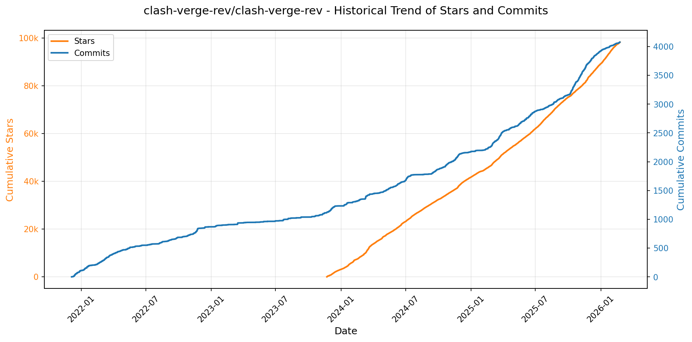
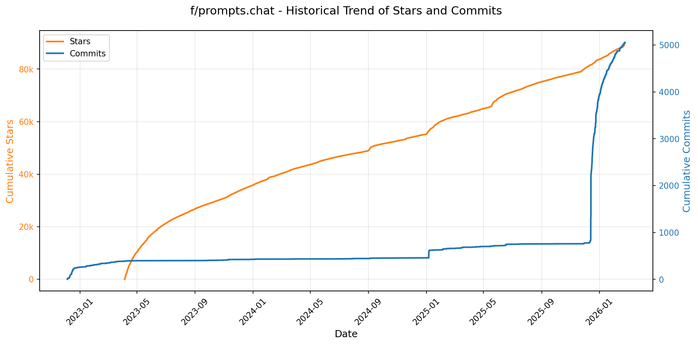
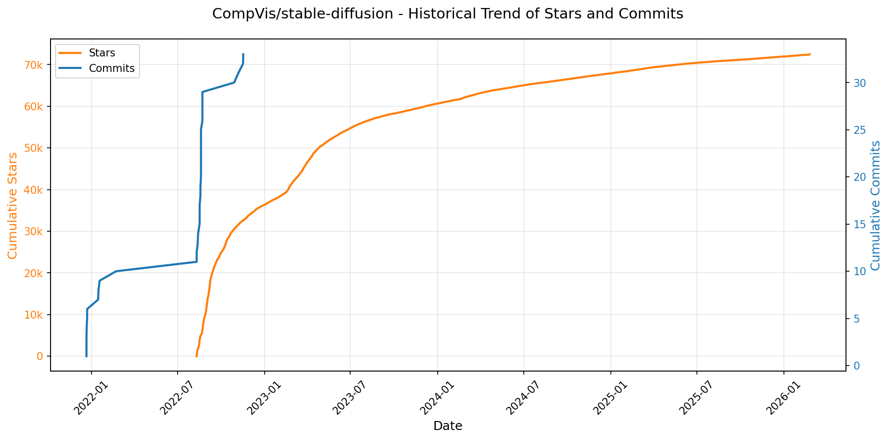
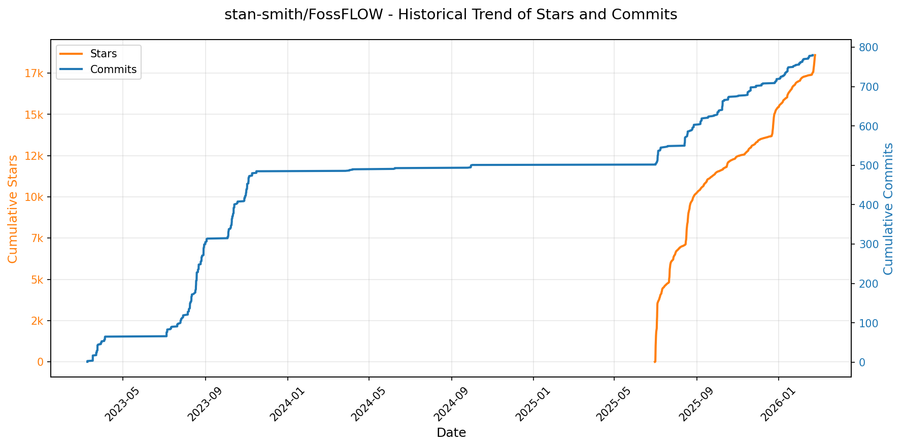
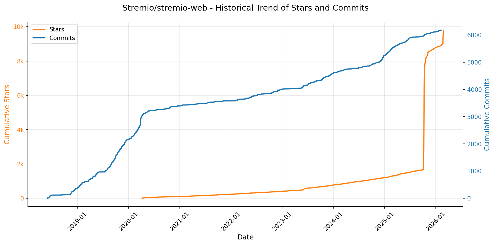
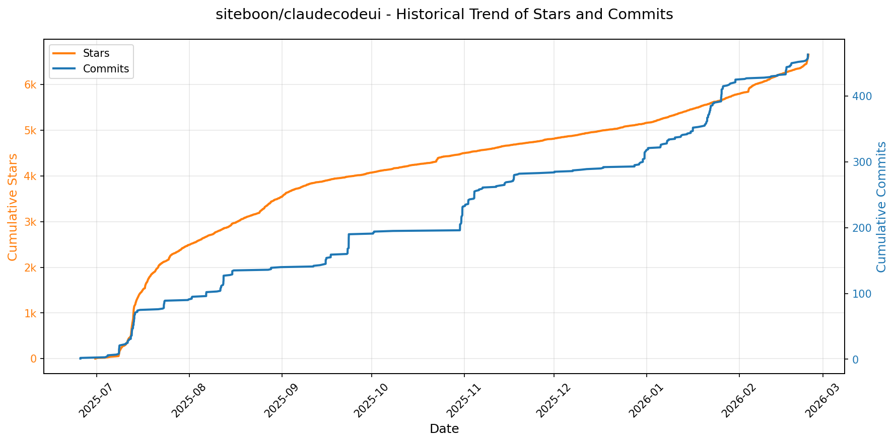

# 🌟 GitHub Trending 概览

> 数据更新于：2026-02-24

---

## 🔍 项目详情

### 1. [x1xhlol/system-prompts-and-models-of-ai-tools](https://github.com/x1xhlol/system-prompts-and-models-of-ai-tools)
- 📅 **创建日期**：2025-03-05  
- 🔄 **最近更新**：2026-02-24  
- ⭐ **Stars**：121,134（日 +3186｜周 +6472｜月 +10663）  
- 📝 **描述**：FULL Augment Code, Claude Code, Cluely, CodeBuddy, Comet, Cursor, Devin AI, Junie, Kiro, Leap.new, Lovable, Manus, NotionAI, Orchids.app, Perplexity, Poke, Qoder, Replit, Same.dev, Trae, Traycer AI, VSCode Agent, Warp.dev, Windsurf, Xcode, Z.ai Code, Dia & v0. (And other Open Sourced) System Prompts, Internal Tools & AI Models  

<b>📈 Star 与 Commit 历史趋势</b>

> *蓝色：累计 Stars｜橙色：累计 Commits（次 Y 轴）*

<b>📄 README 摘要</b>

该内容并非一个典型软件项目的 README（缺少项目名称、功能描述、安装使用说明等核心信息），而是 **GitHub 仓库 `x1xhlol/system-prompts-and-models-of-ai-tools` 的宣传型主页**，其本质是一个**公开的、大规模 AI 系统提示词（system prompts）与模型配置数据集**。基于所提供文本，按要求从以下三方面进行精准总结：

---

### 1. 这个项目做什么？  
该项目是一个**面向开发者和 AI 研究者的开源数据集合**，系统性地收集、整理并公开披露了大量主流 AI 工具（如 ChatGPT、Claude、Gemini、Perplexity 等）在生产环境中实际使用的 **system prompts（系统级指令）、模型配置参数、内部工具链结构及行为逻辑**。目标是提供超过 **30,000+ 行真实可验证的技术洞察**，帮助社区理解大模型产品的底层设计、安全边界与工程实现，同时为 AI 安全审计、提示工程研究、竞品分析及防御性开发提供高质量原始数据支撑。

---

### 2. 关键特性  
- ✅ **超大规模实测数据集**：收录超 30,000 行经逆向分析/日志提取/红队测试验证的 system prompts 和模型行为描述；  
- ✅ **聚焦生产环境真实性**：强调数据来源于真实上线产品（非实验或文档），含内部工具调用、插件机制、上下文约束等细节；  
- ✅ **安全导向价值主张**：明确警示 AI 创业公司提示词泄露风险，并关联配套安全服务 ZeroLeaks.ai 提供漏洞审计；  
- ✅ **开放协作与可持续维护**：通过 Discord 社区（LeaksLab）、Issue 反馈机制及定期更新（最新标注为 2026 年 08 月 01 日）支持持续演进；  
- ✅ **多维度生态集成**：提供 Trendshift 趋势追踪、DeepWiki 知识图谱链接、Star History 星标增长图表，强化数据可信度与影响力可视化。

---

### 3. 技术栈  
⚠️ 原文**未明确声明具体技术实现细节**（如编程语言、框架、数据库或部署架构）。但根据项目性质与上下文可合理推断：  
- **数据组织层**：以纯文本（Markdown/JSON/YAML？）为主存储 prompts 与元信息，适配 Git 版本控制；  
- **基础设施依赖**：依托 GitHub 原生能力（Issues、Discord 集成、Star History 图表、Shields.io Badge）实现协作与展示；  
- **辅助工具链**：隐含使用自动化抓取/日志分析/LLM 辅助解析等逆向工程方法论（非代码栈，属方法论栈）；  
- **关联技术生态**：深度集成 Solana 链上代币（CA 地址）、Jupiter/Photon/DEXScreener 等 Web3 数据平台，暗示部分贡献激励或数据溯源可能结合链上验证。  

> 注：该项目本身**不提供可运行的软件服务或 API**，亦无前端/后端代码说明，属于「数据即产品（Data-as-a-Product）」范式，技术栈重心在于**数据采集方法论、治理规范与开放分发能力**，而非传统软件工程栈。

---

### 2. [openclaw/openclaw](https://github.com/openclaw/openclaw)
- 📅 **创建日期**：2025-11-24  
- 🔄 **最近更新**：2026-02-24  
- ⭐ **Stars**：108,001（日 +3015｜周 +20572｜月 +108001）  
- 📝 **描述**：Your own personal AI assistant. Any OS. Any Platform. The lobster way. 🦞   

<b>📈 Star 与 Commit 历史趋势</b>

> *蓝色：累计 Stars｜橙色：累计 Commits（次 Y 轴）*

<b>📄 README 摘要</b>

1. **项目功能**  
OpenClaw 是一个可在用户自有设备（本地运行）的个人 AI 助理系统，核心定位是“本地优先、单用户、始终在线”的私有化智能代理。它不依赖中心化云服务，而是通过自托管的 **Gateway（网关）控制平面**统一调度多通道消息收发、多模型推理、多设备协同与可视化交互。用户可通过 WhatsApp、Telegram、Slack、Discord、Signal、iMessage、BlueBubbles、Microsoft Teams、Matrix、Zalo 等 14+ 主流通信平台与助理交互；同时支持 macOS/iOS/Android 设备级能力调用（如语音唤醒、实时录音、屏幕录制、摄像头、定位、系统命令、通知），并提供可编程的 **Live Canvas（动态画布）** 作为 AI 驱动的可视化工作空间（基于 A2UI 协议）。其本质是将 AI 助理“下沉”至终端侧，实现低延迟、高隐私、强可控的个性化智能体验。

2. **关键特性**  
- **全栈本地化架构**：单一 Gateway 作为 WebSocket 控制中心，统一管理会话（Session）、通道（Channels）、工具（Tools）、事件流与定时任务（Cron/Webhook）。  
- **跨平台多通道 inbox**：原生集成 14+ 消息平台（含蓝泡泡 BlueBubbles 等 iMessage 替代方案），支持群组消息路由、提及激活、回复标签、分块处理等高级语义规则。  
- **多智能体隔离路由**：支持按通道、账号、联系人划分独立 Agent 工作区（Workspace），实现会话隔离与资源沙箱化。  
- **全场景语音交互**：集成 Voice Wake（常驻语音唤醒）与 Talk Mode（连续对话模式），支持 macOS/iOS/Android 端本地语音识别与 ElevenLabs 合成。  
- **Live Canvas 可视化平台**：AI 可实时生成、更新、执行 Canvas 内容（含 A2UI 组件），支持快照、代码求值、状态推送，形成“AI + GUI”闭环。  
- **设备级节点（Nodes）体系**：将 macOS/iOS/Android 设备抽象为可远程调用的计算节点，暴露 `system.run`、`camera.snap`、`screen.record`、`location.get`、`canvas.*` 等安全受控能力。  
- **安全默认策略**：DM 消息默认启用配对机制（Pairing Code），拒绝未授权输入；支持 OAuth/API Key 多模型鉴权、自动故障转移（Model Failover）、会话上下文裁剪（Pruning）及细粒度权限管控（TCC/macOS 权限映射）。  
- **开箱即用的向导与运维工具**：内置 CLI 向导（`openclaw onboard`）、健康检查（`openclaw doctor`）、远程调试（Tailscale Serve/Funnel / SSH 隧道）、Nix/Docker 声明式部署及技能市场（ClawHub）。

3. **技术栈**  
- **运行时**：Node.js ≥22（主运行环境），支持 npm/pnpm/bun；TypeScript 编写，使用 `tsx` 直接运行源码。  
- **核心框架**：WebSocket 实时通信协议（Gateway 控制平面）；RPC 模式 Pi Agent 运行时；A2UI 协议驱动 Canvas 渲染。  
- **通道适配层**：复用成熟 SDK — Baileys（WhatsApp）、grammY（Telegram）、Slack Bolt（Slack）、discord.js（Discord）、Google Chat API、signal-cli（Signal）、BlueBubbles REST API、Microsoft Graph（Teams）、Matrix JS SDK、Zalo API 等。  
- **AI 集成**：支持任意 LLM（推荐 Anthropic Claude Opus 4.6），通过模型配置文件与 OAuth/API Key 认证管理；内置流式响应（Streaming/Chunking）、重试策略与会话上下文优化。  
- **客户端与平台**：  
  - macOS：Swift/Objective-C 构建菜单栏 App，深度集成 TCC 权限、VoiceKit、AVFoundation；  
  - iOS/Android：原生节点应用，通过 Bridge 协议与 Gateway 安全配对；  
  - Web：内嵌 Control UI 与 WebChat，由 Gateway 直接托管。  
- **基础设施**：支持 Tailscale（Serve/Funnel）、SSH 隧道实现安全远程访问；提供 Nix（`nix-openclaw`）与 Docker 部署方案；日志、监控、自动化迁移（Doctor）完备。

---

### 3. [clash-verge-rev/clash-verge-rev](https://github.com/clash-verge-rev/clash-verge-rev)
- 📅 **创建日期**：2023-11-21  
- 🔄 **最近更新**：2026-02-24  
- ⭐ **Stars**：98,240（日 +196｜周 +817｜月 +4628）  
- 📝 **描述**：A modern GUI client based on Tauri, designed to run in Windows, macOS and Linux for tailored proxy experience  

<b>📈 Star 与 Commit 历史趋势</b>

> *蓝色：累计 Stars｜橙色：累计 Commits（次 Y 轴）*

<b>📄 README 摘要</b>

1. **项目功能**  
Clash Verge Rev 是 Clash Meta（即 mihomo）内核的跨平台图形用户界面（GUI）客户端，作为原 Clash Verge 项目的延续与重构版本，旨在提供高性能、高稳定性且现代化的代理管理工具。它通过本地运行 Clash.Meta 内核实现规则分流、代理转发、TUN 模式（虚拟网卡）、系统代理控制等核心代理功能，并支持完整的配置文件管理、节点/规则可视化编辑、多端同步与自动备份。

2. **关键特性**  
- ✅ 内置并默认集成 **Clash.Meta（mihomo）** 内核，支持一键切换至 Alpha 版本内核以体验最新功能；  
- ✅ 全平台原生支持：Windows（x64/x86）、Linux（x64/arm64）、macOS 10.15+（Intel & Apple Silicon）；  
- ✅ 现代化 UI：深/浅色主题、自定义主题色、可配置托盘图标、CSS 注入（CSS Injection）扩展界面样式；  
- ✅ 高级配置能力：配置文件合并（Merge）、脚本化处理（Script）、YAML 语法高亮与校验提示；  
- ✅ 多种代理模式：系统代理（PAC/全局）、TUN 模式（无需系统代理即可全局拦截流量）；  
- ✅ 可视化操作：图形化编辑代理节点、代理组、规则集与策略组；  
- ✅ 云同步支持：通过 WebDAV 实现配置自动备份与跨设备同步；  
- ✅ 多语言支持：简体中文、英文、西班牙语、俄语、日语、韩语、波斯语共 7 种语言；  
- ✅ 安全合规：遵循 GPL-3.0 开源协议，代码完全公开，无后门设计。

3. **技术栈**  
- **前端框架**：基于 [Vite](https://vitejs.dev/) 构建的现代 Web 前端（TypeScript + React），支持快速热更新与模块化开发；  
- **桌面应用框架**：[Tauri 2.x](https://tauri.app/)（Rust 编写），替代 Electron，显著降低内存占用与二进制体积，提升安全性与性能；  
- **核心代理引擎**：集成 [Clash.Meta / mihomo](https://github.com/MetaCubeX/mihomo)（Rust 实现的高性能 Clash 兼容内核），支持 TUN、UDP over TCP、QUIC/TUIC 等先进协议；  
- **构建与包管理**：使用 `pnpm` 进行依赖管理，配合 Tauri CLI 完成跨平台打包（Windows NSIS / Linux AppImage / macOS DMG）；  
- **国际化与文档**：基于静态站点生成器（文档托管于 GitHub Pages），多语言 README 与结构化 FAQ；  
- **基础设施**：GitHub Actions 自动化构建与发布（Stable / AutoBuild 版本），WebDAV 用于用户配置同步。

---

### 4. [f/prompts.chat](https://github.com/f/prompts.chat)
- 📅 **创建日期**：2022-12-05  
- 🔄 **最近更新**：2026-02-24  
- ⭐ **Stars**：90,100（日 +422｜周 +1818｜月 +3920）  
- 📝 **描述**：a.k.a. Awesome ChatGPT Prompts. Share, discover, and collect prompts from the community. Free and open source — self-host for your organization with complete privacy.  

<b>📈 Star 与 Commit 历史趋势</b>

> *蓝色：累计 Stars｜橙色：累计 Commits（次 Y 轴）*

<b>📄 README 摘要</b>

1. **项目功能**  
prompts.chat 是全球规模最大的开源 AI 提示词（prompt）库，旨在为各类大语言模型（如 ChatGPT、Claude、Gemini、Llama、Mistral 等）提供经过实践验证、可直接复用的高质量提示模板。它不仅是一个静态资源集合，更是一个动态演进的开放平台：用户可在线提交新提示（`prompts.chat/prompts/new`），所有贡献自动同步至 GitHub 仓库；同时支持多端访问（网页浏览、CLI 工具、插件集成、MCP 协议服务），并提供面向不同人群的延伸产品——包括面向初学者的交互式提示工程电子书、面向 8–14 岁儿童的 AI 交互游戏（Promi），以及企业级私有化部署能力。

2. **核心特性**  
- ✅ **全模型兼容性**：提示设计遵循通用原则，适配主流闭源与开源大模型，不绑定特定厂商 API。  
- ✅ **多格式数据分发**：提供网页版（`prompts.chat/prompts`）、Markdown（`PROMPTS.md`）、CSV（`prompts.csv`）及 Hugging Face 数据集（最热门 HF 数据集之一）等多种标准化格式。  
- ✅ **教育与普惠生态**：包含 25+ 章节的免费交互式提示工程指南（涵盖 CoT、Few-shot、AI Agent 等高阶技巧）；专为儿童设计的图形化、游戏化学习路径（Promi）。  
- ✅ **开箱即用的集成能力**：原生支持 CLI 命令行工具、Claude Code 插件、MCP（Model Control Protocol）服务器协议，便于嵌入开发者工作流与 AI 工具链。  
- ✅ **企业级自托管方案**：提供一键初始化（`npx prompts.chat new`）、图形化配置向导（支持 GitHub/Google/Azure AD 认证、主题定制、品牌白标）、Docker 部署及完整文档支持。  
- ✅ **学术与工业影响力**：被 Forbes、Harvard、Columbia 等权威媒体与高校引用，获 40+ 学术论文引用，GitHub 星标超 14.3 万，入选 GitHub Staff Pick。

3. **技术栈**  
- **前端与构建**：基于现代 Web 技术栈，使用 [Windsurf](https://wind.surf/prompts-chat)（轻量级 React 框架）构建主站；支持暗色模式（通过 `<picture>` + `prefers-color-scheme` 实现）；静态资源托管于 CDN。  
- **开发与部署**：采用 Node.js 生态，依赖 `npm` 进行包管理与脚本运行（如 `npm run setup`）；提供 Docker 容器化部署方案（见 `DOCKER.md`）；CLI 工具通过 `npx` 分发。  
- **后端与 API**：以静态站点为主，核心数据为纯文本/结构化文件（`.md`, `.csv`, `.json`），API 层轻量化（如 `/api/mcp` 支持 MCP 协议）；Hugging Face 数据集作为官方结构化数据镜像。  
- **基础设施与协作**：GitHub 作为源码与协作中枢；Hugging Face Hub 托管可编程数据集；DeepWiki 提供语义搜索支持；CI/CD 及监控集成 Sentry（赞助商）。  
- **许可协议**：采用 **CC0 1.0 Universal（公共领域）**，允许无限制复制、修改、分发与商用，无需署名。

---

### 5. [obra/superpowers](https://github.com/obra/superpowers)
- 📅 **创建日期**：2025-10-09  
- 🔄 **最近更新**：2026-02-24  
- ⭐ **Stars**：88,461（日 +1186｜周 +6634｜月 +24469）  
- 📝 **描述**：An agentic skills framework & software development methodology that works.  

<b>📈 Star 与 Commit 历史趋势</b>

> *蓝色：累计 Stars｜橙色：累计 Commits（次 Y 轴）*

<b>📄 README 摘要</b>

1. **项目功能**  
Superpowers 是一个面向编程智能体（coding agents）的完整软件开发工作流框架，旨在将零散、随意的代码生成行为系统化、工程化。它不直接生成代码，而是通过一系列自动触发的“能力（skills）”引导智能体严格遵循专业软件工程实践：从需求澄清、分步设计验证、TDD 驱动的实现、子智能体协同开发，到自动化代码审查与分支收尾。其核心目标是让 AI 编程过程具备可理解性、可验证性、可协作性和工程纪律性——本质上，是为 AI 编程注入人类团队级的流程控制与质量保障机制。

2. **关键特性**  
- **全链路自动化工作流**：覆盖从头脑风暴（brainstorming）、Git 工作树隔离（using-git-worktrees）、细粒度任务拆解（writing-plans）、子智能体驱动开发（subagent-driven-development）到 TDD 执行（test-driven-development）、多级代码审查（requesting/receiving-code-review）及分支终结（finishing-a-development-branch）的 7 个强制性阶段；  
- **技能驱动（Skill-based）架构**：所有能力以独立、可组合、可复用的“技能”形式组织（共 15+ 项），按上下文自动触发，非人工调用；  
- **强工程约束**：强制执行 RED-GREEN-REFACTOR 流程、YAGNI 原则、DRY 原则、测试先行、验证后交付（verification-before-completion）、根因导向调试（systematic-debugging）；  
- **人机协同设计闭环**：设计阶段以“分块呈现+人工签核”确保对齐；实现阶段支持批处理执行或子智能体并行开发，并内置双阶段审查（先验规范合规性，再审代码质量）；  
- **跨平台插件化部署**：原生支持 Claude Code、Cursor、Codex、OpenCode 等主流 AI 编程工具，通过插件市场一键安装与自动更新。

3. **技术栈**  
- **运行时环境**：依赖外部大语言模型智能体平台（如 Claude Code、Cursor Agent、Codex、OpenCode），本身不包含模型，而是作为**提示工程与工作流编排层**运行于这些平台之上；  
- **架构范式**：基于**技能（Skill）的声明式工作流引擎**，技能以 Markdown 文档（`.md`）形式定义逻辑、输入输出、触发条件与最佳实践（如 `skills/writing-skills/SKILL.md`）；  
- **基础设施依赖**：深度集成 Git（工作树管理）、本地文件系统（代码读写/测试执行）、Shell 命令（环境验证、测试运行）；  
- **分发与更新机制**：采用插件市场（Plugin Marketplace）分发，支持命令行式安装/更新（如 `/plugin install` `/plugin update`），配置与安装说明托管于 GitHub Raw URL；  
- **协议与许可**：MIT 开源许可证，强调社区共建，贡献流程标准化（遵循 `writing-skills` 技能规范）。

---

### 6. [CompVis/stable-diffusion](https://github.com/CompVis/stable-diffusion)
- 📅 **创建日期**：2022-08-10  
- 🔄 **最近更新**：2026-02-24  
- ⭐ **Stars**：72,487（日 +68｜周 +140｜月 +334）  
- 📝 **描述**：A latent text-to-image diffusion model  

<b>📈 Star 与 Commit 历史趋势</b>

> *蓝色：累计 Stars｜橙色：累计 Commits（次 Y 轴）*

<b>📄 README 摘要</b>

1. **该项目的功能**  
Stable Diffusion 是一个开源的**潜在空间（latent space）文本到图像扩散模型**，核心功能是根据自然语言提示（prompt）生成高质量、高分辨率（512×512）的合成图像。它支持多种生成与编辑任务，包括：  
- **文本生成图像（txt2img）**：从纯文本描述生成全新图像；  
- **图像到图像翻译（img2img）**：基于输入图像和文本提示进行语义引导的修改，如草图转精细画作、风格迁移、局部重绘与图像超分（upscaling）；  
- 所有任务均在潜在空间中执行，通过轻量级自编码器（downsampling factor 8）将图像压缩至低维隐空间，再在该空间运行扩散过程，大幅提升计算效率。

2. **关键特性**  
- ✅ **高效轻量**：模型总参数约860M（UNet）+123M（冻结的CLIP ViT-L/14文本编码器），可在单张≥10GB显存GPU上运行；  
- ✅ **多版本预训练权重**：提供 `sd-v1-1` 至 `sd-v1-4` 四个迭代版本，逐步优化训练数据（LAION-5B子集）、美学筛选（aesthetics score >5）、去水印过滤及分类器自由引导（classifier-free guidance）策略；  
- ✅ **开箱即用的安全机制**：内置**安全检查器（Safety Checker）** 降低生成不当内容概率，并采用**隐形数字水印（invisible watermarking）** 标识生成图像，增强可追溯性与责任归属；  
- ✅ **灵活采样控制**：支持PLMS、DDIM等多种采样器，可调节引导尺度（scale）、噪声强度（strength）、迭代步数、图像尺寸等参数；  
- ✅ **双接口支持**：既提供官方参考脚本（`txt2img.py` / `img2img.py`），也深度集成Hugging Face **Diffusers库**，便于快速部署与社区扩展；  
- ✅ **负责任的开源许可**：采用 **CreativeML OpenRAIL-M 许可证**，明确禁止恶意滥用（如生成违法、歧视、虚假信息内容），同时允许商业使用——但强调需配套安全机制，权重仅为**研究用途**。

3. **技术栈**  
- **深度学习框架**：PyTorch（核心训练与推理）；  
- **核心模型架构**：  
  - 潜在扩散模型（Latent Diffusion Model, LDM），基于论文 *High-Resolution Image Synthesis with Latent Diffusion Models*；  
  - UNet 主干网络（860M参数）；  
  - 冻结的 **CLIP ViT-L/14** 文本编码器（提取非池化文本嵌入作为条件）；  
  - Downsampling-factor-8 自编码器（Latent Autoencoder）；  
- **第三方依赖库**：  
  - `transformers`（v4.19.2）：加载并运行CLIP文本编码器；  
  - `diffusers`：官方推荐的扩散模型抽象与调度库；  
  - `invisible-watermark`：嵌入不可见鲁棒水印；  
  - `x-transformers`（lucidrains）：实现Transformer编码器模块；  
- **基础代码借鉴**：OpenAI ADM（guided-diffusion）、lucidrains/denoising-diffusion-pytorch；  
- **环境管理**：Conda（`environment.yaml` 定义依赖）；  
- **模型托管与分发**：Hugging Face Hub（CompVis组织下公开权重与配置）。

---

### 7. [OpenBB-finance/OpenBB](https://github.com/OpenBB-finance/OpenBB)
- 📅 **创建日期**：2020-12-20  
- 🔄 **最近更新**：2026-02-24  
- ⭐ **Stars**：61,642（日 +424｜周 +1087｜月 +2300）  
- 📝 **描述**：Financial data platform for analysts, quants and AI agents.  

<b>📈 Star 与 Commit 历史趋势</b>

> *蓝色：累计 Stars｜橙色：累计 Commits（次 Y 轴）*

<b>📄 README 摘要</b>

1. **项目功能**  
Open Data Platform（ODP）是由 OpenBB 开发的开源数据集成工具集，核心定位是为数据工程师提供统一的数据接入基础设施。它支持整合私有数据、授权商业数据源及公开金融/经济数据，并将标准化后的数据以多通道方式分发至各类下游应用：包括 Python 环境（供量化分析师和开发者调用）、OpenBB Workspace（企业级可视化分析平台）、Excel 插件、MCP（Model Context Protocol）服务器（供 AI 代理调用），以及标准 REST API（供第三方系统集成）。其核心理念是“一次连接，处处消费”（connect once, consume everywhere），消除重复对接，构建可复用、可扩展的数据底座。

2. **关键特性**  
- ✅ **多面数据消费支持**：原生适配 Python SDK、CLI 命令行工具、REST API、OpenBB Workspace UI、Excel 插件及 AI Agent（MCP）协议；  
- ✅ **开箱即用的数据接入能力**：预集成大量金融与宏观经济数据源（如股票行情、财报、另类数据等），具体清单见官方文档；  
- ✅ **轻量本地服务化部署**：通过 `openbb-api` 命令一键启动基于 FastAPI + Uvicorn 的本地数据 API 服务（默认端口 `6900`），支持快速测试与开发；  
- ✅ **与 OpenBB Workspace 无缝协同**：可作为独立后端接入企业级 UI 平台，实现数据源统一管理、可视化探索与 AI 驱动分析闭环；  
- ✅ **模块化与可扩展架构**：支持自定义数据后端（通过 `backends-for-openbb`）和 AI Agent 扩展（通过 `agents-for-openbb`），便于生态共建；  
- ✅ **全环境开发支持**：提供 Dev Containers、GitHub Codespaces 和 Google Colab 一键启动环境，降低上手门槛。

3. **技术栈**  
- **核心语言**：Python（兼容 3.9.21–3.12）；  
- **Web 框架**：FastAPI（构建高性能异步 REST API）；  
- **ASGI 服务器**：Uvicorn（用于本地 API 服务部署）；  
- **数据处理**：依赖 Pandas、NumPy 等科学计算库，输出统一为 DataFrame 或结构化对象；  
- **客户端工具链**：  
  - Python SDK（`openbb` 包）提供面向对象的数据访问接口（如 `obb.equity.price.historical("AAPL")`）；  
  - CLI 工具（`openbb-cli`）支持终端交互式查询；  
- **部署与协作**：全面支持容器化开发（Dev Containers）、GitHub Codespaces、Colab Notebook；  
- **许可证**：AGPLv3（强传染性开源协议，要求衍生服务也需开源）。

---

### 8. [asgeirtj/system_prompts_leaks](https://github.com/asgeirtj/system_prompts_leaks)
- 📅 **创建日期**：2025-05-03  
- 🔄 **最近更新**：2026-02-24  
- ⭐ **Stars**：32,790（日 +115｜周 +1012｜月 +7575）  
- 📝 **描述**：Collection of extracted System Prompts from popular chatbots like ChatGPT, Claude & Gemini  

<b>📈 Star 与 Commit 历史趋势</b>

> *蓝色：累计 Stars｜橙色：累计 Commits（次 Y 轴）*

---

### 9. [thedotmack/claude-mem](https://github.com/thedotmack/claude-mem)
- 📅 **创建日期**：2025-08-31  
- 🔄 **最近更新**：2026-02-24  
- ⭐ **Stars**：30,838（日 +247｜周 +1934｜月 +15777）  
- 📝 **描述**：A Claude Code plugin that automatically captures everything Claude does during your coding sessions, compresses it with AI (using Claude's agent-sdk), and injects relevant context back into future sessions.  

<b>📈 Star 与 Commit 历史趋势</b>

> *蓝色：累计 Stars｜橙色：累计 Commits（次 Y 轴）*

<b>📄 README 摘要</b>

1. **项目功能**  
Claude-Mem 是一个专为 Anthropic 的 **Claude Code**（AI 编程助手）构建的**持久化记忆压缩系统**。它在用户每次会话结束后，自动捕获工具调用、代码操作、错误修复等上下文事件（称为“observations”），生成语义化摘要，并持久化存储于本地 SQLite 数据库中；当新会话启动时，自动将相关历史记忆按需注入上下文，使 Claude 能够跨会话保持对项目状态、技术决策、调试过程等的连续性认知，实现真正意义上的“长期记忆”。

2. **核心特性**  
- ✅ **跨会话持久记忆**：上下文不随会话关闭而丢失，支持长期项目知识积累；  
- ✅ **渐进式披露（Progressive Disclosure）**：分三层检索（索引→时间线→详情），实时显示 token 消耗，显著降低上下文成本（约节省 10 倍 token）；  
- ✅ **技能化自然语言搜索**：通过 `mem-search` 技能及 4 个标准化 MCP 工具（`search`/`timeline`/`get_observations` 等），支持按类型、日期、项目名、关键词等多维语义查询；  
- ✅ **实时 Web 查看器**：内置 HTTP 服务（默认 `http://localhost:37777`），提供可视化内存流、观测详情、API 接口（如 `/api/observation/{id}`）及设置面板；  
- ✅ **隐私可控**：支持 `<private>` 标签语法，自动过滤敏感内容不入库；  
- ✅ **全自动运行**：基于 Claude Code 生命周期钩子（6 个 hook 脚本）无感触发，无需手动干预；  
- ✅ **混合搜索架构**：融合 SQLite FTS5 全文检索 + Chroma 向量数据库，兼顾精确匹配与语义相似性；  
- ✅ **多端集成**：原生支持 Claude Desktop 对话内搜索、OpenClaw 网关一键部署（含 Telegram/Discord/Slack 实时通知）；  
- ✅ **Beta 实验通道**：提供 Endless Mode（仿生长时记忆架构）等前沿功能，支持版本热切换。

3. **技术栈**  
- **运行时**：Node.js ≥18.0.0（主逻辑）、Bun（Worker 服务管理与 HTTP API）、uv（Python 包管理，用于 Chroma 向量库依赖）；  
- **数据库**：SQLite3（嵌入式，含 FTS5 全文索引） + Chroma（向量数据库，用于语义搜索）；  
- **前端**：轻量 Web UI（静态资源 + HTML/CSS/JS），无框架依赖；  
- **通信协议**：遵循 MCP（Model Context Protocol）规范，实现标准化工具调用；  
- **开发语言**：TypeScript（全栈）；  
- **部署与分发**：以 Claude Code 插件形式发布（`/plugin install`），同时提供 npm 包（SDK 用途）及 OpenClaw 专用安装脚本；  
- **许可协议**：主体代码采用 AGPL-3.0（强制网络服务开源），`ragtime/` 子模块采用 PolyForm Noncommercial License。

---

### 10. [virattt/dexter](https://github.com/virattt/dexter)
- 📅 **创建日期**：2025-10-14  
- 🔄 **最近更新**：2026-02-24  
- ⭐ **Stars**：23,594（日 +182｜周 +614｜月 +7393）  
- 📝 **描述**：An autonomous agent for deep financial research  

<b>📈 Star 与 Commit 历史趋势</b>

> *蓝色：累计 Stars｜橙色：累计 Commits（次 Y 轴）*

<b>📄 README 摘要</b>

1. **项目功能**  
Dexter 是一个面向金融研究的自主式AI代理系统，能够对复杂金融问题进行端到端的自动分析：接收自然语言提问 → 自主规划多步研究任务 → 调用实时金融市场数据工具（如财报、资产负债表、现金流数据）执行查询 → 通过自我反思（self-reflection）验证中间结果 → 迭代优化直至生成可信、数据支撑的最终结论。其核心目标是实现“无需人工干预的闭环金融研究”，适用于股票分析、公司基本面评估等专业场景。

2. **关键特性**  
- **智能任务规划（Intelligent Task Planning）**：将模糊或复杂的金融问题（如“对比苹果与英伟达过去三年的盈利质量与资本效率”）自动拆解为结构化、可执行的研究子任务（例如“获取AAPL/NVDA近三年现金流量表”→“计算经营现金流/净利润比率”→“横向比较”）。  
- **自主执行与工具编排（Autonomous Execution）**：动态选择并调用适配的API工具（Financial Datasets API 获取财报、Exa/Tavily 进行网络检索），支持多源数据融合。  
- **自验证与迭代机制（Self-Validation & Iteration）**：每步执行后生成LLM摘要并评估结果有效性；若证据不足或逻辑存疑，则自动修正计划、重试或补充查询，内置循环检测与步骤上限保障稳定性。  
- **实时权威金融数据接入**：原生集成 Financial Datasets API，免费支持主流美股（AAPL/NVDA/MSFT等）的年度/季度收入表、资产负债表、现金流量表等结构化数据。  
- **全链路可追溯性与调试支持**：所有推理过程、工具调用参数、原始返回数据及LLM总结均以JSONL格式记录于本地`.dexter/scratchpad/`目录，支持逐帧回溯与审计。  
- **多模态交互扩展**：提供WhatsApp网关，支持通过个人WhatsApp聊天窗口直接发起金融咨询，实现轻量级移动化使用。

3. **技术栈**  
- **运行时**：Bun（v1.0+）—— 高性能JavaScript/TypeScript运行时，替代Node.js，用于快速启动与依赖管理。  
- **核心语言与框架**：TypeScript（强类型保障复杂逻辑可靠性）、ESM模块系统。  
- **AI模型层**：支持多后端大模型API，包括OpenAI（默认）、Anthropic、Google、xAI、OpenRouter；本地可选Ollama（通过`OLLAMA_BASE_URL`配置）。  
- **数据服务**：  
  - Financial Datasets API（核心财报数据源）；  
  - Exa API 或 Tavily API（网络增强检索，支持实时新闻与研报）；  
- **评估与可观测性**：LangSmith（追踪调用链、日志、评估指标）、LLM-as-Judge自动化评分框架。  
- **部署与集成**：内置WhatsApp网关（基于Twilio或类似协议），支持扫码登录与消息双向路由；开发模式支持`bun dev`热重载。  
- **工程实践**：环境变量驱动配置（`.env`）、模块化架构（明确分离`src/evals/`、`src/gateway/`等子系统）、MIT开源协议。

---

### 11. [VectifyAI/PageIndex](https://github.com/VectifyAI/PageIndex)
- 📅 **创建日期**：2025-04-01  
- 🔄 **最近更新**：2026-02-24  
- ⭐ **Stars**：21,602（日 +639｜周 +1506｜月 +8438）  
- 📝 **描述**：📑 PageIndex: Document Index for Vectorless, Reasoning-based RAG  

<b>📈 Star 与 Commit 历史趋势</b>

> *蓝色：累计 Stars｜橙色：累计 Commits（次 Y 轴）*

<b>📄 README 摘要</b>

1. **该项目的功能**  
PageIndex 是一个面向长文档（如财报、法律文件、学术教材等）的新型检索增强生成（RAG）系统，其核心目标是**替代传统基于向量数据库（Vector DB）和文本分块（Chunking）的语义相似性检索范式**。它不依赖向量嵌入或近似搜索，而是通过构建文档的**语义层次化树索引（Tree Index）**，并利用大语言模型（LLM）进行**推理驱动的树搜索（Reasoning-based Tree Search）**，实现类人专家式的精准、可解释、可追溯的知识定位与上下文提取。

2. **关键特性**  
- **零向量数据库（Vectorless）**：完全摒弃向量嵌入、相似度计算与向量存储，避免“vibe retrieval”（直觉式模糊匹配）带来的不可靠性；  
- **无分块（No Chunking）**：保留文档天然结构（章节、小节、图表上下文），按语义逻辑组织为层级节点，避免跨块断裂与信息丢失；  
- **推理驱动检索（Reasoning-based Retrieval）**：将检索建模为树遍历问题，LLM 基于查询动态推理最优路径（如“先定位‘风险因素’章节→再聚焦‘利率风险’子节→最后提取2023年数据段”），模拟人类专家阅读流程；  
- **高可解释性与可追溯性**：每次检索结果附带明确的页面号、节点ID、结构路径及推理链，支持审计与调试；  
- **多模态原生支持**：提供纯视觉（Vision-only）RAG流水线，直接在PDF页面图像上运行（无需OCR），实现OCR-free文档理解；  
- **SOTA性能验证**：在金融领域权威基准 FinanceBench 上达成 **98.7% 准确率**，显著超越所有主流向量RAG方案。

3. **技术栈**  
- **核心架构**：基于 LLM 的树索引构建（自动生成类似TOC的JSON层级结构） + 推理引导的树搜索协议；  
- **后端语言**：Python（主框架）、支持 OpenAI 系列模型（默认 `gpt-4o-2024-11-20`）；  
- **文档解析**：PDF 文本提取（依赖 PyPDF / pdfplumber 等库）；Markdown 结构解析（基于 `#` 标题层级）；  
- **部署形态**：开源 CLI 工具（`run_pageindex.py`）、云服务（Chat 平台、API）、MCP（Model Context Protocol）插件（兼容 Claude、Cursor 等智能体环境）；  
- **扩展能力**：配套自研 **PageIndex OCR**（专为长文档全局结构识别优化的OCR模型，非必需但推荐用于复杂PDF）；  
- **开发体验**：提供 Colab 可运行 Notebook（Vectorless RAG / Vision RAG）、完整文档中心（Docs）、博客与教程体系。

---

### 12. [KeygraphHQ/shannon](https://github.com/KeygraphHQ/shannon)
- 📅 **创建日期**：2025-09-27  
- 🔄 **最近更新**：2026-02-24  
- ⭐ **Stars**：21,466（日 +199｜周 +1809｜月 +17715）  
- 📝 **描述**：Fully autonomous AI hacker to find actual exploits in your web apps. Shannon has achieved a 96.15% success rate on the hint-free, source-aware XBOW Benchmark.  

<b>📈 Star 与 Commit 历史趋势</b>

> *蓝色：累计 Stars｜橙色：累计 Commits（次 Y 轴）*

<b>📄 README 摘要</b>

1. **项目功能**  
Shannon 是一个面向源代码的全自动 AI 渗透测试工具，专为白盒（white-box）Web 应用安全测试设计。它不只静态扫描或生成告警，而是**自主执行真实攻击链**：从分析源代码识别潜在攻击面，到通过内置浏览器动态登录（支持 2FA/TOTP、Google 登录等）、导航、构造并运行实际漏洞利用（如 SQL 注入、XSS、SSRF、认证/授权绕过），最终验证漏洞是否真实可利用，并生成含可复现 PoC 的报告。其核心目标是填补开发高频迭代（如借助 Claude Code/Cursor）与传统年度渗透测试之间的巨大安全空窗期，实现“每次构建即安全”的持续保障。

2. **关键特性**  
- **全自主端到端渗透流程**：单命令启动，自动完成登录（含复杂多因素认证）、页面交互、漏洞探测与利用，全程无需人工干预；  
- **可验证的 exploit 级报告**：输出聚焦于已成功触发的真实漏洞，附带一键复制的 PoC 代码，彻底消除误报，确保结果可操作、可复现；  
- **深度 OWASP 覆盖**：当前原生支持注入（Injection）、跨站脚本（XSS）、服务端请求伪造（SSRF）、认证/授权失效（Broken AuthZ/AuthN）等关键漏洞的检测与验证，持续扩展中；  
- **代码感知型动态测试（Code-Aware Dynamic Testing）**：融合静态源码分析（指导攻击策略）与动态运行时 exploitation（浏览器 + CLI），精准定位真实风险；  
- **集成专业安全工具链**：在侦察阶段调用 Nmap、Subfinder、WhatWeb、Schemathesis 等成熟工具，强化目标环境测绘与接口分析能力；  
- **并行化加速引擎**：对不同漏洞类型的分析与利用任务并行执行，显著缩短整体测试耗时；  
- **工作区（Workspace）与断点续跑**：自动保存各智能体（agent）执行状态（基于 Git 提交），支持中断后精准恢复，避免重复劳动；  
- **企业就绪架构**：基于 Temporal 工作流引擎构建，提供实时日志、Web UI 监控（`http://localhost:8233`）及结构化审计日志输出。

3. **技术栈**  
- **核心推理引擎**：Anthropic Claude 系列大模型（官方推荐 Anthropic API，支持 Claude Code OAuth）；底层依托 **Anthropic Agent SDK** 构建多智能体协作框架；  
- **运行时环境**：基于 **Docker 容器化部署**，确保环境一致性与隔离性；  
- **工作流编排**：采用 **Temporal** 分布式工作流引擎，实现高可靠性、可观测性与状态持久化；  
- **安全工具集成**：嵌入 **Nmap**（网络扫描）、**Subfinder**（子域名发现）、**WhatWeb**（Web 技术识别）、**Schemathesis**（API 合约模糊测试）等开源安全工具；  
- **前端交互层**：内置无头浏览器（用于动态交互与 exploit 执行），支持复杂 JS 渲染与表单自动化；  
- **配置与扩展**：YAML 配置驱动（支持登录流程、路径聚焦/排除规则等）；实验性支持通过 Router Mode 接入 OpenAI（GPT-5.2）或 Google Gemini（经 OpenRouter）；  
- **许可证**：Shannon Lite 开源版本采用 **AGPL-3.0** 许可证，强调源码可用性与衍生作品开源义务。

---

### 13. [gsd-build/get-shit-done](https://github.com/gsd-build/get-shit-done)
- 📅 **创建日期**：2025-12-14  
- 🔄 **最近更新**：2026-02-24  
- ⭐ **Stars**：18,669（日 +791｜周 +3750｜月 +11544）  
- 📝 **描述**：A light-weight and powerful meta-prompting, context engineering and spec-driven development system for Claude Code and OpenCode.  

<b>📈 Star 与 Commit 历史趋势</b>

> *蓝色：累计 Stars｜橙色：累计 Commits（次 Y 轴）*

<b>📄 README 摘要</b>

1. **该项目的功能**  
该项目是一个轻量级但功能强大的元提示（meta-prompting）、上下文工程（context engineering）与规范驱动开发（spec-driven development）系统，专为 Claude Code、OpenCode、Gemini CLI 和 Codex 等 AI 编程助手设计。其核心目标是**解决“上下文腐化”（context rot）问题**——即当大模型（尤其是 Claude）的上下文窗口被逐步填满后，生成质量显著下降的现象。GSD 通过结构化工作流，在不增加用户认知负担的前提下，自动管理项目愿景、需求、架构认知、阶段计划、执行验证等全链路环节，使 AI 能持续、可靠、高质量地完成端到端软件开发任务（从零启动新项目或在现有代码库上迭代演进）。

2. **关键特性**  
- ✅ **上下文抗衰减机制**：每个执行任务均在独立、纯净的 200k token 上下文中运行，彻底规避累积噪声导致的性能退化；  
- ✅ **四阶闭环工作流**（Discuss → Plan → Execute → Verify）：支持按“阶段”（Phase）粒度精细化控制，每阶段可深度讨论实现细节（生成 `CONTEXT.md`），再驱动研究、规划、并行执行与人工验收测试（UAT）；  
- ✅ **智能波次执行（Wave Execution）**：自动识别任务依赖关系，将计划分组为并行波次（Waves），最大化并发效率，同时保障正确性（如“用户模型”与“订单 API”可并行，“结账 UI”则需二者完成后再执行）；  
- ✅ **原子化 Git 提交**：每个子任务生成独立、语义清晰的提交（含时间戳与功能标签），支持精准 bisect、回滚与历史追溯；  
- ✅ **代码库感知能力**：通过 `/gsd:map-codebase` 命令自动分析现有项目技术栈、架构风格与编码规范，使后续生成无缝适配；  
- ✅ **灵活模式支持**：提供完整流程（Full Mode）与快捷模式（Quick Mode），后者适用于 Bug 修复、配置调整等轻量任务，兼顾速度与 GSD 基础保障（如状态跟踪、原子提交）；  
- ✅ **模块化与可扩展性**：支持动态增删阶段、插入紧急任务、跨里程碑复用配置，全程无锁定设计；  
- ✅ **多运行时统一接口**：同一套命令（如 `/gsd:plan-phase`）兼容 Claude Code、Gemini、OpenCode、Codex 四种后端，底层自动适配提示格式与权限机制。

3. **技术栈**  
- **核心语言与运行时**：Node.js（CLI 工具主体，基于 `npx` 分发）；  
- **AI 模型集成层**：深度适配 Anthropic Claude（主力）、Google Gemini、开源模型（OpenCode）、GitHub Codex，通过定制化 XML 提示模板与权限策略（如 Bash 命令白名单）实现安全调用；  
- **提示工程范式**：采用结构化 XML 格式编写任务指令（含 `<action>`、`<verify>`、`<done>` 等字段），确保 AI 精准理解意图并内置可验证性；  
- **系统架构模式**：基于“轻量协调器 + 专业化子代理”（Multi-Agent Orchestration）设计，各阶段（Research/Plan/Execute/Verify）由独立子代理并行执行，主会话仅保留低开销调度逻辑；  
- **状态与元数据管理**：以纯文本 Markdown 文件（如 `PROJECT.md`、`STATE.md`、`{phase}-CONTEXT.md`）和结构化目录（`.planning/`）持久化项目知识，实现跨会话记忆与可审计性；  
- **基础设施支持**：原生兼容 macOS / Windows / Linux；支持全局/本地安装；提供 Docker/CI 友好非交互式安装选项；Git 深度集成（自动 commit/tag）；权限模型支持 `--dangerously-skip-permissions` 或细粒度 Bash 命令白名单配置。

---

### 14. [stan-smith/FossFLOW](https://github.com/stan-smith/FossFLOW)
- 📅 **创建日期**：2025-06-30  
- 🔄 **最近更新**：2026-02-24  
- ⭐ **Stars**：18,587（日 +380｜周 +1204｜月 +1799）  
- 📝 **描述**：Make beautiful isometric infrastructure diagrams  

<b>📈 Star 与 Commit 历史趋势</b>

> *蓝色：累计 Stars｜橙色：累计 Commits（次 Y 轴）*

<b>📄 README 摘要</b>

1. **该项目的功能**  
FossFLOW 是一款开源的渐进式 Web 应用（PWA），专用于在浏览器中创建美观、交互式的**等距（isometric）网络与系统架构示意图**。它完全离线运行，无需后端依赖（除可选的 Docker 服务存储外），支持实时拖拽建模、节点连接、自动保存与 JSON 导入/导出，适用于技术文档、云架构设计、DevOps 流程图、开源项目可视化等场景。

2. **核心功能**  
- ✅ **可视化等距建模**：基于 Isoflow（已 fork 并发布为 `fossflow` NPM 包）渲染高质量等距图形，支持自定义节点样式与布局；  
- ✅ **直观交互操作**：支持拖拽添加组件、双击/右键快速插入节点、两种连接模式（点击式 & 拖拽式）、键盘快捷键（如 `C` 切换连接器工具）；  
- ✅ **多级持久化存储**：会话级自动保存（每5秒）、本地 JSON 导出/导入、Docker 容器内持久化存储（挂载 `/data/diagrams` 目录）；  
- ✅ **全平台 PWA 支持**：可安装为桌面/移动应用，离线可用，响应式界面；  
- ✅ **开箱即用部署**：提供一键 Docker Compose 启动方案及预构建镜像（`stnsmith/fossflow:latest`），支持环境变量灵活配置（如禁用服务端存储）；  
- ✅ **开发者友好架构**：Monorepo 结构，分离 `fossflow-lib`（可复用 React 图形组件库）与 `fossflow-app`（PWA 主应用），支持独立开发、测试与发布。

3. **技术栈**  
- **前端框架**：React（TypeScript）  
- **构建工具**：RSBuild（主应用）、Webpack（`fossflow-lib` 组件库）  
- **图形引擎**：定制化 Isoflow 库（原 @markmanx/isoflow，现维护为 `fossflow` NPM 包）  
- **部署与运行时**：  
  - 纯前端：标准 PWA（Service Worker + Manifest）  
  - 容器化：Docker / Docker Compose（Alpine Linux 基础镜像）  
- **开发与质量保障**：  
  - 测试：Jest（单元测试）、Selenium（E2E 测试，含 Docker+Python 自动化脚本）  
  - 工程化：ESLint + Prettier、CI/CD 就绪命令（`npm run lint`, `npm test`, `npm run publish:lib`）  
- **其他**：MIT 许可证，多语言文档（支持中、英、西、法、印地、俄、德、印尼、孟加拉、葡语等）

---

### 15. [badlogic/pi-mono](https://github.com/badlogic/pi-mono)
- 📅 **创建日期**：2025-08-09  
- 🔄 **最近更新**：2026-02-24  
- ⭐ **Stars**：15,259（日 +418｜周 +2329｜月 +13073）  
- 📝 **描述**：AI agent toolkit: coding agent CLI, unified LLM API, TUI & web UI libraries, Slack bot, vLLM pods  

<b>📈 Star 与 Commit 历史趋势</b>

> *蓝色：累计 Stars｜橙色：累计 Commits（次 Y 轴）*

<b>📄 README 摘要</b>

1. **项目功能**  
该项目是一个面向 AI 代理（AI Agents）开发与大语言模型（LLM）部署管理的**一体化单体仓库（Monorepo）**，旨在为构建、运行和集成各类 AI 编程与协作代理提供可复用的底层工具链和标准化基础设施。核心目标是支撑“Pi”系列 AI 代理（尤其是交互式编程代理）的开发、部署与扩展，涵盖从本地 CLI 工具、终端 UI、Web 界面到云原生 GPU 推理服务（vLLM）的全栈能力。

2. **关键特性**  
- **多厂商统一 LLM 接口**：`@mariozechner/pi-ai` 提供抽象层，无缝对接 OpenAI、Anthropic、Google 等主流 LLM 服务商；  
- **可扩展代理运行时**：`@mariozechner/pi-agent-core` 支持工具调用（tool calling）、状态持久化与生命周期管理，为自定义 AI Agent 提供基础执行框架；  
- **开箱即用的编程代理**：`@mariozechner/pi-coding-agent` 提供交互式命令行编程助手，支持自然语言驱动代码生成与修改；  
- **企业级协作集成**：`@mariozechner/pi-mom` 实现 Slack 消息自动路由至编码代理，打通团队沟通与 AI 执行闭环；  
- **高性能终端与 Web UI 组件库**：`pi-tui`（基于差分渲染的轻量终端 UI）与 `pi-web-ui`（模块化 Web 组件）分别支撑 CLI 和浏览器端 AI 对话界面；  
- **GPU 推理集群管理**：`@mariozechner/pi-pods` 提供命令行工具，用于在 GPU 节点上一键部署、扩缩容和监控 vLLM 推理服务。

3. **技术栈**  
- **语言与运行时**：TypeScript（全栈主力）、Node.js（后端/CLI 运行时）；  
- **构建与包管理**：npm（单体仓库管理）、Turborepo 或自定义脚本（隐含于 `npm run build/check` 流程中）；  
- **前端框架**：无重型框架依赖，`pi-web-ui` 基于标准 Web Components（Custom Elements），`pi-tui` 自研差分渲染终端库；  
- **AI/LLM 集成**：适配 OpenAI、Anthropic、Google Gemini 等 REST/gRPC API；vLLM 作为首选开源推理引擎；  
- **基础设施**：面向 GPU Pod 的 CLI 工具（暗示 Kubernetes/Docker 环境部署能力）；  
- **开发体验**：集成 TypeScript 类型检查、Prettier 格式化、ESLint（推断自 `npm run check`）、单元测试（含跳过 LLM 依赖的智能测试策略）。

---

### 16. [tobi/qmd](https://github.com/tobi/qmd)
- 📅 **创建日期**：2025-12-08  
- 🔄 **最近更新**：2026-02-24  
- ⭐ **Stars**：10,247（日 +170｜周 +1384｜月 +7639）  
- 📝 **描述**：mini cli search engine for your docs, knowledge bases, meeting notes, whatever. Tracking current sota approaches while being all local  

<b>📈 Star 与 Commit 历史趋势</b>

> *蓝色：累计 Stars｜橙色：累计 Commits（次 Y 轴）*

<b>📄 README 摘要</b>

1. **项目功能**  
QMD 是一个**纯本地运行的设备端（on-device）多模态搜索引擎**，专为个人知识管理与 AI 代理（agentic）工作流设计。它能对用户本地的 Markdown 笔记、会议记录、技术文档、知识库等文本内容进行统一索引与检索。核心能力是支持**混合式搜索**：同时融合关键词检索（BM25）、向量语义检索（embedding-based）和大语言模型（LLM）驱动的查询扩展与重排序（re-ranking），所有处理均在用户设备上完成，无需联网或云端服务。其独特设计还包括“上下文树”（context hierarchy）机制，允许为不同数据源（如 `qmd://notes`）添加描述性元信息，显著提升 LLM 在文档筛选与推理时的准确性；同时深度集成 MCP（Model Context Protocol）协议，可作为标准化工具直接供 Claude 等支持 MCP 的 AI 客户端调用。

2. **关键特性**  
- ✅ **三重混合搜索架构**：`search`（纯 BM25）、`vsearch`（纯向量）、`query`（全栈混合：查询扩展 + 并行 BM25/向量检索 + RRF 融合 + LLM 重排序 + 位置感知加权融合）；  
- ✅ **智能上下文建模**：通过 `qmd context add` 建立虚拟路径（如 `qmd://docs`）与自然语言描述的映射，形成层级化语义上下文树，增强检索相关性与 LLM 理解能力；  
- ✅ **端到端本地化执行**：全部模型（嵌入、重排序、查询扩展）以 GGUF 格式通过 `node-llama-cpp` 加载并运行于本地 CPU/GPU（支持 VRAM 持久化），零数据出设备；  
- ✅ **面向 AI 代理的接口设计**：提供结构化输出（`--json`, `--files`, `--md`）、批量获取（`multi-get`）、细粒度控制（`--min-score`, `--all`, `--full`）及 MCP 服务（支持 stdio 和 HTTP 长连接模式），无缝对接 Claude Desktop / Code 等 MCP 客户端；  
- ✅ **语义友好的智能分块（Smart Chunking）**：基于 Markdown 结构（标题层级、代码块、分隔线、段落）动态评分切分，确保语义单元完整性，避免跨语义边界截断；  
- ✅ **鲁棒的分数归一化与融合策略**：统一 BM25、向量、重排序原始分数至 [0,1] 区间；采用改进型 Reciprocal Rank Fusion（RRF）+ 顶部排名奖励（Top-rank bonus）+ 位置感知混合（Position-aware blending），兼顾精确匹配与语义泛化；  
- ✅ **灵活的数据管理**：支持多集合（collection）管理、自定义 glob 过滤、Git 同步更新（`qmd update --pull`）、索引健康检查（`qmd status`）及缓存清理（`qmd cleanup`）。

3. **技术栈**  
- **运行时**：Node.js（≥ v22）或 Bun（≥ v1.0.0）；  
- **本地模型推理引擎**：`node-llama-cpp`（C++ 绑定，支持 GGUF 模型与 GPU 加速）；  
- **索引存储**：SQLite（含 FTS5 全文索引扩展 + `sqlite-vec` 向量扩展），数据持久化于 `~/.cache/qmd/index.sqlite`；  
- **核心模型（GGUF 格式，自动下载）**：  
  - 嵌入模型：`embeddinggemma-300M-Q8_0`（约 300MB）；  
  - 重排序模型：`qwen3-reranker-0.6b-q8_0`（约 640MB）；  
  - 查询扩展模型：`qmd-query-expansion-1.7B-q4_k_m`（约 1.1GB，微调专用）；  
- **协议与集成**：MCP（Model Context Protocol）标准客户端/服务端实现，支持 stdio 子进程与 HTTP（`/mcp`, `/health`）两种传输方式；  
- **前端/CLI**：TypeScript 构建的命令行工具，支持彩色输出、多种格式导出（JSON/CSV/Markdown/XML）、模糊路径匹配及行号定位；  
- **系统依赖**：macOS 需 Homebrew 安装 `sqlite`（启用 FTS5 扩展）。

---

### 17. [NevaMind-AI/memU](https://github.com/NevaMind-AI/memU)
- 📅 **创建日期**：2025-07-29  
- 🔄 **最近更新**：2026-02-24  
- ⭐ **Stars**：10,184（日 +306｜周 +824｜月 +5277）  
- 📝 **描述**：Memory for 24/7 proactive agents like openclaw (moltbot, clawdbot).  

<b>📈 Star 与 Commit 历史趋势</b>

> *蓝色：累计 Stars｜橙色：累计 Commits（次 Y 轴）*

<b>📄 README 摘要</b>

1. **项目功能**  
memU 是一个专为 **7×24 小时持续运行的 AI 智能体**设计的主动式（proactive）长期记忆框架。它不依赖用户显式指令即可持续监听、理解并结构化用户行为、对话、文档、邮件、交易记录等多模态输入，自动提取意图、偏好、技能、关系和知识，并实时构建可演化的个人/组织记忆图谱。其核心价值在于：让 AI 智能体真正实现“永不睡眠、永不遗忘、未问先知”——在用户发起请求前，即能预测需求、预加载上下文、自动生成待办、主动推荐内容或执行任务（如草拟邮件、预警市场异动、推送相关论文），显著提升智能体的自主性与实用性。

2. **关键特性**  
- **全天候主动记忆（24/7 Proactive Memory）**：后台常驻运行，持续监控输入/输出流，无需唤醒或显式“记忆”指令；  
- **意图驱动的自动建模**：从非结构化交互中无感提取用户目标、沟通风格、兴趣主题、风险偏好、社交关系等高阶语义；  
- **类文件系统（FS-like）分层记忆架构**：以 `Categories`（文件夹）、`Items`（文件）、`Resources`（挂载源）、`Symlinks`（交叉引用）组织记忆，支持目录式导航、一键挂载新知识、跨记忆关联与知识图谱构建；  
- **双模态智能检索**：  
  ▪ `RAG 模式`：毫秒级向量检索，支撑实时背景监控与轻量推荐；  
  ▪ `LLM 模式`：深度推理检索，支持意图预测、查询演化与复杂上下文组装；  
- **成本优化引擎**：通过缓存结构化洞察、避免重复 LLM 调用、压缩上下文长度，大幅降低长周期运行的 token 消耗；  
- **多模态与多提供商支持**：原生兼容文本、对话、文档、图像、音视频；支持 OpenAI、Qwen、Voyage、OpenRouter 等多种 LLM 与嵌入模型，可灵活配置不同后端用于聊天与嵌入任务；  
- **企业就绪部署**：提供云服务（memu.so）与全栈自托管方案（支持 PostgreSQL + pgvector），含完整 REST API 与细粒度权限控制（按 user_id / agent_id 过滤）。

3. **技术栈**  
- **语言与运行时**：Python 3.13+（强类型、异步优先）；  
- **核心框架**：基于异步 Python 生态（`asyncio`, `httpx`），模块化设计，支持插件式扩展；  
- **向量数据库**：默认集成 PostgreSQL + `pgvector` 扩展（生产级持久化）；亦支持纯内存存储（`inmemory`）用于开发测试；  
- **AI 模型层**：  
  ▪ LLM 接口：兼容 OpenAI 兼容 API（如 DashScope Qwen）、OpenRouter 统一网关、原生 HTTP/SDK 客户端；  
  ▪ 嵌入模型：支持 Voyage、OpenAI 等第三方嵌入服务，可独立配置；  
  ▪ 多模态支持：通过 OpenRouter 集成 GPT-4o 等视觉模型；  
- **架构模式**：采用“主智能体（Main Agent）↔ memU 记忆机器人（MemU Bot）↔ 记忆数据库”三元协同架构，通过持续同步循环（Continuous Sync Loop）保障状态一致性；  
- **工程实践**：Docker 化部署（PostgreSQL）、标准化 CLI 测试套件（`test_inmemory.py`/`test_postgres.py`）、详尽示例库（含邮件管理、金融监控、多模态构建等场景）、国际化 README 支持（中/英/日/韩/西/法）。

---

### 18. [Stremio/stremio-web](https://github.com/Stremio/stremio-web)
- 📅 **创建日期**：2018-06-04  
- 🔄 **最近更新**：2026-02-24  
- ⭐ **Stars**：9,946（日 +210｜周 +965｜月 +1081）  
- 📝 **描述**：Stremio - Freedom to Stream  

<b>📈 Star 与 Commit 历史趋势</b>

> *蓝色：累计 Stars｜橙色：累计 Commits（次 Y 轴）*

<b>📄 README 摘要</b>

1. **该项目的功能**  
Stremio 是一个现代化的媒体中心应用，旨在为用户提供一站式的视频娱乐解决方案。它支持发现、观看和组织来自各类第三方插件（addons）的视频内容，用户可通过简单安装的插件聚合并访问分散在不同平台（如流媒体服务、种子资源、本地库等）的影视资源，实现统一界面下的跨源播放与管理。

2. **核心功能**  
- **插件化架构（Addons）**：支持社区开发与集成多种功能插件（如内容发现、元数据提供、流媒体代理、字幕服务等），极大扩展内容来源与功能边界；  
- **多视图交互界面**：包含「Board（首页看板）」、「Discover（发现页）」和「Meta Details（媒体详情页）」等模块，提供直观的内容浏览、个性化推荐与深度信息展示；  
- **跨平台部署能力**：原生支持 Web 端运行，并可通过 Docker 容器快速部署，便于本地或服务器环境使用；  
- **开源可定制性**：完全开源，允许用户自由修改、二次开发与私有化部署。

3. **技术栈**  
- **前端框架**：基于 Web 技术栈构建（虽未显式声明，但结合项目结构与构建流程，实际采用 React + TypeScript 为主，配合 Redux/Vuex 类状态管理及现代 CSS 方案）；  
- **构建与包管理**：使用 **pnpm**（v10+）作为包管理器，Node.js（v12+）作为运行时环境；  
- **部署方案**：支持标准 Web 打包（`pnpm run build`）及 **Docker** 容器化部署（基于轻量 Web 服务镜像）；  
- **许可证**：遵循 **GPLv2 开源协议**，保障用户自由使用、修改与分发权利。

---

### 19. [seerr-team/seerr](https://github.com/seerr-team/seerr)
- 📅 **创建日期**：2022-03-09  
- 🔄 **最近更新**：2026-02-24  
- ⭐ **Stars**：9,725（日 +66｜周 +638｜月 +1462）  
- 📝 **描述**：Open-source media request and discovery manager for Jellyfin, Plex, and Emby.  

<b>📈 Star 与 Commit 历史趋势</b>

> *蓝色：累计 Stars｜橙色：累计 Commits（次 Y 轴）*

<b>📄 README 摘要</b>

1. **项目功能**  
Seerr 是一个免费开源的媒体请求管理工具，用于集中管理用户对媒体库（电影、电视剧等）的内容请求。它本身不存储或提供媒体文件，而是作为中间层，与主流媒体服务器（Jellyfin、Plex、Emby）深度集成，实现用户认证、媒体库同步与状态追踪；同时对接自动化下载工具（如 Sonarr、Radarr），将用户请求自动转化为后台下载任务，从而构建完整的“请求→审批→下载→入库”闭环流程。

2. **核心特性**  
- 支持 Jellyfin / Plex / Emby 三端全功能集成（含用户导入、权限映射、实时库扫描与可用性标记）；  
- 灵活的请求系统：支持按单部电影、整季/单集电视剧请求，界面友好易用；  
- 极简高效的请求审批 UI，支持快速批量操作；  
- 细粒度权限控制（基于角色的访问控制 RBAC），适配多用户协作场景；  
- 双数据库支持：生产环境推荐 PostgreSQL，轻量部署支持 SQLite；  
- 全面的通知集成（支持多种通知代理）；  
- 响应式移动端适配，随时随地审批请求；  
- 媒体看单（Watchlist）与屏蔽列表（Blocklist）功能；  
- 完善的 SMTP 邮件配置与自定义；  
- 提供 OpenAPI 标准的 RESTful API 及交互式文档（`/api-docs`）；  
- 官方提供从 Overseerr 和 Jellyseerr 的平滑迁移方案与数据兼容支持。

3. **技术栈**  
- **后端**：TypeScript + Node.js（基于 NestJS 框架）；  
- **前端**：TypeScript + React（使用 Material-UI / MUI 组件库构建响应式 UI）；  
- **数据库**：PostgreSQL（推荐）、SQLite（内置默认）；  
- **部署支持**：官方 Docker 镜像（Docker Hub）、Linux/macOS/Windows 原生二进制包；  
- **CI/CD**：GitHub Actions（自动化测试、构建与发布流水线）；  
- **其他关键依赖**：Axios（HTTP 客户端）、TypeORM（ORM）、Swagger（API 文档）、i18n（多语言支持，含社区翻译平台）。

---

### 20. [google-research/timesfm](https://github.com/google-research/timesfm)
- 📅 **创建日期**：2024-04-29  
- 🔄 **最近更新**：2026-02-24  
- ⭐ **Stars**：9,588（日 +138｜周 +1866｜月 +1936）  
- 📝 **描述**：TimesFM (Time Series Foundation Model) is a pretrained time-series foundation model developed by Google Research for time-series forecasting.  

<b>📈 Star 与 Commit 历史趋势</b>

> *蓝色：累计 Stars｜橙色：累计 Commits（次 Y 轴）*

<b>📄 README 摘要</b>

1. **该项目的功能**  
TimesFM 是由 Google Research 开发的、面向时间序列预测任务的预训练基础模型（Foundation Model），专为通用时间序列建模与长时/多步预测而设计。它不依赖特定领域标注数据，通过海量异构时间序列数据预训练，支持零样本（zero-shot）或少样本（few-shot）跨数据集直接推理。其核心能力是：对任意长度输入时间序列进行高精度点预测（point forecast）和分位数预测（quantile forecast），并已集成至 Google Cloud BigQuery 作为官方产品提供服务。

2. **关键特性**  
- 支持超长上下文建模：TimesFM 2.5 最大上下文长度达 **16,000 步**（较 2.0 版本的 2,048 步大幅提升）；  
- 高效轻量化架构：参数量降至 **200M**（原 2.0 版为 500M），兼顾性能与推理效率；  
- 连续分位数预测能力：可选配 **30M 参数的 quantile head**，支持最高 **1,000 步预测视界（horizon）** 的连续分位数输出（如 10th–90th 分位数）；  
- 去除显式频率标识（`frequency` indicator），实现更鲁棒的频率无关建模；  
- 新增协变量（covariate）支持：通过 XReg 模块支持外部变量输入（2025年10月更新回归）；  
- 多后端推理支持：同时提供 PyTorch 和 Flax/JAX 实现，后者面向高性能与 TPU/Apple Silicon 优化；  
- 灵活配置化推理 API：支持归一化、符号约束（`infer_is_positive`）、翻转不变性（`force_flip_invariance`）、分位数交叉校正（`fix_quantile_crossing`）等高级预测控制选项。

3. **技术栈**  
- **核心框架**：PyTorch（默认）与 JAX/Flax（高性能可选）双后端支持；  
- **依赖管理与环境**：使用 `uv`（超快 Python 包管理器）构建虚拟环境并安装依赖；  
- **模型格式与分发**：模型权重托管于 Hugging Face Hub（`google/timesfm-*` 系列），支持 `from_pretrained()` 加载；  
- **扩展模块**：XReg 协变量处理模块（需额外安装 `[xreg]` extra）；  
- **部署生态**：官方支持 BigQuery 内置调用（Google Cloud 产品级集成）；  
- **开发工具链**：支持 `torch.compile` 加速（需设置 `float32_matmul_precision="high"`），未来将增强 Flax 版本、文档及示例 Notebook。

---

### 21. [openai/skills](https://github.com/openai/skills)
- 📅 **创建日期**：2025-11-25  
- 🔄 **最近更新**：2026-02-24  
- ⭐ **Stars**：9,526（日 +123｜周 +771｜月 +7555）  
- 📝 **描述**：Skills Catalog for Codex  

<b>📈 Star 与 Commit 历史趋势</b>

> *蓝色：累计 Stars｜橙色：累计 Commits（次 Y 轴）*

<b>📄 README 摘要</b>

1. **项目功能**  
该项目定义并维护一套标准化的“Agent Skills”（智能体技能）规范与资源库，旨在为AI智能体提供可发现、可复用的任务执行能力。每个Skill是一个包含指令（prompt）、脚本、配置文件和资源的独立文件夹，封装了完成特定任务（如生成代码注释、创建执行计划等）所需的全部逻辑。这些Skills专为OpenAI Codex平台设计，支持团队和个人“一次编写、多处复用”，通过Codex运行时动态加载与调用，从而实现任务能力的模块化、可共享与可分发。

2. **核心特性**  
- **标准化技能格式**：遵循公开的[Agent Skills开放标准](https://agentskills.io)，确保跨平台兼容性与互操作性；  
- **分级技能目录结构**：明确划分`.system`（系统内置，自动安装）、`.curated`（经审核的高质量技能，支持按名称一键安装）和`.experimental`（实验性技能，需显式指定路径或URL安装）三类；  
- **便捷的命令行集成**：内置`$skill-installer`命令工具，支持通过技能名、本地路径或GitHub原始URL（如`https://github.com/.../create-plan`）快速安装；  
- **灵活的许可管理**：每个Skill目录内含独立的`LICENSE.txt`文件，实现细粒度、技能级的开源许可证声明；  
- **即插即用工作流**：安装后仅需重启Codex即可生效，降低使用门槛并保障环境一致性。

3. **技术栈**  
- **核心平台依赖**：深度集成OpenAI Codex（AI代码助手运行时环境），依赖其技能发现、加载与执行机制；  
- **分发与协作基础设施**：基于GitHub托管（公开仓库结构、Git版本控制、URL直接引用）；  
- **轻量级技能封装格式**：纯文本/脚本文件为主（如Markdown说明、JSON/YAML配置、Shell/Python脚本等），无强制运行时依赖，强调可读性与可审计性；  
- **协议与标准**：遵循[Agent Skills开放标准](https://agentskills.io)（非具体编程语言或框架，而是规范化的目录结构、元数据约定与接口契约）。

---

### 22. [p-e-w/heretic](https://github.com/p-e-w/heretic)
- 📅 **创建日期**：2025-09-21  
- 🔄 **最近更新**：2026-02-24  
- ⭐ **Stars**：9,385（日 +173｜周 +2895｜月 +5109）  
- 📝 **描述**：Fully automatic censorship removal for language models  

<b>📈 Star 与 Commit 历史趋势</b>

> *蓝色：累计 Stars｜橙色：累计 Commits（次 Y 轴）*

<b>📄 README 摘要</b>

1. **项目功能**  
Heretic 是一个专用于**全自动移除大语言模型（LLM）内置审查机制（即“安全对齐”或 censorship）** 的工具。它无需微调、监督训练或人工标注，仅通过一次前向推理驱动的参数化方向性消融（directional ablation / “abliteration”），即可在不损害模型核心能力的前提下显著降低模型对敏感/“有害”提示的拒绝率（refusals）。其目标是生成高质量、低 KL 散度偏移的“去审查化”模型，使模型能自然、完整、格式规范地响应原本被屏蔽的话题（如伦理争议、技术细节、敏感历史等），同时最大限度保留原始模型的语言理解、推理与生成能力。

2. **核心特性**  
- ✅ **完全自动化**：无需用户理解 Transformer 架构或手动设计消融策略；一键命令即可完成整个去审查流程。  
- ✅ **多目标联合优化**：基于 Optuna 的 TPE 算法自动搜索最优消融参数，同步最小化「拒绝率」与「对无害提示的 KL 散度」，实现合规性与保真度的最优平衡。  
- ✅ **高精度方向建模**：拒绝方向（refusal direction）定义为“有害提示”与“无害提示”首词残差向量的差值（b − g），支持逐层计算，并引入**几何中位数（geometric median）增强鲁棒性**。  
- ✅ **柔性消融核设计**：支持浮点型 `direction_index`（实现跨层方向插值）、分组件（Attention Out / MLP Down）独立权重控制、可配置的空间权重分布（如高斯形、线性衰减等），大幅提升干预灵活性与效果上限。  
- ✅ **开箱即用的评估与验证**：内置标准化评测模块（`--evaluate-model`），支持量化对比拒绝率与 KL 散度；提供交互式聊天测试、Hugging Face 一键上传等功能。  
- ✅ **研究友好型分析工具**（需 `research` 依赖）：  
　• `--plot-residuals`：基于 PaCMAP 对各层残差向量进行二维可视化并生成 GIF 动画，直观呈现“有害/无害”语义流演变；  
　• `--print-residual-geometry`：输出含余弦相似度、L2 范数、轮廓系数（Silhouette）等 13 项指标的逐层残差几何分析表，支撑可解释性研究。  
- ✅ **广泛模型兼容性**：原生支持主流 Dense 架构（Llama、Gemma、Qwen、GPT-OSS 等）、部分 MoE 模型及多模态模型；支持 bitsandbytes 4-bit 量化，可在 16GB VRAM 设备上运行 4B–20B 级模型。

3. **技术栈**  
- **核心框架**：Python 3.10+、PyTorch 2.2+（官方推荐 2.8）  
- **优化引擎**：[Optuna](https://optuna.org/)（TPE 算法实现超参自动搜索）  
- **降维与可视化**：[PaCMAP](https://github.com/YingfanWang/PaCMAP)（CPU 端残差空间非线性投影）、Matplotlib / Pillow（绘图与动图生成）  
- **模型操作**：Hugging Face `transformers` + `accelerate`（模型加载/推理/保存）、`bitsandbytes`（可选 4-bit 量化）  
- **配置管理**：TOML 格式配置文件（`config.default.toml`）+ 命令行参数双模式  
- **部署与分发**：PyPI 包（`heretic-llm`），Hugging Face 集成（模型托管、社区共享）  
- **许可证**：GNU Affero General Public License v3.0（AGPL-3.0）

---

### 23. [muratcankoylan/Agent-Skills-for-Context-Engineering](https://github.com/muratcankoylan/Agent-Skills-for-Context-Engineering)
- 📅 **创建日期**：2025-12-21  
- 🔄 **最近更新**：2026-02-24  
- ⭐ **Stars**：9,031（日 +486｜周 +693｜月 +1291）  
- 📝 **描述**：A comprehensive collection of Agent Skills for context engineering, multi-agent architectures, and production agent systems. Use when building, optimizing, or debugging agent systems that require effective context management.  

<b>📈 Star 与 Commit 历史趋势</b>

> *蓝色：累计 Stars｜橙色：累计 Commits（次 Y 轴）*

<b>📄 README 摘要</b>

1. **该项目做什么？**  
该项目是一个面向生产级AI智能体（Agent）系统的、开源的“上下文工程（Context Engineering）”技能集合。它不提供运行时框架或代码库，而是系统性地封装和传授**如何科学地管理大语言模型（LLM）有限的上下文窗口**这一核心能力。其核心目标是帮助开发者在任意Agent平台（如Claude Code、Cursor等）上，通过精心设计、压缩、组织和调度输入到模型中的全部信息（包括系统提示、工具定义、检索文档、对话历史、工具输出等），以最小化高信噪比token数量，最大化Agent任务成功率，从而克服“中间丢失（lost-in-the-middle）”、注意力衰减、上下文污染等固有瓶颈。

2. **关键特性**  
- **分层技能体系**：涵盖五大维度——基础原理（如上下文退化模式识别）、架构设计（多智能体模式、内存系统、工具与文件系统集成、沙箱托管代理）、运行优化（上下文压缩/掩码/缓存）、评估方法（含LLM-as-a-Judge全流程）、开发范式（项目全生命周期设计）及认知建模（BDI信念-愿望-意图形式化）。  
- **动态渐进式加载（Progressive Disclosure）**：技能默认仅加载名称与简介，完整内容按需加载，显著降低初始上下文开销。  
- **平台无关性（Platform Agnosticism）**：所有技能聚焦通用原则与模式，不绑定特定API或厂商，可无缝迁移至Claude Code、Cursor、VS Code插件或自研Agent框架。  
- **即插即用的插件化交付**：已预打包为Claude Code官方插件市场（Marketplace）支持的技能包（如`context-engineering-fundamentals`），支持一键安装与语义触发（如用户说“诊断上下文问题”，自动激活`context-degradation`技能）。  
- **真实场景驱动的示例库**：包含多个端到端落地案例（如“数字大脑”个人操作系统、“X到书”多智能体日报生成、“LLM-as-Judge”评测工具链、“作者风格微调管道”），每个示例均附带PRD、技能映射表、架构决策依据及可运行脚本。  
- **学术与工业双重验证**：被北京大学通用人工智能国家重点实验室等机构引用为上下文工程领域奠基性工作，并融入前沿研究（如动态技能演化MCE）。

3. **技术栈**  
- **核心载体**：纯文本Markdown（`SKILL.md`）+ 轻量级脚本（Python伪代码为主，兼顾TypeScript实现示例），无强制依赖，确保跨环境兼容性。  
- **结构规范**：严格遵循“Agent Skills”开放标准（含`SKILL.md`元数据、`scripts/`演示代码、`references/`文献索引）。  
- **集成生态**：原生适配Claude Code插件系统（CLI命令注册与安装）；对Cursor/Codex等IDE，支持`.rules`文件或本地Skills文件夹导入；对自研系统，提供可直接抽取的原则、模式与设计模板。  
- **辅助技术**：示例中涉及JSONL流式内存、RDF语义建模（BDI）、LoRA微调（Tinker）、知识图谱构建、沙箱虚拟机（Modal）等实践技术，但均作为技能应用的*示例手段*，非项目自身运行依赖。  
- **无服务端/无运行时**：本仓库为静态知识资产库，不包含后端服务、模型推理引擎或前端界面，纯粹聚焦于“上下文工程”的方法论沉淀与工程化封装。

---

### 24. [rowboatlabs/rowboat](https://github.com/rowboatlabs/rowboat)
- 📅 **创建日期**：2025-01-13  
- 🔄 **最近更新**：2026-02-24  
- ⭐ **Stars**：8,555（日 +142｜周 +1198｜月 +4245）  
- 📝 **描述**：Open-source AI coworker, with memory  

<b>📈 Star 与 Commit 历史趋势</b>

> *蓝色：累计 Stars｜橙色：累计 Commits（次 Y 轴）*

<b>📄 README 摘要</b>

1. **该项目做什么？**  
Rowboat 是一个开源、本地优先（local-first）的 AI 协作助手，核心功能是将用户的日常工作（邮件、会议记录、语音备忘等）自动转化为长期演化的、可编辑的**本地知识图谱（Knowledge Graph）**，并基于该图谱主动提供上下文感知的智能协助。它不依赖云端记忆或实时检索，而是持续在用户本机构建和维护一个 Obsidian 兼容的纯 Markdown 笔记库（含双向链接），作为透明、可审计的“工作记忆”。所有操作——如会议准备、邮件撰写、幻灯片生成（PDF）、决策跟踪、语音摘要提取等——均基于此本地知识图谱完成，全程离线处理（AI 模型可选本地或远程），数据永不离开用户设备。

2. **关键特性**  
- ✅ **长期记忆与知识沉淀**：自动从 Gmail、Granola、Fireflies 等来源持续积累结构化知识，关系显式可查、内容可手动编辑；  
- ✅ **上下文驱动的主动协作**：支持自然语言指令（如“为与 Alex 的会议做准备”），自动生成简报、语音笔记、PDF 演示文稿、邮件草稿等真实交付物；  
- ✅ **完全本地可控的知识图谱**：底层为标准 Markdown 文件 vault，兼容 Obsidian，支持可视化、搜索、编辑、备份与删除；  
- ✅ **后台智能代理（Background Agents）**：可配置自动化任务（如每日晨间语音播报、自动更新项目周报、实时同步新信息到知识图谱），行为完全由用户定义与审核；  
- ✅ **模型与工具高度可扩展**：支持 BYOM（Bring Your Own Model），无缝接入 Ollama/LM Studio 本地模型或任意 API 托管模型；通过 Model Context Protocol（MCP）集成外部工具（如 Exa 搜索、Slack、Jira、GitHub、ElevenLabs 语音合成等）；  
- ✅ **隐私与主权优先设计**：所有原始数据、知识图谱、配置均存储于本地（`~/.rowboat/`），无强制云同步，无厂商锁定，无专有格式。

3. **技术栈**  
- **前端/客户端框架**：Electron（跨平台桌面应用，支持 macOS/Windows/Linux）；  
- **本地知识存储**：纯文本 Markdown 文件系统（Obsidian 兼容 vault），含 YAML frontmatter 与 Markdown backlinks；  
- **AI 推理层**：抽象化模型接口，原生支持 Ollama（本地 LLM）、LM Studio（本地）、以及各类托管模型（OpenAI、Anthropic、Groq 等，通过用户提供的 API Key）；  
- **语音处理**：集成 Deepgram（语音转文字）；  
- **搜索增强**：可选 Brave Search 或 Exa Research（需 API Key）；  
- **工具扩展协议**：Model Context Protocol（MCP）标准，实现与外部服务（如 Slack、Linear、GitHub、Twitter/X、数据库等）的安全、可审计交互；  
- **认证与集成**：Google OAuth 2.0（用于 Gmail/Calendar/Drive 接入）；  
- **构建与分发**：GitHub Actions CI/CD，预编译二进制发布（.dmg/.exe/.AppImage）。

---

### 25. [alibaba/zvec](https://github.com/alibaba/zvec)
- 📅 **创建日期**：2025-12-05  
- 🔄 **最近更新**：2026-02-24  
- ⭐ **Stars**：7,495（日 +439｜周 +3788｜月 +7468）  
- 📝 **描述**：A lightweight, lightning-fast, in-process vector database  

<b>📈 Star 与 Commit 历史趋势</b>

> *蓝色：累计 Stars｜橙色：累计 Commits（次 Y 轴）*

<b>📄 README 摘要</b>

1. **项目功能**  
Zvec 是一个开源的、嵌入式（in-process）向量数据库，专为在应用程序内部直接集成而设计。它不依赖外部服务或独立进程，无需部署服务器、配置文件或运维开销，即可提供生产级的低延迟、高吞吐相似性搜索能力。核心用途是高效存储与检索数十亿规模的向量数据（如AI模型生成的嵌入向量），支持实时语义搜索、推荐系统、RAG（检索增强生成）等场景。

2. **关键特性**  
- **极致性能**：毫秒级完成十亿级向量的相似性搜索；  
- **开箱即用**：安装后数秒内即可完成建库、插入、查询全流程；  
- **多模态向量支持**：原生兼容稠密向量（Dense）与稀疏向量（Sparse），并支持单次查询中混合使用多个向量字段（multi-vector queries）；  
- **混合搜索（Hybrid Search）**：将向量相似度与结构化过滤条件（如元数据标签、数值范围等）无缝结合，提升结果精准度；  
- **全平台可运行**：作为轻量级库直接嵌入应用进程，适配 Jupyter Notebook、Web 服务、CLI 工具乃至边缘设备，支持 Linux（x86_64 / ARM64）和 macOS（ARM64）；  
- **生产就绪**：基于阿里巴巴已大规模验证的向量引擎 Proxima 构建，具备高稳定性、高覆盖率（Code Coverage）及完善的 CI/CD 流水线（覆盖多架构）。

3. **技术栈**  
- **底层引擎**：Proxima（阿里自研、经多年双11验证的高性能向量搜索内核）；  
- **语言绑定**：主推 Python（PyPI 发布，支持 Python 3.10–3.12）与 Node.js（npm 包 `@zvec/zvec`）；  
- **构建与分发**：采用 Docker 构建 CI 流水线（Linux x86_64 / ARM64、macOS ARM64），二进制包预编译分发，避免用户本地编译依赖；  
- **基础设施**：CI/CD 基于 GitHub Actions；代码覆盖率由 Codecov 监控；文档托管于 zvec.org（静态站点）；社区协作依托 Discord、X（Twitter）、钉钉、微信等多渠道。

---

### 26. [MoonshotAI/kimi-cli](https://github.com/MoonshotAI/kimi-cli)
- 📅 **创建日期**：2025-10-15  
- 🔄 **最近更新**：2026-02-24  
- ⭐ **Stars**：6,700（日 +37｜周 +242｜月 +2777）  
- 📝 **描述**：Kimi Code CLI is your next CLI agent.  

<b>📈 Star 与 Commit 历史趋势</b>

> *蓝色：累计 Stars｜橙色：累计 Commits（次 Y 轴）*

<b>📄 README 摘要</b>

1. **项目功能**  
Kimi Code CLI 是一个运行在终端中的 AI 编程智能体（AI agent），专注于辅助软件开发与终端操作。它能够：读取和修改本地代码文件、执行 Shell 命令、搜索并抓取网页内容，并在任务执行过程中自主规划步骤、动态调整策略，实现端到端的自动化开发辅助。

2. **核心特性**  
- **双模终端交互**：支持常规 AI 对话模式与快捷切换的 Shell 命令模式（`Ctrl-X` 触发），允许用户在不退出 CLI 的前提下直接运行任意 Shell 命令（注：暂不支持内建命令如 `cd`）；  
- **多 IDE 深度集成**：  
  - 提供官方 VS Code 扩展，实现编辑器内原生调用；  
  - 原生支持 **Agent Client Protocol (ACP)**，可无缝接入 Zed、JetBrains 等 ACP 兼容 IDE，通过配置即可在 IDE 的 Agent 面板中启动 Kimi Code CLI 会话；  
- **Zsh 插件化支持**：提供 `zsh-kimi-cli` 插件，集成至 Zsh 后可通过 `Ctrl-X` 快速进入 AI 代理模式，增强日常 Shell 使用体验；  
- **MCP（Model Context Protocol）工具生态支持**：  
  - 内置 `kimi mcp` 子命令组，支持动态添加/删除/授权 HTTP 或 stdio 类型的 MCP 服务（如 Context7、Linear、Chrome DevTools）；  
  - 支持通过 `--mcp-config-file` 参数加载 JSON 格式的 MCP 配置文件，实现灵活、声明式的上下文工具集成。

3. **技术栈**  
- **主语言与运行时**：Python（作为 CLI 主体，基于现代 Python 生态构建）；  
- **构建与开发工具**：`uv`（替代 pip/poetry 的高速 Python 包管理与运行工具）、`make`（标准化构建流程）、`pytest`（测试框架）；  
- **前端组件**：内置 Web UI（需 Node.js/npm 构建），用于部分可视化交互场景，构建后嵌入 Python 包；  
- **协议与标准支持**：  
  - Agent Client Protocol（ACP）——实现 IDE 协同；  
  - Model Context Protocol（MCP）——扩展 AI 模型的上下文感知与工具调用能力；  
- **插件生态依赖**：Zsh 插件（`zsh-kimi-cli`）、VS Code 扩展（独立发布于 Marketplace）、第三方 MCP 工具（如 `chrome-devtools-mcp`）。

---

### 27. [siteboon/claudecodeui](https://github.com/siteboon/claudecodeui)
- 📅 **创建日期**：2025-06-25  
- 🔄 **最近更新**：2026-02-24  
- ⭐ **Stars**：6,656（日 +211｜周 +378｜月 +1014）  
- 📝 **描述**：Use Claude Code, Cursor CLI or Codex on mobile and web with CloudCLI (aka Claude Code UI). CloudCLI is a free open source webui/GUI that helps you manage your Claude Code session and projects remotely  

<b>📈 Star 与 Commit 历史趋势</b>

> *蓝色：累计 Stars｜橙色：累计 Commits（次 Y 轴）*

<b>📄 README 摘要</b>

1. **项目功能**  
该项目是一个跨平台（桌面端与移动端）的图形化用户界面（UI），旨在为 Anthropic 的 **Claude Code**、Cursor 的 **Cursor CLI** 以及 OpenAI 的 **Codex** 这三款 AI 编程 CLI 工具提供统一、可访问、响应式的可视化操作环境。它支持本地或远程运行，能自动发现并聚合用户当前活跃的项目与会话，允许用户在任意设备（包括手机）上浏览项目结构、实时聊天、编辑文件、执行 Git 操作、管理会话，并与底层 CLI 工具进行双向交互（如通过内置终端或 WebSocket 流式通信）。其核心价值是将原本命令行驱动的 AI 编程体验升级为具备完整 IDE 特性的现代 Web 应用。

2. **关键特性**  
- **全端响应式设计**：适配桌面、平板与移动设备，支持 PWA 安装、触控手势及底部导航栏；  
- **多 CLI 统一接入**：原生支持 Claude Code、Cursor CLI 和 Codex 三套工具链，可在 UI 中一键切换；  
- **交互式聊天界面**：集成流式响应（WebSocket）、消息历史、时间戳、多格式内容（文本/代码块/文件引用）；  
- **内建终端与 Shell 集成**：直接调用所选 CLI 的命令行能力，实现无缝衔接；  
- **可视化文件系统**：带语法高亮的可展开文件树、实时编辑、新建/重命名/删除等文件操作；  
- **Git 集成探索器**：支持查看状态、暂存变更、提交、切换分支等基础 Git 功能；  
- **会话全生命周期管理**：自动持久化保存、按项目/时间组织、重命名、导出、跨设备同步；  
- **可选 TaskMaster AI 深度集成**：提供 PRD 解析、AI 任务拆解、看板式任务管理与进度追踪；  
- **模型兼容性扩展**：明确支持 Claude Sonnet 4.5 / Opus 4.5 及 GPT-5.2 等前沿模型；  
- **安全优先架构**：所有高危工具（如系统执行、文件写入）默认禁用，需用户显式在设置中逐项启用；  
- **生产级部署支持**：内置 PM2 后台服务、开机自启、自定义端口与数据库路径等运维能力。

3. **技术栈**  
- **前端**：React 18（函数组件 + Hooks）、Vite（极速开发服务器与构建）、Tailwind CSS（原子化样式）、CodeMirror（高性能代码编辑器）、WebSocket 客户端；  
- **后端**：Node.js（v22+）、Express（REST API 与静态资源服务）、WebSocket 服务（实现实时会话与项目刷新）、子进程管理（安全调用 Claude/Cursor/Codex CLI）；  
- **架构模式**：前后端分离，采用“Frontend (React/Vite) ←→ Backend (Express/WS) ←→ Agent Integrations”三层架构；  
- **辅助工具链**：PM2（进程守护）、npm/npx（零配置快速启动）、dotenv（环境配置）、Git（版本控制）；  
- **许可协议**：GNU GPL v3.0 开源许可证。

---

### 28. [steipete/gogcli](https://github.com/steipete/gogcli)
- 📅 **创建日期**：2025-12-12  
- 🔄 **最近更新**：2026-02-24  
- ⭐ **Stars**：4,809（日 +143｜周 +1263｜月 +4236）  
- 📝 **描述**：Google Suite CLI: Gmail, GCal, GDrive, GContacts.  

<b>📈 Star 与 Commit 历史趋势</b>

> *蓝色：累计 Stars｜橙色：累计 Commits（次 Y 轴）*

<b>📄 README 摘要</b>

1. **项目功能**  
`gogcli` 是一个面向终端的、高性能且可脚本化的命令行工具，旨在将 Google Workspace（及部分个人 Google 账户）全栈服务无缝集成到命令行环境中。它支持对 Gmail、Calendar、Chat、Classroom、Drive、Docs、Slides、Sheets、Forms、Apps Script、Contacts、Tasks、People、Groups、Keep 等 16+ 项 Google 服务进行统一 CLI 管理。核心定位是“Google in your terminal”——提供类 GUI 的完整功能，同时深度适配自动化场景：所有操作默认输出结构化 JSON 或 TSV，支持多账户并行管理、细粒度权限控制，并原生兼容 CI/CD、远程服务器、Agent 脚本等无交互环境。

2. **关键特性**  
- **全服务覆盖与深度集成**：涵盖邮件收发/标签/过滤/跟踪（含 Cloudflare Worker 后端）、日历事件/冲突检测/OOO/重复规则、Classroom 课程/作业/家长监护、Chat 空间/消息/DM、Drive 文件/权限/共享盘、Sheets 单元格格式/行插入/导出、Forms 创建与响应分析、Apps Script 项目管理与函数执行、Docs/Slides 导出与文本提取、Keep 笔记检索（Workspace 专属）、Groups 成员管理等；  
- **安全与权限精细化**：内置最小权限认证（`--readonly`、`--drive-scope` 控制作用域）、OAuth2 + Workspace 服务账号双模认证（支持域级委派）、自动刷新令牌、OS 原生密钥环（macOS Keychain / Linux Secret Service / Windows Credential Manager）或加密磁盘密钥环存储；  
- **工程友好设计**：JSON-first 输出（`--json`）、纯文本稳定输出（`--plain`）、多账户别名（`gog auth alias`）、客户端隔离（多 `--client` 配置）、命令白名单沙箱（`--enable-commands`）、环境变量驱动（`GOG_ACCOUNT`/`GOG_ENABLE_COMMANDS` 等）、配置文件（JSON5 格式，支持注释与域名映射）、头less 认证流程（手动 URL 复制或两步远程授权）；  
- **高级运维能力**：本地/UTC 时间快速显示、历史操作追踪、Watch/PubSub 邮件推送监听、Cloud Identity API 支持、服务范围矩阵自动校验、配置与密钥后端动态切换。

3. **技术栈**  
- **主语言**：Go（官方仓库使用 `make` 构建，依赖标准 Go 工具链）；  
- **认证与安全**：OAuth2.0（Desktop App 流程）、Google Workspace 服务账号 + 域级委派（Domain-wide Delegation）、`github.com/99designs/keyring` 实现跨平台安全凭证存储；  
- **API 依赖**：直连 Google 官方 REST API，覆盖 Gmail API、Calendar API、Chat API、Classroom API、Drive API、People API、Tasks API、Sheets API、Forms API、Apps Script API、Cloud Identity API、Keep API 等；  
- **扩展能力**：Email 跟踪依赖自托管 Cloudflare Worker 后端；配置文件采用 JSON5（支持注释与宽松语法）；输出格式兼容标准 Unix 管道（TSV/JSON）；  
- **构建与分发**：支持 Homebrew（macOS/Linux）、AUR（Arch Linux）、源码编译（`make`），无外部运行时依赖，静态二进制分发。

---

### 29. [steipete/summarize](https://github.com/steipete/summarize)
- 📅 **创建日期**：2025-12-17  
- 🔄 **最近更新**：2026-02-24  
- ⭐ **Stars**：4,279（日 +124｜周 +1072｜月 +3361）  
- 📝 **描述**：Point at any URL/YouTube/Podcast or file. Get the gist. CLI and Chrome Extension.  

<b>📈 Star 与 Commit 历史趋势</b>

> *蓝色：累计 Stars｜橙色：累计 Commits（次 Y 轴）*

<b>📄 README 摘要</b>

1. **项目功能**  
该项目是一个跨平台、多模态内容摘要工具，核心能力是**对网页 URL、本地文件（PDF/文本/图像）及各类音视频媒体（YouTube、播客、音频/视频文件、RSS）进行快速、智能的摘要生成**。它同时提供 Chrome 浏览器侧边栏（Side Panel）、Firefox 侧边栏（Sidebar）和命令行接口（CLI）三种使用方式，支持端到端流式处理：从内容提取（如网页抓取、YouTube 截图+OCR+字幕解析、音视频转录）、模型推理（调用本地或云端大模型）到 Markdown 渲染输出，全程可缓存、可度量、可配置。

2. **关键特性**  
- **多源多模态输入支持**：原生兼容网页、PDF、图片（JPEG/PNG/WebP/GIF）、音频（MP3/WAV/M4A/OGG/FLAC）、视频（MP4/MOV/WEBM）、YouTube（含自动字幕/OCR滑动截图）、播客（Apple/Spotify/Amazon/Podbean/RSS等）、RSS订阅源。  
- **YouTube 智能幻灯片系统**：自动截取关键帧、OCR识别图文、生成带时间戳的卡片式幻灯片；支持点击跳转视频、切换显示字幕/OCR结果、内联渲染（终端支持时直接显示缩略图）。  
- **媒体感知型工作流**：自动区分网页/视频/音频内容类型，对媒体优先采用“转录→摘要”路径（如 Whisper 本地/云转录），并支持 `--video-mode transcript` 强制触发。  
- **流式响应与增强体验**：CLI 和侧边栏均支持流式 Markdown 输出、实时指标（token 数、耗时、成本估算）、缓存状态提示；终端支持 OSC-8 超链接、ANSI 美化、主题切换（aurora/ember/moss/mono）。  
- **灵活模型调度与混合后端**：支持 OpenAI/Anthropic/Google/OpenRouter 等 API 提供商，也集成本地 CLI 工具链作为模型后端（Codex/Claude/Gemini/Cursor Agent），并支持自动 fallback、优先级规则、CLI 配置化启用。  
- **深度本地化与离线友好**：依赖 `yt-dlp`、`ffmpeg`、`tesseract`、`whisper.cpp`、`sherpa-onnx` 等本地工具实现音视频下载、场景检测、OCR、语音转录，所有敏感处理均在本地完成；Daemon 服务运行于 `127.0.0.1`，仅通过 Token 认证，无数据外传。  
- **智能默认与精细控制**：自动适配内容长度（短内容直返原文，避免冗余摘要）；提供 `--length`（short/medium/long/xxl）语义化长度目标 + `--max-output-tokens` 硬限制；支持 JSON 诊断输出、纯文本/Markdown 格式、提取模式（`--extract`）、翻译（`--lang`）、Firecrawl 备用网页提取等。

3. **技术栈**  
- **前端/扩展层**：Chrome Extension（MV3）、Firefox WebExtension（基于 Manifest V3），使用 TypeScript + Vite 构建；侧边栏集成 React 组件与流式 WebSocket 通信。  
- **CLI 核心**：TypeScript 编写，基于 Node.js（≥ v22），使用 `commander` 实现 CLI 解析，`LiteLLM` 统一抽象 LLM API 调用，`got`/`playwright`/`firecrawl` 处理网页获取，`sharp`/`pdfjs-dist`/`ffprobe`/`tesseract.js`（或 CLI）处理多媒体解析。  
- **本地服务（Daemon）**：Node.js 后台服务，提供 HTTP 接口供浏览器扩展调用；集成 `yt-dlp`（视频下载）、`ffmpeg`（帧提取/转码）、`tesseract`（OCR）、`whisper.cpp` 或 `FAL`/`OpenAI`（语音转录）、`uvx markitdown`（HTML 转 Markdown）。  
- **模型与 AI 基础设施**：支持 OpenAI 兼容接口（含本地 Ollama/LM Studio）、OpenRouter（含免费 preset）、Anthropic、Google Gemini、xAI、Zhipu 等；内置 CLI 模型桥接器（Codex/Claude/Gemini/Agent）；支持 ONNX 本地语音模型（NVIDIA Parakeet/Canary）。  
- **基础设施与部署**：配置文件为 `~/.summarize/config.json`（JSON5 兼容）；媒体缓存基于本地文件系统（默认 7 天 TTL + 2GB 容量）；Daemon 在 macOS（launchd）、Linux（systemd user）、Windows（Scheduled Task）自动启动；构建工具链为 pnpm + Turborepo（多包单体管理）。

---

### 30. [ThePrimeagen/99](https://github.com/ThePrimeagen/99)
- 📅 **创建日期**：2025-11-22  
- 🔄 **最近更新**：2026-02-24  
- ⭐ **Stars**：4,054（日 +28｜周 +206｜月 +2968）  
- 📝 **描述**：Neovim AI agent done right  

<b>📈 Star 与 Commit 历史趋势</b>

> *蓝色：累计 Stars｜橙色：累计 Commits（次 Y 轴）*

<b>📄 README 摘要</b>

1. **项目功能**  
99 是一个专为 Neovim 设计的 AI 编程增强客户端，核心目标是**以“人机协同”方式赋能程序员，而非替代手写代码**。它通过构建“智能体（agentic）工作流”，将开发者当前上下文（如光标位置、视觉选区、项目结构、自定义技能文档等）与大语言模型能力深度结合，实现精准、可解释、可控的 AI 辅助编程。主要使用场景包括：  
- `search`：在项目范围内语义化搜索问题根源（如测试失败原因），结果直接注入 Quickfix 列表供快速跳转；  
- `visual`：对选中代码块执行 AI 重构、补全或解释，并原位替换；  
- 支持基于 `#规则` 和 `@文件` 的上下文动态注入，使提示词具备项目感知能力。

2. **关键特性**  
- **双模交互范式**：强调 `search`（信息发现/诊断）与 `visual`（代码操作）两大核心路径，弱化传统“AI 补全”思路，转向“AI 协同决策”；  
- **项目上下文感知**：自动识别并加载项目根目录下的 `AGENT.md` 等元配置文件，支持多级路径回溯；  
- **可扩展技能系统（Skills）**：通过 `SKILL.md` 文件定义领域知识（如 Vim、Cloudflare），支持 `#skill_name` 语法在提示中调用；  
- **多后端 AI 提供商支持**：原生集成 OpenCode、Claude CLI、Cursor Agent、Gemini CLI，支持运行时热切换（通过 Telescope/fzf-lua）；  
- **工程化调试能力**：内置详细日志系统（文件/控制台输出）、请求追踪 ID、实时中止（`stop_all_requests`）与历史清理机制；  
- **Neovim 原生深度集成**：提供 Lua API、键位映射（如 `<leader>9s` 触发搜索）、与 `cmp`/`blink` 补全器联动，无缝嵌入现有编辑工作流。

3. **技术栈**  
- **核心语言**：Lua（Neovim 原生插件，纯 Lua 实现，无外部依赖）；  
- **AI 后端**：依赖外部 CLI 工具作为推理引擎，包括：  
  - `opencode`（默认，支持 Claude Sonnet 4.5 等模型）  
  - `claude`（Anthropic 官方 CLI）  
  - `cursor-agent`（Cursor IDE 的命令行代理）  
  - `gemini`（Google Gemini CLI）；  
- **UI/UX 集成**：兼容主流 Neovim 插件生态：  
  - 补全：`cmp`（nvim-cmp）或 `blink`（blink.nvim）；  
  - 模糊查找：`telescope.nvim` 或 `fzf-lua`（用于模型/提供商动态切换）；  
- **底层能力**：利用 Neovim 8.0+ 的 `vim.uv`（libuv 封装）进行异步进程管理、文件系统操作（`vim.fs`）及跨平台路径处理。

---

### 31. [huggingface/skills](https://github.com/huggingface/skills)
- 📅 **创建日期**：2025-11-24  
- 🔄 **最近更新**：2026-02-24  
- ⭐ **Stars**：4,053（日 +1275｜周 +2814｜月 +3023）  
- 📝 **描述**：暂无描述  

<b>📈 Star 与 Commit 历史趋势</b>

> *蓝色：累计 Stars｜橙色：累计 Commits（次 Y 轴）*

<b>📄 README 摘要</b>

1. **该项目的作用**  
该项目提供一套标准化、可互操作的“AI/ML任务技能包”（Hugging Face Skills），专为编程智能体（coding agents）设计，用于自动化执行 Hugging Face 生态中的核心工作流，包括：模型与数据集的下载/上传/管理、模型训练与微调（SFT/DPO/GRPO等）、评估结果集成到模型卡、Hugging Face 云算力作业调度、研究论文发布、Trackio 实验追踪、SQL式数据集查询与转换、以及自定义工具脚本构建等。每个技能是一个独立、自包含的文件夹，使各类 AI 编程助手（如 Claude Code、Codex、Gemini CLI、Cursor）能精准理解并执行特定领域任务。

2. **关键特性**  
- **跨平台兼容性**：原生支持 Anthropic（Claude Code）、OpenAI（Codex）、Google（Gemini CLI）和 Cursor 四大主流编码智能体，并通过不同标准格式适配（`SKILL.md` / `AGENTS.md` / `gemini-extension.json` / `.cursor-plugin/plugin.json` + `.mcp.json`）；  
- **开箱即用的标准化结构**：每个技能均含 YAML 前置元数据（名称、描述）+ `SKILL.md` 指导文档 + 可执行脚本/模板/配置，实现“指令+逻辑+资源”一体化封装；  
- **零配置快速集成**：提供各平台专属安装命令（如 `/plugin install`、`gemini extensions install`），并内置 fallback 机制（如直接使用 `agents/AGENTS.md`）；  
- **开发生态友好**：支持技能贡献与定制化开发，含自动化脚本（`./scripts/publish.sh`）用于生成/校验市场元数据（`.claude-plugin/marketplace.json`），CI 自动验证路径与命名一致性；  
- **场景覆盖全面**：当前提供 8 个生产级技能，覆盖 Hugging Face 全生命周期操作（CLI 管理、数据集构建、模型训练、评估集成、论文发布、作业调度、实验追踪、工具链开发）；  
- **智能体上下文感知**：用户仅需自然语言提及技能名称（如“用 HF LLM trainer 技能估算 GPU 内存”），智能体即可自动加载对应指令与脚本，无需手动切换上下文。

3. **技术栈**  
- **核心规范**：基于 [Agent Skill](https://agentskills.io/home) 开放标准，采用 Markdown + YAML 前置元数据定义技能接口；  
- **多平台适配层**：  
  - Anthropic：`.claude-plugin/` 目录 + `marketplace.json` + `SKILL.md`；  
  - OpenAI Codex：`AGENTS.md`（作为统一指令入口）；  
  - Google Gemini：`gemini-extension.json`（符合 Gemini CLI 扩展规范）；  
  - Cursor：`.cursor-plugin/plugin.json` + `.mcp.json`（对接 Hugging Face MCP 服务器）；  
- **基础设施依赖**：深度集成 Hugging Face Hub API、HF Jobs（云算力）、HF Datasets、HF Transformers、TRL、vLLM、lighteval、Trackio 等官方工具链；  
- **开发与维护工具**：Python 脚本（`scripts/generate_agents.py`, `publish.sh`）实现技能表自动生成、元数据校验与清单更新；  
- **部署载体**：纯 Git 仓库托管（GitHub），无服务端依赖，所有技能以静态文件形式分发。

---

### 32. [cloudflare/agents](https://github.com/cloudflare/agents)
- 📅 **创建日期**：2025-01-29  
- 🔄 **最近更新**：2026-02-24  
- ⭐ **Stars**：4,024（日 +255｜周 +823｜月 +991）  
- 📝 **描述**：Build and deploy AI Agents on Cloudflare   

<b>📈 Star 与 Commit 历史趋势</b>

> *蓝色：累计 Stars｜橙色：累计 Commits（次 Y 轴）*

<b>📄 README 摘要</b>

1. **该项目的作用**  
Cloudflare Agents 是一个基于 Cloudflare Durable Objects 构建的、面向“智能体（agentic）工作负载”的持久化、有状态执行平台。它为每个 Agent 提供独立的生命周期、私有状态存储与计算环境，支持按需唤醒（空闲时自动休眠）、超大规模部署（如每人/每会话/每游戏房间一个 Agent），且闲置时零成本。其核心目标是简化构建具备长期记忆、实时协作、AI 驱动能力及复杂业务逻辑（如工作流、人工审核、多模态交互）的智能体应用。

2. **关键特性**  
- **持久化状态**：状态自动同步至所有连接客户端，跨进程重启不丢失；  
- **类型安全的可调用方法**：通过 `@callable()` 装饰器实现服务端方法的 RPC 调用，前端调用如本地函数；  
- **内置调度系统**：支持一次性任务、周期性任务及 Cron 表达式触发；  
- **WebSocket 实时双向通信**：含连接/断开等生命周期钩子；  
- **AI 对话能力**：支持消息持久化、流式响应中断恢复、服务端/客户端工具调用（Tool Calling）；  
- **MCP（Model Context Protocol）支持**：可作为 MCP 服务端或客户端，实现模型与工具生态的标准化集成；  
- **耐久化工作流（Workflows）**：支持多步骤、带人工审批（Human-in-the-Loop）、可暂停/恢复的长期任务；  
- **电子邮件集成**：通过 Cloudflare Email Routing 接收并自动响应邮件；  
- **Code Mode（实验性）**：LLM 直接生成可执行 TypeScript 代码，替代传统单点工具调用，实现动态编排；  
- **内建 SQLite 支持**：通过 Durable Objects 直接执行 SQL 查询；  
- **前端深度集成**：提供 React Hooks（`useAgent` / `useAgentChat`）及通用 JavaScript 客户端（`AgentClient`）。

3. **技术栈**  
- **运行时与基础设施**：Cloudflare Workers + Durable Objects（核心状态与执行载体）；  
- **语言**：TypeScript（强类型定义、装饰器语法、泛型 Agent 类设计）；  
- **前端框架支持**：React（官方 Hooks）、Hono（通过 `hono-agents` 中间件集成）；  
- **AI 相关模块**：自研 `@cloudflare/ai-chat`（高级对话抽象）、`@cloudflare/codemode`（代码生成实验模块）；  
- **包管理与工程化**：npm workspaces（单仓多包）、Vitest（测试）、ESLint/Prettier（代码规范）、Changesets（版本发布）；  
- **协议与标准**：原生支持 MCP、Email Routing、WebSocket、HTTP/HTTPS；  
- **数据库**：Durable Objects 内置键值存储 + SQLite（通过 Durable Objects 的 SQL API）。

---

### 33. [abhigyanpatwari/GitNexus](https://github.com/abhigyanpatwari/GitNexus)
- 📅 **创建日期**：2025-08-02  
- 🔄 **最近更新**：2026-02-24  
- ⭐ **Stars**：1,938（日 +383｜周 +1473｜月 +1590）  
- 📝 **描述**：GitNexus: The Zero-Server Code Intelligence Engine -       GitNexus is a client-side knowledge graph creator that runs entirely in your browser. Drop in a GitHub repo or ZIP file, and get an interactive knowledge graph wit a built in Graph RAG Agent. Perfect for code exploration  

<b>📈 Star 与 Commit 历史趋势</b>

> *蓝色：累计 Stars｜橙色：累计 Commits（次 Y 轴）*

<b>📄 README 摘要</b>

1. **项目功能**  
GitNexus 是一个面向 AI 代理（AI agents）的代码知识基础设施，旨在为大语言模型提供深度、结构化、可操作的代码理解能力。它通过将任意代码库（支持 9 种主流语言）全自动构建成**多维度知识图谱**（涵盖依赖关系、调用链、功能聚类、执行流程、变更影响等），消除 AI 在代码理解中的“盲区”。其核心价值在于：让 Cursor、Claude Code、Windsurf 等 AI 编程工具不再仅依赖原始文本或浅层 RAG，而是获得**预计算、高置信度、即查即用的架构级上下文**，从而避免因遗漏依赖、破坏调用链或误判影响范围而导致的错误修改。

2. **关键特性**  
- **双模态使用范式**：提供本地 CLI + MCP 服务（生产级、全量、隐私优先）与零安装 Web UI（浏览器端、快速探索、支持 ZIP 拖拽）；二者可通过 `gitnexus serve` 无缝桥接，共享索引。  
- **7 个智能 MCP 工具**：`query`（过程分组混合搜索）、`context`（符号 360° 视图）、`impact`（带置信度与深度的爆破半径分析）、`detect_changes`（Git Diff 影响映射）、`rename`（图谱+文本协同的跨文件重命名）、`cypher`（原生图查询）、`list_repos`（多仓库发现）。  
- **4 类预装代理技能**：自动部署至 `.claude/skills/`，覆盖探索、调试、影响分析与重构四大高频场景。  
- **2 个高级 MCP Prompt**：`detect_impact`（提交前风险扫描）与 `generate_map`（自动生成含 Mermaid 图的架构文档）。  
- **资源协议（gitnexus://）**：提供标准化 URI 接口（如 `gitnexus://repo/my-app/clusters`），供 AI 直接访问图谱结构化数据。  
- **多仓库统一 MCP 架构**：全局注册中心 + 懒加载 KuzuDB 连接池，单服务器动态服务所有已索引仓库，无需 per-project 配置。  
- **Wiki 自动生成**：基于知识图谱结构，调用 LLM（支持 OpenAI/Anthropic 等）生成模块化、交叉引用的代码文档网站。  
- **隐私与离线优先**：CLI 完全本地运行（无网络请求），Web 版纯客户端执行（代码永不离开浏览器）。

3. **技术栈**  
- **运行时**：CLI 基于 Node.js（原生），Web 版基于 WebAssembly（WASM）。  
- **解析引擎**：Tree-sitter（CLI 使用原生绑定，Web 使用 WASM 版本）。  
- **图数据库**：KuzuDB（CLI 为原生嵌入式，Web 为 WASM 版本），支持属性图存储与向量检索。  
- **嵌入与搜索**：HuggingFace transformers.js（CLI 支持 GPU/CPU 加速，Web 支持 WebGPU/WASM），构建 BM25 + 语义 + RRF 的混合搜索索引。  
- **图算法与聚类**：Graphology（用于社区检测、流程识别、置信度评分）。  
- **前端框架**：React 18 + TypeScript + Vite + Tailwind CSS v4。  
- **可视化**：Sigma.js + Graphology（WebGL 加速图谱渲染）。  
- **AI 集成协议**：Model Context Protocol（MCP）作为标准接口，LangChain ReAct Agent 用于 Web 端交互。  
- **并发模型**：CLI 使用 Worker Threads + 异步 I/O，Web 端使用 Web Workers + Comlink。

---

### 34. [SynkraAI/aios-core](https://github.com/SynkraAI/aios-core)
- 📅 **创建日期**：2025-12-09  
- 🔄 **最近更新**：2026-02-24  
- ⭐ **Stars**：1,742（日 +57｜周 +744｜月 +1703）  
- 📝 **描述**：Synkra AIOS: AI-Orchestrated System for Full Stack Development - Core Framework v4.0  

<b>📈 Star 与 Commit 历史趋势</b>

> *蓝色：累计 Stars｜橙色：累计 Commits（次 Y 轴）*

<b>📄 README 摘要</b>

1. **该项目的功能**  
Synkra AIOS 是一个**面向全栈开发的、自修改型（self-modifying）AI代理框架**，核心目标是实现真正意义上的**AI驱动的敏捷软件工程**。它不局限于单任务执行或代码补全，而是构建了一套由专业化AI代理（Agents）组成的“虚拟敏捷团队”（Squad），通过严格分工与结构化协作，完成从需求分析、架构设计、用户故事拆解、编码实现到质量保障的完整软件交付闭环。其本质是将传统敏捷流程（如Scrum）形式化、自动化并深度AI化——例如，`@analyst` 与 `@architect` 协作生成高一致性的PRD与架构文档；`@sm`（Scrum Master）据此生成含完整上下文、技术约束与验收标准的“超详细用户故事文件”；`@dev` 代理直接基于该文件进行上下文感知的精准开发，彻底解决AI开发中普遍存在的**规划不一致**和**上下文丢失**两大痛点。

2. **关键特性**  
- **双阶段智能工作流**：首创“代理式规划（Agentic Planning）+ 工程化上下文开发（Contextualized Engineering）”两阶段范式，确保高层意图与底层实现严格对齐；  
- **CLI优先架构（CLI First）**：CLI为唯一真相源（source of truth），所有智能决策、工作流执行与自动化均发生于命令行层，UI仅用于可观测性（Observability）与轻量管理，杜绝UI依赖；  
- **跨IDE生命周期钩子（Hooks）支持**：针对Claude Code（完全支持）、Gemini CLI（高支持）、Codex CLI（部分支持）等主流AI IDE/CLI提供深度集成，实现工具调用前/后自动注入上下文、执行守卫（guardrails）、审计日志等高级能力；  
- **自更新与零配置安装**：通过 `npx aios-core init/install` 实现一键交互式安装/升级，自动检测环境、备份定制配置、同步IDE规则、验证健康状态，并支持dry-run与CI/CD静默模式；  
- **领域无关的Squad扩展体系**：除软件开发外，原生支持写作创意、商业策略、身心健康、教育等非技术领域，用户可基于统一框架快速构建垂直领域专属AI代理团队；  
- **企业级可观测性与诊断**：内置 `aios-core doctor` 全面系统健康检查、彩色CLI反馈、实时进度指示、多平台兼容（Windows/macOS/Linux）及详尽的多语言文档（葡/西/英）。

3. **技术栈**  
- **运行时**：Node.js ≥18.0.0（推荐v20+）；  
- **核心依赖**：`@clack/prompts`（现代化交互式CLI界面）、`commander`（CLI命令解析）、`execa`（进程执行）、`fs-extra`（文件系统操作）、`picocolors`（终端着色）；  
- **集成生态**：深度适配 Claude Code、Gemini CLI、Codex CLI、Cursor、GitHub Copilot、AntiGravity 等AI编程环境；  
- **架构模式**：事件驱动（Lifecycle Hooks）、元代理（Meta-Agents）协调、MCP（Model Context Protocol）兼容、声明式技能（Skills）与规则（Rules）管理；  
- **工程实践**：采用MIT开源协议，CI/CD（GitHub Actions）、Code Coverage（Codecov）、语义化版本（npm）、跨平台测试与标准化文档体系。

---

### 35. [modelcontextprotocol/ext-apps](https://github.com/modelcontextprotocol/ext-apps)
- 📅 **创建日期**：2025-11-21  
- 🔄 **最近更新**：2026-02-24  
- ⭐ **Stars**：1,643（日 +32｜周 +129｜月 +1242）  
- 📝 **描述**：Official repo for spec & SDK of MCP Apps protocol - standard for UIs embedded AI chatbots, served by MCP servers  

<b>📈 Star 与 Commit 历史趋势</b>

> *蓝色：累计 Stars｜橙色：累计 Commits（次 Y 轴）*

<b>📄 README 摘要</b>

1. **该项目的功能**  
MCP Apps 是一个用于构建可在兼容的 AI 聊天客户端（如 Claude、ChatGPT、VS Code、Postman、Goose 等）中**内联渲染的交互式 UI 组件**的框架。它扩展了 Model Context Protocol（MCP）标准，使 MCP 工具不仅能返回纯文本或结构化数据，还能声明并交付完整的 HTML 界面（如图表、表单、3D 场景、白板、PDF 查看器、实时监控仪表盘等），这些界面直接嵌入对话上下文中，以沙盒 iframe 形式安全运行，并支持与 MCP 服务端双向通信。

2. **核心功能**  
- ✅ **标准化 UI 声明机制**：工具可通过 `ui://` 协议声明 HTML 界面资源，由客户端自动拉取并渲染；  
- ✅ **深度交互能力**：UI 可接收工具调用参数（通过 host 通知）、触发其他 MCP 工具调用、响应用户操作并实时更新；  
- ✅ **多框架开箱即用**：提供 React、Vue、Svelte、Preact、Solid 及原生 JavaScript 的示例模板与 SDK 支持；  
- ✅ **AI 编程代理友好**：内置 4 个 Agent Skills（`create-mcp-app`、`migrate-oai-app`、`add-app-to-server`、`convert-web-app`），支持 Claude Code 等 AI 编程助手一键生成/迁移/集成应用；  
- ✅ **全栈 SDK 分层设计**：  
　• `@modelcontextprotocol/ext-apps`：基础 App 类与消息通信（PostMessageTransport）；  
　• `@modelcontextprotocol/ext-apps/react`：React 专用 Hook（`useApp`、`useHostStyles` 等）；  
　• `@modelcontextprotocol/ext-apps/app-bridge`：供聊天客户端宿主（host）嵌入和管理 UI；  
　• `@modelcontextprotocol/ext-apps/server`：供 MCP 服务端注册带 UI 元数据的工具；  
- ✅ **丰富开箱即用示例**：涵盖地图（CesiumJS）、3D 渲染（Three.js）、着色器（ShaderToy）、乐谱（ABC）、维基图谱、客户分群、预算分配、系统监控、语音转录、视频资源、PDF 浏览、二维码生成等 20+ 实战场景；  
- ✅ **跨平台客户端支持**：明确适配 ChatGPT、Claude、VS Code、Goose、Postman、MCPJam 等主流 MCP 宿主，并持续扩展。

3. **技术栈**  
- **前端 UI 层**：基于标准 HTML/CSS/JS，支持任意前端框架（React/Vue/Svelte/Solid/Preact/Vanilla JS）；依赖 Web 标准沙盒 iframe 与 `postMessage` 实现安全跨域通信；  
- **SDK 语言**：TypeScript（强类型定义，完整 API 文档）；  
- **构建与发布**：npm 包管理（`@modelcontextprotocol/ext-apps` 及其子包）；CI/CD 基于 GitHub Actions；  
- **服务端集成**：Node.js（主流示例均基于 Node.js + Express/Koa 风格服务器），亦支持 Python（如 `qr-server`、`say-server` 使用 `uv run`）；  
- **协议基础**：严格遵循 [MCP Apps 规范](https://github.com/modelcontextprotocol/ext-apps/blob/main/specification/2026-01-26/apps.mdx)（2026-01-26 稳定版），是 MCP 核心协议的官方扩展；  
- **开发辅助**：集成 Agent Skills 生态（[agentskills.io](https://agentskills.io/)），支持插件化 AI 协作开发。

---

