# 🌟 GitHub Trending 概览

> 数据更新于：2026-02-25

---

## 🔍 项目详情

### 1. [x1xhlol/system-prompts-and-models-of-ai-tools](https://github.com/x1xhlol/system-prompts-and-models-of-ai-tools)
- 📅 **创建日期**：2025-03-05  
- 🔄 **最近更新**：2026-02-25  
- ⭐ **Stars**：123,113（日 +2363｜周 +8353｜月 +12498）  
- 📝 **描述**：FULL Augment Code, Claude Code, Cluely, CodeBuddy, Comet, Cursor, Devin AI, Junie, Kiro, Leap.new, Lovable, Manus, NotionAI, Orchids.app, Perplexity, Poke, Qoder, Replit, Same.dev, Trae, Traycer AI, VSCode Agent, Warp.dev, Windsurf, Xcode, Z.ai Code, Dia & v0. (And other Open Sourced) System Prompts, Internal Tools & AI Models  

<b>📈 Star 与 Commit 历史趋势</b>

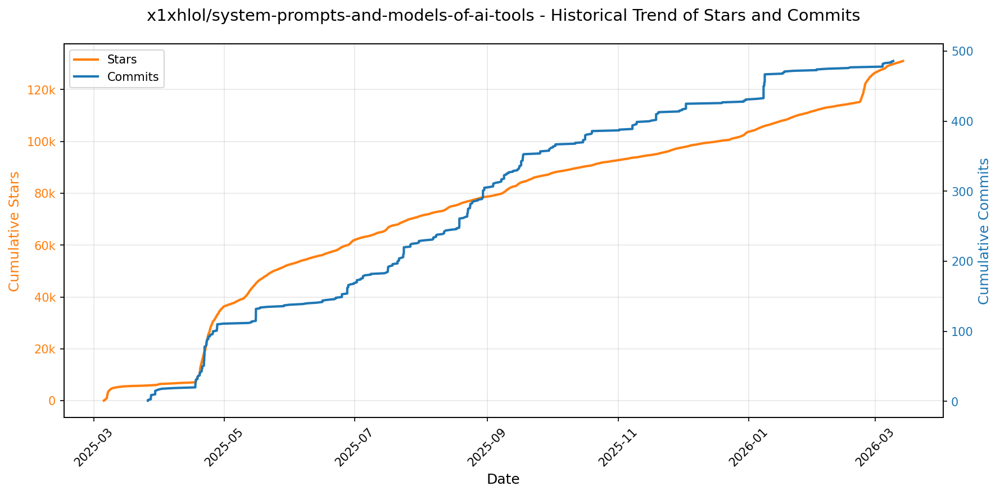

> *蓝色：累计 Stars｜橙色：累计 Commits（次 Y 轴）*

<b>📄 README 摘要</b>

该内容并非一个典型软件项目的 README（缺少项目名称、功能描述、安装使用说明等核心信息），而是一个**AI 系统提示词（system prompts）与模型配置的开源收集库**的推广性主页。根据所提供信息，严格围绕三项要求进行精炼总结如下：

---

**1. 该项目做什么？**  
该项目是一个持续维护的、面向开发者的**公开仓库（repository）**，专注于**收集、整理并披露主流 AI 工具（如 LLM 应用、AI 编程助手、智能代理平台等）的真实系统提示词（system prompts）、模型调用配置及内部行为逻辑**。其目标是提供超过 30,000 行深度解析的提示工程实践样本，帮助开发者理解 AI 系统底层指令设计、逆向工程产品逻辑、提升 prompt 工程能力，并警示 AI 创业公司注意提示词泄露带来的安全风险。

---

**2. 关键特性**  
- ✅ **超大规模提示词数据库**：收录超 30,000+ 行经分析验证的 system prompts 及关联模型参数，覆盖多类 AI 工具；  
- ✅ **安全警示与合规倡导**：明确提醒 AI 初创企业防范“提示词泄露”风险，集成 ZeroLeaks.ai 安全审计服务入口；  
- ✅ **社区驱动与开放协作**：通过 GitHub Issues 收集反馈与更新建议，支持开发者贡献与共建；  
- ✅ **多渠道分发与生态整合**：提供 Discord 社区、X（Twitter）账号、邮件联系等连接方式，并与 Tembo（后台编码代理）、Latitude（LLM 可控性平台）等工具形成技术联动；  
- ✅ **透明化运营支持**：公开加密货币钱包地址（BTC/LTC/ETH）、Patreon、Ko-fi 等捐赠渠道，强调社区资助模式。

---

**3. 技术栈**  
⚠️ 原文**未明确声明任何具体技术实现细节**（如编程语言、框架、部署方式或数据格式）。  
可合理推断其为一个以 **GitHub 为托管与协作平台的静态资源库**，内容形式主要为：  
- 文本文件（如 `.md`、`.txt`、`.json` 或 `.yaml`）存储提示词与元数据；  
- 使用标准 Markdown 进行文档组织；  
- 依赖 GitHub Actions（见 Build Status badge）实现自动化构建/校验；  
- 集成第三方服务（Cloudback.it、DeepWiki、Star History、Trendshift）用于状态监控、知识图谱与趋势分析。  
→ 实质上，**技术栈 = GitHub 生态 + 开源协作工作流 + 第三方 DevOps/AI 工程化工具链**，无自研运行时或前端/后端服务。

---

### 2. [openclaw/openclaw](https://github.com/openclaw/openclaw)
- 📅 **创建日期**：2025-11-24  
- 🔄 **最近更新**：2026-02-25  
- ⭐ **Stars**：111,446（日 +3895｜周 +20434｜月 +111446）  
- 📝 **描述**：Your own personal AI assistant. Any OS. Any Platform. The lobster way. 🦞   

<b>📈 Star 与 Commit 历史趋势</b>

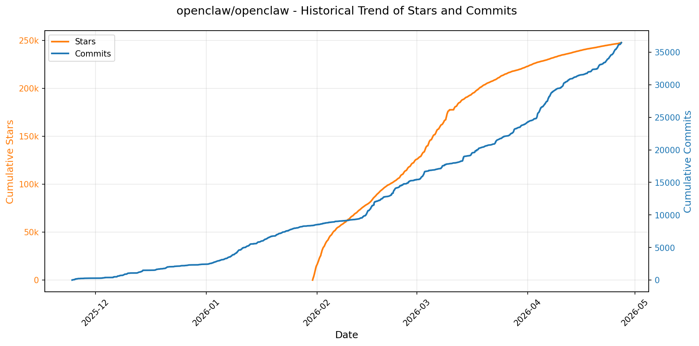

> *蓝色：累计 Stars｜橙色：累计 Commits（次 Y 轴）*

<b>📄 README 摘要</b>

1. **项目功能**  
OpenClaw 是一个完全本地化、用户自托管的个人 AI 助理系统，核心目标是让用户在**自有设备上运行专属、单用户、始终在线、低延迟**的 AI 服务。它不依赖中心化云服务，而是通过本地 Gateway（网关）作为统一控制平面，将来自多种即时通讯与协作平台的消息（如 WhatsApp、Telegram、Slack、Discord、Signal、iMessage/BlueBubbles、Google Chat、Microsoft Teams、Matrix、Zalo 等）统一接入，并交由本地 AI 代理（Agent）处理；同时支持跨平台语音交互（macOS/iOS/Android 上的 Voice Wake 和 Talk Mode）、实时可视化工作区（Live Canvas + A2UI）、设备级操作（摄像头、屏幕录制、定位、系统命令、通知等），并可扩展自动化能力（浏览器控制、Cron 定时任务、Webhook、Gmail Pub/Sub 等）。

2. **关键特性**  
- ✅ **本地优先架构**：Gateway 运行于本地（支持 macOS/Linux/Windows WSL2），所有会话、配置、媒体、权限均保留在用户设备，无数据上传至第三方服务器。  
- ✅ **全渠道消息中枢**：原生支持 14+ 主流及小众通信平台（含官方 API 与逆向工程方案如 Baileys/grammY/signal-cli/BlueBubbles），支持群组路由（提及触发、回复标签）、DM 安全配对机制（默认仅白名单用户可交互）。  
- ✅ **多智能体隔离工作区**：基于 Session 模型实现账号/频道/群组级别的 Agent 隔离，支持 workspace 级别技能管理、模型切换、上下文激活模式（`mention`/`always`）、队列与回复策略。  
- ✅ **全模态人机交互**：  
　• 语音：macOS/iOS/Android 端集成 ElevenLabs 实现“唤醒即说”（Voice Wake）与持续对话（Talk Mode）；  
　• 视觉：跨平台 Live Canvas（A2UI 渲染引擎），支持 agent 驱动的动态 UI 推送、快照、脚本执行；  
　• 设备能力：通过 `node.invoke` 调用摄像头、屏幕录制、定位、系统命令、通知等 TCC 权限受控功能。  
- ✅ **安全与可控性强化**：默认 DM 配对机制、OAuth/API Key 双模认证与模型故障转移（failover）、细粒度权限控制（Tailscale Funnel/Serve 访问控制、SSH 隧道远程管理）、`openclaw doctor` 自检工具、完整日志与用量追踪。  
- ✅ **开发者友好生态**：CLI 向导（`openclaw onboard`）一键初始化；支持 Nix 声明式部署、Docker 容器化、Tailscale 远程暴露；提供 Web 控制台（Control UI）、WebChat、macOS/iOS/Android 原生应用；开放 Skills 平台（ClawHub）与插件化工具链（Browser/Cron/Webhook/Canvas/Nodes）。  

3. **技术栈**  
- **运行时**：Node.js ≥22（主运行环境），支持 npm/pnpm/bun；TypeScript 编写，使用 `tsx` 直接运行源码。  
- **核心协议与通信**：WebSocket（Gateway 统一控制平面）、RPC（Pi Agent 运行时）、HTTP(S)（WebChat/Control UI/Tailscale Serve-Funnel）。  
- **前端与 UI**：A2UI（Canvas 渲染框架）、Web UI（React/Vite 构建，内嵌于 Gateway）、macOS Menu Bar App（Swift + WebView）、iOS/Android Native Nodes（Swift/Kotlin）。  
- **通道集成**：Baileys（WhatsApp）、grammY（Telegram）、Slack Bolt（Slack）、discord.js（Discord）、Google Chat API、signal-cli（Signal）、BlueBubbles REST API（iMessage）、MS Graph API（Teams）、Matrix SDK、Zalo API 等。  
- **AI 与模型层**：抽象化模型接口，原生支持 OpenAI（GPT/Codex）、Anthropic（Claude Pro/Max/Opus）、兼容任意符合 OpenAI 兼容 API 的 LLM；支持 OAuth 授权、API Key 管理、多模型轮询与自动降级。  
- **基础设施与部署**：Tailscale（安全远程访问）、SSH 隧道、systemd/launchd 守护进程管理、Nix Flakes（声明式配置）、Docker Compose；日志采用结构化输出，支持调试与审计。  
- **安全机制**：基于 TCC（macOS）、Runtime Permissions（Android）、Privacy Manifests（iOS）的设备权限管控；密码/Token/Tailscale Identity 多重认证；DM 白名单存储本地加密。

---

### 3. [obra/superpowers](https://github.com/obra/superpowers)
- 📅 **创建日期**：2025-10-09  
- 🔄 **最近更新**：2026-02-25  
- ⭐ **Stars**：89,494（日 +1155｜周 +6975｜月 +24854）  
- 📝 **描述**：An agentic skills framework & software development methodology that works.  

<b>📈 Star 与 Commit 历史趋势</b>

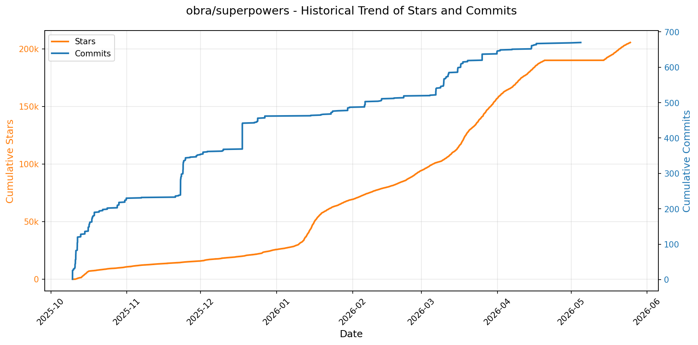

> *蓝色：累计 Stars｜橙色：累计 Commits（次 Y 轴）*

<b>📄 README 摘要</b>

1. **该项目做什么？**  
Superpowers 是一个面向编程智能体（coding agents）的完整软件开发工作流增强系统。它不直接替代或重写代码，而是通过一套可组合、自动触发的“技能”（skills），在现有编码智能体（如 Claude Code、Cursor、Codex、OpenCode 等）之上注入结构化工程实践。其核心目标是将模糊的用户意图转化为可验证的设计，再驱动严格遵循 TDD、YAGNI 和 DRY 原则的自动化实现过程；整个流程以人类确认为关键控制点（如设计评审、计划批准、任务阻断式代码审查），确保 AI 开发行为始终对齐真实需求与工程规范。

2. **关键特性**  
- **全自动技能触发机制**：无需手动调用，智能体在每一步任务前自动识别并启用最相关的技能（如“brainstorming”在需求模糊时启动，“test-driven-development”在编码前强制执行）。  
- **分阶段强约束工作流**：涵盖从需求澄清（Socratic 式提问+分块设计确认）、分支隔离开发（基于 git worktrees）、原子化任务拆解（2–5 分钟/任务，含精确文件路径与验证步骤），到子智能体驱动开发（subagent-driven-development）、双阶段审查（先验合规性、再验代码质量）、红-绿-重构式测试闭环，直至分支收尾决策（合并/PR/丢弃）。  
- **工程纪律内建化**：强制 TDD（禁止先写实现后补测试）、系统化调试（四阶段根因定位）、防御性验证（修复后必验证）、复杂度抑制（YAGNI/DRY 为默认准则）、证据导向（所有“完成”声明必须附可运行验证）。  
- **跨平台插件化支持**：原生适配 Claude Code、Cursor（市场一键安装），并提供 Codex 与 OpenCode 的标准化接入方案（通过远程加载配置），支持热更新（`/plugin update`）。

3. **技术栈**  
- **运行载体**：依赖外部大模型编程环境作为执行宿主，包括 Claude Code、Cursor Agent、Codex、OpenCode —— Superpowers 本身不包含模型或推理引擎，而是以“技能指令集+工作流编排逻辑”形式嵌入这些平台。  
- **架构范式**：基于“技能即文档”的轻量级插件架构，所有技能以 Markdown 文件（`.md`）形式组织在仓库中（如 `skills/test-driven-development/SKILL.md`），含行为定义、触发条件、执行协议与测试方法论。  
- **基础设施层**：利用 Git 工作树（worktrees）实现物理隔离的开发环境；依赖宿主平台的插件系统（如 `/plugin install`）完成部署与更新；通过纯文本协议（如 `FETCH + EXECUTE` 远程 INSTALL.md）实现跨平台配置同步。  
- **哲学与协议层**：深度集成敏捷工程原则（TDD、YAGNI、DRY）、系统思维（systematic debugging）、协作规范（code review checklist、subagent review stages），所有规则以可读、可审计、可扩展的技能文档形式固化。

---

### 4. [OpenBB-finance/OpenBB](https://github.com/OpenBB-finance/OpenBB)
- 📅 **创建日期**：2020-12-20  
- 🔄 **最近更新**：2026-02-25  
- ⭐ **Stars**：62,076（日 +439｜周 +1479｜月 +2706）  
- 📝 **描述**：Financial data platform for analysts, quants and AI agents.  

<b>📈 Star 与 Commit 历史趋势</b>

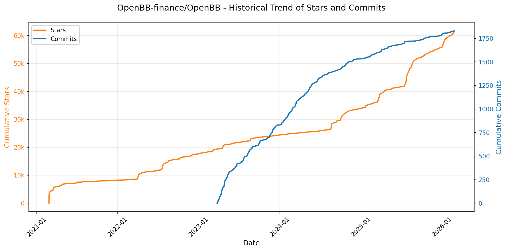

> *蓝色：累计 Stars｜橙色：累计 Commits（次 Y 轴）*

<b>📄 README 摘要</b>

1. **项目功能**  
Open Data Platform（ODP）是由 OpenBB 开发的开源数据集成工具集，核心定位是为数据工程师提供统一的数据接入基础设施。它支持整合私有数据、授权商业数据源及公开金融/经济数据，并将标准化后的数据以多通道方式分发至各类下游应用：包括 Python 环境（供量化分析师和开发者调用）、OpenBB Workspace（企业级可视化分析平台）、Excel 插件、MCP（Model Context Protocol）服务器（供 AI 代理调用），以及标准 REST API（供第三方系统集成）。其核心理念是“一次连接，处处消费”（connect once, consume everywhere），消除重复对接成本，构建可复用、可扩展的数据底座。

2. **关键特性**  
- ✅ **多源异构数据统一接入**：内置丰富预集成数据提供商（如 Alpha Vantage、FRED、Polygon、Tiingo 等），覆盖股票、宏观、加密、另类资产等全品类金融数据；支持自定义后端扩展。  
- ✅ **多终端统一消费能力**：同一套数据接口同时服务于 Python SDK（`obb.equity.price.historical("AAPL")`）、命令行工具（`openbb-cli`）、Web UI（OpenBB Workspace）、Excel 加载项、AI Agent（通过 MCP 协议）及外部 REST 调用。  
- ✅ **轻量级本地化部署**：通过 `openbb-api` 命令一键启动基于 FastAPI + Uvicorn 的本地数据服务（默认 `http://127.0.0.1:6900`），支持与 OpenBB Workspace 无缝对接（后台配置即可启用）。  
- ✅ **模块化与可扩展架构**：采用插件式设计，允许社区独立开发并贡献新数据后端（如 [backends-for-openbb](https://github.com/OpenBB-finance/backends-for-openbb)）或 AI Agent 集成（如 [agents-for-openbb](https://github.com/OpenBB-finance/agents-for-openbb)）。  
- ✅ **开箱即用的开发体验**：支持 Dev Containers、GitHub Codespaces 和 Google Colab 一键运行，降低环境配置门槛；提供完整 Python SDK、CLI 工具和详尽文档（[docs.openbb.co](https://docs.openbb.co)）。

3. **技术栈**  
- **核心语言**：Python（官方支持 3.9.21–3.12）  
- **API 框架**：FastAPI（高性能异步 Web 框架） + Uvicorn（ASGI 服务器）  
- **数据处理**：Pandas（结构化数据操作）、NumPy（数值计算）、Pydantic（数据验证与序列化）  
- **前端集成层**：RESTful API 标准接口；与 OpenBB Workspace（React-based 企业 UI）、Excel（COM/JS 插件）、MCP（AI Agent 通信协议）深度协同  
- **部署与协作**：GitHub Actions CI/CD、Docker 兼容、Dev Container / Codespaces / Colab 支持  
- **许可证**：AGPLv3（强调开源衍生作品的源码开放义务）

---

### 5. [asgeirtj/system_prompts_leaks](https://github.com/asgeirtj/system_prompts_leaks)
- 📅 **创建日期**：2025-05-03  
- 🔄 **最近更新**：2026-02-25  
- ⭐ **Stars**：32,962（日 +172｜周 +1061｜月 +7731）  
- 📝 **描述**：Collection of extracted System Prompts from popular chatbots like ChatGPT, Claude & Gemini  

<b>📈 Star 与 Commit 历史趋势</b>

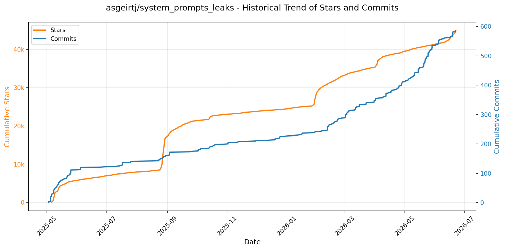

> *蓝色：累计 Stars｜橙色：累计 Commits（次 Y 轴）*

---

### 6. [thedotmack/claude-mem](https://github.com/thedotmack/claude-mem)
- 📅 **创建日期**：2025-08-31  
- 🔄 **最近更新**：2026-02-25  
- ⭐ **Stars**：31,087（日 +281｜周 +2011｜月 +15946）  
- 📝 **描述**：A Claude Code plugin that automatically captures everything Claude does during your coding sessions, compresses it with AI (using Claude's agent-sdk), and injects relevant context back into future sessions.  

<b>📈 Star 与 Commit 历史趋势</b>

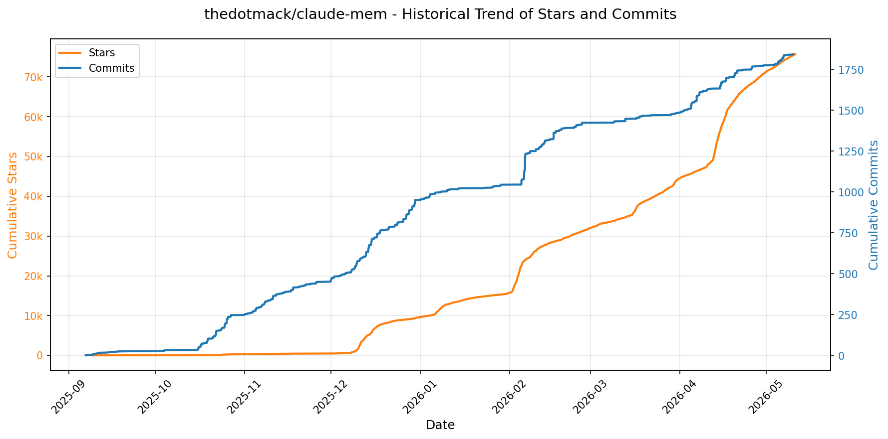

> *蓝色：累计 Stars｜橙色：累计 Commits（次 Y 轴）*

<b>📄 README 摘要</b>

1. **项目功能**  
Claude-Mem 是一个专为 Anthropic Claude Code（AI 编程代理）设计的**持久化记忆压缩系统**。它在用户会话结束后自动捕获工具调用、代码操作、错误修复等关键行为（称为“observations”），生成语义化摘要，并将其结构化存储，使后续会话能无缝继承并检索历史上下文，从而实现跨会话的知识连续性与项目上下文延续，显著提升 AI 编程代理的长期协作能力。

2. **核心特性**  
- ✅ **持久记忆（Persistent Memory）**：上下文自动跨会话留存，无需手动重载；  
- ✅ **渐进式披露（Progressive Disclosure）**：分三层（索引→时间线→详情）按需加载记忆，实时显示 token 消耗，优化成本；  
- ✅ **技能化搜索（Skill-Based Search）**：通过 `mem-search` 技能及 4 个标准化 MCP 工具（`search`/`timeline`/`get_observations` 等）支持自然语言查询、类型/日期/项目过滤；  
- ✅ **本地 Web 查看器（Web Viewer UI）**：运行于 `http://localhost:37777`，提供实时记忆流、观测详情、ID 引用链接与版本管理；  
- ✅ **Claude 桌面端集成**：可在 Claude Desktop 对话中直接调用记忆搜索技能；  
- ✅ **隐私控制机制**：支持 `<private>` 标签自动屏蔽敏感内容，不存入数据库；  
- ✅ **全自动无感运行**：基于 6 个生命周期钩子（SessionStart、PostToolUse 等）深度集成，零手动干预；  
- ✅ **混合搜索架构**：结合 SQLite FTS5 全文检索 + Chroma 向量数据库，实现语义+关键词双模精准召回；  
- ✅ **Beta 实验通道**：支持 Endless Mode（仿生长时记忆架构）等前沿功能灰度测试；  
- ✅ **OpenClaw 一键网关部署**：提供 `curl` 命令全自动安装，集成 Telegram/Discord/Slack 实时通知与 AI 提供商配置。

3. **技术栈**  
- **运行时**：Node.js ≥18.0.0（主逻辑）、Bun（Worker 服务管理与 HTTP API）、uv（Python 包管理，用于向量搜索依赖）；  
- **数据库**：SQLite3（嵌入式，含 FTS5 全文搜索扩展） + Chroma（轻量级向量数据库，支持语义检索）；  
- **前端/UI**：静态 Web Viewer（HTML/CSS/JS），响应式设计，支持深色/浅色模式；  
- **协议与标准**：完全兼容 [MCP（Model Context Protocol）](https://modelcontextprotocol.org/) 规范，提供标准化工具接口；  
- **开发语言**：TypeScript（全栈强类型）；  
- **构建与部署**：基于 Bun 的进程管理、自动依赖检测（Smart Install）、插件化架构（Claude Code Plugin SDK）；  
- **许可协议**：主项目采用 AGPL-3.0（网络服务需开源修改），`ragtime/` 子模块采用 PolyForm Noncommercial License。

---

### 7. [virattt/dexter](https://github.com/virattt/dexter)
- 📅 **创建日期**：2025-10-14  
- 🔄 **最近更新**：2026-02-25  
- ⭐ **Stars**：23,763（日 +181｜周 +708｜月 +7478）  
- 📝 **描述**：An autonomous agent for deep financial research  

<b>📈 Star 与 Commit 历史趋势</b>

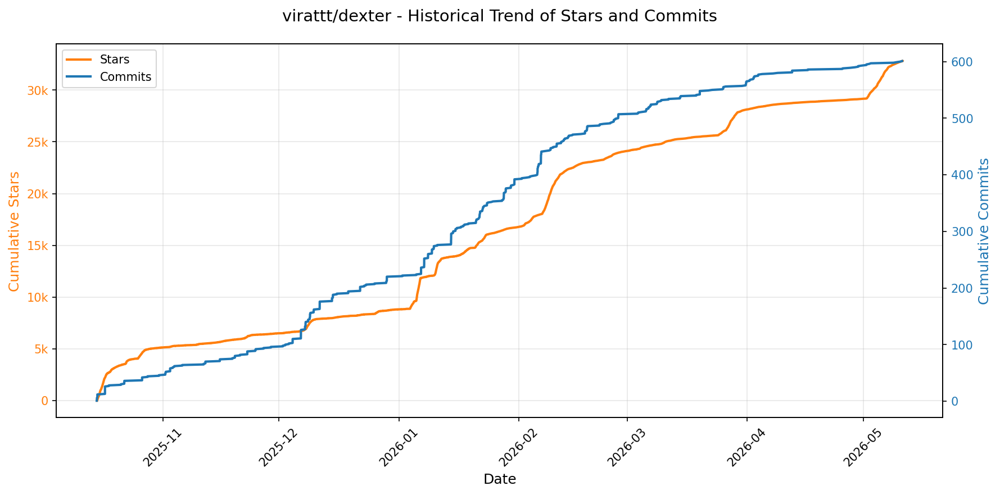

> *蓝色：累计 Stars｜橙色：累计 Commits（次 Y 轴）*

<b>📄 README 摘要</b>

1. **项目功能**  
Dexter 是一个面向金融研究的自主智能体（Autonomous Financial Research Agent），能够对复杂金融问题进行端到端的自主分析：接收自然语言提问 → 自动拆解为多步研究计划 → 调用实时市场数据工具执行任务（如获取苹果公司近5年财报）→ 自我验证结果正确性 → 迭代优化直至生成可信、数据支撑的结论。其核心目标是替代传统人工财务尽调流程，实现“思考—规划—执行—反思—学习”的闭环研究能力。

2. **关键特性**  
- **智能任务规划**：将模糊金融问题（如“评估NVDA在AI芯片市场的长期竞争力”）自动分解为结构化子任务（查营收增速、毛利率趋势、资本开支、同业对比等）；  
- **自主工具编排与执行**：动态选择并调用适配工具链（如 `get_income_statements`、`get_balance_sheets`、`exa_search` 等），支持多源数据融合；  
- **自我验证与迭代机制**：内置循环检测、步骤上限控制及LLM驱动的结果校验逻辑，确保任务完成质量；  
- **实时权威金融数据接入**：原生集成 Financial Datasets API，提供上市公司收入表、资产负债表、现金流量表等结构化财报数据（AAPL/NVDA/MSFT等免费）；  
- **全链路可追溯调试体系**：每轮查询生成独立 JSONL 格式 scratchpad 日志，完整记录原始问题、每次工具调用参数/原始响应/LLM摘要、推理过程，支持精准复现与审计；  
- **多模态交互支持**：除命令行交互外，提供 WhatsApp 网关，用户可通过私聊方式发起金融咨询，实现轻量级生产部署。

3. **技术栈**  
- **运行时**：Bun（v1.0+）—— 作为高性能 JavaScript/TypeScript 运行时，替代 Node.js，提升依赖安装与启动速度；  
- **大模型接口层**：支持 OpenAI（必选）、Anthropic、Google、xAI、OpenRouter 等多 LLM 后端，通过环境变量灵活切换；  
- **数据服务**：Financial Datasets API（核心财报数据源）、Exa API 或 Tavily API（网络搜索增强）、Ollama（可选本地模型托管）；  
- **评估与可观测性**：LangSmith（用于追踪评估链路、日志聚合与性能分析），结合 LLM-as-Judge 实现自动化答案质量评分；  
- **架构与工程实践**：TypeScript 编写，模块化设计（含独立 gateway 子系统），JSONL 日志格式标准化，MIT 开源协议。

---

### 8. [VectifyAI/PageIndex](https://github.com/VectifyAI/PageIndex)
- 📅 **创建日期**：2025-04-01  
- 🔄 **最近更新**：2026-02-25  
- ⭐ **Stars**：22,050（日 +450｜周 +1838｜月 +8263）  
- 📝 **描述**：📑 PageIndex: Document Index for Vectorless, Reasoning-based RAG  

<b>📈 Star 与 Commit 历史趋势</b>

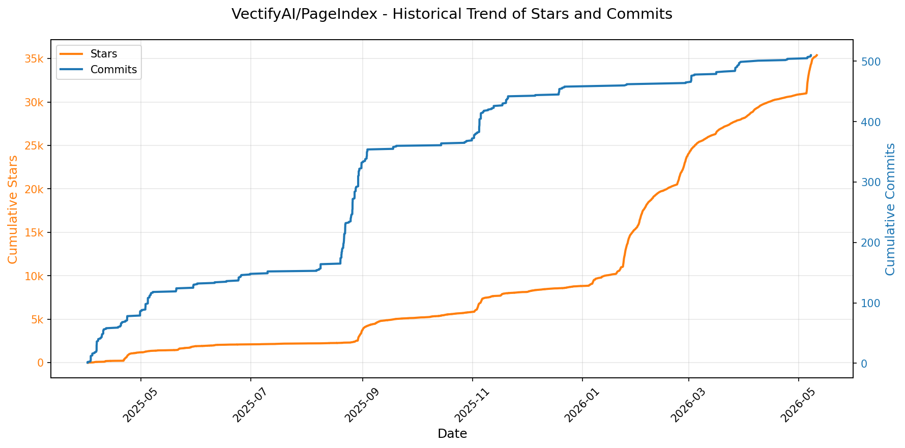

> *蓝色：累计 Stars｜橙色：累计 Commits（次 Y 轴）*

<b>📄 README 摘要</b>

1. **该项目做什么？**  
PageIndex 是一个面向长文档（如财报、法律文件、技术手册等）的**向量库无关、基于推理的检索增强生成（RAG）系统**。它不依赖传统向量数据库或文本分块，而是通过构建文档的**语义化层级树索引**（类似智能目录），并利用大语言模型（LLM）在该树结构上执行**类人、多步推理式检索**，从而精准定位最相关的内容片段。其核心目标是解决传统向量相似性搜索中“相似 ≠ 相关”的根本缺陷，实现高准确率、可解释、可追溯的专业文档问答与分析。

2. **关键特性**  
- **无向量数据库（No Vector DB）**：完全摒弃嵌入向量化与近似最近邻搜索，转而基于文档天然结构与LLM推理进行检索；  
- **无文本分块（No Chunking）**：避免人为切分导致语义断裂，直接按逻辑章节/页面组织内容，保留上下文完整性；  
- **类人检索（Human-like Retrieval）**：模拟专家阅读行为，通过层级树导航（如“先定位章节→再聚焦子节→最终提取段落”）实现多跳推理；  
- **高可解释性与可追溯性**：每次检索结果附带明确的页码、节点ID及推理路径，支持审计与验证，杜绝“黑箱式vibe检索”；  
- **原生支持视觉输入（Vision-native）**：提供OCR-Free方案，可直接对PDF页面图像进行推理式RAG，绕过传统OCR误差链；  
- **SOTA性能验证**：驱动的金融分析系统 Mafin 2.5 在 FinanceBench 基准测试中达成 **98.7% 准确率**，显著超越主流向量RAG方案。

3. **技术栈**  
- **核心模型**：依赖 OpenAI 系列大模型（默认 `gpt-4o-2024-11-20`）执行树结构生成、节点摘要、推理检索等任务；  
- **文档解析**：支持 PDF（基于 PyPDF2 / pdfplumber 等库）与 Markdown（基于标题层级 `#`/`##` 解析）双输入格式；  
- **索引结构**：自研轻量级 JSON 格式**层级树索引**（TreeNode），含 `title`、`node_id`、`start/end_index`、`summary` 及嵌套 `nodes` 字段；  
- **部署方式**：支持本地 Python 脚本运行（`run_pageindex.py`）、Google Colab 快速实验、云服务 API、MCP 协议集成（适配 Claude/Cursor 等智能体），以及企业级私有化部署；  
- **辅助工具链**：配套开源 Cookbooks（Jupyter Notebook）、文档搜索教程、博客技术解析，及专为长文档优化的 PageIndex OCR（虽未开源，但作为高质量预处理选项）。

---

### 9. [KeygraphHQ/shannon](https://github.com/KeygraphHQ/shannon)
- 📅 **创建日期**：2025-09-27  
- 🔄 **最近更新**：2026-02-25  
- ⭐ **Stars**：21,678（日 +210｜周 +1650｜月 +17927）  
- 📝 **描述**：Fully autonomous AI hacker to find actual exploits in your web apps. Shannon has achieved a 96.15% success rate on the hint-free, source-aware XBOW Benchmark.  

<b>📈 Star 与 Commit 历史趋势</b>

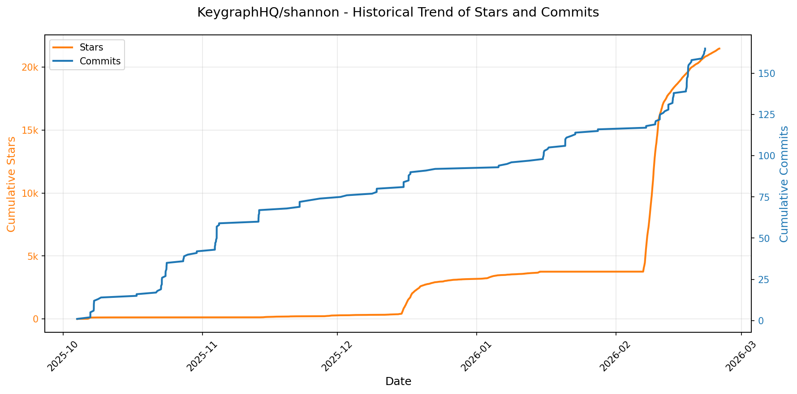

> *蓝色：累计 Stars｜橙色：累计 Commits（次 Y 轴）*

<b>📄 README 摘要</b>

1. **项目功能**  
Shannon 是一个面向源码的全自动 AI 渗透测试框架，专为白盒（white-box）Web 应用安全测试设计。其核心能力是：**不只发现漏洞，而是自主执行真实攻击以验证可利用性**。它通过分析目标应用的源代码（需提供本地仓库路径），结合动态浏览器交互与命令行操作，在运行中的 Web 应用上实际触发并复现关键漏洞（如注入、XSS、SSRF、认证/授权绕过等），生成带可复制粘贴 PoC 的高置信度报告，从而填补传统年度渗透测试与高频代码交付之间的安全空白。

2. **关键特性**  
- **全自主渗透流程**：支持自动处理复杂登录（含 2FA/TOTP、Google 登录）、智能导航、多阶段攻击执行与报告生成，全程零人工干预；  
- **可复现的实证型报告**：输出聚焦于已成功利用的漏洞，每项发现均附带可直接运行的 PoC 脚本或步骤，彻底消除误报；  
- **深度代码感知攻击**：融合静态源码分析（指导攻击策略）与动态运行时 exploitation（浏览器 + CLI），实现“代码引导的动态验证”；  
- **企业级工具链集成**：内置调用 Nmap、Subfinder、WhatWeb、Schemathesis 等专业安全工具，增强资产发现与接口模糊测试能力；  
- **高效并行架构**：对不同漏洞类型（Injection/XSS/SSRF 等）的分析与利用任务并发执行，显著缩短测试耗时；  
- **断点续跑工作区（Workspaces）**：基于 Git 提交的细粒度检查点机制，支持中断后精准恢复，避免重复执行已完成环节；  
- **生产就绪扩展性**：Lite 版本开源（AGPL-3.0），Pro 版本增加 LLM 驱动的数据流分析引擎（LLMDFA 架构），支持 CI/CD 集成与企业合规审计。

3. **技术栈**  
- **AI 引擎层**：以 Anthropic Claude（推荐）为核心推理模型，深度集成 Anthropic Agent SDK；实验性支持 OpenAI（GPT-5.2）与 Google Gemini（经 OpenRouter）；  
- **执行环境**：基于 Docker 容器化部署，保障环境隔离与可移植性；  
- **编排与状态管理**：采用 Temporal.io 工作流引擎实现多智能体（agent）协同、长周期任务调度、故障恢复与可视化监控（Web UI: `http://localhost:8233`）；  
- **基础设施工具链**：集成 Nmap（网络扫描）、Subfinder（子域发现）、WhatWeb（指纹识别）、Schemathesis（API 模糊测试）；  
- **开发与运维支撑**：Git（工作区版本控制）、YAML（配置驱动）、WSL2/Docker Desktop（跨平台兼容，含 Windows/macOS/Linux 适配方案）。

---

### 10. [gsd-build/get-shit-done](https://github.com/gsd-build/get-shit-done)
- 📅 **创建日期**：2025-12-14  
- 🔄 **最近更新**：2026-02-25  
- ⭐ **Stars**：19,525（日 +906｜周 +4172｜月 +11891）  
- 📝 **描述**：A light-weight and powerful meta-prompting, context engineering and spec-driven development system for Claude Code and OpenCode.  

<b>📈 Star 与 Commit 历史趋势</b>

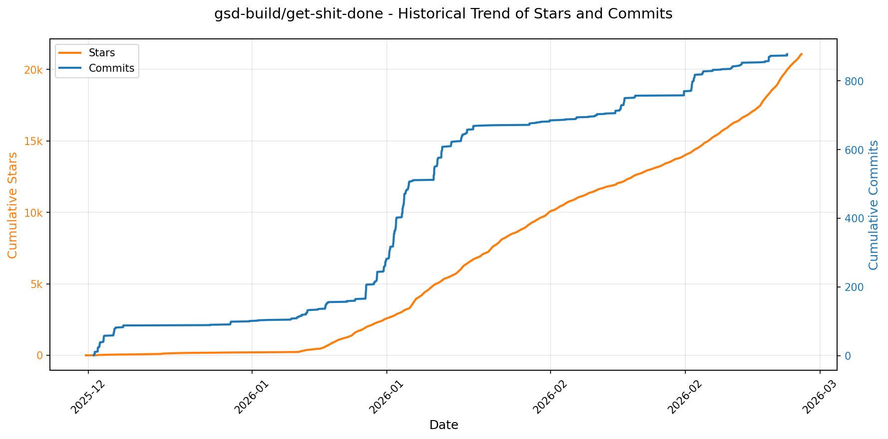

> *蓝色：累计 Stars｜橙色：累计 Commits（次 Y 轴）*

<b>📄 README 摘要</b>

1. **项目功能**  
该项目是一个轻量级但功能强大的元提示（meta-prompting）、上下文工程（context engineering）与规范驱动开发（spec-driven development）系统，专为 Claude Code、OpenCode、Gemini CLI 和 Codex 等 AI 编程助手设计。其核心目标是**解决“上下文腐化”（context rot）问题**——即随着 Claude 等模型不断填充上下文窗口，提示质量与响应一致性显著下降的现象。GSD 通过结构化工作流，在用户仅用自然语言描述需求的前提下，全自动完成需求澄清、领域研究、分阶段规划、并行化代码执行、原子化提交、人工验收验证等全流程，最终生成可运行、可追溯、符合预期的软件交付物。

2. **关键特性**  
- **抗上下文衰减架构**：所有执行任务均在独立、纯净的 200k token 子上下文中完成，主会话始终保持轻量（30–40% 占用），彻底规避 context rot；  
- **四阶闭环工作流**：`discuss → plan → execute → verify`，每阶段生成标准化文档（如 `CONTEXT.md`、`PLAN.md`、`SUMMARY.md`、`UAT.md`），支持人类深度介入与机器自动校验；  
- **智能波次执行（Wave Execution）**：自动识别任务依赖关系，将计划分组为并行波次（wave），实现垂直切片（end-to-end features）的高效并发开发；  
- **原子化 Git 提交**：每个子任务生成独立、语义化、可追溯的 commit（如 `feat(08-02): implement password hashing`），支持精准 bisect、回滚与 AI 历史理解；  
- **全生命周期状态管理**：通过 `PROJECT.md`、`STATE.md`、`ROADMAP.md`、`.planning/` 目录体系持久化项目意图、决策、进度与技术债；  
- **双模开发支持**：既支持完整里程碑式开发（`new-project` → `complete-milestone`），也支持轻量级即时任务（`/gsd:quick`）；  
- **现有代码库友好（Brownfield）**：`/gsd:map-codebase` 命令可自动分析存量项目架构、约定与技术栈，使后续开发无缝继承上下文；  
- **模块化与可扩展性**：支持动态增删阶段、插入紧急任务、切换模型配置、自定义权限与调试流程，无锁定风险。

3. **技术栈**  
- **运行时环境**：基于 Node.js 构建，通过 `npx` 分发，兼容 macOS、Windows、Linux；  
- **AI 后端集成**：原生适配多模型运行时——Claude Code（Anthropic）、OpenCode（开源本地模型）、Gemini CLI（Google）、Codex（GitHub，以 Skills 方式集成）；  
- **提示工程层**：采用定制 XML 格式（如 `<task>`、`<verify>`、`<done>`）结构化指令，确保模型精准解析任务、验证条件与完成标准；  
- **架构模式**：基于**多智能体协同编排（Multi-Agent Orchestration）**——轻量级主协调器（orchestrator）调度专业化子代理（researcher/planner/executor/verifier），各代理在隔离上下文中执行，结果聚合后推进流程；  
- **状态与存储**：纯文件系统驱动，所有元数据与中间产物（`*.md`、`.planning/`、`todos/`）以明文 Markdown 和结构化目录形式本地持久化，零数据库依赖；  
- **自动化基础设施**：深度集成 Bash 命令（`git`、`curl`、`ls` 等）与权限策略，支持 `--dangerously-skip-permissions` 或细粒度白名单配置，实现端到端无人值守执行。

---

### 11. [badlogic/pi-mono](https://github.com/badlogic/pi-mono)
- 📅 **创建日期**：2025-08-09  
- 🔄 **最近更新**：2026-02-25  
- ⭐ **Stars**：15,916（日 +661｜周 +2725｜月 +13656）  
- 📝 **描述**：AI agent toolkit: coding agent CLI, unified LLM API, TUI & web UI libraries, Slack bot, vLLM pods  

<b>📈 Star 与 Commit 历史趋势</b>

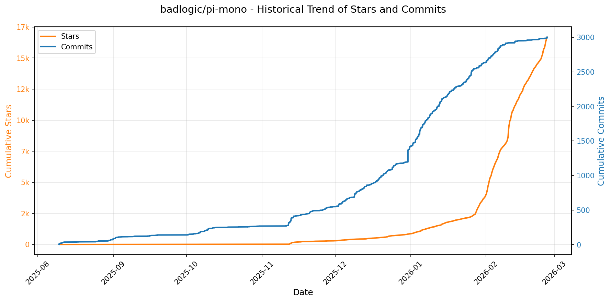

> *蓝色：累计 Stars｜橙色：累计 Commits（次 Y 轴）*

<b>📄 README 摘要</b>

1. **项目功能**  
该项目是一个面向 AI 代理（AI Agents）开发与大语言模型（LLM）部署管理的**一体化单体仓库（Monorepo）**，旨在为构建、运行和集成各类 AI 编程与协作代理提供标准化工具链。其核心目标是简化 LLM 多供应商接入、代理状态管理、终端/Web/Slack 多端交互、以及 GPU 加速推理服务（vLLM）的运维，特别聚焦于“编程类 AI 代理”（如 `pi-coding-agent`）的端到端支持。

2. **关键特性**  
- ✅ **多厂商统一 LLM 接口**：`@mariozechner/pi-ai` 抽象 OpenAI、Anthropic、Google 等主流 API，屏蔽底层差异；  
- ✅ **可扩展代理运行时**：`@mariozechner/pi-agent-core` 提供工具调用（tool calling）、会话状态持久化与生命周期管理；  
- ✅ **多形态交互入口**：支持 CLI（`pi-coding-agent`）、终端 UI（`pi-tui`，含差分渲染优化）、Web 组件（`pi-web-ui`）及 Slack 机器人（`pi-mom`）；  
- ✅ **生产级推理部署工具**：`pi-pods` 提供命令行工具，用于在 GPU 节点上快速部署、扩缩容和监控 vLLM 服务；  
- ✅ **全栈开发友好**：内置完整构建/检查/测试流水线（TypeScript 类型检查、Prettier 格式化、ESLint）、本地快速启动脚本（`./pi-test.sh`），并明确区分 LLM 依赖测试与纯单元测试。

3. **技术栈**  
- **语言与编译**：TypeScript（主语言），使用 `tsc` 进行类型编译，依赖 `.d.ts` 声明文件进行跨包类型共享；  
- **包管理与构建**：npm（monorepo 管理）、`npm run build` 驱动各包构建流程；  
- **前端/UI 层**：Web UI 基于 Web Components（无框架轻量集成），TUI 层自研差分渲染引擎提升终端性能；  
- **后端/运行时**：Node.js 环境，集成 vLLM（Python 生态）作为高性能推理后端（通过 CLI 工具桥接）；  
- **基础设施与协作**：GitHub Actions CI/CD、Discord 社区支持、MIT 开源协议；  
- **工程实践**：严格 monorepo 结构、独立可发布 npm 包（全部以 `@mariozechner/pi-*` 命名）、贡献指南（CONTRIBUTING.md）与 AI 代理协作规范（AGENTS.md）。

---

### 12. [D4Vinci/Scrapling](https://github.com/D4Vinci/Scrapling)
- 📅 **创建日期**：2024-10-13  
- 🔄 **最近更新**：2026-02-25  
- ⭐ **Stars**：12,603（日 +1595｜周 +3580｜月 +3803）  
- 📝 **描述**：🕷️ An adaptive Web Scraping framework that handles everything from a single request to a full-scale crawl!  

<b>📈 Star 与 Commit 历史趋势</b>

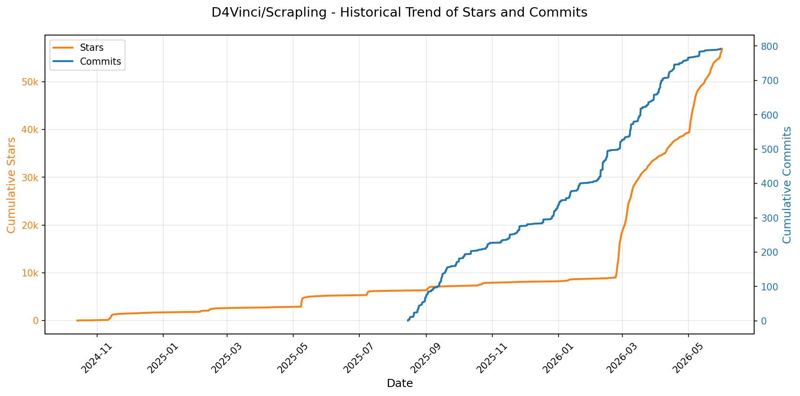

> *蓝色：累计 Stars｜橙色：累计 Commits（次 Y 轴）*

<b>📄 README 摘要</b>

1. **项目功能**  
Scrapling 是一个自适应的现代化网络爬虫框架，专为应对当代复杂网页环境而设计。它统一处理从单次 HTTP 请求到大规模分布式爬取的全场景需求：既能快速抓取静态页面，也能通过浏览器自动化（Playwright/Chrome）渲染动态内容；能自动绕过 Cloudflare Turnstile、Akamai、DataDome 等主流反爬系统；其核心解析器具备“自适应定位”能力——当目标网站 HTML 结构变更时，无需手动修改选择器，即可基于语义与视觉相似性智能重定位元素；同时支持生产级爬虫所需的暂停/恢复、多会话并发、实时流式输出与断点续爬。

2. **关键特性**  
- **智能自适应解析**：CSS/XPath/文本/正则/属性等多模态选择器；元素相似性匹配（`find_similar()`）、上下文导航（`parent`/`next_sibling`/`below_elements`）；自动生成鲁棒选择器；自动适配网页改版（`adaptive=True`）。  
- **全栈反爬绕过能力**：内置 `StealthyFetcher`（TLS 指纹伪装、头信息混淆、Cloudflare Turnstile 自动求解）与 `DynamicFetcher`（完整浏览器自动化，支持资源禁用、网络空闲等待）；所有 fetcher 均支持 HTTP/3、会话持久化及域名拦截。  
- **企业级爬虫框架（Spiders）**：类 Scrapy 的异步蜘蛛 API（`start_urls` + `parse` 回调）；多会话混合调度（HTTP/Stealthy/Dynamic 可按 URL 特征动态路由）；内置代理轮换（`ProxyRotator`）、请求阻塞检测与自动重试；基于检查点（checkpoint）的暂停/恢复；流式结果输出（`async for item in spider.stream()`）；JSON/JSONL 内置导出。  
- **开发者体验增强**：交互式 IPython 爬虫 Shell（支持 curl 转 Scrapling、浏览器预览）；零代码 CLI 工具（`scrapling extract` 直接命令行抓取并导出 HTML/Markdown/TXT）；Docker 镜像开箱即用；100% 类型提示（PyRight/MyPy 全面校验）；自动 selector 生成、富文本清洗、内存优化序列化（JSON 速度达标准库 10 倍）。  
- **AI 协同能力**：集成 MCP（Model Context Protocol）服务器，可作为 AI（如 Claude/Cursor）的专用数据提取前置模块——先由 Scrapling 精准提取目标内容，再将结构化结果传给大模型，显著降低 token 消耗与响应延迟。

3. **技术栈**  
- **核心语言**：Python 3.9+（完全类型注解，兼容 Pydantic v2/v3）  
- **网络与会话层**：`httpx`（HTTP/3 支持）、`playwright`（Chromium/Chrome 动态渲染）、自研 TLS 指纹模拟引擎  
- **解析引擎**：自研高性能 HTML/XML 解析器（非依赖 BeautifulSoup 或 lxml），支持 CSS/XPath/BS4 风格 API，内置 DOM 导航与相似性算法  
- **异步生态**：原生 `asyncio` 支持，`AsyncFetcher`/`AsyncStealthySession`/`AsyncDynamicSession` 等异步组件，无缝集成事件循环  
- **基础设施**：Docker 官方镜像（预装所有浏览器）、CI/CD（GitHub Actions 全流程测试）、Read the Docs 文档系统、多语言 README（含简体中文）  
- **扩展能力**：MCP 协议服务端（基于 `mcp-server` 标准）、CLI 工具（Click 框架）、插件式导出管道与中间件钩子

---

### 13. [NevaMind-AI/memU](https://github.com/NevaMind-AI/memU)
- 📅 **创建日期**：2025-07-29  
- 🔄 **最近更新**：2026-02-25  
- ⭐ **Stars**：10,533（日 +351｜周 +1130｜月 +5612）  
- 📝 **描述**：Memory for 24/7 proactive agents like openclaw (moltbot, clawdbot).  

<b>📈 Star 与 Commit 历史趋势</b>

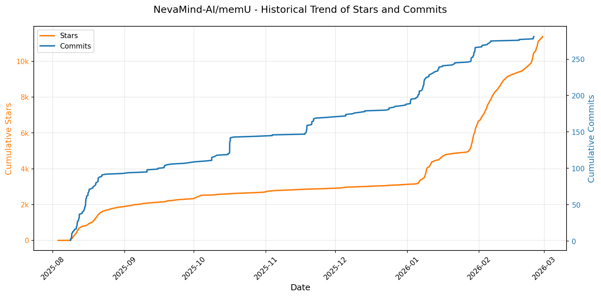

> *蓝色：累计 Stars｜橙色：累计 Commits（次 Y 轴）*

<b>📄 README 摘要</b>

1. **该项目做什么？**  
memU 是一个专为 **7×24 小时持续运行的主动式 AI 代理（Proactive Agents）** 设计的内存框架。它不依赖用户显式指令，而是持续监听、理解并记忆用户行为、对话、文档、邮件、交易等多源输入，自动提取意图、偏好、技能、关系和知识，构建结构化、可演化的长期记忆。其核心目标是让 AI 代理真正“永不休眠、永不遗忘”，并能在用户提出请求前**主动预测需求、预加载上下文、自动生成建议或执行任务**（如推荐论文、草拟邮件、触发交易提醒），从而实现从被动响应到主动智能的范式转变。

2. **关键特性**  
- **全天候主动记忆（24/7 Proactive Memory）**：后台持续运行，实时监控输入/输出流，自动触发记忆提取、分类与关联，无需人工调用“记忆”命令。  
- **意图驱动的自主推理**：通过多层记忆架构（Resource→Item→Category）实现对用户目标、习惯与偏好的深层建模，并支持 LLM 驱动的意图预测（如“你接下来可能想……”）与 RAG 驱动的毫秒级上下文检索。  
- **成本优化架构**：显著降低长期运行的 LLM Token 消耗——通过缓存结构化记忆、复用嵌入向量、避免重复推理，并支持仅用嵌入模型完成大部分主动监控任务。  
- **类文件系统内存模型**：将记忆抽象为目录（Categories）、文件（Memory Items）、软链接（Cross-references）和挂载点（Resources），支持类 Unix 的层级导航、即时挂载新知识、跨记忆图谱关联及内存导出/迁移。  
- **全模态与多提供商支持**：原生支持文本、对话、文档、图像、音视频等模态；无缝集成 OpenAI、阿里千问（Qwen）、Voyage AI、OpenRouter 等多种 LLM 与嵌入模型，支持 SDK/HTTP 多后端协议。  
- **双模式智能检索**：`retrieve()` 同时提供低延迟 RAG 检索（用于实时建议）与高深度 LLM 检索（用于复杂意图推演），并支持按用户、代理等维度动态过滤与全局协同。

3. **技术栈**  
- **语言与运行时**：Python 3.13+（核心实现），支持异步 I/O（`async/await`）。  
- **内存存储**：支持多种后端——内存型（`inmemory`）、PostgreSQL + pgvector（向量增强）、以及云托管服务（`memu.so` API）。  
- **AI 模型层**：  
  - LLM 推理：兼容 OpenAI 兼容接口（如 DashScope Qwen）、OpenRouter 统一网关（接入 Anthropic、Google、Meta 等数十家模型）、自定义 HTTP/Sdk 客户端；  
  - 嵌入模型：支持 OpenAI、Voyage AI、OpenRouter 提供的文本/多模态嵌入服务；  
  - 多模态扩展：支持 vision-capable 模型（如 GPT-4o）处理图像输入。  
- **架构设计**：分层内存模型（Resource/Item/Category）、事件驱动的连续学习流水线（`memorize()`）、双路径检索引擎（RAG + LLM）、模块化 LLM 配置（`llm_profiles`）、声明式作用域过滤（`where` 参数）。  
- **部署生态**：提供开箱即用的云服务（`memu.so`）、Docker 化 PostgreSQL 示例、完整 CLI 测试套件（`test_inmemory.py`, `test_postgres.py`, `test_openrouter.py`）及多语言文档（中/英/日/韩/西/法）。

---

### 14. [tobi/qmd](https://github.com/tobi/qmd)
- 📅 **创建日期**：2025-12-08  
- 🔄 **最近更新**：2026-02-25  
- ⭐ **Stars**：10,423（日 +194｜周 +1328｜月 +7797）  
- 📝 **描述**：mini cli search engine for your docs, knowledge bases, meeting notes, whatever. Tracking current sota approaches while being all local  

<b>📈 Star 与 Commit 历史趋势</b>

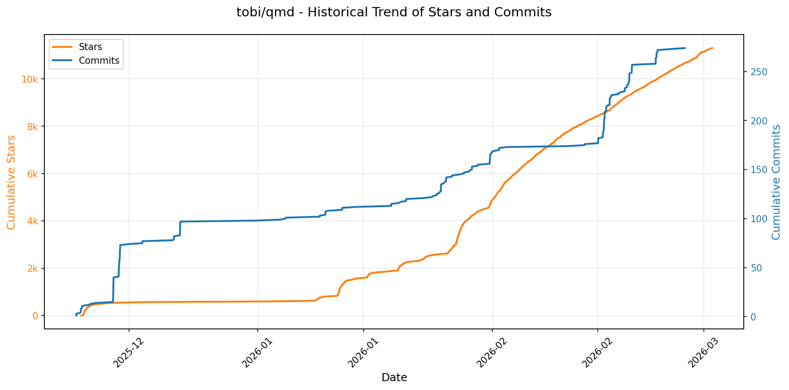

> *蓝色：累计 Stars｜橙色：累计 Commits（次 Y 轴）*

<b>📄 README 摘要</b>

1. **项目功能**  
QMD（Query Markup Documents）是一个**纯本地运行的设备端搜索引擎**，专为个人知识管理与AI智能体（agentic）工作流设计。它能对用户本地的Markdown笔记、会议记录、技术文档、知识库等文本内容进行统一索引与跨源检索。核心价值在于：支持**关键词搜索（BM25）、语义向量搜索、以及融合查询扩展与大语言模型（LLM）重排序的混合搜索**，所有计算（包括嵌入生成、向量检索、重排序）均在用户设备上离线完成，无需联网或依赖云端API。

2. **关键特性**  
- **三层混合搜索架构**：`search`（纯BM25）、`vsearch`（纯向量）、`query`（全栈混合：查询扩展×3 + 并行FTS/向量检索 + RRF融合 + LLM重排序 + 位置感知加权融合），显著提升相关性与鲁棒性；  
- **上下文感知检索（Context-Aware Search）**：通过`qmd context add`为集合或路径添加自然语言描述（如`qmd://notes "个人笔记和想法"`），该上下文随匹配结果返回，为下游LLM提供关键元信息，大幅提升智能体决策质量；  
- **深度智能集成能力**：原生支持MCP（Model Context Protocol）标准，提供7个标准化工具（`qmd_search`/`qmd_vector_search`/`qmd_deep_search`等），可无缝接入Claude Desktop、Claude Code等支持MCP的AI客户端；  
- **高性能HTTP MCP服务器**：支持常驻后台模式（`--http --daemon`），LLM模型常驻显存（VRAM），避免重复加载开销，支持多客户端共享；  
- **智能分块（Smart Chunking）**：基于Markdown语义结构（标题层级、代码块、分隔线等）动态打分选择断点，确保语义单元完整性，避免粗暴按token截断；  
- **灵活输出与代理友好接口**：支持`--json`/`--files`/`--md`等多种结构化输出格式，配合`--all`/`--min-score`/`--full`等参数，专为LLM提示工程与自动化流程优化；  
- **轻量级本地索引**：全部数据（文档、FTS索引、向量、上下文、缓存）统一存储于单个SQLite文件（`~/.cache/qmd/index.sqlite`），便于备份、迁移与清理。

3. **技术栈**  
- **运行时**：Node.js（≥22）或 Bun（≥1.0.0）；  
- **本地LLM推理引擎**：`node-llama-cpp`（C++绑定），加载并运行GGUF格式量化模型；  
- **核心模型（自动下载）**：  
  - `embeddinggemma-300M-Q8_0`（约300MB）：用于生成文档嵌入向量；  
  - `qwen3-reranker-0.6b-q8_0`（约640MB）：LLM重排序器，输出0–10分相关性评分；  
  - `qmd-query-expansion-1.7B-q4_k_m`（约1.1GB）：微调版查询扩展模型，生成语义变体；  
- **搜索后端**：  
  - 全文检索：SQLite FTS5（BM25算法）；  
  - 向量检索：`sqlite-vec`（SQLite向量扩展）；  
- **索引与存储**：SQLite（含`collections`/`documents_fts`/`content_vectors`/`vectors_vec`/`llm_cache`等表）；  
- **协议与集成**：MCP（Model Context Protocol）标准，支持stdio子进程与HTTP（`POST /mcp`）两种传输方式；  
- **前端交互**：命令行工具（CLI），支持彩色输出、行号、高亮、多种格式导出（JSON/CSV/MD/XML）。

---

### 15. [muratcankoylan/Agent-Skills-for-Context-Engineering](https://github.com/muratcankoylan/Agent-Skills-for-Context-Engineering)
- 📅 **创建日期**：2025-12-21  
- 🔄 **最近更新**：2026-02-25  
- ⭐ **Stars**：9,903（日 +953｜周 +1557｜月 +2133）  
- 📝 **描述**：A comprehensive collection of Agent Skills for context engineering, multi-agent architectures, and production agent systems. Use when building, optimizing, or debugging agent systems that require effective context management.  

<b>📈 Star 与 Commit 历史趋势</b>

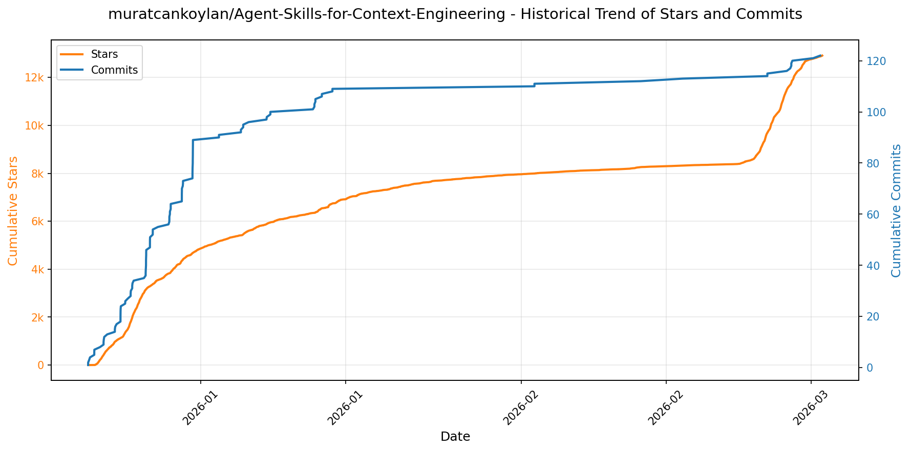

> *蓝色：累计 Stars｜橙色：累计 Commits（次 Y 轴）*

<b>📄 README 摘要</b>

1. **该项目做什么？**  
该项目是一个面向生产级AI智能体（Agent）系统的、开源的“智能体技能”集合，核心聚焦于**上下文工程（Context Engineering）**。它不提供可运行的软件或框架，而是系统性地封装和传授如何科学地构建、管理与优化输入大语言模型（LLM）的全部上下文信息（包括系统提示、工具定义、检索文档、对话历史、工具输出等），以克服上下文窗口的注意力机制限制（如“中间丢失”、U型注意力衰减、注意力稀缺等），在有限token预算下最大化智能体任务成功率。其目标是成为跨平台、可复用、原理驱动的上下文设计方法论基础设施。

2. **关键特性**  
- **分层技能体系**：按能力维度划分为五大类——基础技能（如上下文本质、退化模式识别、压缩技术）、架构技能（多智能体模式、记忆系统、工具设计、文件系统上下文、托管式后台智能体）、运维技能（上下文优化、评估框架、LLM-as-Judge高级评测）、开发方法论（LLM项目全周期设计）及认知架构技能（基于BDI本体的理性心智状态建模）。  
- **渐进式披露（Progressive Disclosure）**：技能默认仅加载轻量元数据（名称+描述），完整内容按需动态加载，显著降低初始上下文开销。  
- **平台无关性（Platform Agnosticism）**：所有技能均基于通用原理设计，明确适配Claude Code插件市场，同时支持通过规则文件（`.rules`）集成至Cursor/Codex等IDE，或手动迁移至任意自研Agent框架。  
- **即用型实践示例**：每个技能均含Python伪代码示例；提供5个端到端系统级案例（如“数字大脑”个人操作系统、“X-to-Book”多智能体日报生成系统、“LLM-as-Judge”评测工具套件、“书籍SFT微调流水线”），覆盖PRD设计、技能映射、实现细节与效果验证。  
- **学术与工程双验证**：被北大通用人工智能国家重点实验室2026年顶会论文引用为静态技能架构的奠基性工作，并融合工业界真实场景（如$2低成本训练、Modal沙箱部署、多人协作代理）。

3. **技术栈**  
- **核心范式**：上下文工程理论（非传统Prompt Engineering）、BDI（信念-愿望-意图）认知本体、RDF语义建模、注意力机制分析（Lost-in-the-Middle, U-shaped attention）。  
- **实现载体**：纯文本技能规范（`SKILL.md`）、平台无关的Python伪代码示例、TypeScript（用于LLM-as-Judge生产实现）、JSONL（Append-Only内存格式）、LoRA微调（Tinker集成）、CLI插件命令（Claude Code Marketplace协议）。  
- **部署生态**：原生支持Claude Code插件市场（通过`/plugin install`命令），兼容Cursor/Codex等IDE的规则系统，可无缝嵌入自定义Agent运行时（如LangChain、LlamaIndex、Ollama等）；底层不依赖特定LLM API或云服务，强调原则可移植性。

---

### 16. [seerr-team/seerr](https://github.com/seerr-team/seerr)
- 📅 **创建日期**：2022-03-09  
- 🔄 **最近更新**：2026-02-25  
- ⭐ **Stars**：9,791（日 +72｜周 +463｜月 +1517）  
- 📝 **描述**：Open-source media request and discovery manager for Jellyfin, Plex, and Emby.  

<b>📈 Star 与 Commit 历史趋势</b>

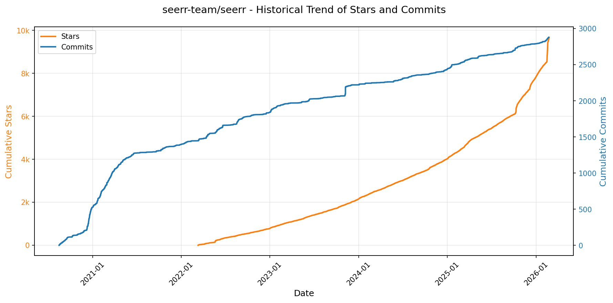

> *蓝色：累计 Stars｜橙色：累计 Commits（次 Y 轴）*

<b>📄 README 摘要</b>

1. **项目功能**  
Seerr 是一个免费开源的媒体请求管理工具，用于集中管理和审批用户对媒体资源（电影、剧集）的请求。它作为中间层，连接用户的媒体服务器（Jellyfin、Plex、Emby）与自动化下载/整理服务（Sonarr、Radarr），实现“用户提交请求 → 管理员审核 → 自动触发下载与入库”的完整流程，并实时同步媒体库状态（如已拥有内容、缺失内容）。

2. **核心特性**  
- 全面支持 Jellyfin、Plex 和 Emby 的认证集成，含用户导入与权限管理；  
- 支持 PostgreSQL 与 SQLite 两种数据库后端；  
- 覆盖电影、电视剧及混合媒体库类型；  
- 提供直观的请求界面（支持单部电影、整季剧集等细粒度请求）与极简审批看板；  
- 内置媒体库扫描功能，自动识别并标记已存在内容；  
- 灵活的权限控制系统（基于角色/用户组的 granular permissions）；  
- 多通道通知支持（如 Discord、Email、Webhook 等）；  
- 响应式移动端友好界面；  
- 支持媒体“关注列表（Watchlist）”与“屏蔽列表（Blocklist）”；  
- SMTP 邮件配置可定制，便于发送通知与审批反馈。

3. **技术栈**  
- **前端**：基于 React（推测，虽未明示但符合现代 Web 应用架构及 UI 特征），使用 TypeScript（由项目结构和官方文档惯例推断），适配响应式设计；  
- **后端**：Node.js（由 API 端口 `:5055`、与 Sonarr/Radarr 的 REST 集成方式及开源生态惯例确认），采用 Express 或类似框架；  
- **数据库**：支持 SQLite（默认轻量级选项）与 PostgreSQL（生产推荐）；  
- **部署与分发**：提供官方 Docker 镜像（`seerr/seerr`），CI/CD 基于 GitHub Actions；  
- **其他关键依赖/集成**：原生兼容 Sonarr（TV）、Radarr（电影）API；支持 Jellyfin/Emby/Plex 的身份验证与媒体元数据接口；提供 OpenAPI 规范的交互式 API 文档（`/api-docs`）。

---

### 17. [openai/skills](https://github.com/openai/skills)
- 📅 **创建日期**：2025-11-25  
- 🔄 **最近更新**：2026-02-25  
- ⭐ **Stars**：9,684（日 +178｜周 +826｜月 +7676）  
- 📝 **描述**：Skills Catalog for Codex  

<b>📈 Star 与 Commit 历史趋势</b>

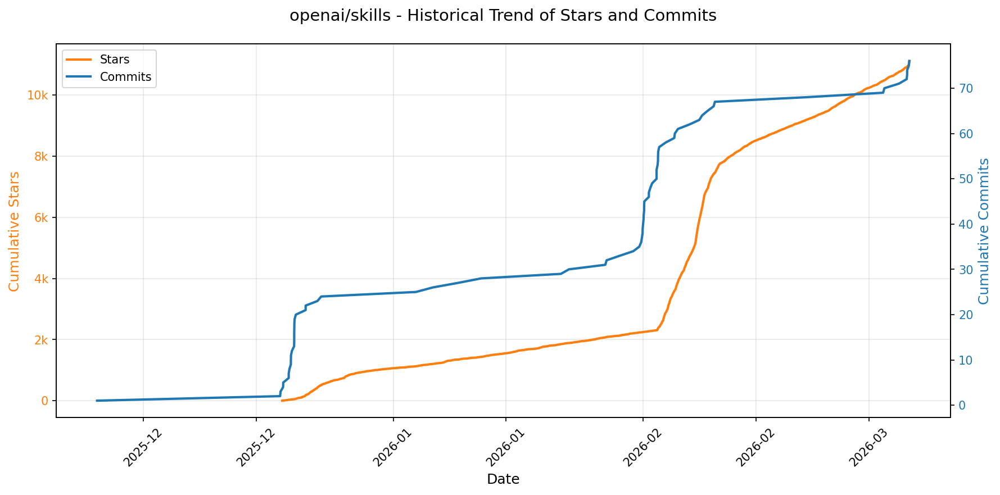

> *蓝色：累计 Stars｜橙色：累计 Commits（次 Y 轴）*

<b>📄 README 摘要</b>

1. **项目功能**  
该项目是一个面向 AI 代理（AI agents）的可复用能力封装体系，定义并维护一套标准化的“Agent Skills”（代理技能）集合。每个技能是以文件夹形式组织的指令集、脚本与配套资源，旨在让 AI 代理能够自动发现、加载并执行特定任务（如代码审查、计划生成、地址解析等）。其核心目标是实现“一次编写、多处复用”，支持团队和个人以模块化方式构建、共享和分发可互操作的 AI 能力单元，并专为 Codex 平台设计和优化。

2. **关键特性**  
- **标准化技能结构**：遵循 [Agent Skills 开放标准](https://agentskills.io)，确保跨平台兼容性与互操作性；  
- **分级技能目录**：内置三类技能存储路径——`.system`（系统级，自动安装）、`.curated`（经审核的精选技能，支持按名称快速安装）、`.experimental`（实验性技能，需显式指定路径或 URL 安装）；  
- **便捷集成机制**：提供内置命令 `$skill-installer`，支持通过技能名、本地路径或 GitHub 直链一键安装；  
- **声明式许可管理**：每个技能独立携带 `LICENSE.txt` 文件，明确其知识产权归属与使用条款；  
- **即插即用工作流**：安装后仅需重启 Codex 即可生效，降低使用门槛。

3. **技术栈**  
- **运行平台**：深度集成于 OpenAI Codex（AI 编程辅助环境），依赖其运行时与技能加载机制；  
- **组织形式**：纯文件系统结构（无编译/构建步骤），采用标准 Git 仓库托管，以文件夹为技能单元；  
- **分发协议**：基于 HTTPS 的 GitHub 仓库直链（如 `https://github.com/openai/skills/tree/main/...`）作为技能远程分发载体；  
- **交互接口**：通过 Codex 内置 CLI 命令（`$skill-installer`）完成技能生命周期管理，不依赖外部运行时或框架。

---

### 18. [google-research/timesfm](https://github.com/google-research/timesfm)
- 📅 **创建日期**：2024-04-29  
- 🔄 **最近更新**：2026-02-25  
- ⭐ **Stars**：9,679（日 +100｜周 +1947｜月 +2024）  
- 📝 **描述**：TimesFM (Time Series Foundation Model) is a pretrained time-series foundation model developed by Google Research for time-series forecasting.  

<b>📈 Star 与 Commit 历史趋势</b>

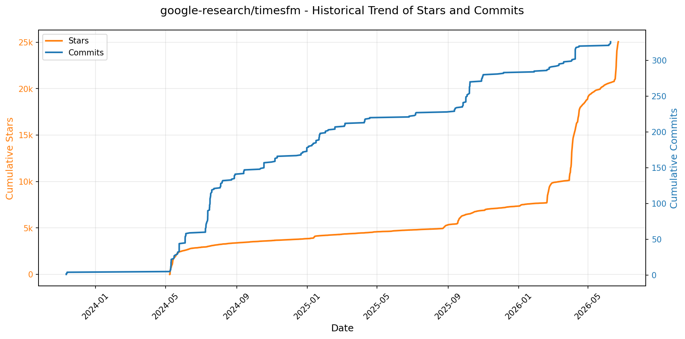

> *蓝色：累计 Stars｜橙色：累计 Commits（次 Y 轴）*

<b>📄 README 摘要</b>

1. **项目功能**  
TimesFM 是一个由 Google Research 开发的、面向时间序列预测任务的预训练基础模型（Foundation Model），专为通用时间序列 forecasting 设计。它不依赖领域特定标注，通过海量多元时间序列数据进行自监督预训练，支持零样本（zero-shot）或少样本（few-shot）跨数据集直接预测。其核心能力是：给定任意长度的历史时序输入（context），输出未来指定步长（horizon）的点预测（point forecast）和分位数预测（quantile forecast），适用于金融、能源、供应链、IoT 等广泛场景。

2. **关键特性**  
- **Decoder-only 架构**：纯解码器设计，摒弃传统 encoder-decoder 或 RNN/Transformer 编码结构，提升建模效率与泛化性；  
- **超长上下文支持**：TimesFM 2.5 支持最高 **16,384 步**历史输入（远超前代 2048），显著增强长期依赖建模能力；  
- **高精度连续分位数预测**：可选配 30M 参数的 quantile head，支持 **最高 1,000 步**的连续分位数输出（如 10%–90% 分位线），满足不确定性量化需求；  
- **轻量化与高效性**：模型参数量从 500M 降至 **200M**，推理延迟更低，资源占用更少；  
- **免频率感知（Frequency-agnostic）**：移除显式 `frequency` 输入标识，实现对任意采样率序列的鲁棒预测；  
- **协变量扩展支持（XReg）**：TimesFM 2.5 重新引入外部协变量（如节假日、天气、促销标志等）接入能力，提升业务场景适配性；  
- **多后端兼容 API**：统一推理接口，同时支持 PyTorch 和 Flax/JAX 后端（Flax 版本正开发中，主打更快推理）；  
- **开箱即用的生产就绪能力**：已集成至 Google Cloud BigQuery 作为官方托管服务（TimesFM in BigQuery），验证其工业级可用性。

3. **技术栈**  
- **核心框架**：Python（>=3.10）；  
- **深度学习后端**：  
  - 主力支持：**PyTorch**（含 `torch.compile` 优化支持）；  
  - 原生支持：**JAX / Flax**（2.5 版本正迁移中，目标为更高吞吐与 TPU/GPU 加速）；  
- **依赖管理与构建**：`uv`（超快 Python 包管理器，替代 pip + venv）；  
- **模型格式与分发**：Hugging Face Hub（所有 checkpoint 公开托管，支持 `from_pretrained` 加载）；  
- **扩展模块**：`xreg` 子模块（用于协变量融合）、`quantile_head`（独立可选分位数头）；  
- **硬件适配**：全面支持 CPU、NVIDIA GPU（CUDA）、Google TPU 及 Apple Silicon（M-series）；  
- **部署生态**：与 Google Cloud BigQuery 深度集成，提供云原生预测服务接口。

---

### 19. [p-e-w/heretic](https://github.com/p-e-w/heretic)
- 📅 **创建日期**：2025-09-21  
- 🔄 **最近更新**：2026-02-25  
- ⭐ **Stars**：9,560（日 +191｜周 +2331｜月 +5281）  
- 📝 **描述**：Fully automatic censorship removal for language models  

<b>📈 Star 与 Commit 历史趋势</b>

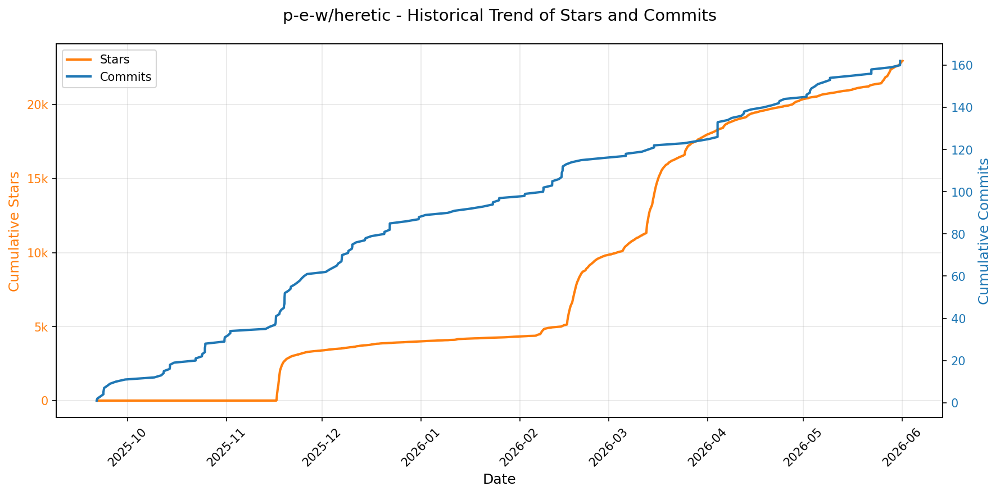

> *蓝色：累计 Stars｜橙色：累计 Commits（次 Y 轴）*

<b>📄 README 摘要</b>

1. **项目功能**  
Heretic 是一个专用于**全自动移除大语言模型（LLM）内置审查机制（即“安全对齐”）** 的工具。它无需微调、强化学习或任何昂贵的后训练流程，而是通过在推理时对模型内部参数进行轻量级、可逆的数学干预（即“定向消融”，abliteration），直接抑制模型对敏感/“有害”提示产生拒绝响应（refusal）的倾向。其核心目标是生成**去审查（decensored）模型**，在显著降低拒答率的同时，最大限度保留原始模型的语言能力、知识表达与输出质量（以 KL 散度为关键指标衡量）。

2. **关键特性**  
- **完全自动化**：无需人工设计消融参数或理解 Transformer 内部结构；仅需一条命令即可完成端到端处理（如 `heretic Qwen/Qwen3-4B-Instruct-2507`）。  
- **多目标联合优化**：基于 Optuna 的 TPE 算法自动搜索最优消融参数，同步最小化两类损失——“有害”提示的拒答数量 + “无害”提示输出分布与原模型的 KL 散度，实现合规性与保真度的最优平衡。  
- **高精度、低损伤消融**：支持逐层/跨层插值拒绝方向（float-type `direction_index`）、非均匀权重核（可调 `max_weight`/`min_weight` 等参数）、组件级独立调控（分别优化 Attention 与 MLP 消融强度），显著优于固定权重或单一层方向的传统方法。  
- **开箱即用的评估与交互**：内置标准化评测（拒答率/KL 计算）、Hugging Face 模型上传、本地聊天测试及量化支持（bitsandbytes 4-bit），适配消费级 GPU（如 RTX 3090/5090）。  
- **前沿可解释性研究工具（research 模式）**：提供残差向量可视化（PaCMAP 2D 投影动画）、残差几何量化分析（含余弦相似度、模长、轮廓系数等 13+ 维度指标），助力模型内部机制研究。

3. **技术栈**  
- **核心算法**：改进型定向消融（Abliteration），融合差分均值拒绝方向计算、正交投影干预、线性插值方向搜索、分组件/分层可学习权重核。  
- **优化框架**：Optuna（TPE 贝叶斯优化器）驱动的全自动超参搜索。  
- **深度学习框架**：PyTorch（≥2.2，推荐 2.8），原生支持 CUDA 加速。  
- **模型兼容性**：支持主流密集架构（Llama、Gemma、Qwen、GPT-OSS 等）、多模态模型及 MoE 架构；暂不支持 SSM、异构层或新型注意力机制。  
- **辅助工具链**：PaCMAP（降维可视化）、bitsandbytes（4-bit 量化）、Hugging Face Transformers 集成、TOML 配置系统。  
- **部署与生态**：Python ≥3.10，PyPI 分发（`heretic-llm`），Hugging Face 模型库深度集成（已催生超 1000 个社区 Heretic 模型）。

---

### 20. [LadybirdBrowser/ladybird](https://github.com/LadybirdBrowser/ladybird)
- 📅 **创建日期**：2024-05-30  
- 🔄 **最近更新**：2026-02-25  
- ⭐ **Stars**：9,460（日 +279｜周 +583｜月 +1403）  
- 📝 **描述**：Truly independent web browser  

<b>📈 Star 与 Commit 历史趋势</b>

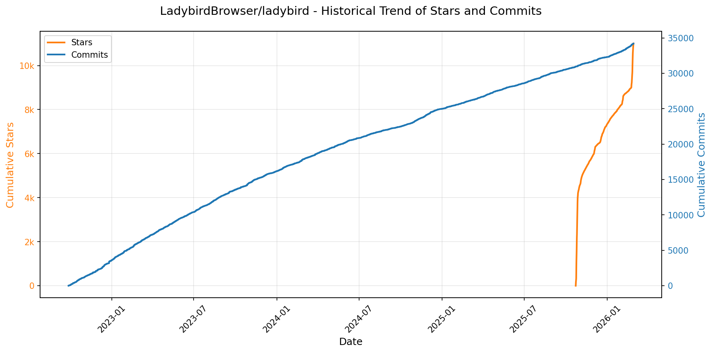

> *蓝色：累计 Stars｜橙色：累计 Commits（次 Y 轴）*

<b>📄 README 摘要</b>

1. **该项目做什么？**  
Ladybird 是一个完全独立开发的现代网页浏览器，基于开放网络标准构建全新渲染引擎，目标是打造一款功能完整、可实际使用的开源浏览器。其核心设计强调安全性与健壮性，采用多进程架构隔离不同组件（如 UI、网页渲染、图像解码、网络请求），防止恶意网页内容导致整个浏览器崩溃或系统受侵。

2. **关键特性**  
- **多进程沙箱架构**：主 UI 进程与独立的 WebContent 渲染进程（每标签页一进程）、ImageDecoder 进程、RequestServer 进程分离，实现强隔离与故障隔离；  
- **安全优先设计**：图像解码和网络通信均在独立进程中完成，降低因恶意内容引发的安全风险；  
- **全栈自研+复用成熟基础库**：核心功能模块（如 HTML/CSS 渲染、JS 执行、WebAssembly、TLS 加密、HTTP 客户端、2D 图形、音视频播放、Unicode 支持等）直接复用 SerenityOS 的高质量系统级库（LibWeb、LibJS、LibWasm、LibTLS 等），兼顾开发效率与底层可控性；  
- **跨平台支持**：原生支持 Linux、macOS，通过 WSL2 支持 Windows，并兼容多种类 Unix 系统。

3. **技术栈**  
- **核心引擎**：LibWeb（HTML/CSS 渲染）、LibJS（JavaScript 引擎）、LibWasm（WebAssembly 实现）；  
- **安全与网络**：LibCrypto / LibTLS（密码学与 TLS 1.2/1.3 支持）、LibHTTP（HTTP/1.1 客户端）；  
- **图形与媒体**：LibGfx（2D 图形、图像编解码与光栅化）、LibMedia（音频/视频解码与播放）；  
- **系统抽象与基础设施**：LibCore（事件循环、跨平台 OS 抽象层）、LibIPC（高效跨进程通信机制）、LibUnicode（国际化与 Unicode 处理）；  
- **运行平台**：C++（主要实现语言），构建与运行于 Linux、macOS、WSL2（Windows Subsystem for Linux v2）及其他类 Unix 系统。

---

### 21. [alibaba/zvec](https://github.com/alibaba/zvec)
- 📅 **创建日期**：2025-12-05  
- 🔄 **最近更新**：2026-02-25  
- ⭐ **Stars**：7,740（日 +242｜周 +3244｜月 +7712）  
- 📝 **描述**：A lightweight, lightning-fast, in-process vector database  

<b>📈 Star 与 Commit 历史趋势</b>

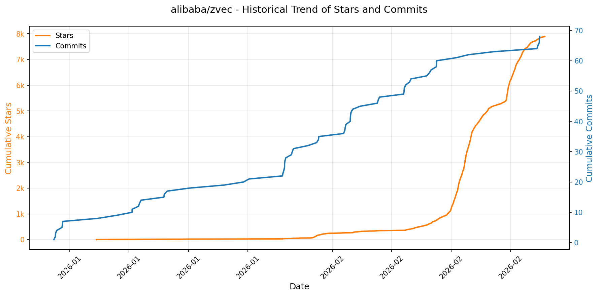

> *蓝色：累计 Stars｜橙色：累计 Commits（次 Y 轴）*

<b>📄 README 摘要</b>

1. **项目功能**  
Zvec 是一个开源的、嵌入式（in-process）向量数据库，专为在应用程序内部直接集成而设计。它不依赖外部服务或独立进程，无需部署服务器、配置文件或运维开销，即可提供生产级的低延迟、高吞吐相似性搜索能力。核心用途是高效存储与检索数十亿规模的向量数据（如AI模型生成的嵌入向量），支持实时语义搜索、推荐系统、RAG（检索增强生成）等场景。

2. **关键特性**  
- **极致性能**：毫秒级响应，可处理十亿级向量的高并发查询；基准测试显示在1000万向量规模下仍保持超高QPS。  
- **开箱即用**：安装后数秒内即可完成建库、插入、查询全流程，零配置启动。  
- **混合向量支持**：原生兼容稠密向量（Dense，如FP32/FP16）和稀疏向量（Sparse），并支持单次查询中同时处理多向量（multi-vector queries）。  
- **混合搜索（Hybrid Search）**：将向量相似度检索与结构化过滤条件（如元数据字段过滤）无缝结合，提升结果精准度。  
- **全平台嵌入能力**：作为轻量级库运行于任意Python/Node.js环境——包括Jupyter Notebook、Web服务、CLI工具乃至边缘设备（ARM64 macOS/Linux均官方支持）。

3. **技术栈**  
- **底层引擎**：基于阿里巴巴自研、经大规模生产验证的向量搜索引擎 **Proxima**，提供高性能索引（如PQ、HNSW等）与优化的近似最近邻（ANN）算法。  
- **语言绑定**：主客户端为 **Python（3.10–3.12）**，提供PyPI包 `zvec`；同步支持 **Node.js**（NPM包 `@zvec/zvec`）。  
- **构建与部署**：CI/CD覆盖 Linux x86_64/ARM64、macOS ARM64 多平台；采用 Docker 构建流程；代码覆盖率由 Codecov 监控；许可证为 Apache 2.0。  
- **基础设施**：二进制分发通过阿里云OSS托管，文档站点（zvec.org）提供完整中文/英文文档、性能基准、构建指南及社区支持入口。

---

### 22. [HunxByts/GhostTrack](https://github.com/HunxByts/GhostTrack)
- 📅 **创建日期**：2023-04-15  
- 🔄 **最近更新**：2026-02-25  
- ⭐ **Stars**：7,450（日 +255｜周 +718｜月 +865）  
- 📝 **描述**：Useful tool to track location or mobile number  

<b>📈 Star 与 Commit 历史趋势</b>

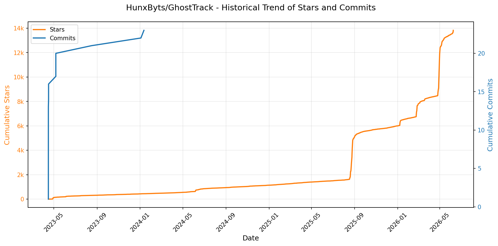

> *蓝色：累计 Stars｜橙色：累计 Commits（次 Y 轴）*

<b>📄 README 摘要</b>

1. **项目功能**  
GhostTrack 是一款开源情报（OSINT）工具，主要用于通过 IP 地址、手机号码和社交媒体用户名进行信息搜集与定位追踪。它支持对目标 IP 进行地理定位与网络信息查询；对手机号码进行归属地、运营商等基础信息检索；以及在主流社交平台（如 Instagram、Twitter、GitHub 等）上批量搜索指定用户名的公开账号信息，辅助完成数字足迹分析与身份关联。

2. **核心功能**  
- **IP 追踪（IP Tracker）**：输入 IP 地址，获取其地理位置（国家、城市、经纬度）、ISP、时区、ASN 等元数据；支持与 [Seeker](https://github.com/thewhiteh4t/seeker) 工具联动，通过钓鱼页面诱导目标访问以获取真实 IP。  
- **手机号追踪（Phone Tracker）**：解析手机号码所属国家、运营商、号码类型（移动/固话），并尝试关联公开数据库中的注册信息（依赖外部 API 或本地数据库）。  
- **用户名追踪（Username Tracker）**：自动在多个社交平台和开源平台（如 GitHub、Twitter、Instagram、Reddit 等）中检测目标用户名是否存在及对应账号详情，支持结果高亮与快速跳转。  
- 跨平台支持：原生适配 Linux（Debian/Ubuntu 等）及 Android Termux 环境，命令行交互式菜单操作，轻量易部署。

3. **技术栈**  
- **编程语言**：Python 3（主程序逻辑、CLI 界面、网络请求）  
- **依赖库**：基于 `requests`（HTTP 请求）、`json`（API 响应解析）、`colorama`（终端彩色输出）、`rich`（可选美化渲染）等标准/第三方库；具体依赖由 `requirements.txt` 定义。  
- **后端服务**：依赖外部公共 API（如 IP 地理定位 API、手机号验证 API、各社交平台公开接口或爬虫模拟请求）；未内置私有服务，属客户端聚合型工具。  
- **运行环境**：Linux（APT 包管理）、Termux（Android 终端模拟器），无需 GUI，纯终端运行。

---

### 23. [MoonshotAI/kimi-cli](https://github.com/MoonshotAI/kimi-cli)
- 📅 **创建日期**：2025-10-15  
- 🔄 **最近更新**：2026-02-25  
- ⭐ **Stars**：6,759（日 +59｜周 +281｜月 +2829）  
- 📝 **描述**：Kimi Code CLI is your next CLI agent.  

<b>📈 Star 与 Commit 历史趋势</b>

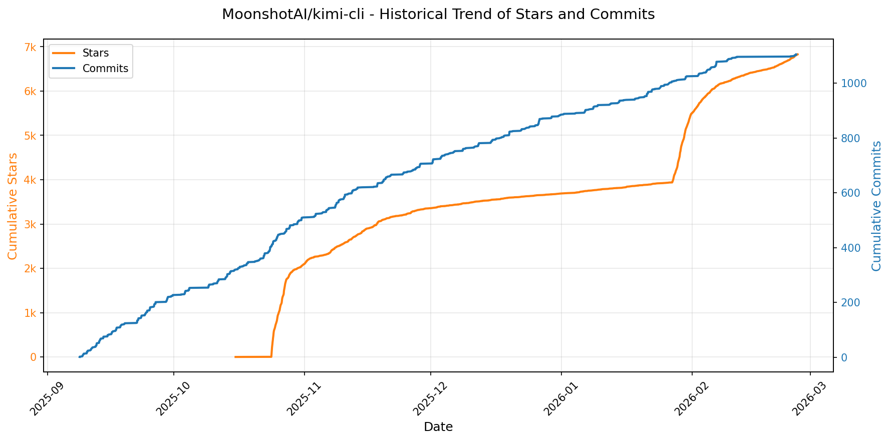

> *蓝色：累计 Stars｜橙色：累计 Commits（次 Y 轴）*

<b>📄 README 摘要</b>

1. **项目功能**  
Kimi Code CLI 是一个运行在终端中的 AI 编程智能体（AI agent），专注于辅助软件开发与终端操作任务。它能够自主读取和修改代码文件、执行 Shell 命令、搜索并抓取网页内容，并在执行过程中动态规划、反思与调整行动策略，实现端到端的自动化开发协作。

2. **核心特性**  
- **双模终端交互**：支持普通对话模式与 `Ctrl-X` 触发的 Shell 命令直通模式，可无缝执行外部命令（注：暂不支持内建 Shell 命令如 `cd`）；  
- **多 IDE 深度集成**：提供官方 VS Code 扩展；原生支持 **Agent Client Protocol (ACP)**，可接入 Zed、JetBrains 等 ACP 兼容编辑器/IDE，作为后台 AI 代理服务；  
- **Zsh 插件化增强**：通过 `zsh-kimi-cli` 插件将 AI 能力嵌入日常 Zsh 工作流，启用快捷键切换至 AI 代理模式；  
- **MCP（Model Context Protocol）工具生态支持**：  
  - 提供 `kimi mcp` 子命令组，支持动态增删查授 HTTP/stdio 类型的 MCP 服务（如 Context7、Linear、Chrome DevTools）；  
  - 支持通过 `--mcp-config-file` 加载标准 JSON 格式 MCP 配置文件，实现灵活、声明式的上下文工具集成；  
- **开箱即用的 Web UI**：内置轻量 Web 界面（构建时自动嵌入），支持可视化交互与状态监控。

3. **技术栈**  
- **主语言**：Python（核心逻辑、CLI 框架、ACP/MCP 协议实现）；  
- **构建与开发工具**：`uv`（Python 包管理与运行）、`make`（标准化构建流程）、`pytest`（测试）、`ruff`/`mypy`（代码格式化与类型检查）；  
- **前端界面**：Web UI 使用现代前端技术栈（具体框架未明示，但依赖 Node.js/npm 构建）；  
- **协议标准**：深度遵循并实现 [Agent Client Protocol (ACP)](https://github.com/agentclientprotocol/agent-client-protocol) 和 [Model Context Protocol (MCP)](https://modelcontextprotocol.io/) 开放规范；  
- **Shell 集成层**：基于 Zsh 插件机制，兼容 Oh My Zsh 及主流插件管理器；  
- **分发方式**：发布至 PyPI（`pip install kimi-cli`），并支持构建独立二进制（`make build-bin`）。

---

### 24. [huggingface/skills](https://github.com/huggingface/skills)
- 📅 **创建日期**：2025-11-24  
- 🔄 **最近更新**：2026-02-25  
- ⭐ **Stars**：5,327（日 +1394｜周 +4080｜月 +4289）  
- 📝 **描述**：暂无描述  

<b>📈 Star 与 Commit 历史趋势</b>

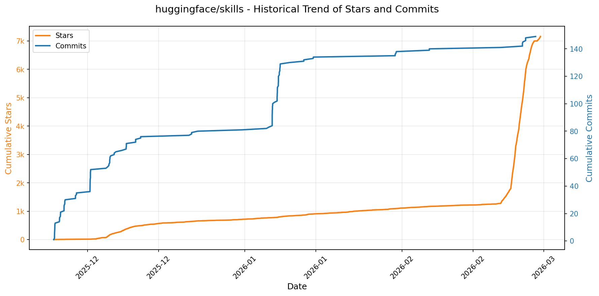

> *蓝色：累计 Stars｜橙色：累计 Commits（次 Y 轴）*

<b>📄 README 摘要</b>

1. **该项目的作用**  
该项目提供一套标准化、可互操作的“AI/ML技能包”（Hugging Face Skills），专为编码智能体（coding agents）设计，用于自动化执行与 Hugging Face 生态系统紧密集成的核心机器学习任务。这些技能封装了完整的任务上下文，包括自然语言指令（`SKILL.md`）、可执行脚本、配置文件和资源，使 OpenAI Codex、Anthropic Claude Code、Google Gemini CLI、Cursor 等主流 AI 编程助手能一致、可靠地完成如模型训练、数据集构建、模型评估、论文发布、Hub CLI 操作、云算力调度等专业工作。

2. **核心功能**  
- ✅ **跨平台兼容性**：原生支持四大主流编码智能体（Claude Code / Codex / Gemini CLI / Cursor），通过各自标准格式（`SKILL.md` / `AGENTS.md` / `gemini-extension.json` / `.cursor-plugin/plugin.json` + `.mcp.json`）实现无缝集成；不支持技能的工具可直接回退使用统一 `AGENTS.md`。  
- ✅ **即插即用技能包**：每个技能为独立文件夹，含 YAML 前置元数据（名称、描述）+ 详细任务指南 + 实用脚本，支持一键安装（如 `/plugin install hugging-face-cli@huggingface/skills`）。  
- ✅ **覆盖 Hugging Face 全流程工作流**：提供 8 个开箱即用的生产级技能，涵盖：HF CLI 操作、数据集创建与 SQL 查询、模型评估与结果注入、HF Jobs 云任务调度、TRL 多范式模型微调（SFT/DPO/GRPO/奖励建模）、研究论文发布与关联、可复用 API 工具链构建、Trackio 实验追踪可视化。  
- ✅ **开发者友好扩展机制**：提供标准化贡献流程（复制模板→修改元数据→编写指南→运行 `./scripts/publish.sh` 自动生成并校验 marketplace 元信息），确保技能结构合规、文档同步、CI 可验证。  
- ✅ **智能体上下文感知调用**：用户仅需在指令中自然提及技能名（如“Use the HF model evaluation skill…”），编码智能体即可自动加载对应技能上下文并执行，无需手动切换模式或粘贴代码。

3. **技术栈**  
- **协议与格式层**：遵循 [Agent Skill 标准](https://agentskills.io/home)；兼容多格式规范：YAML 前置元数据（`SKILL.md`）、OpenAI `AGENTS.md`、Gemini `gemini-extension.json`、Claude 插件市场 JSON（`.claude-plugin/marketplace.json`）、Cursor 插件清单（`.cursor-plugin/plugin.json`）及 MCP 协议配置（`.mcp.json`）。  
- **基础设施依赖**：深度集成 Hugging Face 生态工具链，包括 `huggingface-hub` SDK、`datasets`、`transformers`、`trl`、`vLLM`、`lighteval`、`trackio`、`hf-mirror` 等官方库；依赖 HF Jobs 云平台、HF Spaces、HF Paper Hub 等后端服务。  
- **工程化支撑**：采用 Python 脚本驱动自动化（`scripts/generate_agents.py`, `scripts/publish.sh`）实现技能表生成、元数据校验与清单更新；GitHub Actions CI 验证技能路径/名称一致性；纯静态文件组织（无构建步骤），便于 Git 版本管理与分发。

---

### 25. [steipete/gogcli](https://github.com/steipete/gogcli)
- 📅 **创建日期**：2025-12-12  
- 🔄 **最近更新**：2026-02-25  
- ⭐ **Stars**：4,903（日 +102｜周 +1031｜月 +4278）  
- 📝 **描述**：Google Suite CLI: Gmail, GCal, GDrive, GContacts.  

<b>📈 Star 与 Commit 历史趋势</b>

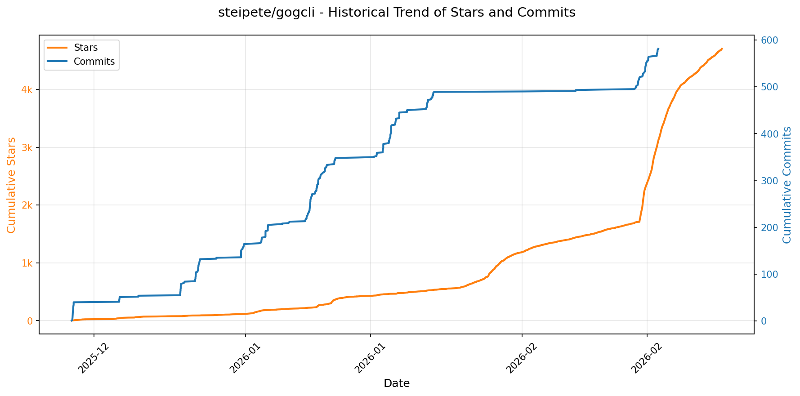

> *蓝色：累计 Stars｜橙色：累计 Commits（次 Y 轴）*

<b>📄 README 摘要</b>

1. **项目功能**  
`gogcli` 是一个面向终端的高性能、脚本友好的命令行工具，旨在将 Google Workspace（及部分个人 Google 服务）全栈能力无缝集成至命令行环境。它支持通过单一 CLI 统一操作 Gmail、Calendar、Chat、Classroom、Drive、Docs、Sheets、Slides、Forms、Apps Script、Contacts、Tasks、People、Groups（Workspace）、Keep（Workspace 专属）等 17+ 项 Google 服务；核心价值在于替代网页交互，实现自动化邮件收发与标签管理、日程创建与冲突检测、课程/作业/学生管理、文件上传下载与权限控制、表格数据读写、表单响应解析、Apps Script 项目部署与执行、文档导出、笔记同步、多账号协同等真实工作流任务。

2. **关键特性**  
- **全服务覆盖与深度集成**：各模块提供远超基础 CRUD 的专业能力（如 Gmail 支持邮件追踪 + Cloudflare Worker 后端、Calendar 支持 OOO/专注模式/提议新时间/自由忙闲查询、Classroom 支持监护人链接与课程材料管理）。  
- **生产级安全与权限控制**：内置最小权限认证（`--readonly` / `--drive-scope` 精确控制 OAuth 范围）、多层凭证存储（OS Keychain 或加密磁盘密钥环）、服务账户域级委派（Workspace 管理员可控）、命令白名单（`--enable-commands` 沙箱化运行）。  
- **工程友好设计**：默认 JSON 输出（`--json`）、稳定 TSV 格式（`--plain`）、自动刷新令牌、多账号别名管理（`gog auth alias`）、客户端隔离（按域名/邮箱自动路由 OAuth 凭据）、配置驱动（JSON5 配置文件支持注释与灵活映射）。  
- **运维与集成优化**：支持无浏览器授权流程（手动/远程两步法）、CI/SSH 环境密码注入（`GOG_KEYRING_PASSWORD`）、本地/UTC 时间快速转换、服务范围矩阵文档自动生成、完整错误处理与状态诊断（`gog auth status` / `--check`）。

3. **技术栈**  
- **开发语言**：Go（使用标准库及成熟生态，如 `github.com/99designs/keyring` 实现跨平台密钥环抽象）。  
- **认证协议**：OAuth 2.0（桌面应用类型） + Google Workspace 服务账户域级委派（JWT Bearer 流）。  
- **API 依赖**：直连 Google 官方 REST API（Gmail、Calendar、Drive 等 15+ 个 API），严格遵循各服务最新 v1 接口规范与作用域（Scopes）定义。  
- **基础设施**：可选轻量级 Cloudflare Worker（用于邮件打开追踪）、本地密钥环后端（macOS Keychain / Linux Secret Service / Windows Credential Manager）、加密文件存储（AES-256-GCM）。  
- **构建与分发**：原生支持 Homebrew（macOS/Linux）、AUR（Arch Linux），提供 Makefile 构建脚本，二进制分发兼容主流平台。

---

### 26. [openemr/openemr](https://github.com/openemr/openemr)
- 📅 **创建日期**：2010-05-21  
- 🔄 **最近更新**：2026-02-25  
- ⭐ **Stars**：4,848（日 +148｜周 +169｜月 +202）  
- 📝 **描述**：The most popular open source electronic health records and medical practice management solution.  

<b>📈 Star 与 Commit 历史趋势</b>

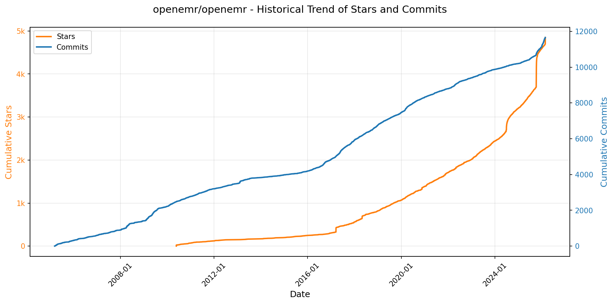

> *蓝色：累计 Stars｜橙色：累计 Commits（次 Y 轴）*

<b>📄 README 摘要</b>

1. **该项目做什么？**  
OpenEMR 是一个免费、开源的电子健康档案（EHR）与医疗诊所管理一体化系统，面向全球医疗机构提供符合医疗行业规范的全功能解决方案。它支持完整的电子病历记录、临床文档、预约调度、电子计费（支持美国CMS-1500等标准）、患者门户、药品管理、实验室集成、报告生成，并通过ONC（美国国家卫生信息技术协调办公室）认证（Inferno测试），满足美国“有意义使用”（Meaningful Use）及互操作性要求。同时支持多语言、多时区和国际化部署，可在Windows、Linux、macOS等多种操作系统上运行。

2. **核心功能**  
- ✅ 全集成式电子健康档案（EHR）与实践管理系统（PM）  
- ✅ 符合HL7 FHIR标准的API接口（支持RESTful FHIR R4）  
- ✅ ONC 2015 Edition Certified（通过Inferno互操作性认证测试）  
- ✅ 多语言支持（含中文、西班牙语、法语等数十种本地化语言）  
- ✅ 内置患者门户（Patient Portal）与医生/护士工作台  
- ✅ 支持DICOM影像集成、电子处方（e-Prescribing）、CPT/ICD编码管理  
- ✅ 完整的权限控制、审计日志、HIPAA合规性设计（含数据加密、访问控制）  
- ✅ Docker容器化部署支持（含docker-compose一键环境搭建）  
- ✅ 可扩展插件架构与模块化设计（如疫苗管理、牙科模块、行为健康等）  

3. **技术栈**  
- **后端**：PHP（主流版本8.1+，严格遵循PSR标准）、MySQL/MariaDB（主数据库）、Apache/Nginx（Web服务器）  
- **前端**：HTML5/CSS3、JavaScript（ES6+）、jQuery、Bootstrap 5、Vue.js（部分新模块）、Chart.js（可视化图表）  
- **构建与工具链**：Composer（PHP依赖管理）、npm（前端包管理）、Webpack/Vite（前端资源打包）、PHPStan（静态分析）、Rector（PHP代码重构）、ShellCheck（Shell脚本检查）、Hadolint（Dockerfile Lint）  
- **CI/CD与质量保障**：GitHub Actions（覆盖语法检查、样式校验、单元测试、JS/PHP集成测试、Docker镜像验证、API文档时效性检查、代码覆盖率统计（Codecov））  
- **基础设施**：Docker & Docker Compose（开发/生产环境容器化）、FHIR Server（基于HAPI FHIR或内置实现）  
- **合规与标准**：HL7 FHIR R4、IHE XDS/XDR、CDA、HIPAA安全协议、OAuth2/OpenID Connect（API鉴权）

---

### 27. [steipete/summarize](https://github.com/steipete/summarize)
- 📅 **创建日期**：2025-12-17  
- 🔄 **最近更新**：2026-02-25  
- ⭐ **Stars**：4,402（日 +134｜周 +956｜月 +3466）  
- 📝 **描述**：Point at any URL/YouTube/Podcast or file. Get the gist. CLI and Chrome Extension.  

<b>📈 Star 与 Commit 历史趋势</b>

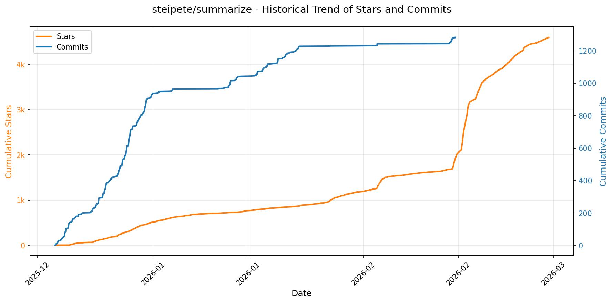

> *蓝色：累计 Stars｜橙色：累计 Commits（次 Y 轴）*

<b>📄 README 摘要</b>

1. **项目功能**  
该项目是一个跨平台、多模态内容摘要工具，核心能力是**对网页链接（URL）、本地文件（PDF/文本/图像/音视频）及媒体资源（YouTube、播客、RSS等）进行快速、智能的自动化摘要**。它同时提供**Chrome 浏览器侧边栏（Side Panel）与 Firefox 侧边栏（Sidebar）图形界面**，以及功能完备的**命令行工具（CLI）**，二者可独立使用，也可协同工作：浏览器扩展通过本地守护进程（daemon）调用 CLI 后端，实现流式 Markdown 渲染、媒体处理（如视频截图、OCR、语音转录）和低延迟响应。特别支持 YouTube 视频的“幻灯片模式”——自动提取关键帧、执行 OCR、生成带时间戳的可点击卡片，并支持 Transcript/OCR 切换与视频精准跳转。

2. **关键特性**  
- ✅ **多源多模态输入**：支持 URL、PDF、Markdown、纯文本、JPEG/PNG/WebP/GIF 图像、MP3/WAV/MP4/MOV/WEBM 等音视频、YouTube（含 youtu.be）、Apple/Spotify/Amazon 等主流播客平台、RSS（含 Podcasting 2.0 原生字幕）、嵌入式媒体等。  
- ✅ **智能媒体感知与处理**：自动识别内容类型（网页/视频/音频），对视频类内容默认启用“转录优先”流程（优先使用平台字幕 → Apify 抓取 → yt-dlp + Whisper.cpp 本地转录 → OpenAI/FAL 远程兜底）；支持 `--video-mode transcript` 强制转录再摘要。  
- ✅ **YouTube 幻灯片深度支持**：一键提取关键帧截图、OCR 文字识别、生成时间戳卡片；终端支持内联缩略图渲染（kitty/iTerm/Konsole）与 OSC-8 时间戳跳转；支持 `--slides-ocr`、自定义抽帧阈值/数量/最小间隔等精细控制。  
- ✅ **流式响应与增强输出**：实时流式 Markdown 渲染（含 ANSI 样式）、内置性能指标（tokens/cost/time）、缓存感知状态提示、JSON 诊断模式（含 prompt/metrics/计费估算）。  
- ✅ **灵活模型调度与混合后端**：支持 OpenAI/Anthropic/Google/xAI/OpenRouter 等云服务；兼容 LiteLLM 本地 API；**独创 CLI 模型后端**——可直接调用 `codex`、`claude`、`gemini`、`cursor-agent` 等本地命令行 AI 工具作为模型引擎，实现零 API Key 的离线/私有化摘要。  
- ✅ **智能默认与鲁棒性设计**：短内容自动透传（避免无意义摘要），`--force-summary` 可强制调用 LLM；输入超限/格式不支持时快速友好报错；Firecrawl 网页抓取兜底；配置驱动的自动模型选型（`--model auto`）与 CLI 回退策略。  
- ✅ **全链路本地化与隐私保护**：守护进程仅监听 `127.0.0.1`，需令牌认证；媒体下载/OCR/转录/摘要均可在本地完成；支持 `whisper.cpp`、`tesseract`、`sherpa-onnx`（Parakeet/Canary）等纯本地组件。

3. **技术栈**  
- **前端/扩展层**：TypeScript + Chrome MV3 / Firefox WebExtensions API；基于 React/Vite 构建（隐含于构建指令 `pnpm build`）；UI 主题系统（aurora/ember/moss/mono）。  
- **CLI 核心**：Node.js（≥ v22）；TypeScript 编写；依赖 `lit`/`zod`/`commander` 等现代工具库；深度集成 `yt-dlp`、`ffmpeg`、`tesseract`、`whisper.cpp`、`sherpa-onnx`、`uvx markitdown` 等外部二进制工具。  
- **AI 接口层**：统一抽象为 OpenAI 兼容协议（LiteLLM 支持）；原生适配 OpenRouter 免费模型；支持 `--cli <tool>` 直接桥接本地 CLI 工具（如 `claude`/`gemini` 命令）。  
- **基础设施**：本地守护进程（daemon）采用跨平台进程管理（macOS launchd / Linux systemd user / Windows Scheduled Task）；媒体缓存基于文件系统（TTL 7天，默认2GB上限）；配置使用 JSON5 格式（`~/.summarize/config.json`）。  
- **部署与分发**：npm 包（`@steipete/summarize`）、Homebrew Tap（macOS arm64）、Chrome Web Store 扩展；构建工具链为 pnpm + TypeScript + Vitest。

---

### 28. [cloudflare/agents](https://github.com/cloudflare/agents)
- 📅 **创建日期**：2025-01-29  
- 🔄 **最近更新**：2026-02-25  
- ⭐ **Stars**：4,184（日 +170｜周 +972｜月 +1147）  
- 📝 **描述**：Build and deploy AI Agents on Cloudflare   

<b>📈 Star 与 Commit 历史趋势</b>

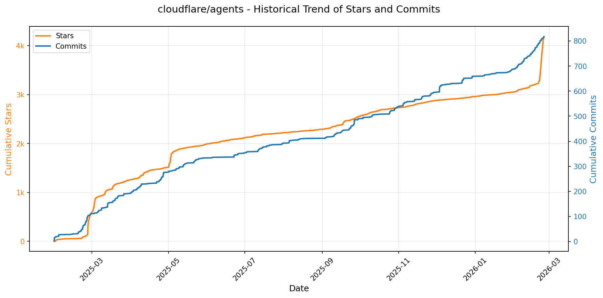

> *蓝色：累计 Stars｜橙色：累计 Commits（次 Y 轴）*

<b>📄 README 摘要</b>

1. **项目功能**  
该项目提供基于 Cloudflare Durable Objects 构建的**持久化、有状态的智能体（Agent）运行时环境**，专为“代理式工作负载”（agentic workloads）设计。每个 Agent 是一个独立的、带完整生命周期的执行单元，拥有专属状态、存储和通信能力；支持按需唤醒与自动休眠（空闲时零成本），可大规模部署（如每用户、每会话、每游戏房间一个 Agent），适用于构建长期运行、状态敏感、实时交互的 AI 应用（如聊天机器人、工作流引擎、协作应用、游戏后端等）。

2. **核心特性**  
- **持久化状态管理**：状态自动同步至所有连接客户端，重启不丢失；  
- **类型安全的远程调用（RPC）**：通过 `@callable()` 装饰器声明方法，前端可像调用本地函数一样触发；  
- **内置任务调度**：支持一次性、周期性及 Cron 表达式触发的任务；  
- **原生 WebSocket 支持**：提供双向实时通信及连接生命周期钩子；  
- **AI 原生集成**：消息持久化、可恢复流式响应、服务端/客户端工具调用（Tool Calling）；  
- **MCP（Model Context Protocol）支持**：既可作为 MCP 服务端，也可作为 MCP 客户端接入；  
- **耐久化工作流（Workflows）**：支持多步骤、带人工审核（human-in-the-loop）、可暂停/恢复的业务流程；  
- **邮件集成**：通过 Cloudflare Email Routing 接收并自动响应邮件；  
- **Code Mode（实验性）**：LLM 直接生成可执行 TypeScript 代码，替代单次工具调用，实现复杂逻辑编排；  
- **内建 SQLite 支持**：通过 Durable Objects 提供直接 SQL 查询能力；  
- **前端友好 SDK**：提供 React Hooks（`useAgent` / `useAgentChat`）及通用 JavaScript 客户端（`AgentClient`）。

3. **技术栈**  
- **底层运行时**：Cloudflare Workers + Durable Objects（核心状态与生命周期管理）；  
- **语言与框架**：TypeScript（全栈强类型）、ES Decorators（`@callable` 等）；  
- **前端集成**：React（官方 Hooks）、兼容 Vanilla JS；  
- **Web 框架扩展**：提供 Hono 中间件（`hono-agents`）以无缝集成 Hono 应用；  
- **AI 相关协议**：MCP、OpenAI Agents SDK 兼容层、Anthropic 模式指南；  
- **数据库**：SQLite（通过 Durable Objects 内置支持）；  
- **构建与开发工具**：npm Workspaces、Vitest（含 worker 池测试）、ESLint/Prettier、Changesets 版本管理；  
- **部署生态**：深度集成 Cloudflare 平台（Email Routing、Workers、Pages、R2 等）。

---

### 29. [ThePrimeagen/99](https://github.com/ThePrimeagen/99)
- 📅 **创建日期**：2025-11-22  
- 🔄 **最近更新**：2026-02-25  
- ⭐ **Stars**：4,087（日 +34｜周 +218｜月 +2991）  
- 📝 **描述**：Neovim AI agent done right  

<b>📈 Star 与 Commit 历史趋势</b>

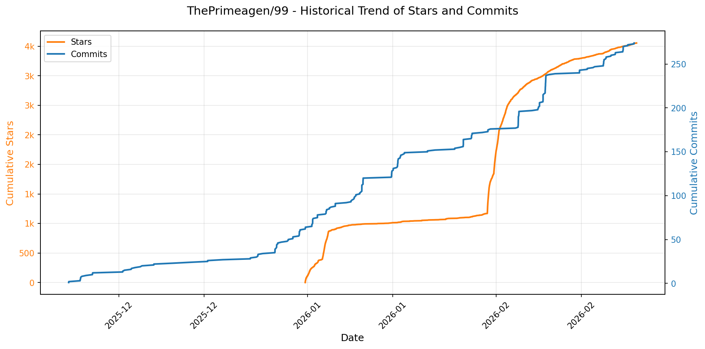

> *蓝色：累计 Stars｜橙色：累计 Commits（次 Y 轴）*

<b>📄 README 摘要</b>

1. **项目功能**  
99 是一个专为 Neovim 设计的 AI 编程增强客户端，核心目标是**以“人机协同”而非“AI 替代”为原则，将程序员的手动编码能力与大语言模型（LLM）的强大推理、搜索和生成能力深度融合**。它不追求全自动代码生成，而是通过两种主要工作流赋能开发者：  
- **`search`（智能搜索）**：在当前项目中执行语义化全局搜索，根据用户提示分析代码上下文、运行测试、定位问题根源，并将结果结构化输出至 Neovim 的 quickfix 列表，支持快速跳转与验证；  
- **`visual`（视觉替换）**：对选中的代码块执行上下文感知的改写、重构或补全，直接替换选区内容，保持编辑流连贯。  
项目定位为“探索性工具”，强调在真实编程实践中辅助理解、调试、导航与渐进式改进，而非黑盒式代码生成。

2. **关键特性**  
- **双模态 AI 工作流**：提供 `search`（信息发现与诊断）和 `visual`（精准编辑）两大核心交互范式，明确区分“理解/探索”与“修改/生成”场景；  
- **上下文智能注入**：支持通过 `#规则名` 自动补全并注入自定义技能规则（`SKILL.md`），通过 `@文件名` 模糊搜索并引用项目内任意文件内容，动态构建丰富、精准的 LLM 提示上下文；  
- **多后端 AI Provider 支持**：原生集成 OpenCode、Claude Code、Cursor Agent、Gemini CLI 等主流本地/CLI AI 工具，支持运行时热切换（通过 Telescope 或 fzf-lua 扩展），并可覆盖默认模型；  
- **项目感知型配置**：自动沿目录树向上查找 `AGENT.md` 等元数据文件，动态加载项目专属指令与约束；支持自定义临时目录、日志路径及细粒度错误处理；  
- **Neovim 深度集成**：提供开箱即用的键位映射（如 `<leader>9s` 启动搜索）、内建请求状态管理（`stop_all_requests`/`clear_previous_requests`）、实时日志查看（`view_logs`）及可视化加载指示器；  
- **可扩展架构**：提供 Telescope 和 fzf-lua 两种扩展接口，支持模型与 Provider 的交互式动态选择，便于实验与定制。

3. **技术栈**  
- **核心平台**：Neovim（Lua 配置与插件开发，深度依赖其 API 与异步机制）；  
- **AI 后端**：基于外部 CLI 工具的松耦合设计，支持 `opencode`（OpenCode）、`claude`（Claude Code）、`cursor-agent`（Cursor）、`gemini`（Gemini CLI）等，作为 LLM 执行引擎；  
- **前端/交互**：Lua（主逻辑）、Telescope.nvim 或 fzf-lua（提供交互式模型/Provider 选择器）、cmp（可选补全源，用于 `#`/`@` 上下文补全）；  
- **基础设施**：Vimscript/Lua 混合键位绑定、Neovim 内置 `vim.uv`（跨平台文件/路径操作）、`vim.fs`（文件系统抽象）、quickfix list（结果展示）；  
- **开发与调试**：内置多级别日志系统（支持文件/控制台输出）、请求追踪 ID（`TraceID`）、可配置的 throbber（加载动画）及临时目录管理。

---

### 30. [mihail911/modern-software-dev-assignments](https://github.com/mihail911/modern-software-dev-assignments)
- 📅 **创建日期**：2025-08-07  
- 🔄 **最近更新**：2026-02-25  
- ⭐ **Stars**：2,204（日 +159｜周 +366｜月 +697）  
- 📝 **描述**：Assignments for CS146S: The Modern Software Dev (Stanford University Fall 2025)  

<b>📈 Star 与 Commit 历史趋势</b>

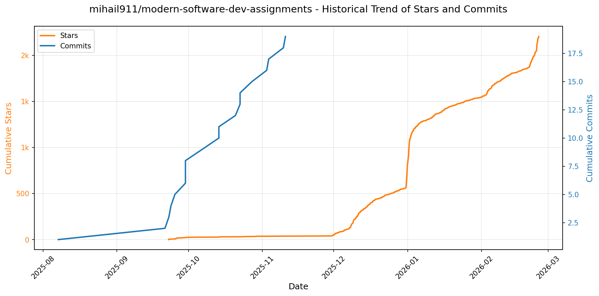

> *蓝色：累计 Stars｜橙色：累计 Commits（次 Y 轴）*

<b>📄 README 摘要</b>

1. **该项目的作用**：  
该项目是斯坦福大学2025年秋季学期课程《CS146S：现代软件开发者》（CS146S: The Modern Software Developer）的官方作业代码仓库，用于支撑课程实践环节，提供学生完成编程作业所需的代码框架、依赖配置与环境搭建指南。

2. **核心功能**：  
- 提供标准化、可复现的本地开发环境配置流程（基于 Conda + Poetry）；  
- 明确指定 Python 3.12 运行时版本，确保环境一致性；  
- 通过 Poetry 管理项目依赖，支持可重复安装与隔离式依赖解析；  
- 面向教学场景优化，包含清晰的分步终端指令，降低学生环境配置门槛。

3. **技术栈**：  
- 编程语言：Python 3.12；  
- 包与环境管理：Anaconda（Conda 环境隔离）、Poetry（依赖管理与虚拟环境封装）；  
- 构建与安装工具：`curl` + 官方 Poetry 安装脚本、`poetry install`；  
- 基础设施：命令行终端（Shell/Bash），无前端或服务端运行时组件。

---

### 31. [GVCLab/PersonaLive](https://github.com/GVCLab/PersonaLive)
- 📅 **创建日期**：2025-11-25  
- 🔄 **最近更新**：2026-02-25  
- ⭐ **Stars**：1,970（日 +212｜周 +332｜月 +457）  
- 📝 **描述**：[CVPR 2026] PersonaLive! : Expressive Portrait Image Animation for Live Streaming  

<b>📈 Star 与 Commit 历史趋势</b>

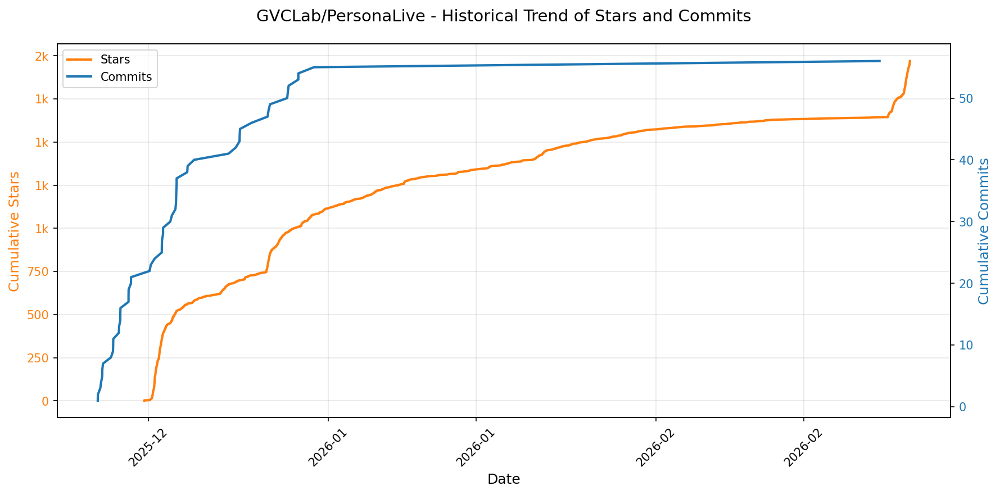

> *蓝色：累计 Stars｜橙色：累计 Commits（次 Y 轴）*

<b>📄 README 摘要</b>

1. **项目功能**  
PersonaLive 是一个面向实时直播场景的**可流式传输（streamable）、支持无限时长生成的肖像图像动画框架**。它能够以单张静态人像（reference image）为输入，结合驱动视频（driving video）或实时摄像头动作，生成高表现力、自然流畅的动态人脸视频，专为低延迟、高帧率的直播应用（如虚拟主播、在线会议数字人）而设计。

2. **核心特性**  
- ✅ **实时性与流式生成**：支持在线（online）流式推理，显著降低首帧延迟（latency），适配直播场景；  
- ✅ **无限长度视频生成**：通过创新的流式扩散策略（streaming generation strategy），可在仅12GB显存（如RTX 4090）上稳定生成长时序视频；  
- ✅ **多模态交互支持**：提供离线批量推理（`inference_offline.py`）与在线WebUI交互式直播（`inference_online.py`）双模式；  
- ✅ **灵活部署与加速选项**：原生支持 xFormers 内存优化、TensorRT 引擎加速（约2倍提速），并兼容 ComfyUI 生态（通过 `ComfyUI-PersonaLive`）；  
- ✅ **强鲁棒性与易用性**：支持运行时更换参考图像、自适应驱动帧率调节、WebUI可视化操作流程（上传→融合→启动→播放），并提供Windows/Blackwell架构（RTX 50系）专项适配指南；  
- ✅ **学术开源与工业落地兼顾**：已获CVPR 2026录用，代码、预训练权重、配置文件及完整推理流水线全部开源，同时由Dzine.ai等产业方参与研发与验证。

3. **技术栈**  
- **基础模型架构**：基于扩散模型（Diffusion）的端到端框架，包含定制化 Denoising UNet、Motion Encoder/Extractor、Pose Guider、Reference UNet 和 Temporal Module 等多模块协同结构；  
- **依赖模型**：复用并微调 Stable Diffusion 相关组件，包括 `sd-image-variations-diffusers`（图像变体编码器）、`sd-vae-ft-mse`（VAE解码器）；  
- **推理优化**：  
  - 计算加速：xFormers（内存高效注意力）、TensorRT（支持ONNX导出与引擎编译，含 `torch2trt.py` 工具）；  
  - 部署环境：Python 3.10 + PyTorch，Conda环境管理；  
- **前端与交互**：基于Gradio构建WebUI（`inference_online.py` 启动），支持浏览器端实时操控；  
- **跨平台支持**：明确适配Linux/macOS/Windows，针对NVIDIA Blackwell架构（RTX 50系）提供xFormers禁用方案及PyCUDA安装绕过指南；  
- **生态集成**：官方支持ComfyUI插件（`ComfyUI-PersonaLive`），并与Moore-AnimateAnyone、LivePortrait、StreamDiffusion等主流开源项目深度技术协同。

---

### 32. [SynkraAI/aios-core](https://github.com/SynkraAI/aios-core)
- 📅 **创建日期**：2025-12-09  
- 🔄 **最近更新**：2026-02-25  
- ⭐ **Stars**：1,800（日 +58｜周 +598｜月 +1759）  
- 📝 **描述**：Synkra AIOS: AI-Orchestrated System for Full Stack Development - Core Framework v4.0  

<b>📈 Star 与 Commit 历史趋势</b>

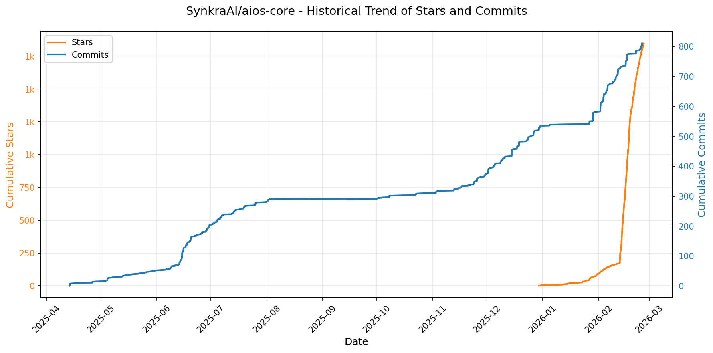

> *蓝色：累计 Stars｜橙色：累计 Commits（次 Y 轴）*

<b>📄 README 摘要</b>

1. **该项目做什么？**  
Synkra AIOS 是一个**自修改、AI 驱动的通用智能体（Agent）开发框架**，核心目标是实现**AI 原生的敏捷软件开发范式**。它不单是任务执行器或代码补全工具，而是通过多角色专业智能体（如 @analyst、@architect、@sm、@dev、@qa）协同工作，构建端到端的“计划—开发—验证”闭环：先由规划型智能体（如分析师、架构师）生成高一致性、上下文完备的 PRD 与架构文档；再由 Scrum Master 智能体将规划转化为含完整技术上下文、实现细节与架构约束的“用户故事文件”；最终由开发与测试智能体基于该结构化输入精准执行编码与验证。该框架可泛化至非技术领域（如创意写作、商业策略、身心健康、教育），支持构建跨领域的专业化智能体团队（Squads）。

2. **关键特性**  
- ✅ **双阶段智能体协同工作流**：首创“代理式规划（Agentic Planning）+ 上下文工程化开发（Contextualized Engineering）”，根治传统 AI 编程中的**规划不一致**与**上下文丢失**两大痛点；  
- ✅ **CLI 优先架构**：严格遵循 `CLI First → Observability Second → UI Third` 层级，CLI 是唯一真相源，所有智能体决策、自动化与执行均在此发生，UI 仅作可视化与轻量管理；  
- ✅ **IDE 生命周期钩子（Hooks）深度集成**：针对 Claude Code（全支持）、Gemini CLI（高支持）、Codex CLI（部分支持）等主流 AI IDE 提供差异化 Hook 兼容方案，实现上下文自动注入、Guardrails 执行与会话审计；  
- ✅ **现代化交互式安装与维护**：内置基于 `@clack/prompts` 的彩色 CLI 向导，支持组件化选择、包管理器切换、实时校验、进度反馈、干运行（dry-run）及一键升级（保留定制配置并自动备份）；  
- ✅ **开箱即用的 11 个专业智能体 + Squad 扩展体系**：涵盖元智能体（aios-master）、规划（@analyst/@architect）、流程（@sm）、开发（@dev）、质量（@qa）等核心角色，并支持创建面向写作、商业、健康等垂直领域的专属智能体团队；  
- ✅ **多语言、跨平台、企业就绪**：提供中/英/葡/西四语文档，原生支持 Windows/macOS/Linux，内置系统诊断（`aios-core doctor`）、健康检查、Git 集成与 CI/CD 友好静默安装模式。

3. **技术栈**  
- **运行时**：Node.js ≥18.0.0（推荐 v20+）；  
- **核心依赖**：`commander`（CLI 框架）、`execa`（进程执行）、`fs-extra`（文件系统操作）、`@clack/prompts`（交互式终端 UI）、`picocolors`（终端着色）；  
- **架构范式**：事件驱动（Lifecycle Hooks）、MCP（Model Context Protocol）兼容、基于 Markdown 文件的智能体通信（如 `AGENTS.md`、故事文件、规则文件 `.cursor/global-rules.md` 等）；  
- **集成生态**：深度适配 Claude Code、Gemini CLI、Codex CLI、Cursor、GitHub Copilot、AntiGravity 等 AI 编程环境；  
- **发布与协作**：NPM 包分发（`aios-core`）、GitHub Actions CI/CD、Codecov 代码覆盖率、MIT 开源许可证。

---

### 33. [modelcontextprotocol/ext-apps](https://github.com/modelcontextprotocol/ext-apps)
- 📅 **创建日期**：2025-11-21  
- 🔄 **最近更新**：2026-02-25  
- ⭐ **Stars**：1,662（日 +21｜周 +130｜月 +1261）  
- 📝 **描述**：Official repo for spec & SDK of MCP Apps protocol - standard for UIs embedded AI chatbots, served by MCP servers  

<b>📈 Star 与 Commit 历史趋势</b>

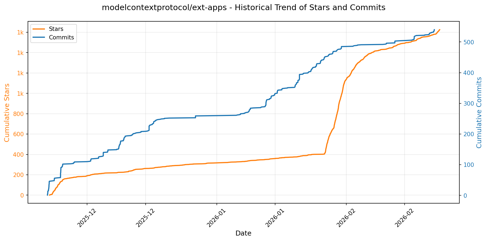

> *蓝色：累计 Stars｜橙色：累计 Commits（次 Y 轴）*

<b>📄 README 摘要</b>

1. **项目功能**  
MCP Apps 是一个面向 Model Context Protocol（MCP）生态的扩展框架，用于构建可在兼容型 AI 聊天客户端（如 Claude、ChatGPT、VS Code、Postman 等）中**内联渲染的交互式 UI 组件**。它使 MCP 工具不仅能返回文本或结构化数据，还能动态提供图表、表单、3D 场景、设计画布、实时监控面板等富交互界面，并与聊天上下文深度集成——UI 直接嵌入对话流，通过沙盒 iframe 安全运行，支持双向通信（主机向 UI 传递工具数据，UI 可反向调用其他 MCP 工具）。

2. **核心特性**  
- ✅ **跨客户端标准化 UI 呈现**：基于 `ui://` 协议声明 HTML 界面资源，由任意符合 MCP Apps 规范的宿主（host）自动拉取并渲染；  
- ✅ **零配置 AI 辅助开发**：内置 4 个 Agent Skills（`create-mcp-app`、`migrate-oai-app`、`add-app-to-server`、`convert-web-app`），支持 Claude Code 等 AI 编程代理一键生成、迁移或增强应用；  
- ✅ **多框架开箱即用**：提供 React、Vue、Svelte、Preact、Solid 及原生 JavaScript 的 Starter 模板，覆盖主流前端技术栈；  
- ✅ **模块化 SDK 分层支持**：  
  - `@modelcontextprotocol/ext-apps`：基础 App 类与消息通信（PostMessageTransport）；  
  - `@modelcontextprotocol/ext-apps/react`：React 专用 Hook（如 `useApp`、`useHostStyles`）；  
  - `@modelcontextprotocol/ext-apps/app-bridge`：供客户端宿主嵌入和管理 UI；  
  - `@modelcontextprotocol/ext-apps/server`：服务端工具注册与 UI 元数据声明；  
- ✅ **丰富可运行示例库**：包含 20+ 生产级案例（如 Excalidraw 白板、CesiumJS 地球、Three.js 3D 渲染、ShaderToy 实时着色器、PDF 查看器、客户分群散点图、预算分配器等），全部支持本地 `basic-host` 快速启动或直接集成至主流 MCP 客户端。

3. **技术栈**  
- **前端框架**：TypeScript（主语言），支持 React / Vue / Svelte / Preact / Solid / Vanilla JS；  
- **通信协议**：基于 MCP 标准的 `ui://` 资源协议 + 沙盒 iframe + PostMessage 双向消息机制；  
- **构建与发布**：npm 包管理（`@modelcontextprotocol/ext-apps` 及其子包），CI/CD 由 GitHub Actions 驱动；  
- **服务端支持**：Node.js（主流示例）与 Python（如 QR 生成、TTS 示例）双运行时；  
- **规范基础**：严格遵循 [MCP Apps 规范 v2026-01-26](https://github.com/modelcontextprotocol/ext-apps/blob/main/specification/2026-01-26/apps.mdx)（Apache 2.0 许可），作为 MCP 核心协议的官方扩展；  
- **客户端兼容性**：深度适配 ChatGPT、Claude、VS Code、Goose、Postman、MCPJam 等已实现 MCP Apps 支持的平台。

---

### 34. [ruvnet/ruvector](https://github.com/ruvnet/ruvector)
- 📅 **创建日期**：2025-11-19  
- 🔄 **最近更新**：2026-02-25  
- ⭐ **Stars**：735（日 +249｜周 +352｜月 +483）  
- 📝 **描述**：RuVector is a high performance vector and graph database built in Rust for AI, agentic systems, and real time analytics. It combines HNSW search, dynamic minimum cut coherence, graph intelligence, and self learning memory into one unified engine for scalable, low latency reasoning and structured retrieval.  

<b>📈 Star 与 Commit 历史趋势</b>

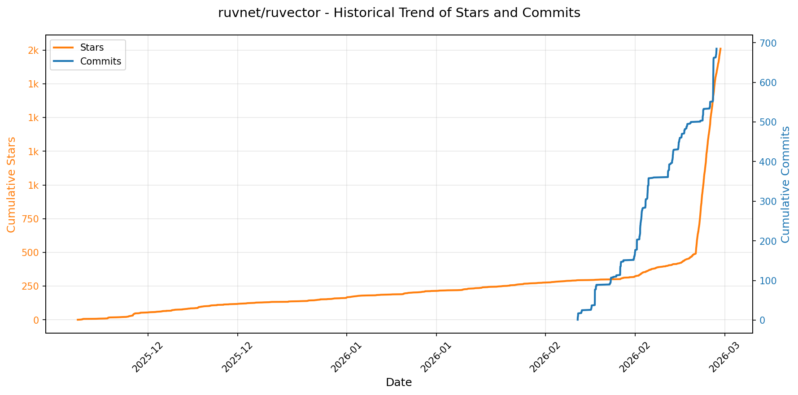

> *蓝色：累计 Stars｜橙色：累计 Commits（次 Y 轴）*

<b>📄 README 摘要</b>

1. **项目功能**  
RuVector 是一个具备自学习能力的下一代向量数据库，其核心突破在于**将向量检索、图计算、神经网络学习、本地大模型推理与分布式系统能力深度集成于单一可执行单元中**。它不仅支持标准向量相似性搜索（如 HNSW），更通过嵌入式图神经网络（GNN）层实现“查询即训练”——每次查询都会动态优化结果排序，使高频查询路径持续强化、精度与时效性同步提升；同时原生支持 Cypher 图查询、语义关系推理、实时图更新与跨模态关联分析。其标志性形态是 **RVF 认知容器（`.rvf` 文件）**：一个自包含、自启动、自验证的二进制文件，可在 125 毫秒内直接启动为 Linux 微服务，无需外部依赖，兼具向量存储、AI 模型、eBPF 加速引擎、WASM 运行时、加密审计链与 Git 式分支能力，真正实现“一份数据，处处运行，处处可信”。

2. **关键特性**  
- **自进化搜索**：GNN 层实时学习用户行为，提升结果相关性与响应速度（越用越准、越用越快）；  
- **全栈 AI 原生支持**：内置 `ruvllm` 本地 LLM 运行时（GGUF 格式，Metal/CUDA/ANE 加速）、RuvLTRA 轻量路由模型（<10ms）、46 种注意力机制（含 mincut-gated、超球面、图注意力等）及 SONA 自优化神经架构（LoRA+EWC++）；  
- **统一图-向量-知识引擎**：支持 Cypher 图查询、SPARQL/RDF、超边关系、动态图更新（零停机）、子线性图算法（PageRank/O(log n) TRUE/BMSSP 求解器）；  
- **认知容器（RVF）范式**：单文件含向量、索引、微内核、eBPF 程序、WASM 运行时、COW 分支、密码学见证链（ML-DSA/Ed25519）、DNA 式血缘追踪与 24 类结构化段；  
- **极致部署与安全**：浏览器/WASM/边缘/裸机全平台运行；零配置单文件部署；后量子签名、TEE 安全加固（SGX/SEV-SNP/TDX）、AIDefence 主动防御（防注入/越狱/PII 泄露）；  
- **专业垂直能力**：`rvDNA` 基因组即时诊断（12ms 全流程，手机端运行）、`SciPix` 科学文档 OCR、FPGA/量子相干加速、流式生物标志物分析（>100k/s）；  
- **生产就绪分布式能力**：Raft 多节点共识、多主复制、自动分片、突发扩容（10–50×）、PostgreSQL 兼容扩展（SIMD 加速）及 MCP（Model Context Protocol）原生集成。

3. **技术栈**  
- **核心语言**：Rust（主导，保障内存安全、零成本抽象与极致性能），辅以 TypeScript/JavaScript（前端/WASM/Node.js SDK）；  
- **底层系统**：Linux eBPF（XDP/TC/socket filter 内核级加速）、QEMU/KVM 微虚拟化（RVF 启动）、WebAssembly（5.5 KB 轻量 WASM 运行时）；  
- **AI/ML 框架**：自研 `ruvllm`（GGUF 支持）、SONA 学习框架、GNN 消息传递层、ruvector-solver（8 种稀疏线性求解器）、ruvector-attn-mincut（图割门控注意力）；  
- **数据库与索引**：超球面 HNSW、自适应分层压缩、BM25/TF-IDF 稀疏向量、持久同调（TDA）漂移检测；  
- **安全与可信**：ML-DSA-65 / SLH-DSA-128s 后量子签名、Ed25519、哈希链见证（witness chain）、COW 分支、RBAC 与 TEE attestation；  
- **生态集成**：npm（`ruvector`, `@ruvector/rvf`, `@ruvector/rvdna`）、crates.io（13 个 Rust crate，含 `rvf-runtime`, `ruvector-solver` 等）、Hugging Face（RuvLTRA 模型）、PostgreSQL 扩展、MCP 协议服务器。

---

