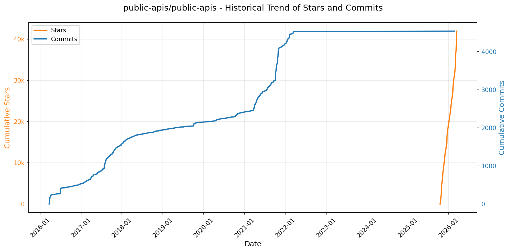
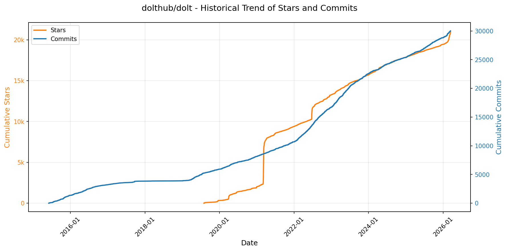

# 🌟 GitHub Trending 概览

> 数据更新于：2026-03-14

---

## 🔍 项目详情

### 1. [openclaw/openclaw](https://github.com/openclaw/openclaw)
- 📅 **创建日期**：2025-11-24  
- 🔄 **最近更新**：2026-03-14  
- ⭐ **Stars**：189,321（日 +3090｜周 +30996｜月 +118824）  
- 📝 **描述**：Your own personal AI assistant. Any OS. Any Platform. The lobster way. 🦞   

<b>📈 Star 与 Commit 历史趋势</b>

> *蓝色：累计 Stars｜橙色：累计 Commits（次 Y 轴）*

<b>📄 README 摘要</b>

1. **项目功能**  
OpenClaw 是一个完全本地化、用户自托管的个人 AI 助手系统，核心目标是让用户在自有设备上运行一个**单用户、低延迟、始终在线**的智能代理。它不依赖中心化云服务，而是通过轻量级“网关”（Gateway）作为统一控制平面，将 AI 能力无缝接入用户日常使用的全部通信渠道（覆盖 WhatsApp、Telegram、Slack、Discord、Signal、iMessage/BlueBubbles、微信替代品如 Feishu/LINE/Zalo、开源协议如 Matrix/Nostr/Mattermost/IRC 等共 20+ 平台），并支持跨平台语音交互（macOS/iOS 唤醒词 + Android 持续语音）、实时可视化画布（Live Canvas）、设备级操作（摄像头、屏幕录制、定位、通知、系统命令等），真正实现「AI 在本地、触达在全端、控制在手中」。

2. **关键特性**  
- **多通道统一收件箱**：原生集成 20+ 消息平台，支持群组路由、提及触发、消息分块与频道隔离；DM 默认启用配对验证机制（`pairing`），保障安全。  
- **本地优先网关架构**：基于 WebSocket 的单点控制平面，管理会话（session）、通道、工具、定时任务（cron）、Webhook、远程调试与 Canvas 托管，支持 Tailscale Serve/Funnel 或 SSH 隧道实现安全远程访问。  
- **多智能体路由与工作区隔离**：支持按频道、账号或联系人将流量路由至独立 agent 实例（workspace + session 隔离），满足多角色/多场景需求。  
- **全栈语音能力**：macOS/iOS 支持本地唤醒词（Voice Wake），Android 支持持续语音对话（Talk Mode），集成 ElevenLabs 及系统 TTS/ASR 回退。  
- **Live Canvas 可视化工作空间**：由 AI 驱动的动态 UI 画布（基于 A2UI 协议），支持 push/reset/eval/snapshot，可在 macOS/iOS/Android 实时渲染与交互。  
- **深度设备节点（Nodes）支持**：提供跨平台系统级能力抽象（`node.invoke`），包括 `system.run`（带权限校验）、`camera.*`、`screen.record`、`location.get`、`system.notify` 等，严格遵循 macOS TCC / Android 权限模型。  
- **开箱即用的自动化工具链**：内置浏览器控制（专属 Chromium + CDP）、技能平台（ClawHub 注册中心）、Gmail Pub/Sub、Webhook、定时任务，以及 agent-to-agent 会话协同工具（`sessions_list/history/send`）。  
- **安全与运维完备性**：默认 DM 配对策略、模型故障转移（failover）、会话自动裁剪、详细日志与诊断命令（`openclaw doctor`）、Nix/Docker 声明式部署、CLI 向导驱动的全流程配置（`openclaw onboard`）。

3. **技术栈**  
- **运行时**：Node.js ≥22（主运行环境），支持 npm/pnpm/bun；前端 TypeScript（`tsx` 直接执行）；构建推荐 pnpm。  
- **核心协议与通信**：WebSocket（Gateway 控制平面）、gRPC/RPC（Pi agent 运行时）、HTTP(S)（WebChat/UI/Tailscale 暴露）、Tailscale Serve/Funnel 或 SSH 隧道（远程接入）。  
- **客户端与平台层**：  
  - macOS：菜单栏应用 + Voice Wake/Talk Mode/Canvas/设备节点（通过 `node.invoke` 调用系统能力）；  
  - iOS/Android：原生节点应用，支持 Canvas、音视频采集、设备命令（SMS/位置/联系人/日历等）；  
  - Web：内嵌 Control UI 与 WebChat，由 Gateway 直接托管。  
- **通道适配器**：基于各平台官方或成熟 SDK 封装，如 Baileys（WhatsApp）、grammY（Telegram）、discord.js（Discord）、Bolt（Slack）、signal-cli（Signal）、Matrix SDK、Nostr 客户端等。  
- **AI 与模型层**：支持多模型供应商（OpenAI 为首选推荐），通过 CLI 和配置文件管理模型选择、OAuth/API Key 认证、轮换与故障转移；强调本地推理兼容性（文档隐含对 Ollama/LM Studio 等的友好设计）。  
- **基础设施与部署**：支持 systemd/launchd 守护进程、Docker 容器化、Nix 声明式配置（`nix-openclaw`）、CI/CD（GitHub Actions）。

---

### 2. [x1xhlol/system-prompts-and-models-of-ai-tools](https://github.com/x1xhlol/system-prompts-and-models-of-ai-tools)
- 📅 **创建日期**：2025-03-05  
- 🔄 **最近更新**：2026-03-14  
- ⭐ **Stars**：130,999（日 +290｜周 +1900｜月 +17156）  
- 📝 **描述**：FULL Augment Code, Claude Code, Cluely, CodeBuddy, Comet, Cursor, Devin AI, Junie, Kiro, Leap.new, Lovable, Manus, NotionAI, Orchids.app, Perplexity, Poke, Qoder, Replit, Same.dev, Trae, Traycer AI, VSCode Agent, Warp.dev, Windsurf, Xcode, Z.ai Code, Dia & v0. (And other Open Sourced) System Prompts, Internal Tools & AI Models  

<b>📈 Star 与 Commit 历史趋势</b>

> *蓝色：累计 Stars｜橙色：累计 Commits（次 Y 轴）*

<b>📄 README 摘要</b>

该内容并非一个典型软件项目的 README（缺少项目名称、功能描述、安装使用说明等核心信息），而是一个**开源 AI 系统提示词（system prompts）与模型行为分析资源库的宣传性主页**。基于所提供文本，按要求从以下三方面进行精准总结（无引言，直入主题）：

---

**1. 该项目做什么？**  
该项目是一个持续维护的、大规模公开仓库，致力于**收集、整理并公开披露主流 AI 工具（如 LLM 服务、AI 编程代理、AI 应用平台等）的真实系统提示词（system prompts）、模型配置细节及内部行为逻辑**。其核心产出是超过 30,000 行深度解析内容，旨在揭示闭源 AI 产品的底层指令设计、安全边界、能力限制与潜在漏洞，服务于 AI 安全研究、红队测试、提示工程优化及开源 AI 生态建设。

---

**2. 关键特性**  
- ✅ **超大规模实测数据集**：收录并结构化分析超 30,000 行来自真实生产环境 AI 工具的系统提示与模型行为线索；  
- ✅ **开源透明性**：所有提示词、逆向工程方法论、模型响应模式分析均完全开放，支持可验证、可复现的研究；  
- ✅ **安全导向洞察**：明确聚焦于提示泄露风险、模型越狱路径、指令注入脆弱点等 AI 安全关键问题；  
- ✅ **生态联动支持**：主动链接并推广同类优质开源项目（如 Kilo Code）、AI 工程基础设施（Latitude）及专业安全服务（ZeroLeaks）；  
- ✅ **社区驱动运营**：通过 Discord、X（Twitter）、Patreon/Ko-fi 等多渠道构建开发者与安全研究员协作网络，并提供加密货币/订阅等多种支持方式。

---

**3. 技术栈**  
项目本身为**文档型知识库（非可执行软件）**，不依赖特定运行时环境，但其运作与分析工作隐含以下技术要素：  
- **逆向分析技术**：HTTP 流量捕获（如 MitM 代理）、前端 JS 反编译、API 响应模式挖掘、LLM 输出归因分析；  
- **AI 工程工具链**：集成 Latitude（用于提示稳定性与可观测性管理）、DeepWiki（语义化知识图谱索引）、Trendshift（项目热度与演进追踪）；  
- **基础设施支撑**：CloudBack（CI/CD 与构建状态监控）、Star History（GitHub 数据可视化）、Discord（实时协作通信）；  
- **安全技术栈关联**：与 ZeroLeaks.ai 深度协同，采用其 AI 系统泄漏检测框架进行提示词暴露面评估与配置审计。

---

### 3. [obra/superpowers](https://github.com/obra/superpowers)
- 📅 **创建日期**：2025-10-09  
- 🔄 **最近更新**：2026-03-14  
- ⭐ **Stars**：111,130（日 +1950｜周 +9355｜月 +32524）  
- 📝 **描述**：An agentic skills framework & software development methodology that works.  

<b>📈 Star 与 Commit 历史趋势</b>

> *蓝色：累计 Stars｜橙色：累计 Commits（次 Y 轴）*

<b>📄 README 摘要</b>

1. **该项目做什么？**  
Superpowers 是一个面向编程智能体（coding agents）的完整软件开发工作流增强系统。它不直接替代编码工具，而是通过一套可组合、自动触发的“技能”（skills）和预设行为准则，对现有AI编程助手（如 Claude Code、Cursor、Codex 等）进行深度赋能。其核心目标是将松散的、易偏离的 AI 编程行为，转变为结构化、可验证、符合工程最佳实践的协作式开发流程——从需求澄清、设计评审、TDD 实施、子智能体并行执行，到代码审查与分支收尾，全程由技能自动介入并强制执行，无需用户手动调用。

2. **关键特性**  
- **全流程自动化技能链**：覆盖开发全生命周期的 13+ 项原子技能（如 `brainstorming`、`writing-plans`、`subagent-driven-development`、`test-driven-development`、`requesting-code-review`、`finishing-a-development-branch`），全部按上下文自动触发，非可选建议；  
- **强约束工程实践**：强制推行真·红绿重构（RED-GREEN-REFACTOR）、YAGNI（你不会需要它）、DRY（避免重复）及防御性验证（如 `verification-before-completion`）；  
- **人机协同决策机制**：设计分段确认（chunked spec review）、计划显式拆解（2–5 分钟粒度任务+精确文件路径+验证步骤）、双阶段子智能体审查（先检规范符合性，再审代码质量）；  
- **隔离式开发环境**：自动基于 `git worktree` 创建独立分支，确保干净测试基线与并行开发安全；  
- **自演进能力**：内置 `writing-skills` 技能，支持用户遵循标准范式创建、测试并贡献新技能，形成可扩展的技能生态；  
- **跨平台即插即用**：原生支持 Claude Code、Cursor、Codex、OpenCode、Gemini CLI 等主流 AI 编程平台，安装/更新标准化（如 `/plugin install` 或 `gemini extensions install`）。

3. **技术栈**  
- **运行时环境**：依赖宿主 AI 编程平台（如 Claude、Cursor 等）的插件/扩展机制，本身为轻量级技能指令集（纯文本 Markdown + 结构化提示模板）；  
- **核心范式**：基于 LLM 的提示工程（Prompt Engineering）、角色化工作流编排（Role-based Agent Orchestration）、状态感知技能路由（Context-aware Skill Triggering）；  
- **工程支撑**：Git（worktree 隔离、分支管理）、测试框架（与用户项目集成，强制 TDD 流程）、CLI 工具链（各平台原生命令接口）；  
- **交付形式**：GitHub 仓库托管（MIT 协议），技能以模块化 Markdown 文件（`SKILL.md`）组织在 `/skills/` 目录下，支持版本化更新与社区协作；  
- **无服务端依赖**：纯客户端侧技能注入，不依赖后端 API 或私有服务器，所有逻辑由宿主 AI 平台在本地或云端推理时动态执行。

---

### 4. [virattt/ai-hedge-fund](https://github.com/virattt/ai-hedge-fund)
- 📅 **创建日期**：2024-11-29  
- 🔄 **最近更新**：2026-03-14  
- ⭐ **Stars**：49,054（日 +279｜周 +2541｜月 +3244）  
- 📝 **描述**：An AI Hedge Fund Team  

<b>📈 Star 与 Commit 历史趋势</b>

> *蓝色：累计 Stars｜橙色：累计 Commits（次 Y 轴）*

<b>📄 README 摘要</b>

1. **项目功能**  
该项目是一个面向教育与研究目的的AI驱动对冲基金概念验证系统，**不执行真实交易**。其核心目标是模拟多智能体协同决策过程，通过融合不同投资流派（如价值投资、成长投资、宏观策略、行为金融等）的代表性人物思维范式，对股票进行多维度分析并生成虚拟交易信号。系统接收股票代码作为输入，调用各类AI代理对基本面、技术面、市场情绪及内在价值进行独立评估，再经风险管理和组合管理模块整合，最终输出模拟买卖建议与回测结果。

2. **关键特性**  
- **18个专业化AI代理协同架构**：涵盖13位顶级投资者（如巴菲特、芒格、达摩达兰、木头姐等）的风格化决策逻辑，以及4个分析型代理（估值、情绪、基本面、技术面）和1个风险/1个组合管理代理，实现“思想多样性+专业分工”的智能投研流水线。  
- **双模态交互支持**：提供命令行接口（CLI）用于自动化、脚本化与参数化回测（支持指定时间范围、本地Ollama模型运行），以及图形化Web应用界面，降低使用门槛。  
- **灵活的数据与模型适配**：支持多种大语言模型API（OpenAI、Anthropic、Groq、DeepSeek）及本地Ollama部署；内置免费美股数据（AAPL/GOOGL/MSFT/NVDA/TSLA），扩展标的需接入Financial Datasets API。  
- **完整回测能力**：集成独立回测模块（`backtester.py`），可对历史时段内的多只股票生成并验证策略信号，输出量化绩效指标。  
- **严格教育定位与合规设计**：全系统无实盘接口，强制要求用户签署免责声明；所有输出明确标注为非投资建议，强调学习与研究属性。

3. **技术栈**  
- **编程语言**：Python（主框架与核心逻辑）  
- **依赖管理**：Poetry  
- **AI模型层**：支持云端LLM（GPT-4o等）及本地Ollama模型，用于代理推理与自然语言驱动的分析  
- **数据源**：Financial Datasets API（付费扩展）、内置免费美股基础数据  
- **架构模式**：多智能体系统（Multi-Agent System, MAS），基于角色分工与信号聚合的决策链  
- **前端（Web版）**：未在文档中明确说明具体框架，但指出位于`/app`子目录，推测为现代Web框架（如Streamlit、FastAPI+React或Gradio等）  
- **环境配置**：基于`.env`文件管理API密钥，遵循安全实践  
- **许可证**：MIT License

---

### 5. [public-apis/public-apis](https://github.com/public-apis/public-apis)
- 📅 **创建日期**：2016-03-20  
- 🔄 **最近更新**：2026-03-14  
- ⭐ **Stars**：41,959（日 +1058｜周 +4971｜月 +12371）  
- 📝 **描述**：A collective list of free APIs  

<b>📈 Star 与 Commit 历史趋势</b>

> *蓝色：累计 Stars｜橙色：累计 Commits（次 Y 轴）*

<b>📄 README 摘要</b>

1. **该项目的功能**  
该项目是一个由社区成员（包括 APILayer 团队）人工维护、持续更新的**公开 API 目录型资源库**，核心目标是为开发者提供一份全面、分类清晰、可直接使用的免费/开放公共 API 清单。它本身不提供 API 服务，而是作为“API 导航图”或“API 黄页”，覆盖动物、动漫、反恶意软件、艺术设计、认证授权、区块链、图书、金融、天气、地理编码等 60+ 个垂直领域，每条 API 条目均明确标注认证方式（如 apiKey/OAuth/无认证）、HTTPS 支持状态及 CORS 兼容性，便于快速筛选与集成。

2. **关键特性**  
- ✅ **高度结构化与多维度分类**：按主题（如 Animals、Anime、Weather 等）精细划分，支持快速定位特定领域 API；  
- ✅ **标准化元数据标注**：每项 API 明确标注 `Auth`（认证类型）、`HTTPS`（是否支持加密传输）、`CORS`（是否支持浏览器跨域调用），显著降低接入门槛；  
- ✅ **社区驱动与开放协作**：鼓励用户通过 GitHub Issues/Pull Requests 参与贡献、纠错和新增 API，附有《Contributing Guide》；  
- ✅ **APILayer 官方生态深度整合**：首页重点推介 APILayer 自研的 10 款高热度商业 API（如 IPstack、Weatherstack、Fixer 等），并提供一键 Postman 测试链接及文档入口，实现“目录发现 → 快速试用 → 商业落地”的闭环；  
- ✅ **零门槛可用性**：大量 API 无需认证（No Auth）、支持 HTTPS 与 CORS，开箱即用，特别适合学习、原型开发与轻量级项目。

3. **技术栈**  
该项目本质为一个**静态内容型开源仓库**，无后端服务或运行时逻辑：  
- **核心载体**：纯 Markdown（`.md`）文件（如 `README.md`），通过 GitHub 原生渲染展示；  
- **组织架构**：基于 GitHub 的标准开源协作模型（Issues、Pull Requests、Discussions、LICENSE）；  
- **辅助工具链**：依赖 Postman 集成（提供“Run In Postman”按钮）、外部文档站点（如 APILayer Docs）、Discord 社区平台进行沟通支持；  
- **托管与分发**：完全托管于 GitHub 平台，无自建服务器、数据库或前端框架，零运维成本，强调内容可读性与社区可维护性。

---

### 6. [shareAI-lab/learn-claude-code](https://github.com/shareAI-lab/learn-claude-code)
- 📅 **创建日期**：2025-06-29  
- 🔄 **最近更新**：2026-03-14  
- ⭐ **Stars**：40,636（日 +576｜周 +3470｜月 +9139）  
- 📝 **描述**：Bash is all you need -  A nano Claude Code–like agent, built from 0 to 1  

<b>📈 Star 与 Commit 历史趋势</b>

> *蓝色：累计 Stars｜橙色：累计 Commits（次 Y 轴）*

<b>📄 README 摘要</b>

1. **该项目做什么？**  
该项目是一个面向教学的“从零到一”构建类 Claude Code 编程智能体（AI Coding Agent）的学习型开源项目。它不追求生产级功能完备性，而是通过**12 个渐进式会话（s01–s12）**，系统性拆解并实现一个轻量级、可运行的 AI 编程代理核心运行范式——即“**Agent Loop（代理循环）**”。每个会话仅引入**一个关键机制**（如工具调用、任务分解、后台执行、多智能体协作、工作目录隔离等），所有机制均严格叠加在同一个基础循环之上，不修改其主干逻辑。最终目标是帮助学习者深入理解现代 AI 编程代理（如 Claude Code）的底层架构思想与演进路径，而非提供开箱即用的终端产品。

2. **核心特性**  
- ✅ **极简可验证的核心循环**：基于 Anthropic API 的 `stop_reason == "tool_use"` 触发机制，实现“LLM 输出 → 工具执行 → 结果注入 → 循环继续”的最小闭环。  
- ✅ **渐进式能力演进体系**：12 个会话覆盖代理生命周期全阶段——从单循环（s01）→ 多工具扩展（s02）→ 规划能力（s03–s04）→ 知识按需加载（s05）→ 上下文压缩（s06）→ 持久化任务图（s07）→ 后台异步执行（s08）→ 多智能体团队协作（s09–s11）→ 目录级工作区隔离（s12）。  
- ✅ **教学优先的设计哲学**：所有代码均为 Python 参考实现（`agents/` 目录），配以 ASCII 流程图、精炼代码片段和三语（中/英/日）心智模型文档（`docs/`），强调“问题→解法→原理”而非 API 堆砌。  
- ✅ **配套交互式学习平台**：内置 Next.js 构建的 Web 平台（`web/`），支持可视化流程图、代码逐行演示、文档集成与实时调试。  
- ✅ **明确的能力边界声明**：主动省略生产级复杂度（如完整事件总线、权限治理、OAuth 认证、MCP 运行时细节），聚焦可理解、可复现、可推演的核心范式。  
- ✅ **平滑演进路径**：提供两个实战延伸方向——命令行工具 `Kode-cli`（开箱即用的开源编程 CLI）与嵌入式 SDK `Kode-agent-sdk`（零进程开销，支持后端/浏览器/边缘设备集成）；另设姊妹库 `claw0` 教学“常驻型助手”（心跳唤醒 + 定时任务 + 多信道 IM + 人格系统）。

3. **技术栈**  
- **核心语言**：Python（所有 agent 实现、CLI 脚本、工具处理器）  
- **LLM 接口**：Anthropic API（Claude 系列模型，通过 `anthropic` 官方 SDK 调用）  
- **前端平台**：Next.js（React 框架）、TypeScript、Tailwind CSS（用于交互式 Web 学习平台）  
- **任务持久化**：纯文件系统（JSONL 格式邮箱协议、文本任务图存储），无数据库依赖  
- **并发模型**：Python `threading`（s08 后台任务）、`queue`（消息通知）、`subprocess`（Bash 工具执行）  
- **工程支撑**：Git（版本与协作）、GitHub Actions（CI：类型检查 + 构建）、dotenv（密钥管理）  
- **跨平台兼容**：明确支持 Windows（Kode-cli 标注 “Windows-ready”），Python 实现天然跨平台。

---

### 7. [msitarzewski/agency-agents](https://github.com/msitarzewski/agency-agents)
- 📅 **创建日期**：2025-10-13  
- 🔄 **最近更新**：2026-03-14  
- ⭐ **Stars**：40,270（日 +5079｜周 +30443｜月 +39317）  
- 📝 **描述**：A complete AI agency at your fingertips - From frontend wizards to Reddit community ninjas, from whimsy injectors to reality checkers. Each agent is a specialized expert with personality, processes, and proven deliverables.  

<b>📈 Star 与 Commit 历史趋势</b>

> *蓝色：累计 Stars｜橙色：累计 Commits（次 Y 轴）*

<b>📄 README 摘要</b>

1. **项目功能**  
该项目是一个模块化、人格化、可即插即用的AI代理（Agent）集合，旨在模拟真实数字营销与技术团队的完整职能架构。它不提供通用大模型提示词模板，而是为每个专业角色（如前端开发、SEO专家、小红书运营、微信小程序开发者等）构建了具备明确身份设定、专属工作流程、具体交付物（含代码/文案/策略文档示例）和可量化成功指标的AI专家代理。用户可通过集成到Claude Code、Cursor、Aider、Windsurf、Gemini CLI、GitHub Copilot等主流AI编程/协作工具中，按需“激活”对应代理，实现垂直领域任务的自动化协同执行。

2. **核心特性**  
- **高度专业化分工**：覆盖工程、设计、付费广告、销售、营销、产品、项目管理、测试、支持等9大业务部门，共超80个细分AI代理（如“B站内容策略师”“WeCom私域运营官”“Solidity智能合约工程师”），每个代理聚焦单一强场景；  
- **人格化与交付导向**：每个代理拥有独特声音、沟通风格、思维范式及标准化输出格式（如PR评审意见、GA4埋点方案、小红书爆款脚本、TikTok分镜脚本），强调可执行、可验证、可复用；  
- **多工具无缝集成**：提供一键转换脚本（`convert.sh`）与智能安装器（`install.sh`），原生适配Claude Code、Cursor、Aider、Windsurf、Copilot、Gemini CLI、OpenCode等主流AI开发环境；  
- **本地化与全球化并重**：深度支持中国数字生态（微信小程序、小红书、B站、抖音、快手、知乎、百度SEO、飞书、企业微信、淘宝/拼多多直播电商等），同时兼容全球平台（Meta、LinkedIn、Google Ads、AWS、React/Vue等）；  
- **生产就绪（Production-Ready）**：所有代理均经实战迭代验证，附带工作流图谱、风险预警机制、质量门禁（如“Reality Checker”代理负责上线前证据认证）、成本/性能/安全等多维约束（如“Autonomous Optimization Architect”内置LLM路由与费用护栏）。

3. **技术栈**  
- **核心载体**：纯文本结构化配置（Markdown格式代理定义文件），含身份描述、使命声明、标准话术、典型输入/输出示例、技术交付模板（代码片段、SQL、JSON Schema、正则表达式、Prompt指令集等）；  
- **集成层**：Shell脚本（`convert.sh`, `install.sh`）实现跨工具元数据转换与环境适配；支持主流AI IDE插件协议（如Claude Code的`~/.claude/agents/`目录规范、Cursor的Agent JSON Schema、Aider的`--agent`扩展机制）；  
- **运行依赖**：零服务端依赖，完全离线运行，依托用户本地已部署的大模型客户端（如Claude Desktop、Cursor AI、VS Code + Copilot）作为推理引擎；  
- **扩展能力**：开放PR贡献机制，支持社区共建代理；通过标准化文件结构（`/engineering/`, `/marketing/`, `/paid-media/`等目录）实现模块化维护与横向复用。

---

### 8. [666ghj/BettaFish](https://github.com/666ghj/BettaFish)
- 📅 **创建日期**：2024-07-01  
- 🔄 **最近更新**：2026-03-14  
- ⭐ **Stars**：38,557（日 +157｜周 +2291｜月 +3223）  
- 📝 **描述**：微舆：人人可用的多Agent舆情分析助手，打破信息茧房，还原舆情原貌，预测未来走向，辅助决策！从0实现，不依赖任何框架。  

<b>📈 Star 与 Commit 历史趋势</b>

> *蓝色：累计 Stars｜橙色：累计 Commits（次 Y 轴）*

<b>📄 README 摘要</b>

1. **项目功能**  
BettaFish（微舆）是一个从零自研的多智能体（Multi-Agent）舆情分析系统，核心目标是打破信息茧房、还原真实舆情全貌、预测发展趋势并辅助决策。用户仅需以自然语言提出分析需求（如“武汉大学品牌声誉分析”），系统即可全自动完成：① 从微博、小红书、抖音、快手等30+国内外主流社媒及数百万条评论中实时采集数据；② 跨模态解析图文、短视频、天气/股票/日历等结构化卡片信息；③ 融合公域舆情与私有业务数据库进行联合分析；④ 通过多Agent协作生成深度、可交互的HTML/PDF/Markdown格式研究报告。其定位已超越传统舆情监测，演进为通用型数据分析引擎，可快速适配金融、教育、政务等垂直领域。

2. **关键特性**  
- **全域AI驱动监控**：7×24小时分布式爬虫集群（MindSpider），覆盖10+平台，支持热点捕获与海量评论下钻；  
- **复合分析引擎**：非单一LLM依赖，集成5类专业Agent（Query/Media/Insight/Report/Forum）+ 微调模型（BERT/GPT-2/Qwen3）+ 统计模型，实现多维度深度分析；  
- **原生多模态理解**：独家支持短视频内容解析（抖音/快手）、结构化卡片提取（搜索结果中的天气/股价等），突破图文分析边界；  
- **Agent“论坛”协作机制**：引入辩论主持人LLM，通过ForumEngine协调各Agent多轮辩论、反思与策略调整，避免同质化输出，激发集体智能；  
- **公私域数据融合**：提供高安全性API接口，无缝对接企业内部数据库，实现“外部趋势+内部洞察”双驱动分析；  
- **轻量高扩展架构**：纯Python模块化设计，支持一键Docker部署；代码解耦清晰，开发者可灵活替换模型、工具或Prompt，快速定制行业方案。

3. **技术栈**  
- **核心框架**：Python 3.9+，Flask（Web服务），SQLAlchemy（异步ORM），Playwright（浏览器自动化爬虫）；  
- **AI模型层**：OpenAI兼容API标准（支持各类大模型），集成微调模型（BERT LoRA、GPT-2 LoRA、Qwen3 Small）、多语言情感分析模型及传统机器学习（SVM/RF）；  
- **Agent架构**：基于状态机（State）与节点流（Nodes）设计，含专用LLM封装、提示词工程（Prompts）、工具集（Tools）和反思机制；  
- **数据与存储**：PostgreSQL（主推）/MySQL，自定义数据库Schema（含话题、评论、媒体内容等表）；  
- **报告系统**：自研IR（Intermediate Representation）中间表示协议，配合模板引擎（Markdown）、HTML渲染器（WeasyPrint）、SVG图表转换、PDF布局优化；  
- **部署与运维**：Docker + docker-compose，.env环境变量统一管理，支持Conda/uv虚拟环境，CI/CD就绪（含pytest单元测试与集成测试）。

---

### 9. [ruvnet/RuView](https://github.com/ruvnet/RuView)
- 📅 **创建日期**：2025-06-07  
- 🔄 **最近更新**：2026-03-14  
- ⭐ **Stars**：36,823（日 +503｜周 +7582｜月 +31023）  
- 📝 **描述**：π RuView: WiFi DensePose turns commodity WiFi signals into real-time human pose estimation, vital sign monitoring, and presence detection — all without a single pixel of video.   

<b>📈 Star 与 Commit 历史趋势</b>

> *蓝色：累计 Stars｜橙色：累计 Commits（次 Y 轴）*

<b>📄 README 摘要</b>

1. **该项目做什么？**  
RuView 是一个面向边缘设备的 AI 感知系统，利用环境中已有的无线信号（尤其是 WiFi 的信道状态信息 CSI）实现无摄像头、无穿戴设备、无互联网连接的非接触式环境感知。它通过分析人体运动对 WiFi 信号造成的多径干扰与相位/幅度扰动，实时重建人体姿态（17 个关键点）、呼吸频率（6–30 BPM）、心率（40–120 BPM）、存在性、多人员定位，并支持穿墙感知（最远达 5 米深度）。系统完全在本地运行，无需云端依赖或标注数据，可部署于低成本硬件（如 ESP32-S3 节点，单价约 $1–$8），自主学习并持续适应部署环境的射频特征，形成“房间级持久场模型”，从而分离环境背景与动态活动。

2. **核心功能**  
- **隐私优先感知**：仅依赖 WiFi 信号，不采集图像/视频，规避 GDPR/HIPAA 等影像监管风险；  
- **多模 vital signs 监测**：非接触式实时呼吸与心率检测，适用于医疗监护、养老看护等场景；  
- **穿墙与多人员追踪**：支持墙体、家具、废墟遮挡下的存在识别与多人独立姿态/生理参数估计（物理上限约 3–5 人/AP，多 AP 可线性扩展）；  
- **多静态传感网格（Multistatic Mesh）**：4–6 个 ESP32-S3 节点协同工作，融合 ≥12 条信号路径，实现 360° 全向覆盖、亚英寸精度及无混淆人员区分；  
- **自学习与自适应智能**：基于原始 CSI 数据进行对比学习嵌入（Contrastive CSI Embedding），无需摄像头标注即可启动训练；采用领域泛化（MERIDIAN）技术实现跨房间、跨硬件零样本迁移；  
- **端到端低延迟处理**：Rust 实现的信号流水线处理速度达 54,000 帧/秒，单帧延迟 <100 微秒；ESP32 端可独立完成存在检测、跌倒告警与生命体征监测（<1ms 延迟）；  
- **全栈本地化部署**：支持 Docker 一键启动（amd64/arm64）、纯 Rust 边缘模块、WASM 浏览器推理、AMOLED 屏幕直显，以及 QUIC 加密的去中心化传感器组网；  
- **可视化与可解释性**：Three.js 构建的“观测站”（Observatory）提供五维全息面板（子载波流形、生命体征神谕、存在热力图、相位星座图、收敛引擎），支持实时与回放分析。

3. **技术栈**  
- **编程语言**：Rust（主框架、信号处理流水线、AI 推理内核、ESP32 固件、QUIC 安全通信）；Python（数据验证、训练脚本、部分演示工具）；TypeScript（Web 前端、Tauri 桌面应用）；  
- **AI/ML 框架**：自研 RuVector 库（轻量级 Rust AI 工具链），集成注意力机制、图神经网络、自监督嵌入、对抗域泛化（ADR-027）与对比学习（ADR-024）；无 PyTorch/TensorFlow 依赖；  
- **信号处理核心**：基于 CSI（幅值+相位）的物理建模，融合 Fresnel 区几何、多径传播、Hampel 滤波、SpotFi 定位原理、BVP（Ballistocardiogram）提取、带通滤波 + FFT 生理频谱分析；  
- **硬件平台**：主推 ESP32-S3（原生 CSI 支持、低功耗、内置 AMOLED 接口）；兼容 Intel 5300 / Atheros AR9580 研究级网卡；也支持消费级 WiFi 设备（仅限 RSSI 粗粒度存在检测）；  
- **系统架构**：分层“信号线协议”（Signal-Line Protocol，6 阶段 CRV 流水线）、事件驱动边缘模块（ADR-041）、QUIC 加密 Mesh 网络（ADR-032）、`.rvf` 格式便携模型封装；  
- **基础设施**：多架构 Docker 镜像（ruvnet/wifi-densepose）、GitHub Actions CI/CD（1300+ 自动化测试）、ADR（架构决策记录）驱动开发、DDD（领域驱动设计）建模（7 个明确边界上下文）。

---

### 10. [microsoft/BitNet](https://github.com/microsoft/BitNet)
- 📅 **创建日期**：2024-08-05  
- 🔄 **最近更新**：2026-03-14  
- ⭐ **Stars**：34,140（日 +1567｜周 +5342｜月 +5729）  
- 📝 **描述**：Official inference framework for 1-bit LLMs  

<b>📈 Star 与 Commit 历史趋势</b>

> *蓝色：累计 Stars｜橙色：累计 Commits（次 Y 轴）*

<b>📄 README 摘要</b>

1. **项目功能**  
bitnet.cpp 是微软官方推出的、专为 1.58 位（b1.58）超低比特大语言模型（LLM）设计的高性能推理框架。它支持在通用 CPU（x86/ARM）、GPU 上进行**快速且无损精度**的推理，目标是让百亿参数级 1-bit LLM（如 100B BitNet b1.58）可在单台消费级 CPU 设备上实时运行（达 5–7 token/s，接近人类阅读速度），显著降低本地部署门槛与能耗。

2. **核心特性**  
- ✅ **极致能效比**：在 ARM CPU 上实现 1.37×–5.07× 加速 + 55.4%–70.0% 能耗下降；在 x86 CPU 上达 2.37×–6.17× 加速 + 71.9%–82.2% 能耗下降；  
- ✅ **大规模模型支持**：实测可单 CPU 运行 100B 参数 BitNet b1.58 模型；  
- ✅ **多硬件优化内核**：提供三类定制化计算内核（I2_S、TL1、TL2），按 CPU 架构（x86/ARM）自动适配，支持嵌入层量化（`--quant-embd`）与并行分块（tiling）；  
- ✅ **端到端工具链**：含模型转换（`.safetensors` → `.gguf`）、基准测试（`e2e_benchmark.py`）、虚拟模型生成（`generate-dummy-bitnet-model.py`）及交互式推理（`run_inference.py`）；  
- ✅ **开箱即用生态**：预集成微软官方 BitNet-b1.58-2B-4T 等 Hugging Face 模型，并兼容 Falcon3、Llama3-8B-1.58 等第三方 1.58-bit 模型族；  
- ✅ **持续演进能力**：已支持 GPU 推理内核（2025.05 发布），NPU 支持正在开发中；新增嵌入量化、并行 kernel 等优化，带来额外 1.15×–2.1× 加速。

3. **技术栈**  
- **底层框架**：基于 `llama.cpp` 架构深度定制，复用其轻量级 C/C++ 推理引擎与 GGUF 模型格式；  
- **核心算法**：采用查表法（Lookup Table, LUT）加速 1-bit 矩阵乘，技术源头源自微软 `T-MAC` 项目；  
- **编译与构建**：依赖 Clang ≥18（Windows 需 VS2022 + Clang 工具链）、CMake ≥3.22、Python ≥3.9；推荐使用 Conda 管理环境；  
- **量化支持**：支持多种低比特量化类型（`i2_s`：int2 对称量化；`tl1`：ternary-level-1；`tl2`：ternary-level-2），并可选对词嵌入层进行 FP16 量化；  
- **跨平台支持**：原生支持 Windows（VS2022 开发环境）、Linux（Debian/Ubuntu）、macOS（Apple Silicon M-series）；GPU 后端基于 CUDA（文档明确指向 `gpu/README.md`）。

---

### 11. [moeru-ai/airi](https://github.com/moeru-ai/airi)
- 📅 **创建日期**：2024-12-01  
- 🔄 **最近更新**：2026-03-14  
- ⭐ **Stars**：33,441（日 +293｜周 +3840｜月 +16122）  
- 📝 **描述**：💖🧸 Self hosted, you-owned Grok Companion, a container of souls of waifu, cyber livings to bring them into our worlds, wishing to achieve Neuro-sama's altitude. Capable of realtime voice chat, Minecraft, Factorio playing. Web / macOS / Windows supported.  

<b>📈 Star 与 Commit 历史趋势</b>

> *蓝色：累计 Stars｜橙色：累计 Commits（次 Y 轴）*

<b>📄 README 摘要</b>

1. **项目功能**  
AIRI 是一个开源的 AI 虚拟角色（AI waifu / VTuber）运行容器，旨在复刻并超越 Neuro-sama 的能力——即打造可长期陪伴、实时交互、跨场景协同的“数字生命体”。它并非仅限于聊天或静态角色扮演，而是支持在真实操作系统环境中主动感知与参与用户活动：例如实时观看/分析用户屏幕内容（如编程、视频）、同步游玩《Minecraft》《Factorio》等游戏、接入 Discord/Telegram 语音与消息频道、响应多模态输入（语音、文本、视觉线索），并驱动 VRM/Live2D 模型实现拟真肢体与表情反馈。其核心目标是让用户“拥有并掌控自己的数字生命”，实现真正本地化、跨平台（桌面/浏览器/PWA/移动端）、离线可用且可深度定制的 AI 虚拟伴侣系统。

2. **关键特性**  
- **全栈多端原生支持**：提供 Stage Web（PWA 浏览器版）、Stage Tamagotchi（基于 Tauri/Electron 的高性能桌面版，支持 CUDA/Metal 加速）、Stage Pocket（Capacitor 构建的 iOS/Android 移动版）三套并行运行时。  
- **深度系统级交互能力**：内置游戏控制模块（已实现在 Minecraft 和 Factorio 中自主操作）、跨平台通信集成（Discord/Telegram 语音与消息双向互通）、实时屏幕内容理解（WIP）。  
- **端侧智能处理**：客户端集成语音识别（ASR）、说话检测（VAD）、ElevenLabs 等 TTS 合成；支持 WebGPU/WASM 原生推理（开发中），并已落地 DuckDB WASM 与 `pglite` 实现纯浏览器内嵌数据库与记忆存储。  
- **先进虚拟形象引擎**：同时支持 VRM 与 Live2D 标准，具备自动眨眼、视线追踪（look-at）、 idle 微动作等高级动画逻辑，并开放模型控制 API。  
- **超广谱 LLM 接入生态**：通过自研 xsai 框架，原生兼容 20+ 主流大模型服务（OpenAI、Claude、Gemini、vLLM、Ollama、DeepSeek、Qwen、Groq、Mistral 等），并持续扩展中；支持 MCP（Model Context Protocol）标准协议，便于对接新型 AI 工具链。  
- **模块化可扩展架构**：采用微前端+插件化设计，已孵化出 unspeech（ASR/TTS 通用代理）、hfup（HuggingFace 部署工具）、drizzle-duckdb-wasm（Web 端 ORM）、tauri-plugin-mcp（MCP 协议插件）等十余个子项目，构建完整 AI VTuber 开发工具链。

3. **技术栈**  
- **前端与渲染层**：TypeScript + Vue 3（Composition API）、Vite 构建；Three.js（3D 渲染基础）、WebGPU（高性能图形计算）、WebXR（扩展现实支持）、Web Audio API（实时音频处理）、Web Workers（后台任务隔离）。  
- **桌面与跨平台层**：Tauri（主桌面框架，替代 Electron 以提升性能与安全性）、Rust（核心 Crates 如 `tauri-plugin-mcp`）、Nix（全环境声明式管理，含 NixOS 专用 FHS 支持）。  
- **AI 与推理层**：Candle（Rust 原生 ML 框架，用于桌面端 GPU 加速）、Transformers.js（Web 端轻量模型）、ONNX Runtime、xsai（统一 LLM 抽象层）；后端依赖 vLLM/SGLang/Ollama 等本地推理服务。  
- **数据与记忆层**：DuckDB WASM（浏览器内嵌 OLAP 数据库）、`pglite`（PostgreSQL 兼容 WASM 版）、Drizzle ORM（TypeScript 优先的数据库工具链）、自研 Memory Alaya（记忆中枢，开发中）。  
- **基础设施与部署**：Capacitor（移动应用封装）、GitHub Actions（CI/CD）、Crowdin（多语言协作翻译）、Product Hunt/Trendshift（社区增长）。

---

### 12. [bytedance/deer-flow](https://github.com/bytedance/deer-flow)
- 📅 **创建日期**：2025-05-07  
- 🔄 **最近更新**：2026-03-14  
- ⭐ **Stars**：30,304（日 +371｜周 +5125｜月 +10604）  
- 📝 **描述**：An open-source SuperAgent harness that researches, codes, and creates. With the help of sandboxes, memories, tools, skills and subagents, it handles different levels of tasks that could take minutes to hours.  

<b>📈 Star 与 Commit 历史趋势</b>

> *蓝色：累计 Stars｜橙色：累计 Commits（次 Y 轴）*

<b>📄 README 摘要</b>

1. **项目功能**  
DeerFlow 2.0 是一个开源的「超级智能体运行时框架（Super Agent Harness）」，旨在构建可实际执行复杂任务的生产级 AI 智能体系统。它不再仅限于“深度研究”，而是通过协调子智能体（Sub-Agents）、沙盒化执行环境（Sandbox）、结构化长期记忆（Long-Term Memory）及可插拔技能体系（Extensible Skills），实现端到端的任务自动化——例如：多源信息检索与分析、自动生成研究报告/幻灯片/网页、代码编写与调试、多模态内容生成（图像/视频）、数据管道构建、仪表盘部署等。其核心定位是提供开箱即用、安全隔离、可扩展、可审计的智能体基础设施。

2. **关键特性**  
- **模块化技能系统（Skills & Tools）**：以 Markdown 定义标准化技能工作流（如 `research/`、`slide-creation/`），支持动态按需加载、版本管理与 `.skill` 归档安装；内置 Web 搜索、文件操作、Bash 执行等工具，并可通过 MCP 协议或 Python 函数无缝集成自定义工具。  
- **动态子智能体编排（Sub-Agents）**：主智能体可实时分解复杂任务，按需并行启动多个子智能体，每个子智能体拥有独立上下文、专属工具集与终止条件，结果结构化回传后由主智能体融合输出。  
- **全隔离沙盒执行环境（Sandbox & File System）**：所有任务在 Docker 容器中运行，配备完整虚拟文件系统（`/mnt/user-data/{uploads/workspace/outputs}`），支持文件读写、代码执行、图像渲染等操作，保障会话间零污染与行为可追溯。  
- **精细化上下文工程（Context Engineering）**：采用子智能体上下文隔离机制 + 自动摘要/文件卸载/上下文压缩策略，有效管理超长多步任务，避免上下文窗口溢出。  
- **持久化长期记忆（Long-Term Memory）**：跨会话存储用户画像、偏好设置、技术栈习惯与知识沉淀，本地化存储、用户完全掌控，支撑个性化持续进化。  
- **多模态信道集成（IM Channels）**：原生支持 Telegram（Bot API）、Slack（Socket Mode）、飞书/钉钉（WebSocket），无需公网 IP 即可接收消息指令，支持细粒度会话配置（如不同用户启用 VIP 子智能体）。  
- **Claude Code 深度协同**：提供 `claude-to-deerflow` 技能，允许在 Claude Code 终端内直接调用 DeerFlow，支持任务提交、模式切换（flash/standard/pro/ultra）、状态查询与文件上传。  
- **嵌入式 Python 客户端**：提供 `DeerFlowClient` 库，支持进程内直连调用全部能力（聊天、流式响应、模型/技能管理、文件上传），API 响应严格对齐 HTTP 网关规范，便于无缝嵌入现有 Python 应用。

3. **技术栈**  
- **核心框架**：LangGraph（用于有状态、可中断、可恢复的智能体工作流编排） + LangChain（统一 LLM 接口抽象与工具链集成）  
- **后端服务**：Python（3.11+），基于 FastAPI 构建 Gateway API；LangGraph Dev Server 提供开发态服务；Provisioner 服务支持 Kubernetes 沙盒调度  
- **前端与 CLI**：TypeScript + React（Web UI），pnpm 包管理；`make` 驱动的标准化开发/部署流程（含 Docker Compose、Nginx 反向代理）  
- **沙盒引擎**：Docker 容器化执行（默认） + 可选 Kubernetes Provisioner（面向生产高并发场景）  
- **模型兼容层**：OpenAI 兼容 API 协议（支持 OpenRouter、Azure OpenAI、Anthropic 等网关），通过 `langchain_openai:ChatOpenAI` 等适配器接入  
- **搜索与数据获取**：深度集成 BytePlus 自研 InfoQuest（智能搜索与爬虫工具集）  
- **基础设施**：Docker、Kubernetes（可选）、Nginx、uv（Python 包管理与虚拟环境）、Node.js 22+  
- **协议与标准**：MCP（Model Context Protocol）v0.1（扩展技能与工具）、SSE（Server-Sent Events）流式通信、OAuth 2.0（MCP 服务器认证）

---

### 13. [fishaudio/fish-speech](https://github.com/fishaudio/fish-speech)
- 📅 **创建日期**：2023-10-10  
- 🔄 **最近更新**：2026-03-14  
- ⭐ **Stars**：26,877（日 +474｜周 +1762｜月 +2058）  
- 📝 **描述**：SOTA Open Source TTS  

<b>📈 Star 与 Commit 历史趋势</b>

> *蓝色：累计 Stars｜橙色：累计 Commits（次 Y 轴）*

<b>📄 README 摘要</b>

1. **项目功能**  
Fish Speech（具体指 Fish Audio S2）是一个开源的先进语音合成（TTS）系统，专注于高质量、高表现力的文本到语音转换。它支持跨语言（约50种）、多说话人、多轮对话式语音生成，并能基于极短参考音频（10–30秒）实现高保真度的零样本（zero-shot）语音克隆。其核心目标是生成自然、真实且富含情感与语调变化的语音，同时提供细粒度、自然语言驱动的实时控制能力（如 `[laugh]`、`[whisper in small voice]`），适用于内容创作、AI代理语音交互、无障碍服务等生产级场景。

2. **关键特性**  
- **自然语言内联控制（Fine-Grained Inline Control）**：支持在文本任意位置嵌入自由形式的中文/英文指令（如 `[professional broadcast tone]`、`[pitch up]`），实现词级别的情感、语速、音量、音色等动态调控；  
- **双自回归架构（Dual-Autoregressive Architecture）**：采用“慢AR（时间轴）+ 快AR（深度轴）”协同生成机制，主干4B参数模型负责语义建模，400M子网络并行生成9个残差码本，兼顾音质与推理效率；  
- **强化学习对齐（GRPO-based RL Alignment）**：使用Group Relative Policy Optimization进行后训练优化，复用同一套奖励模型（含语义准确性、指令遵循度、声学偏好、音色相似性等多维信号），消除预训练与对齐目标间的分布偏移；  
- **生产级流式服务支持（SGLang-Omni 原生集成）**：无缝兼容 SGLang 推理框架，支持连续批处理、分页KV缓存、CUDA图重放和RadixAttention前缀缓存，在单张H200 GPU上实现RTF=0.195、首音频延迟≈100ms、吞吐超3000声学token/s；  
- **原生多说话人与多轮生成**：通过 `<|speaker:i|>` 特殊标记统一管理多角色语音特征，支持单次推理混合多个说话人；扩展上下文窗口，利用历史语音生成信息提升后续轮次的表达连贯性与自然度；  
- **强大多语言能力**：无需音素转换或语言标识符，直接输入原始文本即可生成高质量语音，在MiniMax多语言测试集24种语言中，11种WER最优、17种SIM（音色相似度）最优；  
- **权威基准全面领先**：在Seed-TTS Eval（中/英文WER均第一）、Audio Turing Test（后验均值0.515）、EmergentTTS-Eval（胜率81.88%）、Fish指令基准（任务完成率93.3%，主观质量4.51/5.0）等多项评测中超越Qwen3-TTS、MiniMax Speech-02、Seed-TTS等开源及闭源竞品。

3. **技术栈**  
- **模型架构**：Decoder-only Transformer 主干 + RVQ音频编解码器（10码本，帧率~21 Hz）；Dual-AR双阶段生成范式；  
- **训练方法**：大规模多语言语音预训练（>1000万小时） + GRPO强化学习对齐；  
- **推理与部署**：深度集成 [SGLang-Omni](https://github.com/sgl-project/sglang-omni) 推理框架，依赖 CUDA Graph、PagedAttention、RadixAttention 等LLM优化技术；提供 WebUI、CLI、HTTP Server 及 Docker 官方镜像（`fishaudio/fish-speech`）；  
- **生态集成**：Hugging Face 模型托管（[fishaudio/s2-pro](https://huggingface.co/fishaudio/s2-pro)）；支持与大语言模型（LLM）Agent 协同工作；  
- **基础依赖**：PyTorch、Transformers、Accelerate、torchaudio；底层音频处理借鉴 VITS2、Bert-VITS2、GPT-SoVITS 等成熟方案；技术报告发布于 arXiv（2411.01156 / 2603.08823）。

---

### 14. [AstrBotDevs/AstrBot](https://github.com/AstrBotDevs/AstrBot)
- 📅 **创建日期**：2022-12-08  
- 🔄 **最近更新**：2026-03-14  
- ⭐ **Stars**：23,825（日 +963｜周 +4487｜月 +8099）  
- 📝 **描述**：Agentic IM Chatbot infrastructure that integrates lots of IM platforms, LLMs, plugins and AI feature, and can be your openclaw alternative. ✨  

<b>📈 Star 与 Commit 历史趋势</b>

> *蓝色：累计 Stars｜橙色：累计 Commits（次 Y 轴）*

<b>📄 README 摘要</b>

1. **项目功能**  
AstrBot 是一个开源的一体化智能体（Agent）聊天机器人平台，核心目标是将大语言模型（LLM）能力无缝集成至主流即时通讯（IM）应用中，为个人用户、开发者及企业构建可投入生产的对话式 AI 基础设施。它支持在 QQ、微信工作台、飞书、钉钉、Telegram、Slack 等 10+ 平台部署，使用户无需脱离原有沟通场景，即可获得具备角色扮演、任务执行、知识检索、多模态交互与主动服务等能力的 AI 助手——适用于个人情感陪伴、客服自动化、办公流程提效、企业知识库问答等多种实际场景。

2. **关键特性**  
- ✅ 完全免费开源，支持自主可控部署；  
- ✅ 全栈 AI 能力：原生支持 LLM 对话、多模态输入/输出、智能体（Agent）框架、MCP（Model Control Protocol）、技能系统、结构化知识库、人格化设定（Persona）及自动上下文压缩；  
- ✅ 多平台深度集成：官方原生支持 QQ（含 OneBot v11）、Telegram、企业微信、飞书、钉钉、Slack、Discord、LINE、Satori、Misskey 等，社区扩展支持 Matrix、KOOK、VoceChat 等；  
- ✅ 超千款插件生态：提供 Marketplace 插件市场，支持一键安装与管理 1000+ 社区开发插件（如天气、翻译、数据库、爬虫、自定义 API 等）；  
- ✅ 安全沙箱机制（Agent Sandbox）：隔离执行 Python 代码、Shell 命令及外部调用，支持会话级资源复用，保障运行安全；  
- ✅ 多端交互界面：内置 WebUI 管理后台 + Web ChatUI（含沙箱与网页搜索能力），兼顾运维与终端用户体验；  
- ✅ 全面国际化（i18n）：提供简体中文、繁体中文、日语、法语、俄语等多语言文档与界面支持；  
- ✅ 强大模型兼容性：支持 OpenAI/Gemini/Anthropic/Moonshot/DeepSeek/Zhipu 等主流云服务，以及 Ollama、LM Studio 等本地模型，同时对接 Dify、阿里百炼、Coze 等 LLMOps 平台，并覆盖 Whisper/SenseVoice（语音识别）与 GPT-SoVITS/Edge TTS/Azure TTS（语音合成）全链路语音能力。

3. **技术栈**  
- **主语言**：Python 3.10+（核心服务基于异步 I/O 构建）；  
- **架构模式**：模块化微内核设计，插件系统采用动态加载与生命周期管理；  
- **依赖工具链**：使用 `uv` 作为现代 Python 包与环境管理器（替代 pip + venv）；  
- **代码质量**：集成 `ruff` 进行格式化与静态检查，`pre-commit` 规范提交流程；  
- **部署方案**：全面支持多种生产就绪部署方式——Docker / Docker Compose、RainYun 云一键部署、桌面端 AstrBot App / Launcher、Replit 在线体验、Arch Linux AUR 包、BT-Panel / 1Panel / CasaOS 可视化面板，以及 CLI 手动源码部署；  
- **基础设施适配**：兼容各类模型后端协议（OpenAI 兼容 API、OneAPI、ModelScope SDK）、消息协议（OneBot、Satori、Webhook、RESTful Adapter）及语音服务 SDK。

---

### 15. [badlogic/pi-mono](https://github.com/badlogic/pi-mono)
- 📅 **创建日期**：2025-08-09  
- 🔄 **最近更新**：2026-03-14  
- ⭐ **Stars**：23,472（日 +484｜周 +2643｜月 +12688）  
- 📝 **描述**：AI agent toolkit: coding agent CLI, unified LLM API, TUI & web UI libraries, Slack bot, vLLM pods  

<b>📈 Star 与 Commit 历史趋势</b>

> *蓝色：累计 Stars｜橙色：累计 Commits（次 Y 轴）*

<b>📄 README 摘要</b>

1. **项目功能**  
该项目是一个面向AI智能体（Agent）开发与大语言模型（LLM）部署管理的现代化单体仓库（Monorepo），核心目标是提供一套模块化、可组合的工具链，用于构建、运行和集成AI编码助手及其他任务型智能体。它不直接提供最终用户产品，而是为开发者和团队提供底层能力：统一调用多厂商LLM（如OpenAI、Anthropic、Google）、运行具备工具调用与状态管理能力的智能体、快速部署轻量级vLLM推理服务、以及构建终端（TUI）和网页（Web UI）交互界面。

2. **关键特性**  
- **多LLM统一抽象层**：`@mariozechner/pi-ai` 提供标准化API，屏蔽不同厂商模型接口差异，支持无缝切换与并行调用；  
- **可扩展智能体运行时**：`@mariozechner/pi-agent-core` 内置工具调用（function calling）、会话状态持久化、执行生命周期管理，支撑复杂任务编排；  
- **开箱即用的AI编码助手**：`@mariozechner/pi-coding-agent` 提供交互式CLI，支持自然语言驱动代码生成、编辑与调试；  
- **生产就绪集成能力**：含Slack机器人（`pi-mom`）实现消息自动分发至编码代理，以及`pi-pods` CLI工具简化GPU服务器上vLLM服务的启停与扩缩容；  
- **高性能跨端UI框架**：`pi-tui` 实现基于差分渲染的响应式终端界面（避免全屏重绘），`pi-web-ui` 提供可复用的Web组件（如聊天窗口、流式响应展示），专为AI交互场景优化。

3. **技术栈**  
- **语言与运行时**：TypeScript（全栈强类型）、Node.js（后端/CLI）、Rust（部分性能敏感模块可能预留扩展接口，但当前公开包以TS为主）；  
- **前端框架**：无重型框架依赖，`pi-web-ui` 基于原生Web Components（Custom Elements + Shadow DOM），`pi-tui` 使用纯终端I/O控制（ANSI转义序列）；  
- **LLM基础设施**：深度集成vLLM（通过`pi-pods`管理），同时兼容OpenAI-compatible API（支持本地或云托管模型）；  
- **工程体系**：pnpm（隐含于monorepo结构与脚本中）、Turborepo风格构建缓存（由`npm run build`等脚本驱动）、ESLint + Prettier + TypeScript编译检查；  
- **部署与协作**：GitHub Actions CI流水线、Discord社区协作、MIT开源协议。

---

### 16. [666ghj/MiroFish](https://github.com/666ghj/MiroFish)
- 📅 **创建日期**：2025-11-26  
- 🔄 **最近更新**：2026-03-14  
- ⭐ **Stars**：21,904（日 +2556｜周 +16913｜月 +18208）  
- 📝 **描述**：A Simple and Universal Swarm Intelligence Engine, Predicting Anything. 简洁通用的群体智能引擎，预测万物  

<b>📈 Star 与 Commit 历史趋势</b>

> *蓝色：累计 Stars｜橙色：累计 Commits（次 Y 轴）*

<b>📄 README 摘要</b>

1. **项目功能**  
MiroFish 是一个基于多智能体（Multi-Agent）架构的通用群体智能预测引擎。它通过接收现实世界的“种子信息”（如新闻、政策草案、小说文本、金融数据等），自动构建高保真、动态演化的平行数字世界；在该世界中，成千上万个具备独立人格、长期记忆与行为逻辑的AI智能体进行自主交互与社会演化。用户可通过自然语言提出预测需求（例如“推演《红楼梦》失传结局”或“模拟某舆情事件传播路径”），系统返回结构化预测报告，并支持用户以“上帝视角”实时干预变量、与任意智能体对话，实现对未来趋势的零风险沙盘推演。

2. **核心功能**  
- **种子驱动建模**：支持多种输入形式（结构化报告、非结构化文本、小说章节等），自动抽取实体、关系与关键信号；  
- **高保真数字世界构建**：融合 GraphRAG 构建知识图谱，注入个体记忆与群体记忆，生成具有一致人设与行为逻辑的智能体集群；  
- **双平台并行仿真**：支持宏观社会级演化（如舆论扩散、政策影响）与微观个体级交互（如角色对话、剧情分支）同步运行；  
- **动态时序推演与干预**：支持在模拟过程中注入外部变量（如突发新闻、政策调整），实时观察连锁反应；  
- **智能报告生成**：由专用 ReportAgent 调用分析工具，结合模拟全过程数据生成可解释、多维度的预测结论；  
- **深度交互能力**：用户可随时与任一模拟智能体或 ReportAgent 进行自然语言对话，探索不同假设下的演化路径；  
- **开箱即用体验**：提供在线 Demo、B站视频案例（武大舆情、红楼梦结局推演）、QQ/ Discord 社群支持及企业级部署方案（Docker / 源码）。

3. **技术栈**  
- **前端**：基于 Node.js（v18+）生态，使用现代 Web 框架（推测为 React/Vite 或类似），支持响应式界面与实时可视化交互；  
- **后端**：Python（3.11–3.12）为主力语言，采用 uv 作为高性能包管理器；集成 LLM 接口（兼容 OpenAI SDK 标准，已适配阿里云百炼 qwen-plus 等模型）；  
- **记忆与知识管理**：深度集成 Zep Cloud 实现长期记忆存储与检索；GraphRAG 技术支撑结构化知识图谱构建与推理；  
- **多智能体框架**：底层仿真引擎基于开源项目 **OASIS**（由 CAMEL-AI 开发），提供智能体协作、环境建模与任务编排能力；  
- **部署与运维**：支持本地源码部署（npm + uv 协同管理）与容器化部署（Docker Compose），默认暴露前端（3000端口）与后端 API（5001端口）；  
- **基础设施依赖**：依赖第三方云服务（如 Zep Cloud 记忆服务、LLM API 服务商），设计上强调模块化与 API 可插拔性。

---

### 17. [dolthub/dolt](https://github.com/dolthub/dolt)
- 📅 **创建日期**：2019-07-24  
- 🔄 **最近更新**：2026-03-14  
- ⭐ **Stars**：21,075（日 +265｜周 +490｜月 +1354）  
- 📝 **描述**：Dolt – Git for Data  

<b>📈 Star 与 Commit 历史趋势</b>

> *蓝色：累计 Stars｜橙色：累计 Commits（次 Y 轴）*

<b>📄 README 摘要</b>

1. **项目功能**  
Dolt 是一个支持完整 Git 式版本控制的 SQL 数据库，核心能力是将「数据库表」作为一等公民进行版本化管理。它允许用户对数据执行 `fork`、`clone`、`branch`、`merge`、`push`、`pull` 等操作，行为与 Git 完全一致；同时兼容 MySQL 协议，可直接通过标准 MySQL 客户端（如 `mysql` 命令行工具或应用程序 JDBC/ODBC 驱动）连接、查询和修改数据。Dolt 不仅提供传统关系型数据库功能（如外键、索引、触发器、CHECK 约束、存储过程），更将版本控制能力深度集成：所有变更自动记录为不可变提交（commit），支持时间旅行（time travel）、差异对比（diff）、分支合并、冲突解决，并可通过 SQL 系统表（如 `dolt_log`、`dolt_diff_<table>`）和内置存储过程（如 `dolt_commit`、`dolt_merge`）直接在数据库内完成版本操作。

2. **关键特性**  
- ✅ **Git 语义完全兼容**：CLI 命令（`dolt init/status/add/commit/branch/merge/push/pull` 等）与 Git 一一对应，操作对象为表而非文件；支持 `blame`、`log`、`filter-branch`、`cherry-pick`、`revert` 等高级版本控制能力。  
- ✅ **双接口统一体验**：既可通过命令行导入 CSV、管理分支，也可在 SQL 中调用 `dolt_*` 系统函数和存储过程实现版本控制逻辑，SQL 与 CLI 操作状态实时同步。  
- ✅ **强一致性关系模型**：原生支持 ACID 事务、外键约束、唯一索引、二级索引、触发器、存储过程及最多 12 表 JOIN，保障数据完整性与查询能力。  
- ✅ **无缝 MySQL 兼容性**：默认监听 3306 端口，兼容 MySQL 8.4 客户端（LTS 版本），支持主流认证方式（可配置适配 MySQL 9.0 的 `caching_sha2_password`）。  
- ✅ **企业级部署选项**：提供托管服务（Hosted Dolt）、私有化部署平台（DoltLab）及公共数据共享社区（DoltHub），并支持从现有 MySQL 通过 binlog 实时复制构建只读/可分支副本。  
- ✅ **跨平台轻量部署**：单二进制文件（约 103MB），支持 Linux/macOS/Windows，提供包管理器（Homebrew、Chocolatey、pacman、MacPorts）、Docker 镜像及源码编译安装方式。

3. **技术栈**  
- **核心语言**：Go（使用 cgo 调用 C 工具链，依赖 GCC/Clang 编译器）  
- **数据库协议**：MySQL wire protocol（v5.7 兼容层，持续向 8.x 对齐）  
- **存储引擎**：自研基于 Merkle DAG 的版本化存储，支持快照隔离与高效增量 diff  
- **SQL 引擎**：基于 Vitess SQL 解析器与执行器深度定制，扩展系统表与内置函数支持版本控制语义  
- **网络与服务**：内置 `dolt sql-server`（MySQL 兼容服务端）与 `dolt sql`（客户端），基于 Go net/http 和 MySQL 协议实现  
- **生态集成**：官方 Docker 镜像（`dolthub/dolt` / `dolthub/dolt-sql-server`），支持与 GitHub Actions、CI/CD 工具链集成；配套产品包括 PostgreSQL 兼容版 Doltgres（Beta）、SaaS 平台 DoltHub/DoltLab。

---

### 18. [GoogleCloudPlatform/generative-ai](https://github.com/GoogleCloudPlatform/generative-ai)
- 📅 **创建日期**：2023-05-05  
- 🔄 **最近更新**：2026-03-14  
- ⭐ **Stars**：16,146（日 +51｜周 +3093｜月 +3511）  
- 📝 **描述**：Sample code and notebooks for Generative AI on Google Cloud, with Gemini on Vertex AI  

<b>📈 Star 与 Commit 历史趋势</b>

> *蓝色：累计 Stars｜橙色：累计 Commits（次 Y 轴）*

<b>📄 README 摘要</b>

1. **该项目的功能**  
该项目是一个面向生成式AI开发的官方示例资源库，旨在帮助开发者在Google Cloud平台上构建、部署和管理生成式AI工作流。它不提供独立运行的服务或产品，而是通过可执行的Jupyter Notebook、代码示例、演示应用及结构化文档，系统性地展示如何利用Google Cloud的生成式AI能力（特别是Vertex AI平台）实现各类AI任务，包括大语言模型调用（Gemini）、企业级搜索（Vertex AI Search）、检索增强生成（RAG）与数据溯源（Grounding）、多模态生成（图像生成/编辑/视觉问答）、语音处理（Chirp语音模型）等实际场景。

2. **核心功能**  
- **Gemini全栈实践**：提供Gemini 3.1 Pro等最新模型的入门指南、函数调用（Function Calling）、端到端应用示例及最佳实践；  
- **企业搜索集成**：支持基于Vertex AI Search（原Enterprise Search on Generative AI App Builder）快速构建跨源（网站、数据库、文档等）语义搜索系统；  
- **RAG与数据溯源**：集中呈现检索增强生成与Grounding技术的实现方案，确保模型输出可追溯、可验证，提升可信度与合规性；  
- **多模态AI能力覆盖**：涵盖Imagen（图像生成/编辑/视觉描述/视觉问答）和Chirp（语音识别/合成/理解）两大基础模型API的定制化开发示例；  
- **开箱即用的环境配置**：提供Google Cloud项目设置、Vertex AI Python SDK安装、Colab及Vertex AI Workbench环境搭建的标准化指南；  
- **生态资源整合**：通过`RESOURCES.md`聚合官方教程、视频课程、博客等学习材料，并链接至十余个关联仓库（如Agent Development Kit、GenMedia Creative Studio、行业垂直解决方案等），形成完整技术生态支持网络。

3. **技术栈**  
- **云平台**：Google Cloud Platform（GCP），核心服务为Vertex AI（统一ML平台）、Google Cloud Storage、Cloud DLP（敏感数据保护）等；  
- **模型服务**：Gemini系列大语言模型（含3.1 Pro）、Imagen（文本→图像）、Chirp（语音处理）、Vertex AI Search（检索增强搜索）、Document AI（文档智能解析）；  
- **开发框架与工具**：Python为主编程语言，深度依赖`google-cloud-aiplatform` SDK；Jupyter Notebook作为主要交互式开发与教学载体；支持Google Colab与Vertex AI Workbench两种云端IDE；  
- **基础设施与运维**：涉及Terraform（基础设施即代码）、Vertex AI Pipelines（MLOps流水线）、Spark ML模型部署、Kubernetes（ai-on-gke）等生产级部署与运维技术；  
- **扩展生态**：集成Agent Development Kit（ADK）、MCP（Model Control Protocol）服务器、T5X（NLP训练框架）、AlphaFold（生物计算）等高级工具链，支撑复杂AI代理与领域专用应用开发。

---

### 19. [lightpanda-io/browser](https://github.com/lightpanda-io/browser)
- 📅 **创建日期**：2023-02-07  
- 🔄 **最近更新**：2026-03-14  
- ⭐ **Stars**：15,488（日 +2014｜周 +3499｜月 +3707）  
- 📝 **描述**：Lightpanda: the headless browser designed for AI and automation  

<b>📈 Star 与 Commit 历史趋势</b>

> *蓝色：累计 Stars｜橙色：累计 Commits（次 Y 轴）*

<b>📄 README 摘要</b>

1. **该项目做什么？**  
Lightpanda Browser 是一个专为**无头（headless）场景深度优化的开源浏览器引擎**，核心目标是高效执行 JavaScript 并支持关键 Web API，服务于 AI 代理（AI agents）、大语言模型（LLM）训练数据采集、网络爬虫（scraping）和自动化测试等后端密集型任务。它不渲染图形界面，而是通过 Chrome DevTools Protocol（CDP）提供标准接口，可直接替代 Chrome/Chromium 与 Puppeteer、Playwright（有限兼容）、chromedp 等主流自动化工具链无缝集成，实现超轻量、超高速的网页内容获取与交互。

2. **关键特性**  
- ✅ **极致性能**：内存占用仅为 Chrome 的约 1/9，执行速度提升约 11 倍，启动瞬时完成；  
- ✅ **完整 JS 执行能力**：基于嵌入式 V8 引擎，支持现代 JavaScript（ES2022+），并持续扩展 Web API 覆盖（如 DOM、XHR、Fetch、Cookies、表单输入、点击事件等）；  
- ✅ **标准协议兼容**：原生支持 CDP/WebSocket 接口，开箱即用对接 Puppeteer-Core 等客户端；  
- ✅ **生产就绪功能**：支持 `robots.txt` 遵循、自定义 HTTP 头、代理配置、网络请求拦截、HTTPS TLS 跳过（调试用）、日志分级输出；  
- ✅ **轻量部署友好**：提供预编译二进制（Linux x86_64 / macOS aarch64）、Docker 官方镜像（amd64/arm64），支持 WSL2；  
- ✅ **可验证可靠性**：通过 Web Platform Tests（WPT）官方测试套件（定制分支）及端到端基准测试持续验证兼容性与稳定性；  
- ⚠️ **明确限制**：非 Chromium 衍生，不支持完整 Web API 生态（数百项仍在开发中）；Playwright 兼容性为“尽力而为”，因其实现策略依赖运行时特征探测，可能存在版本不兼容风险。

3. **技术栈**  
- **主语言**：Zig（v0.15.2），用于系统级控制、零成本抽象与极致性能优化；  
- **JavaScript 引擎**：Google V8（通过 [zig-js-runtime](https://github.com/lightpanda-io/zig-js-runtime) 桥接集成）；  
- **网络层**：libcurl（HTTP(S) 请求与连接管理）；  
- **HTML 解析**：html5ever（Servo 项目出品的符合标准的 HTML5 解析器）；  
- **DOM 实现**：自研轻量 DOM 树与核心 Web API 接口；  
- **构建与依赖管理**：Zig Build System、Rust（用于 WPT 测试运行器 `wptrunner`）、CMake（V8 构建）、Nix（可选开发环境）；  
- **测试体系**：单元测试（Zig）、端到端测试（Node.js + Go）、Web Platform Tests（WPT 定制分支 + Go 运行器）。

---

### 20. [promptfoo/promptfoo](https://github.com/promptfoo/promptfoo)
- 📅 **创建日期**：2023-04-28  
- 🔄 **最近更新**：2026-03-14  
- ⭐ **Stars**：14,891（日 +1500｜周 +4069｜月 +4503）  
- 📝 **描述**：Test your prompts, agents, and RAGs. Red teaming/pentesting/vulnerability scanning for AI. Compare performance of GPT, Claude, Gemini, Llama, and more. Simple declarative configs with command line and CI/CD integration.  

<b>📈 Star 与 Commit 历史趋势</b>

> *蓝色：累计 Stars｜橙色：累计 Commits（次 Y 轴）*

<b>📄 README 摘要</b>

1. **项目功能**  
Promptfoo 是一个专注于大语言模型（LLM）应用质量保障与安全防护的开源工具，核心用途是**自动化评估（evals）和红队攻防测试（red teaming）**。它帮助开发者系统性地验证提示词（prompts）、比较不同 LLM 模型（如 GPT、Claude、Llama 等）在真实场景下的表现，并主动发现 LLM 应用中的安全漏洞（如越狱、提示注入、隐私泄露、偏见、幻觉等）。所有评估过程默认**完全本地执行**，不上传用户提示或数据到云端，确保敏感信息不出内网。

2. **关键特性**  
- ✅ **多维自动化评估**：支持基于预设断言（assertions）、自定义评分函数、参考答案比对、人工审核等多种评估方式；可量化准确率、鲁棒性、安全性等指标。  
- ✅ **专业级红队测试**：内置 30+ 类攻击模板（如指令绕过、上下文淹没、角色扮演诱导），自动批量生成对抗性提示并生成结构化漏洞报告（含风险等级、复现步骤、修复建议）。  
- ✅ **跨模型/提供商横向对比**：统一接口对接 OpenAI、Anthropic、Azure OpenAI、AWS Bedrock、Google Vertex AI、Ollama、本地模型等 20+ LLM 服务商，支持一键并行测试与结果矩阵可视化。  
- ✅ **CI/CD 与工程化集成**：提供 GitHub Actions 插件、PR 自动扫描（code scanning）、失败阈值告警、测试覆盖率统计，支持将 LLM 质量纳入软件发布流水线。  
- ✅ **全链路协作支持**：命令行快速运行（`promptfoo eval`）、Web 可视化报告（`promptfoo view`）、结果导出（JSON/CSV/HTML）、团队共享与版本化配置（YAML/JS 配置文件）。  

3. **技术栈**  
- **主语言与运行时**：TypeScript（核心逻辑）、Node.js（CLI 与服务端）  
- **前端界面**：React + Vite（Web Viewer，轻量单页应用）  
- **配置与数据格式**：YAML/JSON/JavaScript（灵活定义测试用例、评估规则、模型参数）  
- **部署与分发**：  
  - CLI：通过 `npm` / `brew` / `pip` 全局安装，亦支持 `npx` 即时调用；  
  - 库：提供 `promptfoo` NPM 包，可嵌入 Node.js 应用或测试框架；  
- **扩展性设计**：插件化架构，支持自定义评估器（Graders）、提示模板引擎、第三方报告器（Reporter）及模型适配器（Provider）；  
- **许可证**：MIT 开源协议，支持企业私有化部署与二次开发。

---

### 21. [google/A2UI](https://github.com/google/A2UI)
- 📅 **创建日期**：2025-09-24  
- 🔄 **最近更新**：2026-03-14  
- ⭐ **Stars**：13,144（日 +426｜周 +1276｜月 +1855）  
- 📝 **描述**：暂无描述  

<b>📈 Star 与 Commit 历史趋势</b>

> *蓝色：累计 Stars｜橙色：累计 Commits（次 Y 轴）*

<b>📄 README 摘要</b>

1. **该项目的功能**  
A2UI 是一个开源项目，旨在解决生成式 AI 代理（Agent）难以安全、高效地向用户呈现富交互界面的问题。它提供一种**可更新的、声明式的 JSON 数据格式**，使远程或跨信任边界的 AI 代理能够“描述 UI 意图”而非执行代码；客户端应用基于该格式，在自有受信组件库（如 Lit、Flutter、Angular 等）中**安全地渲染动态 UI**。核心价值在于：让代理生成的 UI 具备数据的安全性（不可执行、无 XSS/注入风险）与代码的表达力（支持复杂布局、表单、仪表盘等）。

2. **关键特性**  
- **安全优先（Security-first）**：采用纯声明式数据格式（非可执行脚本），客户端仅允许渲染预注册的白名单组件（如 `text-field`、`card`），彻底规避 LLM 生成恶意代码的风险。  
- **LLM 友好且支持渐进式更新**：UI 表示为扁平化组件列表+ID 引用结构，便于大模型分块生成与增量修改（如对话中逐步补全表单），实现流畅的流式 UI 响应。  
- **框架无关与跨平台可移植**：分离 UI 结构（JSON 描述）与实现（客户端映射），同一份 A2UI 负载可在 Web（Lit/React）、Flutter、SwiftUI 等不同技术栈上一致渲染。  
- **高扩展性与定制化**：通过“智能包装器（Smart Wrapper）”机制，开发者可将任意现有组件（包括沙箱 iframe）接入 A2UI 的数据绑定与事件系统，并自主实施细粒度安全策略（如信任分级、内容隔离）。

3. **技术栈**  
- **核心格式**：轻量级、自定义的声明式 JSON Schema（A2UI Specification）。  
- **渲染层**：已提供官方支持的客户端渲染器包括 **Lit（Web）**、**Flutter**；生态中集成 **GenUI SDK（Flutter）** 和 **CopilotKit 的 A2UI Widget Builder**；路线图明确规划支持 **React、Jetpack Compose、SwiftUI**。  
- **传输协议**：原生兼容 **A2A（Agent-to-Agent）协议** 和 **AG UI 协议**；未来将扩展 **REST API** 支持。  
- **后端/代理侧**：不限定 LLM 类型（当前示例使用 **Google Gemini**），依赖 Python（Agent 示例）和 Node.js（Web 客户端）运行环境；支持主流 Agent 框架（如 Genkit、LangGraph 已列入 roadmap）。  
- **许可证**：**Apache 2.0** 开源协议。

---

### 22. [p-e-w/heretic](https://github.com/p-e-w/heretic)
- 📅 **创建日期**：2025-09-21  
- 🔄 **最近更新**：2026-03-14  
- ⭐ **Stars**：13,010（日 +953｜周 +2397｜月 +8031）  
- 📝 **描述**：Fully automatic censorship removal for language models  

<b>📈 Star 与 Commit 历史趋势</b>

> *蓝色：累计 Stars｜橙色：累计 Commits（次 Y 轴）*

<b>📄 README 摘要</b>

1. **项目功能**  
Heretic 是一个用于全自动移除大语言模型（LLM）中安全对齐（即内容审查/“censorship”）机制的工具。它无需微调、监督训练或人工干预，即可对 Transformer 架构的密集型语言模型（包括部分多模态和 MoE 模型）执行“去审查化”（decensoring），生成在拒绝敏感请求方面大幅减少、同时最大程度保留原始模型能力与输出质量的变体模型。

2. **核心特性**  
- **全自动参数优化**：基于 TPE（Tree-structured Parzen Estimator）算法的 Optuna 优化器，联合最小化两类目标——有害提示下的拒答率（refusals）与无害提示下输出分布与原模型的 KL 散度，实现高质量、低损伤的去审查效果；  
- **高级定向消融（Abliteration）**：采用改进版方向性消融技术，支持对注意力输出投影（attention out-projection）和 MLP 下投影（MLP down-projection）等关键组件进行层粒度正交化干预；  
- **柔性消融权重核设计**：引入可学习的连续型消融权重函数（含 `max_weight`、`min_weight`、位置与距离参数），支持非均匀、跨层平滑调节，显著优于固定权重或逐层统一权重的传统方法；  
- **连续拒绝方向插值**：拒绝方向索引为浮点数，可在相邻层拒绝方向间线性插值，极大扩展可探索的方向空间，提升优化收敛质量；  
- **内置评估与可视化研究功能**（需安装 `research` 扩展）：支持残差向量 PaCMAP 降维可视化动画、残差几何定量分析（含余弦相似度、范数、轮廓系数等 13 维指标）、拒绝方向几何建模等可解释性研究能力；  
- **开箱即用与硬件自适应**：自动基准测试以确定最优 batch size；支持 bitsandbytes 4-bit 量化，大幅降低显存需求（如 16GB VRAM 可运行 Qwen3-4B）；提供命令行一键操作、Hugging Face 模型直传、交互式聊天测试等完整工作流。

3. **技术栈**  
- **核心框架**：Python 3.10+、PyTorch 2.2+（官方测试基于 PyTorch 2.8）；  
- **优化引擎**：Optuna（TPE 算法）用于黑盒超参优化；  
- **降维与可视化**：PaCMAP（CPU 实现）、Matplotlib/Pillow（生成 PNG/GIF）；  
- **模型支持**：兼容 Hugging Face Transformers 生态，支持主流 dense 模型（Llama、Gemma、Qwen、GPT-OSS 等）、多模态及 MoE 架构；不支持 SSM、异构层或新型注意力机制模型；  
- **量化支持**：集成 bitsandbytes 实现 4-bit 量化（`bnb_4bit`）；  
- **构建与分发**：PyPI 包（`heretic-llm`），配置文件基于 TOML 格式（`config.default.toml`）；  
- **许可证**：GNU Affero General Public License v3.0（AGPL-3.0）。

---

### 23. [anthropics/claude-plugins-official](https://github.com/anthropics/claude-plugins-official)
- 📅 **创建日期**：2025-11-20  
- 🔄 **最近更新**：2026-03-14  
- ⭐ **Stars**：10,820（日 +490｜周 +1522｜月 +3572）  
- 📝 **描述**：Official, Anthropic-managed directory of high quality Claude Code Plugins.  

<b>📈 Star 与 Commit 历史趋势</b>

> *蓝色：累计 Stars｜橙色：累计 Commits（次 Y 轴）*

<b>📄 README 摘要</b>

1. **该项目的作用**  
该项目是一个为 Claude Code（Anthropic 推出的 AI 编程助手）官方维护的插件目录（Marketplace），旨在集中收录、分类并分发经过筛选的高质量插件。它不提供插件运行时功能，而是作为插件的“发现与分发中心”，支持用户通过命令行（如 `/plugin install {plugin-name}@claude-plugin-directory`）或图形界面（`/plugin > Discover`）一键安装插件，从而扩展 Claude Code 的代码理解、生成、调试、集成等能力。

2. **核心功能**  
- **双源插件管理**：明确区分并组织两类插件——由 Anthropic 官方开发维护的内部插件（`/plugins`）与经审核准入的第三方合作伙伴/社区贡献的外部插件（`/external_plugins`）；  
- **标准化插件结构支持**：强制要求所有插件遵循统一目录规范（含必需的 `.claude-plugin/plugin.json` 元数据文件，及可选的 MCP 配置、Slash 命令、Agent/Skill 定义等），确保兼容性与可维护性；  
- **安全可信机制**：显著强调用户需自主评估插件可信度，明确声明 Anthropic 不对第三方插件内容、行为及后续变更负责，并要求各插件主页提供独立说明；  
- **规范化贡献流程**：为内部团队提供参考实现（`/plugins/example-plugin`），为外部开发者设立准入门槛（须满足质量与安全标准）和标准化提交入口（专用表单链接）；  
- **开箱即用的安装体验**：支持通过自然语言命令（`/plugin install`）直接从本仓库安装插件，降低使用门槛。

3. **技术栈**  
- **核心协议/标准**：基于 [MCP（Model Communication Protocol）](https://modelprotocol.org/) 规范，通过可选的 `.mcp.json` 文件定义插件后端服务通信方式；  
- **插件元数据格式**：采用 JSON 格式的 `plugin.json`（位于 `.claude-plugin/` 目录下）描述插件名称、版本、权限、能力声明等关键信息；  
- **交互层约定**：支持 Slash 命令（`commands/`）、智能体（`agents/`）和技能（`skills/`）等模块化功能单元，体现面向 LLM 原生应用的架构设计；  
- **基础设施依赖**：深度集成 Claude Code 原生插件系统（包括其 CLI 指令解析、插件注册与沙箱执行机制），不依赖独立运行时或前端框架；  
- **协作与治理**：基于 GitHub 仓库结构进行版本化管理，结合文档驱动（`README.md`、官方文档链接）与表单化流程（插件提交）实现开放协作。

---

### 24. [rowboatlabs/rowboat](https://github.com/rowboatlabs/rowboat)
- 📅 **创建日期**：2025-01-13  
- 🔄 **最近更新**：2026-03-14  
- ⭐ **Stars**：9,258（日 +59｜周 +178｜月 +4402）  
- 📝 **描述**：Open-source AI coworker, with memory  

<b>📈 Star 与 Commit 历史趋势</b>

> *蓝色：累计 Stars｜橙色：累计 Commits（次 Y 轴）*

<b>📄 README 摘要</b>

1. **该项目做什么？**  
Rowboat 是一个开源、本地优先（local-first）的 AI 工作伙伴，核心功能是将用户的日常工作（邮件、会议记录、语音备忘等）自动转化为长期演化的**个人知识图谱**，并基于该图谱主动提供上下文感知的智能协助。它不依赖云端数据处理，所有信息均存储于用户本地设备，以纯文本 Markdown 格式（兼容 Obsidian）持久化保存。Rowboat 能在无需重复解释背景的前提下，理解当前任务意图（如会前准备、邮件撰写、文档生成），并生成可交付成果（PDF 演示文稿、摘要简报、语音备忘、结构化待办事项等），同时支持后台自动化代理（background agents）持续维护和更新知识图谱。

2. **关键特性**  
- ✅ **长期记忆与可编辑知识图谱**：自动从 Gmail、Granola、Fireflies 等来源提取实体（人/项目/决策/承诺），构建带双向链接的 Markdown 笔记网络，用户可随时查看、修改、删除；  
- ✅ **上下文驱动的智能行动**：支持自然语言指令（如“为与 Alex 的会议做准备”），动态聚合历史决策、开放问题、相关讨论线程，并输出文本简报或语音笔记；  
- ✅ **本地化生成与私密性**：PDF 幻灯片、文档草稿、邮件回复等全部在本地生成，原始数据永不离开设备；  
- ✅ **可配置后台智能代理**：自动执行周期性任务（如每日晨间语音播报、邮件自动草稿、项目周报生成、知识图谱增量更新），全程可控、可审计；  
- ✅ **模型与工具高度开放**：支持自由切换本地模型（Ollama/LM Studio）或远程 API（自配密钥）；通过 Model Context Protocol（MCP）集成外部服务（Exa 搜索、ElevenLabs 语音、Slack、GitHub、Jira 等）；  
- ✅ **多模态输入支持**：原生支持语音备忘（需 Deepgram API），自动转录并结构化提取关键结论写入知识图谱；  
- ✅ **开放扩展架构**：所有配置（Google/Brave/Exa API 密钥）、知识库、插件均以明文文件形式存于 `~/.rowboat/`，无厂商锁定。

3. **技术栈**  
- **前端/客户端框架**：Electron（跨平台桌面应用，支持 macOS/Windows/Linux）；  
- **本地知识存储**：Obsidian 兼容的纯 Markdown 文件系统（含 YAML frontmatter 和 `[[wikilinks]]`），实现透明、可版本控制的知识管理；  
- **AI 推理层**：模块化设计，支持多种后端——  
  - 本地运行：Ollama、LM Studio（适配 Llama、Phi、Qwen 等开源模型）；  
  - 远程调用：OpenAI、Anthropic、Groq 等兼容 OpenAI API 标准的服务（用户自主提供 API Key）；  
- **语音处理**：Deepgram（语音转文字）；  
- **搜索增强**：Brave Search API 或 Exa API（用于实时网络研究）；  
- **工具集成协议**：Model Context Protocol（MCP）标准，实现与外部服务（Slack、Linear、GitHub、Twitter/X、数据库等）的安全、标准化交互；  
- **身份与服务集成**：Google OAuth 2.0（Gmail/Calendar/Drive）、Granola/Fireflies API 接入；  
- **构建与分发**：GitHub Actions 自动化发布，二进制包直接分发（无中心化安装器）。

---

### 25. [volcengine/OpenViking](https://github.com/volcengine/OpenViking)
- 📅 **创建日期**：2026-01-05  
- 🔄 **最近更新**：2026-03-14  
- ⭐ **Stars**：9,044（日 +1891｜周 +4186｜月 +7936）  
- 📝 **描述**：OpenViking is an open-source context database designed specifically for AI Agents(such as openclaw). OpenViking unifies the management of context (memory, resources, and skills) that Agents need through a file system paradigm, enabling hierarchical context delivery and self-evolving.  

<b>📈 Star 与 Commit 历史趋势</b>

> *蓝色：累计 Stars｜橙色：累计 Commits（次 Y 轴）*

<b>📄 README 摘要</b>

1. **该项目做什么？**  
OpenViking 是一个专为 AI Agent 设计的开源**上下文数据库（Context Database）**，旨在系统性解决 Agent 开发中长期存在的上下文管理难题。它不采用传统 RAG 的扁平化向量存储模式，而是提出并实现了一种类文件系统的上下文组织范式（“文件系统范式”），将 Agent 所需的记忆（memories）、资源（resources）和能力（skills）统一映射为结构化、可寻址的虚拟文件系统（基于 `viking://` 协议）。其核心目标是让开发者像管理本地文件一样直观、可靠、可观察地管理 Agent 的全部上下文，从而彻底摆脱碎片化存储、黑盒检索、信息丢失与调试困难等痛点。

2. **关键特性**  
- **文件系统管理范式**：以虚拟目录树统一组织记忆、资源与技能（如 `viking://user/memories/`、`viking://resources/my_project/`），支持标准命令（`ls`/`find`/`tree`/`grep`）进行确定性操作，消除上下文碎片化。  
- **三级上下文分层加载（L0/L1/L2）**：自动将内容拆分为摘要层（L0，~100 tokens）、概览层（L1，~2k tokens）和细节层（L2，原始全文），按需加载，显著降低 Token 消耗（实测较 LanceDB 降低超 90%）。  
- **目录递归检索**：融合路径定位（directory positioning）与语义搜索，支持跨层级、多粒度的递归检索（如 `ov find "what is openviking"` 或 `ov grep "openviking" --uri viking://resources/volcengine/...`），大幅提升复杂意图下的召回精度与相关性。  
- **可视化检索轨迹**：完整记录并可视化从用户查询到最终上下文获取的完整路径（含目录遍历与语义匹配过程），使上下文检索链透明可追溯，极大提升可调试性与可优化性。  
- **自动会话自迭代（Context Self-Iteration）**：在对话过程中自动压缩对话内容、工具调用、资源引用等，从中提取长期记忆，实现 Agent 记忆随使用持续进化，越用越“聪明”。

3. **技术栈**  
- **核心语言与框架**：Python（主服务与 SDK）、Go（AGFS 文件系统组件）、Rust（高性能 CLI 工具 `ov_cli`）、C++（核心扩展模块，需 GCC 9+/Clang 11+ 编译）；  
- **模型支持体系**：  
  - **视觉语言模型（VLM）**：通过插件化 Provider 支持 VolcEngine（Doubao）、OpenAI（GPT-4o-vision）、LiteLLM（统一接入 Anthropic/Claude、DeepSeek、Gemini、Qwen/DashScope、vLLM、Ollama 等数十种模型）；  
  - **嵌入模型（Embedding）**：支持 VolcEngine（Doubao Embedding）、OpenAI（text-embedding-3-large）、Jina 等；  
- **协议与架构**：自定义 `viking://` URI 协议、HTTP RESTful 服务接口（`openviking-server`）、CLI 客户端（`ov`）、插件化 Agent 框架（VikingBot）；  
- **部署环境**：兼容 Linux/macOS/Windows；推荐生产环境部署于火山引擎 ECS（veLinux 系统）；支持本地模型（Ollama/vLLM）及全托管 API 服务。

---

### 26. [huggingface/skills](https://github.com/huggingface/skills)
- 📅 **创建日期**：2025-11-24  
- 🔄 **最近更新**：2026-03-14  
- ⭐ **Stars**：8,741（日 +75｜周 +612｜月 +7531）  
- 📝 **描述**：暂无描述  

<b>📈 Star 与 Commit 历史趋势</b>

> *蓝色：累计 Stars｜橙色：累计 Commits（次 Y 轴）*

<b>📄 README 摘要</b>

1. **该项目的作用**  
该项目提供一套标准化、可互操作的“AI/ML 技能（Skills）”定义集合，专为编码智能体（coding agents）设计，用于自动化执行 Hugging Face 生态中的核心机器学习工作流。这些技能将具体任务（如数据集构建、模型训练、模型评估、Gradio 应用开发、论文发布、视觉模型微调等）封装为自包含的功能单元，使 AI 编程助手（如 Claude Code、OpenAI Codex、Gemini CLI、Cursor）能够按需加载并精准执行对应任务，显著提升在 Hugging Face 平台上的开发效率与一致性。

2. **关键特性**  
- **跨平台兼容性**：原生支持主流编码智能体工具链，包括 Anthropic 的 Claude Code（通过插件市场）、OpenAI Codex（遵循 [Agent Skills](https://agentskills.io/specification) 标准，基于 `.agents/skills` 目录与 `SKILL.md`）、Google Gemini CLI（通过 `gemini-extension.json` 扩展机制）及 Cursor（含 `.cursor-plugin/plugin.json` 和 `.mcp.json` 插件清单）。  
- **标准化技能格式**：每个技能为独立文件夹，含结构化 YAML 前言（`name`/`description`）的 `SKILL.md` 主文档，辅以脚本、模板、配置等资源，确保语义清晰、机器可读、人工可维护。  
- **开箱即用的丰富技能库**：内置 12 个高实用性技能，覆盖全栈 ML 场景——从 `hf-cli`（Hub 命令行操作）、`hugging-face-dataset-viewer`（零依赖数据探索）到 `hugging-face-model-trainer`（TRL 支持的 SFT/DPO/GRPO 训练）、`hugging-face-vision-trainer`（目标检测与图像分类全流程）、`transformers-js`（JS/TS 端侧推理）等。  
- **灵活集成与降级方案**：支持多种安装方式（插件注册、符号链接、本地扩展安装）；当智能体不支持技能机制时，可直接使用统一聚合的 `agents/AGENTS.md` 作为指令 fallback。  
- **可扩展与可定制生态**：提供完整贡献指南和自动化脚本（`./scripts/publish.sh`），支持用户快速复制、修改、验证并发布自定义技能，且 CI 自动校验元数据一致性（如 `marketplace.json` 与 `SKILL.md` 的路径/名称匹配）。

3. **技术栈**  
- **核心规范**：基于开放标准 [Agent Skills Specification](https://agentskills.io/specification)，采用 Markdown + YAML 前言作为技能描述载体；兼容 Anthropic（Claude）、OpenAI（Codex）、Google（Gemini）各自扩展机制（`plugin` / `skills` / `extensions`）。  
- **基础设施层**：深度集成 Hugging Face 全家桶——包括 Hugging Face Hub API、`huggingface_hub` Python SDK、`datasets` / `transformers` / `trl` / `trackio` 等官方库，以及 `hf-cli`、`npx`、`parquetlens` 等命令行工具。  
- **前端与部署支持**：涵盖 Gradio Web UI 构建、HF Spaces 实时仪表盘、WebGPU/WASM 加速的 `transformers.js` 浏览器端推理。  
- **工程化工具链**：使用 Shell 脚本（`publish.sh`）实现元数据自动生成与校验；GitHub Actions CI 验证技能结构合规性；`.cursor-plugin` 和 `.mcp.json` 支持 Cursor MCP 协议；`gemini-extension.json` 符合 Gemini CLI 扩展规范。

---

### 27. [alibaba/OpenSandbox](https://github.com/alibaba/OpenSandbox)
- 📅 **创建日期**：2025-12-17  
- 🔄 **最近更新**：2026-03-14  
- ⭐ **Stars**：7,774（日 +107｜周 +1198｜月 +6717）  
- 📝 **描述**：OpenSandbox is a general-purpose sandbox platform for AI applications, offering multi-language SDKs, unified sandbox APIs, and Docker/Kubernetes runtimes for scenarios like Coding Agents, GUI Agents, Agent Evaluation, AI Code Execution, and RL Training.  

<b>📈 Star 与 Commit 历史趋势</b>

> *蓝色：累计 Stars｜橙色：累计 Commits（次 Y 轴）*

<b>📄 README 摘要</b>

1. **项目功能**  
OpenSandbox 是一个面向 AI 应用的通用型沙箱平台，旨在为各类 AI 工作负载提供安全、隔离、可扩展的执行环境。它核心服务于 Coding Agents（代码生成代理）、GUI Agents（图形界面代理）、Agent 评测、AI 代码执行（如 Python/JS 代码解释器）、强化学习（RL）训练等场景，支持从单机开发调试到大规模 Kubernetes 集群调度的全栈沙箱生命周期管理。

2. **关键特性**  
- **多语言 SDK 支持**：提供 Python、Java/Kotlin、JavaScript/TypeScript、C#/.NET 官方 SDK，Go SDK 已列入路线图；覆盖沙箱创建、命令执行、文件读写、代码解释器调用等能力。  
- **标准化沙箱协议与可扩展运行时**：定义统一的沙箱生命周期管理 API 与执行 API（通过 OpenAPI 规范），支持用户自定义沙箱运行时；内置 Docker 和高性能 Kubernetes 运行时，兼顾本地快速验证与生产级分布式调度。  
- **开箱即用的沙箱环境与高级管控能力**：预置 Command（命令执行）、Filesystem（文件系统）、Code Interpreter（多语言代码解释器）等基础能力；支持浏览器自动化（Chrome/Playwright/VNC）、桌面环境（VS Code Web）、RL 训练等复杂场景；提供统一 Ingress 网关（含多种路由策略）与细粒度 per-sandbox Egress 网络出口控制；  
- **强隔离保障**：原生兼容 gVisor、Kata Containers、Firecracker 等安全容器/微虚拟机运行时，实现沙箱进程与宿主机间的硬件级隔离，满足高安全要求的 AI Agent 执行场景。

3. **技术栈**  
- **后端服务**：基于 Python + FastAPI 构建沙箱生命周期管理服务（`server/`）；  
- **核心组件**：采用模块化设计，包含 `execd`（执行守护进程，处理命令与文件操作）、`ingress`（流量入口代理）、`egress`（网络出口策略引擎）等独立组件；  
- **运行时层**：深度集成 Docker（默认本地运行）、Kubernetes（生产级调度），并支持 gVisor/Kata/Firecracker 等安全容器运行时；  
- **SDK 生态**：各语言 SDK 均遵循统一协议，Python SDK 使用 `httpx` + `pydantic`，TypeScript SDK 基于 `axios` + `zod`，Java SDK 基于 `Spring WebClient`，C# SDK 基于 `HttpClient`；  
- **基础设施与工具链**：使用 TOML 配置（如 `~/.sandbox.toml`），依赖 `uv` 作为 Python 包管理与运行时加速工具；CI/CD 基于 GitHub Actions；文档站点基于静态生成（`open-sandbox.ai`）。

---

### 28. [alibaba/page-agent](https://github.com/alibaba/page-agent)
- 📅 **创建日期**：2025-09-23  
- 🔄 **最近更新**：2026-03-14  
- ⭐ **Stars**：7,545（日 +1402｜周 +6675｜月 +6927）  
- 📝 **描述**：JavaScript in-page GUI agent. Control web interfaces with natural language.  

<b>📈 Star 与 Commit 历史趋势</b>

> *蓝色：累计 Stars｜橙色：累计 Commits（次 Y 轴）*

<b>📄 README 摘要</b>

1. **项目功能**  
Page Agent 是一个嵌入网页的轻量级 GUI 智能代理（GUI Agent），使用户能够通过自然语言直接操控当前网页的界面交互（如点击按钮、填写表单、导航元素等）。它完全运行在浏览器客户端，无需后端服务、无须安装浏览器扩展（基础功能）、不依赖 Python 或无头浏览器，也不需要截图或多模态大模型——仅通过纯文本方式解析和操作 DOM，实现在页面内“用说话/打字控制网页”的能力。

2. **核心特性**  
- ✅ **零侵入式集成**：一行 `<script>` 标签或 `npm install` 即可接入，所有逻辑在前端执行；  
- ✅ **纯文本 DOM 操作**：基于语义化 DOM 分析（非视觉识别），规避截图、OCR 和多模态模型需求；  
- ✅ **BYO-LLM（自带大模型）**：支持对接任意兼容 OpenAI 兼容 API 的 LLM（如 Qwen、DashScope、OpenAI 等），用户自主管理模型与密钥；  
- ✅ **人机协同友好 UI**：提供可视化操作反馈、步骤确认、错误解释等交互设计，保障可控性与可解释性；  
- ✅ **可选 Chrome 扩展增强**：通过官方扩展支持跨标签页任务编排（multi-page agent），突破单页限制；  
- ✅ **场景覆盖广**：原生适配 SaaS 产品 AI 助手、ERP/CRM 智能表单填充、无障碍访问（语音/屏幕阅读器集成）等高价值用例。

3. **技术栈**  
- **语言与类型系统**：TypeScript（强类型保障前端逻辑可靠性）；  
- **运行环境**：纯浏览器端（ES Module / IIFE），支持现代浏览器，无 Node.js 依赖；  
- **DOM 处理核心**：基于开源项目 [`browser-use`](https://github.com/browser-use/browser-use) 的 DOM 解析与操作组件（MIT 许可）；  
- **AI 集成层**：标准 OpenAI 兼容 API 接口（REST + streaming），支持自定义 `baseURL`、`apiKey`、模型名及语言配置；  
- **构建与分发**：使用现代前端工具链（未明示但符合行业惯例，如 Vite/Rollup 打包），输出 IIFE/ESM 格式，支持 CDN（jsDelivr / npmmirror）与 NPM 双渠道分发；  
- **许可证**：MIT 开源协议。

---

### 29. [superset-sh/superset](https://github.com/superset-sh/superset)
- 📅 **创建日期**：2025-10-21  
- 🔄 **最近更新**：2026-03-14  
- ⭐ **Stars**：6,909（日 +141｜周 +1593｜月 +5421）  
- 📝 **描述**：IDE for the AI Agents Era - Run an army of Claude Code, Codex, etc. on your machine  

<b>📈 Star 与 Commit 历史趋势</b>

> *蓝色：累计 Stars｜橙色：累计 Commits（次 Y 轴）*

<b>📄 README 摘要</b>

1. **项目功能**  
Superset 是一款面向开发者的「编码代理（Coding Agents）终端」，专为高效协同运行多个 CLI 类 AI 编程代理而设计。它并非替代传统终端，而是作为智能工作流中枢：在本地 macOS 环境中统一调度、隔离执行、实时监控并可视化管理多个并发运行的 CLI 编程代理（如 Claude Code、Cursor Agent、GitHub Copilot CLI 等），显著降低上下文切换开销，加速从提示（prompt）到可审查代码变更（diff）的完整闭环。

2. **核心特性**  
- **并行执行**：支持同时启动并管理 10+ 个 CLI 编程代理实例；  
- **工作树级隔离**：为每个任务自动创建独立 Git worktree（含专属分支与工作目录），确保代理间文件、状态、依赖完全隔离，互不污染；  
- **集中化监控与通知**：统一仪表板实时追踪各代理运行状态（就绪/运行中/需人工介入），支持系统级通知提醒；  
- **内建差异审查与编辑**：集成可视化 diff 查看器与轻量编辑器，无需退出应用即可审阅、微调代理生成的代码变更；  
- **可编程工作区预设**：通过 `.superset/config.json` 和 Shell 脚本（`setup.sh`/`teardown.sh`）自动化环境配置、依赖安装、密钥注入等初始化/清理流程；  
- **无缝 IDE 协同**：一键将任一工作区在 VS Code、Vim、JetBrains 等外部编辑器中打开；  
- **全 CLI 代理兼容**：不绑定特定模型或服务商，任何可在终端中执行的命令行编程代理均可原生接入。

3. **技术栈**  
- **桌面框架**：Electron（构建跨平台桌面应用容器）；  
- **前端**：React（核心 UI 框架） + Tailwind CSS（原子化样式系统） + Vite（极速构建与热更新）；  
- **后端/运行时**：Bun（高性能 JavaScript 运行时与包管理器，替代 Node.js/npm）；  
- **工程化**：Turborepo（高速、增量式单体仓库构建与任务编排）；  
- **开发体验**：Biome（一体化代码格式化、Linter 与检查工具）；  
- **数据层**：Drizzle ORM（TypeScript 优先的轻量级 SQL ORM） + Neon（无服务器 PostgreSQL，用于实时协作状态同步）；  
- **API 层**：tRPC（端到端类型安全的 TypeScript RPC 框架，实现前后端零序列化损耗通信）。

---

### 30. [Jeffallan/claude-skills](https://github.com/Jeffallan/claude-skills)
- 📅 **创建日期**：2025-10-20  
- 🔄 **最近更新**：2026-03-14  
- ⭐ **Stars**：6,625（日 +153｜周 +1334｜月 +5373）  
- 📝 **描述**：66 Specialized Skills for Full-Stack Developers. Transform Claude Code into your expert pair programmer.  

<b>📈 Star 与 Commit 历史趋势</b>

> *蓝色：累计 Stars｜橙色：累计 Commits（次 Y 轴）*

<b>📄 README 摘要</b>

1. **项目功能**  
该项目是一个专为 Anthropic Claude Code（Claude 的代码插件环境）设计的高性能技能增强套件，旨在将 Claude 转变为面向全栈开发者的专业级工程助手。它不提供独立运行的工具或服务，而是通过结构化、上下文感知的“技能”（Skills）和“工作流”（Workflows）深度扩展 Claude Code 的能力：自动识别用户请求的技术语境（如 NestJS、React Server Components），动态加载对应领域的权威参考文档；支持跨技术栈的多技能协同（如 Feature Forge → Architecture Designer → Test Master），完成端到端开发任务；并集成 Atlassian 生态（Jira/Confluence），实现从需求发现、开发、测试到复盘的完整项目生命周期管理。

2. **核心特性**  
- **66 项专业化技能**：覆盖 12 大技术领域（编程语言、前后端框架、基础设施、API 设计、测试、DevOps、安全、数据/ML、云平台等），每项技能附带结构化参考文档（共 365+ 文件）；  
- **上下文感知自动激活**：无需手动调用，系统根据自然语言请求（如“为 NestJS API 实现 JWT 认证”）自动匹配并加载对应技能及参考材料；  
- **9 大端到端项目工作流**：提供标准化命令（如 `/epic-start`, `/retrospective`），与 Atlassian MCP 服务器集成，支持需求拆解、架构设计、代码审查、安全加固、Bug 排查等全流程协作；  
- **上下文工程能力**：通过 `/common-ground` 命令显式揭示并校准 Claude 对项目背景的隐含假设，提升响应准确性与一致性；  
- **模块化可扩展架构**：支持本地技能开发、贡献新技能/参考文档，并已获 Awesome Claude Code 社区收录，具备活跃的开源生态。

3. **技术栈**  
- **运行平台**：Anthropic Claude Code（官方插件环境）；  
- **集成依赖**：Atlassian MCP（Model Control Protocol）服务器（用于 Jira/Confluence 工作流集成）；  
- **构建与交付**：GitHub Actions CI/CD 流水线（`ci.yml`），语义化版本管理（v0.4.10），MIT 开源协议；  
- **文档与内容组织**：静态站点托管于 GitHub Pages（jeffallan.github.io/claude-skills），采用 Markdown 结构化技能文档（`skills/*/SKILL.md` + `skills/*/references/`），配合自定义文档生成与统计标记（如 `<!-- SKILL_COUNT -->`）；  
- **开发与协作**：基于 GitHub 生态（Issues、Discussions、Star History、Repo Roster），遵循标准开源协作规范（CONTRIBUTING.md）。

---

### 31. [teng-lin/notebooklm-py](https://github.com/teng-lin/notebooklm-py)
- 📅 **创建日期**：2026-01-07  
- 🔄 **最近更新**：2026-03-14  
- ⭐ **Stars**：5,528（日 +204｜周 +2287｜月 +3637）  
- 📝 **描述**：Unofficial Python API and agentic skill for Google NotebookLM. Full programmatic access to NotebookLM's features—including capabilities the web UI doesn't expose—via Python, CLI, and AI agents like Claude Code, Codex, and OpenClaw.  

<b>📈 Star 与 Commit 历史趋势</b>

> *蓝色：累计 Stars｜橙色：累计 Commits（次 Y 轴）*

<b>📄 README 摘要</b>

1. **项目功能**  
该项目是一个非官方的 Python 封装库（`notebooklm-py`），为 Google NotebookLM 提供**完整的程序化访问能力**。它绕过官方 Web 界面限制，通过逆向工程调用 NotebookLM 内部未公开的 Google API，实现对 NotebookLM 全功能的自动化控制——包括创建/管理笔记本、批量导入多源内容（网页、PDF、YouTube、Google Drive、音视频等）、执行智能研究（网络/Drive 深度检索）、多模态内容生成（音频播客、视频、幻灯片、测验、思维导图等），以及结构化下载与导出（如 JSON 格式思维导图、CSV 表格、PPTX 幻灯片等），这些能力在官方 Web UI 中均未开放。

2. **核心特性**  
- ✅ **全功能覆盖**：支持笔记本全生命周期管理（增删改查）、10+ 类型源文件导入（含 Drive 集成与全文提取）、多轮带角色设定的问答、精细化权限分享；  
- ✅ **增强型内容生成**：提供 NotebookLM Studio 全部生成类型（音频/视频/幻灯片/信息图/测验/闪卡/报告/数据表/思维导图），并支持细粒度参数控制（如 50+ 语言、9 种视频风格、难度/数量可调的测验、自然语言驱动的幻灯片单页修订）；  
- ✅ **Web UI 缺失的关键能力**：批量下载同类产物、测验/闪卡多格式导出（JSON/Markdown/HTML）、思维导图 JSON 数据提取、数据表 CSV 导出、PPTX 幻灯片下载、报告模板自定义追加指令、对话历史保存为笔记、源文档全文获取、程序化权限配置等；  
- ✅ **三重使用方式**：异步 Python API（适合集成开发）、命令行工具（支持 Shell 脚本与 CI/CD）、Claude Code 等 LLM 智能体技能（自然语言触发自动化任务）。

3. **技术栈**  
- **语言与运行时**：Python 3.10–3.14；  
- **核心依赖**：`httpx`（异步 HTTP 客户端）、`playwright`（浏览器自动化，用于首次登录认证）、`pydantic`（数据验证与序列化）；  
- **认证机制**：基于 Chromium/Edge 浏览器的 Cookie 提取（模拟用户登录），持久化存储于本地；  
- **架构设计**：异步优先（`asyncio` + `httpx.AsyncClient`），模块化分层（`notebooks`/`sources`/`chat`/`artifacts`/`sharing` 等子模块）；  
- **扩展生态**：CLI 命令由 `typer` 构建；Agent 技能通过 Claude Code 的自定义指令协议集成；测试使用 `pytest` + GitHub Actions；  
- **平台兼容性**：原生支持 macOS、Linux、Windows（CI 全平台验证）。

---

### 32. [vectorize-io/hindsight](https://github.com/vectorize-io/hindsight)
- 📅 **创建日期**：2025-10-30  
- 🔄 **最近更新**：2026-03-14  
- ⭐ **Stars**：3,670（日 +557｜周 +1266｜月 +2288）  
- 📝 **描述**：Hindsight: Agent Memory That  Learns  

<b>📈 Star 与 Commit 历史趋势</b>

> *蓝色：累计 Stars｜橙色：累计 Commits（次 Y 轴）*

<b>📄 README 摘要</b>

1. **项目功能**  
Hindsight 是一个面向 AI 代理（Agent）的**长期学习型记忆系统**，核心目标不是简单回溯对话历史（如传统聊天记忆），而是让代理具备“学习能力”——通过持续积累、组织、反思经验与世界知识，动态构建并更新认知结构（如事实、经历、心智模型），从而随时间推移提升任务表现与适应性。它专为需要长期记忆、用户个性化、行为演化和复杂推理的智能体设计，已应用于财富500强企业及AI初创公司的生产环境。

2. **关键特性**  
- **三重记忆架构**：区分存储 **World（世界事实）**、**Experiences（个体经历）** 和 **Mental Models（心智模型）**，模拟人类记忆机制；  
- **四路并行检索（Recall）**：融合语义向量搜索、关键词（BM25）、图谱关系（实体/时序/因果）和时间范围过滤，并通过**倒数秩融合（RRF）+ 交叉编码器重排序**实现高精度召回；  
- **三层交互接口**：  
  - `Retain`：自动调用LLM抽取实体、关系、时间戳等，归一化存入记忆银行（Bank）；  
  - `Recall`：跨类型、多策略检索相关记忆；  
  - `Reflect`：基于已有记忆进行深度推理，生成新洞察（如风险识别、行为归因、知识补全）；  
- **开箱即用的集成方案**：支持**2行代码LLM封装器**无缝接入现有Agent，也提供细粒度SDK（Python/Node.js）和HTTP API；  
- **生产就绪部署**：支持Docker单机部署（含嵌入式PostgreSQL）、外部PostgreSQL集群、以及纯Python嵌入式模式（零服务器依赖）；  
- **多LLM厂商支持**：原生兼容OpenAI、Anthropic、Google Gemini、Groq、Ollama、LM Studio、Minimax等；  
- **企业级扩展能力**：通过元数据（如`user_id`）实现**按用户隔离的记忆管理**，满足个性化聊天机器人、AI员工等场景需求。

3. **技术栈**  
- **后端核心**：Python（主服务）、PostgreSQL（持久化存储，含向量扩展如pgvector或专用索引优化）；  
- **AI层**：集成多种大语言模型（LLM）作为记忆提取、归一化与反思推理引擎；  
- **客户端**：官方提供 Python SDK（`hindsight-client` / `hindsight-all`）、Node.js/TypeScript SDK（`@vectorize-io/hindsight-client`）、RESTful HTTP API 及 CLI 工具；  
- **前端与UI**：基于Web的管理界面（端口9999），配套文档站点（Next.js或类似静态生成框架）；  
- **基础设施**：Docker 容器化部署，GitHub Actions CI/CD，Slack 社区协作；  
- **协议与标准**：遵循MIT开源许可证，API设计兼容现代微服务架构，支持元数据驱动的权限与隔离控制。

---

### 33. [InsForge/InsForge](https://github.com/InsForge/InsForge)
- 📅 **创建日期**：2025-07-29  
- 🔄 **最近更新**：2026-03-14  
- ⭐ **Stars**：3,636（日 +509｜周 +1720｜月 +2386）  
- 📝 **描述**：Give agents everything they need to ship fullstack apps. The backend built for agentic development.   

<b>📈 Star 与 Commit 历史趋势</b>

> *蓝色：累计 Stars｜橙色：累计 Commits（次 Y 轴）*

<b>📄 README 摘要</b>

1. **项目功能**  
InsForge 是一个专为 AI 编程智能体（AI coding agents）和 AI 代码编辑器设计的后端开发平台。它不提供前端应用，而是作为“语义层”（Semantic Layer），将传统后端基础设施（如数据库、认证、存储、边缘函数等）抽象为 AI 可理解、可推理、可自主操作的结构化接口，使 AI 智能体能直接执行上下文感知的后端任务——包括获取文档与能力描述、动态配置服务、实时检查系统状态与日志。

2. **核心特性**  
- ✅ **AI 原生语义接口**：通过 MCP（Model Context Protocol）服务器暴露标准化工具集（如 `fetch-docs`），支持智能体自主发现、理解并调用后端能力；  
- ✅ **全栈后端基元集成**：开箱即用地提供六大核心产品：基于 Postgres 的关系型数据库、S3 兼容对象存储、OAuth/JWT 认证与会话管理、边缘 Serverless 函数、多厂商兼容（OpenAI API 标准）大模型网关、静态站点构建与部署；  
- ✅ **本地/云一体化部署**：支持一键 Docker Compose 本地启动（含健康检查）、多平台免 Docker 一键部署（Railway / Zeabur / Sealos），以及托管云服务（insforge.dev）；  
- ✅ **开发者友好工作流**：内置可视化 MCP 连接向导、CLI 友好环境变量配置（`.env.example`）、结构化日志与状态 Schema 输出，降低 AI 工程师集成门槛。

3. **技术栈**  
- **运行时与编排**：Docker + Docker Compose（生产级 `docker-compose.prod.yml`），支持容器化隔离与跨平台一致性；  
- **核心服务架构**：基于微服务设计，各模块（Auth / DB / Storage / Functions / Model Gateway / Deployment）通过语义协议解耦通信；  
- **协议与标准**：深度适配 [MCP](https://modelcontextprotocol.org/) 规范，Model Gateway 实现 OpenAI 兼容 REST API；  
- **基础设施依赖**：PostgreSQL（数据库）、MinIO 或 AWS S3（存储）、支持多种 LLM 提供商（如 Anthropic、Claude、Ollama 等）；  
- **客户端支持**：官方提供 `@insforge/sdk`（NPM 包），便于在 AI 工具链中集成调用；  
- **部署与托管**：获 Vercel OSS 计划支持，同时兼容 Railway、Zeabur、Sealos 等现代云原生平台。

---

### 34. [shanraisshan/claude-code-best-practice](https://github.com/shanraisshan/claude-code-best-practice)
- 📅 **创建日期**：2025-10-31  
- 🔄 **最近更新**：2026-03-14  
- ⭐ **Stars**：3,156（日 +1207｜周 +3098｜月 +3156）  
- 📝 **描述**：practice made claude perfect  

<b>📈 Star 与 Commit 历史趋势</b>

> *蓝色：累计 Stars｜橙色：累计 Commits（次 Y 轴）*

<b>📄 README 摘要</b>

1. **该项目做什么？**  
本项目是一个面向 Anthropic Claude Code（Claude 编程代理环境）的实战型最佳实践知识库与工程化模板库，核心目标是系统化梳理、验证并落地 Claude Code 全栈能力在真实软件开发场景中的高级用法。它不提供独立运行的工具或服务，而是通过结构化文件组织（如 `.claude/` 目录体系）、可复用的配置示例、已验证的实现片段（Implementation）和流程图解，帮助开发者高效构建、调试和规模化使用基于 Claude 的智能编程工作流——特别是围绕「命令（Command）→ 子代理（Sub-Agent）→ 技能（Skill）」三级协同架构的自动化开发流水线（如天气数据获取→处理→SVG生成的端到端示例）。

2. **关键特性**  
- **全能力覆盖的标准化实践体系**：完整涵盖 Claude Code 官方所有核心扩展机制，包括 Slash 命令、子代理（带独立模型/工具/内存/身份）、技能（支持上下文分叉与渐进式披露）、MCP 服务器（对接外部 API/数据库）、Hooks（事件驱动脚本）、插件（技能+代理+MCP 打包分发）、设置系统（权限/模型/沙箱/快捷键等分层配置）及持久化记忆（CLAUDE.md + `@path` 导入）。  
- **生产就绪的工作流模式**：深度实践并文档化高阶模式，如 Agent Teams（多代理并行协作）、Git Worktrees（隔离分支开发）、Scheduled Tasks（定时任务轮询）、Remote Control（跨设备会话续接）、Ralph Wiggum Loop（长周期自主迭代闭环）及 Voice Mode（语音交互）。  
- **即插即用的工程资产**：提供大量开箱可用的实现参考（如 `weather-orchestrator` 命令、`weather-agent`、`weather-svg-creator` 技能），配套详细最佳实践指南（Best Practice）、CLI 启动参数方案、状态栏增强、语音反馈钩子等社区共建模块，并持续同步 Boris Cherny 等核心贡献者的 2026 年前沿工作流（如 Cross-Model 协同、RPI 研究计划实施）。  
- **极致可调试性与可控性**：强调 checkpointing（Esc Esc 撤销）、/compact 上下文压缩、/clear 重置、/rewind 回滚、/doctor 诊断等关键运维能力；倡导 CLAUDE.md 文件精简（≤200 行）、规则拆分（`.claude/rules/`）、权限精细化（通配符语法）、沙箱隔离等稳定性保障实践。

3. **技术栈**  
- **核心平台**：Anthropic Claude Code（本地智能编程代理环境，非 Web 版 Claude）  
- **配置与元数据格式**：Markdown（`.md`）、JSON（`.claude/settings.json`, `.mcp.json`）、纯文本（`CLAUDE.md`, `memory/` 目录）  
- **扩展协议标准**：Model Context Protocol（MCP）v1+（用于集成 Playwright、Chrome DevTools、自定义后端等）  
- **开发与协作工具链**：Git（自动 checkpointing 基础）、tmux（Agent Teams 并行）、iTerm/Ghostty（终端优先）、VS Code/Cursor（辅助编辑）、GitHub（插件生态与版本管理）  
- **社区与周边生态**：集成 Codex、OpenSpec OPSX、HumanLayer ACE、Agent OS 等跨模型/跨框架工作流；依赖 anthropics/skills 官方技能仓库；引用 Wispr Flow（语音）、claude-code-voice-hooks（语音反馈）、claude-code-status-line（状态栏）等第三方增强组件。

---

### 35. [langflow-ai/openrag](https://github.com/langflow-ai/openrag)
- 📅 **创建日期**：2025-07-11  
- 🔄 **最近更新**：2026-03-14  
- ⭐ **Stars**：2,267（日 +671｜周 +2007｜月 +2128）  
- 📝 **描述**：OpenRAG is a comprehensive, single package Retrieval-Augmented Generation platform built on Langflow, Docling, and Opensearch.   

<b>📈 Star 与 Commit 历史趋势</b>

> *蓝色：累计 Stars｜橙色：累计 Commits（次 Y 轴）*

<b>📄 README 摘要</b>

1. **项目功能**  
OpenRAG 是一个面向企业级应用的智能检索增强生成（RAG）平台，专注于实现**AI驱动的文档智能搜索与对话式知识交互**。用户可通过上传文档（如PDF、Word、网页等），由系统自动完成解析、向量化、索引与语义检索，并在聊天界面中以自然语言提问，获得基于私有知识库的精准、可溯源的回答。其核心目标是将非结构化文档转化为可实时查询、可对话交互的动态知识源，支持从个人知识管理到大规模企业搜索的全场景落地。

2. **关键特性**  
- ✅ **开箱即用（Pre-packaged & ready to run）**：集成全部核心组件（Langflow + OpenSearch + Docling），无需手动配置即可快速启动；  
- ✅ **智能体化RAG工作流（Agentic RAG workflows）**：支持多步推理、结果重排序（re-ranking）、多智能体协同（如检索智能体 + 验证智能体 + 生成智能体）；  
- ✅ **鲁棒文档解析能力**：依托 Docling 实现对复杂排版（含表格、公式、多栏、扫描件OCR后文本）的高精度结构化解析；  
- ✅ **可视化流程编排**：内置 Langflow 拖拽式界面，支持零代码构建、调试和迭代RAG流水线（如预处理→分块→嵌入→检索→LLM精炼）；  
- ✅ **企业级可扩展搜索**：底层基于 OpenSearch，提供分布式索引、高并发查询、细粒度权限控制与百万级文档毫秒响应能力；  
- ✅ **模块化扩展架构**：支持按需启用企业插件（如审计日志、SSO集成、敏感词过滤、私有模型网关等）；  
- ✅ **多端集成能力**：提供 Python/TypeScript SDK 供程序调用，并原生支持 Model Context Protocol（MCP），可直连 Cursor、Claude Desktop 等AI IDE，将本地知识库无缝注入开发环境。

3. **技术栈**  
- **后端框架**：FastAPI（高性能异步API服务，负责文档处理、检索接口、聊天会话管理）；  
- **前端框架**：Next.js（现代化React服务端渲染应用，提供Web UI及管理控制台）；  
- **核心检索引擎**：OpenSearch（开源分布式搜索引擎，承担向量存储、混合检索、语义相似度计算与规模化索引管理）；  
- **RAG编排与低代码平台**：Langflow（可视化工作流引擎，用于定义和执行文档摄入、检索增强、智能提示链等逻辑）；  
- **文档理解层**：Docling（专为PDF/文档结构化设计的开源工具，支持布局分析、表格识别、数学公式提取与语义分块）；  
- **部署与运行时**：支持 Docker/Podman 容器化部署；开发与启动推荐使用 `uv`（超快Python包管理器）；  
- **扩展协议与生态**：Model Context Protocol（MCP）标准实现，实现跨AI工具的知识库互联；SDK 支持 Python（`openrag-sdk`）与 TypeScript（`openrag-sdk` NPM 包）。

---

### 36. [google-ai-edge/LiteRT](https://github.com/google-ai-edge/LiteRT)
- 📅 **创建日期**：2024-09-04  
- 🔄 **最近更新**：2026-03-14  
- ⭐ **Stars**：1,865（日 +188｜周 +337｜月 +411）  
- 📝 **描述**：LiteRT, successor to TensorFlow Lite. is Google's On-device framework for high-performance ML & GenAI deployment on edge platforms, via efficient conversion, runtime, and optimization  

<b>📈 Star 与 Commit 历史趋势</b>

> *蓝色：累计 Stars｜橙色：累计 Commits（次 Y 轴）*

<b>📄 README 摘要</b>

1. **该项目做什么？**  
LiteRT 是 Google 推出的面向边缘设备的高性能机器学习（ML）与生成式人工智能（GenAI）端侧部署框架。它继承并演进自 TensorFlow Lite，专注于在手机、嵌入式设备、IoT 等资源受限的边缘平台上，实现高效、低延迟、高精度的模型推理。其核心使命是通过统一的模型转换流程、优化的运行时引擎和硬件加速支持，显著简化端侧 AI 的开发与部署，使开发者能轻松将各类 ML 模型（包括经典 CV 模型与大型语言模型/扩散模型）落地到真实终端设备。

2. **关键特性**  
- **全新编译模型 API（Compiled Model API）**：提供自动化硬件加速器选择（无需手动配置 delegate）、真正的异步执行能力、高效的输入/输出缓冲区管理，大幅提升端到端推理吞吐与响应速度；  
- **统一 NPU 加速支持**：开箱即用地集成主流芯片厂商（Qualcomm、MediaTek、Google Tensor、Apple ANE、Intel、Broadcom、Raspberry Pi 等）的神经网络处理器，屏蔽底层差异，提供一致开发体验；  
- **业界领先的 GPU 性能**：支持 OpenCL、OpenGL（Android）、Metal（iOS/macOS）、WebGPU（Linux/macOS/Windows/Web），通过零拷贝缓冲区互操作技术最小化 GPU 数据传输延迟；  
- **专为生成式 AI 优化**：深度适配 LLM 和扩散模型，提供 LiteRT LM 专用库、Generative Torch API 等工具链，支持模型重写、量化、KV 缓存优化等 GenAI 关键技术；  
- **全平台覆盖**：原生支持 Android、iOS、Linux、macOS、Windows、Web（WebGPU）及 IoT 设备，CPU/GPU/NPU 多级加速能力按平台灵活启用；  
- **端到端工具链整合**：与 LiteRT Torch Converter（PyTorch → .tflite）、AI Edge Quantizer（量化优化）、LiteRT Samples（示例工程）等协同构成完整部署生态。

3. **技术栈**  
- **核心语言与构建系统**：C/C++（运行时核心）、Python（工具链与转换器）、Bazel 与 CMake（双构建系统支持）；  
- **底层加速库**：XNNPACK（高性能 CPU 推理算子库，支持 ARM/x86/WebAssembly）、WebGPU/OpenCL/Metal/OpenGL（GPU 后端）、各厂商 NPU SDK（通过标准化接口接入）；  
- **模型格式与转换**：基于 `.tflite` 格式扩展（支持新编译模型格式），兼容 TensorFlow Lite 生态，同时深度集成 PyTorch 生态（通过 LiteRT Torch Converter 和 Generative Torch API）；  
- **部署平台**：跨平台原生支持 Android（NDK/JNI）、iOS（Objective-C/Swift）、Linux/macOS/Windows（C API）、Web（WebAssembly + WebGPU）；  
- **基础设施**：Docker 构建环境（用于 Linux/Android 交叉编译）、GitHub Actions 自动化 CI/CD（覆盖多平台 nightly 与持续构建）。

---

