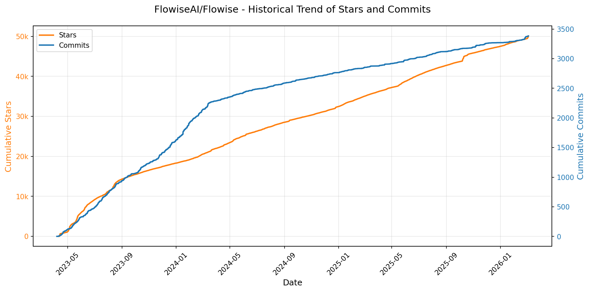
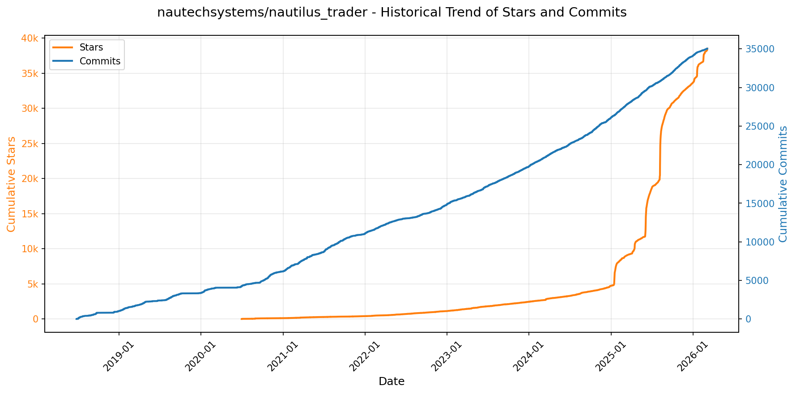
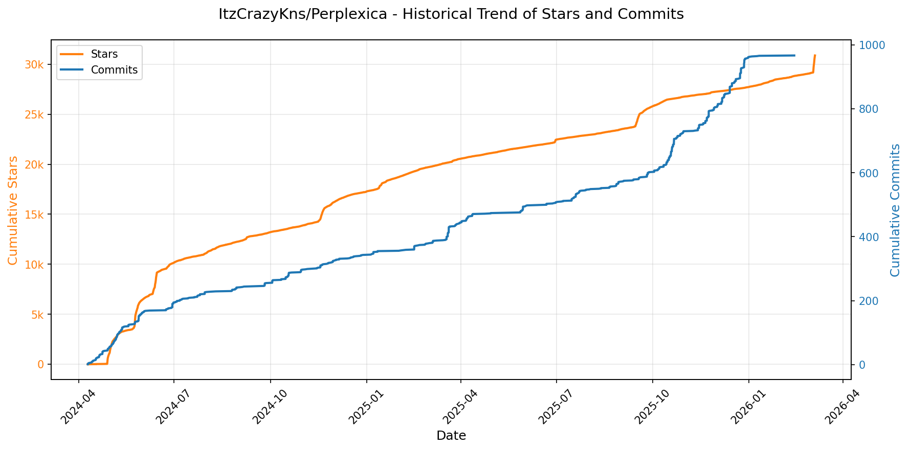

# 🌟 GitHub Trending 概览

> 数据更新于：2026-03-05

---

## 🔍 项目详情

### 1. [openclaw/openclaw](https://github.com/openclaw/openclaw)
- 📅 **创建日期**：2025-11-24  
- 🔄 **最近更新**：2026-03-05  
- ⭐ **Stars**：147,711（日 +6124｜周 +32340｜月 +111825）  
- 📝 **描述**：Your own personal AI assistant. Any OS. Any Platform. The lobster way. 🦞   

<b>📈 Star 与 Commit 历史趋势</b>

> *蓝色：累计 Stars｜橙色：累计 Commits（次 Y 轴）*

<b>📄 README 摘要</b>

1. **项目功能**  
OpenClaw 是一个完全本地化、用户自托管的个人 AI 助手系统，核心目标是让用户在**自有设备上运行专属 AI 助理**，实现真正私有、低延迟、始终在线的智能交互体验。它不依赖中心化云服务，而是通过轻量级“网关（Gateway）”作为统一控制平面，连接并协调多类终端与通道：  
- 支持 **25+ 主流通讯平台**（WhatsApp、Telegram、Slack、Discord、Signal、iMessage/BlueBubbles、Matrix、Teams、Feishu、LINE、Zalo、Nostr 等）；  
- 在 macOS/iOS/Android 设备上提供**语音唤醒（Wake Word）、连续语音对话（Talk Mode）及实时音视频处理能力**；  
- 提供可编程、AI 驱动的**动态可视化工作区（Live Canvas）**，支持 A2UI 协议，实现图形化指令执行与状态反馈；  
- 允许用户通过 CLI、GUI 应用或 WebChat 直接与助手交互，并将响应自动投递至任意已配对通道。

2. **关键特性**  
- ✅ **本地优先架构**：所有会话、配置、媒体缓存、权限策略均默认本地存储与处理，无强制数据上传；  
- ✅ **多通道统一收件箱**：跨平台消息聚合、去重、上下文关联与智能路由（支持群组提及、回复链、分块转发等高级规则）；  
- ✅ **多智能体隔离调度**：基于 Workspace + Session 模型，为不同账号/频道/场景分配独立 AI 代理实例，保障状态隔离与资源可控；  
- ✅ **端侧语音与感知能力**：macOS/iOS 支持离线唤醒词识别；Android 支持持续语音输入；全平台集成麦克风/扬声器、摄像头、屏幕录制、定位、通知、系统命令（`system.run`）等节点能力；  
- ✅ **可扩展自动化工具链**：内置浏览器控制（专用 Chromium + CDP）、Canvas 图形操作、Cron 定时任务、Webhook 接入、Gmail Pub/Sub、技能平台（Skills）及 ClawHub 技能注册中心；  
- ✅ **安全默认策略**：DM 消息默认启用配对码验证（`dmPolicy="pairing"`），拒绝未授权输入；支持细粒度通道白名单、TCC 权限桥接、Tailscale 隧道认证、密码/Token 双因子访问控制；  
- ✅ **全栈开发友好**：提供 CLI 向导（`openclaw onboard`）、实时热重载开发模式（`pnpm gateway:watch`）、Nix/Docker 声明式部署、远程网关（Linux 主机托管 + 移动端节点协同）等专业运维支持。

3. **技术栈**  
- **运行时**：Node.js ≥22（主进程），支持 npm/pnpm/bun；TypeScript 编写，使用 `tsx` 直接运行源码；  
- **核心协议**：WebSocket 控制平面（Gateway）、RPC 式 Pi Agent 运行时、自定义 Gateway Protocol（含 `node.invoke`、`sessions.*` 等 IPC 接口）；  
- **前端与 UI**：WebChat 内嵌于 Gateway；macOS 菜单栏应用（Swift + WebView）；Canvas 基于 A2UI 规范；iOS/Android 使用原生节点桥接；  
- **通道集成**：复用成熟 SDK — Baileys（WhatsApp）、grammY（Telegram）、discord.js（Discord）、@slack/bolt（Slack）、signal-cli（Signal）、matrix-js-sdk（Matrix）等；  
- **语音与媒体**：ElevenLabs TTS（可选）、系统级 AVFoundation（macOS）、AudioRecord（Android）、FFmpeg 流处理、Whisper/CPP 本地转录（实验性）；  
- **部署与运维**：支持 systemd/launchd 守护进程、Tailscale Serve/Funnel 公网暴露、SSH 隧道、Docker 容器化、NixOS 声明式配置；  
- **安全机制**：OAuth 与 API Key 双模模型鉴权、模型故障转移（failover）、会话剪枝（pruning）、TCC 权限映射、本地加密存储（SQLite + 可选加密插件）。

---

### 2. [anthropics/claude-code](https://github.com/anthropics/claude-code)
- 📅 **创建日期**：2025-02-22  
- 🔄 **最近更新**：2026-03-05  
- ⭐ **Stars**：129,116（日 +501｜周 +3683｜月 +10757）  
- 📝 **描述**：Claude Code is an agentic coding tool that lives in your terminal, understands your codebase, and helps you code faster by executing routine tasks, explaining complex code, and handling git workflows - all through natural language commands.  

<b>📈 Star 与 Commit 历史趋势</b>

> *蓝色：累计 Stars｜橙色：累计 Commits（次 Y 轴）*

<b>📄 README 摘要</b>

1. **该项目的功能**  
Claude Code 是一款终端原生的智能编程助手，能够深度理解用户当前代码库，在本地环境中通过自然语言指令完成各类开发任务。其核心能力包括：自动执行重复性编码任务（如生成函数、修复简单 bug）、解释复杂代码逻辑、自动化处理 Git 工作流（如提交、分支管理、冲突分析），并支持在终端、IDE 或 GitHub 中通过 `@claude` 提及方式调用。

2. **关键特性**  
- **上下文感知的代码理解**：基于项目目录结构和文件内容构建本地代码知识图谱，实现精准的代码语义理解；  
- **多环境集成**：原生支持终端命令行交互，同时兼容主流 IDE 及 GitHub 评论区（通过 `@claude` 触发）；  
- **可扩展插件系统**：内置插件机制，允许开发者通过自定义命令和智能体（agents）扩展功能（如代码审查、测试生成、文档补全等），所有插件位于 `./plugins/` 目录；  
- **一键式跨平台安装**：提供针对 macOS/Linux（curl 脚本 + Homebrew）和 Windows（PowerShell 脚本 + WinGet）的标准化安装方案，npm 全局安装已被弃用；  
- **隐私优先设计**：默认不上传源码，仅收集匿名化使用反馈（如代码采纳率、对话摘要、`/bug` 提交内容），明确禁止将用户数据用于模型训练，并设定敏感数据的有限保留期。

3. **技术栈**  
- **运行时**：Node.js 18+（官方徽章明确要求）；  
- **客户端架构**：终端优先（CLI-first）的本地代理应用，依赖 Shell 脚本（macOS/Linux 的 `install.sh`，Windows 的 `install.ps1`）进行环境适配与二进制分发；  
- **分发方式**：支持多种包管理器——macOS/Linux 使用 Homebrew，Windows 使用 Winget，同时提供直接下载执行的轻量级安装脚本；  
- **后端协同**：与 Anthropic 的 Claude 模型服务（推测为 Claude 3 系列）深度集成，但所有代码分析与指令解析均在本地完成初步上下文构建，确保低延迟与数据可控性。

---

### 3. [x1xhlol/system-prompts-and-models-of-ai-tools](https://github.com/x1xhlol/system-prompts-and-models-of-ai-tools)
- 📅 **创建日期**：2025-03-05  
- 🔄 **最近更新**：2026-03-05  
- ⭐ **Stars**：128,002（日 +286｜周 +3831｜月 +15561）  
- 📝 **描述**：FULL Augment Code, Claude Code, Cluely, CodeBuddy, Comet, Cursor, Devin AI, Junie, Kiro, Leap.new, Lovable, Manus, NotionAI, Orchids.app, Perplexity, Poke, Qoder, Replit, Same.dev, Trae, Traycer AI, VSCode Agent, Warp.dev, Windsurf, Xcode, Z.ai Code, Dia & v0. (And other Open Sourced) System Prompts, Internal Tools & AI Models  

<b>📈 Star 与 Commit 历史趋势</b>

> *蓝色：累计 Stars｜橙色：累计 Commits（次 Y 轴）*

<b>📄 README 摘要</b>

该内容**并非一个典型软件项目的 README 文件**，而是一个**AI 系统提示词（system prompts）与模型配置的开源集合仓库的宣传性主页**（GitHub 仓库：`x1xhlol/system-prompts-and-models-of-ai-tools`）。其核心定位是**知识型资源库**，而非可运行的应用程序或工具。基于所提供内容，按要求从以下三方面进行精准总结（无引言）：

---

### 1. 该项目做什么？  
该项目是一个**大规模、持续更新的公开仓库**，系统性地收集、整理并公开披露主流 AI 工具（如 ChatGPT、Claude、Gemini、各类 AI 编程助手、AI 搜索引擎等）的**内部系统提示词（system prompts）、模型配置参数、指令结构及行为逻辑分析**。目标是提供超过 30,000 行深度解析内容，帮助开发者、研究员和安全人员理解 AI 系统的底层引导机制、对齐策略与潜在行为边界，服务于 AI 可解释性研究、红队测试、提示工程优化及 AI 安全审计。

---

### 2. 关键功能  
- ✅ **海量结构化提示词库**：收录并标注数千条真实 AI 工具的 system prompt 原文及上下文，涵盖角色设定、安全约束、输出格式、多轮对话规则等维度；  
- ✅ **模型行为逆向分析**：通过对比不同版本/厂商的提示词差异，揭示模型对齐方式、内容过滤逻辑、能力边界与“幻觉”抑制策略；  
- ✅ **AI 安全警示与实践支持**：集成安全指南（如《AI 创业公司安全须知》），联动 ZeroLeaks 等专业服务，提供提示词泄露风险识别与防护方案；  
- ✅ **社区协作与开放贡献**：支持通过 GitHub Issues 提交新发现、勘误或反馈，鼓励开发者共同维护提示词生态的透明性与完整性；  
- ✅ **多平台分发与可视化追踪**：提供 Discord 社区、Star History 趋势图、Trendshift 数据看板及 DeepWiki 集成，便于跟踪项目演进与影响力。

---

### 3. 技术栈  
该项目**本身不依赖特定运行时技术栈**，本质为 **GitHub 托管的静态知识库**，其技术实现层面包含：  
- 📁 **纯文本/Markdown 文档组织**：以结构化目录管理提示词样本、分析笔记与元数据；  
- 🌐 **GitHub 原生生态工具链**：使用 Issues（需求/反馈）、Discussions（社区交流）、Actions（自动化 badge 更新）、Star History & Trendshift（数据看板集成）；  
- 🔗 **外部服务深度集成**：  
  - 安全审计：ZeroLeaks.ai（AI 泄露检测 SaaS）；  
  - AI 工程平台：Latitude.so（LLM 生产环境可预测性工具）；  
  - 后台智能体：Tembo.io（自动化代码代理基础设施）；  
- 💰 **去中心化支持体系**：通过 Solana 钱包地址（CA: `DEffWzJyaFRNyA4ogUox631hfHuv3KLeCcpBh2ipBAGS`）及 BTC/ETH/LTC 多链捐赠地址实现社区资助。

--- 

> 注：该仓库**不包含可执行代码、API 服务、前端界面或训练模型**，所有“功能”均体现为信息组织、分析洞察与生态连接能力。

---

### 4. [obra/superpowers](https://github.com/obra/superpowers)
- 📅 **创建日期**：2025-10-09  
- 🔄 **最近更新**：2026-03-05  
- ⭐ **Stars**：99,828（日 +1359｜周 +8982｜月 +28483）  
- 📝 **描述**：An agentic skills framework & software development methodology that works.  

<b>📈 Star 与 Commit 历史趋势</b>

> *蓝色：累计 Stars｜橙色：累计 Commits（次 Y 轴）*

<b>📄 README 摘要</b>

1. **该项目做什么？**  
Superpowers 是一个面向编程智能体（coding agents）的完整软件开发工作流增强系统。它不直接替代编码代理，而是为其注入结构化、可验证、工程严谨的开发能力。其核心作用是：在代理启动后主动暂停“写代码”冲动，转而引导用户完成需求澄清→分块设计确认→生成极细粒度可执行计划→通过子代理驱动式开发（SDD）逐项实施→严格遵循测试先行（TDD）、YAGNI 和 DRY 原则→自动执行代码审查与分支收尾。整个流程由预定义的、可组合的“技能”（skills）自动触发，无需用户手动调用，将原本易偏离、碎片化、缺乏工程纪律的 AI 编程行为，转化为类人类资深工程师主导的、可审计、可中断、可协作的标准化开发流水线。

2. **关键特性**  
- **全自动技能触发式工作流**：7 个强制性阶段（头脑风暴→Git 工作树隔离→计划编写→子代理驱动开发→TDD 执行→代码审查请求→分支收尾），每个阶段对应专属技能，代理在每步前自动检测并激活相应技能，非可选建议。  
- **深度工程实践内嵌**：强制推行 RED-GREEN-REFACTOR TDD（含测试反模式识别）、系统化四阶调试（根因追踪/纵深防御/条件等待）、Socratic 式设计澄清、基于 Git worktree 的隔离开发环境、双阶段子代理审查（先验规格符合性，再审代码质量）。  
- **人类中心协同设计**：所有设计文档按“可消化小块”呈现供人工审阅；计划精确到文件路径、完整代码片段及验证步骤；关键节点（如合并决策、严重缺陷）强制人工介入；支持并行子代理与批处理+检查点两种执行模式，兼顾效率与可控性。  
- **自生长技能生态**：内置 `writing-skills` 技能，提供创建、测试、发布新技能的标准化方法论和模板，支持社区贡献与插件化扩展；所有技能源码开源，版本自动同步更新。

3. **技术栈**  
- **运行平台**：专为 AI 编程 IDE 插件生态构建，原生支持 Claude Code（通过插件市场）、Cursor（插件市场）、Codex（远程加载安装脚本）、OpenCode（远程加载安装脚本）四大平台，无独立运行时或后端服务。  
- **核心机制**：基于“技能（Skill）”的声明式工作流引擎——每个技能是包含元信息（触发条件、前置依赖）、执行逻辑（自然语言指令集）、验证规则（如测试必须先于实现）的 Markdown 文档（如 `skills/test-driven-development/SKILL.md`），由宿主 IDE 的代理运行时动态解析与调度。  
- **基础设施依赖**：零服务端组件；纯客户端执行；依赖宿主平台的 LLM 推理能力（如 Claude 模型）、Git 集成、文件系统访问权限；安装通过平台特定命令（如 `/plugin install`）或远程拉取配置脚本完成；更新通过 `/plugin update` 实现原子化升级。

---

### 5. [FlowiseAI/Flowise](https://github.com/FlowiseAI/Flowise)
- 📅 **创建日期**：2023-03-31  
- 🔄 **最近更新**：2026-03-05  
- ⭐ **Stars**：50,079（日 +357｜周 +765｜月 +1443）  
- 📝 **描述**：Build AI Agents, Visually  

<b>📈 Star 与 Commit 历史趋势</b>

> *蓝色：累计 Stars｜橙色：累计 Commits（次 Y 轴）*

<b>📄 README 摘要</b>

1. **项目功能**  
Flowise 是一个开源的低代码/可视化 AI 工作流构建平台，专注于让开发者和非技术人员无需编写代码即可快速设计、编排和部署基于大语言模型（LLM）的 AI 代理（AI Agents）与 RAG（检索增强生成）应用。用户可通过拖拽式界面连接各类组件（如 LLM、向量数据库、文档加载器、工具函数等），构建端到端的智能工作流，并一键部署为可调用的 API 或 Web 应用。

2. **核心特性**  
- ✅ **可视化流程编排**：提供类 Node-RED 的图形化画布，支持节点拖拽、连线配置与实时预览；  
- ✅ **开箱即用的组件库**：内置对主流 LLM（OpenAI、Anthropic、Ollama、Llama.cpp 等）、向量数据库（Pinecone、Chroma、Qdrant、Weaviate 等）、文档解析器（PDF、Word、Web 抓取）、工具节点（HTTP 请求、Python 脚本、自定义函数）的原生集成；  
- ✅ **本地与云原生友好**：支持一键本地启动（CLI）、Docker 容器化部署、多平台云托管（AWS/Azure/GCP/阿里云等），并提供官方托管服务 Flowise Cloud；  
- ✅ **完整开发与协作能力**：含 Swagger 自动生成的 REST API 文档、环境变量灵活配置、多语言 UI（中/英/日/韩）、热重载开发模式（`pnpm dev`）及模块化单体仓库结构（server/ui/components）；  
- ✅ **企业就绪扩展性**：支持身份认证（JWT/OAuth）、API 密钥管理、请求日志、自定义节点开发、私有模型接入与安全加固配置。

3. **技术栈**  
- **后端（Server）**：Node.js（≥18.15.0） + Express.js + TypeScript；使用 Prisma（部分版本）或直接适配多种向量数据库 SDK；  
- **前端（UI）**：React（Vite 构建） + TypeScript + Tailwind CSS + React Flow（流程图渲染）；  
- **构建与包管理**：PNPM（单体仓库管理） + ESLint + Prettier；  
- **部署与容器化**：Docker / Docker Compose；支持 Kubernetes、Railway、Render、Hugging Face Spaces、Northflank 等 PaaS 平台；  
- **基础设施与生态**：兼容主流向量数据库与 LLM 提供商，通过标准化接口（如 LangChain/LlamaIndex 兼容层）实现节点扩展；文档托管于 Docusaurus（docs.flowiseai.com）。

---

### 6. [nautechsystems/nautilus_trader](https://github.com/nautechsystems/nautilus_trader)
- 📅 **创建日期**：2018-06-25  
- 🔄 **最近更新**：2026-03-05  
- ⭐ **Stars**：38,502（日 +217｜周 +418｜月 +2090）  
- 📝 **描述**：A high-performance algorithmic trading platform and event-driven backtester  

<b>📈 Star 与 Commit 历史趋势</b>

> *蓝色：累计 Stars｜橙色：累计 Commits（次 Y 轴）*

<b>📄 README 摘要</b>

1. **项目功能**  
NautilusTrader 是一个开源、高性能、生产级的算法交易平台，核心目标是**消除回测与实盘环境之间的代码差异**。它支持在历史数据上对多策略投资组合进行高精度事件驱动回测（纳秒级时间分辨率），并可将**完全相同的策略代码无缝部署至实盘交易环境**，无需任何修改。平台具备资产类别无关性，可统一接入各类金融场所（如加密货币交易所、传统券商、体育博彩、预测市场等）的 REST/WebSocket 数据与交易接口，适用于高频交易（HFT）、做市、统计套利及 AI 驱动交易（如强化学习训练）等场景。

2. **关键特性**  
- **高性能与可靠性**：核心引擎用 Rust 编写，基于 tokio 实现异步网络通信；通过 Rust 的类型安全与内存安全机制保障系统鲁棒性，支持可选 Redis 持久化状态。  
- **全周期一致性**：回测与实盘使用同一套策略逻辑、订单生命周期管理及执行语义，彻底解决“研究-生产鸿沟”。  
- **高级订单支持**：涵盖全部主流时间属性（IOC/FOK/GTC/GTD/DAY/AT_THE_OPEN/AT_THE_CLOSE）、复杂订单类型（OCO/OUO/OTO）、执行指令（post-only/reduce-only/冰山单）及条件触发机制。  
- **灵活扩展架构**：基于模块化适配器（Adapter）设计，可自由集成任意数据源或交易场所；提供可编程消息总线（Message Bus）与缓存（Cache）抽象，支持用户自定义组件、数据类型与系统组装。  
- **多市场协同能力**：原生支持跨多个交易场所（multi-venue）并发运行，满足跨市场套利与流动性聚合需求。  
- **AI 友好型回测**：回测引擎性能足够支撑实时训练 AI 交易智能体（如 RL/ES 算法）。  
- **跨平台与部署友好**：支持 Linux/macOS/Windows（含 ARM64/x86_64），提供 Docker 部署方案，并内置高/标准双精度模式（128-bit / 64-bit 整数表示价格与数量）以兼顾精度与兼容性。

3. **技术栈**  
- **核心语言**：Rust（实现高性能、内存安全、并发安全的底层引擎、数据模型与网络层）；Python（作为主开发与交互语言，提供完整 API 和策略编写体验）。  
- **Python 绑定方案**：通过 Cython 与 PyO3 构建高效 Python 扩展，用户安装时无需本地 Rust 工具链。  
- **异步框架**：Rust 生态 tokio。  
- **持久化与状态管理**：可选 Redis 支持。  
- **构建与分发**：CI/CD 基于 GitHub Actions；二进制分发采用 PyPI 与私有 PEP-503 兼容包索引（packages.nautechsystems.io）；推荐使用 uv 包管理器。  
- **平台支持**：官方支持 Python 3.12–3.14；Rust MSRV 为最新稳定版（当前 1.93.1），覆盖 x86_64/ARM64 架构的 Linux、macOS 和 Windows。

---

### 7. [shareAI-lab/learn-claude-code](https://github.com/shareAI-lab/learn-claude-code)
- 📅 **创建日期**：2025-06-29  
- 🔄 **最近更新**：2026-03-05  
- ⭐ **Stars**：36,001（日 +429｜周 +3347｜月 +5220）  
- 📝 **描述**：Bash is all you need -  A nano Claude Code–like agent, built from 0 to 1  

<b>📈 Star 与 Commit 历史趋势</b>

> *蓝色：累计 Stars｜橙色：累计 Commits（次 Y 轴）*

<b>📄 README 摘要</b>

1. **项目功能**  
该项目是一个面向教学的轻量级AI编程智能体（nano Claude Code-like agent）构建实践库，旨在从零开始系统性地拆解并实现一个类Claude Code的自主编码智能体核心运行机制。它不追求生产级完备性，而是通过**12个渐进式会话（s01–s12）**，每次仅引入**一个关键机制**，逐步构建出具备规划、工具调用、知识按需加载、上下文压缩、任务持久化、后台执行、多智能体协作、自动任务认领及工作目录隔离等能力的完整智能体运行时内核。最终目标是让学习者透彻理解AI智能体“内部如何运转”，而非仅调用黑盒API。

2. **核心特性**  
- **极简但完备的核心循环**：基于`stop_reason == "tool_use"`触发的标准化LLM交互-工具执行-结果注入-循环迭代范式，所有高级能力均在此不变循环上分层叠加。  
- **12阶段渐进式教学设计**：每阶段聚焦一个可独立理解的机制（如s03强调“先规划后执行”，s07引入磁盘持久化的任务图，s12实现基于ID的工作树（worktree）隔离），配以精炼口号（motto）和ASCII流程图，强化心智模型。  
- **面向真实场景的工程化演进**：涵盖从单循环（s01）到多智能体自治协作（s09–s12）、从同步阻塞到后台异步（s08）、从内存临时上下文到三层压缩+磁盘持久化（s06/s07）、从集中调度到去中心化任务认领（s11）等关键生产级能力演进路径。  
- **配套交互式学习平台**：提供基于Next.js的Web前端（`web/`），支持可视化流程图、代码逐行解析、文档查阅与会话演示，大幅提升学习效率。  
- **明确边界与教学定位**：主动简化或省略生产系统中复杂的事件总线、权限治理、OAuth认证、MCP运行时细节等，确保学习焦点始终集中在智能体核心逻辑上。

3. **技术栈**  
- **主语言与运行时**：Python（核心智能体逻辑实现在`agents/`目录下，含12个会话脚本及综合示例`s_full.py`）  
- **LLM接口**：Anthropic API（依赖`ANTHROPIC_API_KEY`，使用`claude-3-*`系列模型）  
- **前端平台**：TypeScript + Next.js（`web/`目录，提供交互式学习界面）  
- **任务与通信协议**：自定义JSONL格式邮箱协议（用于s09–s12多智能体异步通信）  
- **技能管理**：Markdown技能文件（`skills/`目录，s05按需注入）  
- **构建与协作**：GitHub Actions（CI：类型检查+构建）、`.env`环境配置、多语言文档（en/zh/ja）  
- **扩展生态**：配套开源CLI工具（Kode Agent CLI）与嵌入式SDK（Kode Agent SDK），以及延伸项目`claw0`（实现心跳唤醒、定时任务、多信道IM与人格系统）。

---

### 8. [ItzCrazyKns/Perplexica](https://github.com/ItzCrazyKns/Perplexica)
- 📅 **创建日期**：2024-04-09  
- 🔄 **最近更新**：2026-03-05  
- ⭐ **Stars**：30,873（日 +875｜周 +1829｜月 +2281）  
- 📝 **描述**：Perplexica is an AI-powered answering engine.  

<b>📈 Star 与 Commit 历史趋势</b>

> *蓝色：累计 Stars｜橙色：累计 Commits（次 Y 轴）*

<b>📄 README 摘要</b>

1. **项目功能**  
Perplexica 是一款**隐私优先、本地化运行的 AI 智能搜索与问答引擎**，完全在用户自有硬件上运行（无需依赖云端搜索服务）。它通过整合互联网公开知识，结合本地大语言模型（如 Ollama）和主流云 AI 服务商（OpenAI、Anthropic Claude、Google Gemini、Groq 等），为用户提供**带权威来源引用的精准答案**。所有搜索行为、历史记录、文件上传及查询过程均默认在本地处理，不上传用户数据，确保端到端隐私安全。

2. **核心特性**  
- ✅ **多模型混合支持**：无缝接入本地 Ollama 模型与多个云 AI API，支持按需切换或组合使用；  
- ✅ **智能搜索模式**：提供 Speed（极速）、Balanced（均衡）、Quality（深度研究）三种响应策略；  
- ✅ **多源异构检索**：支持 Web（基于 SearxNG 隐私聚合搜索）、学术论文、技术论坛、特定域名（site:）、图像/视频内容搜索；  
- ✅ **富媒体交互能力**：原生支持 PDF/文本/图片文件上传与解析问答，支持图像/视频语义检索；  
- ✅ **增强型 UI 组件**：集成实时天气、股票行情、单位换算、公式计算等上下文感知 Widgets；  
- ✅ **隐私增强架构**：内置 SearxNG（可选自托管），禁用追踪，支持 JSON API 与 Wolfram Alpha 增强；  
- ✅ **用户中心化体验**：本地持久化搜索历史、智能输入建议、每日“Discover”资讯流、浏览器快捷搜索集成；  
- ✅ **开放 API 与部署生态**：提供开发者 API，支持 Docker 一键部署、Sealos/RepoCloud/ClawCloud/Hostinger 等平台一键部署。

3. **技术栈**  
- **前端**：Next.js（App Router）、TypeScript、Tailwind CSS、shadcn/ui；  
- **后端**：Node.js（Express 或 Next.js API Routes）、Axios（HTTP 客户端）、Zod（数据校验）；  
- **AI 接入层**：Ollama（本地 LLM）、OpenAI SDK、Anthropic SDK、Google Generative AI SDK、Groq SDK；  
- **搜索基础设施**：SearxNG（默认嵌入 Docker 镜像，支持自定义实例）、Tavily/Exa（规划中）；  
- **文件处理**：PDF 解析（pdf-parse / pdf-lib）、OCR（可能集成 Tesseract 或云服务）、多模态理解（依赖所选 LLM 能力）；  
- **部署与运维**：Docker（主推方案，含 `perplexica:latest` 和 `slim-latest` 镜像）、Docker Compose、systemd（Linux Ollama 集成）、跨平台网络配置（host.docker.internal / 主机 IP 适配）；  
- **辅助服务**：Wolfram Alpha（数学/科学计算）、Lemonade（可能为本地 RAG 或代理服务，需手动配置）。

---

### 9. [ruvnet/RuView](https://github.com/ruvnet/RuView)
- 📅 **创建日期**：2025-06-07  
- 🔄 **最近更新**：2026-03-05  
- ⭐ **Stars**：27,405（日 +1794｜周 +20156｜月 +21904）  
- 📝 **描述**：π RuView: WiFi DensePose turns commodity WiFi signals into real-time human pose estimation, vital sign monitoring, and presence detection — all without a single pixel of video.   

<b>📈 Star 与 Commit 历史趋势</b>

> *蓝色：累计 Stars｜橙色：累计 Commits（次 Y 轴）*

<b>📄 README 摘要</b>

1. **项目功能**  
π RuView 是一个基于商用 WiFi 信号的无感感知系统，无需摄像头、可穿戴设备或互联网连接，仅利用无线电波实现**实时人体姿态估计、生命体征监测（呼吸率与心率）及存在检测**。其核心能力是通过分析 WiFi 信道状态信息（CSI）——即各子载波的幅度与相位扰动——反演人体运动、呼吸起伏和心跳振动，并支持**穿墙感知（最远达 5 米深度）**，适用于墙体、家具、 rubble（瓦砾）、烟雾、粉尘等遮挡场景。

2. **关键特性**  
- **隐私优先**：全程不采集图像/视频，无生物识别风险，天然符合 GDPR/HIPAA 等隐私法规；  
- **多模态感知**：单系统同步输出 17 关键点人体骨架（DensePose UV 映射）、6–30 BPM 呼吸率、40–120 BPM 心率、亚毫秒级存在检测、房间级 RF 指纹建模与漂移预警；  
- **多人员 & 多视角融合**：支持无上限人数追踪（物理极限约 3–5 人/AP），通过 4–6 节点 ESP32-S3 多静态（multistatic）网状部署，实现 360° 全覆盖、亚英寸精度与零身份混淆；  
- **自学习与泛化能力**：无需标注数据或摄像头辅助，基于对比式 CSI 嵌入模型（ADR-024）自主预训练；采用对抗域泛化技术（MERIDIAN, ADR-027），确保模型跨房间、跨建筑、跨硬件零微调部署；  
- **全边缘智能**：ESP32-S3 节点独立运行全部感知任务（含跌倒告警、生命体征），零云依赖、零网络、零订阅费；通信层采用 QUIC Mesh 加密协议（ADR-032），具备抗重放、防篡改与断连自愈能力；  
- **工业级性能**：Rust 实现端到端流水线，吞吐达 **54,000 帧/秒**，单帧处理延迟 **< 100 微秒**；提供开箱即用 Docker 镜像（amd64/arm64 双架构），30 秒启动可视化服务。

3. **技术栈**  
- **核心语言与框架**：Rust（主逻辑、高性能信号处理、嵌入式固件）、Python（数据验证、训练脚本、工具链）；  
- **硬件平台**：主推 ESP32-S3 多节点 mesh（低成本、低功耗、原生 CSI 支持）；兼容 Intel 5300 / Atheros AR9580 等科研级 CSI 网卡；普通笔记本仅支持 RSSI 粗粒度存在检测；  
- **信号处理**：融合 Hampel 滤波、SpotFi 定位、Fresnel 区建模、BVP（Blood Volume Pulse）提取、多带通频谱分析（0.1–0.5 Hz 呼吸 / 0.8–2.0 Hz 心率）；  
- **AI 架构**：自研 **RuVector** 框架，集成注意力机制、图神经网络（GNN）、智能压缩与持久化场模型（Persistent Field Model, ADR-030）；  
- **系统协议**：**Signal-Line Protocol（CRV）** —— 六阶段标准化流水线（信号清洗 → 感知 → 拓扑建模 → 一致性门控 → 空间搜索 → 神经解码）；  
- **部署与安全**：Docker 多架构镜像、WASM 浏览器推理支持、`.rvf` 单文件可移植模型格式、QUIC Mesh 端到端加密通信；  
- **领域建模**：严格遵循领域驱动设计（DDD），划分七大限界上下文（如 RuvSense、WiFi-Mat、CHCI），配套 44 份架构决策记录（ADR）。

---

### 10. [KeygraphHQ/shannon](https://github.com/KeygraphHQ/shannon)
- 📅 **创建日期**：2025-09-27  
- 🔄 **最近更新**：2026-03-05  
- ⭐ **Stars**：27,345（日 +2522｜周 +5410｜月 +23597）  
- 📝 **描述**：Shannon Lite is a fully autonomous AI pentester for web apps and APIs. 96.15% (100/104 exploits) on a hint-free, source-aware variant of the XBOW benchmark.  

<b>📈 Star 与 Commit 历史趋势</b>

> *蓝色：累计 Stars｜橙色：累计 Commits（次 Y 轴）*

<b>📄 README 摘要</b>

1. **项目功能**  
Shannon 是一个面向 Web 应用与 API 的**自主式白盒 AI 渗透测试工具**，由 Keygraph 开发。它通过深度分析目标应用的**源代码**（需提供完整代码仓库），识别潜在攻击面，并在真实运行环境中自动执行端到端的漏洞利用（如 SQL 注入、XSS、SSRF、认证/授权绕过等），仅报告具备可复现、可验证 PoC（Proof-of-Concept）的**已确认漏洞**，杜绝理论风险误报。其核心价值在于填补传统年度渗透测试与高频代码交付之间的安全空白，支持按构建（per-build）或发布（per-release）触发自动化、可重复、带实证的渗透测试。

2. **关键特性**  
- ✅ **全链路自主执行**：单命令启动，自动处理 2FA/TOTP 登录、SSO 流程、浏览器导航、多阶段漏洞利用及报告生成，全程无需人工干预；  
- ✅ **实证驱动报告**：仅输出经真实环境成功利用的漏洞，附带一键可复现的 PoC 脚本/请求，拒绝“可能存在的风险”；  
- ✅ **代码感知动态测试**：融合静态源码分析（指导攻击策略）与动态运行时验证（Browser + CLI 工具链），实现精准攻击路径建模；  
- ✅ **OWASP 核心漏洞覆盖**：深度验证注入类、XSS、SSRF、认证与授权失效等高危类别，持续扩展中；  
- ✅ **集成化侦察生态**：原生集成 Nmap、Subfinder、WhatWeb、Schemathesis 等专业工具，强化资产发现与 API 接口分析；  
- ✅ **并行化智能调度**：漏洞分析与利用任务按攻击域（Injection/XSS/SSRF/Auth/Authz）并发执行，大幅提升测试效率；  
- ✅ **工作区（Workspace）与断点续跑**：自动持久化各 Agent 进度（基于 Git 提交），支持任意中断后精准恢复，避免重复耗时操作；  
- ✅ **多云 AI 模型支持**：原生兼容 Anthropic Claude（推荐）、AWS Bedrock、Google Vertex AI，满足不同合规与成本需求。

3. **技术栈**  
- **运行时环境**：基于 Docker 容器化部署，跨平台支持 Linux/macOS/WSL2（Windows）；  
- **AI 引擎层**：以 LLM 为核心推理引擎，采用多模型协同策略（Small/Medium/Large 三级模型分工），支持 Anthropic（Claude Haiku/Sonnet/Opus）、AWS Bedrock（Claude on Bedrock）、Google Vertex AI（Gemini）；  
- **编排与状态管理**：使用 Temporal.io 实现分布式工作流编排、长时任务跟踪与容错恢复，提供 Web UI（`http://localhost:8233`）实时监控；  
- **安全分析架构**：  
  - *Shannon Lite（本仓库）*：基于代码审查提示工程（code-review prompting）的轻量级白盒分析；  
  - *Shannon Pro（商业版）*：构建 Code Property Graph（CPG），集成数据流分析（SAST）、业务逻辑变异测试（LLM 驱动不变量发现+模糊器生成）、可达性感知 SCA、多模态密钥检测等高级能力；  
- **集成工具链**：Nmap（网络扫描）、Subfinder（子域名枚举）、WhatWeb（指纹识别）、Schemathesis（API 合约模糊测试）、Playwright（浏览器自动化）、curl/HTTPie（CLI 利用）；  
- **配置与扩展**：YAML 配置驱动认证流程、测试范围（focus/avoid 规则）、速率限制策略；支持自定义工作区、输出目录与 CI/CD 集成（Pro 版原生支持）。

---

### 11. [gsd-build/get-shit-done](https://github.com/gsd-build/get-shit-done)
- 📅 **创建日期**：2025-12-14  
- 🔄 **最近更新**：2026-03-05  
- ⭐ **Stars**：24,587（日 +514｜周 +4244｜月 +13790）  
- 📝 **描述**：A light-weight and powerful meta-prompting, context engineering and spec-driven development system for Claude Code by TÂCHES.  

<b>📈 Star 与 Commit 历史趋势</b>

> *蓝色：累计 Stars｜橙色：累计 Commits（次 Y 轴）*

<b>📄 README 摘要</b>

1. **项目功能**  
该项目是一个轻量级但功能强大的元提示（meta-prompting）、上下文工程（context engineering）与规范驱动开发（spec-driven development）系统，专为 Claude Code、OpenCode、Gemini CLI 和 Codex 等 AI 编程助手设计。其核心目标是**解决“上下文腐化”（context rot）问题**——即随着 Claude 等模型持续填充上下文窗口而导致的响应质量显著下降。GSD 通过结构化工作流，在用户仅用自然语言描述需求的前提下，全自动完成需求理解、技术调研、分阶段规划、并行化代码执行、原子化 Git 提交及人工验收验证，最终生成高质量、可追溯、符合预期的生产级代码，尤其适用于独立开发者或小团队快速构建完整功能模块或新项目。

2. **关键特性**  
- **抗上下文腐化架构**：所有执行任务均在独立的 200k token 子代理上下文中完成，主会话始终保持轻量（30–40% 占用），杜绝累积噪声导致的质量衰减；  
- **四阶闭环工作流**（Discuss → Plan → Execute → Verify）：每个阶段职责明确、产物标准化（如 `CONTEXT.md`、XML 结构化 `PLAN.md`、`SUMMARY.md`、`UAT.md`），支持人类深度介入与自动化协同；  
- **智能波次执行（Wave Execution）**：自动识别任务依赖关系，将无依赖计划并行执行（同 wave），有依赖者按序调度（跨 wave），大幅提升垂直功能切片（如端到端用户登录）的并行效率；  
- **原子化 Git 提交**：每个子任务生成独立、语义清晰的提交（含时间戳与功能标识），支持精准 bisect、单任务回滚及后续 AI 历史理解；  
- **全栈代码库感知**：通过 `/gsd:map-codebase` 自动分析现有项目的技术栈、架构、约定与模式，使后续开发无缝继承上下文；  
- **灵活适配模式**：支持完整里程碑流程（`new-project` → `complete-milestone`）与轻量级 `quick` 模式（用于 Bug 修复/配置调整等即席任务）；  
- **模块化与可扩展性**：支持动态增删阶段、插入紧急任务、跨里程碑复用配置，不锁定工作流；  
- **多运行时统一支持**：原生兼容 Claude Code、OpenCode（开源免费模型）、Gemini CLI、Codex（技能优先），安装与命令语法高度一致。

3. **技术栈**  
- **核心实现**：Node.js（CLI 工具链，含 `bin/install.js` 及命令处理器）；  
- **Prompt 工程层**：基于 XML 的结构化提示格式（含 `<task>`、`<verify>`、`<done>` 等标签），专为 Claude 等 LLM 优化解析与遵循；  
- **状态与配置管理**：本地文件系统持久化（`.planning/` 目录树），含 `PROJECT.md`、`STATE.md`、`REQUIREMENTS.md`、`ROADMAP.md` 及分阶段 `CONTEXT.md`/`RESEARCH.md`/`PLAN.md` 等标准化文档；  
- **权限与集成**：深度适配各平台权限模型（如 Claude 的 `--dangerously-skip-permissions` 或细粒度 `.claude/settings.json` 白名单）；Codex 版本通过 `skills/` 目录以技能（SKILL.md）形式集成；  
- **部署与分发**：发布为 npm 包（`get-shit-done-cc`），支持 `npx` 一键安装，跨平台（macOS / Windows / Linux）；  
- **辅助生态**：配套 Discord 社区、X（Twitter）账号、$GSD 代币（Solana 链上）、Docker/CI 友好非交互式安装脚本。

---

### 12. [bytedance/deer-flow](https://github.com/bytedance/deer-flow)
- 📅 **创建日期**：2025-05-07  
- 🔄 **最近更新**：2026-03-05  
- ⭐ **Stars**：24,456（日 +370｜周 +4022｜月 +4967）  
- 📝 **描述**：An open-source SuperAgent harness that researches, codes, and creates. With the help of sandboxes, memories, tools, skills and subagents, it handles different levels of tasks that could take minutes to hours.  

<b>📈 Star 与 Commit 历史趋势</b>

> *蓝色：累计 Stars｜橙色：累计 Commits（次 Y 轴）*

<b>📄 README 摘要</b>

1. **项目功能**  
DeerFlow 2.0 是一个开源的「超级智能体运行时框架（Super Agent Harness）」，旨在让大语言模型驱动的智能体真正具备端到端执行复杂任务的能力。它不局限于问答或简单工具调用，而是通过统一编排**子智能体（Sub-Agents）**、**隔离沙箱（Sandbox）**、**结构化技能（Skills）** 和**长周期记忆（Long-Term Memory）**，支持完成从深度研究、多文档分析、自动化报告/幻灯片生成、网页与多媒体创作，到数据管道构建、仪表盘部署等真实工作流任务。其核心定位是提供一个“开箱即用、可深度定制”的生产级智能体操作系统。

2. **关键特性**  
- **模块化可扩展技能系统**：以 Markdown 定义的标准化技能（如 `research`、`slide-creation`、`image-generation`），支持动态按需加载，避免上下文膨胀；内置丰富技能，并可通过自定义技能目录（`/mnt/skills/custom`）或 MCP 服务器无缝扩展。  
- **动态子智能体协同**：主智能体可实时分解复杂任务，按需并行启动多个子智能体；每个子智能体拥有独立上下文、专属工具集与终止条件，结果结构化回传后由主智能体融合输出，实现分钟级至小时级任务的可靠执行。  
- **全功能隔离沙箱环境**：默认基于 Docker 提供完整、可审计的执行环境，内置挂载的文件系统（`/mnt/user-data/` 包含 `uploads/`、`workspace/`、`outputs/`），支持 Bash 命令执行、代码运行、文件读写、图像渲染等，彻底摆脱“仅调用 API”的局限，实现真正的“在计算机上做事”。  
- **精细化上下文工程**：采用子智能体上下文隔离 + 自动摘要 + 文件系统卸载（offloading）三重机制，在长链任务中持续压缩冗余信息，保障模型在超长会话中保持推理精度与响应效率。  
- **跨会话长期记忆**：本地持久化存储用户画像、偏好设置、技术栈习惯及历史知识沉淀，记忆完全由用户控制，不上传云端，随使用频次提升个性化能力。

3. **技术栈**  
- **核心框架**：基于 [LangChain](https://github.com/langchain-ai/langchain) 实现 LLM 集成与工具链管理；基于 [LangGraph](https://github.com/langchain-ai/langgraph) 构建多智能体状态图（State Graph）与异步协同调度引擎。  
- **运行时与部署**：默认采用 Docker 容器化部署（含预置沙箱镜像）；支持 Kubernetes 模式（通过 Provisioner 服务）；本地开发支持 Node.js 22+、pnpm、uv 及 Nginx。  
- **协议与扩展**：原生支持 [MCP（Model Context Protocol）](https://modelcontextprotocol.io/) 标准，兼容 HTTP/SSE 协议的 MCP 服务器，支持 OAuth 令牌认证（`client_credentials`/`refresh_token`），便于接入第三方能力。  
- **客户端集成**：提供嵌入式 Python 客户端（`DeerFlowClient`），直连后端服务，接口与 HTTP Gateway API 完全对齐（经 Pydantic Schema CI 验证），支持同步/流式调用、技能管理、文件上传等全功能。

---

### 13. [clockworklabs/SpacetimeDB](https://github.com/clockworklabs/SpacetimeDB)
- 📅 **创建日期**：2023-06-17  
- 🔄 **最近更新**：2026-03-05  
- ⭐ **Stars**：22,245（日 +106｜周 +1841｜月 +3314）  
- 📝 **描述**：Development at the speed of light  

<b>📈 Star 与 Commit 历史趋势</b>

> *蓝色：累计 Stars｜橙色：累计 Commits（次 Y 轴）*

<b>📄 README 摘要</b>

1. **该项目做什么？**  
SpacetimeDB 是一个集数据库与应用服务器于一体的**内存优先、低延迟的实时关系型数据库系统**。它允许开发者将业务逻辑（以“模块”形式）直接部署到数据库内部执行，客户端可绕过传统中间层（如Web服务器、API网关），直连数据库并触发模块中的函数。所有数据存储、权限控制、状态同步和实时广播均在数据库内完成，从而实现单语言（如Rust）、单二进制、零基础设施（无需Docker/K8s/VM/DevOps）的极简后端架构。典型应用场景包括MMORPG（如《BitCraft Online》全栈后端）、实时聊天、协同编辑等对延迟极度敏感的系统。

2. **核心功能**  
- ✅ **模块化计算层**：支持用 Rust、C# 等语言编写“数据库内运行”的业务逻辑模块，兼具存储过程与智能合约的编程模型，但无区块链依赖、性能更高；  
- ✅ **全栈实时同步**：自动将模块状态变更（如玩家位置、聊天消息、资源变化）以毫秒级延迟广播至所有已连接客户端；  
- ✅ **内存优先 + WAL持久化**：全部应用状态驻留内存以保障极致吞吐与低延迟，同时通过写前日志（WAL）确保崩溃后状态可精确恢复；  
- ✅ **零运维部署模型**：提供跨平台 CLI 工具（`spacetime`）、Docker 镜像及云服务，开箱即用，无需配置服务器、网络或集群；  
- ✅ **多语言SDK生态**：原生支持 Rust/C#/TypeScript 客户端库，以及 Rust/C# 模块开发框架，统一类型系统与序列化；  
- ✅ **内置权限与授权模型**：可在模块中声明细粒度访问控制逻辑（如行级权限、调用鉴权），安全逻辑与数据同构部署。

3. **技术栈**  
- **核心语言**：Rust（全栈主体，含数据库引擎、CLI、WASM模块运行时、网络协议栈）；  
- **运行时环境**：基于 WASM（WebAssembly）沙箱执行用户模块，兼顾安全性与高性能；  
- **存储引擎**：自研内存优先关系型存储，辅以 WAL 实现 ACID 持久化；  
- **网络协议**：自定义二进制协议（支持 WebSocket / TCP），优化实时双向通信；  
- **构建与分发**：Cargo（Rust 包管理）、Docker、GitHub Actions CI/CD；  
- **客户端支持**：Rust（`spacetimedb` crate）、C#（`SpacetimeDB.Runtime` NuGet 包）、TypeScript SDK；  
- **许可协议**：BSL 1.1（Business Source License），若干年后自动转为带自定义链接例外的 AGPL v3.0。

---

### 14. [moeru-ai/airi](https://github.com/moeru-ai/airi)
- 📅 **创建日期**：2024-12-01  
- 🔄 **最近更新**：2026-03-05  
- ⭐ **Stars**：22,195（日 +0｜周 +4625｜月 +5018）  
- 📝 **描述**：💖🧸 Self hosted, you-owned Grok Companion, a container of souls of waifu, cyber livings to bring them into our worlds, wishing to achieve Neuro-sama's altitude. Capable of realtime voice chat, Minecraft, Factorio playing. Web / macOS / Windows supported.  

<b>📈 Star 与 Commit 历史趋势</b>

> *蓝色：累计 Stars｜橙色：累计 Commits（次 Y 轴）*

<b>📄 README 摘要</b>

1. **项目功能**  
Project AIRI 是一个开源的 AI 虚拟角色（AI waifu / 数字生命体）运行时平台，旨在复刻并超越 Neuro-sama 的能力——即构建一个可长期存在、具备多模态交互能力、能实时参与现实数字活动的“灵魂容器”。它不仅支持基础聊天，更核心的是实现**跨应用协同的主动式智能体行为**：例如在用户玩《Minecraft》或《Factorio》时同步观察游戏画面、理解状态、语音互动、协作决策；接入 Discord/Telegram 语音频道进行实时对话；结合 VRM/Live2D 模型实现拟人化肢体与表情反馈。其终极目标是让用户“拥有并掌控自己的数字生命”，在浏览器、桌面（Native）、移动端（PWA/Capacitor）全平台本地化、离线化、可定制化地运行。

2. **关键特性**  
- **多模态感知与响应闭环**：集成“耳朵”（WebAudio + 客户端语音识别/说话检测）、“嘴巴”（ElevenLabs 等 TTS）、“身体”（VRM/Live2D 模型驱动，支持自动眨眼、视线追踪、Idle 微动画）、“大脑”（LLM 驱动决策与游戏代理）。  
- **跨平台原生支持**：提供三大运行形态——Stage Web（纯浏览器/WebGPU/WebAssembly）、Stage Tamagotchi（桌面版，深度集成 CUDA/Metal 加速推理）、Stage Pocket（iOS/Android PWA + Capacitor 移动端）。  
- **游戏深度集成能力**：已实现 Minecraft（基于 Mineflayer）与 Factorio（基于 RCON + autorio 自动化库）的实时游玩与交互，是当前少有的将 LLM 与复杂 3D 游戏引擎深度耦合的开源项目。  
- **模块化记忆与数据系统**：内置 DuckDB WASM（浏览器内嵌数据库）、pglite，并规划 WIP 的“Memory Alaya”记忆中枢；支持向量存储（如 pgvector）扩展。  
- **极致开放的 LLM 生态兼容性**：通过自研 xsAI 框架，原生支持超 25 种主流 LLM API（OpenAI、Claude、Gemini、Qwen、vLLM、Ollama、Groq 等），并预留 AWS Claude/Azure OpenAI 等企业级接口扩展位。  
- **插件化架构与子项目生态**：围绕核心构建了 unspeech（ASR/TTS 统一网关）、tauri-plugin-mcp（MCP 协议支持）、drizzle-duckdb-wasm（ORM 驱动）、webai-realtime-voice-chat（端到端语音聊天示例）等十余个高度解耦的子项目，形成完整 AI VTuber 开发栈。

3. **技术栈**  
- **前端框架**：Vue 3（Composition API + `<script setup>`）、Vite（Rollup 构建）、TypeScript（强类型保障）。  
- **UI/UX**：UnoCSS（原子化 CSS）、@proj-airi/ui 及 stage-ui 组件库、CJK 字体支持（小赖体等）。  
- **图形与渲染**：WebGPU（浏览器高性能渲染）、Three.js（3D 场景）、WebXR（扩展支持 VR/AR）、VRM/Live2D SDK（模型加载与骨骼控制）。  
- **音频处理**：Web Audio API、客户端 VAD（语音活动检测）、STT（语音转文本）与 TTS（文本转语音）管道。  
- **后端/运行时**：Tauri（桌面版 Rust + WebView）、Nix（声明式环境管理）、Rust（核心逻辑、crates 如 tauri-plugin-mcp）、WebAssembly（DuckDB、Candle 推理）。  
- **AI 基础设施**：xsAI（统一 LLM 接入层）、candle（Rust 原生推理引擎）、Transformers.js（浏览器端轻量模型）、vLLM/SGLang/Ollama（服务端大模型部署）。  
- **数据与存储**：DuckDB WASM（浏览器内嵌 OLAP）、pglite（PostgreSQL 兼容 WASM）、Drizzle ORM（TypeScript-first）、PGVector（向量记忆扩展）。  
- **工程与协作**：pnpm（包管理）、Mermaid（架构图）、Crowdin（多语言翻译）、GitHub Discussions（社区协作）。

---

### 15. [badlogic/pi-mono](https://github.com/badlogic/pi-mono)
- 📅 **创建日期**：2025-08-09  
- 🔄 **最近更新**：2026-03-05  
- ⭐ **Stars**：19,932（日 +409｜周 +3259｜月 +14373）  
- 📝 **描述**：AI agent toolkit: coding agent CLI, unified LLM API, TUI & web UI libraries, Slack bot, vLLM pods  

<b>📈 Star 与 Commit 历史趋势</b>

> *蓝色：累计 Stars｜橙色：累计 Commits（次 Y 轴）*

<b>📄 README 摘要</b>

1. **项目功能**  
该项目是一个面向AI智能体（Agent）开发与大语言模型（LLM）部署管理的工具型单体仓库（Monorepo），核心目标是提供一套模块化、可组合的基础设施，支持构建、运行和集成各类AI代理系统。其代表性应用是“Pi 编程代理”（Pi Coding Agent）——一个交互式命令行编程助手，能够理解自然语言指令、分析代码、生成/修改代码并执行调试任务；同时支持通过Slack（via Pi Mom）、终端（via Pi TUI）和网页（via Pi Web UI）等多种界面接入，并可对接私有vLLM GPU推理集群（via Pi Pods）。

2. **关键特性**  
- **多厂商统一LLM抽象层**：`pi-ai` 包提供标准化API，无缝对接OpenAI、Anthropic、Google Gemini等主流LLM服务商，屏蔽底层差异；  
- **轻量级Agent运行时**：`pi-agent-core` 支持工具调用（Tool Calling）、会话状态持久化、执行流控制与错误恢复；  
- **多端交互能力**：提供终端TUI（`pi-tui`，含差分渲染优化）、Web组件库（`pi-web-ui`，基于Web Components）、Slack机器人（`pi-mom`）三类前端接入方案；  
- **本地化LLM部署支持**：`pi-pods` CLI可一键管理基于vLLM的GPU推理服务实例，实现私有化、低延迟模型托管；  
- **开箱即用的编程代理**：`pi-coding-agent` 具备代码理解、生成、解释、测试与调试能力，支持文件上下文感知和交互式会话；  
- **工程友好性**：完整TypeScript类型支持、统一lint/format/type-check流程（`npm run check`）、CI集成及免密单元测试机制（自动跳过需API Key的LLM测试）。

3. **技术栈**  
- **语言与类型系统**：TypeScript（全栈强类型，`.d.ts` 依赖显式构建）；  
- **包管理与构建**：npm（Monorepo结构，`npm workspaces` 风格）、ESBuild或Vite（推测用于构建，文档未明示但`pi-tui`/`pi-web-ui`典型依赖）；  
- **核心运行时**：Node.js（CLI工具、Agent Core、Pods管理）；  
- **前端框架无关**：`pi-web-ui` 提供标准Web Components（无React/Vue绑定），`pi-tui` 基于原生终端I/O与ANSI控制；  
- **LLM集成**：适配OpenAI v1+、Anthropic Messages API、Google Vertex AI/Gemini等RESTful接口；  
- **推理后端**：深度集成vLLM（用于`pi-pods`的高性能GPU服务编排）；  
- **协作与部署**：GitHub Actions CI、Discord社区支持、MIT开源协议。

---

### 16. [ruvnet/ruflo](https://github.com/ruvnet/ruflo)
- 📅 **创建日期**：2025-06-02  
- 🔄 **最近更新**：2026-03-05  
- ⭐ **Stars**：18,903（日 +239｜周 +4286｜月 +5353）  
- 📝 **描述**：🌊 The leading agent orchestration platform for Claude. Deploy intelligent multi-agent swarms, coordinate autonomous workflows, and build conversational AI systems. Features    enterprise-grade architecture, distributed swarm intelligence, RAG integration, and native Claude Code / Codex Integration  

<b>📈 Star 与 Commit 历史趋势</b>

> *蓝色：累计 Stars｜橙色：累计 Commits（次 Y 轴）*

<b>📄 README 摘要</b>

1. **该项目的功能**  
Ruflo v3 是一个面向企业的 AI 智能体（Agent）编排平台，专为深度集成并增强 **Claude Code** 而设计。它将单点式大模型调用升级为可生产部署的多智能体协同系统：支持部署 **60+ 专业化 AI 智能体**（如 coder、tester、reviewer、security-architect 等），以“蜂群”（Swarm）形式自动协作完成复杂软件工程任务（如缺陷修复、特性开发、安全审计、性能优化等）。其核心价值在于——让 Claude Code 不再是孤立的助手，而成为具备**自学习能力、容错共识机制、企业级安全防护与跨模型调度能力**的分布式 AI 工程操作系统。

2. **关键特性**  
- ✅ **自学习/自优化架构**：通过闭环学习回路（RETRIEVE→JUDGE→DISTILL→CONSOLIDATE→ROUTE）持续从用户工作流中提炼成功模式，实现路由策略与智能体行为的毫秒级（<0.05ms）动态优化（SONA + EWC++）。  
- ✅ **高鲁棒性蜂群协同**：支持多种拓扑结构（mesh/hier/ring/star）与共识协议（Raft/BFT/Gossip/CRDT），内置“蜂后”（Queen）分层协调机制（战略/战术/自适应三类 Queen）及抗目标漂移（Anti-Drift）默认配置。  
- ✅ **RuVector 智能引擎**：集成 10+ 自研高性能组件，包括 HNSW 向量检索（150–12,500×加速）、Poincaré 双曲嵌入、MicroLoRA 轻量微调、Int8 量化（内存减少 3.92×）、9 种强化学习算法等，全部以 WASM 内核（Rust 编写）交付。  
- ✅ **零成本轻量处理（Agent Booster）**：对简单代码转换（如 `var→const`、`add-types`、`async-await` 等）直接通过 WebAssembly 执行，绕过 LLM，延迟 <1ms，速度提升 352×，成本归零。  
- ✅ **全栈式 Token 优化**：通过 ReasoningBank 检索、上下文压缩、高命中率缓存（95%）与最优批处理，综合降低 API token 消耗 **30–50%**。  
- ✅ **企业级安全与扩展性**：内置 AIDefence 防注入系统（防 prompt/command/path traversal）、多模型自动故障转移与成本感知路由（支持 Claude/GPT/Gemini/Ollama/Cohere 等 6+ 提供商）、IPFS 插件市场、GitHub PR/Issues 原生集成、会话持久化与后台守护进程（12 Workers）。  

3. **技术栈**  
- **核心语言与运行时**：Rust（WASM 内核、策略引擎、嵌入式证明系统）、TypeScript（主框架、CLI、MCP 服务端）、JavaScript（前端/插件生态）  
- **AI 与向量基础设施**：ONNX Runtime（本地 MiniLM 嵌入）、HNSWlib（超高速向量检索）、PostgreSQL（RuVector 向量数据库，含 77+ SQL 函数）、SQLite（WAL 模式持久化记忆）  
- **智能体与编排层**：自研 MCP（Model Context Protocol）协议、Q-Learning 路由器、MoE（8 专家）混合专家系统、42+ 技能（Skills）与 17+ 钩子（Hooks）  
- **部署与工具链**：Node.js 20+（必需）、npm/pnpm/bun、CLI + MCP Server 架构、支持 X（Twitter）、Discord、YouTube 多渠道协同；安装通过 CDN 脚本或 `npx ruflo@latest` 一键完成。

---

### 17. [agentscope-ai/agentscope](https://github.com/agentscope-ai/agentscope)
- 📅 **创建日期**：2024-01-12  
- 🔄 **最近更新**：2026-03-05  
- ⭐ **Stars**：17,396（日 +346｜周 +920｜月 +1340）  
- 📝 **描述**：Build and run agents you can see, understand and trust.  

<b>📈 Star 与 Commit 历史趋势</b>

> *蓝色：累计 Stars｜橙色：累计 Commits（次 Y 轴）*

<b>📄 README 摘要</b>

1. **项目功能**  
AgentScope 是一个面向生产环境的、开箱即用的智能体（Agent）开发框架，专为构建基于大语言模型（LLM）的高自主性、可扩展、可部署的智能体应用而设计。它不通过僵化提示词或强约束式编排限制模型能力，而是充分释放现代LLM的推理、工具调用与多步规划能力，支持从单智能体到复杂多智能体系统的全栈开发——涵盖对话代理、语音实时交互、人机协同决策、多智能体协作流程（如辩论、游戏、实时会议）、强化学习驱动的智能体训练，以及端到端部署（本地、Serverless、Kubernetes）。

2. **核心特性**  
- **开箱即用的智能体能力**：内置 ReAct 智能体、人类在环（Human-in-the-Loop）实时干预、结构化输出、RAG、计划（Planning）、短/长期记忆（含数据库支持与内存压缩）、TTS/语音识别（ASR）、实时语音流式交互（Realtime Voice Agent）等；  
- **灵活的多智能体编排**：提供 `MsgHub` 消息中枢与 `pipeline` 工作流机制，支持动态增删参与者、广播/顺序/并发消息路由及跨智能体状态共享；  
- **开放协议与生态集成**：原生支持 MCP（Model Context Protocol）和 A2A（Agent-to-Agent）协议，可无缝接入外部工具服务（如高德地图MCP）、第三方模型（Anthropic、DashScope等）及记忆后端（SQLite、向量库等）；  
- **生产就绪能力**：内置 OpenTelemetry（OTel）可观测性、Docker/K8s 部署支持、VNC GUI沙箱、代码优先部署方案；  
- **智能体训练与评估闭环**：集成 Agentic RL（通过 Trinity-RFT 库），提供数学求解、狼人杀、邮件搜索等6+种RL微调示例；配套 ACEBench 等评估套件及 `agentscope-samples` 开源案例库。

3. **技术栈**  
- **编程语言**：Python 3.10+（主框架）；  
- **核心依赖**：异步 I/O（`asyncio`）、Pydantic（数据建模）、Jinja2（模板渲染）、Requests/HTTPX（网络通信）；  
- **模型与工具层**：兼容主流大模型 API（如 DashScope/Qwen、Anthropic）、支持 MCP 客户端（`HttpStatelessClient`）、内置 Toolkit 机制管理工具函数（Python代码执行、Shell命令、地理编码等）；  
- **记忆与存储**：`InMemoryMemory`、SQLite 会话持久化、ReMe 增强长期记忆、数据库集成与内存压缩；  
- **语音能力**：集成 TTS（文本转语音）与 ASR（语音转文本）模块，支持 Web 实时语音流式交互；  
- **部署与运维**：基于 Docker 容器化、Kubernetes 编排、OpenTelemetry 日志/指标/链路追踪；  
- **扩展生态**：独立 `agentscope-runtime` 运行时、`agentscope-samples` 示例仓库、`Trinity-RFT` 强化学习库、`ReMe` 记忆增强库等。

---

### 18. [FujiwaraChoki/MoneyPrinterV2](https://github.com/FujiwaraChoki/MoneyPrinterV2)
- 📅 **创建日期**：2024-02-12  
- 🔄 **最近更新**：2026-03-05  
- ⭐ **Stars**：14,202（日 +301｜周 +1194｜月 +1268）  
- 📝 **描述**：Automate the process of making money online.  

<b>📈 Star 与 Commit 历史趋势</b>

> *蓝色：累计 Stars｜橙色：累计 Commits（次 Y 轴）*

<b>📄 README 摘要</b>

1. **项目功能**  
MoneyPrinter V2（MPV2）是一个自动化在线赚钱的开源应用，旨在通过程序化手段执行多种数字创收任务。它不提供实际资金或保证收益，而是为用户提供一套可配置、可扩展的自动化工作流工具链，帮助用户批量执行高潜力的低干预型网络变现操作，例如社交媒体内容发布、联盟营销推广、本地商家冷启动式商务拓展等。

2. **核心功能**  
- ✅ **Twitter 机器人**：支持定时自动发推（基于 CRON 调度器），可集成文案生成与互动逻辑；  
- ✅ **YouTube Shorts 自动化**：实现脚本生成、语音合成（依赖 KittenTTS）、视频剪辑与自动上传全流程；  
- ✅ **联盟营销闭环**：原生支持 Amazon 联盟链接 + Twitter 分发，含追踪参数与转化优化逻辑；  
- ✅ **本地商家挖掘与冷触达**：通过网络爬虫（需 Go 环境）识别本地企业信息，并支持邮件/私信形式的自动化初始联系；  
- ✅ **模块化架构**：完全重写于 V1，各功能解耦设计，便于独立启用、调试与二次开发；  
- ✅ **命令行脚本支持**：提供 `scripts/` 目录下的即用型 Shell/Python 脚本（如 `upload_video.sh`），绕过主程序交互直接调用核心能力。

3. **技术栈**  
- **主语言**：Python 3.12（强制要求）；  
- **关键依赖**：  
  - `gpt4free`（无 API 密钥调用多个免费大模型，用于文案/脚本生成）；  
  - `KittenTTS`（本地轻量级文本转语音引擎，用于短视频配音）；  
- **基础设施**：  
  - CRON 定时调度（Linux/macOS）或 Windows Task Scheduler 兼容方案；  
  - 虚拟环境（`venv`）管理依赖；  
  - Go 语言（仅冷触达模块中爬虫组件所需）；  
- **部署与交互**：纯 CLI 工具，无 Web 界面；配置通过 `config.json` 驱动；文档采用 Markdown（存于 `/docs`）。

---

### 19. [muratcankoylan/Agent-Skills-for-Context-Engineering](https://github.com/muratcankoylan/Agent-Skills-for-Context-Engineering)
- 📅 **创建日期**：2025-12-21  
- 🔄 **最近更新**：2026-03-05  
- ⭐ **Stars**：13,344（日 +121｜周 +2566｜月 +5329）  
- 📝 **描述**：A comprehensive collection of Agent Skills for context engineering, multi-agent architectures, and production agent systems. Use when building, optimizing, or debugging agent systems that require effective context management.  

<b>📈 Star 与 Commit 历史趋势</b>

> *蓝色：累计 Stars｜橙色：累计 Commits（次 Y 轴）*

<b>📄 README 摘要</b>

1. **该项目做什么？**  
该项目是一个面向生产级AI智能体（Agent）系统的、开源的“智能体技能”集合，核心聚焦于**上下文工程（Context Engineering）**。它不提供可直接运行的软件或框架，而是提供一套结构化、可复用、平台无关的**知识模块与实践方法论**，用于指导开发者如何科学地设计、压缩、优化和管理大语言模型（LLM）的输入上下文——包括系统提示、工具定义、检索内容、对话历史、工具输出等所有进入模型注意力窗口的信息。其目标是帮助构建更鲁棒、高效、可解释的AI智能体系统，尤其解决因上下文过长导致的“中间丢失”（lost-in-the-middle）、注意力衰减、语义冲突等根本性问题。

2. **关键特性**  
- **分层技能体系**：按能力维度划分为五大类共13+项技能——基础技能（如上下文原理、退化模式识别、压缩技术）、架构技能（多智能体模式、记忆系统、工具设计、文件系统上下文、托管式后台智能体）、运维技能（上下文优化、评估框架、LLM-as-Judge高级评测）、开发方法论（LLM项目全周期设计）及认知架构技能（基于BDI本体的理性心智状态建模）。  
- **渐进式披露（Progressive Disclosure）**：技能默认仅加载轻量元数据（名称+描述），完整内容按需动态加载，显著降低初始上下文开销。  
- **平台无关性与即插即用**：原生支持Claude Code插件市场（自动发现/激活），同时兼容Cursor、VS Code等IDE及自定义Agent框架；所有技能以纯文本+伪代码形式交付，无硬依赖。  
- **真实场景驱动的示例库**：包含4个完整端到端系统案例（如“数字大脑”个人操作系统、“X→书籍”多智能体生成系统、“LLM-as-Judge”评测工具链、“作者风格微调流水线”），每个均附带PRD、技能映射表、架构决策依据及可执行脚本。  
- **学术严谨性与工业实践结合**：被Peking University 2026年顶会论文列为静态技能架构奠基工作；所有技能均标注研究依据、权衡分析与潜在风险，强调原理可迁移性而非黑盒技巧。

3. **技术栈**  
- **核心范式**：上下文工程理论（非Prompt Engineering）、注意力机制建模（U型曲线、中间丢失、KV缓存优化）、BDI认知架构（Belief-Desire-Intention本体）、RDF语义建模、多智能体系统（MAS）设计模式。  
- **实现载体**：Markdown文档（`SKILL.md`为唯一必需文件）、Python伪代码（跨环境可读，无需安装依赖）、TypeScript（在`llm-as-judge-skills`示例中落地）、JSONL（用于Append-Only内存存储）、LoRA微调（`book-sft-pipeline`示例）、Modal沙箱（`hosted-agents`技能支持）。  
- **基础设施适配**：Claude Code插件生态、Cursor/Codex IDE规则系统、通用Agent框架（如LangChain、LlamaIndex等）的指令/技能注入层。  
- **评估方法论**：LLM-as-a-Judge（直接打分、成对比较、量规生成、偏见缓解）、场景化测试（Scenario Testing）、人类评估（Pangram评分）与成本量化（如$2训练成本）。

---

### 20. [K-Dense-AI/claude-scientific-skills](https://github.com/K-Dense-AI/claude-scientific-skills)
- 📅 **创建日期**：2025-10-19  
- 🔄 **最近更新**：2026-03-05  
- ⭐ **Stars**：12,742（日 +770｜周 +3450｜月 +5025）  
- 📝 **描述**：A set of ready to use Agent Skills for research, science, engineering, analysis, finance and writing.  

<b>📈 Star 与 Commit 历史趋势</b>

> *蓝色：累计 Stars｜橙色：累计 Commits（次 Y 轴）*

<b>📄 README 摘要</b>

1. **该项目做什么？**  
该项目是一个面向科研场景的开源技能库（Claude Scientific Skills），提供 **170+ 个开箱即用、领域专用的科学计算与研究技能**，专为兼容 [Agent Skills](https://agentskills.io/) 开放标准的AI智能体（如 Cursor、Claude Code、Codex、Gemini CLI 等）设计。它不构建新模型或平台，而是通过结构化、文档完备、经验证的“技能包”，赋能现有AI编码助手直接执行跨学科、多步骤的科研任务——例如从原始测序数据到临床报告的端到端分析、药物虚拟筛选全流程、多组学整合建模等。本质是将复杂科研工作流封装为AI可理解、可调用、可组合的标准化函数接口，使本地AI代理具备“AI科学家”能力。

2. **核心功能**  
- ✅ **覆盖广度极强的科研领域**：涵盖生物信息学（单细胞RNA-seq、变异解读）、化学生物学（分子对接、ADMET预测）、临床研究（精准用药、临床试验检索）、医学影像（DICOM/WSI分析）、AI/ML（时序预测、可解释性）、材料科学、天文物理、工程仿真、科研写作与出版等**16大方向**；  
- ✅ **深度集成250+权威数据库与API**：包括PubMed、ChEMBL、UniProt、COSMIC、ClinicalTrials.gov、Alpha Vantage、HMDB、KEGG、STRING、Reactome、ZINC、AlphaFold DB等，并通过BioServices（40+服务）、BioPython（38+ NCBI子库）、gget（20+基因组库）等聚合工具实现批量接入；  
- ✅ **预优化60+关键Python科学包技能**：为RDKit、Scanpy、scikit-learn、PyTorch Lightning、OpenMM、MDAnalysis、scVelo、TimesFM、Qiskit、PennyLane等提供带示例、最佳实践和集成指南的专用技能，显著提升AI生成代码的准确性与可靠性；  
- ✅ **支持15+科研平台与实验系统直连**：如Benchling、DNAnexus、OMERO、Protocols.io等，打通AI与湿实验/数字实验室生态；  
- ✅ **强化科研全周期支持**：含35+分析与通信工具（文献综述、图表生成、Mermaid绘图、幻灯片/海报制作、引文管理）及10+方法论工具（假设生成、基金撰写、临床决策支持、合规审查）；  
- ✅ **开箱即用、自动发现、零配置集成**：遵循Agent Skills标准，仅需复制技能文件夹至对应AI工具的`skills/`目录，即可被自动识别与调用；所有技能均含完整文档（`SKILL.md`）、可运行示例、使用场景与依赖说明。

3. **技术栈**  
- **协议标准**：基于开放的 [Agent Skills](https://agentskills.io/) 技能定义规范（JSON/YAML描述 + Markdown文档 + 示例代码）；  
- **核心语言**：Python（要求3.9+，推荐3.12+），所有技能以Python脚本或模块形式实现；  
- **依赖管理**：采用超快Python包管理器 [`uv`](https://docs.astral.sh/uv/)（替代pip/poetry）进行环境隔离与依赖安装；  
- **底层支撑库**：深度依赖并封装了50+主流开源科学计算项目，包括：  
  - 生物信息：BioPython、Scanpy、pysam、pyOpenMS、gget、Arboreto、Cellxgene Census；  
  - 化学与计算：RDKit、datamol、DiffDock、DeepChem、OpenMM、MDAnalysis、Qiskit、PennyLane；  
  - AI/ML：PyTorch Lightning、scikit-learn、statsmodels、PyMC、Torch Geometric、TimesFM；  
  - 数据与可视化：Matplotlib、Seaborn、Plotly（隐含于技能示例中）、Mermaid（文本图表生成）；  
- **运行环境**：支持 macOS、Linux 及 Windows WSL2；  
- **集成工具链**：原生适配 Cursor、Claude Code、Codex、Gemini CLI 等支持Agent Skills标准的AI开发环境，技能跨工具兼容（如Cursor可读取`.claude/skills/`）。

---

### 21. [tobi/qmd](https://github.com/tobi/qmd)
- 📅 **创建日期**：2025-12-08  
- 🔄 **最近更新**：2026-03-05  
- ⭐ **Stars**：12,546（日 +357｜周 +1960｜月 +6829）  
- 📝 **描述**：mini cli search engine for your docs, knowledge bases, meeting notes, whatever. Tracking current sota approaches while being all local  

<b>📈 Star 与 Commit 历史趋势</b>

> *蓝色：累计 Stars｜橙色：累计 Commits（次 Y 轴）*

<b>📄 README 摘要</b>

1. **项目功能**  
QMD 是一个**本地运行的、面向设备的混合搜索引擎**，专为个人知识管理与 AI 代理（agentic）工作流设计。它能对用户本地的 Markdown 笔记、会议记录、技术文档、知识库等文本内容进行统一索引与检索。核心目标是“帮你记住一切所需信息”，支持三种搜索模式：纯关键词（BM25）、语义向量（semantic）、以及融合查询扩展、多路召回与大语言模型重排序（LLM re-ranking）的高质量混合搜索（`qmd query`），所有处理均在设备端完成，无需联网或依赖云端 API。

2. **关键特性**  
- ✅ **三合一混合检索架构**：并行执行 BM25（SQLite FTS5）、向量相似度搜索（sqlite-vec + GGUF 嵌入模型）与 LLM 查询扩展，并通过**改进型倒数排名融合（RRF）+ 位置感知加权融合**整合结果，兼顾精度与语义相关性；  
- ✅ **本地化全栈 AI 能力**：基于 `node-llama-cpp` 直接加载并运行三个轻量化 GGUF 模型——嵌入模型（`embeddinggemma-300M`）、重排序模型（`qwen3-reranker-0.6b`）、查询扩展模型（`qmd-query-expansion-1.7B`），全部离线运行；  
- ✅ **上下文感知搜索（Context-Aware Search）**：支持为集合（如 `qmd://notes`）或路径添加自然语言描述性上下文（如“个人笔记与创意”），该上下文随匹配结果返回，显著提升 LLM 在后续决策（如文档筛选、摘要生成）中的准确性；  
- ✅ **智能分块（Smart Chunking）**：非简单按 token 截断，而是依据 Markdown 结构（标题层级、代码块、分隔线、段落等）动态打分选择最优切分点，保障语义完整性与代码块原子性；  
- ✅ **面向 AI 代理的深度集成**：提供标准 MCP（Model Context Protocol）服务器（支持 stdio / HTTP 协议），原生暴露 `qmd_search`/`qmd_deep_search` 等工具，已适配 Claude Desktop / Claude Code；支持 `--json`/`--files` 等结构化输出，便于 LLM 直接解析调用；  
- ✅ **灵活的数据组织与检索能力**：支持多集合管理、路径级上下文、模糊文档 ID 查找（`qmd get #abc123`）、通配符批量获取（`qmd multi-get "journals/2025-05*.md"`）、跨集合/单集合限定搜索、带行号定位与全文提取等；  
- ✅ **可复现、可维护的本地索引**：全部数据（含 FTS 索引、向量、元数据、LLM 缓存）持久化于单个 SQLite 文件（`~/.cache/qmd/index.sqlite`），支持 `qmd update`/`qmd cleanup` 等运维命令。

3. **技术栈**  
- **运行时**：Node.js（≥ v22）或 Bun（≥ v1.0.0）；  
- **核心搜索引擎**：SQLite（FTS5 全文检索）、[sqlite-vec](https://github.com/asg017/sqlite-vec)（向量索引扩展）；  
- **AI 推理层**：`node-llama-cpp`（TypeScript 绑定），加载 Hugging Face 托管的 GGUF 格式模型；  
- **模型**：  
  - 嵌入模型：`embeddinggemma-300M-Q8_0`（约 300MB）；  
  - 重排序模型：`qwen3-reranker-0.6b-q8_0`（约 640MB）；  
  - 查询扩展模型：`qmd-query-expansion-1.7B-q4_k_m`（约 1.1GB，微调版）；  
- **协议与集成**：MCP（Model Context Protocol）标准、HTTP Server（可选长期运行模式）、CLI 工具链；  
- **数据存储**：本地 SQLite 数据库（含 `collections`、`documents_fts`、`content_vectors`、`vectors_vec`、`llm_cache` 等表）；  
- **前端/交互**：命令行界面（CLI），支持彩色输出、多种格式导出（JSON/CSV/Markdown/XML）、环境变量（如 `XDG_CACHE_HOME`）配置。

---

### 22. [openai/skills](https://github.com/openai/skills)
- 📅 **创建日期**：2025-11-25  
- 🔄 **最近更新**：2026-03-05  
- ⭐ **Stars**：10,796（日 +153｜周 +961｜月 +8355）  
- 📝 **描述**：Skills Catalog for Codex  

<b>📈 Star 与 Commit 历史趋势</b>

> *蓝色：累计 Stars｜橙色：累计 Commits（次 Y 轴）*

<b>📄 README 摘要</b>

1. **该项目的作用**：  
该项目是一个面向 AI 代理（AI agents）的“技能”（Skills）标准化仓库，提供可复用、可发现、可分发的任务能力单元。每个“技能”是一组结构化的指令、脚本和资源（以文件夹形式组织），使 AI 代理能在不同场景中自主调用并执行特定任务（如代码审查、计划生成等）。其核心目标是实现“一次编写，多处复用”，支持团队与个人将领域能力封装为标准化组件，并通过 Codex 平台进行集成与共享。

2. **关键特性**：  
- **标准化技能目录结构**：按功能成熟度划分为 `.system`（系统内置）、`.curated`（经审核精选）和 `.experimental`（实验性）三类技能目录，便于分类管理与版本控制；  
- **自动化安装与集成**：`.system` 技能随 Codex 最新版自动加载；其余技能可通过内置命令 `$skill-installer` 按名称、本地路径或 GitHub URL 灵活安装；  
- **即插即用与热更新支持**：安装后仅需重启 Codex 即可启用新技能，降低使用门槛；  
- **开放标准与跨平台兼容**：遵循 [Agent Skills 开放标准](https://agentskills.io)，确保技能格式统一、可互操作，支持第三方开发者共建生态；  
- **细粒度许可管理**：每个技能独立携带 `LICENSE.txt` 文件，明确其知识产权归属与使用条款。

3. **技术栈**：  
- **核心平台依赖**：深度集成 OpenAI 的 Codex（AI 编程助手平台），作为技能运行与调度的宿主环境；  
- **分发与协作基础设施**：基于 GitHub 托管技能源码（含目录结构、脚本、文档及许可证），利用 Git 版本控制与开源协作流程；  
- **技能定义规范**：采用轻量级文件系统约定（非特定编程语言或框架），强调结构化组织（如固定目录名 `.system`/`.curated`/`.experimental`）与声明式元数据（如 `LICENSE.txt`）；  
- **命令行交互层**：通过 Codex 内置 CLI 命令 `$skill-installer` 实现技能的发现、下载、解析与注册，无需外部构建工具。

---

### 23. [abhigyanpatwari/GitNexus](https://github.com/abhigyanpatwari/GitNexus)
- 📅 **创建日期**：2025-08-02  
- 🔄 **最近更新**：2026-03-05  
- ⭐ **Stars**：9,627（日 +383｜周 +5874｜月 +9209）  
- 📝 **描述**：GitNexus: The Zero-Server Code Intelligence Engine -       GitNexus is a client-side knowledge graph creator that runs entirely in your browser. Drop in a GitHub repo or ZIP file, and get an interactive knowledge graph wit a built in Graph RAG Agent. Perfect for code exploration  

<b>📈 Star 与 Commit 历史趋势</b>

> *蓝色：累计 Stars｜橙色：累计 Commits（次 Y 轴）*

<b>📄 README 摘要</b>

1. **项目功能**  
GitNexus 是一个面向 AI 代理（AI Agents）的代码智能基础设施，旨在为大模型提供**深度、结构化、可推理的代码上下文能力**。它通过构建高保真度的**多语言知识图谱（Knowledge Graph）**，完整建模代码库中的依赖关系、调用链、功能聚类（Clusters）、执行流程（Processes）及语义关联，从而解决当前 AI 编程工具（如 Cursor、Claude Code、Windsurf 等）“不了解代码架构”的根本缺陷。其核心价值是：让 AI 代理在编辑、调试、重构或分析代码时，不再依赖模糊的文本检索或不完整的上下文片段，而是获得**预计算、高置信度、即查即用的结构化洞察**，显著提升准确性、安全性和小模型可用性。

2. **关键特性**  
- ✅ **双模态使用范式**：支持本地 CLI + MCP（Model Context Protocol）服务（面向日常开发与 AI 工具集成），以及零安装 Web UI（面向快速探索与演示）；二者可通过 `gitnexus serve` 无缝桥接。  
- ✅ **全栈知识图谱构建**：基于 Tree-sitter AST 解析，支持 TypeScript/JS/Python/Java/Rust 等 11+ 主流语言，自动完成结构解析 → 符号解析 → 跨文件引用解析 → 功能聚类 → 执行流追踪 → 混合搜索索引。  
- ✅ **7 个开箱即用的 MCP 工具**：`list_repos`、`query`（过程分组混合搜索）、`context`（360° 符号全景视图）、`impact`（带置信度与深度的爆破半径分析）、`detect_changes`（Git Diff 影响映射）、`rename`（图谱驱动的跨文件重命名）、`cypher`（原生 Cypher 图查询）。  
- ✅ **4 类预装 AI 代理技能**：自动部署至 `.claude/skills/` 等目录，覆盖「代码探索」「调试追踪」「影响分析」「安全重构」四大高频场景。  
- ✅ **2 个高级 MCP Prompt 工作流**：`detect_impact`（预提交变更风险评估）和 `generate_map`（自动生成含 Mermaid 架构图的文档）。  
- ✅ **多仓库统一 MCP 架构**：全局注册中心（`~/.gitnexus/registry.json`）+ 懒加载 KuzuDB 连接池，单服务器服务任意数量已索引仓库，无需 per-project 配置。  
- ✅ **隐私优先设计**：CLI 完全离线运行，Web UI 全客户端执行（WASM），代码与索引永不离开用户设备。  
- ✅ **Wiki 自动生成**：基于知识图谱结构，调用 LLM（OpenAI/Claude 等）生成模块化、交叉引用、含架构图的高质量代码文档。

3. **技术栈**  
- **运行时**：CLI 基于 Node.js（原生二进制性能）；Web UI 基于浏览器 WASM（Tree-sitter WASM、KuzuDB WASM、transformers.js WebGPU/WASM）。  
- **解析引擎**：Tree-sitter（CLI 使用原生绑定，Web 使用 WASM 版本）。  
- **图数据库**：KuzuDB（CLI 用原生版实现高性能持久化存储；Web 用 WASM 版本实现内存中实时图操作）。  
- **向量与搜索**：HuggingFace transformers.js（CLI 支持 GPU/CPU 加速；Web 支持 WebGPU/WASM 加速）；混合搜索融合 BM25、语义向量与 RRF（Reciprocal Rank Fusion）。  
- **AI 接口协议**：MCP（Model Context Protocol）标准，支持 stdio 与 HTTP 两种通信方式；Web UI 额外集成 LangChain ReAct Agent。  
- **前端框架**：React 18 + TypeScript + Vite + Tailwind CSS v4；图可视化采用 Sigma.js + Graphology（WebGL 加速）。  
- **图算法**：Graphology（用于社区检测、聚类分析）；Worker Threads（CLI）与 Web Workers（Web）实现并发处理。

---

### 24. [huggingface/skills](https://github.com/huggingface/skills)
- 📅 **创建日期**：2025-11-24  
- 🔄 **最近更新**：2026-03-05  
- ⭐ **Stars**：7,921（日 +118｜周 +1485｜月 +6787）  
- 📝 **描述**：暂无描述  

<b>📈 Star 与 Commit 历史趋势</b>

> *蓝色：累计 Stars｜橙色：累计 Commits（次 Y 轴）*

<b>📄 README 摘要</b>

1. **该项目的作用**  
该项目提供一套标准化、可互操作的“AI/ML 技能（Skills）”定义集合，专用于在各类编码智能体（coding agents）中自动化执行 Hugging Face 生态内的核心任务。这些技能封装了特定 AI/ML 工作流的完整指令、脚本与资源（如数据集构建、模型训练与微调、模型评估、Gradio 应用开发、Hub CLI 操作、论文发布、实验追踪等），使大模型驱动的编程助手（如 Claude Code、OpenAI Codex、Gemini CLI、Cursor）能精准、可靠、一致地完成专业级 Hugging Face 开发任务，无需用户重复编写底层命令或逻辑。

2. **关键特性**  
- ✅ **跨平台兼容性**：原生支持四大主流编码智能体——Claude Code（插件市场 + `@huggingface/skills` 安装）、Codex（遵循 [Agent Skills](https://agentskills.io/specification) 标准，自动发现 `.agents/skills/` 下的 `SKILL.md`）、Gemini CLI（通过 `gemini-extension.json` 作为扩展安装）、Cursor（含 `.cursor-plugin/plugin.json` 和 MCP 配置）。  
- ✅ **标准化技能格式**：每个技能为独立文件夹，含结构化 `SKILL.md`（YAML 前置元数据 + 自然语言指令 + 示例 + 安全守则），符合开放 Agent Skills 规范，并兼容 Anthropic “Skills” 概念。  
- ✅ **零依赖/开箱即用能力**：部分技能（如 `hugging-face-dataset-viewer`）完全无 Python 依赖，仅靠 `npx` 和 REST API 实现数据探索；其他技能均预置脚本、CLI 调用模板及 Hub 集成逻辑。  
- ✅ **生产就绪工作流覆盖**：涵盖从数据准备（`datasets`, `dataset-viewer`）、模型训练（`model-trainer` 支持 SFT/DPO/GRPO/奖励建模）、评估（`evaluation` 集成 lighteval/vLLM/Artificial Analysis）、部署（`gradio`, `trackio` 实时仪表盘）、基础设施调度（`jobs`, `hf-cli`）到学术成果管理（`paper-publisher`）的全栈能力。  
- ✅ **灵活集成与降级方案**：不支持 Skills 的代理可直接使用统一聚合的 `agents/AGENTS.md`；提供自动生成与校验工具（`./scripts/publish.sh`）确保元数据一致性；支持本地开发、贡献与 Marketplace 发布一体化流程。

3. **技术栈**  
- **核心规范**：Agent Skills 开放标准（[agentskills.io](https://agentskills.io/specification)）、Anthropic Skills 概念、Gemini Extensions（`gemini-extension.json`）、Cursor MCP 协议（`.mcp.json` 配置 Hugging Face MCP Server）。  
- **文档与元数据**：Markdown（`SKILL.md`）+ YAML 前置数据 + 自动生成表（Python 脚本 `scripts/generate_agents.py`）。  
- **运行时依赖**：Hugging Face Hub CLI（`huggingface-cli`）、`datasets` / `transformers` / `trl` / `lighteval` / `vLLM` 等 Python 库（按技能需动态加载）、`npx`（用于无依赖 Dataset Viewer）、Trackio SDK、Gradio。  
- **基础设施集成**：Hugging Face Jobs（分布式计算）、Hugging Face Spaces（实时 Dashboard）、Hugging Face Datasets API、Model Hub REST API、Paper Publisher API。  
- **工程工具链**：Shell 脚本（`publish.sh`）、GitHub CI 元数据校验、Claude 插件市场配置（`.claude-plugin/marketplace.json`）、Cursor 插件清单（`.cursor-plugin/plugin.json`）。

---

### 25. [moonshine-ai/moonshine](https://github.com/moonshine-ai/moonshine)
- 📅 **创建日期**：2024-10-04  
- 🔄 **最近更新**：2026-03-05  
- ⭐ **Stars**：6,972（日 +98｜周 +2072｜月 +3857）  
- 📝 **描述**：Fast and accurate automatic speech recognition (ASR) for edge devices  

<b>📈 Star 与 Commit 历史趋势</b>

> *蓝色：累计 Stars｜橙色：累计 Commits（次 Y 轴）*

<b>📄 README 摘要</b>

1. **项目功能**  
Moonshine Voice 是一个面向实时语音应用的开源 AI 工具包，专为在**设备端（on-device）** 运行而设计。它支持低延迟、高隐私性的语音交互，无需联网、账户、API 密钥或云端服务。核心用途包括：实时语音转文字（ASR）、说话人识别（声纹区分/分段标记）、自然语言意图识别（语义级命令触发，如“打开灯光”），并原生支持多语言语音处理（英语、西班牙语、中文、日语、韩语、越南语、乌克兰语、阿拉伯语等）。

2. **关键特性**  
- ✅ **超低延迟流式处理**：采用灵活输入窗口（非固定30秒），避免 Whisper 式零填充冗余计算；实测比 Whisper Large v3 快 40 倍以上（如 Raspberry Pi 5 上仅 802ms vs Whisper 不可用）。  
- ✅ **增量缓存机制**：在持续语音流中复用已编码音频特征与解码器状态，显著减少重复计算，实现“边说边出字”的实时反馈。  
- ✅ **跨平台统一 API**：同一套接口覆盖 Python、iOS（Swift）、Android（Java/Kotlin）、macOS、Windows、Linux、Raspberry Pi 及 IoT/可穿戴设备，底层基于便携 C++ 核心 + ONNX Runtime 实现高性能跨平台推理。  
- ✅ **多尺寸、多语言专用模型**：提供 Tiny（26MB）→ Small → Medium 多档模型，全部从零训练；各语言（如日语、韩语、阿拉伯语）均有独立优化模型，在 Hugging Face OpenASR 榜单上英文 Medium Streaming 模型 WER（6.65%）优于 Whisper Large v3（7.44%），参数量却仅为其 1/6（245M vs 1.5B）。  
- ✅ **开箱即用的高层抽象**：内置麦克风采集、语音活动检测（VAD）、ASR、说话人分段（diarization）、意图识别全流程，开发者仅需注册事件监听器（如 `TranscriptEventListener`）即可响应“新句子开始”“文本更新”“意图触发”等语义事件，无需语音技术背景。

3. **技术栈**  
- **核心引擎**：C++ 编写高性能跨平台推理核心，集成 ONNX Runtime 作为统一推理后端，确保各平台一致行为与优化性能。  
- **模型格式**：ONNX 格式模型（支持量化与硬件加速），全部自研训练，基于公开及自建语音数据集。  
- **语言绑定**：Python（pip 包）、Swift（SPM）、Java/Kotlin（Maven）、C++（原生）、C#（Windows CLI）等多语言原生接口。  
- **依赖与构建**：CMake 构建系统；Python 层依赖 `sounddevice` 等标准音频库；移动端使用平台原生音频 API（AVFoundation / AudioRecord）；无外部网络依赖，纯离线运行。

---

### 26. [aquasecurity/trivy](https://github.com/aquasecurity/trivy)
- 📅 **创建日期**：2019-04-11  
- 🔄 **最近更新**：2026-03-05  
- ⭐ **Stars**：6,200（日 +304｜周 +848｜月 +1736）  
- 📝 **描述**：Find vulnerabilities, misconfigurations, secrets, SBOM in containers, Kubernetes, code repositories, clouds and more  

<b>📈 Star 与 Commit 历史趋势</b>

> *蓝色：累计 Stars｜橙色：累计 Commits（次 Y 轴）*

<b>📄 README 摘要</b>

1. **该项目的功能**  
Trivy 是一个全面、多功能的安全扫描工具，专注于在软件开发生命周期（SDLC）各阶段主动识别和报告安全风险。它通过多种“扫描器”对多种“目标”执行静态分析，无需运行环境即可检测潜在威胁，适用于开发、CI/CD、运维及合规等场景。

2. **核心功能**  
- **多目标扫描支持**：可扫描容器镜像、本地文件系统、远程 Git 仓库、虚拟机镜像（如 VMDK、QCOW2）、Kubernetes 集群（含 YAML 清单与实时集群）；  
- **多维度安全检测能力**：  
  • 软件物料清单（SBOM）生成：识别操作系统包及应用依赖（支持 Java/Maven、Python/Pip、Node.js/NPM、Go/Go mod、Rust/Cargo 等主流语言）；  
  • 漏洞扫描（CVE）：覆盖 Alpine、Debian、Ubuntu、RHEL、Amazon Linux、SUSE 等主流 OS 及 NVD、GitHub Security Advisories 等多源漏洞数据库；  
  • 基础设施即代码（IaC）安全检查：支持 Terraform、Kubernetes YAML、Dockerfile、CloudFormation、Ansible 等配置文件的策略违规与误配置检测（基于 Rego 策略引擎）；  
  • 敏感信息与密钥扫描：检测硬编码密码、API Key、私钥、令牌等高风险凭证；  
  • 开源许可证合规性分析：识别第三方组件所用许可证类型，辅助法律与合规审查。

3. **技术栈**  
- **编程语言**：Go（核心扫描引擎，兼顾性能、跨平台与二进制分发便利性）；  
- **依赖管理**：Go modules；  
- **策略引擎**：Open Policy Agent（OPA）的 Rego 语言，用于 IaC 与配置扫描规则；  
- **漏洞数据库**：自研同步服务，聚合 NVD、GitHub Security Advisories、OS 发行版官方 CVE 数据库（如 Debian Security Tracker、Alpine SecDB）等；  
- **构建与分发**：GitHub Actions CI/CD 流水线、Docker 容器化（`aquasec/trivy`）、Homebrew、Shell 脚本安装器；  
- **扩展生态**：原生集成 GitHub Actions、Kubernetes Operator、VS Code 插件、IDE 工具链，并提供 CLI、API（实验性）及 JSON/HTML/SARIF 等多格式输出。

---

### 27. [alibaba/OpenSandbox](https://github.com/alibaba/OpenSandbox)
- 📅 **创建日期**：2025-12-17  
- 🔄 **最近更新**：2026-03-05  
- ⭐ **Stars**：6,000（日 +570｜周 +4789｜月 +5089）  
- 📝 **描述**：OpenSandbox is a general-purpose sandbox platform for AI applications, offering multi-language SDKs, unified sandbox APIs, and Docker/Kubernetes runtimes for scenarios like Coding Agents, GUI Agents, Agent Evaluation, AI Code Execution, and RL Training.  

<b>📈 Star 与 Commit 历史趋势</b>

> *蓝色：累计 Stars｜橙色：累计 Commits（次 Y 轴）*

<b>📄 README 摘要</b>

1. **项目功能**  
OpenSandbox 是一个面向 AI 应用的通用型沙箱平台，旨在为各类智能体（Agent）和 AI 工作负载提供安全、隔离、可控的执行环境。它支持编码智能体（Coding Agents）、GUI 智能体（如浏览器/桌面自动化）、智能体评测（Agent Evaluation）、AI 代码执行（如 LLM 调用 Python 解释器）、强化学习训练（RL Training）等核心场景，通过统一的抽象层屏蔽底层运行时差异，实现“一次开发、多环境部署”。

2. **关键特性**  
- **多语言 SDK 支持**：提供 Python、Java/Kotlin、JavaScript/TypeScript、C#/.NET 官方 SDK，Go SDK 已列入路线图；覆盖沙箱生命周期管理、命令执行、文件操作及专用能力（如 Code Interpreter）。  
- **标准化沙箱协议**：定义清晰的 OpenAPI 规范（含生命周期 API 与执行 API），支持用户自定义沙箱运行时，具备强扩展性。  
- **双模沙箱运行时**：内置基于 Docker 的本地轻量级运行时，以及高性能 Kubernetes 运行时（支持大规模分布式调度与弹性伸缩）。  
- **开箱即用的沙箱环境**：预置命令行（Command）、文件系统（Filesystem）、代码解释器（Code Interpreter）三大基础能力；并提供丰富场景化模板，包括 Chrome/Playwright 浏览器自动化、VNC 桌面环境、VS Code Web（code-server）、Claude/Gemini/Kimi 等主流 AI CLI 工具集成、LangGraph 工作流编排、DQN 强化学习训练等。  
- **精细化网络管控**：统一 Ingress 网关（支持多种路由策略）与细粒度 Egress 出向网络控制（按沙箱级别配置访问策略），保障安全性与合规性。

3. **技术栈**  
- **服务端**：Python（FastAPI 框架）构建沙箱生命周期管理服务（`server/`）；Rust 或 Go 编写的轻量级执行守护进程（`components/execd/`）处理命令与文件操作。  
- **运行时**：Docker（默认本地运行）、Kubernetes（生产级分布式调度，含 Helm 部署规划）；沙箱镜像基于 Linux 容器构建。  
- **网关组件**：Ingress（流量入口代理）、Egress（出向网络策略控制），采用可插拔架构，支持多网络拓扑。  
- **SDK 多语言生态**：各语言 SDK 均遵循统一协议，Python SDK 为核心参考实现；前端/客户端场景广泛使用 TypeScript/JavaScript SDK；企业级后端集成支持 Java/Kotlin 与 C#/.NET。  
- **基础设施与工具**：配置采用 TOML 格式；CI/CD 基于 GitHub Actions；文档托管于静态站点（open-sandbox.ai）；架构设计遵循模块化原则（清晰划分 `sdks/`、`specs/`、`sandboxes/`、`components/` 等目录）。

---

### 28. [steipete/gogcli](https://github.com/steipete/gogcli)
- 📅 **创建日期**：2025-12-12  
- 🔄 **最近更新**：2026-03-05  
- ⭐ **Stars**：5,537（日 +115｜周 +546｜月 +4234）  
- 📝 **描述**：Google Suite CLI: Gmail, GCal, GDrive, GContacts.  

<b>📈 Star 与 Commit 历史趋势</b>

> *蓝色：累计 Stars｜橙色：累计 Commits（次 Y 轴）*

<b>📄 README 摘要</b>

1. **项目功能**  
`gogcli` 是一个面向终端的高性能、脚本友好的命令行工具，旨在将 Google Workspace（及部分个人 Google 服务）全栈能力无缝集成至 CLI 环境。它支持对 Gmail、Calendar、Chat、Classroom、Drive、Docs、Sheets、Slides、Forms、Apps Script、Contacts、Tasks、People、Groups、Keep 等 16+ 项 Google 服务进行**本地化、自动化、批量化的操作与管理**，覆盖从日常办公（如发邮件、查日程、批处理表格）到开发运维（如部署 Apps Script、导出文档、管理服务账号）的完整场景。核心定位是“Google in your terminal”——以开发者为中心，提供可编程、可审计、可沙箱化的 Google 生态终端入口。

2. **关键特性**  
- **多服务深度集成**：各模块功能完备，例如 Gmail 支持带追踪（Cloudflare Worker 后端）、过滤器/委托/休假设置管理；Calendar 支持冲突检测、OOO/专注事件、智能时间提议；Docs/Slides 支持 `sedmat` 类 Markdown 风格文档编辑；Sheets 支持单元格格式化与注释读取；Classroom 支持课程作业、监护人链接等教育场景。  
- **安全与权限精细化控制**：原生支持**最小权限认证**（`--readonly`、`--drive-scope file/readonly`、`--gmail-scope readonly`），支持 OAuth2 多客户端隔离、服务账号域级委派（Workspace 专属）、自动刷新令牌、密钥环加密存储（macOS Keychain / Linux Secret Service / Windows Credential Manager）。  
- **生产就绪设计**：JSON/TSV 标准化输出（`--json`/`--plain`），支持多账户别名与自动路由（按域名/邮箱映射客户端），提供命令白名单机制（`GOG_ENABLE_COMMANDS`）用于 CI/Agent 沙箱环境；支持无浏览器授权流程（手动/远程两步法），适配服务器/Headless 场景；内置本地/UTC 时间显示、时区配置（`GOG_TIMEZONE`）等脚本友好功能。

3. **技术栈**  
- **语言与构建**：Go（纯静态二进制，跨平台编译，无运行时依赖）  
- **认证与安全**：OAuth 2.0（Desktop App 流）、Google Service Account（Domain-wide Delegation）、系统级密钥环（Keychain / Secret Service / Windows Credential Manager）、AES-256 加密磁盘密钥环（可选）  
- **API 依赖**：全面对接 Google 官方 REST API，包括 Gmail API、Calendar API、Chat API、Classroom API、Drive API、Docs/Sheets/Slides API、People API、Tasks API、Forms API、Apps Script API、Cloud Identity API（Groups）、Keep API（仅 Workspace）  
- **扩展能力**：集成 Cloudflare Worker 实现邮件打开追踪；支持 JSON5 格式配置文件（含注释与宽松语法）；通过 `make` 构建系统管理编译与快捷命令（如 `make gog-help`）  
- **平台支持**：原生支持 macOS、Linux（含 AUR）、Windows；通过 Homebrew（macOS/Linux）、AUR（Arch）、源码编译（`make`）多种方式安装

---

### 29. [msitarzewski/agency-agents](https://github.com/msitarzewski/agency-agents)
- 📅 **创建日期**：2025-10-13  
- 🔄 **最近更新**：2026-03-05  
- ⭐ **Stars**：5,521（日 +2019｜周 +4547｜月 +4576）  
- 📝 **描述**：A complete AI agency at your fingertips - From frontend wizards to Reddit community ninjas, from whimsy injectors to reality checkers. Each agent is a specialized expert with personality, processes, and proven deliverables.  

<b>📈 Star 与 Commit 历史趋势</b>

> *蓝色：累计 Stars｜橙色：累计 Commits（次 Y 轴）*

<b>📄 README 摘要</b>

1. **该项目做什么？**  
该项目是一个开源的、模块化的AI代理（Agent）集合，旨在为用户提供一支“可随时调用的AI专家团队”。每个代理均被设计为具备明确专业领域、独特人格特质、标准化工作流程和可交付成果的独立角色，而非泛化的提示词模板。用户可通过将其集成至Claude Code等支持自定义Agent的AI开发环境，按需激活特定角色（如前端开发者、Reddit社区运营者、现实校验员等），以完成从产品开发、UI/UX设计、市场营销、项目管理到测试运维等全链路任务。其核心目标是将复杂工作流拆解为高度专业化、人格化、可复用的AI协作单元，实现“像组建真人团队一样调度AI”。

2. **关键特性**  
- **深度专业化与人格化**：55+代理覆盖9大职能领域（工程、设计、营销、产品、项目管理、测试、支持、空间计算、特殊职能），每个代理拥有专属身份设定、沟通风格、行为准则及不可替代的专业边界；  
- **交付物导向**：强调具体产出（如可运行React组件、API架构图、A/B测试方案、视觉动效代码、合规审查清单），而非抽象建议，并附带真实代码示例与技术细节；  
- **全流程闭环设计**：每个代理包含完整结构：身份记忆、核心使命、关键规则、技术交付物、分步工作流、量化成功指标（如“发现3–5个UI缺陷并提供截图证据”）；  
- **生产就绪与可扩展**：所有代理经真实场景迭代验证，支持直接集成至Claude Code（通过`~/.claude/agents/`目录），亦可作为参考模板自由复制、修改与组合；  
- **多代理协同能力**：提供“Agents Orchestrator”等协调型代理，支持跨角色复杂任务编排（如MVP开发、全渠道营销活动）；  
- **开放共建生态**：采用MIT协议，提供标准化代理模板与贡献指南，鼓励社区新增代理、优化现有内容或分享实战案例。

3. **技术栈**  
- **运行环境依赖**：主要面向 **Claude Code**（Anthropic推出的AI编程助手），通过文件系统注入方式启用代理（非独立服务）；  
- **内容格式**：全部代理以 **Markdown文档**（`.md`）组织，含YAML Frontmatter元数据，结构清晰、人机可读；  
- **核心技术体现**：聚焦于**提示工程（Prompt Engineering）的工业化实践**，融合角色设定（Role-Playing）、思维链（Chain-of-Thought）、工作流编排（Workflow Orchestration）、输出约束（Output Formatting）与质量校验机制；  
- **无后端/无模型绑定**：纯前端配置型方案，不包含自有LLM、API服务或数据库，完全依赖底层AI平台（如Claude）的推理能力，强调“人格即接口、文档即协议”；  
- **辅助工具链**：配套提供GitHub Discussions社区、Roadmap看板、贡献指南及跨平台分发标签（#TheAgency），构建轻量级开源协作基础设施。

---

### 30. [Jeffallan/claude-skills](https://github.com/Jeffallan/claude-skills)
- 📅 **创建日期**：2025-10-20  
- 🔄 **最近更新**：2026-03-05  
- ⭐ **Stars**：4,744（日 +319｜周 +984｜月 +4525）  
- 📝 **描述**：66 Specialized Skills for Full-Stack Developers. Transform Claude Code into your expert pair programmer.  

<b>📈 Star 与 Commit 历史趋势</b>

> *蓝色：累计 Stars｜橙色：累计 Commits（次 Y 轴）*

<b>📄 README 摘要</b>

1. **项目功能**  
该项目是一个专为 Anthropic Claude Code（Claude 编程插件）设计的开源技能增强套件，旨在将 Claude 转变为面向全栈开发者的智能协作伙伴。它通过预置结构化知识、上下文感知激活机制和可组合工作流，使 Claude 能够深度理解并精准响应复杂工程任务（如“为 NestJS API 实现 JWT 认证”或“用 React Server Components 构建组件”），自动加载对应技术栈的权威参考文档，并在多步骤任务中协调多个专业技能协同执行。

2. **核心特性**  
- **66 项专业化技能**：覆盖 12 大技术领域（编程语言、前后端框架、基础设施、API 设计、测试、DevOps、安全、数据/ML、平台专项等），每项技能附带深度参考文档（共 365+ 文件）；  
- **上下文感知自动激活**：根据用户自然语言指令实时识别技术语境（如关键词“NestJS”“Server Components”），自动调用对应专家技能并注入领域专属知识；  
- **9 大端到端项目工作流**：支持从需求发现、架构设计、功能开发、缺陷排查、安全加固到 Jira/Confluence 集成的完整研发生命周期管理，需配合 Atlassian MCP 服务器运行；  
- **上下文工程能力**：提供 `/common-ground` 命令显式揭示并校准 Claude 对项目隐含假设（如技术选型、架构约束、团队规范），提升响应准确性；  
- **模块化可扩展架构**：支持本地技能开发、贡献新技能与参考材料，具备清晰的文档体系（含 Quick Start、Skills Guide、Workflow Commands 等 8 类专项指南）。

3. **技术栈**  
- **运行环境**：原生适配 Anthropic **Claude Code 插件平台**（Claude Code Plugin）；  
- **集成依赖**：深度集成 **Atlassian MCP（Model Context Protocol）服务器**，实现与 Jira、Confluence 的双向同步；  
- **构建与交付**：采用 GitHub Actions 实现 CI 自动化验证（`ci.yml`），版本管理遵循语义化版本（v0.4.9），许可证为 **MIT**；  
- **内容组织**：以 Markdown 文档为核心载体（`SKILL.md`、`references/` 目录等），结合胶囊式动态横幅（Capsule Render）、Trendshift 数据看板及标准化徽章系统（Shields.io）支撑生态展示。

---

### 31. [openclaw/clawhub](https://github.com/openclaw/clawhub)
- 📅 **创建日期**：2026-01-03  
- 🔄 **最近更新**：2026-03-05  
- ⭐ **Stars**：4,053（日 +256｜周 +1185｜月 +3005）  
- 📝 **描述**：Skill Directory for OpenClaw  

<b>📈 Star 与 Commit 历史趋势</b>

> *蓝色：累计 Stars｜橙色：累计 Commits（次 Y 轴）*

<b>📄 README 摘要</b>

1. **项目功能**  
ClawHub 是一个面向 Clawdbot 的**公开技能（skill）注册中心**，核心作用是托管、版本化、搜索和分发基于文本的智能体技能（以 `SKILL.md` 为主文件，辅以元数据与支持文件）。同时，其姊妹站点 onlycrabs.ai 作为独立域名，专门承担 **SOUL.md（系统设定/世界观）注册中心** 的职能，用于发布和共享 AI 系统级的“灵魂”（lore、角色设定、行为准则等）。两者共用同一套基础设施，但内容模型、路由逻辑与前端展示分离：ClawHub 默认聚焦技能，onlycrabs.ai 默认聚焦灵魂；灵魂在 ClawHub 中可通过 `/souls` 路径访问。

2. **关键特性**  
- **双模态内容管理**：支持技能（`SKILL.md` + 可选附件）与灵魂（仅 `SOUL.md`）的独立发布、多版本控制（含 `latest` 标签）、变更日志记录及软删除/恢复机制；  
- **语义化向量搜索**：基于 OpenAI `text-embedding-3-small` 生成嵌入，结合 Convex 向量索引实现免关键词、抗歧义的智能检索；  
- **深度 CLI 集成**：提供完整命令行工作流，覆盖身份认证（GitHub OAuth）、技能发现（`search`/`explore`）、本地安装/卸载/更新/检查（`install`/`uninstall`/`list`/`inspect`），以及远程发布与同步（`publish`/`sync`）；  
- **安全与可审计设计**：技能前言（frontmatter）强制声明运行时依赖（环境变量、二进制依赖、配置要求等），支持自动化安全分析；Nix 插件支持通过元数据直连 Nix 表达式，实现技能+CLI+配置的一体化部署；  
- **社区治理能力**：支持用户收藏（star）、评论，管理员与审核员可对技能/灵魂进行人工审核、批准与内容策展；  
- **轻量遥测与隐私控制**：仅在登录状态下执行 `clawhub sync` 时收集匿名化安装统计，可通过环境变量 `CLAWHUB_DISABLE_TELEMETRY=1` 全局禁用。

3. **技术栈**  
- **前端框架**：TanStack Start（基于 React + Vite/Nitro 构建的全栈框架），负责 SSR 渲染、路由与交互；  
- **后端与数据库**：Convex（无服务器后端平台），统一处理数据库（文档+关系混合模型）、文件存储、HTTP API 动作（actions）及 Convex Auth（集成 GitHub OAuth）；  
- **搜索引擎**：OpenAI 嵌入模型（`text-embedding-3-small`） + Convex 原生向量搜索能力；  
- **API 规范**：TypeScript Schema First，定义于 `packages/schema`（`clawhub-schema`），为前端与 CLI 提供共享类型与路由契约；  
- **开发与构建工具**：Bun（包管理、脚本运行与 Convex 开发服务）、Nix（可选插件生态支持）；  
- **部署与环境**：依赖 Convex 云托管（`convex.cloud`/`convex.site`）、GitHub OAuth App、JWT 密钥对及 OpenAI API Key。

---

### 32. [github/gh-aw](https://github.com/github/gh-aw)
- 📅 **创建日期**：2025-08-12  
- 🔄 **最近更新**：2026-03-05  
- ⭐ **Stars**：3,894（日 +51｜周 +179｜月 +3553）  
- 📝 **描述**：GitHub Agentic Workflows  

<b>📈 Star 与 Commit 历史趋势</b>

> *蓝色：累计 Stars｜橙色：累计 Commits（次 Y 轴）*

<b>📄 README 摘要</b>

1. **项目功能**  
该项目（GitHub Agentic Workflows，简称 GH-AW）允许用户使用自然语言编写的 Markdown 文件定义“智能体式工作流”（agentic workflows），并直接在 GitHub Actions 环境中安全执行。其核心目标是将 AI 智能体（agent）能力深度集成到 GitHub 原生自动化体系中，使开发者能以声明式、低代码方式编排具备推理、决策与工具调用能力的自动化任务（如代码审查、PR 总结、依赖分析、文档生成等），同时严格约束其行为边界，确保在真实生产仓库中可信赖运行。

2. **关键特性**  
- **自然语言工作流定义**：支持用 Markdown 编写含指令、条件逻辑和工具调用意图的可读性高的工作流（非 YAML/JSON 配置）；  
- **默认只读 + 安全写入机制**：所有工作流默认以只读权限运行；任何写操作（如提交代码、创建 Issue）必须通过显式声明、沙箱验证的 `safe-outputs` 输出通道触发，杜绝隐式越权；  
- **多层安全防护体系**：包括执行环境沙箱化、输入内容深度净化、网络完全隔离（无外网访问）、供应链安全（所有依赖 SHA256 固定签名）、工具白名单控制、编译期静态校验（pre-execution validation）；  
- **精细化访问治理**：支持基于团队成员身份的权限控制，关键操作可配置人工审批门禁（human approval gates）；  
- **配套安全基础设施集成**：原生兼容 Agent Workflow Firewall（AWF，提供域名级网络出口管控与审计日志）和 MCP Gateway（统一代理 Model Context Protocol 调用，实现集中式模型访问治理）；  
- **面向 AI 智能体优化**：专为 LLM 智能体设计，提供 `llms.txt` 等专用资源，并通过 Peli’s Agent Factory 提供大量开箱即用的智能体用例模板。

3. **技术栈**  
- **执行平台**：GitHub Actions（深度定制化运行时）；  
- **工作流格式**：自然语言 Markdown（经专用解析器转换为结构化指令）；  
- **安全核心组件**：自研沙箱执行引擎、输入/输出净化管道、SHA-pinned 依赖管理、工具白名单策略引擎、静态验证器；  
- **扩展生态**：  
  - Agent Workflow Firewall（Rust/Go 实现的网络防火墙代理）；  
  - MCP Gateway（HTTP 网关服务，用于标准化模型上下文协议调用）；  
- **部署与分发**：GitHub 主机托管文档（github.github.com/gh-aw）、GitHub Actions Marketplace 集成、CLI 扩展安装（`gh` CLI 插件）。

---

### 33. [CodebuffAI/codebuff](https://github.com/CodebuffAI/codebuff)
- 📅 **创建日期**：2024-07-09  
- 🔄 **最近更新**：2026-03-05  
- ⭐ **Stars**：3,571（日 +283｜周 +662｜月 +849）  
- 📝 **描述**：Generate code from the terminal!  

<b>📈 Star 与 Commit 历史趋势</b>

> *蓝色：累计 Stars｜橙色：累计 Commits（次 Y 轴）*

<b>📄 README 摘要</b>

1. **该项目做什么？**  
Codebuff 是一个开源的 AI 编程助手，专注于**基于自然语言指令对本地代码库进行精准、端到端的自动化编辑**。它不依赖单一大型语言模型（LLM）完成所有任务，而是通过协调多个专业化智能体（Agents）协同工作——包括文件定位、任务规划、代码编辑和变更审查等环节，实现对项目上下文的深度理解与安全可靠的代码修改。其核心目标是替代传统单模型编码工具（如 Claude Code），在真实开源项目场景中完成复杂工程任务（如添加鉴权、修复漏洞、重构性能瓶颈等），并自动运行测试验证变更正确性。

2. **关键特性**  
- **多智能体协同架构**：内置 File Picker、Planner、Editor、Reviewer 四类预定义 Agent，可按需组合、串行/并行调度，显著提升上下文感知能力与编辑准确性；  
- **高度可定制化工作流**：支持用户通过 TypeScript 定义自研 Agent（含工具调用、条件分支、子 Agent 启动、多步状态机等），提供类型安全的 `agent-definition.ts` 和工具生成器；  
- **开放模型生态**：原生集成 OpenRouter，支持任意可用模型（GPT、Claude、Qwen、DeepSeek 等），可按任务需求动态切换模型，避免厂商锁定；  
- **生产就绪 SDK**：提供 `@codebuff/sdk` 包，支持在 CI/CD、IDE 插件、内部平台等场景中嵌入 Agent 执行能力，支持自定义工具、事件流监听与异步结果处理；  
- **开箱即用的 CLI 与 Agent 商店**：全局安装后即可在任意项目目录中启动交互式编码会话；支持复用社区发布的标准化 Agent（Agent Store），加速开发流程；  
- **工程友好性**：自动识别变更影响范围、执行测试验证、生成语义化 Git 提交（含 `git diff/log` 分析与 LLM 驱动的 commit message 撰写）。

3. **技术栈**  
- **前端/CLI 层**：TypeScript + Node.js（Bun 运行时用于测试），基于命令行交互界面（CLI）；  
- **核心框架**：模块化 Agent 运行时，支持异步 Generator 函数定义 Agent 行为流（`handleSteps()`），内置工具系统（`read_files`、`run_terminal_command`、`end_turn` 等）；  
- **模型接入层**：统一适配 OpenRouter API，支持多模型路由与配置（如 `openai/gpt-5-nano`、`anthropic/claude-3.5-sonnet`）；  
- **SDK 生态**：NPM 发布的 `@codebuff/sdk` 包，提供 `CodebuffClient` 类封装连接管理、Agent 调度、事件回调与错误处理；  
- **开发与测试**：采用 Bun 测试框架，集成 tmux 实现交互式端到端（E2E）测试；项目结构清晰分离 CLI、SDK、Agent 定义与文档模块。

---

### 34. [agentscope-ai/ReMe](https://github.com/agentscope-ai/ReMe)
- 📅 **创建日期**：2024-08-29  
- 🔄 **最近更新**：2026-03-05  
- ⭐ **Stars**：1,635（日 +329｜周 +635｜月 +709）  
- 📝 **描述**：ReMe: Memory Management Kit for Agents - Remember Me, Refine Me.  

<b>📈 Star 与 Commit 历史趋势</b>

> *蓝色：累计 Stars｜橙色：累计 Commits（次 Y 轴）*

<b>📄 README 摘要</b>

1. **项目功能**  
ReMe（Remember Me, Refine Me）是一个专为AI智能体（AI Agents）设计的**内存管理工具包**，核心目标是解决大模型智能体在实际应用中的两大关键瓶颈：  
- **上下文窗口限制**：长对话中早期信息因超出token限制而被截断或丢失；  
- **会话无状态性**：每次新对话均从零开始，无法继承历史经验与用户上下文。  
为此，ReMe提供**双模态内存系统**——**文件型内存（ReMeLight）** 与 **向量型内存（ReMe）**，使智能体具备真正可持续、可检索、可演化的“记忆能力”：自动压缩历史、持久化关键信息、跨会话主动召回，并支持增量更新与语义检索。

2. **核心特性**  
- **文件型内存系统（ReMeLight）**：  
  - 以人类可读、可编辑的Markdown文件（如`MEMORY.md`、`memory/YYYY-MM-DD.md`）组织长期记忆，提升透明性、可维护性与可迁移性；  
  - 提供**上下文压缩（compact_memory）**：基于ReAct Agent生成结构化“上下文检查点”（含Goal/Constraints/Progress/Key Decisions等6类字段），支持增量合并；  
  - 实现**工具结果压缩（compact_tool_result）**：自动截断超长工具输出（如网页抓取内容），保存全文至`tool_result/`并仅在消息中保留引用路径，避免上下文溢出；  
  - 内置**混合检索（MemorySearch）**：融合向量语义搜索（0.7权重）与BM25精确匹配（0.3权重），兼顾语义理解与关键词定位；  
  - 提供**会话级内存管理（ReMeInMemoryMemory）**：精准估算token占用、支持状态序列化（`state_dict`）、压缩摘要自动前置、消息标记与过滤等功能。  

- **向量型内存系统（ReMe）**：  
  - 统一管理三类结构化记忆：**个人记忆**（用户偏好）、**任务/程序性记忆**（任务执行经验）、**工具记忆**（工具调用参数与技巧）；  
  - 支持完整CRUD操作（`add`/`retrieve`/`update`/`delete`/`list`），并提供按用户/任务/工具维度的细粒度隔离与过滤；  
  - 内置多类型总结器（Personal/Procedural/Tool Summarizer），可从对话流中自动抽取并结构化存储关键记忆节点；  
  - 支持多种向量数据库后端（Local、Chroma、Qdrant、Elasticsearch），灵活适配不同部署场景。

3. **技术栈**  
- **编程语言**：Python ≥ 3.10；  
- **核心框架**：深度集成 [AgentScope](https://github.com/agentscope-ai/AgentScope) 智能体开发框架（复用其`InMemoryMemory`、`Msg`消息格式等基础组件）；  
- **LLM与Embedding**：通过环境变量配置兼容OpenAI API标准的任意大模型与嵌入模型（如通义千问系列`qwen3.5-plus`、`text-embedding-v4`），支持阿里云DashScope等国产平台；  
- **向量存储**：默认本地SQLite+Faiss，同时支持Chroma、Qdrant、Elasticsearch等主流向量数据库；  
- **架构模式**：采用异步IO（`asyncio`）、ReAct范式驱动的智能体工作流、文件监听（Async File Watcher）与缓存机制；  
- **工程实践**：模块化设计（`compactor`/`summarizer`/`file_io`/`memory_search`等职责清晰子模块），支持`.env`环境配置、自动过期清理、Token感知上下文管理及生产级错误处理。

---

