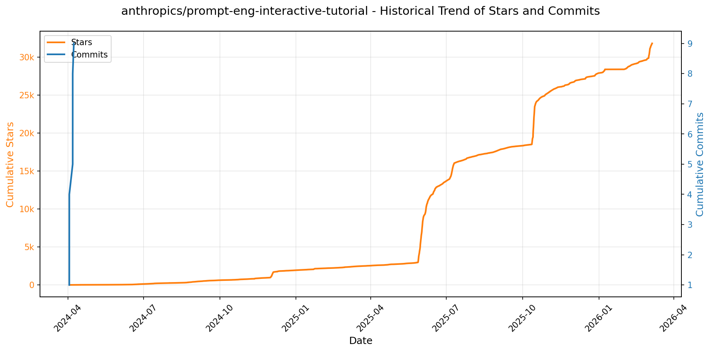
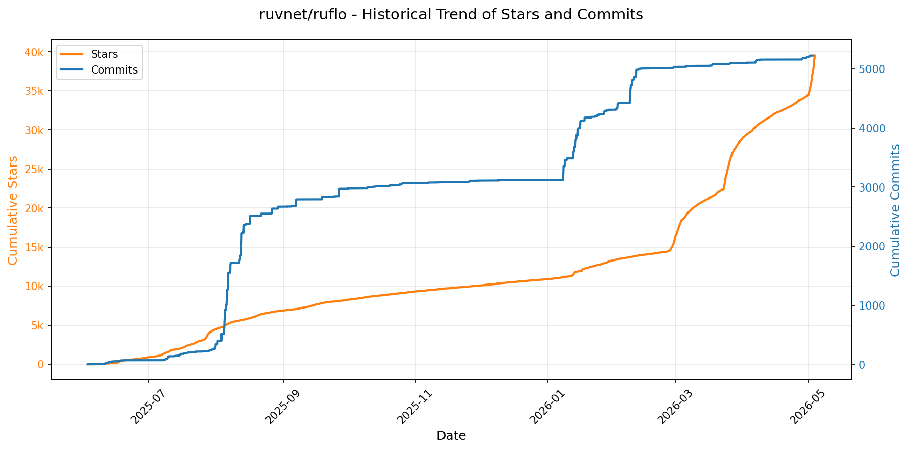
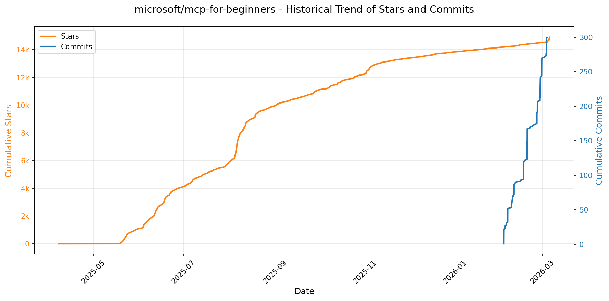
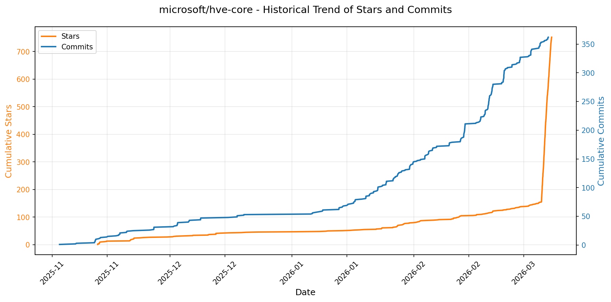

# 🌟 GitHub Trending 概览

> 数据更新于：2026-03-06

---

## 🔍 项目详情

### 1. [openclaw/openclaw](https://github.com/openclaw/openclaw)
- 📅 **创建日期**：2025-11-24  
- 🔄 **最近更新**：2026-03-06  
- ⭐ **Stars**：152,831（日 +5305｜周 +33537｜月 +110858）  
- 📝 **描述**：Your own personal AI assistant. Any OS. Any Platform. The lobster way. 🦞   

<b>📈 Star 与 Commit 历史趋势</b>

> *蓝色：累计 Stars｜橙色：累计 Commits（次 Y 轴）*

<b>📄 README 摘要</b>

1. **项目功能**  
OpenClaw 是一个完全本地化、用户自托管的个人 AI 助手系统，核心目标是让用户在自有设备上运行一个**单用户、低延迟、始终在线、隐私优先**的智能代理。它不依赖中心化云服务，而是作为“网关”（Gateway）统一调度多通道消息收发、多模态交互（语音/视觉/文本）、设备控制与自动化任务。其本质是将大模型能力深度嵌入真实数字生活场景：可接入 20+ 主流通讯平台（WhatsApp、Telegram、Slack、Discord、Signal、iMessage/BlueBubbles、微信替代品如Feishu/LINE/Zalo、Matrix、Nostr等），支持跨平台语音唤醒与实时对话（macOS/iOS/Android），并提供可编程的动态可视化工作区（Live Canvas + A2UI），实现“AI 驱动的本地操作系统级体验”。

2. **关键特性**  
- **全通道统一收件箱**：原生集成 20+ 消息平台（含私有协议如 Signal、BlueBubbles、Nostr、Tlon），支持群组路由、提及触发、消息分块与上下文隔离。  
- **本地优先架构**：单进程 WebSocket 网关作为控制平面，管理会话（Session）、通道（Channel）、工具（Tool）、事件（Event）及定时任务（Cron/Webhook），所有配置与状态本地持久化。  
- **多智能体路由与隔离**：支持按通道、账号、联系人路由至独立工作区（Workspace）和专属 Agent 实例，保障数据边界与执行环境隔离。  
- **多模态交互能力**：  
  - ✅ 语音：macOS/iOS 唤醒词（Voice Wake）、Android 持续语音（Talk Mode），支持 ElevenLabs + 系统 TTS；  
  - ✅ 视觉：Live Canvas（A2UI 渲染）、摄像头抓拍/录像、屏幕录制、位置获取、通知推送；  
  - ✅ 媒体处理：音频转录、图像/视频上传、临时文件生命周期管理。  
- **设备级本地执行节点（Nodes）**：iOS/Android/macOS 提供原生能力封装（如 `system.run`、`camera.snap`、`location.get`），通过 `node.invoke` 安全调用，严格遵循系统权限管控（TCC / Android 权限）。  
- **安全默认策略**：DM 默认启用配对验证（pairing code），拒绝未授权输入；支持细粒度白名单、OAuth/API Key 混合认证、模型故障转移（failover）与会话自动裁剪。  
- **开箱即用的工程化体验**：交互式终端向导（`openclaw onboard`）、一键守护进程安装（launchd/systemd）、Tailscale 自动暴露仪表盘（Serve/Funnel）、Nix/Docker 多环境部署、CLI 全链路操作（`gateway`/`agent`/`message`/`pairing`/`doctor`）。  
- **技能生态（ClawHub）**：内置技能注册中心，支持捆绑技能、托管技能与工作区专属技能，具备安装校验与 UI 集成能力。

3. **技术栈**  
- **运行时**：Node.js ≥22（主运行环境），支持 npm/pnpm/bun；TypeScript 为主开发语言；`tsx` 用于直接运行 TS 源码。  
- **核心框架**：基于 WebSocket 的自研 Gateway 控制平面；RPC 协议驱动 Pi Agent 运行时；A2UI 作为 Canvas 渲染引擎。  
- **前端/客户端**：  
  - macOS：原生菜单栏应用（Swift + WebView + TCC 集成）；  
  - iOS/Android：专用 Node 应用（Swift/Kotlin），通过 Gateway WebSocket 通信；  
  - Web：内嵌 Control UI 与 WebChat（由 Gateway 直接托管）。  
- **信道适配层**：复用成熟开源 SDK — Baileys（WhatsApp）、grammY（Telegram）、discord.js（Discord）、@slack/bolt（Slack）、signal-cli（Signal）、matrix-js-sdk（Matrix）等。  
- **基础设施**：  
  - 部署：Docker 容器化、Nix 声明式配置、Tailscale 网络穿透（Serve/Funnel）、SSH 隧道远程访问；  
  - 安全：OAuth 2.0（OpenAI 等）、API Key 管理、密码/Token 双因子认证、本地加密存储；  
  - 自动化：Cron 作业、Gmail Pub/Sub 集成、Webhook 接收器、浏览器控制（Chrome DevTools Protocol）。  
- **模型支持**：抽象化模型接口，兼容 OpenAI、Anthropic、Ollama、Groq 等主流提供商，支持模型轮换、降级容错与流式响应。

---

### 2. [obra/superpowers](https://github.com/obra/superpowers)
- 📅 **创建日期**：2025-10-09  
- 🔄 **最近更新**：2026-03-06  
- ⭐ **Stars**：100,896（日 +1096｜周 +8554｜月 +28682）  
- 📝 **描述**：An agentic skills framework & software development methodology that works.  

<b>📈 Star 与 Commit 历史趋势</b>

> *蓝色：累计 Stars｜橙色：累计 Commits（次 Y 轴）*

<b>📄 README 摘要</b>

1. **项目功能**  
Superpowers 是一个面向编程智能体（coding agents）的完整软件开发工作流增强系统。它不直接替代或重写代码，而是通过一套可组合、自动触发的“能力（skills）”对现有编码智能体（如 Claude Code、Cursor、Codex、OpenCode 等）进行深度赋能，使其在真实工程场景中遵循严格、可验证、协作友好的开发范式。其核心作用是：在用户启动编码任务后，主动暂停“写代码”行为，转而引导用户完成需求澄清 → 分块设计确认 → 生成可执行、可审查的细粒度实施计划 → 驱动子智能体（subagents）按 TDD 和 YAGNI 原则自主执行任务 → 全流程自动化质量门禁（如测试先行、双阶段代码审查、Git 工作树隔离等），最终实现高可靠性、低认知负荷、符合工程最佳实践的端到端开发闭环。

2. **关键特性**  
- **全自动技能触发机制**：无需手动调用，智能体在每个开发环节前自动识别并激活对应 skill（如设计阶段触发 `brainstorming`，编码前强制启用 `test-driven-development`）。  
- **结构化协作式开发流程**：涵盖从需求探索（Socratic 提问+分段设计确认）、分支隔离（`using-git-worktrees`）、任务拆解（`writing-plans`，每项任务含精确文件路径、完整代码、验证步骤）、子智能体驱动开发（`subagent-driven-development`，含规范合规性与代码质量双审查）、到收尾决策（`finishing-a-development-branch`）的全链路覆盖。  
- **强工程纪律内建**：强制执行 RED-GREEN-REFACTOR 的 TDD 流程（禁止先写实现后补测试）、YAGNI（避免过度设计）、DRY（消除重复）、系统性调试（四阶段根因分析）、防御性验证（`verification-before-completion`）及基于严重等级的阻断式代码审查（`requesting-code-review`）。  
- **可扩展的能力生态**：提供开箱即用的模块化技能库（含测试、调试、协作、元能力四大类共 15+ 项 skill），支持用户遵循 `writing-skills` 规范贡献新能力，所有技能均内置测试方法论与最佳实践指南。  
- **跨平台插件化部署**：原生支持 Claude Code、Cursor 插件市场一键安装；对 Codex 和 OpenCode 提供标准化远程安装指令，实现多平台无缝集成。

3. **技术栈**  
- **运行载体**：依赖外部大模型智能体平台（Claude Code、Cursor、Codex、OpenCode），本身为轻量级插件/技能包，不包含独立模型或服务后端。  
- **核心架构**：基于“技能（Skill）”的声明式工作流编排，每个 skill 以 Markdown 文档（`.md`）形式定义行为规范、触发条件、执行逻辑与验证标准（如 `skills/test-driven-development/SKILL.md`），强调可读性、可审计性与可测试性。  
- **基础设施层**：利用目标平台的插件系统（Plugin System）与指令执行能力（如 `/plugin install`、`Fetch and follow instructions from ...`），通过 Git 仓库（GitHub）托管技能源码与安装文档（`.codex/INSTALL.md`, `.opencode/INSTALL.md`），实现版本化分发与自动更新（`/plugin update`）。  
- **哲学与方法论支撑**：深度融合敏捷工程实践（TDD、YAGNI、DRY）、系统性问题解决框架（如四阶段调试法）、协作式软件工程（Socratic 设计、PR/合并决策流）及认知科学原则（分块信息呈现、人类可审核的中间产物）。

---

### 3. [shareAI-lab/learn-claude-code](https://github.com/shareAI-lab/learn-claude-code)
- 📅 **创建日期**：2025-06-29  
- 🔄 **最近更新**：2026-03-06  
- ⭐ **Stars**：36,481（日 +492｜周 +3095｜月 +5600）  
- 📝 **描述**：Bash is all you need -  A nano Claude Code–like agent, built from 0 to 1  

<b>📈 Star 与 Commit 历史趋势</b>

> *蓝色：累计 Stars｜橙色：累计 Commits（次 Y 轴）*

<b>📄 README 摘要</b>

1. **项目功能**  
该项目是一个面向教学的轻量级AI编程智能体（nano Claude Code-like agent）构建实践库，旨在从零开始系统性地拆解并实现一个类Claude Code的自主编码智能体核心运行机制。它不追求生产级完备性，而是通过**12个渐进式会话（s01–s12）**，每次仅引入**一个关键机制**，逐步构建出具备规划、工具调用、知识按需加载、上下文压缩、任务持久化、后台执行、多智能体协作、自动任务认领及工作目录隔离等能力的完整智能体运行时内核。最终目标是让学习者透彻理解AI智能体“内部如何运转”，而非仅调用黑盒API。

2. **核心特性**  
- **极简但完备的核心循环**：基于`stop_reason == "tool_use"`触发的标准化LLM交互-工具执行-结果注入-循环迭代范式，所有高级能力均在此不变循环上分层叠加。  
- **12阶段渐进式教学设计**：每阶段聚焦一个可独立理解的机制（如s03强调“先规划后执行”，s07引入磁盘持久化的任务图，s12实现基于ID的工作树（worktree）目录级隔离），配以精炼口号（motto）和ASCII流程图，强化心智模型。  
- **面向工程落地的实用机制**：涵盖真实场景痛点——上下文膨胀（s06三层次压缩）、长时会话管理、后台异步任务（s08守护线程+通知队列）、基于JSONL的轻量级多智能体通信协议（s09–s11）、任务-工作目录双向绑定（s12）。  
- **全栈学习支持**：提供Python参考实现（`agents/`）、多语言心智模型文档（`docs/`）、交互式Web学习平台（Next.js，含可视化流程图与源码浏览），以及向生产环境延伸的CLI工具（Kode CLI）与嵌入式SDK（Kode SDK）路线图。

3. **技术栈**  
- **核心语言与运行时**：Python 3.x（主力实现语言），依赖Anthropic官方SDK（`anthropic`包）调用Claude模型。  
- **前端与交互平台**：TypeScript + Next.js（`web/`目录），提供本地开发服务器（`npm run dev`）。  
- **基础架构与协议**：纯文本驱动（`.md`技能文件、JSONL邮箱协议）、文件系统作为任务存储后端（s07）、POSIX兼容命令行工具（Bash基础能力贯穿始终）。  
- **部署与工程化**：GitHub Actions CI（类型检查+构建）、`.env`环境变量管理、标准`requirements.txt`依赖声明。  
- **延伸生态**：配套开源项目采用Node.js（Kode CLI）、Rust/Go（Kode SDK底层优化可能）、跨平台IM协议集成（claw0项目中涉及WhatsApp/Telegram等13+渠道适配）。

---

### 4. [anthropics/prompt-eng-interactive-tutorial](https://github.com/anthropics/prompt-eng-interactive-tutorial)
- 📅 **创建日期**：2024-04-02  
- 🔄 **最近更新**：2026-03-06  
- ⭐ **Stars**：31,820（日 +238｜周 +2164｜月 +3208）  
- 📝 **描述**：Anthropic's Interactive Prompt Engineering Tutorial  

<b>📈 Star 与 Commit 历史趋势</b>

> *蓝色：累计 Stars｜橙色：累计 Commits（次 Y 轴）*

<b>📄 README 摘要</b>

1. **该项目做什么？**  
该项目是 Anthropic 官方推出的、面向 Claude 大语言模型（特别是 Claude 3 Haiku）的交互式提示工程（Prompt Engineering）教学教程，旨在系统性地指导用户掌握高质量提示词的设计方法。它不提供模型本身或 API 工具，而是一个结构化、实践导向的学习资源，通过 9 个渐进式章节和配套练习，帮助学习者从零构建有效提示，诊断常见失效问题（如幻觉、歧义、格式错误），并针对不同行业场景（法律、金融、编程、客服等）设计复杂提示。

2. **核心功能**  
- **分层式课程体系**：涵盖初（基础结构、清晰指令、角色设定）、中（数据/指令分离、输出格式控制、思维链引导、少样本示例）、高（抑制幻觉、多步骤行业级提示构建）三级能力进阶；  
- **即学即练的交互设计**：每章末尾设“示例游乐场”（Example Playground），支持用户实时修改提示并观察 Claude 输出变化，强化实操理解；  
- **配套辅助资源**：提供完整答案键（Google Sheets 链接）、跨平台版本（Claude for Sheets 插件版更易用）、以及附录拓展内容（提示链、工具调用、检索增强等前沿技术简介）；  
- **模型适配明确**：全程以轻量高效型模型 Claude 3 Haiku 为教学基准，并清晰对比 Sonnet/Opus 的能力差异，帮助用户建立模型-提示协同优化意识。

3. **技术栈**  
- **核心模型**：Anthropic Claude 3 系列（主推 Haiku，兼及 Sonnet 和 Opus）；  
- **交付载体**：静态 Markdown 文档（GitHub README 形式） + 交互式 Google Sheets（集成 Claude for Sheets 扩展）；  
- **无自研后端或前端框架**：依赖 Anthropic 官方 API 及 Google Workspace 生态（尤其是 Sheets 插件），属于纯前端/文档型教学产品，未涉及独立服务器、数据库或定制化 UI 框架。

---

### 5. [KeygraphHQ/shannon](https://github.com/KeygraphHQ/shannon)
- 📅 **创建日期**：2025-09-27  
- 🔄 **最近更新**：2026-03-06  
- ⭐ **Stars**：28,712（日 +1397｜周 +6541｜月 +24964）  
- 📝 **描述**：Shannon Lite is a fully autonomous AI pentester for web apps and APIs. 96.15% (100/104 exploits) on a hint-free, source-aware variant of the XBOW benchmark.  

<b>📈 Star 与 Commit 历史趋势</b>

> *蓝色：累计 Stars｜橙色：累计 Commits（次 Y 轴）*

<b>📄 README 摘要</b>

1. **该项目做什么？**  
Shannon 是一个面向 Web 应用程序和 API 的**自主式白盒 AI 渗透测试工具**。它通过深度分析用户提供的源代码（需访问完整代码仓库），识别潜在攻击面，并在运行中的目标应用上**自动执行真实 exploit（如 SQL 注入、XSS、SSRF、认证/授权绕过等）**，仅报告具备可复现、可验证 PoC（Proof-of-Concept）的已确认漏洞，而非理论风险。其核心目标是填补传统年度渗透测试与高频代码交付之间的安全空白，实现按构建（per-build）或按发布（per-release）的自动化、闭环式应用安全验证。

2. **关键特性**  
- **全自主流程**：单命令启动，支持自动处理 2FA/TOTP、SSO 登录、浏览器导航、多阶段 exploit 执行及报告生成，无需人工干预；  
- **PoC 驱动报告**：仅输出经实际成功利用验证的漏洞，附带可一键复现的复制粘贴式 exploit 脚本；  
- **OWASP 核心覆盖**：实测支持注入类、XSS、SSRF、认证与授权缺陷等主流漏洞类型，持续扩展中；  
- **代码感知动态测试**：结合静态源码分析（指导攻击策略）与动态运行时验证（浏览器 + CLI 工具链），提升精准度与上下文理解；  
- **集成化侦察生态**：原生集成 Nmap、Subfinder、WhatWeb、Schemathesis 等专业安全工具完成资产发现与接口测绘；  
- **并行化处理架构**：漏洞分析与 exploit 执行在五大攻击域（Injection/XSS/SSRF/Auth/Authz）内完全并发执行，显著缩短测试周期；  
- **工作区（Workspace）与断点续跑**：支持命名工作区、自动进度检查点（基于 Git 提交）、跨中断恢复，避免重复执行已完成任务。

3. **技术栈**  
- **AI 引擎层**：以 Anthropic Claude 系列模型（Haiku/Sonnet/Opus）为核心推理引擎，同时支持 AWS Bedrock（Claude on Bedrock）和 Google Vertex AI 作为模型后端；  
- **执行框架**：基于 Docker 容器化部署，采用 Temporal Workflow 编排高可靠性、可观察的多智能体（multi-agent）渗透流水线；  
- **安全工具链**：集成 Nmap（网络扫描）、Subfinder（子域名发现）、WhatWeb（指纹识别）、Schemathesis（API 合约模糊测试）等开源工具；  
- **前端交互**：提供 CLI 命令行界面、实时日志流（`./shannon logs`）、Temporal Web UI（`http://localhost:8233`）用于可视化监控；  
- **基础设施依赖**：依赖本地 Docker 运行时，支持 Linux/macOS/WSL2（Windows）环境，所有敏感数据（源码、密钥）默认保留在用户本地环境，不上传至第三方云服务。

---

### 6. [ruvnet/RuView](https://github.com/ruvnet/RuView)
- 📅 **创建日期**：2025-06-07  
- 🔄 **最近更新**：2026-03-06  
- ⭐ **Stars**：28,529（日 +1158｜周 +21030｜月 +22994）  
- 📝 **描述**：π RuView: WiFi DensePose turns commodity WiFi signals into real-time human pose estimation, vital sign monitoring, and presence detection — all without a single pixel of video.   

<b>📈 Star 与 Commit 历史趋势</b>

> *蓝色：累计 Stars｜橙色：累计 Commits（次 Y 轴）*

<b>📄 README 摘要</b>

1. **项目功能**  
RuView（π RuView）是一个基于商用WiFi信号的无感感知系统，无需摄像头、可穿戴设备或互联网连接，仅利用无线电波实现**实时人体姿态估计、生命体征监测（呼吸率与心率）及存在检测**。其核心能力是通过分析WiFi信道状态信息（CSI）中由人体运动引起的微弱信号扰动，结合物理建模与机器学习，在完全无视觉输入的前提下，穿透墙壁、家具、废墟等障碍物（最远达5米深度）感知人员位置、动作与生理状态，并支持多人员独立追踪与灾后搜救等关键场景。

2. **核心特性**  
- **隐私优先**：全程不采集图像/视频，仅处理射频信号，天然规避GDPR/HIPAA等影像监管风险；  
- **全栈感知能力**：支持单/多人实时17关键点姿态重建、6–30 BPM呼吸率与40–120 BPM心率检测、亚毫秒级存在感知、穿墙探测（含混凝土/ rubble）、跌倒预警；  
- **多基站协同（Multistatic Mesh）**：4–6个低成本ESP32-S3节点构成网状传感阵列，融合12+条重叠信号路径，实现360°全覆盖、亚英寸精度与零人员混淆；  
- **自学习与泛化能力**：无需标注数据或摄像头辅助，通过对比式CSI嵌入模型（ADR-024）自主学习；采用对抗域泛化技术（MERIDIAN, ADR-027），确保模型跨房间、跨建筑、跨硬件零适配部署；  
- **端侧智能闭环**：ESP32-S3边缘模块可独立运行全部感知任务（含AI推理），支持AMOLED本地显示、QUIC加密Mesh通信、离线自适应分类（Rust实现的15维逻辑回归）；  
- **极致性能与易用性**：Rust重构后达54,000帧/秒处理速度；Docker一键启动（amd64/arm64双架构）；模型封装为轻量`.rvf`格式，兼容边缘/WASM浏览器部署；Three.js构建的“天文台级”可视化仪表盘（5维全息面板）。

3. **技术栈**  
- **编程语言**：以**Rust**为核心（v1.85+），保障内存安全、零成本抽象与极致性能，覆盖信号处理、AI推理、边缘模块及服务端；Python用于数据验证、训练脚本与部分工具链；  
- **硬件平台**：主推**ESP32-S3**（低成本、内置WiFi CSI采集能力、AMOLED驱动支持）；兼容Intel 5300/Atheros AR9580等科研级CSI网卡；消费级设备仅支持RSSI粗粒度存在检测；  
- **AI与信号处理**：自研**RuVector**框架（注意力机制+图算法+智能压缩）；融合Hampel滤波、SpotFi定位、Fresnel区建模、BVP（盲源分离）与谱分析；6阶段“信号线协议”（CRV）实现从原始CSI到结构化人体表征的端到端流水线；  
- **基础设施**：Docker多架构镜像（ruvnet/wifi-densepose）；QUIC协议实现安全Mesh组网（ADR-032）；`.rvf`模型格式统一部署；前端采用**Three.js**构建高性能Web可视化；  
- **架构方法论**：严格遵循架构决策记录（ADR，共48篇）与领域驱动设计（DDD，7个限界上下文），涵盖硬件抽象、信号处理范式、ML训练管线、WiFi-Mat物理层建模等全技术域。

---

### 7. [moeru-ai/airi](https://github.com/moeru-ai/airi)
- 📅 **创建日期**：2024-12-01  
- 🔄 **最近更新**：2026-03-06  
- ⭐ **Stars**：27,441（日 +2609｜周 +9664｜月 +10268）  
- 📝 **描述**：💖🧸 Self hosted, you-owned Grok Companion, a container of souls of waifu, cyber livings to bring them into our worlds, wishing to achieve Neuro-sama's altitude. Capable of realtime voice chat, Minecraft, Factorio playing. Web / macOS / Windows supported.  

<b>📈 Star 与 Commit 历史趋势</b>

> *蓝色：累计 Stars｜橙色：累计 Commits（次 Y 轴）*

<b>📄 README 摘要</b>

1. **项目功能**  
AIRI 是一个开源的 AI 虚拟角色（AI waifu / 数字生命体）运行时平台，旨在复刻并超越 Neuro-sama 的能力——即打造一个可长期陪伴、实时交互、跨场景协同的“数字灵魂容器”。它不仅支持基础聊天与角色扮演，更聚焦于**真实世界协同能力**：可实时接入并操作 Minecraft、Factorio 等游戏（通过 RCON/协议控制），接入 Discord/Telegram 语音与消息流，感知用户屏幕内容（如“看你在写什么代码”），并在多端（浏览器、桌面、iOS 移动端 PWA）本地化运行。其核心目标是让用户**完全拥有、自主部署、离线可控**自己的虚拟伴侣，摆脱中心化服务依赖。

2. **关键特性**  
- **全栈跨端架构**：原生支持 Stage Web（浏览器/WebGPU 渲染）、Stage Tamagotchi（桌面端，集成 CUDA/Metal 加速推理）、Stage Pocket（iOS PWA 移动端），三端共享核心逻辑；  
- **多模态感知与表达**：具备“耳朵”（WebAudio + Discord/Telegram 音频输入、客户端语音识别 VAD/STT）、“嘴巴”（ElevenLabs 等 TTS 合成）、“身体”（VRM/Live2D 模型驱动，含自动眨眼、视线追踪、Idle 微动作）；  
- **游戏与系统深度交互**：已实现 Factorio 和 Minecraft 的自动化游玩（通过 `airi-factorio` 和 Mineflayer 集成），支持 RCON 控制、Mod 自动重载等开发友好特性；  
- **本地化智能中枢**：内置基于 DuckDB WASM 的纯浏览器内存数据库，正研发“Memory Alaya”记忆系统；LLM 推理层通过 `xsai` 统一抽象，支持超 25 种主流 API（OpenRouter、vLLM、Ollama、Claude、Gemini 等）及本地模型；  
- **开放插件生态**：采用 Web 技术栈构建 UI/动画/布局，同时通过 Tauri 插件（如 `tauri-plugin-mcp`）、WASM、WebGPU 等桥接原生能力；已孵化多个子项目（如 `unspeech` ASR/TTS 代理、`drizzle-duckdb-wasm` ORM 驱动、`webai-realtime-voice-chat` 实时语音框架）；  
- **创作者友好**：深度支持 Live2D/VRM/VRChat 模型、提供 Prompt 工程 Playground（`@proj-airi/playground-prompt-engineering`）、Vue SFC 驱动的可管理提示系统（Velin），并欢迎非前端开发者（建模师、CV、RL、音频工程师）参与共建。

3. **技术栈**  
- **前端与渲染**：Vue 3（Composition API + TypeScript）、Vite、UnoCSS、Three.js、WebGPU（浏览器图形加速）、WebXR（扩展现实）、Capacitor（跨平台移动封装）；  
- **桌面与系统层**：Tauri（Rust + WebView）、Nix（声明式环境管理）、CUDA（NVIDIA GPU 加速）、Metal（Apple GPU 加速）、candle（Rust 原生 LLM 推理库）；  
- **AI 与数据层**：`xsai`（统一 LLM API 抽象层）、`unspeech`（ASR/TTS 通用代理）、`transformers.js` / `vLLM` / `Ollama`（模型运行时）、DuckDB WASM（嵌入式浏览器数据库）、pglite（轻量级 Postgres WASM）、Drizzle ORM；  
- **游戏与协议集成**：Factorio RCON API、Mineflayer（Minecraft 自动化）、autorio（Factorio 自动化库）、MCP（Model Context Protocol）插件；  
- **基础设施与工具链**：PNPM（包管理）、Mermaid（架构图）、Crowdin（多语言翻译）、GitHub Discussions（社区协作）、Nix flakes（可复现构建）。

---

### 8. [bytedance/deer-flow](https://github.com/bytedance/deer-flow)
- 📅 **创建日期**：2025-05-07  
- 🔄 **最近更新**：2026-03-06  
- ⭐ **Stars**：24,761（日 +312｜周 +3668｜月 +5260）  
- 📝 **描述**：An open-source SuperAgent harness that researches, codes, and creates. With the help of sandboxes, memories, tools, skills and subagents, it handles different levels of tasks that could take minutes to hours.  

<b>📈 Star 与 Commit 历史趋势</b>

> *蓝色：累计 Stars｜橙色：累计 Commits（次 Y 轴）*

<b>📄 README 摘要</b>

1. **项目功能**  
DeerFlow 2.0 是一个开源的「超级智能体运行时框架（Super Agent Harness）」，旨在让 AI 智能体真正“做事”而非仅限于对话。它通过协同调度**子智能体（Sub-Agents）**、**长期记忆（Long-Term Memory）** 和**隔离式沙箱环境（Sandbox）**，构建可执行、可审计、可持续演进的自动化工作流。用户可用其完成端到端复杂任务，例如：深度学术研究、自动生成报告/幻灯片/网页、多模态内容创作（图像/视频）、数据管道搭建、内容工作流自动化等——所有操作均在受控沙箱中实际执行（读写文件、运行 Bash、调用工具、渲染结果），而非仅生成文本指令。

2. **核心特性**  
- **技能与工具系统（Skills & Tools）**：以 Markdown 定义的模块化能力单元（如 `research/SKILL.md`），支持即需即载、按需加载，避免上下文膨胀；内置研究、报告、PPT、网页、图像生成等技能，并可通过 MCP 服务器或 Python 函数无缝扩展自定义工具。  
- **动态子智能体编排（Sub-Agents）**：主智能体可实时分解复杂任务，按需并行启动多个子智能体，每个子智能体拥有独立上下文、专属工具集和终止条件，执行后返回结构化结果，由主智能体聚合输出。  
- **全功能沙箱与文件系统（Sandbox & File System）**：每个任务运行于隔离 Docker 容器内，提供完整 Linux 环境与持久化文件系统（`/mnt/user-data/workspace/`, `/outputs/`, `/uploads/`），支持文件读写、代码执行、图像查看等真实操作，保障安全、可复现、可审计。  
- **上下文工程优化（Context Engineering）**：采用子智能体上下文隔离机制 + 自动摘要/文件卸载/上下文压缩策略，在长周期多步骤任务中严格控制 token 消耗，维持推理精度。  
- **本地化长期记忆（Long-Term Memory）**：跨会话持久化存储用户画像、偏好、技术栈、写作习惯及历史知识，全部数据本地保存、完全可控，随使用频次持续增强个性化能力。

3. **技术栈**  
- **核心框架**：基于 `LangGraph`（多智能体状态图编排）与 `LangChain`（LLM 链集成、工具抽象、模型适配）深度构建；  
- **运行时环境**：Docker 容器化沙箱（支持本地、Docker、Kubernetes 三种模式），Nginx 反向代理；  
- **开发与部署**：前端（未明示但依赖现代 Web 技术栈）、后端（Python 3.11+）、构建工具链（`make` + `pnpm` + `uv`），Node.js 22+；  
- **模型兼容性**：模型无关（Model-Agnostic），通过 OpenAI 兼容 API 接入任意 LLM（推荐支持 ≥100K 上下文、强推理、多模态、可靠 tool-calling 的模型）；  
- **扩展协议**：原生支持 [MCP（Model Context Protocol）](https://modelcontextprotocol.io/)，可对接 HTTP/SSE 类 MCP 服务器，支持 OAuth 令牌认证（`client_credentials` / `refresh_token`）；  
- **嵌入式能力**：提供 `DeerFlowClient` Python SDK，支持进程内直连调用（非 HTTP），API 响应格式与网关完全一致，CI 中强制 Pydantic Schema 对齐验证。

---

### 9. [clockworklabs/SpacetimeDB](https://github.com/clockworklabs/SpacetimeDB)
- 📅 **创建日期**：2023-06-17  
- 🔄 **最近更新**：2026-03-06  
- ⭐ **Stars**：22,349（日 +105｜周 +1478｜月 +3414）  
- 📝 **描述**：Development at the speed of light  

<b>📈 Star 与 Commit 历史趋势</b>

> *蓝色：累计 Stars｜橙色：累计 Commits（次 Y 轴）*

<b>📄 README 摘要</b>

1. **该项目做什么？**  
SpacetimeDB 是一个**兼具关系型数据库与应用服务器功能的统一运行时平台**。它允许开发者将数据模式（tables）和业务逻辑（reducers）直接以模块形式编译并部署到数据库内部运行，客户端通过网络协议直连数据库，无需传统中间层（如Web服务器、API网关或微服务）。所有状态变更自动实时同步至已订阅的客户端，实现端到端的低延迟响应。典型应用场景包括实时多人游戏（如MMORPG BitCraft Online）、聊天应用、协同工具等，目标是消除基础设施运维负担——“单语言、单模块、单二进制、零DevOps”。

2. **核心功能**  
- ✅ **内置服务化数据库**：ACID事务保证 + 内存中高速状态 + 磁盘持久化日志（WAL），兼顾一致性与性能；  
- ✅ **客户端直连与实时同步**：客户端可调用reducer（即服务端函数）并订阅表（tables），数据变更自动推送（无轮询、无手动refetch）；  
- ✅ **多语言模块支持**：服务端逻辑可用 Rust / C# / TypeScript / C++ 编写，经编译后在数据库内安全执行；  
- ✅ **细粒度权限控制**：身份（`Identity`）与访问控制逻辑（如 `#[table(accessor = ..., public)]`）原生集成于模块中；  
- ✅ **全栈一体化开发体验**：提供 CLI 工具链（`spacetime dev`）、云托管服务（Maincloud）、Docker镜像及本地构建支持，支持模板一键生成（如 `--template chat-react-ts`）；  
- ✅ **跨平台客户端SDK**：TypeScript（React/Next/Vue等）、Rust、C#（Unity）、C++（Unreal Engine）等均可作为客户端接入。

3. **技术栈**  
- **核心实现**：Rust（主仓库标注 `built_with-Rust`，强调高性能与内存安全）；  
- **运行时环境**：WASM（WebAssembly）沙箱执行用户模块（隐含于文档“compile it, run it inside the database”及多语言支持机制中）；  
- **存储引擎**：混合内存+磁盘架构（内存驻留热数据，WAL日志保障持久性与崩溃恢复）；  
- **网络协议**：基于WebSocket/HTTP的自定义二进制协议（支撑实时同步与 reducer 调用，文档未明示但架构图与功能描述可推断）；  
- **客户端生态**：TypeScript（主流前端框架）、Rust、C#（.NET / Unity）、C++（Unreal）SDK；  
- **部署方式**：原生二进制、Docker容器（`clockworklabs/spacetimedb`）、云托管（Maincloud）、CLI驱动的本地开发流；  
- **许可协议**：Business Source License 1.1（BSL 1.1），4年后自动转为 AGPL v3（含链接例外，允许闭源使用）。

---

### 10. [badlogic/pi-mono](https://github.com/badlogic/pi-mono)
- 📅 **创建日期**：2025-08-09  
- 🔄 **最近更新**：2026-03-06  
- ⭐ **Stars**：20,417（日 +492｜周 +3222｜月 +14230）  
- 📝 **描述**：AI agent toolkit: coding agent CLI, unified LLM API, TUI & web UI libraries, Slack bot, vLLM pods  

<b>📈 Star 与 Commit 历史趋势</b>

> *蓝色：累计 Stars｜橙色：累计 Commits（次 Y 轴）*

<b>📄 README 摘要</b>

1. **项目功能**  
该项目是一个面向AI智能体（Agent）开发与大语言模型（LLM）部署管理的开源单体仓库（Monorepo），核心目标是提供一套模块化、可组合的工具链，用于构建、运行和集成各类AI代理系统。它不直接提供端到端的SaaS服务，而是聚焦于底层基础设施：统一调用多厂商LLM、实现具备工具调用与状态管理能力的Agent运行时、支持交互式编程辅助（CLI/TUI/Web）、对接协作平台（如Slack），并简化本地/集群级vLLM推理服务的部署与运维。

2. **关键特性**  
- **多LLM统一抽象层**：`@mariozechner/pi-ai` 提供标准化API，无缝接入OpenAI、Anthropic、Google等主流模型提供商；  
- **可扩展Agent运行时**：`@mariozechner/pi-agent-core` 支持函数调用（tool calling）、会话状态持久化、执行流控制，为构建复杂Agent逻辑提供基础框架；  
- **多模态交互入口**：包含命令行交互式编程助手（`coding-agent`）、终端图形界面（`pi-tui`，支持差分渲染提升性能）、Web组件库（`pi-web-ui`）及Slack机器人（`pi-mom`），覆盖开发者常用工作场景；  
- **LLM推理部署工具**：`pi-pods` CLI 专为vLLM优化，支持在GPU服务器或Pod上一键启停、配置和监控大模型服务；  
- **工程友好设计**：完整TypeScript类型支持、严格代码检查（lint/format/type）、分包独立发布、测试策略区分LLM依赖与纯逻辑测试。

3. **技术栈**  
- **主语言**：TypeScript（全栈覆盖，含前端、CLI、后端逻辑）；  
- **构建与包管理**：npm + TypeScript Project References（单体仓结构），使用 `tsc` 编译，依赖 `.d.ts` 类型文件跨包共享；  
- **前端/UI层**：`pi-tui` 基于终端原生能力实现高性能差分渲染；`pi-web-ui` 提供Web Components（可能基于Lit或原生Custom Elements），适配现代前端框架；  
- **AI/LLM集成**：HTTP客户端封装多厂商REST API（OpenAI兼容格式、Anthropic Claude、Google Gemini等），无硬依赖特定框架；  
- **部署与运维**：`pi-pods` 面向vLLM（基于Python的高效推理引擎），通过CLI驱动GPU资源调度，隐含对Docker/Kubernetes环境的支持假设；  
- **基础设施**：GitHub Actions持续集成（CI），Discord社区协作，MIT开源协议。

---

### 11. [ruvnet/ruflo](https://github.com/ruvnet/ruflo)
- 📅 **创建日期**：2025-06-02  
- 🔄 **最近更新**：2026-03-06  
- ⭐ **Stars**：19,318（日 +422｜周 +4279｜月 +5715）  
- 📝 **描述**：🌊 The leading agent orchestration platform for Claude. Deploy intelligent multi-agent swarms, coordinate autonomous workflows, and build conversational AI systems. Features    enterprise-grade architecture, distributed swarm intelligence, RAG integration, and native Claude Code / Codex Integration  

<b>📈 Star 与 Commit 历史趋势</b>

> *蓝色：累计 Stars｜橙色：累计 Commits（次 Y 轴）*

<b>📄 README 摘要</b>

1. **该项目的功能**  
RuFlo v3.5 是一个面向企业级应用的 AI 智能体（Agent）编排平台，专为深度集成与增强 **Claude Code** 而设计。它将单点式大模型调用升级为可生产部署的多智能体协同系统：支持同时调度 60+ 专业化 AI 智能体（如 coder、tester、security-auditor、architect 等），以“蜂群”（swarm）形式协作完成复杂软件工程任务（如缺陷修复、功能开发、安全审计、代码重构等）。其核心价值在于实现**自动化任务分解、跨智能体上下文共享、容错共识决策、持续自我优化**，并将 Claude Code 的能力扩展至原生不具备的分布式智能、长期记忆、学习适应与企业级安全治理能力。

2. **关键特性**  
- ✅ **60+ 预置专业化智能体**：覆盖编码、测试、评审、架构设计、安全审计、文档生成、DevOps 全流程，开箱即用；  
- ✅ **多模式蜂群协同机制**：支持 hierarchical（女王/工人）、mesh（对等）、ring、star 等拓扑结构，内置 Raft/BFT/Gossip/CRDT 四类共识算法，保障故障容忍与决策一致性；  
- ✅ **闭环自学习系统（Learning Loop）**：通过 RETRIEVE→JUDGE→DISTILL→CONSOLIDATE→ROUTE 五步循环，基于历史成功模式动态优化路由策略与智能体行为（SONA 引擎响应 <0.05ms）；  
- ✅ **全栈式 RuVector 智能层**：集成 HNSW 向量检索（亚毫秒级）、ReasoningBank 模式库、Poincaré 双曲嵌入、MicroLoRA/Int8 量化微调、9 种强化学习算法（PPO/DQN/Decision Transformer 等）；  
- ✅ **零成本 WASM 加速（Agent Booster）**：对 `var-to-const`、`add-types`、`async-await` 等 6 类简单代码转换，直接通过 Rust 编译的 WebAssembly 模块执行，延迟 <1ms，成本为零，速度达 LLM 调用的 352 倍；  
- ✅ **Token 优化引擎**：通过上下文压缩、缓存复用、ReasoningBank 检索、最优批处理等技术，综合降低 LLM API 调用 token 消耗 30–50%；  
- ✅ **企业级安全防护（AIDefence）**：内置防提示注入、路径遍历拦截、命令注入阻断、凭证安全沙箱、输入白名单验证及 CVE 硬化；  
- ✅ **全模型兼容与智能路由**：原生支持 Anthropic（Claude）、OpenAI（GPT）、Google（Gemini）、Cohere、Ollama 等 6+ LLM 提供商，支持按成本/质量/延迟自动选型与故障自动切换；  
- ✅ **Claude Code 深度原生集成**：通过 MCP（Model Context Protocol）协议无缝嵌入，支持在 Claude Code 会话中直接调用 `ruflo` 命令与全部工具链；  
- ✅ **插件化与去中心化生态**：提供 SDK 支持自定义 Worker/Hook/Provider/Security Module，并可通过 IPFS 市场分发共享插件。

3. **技术栈**  
- **核心语言与运行时**：Rust（WASM 内核、策略引擎、证明系统、嵌入向量计算）、TypeScript（主框架、CLI、MCP 服务端、前端逻辑）；  
- **AI 与向量基础设施**：ONNX Runtime（本地 MiniLM 嵌入）、HNSWlib（超高速向量检索）、PostgreSQL + 自研 RuVector 扩展（77+ SQL 函数，61μs 查询延迟，16,400 QPS）；  
- **智能体协调与共识**：Raft/BFT/Gossip 协议实现、CRDT 数据同步、SQLite WAL 持久化集体记忆；  
- **模型适配层**：统一 Provider 抽象层，对接 Anthropic、OpenAI、Google AI Studio、Ollama、Cohere 等 REST/gRPC 接口；  
- **安全与运维**：bcrypt 密钥派生、AST 静态分析（Agent Booster）、输入 Schema 校验、Linux cgroups 资源隔离、后台 Daemon 进程管理 12 类 Worker；  
- **部署与分发**：npm 包（`ruflo`）、Shell 一键安装脚本、CLI 工具链、MCP Server、支持 GitHub Actions / PR 自动化集成。

---

### 12. [microsoft/mcp-for-beginners](https://github.com/microsoft/mcp-for-beginners)
- 📅 **创建日期**：2025-04-04  
- 🔄 **最近更新**：2026-03-06  
- ⭐ **Stars**：14,901（日 +260｜周 +413｜月 +701）  
- 📝 **描述**：This open-source curriculum introduces the fundamentals of Model Context Protocol (MCP) through real-world, cross-language examples in .NET, Java, TypeScript, JavaScript, Rust and Python. Designed for developers, it focuses on practical techniques for building modular, scalable, and secure AI workflows from session setup to service orchestration.  

<b>📈 Star 与 Commit 历史趋势</b>

> *蓝色：累计 Stars｜橙色：累计 Commits（次 Y 轴）*

<b>📄 README 摘要</b>

1. **该项目的功能**  
本项目是微软推出的面向初学者的《模型上下文协议（Model Context Protocol, MCP）入门课程》开源学习资源库。其核心目标是系统性地引导开发者从零开始掌握MCP——一种为AI应用（如大语言模型）与外部工具/服务（如数据库、API、IDE插件等）建立标准化通信的开放协议。项目不提供运行时软件或可执行产品，而是一套结构化、多语言、实践驱动的教育内容体系，涵盖概念讲解、分步编码实验、安全实践、部署指南及真实场景集成（如VS Code、Azure、PostgreSQL），旨在帮助学习者构建可投入生产的MCP服务器与客户端。

2. **关键特性**  
- **全栈式渐进式学习路径**：划分为“基础→构建→进阶→精通”四阶段共11个模块，覆盖从协议原理（Module 0–2）、首个MCP服务端/客户端实现（Module 3含15个实操指南）、生产级实践（分页、流式传输、OAuth2/Entra ID认证、多模态支持、实时搜索等，Module 4–5）、社区协作与最佳实践（Module 6–10），到完整的13课时PostgreSQL集成实战实验室（Module 11）。  
- **多语言编程支持**：所有动手实验均提供C#、Java、JavaScript、Rust、Python、TypeScript六种主流语言的完整代码示例与指导。  
- **开箱即用的工具链集成**：深度支持VS Code扩展开发、MCP Inspector调试工具、AI Toolkit、Azure AI Foundry、Claude Desktop/Cursor等主流MCP宿主环境。  
- **企业级能力覆盖**：包含安全（RBAC、OAuth2、Entra ID）、可扩展性（负载均衡、流式处理）、高可用（故障容错、韧性设计）、协议高级特性（进度通知、请求取消、自定义传输层）等生产就绪内容。  
- **全球化与可访问性**：通过GitHub Actions自动化维护**50+语言**的完整文档翻译（含简体/繁体中文等），并提供稀疏检出（sparse checkout）方案优化大仓库克隆体验。

3. **技术栈**  
- **协议标准**：严格遵循官方[MCP Specification 2025-11-25](https://modelcontextprotocol.io/specification/2025-11-25)（日期版语义化版本），基于JSON-RPC 2.0构建，支持stdio、HTTP/HTTPS、WebSocket等多种传输层。  
- **教学代码栈**：提供六种语言的参考实现——**C#**（.NET 6+）、**Java**（JDK 17+）、**JavaScript/TypeScript**（Node.js 18+，ESM）、**Rust**（1.70+，Tokio异步运行时）、**Python**（3.9+，Pydantic、FastAPI、asyncpg等生态）。  
- **基础设施与工具**：GitHub Actions（自动化翻译/CI）、VS Code（开发与调试环境）、Docker（部分部署示例）、PostgreSQL（Module 11核心数据库）、Azure云服务（集成指南）、Discord社区协作平台。  
- **辅助技术**：Markdown文档体系、稀疏检出Git工作流、响应式静态页面（通过GitHub Pages托管文档）、结构化CLI工具（如MCP Inspector）。

---

### 13. [FujiwaraChoki/MoneyPrinterV2](https://github.com/FujiwaraChoki/MoneyPrinterV2)
- 📅 **创建日期**：2024-02-12  
- 🔄 **最近更新**：2026-03-06  
- ⭐ **Stars**：14,696（日 +492｜周 +1688｜月 +1761）  
- 📝 **描述**：Automate the process of making money online.  

<b>📈 Star 与 Commit 历史趋势</b>

> *蓝色：累计 Stars｜橙色：累计 Commits（次 Y 轴）*

<b>📄 README 摘要</b>

1. **项目功能**  
MoneyPrinter V2（MPV2）是一个自动化在线赚钱的开源应用，旨在通过程序化手段执行多种被动收入策略。它不提供人工服务或真实货币分发，而是为用户提供一套可自托管、可定制的自动化工作流工具链，覆盖社交媒体运营、短视频发布、联盟营销推广及本地商家冷启动获客等典型网赚场景。

2. **核心功能**  
- ✅ **Twitter 自动化机器人**：支持定时任务（基于 CRON 调度器），实现自动发帖、互动与引流；  
- ✅ **YouTube Shorts 全流程自动化**：涵盖脚本生成、语音合成（集成 KittenTTS）、视频剪辑与自动上传；  
- ✅ **联盟营销闭环**：深度整合 Amazon 联盟链接 + Twitter 分发渠道，支持带追踪参数的推广链接生成与发布；  
- ✅ **本地商家挖掘与冷触达**：通过网络爬虫发现本地企业信息，并支持批量邮件 outreach（需预装 Go 语言环境以运行相关脚本）；  
- ✅ **模块化架构设计**：相比初代为完整重写，各功能解耦清晰，便于独立启用/扩展；  
- ✅ **开箱即用脚本支持**：提供 `scripts/` 目录下的 Shell/Python 快捷脚本（如 `upload_video.sh`），绕过交互式主程序直接调用核心能力。

3. **技术栈**  
- **主语言**：Python 3.12（强制依赖，用于核心逻辑、调度器、API 集成等）；  
- **前端/CLI**：无 Web 界面，纯命令行交互（`python src/main.py` 启动）；  
- **依赖库**：基于 `requirements.txt` 管理，隐含集成 GPT 类大模型调用（通过 `gpt4free` 实现免 API Key 的文案生成）、TTS 引擎（KittenTTS）、视频处理（如 `moviepy` 或 `ffmpeg` 封装）、HTTP 客户端（`requests`）、异步/定时任务（如 `APScheduler`）；  
- **辅助工具链**：Go 语言（仅冷邮件模块必需）、FFmpeg（视频处理底层依赖）、Shell 脚本（Linux/macOS）与批处理（Windows）；  
- **部署基础**：虚拟环境（`venv`）、JSON 配置驱动（`config.json`）、GitHub 原生生态（Issues、Discord 社区、Star/Watch 机制）。

---

### 14. [muratcankoylan/Agent-Skills-for-Context-Engineering](https://github.com/muratcankoylan/Agent-Skills-for-Context-Engineering)
- 📅 **创建日期**：2025-12-21  
- 🔄 **最近更新**：2026-03-06  
- ⭐ **Stars**：13,458（日 +114｜周 +1711｜月 +5418）  
- 📝 **描述**：A comprehensive collection of Agent Skills for context engineering, multi-agent architectures, and production agent systems. Use when building, optimizing, or debugging agent systems that require effective context management.  

<b>📈 Star 与 Commit 历史趋势</b>

> *蓝色：累计 Stars｜橙色：累计 Commits（次 Y 轴）*

<b>📄 README 摘要</b>

1. **该项目做什么？**  
该项目是一个面向生产级AI智能体（Agent）系统的、开源的“智能体技能”集合，核心聚焦于**上下文工程（Context Engineering）**。它不提供可直接运行的软件或框架，而是系统性地封装和传授如何科学地构建、管理与优化输入大语言模型（LLM）的上下文信息——包括系统提示、工具定义、检索文档、对话历史、工具输出等——以在有限的注意力窗口内最大化模型性能与任务成功率。其目标是帮助开发者跨越“提示工程”层面，深入解决因上下文长度增加导致的注意力衰减问题（如“中间丢失”、U型注意力曲线、注意力稀缺等），从而构建更鲁棒、高效、可解释的智能体系统。

2. **关键特性**  
- **分层技能体系**：涵盖五大维度共13+项结构化技能，包括基础（上下文本质/退化模式/压缩）、架构（多智能体模式/记忆系统/工具设计/文件系统上下文/托管智能体）、运维（上下文优化/评估/高级评估）、方法论（LLM项目开发流程）及认知架构（BDI心智状态建模）。  
- **动态演进能力**：支持“渐进式披露”（仅按需加载技能全文），兼顾低开销启动与深度调用；部分技能（如`hosted-agents`、`bdi-mental-states`）为前沿新增，体现对沙箱化执行与形式化认知建模的实践探索。  
- **平台无关性与即插即用**：设计为跨平台通用原则库，原生适配Claude Code插件市场（支持自动发现与一键安装），同时兼容Cursor、VS Code等IDE（通过`.rules`或本地技能目录），也支持在自定义Agent框架中提取并复用模式。  
- **强实践导向**：每个技能均含可执行脚本、真实案例（如Digital Brain个人操作系统、X-to-Book多智能体系统、LLM-as-Judge评测工具链、作者风格微调流水线），并附PRD、技能映射表与决策溯源文档（如`HOW-SKILLS-BUILT-THIS.md`），确保理论到落地的完整闭环。  
- **学术支撑与工业验证**：被Peking University等机构引用为上下文工程领域奠基性工作，强调静态技能架构与动态自主演化的结合，并融合RDF语义建模、JSONL追加式记忆、LoRA低成本微调等生产级实践。

3. **技术栈**  
- **核心范式**：上下文工程方法论（非具体代码框架），基于LLM注意力机制约束的实证分析与优化策略。  
- **实现载体**：以纯文本（Markdown）为主组织技能内容（`SKILL.md`），辅以跨环境Python伪代码示例、TypeScript（LLM-as-Judge示例）、Shell/自动化脚本；结构遵循标准化Agent Skills规范（含`scripts/`、`references/`子目录）。  
- **部署集成**：深度集成Claude Code插件生态（CLI命令注册/安装）；支持IDE本地规则注入；无强制依赖，避免特定SDK或运行时绑定。  
- **底层支撑技术**：隐含应用RDF语义建模（BDI心智状态）、JSONL流式存储、KV缓存优化、LoRA微调、多智能体编排（监督者/对等/分层）、图谱记忆、文件系统作为上下文扩展层（scratchpad/offloading）等关键技术概念。

---

### 15. [tobi/qmd](https://github.com/tobi/qmd)
- 📅 **创建日期**：2025-12-08  
- 🔄 **最近更新**：2026-03-06  
- ⭐ **Stars**：12,814（日 +275｜周 +2085｜月 +6815）  
- 📝 **描述**：mini cli search engine for your docs, knowledge bases, meeting notes, whatever. Tracking current sota approaches while being all local  

<b>📈 Star 与 Commit 历史趋势</b>

> *蓝色：累计 Stars｜橙色：累计 Commits（次 Y 轴）*

<b>📄 README 摘要</b>

1. **项目功能**  
QMD 是一个**纯本地运行的设备端（on-device）多模态搜索引擎**，专为个人知识管理与 AI 代理（agentic）工作流设计。它可对用户本地的 Markdown 笔记、会议记录、技术文档、知识库等非结构化文本进行统一索引与检索。核心能力是支持三种互补的搜索模式：基于 SQLite FTS5 的 BM25 关键词全文搜索、基于 GGUF 向量模型的语义相似度搜索，以及融合查询扩展（LLM 生成变体）、多路并行检索、RRF 融合与 LLM 重排序（reranking）的高质量混合搜索（`qmd query`）。所有处理（包括嵌入生成、向量检索、查询扩展、重排序）均在用户设备上离线完成，不依赖云端 API 或外部服务。

2. **关键特性**  
- **三级混合搜索架构**：提供 `search`（BM25）、`vsearch`（向量）、`query`（全栈混合+重排序）三类命令，满足速度、语义与精度的不同需求；  
- **智能上下文感知（Context-Awareness）**：支持通过 `qmd context add` 为集合（如 `qmd://notes`）或路径添加描述性元信息，该上下文会随搜索结果返回，显著提升 LLM 在文档筛选与推理中的准确性；  
- **深度集成 AI 代理生态**：原生支持 MCP（Model Context Protocol）标准，提供 `qmd_search`/`qmd_deep_search` 等标准化工具接口，可无缝接入 Claude Desktop、Claude Code 等支持 MCP 的 LLM 客户端，并支持 HTTP 长连接服务器模式以复用 GPU 显存中的模型；  
- **面向代理的输出格式**：提供 `--json`、`--files`、`--md`、`--csv` 等结构化输出选项，便于 LLM 直接解析和消费搜索结果；  
- **智能分块（Smart Chunking）**：采用基于 Markdown 语义结构（标题层级、代码块、分隔线、段落）的加权断点算法进行文档切片（约 900 tokens/块，15% 重叠），保障语义完整性，避免硬截断；  
- **精细化分数融合与归一化**：对 BM25（0–25+）、向量（0.0–1.0）、重排序（0.0–1.0）三类原始分数统一归一化，并采用带权重的 RRF 融合 + 位置感知混合策略（Top 1–3 保留高检索置信度，Top 11+ 更依赖重排序），兼顾精确匹配与语义泛化；  
- **轻量级本地索引**：全部数据（含 FTS5 全文索引、sqlite-vec 向量索引、文档元数据、上下文、LLM 缓存）存储于单个 `~/.cache/qmd/index.sqlite` 文件中，便于备份、迁移与清理。

3. **技术栈**  
- **运行时**：Node.js（≥ v22）或 Bun（≥ v1.0.0）；  
- **向量与 LLM 引擎**：`node-llama-cpp`（C++ 绑定），加载并执行本地 GGUF 格式模型；  
- **本地模型**（自动下载缓存）：  
  - `embeddinggemma-300M-Q8_0`（~300MB）：用于文档块向量化；  
  - `qwen3-reranker-0.6b-q8_0`（~640MB）：用于重排序打分；  
  - `qmd-query-expansion-1.7B-q4_k_m`（~1.1GB）：微调版查询扩展模型，生成语义变体；  
- **索引与存储**：SQLite 3（含 FTS5 全文搜索扩展、sqlite-vec 向量扩展）；  
- **协议与集成**：MCP（Model Context Protocol）标准，支持 stdio 子进程与 HTTP（`/mcp` 流式 JSON 接口）两种通信方式；  
- **前端与交互**：CLI 命令行工具（支持彩色输出、行号、模糊匹配、glob 模式批量操作）；  
- **平台依赖**：macOS 需 Homebrew 安装 `sqlite` 以启用 FTS5 扩展支持。

---

### 16. [openai/skills](https://github.com/openai/skills)
- 📅 **创建日期**：2025-11-25  
- 🔄 **最近更新**：2026-03-06  
- ⭐ **Stars**：11,110（日 +319｜周 +1147｜月 +8081）  
- 📝 **描述**：Skills Catalog for Codex  

<b>📈 Star 与 Commit 历史趋势</b>

> *蓝色：累计 Stars｜橙色：累计 Commits（次 Y 轴）*

<b>📄 README 摘要</b>

1. **该项目的作用**：  
该项目是一个面向 AI 代理（AI agents）的“技能”（Skills）标准化仓库，提供可复用、可发现、可分发的任务能力模块。每个“技能”是一组结构化的指令、脚本和资源（以文件夹形式组织），使 AI 代理能在不同场景中自主调用并执行特定任务（如代码审查、计划生成等）。其核心目标是实现“一次编写，处处使用”，支持团队与个人将专业能力封装为标准化技能，并通过 Codex 平台统一集成与复用。

2. **关键特性**：  
- **标准化技能格式**：定义了开放的 Agent Skills 标准（见 agentskills.io），确保跨平台兼容性与互操作性；  
- **分级技能管理**：按可信度与稳定性划分三类技能目录——`.system`（系统内置，自动安装）、`.curated`（经人工审核的精选技能，支持按名称一键安装）、`.experimental`（实验性技能，需显式指定路径或 GitHub URL 安装）；  
- **便捷集成机制**：提供内置命令 `$skill-installer`，支持本地文件夹、GitHub 目录 URL 等多种安装方式，安装后重启 Codex 即可生效；  
- **细粒度许可控制**：每个技能独立携带 `LICENSE.txt` 文件，明确其知识产权归属与使用条款，便于合规复用与分发。

3. **技术栈**：  
- **核心平台依赖**：深度集成 OpenAI Codex（AI 编程与代理运行环境），所有技能设计围绕 Codex 的指令解析、上下文理解与执行框架构建；  
- **交付形态**：纯文本/脚本资源集合（无编译型代码），采用 Git 版本化托管（GitHub），依赖文件系统层级结构（如 `skills/.curated/gh-address-comments/`）表达技能元信息与逻辑；  
- **协议与标准**：遵循 [Agent Skills 开放标准](https://agentskills.io)，强调语义化目录命名、声明式元数据（隐含于路径与文件约定中）及可插拔架构设计。

---

### 17. [p-e-w/heretic](https://github.com/p-e-w/heretic)
- 📅 **创建日期**：2025-09-21  
- 🔄 **最近更新**：2026-03-06  
- ⭐ **Stars**：10,415（日 +291｜周 +647｜月 +6037）  
- 📝 **描述**：Fully automatic censorship removal for language models  

<b>📈 Star 与 Commit 历史趋势</b>

> *蓝色：累计 Stars｜橙色：累计 Commits（次 Y 轴）*

<b>📄 README 摘要</b>

1. **项目功能**  
Heretic 是一个用于全自动移除大语言模型（LLM）中安全对齐（即“审查机制”或“内容过滤”）的开源工具。它无需微调、监督训练或人工标注，即可对 Transformer 架构的密集型语言模型（包括部分多模态与 MoE 模型）进行“去审查化”（decensoring），生成在拒绝敏感/有害请求方面显著降低、同时最大程度保留原始模型推理能力与输出质量的变体模型。

2. **核心特性**  
- **全自动参数优化**：基于 TPE（Tree-structured Parzen Estimator）算法的 Optuna 优化器，自动联合最小化两类目标——有害提示下的拒答率（refusals）与无害提示下输出分布与原模型的 KL 散度，实现高质量、低损伤的去审查效果。  
- **高级定向消融（Abliteration）**：采用可参数化的方向性消融技术，针对注意力输出投影（attention out-projection）和 MLP 下投影（MLP down-projection）层，在每层计算“拒答方向”（harmful − harmless 残差均值差），并正交化相关权重矩阵以抑制该方向表达。  
- **灵活可调的消融核（Ablation Kernel）**：支持连续型 `direction_index`（允许跨层插值拒答方向）、分组件独立配置（Attention/MLP 可设不同强度）、以及空间可调的权重衰减曲线（含 `max_weight_position`、`min_weight_distance` 等），大幅提升性能-保真权衡。  
- **内置评估与可视化研究工具**：提供一键式模型质量评测（拒答率 + KL 散度）；支持残差向量几何分析（`--print-residual-geometry` 输出数十项量化指标）；生成 PaCMAP 降维散点图与层间动态 GIF 动画（`--plot-residuals`），助力模型可解释性研究。  
- **易用性强**：命令行一键运行（如 `heretic Qwen/Qwen3-4B-Instruct-2507`），自动硬件适配（含 batch size 调优）、支持 bitsandbytes 4-bit 量化以降低显存需求，支持模型本地保存、Hugging Face 上传及交互测试。

3. **技术栈**  
- **核心框架**：Python 3.10+，PyTorch 2.2+（官方测试基于 PyTorch 2.8）  
- **优化引擎**：Optuna（TPE 算法实现超参自动搜索）  
- **降维与可视化**：PaCMAP（用于残差向量高维→2D 投影）、Matplotlib / PIL（生成静态图与 GIF）  
- **模型支持**：兼容 Hugging Face Transformers 生态，支持主流 dense 模型（Llama、Gemma、Qwen、GPT-OSS 等）、多模态模型及部分 MoE 架构；暂不支持 SSM、异构层或新型注意力机制模型。  
- **量化支持**：集成 bitsandbytes 实现 4-bit 量化（`bnb_4bit` 选项）  
- **构建与分发**：PyPI 包（`heretic-llm`），可选安装 `research` 扩展以启用可解释性功能。

---

### 18. [xpzouying/xiaohongshu-mcp](https://github.com/xpzouying/xiaohongshu-mcp)
- 📅 **创建日期**：2025-08-03  
- 🔄 **最近更新**：2026-03-06  
- ⭐ **Stars**：10,380（日 +193｜周 +1059｜月 +1936）  
- 📝 **描述**：MCP for xiaohongshu.com  

<b>📈 Star 与 Commit 历史趋势</b>

> *蓝色：累计 Stars｜橙色：累计 Commits（次 Y 轴）*

<b>📄 README 摘要</b>

1. **该项目做什么？**  
本项目是一个专为小红书（xiaohongshu.com）设计的 **Model Context Protocol（MCP）服务实现**，旨在通过自动化方式完成小红书平台的核心内容运营操作。它并非爬虫或数据采集工具，而是模拟真实用户行为的**浏览器自动化服务**，提供标准化 MCP 接口，使各类 AI 客户端（如 Claude Code、Cursor、Cline、OpenClaw 等）可通过自然语言指令驱动小红书账号执行运营动作，实现“AI + 社媒运营”的闭环。核心目标是赋能个人及团队高效、稳定、合规地进行小红书图文/视频发布、互动管理与信息获取。

2. **关键功能特性**  
- ✅ **全链路账号管理**：支持扫码登录、登录状态检测、Cookies 持久化存储与手动重置；强调“单账号仅限一端网页登录”，规避踢出风险。  
- ✅ **多模态内容发布**：  
  - *图文发布*：支持标题（≤20字）、正文（≤1000字）、本地绝对路径/HTTP链接图片（推荐本地路径）、话题标签（Tags）、定时发布（1小时–14天）、原创声明、可见范围及带货商品绑定；  
  - *视频发布*：仅支持本地 MP4 文件（≤1GB），自动处理格式转换、支持标题/描述/标签/定时/可见范围/商品绑定。  
- ✅ **深度内容交互能力**：  
  - 搜索（支持关键词+多维筛选：排序、类型、时间、范围、位置）；  
  - 获取首页推荐流（`list_feeds`）；  
  - 获取任意笔记详情（含完整互动数据、全部评论及子评论展开）；  
  - 发表/回复评论（支持精准定位评论ID或用户ID）；  
  - 智能点赞/收藏（自动检测当前状态，避免重复操作）。  
- ✅ **用户画像获取**：获取指定用户主页信息（昵称、简介、头像、关注/粉丝/获赞/笔记数、全部公开笔记列表）。  
- ✅ **生产级鲁棒性设计**：  
  - 内置防风控提示（如违禁词检查、实名认证建议、日发帖上限50篇提醒）；  
  - 支持代理（HTTP/HTTPS/SOCKS5）、无头/有界面模式切换、Docker 容器化部署；  
  - 提供 `x-mcp` 浏览器插件版作为零部署替代方案，降低非技术用户门槛；  
  - 所有赞赏资金100%用于慈善捐赠（公示可查），体现开源公益属性。

3. **技术栈**  
- **核心语言**：Go（Golang）—— 用于构建高性能、跨平台的 MCP 服务端与登录工具；  
- **浏览器自动化**：基于 Chrome/Chromium 无头浏览器（通过 Go 调用 DevTools 协议或 Puppeteer-like 方式），支持中文字体与完整 DOM 交互；  
- **通信协议**：标准 **Model Context Protocol (MCP) over HTTP** —— 提供 `http://localhost:18060/mcp` RESTful JSON-RPC 接口，兼容所有支持 HTTP MCP 的客户端；  
- **部署方案**：  
  - 预编译二进制（macOS/Windows/Linux 多架构）；  
  - Docker 容器化（官方镜像 `xpzouying/xiaohongshu-mcp`，自动配置字体、挂载数据卷）；  
  - Docker Compose 一键编排；  
- **客户端生态**：原生适配 Claude Code CLI、Cursor、VS Code、Cline、Open Code CLI、Google Gemini CLI、MCP Inspector；通过 MCPorter 间接支持 OpenClaw；  
- **辅助工具链**：GitHub Actions（CI/CD）、Docker Hub（镜像分发）、Star History 图表、All Contributors 计划。

---

### 19. [abhigyanpatwari/GitNexus](https://github.com/abhigyanpatwari/GitNexus)
- 📅 **创建日期**：2025-08-02  
- 🔄 **最近更新**：2026-03-06  
- ⭐ **Stars**：10,116（日 +493｜周 +4881｜月 +9695）  
- 📝 **描述**：GitNexus: The Zero-Server Code Intelligence Engine -       GitNexus is a client-side knowledge graph creator that runs entirely in your browser. Drop in a GitHub repo or ZIP file, and get an interactive knowledge graph wit a built in Graph RAG Agent. Perfect for code exploration  

<b>📈 Star 与 Commit 历史趋势</b>

> *蓝色：累计 Stars｜橙色：累计 Commits（次 Y 轴）*

<b>📄 README 摘要</b>

1. **项目功能**  
GitNexus 是一个面向 AI 代理（AI Agents）的代码智能基础设施，旨在为大模型提供**深度、结构化、可推理的代码上下文能力**。它通过构建高保真度的**多语言知识图谱（Knowledge Graph）**，完整建模代码库中的依赖关系、调用链、功能簇（clusters）、执行流程（processes）及语义关联，从而解决当前 AI 编程工具（如 Cursor、Claude Code、Windsurf 等）“不了解代码架构”的根本缺陷。其核心价值在于：让 AI 代理在编辑、调试、重构或分析代码时，不再依赖模糊的文本检索或浅层 RAG，而是直接调用预计算好的、具备因果性与置信度的结构化工具，实现**零遗漏的上下文感知**。

2. **关键特性**  
- ✅ **双模态接入**：支持本地 CLI + MCP（Model Context Protocol）协议深度集成（推荐），以及零安装 Web UI 浏览器端探索；两者可通过 `gitnexus serve` 无缝桥接。  
- ✅ **7 大智能 MCP 工具**：`query`（过程分组混合搜索）、`context`（360° 符号全景视图）、`impact`（带置信度与深度的爆破半径分析）、`detect_changes`（Git Diff 影响映射）、`rename`（图谱驱动的跨文件协同重命名）、`cypher`（原生 Cypher 图查询）、`list_repos`（多仓库发现）。  
- ✅ **4 类预装 Agent 技能**：自动部署至 `.claude/skills/` 等路径，覆盖探索、调试、影响分析与安全重构场景。  
- ✅ **2 个高级 MCP Prompt 模板**：`detect_impact`（提交前风险评估）和 `generate_map`（自动生成含 Mermaid 架构图的文档）。  
- ✅ **多仓库统一 MCP 架构**：全局注册表（`~/.gitnexus/registry.json`）+ 懒加载 KuzuDB 连接池，单服务动态服务任意已索引仓库，无需 per-project 配置。  
- ✅ **全栈本地隐私保障**：CLI 完全离线运行，Web UI 纯前端（WASM），代码永不离开设备；所有索引数据默认 gitignored。  
- ✅ **Wiki 自动生成**：基于知识图谱结构，调用 LLM（支持 OpenAI/Claude 等）生成模块化、交叉引用的架构文档。  
- ✅ **11 种主流语言原生支持**：TypeScript/JS、Python、Java、Kotlin、C/C++/C#、Go、Rust、PHP、Swift，全部基于 Tree-sitter AST 解析与语言感知解析逻辑。

3. **技术栈**  
- **运行时**：CLI 基于 Node.js（原生二进制性能），Web 端基于浏览器 WebAssembly（WASM）。  
- **解析引擎**：Tree-sitter — CLI 使用原生绑定，Web 使用 WASM 版本，确保 AST 提取精度与跨平台一致性。  
- **图数据库**：KuzuDB — CLI 使用原生嵌入式版本（高性能、持久化），Web 使用 WASM 编译版（内存中、会话级）。  
- **向量与搜索**：HuggingFace transformers.js（CLI 支持 GPU/CPU 加速；Web 支持 WebGPU/WASM），结合 BM25 + 语义向量 + RRF（重排序融合）实现混合检索。  
- **AI 协议与接口**：严格遵循 MCP 标准（stdio HTTP），提供标准化工具接口；Web UI 额外集成 LangChain ReAct Agent 实现对话编排。  
- **可视化**：Sigma.js + Graphology（WebGL 加速），支持大规模图谱交互渲染。  
- **前端框架**：React 18 + TypeScript + Vite + Tailwind CSS v4。  
- **图分析**：Graphology（用于社区检测、聚类分析、流程识别）。  
- **并发模型**：CLI 使用 Worker Threads + async I/O；Web 使用 Web Workers + Comlink 实现主线程解耦。

---

### 20. [huggingface/skills](https://github.com/huggingface/skills)
- 📅 **创建日期**：2025-11-24  
- 🔄 **最近更新**：2026-03-06  
- ⭐ **Stars**：8,041（日 +120｜周 +1044｜月 +6899）  
- 📝 **描述**：暂无描述  

<b>📈 Star 与 Commit 历史趋势</b>

> *蓝色：累计 Stars｜橙色：累计 Commits（次 Y 轴）*

<b>📄 README 摘要</b>

1. **该项目的作用**  
该项目提供一套标准化、可互操作的“AI/ML 技能（Skills）”定义集合，专用于在各类编码智能体（coding agents）中自动化执行 Hugging Face 生态内的核心任务。这些技能封装了特定 AI/ML 工作流的完整指令、脚本与资源（如数据集构建、模型训练与微调、模型评估、Gradio 应用开发、Hub CLI 操作、Dataset Viewer API 调用、论文发布、实验追踪等），使大语言模型驱动的编码代理（如 Claude Code、OpenAI Codex、Gemini CLI、Cursor）能精准、可靠、上下文感知地完成专业级 Hugging Face 开发任务。

2. **关键特性**  
- ✅ **跨平台兼容性**：原生支持主流编码智能体工具链——Claude Code（插件市场）、Codex（Agent Skills 标准 + `AGENTS.md` 回退）、Gemini CLI（`gemini-extension.json`）、Cursor（`.cursor-plugin/plugin.json` 与 MCP 协议集成）；  
- ✅ **标准化技能格式**：严格遵循 [Agent Skills 规范](https://agentskills.io/specification)，每个技能为独立文件夹，含 YAML 前置元数据的 `SKILL.md` 文件，明确声明名称、用途与执行指引；  
- ✅ **开箱即用的 Hugging Face 专用能力**：涵盖 10+ 高频场景（如 `hugging-face-model-trainer` 支持 SFT/DPO/GRPO 训练 + GGUF 转换，`hugging-face-dataset-viewer` 实现零依赖 ParquetLens SQL 查询等），全部深度集成 Hugging Face Hub、API、CLI 及生态工具（Trackio、vLLM、lighteval、npx 等）；  
- ✅ **灵活部署与回退机制**：支持命令行一键安装（`/plugin install` / `gemini extensions install`）、符号链接接入、或直接使用统一聚合的 `agents/AGENTS.md` 作为通用指令源；  
- ✅ **可扩展与协作友好**：提供标准化贡献流程（复制模板 → 修改 `SKILL.md` → 更新 marketplace 描述 → 运行 `./scripts/publish.sh` 自动生成验证元数据），CI 自动校验技能路径与命名一致性。

3. **技术栈**  
- **核心规范层**：Agent Skills 开放标准（YAML + Markdown）、Anthropic 插件协议、OpenAI Codex Skills 规范、Gemini CLI Extensions 格式、Cursor MCP（Model Context Protocol）插件协议；  
- **运行时依赖**：Hugging Face Hub Python SDK（`huggingface_hub`）、HF CLI、`datasets`、`transformers`、`trl`、`vLLM`、`lighteval`、`trackio`、`gradio`、`parquetlens`、`npx` 等；  
- **基础设施集成**：Hugging Face Jobs（云端计算）、Hugging Face Spaces（实时仪表盘）、Hugging Face Dataset Viewer REST API、Artificial Analysis API；  
- **工程工具链**：Shell 脚本（`./scripts/publish.sh`）、GitHub Actions CI/CD（自动校验 marketplace.json 与技能目录一致性）、自动生成文档（`scripts/generate_agents.py`）。

---

### 21. [msitarzewski/agency-agents](https://github.com/msitarzewski/agency-agents)
- 📅 **创建日期**：2025-10-13  
- 🔄 **最近更新**：2026-03-06  
- ⭐ **Stars**：7,540（日 +2046｜周 +6566｜月 +6594）  
- 📝 **描述**：A complete AI agency at your fingertips - From frontend wizards to Reddit community ninjas, from whimsy injectors to reality checkers. Each agent is a specialized expert with personality, processes, and proven deliverables.  

<b>📈 Star 与 Commit 历史趋势</b>

> *蓝色：累计 Stars｜橙色：累计 Commits（次 Y 轴）*

<b>📄 README 摘要</b>

1. **项目功能**  
该项目提供一个模块化、人格化的AI代理（Agent）集合——“The Agency”（AI事务所），旨在模拟一支专业、高效、永不疲倦的AI专家团队。每个Agent并非通用提示词模板，而是针对特定领域（如前端开发、UX设计、Reddit社区运营、Vision Pro开发等）深度定制的智能角色，具备明确身份设定、专属工作流程、可交付成果（如代码、设计系统、测试报告、营销方案）及量化成功指标。用户可通过自然语言指令（如“激活前端开发者模式”）在Claude Code等支持环境中调用对应Agent，实现专业化、场景化、端到端的AI协作。

2. **核心特性**  
- **高度专业化与人格化**：55+ Agent覆盖9大部门（工程、设计、营销、产品、项目管理、测试、支持、空间计算、专项），每名Agent拥有独特声音、价值观、沟通风格与行为准则（如“Evidence Collector默认发现3–5个问题并要求视觉证据”）。  
- **交付导向与生产就绪**：所有Agent均定义清晰的技术产出（含真实代码示例、CLI命令、Prompt模板）、标准化工作流（分步执行逻辑）及可衡量的成功标准（如Core Web Vitals提升、A/B测试通过率、用户获取成本降低）。  
- **即插即用与可扩展架构**：支持一键集成至Claude Code（复制至`~/.claude/agents/`目录），亦可作为参考文档直接复用；采用统一Markdown模板（含Frontmatter、身份记忆、核心使命、关键规则、交付物、流程、指标），便于社区贡献新Agent或优化现有Agent。  
- **真实场景驱动**：提供三大典型用例（Startup MVP构建、多平台营销战役、企业级功能交付），展示跨Agent协同工作模式（如前端开发+后端架构+增长黑客+现实检验员组合），强调端到端闭环与质量门禁。

3. **技术栈**  
- **核心载体**：纯文本Markdown文档（`.md`文件），结构化组织Agent知识，含YAML Frontmatter元数据；无运行时依赖，零代码即可使用。  
- **主要集成环境**：专为**Claude Code**（Anthropic推出的IDE集成AI工具）优化，通过本地Agent目录加载实现上下文感知的角色激活。  
- **适用场景延伸**：虽以Claude Code为首选入口，但Agent内容本身兼容任意支持自然语言交互的LLM环境（如通过复制提示词手动调用），亦可作为Prompt工程、AI工作流设计、团队协作SOP的参考范式。  
- **协作基础设施**：基于GitHub生态——使用Issues跟踪问题、Discussions分享案例、Pull Requests接收贡献；采用MIT许可证，支持自由商用、修改与分发。

---

### 22. [moonshine-ai/moonshine](https://github.com/moonshine-ai/moonshine)
- 📅 **创建日期**：2024-10-04  
- 🔄 **最近更新**：2026-03-06  
- ⭐ **Stars**：7,065（日 +97｜周 +1791｜月 +3950）  
- 📝 **描述**：Fast and accurate automatic speech recognition (ASR) for edge devices  

<b>📈 Star 与 Commit 历史趋势</b>

> *蓝色：累计 Stars｜橙色：累计 Commits（次 Y 轴）*

<b>📄 README 摘要</b>

1. **项目功能**  
Moonshine Voice 是一个面向实时语音交互场景的开源 AI 工具包，专为在**边缘设备上运行低延迟、高隐私性语音应用**而设计。它不依赖云端 API 或网络连接，所有语音处理（包括语音识别、说话人区分/声纹识别、语义意图识别）均在本地设备完成。核心目标是替代 Whisper 等通用 ASR 模型，解决其在**实时流式语音场景下的固有缺陷**：如固定 30 秒输入窗口导致的冗余计算、无缓存机制引发的重复推理、多语言支持不均衡（尤其亚洲语言准确率低）、以及跨平台部署碎片化等问题。Moonshine 直接面向“边说边识别”的交互范式，提供毫秒级响应（如 Raspberry Pi 5 上 Tiny 模型仅需 237ms），适用于智能硬件、IoT、可穿戴设备、车载系统及移动 App 等对延迟、隐私和离线能力要求严苛的场景。

2. **关键特性**  
- ✅ **真正端到端流式处理**：支持任意长度音频输入（推荐 ≤30s），无零填充，动态适配用户语句时长，显著降低首字延迟（First Token Latency）。  
- ✅ **增量缓存（Streaming Cache）**：在持续语音输入中复用已编码的音频特征与部分解码器状态，避免重复计算，实现远超 Whisper 的实时性能（如 Medium 模型在 Mac 上仅需 107ms，比 Whisper Large v3 快 100 倍以上）。  
- ✅ **多语言专用模型**：针对英语、西班牙语、中文（普通话）、日语、韩语、越南语、乌克兰语、阿拉伯语等 8+ 语言分别训练优化模型，同等参数量下准确率显著高于 Whisper 多语言统一模型（如 English Medium Streaming 在 Hugging Face OpenASR 排行榜上 WER 6.65%，优于 Whisper Large v3 的 7.44%）。  
- ✅ **全平台统一 SDK**：同一套 C++ 核心（基于 ONNX Runtime）封装为 Python / iOS（Swift）/ Android（Java/Kotlin）/ macOS / Windows / Linux / Raspberry Pi / IoT 设备等多平台原生接口，开发者只需学习一套 API 即可跨平台部署。  
- ✅ **开箱即用的高层抽象**：内置麦克风采集、语音活动检测（VAD）、流式转录、说话人分离（diarization）、自然语言意图识别（语义匹配，支持同义表达）等完整语音栈，无需语音领域专业知识即可快速集成。  
- ✅ **极致轻量化与可扩展性**：模型体积从 26MB（Tiny）到 245MB（Medium）不等，兼顾资源受限嵌入式设备与高性能桌面场景；支持自定义命令词、事件驱动回调（如 `TranscriptEvent`、`IntentTriggered`），便于构建交互逻辑。

3. **技术栈**  
- **核心引擎**：高度优化的 C++ 实现，底层依赖 **ONNX Runtime** 作为跨平台推理引擎，确保在 CPU/GPU/NPU（通过 EP 扩展）上的高效执行。  
- **模型架构**：自研流式 ASR 模型（非 Whisper 衍生），基于原创研究（arXiv:2602.12241 等），采用灵活窗口机制与缓存增强的编解码结构，全部模型从零训练。  
- **前端绑定**：  
  - Python：`pip install moonshine-voice`，基于 `sounddevice` 等库实现跨平台音频采集；  
  - iOS/macOS：Swift Package Manager（SPM）集成，Xcode 项目模板；  
  - Android：Gradle Maven 依赖，Android Studio 示例工程；  
  - Windows/Linux：CMake 构建系统，支持 Visual Studio / GCC/Clang；  
  - 嵌入式：官方提供 Raspberry Pi OS 预编译轮子及 IoT 设备适配指南。  
- **模型分发**：通过 `moonshine_voice.download` 工具按语言/型号自动下载 ONNX 格式模型文件，支持离线部署。  
- **开发与调试**：内置控制台日志、原始音频保存、API 调用追踪等功能，支持从黑盒调用到深度定制的全链路调试。

---

### 23. [aquasecurity/trivy](https://github.com/aquasecurity/trivy)
- 📅 **创建日期**：2019-04-11  
- 🔄 **最近更新**：2026-03-06  
- ⭐ **Stars**：6,432（日 +240｜周 +1086｜月 +1956）  
- 📝 **描述**：Find vulnerabilities, misconfigurations, secrets, SBOM in containers, Kubernetes, code repositories, clouds and more  

<b>📈 Star 与 Commit 历史趋势</b>

> *蓝色：累计 Stars｜橙色：累计 Commits（次 Y 轴）*

<b>📄 README 摘要</b>

1. **项目功能**  
Trivy 是一个全面、轻量且开箱即用的开源安全扫描器，专注于在软件开发生命周期（SDLC）各阶段主动识别安全风险。它可对多种目标（如容器镜像、本地文件系统、远程 Git 仓库、虚拟机镜像、Kubernetes 集群）执行统一的安全检测，覆盖从代码到运行时的全栈场景，旨在帮助开发者和运维人员快速发现并修复安全问题。

2. **核心特性**  
- **多维度扫描能力**：支持五大类安全检测——  
  ✓ 软件物料清单（SBOM）生成（识别 OS 包与第三方依赖）；  
  ✓ 已知漏洞扫描（CVE/NVD/CISA KEV 等权威数据库实时匹配）；  
  ✓ 基础设施即代码（IaC）配置审计（支持 Terraform、Kubernetes YAML、Dockerfile 等，内置 OPA/Rego 策略引擎）；  
  ✓ 敏感信息与密钥泄露检测（硬编码密码、API Key、私钥等）；  
  ✓ 开源软件许可证合规性检查（识别 GPL、AGPL 等高风险许可证）。  
- **广泛目标兼容性**：原生支持容器镜像（Docker/OCI）、宿主机文件系统、Git 远程仓库（含 commit/branch 指定）、VM 镜像（qcow2/vmdk）、Kubernetes 集群（资源级/集群级扫描）。  
- **开箱即用与深度集成**：提供 CLI、Docker、二进制一键安装；深度集成 GitHub Actions、Kubernetes Operator、VS Code 插件等主流 DevOps 工具链；支持 Canary 构建用于快速验证最新功能（非生产环境）。  
- **高覆盖率与低维护成本**：自动更新漏洞数据库（无需手动同步），支持 10+ 主流操作系统（Alpine、Debian、RHEL 等）及 20+ 编程语言生态（Java/Jar、Python/Pip、Node.js/NPM、Go/Modules 等）。

3. **技术栈**  
- **主语言**：Go（保证高性能、单二进制分发、跨平台兼容性）；  
- **核心依赖与组件**：  
  ✓ [OSV](https://osv.dev/) / [NVD](https://nvd.nist.gov/) / [GitHub Security Advisories](https://github.com/advisories) 等多源漏洞数据聚合；  
  ✓ [Open Policy Agent (OPA)](https://www.openpolicyagent.org/) + [Rego](https://www.openpolicyagent.org/docs/latest/#rego) 实现灵活、可扩展的 IaC 合规策略；  
  ✓ [Syft](https://github.com/anchore/syft)（由 Anchore 提供）作为底层 SBOM 生成引擎；  
  ✓ [Sigstore](https://www.sigstore.dev/) 支持软件签名与完整性验证；  
- **部署形态**：CLI 工具、Docker 容器、Kubernetes Operator、CI/CD 插件（GitHub Action 等）；  
- **基础设施**：CI/CD 基于 GitHub Actions，发布流程自动化（Docker Hub / GitHub Packages / ECR 多镜像仓库同步），文档托管于静态站点（trivy.dev）。

---

### 24. [alibaba/OpenSandbox](https://github.com/alibaba/OpenSandbox)
- 📅 **创建日期**：2025-12-17  
- 🔄 **最近更新**：2026-03-06  
- ⭐ **Stars**：6,394（日 +400｜周 +5130｜月 +5450）  
- 📝 **描述**：OpenSandbox is a general-purpose sandbox platform for AI applications, offering multi-language SDKs, unified sandbox APIs, and Docker/Kubernetes runtimes for scenarios like Coding Agents, GUI Agents, Agent Evaluation, AI Code Execution, and RL Training.  

<b>📈 Star 与 Commit 历史趋势</b>

> *蓝色：累计 Stars｜橙色：累计 Commits（次 Y 轴）*

<b>📄 README 摘要</b>

1. **项目功能**  
OpenSandbox 是一个面向 AI 应用的通用型沙箱平台，旨在为各类智能体（Agent）提供安全、隔离、可编程的执行环境。它支持编码智能体（Coding Agents）、GUI 智能体（如浏览器/桌面自动化）、智能体评测（Agent Evaluation）、AI 代码执行（如代码解释器）、强化学习训练（RL Training）等核心场景，通过统一 API 和多语言 SDK 实现跨技术栈、跨部署环境（本地 Docker / 生产级 Kubernetes）的一致化沙箱生命周期管理与任务执行。

2. **关键特性**  
- **多语言 SDK 支持**：提供 Python、Java/Kotlin、JavaScript/TypeScript、C#/.NET 官方 SDK，Go SDK 已列入路线图；覆盖沙箱创建/销毁、命令执行、文件读写、代码解释器调用等全操作链。  
- **标准化沙箱协议与可扩展运行时**：定义清晰的沙箱生命周期（create/kill/health）和执行接口（commands/files/interpreter），支持自定义沙箱运行时；内置 Docker 和高性能 Kubernetes 运行时，兼顾开发调试与大规模分布式调度。  
- **开箱即用的沙箱环境与强隔离能力**：预置命令行、文件系统、代码解释器（Python/JS 等）等基础能力；支持 Chrome/Playwright/VNC/VS Code 等 GUI 和桌面环境；网络层面提供统一 Ingress 网关与细粒度 Egress 出向控制；底层支持 gVisor、Kata Containers、Firecracker 等安全容器/微虚拟机，实现沙箱与宿主机间的强隔离。

3. **技术栈**  
- **服务端**：基于 Python + FastAPI 构建沙箱生命周期管理服务（`server/`）；核心组件采用模块化设计（`execd` 执行守护进程、`ingress` 入口代理、`egress` 出向策略引擎）。  
- **运行时**：原生支持 Docker；Kubernetes 运行时深度集成（`kubernetes/` 目录含 Helm Chart、Operator 示例）；安全容器层兼容 gVisor/Kata/Firecracker。  
- **客户端与 SDK**：各语言 SDK 均遵循统一 OpenAPI 规范（`specs/`），Python SDK 使用 `httpx` + `asyncio`，TypeScript SDK 基于 `fetch`，Java SDK 基于 `OkHttp`；代码解释器 SDK（`code-interpreter`）独立封装，支持多语言单次执行与结果结构化解析。  
- **基础设施与工具**：使用 TOML 配置（`~/.sandbox.toml`）；CI/CD 基于 GitHub Actions（E2E 测试流水线）；文档站点基于静态生成；依赖管理采用 `uv`（Python）与 `npm`/`maven`（多语言生态）。

---

### 25. [steipete/gogcli](https://github.com/steipete/gogcli)
- 📅 **创建日期**：2025-12-12  
- 🔄 **最近更新**：2026-03-06  
- ⭐ **Stars**：5,716（日 +181｜周 +656｜月 +4377）  
- 📝 **描述**：Google Suite CLI: Gmail, GCal, GDrive, GContacts.  

<b>📈 Star 与 Commit 历史趋势</b>

> *蓝色：累计 Stars｜橙色：累计 Commits（次 Y 轴）*

<b>📄 README 摘要</b>

1. **项目功能**  
`gogcli` 是一个面向终端的高性能、脚本友好的命令行工具，旨在将 Google Workspace（及部分个人 Google 服务）全栈能力无缝集成至 CLI 环境。它支持对 Gmail、Calendar、Chat、Classroom、Drive、Docs、Sheets、Slides、Forms、Apps Script、Contacts、Tasks、People、Groups、Keep 等 16+ 项 Google 服务进行**本地化、自动化、批量化的操作与管理**，覆盖从日常办公（如发邮件、查日程、交作业）到工程协作（如运行 Apps Script、编辑 Sheets、导出 Docs 为 PDF/DOCX、sed-style 文档内容替换）等全场景需求。核心定位是“Google in your terminal”——无需浏览器，即可通过结构化命令完成复杂跨服务工作流。

2. **关键特性**  
- **多服务深度集成**：每项服务均提供符合实际工作流的细粒度子命令（如 Gmail 支持搜索/发送/标签管理/休假设置/推送监听；Calendar 支持冲突检测/自由忙闲查询/提议新时间/专注事件/OOO 状态；Sheets 支持单元格格式化/插入行列/读取批注；Docs/Slides 支持 `sedmat` 风格 Markdown 模式文档编辑）。  
- **生产级认证与安全机制**：  
  • 支持 OAuth 2.0（含手动/远程/无头流程）与 Google Workspace **服务账号 + 域范围委派（Domain-wide Delegation）** 双模式认证；  
  • **最小权限原则**：支持 `--readonly`、`--drive-scope`（`full`/`readonly`/`file`）、`--gmail-scope`（`full`/`readonly`）等粒度控制，避免过度授权；  
  • 安全凭证存储：自动选用系统原生密钥环（macOS Keychain / Linux Secret Service / Windows Credential Manager），或可选加密磁盘密钥环；  
  • 多账户隔离：支持按邮箱、别名（`auth alias`）、客户端名称（`--client`）、域名映射等多维度管理独立凭证与令牌。  
- **面向自动化的设计**：  
  • **JSON 优先输出**（`--json`）与稳定 TSV 输出（`--plain`），专为 Shell/Pipe/CI/Agent 脚本优化；  
  • 命令白名单（`--enable-commands` 或 `GOG_ENABLE_COMMANDS`），实现沙箱化执行；  
  • 自动刷新令牌、本地/UTC 时间快速显示、服务状态健康检查（`auth list --check`）等运维友好功能；  
- **增强实用性功能**：  
  • 邮件已读追踪（集成 Cloudflare Worker 后端）；  
  • `sedmat` 工具链：在 Docs/Slides 中以 Markdown 语法进行结构化文本/表格/图片编辑；  
  • Classroom 全流程管理（课程/作业/提交/家长监护）；  
  • Keep 笔记（Workspace 专属）的列表/下载/附件提取；  
  • Groups 成员关系查询（Workspace 专属）。

3. **技术栈**  
- **主语言**：Go（`gogcli` 为纯 Go 实现，具备跨平台编译、静态链接、高性能 I/O 特性）；  
- **认证协议**：OAuth 2.0（Desktop App 流程）、JWT（Service Account + Domain-wide Delegation）；  
- **密钥管理**：依赖各平台原生安全后端——macOS Keychain、Linux Secret Service（兼容 GNOME Keyring/KWallet）、Windows Credential Manager；加密磁盘密钥环基于 `golang.org/x/crypto/nacl/secretbox`；  
- **API 依赖**：直接调用 Google 官方 REST API，涵盖：  
  • Gmail API、Calendar API、Chat API、Classroom API、Drive API、People API、Tasks API、Sheets API、Forms API、Apps Script API、Docs API、Slides API、Cloud Identity API（Groups）、Keep API；  
- **构建与分发**：支持 Homebrew（macOS/Linux）、AUR（Arch Linux）、源码 `make` 构建；配置文件采用 JSON5 格式（支持注释与尾逗号）；  
- **辅助基础设施**：邮件追踪依赖轻量级 Cloudflare Worker（非核心组件，可选）。

---

### 26. [superset-sh/superset](https://github.com/superset-sh/superset)
- 📅 **创建日期**：2025-10-21  
- 🔄 **最近更新**：2026-03-06  
- ⭐ **Stars**：5,071（日 +243｜周 +3035｜月 +3923）  
- 📝 **描述**：IDE for the AI Agents Era - Run an army of Claude Code, Codex, etc. on your machine  

<b>📈 Star 与 Commit 历史趋势</b>

> *蓝色：累计 Stars｜橙色：累计 Commits（次 Y 轴）*

<b>📄 README 摘要</b>

1. **项目功能**  
Superset 是一个专为编码智能体（CLI-based coding agents）设计的高性能桌面终端应用，定位为“编码智能体的操作系统”或“开发者的终端中枢”。它不替代传统终端，而是作为统一调度与管理平台，使开发者能在本地 macOS 环境中并行运行、隔离监控、快速审查和协同操作多个 CLI 编程智能体（如 Claude Code、Cursor Agent、Gemini CLI 等），显著提升 AI 辅助开发的工作流效率。

2. **核心特性**  
- **并行执行**：支持同时运行 10+ 个独立编码智能体，无上下文切换开销；  
- **工作树隔离（Worktree Isolation）**：为每个任务自动创建独立 Git 分支与工作目录，确保任务间零干扰；  
- **智能监控与通知**：集中查看所有智能体运行状态，变更就绪时实时提醒；  
- **内置差异查看器与编辑器**：无需退出应用即可浏览、对比、手动修改智能体生成的代码变更；  
- **工作区预设（Workspace Presets）**：通过脚本自动化环境配置、依赖安装、初始化等流程；  
- **全 CLI 兼容性**：原生支持任何可在终端中运行的命令行智能体（“If it runs in a terminal, it runs on Superset”）；  
- **快捷任务切换**：支持 `⌘1–9` 快速切换工作区、`⌘⌥↑/↓` 浏览历史任务、`⌘⇧N` 一键创建等高效导航；  
- **IDE 深度集成**：一键在 VS Code、JetBrains 等外部编辑器中打开当前工作区。

3. **技术栈**  
- **桌面框架**：Electron（构建跨进程桌面应用）；  
- **前端**：React（UI 组件与状态管理）、Tailwind CSS（原子化样式）；  
- **构建与工具链**：Bun（运行时与包管理）、Vite（前端构建）、Turborepo（单体仓库任务编排）、Biome（代码格式化与 Lint）；  
- **数据层**：Drizzle ORM（TypeScript 优先的数据库抽象）、Neon（无服务 PostgreSQL 托管，用于本地同步与状态持久化）；  
- **通信与 API**：tRPC（端到端类型安全的 RPC 框架，连接前端与后端逻辑）；  
- **基础设施**：Caddy（作为反向代理支持 Electric SQL 实时数据流）。

---

### 27. [Jeffallan/claude-skills](https://github.com/Jeffallan/claude-skills)
- 📅 **创建日期**：2025-10-20  
- 🔄 **最近更新**：2026-03-06  
- ⭐ **Stars**：5,061（日 +320｜周 +1260｜月 +4819）  
- 📝 **描述**：66 Specialized Skills for Full-Stack Developers. Transform Claude Code into your expert pair programmer.  

<b>📈 Star 与 Commit 历史趋势</b>

> *蓝色：累计 Stars｜橙色：累计 Commits（次 Y 轴）*

<b>📄 README 摘要</b>

1. **项目功能**  
该项目是一个专为 Anthropic Claude Code（Claude 编程插件）设计的开源技能增强套件，旨在将 Claude 转变为面向全栈开发者的智能工程协作者。它不提供独立运行环境，而是通过 Claude Code 插件机制扩展其能力：根据用户自然语言指令自动识别上下文、动态激活对应专业技能，并加载结构化知识（如框架最佳实践、安全规范、测试策略等），从而在真实开发场景中（如实现 JWT 认证、构建 React 服务端组件、排查 NestJS Bug）提供精准、可落地的技术建议与代码辅助。

2. **核心特性**  
- **66 项垂直领域技能**：覆盖 12 类技术范畴（含编程语言、前后端框架、云基础设施、API 设计、单元/集成测试、DevOps 流水线、应用安全、数据工程/ML、平台专项如 AWS/Azure 等），每项技能附带深度参考文档（共 365+ 文件）。  
- **上下文感知自动激活**：无需手动调用，系统基于用户提问语义（如“Implement JWT in NestJS”）实时匹配并加载对应技能及其专属知识库（如 `references/authentication.md`）。  
- **9 大端到端工作流命令**：支持从需求发现、架构设计、功能开发、缺陷调试、安全加固到项目复盘的完整研发生命周期，原生集成 Jira 和 Confluence（需搭配 Atlassian MCP 服务器）。  
- **多技能协同工作流**：复杂任务（如新功能交付）自动编排多个技能链式协作（例如：Feature Forge → Architecture Designer → Fullstack Guardian → Test Master → DevOps Engineer）。  
- **上下文工程能力**：通过 `/common-ground` 命令显式揭示并校准 Claude 对项目上下文（技术栈、约束条件、团队约定）的隐含假设，提升响应准确性与可靠性。

3. **技术栈**  
- **运行平台**：Anthropic Claude Code（Claude 编程插件生态），依赖其插件市场与技能执行机制；  
- **集成依赖**：Atlassian MCP（Model Control Protocol）服务器（用于 Jira/Confluence 工作流集成）；  
- **内容组织**：纯文本 Markdown 技能定义（`skills/*/SKILL.md`）与结构化参考文档（`skills/*/references/`），无运行时代码逻辑；  
- **开发与分发**：基于 GitHub 托管，使用 GitHub Actions 实现 CI 自动化验证；采用 MIT 开源协议；  
- **部署方式**：通过 Claude 插件命令行安装（`/plugin marketplace add` + `/plugin install`），零本地构建要求。

---

### 28. [volcengine/OpenViking](https://github.com/volcengine/OpenViking)
- 📅 **创建日期**：2026-01-05  
- 🔄 **最近更新**：2026-03-06  
- ⭐ **Stars**：4,734（日 +111｜周 +712｜月 +4028）  
- 📝 **描述**：OpenViking is an open-source context database designed specifically for AI Agents(such as openclaw). OpenViking unifies the management of context (memory, resources, and skills) that Agents need through a file system paradigm, enabling hierarchical context delivery and self-evolving.  

<b>📈 Star 与 Commit 历史趋势</b>

> *蓝色：累计 Stars｜橙色：累计 Commits（次 Y 轴）*

<b>📄 README 摘要</b>

1. **该项目做什么？**  
OpenViking 是一个专为 AI Agent 设计的开源**上下文数据库（Context Database）**，旨在系统性解决 Agent 开发中长期存在的上下文管理难题。它不依赖传统 RAG 的扁平化向量存储范式，而是提出并实现了一套以**虚拟文件系统（AGFS, Agent Global File System）为核心**的上下文抽象与管理模型。通过 `viking://` 协议统一组织 Agent 的记忆（memories）、资源（resources）和能力（skills），使开发者能像操作本地文件一样（如 `ls`、`find`、`tree`、`grep`）精准、可追溯、可调试地管理上下文，从而构建具备自迭代能力的 Agent “大脑”。

2. **关键特性**  
- **文件系统化上下文管理**：将碎片化的上下文（代码记忆、文档资源、工具技能等）映射为结构化虚拟目录（如 `viking://resources/`、`viking://user/memories/`、`viking://agent/skills/`），彻底消除上下文孤岛。  
- **三级分层加载（L0/L1/L2）**：自动将内容生成摘要（L0）、概览（L1）和原始细节（L2），按需加载，显著降低 token 消耗（实测较 LanceDB 降低超 90%）。  
- **目录递归检索（Directory Recursive Retrieval）**：融合意图分析、向量初筛、目录内精检与多级子目录递归钻取，兼顾语义相关性与上下文全局性，提升检索准确率与可解释性。  
- **可视化检索轨迹**：完整记录并呈现从初始查询到最终命中路径的每一步（如 `viking://resources/volcengine/OpenViking/docs/zh → .overview → grep "openviking"`），实现上下文“黑盒”透明化，支持高效调试与优化。  
- **自动会话记忆迭代**：在对话过程中自动压缩对话内容、资源引用、工具调用等，提取长期记忆（long-term memory），使 Agent 在持续使用中自主进化、越用越聪明。

3. **技术栈**  
- **核心语言与运行时**：Python（主服务与 SDK）、Go（AGFS 文件系统核心组件）、Rust（高性能 CLI 工具 `ov_cli`）、C++（核心扩展编译，需 GCC 9+/Clang 11+）  
- **架构范式**：基于 `viking://` URI 的虚拟文件系统（AGFS），支持本地工作区存储与远程模型服务解耦  
- **模型支持**：  
  - **视觉语言模型（VLM）**：原生集成 VolcEngine（豆包）、OpenAI（GPT-4o Vision）、LiteLLM（统一接入 Anthropic/Claude、DeepSeek、Gemini、Qwen/DashScope、vLLM、Ollama 等数十种模型）  
  - **嵌入模型（Embedding）**：支持 VolcEngine（豆包嵌入）、OpenAI（text-embedding-3-large）、Jina 等  
- **部署环境**：跨平台（Linux/macOS/Windows），推荐生产环境部署于火山引擎 ECS（veLinux 系统）  
- **协议与接口**：提供 HTTP 服务端（`openviking-server`）、命令行客户端（`ov` CLI）、Python SDK 及 OpenClaw 等 Agent 框架插件，支持标准化配置（JSON 配置文件 + 环境变量）

---

### 29. [inclusionAI/AReaL](https://github.com/inclusionAI/AReaL)
- 📅 **创建日期**：2025-02-24  
- 🔄 **最近更新**：2026-03-06  
- ⭐ **Stars**：4,086（日 +272｜周 +512｜月 +607）  
- 📝 **描述**：Lightning-Fast RL for LLM Reasoning and Agents. Made Simple & Flexible.  

<b>📈 Star 与 Commit 历史趋势</b>

> *蓝色：累计 Stars｜橙色：累计 Commits（次 Y 轴）*

<b>📄 README 摘要</b>

1. **项目功能**  
AReaL 是一个面向大规模推理型与智能体（agentic）模型的**全异步强化学习（RL）训练系统**，专为高效、稳定、可扩展地训练大型语言模型（LLM）、多模态大模型（VLM）及 MoE 架构模型而设计。它支持端到端的异步 RL 训练流程（含采样、奖励计算、策略更新），无需同步等待，显著降低训练延迟与资源空转。项目核心目标是让研究者和工程师能以低门槛、低成本构建高性能 AI 智能体（如数学推理代理、搜索代理、客服代理、工具调用代理等），并提供开箱即用的完整训练栈——涵盖算法实现、数据集、预训练/微调模型、分布式基础设施及云部署方案。

2. **关键特性**  
- **全异步架构**：首创工业级稳定的完全异步 RL 训练范式（如 boba² 版本实现 2.77× 加速），天然适配多轮交互式智能体训练，大幅简化复杂 rollout 流程；  
- **极致灵活性**：通过简单替换 `base_url` 和 `api_key` 即可接入任意外部智能体运行时（如 OpenAI Agents SDK、CAMEL-AI、Tongyi-DeepResearch），实现“零代码修改”的 agentic RL 快速迁移；  
- **多维可扩展性**：支持单机多卡、Ray 集群、SkyPilot 多云（GCP/AWS/K8s）部署，并原生兼容 Ascend NPU 硬件；  
- **前沿性能表现**：在数学（GSM8K/τ²-bench）、编程、搜索、客户服务等任务上持续刷新 SOTA，衍生出 AReaL-SEA 自演化数据引擎，驱动 235B MoE 模型超越 GPT-5、媲美 Gemini 3.0 Pro；  
- **轻量与全功能双轨演进**：提供 AReaL-lite（算法优先、80% 代码精简、90% 性能保留）与完整版 AReaL 并行维护，兼顾科研敏捷性与工业级鲁棒性；  
- **全栈开源透明**：公开全部训练细节、数据集（Hugging Face）、模型权重、NPU 支持代码、调试与性能分析工具链，确保结果可复现、系统可审计。

3. **技术栈**  
- **核心框架**：基于 Python 构建，深度集成 PyTorch 生态，支持三种主流分布式训练后端：  
  - **Megatron-LM**（支持 ZeRO-1、TP/SP/PP/EP/1D 打包等高级并行）；  
  - **PyTorch FSDP2**（支持 LoRA、全参数/混合精度训练）；  
  - **PyTorch Archon**（自研高扩展性 MoE 专用训练框架，支持 Pipeline + Expert Parallel）；  
- **推理加速**：无缝对接 **vLLM** 与 **SGLang**，支持 Tensor Parallel、Pipeline Parallel 及 SGLang 特有的 Data Parallel Attention 与 Expert Parallel；  
- **算法覆盖**：内置 GRPO、GSPO、PPO、DAPO、LitePPO、RLOO、DR-GRPO、SAPO、M2PO、REINFORCE++ 等十余种主流 RL 算法（均支持异步/同步双模式），并提供 RLHF 奖励建模与监督微调（SFT）能力；  
- **基础设施**：依赖 **Ray** 实现弹性任务调度，**SkyPilot** 实现跨云自动部署，**uv** 作为现代 Python 包管理器；  
- **模型支持**：原生兼容 Qwen2/3、Qwen3-MoE、Qwen2.5/3-VL、Gemma 3 等 Hugging Face 格式模型，并提供 Archon 模型接入指南；  
- **硬件适配**：全面支持 NVIDIA GPU（CUDA）及华为昇腾 NPU（Ascend 分支独立维护）。

---

### 30. [CodebuffAI/codebuff](https://github.com/CodebuffAI/codebuff)
- 📅 **创建日期**：2024-07-09  
- 🔄 **最近更新**：2026-03-06  
- ⭐ **Stars**：3,868（日 +288｜周 +949｜月 +1145）  
- 📝 **描述**：Generate code from the terminal!  

<b>📈 Star 与 Commit 历史趋势</b>

> *蓝色：累计 Stars｜橙色：累计 Commits（次 Y 轴）*

<b>📄 README 摘要</b>

1. **项目功能**  
Codebuff 是一个开源的 AI 编程助手，专注于**基于自然语言指令对本地代码库执行精准、端到端的自动化编辑**。它不依赖单一大型语言模型完成全部任务，而是通过协调多个专业化智能体（Agents）协同工作——包括文件定位、任务规划、代码修改和变更审查——来理解项目上下文、生成安全可靠的代码变更，并自动运行测试验证完整性。其核心价值在于：在真实开源项目场景下（175+ 编码任务评测），以 61% 的成功率显著超越 Claude Code（53%），实现更鲁棒、可解释、可复现的代码改造能力。

2. **关键特性**  
- **多智能体协作架构**：内置 File Picker（文件发现）、Planner（变更规划）、Editor（代码编辑）、Reviewer（质量审查）等职责明确的专用 Agent，支持复杂任务的分步解耦与上下文接力；  
- **高度可定制的工作流**：提供 `/init` 命令一键生成 TypeScript 类型定义与 Agent 开发模板（`.agents/` 目录），支持开发者编写自定义 Agent（如 `git-committer`），精确控制工具调用、子 Agent 启动、条件分支与多步骤逻辑；  
- **生产级 SDK 集成能力**：提供 `@codebuff/sdk` 包，支持在应用中以编程方式调用内置或自定义 Agent，集成 CI/CD、嵌入 IDE 或构建企业级开发平台；  
- **开放模型生态**：原生对接 OpenRouter，支持自由切换 GPT、Claude、Qwen、DeepSeek 等任意可用模型（无需平台锁定），适配不同任务对性能、成本与专业性的差异化需求；  
- **Agent 复用与分发体系**：支持发布/复用社区 Agent（通过 [Agent Store](https://www.codebuff.com/store)），推动“Agent 即插件”标准化实践（对标 MCP 概念）。

3. **技术栈**  
- **核心语言与运行时**：TypeScript（全栈强类型保障）、Node.js（CLI 与 SDK 运行基础）；  
- **AI 基础设施**：OpenRouter API（统一模型接入层），支持多模型路由与动态配置；  
- **CLI 工具链**：基于 npm 全局包分发（`codebuff` CLI），内置终端交互式会话、Git 集成（`run_terminal_command` 工具）、文件系统操作等底层能力；  
- **SDK 架构**：面向生产的 `CodebuffClient` 客户端，提供事件驱动（`handleEvent`）、自定义 Agent 注册（`agentDefinitions`）、工具扩展（`customToolDefinitions`）等高级接口；  
- **开发与测试**：Bun（作为测试运行器）、tmux（用于交互式端到端测试）、GitHub Actions（CI 流水线），配合完善的类型定义（`agent-definition.ts`, `tools.ts`）和文档驱动开发流程。

---

### 31. [agentscope-ai/ReMe](https://github.com/agentscope-ai/ReMe)
- 📅 **创建日期**：2024-08-29  
- 🔄 **最近更新**：2026-03-06  
- ⭐ **Stars**：1,816（日 +183｜周 +813｜月 +885）  
- 📝 **描述**：ReMe: Memory Management Kit for Agents - Remember Me, Refine Me.  

<b>📈 Star 与 Commit 历史趋势</b>

> *蓝色：累计 Stars｜橙色：累计 Commits（次 Y 轴）*

<b>📄 README 摘要</b>

1. **项目功能**  
ReMe 是一个专为 AI 智能体（AI agents）设计的**记忆管理工具包**，旨在解决两大核心问题：① **上下文窗口有限导致历史信息被截断或丢失**；② **会话无状态，无法跨轮次继承和复用过往经验**。它通过提供**双模态记忆系统**——轻量级的**文件型记忆系统（ReMeLight）** 和结构化的**向量型记忆系统（ReMe）**，赋予智能体真正的“长期记忆”能力：自动压缩对话历史、持久化关键信息（如用户偏好、任务进展、工具使用经验），并支持在新会话中按需召回与检索。

2. **关键特性**  
- **文件型记忆（ReMeLight）**：  
  - 以人类可读、可编辑的 Markdown 文件（如 `MEMORY.md`、`memory/YYYY-MM-DD.md`）存储记忆，支持直接查看、手动修改与跨环境迁移；  
  - 提供**上下文压缩机制**：基于 ReAct Agent 的结构化摘要（含 Goal/Constraints/Progress/Key Decisions/Next Steps/Critical Context），支持增量更新；  
  - **工具结果智能压缩**：自动截断超长工具输出（如网页内容），保存全文至 `tool_result/` 并在消息中保留引用路径，配合自动过期清理；  
  - **混合语义检索**：融合向量语义搜索（0.7 权重）与 BM25 精确匹配（0.3 权重），兼顾自然语言查询与关键词查找；  
  - **会话级内存管理**：`ReMeInMemoryMemory` 支持 token 精确估算、压缩摘要自动注入、会话状态序列化（`state_dict`）与反序列化，适配长对话上下文控制。  

- **向量型记忆（ReMe）**：  
  - 统一管理三类结构化记忆：**个人记忆**（用户偏好）、**任务/程序性记忆**（任务执行模式）、**工具记忆**（参数调优经验）；  
  - 支持完整 CRUD 操作（增删改查、列表筛选、按时间/相关性排序）；  
  - **自动化记忆提炼**：通过专用 Summarizer（Personal/Procedural/Tool）从对话中自主提取并存入向量库；  
  - **多后端向量存储支持**：本地（Local）、Chroma、Qdrant、Elasticsearch 等可插拔配置；  
  - **细粒度检索控制**：按 `user_name`/`task_name`/`tool_name` 隔离检索范围，保障记忆归属与隐私边界。

3. **技术栈**  
- **编程语言**：Python 3.10+；  
- **核心框架**：深度集成 [AgentScope](https://github.com/agentscope-ai/AgentScope) 生态（如 `InMemoryMemory`、`Msg` 消息格式），兼容其 agent 运行时；  
- **LLM 与嵌入模型**：支持 OpenAI 兼容 API（如阿里云百炼 DashScope），可灵活配置 LLM（如 `qwen3.5-plus`）与 Embedding 模型（如 `text-embedding-v4`）；  
- **向量数据库**：默认本地存储，同时支持 Chroma、Qdrant、Elasticsearch 等生产级向量引擎；  
- **架构模式**：采用 ReAct 范式驱动记忆操作（如 `Summarizer` + `FileIO` 工具链），结合异步 I/O（`asyncio`）、文件监听（Async File Watcher）、缓存优化（Embedding cache）提升性能；  
- **部署友好**：纯 Python 包（PyPI 发布 `reme-ai`），支持 `.env` 环境变量配置，模块化设计（`reme_light.py` / `reme.py` 分离双系统）。

---

### 32. [TheCraigHewitt/seomachine](https://github.com/TheCraigHewitt/seomachine)
- 📅 **创建日期**：2025-10-29  
- 🔄 **最近更新**：2026-03-06  
- ⭐ **Stars**：1,630（日 +445｜周 +1279｜月 +1318）  
- 📝 **描述**：A specialized Claude Code workspace for creating long-form, SEO-optimized blog content for any business. This system helps you research, write, analyze, and optimize content that ranks well and serves your target audience.  

<b>📈 Star 与 Commit 历史趋势</b>

> *蓝色：累计 Stars｜橙色：累计 Commits（次 Y 轴）*

<b>📄 README 摘要</b>

1. **项目功能**  
SEO Machine 是一个基于 Claude Code 构建的专用 AI 内容工作区，专为生成高质量、长篇幅、搜索引擎优化（SEO）就绪的商业博客内容而设计。它端到端覆盖内容全生命周期：从主题研究与竞品分析、品牌调性驱动的初稿撰写、多维度 SEO 诊断与自动优化，到现有内容的健康评估、智能重写与数据驱动的更新决策；同时支持落地页 CRO（转化率优化）分析与发布。核心目标是产出既符合搜索意图、又深度匹配品牌声音与用户需求的内容，显著提升自然搜索排名与业务转化效果。

2. **关键特性**  
- **结构化命令系统**：提供 15+ 语义化 Slash 命令（如 `/research`、`/write`、`/analyze-existing`、`/optimize`、`/rewrite`、`/landing-audit` 等），覆盖内容创建、迭代、发布及优先级决策全流程；另含 26 项垂直营销技能命令（涵盖 CRO、邮件序列、定价策略、Schema 标记等）。  
- **专业化智能代理（Agents）**：内置 10 个领域专属代理，包括全新「内容分析器」（支持搜索意图识别、关键词聚类、长度对标、可读性评分、SEO 质量 0–100 分评级）、SEO 优化器、元标签生成器、内部链接规划器、关键词映射器、人性化编辑器、性能分析器、标题生成器、CRO 分析师及落地页优化器，全部自动触发、协同分析。  
- **深度数据融合能力**：原生集成 Google Analytics 4、Google Search Console 与 DataForSEO API，实现真实流量、排名、CTR 及竞品 SERP 数据驱动的内容策略；支持 WordPress REST API 发布（含 Yoast SEO 元字段同步）。  
- **上下文感知与个性化**：通过 8 类可配置上下文文件（品牌语音、风格指南、竞品分析、内部链接地图、目标关键词集群等）严格约束 AI 输出，确保内容一致性、专业性与业务适配性。  
- **自动化分析模块体系**：包含 5 大核心 SEO 分析 Python 模块（搜索意图、关键词、SEO 质量、内容长度、可读性）及 6 大 CRO 模块（首屏、CTA、信任信号等），全部开源可调用，支撑高精度、可解释的诊断报告。  

3. **技术栈**  
- **核心平台**：Claude Code（Anthropic 提供的本地化 AI 编程/内容工作区）  
- **后端语言与框架**：Python 3（主逻辑与分析模块）、标准库 + 第三方生态  
- **关键依赖库**：  
  - 数据接入：`google-api-python-client`（GA4/GSC）、`dataforseo-api-client`  
  - NLP 与文本分析：`nltk`、`textstat`、`scikit-learn`（TF-IDF/K-means 聚类）  
  - 网络与解析：`beautifulsoup4`、`requests`  
  - Web 发布：WordPress REST API + 自定义 MU 插件（Yoast SEO 集成）  
- **基础设施**：环境变量管理（`.env`）、模块化目录结构（命令/代理/技能/数据源分层）、配置驱动（`config/competitors.json`）  
- **部署前提**：Claude Code 客户端 + Anthropic API 密钥 + 各数据源 OAuth 凭据或 API Key

---

### 33. [microsoft/hve-core](https://github.com/microsoft/hve-core)
- 📅 **创建日期**：2025-11-02  
- 🔄 **最近更新**：2026-03-06  
- ⭐ **Stars**：301（日 +147｜周 +166｜月 +213）  
- 📝 **描述**：A refined collection of Hypervelocity Engineering components (instructions, prompts, agents) to start your project off right, or upgrade your existing projects to get the most out of all Copilots  

<b>📈 Star 与 Commit 历史趋势</b>

> *蓝色：累计 Stars｜橙色：累计 Commits（次 Y 轴）*

<b>📄 README 摘要</b>

1. **该项目的作用**  
HVE Core 是一个面向企业级场景的 GitHub Copilot 提示工程（Prompt Engineering）框架，旨在通过约束驱动的 AI 工作流提升软件工程效率与可靠性。它不追求通用 AI 生成能力，而是聚焦于将复杂工程任务结构化、可验证、可复用——核心目标是将 Copilot 从“代码补全工具”升级为受控、可信、可审计的工程协作者。其本质是提供一套标准化、可验证的 AI 协作协议，支持从单人开发到大规模团队协作的规模化应用。

2. **关键特性**  
- **RPI 方法论（Research → Plan → Implement）**：将工程任务划分为三个严格隔离的阶段，明确界定 AI 的能力边界（例如，“研究阶段不可写代码，计划阶段不可执行”），将优化目标从“看似合理”转向“经验证真”。  
- **四类强类型 AI 构件（Artifact）**：  
  • **Instructions（指令）**：基于文件路径模式自动注入的被动式编码规范（如 `*.ts` 文件自动启用 TypeScript 最佳实践）；  
  • **Prompts（提示模板）**：带变量插值（`${input:name}`）、支持默认值和 VS Code 集成的可复用任务模板（如 PR 描述生成、提交信息规范）；  
  • **Agents（智能体）**：35 个预置专业化角色（如 `task-researcher`、`rpi-agent`、`memory`），具备工具调用权限、运行时约束及子智能体委托能力（`runSubagent`）；  
  • **Skills（技能包）**：2 个自包含、跨平台可执行的脚本套件，提供 Copilot 按需调用的自动化能力。  
- **企业级验证流水线**：所有构件（`.instructions.md`/`.prompt.md`/`.agent.md`/`SKILL.md`）强制通过 JSON Schema 校验，确保元数据结构化、成熟度等级（experimental → stable → deprecated）显式声明、链接与语言引用有效，并支持本地 `npm run lint:frontmatter` 预检。  
- **开箱即用的 VS Code 集成**：提供一键安装的官方扩展，含自动化安装器（`hve-core-installer`），30 秒内启用全部智能体与工作流。

3. **技术栈**  
- **核心运行环境**：GitHub Copilot（深度集成 Copilot Chat 与 Agent Picker）；  
- **开发与扩展平台**：Visual Studio Code（官方扩展为主交付形态）；  
- **验证与构建系统**：GitHub Actions（CI/CD 流水线，含 CodeQL 安全扫描、OpenSSF Scorecard 合规评估）；  
- **架构基础**：纯前端/配置驱动设计，以 Markdown + Frontmatter（YAML/JSON 元数据）定义所有 AI 构件，辅以 Node.js 脚本（`scripts/` 目录）实现 linting、打包、安全检查（SHA 校验、依赖冻结）与测试（Pester）；  
- **工程规范**：遵循 Microsoft Responsible AI 标准，采用 MIT 许可证，配套完整治理模型（GOVERNANCE.md）与安全策略（SECURITY.md）。

---

