# 🌟 GitHub Trending 概览

> 数据更新于：2026-06-01

---

## 🔍 项目详情

### 1. [affaan-m/ECC](https://github.com/affaan-m/ECC)
- 📅 **创建日期**：2026-01-18  
- 🔄 **最近更新**：2026-06-01  
- ⭐ **Stars**：195,677（日 +1283｜周 +10151｜月 +30277）  
- 📝 **描述**：The agent harness performance optimization system. Skills, instincts, memory, security, and research-first development for Claude Code, Codex, Opencode, Cursor and beyond.  

<b>📈 Star 与 Commit 历史趋势</b>

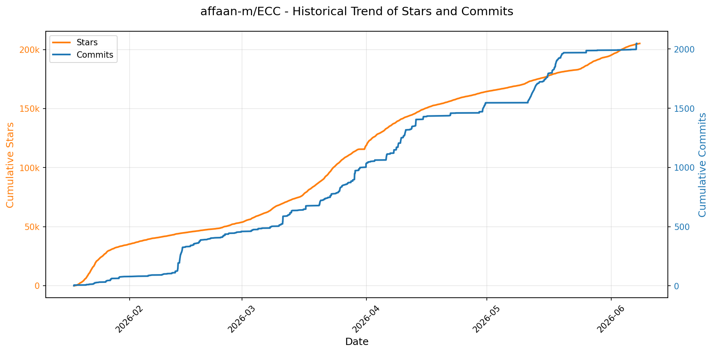

> *蓝色：累计 Stars｜橙色：累计 Commits（次 Y 轴）*

<b>📄 README 摘要</b>

1. **该项目的功能**  
ECC（The harness-native operator system for agentic work）是一个面向“智能体工作流”（agentic work）的、原生适配多种AI代理运行时环境（即“harnesses”）的操作系统级框架。它并非简单的配置集合或提示工程工具，而是提供生产就绪的端到端代理基础设施：支持技能（skills）定义与复用、本能（instincts）建模、记忆优化与持久化、持续学习（自动从会话中提炼可复用模式）、安全扫描（集成AgentShield）、研究驱动开发（research-first development），以及对遗留命令的兼容封装（legacy command shims）。其核心目标是统一跨AI代理平台（如Claude Code、Cursor、Codex、OpenCode、Zed、GitHub Copilot、Gemini等）的工程实践，使开发者能在不同harness上复用同一套代理逻辑、规则、钩子（hooks）和操作流程。

2. **关键特性**  
- **跨harness一致性架构**：实现行为、API、状态管理在12+语言生态（TS/Python/Go/Java/Perl/Kotlin/Rust/C++/PHP/Swift等）及7+主流AI开发环境中的高度对齐；  
- **Operator工作流范式**：引入“Operator”概念（如`brand-voice`、`customer-billing-ops`、`workspace-surface-audit`），将复杂业务逻辑封装为可编排、可观测、可审计的原子操作单元；  
- **智能会话生命周期管理**：内置SQLite状态存储、会话自动保存/加载、分支/搜索/导出/压缩/指标分析（NanoClaw v2），支持多会话并行与上下文隔离；  
- **自进化能力**：通过“连续学习v2”机制，基于置信度评分自动提取会话中的有效模式，生成/更新技能与本能，并支持导入导出与演化追踪；  
- **安全优先设计**：深度集成AgentShield进行运行时安全扫描；提供沙箱化执行、输入净化、CVE检测、攻击面分析及《Agentic Security Guide》专项指导；  
- **生产级可观测性与运维**：`ecc status --markdown`生成便携式状态快照（含就绪状态、活跃会话、技能健康度、治理事件、工单联动）；支持`ecc work-items sync-github`同步PR/Issue队列；`--exit-code`支持CI/CD自动化失败判定；  
- **模块化安装与精细控制**：基于清单（manifest）的按需安装（selective install），支持`--profile minimal/core/full`及`--with/--without`组件粒度控制；提供交互式配置向导（`configure-ecc`）与PM2多代理编排命令；  
- **多模态与产品化扩展**：内置`frontend-slides`幻灯片生成器、`manim-video`/`remotion-video-creation`视频制作能力、预测市场技能包（Itô）、性能优化技能包（并行执行、吞吐加速、延迟敏感系统等）；  
- **ECC 2.0 Alpha Rust控制平面**：`ecc2/`目录下已集成Rust编写的轻量级控制平面原型，支持`dashboard`/`start`/`sessions`/`daemon`等命令，标志架构向高性能、低延迟、强类型系统演进。

3. **技术栈**  
- **主语言与运行时**：TypeScript（核心CLI、仪表盘、插件逻辑）、Python（`ecc_dashboard.py` GUI、部分技能与脚本）、Go（部分底层工具与性能敏感模块）、Java/Kotlin/Perl/PHP/Rust/C++（用于多语言规则引擎与对应生态技能支持）；  
- **前端与GUI**：Tkinter（桌面仪表盘）、HTML/CSS/JS（`frontend-slides`生成器）、Markdown（文档与元数据驱动）；  
- **基础设施与工具链**：Shell（Bash/PowerShell安装脚本）、npm/pnpm/yarn/bun（包管理）、SQLite（本地状态存储）、Git Worktrees（并行开发）、PM2（多服务进程管理）；  
- **AI与协议层**：深度适配MCP（Model Context Protocol）规范；集成NanoClaw v2模型路由与技能热加载；支持LLM提示优化、Token精简、验证循环（grader/eval）、pass@k评估等；  
- **部署与分发**：GitHub App（Marketplace）、npm包（`ecc-universal`、`ecc-agentshield`）、独立CLI、跨平台安装器（`.sh`/`.ps1`/`npx ecc-install`）；  
- **架构风格**：微内核+插件化（harness-agnostic core + harness-specific adapters）、声明式规则（YAML/Markdown）、事件驱动钩子（hooks）、面向Operator的命令式工作流。

---

### 2. [anthropics/claude-code](https://github.com/anthropics/claude-code)
- 📅 **创建日期**：2025-02-22  
- 🔄 **最近更新**：2026-06-01  
- ⭐ **Stars**：185,232（日 +507｜周 +2804｜月 +9781）  
- 📝 **描述**：Claude Code is an agentic coding tool that lives in your terminal, understands your codebase, and helps you code faster by executing routine tasks, explaining complex code, and handling git workflows - all through natural language commands.  

<b>📈 Star 与 Commit 历史趋势</b>

> *蓝色：累计 Stars｜橙色：累计 Commits（次 Y 轴）*

<b>📄 README 摘要</b>

1. **该项目的功能**  
Claude Code 是一款终端原生的智能编程助手，能够深度理解用户当前代码库，通过自然语言指令自动执行常规开发任务，包括：自动生成/修改代码、解释复杂逻辑、辅助 Git 工作流（如提交信息生成、分支管理、冲突分析等），并支持在终端、IDE 或 GitHub 中（通过 `@claude` 提及）调用。

2. **核心功能**  
- **上下文感知编码**：基于本地代码库进行语义理解，提供精准的代码建议与操作；  
- **自然语言驱动工作流**：支持纯中文/英文指令完成编码、调试、文档编写、测试生成等任务；  
- **Git 智能集成**：可解析 Git 状态、生成符合规范的提交信息、解释差异（diff）、协助 PR 描述撰写；  
- **插件扩展架构**：内置可插拔机制，支持通过官方插件目录添加自定义命令与专用代理（Agent）；  
- **多平台一键安装**：提供 macOS/Linux 的 shell 脚本、Homebrew，Windows 的 PowerShell 脚本及 WinGet 安装方式；  
- **内建反馈闭环**：集成 `/bug` 命令实现问题直报，支持会话级错误复现与上下文上传（受隐私策略约束）。

3. **技术栈**  
- **运行时环境**：Node.js 18+（底层依赖，但主程序为原生二进制分发，npm 全局安装已弃用）；  
- **分发与安装**：跨平台安装脚本（Bash/PowerShell）、Homebrew Cask、WinGet 包管理器；  
- **架构模式**：基于“Agentic”范式设计，采用本地优先（local-first）架构，关键代码分析与指令执行在用户设备端完成；  
- **集成协议**：支持终端标准输入输出（TTY）、IDE 插件桥接、GitHub Bot 交互（通过 Webhook 与 Mention 触发）；  
- **数据合规层**：集成隐私保护机制，含敏感数据自动脱敏、会话数据限时留存、严格访问控制及明确禁用训练条款。

---

### 3. [multica-ai/andrej-karpathy-skills](https://github.com/multica-ai/andrej-karpathy-skills)
- 📅 **创建日期**：2026-01-27  
- 🔄 **最近更新**：2026-06-01  
- ⭐ **Stars**：145,290（日 +1015｜周 +11365｜月 +49913）  
- 📝 **描述**：A single CLAUDE.md file to improve Claude Code behavior, derived from Andrej Karpathy's observations on LLM coding pitfalls.  

<b>📈 Star 与 Commit 历史趋势</b>

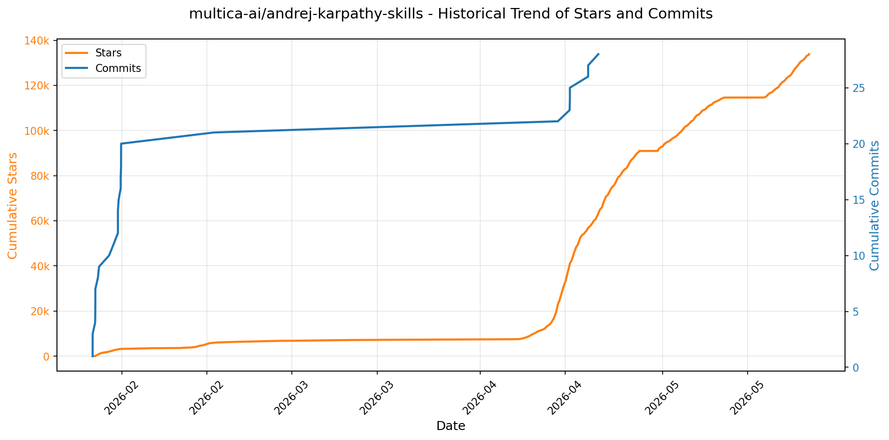

> *蓝色：累计 Stars｜橙色：累计 Commits（次 Y 轴）*

<b>📄 README 摘要</b>

1. **该项目的作用**  
该项目提供一份轻量、可即插即用的 `CLAUDE.md` 指南文件，旨在系统性地矫正 Claude（特别是 Claude Code）在编程任务中的典型行为缺陷。它不开发新工具或运行时环境，而是通过结构化提示工程（prompt engineering），将 Andrej Karpathy 总结的 LLM 编程认知误区转化为四条可执行、可内化的工程原则，直接嵌入 Claude Code 的工作流中，从而引导模型更审慎、简洁、精准、目标明确地完成代码生成与修改任务。

2. **核心特性**  
- **四大可操作原则**：以“Think Before Coding”（显式推理、暴露不确定性、主动质疑）、“Simplicity First”（严格拒绝过度设计、仅实现最小可行解）、“Surgical Changes”（变更范围绝对受控、零副作用编辑、风格严格对齐既有代码）、“Goal-Driven Execution”（将模糊指令转为可验证的成功标准，如“先写失败测试再修复”）构成闭环行为约束；  
- **双模部署支持**：既可通过 Claude Code 插件市场一键安装为全局技能（跨项目生效），也可作为纯文本 `CLAUDE.md` 文件按需引入单个项目（支持追加合并）；  
- **多编辑器兼容性**：原生支持 Cursor IDE，已预置 `.cursor/rules/karpathy-guidelines.mdc` 规则文件，开箱即用；  
- **渐进式集成能力**：允许与项目已有规范（如 TypeScript 严格模式、特定错误处理约定）无缝融合，支持自定义扩展章节；  
- **效果可度量**：明确定义成功信号——如 diff 更干净、PR 更小、提问前置化、重写率显著降低，便于团队快速验证实效。

3. **技术栈**  
- **核心载体**：纯 Markdown 文本（`CLAUDE.md`），无代码依赖，零构建成本；  
- **运行环境**：深度适配 Anthropic 的 **Claude Code**（AI 原生 IDE），并官方支持 **Cursor**（基于 VS Code 的 AI 编程编辑器）；  
- **分发机制**：GitHub 仓库托管 + CLI 快速拉取（`curl`），插件通过 Claude Code 的 `/plugin` 命令行接口安装；  
- **底层原理**：基于大语言模型的**提示词工程（Prompt Engineering）** 与**角色设定（Role Prompting）**，不涉及模型微调、RAG 或后端服务；  
- **协议与许可**：采用 **MIT 开源许可证**，允许自由使用、修改与分发。

---

### 4. [microsoft/markitdown](https://github.com/microsoft/markitdown)
- 📅 **创建日期**：2024-11-13  
- 🔄 **最近更新**：2026-06-01  
- ⭐ **Stars**：136,133（日 +2653｜周 +10541｜月 +16451）  
- 📝 **描述**：Python tool for converting files and office documents to Markdown.  

<b>📈 Star 与 Commit 历史趋势</b>

> *蓝色：累计 Stars｜橙色：累计 Commits（次 Y 轴）*

<b>📄 README 摘要</b>

1. **项目功能**  
MarkItDown 是一个轻量级 Python 工具，专为将多种格式的文件（如 PDF、Word、PPTX、Excel、HTML、图像、音频、视频、ZIP、EPUB、YouTube 链接等）**高保真地转换为结构化 Markdown 文本**而设计，核心目标是服务于大语言模型（LLM）和文本分析流水线。它并非面向人类阅读的排版工具，而是强调在 Markdown 中准确保留文档语义结构（如标题层级、列表、表格、超链接、代码块、YAML 前置元数据等），以提升 LLM 对输入内容的理解与处理效率。

2. **关键特性**  
- **多格式统一支持**：原生支持 10+ 种主流文件类型（含二进制/多媒体/网络资源），并可通过插件或云服务扩展能力；  
- **结构化 Markdown 输出**：优先保留逻辑结构而非视觉样式，输出兼容 LLM 训练分布、token 效率高；  
- **灵活的转换模式**：提供 `convert_local()`（仅本地文件）、`convert_stream()`（流式输入）、`convert_response()`（自定义 HTTP 响应）等细粒度 API，强化安全可控性；  
- **插件化架构**：支持第三方插件（如 `markitdown-ocr`），利用 LLM Vision（如 GPT-4o）对嵌入图像进行 OCR 和语义描述，无需额外 ML 依赖；  
- **云服务集成**：深度集成 Azure Content Understanding（CU）与 Azure Document Intelligence（DocIntel），支持高质量多模态解析、结构化字段提取（YAML 前置）、自定义分析器及音视频处理；  
- **精细化依赖管理**：通过可选依赖组（如 `[pdf]`、`[audio-transcription]`、`[az-content-understanding]`）按需安装，避免冗余包；  
- **生产级安全设计**：明确警示 I/O 权限继承风险，强制要求输入校验，并推荐最小权限调用策略（如禁用远程 URI 时仅用 `convert_local`）。

3. **技术栈**  
- **语言与运行环境**：Python ≥ 3.10，推荐虚拟环境（venv / uv / conda）隔离；  
- **核心依赖**：基于标准库与成熟生态，如 `pdfplumber`、`python-pptx`、`openpyxl`、`beautifulsoup4`、`Pillow`、`pydub` 等；  
- **OCR 与多模态**：集成 `tesseract`（可选）、LLM Vision 接口（OpenAI 兼容客户端，如 `openai` SDK）；  
- **云服务对接**：Azure REST API 客户端（`azure-ai-content-understanding`、`azure-ai-formrecognizer`）；  
- **构建与分发**：PyPI 发布（`pip install markitdown[all]`），支持源码安装、Docker 容器化部署；  
- **开发与测试**：Hatch 构建系统、pre-commit 钩子、GitHub Actions CI/CD、Devcontainer 开发环境。

---

### 5. [mattpocock/skills](https://github.com/mattpocock/skills)
- 📅 **创建日期**：2026-02-03  
- 🔄 **最近更新**：2026-06-01  
- ⭐ **Stars**：113,630（日 +859｜周 +9568｜月 +60988）  
- 📝 **描述**：Skills for Real Engineers. Straight from my .claude directory.  

<b>📈 Star 与 Commit 历史趋势</b>

> *蓝色：累计 Stars｜橙色：累计 Commits（次 Y 轴）*

<b>📄 README 摘要</b>

1. **项目功能**  
该项目是一套面向真实软件工程场景的、可即插即用的 AI 编程助手（Coding Agent）技能集合（Skills），旨在系统性解决当前大模型编程代理在实际开发中普遍存在的四大核心问题：**需求对齐失败、表达冗余低效、代码质量不可靠、架构持续腐化**。它不提供完整框架或工具链，而是以轻量、模块化、可组合的“技能”（即预定义的 Prompt 工作流 + 配置引导）形式，嵌入到各类支持自定义指令的 AI 编程代理（如 Claude Code、Codex 等）中，帮助工程师在人机协同过程中重建工程纪律、强化反馈闭环、沉淀领域知识，并持续维护代码库的可演进性。

2. **关键特性**  
- **问题驱动设计**：所有技能均围绕真实工程痛点构建，明确对应四大失败模式（对齐偏差、语言冗余、测试缺失、架构熵增），并提供经验证的实践方案（如 `/grill-me` 强制对齐、`/tdd` 强制红绿重构、`/improve-codebase-architecture` 主动架构治理）。  
- **小而专、高可组合**：每个技能职责单一、边界清晰（如 `/triage` 专注工单状态机管理，`/zoom-out` 专注系统级上下文理解），支持按需启用、自由组合，不强制绑定特定流程或模型。  
- **深度工程内化**：深度融合经典工程方法论（TDD、DDD、ADR、Pragmatic Programming、XP），将抽象原则转化为具体可执行的 AI 指令（如 `/grill-with-docs` 自动同步 `CONTEXT.md` 和 ADR 文档，`/to-prd` 基于对话实时生成 PRD）。  
- **领域语言共建**：首创将“共享领域语言”（Ubiquitous Language）作为核心能力嵌入工作流（尤其在 `/grill-with-docs` 中），通过持续提炼术语、约束命名、减少歧义，显著提升 AI 理解精度与代码一致性。  
- **开箱即用的工程基础设施集成**：内置对 GitHub/Linear 等主流 Issue Tracker、本地文档目录、测试框架等的配置向导（`/setup-matt-pocock-skills`），实现 30 秒快速接入，无缝融入现有研发流程。

3. **技术栈**  
- **核心形态**：纯文本 Skill 定义（Markdown 格式 `.md` 文件），含结构化指令、示例、最佳实践说明，无运行时依赖；  
- **交付与安装**：基于 `npx` 的 CLI 脚本（`skills.sh`）实现跨平台一键安装与技能注册；  
- **运行环境**：完全依赖外部 AI 编程代理（非自有模型），兼容任何支持自定义指令/技能扩展的 Agent（如 Claude Code、Cursor、GitHub Copilot Workspace 等）；  
- **协作资产**：强依赖项目级工程文档，包括 `CONTEXT.md`（领域术语词典）、`docs/adr/`（架构决策记录）、标准测试套件、静态类型系统（如 TypeScript）及 Git 工作流；  
- **辅助工具链**：部分技能集成前端（浏览器访问）、测试运行器、Git Hook（如 `git-guardrails-claude-code`）等工程基础设施，但本身不提供底层实现。

---

### 6. [codecrafters-io/build-your-own-x](https://github.com/codecrafters-io/build-your-own-x)
- 📅 **创建日期**：2018-05-09  
- 🔄 **最近更新**：2026-06-01  
- ⭐ **Stars**：105,006（日 +1172｜周 +5431｜月 +12062）  
- 📝 **描述**：Master programming by recreating your favorite technologies from scratch.  

<b>📈 Star 与 Commit 历史趋势</b>

> *蓝色：累计 Stars｜橙色：累计 Commits（次 Y 轴）*

<b>📄 README 摘要</b>

1. **项目功能**  
该项目是一个开源的、面向学习者的实践型技术指南聚合库，核心目标是通过“从零手写实现”（build your own）的方式，帮助开发者深入理解主流技术的底层原理与工作机制。它不提供现成的可运行软件或框架，而是系统性地收集、整理并分类了大量高质量、分步骤、可实操的技术重建教程，覆盖从基础系统组件（如内存分配器、Shell、网络栈）到复杂现代系统（如分布式消息系统Kafka、大语言模型LLM、Web浏览器、区块链、AI生成模型等）的30余个技术领域，强调“造轮子即懂原理”的学习范式。

2. **关键特性**  
- **高度结构化与全覆盖**：按技术类型精细分类（如3D渲染器、数据库、Docker、操作系统等），共30+个明确主题，每个主题下聚合多份跨语言、多难度的教程；  
- **多语言实现支持**：同一技术问题提供多种编程语言（C/C++/Python/JavaScript/Go/Rust/Java/TypeScript等）的实现方案，兼顾性能敏感型（如C/C++写渲染器、VM）与快速验证型（如Python写区块链、JS写前端框架）场景；  
- **渐进式学习路径**：教程涵盖入门级（如“用500行代码实现Linux容器”）、中级（如“从零构建Redis”）到高级（如“物理渲染PBR实现”“LLM from scratch”）的完整梯度；  
- **形式多样且实用性强**：包含图文教程、开源书籍、视频课程、可运行代码仓库、交互式Notebook（Observable）、测试驱动小挑战（如“45步写数据库”）等多种学习资源形态；  
- **强调第一性原理**：所有内容均围绕“可动手、可调试、可理解”的原则组织，直接呼应费曼学习法——“凡我不能创造者，我尚未真正理解”。

3. **技术栈**  
项目本身为静态文档型仓库（GitHub README），无统一运行时技术栈；其内容所涉技术栈极度广泛且去中心化，体现为**教程示例中使用的编程语言与工具生态**，主要包括：  
- **系统级语言**：C（操作系统、内存分配器、容器、Game Boy模拟器）、C++（3D渲染器、游戏引擎、神经网络）；  
- **现代通用语言**：Python（区块链、AI模型、数据库、AR、爬虫Bot）、Go（Docker、数据库、BitTorrent、CLI工具）、Rust（区块链、Redis客户端、Game Boy模拟器、CLI）；  
- **Web与前端技术**：JavaScript/TypeScript（前端框架React/Vue替代品、Web服务器、Web浏览器、WebGL渲染、游戏）、HTML/CSS（游戏UI）；  
- **JVM系语言**：Java（Kafka、Git、3D渲染器、区块链）、Kotlin（加密货币）；  
- **其他语言**：C#（Unity AR、数据库）、Ruby（区块链、KV存储）、Crystal（区块链、NoSQL）、Nim（Bencode解析、dotfiles管理）、Zig（CLI工具）、Haskell（IRC Bot）、R（交易机器人）、Common Lisp（CHIP-8模拟器）、ATS（函数式区块链）；  
- **配套工具与协议**：OpenGL、WebGL、Vulkan（图形）、OpenCV（AR）、Git、Docker、BitTorrent协议、TCP/IP栈、HTTP/WebSockets、LLVM（部分编译器教程）。

---

### 7. [harry0703/MoneyPrinterTurbo](https://github.com/harry0703/MoneyPrinterTurbo)
- 📅 **创建日期**：2024-03-11  
- 🔄 **最近更新**：2026-06-01  
- ⭐ **Stars**：75,177（日 +2502｜周 +17171｜月 +18401）  
- 📝 **描述**：利用AI大模型，一键生成高清短视频 Generate short videos with one click using AI LLM.  

<b>📈 Star 与 Commit 历史趋势</b>

> *蓝色：累计 Stars｜橙色：累计 Commits（次 Y 轴）*

<b>📄 README 摘要</b>

1. **项目功能**  
MoneyPrinterTurbo 是一个全自动短视频生成工具，用户仅需输入视频主题或关键词，系统即可端到端完成：AI生成多语言（中/英）视频文案 → 检索无版权高清视频素材（支持Pexels等源及本地素材）→ 合成语音（多引擎支持）→ 生成可定制化字幕（字体/位置/颜色/描边）→ 匹配背景音乐（随机或指定文件）→ 合成输出高清短视频（支持9:16竖屏与16:9横屏两种主流格式）。同时支持批量生成、多模型切换、Web界面交互与标准化API服务。

2. **核心特性**  
- ✅ 完整MVC架构，兼顾Web UI与RESTful API双入口，代码结构清晰、易于二次开发；  
- ✅ 多模态AI集成：支持OpenAI、DeepSeek、Moonshot、通义千问、Gemini、Ollama、文心一言等**13+大模型后端**，国内用户可免VPN直连；  
- ✅ 灵活内容控制：支持自定义文案、多尺寸输出（1080×1920 / 1920×1080）、分段时长调节、批量任务并发；  
- ✅ 高度可配置媒体处理：语音合成支持实时试听与多音色选择；字幕支持`edge`（快速）与`whisper`（高精度）双引擎；背景音乐可调音量；素材来源含在线无版权库+本地路径；  
- ✅ 全流程本地/云端混合部署：关键组件（TTS、ASR、LLM）均可按需切换云服务或本地运行（如faster-whisper离线转录）；  
- ✅ 开箱即用体验：提供Windows一键启动包、Docker容器化部署、Google Colab免配置环境及详细中文文档与视频教程。

3. **技术栈**  
- **后端框架**：Python 3.11为主，基于FastAPI（API服务）与Streamlit（Web UI）构建；  
- **依赖管理**：默认采用 `uv`（超高速Python包管理器），兼容 `venv + pip`；  
- **AI能力层**：  
  - LLM接入：通过统一抽象层适配多种模型提供商（OpenAI兼容API、One-API网关、国产模型SDK等）；  
  - TTS语音合成：集成Azure Cognitive Services、Edge TTS等；  
  - 字幕/ASR：支持Edge内置语音识别与`faster-whisper`（Hugging Face模型，支持离线large-v3）；  
- **多媒体处理**：  
  - 视频合成：依赖`ffmpeg`（自动下载或手动配置路径）；  
  - 图像/字体渲染：`ImageMagick`（需静态版安装并配置策略）；  
  - 字体与音频资源：内置`resource/fonts/`与`resource/songs/`目录，支持用户自定义扩展；  
- **部署方案**：原生支持Docker（docker-compose）、WSL2（Windows）、macOS/Linux原生运行，以及Google Colab云端沙盒；  
- **配置与存储**：使用TOML格式配置文件（`config.toml`），模块化管理API密钥、模型参数、路径及媒体设置。

---

### 8. [bytedance/UI-TARS-desktop](https://github.com/bytedance/UI-TARS-desktop)
- 📅 **创建日期**：2025-01-19  
- 🔄 **最近更新**：2026-06-01  
- ⭐ **Stars**：59,769（日 +0｜周 +0｜月 +5669）  
- 📝 **描述**：The Open-Source Multimodal AI Agent Stack: Connecting Cutting-Edge AI Models and Agent Infra  

<b>📈 Star 与 Commit 历史趋势</b>

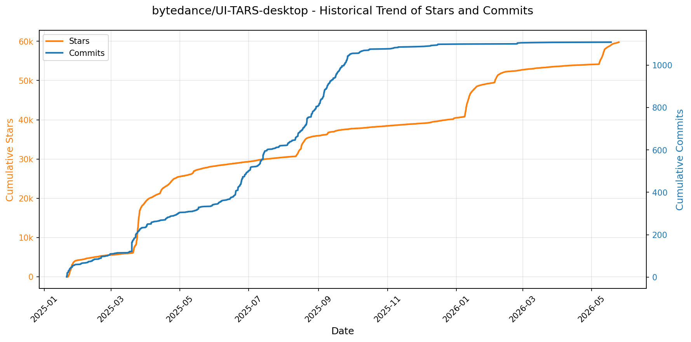

> *蓝色：累计 Stars｜橙色：累计 Commits（次 Y 轴）*

<b>📄 README 摘要</b>

1. **项目功能**  
TARS 是一个开源的多模态 AI 智能体（Agent）技术栈，聚焦于实现类人化、跨界面的任务自动化。它包含两大核心组件：  
- **Agent TARS**：通用型多模态智能体框架，支持在终端（CLI）、Web 界面及服务端运行，可理解 GUI 界面、屏幕图像与自然语言指令，并通过调用真实世界工具（如浏览器、Shell、文件系统等）完成端到端任务（例如“在 Booking.com 预订机场附近丽思卡尔顿酒店”或“生成杭州一个月天气图表”）。  
- **UI-TARS Desktop**：本地原生桌面应用，基于 UI-TARS 视觉语言模型（如 Seed-1.5-VL/1.6），提供对本机和远程计算机/浏览器的零配置、高精度 GUI 自动化控制（如操作 VS Code 设置、浏览 GitHub 仓库），全程离线处理，保障隐私安全。

2. **关键特性**  
- ✅ **多模态感知与执行**：融合视觉（截图识别）、文本、GUI 元素（DOM + 视觉定位）理解能力，支持“视觉锚定”（Visual Grounding）式精准交互；  
- ✅ **混合浏览器代理**：可自由切换 DOM 解析、GUI 截图识别或二者协同策略控制网页；  
- ✅ **事件流驱动架构（Event Stream）**：提供结构化、可追踪的数据流，支撑上下文工程、调试（Event Stream Viewer）与低代码 Agent UI 构建；  
- ✅ **MCP（Model Control Protocol）深度集成**：以 MCP 为内核协议，无缝对接各类外部工具服务器（如 Shell、HTTP API、数据库），实现标准化工具编排；  
- ✅ **全场景操作支持**：覆盖本地终端、桌面 GUI、Web 浏览器、远程计算机/浏览器（UI-TARS Desktop），并提供 AIO 沙箱环境保障工具执行隔离性与安全性；  
- ✅ **开箱即用体验**：CLI 支持 `npx` 一键启动，Web UI 与桌面 App 均无需复杂配置，远程控制功能“点击即用”。

3. **技术栈**  
- **核心模型层**：基于自研多模态大模型 UI-TARS（论文 arXiv:2501.12326）及 Seed-1.5-VL/1.6 系列视觉语言模型，支持本地部署与云服务接入（VolcEngine、Anthropic 等）；  
- **协议与架构**：采用 MCP（Model Control Protocol）作为智能体与工具间的标准化通信协议；  
- **前端与客户端**：  
  - Agent TARS CLI：Node.js（≥ v22）构建，TypeScript 实现，支持 npm 包管理；  
  - Agent TARS Web UI：基于现代 Web 技术栈（推测为 React/Vite + WebSocket 事件流）；  
  - UI-TARS Desktop：跨平台桌面应用（Electron 或 Tauri 等框架），支持 Windows/macOS，集成本地视觉推理引擎；  
- **基础设施**：支持 ModelScope、Hugging Face 模型托管；提供 AIO Agent Sandbox（容器化沙箱）用于安全工具执行；文档与社区生态依托 GitBook（DeepWiki）、Discord、飞书、Twitter 等平台。

---

### 9. [ruvnet/ruflo](https://github.com/ruvnet/ruflo)
- 📅 **创建日期**：2025-06-02  
- 🔄 **最近更新**：2026-06-01  
- ⭐ **Stars**：57,705（日 +327｜周 +2295｜月 +22250）  
- 📝 **描述**：🌊 The leading agent orchestration platform for Claude. Deploy intelligent multi-agent swarms, coordinate autonomous workflows, and build conversational AI systems. Features    enterprise-grade architecture, self-learning swarm intelligence, RAG integration, and native Claude Code / Codex Integration  

<b>📈 Star 与 Commit 历史趋势</b>

> *蓝色：累计 Stars｜橙色：累计 Commits（次 Y 轴）*

<b>📄 README 摘要</b>

1. **项目功能**  
Ruflo 是一个面向 Anthropic Claude Code 的多智能体（Multi-agent）AI 编排系统，旨在为 AI 开发者与工程师提供企业级、可协作、自学习的智能体基础设施。它将原本独立运行的 AI 智能体升级为具备“神经系统”的协同集群：支持跨机器、跨团队、跨信任边界的**联邦式安全通信**；实现智能体间的**自主组队（Swarm）与动态协调**；通过向量记忆（AgentDB + HNSW）、轨迹学习（SONA）、推理银行（ReasoningBank）等机制实现**会话间持久记忆与任务驱动的自我优化**；并深度集成 Model Context Protocol（MCP），使智能体可统一调用 200+ 工具（含本地 WASM 工具与远程服务）。一句话概括：Ruflo 让 Claude Code 不再是单点工具，而成为可自主规划、协同执行、持续进化的分布式智能体操作系统。

2. **核心特性**  
- ✅ **100+ 专业化智能体**：覆盖编码、测试（`ruflo-testgen`/`ruflo-browser`）、安全审计（`ruflo-security-audit`/`ruflo-aidefence`）、文档生成（`ruflo-docs`）、架构设计（`ruflo-ddd`/`ruflo-adr`）、量化交易（`ruflo-neural-trader`）、IoT 管理等垂直领域；  
- ✅ **多层级智能体编排**：支持分层 Swarm、网状拓扑、自适应共识机制，以及基于 GOAP（Goal-Oriented Action Planning）的 A\* 自主目标分解与重规划（`goal.ruv.io`）；  
- ✅ **联邦化安全协作**：零信任架构下实现跨设备/组织的智能体发现、认证与任务委托，全程数据不出域（no data leakage）；  
- ✅ **自学习与自优化**：通过 SONA 神经模式、轨迹回放、成功路径强化，使智能体在反复任务中持续提升决策质量；  
- ✅ **高性能向量记忆系统**：基于 HNSW 索引的 AgentDB，实测在 N=5k–20k 场景下比暴力搜索快 1.9–4.7 倍，召回率@10 达 0.99；  
- ✅ **全栈 MCP 生态**：原生支持 MCP 协议，提供 CLI、Web UI（`flo.ruv.io`）、Goal Planner（`goal.ruv.io`）三端统一工具调用能力，支持并行执行（单次响应触发 4–6+ 工具）；  
- ✅ **混合模型与本地智能**：无缝接入 Claude/Gemini/Qwen/OpenAI 等云模型，并原生集成 `ruvLLM` —— 支持 MicroLoRA 微调、离线运行、本地轨迹学习的自进化轻量模型层；  
- ✅ **开箱即用的可观测性与运维**：内置成本追踪（`ruflo-cost-tracker`）、结构化日志/追踪（`ruflo-observability`）、自动后台工作流（审计/优化/补测等 12 类 Worker）；  
- ✅ **模块化插件体系**：33 个官方插件（含 21 个 npm 包），按功能划分为核心编排、记忆知识、智能学习、代码质量、安全合规、架构方法论、DevOps、领域专用等八大类，支持一键安装与自定义扩展。

3. **技术栈**  
- **核心语言与引擎**：Rust（高性能 AI 引擎、嵌入式 WASM 沙箱 `rvagent`、向量索引与内存底层）；  
- **前端框架**：Svelte（Web UI `flo.ruv.io`）、React（Goal Planner `goal.ruv.io`）；  
- **后端与协议**：Node.js（CLI 主体、MCP 服务器、插件运行时）、Model Context Protocol（MCP v0.5+ 标准）；  
- **记忆与检索**：AgentDB（自研 HNSW 向量数据库）、`ruvector`（GPU 加速图 RAG 引擎）、RAG 多模态混合搜索（语义+图跳转+多样性排序）；  
- **智能体运行时**：WASM 沙箱（本地安全执行）、Anthropic Managed Agents（云端托管）、Ollama/vLLM/LM Studio（本地 LLM 接入）；  
- **部署与基础设施**：Docker（`ruvocal` Web UI 内置 MongoDB）、Google Cloud Run / Fly.io / Kubernetes 兼容；  
- **安全与合规**：AIDefence（防提示注入/PII 检测）、输入白名单校验、CVE 自动修复、路径遍历防护；  
- **开发体验**：NPM 包管理（`ruflo` CLI、33 个 `@ruflo/*` 插件）、Claude Code 原生插件市场集成、交互式 `npx ruflo init wizard` 安装向导。

---

### 10. [D4Vinci/Scrapling](https://github.com/D4Vinci/Scrapling)
- 📅 **创建日期**：2024-10-13  
- 🔄 **最近更新**：2026-06-01  
- ⭐ **Stars**：56,889（日 +730｜周 +2753｜月 +16687）  
- 📝 **描述**：🕷️ An adaptive Web Scraping framework that handles everything from a single request to a full-scale crawl!  

<b>📈 Star 与 Commit 历史趋势</b>

> *蓝色：累计 Stars｜橙色：累计 Commits（次 Y 轴）*

<b>📄 README 摘要</b>

1. **项目功能**  
Scrapling 是一个自适应的现代化网络爬虫框架，专为应对现代网页的动态性与反爬机制而设计。它支持从单次请求到大规模分布式爬取的全场景需求：既能快速抓取单个页面，也能构建高并发、多会话、可暂停/恢复的完整爬虫系统；其核心能力在于**自动适应网站结构变更**（如CSS类名或DOM路径更新），通过智能相似度算法重新定位目标元素；同时原生集成反机器人绕过能力，可开箱即用处理 Cloudflare Turnstile 等主流人机验证，并支持代理轮换、Robots.txt 遵守、流式数据输出与实时统计。

2. **关键特性**  
- **智能自适应解析**：CSS/XPath 选择器支持 `adaptive=True` 模式，基于视觉与语义相似性自动重定位失效元素；提供文本搜索、正则匹配、相似元素查找等灵活提取方式。  
- **全栈式爬虫框架（Spiders）**：类 Scrapy 的异步 Spider API，支持 `start_urls`、`parse()` 回调、多会话路由、并发控制、域名限速、开发模式（本地缓存回放）、流式迭代（`async for item in spider.stream()`）、内置 JSON/JSONL 导出及断点续爬。  
- **高级请求与反爬能力**：  
  - 多种 Fetcher：轻量 `Fetcher`（HTTP/3 + TLS 指纹伪装）、隐身 `StealthyFetcher`（绕过 Turnstile）、动态 `DynamicFetcher`（Playwright/Chrome 渲染）；  
  - 全面会话管理（`FetcherSession`/`StealthySession`/`DynamicSession`）；  
  - 内置代理轮换（`ProxyRotator`）、DNS-over-HTTPS 防泄漏、广告/追踪域名拦截（~3500 条规则）；  
- **AI 协同能力**：内置 MCP（Model Context Protocol）服务器，可作为 AI 工具（如 Claude、Cursor）的插件，先由 Scrapling 精准提取目标内容再交由大模型处理，显著降低 token 开销并提升效率。  
- **开发者体验优化**：交互式 IPython Shell（支持 curl 转 Scrapling 请求、浏览器预览）、命令行工具、92% 测试覆盖率、完整类型提示、高性能序列化（比标准库快 10 倍）、内存高效设计。

3. **技术栈**  
- **核心语言**：Python（支持 Python 3.8+）；  
- **异步框架**：基于 `asyncio`，全面支持异步请求、爬虫与会话；  
- **浏览器自动化**：集成 Playwright（Chromium）与 Google Chrome，用于动态渲染；  
- **网络协议与安全**：支持 HTTP/3、TLS 指纹模拟、DNS-over-HTTPS（Cloudflare DoH）；  
- **依赖生态**：底层使用 `httpx`（HTTP）、`playwright`（动态渲染）、`lxml`/`cssselect`（解析）、`orjson`（极速 JSON 序列化）；  
- **扩展与集成**：兼容 MCP 协议（AI 工具链）、N8N、CLI 工具链；支持与各类代理服务（ColdProxy、SwiftProxy、9Proxy 等）无缝协作。

---

### 11. [ruvnet/RuView](https://github.com/ruvnet/RuView)
- 📅 **创建日期**：2025-06-07  
- 🔄 **最近更新**：2026-06-01  
- ⭐ **Stars**：55,937（日 +621｜周 +4380｜月 +7306）  
- 📝 **描述**：π RuView turns commodity WiFi signals into real-time spatial intelligence, vital sign monitoring, and presence detection — all without a single pixel of video.  

<b>📈 Star 与 Commit 历史趋势</b>

> *蓝色：累计 Stars｜橙色：累计 Commits（次 Y 轴）*

<b>📄 README 摘要</b>

1. **项目功能**  
RuView 是一个基于 WiFi 信道状态信息（CSI）的**无感空间感知平台**，利用普通 WiFi 信号（而非摄像头或可穿戴设备）实现穿墙、暗光、零接触式环境智能感知。其核心能力是将 WiFi 路由器发射的无线电波与人体运动、呼吸、心跳等生理活动引起的微弱信号扰动转化为结构化语义数据：可实时检测人员存在与数量、追踪跨房间移动、识别跌倒/坐起/睡眠等行为；非接触测量呼吸率（6–30 BPM）和心率（40–120 BPM）；完成 17 关键点的 WiFi DensePose 人体姿态估计（SOTA 精度 82.69% torso-PCK@20）；支持通过墙壁（最远约 5 米）进行人员探测与活动监测；并构建环境级“世界模型”，实现 15 帧未来占用预测。所有处理均在边缘端完成，无需云端、无需互联网、不依赖用户手机或 App。

2. **关键特性**  
- **全栈隐私优先架构**：纯本地边缘计算，无数据上传；所有测量结果经 Ed25519 密码学见证链（witness chain）认证，确保数据真实可审计。  
- **多生态无缝集成**：原生支持 Home Assistant（MQTT）、Apple Home（HAP-1.1 桥接）、Google Home、Amazon Alexa 及 SmartThings，且可通过 Matter 协议统一接入；支持 Siri/Google Assistant/Alexa 直接语音查询“某房间是否有人”“老人心率是否异常”等语义指令，无需定制技能。  
- **超低成本硬件部署**：以 $9 的 ESP32-S3 为传感节点，$140 的 Cognitum Seed 为边缘中枢，构成完整系统；支持多频段（6 个 WiFi 信道）时分复用网格扫描，复用邻居路由器作为免费雷达源。  
- **自适应边缘智能**：基于脉冲神经网络（SNN），可在 30 秒内完成环境自校准；提供 105 个即插即用的 Rust 编写“Cog”边缘模块（涵盖健康、安防、楼宇、零售等场景），支持运行时动态加载与配置。  
- **多模态融合能力**：支持 WiFi CSI + 摄像头深度（MiDaS）+ 毫米波雷达的三维点云联合建模（22 ms 管线，>19K 点/帧）；提供双模态（WiFi + MediaPipe）实时姿态融合演示。  
- **工业级开箱体验**：开箱即用 21 个 Home Assistant 实体（含 10 个高阶语义状态如 `someone-sleeping`、`fall-risk-elevated`、`meeting-in-progress`）及 3 个 HA 蓝图；提供 Docker 模拟环境、Python PyPI 包（`ruview` / `wifi-densepose`）、Rust crate、Hugging Face 预训练模型（4-bit 量化仅 8 KB）及完整硬件烧录指南。

3. **技术栈**  
- **编程语言与框架**：Rust（主系统、ESP32 固件、服务端、Cog 模块）、Python（训练/评估/客户端/CLI 工具）、C/C++（ESP-IDF 底层驱动）、TypeScript（Web 前端/Three.js 可视化）。  
- **AI 模型与训练**：Hugging Face 托管预训练模型（`ruvnet/wifi-densepose-pretrained`、`ruvnet/wifi-densepose-mmfi-pose`）；采用对比学习（12.2M 步）、自监督预训练 + MediaPipe 配对微调；模型推理使用 Candle（Rust）与 PyTorch（Python）；支持 LoRA 适配器进行环境个性化微调。  
- **硬件平台**：ESP32-S3（主力传感节点，CSI 流式采集）、ESP32-C6（Wi-Fi 6/802.15.4 研究节点，支持 HE-LTF 子载波标记与低功耗 RISC-V LP-Core 运动门控）、Cognitum Seed（带持久化向量存储、kNN 检索、密码学见证的边缘 AI 中枢）；兼容 Intel 5300/AR9580 研究网卡。  
- **通信与协议**：MQTT（HA 集成）、HAP-1.1（Apple Home）、Matter（统一智能家居标准）、ESP-NOW（C6 多节点网格同步）、UDP/TCP（CSI 数据流）、WebSocket（Web 实时可视化）。  
- **基础设施**：Docker（多架构镜像）、PyPI（Python wheel，abi3 兼容）、crates.io（Rust crate）、GitHub Actions（CI/CD，1463 项测试）、Hugging Face Spaces（AetherArena 公开评测平台）。

---

### 12. [colbymchenry/codegraph](https://github.com/colbymchenry/codegraph)
- 📅 **创建日期**：2026-01-18  
- 🔄 **最近更新**：2026-06-01  
- ⭐ **Stars**：33,137（日 +1035｜周 +12832｜月 +33137）  
- 📝 **描述**：Pre-indexed code knowledge graph for Claude Code, Codex, Gemini, Cursor, OpenCode, AntiGravity, Kiro, and Hermes Agent — fewer tokens, fewer tool calls, 100% local  

<b>📈 Star 与 Commit 历史趋势</b>

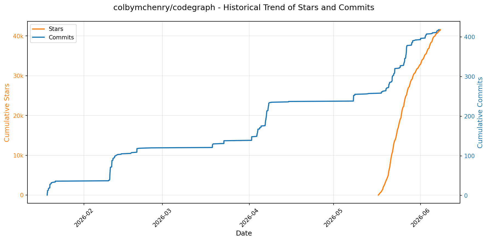

> *蓝色：累计 Stars｜橙色：累计 Commits（次 Y 轴）*

<b>📄 README 摘要</b>

1. **项目功能**  
CodeGraph 是一个**本地化、轻量级的语义代码知识图谱引擎**，专为增强 AI 编程代理（如 Claude Code、Cursor、Codex、Hermes Agent、Gemini 等）的代码理解能力而设计。它通过在本地预构建并实时维护一个高精度、多语言的代码结构图谱（含符号关系、调用链、控制流、框架路由、跨语言桥接等），使 AI 代理无需反复执行 `grep`/`find`/`Read` 等高开销工具调用即可直接获取精准上下文，从而显著提升代码探索效率与回答质量。

2. **核心特性**  
- ✅ **智能上下文生成**：单次 `codegraph_context` 调用即可返回入口点、关联符号及关键代码片段，消除探索型子代理；  
- ✅ **毫秒级全文搜索（FTS5）**：支持按名称/签名跨整个代码库即时定位代码；  
- ✅ **影响分析（Impact Analysis）**：可追溯任意符号的全部调用者（callers）、被调用者（callees）及完整影响范围；  
- ✅ **全自动实时同步**：基于操作系统原生文件事件（FSEvents/inotify/ReadDirectoryChangesW）+ 智能防抖（默认 2s），零配置保持图谱始终最新；  
- ✅ **20+ 主流语言支持**：涵盖 TypeScript/JS、Python、Rust、Go、Java、C/C++、Swift、Kotlin、Dart、Ruby、PHP、Lua 等；  
- ✅ **14 种 Web 框架路由感知**：自动识别 Django、Flask、FastAPI、Express、NestJS、Rails、Spring、Laravel 等的 URL → 处理器映射；  
- ✅ **深度跨语言桥接**：独家支持 iOS（Swift ↔ Objective-C）、React Native（JS ↔ ObjC/Swift/Java/Kotlin，含 Legacy Bridge / TurboModules / Fabric / Paper / Events）、Expo Modules 等混合栈的端到端调用链追踪；  
- ✅ **100% 纯本地运行**：所有索引存储于本地 SQLite 数据库，无网络外传、无需 API Key、不依赖任何云服务。

3. **技术栈**  
- **核心引擎**：Rust（高性能图谱构建、解析、查询与文件监听） + SQLite（嵌入式持久化，启用 FTS5 全文检索）；  
- **语言解析**：Tree-sitter（多语言 AST 提取，保障语法准确性）；  
- **跨语言桥接逻辑**：基于规则引擎 + 启发式匹配（如 Swift `@objc` 命名转换、RN Codegen 接口契约、Expo DSL 解析、事件通道命名约定等）；  
- **运行时分发**：自包含二进制（Bundled Node.js 运行时或纯 Rust 二进制），无需用户安装 Node.js 或编译环境；  
- **协议层**：MCP（Model Context Protocol）标准服务器，与各类 AI 编程代理无缝集成；  
- **部署体验**：Shell/PowerShell 一键安装脚本（跨平台 macOS/Linux/Windows），支持全局或项目级配置，自动检测并注入代理配置。

---

### 13. [Leonxlnx/taste-skill](https://github.com/Leonxlnx/taste-skill)
- 📅 **创建日期**：2026-02-19  
- 🔄 **最近更新**：2026-06-01  
- ⭐ **Stars**：29,919（日 +707｜周 +10973｜月 +15658）  
- 📝 **描述**：Taste-Skill - gives your AI good taste. stops the AI from generating boring, generic slop   

<b>📈 Star 与 Commit 历史趋势</b>

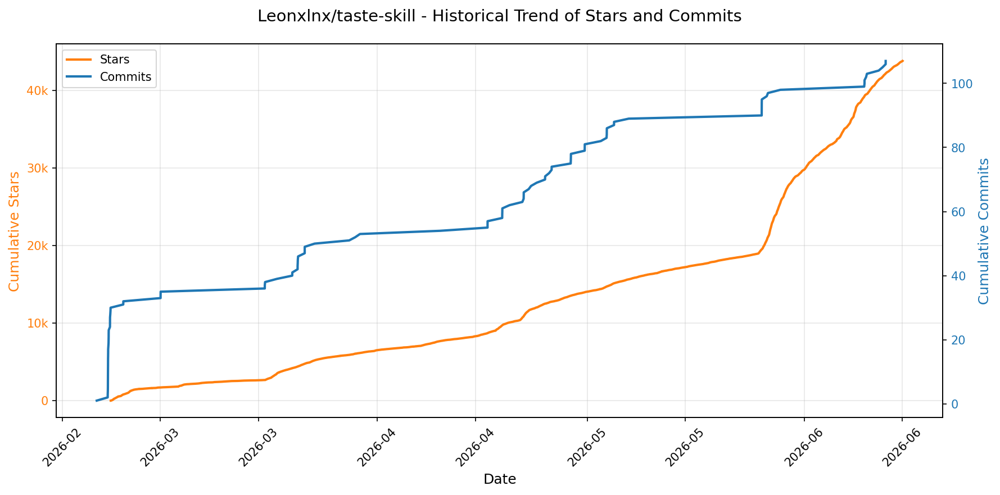

> *蓝色：累计 Stars｜橙色：累计 Commits（次 Y 轴）*

<b>📄 README 摘要</b>

1. **项目功能**  
该项目提供一套可移植的「AI代理技能（Agent Skills）」，专为提升由AI生成的前端界面质量而设计。其核心目标是消除常见AI生成UI中普遍存在的“平庸感”（slop）——即布局呆板、排版松散、动效缺失、间距混乱等缺陷。它不直接构建运行时框架，而是通过结构化提示词（以`SKILL.md`格式封装）引导AI编码代理（如Codex、Cursor、Claude Code、ChatGPT）产出更专业、有设计语言的前端代码；同时配套图像生成技能，用于产出高水准的设计参考图（网页/移动端线框图、品牌手册等），形成「图像→分析→代码」的完整AI协作流水线。

2. **关键特性**  
- **多版本与多风格技能矩阵**：提供v1/v2两代核心技能（`design-taste-frontend` / `design-taste-frontend-v1`），以及面向不同场景的专用技能，如严格适配GPT/Codex的`gpt-taste`、重构现有项目的`redesign-existing-projects`、强调视觉品质的`high-end-visual-design`、极简主义`minimalist-ui`、粗野主义`industrial-brutalist-ui`等；  
- **可调设计参数系统**（仅`taste-skill` v2）：支持三档数值化控制（1–10）：`DESIGN_VARIANCE`（布局实验性）、`MOTION_INTENSITY`（动效强度）、`VISUAL_DENSITY`（视口信息密度），实现设计语言的精细化调控；  
- **双模态技能支持**：既含**代码生成技能**（输出HTML/CSS/JS，含GSAP动效骨架、防破折号规范、预检协议等），也含**图像生成技能**（`imagegen-frontend-web`/`mobile`/`brandkit`），可独立使用或串联工作流；  
- **零依赖、跨框架、跨代理兼容**：所有技能以纯文本`SKILL.md`交付，不绑定特定前端框架（React/Vue/Svelte均适用），通过标准化CLI（`npx skills add`）一键安装与更新，支持主流AI编程代理；  
- **工程化实践增强**：包含`full-output-enforcement`（强制完整输出，禁用占位符）、`stitch-design-taste`（兼容Google Stitch工作流）、`image-to-code-skill`（端到端图像驱动开发）等面向真实协作场景的实用能力。

3. **技术栈**  
- **交付形式**：纯文本技能定义文件（`SKILL.md`），基于Markdown + YAML Frontmatter元数据；  
- **集成方式**：官方推荐工具链为 [`npx skills add`](https://github.com/vercel-labs/agent-skills) CLI，自动扫描并注册技能；  
- **运行环境**：无服务端依赖，完全在AI代理（如ChatGPT、Claude Code、Codex、Cursor）的提示工程层生效；  
- **代码产出标准**：强调现代CSS实践（如逻辑属性、自定义属性）、GSAP动画骨架、语义化HTML、字体加载策略、响应式排版系统；  
- **许可协议**：MIT License。

---

### 14. [OpenBMB/VoxCPM](https://github.com/OpenBMB/VoxCPM)
- 📅 **创建日期**：2025-09-16  
- 🔄 **最近更新**：2026-06-01  
- ⭐ **Stars**：28,041（日 +718｜周 +3867｜月 +7074）  
- 📝 **描述**：VoxCPM2: Tokenizer-Free TTS for Multilingual Speech Generation, Creative Voice Design, and True-to-Life Cloning  

<b>📈 Star 与 Commit 历史趋势</b>

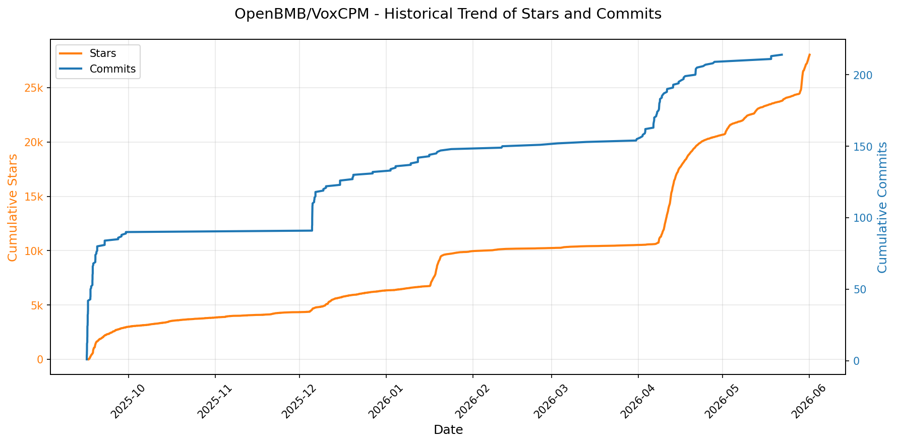

> *蓝色：累计 Stars｜橙色：累计 Commits（次 Y 轴）*

<b>📄 README 摘要</b>

1. **项目功能**  
VoxCPM2 是一个**免分词器（tokenizer-free）的端到端多语言文本转语音（TTS）系统**，直接在连续语音隐空间中生成高质量语音，无需传统离散声学单元（如音素、Codec tokens）建模。其核心能力包括：  
- **零样本多语言语音合成**：支持30种语言（含中文八大方言），输入纯文本即可合成，无需语言标识符；  
- **自然语言驱动的语音设计（Voice Design）**：仅凭文字描述（如“年轻女性，温柔甜美声线”）即可生成全新虚拟人声，无需任何参考音频；  
- **可控语音克隆（Controllable Voice Cloning）**：基于短参考音频克隆说话人音色，并通过自然语言指令（如“语速稍快、欢快语气”）灵活调节情感、节奏与表达风格；  
- **高保真语音延续式克隆（Ultimate Cloning）**：结合参考音频及其精确文本转录，实现从原始语音无缝续写，完整复现音色、韵律、情绪与风格细节；  
- **原生48kHz studio级音频输出**：直接生成高保真音频，内置超分辨率能力，无需外部上采样器。

2. **关键特性**  
- ✅ **全开源 & 商业友好**：Apache-2.0 许可证，模型权重与代码完全开放，支持商用；  
- ✅ **多模态统一架构**：基于 MiniCPM-4 大语言模型骨干，融合扩散（Diffusion）与自回归（Autoregressive）机制，采用四阶段隐式建模流程（LocEnc → TSLM → RALM → LocDiT）；  
- ✅ **48kHz 高清音频原生生成**：依托 AudioVAE V2 的非对称编解码设计，实现16kHz输入→48kHz输出的端到端高质量重建；  
- ✅ **上下文感知合成**：自动从文本内容推断合理语调、重音、停顿与情感表达；  
- ✅ **实时流式推理**：标准PyTorch实现RTF≈0.3（RTX 4090），经 Nano-vLLM 或 vLLM-Omni 加速后 RTF 低至 ≈0.13，支持流式输出与低延迟交互；  
- ✅ **生产就绪部署方案**：提供 CLI 工具、Web Demo、Nano-vLLM 轻量服务引擎，以及官方支持的 **vLLM-Omni**（OpenAI 兼容 `/v1/audio/speech` API，支持 PagedAttention、连续批处理、多GPU、异步流式响应）；  
- ✅ **灵活微调支持**：全面支持监督微调（SFT）与 LoRA 适配，便于领域/角色定制。

3. **技术栈**  
- **模型架构**：Tokenizer-free 扩散自回归混合范式；AudioVAE V2 隐空间编码器/解码器；四阶段级联结构（LocEnc 局部编码器、TSLM 文本-语音语言模型、RALM 参考音频语言模型、LocDiT 局部扩散Transformer）；MiniCPM-4 作为 LLM 主干；  
- **训练数据**：超200万小时多语言语音数据（覆盖30种语言+中文方言）；  
- **推理框架**：PyTorch（基础）、Nano-vLLM（定制化轻量推理引擎）、vLLM-Omni（官方 omni-modal 推理服务框架，扩展自 vLLM，支持 PagedAttention 与 OpenAI 兼容 API）；  
- **依赖环境**：Python ≥3.10（<3.13）、PyTorch ≥2.5.0、CUDA ≥12.0；支持设备：`cuda`（NVIDIA）、`mps`（Apple Silicon）、`cpu`；  
- **部署生态**：Hugging Face Spaces 在线体验、ModelScope 模型库、ReadTheDocs 官方文档、Feishu/Discord 社区支持；  
- **配套工具链**：`voxcpm` Python 包（含 CLI、API、Streaming 支持）、`nano-vllm-voxcpm`、`vllm-omni`（含 `vllm serve --omni` 命令）。

---

### 15. [Crosstalk-Solutions/project-nomad](https://github.com/Crosstalk-Solutions/project-nomad)
- 📅 **创建日期**：2025-06-24  
- 🔄 **最近更新**：2026-06-01  
- ⭐ **Stars**：27,929（日 +345｜周 +1484｜月 +2629）  
- 📝 **描述**：Project N.O.M.A.D, is a self-contained, offline survival computer packed with critical tools, knowledge, and AI to keep you informed and empowered—anytime, anywhere.  

<b>📈 Star 与 Commit 历史趋势</b>

> *蓝色：累计 Stars｜橙色：累计 Commits（次 Y 轴）*

<b>📄 README 摘要</b>

1. **项目功能**  
Project N.O.M.A.D. 是一个离线优先（offline-first）的自托管知识与教育服务器平台，旨在为用户提供无需互联网连接即可随时访问的关键信息、学习资源和本地AI能力。它本质上是一个集成式“指挥中心”（Command Center），通过统一Web界面管理和编排多个容器化工具，构建一个便携、自主、抗断网的个人知识基础设施，适用于教育、应急准备、偏远地区使用或隐私敏感场景。

2. **核心功能**  
- **本地AI助手**：支持Ollama（推荐）或OpenAI兼容后端（如LM Studio、llama.cpp），集成RAG（检索增强生成）能力，可通过Qdrant实现文档上传与语义搜索；  
- **离线知识库**：内置Kiwix引擎，提供离线版维基百科、医学指南（如MSD Manual）、生存手册、电子书等ZIM格式资源；  
- **离线教育平台**：基于Kolibri，完整集成Khan Academy课程，支持多用户、进度追踪与离线学习；  
- **离线地图服务**：集成ProtoMaps，支持下载并浏览区域级矢量地图，具备搜索与基础导航功能；  
- **数据处理工具**：内嵌CyberChef，提供加密、编码、哈希、数据转换与分析等零依赖Web工具；  
- **本地笔记系统**：集成FlatNotes，支持Markdown编辑与本地存储的轻量级笔记管理；  
- **硬件性能基准测试**：内置系统压测模块，支持生成硬件评分并提交至公开社区排行榜（benchmark.projectnomad.us）；  
- **可视化配置向导**：首次启动时提供图形化引导流程，支持按需选择安装内容包（如特定语言维基、AI模型等）；  
- **内容管理套件**：含ZIM库管理器、Wikipedia内容筛选器、多源资源浏览器等辅助工具。

3. **技术栈**  
- **核心架构**：基于Docker容器化部署，采用Docker Compose编排多服务协同；  
- **前端框架**：未明确说明，但UI为响应式Web应用，运行于Node.js或静态服务环境（`admin/public/`目录结构暗示可能含Vite/React/Vue等现代前端栈）；  
- **后端与API层**：以轻量级管理服务（Command Center）为中枢，提供配置、更新、状态监控等REST API；  
- **关键依赖组件**：  
  - AI推理层：Ollama（默认）、或兼容OpenAI API的本地服务器（LM Studio / llama.cpp）；  
  - 向量数据库：Qdrant（支撑RAG语义检索）；  
  - 离线内容引擎：Kiwix（ZIM格式）、Kolibri（KA课程包）、ProtoMaps（MBTiles矢量地图）；  
  - 安全与数据工具：CyberChef（纯前端Web应用，无后端依赖）；  
  - 笔记系统：FlatNotes（基于文件系统的Markdown笔记服务）；  
- **部署环境**：原生支持Debian/Ubuntu系统（含WSL2），推荐使用Docker Desktop或原生Docker运行；安装脚本为Bash，依赖curl、systemd等Linux标准工具；  
- **附加能力**：支持跨主机AI服务（通过配置外部Ollama/OpenAI API地址），所有组件默认无认证、无遥测，强调隐私与离线自治。

---

### 16. [rohitg00/ai-engineering-from-scratch](https://github.com/rohitg00/ai-engineering-from-scratch)
- 📅 **创建日期**：2026-03-18  
- 🔄 **最近更新**：2026-06-01  
- ⭐ **Stars**：26,031（日 +774｜周 +9471｜月 +20016）  
- 📝 **描述**：Learn it. Build it. Ship it for others.  

<b>📈 Star 与 Commit 历史趋势</b>

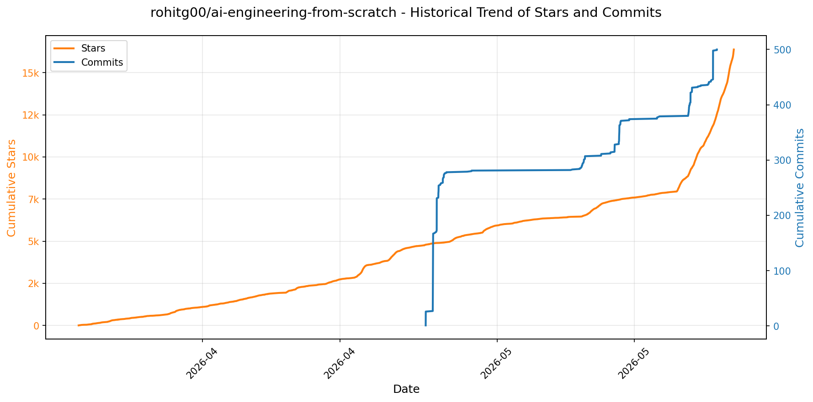

> *蓝色：累计 Stars｜橙色：累计 Commits（次 Y 轴）*

<b>📄 README 摘要</b>

1. **该项目做什么？**  
该项目是一个面向实践的、端到端的开源人工智能工程教育体系，旨在系统性地填补当前AI学习者“会用工具但不懂原理”的能力断层。它不教授碎片化知识点或API调用技巧，而是引导学习者从零开始亲手构建AI的每一层核心组件——从线性代数与微积分的数学推导，到反向传播、Tokenizer、Attention机制、LLM推理循环、Agent执行框架，直至多智能体协同系统与生产级基础设施。整个课程强调“先造轮子，再用框架”，确保学习者对每个算法和系统组件的底层原理、实现细节与工程权衡有深度掌握，并最终产出可直接复用的工业级产物（提示词、技能包、自主Agent、MCP服务器等）。

2. **关键特性**  
- **结构化渐进式课程体系**：共20个严格递进的阶段（Phases），涵盖数学基础 → 机器学习 → 深度学习 → 多模态 → LLM从零实现 → Agent工程 → 自主系统 → 伦理对齐 → 项目实战，支持按能力水平智能跳转（`/find-your-level`）。  
- **每课即产可用成果**：473节课每节均交付至少一个可部署、可集成的**可复用工件**——包括专业级Prompt模板、标准化SKILL（兼容Claude/Cursor等Agent）、轻量Agent代码、或符合MCP（Model Context Protocol）规范的服务端。  
- **“Build It / Use It”双轨教学法**：每节课严格遵循六步闭环（问题→概念→纯数学实现→框架复现→工件交付→测试验证），强制先用原生代码（无PyTorch/TensorFlow）实现算法，再对比主流框架，彻底穿透黑盒。  
- **全栈多语言实践**：覆盖Python（主力）、TypeScript（前端/Agent交互）、Rust（高性能组件/系统层）、Julia（数值计算/数学建模），培养真实AI工程所需的跨栈能力。  
- **内置AI助教与自适应评估**：预置`/find-your-level`（10题精准定位起点）和`/check-understanding`（分阶段8题诊断+个性化复习建议）等CLI技能，实现动态学习路径规划与即时反馈。  
- **完全离线可运行 & 开源免费**：所有代码、文档、测试均可本地执行，MIT协议，无依赖云服务或闭源工具，强调在个人笔记本上完成全部构建。

3. **技术栈**  
- **核心编程语言**：Python（主导实现与教学）、TypeScript（Agent接口、Web工具链）、Rust（系统级组件、高性能模块如Tokenizers/Inference Core）、Julia（数学密集型任务如SVD、傅里叶变换、优化算法）。  
- **AI框架与库**：PyTorch（作为“理解后使用”的对照基准）、JAX（函数式范式补充）、scikit-learn（传统ML验证）、Hugging Face Transformers（高级模型应用参考）。  
- **基础设施与协议**：Docker（环境封装）、MCP（Model Context Protocol，用于Agent与工具通信的标准协议）、Git（协作与版本控制）、Jupyter（交互式探索）。  
- **开发与部署工具**：VS Code/Cursor（深度集成Agent技能）、Linux终端与Shell脚本（生产环境基础）、GPU驱动与CUDA配置（本地训练支持）。  
- **辅助技术**：Mermaid（课程结构可视化）、JetBrains Mono字体（代码可读性优化）、Markdown（全课程文档格式）、CI/CD就绪的脚本化安装（如`install_skills.py`）。

---

### 17. [anthropics/financial-services](https://github.com/anthropics/financial-services)
- 📅 **创建日期**：2026-02-23  
- 🔄 **最近更新**：2026-06-01  
- ⭐ **Stars**：24,055（日 +200｜周 +1774｜月 +16957）  
- 📝 **描述**：暂无描述  

<b>📈 Star 与 Commit 历史趋势</b>

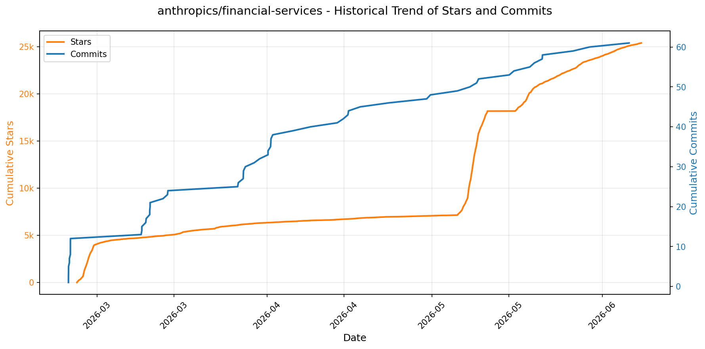

> *蓝色：累计 Stars｜橙色：累计 Commits（次 Y 轴）*

<b>📄 README 摘要</b>

1. **该项目的功能**  
该项目为金融服务业（FSI）提供一套开箱即用、可即插即用的AI智能体（Agents）、专业技能（Skills）和数据连接器（Connectors），覆盖投资银行、权益研究、私募股权、财富管理、基金运营及合规运营等核心业务场景。它不提供投资建议或执行交易，而是辅助金融专业人士自动生成分析师工作成果——包括可比公司分析（Comps）、DCF/LBO/三表模型、路演材料（Pitch Deck）、财报审阅备忘录、GL账务调节、月结报告、LP估值报告、KYC尽调初筛等——所有输出均需人工审核与签批，定位为“人类专家的增强型协作者”。

2. **关键特性**  
- **双部署模式统一架构**：同一套能力同时支持两种交付方式——作为Claude Cowork插件直接安装使用，或通过Claude Managed Agents API部署至客户自有工作流引擎，系统提示词（system prompt）、技能逻辑、数据连接器完全一致。  
- **分层模块化设计**：  
  - **端到端智能体（Agents）**：如Pitch Agent、Market Researcher、GL Reconciler等10+个命名智能体，每个均为自包含单元（含专属prompt+所需skills），开箱即用并支持按需定制；  
  - **垂直领域技能包（Vertical Plugins）**：按业务线划分（如investment-banking、equity-research等），封装通用技能、显式命令（如`/comps` `/earnings` `/ic-memo`）及行业专用逻辑；  
  - **MCP标准化数据连接器**：集成Daloopa、Morningstar、S&P Global、FactSet、LSEG、PitchBook等12家主流金融数据源，基于Model Context Protocol（MCP）协议实现安全、可插拔的数据接入。  
- **企业就绪能力**：支持与Microsoft 365深度集成（含Excel/PPT/Word/Outlook插件定制部署工具），提供模板注入（如`/ppt-template`）、文件自动化生成（`.pptx`/`.xlsx`）、Excel模型审计（`/debug-model`）、多智能体协同（handoff_request事件驱动）等生产级功能；  
- **完全开源可定制**：全部采用Markdown/YAML声明式编写，无编译步骤；支持替换内部数据源、注入公司术语与流程规范、复用现有PPT/Excel模板、扩展新智能体或技能，并提供校验（`check.py`）、同步（`sync-agent-skills.py`）和部署（`deploy-managed-agent.sh`）等配套脚本。

3. **技术栈**  
- **核心平台**：Anthropic Claude（特别是Claude Cowork插件生态 + Claude Managed Agents API）；  
- **协议标准**：Model Context Protocol（MCP）用于统一数据连接器接口；  
- **配置与编排**：YAML（`agent.yaml`、插件manifest）、Markdown（prompt与文档）、Python（部署/校验/同步脚本：`deploy-managed-agent.sh`, `orchestrate.py`, `check.py`, `sync-agent-skills.py`）；  
- **集成生态**：Microsoft Graph（用于M365租户配置）、Vertex AI / Amazon Bedrock / 内部LLM网关（支持私有化模型后端）；  
- **数据源**：Daloopa、Morningstar、S&P Global、FactSet、Moody’s、LSEG、PitchBook、Aiera、Chronograph、Egnyte、Box、MT Newswires等12+家金融与企业数据服务商（通过MCP服务器接入）；  
- **许可证**：Apache License 2.0。

---

### 18. [supermemoryai/supermemory](https://github.com/supermemoryai/supermemory)
- 📅 **创建日期**：2024-02-27  
- 🔄 **最近更新**：2026-06-01  
- ⭐ **Stars**：23,624（日 +495｜周 +807｜月 +1194）  
- 📝 **描述**：Memory engine and app that is extremely fast, scalable. The Memory API for the AI era.  

<b>📈 Star 与 Commit 历史趋势</b>

> *蓝色：累计 Stars｜橙色：累计 Commits（次 Y 轴）*

<b>📄 README 摘要</b>

1. **项目功能**  
Supermemory 是一个面向 AI 的先进记忆与上下文引擎，旨在解决大模型“对话间失忆”的根本问题。它为 AI 系统提供持久化、动态演化的个人/组织级记忆能力：自动从对话中提取事实、构建并实时更新用户画像（含稳定属性与近期动态）、智能处理知识变更与矛盾、自动遗忘过期信息（如时效性事件），并在每次交互中精准注入个性化上下文。它统一整合了传统 RAG（文档检索）、用户记忆、多源连接器与多模态内容处理，使 AI 真正具备类人式的长期记忆与情境感知能力，既可作为个人“数字大脑”，也可作为企业级 AI 应用的底层上下文基础设施。

2. **核心特性**  
- **智能记忆引擎**：基于时间感知与语义一致性自动提取、更新、冲突消解和选择性遗忘事实，支持项目级（containerTag）上下文隔离；  
- **实时用户画像（Profile）**：单次调用（~50ms）返回结构化静态事实（如职业、偏好）与动态上下文（如当前任务、调试状态），无需手动查询；  
- **混合搜索（Hybrid Search）**：在同一查询中无缝融合 RAG（知识库文档）与 Memory（个性化记忆），返回双重相关结果；  
- **全栈连接器生态**：原生支持 Google Drive、Gmail、Notion、OneDrive、GitHub 及网页爬虫，通过实时 Webhook 自动同步与处理；  
- **多模态内容理解**：开箱即用支持 PDF、图像（OCR）、视频（语音转录）、代码（AST 感知分块）等文件的上传、解析与向量化检索；  
- **零配置开发者体验**：提供 NPM/Pip SDK、主流框架（Vercel AI SDK、LangChain、LangGraph、Mastra 等）一键集成插件，屏蔽向量数据库、嵌入模型、分块策略等底层复杂性；  
- **开放标准兼容**：全面支持 MCP（Model Context Protocol）协议，已适配 Claude Desktop、Cursor、Windsurf、VS Code、Hermes 等主流 AI 客户端，插件开源可审计。

3. **技术栈**  
- **客户端层**：TypeScript（Web App、浏览器扩展、MCP Server）、Python（SDK）；  
- **API 服务层**：基于现代云原生架构（未明示但推断为 Node.js/Python 后端 + 高性能向量/图数据库混合存储）；  
- **AI 与数据处理**：自研记忆提取模型（非公开细节）、多模态解析引擎（OCR、ASR、AST 分析）、混合检索算法（结合语义相似度与时间/置信度加权）；  
- **基础设施**：OAuth 2.0 认证、RESTful + MCP 协议双接口、支持 API Key 与 Token 化访问控制；  
- **生态工具链**：开源 MemoryBench 基准测试框架（Bun/TypeScript 实现）、CLI 工具（`npx install-mcp`）、标准化文档与 SDK（npm/pypi 发布）。

---

### 19. [emmabostian/developer-portfolios](https://github.com/emmabostian/developer-portfolios)
- 📅 **创建日期**：2019-09-13  
- 🔄 **最近更新**：2026-06-01  
- ⭐ **Stars**：23,412（日 +288｜周 +549｜月 +1180）  
- 📝 **描述**：A list of developer portfolios for your inspiration  

<b>📈 Star 与 Commit 历史趋势</b>

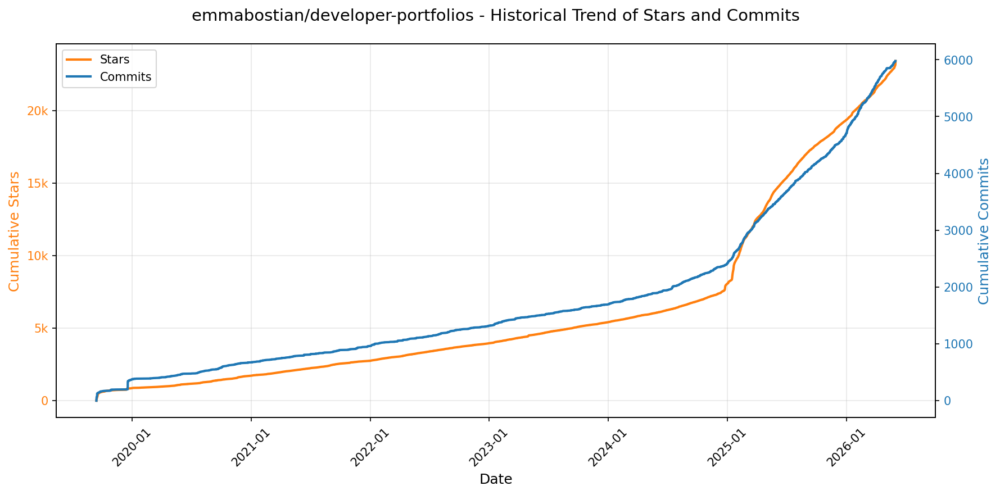

> *蓝色：累计 Stars｜橙色：累计 Commits（次 Y 轴）*

<b>📄 README 摘要</b>

1. **项目功能**  
该项目是一个开源的、社区驱动的**开发者个人作品集（Portfolio）聚合仓库**，核心目标是收集并公开展示全球开发者自主构建并提交的个人技术作品集网站链接。它不托管或生成作品集页面，而是以纯静态 Markdown 列表形式（按字母顺序索引），持续收录经 Pull Request（PR）审核通过的高质量个人作品集 URL，并提供分类导航（A–Z）、随机跳转等功能。其本质是一个「灵感库」和「发现平台」，供开发者参考设计风格、技术选型与内容组织方式，从而启发和指导自身作品集的创建与优化。

2. **关键特性**  
- ✅ **大规模开源聚合**：截至当前统计，已收录 **1742 个真实开发者作品集**，覆盖全栈、前端、AI/ML、移动开发、DevOps 等多元技术方向；  
- ✅ **社区共建机制**：完全依赖 GitHub PR 贡献流程（遵循 `CONTRIBUTING.md`），任何人可提交自己的作品集链接，经审核后合并入主列表；  
- ✅ **结构化可发现性**：支持按首字母快速跳转（A–Z 锚点导航），提升海量条目的浏览效率；  
- ✅ **增强体验功能**：提供「随机作品集」跳转按钮（[Random Portfolio](https://s111ew.github.io/random-button-redirector)），增加探索趣味性；  
- ✅ **轻量透明架构**：纯静态文本列表（无后端、无数据库），所有数据即代码（Git 版本可追溯），确保高可靠性、低维护成本与强可审计性；  
- ✅ **灵感导向定位**：明确声明服务于“作品集灵感”（*for your inspiration*），强调设计、表达与职业呈现层面的参考价值，而非技术模板分发。

3. **技术栈**  
- **核心载体**：纯文本 Markdown（`.md`）文件（主 README），由 GitHub 原生渲染，零运行时依赖；  
- **托管与部署**：GitHub Pages（用于仓库主页展示） + 第三方托管服务（如 Hatchbox、Vercel、Netlify 等——见各条目链接，但**本项目自身不使用这些平台部署逻辑**）；  
- **协作基础设施**：GitHub 平台原生能力——Issues、Pull Requests、Actions（可能用于自动化检查，如链接有效性验证，但 README 未显式说明）；  
- **辅助工具链**：隐含依赖标准 Web 开发工具链（如 Markdown 编辑器、Git CLI / GUI），无框架、无构建步骤，**零前端框架、零打包工具、零服务端语言**；  
- **扩展能力**：通过外部链接生态实现功能延伸（如随机跳转页为独立小项目），但本仓库本身保持极简静态属性。

---

### 20. [Lum1104/Understand-Anything](https://github.com/Lum1104/Understand-Anything)
- 📅 **创建日期**：2026-03-15  
- 🔄 **最近更新**：2026-06-01  
- ⭐ **Stars**：23,215（日 +1134｜周 +20368｜月 +23215）  
- 📝 **描述**：Graphs that teach > graphs that impress. Turn any code into an interactive knowledge graph you can explore, search, and ask questions about. Works with Claude Code, Codex, Cursor, Copilot, Gemini CLI, and more.  

<b>📈 Star 与 Commit 历史趋势</b>

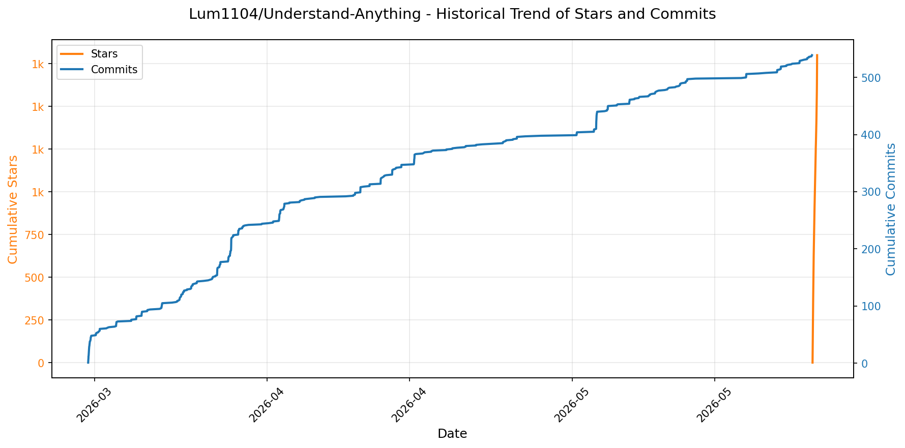

> *蓝色：累计 Stars｜橙色：累计 Commits（次 Y 轴）*

<b>📄 README 摘要</b>

1. **项目功能**  
该项目将任意代码库、知识库（如 Karpathy 风格的 LLM Wiki）或技术文档自动转化为**可交互式探索的知识图谱**。它通过多智能体分析流水线，深度解析源码结构（文件、函数、类、依赖关系）及语义意图（业务逻辑、架构分层、设计模式），生成标准化 JSON 格式的知识图，并提供可视化仪表盘，支持搜索、问答、影响分析与团队协作共享，显著降低大型/陌生代码库的理解门槛。

2. **核心特性**  
- **结构化知识图探索**：交互式力导向图，支持点击节点查看英文摘要、依赖关系与上下文解释；  
- **业务域视图（Domain View）**：将代码映射至业务流程（领域、流程、步骤），以水平图呈现；  
- **多模态知识库分析**：支持解析 `index.md` 中的 wikilink 与分类，结合 LLM 挖掘隐含实体、主张与关系，构建社区聚类知识图；  
- **智能引导式导览（Guided Tours）**：按依赖顺序自动生成架构学习路径；  
- **模糊+语义搜索**：支持自然语言查询（如“哪些模块处理鉴权？”）；  
- **变更影响分析（Diff Impact Analysis）**：预判代码修改波及的系统范围；  
- **角色自适应 UI**：根据用户身份（初级开发者、产品经理、高级工程师）动态调整信息密度；  
- **架构分层可视化**：自动识别并着色标注 API / Service / Data / UI / Utility 等层级；  
- **编程语言概念嵌入式教学**：在代码出现处实时解释 12 种通用模式（泛型、闭包、装饰器等）；  
- **多语言本地化支持**：支持中文（简/繁）、日文、韩文、俄文、西班牙文、土耳其文等；  
- **增量更新与 Git 集成**：基于 Tree-sitter 指纹检测变更，仅重分析改动文件；支持 `.understand-anything/` 目录提交至仓库，实现团队知识图复用与 PR 审查协同。

3. **技术栈**  
- **解析层**：基于 **Tree-sitter** 实现确定性静态分析（语法树构建、导入导出提取、调用关系识别、指纹化变更检测）；  
- **语义层**：集成 **大语言模型（LLM）**（兼容 Claude Code、Codex、Gemini CLI、Copilot、Vibe CLI、Trae 等多平台）完成意图理解、摘要生成、架构归类、业务建模与知识推理；  
- **架构设计**：采用 **多智能体（Multi-Agent）流水线**，包含 `project-scanner`、`file-analyzer`、`architecture-analyzer`、`tour-builder`、`graph-reviewer`、`domain-analyzer` 和 `article-analyzer` 7 类专用智能体，支持并发处理与职责分离；  
- **部署生态**：原生支持 **Claude Code 插件市场**，并通过统一安装脚本（`install.sh`/`install.ps1`）适配 **Cursor、VS Code + Copilot、Copilot CLI、Codex、Gemini CLI、Vibe CLI、Trae、KIMI CLI** 等十余种主流 AI 编程平台；  
- **前端与交付**：基于 Web 技术提供交互式仪表盘（支持缩放、搜索、节点详情弹窗）；知识图以标准 JSON 存储，天然支持 Git 版本控制与 git-lfs 大文件管理。

---

### 21. [p-e-w/heretic](https://github.com/p-e-w/heretic)
- 📅 **创建日期**：2025-09-21  
- 🔄 **最近更新**：2026-06-01  
- ⭐ **Stars**：22,940（日 +253｜周 +1518｜月 +2525）  
- 📝 **描述**：Fully automatic censorship removal for language models  

<b>📈 Star 与 Commit 历史趋势</b>

> *蓝色：累计 Stars｜橙色：累计 Commits（次 Y 轴）*

<b>📄 README 摘要</b>

1. **项目功能**  
Heretic 是一个用于全自动移除大语言模型（LLM）中“安全对齐”（即内容审查/ censorship）机制的工具。它无需微调（post-training）、不依赖人工干预，即可对 Transformer 架构的语言模型进行去审查化处理，生成在保持原始模型能力（如知识、推理、格式输出等）的同时显著降低拒绝响应率（refusals）的解禁模型。其核心目标是：在最小化 KL 散度（即最大程度保留原模型行为分布）的前提下，最大化抑制模型对敏感/“有害”提示的拒绝倾向。

2. **关键特性**  
- **全自动优化**：基于 TPE（Tree-structured Parzen Estimator）算法与 Optuna 集成，自动搜索最优的“方向性消融（abliteration）”参数，联合最小化拒绝率与 KL 散度；  
- **高兼容性**：原生支持主流密集模型（Dense）、多模态模型、多种 MoE 架构（如 Qwen3.5 等混合架构），但暂不支持纯状态空间模型（SSM）等非 Transformer 架构；  
- **量化友好**：集成 bitsandbytes，支持 `bnb_4bit` 等量化方式，大幅降低 GPU 显存占用（如 16GB VRAM 即可运行 Qwen3-4B）；  
- **零配置开箱即用**：默认参数下可直接运行（如 `heretic Qwen/Qwen3-4B-Instruct-2507`），自动完成硬件适配（如动态确定最优 batch size）；  
- **研究增强功能**（需安装 `research` 附加包）：  
  - `--plot-residuals`：使用 PaCMAP 对各层残差向量进行 2D 可视化并生成逐层动画，揭示“有害/无害”提示在隐空间中的分离与演化路径；  
  - `--print-residual-geometry`：输出逐层残差几何分析表（含余弦相似度、L2 范数、拒绝方向、轮廓系数 Silhouette 等 13+ 维度指标），支持模型内部语义机制的可解释性研究；  
- **社区验证效果卓越**：已催生超 3000 个公开 Hugging Face 模型；实测在 Gemma-3-12B 上实现 3/100 拒绝率 + 仅 0.16 KL 散度（显著优于人工调优的同类 abliterated 模型），且在 MMLU/GSM8K 等基准上保持竞争力。

3. **技术栈**  
- **核心框架**：Python 3.10+，PyTorch 2.2+（推荐 2.6+ 以支持 MXFP4 等新特性）；  
- **优化引擎**：Optuna（TPE 算法）用于黑盒参数优化；  
- **依赖管理**：uv（通过 `uv.lock` 锁定全量依赖版本，保障复现性与安全性）；  
- **量化支持**：bitsandbytes（BNB 4-bit 量化）；  
- **可视化与分析**：PaCMAP（降维）、Matplotlib（绘图）、NumPy/SciPy（几何计算）；  
- **模型加载与推理**：Hugging Face Transformers（支持 `AutoModelForCausalLM` 等标准接口）；  
- **许可证**：GNU Affero General Public License v3.0（AGPL-3.0）。

---

### 22. [Imbad0202/academic-research-skills](https://github.com/Imbad0202/academic-research-skills)
- 📅 **创建日期**：2026-02-26  
- 🔄 **最近更新**：2026-06-01  
- ⭐ **Stars**：22,929（日 +518｜周 +4401｜月 +21253）  
- 📝 **描述**：Academic Research Skills for Claude Code: research → write → review → revise → finalize  

<b>📈 Star 与 Commit 历史趋势</b>

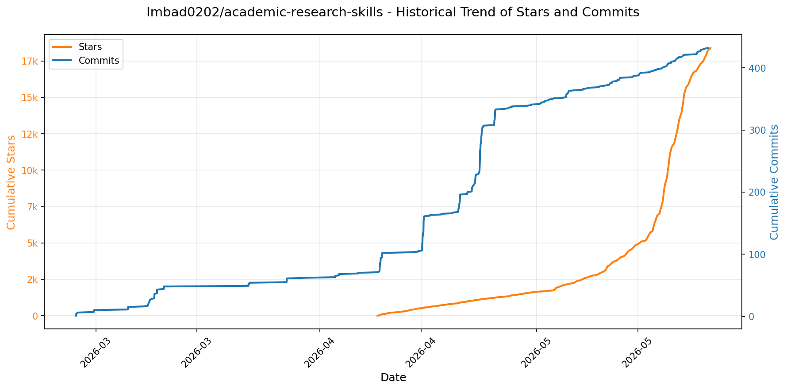

> *蓝色：累计 Stars｜橙色：累计 Commits（次 Y 轴）*

<b>📄 README 摘要</b>

1. **该项目的功能**  
本项目是一个面向学术研究全流程的 Claude Code 插件套件（Academic Research Skills for Claude Code，简称 ARS），专为研究人员设计，覆盖“问题提出 → 文献调研 → 实验验证 → 论文撰写 → 同行评审 → 出版合规”完整学术生命周期。它不替代研究者决策与创造性工作，而是作为**人类主导、AI 协同（human-in-the-loop）的智能协作者**，自动化处理重复性高、易出错的“苦力型任务”，包括：系统性文献检索（PRISMA 流程）、引用真实性核查（防幻觉、防断章取义）、数据与逻辑一致性验证、多格式（APA 7.0/Chicago/IEEE 等）自动引文生成与格式化、论文结构 Socratic 引导式规划、多视角同行评审（含主编+3审稿人+魔鬼代言人）、声明级主张可审计性支持（L3 claim-faithfulness）、材料溯源护照（Material Passport）及协作质量量化评估等。

2. **核心功能**  
- **深度研究模块（13-agent）**：支持 Socratic 引导式探索、PRISMA 系统综述、意图识别、对话健康监测、跨模型交叉验证（DA）、Semantic Scholar API 实时验证、VLM 图表真实性校验。  
- **学术论文模块（12-agent）**：集成风格校准（基于用户历史文本学习个人写作风格）、机器生成文本质量检测（Writing Quality Check）、LaTeX 健壮性增强、可视化辅助、修订教练（将审稿意见转为可执行路线图）、反信息泄露协议、AI 使用声明自动生成（如 NeurIPS 合规）。  
- **论文评审模块（7-agent）**：提供 0–100 分制多维质量量表（含主编+动态审稿人+魔鬼代言人），支持让步阈值协议（Concession Threshold Protocol）、攻击强度保留机制、R&R 可追溯矩阵、校准模式（支持用户黄金标准集验证审稿 FNR/FPR）。  
- **学术流水线编排器（10-stage）**：强制双完整性关卡（Stage 2.5 & 4.5），内置主张级审计（`ARS_CLAIM_AUDIT=1`）、三重定位锚点（locator infrastructure）支撑逐句溯源、可选 `repro_lock` 材料护照、协作深度观察员（advisory only）及六维度协作质量评估（1–100）。  
- **可信度基础设施**：数据访问分级（`raw`/`redacted`/`verified_only`）、任务类型标注（`open-ended`）、基准报告 JSON Schema 规范、可复现性锁文件（非字节级复现，但记录关键依赖与配置）。  
- **语言与结构泛化能力**：支持中英文双语（繁体默认）、双语摘要；Socratic 与 Plan 模式基于语义意图激活，适配任意语言；兼容 IMRaD、综述、理论分析、案例研究、政策简报、会议论文等多种结构。

3. **技术栈**  
- **运行平台**：Claude Code（v3.7.0+ CLI / VS Code / JetBrains 插件环境）；提供 Codex CLI 专用分支（`academic-research-skills-codex`）。  
- **核心架构**：模块化多智能体（multi-agent）协同架构，按阶段（Stage）解耦职责，各技能声明 `data_access_level` 与 `task_type` 并受静态检查脚本（`scripts/check_data_access_level.py`）约束。  
- **外部服务集成**：Semantic Scholar API（文献验证）、Pandoc（DOCX 输出）、Tectonic + Source Han Serif TC（APA 7.0 PDF 渲染）、VLM（视觉语言模型）用于图表验证。  
- **质量保障机制**：七模式阻断式完整性检查（Stage 2.5/4.5）、黄金标准校准集（FNR<0.15 & FPR<0.10 阈值）、主张级审计（五类 HIGH-WARN 风险：claim-not-supported, negative-constraint-violation 等）、Material Passport 元数据体系。  
- **工程规范**：严格遵循模式文档（如 `ground_truth_isolation_pattern.md`, `benchmark_report_pattern.md`, `artifact_reproducibility_pattern.md`），所有版本锚定在 `ARCHITECTURE.md`，Release 语义化版本（如 v3.9.4.2）。

---

### 23. [AIDC-AI/Pixelle-Video](https://github.com/AIDC-AI/Pixelle-Video)
- 📅 **创建日期**：2025-11-07  
- 🔄 **最近更新**：2026-06-01  
- ⭐ **Stars**：20,846（日 +134｜周 +1185｜月 +12194）  
- 📝 **描述**：🚀 AI 全自动短视频引擎 | AI Fully Automated Short Video Engine  

<b>📈 Star 与 Commit 历史趋势</b>

> *蓝色：累计 Stars｜橙色：累计 Commits（次 Y 轴）*

<b>📄 README 摘要</b>

1. **项目功能**  
Pixelle-Video 是一个端到端的 AI 自动化短视频生成引擎，仅需输入一个主题关键词，即可全自动完成从文案创作到成片输出的全流程：包括智能生成视频解说文案、AI 配图/图生视频/动作迁移等视觉内容生成、多音色语音合成（支持克隆音色）、背景音乐自动匹配、多模板视频合成与渲染。支持竖屏、横屏、方形等多种格式，面向零剪辑经验用户，实现“一句话生成短视频”。

2. **核心功能亮点**  
- ✅ **全链路自动化**：主题输入 → LLM 文案生成 → 分镜规划 → AI 配图/视频生成 → TTS 语音合成 → BGM 添加 → 模板化视频合成  
- ✅ **多模态扩展能力**：内置「数字人口播」「图生视频」「动作迁移」三大扩展模块，支持韩语等多语言口播及动态动作复现  
- ✅ **高度可定制化工作流**：基于 ComfyUI 架构，支持自由替换模型（如 FLUX / WAN 2.1 / Qwen-VL）、TTS 引擎（Edge-TTS / Index-TTS / ChatTTS）、LLM（GPT / Qwen / DeepSeek / Ollama）及自定义 HTML 模板  
- ✅ **灵活输入与素材管理**：支持 AI 自动生成文案或导入固定脚本；新增「自定义素材」功能，允许上传用户照片/视频并由 AI 智能分析生成适配脚本  
- ✅ **跨平台易用性**：提供 Windows 一键整合包（免 Python/ffmpeg 环境），同时支持 macOS/Linux 源码部署；配置界面可视化，含 FAQ 内置、实时预览（语音/风格/模板）、历史任务管理与批量生成  

3. **技术栈**  
- **前端框架**：Streamlit（构建交互式 Web UI，地址 `http://localhost:8501`）  
- **AI 核心引擎**：  
  - 大语言模型（LLM）：OpenAI GPT、通义千问（Qwen）、DeepSeek、Ollama（本地离线）  
  - 图像/视频生成：ComfyUI（本地工作流）、RunningHub（云端服务）、WAN 2.1、FLUX、Nano Banana  
  - 语音合成（TTS）：Edge-TTS、Index-TTS、ChatTTS，支持声音克隆与多语言（含韩语）  
- **基础设施**：  
  - 依赖工具：`uv`（Python 包管理器）、`ffmpeg`（音视频处理）  
  - 部署支持：本地 ComfyUI 服务（HTTP API）、RunningHub 云服务、Ollama 本地推理  
- **架构设计**：模块化流水线（文案→配图→语音→合成），原子能力解耦，通过 JSON 工作流（`workflows/` 目录）和 HTML 模板（`templates/` 目录）实现深度定制  
- **许可证**：Apache 2.0 开源协议

---

### 24. [github/docs](https://github.com/github/docs)
- 📅 **创建日期**：2019-05-31  
- 🔄 **最近更新**：2026-06-01  
- ⭐ **Stars**：19,754（日 +173｜周 +230｜月 +422）  
- 📝 **描述**：The open-source repo for docs.github.com  

<b>📈 Star 与 Commit 历史趋势</b>

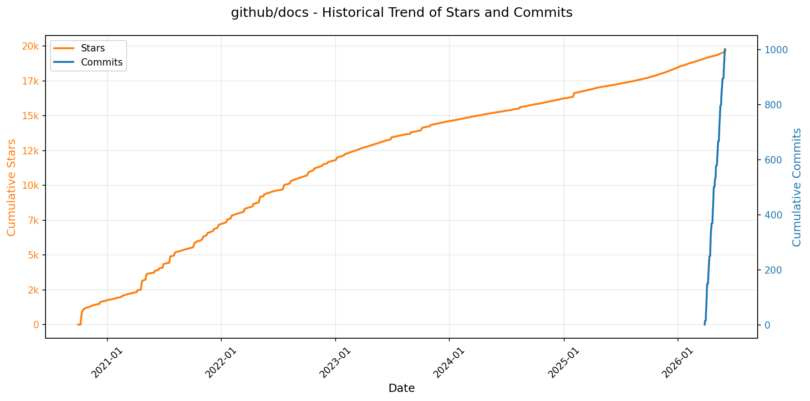

> *蓝色：累计 Stars｜橙色：累计 Commits（次 Y 轴）*

<b>📄 README 摘要</b>

1. **该项目的作用**：  
GitHub Docs 是 GitHub 官方文档的开源托管平台，提供面向开发者和用户的技术文档（如使用指南、API 说明、工作流教程等）。其核心目标是通过开放协作模式，允许 GitHub 员工（Hubbers）和外部开源贡献者共同维护、更新和改进文档内容；两个主仓库（公开的 `github/docs` 和私有的 `github/docs-internal`）自动同步，确保文档一致性与安全性。

2. **关键特性**：  
- **双仓库协同机制**：`docs`（对外开源，仅限内容文件修改）与 `docs-internal`（对内专用，支持全范围编辑）高频同步，实现内外协作闭环；  
- **严格的贡献范围管控**：外部贡献者仅可编辑 `/content` 下的 Markdown 文档及部分 `/data` 中的可复用片段（reusables），禁止修改基础设施代码、CI/CD 工作流或网站构建逻辑，以保障站点稳定性与安全合规；  
- **分角色贡献指引**：为 Hubbers 和开源贡献者分别提供定制化流程文档（如不同 `CONTRIBUTING.md` 文件），降低参与门槛；  
- **结构化入门支持**：集成 GitHub 官方开源协作学习资源（Git 配置、GitHub Flow、PR 协作等），助力新手快速上手。

3. **技术栈**：  
- **内容格式**：Markdown（`.md` 文件为主）；  
- **许可证体系**：内容层采用 **Creative Commons Attribution 4.0** 许可，代码层（构建脚本、工具等）采用 **MIT License**；  
- **协作流程**：基于标准 **GitHub Flow**（分支 → 提交 → Pull Request → 审查合并）；  
- **无明确前端/后端框架披露**：README 中未提及具体静态站点生成器（如 Jekyll、Docusaurus）、部署平台或运行时环境，重点聚焦于文档协作流程与权限治理。

---

### 25. [EveryInc/compound-engineering-plugin](https://github.com/EveryInc/compound-engineering-plugin)
- 📅 **创建日期**：2025-10-09  
- 🔄 **最近更新**：2026-06-01  
- ⭐ **Stars**：18,843（日 +262｜周 +1590｜月 +2814）  
- 📝 **描述**：Official Compound Engineering plugin for Claude Code, Codex, Cursor, and more  

<b>📈 Star 与 Commit 历史趋势</b>

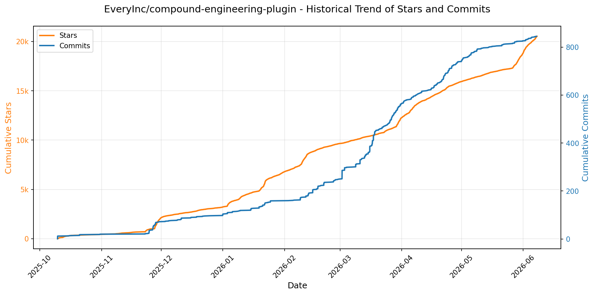

> *蓝色：累计 Stars｜橙色：累计 Commits（次 Y 轴）*

<b>📄 README 摘要</b>

1. **该项目做什么？**  
该项目是一个面向软件工程全流程的AI增强型工作流插件（Compound Engineering Plugin），旨在通过可复用、可积累的AI技能与智能体（agents），实现“工程工作的复利效应”——即每一项工程活动（如需求分析、编码、评审、调试）都应降低后续工作的难度，而非增加技术债。它不替代开发者，而是系统性地将工程知识结构化、自动化和沉淀化：从战略锚定（`/ce-strategy`）、创意生成（`/ce-ideate`）、需求梳理（`/ce-brainstorm`）、计划制定（`/ce-plan`）、执行跟踪（`/ce-work`）、缺陷根因分析（`/ce-debug`）、多智能体代码评审（`/ce-code-review`）、文档评审（`/ce-doc-review`），到经验固化（`/ce-compound`）和产品健康度快照（`/ce-product-pulse`），形成闭环迭代的“复利工程循环”。

2. **核心功能**  
- **战略锚定与上下文继承**：通过 `/ce-strategy` 生成并维护 `STRATEGY.md`，作为所有后续AI活动（ideation/brainstorm/planning）的统一语义锚点；  
- **分层智能协作**：支持从宏观创意（`/ce-ideate`）→ 需求推演（`/ce-brainstorm`）→ 实施规划（`/ce-plan`）→ 执行管控（`/ce-work`）→ 根因修复（`/ce-debug`）→ 多视角评审（`/ce-code-review`, `/ce-doc-review`）→ 经验沉淀（`/ce-compound`）→ 数据驱动复盘（`/ce-product-pulse`）的完整链路；  
- **跨平台原生集成**：开箱即用支持 Claude Code、Cursor、Codex、GitHub Copilot、Factory Droid、Qwen Code、OpenCode、Pi、Gemini CLI、Kiro 等10+主流AI编程环境，提供自动格式转换与多目标安装能力；  
- **本地化开发与分支测试**：内置 CLI 支持本地插件热加载、远程分支一键拉取与缓存、多目标（如 Codex + OpenCode）并行安装，并提供 Shell 别名简化日常开发流程；  
- **工程资产自动化管理**：自动生成结构化文档（需求/计划/脉冲报告）、维护 `docs/pulse-reports/` 时间线、隔离技能与代理存储路径、自动清理旧版 Bun 安装残留；  
- **复利机制显性化**：所有产出（STRATEGY、brainstorm、plan、pulse、compound notes）均持久化为项目内文件，供后续AI调用，确保知识不丢失、判断可校准、模式可复用。

3. **技术栈**  
- **核心语言与运行时**：TypeScript（主逻辑）、Bun（默认包管理器与CLI运行时，用于构建、安装、转换、清理等工具链）；  
- **插件协议兼容层**：基于 Claude Code 插件规范（JSON Schema + Tool Calling）设计，通过 Bun CLI 实现向 Codex / Copilot / Droid / Qwen / OpenCode / Pi / Gemini / Kiro 等平台的自动格式转换与适配；  
- **AI工程范式**：采用“技能（Skills）+ 智能体（Agents）”双层架构——37个用户可调用的命令式技能（如 `/ce-plan`），驱动51个后台运行的专用智能体（如评审员、研究员、调试器），后者依赖子智能体调度（如 Pi 需依赖 `pi-subagents`）、用户交互工具（如 `pi-ask-user`）及外部服务集成；  
- **基础设施**：GitHub Actions CI/CD、npm 包发布（`@every-env/compound-plugin`）、Git 仓库即分发源、本地文件系统作为状态与知识存储媒介（无中心数据库）；  
- **部署与集成**：零服务器依赖，纯客户端插件；支持 marketplace 注册、TUI 图形化安装、CLI 命令行安装、Shell 别名快速切换等多种接入方式。

---

### 26. [anthropics/knowledge-work-plugins](https://github.com/anthropics/knowledge-work-plugins)
- 📅 **创建日期**：2026-01-23  
- 🔄 **最近更新**：2026-06-01  
- ⭐ **Stars**：18,465（日 +185｜周 +4261｜月 +6785）  
- 📝 **描述**：Open source repository of plugins primarily intended for knowledge workers to use in Claude Cowork  

<b>📈 Star 与 Commit 历史趋势</b>

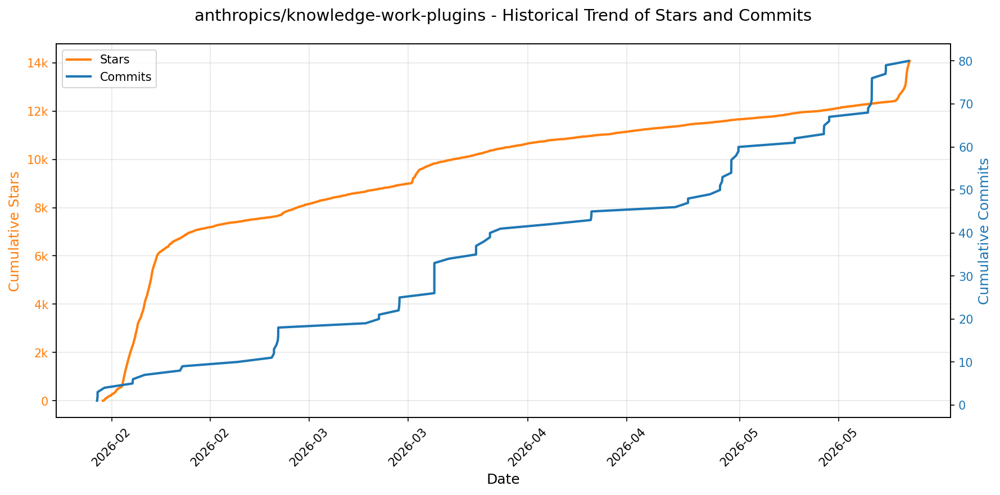

> *蓝色：累计 Stars｜橙色：累计 Commits（次 Y 轴）*

<b>📄 README 摘要</b>

1. **该项目做什么？**  
该项目是一套面向知识工作者的开源插件集合（Knowledge Work Plugins），旨在将Claude大模型深度专业化，使其能胜任特定岗位（如销售、产品、法务、数据等）和企业级工作场景。插件通过结构化配置（非代码方式）赋予Claude角色专属的领域知识、标准化工作流程、企业内部工具连接能力及可调用的指令命令，从而在Claude Cowork或Claude Code环境中，实现从“通用助手”到“团队专属协作者”的升级——自动理解上下文、调用正确工具、执行合规操作、输出符合组织规范的专业成果。

2. **核心功能**  
- **开箱即用的11类垂直职能插件**：覆盖生产力、销售、客户支持、产品管理、市场营销、法律、财务、数据分析、企业搜索、生物医学研究及插件自管理，每类均预置该角色典型任务流（如`/sales:call-prep`、`/finance:reconciliation`）。  
- **零代码可定制化**：所有组件（技能描述、指令命令、工具连接配置）均以纯文本文件（Markdown + JSON）定义，支持直接编辑`.mcp.json`切换企业实际使用的SaaS工具（如将HubSpot替换为Salesforce），在技能文件中注入公司术语、组织架构、审批流程等私有知识。  
- **自动与显式双模式触发**：「技能」（skills）由Claude在对话中自主调用以提供上下文感知建议；「指令命令」（commands）通过`/xxx:yyy`语法显式触发，确保关键操作精准可控。  
- **统一工具集成协议**：基于Model Context Protocol（MCP）标准对接超30种主流企业系统（如Slack、Notion、Jira、Snowflake、PubMed等），实现跨平台数据拉取与操作闭环。  
- **组织级协同演进能力**：支持团队共建、共享插件，使Claude随企业实践持续进化，沉淀组织过程资产，降低流程执行成本。

3. **技术栈**  
- **运行环境**：原生适配Anthropic官方产品——Claude Cowork（网页端）与Claude Code（CLI工具），无需独立部署。  
- **协议标准**：深度依赖[Model Context Protocol (MCP)](https://modelcontextprotocol.io/)实现安全、标准化的外部工具调用与上下文交换。  
- **配置范式**：纯声明式文件系统（无代码、无编译、无服务器）——  
  • `plugin.json`：插件元信息与能力声明；  
  • `.mcp.json`：MCP服务连接配置（含认证、端点、权限）；  
  • `skills/`目录：Markdown格式的领域知识、SOP流程、决策逻辑；  
  • `commands/`目录：JSON定义的可调用指令及其参数契约。  
- **交付形态**：GitHub开源仓库，采用标准Git工作流协作，贡献门槛极低（仅需修改文本文件并提交PR）。

---

### 27. [iii-hq/iii](https://github.com/iii-hq/iii)
- 📅 **创建日期**：2025-01-02  
- 🔄 **最近更新**：2026-06-01  
- ⭐ **Stars**：17,383（日 +82｜周 +1432｜月 +1975）  
- 📝 **描述**：Effortlessly compose, extend, and observe every service in real-time for the first time ever.  

<b>📈 Star 与 Commit 历史趋势</b>

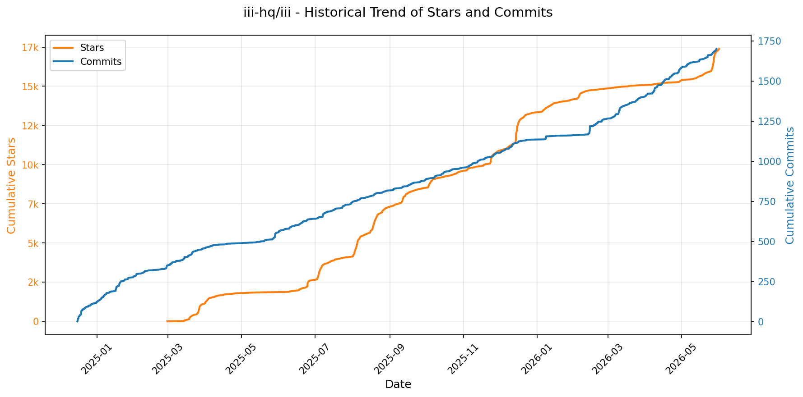

> *蓝色：累计 Stars｜橙色：累计 Commits（次 Y 轴）*

<b>📄 README 摘要</b>

1. **该项目的功能**  
iii 是一个面向实时服务编排与扩展的统一运行时平台，旨在彻底消除传统微服务生态中繁重的点对点集成（point-to-point integrations）。它通过提供一个共享的、活态（live）的系统表面（system surface），使任意后端服务（如队列、定时任务、HTTP 服务、状态管理、可观测性组件、智能体/agents、沙箱环境等）能以极简方式“即插即用”地加入系统。所有组件均作为 **Worker** 注册到 iii 引擎，自动进入全局可发现、可调用、可追踪的实时目录；开发者或 AI 代理均可通过统一接口动态添加能力（`iii worker add <capability>`）、声明触发逻辑、调用标准化函数，并实时观测全链路行为。

2. **核心特性**  
- **三位一体抽象模型**：基于 **Worker–Function–Trigger** 的极简心智模型——  
  • **Worker**：任意语言编写的进程（TS/Python/Rust 等），注册后可声明函数与触发器，并支持运行时动态创建新 Worker（实现自扩展）；  
  • **Function**：具备稳定标识符（如 `orders::validate`）的原子工作单元，接收输入、执行逻辑、返回输出；  
  • **Trigger**：声明式事件源（HTTP 请求、Cron 定时、消息队列、状态变更、流事件等），由 iii 统一处理路由、序列化与投递。  
- **零集成扩展**：新增能力（如可观测性、队列、代理）仅需一条命令（`iii worker add xxx`），自动接入系统、启用追踪、开放调用，无需配置重试、超时、埋点或适配协议。  
- **统一可观测性**：所有 Worker、Function、Trigger、队列、日志、Trace 和实时状态均通过 [iii-console](console/) 可视化洞察，开箱即得全栈可观测能力。  
- **AI 代理原生支持**：Agent 可直接发现、调用、组合、追踪任意已注册 Function，使用与开发者完全一致的接口和技能体系（skills），实现自主能力编排。  
- **多语言 SDK 支持**：提供 Node.js（npm）、Python（PyPI）、Rust（crates.io）三端官方 SDK，覆盖主流后端开发场景。

3. **技术栈**  
- **核心引擎（Engine）**：Rust 编写，高性能、内存安全的运行时，负责 Worker 管理、触发调度、跨语言通信协议、状态协调与分布式原语实现；采用 Elastic License v2.0（ELv2）授权。  
- **SDK 层**：提供 TypeScript/JavaScript（npm）、Python（pip）、Rust（Cargo）三套官方 SDK，均基于 Apache License 2.0，封装底层协议，屏蔽语言差异，统一暴露 Worker 注册、Function 暴露、Trigger 声明等 API。  
- **控制台（Console）**：React（前端） + Rust（后端/WASM 或服务端组件）构建，提供实时交互式运维与开发界面，Apache 2.0 许可。  
- **基础设施与工具链**：CLI 工具（`iii` 命令行）用于项目初始化（`iii project init`）、本地启动（`iii`）、Worker 添加等；支持 Docker 镜像分发（`iiidev/iii`）；文档站点基于 Mintlify/MDX 构建；整体为单体仓库（monorepo）结构，含清晰模块划分与 CI/CD 流程。

---

### 28. [yikart/AiToEarn](https://github.com/yikart/AiToEarn)
- 📅 **创建日期**：2025-02-24  
- 🔄 **最近更新**：2026-06-01  
- ⭐ **Stars**：17,319（日 +123｜周 +971｜月 +8238）  
- 📝 **描述**：Let's use AI to Earn!  

<b>📈 Star 与 Commit 历史趋势</b>

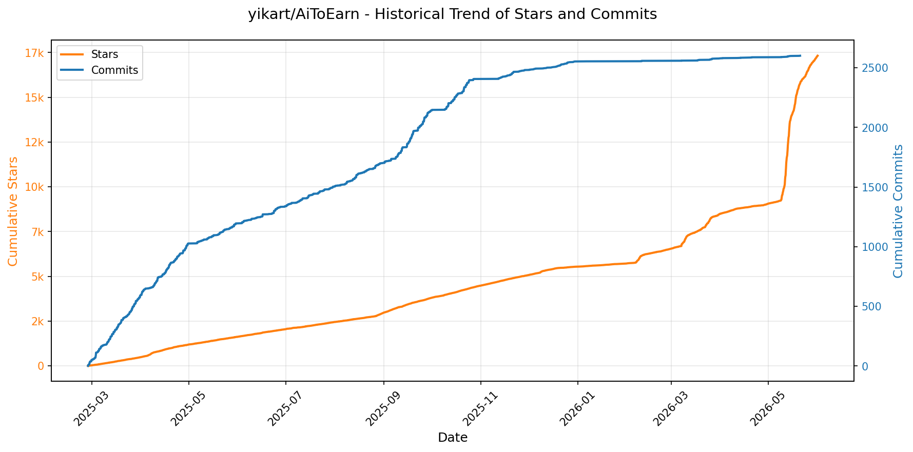

> *蓝色：累计 Stars｜橙色：累计 Commits（次 Y 轴）*

<b>📄 README 摘要</b>

1. **项目功能**  
AiToEarn 是一个面向 OPC（一人公司）、独立创作者、品牌及中小企业的 AI 原生内容营销智能体平台，核心目标是实现“内容即生产力、内容即收入”。它通过可编排的 AI Agent 自动化闭环，覆盖内容创作（Create）、多平台发布（Publish）、跨渠道互动运营（Engage）和商业化变现（Monetize）四大环节，支持从需求输入到收益结算的端到端落地。平台已深度适配中国与全球共 14+ 主流内容平台（如抖音、小红书、B站、TikTok、YouTube、Instagram、X/Twitter、LinkedIn 等），并打通线下商户推广场景（如餐饮、美业、民宿等），将实体营销需求转化为可执行、可追踪、可分佣的线上内容任务。

2. **关键功能**  
- **Monetize（变现）**：内置 CPS（按成交）、CPE（按互动）、CPM（按千次播放）三类结果导向型结算模型；上线内容交易市场，支持创作者接单、交付、结算全流程；集成 OpenClaw（龙虾）生态，实现任务自动分发与执行。  
- **Publish（发布）**：支持一键/批量跨平台发布图文与视频；提供可视化日历式排期系统；兼容 OAuth 授权与 Relay 中继机制，规避各平台开发者资质门槛，实现抖音、小红书、TikTok 等高壁垒平台的稳定登录与发布。  
- **Engage（互动）**：通过浏览器插件实现自动化点赞、关注、收藏；基于大模型（如 Claude、Veo、Nano Banana Pro）生成个性化评论回复；具备评论语义挖掘能力（识别“求链接”“怎么买”等高转化意图）；支持品牌舆情实时监测与热点响应。  
- **Create（创作）**：Agent 驱动的全栈内容生成：视频方向集成 Grok、Veo、Seedance、HappyHorse 等多模型，支持脚本生成→AI 视频生成→多语种翻译→智能剪辑；图文方向调用 Nano Banana Pro 等先进图像模型；支持参考图/视频引导生成、平台风格适配（如小红书种草风、TikTok 快节奏）、批量任务并发处理，适配矩阵号与规模化运营需求。  
- **开放集成能力**：原生支持 MCP（Model Context Protocol）协议，可无缝接入 Claude Desktop、Cursor 及其他兼容 MCP 的 AI 助手；提供标准化 API、SSE 流式接口与 Docker 一键部署方案；支持私有化部署与 Electron 桌面客户端。

3. **技术栈**  
- **后端架构**：Node.js（v20.18.x）为主力运行时；采用 Nx 工作区管理多模块（`aitoearn-server`、`aitoearn-ai`）；服务间通信支持 HTTP + MCP 协议与 SSE 长连接；数据库依赖 MongoDB（文档存储）与 Redis（缓存/队列）；Docker Compose 实现容器化编排与一键启停。  
- **AI 能力层**：深度集成多类开源与商用 AI 模型，包括视频生成（Veo、Seedance 2.0、HappyHorse 1.0）、图像生成（Nano Banana Pro）、语音/口型驱动（MuseTalk、CosyVoice）、人脸增强（facefusion）、视频爬取（video_spider）及自动化脚本工具（MoneyPrinterTurbo、NarratoAI）；支持模型热切换与多模型协同工作流。  
- **前端与客户端**：Web 端基于现代前端框架（未明示但工程结构显示为 Vite + TypeScript）；提供 Electron 桌面应用（AttAiToEarn 仓库）；浏览器插件支撑 Engage 功能；UI 支持中/英/日三语，含全新界面风格与交互优化。  
- **部署与集成**：全链路支持云原生部署（Docker）、本地开发（PNPM + Nx）、MCP 协议扩展；Relay 中继服务解耦 OAuth 凭据管理；API Key 统一鉴权，区分中国（`aitoearn.cn`）与国际（`aitoearn.ai`）双环境。

---

### 29. [CloakHQ/CloakBrowser](https://github.com/CloakHQ/CloakBrowser)
- 📅 **创建日期**：2026-02-22  
- 🔄 **最近更新**：2026-06-01  
- ⭐ **Stars**：15,092（日 +212｜周 +2449｜月 +13607）  
- 📝 **描述**：Stealth Chromium that passes every bot detection test. Drop-in Playwright replacement with source-level fingerprint patches. 30/30 tests passed.  

<b>📈 Star 与 Commit 历史趋势</b>

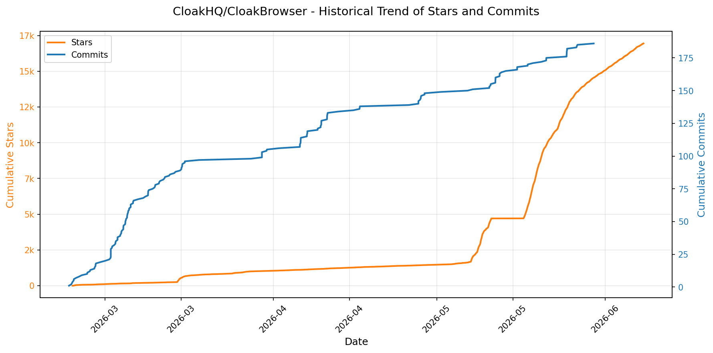

> *蓝色：累计 Stars｜橙色：累计 Commits（次 Y 轴）*

<b>📄 README 摘要</b>

1. **项目功能**  
CloakBrowser 是一个深度定制的、具备反机器人检测能力的 Chromium 浏览器二进制发行版，专为绕过现代反爬与反自动化系统（如 Cloudflare Turnstile、reCAPTCHA v3、FingerprintJS、BrowserScan、ShieldSquare 等）而设计。它并非通过 JavaScript 注入、运行时配置修改或 Puppeteer/Playwright 插件实现伪装，而是**直接在 Chromium 源码 C++ 层级进行 58 处底层补丁**，从渲染引擎、硬件指纹、网络栈、WebRTC、Canvas/WebGL、音频、字体、GPU、屏幕参数、CDP 行为等维度彻底重写浏览器“真实感”。其核心目标是：让目标网站将自动化访问识别为**真实人类用户操作**，从而**根本性避免触发 CAPTCHA 或拦截**，而非事后解决 CAPTCHA。

2. **关键特性**  
- ✅ **C++ 源码级指纹净化**：58 项底层补丁，覆盖 `navigator.webdriver`、`window.chrome`、UA 字符串、插件列表、TLS 指纹（JA3N/JA4）、WebRTC IP 泄漏、GPU/屏幕/时区/本地化等全部高危检测向量；  
- ✅ **开箱即用的“人类行为”模拟**：`humanize=True` 一键启用贝塞尔曲线鼠标移动、逐字符键盘输入、自然滚动节奏，且支持 `careful` 等预设及细粒度 `human_config` 覆盖；  
- ✅ **实测顶级反检测表现**：reCAPTCHA v3 服务端验证得分稳定 **0.9（人类级）**；100% 通过 Cloudflare Turnstile（含非交互/托管模式）、FingerprintJS、BrowserScan（4/4 正常）、deviceandbrowserinfo.com（0 个机器人标志）；  
- ✅ **零配置快速集成**：完全兼容 Playwright/Puppeteer API，仅需替换 `import` 语句（Python/JS 均支持），3 行代码即可迁移；  
- ✅ **智能代理协同**：原生支持 HTTP/SOCKS5 代理（含内联凭证）、`geoip=True` 自动根据代理出口 IP 推断并设置时区/语言环境、`--fingerprint-webrtc-ip=auto` 防 WebRTC IP 泄露；  
- ✅ **持久化浏览器上下文**：`launch_persistent_context()` 提供真实 Chrome 用户数据目录，支持 Cookie/LocalStorage 持久化、扩展加载、Widevine DRM（Linux）、自然浏览历史积累，有效规避“无痕模式”检测；  
- ✅ **全自动二进制管理**：首次运行自动下载校验（SHA-256）Chromium 146 定制二进制（约 200MB），后台静默更新，跨平台（Linux/macOS/Windows）一致行为；  
- ✅ **配套浏览器配置管理器**：开源 CloakBrowser Manager（Docker 部署），提供图形化多账号指纹隔离、代理绑定、会话持久化与 noVNC 远程控制，对标 Multilogin/GoLogin；  
- ✅ **企业级扩展能力**：支持 Chrome 扩展加载、自定义启动参数、存储配额调节、TLS/QUIC 隧道穿透、CDP 行为仿真等高级场景。

3. **技术栈**  
- **核心引擎**：深度定制的 **Chromium 146**（持续同步上游版本），所有反检测逻辑以 **C++ 源码补丁** 形式编译进原生二进制；  
- **封装层**：  
  - **Python**：基于 `playwright-core` / `puppeteer-core` 构建，提供 `launch()`、`launch_persistent_context()` 等同步/异步接口；  
  - **JavaScript/Node.js**：兼容 Playwright（`import { launch } from 'cloakbrowser'`）与 Puppeteer（`import { launch } from 'cloakbrowser/puppeteer'`）；  
- **依赖与生态**：  
  - 兼容主流自动化框架：Playwright、Puppeteer、Selenium（通过适配层）、Crawl4AI、Scrapling、LangChain、Stagehand 等；  
  - 可选依赖：`geoip`（IP 地理定位解析）、`widevine`（DRM 支持）；  
- **部署与分发**：  
  - 多渠道发布：PyPI（`pip install cloakbrowser`）、npm（`npm install cloakbrowser`）、Docker Hub（`cloakhq/cloakbrowser`）；  
  - 本地缓存 + SHA-256 校验确保二进制完整性；  
- **基础设施**：Docker 容器化（CLI 工具、Manager 服务）、noVNC 远程桌面、HTTP/SOCKS5 代理协议原生支持、QUIC/HTTP3 隧道能力。

---

### 30. [mukul975/Anthropic-Cybersecurity-Skills](https://github.com/mukul975/Anthropic-Cybersecurity-Skills)
- 📅 **创建日期**：2026-02-25  
- 🔄 **最近更新**：2026-06-01  
- ⭐ **Stars**：13,015（日 +374｜周 +4526｜月 +7123）  
- 📝 **描述**：754 structured cybersecurity skills for AI agents · Mapped to 5 frameworks: MITRE ATT&CK, NIST CSF 2.0, MITRE ATLAS, D3FEND & NIST AI RMF · agentskills.io standard · Works with Claude Code, GitHub Copilot, Codex CLI, Cursor, Gemini CLI & 20+ platforms · 26 security domains · Apache 2.0  

<b>📈 Star 与 Commit 历史趋势</b>

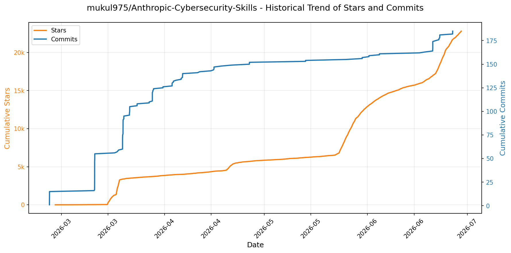

> *蓝色：累计 Stars｜橙色：累计 Commits（次 Y 轴）*

<b>📄 README 摘要</b>

1. **项目功能**  
该项目是一个面向AI代理（AI agents）的、大规模开源网络安全技能库，旨在为任意AI安全代理赋予资深安全分析师级别的专业能力。它不提供可执行脚本或通用教程，而是以结构化、可被AI直接解析和调用的方式，封装754个生产级网络安全技能，覆盖从威胁狩猎、内存取证到云安全、零信任架构等26个细分安全领域。其核心价值在于：使AI代理能够像人类专家一样，按标准工作流（When to Use → Prerequisites → Workflow → Verification）自主决策、分步执行并验证结果，从而填补AI在实战化安全运营中的知识与流程空白。

2. **关键特性**  
- ✅ **全行业框架统一映射**：每个技能均同时标注五大权威安全与AI治理框架——MITRE ATT&CK（v18，覆盖全部14项战术）、NIST CSF 2.0（含新增Govern函数）、MITRE ATLAS（v5.4，聚焦AI/ML对抗）、MITRE D3FEND（v1.3，267项防御技术）、NIST AI RMF 1.0 + GenAI Profile（含法律合规映射），实现“一技能、五合规”；  
- ✅ **AI原生设计**：严格遵循 [agentskills.io](https://agentskills.io) 开放标准，采用轻量YAML前言（~30 tokens即可完成全库扫描）+ 结构化Markdown正文，支持AI高效发现、渐进加载（500–2000 tokens/技能）与精准执行；  
- ✅ **深度实战导向**：所有技能均源自真实安全从业者工作流（非LLM生成摘要），包含明确触发条件、环境前提、可复制命令、决策分支及结果验证方法，并附带参考文档、脚本与报告模板；  
- ✅ **跨平台即插即用**：原生兼容所有支持agentskills.io标准的平台，包括Claude Code、GitHub Copilot、Cursor、Gemini CLI、LangChain、CrewAI、AutoGen、Devin、MCP服务器等超26+主流AI开发与运行环境；  
- ✅ **持续演进生态**：内置ATT&CK Navigator可视化图层、定期更新框架适配（如ATLAS新增AI代理上下文投毒等2025年攻击向量）、开放PR贡献机制，并联动Casky.ai交互式安全技能沙盒与GARS-2026全球AI就绪度学术调研。

3. **技术栈**  
- **数据格式层**：YAML（元数据描述）、Markdown（结构化技能正文）、STIX/TAXII（威胁情报集成）、OWASP标准（Web/API安全）、CIS/SOC2（合规引用）；  
- **知识建模层**：基于agentskills.io开放标准构建，深度融合MITRE知识图谱（ATT&CK/ATLAS/D3FEND本体）、NIST框架（CSF 2.0 / AI RMF）语义体系；  
- **交付与集成层**：Git仓库原生托管（支持`npx skills add`一键引入）、静态文件目录结构（skills/ + references/ + scripts/ + assets/）、标准化Frontmatter Schema（含`atlas_techniques`、`d3fend_techniques`、`nist_ai_rmf`等专用字段）；  
- **运行支撑层**：零依赖纯文本格式，无需后端服务；兼容任意支持YAML解析与Markdown渲染的AI Agent SDK（如LangChain Tools、CrewAI Skill Registry）、CLI工具（Codex CLI、Gemini CLI）及IDE插件（Copilot、Cursor）；  
- **扩展生态层**：对接Casky.ai Playground（实时技能演练）、Hermes Agent、SkillsLLM技能市场、Openflows信号追踪等第三方平台，形成可验证、可审计、可落地的AI安全能力闭环。

---

### 31. [decolua/9router](https://github.com/decolua/9router)
- 📅 **创建日期**：2026-01-05  
- 🔄 **最近更新**：2026-06-01  
- ⭐ **Stars**：11,957（日 +164｜周 +1428｜月 +8453）  
- 📝 **描述**：Unlimited FREE AI coding. Connect Claude Code, Codex, Cursor, Cline, Copilot, Antigravity to FREE Claude/GPT/Gemini via 40+ providers. Auto-fallback, RTK -40% tokens, never hit limits.  

<b>📈 Star 与 Commit 历史趋势</b>

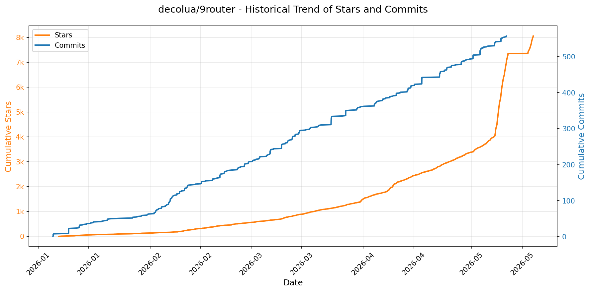

> *蓝色：累计 Stars｜橙色：累计 Commits（次 Y 轴）*

<b>📄 README 摘要</b>

1. **项目功能**  
9Router 是一个开源的 AI 请求智能路由代理工具，核心作用是作为本地中间层，拦截并优化用户 AI 编程工具（如 Claude Code、Cursor、Copilot、OpenClaw、Codex 等）发出的 API 请求。它不直接提供大模型能力，而是统一接入并智能调度 **40+ AI 服务商、100+ 模型**（含订阅/付费/免费三层梯队），实现：自动节省 token（20–40% 输入 + 高达 65% 输出）、无缝格式转换（OpenAI/Claude/Gemini/Cursor 等协议互转）、多账号负载均衡、实时配额监控与自动降级 fallback（订阅 → 廉价 → 免费），确保开发者“永不中断编码”，同时显著降低 AI 使用成本。

2. **关键特性**  
- 🚀 **RTK Token Saver**：内置 RTK 开源库，自动识别并无损压缩工具输出（如 `git diff`、`grep`、`ls`、日志等），节省 20–40% 输入 token；  
- 🪨 **Caveman Mode**：通过提示工程强制 LLM 输出精简技术性响应，最高节省 65% 输出 token；  
- 🎯 **智能三级自动降级（Smart 3-Tier Fallback）**：按优先级自动切换模型层级（订阅 > 廉价 > 免费），故障或额度耗尽时零中断；  
- 📊 **实时配额追踪与成本分析**：显示各服务商剩余 token、重置倒计时、估算花费及月度支出趋势；  
- 🔄 **全协议格式翻译**：支持 OpenAI / Claude / Gemini / Cursor / Kiro / Vertex / Antigravity 等十余种请求/响应格式双向自动转换；  
- 👥 **多账号轮询与冗余**：同一服务商可配置多个账户，自动轮询或按优先级调度，提升稳定性和容错性；  
- 🔄 **OAuth 自动续期**：对需 OAuth 登录的服务（如 GitHub、Claude Code）自动刷新访问令牌，无需手动重登；  
- 🎨 **自定义组合（Custom Combos）**：自由混合不同层级模型创建命名组合，支持跨设备云同步；  
- 📝 **完整请求日志与调试模式**：开启后记录原始请求/响应、Headers、Payload，便于问题排查；  
- 💾 **端到端加密云同步**：安全同步提供商配置、组合策略与设置至多设备；  
- 🌐 **全场景部署支持**：支持 localhost、VPS、Docker、Cloudflare Workers 等多种运行环境。

3. **技术栈**  
- **前端**：基于 Next.js（App Router）构建，使用 TypeScript、Tailwind CSS，支持多语言（i18n）；  
- **后端/核心服务**：Node.js 运行时，采用 Express 或 Next.js API Routes 实现 HTTP 代理逻辑；  
- **关键依赖**：  
  - `rtk-ai/rtk`（⭐40K）—— 用于智能工具结果压缩；  
  - `caveman`（⭐52K）—— 用于精简式响应生成；  
- **部署方案**：提供 npm 全局包（`npm install -g 9router`）、Docker 镜像（`decolua/9router`）、GitHub Container Registry（GHCR）、Cloudflare Workers 兼容支持；  
- **基础设施适配**：支持环境变量配置（`.env`）、动态 `BASE_URL`/`CLOUD_URL` 服务端路由、超时熔断与 fail-fast 网络策略；  
- **认证集成**：原生支持 OAuth 2.0（GitHub、Claude、Cursor 等）、API Key（OpenRouter、GLM、Gemini、Anthropic 等 40+ 提供商）、免认证直连（Kiro、OpenCode Free）。

---

### 32. [rohitg00/agentmemory](https://github.com/rohitg00/agentmemory)
- 📅 **创建日期**：2026-02-25  
- 🔄 **最近更新**：2026-06-01  
- ⭐ **Stars**：10,718（日 +312｜周 +2863｜月 +10718）  
- 📝 **描述**：#1 Persistent memory for AI coding agents based on real-world benchmarks  

<b>📈 Star 与 Commit 历史趋势</b>

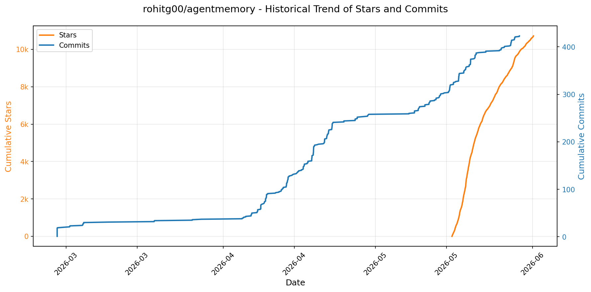

> *蓝色：累计 Stars｜橙色：累计 Commits（次 Y 轴）*

<b>📄 README 摘要</b>

1. **项目功能**  
agentmemory 是一个专为 AI 编程智能体（coding agents）设计的**持久化、跨代理共享的记忆系统**。它解决当前编程助手反复遗忘上下文的根本问题：无需用户手动维护 `.cursorrules` 或 `CLAUDE.md` 等静态文件，也不依赖 LLM 自行总结或重述历史。它在后台**全自动捕获**智能体在开发过程中的操作（如代码修改、调试行为、工具调用、错误分析），将其压缩为结构化、可检索的记忆单元，并在后续会话中**精准注入最相关上下文**，实现“一次说明，永久记住”。核心价值是：让 Claude Code、Cursor、Copilot CLI、Gemini CLI 等数十种主流编程智能体**共享同一份动态演化的记忆库**，显著减少重复解释、上下文粘贴和知识断层。

2. **关键特性**  
- ✅ **零配置自动记忆捕获**：内置 12 种智能体行为钩子（hooks），无需修改代理源码即可静默记录会话；支持 MCP（Model Context Protocol）、REST API 和原生插件集成。  
- ✅ **混合检索引擎（Hybrid Search）**：融合 BM25 关键词匹配、本地向量检索（`all-MiniLM-L6-v2`，免 API 密钥）、知识图谱关系推理，并通过 RRF（Reciprocal Rank Fusion）加权融合，实测 **R@5 达 95.2%**（LongMemEval-S 基准）。  
- ✅ **极致 Token 节省**：相比全量上下文粘贴（年耗 1950 万+ tokens）或 LLM 摘要（~65 万 tokens），agentmemory 仅需 **~17 万 tokens/年**（约 $10），结合本地嵌入可降至 **$0 成本**。  
- ✅ **多智能体协同记忆**：通过 `AGENT_ID` 隔离与 `AGENTMEMORY_AGENT_SCOPE=isolated` 支持多代理共存；所有代理（Claude、Cursor、OpenCode、Aider 等）连接同一内存服务器，共享、复用、交叉验证记忆。  
- ✅ **智能记忆生命周期管理**：4 层记忆分级（瞬时/短期/长期/归档）、自动衰减（decay）、智能遗忘（auto-forget）与知识图谱驱动的语义合并，避免记忆冗余与过期。  
- ✅ **开箱即用的可视化与诊断**：内置实时内存浏览器（`http://localhost:3113`），支持记忆图谱探索、时间线回放（Replay）、会话溯源与交互式健康检查（`agentmemory doctor`）。  
- ✅ **完全离线 & 零外部依赖**：纯 SQLite 存储 + 自研 iii-engine 内核，**不依赖任何外部数据库（Qdrant/Postgres）或云服务**，默认全自托管。

3. **技术栈**  
- **核心引擎**：基于 [`iii engine`](https://github.com/iii-hq/iii) 构建（轻量级、高性能的本地 AI 运行时框架），深度集成其 SDK（`iii-sdk ^0.11.0`）。  
- **存储层**：嵌入式 SQLite 数据库（零配置、单文件、ACID 安全），无外部 DB 依赖。  
- **检索与嵌入**：本地 CPU 友好型模型 `all-MiniLM-L6-v2`（Sentence Transformers），支持离线向量化；BM25 引擎（`tantivy` 或类似轻量实现）；知识图谱基于内存内 RDF/属性图模型。  
- **协议与集成**：原生支持 **MCP（Model Context Protocol）标准**，同时提供 REST API、CLI 工具链及多平台插件（VS Code、Cursor、Warp 等）。  
- **前端与工具**：TypeScript/Node.js 构建的 CLI（`npm install -g @agentmemory/agentmemory`），基于 Web 技术的实时内存查看器（端口 3113），以及配套的 `npx` 快速启动方案。  
- **测试与质量**：>950 个自动化测试，覆盖检索精度、性能、多代理并发、生命周期管理等；基准测试框架支持 LongMemEval、coding-agent-life-v1 等权威评测。

---

### 33. [nesquena/hermes-webui](https://github.com/nesquena/hermes-webui)
- 📅 **创建日期**：2026-03-30  
- 🔄 **最近更新**：2026-06-01  
- ⭐ **Stars**：10,130（日 +728｜周 +1618｜月 +4955）  
- 📝 **描述**：Hermes WebUI: The best way to use Hermes Agent from the web or from your phone!  

<b>📈 Star 与 Commit 历史趋势</b>

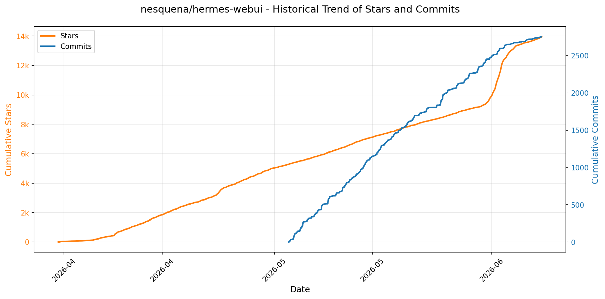

> *蓝色：累计 Stars｜橙色：累计 Commits（次 Y 轴）*

<b>📄 README 摘要</b>

1. **项目功能**  
Hermes Web UI 是 Hermes Agent 的轻量级、自托管式浏览器前端界面，提供与 Hermes CLI 完全一致的功能体验。它不依赖构建流程、前端框架或打包工具，仅使用 Python（后端）和原生 JavaScript（前端），通过本地 Web 服务运行。用户可通过 SSH 隧道安全访问该 UI，所有操作（聊天、会话管理、文件浏览、任务调度、技能调用等）均直接对接已部署的 Hermes Agent 实例，复用其模型、记忆、配置和工作流，无需额外部署或重复配置。

2. **核心特性**  
- **三栏式响应式布局**：左侧会话/导航栏（支持按日期分组、置顶、归档、项目/标签分类）、中央实时流式对话区（支持消息编辑、重试、取消、工具调用卡片、子代理活动展示、Mermaid 图表渲染、推理过程折叠显示）、右侧可拖拽工作区文件浏览器（支持目录树展开、文本/代码/Markdown/图片内联预览、Git 状态提示、文件增删改查）。  
- **深度集成能力**：完整支持 Hermes Agent 的持久化记忆、跨会话上下文召回、自托管定时任务（cron）、多平台消息通知（Telegram/Discord/Slack 等）、自动技能生成与保存、多模型提供商（OpenAI/Anthropic/DeepSeek/Ollama/LMStudio 等）动态切换。  
- **增强交互体验**：语音输入（Web Speech API）、密码+WebAuthn 双因素认证、12 种主题+11 种皮肤组合、实时 token/cost 监控（环形指示器+底部状态栏）、SSE 自动重连（保障 SSH 隧道稳定性）、会话与附件持久化存储、CLI 会话双向桥接（SQLite 同步）、 slash 命令快捷操作（`/model` `/workspace` `/usage` 等）。  
- **安全与运维友好**：HTTP-only HMAC 签名 Cookie（24h TTL）、严格安全响应头、20MB 请求体限制、CDN 资源 SRI 校验、一键启停/日志查看/健康检查（`ctl.sh` 工具）、Windows/macOS/Linux/WSL2 全平台支持（含原生 Windows 方案）。

3. **技术栈**  
- **后端**：Python 3.11+（无框架，基于 `http.server` 或轻量 HTTP 库实现），直接调用本地 Hermes Agent 的 CLI 和 SQLite 数据库，依赖 `pydantic`、`jinja2`（模板）、`watchdog`（热重载）等精简依赖。  
- **前端**：纯 Vanilla JS（零框架）、HTML/CSS（CSS 变量 + `data-skin` 主题系统）、Prism.js（语法高亮）、Mermaid（图表渲染）、Web Speech API（语音）、SSE（服务端事件流）、localStorage + 服务端 `settings.json`（状态持久化）。  
- **基础设施**：完全离线运行，支持 SSH 隧道、Tailscale、反向代理部署；Docker 单/多容器方案可选；配置通过环境变量（`.env`）或命令行参数注入；状态目录默认位于 `~/.hermes/webui`（POSIX）或 `%LOCALAPPDATA%\hermes\webui`（Windows）。

---

### 34. [HKUDS/ViMax](https://github.com/HKUDS/ViMax)
- 📅 **创建日期**：2025-03-30  
- 🔄 **最近更新**：2026-06-01  
- ⭐ **Stars**：8,463（日 +76｜周 +1087｜月 +5741）  
- 📝 **描述**："ViMax: Agentic Video Generation (Director, Screenwriter, Producer, and Video Generator All-in-One)"  

<b>📈 Star 与 Commit 历史趋势</b>

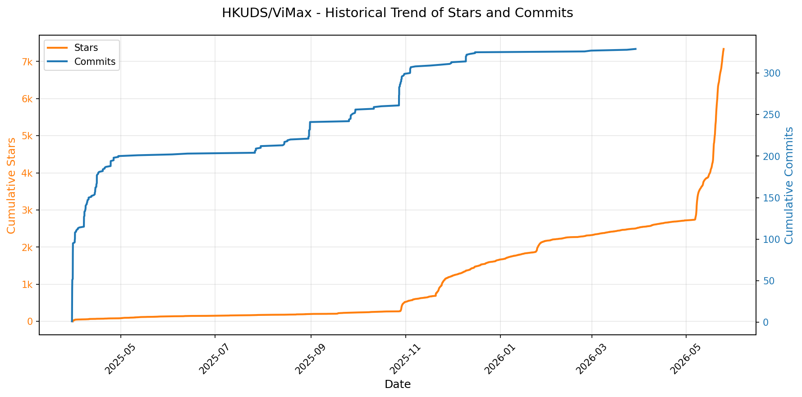

> *蓝色：累计 Stars｜橙色：累计 Commits（次 Y 轴）*

---

### 35. [run-llama/liteparse](https://github.com/run-llama/liteparse)
- 📅 **创建日期**：2026-02-09  
- 🔄 **最近更新**：2026-06-01  
- ⭐ **Stars**：8,404（日 +439｜周 +3205｜月 +3465）  
- 📝 **描述**：A fast, helpful, and open-source document parser  

<b>📈 Star 与 Commit 历史趋势</b>

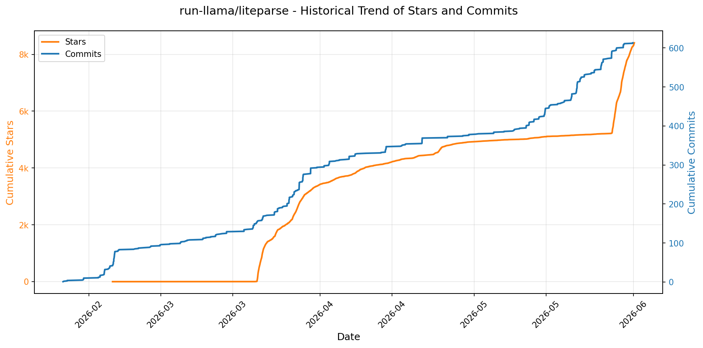

> *蓝色：累计 Stars｜橙色：累计 Commits（次 Y 轴）*

<b>📄 README 摘要</b>

1. **项目功能**  
LiteParse 是一个轻量、快速、完全本地运行的开源文档解析工具，专注于高质量的空间文本提取。它支持 PDF 及多种办公文档（DOCX/XLSX/PPTX）和图像（JPG/PNG/TIFF 等）输入，通过自动格式转换（依赖 LibreOffice/ImageMagick）统一为 PDF 后，利用 PDFium 进行原生文本提取，并按需调用 OCR（默认集成 Tesseract）补全文本缺失区域（如扫描件、图片型内容）。最终输出带精确边界框（bounding boxes）的结构化文本数据（JSON/纯文本）及高 DPI 页面截图，专为 LLM 智能体（LLM agents）提供布局感知、视觉增强的输入支持，**不依赖云服务、不调用大模型、无任何外部网络请求**。

2. **核心特性**  
- ✅ **极速本地解析**：基于 PDFium 的高性能原生文本提取，避免通用解析器的开销；CLI 单文件设计，开箱即用。  
- ✅ **灵活 OCR 架构**：内置零配置 Tesseract（含多语言支持）；支持 HTTP OCR 服务（EasyOCR/PaddleOCR/自定义），遵循统一 API 规范；可禁用 OCR 或指定语言/`tessdata` 路径，适配离线/信创环境。  
- ✅ **多格式输入自动兼容**：原生支持 PDF；通过 LibreOffice 自动转换 Word/Excel/PPT/ODF/Key/Numbers 等办公文档；通过 ImageMagick 自动转换 JPG/PNG/SVG/TIFF 等图像格式。  
- ✅ **空间感知输出**：生成含 `(x1,y1,x2,y2)` 坐标的精准文本边界框，保留原始排版逻辑；支持生成带高保真渲染的 PNG 截图（用于多模态 LLM 视觉理解）。  
- ✅ **全栈语言覆盖**：提供 Rust 库、Node.js（napi-rs）、Python（PyO3）、WebAssembly（wasm-bindgen）四套绑定，同一 CLI 工具（`lit`）跨平台（Linux/macOS/Windows，含 Apple Silicon）可用。  
- ✅ **生产就绪能力**：支持分页解析（`--target-pages`）、批量目录处理（`batch-parse`）、密码保护文档、DPI 调节、并发 OCR 控制、静默模式等 CLI 高级选项。

3. **技术栈**  
- **核心语言与引擎**：Rust（主逻辑、性能关键路径）、PDFium C 库（PDF 渲染与文本提取）、Tesseract OCR（内置默认引擎，通过 `tesseract-rs` 绑定）。  
- **格式转换依赖**：LibreOffice（Office 文档 → PDF）、ImageMagick（图像 → PDF），均为系统级外部工具（非嵌入）。  
- **OCR 扩展支持**：HTTP 协议对接任意 OCR 服务（如 EasyOCR、PaddleOCR），要求实现标准 `/ocr` POST 接口。  
- **多语言绑定**：  
  - Node.js：`napi-rs`（高性能原生模块）  
  - Python：`PyO3`（CPython 扩展）  
  - Web/WASM：`wasm-bindgen`（浏览器端运行）  
- **构建与发布**：Rust Workspace 管理多 crate；CI/CD（GitHub Actions）；发布至 crates.io / npm / PyPI / WASM npm 包；Apache 2.0 开源协议。

---

### 36. [hardikpandya/stop-slop](https://github.com/hardikpandya/stop-slop)
- 📅 **创建日期**：2026-01-11  
- 🔄 **最近更新**：2026-06-01  
- ⭐ **Stars**：7,776（日 +319｜周 +3715｜月 +4540）  
- 📝 **描述**：A skill file for removing AI tells from prose  

<b>📈 Star 与 Commit 历史趋势</b>

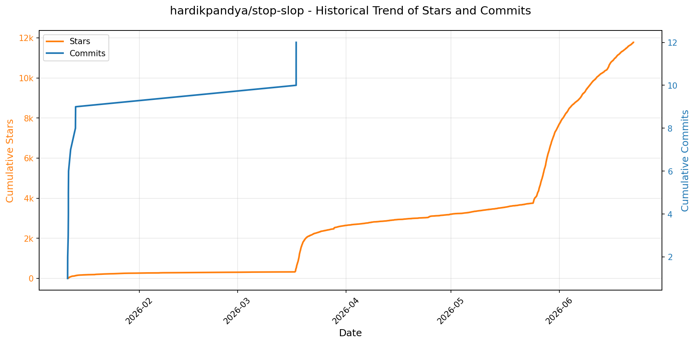

> *蓝色：累计 Stars｜橙色：累计 Commits（次 Y 轴）*

<b>📄 README 摘要</b>

1. **项目功能**  
该项目是一个专用于文本“去AI化”的提示工程技能（Skill），旨在识别并清除人类写作中混入的、由大语言模型（LLM）生成的典型痕迹（即“AI tells”）。它通过结构化规则指导Claude等LLM对输入 prose（散文/叙述性文本）进行精细化编辑，使其更简洁、直接、自然、可信且符合真实人类写作者的语言习惯与节奏，从而提升文本的专业性与可读性。

2. **核心特性**  
- **多层级AI痕迹识别与清除**：覆盖词汇层（禁用短语）、结构层（规避陈腐句式与段落模式）和句法层（强制主动语态、禁用Wh-开头、禁用破折号与碎片化断句等）；  
- **模块化规则体系**：以 `SKILL.md` 为核心指令，辅以 `references/` 下三类标准化参考文件（`phrases.md` 列出需删除的套话/冗余表达；`structures.md` 定义需规避的结构性 clichés；`examples.md` 提供可对照的修改前后范例）；  
- **可量化质量评估机制**：引入五维评分体系（直接性、节奏感、可信度、真实性、信息密度），每项1–10分，总分低于35/50即判定为需重写，推动可验证的文本优化；  
- **跨平台兼容部署**：支持多种集成方式——Claude Code 中作为本地技能加载、Claude Projects 中上传为知识库、自定义指令中嵌入核心规则、或在API调用时将 `SKILL.md` 纳入 system prompt。

3. **技术栈**  
- **核心范式**：基于提示工程（Prompt Engineering）与指令微调（Instruction Tuning）思想构建的轻量级、纯文本技能包；  
- **交付形式**：全静态 Markdown 文件组织（`.md`），无代码依赖，零运行时环境要求；  
- **交互协议**：适配 Anthropic Claude 生态（包括 Claude Code、Claude Projects、Custom Instructions 及 API），亦可通过通用 system prompt 机制泛化至其他支持长上下文与结构化指令的 LLM；  
- **许可协议**：MIT 开源许可证，允许自由使用、修改与分发。

---

### 37. [revfactory/harness](https://github.com/revfactory/harness)
- 📅 **创建日期**：2026-03-26  
- 🔄 **最近更新**：2026-06-01  
- ⭐ **Stars**：4,695（日 +391｜周 +1174｜月 +1665）  
- 📝 **描述**：A meta-skill that designs domain-specific agent teams, defines specialized agents, and generates the skills they use.  

<b>📈 Star 与 Commit 历史趋势</b>

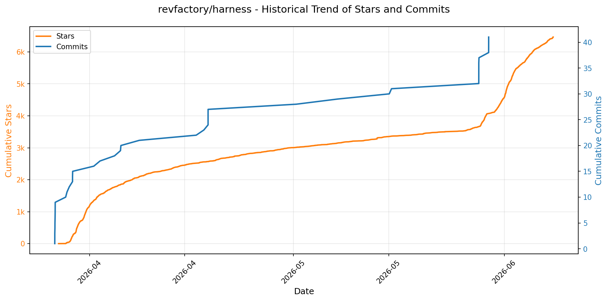

> *蓝色：累计 Stars｜橙色：累计 Commits（次 Y 轴）*

<b>📄 README 摘要</b>

1. **项目功能**  
Harness 是一个面向 Claude Code 的「团队架构工厂」（Team-Architecture Factory），核心能力是将用户用自然语言描述的领域需求（如“为这个项目构建一个harness”）自动转化为结构化的多智能体协作系统。它不直接执行任务，而是生成符合工程规范的 `.claude/agents/`（智能体定义）和 `.claude/skills/`（技能文件），并预置完整的团队协作协议与上下文管理机制，使 Claude Code 能基于该架构高效执行复杂任务。

2. **关键特性**  
- **六大预设团队架构模式**：支持 Pipeline（串行流水线）、Fan-out/Fan-in（并行分发与聚合）、Expert Pool（上下文驱动的专家按需调用）、Producer-Reviewer（生成+质量审查）、Supervisor（中心化动态调度）、Hierarchical Delegation（自顶向下递归委派）六种经过验证的协作范式；  
- **渐进式技能生成（Progressive Disclosure）**：自动创建结构化技能文件，按需加载上下文，显著优化 LLM 上下文窗口利用率；  
- **端到端编排能力**：内置跨智能体数据传递、错误传播/恢复、消息协议、触发验证、干运行（dry-run）测试及“带技能 vs 无技能”对比评估机制；  
- **可验证输出体系**：所有生成内容均遵循标准化目录结构（`.claude/agents/`, `.claude/skills/`），支持一键集成与可复现性验证。

3. **技术栈**  
- **运行时平台**：深度适配 Claude Code（需启用 `CLAUDE_CODE_EXPERIMENTAL_AGENT_TEAMS=1` 实验性功能），原生支持其 Agent Teams 和 Skill 系统；  
- **架构层级**：位于 Claude Code 生态的 **L3 Meta-Factory 层**，专精于「Team-Architecture Factory」子层，与其他 L3 工具（如 Archon 运行时配置工厂）正交共存；  
- **实现形式**：以 Claude Code 插件（Plugin）形态发布，含完整插件清单（`.claude-plugin/plugin.json`）、技能文档（`SKILL.md`）、架构参考手册（6 种模式详解）、真实案例库（5 个团队配置示例）及测试指南；  
- **扩展生态**：与 Archon（运行时配置）、meta-harness（Codex 版本）、ECC（跨 Harness 工作流标准化）、wshobson/agents（智能体技能集市）等工具协同工作，构成分层可组合的智能体工程体系。

---

### 38. [dograh-hq/dograh](https://github.com/dograh-hq/dograh)
- 📅 **创建日期**：2025-09-09  
- 🔄 **最近更新**：2026-06-01  
- ⭐ **Stars**：3,992（日 +108｜周 +1364｜月 +3575）  
- 📝 **描述**：Open source voice AI platform. Self-hosted alternative to Vapi and Retell. On Prem, BYOK across  Speech to Speech or LLM/STT/TTS, with a visual workflow builder, MCP native and telephony support.  

<b>📈 Star 与 Commit 历史趋势</b>

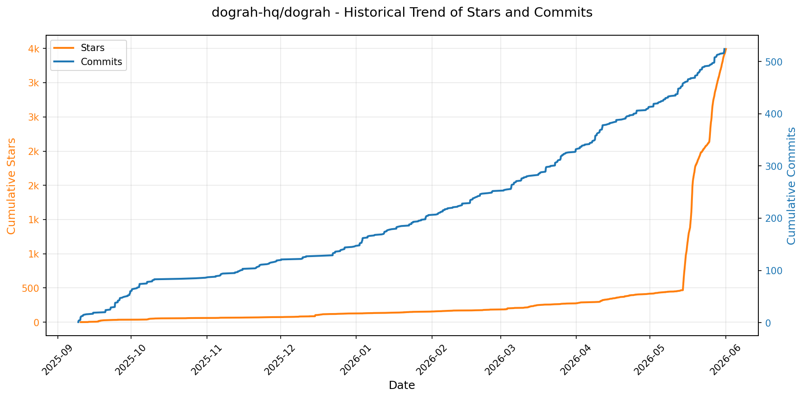

> *蓝色：累计 Stars｜橙色：累计 Commits（次 Y 轴）*

<b>📄 README 摘要</b>

1. **项目功能**  
Dograh AI 是一个开源、可自托管的语音智能体（voice agent）开发平台，旨在替代 Vapi 和 Retell 等闭源 SaaS 服务。它允许用户通过**可视化拖拽式工作流编排器**，在 2 分钟内从零构建并上线具备真实通话能力的语音机器人（支持 inbound/outbound 电话），适用于保险线索筛选、客户支持、预约提醒等生产级场景。核心价值在于提供端到端语音 AI 能力（STT/TTS/LLM/Telephony）的完全自主控制，无需依赖第三方云服务即可本地或私有云部署运行。

2. **关键特性**  
- ✅ **全栈开源与自托管**：BSD 2-Clause 许可，单命令 `docker compose up` 即可本地启动完整平台（含前端、后端、语音模型服务）；支持远程服务器一键部署。  
- ✅ **零配置快速上手**：内置默认 LLM（如 Llama 3）、TTS（e.g., Piper）、STT（e.g., Whisper.cpp）及 Telephony（Twilio/Vonage 等）集成，无需 API Key 即可 Web 通话测试。  
- ✅ **生产就绪语音能力**：支持实时低延迟语音交互、多厂商电话信令（含转人工）、英语语音识别与合成，并可灵活替换为自定义模型或云服务（如 OpenAI、ElevenLabs、AssemblyAI）。  
- ✅ **开发者友好体验**：Python 主栈 + Docker 优先架构；提供 Python/Node SDK；内置「测试模式」和「仪表盘内 Web 通话」实现免部署调试；独创「QA Node」节点自动评估工作流中各环节提示词质量。  
- ✅ **企业级可控性**：100% 数据驻留本地、无供应商锁定、支持源码级深度定制、符合严格数据合规要求。

3. **技术栈**  
- **后端**：Python（核心逻辑、API 服务、工作流引擎）  
- **前端**：React（TypeScript）构建的可视化工作流编辑器与管理控制台  
- **部署与运维**：Docker / Docker Compose（开箱即用容器化方案），支持 Kubernetes 扩展  
- **语音处理**：集成开源模型与服务 — STT 使用 Whisper.cpp 或 Vosk；TTS 使用 Piper 或 Coqui TTS；LLM 支持本地运行（Ollama/Llama.cpp）或对接 OpenAI/Anthropic 等 API  
- **通信层**：原生集成 Twilio、Vonage、Vobiz、Cloudonix 等电话服务商 SDK，模块化设计便于扩展新信令协议  
- **基础设施依赖**：PostgreSQL（持久化）、Redis（缓存/队列）、WebRTC（实时音视频信令）  
- **辅助工具**：提供官方 Python SDK（PyPI）与 Node.js SDK（npm），便于嵌入现有系统

---

### 39. [microsoft/agent-governance-toolkit](https://github.com/microsoft/agent-governance-toolkit)
- 📅 **创建日期**：2026-03-02  
- 🔄 **最近更新**：2026-06-01  
- ⭐ **Stars**：3,581（日 +103｜周 +1582｜月 +2224）  
- 📝 **描述**：AI Agent Governance Toolkit — Policy enforcement, zero-trust identity, execution sandboxing, and reliability engineering for autonomous AI agents. Covers 10/10 OWASP Agentic Top 10.  

<b>📈 Star 与 Commit 历史趋势</b>

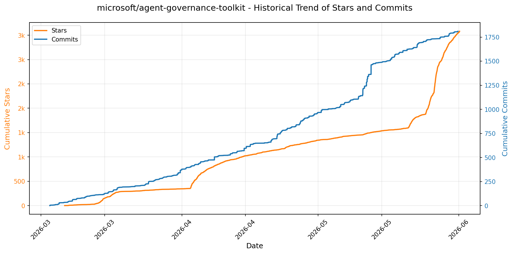

> *蓝色：累计 Stars｜橙色：累计 Commits（次 Y 轴）*

<b>📄 README 摘要</b>

1. **项目功能**  
该工具包（Agent Governance Toolkit，AGT）是一个面向生产环境的自主AI智能体（autonomous AI agents）治理框架，旨在解决AI代理在真实业务场景中部署后面临的三大核心治理难题：**权限控制失效**（如工具调用越权）、**身份不可追溯**（多代理共享凭证导致责任不明）、**行为不可审计**（缺乏防篡改、可验证的决策证据链）。它不依赖提示词层的安全机制（因其易受对抗性攻击且不可靠），而是在应用代码层对每个工具调用、消息发送和代理委托进行**确定性拦截与强制管控**，确保违规操作在执行前即被结构化阻断，实现“不可能误行”（structurally impossible to misbehave）。

2. **关键特性**  
- **策略即代码（Policy-as-Code）**：支持 YAML/OPA/Cedar 等多格式策略定义，提供 `allow`/`deny`/`require_approval` 三类动作，支持条件表达式、优先级规则、审批流集成；  
- **零信任身份体系**：基于 SPIFFE、DID 和 mTLS 实现细粒度代理身份标识与可信委托链，解决“谁调用了什么”问题；  
- **防篡改审计日志**：生成带时间戳、数字签名与 Merkle 哈希锚定的决策记录（Decision Record），满足合规审计与监管举证要求；  
- **全栈治理能力模块化**：涵盖 Agent OS（策略引擎）、Agent Mesh（可信服务网格）、Agent Runtime（四特权环沙箱执行）、Agent SRE（SLO监控/熔断/混沌测试）、Agent Compliance（OWASP 合规验证/策略扫描/红队审计）、Agent Hypervisor（执行过程审计与变更追踪）等八大核心组件；  
- **跨语言、跨框架统一治理**：提供 Python/TypeScript/.NET/Rust/Go 五套 SDK，并原生或适配集成 Microsoft Agent Framework、Semantic Kernel、AutoGen、LangGraph、CrewAI、Claude Code、GitHub Copilot CLI 等主流框架；  
- **开箱即用的 CLI 工具集**：包含 `agt doctor`（环境诊断）、`agt verify`（OWASP 合规检查）、`agt red-team scan`（提示注入红队审计）、`agt lint-policy`（策略语法校验）等，支持 CI/CD 流水线嵌入；  
- **企业级标准对齐**：完整覆盖 OWASP Agentic AI Top 10 全部 10 类风险、NIST AI RMF 四大支柱（GOVERN/MAP/MEASURE/MANAGE）、欧盟 AI Act 及 SOC 2 合规要求，并自动生成可导出的审计证据。

3. **技术栈**  
- **核心语言与运行时**：Python 3.10+（主实现，含全功能栈）、TypeScript（Node.js 18+/npm 9+）、.NET 8+、Rust 1.70+、Go 1.25+；  
- **策略引擎**：内置轻量级 YAML 解析器，兼容 OPA（Rego）与 Cedar/Cedarling 等声明式策略语言；  
- **身份与信任**：SPIFFE/SVID、去中心化标识符（DID）、双向 TLS（mTLS）；  
- **审计与安全**：Merkle 树日志、数字签名、哈希锚定、Tamper-evident Decision BOM；  
- **执行隔离**：基于进程/容器边界的四特权环（Privilege Rings）沙箱模型（非内核级，推荐容器化部署增强隔离）；  
- **基础设施集成**：Azure AD（通过 `AZURE_*` 环境变量支持）、Model Context Protocol（MCP）安全网关、GitHub Actions（贡献者声誉筛查）；  
- **质量保障体系**：992+ RFC 2119 规范化一致性测试、25 份架构决策记录（ADR）、CodeQL/Gitleaks/ClusterFuzzLite/Dependabot/OpenSSF Scorecard 全链路安全扫描。

---

### 40. [ogulcancelik/herdr](https://github.com/ogulcancelik/herdr)
- 📅 **创建日期**：2026-03-27  
- 🔄 **最近更新**：2026-06-01  
- ⭐ **Stars**：3,443（日 +210｜周 +1112｜月 +3044）  
- 📝 **描述**：agent multiplexer that lives in your terminal.  

<b>📈 Star 与 Commit 历史趋势</b>

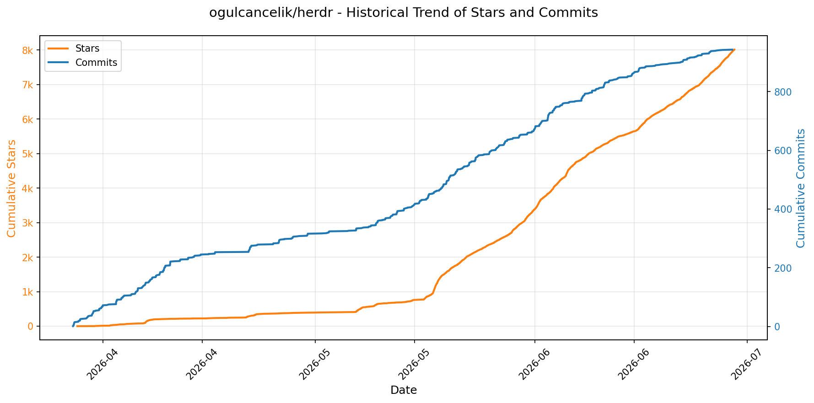

> *蓝色：累计 Stars｜橙色：累计 Commits（次 Y 轴）*

<b>📄 README 摘要</b>

1. **项目功能**  
herdr 是一个运行于终端内部的智能代理（AI agent）多路复用器（agent multiplexer），专为现代 AI 编程工作流设计。它在原生终端中提供持久化会话管理能力，支持工作区（workspaces）、标签页（tabs）和分屏（panes）三级组织结构；核心价值在于**深度感知 AI 代理的运行状态**（如 blocked/working/done/idle），无需 GUI 或 Electron，不劫持或重绘终端输出——用户始终看到代理进程真实的原始终端界面，并可通过鼠标点击、拖拽、分割等自然交互进行操作。

2. **关键特性**  
- ✅ **终端原生体验**：纯命令行工具，单二进制（Rust 编译），无依赖，兼容 Linux/macOS，可嵌套于 tmux 中运行；  
- ✅ **智能代理状态感知**：默认通过进程名与终端输出启发式识别状态，支持官方集成（如 Claude Code、Pi、Codex、Hermes 等 14+ 代理）通过 Unix Socket API 上报语义化状态，实现精准阻塞检测与自动恢复；  
- ✅ **强会话持久性**：客户端可随时 `Ctrl+B Q` 分离（detach），服务端及所有 pane 进程持续运行；重新执行 `herdr` 即可无缝重连（reattach）；支持命名会话（`herdr session attach <name>`）实现完全隔离的运行时环境；  
- ✅ **高效终端交互**：原生鼠标支持（点击聚焦、拖拽选中文本、按住 Shift 使用终端原生复制）；键盘复制模式（`prefix+[`）支持 vi 风格导航与选择；  
- ✅ **开箱即用的工程友好功能**：Git 工作区自动命名、18 种内置主题（Catppuccin / Gruvbox / Tokyo Night 等）、声音/桌面通知（支持标签页级静音）、可配置快捷键、远程 SSH 直连（`herdr --remote user@host`）、实验性热更新“手递手”（handoff）机制；  
- ✅ **开放扩展能力**：提供稳定 Socket API，允许 AI 代理主动创建 workspace、split pane、监听状态变更、读取输出等，实现双向协同（agent-driven orchestration）。

3. **技术栈**  
- **主语言**：Rust（构建轻量、高性能、内存安全的单二进制）；  
- **核心架构**：C/S 模型（server 负责长期运行的 pane 进程与状态管理，client 为无状态终端 UI）；  
- **通信机制**：本地 Unix Domain Socket（用于 client-server 及 agent-to-herdr 的低延迟双向通信）；  
- **终端交互层**：基于终端原生能力（ANSI 序列、鼠标事件协议），不依赖 ncurses 或 TUI 框架，确保最大兼容性；  
- **配置与扩展**：TOML 格式配置文件（`~/.config/herdr/config.toml`），支持插件式集成（`herdr integration install xxx`）；  
- **构建与分发**：Cargo 构建，提供 curl 安装脚本、Homebrew 公式、GitHub Releases 二进制包；  
- **协议与标准**：遵循 POSIX 终端规范，兼容 SSH、PuTTY、iTerm2、WezTerm 等主流终端。

---

### 41. [FareedKhan-dev/train-llm-from-scratch](https://github.com/FareedKhan-dev/train-llm-from-scratch)
- 📅 **创建日期**：2025-01-12  
- 🔄 **最近更新**：2026-06-01  
- ⭐ **Stars**：2,969（日 +628｜周 +1391｜月 +2409）  
- 📝 **描述**：A straightforward method for training your LLM, from downloading data to generating text.  

<b>📈 Star 与 Commit 历史趋势</b>

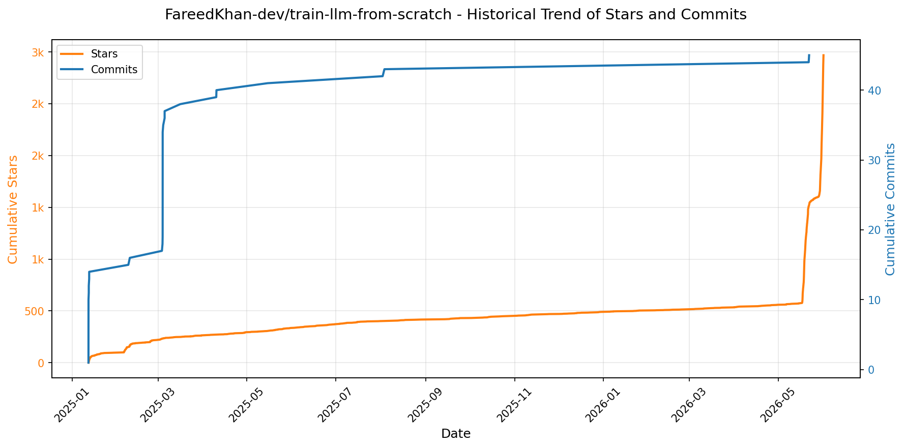

> *蓝色：累计 Stars｜橙色：累计 Commits（次 Y 轴）*

<b>📄 README 摘要</b>

1. **项目功能**  
该项目实现了从零开始构建并训练一个完整Transformer架构的大语言模型（LLM），完全基于PyTorch，严格遵循论文《Attention is All You Need》。它支持在单张消费级GPU（如RTX 3090/4090、A100等）上端到端训练参数量达**1300万至20亿级别**的自回归语言模型。核心目标是降低LLM研发门槛：用户可复用代码，在有限硬件资源下完成数据下载、预处理、模型定义、分布式/单卡训练、模型保存与文本生成全流程；特别优化了小规模（13M参数）模型的实用性，使其能在1天内完成训练，并初步生成语法合理、带标点的连贯文本（非乱码），为后续微调或垂直领域轻量化部署奠定基础。

2. **关键特性**  
- ✅ **全组件手写实现**：包含Multi-Head Attention（含Single-Head与Multi-Head分层实现）、MLP、LayerNorm、Positional Encoding、Transformer Block及完整GPT-style解码器模型，无黑盒封装；  
- ✅ **工业级数据流水线**：基于真实大规模开源数据集The Pile（825GB），支持按需下载子集（如仅`00.jsonl.zst`）、Zstandard解压、JSONL流式解析、tiktoken（`r50k_base`）分词、HDF5高效存储；  
- ✅ **灵活可配置训练**：通过`config.py`统一管理超参（词表大小、上下文长度、嵌入维数、头数、层数等），一键切换13M/2B等不同规模模型；  
- ✅ **开箱即用工具链**：提供独立脚本——`data_download.py`（自动拉取Hugging Face镜像数据）、`data_preprocess.py`（分词+HDF5序列化）、`train_transformer.py`（带进度条与loss监控的训练）、`generate_text.py`（交互式文本生成）；  
- ✅ **硬件适配指南**：详尽对比30+款GPU（NVIDIA/AMD）显存、数据规模与最大可训模型参数量（如RTX 4090支持~4B，A100支持~8B），明确标注各配置下的可行性（✔/✘）；  
- ✅ **教育导向设计**：代码注释丰富，配套Step-by-Step详解（从库导入、数据加载、注意力机制推导到训练循环），兼顾工程实践与原理理解。

3. **技术栈**  
- **核心框架**：Python 3.8+、PyTorch（张量计算、自动微分、GPU加速）；  
- **数据处理**：`tiktoken`（OpenAI官方分词器，`r50k_base`）、`zstandard`（ZSTD压缩解压）、`h5py`（HDF5高效二进制存储）、`json`/`jsonlines`（结构化解析）、`numpy`（数值运算）；  
- **工具与生态**：`tqdm`（训练进度可视化）、`argparse`（命令行参数管理）、`requests`（数据下载）、`glob`/`shutil`（文件系统操作）；  
- **数据集**：The Pile（多源混合语料，含PubMed、GitHub、Wikipedia等22个子集）；  
- **部署环境**：支持Google Colab/Kaggle（T4 GPU）快速验证13M模型，生产级训练推荐NVIDIA A100/V100或高端消费卡（RTX 4090/3090）。

---

### 42. [Chachamaru127/claude-code-harness](https://github.com/Chachamaru127/claude-code-harness)
- 📅 **创建日期**：2025-12-12  
- 🔄 **最近更新**：2026-06-01  
- ⭐ **Stars**：2,381（日 +82｜周 +965｜月 +1717）  
- 📝 **描述**：Claude Code Dedicated Development Harness - Achieving High-Quality Development Through an Autonomous Plan→Work→Review Cycle  

<b>📈 Star 与 Commit 历史趋势</b>

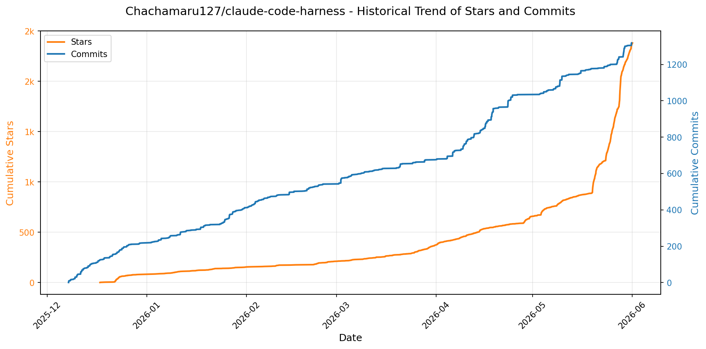

> *蓝色：累计 Stars｜橙色：累计 Commits（次 Y 轴）*

<b>📄 README 摘要</b>

1. **项目功能**  
Claude Code Harness 是一个面向 AI 编程代理（特别是 Claude Code）的轻量级、可重复的交付控制框架，旨在将原本松散、易漂移的“聊天式编码”工作流，转化为结构化、可审计、有边界的端到端交付闭环。它不替代 Claude Code，而是为其注入工程纪律：通过强制约定“计划→实施→评审→发布”的五阶段循环（Spec → Plan → Work → Review → Release），确保所有代码变更均基于用户批准的规范（`spec.md`）、可验证的计划（`Plans.md`）和受约束的执行范围，杜绝幻觉发明、测试缺失、评审滞后与证据重建等问题，最终产出符合 PR/发布标准的可信证据包。

2. **核心特性**  
- **五动词技能驱动**：提供 `/harness-plan`、`/harness-work`、`/harness-review`、`/harness-sync`、`/harness-release` 五个原子化命令，覆盖交付全生命周期，接口简洁、职责明确；  
- **源可信契约机制**：以 `spec.md` 和 `Plans.md` 为唯一事实来源，未显式声明的依赖或行为被标记为 `unknown`，禁止代理自行推断；  
- **强约束执行模式**：`/harness-work` 严格按计划切片执行，TDD 强制启用（依任务要求），且仅实现已批准范围（如 `/harness-work 1.1.1`）；  
- **评审与实现分离**：`/harness-review` 独立运行，对结果进行客观验证，重大问题直接阻断流程；  
- **多工具兼容适配**：原生支持 Claude Code（插件市场一键安装），并提供针对 Codex CLI、OpenCode、Cursor 等工具的脚本化集成路径（分 `supported`/`internal-compatible`/`candidate` 等支持等级）；  
- **零 Node.js 运行时**：核心引擎用 Go 编写，无 JavaScript 依赖，轻量高效；  
- **迁移安全优先**：内置 `bin/harness doctor --migration-report` 工具，可无损扫描旧插件缓存、重复技能、符号链接及内存状态，保障升级可逆。

3. **技术栈**  
- **核心语言**：Go（原生实现 guardrail 引擎，保证性能与安全性）；  
- **运行环境**：无需 Node.js；支持本地 Git 仓库写入；可选集成 `harness-mem`（Go 实现的跨会话项目级内存模块）；  
- **集成协议**：基于各 IDE/CLI 的插件扩展机制（如 Claude 插件市场协议、Codex CLI hooks、Cursor 本地目录安装）；  
- **架构范式**：命令驱动（CLI + 指令式交互）、文件即状态（`spec.md`/`Plans.md` 为唯一真相源）、技能契约化（5 个明确定义的动词技能边界）；  
- **辅助生态**：配套 `harness-mem`（记忆管理）、`codex-companion.sh`（Codex 协同评审）、Breezing（多智能体协作编排）等可选扩展模块。

---

### 43. [nicobailon/pi-subagents](https://github.com/nicobailon/pi-subagents)
- 📅 **创建日期**：2026-01-07  
- 🔄 **最近更新**：2026-06-01  
- ⭐ **Stars**：1,888（日 +193｜周 +344｜月 +769）  
- 📝 **描述**：Pi extension for async subagent delegation with truncation, artifacts, and session sharing  

<b>📈 Star 与 Commit 历史趋势</b>

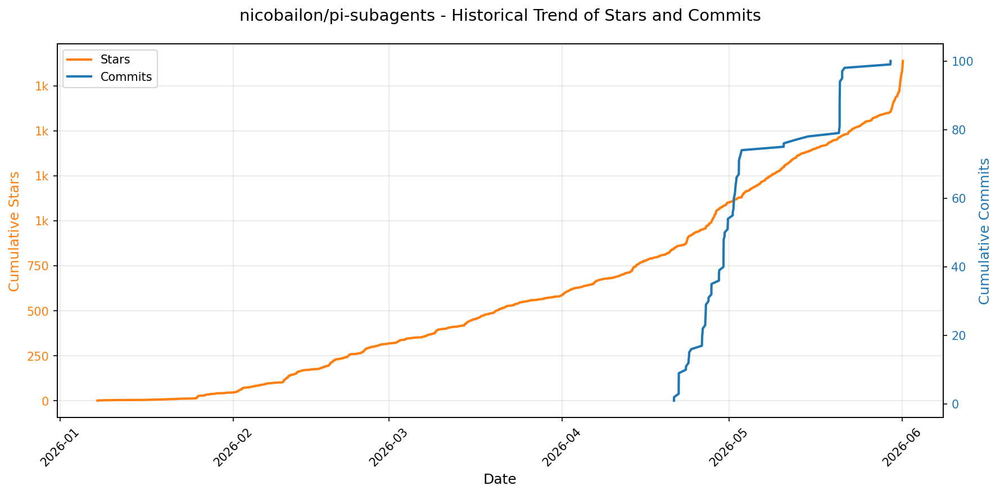

> *蓝色：累计 Stars｜橙色：累计 Commits（次 Y 轴）*

<b>📄 README 摘要</b>

1. **该项目的功能**  
`pi-subagents` 是一个为 Pi（AI 编程助手）设计的扩展插件，核心功能是**让主会话（Pi）动态创建并委托任务给专用的子智能体（subagents）**，实现任务的结构化分发与协同。它不自动运行后台审查，而是提供一种“按需委托”机制：用户通过自然语言指令（如“用 reviewer 审查这个 diff”），即可启动一个聚焦、隔离、有明确角色的子会话；该子会话独立执行任务（如代码审查、技术调研、计划制定、实现编码等），完成后将结果返回至主对话。支持前台流式输出与后台异步执行，并可组合为串行链（chain）、并行组（parallel）或循环工作流（review loop），适用于代码审查、Bug 诊断、架构勘察、多角度审计、背景作业、保存的工作流复用等场景。

2. **关键特性**  
- ✅ **零配置即用**：安装后无需编写配置或定义代理，直接用自然语言触发（如“Ask oracle for a second opinion”）。  
- ✅ **8 个开箱即用的内置智能体**：`scout`（代码库快速侦察）、`researcher`（联网调研）、`planner`（生成实施计划）、`worker`（安全编码实现）、`reviewer`（多维度代码审查）、`context-builder`（上下文预构建）、`oracle`（风险决策前的第二意见）、`delegate`（轻量通用委托）。各角色职责清晰，边界严格（如 `oracle` 不编辑代码，`worker` 拒绝未授权修改）。  
- ✅ **灵活执行模式**：支持单次 `/run`、串行 `/chain`、并行 `/parallel`、循环 `/review-loop`、后台 `--bg`、分支会话 `--fork`，以及带参数覆盖的精细化控制（模型/技能/输入文件/输出路径等）。  
- ✅ **安全沙箱机制**：子会话默认不继承父会话的 `subagent` 工具、历史工具调用、管理指令及敏感上下文；仅当显式授权（如 `tools: subagent`）时才启用受限的子代理能力，并受 `maxSubagentDepth` 深度限制。  
- ✅ **智能协调与反馈**：可选配 `pi-intercom` 实现子代理实时反向沟通（如阻塞时请求人工决策），支持进度通知、异步状态查询（`subagent({action:"status"})`）、失败/暂停可视化及诊断命令 `/subagents-doctor`。  
- ✅ **工程友好扩展性**：支持用户/项目级自定义代理（`.md` 文件）、保存工作流（`.chain.md`）、模型/技能/上下文等细粒度覆盖（`agentOverrides`），以及一键式快捷指令（如 `/parallel-review`, `/gather-context-and-clarify`）。

3. **技术栈**  
- **运行平台**：专为 [Pi](https://github.com/nicobailon/pi) AI 编程助手生态构建，深度集成其插件系统（`pi install npm:pi-subagents`）。  
- **核心协议**：基于 Pi 的 `subagent` 工具调用机制实现父子会话通信；依赖 Pi 的会话管理、上下文分发、工具注入与模型路由能力。  
- **可选依赖**：  
  - `pi-intercom`：提供子代理→父会话的实时双向通信通道（非必需，按需安装）；  
  - `pi-web-access`：为 `researcher` 代理提供网络搜索与内容抓取能力（需额外安装）。  
- **配置与存储**：采用 JSON 配置（`~/.pi/agent/settings.json` 或 `.pi/settings.json`），代理定义为 Markdown + YAML Frontmatter 格式（`.md`），支持多级作用域覆盖（内置 < 用户 < 项目）。  
- **模型无关性**：内置代理默认继承用户当前 Pi 默认模型，支持 per-agent/per-step 精确覆盖（如 `model=anthropic/claude-sonnet-4`），并提供 fallback 模型容灾机制。

---

### 44. [cursor/plugins](https://github.com/cursor/plugins)
- 📅 **创建日期**：2026-01-23  
- 🔄 **最近更新**：2026-06-01  
- ⭐ **Stars**：1,619（日 +140｜周 +871｜月 +1350）  
- 📝 **描述**：Cursor plugin specification and official plugins  

<b>📈 Star 与 Commit 历史趋势</b>

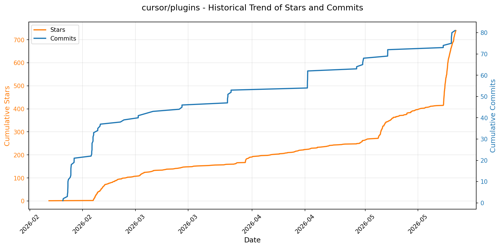

> *蓝色：累计 Stars｜橙色：累计 Commits（次 Y 轴）*

<b>📄 README 摘要</b>

1. **项目功能**  
该项目是 Cursor 官方维护的插件集合仓库，提供一系列专为 Cursor AI 编程助手（基于大模型的智能开发环境）深度优化的插件。每个插件均独立封装，旨在增强开发者在代码编写、审查、测试、文档生成、自动化运维及 AI 代理（Agent）协同等全生命周期环节中的生产力与可靠性。所有插件均遵循统一的 Cursor 插件规范，可直接在 Cursor 环境中安装、加载并协同工作。

2. **核心特性**  
- **面向 AI 编程范式的专用能力**：支持 AGENT 记忆持续更新（`continual-learning`）、PR 差异的交互式 Canvas 可视化审查（`pr-review-canvas`）、技术文档的结构化导航式渲染（`docs-canvas`）；  
- **AI 代理工程化支持**：提供代理兼容性审计（`agent-compatibility`）、面向 Agent 的 CLI 设计范式（`cli-for-agent`）、多代理并行编排框架（`orchestrate`）、高可信度分支安全/正确性深度审核（`thermos`）；  
- **开发效能与协作基建**：内置团队级工作流套件（`cursor-team-kit`）、插件快速脚手架与验证工具（`create-plugin`）、基于 Cursor SDK 的应用与自动化构建能力（`cursor-sdk`）、以及可复用的技能（SKILL.md）与规则（.mdc）定义体系；  
- **标准化与可扩展架构**：采用统一的多插件仓库结构，每个插件含独立 `plugin.json` 清单、技能目录、规则集、MCP（Model Control Protocol）服务定义，并由根目录 `marketplace.json` 全局纳管。

3. **技术栈**  
- **核心协议与标准**：Cursor 插件规范（`.cursor-plugin/plugin.json` / `marketplace.json`）、MCP（Model Control Protocol）接口定义（`mcp.json`）；  
- **语言与 SDK**：TypeScript（主开发语言），官方 `@cursor/sdk` TypeScript SDK（用于构建插件逻辑、认证、流式通信、错误处理及 MCP 集成）；  
- **内容格式与元数据**：Markdown（含 Frontmatter 的 `SKILL.md`）、`.mdc` 规则文件（Cursor 规则语法）、结构化 JSON 配置；  
- **运行时与部署**：依托 Cursor 桌面客户端及 Cursor Cloud 代理基础设施，支持本地执行、云侧并行任务分发与结构化结果回传；  
- **许可证**：全库采用 MIT 开源许可证。

---

