# 🌟 GitHub Trending 概览

> 数据更新于：2026-04-06

---

## 🔍 项目详情

### 1. [freeCodeCamp/freeCodeCamp](https://github.com/freeCodeCamp/freeCodeCamp)
- 📅 **创建日期**：2014-12-24  
- 🔄 **最近更新**：2026-04-06  
- ⭐ **Stars**：371,951（日 +652｜周 +2561｜月 +4499）  
- 📝 **描述**：freeCodeCamp.org's open-source codebase and curriculum. Learn math, programming, and computer science for free.  

<b>📈 Star 与 Commit 历史趋势</b>

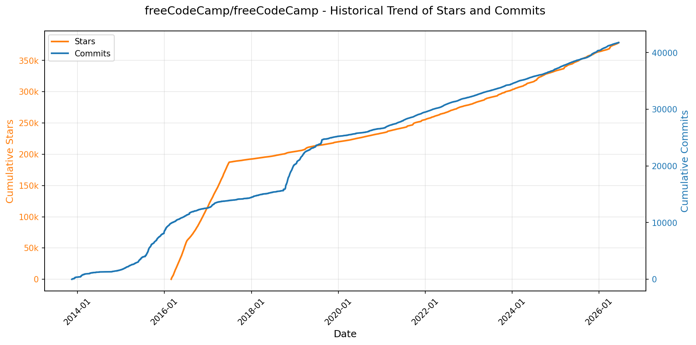

> *蓝色：累计 Stars｜橙色：累计 Commits（次 Y 轴）*

<b>📄 README 摘要</b>

1. **该项目的功能**  
freeCodeCamp.org 是一个开源、非营利性的免费编程学习平台，旨在帮助全球成年人（尤其是忙碌的转行者）通过系统化、自定进度的课程掌握全栈开发与机器学习等实用技能，并成功进入科技行业。其核心功能包括：提供完全免费、可验证的开发者认证（如响应式网页设计、JavaScript、Python、数据库、后端API等）、多语言能力认证（英语、西班牙语、中文等），以及配套的学习工具（交互式编码挑战、项目实践、测验、考试系统）。所有认证永久有效且可公开验证，支持求职使用；平台还整合了社区资源（论坛、YouTube频道、技术博客、Discord服务器）以构建完整的学习生态。

2. **关键特性**  
- ✅ **全栈与跨领域课程体系**：涵盖前端、后端、数据库、Python、机器学习基础及语言能力认证（A1–B1级别），全部免费、自定进度、模块化设计。  
- ✅ **项目驱动认证机制**：每项开发者认证需完成5个强制性实操项目 + 交互式学习 + 阶段性测验 + 最终在线考试，确保能力达标。  
- ✅ **学术诚信保障**：采用严格的反剽窃机制，对违规行为（如提交他人代码）实施认证撤销与账号封禁，保障证书公信力。  
- ✅ **开放协作生态**：面向新手友好（first-timers-only 标签），提供清晰贡献指南；集成 Discord、论坛、YouTube 和技术博客，形成“学—练—问—用”闭环。  
- ✅ **安全与合规机制**：建立负责任披露流程处理安全漏洞；软件采用 BSD-3-Clause 许可，课程内容为知识版权保护（© freeCodeCamp.org）。

3. **技术栈**  
- **后端**：Node.js（主要运行时）、Express.js（Web 框架）  
- **前端**：React（主应用界面）、Gatsby（部分静态站点）、TypeScript（逐步迁移中）  
- **数据库**：MongoDB（主生产数据库）、PostgreSQL（部分新服务）  
- **基础设施与运维**：Docker（容器化）、Kubernetes（集群编排）、GitHub Actions（CI/CD）、AWS（云托管）  
- **其他关键工具**：Mocha/Chai（测试框架）、Jest（前端测试）、Redis（缓存）、Elasticsearch（搜索服务）、SendGrid（邮件通知）  
- **许可证**：软件代码遵循 **BSD-3-Clause 开源协议**；课程内容（`/curriculum` 目录下）为 **freeCodeCamp.org 版权所有**，禁止未授权商用或再分发。

---

### 2. [obra/superpowers](https://github.com/obra/superpowers)
- 📅 **创建日期**：2025-10-09  
- 🔄 **最近更新**：2026-04-06  
- ⭐ **Stars**：166,148（日 +1045｜周 +12698｜月 +64594）  
- 📝 **描述**：An agentic skills framework & software development methodology that works.  

<b>📈 Star 与 Commit 历史趋势</b>

> *蓝色：累计 Stars｜橙色：累计 Commits（次 Y 轴）*

<b>📄 README 摘要</b>

1. **该项目的功能**  
Superpowers 是一个面向编程智能体（coding agents）的完整软件开发工作流增强系统。它不直接生成代码，而是通过一套自动触发、可组合的“技能”（skills）重构整个开发过程：从需求澄清、设计拆解、计划制定，到基于严格 TDD 的分步实现、子智能体协同开发、自动化审查与分支收尾。其核心目标是将原本易失控、缺乏结构的 AI 编程行为，转变为受控、可验证、符合工程最佳实践（如 YAGNI、DRY、红-绿-重构）的协作式开发流程。

2. **关键特性**  
- **全流程自动化技能链**：覆盖 7 个强制性阶段（头脑风暴→Git 工作树隔离→任务级计划→子智能体驱动开发→测试先行→代码审查请求→分支收尾），每个阶段由对应技能自动激活，无需人工调用。  
- **深度工程纪律嵌入**：强制执行真·测试驱动开发（先写失败测试、再写最小实现、再重构）、系统化调试（四阶段根因分析）、防御性验证（修复后必须验证实效性）。  
- **人机协同增强设计**：强调“人在环中”（human-in-the-loop）——设计需分块确认、计划需明确路径与验收步骤、每项任务执行前经双阶段审查（是否符合规范 + 代码质量）、关键问题阻断流程。  
- **子智能体驱动开发（Subagent-Driven Development）**：为每个小任务（2–5 分钟粒度）派生独立子智能体，执行+自检+交叉评审，支持数小时无人干预的自主推进。  
- **可扩展技能生态**：内置 15+ 开箱即用技能（含测试、调试、协作、元能力），支持用户按标准化模板（`writing-skills` 技能指导）贡献新技能，全部技能即代码、即文档、即测试。

3. **技术栈**  
- **运行平台**：跨平台插件架构，原生适配 Claude Code（官方及自建市场）、Cursor、GitHub Copilot CLI、Gemini CLI、Codex、OpenCode 等主流 AI 编程环境。  
- **核心机制**：基于规则/上下文感知的技能触发引擎（非 LLM 微调），依赖提示工程（prompt engineering）与结构化指令编排，所有技能以 Markdown 文档（`.md`）形式存储于仓库，通过插件机制动态加载。  
- **工程实践支撑**：深度集成 Git 工作树（`using-git-worktrees`）、TDD 工具链（测试生成/执行/验证闭环）、代码审查检查表（`requesting-code-review`）、并行子智能体调度逻辑。  
- **基础设施**：MIT 协议开源，托管于 GitHub；依赖外部 LLM（如 Claude、Gemini）作为底层推理引擎，自身不包含模型，专注工作流控制与工程约束实施。

---

### 3. [affaan-m/everything-claude-code](https://github.com/affaan-m/everything-claude-code)
- 📅 **创建日期**：2026-01-18  
- 🔄 **最近更新**：2026-04-06  
- ⭐ **Stars**：134,818（日 +2463｜周 +18372｜月 +71971）  
- 📝 **描述**：The agent harness performance optimization system. Skills, instincts, memory, security, and research-first development for Claude Code, Codex, Opencode, Cursor and beyond.  

<b>📈 Star 与 Commit 历史趋势</b>

> *蓝色：累计 Stars｜橙色：累计 Commits（次 Y 轴）*

<b>📄 README 摘要</b>

1. **该项目做什么？**  
该项目是一个面向 AI 代理（AI Agent）运行环境（如 Claude Code、Codex、Cursor、OpenCode、Gemini 等）的**生产级性能优化系统**，核心目标是提升 AI 编程代理在真实工程场景中的可靠性、效率、安全性与可扩展性。它不仅提供配置文件，更构建了一套完整的能力体系：涵盖技能（Skills）编排、本能（Instincts）建模、内存优化与持久化、持续学习机制、安全扫描（AgentShield）、多模型协同调度、跨平台命令兼容层（legacy shims），以及面向研发全生命周期的研究驱动型开发范式。项目源自 Anthropic 黑客松冠军方案，经 10+ 个月高强度实际产品开发迭代验证，已支撑 38+ 代理、156+ 技能、72+ 遗留命令封装，并覆盖 TypeScript、Python、Go、Java、Kotlin、Rust、C++、PHP、Perl、Swift 等 **12 种语言生态系统**。

2. **关键特性**  
- **多层级性能优化**：支持 Token 精简（系统提示压缩、后台进程管理）、模型智能路由（NanoClaw v2）、会话分支/搜索/导出/度量分析；  
- **智能记忆与持续学习**：自动从交互会话中提取可复用模式生成新技能，支持带置信度评分的本能（Instinct）导入/导出/演化；  
- **强健的钩子（Hook）系统**：脚本化而非内联式钩子，支持运行时严格度分级（`minimal|standard|strict`）及按 ID 动态禁用（`ECC_DISABLED_HOOKS`）；  
- **跨平台与跨工具链统一支持**：原生兼容 Windows/macOS/Linux，深度集成 Cursor、Codex（App & CLI）、OpenCode、Antigravity、Gemini 等主流 AI 编程环境；  
- **企业级安全能力**：内置 AgentShield 安全扫描器（102 条规则、1282 个测试），覆盖沙箱隔离、输入净化、CVE 检测、攻击面分析；  
- **操作员（Operator）工作流与业务域技能**：提供 `brand-voice`、`customer-billing-ops`、`google-workspace-ops` 等 10+ 运维类代理，以及 `article-writing`、`investor-materials`、`market-research` 等通用业务内容生成技能；  
- **模块化安装与生态治理**：基于清单（manifest）的按需安装架构（`install-plan.js`/`install-apply.js`），支持仅安装指定语言规则（如 `./install.sh typescript python`），并内置 SQLite 状态存储与查询 CLI；  
- **下一代控制平面（ECC 2.0 Alpha）**：Rust 编写的轻量控制平面（位于 `ecc2/`），提供 `dashboard`、`sessions`、`daemon` 等命令，为未来分布式代理集群奠定基础。

3. **技术栈**  
- **核心语言**：TypeScript（主逻辑、钩子、CLI 工具）、Python（部分技能与构建解析器）、Go（底层工具链集成）、Java/Kotlin/Rust/C++（对应语言生态的审查与构建解析器）；  
- **基础设施与工具**：Node.js（跨平台脚本运行时）、Shell/Bash（安装脚本与系统集成）、Markdown（代理/技能/规则文档化）、SQLite（本地状态持久化）；  
- **框架与协议**：MCP（Model Context Protocol）配置标准、NestJS（框架模式扩展）、Manim/Remotion（技术视频生成）、PM2（多服务工作流编排）；  
- **部署与分发**：GitHub Marketplace 应用（`ecc-tools`）、npm 包（`ecc-universal`、`ecc-agentshield`）、GitHub App、PowerShell（Windows 支持）、Bun/Node.js/pnpm/yarn 多包管理器自动检测；  
- **安全与测试**：自研 AgentShield 引擎、997+ 通过的内部测试用例、CI 全链路校验（安装清单验证、目录计数强制、回归测试全覆盖）。

---

### 4. [sherlock-project/sherlock](https://github.com/sherlock-project/sherlock)
- 📅 **创建日期**：2018-12-24  
- 🔄 **最近更新**：2026-04-06  
- ⭐ **Stars**：79,934（日 +317｜周 +5746｜月 +6661）  
- 📝 **描述**：Hunt down social media accounts by username across social networks  

<b>📈 Star 与 Commit 历史趋势</b>

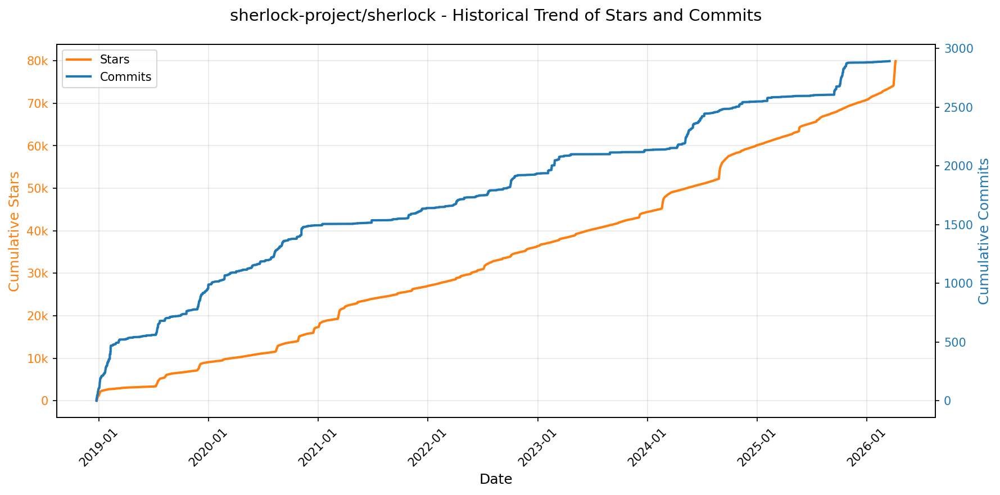

> *蓝色：累计 Stars｜橙色：累计 Commits（次 Y 轴）*

---

### 5. [shareAI-lab/learn-claude-code](https://github.com/shareAI-lab/learn-claude-code)
- 📅 **创建日期**：2025-06-29  
- 🔄 **最近更新**：2026-04-06  
- ⭐ **Stars**：63,420（日 +391｜周 +5578｜月 +26113）  
- 📝 **描述**：Bash is all you need -  A nano claude code–like 「agent harness」, built from 0 to 1  

<b>📈 Star 与 Commit 历史趋势</b>

> *蓝色：累计 Stars｜橙色：累计 Commits（次 Y 轴）*

<b>📄 README 摘要</b>

1. **该项目做什么？**  
该项目是一个面向“智能体（Agent）系统”底层工程实践的深度教学项目，核心目标是**系统性传授“Harness Engineering”（智能体承载架构/运行环境工程）这一关键能力**。它不训练模型，也不构建LLM本身，而是聚焦于为已有的大语言模型（如Claude）构建高可用、可扩展、安全可控的**运行环境（Harness）**——即让模型能在真实软件工程场景中有效感知、推理与行动所需的全套基础设施。通过12个渐进式会话（s01–s12），项目从最简代理循环出发，逐步叠加生产级机制（工具调度、子智能体隔离、按需知识加载、上下文压缩、任务持久化、后台执行、多智能体协作、工作区隔离等），最终构建出一个类Claude Code的完整编码智能体运行时。

2. **关键特性**  
- **以模型为中心的设计哲学**：严格区分“Agent = 模型（learned intelligence）”与“Harness = 工程实现（execution environment）”，拒绝prompt chaining等伪智能体方案；  
- **渐进式、模块化教学体系**：12个会话各聚焦一个核心Harness机制，每个机制均配以精炼信条（如s04：“拆解大任务，每个子任务拥有干净上下文”）、ASCII图示与最小可行代码；  
- **真实生产级模式复现**：完整实现Claude Code的核心架构要素，包括：原子化工具注册与分发（bash/read/write/edit/grep等）、基于JSONL的异步邮箱通信、任务依赖图（file-based task graph）、三层上下文压缩策略、工作树（worktree）级执行隔离、后台守护线程（daemon threads）与通知机制；  
- **领域通用设计范式**：所有机制抽象自编码场景，但明确强调其可迁移至农业、医疗、制造、酒店等任何需要“感知-推理-行动”闭环的物理或数字领域；  
- **全栈学习支持**：提供Python参考实现（agents/）、三语心智模型文档（docs/）、交互式Web学习平台（Next.js，含可视化流程图与源码浏览）；  
- **强工程实践导向**：明确界定范围，坦承简化项（如未实现完整MCP协议、事件总线或高级权限工作流），专注可落地的核心范式。

3. **技术栈**  
- **核心语言与运行时**：Python 3.x（主逻辑、agent loop、工具处理器、任务系统）；  
- **前端与交互平台**：Next.js（React框架）、TypeScript、Tailwind CSS（用于web/子目录下的交互式学习界面）；  
- **模型接口**：Anthropic Claude API（通过`anthropic`官方Python SDK调用，依赖`ANTHROPIC_API_KEY`）；  
- **基础工具链**：Bash shell（作为默认执行环境，支撑文件I/O、进程控制等原生操作）；  
- **数据与持久化**：纯文件系统（JSONL格式邮箱、任务状态文件、技能文档SKILL.md）、无外部数据库；  
- **开发与协作**：Git（版本控制）、GitHub Actions（CI：类型检查+构建）、多语言文档（Markdown）。

---

### 6. [bytedance/deer-flow](https://github.com/bytedance/deer-flow)
- 📅 **创建日期**：2025-05-07  
- 🔄 **最近更新**：2026-04-06  
- ⭐ **Stars**：58,578（日 +374｜周 +5105｜月 +33409）  
- 📝 **描述**：An open-source long-horizon SuperAgent harness that researches, codes, and creates. With the help of sandboxes, memories, tools, skill, subagents and message gateway, it handles different levels of tasks that could take minutes to hours.  

<b>📈 Star 与 Commit 历史趋势</b>

> *蓝色：累计 Stars｜橙色：累计 Commits（次 Y 轴）*

<b>📄 README 摘要</b>

1. **项目功能**  
DeerFlow 2.0 是一个开源的「超级智能体（Super Agent）运行框架」，旨在通过协同调度**子智能体（Sub-Agents）**、**长时记忆系统（Long-Term Memory）** 和**安全沙箱环境（Sandbox）**，实现高度自主、可扩展的复杂任务自动化。它不局限于单一任务（如传统“深度研究”），而是作为通用智能体底座，支持代码生成、多步推理、跨工具编排、实时信息检索（集成 InfoQuest）、文件系统操作、多模态上下文管理等全栈式 AI 工作流，适用于科研、工程、产品原型开发及企业级自动化场景。

2. **核心特性**  
- **模块化技能与工具生态**：支持插件式技能扩展（如 Claude Code 集成、InfoQuest 智能搜索爬取、Tavily 等第三方工具），兼容 LangChain 工具标准；  
- **动态子智能体编排**：基于 LangGraph 构建可配置的多智能体协作流程，支持递归调用、角色分工与任务委派；  
- **强隔离沙箱执行**：提供本地进程、Docker 容器、Kubernetes Pod 三级沙箱模式，保障代码执行安全性与环境一致性；  
- **上下文工程增强**：内置思考链（Thinking）、计划模式（Plan Mode）、子智能体启用开关等细粒度上下文控制能力；  
- **持久化长时记忆**：支持结构化记忆存储与检索，可加载样本数据快速验证，并与会话上下文深度耦合；  
- **多通道 IM 集成**：开箱即用支持 Telegram、Slack、飞书（Lark）、企业微信（WeCom）等消息平台，无需公网 IP 即可接收并响应用户指令；  
- **双运行模式架构**：提供标准模式（Gateway + 独立 LangGraph Server）与轻量网关模式（Gateway 内嵌异步 Agent 运行时），兼顾功能完整性与资源效率；  
- **全链路可观测性**：原生集成 LangSmith 与 Langfuse 追踪，支持调试、评估与性能分析。

3. **技术栈**  
- **后端**：Python 3.12+（核心逻辑、LangGraph 编排、沙箱管理），依赖 `uv` 包管理器；采用 `langchain-core`/`langchain-openai` 等标准接口抽象大模型调用；自研 `CodexChatModel`、`ClaudeChatModel` 等适配器对接 CLI/OAuth 认证模型；  
- **前端**：Node.js 22+，基于现代 Web 技术栈构建（未明示框架，但含 `pnpm`、`nginx` 反向代理配置）；  
- **基础设施**：Docker（推荐开发与生产部署）、Kubernetes（沙箱扩展支持）、Nginx（API 网关）；  
- **AI 生态集成**：深度适配 OpenAI 兼容 API（含 OpenRouter）、Claude Code OAuth、Codex CLI、InfoQuest（BytePlus 自研搜索引擎）、MCP（Model Context Protocol）服务器；  
- **可观测性**：LangSmith、Langfuse；  
- **配置与部署**：`Makefile` 驱动的标准化构建流程，`config.yaml` + `.env` 多层配置管理，支持热重载与多环境（Dev/Prod、Standard/Gateway）一键切换。

---

### 7. [msitarzewski/agency-agents](https://github.com/msitarzewski/agency-agents)
- 📅 **创建日期**：2025-10-13  
- 🔄 **最近更新**：2026-04-06  
- ⭐ **Stars**：54,844（日 +930｜周 +6486｜月 +44717）  
- 📝 **描述**：A complete AI agency at your fingertips - From frontend wizards to Reddit community ninjas, from whimsy injectors to reality checkers. Each agent is a specialized expert with personality, processes, and proven deliverables.  

<b>📈 Star 与 Commit 历史趋势</b>

> *蓝色：累计 Stars｜橙色：累计 Commits（次 Y 轴）*

<b>📄 README 摘要</b>

1. **该项目做什么？**  
该项目是一个模块化、可即插即用的**AI代理（AI Agent）集合体**，旨在为用户提供一支“永不疲倦、从不抱怨、始终交付”的专业化AI专家团队。它并非通用大模型提示词库，而是针对真实工作场景深度定制的、具备明确角色身份、专业能力、个性风格与可验证交付成果的AI代理系统。用户可通过简单集成（如复制到Claude Code目录或运行安装脚本），在开发、设计、广告投放、销售、营销、产品、项目管理、测试等30+垂直职能领域中，按需激活对应AI代理，直接获得代码、架构方案、文案、策略、审计报告、流程文档等生产级输出。

2. **核心功能**  
- ✅ **高度专业化分工**：涵盖工程、设计、付费广告、销售、营销（含中国本土平台如微信、小红书、抖音、B站、快手、百度、微博等）、产品、项目管理、测试等8大部门，共**超80个精细化AI代理角色**，每个代理聚焦单一高价值任务域（如“Filament优化专家”“WeChat小程序开发者”“Baidu SEO专家”“Livestream Commerce教练”）。  
- ✅ **人格化与过程化设计**：每个代理均定义了独特身份、沟通风格、核心使命、标准化工作流程、技术交付模板（含代码示例）及成功度量指标，确保输出具备一致性、可信度与可复现性。  
- ✅ **多工具无缝集成**：原生支持Claude Code，并提供自动化脚本（`convert.sh`/`install.sh`）一键适配Cursor、Aider、Windsurf、Gemini CLI、OpenCode、Kimi Code、GitHub Copilot等多种主流AI编程/协作工具，实现跨平台开箱即用。  
- ✅ **中国本地化深度覆盖**：专设面向中国市场的代理矩阵（如微信公众号/小程序、小红书、抖音、快手、B站、百度SEO、淘宝/拼多多电商、企业微信私域运营等），全面适配国内数字生态的技术规范、平台算法与商业实践。  
- ✅ **交付导向与生产就绪**：所有代理均强调“可执行输出”，例如生成可运行React组件、部署CI/CD流水线脚本、撰写GA4/GTM跟踪配置方案、产出MEDDPICC销售战策文档、编写ASO元数据与截图优化建议等，拒绝空泛建议。

3. **技术栈**  
- **核心形态**：纯文本结构化配置（Markdown格式），以人类可读、AI可解析的方式定义代理身份、规则、流程与模板；无后端服务依赖，零运行时开销。  
- **集成层**：Shell脚本（`convert.sh`, `install.sh`）驱动多工具适配，支持自动检测已安装工具并生成对应格式（如Cursor的`agent.json`、Claude的`agents/`目录结构、Copilot的`copilot.yaml`等）。  
- **运行环境**：完全依托于外部AI开发工具（如Claude Code、Cursor等）的本地Agent/Persona功能，自身不包含模型推理、API调用或服务器组件；本质是**高质量Prompt Engineering的工业化封装与分发框架**。  
- **扩展基础**：基于MIT开源协议，鼓励社区贡献新代理、优化现有流程、新增工具适配器，技术演进聚焦于知识结构化、交付标准化与生态兼容性。

---

### 8. [666ghj/MiroFish](https://github.com/666ghj/MiroFish)
- 📅 **创建日期**：2025-11-26  
- 🔄 **最近更新**：2026-04-06  
- ⭐ **Stars**：43,456（日 +709｜周 +4506｜月 +38354）  
- 📝 **描述**：A Simple and Universal Swarm Intelligence Engine, Predicting Anything. 简洁通用的群体智能引擎，预测万物  

<b>📈 Star 与 Commit 历史趋势</b>

> *蓝色：累计 Stars｜橙色：累计 Commits（次 Y 轴）*

<b>📄 README 摘要</b>

1. **项目功能**  
MiroFish 是一个基于多智能体（Multi-Agent）技术的下一代 AI 预测引擎，核心能力是**将现实世界中的初始信息（如突发新闻、政策草案、金融信号、小说文本等）自动构建成高保真度的平行数字世界**。在该虚拟环境中，数千个具备独立人格、长期记忆与行为逻辑的智能体自由交互并发生社会性演化；用户可从“上帝视角”动态注入变量，通过大规模并行仿真推演未来可能的发展轨迹，实现对复杂系统（如舆情、政策影响、文学结局、金融市场等）的深度预测与沙盒式预演。

2. **关键特性**  
- ✅ **零门槛输入**：仅需上传种子材料（如分析报告、小说章节）并用自然语言描述预测目标，即可自动生成结构化预测报告与可交互数字世界；  
- ✅ **双平台并行仿真**：支持高并发智能体协同演化，结合 GraphRAG 构建知识图谱，实现个体记忆与群体涌现的统一建模；  
- ✅ **全链路动态记忆更新**：在仿真过程中实时更新时间序列记忆，支撑长周期、多阶段因果推演；  
- ✅ **深度交互式输出**：不仅生成静态报告，更提供可对话的 ReportAgent 与任意仿真智能体的实时聊天能力，支持对推演结果的追问、验证与再探索；  
- ✅ **跨领域通用性**：已验证场景涵盖高校舆情模拟、古典文学结局补全（《红楼梦》）、政策影响预演等，支持从严肃决策到创意娱乐的全光谱应用。

3. **技术栈**  
- **前端**：基于 Node.js（v18+）与现代 Web 框架（推测为 React/Vite，虽未明示但由 `npm run dev` 及端口 3000 推断）；  
- **后端**：Python（3.11–3.12），采用 `uv` 作为高性能包管理器，集成 LLM API（兼容 OpenAI SDK 格式，实测使用阿里云百炼平台 Qwen-Plus 模型）；  
- **记忆与知识管理**：集成 Zep Cloud 实现智能体长期记忆存储与检索；  
- **多智能体仿真引擎**：底层基于开源框架 **OASIS（Open Agent Social Interaction Simulations）**，由 CAMEL-AI 团队开发；  
- **部署方案**：支持源码一键部署（`npm run setup:all`）与 Docker 容器化部署（`docker compose up -d`），前后端分离架构（前端端口 3000，后端 API 端口 5001）。

---

### 9. [TauricResearch/TradingAgents](https://github.com/TauricResearch/TradingAgents)
- 📅 **创建日期**：2024-12-28  
- 🔄 **最近更新**：2026-04-06  
- ⭐ **Stars**：41,127（日 +395｜周 +3489｜月 +9787）  
- 📝 **描述**：TradingAgents: Multi-Agents LLM Financial Trading Framework  

<b>📈 Star 与 Commit 历史趋势</b>

> *蓝色：累计 Stars｜橙色：累计 Commits（次 Y 轴）*

<b>📄 README 摘要</b>

1. **项目功能**  
TradingAgents 是一个面向金融交易研究的开源多智能体框架，旨在模拟真实交易公司的组织结构与协作流程。它通过部署多个专业化的大型语言模型（LLM）驱动智能体，协同完成端到端的金融市场分析与交易决策：从基本面、情绪、新闻、技术面等维度进行异构分析，经由多空研究员辩论形成共识，再由交易员整合输出操作建议，最终由风控团队与投资组合经理联合评估并执行模拟交易。该框架专为学术研究与算法验证设计，不提供实际交易服务或投资建议。

2. **核心特性**  
- **角色化多智能体架构**：明确划分分析师团队（基本面/情绪/新闻/技术）、研究员团队（多空双视角辩论）、交易员、风控团队及投资组合经理，各司其职并动态交互；  
- **多LLM供应商支持**：原生兼容 OpenAI（GPT-5.x）、Google（Gemini 3.x）、Anthropic（Claude 4.x）、xAI（Grok 4.x）、OpenRouter 及本地 Ollama 模型，支持混合模型调度（如 deep_think_llm + quick_think_llm）；  
- **高保真回测能力**：支持指定历史日期的精准回测，保障时间序列一致性与数据时效性；  
- **生产就绪工具链**：提供交互式 CLI 命令行界面、Docker 容器化部署（含 Ollama 本地模型配置）、环境变量/API 密钥标准化管理（`.env`）、以及可编程 Python 包调用接口；  
- **可扩展研究基础设施**：内置五级评级体系、Anthropic 努力控制（effort control）、OpenAI Responses API 集成、跨平台稳定性优化，并支持多语言文档（含中文等8种语言）。

3. **技术栈**  
- **核心框架**：LangGraph（构建可观察、可调试、状态驱动的多智能体工作流图）；  
- **编程语言**：Python 3.13（官方指定运行环境）；  
- **依赖生态**：Pydantic（配置管理与数据验证）、LangChain（LLM 工具集成）、Requests/HTTPX（API 调用）、Pandas（数据处理）；  
- **部署方案**：Docker Compose（支持标准云/本地环境）、Conda 虚拟环境管理；  
- **外部服务集成**：Alpha Vantage（金融数据源）、Ollama（本地大模型运行时）、各主流 LLM 云 API（OpenAI/Gemini/Claude/xAI/OpenRouter）；  
- **辅助工具**：CLI 基于 `click` 或类似库构建，前端可视化依赖 Markdown/ANSI 输出（CLI 界面），文档国际化由 readme-i18n 平台支持。

---

### 10. [roboflow/supervision](https://github.com/roboflow/supervision)
- 📅 **创建日期**：2022-11-28  
- 🔄 **最近更新**：2026-04-06  
- ⭐ **Stars**：37,718（日 +77｜周 +951｜月 +1140）  
- 📝 **描述**：We write your reusable computer vision tools. 💜  

<b>📈 Star 与 Commit 历史趋势</b>

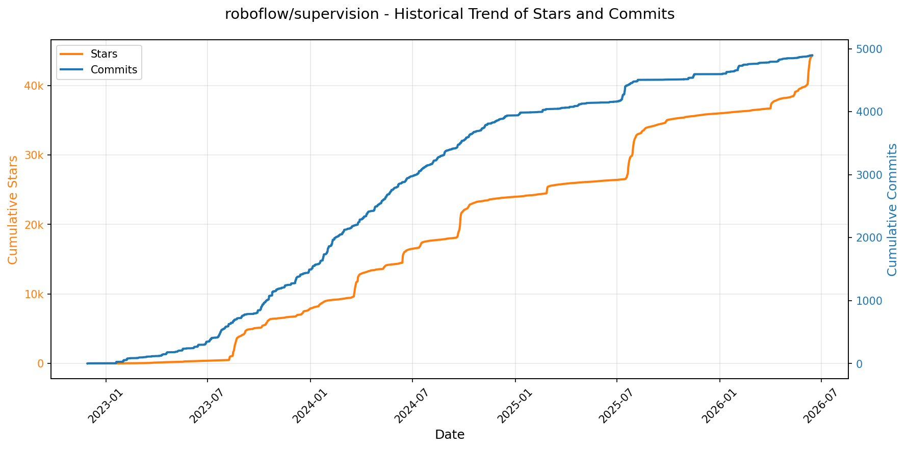

> *蓝色：累计 Stars｜橙色：累计 Commits（次 Y 轴）*

<b>📄 README 摘要</b>

1. **项目功能**  
该项目（`supervision`）是一个专为计算机视觉任务设计的开源 Python 工具库，旨在提供**可复用、模块化、生产就绪的底层工具组件**。它不实现模型本身，而是作为“胶水层”，统一处理模型输出后的通用下游任务：包括检测/分割结果的加载、过滤、可视化（标注）、区域计数、轨迹分析（如停留时间、车速估计）、数据集格式转换与管理等，显著加速从模型推理到实际应用落地的开发流程。

2. **核心特性**  
- **模型无关性与广泛集成**：原生兼容 Ultralytics YOLO、Hugging Face Transformers、MMDetection、Roboflow Inference 及 RFDETR 等主流框架，通过标准化 `sv.Detections` 对象统一接口。  
- **高度可定制的可视化标注器（Annotators）**：提供 `BoxAnnotator`、`MaskAnnotator`、`LabelAnnotator` 等十余种标注器，支持颜色、字体、边框样式、标签位置等细粒度控制，并可自由组合。  
- **全流程数据集工具链**：支持 COCO、YOLO、Pascal VOC 等主流格式的**无损加载、动态按需读取、灵活切分（train/val/test）、多数据集合并、跨格式转换与导出**，简化数据工程。  
- **面向实际场景的高级分析能力**：内置 `PolygonZone`、`LineZone`、`Detections` 过滤与统计工具，直接支撑区域入侵检测、流量计数、停留时间分析、车辆测速等工业级应用。  
- **开箱即用与生态友好**：提供 Colab Notebook、Hugging Face Spaces 演示，深度集成 Roboflow 生态（如 `inference`、`autodistill`），并附带详尽教程、速查表（cheatsheet）和食谱（cookbooks）。

3. **技术栈**  
- **编程语言**：Python ≥ 3.9（核心实现）  
- **核心依赖**：NumPy（数值计算）、OpenCV-Python（图像处理与I/O）、Pillow（图像加载/操作）、Shapely（几何计算，用于多边形区域逻辑）  
- **可选依赖**：Ultralytics、transformers、mmdet、rfdetr、inference（按需安装以启用对应模型集成）  
- **构建与发布**：PyPI 分发（`pip install supervision`），支持 conda/mamba；CI/CD 集成 Codecov（测试覆盖率）、Snyk（安全扫描）；文档基于 MkDocs 构建。

---

### 11. [asgeirtj/system_prompts_leaks](https://github.com/asgeirtj/system_prompts_leaks)
- 📅 **创建日期**：2025-05-03  
- 🔄 **最近更新**：2026-04-06  
- ⭐ **Stars**：37,689（日 +201｜周 +2336｜月 +3735）  
- 📝 **描述**：Extracted system prompts from ChatGPT (GPT-5.4, GPT-5.3, Codex), Claude (Opus 4.6, Sonnet 4.6, Claude Code), Gemini (3.1 Pro, 3 Flash, CLI), Grok (4.2, 4), Perplexity, and more. Updated regularly.  

<b>📈 Star 与 Commit 历史趋势</b>

> *蓝色：累计 Stars｜橙色：累计 Commits（次 Y 轴）*

---

### 12. [block/goose](https://github.com/block/goose)
- 📅 **创建日期**：2024-08-23  
- 🔄 **最近更新**：2026-04-06  
- ⭐ **Stars**：37,575（日 +1439｜周 +3626｜月 +4921）  
- 📝 **描述**：an open source, extensible AI agent that goes beyond code suggestions - install, execute, edit, and test with any LLM  

<b>📈 Star 与 Commit 历史趋势</b>

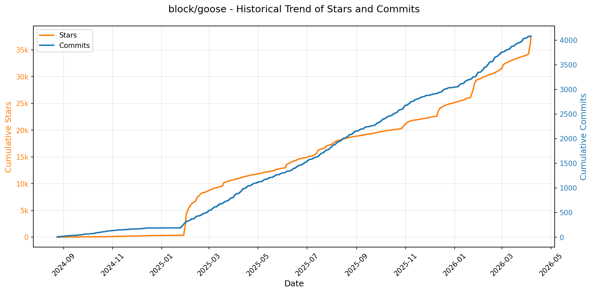

> *蓝色：累计 Stars｜橙色：累计 Commits（次 Y 轴）*

<b>📄 README 摘要</b>

1. **该项目做什么？**  
goose 是一个运行在本地机器上的开源 AI 工程智能体（AI agent），专注于自动化端到端的软件工程任务。它不仅能提供代码补全或建议，更能自主完成项目创建、代码编写与执行、错误调试、工作流编排（如多步骤构建/测试/部署）、以及调用外部 API 等复杂操作，无需人工逐行干预，适用于原型开发、代码重构和工程流水线管理等场景。

2. **核心功能**  
- ✅ **完全本地化运行**：所有处理在用户设备上完成，保障数据隐私与安全；  
- ✅ **高度可扩展与可定制**：支持任意大语言模型（LLM），允许多模型协同配置（如按任务类型切换模型），优化性能与成本；  
- ✅ **MCP（Model Control Protocol）原生支持**：可无缝集成各类 MCP 兼容服务器，实现模型抽象与统一调度；  
- ✅ **双形态交付**：同时提供桌面应用（GUI）和命令行工具（CLI），适配不同开发习惯；  
- ✅ **模块化分发支持**：允许开发者构建自定义发行版（Custom Distributions），预置特定模型提供商、插件扩展及品牌标识；  
- ✅ **开箱即用的工程能力**：内置任务规划、代码生成、执行沙箱、反馈闭环与自主纠错机制，实现真正意义上的“自动化工程代理”。

3. **技术栈**  
- **核心语言与框架**：未在 README 中明确说明，但基于其 CLI + 桌面应用双形态、MCP 支持及跨平台需求，可合理推断采用 **Rust（高性能后端/CLI） + TypeScript/React（桌面 GUI）** 组合（常见于同类工具如 Cursor、Continue.dev）；  
- **协议标准**：深度集成 **MCP（Model Control Protocol）**，作为模型交互与扩展生态的基础协议；  
- **部署与分发**：使用 GitHub Actions 实现 CI/CD（见 badge），支持多平台二进制分发；  
- **许可证**：Apache 2.0 开源协议，允许自由使用、修改与商用；  
- **基础设施依赖**：依赖用户本地部署的 LLM 运行时（如 Ollama、LM Studio、llama.cpp）或远程 MCP 服务器，不绑定特定云服务。

---

### 13. [microsoft/BitNet](https://github.com/microsoft/BitNet)
- 📅 **创建日期**：2024-08-05  
- 🔄 **最近更新**：2026-04-06  
- ⭐ **Stars**：37,476（日 +49｜周 +418｜月 +8696）  
- 📝 **描述**：Official inference framework for 1-bit LLMs  

<b>📈 Star 与 Commit 历史趋势</b>

> *蓝色：累计 Stars｜橙色：累计 Commits（次 Y 轴）*

<b>📄 README 摘要</b>

1. **项目功能**  
bitnet.cpp 是微软官方推出的、专为 1.58 位（b1.58）超低比特大语言模型（LLM）设计的高性能推理框架。其核心目标是实现**快速、无损（lossless）的本地化推理**，支持在消费级 CPU（x86/ARM）、GPU 及未来 NPU 上高效运行 1-bit/1.58-bit LLM。它可实现在单颗 CPU 上部署高达 100B 参数规模的 BitNet 模型，并达到 5–7 token/s 的实时生成速度（接近人类阅读速率），显著降低边缘设备运行大模型的硬件门槛与能耗。

2. **关键特性**  
- ✅ **跨平台高性能推理**：针对 x86 和 ARM 架构深度优化，CPU 推理速度提升达 **2.37×–6.17×（x86）** 和 **1.37×–5.07×（ARM）**；能效提升达 **71.9%–82.2%（x86）** 和 **55.4%–70.0%（ARM）**。  
- ✅ **多核并行与动态优化**：最新版本引入可配置分块（tiling）的并行计算内核及嵌入层量化（embedding quantization）支持，额外带来 **1.15×–2.1× 加速比**。  
- ✅ **全栈量化支持**：原生支持多种量化类型（`i2_s`、`tl1`、`tl2`），适配不同硬件特性（如 x86 侧重 I2_S/TL2，ARM 侧重 I2_S/TL1）；支持 embedding 层 f16 量化。  
- ✅ **开箱即用的端到端工具链**：提供模型下载（Hugging Face 集成）、GGUF 格式转换（`.safetensors` → `.gguf`）、本地推理（`run_inference.py`）、端到端基准测试（`e2e_benchmark.py`）及虚拟模型生成（`generate-dummy-bitnet-model.py`）等完整工作流。  
- ✅ **大规模模型实测能力**：已验证支持 0.7B–100B 参数模型（如 BitNet-b1.58-2B-4T、Llama3-8B-1.58、Falcon3 系列等），全部基于公开 Hugging Face 模型仓库，强调实际部署可行性。

3. **技术栈**  
- **底层基础**：基于 `llama.cpp` 框架二次开发，复用其成熟推理架构与 GGUF 模型格式生态；核心计算内核继承并扩展自微软 `T-MAC` 项目的查表法（Lookup Table, LUT）加速范式。  
- **编程语言与构建工具**：C/C++（核心高性能内核）、Python（胶水脚本、工具链与 CLI）、CMake（构建系统）、Clang 18+（推荐编译器，Windows 下需配合 Visual Studio 2022 + LLVM 工具链）。  
- **依赖与环境**：Python ≥3.9、Conda（强烈推荐用于环境隔离）、Hugging Face `transformers` / `huggingface-hub`（模型下载）、`gguf` 格式解析支持。  
- **硬件后端**：当前主力支持 CPU（x86-64、ARM64），GPU 支持已发布（见 `gpu/README.md`），NPU 支持规划中。

---

### 14. [microsoft/VibeVoice](https://github.com/microsoft/VibeVoice)
- 📅 **创建日期**：2025-08-25  
- 🔄 **最近更新**：2026-04-06  
- ⭐ **Stars**：36,718（日 +290｜周 +8458｜月 +13043）  
- 📝 **描述**：Open-Source Frontier Voice AI  

<b>📈 Star 与 Commit 历史趋势</b>

> *蓝色：累计 Stars｜橙色：累计 Commits（次 Y 轴）*

<b>📄 README 摘要</b>

1. **项目功能**  
VibeVoice 是一个开源的前沿语音人工智能模型家族，专注于长时程、高保真、结构化语音理解与生成。其核心能力包括：  
- **语音识别（ASR）**：支持单次处理长达60分钟的连续音频，输出包含说话人身份（Who）、时间戳（When）和文本内容（What）的结构化转录，并支持用户自定义热词（Hotwords）提升领域准确性；  
- **文本转语音（TTS）**：提供两种TTS模型——VibeVoice-TTS（1.5B参数）支持90分钟超长对话、最多4角色自然轮替与多语种（英/中等）表达；VibeVoice-Realtime-0.5B（0.5B参数）则专注低延迟实时流式TTS，首音延迟约300ms，支持边输入边生成，适用于交互场景；  
- **技术定位**：作为研究框架，推动语音合成与识别社区协作，所有模型均面向学术研究与开发用途，**不适用于未经验证的商业部署**。

2. **关键特性**  
- ✅ **超长上下文建模**：ASR与TTS均原生支持小时级音频单次处理（60/90分钟），避免分段导致的上下文断裂与说话人混淆；  
- ✅ **结构化语音理解**：ASR模型端到端完成语音识别、说话人日志（diarization）与精确时间对齐（timestamping），输出标准化Who-When-What三元结构；  
- ✅ **可定制化与可控性**：支持用户注入领域热词（ASR）、指定多角色及语种风格（TTS），Realtime版本支持流式文本输入；  
- ✅ **高效底层架构**：采用7.5 Hz超低帧率连续语音标记器（Acoustic & Semantic Tokenizers），兼顾音质保真度与计算效率；  
- ✅ **先进生成范式**：融合大语言模型（LLM）理解语义与对话逻辑 + 扩散模型（next-token diffusion）生成高保真声学细节；  
- ✅ **开箱即用生态**：ASR已集成至Hugging Face Transformers v5.3.0，支持`pipeline()`直接调用；提供Colab演示、Gradio Playground、微调代码（finetuning-asr）、vLLM加速推理等完整工具链；  
- ⚠️ **负责任AI约束**：原始VibeVoice-TTS代码已于2025年9月移除，因发现非预期滥用风险；当前TTS模型仅限研究用途，明确禁止用于深度伪造或误导性内容生成。

3. **技术栈**  
- **模型架构**：基于Qwen2.5-1.5B（ASR与TTS主干）的大语言模型 + 自研声学/语义连续标记器 + next-token diffusion生成头；  
- **训练与推理框架**：PyTorch、Hugging Face Transformers（v5.3.0+原生支持ASR）、vLLM（ASR高速推理优化）；  
- **Tokenizer**：自研7.5 Hz连续语音标记器（非传统离散token），实现高保真与长序列效率平衡；  
- **部署与交互**：Gradio（ASR Playground）、Google Colab（TTS实时演示）、ONNX兼容导出（文档提及）、macOS/Windows桌面应用集成（如Vibing输入法）；  
- **多语言支持**：ASR支持50+语言；TTS支持英语、中文及跨语言合成，Realtime版本扩展至德、法、意、日、韩、荷、波、葡、西共9种语言及11种英语风格音色；  
- **基础设施**：模型托管于Hugging Face Hub，文档与代码托管于GitHub，技术报告发布于arXiv与OpenReview。

---

### 15. [badlogic/pi-mono](https://github.com/badlogic/pi-mono)
- 📅 **创建日期**：2025-08-09  
- 🔄 **最近更新**：2026-04-06  
- ⭐ **Stars**：32,250（日 +442｜周 +3022｜月 +11377）  
- 📝 **描述**：AI agent toolkit: coding agent CLI, unified LLM API, TUI & web UI libraries, Slack bot, vLLM pods  

<b>📈 Star 与 Commit 历史趋势</b>

> *蓝色：累计 Stars｜橙色：累计 Commits（次 Y 轴）*

<b>📄 README 摘要</b>

1. **项目功能**  
该项目是一个面向 AI 代理（AI Agent）开发与大语言模型（LLM）部署管理的开源单体仓库（Monorepo），核心目标是提供一套模块化、可组合的工具链，用于构建、运行和集成智能编码及对话类 AI 代理。其旗舰产品是 **Pi 编码代理（pi-coding-agent）**——一个交互式命令行编程助手，能理解自然语言指令、分析代码上下文、生成/修改代码并执行调试任务；同时支持通过 Slack（via pi-mom）、终端（via pi-tui）和网页界面（via pi-web-ui）等多种入口接入，并可对接多种 LLM 服务商（OpenAI、Anthropic、Google 等）及本地 vLLM 推理服务。

2. **关键特性**  
- ✅ **多厂商统一 LLM 接口**：`@mariozechner/pi-ai` 提供抽象层，屏蔽不同模型提供商（OpenAI / Anthropic / Google / etc.）API 差异，支持动态切换与降级策略；  
- ✅ **轻量级可扩展代理运行时**：`@mariozechner/pi-agent-core` 内置工具调用（tool calling）、状态持久化、会话生命周期管理与插件机制；  
- ✅ **跨平台交互体验**：提供终端 UI 库（`pi-tui`，含差分渲染优化）、Web 组件库（`pi-web-ui`，用于构建聊天界面）、Slack 集成机器人（`pi-mom`）；  
- ✅ **本地大模型部署支持**：`pi-pods` CLI 工具可一键管理基于 vLLM 的 GPU 推理实例（如远程 GPU Pod），实现私有化/低成本 LLM 运行；  
- ✅ **开箱即用的编码代理**：`pi-coding-agent` 支持项目上下文感知、文件操作、测试执行、错误诊断与迭代修复，专为开发者日常编码提效设计；  
- ✅ **严格工程规范**：内置完整 CI/CD 流水线（GitHub Actions）、类型检查（TypeScript）、代码格式化（Prettier）、ESLint、端到端测试脚本（含 API Key 隔离机制）。

3. **技术栈**  
- **主语言**：TypeScript（全栈覆盖，强类型保障）  
- **包管理与构建**：npm（monorepo 架构，使用 `npm workspaces` 或原生 workspace 支持）  
- **前端/UI 层**：  
  - 终端界面：`pi-tui` — 基于 ANSI 控制序列的高性能 TUI 库，支持差分渲染；  
  - Web 界面：`pi-web-ui` — 轻量 Web Components（可能基于 Lit 或纯 Custom Elements），适配现代浏览器；  
- **后端/运行时**：Node.js（Agent Core、CLI 工具、Pod 管理器等均运行于 Node 环境）；  
- **LLM 对接**：HTTP 客户端封装（适配 REST/gRPC 多协议），支持 OpenAI 兼容接口（含 vLLM）、Anthropic Claude、Google Gemini 等；  
- **基础设施**：vLLM（作为首选本地推理引擎）、Docker（隐含于 pods 部署逻辑中）、Slack Events API / Web API（用于 mom 集成）；  
- **开发协作**：GitHub Actions（CI）、Discord（社区支持）、MIT 开源许可证。

---

### 16. [telegramdesktop/tdesktop](https://github.com/telegramdesktop/tdesktop)
- 📅 **创建日期**：2014-05-02  
- 🔄 **最近更新**：2026-04-06  
- ⭐ **Stars**：31,143（日 +248｜周 +822｜月 +1116）  
- 📝 **描述**：Telegram Desktop messaging app  

<b>📈 Star 与 Commit 历史趋势</b>

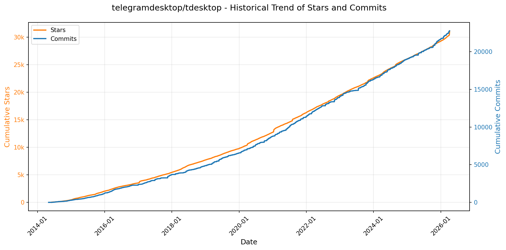

> *蓝色：累计 Stars｜橙色：累计 Commits（次 Y 轴）*

<b>📄 README 摘要</b>

1. **该项目的功能**  
Telegram Desktop 是 Telegram 官方推出的跨平台桌面端即时通讯客户端，基于 Telegram 官方 API 和 MTProto 加密协议实现。它提供完整的聊天功能（包括一对一、群组、频道消息）、文件传输、语音/视频通话、消息搜索、多设备同步、云存储消息历史等核心通信能力，支持在 Windows、macOS 和 Linux 系统上原生运行，并与 Telegram 移动端及网页端实时协同。

2. **关键特性**  
- ✅ **全平台原生支持**：正式支持 Windows 7+（32/64 位）、macOS 10.13+、Linux（glibc ≥ 2.28）；提供便携版、Snap、Flatpak 等多种分发形式。  
- ✅ **端到端加密与安全协议**：深度集成 MTProto 2.0 协议，支持 Secret Chats（秘密聊天）的端到端加密，保障通信隐私。  
- ✅ **高性能多媒体能力**：内置 WebRTC 实现高清语音/视频通话；集成 FFmpeg、Opus、OpenAL Soft 支持音视频编解码与播放；支持超大文件（最高 4GB）上传下载。  
- ✅ **现代化 UI 与体验**：基于 Qt 框架构建响应式界面，支持深色模式、自定义主题、消息撤回/编辑/定时发送、消息翻译（集成第三方服务）、拼写检查（Hunspell）、二维码登录、多账号切换等。  
- ✅ **离线可用与可扩展性**：本地缓存消息与媒体，支持无网络时查看历史；模块化架构便于定制与二次开发；提供完整构建文档与 CI/CD 流水线（Windows/macOS/Linux 全平台自动化构建）。

3. **技术栈**  
- **核心框架**：Qt 6（主干）与 Qt 5.15（兼容分支），采用 C++17 编写，重度依赖 Qt Widgets 与部分 Qt Quick 模块；  
- **网络与协议层**：自研 MTProto 协议栈（C++ 实现），基于 OpenSSL 3.2.1（TLS/加密运算）；  
- **音视频**：WebRTC（语音/视频通话）、FFmpeg（媒体处理）、Opus（音频编码）、OpenAL Soft（3D 音频渲染）；  
- **压缩与数据处理**：zlib、LZMA SDK、liblzma（归档与资源压缩）；  
- **基础设施与工具链**：CMake（构建配置）、Ninja（构建执行器）、GYP（旧版构建辅助）、xxHash（高速哈希）、QR Code Generator（登录二维码）；  
- **辅助库**：Hunspell（拼写检查）、Guideline Support Library（GSL，安全编程辅助）、Range-v3（现代 C++ 范围算法）、Breakpad/Crashpad（崩溃报告与诊断）；  
- **字体与资源**：Open Sans（默认英文字体）、Vazirmatn（波斯/阿拉伯语支持）、Emoji alpha codes（表情符号映射）；  
- **许可证合规**：主项目采用 GPLv3（含 OpenSSL 例外条款），所有第三方依赖均明确标注其开源许可证（LGPL、MIT、Apache 2.0、BSD、Public Domain 等）。

---

### 17. [FujiwaraChoki/MoneyPrinterV2](https://github.com/FujiwaraChoki/MoneyPrinterV2)
- 📅 **创建日期**：2024-02-12  
- 🔄 **最近更新**：2026-04-06  
- ⭐ **Stars**：28,656（日 +158｜周 +1226｜月 +13783）  
- 📝 **描述**：Automate the process of making money online.  

<b>📈 Star 与 Commit 历史趋势</b>

> *蓝色：累计 Stars｜橙色：累计 Commits（次 Y 轴）*

<b>📄 README 摘要</b>

1. **项目功能**  
MoneyPrinter V2 是一个自动化在线赚钱流程的开源应用，旨在通过程序化手段执行多种数字创收任务。它不提供实际资金或保证收益，而是为用户提供可配置、可扩展的自动化工作流工具链，涵盖社交媒体运营（Twitter 推文发布、YouTube Shorts 生成与上传）、联盟营销（集成 Amazon 商品推广与 Twitter 分发）、以及本地商家挖掘与冷邮件/冷 outreach（需配合 Go 环境执行邮件发送）。

2. **核心特性**  
- ✅ **Twitter 自动化机器人**：支持基于 CRON 的定时推文发布（含 scheduler 模块）；  
- ✅ **YouTube Shorts 全流程自动化**：涵盖脚本生成、语音合成（依赖 KittenTTS）、视频剪辑与自动上传；  
- ✅ **联盟营销闭环**：自动检索并嵌入 Amazon 联盟商品链接，结合 Twitter 内容分发实现流量变现；  
- ✅ **本地商业开发工具**：爬取本地企业信息，并支持结构化冷 outreach（如批量邮件触达，需额外安装 Go 语言环境）；  
- ✅ **模块化架构设计**：作为 V1 的完全重写版本，强调高内聚、低耦合，便于功能扩展与社区多语言适配（如中文版 MoneyPrinterTurbo）；  
- ✅ **开箱即用脚本支持**：提供 `scripts/` 目录下的 Shell/Python 快捷脚本（如 `upload_video.sh`），绕过交互式流程直接调用核心能力。

3. **技术栈**  
- **主语言**：Python 3.12（强制要求，用于核心逻辑、调度器、API 集成及 CLI 控制）；  
- **依赖关键库**：`gpt4free`（免 API Key 的大模型调用，用于内容生成）、`KittenTTS`（本地轻量级文本转语音）；  
- **辅助工具链**：Go 编程语言（仅在启用邮件 outreach 功能时必需，用于执行邮件发送脚本）；  
- **基础设施**：基于虚拟环境（venv）管理依赖，使用 `requirements.txt` 统一包管理；  
- **部署与调度**：内置 CRON 任务调度模块（`scheduler`），支持定时自动化执行；  
- **许可证**：Affero General Public License v3.0（AGPL-3.0），强调网络服务使用的源码公开义务。

---

### 18. [lightpanda-io/browser](https://github.com/lightpanda-io/browser)
- 📅 **创建日期**：2023-02-07  
- 🔄 **最近更新**：2026-04-06  
- ⭐ **Stars**：27,395（日 +139｜周 +1390｜月 +15445）  
- 📝 **描述**：Lightpanda: the headless browser designed for AI and automation  

<b>📈 Star 与 Commit 历史趋势</b>

> *蓝色：累计 Stars｜橙色：累计 Commits（次 Y 轴）*

<b>📄 README 摘要</b>

1. **该项目做什么？**  
Lightpanda Browser 是一个**从零开始全新编写的轻量级、无头（headless）浏览器**，专为 AI 代理（AI agents）、大语言模型（LLM）训练、网页抓取（scraping）、自动化测试等后端场景设计。它不基于 Chromium、WebKit 或 Blink 等现有浏览器引擎，而是完全自研的独立实现，仅保留现代 Web 自动化所必需的核心能力（如 JavaScript 执行、DOM 操作、网络请求），**彻底舍弃图形渲染、用户界面和桌面端冗余功能**，以实现极致的性能与资源效率。

2. **核心特性**  
- ✅ **超低内存占用**：仅为 Chrome 的约 1/16，大幅降低服务器资源开销；  
- ✅ **极快执行速度**：实测比 Chrome 快约 9 倍，页面加载与脚本执行延迟显著更低；  
- ✅ **瞬时启动**：无冷启动瓶颈，适合高并发、短生命周期的自动化任务；  
- ✅ **标准协议兼容**：原生支持 Chrome DevTools Protocol（CDP），可无缝对接 Puppeteer、Playwright（实验性）、chromedp 等主流自动化客户端；  
- ✅ **完整基础 Web 能力**：支持 HTML 解析（html5ever）、DOM 树构建、JavaScript 引擎（V8）、XHR/Fetch API、Cookie、表单输入、点击交互、HTTP 头定制、代理、网络请求拦截、robots.txt 遵守等；  
- ✅ **生产就绪工具链**：提供 CLI 命令（`fetch` / `serve`）、Docker 官方镜像、Telemetry 可控、日志结构化输出；  
- ⚠️ **渐进式 Web API 支持**：当前处于 Beta 阶段，已实现大量关键 DOM/Web API，但数百项 Web 标准接口仍在持续开发中（如 CORS 尚未完成）。

3. **技术栈**  
- **主语言**：Zig（v0.15.2），用于系统级控制、零成本抽象与极致性能优化；  
- **JavaScript 引擎**：Google V8（嵌入式集成，支持 snapshot 加速启动）；  
- **网络层**：libcurl（高性能 HTTP(S) 客户端）；  
- **HTML 解析器**：html5ever（Servo 项目出品，符合 HTML5 标准）；  
- **构建与依赖管理**：Zig 构建系统 + Nix（可选 devShell）、Rust（用于部分工具链及 WPT runner）、Go（端到端测试框架 wptrunner）；  
- **测试体系**：单元测试 + 自研端到端测试套件 + 定制化 Web Platform Tests（WPT）适配分支，保障 Web 标准兼容性；  
- **部署形态**：原生二进制（Linux x86_64 / macOS aarch64）、Docker 镜像（amd64/arm64）、WSL2 兼容。

---

### 19. [onyx-dot-app/onyx](https://github.com/onyx-dot-app/onyx)
- 📅 **创建日期**：2023-04-27  
- 🔄 **最近更新**：2026-04-06  
- ⭐ **Stars**：25,212（日 +704｜周 +5116｜月 +7535）  
- 📝 **描述**：Open Source AI Platform - AI Chat with advanced features that works with every LLM  

<b>📈 Star 与 Commit 历史趋势</b>

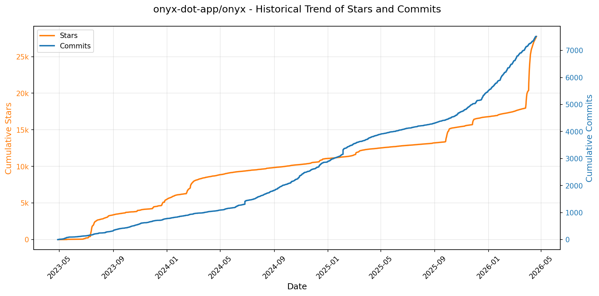

> *蓝色：累计 Stars｜橙色：累计 Commits（次 Y 轴）*

<b>📄 README 摘要</b>

1. **项目功能**  
Onyx 是一个开源的 AI 应用平台，定位为大语言模型（LLM）的“应用层”，提供可自主部署、功能完备的智能交互界面。它使用户能够本地或私有化部署具备企业级能力的 AI 助手，核心能力包括：基于 RAG（检索增强生成）与智能体（Agent）的高精度信息检索、多步骤深度研究分析、实时网络搜索、安全沙箱代码执行、文件与图像等可下载产物（Artifacts）生成、语音交互（TTS/STT）、跨应用自动化操作（通过 MCP 协议），以及面向组织的协作与治理能力。

2. **关键特性**  
- **智能体驱动的混合 RAG**：融合向量索引与关键词索引，结合 AI Agent 实现高质量检索与问答；  
- **深度研究工作流**：支持多跳推理、资料聚合与结构化报告生成，曾登顶其官方深度研究评测榜单（2026 年 2 月）；  
- **可定制 AI 智能体**：支持按角色、知识库、工具权限定义专属 Agent；  
- **全栈网络搜索支持**：集成 Serper、Google PSE、Brave、SearXNG 等外部 API，并内置自研网络爬虫，兼容 Firecrawl/Exa；  
- **安全代码执行**：在隔离沙箱中运行 Python 代码，用于数据分析、图表渲染或文件处理；  
- **MCP（Model Context Protocol）原生支持**：实现 Agent 与外部系统（如 CRM、数据库、API）的安全、标准化交互；  
- **多模态输出能力**：支持文本、语音（TTS/STT）、图像生成（文生图）及文档/图表等可下载 Artifact；  
- **企业就绪功能**：含团队协作、SSO（Google/OIDC/SAML）、SCIM 用户同步、RBAC 细粒度权限控制、审计日志、使用分析看板、PII 脱敏钩子及白标定制。

3. **技术栈**  
- **后端框架**：Python（主要语言），基于 FastAPI 构建高性能 API 服务；  
- **AI 运行时**：全面兼容主流 LLM 接入方式——开源方案（Ollama、vLLM、LiteLLM、llama.cpp）与商业 API（OpenAI、Anthropic、Google Gemini）；  
- **数据索引与检索**：双模混合索引（向量数据库 + 关键词全文检索），支持多种向量库（如 Qdrant、Weaviate、PostgreSQL pgvector）；  
- **基础设施**：Docker 原生支持，提供 Kubernetes / Helm / Terraform 部署方案；标准版依赖 Redis（内存缓存）、MinIO（对象存储）、Celery/RabbitMQ（异步任务队列）；  
- **前端**：React（未明示但由 UI 行为与部署形态推断），支持响应式 Web UI 及语音/图像交互组件；  
- **扩展协议**：深度集成 MCP（Model Context Protocol）实现标准化 Agent 外部工具调用；  
- **许可协议**：社区版（CE）采用 MIT 开源许可证，企业版（EE）为商业授权，含高级治理与集成能力。

---

### 20. [Yeachan-Heo/oh-my-claudecode](https://github.com/Yeachan-Heo/oh-my-claudecode)
- 📅 **创建日期**：2026-01-09  
- 🔄 **最近更新**：2026-04-06  
- ⭐ **Stars**：24,632（日 +564｜周 +8021｜月 +16043）  
- 📝 **描述**：Teams-first Multi-agent orchestration for Claude Code  

<b>📈 Star 与 Commit 历史趋势</b>

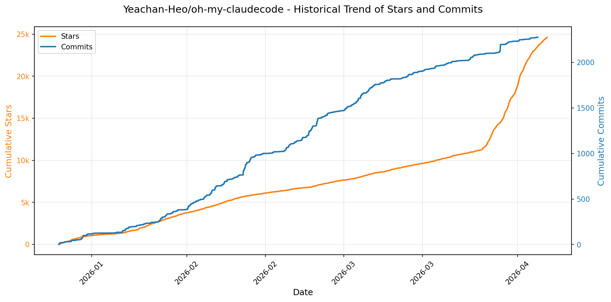

> *蓝色：累计 Stars｜橙色：累计 Commits（次 Y 轴）*

<b>📄 README 摘要</b>

1. **项目功能**  
oh-my-claudecode（OMC）是一个专为 Anthropic Claude Code CLI 设计的**多智能体协同编排框架**，旨在将 Claude Code 转变为具备团队协作能力的“增强型开发伙伴”。它不依赖用户学习复杂命令或配置，而是通过自然语言指令（如 `autopilot: build a REST API` 或 `/team 3:executor "fix all TypeScript errors"`）自动调度多个专业化 AI 智能体，完成端到端软件工程任务——从需求澄清（通过 Socratic 式深度访谈）、架构设计、代码生成、安全审查、UI 优化，到自动化验证与迭代修复。其核心目标是：**以零学习成本实现类人类工程团队的自动化协作流程**。

2. **关键特性**  
- **团队优先（Team-First）编排**：v4.1.7+ 后，“Team” 成为唯一官方支持的多智能体范式，执行严格阶段化流水线（`team-plan → team-prd → team-exec → team-verify → team-fix` 循环），确保任务完整闭环。  
- **多模型 CLI 工人调度（tmux-native）**：v4.4.0 起原生集成 `codex`/`gemini`/`claude` CLI，在 tmux 分屏中按需启动真实进程工人（如 `omc team 2:codex "review auth module"`），任务结束即销毁，无资源闲置。  
- **三模态协同（CCG）**：`/ccg` 技能同步调用 Codex（架构/后端）与 Gemini（UI/文档），由 Claude 统一合成结论，实现跨领域协同设计。  
- **深度需求澄清（Deep Interview）**：通过苏格拉底式提问自动暴露模糊需求中的隐藏假设，量化评估清晰度，确保“先想清楚再写代码”。  
- **智能技能系统（Custom Skills）**：自动从成功会话中提取可复用调试/修复模式（如 `Fix Proxy Crash`），存为 YAML 技能文件，匹配触发词时自动注入上下文，实现知识沉淀与复用。  
- **实时可观测性（HUD）**：状态栏 HUD 实时显示代理活动、token 消耗、阶段进度；完整会话日志（`.omc/sessions/`, `.omc/state/agent-replay-*.jsonl`）支持回溯分析。  
- **企业级扩展能力**：原生支持 OpenClaw 网关事件推送（6 类钩子：`session-start`, `stop`, `pre-tool-use` 等），对接自动化工作流；提供 Telegram/Discord/Slack 通知标签、成本追踪、安全加固指南等生产就绪功能。

3. **技术栈**  
- **核心运行时**：基于 [Claude Code CLI](https://docs.anthropic.com/claude-code) 构建，深度集成其插件系统与环境机制（如 `~/.claude/settings.json` 配置）。  
- **多模型协同层**：支持 Anthropic Claude（Max/Pro/API）、OpenAI Codex CLI、Google Gemini CLI；通过 `omc team N:<provider>` 调度，依赖本地安装对应 CLI 工具。  
- **终端基础设施**：强依赖 **tmux**（macOS/Linux）或 **psmux**（Windows 原生）实现多窗口并行执行、会话持久化与速率限制自动恢复（`omc wait`）。  
- **前端交互层**：CLI 命令（`omc`, `/team`, `/ccg` 等） + Claude Code 内置插件协议；HUD 状态栏需配合支持的终端主题（如 `"omcHud": { "preset": "focused" }`）。  
- **配置与扩展**：JSON/YAML 配置文件（`~/.claude/omc_config.*.json`, `.omc/skills/*.md`）；Node.js 运行时（npm 包名 `oh-my-claude-sisyphus`）；支持环境变量精细化控制（`OMC_OPENCLAW`, `OMC_ASK_ADVISOR_SCRIPT` 等）。  
- **生态集成**：OpenClaw 网关（HTTP Webhook）、Discord/Telegram/Slack 通知、GitHub 仓库级技能共享（`.omc/skills/`）。

---

### 21. [siddharthvaddem/openscreen](https://github.com/siddharthvaddem/openscreen)
- 📅 **创建日期**：2025-10-10  
- 🔄 **最近更新**：2026-04-06  
- ⭐ **Stars**：23,046（日 +2030｜周 +14099｜月 +15393）  
- 📝 **描述**：Create stunning demos for free. Open-source, no subscriptions, no watermarks, and free for commercial use. An alternative to Screen Studio.   

<b>📈 Star 与 Commit 历史趋势</b>

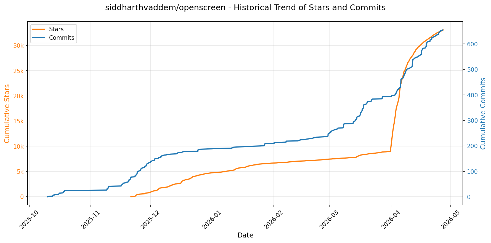

> *蓝色：累计 Stars｜橙色：累计 Commits（次 Y 轴）*

<b>📄 README 摘要</b>

1. **项目功能**  
OpenScreen 是一款免费、开源的屏幕录制与视频编辑工具，定位为 Screen Studio 的轻量级替代方案。它专注于满足大多数用户制作产品演示和操作引导视频的核心需求，支持屏幕/窗口录制、多轨音视频采集（麦克风+系统音频）、基础剪辑（裁剪、分段变速、片段修剪）、视觉增强（自动/手动缩放、运动模糊、背景定制）以及标注（文字、箭头、图片），最终导出为多种分辨率和宽高比的视频文件。

2. **核心特性**  
- 支持选择性录制全屏或特定窗口；  
- 提供可调深度与持续时间的手动/自动缩放（Zoom）功能；  
- 同时录制麦克风音频与系统音频（跨平台兼容性有差异）；  
- 视频画面裁剪（隐藏敏感或无关区域）；  
- 自定义背景（纯色、渐变、壁纸或用户上传图像）；  
- 内置运动模糊（Motion Blur），提升缩放和平移动画流畅度；  
- 支持添加文本、箭头、图片等图形标注；  
- 时间线分段剪辑与独立变速控制；  
- 多分辨率与多宽高比（如 16:9、9:16、4:3 等）导出选项。

3. **技术栈**  
- 桌面框架：Electron（实现跨平台原生应用封装）；  
- 前端框架：React + TypeScript（构建响应式 UI 与类型安全逻辑）；  
- 构建工具：Vite（提供快速冷启动与热更新）；  
- 图形渲染：PixiJS（高效处理缩放、运动模糊等 2D 视觉效果）；  
- 时间线交互组件：dnd-timeline（支持拖拽式视频轨道编辑）；  
- 其他关键能力依赖 Electron 原生 API（如 `desktopCapturer` 实现录屏与系统音频捕获）。

---

### 22. [volcengine/OpenViking](https://github.com/volcengine/OpenViking)
- 📅 **创建日期**：2026-01-05  
- 🔄 **最近更新**：2026-04-06  
- ⭐ **Stars**：21,356（日 +191｜周 +1310｜月 +16480）  
- 📝 **描述**：OpenViking is an open-source context database designed specifically for AI Agents(such as openclaw). OpenViking unifies the management of context (memory, resources, and skills) that Agents need through a file system paradigm, enabling hierarchical context delivery and self-evolving.  

<b>📈 Star 与 Commit 历史趋势</b>

> *蓝色：累计 Stars｜橙色：累计 Commits（次 Y 轴）*

<b>📄 README 摘要</b>

1. **该项目做什么？**  
OpenViking 是一个专为 AI Agent 设计的开源**上下文数据库（Context Database）**，旨在系统性解决 Agent 开发中长期存在的上下文管理难题。它不采用传统 RAG 的扁平化向量存储模式，而是首创以**类文件系统范式（Filesystem Paradigm）**统一组织和管理 Agent 所需的三类核心上下文：**记忆（user/agent memories）、资源（resources，如文档、代码库、网页）和能力（skills/instructions）**。通过 `viking://` 虚拟协议提供 URI 寻址，使上下文具备可定位、可遍历、可版本化、可调试的工程化属性，让开发者能像操作本地文件一样精准、可靠地管理 Agent 的“大脑”。

2. **关键特性**  
- **文件系统化管理**：将碎片化的上下文抽象为统一虚拟文件系统（`viking://resources/`, `viking://user/`, `viking://agent/`），支持标准命令（`ls`, `tree`, `find`, `grep`）进行结构化操作，彻底解决上下文分散难管问题。  
- **三级分层加载（L0/L1/L2）**：按需动态加载不同粒度与语义密度的上下文，显著降低 Token 消耗（实测较 LanceDB 降低 92%~96%），避免上下文爆炸与信息噪声。  
- **目录递归检索**：融合路径定位（如 `viking://resources/volcengine/OpenViking/docs/zh`）与语义搜索，实现精准、可追溯的上下文获取，提升检索有效性。  
- **可视化检索轨迹**：完整记录并呈现从目录导航到语义匹配的完整检索链路，使传统 RAG 的“黑盒”过程透明可观察、可调试、可优化。  
- **自动会话迭代与长期记忆提取**：在对话过程中自动压缩内容、工具调用、资源引用等，持续提炼结构化长期记忆，实现 Agent 的自我进化与越用越聪明。

3. **技术栈**  
- **核心语言与运行时**：Python（主服务与 SDK）、Go（AGFS 文件系统核心组件）、Rust（CLI 工具 `ov_cli`）、C++（高性能核心扩展，需 GCC 9+/Clang 11+ 编译）。  
- **模型支持架构**：  
  - **VLM（视觉语言模型）**：原生支持 VolcEngine（Doubao）、OpenAI、LiteLLM（统一接入 Anthropic/Claude、DeepSeek、Gemini、Qwen/DashScope、Moonshot、Zhipu、vLLM、Ollama 等数十种模型）。  
  - **Embedding 模型**：支持 VolcEngine、OpenAI、Jina、Voyage、Minimax、VikingDB、Google Gemini（需 `google-genai`）等。  
- **部署与生态**：基于 HTTP 的独立服务架构，兼容 Docker；提供 CLI（`ov`）、Python SDK、VikingBot Agent 框架；支持云原生部署（推荐 VolcEngine ECS + veLinux）；深度集成 OpenClaw、OpenCode、Claude Code 等主流 Agent 框架插件。

---

### 23. [luongnv89/claude-howto](https://github.com/luongnv89/claude-howto)
- 📅 **创建日期**：2025-11-07  
- 🔄 **最近更新**：2026-04-06  
- ⭐ **Stars**：20,655（日 +1099｜周 +12308｜月 +19615）  
- 📝 **描述**：A visual, example-driven guide to Claude Code — from basic concepts to advanced agents, with copy-paste templates that bring immediate value.  

<b>📈 Star 与 Commit 历史趋势</b>

> *蓝色：累计 Stars｜橙色：累计 Commits（次 Y 轴）*

<b>📄 README 摘要</b>

1. **该项目的作用**  
该项目是一个面向 Claude Code（Anthropic 推出的 AI 编程助手）的实战型学习与工程化指南，旨在解决官方文档缺乏系统性、组合性与生产就绪示例的根本痛点。它不提供功能罗列，而是通过结构化路径、可视化原理图（Mermaid）、可直接复用的配置模板和交互式自测机制，帮助开发者从零开始，快速掌握如何将 Claude Code 的各项能力（如 slash 命令、记忆、技能、子代理、MCP 协议、钩子等）**组合成真实可用的自动化工作流**（例如自动代码审查、CI/CD 集成、文档生成、安全审计等），显著提升开发效率。

2. **核心特性**  
- ✅ **10 模块渐进式学习路径**：覆盖全部核心功能（slash 命令 → 记忆 → 技能 → 子代理 → MCP → 钩子 → 插件 → Checkpoints → 高级特性 → CLI），按认知难度递进，总耗时约 11–13 小时；  
- ✅ **开箱即用的生产级模板**：提供可直接 `cp` 复制的 Markdown 命令文件、`.claude/` 配置、Shell 钩子脚本、MCP 服务配置、Subagent 定义及完整插件包（如 `pr-review`）；  
- ✅ **深度可视化教学**：每个模块均含 Mermaid 流程图，揭示功能内部执行逻辑（如钩子触发时机、MCP 工具调用链、子代理委托机制），强调“为什么”而不仅是“怎么做”；  
- ✅ **智能个性化引导**：支持在 Claude Code 中直接运行 `/self-assessment` 或 `/lesson-quiz [topic]` 进行能力诊断，动态生成专属学习路线；  
- ✅ **全生命周期工程支持**：涵盖本地开发（CLI 命令、会话管理）、团队协作（项目级/目录级/个人级记忆）、自动化（钩子事件驱动、后台任务、Headless CI 模式）及安全实践（只读子代理、权限模式控制）；  
- ✅ **离线与社区增强**：支持一键生成 EPUB 电子书；MIT 开源，已获 5900+ GitHub Stars 和 690+ Fork，持续同步 Claude Code 最新版本（v2.2.0，兼容 2.1+）。

3. **技术栈**  
- **底层平台**：Claude Code（v2.1+），深度适配其原生能力体系（非独立应用，而是配置与方法论层）；  
- **核心协议/机制**：Model Context Protocol（MCP）、Hook 事件系统（4 类 25 种事件）、Subagent 上下文隔离、Checkpoint 快照与 Rewind 机制、Planning Mode 与 Extended Thinking；  
- **配置与交付格式**：纯文本生态 — Markdown（slash 命令/CLAUDE.md/agents）、JSON（settings.json/MCP 配置）、Shell 脚本（hooks）、CLI 命令（`claude mcp add`, `/plugin install`）；  
- **辅助工具链**：`uv`（Python 包管理与构建）、Mermaid（图表渲染）、GitHub Actions（维护同步）、EPUB 生成脚本（离线阅读）；  
- **部署环境**：完全基于用户本地 `.claude/` 目录结构，无需服务器或额外依赖，与 VS Code / JetBrains 插件或 CLI 客户端无缝集成。

---

### 24. [langchain-ai/deepagents](https://github.com/langchain-ai/deepagents)
- 📅 **创建日期**：2025-07-27  
- 🔄 **最近更新**：2026-04-06  
- ⭐ **Stars**：19,442（日 +180｜周 +1278｜月 +9493）  
- 📝 **描述**：Agent harness built with LangChain and LangGraph. Equipped with a planning tool, a filesystem backend, and the ability to spawn subagents - well-equipped to handle complex agentic tasks.  

<b>📈 Star 与 Commit 历史趋势</b>

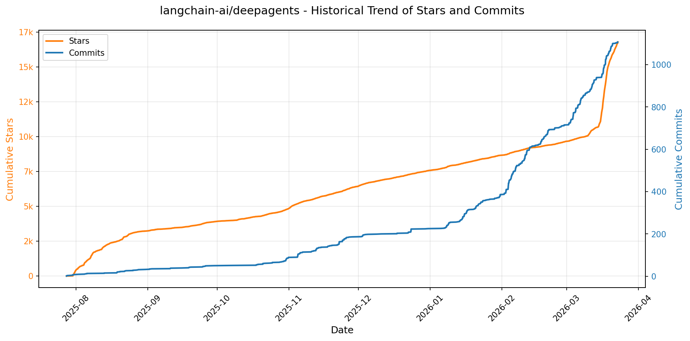

> *蓝色：累计 Stars｜橙色：累计 Commits（次 Y 轴）*

<b>📄 README 摘要</b>

1. **项目功能**  
Deep Agents 是一个开箱即用、高度集成的智能体（Agent）运行时框架，旨在为开发者提供“电池已内置”（batteries-included）的生产级 AI 代理解决方案。它无需手动组装提示词（prompts）、工具链（tools）和上下文管理逻辑，即可立即启动一个具备规划能力、文件操作、命令执行、子智能体协作与自适应上下文管理的完整工作智能体。其核心目标是大幅降低构建可定制、可扩展、可部署的 LLM 智能体的门槛，同时保持深度可配置性，适用于研究、开发及生产环境。

2. **关键特性**  
- **内置任务规划能力**：提供 `write_todos` 工具实现自动任务拆解、进度追踪与执行调度；  
- **全栈文件系统工具**：支持 `read_file`/`write_file`/`edit_file`/`ls`/`glob`/`grep` 等原生文件读写与检索操作，用于持久化上下文与知识管理；  
- **沙盒化 Shell 执行**：通过 `execute` 工具安全运行终端命令，内置隔离机制保障安全性；  
- **子智能体（Sub-agents）支持**：`task` 工具支持将子任务委派至独立上下文窗口的专用智能体，实现模块化与并行化处理；  
- **智能上下文管理**：自动摘要长对话历史，并将大体积输出（如代码、文档）自动保存至文件，避免上下文溢出；  
- **预置优化提示工程**：内置经调优的系统提示词，明确指导模型如何协同使用各类工具；  
- **CLI 终端编码助手**：提供交互式 TUI 终端应用，集成网络搜索、远程沙盒、持久记忆、人工审核等企业级能力；  
- **LangGraph 原生集成**：所有智能体均以编译后的 LangGraph 图形式构建，天然支持流式响应、可视化调试（LangGraph Studio）、状态检查点（checkpointing）与长期运行；  
- **MCP 协议支持**：通过 `langchain-mcp-adapters` 兼容 Model Context Protocol，便于跨平台工具集成。

3. **技术栈**  
- **核心框架**：基于 [LangGraph](https://docs.langchain.com/oss/python/langgraph/overview) 构建，采用有向图状态机范式实现鲁棒、可观察、可持久化的智能体控制流；  
- **语言与运行时**：Python（主要 SDK），支持任意兼容工具调用（tool-calling）协议的 LLM 后端（如 OpenAI、Anthropic、Ollama、Llama.cpp、Groq 等）；  
- **依赖生态**：深度集成 LangChain 生态（如 `langchain-core`、`langchain-community`），并通过 `langchain-mcp-adapters` 支持 MCP 标准；  
- **CLI 实现**：基于 Python 构建，采用 rich 库实现富文本终端界面（TUI），支持交互式流式输出与非交互式（headless）模式；  
- **许可与分发**：MIT 开源许可证，通过 PyPI（`deepagents` 包）和 uv 工具分发，支持现代 Python 包管理流程；  
- **部署与可观测性**：与 [LangSmith](https://docs.langchain.com/langsmith/home) 深度协同，提供智能体开发、调试、评估与监控全生命周期支持。

---

### 25. [promptfoo/promptfoo](https://github.com/promptfoo/promptfoo)
- 📅 **创建日期**：2023-04-28  
- 🔄 **最近更新**：2026-04-06  
- ⭐ **Stars**：19,179（日 +121｜周 +820｜月 +8360）  
- 📝 **描述**：Test your prompts, agents, and RAGs. Red teaming/pentesting/vulnerability scanning for AI. Compare performance of GPT, Claude, Gemini, Llama, and more. Simple declarative configs with command line and CI/CD integration.  Used by OpenAI and Anthropic.  

<b>📈 Star 与 Commit 历史趋势</b>

> *蓝色：累计 Stars｜橙色：累计 Commits（次 Y 轴）*

<b>📄 README 摘要</b>

1. **项目功能**  
Promptfoo 是一个用于大语言模型（LLM）应用的开源评估与红队测试（red teaming）工具，提供命令行界面（CLI）和编程库。其核心目标是帮助开发者系统化地验证、加固和优化 LLM 应用——通过自动化测试替代人工试错，确保提示词（prompts）、模型行为及整体 AI 应用的安全性、可靠性与一致性。它支持端到端的 LLM 质量保障流程，涵盖功能正确性评估、安全漏洞扫描、多模型横向对比、CI/CD 自动化集成、PR 阶段代码级安全审查，以及团队协作式结果共享。

2. **关键特性**  
- ✅ **自动化提示与模型评估**：支持基于预设断言（如 JSON 结构校验、关键词匹配、语义相似度、自定义评分脚本）的批量测试；可对同一提示在不同模型/参数下进行多维对比分析。  
- ✅ **专业红队测试能力**：内置攻击模板（越狱、提示注入、隐私泄露、偏见诱导等），自动执行对抗性测试并生成结构化安全风险报告（含漏洞类型、复现步骤、严重等级）。  
- ✅ **全栈模型兼容性**：原生支持 OpenAI、Anthropic、Azure OpenAI、AWS Bedrock、Ollama、Google Vertex AI 等主流 LLM 提供商，并可通过插件机制扩展任意 HTTP API 或本地模型。  
- ✅ **开发友好型工作流**：提供 `promptfoo eval`（执行评估）、`promptfoo view`（启动本地 Web 可视化看板）、`promptfoo init`（快速初始化）、实时重载（live reload）与结果缓存，显著提升迭代效率。  
- ✅ **企业级工程集成**：支持 CI/CD 流水线嵌入（如 GitHub Actions）、Git PR 安全扫描（检测 prompt 修改引入的风险）、环境变量/API 密钥安全管理（本地运行，数据不出设备）。  
- ✅ **私有化与合规优先**：所有评估与红队操作均在本地执行，原始提示、输入输出、测试数据 100% 保留在用户设备，满足严格的数据主权与隐私合规要求（如 GDPR、HIPAA 场景）。

3. **技术栈**  
- **核心语言**：TypeScript（主 CLI 与 Web UI 后端逻辑）  
- **运行时**：Node.js（CLI 主体）、支持 Python（`pip install promptfoo` 提供 PyPI 包，含 Python SDK）  
- **前端框架**：React + Vite（Web 查看器 `promptfoo view` 的交互式仪表盘）  
- **构建与分发**：npm（`npm install -g promptfoo`）、Homebrew（macOS/Linux）、PyPI（Python 生态集成）  
- **底层能力**：基于标准 HTTP 客户端调用各类 LLM API；支持自定义评估函数（JavaScript/TypeScript 编写）；结果持久化为本地 JSON/YAML 文件；Web UI 使用轻量级静态服务（Vite dev server）  
- **许可证**：MIT 开源协议，完全免费且商用友好。

---

### 26. [mvanhorn/last30days-skill](https://github.com/mvanhorn/last30days-skill)
- 📅 **创建日期**：2026-01-23  
- 🔄 **最近更新**：2026-04-06  
- ⭐ **Stars**：18,895（日 +334｜周 +2964｜月 +15164）  
- 📝 **描述**：AI agent skill that researches any topic across Reddit, X, YouTube, HN, Polymarket, and the web - then synthesizes a grounded summary  

<b>📈 Star 与 Commit 历史趋势</b>

> *蓝色：累计 Stars｜橙色：累计 Commits（次 Y 轴）*

<b>📄 README 摘要</b>

1. **该项目做什么？**  
`/last30days` 是一个面向AI原生工作流的实时趋势研究技能（AI skill），专为Claude Code、Codex等AI开发环境设计。它自动在**过去30天内**从多源平台（Reddit、X/Twitter、YouTube、Bluesky、Hacker News、Polymarket、Exa语义搜索、ScrapeCreators支持的Instagram/TikTok、Truth Social等）抓取、筛选并综合分析与用户查询主题相关的高信噪比内容。核心功能是：识别社区真实热议点（而非仅关键词匹配）、提取被广泛验证的实践方法（如Prompt技巧）、发现资金/注意力流向（如Polymarket押注数据）、生成带原始出处引用的结构化叙事报告，并可直接输出可复用的技术方案（如JSON格式提示词、UI设计规范等）。本质是将“人肉信息爬虫+领域专家研判”流程自动化，服务于提示工程研究、产品竞品跟踪、文化热点洞察、新闻事件速览等场景。

2. **关键特性**  
- **多源动态覆盖**：支持10+信号源（含v2.9.5新增Bluesky、v2.9新增ScrapeCreators统一接入Reddit/TikTok/Instagram、v2.8新增Instagram Reels、v2.5新增Polymarket与Hacker News）；  
- **智能比较模式（Comparative Mode）**：支持“X vs Y”类查询（如`/last30 Claude Code vs Codex`），执行三路并行研究并生成对比表格、优劣势分析与数据驱动结论；  
- **深度内容挖掘能力**：  
  - Reddit/X/YouTube评论/弹幕/字幕级分析（如Reddit顶评加权、X账号解析与直接检索、YouTube转录文本）；  
  - Polymarket预测市场多维评分（文本相关性30% + 24h交易量30% + 流动性15% + 价格波动15% + 结果竞争性10%）；  
  - 跨平台收敛检测（基于混合trigram-token Jaccard相似度）；  
- **自动化知识沉淀**：每次运行自动生成Markdown报告并保存至`~/Documents/Last30Days/`，支持构建个人研究库；  
- **灵活配置体系**：支持全局配置（`~/.config/last30days/.env`）与项目级覆盖（`.claude/last30days.env`），含自动配置校验（SessionStart检查）；  
- **开放变体（Open Variant）**：支持长期监控（Watchlist）、定时研究、SQLite本地知识库、全文检索（History）、周期性简报（Briefings）及内置Web搜索后端（Parallel AI/Brave/OpenRouter）；  
- **零配置起步+渐进式增强**：Reddit/HN/Polymarket开箱即用；通过浏览器Cookie自动提取X/Youtube凭证；ScrapeCreators一键解锁评论与短视频源；Bluesky仅需免费App Password；  
- **结果可操作性强**：不仅提供摘要，更可生成即用型技术资产（如JSON Prompt、UI Mockup代码、调研问题链）。

3. **技术栈**  
- **核心语言**：Python（主引擎、脚本、测试框架，含455+单元测试）；  
- **前端/集成层**：Claude Code插件（Skill SDK）、OpenAI Codex CLI兼容、Gemini CLI扩展、ClawHub Marketplace生态；  
- **数据源适配器**：  
  - Reddit：ScrapeCreators API（替代旧版PRAW）、公共JSON API（零配置备用）；  
  - X/Twitter：浏览器Cookie自动提取（Chrome/Firefox/Safari）、xAI API（可选）；  
  - YouTube：`yt-dlp`（本地安装，无API Key）；  
  - Bluesky：AT Protocol官方App Password认证；  
  - Web搜索：Exa.ai（免费1000次/月）、Parallel AI（首选LLM优化）、Brave Search、OpenRouter；  
- **基础设施**：  
  - 配置管理：`.env`文件（支持层级覆盖）、`--diagnose`健康检查；  
  - 存储：SQLite（Open Variant本地知识库）、本地文件系统（Markdown报告）；  
  - 构建/部署：Git版本控制、ClawHub/GitHub分发；  
- **架构理念**：模块化Pipeline（搜索→评分→去重→合成）、复合加权排序算法（文本相似度+参与度归一化+权威性加权+时间衰减）、双阶段查询扩展（tag-based domain bridging）。

---

### 27. [google-ai-edge/gallery](https://github.com/google-ai-edge/gallery)
- 📅 **创建日期**：2025-03-31  
- 🔄 **最近更新**：2026-04-06  
- ⭐ **Stars**：17,229（日 +938｜周 +1743｜月 +1972）  
- 📝 **描述**：A gallery that showcases on-device ML/GenAI use cases and allows people to try and use models locally.  

<b>📈 Star 与 Commit 历史趋势</b>

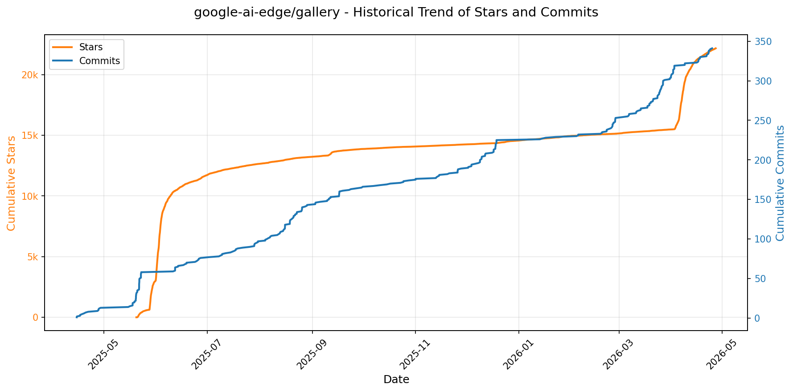

> *蓝色：累计 Stars｜橙色：累计 Commits（次 Y 轴）*

<b>📄 README 摘要</b>

1. **项目功能**  
Google AI Edge Gallery 是一款面向移动端的开源应用，旨在让用户在**完全离线、隐私安全、无需联网**的前提下，在 Android 和 iOS 设备上本地运行高性能开源大语言模型（LLM）及多模态模型。它提供端到端的生成式 AI 体验，支持文本对话、图像理解、语音转写翻译、智能代理任务执行、模型性能评测等核心场景，使用户可直接在手机硬件上探索和评估前沿的端侧生成式 AI 能力。

2. **关键特性**  
- **Agent 技能系统**：通过集成 Wikipedia 查询、交互地图、可视化摘要卡片等工具，将 LLM 升级为具备主动执行能力的智能代理；支持从 URL 加载模块化技能或参与 GitHub Discussions 社区共建。  
- **AI 聊天 + 思维模式（Thinking Mode）**：支持多轮对话，并可开启“思维链”可视化功能，实时查看模型分步推理过程（首发适配 Gemma 4 系列）。  
- **图像问答（Ask Image）**：调用设备相机或相册，实现物体识别、视觉推理与图文描述生成。  
- **音频速记（Audio Scribe）**：基于轻量级端侧语音模型，实现实时语音转文字与跨语言翻译。  
- **提示词实验室（Prompt Lab）**：提供参数级精细控制（如 temperature、top-k），用于单轮 Prompt 测试与效果调优。  
- **移动设备操作（Mobile Actions）**：利用 FunctionGemma 270m 微调模型，实现离线控制手机功能（如调节音量、打开设置等）。  
- **迷你游戏「Tiny Garden」**：以自然语言指令种植/收获虚拟花园，展示小型函数式 LLM 的趣味应用。  
- **模型管理与基准测试**：支持一键下载 Hugging Face 上的 LiteRT 兼容模型，或加载自定义模型；内置硬件性能压测工具，量化各模型在本机的实际推理速度与内存占用。  
- **100% 端侧隐私保障**：全部计算均在设备本地完成，无任何数据上传，彻底规避云端泄露风险。

3. **技术栈**  
- **核心框架**：基于 **Google AI Edge** 生态构建，深度集成其端侧机器学习 SDK 与工具链；  
- **运行时引擎**：采用 **LiteRT** —— Google 推出的超轻量级、高优化度端侧推理运行时，专为低延迟、低功耗移动设备设计；  
- **模型生态对接**：原生支持 **Hugging Face** 模型仓库，实现模型发现、元数据解析与一键下载；  
- **平台支持**：兼容 **Android 12+** 与 **iOS 17+**，兼顾主流移动操作系统底层能力（如 iOS Neural Engine、Android NNAPI）；  
- **模型格式**：聚焦 LiteRT 优化的 `.tflite` 或 `.llama` 等端侧友好格式，强调小体积、快启动、低内存占用。

---

### 28. [jarrodwatts/claude-hud](https://github.com/jarrodwatts/claude-hud)
- 📅 **创建日期**：2026-01-02  
- 🔄 **最近更新**：2026-04-06  
- ⭐ **Stars**：17,120（日 +206｜周 +1918｜月 +13026）  
- 📝 **描述**：A Claude Code plugin that shows what's happening - context usage, active tools, running agents, and todo progress  

<b>📈 Star 与 Commit 历史趋势</b>

> *蓝色：累计 Stars｜橙色：累计 Commits（次 Y 轴）*

<b>📄 README 摘要</b>

1. **该项目的作用**  
Claude HUD 是一个专为 Claude Code 开发的插件，旨在提供实时、可视化的会话状态监控界面（HUD，抬头显示），始终固定显示在用户输入框下方。它不新开窗口或依赖终端复用工具（如 tmux），而是通过 Claude Code 原生的 `statusline API` 直接注入终端状态栏。其核心作用是帮助开发者直观掌握当前 Claude Code 会话的运行实况，包括上下文占用、工具调用、智能体（agent）执行、待办任务（todo）进度、项目路径、Git 状态及订阅用量等关键信息，从而提升开发透明度与调试效率。

2. **关键功能**  
- **多维度实时监控**：支持显示项目路径（可配置 1–3 级目录）、Git 分支与脏状态（如 `main*`）、上下文使用率（带颜色渐变进度条，绿→黄→红）、订阅用量（小时配额/7 日用量）、会话时长、输出速度、内存占用（本地系统级近似值）等；  
- **活动行为可视化**：动态追踪并展示工具调用（如 `✓ Read ×3`, `◐ Edit: auth.ts`）、子智能体运行状态（如 `◐ explore [haiku]: Finding auth code (2m 15s)`）及待办任务完成进度（如 `▸ Fix authentication bug (2/5)`）；  
- **高度可定制化 HUD 布局**：提供 Full / Essential / Minimal 三档预设，并支持细粒度开关（如单独启用/禁用 Git、Tools、Agents 等模块）、自定义元素顺序（`elementOrder`）、单行/多行布局（`compact`/`expanded`）、中英文标签切换（`language: "zh"`）、全系色彩配置（支持命名色、256 色号、十六进制）；  
- **精准数据源保障**：上下文 Token 数直接采用 Claude Code 官方 stdin 输出的真实值（非估算），适配最高达 1M 上下文的新模型；用量数据严格依赖官方 `rate_limits` 字段，不读取 OAuth 凭据或调用未公开 API；  
- **跨平台兼容与健壮安装流程**：针对 Linux（修复 `/tmp` 跨设备链接问题）、Windows（集成 Node.js LTS 检测与自动安装指引）、macOS 提供专属故障排除方案，并内置配置语法校验与重置机制。

3. **技术栈**  
- **运行时环境**：Node.js 18+ 或 Bun（必需，用于解析 JSONL 流、渲染状态行及执行配置逻辑）；  
- **集成协议**：深度依赖 Claude Code 原生 `statusline API`，通过标准输入（stdin）接收结构化 JSON/JSONL 数据流（含模型元信息、上下文、transcript 日志、用量指标等），经处理后通过 stdout 输出 ANSI 彩色状态行；  
- **前端渲染**：纯终端字符界面（CLI），基于 ANSI 转义序列实现颜色、符号（如 `◐`, `▸`, `█`）及动态刷新（约 300ms 间隔），无 Web UI 或 Electron 依赖；  
- **配置管理**：JSON 格式本地配置文件（`~/.claude/plugins/claude-hud/config.json`），支持交互式向导（`/claude-hud:configure`）与手动编辑双模式；  
- **构建与开发**：npm 生态（`npm ci`, `npm run build`, `npm test`），TypeScript（隐含于构建流程及类型安全需求中，虽未明述但符合项目复杂度）。

---

### 29. [Yeachan-Heo/oh-my-codex](https://github.com/Yeachan-Heo/oh-my-codex)
- 📅 **创建日期**：2026-02-02  
- 🔄 **最近更新**：2026-04-06  
- ⭐ **Stars**：16,846（日 +821｜周 +13977｜月 +15362）  
- 📝 **描述**：OmX - Oh My codeX: Your codex is not alone. Add hooks, agent teams, HUDs, and so much more.  

<b>📈 Star 与 Commit 历史趋势</b>

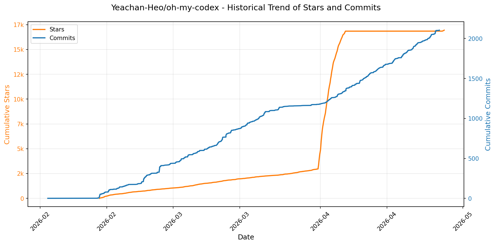

> *蓝色：累计 Stars｜橙色：累计 Commits（次 Y 轴）*

<b>📄 README 摘要</b>

1. **项目功能**  
oh-my-codex（OMX）是一个专为 [OpenAI Codex CLI](https://github.com/openai/codex) 设计的**轻量级工作流增强层**，不替代 Codex 本身，而是围绕其构建更健壮、可复用、状态持久的开发协作范式。它将 Codex 作为底层执行引擎，通过标准化指令（如 `$deep-interview`、`$ralplan`、`$ralph`、`$team`）统一从需求澄清 → 方案审批 → 并行执行/持续交付的全链路，同时将项目上下文（计划、日志、记忆、模式配置等）持久化存储于本地 `.omx/` 目录中，显著提升复杂任务下的可追溯性、协作效率与工程可控性。

2. **核心特性**  
- ✅ **标准化四步工作流**：强制/推荐使用 `$deep-interview`（深度需求澄清）、`$ralplan`（方案评审与权衡分析）、`$ralph`（单角色持续闭环交付）、`$team`（多角色协同并行执行）构成可复用的端到端流程；  
- ✅ **角色与技能即服务**：内置专家角色（如 `executor`）、预置高复用技能（如代码审查、测试修复、架构推演），支持按需调用；  
- ✅ **项目级状态持久化**：自动在 `.omx/` 下管理 AGENTS.md（项目指导）、plans/（审批计划）、logs/（会话日志）、memory/（上下文记忆）、mode/（运行模式）等结构化数据；  
- ✅ **团队运行时支持**：基于 `tmux`（macOS/Linux）或 `psmux`（Windows）实现耐久化多窗格协作会话，支持 `omx team start/resume/status/shutdown` 全生命周期管理；  
- ✅ **辅助操作面**：提供 `omx setup`（一键初始化）、`omx doctor`（环境诊断）、`omx hud --watch`（实时监控）、`omx explore`（只读代码库检索）、`omx sparkshell`（安全受限的 shell 检查）等运维与调试能力；  
- ✅ **开箱即用的高性能模式**：支持 `--madmax --high` 等参数快速启用高并发、高保真度的 Codex 运行配置。

3. **技术栈**  
- **运行时**：Node.js ≥ 20（必需）；  
- **核心依赖**：OpenAI Codex CLI（`@openai/codex`，全局安装）；  
- **终端协调层**：`tmux`（macOS/Linux）或 `psmux`（Windows 原生），用于团队模式下的多进程/多窗格持久化管理；  
- **命令行工具链**：基于 Node.js 构建的 CLI 工具（`omx` 命令），采用模块化设计封装提示工程、技能调度、状态管理逻辑；  
- **配置与存储**：纯文件系统驱动（`.omx/` 目录），无外部数据库或服务依赖；  
- **扩展生态**：支持与 OpenClaw（通知网关）、自定义 AGENTS.md、插件式 Skills 等集成，具备良好可扩展性。

---

### 30. [google-research/timesfm](https://github.com/google-research/timesfm)
- 📅 **创建日期**：2024-04-29  
- 🔄 **最近更新**：2026-04-06  
- ⭐ **Stars**：15,036（日 +226｜周 +4216｜月 +5072）  
- 📝 **描述**：TimesFM (Time Series Foundation Model) is a pretrained time-series foundation model developed by Google Research for time-series forecasting.  

<b>📈 Star 与 Commit 历史趋势</b>

> *蓝色：累计 Stars｜橙色：累计 Commits（次 Y 轴）*

<b>📄 README 摘要</b>

1. **项目功能**  
TimesFM 是由 Google Research 开发的、面向时间序列预测任务的预训练基础模型（Foundation Model），专为通用时序 forecasting 设计。它不依赖领域特定微调，可直接对任意单变量或多变量时间序列进行零样本（zero-shot）或少样本（few-shot）预测，支持长时序上下文建模与高精度点预测+分位数预测，已集成至 Google Cloud BigQuery 作为官方产品（TimesFM in BigQuery）。

2. **核心特性**  
- **模型演进**：最新版本 TimesFM 2.5（200M 参数），相比 2.0 版本显著优化——参数量减少 60%（500M → 200M），上下文长度大幅提升（2048 → 16k），支持最长 1000 步连续分位数预测（通过可选的 30M 分位数头）；移除显式频率（`frequency`）指示符，增强泛化性。  
- **灵活预测能力**：原生支持点预测（point forecast）与多分位数预测（quantile forecast），支持归一化输入、翻转不变性（flip invariance）、正性约束（`infer_is_positive`）及分位数交叉修复（`fix_quantile_crossing`）。  
- **扩展能力**：已支持协变量（covariates）建模（通过 XReg 模块，2025年9月恢复）；新增 AGENTS 集成支持（2026年3月），并发布 SKILL.md 文档体系；提供 Torch 和 Flax（JAX）双后端实现，Flax 版本正加速开发以提升推理速度。  
- **开箱即用接口**：提供简洁统一的 `forecast()` API，支持批量多序列输入、动态配置预测长度（`horizon`）、上下文窗口（`max_context`）、分位数粒度等，并兼容 CPU/GPU/TPU/Apple Silicon。

3. **技术栈**  
- **深度学习框架**：主支持 PyTorch（`torch`）与 JAX/Flax（`flax`）双后端，用户可按需选择安装（`.[torch]` / `.[flax]`）；协变量支持依赖 `xreg` 扩展模块。  
- **构建与依赖管理**：使用 `uv`（超高速 Python 包管理器）进行虚拟环境创建与依赖安装。  
- **部署与生态**：模型权重托管于 Hugging Face（[google/timesfm-*](https://huggingface.co/collections/google/timesfm-release-66e4be5fdb56e960c1e482a6)），与 Google Cloud BigQuery 深度集成；代码基于 Python，强调可复现性与文档完备性（含 notebook 示例、详细 docstrings 及架构文档如 `AGENTS.md`、`SKILL.md`）。

---

### 31. [mattpocock/skills](https://github.com/mattpocock/skills)
- 📅 **创建日期**：2026-02-03  
- 🔄 **最近更新**：2026-04-06  
- ⭐ **Stars**：12,291（日 +279｜周 +1414｜月 +11309）  
- 📝 **描述**：My personal directory of skills, straight from my .claude directory.  

<b>📈 Star 与 Commit 历史趋势</b>

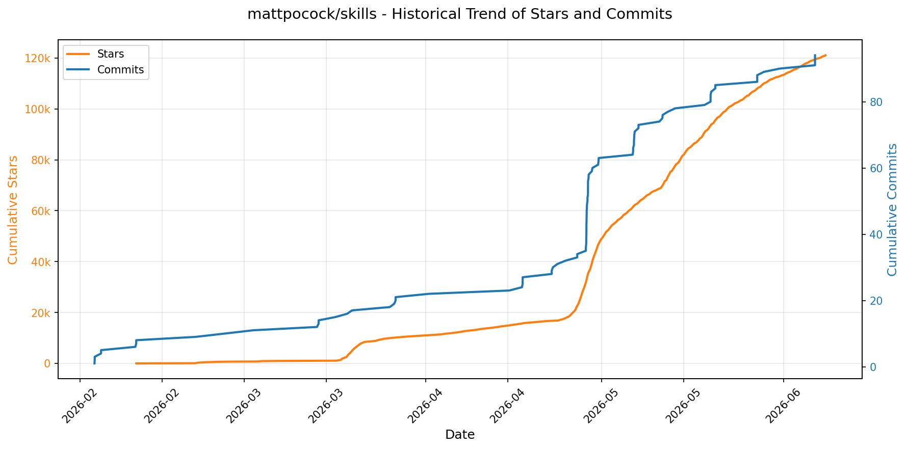

> *蓝色：累计 Stars｜橙色：累计 Commits（次 Y 轴）*

<b>📄 README 摘要</b>

1. **项目功能**  
该项目是一个面向软件开发全生命周期的“智能体技能库”（Agent Skills），旨在通过可插拔、即用型的 CLI 工具技能，增强开发者在规划、设计、编码、重构、测试、工程化和知识管理等环节的自动化与智能化能力。所有技能均以 `npx skills@latest add <skill-path>` 方式一键集成，直接作用于本地代码库或开发工作流，核心目标是将复杂工程决策（如需求分析、架构演进、缺陷根因定位）和重复性任务（如环境配置、文档撰写、练习搭建）转化为结构化、可复现、带上下文感知的 AI 协作流程。

2. **关键特性**  
- **分阶段深度规划能力**：支持从原始需求出发，经交互式访谈生成 PRD → 转为基于“探针式垂直切片”（tracer-bullet vertical slices）的多阶段实施计划 → 自动拆解为独立可交付的 GitHub Issue，实现需求到执行的端到端结构化落地。  
- **对抗式设计验证机制**：提供 `grill-me` 等技能，模拟高强度技术质询，系统性穷举决策分支与边界条件，显著提升方案鲁棒性。  
- **并行化与模块化智能协作**：如 `design-an-interface` 利用并行子智能体生成多种正交设计方案；`tdd` 严格遵循红-绿-重构循环，按垂直切片粒度增量交付功能或修复。  
- **工程实践强耦合工具链**：覆盖现代前端/TypeScript 工程栈高频场景——含 Husky+lint-staged 预提交流水线搭建、Claude Code 驱动的 Git 危险操作防护、`@total-typescript/shoehorn` 类型断言迁移、DDD 通用语言萃取、Obsidian 知识库自动化管理等。  
- **自举式生态扩展能力**：内置 `write-a-skill` 技能，支持开发者遵循统一规范（结构化提示、渐进式披露、资源打包）快速创建并发布新技能，形成可持续演进的技能社区。

3. **技术栈**  
- **运行时**：基于 Node.js，通过 `npx` 提供零安装 CLI 入口，强调轻量级、无依赖、跨平台执行。  
- **AI 编排层**：隐式依赖大语言模型（LLM）驱动的智能体框架（未显式指定但行为表明使用具备多步推理、工具调用、代码理解能力的模型，如 Claude 或 GPT 系列），所有技能均封装为 LLM 可理解与调度的原子化函数（function calling）。  
- **集成生态**：深度绑定 GitHub（Issue 创建/管理）、Git（pre-commit、hook 拦截）、TypeScript 生态（shoehorn、类型检查）、前端工程化工具链（Prettier、Husky、lint-staged）、知识管理工具（Obsidian vault 文件系统操作）及领域建模方法论（DDD）。  
- **架构范式**：采用“技能即插件”（Skill-as-Plugin）设计，每个技能为独立可组合单元，通过标准化接口（输入上下文、代码库路径、用户交互）与统一 CLI 运行时协同，不依赖特定后端服务或私有基础设施。

---

### 32. [alirezarezvani/claude-skills](https://github.com/alirezarezvani/claude-skills)
- 📅 **创建日期**：2025-10-19  
- 🔄 **最近更新**：2026-04-06  
- ⭐ **Stars**：9,689（日 +221｜周 +1633｜月 +7107）  
- 📝 **描述**：220+ Claude Code skills & agent plugins for Claude Code, Codex, Gemini CLI, Cursor, and 8 more coding agents — engineering, marketing, product, compliance, C-level advisory.  

<b>📈 Star 与 Commit 历史趋势</b>

> *蓝色：累计 Stars｜橙色：累计 Commits（次 Y 轴）*

<b>📄 README 摘要</b>

1. **该项目做什么？**  
该项目是一个面向AI编程代理（AI coding agents）的开源技能库，提供248个开箱即用、生产就绪的“Claude Code技能”（亦称代理技能或插件），覆盖工程、DevOps、市场营销、合规监管、C级战略咨询、业务增长等9大专业领域。其核心目标是为各类AI编码工具注入结构化、可复用的领域专业知识，使AI代理不仅能执行代码任务，更能以专业角色（如架构师、CTO、增长营销官、合规专家）进行跨领域决策与协作。项目支持11种主流AI编码工具原生集成，并通过自动化脚本实现技能格式的跨平台一键转换与部署。

2. **关键特性**  
- **多平台原生兼容**：原生支持Claude Code、OpenAI Codex、Gemini CLI、OpenClaw，并通过`convert.sh`脚本自动适配Cursor、Aider、Windsurf、Kilo Code、OpenCode、Augment、Antigravity共11种工具；  
- **三层能力模型**：清晰区分**技能**（如何做，单域操作指南）、**代理**（做什么，任务导向型工作单元）、**角色（Personas）**（谁在思考，如“Startup CTO”“Growth Marketer”，含专属思维模式、优先级与沟通风格）；  
- **深度工程能力**：包含25个“POWERFUL Tier”高阶技能（如`rag-architect`、`database-designer`、`incident-commander`、`tech-debt-tracker`），支持RAG构建、数据库建模、安全审计、SLO设计等生产级任务；  
- **安全优先机制**：内置`skill-security-auditor`工具，对任意技能包进行静态安全扫描（命令注入、数据泄露、提权风险等），输出PASS/WARN/FAIL并提供修复建议；  
- **轻量级编排协议（Orchestration）**：提供四种跨域协作模式（Solo Sprint、Domain Deep-Dive、Multi-Agent Handoff、Skill Chain），支持多角色、多技能按阶段协同完成复杂项目（如6周产品发布）；  
- **零依赖Python工具集**：附带332个纯标准库（stdlib-only）CLI脚本，覆盖SaaS指标计算、品牌声调分析、技术债评估、RICE优先级排序、落地页生成等场景，无需pip安装，开箱即用；  
- **全链路合规与行业支持**：深度集成ISO 13485、MDR 2017/745、FDA、GDPR、ISO 27001等法规要求，提供专用技能包及检查清单。

3. **技术栈**  
- **核心格式**：Markdown（`SKILL.md`定义指令/流程/决策框架）、纯Python（332个stdlib-only CLI脚本，兼容Python 3.8+）；  
- **构建与分发**：Shell脚本（`convert.sh`、`install.sh`、各工具专用安装脚本如`gemini-install.sh`）驱动跨平台格式转换与部署；  
- **运行环境**：完全不依赖第三方Python包，所有工具仅使用`os`、`sys`、`json`、`subprocess`等标准库模块；  
- **集成协议**：基于各AI工具的原生插件规范（如Claude Code的`/plugin install`、Cursor的`.mdc`规则、Aider的`CONVENTIONS.md`），无自研运行时或框架；  
- **开发与维护**：Git版本控制，语义化版本（SemVer），MIT开源许可，配套完整文档（`ORCHESTRATION.md`、`TEMPLATE.md`、各技能README）及验证机制（SkillCheck认证）。

---

### 33. [langchain-ai/open-swe](https://github.com/langchain-ai/open-swe)
- 📅 **创建日期**：2025-05-21  
- 🔄 **最近更新**：2026-04-06  
- ⭐ **Stars**：9,240（日 +50｜周 +391｜月 +3979）  
- 📝 **描述**：An Open-Source Asynchronous Coding Agent  

<b>📈 Star 与 Commit 历史趋势</b>

> *蓝色：累计 Stars｜橙色：累计 Commits（次 Y 轴）*

<b>📄 README 摘要</b>

1. **项目功能**  
Open SWE 是一个开源框架，用于构建企业内部专属的“编码智能体”（coding agent），使工程团队能在日常协作环境（如 Slack、Linear、GitHub）中直接调用 AI 编程助手，完成代码修改、问题修复、PR 创建等端到端开发任务。它不替代开发者，而是作为可信赖的自动化协作者：自动克隆代码库至隔离云沙箱，在受控环境中执行 shell 命令、调用 API、编辑文件、提交代码，并最终生成关联原始工单（Linear Issue）或 Slack 线程的 GitHub Draft PR，全程无需人工干预生产环境。

2. **核心特性**  
- **多平台触发与上下文感知**：支持在 Slack 线程中 @ 机器人、Linear 工单中评论 `@openswe`、或 GitHub PR 中回复 `@openswe`，自动注入完整上下文（工单描述/评论、Slack 历史、AGENTS.md 规约文件）。  
- **强隔离云沙箱执行**：每个任务独占一个远程 Linux 沙箱（默认集成 Modal/Daytona/Runloop/LangSmith），沙箱持久化复用、自动恢复、并行无阻塞，彻底杜绝本地污染与生产风险。  
- **精准工具集设计**：仅提供约 15 个高信噪比工具（如 `execute`, `commit_and_open_pr`, `linear_comment`, `slack_thread_reply`），辅以 Deep Agents 内置文件操作工具，拒绝工具泛滥，强调“少而精”的工程实践。  
- **分层智能编排**：原生支持子智能体（subagents）并行处理独立子任务；通过确定性中间件（middleware）实现关键保障——如 `check_message_queue_before_model` 支持运行中接收新指令，`open_pr_if_needed` 强制兜底创建 PR，`ToolErrorMiddleware` 统一容错。  
- **开箱即用的安全闭环**：内置 GitHub OAuth 认证；要求沙箱内执行 lint/format/test 后再提交；所有输出可追溯、可审计、可中断，符合企业级权限与合规要求。

3. **技术栈**  
- **底层框架**：基于 [LangGraph](https://langchain-ai.github.io/langgraph/) 构建状态化、可调试的有向图工作流；深度集成 [Deep Agents](https://github.com/langchain-ai/deepagents) 作为智能体核心运行时（含 subagent、tool 调度、内置文件工具链）。  
- **执行环境**：插件化沙箱后端，开箱支持 Modal、Daytona、Runloop、LangSmith；可自定义对接任意容器/VM 平台。  
- **模型与协议**：支持主流大模型（如 Anthropic Claude Opus），通过标准 API 接入；工具调用遵循 MCP（Model Context Protocol）兼容设计。  
- **集成生态**：原生打通 Slack（Events API + Bolt）、Linear（GraphQL API）、GitHub（App OAuth + Webhooks）、HTTP/API 服务；上下文工程依赖 `AGENTS.md` 配置文件与结构化 issue/thread 解析。  
- **部署与运维**：采用 MIT 许可，模块化设计（可替换模型、工具、沙箱、中间件、触发器），配套完整安装与定制化文档（INSTALLATION.md / CUSTOMIZATION.md）。

---

### 34. [SakanaAI/AI-Scientist-v2](https://github.com/SakanaAI/AI-Scientist-v2)
- 📅 **创建日期**：2025-04-08  
- 🔄 **最近更新**：2026-04-06  
- ⭐ **Stars**：5,005（日 +127｜周 +1076｜月 +2800）  
- 📝 **描述**：The AI Scientist-v2: Workshop-Level Automated Scientific Discovery via Agentic Tree Search  

<b>📈 Star 与 Commit 历史趋势</b>

> *蓝色：累计 Stars｜橙色：累计 Commits（次 Y 轴）*

<b>📄 README 摘要</b>

1. **该项目的功能**  
该系统是一个完全自主的科研代理（agentic）框架，旨在实现端到端的自动化科学发现。它能从零开始：① 基于给定研究主题自动生成新颖科学假设；② 设计并执行机器学习实验（含代码编写、运行、调试）；③ 分析实验结果；④ 撰写结构完整、符合学术规范的科学论文草稿（最终输出PDF），且已成功生成并通过同行评审的ICLR 2025 Workshop论文。其核心目标是摆脱对人类预设模板的依赖，支持开放性、探索性的科学研究流程。

2. **关键特性**  
- **无模板化科研流程**：相比v1版本，v2彻底取消人工编写的论文/实验模板，通过多智能体协作与动态推理驱动全流程；  
- **领域泛化能力**：可跨不同机器学习子领域（如CV、NLP、强化学习等）开展研究，不局限于特定任务范式；  
- **渐进式智能体树搜索（Agentic Tree Search）**：以“最佳优先树搜索（BFTS）”为核心算法，由实验管理智能体（Experiment Manager Agent）协调多个并行探索路径，支持自动调试失败节点、动态剪枝与回溯；  
- **全流程工具集成**：深度融合Semantic Scholar API进行文献检索与新颖性验证、LaTeX/PDF自动编译、代码沙箱化执行、多轮引用生成（`--num_cite_rounds`）；  
- **模块化阶段设计**：明确划分为“研究构想生成”（Ideation）和“论文生成实验”（Paper Generation Experiment）两大阶段，支持灵活干预与迭代；  
- **强安全约束机制**：强制要求在隔离沙箱环境（如Docker）中运行，防止LLM生成的恶意代码造成系统风险。

3. **技术栈**  
- **编程语言与框架**：Python 3.11、PyTorch（CUDA加速）、Conda环境管理；  
- **大语言模型支持**：OpenAI（GPT-4o、o1-preview等）、Google Gemini（通过OpenAI兼容接口）、Anthropic Claude（通过AWS Bedrock，需配置AWS凭证）；  
- **外部服务与API**：Semantic Scholar（文献检索与新颖性分析）、AWS Bedrock（Claude模型托管）、Poppler（PDF处理）、ChkTeX（LaTeX语法检查）；  
- **核心算法与架构**：基于AIDE项目的树搜索基础设施扩展实现、多智能体协同决策、BFTS（Best-First Tree Search）配置驱动（`bfts_config.yaml`）；  
- **部署与安全**：依赖Linux + NVIDIA GPU环境，强调容器化（Docker）沙箱执行，禁止直接在生产主机运行。

---

### 35. [vas3k/TaxHacker](https://github.com/vas3k/TaxHacker)
- 📅 **创建日期**：2025-03-10  
- 🔄 **最近更新**：2026-04-06  
- ⭐ **Stars**：4,737（日 +139｜周 +1702｜月 +3616）  
- 📝 **描述**：Self-hosted AI accounting app. LLM analyzer for receipts, invoices, transactions with custom prompts and categories  

<b>📈 Star 与 Commit 历史趋势</b>

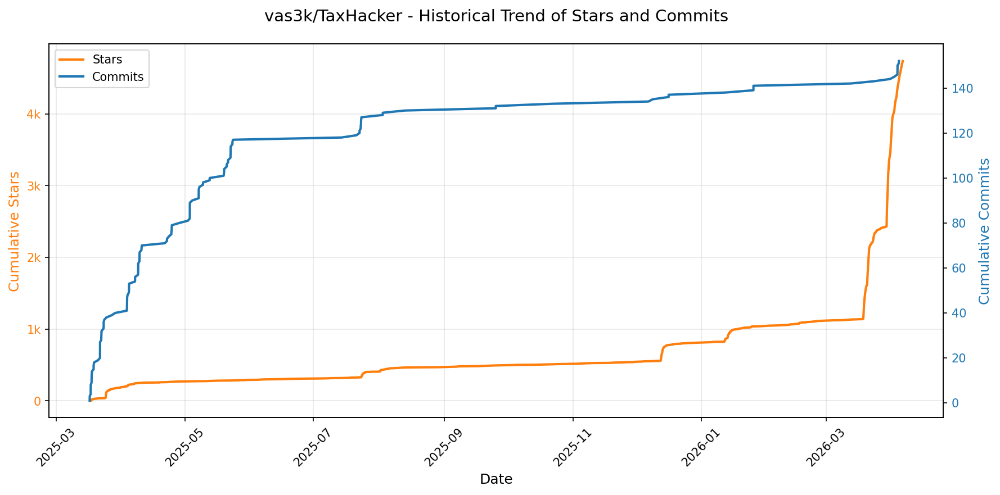

> *蓝色：累计 Stars｜橙色：累计 Commits（次 Y 轴）*

<b>📄 README 摘要</b>

1. **项目功能**  
TaxHacker 是一款面向自由职业者、独立开发者和小微企业的**自托管 AI 会计工具**，核心目标是通过人工智能自动化完成财务单据（如收据、发票、PDF 账单、银行对账单等）的识别、解析与结构化录入。用户可上传照片或 PDF 文件，系统自动提取日期、金额、商户、商品明细、税额、币种等关键会计字段，并存入本地可控的结构化数据库（类似 Excel 的表格视图），从而大幅减少手工记账时间，简化税务申报流程。

2. **关键特性**  
- **AI 驱动的多格式文档解析**：支持 receipts、invoices、bank statements、手写单据等，兼容任意语言与货币；具备 OCR + LLM 双阶段识别能力，可拆分明细项、自动归类、支持自定义 AI 提示词提取任意字段（如项目编号、客户邮箱等）。  
- **全场景多币种智能转换**：自动识别原始币种，基于交易日期调用历史汇率（覆盖 170+ 法定货币 + 14 种主流加密货币），支持手动覆写与灵活输入。  
- **完全开放的 LLM 接入能力**：原生兼容 OpenAI、Google Gemini、Mistral 等云端 API，更深度支持本地运行的开源模型（Ollama / LM Studio / vLLM / LocalAI 等），所有提示词（含系统级 prompt）均可在 UI 中自由编辑、按字段/项目定制，实现行业专属适配。  
- **高度可定制的财务建模**：支持无限创建自定义分类（categories）、项目（projects）、扩展字段（custom fields），结合全文检索、高级筛选、批量操作与 AI 辅助标签，满足各国财税规范及个性化业务逻辑。  
- **隐私优先的自托管架构**：数据全程本地存储，提供开箱即用的 Docker Compose 部署方案（含 PostgreSQL 17+、自动迁移、持久化卷），无外部依赖、无数据上传、无厂商锁定，支持一键导出完整数据归档（CSV + 原始附件 + 元数据）。  

3. **技术栈**  
- **前端与全栈框架**：Next.js 15+（App Router + Server Components + API Routes）  
- **后端与数据层**：TypeScript + Prisma ORM（对接 PostgreSQL 17+）  
- **AI 集成层**：OpenAI/Gemini/Mistral 官方 SDK + 兼容 OpenAI 标准 API 的本地 LLM 代理（如 Ollama）  
- **文档处理**：Ghostscript + GraphicsMagick（PDF 解析与图像预处理）  
- **部署与运维**：Docker + docker-compose（官方镜像发布于 GitHub Container Registry），环境变量驱动配置，支持生产级一键启停与自动数据库迁移。

---

### 36. [Blaizzy/mlx-vlm](https://github.com/Blaizzy/mlx-vlm)
- 📅 **创建日期**：2024-04-16  
- 🔄 **最近更新**：2026-04-06  
- ⭐ **Stars**：3,998（日 +279｜周 +1495｜月 +1775）  
- 📝 **描述**：MLX-VLM is a package for inference and fine-tuning of Vision Language Models (VLMs) on your Mac using MLX.  

<b>📈 Star 与 Commit 历史趋势</b>

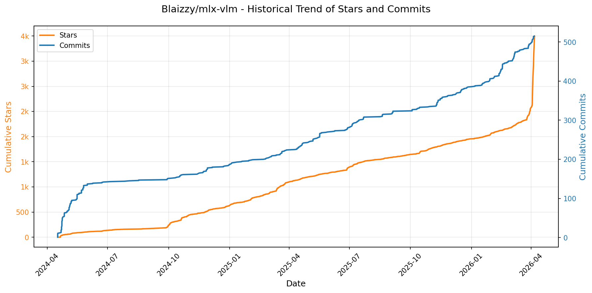

> *蓝色：累计 Stars｜橙色：累计 Commits（次 Y 轴）*

<b>📄 README 摘要</b>

1. **项目功能**  
MLX-VLM 是一个专为 Apple Mac 平台（基于 Apple Silicon/Metal）优化的开源工具包，用于**视觉语言模型（VLM）及多模态大模型（支持图像、音频、视频）的高效推理与微调**。它通过 MLX 框架实现原生 GPU 加速（Metal 后端），同时兼容 NVIDIA GPU（通过 MLX CUDA）。核心能力包括：单/多图像理解、音频描述与分析、图像+音频联合推理、视频理解（如视频摘要与描述）、多轮对话中视觉特征缓存加速、以及支持 Thinking（思维链）机制的可控推理流程。

2. **关键特性**  
- ✅ **全模态支持**：原生支持文本、图像、音频、视频输入，可自由组合（如图文、图音、图文音、纯音频、纯视频）；  
- ✅ **多图像联合分析**：允许一次性输入多张图像并进行跨图比较、推理与问答；  
- ✅ **Thinking Budget 机制**：对具备思维链能力的模型（如 Qwen3.5）提供可配置的“思考块”令牌预算控制，防止过度推理；  
- ✅ **Vision Feature Caching**：LRU 缓存图像视觉特征，避免多轮对话中重复运行视觉编码器，实测提速超 11 倍（Prompt TPS 从 ~48 → ~825）；  
- ✅ **TurboQuant KV Cache**：基于随机旋转+码本量化的先进 KV 缓存压缩技术，支持 2/3/3.5/4-bit 等多种精度，最高降低 76% KV 内存占用，且在长上下文（128K+）下反超 FP16 性能；  
- ✅ **激活量化（CUDA 专用）**：针对 `mxfp8`/`nvfp4` 量化模型在 NVIDIA GPU 上自动启用激活量化（`QQLinear`），保障正确运行；  
- ✅ **生产就绪服务化**：内置 FastAPI 服务器，提供 OpenAI 兼容 API（`/v1/chat/completions` 等），支持动态模型加载/卸载、适配器（LoRA）热插拔、远程代码信任开关；  
- ✅ **交互式体验丰富**：提供 CLI、Gradio Web UI、Rich 终端聊天（`mlx_vlm.chat`）、Python API 四种使用方式；  
- ✅ **细粒度微调支持**：完整集成 LoRA 与 QLoRA 微调流程，适配主流 VLM 架构。

3. **技术栈**  
- **底层框架**：[MLX](https://github.com/ml-explore/mlx)（Apple 官方推出的轻量级机器学习框架，专为 Apple Silicon 优化，支持 Metal 加速；通过 MLX CUDA 扩展支持 NVIDIA GPU）；  
- **核心依赖**：`mlx-core`, `mlx-nn`, `mlx-linalg`, `mlx-quantize`；  
- **前端/交互层**：`gradio`（Web UI）、`rich`（终端美化）、`fastapi` + `uvicorn`（HTTP 服务）；  
- **音频处理**：集成 `librosa` 或 `soundfile`（隐式依赖，用于 WAV/MP3 解码）；  
- **视频处理**：基于 `opencv-python` 或 `decord`（用于帧采样与预处理）；  
- **量化支持**：原生支持 `mxfp8`、`nvfp4` 权重量化；自研 `TurboQuant`（含 Hadamard 旋转 + MSE 码本）实现 KV 缓存量化；  
- **模型格式**：兼容 Hugging Face 格式（需 `trust-remote-code` 支持部分自定义模型），权重经 MLX 重打包为 `.safetensors` + `config.json`；  
- **部署环境**：macOS（ARM64，Metal）、Linux（NVIDIA GPU via MLX CUDA）、部分 Windows WSL2 场景（非官方主推）。

---

### 37. [dmtrKovalenko/fff.nvim](https://github.com/dmtrKovalenko/fff.nvim)
- 📅 **创建日期**：2025-07-31  
- 🔄 **最近更新**：2026-04-06  
- ⭐ **Stars**：3,754（日 +269｜周 +1656｜月 +2226）  
- 📝 **描述**：The fastest and the most accurate file search toolkit for AI agents, Neovim, Rust, C, and NodeJS  

<b>📈 Star 与 Commit 历史趋势</b>

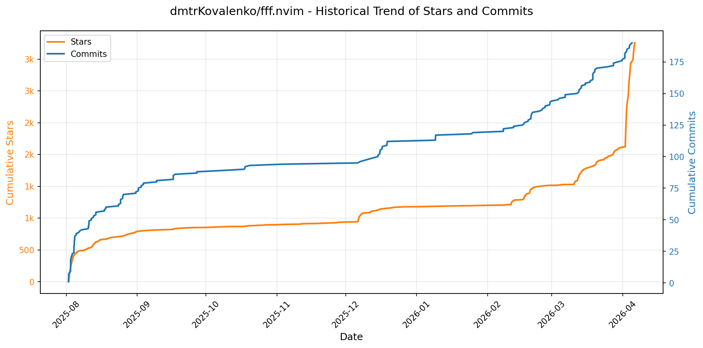

> *蓝色：累计 Stars｜橙色：累计 Commits（次 Y 轴）*

<b>📄 README 摘要</b>

1. **项目功能**  
FFF（Freakin Fast Fuzzy file finder）是一个高性能、面向场景优化的模糊文件搜索工具，专为两类核心用户设计：**AI 代理（MCP 场景）** 和 **Neovim 用户**。它不仅提供极速的文件查找（`find_files`）、实时内容搜索（`live_grep`）、通配符匹配与多条件组合搜索，更关键的是——**内置上下文感知的记忆机制**：通过 frecency（访问频次+时效性）、Git 状态（staged/modified/ignored 等）、文件大小、定义匹配度等多维信号动态排序结果，显著提升搜索相关性。对 AI 代理而言，FFF 作为轻量级 MCP（Model Control Protocol）兼容工具，可大幅减少 token 消耗和多轮交互次数；对 Neovim 用户而言，它是原生集成、低延迟、高定制化的下一代文件/内容导航核心组件。

2. **关键特性**  
- ✅ **三模实时搜索**：`live_grep` 支持 `plain`（字面匹配）、`regex`（正则）、`fuzzy`（Smith-Waterman 模糊匹配）三模式一键循环切换，兼顾安全性与容错性；  
- ✅ **跨模式智能建议**：空结果时自动触发反向搜索（如文件搜无果 → 推荐匹配该关键词的内容行；grep 无果 → 推荐匹配该关键词的文件名），并支持直接跳转；  
- ✅ **深度 Git 集成**：符号列显示 Git 状态图标（✅/⚠️/🗑️等），可选启用文件名着色，并支持 `git:modified` 等语义化约束过滤；  
- ✅ **多维智能排序**：融合 frecency（基于打开历史）、Git 状态权重、文件大小、路径深度、定义匹配（LSP-aware）、内容密度等因子动态打分；  
- ✅ **灵活约束语法**：支持组合式查询，如 `git:staged src/**/*.rs !test/ user controller`，兼容 glob（基于超快 zlob 库）、路径前缀、扩展名、否定（`!`）及语义标签；  
- ✅ **多选与 Quickfix 集成**：`<Tab>` 多选文件，`<C-q>` 一键推送至 Neovim Quickfix 列表；  
- ✅ **自适应预览与布局**：支持大文件分块加载、SVG/Markdown 自动换行、响应式窗口布局（flex/wrap）、滚动条、路径智能截断（middle_number 策略）；  
- ✅ **全链路可观测性**：内置调试面板（`<F2>`）、详细日志（`FFFDebug`/`:FFFOpenLog`）、健康检查（`:FFFHealth`）、缓存管理（`:FFFClearCache`）；  
- ✅ **零配置开箱即用**：提供生产就绪默认值，同时暴露完整 Lua API（`find_files_in_dir`/`scan_files`/`refresh_git_status` 等）与命令系统（`:FFFScan`, `:FFFRefreshGit` 等）。

3. **技术栈**  
- **核心语言**：Rust（高性能二进制核心，负责文件遍历、模糊匹配、grep 引擎、评分计算）；  
- **前端框架**：Neovim 0.10+（Lua API 驱动，深度依赖 `nvim-tree-sitter`、`plenary.nvim` 等生态库）；  
- **构建与分发**：预编译二进制 + Rust toolchain（`rustup`）按需源码编译，支持 NixOS（`nix run .#release`）；  
- **搜索算法**：Smith-Waterman（模糊匹配）、增量式 glob 解析（zlob 库）、多线程并行扫描（`max_threads` 可调）；  
- **状态存储**：SQLite 数据库存储 frecency（`~/.local/cache/nvim/fff_nvim`）与查询历史（`~/.local/share/nvim/fff_queries`）；  
- **扩展能力**：MCP 协议兼容（bash 安装脚本对接 Claude/Codex 等 AI 工具链），支持 `.ignore` 文件覆盖 `.gitignore`；  
- **UI 渲染**：Neovim 原生浮窗（FloatWin）、符号列（signcolumn）、高亮组（`hl` 全量可配置）、动态预览（支持 ImageMagick 图片元信息）。

---

### 38. [google-ai-edge/LiteRT-LM](https://github.com/google-ai-edge/LiteRT-LM)
- 📅 **创建日期**：2025-04-14  
- 🔄 **最近更新**：2026-04-06  
- ⭐ **Stars**：1,671（日 +393｜周 +666｜月 +791）  
- 📝 **描述**：暂无描述  

<b>📈 Star 与 Commit 历史趋势</b>

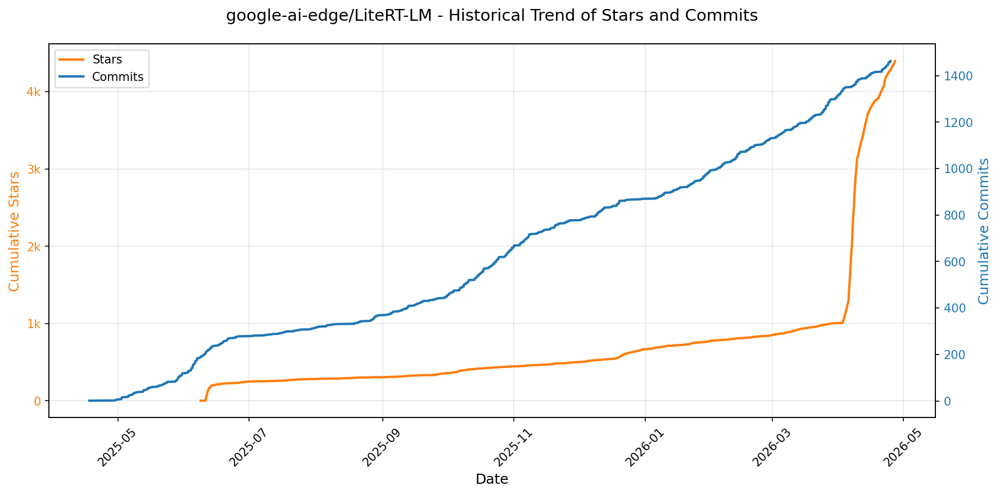

> *蓝色：累计 Stars｜橙色：累计 Commits（次 Y 轴）*

<b>📄 README 摘要</b>

1. **项目功能**  
LiteRT-LM 是谷歌推出的面向边缘设备的生产级、高性能开源大语言模型（LLM）推理框架，专为在资源受限的终端设备上高效部署和运行 LLM 而设计。它支持端侧（on-device）生成式 AI 应用，无需依赖云端服务，已在 Chrome、Chromebook Plus、Pixel Watch 等 Google 产品中实际落地。用户可通过命令行工具（CLI）或各语言 SDK 快速加载并运行量化后的 LLM（如 Gemma 4、Llama、Phi-4、Qwen 等），完成文本生成、多模态理解、函数调用等任务。

2. **核心特性**  
- **全平台覆盖**：原生支持 Android、iOS、Web（WASM）、桌面端（Linux/macOS/Windows/WSL）及物联网设备（如 Raspberry Pi）；  
- **硬件加速能力**：深度集成 GPU（如 Vulkan、Metal、DirectX）与 NPU（神经处理单元），实现模型推理性能最优化；  
- **多模态支持**：可处理视觉（图像）与音频输入，拓展端侧 AI 应用边界；  
- **智能体工作流支持**：内置 Tool Use API，提供可靠的本地化函数调用（Function Calling）能力，支撑复杂 agentic 场景；  
- **广泛模型兼容性**：开箱即用支持 Gemma（含最新 Gemma 4）、Llama、Phi-4、Qwen 等主流开源模型的 LiteRT-LM 格式（`.litertlm`）；  
- **开箱即用体验**：提供跨平台 CLI 工具，支持一键从 Hugging Face 加载模型并执行推理，无需编码。

3. **技术栈**  
- **底层引擎**：基于 Google 自研的轻量级、低开销推理运行时（LiteRT），针对边缘场景深度优化内存占用与延迟；  
- **模型格式**：采用专为边缘设备定制的 `.litertlm` 模型格式，支持 INT4/INT8 量化、算子融合与图优化；  
- **编程语言支持**：提供稳定版 Kotlin（Android/JVM）、Python（原型开发/脚本）、C++（高性能原生集成）SDK；Swift SDK 正在开发中；  
- **构建与分发**：使用 `uv`（超快 Python 工具链）提供 CLI 安装与执行；源码构建支持 CMake + Bazel 混合构建系统；  
- **部署生态**：与 Google AI Edge Gallery 应用深度集成，支持在移动端直接下载、加载并运行模型；模型托管于 Hugging Face（如 `litert-community/...` 仓库）。

---

