# 🌟 GitHub Trending 概览

> 数据更新于：2026-06-15

---

## 🔍 项目详情

### 1. [freeCodeCamp/freeCodeCamp](https://github.com/freeCodeCamp/freeCodeCamp)
- 📅 **创建日期**：2014-12-24  
- 🔄 **最近更新**：2026-06-15  
- ⭐ **Stars**：378,670（日 +442｜周 +1011｜月 +3007）  
- 📝 **描述**：freeCodeCamp.org's open-source codebase and curriculum. Learn math, programming, and computer science for free.  

<b>📈 Star 与 Commit 历史趋势</b>

> *蓝色：累计 Stars｜橙色：累计 Commits（次 Y 轴）*

<b>📄 README 摘要</b>

1. **该项目的功能**  
freeCodeCamp.org 是一个开源、非营利性的编程学习平台，旨在为全球成年人提供免费、自定进度的全栈开发与机器学习课程。它通过数千个交互式编程挑战、项目实践、测验和考试，帮助用户系统掌握编程技能，并获得行业认可的开发者认证（如响应式网页设计、JavaScript、Python、数据库、后端开发等）及语言能力认证（如英语、西班牙语、中文）。完成认证后，用户可获得永久有效的、可验证的专属证书链接，用于求职或职业展示。平台还整合了面试准备资源（如 Coding Interview Prep、Project Euler）、技术论坛、YouTube 教程频道、技术博客及 Discord 社区，构建完整的自学与协作生态。

2. **核心功能**  
- 提供 6 项主流技术方向的**全栈开发者认证**（含 5 个强制项目 + 终结考试）；  
- 提供多语种**语言能力认证**（A1/A2/B1 级别，面向开发者场景）；  
- **交互式学习体验**：涵盖课程讲解、工作坊、实验、复习页、随堂测验与模块化考核；  
- **防作弊机制**：基于《学术诚信政策》对抄袭行为实施证书撤销与账号封禁；  
- **配套学习生态**：集成论坛（即时答疑）、YouTube 免费课程、技术博客（数千篇教程）、Discord 社群；  
- **开源协作支持**：面向新手友好（first-timers-only 标签），提供清晰的贡献指南、安全漏洞披露流程及社区治理规范；  
- 所有学习内容与代码永久免费，由捐赠支持的 501(c)(3) 慈善机构运营。

3. **技术栈**  
- **后端**：Node.js（主要运行时）、Express.js（Web 框架）；  
- **前端**：React（主应用 UI）、Gatsby（部分静态站点生成）；  
- **数据库**：MongoDB（主数据库，存储用户数据、进度、提交记录等）；  
- **基础设施与部署**：Docker 容器化、GitHub Actions（CI/CD）、AWS（云服务托管）；  
- **许可证**：  
  - 代码部分采用 **BSD-3-Clause 开源许可证**；  
  - 课程内容（`/curriculum` 目录下全部资源）受版权保护，归 freeCodeCamp.org 所有（©2014 起）。

---

### 2. [microsoft/markitdown](https://github.com/microsoft/markitdown)
- 📅 **创建日期**：2024-11-13  
- 🔄 **最近更新**：2026-06-15  
- ⭐ **Stars**：154,424（日 +628｜周 +6011｜月 +30680）  
- 📝 **描述**：Python tool for converting files and office documents to Markdown.  

<b>📈 Star 与 Commit 历史趋势</b>

> *蓝色：累计 Stars｜橙色：累计 Commits（次 Y 轴）*

<b>📄 README 摘要</b>

1. **该项目的功能**  
MarkItDown 是一个轻量级 Python 工具，专为将多种格式的文件（如 PDF、Word、PPTX、Excel、HTML、图像、音频、视频、ZIP、YouTube 链接、EPUB 等）**高保真地转换为结构化 Markdown 文本**而设计，核心目标是服务于大语言模型（LLM）和文本分析流水线。它并非面向人类阅读的排版渲染工具，而是强调保留语义结构（标题、列表、表格、链接、元数据等），生成 token 效率高、LLM 友好的 Markdown 输入；支持本地离线处理，也集成 Azure 云服务（Document Intelligence 和 Content Understanding）以提升复杂文档（尤其是扫描件、多模态内容）的解析质量。

2. **关键特性**  
- ✅ **广泛格式支持**：原生支持超 15 种格式（含 Office 套件、PDF、HTML、CSV/JSON/XML、图像/音频元数据+OCR/转录、ZIP 内容遍历、YouTube 字幕、EPUB 等）；  
- ✅ **结构化 Markdown 输出**：优先保留文档逻辑结构（层级标题、嵌套列表、表格对齐、超链接、代码块等），而非仅纯文本提取；  
- ✅ **模块化依赖管理**：通过 `[pdf]`、`[docx]`、`[audio-transcription]` 等可选依赖标签按需安装，降低体积与冲突风险；  
- ✅ **插件扩展机制**：支持第三方插件（如 `markitdown-ocr`），利用 LLM Vision（如 GPT-4o）对文档内嵌图片执行 OCR，无需额外 ML 依赖；  
- ✅ **双模云集成**：  
　　• **Azure Document Intelligence**：提供高精度布局分析与 OCR，适用于扫描 PDF 和复杂表格；  
　　• **Azure Content Understanding（CU）**：统一多模态 API，支持文档/图像/音频/视频，自动路由至预建或自定义分析器，并输出带 YAML 前置元数据（如发票字段、合同条款）的 Markdown；  
- ✅ **安全可控的 I/O 接口**：提供细粒度 API（`convert_local()`、`convert_stream()`、`convert_response()`）替代宽泛的 `convert()`，便于在不可信环境中限制文件路径、网络访问及资源权限；  
- ✅ **全链路使用支持**：提供命令行工具（CLI）、Python API、Docker 镜像及插件开发框架，适配本地脚本、服务端集成与工程化部署。

3. **技术栈**  
- **核心语言**：Python ≥ 3.10；  
- **基础依赖**：`requests`（HTTP 请求）、`python-magic`（文件类型识别）、`lxml`/`beautifulsoup4`（HTML/XML 解析）等；  
- **格式专用库**（按需安装）：  
　　• PDF：`pypdf` / `pdfplumber` / `fitz`（PyMuPDF）；  
　　• Office：`python-docx`（DOCX）、`python-pptx`（PPTX）、`openpyxl`（XLSX）；  
　　• 图像 OCR：`Pillow` + `markitdown-ocr` 插件（调用 OpenAI 兼容 LLM Vision）；  
　　• 音频/视频：`pydub`、`whisper`（可选）或 Azure CU 云服务；  
　　• ZIP/EPUB：`zipfile`、`ebooklib`；  
　　• YouTube：`yt-dlp`；  
- **云服务 SDK**：Azure REST API 客户端（无强制 SDK 依赖，通过标准 HTTP 调用）；  
- **开发与构建**：`hatch`（测试/打包）、`pre-commit`（代码检查）、`uv`（可选快速虚拟环境）、Docker；  
- **LLM 集成**：兼容 OpenAI Python SDK 及任意 OpenAI 兼容接口（用于图像描述、OCR、语音转录等增强功能）。

---

### 3. [microsoft/PowerToys](https://github.com/microsoft/PowerToys)
- 📅 **创建日期**：2019-05-01  
- 🔄 **最近更新**：2026-06-15  
- ⭐ **Stars**：136,100（日 +181｜周 +1068｜月 +1978）  
- 📝 **描述**：Microsoft PowerToys is a collection of utilities that supercharge productivity and customization on Windows  

<b>📈 Star 与 Commit 历史趋势</b>

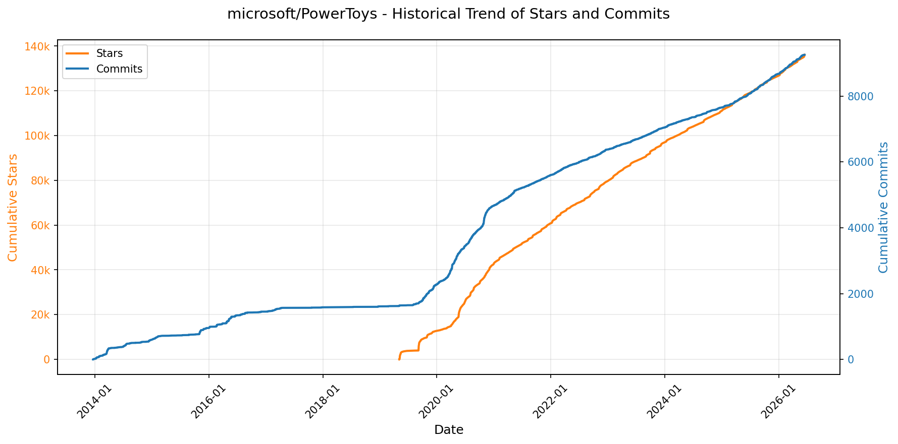

> *蓝色：累计 Stars｜橙色：累计 Commits（次 Y 轴）*

<b>📄 README 摘要</b>

1. **该项目的功能**  
Microsoft PowerToys 是一套面向 Windows 系统的免费、开源增强工具集，旨在帮助用户深度定制操作系统体验、提升日常工作效率。它不替代系统核心功能，而是通过轻量级、可选启用的独立实用工具（Utilities），弥补 Windows 原生功能的不足，覆盖窗口管理、键盘/鼠标操作、文件处理、系统调试、开发辅助等多个高频使用场景。

2. **核心功能**  
- 提供 **30+ 个模块化实用工具**，全部支持按需启用/禁用；  
- **窗口与桌面增强**：FancyZones（高级分屏布局）、Always on Top（窗口置顶）、Shortcut Guide（Win 键快捷提示）、Workspaces（多工作区管理）、ZoomIt（屏幕缩放标注）；  
- **输入与交互优化**：Keyboard Manager（键盘映射与宏）、Mouse Utilities（高亮定位光标）、Find My Mouse、Quick Accent（快速输入重音字符）、PowerToys Run（全局快速启动器，支持插件扩展）；  
- **内容处理与效率工具**：PowerRename（批量正则重命名）、Image Resizer（图片批量缩放）、Text Extractor（OCR 文字识别）、Color Picker（取色器）、Screen Ruler（像素标尺）、Peek（代码/文本预览）、Advanced Paste（智能粘贴历史与格式控制）；  
- **系统级辅助工具**：Awake（防止休眠）、Environment Variables（环境变量图形化编辑）、Hosts File Editor（hosts 文件可视化管理）、Registry Preview（注册表项安全预览）、File Locksmith（查看文件占用进程）、Command Palette（统一命令中心）；  
- 全部工具均支持深色/浅色主题适配、无障碍访问，并提供细粒度设置与热键自定义。

3. **技术栈**  
- **主框架与UI**：C# + .NET 6/7/8（跨平台运行时），WPF（Windows Presentation Foundation）构建主界面与多数工具UI；  
- **底层系统交互**：Windows API（User32/GDI32/Shell32等）、COM 组件、Windows Runtime（WinRT）API；  
- **关键能力支撑**：  
  - OCR 引擎：集成 Microsoft Windows.Media.Ocr 或第三方库（如 Tesseract）；  
  - 键盘钩子与低级输入处理：通过 `SetWindowsHookEx` 实现全局热键与按键重映射；  
  - UI 自动化：UI Automation API 支持界面元素识别与操作；  
  - 进程与文件系统监控：使用 `FileSystemWatcher`、`Process` 类及 NTFS 权限 API；  
- **构建与分发**：MSIX 打包（Microsoft Store 版）、WiX Toolset（传统 MSI/EXE 安装包）、WinGet 集成（基于 YAML 清单）；  
- **开发与协作**：GitHub Actions CI/CD、C++/Rust 混合模块（部分性能敏感组件如 OCR 或图像处理可能采用原生代码）、现代 CMake 构建流程；  
- **其他依赖**：Newtonsoft.Json、Microsoft.Toolkit（UWP/WPF 工具包）、CommunityToolkit.WinUI（部分新功能 UI 组件）。

---

### 4. [mattpocock/skills](https://github.com/mattpocock/skills)
- 📅 **创建日期**：2026-02-03  
- 🔄 **最近更新**：2026-06-15  
- ⭐ **Stars**：129,492（日 +988｜周 +8453｜月 +44416）  
- 📝 **描述**：Skills for Real Engineers. Straight from my .claude directory.  

<b>📈 Star 与 Commit 历史趋势</b>

> *蓝色：累计 Stars｜橙色：累计 Commits（次 Y 轴）*

<b>📄 README 摘要</b>

1. **项目功能**  
该项目是一套面向真实软件工程实践的、可组合的 AI 编程代理（coding agent）技能集合（Skills），旨在解决当前 AI 编程助手（如 Claude Code、Codex 等）在实际工程落地中的四大核心失败模式：**需求对齐偏差、表达冗余低效、代码质量不可靠、架构持续腐化**。它不提供完整开发框架或自动化流水线，而是以轻量、即插即用的「技能指令」（如 `/grill-with-docs`、`/tdd`、`/diagnose`）形式，嵌入现有 AI 编程代理（如 Cursor、GitHub Copilot、Claude Code 等）工作流中，帮助工程师在人机协作过程中系统性地贯彻工程最佳实践——包括深度需求澄清、领域语言共建、测试驱动开发、结构化问题诊断、架构演进引导等，从而提升 AI 产出的可靠性、可维护性与设计质量。

2. **关键特性**  
- **聚焦工程本质**：直击 AI 编程常见痛点（对齐失败、啰嗦输出、错误频发、架构退化），每项技能对应一个经验证的工程原则（如《程序员修炼之道》《领域驱动设计》《软件设计哲学》中的理念）。  
- **小而可组合**：所有技能均为独立、模块化指令，支持按需启用、自由组合（如先 `/grill-with-docs` 对齐需求 + 再 `/tdd` 驱动实现 + 最后 `/improve-codebase-architecture` 持续重构）。  
- **模型无关 & 低侵入**：不绑定特定大模型或平台，兼容任意 coding agent；通过自然语言指令触发，无需修改底层模型或基础设施。  
- **强化人机协同机制**：  
  - **对齐层**：`/grill-me` / `/grill-with-docs` 强制结构化提问，构建共享领域语言（自动更新 `CONTEXT.md` 和 ADR 文档）；  
  - **反馈层**：`/tdd` 强制红-绿-重构循环，`/diagnose` 封装标准化调试流程；  
  - **设计层**：`/zoom-out` 提供系统级视角，`/improve-codebase-architecture` 主动识别并修复架构熵增；  
  - **流程层**：`/to-prd` / `/to-issues` / `/triage` 将模糊意图转化为可追踪、可分配的工程工件（PRD、Issue、状态机）。  
- **开箱即用的工程约定**：内置对 GitHub/Linear 等 issue tracker 的集成、`CONTEXT.md` 领域建模规范、ADR（架构决策记录）模板、`docs/adr/` 目录结构等，推动团队知识沉淀标准化。  

3. **技术栈**  
- **核心形态**：纯文本技能定义（Markdown 格式 `.md` 文件），含清晰的指令说明、使用场景、输入/输出示例及原理阐释；  
- **分发与集成**：基于 `skills.sh` CLI 工具（`npx skills@latest add mattpocock/skills`）实现一键安装与配置，依赖标准 Shell 环境；  
- **运行时依赖**：无服务端、无数据库、无自托管组件；完全运行于用户本地开发环境或 AI 代理客户端内，仅需支持自然语言指令解析的 coding agent（如 Cursor、VS Code + Copilot 插件、Claude Code 等）；  
- **文档与约定**：重度依赖开发者本地文件系统中的工程文档（`CONTEXT.md`、`docs/adr/`、`package.json` 等）作为上下文输入源，强调「代码即文档、文档即协议」；  
- **辅助工具链**：配套提供 `git-guardrails-claude-code`（Git 安全钩子）、`setup-pre-commit`（Husky + lint-staged 集成）、`migrate-to-shoehorn`（类型断言迁移）等工程脚本，但非核心技能必需。

---

### 5. [iptv-org/iptv](https://github.com/iptv-org/iptv)
- 📅 **创建日期**：2018-11-14  
- 🔄 **最近更新**：2026-06-15  
- ⭐ **Stars**：122,128（日 +1871｜周 +3895｜月 +5221）  
- 📝 **描述**：Collection of publicly available IPTV channels from all over the world  

<b>📈 Star 与 Commit 历史趋势</b>

> *蓝色：累计 Stars｜橙色：累计 Commits（次 Y 轴）*

<b>📄 README 摘要</b>

1. **该项目做什么？**  
该项目是一个全球公开可用的 IPTV（互联网协议电视）频道集合，旨在整理、维护并免费提供来自世界各地的合法公开直播流媒体频道列表（M3U 格式播放列表），不托管任何视频内容，仅聚合和验证用户提交的公开流地址。

2. **关键特性**  
- 提供主播放列表（`https://iptv-org.github.io/iptv/index.m3u`）及按国家、语言、类型等分类的多套子播放列表；  
- 集成电子节目指南（EPG）支持，通过独立仓库 `iptv-org/epg` 提供节目单数据生成与下载工具；  
- 所有频道元数据（如名称、国家、语言、类别、LOGO、流地址等）统一存储于结构化数据库仓库 `iptv-org/database`，支持社区协作修正；  
- 提供 RESTful API（见 `iptv-org/api` 仓库），支持程序化查询和集成；  
- 严格遵循法律合规原则：不存储视频、不控制源流、明确版权责任归属，支持版权方快速提交移除请求；  
- 全面的资源生态：关联 `awesome-iptv`（IPTV 工具/客户端/教程合集）及活跃的 GitHub Discussions 社区支持。

3. **技术栈**  
- **核心格式**：M3U/M3U8 播放列表标准（纯文本流索引）；  
- **基础设施**：GitHub Pages 托管静态播放列表文件（`index.m3u` 等）；  
- **数据管理**：结构化 JSON 数据库（`iptv-org/database`），采用 Git 版本控制与自动化 CI/CD（GitHub Actions）校验链接有效性；  
- **配套工具链**：Python（用于 EPG 抓取与生成）、Node.js（API 服务可能使用）、Shell/CI 脚本（自动化更新与测试）；  
- **协作与治理**：GitHub Issues / Discussions / Pull Requests；Open Collective 支持资金管理；CC0 1.0 公共领域许可（无版权保留）。

---

### 6. [puppeteer/puppeteer](https://github.com/puppeteer/puppeteer)
- 📅 **创建日期**：2017-05-09  
- 🔄 **最近更新**：2026-06-15  
- ⭐ **Stars**：94,673（日 +127｜周 +209｜月 +433）  
- 📝 **描述**：JavaScript API for Chrome and Firefox  

<b>📈 Star 与 Commit 历史趋势</b>

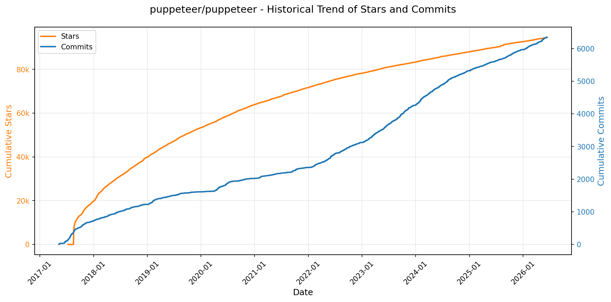

> *蓝色：累计 Stars｜橙色：累计 Commits（次 Y 轴）*

<b>📄 README 摘要</b>

1. **该项目的功能**  
Puppeteer 是一个 JavaScript 库，提供高层级 API，用于通过 Chrome DevTools 协议（DevTools Protocol）或 WebDriver BiDi 协议远程控制 Chromium、Chrome 或 Firefox 浏览器。其核心用途包括：自动化网页交互（如表单提交、点击、导航）、生成网页截图与 PDF、爬取 SSR 渲染内容、执行端到端测试、性能分析，以及构建浏览器自动化调试工具（如 MCP 服务器）。

2. **关键特性**  
- 支持 Headless（无头）和 Headful（带界面）两种模式运行；  
- 内置自动下载并管理兼容版本的 Chromium/Chrome（`puppeteer` 包），或可选轻量级 `puppeteer-core`（需手动提供浏览器）；  
- 基于现代定位器（Locator API）实现稳定、可访问性友好的元素选择与交互（如 `page.locator()`、`fill()`、`click()`）；  
- 全面支持 DevTools Protocol 和实验性 WebDriver BiDi 协议；  
- 提供跨平台截图（`screenshot`）、PDF 生成（`pdf`）、页面跟踪（`tracing`）、网络拦截（`route`）、请求/响应监控等能力；  
- 集成 MCP（Multi-Client Protocol）支持，可通过 `chrome-devtools-mcp` 构建浏览器自动化与调试服务；  
- 实验性支持 WebMCP（Web Multi-Client Protocol）API，拓展多客户端协同调试能力；  
- 兼容主流包管理器（npm/pnpm/Yarn/Bun/Deno），并提供灵活的浏览器安装与脚本执行配置机制。

3. **技术栈**  
- **语言与运行时**：TypeScript（源码编写）、JavaScript（运行时），基于 Node.js 运行；  
- **协议层**：Chrome DevTools Protocol（主协议）、WebDriver BiDi（新标准协议）；  
- **浏览器后端**：默认捆绑 Chromium（由 Chromium 团队维护），支持 Firefox（需显式配置）；  
- **依赖管理**：使用 npm/pnpm/Yarn/Bun/Deno 等现代包管理器；  
- **构建与 CI**：GitHub Actions 自动化测试（CI/CD），严格类型检查与文档生成（pptr.dev）；  
- **扩展生态**：与 `chrome-devtools-mcp` 等工具深度集成，支持构建调试服务器与 IDE 插件。

---

### 7. [opencv/opencv](https://github.com/opencv/opencv)
- 📅 **创建日期**：2012-07-19  
- 🔄 **最近更新**：2026-06-15  
- ⭐ **Stars**：89,168（日 +60｜周 +993｜月 +1772）  
- 📝 **描述**：Open Source Computer Vision Library  

<b>📈 Star 与 Commit 历史趋势</b>

> *蓝色：累计 Stars｜橙色：累计 Commits（次 Y 轴）*

<b>📄 README 摘要</b>

1. **该项目的功能**：  
OpenCV（Open Source Computer Vision Library）是一个开源的计算机视觉与机器学习软件库，旨在为实时图像处理、视频分析、目标检测与识别、三维重建、增强现实、人脸识别、光学字符识别（OCR）、运动分析等任务提供高效、跨平台的算法实现和工具支持。它广泛应用于学术研究、工业界及嵌入式系统中，是计算机视觉领域最成熟、使用最广泛的底层基础库之一。

2. **核心特性**：  
- 提供超过2500种优化的计算机视觉和机器学习算法（含传统方法如SIFT/SURF/HOG，以及深度学习推理支持）；  
- 支持多平台（Windows、Linux、macOS、Android、iOS、WebAssembly）和多语言绑定（C++、Python、Java、JavaScript）；  
- 内置丰富模块：图像处理（滤波、几何变换、形态学操作）、视频分析（光流、背景减除）、特征检测与匹配、对象检测（Haar/LBP级联、DNN模块集成YOLO/SSD等模型）、相机标定与3D重建、机器学习（SVM、KNN、随机森林等）；  
- 高性能设计：支持多线程、SIMD指令集（如AVX、NEON）、GPU加速（通过CUDA、OpenCL、Vulkan后端）；  
- 活跃生态：官方扩展库 `opencv_contrib` 提供非核心但前沿的算法（如SIFT/SURF专利过期后重新集成、文本检测、人脸关键点等）；  
- 完善的文档、教程、社区支持与持续更新的课程资源。

3. **技术栈**：  
- 主语言：C++（核心库实现，注重性能与可移植性）；  
- 绑定语言：Python（通过`cv2`模块，最常用）、Java（Android支持）、JavaScript（WebAssembly/WebGL后端）；  
- 构建系统：CMake（跨平台编译配置）；  
- 依赖与加速：支持Intel IPP、TBB、OpenMP、CUDA、OpenCL、Vulkan、FFmpeg（视频I/O）、HDF5、Eigen等；  
- 开发与协作：GitHub 托管，Git 版本控制，Issue 跟踪与 PR 协作流程；  
- 文档与部署：基于Sphinx生成的在线文档（docs.opencv.org），自动化构建与CI/CD（如GitHub Actions）。

---

### 8. [harry0703/MoneyPrinterTurbo](https://github.com/harry0703/MoneyPrinterTurbo)
- 📅 **创建日期**：2024-03-11  
- 🔄 **最近更新**：2026-06-15  
- ⭐ **Stars**：88,540（日 +442｜周 +6623｜月 +31135）  
- 📝 **描述**：利用AI大模型，一键生成高清短视频 Generate short videos with one click using AI LLM.  

<b>📈 Star 与 Commit 历史趋势</b>

> *蓝色：累计 Stars｜橙色：累计 Commits（次 Y 轴）*

<b>📄 README 摘要</b>

1. **项目功能**  
MoneyPrinterTurbo 是一个全自动短视频生成工具，用户仅需输入视频主题或关键词，即可端到端完成：AI生成视频文案（支持中英文）、自动检索并下载无版权高清视频素材（来自 Pexels/Pixabay/Coverr 等）、语音合成（TTS）、智能字幕生成与样式定制（字体/位置/颜色/描边）、背景音乐匹配与音量调节，最终合成高质量、多尺寸（9:16竖屏/16:9横屏）的成品短视频。同时支持批量生成、本地/云端混合部署、Web界面交互与标准化API服务。

2. **核心特性**  
- ✅ 完整 MVC 架构，兼顾 Web UI 与 RESTful API 双模式；  
- ✅ 多模态 AI 集成：支持 OpenAI、Gemini、Claude、DeepSeek、Qwen、GLM、MiniMax、文心一言、Ollama、AIHubMix、OneAPI 等 **15+ 主流大模型后端**；  
- ✅ 灵活内容控制：自定义文案、多尺寸输出、分段时长调节、批量任务并发；  
- ✅ 高保真音画处理：双字幕引擎（Edge TTS 时间戳对齐 / 本地 faster-whisper 转录）、9种 Azure TTS V2 高自然度语音、可配置描边/色彩/位置的动态字幕；  
- ✅ 版权安全素材体系：集成 Pexels/Pixabay/Coverr 免费高清图库（含4K），支持本地视频素材导入；  
- ✅ 全平台部署方案：一键 Windows 启动包、Docker 容器化、Google Colab 在线体验、macOS/Linux uv 环境快速同步；  
- ✅ 低门槛适配：提供录咖 AI 在线免部署服务（reccloud.cn），降低小白用户使用门槛。

3. **技术栈**  
- **前端框架**：Streamlit（Web UI）、Swagger/Redoc（API 文档）；  
- **后端语言**：Python 3.11（主语言），依赖 `uv` 进行极速环境管理与依赖解析；  
- **AI 组件**：  
  - LLM 接入层：适配 OpenAI 兼容协议（OpenAI/Azure/OneAPI/aihubmix 等）及国产模型 SDK（Qwen/Gemini/DeepSeek/MiniMax/GLM）；  
  - TTS 引擎：默认 Edge TTS（免费），可选 Azure Speech SDK V2（付费高质）；  
  - 字幕生成：`faster-whisper`（本地 CPU/GPU 加速，large-v3-turbo 或 large-v3 模型）；  
- **音视频处理**：MoviePy 2.x（替代旧版 ImageMagick，基于 Pillow 渲染字幕）、FFmpeg（硬编码/合成，自动下载或手动配置路径）；  
- **部署方案**：Docker Compose、Google Colab Notebook、Windows Batch 脚本、Shell 脚本（macOS/Linux）；  
- **配置与存储**：TOML 格式配置文件（`config.toml`），资源分离至 `resource/songs`（BGM）、`resource/fonts`（字幕字体）、`models/`（Whisper 模型缓存）。

---

### 9. [ruvnet/RuView](https://github.com/ruvnet/RuView)
- 📅 **创建日期**：2025-06-07  
- 🔄 **最近更新**：2026-06-15  
- ⭐ **Stars**：60,557（日 +212｜周 +2319｜月 +11947）  
- 📝 **描述**：π RuView turns commodity WiFi signals into real-time spatial intelligence, vital sign monitoring, and presence detection — all without a single pixel of video.  

<b>📈 Star 与 Commit 历史趋势</b>

> *蓝色：累计 Stars｜橙色：累计 Commits（次 Y 轴）*

<b>📄 README 摘要</b>

1. **项目功能**  
π RuView 是一个基于 WiFi 信道状态信息（CSI）的无感空间感知平台，将普通 WiFi 信号转化为高精度、隐私友好的环境智能系统。它无需摄像头、可穿戴设备或用户手机 App，即可实现穿墙级人体感知：包括多人存在检测与计数、跨房间运动轨迹追踪、非接触式呼吸/心率监测（睡眠中亦可）、跌倒识别、17 关键点无线姿态估计（WiFi DensePose）、睡眠质量分析（含呼吸暂停筛查）、环境 RF 指纹建模（识别房间、家具移动、新物体出现），以及多模态融合（WiFi + 摄像头深度 + 毫米波雷达生成统一 3D 空间模型）。系统支持完全离线运行，所有计算在边缘完成，不依赖云端。

2. **核心特性**  
- **全栈隐私与本地化**：端到端边缘处理（ESP32 + Cognitum Seed），零数据上传，支持加密证据链（Ed25519 签名见证链）与硬件级可信执行；  
- **多生态无缝集成**：原生兼容 Home Assistant（MQTT/HAP/Matter）、Apple Home（HAP-1.1 桥接）、Google Home、Amazon Alexa 和 SmartThings，支持 Siri/Google/Alexa 语音查询“卧室有人吗”“爷爷心率是否异常”等语义指令，无需自定义技能；  
- **超轻量 AI 模型**：4-bit 量化预训练模型仅 8 KB，可在 Raspberry Pi 微秒级推理；v2 编码器在时序三元组测试中达 82.3% 准确率；17 关键点姿态模型在 MM-Fi 数据集上以 82.69% torso-PCK@20 刷新 SOTA；  
- **自适应边缘学习**：基于脉冲神经网络（SNN），环境自校准 <30 秒；支持 LoRA 适配器进行单节点个性化微调；  
- **多频段 Mesh 感知**：6 个 WiFi 频道跳频扫描，利用邻居路由器作为免费雷达源，提升 3 倍感知带宽；  
- **105 个即插即用边缘模块（Cogs）**：覆盖健康监护（如“老年人久坐异常”“跌倒风险升高”）、安防（“浴室占用”“床边离床”）、建筑运维（“会议进行中”“多房间流转”）、零售/工业等场景，全部开源可审计；  
- **硬件成本极低**：基础节点仅需 $9 的 ESP32-S3，完整系统 BOM 成本约 $140；支持 ESP32-C6（Wi-Fi 6 + 802.15.4）科研节点，实测双板 ESP-NOW 同步精度达 99.56% 匹配率、104 µs 偏差稳定度；  
- **开箱即用部署**：提供 Docker 模拟版、Python PyPI 包（`ruview` / `wifi-densepose`）、一键固件烧录脚本、HA Blueprints 及 Matter 桥接支持。

3. **技术栈**  
- **硬件层**：ESP32-S3 / ESP32-C6（主 CSI 采集节点）、Cognitum Seed（边缘 AI 协处理器，提供持久化向量存储、kNN 检索、密码学见证链）；可选 Intel 5300 / Atheros AR9580 研究级 NIC；  
- **嵌入式固件**：Rust（v1.85+）编写 ESP32 边缘模块，支持实时 CSI 流处理、低功耗 RISC-V LP-Core 运动门控（~5 µA 待机）；  
- **AI 模型与框架**：Hugging Face 托管预训练模型（`ruvnet/wifi-densepose-pretrained`、`ruvnet/wifi-densepose-mmfi-pose`）；Candle（Rust-based ML 框架）加载 `.safetensors`；自研 Contrastive Encoder（128 维 CSI 嵌入）、OccWorld TransVQVAE（15 帧 occupancy 预测）、Cog v0.0.1（签名二进制 pose 推理）；  
- **服务与协议**：MQTT（HA-DISCO）、HomeKit HAP-1.1、Matter 1.2、WebSocket、paho-mqtt 客户端；自研 RVF（RuView Format）模型容器格式；  
- **开发与部署**：PyO3 封装 Python SDK（Linux/macOS/Windows 多平台 wheel）；Docker（amd64/arm64 多架构镜像）；IDF（ESP-IDF v5.4）；CI/CD 全流程测试（1463+ 通过用例）；  
- **数据与验证**：MM-Fi 公开数据集基准、AetherArena 可审计在线排行榜、实测见证日志（WITNESS-LOG）、ADR（Architectural Decision Records）驱动设计演进。

---

### 10. [addyosmani/agent-skills](https://github.com/addyosmani/agent-skills)
- 📅 **创建日期**：2026-02-15  
- 🔄 **最近更新**：2026-06-15  
- ⭐ **Stars**：56,815（日 +897｜周 +10623｜月 +17637）  
- 📝 **描述**：Production-grade engineering skills for AI coding agents.  

<b>📈 Star 与 Commit 历史趋势</b>

> *蓝色：累计 Stars｜橙色：累计 Commits（次 Y 轴）*

<b>📄 README 摘要</b>

1. **项目功能**  
该项目提供一套面向生产环境的工程化能力（Skills），专为AI编程代理（AI coding agents）设计，旨在将其行为系统性地对齐资深工程师在真实软件开发中遵循的工作流程、质量门禁与最佳实践。它不提供通用提示词或泛化建议，而是将24个结构化、可执行的工程工作流封装为标准化技能包，覆盖从需求定义到线上发布的完整SDLC（软件开发生命周期）。每个技能均以Markdown文档（`SKILL.md`）形式实现，具备明确步骤、验证要求、反理性化（anti-rationalization）反驳表及退出准则，确保AI代理在每一步都“做对的事、按对的方式、留下可验证证据”，从而将原型级输出提升至生产级可靠性。

2. **核心特性**  
- **7个生命周期 slash 命令**：`/spec`、`/plan`、`/build`、`/test`、`/review`、`/code-simplify`、`/ship`，一键触发对应阶段的全套工程规范；支持 `/build auto` 模式实现计划生成与增量实现的自动串联（仍保留人工审批点与单任务验证）。  
- **24个精细化技能模块**：含23个生命周期技能（Define/Plan/Build/Verify/Review/Ship）与1个元技能（`using-agent-skills`），每个技能均包含：结构化流程、触发条件、反常见借口表（如“我之后补测试”）、红灯预警信号、强制验证证据要求（如测试通过日志、构建产物、DevTools截图等）。  
- **上下文感知自动激活**：技能可基于用户行为动态启用（如设计API时自动调用 `api-and-interface-design`，构建UI时启用 `frontend-ui-engineering`）。  
- **多平台原生集成**：官方支持Claude Code、Cursor、Antigravity CLI、Gemini CLI、Windsurf、OpenCode、GitHub Copilot、Kiro IDE等主流AI编程工具，提供各平台专属安装指令与配置路径。  
- **专家级Agent Persona**：预置4类专业角色（代码审查员、测试工程师、安全审计员、Web性能工程师），支持针对性深度评审（如 `/webperf` 触发性能审计）。  
- **轻量级渐进式加载**：主技能文档仅作入口，参考清单（如安全/性能/无障碍检查表）按需加载，显著降低token消耗。  
- **工程文化深度嵌入**：直接融入Google工程实践（如Hyrum’s Law、Beyoncé Rule、Chesterton’s Fence、Trunk-Based Development、Shift Left），非抽象原则，而是转化为具体步骤与决策规则。

3. **技术栈**  
- **核心格式**：纯文本 Markdown（`.md`），零依赖、跨平台兼容，适配所有支持系统提示或指令文件的AI代理。  
- **组织结构**：模块化文件系统——`skills/`（24个技能目录）、`agents/`（4个Persona定义）、`references/`（4份速查清单）、`hooks/`（会话生命周期钩子）、各工具专属命令目录（如 `.claude/commands/`、`commands/`）。  
- **集成协议**：基于各AI开发工具的插件机制——Claude使用 `/plugin install`、Antigravity使用 `agy plugin install`、Gemini使用 `gemini skills install`、Cursor直接读取 `.cursor/rules/` 等。  
- **无运行时依赖**：不包含代码执行、服务端逻辑或数据库；纯粹是面向LLM的结构化提示工程框架，依赖宿主AI工具的本地推理或API调用能力。  
- **许可证**：MIT开源协议，允许自由用于个人、团队及商业产品。

---

### 11. [aaif-goose/goose](https://github.com/aaif-goose/goose)
- 📅 **创建日期**：2024-08-23  
- 🔄 **最近更新**：2026-06-15  
- ⭐ **Stars**：49,987（日 +141｜周 +1803｜月 +4318）  
- 📝 **描述**：an open source, extensible AI agent that goes beyond code suggestions - install, execute, edit, and test with any LLM  

<b>📈 Star 与 Commit 历史趋势</b>

> *蓝色：累计 Stars｜橙色：累计 Commits（次 Y 轴）*

<b>📄 README 摘要</b>

1. **项目功能**  
goose 是一个本地运行的通用型开源 AI 智能体（AI agent），支持桌面应用、命令行工具（CLI）和 RESTful API 三种使用形态，面向开发者与终端用户，适用于代码生成与调试、科研探索、内容创作、自动化任务、数据分析等广泛场景。它不依赖云端中心化服务，所有处理可在用户本地设备完成（支持 macOS、Linux 和 Windows），同时支持连接多种远程大模型服务或本地运行的模型（如 Ollama），并可通过 Model Context Protocol（MCP）标准接入 70+ 扩展插件，实现上下文感知与工具调用能力。

2. **核心特性**  
- **多形态交付**：原生跨平台桌面应用、轻量 CLI 工具、标准化 HTTP API，满足不同工作流需求；  
- **多模型后端支持**：原生兼容 Anthropic、OpenAI、Google Gemini、Azure OpenAI、AWS Bedrock、OpenRouter、Ollama 等 15+ LLM 提供商，支持 API Key 或通过 ACP（Agent Connection Protocol）复用现有订阅（如 ChatGPT/Claude/Gemini 账户）；  
- **开放协议集成**：基于开放标准 Model Context Protocol（MCP）构建插件生态，已支持 70+ 官方及社区扩展（如 GitHub、Notion、VS Code、Shell、SQL、Web 浏览等）；  
- **本地优先与隐私可控**：默认在本地执行推理与数据处理，敏感信息无需上传；支持完全离线运行（配合本地模型）；  
- **可定制分发**：提供 Custom Distributions 机制，允许企业或组织构建预配置厂商模型、插件集、品牌 UI 的专属 goose 发行版；  
- **健全的工程治理**：隶属 Linux 基金会下属 Agentic AI Foundation（AAIF），具备正式治理文档（GOVERNANCE.md）、CI/CD 流水线、健康度指标与多平台打包支持（如 repology 包管理器集成）。

3. **技术栈**  
- **主语言**：Rust（保障高性能、内存安全、跨平台编译与二进制分发能力）；  
- **前端界面**：Tauri（基于 WebView 的轻量级桌面框架，利用系统原生渲染引擎，避免 Electron 的资源开销）；  
- **通信协议**：HTTP/REST API（供外部集成）、Model Context Protocol（MCP，JSON-RPC over stdin/stdout 或 WebSocket，用于插件通信）；  
- **构建与发布**：GitHub Actions CI/CD（`ci.yml`）、Shell 脚本一键安装（CLI）、多平台二进制打包（`.dmg`/`.deb`/`.exe` 等）；  
- **许可证**：Apache License 2.0（允许商业使用、修改与分发，附带明确专利授权与免责条款）。

---

### 12. [colbymchenry/codegraph](https://github.com/colbymchenry/codegraph)
- 📅 **创建日期**：2026-01-18  
- 🔄 **最近更新**：2026-06-15  
- ⭐ **Stars**：46,790（日 +378｜周 +5073｜月 +46790）  
- 📝 **描述**：Pre-indexed code knowledge graph, auto syncs on code changes, for Claude Code, Codex, Gemini, Cursor, OpenCode, AntiGravity, Kiro, and Hermes Agent — fewer tokens, fewer tool calls, 100% local  

<b>📈 Star 与 Commit 历史趋势</b>

> *蓝色：累计 Stars｜橙色：累计 Commits（次 Y 轴）*

<b>📄 README 摘要</b>

1. **该项目的作用**  
CodeGraph 是一个本地运行的语义代码智能平台，专为 AI 编程代理（如 Claude Code、Cursor、Codex、Hermes Agent、Gemini 等）提供底层增强支持。它通过在本地构建并实时维护一个高精度、多语言的代码知识图谱（含符号关系、调用链、控制流、依赖结构等），使 AI 代理无需反复执行 `grep`/`find`/`read` 等高开销文件扫描操作，而是直接通过图查询（如 `codegraph_explore`）获取精准上下文，从而显著降低推理成本、减少工具调用次数、缩短响应时间，并提升回答准确性与深度。

2. **核心功能**  
- **智能上下文生成**：单次工具调用即可返回入口点、相关符号及其代码片段，替代传统探索型子代理；  
- **全量全文搜索（FTS5）**：跨整个代码库按名称即时检索代码；  
- **影响分析（Impact Analysis）**：支持对任意符号进行调用者（callers）、被调用者（callees）及完整影响范围追踪；  
- **全自动实时同步**：基于操作系统原生文件监听（FSEvents/inotify/ReadDirectoryChangesW），带防抖机制，编辑即更新图谱，零手动同步；  
- **20+ 编程语言原生支持**：覆盖 TypeScript/JS、Python、Rust、Go、Java、C#、Swift、Kotlin 等主流及小众语言；  
- **框架感知路由建模**：自动识别并关联 17 种 Web 框架（Django、FastAPI、Express、NestJS、Spring、Rails 等）的 URL 路由与处理器；  
- **跨语言桥接分析**：深度打通 iOS（Swift↔Objective-C）、React Native（JS↔Native 模块/事件/TurboModules/Fabric）、Expo Modules 等混合技术栈中的语义断点，实现端到端调用链追踪；  
- **100% 本地化**：所有数据（SQLite 数据库）仅存于本地，不上传、不联网、无需 API Key，无外部依赖。

3. **技术栈**  
- **核心引擎**：基于 Tree-sitter 进行多语言语法解析与 AST 提取，结合自研图谱构建算法生成符号级语义关系；  
- **存储与查询**：使用 SQLite（含 FTS5 全文检索扩展）持久化知识图谱，支持高效关系遍历与文本搜索；  
- **运行时**：自包含二进制 CLI（Rust 或 Go 编写？文档未明示，但强调“无 Node.js 依赖”、“Node.js bundled · none required”），通过 MCP（Model Context Protocol）标准协议与各类 AI 编程代理通信；  
- **文件监听**：OS 原生机制 — macOS 使用 FSEvents，Linux 使用 inotify，Windows 使用 ReadDirectoryChangesW；  
- **部署与分发**：提供跨平台一键安装脚本（curl/sh 或 PowerShell），同时支持 npm 全局安装（`npm i -g @colbymchenry/codegraph`），内置独立运行时，无需用户预装 Node.js 或编译环境；  
- **架构协议**：严格遵循 MCP 规范，作为本地 MCP Server 为兼容代理提供标准化工具接口（如 `codegraph_explore`, `codegraph_trace`）。

---

### 13. [roboflow/supervision](https://github.com/roboflow/supervision)
- 📅 **创建日期**：2022-11-28  
- 🔄 **最近更新**：2026-06-15  
- ⭐ **Stars**：44,339（日 +124｜周 +2564｜月 +5237）  
- 📝 **描述**：We write your reusable computer vision tools. 💜  

<b>📈 Star 与 Commit 历史趋势</b>

> *蓝色：累计 Stars｜橙色：累计 Commits（次 Y 轴）*

<b>📄 README 摘要</b>

1. **项目功能**  
该项目（Supervision）是一个面向计算机视觉应用的开源工具包，专注于为模型推理后的结果提供高效、灵活且生产就绪的数据处理与可视化能力。它不训练模型，而是作为“后处理中间件”，统一处理来自各类检测、分割、分类模型的输出（如 bounding box、mask、class ID、confidence 等），支持从数据加载、标注可视化、数据集管理（加载/拆分/合并/格式转换/保存）到实时分析（如区域计数、停留时间、车速估计）等全流程下游任务，显著降低构建端到端 CV 应用的开发门槛。

2. **核心特性**  
- **模型无关性与即插即用集成**：原生兼容 Ultralytics（YOLO）、Hugging Face Transformers、MMDetection、Roboflow Inference 及 RFDETR 等主流框架，提供标准化 `sv.Detections` 数据结构，实现跨模型结果统一操作。  
- **高度可定制的可视化标注器（Annotators）**：内置 `BoxAnnotator`、`MaskAnnotator`、`LabelAnnotator` 等十余种标注组件，支持颜色、字体、厚度、标签格式等细粒度配置，并可链式组合构建专业级可视化效果。  
- **全格式数据集工具链**：支持 COCO、YOLO、Pascal VOC 等主流格式的**双向转换**（加载 ↔ 保存），并提供数据集拆分（train/test/val）、合并（自动统一类别映射）、过滤、采样等实用工具，支持按需懒加载图像以节省内存。  
- **开箱即用的高级分析模块**：集成 `Zone`（兴趣区域）、`ZoneCounter`（区域进出计数）、`DwellTimeCalculator`（停留时长）、`SpeedEstimator`（速度估算）等高层语义分析器，结合跟踪器（如 ByteTrack）实现真实场景业务逻辑（如客流统计、交通监控）。  
- **生产就绪生态支持**：提供 Colab Notebook、Hugging Face Spaces 演示、完整文档、Cheatsheet、Cookbook 教程及活跃 Discord 社区，便于快速上手与协作开发。

3. **技术栈**  
- **编程语言**：Python（要求 ≥3.9）  
- **核心依赖**：NumPy、OpenCV-Python、Pillow、Shapely（用于几何计算）、PyYAML（YAML 解析）  
- **可选扩展依赖**：`rfdetr`（RFDETR 模型）、`inference`（Roboflow 推理服务）、`ultralytics`（YOLOv8/v10）、`transformers`（Hugging Face 模型）等，按需安装  
- **构建与发布**：PyPI 包管理（`pip install supervision`），支持 Conda/Mamba 安装；CI/CD 集成 Codecov（覆盖率）、Snyk（安全扫描）；文档基于 MkDocs 构建（托管于 `roboflow.github.io/supervision`）  
- **部署与交互**：支持 Google Colab 快速实验、Hugging Face Spaces Web UI 演示、Discord 实时社区支持

---

### 14. [Leonxlnx/taste-skill](https://github.com/Leonxlnx/taste-skill)
- 📅 **创建日期**：2026-02-19  
- 🔄 **最近更新**：2026-06-15  
- ⭐ **Stars**：43,783（日 +544｜周 +6630｜月 +26367）  
- 📝 **描述**：Taste-Skill - gives your AI good taste. stops the AI from generating boring, generic slop   

<b>📈 Star 与 Commit 历史趋势</b>

> *蓝色：累计 Stars｜橙色：累计 Commits（次 Y 轴）*

<b>📄 README 摘要</b>

1. **项目功能**  
该项目提供一套可移植的「AI代理技能（Agent Skills）」，专为提升AI生成前端界面的设计质量而设计。其核心目标是消除AI产出中常见的“平庸感”（slop）——即模板化、缺乏视觉层次、布局松散、动效生硬、排版随意等问题。它不直接构建运行时框架，而是通过结构化提示词（SKILL.md文件）引导AI代理（如ChatGPT、Claude Code、Cursor、Codex等）生成更高水准的前端代码或设计参考图，覆盖从需求理解、设计语言推断、布局优化、动效编排到代码落地的完整链路，并支持对现有项目的UI重构审计与升级。

2. **关键特性**  
- **多版本技能体系**：提供v2（实验性主版本）、v1（兼容旧行为）、GPT专用变体（`gpt-taste`）等多种技能，满足不同场景与稳定性要求；  
- **可调设计参数**：核心技能（`design-taste-frontend`）支持三档数值调节（DESIGN_VARIANCE / MOTION_INTENSITY / VISUAL_DENSITY），实现布局实验性、动效深度与信息密度的精细化控制；  
- **双模工作流支持**：既含「代码生成技能」（如`redesign-skill`、`soft-skill`、`brutalist-skill`），也含「图像生成技能」（如`imagegen-frontend-web`、`brandkit`），支持「图像→分析→编码」的完整闭环；  
- **强设计约束机制**：内置硬性规则，如禁用中文全角破折号（硬em-dash）、强制GSAP动画骨架、严格预检协议（pre-flight check）、设计系统映射、重排版审计流程等；  
- **零框架耦合**：所有技能规则面向设计意图而非特定技术栈，原生兼容React/Vue/Svelte等主流前端框架；  
- **即插即用部署**：统一通过`npx skills add` CLI安装，支持全局安装、单技能安装或手动复制SKILL.md至项目/对话中；  
- **专业视觉风格包**：提供多种预设美学方向——软奢风（`high-end-visual-design`）、极简主义（`minimalist-ui`）、粗野主义（`industrial-brutalist-ui`）、缝合式（Google Stitch兼容）等，按需组合。

3. **技术栈**  
- **核心格式**：基于Markdown的`SKILL.md`可执行提示规范（由Vercel Labs `agent-skills`生态定义）；  
- **运行环境**：非独立应用，依赖外部AI编程代理执行，官方明确支持Codex、Cursor、Claude Code及ChatGPT（含Images模式）；  
- **安装工具**：`npx skills add` CLI（来自`vercel-labs/agent-skills`）；  
- **输出内容**：纯文本代码（HTML/CSS/JS/TS）、设计参考图像（WebP/PNG）、品牌规范板（Brand Kit）；  
- **辅助能力**：集成GSAP动画骨架、响应式排版策略、现代CSS（如`clamp()`、`aspect-ratio`）、无障碍语义结构；  
- **许可协议**：MIT License；  
- **基础设施**：静态托管（tasteskill.dev）、GitHub托管、Star History数据看板、Changelog驱动迭代。

---

### 15. [mvanhorn/last30days-skill](https://github.com/mvanhorn/last30days-skill)
- 📅 **创建日期**：2026-01-23  
- 🔄 **最近更新**：2026-06-15  
- ⭐ **Stars**：42,431（日 +781｜周 +10497｜月 +16452）  
- 📝 **描述**：AI agent skill that researches any topic across Reddit, X, YouTube, HN, Polymarket, and the web - then synthesizes a grounded summary  

<b>📈 Star 与 Commit 历史趋势</b>

> *蓝色：累计 Stars｜橙色：累计 Commits（次 Y 轴）*

<b>📄 README 摘要</b>

1. **项目功能**  
该项目是一个由AI代理驱动的实时信息聚合与分析引擎，名为 `/last30days`。它并非传统搜索引擎，而是通过并行调用十余个主流数字平台（Reddit、X/Twitter、YouTube、TikTok、Instagram Reels、Hacker News、Polymarket、GitHub、Digg、Threads、Pinterest、Bluesky、Perplexity、公开网页等）的API或爬取能力，自动抓取过去30天内关于指定人物、产品、事件或话题的原始内容（如帖子、评论、视频字幕、交易市场赔率、代码提交、趋势讨论等），依据真实用户行为信号（点赞数、观看量、投票金额、合并PR数量、社区讨论热度等）进行加权评分，并由AI代理进行跨源语义融合与深度合成，最终生成一份结构清晰、证据可溯、带权威引用的简明摘要（Brief）。其核心价值在于：**绕过编辑筛选与SEO干扰，直接反映真实人群在真实时间尺度上的注意力、情绪与共识**，适用于会前调研、竞品分析、舆情洞察、旅行决策、快速学习等高时效性场景。

2. **关键特性**  
- **多源智能协同检索**：支持14+异构平台，每类数据按其原生信号建模（如Reddit按upvote、Polymarket按赔率、GitHub按PR合并率与星标增速），非统一关键词匹配。  
- **AI预研大脑（v3核心）**：输入“OpenClaw”后，自动解析关联实体（如创始人@steipete、子版块r/openclaw、相关频道/标签），实现“理解主题→定位信源→精准检索”的两阶段智能搜索，大幅提升召回质量。  
- **跨源聚类融合**：对同一事件在不同平台的报道（如Reddit帖、X推文、YouTube视频）自动识别实体重叠并合并为单一叙事单元，避免信息冗余。  
- **动态评分与双判官机制**：主评分模型衡量社会相关性（engagement-based scoring），新增“趣味判官”（Fun Judge）独立评估幽默感、传播力与金句价值，生成专属“Best Takes”板块。  
- **场景化输出增强**：支持生成自包含、离线可用、暗色模式友好的HTML简报（含内联CSS、系统字体回退、无JS）；提供ELI5模式一键转译为通俗语言；支持单次指令完成多实体对比（如`/last30days OpenAI vs Anthropic vs xAI`）及自动竞品发现。  
- **零配置开箱即用**：Reddit、HN、Polymarket、GitHub四源免密直连；其余平台（X、YouTube等）通过浏览器会话或简易API密钥（如ScrapeCreators）按需启用，首次运行即触发交互式向导自动配置。  
- **开发者友好架构**：模块化技能设计，兼容Claude Code Marketplace、Codex、Cursor、Copilot、Gemini CLI、OpenClaw等50+ Agent Skills生态，支持全局/项目级安装与自动化更新。

3. **技术栈**  
- **核心语言与框架**：Python（主导预研大脑、调度引擎、数据清洗与合成逻辑）、Bash（构建脚本、macOS Keychain集成）、Markdown/HTML/CSS（输出渲染，零JavaScript依赖）。  
- **AI与代理层**：基于LLM的推理模型（由宿主环境如Claude/Copilot/Gemini提供）负责自然语言理解、摘要生成与指令解析；本地Python服务承担实体解析、信源路由、评分计算与结果聚合。  
- **数据接入层**：  
  - 免密公共API：Reddit（JSON API）、Hacker News（Firebase）、GitHub（REST API）、Polymarket（公开市场数据）；  
  - 浏览器会话复用：X/Twitter（通过已登录浏览器Cookie）；  
  - 第三方中间件：ScrapeCreators（统一接入TikTok/Instagram/Threads/Pinterest/YouTube评论等，按调用计费）；  
  - 开源工具链：`yt-dlp`（YouTube视频下载与字幕提取）、`brave-search`（Web搜索）、`openrouter`（Perplexity Sonar Pro调用）；  
  - 认证管理：`.env`文件、进程环境变量、macOS Keychain（可选安全存储）。  
- **部署与分发**：以Agent Skill标准格式（`.skill`包）发布，通过`npx skills` CLI、Claude Marketplace、OpenClaw Hub等多渠道安装；支持符号链接开发模式，便于本地调试。

---

### 16. [apple/container](https://github.com/apple/container)
- 📅 **创建日期**：2025-05-30  
- 🔄 **最近更新**：2026-06-15  
- ⭐ **Stars**：36,988（日 +554｜周 +10230｜月 +10585）  
- 📝 **描述**：A tool for creating and running Linux containers using lightweight virtual machines on a Mac. It is written in Swift, and optimized for Apple silicon.   

<b>📈 Star 与 Commit 历史趋势</b>

> *蓝色：累计 Stars｜橙色：累计 Commits（次 Y 轴）*

<b>📄 README 摘要</b>

1. **该项目的功能**  
`container` 是一款专为 Apple Silicon Mac 设计的容器工具，用于在 macOS 上以轻量级虚拟机的方式创建和运行 Linux 容器。它并非传统意义上的 Docker 替代品，而是面向本地开发场景，提供开箱即用的、与 macOS 深度集成的容器运行时：支持直接拉取、运行和推送符合 OCI（Open Container Initiative）标准的容器镜像，兼容主流镜像仓库（如 Docker Hub、GitHub Container Registry 等），并可与其他 OCI 兼容运行时（如 containerd、Podman）无缝互操作。

2. **核心功能**  
- ✅ 原生支持 Apple Silicon（ARM64），深度利用 macOS 26 新增的虚拟化（Virtualization.framework 增强）与网络能力；  
- ✅ 完整 OCI 镜像生命周期管理：支持 `pull`/`run`/`build`/`push` 标准镜像，镜像格式完全兼容 OCI Image Spec；  
- ✅ 系统级服务管理：通过 `container system start/stop` 启停后台守护进程，实现持久化容器运行环境；  
- ✅ 安全沙箱隔离：基于 macOS 原生虚拟化技术构建轻量级 Linux 虚拟机，提供强隔离性与资源可控性；  
- ✅ 便捷的版本管理：内置 `update-container.sh` 与 `uninstall-container.sh` 脚本，支持保留用户数据的升级/降级及卸载；  
- ✅ 开发友好：提供交互式教程、详细命令参考、技术架构文档及 Swift API 文档，支持从源码构建与贡献。

3. **技术栈**  
- **主语言**：Swift（全栈实现，包括 CLI 工具与核心逻辑）；  
- **底层依赖**：Apple 官方开源 Swift 包 [`Containerization`](https://github.com/apple/containerization)，封装了容器运行时、OCI 镜像解析、进程管理及虚拟机控制等底层能力；  
- **系统依赖**：macOS 26+（强制要求，依赖其增强的 Virtualization.framework 和网络栈）；  
- **标准遵循**：严格遵循 OCI Runtime Spec 与 OCI Image Spec，确保跨平台镜像兼容性；  
- **构建与分发**：使用 Apple 签名的 installer pkg 分发，安装路径为 `/usr/local/`，系统服务通过 launchd 管理。

---

### 17. [Egonex-AI/Understand-Anything](https://github.com/Egonex-AI/Understand-Anything)
- 📅 **创建日期**：2026-03-15  
- 🔄 **最近更新**：2026-06-15  
- ⭐ **Stars**：35,359（日 +501｜周 +4738｜月 +35359）  
- 📝 **描述**：Graphs that teach > graphs that impress. Turn any code into an interactive knowledge graph you can explore, search, and ask questions about. Works with Claude Code, Codex, Cursor, Copilot, Gemini CLI, and more.  

<b>📈 Star 与 Commit 历史趋势</b>

> *蓝色：累计 Stars｜橙色：累计 Commits（次 Y 轴）*

<b>📄 README 摘要</b>

1. **项目功能**  
该项目是一个开源的 AI 辅助开发工具，旨在将任意代码库、知识库（如 Karpathy 风格的 LLM Wiki）或文档自动构建成**可交互式探索的知识图谱**。它通过多智能体分析流水线，深度解析源码结构（文件、函数、类、依赖关系）与语义意图（业务逻辑、架构分层、编程范式），生成标准化 JSON 格式的知识图，并提供浏览器内实时可视化的交互式仪表盘，帮助开发者快速理解复杂系统、开展协作与知识沉淀。

2. **核心特性**  
- **结构化知识图浏览**：支持点击、拖拽、缩放、搜索节点，查看 Plain-English 摘要、依赖关系与上下文解释；  
- **业务逻辑映射视图**：自动提取并可视化领域模型（Domains/Flows/Steps），以水平流程图呈现真实业务逻辑；  
- **知识库图谱化**：支持解析 Markdown Wiki（如 `index.md` 中的 wikilinks 与分类），结合 LLM 提取隐含实体、主张与关联，构建社区聚类的力导向图；  
- **智能引导式导览（Guided Tours）**：按依赖顺序自动生成架构学习路径，降低新人上手门槛；  
- **模糊+语义混合搜索**：支持自然语言提问（如“哪些模块处理认证？”），跨节点语义匹配；  
- **变更影响分析（Diff Impact）**：基于当前 Git 差异，预判代码修改波及的模块范围；  
- **角色自适应 UI**：界面细节层级自动适配初级开发者、产品经理或高级工程师；  
- **架构层自动着色**：识别 API / Service / Data / UI / Utility 等层级并颜色编码；  
- **编程概念上下文化解释**：在代码中实时标注并解释 12 类语言特性（如泛型、闭包、装饰器等）；  
- **多语言本地化支持**：支持中（简/繁）、日、韩、俄、西、土等语言，覆盖图谱描述、UI 和导览文本；  
- **增量更新与团队共享**：支持 `--auto-update` 提交钩子，生成轻量可提交的 `.understand-anything/` 目录（排除临时文件），便于 PR 审查、新人入职与 Docs-as-Code 实践。

3. **技术栈**  
- **前端可视化**：基于 Web 技术构建交互式知识图仪表盘（具体框架未明示，但依赖 force-directed layout 及 SVG/WebGL 渲染能力）；  
- **静态分析引擎**：采用 **Tree-sitter** 进行确定性语法树解析，精准提取导入导出、函数定义、调用链、继承关系等结构化事实，并支撑指纹式增量检测；  
- **语义理解层**：集成多种大语言模型（LLM）作为智能体后端，执行摘要生成、架构分层判断、业务域映射、导览编排、Wiki 实体抽取等任务；  
- **多智能体架构**：内置 6+ 专用 Agent（如 `project-scanner`、`file-analyzer`、`architecture-analyzer`、`tour-builder`、`graph-reviewer`、`domain-analyzer`、`article-analyzer`），协同完成端到端分析；  
- **跨平台插件框架**：原生支持 Claude Code 插件市场；兼容 Cursor、VS Code + GitHub Copilot（v1.108+）、Copilot CLI；并通过统一安装脚本（`install.sh`/`.ps1`）适配 Codex、Gemini CLI、Vibe CLI、Trae、KIMI CLI 等 15+ 主流 AI 编程平台；  
- **工程基础设施**：使用 PNPM 管理 monorepo 依赖；支持 Git LFS 大文件跟踪；配置与图谱数据持久化至本地 `.understand-anything/` 目录。

---

### 18. [swc-project/swc](https://github.com/swc-project/swc)
- 📅 **创建日期**：2017-12-22  
- 🔄 **最近更新**：2026-06-15  
- ⭐ **Stars**：33,813（日 +153｜周 +319｜月 +433）  
- 📝 **描述**：Rust-based platform for the Web  

<b>📈 Star 与 Commit 历史趋势</b>

> *蓝色：累计 Stars｜橙色：累计 Commits（次 Y 轴）*

<b>📄 README 摘要</b>

1. **该项目做什么？**  
SWC（Speedy Web Compiler）是一个超高速的 TypeScript/JavaScript 编译器，核心目标是显著提升 Web 开发中的代码转换与构建速度。它直接替代传统 JavaScript 工具链中的关键环节（如 Babel 的语法解析、转译、压缩等），支持从现代 JS/TS 代码到目标环境（如旧版浏览器或 Node.js）的高效编译，同时兼容 Rust 和 JavaScript 双生态：既可作为 Rust 库集成到原生工具中，也提供 Node.js 绑定（`@swc/core`）供前端构建工具（如 Vite、Next.js、Rspack）调用。

2. **关键特性**  
- **极致性能**：基于 Rust 实现，相比 Babel 等 JS 编写的工具，解析、转译、压缩等操作速度快数倍至数十倍；  
- **全栈兼容性**：同时提供 Rust API（如 `swc_ecma_parser`）和 JavaScript API（`@swc/core`），支持深度集成到 Rust 构建系统或 JS 生态工具链；  
- **高保真标准兼容**：严格遵循 ECMAScript 和 TypeScript 规范，支持最新语法（ES2024+、装饰器、`const` 断言等）及类型擦除；  
- **零依赖轻量设计**：Rust crate 默认无外部运行时依赖，MSRV（最低稳定 Rust 版本）为 1.73，确保可维护性与广泛兼容；  
- **自动化版本管理**：提供官方脚本（`update-all-swc-crates.sh`）一键同步所有 SWC crate 到最新版并验证构建；  
- **生产就绪功能集**：内置代码压缩（minification）、模块打包（tree-shaking 基础支持）、源码映射（source map）、React Refresh、CSS-in-JS 转换等开箱即用能力。

3. **技术栈**  
- **核心语言**：Rust（全部核心 crate，如 `swc_ecma_parser`, `swc_ecma_transforms`, `swc_common`）；  
- **JavaScript 绑定**：通过 `napi-rs` 构建高性能 Node.js 原生插件（`@swc/core`），支持 Node.js v10+（运行）和 v20+（开发）；  
- **构建与发布**：Cargo（Rust 包管理）、npm（JS 包分发）、GitHub Actions（CI/CD）；  
- **辅助工具链**：依赖 `jq` 和 `cargo upgrade` 进行 crate 版本批量更新；  
- **许可证**：Apache License 2.0（主许可证），部分组件可能含 MIT 条款。

---

### 19. [rohitg00/ai-engineering-from-scratch](https://github.com/rohitg00/ai-engineering-from-scratch)
- 📅 **创建日期**：2026-03-18  
- 🔄 **最近更新**：2026-06-15  
- ⭐ **Stars**：32,603（日 +518｜周 +2597｜月 +24942）  
- 📝 **描述**：Learn it. Build it. Ship it for others.  

<b>📈 Star 与 Commit 历史趋势</b>

> *蓝色：累计 Stars｜橙色：累计 Commits（次 Y 轴）*

<b>📄 README 摘要</b>

1. **项目功能**  
该项目是一个面向实践的、系统性的开源人工智能工程教育课程，旨在帮助学习者从零开始深入理解并亲手构建AI系统。它不满足于API调用或概念讲解，而是要求学习者逐行推导数学原理、手写核心算法（如反向传播、注意力机制、Tokenizer、Agent循环等），再对比主流框架（PyTorch、scikit-learn等）实现，最终交付可直接复用的生产级工件。课程覆盖AI全栈能力：从线性代数与概率统计基础，到机器学习、深度学习、多模态（CV/NLP/语音/RL）、大语言模型（LLM）从零训练、Agent工程、多智能体协同、基础设施部署及伦理对齐，最终完成真实Capstone项目。

2. **核心特性**  
- **结构化渐进式课程体系**：20个严格递进的学习阶段（Phases），503个标准化课时（Lessons），涵盖数学→ML→DL→领域应用→LLM→Agent→Swarms→Production全链条；  
- **“Build It / Use It / Ship It”六步教学法**：每课均含动机→问题→概念→纯数学/无框架实现→框架对比→交付可复用资产（Prompt/Skill/Agent/MCP Server）；  
- **开箱即用的可执行工件**：每个Lesson产出真实可用工具——包括专家级Prompt模板、可集成至Claude/Cursor等AI助手的`SKILL.md`技能包、自主运行的Python Agent、符合MCP（Model Context Protocol）标准的服务器；  
- **智能个性化学习路径**：内置`/find-your-level`（10题诊断测试）和`/check-understanding <phase>`（阶段自测）两大Agent技能，支持跳过已掌握内容，动态生成小时级学习计划；  
- **多语言原生支持**：所有代码示例同步提供Python、TypeScript、Rust、Julia四语言实现，强化底层理解与工程适配能力；  
- **完全本地化与开源**：全部内容离线可运行，MIT许可，无依赖黑盒服务，强调在个人笔记本上完成端到端构建。

3. **技术栈**  
- **编程语言**：Python（主力，含Jupyter）、TypeScript、Rust、Julia（四语言并行实现）；  
- **AI框架与库**：PyTorch、JAX、scikit-learn、NumPy、SciPy、Matplotlib（用于对比验证，非替代手写）；  
- **基础设施与工具**：Docker、Git、Linux Shell、CUDA/GPU配置、VS Code/Editor定制、数据管理工具；  
- **协议与标准**：MCP（Model Context Protocol）用于Agent互操作；  
- **辅助技术**：Mermaid流程图（课程结构可视化）、Markdown文档系统、CLI脚本（如`install_skills.py`批量部署技能）；  
- **部署目标**：本地开发环境为主，支持云GPU扩展，输出工件兼容主流AI代理平台（Claude、Cursor、Codex等）。

---

### 20. [chatwoot/chatwoot](https://github.com/chatwoot/chatwoot)
- 📅 **创建日期**：2019-08-14  
- 🔄 **最近更新**：2026-06-15  
- ⭐ **Stars**：31,253（日 +335｜周 +1261｜月 +2064）  
- 📝 **描述**：Open-source live-chat, email support, omni-channel desk. An alternative to Intercom, Zendesk, Salesforce Service Cloud etc. 🔥💬  

<b>📈 Star 与 Commit 历史趋势</b>

> *蓝色：累计 Stars｜橙色：累计 Commits（次 Y 轴）*

<b>📄 README 摘要</b>

1. **项目功能**  
Chatwoot 是一个现代化、开源、可自托管的客户支持平台，旨在替代 Intercom、Zendesk、Salesforce Service Cloud 等商业客服系统。它将来自网站聊天、邮件、Facebook、Instagram、Twitter、WhatsApp、Telegram、Line、SMS 等多渠道的客户对话统一汇聚至单一收件箱，支持企业构建端到端的自主可控客户支持体系，同时保障客户数据主权与隐私安全。

2. **核心功能**  
- **AI 智能客服（Captain）**：内置 AI 代理，支持自动应答常见问题、智能分流与上下文理解，显著降低人工坐席负载；  
- **全渠道集成**：原生支持 Web Live Chat、邮件、主流社交平台（FB/IG/Twitter）、即时通讯（WhatsApp/Telegram/Line）及短信；  
- **自助式帮助中心**：提供开箱即用的帮助文档门户，支持知识库发布、FAQ 管理与用户自助查询；  
- **团队协作增强**：含私密备注、@提及、标签分类、快捷键/命令栏、预设回复（Canned Responses）、自动分配、多语言支持、自定义视图与过滤器、营业时间设置、自动回复、团队管理与自动化工作流；  
- **客户数据管理**：完整联系人档案、交互历史、客户分群（Segments）、自定义属性、预聊天表单、主动营销活动（Campaigns）；  
- **深度集成能力**：支持 Slack、Dialogflow、Google Translate、Shopify、Linear 及 Dashboard Apps（嵌入内部工具）；  
- **数据分析与报表**：实时会话监控、多维报表（会话/坐席/收件箱/标签/团队）、客户满意度（CSAT）评估、报表导出功能。

3. **技术栈**  
- **后端**：Ruby on Rails（主框架），PostgreSQL（主数据库），Redis（缓存与消息队列），Sidekiq（异步任务处理）；  
- **前端**：Vue.js（主 UI 框架），Tailwind CSS（样式系统），Vite（构建工具）；  
- **部署与运维**：Docker 容器化支持，Kubernetes 兼容（含 DigitalOcean 一键部署），Heroku 一键部署，支持云原生与混合环境；  
- **基础设施与集成**：CircleCI（CI/CD），Crowdin（多语言翻译平台），Discord（社区协作），Artifact Hub（Helm Chart 托管）。

---

### 21. [mattermost/mattermost](https://github.com/mattermost/mattermost)
- 📅 **创建日期**：2015-06-15  
- 🔄 **最近更新**：2026-06-15  
- ⭐ **Stars**：31,000（日 +70｜周 +804｜月 +1163）  
- 📝 **描述**：Mattermost is an open source platform for secure collaboration across the entire software development lifecycle..  

<b>📈 Star 与 Commit 历史趋势</b>

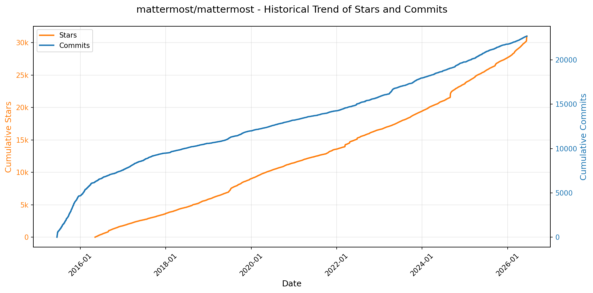

> *蓝色：累计 Stars｜橙色：累计 Commits（次 Y 轴）*

<b>📄 README 摘要</b>

1. **项目功能**  
Mattermost 是一个开源核心（open core）、支持自托管的企业级协作平台，提供实时团队聊天、工作流自动化、语音通话、屏幕共享及 AI 集成功能。其核心服务（`mattermost-server`）是整个平台的后端主程序，以单一 Linux 二进制文件形式运行，面向 DevSecOps、事件响应（Incident Resolution）、IT 服务台等关键业务场景，支持私有化部署或云托管。

2. **核心特性**  
- ✅ **全栈自托管能力**：支持 Docker、Kubernetes、Helm、Ubuntu/Debian/RHEL 等多种部署方式，含一键安装包（tar）、Omnibus 安装器及云原生方案；  
- ✅ **跨平台客户端生态**：提供官方 Android、iOS、Windows、macOS 和 Linux 原生桌面/移动应用；  
- ✅ **企业级协作功能**：结构化频道/私聊、消息搜索与归档、文件共享、SSO（LDAP/OAuth2/SAML）、合规审计日志、高可用集群支持；  
- ✅ **可扩展性与集成能力**：开放 REST API、Webhook、Slash 命令、插件系统（Plugins）、Apps 框架及 Marketplace（超 700 个预建集成）；  
- ✅ **安全与运维保障**：每月 16 日发布 MIT 许可的新版本，提供安全公告邮件订阅服务，支持细粒度权限控制与加密（TLS/DB 加密）。

3. **技术栈**  
- **后端**：Go（Golang）语言开发，采用标准 HTTP 服务架构，依赖 PostgreSQL 作为主数据库；  
- **前端**：React（TypeScript）构建 Web UI，支持现代化浏览器及 PWA 特性；  
- **基础设施**：原生兼容 Linux 系统，通过单一二进制分发；支持容器化（Docker）、编排（Kubernetes/Helm）及传统服务器部署（Ubuntu/Debian/RHEL）；  
- **许可证**：核心服务以 MIT 开源许可证发布（部分高级功能属商业版，遵循 Mattermost Enterprise EULA）。

---

### 22. [lfnovo/open-notebook](https://github.com/lfnovo/open-notebook)
- 📅 **创建日期**：2024-10-21  
- 🔄 **最近更新**：2026-06-15  
- ⭐ **Stars**：30,593（日 +371｜周 +3153｜月 +7218）  
- 📝 **描述**：An Open Source implementation of Notebook LM with more flexibility and features  

<b>📈 Star 与 Commit 历史趋势</b>

> *蓝色：累计 Stars｜橙色：累计 Commits（次 Y 轴）*

<b>📄 README 摘要</b>

1. **项目功能**  
Open Notebook 是一个开源、隐私优先的本地化知识管理与 AI 协作平台，旨在替代 Google Notebook LM。它允许用户完全在本地或自托管环境中，基于自有研究资料（如 PDF、音视频、网页、Office 文档等）进行多模态内容组织、智能检索、上下文感知对话、AI 辅助笔记撰写，并生成专业级多角色播客（支持 1–4 名可定制角色），所有数据和处理过程默认不离开用户设备或私有服务器。

2. **核心功能**  
- ✅ **端到端隐私保障**：100% 本地/自托管部署，无强制云上传，支持可选密码保护；  
- ✅ **多模型灵活集成**：原生支持 18+ AI 提供商（OpenAI、Anthropic、Google Gemini、Ollama、LM Studio、Groq、Mistral、DeepSeek、xAI 等），覆盖 LLM、嵌入、语音识别（STT）、文本转语音（TTS）全能力矩阵；  
- ✅ **智能内容中枢**：支持 PDF/视频/音频/网页/文档等多格式源导入，提供全文搜索 + 向量搜索双引擎，支持跨源语义检索；  
- ✅ **深度上下文交互**：在笔记、聊天、播客等场景中，AI 始终基于用户指定的研究材料（Sources）进行推理与生成；  
- ✅ **专业播客生成**：业界领先的多说话人播客创作功能，支持角色设定、脚本控制、节奏调节及 Episode Profiles 模板化复用；  
- ✅ **可编程扩展能力**：提供完整 REST API（`/api/v1/...`），支持自动化集成、MCP 协议（兼容 Claude Desktop / VS Code）、自定义内容转换（Transformations）及细粒度上下文控制；  
- ✅ **多语言与无障碍**：UI 支持简体中文、繁体中文、日语、韩语、葡萄牙语、俄语、西班牙语、德语、法语、孟加拉语等 10+ 语言。

3. **技术栈**  
- **后端**：Python（FastAPI 框架）、LangChain（AI 编排与工具链）、SurrealDB（实时、图+文档混合型数据库，用于结构化存储笔记/源/会话/配置）；  
- **前端**：Next.js（App Router 架构） + React（现代化响应式 UI，支持服务端渲染与静态生成）；  
- **AI 底座抽象层**：基于自研库 [Esperanto](https://github.com/lfnovo/esperanto)，统一适配多厂商 API 与本地模型（如 Ollama、LM Studio）；  
- **部署方案**：Docker Compose 一键启停（含 SurrealDB 内置服务），支持云服务器、本地 PC 或边缘设备部署；  
- **其他关键组件**：加密存储（AES-256）、REST API 文档（Swagger UI）、MCP（Model Context Protocol）客户端集成、异步任务队列（规划中）。

---

### 23. [shiyu-coder/Kronos](https://github.com/shiyu-coder/Kronos)
- 📅 **创建日期**：2025-07-01  
- 🔄 **最近更新**：2026-06-15  
- ⭐ **Stars**：30,165（日 +337｜周 +1090｜月 +5027）  
- 📝 **描述**：Kronos: A Foundation Model for the Language of Financial Markets  

<b>📈 Star 与 Commit 历史趋势</b>

> *蓝色：累计 Stars｜橙色：累计 Commits（次 Y 轴）*

<b>📄 README 摘要</b>

1. **项目功能**  
Kronos 是首个面向金融K线（蜡烛图）数据的开源基础模型，专为理解与建模金融市场“语言”而设计。它将连续、高噪声、多维的OHLCV（开盘价、最高价、最低价、收盘价、成交量、成交额）时序数据转化为离散符号序列，并通过自回归Transformer进行大规模预训练，从而统一支持多种量化金融任务，包括但不限于：高精度价格/波动率预测、多步概率性预测、跨市场泛化建模，以及可微调的下游策略信号生成（如A股市场回测）。

2. **核心特性**  
- **首创金融专属分词机制**：提出两级分层离散化Tokenizer，将原始K线数据量化为语义丰富的层级化离散token，显著提升模型对金融噪声与非平稳性的鲁棒性；  
- **全栈开源模型家族**：提供mini（4.1M）、small（24.7M）、base（102.3M）三个完全开源的预训练模型，支持不同算力场景；large版本（499.2M）暂未开源；  
- **开箱即用的预测接口**：`KronosPredictor`封装完整流程（归一化→tokenize→推理→逆归一化），支持单序列预测与GPU加速的批量并行预测（`predict_batch`），输入仅需含OHLC列的DataFrame及对应时间戳；  
- **端到端微调流水线**：提供基于Qlib的A股数据微调范例，覆盖数据预处理、Tokenizer微调、Predictor微调、策略回测全流程，并支持多卡分布式训练；  
- **实时可视化演示**：上线BTC/USDT 24小时价格预测交互式Demo，直观展示模型输出效果；  
- **多语言文档与学术背书**：支持8种语言文档，论文已被AAAI 2026录用，代码与模型均遵循MIT协议开源。

3. **技术栈**  
- **模型架构**：Decoder-only Transformer（类似GPT系列），采用标准自回归因果注意力机制；  
- **核心框架**：PyTorch + Hugging Face Transformers 生态（模型加载、训练脚本、Tokenizer集成）；  
- **数据处理**：Pandas（结构化K线IO）、NumPy（数值计算）、Qlib（专业量化数据管理与回测）；  
- **训练基础设施**：`torchrun` 多GPU分布式训练，支持混合精度（AMP）；  
- **部署与交互**：Flask/FastAPI（Demo后端）、HTML/JavaScript（前端可视化）；  
- **辅助工具**：Comet.ml（可选实验追踪）、Matplotlib/Seaborn（结果绘图）；  
- **环境依赖**：Python 3.10+，CUDA兼容GPU环境，依赖明确声明于`requirements.txt`。

---

### 24. [Imbad0202/academic-research-skills](https://github.com/Imbad0202/academic-research-skills)
- 📅 **创建日期**：2026-02-26  
- 🔄 **最近更新**：2026-06-15  
- ⭐ **Stars**：29,279（日 +299｜周 +2816｜月 +24047）  
- 📝 **描述**：Academic Research Skills for Claude Code: research → write → review → revise → finalize  

<b>📈 Star 与 Commit 历史趋势</b>

> *蓝色：累计 Stars｜橙色：累计 Commits（次 Y 轴）*

<b>📄 README 摘要</b>

1. **该项目做什么？**  
该项目是一个专为学术研究全流程设计的 Claude Code 插件套件（Academic Research Skills for Claude Code，简称 ARS），旨在将 AI 定位为“人类研究者的增强协作者”，而非替代者。它覆盖从研究选题、文献综述、实证/理论分析、论文撰写、多视角同行评审，到格式化出版与事后审计的完整学术生命周期（10 阶段管道）。核心使命是**自动化重复性、易出错的“苦力工作”**（如引文核查、逻辑一致性检验、数据验证、格式转换、AI 写作痕迹识别），同时**强制嵌入人类决策点与完整性校验门（integrity gates）**，以规避全自动 AI 研究系统固有的失败模式（如幻觉引用、方法论虚构、结论短路、框架锁定等）。其输出物包括结构化论文、多轮审稿报告、完整性验证报告及可追溯的协作过程记录。

2. **关键特性**  
- **人机协同架构**：明确拒绝全自动写作，强调“人类在环”（human-in-the-loop），所有关键阶段（如 Stage 2.5 和 Stage 4.5）设为不可跳过的硬性完整性校验门，执行 7 模式阻断检查（含幻觉引用、统计错误、方法伪造等）。  
- **深度可信机制**：  
  - *信任链前言（trust-chain frontmatter）*：追踪每条信息源的原始出处；  
  - *三层定位锚（three-layer citation anchors）*：支持按具体主张（claim-level）进行引用真实性审计；  
  - *主张审计（claim audit）*：`ARS_CLAIM_AUDIT=1` 可启用，自动抓取被引原文并判断其是否真实支撑所述主张，识别 5 类高危问题（如“主张未获支持”“虚构参考文献”“无锚点引用”等），并触发硬性拦截。  
- **多智能体专业化分工**：  
  - *Deep Research*（13 智能体）：支持 Socratic 引导式研究、PRISMA 系统综述、跨模型事实核查（Semantic Scholar API）、对话健康监控；  
  - *Academic Paper*（12 智能体）：集成风格校准（学习用户历史文风）、写作质量检测（识别机器生成特征）、LaTeX 强化、VLM 图表验证、防泄露协议；  
  - *Academic Paper Reviewer*（7 智能体）：提供 EIC + 3 动态审稿人 + 恶魔代言人 的多维评审，含 0–100 分制量化评分与修订决策映射（≥80 接受，<50 拒绝）；  
  - *Academic Pipeline*（10 阶段）：含自适应检查点、材料护照（Material Passport）、实验溯源摄入（experiment provenance intake）、协作深度观测器（advisory only）及 R&R 追溯矩阵。  
- **严谨元数据治理**：所有技能声明 `data_access_level`（原始/脱敏/仅验证）与 `task_type`（开放型/结果可评型）；引入基准测试报告 Schema 与可复现性锁文件（`repro_lock`，声明性配置，非字节级重放保证）；  
- **多语言与多格式支持**：默认中英文双语（繁体中文/英文），支持 APA 7.0（含中文规则）、Chicago、MLA、IEEE、Vancouver 等格式；兼容 IMRaD、综述、案例研究等多种论文结构。

3. **技术栈**  
- **运行平台**：Anthropic Claude Code（v3.7.0+），通过插件市场或符号链接方式集成；支持 VS Code、JetBrains IDE 及 claude.ai Web 环境；提供 Codex CLI 专属分支（`academic-research-skills-codex`）。  
- **核心依赖与工具链**：  
  - *API 服务*：Semantic Scholar API（文献验证）、Anthropic API（Claude 模型调用）；  
  - *文档处理*：Pandoc（MD → DOCX）、Tectonic + Source Han Serif TC（MD → LaTeX → PDF，APA 7.0 渲染）；  
  - *跨模型验证*：`ARS_CROSS_MODEL` 环境变量启用多模型交叉比对（如 Claude + GPT + Gemini）提升鲁棒性；  
  - *本地校验脚本*：Python 脚本（如 `scripts/check_data_access_level.py`）强制执行元数据策略；  
- **架构范式**：基于技能集合（skill ensembles）、阶段化管道（staged pipeline）、共享契约（shared contracts，如 Material Passport、handoff schemas）、完整性门控（integrity gates）构建；采用 Anthropic 提出的 “ground truth isolation pattern” 实现可信数据流隔离；  
- **开发与治理规范**：严格版本锚定（各子模块独立版本号）、结构化文档驱动（`ARCHITECTURE.md` 为唯一权威架构源）、开源许可（CC BY-NC 4.0）。

---

### 25. [Panniantong/Agent-Reach](https://github.com/Panniantong/Agent-Reach)
- 📅 **创建日期**：2026-02-24  
- 🔄 **最近更新**：2026-06-15  
- ⭐ **Stars**：28,792（日 +948｜周 +5517｜月 +9287）  
- 📝 **描述**：Give your AI agent eyes to see the entire internet. Read & search Twitter, Reddit, YouTube, GitHub, Bilibili, XiaoHongShu — one CLI, zero API fees.  

<b>📈 Star 与 Commit 历史趋势</b>

> *蓝色：累计 Stars｜橙色：累计 Commits（次 Y 轴）*

<b>📄 README 摘要</b>

1. **项目功能**  
Agent Reach 是一个为 AI Agent 提供开箱即用互联网访问能力的自动化集成工具。它通过统一安装、配置和健康检测流程，使各类 AI Agent（如 Claude Code、OpenClaw、Cursor 等）无需手动开发或调试，即可安全、稳定地读取和搜索主流中文及国际平台内容，包括网页、YouTube、B站、Twitter/X、Reddit、小红书、GitHub、RSS、LinkedIn、雪球、V2EX 等。其核心价值在于将多平台接入“工程化”——自动选型、一键部署、无感切换、故障自检，彻底消除用户在 API 申请、反爬绕过、Cookie 管理、工具链维护等方面的重复性技术负担。

2. **关键特性**  
- ✅ **零配置即用通道**：网页（Jina Reader）、YouTube（yt-dlp 字幕+搜索）、RSS（feedparser）、B站（bili-cli 无需登录）、GitHub（gh CLI 公开仓库）、V2EX、雪球等开箱即用；  
- 🔑 **智能登录态接管**：对需登录平台（Twitter、小红书、Reddit、LinkedIn 等），支持通过 Chrome 插件 Cookie-Editor 导出本地 Cookie，由 Agent 自动完成认证，全程不上传、不外传；  
- 🔄 **多后端冗余路由机制**：每个平台预置「首选 + 备选」多个技术栈（如 Twitter → twitter-cli ▸ OpenCLI ▸ bird），运行时真实探测可用性，自动降级切换，保障服务连续性（例：2026 年 B站封禁 yt-dlp 后无缝切至 bili-cli）；  
- 🩺 **内置诊断系统**：`agent-reach doctor` 一条命令实时显示各渠道状态、当前激活后端、失败原因及修复指引；  
- 🛡️ **安全优先设计**：凭据（Cookie/Token）仅存于本地 `~/.agent-reach/config.yaml`（权限 600），提供 `--safe` 安全模式（只提示不执行）、`--dry-run` 预览模式、可插拔 channel 架构；  
- 🧩 **Agent 友好集成**：自动注册 SKILL.md 技能文档，Agent 可自主识别任务语义（如“搜推特”“看视频”）并调用对应 CLI 工具，无需用户记忆命令；  
- 🌐 **本土化深度适配**：专为国内网络环境优化，支持 AtomGit 镜像加速克隆，明确标注代理需求（仅服务器部署时约 $1/月），提供小红书/OpenCLI/雪球/V2EX 等高价值中文平台原生支持。

3. **技术栈**  
- **语言与框架**：Python 3.10+（主程序、CLI 工具、channel 路由逻辑）；  
- **核心依赖工具链**：  
  - 网页解析：[Jina Reader](https://github.com/jina-ai/reader)（首选）、fallback 到其他渲染方案；  
  - 社交媒体：[twitter-cli](https://github.com/public-clis/twitter-cli)、[OpenCLI](https://github.com/jackwener/opencli)（复用浏览器登录态）、[rdt-cli](https://github.com/public-clis/rdt-cli)、[xiaohongshu-mcp](https://github.com/xpzouying/xiaohongshu-mcp)、[linkedin-mcp-server](https://github.com/stickerdaniel/linkedin-mcp-server)；  
  - 视频平台：[yt-dlp](https://github.com/yt-dlp/yt-dlp)（YouTube）、[bili-cli](https://github.com/public-clis/bilibili-cli)（B站）；  
  - 代码平台：[gh CLI](https://cli.github.com)（GitHub）；  
  - 搜索引擎：[Exa](https://exa.ai)（AI 语义搜索），通过 [mcporter](https://github.com/nicobailon/mcporter) MCP 协议接入（免 API Key）；  
  - RSS：[feedparser](https://github.com/kurtmckee/feedparser)；  
- **基础设施**：Node.js（部分 CLI 依赖）、pip/pipx（包管理）、Chrome 浏览器（Cookie 提取）、可选代理服务（如 residential proxy）；  
- **架构模式**：轻量级 capability layer（能力层），无中间包装，Agent 直接调用上游开源 CLI 工具；channel 文件按平台解耦（如 `twitter.py`、`xiaohongshu.py`），支持热插拔替换；  
- **安全机制**：本地文件存储（600 权限）、安全模式（`--safe`）、预演模式（`--dry-run`）、开源可审计（MIT 许可）。

---

### 26. [chopratejas/headroom](https://github.com/chopratejas/headroom)
- 📅 **创建日期**：2026-01-07  
- 🔄 **最近更新**：2026-06-15  
- ⭐ **Stars**：27,690（日 +1176｜周 +10515｜月 +25946）  
- 📝 **描述**：Compress tool outputs, logs, files, and RAG chunks before they reach the LLM. 60-95% fewer tokens, same answers. Library, proxy, MCP server.  

<b>📈 Star 与 Commit 历史趋势</b>

> *蓝色：累计 Stars｜橙色：累计 Commits（次 Y 轴）*

<b>📄 README 摘要</b>

1. **项目功能**  
Headroom 是一个面向 AI 代理（AI agents）的**本地化上下文压缩层**，专为大幅削减 LLM 输入 token 消耗而设计。它在 AI 代理与大语言模型之间实时拦截并压缩所有输入内容——包括工具执行输出、日志、RAG 检索片段、文件内容、对话历史等，再将压缩后的提示（prompt）发送给 LLM；同时支持按需**无损还原原始内容**（通过 CCR 机制）。其核心目标是：**保持模型输出准确性不变的前提下，实现 60–95% 的 token 节省**，且无需修改现有代理代码。

2. **关键特性**  
- **多模式接入**：提供库（library）、零代码代理（proxy）、代理封装器（`headroom wrap`）、MCP 服务（`headroom_compress`/`headroom_retrieve`）四种集成方式，适配任意语言与框架。  
- **智能内容路由与专用压缩器**：自动识别输入类型（JSON / 代码 AST / 自然语言 / 图像），分别调用 `SmartCrusher`（通用 JSON）、`CodeCompressor`（AST 感知，支持 Python/JS/Go/Rust/Java/C++）、`Kompress-base`（Hugging Face 微调模型，专为代理轨迹训练）等算法。  
- **可逆压缩（CCR）**：原始数据本地缓存，LLM 可通过 `headroom_retrieve` 工具按需精准恢复，保障可靠性与调试能力。  
- **跨代理共享内存**：Claude、Codex、Cursor、Gemini 等不同代理共用统一上下文存储，自动去重、追踪来源、支持协同记忆。  
- **自适应缓存优化（CacheAligner）**：稳定提示前缀结构，显著提升 Anthropic/OpenAI KV 缓存命中率。  
- **失败驱动学习（`headroom learn`）**：自动分析失败会话，生成修正知识并写入 `CLAUDE.md` 等文档，持续优化代理行为。  
- **全栈兼容性**：原生支持 LangChain、Agno、Strands、Vercel AI SDK、LiteLLM、ASGI 应用及 MCP 协议，覆盖主流 AI 开发栈。

3. **技术栈**  
- **核心语言**：Python（主实现，要求 3.10+）、TypeScript（Node.js 客户端支持）  
- **底层引擎**：Rust（高性能核心逻辑，通过 `maturin` 构建）、ONNX Runtime（推理加速）  
- **模型与 AI 组件**：  
  - 自研 Hugging Face 模型 [`kompress-v2-base`](https://huggingface.co/chopratejas/kompress-v2-base)（文本压缩）  
  - AST 解析器（支持多语言代码压缩）  
  - 智能上下文评分与滚动窗口（`IntelligentContext` / `RollingWindow`）  
- **基础设施**：  
  - Docker 容器化部署  
  - ASGI 中间件（FastAPI/Starlette 兼容）  
  - MCP（Model Context Protocol）标准服务接口  
  - 本地向量/图数据库支持（Qdrant、Neo4j，用于 `memory-stack` 开发环境）  
- **依赖生态**：PyTorch（Apple GPU 加速选项 `pytorch_mps`）、Rustup、Hugging Face Hub、GitHub OAuth 认证体系（Copilot 集成）

---

### 27. [anthropics/knowledge-work-plugins](https://github.com/anthropics/knowledge-work-plugins)
- 📅 **创建日期**：2026-01-23  
- 🔄 **最近更新**：2026-06-15  
- ⭐ **Stars**：20,709（日 +92｜周 +1099｜月 +8539）  
- 📝 **描述**：Open source repository of plugins primarily intended for knowledge workers to use in Claude Cowork  

<b>📈 Star 与 Commit 历史趋势</b>

> *蓝色：累计 Stars｜橙色：累计 Commits（次 Y 轴）*

<b>📄 README 摘要</b>

1. **该项目做什么？**  
该项目是一套面向知识型工作者的插件集合，旨在将Claude大模型深度专业化，使其能胜任特定岗位（如销售、产品管理、客户支持、法律、财务等）及企业定制化工作场景。插件通过封装领域专业知识、标准化工作流程、集成企业级工具（如Slack、Notion、Jira、Snowflake等）以及提供可调用的 slash 命令，使Claude在Cowork和Claude Code环境中自动执行专业任务（如撰写产品需求文档、准备销售通话、分析财务差异、生成合规合同草案等），并支持开箱即用与企业级深度定制。

2. **核心功能**  
- **角色专业化**：预置11个垂直领域插件（如sales、product-management、bio-research），覆盖从日常生产力到生命科学研发的完整知识工作链；  
- **自动化技能（Skills）**：基于Markdown编写的领域知识与最佳实践，Claude可无感调用，自动介入相关任务（如识别用户需写PRD时主动启动产品需求生成流程）；  
- **显式命令（Commands）**：提供标准化 slash 命令（如`/sales:call-prep`、`/data:write-query`），支持用户按需触发精准操作；  
- **多源工具连接（Connectors）**：通过MCP协议对接超30种主流SaaS与数据平台（含CRM、项目管理、BI、基因数据库等），实现跨系统数据拉取与操作；  
- **零代码可定制性**：全部组件（`.json`清单、`.mcp.json`连接配置、`skills/`知识库、`commands/`指令）均采用纯文本（JSON/Markdown）定义，无需编程即可修改工具地址、注入企业术语、调整流程逻辑或新建插件；  
- **插件管理能力**：内置`cowork-plugin-management`插件，支持组织内自主创建、复用与分发定制化插件，构建内部AI能力资产库。

3. **技术栈**  
- **协议层**：基于[Model Context Protocol (MCP)](https://modelcontextprotocol.io/) 实现模型与外部工具的安全、标准化通信；  
- **格式规范**：全文件化结构（JSON + Markdown），无编译依赖、无运行时服务、无基础设施要求；  
- **平台依赖**：原生适配Anthropic官方产品——Claude Cowork（Web端插件市场直装）与Claude Code（CLI命令行安装）；  
- **集成生态**：深度对接企业级SaaS（HubSpot、Jira、Microsoft 365）、数据平台（Snowflake、BigQuery、Databricks）、设计协作工具（Figma、Canva）、生命科学数据库（PubMed、ClinicalTrials.gov、ChEMBL）等；  
- **开发范式**：声明式配置驱动，强调低代码/无代码扩展，聚焦领域知识建模而非工程实现。

---

### 28. [tinyhumansai/openhuman](https://github.com/tinyhumansai/openhuman)
- 📅 **创建日期**：2026-02-18  
- 🔄 **最近更新**：2026-06-15  
- ⭐ **Stars**：19,592（日 +182｜周 +1142｜月 +19592）  
- 📝 **描述**：Your Personal AI super intelligence. Private, Simple and extremely powerful.  

<b>📈 Star 与 Commit 历史趋势</b>

> *蓝色：累计 Stars｜橙色：累计 Commits（次 Y 轴）*

<b>📄 README 摘要</b>

1. **项目功能**  
OpenHuman 是一个开源的、以用户为中心的本地优先型智能体（agentic assistant）框架，旨在成为用户的“个人AI超级智能”。它通过深度集成用户日常使用的各类数字服务（如Gmail、Notion、GitHub、Slack等），自动同步、压缩并结构化用户的多源数据（邮件、日历、代码库、文档、聊天记录等），构建持久化、可编辑、本地存储的“记忆树”（Memory Tree）与 Obsidian 兼容的知识库。其核心目标是让AI代理在分钟级内理解用户上下文，无需长期训练或手动配置，即可提供具备长期记忆、跨平台交互能力（含桌面 mascot、Google Meet 参与、语音输入输出）的主动式智能协助。

2. **关键特性**  
- **UI 优先、零配置启动**：开箱即用的桌面应用，短路径上手，无需终端操作或复杂配置；内置可交互桌面吉祥物（支持语音合成、唇形同步、实时会议参与）。  
- **118+ 一键 OAuth 集成**：覆盖主流生产力工具，通过 OpenHuman 托管的 Composio 连接层实现安全授权与自动数据拉取（每20分钟同步至本地）。  
- **双模态本地知识基**：  
  - *Memory Tree*：将原始数据切片为 ≤3k token 的 Markdown 片段，经语义评分与层级聚类后存于本地 SQLite；  
  - *Obsidian Wiki*：自动生成可直接打开/编辑的 `.md` 文件 vault，兼容 Karpathy 提倡的工作流。  
- **全栈内置能力**：开箱支持 Web 搜索、网页抓取（scraper）、完整编程工具链（文件系统、Git、Lint、Test、grep）、原生语音（STT + ElevenLabs TTS + 实时唇动）、以及智能模型路由（自动分发任务至推理/速算/视觉专用模型）。  
- **TokenJuice 智能压缩引擎**：对所有输入内容（HTML→Markdown、URL 缩写、冗余去重、CJK/emoji 保形压缩）进行预处理，降低 LLM 调用 Token 开销达 80%，兼顾信息完整性与成本效率。  
- **隐私与安全设计**：默认本地存储加密，敏感数据不出设备；支持可选 `agentmemory` 后端复用已有记忆服务；托管服务仅限账户认证、模型路由、搜索代理及 OAuth 流程，用户可完全切换至纯本地模式。  

3. **技术栈**  
- **前端与桌面框架**：Tauri（Rust + WebView）构建跨平台桌面应用；React + TypeScript 驱动 UI；集成 CEF（Chromium Embedded Framework）子模块。  
- **核心语言与构建工具**：Rust（主逻辑、内存管理、TokenJuice 压缩引擎）、TypeScript（前端/Agent 逻辑）、Node.js（v24+）、pnpm（包管理）、CMake/Ninja（构建系统）、ripgrep（文本搜索）。  
- **本地存储**：SQLite（Memory Tree 结构化存储）、文件系统（Obsidian Markdown vault）。  
- **AI 与模型层**：支持云端模型路由（OpenHuman 托管后端统一调度）及本地 AI（Ollama 集成）；语音采用 ElevenLabs TTS + 系统级 STT；Web 搜索与抓取为内置原生工具。  
- **基础设施与部署**：GitBook（文档）、GitHub Actions（CI/CD）、Debian/apt、Homebrew、MSI（Windows）、AUR（Arch Linux）多渠道分发；支持自定义 Composio 或 agentmemory 后端对接。

---

### 29. [safishamsi/graphify](https://github.com/safishamsi/graphify)
- 📅 **创建日期**：2026-04-03  
- 🔄 **最近更新**：2026-06-15  
- ⭐ **Stars**：18,400（日 +482｜周 +5129｜月 +18400）  
- 📝 **描述**：AI coding assistant skill (Claude Code, Codex, OpenCode, Cursor, Gemini CLI, and more). Turn any folder of code, SQL schemas, R scripts, shell scripts, docs, papers, images, or videos into a queryable knowledge graph. App code + database schema + infrastructure in one graph.  

<b>📈 Star 与 Commit 历史趋势</b>

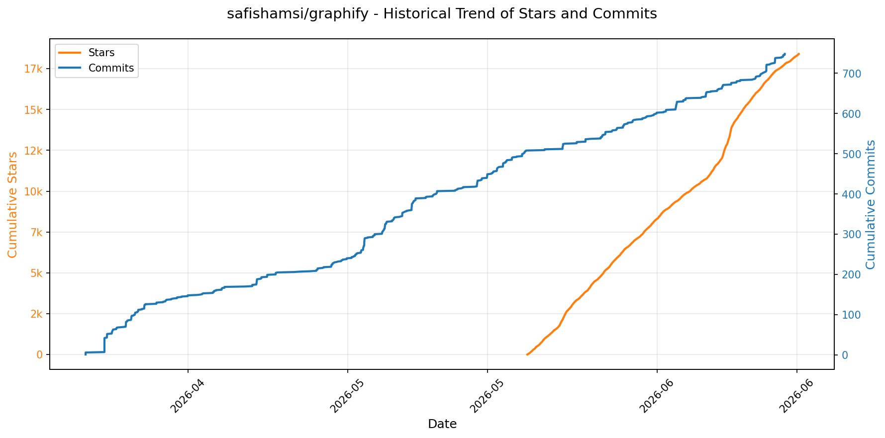

> *蓝色：累计 Stars｜橙色：累计 Commits（次 Y 轴）*

<b>📄 README 摘要</b>

1. **项目功能**  
Graphify 是一个面向开发者的智能知识图谱构建工具，可将整个代码库（含源码、文档、PDF、图片、音视频、Office 文件等）自动解析并构建成结构化的知识图谱。用户只需在支持的 AI 编程助手（如 Claude Code、Copilot、Cursor、Gemini CLI 等）中输入 `/graphify .` 命令，即可一键生成三类核心输出：交互式可视化图谱网页（`graph.html`）、结构化架构报告（`GRAPH_REPORT.md`）和机器可读的全量图谱数据（`graph.json`）。该图谱支持自然语言查询（如 `graphify query "auth 如何连接数据库？"`）、路径分析、节点解释，并深度集成至主流 AI 编程平台，使助手优先基于图谱而非原始文件进行推理与回答。

2. **核心特性**  
- **多模态全栈解析**：原生支持 36+ 种编程语言（通过 Tree-sitter AST 提取）、Salesforce Apex、Terraform/HCL、Markdown/HTML/JSON/YAML 等文档，以及 PDF、Office（`.docx/.xlsx`）、Google Workspace（需认证）、图像、音视频（含 YouTube URL）等非代码资产；  
- **智能图谱洞察**：自动识别“上帝节点”（高中心性核心概念）、发现跨文件/模块的“意外关联”、提取 `# WHY:`/`# NOTE:` 等注释作为设计意图节点、标注关系置信度（`EXTRACTED`/`INFERRED`/`AMBIGUOUS`），并生成针对性建议问题；  
- **深度平台集成**：提供开箱即用的技能安装命令（`graphify install`），支持超 20 款 AI 编程助手（Claude Code、Codex、Cursor、Copilot、Aider、Trae、Devin 等），通过 PreToolUse 钩子、`AGENTS.md`、`.cursor/rules/` 等机制实现“始终优先查询图谱”的自动化引导；  
- **工程级协作支持**：`graphify-out/` 目录推荐提交至 Git，内置 `.graphifyignore`（兼容 `.gitignore` 语法）、Git 钩子自动重建（仅增量 AST 解析，零 API 成本）、`graph.json` 冲突自动合并（Git merge driver）、PR 影响分析（`graphify prs`）及团队共享缓存管理；  
- **扩展生态丰富**：通过可选插件（如 `[pdf]`、`[video]`、`[neo4j]`、`[ollama]`、`[chinese]` 等）按需启用 PDF 提取、音视频转录、图数据库导出、本地大模型推理、中文分词等功能，支持 `uv tool install "graphifyy[all]"` 一键全装。

3. **技术栈**  
- **核心语言与运行时**：Python 3.10+（主逻辑）、Tree-sitter（36 种语言 AST 解析）、Rust（部分高性能组件，如 `uv` 工具链）；  
- **依赖管理与分发**：`uv`（推荐，极速安装与隔离环境）、`pipx`（替代方案），PyPI 包名为 `graphifyy`（双 y）；  
- **AI 后端集成**：支持 OpenAI / Azure OpenAI / Anthropic / Google Gemini / AWS Bedrock / Ollama 等多种 LLM API，通过插件化后端（`--backend` 参数）灵活切换；  
- **图谱存储与可视化**：本地 JSON 格式（`graph.json`）、交互式 HTML（D3.js 或类似前端库渲染）、Mermaid 图表导出（`callflow-html`）、SVG 导出（`[svg]` 插件）；  
- **图计算与分析**：Leiden 社区检测算法（`[leiden]` 插件）、路径查找、聚类分析（可调分辨率与 Hub 过滤）；  
- **基础设施**：GitHub Actions CI、Star History 数据看板、多语言 README（19 种语言）、Y Combinator S26 孵化项目。

---

### 30. [CloakHQ/CloakBrowser](https://github.com/CloakHQ/CloakBrowser)
- 📅 **创建日期**：2026-02-22  
- 🔄 **最近更新**：2026-06-15  
- ⭐ **Stars**：18,363（日 +133｜周 +1380｜月 +13659）  
- 📝 **描述**：Stealth Chromium that passes every bot detection test. Drop-in Playwright replacement with source-level fingerprint patches. 30/30 tests passed.  

<b>📈 Star 与 Commit 历史趋势</b>

> *蓝色：累计 Stars｜橙色：累计 Commits（次 Y 轴）*

<b>📄 README 摘要</b>

1. **项目功能**  
CloakBrowser 是一个深度定制的、开源的“隐身 Chromium 浏览器二进制”，专为绕过现代反爬与反自动化检测系统（如 Cloudflare Turnstile、reCAPTCHA v3、FingerprintJS、ShieldSquare 等）而设计。它并非通过 JavaScript 注入或运行时配置欺骗，而是直接在 Chromium 源码（C++ 层级）进行 58 处底层补丁，从根源上修正浏览器指纹特征（GPU、WebGL、Canvas、WebRTC、音频、字体、屏幕参数、网络时序、自动化信号等），使检测服务将其识别为真实、合法的人类用户浏览器。它作为 Playwright 和 Puppeteer 的**零改造替代品**，兼容其全部 API，仅需替换导入语句即可无缝集成，用于高对抗性网站的数据采集、自动化测试及 AI 代理浏览器交互。

2. **核心特性**  
- ✅ **源码级指纹伪装**：58 项 C++ 补丁，覆盖硬件报告、UA、navigator 属性（如 `webdriver=false`、`chrome` 对象存在）、TLS 指纹（JA3/JA4 匹配真实 Chrome）、WebRTC IP 隐蔽等；  
- ✅ **行为级人性化**：`humanize=True` 一键启用贝塞尔曲线鼠标移动、逐字符键盘输入、自然滚动模式，并支持自定义预设（如 `"careful"`）；  
- ✅ **高分反检测验证**：reCAPTCHA v3 服务端评分稳定达 **0.9（人类级）**，100% 通过 Cloudflare Turnstile（含非交互/托管模式）、FingerprintJS、BrowserScan（4/4 正常）、deviceandbrowserinfo.com（0 个机器人标识）；  
- ✅ **开箱即用 & 自动更新**：`pip install cloakbrowser` 或 `npm install cloakbrowser` 后自动下载并缓存 ~200MB 定制 Chromium 二进制（当前 v0.3.31 基于 Chromium 146），支持后台静默升级；  
- ✅ **企业级代理与地理适配**：原生支持 HTTP/SOCKS5 代理（含内联凭证）、`geoip=True` 自动从代理出口 IP 推断并设置时区/语言环境、WebRTC IP 自动伪装；  
- ✅ **持久化浏览器配置**：`launch_persistent_context()` 提供真实用户数据目录，支持 Cookie/LocalStorage 持久化、Chrome 扩展加载、Widevine DRM（Linux）及自然浏览历史积累；  
- ✅ **配套管理工具**：提供开源的 CloakBrowser Manager（Docker 部署），实现多账号浏览器指纹隔离、代理绑定与 noVNC 远程控制，对标 Multilogin/GoLogin；  
- ✅ **零配置默认隐身**：启动时自动生成随机指纹种子，无需任何参数即可通过绝大多数检测；  
- ✅ **全平台一致性**：本地、Docker、VPS 环境行为完全一致，无环境依赖型补丁。

3. **技术栈**  
- **核心引擎**：深度定制的 **Chromium（v146）**，所有指纹修改均在 C++ 源码层实现并编译为原生二进制；  
- **客户端封装**：  
  - Python：基于 `playwright-core` / `puppeteer-core` 构建，提供同步/异步 `launch()`、`launch_context()`、`launch_persistent_context()` 等接口；  
  - JavaScript/Node.js：兼容 Playwright 和 Puppeteer 的 ESM/CJS 导入方式，支持 `import { launch } from 'cloakbrowser'`；  
- **基础设施**：  
  - 二进制分发：PyPI（Python）、npm（JS）、Docker Hub（`cloakhq/cloakbrowser`）；  
  - 代理与地理定位：`geoip` 可选依赖（基于 `requests` 调用 ipify.org/checkip.amazonaws.com）；  
  - 安全机制：SHA-256 校验确保二进制完整性；  
- **扩展能力**：支持 Chrome 扩展加载、Widevine CDM 侧载（Linux）、QUIC/HTTP3 通过 SOCKS5 UDP ASSOCIATE 隧道；  
- **部署形态**：支持命令行工具（`python -m cloakbrowser install/info`）、Docker 快速验证（`docker run cloakhq/cloakbrowser cloaktest`）及 Web UI 管理（CloakBrowser Manager）。

---

### 31. [Free-TV/IPTV](https://github.com/Free-TV/IPTV)
- 📅 **创建日期**：2021-04-13  
- 🔄 **最近更新**：2026-06-15  
- ⭐ **Stars**：17,065（日 +189｜周 +340｜月 +760）  
- 📝 **描述**：M3U Playlist for free TV channels  

<b>📈 Star 与 Commit 历史趋势</b>

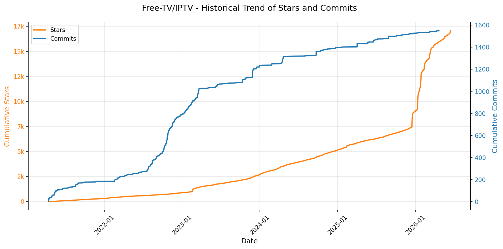

> *蓝色：累计 Stars｜橙色：累计 Commits（次 Y 轴）*

<b>📄 README 摘要</b>

1. **项目功能**  
该项目是一个全球免费电视频道的开源 M3U 播放列表（`playlist.m3u8`），汇集了通过地面数字广播（DVB-T/T2、ATSC、ISDB-T 等）或互联网平台（如 Pluto TV、YouTube Live、Samsung TV Plus、Roku TV 等）合法免费向公众开放的电视频道。用户可直接将该播放列表 URL（`https://raw.githubusercontent.com/Free-TV/IPTV/master/playlist.m3u8`）导入支持 M3U 的 IPTV 播放器（如 VLC、Kodi、IPTV Smarters 等）进行观看，无需订阅付费服务。

2. **核心特性**  
- **严格筛选标准**：坚持“质量优于数量”，仅收录稳定可用、优先 HD 画质、单一流地址（无 +1 频道/地域变体/备用源）的频道；  
- **完全免费原则**：仅包含官方公开免费提供的频道（如公共广播、政府资助频道、运营商免费 OTA 频道），明确排除任何需商业订阅的付费频道；  
- **内容中立性**：拒绝成人、宗教专属、政党宣传及境外资金主导的频道，确保面向大众的普适性；  
- **地理分类结构化**：按国家/地区组织（覆盖超 70 个主权国家与地区），每个地区对应独立 Markdown 文件（如 `usa.md`），支持图标导航；  
- **标准化标记体系**：在列表中用符号标识关键属性——`Ⓢ`（标清）、`Ⓖ`（GeoIP 地理封锁）、`Ⓨ`（YouTube 直播源）；  
- **自动化生成与协作流程**：播放列表由 Python 脚本 `make_playlist.py` 动态生成，所有频道增删改均通过修改 `.md` 源文件并提交 Pull Request 实现，禁止直接编辑 `.m3u8` 文件。

3. **技术栈**  
- **数据格式**：M3U8（HLS 协议播放列表标准格式）；  
- **源数据管理**：Markdown（`.md` 文件存储频道元数据，含名称、URL、分组标题、状态标记）；  
- **构建工具**：Python（`make_playlist.py` 脚本解析 Markdown 并生成最终 M3U8）；  
- **托管与分发**：GitHub Pages / Raw CDN（通过 `raw.githubusercontent.com` 直接提供可播放的远程 M3U8 地址）；  
- **协作规范**：基于 GitHub 的 Pull Request 工作流，结合语义化提交要求（如需提供免费依据、Logo 图床链接、GeoIP 适用国家说明等）。

---

### 32. [refactoringhq/tolaria](https://github.com/refactoringhq/tolaria)
- 📅 **创建日期**：2026-02-14  
- 🔄 **最近更新**：2026-06-15  
- ⭐ **Stars**：16,120（日 +158｜周 +3312｜月 +5674）  
- 📝 **描述**：Desktop app to manage markdown knowledge bases  

<b>📈 Star 与 Commit 历史趋势</b>

> *蓝色：累计 Stars｜橙色：累计 Commits（次 Y 轴）*

<b>📄 README 摘要</b>

1. **项目功能**  
Tolaria 是一款跨平台（macOS、Windows、Linux）的桌面应用，专为管理基于纯文本的 Markdown 知识库（即“笔记仓库”）而设计。它面向个人知识管理（如构建第二大脑、日常日志）、企业文档组织（作为 AI 的上下文源）、以及 AI 助手/智能体（如 OpenClaw）的记忆与流程存储场景。核心定位是将用户的知识资产以本地文件形式长期、安全、自主地托管，不依赖云端服务或厂商锁定。

2. **关键特性**  
- **文件优先（Files-first）**：所有笔记均为标准 Markdown 文件，含 YAML Frontmatter，可直接用任意编辑器打开、编辑、版本控制，无需导出。  
- **Git 优先（Git-first）**：每个知识库（vault）默认是一个 Git 仓库，支持完整版本历史、任意远程托管（如 GitHub/GitLab）、无服务器依赖。  
- **离线优先 & 零锁定（Offline-first, zero lock-in）**：无需账号、订阅或网络连接；卸载后数据完全保留，迁移成本为零。  
- **开源免费**：采用 AGPL-3.0+ 许可，代码完全公开，由开发者自用驱动并开放共享。  
- **标准兼容**：严格遵循 Markdown + YAML 标准，拒绝私有格式，确保生态互通性与长期可迁移性。  
- **类型即视图（Types as lenses）**：类型系统仅用于分类导航与快速检索，不强制字段、不校验结构，保持灵活性。  
- **AI 原生但非绑定（AI-first but not AI-only）**：内置对 Claude Code、Codex CLI、Gemini CLI 的配置支持，并提供 `AGENTS` 文件供 AI 工具识别上下文；同时完全兼容用户自选的任何 AI 工具链。  
- **键盘优先（Keyboard-first）**：深度优化快捷键与命令面板（Command Palette），满足高效键盘操作需求。  
- **真实场景驱动**：所有功能均源于作者每日管理超 10,000+ 笔记的真实工作流验证，强调实用性与可靠性。

3. **技术栈**  
- **前端框架**：React + TypeScript  
- **桌面应用框架**：Tauri（替代 Electron，提供更小体积、更高性能与 Rust 安全底层）  
- **构建与包管理**：pnpm（v8+）、Vite（开发服务器与构建工具）  
- **后端/系统层**：Rust（Tauri 核心及部分本地能力）、Node.js（v20+，用于 MCP 服务器及部分 AI 工具集成）  
- **原生依赖（Linux）**：WebKit2GTK 4.1、GTK 3、libappindicator、librsvg 等系统级图形与集成库  
- **开发环境要求**：macOS 或 Linux（开发支持），需预装 Rust Stable、Node.js 20+、pnpm 8+  
- **辅助工具链**：GitHub Actions（CI/CD）、Codecov（覆盖率）、CodeScene（代码健康分析）

---

### 33. [GorvGoyl/Clone-Wars](https://github.com/GorvGoyl/Clone-Wars)
- 📅 **创建日期**：2020-12-02  
- 🔄 **最近更新**：2026-06-15  
- ⭐ **Stars**：15,100（日 +467｜周 +1209｜月 +1331）  
- 📝 **描述**：100+ open-source clones of popular sites like Airbnb, Amazon, Instagram, Netflix, Tiktok, Spotify, Whatsapp, Youtube etc. See source code, demo links, tech stack, github stars.  

<b>📈 Star 与 Commit 历史趋势</b>

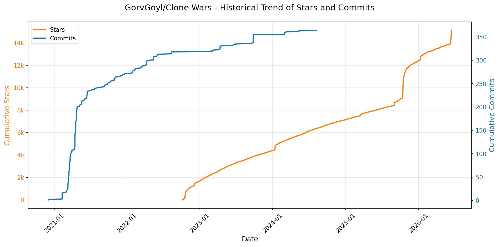

> *蓝色：累计 Stars｜橙色：累计 Commits（次 Y 轴）*

<b>📄 README 摘要</b>

1. **项目功能**  
该项目是一个开源的“流行网站克隆与替代方案”聚合资源库，收录了100多个知名平台（如Airbnb、Amazon、Instagram、Netflix、TikTok、Spotify、WhatsApp、YouTube等）的开源复刻版（clones）和功能性替代品（alternatives）。其核心目标是为开发者提供学习参考：既包含高度还原UI但侧重教学的入门级克隆项目（附免费教程、演示链接、源码及技术栈说明），也包含可实际部署使用的成熟开源替代软件（如Bitwarden替代1Password、Meilisearch替代Algolia、Baserow替代Airtable）。所有条目均标注GitHub星标数、技术栈、在线Demo链接及仓库地址，便于评估项目质量与适用性。

2. **关键特性**  
- **双维度分类清晰**：分为「带教程的全栈克隆」（含视频/文字教程，适合初学者系统学习）和「克隆/替代项目总表」（涵盖UI相似克隆与生产级开源替代品，通过Star数辅助判断成熟度）；  
- **信息结构化完备**：每项均提供Demo预览链接、GitHub/GitLab仓库地址、明确标注的技术栈、实时Star数徽章，部分含部署平台（Vercel、Firebase Hosting等）；  
- **强学习导向设计**：教程来源覆盖YouTube主流技术频道（如CodeWithAnia、Traversy Media）、freeCodeCamp及JavaScript Mastery等权威平台，技术路径覆盖前后端全栈（如React+Firebase、Django REST+React、Vue+Quasar）；  
- **社区协作驱动**：公开招募维护者，鼓励PR贡献新项目，并提供详细贡献指南，保障列表持续更新与质量。

3. **技术栈**  
项目本身为静态网站（托管于gourav.io），但所收录的克隆/替代项目技术栈高度多样化，体现现代Web与移动开发主流生态：  
- **前端框架**：React（含Next.js、TypeScript、Material UI、Tailwind CSS）、Vue.js（含Quasar）、Flutter（Dart）、Angular、Svelte；  
- **后端与全栈方案**：Firebase（Firestore、Auth、Storage）、Django / Django REST Framework、Node.js（Express）、Ruby on Rails、Yii2（PHP）、Rust（Meilisearch）、Go（ORY）、C#（Bitwarden Xamarin）；  
- **数据库与搜索**：PostgreSQL、MySQL、Firestore、DataStax Astra、Meilisearch；  
- **移动端**：Android Studio（Kotlin/Java）、React Native、Expo；  
- **基础设施**：Netlify、Vercel、Heroku、Google Cloud Platform、Cloud Functions。

---

### 34. [andrewyng/aisuite](https://github.com/andrewyng/aisuite)
- 📅 **创建日期**：2024-06-30  
- 🔄 **最近更新**：2026-06-15  
- ⭐ **Stars**：14,395（日 +229｜周 +598｜月 +667）  
- 📝 **描述**：Simple, unified interface to multiple Generative AI providers   

<b>📈 Star 与 Commit 历史趋势</b>

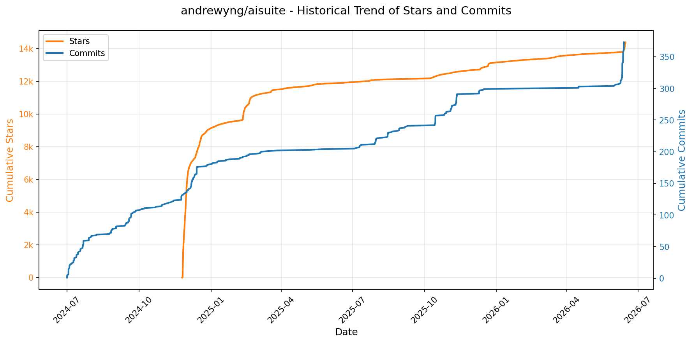

> *蓝色：累计 Stars｜橙色：累计 Commits（次 Y 轴）*

<b>📄 README 摘要</b>

1. **项目功能**  
OpenCoworker 是一款运行在用户本地桌面的 AI 协作代理（AI agent），具备任务执行能力而不仅是对话交互。它可深度研究信息、自动化完成真实办公任务：读取本地文件（需用户授权）、收发 Slack/邮件等消息、生成 PDF 报告、Word 文档、Excel 表格等可交付成果，并支持定时自动化（如每日新闻摘要）。所有数据默认保留在用户设备上，支持接入自有 API 密钥（OpenAI/Anthropic/Google）或完全离线运行（通过 Ollama 本地大模型）。

2. **核心特性**  
- **多模态任务执行能力**：超越聊天，支持文件读写、消息收发、文档生成、Shell 命令执行、Git 操作等真实系统级操作；  
- **隐私优先架构**：默认不上传数据，支持全本地运行（Ollama），API 密钥由用户自主管理；  
- **灵活模型切换**：统一 Chat Completions API，仅需修改模型标识符（如 `"openai:gpt-4o"` 或 `"ollama:llama3"`）即可无缝切换后端 LLM 提供商；  
- **强大代理框架（Agents API）**：内置工具调用抽象（`max_turns` 自动循环）、预置工具包（files/git/shell）、细粒度工具策略（审批制/黑白名单）、状态持久化（内存/文件/PostgreSQL）、完整执行追踪与产物归档；  
- **MCP（Model Context Protocol）原生支持**：可直接集成任意符合 MCP 标准的外部工具服务（如文件系统、浏览器、数据库等），无需额外适配代码；  
- **开箱即用的桌面应用**：提供 macOS（Apple Silicon）和 Windows（x64）原生安装包，开箱配置即用。

3. **技术栈**  
- **核心语言与框架**：Python（aisuite 库主体），基于标准库与轻量依赖构建；  
- **LLM 接入层**：统一适配 OpenAI、Anthropic、Google Gemini、Mistral、Hugging Face Inference API、AWS Bedrock、Cohere、Ollama、OpenRouter 等十余种提供商；  
- **代理运行时**：自研 Agents API，集成工具调用调度、多轮会话管理、沙箱化工具包（files/git/shell toolkit）、状态存储引擎与 MCP 客户端；  
- **桌面应用实现**：OpenCoworker 作为 aisuite 的参考实现，采用平台原生方式打包（macOS `.dmg` / Windows `.exe`），底层依赖 aisuite Python 运行时及本地模型服务（如 Ollama）；  
- **扩展与生态**：遵循约定式插件机制（`<provider>_provider.py` + `<Provider>Provider` 类），支持开发者零侵入添加新 LLM 提供商；  
- **开发与协作**：采用 Black 代码风格，PyPI 发布，MIT 开源协议，配套详细文档（Quickstart/Examples）与 Discord 社区支持。

---

### 35. [pytest-dev/pytest](https://github.com/pytest-dev/pytest)
- 📅 **创建日期**：2015-06-15  
- 🔄 **最近更新**：2026-06-15  
- ⭐ **Stars**：14,073（日 +148｜周 +181｜月 +256）  
- 📝 **描述**：The pytest framework makes it easy to write small tests, yet scales to support complex functional testing  

<b>📈 Star 与 Commit 历史趋势</b>

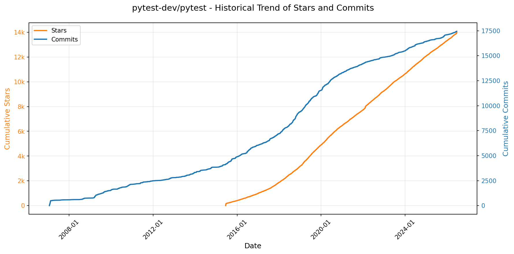

> *蓝色：累计 Stars｜橙色：累计 Commits（次 Y 轴）*

---

### 36. [rohitg00/agentmemory](https://github.com/rohitg00/agentmemory)
- 📅 **创建日期**：2026-02-25  
- 🔄 **最近更新**：2026-06-15  
- ⭐ **Stars**：13,366（日 +135｜周 +1102｜月 +13285）  
- 📝 **描述**：#1 Persistent memory for AI coding agents based on real-world benchmarks  

<b>📈 Star 与 Commit 历史趋势</b>

> *蓝色：累计 Stars｜橙色：累计 Commits（次 Y 轴）*

<b>📄 README 摘要</b>

1. **项目功能**  
该项目（`agentmemory`）是一个为AI编程智能体（coding agents）提供**持久化、跨会话、跨工具的上下文记忆系统**。它解决AI编码助手在不同会话中反复遗忘用户代码规范、架构决策、调试经验、偏好设置和历史交互的问题——无需用户重复解释JWT认证方式、测试覆盖策略或依赖选型原因。其核心能力是：自动捕获智能体行为（如编辑文件、运行命令、调试输出），经压缩与结构化后构建可检索的记忆库，并在后续会话中精准注入相关上下文，实现“智能体真正记住你”。

2. **关键特性**  
- ✅ **全自动记忆捕获**：内置12种预置钩子（hooks），零手动调用即可监听并记录各类智能体行为（如文件修改、终端执行、错误日志）。  
- ✅ **混合检索引擎**：融合BM25关键词搜索、本地向量嵌入（`all-MiniLM-L6-v2`）与知识图谱关系推理，采用RRF（Reciprocal Rank Fusion）融合策略，LongMemEval-S基准下R@5达**95.2%**。  
- ✅ **多智能体共享内存**：基于MCP（Model Context Protocol）标准协议，支持Claude Code、GitHub Copilot CLI、Cursor、Gemini CLI、OpenCode、Hermes等**53+主流AI编码工具**共用同一内存服务，实现记忆互通。  
- ✅ **无外部依赖部署**：纯客户端运行，仅依赖SQLite（内嵌）与自研`iii`引擎，**零外部数据库/云服务/向量库**（如Qdrant、pgvector、Postgres）。  
- ✅ **智能生命周期管理**：4级记忆分层（瞬时→短期→长期→归档）、时间衰减、自动遗忘与知识图谱驱动的语义合并，避免记忆冗余与过时。  
- ✅ **极致Token效率**：相比全量粘贴上下文（年耗1950万+ tokens），仅需约**17万tokens/年**（≈$10），支持完全离线本地嵌入（$0成本）。  
- ✅ **开箱即用生态集成**：提供实时Web查看器（`:3113`）、iii控制台、15个预置技能（skills）、一键连接指令（`agentmemory connect`）及与`codegraph`/`Understand Anything`/`Graphify`等工具的协同方案。

3. **技术栈**  
- **核心引擎**：自研`iii`引擎（轻量级、高性能、内存优先的上下文处理框架），作为底层运行时。  
- **存储层**：SQLite（默认内嵌，免配置、单文件、ACID兼容），无外部DB依赖。  
- **协议标准**：全面遵循MCP（Model Context Protocol）v0.2+，同时兼容REST API与钩子事件机制。  
- **嵌入模型**：默认集成开源轻量模型`all-MiniLM-L6-v2`（本地CPU运行，无需API密钥或GPU）。  
- **前端与工具链**：TypeScript（主CLI）、Node.js（v18+）、Vite（Viewer UI）、Tailwind CSS；CLI通过`npm`分发（`@agentmemory/agentmemory`）。  
- **扩展生态**：深度适配MCP客户端生态，与`codegraph`（代码图谱）、`Understand Anything`（多模态理解）、`Graphify`（跨文档知识图谱）形成互补技术栈。

---

### 37. [can1357/oh-my-pi](https://github.com/can1357/oh-my-pi)
- 📅 **创建日期**：2025-12-31  
- 🔄 **最近更新**：2026-06-15  
- ⭐ **Stars**：12,537（日 +150｜周 +1362｜月 +8044）  
- 📝 **描述**：⌥  AI Coding agent for the terminal — hash-anchored edits, optimized tool harness, LSP, Python, browser, subagents, and more  

<b>📈 Star 与 Commit 历史趋势</b>

> *蓝色：累计 Stars｜橙色：累计 Commits（次 Y 轴）*

<b>📄 README 摘要</b>

1. **项目功能**  
Oh-My-Pi（OMP）是一个开箱即用、深度集成开发环境能力的本地化编程智能代理（coding agent），旨在替代传统“LLM+简单工具调用”的轻量级Agent范式。它不是一个远程服务或Web应用，而是一个**可直接安装运行的终端命令行工具（`omp`）**，具备完整的IDE级代码理解与操作能力：能像真实开发者一样读写文件、执行代码、调用LSP语义分析、驱动调试器（DAP）、处理Git变更、解析PDF/网页/PR/Issue等结构化内容，并在本地原生环境中完成端到端软件工程任务——从代码审查、重构、调试到提交生成，全部在单个进程内闭环完成。

2. **核心特性**  
- **全栈IDE能力集成**：原生支持LSP（含重命名、引用查找、代码操作等14类操作）和DAP（lldb/dlv/debugpy等28类调试能力），实现语义感知的精准编辑与实时调试。  
- **多内核协同执行**：内置持久化Python与Bun（JavaScript）运行时，支持跨语言工具调用（如Python中调用`tool.read`加载CSV，JS中直接图表化），所有执行在单会话内无缝流转。  
- **智能流控与规则注入**：采用“时间旅行流规则”（TTSR），可在模型输出中途基于正则匹配动态注入约束（如禁止`Box::leak`），实现零上下文税的实时纠偏。  
- **子代理架构（Subagents）**：支持`task`指令并行调度隔离工作区的子代理，返回强类型结构化结果（非自然语言），消除合并冲突与解析开销。  
- **原生跨平台能力**：不依赖外部`grep`/`rg`/`bash`等CLI工具，而是将ripgrep、glob、find等直接编译进二进制，Windows/macOS/Linux均运行同一原生可执行文件（无WSL）。  
- **哈希锚点编辑（Hashline）**：基于内容哈希定位代码片段进行修改，杜绝因空格/换行导致的patch失败，提升编辑鲁棒性与token效率（Grok 4 Fast降低61%输出token）。  
- **统一资源抽象层**：通过12+自定义协议（`pr://`, `issue://`, `agent://`, `conflict://`等）将GitHub PR、Git冲突、子代理输出等全部映射为文件系统路径，复用`read`/`search`等统一工具链。  
- **渐进式记忆系统（Hindsight）**：自动在会话中提取事实（`retain`）、跨会话检索（`recall`）、聚合生成项目级心智模型，实现代码库级长期记忆。  
- **编辑器直连支持（ACP）**：可嵌入Zed等现代编辑器，直接读取当前编辑缓冲区、通过编辑器保存路径写入、在编辑器终端中执行命令，零插件、零桥接。  
- **企业就绪工作流**：提供原子化Git提交（`omp commit`）、优先级分级代码审查（P0–P3问题打分+明确发布 verdict）、浏览器自动化（Stealth模式防检测）、Slack/Teams等第三方应用驱动能力。

3. **技术栈**  
- **核心语言**：Rust（约5.5万行，承担高性能底层逻辑、LSP/DAP协议实现、文件系统抽象、内存管理及CLI主干）  
- **前端/胶水层**：TypeScript（构建CLI交互界面、TUI渲染、配置解析、工具元数据管理）  
- **运行时**：Bun（作为首选包管理器与JS运行时，替代Node.js；亦支持npm/yarn）  
- **关键依赖**：  
  - LSP/DAP：集成`rust-analyzer`、`lldb-dap`、`dlv-dap`、`debugpy`等标准适配器  
  - 搜索/索引：自研`search_tool_bm25`、`ast-grep`（Tree-sitter语法树查询）  
  - 文档解析：PDF（`pdfium`）、Markdown、Jupyter Notebook、SQLite、ArXiv等原生支持  
  - 浏览器自动化：Puppeteer + Chromium（启用Stealth模式）  
  - 模型路由：兼容OpenAI v1、Anthropic、Google Gemini、Ollama、LM Studio、vLLM等40+提供商，支持OAuth/Local/Plan多认证模式与fallback链式降级  
- **构建与分发**：CI使用GitHub Actions，支持Homebrew（macOS/Linux）、PowerShell脚本（Windows）、`mise`版本管理器，提供预编译跨平台二进制

---

### 38. [fathah/hermes-desktop](https://github.com/fathah/hermes-desktop)
- 📅 **创建日期**：2026-04-02  
- 🔄 **最近更新**：2026-06-15  
- ⭐ **Stars**：12,247（日 +134｜周 +1213｜月 +7150）  
- 📝 **描述**：Desktop Companion for Hermes Agent  

<b>📈 Star 与 Commit 历史趋势</b>

> *蓝色：累计 Stars｜橙色：累计 Commits（次 Y 轴）*

<b>📄 README 摘要</b>

1. **项目功能**  
Hermes Desktop 是一个原生桌面应用程序，用于**一键安装、可视化配置和交互式使用 Hermes Agent**（一个具备工具调用、跨平台消息集成与闭环自主学习能力的 AI 助手）。它替代了命令行手动管理的方式，统一提供图形化界面完成 Hermes Agent 的本地部署（或连接远程 API 服务）、多模型/多提供商配置、实时聊天、会话管理、技能编排、记忆系统、自动化调度及 16 种消息网关集成（如 Telegram、Discord、微信、Slack 等），并内置 3D 可视化工作区（Claw3d）。

2. **核心特性**  
- **引导式首启安装**：自动检测/安装 Hermes Agent（依赖 Git、uv、Python 3.11+），进度可视、依赖自动解析；  
- **双模式运行**：支持本地 `127.0.0.1:8642` 后端或连接任意远程 Hermes API 服务；  
- **全栈模型支持**：覆盖 OpenRouter、Anthropic、OpenAI、Gemini、Grok、Nous Portal、Qwen、MiniMax、Hugging Face、Groq 及本地兼容端点（Ollama/LM Studio/vLLM/llama.cpp 等）；  
- **增强型聊天体验**：SSE 流式响应、工具执行进度指示、Markdown 渲染、语法高亮、实时 token/cost 统计 + `/usage` 命令；  
- **22 个内置 Slash 命令**：涵盖会话控制（`/new`/`/clear`）、工具调用（`/web`/`/image`/`/shell`）、系统诊断（`/debug`/`/status`）等；  
- **结构化会话与档案管理**：SQLite FTS5 全文搜索、时间分组历史、跨会话检索与恢复；  
- **多 Profile 隔离环境**：独立配置、内存、技能与模型设置；  
- **14 类工具集**：含 Web 浏览、终端执行、文件操作、代码解释、视觉理解、TTS、MoA 协作、任务规划等；  
- **可扩展记忆系统**：支持 Honcho、Mem0、RetainDB 等第三方记忆后端，支持用户画像记忆编辑；  
- **Persona 编辑器**：直接修改 SOUL.md 定义 AI 人格；  
- **定时任务引擎**：可视化 Cron 构建器，支持 15 种交付目标；  
- **16 大消息网关**：覆盖主流通讯平台（含 iMessage/WeChat/钉钉/飞书/企业微信）及 Home Assistant/Webhook；  
- **Hermes Office（Claw3d）**：3D 可视化开发服务器与适配器管理中心；  
- **安全密钥管理**：支持 `.env` 明文与 `command` 模式（无缝对接 KeePassXC/GnuPG/pass/Bitwarden/1Password/secret-tool 等任意密码管理器）；  
- **完整运维能力**：自动更新、日志查看、数据备份/导入、调试转储、国际化（i18n）框架。

3. **技术栈**  
- **桌面框架**：Electron v39（跨平台原生壳）；  
- **前端框架**：React v19 + TypeScript v5.9（主进程与渲染进程全程类型安全）；  
- **样式方案**：Tailwind CSS v4（原子化 CSS）；  
- **构建工具**：Vite v7 + electron-vite（极速热更新与打包）；  
- **本地存储**：better-sqlite3（带 FTS5 全文搜索的嵌入式数据库）；  
- **国际化**：i18next（已实现全界面英文本地化，社区可扩展多语言）；  
- **测试体系**：Vitest（覆盖 SSE 解析器、IPC 处理器、预加载 API、安装工具及常量校验）；  
- **底层依赖**：Hermes Agent（核心行为与工具执行由上游项目提供）。

---

### 39. [supertone-inc/supertonic](https://github.com/supertone-inc/supertonic)
- 📅 **创建日期**：2025-11-18  
- 🔄 **最近更新**：2026-06-15  
- ⭐ **Stars**：12,240（日 +357｜周 +875｜月 +6111）  
- 📝 **描述**：Lightning-Fast, On-Device, Multilingual TTS — running natively via ONNX.  

<b>📈 Star 与 Commit 历史趋势</b>

> *蓝色：累计 Stars｜橙色：累计 Commits（次 Y 轴）*

<b>📄 README 摘要</b>

1. **项目功能**  
Supertonic 是一个轻量级、全本地运行的开源文本转语音（TTS）系统，专为**设备端（on-device）实时语音合成**而设计。它不依赖云端服务、无需网络连接、不发送任何数据，完全在用户设备（包括桌面、浏览器、手机、树莓派、电子书阅读器等）上完成端到端推理。支持直接将任意自然语言文本（含复杂金融表达式、电话号码、技术单位等）高精度、低延迟地合成为 44.1kHz 高保真 WAV 音频，适用于隐私敏感、离线环境或资源受限边缘场景。

2. **核心特性**  
- ✅ **极致性能**：CPU 上即可实现亚秒级网页语音化（<1 秒），实测 RTF（Real-Time Factor）达 0.3×（如在 Onyx Boox e-reader 上），无 GPU 依赖；  
- ✅ **31 种语言原生支持**：覆盖阿拉伯语、中文（简体/繁体未列但含日韩越等东亚语言）、英语、西班牙语等主流语种，支持 `lang="na"` 语言自动识别模式，免手动标注；  
- ✅ **超轻量模型**：仅约 99M 参数，ONNX 格式开源权重，模型体积小、下载快、冷启动迅速、内存占用低；  
- ✅ **开箱即用的自然表达能力**：内置 10 种语义化内联标签（如 `<laugh>`、`<breath>`、`<sigh>`），无需参考音频或复杂提示词即可注入人类级韵律与情感；  
- ✅ **工业级文本鲁棒性**：精准处理金融数字（`$5.2M`）、电话号码（`(212) 555-0142 ext. 402`）、技术单位（`12.5ms`, `3.2GHz`）等真实场景复杂文本，显著优于 ElevenLabs、OpenAI、Gemini 等主流 TTS；  
- ✅ **多平台全栈 SDK 支持**：提供 Python、Node.js、Web（WebGPU/WASM）、Java、C++、C#、Go、Swift、iOS、Rust、Flutter 等 11+ 语言/平台的完整示例与生产就绪接口；  
- ✅ **灵活部署模式**：既可嵌入应用代码调用，也支持通过 `supertonic serve` 启动本地 HTTP 服务，兼容 OpenAI `/v1/audio/speech` 标准 API，便于集成至本地 AI 工具链；  
- ✅ **语音定制生态**：虽本仓库聚焦固定声线，但官方配套 [Voice Builder](https://supertonic.supertone.ai/voice-builder) 支持上传录音生成专属声线 JSON 文件，无缝适配 Supertonic 2/3 版本。

3. **技术栈**  
- **推理引擎**：基于 **ONNX Runtime**（跨平台 CPU 优先），浏览器端使用 **onnxruntime-web**（WebGPU/WASM 加速）；  
- **模型格式**：全量开源 **ONNX 模型**（经 OnnxSlim 优化），Hugging Face 托管（[Supertone/supertonic-3](https://huggingface.co/Supertone/supertonic-3)）；  
- **音频输出**：原生生成 **44.1kHz / 16-bit PCM WAV**，无需后处理或升采样；  
- **开发语言支持**：Python（PyPI 包 `supertonic`）、JavaScript/TypeScript（Node.js + Browser）、Java（JDK 17+）、C++（CMake 构建）、C#（.NET 9+）、Go（依赖 onnxruntime C lib）、Swift（macOS）、Rust（`tract-onnx` 或 `ort`）、iOS（Objective-C/Swift 混编）、Flutter（Dart 插件封装）；  
- **基础设施**：Git LFS 管理大模型文件，支持批量合成、多线程/异步推理；  
- **配套工具链**：CLI 服务（`supertonic serve`）、OpenAPI 文档、Hugging Face Spaces 在线 Demo、GitHub Pages 音频样本库。

---

### 40. [hardikpandya/stop-slop](https://github.com/hardikpandya/stop-slop)
- 📅 **创建日期**：2026-01-11  
- 🔄 **最近更新**：2026-06-15  
- ⭐ **Stars**：10,605（日 +222｜周 +1303｜月 +7059）  
- 📝 **描述**：A skill file for removing AI tells from prose  

<b>📈 Star 与 Commit 历史趋势</b>

> *蓝色：累计 Stars｜橙色：累计 Commits（次 Y 轴）*

<b>📄 README 摘要</b>

1. **项目功能**  
该项目是一个专用于识别并消除人工智能生成文本中典型“AI痕迹”（即“Slop”，指冗余、模式化、非人性化的表达）的提示工程技能（Skill）。它通过结构化规则指导大语言模型（如Claude）对用户提供的 prose（散文式文本）进行深度编辑，主动剔除AI写作中常见的套路化表达、陈腐结构和失真语调，从而提升文本的直接性、节奏感、可信度、真实感与信息密度，使其更贴近自然、精炼、富有主体性的人类写作风格。

2. **核心功能**  
- **禁用短语识别与清除**：精准过滤“喉咙清理式”开场白（如 “It is important to note that…”）、强调赘词（如 “very”, “really”, “in order to”）、商业黑话、所有副词、模糊断言（如 “This is a game-changer”）及元评论（如 “As we will see…”）。  
- **结构化陈规检测与重构**：识别并修正二元对立框架、否定式罗列、戏剧性碎片化句式、伪修辞铺垫、虚假主语/代理（如 “It can be argued that…”）、旁观者叙述视角及被动语态等结构性缺陷。  
- **句法级硬性约束**：强制禁止以 Wh- 疑问词（what/why/how 等）开头的句子、破折号（em dash）、过度短句切分、极端化表达（如 “always/never”），并要求全程使用主动语态。  
- **五维量化评估体系**：提供可操作的 1–10 分制评分维度（直接性、节奏感、可信度、真实性、信息密度），总分低于 35/50 即触发强制修订，实现质量闭环反馈。

3. **技术栈**  
- **核心机制**：纯提示工程（Prompt Engineering）驱动，无代码逻辑或模型微调；依赖 LLM 的指令遵循与上下文理解能力。  
- **交付形式**：模块化 Markdown 技能包（`SKILL.md` + `references/` 子目录），支持多平台集成——Claude 原生 Skill、Claude Projects 知识库、自定义指令（Custom Instructions）及 API 系统提示（System Prompt）嵌入。  
- **知识组织**：采用静态文档架构（`.md` 文件），含规则主文件（`SKILL.md`）、分类参考库（`phrases.md`, `structures.md`, `examples.md`）及标准化元数据（`README.md`, `LICENSE`），完全轻量、可移植、免依赖。

---

### 41. [meshery/meshery](https://github.com/meshery/meshery)
- 📅 **创建日期**：2018-11-14  
- 🔄 **最近更新**：2026-06-15  
- ⭐ **Stars**：10,430（日 +153｜周 +174｜月 +235）  
- 📝 **描述**：Meshery, the cloud native manager  

<b>📈 Star 与 Commit 历史趋势</b>

> *蓝色：累计 Stars｜橙色：累计 Commits（次 Y 轴）*

<b>📄 README 摘要</b>

1. **项目功能**  
Meshery 是一个开源的云原生管理平台，作为云原生计算基金会（CNCF）正式毕业项目，旨在提供统一、可视化的“自服务工程平台”，用于设计、部署、运维和优化基于 Kubernetes 的多云与多集群基础设施及应用。它抽象了底层 YAML/CLI 复杂性，支持全生命周期管理——从基础设施配置、GitOps 协同设计、多租户隔离、策略治理（集成 OPA），到性能压测与基准分析，实现“代码即基础设施”（Infrastructure as Code）与“策略即代码”（Policy as Code）的端到端闭环。

2. **核心特性**  
- **多云多集群统一管控**：单控制台纳管跨公有云、私有云及边缘环境的数百个 Kubernetes 集群，支持 380+ 云原生组件集成（如 Istio、Linkerd、Envoy、Knative 等）；  
- **可视化 GitOps 设计与协作**：通过拖拽式 UI 构建资源拓扑关系图，自动推导组件间依赖，支持团队协同编辑、版本化设计模板（Designs）与工作区（Workspaces）权限管理；  
- **基础设施即代码增强能力**：内置 Dry-run 预检、PR 内嵌基础设施快照（Infra Snapshots）、环境（Environments）抽象化连接管理、Open Policy Agent（OPA）策略图形化配置（无需编写 Rego）；  
- **性能工程一体化**：集成 Fortio 实现可配置的 HTTP/gRPC/TCP 负载生成，支持性能画像（Performance Profiles）、历史趋势对比、Prometheus/Grafana 指标采集，并遵循 Cloud Native Performance（SMP）规范进行标准化性能度量；  
- **高度可扩展架构**：提供 gRPC Adapter、热插拔 React 插件、Go 插件、NATS 订阅机制，以及 REST/GraphQL 双 API 接口，支撑构建企业级内部开发者平台（IDP）；  
- **开箱即用的云原生模式库**：内置经验证的架构模板目录（Catalog），涵盖服务网格、无服务器、可观测性等场景的最佳实践配置。

3. **技术栈**  
- **后端**：Go（主服务）、gRPC（服务间通信）、NATS（事件驱动与消息总线）、PostgreSQL（持久化存储）、Redis（缓存与会话）；  
- **前端**：React（主 UI）、TypeScript、Tailwind CSS（样式）、GraphQL（数据查询）；  
- **基础设施层**：Kubernetes 原生集成（CRD、Operator 模式）、Helm Chart（Artifact Hub 发布）、Docker 容器化部署；  
- **可观测与性能工具链**：Fortio（负载生成）、Prometheus（指标采集）、Grafana（可视化）、Open Policy Agent（策略执行）；  
- **CI/CD 与生态集成**：GitHub Actions（自动化构建/发布）、Docker Hub / Artifact Hub（镜像与 Helm 分发）、Slack/X/Twitter（社区协同）。

---

### 42. [HKUDS/ViMax](https://github.com/HKUDS/ViMax)
- 📅 **创建日期**：2025-03-30  
- 🔄 **最近更新**：2026-06-15  
- ⭐ **Stars**：10,079（日 +78｜周 +1012｜月 +6088）  
- 📝 **描述**："ViMax: Agentic Video Generation (Director, Screenwriter, Producer, and Video Generator All-in-One)"  

<b>📈 Star 与 Commit 历史趋势</b>

> *蓝色：累计 Stars｜橙色：累计 Commits（次 Y 轴）*

---

### 43. [phuryn/pm-skills](https://github.com/phuryn/pm-skills)
- 📅 **创建日期**：2026-03-01  
- 🔄 **最近更新**：2026-06-15  
- ⭐ **Stars**：8,400（日 +478｜周 +5930｜月 +7001）  
- 📝 **描述**：PM Skills Marketplace: 100+ agentic skills, commands, and plugins — from discovery to strategy, execution, launch, and growth.  

<b>📈 Star 与 Commit 历史趋势</b>

> *蓝色：累计 Stars｜橙色：累计 Commits（次 Y 轴）*

<b>📄 README 摘要</b>

1. **项目功能**  
该项目是一个面向产品经理（PM）的AI增强型技能市场（PM Skills Marketplace），旨在将经典产品管理方法论（如Teresa Torres的成果导向思维、Marty Cagan的产品原则、Alberto Savoia的实验驱动理念）系统化、可执行化地嵌入AI工作流中。它不生成泛泛而谈的文本，而是通过结构化技能（Skills）、可链式调用的命令（Commands）和领域聚焦的插件（Plugins），为产品全生命周期——从需求发现、战略制定、PRD撰写、上市规划、数据验证到AI代码交付——提供即插即用的专业框架支持。核心价值在于：将“书架上的理论”转化为AI助手实时引导的、分步落地的决策流程，从而提升产品决策质量而非仅加速文档产出。

2. **关键特性**  
- **三层架构设计**：  
  - **Skills（技能）**：68个原子级PM知识单元，每个封装一个经验证的框架（如Opportunity-Solution Tree、RICE优先级模型、JTBD访谈脚本），以Markdown格式编写，兼容多平台；部分技能自动触发，部分可手动调用（如`/prioritization-frameworks`）。  
  - **Commands（命令）**：42个用户触发式工作流，以`/xxx`语法调用（如`/discover`、`/write-prd`），自动串联多个相关Skills，覆盖端到端任务（例如`/discover` = `brainstorm-ideas` → `identify-assumptions` → `prioritize-assumptions` → `brainstorm-experiments`）。  
  - **Plugins（插件）**：9个领域模块化包（如`pm-product-discovery`、`pm-ai-shipping`），按产品职能划分，含技能+命令+元数据，支持一键安装与组合使用。  
- **跨平台兼容性**：原生支持Claude Cowork/Claude Code（完整命令+技能），Codex CLI（技能+自然语言调用命令逻辑）、Gemini CLI/Cursor/Kiro等（仅Skills，需手动复制`.md`文件）。  
- **工作流智能衔接**：命令执行后自动推荐下一步操作（如完成`/discover`后提示`/strategy`或`/write-prd`），贴合真实PM工作流节奏。  
- **AI-native设计**：所有内容采用通用技能格式（Universal Skill Format），强调框架引导而非自由生成，确保输出具备方法论严谨性与可复现性。

3. **技术栈**  
- **核心格式**：纯文本Markdown（`.md`文件），遵循标准化技能描述规范（含目标、输入、输出、框架说明），实现最大兼容性与可维护性。  
- **运行环境**：  
  - 主力平台：Anthropic Claude生态（Cowork图形界面 / Code CLI工具）；  
  - 兼容平台：OpenAI Codex CLI、Google Gemini CLI、Cursor、Kiro、OpenCode等支持自定义技能的AI开发工具；  
  - 安装机制：基于CLI插件市场协议（`claude plugin marketplace add` / `codex plugin marketplace add`），依赖GitHub仓库直连加载。  
- **无服务端依赖**：纯客户端侧技能库，无需后端API或数据库，所有逻辑由AI模型在本地解析执行，保障隐私与轻量性。  
- **辅助工具链**：提供Shell脚本示例（如批量复制Skills至`.gemini/skills/`），适配不同工具的目录结构要求。

---

### 44. [TencentCloud/TencentDB-Agent-Memory](https://github.com/TencentCloud/TencentDB-Agent-Memory)
- 📅 **创建日期**：2026-04-07  
- 🔄 **最近更新**：2026-06-15  
- ⭐ **Stars**：5,696（日 +146｜周 +598｜月 +3750）  
- 📝 **描述**：TencentDB Agent Memory delivers fully local long-term memory for AI Agents via a 4-tier progressive pipeline, with zero external API dependencies.  

<b>📈 Star 与 Commit 历史趋势</b>

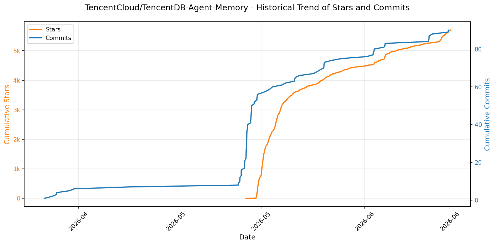

> *蓝色：累计 Stars｜橙色：累计 Commits（次 Y 轴）*

<b>📄 README 摘要</b>

1. **该项目的功能**  
腾讯DB智能体记忆插件（TencentDB Agent Memory）是一个面向长周期、多轮次AI智能体（Agent）场景的**分层式记忆增强系统**，核心目标是**显著降低大语言模型（LLM）上下文 token 消耗，同时提升任务成功率与长期个性化能力**。它不简单堆砌历史对话，而是通过结构化方式让智能体“真正理解并复用经验”：在短期任务中压缩冗余日志为可读可查的符号图谱（Mermaid），在长期交互中将碎片化对话提炼为层级化语义单元（L0对话→L1原子事实→L2场景→L3用户画像），从而实现“少传上下文、多记关键信息、全链路可追溯”。

2. **关键特性**  
- **符号化短期记忆（Symbolic Short-term Memory）**：采用 Mermaid 语法构建轻量级任务状态图（Canvas），将海量工具日志（如搜索结果、报错堆栈、代码输出）离线存储于文件系统（`refs/*.md`），仅在上下文中保留含 `node_id` 的符号图；Agent 可按需通过 `node_id` 精准召回原始内容，大幅削减 token 占用（实测最高降本 61.38%）。  
- **分层式长期记忆（Layered Long-term Memory）**：摒弃扁平向量库，构建四层语义金字塔（L0 原始对话 → L1 原子事实 → L2 场景块 → L3 用户画像），支持渐进式披露与精准钻取；Persona 层承载用户偏好与工作习惯，L1/L2 层提供细节支撑，确保“高层概览+底层溯源”双能力兼备。  
- **全链路可追溯与无损恢复**：所有抽象（Persona/Canvas）均通过确定性路径（`symbol → index → raw text`）关联到底层证据，杜绝传统摘要导致的信息不可逆丢失。  
- **开箱即用的跨平台集成**：原生支持 OpenClaw（插件化一键安装）与 Hermes（Docker 一体部署 / 主机插件注入双模式），零配置即可启用记忆捕获、提取、聚合与召回全流程。  
- **生产就绪的安全与弹性机制**：提供可选网关认证（API Key）、CORS 控制、超时熔断、内存字符预算限制、去重冲突检测等企业级配置项，兼顾安全性与稳定性。

3. **技术栈**  
- **核心语言与运行时**：Node.js（≥ v22.16），基于 TypeScript 开发，使用 `tsx` 作为运行时执行器。  
- **存储后端**：默认本地 SQLite + `sqlite-vec`（嵌入式向量扩展），支持高密度结构化存储与混合检索（关键词+向量 RRF 融合）。  
- **符号表示层**：Mermaid 图形语法（用于短期任务状态建模与可视化表达）。  
- **文件系统**：外部文件系统（FS）持久化原始日志（`refs/*.md`），保障高保真证据留存。  
- **集成框架**：深度适配 OpenClaw（v2026.3.13+）与 Hermes Agent（Gateway 架构），通过标准化插槽（`contextEngine`）与 Provider 接口对接。  
- **部署形态**：支持 Docker 容器化（预置 Tencent Cloud DeepSeek-V3.2 模型）、本地插件直连、以及 Gateway 微服务模式（HTTP API 暴露 `/capture`/`/recall`/`/search` 等端点）。  
- **安全机制**：基于 Bearer Token 的网关鉴权（`TDAI_GATEWAY_API_KEY`）、常数时间密钥比对、CORS 白名单控制。

---

### 45. [NVIDIA/SkillSpector](https://github.com/NVIDIA/SkillSpector)
- 📅 **创建日期**：2026-03-21  
- 🔄 **最近更新**：2026-06-15  
- ⭐ **Stars**：5,311（日 +743｜周 +4013｜月 +5310）  
- 📝 **描述**：Security scanner for AI agent skills. Detect vulnerabilities, malicious patterns, and security risks.  

<b>📈 Star 与 Commit 历史趋势</b>

> *蓝色：累计 Stars｜橙色：累计 Commits（次 Y 轴）*

<b>📄 README 摘要</b>

1. **项目功能**  
SkillSpector 是一个专为 AI 代理（AI agent）技能设计的安全扫描器，旨在技能安装前主动识别其潜在安全风险。它通过静态分析与可选的大语言模型（LLM）语义评估相结合的方式，检测技能代码/配置中隐藏的漏洞、恶意行为模式及安全违规项，帮助用户判断“该技能是否安全可安装”，从而防范提示注入、数据窃取、提权、供应链攻击、工具滥用等真实威胁。

2. **核心特性**  
- **多源输入支持**：可直接扫描 Git 仓库、HTTP(S) URL、ZIP 压缩包、本地目录或单个文件（如 `SKILL.md`）。  
- **深度漏洞覆盖**：内置 **64 种精确匹配的漏洞模式**，覆盖 **16 类高危风险域**，包括提示注入、数据外泄、权限提升、供应链污染、过度自主性、系统提示泄露、内存投毒、危险 AST 行为（如 `exec`/`eval`）、YARA 恶意签名、MCP 协议权限越界与工具投毒等。  
- **双阶段分析引擎**：第一阶段为高速静态分析（正则+AST+依赖扫描+OSV.dev 实时 CVE 查询）；第二阶段为可选的 LLM 语义精析，用于上下文理解、误报过滤与自然语言解释，精度达 ~87%。  
- **实时漏洞情报**：通过 `SC4` 模块直连 [OSV.dev](https://osv.dev) 获取最新开源漏洞数据，支持离线缓存与自动降级 fallback。  
- **多格式输出**：支持终端（彩色结构化）、JSON（机器可读）、Markdown（文档集成）和 SARIF（CI/CD 与 IDE 安全工具链兼容）四种报告格式。  
- **量化风险评分**：基于漏洞严重等级（CRITICAL/HIGH/MEDIUM/LOW）加权计算 0–100 分，并映射为明确安装建议（如 “DO NOT INSTALL”），并支持可执行脚本乘数加权。

3. **技术栈**  
- **主语言**：Python 3.12+（核心逻辑、AST 解析、静态规则引擎、CLI 框架）。  
- **依赖管理与构建**：`uv`（首选）或 `pip`；`Makefile` 自动化构建流程。  
- **容器化**：Docker 支持（基于 `python:3.12-slim-bookworm`），无需宿主机 Python 环境。  
- **LLM 集成层**：抽象化 Provider 接口，原生支持 `openai`（含 Ollama/vLLM/llama.cpp 等兼容端点）、`anthropic`、`nv_build`（NVIDIA Build API），通过环境变量动态切换，支持模型覆盖与自定义 registry。  
- **安全分析能力**：  
  - 正则与语法树（AST）静态扫描；  
  - YARA 规则引擎（恶意软件/网络后门/挖矿程序匹配）；  
  - 数据流污点追踪（Taint Tracking）；  
  - OSV.dev API 集成实现依赖漏洞实时查询；  
  - MCP（Model Context Protocol）规范合规性检查（权限声明、工具元数据投毒）。  
- **输出与工程化**：SARIF 标准支持、日志分级（DEBUG–ERROR）、环境变量驱动配置、模块化插件式分析器架构（见 `docs/DEVELOPMENT.md`）。

---

### 46. [openai/plugins](https://github.com/openai/plugins)
- 📅 **创建日期**：2026-03-04  
- 🔄 **最近更新**：2026-06-15  
- ⭐ **Stars**：3,049（日 +66｜周 +948｜月 +1926）  
- 📝 **描述**：OpenAI Plugins  

<b>📈 Star 与 Commit 历史趋势</b>

> *蓝色：累计 Stars｜橙色：累计 Commits（次 Y 轴）*

<b>📄 README 摘要</b>

1. **该项目的功能**  
该项目是一个 Codex 插件示例的精选集合仓库，旨在为开发者提供可复用、可参考的插件模板与实践案例。每个插件均遵循标准化结构（含必需的 `.codex-plugin/plugin.json` 清单文件），支持通过 Codex 平台扩展 AI 编程助手的能力，覆盖设计、协作、多平台应用开发（iOS/macOS/Web/React Native）、部署运维及第三方服务集成（如 Figma、Notion、Netlify 等）等真实开发场景。

2. **核心功能**  
- 提供结构化、开箱即用的插件模板，包含标准 manifest（`plugin.json`）及可选扩展模块（如 `skills/`、`agents/`、`commands/`、`hooks.json`、`.app.json`、`.mcp.json`、`assets/` 等）；  
- 聚焦高价值开发场景：Figma 设计协同（Code to Canvas、设计系统规则）、Notion 知识管理与会议研究、跨平台原生应用构建（SwiftUI/iOS/macOS）、Web 全栈工作流（部署、UI、支付、数据库）、Expo/React Native 开发（EAS 构建、SDK 升级、Codex Run 集成）；  
- 支持 MCP（Model Control Protocol）与技能（Skills）双范式插件，涵盖 `netlify`、`remotion`、`google-slides` 等第三方服务深度集成能力。

3. **技术栈**  
- 基于 **Codex 插件框架**（含 `.codex-plugin` 规范、MCP 协议支持、Skills 接口）；  
- 插件逻辑可使用任意语言实现（未限定，但需符合 Codex 运行时契约）；  
- 依赖标准化配置文件：`plugin.json`（元数据与能力声明）、`hooks.json`（生命周期钩子）、`.app.json`（前端界面定义）、`.mcp.json`（MCP 协议配置）；  
- 集成生态包括：Figma API、Notion API、Apple Xcode/SwiftUI 工具链、Expo CLI/EAS、Netlify CLI、Remotion 渲染引擎、Google Slides API 等。

---

### 47. [Introduction-to-Autonomous-Robots/Introduction-to-Autonomous-Robots](https://github.com/Introduction-to-Autonomous-Robots/Introduction-to-Autonomous-Robots)
- 📅 **创建日期**：2013-11-15  
- 🔄 **最近更新**：2026-06-15  
- ⭐ **Stars**：2,726（日 +368｜周 +899｜月 +903）  
- 📝 **描述**：Introduction to Autonomous Robots  

<b>📈 Star 与 Commit 历史趋势</b>

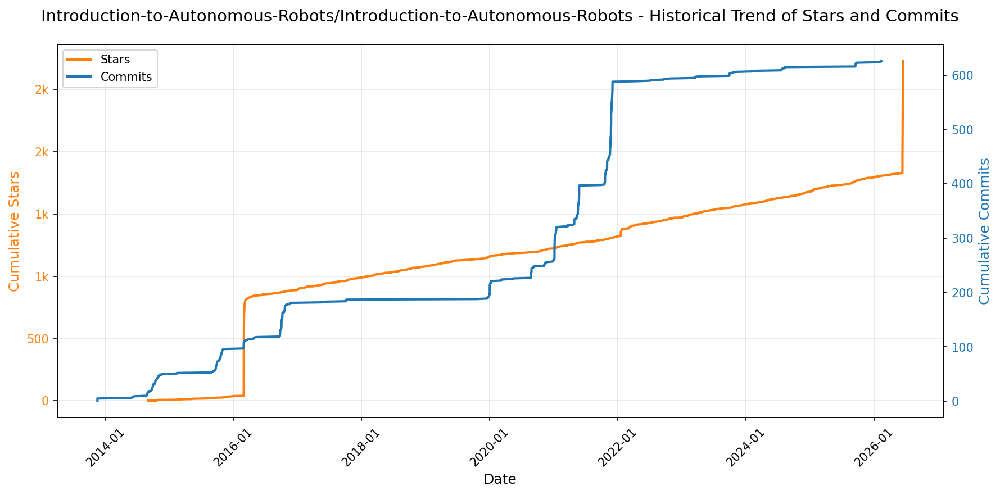

> *蓝色：累计 Stars｜橙色：累计 Commits（次 Y 轴）*

<b>📄 README 摘要</b>

1. **该项目做什么？**  
该项目是一个开源的自主机器人入门教材（开放教科书），系统性地讲解自主机器人领域的核心计算原理，涵盖机构学、传感器、执行器与算法等关键主题；它并非软件或可运行系统，而是一套完整的教学内容源码（LaTeX格式），供教育者和学习者用于教学、自学或本地编译生成教材PDF。

2. **主要特性**  
- 提供完整的LaTeX源码，支持用户自主编译生成PDF教材；  
- 明确区分版权：源码采用CC BY-NC-ND 4.0协议（允许非商业性使用与教学引用，须署名且禁止演绎与再分发）；印刷版由MIT Press出版并享有专有版权；  
- 提供两种编译路径：在线（Overleaf）与本地（LaTeX + ImageMagick）；  
- 内置多轮`pdflatex`与`bibtex`编译流程，确保交叉引用、参考文献及图表正确生成；  
- 包含详细的编译说明、常见问题提示（如overfull box警告属正常现象）及标准学术引用格式（BibTeX与文本引用双格式）。

3. **技术栈**  
- 核心排版工具：LaTeX（基于`pdflatex`引擎）；  
- 文献管理：BibTeX；  
- 图像处理依赖：ImageMagick（用于自动转换缺失或格式不符的插图）；  
- 可选云端编译环境：Overleaf（基于Web的LaTeX协作平台）；  
- 版本控制与分发：GitHub（托管源码，支持ZIP下载或Git Fork导入Overleaf）。

---

### 48. [huggingface/OpenEnv](https://github.com/huggingface/OpenEnv)
- 📅 **创建日期**：2025-10-01  
- 🔄 **最近更新**：2026-06-15  
- ⭐ **Stars**：2,222（日 +42｜周 +294｜月 +359）  
- 📝 **描述**：An interface library for RL post training with environments.   

<b>📈 Star 与 Commit 历史趋势</b>

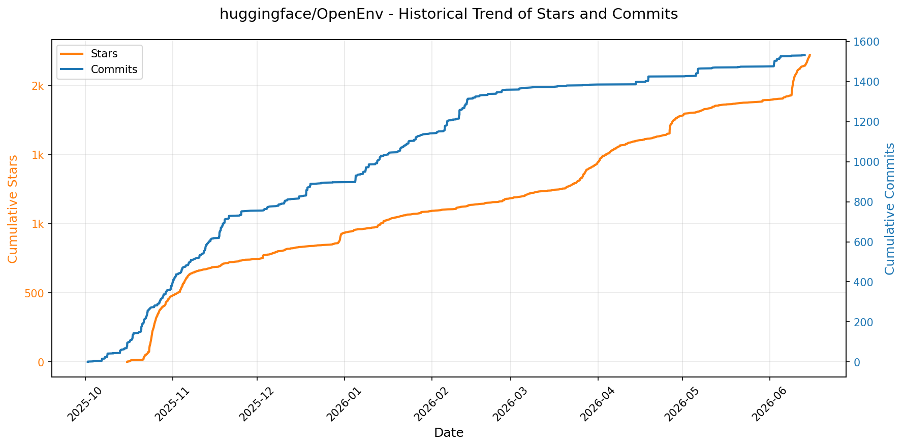

> *蓝色：累计 Stars｜橙色：累计 Commits（次 Y 轴）*

<b>📄 README 摘要</b>

1. **项目功能**  
OpenEnv 是一个端到端（e2e）框架，专为**构建、部署和使用隔离的智能体（agentic）执行环境**而设计，服务于基于强化学习（RL）的大语言模型（LLM）训练。它提供类 Gymnasium 的简洁 API（`reset()`、`step()`、`state()`），使研究者和 RL 框架开发者能统一、标准化地与各类执行环境交互；同时为环境创作者提供工具链，支持快速创建安全、可隔离、可容器化部署的环境，并通过 HTTP/WebSocket 协议对外暴露服务。

2. **核心特性**  
- ✅ **标准化 Agentic RL 环境接口**：定义统一的 `Action`/`Observation`/`State`/`StepResult` 类型系统与异步优先的 `EnvClient` 通信协议；  
- ✅ **开箱即用的环境生命周期管理**：支持 `reset`/`step`/`state` 核心操作，内置 WebSocket 实时通信、类型安全解析与同步/异步双模式（`.sync()` 封装）；  
- ✅ **一体化开发与部署工具链**：CLI 命令（`openenv init`/`push`/`serve`/`build`）支持环境模板生成、本地调试、Docker 构建及一键部署至 Hugging Face Spaces；  
- ✅ **多运行时容器编排支持**：内置 `LocalDockerProvider`、`DockerSwarmProvider`、`KubernetesProvider` 及 `UVProvider`/`DaytonaProvider` 等扩展容器运行时；  
- ✅ **交互式 Web 调试界面**：条件启用的双面板 Web UI（左为人机交互区，右为状态观测区），自动渲染动作表单、实时 WebSocket 更新、完整动作历史日志；  
- ✅ **模块化生态集成能力**：原生兼容 TRL（GRPO）、torchforge、Unsloth、SkyRL、ART、Oumi、Lightning AI 等主流 RL/LLM 训练框架；  
- ✅ **丰富示例环境库**：开箱提供 Echo（消息回显）、Coding（沙盒 Python 执行）、Chess（国际象棋）、Atari（街机游戏）、FinRL（金融模拟）等多样化环境，并支持社区共建。

3. **技术栈**  
- **后端服务层**：FastAPI（Web 服务框架）、Pydantic（数据模型验证）、Uvicorn（ASGI 服务器）、WebSocket（实时双向通信）；  
- **容器与部署**：Docker（环境隔离与打包）、Docker Swarm / Kubernetes（集群编排）、Hugging Face Spaces（云托管平台）；  
- **客户端与协议**：异步 Python（`asyncio` + `websockets`）、类型提示（dataclass-based models）、HTTP/WebSocket 双协议支持；  
- **开发与工程化**：`pyproject.toml`（依赖与构建配置）、`uv`（高性能 Python 包管理器）、pytest（模块化测试框架，按需跳过依赖缺失测试）；  
- **基础设施与标准**：遵循 Gymnasium 设计哲学，参考 MCP（Model Context Protocol）规范（RFC 003），支持 RFC 驱动演进机制；  
- **前端调试**：HTML/CSS/JS（内置 Web UI）、动态表单生成（基于 Pydantic 模型反射）。

---

### 49. [music-assistant/server](https://github.com/music-assistant/server)
- 📅 **创建日期**：2019-05-09  
- 🔄 **最近更新**：2026-06-15  
- ⭐ **Stars**：2,214（日 +180｜周 +604｜月 +651）  
- 📝 **描述**：Music Assistant is a free, opensource Media library manager that connects to your streaming services and a wide range of connected speakers. The server is the beating heart, the core of Music Assistant and must run on an always-on device like a Raspberry Pi, a NAS or an Intel NUC or alike.  

<b>📈 Star 与 Commit 历史趋势</b>

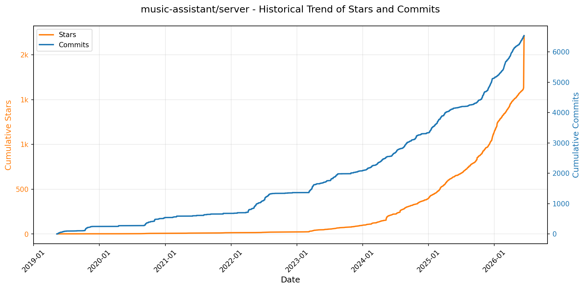

> *蓝色：累计 Stars｜橙色：累计 Commits（次 Y 轴）*

<b>📄 README 摘要</b>

1. **项目功能**  
Music Assistant 是一个免费、开源的媒体库管理服务器，核心功能是统一管理本地及云端音乐资源：它能连接多种流媒体服务（如 Spotify、Tidal、Qobuz 等），同时集成并控制大量智能音响设备（包括 Chromecast、AirPlay、UPnP/DLNA、Sonos 及各类支持 RAOP/MPD 的硬件）。其设计定位为“始终在线”的中央音乐中枢，需部署在常开设备（如树莓派、NAS 或 Intel NUC）上，为家庭音频系统提供集中式播放调度、元数据管理、跨平台同步与自动化控制能力。

2. **关键特性**  
- ✅ 多源流媒体聚合：原生支持主流订阅服务与本地音乐库的统一索引与无缝播放；  
- ✅ 全场景音响兼容：广泛适配消费级与专业级音频设备（含多房间同步、分组播放、音源切换）；  
- ✅ 深度 Home Assistant 集成：官方首选以 Home Assistant 插件（Add-on）形式运行，支持双向事件联动、状态同步与自动化编排；  
- ✅ 容器化部署保障：仅通过 Docker 容器或 HA 插件方式发布，内置对 FFmpeg、定制二进制组件等系统级依赖的预置与管理；  
- ✅ 开放生态与社区驱动：由 Open Home Foundation 背书，问题追踪、功能提案均通过 GitHub Discussions 和 Issue Tracker 透明协作。

3. **技术栈**  
- **主语言**：Python（服务端核心逻辑）；  
- **运行环境**：Docker 容器化部署（必需），不支持纯 pip 安装；  
- **系统依赖**：FFmpeg（音视频转码/分析）、定制 C/C++ 二进制工具（用于协议桥接与硬件通信）；  
- **集成框架**：深度绑定 Home Assistant 生态，基于其 Supervisor 架构构建 Add-on；  
- **协议支持**：RAOP（AirPlay）、UPnP/DLNA、Chromecast SDK、MPD、MQTT（用于设备发现与状态同步）；  
- **基础设施**：依赖 Linux 主机环境（ARM64/x86_64），无 Windows/macOS 原生支持。

---

### 50. [cypress-io/cypress](https://github.com/cypress-io/cypress)
- 📅 **创建日期**：2015-03-04  
- 🔄 **最近更新**：2026-06-15  
- ⭐ **Stars**：0（日 +0｜周 +0｜月 +0）  
- 📝 **描述**：Fast, easy and reliable testing for anything that runs in a browser.  

<b>📄 README 摘要</b>

1. **该项目做什么？**  
Cypress 是一个专为现代 Web 应用设计的端到端（E2E）及组件级测试框架，用于在真实浏览器环境中快速、可靠地测试任何可在浏览器中运行的前端应用（包括单页应用、静态网站、Web 组件等）。它直接在浏览器内运行测试，无需 Selenium 或 WebDriver，支持实时重试、时间旅行调试、自动等待、网络请求拦截与模拟，并能捕获所有测试过程中的状态（如 DOM、网络请求、控制台日志、截图和视频），显著提升前端测试的开发体验与可靠性。

2. **核心功能**  
- **实时交互式测试运行器**：提供图形化界面，支持测试用例逐行执行、断点调试、快进/回退（Time Travel）、DOM 状态快照查看；  
- **自动等待与智能重试**：内置对元素存在性、可见性、可交互性的自动轮询与重试机制，消除显式 `wait()` 和 `sleep()`；  
- **网络层控制能力**：可拦截、修改、存根（stub）、伪造（mock） HTTP 请求（XHR/Fetch），支持真实请求录制与离线测试；  
- **跨浏览器支持**：原生支持 Chrome、Edge、Firefox、Electron（含无头模式），并提供统一 API；  
- **开箱即用的开发体验**：零配置启动、自动重载、测试代码热更新、详细的错误堆栈与可视化失败原因；  
- **集成 Cypress Cloud 服务**：支持测试结果集中管理、历史对比、团队协作、CI/CD 流水线集成、视频录制与日志归档；  
- **组件测试支持**：内置对 React、Vue、Angular 等主流框架的组件测试能力，可独立渲染组件并进行交互验证。

3. **技术栈**  
- **核心语言**：TypeScript（主代码库）、JavaScript（测试脚本）；  
- **运行时环境**：基于 Electron 构建桌面客户端（含 Chromium 内核），同时支持 Node.js 后端服务（用于文件操作、插件扩展、CI 集成等）；  
- **前端框架**：React（Cypress 测试运行器 UI 使用）；  
- **构建与包管理**：Webpack（打包）、Rollup（模块构建）、npm / yarn / pnpm；  
- **CI/CD 集成**：原生兼容 CircleCI、GitHub Actions、GitLab CI、Jenkins 等主流工具；  
- **测试运行协议**：不依赖 WebDriver，采用直接注入测试代码至浏览器上下文的方式，实现更稳定、更快速的执行；  
- **扩展生态**：支持插件系统（如 `cypress-firebase`、`cypress-real-events`）、自定义命令、任务（tasks）与预处理器（如 TypeScript 支持）。

---

