# 🌟 GitHub Trending 概览

> 数据更新于：2026-03-30

---

## 🔍 项目详情

### 1. [hacksider/Deep-Live-Cam](https://github.com/hacksider/Deep-Live-Cam)
- 📅 **创建日期**：2023-09-24  
- 🔄 **最近更新**：2026-03-30  
- ⭐ **Stars**：164,126（日 +931｜周 +5194｜月 +5873）  
- 📝 **描述**：real time face swap and one-click video deepfake with only a single image  

<b>📈 Star 与 Commit 历史趋势</b>

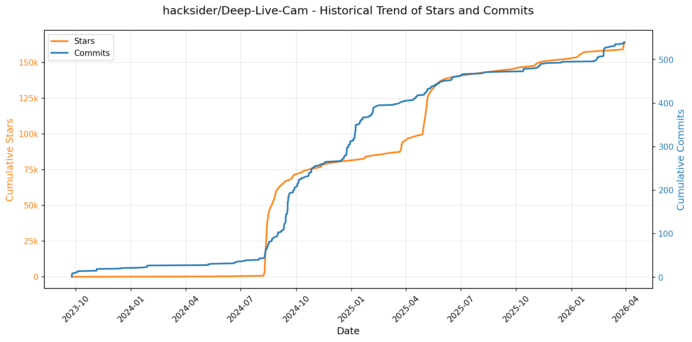

> *蓝色：累计 Stars｜橙色：累计 Commits（次 Y 轴）*

<b>📄 README 摘要</b>

1. **项目功能**  
Deep-Live-Cam 是一款开源实时人脸替换与视频深度伪造（deepfake）工具，支持仅凭**单张源人脸图像**即可在摄像头直播、本地视频或电影播放过程中实现**毫秒级低延迟的端到端实时面部合成**。用户无需训练模型或准备多张照片，通过三步操作（选脸→选设备→点“Live”）即可完成动态人脸交换，适用于直播表演、创意内容生成、虚拟角色动画、实时 meme 制作、视频通话伪装等场景。

2. **核心特性**  
- ✅ **全实时处理**：支持 webcam 直播、本地视频/电影流、屏幕共享等多种输入源，全程 GPU/CPU/CoreML/DirectML/OpenVINO 多后端加速；  
- ✅ ** Mouth Mask（口部遮罩）**：精准保留用户原始嘴型运动，显著提升语音同步真实感；  
- ✅ **多脸映射（Many Faces / Face Mapping）**：可同时识别并替换画面中多个不同人物的脸部，支持跨主体个性化换脸；  
- ✅ **电影实时换脸**：边播放本地影片边实时注入指定人脸，实现“你的脸出演任意电影”；  
- ✅ **直播友好设计**：输出兼容 OBS 等推流软件，支持镜像模式、可缩放预览、帧率/音频/画质自定义；  
- ✅ **内置内容安全过滤**：自动拦截裸露、暴力、战争等敏感/违规内容，防止滥用；  
- ✅ **跨平台预编译版（v2.7 beta）**：提供 Windows / macOS（Apple Silicon）/ CPU 一键安装包，含 30+ 闭源增强功能与优先技术支持；  
- ✅ **合规性保障机制**：强制要求用户获取真人肖像授权、标注 deepfake 属性，预留法律响应接口（如加水印、关停服务）。

3. **技术栈**  
- **核心框架**：Python 3.11（macOS 需 Python 3.10）、ONNX Runtime（多执行提供器支持）；  
- **AI 模型**：基于 InsightFace（inswapper_128_fp16.onnx）的人脸检测与对齐 + GFPGANv1.4（ONNX 格式）用于面部增强与修复；  
- **硬件加速后端**：  
  - NVIDIA GPU：CUDA 12.8 + cuDNN 8.9.7 + `onnxruntime-gpu==1.21.0`；  
  - Apple Silicon（M1/M2/M3）：`onnxruntime-silicon==1.13.1` 或 `onnxruntime-coreml==1.21.0`；  
  - Windows DirectX：`onnxruntime-directml==1.21.0`；  
  - Intel CPU：`onnxruntime-openvino==1.21.0`；  
  - 默认回退：纯 CPU 推理（`onnxruntime==1.21.0`）；  
- **多媒体处理**：FFmpeg（视频编解码、I/O）、Tkinter（GUI 界面）、PyTorch（CUDA 版本依赖）；  
- **部署依赖**：Git、pip、venv 虚拟环境、Visual Studio 2022 运行库（Windows）、Homebrew（macOS）。

---

### 2. [obra/superpowers](https://github.com/obra/superpowers)
- 📅 **创建日期**：2025-10-09  
- 🔄 **最近更新**：2026-03-30  
- ⭐ **Stars**：152,684（日 +2333｜周 +17992｜月 +59144）  
- 📝 **描述**：An agentic skills framework & software development methodology that works.  

<b>📈 Star 与 Commit 历史趋势</b>

> *蓝色：累计 Stars｜橙色：累计 Commits（次 Y 轴）*

<b>📄 README 摘要</b>

1. **项目功能**  
Superpowers 是一个面向编程智能体（coding agents）的完整软件开发工作流增强系统。它不直接替代编码代理，而是为其注入结构化、可验证、工程严谨的开发能力：从需求澄清、设计评审、TDD 实施、分支隔离开发，到子代理协同执行、自动化代码审查与分支收尾，全程以“技能（skills）”形式自动触发。其核心目标是将原本易偏离、缺乏纪律的 AI 编程行为，转化为符合专业工程实践（如红-绿-重构、YAGNI、DRY、系统性调试）的可靠开发流程，且无需用户手动调用——只要代理开始工作，Superpowers 即自动介入并强制执行标准化步骤。

2. **关键特性**  
- **全流程自动化工程纪律**：覆盖从创意萌芽（brainstorming）到分支合并（finishing-a-development-branch）的7个强制阶段，每个阶段由独立可组合的“技能”驱动，无一为可选建议；  
- **子代理驱动开发（Subagent-Driven Development）**：对每个任务派生全新子代理，执行两阶段审查（先校验是否符合计划规格，再评估代码质量），支持数小时无人干预的自主推进；  
- **真·测试先行（True TDD Enforcement）**：严格实施 RED-GREEN-REFACTOR 循环，禁止先写实现后补测试，并自动删除未经测试验证的代码；  
- **Git 工作树隔离**：自动创建独立分支与干净工作区，确保开发环境纯净、变更可追溯、多任务并行安全；  
- **设计即文档、计划即指令**：将设计拆解为人类可读的分段文档供确认；将实现拆解为含精确文件路径、完整代码块及验证步骤的原子级任务（每项耗时 2–5 分钟）；  
- **系统性调试与防御性验证**：内置四阶段根因分析法、条件等待、防御纵深策略，并在每次交付前强制执行“修复确认”（verification-before-completion）；  
- **自生长技能生态**：提供 `writing-skills` 技能，支持用户按规范创建、测试并贡献新技能，形成可扩展的工程能力库。

3. **技术栈**  
- **运行平台**：深度适配主流 AI 编程工具链，包括 Claude Code（官方插件市场 & 自建市场）、Cursor、Codex、OpenCode、Gemini CLI；  
- **架构范式**：基于“技能（Skills）”的插件化、声明式工作流引擎——所有能力以 Markdown 文档（`.md`）形式组织在仓库中（如 `skills/test-driven-development/SKILL.md`），通过自然语言指令自动匹配与触发；  
- **核心机制**：依赖大模型（尤其是 Claude 系列）的强推理与上下文理解能力，结合预设的工程规则、检查清单与元提示（meta-prompts）实现流程控制；  
- **基础设施**：使用 Git 进行版本化技能管理，GitHub 作为源码与协作中心，Discord 作为实时社区支持平台；  
- **部署方式**：以平台原生插件（Plugin/Extension）形式集成，支持一键安装（`/plugin install`）、自动更新（`/plugin update`）与跨平台配置同步。

---

### 3. [affaan-m/everything-claude-code](https://github.com/affaan-m/everything-claude-code)
- 📅 **创建日期**：2026-01-18  
- 🔄 **最近更新**：2026-03-30  
- ⭐ **Stars**：116,692（日 +1693｜周 +18364｜月 +63138）  
- 📝 **描述**：The agent harness performance optimization system. Skills, instincts, memory, security, and research-first development for Claude Code, Codex, Opencode, Cursor and beyond.  

<b>📈 Star 与 Commit 历史趋势</b>

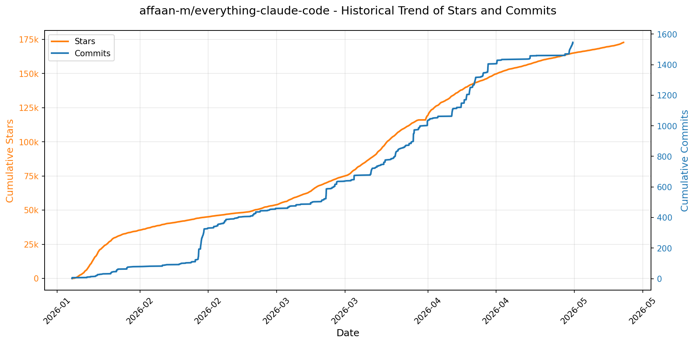

> *蓝色：累计 Stars｜橙色：累计 Commits（次 Y 轴）*

<b>📄 README 摘要</b>

1. **该项目的功能**  
该项目是一个面向 AI 代理（AI Agent）运行时环境的**全栈性能优化与安全增强系统**，专为 Claude Code、Codex、Cowork、OpenCode、Cursor、Antigravity 等主流 AI 代理“驾驭框架”（agent harnesses）设计。它并非简单的配置集合，而是提供生产级就绪的完整能力体系：包括**技能（Skills）编排、本能（Instincts）建模、内存优化与持久化、持续学习机制、多层安全扫描（含 AgentShield 集成）、自动化验证循环（verification loops）、子代理协同调度（subagent orchestration）以及 MCP（Model Control Protocol）标准化配置**。其核心目标是显著提升 AI 代理在真实软件工程场景中的**可靠性、效率、安全性、可扩展性与自主进化能力**，已通过 Anthropic 黑客松获奖验证，并在 10+ 个月高强度实际产品开发中持续迭代演进。

2. **关键特性**  
- ✅ **跨平台/跨框架统一支持**：原生兼容 Windows/macOS/Linux，深度集成 Claude Code、Codex（App & CLI）、OpenCode、Cursor、Antigravity 等主流 IDE/CLI 代理环境，实现行为一致性。  
- ✅ **模块化选择性安装**：基于 `install-plan.js`/`install-apply.js` 的声明式安装流水线，支持按语言（TypeScript/Python/Java/Kotlin/Go/Rust/C++/PHP/Perl/Swift）、按组件（agents/skills/rules）精准安装与增量更新，内置 SQLite 状态存储跟踪。  
- ✅ **10+ 语言全栈覆盖**：提供 30+ 专用子代理（如 `typescript-reviewer`, `java-build-resolver`, `pytorch-build-resolver`, `rust-reviewer`）、135+ 领域技能（含 `frontend-slides`, `investor-materials`, `videodb`, `django-security`, `springboot-tdd` 等）及 60+ 命令（如 `/harness-audit`, `/security-scan`, `/multi-plan`, `/quality-gate`）。  
- ✅ **智能记忆与持续学习**：自动保存/加载会话上下文；从历史交互中提取可复用模式生成新技能；支持本能（Instincts）驱动的学习与置信度评估（v2 连续学习）。  
- ✅ **企业级安全防护体系**：内置 `AgentShield` 集成（1282 测试、102 条规则），提供沙箱访问控制、输入输出净化、CVE 检测、攻击向量分析及五层观察者（observer）防护机制。  
- ✅ **高性能运行时治理**：支持 Hook 运行时动态调控（`ECC_HOOK_PROFILE`, `ECC_DISABLED_HOOKS`）；重构为 Node.js 脚本确保跨平台稳定性；提供 PM2 多代理工作流管理（`/pm2`, `/multi-workflow`）及 NanoClaw v2 模型路由与热加载能力。  
- ✅ **工程化基础设施**：包含完整的测试套件（997+ 通过测试）、CI 硬化（清单校验、失败修复、覆盖率保障）、GitHub Marketplace 应用（免费/专业/企业版）、多语言文档（7 种语言）及社区驱动的贡献体系（30+ 贡献者，含韩/中翻译、PowerShell 安装器等）。

3. **技术栈**  
- **核心语言与运行时**：TypeScript（主逻辑、CLI 工具、Hook 脚本）、Python（部分技能与工具链集成）、Go（构建解析器、CLI 组件）、Java/Kotlin（Spring Boot/Laravel/Django 相关技能）、Rust/C++/Perl/PHP（语言规则与审查器支持）、Shell（基础安装脚本）、Markdown（所有 agent/skill 规范定义）。  
- **前端与交付**：纯 HTML 零依赖幻灯片生成器（`frontend-slides`）、PPTX 转换指导、严格视口适配规则。  
- **数据与状态管理**：SQLite（本地状态存储）、结构化会话适配器（session adapters）、技能演化元数据框架。  
- **构建与部署**：支持 npm/pnpm/yarn/bun 四大包管理器自动检测与适配；GitHub Actions CI/CD；GitHub Marketplace App 发布；`ccg-workflow` 外部运行时依赖管理（用于 multi-* 命令）。  
- **安全与合规**：AgentShield 安全审计引擎、沙箱化执行环境、内容哈希缓存（`content-hash-cache-pattern`）、成本感知 LLM 流水线（`cost-aware-llm-pipeline`）。

---

### 4. [OpenBB-finance/OpenBB](https://github.com/OpenBB-finance/OpenBB)
- 📅 **创建日期**：2020-12-20  
- 🔄 **最近更新**：2026-03-30  
- ⭐ **Stars**：64,364（日 +305｜周 +632｜月 +1905）  
- 📝 **描述**：Financial data platform for analysts, quants and AI agents.  

<b>📈 Star 与 Commit 历史趋势</b>

> *蓝色：累计 Stars｜橙色：累计 Commits（次 Y 轴）*

<b>📄 README 摘要</b>

1. **项目功能**  
Open Data Platform（ODP）是由 OpenBB 开发的开源数据集成工具集，核心定位是作为统一的数据基础设施层，帮助数据工程师将**专有数据、授权数据和公共数据源**（如金融行情、基本面、另类数据等）标准化接入，并向多种下游应用“一次连接、多端消费”：包括 Python 量化环境（`obb` API）、OpenBB Workspace（企业级分析 UI）、Excel 插件、MCP（Model Context Protocol）服务器（供 AI Agent 调用）、以及 RESTful API（供第三方系统集成）。

2. **关键特性**  
- ✅ **多面消费架构**：同一套数据后端可同时服务 Python SDK、Web UI（Workspace）、CLI 命令行、Excel、AI Agent（通过 MCP）及外部 HTTP 应用；  
- ✅ **开箱即用的数据连接器**：支持海量金融与经济数据源（如 AAPL 历史行情示例），完整列表见官方文档；  
- ✅ **轻量级本地 API 服务**：通过 `openbb-api` 命令一键启动基于 FastAPI + Uvicorn 的本地 REST 服务（默认 `http://127.0.0.1:6900`），便于快速对接；  
- ✅ **与 OpenBB Workspace 无缝集成**：支持在 Workspace 中以图形化方式添加并测试 ODP 后端，实现数据+可视化+AI 分析闭环；  
- ✅ **全栈可扩展生态**：提供独立 CLI 工具（`openbb-cli`）、Python SDK（`openbb` 包）、后端插件框架（[backends-for-openbb](https://github.com/OpenBB-finance/backends-for-openbb)）和 AI Agent 接入规范（[agents-for-openbb](https://github.com/OpenBB-finance/agents-for-openbb)）；  
- ✅ **云原生友好**：支持 Dev Containers、GitHub Codespaces 和 Google Colab 一键启动，降低开发与试用门槛。

3. **技术栈**  
- **后端框架**：FastAPI（高性能异步 Web 框架） + Uvicorn（ASGI 服务器）；  
- **核心语言**：Python（兼容 3.9.21–3.12）；  
- **客户端/API 层**：Python SDK（`openbb` 包，含链式调用接口如 `obb.equity.price.historical()`）、REST API、CLI 工具；  
- **部署与协作**：GitHub Actions CI/CD、Docker 兼容、VS Code Dev Containers、GitHub Codespaces、Colab Notebook；  
- **许可协议**：AGPLv3（强传染性开源协议，强调衍生作品也需开源）。

---

### 5. [shareAI-lab/learn-claude-code](https://github.com/shareAI-lab/learn-claude-code)
- 📅 **创建日期**：2025-06-29  
- 🔄 **最近更新**：2026-03-30  
- ⭐ **Stars**：57,448（日 +1021｜周 +6869｜月 +23729）  
- 📝 **描述**：Bash is all you need -  A nano claude code–like 「agent harness」, built from 0 to 1  

<b>📈 Star 与 Commit 历史趋势</b>

> *蓝色：累计 Stars｜橙色：累计 Commits（次 Y 轴）*

<b>📄 README 摘要</b>

1. **该项目做什么？**  
该项目是一个面向“代理（Agent）”工程实践的系统性教学项目，核心目标是**教授如何构建高质量的“代理驾驭系统”（Harness）**——即围绕大语言模型（如Claude）搭建的、使其能在真实业务环境中有效感知、推理与行动的完整运行环境。它不训练模型本身，而是聚焦于开发模型所需的基础设施：工具集成、知识注入、上下文管理、权限控制、任务调度、团队协作与执行隔离等。项目以Anthropic的Claude Code为蓝本，通过12个渐进式会话（s01–s12），从最简代理循环出发，逐层叠加工业级Harness机制，最终实现支持多智能体、异步后台执行、任务依赖图、工作区隔离与自主任务认领的完整编码代理系统。

2. **关键特性**  
- **极简核心循环不可变**：所有功能均在统一的`agent_loop`基础上分层扩展，严格区分“模型决策逻辑”与“工程执行逻辑”。  
- **原子化可插拔工具体系**：每个工具（如`bash`、`read`、`edit`、`browser`）仅需注册一个处理函数，自动接入调度。  
- **按需知识加载（s05）**：摒弃冗长系统提示词，通过`tool_result`动态注入文档、API规范等技能内容，提升上下文效率与准确性。  
- **三层上下文压缩（s06）**：支持无限轮次对话，通过摘要、归档与裁剪三重策略防止上下文爆炸。  
- **子代理隔离（s04）与工作树隔离（s12）**：为不同子任务分配独立消息历史与文件系统路径，彻底避免状态污染与并发冲突。  
- **持久化任务图（s07）与后台异步执行（s08）**：基于磁盘的任务管理系统支持依赖建模；长耗时操作交由守护线程执行并通知结果。  
- **松耦合多智能体协作（s09–s11）**：采用JSONL邮箱协议实现异步通信，支持自动任务认领、协商协议（如计划审批FSM）与无中心化调度。  
- **生产就绪设计原则贯穿始终**：强调沙箱权限、信任边界、生命周期事件流、可观测性与数据收集（用于后续模型微调），直指真实落地场景。

3. **技术栈**  
- **核心语言**：Python（主实现，含12个会话脚本及capstone `s_full.py`）  
- **LLM运行时**：Anthropic Claude API（依赖`anthropic`官方SDK）  
- **Web学习平台**：Next.js（React框架），提供交互式可视化、代码浏览、流程图解与多语言文档  
- **基础能力组件**：标准Bash shell、文件系统I/O、正则匹配（`grep`）、通配符（`glob`）、HTTP客户端（浏览器模拟）、本地数据库（SQLite隐式用于任务存储）  
- **工程支撑**：  
  - 配置管理：`.env` + `python-dotenv`  
  - 依赖管理：`requirements.txt`（含`anthropic`, `pydantic`, `rich`等）  
  - CI/CD：GitHub Actions（类型检查+构建验证）  
  - 文档：纯文本ASCII图+最小化代码示例，三语同步（EN/ZH/JP）  
- **架构范式**：命令式Python脚本驱动，无复杂框架绑定，强调可理解性与可移植性；所有机制设计为可剥离、可复用的模块化单元。

---

### 6. [harry0703/MoneyPrinterTurbo](https://github.com/harry0703/MoneyPrinterTurbo)
- 📅 **创建日期**：2024-03-11  
- 🔄 **最近更新**：2026-03-30  
- ⭐ **Stars**：53,999（日 +168｜周 +2919｜月 +4473）  
- 📝 **描述**：利用AI大模型，一键生成高清短视频 Generate short videos with one click using AI LLM.  

<b>📈 Star 与 Commit 历史趋势</b>

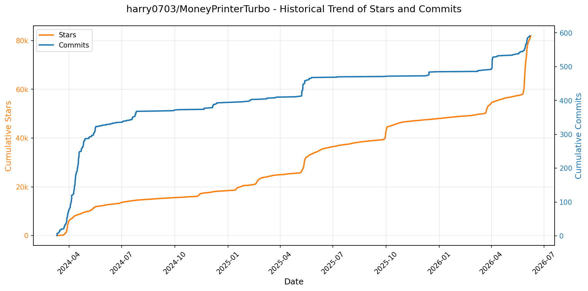

> *蓝色：累计 Stars｜橙色：累计 Commits（次 Y 轴）*

<b>📄 README 摘要</b>

1. **项目功能**  
MoneyPrinterTurbo 是一个端到端的 AI 短视频自动生成工具。用户仅需输入一个视频主题或关键词，系统即可全自动完成：AI 生成视频文案（支持中英文）、智能匹配高清无版权视频素材、生成精准同步的字幕、合成自然语音（多音色可选）、添加可配置音量的背景音乐，并最终合成输出高清短视频（支持竖屏 9:16 和横屏 16:9 两种主流比例）。同时支持批量生成、多轮迭代优选，以及 Web UI 与标准化 RESTful API 双模式使用。

2. **核心功能特性**  
- ✅ 完整 MVC 架构，代码结构清晰，兼顾 Web 界面与 API 服务；  
- ✅ 多模态 AI 驱动：支持 OpenAI、DeepSeek、Moonshot、通义千问、Gemini、Ollama、文心一言等 12+ 主流大模型接入（国内用户推荐 DeepSeek/Moonshot，免代理、注册即赠额度）；  
- ✅ 灵活内容控制：支持自定义文案、多尺寸输出（1080×1920 / 1920×1080）、可调视频片段时长、批量生成；  
- ✅ 高级音视频处理：  
　• 语音合成支持 Azure TTS（9种新声线）、Edge TTS 等，支持实时试听；  
　• 字幕引擎双模式（轻量高速的 `edge` 模式 / 高精度但需本地 Whisper-large-v3 模型的 `whisper` 模式），支持字体、位置、颜色、大小、描边全参数自定义；  
　• 背景音乐支持随机选取或指定本地文件，音量独立调节；  
- ✅ 素材生态开放：默认集成无版权高清图库（Pexels），支持用户挂载本地视频/图片/音频/字体资源；  
- ✅ 部署友好：提供 Docker 一键部署、Google Colab 在线体验、Windows 一键启动包及详细手动部署指南（含 ImageMagick/FFmpeg/Whisper 模型等关键依赖配置说明）。

3. **技术栈**  
- **后端框架**：Python（3.11+），基于 FastAPI（API 服务）与 Streamlit（Web UI）构建；  
- **AI 模型集成**：通过适配器统一接入 LLM（OpenAI/Gemini/Qwen/DeepSeek 等）、TTS（Azure/Edge）、ASR（Whisper）、图像生成（Pollinations/ModelScope）；  
- **多媒体处理**：  
　• 视频合成：`moviepy` + `ffmpeg`（需显式配置路径）；  
　• 图像处理：`ImageMagick`（用于字幕渲染、特效合成）；  
　• 字幕识别：`faster-whisper`（本地大模型）或 Edge 内置语音识别；  
- **前端交互**：Streamlit（Web UI）、Swagger UI / Redoc（API 文档）；  
- **部署方案**：Docker（docker-compose）、conda 虚拟环境、Google Colab；  
- **配置与存储**：TOML 格式配置文件（`config.toml`），本地文件系统管理资源（`resource/songs/`, `resource/fonts/`, `models/`）；  
- **基础设施要求**：最低 4 核 CPU + 4GB 内存（GPU 非必需），兼容 Windows 10 / macOS 11+ / Ubuntu/CentOS。

---

### 7. [bytedance/deer-flow](https://github.com/bytedance/deer-flow)
- 📅 **创建日期**：2025-05-07  
- 🔄 **最近更新**：2026-03-30  
- ⭐ **Stars**：52,728（日 +1216｜周 +16920｜月 +30895）  
- 📝 **描述**：An open-source long-horizon SuperAgent harness that researches, codes, and creates. With the help of sandboxes, memories, tools, skill, subagents and message gateway, it handles different levels of tasks that could take minutes to hours.  

<b>📈 Star 与 Commit 历史趋势</b>

> *蓝色：累计 Stars｜橙色：累计 Commits（次 Y 轴）*

<b>📄 README 摘要</b>

1. **项目功能**  
DeerFlow 2.0 是一个开源的「超级智能体运行时框架（Super Agent Harness）」，旨在为 AI 智能体提供完整、可生产部署的基础设施。它不再仅限于深度研究场景，而是通过编排子智能体（Sub-Agents）、持久化长时记忆（Long-Term Memory）、隔离式沙箱环境（Sandbox）以及可插拔技能系统（Extensible Skills），使智能体能够自主执行复杂、多步骤的真实任务——例如构建数据管道、生成演示文稿（PPT）、启动交互式仪表盘、自动化内容工作流、编写并运行代码、抓取与分析网页信息等。其核心定位是“让智能体真正把事情做完”的运行平台，而非仅提供开发范式的轻量级框架。

2. **关键特性**  
- **模块化子智能体协同**：支持主智能体（Lead Agent）动态规划并调用专用子智能体，实现任务分解与并行/串行协作；子智能体可独立配置模型、上下文策略与递归限制。  
- **多模式沙箱执行环境**：内置本地执行、Docker 容器沙箱、Kubernetes 集群沙箱（通过 Provisioner 服务）三种安全隔离的代码执行模式，保障文件操作、命令执行与依赖安装的安全性与可复现性。  
- **结构化技能（Skills）与工具（Tools）体系**：  
  - 技能以 Markdown 文件（`.skill`）定义，含工作流逻辑、最佳实践和资源引用，开箱即用涵盖研究、报告生成、幻灯片制作、网页/图像/视频生成等；支持热加载、版本管理、兼容性声明及自定义技能注入；  
  - 工具支持 LangChain 原生工具、MCP（Model Context Protocol）标准服务器（含 OAuth 认证）、Python 函数等多种扩展方式；默认集成网络搜索（Tavily）、网页抓取、文件系统操作、Bash 执行等核心能力。  
- **上下文工程与长期记忆**：提供基于向量数据库（如 Chroma）的可配置长时记忆存储，支持语义检索、会话上下文自动关联与跨任务知识沉淀；上下文工程支持思维链（Thinking）、计划模式（Plan Mode）、子智能体启用开关等精细化控制。  
- **全渠道 IM 集成**：原生支持 Telegram、Slack、飞书（Lark）等主流即时通讯平台，无需公网 IP 即可接收用户指令；支持按用户/频道定制智能体身份、递归深度、思考开关等会话级配置，并提供 `/new`、`/memory`、`/models` 等快捷命令。  
- **InfoQuest 深度集成**：内置字节跳动自研智能搜索与爬虫工具集 InfoQuest（提供免费在线体验），显著增强信息获取的准确性、时效性与结构化能力。  
- **可观测性与调试支持**：原生集成 LangSmith 追踪，自动记录所有 LLM 调用、智能体运行轨迹与工具执行过程，便于调试与性能优化。

3. **技术栈**  
- **后端**：Python 3.12+，基于 LangChain 0.3+ 与 LangGraph 构建智能体图谱（Graph-based Agents）；使用 `uv` 作为包管理与虚拟环境工具；依赖 `pyproject.toml` 管理依赖；  
- **前端与服务编排**：Node.js 22+，采用 pnpm 包管理；Web UI 通过现代前端框架（未明示但由构建流程推断为 React/Vite 类）实现；  
- **部署与容器化**：Docker + Docker Compose（推荐生产部署）；支持 Kubernetes 沙箱调度；Nginx 作为反向代理；  
- **模型适配层**：统一抽象模型接口，原生支持 OpenAI 兼容 API（含 OpenRouter）、Claude Code OAuth、Codex CLI、Kimi、DeepSeek、GPT-5 Responses API 等多种模型接入方式；通过 `config.yaml` 动态路由与参数映射；  
- **基础设施组件**：Tavily API（网络搜索）、InfoQuest API（智能信息检索）、LangSmith（可观测性）、Chroma（向量内存）、PostgreSQL（可选结构化存储）、Redis（可选缓存/消息队列）；  
- **协议与标准**：全面支持 MCP（Model Context Protocol）规范，实现跨厂商工具与服务的标准化集成。

---

### 8. [koala73/worldmonitor](https://github.com/koala73/worldmonitor)
- 📅 **创建日期**：2026-01-08  
- 🔄 **最近更新**：2026-03-30  
- ⭐ **Stars**：45,485（日 +287｜周 +2617｜月 +28681）  
- 📝 **描述**：Real-time global intelligence dashboard. AI-powered news aggregation, geopolitical monitoring, and infrastructure tracking in a unified situational awareness interface  

<b>📈 Star 与 Commit 历史趋势</b>

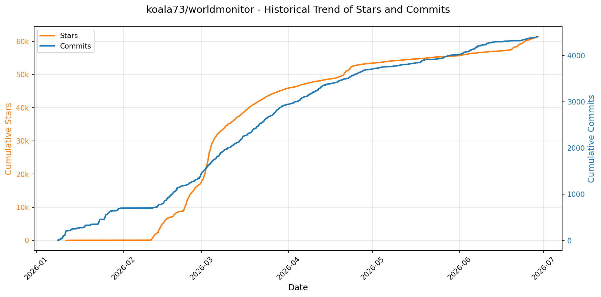

> *蓝色：累计 Stars｜橙色：累计 Commits（次 Y 轴）*

<b>📄 README 摘要</b>

1. **项目功能**  
World Monitor 是一个实时全球态势感知平台，通过 AI 驱动的多源数据融合，为用户提供统一的情境化情报视图。它聚合并智能处理来自全球 30+ 权威数据源（涵盖地缘政治、金融、能源、气候、航空、网络空间等领域）的实时信息；支持对 435+ 精选新闻源进行 AI 摘要生成；构建双地图引擎（3D 地球 globe.gl + WebGL 平面地图 deck.gl），叠加 45 类地理空间数据图层；实现跨领域信号关联分析（如军事动态、经济波动、自然灾害与冲突升级信号的交叉验证）；提供“国家情报指数”（基于 12 类风险信号的复合评分体系）；内置金融雷达模块，覆盖 92 家证券交易所、大宗商品、加密货币及 7 维市场情绪指标；所有 AI 功能均可在本地运行（原生集成 Ollama），无需外部 API 密钥；一套代码同时支撑 5 个主题变体（主站、科技、金融、大宗商品、快乐版），满足差异化使用场景。

2. **核心特性**  
- ✅ **多模态实时情报融合**：AI 自动生成新闻简报 + 多维地理空间可视化 + 跨流事件关联分析  
- ✅ **双引擎地理可视化**：支持 globe.gl（WebGL 3D 地球）与 deck.gl + MapLibre GL（高性能矢量/栅格平面地图）协同渲染  
- ✅ **本地化 AI 推理**：默认集成 Ollama，支持离线运行 LLM（如 Llama 3、Phi-3），浏览器端亦支持 Transformers.js 轻量模型  
- ✅ **五合一产品变体**：单代码库编译发布 world / tech / finance / commodity / happy 五个独立域名应用，配置驱动差异化内容与UI  
- ✅ **原生跨平台桌面客户端**：基于 Tauri 2（Rust + WebView）构建，支持 Windows（.exe）、macOS（Apple Silicon / Intel）、Linux（.AppImage），兼具 PWA 与桌面级体验  
- ✅ **全球化支持**：完整支持 21 种语言（含 RTL 文本布局），各语言版本对接本地化新闻源与数据服务  
- ✅ **企业级架构能力**：采用 Protocol Buffers 定义 92 个 proto 文件与 22 项微服务接口；三级缓存体系（Redis Upstash + CDN + Service Worker）；边缘计算部署（Vercel Edge Functions 超 60 个）

3. **技术栈**  
- **前端**：Vanilla TypeScript + Vite 构建系统；globe.gl / Three.js 实现 3D 可视化；deck.gl + MapLibre GL 实现高精度地理空间渲染  
- **桌面端**：Tauri 2（Rust 主进程） + Node.js 边车（sidecar）协同处理本地 AI、系统集成与离线能力  
- **AI/ML 层**：Ollama（默认本地推理）、可选 Groq / OpenRouter 等云 API；浏览器端使用 Transformers.js 运行量化轻量模型  
- **API 与通信**：Protocol Buffers（.proto）定义强类型服务契约；sebuf HTTP 注解实现 REST/gRPC 双模式兼容  
- **部署与运维**：Vercel Edge Functions（无服务器边缘逻辑）、Railway（后端中继服务）、Docker / PWA / 静态托管多路径发布；Upstash Redis 提供低延迟分布式缓存  
- **基础设施**：全栈 TypeScript 开发；严格类型检查（npm run typecheck）；CI/CD 支持多变体构建（dev:tech / dev:finance 等）

---

### 9. [ruvnet/RuView](https://github.com/ruvnet/RuView)
- 📅 **创建日期**：2025-06-07  
- 🔄 **最近更新**：2026-03-30  
- ⭐ **Stars**：45,252（日 +285｜周 +5076｜月 +35788）  
- 📝 **描述**：π RuView: WiFi DensePose turns commodity WiFi signals into real-time human pose estimation, vital sign monitoring, and presence detection — all without a single pixel of video.   

<b>📈 Star 与 Commit 历史趋势</b>

> *蓝色：累计 Stars｜橙色：累计 Commits（次 Y 轴）*

<b>📄 README 摘要</b>

1. **该项目做什么？**  
RuView 是一个基于 WiFi 信道状态信息（CSI）的边缘 AI 感知系统，无需摄像头、可穿戴设备或互联网连接，即可实现“穿墙感知”——实时检测人体存在、三维姿态（DensePose）、呼吸频率（6–30 BPM）、心率（40–120 BPM），并支持多人员独立追踪、灾后生命体征探测（如瓦砾下幸存者识别）及环境级行为理解。其核心目标是让普通空间（房间、建筑、设施）利用已有的 WiFi 信号自主构建本地化、自适应的物理世界模型，完全在边缘端（如 ESP32-S3）完成信号采集、处理、学习与推理，实现隐私优先、零云依赖、低功耗、高鲁棒性的环境智能。

2. **关键特性**  
- **隐私原生感知**：纯射频（WiFi CSI）输入，不采集图像/视频，规避 GDPR/HIPAA 等影像监管风险；  
- **全栈穿墙能力**：基于菲涅尔区几何建模与多径分析，支持穿透墙壁、家具、混凝土等障碍物（最远约 5 米深度）；  
- **多节点多视角融合**：4–6 个 ESP32-S3 节点组成多静态（multistatic）传感网，生成 >168 虚拟子载波/链路，实现 360° 全覆盖、亚英寸定位精度与无混淆多人分离；  
- **自学习边缘智能**：依托 RuVector 自学习向量记忆系统，从原始 CSI 数据中无监督构建房间射频指纹（Persistent Field Model），自动消除环境干扰、适应长期漂移、识别异常/欺骗，并支持跨房间/跨硬件泛化（MERIDIAN 技术）；  
- **实时低延迟处理**：Rust 实现的信号流水线达 54,000 帧/秒，单帧处理 <100 微秒，ESP32-S3 端可独立运行跌倒告警、呼吸监测等关键功能（<2 秒响应）；  
- **端到端部署友好**：提供开箱即用的多架构 Docker 镜像（`ruvnet/wifi-densepose`），30 秒启动可视化仪表盘；模型打包为轻量 `.rvf` 格式，支持边缘、云端及 WebAssembly（WASM）多平台部署；  
- **硬件普惠性**：主推低成本 ESP32-S3 传感器网（~$8/节点），兼容现有商用 WiFi（仅限 RSSI 粗粒度存在检测）及科研级 NIC（Intel 5300/AR9580），支持 AMOLED 本地屏显与 QUIC 加密 mesh 组网。

3. **技术栈**  
- **编程语言与框架**：Rust（核心信号处理、AI 推理、ESP32 固件、桌面端 Tauri 应用）、Python（训练 pipeline、数据验证、部分工具脚本）；  
- **AI 与算法**：RuVector 自学习向量内存系统（对比学习 CSI 嵌入、图神经网络、注意力机制）、Signal-Line Protocol（6 阶段 CRV 流水线：信号清洗→感官抽象→拓扑建模→一致性门控→搜索优化→领域建模）、Hampel 滤波、SpotFi 定位、Fresnel 多径建模、BVP（Ballistocardiography）心率提取、短时傅里叶变换（STFT）与带通滤波（0.1–0.5 Hz / 0.8–2.0 Hz）；  
- **硬件平台**：ESP32-S3（主力 CSI 采集节点，要求双核+足够 DSP 算力；排除单核 ESP32/C3）、Intel 5300/AR9580 科研网卡（全 MIMO CSI 支持）、通用 WiFi 设备（仅 RSSI 模式）；  
- **通信与安全**：QUIC 协议加密 mesh 组网（防篡改、抗重放、断连自愈）；  
- **基础设施**：Docker（amd64/arm64 多架构镜像）、Three.js（全息可视化仪表盘 Observatory）、WASM（浏览器端模型推理）、Tauri v2（桌面管理应用）；  
- **模型与格式**：自研 `.rvf` 可移植模型格式；无预训练权重，需用户基于 MM-Fi 等数据集从头训练。

---

### 10. [jingyaogong/minimind](https://github.com/jingyaogong/minimind)
- 📅 **创建日期**：2024-07-27  
- 🔄 **最近更新**：2026-03-30  
- ⭐ **Stars**：44,538（日 +172｜周 +2472｜月 +4678）  
- 📝 **描述**：🚀🚀 「大模型」2小时完全从0训练64M的小参数GPT！🌏 Train a 64M-parameter GPT from scratch in just 2h!  

<b>📈 Star 与 Commit 历史趋势</b>

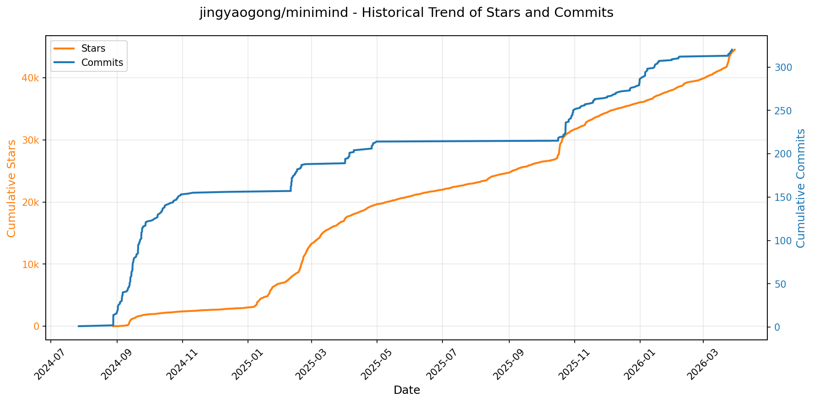

> *蓝色：累计 Stars｜橙色：累计 Commits（次 Y 轴）*

<b>📄 README 摘要</b>

1. **该项目做什么？**  
MiniMind 是一个完全从零开始构建的超轻量级开源大语言模型（LLM）项目，旨在以极低成本（单卡 NVIDIA RTX 3090 上约 2 小时训练时间、服务器租用成本低至 3 元人民币）实现可复现、可理解、可扩展的端到端 LLM 全流程训练。其核心目标是降低大模型学习与实践门槛：不依赖预训练权重或黑盒框架，而是从底层 PyTorch 原生代码出发，完整覆盖从 tokenizer 训练、预训练（Pretrain）、监督微调（SFT）、高效微调（LoRA）、偏好对齐（DPO）、强化学习对齐（RLAIF，含 PPO/GRPO/CISPO）、工具调用（Tool Use）、智能体式强化学习（Agentic RL）、自适应思维链（Adaptive Thinking）到模型蒸馏的全技术栈，并同步支持视觉多模态分支 MiniMind-V。

2. **关键特性**  
- ✅ **极致轻量化**：主线模型 MiniMind-3 仅 64M 参数，体积约为 GPT-3 的 1/2700，可在单张消费级 GPU（如 RTX 3090）上完成全流程训练与部署；  
- ✅ **全阶段白盒实现**：所有核心算法（LoRA、DPO、PPO、GRPO、CISPO、MoE 路由、YaRN 长文本外推、Tool Call 解析、思考标记 `<think>`/`<tool_call>` 支持等）均基于 PyTorch 从零手写，无 `transformers`/`trl`/`peft` 等高层封装依赖；  
- ✅ **开箱即用的工程完备性**：提供统一 JSONL 格式高质量开源数据集（含预训练、SFT、DPO、RLAIF、Agentic RL 等）、自研精简分词器（6400 词表）、兼容 OpenAI API 的服务端（`serve_openai_api.py`）、Streamlit 聊天 WebUI（支持思考过程可视化与多轮工具调用）、断点续训、SwanLab/W&B 可视化、多卡 DDP/DeepSpeed 支持；  
- ✅ **先进能力原生集成**：原生支持 MoE 架构（MiniMind-3-MoE，198M/A64M）、自适应思维开关（`open_thinking`）、结构化工具调用（`tool_calls`）、多轮 Agentic RL（CISPO/GRPO）、RLAIF（人类反馈替代方案）、模型蒸馏及 llama.cpp/vLLM/Ollama 多后端推理兼容；  
- ✅ **教学友好型设计**：既是可落地的模型，也是面向 LLM 初学者的系统性实践教程，强调“每一行代码可读、每一步训练可复现、每一个模块可替换”。

3. **技术栈**  
- **核心框架**：纯 PyTorch（1.x），零依赖 `transformers`/`trl`/`peft` 等第三方训练库（仅推理阶段可选兼容）；  
- **模型架构**：Decoder-only Transformer，采用 Pre-Norm + RMSNorm、SwiGLU 激活、RoPE 位置编码（支持 YaRN 外推）、GQA（q_heads=8, kv_heads=4）、MoE（top-1 routing，4 experts）；  
- **分词器**：自研 BPE + ByteLevel Tokenizer（6400 词表），支持 `<|im_start|>`/`<|im_end|>`/`<think>`/`<tool_call>` 等结构化模板标记；  
- **训练基础设施**：支持单卡/多卡（DDP、DeepSpeed）、`torchrun` 分布式启动、SwanLab（国内首选）与 wandb 可视化、检查点自动保存与跨设备续训；  
- **数据格式**：统一 JSONL（`text` 字段用于预训练；`conversations` 结构用于 SFT/RL；`chosen`/`rejected` 用于 DPO；`agent_rl.jsonl` 等专用于 Agentic RL）；  
- **部署与生态**：提供 OpenAI 兼容 API 服务端、Streamlit WebUI；无缝接入 FastGPT、Open-WebUI；支持导出为 Hugging Face Transformers、llama.cpp、vLLM、Ollama 格式；  
- **开发环境**：Python 3.10+、CUDA 12.2、Ubuntu 20.04，推荐硬件为 RTX 3090（24GB）及以上。

---

### 11. [thedotmack/claude-mem](https://github.com/thedotmack/claude-mem)
- 📅 **创建日期**：2025-08-31  
- 🔄 **最近更新**：2026-03-30  
- ⭐ **Stars**：43,360（日 +731｜周 +3277｜月 +11486）  
- 📝 **描述**：A Claude Code plugin that automatically captures everything Claude does during your coding sessions, compresses it with AI (using Claude's agent-sdk), and injects relevant context back into future sessions.  

<b>📈 Star 与 Commit 历史趋势</b>

> *蓝色：累计 Stars｜橙色：累计 Commits（次 Y 轴）*

<b>📄 README 摘要</b>

1. **项目功能**  
Claude-Mem 是一个专为 Anthropic 的 **Claude Code** 构建的**持久化记忆压缩系统**，旨在解决大模型会话上下文无法跨会话延续的根本性限制。它通过自动捕获用户在 Claude Code 中的工具调用行为（如代码编辑、调试、测试执行等）、生成语义化摘要，并将结构化记忆持久存储，使后续会话能自动恢复并复用历史知识，实现真正意义上的“项目级长期记忆”与“智能上下文连续性”。

2. **核心特性**  
- ✅ **持久化记忆**：会话结束后记忆仍保留，新会话自动注入相关上下文；  
- ✅ **渐进式披露（Progressive Disclosure）**：分三层按需加载记忆（索引→时间线→详情），显著降低 token 消耗（约节省 10 倍）；  
- ✅ **技能化搜索（mem-search）**：支持自然语言查询项目历史，集成 MCP（Model Context Protocol）标准工具（`search`/`timeline`/`get_observations`）；  
- ✅ **实时 Web 查看器**：本地启动 `http://localhost:37777`，提供内存流监控、观察详情查看、ID 引用（含 API 接口 `/api/observation/{id}`）及 Beta 版本切换；  
- ✅ **多端集成能力**：原生支持 Claude Desktop 技能调用、OpenClaw 网关一键部署（含 Telegram/Discord/Slack 实时通知）；  
- ✅ **隐私与精细控制**：支持 `<private>` 标签屏蔽敏感内容；提供细粒度配置项（注入范围、AI 模型、上下文策略等）；  
- ✅ **自动化零干预**：基于 6 个生命周期 Hook（SessionStart、UserPromptSubmit、PostToolUse 等）全自动运行，无需手动触发；  
- ✅ **混合搜索架构**：融合 SQLite FTS5 全文检索 + Chroma 向量数据库，实现语义+关键词联合检索；  
- ✅ **Beta 实验通道**：支持“Endless Mode”等仿生记忆架构实验特性。

3. **技术栈**  
- **运行时**：Node.js（≥18.0.0）、Bun（用于 Worker 服务管理与 HTTP API）；  
- **数据库**：SQLite 3（主存储，含 FTS5 全文索引）、Chroma（向量数据库，依赖 `uv` 自动安装 Python 包）；  
- **前端/UI**：内置轻量 Web Viewer（HTML/CSS/JS，托管于 Bun HTTP Server）；  
- **协议与标准**：完全兼容 MCP（Model Context Protocol）规范，深度集成 Claude Agent SDK；  
- **开发语言**：TypeScript（主力）、Python（向量搜索后端组件）；  
- **部署与分发**：GitHub 插件市场分发、npm 发布（SDK 版本）、OpenClaw 专用安装脚本（`curl | bash`）；  
- **许可协议**：主体代码采用 **AGPL-3.0**（强 Copyleft，网络服务需开源修改）；`ragtime/` 子模块采用 **PolyForm Noncommercial License 1.0.0**。

---

### 12. [twentyhq/twenty](https://github.com/twentyhq/twenty)
- 📅 **创建日期**：2022-12-01  
- 🔄 **最近更新**：2026-03-30  
- ⭐ **Stars**：43,158（日 +539｜周 +2430｜月 +2977）  
- 📝 **描述**：Building a modern alternative to Salesforce, powered by the community.  

<b>📈 Star 与 Commit 历史趋势</b>

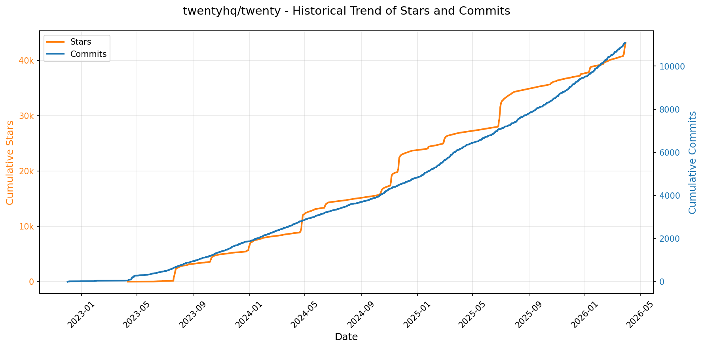

> *蓝色：累计 Stars｜橙色：累计 Commits（次 Y 轴）*

<b>📄 README 摘要</b>

1. **项目功能**  
Twenty 是一款开源的客户关系管理（CRM）系统，旨在提供可自托管、高度可定制且用户友好的替代方案，以打破传统闭源 CRM 的高成本与数据锁定困局。它支持企业全流程客户管理，包括联系人、公司、交易、活动等核心实体的统一管理，并允许团队根据业务需求灵活构建专属 CRM 系统。

2. **核心特性**  
- **多视图个性化布局**：支持看板（Kanban）、表格、列表等多种视图，可按字段过滤、排序、分组；  
- **低代码数据建模**：允许用户自定义对象（Objects）和字段（Fields），无需修改底层代码即可扩展数据结构；  
- **精细化权限控制**：通过自定义角色（Custom Roles）配置细粒度的数据访问与操作权限（如读/写/删除/管理）；  
- **可视化工作流自动化**：基于触发器（Triggers）与动作（Actions）构建自动化流程（如“当新联系人创建时，自动发送欢迎邮件”）；  
- **集成化协作能力**：原生支持电子邮件收发、日历事件管理、文件上传与关联、任务跟踪等扩展功能。

3. **技术栈**  
- **前端**：TypeScript + React，状态管理采用 Jotai，样式方案为 Linaria（零运行时 CSS-in-JS），国际化由 Lingui 实现；  
- **后端**：TypeScript + NestJS 框架，异步任务队列使用 BullMQ，数据库为 PostgreSQL，缓存与消息中间件采用 Redis；  
- **工程化**：全仓库采用 Nx 进行单体仓库（monorepo）管理，实现模块化开发、依赖分析与高效构建；  
- **部署支持**：提供 Docker Compose 一键部署方案，适配自托管场景。

---

### 13. [666ghj/MiroFish](https://github.com/666ghj/MiroFish)
- 📅 **创建日期**：2025-11-26  
- 🔄 **最近更新**：2026-03-30  
- ⭐ **Stars**：38,665（日 +597｜周 +5785｜月 +34428）  
- 📝 **描述**：A Simple and Universal Swarm Intelligence Engine, Predicting Anything. 简洁通用的群体智能引擎，预测万物  

<b>📈 Star 与 Commit 历史趋势</b>

> *蓝色：累计 Stars｜橙色：累计 Commits（次 Y 轴）*

<b>📄 README 摘要</b>

1. **项目功能**  
MiroFish 是一个基于多智能体（Multi-Agent）架构的通用群体智能预测引擎。它通过接收现实世界的“种子信息”（如新闻、政策草案、小说文本、金融数据等），自动构建高保真、动态演化的平行数字世界；在该虚拟环境中，成千上万个具备独立人格、长期记忆与行为逻辑的AI智能体进行自主交互与社会演化。用户以自然语言提出预测需求（例如“推演《红楼梦》后四十回可能结局”或“模拟某舆情事件发酵30天后的公众反应”），系统即返回结构化预测报告，并提供可实时对话、干预与观察的交互式仿真世界。

2. **核心特性**  
- ✅ **双模态预测能力**：兼顾严肃决策支持（政策试错、舆情预判、金融推演）与创意趣味仿真（文学续写、脑洞实验、教育沙盘）；  
- ✅ **全栈式仿真工作流**：覆盖图谱构建（GraphRAG+个体/群体记忆注入）→ 环境搭建（人设生成+关系抽取+参数配置）→ 并行模拟（双平台协同+时序记忆动态更新）→ 报告生成（ReportAgent深度解析）→ 深度交互（与任意智能体或ReportAgent对话）；  
- ✅ **上帝视角可控推演**：支持用户在运行中动态注入变量、调整参数、暂停/回溯/重放，实现“可干预、可解释、可验证”的预测闭环；  
- ✅ **开箱即用与灵活部署**：提供源码一键部署（`npm run setup:all` + `npm run dev`）、Docker容器化部署（`docker compose up -d`）及在线Demo体验；  
- ✅ **轻量中文友好设计**：默认适配国产大模型（如通义千问qwen-plus），集成Zep Cloud实现低成本长记忆管理，降低使用门槛。

3. **技术栈**  
- **前端**：React（TypeScript）、Vite、Tailwind CSS、d3.js（图谱可视化）、Socket.IO（实时仿真状态同步）；  
- **后端**：Python（≥3.11）、FastAPI（REST API服务）、LangChain / LlamaIndex（Agent编排与RAG）、OASIS框架（底层多智能体仿真引擎，由CAMEL-AI开源）；  
- **AI基础设施**：兼容OpenAI SDK标准协议的LLM API（默认对接阿里云百炼qwen-plus）、Zep Cloud（长期记忆向量存储与检索）、GraphRAG（知识图谱增强推理）；  
- **工程与部署**：Node.js 18+（前端构建与脚本调度）、uv（Python依赖管理）、Docker & Docker Compose（容器化交付）、GitHub Actions（CI/CD）。

---

### 14. [TauricResearch/TradingAgents](https://github.com/TauricResearch/TradingAgents)
- 📅 **创建日期**：2024-12-28  
- 🔄 **最近更新**：2026-03-30  
- ⭐ **Stars**：37,448（日 +200｜周 +200｜月 +6656）  
- 📝 **描述**：TradingAgents: Multi-Agents LLM Financial Trading Framework  

<b>📈 Star 与 Commit 历史趋势</b>

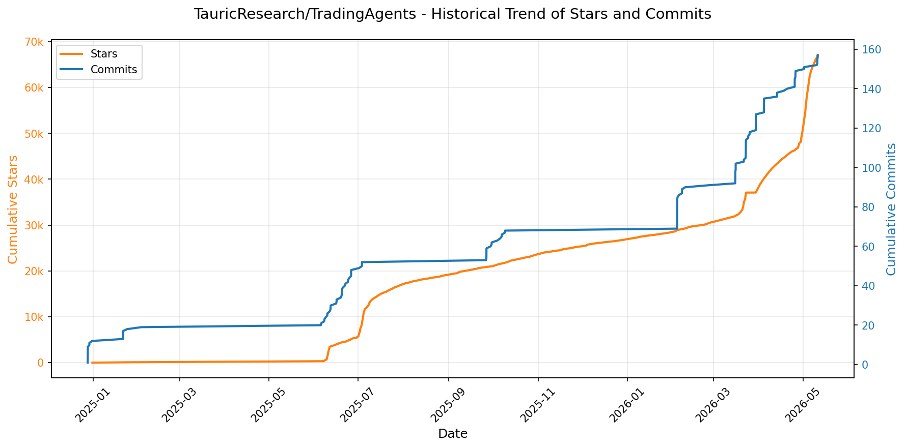

> *蓝色：累计 Stars｜橙色：累计 Commits（次 Y 轴）*

<b>📄 README 摘要</b>

1. **项目功能**  
TradingAgents 是一个面向金融交易研究的多智能体大语言模型（LLM）框架，旨在模拟真实交易公司的组织结构与协作流程。它通过部署多个专业化、角色明确的 LLM 智能体（如基本面分析师、情绪分析师、新闻分析师、技术分析师、多空研究员、交易员、风控团队及投资组合经理），协同完成市场分析、策略辩论、风险评估与交易决策全流程。所有智能体基于历史/指定日期的市场数据进行回测式分析，最终输出交易建议（如买入/卖出/持有、仓位大小、执行时机等），**专为学术研究与算法验证设计，不构成实际投资建议**。

2. **核心特性**  
- **角色化多智能体架构**：严格划分 Analyst Team（4类专业分析师）、Researcher Team（多空双视角辩论）、Trader Agent（整合决策）及 Risk & Portfolio Management（动态风控+最终审批）四大职能模块；  
- **全链路可解释性**：支持逐环节日志追踪（CLI界面实时展示各智能体分析报告、辩论过程、风控评估及最终交易提案）；  
- **多LLM厂商统一支持**：原生兼容 OpenAI（GPT-5.x）、Google（Gemini 3.x）、Anthropic（Claude 4.x）、xAI（Grok 4.x）、OpenRouter 及本地 Ollama 模型，支持按任务类型（深度推理/快速响应）混合调用不同模型；  
- **高保真回测能力**：支持指定任意历史交易日进行分析，保障数据时间戳一致性与事件因果逻辑；  
- **生产就绪工具链**：提供交互式 CLI 命令行工具、Python 包封装（`tradingagents` 模块）、完整配置系统（可定制模型、辩论轮次、温度参数等）及 `.env` 环境变量管理；  
- **国际化与社区集成**：内置多语言 README（含中文）、Discord/微信/X/ArXiv/ GitHub 社区入口，持续发布技术报告（如 Trading-R1）与版本更新（v0.2.x 系列）。

3. **技术栈**  
- **核心框架**：LangGraph（构建可扩展、状态可控的多智能体工作流图）；  
- **编程语言**：Python 3.13（官方指定运行环境）；  
- **依赖管理**：Conda 虚拟环境 + pip 安装；  
- **LLM 接入层**：适配 OpenAI SDK、Google Generative AI、Anthropic SDK、xAI SDK、OpenRouter API 及 Ollama REST API；  
- **金融数据源**：Alpha Vantage（提供股票基本面、技术指标及宏观数据）；  
- **配置与部署**：基于 YAML/Python 字典的 `DEFAULT_CONFIG` 系统 + `.env` 敏感信息隔离；  
- **开发与协作**：GitHub 托管、arXiv 发布技术报告、多平台社区（Discord/微信/X）协同。

---

### 15. [moeru-ai/airi](https://github.com/moeru-ai/airi)
- 📅 **创建日期**：2024-12-01  
- 🔄 **最近更新**：2026-03-30  
- ⭐ **Stars**：36,645（日 +311｜周 +1288｜月 +18268）  
- 📝 **描述**：💖🧸 Self hosted, you-owned Grok Companion, a container of souls of waifu, cyber livings to bring them into our worlds, wishing to achieve Neuro-sama's altitude. Capable of realtime voice chat, Minecraft, Factorio playing. Web / macOS / Windows supported.  

<b>📈 Star 与 Commit 历史趋势</b>

> *蓝色：累计 Stars｜橙色：累计 Commits（次 Y 轴）*

<b>📄 README 摘要</b>

1. **项目功能**  
AIRI 是一个开源的“数字生命容器”（cyber living soul container），旨在复刻并超越 Neuro-sama 这类高交互性 AI 虚拟角色（如 AI 娃化形象、虚拟主播/VTuber），让用户能在本地或任意设备上拥有、运行并持续互动属于自己的智能虚拟伙伴。它不仅支持实时语音聊天与角色扮演，更突破传统聊天机器人局限，具备**跨应用协同能力**：可同步感知用户正在运行的程序（如 Minecraft、Factorio、Kerbal Space Program 等游戏）、监听 Discord/Telegram 语音/文本流、响应多模态输入（音频、屏幕、上下文），并驱动 VRM/Live2D 模型进行拟真表情与肢体动画，实现真正意义上的“在现实世界中活跃的数字生命”。

2. **核心特性**  
- **全场景部署能力**：原生支持三端统一架构——浏览器版（PWA）、桌面版（Electron + Tauri，启用 CUDA/Metal 加速）、移动版（Capacitor + iOS/Android），且均基于 Web 技术栈（WebGPU/WebAudio/WebAssembly）构建，兼顾性能与可移植性；  
- **深度系统集成**：支持直接接入 Discord/Telegram 语音信道、实时捕获屏幕与游戏画面、控制外部游戏进程（已实现在 Minecraft/ Factorio 中自主操作）；  
- **端侧智能处理**：内置客户端语音识别（ASR）、语音活动检测（VAD）、ElevenLabs 等 TTS 合成，支持纯浏览器内运行轻量级 LLM 推理（WIP）及 DuckDB WASM 内存数据库；  
- **高级虚拟形象引擎**：完整支持 VRM 与 Live2D 模型，提供自动眨眼、视线跟随、闲置微动等生理级动画逻辑，并开放模型控制接口；  
- **超广谱大模型兼容性**：通过自研 `xsai` 框架，无缝对接超 25 种主流 LLM API（含 OpenAI、Claude、Gemini、Qwen、DeepSeek、vLLM、Ollama、Groq 等），并持续扩展中；  
- **模块化可扩展生态**：已孵化多个子项目，涵盖 RAG 记忆系统（Alaya）、嵌入式数据库封装（DuckDB WASM / Drizzle）、ASR/TTS 统一代理（unspeech）、WebAI 实时语音栈、MCP 协议插件（tauri-plugin-mcp）等。

3. **技术栈**  
- **前端框架**：Vue 3（Composition API）、TypeScript、Vite；  
- **渲染与图形**：WebGPU（主渲染管线）、Three.js（3D 场景）、WebXR（实验性支持）；  
- **多媒体与实时通信**：Web Audio API、WebSocket、MediaStream API；  
- **后端与运行时**：Tauri（桌面端 Rust + WebView）、Electron（备用方案）、Nix（跨平台构建与依赖管理）；  
- **AI 相关基础设施**：`candle`（Rust 原生推理框架，支持 CUDA/Metal）、`transformers.js`、`xsai`（统一 LLM 接入层）、`unspeech`（ASR/TTS 代理）、DuckDB WASM（浏览器端 OLAP 数据库）；  
- **模型格式与标准**：VRM 1.0 / Live2D Cubism SDK / ONNX Runtime / GGUF；  
- **辅助工具链**：PNPM（包管理）、Capacitor（跨平台移动封装）、Drizzle ORM（数据库抽象）、Crowdin（多语言协作翻译）。

---

### 16. [hesreallyhim/awesome-claude-code](https://github.com/hesreallyhim/awesome-claude-code)
- 📅 **创建日期**：2025-04-19  
- 🔄 **最近更新**：2026-03-30  
- ⭐ **Stars**：34,078（日 +382｜周 +3821｜月 +8748）  
- 📝 **描述**：A curated list of awesome skills, hooks, slash-commands, agent orchestrators, applications, and plugins for Claude Code by Anthropic  

<b>📈 Star 与 Commit 历史趋势</b>

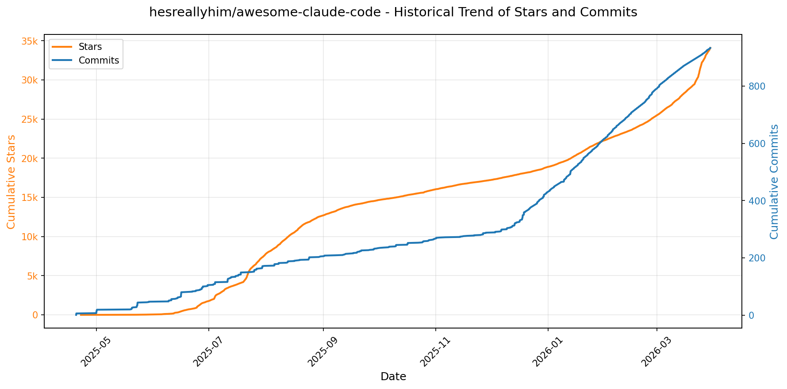

> *蓝色：累计 Stars｜橙色：累计 Commits（次 Y 轴）*

<b>📄 README 摘要</b>

1. **项目功能**  
该项目是一个面向 Anthropic 公司推出的 AI 编程助手 **Claude Code** 的精选资源聚合库（curated list），专注于收集、分类和推荐高质量的增强型工具与实践方案。它不提供代码执行或独立软件，而是作为一份权威性、社区驱动的“能力目录”，帮助开发者发现并集成可直接提升 Claude Code 工作流效能的各类资源，包括：Agent 技能（Skills）、多智能体工作流（Workflows）、IDE 插件、监控工具、钩子（Hooks）、斜杠命令（Slash-Commands）、CLAUDE.md 配置模板、MCP 服务、状态栏组件、替代客户端等。

2. **核心特性**  
- **高度结构化分类体系**：涵盖 Agent Skills、Workflows、Tooling、Status Lines、Hooks、Slash-Commands、CLAUDE.md 文件、Alternative Clients 等八大主类，并进一步细分为语言/领域/场景（如 Git、CI/CD、安全审计、教育、登山信息检索、出版流程等）子类；  
- **真实生产级项目优先**：所收录条目均来自活跃开源仓库，强调实际可用性与工程严谨性（如 `claude-devtools` 提供会话可观测性，`agnix` 支持多格式配置文件静态检查与 IDE 自动修复，`Ruflo` 实现自主多智能体编排与向量记忆）；  
- **深度上下文工程支持**：突出展示高级用法，如 `Context Engineering Kit` 的低开销提示优化模式、`Fullstack Dev Skills` 的 `/common-ground` 命令揭示模型隐含假设、`Claude Code Infrastructure Showcase` 利用 Hooks 动态激活技能等；  
- **跨平台与可扩展生态兼容**：多数资源明确标注对其他 LLM 平台（如 Gemini CLI）或标准协议（MCP、Tavily、Playwright）的支持，强调互操作性与非厂商锁定；  
- **多风格 README 可选**：提供 Awesome（当前版）、Classic、Flat、Extra 四种视觉与组织风格的文档变体，适配不同用户偏好。

3. **技术栈**  
- **底层依赖**：完全围绕 Anthropic 官方 **Claude Code**（非通用 Claude 模型）构建，深度依赖其原生能力，包括 CLAUDE.md 配置规范、Sub-agent 架构、MCP（Model Control Protocol）工具调用、Hook 触发机制、Slash-Command 扩展语法、Session 日志分析等专有接口；  
- **前端/呈现层**：纯静态 Markdown + GitHub Pages 生态，辅以 SVG badge、响应式图片（`<picture>`）、Mermaid 图表（部分外部链接文档中）、HTML 社交卡片生成（如 `Web Assets Generator Skill`）；  
- **工具链集成**：广泛兼容主流开发工具链，包括 VS Code / JetBrains IDE（通过 `agnix` 插件）、n8n、Playwright、Tavily、CodeQL、Semgrep、PostgreSQL、Git、Docker（容器化风险任务）、Laravel TALL Stack 等；  
- **基础设施相关**：涉及向量数据库（Ruflo 多层记忆）、CLI 工具封装（`claude-devtools` 桌面应用）、系统级监控（用量监视器）、自动化部署（Ruflo 编排平台）、静态站点生成（文档镜像站 `claude-code-docs`）。

---

### 17. [microsoft/VibeVoice](https://github.com/microsoft/VibeVoice)
- 📅 **创建日期**：2025-08-25  
- 🔄 **最近更新**：2026-03-30  
- ⭐ **Stars**：27,667（日 +2006｜周 +3594｜月 +4079）  
- 📝 **描述**：Open-Source Frontier Voice AI  

<b>📈 Star 与 Commit 历史趋势</b>

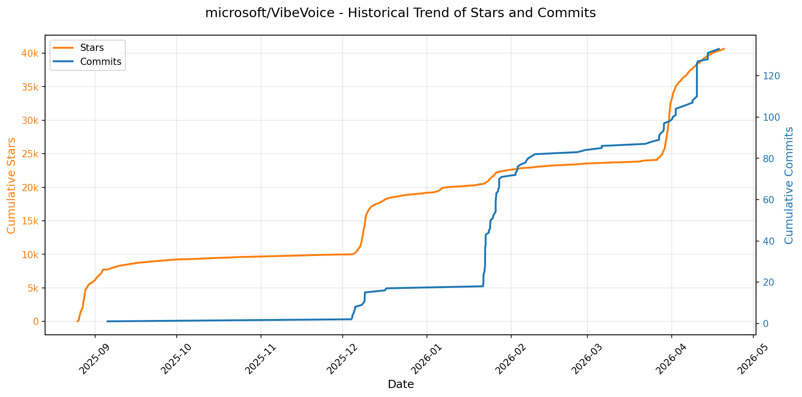

> *蓝色：累计 Stars｜橙色：累计 Commits（次 Y 轴）*

<b>📄 README 摘要</b>

1. **项目功能**  
VibeVoice 是一个开源的前沿语音人工智能模型家族，专注于长时程、高保真、结构化语音处理，涵盖自动语音识别（ASR）与文本到语音（TTS）两大核心能力。其核心目标是突破传统语音模型在**时长限制、上下文连贯性、结构化输出**和**实时性**方面的瓶颈：  
- **VibeVoice-ASR** 支持单次处理长达**60分钟**的连续音频，直接输出带说话人标识（Who）、精确时间戳（When）和语义内容（What）的结构化转录，并支持用户自定义热词（Hotwords）以提升领域准确率；  
- **VibeVoice-TTS**（已部分下线，但历史版本仍具代表性）曾支持生成最长**90分钟**的多说话人（最多4人）自然对话语音，保持角色一致性与情感表达；  
- **VibeVoice-Realtime-0.5B** 是轻量级实时TTS模型，面向流式文本输入，首音延迟约300ms，可稳健生成约10分钟长语音，兼顾部署效率与实用性。

2. **关键特性**  
- **超长序列建模能力**：统一采用**7.5 Hz超低帧率连续语音分词器**（Acoustic & Semantic Tokenizers），在大幅降低计算开销的同时保留高保真声学细节；  
- **结构化联合建模**：ASR模型原生融合语音识别、说话人日志（diarization）与时间戳预测，端到端输出“Who-When-What”三元结构化文本；  
- **上下文感知与定制化**：支持用户注入背景知识或热词（如专有名词、术语），显著提升专业场景识别鲁棒性；  
- **多语言与多风格支持**：ASR支持**50+语言**；Realtime-TTS提供**9种非英语语种**及**11种英语风格化声音**；TTS历史版本支持中英文跨语言合成与即兴歌唱等扩展能力；  
- **工程友好型部署方案**：ASR已集成至Hugging Face Transformers库（v5.3.0+），并支持**vLLM加速推理**；提供Colab演示、Gradio交互式Playground及完整微调代码（finetuning-asr）；  
- **研究透明性**：所有模型均配套技术报告（arXiv论文）、详细文档、基准评测指标（如DER、cpWER、tcpWER）及可视化结果。

3. **技术栈**  
- **核心架构**：基于**大语言模型（LLM）+ 扩散模型（Diffusion）混合框架**，其中LLM负责语言理解与对话建模，扩散头负责高保真声学波形生成；采用**next-token diffusion**范式（见 arXiv:2412.08635）；  
- **基础模型**：ASR与TTS均以**Qwen2.5-1.5B**为LLM主干（明确声明存在继承性偏差风险）；Realtime-0.5B进一步轻量化至0.5B参数规模；  
- **推理优化**：支持**vLLM**进行高效ASR批量/流式推理；TTS提供PyTorch原生实现及Colab可运行环境；  
- **生态集成**：深度适配**Hugging Face Transformers**（官方发布支持）、**Gradio**（ASR Playground）、**Google Colab**（全模型交互式Demo）；  
- **训练与分词**：自研**连续语音分词器**（7.5Hz），替代传统梅尔谱或离散token，实现计算效率与音质的协同优化；微调流程开源（含ASR finetuning代码）。

---

### 18. [FujiwaraChoki/MoneyPrinterV2](https://github.com/FujiwaraChoki/MoneyPrinterV2)
- 📅 **创建日期**：2024-02-12  
- 🔄 **最近更新**：2026-03-30  
- ⭐ **Stars**：27,314（日 +213｜周 +7174｜月 +14334）  
- 📝 **描述**：Automate the process of making money online.  

<b>📈 Star 与 Commit 历史趋势</b>

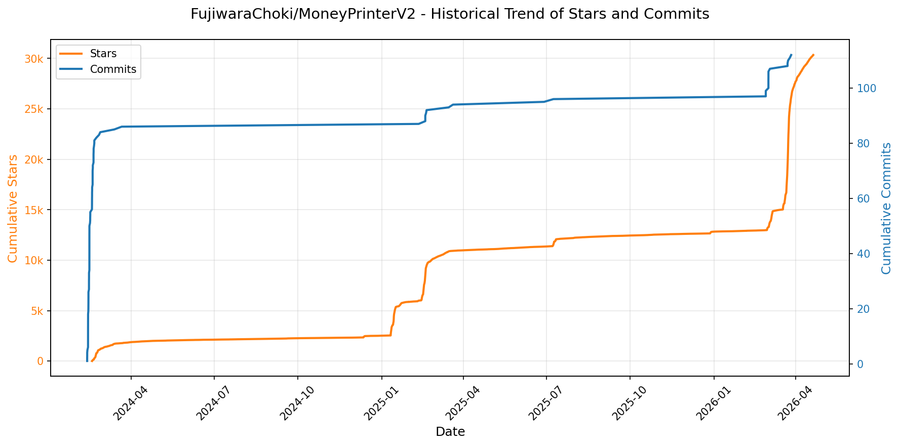

> *蓝色：累计 Stars｜橙色：累计 Commits（次 Y 轴）*

<b>📄 README 摘要</b>

1. **项目功能**  
MoneyPrinter V2（MPV2）是一个面向自动化在线盈利的开源应用，旨在通过程序化手段批量执行多种低门槛、高复用性的网络创收任务。其核心目标是将内容生成、分发、流量转化与商业触达等环节整合为可配置、可调度的自动化流水线，帮助用户在社交媒体（如Twitter/X、YouTube Shorts）、联盟营销（Amazon + Twitter）及本地商务开发（爬取本地企业并冷邮件/消息触达）等场景中实现被动收入。

2. **关键特性**  
- ✅ **Twitter/X 自动化机器人**：支持定时发布推文、互动与账号运营，集成 CRON 调度器（`scheduler`）实现无人值守运行；  
- ✅ **YouTube Shorts 全流程自动化**：涵盖脚本生成、AI语音合成（依赖KittenTTS）、视频剪辑、字幕添加及自动上传；  
- ✅ **联盟营销闭环**：自动嵌入Amazon商品链接至Twitter内容，追踪转化并优化推广策略；  
- ✅ **本地企业挖掘与冷启动触达**：通过网络爬虫识别本地商家信息，并支持批量生成个性化外联邮件（需预装Go语言环境以运行相关工具）；  
- ✅ **模块化架构与多语言生态**：作为V1的完全重写版本，采用高内聚、低耦合设计，已衍生出社区维护的中文版（MoneyPrinterTurbo）等国际化分支。

3. **技术栈**  
- **主语言**：Python 3.12（强制要求，用于核心逻辑、调度、API集成及CLI控制）；  
- **AI与多媒体**：集成 KittenTTS（开源TTS引擎）实现文本转语音；引用 gpt4free（无API密钥的免费LLM调用层）辅助内容生成；  
- **运维与部署**：基于虚拟环境（venv）、pip 包管理；提供 Bash 脚本（`scripts/` 目录）简化高频操作（如视频上传）；  
- **扩展依赖**：冷邮件功能需额外安装 Go 编程语言（用于运行Go编写的外联工具）；  
- **许可证**：Affero General Public License v3.0（AGPL-3.0），强调网络服务化使用时的源码公开义务。

---

### 19. [lightpanda-io/browser](https://github.com/lightpanda-io/browser)
- 📅 **创建日期**：2023-02-07  
- 🔄 **最近更新**：2026-03-30  
- ⭐ **Stars**：25,926（日 +255｜周 +2066｜月 +14055）  
- 📝 **描述**：Lightpanda: the headless browser designed for AI and automation  

<b>📈 Star 与 Commit 历史趋势</b>

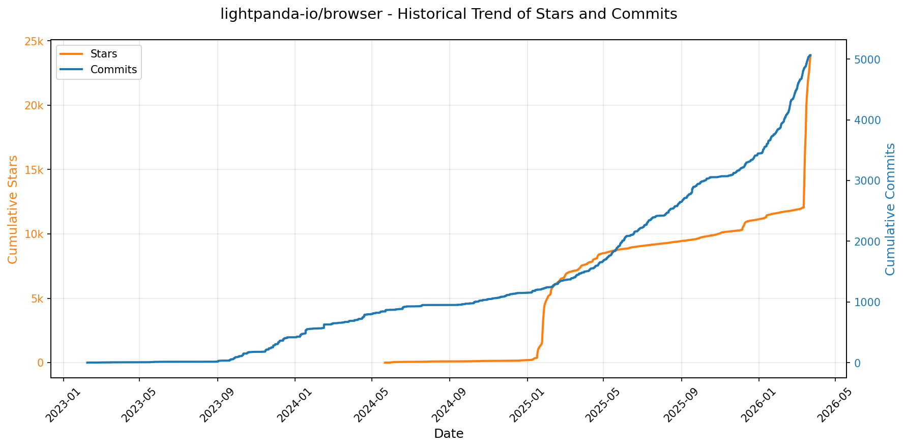

> *蓝色：累计 Stars｜橙色：累计 Commits（次 Y 轴）*

<b>📄 README 摘要</b>

1. **项目功能**  
Lightpanda Browser 是一个**从零开始全新编写的开源无头浏览器**，专为 AI 代理（AI agents）、大语言模型（LLM）训练、网页抓取（scraping）、自动化测试等服务端场景设计。它不依赖 Chromium、WebKit 或 Blink 等现有浏览器引擎，而是完全自主实现核心 Web 栈（HTML 解析、DOM、JavaScript 执行、网络请求等），仅提供无图形界面的 headless 运行模式，通过 Chrome DevTools Protocol（CDP）对外提供标准接口，兼容 Puppeteer、Playwright 和 chromedp 等主流自动化客户端工具。

2. **关键特性**  
- ✅ **极致性能**：内存占用仅为 Chrome 的约 1/9，执行速度达 Chrome 的 11 倍，启动近乎瞬时；  
- ✅ **标准协议兼容**：原生支持 CDP（WebSocket 接口），可无缝接入 Puppeteer-Core、Playwright（部分兼容）、chromedp 等生态工具；  
- ✅ **完整基础能力**：支持 HTML5 解析（html5ever）、DOM 构建与操作、JavaScript 执行（集成 V8 引擎）、XHR/Fetch API、Cookie 管理、自定义 HTTP 头、代理、网络请求拦截、robots.txt 遵守等；  
- ✅ **生产就绪增强**：支持日志分级输出、结构化 telemetry（可禁用）、Docker 官方镜像、WSL2 兼容、多平台二进制分发（Linux x86_64 / macOS aarch64）；  
- ⚠️ **持续演进**：Web API 覆盖仍在进行中（如 CORS 尚未实现），当前处于 Beta 阶段，稳定性与兼容性随版本快速提升。

3. **技术栈**  
- **主语言**：Zig（v0.15.2），强调零成本抽象、内存安全与极致性能优化；  
- **JavaScript 引擎**：Google V8（独立嵌入，支持 snapshot 加速启动）；  
- **网络层**：libcurl（HTTP(S) 请求与连接管理）；  
- **HTML 解析**：html5ever（Servo 项目出品的符合 HTML5 规范的解析器）；  
- **构建与依赖管理**：Zig Build System + Make；Rust（用于部分工具链及 WPT 测试 runner）；Nix（可选开发环境）；  
- **测试体系**：单元测试（Zig）、端到端测试（基于 Go + Node.js 的 demo 仓库）、Web Platform Tests（WPT）定制分支验证标准 Web API 行为。

---

### 20. [hsliuping/TradingAgents-CN](https://github.com/hsliuping/TradingAgents-CN)
- 📅 **创建日期**：2025-06-26  
- 🔄 **最近更新**：2026-03-30  
- ⭐ **Stars**：22,218（日 +153｜周 +2248｜月 +4277）  
- 📝 **描述**：基于多智能体LLM的中文金融交易框架 - TradingAgents中文增强版  

<b>📈 Star 与 Commit 历史趋势</b>

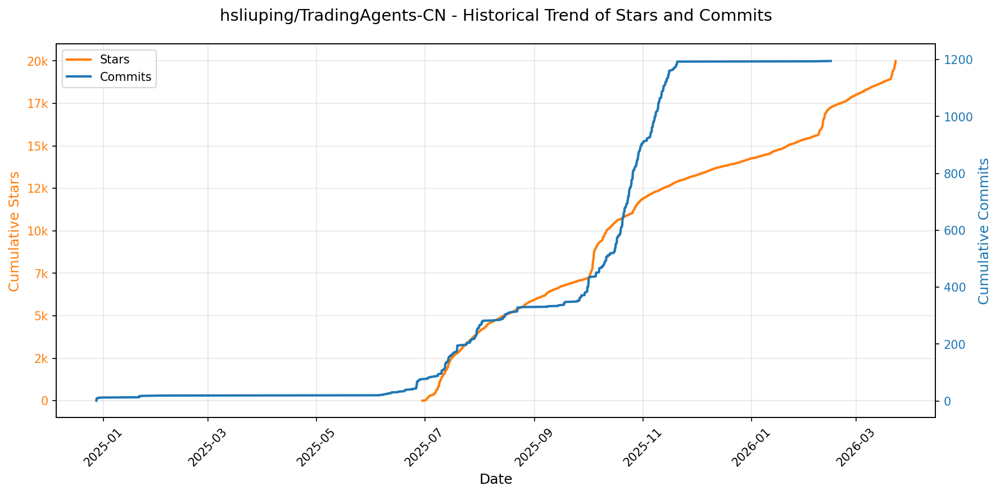

> *蓝色：累计 Stars｜橙色：累计 Commits（次 Y 轴）*

<b>📄 README 摘要</b>

1. **项目功能**  
本项目是一个面向中文用户的**多智能体与大模型股票分析学习平台**，基于开源框架 `TradingAgents` 进行深度本地化增强。其核心定位为**合规、非实盘的教育与研究工具**，旨在帮助用户系统学习如何利用多智能体架构（Multi-Agent System）和大语言模型（LLM）开展股票基本面、技术面、新闻舆情等维度的分析与策略实验。平台**不提供实盘交易指令或投资建议**，严格限定于A股/港股/美股市场的教学、模拟与研究场景。

2. **关键特性**  
- **中文化全栈增强**：完整中文界面、A股数据原生支持（Tushare/AkShare/BaoStock）、国产大模型集成（通义千问、DeepSeek等）、中文提示词工程优化；  
- **企业级架构能力**：FastAPI后端 + Vue 3前端、MongoDB + Redis双数据库、RESTful API + WebSocket/SSE实时通知、RBAC用户权限与操作日志；  
- **智能分析能力**：动态LLM供应商管理、任务驱动的智能模型选择与持久化配置、多层次新闻分析（采集→过滤→质量评估→统一调用）、多股票批量分析与智能筛选；  
- **专业工作流支持**：自选股分组管理、个股全周期分析记录、虚拟模拟交易系统、Markdown/Word/PDF多格式专业报告导出；  
- **开箱即用部署体验**：Docker多架构（amd64/arm64）一键部署、绿色版Windows免安装方案、Web可视化配置中心、统一缓存管理（文件/Redis/MongoDB三级）；  
- **安全与合规保障**：混合许可证（Apache 2.0开源 + `app/`/`frontend/`专有授权）、明确禁止未经授权商业使用、官方唯一渠道管控。

3. **技术栈**  
- **后端**：Python 3.10+，FastAPI + Uvicorn（替代原Streamlit），MongoDB（主数据存储），Redis（缓存与实时通信），Celery（异步任务，隐含于批量分析与模拟交易）；  
- **前端**：Vue 3 + Vite + Element Plus（现代化SPA），TypeScript（隐含于Vue 3最佳实践），WebSocket/SSE实现实时分析进度推送；  
- **AI与数据层**：原生OpenAI API、Google Gemini、DeepSeek、通义千问等多LLM提供商集成；Tushare、AkShare、BaoStock三大多A股数据源同步；内置技术指标（修复精度）与财务指标（PE/PB等）计算引擎；  
- **基础设施**：Docker + Docker Compose（跨平台容器化）、GitHub Actions自动化CI/CD、Nginx（生产反向代理，隐含于部署文档）；  
- **许可证体系**：主体代码采用Apache 2.0（允许自由使用/修改/商用），但`app/`（FastAPI后端）与`frontend/`（Vue前端）目录为专有组件，商业使用须单独授权。

---

### 21. [fastfetch-cli/fastfetch](https://github.com/fastfetch-cli/fastfetch)
- 📅 **创建日期**：2021-02-18  
- 🔄 **最近更新**：2026-03-30  
- ⭐ **Stars**：21,156（日 +156｜周 +307｜月 +854）  
- 📝 **描述**：A maintained, feature-rich and performance oriented, neofetch like system information tool.  

<b>📈 Star 与 Commit 历史趋势</b>

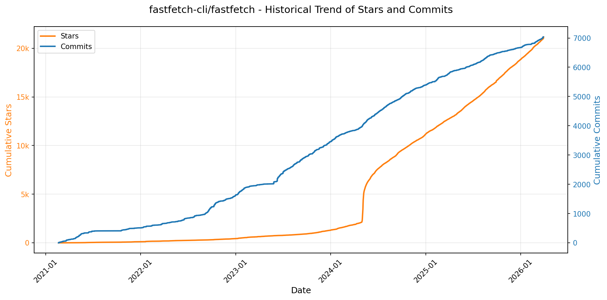

> *蓝色：累计 Stars｜橙色：累计 Commits（次 Y 轴）*

<b>📄 README 摘要</b>

1. **项目功能**  
Fastfetch 是一个高性能、跨平台的系统信息获取与展示工具，功能定位为 neofetch 的现代化替代品。它能快速采集并结构化显示操作系统、硬件（CPU/GPU/内存/磁盘/网络等）、运行环境（Shell、WM/DE、终端、窗口管理器、显示协议如 Wayland/X11）及软件配置（包管理器状态、编辑器、Git 仓库等）等数十类系统信息，并以高度可定制的 ASCII 艺术、图像（支持 iTerm/Sixel/Raw 等协议）、颜色和排版方式呈现于终端中，常用于 shell 启动时展示系统概览。

2. **核心特性**  
- ✅ **极致性能**：纯 C 实现，启动与执行速度显著快于 neofetch（尤其在多模块启用时）；默认仅启用基础模块，按需启用可进一步优化。  
- ✅ **全平台支持**：原生兼容 Linux、macOS、Windows 8.1+、Android（Termux）、FreeBSD、OpenBSD、NetBSD、DragonFly BSD、Haiku 和 Solaris/Illumos，主测架构为 x86-64 与 aarch64。  
- ✅ **深度可定制性**：采用 JSONC（带注释的 JSON）配置格式，支持模块级开关、字段级格式化（如 `{name}`、`{vendor} {model}`）、动态键名/值替换、多级嵌套逻辑；提供完整 JSON Schema 文档与 VSCode 友好支持。  
- ✅ **丰富输出能力**：支持纯文本、ASCII logo（含颜色索引控制）、本地/远程图像（PNG/JPEG/SIXEL/ITerm 协议）、JSON 结构化导出（用于脚本集成），并内置 `Command` 模块执行任意 Shell 命令扩展功能。  
- ✅ **高精度与一致性**：统一使用 IEC 二进制单位（GiB/MiB）、正确识别 Wayland 协议、精准统计已安装软件包（排除 neofetch 错误计入的 `rc` 状态包）、准确解析 GPU 型号（支持驱动级探测与 pci.ids 更新）。  
- ✅ **安全与透明**：代码签名由 SignPath.io 提供；明确警示用户审查第三方配置中的 `Command` 模块以防恶意执行；不主动联网或收集用户数据（除非显式调用网络相关模块）。

3. **技术栈**  
- **主语言**：C（99%+ 核心逻辑，兼顾性能与跨平台可移植性）  
- **构建系统**：CMake（支持多平台编译与依赖管理）  
- **配置格式**：JSONC（JSON with Comments），配合自动生成的 [JSON Schema](https://github.com/fastfetch-cli/fastfetch/blob/dev/doc/json_schema.json) 实现强类型校验与 IDE 智能提示  
- **图像协议支持**：  
  - 终端侧：iTerm2 图像协议（Linux/macOS/Windows mintty & Wezterm）、SIXEL（Windows Terminal）、ANSI 转义序列（基础 ASCII）  
  - 图像处理：依赖外部工具（如 ImageMagick）进行格式转换（Windows sixel 场景）  
- **跨平台抽象层**：自研轻量级系统调用封装，适配各 OS 的 procfs/sysfs/Windows API/BSD sysctl/Android prop 等底层接口  
- **打包与分发**：支持主流包管理器（APT/YUM/Pacman/Homebrew/Scoop/Chocolatey/Winget/Ports 等），CI/CD 基于 GitHub Actions，发布含预编译二进制与源码包

---

### 22. [abhigyanpatwari/GitNexus](https://github.com/abhigyanpatwari/GitNexus)
- 📅 **创建日期**：2025-08-02  
- 🔄 **最近更新**：2026-03-30  
- ⭐ **Stars**：20,725（日 +181｜周 +1789｜月 +14446）  
- 📝 **描述**：GitNexus: The Zero-Server Code Intelligence Engine -       GitNexus is a client-side knowledge graph creator that runs entirely in your browser. Drop in a GitHub repo or ZIP file, and get an interactive knowledge graph wit a built in Graph RAG Agent. Perfect for code exploration  

<b>📈 Star 与 Commit 历史趋势</b>

> *蓝色：累计 Stars｜橙色：累计 Commits（次 Y 轴）*

<b>📄 README 摘要</b>

1. **项目功能**  
GitNexus 是一个面向 AI 编程代理（AI agents）的代码智能基础设施，核心目标是为大语言模型（LLM）和 AI 开发工具构建代码库的“神经系统”。它通过深度解析任意规模的代码库，自动生成结构完备、语义丰富的**知识图谱（Knowledge Graph）**，精准建模函数调用链、模块依赖、执行流程、组件聚类（clusters）、继承关系、跨文件导入导出等全维度架构信息。该图谱并非仅用于检索，而是被预计算、结构化封装为即用型智能工具（MCP tools），使 Cursor、Claude Code、Codex、Windsurf 等 AI 编程助手能在单次调用中获取完整上下文（如影响范围、调用路径、模块边界），彻底解决传统 RAG 方式下 LLM “看不见依赖”“断链误改”“盲目编辑”等可靠性缺陷。

2. **关键特性**  
- **双模态使用体验**：提供轻量级**Web UI**（浏览器端 ZIP 拖拽即用，完全离线/无服务器）与生产级**CLI + MCP 服务**（本地索引、持久化存储、多仓库统一管理）；支持 Bridge 模式（`gitnexus serve`）让 Web UI 无缝接入 CLI 已索引的全部仓库。  
- **预计算智能工具集（7 大 MCP 工具）**：包括 `impact`（带置信度的多层影响分析）、`context`（符号全息视图）、`detect_changes`（Git Diff 影响映射）、`rename`（图谱驱动的跨文件重命名）、`cypher`（原生图查询）等，响应结果已结构化、去歧义、高置信，无需 LLM 多轮推理。  
- **自动化架构洞察**：自动生成 `AGENTS.md`/`CLAUDE.md` 上下文文件、动态更新的 **Code Wiki**（含 Mermaid 架构图）、基于 Leiden 算法的**功能聚类（Clusters）识别**与**生成式技能（Skills）**（`.claude/skills/generated/` 中按模块定制的 AI 技能文档）。  
- **企业级能力**：SaaS/私有化部署支持，含 PR 自动爆破半径分析、多仓库统一图谱、OCaml 语言支持、自动重索引、商业授权许可。  
- **极致隐私与本地化**：CLI 全流程离线运行（无网络请求），索引数据存于本地 `.gitnexus/` 目录（可 Git 忽略）；Web UI 完全在浏览器内通过 WASM 运行（Tree-sitter + LadybugDB）。  
- **全栈语言支持**：深度覆盖 TypeScript/JS、Python、Java、C#、Go、Rust 等 17+ 主流语言，支持导入解析、类型推断、构造器推导、框架模式识别、入口点发现等高级语义能力。

3. **技术栈**  
- **核心引擎**：基于 **Tree-sitter** 的多语言 AST 解析（CLI 使用原生绑定，Web UI 使用 WASM 版本）；自研嵌入式图数据库 **LadybugDB**（CLI 用本地版，Web UI 用 WASM 版），专为代码知识图谱优化。  
- **协议与集成**：遵循 **MCP（Model Context Protocol）** 标准，提供标准化工具接口与资源 URI（`gitnexus://` scheme），深度适配 Claude Code（含 Pre/Post ToolUse 钩子）、Cursor、Codex、Windsurf、OpenCode 等主流 AI IDE。  
- **前端**：Web UI 基于现代 Web 技术栈（Vite + React + TypeScript），纯客户端运行，依赖 WASM 加速解析与图查询。  
- **后端/CLI**：TypeScript 编写，Node.js 运行时，采用模块化架构（`index → graph → MCP` 流水线），支持全局 MCP 注册中心与懒加载连接池管理多仓库索引。  
- **许可证**：开源版本采用 **PolyForm Noncommercial License**（非商业用途免费），企业版提供商业授权与 SaaS/私有化部署支持。

---

### 23. [supermemoryai/supermemory](https://github.com/supermemoryai/supermemory)
- 📅 **创建日期**：2024-02-27  
- 🔄 **最近更新**：2026-03-30  
- ⭐ **Stars**：20,345（日 +195｜周 +2820｜月 +3764）  
- 📝 **描述**：Memory engine and app that is extremely fast, scalable. The Memory API for the AI era.  

<b>📈 Star 与 Commit 历史趋势</b>

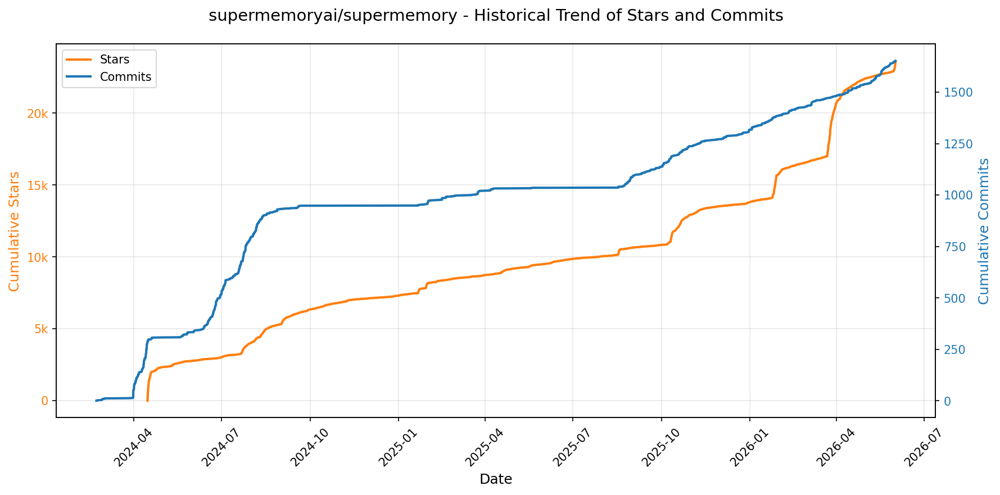

> *蓝色：累计 Stars｜橙色：累计 Commits（次 Y 轴）*

<b>📄 README 摘要</b>

1. **项目功能**  
Supermemory 是一个面向 AI 的先进记忆与上下文引擎，旨在解决大模型在对话间“失忆”的核心问题。它为 AI 系统提供持久化、动态演化的用户级记忆能力：自动从多轮对话中提取事实、构建并实时更新用户画像（含稳定属性与近期行为）、智能处理知识变更与矛盾、自动遗忘过期信息（如时效性事件），并在每次交互中精准注入个性化上下文。它统一整合了传统 RAG（检索增强生成）、用户档案管理、多源数据同步与多模态内容理解，形成端到端的“上下文栈”，使 AI 具备类人式的长期记忆与情境感知能力。

2. **关键特性**  
- **智能记忆引擎**：支持事实抽取、时序演化建模、矛盾消解与自动遗忘机制，区分长期稳定事实（如职业、偏好）与短期动态上下文（如当前项目）。  
- **毫秒级用户画像（Profile）**：单次 API 调用（~50ms）返回结构化静态事实（`profile.static`）与动态活动摘要（`profile.dynamic`），可直接注入系统提示词。  
- **混合搜索（Hybrid Search）**：在同一查询中无缝融合 RAG（知识库文档）与个性化记忆，实现“通用知识 + 个人语境”联合检索。  
- **开箱即用的多源连接器（Connectors）**：原生支持 Google Drive、Gmail、Notion、OneDrive、GitHub 及网页爬虫，通过实时 Webhook 自动同步与处理数据。  
- **多模态内容处理**：支持 PDF、图像（OCR）、视频（语音转录）、代码（AST 感知分块）等格式的上传、解析与向量化检索。  
- **标准化 MCP 协议集成**：提供开源 MCP（Model Context Protocol）服务器，开箱兼容 Claude Desktop、Cursor、VS Code、Windsurf 等主流 AI 客户端，支持 `/context` 等快捷指令。  
- **全栈框架即插即用**：提供 Vercel AI SDK、LangChain、LangGraph、Mastra、OpenAI Agents SDK 等主流框架的官方封装，零配置接入记忆能力。  
- **权威基准领先**：在 LongMemEval、LoCoMo 和 ConvoMem 三大国际 AI 记忆评测中均排名第一，并开源 MemoryBench 工具链支持横向对比。

3. **技术栈**  
- **客户端/前端**：基于现代 Web 技术构建（React/Vite？隐含于 `apps/web` 目录及 SVG 主题适配逻辑），支持深色/浅色模式自动切换。  
- **核心服务**：未明确披露后端语言，但通过 `npm`（TypeScript/JavaScript）和 `pypi`（Python）双 SDK 支持，表明服务层具备跨语言 API 设计与高可用架构；内存引擎底层需融合图谱存储、时序知识推理、矛盾检测与自适应遗忘算法。  
- **AI 与数据处理**：集成 OCR（图像）、ASR（视频语音转录）、AST 解析（代码）、多粒度文本分块（含语义与结构感知）等多模态预处理能力；采用混合检索策略（向量+关键词+图谱关系），非依赖单一向量数据库。  
- **协议与生态**：深度拥抱开放标准——MCP（Model Context Protocol）作为客户端通信协议；提供 CLI 工具（`npx install-mcp`）、SDK（`supermemory` 包）、Benchmark 框架（MemoryBench）及开源插件（Claude/OpenCode/OpenClaw 插件仓库），构建完整开发者生态。

---

### 24. [volcengine/OpenViking](https://github.com/volcengine/OpenViking)
- 📅 **创建日期**：2026-01-05  
- 🔄 **最近更新**：2026-03-30  
- ⭐ **Stars**：19,992（日 +212｜周 +1933｜月 +15848）  
- 📝 **描述**：OpenViking is an open-source context database designed specifically for AI Agents(such as openclaw). OpenViking unifies the management of context (memory, resources, and skills) that Agents need through a file system paradigm, enabling hierarchical context delivery and self-evolving.  

<b>📈 Star 与 Commit 历史趋势</b>

> *蓝色：累计 Stars｜橙色：累计 Commits（次 Y 轴）*

<b>📄 README 摘要</b>

1. **该项目做什么？**  
OpenViking 是一个专为 AI Agent 设计的开源**上下文数据库（Context Database）**，旨在系统性解决 Agent 开发中长期存在的上下文管理难题。它摒弃传统 RAG 中分散、扁平化的向量存储模式，转而采用类文件系统的抽象范式，统一组织与管理 Agent 所需的三类核心上下文：**记忆（user/）、资源（resources/）和能力（agent/）**。通过提供可寻址、可追溯、可分层加载的上下文基础设施，OpenViking 使开发者能像操作本地文件一样（如 `ls`、`find`、`tree`）精确、确定性地管理 Agent 的“大脑”，从而实现高可靠性、低成本、可观测且具备自演进能力的上下文生命周期管理。

2. **关键特性**  
- **文件系统化管理范式**：以 `viking://` 协议构建虚拟文件系统，将记忆、资源、技能等映射为结构化目录（如 `viking://resources/`, `viking://agent/skills/`），终结上下文碎片化问题；  
- **三级分层上下文加载（L0/L1/L2）**：自动将内容生成摘要（L0）、概览（L1）和原始细节（L2），按需加载，显著降低 token 消耗（实测较基线降低超 90%），避免上下文爆炸与噪声干扰；  
- **目录递归检索**：融合路径定位（如 `viking://resources/volcengine/`）与语义搜索，支持跨层级、精准、可复现的上下文获取；  
- **可视化检索轨迹**：完整记录并展示从目录遍历到语义匹配的完整检索链路，使“黑盒式 RAG”变为可观测、可调试、可优化的白盒流程；  
- **自动会话记忆迭代**：在对话过程中自动压缩对话内容、工具调用、资源引用等，提取长期记忆，实现 Agent 随使用而持续变聪明的自我进化能力；  
- **原生插件生态支持**：已验证与 OpenClaw 等主流 Agent 框架深度集成，显著提升任务完成率（+49%）并大幅削减输入 token 成本（最高降本 96%）。

3. **技术栈**  
- **核心语言与运行时**：Python（主服务与 SDK）、Go（AGFS 文件系统组件）、Rust（高性能 CLI 工具 `ov_cli`）、C++（核心扩展编译依赖，GCC 9+/Clang 11+）；  
- **模型支持架构**：  
  - **VLM（视觉语言模型）**：通过统一抽象层支持 VolcEngine（Doubao）、OpenAI（GPT-4o）、LiteLLM（兼容 Anthropic/Claude、DeepSeek、Gemini、Qwen/DashScope、vLLM、Ollama 等数十种模型）；  
  - **Embedding 模型**：支持 VolcEngine、OpenAI、Jina、Voyage、Minimax、VikingDB、Google Gemini 等多源嵌入服务；  
- **部署与配置**：基于 JSON 的模块化配置（`ov.conf`）、环境变量驱动、支持 Linux/macOS/Windows 多平台；生产推荐部署于 VolcEngine ECS（veLinux）；  
- **协议与接口**：自定义 `viking://` URI 协议、RESTful HTTP Server API、命令行客户端（CLI）、Python SDK，并提供 VikingBot Agent 框架集成支持。

---

### 25. [Crosstalk-Solutions/project-nomad](https://github.com/Crosstalk-Solutions/project-nomad)
- 📅 **创建日期**：2025-06-24  
- 🔄 **最近更新**：2026-03-30  
- ⭐ **Stars**：19,770（日 +561｜周 +9269｜月 +19751）  
- 📝 **描述**：Project N.O.M.A.D, is a self-contained, offline survival computer packed with critical tools, knowledge, and AI to keep you informed and empowered—anytime, anywhere.  

<b>📈 Star 与 Commit 历史趋势</b>

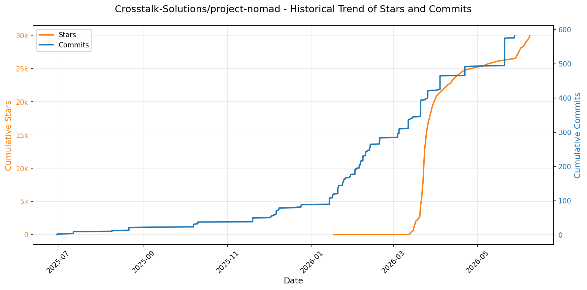

> *蓝色：累计 Stars｜橙色：累计 Commits（次 Y 轴）*

<b>📄 README 摘要</b>

1. **项目功能**  
Project N.O.M.A.D. 是一个自包含、离线优先的本地知识与教育服务器，旨在为用户提供无需互联网连接即可随时访问的关键信息、学习资源和人工智能能力。它通过统一的 Web 管理界面（“Command Center”）协调多个容器化工具，实现一键安装、集中配置与自动更新，适用于应急场景、偏远地区、教育机构或隐私敏感环境，核心使命是保障“永不离线的知识”。

2. **关键特性**  
- ✅ **本地AI智能助手**：集成 Ollama 与 Qdrant，支持离线大语言模型（LLM）聊天、文档上传及基于语义检索的 RAG（检索增强生成）；  
- ✅ **离线知识库**：通过 Kiwix 提供完整离线版 Wikipedia、医学指南（如 PubMed Central）、生存手册、开源电子书等 ZIM 格式资源；  
- ✅ **离线教育平台**：内置 Kolibri，提供 Khan Academy 全套课程、多用户支持与学习进度追踪；  
- ✅ **离线地图服务**：集成 ProtoMaps，支持按区域下载矢量地图，具备搜索与基础导航功能；  
- ✅ **数据安全与分析工具**：集成 CyberChef，提供加密、编码、哈希、数据格式转换等数十种离线数据处理能力；  
- ✅ **本地笔记系统**：基于 FlatNotes 实现轻量级 Markdown 笔记管理，数据完全本地存储；  
- ✅ **硬件性能基准测试**：内置系统压测与评分工具，并同步至公开社区排行榜（benchmark.projectnomad.us）；  
- ✅ **可视化内容管理**：含 ZIM 库管理器、Wikipedia 内容筛选器、资源探索器及引导式初始配置向导。

3. **技术栈**  
- **运行时与编排**：Docker + Docker Compose（核心架构依赖容器化隔离与自动化部署）；  
- **前端界面**：基于浏览器的 Web UI（Command Center），无桌面环境依赖；  
- **AI与检索层**：Ollama（本地 LLM 运行时）、Qdrant（向量数据库，支撑 RAG）；  
- **知识/教育组件**：Kiwix（ZIM 离线内容分发）、Kolibri（离线学习平台）、ProtoMaps（离线地图引擎）；  
- **工具集成**：CyberChef（WebAssembly 构建的离线数据工具）、FlatNotes（Node.js + SQLite 轻量笔记）；  
- **后端与数据**：MySQL（用于 Command Center 用户状态与配置存储，非必需服务可选）；  
- **安装与运维**：Bash 脚本驱动的全自动安装（兼容 Debian/Ubuntu），辅以 Docker Compose 高级定制方案；  
- **基础设施要求**：最低仅需 4GB RAM / 5GB 存储（纯管理端），AI 功能推荐 NVIDIA/AMD GPU（≥8GB VRAM）+ 32GB RAM + SSD。

---

### 26. [mvanhorn/last30days-skill](https://github.com/mvanhorn/last30days-skill)
- 📅 **创建日期**：2026-01-23  
- 🔄 **最近更新**：2026-03-30  
- ⭐ **Stars**：15,482（日 +1255｜周 +11005｜月 +12335）  
- 📝 **描述**：AI agent skill that researches any topic across Reddit, X, YouTube, HN, Polymarket, and the web - then synthesizes a grounded summary  

<b>📈 Star 与 Commit 历史趋势</b>

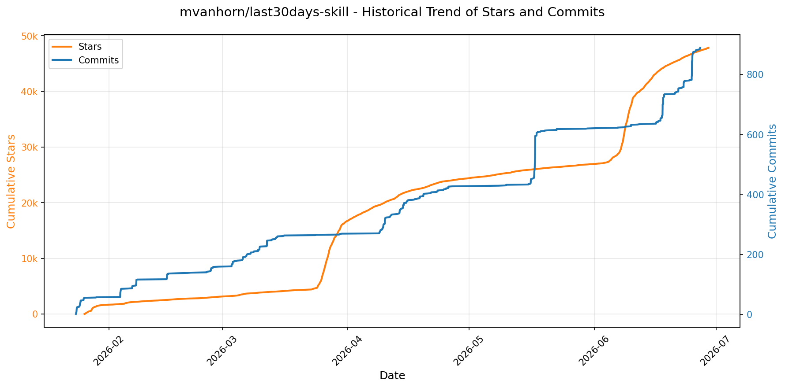

> *蓝色：累计 Stars｜橙色：累计 Commits（次 Y 轴）*

<b>📄 README 摘要</b>

1. **该项目的功能**  
`/last30days` 是一款面向AI时代的信息时效性增强型研究工具，核心功能是：针对用户指定的主题（如技术、产品、人物、文化现象等），自动在**过去30天内**的多源实时平台（Reddit、X/Twitter、YouTube、Bluesky、Hacker News、Polymarket、Instagram Reels、TikTok、ScrapeCreators聚合源等）中进行深度检索、交叉验证与语义合成，最终生成一份**有据可查、社区驱动、数据支撑的叙事性研究报告**。它不依赖静态文档或官方资料，而是聚焦真实用户正在热议、投票、分享、下注和出镜讨论的内容，从而揭示“一线实践者真正知道什么”。典型应用场景包括：Prompt工程优化（如为Claude/Midjourney生成高成功率JSON提示词）、新兴工具实测反馈（如Nano Banana Pro）、热点事件追踪（如Kanye West舆论演变）、预测市场洞察（如Polymarket上AI公司胜率）、趋势发现（如音乐/设计/产品口碑）等。

2. **关键特性**  
- **多源动态覆盖与智能扩展**：支持8+实时信号源（含v2.9.5新增Bluesky），通过ScrapeCreators统一接入Reddit评论、Instagram、TikTok；自动解析X账号（如`@thedorbrothers`）并定向抓取其高互动内容；支持YouTube视频转录与Hacker News技术讨论深度挖掘。  
- **复合质量评分体系**：对所有结果实施多维加权排序——融合双向文本相似度（含同义词扩展）、参与度增速归一化、信源权威性权重、跨平台收敛检测（基于混合trigram-token Jaccard相似度）、时间衰减因子；Polymarket市场更细化为5因子评分（文本相关性30% + 24h交易量30% + 流动性15% + 价格波动速度15% + 结果竞争性10%）。  
- **比较分析与结构化输出**：首创“X vs Y”对比模式（如`/last30days Claude Code vs Codex`），执行三路并行研究，输出 strengths/weaknesses、并列对比表及数据驱动结论；自动生成可直接复用的结构化Prompt（如JSON格式UI原型）、专家级摘要、事实核查建议与后续追问路径。  
- **渐进式配置与自动化知识管理**：零配置即用3个基础源（Reddit公共API/HN/Polymarket）；通过浏览器Cookie自动提取X/Youtube凭证；支持项目级`.env`配置、全局配置、自动诊断（`--diagnose`）；每轮运行自动保存Markdown报告至`~/Documents/Last30Days/`构建个人研究库；开放变体（Open Variant）支持Watchlist监控、定时重检、SQLite本地知识库与全文检索。  
- **鲁棒性与兼容性设计**：内置模型自动降级、双阶段查询扩展、领域标签桥接（精准定位嵌套市场事件）、会话启动时自动配置校验、455+单元测试保障稳定性；原生支持Claude Code插件、Gemini CLI、OpenAI Codex CLI及Open Claw等AI代理环境。

3. **技术栈**  
- **核心语言与框架**：Python 3（主引擎、爬虫调度、评分管道、CLI工具链）；使用`yt-dlp`处理YouTube视频与字幕；依赖`requests`、`beautifulsoup4`、`lxml`等标准HTTP/解析库。  
- **外部服务集成**：  
  - 免费层：Hacker News API、Polymarket公开市场数据、Reddit公共JSON端点、Bluesky App Password认证；  
  - 第三方API（可选）：Exa.ai（语义网络搜索）、ScrapeCreators（Reddit/TikTok/Instagram结构化数据）、Parallel AI / Brave Search / OpenRouter（LLM优化网页搜索）；  
  - 浏览器凭证：自动从Chrome/Firefox/Safari提取X/Twitter Cookie实现免API-key高质量抓取。  
- **配置与部署**：基于`.env`文件管理密钥（支持全局`~/.config/last30days/.env`与项目级`.claude/last30days.env`）；采用模块化脚本结构（`scripts/last30days.py`, `watchlist.py`等）；提供ClawHub/Gemini插件市场一键安装、Git手动部署、Codex技能目录适配三种安装路径；前端交互通过Claude Code/Gemini/Codex等AI IDE的指令协议（如`/last30days`）触发。

---

### 27. [jarrodwatts/claude-hud](https://github.com/jarrodwatts/claude-hud)
- 📅 **创建日期**：2026-01-02  
- 🔄 **最近更新**：2026-03-30  
- ⭐ **Stars**：15,062（日 +327｜周 +3732｜月 +11261）  
- 📝 **描述**：A Claude Code plugin that shows what's happening - context usage, active tools, running agents, and todo progress  

<b>📈 Star 与 Commit 历史趋势</b>

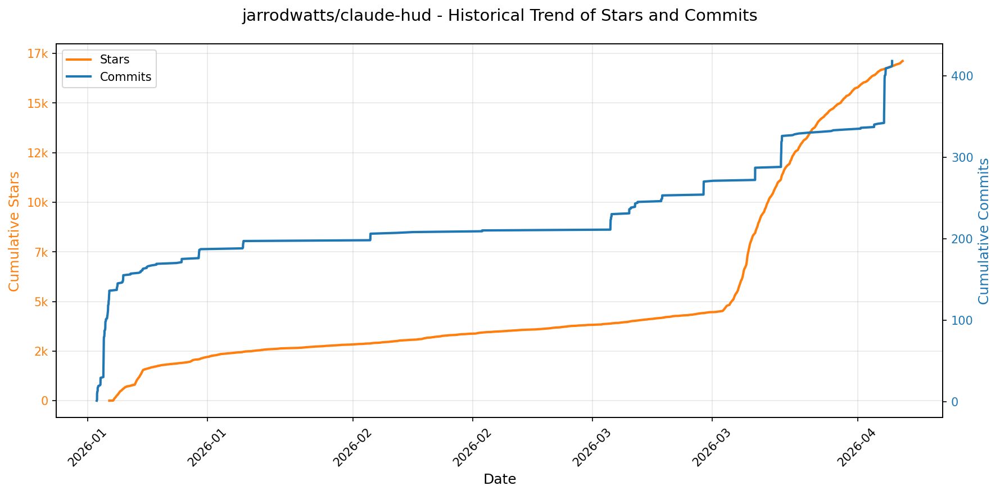

> *蓝色：累计 Stars｜橙色：累计 Commits（次 Y 轴）*

<b>📄 README 摘要</b>

1. **该项目的作用**  
Claude HUD 是一个专为 Claude Code 开发的插件，旨在在用户终端输入框下方**持续显示实时会话状态信息**，无需弹窗或额外窗口。它通过 Claude Code 原生 statusline API 实现，以低延迟（约 300ms）动态呈现当前会话的关键运行指标，帮助开发者直观掌握上下文消耗、工具调用、智能体执行、待办进度等核心状态，从而提升对 AI 编程过程的透明度与可控性。

2. **核心功能**  
- **多维度实时监控**：  
  - ✅ 上下文健康度（Context bar）：精确显示 token 占用百分比/绝对值/剩余量，支持 1M 级超大上下文，并按绿色→黄色→红色渐变预警；  
  - ✅ 工具活动追踪（Tools）：实时显示文件读取（✓ Read）、编辑（◐ Edit）、搜索（✓ Grep）等操作及频次；  
  - ✅ 智能体运行状态（Agents）：列出正在执行的子智能体（如 `explore [haiku]`）及其任务描述与耗时；  
  - ✅ 待办事项进度（Todos）：可视化显示任务完成率（如 `▸ Fix authentication bug (2/5)`）；  
  - ✅ 项目与环境元数据：可配置显示 1–3 级项目路径、Git 分支（含脏状态 `*`、远端差异 `↑N ↓N`、文件变更统计 `!M +A ✘D ?U`）、模型标识 `[Opus]`、会话时长、内存占用（系统级近似值）等。  
- **高度可定制化**：  
  - 提供 Full / Essential / Minimal 三档预设布局，支持交互式 `/claude-hud:configure` 向导配置；  
  - 允许手动编辑 JSON 配置文件，精细控制元素顺序、显隐、颜色（支持命名色、256 色编号、十六进制）、阈值、显示格式（如 `percent`/`tokens`/`remaining`）；  
  - 支持单行（compact）与多行（expanded）两种布局模式；  
- **订阅级用量监控（Claude 订阅用户专属）**：  
  - 实时显示每小时配额使用情况（如 `1h 30m / 5h`）及 7 日累计占比（如 `85% (2d / 7d)`），并依阈值触发高亮警示；  
  - 自动适配免费账户（仅显示周限额）、API Key 用户（不显示）、AWS Bedrock 模型（隐藏用量）等场景。

3. **技术栈**  
- **运行依赖**：Claude Code v1.0.80+（必需）、Node.js 18+ 或 Bun（构建与运行时）；  
- **集成机制**：深度依赖 Claude Code 原生 **statusline API**，通过标准输入（stdin）接收结构化 JSON 数据（含 context、rate_limits、transcript JSONL 流），经插件解析后输出 ANSI 格式文本至 stdout，由终端原生渲染；  
- **开发与构建**：基于 npm（`npm ci && npm run build`），采用 TypeScript（隐含，由构建流程及类型安全需求推断），配置文件为标准 JSON 格式；  
- **跨平台适配**：针对 Linux（修复 `/tmp` 跨设备链接问题）、Windows（需 Node.js LTS 支持 JS 运行时）、macOS 均提供详细安装与故障排除指南。

---

### 28. [shanraisshan/claude-code-best-practice](https://github.com/shanraisshan/claude-code-best-practice)
- 📅 **创建日期**：2025-10-31  
- 🔄 **最近更新**：2026-03-30  
- ⭐ **Stars**：12,672（日 +967｜周 +3916｜月 +12672）  
- 📝 **描述**：practice made claude perfect  

<b>📈 Star 与 Commit 历史趋势</b>

> *蓝色：累计 Stars｜橙色：累计 Commits（次 Y 轴）*

<b>📄 README 摘要</b>

1. **该项目的功能**  
本项目是一个面向 Anthropic Claude Code（Claude 编程环境）的权威性最佳实践知识库与工程化参考实现，核心目标是系统化整理、验证并推广 Claude Code 全栈能力的生产级用法。它并非独立软件，而是以结构化文档、可运行配置文件（如 `.claude/` 目录体系）、即插即用工作流模板（如天气编排器 `/weather-orchestrator`）和真实落地的插件/扩展实现为基础，帮助开发者深度掌握 Claude Code 的原生架构范式（Subagents、Commands、Skills、Workflows 等），实现从“提示词交互”到“自主智能体协作开发”的范式升级。

2. **关键特性**  
- **三位一体核心抽象**：完整覆盖 Claude Code 的三大原生构件——**Subagents**（隔离上下文、独立模型/工具/记忆的自治智能体）、**Commands**（用户触发的轻量级工作流模板）、**Skills**（可预加载、自动发现、支持上下文分叉与渐进式披露的模块化知识单元）。  
- **端到端编排架构**：提供标准化的 `Command → Agent → Skill` 工作流模式，并通过可视化流程图与 GIF 演示其在真实场景（如天气服务集成）中的协同执行机制。  
- **前沿 Beta 功能实践指南**：深度整合并验证 Auto Mode（后台安全分类器替代人工授权）、Channels（Telegram/Discord/Webhook 事件驱动）、Code Review（多智能体 PR 分析）、Scheduled Tasks（本地 `/loop` 与云端 `/schedule` 定时任务）、Agent Teams（多智能体并行协作）、Remote Control（跨设备会话续连）、Ralph Wiggum Loop（全自动长周期开发闭环）等高阶能力。  
- **企业级工程工作流库**：收录并对比分析 9+ 主流开源 Claude 工作流方案（如 Superpowers、Everything Claude Code、Spec Kit 等），按“研究→计划→执行→评审→交付”统一框架，量化其在 Agents/Commands/Skills 三维度的组件构成与独特设计哲学（如 TDD-first、Spec-driven、RPI、Delta Specs）。  
- **实战技巧与反模式警示**：汇集 86 条经 Boris Cherny 等核心贡献者验证的硬核技巧（如“禁止保姆式干预”🚫👶原则），覆盖 Prompting、Planning、CLAUDE.md 管理、Git/PR 协作、调试及日常效率提升，强调“信任模型自主决策”而非微观操控。

3. **技术栈**  
- **底层平台**：Anthropic Claude Code（非开源客户端，但项目完全基于其官方文档与 API 规范构建）；  
- **配置与元数据层**：`.claude/` 目录体系（含 `settings.json`, `commands/`, `agents/`, `skills/`, `hooks/`, `rules/` 等标准结构）、`CLAUDE.md` 持久化上下文文件、`MCP` 协议配置（`.mcp.json`）；  
- **扩展生态**：插件（Plugins）打包格式、MCP（Model Context Protocol）外部工具集成、LSP 服务器、Hooks（支持脚本/HTTP/提示词/智能体等多种处理器）；  
- **基础设施依赖**：Git（用于自动 checkpointing/rewind）、CLI 环境（`claude [flags]` 启动）、GitHub Actions/GitLab CI（自动化代码审查与生成）、Slack/Chrome 扩展（跨平台协同）；  
- **社区与协议规范**：严格遵循 Anthropic 官方文档（docs.claude.com）、引用并扩展官方技能市场（anthropics/skills）、集成 RPI（Recursive Prompting Interface）等社区协议。

---

### 29. [alibaba/OpenSandbox](https://github.com/alibaba/OpenSandbox)
- 📅 **创建日期**：2025-12-17  
- 🔄 **最近更新**：2026-03-30  
- ⭐ **Stars**：9,600（日 +80｜周 +511｜月 +8073）  
- 📝 **描述**：Secure, Fast, and Extensible Sandbox runtime for AI agents.  

<b>📈 Star 与 Commit 历史趋势</b>

> *蓝色：累计 Stars｜橙色：累计 Commits（次 Y 轴）*

<b>📄 README 摘要</b>

1. **项目功能**  
OpenSandbox 是一个面向 AI 应用的通用型沙箱平台，旨在为各类高风险、需强隔离的 AI 工作负载提供安全、可控、可扩展的执行环境。其核心用途覆盖：编码智能体（Coding Agents）、GUI 自动化（如浏览器/桌面环境）、AI 代码执行（Code Execution）、智能体评估（Agent Evaluation）以及强化学习训练（RL Training）等场景。平台通过统一 API 抽象底层运行时，使上层 AI 应用无需关心容器、Kubernetes 或安全沙箱细节，即可按需创建、管理、交互和销毁隔离执行环境。

2. **关键特性**  
- **多语言 SDK 支持**：提供 Python、Java/Kotlin、JavaScript/TypeScript、C#/.NET 官方 SDK，Go SDK 已列入路线图；涵盖沙箱全生命周期管理、命令执行、文件操作及专用 Code Interpreter 功能。  
- **标准化沙箱协议与可扩展架构**：定义清晰的沙箱生命周期 API 与执行 API（基于 OpenAPI 规范），支持用户自定义沙箱运行时（如集成新型安全容器或硬件虚拟化方案）。  
- **双模运行时支持**：内置 Docker（本地开发/轻量部署）与高性能 Kubernetes 运行时（生产级大规模调度），支持混合部署与弹性伸缩。  
- **开箱即用的沙箱环境**：预置 Command、Filesystem、Code Interpreter 等基础能力，并提供 Chrome/Playwright 浏览器自动化、VNC 桌面、VS Code Web（code-server）、Nullclaw/OpenClaw 网关等完整环境示例。  
- **精细化网络管控**：统一 Ingress 网关（支持多种路由策略） + 按沙箱粒度配置的 Egress 出向网络策略，保障网络行为可控可审计。  
- **强安全隔离能力**：原生兼容 gVisor、Kata Containers、Firecracker 等安全容器/微虚拟机技术，实现沙箱进程与宿主机内核的深度隔离，满足 AI Agent 执行不可信代码的严苛安全要求。

3. **技术栈**  
- **后端服务**：Python（FastAPI 框架）构建沙箱生命周期管理服务（`server/`）；Rust（部分组件如 `execd`）用于高性能执行守护进程。  
- **运行时层**：Docker（默认本地运行时）、Kubernetes（生产级编排）、gVisor/Kata/Firecracker（安全容器支持）。  
- **协议与接口**：RESTful API（OpenAPI 3.0 规范定义）、gRPC（部分内部组件通信）、HTTP/WebSocket（Ingress 流量代理）。  
- **前端与工具链**：TypeScript/JavaScript SDK（含浏览器环境适配）；CLI 工具（`opensandbox-server` 基于 uv/pip）；CI/CD 使用 GitHub Actions（含 E2E 和 nightly Kubernetes 构建流水线）。  
- **基础设施与生态**：CNCF 认证项目；Apache 2.0 开源许可；支持钉钉技术社区协同；文档站基于静态站点生成（`open-sandbox.ai`）。

---

### 30. [langchain-ai/open-swe](https://github.com/langchain-ai/open-swe)
- 📅 **创建日期**：2025-05-21  
- 🔄 **最近更新**：2026-03-30  
- ⭐ **Stars**：8,830（日 +49｜周 +753｜月 +3579）  
- 📝 **描述**：An Open-Source Asynchronous Coding Agent  

<b>📈 Star 与 Commit 历史趋势</b>

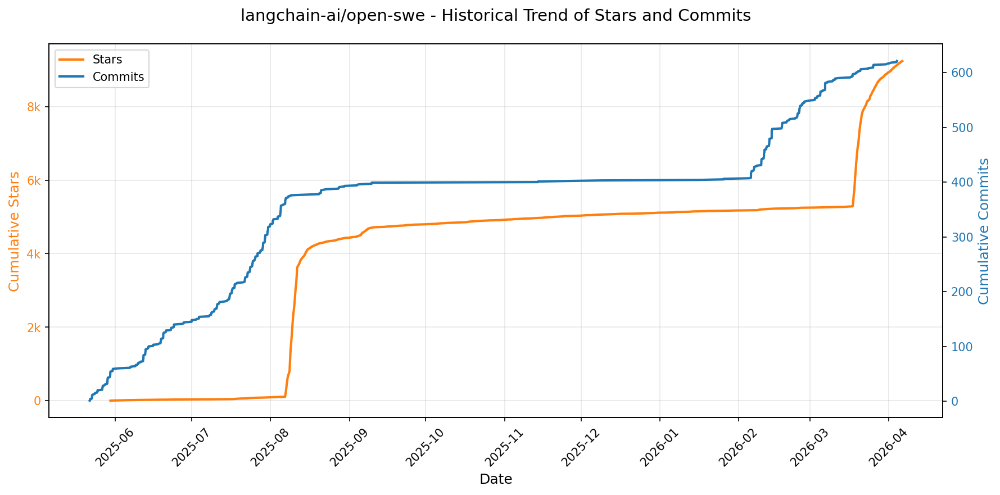

> *蓝色：累计 Stars｜橙色：累计 Commits（次 Y 轴）*

<b>📄 README 摘要</b>

1. **项目功能**  
Open SWE 是一个开源框架，用于构建企业内部专属的“编码智能体”（coding agent），使工程团队能在日常协作环境（如 Slack、Linear、GitHub）中直接调用 AI 编程助手，完成代码修改、问题修复、PR 创建等端到端开发任务。它不替代开发者，而是作为可信赖的自动化协作者：自动克隆代码库至隔离云沙箱，在受控环境中执行 shell 命令、调用 API、读写文件、提交代码并自动创建 GitHub 草稿 PR，全程与内部系统（如权限体系、工单上下文、代码规范）深度集成，实现低人工干预的可靠执行。

2. **核心特性**  
- **多入口触发**：支持在 Slack 线程中 @ 机器人、Linear 工单中评论 `@openswe`、GitHub PR 评论中提及，自动关联上下文并启动任务；  
- **实时交互与中断响应**：运行中可发送追加消息，通过中间件 `check_message_queue_before_model` 实时注入，确保动态响应；  
- **强隔离并行执行**：每个任务独占一个持久化云沙箱（支持 Modal/Daytona/Runloop/LangSmith 等多后端），沙箱间完全隔离、自动恢复、零排队；  
- **结构化上下文注入**：自动加载根目录 `AGENTS.md`（定义团队规范、测试要求、架构约束） + 完整工单/线程历史，避免“盲猜”；  
- **精细化工具集**：仅提供约 15 个高信噪比工具（如 `execute`, `commit_and_open_pr`, `linear_comment`, `slack_thread_reply`），拒绝工具泛滥，强调语义明确与职责单一；  
- **分层编排能力**：基于 Deep Agents 原生支持子智能体（`task` 工具），可并行派发子任务；配合确定性中间件（如 `open_pr_if_needed` 安全兜底、`ToolErrorMiddleware` 错误处理）保障关键步骤必达；  
- **开箱即用的生产就绪能力**：内置 GitHub OAuth 认证、自动草稿 PR 创建、Slack/Linear 消息回传、线程 ID 全局唯一标识等，开箱即接入企业工作流。

3. **技术栈**  
- **核心框架**：基于 [LangGraph](https://langchain-ai.github.io/langgraph/)（用于构建状态化、可观察、可调试的有向图工作流）与 [Deep Agents](https://github.com/langchain-ai/deepagents)（提供智能体生命周期管理、内置文件操作工具链、子智能体调度及中间件机制）；  
- **沙箱基础设施**：插件化支持多种云沙箱服务——Modal（无服务器容器）、Daytona（开发环境即服务）、Runloop（AI 专用沙箱）、LangSmith（LangChain 官方可观测平台沙箱），亦可自定义集成；  
- **模型与协议**：兼容主流大模型（如 Anthropic Claude Opus），通过标准化接口对接 LLM；工具调用遵循确定性协议，避免不可靠自由生成；  
- **集成生态**：深度集成 Slack Events API、Linear GraphQL API、GitHub REST API 与 OAuth 2.0，实现消息路由、身份认证与双向同步；  
- **工程实践支撑**：采用 MIT 开源协议，模块化设计（沙箱/工具/中间件/触发器均可替换），配套详尽的 [安装指南](INSTALLATION.md) 与 [定制化手册](CUSTOMIZATION.md)，面向企业级部署优化。

---

### 31. [alirezarezvani/claude-skills](https://github.com/alirezarezvani/claude-skills)
- 📅 **创建日期**：2025-10-19  
- 🔄 **最近更新**：2026-03-30  
- ⭐ **Stars**：7,965（日 +226｜周 +1542｜月 +5958）  
- 📝 **描述**：+192 Claude Code skills & agent plugins for Claude Code, Codex, Gemini CLI, Cursor, and 8 more coding agents — engineering, marketing, product, compliance, C-level advisory.  

<b>📈 Star 与 Commit 历史趋势</b>

> *蓝色：累计 Stars｜橙色：累计 Commits（次 Y 轴）*

<b>📄 README 摘要</b>

1. **项目功能**  
该项目是一个面向AI编程代理（AI Coding Agents）的开源技能库，提供205个生产就绪的、模块化的“Claude Code技能”（亦称代理技能或插件），可直接赋能各类AI编程工具完成专业领域任务。其核心价值在于将人类工程师、产品经理、合规专家、营销人员及C级高管等角色的专业知识与工作流封装为标准化、可复用的指令包（`SKILL.md`）、零依赖Python CLI工具（268个，纯stdlib实现）和领域知识参考文档（模板、检查清单等）。项目支持跨平台部署，原生兼容Claude Code，并通过自动化转换脚本无缝适配OpenAI Codex、Gemini CLI、Cursor、Aider等共11种主流AI编码工具，实现“一次开发、多平台运行”。

2. **关键特性**  
- **全栈领域覆盖**：涵盖工程（含Playwright Pro测试、自进化Agent）、产品、营销（43项，含SEO/CRO/增长）、项目管理、法规与质量（ISO/FDA/GDPR）、C级战略（完整C-suite角色）、商业增长及财务分析等9大垂直领域；  
- **三层能力抽象体系**：清晰区分**Skills**（任务执行方法）、**Agents**（任务目标定义）、**Personas**（角色思维模式与沟通风格），支持灵活组合与协同；  
- **智能编排协议（Orchestration）**：提供四种跨域协作模式（Solo Sprint、Domain Deep-Dive、Multi-Agent Handoff、Skill Chain），支持复杂场景如6周产品发布全流程自动化；  
- **POWERFUL高级技能层**：25个深度专业化技能（如`rag-architect`、`database-designer`、`ci-cd-pipeline-builder`、`incident-commander`），具备生产级架构设计、安全审计、可观测性规划等能力；  
- **内建安全机制**：`skill-security-auditor`技能可对任意技能包进行静态安全扫描（命令注入、数据泄露、提权等），返回PASS/WARN/FAIL并提供修复建议；  
- **零依赖CLI工具集**：268个纯Python标准库实现的命令行工具，覆盖SaaS指标计算、技术债分析、RICE优先级排序、落地页生成、品牌语调分析等，无需pip安装，开箱即用；  
- **一键多平台适配**：`./scripts/convert.sh`可全自动将全部技能转换为Cursor（`.mdc`）、Aider（`CONVENTIONS.md`）、Kilo Code等7种工具原生格式，并附带验证与安装脚本。

3. **技术栈**  
- **核心语言**：Python（所有CLI工具严格仅使用标准库，无第三方依赖）；  
- **配置与元数据**：Markdown（`SKILL.md`含YAML Frontmatter结构化定义）、Shell脚本（`convert.sh`/`install.sh`等自动化工具链）；  
- **跨平台适配层**：基于文本模板与规则的格式转换引擎（非框架依赖，纯脚本驱动）；  
- **部署与集成**：支持Git仓库直连、CLI命令行安装（如Claude Code `/plugin install`）、本地文件系统挂载（`~/.claude/skills/`等路径约定）；  
- **安全与验证**：内置静态代码分析逻辑（正则+AST轻量解析），不依赖外部安全库；  
- **许可证**：MIT开源协议。

---

### 32. [luongnv89/claude-howto](https://github.com/luongnv89/claude-howto)
- 📅 **创建日期**：2025-11-07  
- 🔄 **最近更新**：2026-03-30  
- ⭐ **Stars**：6,996（日 +2640｜周 +5877｜月 +5978）  
- 📝 **描述**：A visual, example-driven guide to Claude Code — from basic concepts to advanced agents, with copy-paste templates that bring immediate value.  

<b>📈 Star 与 Commit 历史趋势</b>

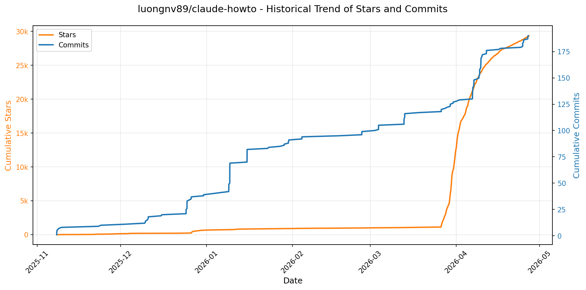

> *蓝色：累计 Stars｜橙色：累计 Commits（次 Y 轴）*

<b>📄 README 摘要</b>

1. **项目功能**  
该项目是一个面向 Claude Code（Anthropic 推出的 AI 编程助手）的实战型学习指南，旨在帮助开发者系统性地掌握其全部高级能力。它并非官方文档的复述，而是通过结构化、可视化、可直接复用的方式，将 Claude Code 的离散功能（如 slash 命令、hooks、subagents、MCP 等）组合成真实生产级工作流。核心目标是填补“知道功能存在”与“能协同构建自动化系统”之间的鸿沟，使用户能在 11–13 小时内从入门进阶为高阶使用者，并立即在现有项目中部署可运行的模板（例如一键启用代码审查流水线、自动文档生成、安全扫描等）。

2. **关键特性**  
- **渐进式学习路径**：涵盖 10 大模块（slash 命令 → 内存 → 技能 → 子代理 → MCP → hooks → 插件 → 检查点 → 高级功能 → CLI），严格遵循能力依赖关系，支持按水平（初/中/高级）个性化启动；  
- **即插即用模板库**：提供全量可复制配置——包括 Markdown 格式的 slash 命令、`.claude/` 目录结构示例、Shell hooks 脚本、MCP 服务配置、subagent 定义文件、技能包及完整插件 bundle，开箱即用；  
- **深度可视化教学**：所有模块均配 Mermaid 流程图，揭示功能底层执行逻辑（如 hooks 触发时机、subagent 上下文隔离机制、MCP 工具调用链路），强调“为什么这样设计”；  
- **内置自评估系统**：支持在 Claude Code 中直接运行 `/self-assessment` 或 `/lesson-quiz [topic]`，动态诊断知识盲区并生成定制化补缺路径；  
- **生产就绪工作流范例**：覆盖自动化代码审查、CI/CD 集成、安全审计、多代理协作重构、文档生成等 7 类典型场景，明确标注各场景所需组合的功能组件；  
- **全生命周期支持**：包含离线 EPUB 电子书生成、版本同步（适配 Claude Code 2.1+，当前维护至 v2.2.0）、社区贡献模板及企业级适配指南。

3. **技术栈**  
- **运行平台**：原生依赖 [Claude Code](https://code.claude.com)（v2.1 及以上版本），兼容 Sonnet 4.6 / Opus 4.6 / Haiku 4.5 模型；  
- **配置与脚本层**：纯文本驱动，基于 Markdown（`.md`）、JSON（`settings.json`, `.mcp.json`）、Shell（`.sh` hooks）、环境变量（如 `GITHUB_TOKEN`）；  
- **协议标准**：深度集成 [Model Context Protocol (MCP)](https://modelcontextprotocol.org)，支持对接 GitHub、数据库、文件系统等外部工具；  
- **构建与分发**：使用 `uv`（Python 包管理器）构建 EPUB 文档；CLI 操作基于 `claude` 命令行工具（含 `-p`, `-r`, `-c` 等参数）；  
- **基础设施**：无后端服务，完全本地化运行（配置文件存放于 `~/.claude/` 或项目级 `.claude/` 目录），依赖用户本地开发环境（Git、Node.js/npx 用于 MCP 服务器、Shell 环境等）。

---

### 33. [SakanaAI/AI-Scientist-v2](https://github.com/SakanaAI/AI-Scientist-v2)
- 📅 **创建日期**：2025-04-08  
- 🔄 **最近更新**：2026-03-30  
- ⭐ **Stars**：3,852（日 +324｜周 +1543｜月 +1696）  
- 📝 **描述**：The AI Scientist-v2: Workshop-Level Automated Scientific Discovery via Agentic Tree Search  

<b>📈 Star 与 Commit 历史趋势</b>

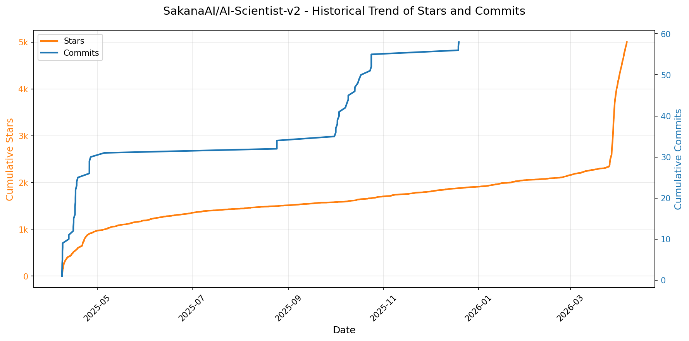

> *蓝色：累计 Stars｜橙色：累计 Commits（次 Y 轴）*

<b>📄 README 摘要</b>

1. **该项目的功能**  
该系统是一个完全自主的科研代理（agentic）框架，旨在实现端到端的自动化科学发现。它能从零开始：① 基于给定研究主题自动生成新颖科学假设；② 设计并执行机器学习实验（含代码编写、运行、调试）；③ 分析实验结果；④ 撰写结构完整、符合学术规范的科学论文草稿（最终输出PDF），且已成功生成并通过同行评审的ICLR 2025 Workshop论文。其核心目标是摆脱对人类预设模板的依赖，支持开放性、探索性的科学研究流程。

2. **关键特性**  
- **无模板化科研流程**：相比v1版本，v2完全取消人工撰写的论文/实验模板，实现真正泛化的自主科研；  
- **基于智能体的树搜索（Agentic Tree Search）**：采用“最佳优先树搜索”（BFTS）策略，由实验管理智能体（Experiment Manager Agent）动态引导多路径并行探索（可配置worker数量与搜索深度），支持自动调试失败节点、回溯与重试；  
- **全流程闭环自治**：覆盖“创意生成→实验设计→代码执行→结果分析→文献检索（Semantic Scholar）→论文撰写→图表聚合→引用生成→同行评审模拟”全链条；  
- **模块化模型调度**：不同阶段（实验、写作、审稿、绘图、引文）可灵活指定不同大语言模型（如Claude 3.5 Sonnet用于实验，o1-preview用于写作，GPT-4o用于引文等），提升各环节专业性；  
- **强沙箱安全机制提示**：明确警告用户必须在隔离环境（如Docker容器）中运行，因其会自动执行LLM生成的任意代码，存在潜在安全风险（如危险包调用、网络访问、进程失控）。

3. **技术栈**  
- **编程语言与框架**：Python 3.11，PyTorch（CUDA加速，需NVIDIA GPU），Linux系统环境；  
- **核心算法与架构**：基于AIDE项目的树搜索基础设施，实现多智能体协同的BFTS（Best-First Tree Search）；  
- **大语言模型支持**：OpenAI（GPT-4o、o1-preview等）、Google Gemini（通过OpenAI API兼容层）、Anthropic Claude（通过AWS Bedrock集成）；  
- **外部服务集成**：Semantic Scholar API（文献检索与新颖性验证）、LaTeX/PDF工具链（chktex、poppler，用于论文编译与格式检查）；  
- **工程依赖**：Conda环境管理、Docker推荐部署、JSON/YAML配置驱动（`bfts_config.yaml`控制搜索参数）。

---

### 34. [letta-ai/claude-subconscious](https://github.com/letta-ai/claude-subconscious)
- 📅 **创建日期**：2026-01-14  
- 🔄 **最近更新**：2026-03-30  
- ⭐ **Stars**：2,260（日 +127｜周 +1335｜月 +1831）  
- 📝 **描述**：Give Claude Code a subconscious  

<b>📈 Star 与 Commit 历史趋势</b>

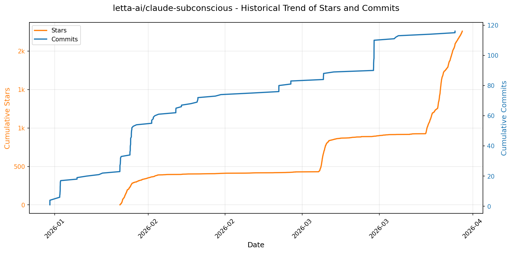

> *蓝色：累计 Stars｜橙色：累计 Commits（次 Y 轴）*

<b>📄 README 摘要</b>

1. **项目功能**  
Claude Subconscious 是一个专为 Anthropic Claude Code 设计的后台智能体插件，其核心作用是作为 Claude Code 的“潜意识层”：在用户编码会话期间持续监听对话记录（transcript），自动读取、搜索和分析本地代码库（通过 Read/Grep/Glob 工具），持久化积累跨会话、跨项目的长期记忆，并在每次用户提交新提示（prompt）前，以非阻塞方式向 Claude 实时注入上下文提示（whispers）。它不修改 `CLAUDE.md`，所有信息均通过 stdout 动态注入提示上下文，从而弥补 Claude Code 本身无状态、会话间遗忘的根本缺陷，实现真正连续、有记忆、懂项目的 AI 编程协作体验。

2. **关键特性**  
- **全栈式后台智能体**：非简单记忆缓存，而是具备真实工具调用能力（文件读取、代码搜索、网页检索）的独立 Letta 智能体，运行于 Claude Code 之下。  
- **跨会话/跨项目统一记忆**：默认共享全局 agent（存储于 `~/.letta/claude-subconscious/config.json`），所有项目共用同一“大脑”，记忆块（如 `project_context`、`user_preferences`、`pending_items` 等 8 类）自动同步。  
- **三重动态注入机制**：支持 `whisper`（仅消息）、`full`（完整记忆块 + 增量 diff）两种模式，在 `UserPromptSubmit`（提前提示）、`PreToolUse`（工具调用前）、`SessionStart`（会话启动）等多钩子点实时推送上下文。  
- **异步非阻塞架构**：关键耗时操作（如 transcript 解析与代码库分析）通过后台 worker 异步执行（`Stop` hook），绝不阻塞用户编辑体验。  
- **自适应模型与智能降级**：自动探测 Letta 服务器可用模型，按预设优先级（Claude Sonnet 4.5 > GPT-4.1-mini > Haiku 等）自动选择最优模型；支持手动覆盖（`LETTA_MODEL`）及上下文窗口配置。  
- **零配置快速启用**：仅需设置 `LETTA_API_KEY` 即可自动导入预置“Subconscious”智能体并初始化，支持 `direnv` 等实现项目级 agent 隔离。  
- **双向对话支持**：Claude Code 可在回复中直接@ Subconscious，后者将在下次同步中响应，形成持续演进的协作闭环。

3. **技术栈**  
- **核心框架**：基于 [Letta Code SDK](https://docs.letta.com/letta-code/sdk/) 构建，深度集成 Letta 的 Conversations、Agents 和 Tool Calling 能力。  
- **前端/宿主环境**：Anthropic Claude Code 插件系统（通过 `/plugin` CLI 命令安装与管理）。  
- **智能体后端**：依赖 [Letta](https://github.com/letta-ai/letta) 平台（云服务 `api.letta.com` 或自托管 `localhost:8283`），使用其 REST API（v1）与 SDK 进行 agent 管理、memory 操作与会话同步。  
- **语言与运行时**：TypeScript（插件主体）、Node.js（SDK worker 与 hooks 脚本），兼容 Linux/macOS（含 `tmpfs` 安装适配）。  
- **工具能力**：客户端侧启用 `Read` / `Grep` / `Glob` / `web_search` / `fetch_webpage` 等 SDK 工具（可配 `LETTA_SDK_TOOLS=read-only|full|off`）；`full` 模式下支持 `Task` 工具实现子智能体编排。  
- **状态管理**：项目级 `.letta/claude/` 目录（会话映射元数据） + 全局 `~/.letta/`（agent 配置与持久化 memory） + 临时 `$TMPDIR`（调试日志与异步工作流中间态）。

---

### 35. [figma/mcp-server-guide](https://github.com/figma/mcp-server-guide)
- 📅 **创建日期**：2025-08-05  
- 🔄 **最近更新**：2026-03-30  
- ⭐ **Stars**：776（日 +44｜周 +326｜月 +493）  
- 📝 **描述**：A guide on how to use the Figma MCP server  

<b>📈 Star 与 Commit 历史趋势</b>

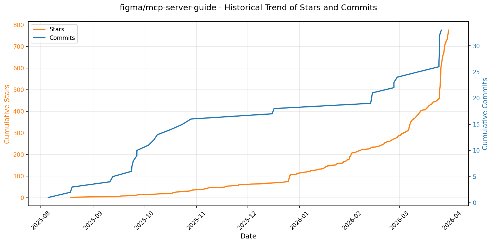

> *蓝色：累计 Stars｜橙色：累计 Commits（次 Y 轴）*

<b>📄 README 摘要</b>

1. **该项目的作用**  
Figma MCP Server 是一个将 Figma 设计系统深度集成至 AI 编程工作流的中间服务，它使 AI 代理（如 Copilot、Claude Code、Cursor 等 MCP 客户端）能直接访问并理解 Figma 文件中的设计数据，并基于此生成高质量、上下文一致的前端代码。其核心价值在于打通「设计→上下文提取→智能编码→反向设计更新」的闭环：既支持从选定的 Figma 框架（Frame）一键生成 React/Tailwind/Vue/iOS 等多框架代码，也支持将真实 Web 页面自动转换为 Figma 设计稿；更关键的是，它允许 AI 代理通过 `use_figma` 等工具**远程写入并修改 Figma 文件本身**（如创建组件、更新变量、调整 Auto Layout），实现设计与开发的双向同步。

2. **核心功能**  
- ✅ **设计转代码（Design-to-Code）**：`get_design_context` 工具可将选中 Frame 解析为结构化 React + Tailwind 表示，支持自定义目标框架（Vue/HTML/CSS/iOS）和组件路径（如 `src/components/ui`）。  
- ✅ **设计上下文提取**：`get_variable_defs` 提取颜色/间距/字体等设计令牌；`get_metadata` 和 `get_figjam` 返回 XML 格式节点结构信息；`get_screenshot` 提供可视化快照，保障布局保真度。  
- ✅ **设计系统智能复用（Code Connect）**：通过 `get_code_connect_map` / `add_code_connect_map` / `get_code_connect_suggestions` 等工具，建立 Figma 节点 ID 与代码库中实际组件（如 `Button.tsx`）的精准映射，确保生成代码 100% 复用现有实现，杜绝“幻觉组件”。  
- ✅ **AI 驱动的设计创作与维护**：`generate_figma_design` 可将网页转为 Figma 设计；`generate_diagram` 支持自然语言生成 Mermaid 流程图/时序图；`create_design_system_rules` 自动生成项目级编码规范规则文件；`search_design_system` 全局检索设计库中已有组件/变量。  
- ✅ **Figma 文件双向编辑（Beta 免费）**：`use_figma`（远程调用）和 `write to the canvas` 功能允许 AI 直接创建/修改页面、组件、变量、样式、文本、图像等，且优先复用设计系统已有资产。  
- ✅ **工程化辅助**：`whoami` 返回用户权限与座位类型；`create_new_file` 快速新建 Figma/FigJam 文件；`get_figjam` 支持 FigJam 白板元数据提取。

3. **技术栈**  
- **协议标准**：基于 **Model Context Protocol (MCP)** 构建，采用 **HTTP over Streamable JSON-RPC** 通信（兼容 VS Code、Cursor、Claude Code、Gemini CLI 等主流 MCP 客户端）。  
- **后端服务**：托管于 `https://mcp.figma.com/mcp` 的 Figma 官方远程服务器（无开源客户端代码，纯 SaaS 服务）。  
- **身份与权限**：深度集成 Figma OAuth 认证，严格遵循 Figma REST API 的分级速率限制（Starter/View/Collab 用户限 6 次/月；Professional/Org/Enterprise 的 Dev/Full 座位按 Tier 1 REST API 限流）。  
- **前端协同**：强依赖 Figma 设计规范实践——要求使用 **Components、Variables、Auto Layout、语义化图层命名**，并推荐搭配 **Code Connect 插件** 实现设计-代码双向绑定。  
- **生态集成**：官方提供 VS Code / Cursor / Claude Code / Gemini CLI 的开箱即用配置指南及插件（如 `/add-plugin figma`），并支持任何兼容 Streamable HTTP 的编辑器手动配置。

---

