# 🌟 GitHub Trending 概览

> 数据更新于：2026-04-27

---

## 🔍 项目详情

### 1. [openclaw/openclaw](https://github.com/openclaw/openclaw)
- 📅 **创建日期**：2025-11-24  
- 🔄 **最近更新**：2026-04-27  
- ⭐ **Stars**：247,573（日 +935｜周 +4915｜月 +29395）  
- 📝 **描述**：Your own personal AI assistant. Any OS. Any Platform. The lobster way. 🦞   

<b>📈 Star 与 Commit 历史趋势</b>

> *蓝色：累计 Stars｜橙色：累计 Commits（次 Y 轴）*

<b>📄 README 摘要</b>

1. **项目功能**  
OpenClaw 是一个可在用户自有设备（本地）运行的**个人单用户 AI 助手**，核心定位是“本地化、低延迟、常驻可用”。它不依赖中心化云服务，而是作为用户私有控制平面（Gateway），统一接入并管理数十种主流通信渠道（如 WhatsApp、Telegram、Slack、Discord、Signal、iMessage、微信、QQ、Matrix 等共 25+ 种），将多平台消息汇聚为统一收件箱；同时支持语音唤醒（macOS/iOS）、连续语音交互（Android）、实时可视化工作区（Live Canvas），并能通过 CLI 或图形化界面直接调用工具、执行自动化任务、管理多代理会话（workspace + agent isolation），真正实现“AI 助手即你设备的一部分”。

2. **关键特性**  
- ✅ **本地优先网关（Local-first Gateway）**：单一控制平面，集中管理会话、通道、工具、事件与安全策略。  
- ✅ **全栈多通道支持**：原生兼容 25+ 消息平台（含加密通讯如 Signal/Matrix/Nostr、企业协作如 Teams/Mattermost、国内生态如微信/飞书/钉钉替代品 Feishu/LINE/Zalo 等），支持 DM 配对鉴权与细粒度白名单控制。  
- ✅ **多代理路由与沙箱隔离**：可按通道/账号/联系人将请求路由至独立 workspace 和 agent；非主会话（non-main）默认运行于 Docker/SSH/OpenShell 沙箱中，限制高危工具（如 browser/canvas）访问权限。  
- ✅ **跨端语音与交互能力**：macOS/iOS 支持唤醒词（Voice Wake），Android 支持持续语音输入（Talk Mode），集成 ElevenLabs + 系统 TTS 回应；支持语音触发 Canvas 控制与实时渲染。  
- ✅ **Live Canvas 可视化工作区**：基于 A2UI 构建的动态画布，由 AI 代理驱动，支持图表、表单、实时数据展示与交互式操作。  
- ✅ **开箱即用的工具链与技能系统**：内置浏览器、定时任务（cron）、节点控制（nodes）、会话管理、Discord/Slack 操作等原生工具；支持通过 ClawHub 注册/安装/管理模块化技能（skills）。  
- ✅ **一键式向导部署（Onboard）**：`openclaw onboard` 提供终端交互式引导，自动完成网关安装、通道配对、模型配置、安全策略初始化，覆盖 macOS/Linux/WSL2。  
- ✅ **端到端安全默认策略**：DM 默认启用 pairing 验证机制；敏感操作需显式授权；提供 `openclaw doctor` 自动检测配置风险。

3. **技术栈**  
- **运行时**：Node.js 24（主推）或 Node.js 22.14+；支持 npm/pnpm/bun 包管理器；开发态使用 `tsx` 直接运行 TypeScript。  
- **前端/控制台**：Control UI 基于现代 Web 技术构建（文档提及 `ui:build` / `ui:dev` 流程），集成于 Gateway 服务中，支持远程访问与调试。  
- **后端架构**：模块化微服务设计，核心为 Gateway 进程（含 RPC 协议），通过 WebSocket 与 iOS/Android/macOS 节点通信；采用 JSON5 配置格式，支持动态重载。  
- **沙箱与容器化**：默认使用 Docker 作为沙箱后端，亦支持 SSH 与 OpenShell 后端，保障非可信会话隔离执行。  
- **部署形态**：支持全局 CLI 安装（`npm install -g`）、Docker 容器化部署、Nix 衍生方案（nix-openclaw），以及 systemd/launchd 用户级守护进程（`--install-daemon`）。  
- **开发工具链**：pnpm 为主构建工具；GitHub Actions CI；Vercel（文档站）、Convex（后端服务）、NVIDIA（AI 加速支持）、OpenAI（模型集成）等生态协同。

---

### 2. [microsoft/markitdown](https://github.com/microsoft/markitdown)
- 📅 **创建日期**：2024-11-13  
- 🔄 **最近更新**：2026-04-27  
- ⭐ **Stars**：117,936（日 +427｜周 +4746｜月 +25229）  
- 📝 **描述**：Python tool for converting files and office documents to Markdown.  

<b>📈 Star 与 Commit 历史趋势</b>

> *蓝色：累计 Stars｜橙色：累计 Commits（次 Y 轴）*

<b>📄 README 摘要</b>

1. **项目功能**  
MarkItDown 是一个轻量级 Python 工具，专为将多种格式的文件（如 PDF、Word、PPTX、Excel、HTML、图片、音频、YouTube 视频、EPUB、ZIP 等）**高保真地转换为结构化 Markdown 文本**而设计，核心目标是服务于大语言模型（LLM）和文本分析流水线。它并非面向人类排版的“高保真渲染工具”，而是优先保留语义结构（如标题层级、列表、表格、超链接、代码块等），生成 token 高效、LLM 友好的 Markdown 输入。支持本地文件、远程 URL（含 YouTube）、字节流及 ZIP 内容遍历等多种输入方式，并可集成 Azure Document Intelligence 或 LLM（如 GPT-4o）增强 OCR 与图像/音视频内容理解。

2. **关键特性**  
- ✅ **多格式广泛支持**：原生支持 PDF、DOCX、PPTX、XLSX/XLS、HTML、CSV/JSON/XML、图片（EXIF + OCR）、音频（EXIF + 语音转录）、YouTube URL、EPUB、ZIP 等十余种格式；  
- ✅ **结构化 Markdown 输出**：精准还原文档逻辑结构（标题、列表、表格、链接、引用等），而非仅纯文本提取；  
- ✅ **模块化依赖管理**：通过 `[pdf]`、`[docx]`、`[audio-transcription]` 等可选 extras 精确安装所需依赖，避免冗余；  
- ✅ **插件扩展生态**：支持第三方插件（如 `markitdown-ocr`），利用 LLM Vision 能力对嵌入图像进行 OCR，无需额外 ML 库；  
- ✅ **企业级集成能力**：原生对接 Azure Document Intelligence 实现高精度文档解析；支持 OpenAI 兼容客户端进行图像描述与音视频转录；  
- ✅ **安全可控的 API 设计**：提供细粒度方法（`convert_local()`、`convert_stream()`、`convert_response()`）替代宽泛的 `convert()`，便于在不可信环境中实施输入隔离与权限最小化；  
- ✅ **全链路使用支持**：提供命令行工具、Python API、Docker 镜像及自动化测试/CI 流程，开箱即用且易于集成。

3. **技术栈**  
- **语言与运行时**：Python ≥ 3.10；  
- **核心依赖**：`pypdf`（PDF）、`python-pptx` / `docx2python` / `openpyxl`（Office 文档）、`Pillow` / `pytesseract`（图像处理）、`ffmpeg-python` / `whisper`（音视频）、`beautifulsoup4`（HTML）、`lxml`（XML/CSV）、`youtube-transcript-api`（YouTube）；  
- **可选高级能力依赖**：  
  - Azure Document Intelligence SDK（`azure-ai-documentintelligence`）；  
  - OpenAI 客户端（`openai`）或兼容 LLM 客户端（用于图像描述、OCR 插件）；  
  - `markitdown-ocr` 插件（基于 LLM Vision 的无二进制 OCR）；  
- **开发与工程化**：`hatch`（构建/测试）、`pre-commit`（代码检查）、`uv` / `conda`（环境管理）、Docker（容器化）、GitHub Actions（CI/CD）；  
- **安全实践**：严格遵循最小权限原则，强调输入校验、路径限制、URI 白名单及沙箱化调用。

---

### 3. [forrestchang/andrej-karpathy-skills](https://github.com/forrestchang/andrej-karpathy-skills)
- 📅 **创建日期**：2026-01-27  
- 🔄 **最近更新**：2026-04-27  
- ⭐ **Stars**：91,343（日 +2927｜周 +28888｜月 +83900）  
- 📝 **描述**：A single CLAUDE.md file to improve Claude Code behavior, derived from Andrej Karpathy's observations on LLM coding pitfalls.  

<b>📈 Star 与 Commit 历史趋势</b>

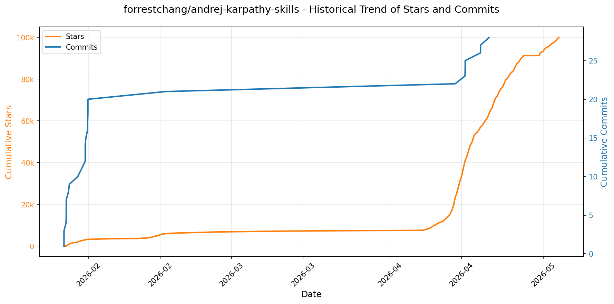

> *蓝色：累计 Stars｜橙色：累计 Commits（次 Y 轴）*

<b>📄 README 摘要</b>

1. **该项目的作用**  
该项目提供一份轻量、可即插即用的 `CLAUDE.md` 指南文件，旨在系统性地矫正 Claude（特别是 Claude Code）在编程任务中的典型行为缺陷。它不开发新工具或运行时环境，而是通过结构化提示工程（prompt engineering），将 Andrej Karpathy 总结的 LLM 编程认知误区转化为四条可执行、可内化的工程原则，直接嵌入 Claude Code 的工作流中，从而引导模型更审慎、简洁、精准、目标明确地完成代码生成与修改任务。

2. **核心特性**  
- **四大可操作原则**：以“Think Before Coding”（显式推理、暴露不确定性）、“Simplicity First”（严格拒绝过度设计、仅实现最小可行解）、“Surgical Changes”（精确作用域控制、禁止越界修改）、“Goal-Driven Execution”（将任务转为可验证的成功标准，如测试先行、差异比对）为核心，每条均含具体行为准则与自查测试（如“高级工程师会认为这段代码过重吗？”）。  
- **多平台兼容部署**：支持两种主流集成方式——作为 Claude Code 官方插件（通过 Marketplace 安装），或作为项目级 `CLAUDE.md` 文件（支持 curl 一键引入）；同时原生适配 Cursor IDE，已内置 `.cursor/rules/` 规则文件。  
- **渐进式与可扩展设计**：允许与项目原有指南无缝合并，支持添加 `## Project-Specific Guidelines` 等自定义章节；明确区分适用场景，强调“对非平凡任务严守原则，对简单任务保留人工判断”，避免教条化拖慢效率。  
- **效果可度量**：定义清晰的生效标志——diff 更干净、首次实现即简洁、提问前置而非纠错后置、PR 无冗余重构，使改进效果可观测、可验证。

3. **技术栈**  
- **核心形态**：纯文本 Markdown（`CLAUDE.md`），零依赖、零构建、跨平台通用。  
- **运行环境**：深度绑定 Anthropic 的 **Claude Code**（AI 原生编程 IDE）及 **Cursor**（基于 VS Code 的 AI 编程编辑器），利用其插件系统（`/plugin install`）和规则引擎（`.cursor/rules/`）加载并执行指南。  
- **分发与集成机制**：基于 GitHub Raw Content（`raw.githubusercontent.com`）进行文件托管与动态拉取；插件发布依托 Claude Code Marketplace（由 `forrestchang/andrej-karpathy-skills` 维护）。  
- **无后端/无服务**：不涉及服务器、数据库、API 或任何运行时组件，完全静态、客户端侧生效，本质是面向 LLM 的“行为规范即代码”（Policy-as-Code）。

---

### 4. [codecrafters-io/build-your-own-x](https://github.com/codecrafters-io/build-your-own-x)
- 📅 **创建日期**：2018-05-09  
- 🔄 **最近更新**：2026-04-27  
- ⭐ **Stars**：91,200（日 +705｜周 +5234｜月 +14182）  
- 📝 **描述**：Master programming by recreating your favorite technologies from scratch.  

<b>📈 Star 与 Commit 历史趋势</b>

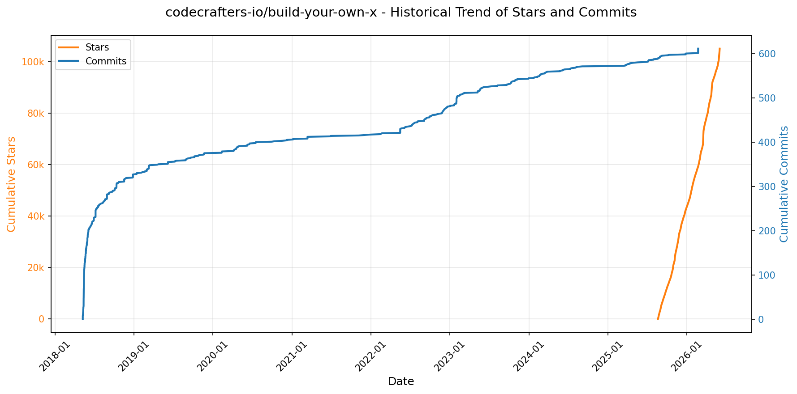

> *蓝色：累计 Stars｜橙色：累计 Commits（次 Y 轴）*

<b>📄 README 摘要</b>

1. **项目功能**  
该项目是一个开源的、面向学习者的实践型技术指南聚合库，核心目标是通过“从零手写实现”（build your own）的方式，帮助开发者深入理解主流技术的底层原理与工作机制。它不提供现成的可运行软件，而是系统性地整理并链接大量高质量、分步式、语言多样的教学资源（含教程、书籍、代码仓库、视频等），覆盖30余类基础性或前沿性技术领域，如3D渲染器、区块链、数据库、Web浏览器、操作系统、神经网络等，强调“造轮子”式的学习路径。

2. **关键特性**  
- **主题全覆盖**：涵盖30+核心技术类别（如分布式系统、AI模型、AR、BitTorrent、Docker、虚拟机、前端框架、游戏引擎等），每类均按技术本质组织，体现计算机系统全栈视角；  
- **多语言实现支持**：每个技术主题下提供多种编程语言（C/C++/Python/JavaScript/Go/Rust/Java等）的实现教程，兼顾性能敏感型（如C/C++写渲染器、VM）与快速验证型（如Python写区块链）场景；  
- **渐进式学习路径**：教程普遍遵循“从简入繁”原则——例如3D渲染从光线追踪入门（《Ray Tracing in One Weekend》）到物理渲染（PBR）、数据库从简易键值存储（《Let’s Build a Simple Database》）到支持SQL的B+树实现；  
- **权威资源精选**：整合业界公认优质内容，包括经典书籍（《Physically Based Rendering》《Computer Graphics from Scratch》）、知名教程系列（Handmade Hero、TinyRenderer）、开源课程（Hugging Face Diffusion Course、Codecrafters）、以及深度技术博客与视频；  
- **实践导向结构化**：所有条目均以“Build your own X”为统一范式，强化动手能力培养，呼应费曼学习法“凡我不能创造者，我即未真正理解”。

3. **技术栈**  
本项目本身为静态文档型仓库（GitHub README），无运行时依赖；其内容所涉技术栈高度多元化，体现跨语言、跨层级的工程广度：  
- **系统级语言**：C（操作系统、内存分配器、容器、Game Boy模拟器）、C++（3D渲染器、游戏、物理引擎、神经网络）；  
- **现代系统/云原生语言**：Go（Docker、数据库、BitTorrent客户端）、Rust（区块链、Redis客户端、Game Boy模拟器）、Zig（CLI工具）；  
- **数据与AI语言**：Python（区块链、AI模型/LLM/Diffusion/RAG、数据库、AR、Bot）、JavaScript/TypeScript（前端框架、Web浏览器、3D软引擎、Web服务器）；  
- **游戏与嵌入式语言**：C#（Unity AR、RPG游戏）、Nim（dotfiles管理、bencode解析）；  
- **函数式与教学语言**：Haskell（IRC Bot）、Common Lisp（CHIP-8模拟器）、ATS（函数式区块链）；  
- **辅助技术**：Shell（bocker Docker实现）、Markdown（文档组织）、Git（版本协作）。  
整体技术栈设计服务于“原理穿透”目标，语言选择严格匹配对应技术领域的典型实现生态与学习门槛。

---

### 5. [home-assistant/core](https://github.com/home-assistant/core)
- 📅 **创建日期**：2013-09-17  
- 🔄 **最近更新**：2026-04-27  
- ⭐ **Stars**：86,601（日 +364｜周 +558｜月 +998）  
- 📝 **描述**：:house_with_garden: Open source home automation that puts local control and privacy first.  

<b>📈 Star 与 Commit 历史趋势</b>

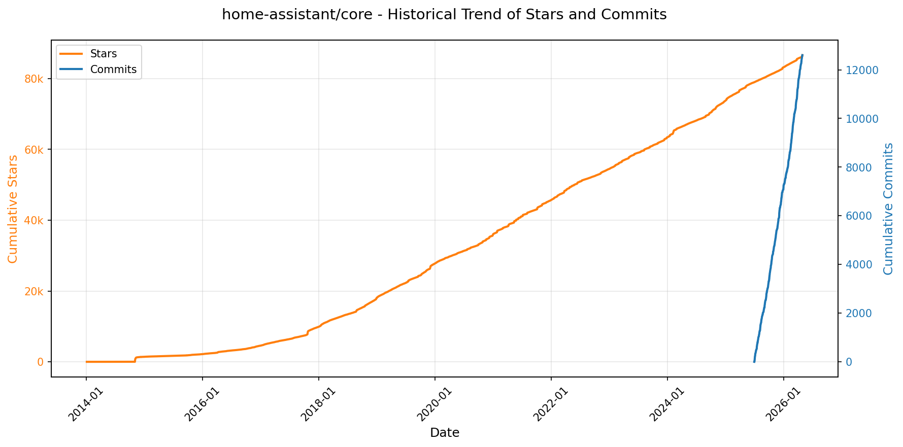

> *蓝色：累计 Stars｜橙色：累计 Commits（次 Y 轴）*

---

### 6. [microsoft/VibeVoice](https://github.com/microsoft/VibeVoice)
- 📅 **创建日期**：2025-08-25  
- 🔄 **最近更新**：2026-04-27  
- ⭐ **Stars**：42,425（日 +804｜周 +1799｜月 +17599）  
- 📝 **描述**：Open-Source Frontier Voice AI  

<b>📈 Star 与 Commit 历史趋势</b>

> *蓝色：累计 Stars｜橙色：累计 Commits（次 Y 轴）*

<b>📄 README 摘要</b>

1. **项目功能**  
VibeVoice 是一个开源的前沿语音人工智能模型家族，专注于长时程、高保真、结构化语音处理，涵盖自动语音识别（ASR）与文本转语音（TTS）两大核心能力。其核心目标是突破传统语音模型在**时长限制、上下文连贯性、多说话人建模和实时性**方面的瓶颈：  
- **VibeVoice-ASR** 支持单次处理长达 **60 分钟**的连续音频，输出结构化转录结果（含说话人标识 *Who*、时间戳 *When* 和文本内容 *What*），并支持用户自定义热词（Hotwords）以提升领域适应性；  
- **VibeVoice-TTS**（已从主仓库移除，但技术已公开）曾支持单次生成最长 **90 分钟**的多说话人（最多 4 人）自然对话语音，具备跨语言、情感表达与自发歌唱能力；  
- **VibeVoice-Realtime-0.5B** 是轻量级实时 TTS 模型，支持流式文本输入，首字延迟约 300ms，可持续生成约 10 分钟高质量语音，兼顾部署效率与实用性。

2. **关键特性**  
- ✅ **超长时序建模能力**：ASR 支持 60 分钟单次推理，TTS 支持 90 分钟连贯生成，打破传统分段处理导致的语义割裂；  
- ✅ **结构化语音理解与生成**：ASR 原生集成说话人日志（diarization）、精准时间戳与内容识别；TTS 实现多角色自然轮换与声学一致性保持；  
- ✅ **多语言与定制化支持**：ASR 原生支持 **50+ 种语言**；TTS 支持中英文及多语种（DE/FR/IT/JP/KR/NL/PL/PT/ES 等）；均支持用户注入领域知识（如专有名词、背景上下文）；  
- ✅ **高效底层架构**：采用 **7.5 Hz 超低帧率连续语音 tokenizer**（声学 + 语义双通道），大幅降低计算开销，同时保留高保真度；  
- ✅ **先进生成范式**：基于 **LLM + 扩散模型（next-token diffusion）协同框架**——LLM 负责语言理解与对话逻辑建模，扩散头负责高保真声学细节合成；  
- ✅ **生产就绪工具链**：提供 Hugging Face Transformers 原生集成（ASR）、vLLM 加速推理支持、Gradio 交互式 Playground、Colab 快速试用环境及完整微调代码（ASR finetuning-asr/）；  
- ✅ **研究透明性**：所有模型均配套发布技术报告（arXiv/ICLR Oral）、详细文档、评估指标（DER / cpWER / tcpWER）及多语言/多场景音频样例。

3. **技术栈**  
- **模型架构**：混合架构——大语言模型（LLM，基于 Qwen2.5-1.5B）作为语义解码器 + 扩散模型（diffusion head）作为声学生成器；创新采用 **连续语音 tokenizers**（非离散 unit）实现 7.5Hz 超低帧率表征；  
- **训练与推理框架**：PyTorch 生态；ASR 微调支持标准 Hugging Face Transformers API；推理层集成 **vLLM** 以加速长上下文 ASR 解码；  
- **部署与交互**：Gradio（ASR Playground）、Google Colab（TTS/Realtime 快速演示）、Hugging Face Spaces/Models Hub（模型托管与 API 调用）；  
- **Tokenizer 与预处理**：自研 **Acoustic & Semantic Continuous Tokenizers**，替代传统离散音素或 HuBERT unit，实现高效长音频编码；  
- **语言与数据**：ASR 支持超 50 种语言；TTS 支持中、英及 9 种欧洲/亚洲语言；训练数据覆盖长对话、播客、会议、跨语言语料等多样化真实场景。

---

### 7. [curl/curl](https://github.com/curl/curl)
- 📅 **创建日期**：2010-03-18  
- 🔄 **最近更新**：2026-04-27  
- ⭐ **Stars**：41,569（日 +179｜周 +241｜月 +545）  
- 📝 **描述**：A command line tool and library for transferring data with URL syntax, supporting DICT, FILE, FTP, FTPS, GOPHER, GOPHERS, HTTP, HTTPS, IMAP, IMAPS, LDAP, LDAPS, MQTT, MQTTS, POP3, POP3S, RTMP, RTMPS, RTSP, SCP, SFTP, SMB, SMBS, SMTP, SMTPS, TELNET, TFTP, WS and WSS. libcurl offers a myriad of powerful features  

<b>📈 Star 与 Commit 历史趋势</b>

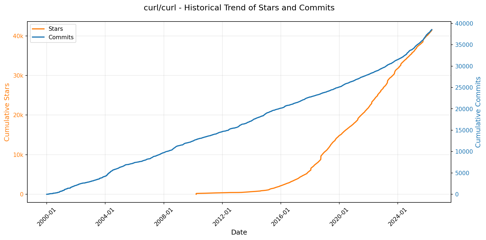

> *蓝色：累计 Stars｜橙色：累计 Commits（次 Y 轴）*

<b>📄 README 摘要</b>

1. **该项目的功能**：  
   curl 是一个命令行数据传输工具，用于通过 URL 从服务器下载（或向服务器上传）数据。它支持多达 29 种网络协议，包括 HTTP/HTTPS、FTP/FTPS、SFTP、SCP、SMTP/SMTPS、POP3/POP3S、IMAP/IMAPS、LDAP/LDAPS、MQTT/MQTTS、WebSocket（WS/WSS）、RTSP、Gopher、Telnet、TFTP、SMB/SMBS、DICT、FILE 等，适用于各种网络通信场景。

2. **核心特性**：  
   - 跨平台、轻量级、稳定可靠的命令行 HTTP/URL 工具；  
   - 支持 SSL/TLS 加密、代理、认证（Basic/Digest/NTLM/OAuth2 等）、Cookie 管理、重定向、断点续传、多部分上传、HTTP/2 和 HTTP/3（QUIC）；  
   - 提供功能完备的 C 语言库 **libcurl**，可嵌入任意软件中实现定制化网络通信能力；  
   - 遵循 POSIX 标准，广泛集成于 Linux/macOS/Windows 系统及各类开发工具链中；  
   - 开源免费，拥有活跃社区维护、严格的安全响应机制（私密漏洞披露流程）和长期向后兼容性保障。

3. **技术栈**：  
   - 主语言：C（高度可移植、无依赖、零运行时开销）；  
   - 协议支持层：基于自研或集成成熟底层库（如 OpenSSL / BoringSSL / GnuTLS / mbedTLS 用于 TLS；OpenSSH / libssh 用于 SFTP/SCP；nghttp2 / quiche / msquic 用于 HTTP/2/HTTP/3）；  
   - 构建系统：Autotools（传统 Unix 环境）、CMake（现代跨平台构建）、Meson（新增支持）；  
   - 源码托管与协作：GitHub（Git 版本控制）、CI/CD 使用 GitHub Actions 及自有基础设施；  
   - 许可证：MIT 兼容的 curl 许可证（宽松开源许可，允许商业闭源集成）。

---

### 8. [rtk-ai/rtk](https://github.com/rtk-ai/rtk)
- 📅 **创建日期**：2026-01-22  
- 🔄 **最近更新**：2026-04-27  
- ⭐ **Stars**：36,320（日 +694｜周 +6215｜月 +21893）  
- 📝 **描述**：CLI proxy that reduces LLM token consumption by 60-90% on common dev commands. Single Rust binary, zero dependencies  

<b>📈 Star 与 Commit 历史趋势</b>

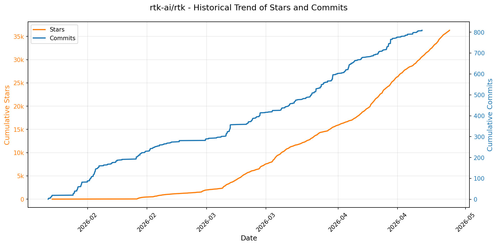

> *蓝色：累计 Stars｜橙色：累计 Commits（次 Y 轴）*

<b>📄 README 摘要</b>

1. **项目功能**  
RTK（Rust Token Killer）是一个高性能命令行代理工具，专为AI编程助手（如Claude Code、GitHub Copilot、Cursor等）设计，通过在命令执行前对Shell输出进行智能过滤与压缩，显著降低大语言模型（LLM）上下文中的Token消耗。它不修改用户输入或LLM逻辑，而是透明拦截并重写Bash命令（如 `git status` → `rtk git status`），将原始高冗余输出（如完整`git diff`、`cargo test`日志）转换为紧凑、语义保留的摘要形式，从而在典型30分钟编码会话中实现**60–90%的Token节省**（实测总节省约80%，从118,000 tokens降至23,900 tokens）。

2. **核心特性**  
- ✅ **全自动Bash钩子（Auto-Rewrite Hook）**：`rtk init -g`一键注入，无缝重写100+常用命令，无需用户显式调用`rtk`；  
- ✅ **多维度智能压缩策略**：针对不同命令类型动态应用**智能过滤**（剔除注释/空行/噪音）、**分组聚合**（按目录/错误类型归类）、**上下文感知截断**（保留关键行，删减重复/冗余内容）和**去重计数**（如日志行合并为“ERROR x5”）；  
- ✅ **全栈开发场景覆盖**：原生支持Git、文件操作（`ls`/`cat`/`grep`）、测试框架（`pytest`/`cargo test`/`go test`）、构建与Lint（`ruff`/`tsc`/`prettier`）、容器（`docker`/`kubectl`）、云服务（`aws`/`gh`）、包管理（`pnpm`/`pip`/`bundler`）等12+技术领域；  
- ✅ **深度AI工具集成**：开箱即用支持Claude Code、Copilot（VS Code & CLI）、Cursor、Gemini CLI、Codex、Windsurf、Cline/Roo Code等12种AI编码工具，每种均适配其插件机制（PreToolUse hook、.rules文件、AGENTS.md指令等）；  
- ✅ **精细化可观测性**：`rtk gain`提供实时/历史/图表化Token节省分析，`rtk discover`自动识别未优化命令，`rtk session`追踪跨会话采用率；  
- ✅ **隐私优先设计**：遥测完全禁用默认，需显式授权；仅收集匿名聚合数据（如设备哈希、命令类别、节省量），**绝不采集代码、路径、参数、密钥或环境变量**；  
- ✅ **跨平台兼容**：原生支持Linux/macOS，Windows推荐WSL以获得完整钩子功能，原生PowerShell/cmd下仍可手动调用所有过滤命令。

3. **技术栈**  
- **主语言**：Rust（单二进制分发，零运行时依赖，musl静态链接）；  
- **架构模式**：CLI代理 + Shell钩子（Bash/Zsh `preexec`/`DEBUG` trap）+ 领域专用过滤器（每个命令有独立解析与压缩逻辑）；  
- **构建与分发**：Cargo发布、Homebrew公式、预编译二进制（x86_64/aarch64多平台，含Windows MSVC）；  
- **配置系统**：TOML格式（`~/.config/rtk/config.toml`），支持命令排除、tee日志保存策略等；  
- **基础设施**：GitHub Actions CI/CD、Star History与Starmapper生态可视化、Discord社区支持；  
- **安全合规**：MIT许可证，明确隐私政策（GDPR合规），遥测完全可控（enable/disable/forget三态管理）。

---

### 9. [Z4nzu/hackingtool](https://github.com/Z4nzu/hackingtool)
- 📅 **创建日期**：2020-04-11  
- 🔄 **最近更新**：2026-04-27  
- ⭐ **Stars**：34,800（日 +1376｜周 +7363｜月 +10400）  
- 📝 **描述**：ALL IN ONE Hacking Tool For Hackers  

<b>📈 Star 与 Commit 历史趋势</b>

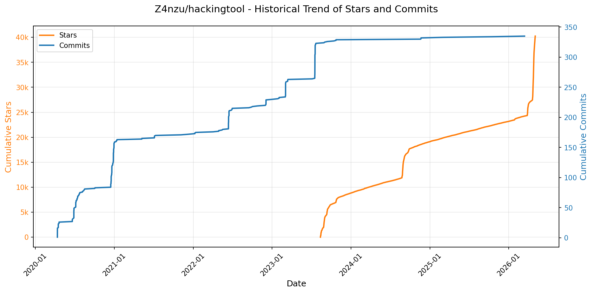

> *蓝色：累计 Stars｜橙色：累计 Commits（次 Y 轴）*

<b>📄 README 摘要</b>

1. **项目功能**  
该工具是一个面向安全研究人员与渗透测试人员的“一站式”渗透测试集成平台，本质是**高度封装的开源安全工具聚合器与自动化管理器**。它不直接实现攻击逻辑，而是通过统一命令行界面（CLI）对185+个主流安全工具进行分类组织、状态监控、一键安装/更新/启动，并提供智能交互能力（如自然语言式推荐、关键词搜索、标签过滤），大幅降低多工具协同使用的复杂度，提升渗透测试工作流效率。

2. **核心特性**  
- **全类别覆盖**：涵盖20大渗透测试领域（含新增的Active Directory、Cloud Security、Mobile Security），覆盖从信息收集、无线攻击、Web漏洞利用到云安全、移动应用分析等完整攻防链条；  
- **智能交互体验**：支持 `/` 全局搜索、`t` 标签过滤（19类标签如osint/web/c2/cloud）、`r` 自然语言推荐（如输入“I want to scan a network”自动匹配nmap等工具）、实时安装状态标识（✔/✘）、批量安装（选项97）及智能更新（自动识别git/pip/go安装方式）；  
- **跨平台自适应**：自动检测操作系统（Linux/Kali/Parrot/macOS），隐藏不兼容工具（如仅Linux可用工具在macOS中不可见）；  
- **安全可控部署**：Docker镜像全部本地构建，杜绝未经验证的第三方镜像；提供一键安装脚本（curl + sudo bash）与完整手动/Docker部署方案；  
- **开发者友好生态**：标准化工具接入流程（Issue/PR模板），支持快速贡献新工具，内置目录跳转（`Open folder`）便于手动调试与审计。

3. **技术栈**  
- **主语言**：Python 3.10+（核心框架、CLI界面、工具调度与状态管理）；  
- **依赖语言环境**：Go 1.21+（用于编译运行 nuclei、ffuf、amass 等高性能工具）、Ruby（支持 haiti、evil-winrm 等工具）；  
- **容器化**：Docker（本地构建并运行部分工具，如Mythic、MobSF）；  
- **系统支持**：原生适配 Linux（Kali/Parrot等渗透专用发行版）及 macOS；  
- **基础依赖**：pip（Python包管理）、Git（工具克隆与更新）、常见Linux工具链（如make、gcc）；  
- **架构设计**：模块化工具封装（各工具独立`tools/*.py`类）、虚拟环境（venv）隔离、声明式配置（SUPPORTED_OS、INSTALL/RUN命令）。

---

### 10. [gastownhall/beads](https://github.com/gastownhall/beads)
- 📅 **创建日期**：2025-10-12  
- 🔄 **最近更新**：2026-04-27  
- ⭐ **Stars**：33,170（日 +353｜周 +829｜月 +2024）  
- 📝 **描述**：Beads - A memory upgrade for your coding agent  

<b>📈 Star 与 Commit 历史趋势</b>

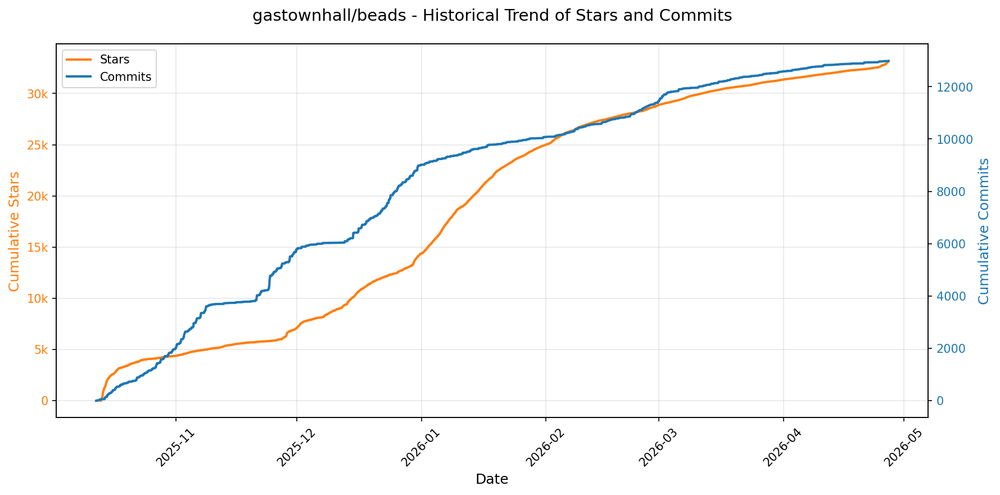

> *蓝色：累计 Stars｜橙色：累计 Commits（次 Y 轴）*

<b>📄 README 摘要</b>

1. **项目功能**  
Beads（`bd`）是一个面向 AI 编程代理（coding agents）的分布式图谱化问题追踪系统，核心目标是为长周期、多步骤的软件开发任务提供**持久化、结构化、依赖感知的记忆层**。它取代传统基于 Markdown 的松散计划文档，转而以带版本控制的有向图（DAG）组织任务，使 AI 代理能在复杂上下文中持续推理、避免上下文丢失，并协同处理跨分支、跨代理的任务流。

2. **关键特性**  
- **Dolt 原生集成**：以内嵌或服务模式运行 Dolt 数据库，支持单元格级合并、原生分支、远程同步及 Git 兼容工作流；  
- **AI 代理友好设计**：提供标准化 JSON 输出、自动识别“就绪任务”（`bd ready`）、原子化认领（`--claim`）、语义化依赖建模（`bd dep add`）；  
- **无冲突协作机制**：采用哈希生成的唯一 ID（如 `bd-a1b2`）及层级 ID（`bd-a3f8.1.1`）支持史诗（Epic）→ 任务 → 子任务的嵌套结构，彻底规避多代理/多分支下的 ID 冲突；  
- **智能记忆管理**：通过 `bd prime` 实现“语义压缩”（compaction），自动归档/摘要已关闭旧任务，优化 LLM 上下文窗口占用；  
- **多模态任务类型**：除标准 issue 外，支持线程化消息（`--thread`）、临时生命周期、邮件委托等 messaging 场景；  
- **知识图谱链接**：支持 `relates_to`、`duplicates`、`supersedes`、`replies_to` 等语义关系，构建可查询、可演化的工程知识网络；  
- **零 Git 依赖模式**：通过 `BEADS_DIR` 和 `--stealth` 完全脱离 Git，适配非 Git VCS（如 Jujutsu）、单体仓库子目录、CI/CD 环境及临时测试场景；  
- **角色自适应工作流**：自动区分 contributor（规划问题隔离至本地 `~/.beads-planning`）与 maintainer（直连主仓库），保障 PR 清洁性。

3. **技术栈**  
- **核心数据库**：[Dolt](https://github.com/dolthub/dolt)（Git for Data）—— 提供 SQL 接口、版本控制、分支/合并能力；  
- **主语言**：Go（CLI 主体，含 `go install` 支持）；  
- **跨平台支持**：原生兼容 macOS、Linux、Windows、FreeBSD；  
- **安装分发**：多通道交付——Homebrew（推荐）、npm（`@beads/bd`）、PyPI（`beads-mcp`）、Shell 安装脚本、源码编译；  
- **存储模式**：双模式架构——默认 **Embedded Mode**（Dolt 进程内嵌，文件锁单写）；可选 **Server Mode**（对接外部 `dolt sql-server`，支持多写，支持 TCP/Unix Socket 连接）；  
- **扩展生态**：提供 CLI 标准接口，社区已构建终端 UI、Web 界面、编辑器插件（VS Code / Vim）、原生应用等（见 `COMMUNITY_TOOLS.md`）。

---

### 11. [siddharthvaddem/openscreen](https://github.com/siddharthvaddem/openscreen)
- 📅 **创建日期**：2025-10-10  
- 🔄 **最近更新**：2026-04-27  
- ⭐ **Stars**：33,086（日 +214｜周 +1641｜月 +24205）  
- 📝 **描述**：Create stunning demos for free. Open-source, no subscriptions, no watermarks, and free for commercial use. An alternative to Screen Studio.   

<b>📈 Star 与 Commit 历史趋势</b>

> *蓝色：累计 Stars｜橙色：累计 Commits（次 Y 轴）*

<b>📄 README 摘要</b>

1. **该项目的功能**  
OpenScreen 是一款免费、开源的屏幕录制与视频编辑工具，旨在为用户提供 Screen Studio 的轻量级替代方案。它专注于制作简洁美观的产品演示和操作引导视频，支持从录制到后期处理（如缩放、标注、裁剪、变速等）的一体化工作流，适用于个人及商业用途，且无订阅费用或隐藏条款。

2. **核心功能**  
- 支持窗口级或全屏录制；  
- 提供自动/手动缩放功能（可调深度、持续时间与位置）；  
- 同时录制麦克风音频与系统音频（平台兼容性有差异）；  
- 视频裁剪（隐藏指定区域）；  
- 自定义背景（壁纸、纯色、渐变或自定义图片）；  
- 运动模糊效果，提升缩放与平移的视觉流畅度；  
- 添加文本、箭头、图片等注释元素；  
- 时间轴片段修剪与分段变速控制；  
- 导出多种宽高比（如 16:9、4:3、1:1）和分辨率（720p、1080p 等）。

3. **技术栈**  
- 桌面框架：Electron（实现跨平台原生应用）；  
- 前端框架：React + TypeScript（构建响应式 UI 与类型安全逻辑）；  
- 构建工具：Vite（提供快速冷启动与热更新）；  
- 图形渲染：PixiJS（高效处理缩放、运动模糊、图层合成等视觉效果）；  
- 时间轴交互组件：dnd-timeline（支持拖拽式剪辑与轨道操作）。

---

### 12. [PostHog/posthog](https://github.com/PostHog/posthog)
- 📅 **创建日期**：2020-01-23  
- 🔄 **最近更新**：2026-04-27  
- ⭐ **Stars**：31,844（日 +286｜周 +1215｜月 +1681）  
- 📝 **描述**：🦔 PostHog is an all-in-one developer platform for building successful products. We offer product analytics, web analytics, session replay, error tracking, feature flags, experimentation, surveys, data warehouse, a CDP, and an AI product assistant to help debug your code, ship features faster, and keep all your usage and customer data in one stack.  

<b>📈 Star 与 Commit 历史趋势</b>

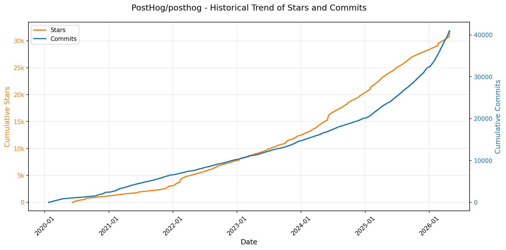

> *蓝色：累计 Stars｜橙色：累计 Commits（次 Y 轴）*

<b>📄 README 摘要</b>

1. **项目功能**  
PostHog 是一个开源、一体化的产品开发平台，旨在帮助团队自主构建和优化成功的产品。它提供端到端的数据驱动能力：从用户行为采集（自动捕获或手动埋点）、实时分析与可视化，到产品迭代支持（如功能开关、A/B 实验）、用户体验诊断（会话回放、错误追踪）、用户反馈收集（无代码问卷），再到数据集成与治理（外部数据源同步、ETL 管道、数据仓库查询），并扩展支持大模型应用监控（LLM 分析）及自动化工作流编排。所有核心功能均可本地自托管或通过云服务快速启用，且基础层完全免费。

2. **关键特性**  
- **全栈产品分析**：支持事件驱动的自动/手动埋点、多维漏斗、留存、路径分析及原生 SQL 查询；  
- **Web 分析**：类 GA 的流量、转化率、核心网页指标（Core Web Vitals）与收入追踪；  
- **会话回放**：录制并回放真实用户交互过程，支持搜索、过滤与问题定位；  
- **功能开关（Feature Flags）**：细粒度控制功能发布（按用户、设备、地域、实验组等），支持灰度与回滚；  
- **无代码实验（Experiments）**：可视化搭建 A/B 或多变量测试，自动统计显著性（p 值、置信区间）；  
- **错误追踪**：前端/后端异常自动捕获、聚合告警与上下文堆栈分析；  
- **可定制问卷（Surveys）**：提供模板库与拖拽式构建器，支持触发逻辑与目标人群定向；  
- **统一数据中枢**：内置数据管道（CDP），支持 25+ 工具（如 Stripe、HubSpot）双向同步、实时转发与批量导出；  
- **LLM 应用分析**：追踪 LLM 调用链路、生成内容、延迟、Token 成本与成功率；  
- **自动化工作流（Workflows）**：基于事件触发条件执行动作（如发送消息、调用 webhook、更新用户属性）；  
- **完全开源与免费 tier**：核心功能 MIT 许可，云服务提供每月百万事件等 generous 免费额度。

3. **技术栈**  
- **后端**：Python（Django 框架为主）、Node.js（部分服务）、Go（新组件如 ClickHouse Proxy）；  
- **数据库**：PostgreSQL（主业务存储）、ClickHouse（高性能事件分析与实时查询）、Redis（缓存与任务队列）；  
- **前端**：TypeScript + React（主应用），配套 Next.js、Vue、Angular 等框架 SDK；  
- **移动端**：React Native、Android（Java/Kotlin）、iOS（Swift）、Flutter SDK；  
- **基础设施**：Docker 容器化部署、Kubernetes（生产级云服务）、AWS/GCP 云原生架构；  
- **可观测性与运维**：Prometheus + Grafana 监控、Sentry 错误上报、自研分布式任务系统（Celery + Redis/RabbitMQ）；  
- **其他关键组件**：自研数据管道引擎（基于 Python/Go）、LLM 追踪适配器、Session Replay 录制与播放 SDK（前端重放引擎）。

---

### 13. [abhigyanpatwari/GitNexus](https://github.com/abhigyanpatwari/GitNexus)
- 📅 **创建日期**：2025-08-02  
- 🔄 **最近更新**：2026-04-27  
- ⭐ **Stars**：30,505（日 +752｜周 +2219｜月 +10214）  
- 📝 **描述**：GitNexus: The Zero-Server Code Intelligence Engine -       GitNexus is a client-side knowledge graph creator that runs entirely in your browser. Drop in a GitHub repo or ZIP file, and get an interactive knowledge graph wit a built in Graph RAG Agent. Perfect for code exploration  

<b>📈 Star 与 Commit 历史趋势</b>

> *蓝色：累计 Stars｜橙色：累计 Commits（次 Y 轴）*

<b>📄 README 摘要</b>

1. **项目功能**  
GitNexus 是一个面向 AI 编程代理（AI agents）的代码智能基础设施，旨在为大语言模型（LLM）和编程辅助工具构建“代码库的神经系统”。其核心能力是：将任意代码仓库（本地或远程）**全自动索引为结构化知识图谱**，精确捕获函数调用链、模块依赖关系、执行流程、组件聚类（clusters）、服务边界等深层架构语义。该图谱并非仅提供文档式描述（如传统代码理解工具），而是支持动态、可查询、可推理的上下文供给——使 AI 代理在编写、重构、调试、审查代码时具备**全栈级架构感知能力**，彻底避免因遗漏依赖、误判调用路径或忽略副作用而导致的错误。

2. **关键特性**  
- **双模态使用范式**：  
  - **CLI + MCP 模式**（推荐）：本地索引 + 标准化 MCP（Model Context Protocol）服务器，深度集成 Cursor、Claude Code、Codex 等主流 AI 编程工具，提供 16 个原生 MCP 工具（如 `impact` 爆炸半径分析、`detect_changes` Git 差异影响映射、`rename` 跨文件协同重命名、`cypher` 原生图查询）及 4 类预装智能技能（探索/调试/影响分析/重构）。  
  - **Web UI 模式**：纯前端、零服务端的浏览器内应用（支持拖拽 ZIP 分析），提供交互式知识图谱可视化与自然语言聊天界面，适合快速探索与演示。  
- **桥接模式（Bridge Mode）**：`gitnexus serve` 启动本地 HTTP 服务，使 Web UI 可无缝访问 CLI 已索引的所有仓库，无需重复上传或重建索引。  
- **企业级能力**：SaaS 或自托管部署支持 PR 自动影响分析、多仓库统一图谱、自动增量重索引、OCaml 语言支持、持续更新的自动化代码 Wiki。  
- **多仓库协同架构**：通过全局注册中心（`~/.gitnexus/registry.json`）统一管理多个仓库索引，MCP 服务按需懒加载 LadybugDB 连接，实现单配置、跨项目无缝调用。  
- **智能技能生成**：基于 Leiden 社区检测自动识别代码功能模块，生成 `.claude/skills/generated/` 下的模块专属技能文件（含入口点、执行流、跨模块连接），实现精准上下文供给。  
- **强隐私与离线优先**：CLI 模式全程本地运行，无网络外传；Web UI 完全客户端执行；Docker 部署支持完全离线工作流。

3. **技术栈**  
- **核心数据库**：LadybugDB（自研轻量级嵌入式图数据库），CLI 使用原生绑定，Web UI 使用 WASM 版本。  
- **代码解析引擎**：Tree-sitter（CLI 采用原生绑定，Web UI 使用 WASM 编译版本），保障高精度、多语言 AST 提取。  
- **协议标准**：MCP（Model Context Protocol）作为 AI 代理与代码知识层的标准化通信接口。  
- **前端框架**：Web UI 基于现代前端技术栈（推测为 Vite + React/Svelte，结合 Mermaid.js 渲染架构图）。  
- **后端服务**：CLI 内置 HTTP 服务（`gitnexus serve`），基于 Node.js 构建，提供 REST API 与 MCP stdio 接口。  
- **部署方案**：官方提供双镜像 Docker Compose 方案（`gitnexus` 服务镜像 + `gitnexus-web` 静态镜像），镜像发布至 GHCR 与 Docker Hub，并通过 Cosign 实现供应链签名验证；版本严格锁定 npm 包版本（`vX.Y.Z` 标签触发构建，确保二进制一致性）。  
- **许可协议**：开源版采用 PolyForm Noncommercial License（非商业用途免费），企业版支持商业授权与定制化部署。

---

### 14. [luongnv89/claude-howto](https://github.com/luongnv89/claude-howto)
- 📅 **创建日期**：2025-11-07  
- 🔄 **最近更新**：2026-04-27  
- ⭐ **Stars**：29,359（日 +254｜周 +1553｜月 +26119）  
- 📝 **描述**：A visual, example-driven guide to Claude Code — from basic concepts to advanced agents, with copy-paste templates that bring immediate value.  

<b>📈 Star 与 Commit 历史趋势</b>

> *蓝色：累计 Stars｜橙色：累计 Commits（次 Y 轴）*

<b>📄 README 摘要</b>

1. **该项目做什么？**  
该项目是一个面向 Anthropic Claude Code（v2.1+）的实战型、结构化学习指南，旨在帮助开发者系统性掌握 Claude Code 的全部核心能力。它不提供基础功能说明，而是聚焦于**真实工作流的构建与整合**：将 slash 命令、记忆（Memory）、技能（Skills）、子智能体（Subagents）、MCP 协议、钩子（Hooks）、插件（Plugins）、检查点（Checkpoints）等孤立特性，组合成可直接复用的自动化流水线（如自动代码审查、CI/CD 自动化、文档生成、安全审计等）。其核心价值是填补官方文档的空白——解决“知道功能存在，但不知如何协同落地”的痛点，让开发者在 11–13 小时内从入门进阶为高阶实践者。

2. **关键特性**  
- ✅ **渐进式学习路径**：10 个模块按能力层级递进（初学者→高级），每模块含时间预估、Mermaid 可视化原理图、生产级模板及即时自测（`/lesson-quiz`）；  
- ✅ **开箱即用的复制粘贴模板**：提供完整可部署的配置文件（`.md` 命令、`CLAUDE.md` 记忆、Shell 钩子脚本、MCP JSON 配置、子智能体定义、插件包等），支持一键集成至本地项目；  
- ✅ **深度整合教学**：强调特性组合（如“Slash Commands + Memory + Subagents + MCP”构建自动化代码审查），而非孤立讲解；  
- ✅ **交互式自我评估**：内置 `/self-assessment` 和主题化测验，动态生成个性化学习路线；  
- ✅ **全生命周期支持**：覆盖开发（CLI 工具链）、测试（检查点/回滚）、运维（后台任务/Headless 模式）、安全（只读子智能体/权限模式）等场景；  
- ✅ **多语言 & 离线友好**：支持中/英/越/乌四种语言，且可通过脚本生成含图表的 EPUB 离线电子书。

3. **技术栈**  
- **运行平台**：原生支持 macOS / Linux / Windows（Claude Code v2.1.113+ 二进制分发）；  
- **核心依赖**：Anthropic 官方 `claude-code` CLI 工具（v2.1.119+，2026 年 4 月最新版）；  
- **协议标准**：Model Context Protocol（MCP）v1.x（用于集成 GitHub、数据库、文件系统等外部工具）；  
- **配置与脚本**：JSON（设置、MCP 配置）、Markdown（slash 命令、CLAUDE.md、子智能体提示词）、Shell（Hooks 脚本）、Node.js（MCP 服务端如 `@modelcontextprotocol/server-github`）；  
- **构建与分发**：Python（`uv` 运行时用于生成 EPUB）、GitHub Actions（维护更新）、Shields.io（状态徽章）；  
- **许可证**：MIT 开源协议，完全免费商用。

---

### 15. [microsoft/typescript-go](https://github.com/microsoft/typescript-go)
- 📅 **创建日期**：2024-09-19  
- 🔄 **最近更新**：2026-04-27  
- ⭐ **Stars**：25,183（日 +92｜周 +367｜月 +612）  
- 📝 **描述**：Staging repo for development of native port of TypeScript  

<b>📈 Star 与 Commit 历史趋势</b>

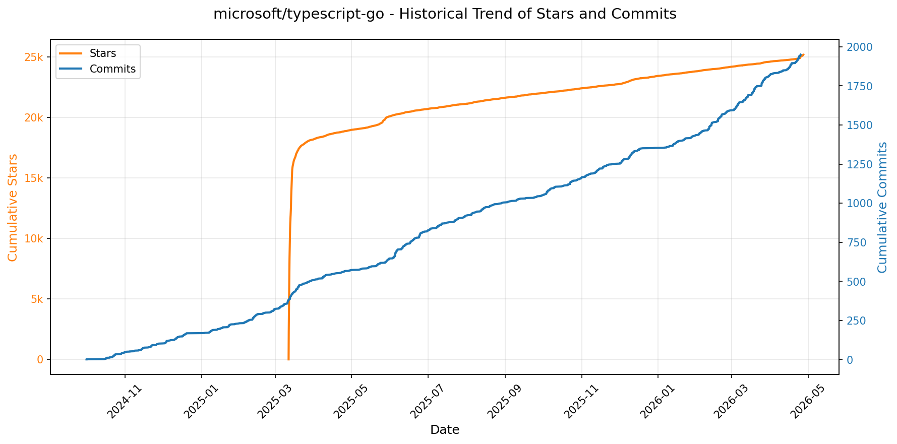

> *蓝色：累计 Stars｜橙色：累计 Commits（次 Y 轴）*

<b>📄 README 摘要</b>

1. **该项目做什么？**  
该项目是 TypeScript 的原生（Native）重实现，使用 Go 语言开发，代号为“TypeScript 7”，目标是构建一个与现有 TypeScript（v6.0）功能高度兼容、但性能更优、更易维护的全新编译器和语言服务。它并非 TypeScript 的简单包装或转译，而是从解析、类型检查到代码生成的完整重写，旨在最终替代当前基于 JavaScript（Node.js）的 TypeScript 编译器（`tsc`），并长期合并回官方 `microsoft/TypeScript` 主仓库。

2. **关键特性**  
- ✅ 已完成核心功能：程序创建（含模块解析）、语法解析与扫描（错误完全对齐 TS 6.0）、`tsconfig.json` 解析、类型解析与类型检查（错误位置、消息、语义行为与 TS 6.0 一致）、JSX 支持、JavaScript/TypeScript 文件的 JS 代码生成（Emit）、构建模式（Project References）及增量构建（Incremental build）。  
- ⏳ 进行中功能：JavaScript 特有类型推断与 JSDoc 支持（部分缺失）、声明文件生成（`.d.ts`，TS 文件已支持，JS 文件尚未完成）、语言服务器协议（LSP）支持（已接近全部实现）。  
- 🧪 原型阶段：Watch 模式（仅基础文件监听与全量重建，无增量类型检查，未优化）。  
- ❌ 尚未就绪：公开 API（不提供编程接口，暂不可用于集成开发）。

3. **技术栈**  
- **主语言**：Go（用于实现整个编译器与语言服务核心）  
- **包管理与分发**：npm（预发布包 `@typescript/native-preview`）  
- **IDE 集成**：VS Code 扩展（通过 `js/ts.experimental.useTsgo` 设置启用）  
- **协议标准**：语言服务器协议（LSP）  
- **构建与运行时依赖**：不依赖 Node.js 或 V8，为纯原生二进制（Go 编译产出），强调跨平台与启动性能。

---

### 16. [mattpocock/skills](https://github.com/mattpocock/skills)
- 📅 **创建日期**：2026-02-03  
- 🔄 **最近更新**：2026-04-27  
- ⭐ **Stars**：24,743（日 +4208｜周 +8233｜月 +14238）  
- 📝 **描述**：Agent Skills for real engineers. Straight from my .claude directory.  

<b>📈 Star 与 Commit 历史趋势</b>

> *蓝色：累计 Stars｜橙色：累计 Commits（次 Y 轴）*

<b>📄 README 摘要</b>

1. **项目功能**  
该项目是一套面向专业软件工程师的、开箱即用的 AI 代理（Agent）技能集合，聚焦于真实工程场景中的高价值任务，而非“氛围编程”（vibe coding）。它通过标准化、可复用的 CLI 命令（`npx skills@latest add <skill>`）将工程实践流程自动化与智能化：覆盖从需求分析、系统设计、代码开发与重构、质量保障（TDD/测试迁移）、基础设施配置（Git 钩子、pre-commit），到技术写作、知识管理（Obsidian 集成）和领域建模（通用语言提取）等全生命周期环节。所有技能均以 GitHub Issue、结构化文档、代码变更或本地工具配置等形式产出可审计、可协作、可追踪的工程交付物。

2. **核心特性**  
- **工程导向的决策强化**：提供 `grill-me`（深度设计质询）、`to-prd`（对话自动生成产品需求文档）、`to-issues`（垂直切片式任务拆解）等技能，强制结构化思考，规避模糊需求与设计盲区。  
- **可落地的开发闭环**：`tdd` 实现端到端测试驱动开发；`triage-issue` 自动完成 Bug 根因分析并生成带 TDD 步骤的修复方案；`request-refactor-plan` 结合用户访谈输出细粒度、可提交的重构计划（含小步提交建议）。  
- **架构与质量内建能力**：`improve-codebase-architecture` 基于 `CONTEXT.md` 和 `docs/adr/` 主动识别架构腐化点；`migrate-to-shoehorn` 自动化类型断言迁移，提升 TypeScript 类型安全性。  
- **安全与协作增强工具链**：`git-guardrails-claude-code` 拦截高危 Git 操作（如 `push`、`reset --hard`）；`setup-pre-commit` 一键集成 Husky + lint-staged + Prettier + 类型检查 + 测试；`obsidian-vault` 深度打通本地知识库，支持双向链接与索引管理。  
- **知识沉淀与复用机制**：`write-a-skill` 提供技能开发模板与渐进式披露规范；`ubiquitous-language` 从对话中自动提炼 DDD 风格的统一术语表；`edit-article` 针对技术文档进行逻辑重构与语言精炼。

3. **技术栈**  
- **运行时与分发**：基于 Node.js 生态，通过 `npx` 直接调用，无须全局安装；技能以独立 npm 包形式发布（如 `mattpocock/skills/to-prd`）。  
- **AI 引擎层**：隐式依赖大语言模型（LLM）能力，但未指定具体后端（如 OpenAI/Claude），强调技能抽象与模型无关性；部分技能明确适配 Claude（如 `git-guardrails-claude-code`）。  
- **集成生态**：深度绑定 GitHub（Issue 创建/管理）、TypeScript（`@total-typescript/shoehorn`）、Git（Husky、pre-commit hooks）、Obsidian（本地 Markdown 知识库）、DDD 工程实践（ADR 文档、通用语言建模）。  
- **工程约定**：遵循结构化工程文档标准，如 `CONTEXT.md`（上下文声明）、`docs/adr/`（架构决策记录目录），体现领域驱动设计与可维护性优先原则。

---

### 17. [google-ai-edge/gallery](https://github.com/google-ai-edge/gallery)
- 📅 **创建日期**：2025-03-31  
- 🔄 **最近更新**：2026-04-27  
- ⭐ **Stars**：22,162（日 +68｜周 +542｜月 +6716）  
- 📝 **描述**：A gallery that showcases on-device ML/GenAI use cases and allows people to try and use models locally.  

<b>📈 Star 与 Commit 历史趋势</b>

> *蓝色：累计 Stars｜橙色：累计 Commits（次 Y 轴）*

<b>📄 README 摘要</b>

1. **项目功能**  
Google AI Edge Gallery 是一款面向移动端的开源应用，旨在让用户在**完全离线、隐私安全的前提下**，直接在手机设备上运行高性能开源大语言模型（LLMs）和多模态模型。它提供端到端的本地AI体验，支持文本生成、图像理解、语音转写、智能代理任务、设备控制等核心场景，使用户无需联网、不上传数据即可体验前沿的生成式AI能力。

2. **关键特性**  
- **Agent Skills（智能代理技能）**：通过集成维基百科检索、交互式地图、可视化摘要卡片等工具，扩展LLM能力；支持从URL动态加载或社区共享的模块化技能。  
- **AI Chat + Thinking Mode（思考模式）**：支持多轮对话，并可开启“思考模式”实时查看模型逐步推理过程（首发适配Gemma 4系列）。  
- **Ask Image（图像问答）**：调用设备摄像头或相册，实现物体识别、视觉推理与图文描述。  
- **Audio Scribe（语音速记）**：基于轻量级端侧语音模型，实现实时语音转文字及翻译。  
- **Prompt Lab（提示词实验室）**：提供参数精细调控（如temperature、top-k）的单次推理测试环境。  
- **Mobile Actions（移动设备控制）**：利用FunctionGemma 270m微调模型，实现离线设备操作（如调节音量、打开设置等）。  
- **Tiny Garden（虚拟花园小游戏）**：趣味性实验功能，通过自然语言指令种植/收获虚拟植物。  
- **模型管理与基准测试**：支持一键下载Hugging Face上的LiteRT格式模型、导入自定义模型，并对各模型在本机硬件上的性能（延迟、内存占用等）进行量化评测。  
- **100% 端侧隐私保障**：所有计算均在设备本地完成，无任何数据外传，全程无需网络连接。

3. **技术栈**  
- **核心框架**：Google AI Edge SDK（提供端侧AI基础能力与API）  
- **运行时引擎**：LiteRT（Google推出的轻量级、高性能端侧推理运行时，专为移动/边缘设备优化）  
- **模型生态**：深度集成 Hugging Face（用于模型发现、元数据解析与LiteRT格式模型分发）  
- **模型支持**：首发深度适配 **Gemma 4 系列**（含推理与思考模式），并兼容 FunctionGemma 270m 等轻量微调模型；所有模型均以 LiteRT 格式部署。  
- **平台支持**：Android 12+（APK安装包）、iOS 17+（App Store分发），跨平台能力依托原生移动开发实现。

---

### 18. [HKUDS/DeepTutor](https://github.com/HKUDS/DeepTutor)
- 📅 **创建日期**：2025-12-28  
- 🔄 **最近更新**：2026-04-27  
- ⭐ **Stars**：22,051（日 +201｜周 +1830｜月 +11258）  
- 📝 **描述**："DeepTutor: Agent-Native Personalized Learning Assistant"  

<b>📈 Star 与 Commit 历史趋势</b>

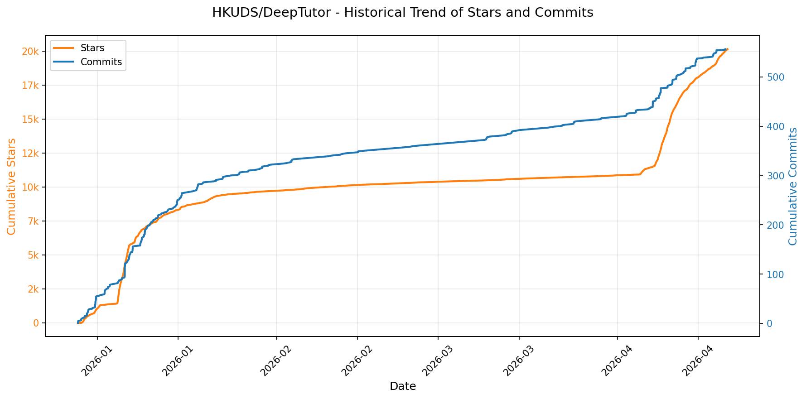

> *蓝色：累计 Stars｜橙色：累计 Commits（次 Y 轴）*

<b>📄 README 摘要</b>

1. **项目功能**  
DeepTutor 是一个面向教育场景的**代理原生（Agent-Native）个性化智能辅导系统**，旨在构建真正自适应、持续演化的AI导师。它不局限于单轮问答或静态知识检索，而是通过多智能体协同架构，为用户提供贯穿学习全周期的深度支持：从实时对话答疑、多步推理求解（Deep Solve）、交互式知识可视化（Visualize）、动态测验生成（Quiz），到结构化知识整合（Book Engine）、自主演进的持久化AI导师（TutorBot），以及基于个人知识库的精准RAG增强学习。其核心目标是将用户的学习材料、历史行为与认知特征转化为可积累、可复用、可进化的“学习数字孪生”。

2. **关键特性**  
- **统一聊天工作区**：六大能力（Chat / Deep Solve / Quiz / Research / Math Animator / Visualize）共享同一上下文线程，支持无缝模式切换与上下文继承；  
- **AI协作者（Co-Writer）**：多文档Markdown协同编辑环境，支持选中文本调用AI进行重写、扩展、摘要，并自动反哺知识库；  
- **活体教材引擎（Book Engine）**：多智能体驱动的“活书”编译系统，支持14种内容模块（含测验、时间轴、概念图、交互Demo等），自动构建结构化、可交互的学习资源；  
- **知识中枢（Knowledge Hub）**：支持PDF/DOCX/XLSX/PPTX/Markdown/文本等多格式上传，提供拖拽式知识库管理、颜色编码笔记本、问题银行（Question Bank）及可编程“技能”（Skills）系统；  
- **持久化记忆（Persistent Memory）**：跨会话、跨功能、跨TutorBot的统一用户画像，持续记录学习轨迹、偏好、薄弱点与成长路径；  
- **自主导师代理（TutorBots）**：每个TutorBot为独立运行的自治AI导师，具备专属记忆、人格设定、技能集与生命周期（支持提醒、自我升级），基于开源nanobot框架构建；  
- **代理原生CLI接口**：所有功能（知识库、会话、TutorBot、技能）均支持命令行直接调用，输出兼顾人类可读性与机器可解析性（JSON），支持AI代理自动化集成。

3. **技术栈**  
- **后端**：Python 3.11+，基于FastAPI构建高性能API服务；深度集成20+主流LLM提供商（OpenAI、Anthropic、DeepSeek、Gemini、Ollama、vLLM、LM Studio、llama.cpp等）及Embedding提供商（OpenAI、Cohere、Jina、Ollama等）；采用模块化插件架构（Tools + Capabilities），支持RAG、文档解析（Docling、MinerU）、搜索（Serper、Brave、SearXNG）等扩展能力；  
- **前端**：Next.js 16（React 19）构建现代化Web UI，支持服务端渲染（SSR）与响应式设计；内置多主题（Snow/Glass）、右侧面板文件预览（PDF/图片/SVG/代码/Office）、WebSocket实时通信、Math Animator（LaTeX+Manim）、Chart.js/SVG可视化等；  
- **基础设施与部署**：支持本地开发（conda/virtualenv + npm）、一键式Setup Tour引导安装、Docker容器化（amd64/arm64双架构镜像）、GitHub Container Registry托管；配置高度可扩展，通过`.env`和`agents.yaml`实现LLM/Embedding/搜索/Agent行为的细粒度控制；  
- **协议与许可**：Apache License 2.0 开源协议，支持企业级商用与二次开发。

---

### 19. [shiyu-coder/Kronos](https://github.com/shiyu-coder/Kronos)
- 📅 **创建日期**：2025-07-01  
- 🔄 **最近更新**：2026-04-27  
- ⭐ **Stars**：21,709（日 +181｜周 +2068｜月 +10424）  
- 📝 **描述**：Kronos: A Foundation Model for the Language of Financial Markets  

<b>📈 Star 与 Commit 历史趋势</b>

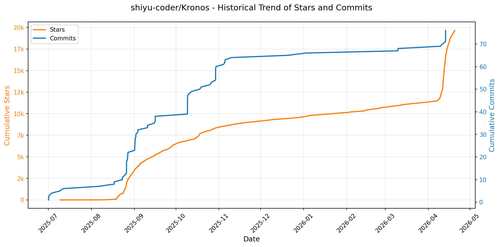

> *蓝色：累计 Stars｜橙色：累计 Commits（次 Y 轴）*

<b>📄 README 摘要</b>

1. **项目功能**  
Kronos 是首个面向金融K线（蜡烛图）数据的开源基础模型，专为理解与建模金融市场的“语言”而设计。它将多维、高噪声的OHLCV（开盘价、最高价、最低价、收盘价、成交量、成交额）时序数据视为一种特殊语言，通过预训练实现对金融K线序列的通用建模能力，支持多种量化任务，核心应用场景包括：**高精度多步金融时序预测**（如BTC/USDT未来24小时价格走势）、**跨资产泛化推理**，以及作为下游任务（如信号生成、策略回测）的统一基础模型。

2. **关键特性**  
- **首创金融K线专用分词器（Tokenizer）**：提出两阶段框架——先将连续OHLCV数据量化为**分层离散令牌**（hierarchical discrete tokens），有效缓解金融数据高噪声、非平稳性带来的建模难题；  
- **轻量至中等规模模型族**：提供 `Kronos-mini`（4.1M参数）、`small`（24.7M）、`base`（102.3M）三款完全开源模型，兼顾推理效率与性能，均支持Hugging Face一键加载；  
- **开箱即用的预测接口**：内置 `KronosPredictor` 类，自动完成数据归一化、令牌编码、模型推理、逆变换全流程，仅需数行代码即可生成完整OHLCV预测；  
- **高效批量预测支持**：`predict_batch` 方法支持多资产/多周期并行预测，GPU加速且各序列独立归一化，适用于实盘多标的实时推断；  
- **端到端微调流水线**：提供基于Qlib的A股市场微调示例，覆盖数据准备→分词器微调→预测器微调→回测评估全链路，并附带可运行的代码与可视化结果；  
- **生产就绪增强设计**：强调从Demo到实盘的关键考量，包括信号后处理（风险因子中性化）、交易成本建模、动态仓位管理等工业级实践指南。

3. **技术栈**  
- **模型架构**：Decoder-only 自回归Transformer（类似LLaMA/GPT风格），无编码器，专注因果序列建模；  
- **核心框架**：PyTorch 2.x + Hugging Face Transformers 生态（自定义 `PreTrainedModel` / `PreTrainedTokenizer` 接口）；  
- **训练与部署**：支持 `torchrun` 多GPU分布式训练；依赖 `pandas` 进行时序数据处理，`matplotlib`/`seaborn` 可视化；  
- **数据生态集成**：深度适配微软 `Qlib` 量化研究平台，支持其标准数据集格式与回测引擎；  
- **工程基础设施**：CI/CD友好（GitHub Actions兼容）、Hugging Face Hub模型托管、Comet.ml实验追踪（可选）、MIT许可证开源。

---

### 20. [coleam00/Archon](https://github.com/coleam00/Archon)
- 📅 **创建日期**：2025-02-07  
- 🔄 **最近更新**：2026-04-27  
- ⭐ **Stars**：19,852（日 +96｜周 +885｜月 +6114）  
- 📝 **描述**：The first open-source harness builder for AI coding. Make AI coding deterministic and repeatable.  

<b>📈 Star 与 Commit 历史趋势</b>

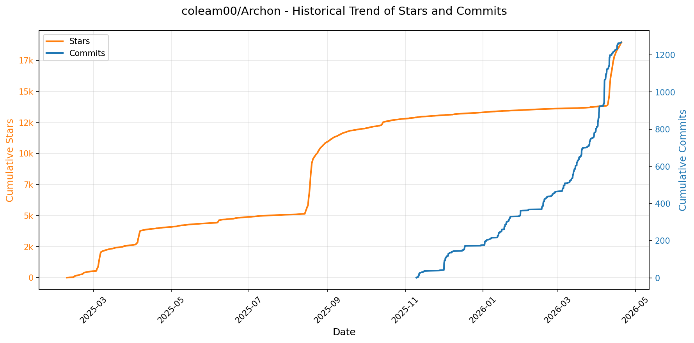

> *蓝色：累计 Stars｜橙色：累计 Commits（次 Y 轴）*

<b>📄 README 摘要</b>

1. **该项目做什么？**  
Archon 是首个开源的 AI 编程“测试夹具（harness）构建器”，旨在将 AI 辅助软件开发过程**确定化（deterministic）与可重复化（repeatable）**。它本质上是一个面向 AI 编程代理（AI coding agents）的工作流引擎：用户通过 YAML 文件定义结构化的开发流程（如需求分析、计划制定、代码实现、自动化验证、人工审核、PR 创建等），Archon 负责可靠地执行该流程——在隔离的 Git 工作树中按序调度节点，混合调用确定性操作（如 Bash 脚本、测试命令、Git 操作）和 AI 驱动操作（如规划、生成、审查），最终交付可审计、可复现的 PR 或修复结果。

2. **核心特性**  
- **确定性流程控制**：强制执行预定义的阶段顺序（Plan → Implement → Validate → Review → PR），消除 AI 行为随机性导致的遗漏或跳步；  
- **完全隔离执行**：每个工作流运行独占一个 Git worktree 和分支，支持多任务并行且零冲突；  
- **人机协同门控**：原生支持交互式人工审批节点（`interactive: true`），在关键环节暂停等待用户反馈；  
- **混合执行模型（Composable）**：自由组合 AI 节点（LLM 调用）与非 AI 节点（shell 命令、测试、Git 操作），AI 仅在必要环节介入；  
- **全平台统一工作流**：同一 YAML 流程可在 CLI、Web UI、Slack、Telegram、GitHub Webhook 等任意平台触发并保持行为一致；  
- **开箱即用的 17 种标准工作流**：覆盖 GitHub Issue 修复、功能开发、PR 全面审查、冲突解决、架构优化、安全重构等典型场景；  
- **可视化与可观测性**：内置 Web 仪表盘，提供实时聊天、工作流 DAG 编辑器、多平台统一监控中心（CLI/Slack/GitHub 等事件聚合展示）；  
- **可扩展性与可定制性**：支持用户自定义 YAML 工作流与 Markdown 命令，本地文件自动覆盖默认配置，提交至仓库即可团队共享。

3. **技术栈**  
- **主语言与运行时**：TypeScript + Bun（作为首选 JavaScript 运行时，用于 CLI、Web UI 及后端服务）；  
- **AI 助手集成**：深度集成 Claude Code（官方 CLI），同时支持 Codex 与 Pi 等其他 AI 助手（通过插件化客户端）；  
- **持久化层**：SQLite（默认轻量级嵌入式）或 PostgreSQL（生产环境可选），存储代码库元数据、会话、工作流运行记录、消息及事件等共 7 张表；  
- **架构模式**：分层微内核设计 —— 平台适配器层（Web/CLI/Slack/Telegram/GitHub）→ 统一调度中枢（Orchestrator）→ 三大执行引擎（命令处理器、YAML 工作流执行器、AI 助手客户端）→ 数据持久化层；  
- **部署支持**：提供 Docker 镜像（预装 Claude Code）、VPS 手动部署指南及生产级配置文档；  
- **前端框架**：基于 Bun 的现代 Web 应用（`bun run dev` 启动），含拖拽式工作流编辑器与实时流式响应界面；  
- **基础设施类比**：设计理念对标 Dockerfile（基础设施即代码）与 GitHub Actions（CI/CD 即代码），实现“AI 编程工作流即代码（AI Coding Workflow as Code）”。

---

### 21. [HKUDS/RAG-Anything](https://github.com/HKUDS/RAG-Anything)
- 📅 **创建日期**：2025-06-06  
- 🔄 **最近更新**：2026-04-27  
- ⭐ **Stars**：18,820（日 +141｜周 +2558｜月 +4204）  
- 📝 **描述**："RAG-Anything: All-in-One RAG Framework"  

<b>📈 Star 与 Commit 历史趋势</b>

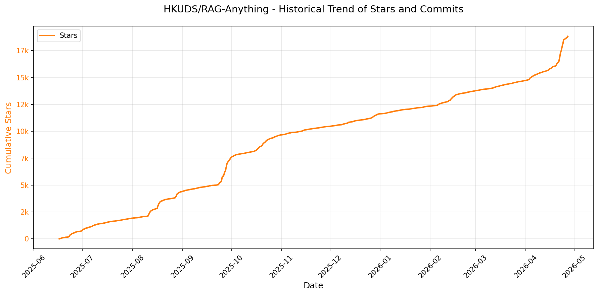

> *蓝色：累计 Stars｜橙色：累计 Commits（次 Y 轴）*

<b>📄 README 摘要</b>

1. **该项目的功能**  
RAG-Anything 是一个面向真实世界复杂文档的**全模态（multimodal）端到端检索增强生成（RAG）框架**，专为处理混合内容文档而设计。它能统一解析、理解并检索包含**文本、图像、表格、数学公式、图表、LaTeX 表达式等异构元素**的现代文档（如学术论文、技术报告、财务报表、PDF/Office 文件等），彻底摆脱传统纯文本 RAG 对非文本内容的忽略或粗粒度处理。其核心目标是：在单一系统中实现“**一份文档、一种流程、全模态问答**”，无需用户组合多个专用工具即可完成从文档摄入到跨模态智能检索与生成的完整闭环。

2. **关键特性**  
- ✅ **全模态端到端流水线**：覆盖文档解析 → 多模态内容分析 → 跨模态知识图谱构建 → 模态感知智能检索的全流程；  
- ✅ **通用文档兼容性**：原生支持 PDF、DOCX/PPTX/XLSX、BMP/TIFF/GIF/WebP、TXT、MD 等格式，依赖 LibreOffice 和 MinerU 实现高保真结构还原；  
- ✅ **模态专用分析引擎**：集成视觉分析器（VLM 驱动图像理解与空间关系建模）、结构化数据解释器（表格语义解析与趋势识别）、数学表达式解析器（高精度 LaTeX 公式识别与领域知识映射）；  
- ✅ **多模态知识图谱索引**：自动抽取文本与非文本实体，建立跨模态语义关系（如“图3 描述了 表2 中的趋势”），保留原始文档层级结构与加权关联强度；  
- ✅ **自适应处理模式**：支持 MinerU 高精度解析、直接注入预解析内容列表（Content List）、VLM 增强查询（当问题涉及图像时，自动调用多模态大模型联合分析图文上下文）；  
- ✅ **混合检索机制**：融合向量相似度搜索与知识图谱遍历，支持模态感知排序（例如优先返回与查询图像语义最相关的图表+对应文字描述），保障结果的结构性与上下文连贯性。

3. **技术栈**  
- **编程语言**：Python 3.10+；  
- **核心依赖**：基于 [LightRAG](https://github.com/HKUDS/LightRAG) 构建，深度集成 [MinerU](https://github.com/opendatalab/MinerU)（用于高保真文档结构解析）；  
- **多模态能力支撑**：调用 OpenAI GPT-4o / GPT-4o-mini 等多模态大模型（VLM）执行图像理解、图文联合推理；支持自定义 LLM/VLM 接口（如 `openai_complete_if_cache`, `openai_embed`）；  
- **格式处理组件**：LibreOffice（Office 文档转换）、Pillow（图像格式支持）、ReportLab（文本/PDF 渲染）、OpenCV（可选图像预处理）；  
- **工程与部署**：支持 `uv`（超快 Python 包管理器）一键环境同步；提供 PyPI 包 `raganything`（含 `[image]`、`[text]`、`[all]` 可选依赖）；模块化架构支持插件式扩展新模态处理器；  
- **知识表示**：采用多模态增强的知识图谱（KG）作为核心索引结构，结合嵌入向量与图关系实现混合检索。

---

### 22. [google-research/timesfm](https://github.com/google-research/timesfm)
- 📅 **创建日期**：2024-04-29  
- 🔄 **最近更新**：2026-04-27  
- ⭐ **Stars**：18,737（日 +95｜周 +521｜月 +8604）  
- 📝 **描述**：TimesFM (Time Series Foundation Model) is a pretrained time-series foundation model developed by Google Research for time-series forecasting.  

<b>📈 Star 与 Commit 历史趋势</b>

> *蓝色：累计 Stars｜橙色：累计 Commits（次 Y 轴）*

<b>📄 README 摘要</b>

1. **项目功能**  
TimesFM 是一个由 Google Research 开发的、面向时间序列预测任务的预训练基础模型（Foundation Model），专为通用、高精度、长时序预测而设计。它支持零样本（zero-shot）跨领域预测，无需针对特定数据集进行完整微调即可直接部署；同时支持带协变量（XReg）的条件预测、连续分位数预测（最高支持 1000 步）、超长上下文建模（最大 16k 长度），并已集成至 Google 旗下多个第一方产品（如 BigQuery ML、Google Sheets、Vertex AI Model Garden），提供企业级可扩展性与生产就绪能力。

2. **核心特性**  
- ✅ **Decoder-only 架构**：纯解码器结构，简化建模并提升推理效率；  
- ✅ **多版本演进与轻量化**：TimesFM 2.5 版本参数量降至 200M（原 2.0 为 500M），兼顾性能与部署成本；  
- ✅ **超长上下文支持**：最大上下文长度达 16,000，显著优于前代（2048）；  
- ✅ **连续分位数预测能力**：通过可选的 30M 参数分位数头，支持任意步长（最高 1k）的细粒度概率预测（如 10th–90th 分位数）；  
- ✅ **协变量（XReg）支持**：自 2025 年 10 月起恢复并强化对外部变量（如节假日、价格、天气等）的联合建模能力；  
- ✅ **多后端与多范式支持**：提供 PyTorch 和 Flax/JAX 双实现，支持编译加速（`model.compile`）、LoRA 微调（Hugging Face + PEFT）、Agent 技能封装（SKILL.md / AGENTS.md）；  
- ✅ **开箱即用的工程化能力**：内置标准化预处理（输入归一化）、翻转不变性（flip invariance）、正数约束（`infer_is_positive`）、分位数交叉修复（`fix_quantile_crossing`）等鲁棒性机制；  
- ✅ **完整开发支持**：含单元测试、详尽文档、端到端示例（含 fine-tuning、agent 调用、协变量使用）及社区驱动的持续优化。

3. **技术栈**  
- **核心框架**：PyTorch（默认）、Flax/JAX（高性能推理与 TPU 支持）；  
- **微调工具链**：Hugging Face Transformers + PEFT（LoRA 适配器微调）；  
- **依赖管理与环境**：`uv`（极速 Python 包管理器），支持 `pip install -e .[torch/flax/xreg]` 模块化安装；  
- **硬件后端**：全面兼容 CPU / NVIDIA GPU / Google TPU / Apple Silicon（需分别安装 PyTorch 或 JAX）；  
- **部署与集成**：Dockerized 接口（Vertex AI）、SQL 接口（BigQuery ML）、低代码界面（Google Sheets）、Agent 可调用技能（基于 SKILL/AGENTS 规范）；  
- **模型分发**：托管于 Hugging Face Hub（`google/timesfm-2.5-200m-pytorch` 等），遵循标准 `from_pretrained` 加载协议。

---

### 23. [multica-ai/multica](https://github.com/multica-ai/multica)
- 📅 **创建日期**：2026-01-13  
- 🔄 **最近更新**：2026-04-27  
- ⭐ **Stars**：18,001（日 +447｜周 +4647｜月 +18001）  
- 📝 **描述**：The open-source managed agents platform. Turn coding agents into real teammates — assign tasks, track progress, compound skills.  

<b>📈 Star 与 Commit 历史趋势</b>

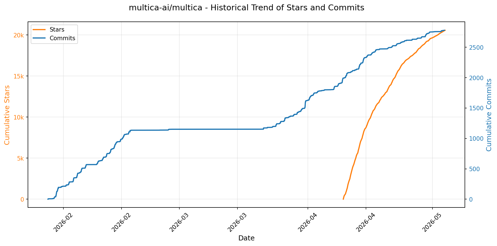

> *蓝色：累计 Stars｜橙色：累计 Commits（次 Y 轴）*

<b>📄 README 摘要</b>

1. **该项目做什么？**  
Multica 是一个开源的、可自主托管的「AI 编程代理（coding agents）管理平台」，旨在将 AI 代理真正转化为开发团队中的“虚拟成员”。它使团队能够像分配任务给人类同事一样，向 AI 代理指派 GitHub 风格的 Issue；代理可自主认领任务、编写代码、实时上报进度与阻塞问题、参与讨论并提交反馈。其核心目标是构建人机协同的工作流基础设施——让 AI 代理具备身份（Profile）、可见性（看板呈现）、协作能力（评论/建 Issue）和持续进化能力（技能复用），从而替代传统“手动调提示词+人工盯执行”的低效模式。

2. **关键特性**  
- **代理即队友（Agents as Teammates）**：每个代理拥有独立身份，在项目看板中具名出现，支持 Assignee 分配、主动评论、创建子 Issue、自动报告 Blockers；  
- **全生命周期自主执行**：覆盖任务入队（enqueue）、认领（claim）、启动（start）、完成/失败（complete/fail）全流程，通过 WebSocket 实时流式推送执行状态；  
- **可复用技能系统（Reusable Skills）**：每次成功解决的问题自动沉淀为结构化技能（如“升级 React 版本”“修复 ESLint 配置”），供全团队检索、复用与组合，实现能力复利增长；  
- **统一运行时管理（Unified Runtimes）**：集中纳管本地机器（通过后台 Daemon）与云环境等异构计算资源，自动探测并注册已安装的代理 CLI（如 `claude`、`codex`、`gemini`、`cursor-agent` 等），支持按能力动态路由任务；  
- **多工作区隔离（Multi-Workspace）**：支持按团队/项目划分独立工作区，各工作区拥有专属代理、Issue、权限与配置，保障数据与策略隔离。

3. **技术栈**  
- **前端**：Next.js 16（App Router），TypeScript，Tailwind CSS；  
- **后端**：Go 语言（基于 Chi 路由器、sqlc 生成数据库层、gorilla/websocket 实现实时通信）；  
- **数据库**：PostgreSQL 17 + pgvector（支持向量检索，用于技能语义搜索与推荐）；  
- **代理运行时**：本地轻量级 Go Daemon，兼容多种主流开源/商业编程代理 CLI，包括 Claude Code、Codex、OpenClaw、OpenCode、Hermes、Gemini、Pi 和 Cursor Agent；  
- **部署与开发**：Docker 容器化（自托管场景）、pnpm 包管理、Makefile 自动化开发流程（`make dev` 一键启动全栈服务）。

---

### 24. [Yeachan-Heo/oh-my-codex](https://github.com/Yeachan-Heo/oh-my-codex)
- 📅 **创建日期**：2026-02-02  
- 🔄 **最近更新**：2026-04-27  
- ⭐ **Stars**：16,946（日 +100｜周 +100｜月 +14243）  
- 📝 **描述**：OmX - Oh My codeX: Your codex is not alone. Add hooks, agent teams, HUDs, and so much more.  

<b>📈 Star 与 Commit 历史趋势</b>

> *蓝色：累计 Stars｜橙色：累计 Commits（次 Y 轴）*

<b>📄 README 摘要</b>

1. **项目功能**  
oh-my-codex（OMX）是一个专为 [OpenAI Codex CLI](https://github.com/openai/codex) 设计的**轻量级、可扩展的工作流增强层**，不替代 Codex，而是围绕其构建更强大、一致且可持续的工程化使用体验。它通过标准化提示（prompts）、预置技能（skills）、角色化指令（如 `$deep-interview`、`$ralplan`、`$ralph`、`$team`）以及持久化项目状态（存储于 `.omx/` 目录），显著提升开发者在复杂任务中从需求澄清→方案设计→协同执行→持续完成的全流程效率与可靠性。

2. **核心特性**  
- ✅ **标准化四步工作流**：支持 `\$deep-interview`（深度需求澄清）、`\$ralplan`（方案评审与权衡决策）、`\$ralph`（单主体持久化执行闭环）、`\$team`（基于 tmux 的并行协作执行）；  
- ✅ **项目上下文管理**：自动维护 `.omx/` 目录，持久化存储计划（plans）、日志（logs）、记忆（memory）、模式状态（mode tracking）及 `AGENTS.md` 项目指导文档；  
- ✅ **技能与角色即服务**：内置可复用技能集（如面试引导、规划生成、团队调度），并通过 `$` 前缀指令统一调用，降低认知负荷；  
- ✅ **原生 Codex 深度集成**：通过 `.codex/hooks.json` 注入原生钩子（hooks），无缝接管 Codex 生命周期，同时兼容 Codex 插件市场（含 `plugins/oh-my-codex` 官方插件包）；  
- ✅ **运行时可观测性与诊断能力**：提供 `omx doctor`（安装健康检查）、`omx exec`（真实模型调用冒烟测试）、`omx hud --watch`（实时状态监控）、`omx team status/resume/shutdown`（团队会话生命周期管理）等运维支持能力；  
- ✅ **本地知识库支持（Wiki）**：`.omx/wiki/` 提供 Markdown 优先、搜索驱动的本地知识库 CLI 接口（`omx wiki`），支持查询、校验与刷新；  
- ✅ **探索与验证辅助工具**：`omx explore`（代码库语义检索）、`omx sparkshell`（安全沙箱内 Shell 命令执行与输出捕获），强化开发调试能力；  
- ⚠️ **平台适配聚焦**：官方主推 macOS/Linux + Codex CLI + tmux 组合；Windows 原生支持为次要路径（依赖 `psmux`），WSL2 被推荐为 Windows 用户首选方案。

3. **技术栈**  
- **运行时环境**：Node.js ≥ 20（必需）；  
- **核心依赖**：OpenAI Codex CLI（`@openai/codex`，全局安装）；  
- **终端协同**：`tmux`（macOS/Linux 默认）、`psmux`（Windows 原生可选）；  
- **配置与扩展机制**：  
  - Codex 原生配置：`~/.codex/config.toml`（支持自定义 `openai_base_url` 等）；  
  - 钩子系统：`.codex/hooks.json`（Codex 原生钩子注册点） + `.omx/hooks/*.mjs`（OMX 插件钩子）；  
- **本地存储格式**：纯文本/Markdown（`.omx/` 下 plans、logs、wiki、AGENTS.md 等）；  
- **CLI 实现语言**：JavaScript/TypeScript（基于 Node.js 构建，通过 npm 全局分发）；  
- **插件生态**：符合 Codex 插件规范，含 marketplace 元数据（`marketplace.json`），支持 MCP（Model Context Protocol）服务器与应用集成；  
- **许可证**：MIT 开源协议。

---

### 25. [Fincept-Corporation/FinceptTerminal](https://github.com/Fincept-Corporation/FinceptTerminal)
- 📅 **创建日期**：2024-08-29  
- 🔄 **最近更新**：2026-04-27  
- ⭐ **Stars**：15,583（日 +552｜周 +8290｜月 +12736）  
- 📝 **描述**：FinceptTerminal is a modern finance application offering advanced market analytics, investment research, and economic data tools, designed for interactive exploration and data-driven decision-making in a user-friendly environment.  

<b>📈 Star 与 Commit 历史趋势</b>

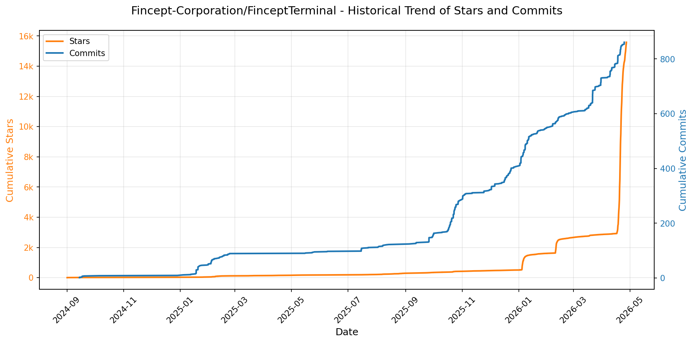

> *蓝色：累计 Stars｜橙色：累计 Commits（次 Y 轴）*

<b>📄 README 摘要</b>

1. **项目功能**  
Fincept Terminal 是一个面向专业金融分析与交易的开源桌面终端平台，旨在提供媲美彭博（Bloomberg）级别的原生性能与深度分析能力。它集成了实时行情、多市场交易执行（股票、加密货币、衍生品）、AI驱动的研究辅助、量化建模、全球宏观与地缘政治情报分析等功能，支持从个人投资者到机构用户的全场景金融决策需求，核心目标是打破数据孤岛与分析工具局限，实现“数据无边界、思考无上限”。

2. **关键特性**  
- **CFA级分析引擎**：内置DCF估值、投资组合优化、VaR/Sharpe等风险指标、期权与固收衍生品定价等完整财务建模能力；  
- **37+ AI智能体系统**：覆盖价值投资（巴菲特、格雷厄姆等）、宏观经济、地缘政治等框架，支持本地及多云端大模型（OpenAI、Anthropic、Gemini、Ollama等）；  
- **超100个数据连接器**：涵盖主流金融数据源（Polygon、Yahoo Finance、Kraken）、权威宏观数据库（FRED、IMF、世界银行、DBnomics）、中国本土数据（AkShare）及可选替代数据（Adanos零售情绪分析）；  
- **实盘与算法交易支持**：集成16家券商（Zerodha、Upstox、IBKR、Alpaca等），支持WebSocket实时行情、纸币交易、多账户管理及高频策略回测；  
- **QuantLib量化套件**：提供18个模块，覆盖随机过程、波动率建模、固定收益、信用风险等专业量化分析；  
- **可视化工作流（Node Editor）**：通过拖拽式节点编辑器构建自动化分析流水线，兼容MCP（Model Context Protocol）协议；  
- **AI量化实验室（AI Quant Lab）**：支持机器学习因子挖掘、强化学习交易策略、HFT低延迟开发等前沿研究；  
- **全球智能情报**：整合海运追踪、卫星图像、实体关系图谱与地缘事件推演能力。

3. **技术栈**  
- **核心语言与运行时**：纯 C++20 编写，零依赖外部运行时，确保极致性能与单二进制分发；  
- **GUI与渲染框架**：Qt 6.8.3（跨平台原生UI，支持Windows/macOS/Linux）；  
- **分析与AI层**：嵌入式 Python 3.11.9，用于承载全部金融计算、ML模型与AI Agent逻辑；  
- **构建系统**：CMake 3.27.7 + Ninja 1.11.1，采用预设（Presets）标准化跨平台构建流程；  
- **编译器要求**：MSVC 19.38（VS 2022 17.8）、GCC 12.3 或 Apple Clang 15.0（Xcode 15.2），严格遵循C++20标准；  
- **部署形态**：单文件原生可执行程序（无Electron/WebView/Node.js），不依赖浏览器引擎或JavaScript打包器；  
- **许可协议**：AGPL-3.0 开源许可（含源码透明与修改共享义务），另提供商业授权以支持企业级API与数据服务。

---

### 26. [trycua/cua](https://github.com/trycua/cua)
- 📅 **创建日期**：2025-01-31  
- 🔄 **最近更新**：2026-04-27  
- ⭐ **Stars**：14,514（日 +336｜周 +1029｜月 +1283）  
- 📝 **描述**：Open-source infrastructure for Computer-Use Agents. Sandboxes, SDKs, and benchmarks to train and evaluate AI agents that can control full desktops (macOS, Linux, Windows).  

<b>📈 Star 与 Commit 历史趋势</b>

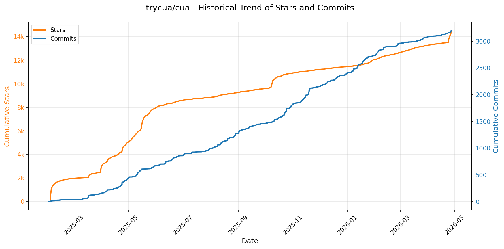

> *蓝色：累计 Stars｜橙色：累计 Commits（次 Y 轴）*

<b>📄 README 摘要</b>

1. **项目功能**  
Cua 是一个面向“计算机操作型智能体”（computer-use agents）的开源平台，旨在支持 AI 代理在真实操作系统环境中执行端到端的 GUI 自动化、代码执行与多模态交互任务。其核心目标是构建可复现、可评测、可部署的代理系统，使 AI 能像人类一样使用电脑——包括点击界面、输入文本、截图分析、操控原生应用（如 Figma、Blender、Chrome）、运行命令行、模拟触摸/鼠标/键盘事件，甚至在 macOS 背景中无感驱动非可访问性（non-AX）应用。项目覆盖从底层虚拟化（Lume）、沙箱运行时（Cua Sandbox）、代理开发框架（Cua Agent）、交互式协作工具（CuaBot），到标准化评测基准（Cua-Bench）的全栈能力。

2. **关键特性**  
- **跨平台沙箱统一 API**：支持 Linux 容器/VM、macOS、Windows、Android 及自定义镜像（BYOI），云（cua.ai）与本地（QEMU/Virtualization.Framework）双模式运行；  
- **macOS 后台无感驱动（Cua Driver）**：独家实现不抢占光标、不切换 Space、不中断用户操作的前提下，驱动 Chromium 渲染页、Canvas 应用（Figma/DAW/游戏引擎）等传统自动化难以覆盖的场景，并完整录制可回放的操作轨迹；  
- **开箱即用的协作代理终端（CuaBot）**：为 Claude Code、OpenClaw 等编码代理提供原生桌面级沙箱窗口（H.265 流、共享剪贴板、音频），支持一键启动 GUI 工具（如 Chromium）并执行截图、点击、打字等原子操作；  
- **标准化评测体系（Cua-Bench）**：集成 OSWorld、ScreenSpot、Windows Arena 等主流基准，支持自定义任务、并行压测、轨迹导出用于强化学习训练；  
- **Apple Silicon 原生虚拟化（Lume）**：基于 Apple Virtualization.Framework 构建高性能 macOS/Linux 虚拟机管理工具，支持快速拉取与启动官方 macOS 镜像（如 Sequoia）；  
- **模块化设计与生产就绪**：所有组件（cuabot/cua-agent/cua-sandbox/lume/cua-bench）均独立发布、文档完备、CLI 友好，并提供 MCP（Model Context Protocol）服务兼容性，适配 Claude Code 等主流开发环境。

3. **技术栈**  
- **语言与运行时**：Python 3.11+（核心 SDK 与 CLI）、Bash（安装脚本与驱动）、Rust（部分高性能组件如图形捕获/注入，虽未明示但由架构推断）、TypeScript（CuaBot 前端/CLI 交互层）；  
- **虚拟化与容器**：Apple Virtualization.Framework（Lume/macOS VM）、QEMU/KVM（Linux/Windows/Android 本地 VM）、Docker（Linux 容器沙箱）、Kasm（Web 沙箱底层，MIT 许可）；  
- **UI 自动化与感知**：自研 macOS AX/Quartz Event Tap 与私有 API 封装（Cua Driver）、OmniParser（多模态屏幕理解，CC-BY-4.0）、Ultralytics YOLO（可选视觉模型，AGPL-3.0）；  
- **通信与协议**：MCP（Model Context Protocol）标准接口、WebSocket/H.265 流媒体（CuaBot）、REST/gRPC 风格沙箱控制 API；  
- **基础设施与部署**：GitHub Actions CI/CD、uv（Python 包管理）、Shields.io 状态徽章、Starchart 仓库趋势监控；  
- **许可证与合规**：主项目 MIT 协议，集成第三方组件遵循各自许可（如 OmniParser CC-BY-4.0、Ultralytics AGPL-3.0）。

---

### 27. [Alishahryar1/free-claude-code](https://github.com/Alishahryar1/free-claude-code)
- 📅 **创建日期**：2026-01-28  
- 🔄 **最近更新**：2026-04-27  
- ⭐ **Stars**：13,614（日 +1827｜周 +11636｜月 +12449）  
- 📝 **描述**：Use claude-code for free in the terminal, VSCode extension or via discord like openclaw  

<b>📈 Star 与 Commit 历史趋势</b>

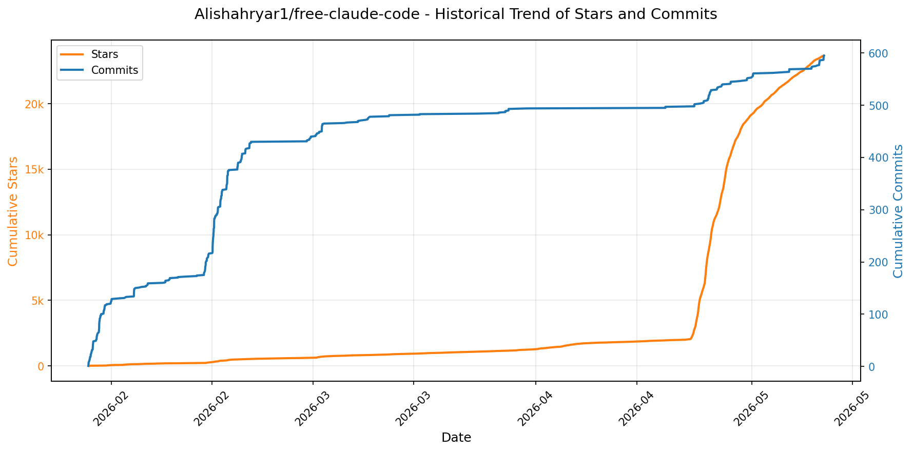

> *蓝色：累计 Stars｜橙色：累计 Commits（次 Y 轴）*

<b>📄 README 摘要</b>

1. **项目功能**  
该项目是一个轻量级、开源的**Anthropic API 代理服务器**，旨在让开发者无需 Anthropic 官方 API 密钥，即可免费使用 Claude Code CLI 和 VSCode 扩展。它通过拦截并重定向标准 Anthropic 格式（如 `/v1/messages`）的请求，将流量路由至多个替代 LLM 后端服务，实现对 Claude 模型（Opus/Sonnet/Haiku）的“语义兼容”调用，完全透明且无需修改原始客户端代码。

2. **核心特性**  
- ✅ **零成本接入**：支持 NVIDIA NIM（40 请求/分钟免费）、OpenRouter（数百种免费/付费模型）、DeepSeek（原生 Anthropic 兼容接口），以及全本地方案（LM Studio / llama.cpp / Ollama），无 API 密钥依赖；  
- ✅ **开箱即用的无缝替换**：仅需设置 `ANTHROPIC_BASE_URL` 和可选 `ANTHROPIC_AUTH_TOKEN` 两个环境变量，Claude Code CLI 或 VSCode 插件即可直接工作；  
- ✅ **精细化模型路由与混合调度**：支持为 Opus/Sonnet/Haiku 分别指定不同提供商与模型（如 Opus → NVIDIA NIM Kimi-K2.5，Sonnet → OpenRouter DeepSeek-R1，Haiku → 本地 Ollama Llama3.1），`MODEL` 作为兜底；  
- ✅ **Claude 原生能力保真**：自动解析 `<think>` 标签和 `reasoning_content` 字段，生成符合 Anthropic 规范的 thinking blocks；支持 heuristic 工具调用文本解析（将自由格式工具输出转为结构化 tool_use）；  
- ✅ **智能请求优化与限流**：本地拦截 5 类低价值请求（如 token 计数、标题生成、路径提取等），节省配额与延迟；内置滚动窗口限速 + 429 自适应退避 + 可配置并发上限；  
- ✅ **多平台远程代理支持**：内置 Discord / Telegram 机器人，支持树状会话线程、语音转文字、实时流式响应、会话持久化及 `/stop`/`/clear`/`/stats` 等管理指令；  
- ✅ **高度可扩展架构**：基于抽象基类 `BaseProvider` 和 `MessagingPlatform` 设计，新增后端或消息平台仅需实现约定接口，无需侵入核心逻辑。

3. **技术栈**  
- **语言与运行时**：Python 3.14（明确要求），采用现代 Python 生态工具链；  
- **包管理与构建**：`uv`（Astral 开发的超高速 Python 包安装器与虚拟环境工具）；  
- **Web 服务框架**：`uvicorn`（ASGI 服务器，用于启动 FastAPI 风格的代理服务）；  
- **开发质量保障**：  
  - 测试：`pytest`；  
  - 类型检查：`ty`（轻量级类型运行时校验）；  
  - 代码格式：`ruff`（超快 linting 与 auto-format）；  
  - 日志：`loguru`（简洁强大的结构化日志）；  
- **协议与兼容性**：深度适配 Anthropic Messages API 规范（v1），同时桥接 OpenAI Chat Completion 格式（用于 NIM/DeepSeek 等非原生 Anthropic 接口），支持 SSE 流式响应；  
- **部署与集成**：支持 `.env` 配置驱动、`claude-pick` 交互式模型选择（基于 `fzf`）、`uv tool install` 一键全局安装，以及 IntelliJ/VSCode/PowerShell/Bash 多环境集成方案。

---

### 28. [zilliztech/claude-context](https://github.com/zilliztech/claude-context)
- 📅 **创建日期**：2025-06-06  
- 🔄 **最近更新**：2026-04-27  
- ⭐ **Stars**：9,682（日 +250｜周 +3653｜月 +3950）  
- 📝 **描述**：Code search MCP for Claude Code. Make entire codebase the context for any coding agent.  

<b>📈 Star 与 Commit 历史趋势</b>

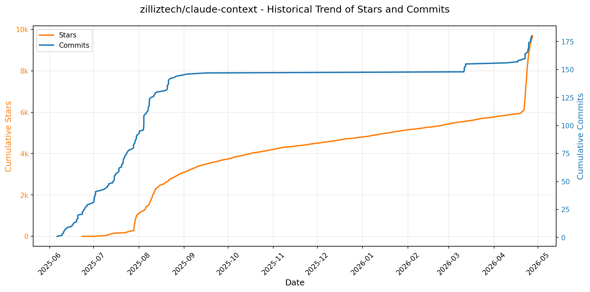

> *蓝色：累计 Stars｜橙色：累计 Commits（次 Y 轴）*

<b>📄 README 摘要</b>

1. **项目功能**  
Claude Context 是一个基于模型上下文协议（MCP）的插件系统，旨在为 Claude Code 及其他 AI 编程助手（如 Cursor、Gemini CLI、Qwen Code、VS Code 等 MCP 兼容客户端）提供**语义化代码搜索能力**。其核心作用是将用户本地或远程的**整个代码库转化为 AI 模型可理解的深度上下文**：通过向量化索引与混合检索（BM25 + 向量相似度），在用户发起自然语言查询（如“查找处理用户认证的函数”）时，精准、即时地召回最相关的代码片段，并自动注入到 AI 的提示上下文中，从而显著提升代码理解、问答与生成的准确性与效率。它解决了传统方式中盲目加载全目录导致的 token 浪费、成本高昂及上下文超限等问题。

2. **关键特性**  
- ✅ **全代码库语义搜索**：支持百万行级代码的毫秒级相关代码检索，无需多轮交互即可直接提供上下文。  
- ✅ **混合检索（Hybrid Search）**：融合 BM25 关键词匹配与稠密向量语义匹配，兼顾准确性与鲁棒性。  
- ✅ **成本优化**：仅将高相关性代码片段送入 LLM 上下文，实测降低约 40% token 消耗，显著节省 API 成本与延迟。  
- ✅ **智能代码切分**：基于抽象语法树（AST）进行语义感知的代码块切分（fallback 到字符级切分），保障函数/类等逻辑单元完整性。  
- ✅ **增量索引（Incremental Indexing）**：利用 Merkle 树识别文件变更，仅重索引修改部分，大幅提升大型项目维护效率。  
- ✅ **多客户端广泛兼容**：原生支持所有主流 MCP 客户端（Claude Code、Cursor、VS Code、Gemini CLI、Qwen Code、Cherry Studio、Roo Code 等），配置方式标准化。  
- ✅ **高度可定制**：支持灵活配置文件包含/排除规则、多种嵌入模型（OpenAI、VoyageAI、Ollama、Gemini）、多语言（TS/JS/Python/Java/Rust 等 14+ 种）及向量数据库（Zilliz Cloud / Milvus）。  
- ✅ **开箱即用工具集**：提供 `index_codebase`、`search_code`、`clear_index`、`get_indexing_status` 四大 MCP 工具，覆盖完整工作流。

3. **技术栈**  
- **核心协议**：Model Context Protocol（MCP）v0.4+（标准 STDIO 通信）  
- **运行时**：Node.js 20.x–22.x（明确不兼容 Node.js 24+）  
- **前端集成**：VS Code 扩展（独立发布）  
- **后端服务**：  
  - `@zilliz/claude-context-mcp`：MCP 服务器实现（TypeScript）  
  - `@zilliz/claude-context-core`：核心引擎（含嵌入、向量库对接、AST 切分、索引管理）  
- **向量数据库**：Zilliz Cloud（托管服务）或 Milvus（开源向量数据库）  
- **嵌入模型提供商**：OpenAI（`text-embedding-3-*`）、VoyageAI（`voyage-code-3`）、Google Gemini、Ollama（本地模型）  
- **代码解析**：AST-based code splitter（主） + LangChain character splitter（fallback）  
- **构建与包管理**：pnpm（推荐）、npm  
- **许可协议**：MIT 开源许可证

---

### 29. [Anil-matcha/Open-Generative-AI](https://github.com/Anil-matcha/Open-Generative-AI)
- 📅 **创建日期**：2023-05-09  
- 🔄 **最近更新**：2026-04-27  
- ⭐ **Stars**：8,873（日 +448｜周 +3582｜月 +6197）  
- 📝 **描述**：Uncensored, open-source alternative to Higgsfield AI, Freepik AI, Krea AI, Openart AI — Free, unrestricted AI image & video generation studio with 200+ models (Flux, Midjourney, Kling, Sora, Veo). No content filters. Self-hosted, MIT licensed.  

<b>📈 Star 与 Commit 历史趋势</b>

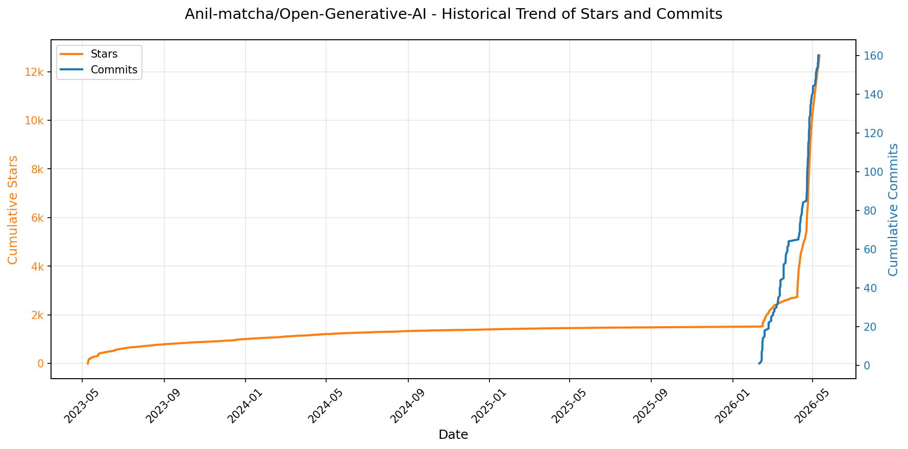

> *蓝色：累计 Stars｜橙色：累计 Commits（次 Y 轴）*

<b>📄 README 摘要</b>

1. **项目功能**  
本项目是一个免费、开源、无内容审查的生成式AI创作平台，旨在替代Higgsfield AI、Freepik AI、Krea AI、Openart AI等闭源商业服务。它提供一体化的多模态AI生成能力，支持**图像生成（文生图/图生图）、视频生成（文生视频/图生视频）、唇形同步（人像/视频+音频驱动说话视频）、电影级摄影控制（Cinema Studio）及可视化工作流编排（Workflow Studio）**。所有功能均无提示词过滤、无输出审查、无订阅费用，支持完全本地化部署与数据自主可控。

2. **核心特性**  
- **全模型覆盖与智能模式切换**：集成200+前沿开源/商用API模型（如Flux、Kling、Sora、Veo、Wan 2.2、Hunyuan、LTX、Seedream、Nano Banana 2、Grok Imagine等），Image/Video/Lip Sync Studio自动根据输入类型（纯文本 or 含参考图/视频/音频）动态切换适配模型集；  
- **多图输入编辑能力**：支持最多14张参考图像输入（如Nano Banana 2 Edit、Flux Kontext Dev I2I等），带顺序标记、批量上传与确认流程；  
- **双引擎本地推理支持（仅桌面端）**：  
  • `sd.cpp`（内置）：Metal/CUDA/Vulkan/ROCm加速，支持SD 1.5/SDXL/Z-Image等图像模型；  
  • `Wan2GP`（自托管服务器）：通过HTTP调用远程PyTorch服务，支持Flux、Qwen-Image及Wan 2.2/Hunyuan/LTX等视频大模型；  
- **专业化工作室模块**：  
  • Lip Sync Studio：9种专用唇动模型，支持人像→说话视频 / 视频→唇同步两种模式；  
  • Cinema Studio：提供镜头焦距、光圈、景深等专业摄影参数控制；  
  • Workflow Studio：节点式可视化AI流水线构建器，支持跨模态模型串联与社区模板复用；  
- **隐私与易用性保障**：上传历史与生成记录本地持久化（浏览器/本地存储）、API密钥仅存于前端、一键安装桌面应用（macOS/Windows/Linux）、免配置在线版（dev.muapi.ai）、完整硬件兼容性说明（含Apple Silicon Metal优化验证方法）。

3. **技术栈**  
- **前端框架**：Electron（桌面端跨平台封装）、React + TypeScript（Web界面）、Tailwind CSS + Glassmorphism设计系统；  
- **后端与API层**：以 [Muapi.ai](https://muapi.ai) 为统一云模型网关，聚合多厂商API；本地推理依赖 `sd.cpp`（C++/Metal/CUDA）与 `Wan2GP`（Python/PyTorch/Gradio）；  
- **模型运行时**：  
  • 图像：Stable Diffusion系列（SD 1.5/SDXL）、Diffusion Transformer（Z-Image、Flux）、Qwen-VL、GPT-4o Vision等；  
  • 视频：Wan 2.2、Hunyuan Video、LTX、Kling、Seedance 2.0、Sora/Veo API、Runway Gen-3等；  
  • 唇同步：Infinite Talk、LTX Lipsync、Sync Lipsync、LatentSync等专用模型；  
- **基础设施**：支持自建Wan2GP服务（需CUDA/ROCm GPU）、AppImage/.deb/MSI安装包、macOS Gatekeeper绕过方案、Ubuntu AppArmor适配方案；  
- **辅助工具链**：配套开源项目包括 `Generative-Media-Skills`（AI编码代理技能库）、`Awesome-HappyHorse-1.0-API-and-Prompt`（Happy Horse视频模型Python SDK）、`Vibe-Workflow`（Weavy/Freepik Spaces替代）、`Open-Poe-AI`（多模态聊天机器人）、`AI-Youtube-Shorts-Generator`（长视频转短视频）。

---

### 30. [hugohe3/ppt-master](https://github.com/hugohe3/ppt-master)
- 📅 **创建日期**：2025-12-10  
- 🔄 **最近更新**：2026-04-27  
- ⭐ **Stars**：8,429（日 +291｜周 +1871｜月 +5331）  
- 📝 **描述**：AI generates natively editable PPTX from any document — real PowerPoint shapes, not images — no design skills needed  

<b>📈 Star 与 Commit 历史趋势</b>

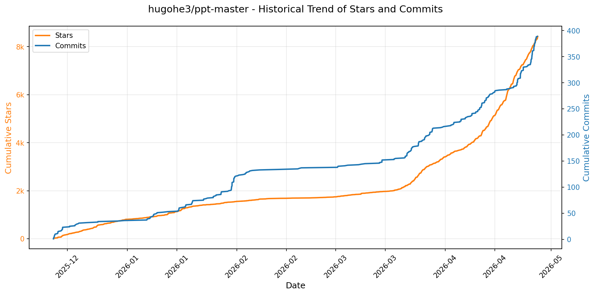

> *蓝色：累计 Stars｜橙色：累计 Commits（次 Y 轴）*

<b>📄 README 摘要</b>

1. **项目功能**  
PPT Master 是一个开源工具，能够将任意格式的输入文档（PDF、DOCX、网页 URL、Markdown 等）通过 AI 协同工作流，**端到端生成真正原生可编辑的 `.pptx` 文件**。其核心目标是解决现有 AI 演示工具输出不可编辑（如导出为图片、HTML 或仅含基础文本框）的根本缺陷——所有生成内容均基于 PowerPoint 原生 DrawingML 对象：每个形状、文本框、图表均为真实 Office 元素，支持在 Microsoft PowerPoint 中直接点击、修改字体/颜色/位置/内容，无缝融入正式汇报、投资材料、产品发布等专业工作流。

2. **关键特性**  
- ✅ **真·可编辑 PPTX 输出**：非截图、非 SVG 渲染图、非网页包装，而是符合 ECMA-376 标准的原生 PowerPoint 文件，兼容 Office 2016+；  
- ✅ **多源输入支持**：一键处理本地 PDF/DOCX、网页链接（含微信公众号文章自动解析）、纯文本或 Markdown 内容；  
- ✅ **AI 驱动的智能设计工作流**：在 Claude Code、Cursor、VS Code + Copilot 等 AI IDE 中以自然语言指令触发（如“用这份财报 PDF 生成 10 页科技风 PPT”），AI 自动完成内容提炼、结构规划、视觉风格匹配、SVG 布局计算与 PPTX 封装；  
- ✅ **20+ 预置专业模板**：覆盖杂志风、学术报告、暗黑艺术、自然纪录片、SaaS 科技、产品发布会等场景，支持自定义品牌模板（内置 `/create-template` 工作流）；  
- ✅ **隐私优先 & 本地化处理**：除调用大模型 API 外，全部解析、布局、生成逻辑均在用户本地运行；文件无需上传至第三方服务器；  
- ✅ **低成本透明化**：免费开源，仅需支付所选 AI 编辑器费用（如 Copilot $0.08/次），无订阅制、无平台锁定；  
- ✅ **双输出机制**：自动生成主 `.pptx`（可编辑）与 `_svg.pptx`（可视化快照），便于比对与调试。

3. **技术栈**  
- **核心语言**：Python 3.10+（唯一强制依赖）；  
- **AI 运行环境**：深度集成于支持 Agent 能力的 IDE/CLI 工具，包括 VS Code 生态（Copilot、Claude Code 插件）、Cursor、Zed、Aider、Gemini CLI 等；  
- **模型支持**：主推 Anthropic Claude（Opus/Sonnet），同时兼容 OpenAI GPT、Google Gemini、Kimi、MiniMax 等主流大模型；  
- **文档解析层**：`pypdf`/`python-docx`（PDF/DOCX）、`curl_cffi`（模拟浏览器抓取微信文章）、`markdown-it-py`（Markdown）、可选 `Pandoc`（`.doc`/`.odt`/`.tex` 等冷门格式）；  
- **图形与布局引擎**：基于 **SVG** 进行高精度绝对坐标排版（核心设计决策，保障元素定位可控性），再转换为 DrawingML；  
- **PPTX 生成**：底层使用 `python-pptx` 库构建原生 PowerPoint 结构，并扩展支持复杂矢量图形、渐变填充、图表占位符等高级特性；  
- **辅助工具链**：Node.js（WeChat 解析备用）、Alipay/PayPal 支付集成、Gemini 图像生成后处理（水印移除脚本）等。

---

### 31. [lsdefine/GenericAgent](https://github.com/lsdefine/GenericAgent)
- 📅 **创建日期**：2026-01-16  
- 🔄 **最近更新**：2026-04-27  
- ⭐ **Stars**：7,468（日 +244｜周 +2820｜月 +6698）  
- 📝 **描述**：Self-evolving agent: grows skill tree from 3.3K-line seed, achieving full system control with 6x less token consumption  

<b>📈 Star 与 Commit 历史趋势</b>

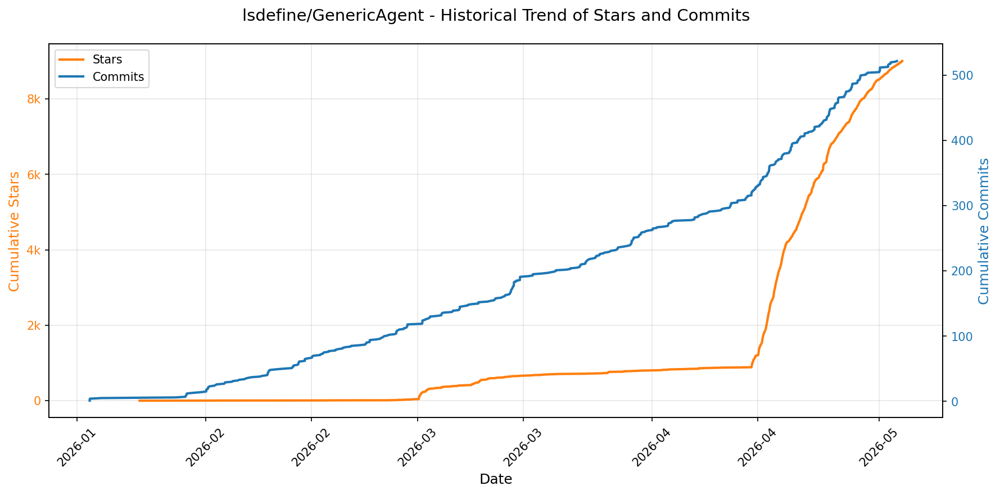

> *蓝色：累计 Stars｜橙色：累计 Commits（次 Y 轴）*

<b>📄 README 摘要</b>

1. **该项目做什么？**  
GenericAgent 是一个极简、可自我进化的自主智能体（Autonomous Agent）框架，核心目标是赋予任意大语言模型（LLM）对本地计算环境的**系统级、真实场景控制能力**。它不依赖预置技能库或复杂编排，而是通过在实际任务执行中**自动将成功路径固化为可复用的 Skill（技能）**，实现能力的持续自主生长。其典型应用包括：全自动外卖下单、量化股票筛选、微信消息批量发送、支付宝支出分析、网页自主探索与摘要、跨平台设备（含安卓手机 via ADB）自动化操作等——所有操作均在真实用户环境中运行（如保留浏览器登录态、直接操控鼠标键盘、读取屏幕图像），而非沙箱或模拟环境。

2. **关键特性**  
- **自进化能力（Self-Evolution）**：首次执行新任务时自动完成依赖安装、脚本编写、调试验证，并将完整流程抽象为 Skill；后续同类任务仅需单行调用，形成专属、私有、动态增长的“个人技能树”。  
- **极致轻量与高效率**：核心代码仅约 3,000 行，Agent 主循环约 100 行；上下文窗口需求 <30K tokens（远低于主流 Agent 的 200K–1M），结合分层记忆（L0–L4）精准管理信息密度，显著降低幻觉、提升成功率、节省成本。  
- **强系统控制力**：提供 9 个原子级工具（如 `code_run`, `web_execute_js`, `file_patch`, `ask_user`, ADB 集成等），支持真实浏览器注入、终端/文件系统操作、键鼠与屏幕视觉交互、移动设备控制，实现端到端闭环执行。  
- **开箱即用与多前端支持**：默认 Streamlit 桌面 UI，同时原生支持微信、QQ、飞书、企业微信、钉钉、Telegram 等主流通讯平台作为 Bot 前端，提供 `/new`、`/continue` 等标准化对话命令。  
- **跨模型、跨平台兼容**：无缝适配 Claude、Gemini、Kimi、MiniMax 等主流闭源/开源模型；支持 Windows/macOS/Linux，无需 Docker 或 Kubernetes。

3. **技术栈**  
- **核心语言与框架**：Python（主语言），基于标准库与轻量第三方包（`requests`, `streamlit`, `pywebview`, `pycryptodome`, `qrcode`, `adb-shell` 等）。  
- **执行引擎**：自主设计的 ~100 行 `agent_loop.py` 循环，驱动“感知→推理→工具调用→记忆写入”闭环。  
- **记忆系统**：五层分层记忆架构（L0 元规则 → L1 索引 → L2 全局事实 → L3 技能/SOP → L4 会话归档），全部基于本地文件存储，无外部数据库依赖。  
- **前端生态**：Streamlit（默认 Web UI）、PyQt/Qt（桌面应用）、`qq-botpy`（QQ）、`lark-oapi`（飞书）、`wecom_aibot_sdk`（企微）、`dingtalk-stream`（钉钉）、`python-telegram-bot`（Telegram）等。  
- **扩展机制**：通过 `code_run` 工具动态执行 Python 代码，实现运行时安装包、调用 API、控制硬件、生成新工具并持久化，形成能力自举闭环。

---

### 32. [deepseek-ai/DeepGEMM](https://github.com/deepseek-ai/DeepGEMM)
- 📅 **创建日期**：2025-02-13  
- 🔄 **最近更新**：2026-04-27  
- ⭐ **Stars**：7,090（日 +51｜周 +391｜月 +813）  
- 📝 **描述**：DeepGEMM: clean and efficient FP8 GEMM kernels with fine-grained scaling  

<b>📈 Star 与 Commit 历史趋势</b>

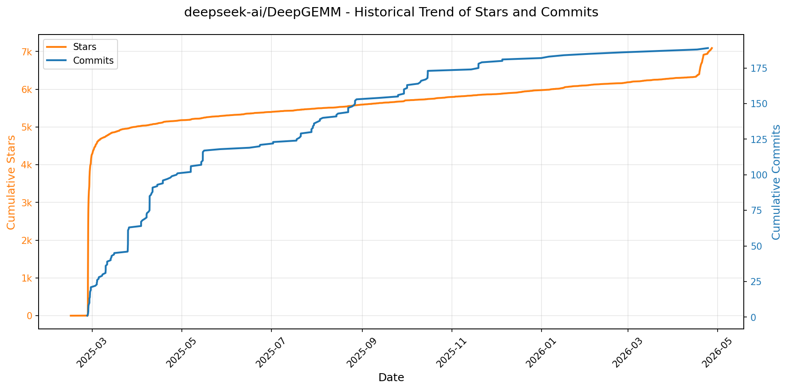

> *蓝色：累计 Stars｜橙色：累计 Commits（次 Y 轴）*

<b>📄 README 摘要</b>

1. **项目功能**  
DeepGEMM 是一个面向现代大语言模型（LLM）核心计算需求的**统一高性能张量核（Tensor Core）内核库**，专为 NVIDIA GPU（SM90/SM100 架构）设计。它将多种关键算子集成于单一、轻量级 CUDA 代码库中，包括：  
- 多精度 GEMM 计算（FP8×FP8、FP8×FP4、BF16×BF16）；  
- 融合型专家混合（MoE）计算（即“Mega MoE”），支持 EP dispatch、双线性层（FP8×FP4）、SwiGLU 激活及 EP combine 的全流水融合，并与 NVLink 通信重叠；  
- 面向 DeepSeek v3.2 “闪电索引器”（Lightning Indexer）的 MQA 得分核（含非分页 prefill 和分页 decoding 版本），支持 FP8 输入与加权 ReLU 激活；  
- HyperConnection（HC）相关原语（文中未展开但明确列为支持能力）；  
- 支持训练所需的权重梯度核（dense/MoE backward）；  
- 所有内核均通过**运行时轻量级 JIT 编译**生成，安装时无需预编译 CUDA，极大简化部署流程。

2. **关键特性**  
- ✅ **架构适配性强**：原生支持 SM90 与 SM100，其中 SM100 支持全部内存布局（NT/TN/NN/TT），SM90 仅支持 NT；  
- ✅ **极致性能**：实测在 H800 上达 **1550 TFLOPS**，性能媲美或超越专家手工调优库；  
- ✅ **内存与调度优化**：全面支持 TMA（Tensor Memory Accelerator）对齐、UE8M0 缩放因子打包格式、对称内存（symmetric memory）用于 Mega MoE 多进程通信；  
- ✅ **灵活分组 GEMM**：提供三种分组模式——  
　　• *Contiguous layout*（M轴分组，适用于 MoE prefill，需 M/K 对齐）；  
　　• *Masked layout*（动态掩码分组，适配 decoding + CUDA Graph 场景）；  
　　• *K轴分组*（专用于 MoE weight backward）；  
- ✅ **端到端融合能力**：Mega MoE 实现 EP 分发→线性1→SwiGLU→线性2→EP 合并的单核融合，通信与计算重叠；  
- ✅ **生产就绪 JIT 系统**：支持 NVCC / NVRTC 双编译后端（NVRTC 编译提速最高 10×），内置缓存、调试、PTX/SASS 导出、PDL（Programmatic Dependent Launch）控制等完备 JIT 工具链；  
- ✅ **易用性与可维护性**：摒弃 CUTLASS/CuTe 的复杂模板泛化，仅保留少量核心函数，代码简洁，适合学习 GPU 内核优化技术；  
- ✅ **完整工具链支持**：提供对称内存分配、缩放因子布局转换、TMA 对齐张量构造、块大小约束、SM 数量/TC 利用率调控等高级实用接口。

3. **技术栈**  
- **底层运行时**：CUDA 12.3+（SM90 推荐 ≥12.9；SM100 强制 ≥12.9），依赖 NVIDIA GPU SM90/SM100 架构；  
- **编译系统**：C++20，NVCC 或 NVRTC（通过环境变量 `DG_JIT_USE_NVRTC` 切换），支持 PTXAS 优化与 SASS 输出；  
- **核心依赖**：  
　　• CUTLASS 4.0+（作为 submodule 引入，仅借鉴概念，不直接继承模板）；  
　　• CuTe（同上，轻量引用其代数思想）；  
　　• `{fmt}` 库（submodule，用于格式化）；  
- **Python 生态集成**：PyTorch 2.1+（必需，用于张量管理、CUDA 图、对称内存等），通过 `torch.utils.cpp_extension` 构建 JIT 模块；  
- **构建与部署**：基于 Shell 脚本（`develop.sh`/`install.sh`）自动化 submodule 初始化与 C++ JIT 模块构建；  
- **高级特性支撑**：CUDA Runtime API（≥12.8 可选启用）、TMA、UE8M0 浮点格式、CUDA Graph、NVLink 多进程通信。

---

### 33. [SimoneAvogadro/android-reverse-engineering-skill](https://github.com/SimoneAvogadro/android-reverse-engineering-skill)
- 📅 **创建日期**：2026-02-02  
- 🔄 **最近更新**：2026-04-27  
- ⭐ **Stars**：5,157（日 +148｜周 +1498｜月 +3790）  
- 📝 **描述**：Claude Code skill to support Android app's reverse engineering  

<b>📈 Star 与 Commit 历史趋势</b>

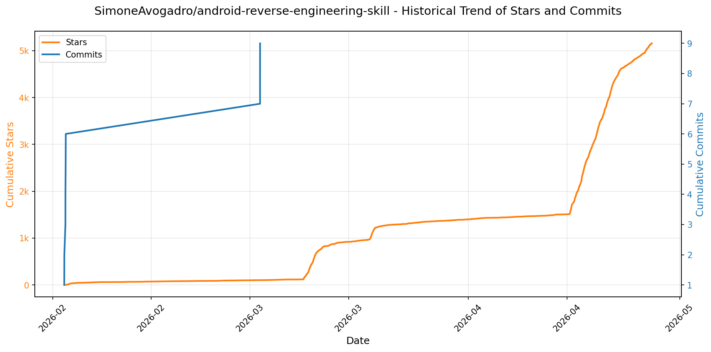

> *蓝色：累计 Stars｜橙色：累计 Commits（次 Y 轴）*

<b>📄 README 摘要</b>

1. **该项目的功能**  
该项目是一个专为 Claude Code 设计的插件技能，用于对 Android 应用程序包（APK/XAPK）及 Java 类库（JAR/AAR）执行逆向工程，并**自动提取其中使用的 HTTP API 接口**。核心目标是无需原始源码即可复现和文档化应用的网络通信行为，包括 Retrofit 定义的 RESTful 端点、OkHttp 手动调用、硬编码 URL、认证头（如 `Authorization`）、Token 提取模式等；同时支持从 UI 层（Activity/Fragment）出发，沿 ViewModel、Repository 等架构组件逐层追踪至最终 HTTP 请求的完整调用链。

2. **关键特性**  
- 支持多格式输入：APK、XAPK（自动解包并分别处理内部 APK）、JAR、AAR；  
- 双引擎可选反编译：集成 jadx（默认）、Fernflower 与 Vineflower，支持单引擎输出或双引擎并行比对以提升复杂/混淆代码的可读性；  
- 智能 API 提取：识别 Retrofit 注解（`@GET`, `@POST`, `@Headers` 等）、OkHttp `Request.Builder` 构造逻辑、字符串拼接型 URL、Base64 编码 Token、JWT 解析片段等；  
- 调用流分析：基于类继承关系与方法调用图，重建从用户交互入口到网络请求的跨组件调用路径；  
- 混淆代码适配：提供 ProGuard/R8 混淆后的命名还原策略、符号映射辅助分析及常见混淆模式识别（如反射调用、字符串加密解密逻辑）；  
- 结构化分析能力：解析 AndroidManifest.xml、识别包结构、推断 MVVM/MVI 等架构模式、提取权限与组件声明；  
- 全流程 CLI 脚本支持：涵盖依赖检查、自动化安装、多引擎反编译、API 模式扫描（按 Retrofit/URL/Headers 分类过滤）等。

3. **技术栈**  
- **核心反编译工具**：jadx（主引擎，支持 DEX→Java 直接转换）、Vineflower/Fernflower（Java 字节码级反编译，需配合 dex2jar 处理 APK）、dex2jar（DEX 转 JAR 中间步骤）；  
- **运行环境**：Java JDK 17+（必需），Bash Shell（所有脚本均基于 POSIX shell 编写，兼容 Linux/macOS，部分功能需适配 Windows WSL）；  
- **集成平台**：Claude Code（通过 `.claude-plugin/` 规范定义插件元信息与命令接口）；  
- **辅助工具链**：apktool（用于资源层解包与分析，作为可选参考）；  
- **许可协议**：Apache License 2.0。

---

### 34. [google-ai-edge/LiteRT-LM](https://github.com/google-ai-edge/LiteRT-LM)
- 📅 **创建日期**：2025-04-14  
- 🔄 **最近更新**：2026-04-27  
- ⭐ **Stars**：4,397（日 +56｜周 +421｜月 +3398）  
- 📝 **描述**：暂无描述  

<b>📈 Star 与 Commit 历史趋势</b>

> *蓝色：累计 Stars｜橙色：累计 Commits（次 Y 轴）*

<b>📄 README 摘要</b>

1. **项目功能**  
LiteRT-LM 是谷歌推出的面向边缘设备的生产级、高性能开源大语言模型（LLM）推理框架，专为在资源受限的终端设备上高效部署和运行 LLM 而设计。它支持端侧实时推理，无需依赖云端服务，已在 Chrome、Chromebook Plus、Pixel Watch 等 Google 产品中大规模落地，赋能离线、低延迟、隐私优先的生成式 AI 体验。

2. **核心特性**  
- **全平台覆盖**：原生支持 Android、iOS、Web（WASM）、Linux/macOS/Windows（含 WSL）及 IoT 设备（如 Raspberry Pi）；  
- **硬件加速能力**：深度优化 GPU（如 Vulkan、Metal、DirectX）与 NPU（神经网络处理器）加速，显著提升吞吐与能效；  
- **多模态支持**：可处理文本、图像、音频等异构输入，实现跨模态理解与生成；  
- **智能体工作流支持**：内置 Tool Use API，支持函数调用（Function Calling），赋能端侧自主决策与工具协同；  
- **广泛模型兼容性**：开箱即用支持 Gemma（含最新 Gemma 4）、Llama、Phi-4、Qwen 等主流开源模型，且提供量化（如 int4）与 LiteRT-LM 格式转换工具链。

3. **技术栈**  
- **底层引擎**：基于 C++ 构建高性能运行时，深度集成 Google AI Edge 生态（如 TensorFlow Lite 基础组件）；  
- **语言绑定**：提供稳定版 Kotlin（Android/JVM）、Python（快速原型与脚本）、C++（系统级嵌入与极致性能）API；Swift 版本正在开发中；  
- **部署工具链**：配套命令行工具 `litert-lm CLI`（基于 `uv` 工具链分发），支持从 Hugging Face 直接拉取模型、一键转换与本地推理；  
- **模型格式**：采用专为边缘优化的 `.litertlm` 模型格式，融合算子融合、内存复用、动态批处理与硬件感知调度等关键技术；  
- **构建系统**：支持 Bazel 构建，兼容主流交叉编译环境，便于适配各类边缘芯片平台。

---

### 35. [thunderbird/thunderbolt](https://github.com/thunderbird/thunderbolt)
- 📅 **创建日期**：2025-07-23  
- 🔄 **最近更新**：2026-04-27  
- ⭐ **Stars**：4,207（日 +129｜周 +1840｜月 +4203）  
- 📝 **描述**：AI You Control: Choose your models. Own your data. Eliminate vendor lock-in.  

<b>📈 Star 与 Commit 历史趋势</b>

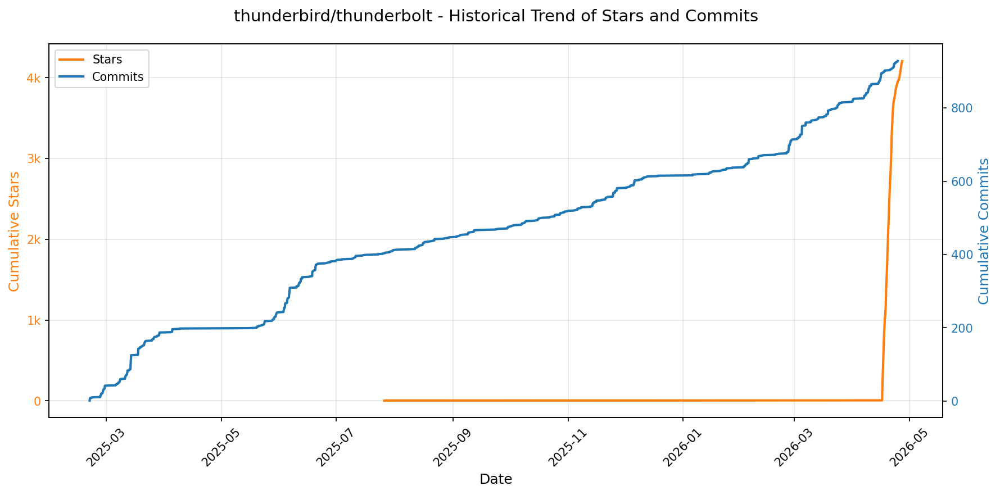

> *蓝色：累计 Stars｜橙色：累计 Commits（次 Y 轴）*

<b>📄 README 摘要</b>

1. **项目功能**  
Thunderbolt 是一个开源、跨平台的 AI 客户端，旨在为用户提供完全可控的本地化人工智能体验。它支持在企业内网或任意私有环境中自托管部署（on-prem），使用户能够自主选择大语言模型（LLM）、完全掌控自身数据，并彻底规避云厂商锁定（vendor lock-in）。其核心定位是作为终端用户的“AI 操作系统”——统一接入并管理多种模型后端（本地、私有或兼容 OpenAI 的远程服务），提供一致的交互界面与企业级能力。

2. **关键特性**  
- ✅ **全平台覆盖**：原生支持 Web、iOS、Android、macOS、Linux 和 Windows；  
- ✅ **模型无关性与灵活性**：无缝对接前沿云端模型（如通过 OpenAI 兼容 API）、本地运行模型（如 Ollama、llama.cpp）及私有部署模型；  
- ✅ **企业就绪能力**：支持离线优先架构（当前部分功能如认证/搜索暂依赖后端，但可禁用或自建）、端到端加密（FDE）、细粒度权限控制与审计准备；  
- ✅ **开箱即用的私有化部署**：提供基于 Docker Compose 和 Kubernetes 的标准化部署方案，支持快速本地测试与生产环境落地；  
- ✅ **安全与合规优先**：正在进行第三方安全审计，明确拒绝默认数据上传，所有敏感操作（如模型密钥管理、身份认证）均设计为可完全本地化；  
- ✅ **开放可扩展生态**：模块化架构便于集成新模型提供商、插件和企业内部系统。

3. **技术栈**  
- **前端框架**：基于 [Tauri](https://tauri.app/) 构建跨平台桌面应用（Rust + WebView），Web 版采用现代前端工具链（Vite + React）；  
- **移动与 Web 客户端**：使用 Capacitor 或响应式 Web 技术实现 iOS/Android/Web 三端统一；  
- **后端服务（可选自托管）**：轻量级 Rust 或 Node.js 后端（文档指向 Docker 部署），负责认证、元数据索引与集成协调（搜索功能当前为可选依赖）；  
- **本地模型运行时支持**：深度集成 [Ollama](https://ollama.com) 和 [llama.cpp](https://github.com/ggml-org/llama.cpp)，支持 GGUF 格式量化模型；  
- **构建与工程化**：Vite（前端打包与热更新）、Storybook（组件开发与文档）、Vite Bundle Analyzer（性能优化）、Tauri 签名机制（应用分发安全）；  
- **基础设施与运维**：Docker Compose / Kubernetes 部署模板、GitHub Actions CI/CD 流水线、Mozilla 公共许可证（MPL-2.0）合规治理。

---

### 36. [Tracer-Cloud/opensre](https://github.com/Tracer-Cloud/opensre)
- 📅 **创建日期**：2026-01-13  
- 🔄 **最近更新**：2026-04-27  
- ⭐ **Stars**：3,378（日 +206｜周 +1554｜月 +3120）  
- 📝 **描述**：Build your own AI SRE agents. The open source toolkit for the AI era ✨   

<b>📈 Star 与 Commit 历史趋势</b>

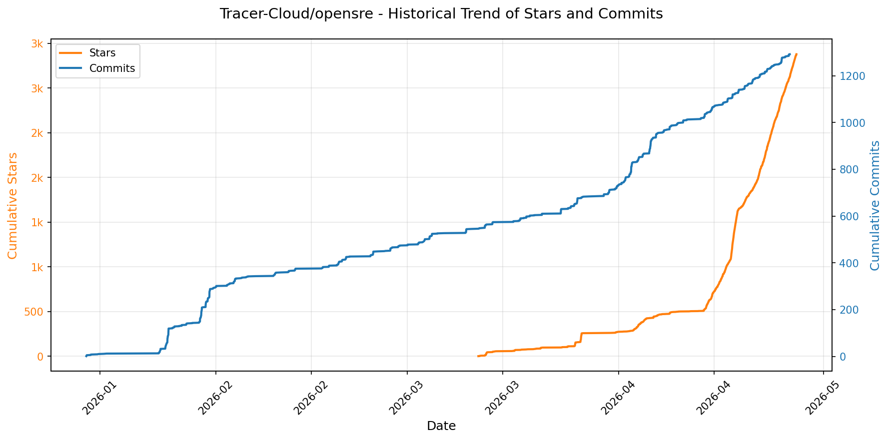

> *蓝色：累计 Stars｜橙色：累计 Commits（次 Y 轴）*

<b>📄 README 摘要</b>

1. **项目功能**  
OpenSRE 是一个开源的 AI SRE（站点可靠性工程）智能体框架，专为在用户自有基础设施上自动执行生产环境故障排查与响应而设计。它能接入用户已有的 60+ 类工具（涵盖可观测性平台、云基础设施、数据库、告警系统等），基于真实告警触发端到端调查流程：自动拉取日志/指标/链路追踪等上下文数据，跨系统关联分析异常，生成带证据支撑的根因报告，并可自动执行修复动作或向 Slack/PagerDuty 等平台推送摘要。其核心目标是构建面向生产级分布式故障的、可训练、可评估的强化学习环境，填补 AI 在真实基础设施排障领域缺乏标准化基准与训练数据的空白。

2. **关键特性**  
- ✅ **结构化事故调查**：支持多源信号（日志、指标、Trace、告警、Runbook）的自动关联与根因分析；  
- ✅ **Runbook 感知推理**：直接读取并动态应用用户编写的运维手册，实现知识驱动的决策；  
- ✅ **证据可追溯性**：每个结论均锚定至原始数据源（如某条日志、某时段指标），杜绝“幻觉式”归因；  
- ✅ **全模型开放兼容**：支持任意 LLM 后端（Anthropic、OpenAI、Ollama、Gemini、NVIDIA NIM、Bedrock、OpenRouter 等）；  
- ✅ **双模态评测体系**：提供合成故障测试套件（验证根因准确性、证据完备性及抗干扰能力）和真实云环境端到端测试（覆盖 Kubernetes、AWS EC2/Lambda/ECS、GCP、Azure、Flink 等）；  
- ✅ **一键部署与远程运维**：支持本地快速启动（`opensre onboard`）、Railway/Vercel 等平台一键部署，并提供 CLI 远程管理能力（状态监控、日志流式查看、重启等）；  
- ✅ **模块化集成生态**：开箱即用支持 Grafana（Loki/Mimir/Tempo）、Datadog、Honeycomb、CloudWatch、Sentry、Kubernetes、AWS 全栈、GitHub、PagerDuty、Slack 等，且持续扩展中。

3. **技术栈**  
- **核心框架**：基于 LangGraph 构建可编排、可持久化的智能体工作流运行时；  
- **后端语言**：Python（主力，含对 Python 3.13 的官方支持）；  
- **基础设施依赖**：PostgreSQL（存储状态与历史）、Redis（缓存与任务队列）；  
- **部署形态**：容器化服务（支持 Docker）、CLI 工具（跨平台：Shell/PowerShell/Homebrew）、DevContainer 开发环境（VS Code 集成）；  
- **协议与标准**：原生支持 MCP（Model Control Protocol）、ACP（Agent Communication Protocol）、OpenClaw 等智能体互操作协议；  
- **测试与评估**：自研合成故障注入框架 + 真实云场景 E2E 测试套件，采用语义化测试目录结构（`tests/synthetic/` vs `tests/e2e/`）；  
- **可观测性集成**：深度对接主流可观测性后端（Loki、Mimir、Datadog、CloudWatch、Elasticsearch 等）及 APM 工具（Tempo、Honeycomb）。

---

### 37. [ComposioHQ/awesome-codex-skills](https://github.com/ComposioHQ/awesome-codex-skills)
- 📅 **创建日期**：2026-01-12  
- 🔄 **最近更新**：2026-04-27  
- ⭐ **Stars**：1,988（日 +397｜周 +1219｜月 +1445）  
- 📝 **描述**：A curated list of practical Codex skills for automating workflows across the Codex CLI and API.  

<b>📈 Star 与 Commit 历史趋势</b>

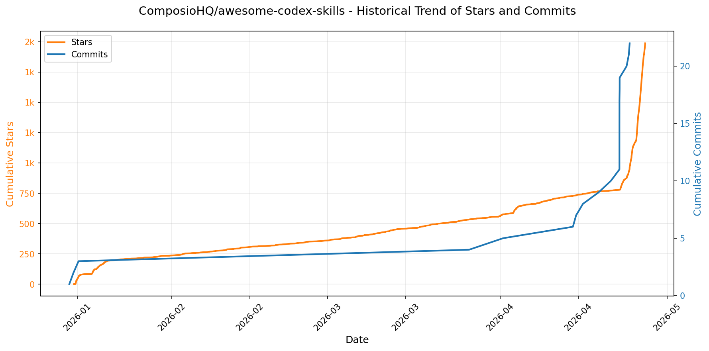

> *蓝色：累计 Stars｜橙色：累计 Commits（次 Y 轴）*

<b>📄 README 摘要</b>

1. **项目功能**  
该项目是一个为 Codex（一款智能编程与工作流代理工具）提供可扩展能力的技能集合库，即 **“Awesome Codex Skills”**。它不运行独立服务，而是通过结构化、模块化的“技能包”（Skill），扩展 Codex 的实际执行能力——使其不仅能生成文本，还能**跨 1000+ 应用执行真实操作**（如发送 Slack 消息、创建 GitHub Issue、同步 Notion 页面、调试 CI 失败、生成发票/幻灯片/PDF、分析 Sentry 错误、连接 Datadog 日志等）。每个技能是一个自包含文件夹，含元数据（`SKILL.md`）和可选脚本/资源，供 Codex 在语义匹配时自动加载并执行。

2. **核心特性**  
- ✅ **开箱即用的实用技能生态**：覆盖开发（代码审查、PR 自动修复、Sentry 诊断）、生产力（会议纪要生成、Notion 知识捕获、Linear/Jira 工单分诊）、通信（邮件润色、定制简历）、数据分析（表格公式助手、竞品广告提取、开发者成长分析）、元工具（主题生成、GIF 制作、视频下载）五大类共 50+ 经验证技能；  
- ✅ **零依赖本地执行能力**：多数技能支持纯本地运行（如 `paperjsx` 本地生成 PPTX/DOCX/XLSX/PDF，`helium-mcp` 提供实时新闻与市场数据），无需 API 密钥或网络调用；  
- ✅ **标准化技能架构与渐进式披露**：强制使用 `SKILL.md`（含 YAML 前置元数据）定义触发条件与指令，辅以 `scripts/`（确定性操作）、`references/`（按需加载长文档）、`assets/`（模板/资源），显著降低上下文负担；  
- ✅ **一键安装与团队协作支持**：提供 `skill-installer` 脚本实现 GitHub 仓库级技能批量安装；支持 `skill-share` 实现技能在团队内复用；含 `template-skill` 和 `skill-creator` 指南，降低技能开发门槛；  
- ✅ **深度集成 Composio 生态**：通过 `connect/` 和 `connect-apps/` 技能，无缝对接 Composio CLI，将 Codex 从“语言模型”升级为可操作企业级 SaaS（Slack/Notion/GitHub/Stripe 等）的自动化引擎。

3. **技术栈**  
- **运行时环境**：基于 Codex CLI（本地代理运行时），依赖用户本地配置的 `$CODEX_HOME`（默认 `~/.codex/`）作为技能存储根目录；  
- **技能格式**：纯文本 Markdown（`SKILL.md`）+ 标准化文件结构（`scripts/`, `references/`, `assets/`），无编译要求；  
- **脚本语言**：主要使用 **Python**（如 `install-skill-from-github.py`）、**Shell/Bash**（技能中常见 CLI 调用）、部分技能含 **TypeScript/Node.js**（如 `@paperjsx/mcp-server`, `AuraKit`）；  
- **集成协议**：深度依赖 **Composio CLI**（统一连接器层），通过其标准接口调用 1000+ 应用（OAuth/API Key 管理由 Composio 承担）；部分技能采用 **MCP（Model Context Protocol）** 协议（如 `helium-mcp`, `mcp-builder`）实现模型与工具的标准化交互；  
- **辅助工具链**：GitHub Actions（CI 验证）、Discord/X/LinkedIn 社区协同、`awesome.re` 规范化清单管理。

---

