# 🌟 GitHub Trending 概览

> 数据更新于：2026-05-25

---

## 🔍 项目详情

### 1. [obra/superpowers](https://github.com/obra/superpowers)
- 📅 **创建日期**：2025-10-09  
- 🔄 **最近更新**：2026-05-25  
- ⭐ **Stars**：205,477（日 +1049｜周 +10010｜月 +15472）  
- 📝 **描述**：An agentic skills framework & software development methodology that works.  

<b>📈 Star 与 Commit 历史趋势</b>

> *蓝色：累计 Stars｜橙色：累计 Commits（次 Y 轴）*

<b>📄 README 摘要</b>

1. **项目功能**  
Superpowers 是一个面向编程智能体（coding agents）的完整软件开发方法论框架，旨在将原本零散、随意的代码生成行为，系统化为严格遵循工程原则的协作式开发流程。它不直接编写代码，而是通过一系列自动触发的“可组合技能”（composable skills），引导智能体在编码前完成需求澄清、分步设计、TDD 计划制定、子智能体协同执行、多阶段代码审查与 Git 工作流管理等全流程活动，最终交付经过验证、符合 YAGNI/DRY 原则、测试先行的高质量代码变更。

2. **核心特性**  
- **全流程自动化工程工作流**：涵盖从头脑风暴（brainstorming）、Git 工作树隔离（using-git-worktrees）、任务级计划拆解（writing-plans）、子智能体驱动开发（subagent-driven-development）、强制性测试先行（test-driven-development）、阶段性代码审查（requesting/receiving-code-review）到分支收尾（finishing-a-development-branch）的 7 个强制性阶段；  
- **技能驱动、上下文自适应**：所有技能按需自动触发，无需人工调用；每个技能具备明确职责边界、输入输出规范和验证机制（如“先写失败测试→再实现→再重构”三步闭环）；  
- **跨平台兼容性**：原生支持 Claude Code、Codex CLI/App、Factory Droid、Gemini CLI、OpenCode、Cursor、GitHub Copilot CLI 等主流 AI 编程工具，提供定制化安装与更新方式；  
- **工程哲学内建**：深度贯彻 TDD、YAGNI、DRY、系统性调试（4 阶根因分析）、证据导向（verify before completion）、复杂度最小化等实践原则，杜绝“猜测式开发”。

3. **技术栈**  
- **核心范式**：基于插件化（Plugin-based）架构的技能系统（Skills Library），以 Markdown 文档（`.md`）定义技能行为、约束与最佳实践（如 `skills/test-driven-development/SKILL.md`）；  
- **运行载体**：非独立应用，而是作为轻量级插件/扩展集成于各类 AI 编程代理平台（Harness），依赖各平台的插件 SDK 与指令接口（如 `/plugin install`、`droid plugin`、`gemini extensions` 等）；  
- **基础设施**：托管于 GitHub（`obra/superpowers`），采用 MIT 协议；使用标准 Git 工作流（`dev` 分支开发、PR 模板规范）；配套文档体系完整（含 `docs/README.opencode.md`、`.opencode/INSTALL.md` 等）；  
- **无后端/无服务依赖**：纯客户端侧逻辑，所有技能执行均在本地或代理平台沙箱内完成，不依赖外部 API 或运行时服务。

---

### 2. [multica-ai/andrej-karpathy-skills](https://github.com/multica-ai/andrej-karpathy-skills)
- 📅 **创建日期**：2026-01-27  
- 🔄 **最近更新**：2026-05-25  
- ⭐ **Stars**：133,836（日 +2562｜周 +18527｜月 +50215）  
- 📝 **描述**：A single CLAUDE.md file to improve Claude Code behavior, derived from Andrej Karpathy's observations on LLM coding pitfalls.  

<b>📈 Star 与 Commit 历史趋势</b>

> *蓝色：累计 Stars｜橙色：累计 Commits（次 Y 轴）*

<b>📄 README 摘要</b>

1. **该项目的作用**  
该项目提供一份精炼、可直接集成的 `CLAUDE.md` 指南文件，旨在系统性地矫正 Claude（特别是 Claude Code）在编程任务中的典型行为缺陷。它不开发新工具或模型，而是通过结构化提示工程（prompt engineering），将 Andrej Karpathy 总结的 LLM 编程核心问题转化为四条可执行、可检查的协作原则，从而引导 Claude 更可靠、更克制、更目标明确地完成代码生成与修改任务——本质上是为 AI 编程助手构建一套“职业化编码守则”。

2. **关键特性**  
- **四大可操作原则闭环设计**：  
  - *Think Before Coding*（先思考再编码）：强制显式暴露假设、列举歧义选项、主动质疑不合理需求、遇困惑即中止并请求澄清；  
  - *Simplicity First*（简洁优先）：严格禁止未请求的抽象、灵活性、错误处理或功能扩展，以“资深工程师是否认为过重”为简化判据；  
  - *Surgical Changes*（精准变更）：仅修改与用户请求直接相关的代码行，禁用“顺手优化”，保留原有风格与注释，仅清理自身引入的冗余；  
  - *Goal-Driven Execution*（目标驱动执行）：将模糊指令（如“修复 Bug”）强制重构为可验证目标（如“写出复现测试 → 使其通过”），支持多步计划+每步验证的自主循环。  
- **双模部署支持**：既可通过 Claude Code 插件（`andrej-karpathy-skills`）全局启用，也可按项目嵌入 `CLAUDE.md` 文件，兼容 Cursor IDE（含预置规则文件 `.cursor/rules/karpathy-guidelines.mdc`）。  
- **渐进式集成能力**：支持与项目已有指南合并，允许追加 `Project-Specific Guidelines` 实现定制化；明确区分适用场景——对简单任务保留人工判断弹性，专注防范高成本复杂任务失误。

3. **技术栈**  
- **核心载体**：纯文本 Markdown（`CLAUDE.md`），无运行时依赖，本质是提示词（prompt）工程产物；  
- **运行环境**：深度适配 Anthropic 的 **Claude Code**（AI 编程代理平台）及 **Cursor IDE**（基于 LLM 的智能编辑器），利用其插件系统（Plugin Marketplace）和项目级规则（`.cursor/rules/`）机制加载与执行；  
- **分发与集成方式**：通过 GitHub Raw URL 直接 `curl` 下载，依赖标准 CLI 工具链（`bash`/`echo`/`curl`）实现跨项目快速部署；  
- **无后端/无服务**：完全静态、零服务器、零构建流程，MIT 开源许可，聚焦于人机协作范式的标准化，而非软件系统开发。

---

### 3. [mattpocock/skills](https://github.com/mattpocock/skills)
- 📅 **创建日期**：2026-02-03  
- 🔄 **最近更新**：2026-05-25  
- ⭐ **Stars**：104,003（日 +1233｜周 +14549｜月 +85818）  
- 📝 **描述**：Skills for Real Engineers. Straight from my .claude directory.  

<b>📈 Star 与 Commit 历史趋势</b>

> *蓝色：累计 Stars｜橙色：累计 Commits（次 Y 轴）*

<b>📄 README 摘要</b>

1. **项目功能**  
该项目是一套面向真实软件工程场景的、可即插即用的 AI 编程助手（Coding Agent）技能集合（Skills），旨在系统性解决当前大模型编程代理在实际开发中普遍存在的四大核心问题：**需求对齐失败、表达冗余低效、代码质量不可靠、架构持续腐化**。它不提供独立运行的工具或框架，而是以标准化技能（Skill）形式，供支持 `skills.sh` 协议的 AI 编程代理（如 Claude Code、Codex 等）加载和调用，将经过验证的工程实践（如深度对齐、领域语言共建、TDD、架构治理等）直接嵌入 AI 工作流，从而提升人机协同的准确性、效率与可持续性。

2. **关键特性**  
- **小而专、高组合性**：每个 Skill 聚焦单一工程痛点（如 `/grill-me` 强制需求澄清、`/tdd` 执行红-绿-重构循环、`/diagnose` 标准化调试流程），模块化设计，可按需启用、自由组合；  
- **模型无关 & 工程原生**：不绑定特定大模型，所有 Skill 均基于成熟软件工程原则（Pragmatic Programming、DDD、XP、A Philosophy of Software Design）构建，强调“人控主导、AI 执行”；  
- **深度上下文共建机制**：通过 `/grill-with-docs` 自动驱动 `CONTEXT.md`（项目领域术语表）和 ADR（架构决策记录）的持续演进，建立人与 AI 共享的精确领域语言，显著压缩提示词长度并提升代码一致性；  
- **全生命周期反馈闭环**：覆盖从需求对齐（`/grill-me`）、任务拆解（`/to-issues`）、PRD 生成（`/to-prd`）、测试驱动（`/tdd`）、缺陷诊断（`/diagnose`）到架构治理（`/improve-codebase-architecture`、`/zoom-out`）的完整链路；  
- **开箱即用的工程基础设施**：提供 `/setup-matt-pocock-skills` 一键配置仓库级元信息（Issue Tracker 类型、Triage 标签体系、文档存储路径），为其他 Skills 提供统一上下文支撑。

3. **技术栈**  
- **协议层**：基于 [`skills.sh`](https://skills.sh) 开放技能协议标准，采用标准化 Skill 描述格式（含 `SKILL.md` 文档、参数定义、执行逻辑）；  
- **运行环境**：面向支持 `skills.sh` 协议的 AI 编程代理（如 Claude Code、GitHub Copilot Extensions 生态兼容工具），非独立服务；  
- **核心依赖**：无后端服务或数据库，纯前端/代理侧执行；依赖本地工程资产（如 `CONTEXT.md`、`docs/adr/`、`package.json`、类型定义等）作为推理上下文；  
- **辅助工具链**：集成行业标准工程实践工具理念——静态类型（TypeScript）、Git 钩子（Husky + lint-staged）、测试框架（Jest/Vitest 等）、PRD/ADR 文档规范；部分 Misc 技能涉及 `@total-typescript/shoehorn` 等类型断言迁移工具。

---

### 4. [codecrafters-io/build-your-own-x](https://github.com/codecrafters-io/build-your-own-x)
- 📅 **创建日期**：2018-05-09  
- 🔄 **最近更新**：2026-05-25  
- ⭐ **Stars**：99,536（日 +475｜周 +2472｜月 +10428）  
- 📝 **描述**：Master programming by recreating your favorite technologies from scratch.  

<b>📈 Star 与 Commit 历史趋势</b>

> *蓝色：累计 Stars｜橙色：累计 Commits（次 Y 轴）*

<b>📄 README 摘要</b>

1. **该项目的功能**  
该项目是一个开源的、面向学习者的实践型技术教程集合，旨在引导开发者“从零开始亲手构建（re-create）”各类主流技术系统。它不提供现成的工具或框架，而是通过精选的、结构清晰、步骤详尽的教程资源，帮助学习者深入理解底层原理——从3D渲染器、区块链、数据库、操作系统，到Web浏览器、AI模型、游戏引擎等共30余类复杂系统。核心理念是践行费曼学习法：“凡我不能创造者，我即未真正理解”。

2. **关键特性**  
- **主题覆盖广泛且系统化**：涵盖分布式系统、AI/ML、AR/VR、P2P网络（BitTorrent）、密码学（区块链）、系统编程（OS/VM/Emulator/Shell）、前端框架、游戏开发、数据库、容器（Docker）等29+技术领域，外加“未分类”补充项；  
- **语言与实现多样性**：每个技术主题均提供多语言实现方案（如C/C++/Rust/Go/Python/JavaScript/Java/C#/TypeScript等），兼顾性能敏感场景（系统级）与教学友好性（脚本语言）；  
- **教程质量高且类型丰富**：整合权威书籍（如《Physically Based Rendering》《Ray Tracing in One Weekend》）、经典开源项目（如tinyrenderer、LLMs-from-scratch）、实战博客、交互式课程（Hugging Face Diffusion Course）、视频教程（YouTube系列）及可运行代码仓库，强调“边做边学”；  
- **强调底层原理与动手实践**：所有教程聚焦于核心机制实现（如B+树索引、PoW共识、CHIP-8指令集、软光栅化、React Reconciler、Redis协议解析），避免黑盒调用，强化对数据结构、算法、操作系统、网络、编译原理等基础知识的综合应用。

3. **技术栈**  
项目本身为静态内容聚合平台（GitHub仓库），无统一运行时技术栈；其教程所涉技术栈高度多元化，典型组合包括：  
- **系统编程层**：C（Linux内核/容器/DB/VM）、C++（3D渲染/游戏/Emulator）、Rust（区块链/DB客户端/Emulator）、Go（Docker/DB/BitTorrent）；  
- **AI/数据科学层**：Python（LLM训练/扩散模型/RAG/OpenCV AR）、JavaScript/TypeScript（前端AI集成）；  
- **Web与应用层**：JavaScript/TypeScript（前端框架/浏览器/渲染器/Web服务器）、Java/Kotlin（Android AR/区块链）、C#（Unity AR/数据库）；  
- **脚本与工具层**：Shell（bocker容器）、Nim（dotfiles管理/Bencode解析）、Zig（CLI工具）、R（量化交易Bot）；  
- **教学辅助技术**：Markdown文档组织、GitHub Pages（部分教程配套站点）、ObservableHQ（函数式区块链演示）、Jupyter（部分AI教程）。

---

### 5. [TauricResearch/TradingAgents](https://github.com/TauricResearch/TradingAgents)
- 📅 **创建日期**：2024-12-28  
- 🔄 **最近更新**：2026-05-25  
- ⭐ **Stars**：73,205（日 +305｜周 +2766｜月 +26978）  
- 📝 **描述**：TradingAgents: Multi-Agents LLM Financial Trading Framework  

<b>📈 Star 与 Commit 历史趋势</b>

> *蓝色：累计 Stars｜橙色：累计 Commits（次 Y 轴）*

<b>📄 README 摘要</b>

1. **该项目做什么？**  
TradingAgents 是一个面向金融交易研究的开源多智能体（Multi-Agent）框架，利用大语言模型（LLM）模拟真实交易公司的组织结构与决策流程。它将复杂交易任务分解为多个专业化、协同工作的智能体角色（如基本面分析师、情绪分析师、新闻分析师、技术分析师、多空研究员、交易员、风控团队及投资组合经理），通过多轮结构化讨论、交叉验证与动态协商，最终生成基于多维市场洞察的交易决策（如买入/卖出信号、仓位大小、执行时机等）。该框架专为**学术研究与算法验证**设计，不提供实盘交易功能，亦不构成任何投资建议。

2. **关键特性**  
- **角色化多智能体架构**：严格区分8类职能智能体（4类分析师 + 2类研究员 + 1名交易员 + 1组风控与组合管理），支持角色间辩论机制（bullish/bearish researcher 对立评估）与共识构建；  
- **全链路可复现性与状态持久化**：内置决策日志（自动记录历史交易结果、Alpha表现、反思摘要，并注入后续分析提示词）、LangGraph检查点恢复（支持中断续跑）、跨周期记忆增强；  
- **企业级生产就绪能力**：支持20+ LLM提供商（OpenAI GPT-5.x、Google Gemini 3.x、Anthropic Claude 4.x、xAI Grok 4.x、DeepSeek、Qwen国际/中国双节点、GLM-Zhipu国际/中国双节点、MiniMax全球/中国双节点、OpenRouter、Ollama本地模型、Azure OpenAI、AWS Bedrock等），API密钥自动检测与环境变量（`TRADINGAGENTS_*`）灵活配置；  
- **强健性与合规设计**：具备 ticker路径遍历防护、非美国股票Alpha基准测试、代理（proxy）支持、Windows UTF-8兼容、Docker容器化部署、远程Ollama服务集成、多语言界面（含中文）及严格免责声明；  
- **研究友好型接口**：提供交互式CLI（支持实时进度可视化）、Python包调用（`TradingAgentsGraph.propagate()`）、细粒度配置（模型选择、辩论轮次、温度控制等）及完整配置文件（`default_config.py`）。

3. **技术栈**  
- **核心框架**：LangGraph（用于构建可检查点、可恢复的有状态多智能体工作流）；  
- **编程语言**：Python 3.13（官方指定运行环境）；  
- **依赖生态**：Pydantic（配置与结构化输出）、LangChain（工具集成与提示工程）、SQLAlchemy（检查点SQLite持久化）、Requests/HTTPX（API通信）、Jinja2（模板渲染）；  
- **部署支持**：Docker（含标准版与Ollama专用版Compose配置）、Conda虚拟环境；  
- **数据源对接**：Alpha Vantage（基础行情与基本面数据）；  
- **模型运行时**：原生支持云端API（各厂商REST接口）与本地推理（Ollama），预留Azure/AWS企业级适配入口；  
- **基础设施**：本地文件系统缓存（`~/.tradingagents/`）、Markdown日志、SQLite检查点数据库。

---

### 6. [bytedance/UI-TARS-desktop](https://github.com/bytedance/UI-TARS-desktop)
- 📅 **创建日期**：2025-01-19  
- 🔄 **最近更新**：2026-05-25  
- ⭐ **Stars**：59,769（日 +107｜周 +728｜月 +5764）  
- 📝 **描述**：The Open-Source Multimodal AI Agent Stack: Connecting Cutting-Edge AI Models and Agent Infra  

<b>📈 Star 与 Commit 历史趋势</b>

> *蓝色：累计 Stars｜橙色：累计 Commits（次 Y 轴）*

<b>📄 README 摘要</b>

1. **项目功能**  
TARS 是一个开源的多模态 AI 智能体（Agent）技术栈，聚焦于实现类人化、跨界面的任务自动化。它包含两大核心组件：  
- **Agent TARS**：通用型多模态智能体框架，支持在终端（CLI）、Web 界面及服务端运行，可理解 GUI 界面、图像与自然语言，通过调用真实世界工具（如浏览器、Shell、文件系统等）完成复杂任务（例如自动订机票、订酒店、生成图表、操作 VS Code 设置等）。  
- **UI-TARS Desktop**：基于 UI-TARS 视觉语言模型的本地桌面应用，提供原生 GUI 自动化能力，支持对本地/远程计算机及浏览器进行免配置、一键式远程控制（鼠标点击、键盘输入、截图识别、设置修改等），所有处理默认在本地执行，保障隐私与安全。

2. **关键特性**  
- ✅ **多模态感知与执行**：深度融合视觉（GUI 截图理解）、语言（自然语言指令解析）与动作（鼠标/键盘/浏览器 DOM/Shell 命令）能力；  
- ✅ **混合浏览器代理（Hybrid Browser Agent）**：支持基于视觉定位（Visual Grounding）、DOM 结构解析或二者协同的浏览器自动化策略；  
- ✅ **事件流驱动架构（Event Stream）**：采用协议化事件流（Event Stream）实现细粒度上下文工程、实时数据流追踪与调试（含 Event Stream Viewer）；  
- ✅ **MCP（Model Control Protocol）深度集成**：以 MCP 为内核标准，支持动态挂载各类 MCP Server（如 Shell、Browser、File、Chart 等工具服务器），实现模块化、可扩展的工具生态；  
- ✅ **全场景部署支持**：提供 CLI（headless）、Web UI（headful）、桌面客户端（UI-TARS Desktop）、远程控制（Remote Computer/Browser Operator）及云部署（ModelScope/Serverless）多种形态；  
- ✅ **开箱即用与强定制性并存**：CLI 一键启动（`npx @agent-tars/cli`），同时支持多模型提供商（VolcEngine、Anthropic 等）、自定义模型（如 `doubao-1-5-thinking-vision-pro`、`claude-3-7-sonnet-latest`）及沙箱环境（AIO Agent Sandbox）。

3. **技术栈**  
- **前端/客户端**：Electron（UI-TARS Desktop）、React/Vite（Web UI）、TypeScript；  
- **核心运行时**：Node.js（≥ v22），基于 npm 生态分发（`@agent-tars/cli`）；  
- **AI 模型层**：专用多模态大模型系列 —— UI-TARS-1.5/1.6-VL（由字节跳动 Seed 团队研发，支持视觉-语言-动作联合建模），兼容第三方多模态模型（如 Claude 3.7 Sonnet Vision、Doubao-1.5-Thinking-Vision-Pro）；  
- **协议与标准**：MCP（Model Control Protocol）作为智能体与工具交互的核心通信协议；  
- **基础设施**：支持本地推理、远程 API 调用、ModelScope 平台部署、AIO 沙箱隔离执行环境；  
- **开发与协作生态**：GitHub + Discord + 飞书社区 + DeepWiki + Lark 文档体系，配套 SDK（UI-TARS SDK）、详尽文档与示例库（Issue #842）。

---

### 7. [666ghj/MiroFish](https://github.com/666ghj/MiroFish)
- 📅 **创建日期**：2025-11-26  
- 🔄 **最近更新**：2026-05-25  
- ⭐ **Stars**：55,805（日 +367｜周 +1135｜月 +5198）  
- 📝 **描述**：A Simple and Universal Swarm Intelligence Engine, Predicting Anything. 简洁通用的群体智能引擎，预测万物  

<b>📈 Star 与 Commit 历史趋势</b>

> *蓝色：累计 Stars｜橙色：累计 Commits（次 Y 轴）*

<b>📄 README 摘要</b>

1. **项目功能**  
MiroFish 是一个基于多智能体（Multi-Agent）技术的下一代AI预测引擎，核心能力是通过现实世界中的“种子信息”（如突发新闻、政策草案、财经信号、小说文本等）自动构建高保真度的平行数字世界。在该虚拟环境中，数千个具备独立人格、长期记忆与行为逻辑的智能体自由交互并经历社会演化；用户可从“上帝视角”动态注入变量，开展大规模仿真推演，从而精准预测未来趋势。它支持从宏观决策（如政策预演、舆情推演、金融预测）到微观创意（如续写《红楼梦》结局、推演高校舆情事件）等各类预测任务，实现“上传材料 + 自然语言描述需求 → 返回预测报告 + 可深度交互的数字世界”的端到端闭环。

2. **关键特性**  
- **高保真多智能体社会模拟**：每个Agent拥有个性化设定、长期记忆（依托Zep Cloud）、自主行为逻辑与社交演化能力；  
- **双平台并行仿真**：支持前后端协同的实时动态仿真环境，支持时间维度上的记忆自动更新与状态回溯；  
- **零代码自然语言驱动**：用户仅需上传原始资料（分析报告/小说章节等）并用中文/英文描述预测目标，系统全自动完成图谱构建、Agent生成、仿真运行与报告生成；  
- **深度交互式输出**：不仅提供结构化预测报告，还允许用户在仿真结束后与任意Agent直接对话、调用ReportAgent工具进行二次分析，实现“可探索的预测结果”；  
- **模块化工作流设计**：涵盖图谱构建（GraphRAG）、环境搭建（实体关系提取+Persona生成）、仿真执行、报告生成、深度交互五大标准化阶段；  
- **开箱即用部署支持**：同时提供源码一键部署（Node.js + Python）与Docker容器化部署方案，适配本地开发与生产环境。

3. **技术栈**  
- **前端**：React（基于Next.js或类似现代框架，由`npm run frontend`及端口3000推断）、TypeScript（隐含于工程规范）、UI组件库未明示但含响应式布局与多图展示能力；  
- **后端**：Python ≥3.11（≤3.12），使用 `uv` 作为包管理器，集成LLM API调用（兼容OpenAI SDK格式，实测对接阿里云百炼平台Qwen-plus模型）、Zep Cloud长期记忆服务；  
- **核心仿真引擎**：基于开源框架 **OASIS（Open Agent Social Interaction Simulations）**（由CAMEL-AI团队开发），负责多Agent社会交互建模与演化逻辑；  
- **知识增强**：采用 **GraphRAG** 架构进行种子信息抽取与关系图谱构建，支撑上下文感知的Agent行为生成；  
- **基础设施**：Docker & Docker Compose 容器编排；环境配置通过 `.env` 文件统一管理；CI/CD与依赖管理由 npm 脚本驱动（如 `npm run setup:all`）。

---

### 8. [ruvnet/ruflo](https://github.com/ruvnet/ruflo)
- 📅 **创建日期**：2025-06-02  
- 🔄 **最近更新**：2026-05-25  
- ⭐ **Stars**：55,437（日 +340｜周 +2531｜月 +22135）  
- 📝 **描述**：🌊 The leading agent orchestration platform for Claude. Deploy intelligent multi-agent swarms, coordinate autonomous workflows, and build conversational AI systems. Features    enterprise-grade architecture, self-learning swarm intelligence, RAG integration, and native Claude Code / Codex Integration  

<b>📈 Star 与 Commit 历史趋势</b>

> *蓝色：累计 Stars｜橙色：累计 Commits（次 Y 轴）*

<b>📄 README 摘要</b>

1. **该项目的功能**  
Ruflo 是一个面向 Anthropic Claude Code 的多智能体（Multi-agent）AI 编排系统，旨在为 AI 开发者和工程师提供企业级、可协作、自演化的智能体基础设施。它将 Claude Code 从单点式 AI 工具升级为具备“神经系统”的智能体协同平台：支持跨机器、跨团队、跨信任边界的 100+ 专业化智能体（agents）自动组织成协作蜂群（swarms），在执行任务过程中持续学习优化、持久化记忆（vector memory）、安全联邦通信（zero-trust federation），并原生集成 Model Context Protocol（MCP）标准。用户无需修改工作流——只需 `npx ruflo init` 初始化，即可在保持原有 Claude Code 使用习惯的前提下，后台自动启用智能体路由、记忆检索、任务分解与自主执行。

2. **核心特性**  
- **智能体蜂群编排（Swarm Coordination）**：支持分层、网状与自适应拓扑结构，内置共识机制，实现多智能体协同决策与任务分发。  
- **自学习与自优化架构（Self-Learning / SONA）**：通过轨迹学习（trajectory learning）、ReasoningBank 和神经模式（SONA）实现行为进化，使智能体随使用次数增加而持续提升性能。  
- **联邦化安全通信（Federated Comms）**：零信任架构下，不同物理/组织边界的 Ruflo 实例可安全发现、认证并交换任务，全程不泄露原始数据。  
- **高性能向量记忆系统（AgentDB + HNSW）**：基于 HNSW 索引的本地向量数据库，搜索速度比暴力检索快 150–12,500 倍，支持跨会话长期记忆与 RAG 增强检索（含图谱跳转、多样性排序）。  
- **全栈插件生态（33+ 官方插件）**：覆盖核心编排、记忆、智能、安全、测试、合规、DevOps、领域专用（如量化交易、IoT）等 10+ 类别；支持 MCP 标准扩展及 npm 生态集成。  
- **双模态 Web UI（Beta）**：[flo.ruv.io](https://flo.ruv.io/) 提供免安装、多模型（Claude/Gemini/Qwen/OpenAI 等）、并行 MCP 工具调用的聊天界面，所有工具（含浏览器内 WASM 工具）均与 CLI 同源；支持自托管（Docker + 内嵌 MongoDB）。  
- **目标导向自动规划（GOAP Planner）**：[goal.ruv.io](https://goal.ruv.io/) 将自然语言目标（如“发布带测试的鉴权重构 PR”）自动分解为 A\* 搜索驱动的可执行动作树，实时调度智能体并提供可视化仪表盘与动态重规划能力。  
- **企业级安全与可观测性**：内置 AIDefence（防提示注入/PII 检测）、CVE 扫描、路径遍历防护、结构化日志/追踪/指标（Observability）、成本监控与预算告警。

3. **技术栈**  
- **核心语言与引擎**：Rust（高性能 AI 引擎、嵌入模型、内存管理、插件沙箱 `rvagent`）；  
- **前端框架**：Svelte（Web UI `ruvocal`）、React（Goal Planner UI）、Vite（构建）；  
- **后端与协议**：Model Context Protocol（MCP）标准实现；HTTP/SSE/stdio 多协议 MCP Server；  
- **数据库与向量检索**：AgentDB（自研向量库）、HNSW 索引、MongoDB（Web UI 内嵌）；  
- **AI 模型支持**：多提供商路由（Anthropic Claude、OpenAI、Google Gemini、Cohere、Qwen、Ollama 等），含 `ruvLLM` 本地微调适配层（MicroLoRA + SONA）；  
- **部署与基础设施**：Docker（含多阶段构建）、Cloud Run / Fly.io / Kubernetes 兼容；Git-Bash/WSL/macOS/Linux/PowerShell 全平台 CLI 支持；  
- **插件体系**：NPM 包管理（`ruflo-core`, `ruflo-swarm`, `ruflo-rag-memory` 等 33+ 官方插件）；Claude Code Marketplace 原生集成；  
- **辅助技术**：GraphQL（RuVector 图谱 AI）、Playwright（浏览器自动化）、Git 分析（`ruvnet/ruflo-jujutsu`）、Domain-Driven Design（DDD）脚手架、ADR（架构决策记录）系统。

---

### 9. [earendil-works/pi](https://github.com/earendil-works/pi)
- 📅 **创建日期**：2025-08-09  
- 🔄 **最近更新**：2026-05-25  
- ⭐ **Stars**：54,345（日 +542｜周 +3196｜月 +14471）  
- 📝 **描述**：AI agent toolkit: coding agent CLI, unified LLM API, TUI & web UI libraries, Slack bot, vLLM pods  

<b>📈 Star 与 Commit 历史趋势</b>

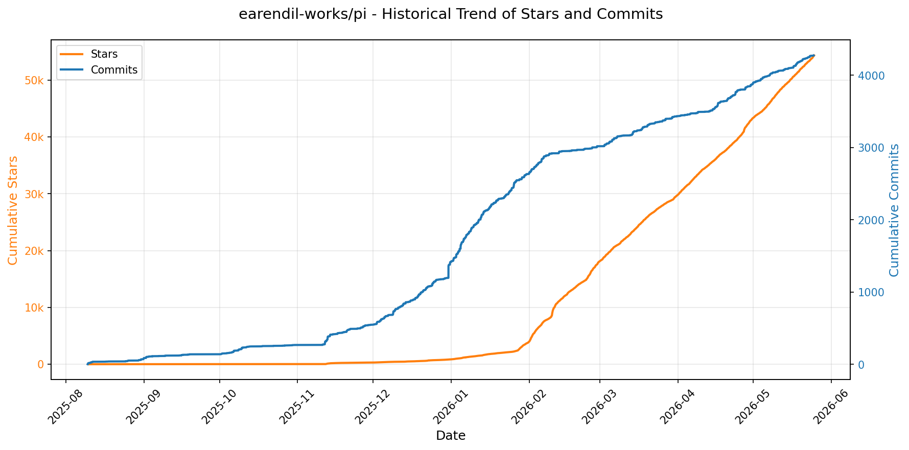

> *蓝色：累计 Stars｜橙色：累计 Commits（次 Y 轴）*

<b>📄 README 摘要</b>

1. **项目功能**  
该项目是一个面向开源软件开发的、可自我扩展的编程智能体（Coding Agent）框架，核心目标是构建一个能在真实开源协作场景中持续演进的自主编码助手。它不局限于单次任务执行，而是支持交互式编程会话、工具调用、状态持久化与会话共享；特别强调通过收集和公开真实开源项目的代理操作会话（如代码修改、调试、PR 生成等），反哺模型训练与系统优化，替代人工设计的玩具级基准测试。

2. **关键特性**  
- **模块化架构**：采用单体仓库（monorepo）管理多个高内聚子包，包括统一多厂商 LLM 接口（`pi-ai`）、可扩展的智能体运行时（`pi-agent-core`）、交互式终端 CLI（`pi-coding-agent`）及高性能终端 UI 库（`pi-tui`）；  
- **真实世界驱动演进**：内置标准化会话发布机制（通过 `pi-share-hf` 工具），鼓励用户将实际 OSS 编程会话上传至 Hugging Face 数据集，形成高质量、带上下文与修复过程的真实行为数据集；  
- **供应链安全强化**：实施严格依赖治理策略——直接依赖强制锁定精确版本、`package-lock.json` 为唯一可信源、预提交钩子阻止未授权 lockfile 更改、CLI 发布附带独立 `npm-shrinkwrap.json`、CI 中执行安全审计与签名验证，全面防范依赖投毒与供应链攻击。

3. **技术栈**  
- **语言与运行时**：TypeScript（全栈强类型）、Node.js（v18+）、Bun（可选替代运行时）；  
- **前端/终端界面**：基于终端的 TUI（`pi-tui` 包），采用差分渲染（differential rendering）提升响应性能；  
- **AI 基础设施**：抽象统一的 LLM 适配层（`pi-ai`），原生支持 OpenAI、Anthropic、Google Gemini 等主流提供商；  
- **工程实践**：pnpm/NPM workspace 管理 monorepo、ESLint + Prettier + TypeScript 类型检查、自定义 shell 测试脚本（`test.sh`/`pi-test.sh`）、Hugging Face 作为会话数据托管平台；  
- **部署与分发**：CLI 以 npm 包形式发布，含 shrinkwrap 锁定全依赖树，支持 `pi update --self` 自更新机制。

---

### 10. [ruvnet/RuView](https://github.com/ruvnet/RuView)
- 📅 **创建日期**：2025-06-07  
- 🔄 **最近更新**：2026-05-25  
- ⭐ **Stars**：51,555（日 +716｜周 +2800｜月 +2900）  
- 📝 **描述**：π RuView turns commodity WiFi signals into real-time spatial intelligence, vital sign monitoring, and presence detection — all without a single pixel of video.  

<b>📈 Star 与 Commit 历史趋势</b>

> *蓝色：累计 Stars｜橙色：累计 Commits（次 Y 轴）*

<b>📄 README 摘要</b>

1. **该项目的功能**  
RuView 是一个基于 WiFi 信道状态信息（CSI）的**无摄像头、无穿戴设备、可穿墙的边缘端无线感知平台**，旨在将普通 WiFi 信号转化为空间智能。它利用低成本 ESP32 硬件（如 ESP32-S3/C6）捕获人体对无线电波的微扰，实现实时、隐私友好的环境感知：包括穿墙人员存在性检测与计数、非接触式呼吸/心率监测、17 关键点姿态估计（WiFi DensePose）、跌倒识别、活动识别（行走/坐立/手势）、睡眠质量分析（含睡眠阶段与呼吸暂停筛查）、房间级环境建模（RF 指纹识别、家具移动检测）以及多模态融合（WiFi + 摄像头 + 毫米波雷达生成 3D 点云）。系统完全运行于本地边缘，无需云端处理、互联网连接或用户端 App，支持离线自治运行。

2. **核心特性**  
- **全栈隐私优先设计**：零摄像头、零生物数据上传、所有 AI 推理在边缘完成，敏感测量结果经 Ed25519 密码学见证链（witness chain）认证；  
- **超低功耗与低成本硬件支持**：单节点最低仅需 $9 的 ESP32-S3，支持多节点 Mesh 组网与 Cognitum Seed（$140 全功能套件）提供持久化向量存储、kNN 检索与可信执行环境；  
- **多频谱协同感知**：支持跨 6 个 WiFi 频道的时分复用（TDM）扫描，复用邻居路由器作为免费“雷达照射源”，提升感知带宽与鲁棒性；  
- **自适应边缘智能**：内置 105 个预认证、签名的轻量级边缘模块（Cogs），覆盖健康、安防、建筑、零售等场景，支持 OTA 动态安装与验证（ADR-102）；  
- **双路径模型训练体系**：  
  • *无监督预训练*：12.2M 步对比学习编码器（Hugging Face 公开，4-bit 量化仅 8 KB），输出 128 维 CSI 嵌入（164K emb/s）；  
  • *有监督精调*：基于 MediaPipe + ESP32 CSI 配对数据的端到端相机辅助训练 pipeline（ADR-079），目标 PCK@20 ≥35%；  
- **开箱即用的智能家居集成**：原生支持 Home Assistant（21 个实体 + 3 个 Blueprint）、Apple Home / Google Home / Matter / Alexa / SmartThings，通过 MQTT 或 Matter Bridge 一键接入；  
- **高精度实时算法**：呼吸率（6–30 BPM）、心率（40–120 BPM）检测延迟 <200 ms；存在检测 <1 ms（100% 验证集准确率）；跌倒识别响应 <200 ms；17 点姿态估计冷启动 8.4 ms（Pi 5）；  
- **开放工具链与多部署形态**：支持 Docker（仿真）、Python PyPI 包（`ruview` / `wifi-densepose`）、Rust 固件、ESP-IDF 编译、Web 可视化（three.js 实时骨架/点云/融合演示）。

3. **技术栈**  
- **嵌入式固件层**：Rust（ESP32-S3/C6 固件，基于 ESP-IDF v5.4）、RISC-V（ESP32-C6 低功耗核心运行运动门控程序）；  
- **边缘计算层**：Rust（sensing-server、SNN 实时学习器、mincut 计数器等）、Python（PyO3 封装的高性能信号处理模块，兼容 Linux/macOS/Windows，abi3-py310 轮子）；  
- **AI 模型与推理**：Candle（Rust 原生 ML 框架，加载 `.safetensors`）、Cog（aarch64/x86_64 签名二进制 pose_v1.safetensors 推理引擎）、自研 4-bit 量化 CSI 编码器；  
- **通信与协议**：WiFi CSI（ESP32-S3/C6 原生支持）、ESP-NOW（C6 多板 Mesh 同步，99.56% 匹配率）、MQTT（Home Assistant 集成）、Matter（桥接模式）、WebSocket / HTTP API；  
- **基础设施与部署**：Docker（多架构 amd64/arm64）、Hugging Face（模型托管：`ruvnet/wifi-densepose-pretrained`）、GitHub Actions CI/CD（1463 个通过测试）、JSONL/RVF 模型容器格式；  
- **硬件生态**：主推 ESP32-S3（$9）、ESP32-C6（Wi-Fi 6/802.15.4 研究节点，$6–10）、Cognitum Seed（RISC-V + 安全 enclave + 向量数据库，$140 BOM）、可选 Intel 5300/AR9580 研究网卡。

---

### 11. [addyosmani/agent-skills](https://github.com/addyosmani/agent-skills)
- 📅 **创建日期**：2026-02-15  
- 🔄 **最近更新**：2026-05-25  
- ⭐ **Stars**：42,610（日 +238｜周 +2504｜月 +19970）  
- 📝 **描述**：Production-grade engineering skills for AI coding agents.  

<b>📈 Star 与 Commit 历史趋势</b>

> *蓝色：累计 Stars｜橙色：累计 Commits（次 Y 轴）*

<b>📄 README 摘要</b>

1. **该项目的作用**  
该项目为AI编程代理（AI coding agents）提供一套面向生产环境的工程化能力框架——“Agent Skills”，旨在将资深工程师在软件开发全生命周期中遵循的专业工作流、质量门禁与最佳实践，系统性地编码为AI可理解、可执行的结构化技能。它不提供运行时工具或模型，而是通过标准化的Markdown技能文档（SKILL.md），引导AI代理在需求澄清、规划、编码、测试、评审、重构、部署等各阶段严格遵循经过验证的工程规范，从而显著提升AI生成代码的可靠性、安全性、可维护性与可交付性。

2. **核心特性**  
- **7个生命周期命令驱动**：`/spec`、`/plan`、`/build`、`/test`、`/review`、`/code-simplify`、`/ship`，每个命令自动激活对应阶段的结构化技能组合；  
- **23项原子化技能覆盖全链路**：含22个具体工程技能（如`spec-driven-development`、`doubt-driven-development`、`security-and-hardening`）及1个元技能`using-agent-skills`，每项技能均具备完整工作流（步骤+检查点+退出标准）、反合理化表（驳斥常见跳步借口）、强制验证要求（必须提供可验证证据，如测试通过日志、DevTools截图、ADR文档等）；  
- **上下文感知自动触发**：支持基于开发行为（如编写API、构建UI）动态激活相关技能（如`api-and-interface-design`、`frontend-ui-engineering`）；  
- **多平台即插即用**：原生适配Claude Code、Cursor、Gemini CLI、Windsurf、OpenCode、GitHub Copilot、Kiro等主流AI编程工具，提供各平台专属安装与集成指南；  
- **专业化代理角色（Personas）**：预置`code-reviewer`（资深工程师视角五维评审）、`test-engineer`（QA专家级验证策略）、`security-auditor`（OWASP合规审计）三类高阶评审角色；  
- **轻量渐进式设计**：技能文档采用统一解剖结构（Frontmatter + Overview/Process/Rationalizations/Red Flags/Verification），辅以按需加载的参考清单（如安全/性能/无障碍检查表），最小化上下文开销；  
- **深度工程文化沉淀**：内嵌Google工程实践精髓，包括Hyrum’s Law、Beyoncé Rule、Chesterton’s Fence、Trunk-Based Development、Shift Left、代码即负债（Code-as-Liability）等原则，并落实到每一步操作指引中。

3. **技术栈**  
- **核心格式**：纯文本Markdown（`.md`），无依赖运行时，兼容所有支持系统提示（system prompt）或指令文件（instruction files）的AI代理；  
- **组织结构**：模块化目录设计，含`skills/`（23项技能）、`agents/`（3类专家Persona）、`references/`（4类速查清单）、`hooks/`（会话生命周期钩子）、各平台专属命令配置（如`.claude/commands/`、`.gemini/commands/`）；  
- **集成方式**：通过各IDE/CLI工具的插件机制（Plugin API）、规则目录（`.cursor/rules/`）、技能注册（`gemini skills install`）、Copilot指令文件（`.github/copilot-instructions.md`）或本地路径挂载（如`claude --plugin-dir`）实现接入；  
- **协议与传输**：支持HTTPS与SSH两种Git仓库克隆方式，适配不同开发者环境配置；  
- **许可证**：MIT开源协议，允许自由使用、修改与分发。

---

### 12. [blakeblackshear/frigate](https://github.com/blakeblackshear/frigate)
- 📅 **创建日期**：2019-01-26  
- 🔄 **最近更新**：2026-05-25  
- ⭐ **Stars**：33,013（日 +275｜周 +891｜月 +1336）  
- 📝 **描述**：NVR with realtime local object detection for IP cameras  

<b>📈 Star 与 Commit 历史趋势</b>

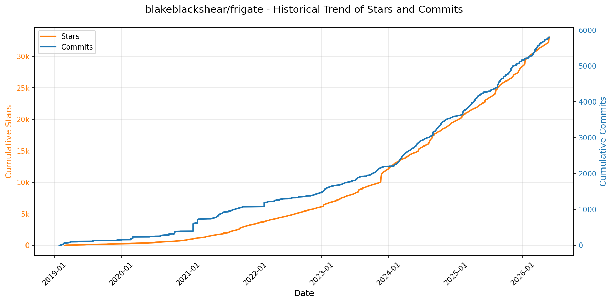

> *蓝色：累计 Stars｜橙色：累计 Commits（次 Y 轴）*

<b>📄 README 摘要</b>

1. **项目功能**  
Frigate NVR™ 是一款面向家庭自动化场景的本地化网络视频录像机（NVR），专为与 Home Assistant 深度集成而设计。它利用计算机视觉与人工智能技术，对多路 IP 摄像头视频流进行**实时、本地化的目标检测**（如人、车、宠物等），无需依赖云端服务。系统可智能触发录像、按对象类型与事件自动保留录像片段，并支持 24/7 全时录制；同时提供低延迟直播（WebRTC/MSE）、RTSP 重流（减少摄像头直连负载）、运动区域与检测区域配置、事件回溯审查等功能，实现隐私优先、高性能的智能视频监控闭环。

2. **核心特性**  
- ✅ **AI 驱动的实时目标检测**：基于 TensorFlow（支持多种硬件加速器）在本地执行检测，仅在运动区域或预设区域内运行模型，显著降低计算开销；  
- ✅ **极致资源优化架构**：采用多进程设计，分离运动检测、AI 推理、录像编码、事件管理等模块，优先保障实时性而非逐帧处理；  
- ✅ **智能录像策略**：支持按检测对象类型（如“person”“dog”）设置差异化保留时长，结合前置/后置缓冲实现精准事件录像；  
- ✅ **深度 Home Assistant 集成**：通过官方定制组件提供传感器、摄像头、通知、自动化触发等原生支持；  
- ✅ **灵活接入与分发**：MQTT 协议输出检测事件与元数据，便于对接其他系统；内置 RTSP 服务器实现摄像头流复用；  
- ✅ **可视化交互能力**：提供 Web 管理界面，支持多摄像头时间轴拖拽回放、内置掩码/区域绘制工具、实时仪表盘与事件筛选审查流程。

3. **技术栈**  
- **核心框架**：Python（主程序）、OpenCV（图像处理与运动检测）、TensorFlow（目标检测模型推理）；  
- **硬件加速支持**：兼容 NVIDIA GPU（CUDA/TensorRT）、Google Coral TPU、Intel VPU、AMD ROCm 等 AI 加速器（通过 Frigate 官方支持的检测器后端）；  
- **通信协议**：MQTT（事件与状态发布/订阅）、RTSP（视频流转发）、HTTP/WebSocket（Web UI）、WebRTC & MSE（低延迟前端播放）；  
- **存储与媒体**：FFmpeg（视频编码/转封装/截图）、SQLite（元数据与事件索引）、本地文件系统（录像存储，支持 NFS/Samba）；  
- **前端**：HTML/CSS/JavaScript（Vue.js 或类 Vue 架构构建的响应式 Web UI）；  
- **部署环境**：Linux（主流发行版）、Docker 容器化支持（官方镜像）、Home Assistant OS 插件模式。

---

### 13. [Alishahryar1/free-claude-code](https://github.com/Alishahryar1/free-claude-code)
- 📅 **创建日期**：2026-01-28  
- 🔄 **最近更新**：2026-05-25  
- ⭐ **Stars**：29,444（日 +522｜周 +3982｜月 +20225）  
- 📝 **描述**：Use claude-code for free in the terminal, VSCode extension or discord like OpenClaw (voice supported)  

<b>📈 Star 与 Commit 历史趋势</b>

> *蓝色：累计 Stars｜橙色：累计 Commits（次 Y 轴）*

<b>📄 README 摘要</b>

1. **项目功能**  
本项目是一个开源的 Anthropic 兼容代理服务器（`free-claude-code`），核心作用是**将 Claude Code 客户端（CLI / VS Code / JetBrains ACP / 聊天机器人）发出的 Anthropic Messages API 请求，透明地路由至任意支持的后端大模型服务提供商**。它不修改 Claude Code 的客户端协议，而是作为中间网关，使用户无需更改客户端即可自由切换模型供应商——包括免费、付费或本地部署的模型（如 Ollama、llama.cpp、LM Studio）。项目同时提供本地管理界面（`/admin`）、多平台消息机器人集成（Discord/Telegram）及可选语音转文字能力，实现“一套客户端，无限模型源”的灵活开发体验。

2. **关键特性**  
- ✅ **即插即用代理**：完全兼容 Claude Code 原生 Anthropic Messages API 协议，零代码修改即可接管流量；  
- ✅ **17+ 多源模型支持**：原生集成 NVIDIA NIM、OpenRouter、Google Gemini、DeepSeek、Mistral（La Plateforme & Codestral）、OpenCode（Zen/Go）、Wafer、Kimi、Cerebras、Groq、Fireworks AI、Z.ai、LM Studio、llama.cpp、Ollama 等主流平台；  
- ✅ **按模型层级精细化路由**：支持为 `opus`/`sonnet`/`haiku` 三类 Claude 模型等级分别指定不同后端（通过 `MODEL_OPUS`/`MODEL_SONNET`/`MODEL_HAIKU` 配置），实现混合调度；  
- ✅ **全功能 API 兼容性**：完整支持流式响应（streaming）、工具调用（tool use）、推理思维块（reasoning/thinking blocks）、请求自动压缩（`CLAUDE_CODE_AUTO_COMPACT_WINDOW`）、模型发现（`/v1/models` 端点）；  
- ✅ **本地管理控制台**：内置 `/admin` 管理 UI（仅本机访问），支持实时配置 API 密钥、模型路由、服务地址、验证参数并热重载；  
- ✅ **可选扩展能力**：  
  - Discord / Telegram 远程编码机器人（支持 `/stop`/`/clear`/`/stats` 指令与会话分支管理）；  
  - 语音笔记转文字（支持 NVIDIA Riva gRPC 或本地 Whisper CPU/CUDA）；  
  - VS Code / JetBrains ACP 官方插件无缝对接（含 Gateway Model Discovery 支持）。

3. **技术栈**  
- **后端框架**：Python 3.14 + Uvicorn（ASGI 服务器）；  
- **依赖管理与构建**：`uv`（超快 Python 包安装器与虚拟环境工具）；  
- **核心库**：  
  - 异步 HTTP 客户端：`httpx`（隐含，用于转发请求）；  
  - 类型安全：`ty`（轻量级类型检查库）；  
  - 日志系统：`loguru`（结构化、彩色、线程安全日志）；  
- **开发规范**：  
  - 代码格式化：`ruff`（极快、全功能 Python linter/formatter）；  
  - 测试框架：`pytest`；  
  - 许可证：MIT；  
- **前端管理界面**：内置简易 Web UI（基于 FastAPI 模板渲染，无前端框架依赖）；  
- **部署与运行时**：纯 Python 应用，跨平台（macOS/Linux/Windows），支持本地 loopback 访问，无数据库依赖。

---

### 14. [multica-ai/multica](https://github.com/multica-ai/multica)
- 📅 **创建日期**：2026-01-13  
- 🔄 **最近更新**：2026-05-25  
- ⭐ **Stars**：29,175（日 +602｜周 +3595｜月 +12115）  
- 📝 **描述**：The open-source managed agents platform. Turn coding agents into real teammates — assign tasks, track progress, compound skills.  

<b>📈 Star 与 Commit 历史趋势</b>

> *蓝色：累计 Stars｜橙色：累计 Commits（次 Y 轴）*

<b>📄 README 摘要</b>

1. **项目功能**  
Multica 是一个开源的、可自主托管的「智能体（Agent）协同管理平台」，旨在将编程类 AI 智能体（如 Claude Code、GitHub Copilot CLI、Gemini、Cursor Agent 等）转化为真实意义上的团队成员。它提供类 Jira/GitHub 的任务看板与工作流，支持向智能体直接分配 Issue（任务），由其自主拉取、执行、反馈阻塞、提交代码并更新状态；无需人工反复粘贴提示词或手动监控运行过程。核心目标是构建“人与智能体共事”的新型软件工程范式——智能体拥有身份、参与协作、积累技能，并与人类工程师在统一工作流中并行作业。

2. **关键特性**  
- **智能体即队友（Agents as Teammates）**：每个智能体具备独立档案，在任务看板中可见、可指派；能自动评论、创建子任务、上报阻塞问题，行为模式贴近人类开发者。  
- **小队（Squads）机制**：支持将多个智能体（及人类成员）组织为逻辑团队，由领导智能体统一接收任务并动态调度，实现稳定、可扩展的任务路由（如 `@FrontendTeam`）。  
- **全自动任务生命周期管理**：覆盖入队（enqueue）、认领（claim）、启动（start）、完成/失败（complete/fail）全流程，通过 WebSocket 实时推送执行进度。  
- **自动驾驶（Autopilots）**：支持基于 Cron、Webhook 或手动触发的周期性自动化任务（如每日站会摘要、周报生成、安全审计），自动创建 Issue 并分发至指定智能体。  
- **可复用技能库（Reusable Skills）**：智能体每次成功解决的问题可沉淀为团队共享技能，支持跨任务、跨成员复用，实现能力持续复利增长（如部署脚本、迁移模板、代码审查规则）。  
- **统一运行时管理（Unified Runtimes）**：集中管控本地 Daemon 与云环境运行时，自动探测已安装的各类智能体 CLI 工具链，实时监控资源与执行状态。  
- **多工作区隔离（Multi-Workspace）**：支持按团队/项目划分独立工作区，各工作区拥有专属智能体、任务池、权限与配置，保障数据与策略隔离。

3. **技术栈**  
- **前端**：Next.js 16（App Router）  
- **后端**：Go 语言（基于 Chi 路由框架，使用 sqlc 生成数据库层，gorilla/websocket 实现实时通信）  
- **数据库**：PostgreSQL 17 + pgvector（支持向量检索，为技能库等高级功能提供基础）  
- **智能体运行时**：本地轻量级 Daemon 进程，原生集成并调度十余种主流编程智能体 CLI，包括：Claude Code、Codex、GitHub Copilot CLI、OpenClaw、OpenCode、Hermes、Gemini、Pi、Cursor Agent、Kimi、Kiro CLI  
- **部署与开发**：支持 Docker 容器化自托管；开发依赖 Node.js v20+、pnpm v10.28+、Go v1.26+；移动端（iOS）客户端独立维护于 `apps/mobile/`。

---

### 15. [soxoj/maigret](https://github.com/soxoj/maigret)
- 📅 **创建日期**：2020-06-27  
- 🔄 **最近更新**：2026-05-25  
- ⭐ **Stars**：28,583（日 +165｜周 +1063｜月 +9025）  
- 📝 **描述**：🕵️‍♂️ Collect a dossier on a person by username from 3000+ sites  

<b>📈 Star 与 Commit 历史趋势</b>

> *蓝色：累计 Stars｜橙色：累计 Commits（次 Y 轴）*

<b>📄 README 摘要</b>

1. **项目功能**  
Maigret 是一款开源的 OSINT（开源情报）工具，仅凭一个用户名即可自动在数千个网站上执行大规模账号搜索，构建目标人物的综合档案。它无需任何第三方 API 密钥，可全自动探测并抓取公开个人资料页中的结构化信息（如真实姓名、所在地、职业、兴趣、关联账号链接等），支持递归挖掘（基于新发现的用户名或 ID 持续扩展搜索）、跨平台关联分析，并生成多格式调查报告（HTML、PDF、XMind、JSON、CSV、纯文本、交互式图谱等）。同时提供可选的 AI 辅助分析功能，利用 OpenAI 兼容接口对原始结果进行语义提炼，输出中立、简洁的调查摘要。

2. **核心特性**  
- 支持 **3000+ 网站**（含 Tor/.onion 与 I2P/.i2p 隐私网络站点），默认扫描流量排名前 500 的站点，支持全量（`-a`）、按标签（`--tags`，如 `photo`、`us`、`dating`）或国家/类别精准筛选；  
- 内置智能反封锁机制：可检测并部分绕过 WAF、CAPTCHA、IP 封禁及 Cloudflare JavaScript 挑战（需配合 FlareSolverr）；  
- 支持代理链：原生集成 Tor（`--tor-proxy`）、I2P（`--i2p-proxy`）及任意 HTTP/SOCKS 代理（`--proxy`）；  
- 数据库自动更新：每次运行自动从 GitHub 同步最新站点配置（24 小时限频），离线时无缝降级至内置数据库；  
- 强大的递归与衍生能力：支持 `--parse`（解析单页提取新用户名）、`--permute`（生成常见用户名变体组合搜索）；  
- 多模态输出：除标准 CLI 结果外，提供内置 Web UI（D3 图谱可视化 + 一键下载全格式报告）、Python 库嵌入接口（可编程集成至自有系统）；  
- AI 分析模块（`--ai`）：将结构化结果转为 Markdown 报告，调用 OpenAI 兼容 API（支持自定义模型与端点）生成含置信度评估的自然语言摘要；  
- 开箱即用部署方案：提供独立 Windows 可执行文件（`.exe`）、Docker 镜像（CLI/Web 双模式）、云环境一键启动（Google Cloud Shell、Replit、Colab、Binder）及 pip 安装。

3. **技术栈**  
- **主语言**：Python 3.10+（核心逻辑、异步 HTTP 请求、数据解析）；  
- **网络层**：`httpx`（异步 HTTP 客户端，支持 HTTP/2、代理、超时控制）；  
- **解析引擎**：`socid_extractor`（独立子项目，专用于从 HTML/API 响应中高精度抽取结构化用户信息）；  
- **Web UI**：Flask（后端框架）、D3.js（交互式关系图谱）、Jinja2（模板渲染）；  
- **AI 集成**：兼容 OpenAI Chat Completion API 标准（支持 `gpt-4o-mini` 等模型），通过环境变量或 `settings.json` 配置密钥与端点；  
- **辅助工具链**：`pdfkit`/`wkhtmltopdf`（PDF 报告生成）、`lxml`/`beautifulsoup4`（HTML 解析）、`networkx`（图谱构建）、`PyYAML`/`json`（配置与数据序列化）；  
- **构建与分发**：Docker（多阶段构建）、PyInstaller（Windows 独立包）、GitHub Actions（CI/CD、自动发布）；  
- **基础设施**：站点数据库采用 JSON Schema 管理（`data.json`），通过 Python 脚本自动生成文档（`sites.md`）与元数据。

---

### 16. [anthropics/claude-plugins-official](https://github.com/anthropics/claude-plugins-official)
- 📅 **创建日期**：2025-11-20  
- 🔄 **最近更新**：2026-05-25  
- ⭐ **Stars**：27,397（日 +685｜周 +7681｜月 +9570）  
- 📝 **描述**：Official, Anthropic-managed directory of high quality Claude Code Plugins.  

<b>📈 Star 与 Commit 历史趋势</b>

> *蓝色：累计 Stars｜橙色：累计 Commits（次 Y 轴）*

<b>📄 README 摘要</b>

1. **该项目的作用**  
该项目是一个为 Claude Code（Anthropic 推出的 AI 编程助手）官方维护的插件目录（Plugin Marketplace），用于集中展示、分发和管理高质量插件。它不直接提供插件功能，而是作为结构化、可发现的插件索引平台，支持用户通过命令行（如 `/plugin install`）或图形界面（`/plugin > Discover`）一键安装和发现插件，涵盖 Anthropic 自研的内部插件与经审核的第三方社区/合作伙伴插件。

2. **核心特性**  
- **双源插件分类管理**：明确区分 `/plugins`（Anthropic 官方开发并维护的内部插件）与 `/external_plugins`（经质量与安全审核后收录的第三方插件）；  
- **标准化插件结构规范**：强制要求每个插件包含 `.claude-plugin/plugin.json`（必选元数据文件），支持可选的 MCP 服务配置（`.mcp.json`）、Slash 命令（`commands/`）、智能体定义（`agents/`）和技能定义（`skills/`），确保兼容性与可扩展性；  
- **安全优先的分发机制**：显著强调用户需自主评估插件可信度，明确声明 Anthropic 不对第三方插件内容、行为或后续变更负责，并要求插件提供独立主页与许可证信息；  
- **开放但受控的贡献流程**：内部插件采用参考实现（如 `/plugins/example-plugin`）指导开发；外部插件须通过[专用提交表单](https://clau.de/plugin-directory-submission)申请，并满足严格的质量与安全准入标准方可上架。

3. **技术栈**  
- **核心协议与标准**：基于 Anthropic 定义的 **Claude 插件协议** 和 **MCP（Model Communication Protocol）** 规范，其中 `.mcp.json` 文件用于配置模型与插件后端服务的通信；  
- **元数据格式**：使用 JSON 格式定义插件核心信息（`plugin.json`），包含名称、版本、权限、入口点等必需字段；  
- **交互接口**：依托 Claude Code 内置的插件系统，支持自然语言触发的 Slash 命令（如 `/plugin install`）、图形化插件发现界面及本地文件系统级插件目录结构；  
- **开发与分发基础设施**：依赖 GitHub 仓库组织代码（目录即插件包）、静态文档（`README.md`）与外部链接（各插件独立 LICENSE 及主页），无前端应用或运行时服务，属纯声明式目录型项目。

---

### 17. [shiyu-coder/Kronos](https://github.com/shiyu-coder/Kronos)
- 📅 **创建日期**：2025-07-01  
- 🔄 **最近更新**：2026-05-25  
- ⭐ **Stars**：25,935（日 +186｜周 +618｜月 +4627）  
- 📝 **描述**：Kronos: A Foundation Model for the Language of Financial Markets  

<b>📈 Star 与 Commit 历史趋势</b>

> *蓝色：累计 Stars｜橙色：累计 Commits（次 Y 轴）*

<b>📄 README 摘要</b>

1. **项目功能**  
Kronos 是首个面向金融K线（蜡烛图）数据的开源基础模型，专为理解与建模金融市场的“语言”而设计。它将多维、高噪声的OHLCV（开盘价、最高价、最低价、收盘价、成交量、成交额）时序数据视为一种特殊语言，通过量化建模实现对金融时间序列的统一表征与生成式预测，支持跨资产、跨市场的价格与量能联合预测，并可作为下游量化任务（如信号生成、策略回测）的通用基座模型。

2. **核心特性**  
- **首创金融K线专用分词器（Tokenizer）**：提出两阶段框架——先将连续OHLCV数据分层离散化为语义化token（支持2k/基础等多版本），再输入Transformer建模；  
- **多尺度模型家族**：提供从4.1M（Kronos-mini）到499.2M参数（Kronos-large）的四档预训练模型，覆盖轻量部署至高性能研究需求；  
- **开箱即用的预测接口**：`KronosPredictor` 封装完整流程（标准化、token化、推理、逆变换），支持单序列与GPU并行批量预测（`predict_batch`），自动处理截断与缺失字段；  
- **端到端微调流水线**：提供基于Qlib的A股市场微调示例，涵盖数据预处理、分词器适配、模型微调及简单Top-K策略回测全流程；  
- **实时可视化演示**：上线BTC/USDT 24小时K线预测交互Demo，直观展示模型输出效果；  
- **全开源与可复现**：所有模型权重、Tokenizer、训练/预测代码、示例脚本及配置均开放，支持Hugging Face一键加载与本地部署。

3. **技术栈**  
- **模型架构**：Decoder-only 自回归Transformer（类似GPT系列），针对金融时序优化；  
- **核心依赖**：PyTorch（含`torchrun`多GPU训练）、Hugging Face `transformers` & `tokenizers`、pandas、numpy；  
- **数据生态**：深度集成微软Qlib量化平台（用于A股数据准备与回测）；  
- **部署与工具链**：支持Hugging Face Hub模型托管与加载，提供`requirements.txt`标准化依赖管理；可视化使用Matplotlib；日志与实验追踪兼容Comet.ml（可选）；  
- **开发语言**：Python 3.10+；  
- **许可证**：MIT开源协议。

---

### 18. [anthropics/financial-services](https://github.com/anthropics/financial-services)
- 📅 **创建日期**：2026-02-23  
- 🔄 **最近更新**：2026-05-25  
- ⭐ **Stars**：22,251（日 +266｜周 +2863｜月 +15265）  
- 📝 **描述**：暂无描述  

<b>📈 Star 与 Commit 历史趋势</b>

> *蓝色：累计 Stars｜橙色：累计 Commits（次 Y 轴）*

<b>📄 README 摘要</b>

1. **该项目做什么？**  
该项目提供面向金融服务业（FSI）的标准化AI代理（Agents）、专业技能（Skills）和数据连接器（Connectors），覆盖投资银行、股权研究、私募股权、财富管理、基金运营及合规运营等核心业务场景。它不生成投资建议或执行交易，而是辅助专业人士高效产出分析师工作成果——如可比公司分析（Comps）、DCF/LBO模型、盈利电话会议纪要、尽调备忘录（IC Memo）、月结报告、GL对账、KYC筛查、LP报表审核等——所有输出均需人工复核与签批，严格定位为“人类主导、AI提效”的合规辅助工具。

2. **关键特性**  
- **双部署模式统一架构**：同一套能力同时支持两种运行方式——作为Claude Cowork插件开箱即用，或通过Claude Managed Agents API部署至企业自有工作流引擎，系统提示词、技能逻辑与数据连接完全一致；  
- **分层模块化设计**：分为「端到端代理」（Agents，如Pitch Agent、GL Reconciler）和「垂直领域技能包」（Vertical Plugins，如investment-banking、equity-research），既可整体安装，也可按需组合（如仅启用`/comps` `/dcf`命令及底层数据连接器）；  
- **深度金融集成能力**：内置11个主流金融数据源的MCP（Model Context Protocol）连接器（涵盖LSEG、S&P Global、FactSet、Moody’s、PitchBook、Daloopa等），并支持对接内部系统（如Egnyte文档库、自建终端）；  
- **开箱即用+高度可定制**：所有代理和技能以纯文本（Markdown/YAML/JSON）形式组织，无编译依赖；支持替换数据源、注入公司术语/模板/流程规范、调整代理范围，甚至扩展新代理；  
- **企业级就绪功能**：包含Microsoft 365插件部署工具链（支持Vertex AI/Bedrock/私有LLM网关）、细粒度安全说明（含handoff事件隔离指引）、自动化校验脚本（`check.py`/`validate.py`）及跨插件技能同步机制（`sync-agent-skills.py`）。

3. **技术栈**  
- **核心平台**：Anthropic Claude（Cowork插件生态 + Managed Agents API）；  
- **协议标准**：Model Context Protocol（MCP）实现安全、标准化的数据连接；  
- **文件格式**：纯文本驱动——Markdown（代理说明、技能文档）、YAML（Managed Agent配置`agent.yaml`）、JSON（MCP连接器定义`.mcp.json`、插件清单）；  
- **部署与运维**：Shell脚本（`deploy-managed-agent.sh`）、Python工具链（`orchestrate.py`事件路由参考、`check.py`静态校验、`sync-agent-skills.py`技能同步）；  
- **集成生态**：原生兼容Microsoft 365（Excel/PPT/Word/Outlook插件）、企业级数据平台（LSEG Analytics、S&P Capital IQ、FactSet等）及AI就绪基础设施（Vertex AI、AWS Bedrock、私有LLM网关）。

---

### 19. [colbymchenry/codegraph](https://github.com/colbymchenry/codegraph)
- 📅 **创建日期**：2026-01-18  
- 🔄 **最近更新**：2026-05-25  
- ⭐ **Stars**：19,737（日 +2392｜周 +18691｜月 +19737）  
- 📝 **描述**：Pre-indexed code knowledge graph for Claude Code, Codex, Cursor, OpenCode, and Hermes Agent — fewer tokens, fewer tool calls, 100% local  

<b>📈 Star 与 Commit 历史趋势</b>

> *蓝色：累计 Stars｜橙色：累计 Commits（次 Y 轴）*

<b>📄 README 摘要</b>

1. **项目功能**  
CodeGraph 是一个本地化、轻量级的语义代码知识图谱引擎，专为增强 AI 编程代理（如 Claude Code、Cursor、Codex CLI、opencode 和 Hermes Agent）的代码理解与导航能力而设计。它通过在本地预构建并持续同步项目级代码知识图谱（含符号定义、调用关系、继承结构、导入依赖、框架路由等），使 AI 代理能直接通过高效 MCP 工具调用获取精准上下文，**彻底替代传统基于 grep/ls/read 的试探性文件扫描流程**，从而实现零网络传输、零数据外泄的离线智能代码探索。

2. **核心特性**  
- ✅ **智能上下文生成**：单次 `codegraph_context` 调用即可聚合入口点、关联符号及源码片段，无需启动耗资源的子探索代理；  
- ✅ **毫秒级全文搜索**：基于 SQLite FTS5 实现跨语言、全代码库的符号名称模糊/精确检索；  
- ✅ **影响面分析（Impact Analysis）**：支持对任意函数/类执行多层调用者（callers）、被调用者（callees）及变更影响半径（impact）追踪；  
- ✅ **全自动实时同步**：利用操作系统原生文件监听机制（FSEvents/inotify/ReadDirectoryChangesW），配合防抖与源文件过滤，实现“编辑即索引”，零配置保持图谱始终最新；  
- ✅ **超广语言支持**：原生支持 TypeScript、JavaScript、Python、Go、Rust、Java、C#、Swift、Kotlin 等 **19+ 主流编程与标记语言**；  
- ✅ **框架感知路由映射**：自动识别并建模 Django、Flask、FastAPI、Express、NestJS、Spring、Gin 等 **14 种 Web 框架的路由声明**，将 URL 模式与控制器/处理器双向关联；  
- ✅ **100% 本地化与隐私优先**：所有数据（SQLite 数据库 `.codegraph/codegraph.db`）严格保留在用户设备，不依赖任何远程 API、云服务或密钥。

3. **技术栈**  
- **解析层**：基于 [Tree-sitter](https://tree-sitter.github.io/) 进行高性能、多语言 AST 解析，配合自定义语言查询提取符号节点与语义边（calls, imports, extends, implements, routes）；  
- **存储层**：纯本地 SQLite 数据库存储知识图谱（节点/边/文件元数据），集成 FTS5 全文搜索引擎；  
- **运行时**：自包含 Node.js 运行时（bundled），无需用户预装 Node.js；支持 macOS/Linux/Windows 三端原生二进制分发（通过 curl/Powershell 一键安装）；  
- **协议层**：遵循 [MCP（Model Communication Protocol）](https://modelcontextprotocol.org/) 标准，作为标准 STDIO 类型 MCP Server 对接各类 LLM 编程代理；  
- **构建与分发**：使用现代 JavaScript 工具链（TypeScript + esbuild/Vite 构建），npm 包发布（`@colbymchenry/codegraph`），支持 `npx` 零安装快速启用；  
- **CLI 与自动化**：提供完整命令行工具集（`codegraph init/sync/query/affected/serve` 等），深度集成 Git 工作流（如 `codegraph affected` 支持 CI 中精准触发受影响测试）。

---

### 20. [AIDC-AI/Pixelle-Video](https://github.com/AIDC-AI/Pixelle-Video)
- 📅 **创建日期**：2025-11-07  
- 🔄 **最近更新**：2026-05-25  
- ⭐ **Stars**：19,630（日 +170｜周 +1766｜月 +13050）  
- 📝 **描述**：🚀 AI 全自动短视频引擎 | AI Fully Automated Short Video Engine  

<b>📈 Star 与 Commit 历史趋势</b>

> *蓝色：累计 Stars｜橙色：累计 Commits（次 Y 轴）*

<b>📄 README 摘要</b>

1. **项目功能**  
Pixelle-Video 是一个端到端的 AI 自动化短视频生成引擎。用户仅需输入一个主题关键词，系统即可全自动完成整条短视频的全流程生产：包括智能撰写解说文案、AI 生成匹配图文/动态视频、TTS 语音合成（支持多语言及音色克隆）、背景音乐自动添加、多模板视觉排版，最终一键合成可发布的成品视频（竖屏/横屏/方形），全程无需人工剪辑或技术门槛。

2. **核心特性**  
- **全链路自动化**：覆盖“文案生成 → 配图/视频生成 → 语音合成 → BGM 添加 → 视频合成”完整流程；  
- **多模态生成能力**：支持数字人口播、图生视频、动作迁移（上传参考视频+图片驱动新主体动作）、自定义素材反推脚本；  
- **高度可配置与可扩展**：基于 ComfyUI 架构，支持灵活替换 LLM（GPT/Qwen/DeepSeek/Ollama 等）、TTS（Edge-TTS/Index-TTS/ChatTTS）、图像模型（FLUX/WAN 2.1 等）及视频工作流；  
- **专业级创作控制**：提供结构化提示词前缀、分镜粒度控制（段落/行/句）、多尺寸输出、多风格模板（static/image/video 类 HTML 模板）、BGM 自定义与试听、参考音频克隆音色；  
- **双部署模式支持**：本地（ComfyUI + Ollama 免费方案）与云端（RunningHub + 商用 API）无缝切换，Windows 一键整合包开箱即用；  
- **增强用户体验**：内置 FAQ 侧边栏、历史任务管理、批量生成、实时进度反馈、模板参数预览、跨平台兼容性优化。

3. **技术栈**  
- **前端框架**：Streamlit（构建交互式 Web UI，地址 `http://localhost:8501`）；  
- **AI 模型调度层**：深度集成 ComfyUI（作为图像/视频生成工作流执行引擎），支持其 JSON 工作流协议；  
- **大语言模型（LLM）**：兼容 OpenAI、Qwen（通义千问）、DeepSeek、Ollama 等，通过标准 API 或本地推理调用；  
- **语音合成（TTS）**：支持 Edge-TTS（微软）、Index-TTS（支持音色克隆）、ChatTTS 等多后端，通过可插拔工作流管理；  
- **图像/视频生成**：对接本地 ComfyUI 或云端 RunningHub 服务，支持 FLUX、WAN 2.1 等先进模型；  
- **基础设施依赖**：Python（uv 包管理器）、FFmpeg（视频编解码与合成）、HTML/CSS/JS（自定义模板渲染）；  
- **部署支持**：Windows 一键整合包（含所有运行时）、macOS/Linux 源码部署、多平台 API 兼容（含并发控制、API Key 配置、URL 路径标准化）。

---

### 21. [manaflow-ai/cmux](https://github.com/manaflow-ai/cmux)
- 📅 **创建日期**：2026-01-28  
- 🔄 **最近更新**：2026-05-25  
- ⭐ **Stars**：19,051（日 +549｜周 +1844｜月 +3823）  
- 📝 **描述**：Ghostty-based macOS terminal with vertical tabs and notifications for AI coding agents  

<b>📈 Star 与 Commit 历史趋势</b>

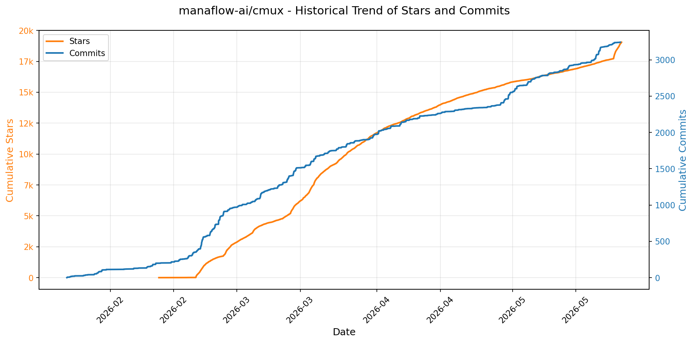

> *蓝色：累计 Stars｜橙色：累计 Commits（次 Y 轴）*

<b>📄 README 摘要</b>

1. **项目功能**  
cmux 是一款专为 macOS 设计的原生终端应用，基于 Ghostty 构建，核心目标是提升 AI 编程代理（如 Claude Code、Codex、Grok 等）协同开发的工作流效率。它并非传统终端复用器（如 tmux），而是一个集终端、内嵌浏览器、通知系统与工作区管理于一体的开发环境：支持多工作区（workspace）、多表面（surface）、分屏（水平/垂直）、SSH 远程会话托管，并能自动感知 AI 代理发出的等待信号（通过 OSC 9/99/777 终端序列），实时高亮对应终端面板与标签，实现跨分屏/多标签的上下文感知式响应。

2. **关键特性**  
- **智能通知系统**：终端面板边缘显示蓝色环形提示，侧边栏标签高亮闪烁；集成统一通知面板（Cmd+I），支持跳转至最新未读项（Cmd+Shift+U）及批量标记/清除状态。  
- **垂直+水平标签与元数据侧边栏**：侧边栏展示每个工作区的 Git 分支、关联 PR 状态/编号、当前工作目录、监听端口及最新通知文本；支持任意方向分屏与嵌套布局。  
- **内嵌脚本化浏览器**：基于 `agent-browser` 移植的 Safari 内核浏览器，支持无障碍树快照、元素定位、表单填写、JS 执行；可与本地/远程终端并排使用，且 SSH 会话中浏览器自动走远程网络（localhost 直通）。  
- **AI 代理深度集成**：一键启动 `cmux claude-teams` 启用 Claude Code 多代理协作模式，各代理作为原生分屏运行，共享侧边栏元数据与通知；支持 15+ 主流 AI 工具（Claude、Codex、Gemini、Cursor CLI 等）的会话自动恢复。  
- **全链路可编程性**：提供 CLI（`cmux notify`, `cmux surface`, `cmux restore-session` 等）与 Unix Socket API，支持创建工作区、分屏、发送按键、控制浏览器、注入自定义恢复命令（如 tmux attach）。  
- **无缝生态兼容**：直接读取用户现有 `~/.config/ghostty/config` 配置（主题/字体/配色）；支持从 Chrome/Firefox/Arc 等 20+ 浏览器导入 Cookie、历史与会话；原生 macOS 应用（Swift/AppKit 实现），非 Electron，启动快、内存低、GPU 加速渲染（libghostty）。  

3. **技术栈**  
- **客户端框架**：Swift + AppKit（原生 macOS GUI，非跨平台框架）  
- **终端渲染引擎**：libghostty（高性能、GPU 加速的现代终端库，Ghostty 官方底层）  
- **浏览器内核**：WebKit（Safari 同源，深度定制 agent-browser API）  
- **配置与扩展**：JSON 配置文件（`cmux.json`）、CLI 工具链、Unix Domain Socket API  
- **自动化与集成**：OSC 终端序列解析（通知触发）、SSH 隧道代理、SCP 文件拖传、环境感知的会话恢复机制（支持敏感信息过滤）  
- **分发与更新**：DMG 安装包 + Sparkle 自动更新；Homebrew Cask 支持；独立 Nightly 构建通道

---

### 22. [Imbad0202/academic-research-skills](https://github.com/Imbad0202/academic-research-skills)
- 📅 **创建日期**：2026-02-26  
- 🔄 **最近更新**：2026-05-25  
- ⭐ **Stars**：18,389（日 +811｜周 +11106｜月 +17160）  
- 📝 **描述**：Academic Research Skills for Claude Code: research → write → review → revise → finalize  

<b>📈 Star 与 Commit 历史趋势</b>

> *蓝色：累计 Stars｜橙色：累计 Commits（次 Y 轴）*

<b>📄 README 摘要</b>

1. **项目功能**  
该项目是一个专为学术研究全流程设计的 Claude Code 插件套件（Academic Research Skills, ARS），旨在将 AI 作为“增强型协作者”而非替代者，辅助研究人员完成从选题探索、文献调研、实验设计（通过配套 Experiment Agent）、论文撰写、多视角同行评审、格式化出版到事后可审计性验证的完整学术工作流。它不生成论文核心论点或替代研究者的批判性思考，而是自动化处理重复性高、易出错的环节（如引文核查、逻辑一致性检验、格式转换、数据真实性验证、L3级主张-引用匹配度审计等），同时设置多道人工确认关卡（Stage 2.5 / 4.5 完整性闸门）和人类在环（human-in-the-loop）机制，确保研究质量与学术诚信。

2. **核心特性**  
- **深度研究能力**：13代理研究团队，支持苏格拉底式引导对话、PRISMA系统性综述、意图识别、对话健康监测、跨模型事实核查（Semantic Scholar API）、防信息泄露协议及VLM图像验证；  
- **学术论文生成与优化**：12代理写作流水线，含写作风格校准（基于用户历史文本）、机器生成文本质量检测、LaTeX硬加固、可视化支持、修订教练、多格式引文转换（APA 7.0/Chicago/MLA/IEEE/Vancouver）、AI披露声明生成；  
- **多视角同行评审系统**：7代理评审团队，提供EIC+3动态审稿人+魔鬼代言人组合，采用0–100分制质量量表，内置让步阈值协议（Concession Threshold Protocol）、攻击强度保持机制、R&R可追溯矩阵及校准模式（支持用户自定义金标集验证FNR/FPR）；  
- **十阶段学术流水线编排器**：含自适应检查点、主张级验证（claim verification）、材料护照（Material Passport）、可选`repro_lock`复现锁、中期强化学习、分数轨迹追踪；  
- **可信度增强架构**：v3.3+ 引入数据访问层级元数据（`raw`/`redacted`/`verified_only`）、任务类型标注（`open-ended`/`outcome-gradable`）、基准报告JSON Schema规范、事后全引文审计（`ARS_CLAIM_AUDIT=1`）及五类高危警告（如“主张未获支持”“虚构参考文献”“锚点缺失”等）；  
- **语言与结构泛化支持**：默认中英文双语（繁体中文优先），支持双语摘要；意图驱动激活（非关键词匹配），适配任意语言输入；覆盖IMRaD、专题综述、理论分析、案例研究、政策简报、会议论文等多种学术结构。

3. **技术栈**  
- **运行平台**：Claude Code（CLI / VS Code / JetBrains 插件环境，v3.7.0+）；  
- **核心范式**：多智能体（Multi-Agent）协作架构，按技能模块划分为 Deep Research / Academic Paper / Academic Paper Reviewer / Academic Pipeline 四大子系统；  
- **关键工具链**：Pandoc（DOCX导出）、Tectonic + Source Han Serif TC（APA 7.0 PDF生成）、Semantic Scholar API（引文验证）、VLM（视觉语言模型，用于图表真实性核查）；  
- **工程规范**：严格遵循数据隔离模式（Ground Truth Isolation Pattern）、可复现性模式（Artifact Reproducibility Pattern）、基准报告模式（Benchmark Report Schema）；  
- **安全与合规**：内置防泄漏协议（anti-leakage protocol）、PRISMA-trAIce & RAISE 合规代理、IRB伦理检查清单（通过Experiment Agent协同）、CC BY-NC 4.0 许可证；  
- **可观测性与调试**：对话健康指标（静默自评）、让步率追踪、帧锁定检测、全流水线日志与审计报告（PDF/JSON输出），所有阶段输出均存档于 `examples/showcase/`。

---

### 23. [K-Dense-AI/scientific-agent-skills](https://github.com/K-Dense-AI/scientific-agent-skills)
- 📅 **创建日期**：2025-10-19  
- 🔄 **最近更新**：2026-05-25  
- ⭐ **Stars**：17,773（日 +247｜周 +1771｜月 +5042）  
- 📝 **描述**：A set of ready to use Agent Skills for research, science, engineering, analysis, finance and writing.  

<b>📈 Star 与 Commit 历史趋势</b>

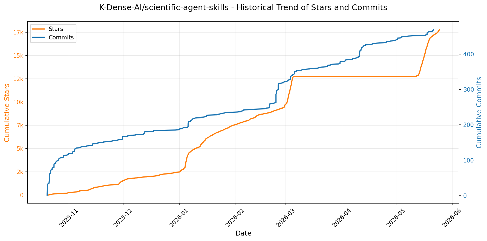

> *蓝色：累计 Stars｜橙色：累计 Commits（次 Y 轴）*

<b>📄 README 摘要</b>

1. **项目功能**  
该项目提供一套标准化、即插即用的**138个科学与科研专用技能（Scientific Skills）**，旨在将任意支持开放 [Agent Skills](https://agentskills.io/) 标准的AI编程代理（如 Cursor、Claude Code、Codex、Gemini CLI 等）升级为具备专业科研能力的“AI科学家”。它不运行独立服务，而是通过结构化技能定义（含文档、示例、最佳实践），赋能AI代理直接调用百余个科学数据库、70+主流科研Python库及9类科研平台API，从而在单次提示下自动执行跨领域的复杂多步科研工作流——涵盖生物信息学、药物发现、临床研究、医学影像、材料科学、天文物理、地理遥感、多组学整合、蛋白质工程、科研写作等16大方向。

2. **核心特性**  
- ✅ **全领域覆盖**：138项技能横跨16大科研领域（如癌症基因组学、分子对接、单细胞分析、DICOM影像处理、AlphaFold结构应用、临床变异解读等）；  
- ✅ **100+科学与金融数据库直连**：统一`database-lookup`技能接入78+公共库（PubChem、ChEMBL、UniProt、COSMIC、ClinicalTrials.gov、FRED等），另含DepMap、Imaging Data Commons、Hugging Science等专项技能，并集成BioServices（~40个生物服务）、BioPython（38个NCBI子库）、gget（20+基因组库）等多源包；  
- ✅ **70+优化Python库技能**：为RDKit、Scanpy、PyTorch Lightning、scikit-learn、scVelo、TimesFM、OpenMM、Qiskit等提供预验证、带示例和最佳实践的技能封装，显著提升AI调用可靠性与准确性；  
- ✅ **9类科研平台集成**：原生支持Benchling、DNAnexus、OMERO、Protocols.io等实验室/协作平台的API调用路径；  
- ✅ **30+科研表达与沟通工具**：支持文献综述、学术写作、图表生成（Mermaid/出版级可视化）、幻灯片/海报制作、引文管理等；  
- ✅ **开箱即用 & 自动发现**：遵循Agent Skills标准，安装后AI可自动识别并调用相关技能；支持`npx`或`gh skill`一键安装、版本锁定（tag/SHA）、批量更新；  
- ✅ **本地优先 + 云扩展兼容**：作为[K-Dense BYOK](https://github.com/K-Dense-AI/k-dense-byok)的核心技能集，可在桌面端离线运行（数据不出本地），亦可按需通过Modal无缝扩展至云端GPU算力。

3. **技术栈**  
- **协议标准**：基于开源 [Agent Skills](https://agentskills.io/) 规范（JSON Schema定义技能接口、描述与元数据）；  
- **运行时依赖**：Python 3.11+（推荐3.12+），强制依赖轻量级包管理器 [`uv`](https://docs.astral.sh/uv/)（用于快速、安全地安装各技能所需Python依赖）；  
- **技能组织**：每个技能为独立目录，内含标准化`SKILL.md`文档（含功能说明、参数、代码示例、使用场景、安全注意事项、依赖列表）；  
- **安全机制**：集成[Cisco AI Defense Skill Scanner](https://github.com/cisco-ai-defense/skill-scanner)进行LLM行为扫描，配合人工审核与社区贡献治理；  
- **部署生态**：原生适配Cursor、Claude Code、Codex、Gemini CLI等主流AI编码代理；与[K-Dense BYOK](https://github.com/K-Dense-AI/k-dense-byok)深度协同，构成完整本地化AI科研工作站。

---

### 24. [rohitg00/ai-engineering-from-scratch](https://github.com/rohitg00/ai-engineering-from-scratch)
- 📅 **创建日期**：2026-03-18  
- 🔄 **最近更新**：2026-05-25  
- ⭐ **Stars**：16,380（日 +2471｜周 +8501｜月 +11482）  
- 📝 **描述**：Learn it. Build it. Ship it for others.  

<b>📈 Star 与 Commit 历史趋势</b>

> *蓝色：累计 Stars｜橙色：累计 Commits（次 Y 轴）*

<b>📄 README 摘要</b>

1. **该项目做什么？**  
该项目是一个面向实践的、端到端的开源人工智能工程教育体系，旨在系统性填补当前AI学习者“会用工具但不懂原理”的能力断层。它不教授零散知识点或API调用技巧，而是引导学习者**从零开始亲手构建AI系统的每一层核心组件**——从线性代数与微积分的数学推导，到手写反向传播、Tokenizer、Attention机制、LLM推理循环、Agent执行框架，直至多智能体协同系统与生产级基础设施。整个课程强调“先造轮子，再用框架”（Build It → Use It → Ship It），确保学习者对每个技术环节具备底层理解与工程掌控力，并最终产出435个可直接复用的实战成果（提示词、技能包、自主Agent、MCP服务器等）。

2. **关键特性**  
- **结构化渐进式课程设计**：共20个严格递进的学习阶段（Phases），覆盖数学基础→经典机器学习→深度学习核心→多模态（视觉/NLP/语音/强化学习）→大模型从零实现→Agent工程→多智能体系统→伦理对齐→生产部署→毕业项目，形成完整AI工程知识图谱。  
- **每课即产可用资产**：每节课均产出至少一个可立即集成至工作流的可复用制品（Prompt/Skill/Agent/MCP Server），全部存于`outputs/`目录，支持一键安装（如`python3 scripts/install_skills.py`）。  
- **六步标准化学习流程**：每课严格遵循「口号→问题→概念→手写实现（无框架）→框架复现（PyTorch/scikit-learn等）→交付制品」闭环，强化知行合一。  
- **智能自适应学习路径**：内置AI代理技能（适配Claude/Cursor等），提供`/find-your-level`（10题精准定位起始阶段）和`/check-understanding <phase>`（阶段测验+错题溯源）两大能力，实现个性化学习导航。  
- **多语言原生支持**：所有代码实现同步提供Python、TypeScript、Rust、Julia四语言版本，兼顾算法教学（Python/Julia）、前端集成（TS）、系统性能（Rust）与科学计算（Julia）需求。  
- **完全本地化与开源开放**：全课程离线可运行，无需依赖云服务；MIT协议授权，免费开放，鼓励社区共建与衍生。

3. **技术栈**  
- **编程语言**：Python（主教学与通用实现）、TypeScript（前端/协议交互）、Rust（高性能模块/边缘部署）、Julia（数值计算/数学推导）  
- **AI框架与库**：PyTorch（深度学习教学与对比）、JAX（函数式训练范式）、scikit-learn（传统ML验证）、Hugging Face Transformers（LLM应用参考）  
- **基础设施与协议**：Docker（环境封装）、MCP（Model Context Protocol，标准化AI服务接口）、Git（协作与版本控制）、Jupyter（交互式实验）  
- **AI工程标准**：全面覆盖MCP服务器开发、Agent ReAct循环实现、工具调用（Tool Calling）协议、提示工程（Prompt Engineering）、模型调试（Loss分析/梯度检查）、分布式训练基础、边缘推理（Rust部署）等生产级实践要素。

---

### 25. [yikart/AiToEarn](https://github.com/yikart/AiToEarn)
- 📅 **创建日期**：2025-02-24  
- 🔄 **最近更新**：2026-05-25  
- ⭐ **Stars**：16,345（日 +193｜周 +1572｜月 +7392）  
- 📝 **描述**：Let's use AI to Earn!  

<b>📈 Star 与 Commit 历史趋势</b>

> *蓝色：累计 Stars｜橙色：累计 Commits（次 Y 轴）*

<b>📄 README 摘要</b>

1. **项目功能**  
AiToEarn 是一个面向 OPC（一人公司）、独立创作者、品牌及中小企业的**AI原生内容营销智能体平台**，聚焦于“内容即服务”（CaaS）范式。它通过多模态AI Agent自动化闭环，实现内容的**智能创作（Create）、跨平台一键发布（Publish）、精准互动运营（Engage）和结果导向变现（Monetize）**，覆盖从创意生成到商业转化的完整链路。核心价值在于降低内容营销门槛，使个体创作者无需技术或运营团队即可在全球14+主流平台（含抖音、小红书、TikTok、YouTube、X等）规模化生产、分发并赚取收益。

2. **关键特性**  
- **四维Agent能力体系**：  
  • **Monetize Agent**：支持CPS（按成交）、CPE（按互动）、CPM（按千次曝光）三种结果导向结算模式，内置内容交易市场，连接商家推广需求与创作者供给；  
  • **Publish Agent**：支持14+国内外平台一键分发与日历化排期，兼容视频/图文多格式，自动处理平台差异化规则（如标题长度、标签格式、封面要求）；  
  • **Engage Agent**：通过浏览器插件实现跨平台自动化互动（点赞/关注/收藏）+ AI驱动的语义级评论回复（识别高转化意图如“求链接”并实时响应）+ 品牌舆情监测；  
  • **Create Agent**：端到端内容生成引擎，支持调用Veo、Seedance、Grok等视频模型及Nano Banana等图像模型，实现视频生成/翻译/剪辑、图文批量创作，并支持参考图/视频输入、平台定向优化（如小红书风格文案）、多模型协同编排；  
- **全场景接入方式**：提供5种零/低门槛使用路径——网页即开即用、OpenClaw龙虾生态集成、Claude/Cursor等MCP协议AI助手插件化调用、Docker私有化部署、源码二次开发；  
- **生产就绪增强能力**：内置应用内自动更新、离线商户推广解决方案（将线下门店活动转化为线上传播任务）、Relay中继服务（免开发者资质完成OAuth授权）、SSE长连接与MCP双协议支持。

3. **技术栈**  
- **后端架构**：Node.js（v20.18.x）为核心运行时，采用Nx单体仓库管理多应用（`aitoearn-server`服务层 + `aitoearn-ai`AI调度层），数据库依赖MongoDB（文档存储）与Redis（缓存/队列），通过Docker Compose实现容器化编排；  
- **AI基础设施**：深度集成多类第三方AI服务——视频生成（Google Veo、Seedance、HappyHorse）、语音/图像生成（CosyVoice、Nano Banana）、大模型推理（Grok系列），并通过统一API网关与MCP/SSE协议抽象底层模型调用；  
- **前端与客户端**：Web端基于现代前端框架（未明示但依赖PNPM/Nx工程化），Electron桌面客户端（`AttAiToEarn`子项目）提供本地化体验，浏览器插件支撑Engage Agent跨平台交互；  
- **部署与集成**：全面支持Docker一键部署，兼容MCP（Model Context Protocol）标准，可无缝嵌入Claude Desktop、Cursor等AI原生IDE；Relay服务采用反向代理设计，解耦OAuth敏感凭证管理。

---

### 26. [datawhalechina/easy-vibe](https://github.com/datawhalechina/easy-vibe)
- 📅 **创建日期**：2025-12-28  
- 🔄 **最近更新**：2026-05-25  
- ⭐ **Stars**：14,505（日 +247｜周 +2113｜月 +8056）  
- 📝 **描述**：💻 vibe coding 2026 | Your first modern Coding course for beginners to master step by step.  

<b>📈 Star 与 Commit 历史趋势</b>

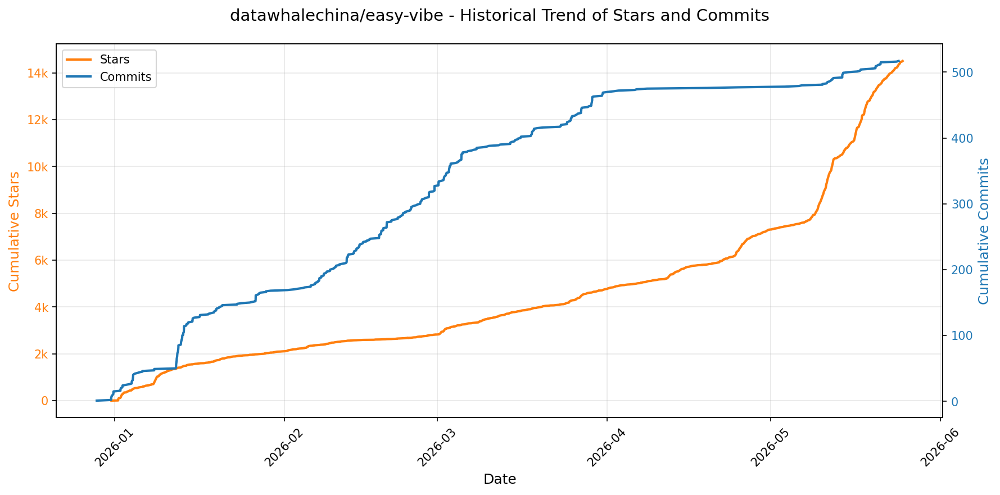

> *蓝色：累计 Stars｜橙色：累计 Commits（次 Y 轴）*

<b>📄 README 摘要</b>

1. **项目功能**  
Easy-Vibe 是一个面向 AI 时代的**零基础编程启蒙与全栈开发实践学习平台**，核心目标是让“会说话的人就能构建应用”。它不以传统语法教学为起点，而是通过自然语言描述需求（如“做一个微信登录的预约系统”），引导学习者借助 AI 编程工具完成从想法验证、原型构建、全栈开发到产品上线的完整闭环。项目本质是一个**高度交互式、可视化、多语言支持的开源技术教程体系**，提供可直接运行的模拟环境、动态演示和结构化学习路径，覆盖产品构思、UI/UX、前端、后端、AI 能力集成（文生图、RAG、Agent）、部署运维及商业思维等全链路内容。

2. **关键特性**  
- ✅ **沉浸式模拟编码环境**：内置虚拟 IDE 和终端操作动效（如鼠标轨迹指引），直观还原真实开发工作流；  
- ✅ **可视化 AI 原理教学**：通过动画拆解扩散模型（Diffusion）、RAG 数据流、Git 版本控制逻辑等抽象概念，降低理解门槛；  
- ✅ **分阶段渐进式学习地图**：明确划分为 Stage 1（零基础快速原型）、Stage 2（全栈产品交付）、Stage 3（Claude Code / Agent 工程化）三大能力跃迁路径；  
- ✅ **多语言 & 多角色适配**：支持中（简/繁）、英、日、韩、西、法、德、阿、越、意共 10 种语言；内容精准匹配初学者、产品经理、学生、初级/中级/高级开发者等不同身份需求；  
- ✅ **真实场景驱动的实践设计**：包含“乡村教师用 AI 做教学工具”“卡车司机开发货运助手”等真实用户 Vibe 故事；集成 Stripe 支付、微信小程序后端、多端 App（iOS/Android）开发等工业级实践模块；  
- ✅ **即查即用的知识基座（Appendix）**：涵盖计算机基础、AI 原理、工程规范、用户研究（Double Diamond / Jobs-to-be-Done / The Mom Test）等 9 大知识领域、80+ 交互式主题，支持按需检索补漏。

3. **技术栈**  
- **交付形态**：静态网站（Jekyll / GitHub Pages 构建），纯前端渲染，零服务端依赖，开箱即用；  
- **交互核心**：HTML/CSS/JavaScript 实现的轻量级交互组件（如 GIF 动画嵌入、可点击 RAG 流程图、终端命令可视化执行）；  
- **AI 工具生态深度集成**：聚焦 Claude Code、OpenClaw、Cursor、Trae 等 AI 编程代理（Agent）工作流，配套 `llms.txt` 结构化提示词，提升 AI 对教程内容的理解与调用效率；  
- **开发协作支撑**：基于 Git/GitHub 标准流程，强调版本控制（Stage 2 Backend 1 模块专项教学）、PR 协作与文档共建；  
- **基础设施与部署**：采用 Supabase（BaaS）、Zeabur（一键部署）、WeChat Mini Program SDK 等现代云原生工具链，体现“AI 时代最小可行技术栈”理念。

---

### 27. [tinyhumansai/openhuman](https://github.com/tinyhumansai/openhuman)
- 📅 **创建日期**：2026-02-18  
- 🔄 **最近更新**：2026-05-25  
- ⭐ **Stars**：14,435（日 +821｜周 +13553｜月 +14435）  
- 📝 **描述**：Your Personal AI super intelligence. Private, Simple and extremely powerful.  

<b>📈 Star 与 Commit 历史趋势</b>

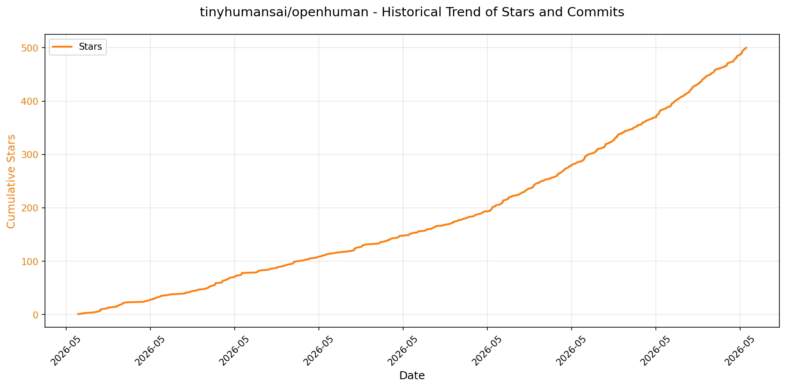

> *蓝色：累计 Stars｜橙色：累计 Commits（次 Y 轴）*

<b>📄 README 摘要</b>

1. **该项目做什么？**  
OpenHuman 是一个开源的、以人类为中心的“智能体（agentic）助手框架”，旨在成为用户个人化的本地 AI 超级智能体。它通过深度集成用户日常数字生活（邮件、日历、代码仓库、协作工具等），在本地构建持久化、结构化的个人知识体系，并驱动具备长期记忆、多模态交互与自主行动能力的 AI 助手。其核心目标是**消除传统 AI 助手的“冷启动”问题**——无需数周训练或手动配置，用户安装后几分钟内即可获得对自身工作流具备上下文理解能力的智能代理。

2. **关键特性**  
- **本地优先的记忆系统**：采用“Memory Tree”（内存树）架构，将多源数据（Gmail、Notion、GitHub 等 118+ 集成）自动抓取、分块（≤3k token）、评分、摘要并组织为层级化 Markdown 树，全部存储于本地 SQLite 数据库；同步生成 Obsidian 兼容的可编辑知识库。  
- **桌面原生拟人化体验**：内置带表情、语音（STT/TTS）、唇形同步的桌面吉祥物（Mascot），可作为真实参会者加入 Google Meet，后台持续思考，提供直观 UI，零终端配置。  
- **全自动上下文同步（Auto-fetch）**：默认每 20 分钟主动轮询所有已授权服务，将新鲜数据拉入本地记忆，实现“今日同步，明日即用”的即时上下文覆盖。  
- **智能令牌压缩（TokenJuice）**：对所有输入（网页、邮件、API 响应等）进行无损语义压缩（HTML→Markdown、URL 缩短、去重摘要），保留 CJK/emoji 等多字节字符，最高降低 80% token 消耗与延迟。  
- **开箱即用的全栈能力**：内置 Web 搜索、网页抓取器、完整编程工具链（文件系统/Git/测试/代码搜索）、原生语音支持；模型路由自动匹配推理/速算/多模态任务，支持一键切换至本地 Ollama 模型。  
- **隐私与可控性保障**：所有敏感数据（记忆、配置、运行状态）默认本地加密存储；OAuth 及集成调用默认经由托管后端代理，但支持完全离线模式（自配 Composio、模型、搜索服务）；兼容 `agentmemory` 等第三方持久化后端。  

3. **技术栈**  
- **前端与桌面框架**：基于 **Tauri**（Rust + WebView2/WebKit）构建跨平台桌面应用，使用 **React/Vite** 开发 UI，支持 macOS / Windows / Linux（AppImage）。  
- **核心语言与基础设施**：**Rust**（主逻辑、性能敏感模块、SQLite 集成、CLI 工具）、**TypeScript**（前端与业务逻辑）、**Python**（部分工具脚本与模型接口胶水层，文档中未明示但常见于 AI 工具链）。  
- **本地存储与知识管理**：**SQLite**（内存树主数据库）、**Obsidian 兼容 Markdown 文件系统**（本地知识库落地格式）。  
- **AI 与模型层**：默认通过 OpenHuman 托管后端进行**智能模型路由**（适配不同 LLM），同时原生支持 **Ollama** 本地大模型运行；语音合成采用 **ElevenLabs API**，语音识别（STT）集成主流服务商。  
- **集成与连接器**：基于 **Composio** 构建统一集成层，支持 OAuth 一键授权与标准化工具调用；提供 `agentmemory` 后端插件支持。  
- **构建与开发工具**：**pnpm**（包管理）、**Rust toolchain**（rustc 1.93.0, rustfmt, clippy）、**CMake/Ninja**（原生构建）、**ripgrep**（代码搜索）。

---

### 28. [anthropics/knowledge-work-plugins](https://github.com/anthropics/knowledge-work-plugins)
- 📅 **创建日期**：2026-01-23  
- 🔄 **最近更新**：2026-05-25  
- ⭐ **Stars**：14,078（日 +1209｜周 +1823｜月 +2596）  
- 📝 **描述**：Open source repository of plugins primarily intended for knowledge workers to use in Claude Cowork  

<b>📈 Star 与 Commit 历史趋势</b>

> *蓝色：累计 Stars｜橙色：累计 Commits（次 Y 轴）*

<b>📄 README 摘要</b>

1. **该项目做什么？**  
该项目是一套面向知识工作者的开源插件集合（Knowledge Work Plugins），旨在将Claude大模型深度专业化，使其能胜任特定岗位（如销售、产品、法务、数据等）和企业级工作场景。插件通过结构化配置（非代码方式）赋予Claude角色专属的领域知识、标准化工作流程、企业内部工具连接能力及可调用的指令命令，从而在Claude Cowork或Claude Code环境中，实现从“通用助手”到“团队专属协作者”的升级——自动理解上下文、调用正确工具、执行合规操作、输出符合组织规范的专业成果。

2. **核心功能**  
- **开箱即用的11类垂直职能插件**：覆盖生产力、销售、客户支持、产品管理、市场营销、法律、财务、数据科学、企业搜索、生物医学研究及插件管理本身，每类均预置该角色典型任务流与行业最佳实践；  
- **零代码可定制架构**：所有插件由纯文本文件（Markdown技能文档 + JSON配置）构成，支持无需编程即可替换连接器（`.mcp.json`）、注入企业术语/流程（`skills/`）、增删 slash 命令（`commands/`）；  
- **智能自动触发 + 显式指令双模式**：内置“技能”（Skills）在对话中按需自动激活（如识别到合同文本即启动法律条款审查逻辑），而“命令”（Commands）通过 `/xxx:action` 语法显式调用（如 `/sales:call-prep` 快速生成客户拜访提纲）；  
- **统一工具集成层（MCP协议）**：通过标准化的 Model Context Protocol（MCP）服务器对接超30种主流SaaS工具（如Slack、Notion、Jira、Snowflake、PubMed等），实现跨系统数据拉取与操作；  
- **企业级可扩展性**：提供 `cowork-plugin-management` 插件，支持团队自主创建新插件或复用现有模板快速适配未覆盖的业务场景，形成组织专属AI能力资产库。

3. **技术栈**  
- **运行平台**：原生适配 Anthropic 官方产品 **Claude Cowork** 与 **Claude Code**；  
- **协议标准**：基于开源 **Model Context Protocol (MCP)** 实现工具连接与上下文交换；  
- **配置范式**：纯声明式文件系统（无编译、无服务部署）——  
  - `.claude-plugin/plugin.json`：插件元信息与能力描述；  
  - `.mcp.json`：定义外部工具连接参数与API契约；  
  - `skills/` 目录：Markdown格式的领域知识、决策逻辑与SOP流程说明；  
  - `commands/` 目录：JSON定义的 slash 命令接口与执行意图；  
- **交付形态**：GitHub开源仓库，采用 Git 版本控制，贡献方式为 Fork + PR，完全去中心化协作。

---

### 29. [CloakHQ/CloakBrowser](https://github.com/CloakHQ/CloakBrowser)
- 📅 **创建日期**：2026-02-22  
- 🔄 **最近更新**：2026-05-25  
- ⭐ **Stars**：12,523（日 +712｜周 +6438｜月 +11125）  
- 📝 **描述**：Stealth Chromium that passes every bot detection test. Drop-in Playwright replacement with source-level fingerprint patches. 30/30 tests passed.  

<b>📈 Star 与 Commit 历史趋势</b>

> *蓝色：累计 Stars｜橙色：累计 Commits（次 Y 轴）*

<b>📄 README 摘要</b>

1. **项目功能**  
CloakBrowser 是一个深度定制的、可直接替代 Playwright/Puppeteer 的“隐身 Chromium 浏览器”，专为绕过现代反爬与反自动化检测系统（如 Cloudflare Turnstile、reCAPTCHA v3、FingerprintJS、BrowserScan 等）而设计。它**不依赖 JavaScript 注入、运行时配置篡改或代理层欺骗**，而是通过在 Chromium 源码（C++ 层）进行 58 处底层补丁，从二进制层面真实修改浏览器指纹（包括 GPU、WebGL、Canvas、WebRTC、音频、字体、屏幕参数、网络时序、自动化信号等），使目标网站将该浏览器识别为**完全合法、未被篡改的普通 Chrome 用户**，从而彻底避免触发 CAPTCHA、拦截页或行为封禁——即“防患于未然”，而非事后解题。

2. **核心特性**  
- ✅ **源码级隐身**：58 项 C++ 级补丁，覆盖硬件/渲染/协议/自动化标识全维度，非 JS 注入或 flag 覆盖，抗 Chrome 版本更新能力强；  
- ✅ **开箱即用的 Playwright/Puppeteer 替换**：API 完全兼容，仅需替换 `import` 语句（如 `from cloakbrowser import launch`），无需重构代码；  
- ✅ **`humanize=True` 行为拟真**：内置贝塞尔鼠标轨迹、逐字符键盘输入、自然滚动模式，一键通过行为检测；  
- ✅ **实测高分反检测能力**：reCAPTCHA v3 得分稳定 **0.9（人类级）**，100% 通过 Cloudflare Turnstile、FingerprintJS、BrowserScan 等 30+ 主流检测服务；  
- ✅ **全自动二进制管理**：首次运行自动下载并缓存对应平台的 stealth Chromium 二进制（~200MB），支持后台静默更新；  
- ✅ **高级指纹控制**：支持基于代理 IP 自动推断时区/地区（`geoip=True`）、WebRTC IP 自动伪装、SOCKS5/HTTP 代理原生认证、Chrome 扩展加载、持久化用户配置（含 cookies/localStorage）、TLS 指纹与真实 Chrome 一致（JA3N/JA4）；  
- ✅ **配套浏览器档案管理器（CloakBrowser Manager）**：开源、自托管的多账号浏览器指纹隔离方案（类 Multilogin），支持 noVNC 远程可视化操作；  
- ✅ **零配置默认隐身**：启动时自动随机生成指纹种子，无需任何显式参数即可通过绝大多数检测；  
- ✅ **全栈支持**：提供 Python（pip）、JavaScript/Node.js（npm）、Docker 三种安装方式，兼容本地开发、容器化部署及 VPS 生产环境。

3. **技术栈**  
- **核心引擎**：深度定制的 **Chromium（v146.0.7680.177.5）**，所有隐身逻辑编译进原生二进制；  
- **封装层**：  
  - Python：基于 `playwright`（非 selenium），提供同步/异步 API（`launch`, `launch_async`, `launch_context`, `launch_persistent_context` 等）；  
  - JavaScript/TypeScript：同时支持 **Playwright（主推）** 和 **Puppeteer（备选）** 两种客户端封装，含完整类型定义；  
- **基础设施**：  
  - 构建与分发：PyPI（`cloakbrowser`）、npm（`cloakbrowser`）、Docker Hub（`cloakhq/cloakbrowser`）；  
  - 地理定位增强：可选依赖 `geoip`（通过 `pip install cloakbrowser[geoip]` 启用，调用 ipify.org / AWS checkip 识别代理出口 IP）；  
  - 安全机制：二进制下载全程 SHA-256 校验，确保完整性；  
- **运行环境**：跨平台支持 Linux/macOS/Windows；Docker 镜像开箱即用；支持 headless 与 headed 模式；  
- **集成生态**：无缝适配 Crawl4AI、Scrapling、Stagehand、LangChain、Selenium（通过 Playwright 兼容层）等主流 AI 与爬虫框架。

---

### 30. [ComposioHQ/awesome-codex-skills](https://github.com/ComposioHQ/awesome-codex-skills)
- 📅 **创建日期**：2026-01-12  
- 🔄 **最近更新**：2026-05-25  
- ⭐ **Stars**：11,550（日 +209｜周 +1213｜月 +10393）  
- 📝 **描述**：A curated list of practical Codex skills for automating workflows across the Codex CLI and API.  

<b>📈 Star 与 Commit 历史趋势</b>

> *蓝色：累计 Stars｜橙色：累计 Commits（次 Y 轴）*

<b>📄 README 摘要</b>

1. **项目功能**  
该项目是一个面向 Codex（Composio 推出的智能代理 CLI 工具）的**精选技能（Skills）集合库**，旨在扩展 Codex 的自动化能力，使其不仅能生成文本，还能执行真实世界操作——如发送邮件、创建 GitHub Issue、发布 Slack 消息、连接并操作 1000+ 第三方应用（Notion、Linear、Datadog、Stripe 等），以及完成复杂工程任务（代码审查、迁移审计、CI 故障修复、多代理协同开发等）。它不提供独立运行的软件，而是以模块化、可插拔的「技能包」形式，供用户一键安装到本地 Codex 环境中，从而赋予 Codex 可复用、可组合、可治理的行动能力。

2. **核心特性**  
- **模块化技能架构**：每个技能为独立文件夹，含标准化 `SKILL.md`（含 YAML 前置元数据 `name`/`description`）及可选脚本、参考资料和资产，支持按需加载、上下文精简；  
- **全场景覆盖能力**：涵盖五大类 50+ 实用技能——开发与代码工具（如 `codebase-recon` 代码库热区分析、`sentry-triage` 错误精准定位）、生产力协作（`meeting-notes-and-actions` 自动生成带负责人动作项的会议纪要、`connect/` 一键对接 1000+ 应用）、通信写作（`email-draft-polish` 邮件润色、`unslop` 去 AI 痕迹文本净化）、数据分析（`competitive-ads-extractor` 竞品广告结构化提取、`helium-mcp` 实时新闻与市场数据融合）、元工具（`skill-installer` 技能批量安装器、`template-skill` 技能开发模板）；  
- **开箱即用的集成体验**：提供官方推荐的 Python 脚本安装器（`install-skill-from-github.py`）及手动安装流程，支持从 GitHub 直接拉取并自动部署至 `$CODEX_HOME/skills`；  
- **智能触发与协作增强**：Codex 基于技能 `description` 元数据自动匹配用户自然语言指令，支持显式调用技能名；同时兼容 MCP（Model Control Protocol）标准，支持与 Claude Code、Cursor、VS Code 等工具深度协同；  
- **社区驱动与可扩展性**：明确鼓励 PR 贡献，提供详尽的技能创建规范（渐进式披露、脚本化确定性步骤、零冗余文档），并内置 `skill-creator` 指南与 `Vibe-Skills` 等治理型技能框架，支撑企业级技能生命周期管理（需求冻结→计划审批→执行验证→跨会话记忆）。

3. **技术栈**  
- **运行时环境**：基于 [Codex CLI](https://composio.dev)（Composio 自研的本地化智能代理终端工具），依赖其技能加载机制与 MCP 协议支持；  
- **集成协议**：深度采用 **MCP（Model Control Protocol）** 标准实现模型与工具间的安全、结构化通信（如 `helium-mcp`、`virtualsms-io/codex-sms-verification`）；  
- **后端连接层**：通过 **Composio CLI** 统一接入第三方 SaaS 应用（GitHub、Slack、Notion、Jira、Datadog 等），底层使用 Composio 的连接器与认证体系；  
- **开发与部署工具**：Python（技能安装脚本 `skill-installer`）、Shell（CLI 驱动工作流）、Git（隔离工作树多代理协调如 `polywave`）、Node.js（如 `paperjsx` 本地 PPTX/DOCX 生成、`@smorky85/aurakit` 框架）；  
- **基础设施依赖**：本地运行为主（无强制云依赖），部分技能可选集成外部服务（如 `mcp.virtualsms.io` 短信网关、`LangSmith` 数据拉取），强调隐私与离线可用性（如 `paperjsx` 本地渲染、`unslop` 本地文本清洗）。

---

### 31. [decolua/9router](https://github.com/decolua/9router)
- 📅 **创建日期**：2026-01-05  
- 🔄 **最近更新**：2026-05-25  
- ⭐ **Stars**：10,515（日 +222｜周 +2401｜月 +7504）  
- 📝 **描述**：Unlimited FREE AI coding. Connect Claude Code, Codex, Cursor, Cline, Copilot, Antigravity to FREE Claude/GPT/Gemini via 40+ providers. Auto-fallback, RTK -40% tokens, never hit limits.  

<b>📈 Star 与 Commit 历史趋势</b>

> *蓝色：累计 Stars｜橙色：累计 Commits（次 Y 轴）*

<b>📄 README 摘要</b>

1. **项目功能**  
9Router 是一个开源的 AI 请求智能路由代理工具，核心作用是作为本地中间层，拦截并优化用户 AI 编程工具（如 Claude Code、Cursor、Codex、OpenClaw、Cline 等）发出的 API 请求。它不直接提供大模型能力，而是统一接入并智能调度 **40+ AI 服务商、100+ 模型**（含订阅/付费/免费 tier），实现「请求转发 + 格式转换 + 成本控制 + 容错保障」。其根本目标是：**让用户永不中断编码流程，同时显著降低 Token 消耗（20–40%）与使用成本（支持全免费链路）**。

2. **关键特性**  
- ✅ **RTK Token Saver（核心节流技术）**：自动识别并压缩工具输出（如 `git diff`、`grep`、`ls` 等冗余上下文），在请求发送至 LLM 前进行无损精简，实测节省 20–40% 输入 Token；  
- ✅ **智能三级自动降级（3-Tier Fallback）**：按优先级自动切换模型层级——「订阅账号 → 低价商用模型（如 GLM、MiniMax）→ 免费模型（如 Kiro、OpenCode Free、Vertex $300 额度）」，确保服务零中断；  
- ✅ **全协议格式透传与翻译**：原生兼容 OpenAI、Claude、Gemini、Cursor、Kiro、Vertex 等十余种 API 格式，自动双向转换，使任意支持 OpenAI endpoint 的 CLI 工具均可即插即用；  
- ✅ **实时配额监控与智能管理**：可视化追踪各提供商 Token 消耗、重置倒计时、成本估算，并支持多账号轮询（round-robin）与自动 OAuth Token 刷新；  
- ✅ **高级增强能力**：支持 Caveman Mode（极致压缩输出，再省高达 65% 输出 Token）、自定义模型组合（Combo）、完整请求日志调试、跨设备云同步配置、细粒度用量分析与趋势报告；  
- ✅ **全场景部署支持**：本地运行（localhost）、Docker 容器化、VPS 部署、Cloudflare Workers 边缘部署，开箱即用。

3. **技术栈**  
- **前端**：基于 Next.js（App Router）构建响应式 Web 控制台（Dashboard），使用 TypeScript + Tailwind CSS；  
- **后端/核心服务**：Node.js 运行时，集成自研及第三方轻量级中间件（如 RTK、Caveman）实现 Token 压缩与协议转换；  
- **架构模式**：HTTP 反向代理网关（兼容 OpenAI `/v1/chat/completions` 等标准接口），所有请求经 `http://localhost:20128/v1` 中转；  
- **部署支持**：原生支持 Docker（`decolua/9router` 镜像）、GitHub Container Registry（GHCR）、Cloudflare Workers；  
- **依赖生态**：深度集成开源项目 RTK（⭐40K）与 Caveman（⭐52K）；通过环境变量与配置文件管理多 Provider 凭据（API Key / OAuth）；支持 Cloud Sync 后端（含加密存储与 fail-fast 超时机制）。

---

### 32. [supertone-inc/supertonic](https://github.com/supertone-inc/supertonic)
- 📅 **创建日期**：2025-11-18  
- 🔄 **最近更新**：2026-05-25  
- ⭐ **Stars**：10,216（日 +374｜周 +2553｜月 +7392）  
- 📝 **描述**：Lightning-Fast, On-Device, Multilingual TTS — running natively via ONNX.  

<b>📈 Star 与 Commit 历史趋势</b>

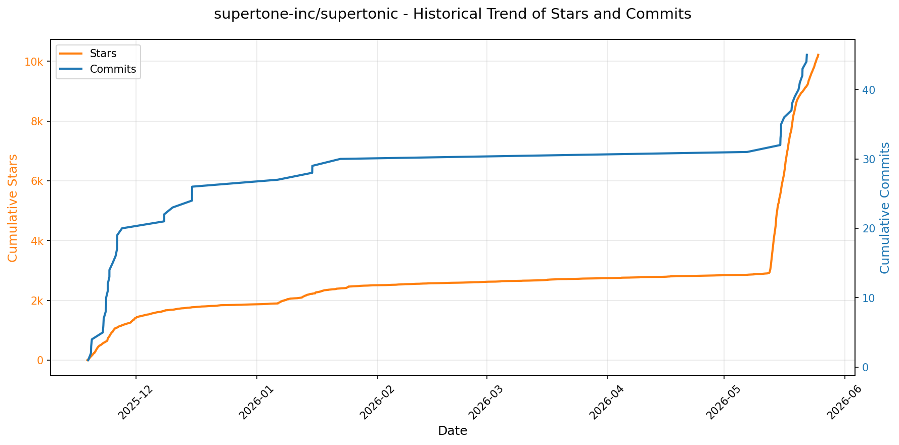

> *蓝色：累计 Stars｜橙色：累计 Commits（次 Y 轴）*

<b>📄 README 摘要</b>

1. **项目功能**  
Supertonic 是一个轻量级、全本地运行的开源文本转语音（TTS）系统，专为**设备端（on-device）实时语音合成**而设计。它不依赖云端服务、无需网络连接、不发送任何数据，完全在用户设备（包括桌面、浏览器、手机、树莓派、电子书阅读器等资源受限边缘设备）上完成端到端推理。支持直接将任意自然语言文本（含复杂数字、货币、电话号码、技术单位等）高保真地合成为 44.1kHz 高质量 WAV 音频，适用于隐私敏感、离线场景及嵌入式部署。

2. **核心特性**  
- ✅ **超低延迟 & 实时性**：网页级文本可在 1 秒内完成语音合成，支持真实场景下的流式/即时响应；  
- ✅ **31 种语言原生支持**：覆盖阿拉伯语、中文（简体/繁体未单独列出但含日韩越等东亚语言）、英语、西班牙语等主流语种，支持 `lang="na"` 语言无关模式自动适配；  
- ✅ **极致轻量模型**：仅约 9900 万参数（99M），远小于主流 0.7B–2B 级开源 TTS 模型，下载快、冷启动快、内存占用低；  
- ✅ **开箱即用的自然表达能力**：内置 10 种语义化内联标签（如 `<laugh>`、`<breath>`、`<sigh>`），无需参考音频或复杂提示词即可注入人类化韵律；  
- ✅ **工业级文本鲁棒性**：精准处理金融数字（如 `$5.2M`）、电话号码（`(212) 555-0142 ext. 402`）、技术单位等真实场景复杂文本，显著优于 ElevenLabs、OpenAI、Gemini 等竞品；  
- ✅ **多平台 SDK 全覆盖**：提供 Python、Node.js、Web（WebGPU/WASM）、Java、C++、C#、Go、Swift、iOS、Rust、Flutter 等 11+ 语言/平台的即用型推理示例与完整文档；  
- ✅ **本地 HTTP 服务支持**：Python SDK 内置 `supertonic serve` 命令，一键启动兼容 OpenAI `/v1/audio/speech` 标准的本地 API 服务；  
- ✅ **语音克隆生态协同**：虽本仓库不包含训练代码，但官方 [Voice Builder](https://supertonic.supertone.ai/voice-builder) 可生成 Supertonic 3 兼容的定制语音 JSON 文件，实现私有化语音迁移。

3. **技术栈**  
- **模型格式**：ONNX（开放神经网络交换格式），经 [OnnxSlim](https://github.com/inisis/OnnxSlim) 优化，确保跨平台兼容性与高效推理；  
- **推理引擎**：核心依赖 [ONNX Runtime](https://onnxruntime.ai/)（CPU 优先，零 GPU 依赖），浏览器端使用 `onnxruntime-web`（WebGPU/WASM 加速）；  
- **音频输出**：原生生成 44.1kHz / 16-bit PCM WAV，无需后处理或外部升采样；  
- **开发语言支持**：通过 ONNX Runtime C/C++ 库绑定，实现 Python（PyPI）、Node.js（N-API）、Java（JNI）、C++、C#（.NET）、Go（CGO）、Swift/Rust（FFI）、iOS（Objective-C/Swift 桥接）、Flutter（Platform Channel）等全栈集成；  
- **部署环境**：全平台支持——Linux/macOS/Windows 桌面、Chrome/Firefox/Safari 浏览器、Android/iOS 移动端、Raspberry Pi、Onyx Boox 等嵌入式设备；  
- **辅助工具链**：Git LFS（大模型文件管理）、Hugging Face Hub（模型分发）、Trendshift（项目热度监测）、OpenAPI（本地服务文档）。

---

### 33. [mukul975/Anthropic-Cybersecurity-Skills](https://github.com/mukul975/Anthropic-Cybersecurity-Skills)
- 📅 **创建日期**：2026-02-25  
- 🔄 **最近更新**：2026-05-25  
- ⭐ **Stars**：8,420（日 +906｜周 +2044｜月 +2754）  
- 📝 **描述**：754 structured cybersecurity skills for AI agents · Mapped to 5 frameworks: MITRE ATT&CK, NIST CSF 2.0, MITRE ATLAS, D3FEND & NIST AI RMF · agentskills.io standard · Works with Claude Code, GitHub Copilot, Codex CLI, Cursor, Gemini CLI & 20+ platforms · 26 security domains · Apache 2.0  

<b>📈 Star 与 Commit 历史趋势</b>

> *蓝色：累计 Stars｜橙色：累计 Commits（次 Y 轴）*

<b>📄 README 摘要</b>

1. **项目功能**  
该项目是一个面向AI代理（AI agents）的、大规模开源网络安全技能库，旨在为任意大语言模型驱动的安全代理赋予资深安全分析师级别的专业能力。它不提供可执行脚本或工具代码，而是以结构化、可被AI高效检索与执行的方式，封装了真实一线安全人员的工作流程（playbooks），覆盖从威胁狩猎、内存取证到云安全、勒索软件响应等完整安全生命周期。核心价值在于：使AI代理能像人类专家一样，基于上下文精准选择技能、验证前提条件、分步执行操作、并交叉验证结果，从而弥补全球480万网络安全人才缺口中的“决策智能”断层。

2. **关键特性**  
- **规模与广度**：包含754个生产级技能，覆盖26个细分安全领域（如云安全、OT/ICS安全、API安全、欺骗技术等）；  
- **统一多框架映射**：每个技能均同步标注五大权威标准——MITRE ATT&CK（v18，14战术全覆盖）、NIST CSF 2.0（6大函数全对齐）、MITRE ATLAS（v5.4，聚焦AI/ML对抗）、MITRE D3FEND（v1.3，267项防御技术）、NIST AI RMF 1.0 + GenAI Profile（含法律合规映射）；  
- **AI原生设计**：严格遵循 [agentskills.io](https://agentskills.io) 开放标准，采用轻量YAML前言（约30 token即可扫描全部技能）+ 结构化Markdown正文（含“When to Use”“Prerequisites”“Workflow”“Verification”四段式），支持渐进式加载与低开销发现；  
- **即插即用兼容性**：原生适配所有支持 agentskills.io 标准的平台，包括Claude Code、GitHub Copilot、Cursor、Gemini CLI、LangChain、CrewAI、AutoGen、MCP协议代理等超26+主流AI开发与运行环境；  
- **实战就绪架构**：每个技能目录包含可执行脚本（`scripts/`）、技术参考文档（`references/`）、报告模板（`assets/`）及标准化元数据，确保AI不仅能“知道”，更能“做到”和“验真”。

3. **技术栈**  
- **数据格式**：YAML（技能元数据描述） + Markdown（结构化工作流与说明） + STIX/TAXII/MISP（威胁情报域集成）；  
- **标准协议**：完全遵循 [agentskills.io](https://agentskills.io) 开放技能规范，实现跨平台互操作；  
- **知识图谱支撑**：深度集成MITRE系列知识库（ATT&CK Navigator可视化层、ATLAS对抗模型、D3FEND防御本体）及NIST框架（CSF 2.0、AI RMF 1.0）；  
- **部署与集成方式**：支持 `npx skills add` 一键注入、Git克隆直连、或通过MCP（Model Context Protocol）服务器动态加载；无需后端服务，纯静态文件仓库，零依赖运行；  
- **辅助生态**：配套Casky.ai在线Playground（实时技能演练）、GARS-2026全球调研（学术背书）、以及被多个知名Awesome List（如awesome-agent-skills）和技能市场（SkillsLLM）收录。

---

### 34. [rohitg00/agentmemory](https://github.com/rohitg00/agentmemory)
- 📅 **创建日期**：2026-02-25  
- 🔄 **最近更新**：2026-05-25  
- ⭐ **Stars**：7,816（日 +538｜周 +6023｜月 +7816）  
- 📝 **描述**：#1 Persistent memory for AI coding agents based on real-world benchmarks  

<b>📈 Star 与 Commit 历史趋势</b>

> *蓝色：累计 Stars｜橙色：累计 Commits（次 Y 轴）*

<b>📄 README 摘要</b>

1. **项目功能**  
agentmemory 是一个为 AI 编程智能体（coding agents）提供**持久化、跨会话、跨工具的统一记忆系统**的开源内存引擎。它自动捕获智能体在开发过程中的行为（如代码修改、调试决策、配置选择、错误修复等），将其结构化压缩为可检索的知识，并在后续会话中**零干预地注入精准上下文**，彻底消除重复解释架构、重查 Bug、反复配置偏好等问题。核心目标是让智能体“记住一切”，实现真正连续、渐进式的学习与协作。

2. **关键特性**  
- ✅ **全自动记忆捕获**：通过预置 12 个深度集成的智能体钩子（hooks），无需手动调用 `add()` 或编写记忆逻辑；支持 Claude Code、Cursor、Gemini CLI、Codex CLI、Hermes、OpenClaw、pi、OpenCode 等 16+ 主流编程智能体原生接入；  
- ✅ **混合检索（Hybrid Search）**：融合 BM25 关键词检索、本地向量嵌入（`all-MiniLM-L6-v2`）、知识图谱关系及 RRF（Reciprocal Rank Fusion）融合策略，实测 LongMemEval-S 基准下 **R@5 达 95.2%**，显著优于 BM25（86.2%）和竞品；  
- ✅ **极致 Token 节省**：相比全量上下文粘贴（超窗口）或 LLM 摘要，仅需约 **170K tokens/年（≈$10）**，降低 92% token 消耗；支持完全离线、零 API Key 的本地嵌入；  
- ✅ **多智能体共享内存**：基于 MCP（Model Context Protocol）标准构建，单个轻量级内存服务器（默认端口 `:3111`）被所有兼容 MCP/HTTP 的智能体共用，实现跨工具知识同步；  
- ✅ **智能记忆生命周期管理**：四层记忆层级（瞬时→工作→长期→归档）、自动衰减（decay）、基于置信度与使用频次的智能遗忘（auto-forget）、审计策略全覆盖的删除路径；  
- ✅ **开箱即用的可观测性**：内置实时内存浏览器（`http://localhost:3113`），支持会话回放（带时间轴、播放控制、事件逐帧查看）、知识图谱可视化、检索调试与健康监控；  
- ✅ **零外部依赖部署**：纯 SQLite 存储 + 自研 iii-engine 内核，**不依赖 PostgreSQL、Qdrant、pgvector 等任何外部数据库或向量服务**，开箱自包含、100% 离线可运行；  
- ✅ **高可靠性与工程成熟度**：含 950+ 单元测试、CI 全流程验证、完整基准报告（`benchmark/` 目录）、可复现的评测框架（`eval/`），并已通过 1200+ GitHub Gist 星标验证的设计文档背书。

3. **技术栈**  
- **核心引擎**：基于 [iii engine](https://github.com/iii-hq/iii)（v0.11.x）构建，采用 Rust 编写，提供高性能内存内核、MCP 协议实现与插件化执行模型；  
- **存储层**：SQLite（嵌入式、零配置、ACID 安全），无外部 DB 依赖；  
- **前端/CLI**：TypeScript / Node.js（`@agentmemory/agentmemory` npm 包），提供全局 CLI 工具（`agentmemory` 命令）、REST API 与 MCP 服务器；  
- **嵌入模型**：默认集成轻量级开源模型 `all-MiniLM-L6-v2`（Sentence-Transformers），完全本地运行、免 API、免 GPU；  
- **协议标准**：深度遵循 [MCP（Model Context Protocol）](https://modelcontextprotocol.io/) 规范，同时兼容 HTTP REST 接口与钩子（hooks）机制；  
- **基础设施**：支持文件系统监听器（`@agentmemory/fs-watcher`）、JSONL 会话导入导出、Docker 集成（可选）、跨平台（macOS/Linux/Windows）安装与缓存管理。

---

### 35. [HKUDS/ViMax](https://github.com/HKUDS/ViMax)
- 📅 **创建日期**：2025-03-30  
- 🔄 **最近更新**：2026-05-25  
- ⭐ **Stars**：7,337（日 +298｜周 +3009｜月 +4644）  
- 📝 **描述**："ViMax: Agentic Video Generation (Director, Screenwriter, Producer, and Video Generator All-in-One)"  

<b>📈 Star 与 Commit 历史趋势</b>

> *蓝色：累计 Stars｜橙色：累计 Commits（次 Y 轴）*

---

### 36. [can1357/oh-my-pi](https://github.com/can1357/oh-my-pi)
- 📅 **创建日期**：2025-12-31  
- 🔄 **最近更新**：2026-05-25  
- ⭐ **Stars**：7,060（日 +279｜周 +2449｜月 +3688）  
- 📝 **描述**：⌥  AI Coding agent for the terminal — hash-anchored edits, optimized tool harness, LSP, Python, browser, subagents, and more  

<b>📈 Star 与 Commit 历史趋势</b>

> *蓝色：累计 Stars｜橙色：累计 Commits（次 Y 轴）*

<b>📄 README 摘要</b>

1. **项目功能**  
Oh-My-Pi（OMP）是一个深度集成开发环境（IDE）能力的**本地化、全栈式编程智能代理（coding agent）**，旨在直接替代传统IDE中的人工操作环节。它不是一个仅调用LLM的简单前端，而是以“IDE内嵌代理”为核心定位：可原生执行代码（Python/JS）、实时驱动LSP（语言服务器协议）完成重命名/引用查找等语义操作、接入DAP（调试适配器协议）调试C/Go/Python等多语言原生进程、处理Git工作流（原子提交、PR解析）、解析PDF/网页/arXiv论文、协调子代理并结构化返回结果，并支持在终端（TUI）或编辑器（如Zed）中无缝运行。其目标是提供开箱即用、无需额外配置、且能力覆盖“写→读→搜→调→测→审→合→布”全研发闭环的编程自动化系统。

2. **关键特性**  
- ✅ **IDE级工具链深度集成**：LSP全操作（重命名自动更新barrel文件/别名导入）、DAP原生调试（lldb/dlv/debugpy）、Git-aware原子提交（依赖排序、锁文件过滤）、冲突URL化解决（`conflict://1`）。  
- ✅ **多运行时协同执行**：持久化Python与Bun（JS）内核，支持`eval`跨语言协作（如Python读CSV → JS绘图），工具可相互调用（内核中直接调用`read`/`search`）。  
- ✅ **高鲁棒性交互机制**：  
　- *时间旅行流规则（TTSR）*：模型输出中途违规时，实时注入规则并重试，避免上下文浪费；  
　- *Hashline编辑*：基于内容哈希锚点精准修改，杜绝“字符串未找到”失败与空白符冲突；  
　- *预览-确认模式（Preview & Accept）*：所有变更（如AST编辑）先生成可审查卡片，用户确认后原子落地。  
- ✅ **统一资源抽象层**：GitHub PR/Issue、本地文件、arXiv PDF、Slack消息、浏览器页面均通过`://`协议（如`pr://1428`, `arxiv://2604.10739v1`）统一访问，使用同一套`read`/`search`工具链。  
- ✅ **工程化记忆与协作**：Hindsight机制实现跨会话代码库记忆；`task`子代理支持隔离工作区+类型化结果返回；`irc`实现代理间结构化通信。  
- ✅ **安全可控的扩展生态**：支持40+模型提供商（Anthropic/Gemini/Ollama等）、14种网络搜索后端（Exa/Brave/arXiv等）、32个内置工具（含`ast_grep`/`browser`/`generate_image`等），全部通过声明式配置（YAML）管理，无硬编码绑定。  
- ✅ **全平台原生支持**：Rust核心编译为单二进制，macOS/Linux/Windows三端零依赖运行（内置ripgrep/find/brush等工具，不依赖系统shell命令）。

3. **技术栈**  
- **核心语言**：Rust（约27,000行，负责高性能底层逻辑、LSP/DAP协议实现、文件系统抽象、内存管理）；  
- **前端/胶水层**：TypeScript（构建CLI、TUI界面、编辑器插件桥接）；  
- **运行时**：Bun（推荐，作为默认JS运行时与包管理器）；  
- **AI模型接入**：兼容OpenAI-compatible API（Ollama/LM Studio/vLLM等）、Anthropic、Google Gemini、xAI、Mistral等40+提供商，支持OAuth/本地部署/订阅路由多模式；  
- **基础设施**：Tree-sitter（AST解析）、ripgrep/glob（文件搜索）、Puppeteer（浏览器自动化）、Mermaid（图表渲染）、SQLite/PDF解析库等深度集成；  
- **配置与扩展**：YAML驱动（`~/.omp/agent/models.yml`），支持路径作用域模型角色、回退链、凭证轮换等企业级路由策略。

---

### 37. [HKUDS/CLI-Anything](https://github.com/HKUDS/CLI-Anything)
- 📅 **创建日期**：2026-03-08  
- 🔄 **最近更新**：2026-05-25  
- ⭐ **Stars**：6,898（日 +231｜周 +4302｜月 +6898）  
- 📝 **描述**："CLI-Anything: Making ALL Software Agent-Native" -- CLI-Hub: https://clianything.cc/  

<b>📈 Star 与 Commit 历史趋势</b>

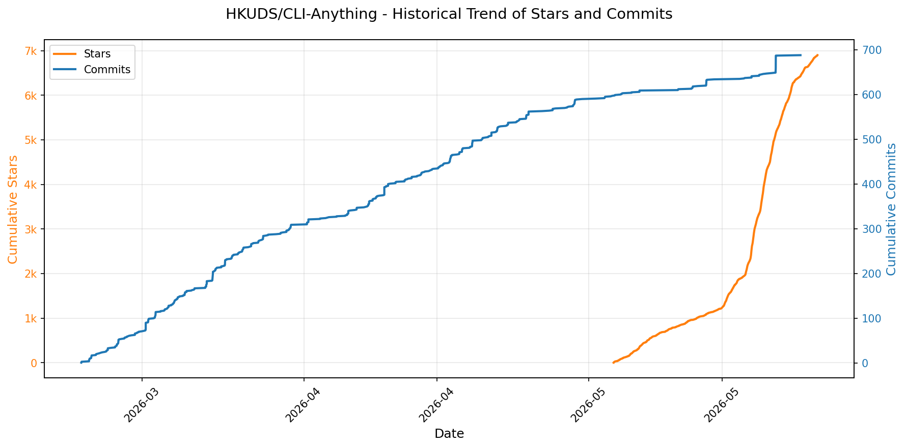

> *蓝色：累计 Stars｜橙色：累计 Commits（次 Y 轴）*

<b>📄 README 摘要</b>

1. **项目功能**  
CLI-Anything 是一个面向 AI 软件代理（Software Agents）的开源框架，旨在将**全球现有各类软件（桌面应用、专业工具、服务后台等）统一转化为 Agent-Native 的命令行接口（CLI）**。它不替代原有软件，而是为其构建轻量、结构化、可组合、自描述且面向代理优化的 CLI 适配层（称为“harness”）。通过该框架，AI 代理（如 Claude Code、Pi、OpenClaw、Cursor 等）可直接以标准化 CLI 方式调用 GIMP、Blender、Zotero、Unreal Engine、Obsidian、QGIS、Calibre、Rekordbox 等数百种真实软件，执行复杂任务（如生成 CAD 模型、渲染 3D 场景、管理文献库、编辑视频字幕、分析云成本等），实现端到端自动化工作流。

2. **核心特性**  
- ✅ **Agent-First CLI 设计范式**：所有生成 CLI 默认支持结构化 JSON 输出、`--help` 自文档、REPL 交互模式、undo/redo、状态追踪与轨迹循环（trajectory loops），消除代理解析非结构化文本的负担；  
- ✅ **CLI-Hub 统一生态中心**：提供 `pip install cli-anything-hub` 命令行包管理器 + [Web Hub](https://hkuds.github.io/CLI-Anything/) 前端，支持一键浏览、搜索、安装、更新、卸载及启动全部社区共建 CLI（含 18+ 实际应用演示）；  
- ✅ **全自动 CLI 生成流水线（7 阶段 Generator）**：基于 AI 编码代理（Claude Code / Pi / OpenClaw 等），输入软件路径或仓库，自动完成源码分析 → 命令架构设计 → Click 实现 → 测试计划与生成 → 文档撰写 → 打包发布全流程；  
- ✅ **智能渐进式增强（Refine）**：支持对已生成 CLI 进行多轮增量式能力补全（如“增加批量图像滤镜功能”），自动识别能力缺口并生成新命令、测试与文档；  
- ✅ **安全与工程健壮性保障**：强制使用 `defusedxml` 解析不受信 XML/SVG/ODF 等输入；SQLCipher 写操作加护；路径注入防护（如 GIMP Script-Fu）；跨平台兼容（Windows/macOS/Linux，含 `cygpath` 守卫）；  
- ✅ **元技能（Meta-Skill）与自主发现**：提供 `cli-hub-meta-skill`，使 AI 代理能自主在 CLI-Hub 中检索、安装并调用所需 CLI，真正实现“代理驱动的软件即服务”（Agent-Driven Software-as-a-Service）；  
- ✅ **全面验证体系**：2,269 个通过测试（100% pytest 通过率），覆盖单元测试 + 真实软件 E2E 验证（如 Calibre 真实库操作、Godot 完整游戏构建流程）。

3. **技术栈**  
- **核心语言**：Python ≥ 3.10（CLI 实现与生成器主语言）；  
- **CLI 框架**：[Click](https://click.palletsprojects.com/) ≥ 8.0（构建可组合、自文档、支持子命令与 REPL 的命令行接口）；  
- **测试与质量**：pytest（全覆盖单元/E2E 测试）、coverage.py（单元 + 端到端覆盖率）、`defusedxml`（安全 XML 解析）；  
- **输出规范**：双模输出——机器可读 JSON（默认） + 人类可读文本（`--human` 标志切换）；  
- **基础设施**：GitHub Actions CI/CD、PyPI/NPM/Brew 多源分发支持、CLI-Hub 公共注册表（`public_registry.json`）、SKILL.md 技能定义标准（Agent 可发现）；  
- **集成生态**：深度适配 SKILL 协议（OpenClaw/Claude Code/Codex 等）、MCP（Model Context Protocol）、npx skills 工具链；前端技术栈含静态站点（Jekyll/Hugo 风格托管于 GitHub Pages）。

---

### 38. [mattpocock/sandcastle](https://github.com/mattpocock/sandcastle)
- 📅 **创建日期**：2026-03-17  
- 🔄 **最近更新**：2026-05-25  
- ⭐ **Stars**：4,987（日 +108｜周 +478｜月 +4077）  
- 📝 **描述**：Orchestrate sandboxed coding agents in TypeScript with sandcastle.run()  

<b>📈 Star 与 Commit 历史趋势</b>

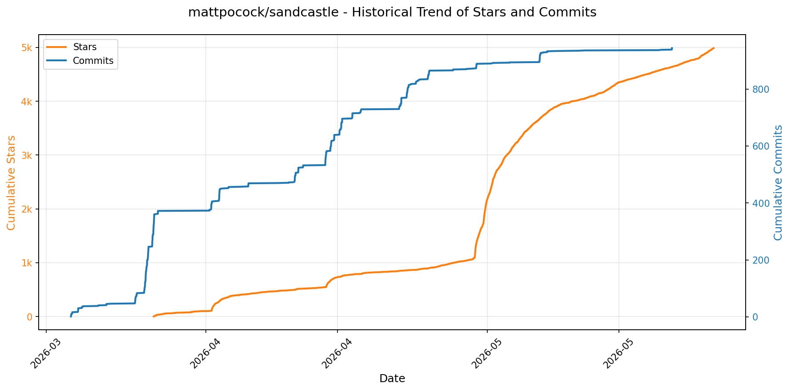

> *蓝色：累计 Stars｜橙色：累计 Commits（次 Y 轴）*

<b>📄 README 摘要</b>

1. **项目功能**  
Sandcastle 是一个 TypeScript 库，专注于**安全、可复现地编排 AI 编程智能体（AI coding agents）在隔离沙箱环境中的执行**。它通过 Git 分支策略（如新建分支或合并至主干）自动管理代码变更：智能体在隔离环境中运行 → 修改文件 → 提交到临时分支 → 最终将提交自动合并回目标分支。核心价值在于解耦“智能体逻辑”与“执行环境”，使开发者只需调用 `sandcastle.run()` 即可启动完整工作流，无需手动处理容器生命周期、Git 操作、权限隔离或跨平台兼容性问题。

2. **关键特性**  
- **多沙箱提供商支持**：开箱即用集成 Docker（本地开发）、Podman（无 root 替代方案）、Vercel（云上 Firecracker 微虚拟机），并支持自定义沙箱提供者（通过 `createBindMountSandboxProvider` 或 `createIsolatedSandboxProvider`）。  
- **灵活的分支策略**：支持 `head`（直接修改当前分支）、`branch`（新建专属分支）、`merge-to-head`（沙箱内提交后自动合并至主干）等多种 Git 工作流。  
- **沙箱复用与长生命周期管理**：`createSandbox()` 支持单容器内多次 `run()` 调用，共享依赖、构建产物和状态，显著降低重复启动开销；`await using` 自动资源清理，支持脏工作树保留。  
- **细粒度生命周期控制**：提供 `host` 和 `sandbox` 双维度钩子（hooks），支持在沙箱准备就绪、工作树创建完成等关键节点执行命令（如 `npm install`、配置文件复制）。  
- **结构化输入/输出与可观测性**：支持模板化 Prompt 占位符替换（`{{KEY}}`）、结构化输出解析（基于 Zod Schema）、日志分流（文件/标准输出/自定义事件流）、空闲超时与迭代数限制。  
- **交互式调试支持**：`interactive()` 函数提供终端 TUI 界面，支持人工介入调试智能体行为，并可与沙箱/工作树组合使用（如先交互探索、再 AFK 自动修复）。  
- **零沙箱模式**：`noSandbox()` 允许绕过容器隔离，直接在宿主机运行，适用于快速验证或特殊环境。

3. **技术栈**  
- **语言与类型系统**：TypeScript（强类型 API、泛型约束、Zod 集成用于运行时校验）。  
- **核心依赖**：Git（必需，用于分支管理、工作树、提交操作）；Node.js（运行时，依赖 `tsx` 执行 TS 文件）。  
- **沙箱运行时**：Docker（Linux/macOS/Windows）、Podman（Linux/macOS）、Vercel Sandbox（云原生微VM）；支持通过抽象接口接入任意容器/虚拟化技术。  
- **AI 集成层**：内置 Claude 智能体适配器（`claudeCode`），但设计为 provider-agnostic，可轻松扩展其他 LLM（如 OpenAI、Ollama）适配器。  
- **构建与工具链**：基于 npm 包管理；CLI 工具 `sandcastle init` 自动生成配置；日志与可观测性支持自定义 `onAgentStreamEvent` 回调；底层使用 `git worktree` 实现轻量级代码隔离。

---

### 39. [CJackHwang/ds2api](https://github.com/CJackHwang/ds2api)
- 📅 **创建日期**：2026-01-21  
- 🔄 **最近更新**：2026-05-25  
- ⭐ **Stars**：4,648（日 +27｜周 +138｜月 +3391）  
- 📝 **描述**：DeepSeek-Compatible Middleware Interface: A technical exploration project in Go, focusing on high-concurrency protocol adaptation. It serves as a reference implementation for converting diverse web protocols into standardized formats.  

<b>📈 Star 与 Commit 历史趋势</b>

> *蓝色：累计 Stars｜橙色：累计 Commits（次 Y 轴）*

---

### 40. [stablyai/orca](https://github.com/stablyai/orca)
- 📅 **创建日期**：2026-03-17  
- 🔄 **最近更新**：2026-05-25  
- ⭐ **Stars**：3,265（日 +113｜周 +602｜月 +1643）  
- 📝 **描述**：Orca is the next-gen IDE for working with a fleet of parallel agents. Run any coding agent with your own subscription. Available on desktop and mobile.  

<b>📈 Star 与 Commit 历史趋势</b>

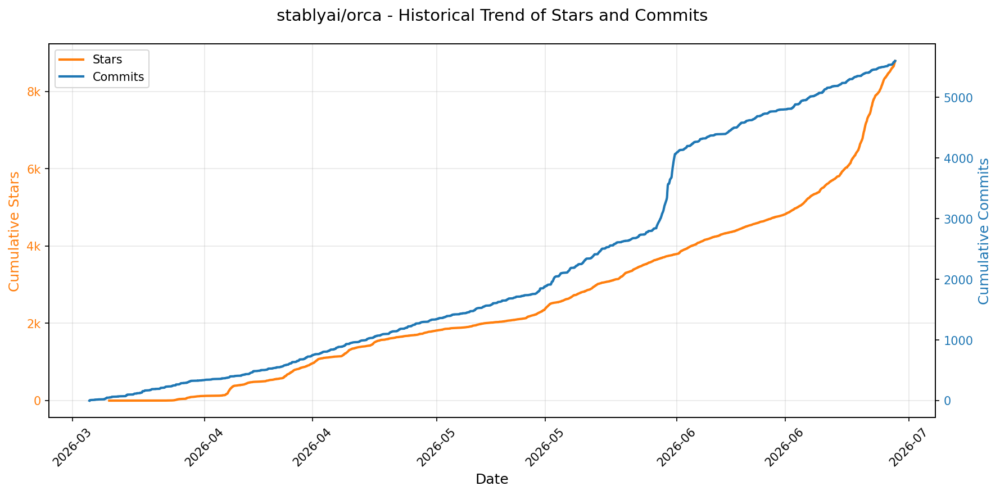

> *蓝色：累计 Stars｜橙色：累计 Commits（次 Y 轴）*

<b>📄 README 摘要</b>

1. **项目功能**  
Orca 是一款面向开发者的 AI 编程协作者（AI Orchestrator），核心目标是**统一管理并并行运行多个命令行 AI 编程代理（CLI Agents）**。它允许用户在同一界面中，为不同代码仓库（或同一仓库的不同上下文）创建隔离的 Git 工作树（worktree），并在每个工作树中独立启动、监控和交互各类 AI 代理（如 Claude Code、Codex、Grok、Gemini、OpenCode 等）。所有代理运行状态、生成的代码变更、Git 操作、PR/Issue 集成、远程 SSH 执行等均在单一体验中集中管控，无需切换终端、浏览器或 IDE，实现“100x 构建者”的高效多任务 AI 协同开发流。

2. **关键特性**  
- **工作树原生（Worktree-native）**：自动为每个 AI 任务创建独立 Git worktree，彻底规避分支切换与暂存冲突，支持瞬时创建、切换与销毁；  
- **多代理并行终端**：支持多标签页与分屏终端，可同时运行数十种 CLI AI 代理，并实时可视化其活跃状态；  
- **内置源码控制**：直接查看 AI 生成的 diff、在线编辑、一键提交，全流程不离开 Orca；  
- **深度 GitHub / Linear 集成**：每个工作树自动关联对应 PR、Issue 及 Actions 状态，支持评论、审查、状态同步；  
- **SSH 远程工作树**：可连接远程服务器，在远端机器上直接启动 agent 并同步工作树状态；  
- **拖放式文件交互**：支持将本地文件、图片甚至 PDF 拖入任意 agent 输入框，触发上下文感知的代码生成；  
- **AI Diff 注释系统**：对 AI 修改的代码差异提供逐行注释、讨论与修订能力；  
- **跨平台移动伴侣 App**（iOS/Android）：远程监控、启停 agent、接收通知，实现全场景控制；  
- **零登录 & BYO 订阅**：不托管用户凭证，完全复用用户已有的各 AI 服务账户与 API 订阅；  
- **Orca CLI 与脚本化能力**：提供命令行工具，支持自动化工作流编排与 CI/CD 集成；  
- **富媒体资源预览**：原生渲染 Markdown、图像、PDF 及仓库文档，提升上下文理解效率；  
- **细粒度账户与用量追踪**：支持多账号切换（如多个 Codex 账户），并统计各 agent 的 token/调用用量。

3. **技术栈**  
- **前端框架**：基于 Tauri 构建——采用 Rust 编写的轻量级桌面应用框架，前端使用 HTML/CSS/JS（推测为现代 TypeScript + React/Vite 或类似方案，虽未明示但符合 Tauri 生态典型实践）；  
- **后端/系统层**：Rust（Tauri 核心及系统集成逻辑，如 Git worktree 管理、SSH 连接、进程调度、CLI agent 生命周期控制）；  
- **终端仿真**：集成高性能终端组件（文档中类比 Ghostty，表明采用如 `zellij` 或自研/封装的 Rust 终端库）；  
- **Git 集成**：深度调用 libgit2 或原生 Git CLI 实现 worktree、diff、commit 等操作；  
- **跨平台支持**：原生适配 macOS（含 Apple Silicon）、Windows（x64/ARM64）及主流 Linux 发行版（通过 AppImage、deb、rpm 及 AUR 等分发）；  
- **移动端**：iOS 使用 Swift，Android 使用 Kotlin（独立原生 App，非 WebView 或跨平台框架）；  
- **构建与分发**：GitHub Actions 自动化构建，支持 Homebrew（macOS）、AUR（Arch Linux）、MSI（Windows）、DMG（macOS）及通用 ZIP 包。

---

### 41. [dotnet/skills](https://github.com/dotnet/skills)
- 📅 **创建日期**：2026-02-03  
- 🔄 **最近更新**：2026-05-25  
- ⭐ **Stars**：2,970（日 +202｜周 +1247｜月 +1585）  
- 📝 **描述**：Repository for skills to assist AI coding agents with .NET and C#  

<b>📈 Star 与 Commit 历史趋势</b>

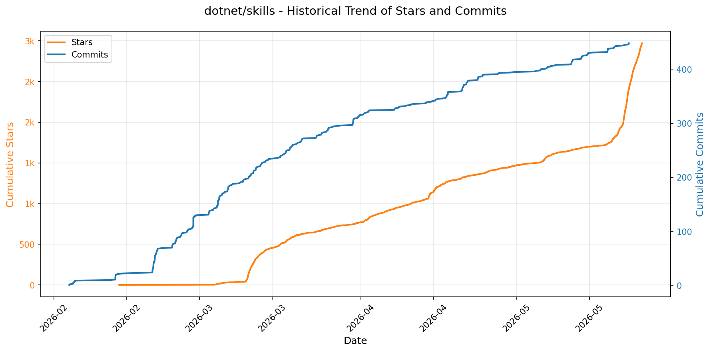

> *蓝色：累计 Stars｜橙色：累计 Commits（次 Y 轴）*

<b>📄 README 摘要</b>

1. **项目功能**  
该项目是一个面向 .NET 开发者的开源技能库（Agent Skills），旨在为 AI 编程助手（如 GitHub Copilot、Claude Code、Cursor、VS Code Copilot Chat、OpenAI Codex 等）提供标准化、可插拔的领域专用能力。它不构建独立应用或运行时代理，而是以「技能插件」（Skills）形式，为编码智能体（Coding Agents）赋予精准、可靠、可验证的 .NET 技术栈操作能力，覆盖从项目创建、开发调试、构建发布到升级迁移、AI 集成等全生命周期任务。

2. **核心特性**  
- ✅ **模块化插件架构**：按技术领域拆分为 12 个独立插件（如 `dotnet`, `dotnet-aspnet`, `dotnet-ai`, `dotnet-upgrade` 等），每个插件封装一组语义明确、职责单一的原子技能；  
- ✅ **开箱即用的 Agent 就绪能力**：所有技能严格遵循 [agentskills.io](https://agentskills.io) 开放标准，支持跨平台 Agent 运行时（Copilot CLI / Claude Code / Cursor / VS Code / Codex）一键安装、发现与调用；  
- ✅ **深度垂直覆盖 .NET 全栈场景**：涵盖基础开发（.NET CLI、模板引擎）、Web（ASP.NET Core）、数据（EF Core）、移动端（MAUI）、构建（MSBuild）、包管理（NuGet）、诊断（性能/调试）、测试（xUnit/MSTest）、AI/ML（LLM 集成、RAG、ML.NET）及最新框架（.NET 11）等关键领域；  
- ✅ **可观测性与质量保障**：提供统一在线 [Dashboard](https://dotnet.github.io/skills/)，持续追踪各插件技能的准确性（accuracy）和执行效率（efficiency）指标；  
- ✅ **多 IDE/CLI 生态原生支持**：提供 Copilot CLI、Cursor、VS Code（预览）、Codex CLI 四大主流环境的详细安装与配置指南，含本地开发调试路径（如 Cursor 本地插件加载）。

3. **技术栈**  
- **标准规范**：基于开放的 [Agent Skills 标准](https://agentskills.io)（JSON Schema 定义技能接口、元数据与执行契约）；  
- **实现语言**：插件技能本身采用纯文本描述（YAML/JSON 格式技能定义）+ 可执行脚本（Shell/PowerShell/Bash）或轻量代码封装，不强制依赖特定语言运行时，确保跨平台兼容性；  
- **基础设施**：GitHub Pages 托管 Dashboard，GitHub Actions 自动化构建与部署；  
- **集成生态**：深度适配 GitHub Copilot（CLI & Chat）、Anthropic Claude Code、Cursor（原生插件市场）、VS Code（`chat.plugins` 扩展协议）、OpenAI Codex（通过 `skill-installer` CLI）等主流 AI 编程环境。

---

### 42. [Lum1104/Understand-Anything](https://github.com/Lum1104/Understand-Anything)
- 📅 **创建日期**：2026-03-15  
- 🔄 **最近更新**：2026-05-25  
- ⭐ **Stars**：1,800（日 +1800｜周 +1800｜月 +1800）  
- 📝 **描述**：Graphs that teach > graphs that impress. Turn any code into an interactive knowledge graph you can explore, search, and ask questions about. Works with Claude Code, Codex, Cursor, Copilot, Gemini CLI, and more.  

<b>📈 Star 与 Commit 历史趋势</b>

> *蓝色：累计 Stars｜橙色：累计 Commits（次 Y 轴）*

<b>📄 README 摘要</b>

1. **项目功能**  
该项目将任意代码库、知识库（如 Karpathy 风格的 LLM Wiki）或技术文档自动转化为**可交互式探索的知识图谱**。它通过多智能体分析流水线，深度解析源码结构（文件、函数、类、依赖关系）及语义意图（业务逻辑、架构分层、设计模式），生成标准化 JSON 格式的知识图，并提供可视化 Web 仪表盘，支持搜索、问答、影响分析与团队协作共享。

2. **核心特性**  
- **结构化知识图探索**：基于力导向布局的交互式图谱，节点可点击、搜索、查看英文摘要/关系/上下文代码；支持平移、缩放、高亮路径。  
- **双重视角切换**：结构视图（文件/函数级） + 业务域视图（水平流程图展示领域、流程、步骤）。  
- **智能语义能力**：  
  - ✅ 模糊搜索 + 语义搜索（如“哪些模块处理认证？”）；  
  - ✅ 自动生成按依赖顺序排列的**引导式架构导览**（Guided Tours）；  
  - ✅ **差异影响分析**（`/understand-diff`）：预判代码变更对系统各模块的涟漪效应；  
  - ✅ **角色自适应 UI**：根据用户身份（初级开发者/产品经理/高级工程师）动态调整信息密度与术语深度；  
  - ✅ **架构分层自动识别与着色**（API/Service/Data/UI/Utility）；  
  - ✅ **编程语言概念上下文化解释**：在代码中实时标注并说明泛型、闭包、装饰器等 12 种核心模式；  
- **多源知识支持**：原生支持代码库分析，亦可解析 `index.md` 驱动的 Wiki 知识库，提取隐含实体、主张与社区聚类关系；  
- **团队协同就绪**：知识图以轻量 JSON 存储（`.understand-anything/knowledge-graph.json`），可提交至 Git（支持 git-lfs 大文件管理），实现零重复分析的快速团队接入与 PR 审查集成；  
- **增量更新与自动化**：默认仅重分析变更文件；支持 `--auto-update` 启用提交后钩子自动同步图谱。

3. **技术栈**  
- **解析层**：**Tree-sitter**（确定性语法树解析）—— 提取导入导出、函数定义、调用链、继承关系等结构化事实，保障结果可复现与增量检测；  
- **语义层**：**大语言模型（LLM）多智能体协同**—— 调用 Claude Code、Codex、Gemini CLI、Copilot 等主流 AI 编程平台的 LLM 能力，完成自然语言摘要、架构分层判定、业务域映射、引导教程生成、Wiki 实体抽取等语义任务；  
- **架构设计**：**五（+二）智能体流水线** —— `project-scanner`（项目发现）、`file-analyzer`（文件级结构解析）、`architecture-analyzer`（分层识别）、`tour-builder`（导览生成）、`graph-reviewer`（图完整性校验），扩展支持 `domain-analyzer`（业务域提取）与 `article-analyzer`（Wiki 深度分析）；  
- **部署与集成**：跨平台插件化设计，原生支持 **Claude Code 插件市场**，并通过 Shell/PowerShell 脚本一键适配 **Codex、Cursor、VS Code + Copilot、Copilot CLI、Gemini CLI、Vibe CLI、OpenCode 等十余种 AI 开发环境**；前端 Dashboard 基于 Web 技术构建，离线可用。

---

### 43. [cursor/plugins](https://github.com/cursor/plugins)
- 📅 **创建日期**：2026-01-23  
- 🔄 **最近更新**：2026-05-25  
- ⭐ **Stars**：740（日 +57｜周 +331｜月 +494）  
- 📝 **描述**：Cursor plugin specification and official plugins  

<b>📈 Star 与 Commit 历史趋势</b>

> *蓝色：累计 Stars｜橙色：累计 Commits（次 Y 轴）*

<b>📄 README 摘要</b>

1. **该项目的功能**  
该项目是 Cursor 官方维护的插件集合仓库，旨在为开发者提供与 Cursor AI 编程助手深度集成的各类工具型插件。每个插件均独立封装、开箱即用，聚焦于增强 AI 编程工作流中的特定环节——包括智能记忆更新、团队协作自动化、插件开发支持、代码审查优化、文档可视化、CLI 可靠性设计、Agent 兼容性检测、SDK 集成开发，以及大规模任务的分布式协同编排。

2. **核心功能**  
- **智能记忆演进**：`continual-learning` 插件实现基于对话/操作日志的增量式、高信噪比记忆更新（仅提取关键要点），持续强化 AGENT 行为；  
- **团队工程效能提升**：`cursor-team-kit` 封装 Cursor 内部使用的 CI/CD、代码审查、本地验证等标准化工作流；  
- **插件生态基建**：`create-plugin` 提供插件脚手架与合规性校验，`agent-compatibility` 和 `cli-for-agent` 分别保障插件与 AI Agent 的兼容性及 CLI 命令的可预测性（支持 dry-run、idempotency、结构化错误等）；  
- **人机协同界面升级**：`pr-review-canvas` 将 PR 差异转化为按重要性分层、逻辑与模板分离、风险高亮的交互式 Canvas；`docs-canvas` 将技术文档（架构图、API、Runbook 等）渲染为带目录、图表和交叉引用的可导航 Canvas；  
- **开发扩展能力强化**：`cursor-sdk` 基于 `@cursor/sdk` 提供 TypeScript 运行时选择、流式响应、MCP 协议支持、认证与错误处理等完整 SDK 实践模式；  
- **分布式智能编排**：`orchestrate` 支持将复杂任务拆解为 Planner–Worker–Verifier 多角色并行云 Agent 流程，并通过结构化交接确保执行可靠性。

3. **技术栈**  
- **核心平台**：Cursor AI 编程助手（专有平台，基于 LLM 与编辑器深度集成）；  
- **插件规范**：遵循 Cursor 官方插件协议，依赖 `.cursor-plugin/plugin.json` 清单文件定义元数据与能力；  
- **开发语言**：以 TypeScript 为主（尤其 `cursor-sdk` 及相关自动化脚本），部分插件含 Markdown 技能定义（`SKILL.md`）、规则配置（`.mdc`）、MCP 服务描述（`mcp.json`）；  
- **架构协议**：集成 MCP（Model Context Protocol）标准，支持模型上下文动态注入与跨服务协同；  
- **工程实践**：采用多插件单仓（monorepo-like）结构，各插件自治（含独立 README/CHANGELOG/LICENSE），根目录由 `marketplace.json` 统一注册；  
- **许可协议**：整体项目采用 MIT 开源许可证。

---

