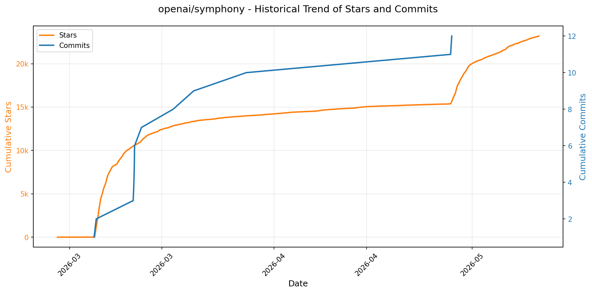
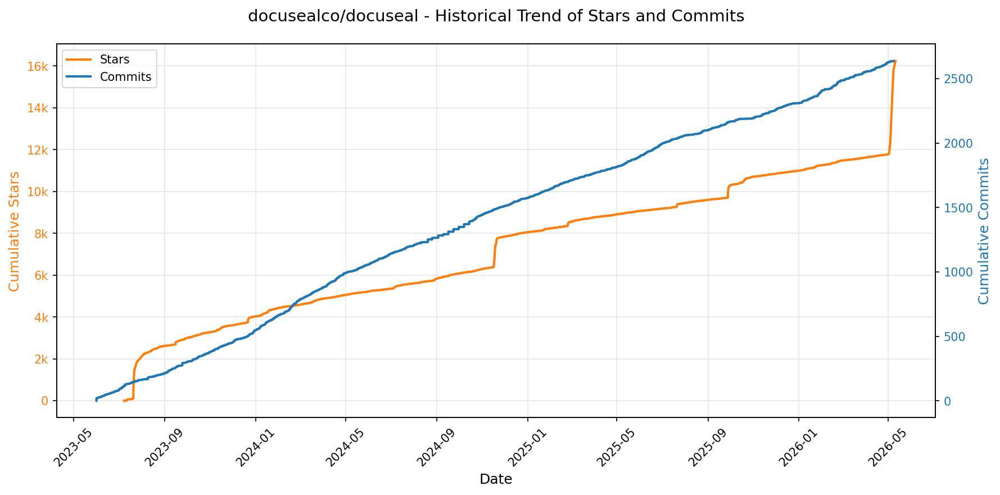
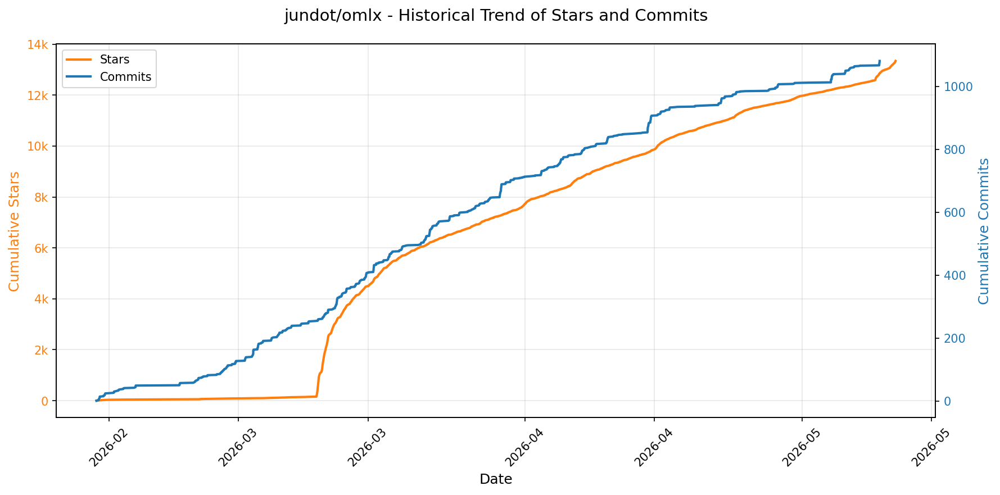
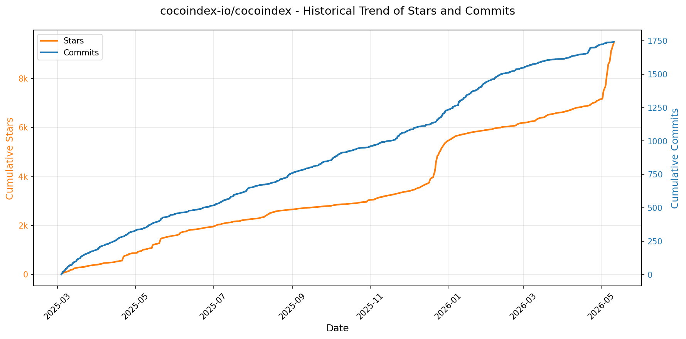
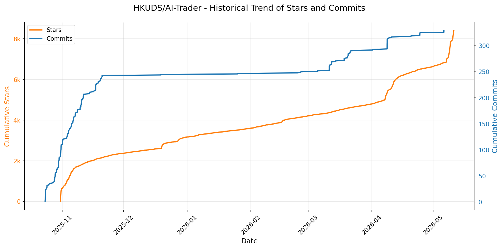
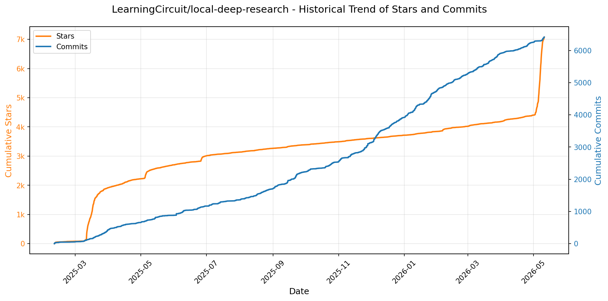
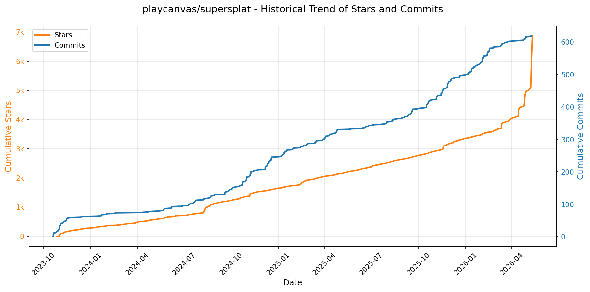

# 🌟 GitHub Trending 概览

> 数据更新于：2026-05-11

---

## 🔍 项目详情

### 1. [affaan-m/everything-claude-code](https://github.com/affaan-m/everything-claude-code)
- 📅 **创建日期**：2026-01-18  
- 🔄 **最近更新**：2026-05-11  
- ⭐ **Stars**：172,808（日 +1434｜周 +5753｜月 +29024）  
- 📝 **描述**：The agent harness performance optimization system. Skills, instincts, memory, security, and research-first development for Claude Code, Codex, Opencode, Cursor and beyond.  

<b>📈 Star 与 Commit 历史趋势</b>

> *蓝色：累计 Stars｜橙色：累计 Commits（次 Y 轴）*

<b>📄 README 摘要</b>

1. **项目功能**  
该项目是一个面向AI智能体（AI Agent）运行环境的**性能优化与工程化系统**，专为提升各类AI代理平台（如Claude Code、Codex、Cursor、OpenCode、Gemini等）中智能体的稳定性、效率、安全性与可维护性而设计。它并非简单的配置集合，而是提供端到端的生产级能力支撑：涵盖技能（Skills）管理、本能（Instincts）建模、记忆持久化与优化、持续学习机制、安全扫描（含AgentShield集成）、多语言规则引擎、跨平台命令/钩子（Hooks）调度、会话生命周期治理，以及面向真实产品开发的MCP（Model-Controller-Pattern）配置体系与遗留命令兼容层。其核心目标是将AI智能体从“实验性提示工程”升级为可审计、可扩展、可演进、可运维的软件系统。

2. **关键特性**  
- **跨平台智能体运行时支持**：原生适配Claude Code、Codex（App & CLI）、Cursor、OpenCode、Gemini等主流AI代理平台，实现行为一致性与配置复用；  
- **模块化安装与精细化管控**：支持`minimal`/`core`/`full`等多档位安装策略，通过`install-plan.js`和状态存储实现按需安装、增量更新与组件隔离；  
- **智能体全生命周期治理**：提供`/sessions`会话管理、`/harness-audit`平台健康检查、`/quality-gate`质量门禁、`/model-route`模型动态路由、`NanoClaw v2`会话分支/导出/压缩/度量等能力；  
- **持续学习与技能进化**：基于会话自动提取模式生成可复用技能（Skill Stocktake），支持本能导入/导出、置信度评分、演化训练；  
- **企业级安全防护体系**：深度集成`AgentShield`（102条安全规则、1282项测试），提供`/security-scan`命令、沙箱访问控制、输入净化、CVE响应及攻击面分析；  
- **多语言全栈覆盖**：支持TypeScript、Python、Go、Java、Kotlin、Rust、C++、Perl、PHP、Swift等**12+语言生态**，规则按语言分目录（`common/` + `typescript/` + `java/`等），按需加载；  
- **可观测性与运维增强**：内置SQLite状态存储、CLI查询工具、5层观察者防护、内存爆炸抑制、懒启动与重入保护；  
- **Operator工作流与业务域扩展**：v2.0引入`brand-voice`、`customer-billing-ops`、`google-workspace-ops`等10+垂直领域Operator，支持企业级运营自动化；  
- **开发者体验升级**：Tkinter桌面仪表盘（暗/亮主题、字体定制）、`manim`/`remotion`视频生成工具链、交互式安装向导、`npx ecc consult`智能组件顾问、CI全链路校验（997+通过测试）。

3. **技术栈**  
- **主语言与运行时**：TypeScript（核心逻辑、CLI工具、仪表盘前端）、Python（`ecc_dashboard.py`桌面应用、部分技能与安全扫描）、Shell/Bash（安装脚本`install.sh`）、PowerShell（Windows安装支持）；  
- **后端与系统层**：Go（部分底层工具与性能敏感模块）、Java/Kotlin（Spring Boot/Django技能支持）、Rust（ECC 2.0 Alpha控制平面原型，位于`ecc2/`目录）；  
- **前端与展示层**：HTML/CSS/JS（`frontend-slides`零依赖幻灯片生成器）、Tkinter（桌面GUI）、Manim/Remotion（技术视频生成）；  
- **基础设施与工具链**：npm/pnpm/yarn/bun（包管理）、PM2（多服务进程管理）、SQLite（本地状态存储）、Git Worktrees（并行开发）、GitHub Marketplace（SaaS分发）、NestJS（框架模式扩展）；  
- **AI与协议层**：Anthropic Claude、OpenAI Codex、Google Gemini等大模型API集成；MCP（Model-Controller-Pattern）架构范式；Agent Protocol（MCP）兼容性支持。

---

### 2. [forrestchang/andrej-karpathy-skills](https://github.com/forrestchang/andrej-karpathy-skills)
- 📅 **创建日期**：2026-01-27  
- 🔄 **最近更新**：2026-05-11  
- ⭐ **Stars**：114,852（日 +1392｜周 +14807｜月 +103215）  
- 📝 **描述**：A single CLAUDE.md file to improve Claude Code behavior, derived from Andrej Karpathy's observations on LLM coding pitfalls.  

<b>📈 Star 与 Commit 历史趋势</b>

> *蓝色：累计 Stars｜橙色：累计 Commits（次 Y 轴）*

<b>📄 README 摘要</b>

1. **该项目的作用**  
该项目提供一份轻量、可即插即用的 `CLAUDE.md` 指南文件，旨在系统性地矫正 Claude（特别是 Claude Code）在编程任务中的典型行为缺陷。它不开发新工具或运行时环境，而是通过结构化提示工程（prompt engineering），将 Andrej Karpathy 总结的 LLM 编程认知误区转化为四条可执行、可内化的工程原则，直接嵌入 Claude Code 的工作流中，从而引导模型更审慎、简洁、精准、目标明确地完成代码生成与修改任务。

2. **核心特性**  
- **四大可操作原则**：以“Think Before Coding”（显式推理、暴露不确定性、主动质疑）、“Simplicity First”（严格拒绝过度设计、仅实现最小可行解）、“Surgical Changes”（编辑范围精确到需求根源、禁止越界重构或格式清理）、“Goal-Driven Execution”（将模糊指令转为可验证的测试先行目标与闭环验证步骤）为核心，每条均含具体行为准则与判断标准（如“高级工程师是否会认为这段代码过重？”）。  
- **多平台无缝集成**：原生支持 Claude Code 插件市场一键安装；同时提供标准 `CLAUDE.md` 文件，兼容本地项目导入；并预置 Cursor IDE 专用规则文件（`.cursor/rules/karpathy-guidelines.mdc`），实现跨 AI 编程环境的一致性约束。  
- **渐进式可扩展性**：设计为非侵入式叠加层，允许与项目原有规范（如 TypeScript 严格模式、特定错误处理约定）共存，支持在 `CLAUDE.md` 中追加 `Project-Specific Guidelines` 进行定制。  
- **效果可衡量**：明确定义成功信号——diff 更干净、首次实现即简洁、提问前置而非补救式返工、PR 无“顺手优化”，强调质量而非速度的权衡取舍。

3. **技术栈**  
- **核心形态**：纯文本 Markdown（`CLAUDE.md`），零依赖、零运行时，本质是面向 LLM 的结构化提示模板（structured prompt）。  
- **集成载体**：  
  - Claude Code 插件生态（基于 `/plugin install` 命令的 marketplace 插件机制）；  
  - Cursor IDE 规则系统（`.cursor/rules/` 下的 `.mdc` 格式规则文件）；  
- **分发与部署**：通过 GitHub Raw CDN（`raw.githubusercontent.com`）提供标准化文件分发，依赖 `curl` 等基础命令行工具完成本地注入；无后端服务、无构建流程、无额外依赖。  
- **哲学基础**：基于 LLM 的“目标驱动循环能力”（Karpathy 提出），属提示工程（Prompt Engineering）与 AI 工程实践（AI Engineering）范畴，非传统软件开发技术栈。

---

### 3. [thedotmack/claude-mem](https://github.com/thedotmack/claude-mem)
- 📅 **创建日期**：2025-08-31  
- 🔄 **最近更新**：2026-05-11  
- ⭐ **Stars**：75,747（日 +379｜周 +3100｜月 +27578）  
- 📝 **描述**：Persistent Context Across Sessions for Every Agent –  Captures everything your agent does during sessions, compresses it with AI, and injects relevant context back into future sessions. Works with Claude Code, OpenClaw, Codex, Gemini, Hermes, Copilot, OpenCode + More  

<b>📈 Star 与 Commit 历史趋势</b>

> *蓝色：累计 Stars｜橙色：累计 Commits（次 Y 轴）*

<b>📄 README 摘要</b>

1. **项目功能**  
Claude-Mem 是一个专为 **Claude Code**（Anthropic 官方 AI 编程助手）设计的**持久化记忆压缩系统**。它在用户每次会话中自动捕获工具调用、代码操作、对话上下文等行为观测数据（observations），通过语义摘要与结构化存储，实现跨会话的上下文连续性——即使会话中断、重启或切换 IDE，历史项目知识仍可被后续会话自动感知与复用，显著提升 AI 编程代理（agent）的长期任务连贯性与上下文理解能力。

2. **核心特性**  
- ✅ **持久记忆（Persistent Memory）**：上下文自动保存至本地 SQLite 数据库，跨会话、跨 IDE 实例持续存在；  
- ✅ **渐进式披露（Progressive Disclosure）**：分三层按需检索（索引 → 时间线 → 详情），实时显示 token 消耗，实现约 **10 倍 token 节省**；  
- ✅ **技能化搜索（Skill-Based Search）**：内置 `mem-search` 技能与 4 个标准化 MCP 工具（`search` / `timeline` / `get_observations` 等），支持自然语言查询项目历史；  
- ✅ **多模态交互界面**：提供本地 Web 查看器（`http://localhost:37777`），实时流式展示记忆流、观测详情、引用 ID 及 API 接口；  
- ✅ **隐私与细粒度控制**：支持 `<private>` 标签屏蔽敏感内容；通过 `settings.json` 精确配置上下文注入范围、AI 模型、端口、日志等级等；  
- ✅ **多语言 & 多模式工作流**：内置 30+ 语言本地化（含简体中文 `code--zh`），并支持不同行为模式（如 `code`/`chill`/`investigation`）及对应语言生成；  
- ✅ **全自动运行**：无需手动触发，依托 6 个生命周期 Hook（SessionStart、UserPromptSubmit、PostToolUse 等）静默采集与处理；  
- ✅ **混合搜索架构**：结合 SQLite FTS5 全文检索 + Chroma 向量数据库，实现语义+关键词双路智能检索；  
- ✅ **OpenClaw 网关集成**：一键部署为 OpenClaw AI 网关插件，支持 Telegram/Discord/Slack 实时观测推送；  
- ✅ **Beta 实验通道**：提供 Endless Mode（仿生长时记忆架构）等前沿功能，可通过 Web UI 切换版本体验。

3. **技术栈**  
- **运行时**：Node.js ≥18.0.0（主逻辑）、Bun（Worker 服务托管与进程管理）、uv（Python 包管理，用于 Chroma 向量库依赖）；  
- **数据库**：SQLite 3（嵌入式，含 FTS5 全文搜索支持） + Chroma（向量数据库，用于语义检索）；  
- **前端与服务**：Bun 驱动的轻量级 HTTP Worker 服务（端口 37777），提供 REST API 与 Web UI（基于现代 HTML/CSS/JS）；  
- **协议与标准**：完全兼容 [MCP（Model Context Protocol）](https://modelcontextprotocol.org/) 规范，实现标准化工具调用；  
- **开发与构建**：TypeScript（主力语言）、GitHub Actions（CI/CD）、Apache License 2.0（开源许可）；  
- **部署与集成**：支持 npx 快速安装、Claude Code 插件市场安装、Gemini CLI / OpenCode / OpenClaw 等多平台适配。

---

### 4. [mattpocock/skills](https://github.com/mattpocock/skills)
- 📅 **创建日期**：2026-02-03  
- 🔄 **最近更新**：2026-05-11  
- ⭐ **Stars**：69,435（日 +1180｜周 +12231｜月 +55650）  
- 📝 **描述**：Skills for Real Engineers. Straight from my .claude directory.  

<b>📈 Star 与 Commit 历史趋势</b>

> *蓝色：累计 Stars｜橙色：累计 Commits（次 Y 轴）*

<b>📄 README 摘要</b>

1. **项目功能**  
该项目是一套面向真实工程场景的 AI 编程代理（coding agent）技能集合，旨在解决当前 AI 编程工具（如 Claude Code、Codex 等）在实际软件开发中普遍存在的四大失败模式：**需求对齐失败、表达冗余、代码不可靠、架构退化**。它不提供完整框架或自动化流水线，而是以轻量、可组合、模型无关的「技能」（Skill）形式，嵌入到开发者日常使用的 AI 编程代理中（如 GitHub Copilot Workspace、Cursor、Claude Code 等），通过结构化指令与工程实践引导 AI 更可靠、更专业地协作——目标是“做真实工程师做的事”，而非“氛围编程”（vibe coding）。

2. **核心特性**  
- **精准对齐机制**：通过 `/grill-me` 和 `/grill-with-docs` 技能强制进行深度需求澄清，模拟工程师间的诘问式沟通，确保 AI 充分理解上下文、边界条件与业务意图；后者进一步集成领域建模，自动生成/更新 `CONTEXT.md` 与架构决策记录（ADR）。  
- **领域语言驱动**：内建共享术语体系（Ubiquitous Language），显著压缩提示词长度（如将长句简化为“materialization cascade”），提升命名一致性、代码可读性与 AI 推理效率。  
- **工程化反馈闭环**：提供 `/tdd`（红-绿-重构式测试驱动开发）和 `/diagnose`（系统化调试循环：复现→最小化→假设→观测→修复→回归验证）等技能，将经典工程实践编码为 AI 可执行协议。  
- **架构可持续性保障**：包含 `/improve-codebase-architecture`（定期识别并重构“泥球”代码）、`/zoom-out`（要求 AI 跳出局部代码、从系统级视角解释）、`/to-prd` 与 `/to-issues`（将对话自动转化为产品需求文档与垂直切片任务）等技能，将设计思维嵌入 AI 协作全流程。  
- **开箱即用与高度可定制**：通过 `skills.sh` 一键安装，支持按需选择技能与目标代理；`/setup-matt-pocock-skills` 自动配置仓库级元信息（如 Issue 追踪器、标签规范、文档路径），所有技能均基于纯文本配置，易于修改、复用与二次开发。

3. **技术栈**  
- **运行时依赖**：无服务端或专用运行环境；技能本质为结构化 Markdown 指令集（`.md` 文件），兼容任意支持自定义指令的 LLM 编程代理（如 Cursor、GitHub Copilot Workspace、Claude Code 等）。  
- **基础设施层**：依赖 `skills.sh` CLI 工具（基于 `npx` 分发）完成技能注册与初始化；配置数据存储于本地仓库（如 `CONTEXT.md`、`docs/adr/`、`.github/ISSUE_TEMPLATE/` 等标准路径）。  
- **工程范式基础**：深度融合经典软件工程方法论，包括：领域驱动设计（DDD）、测试驱动开发（TDD）、架构决策记录（ADR）、极限编程（XP）、《程序员修炼之道》与《软件设计哲学》中的核心原则；所有技能设计均体现类型安全（TypeScript 作者背景）、增量演进与反馈驱动理念。  
- **辅助工具链**：部分杂项技能集成前端/工程工具，如 `@total-typescript/shoehorn`（类型断言迁移）、Husky + lint-staged + Prettier（pre-commit 钩子），但非核心依赖。

---

### 5. [TauricResearch/TradingAgents](https://github.com/TauricResearch/TradingAgents)
- 📅 **创建日期**：2024-12-28  
- 🔄 **最近更新**：2026-05-11  
- ⭐ **Stars**：67,042（日 +701｜周 +7886｜月 +24293）  
- 📝 **描述**：TradingAgents: Multi-Agents LLM Financial Trading Framework  

<b>📈 Star 与 Commit 历史趋势</b>

> *蓝色：累计 Stars｜橙色：累计 Commits（次 Y 轴）*

<b>📄 README 摘要</b>

1. **项目功能**  
TradingAgents 是一个面向金融交易研究的开源多智能体（Multi-Agent）框架，旨在模拟真实投资机构的协作决策流程。它通过部署多个专业化的大语言模型（LLM）智能体，协同完成从市场信息采集、多维度分析（基本面、技术面、新闻与情绪）、观点辩论（多空研究员对峙）、交易策略生成，到风险评估与组合管理的全流程闭环。所有环节均基于真实或模拟金融市场数据运行，输出可解释的交易建议（如买入/卖出/持有、仓位比例、理由摘要等），**专为学术研究与算法验证设计，不构成实际投资建议**。

2. **核心特性**  
- **角色化多智能体架构**：严格划分 Analyst Team（基本面/技术/新闻/情绪分析师）、Researcher Team（多空研究员辩论）、Trader Agent（策略整合与执行决策）、Risk Management & Portfolio Manager（风险监控与最终审批）四大职能模块，支持结构化协作与动态讨论。  
- **生产级工程能力**：支持 LangGraph 状态持久化（checkpoint resume），中断后可精确恢复至失败节点；自动维护跨周期、跨标的决策日志（`trading_memory.md`），并注入历史反思以实现持续学习。  
- **全栈模型兼容性与灵活性**：原生支持 OpenAI（GPT-5.x）、Google（Gemini 3.x）、Anthropic（Claude 4.x）、xAI（Grok 4.x）、DeepSeek、Qwen（DashScope）、GLM（智谱）、OpenRouter、Ollama（本地模型）及 Azure OpenAI 等十余种 LLM 提供商；支持模型分级调度（如 `deep_think_llm` 与 `quick_think_llm` 分离）、多轮辩论控制、UTF-8/Windows 兼容、Docker 容器化部署及企业级配置（如 `.env.enterprise`）。  
- **开箱即用的研究工作流**：提供交互式 CLI 工具（支持 ticker、日期、模型、深度等参数配置）、Python 包集成接口（`TradingAgentsGraph.propagate()`）、完整配置系统（`default_config.py`）及多语言文档（含中文等 8 种语言）。

3. **技术栈**  
- **核心框架**：LangGraph（构建可持久化、可调试的有状态多智能体图流程）  
- **编程语言**：Python 3.13（官方指定版本）  
- **依赖生态**：Pydantic（配置校验）、SQLAlchemy（SQLite 检查点存储）、Rich（CLI 美化输出）、Requests/HTTPX（API 调用）、Pandas（数据处理基础）  
- **部署支持**：Docker / Docker Compose（含 Ollama 专用 profile）、Conda 虚拟环境管理  
- **外部服务集成**：Alpha Vantage（行情数据）、各主流 LLM API（OpenAI/Gemini/Claude 等）、Ollama（本地模型推理）  
- **基础设施**：本地文件系统持久化（`~/.tradingagents/` 目录管理内存与缓存）、SQLite（检查点状态存储）

---

### 6. [bytedance/UI-TARS-desktop](https://github.com/bytedance/UI-TARS-desktop)
- 📅 **创建日期**：2025-01-19  
- 🔄 **最近更新**：2026-05-11  
- ⭐ **Stars**：52,154（日 +0｜周 +0｜月 +0）  
- 📝 **描述**：The Open-Source Multimodal AI Agent Stack: Connecting Cutting-Edge AI Models and Agent Infra  

<b>📈 Star 与 Commit 历史趋势</b>

> *蓝色：累计 Stars｜橙色：累计 Commits（次 Y 轴）*

<b>📄 README 摘要</b>

1. **项目功能**  
TARS 是一个开源的多模态 AI 智能体（Agent）技术栈，聚焦于实现类人化、跨界面的任务自动化。它包含两大核心组件：  
- **Agent TARS**：通用型多模态智能体框架，支持在终端（CLI）、Web 浏览器和各类产品中运行，可理解 GUI 界面、屏幕图像与自然语言指令，自主调用真实世界工具（如浏览器、Shell、文件系统等）完成端到端任务（例如“在 Booking.com 预订机场附近丽思卡尔顿酒店”或“在 Priceline 查询并预订往返航班”）。  
- **UI-TARS Desktop**：本地原生桌面应用，基于 UI-TARS 视觉语言模型（如 Seed-1.5-VL/1.6），提供对本机及远程计算机/浏览器的零配置图形界面（GUI）自动化控制能力（如修改 VS Code 设置、浏览 GitHub 未关闭 Issue），所有视觉处理与操作逻辑默认在本地执行，保障隐私与安全。

2. **关键特性**  
- ✅ **多模态感知与执行**：融合视觉（截图识别）、语言（自然语言指令理解）、动作（鼠标/键盘精准控制）三重能力，实现“看-想-做”闭环。  
- ✅ **混合浏览器代理（Hybrid Browser Agent）**：支持 GUI 视觉定位、DOM 结构解析或二者协同策略，提升网页操作鲁棒性。  
- ✅ **事件流驱动架构（Event Stream）**：采用协议化事件流机制，支撑上下文工程（Context Engineering）、实时数据流追踪、调试（Event Stream Viewer）及低代码 Agent UI 构建。  
- ✅ **MCP（Model Control Protocol）深度集成**：以 MCP 为内核标准，无缝接入并编排多种外部工具服务器（MCP Servers），如 Shell、文件管理、图表生成等，构建可扩展的工具生态。  
- ✅ **开箱即用的多形态部署**：同时提供 CLI（支持 headless 服务模式）、Web UI、原生桌面客户端（Windows/macOS）及远程控制（Remote Computer/Browser Operator）能力，覆盖开发、测试与终端用户场景。  
- ✅ **全链路本地化与隐私优先**：UI-TARS Desktop 默认纯本地运行；Agent TARS 支持私有模型部署与沙箱隔离（如 AIO Agent Sandbox），确保敏感操作数据不出设备。

3. **技术栈**  
- **核心模型层**：基于自研多模态大模型 UI-TARS 系列（如 UI-TARS-1.5-7B）、Seed-1.5-VL/1.6 等视觉语言模型；兼容第三方模型（如 VolcEngine 的 DouBao-1.5-Thinking-Vision-Pro、Anthropic 的 Claude 3.7 Sonnet）。  
- **协议与标准**：遵循 MCP（Model Control Protocol）规范实现模型与工具间的标准化通信与编排。  
- **运行时与框架**：  
  - Agent TARS CLI：基于 Node.js（≥ v22），通过 `npm` 分发（`@agent-tars/cli`）；  
  - UI-TARS Desktop：使用 Electron 或跨平台原生框架构建（明确支持 Windows/macOS/浏览器环境）；  
  - 后端服务：支持 headless 服务模式，适配云部署（如 ModelScope 平台）及本地沙箱（AIO Sandbox）。  
- **基础设施**：集成 ModelScope、Hugging Face 模型托管；前端文档与社区采用 Lark（飞书）、Discord、DeepWiki（GitBook）等协作平台；开发流程遵循 GitHub 开源协作范式。

---

### 7. [ruvnet/ruflo](https://github.com/ruvnet/ruflo)
- 📅 **创建日期**：2025-06-02  
- 🔄 **最近更新**：2026-05-11  
- ⭐ **Stars**：48,986（日 +658｜周 +9488｜月 +17759）  
- 📝 **描述**：🌊 The leading agent orchestration platform for Claude. Deploy intelligent multi-agent swarms, coordinate autonomous workflows, and build conversational AI systems. Features    enterprise-grade architecture, self-learning swarm intelligence, RAG integration, and native Claude Code / Codex Integration  

<b>📈 Star 与 Commit 历史趋势</b>

> *蓝色：累计 Stars｜橙色：累计 Commits（次 Y 轴）*

<b>📄 README 摘要</b>

1. **项目功能**  
Ruflo 是一个面向 Claude Code 的多智能体 AI 编排系统，旨在为 AI 开发者和工程团队提供企业级、安全可控的智能体协同基础设施。它将原本孤立运行的 AI 智能体升级为具备**自组织、自学习、跨边界协作能力的“智能体群（swarm）”**。核心价值在于：通过轻量级 CLI 初始化（`npx ruflo init`）或 Claude Code 插件集成，即可为本地开发环境注入“AI 神经系统”——使智能体能够自动组队协作、在任务中持续学习优化、跨机器/组织安全联邦通信、持久化记忆（向量数据库 + HNSW 索引），并在不暴露敏感数据的前提下实现零信任协作。用户仍以自然方式使用 Claude Code，所有编排、路由、记忆与学习均由 Ruflo 在后台全自动完成。

2. **关键特性**  
- **多智能体协同（Swarm Coordination）**：支持分层、网状及自适应拓扑结构，内置共识机制，可动态调度 100+ 预置专业化智能体（覆盖编码、测试、安全、文档、架构、IoT、量化交易等场景）。  
- **自学习与自优化（Self-Learning Architecture）**：基于 SONA 神经模式、ReasoningBank 与轨迹学习，从成功任务中提取模式并迭代提升智能体行为；支持 DAA（动态认知模式）与 ruvLLM 本地自进化模型层。  
- **零信任联邦通信（Federated Comms）**：跨设备/组织/云区域的智能体可自动发现、双向 mTLS + ed25519 身份认证、PII（14 类敏感信息）自动脱敏/拦截/哈希、行为可信度实时评分（含 HIPAA/SOC2/GDPR 合规审计日志）。  
- **高性能向量记忆（Vector Memory）**：基于 AgentDB（HNSW 索引），搜索速度达暴力检索的 150×–12,500×；支持记忆跨会话持久化（`ruflo-rvf`）、图增强 RAG（`ruflo-ruvector`）、知识图谱构建（`ruflo-knowledge-graph`）。  
- **全栈 MCP 工具生态**：原生支持 Model Context Protocol（MCP），提供约 210 个可并行调用的工具（含 18 个纯前端 WASM 工具），覆盖 Core/Intelligence/Agents/Memory/DevTools 五大类，并支持用户自定义 MCP 服务接入。  
- **双 UI 前端体系**：  
  - **Web UI（flo.ruv.io）**：多模型聊天界面（Qwen/Claude/Gemini/OpenAI 等 6 大前沿模型开箱即用），支持并行工具调用、本地/远程模型混合路由、嵌入式 MongoDB 自托管。  
  - **Goal Planner（goal.ruv.io）**：基于 GOAP（目标导向动作规划）的 A\* 规划器，将自然语言目标自动分解为可执行动作树，实时调度至活体智能体并可视化监控其状态与轨迹。  
- **插件化扩展架构**：32 个原生 Claude Code 插件 + 21 个 npm 插件，按功能模块化（如 `ruflo-federation`、`ruflo-security-audit`、`ruflo-neural-trader`），支持一键安装与组合编排。

3. **技术栈**  
- **核心引擎**：Rust 构建的高性能 AI 运行时（Cognitum.One 架构），负责底层调度、内存管理、嵌入向量计算与插件生命周期控制。  
- **前端框架**：Web UI（`ruvocal`）采用 Svelte（主界面）与 Vite（Goal Planner）；Goal Planner 后端使用 Supabase；CLI 与 MCP Server 基于 Node.js。  
- **AI 与模型层**：多提供商智能路由（Anthropic Claude / OpenAI / Google Gemini / Cohere / Ollama / vLLM / LM Studio / Groq / Together）；本地 LLM 支持 ruvLLM（MicroLoRA 微调适配器 + SONA 学习）；嵌入模型默认集成。  
- **存储与检索**：AgentDB（自研向量数据库，HNSW 索引）、MongoDB（Web UI 内嵌）、知识图谱（Neo4j 或图嵌入方案）。  
- **通信协议**：Model Context Protocol（MCP）标准（HTTP/SSE/stdio 接口）；联邦通信基于 mTLS + ed25519 双向认证 + 加密信道；PII 处理采用规则引擎 + ML 辅助检测。  
- **部署与运维**：Docker 容器化（含多阶段构建与内嵌 DB 支持）、Google Cloud Run / Fly.io / Kubernetes 兼容；CLI 支持 npm 全局安装与 npx 快速初始化；CI/CD 由 GitHub Actions 与 cloudbuild.yaml 驱动。

---

### 8. [datawhalechina/hello-agents](https://github.com/datawhalechina/hello-agents)
- 📅 **创建日期**：2025-09-07  
- 🔄 **最近更新**：2026-05-11  
- ⭐ **Stars**：46,852（日 +857｜周 +4314｜月 +11587）  
- 📝 **描述**：📚 《从零开始构建智能体》——从零开始的智能体原理与实践教程  

<b>📈 Star 与 Commit 历史趋势</b>

> *蓝色：累计 Stars｜橙色：累计 Commits（次 Y 轴）*

<b>📄 README 摘要</b>

1. **项目功能**  
Hello-Agents 是一个面向中文学习者的、系统性与实践性并重的开源智能体（AI Agent）学习教程项目。它不提供通用工具或可直接部署的服务，而是以“教育框架”为核心定位：从零开始引导用户深入理解 AI Native 智能体的本质原理（区别于流程驱动的低代码平台如 Dify/Coze），并通过理论讲解、代码实现、框架自研与真实项目开发，帮助学习者完成从大语言模型“使用者”到智能体系统“构建者”的能力跃迁。

2. **关键特性**  
- ✅ **全栈式学习路径**：覆盖五大部分——基础理论（智能体定义、发展史、LLM 原理）、范式实现（ReAct/Plan-and-Solve/Reflection）、低代码平台实践（Coze/Dify/n8n）、主流框架应用（AutoGen/LangGraph/AgentScope）、高级技术（Memory/RAG/上下文工程/通信协议/MCP/A2A/ANP）、Agentic-RL 训练（SFT→GRPO）、系统评估及多智能体综合案例（智能旅行助手、赛博小镇、DeepResearch Agent）。  
- ✅ **“造轮子+用轮子”双轨并行**：第七章起基于 OpenAI 原生 API 从零手写轻量级智能体框架 `HelloAgents`（已发布 v1.0.0），并在后续章节中持续用该框架实现记忆、协议、训练等高级功能，强化底层理解。  
- ✅ **强实战导向设计**：所有核心章节均配套可运行代码（位于 `code/` 目录），强调“边学边敲”，包含大量动手实验、调试指导与踩坑经验（见 Extra-Chapter 系列）。  
- ✅ **社区共建生态**：支持 PR 贡献“社区精选”内容（如面试题解析、GUI Agent 实战、Skill 编写指南、Agent 自进化等），形成动态演进的知识库；提供 PDF 免费下载（含防伪水印）、中英文文档、国内外加速在线阅读链接及读者交流群。  
- ✅ **职业能力闭环**：专设求职面试模块（Extra01–02）、毕业设计章节（第十六章）及未来规划《从零开始训练智能体》，直击工业界实际需求。

3. **技术栈**  
- **核心语言与运行时**：Python（必备基础），依赖标准异步/并发、HTTP 客户端（如 `httpx`）、JSON/YAML 处理等原生能力。  
- **大模型交互层**：以 OpenAI REST API 为基准设计（兼容其他符合 OpenAI 格式的 LLM 服务，如 Ollama、vLLM、DashScope 等），强调 API 原生调用而非黑盒封装。  
- **框架与工具链**：  
  - 主流智能体框架实践：LangChain / LangGraph、AutoGen、AgentScope；  
  - 低代码平台实操：Coze、Dify、n8n；  
  - 自研框架：`HelloAgents`（轻量、模块化、可扩展，聚焦 Agent Core 抽象：Role、Action、Memory、Protocol、Orchestrator）；  
  - 高级能力支撑：ChromaDB / FAISS（向量检索）、LlamaIndex（RAG 工具链）、Pydantic（Schema 验证）、pytest（测试）、GitBook（文档托管）。  
- **评估与训练**：集成 Agentic-RL 流程（含 SFT 数据构造、GRPO 算法实现）、自定义评估指标与基准（如任务成功率、响应质量、协作效率）。  
- **部署与协作**：GitHub Pages（在线文档）、GitHub Actions（CI/CD 辅助）、Markdown + Mermaid（文档可视化）、PDF 生成工具链。

---

### 9. [Z4nzu/hackingtool](https://github.com/Z4nzu/hackingtool)
- 📅 **创建日期**：2020-04-11  
- 🔄 **最近更新**：2026-05-11  
- ⭐ **Stars**：42,826（日 +211｜周 +2565｜月 +15716）  
- 📝 **描述**：ALL IN ONE Hacking Tool For Hackers  

<b>📈 Star 与 Commit 历史趋势</b>

> *蓝色：累计 Stars｜橙色：累计 Commits（次 Y 轴）*

<b>📄 README 摘要</b>

1. **项目功能**  
该工具是一个面向安全研究人员与渗透测试人员的“一站式”渗透测试集成平台，本质是**高度封装的开源安全工具聚合器与自动化管理器**。它不直接实现攻击逻辑，而是通过统一命令行界面（CLI）对185+个主流安全工具进行分类组织、状态监控、一键安装/更新/启动，并提供智能交互能力（如自然语言式推荐、关键词搜索、标签过滤），大幅降低多工具协同使用的复杂度，提升渗透测试工作流效率。

2. **核心特性**  
- **全类别覆盖**：涵盖20大渗透测试领域（含新增的Active Directory、Cloud Security、Mobile Security），覆盖从信息收集、无线攻击、Web漏洞利用到云安全、移动应用分析等完整攻防链；  
- **智能交互体验**：支持全局快捷指令（`/`搜索、`t`按19类标签过滤、`r`自然语言需求推荐）、实时安装状态标识（✔/✘）、批量安装（选项97）、智能更新（自动识别git/pip/go安装方式）；  
- **跨平台自适应**：自动隐藏非当前操作系统（Linux/macOS）支持的工具，避免误操作；  
- **开箱即用部署**：提供一键安装脚本（curl + sudo）、Docker本地构建（无外部镜像依赖）、手动安装及开发模式（docker compose --profile dev）；  
- **可扩展架构**：模块化工具管理（每工具独立Python类），支持通过Issue或PR便捷贡献新工具，严格遵循模板规范；  
- **工程化增强**：集成文件夹直跳、Docker沙箱运行、OS感知菜单、版本统一管理（v2.0.0全面迁移到Python 3.10+）。

3. **技术栈**  
- **主语言**：Python 3.10+（核心框架、CLI界面、工具调度逻辑）；  
- **依赖语言**：Go 1.21+（用于编译集成的高性能工具如nuclei、ffuf、httpx等）、Ruby（支持evil-winrm等工具）；  
- **容器化**：Docker（本地构建镜像，支持Mythic、MobSF等需容器环境的工具）；  
- **运行环境**：原生支持Linux（Kali/Parrot）、macOS；部分工具在Windows需WSL；  
- **基础设施**：基于Git版本控制，使用venv隔离Python环境，依赖`pip install -r requirements.txt`管理Python包；  
- **UI层**：纯终端CLI（无GUI），采用ANSI色彩与结构化菜单，兼容主流终端模拟器。

---

### 10. [addyosmani/agent-skills](https://github.com/addyosmani/agent-skills)
- 📅 **创建日期**：2026-02-15  
- 🔄 **最近更新**：2026-05-11  
- ⭐ **Stars**：36,112（日 +1006｜周 +8700｜月 +24173）  
- 📝 **描述**：Production-grade engineering skills for AI coding agents.  

<b>📈 Star 与 Commit 历史趋势</b>

> *蓝色：累计 Stars｜橙色：累计 Commits（次 Y 轴）*

<b>📄 README 摘要</b>

1. **项目功能**  
该项目提供一套面向AI编程代理（AI coding agents）的生产级工程能力框架，旨在将资深软件工程师在真实开发中遵循的工作流、质量门禁和最佳实践系统化、结构化，并封装为可被AI代理一致执行的“技能”（Skills）。它不提供运行时引擎或模型，而是通过标准化的Markdown技能文档（含明确步骤、验证条件与反理性化机制），引导AI代理严格遵循专业工程规范完成从需求定义到上线发布的完整软件生命周期，从而弥补AI默认倾向“走捷径”（如跳过设计、测试、安全审查等）所导致的可靠性缺陷。

2. **核心特性**  
- **端到端生命周期覆盖**：以7个斜杠命令（`/spec`, `/plan`, `/build`, `/test`, `/review`, `/code-simplify`, `/ship`）映射开发六阶段（DEFINE→PLAN→BUILD→VERIFY→REVIEW→SHIP），并扩展为22个精细化技能（含1个元技能），覆盖需求提炼、PRD编写、任务拆解、渐进式实现、TDD、前端/UI工程、API设计、浏览器调试、代码审查、安全加固、性能优化、Git工作流、CI/CD、弃用迁移、文档与ADR、发布管控等全场景。  
- **强约束性工程机制**：每个技能均包含**反理性化表格**（驳斥常见跳步借口，如“我之后补测试”）、**不可协商的验证要求**（必须提供可验证证据，如测试通过日志、DevTools截图、构建输出）、**退出标准**与**红标预警项**，确保AI无法模糊执行。  
- **多平台无缝集成**：原生支持Claude Code、Cursor、Gemini CLI、Windsurf、OpenCode、GitHub Copilot、Kiro IDE等主流AI编程工具，提供各平台专属安装指南与配置方式；技能本身为纯Markdown格式，具备高度通用性与可移植性。  
- **专业化角色与参考体系**：内置3类专家代理角色（代码审查员、测试工程师、安全审计员），以及4份高频引用检查清单（测试模式、安全、性能、无障碍），支持按需动态加载，兼顾深度与效率。

3. **技术栈**  
- **核心格式**：纯文本Markdown（`.md`），所有技能（`SKILL.md`）、代理定义（`agents/*.md`）、参考清单（`references/*.md`）均基于该轻量、通用、工具友好型格式构建。  
- **结构化元数据**：采用YAML Frontmatter声明技能名称、描述、触发场景等机器可读信息，支撑自动化路由与发现。  
- **跨平台适配层**：通过各工具专属目录（如 `.claude/commands/`, `.gemini/commands/`, `.cursor/rules/`, `.github/copilot-instructions.md`, `.kiro/skills/`）实现命令注册与上下文注入，无须修改底层模型。  
- **设计理念根基**：深度融入Google工程文化实践，包括Hyrum’s Law（API设计）、Beyoncé Rule与测试金字塔（TDD）、Chesterton’s Fence（代码简化）、Trunk-Based Development（Git）、Shift Left（CI/CD）、OWASP Top 10（安全）等，所有原则均转化为具体操作步骤而非抽象说教。

---

### 11. [VectifyAI/PageIndex](https://github.com/VectifyAI/PageIndex)
- 📅 **创建日期**：2025-04-01  
- 🔄 **最近更新**：2026-05-11  
- ⭐ **Stars**：35,380（日 +174｜周 +4427｜月 +5651）  
- 📝 **描述**：📑 PageIndex: Document Index for Vectorless, Reasoning-based RAG  

<b>📈 Star 与 Commit 历史趋势</b>

> *蓝色：累计 Stars｜橙色：累计 Commits（次 Y 轴）*

<b>📄 README 摘要</b>

1. **项目功能**  
PageIndex 是一个面向专业长文档（如财报、法律文件、技术手册等）的**向量库无关、基于推理的检索增强生成（RAG）系统**。它不依赖传统向量数据库或文本分块，而是通过构建文档的**语义层级树状索引**（类似智能目录），并利用大语言模型（LLM）在该索引上执行**类人类的树搜索式推理**，实现高精度、可追溯、上下文感知的知识检索。其核心目标是解决向量相似性检索中“相似≠相关”的根本缺陷，以**推理驱动的相关性判断**替代模糊的语义匹配。

2. **关键特性**  
- **零向量数据库依赖**：完全摒弃向量嵌入与近似最近邻搜索，规避“vibe retrieval”（凭感觉检索）问题；  
- **无需人工分块（No Chunking）**：基于文档天然结构（标题、章节、页码）组织内容，保留语义完整性与逻辑连贯性；  
- **强可解释性与可追溯性**：每次检索结果均附带明确的页面号、节点ID及推理路径，支持审计与调试；  
- **上下文感知检索**：动态融合用户查询历史、领域知识及对话状态，实现个性化、多步推理式检索；  
- **人类专家式导航能力**：模拟人类专家“先看目录→定位章节→逐层深入”的阅读决策过程；  
- **多模态扩展支持**：提供纯视觉（vision-only）RAG方案，可直接在PDF页面图像上进行OCR-free推理检索；  
- **大规模扩展能力**：通过“PageIndex文件系统”支持对百万级文档构成的整个语料库进行跨文档联合推理与检索。

3. **技术栈**  
- **核心架构**：基于LLM的**代理式（Agentic）树搜索框架**，采用递归树遍历与节点摘要生成机制；  
- **文档解析**：开源版基于标准PDF解析库（如PyPDF2/fitz），支持Markdown输入（按`#`层级解析）；云服务版集成自研**PageIndex OCR**（专为长文档全局结构识别优化的OCR模型）；  
- **LLM集成**：通过LiteLLM统一适配多厂商大模型（默认使用GPT-4o），支持OpenAI Agents SDK构建端到端推理Agent；  
- **部署形态**：提供**本地自托管**（Python CLI工具`run_pageindex.py`）、**云API/MCP协议接口**及**企业级私有化部署**三种方案；  
- **开发支持**：提供Jupyter Notebook教程（Colab一键运行）、Agentic RAG示例代码、完整开发者文档与博客技术深度解析。

---

### 12. [virattt/dexter](https://github.com/virattt/dexter)
- 📅 **创建日期**：2025-10-14  
- 🔄 **最近更新**：2026-05-11  
- ⭐ **Stars**：32,804（日 +121｜周 +2560｜月 +4108）  
- 📝 **描述**：An autonomous agent for deep financial research  

<b>📈 Star 与 Commit 历史趋势</b>

> *蓝色：累计 Stars｜橙色：累计 Commits（次 Y 轴）*

<b>📄 README 摘要</b>

1. **项目功能**  
Dexter 是一个面向金融研究的自主式AI代理系统，能够对复杂金融问题进行端到端的自动化分析：接收用户提问 → 自主拆解为多步研究计划 → 调用实时金融数据源执行任务（如获取上市公司财报、现金流与资产负债表）→ 自我验证推理过程与结果 → 迭代优化直至生成可信、数据支撑的结论。它不用于实盘交易，仅限教育、信息参考与技术探索用途。

2. **核心特性**  
- **智能任务规划**：自动将模糊/复杂的金融问题（如“对比苹果与微软过去三年的盈利质量与资本效率”）分解为结构化、可执行的研究子任务；  
- **自主工具调用与执行**：动态选择并调用适配的API工具（如Financial Datasets获取财报、Exa/Tavily进行网络检索），支持多源数据融合；  
- **自省式迭代机制**：内置自我评估（self-reflection）与结果校验逻辑，支持失败重试、步骤回溯与答案精炼；  
- **实时权威财务数据接入**：深度集成 Financial Datasets API，提供标准化、机构级的收入报表、资产负债表、现金流量表等结构化数据；  
- **安全运行保障**：内置循环检测（loop detection）、最大步骤限制（step limits）及超时熔断，防止无限执行或失控行为；  
- **全链路可追溯调试**：所有推理步骤、工具调用参数、原始返回数据及大模型摘要均以JSONL格式持久化至本地`.dexter/scratchpad/`，支持完整审计与复现；  
- **多模态交互支持**：除命令行交互外，原生集成WhatsApp网关，实现通过个人WhatsApp聊天窗口直接发起金融查询与接收结构化回复。

3. **技术栈**  
- **运行时**：Bun（v1.0+）—— 作为高性能JavaScript/TypeScript运行时与包管理器；  
- **核心语言**：TypeScript（强类型、模块化架构，含`src/`主逻辑、`src/evals/`评测套件、`src/gateway/`通信网关）；  
- **AI模型层**：支持多后端LLM接口，包括OpenAI（默认）、Anthropic、Google、xAI、OpenRouter；本地可选Ollama；  
- **数据服务**：  
  - Financial Datasets API（核心财报数据源）；  
  - Exa API 或 Tavily API（补充网络搜索能力）；  
- **评估与可观测性**：LangSmith（用于追踪、日志聚合与LLM-as-judge自动评分）；  
- **部署与集成**：WhatsApp网关基于官方协议实现双向消息路由，支持QR扫码绑定与本地消息中继；  
- **工程实践**：环境变量驱动配置（`.env`）、JSONL格式轻量级状态存储、模块化工具抽象（`tool_result`统一接口）、MIT开源许可证。

---

### 13. [soxoj/maigret](https://github.com/soxoj/maigret)
- 📅 **创建日期**：2020-06-27  
- 🔄 **最近更新**：2026-05-11  
- ⭐ **Stars**：26,294（日 +292｜周 +2400｜月 +6944）  
- 📝 **描述**：🕵️‍♂️ Collect a dossier on a person by username from 3000+ sites  

<b>📈 Star 与 Commit 历史趋势</b>

> *蓝色：累计 Stars｜橙色：累计 Commits（次 Y 轴）*

<b>📄 README 摘要</b>

1. **项目功能**  
Maigret 是一款开源的 OSINT（开源情报）工具，仅凭一个用户名即可自动在数千个网站上搜索并关联该用户注册的账号，构建完整的个人数字身份档案。它不依赖任何第三方 API 密钥，通过直接爬取公开网页（含 Tor/I2P 隐私网络站点）提取账户信息（如真实姓名、所在地、职业、兴趣、关联社交账号链接等），并支持递归搜索（基于新发现的用户名或 ID 自动发起下一轮探测），最终生成结构化报告。

2. **核心特性**  
- 支持 **3000+ 网站**（默认扫描流量排名前 500 的站点，可通过 `-a` 全量扫描或 `--tags` 按类别/国家精准过滤）；  
- 内置智能反检测机制：可识别并部分绕过 Cloudflare 等 WAF、基础 CAPTCHA 及区域封锁；  
- 支持 **Tor / I2P 代理** 和自定义 HTTP/SOCKS 代理，可访问 `.onion`/`.i2p` 域名及规避数据中心 IP 封禁；  
- 提供 **AI 辅助分析模式**（`--ai`）：调用 OpenAI 兼容 API（如 GPT-4o-mini）将原始数据自动提炼为中立、简洁的调查摘要（含可信度评估与后续线索建议）；  
- 内置 **Web 图形界面**（D3.js 可视化关系图 + 一键导出 HTML/PDF/XMind/JSON/CSV/TXT/NDJSON 等多种格式报告）；  
- 支持 **递归搜索**（`--parse` 解析页面提取新用户名）、**用户名变体生成**（`--permute`）、**自动化站点数据库每日更新**（GitHub 远程拉取，离线自动回退内置库）；  
- 完整 Python 库集成能力，可嵌入自研系统或大型 OSINT 工作流中编程调用；  
- 提供 Telegram 机器人、Cloud Shell（Google Cloud Shell/Replit/Colab/Binder）等免安装使用方式。

3. **技术栈**  
- **语言与框架**：Python 3.10+；核心基于异步 HTTP 客户端（`httpx`）实现高并发请求；Web 界面采用 Flask 框架；前端图表使用 D3.js；  
- **关键依赖**：`httpx`（异步 HTTP）、`beautifulsoup4` / `lxml`（HTML 解析）、`playwright`（可选，配合 FlareSolverr 绕过 Cloudflare JS 挑战）、`networkx`（图谱分析）、`pdfkit`（PDF 生成）、`openai`（AI 分析模块）；  
- **部署与分发**：支持 pip 安装、Docker（CLI 与 Web 两种镜像）、Windows 独立 EXE、源码构建；  
- **基础设施**：站点数据库以 JSON 格式维护（`data.json`），通过脚本自动生成文档与元数据；配置与设置通过 `settings.json` 管理；AI 接口兼容 OpenAI、Azure OpenAI、OpenRouter 及本地大模型服务。

---

### 14. [Hmbown/DeepSeek-TUI](https://github.com/Hmbown/DeepSeek-TUI)
- 📅 **创建日期**：2026-01-19  
- 🔄 **最近更新**：2026-05-11  
- ⭐ **Stars**：24,078（日 +695｜周 +21823｜月 +24051）  
- 📝 **描述**：Coding agent for DeepSeek models that runs in your terminal  

<b>📈 Star 与 Commit 历史趋势</b>

> *蓝色：累计 Stars｜橙色：累计 Commits（次 Y 轴）*

<b>📄 README 摘要</b>

1. **项目功能**  
DeepSeek TUI 是一个运行于终端的本地化 AI 编程智能体（coding agent），专为 DeepSeek V4 系列大模型（`deepseek-v4-pro` / `deepseek-v4-flash`）深度优化。它通过命令行 `deepseek` 启动，以键盘驱动的文本用户界面（TUI）交互方式，直接读取、编辑本地工作区文件，执行 Shell 命令，操作 Git 仓库，进行网络搜索与浏览，并支持调用子智能体及外部工具。核心能力在于：在用户授权下安全修改代码；实时流式呈现模型的分块推理过程（reasoning blocks）；并提供“自动模式”（Auto Mode），动态为每一轮任务自主选择最合适的模型（Pro/Flash）和推理强度（off/high/max），实现效果与成本的自适应平衡。

2. **关键特性**  
- ✅ **三重工作模式**：Plan（只读分析+生成方案）、Agent（交互式工具调用+人工审批）、YOLO（全自动执行，适用于可信环境）；  
- ✅ **智能 Auto Mode**：本地路由调用轻量 Flash 模型预判任务复杂度，再决定主请求使用 Pro/Flash 及 thinking 等级；  
- ✅ **100 万 token 超长上下文支持**：含上下文压缩策略、前缀缓存（prefix-cache）感知的成本统计与命中率分析；  
- ✅ **全栈开发工具链集成**：文件读写/增删改查、Shell 执行、Git 管理、Web 搜索/浏览、补丁应用、MCP 协议服务对接、RLM 批量分析、LSP 语言服务器诊断（rust-analyzer/pyright/gopls 等）；  
- ✅ **强可靠性机制**：会话保存/恢复（UUID 标识）、工作区快照回滚（side-git，不污染原 `.git`）、持久化后台任务队列（重启不丢失）；  
- ✅ **开放扩展生态**：支持 Model Context Protocol（MCP）标准接入第三方工具服务器；内置 Skills 系统，可从 GitHub 安装无服务依赖的可组合指令包；  
- ✅ **开发者友好体验**：HTTP/SSE API 服务（`deepseek serve --http`）、Zed/Acp 编辑器集成、多语言 UI（简体中文/日语/葡萄牙语/英语，自动检测）、实时 Token 与费用追踪（含缓存命中明细）、用户记忆（跨会话偏好持久化）；  
- ✅ **企业/本地部署支持**：兼容 NVIDIA NIM、Fireworks、Ollama、vLLM、SGLang、OpenAI 兼容接口等多后端；支持代理、CA 证书、内网镜像安装。

3. **技术栈**  
- **主语言与构建系统**：Rust（高性能、内存安全），使用 Cargo 构建与分发；  
- **TUI 框架**：`ratatui`（基于 `crossterm` 的现代 Rust 终端 UI 库）；  
- **异步运行时**：`tokio`（全栈异步 I/O 与任务调度）；  
- **HTTP 客户端**：`reqwest`（支持 OpenAI 兼容流式 SSE 接口）；  
- **架构分层**：`deepseek`（CLI 调度器）→ `deepseek-tui`（核心 TUI 二进制）→ `ratatui` 渲染层 ↔ 异步引擎 ↔ 流式 API 客户端；工具调用经由类型安全的注册中心（shell/file/git/web/MCP/RLM 等）统一路由；  
- **语言服务器集成**：通过标准 LSP 协议调用 rust-analyzer、pyright、typescript-language-server、gopls、clangd 等，实现实时编辑诊断反馈；  
- **配置与存储**：TOML 格式配置（`~/.deepseek/config.toml`）、本地文件系统持久化（会话、技能、快照）；  
- **跨平台支持**：预编译二进制覆盖 Linux x64/ARM64、macOS x64/ARM64、Windows x64；支持 musl、riscv64、FreeBSD 等 Tier-1 Rust 目标通过源码编译。

---

### 15. [Alishahryar1/free-claude-code](https://github.com/Alishahryar1/free-claude-code)
- 📅 **创建日期**：2026-01-28  
- 🔄 **最近更新**：2026-05-11  
- ⭐ **Stars**：23,672（日 +249｜周 +2850｜月 +21879）  
- 📝 **描述**：Use claude-code for free in the terminal, VSCode extension or discord like OpenClaw (voice supported)  

<b>📈 Star 与 Commit 历史趋势</b>

> *蓝色：累计 Stars｜橙色：累计 Commits（次 Y 轴）*

<b>📄 README 摘要</b>

1. **项目功能**  
该项目是一个开源的 Anthropic 兼容代理服务器（“Free Claude Code”），核心作用是将 Claude Code 客户端（CLI、VS Code 扩展、JetBrains ACP、聊天机器人等）发出的 Anthropic Messages API 请求（如 `/v1/messages`）动态路由至多个免费/付费/本地大模型后端，而无需修改客户端代码。它在保持 Claude Code 原有协议（包括模型选择、流式响应、工具调用、推理块（thinking blocks）、token 计数等）完全兼容的前提下，解耦客户端与模型提供商，实现灵活、可配置的模型即服务（MaaS）接入。

2. **关键特性**  
- ✅ **开箱即用的代理能力**：完全兼容 Anthropic Messages API 规范，支持 `/v1/messages`、`/v1/models`、`/v1/messages/count_tokens` 等全部核心端点；  
- ✅ **8 大模型提供商支持**：原生集成 NVIDIA NIM、Kimi、Wafer、OpenRouter、DeepSeek、LM Studio、llama.cpp 和 Ollama，覆盖云端 API 与本地运行模型；  
- ✅ **精细化模型路由策略**：支持按 Claude 的模型层级（`opus`/`sonnet`/`haiku`）独立指定不同提供商（通过 `MODEL_OPUS` 等环境变量），并支持统一 fallback 模型；  
- ✅ **Claude Code 原生模型发现支持**：通过 `/v1/models` 端点向客户端暴露可用模型列表，启用 Gateway Model Discovery 后可在 VS Code/JetBrains 等界面直接选择模型；  
- ✅ **高级功能完整透传与适配**：完整支持流式响应（SSE）、结构化工具调用（tool use）、推理过程块（reasoning/thinking blocks）、标准化 token 使用统计及错误归一化；  
- ✅ **本地管理与调试能力**：内置仅限本机访问的 Web 管理后台（`/admin`），支持实时配置、密钥管理、提供商连通性验证与热重载；  
- ✅ **多场景扩展集成**：可选集成 Discord/Telegram 远程编码机器人（支持会话分支、任务中断/清空）、本地/云端语音转文字（Whisper 或 NVIDIA NIM）、Web 工具调用（如 HTTP 抓取）；  
- ✅ **请求优化与降本增效**：对 Claude Code 发出的轻量探测请求（如健康检查）进行本地快速响应，降低延迟与上游配额消耗。

3. **技术栈**  
- **后端框架**：Python 3.14 + FastAPI（ASGI 服务器，提供高性能 API 路由与 OpenAPI 支持）；  
- **依赖管理与构建**：`uv`（超快 Python 包安装器与虚拟环境管理器）；  
- **核心工具链**：  
  - 代码格式化：`ruff`（极快 lint & format）；  
  - 类型检查：`ty`（Python 3.14 原生 `except*` 语法兼容的类型检查器）；  
  - 测试框架：`pytest`；  
  - 日志系统：`loguru`（简洁、结构化、异步友好的日志）；  
- **协议与传输层**：深度定制的 `AnthropicMessagesTransport` 与 `OpenAIChatTransport` 抽象，统一处理各提供商的请求/响应转换、流式映射（如 NIM 的 OpenAI→Anthropic SSE 转译）、错误标准化；  
- **部署与运行时**：纯 Python 服务，无 Docker 依赖（项目明确不接受 Docker 集成 PR），支持 headless（`.env`）与 GUI（Admin UI）双模式配置；  
- **前端/管理界面**：基于 FastAPI 的轻量级 HTML/JS Admin UI（无前端框架，静态资源内嵌）。

---

### 16. [multica-ai/multica](https://github.com/multica-ai/multica)
- 📅 **创建日期**：2026-01-13  
- 🔄 **最近更新**：2026-05-11  
- ⭐ **Stars**：23,424（日 +286｜周 +2852｜月 +20852）  
- 📝 **描述**：The open-source managed agents platform. Turn coding agents into real teammates — assign tasks, track progress, compound skills.  

<b>📈 Star 与 Commit 历史趋势</b>

> *蓝色：累计 Stars｜橙色：累计 Commits（次 Y 轴）*

<b>📄 README 摘要</b>

1. **项目功能**  
Multica 是一个开源的、可自主托管的 AI 编程代理（coding agents）协同管理平台，旨在将 AI 代理真正转化为软件开发团队中的“第一类成员”（first-class teammates）。它使人类工程师能像指派同事一样向代理分配 GitHub 风格 Issue，代理可自动认领任务、执行代码生成/修改、实时流式反馈进展、主动上报阻塞问题、参与评论与对话，并在任务闭环后沉淀可复用技能。其核心价值是构建人机共治的工程工作流基础设施——无需手动拼接提示词、无需人工值守运行，实现任务全生命周期（分配→认领→执行→完成/失败→复盘）的自动化协同。

2. **关键特性**  
- **代理即队友（Agents as Teammates）**：代理拥有独立身份（头像、名称、简介），出现在看板（Board）、参与 Issue 评论、创建子任务、主动标记 blocker，行为模式与人类开发者高度对齐；  
- **全自动任务执行（Autonomous Execution）**：内置完整任务状态机（enqueue → claim → start → complete/fail），通过 WebSocket 实现实时进度流式推送与双向通信；  
- **技能复用与累积（Reusable Skills）**：每次成功解决的问题自动提炼为结构化技能（如“升级 React 版本并修复兼容性”），供全团队复用，形成持续增长的组织级 AI 能力资产；  
- **统一运行时管理（Unified Runtimes）**：支持本地 Daemon 与云环境混合部署，自动探测并纳管本地已安装的 11 种主流代理 CLI（Claude Code、Codex、Copilot CLI、OpenClaw、OpenCode、Hermes、Gemini、Pi、Cursor Agent、Kimi、Kiro CLI），提供集中监控与智能路由；  
- **多工作区隔离（Multi-Workspace）**：按团队/项目划分逻辑隔离的工作区，各 workspace 拥有独立的代理池、Issue 空间、权限策略与运行时配置。

3. **技术栈**  
- **前端**：Next.js 16（App Router 架构），支持深色/浅色主题自适应；  
- **后端**：Go 语言，基于 Chi 路由器构建 REST API，使用 `gorilla/websocket` 实现低延迟实时通信，通过 `sqlc` 生成类型安全的 PostgreSQL 数据访问层；  
- **数据库**：PostgreSQL 17 + pgvector 扩展，支撑结构化任务元数据存储与向量化的技能检索；  
- **代理运行时**：轻量级本地 Go Daemon，作为代理执行沙箱，直接调用用户 PATH 中预装的各类开源/商业编程代理 CLI 工具链；  
- **部署与开发**：生产环境依赖 Docker 容器化部署（GHCR 镜像），开发环境要求 Node.js v20+、pnpm v10.28+、Go v1.26+ 及 Docker，通过 `make dev` 一键启动全栈服务。

---

### 17. [openai/symphony](https://github.com/openai/symphony)
- 📅 **创建日期**：2026-02-26  
- 🔄 **最近更新**：2026-05-11  
- ⭐ **Stars**：23,187（日 +205｜周 +2168｜月 +8376）  
- 📝 **描述**：Symphony turns project work into isolated, autonomous implementation runs, allowing teams to manage work instead of supervising coding agents.  

<b>📈 Star 与 Commit 历史趋势</b>

> *蓝色：累计 Stars｜橙色：累计 Commits（次 Y 轴）*

<b>📄 README 摘要</b>

1. **该项目做什么？**  
Symphony 是一个工程预览工具，旨在将软件项目工作流转化为**隔离、自主的执行单元（implementation runs）**，使团队能够以“管理工作项”为核心，而非直接监督编码代理（coding agents）。它通过监控项目管理工具（如 Linear 看板）自动触发任务执行：为每个待办事项启动专用代理，完成编码、测试、评审、复杂度分析及生成操作演示视频等全流程，并提供可验证的“工作证明”（如 CI 状态、PR 评审反馈、 walkthrough 视频），最终在人工确认后安全合入代码。工程师无需介入具体编码过程，只需在更高抽象层级进行任务分派与验收。

2. **核心功能**  
- ✅ **自动化任务编排**：监听 Linear 等外部看板，自动感知新任务并触发独立执行环境；  
- ✅ **端到端自主执行**：代理完成编码、CI 构建、PR 创建、静态/动态分析、复杂度评估；  
- ✅ **多维度工作证明**：自动生成并提交 CI 结果、同行评审建议、代码复杂度报告、屏幕操作录屏（walkthrough video）；  
- ✅ **安全合入机制**：仅在人工审核通过后，由代理自动合并 PR，确保变更受控；  
- ✅ **工作导向范式迁移**：推动团队从“管理编码代理行为”转向“定义、分配、验收工作任务”。

3. **技术栈**  
- 当前提供**Elixir 语言的实验性参考实现**（见 `elixir/README.md`）；  
- 设计上兼容**Harness Engineering 范式**（OpenAI 提出的工程方法论），强调可组合、可验证、隔离的自动化单元；  
- 依赖外部系统集成能力：明确支持与 **Linear（项目管理）**、**GitHub（代码托管与 PR 流程）**、**CI/CD 平台**对接；  
- 未指定底层 AI 模型或代理框架，强调架构中立性——允许用户使用任意编码代理（如 Codex 或其他 LLM 工具链）按 SPEC 实现；  
- 遵循 **Apache License 2.0** 开源协议。

---

### 18. [shiyu-coder/Kronos](https://github.com/shiyu-coder/Kronos)
- 📅 **创建日期**：2025-07-01  
- 🔄 **最近更新**：2026-05-11  
- ⭐ **Stars**：22,690（日 +0｜周 +0｜月 +9985）  
- 📝 **描述**：Kronos: A Foundation Model for the Language of Financial Markets  

<b>📈 Star 与 Commit 历史趋势</b>

> *蓝色：累计 Stars｜橙色：累计 Commits（次 Y 轴）*

<b>📄 README 摘要</b>

1. **项目功能**  
Kronos 是首个面向金融K线（蜡烛图）数据的开源基础模型，专为理解与建模金融市场“语言”而设计。它将多维、高噪声的OHLCV（开盘价、最高价、最低价、收盘价、成交量、成交额）时序数据视为一种特殊“语言”，通过端到端学习实现对金融价格序列的通用建模能力，核心任务包括：**多步、多变量（OHLCV）金融时间序列预测**（如BTC/USDT未来24小时K线预测），并支持下游量化任务（如信号生成、回测策略构建）。

2. **关键特性**  
- ✅ **首创金融领域专用基础模型**：首个开源、专为K线数据预训练的大模型，覆盖全球45+交易所数据；  
- ✅ **两阶段创新架构**：① 专用分层离散化Tokenizer（将连续OHLCV映射为层级化离散token）；② 基于Transformer的自回归解码器模型，支持统一建模多种量化任务；  
- ✅ **多规模开源模型族**：提供Kronos-mini（4.1M）、small（24.7M）、base（102.3M）三个完全开源模型，含对应Tokenizer及Hugging Face Hub托管；  
- ✅ **开箱即用预测接口**：`KronosPredictor`封装全流程（标准化、token化、推理、逆标准化），支持单序列/批量预测（`predict` / `predict_batch`），兼容GPU并行；  
- ✅ **完整微调与回测流水线**：提供基于Qlib的A股市场微调示例，涵盖数据预处理→Tokenizer微调→模型微调→信号生成→简单Top-K策略回测全链路，并附可视化分析；  
- ✅ **生产就绪设计考量**：明确区分原始预测信号与纯Alpha，强调风险中性化、交易成本建模等实盘关键环节，提供从Demo到Production的演进指南。

3. **技术栈**  
- **模型架构**：Decoder-only Transformer（自回归语言建模范式）；  
- **核心框架**：PyTorch + Hugging Face Transformers（模型加载、训练、推理）；  
- **数据处理**：pandas（结构化K线IO）、Qlib（量化数据管理与回测基础设施）；  
- **训练基础设施**：`torchrun` 多GPU分布式训练（支持单机多卡）；  
- **部署与交互**：Hugging Face Hub 模型托管、静态网页Live Demo（HTML/JS）、CLI脚本驱动微调流程；  
- **辅助工具**：Comet.ml（可选实验追踪）、Matplotlib（结果可视化）。

---

### 19. [anthropics/financial-services](https://github.com/anthropics/financial-services)
- 📅 **创建日期**：2026-02-23  
- 🔄 **最近更新**：2026-05-11  
- ⭐ **Stars**：18,200（日 +1403｜周 +11069｜月 +11581）  
- 📝 **描述**：暂无描述  

<b>📈 Star 与 Commit 历史趋势</b>

> *蓝色：累计 Stars｜橙色：累计 Commits（次 Y 轴）*

<b>📄 README 摘要</b>

1. **该项目的功能**  
本项目为金融服务业（FSI）提供一套可即用、可定制的AI代理（Agents）、专业技能（Skills）和数据连接器（Connectors）参考实现，覆盖投资银行、股权研究、私募股权、财富管理、基金运营与合规等核心业务场景。它不生成投资建议或执行交易，而是辅助金融专业人士高效产出符合行业规范的分析工作成果——包括可比公司分析（Comps）、DCF/LBO建模、盈利电话纪要、尽调备忘录（IC Memo）、估值报告、GL对账、月结支持、KYC筛查、LP报表审计等，所有输出均需人工审核与签批。

2. **关键特性**  
- **双部署模式统一架构**：同一套能力同时支持两种运行方式——作为Claude Cowork插件直接使用，或通过Claude Managed Agents API在客户自有工作流引擎中私有化部署，系统提示词、技能逻辑与数据连接器完全一致。  
- **分层模块化设计**：  
  • **端到端代理（Agents）**：10+预置命名代理（如Pitch Agent、GL Reconciler、Earnings Reviewer），每个均为自包含插件，开箱即用；  
  • **垂直技能包（Vertical Plugins）**：按业务线划分的可复用技能集合（如`investment-banking`、`equity-research`），含领域专属slash命令（`/comps`、`/earnings`、`/ic-memo`等）与建模方法；  
  • **统一MCP数据连接器**：集成11家主流金融数据源（LSEG、S&P Global、FactSet、Moody’s、PitchBook等），通过Model Context Protocol标准化接入；  
- **企业就绪能力**：支持Excel/PPTX文件头式生成、幻灯片模板注入（`/ppt-template`）、模型自动审计（`/debug-model`）、多级子代理协同（handoff）、安全隔离配置及合规留痕；  
- **深度可定制性**：全部基于Markdown/YAML声明式定义，支持无缝替换数据源、注入公司术语/流程/模板、调整代理范围，甚至扩展新代理与技能。

3. **技术栈**  
- **核心平台**：Anthropic Claude（支持Claude 3.5及以上），深度集成Claude Cowork插件生态与Claude Managed Agents API（`/v1/agents`）；  
- **协议标准**：Model Context Protocol（MCP）作为统一数据连接框架，实现与外部金融系统（终端、数据库、文档库）的安全交互；  
- **部署与运维**：Shell脚本驱动自动化（`deploy-managed-agent.sh`）、Python工具链（`check.py`、`validate.py`、`sync-agent-skills.py`、`orchestrate.py`）保障一致性与可维护性；  
- **交付形态**：纯文本文件（`.md`, `.yaml`, `.json`, `.mcp.json`），零构建步骤，Git原生版本控制；  
- **扩展生态**：支持Microsoft 365插件定制化部署（通过`claude-for-msft-365-install`工具对接Vertex AI/Bedrock/私有LLM网关），并兼容LSEG、S&P Global等第三方合作伙伴插件。

---

### 20. [docusealco/docuseal](https://github.com/docusealco/docuseal)
- 📅 **创建日期**：2023-07-03  
- 🔄 **最近更新**：2026-05-11  
- ⭐ **Stars**：16,238（日 +137｜周 +3789｜月 +4565）  
- 📝 **描述**：Open source DocuSign alternative. Create, fill, and sign digital documents ✍️  

<b>📈 Star 与 Commit 历史趋势</b>

> *蓝色：累计 Stars｜橙色：累计 Commits（次 Y 轴）*

<b>📄 README 摘要</b>

1. **项目功能**  
DocuSeal 是一个开源的电子文档填充与签名平台，支持创建可填写、可签名的 PDF 表单，并通过网页端（适配移动端）实现跨设备在线填写与电子签名。用户无需安装软件，即可安全高效地完成文档分发、多角色协同签署、自动归档及合规性验证等全流程操作，适用于企业级文档自动化场景。

2. **核心功能**  
- 可视化 PDF 表单构建器（WYSIWYG），支持 12 种字段类型（签名、日期、文件上传、复选框等）；  
- 多提交人协作签署、自动 SMTP 邮件通知；  
- 灵活的文件存储后端：本地磁盘、AWS S3、Google Cloud Storage、Azure Blob Storage；  
- 内置 PDF 电子签名生成与数字签名验证能力（符合 eIDAS/ESIGN 等基本合规要求）；  
- 完整的用户与权限管理（含 Pro 版本的角色分级、SSO/SAML 单点登录）；  
- 全面的 API 与 Webhook 支持，提供 HTML/PDF/DOCX 模板创建接口及嵌入式 SDK（React/Vue/Angular/JS）；  
- 批量发送（CSV/XLSX 导入）、条件字段、公式计算、短信身份验证、自动化提醒等高级业务功能；  
- 支持 7 种界面语言、14 种签署语言，适配全球化使用需求；  
- 一键部署支持 Docker、Docker Compose、Heroku、Railway、DigitalOcean、Render 等主流平台。

3. **技术栈**  
- **后端**：Ruby on Rails（主框架），支持 SQLite（默认）、PostgreSQL 和 MySQL 数据库；  
- **前端**：HTML/CSS/JavaScript（基础 Web UI），并提供 React、Vue、Angular 和原生 JS 的嵌入式 SDK；  
- **基础设施**：Docker 容器化部署，集成 Caddy 实现 HTTPS 自动证书签发（Docker Compose 场景）；  
- **存储与集成**：原生对接 AWS S3、Google Cloud Storage、Azure Blob Storage；SMTP 邮件服务；SMS 第三方网关（Pro 功能）；  
- **许可证**：AGPLv3 开源协议 + 自定义附加条款（Section 7b），保障开源可用性同时约束商用衍生产品的开源义务。

---

### 21. [AIDC-AI/Pixelle-Video](https://github.com/AIDC-AI/Pixelle-Video)
- 📅 **创建日期**：2025-11-07  
- 🔄 **最近更新**：2026-05-11  
- ⭐ **Stars**：14,619（日 +387｜周 +4544｜月 +11143）  
- 📝 **描述**：🚀 AI 全自动短视频引擎 | AI Fully Automated Short Video Engine  

<b>📈 Star 与 Commit 历史趋势</b>

> *蓝色：累计 Stars｜橙色：累计 Commits（次 Y 轴）*

<b>📄 README 摘要</b>

1. **项目功能**  
Pixelle-Video 是一个端到端的 AI 自动化短视频生成引擎。用户仅需输入一个主题关键词，系统即可全自动完成整条短视频的全流程生产：包括智能撰写解说文案、AI 生成匹配图文/动态视频（支持图生视频、动作迁移）、多语言语音合成（含音色克隆）、背景音乐自动添加、多模板视觉排版及最终视频封装输出。全程无需人工剪辑，真正实现“一句话生成视频”。

2. **关键特性**  
- ✅ **全链路自动化**：覆盖文案生成 → 配图/视频生成 → 语音合成 → BGM 添加 → 视频合成五大核心环节；  
- ✅ **多模态生成能力**：支持数字人口播、图生视频、动作迁移（上传参考视频+图片驱动新主体动作）、静态图文视频等多样化内容形态；  
- ✅ **高度可配置与可扩展**：基于 ComfyUI 架构，支持任意替换原子能力（如 LLM 换为 GPT/通义千问/DeepSeek/Ollama；TTS 换为 Edge-TTS/Index-TTS/ChatTTS；图像模型换为 FLUX/WAN 2.1 等）；  
- ✅ **灵活创作模式**：支持“AI 自动生成文案”与“固定脚本导入”双路径；提供自定义素材上传（照片/视频反推脚本）、参考音频克隆音色、BGM 自定义、HTML 模板开发等深度定制能力；  
- ✅ **跨平台易用性**：提供 Windows 一键整合包（免环境部署），同时支持 macOS/Linux 源码运行；内置 FAQ、实时进度反馈、多尺寸预览（竖屏/横屏/方形）、历史任务管理等功能。

3. **技术栈**  
- **前端界面**：Streamlit（Python Web 框架），提供三栏式交互 UI（系统配置 / 内容输入 / 视觉语音设置 / 视频生成）；  
- **核心编排与工作流**：ComfyUI（作为图像/视频/TTS 的底层执行引擎），支持本地 ComfyUI 或云端 RunningHub API 调用；  
- **大语言模型（LLM）**：兼容 OpenAI、Qwen（通义千问）、DeepSeek、Ollama 等主流 LLM，通过 API 或本地推理调用；  
- **语音合成（TTS）**：集成 Edge-TTS、Index-TTS、ChatTTS 等方案，支持多语言及声音克隆；  
- **AI 视觉生成**：支持 FLUX、WAN 2.1、Stable Diffusion 等模型，通过 ComfyUI 工作流驱动；  
- **视频处理**：依赖 FFmpeg 进行音视频合成、格式转换与封装；  
- **部署与依赖管理**：使用 `uv`（超快 Python 包管理器）替代 pip 进行依赖安装与环境隔离；  
- **其他工具链**：RunningHub（云端 AI 服务调度）、Nano Banana（轻量模型）、HTML/CSS 模板引擎（用于视频布局渲染）。

---

### 22. [jundot/omlx](https://github.com/jundot/omlx)
- 📅 **创建日期**：2026-02-13  
- 🔄 **最近更新**：2026-05-11  
- ⭐ **Stars**：13,340（日 +326｜周 +1135｜月 +3982）  
- 📝 **描述**：LLM inference server with continuous batching & SSD caching for Apple Silicon — managed from the macOS menu bar  

<b>📈 Star 与 Commit 历史趋势</b>

> *蓝色：累计 Stars｜橙色：累计 Commits（次 Y 轴）*

<b>📄 README 摘要</b>

1. **项目功能**  
oMLX 是一款专为 Apple Silicon（M1/M2/M3/M4）Mac 优化的本地大语言模型（LLM）推理服务器，旨在解决 macOS 上运行本地 AI 模型时“便利性”与“精细控制”难以兼顾的问题。它支持在单个服务进程中同时加载并管理多种模型类型（文本 LLM、视觉语言模型 VLM、OCR、嵌入模型、重排序器），并通过菜单栏原生应用实现一键启停与实时监控。核心目标是让高性能、低延迟、长上下文的本地 LLM 推理在日常开发（如配合 Claude Code 等工具）中真正可用且易用。

2. **关键特性**  
- **分层 KV 缓存（Hot + Cold）**：首创面向 macOS 的双级块状 KV 缓存系统——热缓存驻留内存（RAM），冷缓存自动落盘至 SSD（safetensors 格式）；支持前缀共享、写时复制（CoW）及跨请求/跨重启的缓存复用，显著降低重复计算开销。  
- **持续批处理（Continuous Batching）**：基于 `mlx-lm` 的 `BatchGenerator` 实现动态并发请求调度，支持可配置的最大并发数，提升吞吐量与 GPU 利用率。  
- **多模型统一服务与智能内存管理**：支持 LLM/VLM/Embedding/Reranker 共存；提供 LRU 自动驱逐、手动加载/卸载、模型常驻（Pinning）、按模型设置空闲超时（TTL）及进程级总内存限制（默认为系统内存 −8GB），防止 OOM。  
- **全功能 Web 管理后台（/admin）**：离线可用、多语言（中/英/日/韩/俄）支持的仪表盘，集成实时监控、模型下载（HuggingFace 一键拉取）、内置聊天（支持图像上传与历史对话）、性能基准测试、API 集成配置（OpenClaw/OpenCode/Codex/Pi 一键启用）及细粒度模型参数配置（采样参数、别名、类型覆盖、Chat Template 覆盖等）。  
- **原生 macOS 菜单栏应用**：基于 PyObjC 构建，非 Electron，轻量高效；提供持久化服务状态统计、崩溃自动重启、内建自动更新，彻底摆脱终端依赖。  
- **开箱即用的 API 兼容性**：完全兼容 OpenAI v1 和 Anthropic Messages API，支持流式响应、usage 统计、Anthropic 思维链、多图输入（base64/URL/file）及结构化输出（JSON Schema + 多格式工具调用，覆盖 Llama/Qwen/Gemma/GLM/Mistral 等主流家族）。  

3. **技术栈**  
- **核心框架**：Python 3.10+（要求 macOS 15.0+ Sequoia），基于 Apple 官方 MLX 生态构建；深度集成 `mlx-lm`（文本推理）、`mlx-vlm`（视觉语言模型）、`mlx-embeddings`（嵌入）、`dflash-mlx`（推测解码）等前沿 Apple Silicon 优化库。  
- **服务架构**：FastAPI 构建 HTTP 服务层；自研 `EnginePool` 统一调度多类型模型引擎；`PagedCacheManager` + `PagedSSDCacheManager` 实现分层块缓存；`ProcessMemoryEnforcer` 实施全局内存管控；`Scheduler` 基于 FCFS 实现请求队列管理。  
- **客户端与部署**：提供原生 macOS `.dmg` 应用（PyObjC + venvstacks 分层虚拟环境）、Homebrew 包管理（含后台服务支持）、源码安装（pip editable）三种部署方式；CLI 工具 `omlx` 支持全参数配置与持久化设置（`~/.omlx/settings.json`）。  
- **前端与体验**：纯前端 Web UI（所有 CDN 依赖离线打包），支持暗色模式、多语言、图像交互；后端返回结构化日志（`~/.omlx/logs/server.log`）与服务日志（Homebrew 日志路径）。

---

### 23. [Anil-matcha/Open-Generative-AI](https://github.com/Anil-matcha/Open-Generative-AI)
- 📅 **创建日期**：2023-05-09  
- 🔄 **最近更新**：2026-05-11  
- ⭐ **Stars**：12,669（日 +219｜周 +1572｜月 +8566）  
- 📝 **描述**：Unrestricted, open-source alternative to AI video platforms — Free, unrestricted AI image & video generation studio with 200+ models (Flux, Midjourney, Kling, Sora, Veo). No content filters. Self-hosted, MIT licensed.  

<b>📈 Star 与 Commit 历史趋势</b>

> *蓝色：累计 Stars｜橙色：累计 Commits（次 Y 轴）*

<b>📄 README 摘要</b>

1. **项目功能**  
该项目是一个完全免费、开源、无限制的AI多媒体生成平台，旨在替代商业AI视频平台（如Runway、Pika等）。它提供一体化的本地与云端混合工作流，支持通过统一界面生成AI图像、视频、电影级镜头（Cinema）、唇形同步（Lip Sync）内容。核心定位是“不受审查、不设护栏、不收订阅费”——无内容过滤、无提示词拒绝、无数据上传强制要求，所有生成均可在用户设备端完成（桌面版支持纯离线/本地推理），同时兼容200+前沿开源与商用模型API（涵盖Flux、Sora、Kling、Veo、Wan 2.2、Hunyuan、LTX、Seedream、Nano Banana、GPT-4o、Midjourney等），覆盖文本→图像、图像→图像、文本→视频、图像→视频、音频→唇动视频等全模态生成任务。

2. **关键特性**  
- **四合一工作室架构**：集成Image Studio（智能双模：T2I/I2I自动切换）、Video Studio（T2V/I2V双路径）、Lip Sync Studio（9种专用唇动模型，支持人像/视频+音频输入）、Cinema Studio（专业电影参数控制：焦距、光圈、镜头类型）；  
- **多图参考输入**：支持最多14张参考图输入（如Nano Banana 2 Edit、Flux Kontext Dev等模型），带顺序标记、批量上传与确认流程；  
- **双引擎本地推理**（仅限桌面App）：  
  • `sd.cpp`（内置）：Metal/CUDA/Vulkan/ROCm加速，支持SD 1.5/SDXL/Z-Image等图像模型；  
  • `Wan2GP`（BYO服务器）：通过HTTP调用用户自部署的Python+PyTorch服务，支持Flux、Qwen-Image及Wan 2.2/Hunyuan/LTX等视频大模型；  
- **Workflow Studio**：可视化节点式AI流水线编排器，支持模板复用、社区共享、多模态模型串联（如“文生图→图生视频→唇动合成”全自动链路）；  
- **隐私与可控性**：API密钥仅存于浏览器localStorage；上传历史与生成记录本地持久化；全部本地模型权重与运行时均不离开用户设备；  
- **智能UI适配**：动态控件（分辨率/时长/质量选项按模型能力实时启用）、响应式玻璃拟态设计（适配桌面/移动端）、一键下载高清输出、上传图库跨会话复用；  
- **扩展生态**：配套开源项目包括AI短视频剪辑工具（AI-Youtube-Shorts-Generator）、Node工作流构建器（Vibe-Workflow）、AI编码代理技能库（Generative-Media-Skills），支持Claude Code等Agent直接驱动端到端媒体生成。

3. **技术栈**  
- **前端框架**：Electron（桌面App跨平台打包）、React（主界面交互）、TypeScript（强类型保障）；  
- **本地推理引擎**：  
  • `sd.cpp`（C++实现，基于[stable-diffusion.cpp](https://github.com/leejet/stable-diffusion.cpp)），集成Metal（macOS Apple Silicon）、CUDA/Vulkan/ROCm（Windows/Linux）；  
  • `Wan2GP`（Python/Gradio服务端，依赖PyTorch + flash-attn + SageAttention + AWQ/GGUF量化内核）；  
- **后端/API层**：以[Muapi.ai](https://muapi.ai)为统一云模型网关（非必需，可完全绕过）；本地模式下无后端，纯客户端直连模型服务或本地引擎；  
- **构建与分发**：Electron Builder（生成.dmg/.exe/.AppImage/.deb）、Node.js/npm（开发与构建脚本）、Hugging Face Model Hub（模型权重分发源）；  
- **基础设施兼容性**：支持Apple Silicon（M1–M4）Metal加速、NVIDIA/AMD GPU（CUDA/ROCm）、Linux AppArmor沙箱适配（含Ubuntu 24.04专项修复）、Windows SmartScreen绕过方案。

---

### 24. [lsdefine/GenericAgent](https://github.com/lsdefine/GenericAgent)
- 📅 **创建日期**：2026-01-16  
- 🔄 **最近更新**：2026-05-11  
- ⭐ **Stars**：10,646（日 +249｜周 +1639｜月 +9769）  
- 📝 **描述**：Self-evolving agent: grows skill tree from 3.3K-line seed, achieving full system control with 6x less token consumption  

<b>📈 Star 与 Commit 历史趋势</b>

> *蓝色：累计 Stars｜橙色：累计 Commits（次 Y 轴）*

<b>📄 README 摘要</b>

1. **项目功能**  
GenericAgent 是一个极简、可自我进化的自主智能体（Autonomous Agent）框架，核心目标是赋予任意大语言模型（LLM）对本地计算环境的**系统级控制能力**。它不依赖预置技能库或复杂编排，而是通过自主执行真实任务（如操作浏览器、终端、文件系统、键盘鼠标、屏幕视觉、ADB 控制安卓设备等），在运行过程中**自动将成功路径固化为可复用的 Skill（技能）**，从而实现能力的持续生长与个性化积累。其本质是一个“从 3K 行种子代码出发、由用户使用过程驱动演化的个人智能体操作系统”。

2. **关键特性**  
- **自我进化（Self-Evolving）**：首次解决新任务时自动完成依赖安装、脚本编写、调试验证，并将完整流程结晶为 Skill；后续同类任务仅需单行调用，形成专属、动态增长的技能树。  
- **极致轻量（Minimal Architecture）**：全栈核心代码约 3000 行，核心 Agent Loop 仅约 100 行，无复杂中间件或服务依赖，开箱即用。  
- **强系统控制力（Strong Execution）**：直接注入真实浏览器（保留登录态）、原生操控终端/文件/键鼠/屏幕/ADB，非沙箱或模拟环境。  
- **高兼容性与跨平台**：支持 Claude、Gemini、Kimi、MiniMax 等主流闭源/开源模型 API；Windows/macOS/Linux 全平台运行。  
- **超低 Token 开销（Token Efficient）**：上下文窗口需求 <30K，远低于同类 Agent（200K–1M+）；通过分层记忆（L0–L4）精准维持关键信息，显著降低幻觉、提升成功率与性价比。  
- **多模态 Bot 前端支持**：原生集成微信（个人号）、QQ、Telegram、飞书、企业微信、钉钉等 IM 平台，支持图文、文件、卡片、流式响应等交互形式。

3. **技术栈**  
- **核心语言**：Python（主力）  
- **核心机制**：分层记忆系统（L0–L4）、9 个原子工具（`code_run`, `file_read/write/patch`, `web_scan`, `web_execute_js`, `ask_user` 等）+ 2 个记忆管理工具、百行自主执行循环（`agent_loop.py`）  
- **前端界面**：  
  - 终端 UI：[Textual](https://github.com/Textualize/textual)  
  - 桌面 GUI：Streamlit、PyWebView、PyQt/PySide（`qtapp.py`）  
  - 多代理统一界面：Codeg（基于 ACP 协议集成）  
- **Bot 集成**：  
  - 微信：`itchat` / `wechatpy`（个人号）  
  - QQ：`qq-botpy`（WebSocket 长连接）  
  - 飞书：`lark-oapi`  
  - 企业微信：`wecom_aibot_sdk`  
  - 钉钉：`dingtalk-stream`  
- **底层能力支撑**：ADB（安卓控制）、OCR/视觉感知（隐含于 `web_scan` 和屏幕操作）、动态代码执行（`code_run` 支持 pip install/脚本生成/API 调用/硬件控制）  
- **工程实践**：支持 `uv` 现代 Python 工具链，模块化 `pyproject.toml`，MIT 许可证。

---

### 25. [cocoindex-io/cocoindex](https://github.com/cocoindex-io/cocoindex)
- 📅 **创建日期**：2025-03-03  
- 🔄 **最近更新**：2026-05-11  
- ⭐ **Stars**：9,494（日 +150｜周 +1841｜月 +2699）  
- 📝 **描述**：Incremental engine for long horizon agents 🌟 Star if you like it!  

<b>📈 Star 与 Commit 历史趋势</b>

> *蓝色：累计 Stars｜橙色：累计 Commits（次 Y 轴）*

<b>📄 README 摘要</b>

1. **该项目做什么？**  
CocoIndex 是一个面向 AI 代理（AI agents）和生产级大语言模型应用的**开源增量索引框架**，核心目标是为 AI 系统提供**持续新鲜、低延迟、高保真**的上下文数据。它将企业多源异构数据（如代码库、Slack 消息、会议纪要、PDF/视频/语音转录、数据库、API、文件系统等）自动、持续地同步到目标存储（如向量数据库、图数据库、关系型数据库等），确保 AI 代理始终基于最新数据进行推理与决策。其关键范式是“只处理变更（Δ）”——任何数据或处理逻辑的微小更新，均触发细粒度、最小代价的重计算，而非全量重跑，彻底消除传统批处理导致的上下文陈旧与响应延迟问题。

2. **关键特性**  
- **真正的增量处理（Δ-only）**：基于内容哈希与代码哈希双重校验，精确追踪源数据字节级变更及转换函数逻辑变更，仅重执行受影响的数据单元（row-level 或 chunk-level），实现亚秒级新鲜度；  
- **端到端数据血缘（End-to-end Lineage）**：每个目标数据项（向量、图节点、数据库行）均可追溯至原始源文件的具体字节位置（如 `handbook.md:line42`），支持可调试、可审计、合规友好的 AI 数据管道；  
- **声明式编程模型（Declarative & Python-native）**：用户只需用简洁 Python 声明“目标状态应为何”（如 `table.declare_row(...)`），框架自动管理同步、缓存、调度、容错与版本控制；  
- **开箱即用的生产就绪能力**：内置 Rust 核心引擎，提供重试机制、指数退避、死信队列（DLQ）、零数据丢失保证、实时指标监控与故障管理；  
- **多模态多源接入与多目标输出**：原生支持 8 类数据源（代码、文档、音视频、数据库、消息队列等）和 6 类目标存储（向量库、图库、数仓、特征库等），并预置 20+ 实时更新的端到端示例（如 AST 感知代码索引、PDF RAG、知识图谱构建等）；  
- **AI 工作负载深度优化**：专为 RAG、Agent Memory、长期记忆（long-horizon agents）设计，显著降低 token 消耗（示例中达 70% 减少）、提升缓存命中率（80–90%），并支持 MCP（Model Context Protocol）标准，无缝集成 Claude Code、Cursor 等智能编码代理。

3. **技术栈**  
- **核心语言与运行时**：Python（主接口层，3.10–3.13）、Rust（底层增量引擎、缓存、调度、容错等高性能模块）；  
- **数据处理范式**：声明式数据流（React-style for Data Engineering）、持久化状态驱动、细粒度哈希缓存（`@coco.fn(memo=True)`）、基于 DAG 的增量任务调度；  
- **连接器生态**：内置 `localfs`, `postgres`, `S3`, `Google Drive`, `Slack API`, `Git`, `PDF/OCR`, `FFmpeg`（音视频）等丰富 connector；  
- **向量化与检索**：集成 `sentence-transformers` 等嵌入模型，支持 `pgvector`, `LanceDB`, `Qdrant` 等向量数据库；  
- **部署与可观测性**：提供 CLI 工具、`pip` 包（PyPI）、CI/CD 流水线（GitHub Actions）、结构化日志、指标采集与 Discord 社区支持；  
- **协议与标准**：兼容 MCP（Model Context Protocol），支持与主流 AI 编码代理协同工作。

---

### 26. [HKUDS/AI-Trader](https://github.com/HKUDS/AI-Trader)
- 📅 **创建日期**：2025-10-23  
- 🔄 **最近更新**：2026-05-11  
- ⭐ **Stars**：8,400（日 +474｜周 +1662｜月 +2700）  
- 📝 **描述**："AI-Trader: 100% Fully-Automated Agent-Native Trading"    

<b>📈 Star 与 Commit 历史趋势</b>

> *蓝色：累计 Stars｜橙色：累计 Commits（次 Y 轴）*

<b>📄 README 摘要</b>

1. **该项目做什么？**  
AI-Trader 是一个**面向 AI 代理（Agent）原生设计的全自动交易协作平台**，专为 AI 代理而非人类用户构建。它不替代传统券商，而是作为 AI 代理的“交易操作系统”：支持任意 AI 代理（如 OpenClaw、Claude Code、Codex 等）通过一条指令（读取 `https://ai4trade.ai/SKILL.md` 并注册）在数秒内完成接入；平台提供真实市场数据（含 Polymarket 纸交易）、自动结算、跨经纪商信号同步与跟单能力，并构建了以 AI 代理为主体的信号发布、集体辩论、策略复制与声誉激励生态。

2. **核心功能**  
- **即时代理集成**：任意 AI 代理可通过单条文本指令自主完成文档解析、组件安装与平台注册；  
- **集体智能交易**：多个 AI 代理可就市场事件自动发起讨论、辩论并聚合生成高质量交易信号；  
- **跨平台信号同步**：支持与 Binance、Coinbase、Interactive Brokers 等主流券商双向同步仓位与成交；  
- **一键跟单（Copy Trading）**：实时镜像顶级 AI 代理或人类交易员的开仓/平仓操作；  
- **全市场覆盖**：统一接入股票、加密货币、外汇、期权、期货等多类资产市场；  
- **三类信号体系**：明确区分 *Strategies*（供讨论的策略）、*Operations*（可直接执行的跟单指令）、*Discussions*（协作型分析）；  
- **激励机制**：通过发布有效信号、获得关注者积累积分，构建 AI 代理的声誉与影响力体系。

3. **技术栈**  
- **后端**：Python + **FastAPI**（提供高性能 RESTful API 与 Web 服务），采用微服务化架构——Web 接口与后台任务（行情推送、盈亏计算、结算、市场情报）完全解耦运行；  
- **前端**：**React** 构建响应式单页应用（SPA），含统一金融仪表盘（`/financial-events`）；  
- **架构设计**：开源模块化结构，清晰划分 `skills/`（AI 代理技能定义，含 `ai4trade`、`copytrade`、`tradesync` 等标准化技能协议）、`docs/api/`（OpenAPI 3.0 规范，含 `openapi.yaml` 和专用接口描述）、`service/`（含 server 与 frontend 子目录）；  
- **部署与协作**：基于 GitHub 开源（MIT 协议），配套 Feishu 与 WeChat 社群支持，强调 Agent-Native 开发体验与可维护性。

---

### 27. [ComposioHQ/awesome-codex-skills](https://github.com/ComposioHQ/awesome-codex-skills)
- 📅 **创建日期**：2026-01-12  
- 🔄 **最近更新**：2026-05-11  
- ⭐ **Stars**：7,984（日 +141｜周 +1782｜月 +7277）  
- 📝 **描述**：A curated list of practical Codex skills for automating workflows across the Codex CLI and API.  

<b>📈 Star 与 Commit 历史趋势</b>

> *蓝色：累计 Stars｜橙色：累计 Commits（次 Y 轴）*

<b>📄 README 摘要</b>

1. **该项目做什么？**  
该项目是一个面向 Codex（由 Composio 推出的智能代理 CLI/API 工具）的**精选技能（Skills）集合库**，旨在扩展 Codex 的能力边界——使其不仅能生成文本，还能执行真实世界操作。它提供大量开箱即用、模块化的自动化工作流技能，覆盖开发、协作、通信、数据分析等场景，并支持通过 Composio CLI 连接 1000+ 第三方应用（如 Slack、GitHub、Notion、Jira、Datadog 等），实现跨平台自动操作（例如：自动处理 PR 评论、生成会议纪要并分配任务、审计代码迁移、调试 Sentry 错误、创建 PPTX/DOCX 报告、提取竞品广告数据等）。

2. **核心功能**  
- ✅ **即插即用的技能生态**：所有技能均以独立文件夹形式组织，含标准化 `SKILL.md`（含 YAML 前置元数据 `name` 和 `description`），支持自动触发匹配；  
- ✅ **多维度场景覆盖**：按领域分类（开发与代码工具、生产力与协作、通信与写作、数据与分析、元工具与实用程序），含超 50 个具体技能（如 `meeting-notes-and-actions`、`codebase-recon`、`paperjsx`、`unslop`、`connect/`）；  
- ✅ **深度集成 Composio 生态**：通过 `connect/` 技能及 MCP（Modular Control Protocol）服务器，实现无 API Key 的本地化或托管式应用连接与动作执行；  
- ✅ **开发者友好工作流**：提供官方技能安装器（`skill-installer`）、模板（`template-skill`）、创建指南（`skill-creator`）和验证工具，支持一键安装、手动部署、元数据热重载（需重启 Codex）；  
- ✅ **增强型智能体能力**：支持多智能体协同（如 Bernstein）、安全合规开发（AuraKit 的 OWASP 六层防护）、渐进式信息加载（progressive disclosure）、结构化输出（JSON/PPTX/DOCX/XLSX/PDF）、本地离线运行（如 `paperjsx` 无需网络调用）；  
- ✅ **开放共建机制**：明确贡献规范，鼓励提交真实、可复用、描述精准的技能，强调元数据质量与上下文精简性。

3. **技术栈**  
- **核心运行时**：Codex CLI（基于 Composio 框架构建的终端智能代理）；  
- **协议与标准**：MCP（Modular Control Protocol）作为技能与外部服务交互的统一协议；  
- **安装与分发**：Python 脚本（`install-skill-from-github.py`）、Git 版本控制、本地文件系统约定（`$CODEX_HOME/skills/`）；  
- **技能结构**：纯文本 Markdown（`SKILL.md` + YAML frontmatter）、可选 Shell/Python 脚本（`scripts/`）、引用文档（`references/`）、资源文件（`assets/`）；  
- **集成能力**：Composio CLI（对接 1000+ 应用）、GitHub CLI（`gh`）、LangSmith、Sentry、Datadog、Linear、Jira、Notion API、Slack API、Stripe、Supabase、Vercel 等；  
- **辅助工具链**：`@paperjsx/mcp-server`（本地文档生成）、`helium-mcp`（实时新闻与金融数据）、`unslop`（AI 文本去痕 CLI）、`AuraKit`（全栈技能框架）、`Emdash Skills`（SaaS 快速交付 OS）等第三方技能组件。

---

### 28. [InsForge/InsForge](https://github.com/InsForge/InsForge)
- 📅 **创建日期**：2025-07-29  
- 🔄 **最近更新**：2026-05-11  
- ⭐ **Stars**：7,876（日 +98｜周 +1419｜月 +2326）  
- 📝 **描述**：The all-in-one, open-source backend platform for agentic coding. InsForge gives your coding agent database, auth, storage, compute, hosting, and AI gateway to ship full-stack apps end-to-end.  

<b>📈 Star 与 Commit 历史趋势</b>

> *蓝色：累计 Stars｜橙色：累计 Commits（次 Y 轴）*

<b>📄 README 摘要</b>

1. **项目功能**  
InsForge 是一个面向「智能编程代理（agentic coding）」的开源一体化后端平台，专为 AI 编程代理构建而设计。它使编码代理能够像人类后端工程师一样，自主完成全栈应用的开发与运维：通过统一接口（MCP Server 或 CLI+Skills），代理可实时读取后端上下文（如数据库 Schema、部署函数列表、存储桶内容、认证配置、运行日志等），并直接配置和操作底层基础设施，包括部署边缘函数、执行数据库迁移、创建对象存储桶、设置身份认证提供商、调用大模型网关等，从而实现从代码生成到端到端部署的闭环。

2. **核心特性**  
- **双模式接入支持**：提供符合 MCP（Model Context Protocol）标准的自托管/云托管服务端，以及面向云环境的 CLI + Skills 命令行技能体系；  
- **全栈后端能力集成**：开箱即用涵盖身份认证（User/Auth/Sessions）、PostgreSQL 关系型数据库、S3 兼容对象存储、OpenAI 兼容多厂商大模型网关（Model Gateway）、边缘无服务器函数（Edge Functions）；  
- **扩展性架构支持**：包含私有预览中的长期运行容器计算服务（Compute）及静态网站构建与部署（Site Deployment）；  
- **多项目隔离部署**：支持单机多实例运行，每个项目拥有独立数据库、存储空间、端口与配置（通过 Docker Compose + 环境变量隔离）；  
- **一键部署能力**：提供 Docker Compose 本地部署、Railway / Zeabur / Sealos 等云平台一键部署方案，降低使用门槛；  
- **开发者友好生态**：提供官方 SDK（`@insforge/sdk`）、完整文档站（docs.insforge.dev）、活跃 Discord 社区及多渠道技术支持。

3. **技术栈**  
- **核心运行时**：Deno（用于构建边缘函数与 MCP Server）、PostgreSQL（主数据库）、PostgREST（自动生成 REST API）；  
- **基础设施层**：Docker & Docker Compose（本地/开发部署）、S3 协议兼容存储（如 MinIO 或云厂商 S3）；  
- **AI 集成层**：Model Gateway 实现 OpenAI API 兼容抽象，支持对接 Anthropic、Cohere、Ollama、Groq 等多个 LLM 提供商；  
- **前端与工具链**：基于 TypeScript 构建 CLI 工具与 SDK；采用 Mermaid 绘制架构图；文档托管于静态站点（推测为 Vercel 部署）；  
- **许可与合规**：Apache License 2.0 开源协议，符合企业级商用要求。

---

### 29. [decolua/9router](https://github.com/decolua/9router)
- 📅 **创建日期**：2026-01-05  
- 🔄 **最近更新**：2026-05-11  
- ⭐ **Stars**：7,355（日 +781｜周 +3704｜月 +5151）  
- 📝 **描述**：Unlimited FREE AI coding. Connect Claude Code, Codex, Cursor, Cline, Copilot, Antigravity to FREE Claude/GPT/Gemini via 40+ providers. Auto-fallback, RTK -40% tokens, never hit limits.  

<b>📈 Star 与 Commit 历史趋势</b>

> *蓝色：累计 Stars｜橙色：累计 Commits（次 Y 轴）*

<b>📄 README 摘要</b>

1. **项目功能**  
9Router 是一个开源的 AI 请求智能路由代理工具，专为 AI 编程工具（如 Claude Code、Cursor、OpenClaw、Codex、Copilot 等）设计。它作为本地中间层运行（默认 `http://localhost:20128/v1`），接收标准 OpenAI 兼容格式的请求，自动路由至 40+ 家 AI 服务商（含订阅、廉价与免费 tier）的 100+ 模型，并在转发前执行智能优化。核心目标是：**零中断编码体验 + 显著降低 Token 成本**——通过自动 fallback 机制避免限流中断，通过 RTK 等技术节省 20–40% 输入 Token 和最高 65% 输出 Token，使用户可持续、低成本甚至完全免费地使用高级 AI 编程能力。

2. **关键特性**  
- **RTK Token Saver**：内置 RTK（⭐40K Star）技术，自动识别并无损压缩工具输出（如 `git diff`、`grep`、`ls`、日志等），节省 20–40% 输入 Token；默认启用，安全兜底（失败即回退原始内容）。  
- **三层智能降级（Smart 3-Tier Fallback）**：按优先级自动切换：订阅模型（Claude/Codex/Copilot）→ 廉价模型（GLM/MiniMax，低至 $0.2/1M）→ 免费模型（Kiro AI、OpenCode Free、Vertex AI $300 信用额度），全程零手动干预、零请求中断。  
- **全协议格式转换**：无缝桥接 OpenAI / Claude / Gemini / Cursor / Kiro / Vertex / Antigravity 等十余种 API 格式，使任意支持自定义 OpenAI Endpoint 的 CLI 工具均可开箱即用。  
- **实时配额监控与自动续期**：精确追踪各服务商 Token 消耗、重置倒计时及预估费用；OAuth 类服务（如 GitHub、Cursor）支持 token 自动刷新，无需重复登录。  
- **多账号负载均衡与高可用**：同一服务商可配置多个账号，支持轮询或优先级路由，单账号超限时自动切至备用账号。  
- **Caveman Mode**：注入极简提示词，强制模型输出精炼、技术性强的响应，进一步节省最多 65% 输出 Token。  
- **全链路可观测性**：支持请求/响应完整日志记录、跨设备加密云同步（Cloud Sync）、细粒度用量分析与成本追踪（仅作参考，9Router 本身不收费）。  
- **灵活部署支持**：原生支持 localhost、Docker、VPS、Cloudflare Workers 等多种运行环境。

3. **技术栈**  
- **前端**：基于 Next.js（App Router）构建管理仪表盘（Dashboard），使用 TypeScript、Tailwind CSS 及 ShadCN UI 组件库；支持多语言（中/越/日）。  
- **后端/核心服务**：Node.js 运行时，集成 Express 或类似轻量 HTTP 服务框架（具体框架未明示但符合 NPM 包典型结构）；深度依赖 `rtk-ai/rtk`（Token 压缩）、`caveman`（极简响应）等开源模块。  
- **构建与部署**：使用 npm 管理包（发布于 npmjs.com），支持 `npm run dev`（开发）、`npm run build`（生产构建）、`npm run start`（启动）；提供 Docker 部署支持及 Cloudflare Workers 兼容方案。  
- **基础设施适配**：支持环境变量（`.env`）、服务端优先的云同步配置（`BASE_URL`/`CLOUD_URL`）、超时与容错网络策略，确保边缘/云环境鲁棒性。

---

### 30. [LearningCircuit/local-deep-research](https://github.com/LearningCircuit/local-deep-research)
- 📅 **创建日期**：2025-02-09  
- 🔄 **最近更新**：2026-05-11  
- ⭐ **Stars**：7,077（日 +101｜周 +2412｜月 +2806）  
- 📝 **描述**： ~95% on SimpleQA (e.g. Qwen3.6-27B on a 3090). Supports all local and cloud LLMs (llama.cpp, Ollama, Google, ...). 10+ search engines - arXiv, PubMed, your private documents. Everything Local & Encrypted.  

<b>📈 Star 与 Commit 历史趋势</b>

> *蓝色：累计 Stars｜橙色：累计 Commits（次 Y 轴）*

<b>📄 README 摘要</b>

1. **项目功能**  
Local Deep Research（LDR）是一个完全本地化、隐私优先的AI驱动深度研究助手，专为执行复杂、自主（agentic）式学术与专业研究而设计。它能自动完成端到端研究流程：接收用户提出的复杂问题 → 智能规划搜索策略 → 并行调用多源搜索引擎（如arXiv、PubMed、SearXNG、Tavily等）与本地大语言模型（LLM）→ 实时抓取、解析、去重网页/论文/文档 → 综合分析并生成带完整引用来源的结构化研究报告。所有数据默认在本地加密存储（SQLCipher AES-256），支持构建个人可演进的知识库——每次研究下载的文献自动入库、索引、嵌入，并与后续查询实时联合检索，实现知识复利。

2. **核心特性**  
- **多模式研究引擎**：提供Quick Summary（秒级摘要）、Detailed Research（深度分析）、Report Generation（带目录/章节的专业报告）、Document Analysis（私有文档AI检索）四种模式；  
- **LangGraph智能体架构**：首创开源本地化“自主决策型”研究模式（`langgraph-agent`），LLM动态选择搜索源、切换工具、迭代验证，显著提升查全率与准确率（SimpleQA达~95%）；  
- **端到端知识管理闭环**：支持从研究→自动下载PDF/HTML→文本提取→向量化索引→跨库（本地+网络）混合检索→长期知识沉淀；  
- **企业级安全与合规**：每个用户独享SQLCipher加密数据库（零知识设计）、Docker镜像经Cosign签名+SBOM+SLA证明、全流程CI/CD集成15+安全扫描器（CodeQL/Semgrep/OWASP ZAP/Checkov等）；  
- **开放扩展生态**：原生支持LangChain向量检索器、REST API（含鉴权与多租户隔离）、CLI基准测试与运维工具、WebSocket实时进度推送、PDF/Markdown导出、期刊质量评估系统（基于OpenAlex/DOAJ等21万+权威源）；  
- **无痕隐私承诺**：零遥测、零分析、零追踪；所有网络请求均由用户显式配置并发起（搜索/LLM/API通知），本地数据永不外泄。

3. **技术栈**  
- **后端框架**：Python 3.10+，基于Flask（Web服务）与LangGraph（智能体编排）构建；  
- **大模型接入**：通过Ollama（首选）、LM Studio、llama.cpp等本地运行LLM（已验证Qwen3.6-27B、Qwen3.5-9B、gpt-oss:20b等）；  
- **搜索基础设施**：集成SearXNG（自建元搜索引擎）、Serper（Google API）、Tavily、arXiv/PubMed/Semantic Scholar官方API、Wayback Machine等20+引擎；  
- **数据存储与安全**：SQLCipher（AES-256加密SQLite）、本地文件系统持久化（Docker volume或自定义路径）；  
- **前端与交互**：HTML/CSS/JS（轻量级Web UI）、WebSocket实现实时研究流、键盘快捷键（Ctrl+Shift+1–5）优化操作流；  
- **部署与分发**：Docker（多平台支持，含GPU加速版docker-compose）、PyPI（`pip install local-deep-research`，预编译SQLCipher轮子）、Unraid专用部署包；  
- **安全与运维**：GitHub Actions CI/CD流水线（覆盖代码扫描/容器安全/依赖审计/供应链验证）、DevSkim/Bearer/OSV-Scanner等静态分析、Zizmor/OWASP ZAP运行时防护、SLSA 3级构建保障。

---

### 31. [playcanvas/supersplat](https://github.com/playcanvas/supersplat)
- 📅 **创建日期**：2023-10-19  
- 🔄 **最近更新**：2026-05-11  
- ⭐ **Stars**：6,870（日 +519｜周 +1854｜月 +2760）  
- 📝 **描述**：3D Gaussian Splat Editor  

<b>📈 Star 与 Commit 历史趋势</b>

> *蓝色：累计 Stars｜橙色：累计 Commits（次 Y 轴）*

<b>📄 README 摘要</b>

1. **项目功能**  
SuperSplat Editor 是一个免费、开源的 Web 端 3D 高斯点云（Gaussian Splatting）编辑工具，专注于对高斯溅射（Gaussian Splats）模型进行**查看、交互式编辑、性能优化与发布部署**。它无需下载或安装，直接在现代浏览器中运行，支持加载 `.splat` 格式文件，并提供可视化调试、几何/外观参数调整、LOD 生成、压缩导出及 WebGL 实时预览等全流程处理能力。

2. **核心特性**  
- ✅ **零依赖浏览器运行**：纯前端架构，开箱即用（https://superspl.at/editor）；  
- ✅ **可视化编辑**：支持平移、旋转、缩放、选择、删除、重着色、材质参数实时调节（如 opacity、scale、rotation）；  
- ✅ **智能优化工具**：内置点云精简（decimation）、冗余点剔除、空间分割（octree 构建）、LOD（多细节层次）自动生成；  
- ✅ **高效导出与发布**：支持导出优化后的 `.splat` 文件、生成可嵌入网页的轻量级 HTML/JS 播放器，兼容 PlayCanvas 引擎生态；  
- ✅ **多语言支持**：内置国际化框架（i18n），已支持多语种（如英语、法语、德语、西班牙语等），开发者可轻松新增本地化；  
- ✅ **开发者友好**：提供完整本地开发流程（Node.js 18+、npm 脚本）、热重载、Service Worker 调试指南及翻译测试机制。

3. **技术栈**  
- **前端框架**：TypeScript + React（v18+）构建 UI 组件与状态管理；  
- **3D 渲染**：基于 [PlayCanvas Engine](https://playcanvas.com) 的 WebGL 渲染管线，深度定制高斯溅射着色器（GPU-based splat rendering）；  
- **构建与工具链**：Vite（开发服务器与构建）、ESBuild（快速打包）、ESLint + Prettier（代码规范）、Jest（单元测试）；  
- **国际化**：i18next + 自定义 locale JSON 文件（`static/locales/*.json`）；  
- **依赖管理**：npm；  
- **部署与分发**：静态资源托管（GitHub Pages / CDN），无后端服务依赖。

---

### 32. [1jehuang/jcode](https://github.com/1jehuang/jcode)
- 📅 **创建日期**：2026-01-05  
- 🔄 **最近更新**：2026-05-11  
- ⭐ **Stars**：5,566（日 +195｜周 +2085｜月 +5290）  
- 📝 **描述**：Coding Agent Harness  

<b>📈 Star 与 Commit 历史趋势</b>

> *蓝色：累计 Stars｜橙色：累计 Commits（次 Y 轴）*

<b>📄 README 摘要</b>

1. **该项目的功能**  
jcode 是一个面向开发者的新一代终端原生编程智能体（coding agent）运行时框架，旨在作为“编码能力的增强器”（coding agent harness），显著提升开发者在复杂、多会话、长周期编程任务中的生产力。它并非单纯的代码补全工具或聊天界面，而是提供了一个高性能、低资源占用、可无限定制的智能体协同操作系统：支持多智能体协作（Swarm）、语义记忆系统（Memory）、实时侧边栏交互、原生终端渲染优化，并能无缝对接各类主流大模型服务（包括 Claude、OpenAI、Gemini、Copilot、Ollama、vLLM 等数十种 provider），适用于本地开发、远程 SSH、CI/CD 脚本化场景等全栈工作流。

2. **核心特性**  
- **极致性能与资源效率**：实测单会话内存占用低至 27.8 MB（关闭本地嵌入），10 会话仅 117.0 MB；首帧响应快至 14.0 ms，首输入延迟仅 48.7 ms；每新增会话内存增量仅约 9.9–10.4 MB，远优于竞品（如 Copilot CLI 增量达 158 MB）。  
- **智能语义记忆系统（Agent Memory）**：自动将对话轮次向量化并存入图结构记忆库；通过余弦相似度实现上下文感知的被动召回；支持主动调用的记忆工具（搜索/存储）、跨会话 RAG 检索、环境静默模式下的记忆自动归并与去重（staleness/conflict 检测）。  
- **多智能体协同（Swarm）**：支持在同一代码仓库中启动多个智能体，服务端自动同步文件变更通知、冲突检测与消息路由；支持智能体自主创建子 Swarm（Coordinator + Workers），实现任务级并行与状态自动管理（含 DM、广播、项目范围通信）。  
- **现代化终端 UI 体验**：内置高性能 Mermaid 渲染引擎（比 JS 版快 1800×，无浏览器依赖）；支持动态侧边栏（实时文件预览、Diff 查看、Agent 直写）、负空间信息小部件（Info Widgets）、千帧级渲染防闪烁、自定义对齐（Alt+C 切换居中/左对齐）及自研高效终端 Handterm（解决原生终端滚动限制）。  
- **全场景身份认证与 Provider 生态**：支持 OAuth 订阅式登录（Claude/Gemini/Copilot 等）与免浏览器头less模式；内置 20+ 原生/兼容型 provider（含 OpenAI-compatible、MCP 协议支持）；提供安全密钥管理（stdin/env/文件隔离）、配置文件驱动（TOML/JSON）、一键 profile 创建与脚本化登录流水线（print-auth-url + callback-code 分步认证）。

3. **技术栈**  
- **主语言**：Rust（核心运行时、内存管理、性能敏感模块如渲染、嵌入、网络、终端控制均用 Rust 编写，保障零成本抽象与内存安全）  
- **关键自研组件**：  
  - `mermaid-rs-renderer`：纯 Rust Mermaid 图表渲染库（无 TS/浏览器依赖）  
  - `handterm`：轻量级自研终端实现，支持原生滚动 API 与高吞吐渲染  
- **架构分层**：  
  - 底层：Rust 构建的高性能 CLI 运行时 + 异步 I/O（tokio）  
  - 记忆层：基于图结构的本地向量记忆库（集成语义检索与自动维护）  
  - 协作层：Swarm 服务端（进程内/跨进程通信、文件监听、消息总线）  
  - 认证层：OAuth 2.0 流程抽象 + provider 插件化适配器（支持标准 OpenID Connect、设备码、回调 URL 等）  
- **配置与扩展**：  
  - 配置格式：TOML（`~/.jcode/config.toml`）、JSON（MCP 服务器配置）  
  - 扩展协议：MCP（Model Context Protocol）原生支持，兼容 `.claude/mcp.json` 等生态配置  
  - 部署友好：Shell 脚本一键安装（macOS/Linux）、Windows 支持、SSH/Headless 全覆盖

---

### 33. [CloakHQ/CloakBrowser](https://github.com/CloakHQ/CloakBrowser)
- 📅 **创建日期**：2026-02-22  
- 🔄 **最近更新**：2026-05-11  
- ⭐ **Stars**：4,723（日 +724｜周 +3199｜月 +3518）  
- 📝 **描述**：Stealth Chromium that passes every bot detection test. Drop-in Playwright replacement with source-level fingerprint patches. 30/30 tests passed.  

<b>📈 Star 与 Commit 历史趋势</b>

> *蓝色：累计 Stars｜橙色：累计 Commits（次 Y 轴）*

<b>📄 README 摘要</b>

1. **项目功能**  
CloakBrowser 是一个基于 Chromium 源码级深度定制的“隐形浏览器”，专为绕过现代反爬与反自动化检测系统（如 Cloudflare Turnstile、reCAPTCHA v3、FingerprintJS、ShieldSquare 等）而设计。它并非通过 JavaScript 注入、运行时配置篡改或代理层伪装实现隐身，而是直接在 Chromium C++ 源代码层面打补丁（共 57+ 项），编译生成真正具备人类浏览器指纹特征的二进制可执行文件。其核心目标是：让受保护网站完全无法识别其为自动化工具——因为它在所有底层硬件/软件信号（GPU、WebGL、Canvas、WebRTC、音频、字体、屏幕、时区、TLS 指纹、CDP 行为等）上都表现为真实、合法的 Chrome 浏览器，从而**从根源上阻止 CAPTCHA 弹出、IP 封禁或请求拦截**，而非事后解决验证码。

2. **关键特性**  
- ✅ **源码级 C++ 补丁（57+ 项）**：覆盖 canvas/WebGL 渲染一致性、WebRTC IP 欺骗（含自动 proxy 出口 IP 解析）、音频指纹（AAC）、字体枚举、GPU 报告、屏幕参数、网络定时信号、`navigator.webdriver`、`window.chrome`、TLS 指纹（JA3N/JA4）、CDP 自动化标识清除等，杜绝 JS 注入或 flag 配置类方案易被检测的缺陷。  
- ✅ **开箱即用的行为拟真（`humanize=True`）**：启用后自动注入贝塞尔曲线鼠标移动、逐字符随机延迟键盘输入、自然滚动节奏，通过 `deviceandbrowserinfo.com` 等行为检测（24/24 信号通过）。  
- ✅ **顶级反检测能力验证**：reCAPTCHA v3 服务端评分稳定 **0.9（人类级）**；100% 通过 Cloudflare Turnstile（非交互式 & 托管模式）；FingerprintJS、BrowserScan（4/4 正常）、ShieldSquare、`bot.incolumitas.com`（仅 1 处失败）等 30+ 主流检测服务全部通过。  
- ✅ **无缝集成 Playwright/Puppeteer 生态**：Python/JS 两套 API 完全兼容原生 Playwright 接口，仅需替换 `import` 语句（如 `from cloakbrowser import launch`），无需修改业务逻辑代码；支持同步/异步启动、上下文管理（`launch_context`/`launch_persistent_context`）、持久化用户数据目录（规避 incognito 检测）、代理（HTTP/SOCKS5 原生支持，含 UDP ASSOCIATE 隧道）。  
- ✅ **智能环境适配**：支持 `geoip=True` 自动通过代理出口 IP 推断并设置时区/语言；`--fingerprint-webrtc-ip=auto` 零成本防 WebRTC 泄露；自动后台二进制更新（Chromium 146+），SHA-256 校验确保完整性；Docker 一键体验（`docker run cloakhq/cloakbrowser cloaktest`）。  
- ✅ **配套浏览器档案管理器（CloakBrowser Manager）**：开源自托管方案，提供图形化界面创建/管理多指纹浏览器档案、绑定代理、持久会话，并通过 noVNC 远程操作，替代 Multilogin/GoLogin 等商业工具。  

3. **技术栈**  
- **核心引擎**：深度定制的 **Chromium 146+**（持续跟随上游更新，已重基全部补丁）；C++ 源码级修改，静态编译为原生二进制（Linux/macOS/Windows x64/arm64）。  
- **前端封装**：  
  - **Python 层**：基于 `playwright-core` 构建，提供 `launch()`/`launch_async()`/`launch_context()` 等函数，返回标准 Playwright `Browser` 对象；依赖 `pip install cloakbrowser` 自动下载并缓存二进制。  
  - **JavaScript/TypeScript 层**：提供 `cloakbrowser`（Playwright 默认）与 `cloakbrowser/puppeteer`（Puppeteer 兼容）双入口；完整 TypeScript 类型定义；支持 `npm install cloakbrowser playwright-core` 或 `puppeteer-core`。  
- **基础设施**：  
  - 二进制分发：PyPI（Python）、npm（JS）、Docker Hub（`cloakhq/cloakbrowser`）；  
  - 地理定位：可选 `geoip` 扩展（`pip install cloakbrowser[geoip]`），调用 ipify.org / checkip.amazonaws.com 通过代理解析出口 IP；  
  - 网络协议：原生支持 HTTP/SOCKS5 代理（含 QUIC/HTTP3 隧道）、TLS 指纹精准匹配（JA3N/JA4/Akamai）；  
  - 安全机制：所有二进制下载强制 SHA-256 校验；CDP 通信隔离（trusted dispatch + isolated worlds）；无后门、无遥测、MIT 开源协议。

---

### 34. [browserbase/skills](https://github.com/browserbase/skills)
- 📅 **创建日期**：2025-10-12  
- 🔄 **最近更新**：2026-05-11  
- ⭐ **Stars**：3,105（日 +105｜周 +1249｜月 +2599）  
- 📝 **描述**：Browserbase's official collection of agent skills to access the web.  

<b>📈 Star 与 Commit 历史趋势</b>

> *蓝色：累计 Stars｜橙色：累计 Commits（次 Y 轴）*

<b>📄 README 摘要</b>

1. **项目功能**  
该项目（Browserbase Skills）是一套专为 **Claude Code** 设计的可扩展技能插件集合，旨在将 Browserbase 的云浏览器自动化能力深度集成至 Claude 编程代理中。它使 Claude 能够直接执行真实、健壮、抗检测的网页交互任务（如爬取、测试、登录、表单提交），调用 Browserbase 官方 CLI（`bb`）管理平台资源（项目、会话、函数等），并支持本地/远程浏览器协同、调试诊断、安全沙箱执行与用量监控等端到端浏览器自动化工作流。

2. **核心特性**  
- **全场景浏览器自动化**：通过 `browser` 技能支持反爬隐身、CAPTCHA 自动求解、住宅代理路由；`safe-browser` 提供域名白名单强制隔离的 CDP 受限浏览器；`cookie-sync` 实现本地 Chrome 登录态同步至 Browserbase 持久上下文。  
- **Browserbase 平台原生集成**：`browserbase-cli` 和 `functions` 技能完整封装 `bb` CLI 功能，支持项目管理、会话控制、上下文配置、扩展部署及 Serverless 浏览器函数一键发布。  
- **智能诊断与调试**：`site-debugger` 自动分析失败原因（bot 检测、选择器失效、时序问题、认证异常、验证码阻断），生成可复现的站点操作手册；`browser-trace` 捕获完整 CDP 协议流+截图+DOM 快照，并按页面自动分桶索引，支持精准回溯。  
- **无头高效数据获取**：`fetch` 与 `search` 技能在无需启动浏览器的前提下获取 HTML/JSON 响应及结构化搜索结果；`what-antibot` 静态扫描网页反爬指纹特征。  
- **AI 驱动质量保障**：`ui-test` 支持基于 Git 差异的靶向 UI 测试或全站探索式缺陷挖掘，实现 AI 辅助的对抗性前端验证。  
- **可观测性与运维支持**：`bb-usage` 提供终端内实时用量统计、会话分析与成本预测看板。

3. **技术栈**  
- **运行时环境**：依赖本地安装的 Chrome 浏览器（macOS/Windows/Linux），通过 DevTools Protocol（CDP）与 Browserbase 远程浏览器实例通信。  
- **CLI 工具链**：深度集成 Browserbase 官方命令行工具 `bb`（基于 Node.js），作为所有平台级操作（项目、函数、会话、扩展等）的统一入口。  
- **协议与标准**：基于 Chromium DevTools Protocol 实现底层浏览器控制；采用标准 HTTP(S) 请求处理 `fetch`/`search`/`what-antibot` 等无头技能；`browser-trace` 输出符合 CDP 日志规范的结构化 trace 数据。  
- **安全模型**：`safe-browser` 技能通过 CDP 权限网关 + 域名白名单机制实现最小权限浏览器访问；所有远程会话默认启用 anti-bot stealth 模式。  
- **部署与分发**：以 Claude Code Skills 插件格式发布，通过 `npx skills add` 或 `/plugin install` 方式安装，兼容 Claude Code Marketplace 生态。

---

### 35. [withastro/flue](https://github.com/withastro/flue)
- 📅 **创建日期**：2026-02-07  
- 🔄 **最近更新**：2026-05-11  
- ⭐ **Stars**：3,087（日 +99｜周 +955｜月 +2936）  
- 📝 **描述**：The sandbox agent framework.  

<b>📈 Star 与 Commit 历史趋势</b>

> *蓝色：累计 Stars｜橙色：累计 Commits（次 Y 轴）*

<b>📄 README 摘要</b>

1. **项目功能**  
Flue 是一个面向下一代 AI 代理（Agent）的**可编程、无头（headless）、运行时无关的 TypeScript 框架**，核心定位是“代理运行时框架”（The Agent Harness Framework）。它不提供封装好的 SDK 或图形界面，而是为构建自主运行、任务驱动的 AI 代理提供统一的基础设施层：支持声明式触发（如 Webhook、CI 事件）、沙箱化执行环境（虚拟/本地/容器）、会话状态持久化、多级任务编排（session/task）、角色化行为控制（role-based prompting），以及跨平台部署能力。其设计哲学是将“逻辑”尽可能外置到 Markdown（如 `AGENTS.md`、技能文件）中，而 TypeScript 仅负责协调与集成，实现“低代码启动、高可控演进”的代理开发范式。

2. **关键特性**  
- **多模态沙箱支持**：内置轻量级虚拟沙箱（基于 `just-bash`）、本地主机沙箱（适用于 CI）、R2 文件系统挂载、Daytona 容器沙箱及 MCP 远程工具集成，按需选择性能与隔离性平衡点；  
- **会话与状态管理**：自动支持会话 ID（如 `/agents/hello/session-abc`）级消息历史持久化；在 Cloudflare 上通过 Durable Objects 实现跨请求持久，在 Node.js 中支持自定义存储；  
- **任务与角色分层编排**：支持 `session.task()` 启动隔离子任务（独立上下文+共享沙箱），并支持 `agent/session/call` 三级角色（role）覆盖机制，以系统提示词方式动态注入指令；  
- **声明式代理定义**：代理行为由 TypeScript 入口文件（定义触发器、初始化逻辑） + Markdown 技能（`.agents/skills/`） + 角色配置（`.flue/roles/`） + 知识库（如 R2 挂载）共同构成，解耦逻辑与实现；  
- **全场景部署兼容**：单命令构建并部署至 Node.js 服务器、Cloudflare Workers/Durable Objects、GitHub Actions、GitLab CI 等环境，`dev`/`build`/`run` 工具链统一；  
- **安全与可扩展连接器体系**：通过 `flue add <connector>` 命令按需安装第三方服务适配器（如 Daytona、GitHub MCP），所有连接器以 Markdown 文档形式托管，由 AI 代理辅助生成 TypeScript 适配代码，避免硬依赖 npm 包；  
- **模型与提供商精细控制**：支持运行时级 provider 配置（如自定义 base URL、网关认证头、企业代理），作用域覆盖默认模型、角色模型、单次调用及子任务，保障合规与可观测性。

3. **技术栈**  
- **核心语言**：TypeScript（强类型、开发体验优先）；  
- **运行时**：Node.js（原生支持）、Cloudflare Workers（Durable Objects 持久化）；  
- **沙箱引擎**：`just-bash`（虚拟沙箱）、`local`（主机直连）、Daytona（容器化 Linux 环境）、MCP（Model Context Protocol）远程工具协议；  
- **基础设施依赖**：Cloudflare R2（知识库存储）、Daytona（容器编排）、GitHub API / MCP 服务（外部工具集成）；  
- **构建与部署工具**：内置 CLI（`@flue/cli`），深度集成 Wrangler（Cloudflare）、标准 Node.js 打包流程；  
- **验证与结构化输出**：`valibot`（轻量 Schema 验证，保障 prompt/skill 返回数据类型安全）；  
- **包管理与架构**：Monorepo 结构（`@flue/sdk` 提供核心运行时抽象，`@flue/cli` 提供构建/运行/连接器管理能力）。

---

### 36. [datawhalechina/easy-vibe](https://github.com/datawhalechina/easy-vibe)
- 📅 **创建日期**：2025-12-28  
- 🔄 **最近更新**：2026-05-11  
- ⭐ **Stars**：0（日 +0｜周 +0｜月 +0）  
- 📝 **描述**：💻 vibe coding 2026 | Your first modern Coding course for beginners to master step by step.  

<b>📄 README 摘要</b>

1. **项目功能**  
Easy-Vibe 是一个面向 AI 时代编程学习者的**沉浸式、可视化、多语言开源学习平台**，核心目标是让零基础用户通过自然语言描述需求（“会说话就会做应用”），快速构建可运行的 AI 原生产品原型与全栈应用。它并非代码框架或开发工具，而是一套**结构化、渐进式、以实践为导向的学习系统**，覆盖从“一句话想法”到“上线交付”的完整闭环：需求验证 → 产品设计 → AI 辅助原型开发 → 前后端实现 → 部署与商业化（如 Stripe 支付集成）→ 多端交付（Web/Android/iOS/微信小程序）。项目特别强调“先做出可展示的产品，再反向理解原理”，彻底打破传统“学完再做”的认知壁垒。

2. **核心特性**  
- **可视化交互式学习地图**：提供清晰分阶段（Stage 1–3）的学习路径，含新手入门、全栈开发、AI-Native 高级工程三条主线，支持按角色（初学者/产品经理/开发者）和目标（快速首胜/构建 MVP/打造 SaaS）智能导航。  
- **动态 GIF 教程体系**：所有关键技术点均配备高保真交互式动图演示，涵盖 IDE 操作模拟、RAG 数据流点击式拆解、Diffusion 图像生成原理动画、终端命令逻辑可视化等，实现“所见即所学”。  
- **AI 原生工作流深度整合**：系统性教学 AI 编程范式——包括提示工程、多智能体协作（OpenClaw/Claude Code）、MCP（Model Context Protocol）、Skills 技能封装、Agent Teams 编排、Spec Coding 等前沿实践。  
- **真实场景驱动的项目实战**：包含大量可落地的 Capstone 项目（如 AI 文案生成 SaaS、霍格沃茨肖像互动站、微信登录预约系统），并嵌入真实用户 Vibe 故事（乡村教师、卡车司机等非技术背景者成功案例）。  
- **全栈能力覆盖与基础设施友好**：教学内容横跨前端（Figma 设计转码、组件库、Lovart 资产生成）、后端（Supabase BaaS、Git 工作流、Zeabur 部署）、支付（Stripe）、移动端（Android/iOS/微信小程序）及 AI 基础设施（模型原理、RAG、向量数据库）。  
- **完备的知识支撑体系**：内置九大知识领域（计算机基础、AI 原理、工程实践等）超 80+ 交互主题的附录知识库，并新增用户研究方法论（双钻模型、Jobs to Be Done、The Mom Test）等产品思维模块。  
- **全球化与无障碍设计**：支持 10 种语言（含简体中文、繁体中文、日语、阿拉伯语等），文档架构、教程、UI 全面本地化；专为 AI Agent（如 Claude、Cursor）优化，提供 `llms.txt` 结构化元数据，便于智能体快速理解与检索。

3. **技术栈**  
- **交付层**：静态网站托管（GitHub Pages / Vercel），采用响应式 HTML/CSS/JS 构建，无复杂前端框架，确保极致轻量与广泛兼容性。  
- **内容架构**：基于 Markdown 的模块化文档系统，配合自定义脚本实现多语言版本同步、学习路径跳转、交互式 GIF 嵌入与动态导航生成。  
- **可视化资源**：全部教学动图（GIF/PNG）经专业设计，聚焦操作流程与抽象概念具象化（如 RAG 流程、Diffusion 步骤），不依赖运行时 JS 渲染。  
- **AI 工具链教学对象**：深度适配主流 AI 编程环境，包括但不限于：Claude Code（含 MCP/Skills/Agent Teams）、Cursor、Trae、OpenClaw、Nanobanana、Lovart、Figma AI 插件、Supabase（BaaS）、Zeabur（PaaS）、Stripe（支付）等。  
- **开发与协作**：Git + GitHub 标准工作流，支持 PR 协作、Issue 故事提交、多语言贡献指南；采用 Creative Commons BY-NC-SA 4.0 许可证，鼓励教育场景自由使用与二次传播。

---

