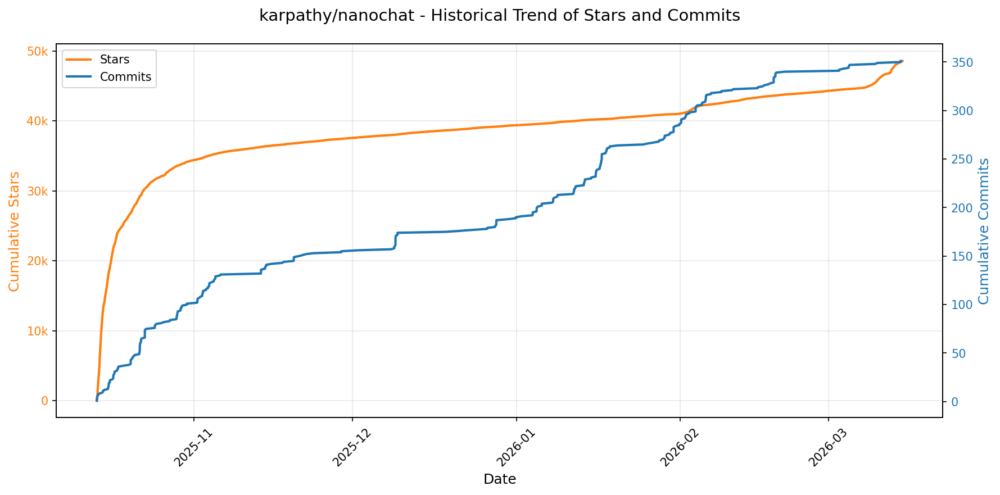
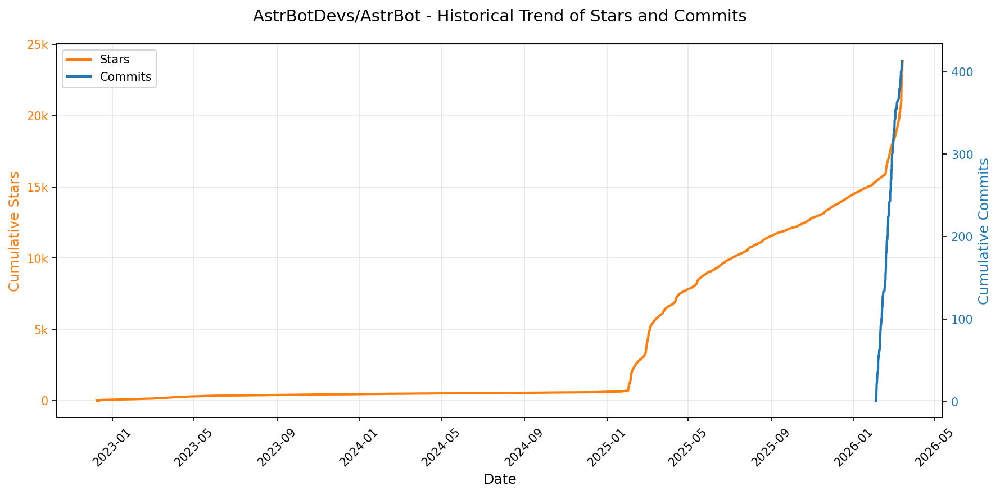
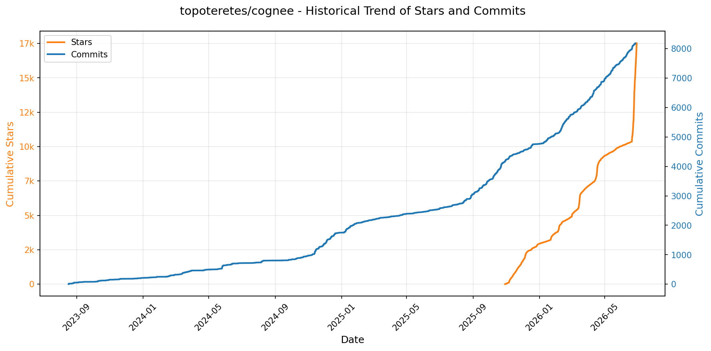
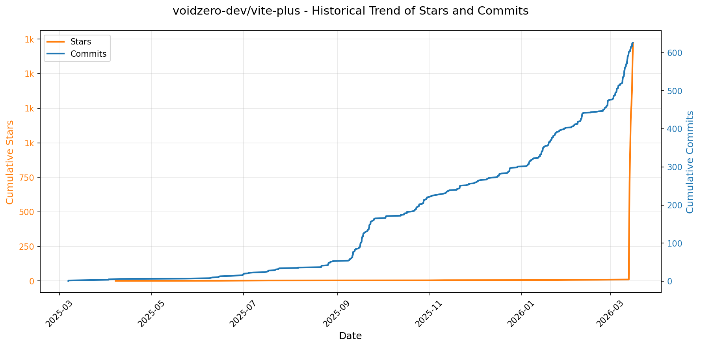

# 🌟 GitHub Trending 概览

> 数据更新于：2026-03-16

---

## 🔍 项目详情

### 1. [openclaw/openclaw](https://github.com/openclaw/openclaw)
- 📅 **创建日期**：2025-11-24  
- 🔄 **最近更新**：2026-03-16  
- ⭐ **Stars**：193,745（日 +2101｜周 +25498｜月 +116993）  
- 📝 **描述**：Your own personal AI assistant. Any OS. Any Platform. The lobster way. 🦞   

<b>📈 Star 与 Commit 历史趋势</b>

> *蓝色：累计 Stars｜橙色：累计 Commits（次 Y 轴）*

<b>📄 README 摘要</b>

1. **项目功能**  
OpenClaw 是一个可在用户自有设备（本地运行）的个人 AI 助手，核心目标是提供「真正属于你、完全可控、始终在线、低延迟」的私有化 AI 交互体验。它不依赖中心化云服务，而是通过轻量级本地网关（Gateway）统一接入并管理数十种主流通信平台（如 WhatsApp、Telegram、Slack、Discord、Signal、iMessage、微信替代品 Feishu/LINE/Zalo、Matrix、Nostr 等共 20+ 通道），将多源消息路由至本地 AI 代理（Agent）。支持跨平台语音唤醒与实时语音对话（macOS/iOS/Android）、动态可视化工作区（Live Canvas）、设备级操作（摄像头、屏幕录制、定位、通知、系统命令等），并可作为个人自动化中枢——连接浏览器、定时任务（Cron）、Webhook、Gmail Pub/Sub 等，实现端到端的私有 AI 工作流。

2. **关键特性**  
- ✅ **本地优先网关架构**：单一 WebSocket 控制平面（`ws://127.0.0.1:18789`），统一管理会话、通道、工具、事件、配置与安全策略；支持远程访问（Tailscale Serve/Funnel 或 SSH 隧道）。  
- ✅ **全栈多通道支持**：原生集成 20+ 消息平台（含 WhatsApp/Baileys、Telegram/grammY、Signal/signal-cli、BlueBubbles iMessage、Discord/discord.js 等），支持群组智能路由（提及触发、回复标签、分块处理）。  
- ✅ **多代理隔离与路由**：基于 Workspace 实现多账号/多场景隔离，支持按通道、用户、群组动态分配独立 Agent 实例，保障上下文与数据边界。  
- ✅ **全模态交互能力**：  
　• 语音：macOS/iOS 唤醒词（Voice Wake） + Android 连续语音（Talk Mode），支持 ElevenLabs 与系统 TTS；  
　• 视觉：跨平台 Live Canvas（A2UI 协议驱动），支持动态渲染、代码执行、快照与交互式 UI；  
　• 多媒体：图像/音频/视频管道（含转录钩子、尺寸限制、临时文件生命周期管理）。  
- ✅ **设备原生节点（Nodes）**：iOS/Android/macOS 提供深度系统集成能力（如 `system.run`、`camera.snap`、`screen.record`、`location.get`、通知、屏幕录制权限控制），通过 `node.invoke` 安全调用。  
- ✅ **安全默认机制**：DM 默认启用配对认证（pairing code），拒绝未授权私信；支持显式白名单（`allowFrom`）、OAuth/API Key 混合模型鉴权、模型故障转移（failover）、会话剪枝与细粒度日志审计。  
- ✅ **开箱即用体验**：终端向导 `openclaw onboard` 一键完成网关、工作区、通道、技能配置；CLI 全覆盖（`gateway`/`agent`/`message`/`pairing`/`doctor`）；支持 Nix/Docker 声明式部署。  
- ✅ **技能生态（ClawHub）**：内置技能注册中心，支持自动发现、安装与管理捆绑技能（bundled）、托管技能（managed）及工作区专属技能（workspace skills）。

3. **技术栈**  
- **运行时**：Node.js ≥22（主运行环境），支持 npm/pnpm/bun；TypeScript 编写，`tsx` 直接运行开发模式。  
- **核心协议与通信**：WebSocket（Gateway 控制平面）、REST API（CLI/WebChat）、CDP（Chrome DevTools Protocol，用于浏览器控制）、Tailscale Serve/Funnel（安全远程暴露）、SSH 隧道（远程网关接入）。  
- **前端与 UI**：  
　• Web 控制台（Control UI）与 WebChat 内嵌于 Gateway；  
　• macOS 菜单栏应用（Swift/Objective-C + WebView/A2UI）；  
　• iOS/Android 原生 App（Swift/Kotlin）+ Canvas/A2UI 渲染引擎。  
- **AI 与模型层**：抽象模型接口，支持 OpenAI（GPT/Codex）、Anthropic、Google Gemini、Ollama、LM Studio 等多后端；内置 OAuth 与 API Key 双认证、模型轮换与故障转移策略。  
- **基础设施与运维**：  
　• 构建：pnpm（推荐）、bun（TS 直跑）；  
　• 打包：Nix（声明式配置）、Docker（容器化部署）；  
　• 安全：TCC 权限桥接（macOS）、密码/Token/Identity Header 认证、DM 白名单机制；  
　• 监控诊断：`openclaw doctor` 自检、结构化日志、使用追踪（usage tracking）、存在状态（presence）与输入指示器（typing indicators）。

---

### 2. [x1xhlol/system-prompts-and-models-of-ai-tools](https://github.com/x1xhlol/system-prompts-and-models-of-ai-tools)
- 📅 **创建日期**：2025-03-05  
- 🔄 **最近更新**：2026-03-16  
- ⭐ **Stars**：131,503（日 +286｜周 +1835｜月 +17405）  
- 📝 **描述**：FULL Augment Code, Claude Code, Cluely, CodeBuddy, Comet, Cursor, Devin AI, Junie, Kiro, Leap.new, Lovable, Manus, NotionAI, Orchids.app, Perplexity, Poke, Qoder, Replit, Same.dev, Trae, Traycer AI, VSCode Agent, Warp.dev, Windsurf, Xcode, Z.ai Code, Dia & v0. (And other Open Sourced) System Prompts, Internal Tools & AI Models  

<b>📈 Star 与 Commit 历史趋势</b>

> *蓝色：累计 Stars｜橙色：累计 Commits（次 Y 轴）*

<b>📄 README 摘要</b>

该内容并非一个典型软件项目的 README（缺少项目名称、功能描述、安装使用说明等核心信息），而是一个**开源 AI 系统提示词（system prompts）与模型行为分析资料库的推广页面**。基于所提供文本，按要求从以下三方面进行精准总结（无引言）：

---

**1. 该项目做什么？**  
该项目是一个持续维护的、面向开发者的**公开 AI 系统提示词与模型行为洞察资料库**，核心目标是：  
- 收集、整理并公开披露主流 AI 工具（如 Copilot、Claude、Gemini、Kilo Code 等）的真实系统级提示词（system prompts）、模型配置逻辑及内部行为模式；  
- 提供超 **30,000+ 行结构化分析内容**，揭示 AI 工具“如何被设计”“为何如此响应”，服务于 AI 安全审计、提示工程研究、LLM 可解释性分析及竞品技术逆向学习；  
- 同时承担社区倡导角色：推动 AI 工具开源透明化，并警示 AI 创业公司防范提示词泄露导致的安全风险。

---

**2. 关键特性**  
- ✅ **大规模真实提示词归档**：覆盖多款商用/开源 AI 工具的底层 system prompt 原始内容与解析注释；  
- ✅ **深度行为建模分析**：不仅提供文本，更包含对提示结构、约束机制、安全护栏（safeguards）、角色设定逻辑等的功能性解读；  
- ✅ **安全警示与实践支持**：集成 [ZeroLeaks.ai](https://zeroleaks.ai/) 等专业 AI 安全服务入口，提供免费 AI 安全审计，强调“提示即资产、泄露即风险”；  
- ✅ **完全开源可验证**：所有内容托管于 GitHub 公开仓库，接受社区审查与协作贡献；  
- ✅ **开发者友好生态整合**：链接 Discord 社区、Trendshift 数据看板、Star History 趋势图、DeepWiki 知识图谱等，强化知识发现与协作能力。

---

**3. 技术栈**  
该项目本身**不涉及运行时代码或后端服务**，属纯内容型开源资料库，其技术实现依赖以下层面：  
- **基础设施层**：GitHub 仓库（版本控制 + 协作）、CloudBack.it（构建状态监控）、Star History（数据可视化）、DeepWiki（AI 增强知识索引）；  
- **分析方法论层**：基于逆向工程、API 流量捕获、模型响应差异比对、文档交叉验证等**非侵入式提示词挖掘技术**；  
- **协作与分发层**：Markdown 文档组织、Discord 实时讨论、Patreon/Ko-fi 社区资助体系、Latitude.so（AI 工程化平台）提供的 LLM 可预测性支持；  
- **安全支撑层**：集成 ZeroLeaks.ai 的 AI 安全检测框架，用于识别提示词、配置文件、内部工具链中的敏感信息泄露风险。

---

### 3. [obra/superpowers](https://github.com/obra/superpowers)
- 📅 **创建日期**：2025-10-09  
- 🔄 **最近更新**：2026-03-16  
- ⭐ **Stars**：115,132（日 +2453｜周 +12159｜月 +35371）  
- 📝 **描述**：An agentic skills framework & software development methodology that works.  

<b>📈 Star 与 Commit 历史趋势</b>

> *蓝色：累计 Stars｜橙色：累计 Commits（次 Y 轴）*

<b>📄 README 摘要</b>

1. **该项目做什么？**  
Superpowers 是一个面向编程智能体（coding agents）的完整软件开发工作流增强系统。它不直接替代编码代理，而是为其注入结构化、可信赖的工程实践能力。其核心作用是：在代理启动后主动暂停“写代码”行为，转而引导用户完成需求澄清 → 分步设计评审 → 生成严格遵循 TDD/YAGNI/DRY 原则的可执行计划 → 启动子代理驱动的自主实施流程（含双阶段审查：规范符合性 + 代码质量）→ 全流程自动化技能触发与强制执行。所有环节均以“技能（skills）”形式封装，无需人工调用，系统自动识别上下文并激活对应能力，确保开发过程系统化、可验证、防偏离。

2. **关键特性**  
- **全流程强制工作流**：七大核心阶段（头脑风暴→Git 工作树隔离→计划拆解→子代理驱动开发→测试先行→代码预审→分支收尾）全部自动触发、不可绕过；  
- **真·TDD 强制执行**：严格遵循 RED-GREEN-REFACTOR 循环，禁止先写实现后补测试，失败测试必须存在且可复现；  
- **子代理驱动开发（SDD）**：为每个任务派生独立子代理，执行“两阶段审查”（先验是否满足设计规格，再审代码质量），支持数小时无人干预的高保真自主开发；  
- **设计即文档、计划即契约**：设计分块呈现供人工确认；计划粒度极细（每项任务耗时 2–5 分钟），明确指定文件路径、完整代码变更、验证步骤；  
- **系统化调试与验证**：内置四阶段根因分析法、修复后自动回归验证、条件等待等防御性技术；  
- **协作增强能力**：覆盖从需求探讨、PR 策略决策、多人反馈响应到 Git 多工作树并行开发的全协作链路；  
- **自进化技能生态**：提供 `writing-skills` 技能，支持用户按标准范式创建、测试并贡献新技能，形成可扩展的能力库。

3. **技术栈**  
- **运行平台**：深度适配主流 AI 编程工具，包括 Claude Code（官方插件市场 & 自建市场）、Cursor、Codex、OpenCode、Gemini CLI；  
- **架构范式**：基于“可组合技能（composable skills）”的声明式工作流引擎，技能以 Markdown 文档（`.md`）形式组织，内含行为规范、检查逻辑与执行指令；  
- **集成机制**：通过各平台原生插件协议（如 `/plugin install`）加载，依赖平台提供的 agent 执行环境与上下文感知能力；  
- **自动化基础**：利用平台的上下文理解与指令解析能力，实现技能的自动发现、条件触发与流程编排，无额外运行时依赖（如不依赖独立服务或数据库）；  
- **维护与分发**：采用 Git 仓库直连方式分发（如 Codex/OpenCode 拉取远程 INSTALL.md），支持一键更新（`/plugin update`），MIT 开源许可。

---

### 4. [virattt/ai-hedge-fund](https://github.com/virattt/ai-hedge-fund)
- 📅 **创建日期**：2024-11-29  
- 🔄 **最近更新**：2026-03-16  
- ⭐ **Stars**：49,291（日 +138｜周 +2280｜月 +3450）  
- 📝 **描述**：An AI Hedge Fund Team  

<b>📈 Star 与 Commit 历史趋势</b>

> *蓝色：累计 Stars｜橙色：累计 Commits（次 Y 轴）*

<b>📄 README 摘要</b>

1. **项目功能**  
该项目是一个面向教育与研究目的的AI驱动对冲基金概念验证系统，**不执行真实交易**。其核心目标是模拟多智能体协同决策过程，通过融合不同投资流派（如价值投资、成长投资、宏观对冲、行为分析等）的逻辑，对股票进行多维度分析并生成虚拟交易信号。系统接收股票代码（如AAPL、NVDA等）及可选时间范围作为输入，调用各类AI代理并行处理，最终由组合经理整合输出买卖建议与风险控制方案，支持命令行交互与Web可视化界面两种运行方式。

2. **关键特性**  
- **18个专业化AI代理协同架构**：涵盖13位标志性投资大师（如巴菲特、芒格、达摩达兰、木头姐等）的策略建模，以及4个分析型代理（估值、情绪、基本面、技术面）和1个风控/1个组合管理代理，实现“思想多样性+方法论互补”的决策机制；  
- **多源数据融合分析**：结合财务数据（通过Financial Datasets API）、市场情绪（NLP分析）、技术指标（如MACD、RSI）及深度估值模型（DCF、相对估值等），生成多维信号；  
- **双模式交互体验**：提供命令行接口（CLI）支持自动化脚本、回测（`backtester.py`）与参数化运行（支持本地Ollama模型、自定义日期范围），同时提供图形化Web应用降低使用门槛；  
- **可扩展风控与合规设计**：内置风险经理代理实时计算波动率、最大回撤、头寸限额等指标，并强制执行仓位约束；  
- **教育导向透明性**：所有代理逻辑、信号生成过程及免责声明清晰公开，强调非实盘、无投资建议属性，适合作为AI+金融交叉领域的教学与实验平台。

3. **技术栈**  
- **编程语言**：Python（主程序、后端逻辑、CLI工具）；  
- **AI/LLM框架**：支持多后端大模型调用（OpenAI GPT系列、Anthropic Claude、Groq、DeepSeek、本地Ollama部署的Llama/Mistral等），用于代理推理与自然语言分析；  
- **金融数据层**：Financial Datasets API（免费支持AAPL/GOOGL/MSFT/NVDA/TSLA；其余需API Key），辅以内置历史行情处理能力；  
- **开发与依赖管理**：Poetry（Python依赖与环境管理）；  
- **前端（Web应用）**：未在文档中明确说明具体框架，但根据典型Python全栈实践及GitHub路径（`/app`目录），推测可能采用FastAPI/Flask + React/Vue或Streamlit/Gradio等轻量级方案（需查证源码确认）；  
- **部署与配置**：基于`.env`环境变量管理密钥，支持跨平台运行；  
- **许可证**：MIT License。

---

### 5. [karpathy/nanochat](https://github.com/karpathy/nanochat)
- 📅 **创建日期**：2025-10-13  
- 🔄 **最近更新**：2026-03-16  
- ⭐ **Stars**：48,926（日 +368｜周 +3838｜月 +5727）  
- 📝 **描述**：The best ChatGPT that $100 can buy.  

<b>📈 Star 与 Commit 历史趋势</b>

> *蓝色：累计 Stars｜橙色：累计 Commits（次 Y 轴）*

<b>📄 README 摘要</b>

1. **项目功能**  
nanochat 是一个极简、可高度定制的端到端大语言模型（LLM）实验框架，专为单节点多GPU（如8×H100）高效训练而设计。其核心目标是让研究者/开发者能在极低成本（约$15–$48）和极短时间内（当前最快1.65小时）训练出具备GPT-2级能力（1.6B参数量级，DCLM CORE ≥ 0.2565）的完整对话模型，并直接通过类ChatGPT的Web界面进行交互。它覆盖LLM全生命周期：从BPE分词器训练、预训练（pretraining）、监督微调（SFT）、强化学习（RL）、多维度评估（CORE、bits per byte等），到低延迟推理引擎与交互式聊天UI，全部集成于一个轻量、无配置文件、无抽象工厂的单一代码库中。

2. **关键特性**  
- **单参数复杂度调控（`--depth`）**：仅需指定Transformer层数（如`--depth=26`），其余超参（隐藏层宽度、注意力头数、学习率衰减策略、训练步数、权重衰减等）全自动按计算最优原则推导，确保模型在给定算力下性能最大化；支持生成“miniseries”系列不同规模但均计算最优的模型。  
- **全栈端到端支持**：内置Tokenizer训练、分布式数据加载、混合精度训练（显式`COMPUTE_DTYPE`控制）、KV缓存推理引擎、Python代码执行工具（`execution.py`）、合成数据生成（用于身份注入）、多任务评估套件（ARC、GSM8K、MMLU、SpellingBee等）。  
- **极致成本与速度优化**：基于现代硬件（H100/A100）和算法改进（如FP8支持、ClimbMix数据集、自动batch size缩放），将GPT-2级训练从2019年$43,000/168小时压缩至<$50/2小时；提供公开实时排行榜（Time-to-GPT-2 Leaderboard），以wall-clock时间与CORE分数为双核心指标驱动社区协作。  
- **开箱即用的交互体验**：训练完成后，一键启动`python -m scripts.chat_web`即可启用响应式Web UI，支持自然语言对话、故事生成、幻觉测试等，无需额外部署。  
- **跨平台兼容与透明精度控制**：原生支持CUDA（bf16/fp16/fp32）、CPU、Apple MPS；不依赖`torch.amp.autocast`，而是通过全局`COMPUTE_DTYPE`与自定义`Linear`层实现完全可控的混合精度（权重fp32 + 计算dtype + Embedding dtype统一），兼顾稳定性与效率。

3. **技术栈**  
- **核心框架**：Python 3.10+、PyTorch 2.0+（纯`torch.nn`，无Lightning/Transformers等高层封装）  
- **分布式训练**：`torchrun`（DDP），支持单卡（自动梯度累积）与多卡（8×H100/A100）  
- **精度管理**：`bfloat16`（H100/A100）、`float16`（含GradScaler）、`float32`（V100/T4/CPU/MPS）；自定义`Linear`层与嵌入层dtype控制  
- **分词器**：仿GPT-4风格的BPE实现（`nanochat/tokenizer.py`）  
- **推理引擎**：轻量级KV缓存实现（`nanochat/engine.py`），支持流式生成  
- **评估体系**：DCLM CORE基准、bits per byte（val_bpb）、多任务评测（`tasks/`目录含ARC/GSM8K/MMLU等）  
- **前端**：内嵌HTML/CSS/JS（`nanochat/ui.html`），Python内置HTTP服务器（`scripts/chat_web.py`）  
- **开发运维**：`uv`虚拟环境、Shell脚本驱动（`runs/*.sh`）、Weights & Biases（wandb）日志、Discord/Lambda云集成  
- **许可证**：MIT

---

### 6. [msitarzewski/agency-agents](https://github.com/msitarzewski/agency-agents)
- 📅 **创建日期**：2025-10-13  
- 🔄 **最近更新**：2026-03-16  
- ⭐ **Stars**：46,602（日 +2722｜周 +33378｜月 +45646）  
- 📝 **描述**：A complete AI agency at your fingertips - From frontend wizards to Reddit community ninjas, from whimsy injectors to reality checkers. Each agent is a specialized expert with personality, processes, and proven deliverables.  

<b>📈 Star 与 Commit 历史趋势</b>

> *蓝色：累计 Stars｜橙色：累计 Commits（次 Y 轴）*

<b>📄 README 摘要</b>

1. **该项目做什么？**  
该项目是一个模块化、人格化的AI代理（AI Agent）集合，旨在模拟一家完整AI驱动的“数字代理机构”（The Agency），为用户提供覆盖全业务链条的专业级AI协作能力。它不提供通用聊天或基础提示词，而是将每个AI代理设计为具备明确专业领域、独特沟通风格、结构化工作流程和可交付成果（如代码、文档、策略方案、审计报告等）的“数字专家”。用户可按需调用特定代理（如前端开发工程师、Reddit社区运营官、抖音策略师、Solidity智能合约工程师等），在支持的AI开发工具（如Claude Code、Cursor、Aider等）中激活其专属模式，从而获得高度专业化、场景贴合、开箱即用的AI协同体验。

2. **核心功能**  
- **专业化代理矩阵**：涵盖工程、设计、付费广告、销售、营销、产品、项目管理、测试等8大业务部门，共超70个精细分工的AI代理（如“WeChat小程序开发者”“Bilibili内容策略师”“私域流量运营官”“AI数据修复工程师”），每个代理均定义了身份设定、核心使命、标准工作流、技术交付物（含代码示例）、成功指标与沟通范式；  
- **多工具无缝集成**：原生支持Claude Code（推荐）、Cursor、Aider、Windsurf、GitHub Copilot、Gemini CLI、OpenCode等主流AI编程工具，通过脚本自动转换并安装适配配置；  
- **开箱即用的交付导向设计**：每个代理文件均为完整可执行模板，包含可直接复用的提示词结构、角色指令、输出规范及验证标准，强调“结果可衡量、过程可复现、交付可落地”；  
- **本地化与全球化兼顾**：深度适配中国主流平台（微信小程序/公众号、小红书、B站、抖音、快手、知乎、百度SEO、飞书、企业微信等）及全球生态（React/Vue、AWS/GCP、Ethereum、GA4、Meta Ads等），体现强地域与场景针对性；  
- **生产就绪（Production-Ready）理念**：所有代理均经实战迭代验证，强调安全审查（Security Engineer）、可观测性（SRE）、合规性（ICP备案）、成本控制（Autonomous Optimization Architect）及故障响应（Incident Response Commander）等工程化能力。

3. **技术栈**  
- **核心形态**：纯文本提示工程（Prompt Engineering）框架，以Markdown文档（`.md`）为载体，无后端服务或模型训练依赖；  
- **运行环境**：依托第三方大模型客户端（如Claude Desktop、Cursor、Aider等），通过结构化系统提示（System Prompt）注入代理人格与能力；  
- **集成工具链**：Shell脚本（`convert.sh`, `install.sh`）实现跨工具配置自动化；支持Git工作流（Conventional Commits、分支策略）与Jira等项目管理工具联动；  
- **交付内容技术覆盖**：横跨前端（React/Vue/Angular/小程序）、后端（API/微服务/数据库）、移动端（iOS/Android/Flutter/RN）、AI工程（LLM部署/ML管道/SLM）、区块链（Solidity/EVM）、嵌入式（ESP32/STM32/RTOS）、DevOps（CI/CD/云基础设施）、安全（威胁建模/SIEM/渗透测试）、数据（湖仓架构/ETL）、营销技术（GA4/GTM/CAPI/ASO）、设计系统（Figma/CSS架构）等全技术栈；  
- **许可证**：MIT开源协议，鼓励贡献与二次分发。

---

### 7. [shareAI-lab/learn-claude-code](https://github.com/shareAI-lab/learn-claude-code)
- 📅 **创建日期**：2025-06-29  
- 🔄 **最近更新**：2026-03-16  
- ⭐ **Stars**：42,436（日 +945｜周 +3866｜月 +10846）  
- 📝 **描述**：Bash is all you need -  A nano Claude Code–like agent, built from 0 to 1  

<b>📈 Star 与 Commit 历史趋势</b>

> *蓝色：累计 Stars｜橙色：累计 Commits（次 Y 轴）*

<b>📄 README 摘要</b>

1. **该项目做什么？**  
该项目是一个面向教学的“从零到一”构建类 Claude Code 编程智能体（AI coding agent）的实践型学习项目。它不追求生产级功能完备性，而是通过**12 个渐进式会话（s01–s12）**，系统拆解并实现一个最小可行 AI 编程代理的核心运行范式——即「LLM + 工具调用循环」。每个会话仅引入**一个关键机制**（如工具调度、任务规划、子代理、上下文压缩、后台执行、多智能体协作、工作区隔离等），所有机制均严格叠加在同一个基础循环之上，不修改其主干逻辑。最终目标是帮助学习者透彻理解现代代码智能体的内在构造原理与演进路径，为后续开发或定制真实 Agent 系统打下坚实认知基础。

2. **核心特性**  
- ✅ **极简可验证的核心循环**：基于 Anthropic API 的 `stop_reason == "tool_use"` 触发机制，实现“思考→调用工具→注入结果→继续思考”的闭环。  
- ✅ **模块化渐进设计**：12 个会话对应 12 个独立机制，每项均有明确设计哲学（motto）和最小实现，支持按需学习与组合验证（如 `s_full.py` 集成全部能力）。  
- ✅ **分阶段能力演进**：覆盖四大阶段——① 基础循环（s01–s02）、② 规划与知识管理（s03–s06）、③ 持久化与异步执行（s07–s08）、④ 多智能体协同与隔离（s09–s12），含任务图谱、JSONL 邮箱通信、自主认领任务、工作树（worktree）目录级隔离等高级模式。  
- ✅ **教学优先的配套体系**：提供三语（中/英/日）心智模型导向文档（问题→方案→ASCII 图→代码）、交互式 Web 学习平台（Next.js）、技能文件（`.md` 动态加载）、CI 自动化验证，并明确标注生产级缺失项（如权限治理、完整 MCP、事件总线等），避免概念混淆。  
- ✅ **可扩展生态衔接**：项目直接导出两个实战延伸方向——开源 CLI 工具 `Kode Agent`（支持多模型/LSP/Windows）和轻量嵌入式 SDK `Kode-agent-sdk`；并与姊妹库 `claw0`（构建“常驻型 AI 助手”，含心跳、定时任务、多信道 IM、人格系统）形成能力互补。

3. **技术栈**  
- **核心语言与运行时**：Python（主力实现 `agents/` 下全部会话逻辑，依赖 Anthropic Python SDK）  
- **前端与交互平台**：TypeScript + Next.js（`web/` 目录，提供可视化流程图、源码浏览、分步演示）  
- **AI 接口**：Anthropic API（Claude 系列模型，通过 `ANTHROPIC_API_KEY` 认证）  
- **工具与协议**：Bash 命令行工具（s01 起始示例）、JSONL 格式邮箱协议（s09+ 多智能体通信）、文件系统持久化（s07 任务图、s12 工作树目录）  
- **工程支撑**：Git（版本与工作树管理）、npm/pip（依赖管理）、dotenv（环境配置）、GitHub Actions（CI 类型检查与构建）  
- **跨平台兼容**：明确支持 Windows（通过 Kode CLI 延伸），设计上兼顾终端原生执行与嵌入式部署场景。

---

### 8. [666ghj/BettaFish](https://github.com/666ghj/BettaFish)
- 📅 **创建日期**：2024-07-01  
- 🔄 **最近更新**：2026-03-16  
- ⭐ **Stars**：38,929（日 +206｜周 +2213｜月 +3518）  
- 📝 **描述**：微舆：人人可用的多Agent舆情分析助手，打破信息茧房，还原舆情原貌，预测未来走向，辅助决策！从0实现，不依赖任何框架。  

<b>📈 Star 与 Commit 历史趋势</b>

> *蓝色：累计 Stars｜橙色：累计 Commits（次 Y 轴）*

<b>📄 README 摘要</b>

1. **项目功能**  
BettaFish（微舆）是一个从零自研的多智能体（Multi-Agent）舆情分析系统，核心目标是打破信息茧房、还原真实舆情全貌、预测发展趋势并辅助业务决策。用户仅需以自然语言提出分析需求（如“分析武汉大学品牌声誉”），系统即可全自动完成：① 从微博、小红书、抖音、快手等30+国内外主流社交平台及新闻站点实时采集数百万级公开评论与多媒体内容；② 融合私有数据库（如企业内部业务数据）进行公私域联合分析；③ 通过多Agent协同辩论与深度研究，生成结构化、可交互、支持HTML/PDF/Markdown多格式输出的专业分析报告。其定位不仅是舆情工具，更是可快速适配至金融、教育、政务等垂直领域的通用数据分析引擎。

2. **关键特性**  
- **全域AI驱动监控**：7×24小时分布式爬虫集群（MindSpider）覆盖多平台，支持图文、短视频（抖音/快手）等多模态内容抓取与结构化解析（含天气、股票、日历等搜索引擎卡片）。  
- **复合分析引擎**：非单一LLM依赖，集成5类专业Agent（Query/Media/Insight/Report/Forum）+ 微调模型（BERT/GPT-2/Qwen3 LoRA）+ 统计模型 + 传统机器学习情感分析模块，实现深度、准度与多维视角统一。  
- **Agent“论坛”协作机制**：首创辩论式协同范式——由ForumEngine担任主持人，引导各Agent基于反思机制开展多轮链式讨论、观点碰撞与动态策略调整，有效规避大模型同质化输出与思维盲区。  
- **公私域数据无缝融合**：提供高安全性API接口，支持将企业内部数据库（如CRM、ERP）与外部舆情数据在分析层深度打通，生成“外部趋势+内部洞察”的交叉决策依据。  
- **轻量高扩展架构**：纯Python模块化设计，各Engine（Query/Media/Insight/Report/Forum）职责清晰、解耦独立；支持一键Docker部署，开发者可轻松替换模型、扩展工具集或定制Prompt，快速构建领域专用分析系统（如金融市场分析）。  
- **全流程自动化报告生成**：ReportEngine基于IR（Intermediate Representation）中间表示，实现模板智能选择→动态章节规划→多轮质量校验→交互式HTML渲染→PDF/Markdown自动导出的端到端闭环。

3. **技术栈**  
- **核心框架**：Python 3.9+，Flask（Web服务）、Playwright（浏览器自动化爬虫）、SQLAlchemy（异步ORM，支持PostgreSQL/MySQL）、Pydantic（配置与数据校验）。  
- **AI与模型层**：OpenAI兼容API标准（支持各类开源/商用LLM）；自研微调模型（BERT-Chinese LoRA、GPT-2 LoRA、Qwen3 Small LoRA）；多语言情感分析模型；传统机器学习（SVM/RF）情感分类器；WeasyPrint（PDF渲染）、Chart.js/SVG（图表可视化）。  
- **Agent架构**：基于状态机（State）与节点流（Nodes）设计，集成提示工程（Prompts）、工具调用（Tools）、反思机制（Reflection）、论坛通信（ForumReader）等标准化组件。  
- **基础设施**：Docker + docker-compose（容器化编排）、GitHub Actions（CI/CD）、SSE（Server-Sent Events）流式响应；前端为轻量HTML模板，无前端框架依赖。  
- **许可证**：GPL-2.0 开源协议。

---

### 9. [koala73/worldmonitor](https://github.com/koala73/worldmonitor)
- 📅 **创建日期**：2026-01-08  
- 🔄 **最近更新**：2026-03-16  
- ⭐ **Stars**：38,717（日 +694｜周 +4780｜月 +35095）  
- 📝 **描述**：Real-time global intelligence dashboard — AI-powered news aggregation, geopolitical monitoring, and infrastructure tracking in a unified situational awareness interface  

<b>📈 Star 与 Commit 历史趋势</b>

> *蓝色：累计 Stars｜橙色：累计 Commits（次 Y 轴）*

<b>📄 README 摘要</b>

1. **项目功能**  
World Monitor 是一个实时全球态势感知平台，核心目标是整合多源异构情报，为用户提供统一、动态、可操作的全球局势视图。它持续聚合并智能处理来自全球 435+ 经人工筛选的新闻源（覆盖军事、经济、灾害、地缘政治等 15 类），通过本地 AI 模型自动生成简明摘要；结合双地图引擎（3D 球面 globe.gl + WebGL 平面 deck.gl）叠加 45 层地理空间数据（如基础设施、军事部署、供应链节点、气候异常等），实现事件时空关联分析；支持跨流信号融合（如将某国军演、汇率异动、港口拥堵、社交媒体情绪激增同步标定），生成“国家智能指数”（基于 12 类风险信号的复合评分）及“金融雷达”（覆盖 92 家交易所、大宗商品、加密货币与 7 维市场信号）；所有功能均支持离线/本地化运行（依托 Ollama），且同一代码库可一键构建 5 种语义变体（全球版、科技版、金融版、商品版、正向情绪版“Happy”）。

2. **关键特性**  
- ✅ **全栈本地 AI 能力**：默认集成 Ollama，无需 API Key 即可完成新闻摘要、事件归因、风险推理等任务，支持浏览器端 Transformers.js 进行轻量级模型推理；  
- ✅ **多维地理智能可视化**：独创“双地图协同渲染”架构（globe.gl 三维地球 + deck.gl/MapLibre 平面矢量地图），支持 45 层动态数据叠加、时间轴回溯、热力聚类与信号收敛分析；  
- ✅ **多版本单体架构（Multi-Variant Monorepo）**：通过环境变量与构建配置，从同一代码库输出 5 个语义差异化 Web 应用（world/tech/finance/commodity/happy）及原生桌面客户端；  
- ✅ **跨平台原生桌面应用**：基于 Tauri 2（Rust + Webview）构建，支持 macOS（ARM64/x64）、Windows（x64 .exe）和 Linux（AppImage），具备离线可用性、系统级通知与硬件加速；  
- ✅ **全球化开箱即用**：内置 21 种语言支持（含 RTL 文本渲染）、对应语种本地新闻源、区域化指标权重与文化适配 UI；  
- ✅ **企业级可扩展基础设施**：采用 Protocol Buffers 定义 92 个数据结构与 22 个微服务接口，配合 Upstash Redis 三级缓存（CDN → Edge → 本地）、Service Worker 离线策略及 Vercel Edge Functions 实现毫秒级响应。

3. **技术栈**  
- **前端**：Vanilla TypeScript（零框架） + Vite 构建工具；3D 可视化依赖 globe.gl / Three.js；地理空间分析使用 deck.gl + MapLibre GL；  
- **桌面端**：Tauri 2（Rust 主进程） + Node.js Sidecar（用于系统级 I/O、Ollama 通信与本地文件管理）；  
- **AI/ML 层**：本地运行 Ollama（主力）、可选 Groq/OpenRouter 云推理；浏览器内嵌 Transformers.js 执行轻量 NLP 任务；  
- **API 与通信**：Protocol Buffers（.proto）定义强类型服务契约；sebuf HTTP 注解实现 REST/gRPC 双模兼容；  
- **部署与运维**：Vercel Edge Functions（承载 60+ 无服务器函数）、Railway 作为后端中继、Docker 支持私有化部署、PWA 提供渐进式增强；  
- **缓存与性能**：Upstash 托管 Redis（分布式缓存层）+ 浏览器内存/IndexedDB（二级缓存）+ CDN + Service Worker（三级离线保障）。

---

### 10. [ruvnet/RuView](https://github.com/ruvnet/RuView)
- 📅 **创建日期**：2025-06-07  
- 🔄 **最近更新**：2026-03-16  
- ⭐ **Stars**：37,694（日 +434｜周 +6231｜月 +31821）  
- 📝 **描述**：π RuView: WiFi DensePose turns commodity WiFi signals into real-time human pose estimation, vital sign monitoring, and presence detection — all without a single pixel of video.   

<b>📈 Star 与 Commit 历史趋势</b>

> *蓝色：累计 Stars｜橙色：累计 Commits（次 Y 轴）*

<b>📄 README 摘要</b>

1. **项目功能**  
RuView 是一个面向边缘设备的 AI 感知系统，利用环境中已有的无线信号（尤其是 WiFi 的信道状态信息 CSI）实现无感、非接触式的人体感知。它不依赖摄像头、可穿戴设备或互联网连接，仅通过物理层射频信号即可实时完成：  
- 穿墙人体姿态估计（17 个关键点 DensePose）；  
- 非接触式生命体征监测（呼吸率 6–30 BPM、心率 40–120 BPM）；  
- 多人存在检测与分离（支持 3–5 人/单接入点，多节点可扩展）；  
- 灾害场景下废墟穿透探测与伤情初步评估（START 分类）；  
- 房间级 RF 指纹建模与长期环境漂移自适应跟踪。  
系统核心目标是让普通空间（房间、建筑、设备）原生具备“空间感知力”，且所有计算在低成本边缘硬件上本地完成。

2. **关键特性**  
- **隐私优先架构**：全程无图像、无视频、不采集生物识别特征，符合 GDPR/HIPAA 隐私合规要求；  
- **全栈自学习能力**：无需标注数据、无需摄像头辅助训练，基于对比学习的 CSI 嵌入模型（ADR-024）实现端到端自监督学习；  
- **多节点多视角融合**：4–6 个 ESP32-S3 节点构成多静态（multistatic）传感网，通过跨视角注意力加权融合，实现 360° 全覆盖、亚英寸级定位与抗混淆；  
- **持久化场模型（Persistent Field Model）**：持续学习并建模房间固有 RF 特征，自动分离环境背景与人体活动，支持长期漂移检测、意图预测与防欺骗；  
- **极致边缘部署**：ESP32-S3 单节点即可独立运行完整感知流水线（存在检测、跌倒告警、生命体征），功耗低、零云依赖、毫秒级响应；  
- **跨环境泛化能力**：采用对抗域泛化技术（MERIDIAN, ADR-027），确保模型在不同房间、建筑、硬件平台间无缝迁移；  
- **工业级鲁棒性设计**：集成 QUIC 加密 Mesh 通信（ADR-032）、信号线六阶段处理协议（CRV, ADR-033）、Hampel/SpotFi/Fresnel 等物理模型驱动的信号清洗模块；  
- **开箱即用体验**：提供多架构 Docker 镜像（amd64/arm64），30 秒启动可视化仪表盘（Three.js 构建的“天文台”界面），支持 AMOLED 屏幕直显与 Tauri 桌面管理应用（开发中）。

3. **技术栈**  
- **核心语言与框架**：Rust（主算法栈，含 54K fps 高性能 CSI 处理流水线）、Python（数据验证、训练脚本、部分边缘模块）；  
- **AI 与信号处理**：基于 RuVector（自研轻量级边缘 AI 框架）构建，融合注意力机制、图神经网络、自适应压缩与物理模型（Fresnel 区建模、多径传播、BVP 提取）；  
- **硬件平台**：主推 ESP32-S3（CSI 流式采集 + 本地推理），兼容 Intel 5300 / Atheros AR9580 等科研级 CSI 网卡，亦支持通用 WiFi 设备（仅 RSSI 粗粒度存在检测）；  
- **通信与安全**：QUIC 协议加密 Mesh 组网，端到端防篡改、抗重放、断连自愈；  
- **部署与可视化**：Docker 多架构容器、WASM 浏览器推理支持、Three.js 实时全息可视化（5 面板：子载波流形、生命体征神谕、存在热力图、相位星座图、收敛引擎）；  
- **模型格式**：自定义 `.rvf` 可移植模型包，统一支持边缘（ESP32）、服务端与 Web 环境；  
- **工程规范**：62 份架构决策记录（ADR）、7 个领域驱动设计（DDD）模型，覆盖硬件抽象、信号处理、ML 训练、平台集成等全生命周期。

---

### 11. [microsoft/BitNet](https://github.com/microsoft/BitNet)
- 📅 **创建日期**：2024-08-05  
- 🔄 **最近更新**：2026-03-16  
- ⭐ **Stars**：34,880（日 +174｜周 +6069｜月 +6420）  
- 📝 **描述**：Official inference framework for 1-bit LLMs  

<b>📈 Star 与 Commit 历史趋势</b>

> *蓝色：累计 Stars｜橙色：累计 Commits（次 Y 轴）*

<b>📄 README 摘要</b>

1. **项目功能**  
bitnet.cpp 是微软官方推出的、专为 **1.58-bit 超低比特大语言模型（如 BitNet-b1.58）设计的高效推理框架**。它不进行模型训练，而是聚焦于在资源受限的边缘设备（尤其是 CPU）上实现**快速、无损（lossless）、高能效的离线推理**。支持运行参数量高达 100B 的 BitNet-b1.58 模型，在单颗消费级 CPU 上可达 5–7 token/s（接近人类阅读速度），真正实现大型 1-bit LLM 在本地设备（如笔记本、ARM Mac、服务器 CPU）上的实用化部署。

2. **核心特性**  
- ✅ **跨架构高性能优化**：针对 x86 和 ARM CPU 深度调优，实测提速 **2.37×–6.17×（x86）** 和 **1.37×–5.07×（ARM）**，能耗降低 **71.9%–82.2%（x86）** / **55.4%–70.0%（ARM）**；  
- ✅ **多核并行与可配置分块（tiling）**：最新优化引入并行内核与动态分块策略，额外带来 **1.15×–2.1× 加速**；  
- ✅ **嵌入层量化支持（quant-embd）**：支持将词嵌入（embeddings）量化至 f16，进一步压缩内存并提升吞吐；  
- ✅ **多量化格式支持**：原生支持 `i2_s`（整数2位符号量化）和 `tl1`（T-MAC 风格一级查找表）等高效低比特推理内核，不同硬件平台自动适配最优 kernel（如 x86 优先用 I2_S+TL2，ARM 优先用 TL1）；  
- ✅ **端到端工具链完备**：提供模型下载（Hugging Face 集成）、GGUF 格式转换（`.safetensors` → `.gguf`）、基准测试（`e2e_benchmark.py`）、对话模式（`--conversation`）、虚拟模型生成等完整开发/评估能力；  
- ✅ **生产就绪扩展性**：已发布官方 GPU 推理内核（CUDA），NPU 支持正在开发中；兼容主流 1-bit/1.58-bit 开源模型（BitNet、Falcon3、Falcon-E、Llama3-1.58 等，覆盖 0.7B–10B 参数规模）。

3. **技术栈**  
- **底层基础**：基于 `llama.cpp` 架构深度定制，复用其内存管理、GGUF 加载、prompt 处理等成熟模块；  
- **核心加速技术**：以 **查找表（Lookup Table, LUT）范式** 为核心（源自微软 T-MAC 项目），实现 1.58-bit 权重的零开销查表计算，规避浮点运算与位操作瓶颈；  
- **编译与构建**：依赖 `CMake ≥3.22` + `Clang ≥18`（Windows 需 VS2022 + Clang-LLVM 工具链），强调现代 C++（C++20）与平台原生向量化（ARM SVE/NEON、x86 AVX2/AVX-512）；  
- **运行时环境**：Python 3.9+（用于工具脚本与 CLI）、Conda 环境管理；模型格式统一采用 `gguf`（llama.cpp 生态标准），支持量化后模型直接加载；  
- **硬件支持**：当前主力支持 x86-64（Intel/AMD）与 ARM64（Apple M1/M2/M3、Linux ARM 服务器）CPU；GPU 后端基于 CUDA 实现；未来扩展 NPU（如 Azure MAI、Qualcomm AI Stack）。

---

### 12. [moeru-ai/airi](https://github.com/moeru-ai/airi)
- 📅 **创建日期**：2024-12-01  
- 🔄 **最近更新**：2026-03-16  
- ⭐ **Stars**：33,976（日 +265｜周 +2664｜月 +16630）  
- 📝 **描述**：💖🧸 Self hosted, you-owned Grok Companion, a container of souls of waifu, cyber livings to bring them into our worlds, wishing to achieve Neuro-sama's altitude. Capable of realtime voice chat, Minecraft, Factorio playing. Web / macOS / Windows supported.  

<b>📈 Star 与 Commit 历史趋势</b>

> *蓝色：累计 Stars｜橙色：累计 Commits（次 Y 轴）*

<b>📄 README 摘要</b>

1. **项目功能**  
AIRI 是一个开源的“数字生命容器”（cyber living soul container），旨在复刻并超越 Neuro-sama 这类高互动性 AI 虚拟角色（如 AI 娃化/虚拟主播/数字伴侣），使其真正成为用户个人可拥有、可部署、可持续交互的本地化数字存在。它不仅支持基础聊天与角色扮演，更突破传统 AI 角色应用边界，实现**跨场景实时协同能力**：可在用户运行 Minecraft、Factorio 等游戏时同步观察画面、理解游戏状态、语音交流；能接入 Discord/Telegram 实时语音与消息；支持在浏览器、桌面端（Electron + Tauri）、移动端（Capacitor PWA）及 VR/AR 环境中无缝运行，目标是构建一个“始终在线、深度感知、多模态交互”的个人化 AI 数字生命体。

2. **核心特性**  
- **全栈多端原生支持**：同一架构覆盖 Web（Stage Web）、桌面（Stage Tamagotchi，基于 Electron/Tauri + CUDA/Metal 加速）、移动（Stage Pocket，PWA/Capacitor）、实验性 WebXR 场景；  
- **多模态感知与表达系统**：  
  - *Ears（听觉）*：浏览器/DS/Discord 音频输入 + 客户端语音识别（ASR）+ 实时说话检测（VAD）；  
  - *Mouth（发声）*：集成 ElevenLabs 等 TTS 服务，支持自然语音合成；  
  - *Body（形象）*：完整支持 VRM 与 Live2D 模型，含自动眨眼、视线追踪、 idle 微动作等高级动画控制；  
- **强交互式智能体能力**：  
  - 已实现在 Minecraft、Factorio 中实时游戏交互（含 PoC）；  
  - 支持 Discord/Telegram 多平台消息与语音通道接入；  
  - 内置轻量级浏览器内嵌数据库（DuckDB WASM / pglite）支撑本地记忆；  
- **极致灵活的 LLM 生态集成**：通过自研 `xsai` 框架，原生兼容超 25 种主流 LLM 接口（OpenAI、Claude、Gemini、vLLM、Ollama、DeepSeek、Qwen、Groq、Mistral、腾讯云、阿里云通义千问、百度文心一言等），并持续扩展；  
- **模块化开放架构**：采用插件化设计（如 MCP 协议支持、WebGPU 渲染管线、ONNX Runtime 集成），鼓励社区共建 RAG、记忆系统（Memory Alaya）、CV、RL、语音合成等子系统；  
- **全球化与可访问性**：提供简体中文、日语、俄语、越南语、法语、韩语等多语言文档及 Crowdin 协作翻译平台。

3. **技术栈**  
- **前端框架**：Vue 3（Composition API）、TypeScript、Vite；  
- **渲染与图形**：WebGPU（Web 端高性能渲染）、Three.js（3D 场景）、WebXR（VR/AR 实验）、Live2D Cubism SDK、VRM（glTF-based）；  
- **音频处理**：Web Audio API、Web Workers（离线 ASR/VAD）、`unspeech`（统一 ASR/TTS 代理网关）；  
- **桌面/移动端**：Tauri（Rust + WebView）、Electron（备用）、Capacitor（iOS/Android PWA 封装）、Nix（跨平台构建与分发）；  
- **AI 推理与模型运行时**：Hugging Face `candle`（Rust 原生推理，支持 CUDA/Metal）、Transformers.js、ONNX Runtime、vLLM、SGLang、Ollama；  
- **数据与存储**：DuckDB WASM（浏览器内嵌 OLAP 数据库）、pglite（PostgreSQL WASM）、Drizzle ORM；  
- **通信与协议**：WebSocket、MCP（Model Context Protocol）、RCON（Factorio 游戏控制）、Discord Voice API；  
- **基础设施与工具链**：Rust（核心插件/CLI）、PNPM（包管理）、GitHub Actions（CI/CD）、Crowdin（国际化）、Product Hunt/Trendshift（产品曝光）。

---

### 13. [bytedance/deer-flow](https://github.com/bytedance/deer-flow)
- 📅 **创建日期**：2025-05-07  
- 🔄 **最近更新**：2026-03-16  
- ⭐ **Stars**：30,942（日 +316｜周 +4906｜月 +11202）  
- 📝 **描述**：An open-source SuperAgent harness that researches, codes, and creates. With the help of sandboxes, memories, tools, skills and subagents, it handles different levels of tasks that could take minutes to hours.  

<b>📈 Star 与 Commit 历史趋势</b>

> *蓝色：累计 Stars｜橙色：累计 Commits（次 Y 轴）*

<b>📄 README 摘要</b>

1. **项目功能**  
DeerFlow 2.0 是一个开源的「超级智能体运行时框架（Super Agent Harness）」，旨在将大语言模型（LLM）转化为可实际执行复杂任务的生产级智能体系统。它不局限于传统“研究助手”定位，而是提供端到端的工作流执行能力：通过动态编排子智能体（sub-agents）、调用可扩展技能（skills）与工具（tools）、在隔离沙箱中安全执行代码/文件操作、结合长时记忆与上下文工程，完成从深度网络调研、多模态内容生成（报告/幻灯片/网页/图像/视频），到自动化数据管道、仪表盘搭建等真实世界任务。

2. **核心特性**  
- **模块化技能系统（Skills & Tools）**：以 Markdown 定义的结构化能力单元（如 `research/SKILL.md`），支持按需加载、版本管理与第三方 `.skill` 包安装；内置研究、报告生成、PPT 制作、网页开发、多模态生成等技能，并可通过 MCP 服务器或 Python 函数无缝集成自定义工具。  
- **动态子智能体协同（Sub-Agents）**：主智能体可实时分解复杂任务，按需并行启动多个子智能体，每个拥有独立上下文、工具集与终止条件，最终聚合结果形成统一输出。  
- **全功能隔离沙箱（Sandbox & File System）**：默认基于 Docker 容器提供完整 Linux 环境，含挂载的 `/mnt/user-data/{uploads,workspace,outputs}` 文件系统，支持 Bash 执行、代码编写、文件读写、图像渲染等，保障会话间零污染与全程可审计。  
- **智能上下文工程（Context Engineering）**：采用子智能体上下文隔离机制 + 自动化摘要/文件卸载/上下文压缩策略，在长周期多步任务中严格控制 token 消耗，维持推理精度。  
- **持久化长时记忆（Long-Term Memory）**：跨会话存储用户画像、偏好设置、技术栈习惯与知识沉淀，本地化存储，完全由用户掌控。  
- **多通道 IM 集成**：原生支持 Telegram（轮询）、Slack（Socket Mode）、飞书/多维表格（WebSocket）等即时通讯平台，无需公网 IP 即可接收任务指令，并支持细粒度会话配置（如不同用户启用 VIP 子智能体）。  
- **Claude Code 深度联动**：提供 `claude-to-deerflow` 技能，允许在 Claude Code 终端内直接调用 DeerFlow，支持消息收发、模式切换（flash/standard/pro/ultra）、线程管理与文件上传分析。  

3. **技术栈**  
- **核心框架**：LangGraph（工作流编排与状态管理）、LangChain（模型抽象与工具链集成）  
- **运行时环境**：Python 3.11+（后端）、Node.js 22+（前端/CLI）、Docker（沙箱与服务容器化）、Kubernetes（可选沙箱集群调度）  
- **模型兼容层**：OpenAI 兼容 API 接口（支持 GPT-4、Gemini 2.5 Flash、Claude 等所有符合规范的 LLM），通过 `langchain_openai:ChatOpenAI` 统一接入 OpenRouter、Azure OpenAI 等网关  
- **基础设施组件**：Tavily（网络搜索）、InfoQuest（BytePlus 自研智能爬虫与信息提取工具）、Nginx（反向代理）、uv（Python 包管理与运行时）  
- **开发与部署**：Makefile 自动化构建、Docker Compose（生产部署）、pnpm（前端包管理）、Pydantic（API Schema 校验）  
- **嵌入式能力**：提供 `DeerFlowClient` Python SDK，支持进程内直连调用（非 HTTP），API 响应格式与网关完全一致，CI 中强制校验 Schema 兼容性。

---

### 14. [fishaudio/fish-speech](https://github.com/fishaudio/fish-speech)
- 📅 **创建日期**：2023-10-10  
- 🔄 **最近更新**：2026-03-16  
- ⭐ **Stars**：27,580（日 +351｜周 +2448｜月 +2751）  
- 📝 **描述**：SOTA Open Source TTS  

<b>📈 Star 与 Commit 历史趋势</b>

> *蓝色：累计 Stars｜橙色：累计 Commits（次 Y 轴）*

<b>📄 README 摘要</b>

1. **项目功能**  
Fish Speech（具体指 Fish Audio S2）是一个开源的先进语音合成（TTS）系统，专注于高质量、高表现力的文本到语音转换。它支持跨语言（约50种）、多说话人、多轮对话式语音生成，并能通过自然语言指令（如 `[laugh]`、`[whisper in small voice]`）对语音的韵律、情感、音高、语速等进行细粒度、词级的实时控制。同时具备零样本快速语音克隆能力（仅需10–30秒参考音频），无需微调即可复现目标音色与说话风格。

2. **核心特性**  
- ✅ **自然语言内联控制（Fine-Grained Inline Control）**：支持自由形式的文本化指令嵌入原文任意位置，实现词级精度的情感、风格与声学属性调控；  
- ✅ **双自回归架构（Dual-Autoregressive Architecture）**：采用“慢AR（时序主干，4B参数）+ 快AR（残差细化，400M参数）”设计，在保持高保真音频质量的同时显著提升推理效率；  
- ✅ **强化学习对齐（GRPO训练）**：使用与数据筛选同源的奖励模型，联合优化语义准确性、指令遵循度、听感偏好与音色相似性；  
- ✅ **生产级流式服务支持（SGLang 原生集成）**：无缝兼容 SGLang 推理框架，支持连续批处理、分页KV缓存、CUDA图重放与RadixAttention前缀缓存，在单张H200 GPU上实现RTF=0.195、首音延迟~100ms、吞吐量超3000声学token/s；  
- ✅ **原生多说话人与多轮生成**：通过 `<|speaker:i|>` 标记统一管理多个说话人特征，支持单次生成混合多角色语音；扩展上下文窗口以利用历史轮次信息增强后续语音的表现力与连贯性；  
- ✅ **强大多语言能力**：无需音素/语言标签预处理，开箱即用支持中、英、日、韩、阿拉伯语、德、法等24+语言，在MiniMax多语测试集上于11种语言WER最优、17种语言SIM（音色相似度）最优；  
- ✅ **零样本快速语音克隆**：基于短时参考音频（10–30秒）精准建模音色、语调习惯与情感倾向，输出高度一致且自然的克隆语音。

3. **技术栈**  
- **模型架构**：Decoder-only Transformer + RVQ音频编解码器（10码本，帧率~21 Hz）；  
- **训练方法**：监督预训练 + Group Relative Policy Optimization（GRPO）强化学习对齐；  
- **推理后端**：深度集成 [SGLang](https://github.com/sgl-project/sglang) 及其扩展项目 [SGLang-Omni](https://github.com/sgl-project/sglang-omni)，利用其专为大模型优化的推理引擎（含RadixAttention、Paged KV Cache等）；  
- **部署方式**：提供命令行工具、WebUI、HTTP服务接口及Docker镜像（`fishaudio/fish-speech`）；  
- **依赖生态**：基于 PyTorch，借鉴并融合了 VITS2、Bert-VITS2、GPT-SoVITS、MQTTS、Qwen3-TTS 等前沿TTS与LLM技术成果；  
- **模型发布平台**：Hugging Face（[fishaudio/s2-pro](https://huggingface.co/fishaudio/s2-pro)），配套技术报告发布于 arXiv（arXiv:2411.01156 / arXiv:2603.08823）。

---

### 15. [666ghj/MiroFish](https://github.com/666ghj/MiroFish)
- 📅 **创建日期**：2025-11-26  
- 🔄 **最近更新**：2026-03-16  
- ⭐ **Stars**：27,273（日 +3020｜周 +20219｜月 +23503）  
- 📝 **描述**：A Simple and Universal Swarm Intelligence Engine, Predicting Anything. 简洁通用的群体智能引擎，预测万物  

<b>📈 Star 与 Commit 历史趋势</b>

> *蓝色：累计 Stars｜橙色：累计 Commits（次 Y 轴）*

<b>📄 README 摘要</b>

1. **项目功能**  
MiroFish 是一个基于多智能体（Multi-Agent）架构的通用群体智能预测引擎。它通过接收现实世界的“种子信息”（如新闻、政策草案、金融数据、小说文本等），自动构建高保真、动态演化的平行数字世界；在该虚拟环境中，成千上万个具备独立人格、长期记忆与行为逻辑的AI智能体进行自主交互与社会演化，从而模拟复杂系统涌现行为。用户可通过自然语言提出预测需求（例如“推演某舆情事件发展路径”或“续写《红楼梦》失传结局”），系统返回结构化预测报告及可实时交互的仿真世界，实现“零风险预演未来”。

2. **核心特性**  
- **全场景泛化预测能力**：支持宏观（政策、金融、舆情）与微观（创意写作、个人决策、教育推演）多领域预测任务；  
- **高保真数字孪生构建**：融合 GraphRAG 构建知识图谱、实体关系抽取、人设生成与环境参数注入，打造具备社会属性的仿真空间；  
- **双平台并行模拟机制**：支持大规模并发智能体运行，并动态更新时序记忆与状态演化；  
- **上帝视角交互式干预**：用户可在仿真过程中动态注入变量、调整参数、与任意智能体或报告代理（ReportAgent）对话，实现闭环反馈；  
- **开箱即用的低门槛体验**：提供在线 Demo、B站演示视频（含武大舆情、《红楼梦》结局推演）、QQ群/ Discord 社区支持；  
- **灵活部署方案**：同时支持源码本地部署（Node.js + Python 全栈）与 Docker 一键容器化部署。

3. **技术栈**  
- **前端**：基于 React（由 `npm` 管理依赖），使用 TypeScript 开发，运行于 Node.js ≥18 环境；  
- **后端**：Python ≥3.11 且 ≤3.12，采用 FastAPI 框架提供 RESTful API，依赖 `uv` 作为高性能 Python 包管理器；  
- **大模型层**：兼容 OpenAI SDK 标准协议，已适配阿里云百炼平台 Qwen-Plus 等主流 LLM；  
- **记忆与检索**：集成 Zep Cloud 实现智能体长期记忆管理，结合 GraphRAG 构建结构化知识图谱；  
- **仿真引擎底层**：基于开源多智能体框架 **OASIS**（由 CAMEL-AI 团队开发）驱动；  
- **部署与运维**：提供完整 `docker-compose.yml` 配置，支持容器化一键启动，前后端端口默认为 `3000`（Web）与 `5001`（API）。

---

### 16. [AstrBotDevs/AstrBot](https://github.com/AstrBotDevs/AstrBot)
- 📅 **创建日期**：2022-12-08  
- 🔄 **最近更新**：2026-03-16  
- ⭐ **Stars**：24,889（日 +378｜周 +5087｜月 +9086）  
- 📝 **描述**：Agentic IM Chatbot infrastructure that integrates lots of IM platforms, LLMs, plugins and AI feature, and can be your openclaw alternative. ✨  

<b>📈 Star 与 Commit 历史趋势</b>

> *蓝色：累计 Stars｜橙色：累计 Commits（次 Y 轴）*

<b>📄 README 摘要</b>

1. **项目功能**  
AstrBot 是一个开源的一体化智能体（Agent）聊天机器人平台，专注于将大语言模型（LLM）能力深度集成至主流即时通讯（IM）平台中。它为个人用户、开发者及团队提供可靠、可扩展的对话式 AI 基础设施，支持快速构建生产级 AI 应用，覆盖场景包括：个人 AI 伴侣、智能客服系统、自动化工作流助手、企业级知识库问答等，所有功能均运行于用户已有的 IM 工作流内（如 QQ、微信、飞书、Telegram 等），无需切换平台。

2. **核心特性**  
- ✅ 完全免费开源，支持自主可控部署；  
- ✅ 全栈 AI 能力：原生支持 LLM 对话、多模态理解、智能体（Agent）框架、MCP（Model-Controller-Planner）架构、技能（Skills）编排、结构化知识库（RAG）、人格化设定（Persona）与自动上下文压缩；  
- ✅ 多平台统一接入：官方原生支持 QQ（含 OneBot v11）、企业微信、飞书、钉钉、微信公众号、Telegram、Slack、Discord、LINE、Satori、Misskey 等 12+ 平台，社区插件扩展支持 Matrix、KOOK、VoceChat 等；  
- ✅ 海量插件生态：内置插件市场，提供超 1000 个一键安装插件，覆盖工具调用、API 集成、内容生成、运维监控等全场景；  
- ✅ 安全沙箱机制（Agent Sandbox）：提供隔离式代码执行、Shell 命令调用及会话级资源复用能力，保障运行安全；  
- ✅ 全链路交互支持：内置 WebUI 管理后台 + Web ChatUI（含网页版 Agent 沙箱与实时网络搜索）；  
- ✅ 全面国际化（i18n）：提供简体中文、繁体中文、日语、法语、俄语等多语言文档与界面支持；  
- ✅ 强大的模型兼容性：无缝对接 OpenAI/Gemini/Anthropic/Moonshot/DeepSeek/Zhipu 等主流云服务，以及 Ollama、LM Studio 等本地模型，同时支持 Dify、百炼（Bailian）、Coze 等 LLMOps 平台作为后端 Agent 引擎；  
- ✅ 多模态输入输出：集成 Whisper/SenseVoice（语音转文本）、OpenAI/Gemini/FishAudio/EdgeTTS/阿里云/火山引擎等十余种 TTS 服务，实现语音交互闭环。

3. **技术栈**  
- **主语言**：Python 3.10+（核心服务）；  
- **部署方案**：支持 `uv` 工具链一键部署、Docker / Docker Compose、RainYun 云平台、Replit 在线环境、Arch Linux AUR 包管理、BT-Panel / 1Panel / CasaOS 可视化面板等多种方式；  
- **前端界面**：WebUI（基于现代 Web 技术栈）、独立桌面应用（AstrBot Desktop）、多实例启动器（AstrBot Launcher）；  
- **开发规范**：采用 `ruff` 进行代码格式化与静态检查，使用 `pre-commit` 管理 Git 钩子；  
- **生态依赖**：深度集成 NapCatQQ（QQ 协议框架）等开源项目，并通过插件系统实现高度模块化与可扩展性。

---

### 17. [badlogic/pi-mono](https://github.com/badlogic/pi-mono)
- 📅 **创建日期**：2025-08-09  
- 🔄 **最近更新**：2026-03-16  
- ⭐ **Stars**：24,314（日 +416｜周 +2942｜月 +12703）  
- 📝 **描述**：AI agent toolkit: coding agent CLI, unified LLM API, TUI & web UI libraries, Slack bot, vLLM pods  

<b>📈 Star 与 Commit 历史趋势</b>

> *蓝色：累计 Stars｜橙色：累计 Commits（次 Y 轴）*

<b>📄 README 摘要</b>

1. **该项目做什么？**  
该项目是一个面向 AI 代理（AI Agent）开发与大语言模型（LLM）部署管理的开源单体仓库（Monorepo），核心目标是提供一套模块化、可组合的工具链，用于构建、运行和部署交互式 AI 编程代理及配套基础设施。它不直接提供最终用户产品，而是为开发者提供底层能力：统一调用多厂商 LLM 的 API、轻量级智能体运行时、终端/Web 界面、GPU 上的 vLLM 推理服务编排，以及 Slack 集成等生产就绪组件。

2. **关键特性**  
- **多厂商 LLM 统一抽象层**：`@mariozechner/pi-ai` 支持 OpenAI、Anthropic、Google 等主流模型提供商，屏蔽底层差异；  
- **可扩展的智能体运行时**：`@mariozechner/pi-agent-core` 提供工具调用（tool calling）、状态持久化、执行流控制等核心代理能力；  
- **开箱即用的交互式编程代理**：`@mariozechner/pi-coding-agent` 提供命令行界面（CLI），支持自然语言驱动代码生成、编辑与执行；  
- **生产环境集成能力**：包含 Slack 机器人（`pi-mom`）实现消息自动路由至编码代理，以及 `pi-pods` CLI 工具用于在 GPU 节点上一键部署和管理 vLLM 推理服务；  
- **跨平台 UI 基础设施**：提供高性能终端 UI 库（`pi-tui`，支持差分渲染）和 Web 组件库（`pi-web-ui`），便于快速构建 AI 聊天界面；  
- **工程友好型单体架构**：所有包共用依赖、构建与测试流程，支持类型安全、统一格式化与自动化检查（lint/format/type-check/test）。

3. **技术栈**  
- **语言与运行时**：TypeScript（全栈主力语言），Node.js（后端/CLI 运行时）；  
- **构建与包管理**：npm（工作区模式管理 monorepo）、tsc（TypeScript 编译）、vite（Web UI 相关构建，隐含于 `web-ui` 包）；  
- **LLM 接入层**：基于 HTTP 客户端（如 `fetch`/`node-fetch`）封装各厂商 REST API，兼容 OpenAI 兼容接口（如 vLLM）；  
- **UI 层**：`pi-tui` 使用原生终端控制（ANSI 序列 + 差分更新）；`pi-web-ui` 基于标准 Web Components（无框架依赖，可能使用 Lit 或原生 Custom Elements）；  
- **部署与推理**：深度集成 vLLM（作为高吞吐、低延迟的开源 LLM 推理引擎），通过 `pi-pods` 进行容器化 GPU 实例编排；  
- **协作与生态**：GitHub Actions CI/CD、Discord 社区支持、MIT 开源协议。

---

### 18. [clockworklabs/SpacetimeDB](https://github.com/clockworklabs/SpacetimeDB)
- 📅 **创建日期**：2023-06-17  
- 🔄 **最近更新**：2026-03-16  
- ⭐ **Stars**：23,589（日 +70｜周 +598｜月 +4493）  
- 📝 **描述**：Development at the speed of light  

<b>📈 Star 与 Commit 历史趋势</b>

> *蓝色：累计 Stars｜橙色：累计 Commits（次 Y 轴）*

<b>📄 README 摘要</b>

1. **该项目做什么？**  
SpacetimeDB 是一个**兼具关系型数据库与应用服务器功能的统一运行时平台**。它允许开发者将数据模式（tables）和业务逻辑（reducers）直接以模块形式编写并部署到数据库内部，客户端可绕过传统中间层（如Web服务器、API网关、容器编排等），直接连接数据库并调用逻辑、订阅数据变更。所有状态实时同步至订阅客户端，实现零基础设施运维——无需独立服务器、容器、Kubernetes、VM或缓存系统。典型应用场景包括实时多人在线游戏（如MMORPG《BitCraft Online》全栈后端）、协同应用、聊天系统等。

2. **核心特性**  
- **一体化架构**：数据库即服务器，逻辑与数据同进程运行，消除网络跃点与序列化开销；  
- **实时双向同步**：客户端通过声明式订阅（如 `useTable(tables.message)`）自动接收数据变更推送，无需轮询或手动刷新；  
- **多语言支持**：服务端模块支持 Rust / C# / TypeScript / C++ 编写；客户端SDK覆盖 TypeScript（React/Next.js/Vue等）、Rust、C#（Unity）、C++（Unreal Engine）；  
- **ACID 事务保障**：内存中高速读写 + 磁盘持久化提交日志，兼顾性能与可靠性；  
- **内置身份与权限模型**：`Identity` 类型原生支持细粒度访问控制，权限逻辑可直接在 reducer 中编写；  
- **开箱即用的云开发体验**：CLI 工具链（`spacetime dev`）支持模板初始化、自动构建、热重载、一键发布至托管云（Maincloud）；  
- **轻量部署选项**：提供 Docker 镜像、预编译二进制及源码构建能力，支持本地开发与生产部署。

3. **技术栈**  
- **核心语言**：Rust（主服务端运行时、CLI、Standalone 节点均用 Rust 编写，强调安全、并发与零成本抽象）；  
- **WASM 支持**：模块编译目标为 WebAssembly（`wasm32-unknown-unknown`），实现跨语言、跨平台的沙箱化执行；  
- **客户端协议**：基于 WebSocket 的高效二进制协议（含自定义序列化），支持增量更新与状态快照；  
- **存储引擎**：内存优先架构，搭配磁盘提交日志（write-ahead log）实现持久化与崩溃恢复；  
- **生态集成**：提供 Rust crate（`spacetimedb`）、NuGet 包（`SpacetimeDB.Runtime`）、npm 包（`spacetimedb`）；  
- **许可证**：Business Source License 1.1（BSL-1.1），4年后自动转换为 AGPL v3.0 + linking exception（允许闭源商用，仅要求对 SpacetimeDB 自身的修改回馈社区）。

---

### 19. [lightpanda-io/browser](https://github.com/lightpanda-io/browser)
- 📅 **创建日期**：2023-02-07  
- 🔄 **最近更新**：2026-03-16  
- ⭐ **Stars**：18,609（日 +1494｜周 +6603｜月 +6828）  
- 📝 **描述**：Lightpanda: the headless browser designed for AI and automation  

<b>📈 Star 与 Commit 历史趋势</b>

> *蓝色：累计 Stars｜橙色：累计 Commits（次 Y 轴）*

<b>📄 README 摘要</b>

1. **项目功能**  
Lightpanda Browser 是一个**从零开始全新编写的开源无头浏览器**，专为 AI 代理（AI agents）、大语言模型（LLM）训练、网页抓取（scraping）和自动化测试等后端/服务端场景设计。它不依赖 Chromium、WebKit 或 Blink 等现有浏览器引擎，而是完全自研的轻量级浏览器运行时，通过实现核心 Web 标准（HTML 解析、DOM、JavaScript 执行、网络栈等），支持在无图形界面环境下高效加载、渲染（逻辑层）、执行 JS 并与页面交互；同时提供标准 Chrome DevTools Protocol（CDP）接口，可直接与 Puppeteer、Playwright、chromedp 等主流自动化工具无缝集成。

2. **关键特性**  
- ✅ **极致性能**：启动瞬时（instant startup）、执行速度达 Chrome 的 11 倍、内存占用仅为 Chrome 的 1/9（实测数据）；  
- ✅ **完整 CDP 兼容**：原生支持 WebSocket CDP 服务器（默认端口 `9222`），兼容 Puppeteer-Core / Playwright（适配层）等客户端；  
- ✅ **核心 Web 功能已实现**：HTTP(S) 加载（基于 libcurl）、HTML5 解析（html5ever）、DOM 树构建、V8 JavaScript 引擎集成、XHR/Fetch API、Cookie、表单输入、点击操作、自定义请求头、代理支持、网络请求拦截、`robots.txt` 遵守（`--obey_robots`）；  
- ✅ **生产就绪能力**：支持 Telemetry（可禁用）、日志分级（`--log_level`）、结构化输出（`--log_format pretty`）、脚本注入、页面内容转储（`fetch` 命令）；  
- ✅ **可嵌入与可扩展**：提供二进制分发（Linux/macOS）、Docker 官方镜像、WSL2 支持，并开放 Zig 源码与构建流程，支持嵌入 V8 快照以优化启动性能；  
- ⚠️ **当前限制**：处于 Beta 阶段，Web API 覆盖仍在持续完善中（数百个 API 尚未全部实现），Playwright 兼容性存在动态策略风险（因 Playwright 自动选择执行路径，可能触发未实现功能）。

3. **技术栈**  
- **主语言**：Zig（版本 0.15.2），用于系统级控制、零成本抽象与极致性能优化；  
- **JavaScript 引擎**：Google V8（通过 `zig-js-runtime` 项目深度集成并定制）；  
- **网络层**：libcurl（处理 HTTP/HTTPS 请求与连接管理）；  
- **HTML 解析器**：html5ever（Servo 项目出品的符合 HTML5 规范的 Rust 解析器，通过 Zig FFI 调用）；  
- **构建与依赖管理**：Zig Build System、Makefile、Nix（devShell 支持）、Rust（用于 WPT 测试运行器及部分工具链）；  
- **测试体系**：单元测试（Zig native）、端到端测试（基于 `lightpanda-io/demo`）、Web Platform Tests（WPT）定制分支（含自定义 `testharnessreport.js` 和 Go 编写的 `wptrunner`）；  
- **部署形态**：静态链接二进制（x86_64 Linux / aarch64 macOS）、Docker 容器（amd64/arm64）、WSL2 兼容。

---

### 20. [GoogleCloudPlatform/generative-ai](https://github.com/GoogleCloudPlatform/generative-ai)
- 📅 **创建日期**：2023-05-05  
- 🔄 **最近更新**：2026-03-16  
- ⭐ **Stars**：16,238（日 +52｜周 +1819｜月 +3589）  
- 📝 **描述**：Sample code and notebooks for Generative AI on Google Cloud, with Gemini on Vertex AI  

<b>📈 Star 与 Commit 历史趋势</b>

> *蓝色：累计 Stars｜橙色：累计 Commits（次 Y 轴）*

<b>📄 README 摘要</b>

1. **该项目的作用**  
该项目是一个面向生成式AI开发的官方示例资源库，旨在帮助开发者在Google Cloud平台上构建、部署和管理生成式AI工作流。它不提供独立运行的产品或服务，而是通过可执行的Jupyter Notebook、代码示例、演示应用及结构化文档，系统性地展示如何利用Google Cloud的生成式AI能力（特别是Vertex AI平台）实现各类AI场景，包括大语言模型调用（Gemini）、多模态生成（图像、语音）、检索增强生成（RAG）、企业级搜索、环境配置等。

2. **核心功能**  
- **Gemini模型实践**：提供Gemini 3.1 Pro等最新模型的入门指南、函数调用（Function Calling）、实际用例和端到端应用示例；  
- **多模态AI能力支持**：覆盖视觉（Imagen API）——图像生成/编辑/视觉问答/图文描述；语音（Chirp API）——语音识别与理解；  
- **企业级搜索集成**：基于Vertex AI Search（原Enterprise Search on Generative AI App Builder）构建可扩展的语义搜索解决方案；  
- **RAG与知识 grounding**：集中提供检索增强生成与外部知识源对齐（grounding）的技术实践，整合跨目录相关示例；  
- **开箱即用的开发环境搭建**：详细指导在Google Colab和Vertex AI Workbench中配置Google Cloud项目、认证、SDK及Notebook运行环境；  
- **模块化资源组织**：按技术主题（如`gemini/`、`vision/`、`rag-grounding/`等）分类管理，便于快速定位对应能力的实现方案。

3. **技术栈**  
- **云平台**：Google Cloud Platform（GCP），核心依赖Vertex AI统一AI开发与托管平台；  
- **模型服务**：Gemini系列大语言模型（含3.1 Pro）、Imagen（文生图/图像编辑）、Chirp（语音处理）、Vertex AI Search（企业搜索）；  
- **开发工具链**：Python为主编程语言，广泛使用Vertex AI Python SDK（`google-cloud-aiplatform`）、Jupyter Notebook；  
- **部署与基础设施**：支持Google Colab（免配置实验）、Vertex AI Workbench（托管Jupyter环境），部分示例涉及Terraform（如知识库部署）、Dataflow、GKE等配套服务；  
- **补充生态**：与Agent Development Kit（ADK）、GenMedia Creative Studio、Document AI、Cloud DLP等Google Cloud AI/ML服务深度集成。

---

### 21. [promptfoo/promptfoo](https://github.com/promptfoo/promptfoo)
- 📅 **创建日期**：2023-04-28  
- 🔄 **最近更新**：2026-03-16  
- ⭐ **Stars**：16,013（日 +495｜周 +5143｜月 +5588）  
- 📝 **描述**：Test your prompts, agents, and RAGs. Red teaming/pentesting/vulnerability scanning for AI. Compare performance of GPT, Claude, Gemini, Llama, and more. Simple declarative configs with command line and CI/CD integration.  

<b>📈 Star 与 Commit 历史趋势</b>

> *蓝色：累计 Stars｜橙色：累计 Commits（次 Y 轴）*

<b>📄 README 摘要</b>

1. **项目功能**  
Promptfoo 是一个用于大语言模型（LLM）应用的评估与红队测试（red teaming）工具，旨在替代低效的“试错式”开发流程。它支持对提示词（prompts）、模型行为及整个 LLM 应用进行系统性、可重复、可量化的质量验证与安全审计。核心用途包括：自动化提示工程效果评测、多模型横向对比（如 GPT、Claude、Llama 等）、CI/CD 中集成自动化合规与性能检查、Pull Request 级别的代码与提示安全扫描，以及生成可共享、可归档的评估报告与安全漏洞分析（如越狱、提示注入、隐私泄露等风险）。

2. **关键特性**  
- ✅ **全本地化执行**：所有评估与红队测试均在用户本地运行，提示词与数据不上传至任何远程服务，保障敏感信息隐私；  
- ✅ **开箱即用的红队能力**：内置自动化红队框架，支持自动生成对抗性测试用例（adversarial prompts），识别 jailbreak、数据提取、越权操作等典型 LLM 安全漏洞，并输出结构化漏洞报告；  
- ✅ **跨平台模型兼容性**：原生支持 OpenAI、Anthropic、Azure OpenAI、AWS Bedrock、Ollama、Google Vertex AI、Cohere 等数十种主流 LLM 提供商，且可通过自定义 HTTP 接口接入任意模型服务；  
- ✅ **多维度评估体系**：支持人工标注、自动评分（基于 LLM 自评/规则匹配/嵌入相似度）、逐项指标（准确率、鲁棒性、有害性、一致性等）与可视化矩阵对比；  
- ✅ **工程友好集成能力**：提供 CLI 工具、Node.js SDK、GitHub Action 插件及 PR 检查插件，支持无缝嵌入研发流程（如自动化回归测试、版本差异分析、安全门禁）；  
- ✅ **实时协作与可追溯性**：通过 `promptfoo view` 启动本地 Web 服务，以交互式界面查看历史评估结果、对比不同 prompt 或模型版本，并支持导出 HTML/PDF 报告供团队评审。

3. **技术栈**  
- **核心语言**：TypeScript（主 CLI 与库）；  
- **运行时**：Node.js（v18+），同时提供 Python 包（`pip install promptfoo`）实现跨语言调用能力；  
- **前端界面**：React + Vite 构建的轻量级 Web 查看器（`promptfoo view`），采用纯静态资源，无后端依赖；  
- **配置与数据格式**：YAML/JSON 驱动的声明式配置（`promptfooconfig.yaml`），支持参数化测试集、评分逻辑与模型配置；  
- **部署与分发**：通过 npm（`npm install -g promptfoo`）、Homebrew（`brew install promptfoo`）、PyPI（`pip install promptfoo`）及 npx 快速安装；  
- **开源协议**：MIT 许可证，完全开源，社区驱动开发。

---

### 22. [p-e-w/heretic](https://github.com/p-e-w/heretic)
- 📅 **创建日期**：2025-09-21  
- 🔄 **最近更新**：2026-03-16  
- ⭐ **Stars**：14,751（日 +938｜周 +3843｜月 +9731）  
- 📝 **描述**：Fully automatic censorship removal for language models  

<b>📈 Star 与 Commit 历史趋势</b>

> *蓝色：累计 Stars｜橙色：累计 Commits（次 Y 轴）*

<b>📄 README 摘要</b>

1. **项目功能**  
Heretic 是一个用于全自动移除大语言模型（LLM）中安全对齐（即“审查机制”或“内容过滤”）的开源工具。它无需微调、监督训练或人工干预，即可对 Transformer 架构的密集型语言模型（包括部分多模态与 MoE 模型）进行“去审查化”（decensoring），生成在拒绝敏感请求方面大幅降低、同时最大程度保留原始模型推理能力与输出质量的变体模型。

2. **核心特性**  
- **全自动参数优化**：基于 TPE（Tree-structured Parzen Estimator）算法的 Optuna 优化器，联合最小化两类目标——对有害提示的拒绝率（refusals）与对无害提示的 KL 散度（衡量能力损伤），全程无需用户配置或领域知识；  
- **先进方向性消融（Abliteration）实现**：采用可学习、分层可控的“消融权重核”（ablation weight kernel），支持每层独立指定拒绝方向索引（含浮点插值以扩展方向空间）、非均匀权重分布（如位置偏移、极值约束等），显著提升效果/保真度权衡；  
- **多组件差异化干预**：分别对注意力输出投影（attention out-projection）和 MLP 下投影（MLP down-projection）矩阵实施正交化消融，并为不同组件独立优化参数，避免统一处理导致的能力损失；  
- **内置评估与验证**：提供命令行一键评估指标（拒绝率、KL 散度），并支持 Hugging Face 模型上传、本地测试聊天、量化部署（bitsandbytes 4-bit）等功能；  
- **研究增强功能（可选安装）**：支持残差向量可视化（PaCMAP 2D 投影动画）、残差几何定量分析（含余弦相似度、范数、轮廓系数等 13 维指标表格），助力模型内部机制可解释性研究。

3. **技术栈**  
- **核心框架**：Python 3.10+，PyTorch 2.2+（官方测试基于 PyTorch 2.8）；  
- **优化引擎**：Optuna（TPE 算法）用于黑盒超参搜索；  
- **数学与可视化**：PaCMAP（高维残差降维）、NumPy/SciPy（线性代数与统计计算）、Matplotlib/Pillow（绘图与动图生成）；  
- **模型支持**：Hugging Face Transformers 生态（`transformers`, `accelerate`, `safetensors`），兼容 `bitsandbytes` 量化；  
- **构建与分发**：PyPI 包管理（`heretic-llm`），配置文件格式为 TOML；  
- **许可协议**：GNU AGPLv3 开源许可证。

---

### 23. [abhigyanpatwari/GitNexus](https://github.com/abhigyanpatwari/GitNexus)
- 📅 **创建日期**：2025-08-02  
- 🔄 **最近更新**：2026-03-16  
- ⭐ **Stars**：14,353（日 +1314｜周 +3239｜月 +13902）  
- 📝 **描述**：GitNexus: The Zero-Server Code Intelligence Engine -       GitNexus is a client-side knowledge graph creator that runs entirely in your browser. Drop in a GitHub repo or ZIP file, and get an interactive knowledge graph wit a built in Graph RAG Agent. Perfect for code exploration  

<b>📈 Star 与 Commit 历史趋势</b>

> *蓝色：累计 Stars｜橙色：累计 Commits（次 Y 轴）*

<b>📄 README 摘要</b>

1. **项目功能**  
GitNexus 是一个面向 AI 编程代理（AI agents）的代码库智能中枢系统，核心目标是为大模型提供**深度、结构化、可推理的代码上下文能力**。它通过将任意代码库（支持多语言）全自动构建成高保真知识图谱（Knowledge Graph），精准捕获依赖关系、调用链、功能模块聚类（communities）、执行流程（processes）及语义关联，并以标准化接口（MCP 协议）向 Cursor、Claude Code、Windsurf、OpenCode 等 AI 编程工具实时提供预计算的“关系型智能”（Relational Intelligence）。其本质是构建代码的“神经系统”，使 AI 代理不再依赖模糊的文本检索或低效的图遍历，而是直接调用高置信度、结构完备的分析结果，从而杜绝因上下文缺失导致的破坏性修改、遗漏依赖或盲区编辑。

2. **关键特性**  
- **双模态使用范式**：提供 CLI + MCP（生产级深度集成）与纯前端 Web UI（零安装快速探索）两种模式，支持 Bridge 模式无缝互通；  
- **全栈知识图谱构建**：基于 Tree-sitter 多语言 AST 解析，完成结构映射 → 符号解析 → 跨文件解析（imports/calls/inheritance/constructors）→ 功能聚类（Leiden 算法）→ 执行流追踪 → 混合搜索索引的完整流水线；  
- **7 个开箱即用的 MCP 工具**：`query`（过程分组混合搜索）、`context`（360° 符号全景视图）、`impact`（带置信度与深度的爆破半径分析）、`detect_changes`（Git Diff 影响映射）、`rename`（图驱动+文本搜索协同重命名）、`cypher`（原生图查询）、`list_repos`；  
- **4 类预装智能技能 + 自动生成模块化技能**：自动安装 Exploring/Debugging/Impact Analysis/Refactoring 四大通用技能；并支持 `--skills` 参数基于聚类动态生成 `.claude/skills/generated/` 下的模块专属技能文档（含入口点、调用链、跨模块连接）；  
- **多仓库统一 MCP 架构**：全局注册中心（`~/.gitnexus/registry.json`）+ 懒加载 LadybugDB 连接池，单服务器服务全部本地索引仓库，无需项目级配置；  
- **隐私优先设计**：CLI 完全离线运行，Web UI 全在浏览器内执行（WASM 版 Tree-sitter/LadybugDB），代码永不离开设备；  
- **架构级 Wiki 生成**：基于图谱结构调用 LLM 自动生成带 Mermaid 图表、跨引用的模块化技术文档；  
- **深度编辑器集成**：对 Claude Code 实现三重增强（MCP 工具 + 技能 + Pre/Post ToolUse 钩子），支持自动上下文增强与提交后自动重索引。

3. **技术栈**  
- **核心数据库**：LadybugDB（自研高性能、嵌入式、图/文档混合型数据库），CLI 使用原生版，Web 使用 WASM 编译版；  
- **解析引擎**：Tree-sitter（CLI 使用原生绑定，Web 使用 WASM 版本），覆盖 TypeScript/JavaScript/Python/Java/Kotlin/C#/Go/Rust/PHP/Ruby/Swift/C/C++ 等 15+ 语言；  
- **图谱算法**：Leiden 社区检测（功能聚类）、过程流追踪（Execution Flow Tracing）、置信度加权关系建模；  
- **搜索技术**：BM25 + 语义嵌入（可选）+ 重排序融合（RRF）的混合检索；  
- **协议与标准**：MCP（Model Context Protocol）v1 标准作为 AI 代理通信协议；  
- **前端框架**：Web UI 基于现代 WebAssembly 生态构建，完全客户端运行；  
- **CLI 运行时**：Node.js（TypeScript 编写），通过 `npm` 分发（`npm install -g gitnexus`）；  
- **许可协议**：PolyForm Noncommercial License（非商业用途免费，商业用途需授权）。

---

### 24. [volcengine/OpenViking](https://github.com/volcengine/OpenViking)
- 📅 **创建日期**：2026-01-05  
- 🔄 **最近更新**：2026-03-16  
- ⭐ **Stars**：12,461（日 +1830｜周 +7404｜月 +11340）  
- 📝 **描述**：OpenViking is an open-source context database designed specifically for AI Agents(such as openclaw). OpenViking unifies the management of context (memory, resources, and skills) that Agents need through a file system paradigm, enabling hierarchical context delivery and self-evolving.  

<b>📈 Star 与 Commit 历史趋势</b>

> *蓝色：累计 Stars｜橙色：累计 Commits（次 Y 轴）*

<b>📄 README 摘要</b>

1. **该项目做什么？**  
OpenViking 是一个专为 AI Agent 设计的开源**上下文数据库（Context Database）**，旨在系统性解决 Agent 开发中长期存在的上下文管理难题。它不采用传统 RAG 的扁平化向量存储模式，而是首创性地引入**类文件系统范式（Filesystem Paradigm）**，将 Agent 所需的各类上下文——包括用户记忆（user memories）、外部资源（resources）、技能指令（skills）、任务历史（task memories）等——统一组织为结构化的虚拟文件系统（基于 `viking://` 协议），实现可寻址、可浏览、可版本化、可追溯的上下文全生命周期管理。其核心目标是让开发者像操作本地文件一样直观、可靠、高效地管理 Agent 的“大脑”，彻底摆脱碎片化、黑盒化、高成本的上下文工程负担。

2. **关键特性**  
- **文件系统化上下文管理**：以虚拟目录树（如 `viking://resources/`, `viking://user/memories/`, `viking://agent/skills/`）统一封装记忆、资源与能力，支持标准命令（`ls`/`find`/`tree`/`grep`）进行精准定位与操作，终结上下文散落各处的问题。  
- **三级分层加载（L0/L1/L2）**：自动将上下文切分为摘要层（L0，~100 tokens）、概览层（L1，~2k tokens）和细节层（L2，原始内容）。按需加载，显著降低 token 消耗（实测较基线降低超 90%），避免上下文噪声与窗口溢出。  
- **目录递归检索**：融合语义搜索与目录路径导航，支持在指定目录下递归执行语义查询（如 `ov find "how to deploy" --uri viking://resources/volcengine/`），大幅提升复杂意图下的检索精度与相关性。  
- **可视化检索轨迹**：完整记录并可视化从用户查询到最终匹配结果的完整检索路径（含目录遍历、语义匹配、层级加载等步骤），使上下文获取过程完全可观测、可调试、可优化。  
- **自动会话记忆迭代**：在对话过程中自动压缩、提炼并持久化对话内容、工具调用、资源引用等信息，生成长期记忆（long-term memory），实现 Agent 随使用而持续变“聪明”的自进化能力。  

3. **技术栈**  
- **核心语言与运行时**：Python（主服务与 SDK，要求 ≥3.10）；Go（用于构建高性能 AGFS 文件系统组件）；C++（用于编译核心性能敏感扩展，需 GCC 9+/Clang 11+）；Rust（提供可选 CLI 工具 `ov_cli`）。  
- **模型支持架构**：  
  - **视觉语言模型（VLM）**：通过插件化 Provider 支持 VolcEngine（Doubao）、OpenAI（GPT-4o-vision）、LiteLLM（统一接入 Anthropic/Claude、DeepSeek、Gemini、Qwen/DashScope、vLLM、Ollama 等数十种模型）。  
  - **嵌入模型（Embedding）**：原生支持 VolcEngine（Doubao Embedding）、OpenAI（text-embedding-3-large）、Jina 等。  
- **存储与协议**：自研虚拟文件系统（AGFS），基于 `viking://` 自定义 URI 协议；本地磁盘工作区（`workspace`）作为默认持久化后端；设计上兼容云存储扩展。  
- **部署与生态**：提供独立 HTTP 服务（`openviking-server`）、命令行工具（`ov` CLI）、Python SDK；深度集成 Agent 框架（如 VikingBot）；支持生产级云部署（推荐 VolcEngine ECS + veLinux）。

---

### 25. [anthropics/claude-plugins-official](https://github.com/anthropics/claude-plugins-official)
- 📅 **创建日期**：2025-11-20  
- 🔄 **最近更新**：2026-03-16  
- ⭐ **Stars**：11,970（日 +610｜周 +2468｜月 +4586）  
- 📝 **描述**：Official, Anthropic-managed directory of high quality Claude Code Plugins.  

<b>📈 Star 与 Commit 历史趋势</b>

> *蓝色：累计 Stars｜橙色：累计 Commits（次 Y 轴）*

<b>📄 README 摘要</b>

1. **该项目的功能**  
该项目是一个为 Claude Code（Anthropic 推出的 AI 编程助手）官方维护的**插件目录（Plugin Marketplace）**，旨在集中收录、分类并分发高质量的插件。它不直接提供插件运行能力，而是作为权威的**插件发现、安装与管理入口**，支持用户通过命令行（如 `/plugin install {plugin-name}@claude-plugin-directory`）或图形界面（`/plugin > Discover`）一键安装和使用插件。

2. **核心功能**  
- **双源插件管理**：明确区分并组织两类插件——由 Anthropic 官方开发维护的 `internal plugins`（位于 `/plugins`）与经审核的第三方合作伙伴/社区贡献的 `external plugins`（位于 `/external_plugins`）；  
- **标准化插件结构支持**：定义统一的插件目录规范（含必需的 `.claude-plugin/plugin.json` 元数据文件，以及可选的 MCP 服务配置、命令、智能体、技能等模块），确保兼容性与可扩展性；  
- **安全可控的分发机制**：强调用户需自主评估插件可信度，明确声明 Anthropic 不对第三方插件内容、行为及后续变更负责，并要求每个插件附带独立许可证与主页说明；  
- **开放贡献流程**：为内部团队提供参考实现（`/plugins/example-plugin`），为外部开发者提供标准化提交通道（在线表单）及准入标准（质量与安全性审核）。

3. **技术栈**  
- **协议/标准层**：基于 **MCP（Model Communication Protocol）** 构建插件通信能力（通过可选的 `.mcp.json` 配置）；  
- **元数据规范**：采用结构化 JSON 格式定义插件身份与能力（`.claude-plugin/plugin.json`）；  
- **交互接口**：深度集成 Claude Code 原生指令系统（如 `/plugin install`、`/plugin discover` 等 Slash Command）；  
- **基础设施无关**：目录本身为静态资源集合（GitHub 仓库），不依赖特定后端或运行时，插件实际执行依赖 Claude Code 客户端及其底层 MCP 运行环境。

---

### 26. [alibaba/zvec](https://github.com/alibaba/zvec)
- 📅 **创建日期**：2025-12-05  
- 🔄 **最近更新**：2026-03-16  
- ⭐ **Stars**：8,996（日 +30｜周 +217｜月 +8093）  
- 📝 **描述**：A lightweight, lightning-fast, in-process vector database  

<b>📈 Star 与 Commit 历史趋势</b>

> *蓝色：累计 Stars｜橙色：累计 Commits（次 Y 轴）*

<b>📄 README 摘要</b>

1. **项目功能**  
Zvec 是一个开源的、嵌入式（in-process）向量数据库，无需独立服务进程或网络通信，直接以库的形式集成到应用程序中。它专注于提供超低延迟、高吞吐的近似最近邻（ANN）相似性搜索能力，支持在单机环境（如 Python 进程、Jupyter Notebook、CLI 工具或边缘设备）中高效处理数十亿规模的向量数据。

2. **核心特性**  
- **极致性能**：基于阿里巴巴自研、经大规模生产验证的向量搜索引擎 Proxima，实现毫秒级响应，支持十亿级向量的实时检索；  
- **开箱即用**：零配置、无服务依赖，安装后数秒即可完成建库、插入与查询；  
- **混合向量支持**：原生兼容稠密向量（Dense，如 FP32/FP16）和稀疏向量（Sparse），并支持单次查询中混合使用多向量字段（multi-vector queries）；  
- **混合搜索（Hybrid Search）**：可将语义向量相似度与结构化元数据过滤（如布尔条件、范围筛选）无缝结合，提升结果精准度；  
- **全平台轻量部署**：作为进程内库运行，支持 Linux（x86_64 / ARM64）和 macOS（ARM64），适用于服务端、客户端乃至资源受限的边缘场景。

3. **技术栈**  
- **底层引擎**：深度集成并封装 Alibaba 自研高性能 ANN 引擎 **Proxima**（C++ 实现，专为大规模向量检索优化）；  
- **主语言绑定**：提供 **Python（3.10–3.12）** 和 **Node.js** 官方 SDK（通过 PyPI 和 npm 分发）；  
- **构建与分发**：采用跨平台预编译二进制分发策略，避免用户本地编译依赖；源码构建支持 CMake + Rust（部分组件）及 C++ 工具链；  
- **基础设施**：CI/CD 基于 GitHub Actions；代码覆盖率由 Codecov 监控；许可证为 **Apache 2.0**；文档与站点基于静态生成（推测为 Sphinx 或 Docusaurus 类工具）。

---

### 27. [huggingface/skills](https://github.com/huggingface/skills)
- 📅 **创建日期**：2025-11-24  
- 🔄 **最近更新**：2026-03-16  
- ⭐ **Stars**：8,872（日 +75｜周 +556｜月 +7654）  
- 📝 **描述**：暂无描述  

<b>📈 Star 与 Commit 历史趋势</b>

> *蓝色：累计 Stars｜橙色：累计 Commits（次 Y 轴）*

<b>📄 README 摘要</b>

1. **该项目的作用**  
该项目提供一套标准化、可互操作的“AI/ML 技能（Skills）”定义集合，专为编码智能体（coding agents）设计，用于自动化执行 Hugging Face 生态中的核心机器学习工作流。它不运行模型或提供服务，而是为各类 AI 编程助手（如 Claude Code、OpenAI Codex、Gemini CLI、Cursor）提供结构化、即插即用的任务能力包——每个技能封装了特定任务的完整指令（`SKILL.md`）、执行脚本、配置文件及资源，使 AI 代理能精准、可靠地完成如数据集构建、模型训练、评估、模型部署、论文发布、Gradio 应用开发等专业操作。

2. **关键特性**  
- **跨平台兼容性**：原生支持主流编码智能体工具链，包括 Anthropic（Claude Code）、OpenAI（Codex）、Google（Gemini CLI）和 Cursor，并通过标准化格式（Agent Skills 规范）与定制扩展（如 `gemini-extension.json`、`.cursor-plugin/plugin.json`、`AGENTS.md` 回退机制）实现无缝集成；  
- **模块化与自包含设计**：每个技能为独立文件夹，含 YAML 前置元数据（名称/描述）+ Markdown 指令（含上下文、示例、安全守则）+ 可执行脚本/模板/配置，开箱即用且易于复用；  
- **覆盖 Hugging Face 全栈工作流**：提供 12 类高价值技能，涵盖从数据处理（`hugging-face-dataset-viewer`, `hugging-face-datasets`）、模型训练（`hugging-face-model-trainer`, `hugging-face-vision-trainer`）、评估（`hugging-face-evaluation`）、基础设施调度（`hugging-face-jobs`, `hf-cli`）、前端开发（`gradio`）、研究传播（`hugging-face-paper-publisher`）、实验追踪（`hugging-face-trackio`）到 JS 端推理（`transformers-js`）等全生命周期任务；  
- **开箱即用与可扩展架构**：提供一键安装命令（如 `/plugin install`、`gemini extensions install`）、本地符号链接支持、自动生成市场清单（`marketplace.json`）及贡献脚本（`./scripts/publish.sh`），大幅降低技能开发与分发门槛。

3. **技术栈**  
- **核心规范**：遵循开源 [Agent Skills 标准](https://agentskills.io/specification)（目录结构 + `SKILL.md`），兼容其 YAML 前置元数据与语义化指令格式；  
- **集成协议**：  
  - Anthropic：Claude Code 插件市场协议（`.claude-plugin/marketplace.json`）；  
  - OpenAI：Codex Skills 标准（`.agents/skills/` 目录发现机制 + `AGENTS.md` 回退）；  
  - Google：Gemini CLI 扩展规范（`gemini-extension.json`）；  
  - Cursor：MCP（Model Context Protocol）标准（`.mcp.json`）+ Cursor 插件清单（`.cursor-plugin/plugin.json`）；  
- **内容格式**：Markdown（含 YAML frontmatter）、JSON（配置/清单）、Shell/Python/JavaScript 脚本（实际执行逻辑）；  
- **基础设施依赖**：深度集成 Hugging Face Hub API、HF Jobs、HF Datasets、Transformers、TRL、Trackio、Gradio、transformers.js 等官方库与服务，所有技能均面向真实 HF 生产环境验证。

---

### 28. [alibaba/OpenSandbox](https://github.com/alibaba/OpenSandbox)
- 📅 **创建日期**：2025-12-17  
- 🔄 **最近更新**：2026-03-16  
- ⭐ **Stars**：7,908（日 +64｜周 +953｜月 +6827）  
- 📝 **描述**：OpenSandbox is a general-purpose sandbox platform for AI applications, offering multi-language SDKs, unified sandbox APIs, and Docker/Kubernetes runtimes for scenarios like Coding Agents, GUI Agents, Agent Evaluation, AI Code Execution, and RL Training.  

<b>📈 Star 与 Commit 历史趋势</b>

> *蓝色：累计 Stars｜橙色：累计 Commits（次 Y 轴）*

<b>📄 README 摘要</b>

1. **项目功能**  
OpenSandbox 是一个面向 AI 应用的通用型沙箱平台，旨在为各类智能体（Agent）和 AI 工作负载提供安全、隔离、可编程的执行环境。它支持编码智能体（Coding Agents）、GUI 自动化（如浏览器/桌面操作）、AI 代码执行、智能体评测（Agent Evaluation）以及强化学习（RL）训练等核心场景，通过统一的 API 抽象和多语言 SDK，实现跨技术栈、跨部署环境（本地 Docker / 生产级 Kubernetes）的一致性沙箱管理与调度。

2. **关键特性**  
- **多语言 SDK 支持**：提供 Python、Java/Kotlin、JavaScript/TypeScript、C#/.NET 官方 SDK，Go SDK 已列入路线图；覆盖沙箱生命周期控制、命令执行、文件读写、代码解释器调用等能力。  
- **标准化沙箱协议与可扩展运行时**：定义清晰的沙箱生命周期 API 和执行 API；内置 Docker 与高性能 Kubernetes 运行时（支持大规模分布式调度），并允许用户自定义沙箱后端。  
- **开箱即用的沙箱环境**：预置命令行、文件系统、代码解释器（Python/JS 等）基础能力；提供 Chrome/Playwright 浏览器自动化、VNC 桌面环境、VS Code Web（code-server）、Nullclaw/OpenClaw 网关等完整示例实现。  
- **精细化网络管控**：集成统一入口网关（Ingress Gateway），支持多种路由策略；提供按沙箱粒度的出口网络（Egress）策略控制，保障网络行为可控可审计。  
- **强隔离安全保障**：原生兼容 gVisor、Kata Containers、Firecracker 等安全容器/微虚拟机运行时，显著提升沙箱与宿主机之间的隔离强度，满足 AI Agent 在不可信代码执行场景下的安全要求。

3. **技术栈**  
- **服务端**：基于 Python + FastAPI 构建沙箱生命周期管理服务（`server/`）；使用 uv（Rust 编写的高性能 Python 包管理器）进行依赖与运行时管理。  
- **核心组件**：采用模块化架构，包含独立的 `execd`（命令与文件执行守护进程）、`ingress`（流量入口代理）、`egress`（出口网络控制器）、`sandboxes/`（各类沙箱环境实现）等组件。  
- **运行时底座**：深度集成 Docker 作为本地开发默认运行时；提供生产就绪的 Kubernetes 部署方案（`kubernetes/`），支持 Helm、Operator 等云原生编排方式。  
- **协议与规范**：基于 OpenAPI 3.0 定义标准化沙箱生命周期 API 与执行 API（`specs/`）；遵循 OSEP（OpenSandbox Enhancement Proposals）机制推动架构演进。  
- **客户端生态**：各语言 SDK 均围绕同一套协议实现，确保跨语言行为一致性；示例工程广泛使用 asyncio（Python）、Kotlin Coroutines、TypeScript Promises 等异步模型适配 AI 场景高并发需求。

---

### 29. [topoteretes/cognee](https://github.com/topoteretes/cognee)
- 📅 **创建日期**：2023-08-16  
- 🔄 **最近更新**：2026-03-16  
- ⭐ **Stars**：6,228（日 +415｜周 +874｜月 +1655）  
- 📝 **描述**：Knowledge Engine for AI Agent Memory in 6 lines of code  

<b>📈 Star 与 Commit 历史趋势</b>

> *蓝色：累计 Stars｜橙色：累计 Commits（次 Y 轴）*

<b>📄 README 摘要</b>

1. **项目功能**  
Cognee 是一个开源的知识引擎（Knowledge Engine），旨在为 AI Agent 构建**持久化、可学习、动态演化的个性化记忆系统**。它能够从任意格式与结构的原始数据（如文本、PDF、网页等）中自动提取语义信息，构建兼具向量表示与图结构关系的知识库，并持续通过交互与反馈进行自我优化，从而为 AI Agent 提供精准、上下文感知且可追溯的推理依据。

2. **核心特性**  
- **统一知识基础设施**：支持多模态数据摄入、本地化运行、本体论（ontology）驱动的语义建模，集成向量搜索与图数据库双重检索能力；  
- **持续学习型 Agent 记忆**：支持基于用户反馈的增量学习、跨 Agent 的知识共享、长期上下文管理与状态持久化；  
- **可信可控的智能体架构**：提供租户/用户级隔离、全链路操作可追溯性（audit traits）、OpenTelemetry（OTEL）监控集成，保障安全与合规；  
- **开箱即用的开发体验**：提供 Python SDK、命令行工具（`cognee-cli`）及本地 Web UI，支持快速嵌入现有 AI 应用栈；  
- **社区扩展生态**：开放插件体系（通过 `cognee-community` 仓库维护），支持自定义数据连接器、LLM 适配器与领域本体模块。

3. **技术栈**  
- **编程语言**：Python（要求 3.10–3.13）；  
- **核心存储与检索**：结合向量数据库（如 Qdrant / Chroma 等兼容后端）与图数据库（如 Neo4j 或原生图存储方案）；  
- **AI 与认知层**：集成大语言模型（LLM）作为语义解析、关系抽取与推理引擎（默认支持 OpenAI，可扩展至 Anthropic、Ollama、Groq 等）；  
- **架构设计**：受认知科学启发，采用“感知–认知–记忆–反馈”闭环范式，强调知识图谱与 LLM 的协同优化（见其 arXiv 论文）；  
- **工程与运维**：基于异步 Python（`asyncio`）、环境配置通过 `.env` 管理，支持 Poetry / uv 等现代 Python 包管理工具，遵循 OpenTelemetry 标准实现可观测性。

---

### 30. [teng-lin/notebooklm-py](https://github.com/teng-lin/notebooklm-py)
- 📅 **创建日期**：2026-01-07  
- 🔄 **最近更新**：2026-03-16  
- ⭐ **Stars**：5,874（日 +181｜周 +2130｜月 +3936）  
- 📝 **描述**：Unofficial Python API and agentic skill for Google NotebookLM. Full programmatic access to NotebookLM's features—including capabilities the web UI doesn't expose—via Python, CLI, and AI agents like Claude Code, Codex, and OpenClaw.  

<b>📈 Star 与 Commit 历史趋势</b>

> *蓝色：累计 Stars｜橙色：累计 Commits（次 Y 轴）*

<b>📄 README 摘要</b>

1. **该项目做什么？**  
该项目是一个**非官方的 Google NotebookLM Python 封装库**，提供对 NotebookLM 全功能的程序化访问能力。它绕过官方 Web 界面限制，通过逆向工程调用 Google 内部未公开 API，使开发者能够以编程方式创建/管理笔记本、批量导入多源资料（网页、PDF、YouTube、Google Drive、音视频等）、执行研究查询、与资料对话，并自动生成多种内容（音频播客、视频、幻灯片、测验、记忆卡、信息图、思维导图、数据表格、报告等），同时支持本地下载和跨平台导出（如 PPTX、CSV、JSON、MP3/MP4 等），填补了官方 UI 所缺失的自动化与批量处理能力。

2. **核心功能**  
- ✅ **全生命周期笔记本管理**：创建、列表、重命名、删除笔记本；精细控制权限与分享链接（含 viewer/editor 角色）。  
- ✅ **多模态资料接入与处理**：支持 URL、PDF/DOCX/TXT/MD、音视频、图像、YouTube、Google Drive 及纯文本；可刷新索引、获取原始全文（fulltext）、自动导入研究结果。  
- ✅ **增强型研究工作流**：集成 Web 与 Drive 双通道“研究代理”（含 fast/deep 模式），支持自然语言驱动的自动调研与资料沉淀。  
- ✅ **全覆盖内容生成（NotebookLM Studio 全类型）**：  
　• 音频概述（4 种风格 × 3 时长 × 50+ 语言）→ MP3/MP4；  
　• 视频概述（3 格式 × 9 视觉风格）→ MP4；  
　• 幻灯片（详述/演讲模式 + 单页修订）→ PDF/PPTX；  
　• 信息图（3 方向 × 3 详略）→ PNG；  
　• 测验/记忆卡（数量/难度可调）→ JSON/Markdown/HTML；  
　• 报告（模板化或自定义提示）→ Markdown；  
　• 数据表（NL 描述结构）→ CSV；  
　• 思维导图（交互式层级）→ JSON。  
- ✅ **Web UI 不具备的关键能力**：批量下载同类产物、结构化导出测验/记忆卡/思维导图/数据表、PPTX 原生导出、单页幻灯片自然语言修订、报告模板追加指令、聊天记录保存为笔记、源文档全文提取、程序化权限管理。

3. **技术栈**  
- **语言与运行时**：Python 3.10–3.14（官方支持全版本）；  
- **核心依赖**：`httpx`（异步 HTTP 客户端）、`playwright`（浏览器自动化，用于首次登录认证）、`pydantic`（数据验证与序列化）；  
- **架构设计**：基于 `asyncio` 的异步 Python API；提供命令行接口（CLI）封装；支持 AI 代理集成（Claude Code、Codex、OpenClaw 等）；技能系统兼容 `npx skills add` 开放生态；  
- **部署与分发**：PyPI 包发布（`pip install notebooklm-py`）；支持 Linux/macOS/Windows 全平台 CI 测试；  
- **安全与认证**：基于浏览器登录流程（Playwright 启动 Chromium/Edge 获取并持久化 cookies），本地存储凭证（非明文），符合 MIT 许可协议。

---

### 31. [shanraisshan/claude-code-best-practice](https://github.com/shanraisshan/claude-code-best-practice)
- 📅 **创建日期**：2025-10-31  
- 🔄 **最近更新**：2026-03-16  
- ⭐ **Stars**：5,119（日 +868｜周 +4384｜月 +5119）  
- 📝 **描述**：practice made claude perfect  

<b>📈 Star 与 Commit 历史趋势</b>

> *蓝色：累计 Stars｜橙色：累计 Commits（次 Y 轴）*

<b>📄 README 摘要</b>

1. **该项目做什么？**  
本项目是一个面向 Anthropic Claude Code（Claude 编程代理环境）的开源实践指南与工程化样板库，核心目标是系统性地沉淀、验证并推广在真实开发场景中高效使用 Claude Code 的最佳实践。它并非一个独立运行的软件，而是以结构化文件组织（如 `.claude/` 目录体系）、可复用配置、工作流模板和实操文档为载体，帮助开发者深度掌握 Claude Code 的原生能力（如 Commands、Subagents、Skills、MCP、Hooks 等），实现从单次提示到多层协同（Command → Agent → Skill）、从本地会话到跨设备远程控制、从手动调试到自动化长周期任务（如 Ralph Wiggum Loop）的全栈式智能编程工程化落地。

2. **关键特性**  
- **全功能模块覆盖**：完整映射 Claude Code 官方核心能力，包括 Slash Commands（工作流触发）、Subagents（隔离上下文的自主智能体）、Skills（可插拔、渐进式加载的知识模块）、MCP Servers（连接外部工具/API/数据库）、Hooks（事件驱动的确定性脚本）、Settings（分层配置与权限管理）、Status Line（实时上下文/成本/模型状态可视化）及 Git Checkpointing（基于 Git 的自动编辑追踪与 `/rewind` 回滚）。  
- **生产就绪工作流模式**：重点实践并文档化“Command → Agent → Skill”三级编排架构；支持 Agent Teams（多智能体并行协作）、Git Worktrees（分支级隔离开发）、Scheduled Tasks（定时轮询与提醒）、Remote Control（跨端会话续接）及 Voice Mode（语音交互）。  
- **前沿实验性能力集成**：深度整合 Beta 功能如 Code Review（多智能体 PR 自动审查）、/btw（后台侧链对话）、Simplify & Batch（代码质量优化与批量操作）、Ralph Wiggum Loop（全自动长周期任务闭环）；并提供 Cross-Model Workflow（Claude + Codex 协同）等高阶范式。  
- **社区驱动的实战知识库**：汇集 Boris Cherny（Claude Code 创始人）、Thariq、Garry Tan 等一线专家的实操经验，涵盖 Prompting 技巧、Spec 规划方法、Debugging 策略、Terminal 工具链（iTerm/tmux）、Monorepo 适配方案及每日运维规范（如强制日更、Changelog 阅读）。

3. **技术栈**  
- **核心平台**：Anthropic Claude Code（非开源客户端，但本项目完全基于其官方协议与目录规范构建）；依赖其原生 CLI、`.claude/` 配置体系、CLAUDE.md 内存机制及 MCP 协议。  
- **配置与元数据格式**：JSON（`.claude/settings.json`, `.mcp.json`）、Markdown（所有 `.md` 文档、Commands、Agents、Skills、Best Practices）、Git（用于 Checkpointing、版本化记忆与工作流快照）。  
- **扩展生态集成**：  
  - MCP 工具链：Chrome DevTools MCP、Playwright-MCP、Claude in Chrome；  
  - 外部工具：GitHub App（Code Review）、VS Code/Cursor（IDE 对比）、iTerm/Ghostty/tmux（终端环境）、Wispr Flow（语音输入）、Playwright（自动化测试）；  
  - 社区项目引用：Codex CLI、OpenSpec OPSX、Agent OS、Human Layer RPI、GSD 等作为参考工作流。  
- **部署与运行时**：本地开发环境（macOS/Linux 主流终端）、CLI 启动（`claude [flags]`）、无需后端服务，纯客户端配置驱动。

---

### 32. [InsForge/InsForge](https://github.com/InsForge/InsForge)
- 📅 **创建日期**：2025-07-29  
- 🔄 **最近更新**：2026-03-16  
- ⭐ **Stars**：4,586（日 +408｜周 +2641｜月 +3323）  
- 📝 **描述**：Give agents everything they need to ship fullstack apps. The backend built for agentic development.   

<b>📈 Star 与 Commit 历史趋势</b>

> *蓝色：累计 Stars｜橙色：累计 Commits（次 Y 轴）*

<b>📄 README 摘要</b>

1. **项目功能**  
InsForge 是一个专为 AI 编程智能体（AI coding agents）和 AI 代码编辑器设计的后端开发平台。它不提供前端应用，而是作为“语义层”（Semantic Layer），将传统后端基础设施（如数据库、认证、存储、边缘函数等）抽象为 AI 可理解、可推理、可自主操作的结构化接口，使 AI 智能体能直接执行上下文感知的后端任务——包括获取文档与能力描述、动态配置服务、实时检查系统状态与日志。

2. **核心特性**  
- ✅ **AI 原生语义接口**：通过 MCP（Model Context Protocol）协议暴露标准化工具集（如 `fetch-docs`），支持智能体自主发现、理解并调用后端能力；  
- ✅ **全栈后端原语集成**：开箱即用地提供六大核心产品模块——基于 Postgres 的关系型数据库、S3 兼容对象存储、OAuth/JWT 认证与会话管理、边缘 Serverless 函数、多厂商兼容的模型网关（OpenAI API 标准，支持 Anthropic、Groq 等）、静态网站构建与部署流水线；  
- ✅ **端到端可观测性**：将后端状态、日志、配置以结构化 Schema 形式暴露，供智能体实时 inspect 和 debug；  
- ✅ **多部署形态支持**：同时提供云托管（insforge.dev）、一键部署（Railway/Zeabur/Sealos）、本地 Docker Compose 自托管三种模式，开箱即用；  
- ✅ **开发者友好生态**：提供官方 SDK（`@insforge/sdk`）、完整文档站（docs.insforge.dev）、活跃 Discord 社区及 Cursor 集成引导，降低 AI 工程师接入门槛。

3. **技术栈**  
- **运行时与编排**：Docker + Docker Compose（生产环境基于 `docker-compose.prod.yml`）；  
- **核心服务架构**：微服务化设计，各模块（Auth / DB / Storage / Functions / Model Gateway / Deploy）独立容器化部署；  
- **数据库**：PostgreSQL（关系型数据持久化）；  
- **存储**：S3 兼容对象存储（如 MinIO 或云厂商 S3）；  
- **模型网关**：适配 OpenAI REST API 规范，支持多 LLM 后端路由与抽象；  
- **部署目标**：边缘函数运行于轻量级运行时（未明示但符合边缘计算特征），站点部署支持静态资源构建与 CDN 分发；  
- **协议标准**：深度集成 MCP（Model Context Protocol），作为 AI 智能体与后端交互的核心通信协议；  
- **许可证**：Apache License 2.0（开源商用友好）。

---

### 33. [voidzero-dev/vite-plus](https://github.com/voidzero-dev/vite-plus)
- 📅 **创建日期**：2025-03-06  
- 🔄 **最近更新**：2026-03-16  
- ⭐ **Stars**：1,724（日 +452｜周 +1714｜月 +1716）  
- 📝 **描述**：Vite+ is the unified toolchain and entry point for web development. It manages your runtime, package manager, and frontend toolchain in one place.  

<b>📈 Star 与 Commit 历史趋势</b>

> *蓝色：累计 Stars｜橙色：累计 Commits（次 Y 轴）*

<b>📄 README 摘要</b>

1. **项目功能**  
Vite+ 是一个面向 Web 开发的统一工具链，旨在将本地前端开发全生命周期（从项目初始化、依赖管理、开发调试、代码质量检查、测试、构建打包到单体仓库任务调度）整合为单一、零配置的 CLI 工具 `vp`。它并非替代 Vite，而是以 Vite 为核心，深度集成并统一调度多个主流工具（如 Vitest、Oxlint、Oxfmt、Rolldown、tsdown、Vite Task），同时接管 Node.js 运行时环境管理（`vp env`）和包管理器工作流（自动识别 pnpm/npm/Yarn 并封装其命令），实现“一个命令解决一类问题”的开发体验。

2. **核心特性**  
- **一体化命令体系**：提供语义化子命令覆盖完整开发流程，例如 `vp dev`（极速 ESM 开发服务器 + HMR）、`vp check`（一键执行格式化 + 静态检查 + 类型检查）、`vp test`（Vitest 测试）、`vp build`（Vite + Rolldown 生产构建）、`vp pack`（库发布/二进制打包）、`vp run`（带缓存与依赖感知的 monorepo 任务执行）。  
- **智能包与运行时管理**：`vp install` 自动检测锁文件选择包管理器；`vp env` 支持全局及项目级 Node.js 版本隔离与切换。  
- **集中式类型安全配置**：所有工具（Vite、Vitest、Oxlint、Oxfmt、Vite Task、staged 工作流）共用单个 `vite.config.ts`，支持 TypeScript 配置、共享默认值与类型提示。  
- **无缝迁移能力**：`vp migrate` 可自动合并现有 `.oxlintrc`、`.oxfmtrc`、`lint-staged` 等配置至统一配置文件，并通过 `overrides`/`resolutions`/`pnpm overrides` 强制项目内所有依赖使用 Vite+ 提供的兼容版 `vite` 和 `vitest`。  
- **开箱即用的工程实践增强**：内置 `vp staged`（仅对 Git 暂存区文件执行检查）、`vp create`（模板化脚手架）、GitHub Actions 官方支持（`setup-vp`）、以及完整的包管理封装（`add`/`remove`/`update`/`dedupe` 等均透传至底层包管理器）。

3. **技术栈**  
- **核心框架**：基于 [Vite](https://vite.dev/)（ESM 优先开发服务器与构建系统）构建，深度集成 [Vitest](https://vitest.dev/)（单元/集成测试）、[Rolldown](https://rolldown.rs/)（Rust 编写的高性能打包器，用于 `build`/`pack`）、[tsdown](https://tsdown.dev/)（TypeScript 降级与类型擦除工具）。  
- **代码质量工具**：采用 [Oxlint](https://oxc.rs/docs/guide/usage/linter.html)（Rust 实现的超快 TypeScript/JS Linter）与 [Oxfmt](https://oxc.rs/docs/guide/usage/formatter.html)（同生态的代码格式化器）。  
- **任务与扩展系统**：内置 [Vite Task](https://github.com/voidzero-dev/vite-task) 作为可缓存、依赖感知的 monorepo 任务运行器。  
- **运行时与包管理**：自研 `vp env`（Node.js 版本管理）；对 pnpm/npm/Yarn 进行透明封装，通过 `packageManager` 字段与锁文件自动适配。  
- **基础设施**：CLI 使用 TypeScript 编写，配置系统基于 `vite-plus` SDK；GitHub Actions 集成依赖 [`setup-vp`](https://github.com/voidzero-dev/setup-vp)；整体开源协议为 MIT。

---

### 34. [Crosstalk-Solutions/project-nomad](https://github.com/Crosstalk-Solutions/project-nomad)
- 📅 **创建日期**：2025-06-24  
- 🔄 **最近更新**：2026-03-16  
- ⭐ **Stars**：1,107（日 +499｜周 +1087｜月 +1089）  
- 📝 **描述**：Project N.O.M.A.D, is a self-contained, offline survival computer packed with critical tools, knowledge, and AI to keep you informed and empowered—anytime, anywhere.  

<b>📈 Star 与 Commit 历史趋势</b>

> *蓝色：累计 Stars｜橙色：累计 Commits（次 Y 轴）*

<b>📄 README 摘要</b>

1. **项目功能**  
Project N.O.M.A.D. 是一个**离线优先（offline-first）的本地知识与教育服务器平台**，旨在为用户提供无需互联网连接即可随时访问的关键信息、学习资源和AI能力。它本质上是一个集成化“指挥中心”（Command Center），通过统一的Web管理界面和API，协调并托管多个容器化工具，构建一套自包含、可部署于单台物理设备（如PC或服务器）上的离线数字生存套件，适用于教育、应急响应、偏远地区使用及隐私敏感场景。

2. **核心功能**  
- ✅ **本地AI助手**：基于Ollama运行开源大语言模型（LLM），支持文档上传、语义检索（RAG），后端由Qdrant向量数据库驱动；  
- ✅ **离线知识库**：集成Kiwix提供完整离线版Wikipedia、医学指南（如MSD Manual）、生存手册、电子书等ZIM格式资源；  
- ✅ **离线教育系统**：内嵌Kolibri平台，支持Khan Academy全课程离线学习、多用户账户、进度跟踪与教学管理；  
- ✅ **离线地图服务**：通过ProtoMaps提供可下载的区域矢量地图，支持搜索、缩放与基础导航；  
- ✅ **数据处理工具**：集成CyberChef，提供加密、编码/解码、哈希计算、数据清洗与可视化分析等安全工程能力；  
- ✅ **本地笔记系统**：采用FlatNotes实现轻量级Markdown笔记存储与管理；  
- ✅ **硬件性能基准测试**：内置Benchmark工具，支持生成硬件评分、添加“Builder Tags”，并同步至公开社区排行榜；  
- ✅ **一站式配置向导**：安装后引导用户选择预置内容包（如“医疗急救”“基础教育”“技术开发”等），简化初始部署。

3. **技术栈**  
- **运行时与编排**：Docker（所有功能模块均以容器方式部署与管理）；  
- **前端管理界面（Command Center）**：基于Web的UI（具体框架未明示，但依赖现代浏览器，含React/Vue类SPA特性）；  
- **AI层**：Ollama（模型运行时） + Qdrant（向量数据库，支撑RAG）；  
- **知识库引擎**：Kiwix（ZIM文件解析与HTTP服务）；  
- **教育平台**：Kolibri（Python/Django后端 + SQLite/MySQL可选）；  
- **地图服务**：ProtoMaps（基于PMTiles的轻量级离线地图引擎）；  
- **数据工具**：CyberChef（纯前端Web应用，静态托管）；  
- **笔记系统**：FlatNotes（Node.js + SQLite后端，Markdown渲染）；  
- **基础设施**：Ubuntu/Debian系统（官方唯一支持发行版），依赖systemd、curl、bash等标准Linux工具；  
- **其他组件**：MySQL（用于Command Center自身状态管理）、Nginx/Apache类反向代理（隐含在容器网络架构中）。

---

